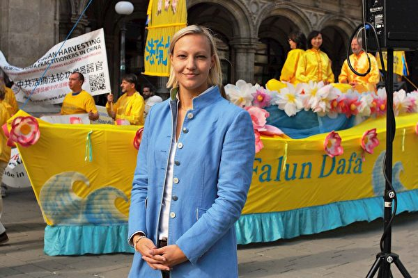
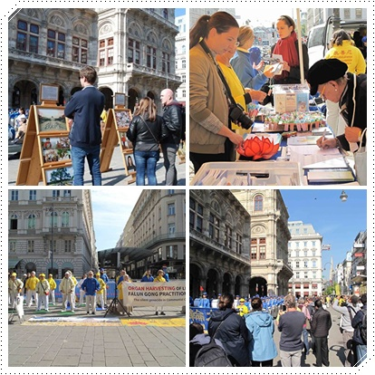
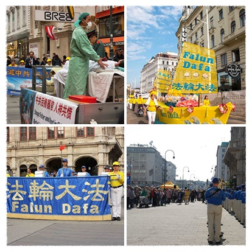

<a href =#1>维也纳法轮功游行集会真相震撼四方游客</b> 
<a href =#2>xxxx</b> 
<a href =#3>xxxx</b> 
<a href =#4>xxxx</b> 
<a href =#5>xxxx</b> 
<a href =#6>xxxx</b> 
<a href =#7>xxxx</b> 
<a href =#8>xxxx</b> 
<a href =#9>xxxx</b> 
<a name=top>

<a name=1>
<h1 align="center"><b>维也纳法轮功游行集会真相震撼四方游客</b></h1>

2018年10月1日，维也纳州议会议员亨格兰德女士（Caroline Hungerlaender）在集会发言，支持法轮功学员反迫害。（明慧网）

【大纪元2018年10月03日讯】2018年10月1日，欧洲法轮功学员在奥地利维也纳市中心举行游行集会，展示法轮功的美好，揭露中共对法轮功学员长达近20年的迫害。维也纳政要在集会上发言，支持法轮功学员。
明慧网报导，维也纳正值秋高气爽时节，在国立歌剧院和一旁的卡拉扬广场（Karajan platz）上游客络绎不绝。由法轮功学员组成的的天国乐团、白衣悼念组、黄衣功法演示组、真相点等在那儿举行了集会，吸引了众人的注目。

围观民众被集会的气势和天国乐团的音乐所吸引，纷纷拿出手机拍摄留念,以及民众签名支持法轮功反迫害。（明慧网）

<h5>政要支持反迫害</h5>
卡罗琳娜‧亨格兰德女士（Caroline Hungerlaender）是维也纳州议会议员、奥地利人民党党员。她曾阅读了许多关于法轮功的资料，10月1日当天，她到活动现场致辞，公开支持法轮功学员，祝愿他们获得成功。

游行开始前她向明慧记者表示：“在和他们（法轮功学员）的接触中，我感到他们非常积极正面，非常友善。我也感到到这里来公开正式地表达我对他们的支持非常重要。”

作为国际事务委员会成员之一，亨格兰德女士表示：“奥地利在和中国外交事务中，需要不时提及人权问题。在外交部人权部分占有很大的席位。在制止法轮功学员被迫害一事上，我们一直在做很大的努力。”

维也纳州议员菲卡‧安娜‧尔贝佳斯（Faika Anna El-Nagashi）因故未能参加集会。她来信表示：“我坚持谴责所有的人权迫害，并且在外交上明确表示我们的态度，这一点非常重要。”她说：“人权永远不能为经济合作和发展做牺牲。人不是商品。对这群人有系统地迫害仅仅是因为他们的信仰，是不能被接受的，是完全应该谴责的。”

她还写道：“在人权问题上我们需要明确表态，没有党派跟党派之间的间隔。在各合作项目对话和各种活动中为他们发声是我们的责任。”

<h5>华人被法轮功集会震撼</h5>
法轮功学员集会的阵容、气势和音乐，无不使围观者震撼，也吸引了中国人来了解真相。

一位五十多岁的华侨前来接真相资料。他来自浙江，在奥地利生活了三十多年，听说过法轮功，但从没见过这么多法轮功学员，颇感震撼。

他认为，能有这么多人支持、喜欢，“那法轮功一定是好的。”

一位华人法轮功学员向他介绍了法轮功，以及两天前一千多名法轮功聚集布拉格举办的大型活动。他很吃惊，表示要去找他所在地的炼功点。

学员跟他说到“天灭中共”“三退保平安”（退出中共党、团、队），他说他看过《九评共产党》，很清楚中共的邪恶本质。

2004年11月19日，大纪元发表了系列社论《九评共产党》，第一次全面、系统地揭示了中共的真实历史及其邪恶本性。

“共产党独裁，它来迫害你们，你们才起来反抗（反迫害）。它（中共）在中国压制13亿人，可你们已经在国际上站住了脚。”他说。

“《九评》讲得明明白白，没一句假话。”他继续说：“中共领导人，不管是谁，不走天理，都是走不下去的，而法轮功有这么多人走到一起一定是因为大家都支持。”

法轮功学员鼓励他顺天意“三退”，抹去曾经发过的把生命献给共产党的毒誓，希望他平平安安。他当即同意退出中共的团和队，并说：“我现在就是顺天意而行。”

2002年6月，在贵州省平塘县掌布乡发现了2.7亿岁的“藏字石”，上面清楚地写着“中国共产党亡”六个大字。这是天意昭然，中共恶贯满盈，天要灭它。只有退出，才有平安。

在集会现场，一对来自罗马尼亚的度假年轻人在天国乐团演奏时认真观看。他们几天前在布拉格第一次看到法轮功学员的活动，非常惊喜。

经济学者莎碧娜（Sabina）前天在布拉格看到法轮功游行，“晚上还有烛光（守夜反迫害）活动，非常感人。”她说：“今天又遇到了法轮功，我们意识到这是一个非常重大的事情，这让我知道了什么是法轮功。而且这音乐非常好、很有力，非常吸引我们。”

莎碧娜谈到两次遇到法轮功集会的体会，“这是需要让更多人知道的事情，人们要知道现在（中国）正在发生什么。”罗马尼亚在90年代不再是共产主义国家，她的父母告诉她过去的情况，“我不能相信这样的事（共产主义迫害）在2018年还在发生。”
<h5>游行队伍穿过世界音乐之都</h5>
集会过后，法轮功学员的队伍由天国乐团开道，穿过维也纳这座世界音乐之都。他们经过霍夫堡王宫、艺术史博物馆、最重要的政府机构以及游客最多的购物街。

游行过程中，活动主持人弗洛里安（Florian）站在模拟活摘罪行的车后面，一路拿着麦克向沿路民众用英德双语讲述真相，告诉人们法轮功教人“真、善、忍”并揭露中共的残酷迫害。

法轮功自1992年在中国传出后，有上亿人走入修炼，按照“真、善、忍”原则做好人，提高道德品质，获得健康的身体。至今法轮功已洪传至世界一百多个国家和地区，受到各民族的欢迎和赞赏。

然而，以江泽民集团为首的中共于1999年7月发动了对法轮功的血腥迫害，给中华民族带来深重灾难。

法轮功学员的游行队伍中,法轮功学员一路用英德双语讲述法轮功真相。（明慧网）

来自美国的琳（Lin）女士说，她刚刚在布拉格看到过法轮功大游行，曾听说过法轮功和中共对法轮功的迫害，但是第一次了解中共活摘的罪行，“难以置信”，“共产党干这些就是因为要实行专制，压制人”。

她觉得这样的活动非常好，是“在用很和平的、很好的方法让人知道这些”，并鼓励法轮功学员加油。
在繁华的商业大街，一位服装店主、德国人安格莉卡（Angelik）在街边默默观看。她表示赞同“真、善、忍”理念，必须制止中共罪行。

“我知道活摘罪行，这些都是真的，太糟糕了。”“应该有更大的活动，让更多人知道，停止罪恶是必要的”，她说自己会上网签名反迫害。

<heeo/img src="img/cats03.jpg" width=600>

舒伯特女士（上右）和戛沙女士（上左）在反对活摘的征签表上签字，为“制止迫害尽力”。莫尼卡（（Monika）（下） 看到德文的“真、善、忍”三字，二话不说在反对活摘的征签表上签字，因为“这三个字太好了。”（明慧网）

<a target="_blank" href=#top><h6 align="right">回上方</h6></a>
