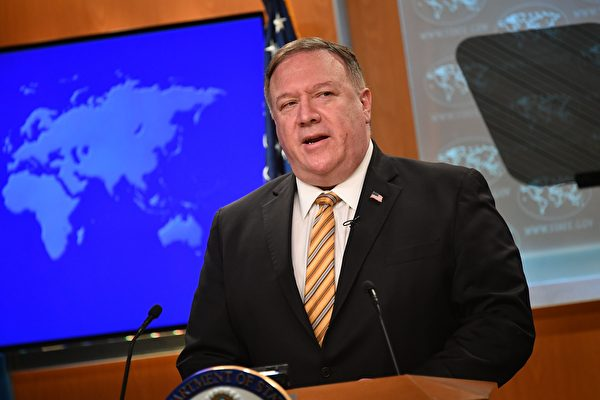
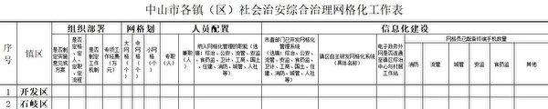
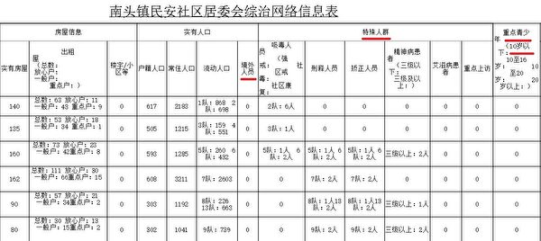
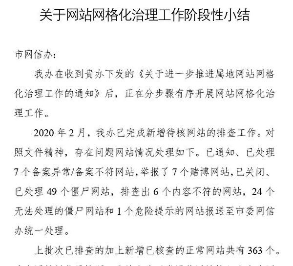
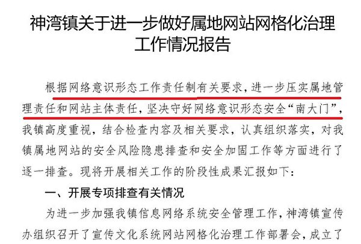
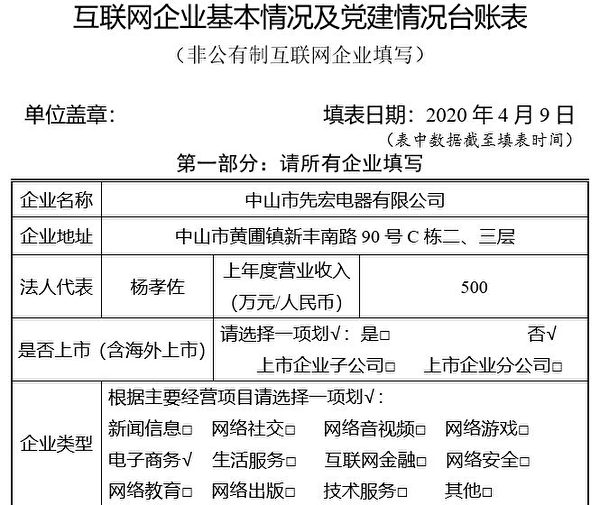
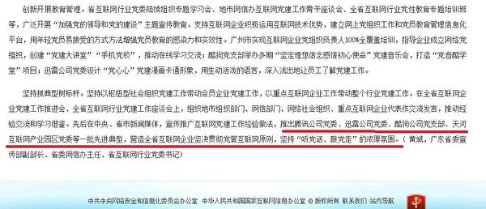

<h3><a target="_blank" href="https://bit.ly/3asSXIA">请多传破网软件，使更多的人了解真相从而得救，这是给自己积福德。 https://bit.ly/3asSXIA </h3></a>

   

     
<h3 align="center"><b>免翻视频  https://bit.ly/3ezRQKo  (请收藏网址 https://git.io/swspip)</b></h3> 

<h3 align="center"><b>复制网址到谷歌或火狐浏览器打开。若出现 “提示” ，請点击“继续”访问即可。</b></h3> 

<h3 align=center><a href="https://github.com/gav01/Heart/blob/master/news1.md">● 看更多大紀元時事 ●</a></h3>

<a href=https://git.io/souye><h6 align="right">回首頁</h6></a>

<a name=top>

<a href =#4>4.“国际强迫失踪日”的省思 
<a href =#3>3.蓬佩奥： 美将截断中共与伊朗的军火交易 
<a href =#2>2.【獨家】網絡也納入中共「網格化」管控 
<a href =#1>1.罪恶的“清零”行动 

<a name=4>
<h1 align="center"><b>“国际强迫失踪日”的省思</b></h1>

【明慧网二零二零年九月一日】八月三十日是“国际强迫失踪日”（International Day of the Disappeared），是为了被监禁、强迫失踪和绑架受害者所发起的节日。二零一零年底，联合国通过《保护所有人免遭强迫失踪国际公约》，用以保障强迫失踪受害者的司法权益和其家属的知情权利。

长期关注中国人权的读者，对于“被失踪”一词应当不陌生。遗憾的是，任何人在当今的中国大陆，都面临“被失踪”的威胁。例如武汉肺炎（即中共病毒，又名COVID-19）爆发后，不断有人因说出疫情真相，而被中共国保威胁或拘留；多名去现场采访报导的公民记者“被失踪”、遭破门而入的警察绑架。中共控制不住病毒，就控制传播真相的人。

美国福克斯新闻七月十日报导，香港公共卫生学院病毒学和免疫学专业医生闫丽梦受访表示，她冒险逃到美国的目的是告诉人们中共病毒的真相，她相信中共早在公布武汉肺炎之前就已经知道了病毒的存在，如果在中国讲出这些，她可能会被判刑入狱，更可能“被失踪并被谋杀”。

没有亲身经历中共迫害的人，很难想象中共有多么邪恶。中共一直以高压控制信息的流传，让人们生活在恐惧之中，无法也不敢听到真实的情况。去年香港“反送中”运动，从当地抗争者频频“被跳楼”、“被自杀”、“被失踪”，全世界都看清了中共的邪恶本质。“跳楼”、“自杀”、“失踪”怎么被冠上个“被”字呢？个中大有玄机，世人不可不辨。

谈到“被失踪”，特别引人关注的是，自一九九九年以来，中国市场上出现了巨量无法解释来源的器官源。也就是在这一年，中共开始大规模抓捕法轮功学员，江氏集团以洗脑、酷刑、虐杀等手段，逼迫法轮功学员放弃信仰“真善忍”。中国大陆的各监狱、劳教所普遍对法轮功学员进行抽血等异常体检，而学员人数却大量转移消失，即“被失踪”，早已启人疑窦。

二零零六年三月初，中共在苏家屯等至少三十六个集中营活体摘取法轮功学员器官的暴行被海外媒体曝光。虽然各种人权组织与许多国家的议会对此恶行予以谴责，然而国际社会的主流媒体却很少报导，因为中共迫害法轮功从初期的明目张胆，早已转为地下，秘密抓捕关押、非法开庭判刑与酷刑折磨，从表面上不太引人注目，间接迷惑了众多世人。

根据三位独立调查人士戴维·乔高（David Kilgour）、戴维·麦塔斯（David Matas）与伊森·葛特曼（Ethan Gutmann）在二零一六年六月公布的报告，中国每年的器官移植数量约在六至十万之间，远高于中共宣称的每年一万例，这意味着自中共迫害法轮功以来，中国有数量惊人的器官移植，从而导致大量法轮功学员失去生命。

以超速的人体器官为前提的移植旅游，近年来在中国竟成为带来巨大利润的新兴产业。在白色的病房内，隐藏着中共和江氏集团灭绝人性的罪恶。自今年元月起，“追查国际”（追查迫害法轮功国际组织，WOIPFG）持续对涉嫌活摘法轮功学员器官的中国大陆医护人员展开追踪电话调查。证据显示，在武汉肺炎全球疫情未缓的背景下，中共仍然继续活摘法轮功学员的人体器官，从未收敛歇手。各医院的移植业务没停，医生照常手术，包括武汉肺炎的定点医院——重庆医大附属医院，又如安徽医科大学一附院、广西人民医院等皆然。

中共动用整个国家之力来摘取民众身体上的器官，骇人听闻。在其“打死白打、打死算自杀”、“不查身源、直接火化”的迫害政策下，近年中共历来否认活摘器官的指控，声称采用新的自愿捐献制度，取缔了强迫从死囚犯身上摘取器官的做法，企图转移国际上对它活摘暴行的关注。

近年随着法轮功学员坚持不懈地揭露迫害真相，中共污蔑法轮功的弥天谎言逐一被拆穿，它刻意掩盖的满盈万恶也陆续被曝光。活摘法轮功学员器官的罪行，经由国际权威杂志《自然》温迪•罗杰斯（Wendy Rogers）教授与杰弗里·尼斯（Geoffrey Nice）律师、《BMC医学伦理》（BMC Medical Ethics）的学者专家相继认证，及“追查国际”的缜密取证，中共已无法掩盖它残酷迫害法轮功的事实。

中共残酷迫害法轮功、活摘学员器官是泯灭人性与良知的灾难，逾越人类的道德底线，被加拿大著名人权律师戴维·麦塔斯（David Matas）形容为“这个星球上从未有过的邪恶”，严重违反国际人权公约，多年来受到联合国、美国国会、欧洲议会高度关切。随着活摘器官的多项证据在全世界大量曝光，引起了各界的极大震动与关注，已有越来越多国家的国会议员相继对此人神共愤的罪行表示愤慨与谴责。

二零零五年纽约《时代周刊》一篇报导曾评论中共的劳教所是真正的“法外之地”，有着法律管辖不到的特权与黑暗。更多见不得人的滔天罪行，迄今仍隐藏在幽暗的各劳教所、看守所与监狱中。谎言与暴力总是形影不离，国内民众身陷中共铺天盖地撒下的谎言迷雾中，因此难以明了真相。

法轮功学员只是一群遵循“真善忍”的善良好人，不该无辜遭到中共铺天盖地的残酷迫害；人权是普世价值，当代文明社会里，不容许“被失踪”的疑案发生；活摘器官这惨绝人寰的恶行，只能藏身在极权的赤色铁幕里。曾经参与迫害的中共各级官员，包括“六一零办公室”、公安、国保等公检法人员，这批丧心病狂的加害者，未来都将在法律的审判与严惩中，偿还其不可饶恕的罪恶。

自古善恶有报是天理，作恶者都难逃宇宙的铁则制裁。至盼明年的“国际强迫失踪日”来临之前，这场残酷迫害已结束，红魔远离人间，世上不再有“被死亡”、“被失踪”等匪夷所思的怪象。

<a target="_blank" href=#top><h6 align="right">回上方</h6></a>

<a name=3>
<h1 align="center"><b>蓬佩奥： 美将截断中共与伊朗的军火交易</b></h1>

美国国务卿蓬佩奥 (MANDEL NGAN/POOL/AFP via Getty Images)

   
   【大纪元2020年09月01日讯】（大纪元记者徐简综合报导）美国国务卿蓬佩奥（Mike Pompeo）宣布，美国正在计划阻止中共和伊朗之间的武器贸易。

8月31日蓬佩奥接受了WMAL-FM电台Mornings On The Mall节目的采访，他就一系列问题，如中东、伊朗和中共关系、TikTok等进行了解答。

记者问到，伊朗与中共正在考虑建立25年的战略伙伴关系，这将如何改变世界的格局？

蓬佩奥回答，中共在伊朗有一些重要利益，“世界上两个最严重的基本人权侵犯者臭味相投，这个一点都不奇怪。”

“最想向伊朗出售武器的国家之一是中国（中共），它们将因此赚大钱。我坚信中共也将向伊朗购买一些系统。我们必须防止这种情况的发生。”他说。

蓬佩奥继续说，如果中共违反美国对伊朗的制裁，华盛顿将迫使它“承担责任”。“我们必须防止这种情况发生，世界应该知道，如果中国（中共）违反我们对伊朗实施的制裁，我们将追究所有人的责任。”

蓬佩奥表示，他希望尽快重新对伊朗实施国际制裁，这将“缩小中伊之间的交易空间”。

8月2日蓬佩奥在接受福克斯采访时也表示，中共与伊朗之间的4000亿美元、为期25年的贸易协议违反制裁令，美国将同样对“中国共产党及其企业和国有企业”实施制裁。

他说：“不尊重国内自由和煽动国外国家安全问题的政权希望联手不稀奇”，“美国将确保执行我们对伊朗的所有制裁规定，这些对中国共产党及其企业和国有企业都同样适用。”

蓬佩奥同时介绍说，美国将对10月到期的“联合全面行动计划”（JCPOA）核协议进行全面修订。

上个月蓬佩奥通知联合国，美国正在启动联合国安理会决议下的一项机制，将“快速恢复”始于2006年的对伊朗的制裁。那项决议将2015年的伊朗核协议纳入了国际法。

7月31日美国对伊朗实施了新的制裁措施，其中包括扩大对伊朗金属行业的制裁。#

<a target="_blank" href=#top><h6 align="right">回上方</h6></a>

<a name=2>
<h1 align="center"><b>【獨家】網絡也納入中共「網格化」管控</b></h1>

中共正在將網格化升級、延伸至網絡空間，試圖將中國社會從現實到虛擬空間，都打造為一個網格大監獄。圖為北京一處網吧內，警察正在巡邏。(AFP)

   
  【大紀元2020年09月01日訊】（大紀元記者何堅報導）大紀元在近期的系列報導中，揭露了中共假借防疫、加強「網格化」維穩的圖謀。最近獲得的內部文件爆出更多內幕，披露中共不僅在現實中將中國社會打造為一個網格化大監獄；甚至將「網格化」延伸至網絡空間，正在將企業網站和互聯網公司等網絡主體，也圈入中共的網格中。

大紀元最近獲得了中共廣東省中山市各鎮（區）的社會治安綜合治理（綜治）網格化文件，文件披露了，中共正在按地域、升級網格化治理的細節。

<b>網格化+重點人群=中共將所有中國人都圈進網格</b>

文件顯示，中山市政府將綜治網格化管控，按照地域劃分，由各鎮（區）來實施中共從上至下、嚴密部署的網格化維穩措施。

以中山市南頭鎮為例。南頭鎮在表格中註明，已經「制定實施意見或方案」，而且「定格、定人、定職、定流程」、「制定工作機制」，有20萬元專項工作經費；並將網格劃分為1個大網格、6個中網格、72個小網格，配備了專職兼職網格員168人，每個網格都有專人管控。

中共廣東省中山市南頭鎮的《社會治安綜合治理網格化工作表》截圖（大紀元）

上述區域和人員劃分只是網格化管理的基礎配置，中山市《網格化工作表》的「職能」和「信息化建設」細節顯示出，中共正在將網格化維穩模式，與政府的社會治理功能進行捆綁。

例如，中山市要求各鎮（區）上報「納入網格化管理的職能」，從「綜治、公安、流管、安監、食藥監、衛計、工商、國土、住建、消防、城管、人社等」中選填。

同時，中山市通過提升信息化水平，來加強網格化管控的力度。例如南頭鎮不僅自主研發了網格化系統「微治理平台」，還為消防、流管、城管和食藥監等部門的網格員總共配備了111支網格化終端手機。

南頭鎮的《綜治網絡信息表》則顯示，中山市將網格內的出租屋劃分為「放心戶」、「一般戶」和「重點戶」；對網格內的戶籍人口、常住人口和流動人口進行統計，甚至連境外人員的數量都調查得很清楚。

更為恐怖的是，中共專門設置了「特殊人群」或「重點人群」等「黑類」類別。

中共廣東省中山市南頭鎮民安社區居委會《綜治網絡信息表》截圖（大紀元）

吸毒人員、刑滿釋放、社區矯正、精神病患者、愛滋病患者和上訪人員，是目前中共設定的六類特殊人群。

而在50年前的「文革」和更早期，地主、富農、「反革命」、「壞分子」、右派、教師等群體，是當時的「黑類」特殊人群。「黑類」，是文革研究者生造出的名詞，用於形容遭中共打壓和迫害的「政治賤民階層」。

時政評論員李林一認為，這些表格泄露了中共把每個中國人都打上了各種標籤，分門別類的進行「網格化管理」。

值得一提的是，中共如今的網格化管控，不但對成年人貼標籤，就連青少年甚至10歲以下的兒童也不放過，專門設立了「重點青少年」類別，進行維穩管控。

李林一分析說，廣東中山市的內部文件表明，中共正在將社會治理的政府職能、整合進維穩導向的網格中，實質就是將中國社會打造成一個網格大監獄；而將中國人打上標籤，其實就是把所有的中國人都關進不同類別的網格中。

<b>維穩升級 企業網站也被中共圈入網格</b>

中共的「網格化」管理，是按照屬地原則，將城市或鄉村轄區劃分成為單元網格進行管控。

中山市各鎮區上報市網信辦的內部文件披露了中共利用屬地原則，正在將互聯網也納入網格化治理中。

2020年3月30日，中山市港口鎮宣傳辦在回復市網信辦的《關於網站網格化治理工作階段性小結》中稱，收到貴辦下發的《關於進一步推進屬地網站網格化治理工作的通知》後，正在分步驟有序開展網站網格化治理工作。

中山市港口鎮宣傳辦在回復市網信辦的《關於網站網格化治理工作階段性小結》截圖 （大紀元）

港口鎮宣傳辦披露說，2020年2月就「已完成新增待核網站的排查工作」，現在先讓手上已經掌握的企業統一接入至廣東省網絡安全應急響應平台，「下一步，再對照《港口屬地網站數據明細》表，篩選是否還有未接入平台的企業，敦促其儘快接入」。鎮宣傳辦還提供了鎮上企業申請加入廣東省網絡安全應急響應平台的截圖，作為接入佐證。

港口鎮宣傳辦在匯報中稱，「將嚴格貫徹落實網絡意識形態工作的要求」，「加強屬地網站管理和輿論監測」。

中山市神灣鎮宣傳辦上報市網信辦的《進一步做好屬地網站網格化治理工作情況報告》截圖 （大紀元）

神灣鎮宣傳辦在2019年10月10日的《進一步做好屬地網站網格化治理工作情況報告》中稱，堅決守好網絡意識形態安全「南大門」，「切實增強我鎮網站相關工作人員的政治敏銳性，嚴格執行《網絡安全法》有關規定」，並加強輿情監控。

神灣鎮宣傳辦匯報稱，排查出正常運營的網站有46個，問題網站有74個；已要求正常網站的企業負責人及網站管理員認真落實屬地網站網格化治理的要求，並對問題網站進行了關停查處。

評論員李林一認為，中共對網站加強屬地化和網格化管控，目的是為了所謂的網絡意識形態，就是想把現實中的網格化模式照搬到虛擬世界中，利用屬地原則來管住運營網站的人，從而將互聯網也圈入網格中。

<b>中共網格化排查網絡公司「堅決貫徹黨管互聯網」</b>

大紀元還獲得了中山市各鎮區上報市網信辦的，轄區內《互聯網企業基本情況及黨建情況台帳表》。

文件顯示出，今年4月起，中山市網信辦要求各鎮區對互聯網企業的經營和黨建情況進行摸底排查，非公有制互聯網企業需填報企業內的黨員數、高管中黨員數、中層管理者中黨員數，以及是否建立了黨組織和團組織等黨建信息。

中山市黃圃鎮上報市網信辦的，互聯網企業基本情況及黨建情況台帳表（中山市先宏電器有限公司）截圖 （大紀元）

以中山市先宏電器有限公司。該公司填報信息顯示，有員工25人，高管3人，中層管理者2人，黨員數為零，沒有黨組織或團組織。古鎮鎮上報給中山市網信辦的匯總表格顯示，該鎮11家民營互聯網企業共有422名員工，其中有19名黨員。

廣東省網信辦主任黃斌2020年4月16日在中共中央網信辦網站上刊發文章稱，在互聯網企業推進黨建，堅持「聽黨話、跟黨走」。 （網絡截圖）

中共對互聯網公司進行網格化排查的目的，曾被廣東省委宣傳部副部長、省委網信辦主任黃斌一語道破。

2020年4月黃斌在中共中央網信辦網站上刊發文章，點明了互聯網黨建的本質——就是要營造「互聯網企業堅決貫徹黨管互聯網原則」，堅持「聽黨話、跟黨走」。

中共2015年頒布《黨委（黨組）意識形態工作責任制實施辦法》，從黨規上構架起了網絡意識形態工作責任制度；並於2016年出台《網絡安全法》，要求任何個人和組織都必須履行中共定義的網絡安全保護義務，將網絡意識形態鬥爭「法律化」。

李林一表示，近年來，尤其是今年以來，透過貿易戰、香港民主運動和這次的疫情，全世界正在加速認清並拋棄中共；習近平卻逆反時代潮流，不但加強網絡意識形態鬥爭，甚至還想將網格化延伸至網絡空間，其實是想把互聯網牢牢抓在黨的手中，繼續保黨，實現他的「政治安全」。 

<a target="_blank" href=#top><h6 align="right">回上方</h6></a>

<a name=1>
<h1 align="center"><b>罪恶的“清零”行动</b></h1>

【明慧网二零二零年九月一日】近几个月，中共政法委在全国范围内对法轮功学员实施所谓“清零行动”，逼迫没有签字表态的法轮功学员放弃修炼。各地区的政法委、“六一零办公室”、小区与派出所人员为执行该指令，以“攻坚”、“送温暖”、“敲门”、“转化验收”、“给你除名”、“解除”、“调查签字”等各种名目，到法轮功学员家中，对他们“转化”（即放弃修炼），逼迫他们在“三书”（所谓放弃修炼的“保证书”、“悔过书”、“揭批书”）上签字。

前来骚扰的恶人，软硬兼施，起初说“签了字，就网上除名，不再找你了”。如果遭到拒绝就威胁说，“不签字，让你消失就消失”。再不签就绑架、送洗脑班、送看守所、判刑、不给养老金、子孙都受牵连等等；甚至找其子女代签或以家属当人质逼迫法轮功学员签字。

中共迫害法轮功已持续二十一年，残酷镇压从未曾歇手，至今仍不遗余力地对无辜民众加剧迫害。仅在今年上半年，中共警察在28个省、自治区、直辖市的238个城市抓捕、骚扰法轮功学员5313人，即使七、八旬的老人也未能幸免。其中39名法轮功学员遭中共迫害去世，132名学员被非法判刑，庭审100场，批捕66人，构陷到检察院、法院388人。

自一九九九年七月中共迫害法轮功以来，最邪恶的迫害政策就是对法轮功学员进行“转化工作”、“解脱工作”。政法委是中共控制公、检、法、司、国安工作的最高机构，在江泽民迫害法轮功后，成为主要指挥系统，负责中央“六一零”，“转化”成为此黑机关的首要任务。

迫害法轮功的元凶江泽民将辽宁沈阳的马三家教养院定为洗脑试点，作为样板向全国推广，使马三家成为迫害法轮功学员的魔窟。为达到“转化率”，中共在监狱、劳教所、看守所、洗脑班、转化班等使用上百种酷刑手段残酷折磨法轮功学员。如果前述各种手段都达不到“转化”的目的，就把法轮功学员移到所谓“关爱学校”，例如臭名昭著的贵州烂泥沟洗脑班，杨红艳等法轮功学员即在那里被迫害致死。

中共违法弄权，滥用法律，罗织罪名，构陷法轮功学员，非法庭审、关押与判刑，恶行昭彰。即使近年频频以“依法治国”、“依宪治国”与“打黑除恶”为幌子，仍继续执行江氏对法轮功学员“名誉上搞臭、肉体上消灭，经济上截断”的灭绝政策。

“六一零办公室”为了贯彻迫害，非法指挥全国公检法各级人员，恣意实施迫害。政法委、检察院、法院与公安同流合污，非法抓捕、起诉法轮功学员，把善良好人非法判刑送入监狱，至少有四千五百多名法轮功学员被迫害致死，造成无数的人间悲剧。

明慧网曾报导，有位律师在法庭上为法轮功学员做无罪辩护，被法官多次打断和阻止。律师反问：“哪条规定不可做无罪辩护？”法官说：“国务院。”律师依照《律师法》、《刑事诉讼法》的相关规定，驳斥了法官的无理要求。律师指出，当事人是因为信仰法轮功而被抓，没有触犯任何法律，所以我要做的是无罪辩护。法庭内鸦雀无声。

办理法轮功案件的中国各地法官也曾公开说，“对法轮功案，不讲法律”，“你跟我讲法律干什么，我跟你讲政治”。在非法庭审中，公检法人员最初是强词夺理，最后都被律师辩驳得语无伦次、语塞尴尬。律师经常问公检法：“法轮功学员到底触犯了那一条法律，造成了什么社会危害？”相关人员根本无法回答，难置一词。

依法论法，信仰自由、言论自由是中国《宪法》赋予公民的基本权利，《刑法》的原则是“法无明文不定罪”。法轮功学员既没有违法任何法律，警察抓捕法轮功学员就是非法的，属于黑帮绑架行为。

虽然法轮功在中国大陆遭中共长期迫害，但法轮功已弘传全球一百多个国家和地区，国际社会颁发给创始人李洪志先生和法轮功的各类褒奖，超过三千六百项，充分证明了这场迫害是完全错误的，且违反了普世价值。

今年七月，来自欧洲、北美、中东、亚太和拉丁美洲的30个国家606位官员，包括前任和现任部长、参议员、前任和现任国会议员与州议员，共同签署了一份联合声明，表达了对中国大陆法轮功学员持续遭受中共迫害的深切关注，赞扬法轮功学员二十一年来坚持和平理性、反抗中共暴政的精神，谴责中共侵犯人权，要求中共立即停止迫害。

随着真相广传，也有很多公检法人员明白真相后不愿再参与迫害，各地释放法轮功学员的案例越来越多。中共一些官员早已开始“留后路”并私下整理收集文件，以证明自己是被迫执行“六一零办公室”的迫害命令。各地众多的派出所、警察不受理或以各种理由，推脱对法轮功学员的举报并抵制迫害。

苍天为鉴，恶徒难逃。无论罪魁祸首或帮凶从犯，都躲不过人间法律的究责与天理的终极惩治。曾经参与迫害法轮功的中共公检法司各级人员，应尽速幡然悔悟、停止迫害，才能忏悔赎罪、将功补过，以免它日伏法，再多悔恨也无益。机缘稍纵即逝，切莫蹉跎贻误。

<a target="_blank" href=#top><h6 align="right">回上方</h6></a>
