

<h3><a target="_blank" href="https://bit.ly/3asSXIA">请多传破网软件，使更多的人了解真相从而得救，这是给自己积福德。 https://bit.ly/3asSXIA </h3></a>

   

     
<h3 align="center"><b>免翻视频  https://bit.ly/3ezRQKo  (请收藏网址 https://git.io/swspip)</b></h3> 

<h3 align="center"><b>复制网址到谷歌或火狐浏览器打开。若出现 “提示” ，請点击“继续”访问即可。</b></h3> 

<h3 align=center><a href="https://github.com/gav01/Heart/blob/master/news1.md">● 看更多大紀元時事 ●</a></h3>

<a href=https://git.io/souye><h6 align="right">回首頁</h6></a>

<a name=top>
 
 
 
 
 
 
 
<a href =#143>143.【十字路口】美中要全面脱钩 中国五大经济警讯  
<a href =#142>142.【一线采访】舒兰书记被免 更多疫情细节曝光 
<a href =#141>141.美国会大厦513飘扬国旗 致敬李洪志先生 
<a href =#140>140.李洪志师父一题词 历经风雨二十载 完好保存 
<a href =#139>139.【内幕】北京红二代谈特权和疫情冲击  
<a href =#138>138.中共两会看点：财政赤字是否会货币化 
<a href =#137>137.周晓辉：川普反击开弓 北京难承重负 
<a href =#136>136.软件工程师：修炼将我从压力中解脱 
<a href =#135>135.瑞典「清零」孔子学院引人思考 
<a href =#134>134.【最新疫情5·15】川普：可阻中共窃疫苗技术  
<a href =#133>133.【内幕】环时打脸刘鹤 党内分歧公开化 
<a href =#132>132.两会前港警狂抓人 专家解析香港乱局走势 
<a href =#131>131.【新闻看点】川普连出重拳 北京忙兑现贸协？ 
<a href =#130>130.大法日 大陆及海外律师学者祝福法轮功 

<a href="https://github.com/gav01/Heart/blob/master/ls-20-5-1.md"><b>往1~129新闻</b></a> 

<a name=143>
<h1 align="center"><b>【十字路口】美中要全面脱钩 中国五大经济警讯</b></h1>

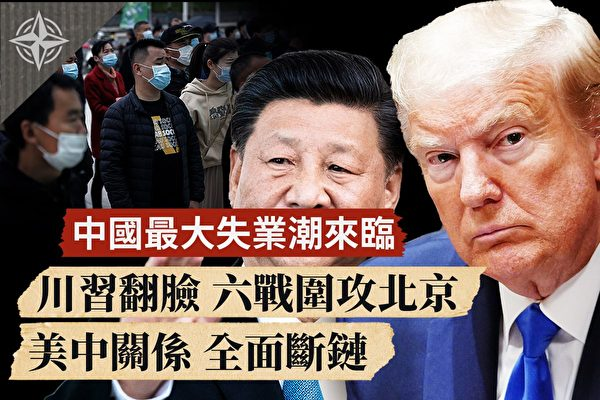

川习翻脸？美中要全面脱钩；制鞋龙头关厂，预示中国五大经济警讯。（大纪元合成图）

   
   【大纪元2020年05月15日讯】大家好，我是唐浩，今天都好吗？

今天要跟大家聊的话题，主要包括两大重点：

重点一：川普习近平翻脸？美中关系面临全面断链

重点二：全球制鞋龙头湖北关厂 中国恐现最大失业潮

节目最后，我们还有重要的幕后花絮，还请大家别错过了。

好，马上来看第一个重点。

<b>重点一：川普习近平翻脸？美中关系面临全面断链</b>

美国总统川普最近因为疫情与贸易协议问题，对中共的态度越来越强硬。

5月3日，川普批评中共让病毒扩散到境外，并且警告中共，如果不落实2000亿美元的采购协议，美方就会终止协议，对中国商品加征高关税。

8日，川普再次表态，中共对肺炎疫情的隐瞒，对美中双方在年初签订的贸易协议起到了负面作用。

13日，川普在推特上强硬发话，批评中共隐匿瘟疫疫情，导致美国的伤亡损失严重，“即便签订100个贸易协议都无法弥补，无法挽回那些失去的无辜生命！”

到了14日，川普接受媒体专访，谈到美中双边关系时，他的发言更加强硬，“我们有很多事可以做，我们也可以切断（美中）所有关系。”

川普说，“如果（美中）关系全面脱钩，你可以省下5000亿美元。”川普的意思是，可以省下每年对中国的贸易赤字大约5000亿美元。

不仅如此，川普也透露他对中共与习近平的不满。他说，“我对中方感到非常失望。”“现在我不想跟他说话，我不想跟他说话。”

好，我们可以发现，川普对中共的态度是越来越强硬，而川普与习近平的个人关系也越来越低潮，美中关系的未来也越来越紧绷。

那么，美中关系是否可能全面断链、全面脱钩呢？不能排除这个可能，但是并不容易。

毕竟在全球化的格局底下，美中双方的生产、贸易、经济等关系相当紧密，彼此的经济依存度还很高。比方说，美国企业的许多生产线还留在中国，或者上游原材料或零部件来源还来自中国，如果美中双方真要全面断绝往来，势必还需要一段时间。

但是，这个“美中脱钩”的大趋势，确实已经开始启动了。不但贸易战让美国企业与其它外企加速撤离中国，美国与日本政府也宣示，将出钱帮助在华企业搬家回国。

此外，川普政府还准备了至少六项战术，正在同步围攻北京当局，逐步推进美中脱钩的战略目标。

<b>战术一：疫情战</b>

近日来，川普不但强调这次疫情比珍珠港事变、911事件还要严重，美方要对中共追究隐匿疫情的责任，还陆续公布了多项调查资料，揭露中共在瞒骗国际社会的同时，还偷偷掠夺、囤积防疫物资。

五眼联盟与美方也相继证实，发现中共在疫情发生初期，就下令销毁相关证据，掩盖疫情。

美国国务卿蓬佩奥也公开表示，已经掌握证据，病毒是从武汉实验室外流，要求全面调查病毒来源。澳洲、新西兰等国家也纷纷跟进，要求对中共进行调查。

而美国密苏里州、密西西比州等州政府，也相继起诉中共，要向中共追讨巨额赔偿。

换句话说，从美国联邦中央到地方政府，都对中共发动疫情究责战火，而国际社会也在美国的领头下，陆续跟进。美方不但对中共展开疫情反击战，也同时埋下美方与中共脱钩的种子。

<b>战术二：经济贸易战</b>

美中虽然在年初签了第一阶段贸易协议，但疫情发生后，中共很可能会以疫情为理由，拒绝履行协议。川普也意识到这一点，因此提前警告中共，如果不履行协议，就等着吃高关税。

事实上，从美中贸易战开打以来，美中双边的经贸关系确实明显下降。美国经济咨询公司荣鼎集团（Rhodium Group）日前发表报告指出，美中两国之间的双向投资下降到了七年来的最低水平。

另外，美国“联邦退休储蓄投资委员会”（FRTIB）也已经宣布，将“无限期”推迟投资中国企业资产。也就是说，美国联邦雇员的退休基金将不再投资中国资产，切断美国资金对中方的输血供应。

美方还要求美国企业的供应链，尽快撤出中国，回到美国设厂生产。就连全球最大半导体代工企业台湾积体电路公司，也准备前往美国投资生产。

简单说，美方的一连串动作，正在逐步切断中国的外来资金链，以及切断美方对中国红色供应链的依赖。

<b>战术三：科技战</b>

华为可以说是中共旗下最重要的高科技企业，也是中共向全球布局5G网络科技战的头号先锋。

但是，川普在去年5月签署命令，限制美国企业使用华为、中兴等企业的产品，同时也限制美国企业对华为、中兴提供技术资源，避免对国家安全带来威胁。5月13日，川普再次将这项限制令延长一年。

不但如此，美国商务部日前也宣布，美国企业以及使用美国芯片制造设备的外国企业，在销售产品到中国前，需获得美方同意，避免美国技术流入中共军方手中，造成安全威胁。

美方频频在科技产业上出招，可以看出美方严控技术输出，对中共实施科技战。

特别是现在台积电决定前往美国投资生产，显然是这场科技战促使台积电不得不“选边站”，选择向庞大的美国市场靠拢。如果，将来台积电的芯片无法卖给华为等中国企业，那势必会对中共的科技产业转型计划带来严重冲击。

<b>战术四：媒体战</b>

新闻媒体，也是美中重要的角力战场。特别是中共通过媒体大外宣，在境外发动攻击美国、转移病毒来源的宣传战，宣称病毒来自美国，让美国社会深表不满。

美方在2月宣布，将中共五家媒体列入“外国使团”，也就是把这些媒体认定是中共政府的一部分，不是正常的商业媒体，并且限制这些中共党媒在美国的员工人数。

中共也随即展开报复，宣布要驱逐《纽约时报》、《华尔街日报》和《华盛顿邮报》的记者。

稍后，美方又进一步反击，对中共媒体记者收紧签证管制，一次只能获得90天的媒体工作签证，再次让中共当局气得跳脚。

为什么中共这么在意外宣媒体被限制人数与签证？因为，中共的媒体记者，本质上都担负着对外搜集情报的任务，说白一点，中共的党媒记者相当于中共的特务。

美方也知道这一点，所以决定实施媒体战，限制中共对美国的宣传攻击与社会渗透。

<b>战术五：军事战</b>

美中双方目前并没有真正发生军事冲突，但是双方的军事叫阵与宣传战，却打得相当火热，主要集中在南海以及台湾海峡。

从今年台湾举行总统大选以后，中共便频频派出军机与军舰，在台湾周边航行，进行武力恐吓，甚至还准备举行夺取台湾东沙岛的登陆演习。

但美方也几乎如影随形，只要中共军方一有动作，美方随即也出动军机或军舰高调行动，向中共叫阵，警告中共不要轻易动武。

特别是中共军方5月14日在唐山与渤海海域展开实弹演习，当天美军太平洋舰队的驱逐舰就通过台湾海峡，美军还主动在脸书上公布相关照片，对中共叫阵警戒的意味相当浓厚。

美中双方目前在军事上虽然激烈叫阵，你来我往，但双方目前还算克制。美国空军近期不但频频秀出“大象漫步”的照片来展示军威，海军的“双航母”也重返亚太海域，准备应对中共军力的对外扩张。

<b>战术六：国际政治战</b>

世界卫生组织被认为是帮助中共掩盖疫情的主力帮凶，特别是谭德塞与多位高层官员袒护中共的偏颇言行，引发美方与各国的不满与批评。

川普日前正式下令，停止资助世卫，并且批评世卫是中共的傀儡。川普的动作不但是要施压世卫、反击谭德塞，更重要的是，美方要对中共直接或间接控制的国际组织进行反击或清洗，逐步切断中共通过这些国际组织来操控世界秩序，窃取国际资源。

另一个被中共渗透严重、为所欲为的国际组织是世界贸易组织（WTO）。中共加入世贸后，利用世贸的优惠待遇快速增长自己的经济实力，但却对外实施贸易保护与不公平竞争，造成美国对中国的巨大贸易逆差。

川普也多次批评世贸，中国已经是世界第二大经济体，不该让中共还用“发展中国家”的名义在世贸里享受不公平的特殊优惠。

现在，在美国的长期抗议下，世贸秘书长宣布将提前在8月底正式离职。但是中共方面也强调，不会放弃“发展中国家”地位。

世卫与世贸会不会依照美方的意愿进行改革，甩脱中共的主导，我们还不得而知。但可以肯定的是，美中双方在各个国际组织里的角力战，势必还会持续上演，烽火四起。

<b>小结</b>

好，看到这里，这六项战术，可以说是目前美方对中共发动的“脱钩战略”与“孤立战略”的实践。

虽然美中双方要在短期内全面脱钩并不容易，但是如果这六项战术持续推进，同步围攻北京，很有可能会让美中关系回到当年美国与苏联的冷战关系一样。

到时候，不但美中双方将在军事与外交领域针锋相对，中共还将很快遭遇资金断链、经济重创、产业外移、失业暴增的危机；加上疫情的再度复发，很可能会进一步对中共政权构成生存威胁。

<b>重点二：全球制鞋龙头湖北关厂 中国恐现最大失业潮</b>

讲到NIKE和Adidas球鞋，大家可能都知道。但是你可能不知道，NIKE和Adidas的球鞋，绝大多数都是由台湾的宝成工业代工生产的。

宝成工业是全球最大的运动鞋与休闲鞋制造商，每年产量超过3亿双，在中国湖北、江西、广东等地都设有工厂。

然而，宝成却在13日宣布关闭湖北工厂，裁员四千多名员工，引发业界震惊。

不仅如此，长期为NIKE与Converse代工起家的全球第二大鞋厂“宏福”，也惊传裁员3万人。这一连串消息，其实对中国经济带来严重的警讯。

<b>警讯一：海外订单锐减 复工难复产</b>

中国经济受到美中贸易战与肺炎疫情的接连打击，已经深受重创，虽然北京当局大力推动复工，想要挽救经济，但是恐怕无法如愿。

因为海外市场仍然被疫情笼罩，人们不敢外出，市场消费低迷，也导致外国企业纷纷缩减订单或者不敢下单。也从而让中国企业复工但却不能复产，许多公司也只好纷纷停工放假，或者裁员倒闭。

<b>警讯二：企业撤离中国 转移产能</b>

从贸易战开打以来，许多企业就陆续撤离中国市场，或者转移部分产能到海外，避免被美国征收高关税。

加上这次疫情的高度不透明，让更多企业发现中国环境充满太多的风险与不确定性，特别是许多风险都来自于中共的不透明极权体制，因此促使更多企业加速裁员或关闭中国工厂，逐步向海外转移，搬到其它自由度与透明度较高的国家。

再加上，中国人力工资逐年上涨，已经不再适合传统制造业或劳力密集产业的大量生产，所以许多外资纷纷撤离，转移产能，已经成为不可逆的市场趋势。

<b>警讯三：贸易战可能重起 厂商面临高关税压力</b>

许多全球数一数二的代工大厂都位于中国，包括富士康、宝成、宏福等等，但是他们的产品主要市场，几乎都是美国。

现在，美中关系因为疫情问题陷入僵局，再加上中方能否落实贸易协议还有疑虑，而川普也已经表明，随时可能终止协议，恢复高关税，等于是贸易战重新开打。

关税的压力，也促使许多企业不得不做长远考虑，搬离中国，避免未来贸易战又随时重演。

<b>警讯四：全球经济悲观 消费市场低迷</b>

宝成与宏福代工生产的品牌，都是全球销售最杰出的运动品牌，消费者也主要是中产阶级以上的族群。

然而，现在传出，宝成的知名客户的第2季度订单已经大减四到五成，而且第三季度的预估订单“还不明朗”。

但是往年，国际大客户的订单通常是在前一季度就可以拿到预估单，今年的情况，反映出今年的经济局势相当悲观而且充满不确定，让这些国际知名品牌也不敢轻易预测下单量。

<b>警讯五：中国恐掀严重失业潮</b>

当国际市场因为疫情而陷入低迷，全球经济也悲观难以预测，那么身为世界工厂的中国制造业，势必将受到剧烈冲击，不但将出现大量的企业倒闭与裁员潮，更会让中国出现巨大的失业潮。

深圳的富士康工厂，日前就传出已经要求员工放假四个月。

日前，中泰证券的首席分析师李迅雷的团队曾发表报告指出，今年新增的失业人数可能超过7000万人，中国的真实失业率可能超过20%，引发海内外震惊。

结果，这篇报告马上被当局“关切”，迅速撤下。而李迅雷本人也随即被免去中泰证券研究所所长的职位。官方异常的反应举动，也让人们认为，这份失业报告可能很贴近真实的失业情况，所以才被屏蔽。

无独有偶，河北媒体人范军日前向海外媒体表示，根据他对中共官方的采访经验，现在的实际失业率应该超过20%，而且这个数据还无法反映中国的实际失业人口总数。

如果再把失去土地的农民、啃老族等等列入计算，实际失业率恐怕超过30%。

换句话说，接下来中国很可能将面临一场严重的失业大潮，甚至是“改革开放”以来最大的失业潮。

特别是北京领导人最近喊的“六稳”或“六保”，都是把“稳就业”、“保就业”放在了第一位，也从另一个角度印证了，失业问题是目前中共最担忧、最害怕的经济问题与政权威胁。

好，我们再重复一次，宝成与宏福企业关闭工厂与裁员的消息，对中国经济带来五项重大警讯：

警讯一：海外订单锐减 复工难复产

警讯二：企业撤离中国 转移产能

警讯三：贸易战可能重起 厂商面临高关税压力

警讯四：全球经济悲观 消费市场低迷

警讯五：中国恐掀严重失业潮

大纪元《世界十字路口》制作组

<a target="_blank" href=#top><h6 align="right">回上方</h6></a>

<a name=142>
<h1 align="center"><b>【一线采访】舒兰书记被免 更多疫情细节曝光</b></h1>

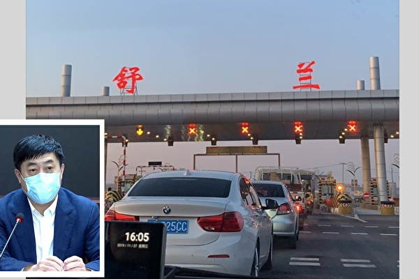

中共病毒在吉林、辽宁省蔓延，舒兰市委书记李鹏飞15日深夜被免职。（网路图片）

   
【大纪元2020年05月16日讯】（大纪元记者韩露、林岑心采访报导）吉林舒兰洗衣工中共肺炎传染链持续扩大，大纪元获得的可靠消息指，这次传染链涉及多个事业单位，包括公安局、市政府、学校，令当局十分紧张，舒兰市委书记李鹏飞已于15日深夜被免职。

根据官方公布的消息，截至15日，舒兰市公安局洗衣工传染链已传28人，舒兰市成为高风险地区。丰满区、船营区为中风险地区，吉林市城区比照高风险地区实行严格管控措施。同时，疫情跨省传播至沈阳，沈阳市苏家屯区日前也调整为中风险。

据网友爆料，“公安局这几天没人上班，都被隔离，只有派出所几名警察值班。”大纪元此前也报导“吉林爆疫情 舒兰公安局关门”，大纪元最新获知的消息是，舒兰市公安局至少有4名人员列入确诊病例，其余尚在筛检中，官方并未对外公布结果。

<b>公安局俄罗斯接人 洗衣工疑清洗衣物感染</b>

大纪元独家获悉，舒兰市公安局这4名确诊人员，分别为：洗衣工的先生（舒兰公安局警务保障室司机）、洗衣工的三姐夫（舒兰公安局指挥中心6楼接警员）、洗衣工的先生密切接触者（舒兰公安局机要室警察），以及另一位密接者29岁郝某（舒兰公安局辅警）。（大纪元获悉完整名单，但因隐私关系，暂不公布人名。）

记者致电吉林市公安局，一位警察称，舒兰这起疫情和公安局是和日前到绥芬河接从俄罗斯回来的人员有关，他说：“舒兰（疫情）是从俄罗斯回来的，公安局有公安干警去接的，回来后洗衣服，（病毒）可能在衣服上，传给洗衣工了。”

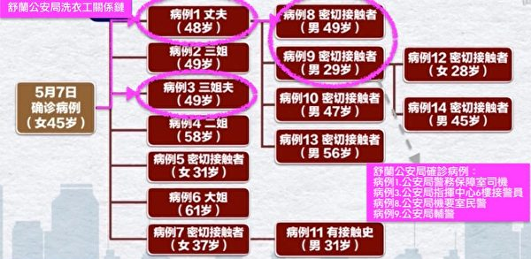

舒兰公安局洗衣工传染链。标记处为公安局人员。（网友提供）

记者又致电舒兰公安局一位确诊病例家属了解情况，她说：“你看她（洗衣工）自己本人都说不清楚这东西。”这名家属说，她和先生原本挺小心的，“我们接触的都是比较放心的，都没出过本市的，都没有从俄罗斯回来的，或韩国回来的。你说还是确诊了，我们都觉得挺意外的。”

这名家属表示，目前确诊人员皆属轻症，身体无大恙，但是对于病毒的传播及随后的封城影响感到恐惧，“身体也好一点，也不发烧，也不咳嗽，就这段时间，有些人隔离了，有点情绪不好、上火了，大伙都劝他。”

<b>传染链涉多部门 跨区传染至吉林市丰满区</b>

由于这次传染链涉及多个事业单位，令当局十分紧张。据可靠消息指，除了舒兰市公安局4人外，舒兰市人民医院医保科收纳1人、高中教师1人、舒兰市政府行政科员1人皆已确诊。

此外，还涉及公共场所清华浴池员工2人，大纪元报导（【一线采访】舒兰浴池爆确诊 当局恐慌）披露，舒兰市防控中心已于14日急寻从4月1日起曾至清华浴池的民众。

舒兰市公安局洗衣工这条传染链，已透过29岁的公安局辅警郝某五一假期返家（吉林市丰满区红旗街馨城雅居），传给了吉林市丰满区多位家属，包括妻子、叔叔、婶婶、朋友等。

记者致电居住于丰满区四合田园小区市民李先生，他表示，“他（郝某，公安局辅警）跟一号病例有接触，他是公安局开车的（指警务保障室司机、洗衣工先生），（郝某）回来就跟亲属朋友聚餐了好几次，吉林市丰满区这些确诊的都跟他有直接关系，都是跟他吃过饭的。”

李先生说，“都是他的亲戚朋友，而且是直接接触，吃过饭，打过麻将。”截止15日，郝某亲属及密接者在丰满区已有9人感染，船营区1人感染。

<b>跨省传播 至沈阳浑南区及苏家屯区</b>

舒兰疫情已跨省扩散至沈阳。郝某的叔叔（45岁）被感染后，传给了儿子、郝某23岁的堂弟郝某某。堂弟5月5日假期结束后，搭高铁返回沈阳，回到单位宿舍（浑南区大羊安村777号），该地址在地图上定位显示为沈阳动车段的宿舍。

有消息说，郝某某是沈阳动车段做地勤检修的，密接面非常广泛。

官方表示，截至15日，已对与郝某某密切接触者和间接接触者1093人进行了集中或居家隔离观察，对其他风险人群6434人实施了集中或居家隔离观察。目前已知感染其室友孙某及同事吕某2人。

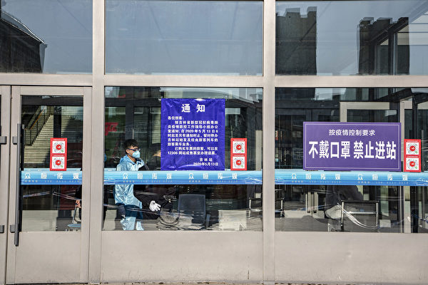

消息指，郝某于沈阳动车段做地勤检修，其活动轨迹、宿舍及工作场所排查范围广泛。包含吉林火车、高铁等交通已停运。(STR/AFP via Getty Images)

由于郝某某行动范围主要涉及苏家屯区，苏家屯区疫情日前已调高为为中风险地区。其室友孙某8日曾至苏家屯中心医院就诊，该院告知不提供筛查，之后再前往沈阳市第六人民医院就诊。

记者致电苏家屯中心医院，该院服务电话表示，现在医院仍可正常接诊，被问到该院是否还有接触过其他确诊病例？服务人员说，“现在都不好说。除了他，不保证别的人没来过。”

<b>疫情导致80,00人隔离 市委书记遭免职</b>

受舒兰疫情扩散影响，吉林、辽宁两省已有超过80,00人被隔离。《吉林日报》于15日深夜报导，李鹏飞被免去舒兰市委书记职务，由中共吉林市副市长张静辉兼任。

时事评论员李林一表示，这次舒兰市的人事任免有不符合惯例之处，副市长怎么会兼任市委书记，一般都是市长递补。他认为，有一种可能是舒兰市长未来也可能会遭撤。但若现在两个都免掉，整个防疫队伍就群龙无首了，所以暂时留一个。

<a target="_blank" href=#top><h6 align="right">回上方</h6></a>

<a name=141>
<h1 align="center"><b>美国会大厦513飘扬国旗 致敬李洪志先生</b></h1>

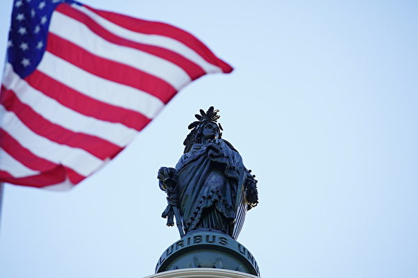

2020年5月13日世界法轮大法日，飘扬在美国国会大厦上的国旗向法轮功创始人李洪志先生致敬。（York Du／大纪元）

   
【大纪元2020年05月15日讯】（大纪元华盛顿DC记者站报导）应美国国会议员布莱恩·菲茨帕特里克（Brian Fitzpatrick）的要求，5月13日在美国国会大厦上空飘扬的二面美国国旗，被赠予大费城法轮大法学会，以此褒奖法轮功创始人李洪志先生和纪念2020年5月13日世界法轮大法日，向李洪志先生致敬。

此时正值美国各地法轮功学员庆祝5.13法轮大法日与法轮大法洪传28年。   
   
   
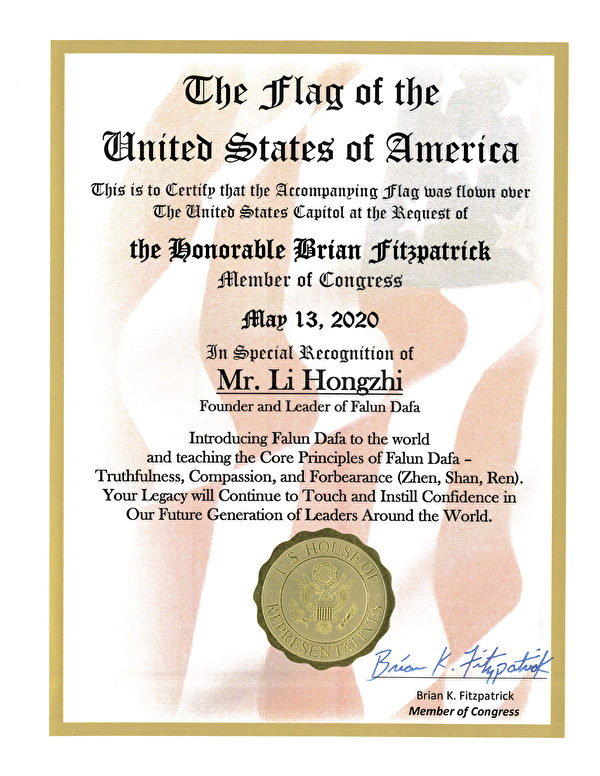

2020年5月13日，美国国会升旗褒奖法轮大法，表彰和感谢创始人李洪志先生。（大纪元）

   
   给予李洪志先生的褒奖写道，“兹证明，应国会议员布莱恩·菲茨帕特里克（Brian Fitzpatrick）的要求，这面美国国旗于2020年5月13日，在美国国会大厦上空飘扬过， 以特别表彰法轮大法创始人李洪志先生将法轮大法洪传世界，并传播法轮大法的核心原则——真、善、忍。您的教导，将继续激励世界未来的领导人，给他们带来信心。”
   
   
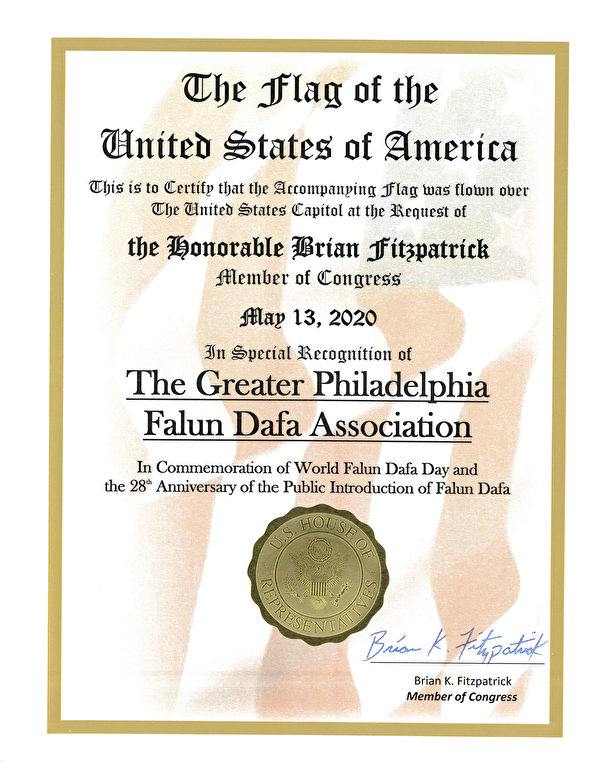

2020年5月13日，美国国会议员褒奖法轮大法。（大纪元）

   
  给予大费城法轮大法学会的褒奖写道，“兹证明，应国会议员布莱恩·菲茨帕特里克（Brian Fitzpatrick）的要求， 这面美国国旗于2020年5月13日在美国国会大厦上空飘扬过，以特别表彰大费城法轮大法学会，纪念世界法轮大法日和法轮大法洪传28周年。” 
  
 
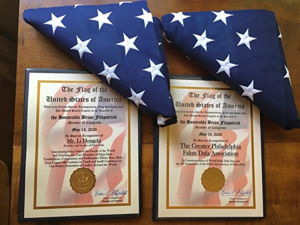

XXX布莱恩·菲茨派翠克（Brian Fitzpatrick）议员办公室将两面国旗和褒奖证书赠送给费城法轮大法学会。（法轮功学员提供）

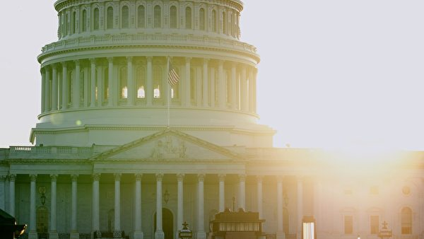

2020年5月13日世界法轮大法日，飘扬在美国国会大厦上空的美国国旗。（York Du／大纪元）

   
   
將在美國國會大廈上飄揚過的國旗，贈予個人或團體，是一種榮譽。贈予每一面國旗的同時，還會頒發一份證書。

法輪大法，是由李洪志先生於一九九二年五月傳出的佛家上乘修煉大法，以宇宙最高特性「真善忍」為根本指導，按照宇宙演化原理而修煉。至今法輪大法已傳至全球一百二十多個國家和地區，上億人通過修煉身心受益；法輪大法已收到數千份各國政府及政要的褒獎及賀信。#

<a target="_blank" href=#top><h6 align="right">回上方</h6></a>

<a name=140>
<h1 align="center"><b>李洪志师父一题词 历经风雨二十载 完好保存</b></h1>

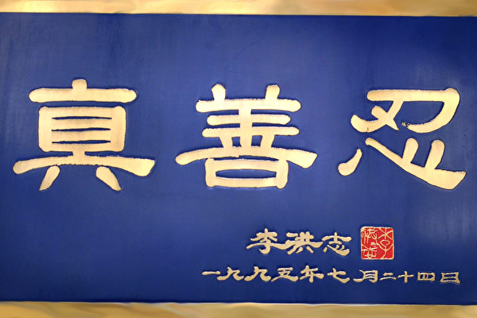

这是一方收藏在中国大陆的蓝底金字匾额，上面是法轮功创始人李洪志师父于1995年7月24日写下的题词：真、善、忍。（明慧网）

   
   【大纪元2020年05月14日讯】这是一方收藏在中国大陆的蓝底金字匾额，上面有法轮功创始人李洪志师父于1995年7月24日写下的题词。

2020年5月13日，第21届世界法轮大法日，海外明慧网刊登了这幅由大陆法轮功学员从中国发来的，写有“真、善、忍”的匾额的照片。

报导说，这位大陆法轮功学员已记不清是1995年底还是1996年初，北京法轮功学员把这幅师父当年的亲笔题词，经过悉心地镶框，带到了他的住地。

从1999年至今21年，中共对法轮功残酷打压，无数法轮功书籍，相关字画和资料被查收焚毁，在风风雨雨中，这幅在法轮功学员心目中珍贵无比的题词被大陆学员完好无损地收藏着。

这位大陆法轮功学员希望借5·13世界法轮大法日将这块匾展现出来，以鼓励他们的同修，并展示给世人。

“真、善、忍”是法轮功的核心修炼原则，也是宇宙最高特性，他建立于中华五千年修炼文化的基础之上、博大精深。

法轮功要求修炼者从好人做起，按照“真、善、忍”原则不断提升道德水准，加上五套缓慢优美的功法动作，可以使人们获得心灵净化和身体健康，还可以逐渐开智开慧，达到洞悉人生和宇宙奥秘的自在境界。

<b>慈悲的感召力</b>

1992年的一天，一个来自中国东北、高高的中年人和他的几个学生，来到北京参加东方健康博览会。他们在拥挤的北京火车站度过了最初的几个夜晚，在那里吃东西并夜宿在长凳上。他，就是法轮功创始人——李洪志先生。在他们到达北京时，没有人知道他们是谁。然而，法轮功在1992年12月的几日内便轰动了北京。

在北京东方健康博览会上，李洪志大师以及他的学生们用超自然的能力治愈了参加博览会的人的疾病。“法轮功神啦！”消息在参观的人群中不胫而走。法轮功赢得了褒奖，李洪志老师被授予“最受欢迎的气功师”称号。

1993年，李洪志大师应邀再次参加东方健康博览会，10天时间里，治病几千人次，近期有效率达95%以上。大会授予李先生博览会唯一的最高奖励——“边缘科学进步奖”。

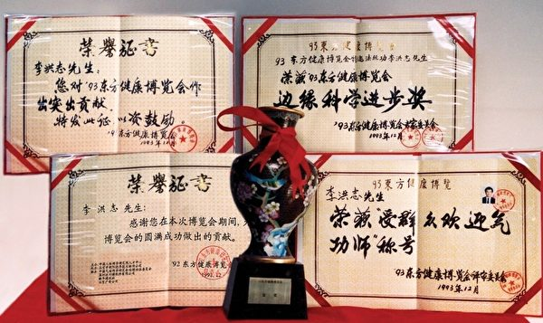

1993年北京东方健康博览会，李洪志先生获得最高奖“边缘科学进步奖”等（明慧网）

   
 一位大陆学者曾说：“在这红尘乱世，能让一亿人洗心革面、修心向善，能让千千万万的普通人放下生死，坚持真理，这样的伟绩人类从未有过。当初耶稣受难时，十二门徒中没人敢承认自己是耶稣的弟子，而如今李大师受诬陷，数百万法轮功学员冒死到天安门请愿，呼吁还师父清白，由此可见李大师的感召力亘古以来绝无仅有。”

在海外，人们都尊称法轮功创始人李洪志先生为“李洪志大师”、“李老师”、“Master Li”。目前全球一百多个国家和地区不同族裔的民众都在学炼法轮功，李洪志先生的著作《转法轮》已被翻译成四十多种文字，深受各族裔人士的喜爱。各国政府和国际机构授予法轮功的褒奖高达数千份，人们由衷感谢法轮功给世界带来“真、善、忍”的光芒。

2007年“在世天才百强榜”排名中，法轮功创始人李洪志大师名列第12位，位居华人榜首，是当今全球影响力最大的华人。

每当5月13日的世界法轮大法日，各地的人们都会撰文回忆当年他们与李洪志大师相处的幸福时光。从点点滴滴的小故事中，人们也许能对李大师有个初步了解，但要真正理解法轮功、了解李洪志大师，阅读《转法轮》是最好的途径。  

<a target="_blank" href=#top><h6 align="right">回上方</h6></a>

<a name=139>
<h1 align="center"><b>【内幕】北京红二代谈特权和疫情冲击</b></h1>

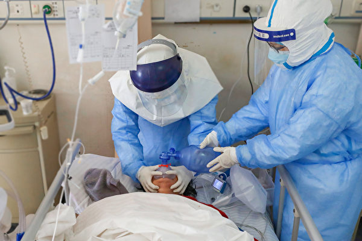

中共肺炎（武汉肺炎）患者出现隐形缺氧，血氧在无明显症状的情况下降到危险值。图为医生治疗病患。(STR/AFP via Getty Images)

【大纪元2020年05月14日讯】（编者按：肖凡（化名），红二代，五十多岁，北京一家公司的老板。这是他的口述整理。虽然他和父母受益于中共，但他认为，在这个历史的拐点，“你要欣然接受它的灭亡”。）

<b>我们与老百姓的生活，确实差别很大</b>

我从小就有优越感，因为觉得我爸是解放军，参加过革命，江山是我们打下来的。

高干子女都吃香的喝辣的，67年，我3岁的时候进高干的幼儿园时，我们阿姨都是穿军装，我们每天早饭就是牛奶了，我还记得那时候小孩都是一碗一碗地zhōu到地上，农村是想像不到的。

军队里头有明文文件，少将以上干部子女，犯多大的事也不允许逮捕，他们不受法律约束，所以他们想干嘛干嘛。所以才有的联动红卫兵，文革时真正在北京打死人的，给人剃阴阳头的全是联动，全是高干子弟，他们天马行空。

北海旁边有个叫三座门的地方，是高级干部的会所，我们叫总参管理局服务处。里面什么娱乐都有，每周末将军元帅们就去玩，一车一车的文工团女孩都被拉去跳舞什么的。

小时候我觉得我们当家作主了，全体人民就像我这样过着幸福生活，后来一瞅还有那么多穷人。那会儿北京胡同的垃圾堆，天天都有小孩和小脚老太太，拿个耙子扒拉里面没烧透的煤球，拿回去烧，穿的可破了。我同学父母还在街道糊糊纸盒呢。长大以后一想，我们的生活，与老百姓的生活，确实差别很大。

<b>六四</b>

是六·四使我的人生发生了变化，我不是党员，就是因为六·四。

那时我每天都去天安门广场，我当时特别遗憾后悔，我怎么早毕业了两年，要不我肯定也在里头。那时包括好些幼儿园的阿姨，都带着小孩在路边举着小旗，摇旗呐喊！特别激动。

那天晚上，我同学拿电话，给我听外头的枪声，就听见哒哒哒，哒哒哒！响成一片。我爸说：“你今天不能出去啊！通知了，任何家属都不许出院！今天晚上肯定出事！今天晚上弄不好要开枪！”

我说：不可能，怎么会开枪哪？共产党不是不向人民开枪吗？我爸说：“我当兵这么多年，我能不知道，肯定开枪。”

我受的教育不会相信它会向人民开枪的，绝对不可能啊，你是人民的政党，对不对？你为人民服务，你怎么会向人民开枪？

后来我当了单位的团总支书记，兼集团公司团委常委，公司经理就说：“你都是团委书记了，赶紧入党吧，写个申请书。”我吭吭哧哧不想写，他说：“你不写也行，我写，你签个字行吗？”我说：“不。”

我爸劝过我，你应该入党，入党就一切都顺了，我没答应。

后来单位要人人过关，六四这件事都得表态，我就不表态，开会的时候，我不仅不表态，我还反着说。

<b>在中国，你挣再多钱也没有希望</b>

90年代初，我下海挣了很多钱，当时也一度觉得，89年六四镇压学生可能也是对的吧？后来知道这么想自私啊。

我父母说：“你就是共产党养大的，没有共产党就没有我们，没有我们就没有你。你看你从小生活得那么好，后来又挣了钱，你为什么还说共产党不好？”确实，我智商不高，到了美国还不如在中国混得好呢。但人不能只从个人的利益考虑吧。

我有一个好朋友，意大利留学，入的意大利籍，特别有才。他总说共产党好，我们争论，最后他承认：“我的好多资产都在大陆，所以我就说大陆好。”他说：“你受到它的恩惠比我还多啊，你为什么还整天批评它？”

我说我们谈的是社会，是人性，是这个体制，为什么非从个人利益角度去考虑？我们谈的是人类的发展，中国向何处去，不是我们个人向何处去，是中国这一群人向何处去，中国这社会怎么办？不是你自己怎么办？你如果考虑你自己，就不用考虑这些问题了吧。

确实，我父母有的是钱，我爸一月两万多离休金，什么都不用花钱，去301住院，在ICU你住一年都没事，ICU一天5000，一分钱都不用花，连转账报销都不需要。

它确实也使我受益，但真为这个国家和民族好的话，你首先要放弃个人利益。到了历史的这个拐点，你要顺应它，你不要为个人利益去阻碍它，如果你认为这个方向对，你要欣然接受它的灭亡。

很多人说共产党好，就是（因为）利益。但这肯定不是一个正确的体制啊，这么下去，中国是没有希望的，你挣再多钱也没有希望。这方向整个都错了，这种体制是修正不了。

<b>我们从来就没有“真”过，怎么敢肯定它这次就是真的？</b>

我不相信它统计武汉肺炎死亡的数字。它（中共）从来就没有真过，你怎么敢肯定这次就是真的？

从58年就亩产1万斤、10万斤了，那个数字是假的，它敢明着说假话。怎么能肯定现在的数字是真的？六四天安门死多少人有准确数字吗？那么嘎达一点地方，不好统计吗？往近了说，03年萨斯究竟感染多少人？死了多少人？那个数字都不敢说是真的，这次你怎么敢相信是真的？撒谎已经成为它的一种本能了。

推特上也很多帮它撒谎的。凡是极左、五毛的帖子和文章，现在浏览量都特别大，推特上做五毛节目，收视率和收入远比那些右派的人多得多。做自媒体的，原来骂共产党比谁都狠，现在舔得比谁都欢，为什么？因为它方向调了180度，它的流量多了N倍，收入多了N倍！就是因为利益，中共肯定给他钱了啊，他原来也就几万粉丝，现在是几十万，那个利益太大了。

当然很多人发自内心地给它洗白，那就更可怕！我就删了一些好朋友，太五毛了，实在忍受不了了，就拉黑了。

表明上是因为疫情，其实还是对这个体制的态度，我没法和他们沟通、没法聊。

在美国的所谓华侨，真正英语特别好、能融入主流社会的极少极少，身在美国，他们还是在华人圈子里，跟在国内没有任何的区别，他们挣的钱也是华人的钱，信息也是来自于华人。

<b>唯物的教育，使人特别怕死</b>

就是（中共搞的）这个唯物的教育，使人特别怕死，中国人最怕死，从我父母那一代就是。他们觉得人死了，什么都没了，所以他们特别恐惧死亡。

公开报导的武汉这个医院的病人，没有一例跟医生说：“不要救我了，我岁数大了，你们救年轻人吧。”没有一个这样的报导。但在外国这很普遍，很多人不去医院，不去争医疗资源，死就死了，人家是有宗教信仰的，他们普遍地不像中国人那么怕死，他们对死并不是那么恐惧。

<b>台湾这个地方，千万不能再被玷污了</b>

我原来也是那种民族主义的愤青，认为中国人一定要怎么样，中国人受了欺负我接受不了，看到八国联军、英法联军、日本鬼子侵略，我也义愤填膺，从小就是“我们要解放台湾！”希望统一台湾。

但去了几次台湾以后，我深深感到，台湾这个地方，千万、千万不能再被玷污了，这是华人唯一的一个希望了，这个地方要没了，中华民族整个就完蛋了，就剩下咱们这些烂人了。我不希望两岸统一，台湾独立才好呢，因为那是台湾人民的生活，我们无权干涉。

我非常欣赏蔡英文，以前她对大陆态度坚决，大家还觉得有点过分，现在看，她做的是对的，否则这次台湾早被武汉肺炎给攻陷了。大陆对台湾的渗透越来越可怕，如果不是民进党，台湾早就被攻陷了，不只是被病毒，是被各种各样的东西攻陷了。

<b>香港人愿意付出生命来去争取，我们大陆人根本做不到</b>

关于香港（反送中）的事，微信上的说法，别信，没有真话！这么多年过来，哪件事是真的？如果真像它（中共）宣传的，怎么会有一二百万香港人上街？北京这么大，六·四的时候都没有这么多的人上过街。

这次香港没上街的全是老头、老太太和婴儿，成人大部分都上街了，这就是民意！你怎么能说他们没有道理呢！你共产党不也宣传人民是正确的，人民是最伟大的，人民什么时候出过错误？这就是民意所在，如果是民意，你就应该接受，你就应该坐下来跟人家谈。

香港人认为自由是一切，人格是一切，你妨碍了我的自由，威胁到我的人格，我是不能接受的，而且香港人愿意付出生命来去争取，这个我们大陆人根本做不到啊。我觉得香港年轻人保持了中国人唯一的或者说是极少的那种血性，我们大部分人没有血性，大陆人只有兽性。

我常参加一些活动，都是特别有钱人的聚会，打高尔夫的年卡就一百多万，算是各个阶层的精英了，看着都挺聪明的。香港反送中，这帮人抢着说：“咱们就是对香港人太好了，就不该对他们那么好，对待他们，就应该像对待法轮功那样，把他们抓到大陆来，让他们生不如死……”都是这种言论，我听了触目惊心啊！

利益可以让大陆人反对批评香港年轻人，但再坏的人都想不到这一招吧？说把他们抓进来，像对付上访的人、法轮功一样，给他们用刑，让他们生不如死？这是多恶的人才能想出来的？

我一朋友娶的是香港媳妇，拿的是香港的长居，他微信天天骂香港、骂香港年轻人。他信息的来源就有问题，香港所有的报纸都是那么写，他不知道香港所有的报纸都沦陷了，国外的BBC也是这么写。

其实不完全是（接收到的）信息的问题，主要还是人性，就是人是否善良的问题，没有别的原因。人和人最大差别是人的良知，有了良知什么都有。

大陆人实在没良心啊，每年坚持纪念六·四、坚持点蜡烛都是香港人，他们成功了，对我们大陆是有好处啊！

自由不好吗？我说的不是行为自由，是思想自由，思想自由了，其它都自由！行为自由那是为所欲为，那在西方民主国家也是不行的，你打了人、侮辱了人，你要受惩罚的，代价是很高的，法律约束对所有人都是严格的。但在中国犯了罪，你都可以不受任何制裁！

大陆人其实根本理解不了香港人的想法。猪怎么能理解人的想法？猪认为你人有饭吃了，还折腾个啥呀！你还要啥思想呀？你有饭吃不就得了吗？

<b>我们国家是最没有希望的地方</b>

我们（大陆）更物质，要不怎么叫唯物主义呢？挣到钱了，这个实惠，以为放弃点自由无所谓。

开始我们很多人都和美国民主党一样，认为我们积累到一定程度，有钱了，就会争取自己的权利、自由。后来我发现，根本就不是那么回事。

第一，我们是公有制。汽车是私有的，15年就报废了；房子不是你自己吧，70年产权，土地不是你的吧？你没恒产，哪来的恒心？第二，我们这些先富起来的这些所谓的中产阶级，所谓挣大钱的人，不是靠正常经营、正常竞争，都是靠资源、靠关系、靠特权，能指望这些人吗？共产党是他的大客户，他的钱是大客户给他的，他怎么能损害大客户的利益？

就是马云挣的钱，共产党要不高兴了，一分钟就收回来！

其实，哪怕有皇上，有所谓的独裁统治，只要是私有，这个国家都有希望啊；或者说公有制，你这个国家有信仰，也有希望。我们是又没信仰、又没私有制，所以我们国家是最没有希望的地方。

<b>你怎么能恨美国呢？你应该感谢美国啊</b>

很多中国人没有感恩的心理，你怎么能恨美国呢？你应该感谢美国啊，如果没有美国，我们是不是都得说日语了？你打得过日本人吗？

改革开放以后，您这些外汇哪来的？一多半都是美国的。没有美国你改革开放个屁呀，没有美国允许，那些资本主义国家谁搭理你？你挣的钱哪来的？你的安全哪来的？没有美国，你早被苏联灭了。我们不说（美国用）庚子赔款（在大陆建了）什么协和医院、燕京大学，就说1949年以后美国给了你多少东西？没有美国你根本就活不到现在。

我们从小接受的教育是受人点水之恩，当涌泉相报，凡是骂美国的人都知道这句话。但很多人的思维方式，要么从自己的利益出发，要么从党的利益出发，根本没有人的修养，没有民族和国家的这种高度。

<b>很多人叫嚣的东西都是违反常识的</b>

很多人叫嚣的东西都是违反常识的。其实国民党在位的时候，可以查查历史文件，他就没干过一件特别不耻的事，他没有屠杀过一次中国人民。他是抢过钱，据说提建议的那个经济学家也是个中共地下党；（中共宣传的）四大家族怎么横征暴敛的，也没有事实依据。

如果你相信抗日是共产党打的，我给你讲些常识。共产党拿什么打？日本鬼子都是用刀砍死的吗？你砍得着他们吗？世界公认日本的肉搏能力，即使是国民党的士兵，跟日本鬼子拼刺刀，三个人也打不过一个日本鬼子，据说六个共党也打不过一个日本鬼子，共党士兵的战斗素质不如国民党军队啊。

地道战都是假的，村里挖地道是为了躲日本鬼子，没人用地道打日本鬼子，你跑都跑不赢，还打？拿什么打？民兵就是那破枪，枪里就五颗子弹，你敢和人家打？咱们都是汉阳造，那子弹出去都是乱飞的，打都打不着人家。所以日本人来了，你只能钻地道躲。地道有，哪来的战？不存在地道战。

五毛天天喊解放台湾，他们连枪声都没听过，枪声一响，他们就得给吓尿了。现在（中共）说打台湾，那就是转移视线，意思你们都别把精力盯在我的丑事上。

（说武统台湾）为了国家利益？你国家就是一个组织，国家是为保证我的个人利益而存在的。对我来说，我儿子利益就是一切，他是一个活生生的生命，没有任何人可以剥夺他的生存权利。

你看日本年轻人就有这个高度，有人采访日本的年轻人问：让你上战场去牺牲你愿意不愿意？那小伙想了半天，说：有这样的国家吗？如果有的话，还是让这样的国家死了算了。

还有，你老觉得共产党养着你，你没有工作吗？你不工作谁养着你？如果说被养着，那还是国民党养着你更好，国民党同级别的，他退休了给多少钱？你退休了给多少钱？

你说没有共产党就没有中国人民的幸福生活？台湾就一直没有共产党，那生活一直就比你好！

再说说中国的财富哪来的，是因为中共把绑着人民的锁链松了松，就是所谓的改革开放，那是人民应该拥有的，不是它给的恩惠！那时它就给你解开了一只手，你现在是一只手、一条腿在干活，你都丰衣足食了，如果全放开的话，中国人一定会很好的。

中国是人多，那国土还大呢，人口密度不是最大的，印度、日本人口的密度也比你大得多，人家从来就没有吃饭的问题。

还有，那个地是你共产党种的？那个工业品是你共产党生产的？没有！都是劳动人民的，他们这些人不产生任何的GDP和粮食、工业品，可是为什么夺农民的粮食吃？

大饥荒是不能被原谅的。清朝时，江浙都不会饿死人的，那三年也饿死了五万人。这是完全不能接受的。就别说上千万人饿死，就是你跪下来，怎么惩罚你也不为过！

<b>这次疫情对中国人是灭顶之灾</b>

这次疫情对中国的影响太大了，很有可能我们之前多少年的这个努力都白费了，所有的财富都将归零。

个人资产清零是个大概率事件，现在想出去也来不及了。

我儿子在日本，我不让他回来了，回来干嘛哪？日本更安全，两个国家的水平在那儿呢，科技水平、卫生水平、医疗水平，你和日本没法比，我相信日本，绝对的！日本说了，所有的外国人如果这次染病了，都是免费给你治疗，中国你得是确诊了才免费，不确诊不给你免费的，所以我们确诊的少啊。

这次疫情对中国人是灭顶之灾，所有的中国人都是祸到临头了，没有出路！经济上怎么办？你就是死路一条。你还跟西方怼？那更是死路一条！所以我们面临的是生死的问题，但是相信党媒的中国人什么都不知道，也不相信啊！

像我这么自保的人，都属于挺激烈的了，我在微博和微信上都是比较小心的，太刺激的话不说。就是那种自我保护的本能吧，现在绝大部分中国人都是这样，自我审查。

这么多年洗脑，真的把人洗得跟猪一样的思维，镇压太厉害，所以我们这样的人不敢动，我们不是不敢想，是不敢说、不敢动。但我也准备在推特上讲一些故事，讲一些简单的常识，现在有很多奇怪的言论甚嚣尘上，就是大家缺乏最简单的常识。

肖凡（化名）口述，尚云天整理

<a target="_blank" href=#top><h6 align="right">回上方</h6></a>

<a name=138>
<h1 align="center"><b>中共两会看点：财政赤字是否会货币化</b></h1>

中共病毒重创中国经济。图为2020年2月5日空荡荡的北京街景。(GREG BAKER/AFP)

【大纪元2020年05月16日讯】（大纪元记者刘毅报导）在中国经济遭到中共病毒（武汉肺炎）疫情重击之后，中共一直在为怎样提振经济苦恼。日前，有中共体制内人士提出财政赤字货币化，不过此举遭到了很多经济界人士的反对。而中共是否推行财政赤字货币化也将成为中共两会看点之一。

如何恢复经济，大陆经济界众说纷纭。中国财政科学研究院院长刘尚希较系统提出财赤货币化之论。

据《21世纪经济报道》报导，刘尚希在中国财富管理50人论坛与中国财政科学研究院联合举办的当前经济形势下的财政政策专题会议上表示，在目前的经济大环境下，可以用发行特别国债的方式，适度地实现赤字的货币化，把财政和货币政策结合成一种新的组合，以缓解当前财政的困难，也可以解决货币政策传导机制不畅的问题。

刘尚希认为，特别国债的预算规模可以考虑达到5万亿，分次发行，央行扩表，零利率购买。实际执行下来，可以小于5万亿元，但基于当前市场悲观情绪蔓延，预算规模可以大一些。

刘尚希财政赤字货币化的论调提出后，遭到了大陆部分金融界人士的反对。

北京交通大学经济管理学院教授阮加表示，财政部不可向中央银行透支，这是底线，是法律，不可突破。

中国人民大学副校长刘元春于表示，赤字货币化意味着政府行为没有法定的财经纪律约束，意味着政府可以无限度进行举债并通过发行钞票来享受铸币税和通货膨胀税。同时，赤字货币化等价于超级通货膨胀，这种预期会对市场运行带来超级扰动，也会形成对于政府治理体系的担忧。

据悉，1995年颁发的《中国人民银行法》第二十九条明文规定：中国人民银行不得对政府财政透支，不得直接认购、包销国债和其它政府债券。

中国社科院世经政所国际投资室主任、研究员张明认为，财政赤字货币化一旦开了口子，未来将是一种比预算软约束更可怕的前景。而大规模财政赤字货币化将会加大汇率贬值压力，汇率贬值压力与资本外流相互加强，可能成为系统性金融风险爆发的扳机性因素。

此外，清华大学五道口金融学院理事长吴晓灵认为，目前大陆很多经济政策不清晰，不适合推行。吴晓灵提出了4个需要考虑的问题，一是财政政策是直接介入经济活动为主，还是以提供均等的公共服务为主；二是当前解决就业问题是加大政府投资或政府补贴投资为主，还是救助中小企业特别是小微企业为主；三是财政对困难人群的救助能否精准，减少跑冒滴漏；四是当前情况下用结构性信贷政策与用财政政策调结构哪个相对更有效率。

所谓财政赤字货币化又称政府债务货币化，指以增发国债为核心的积极财政政策导致经济体系中货币供量的增加。简单来讲，是财政部出头发行国债以支持经济建设，投资者自愿认购，即财政赤字市场化；而由中央银行出头卖国债，财政用钱向央行要，形成了“国库通银库”现象，财政央行一体，此为财政赤字货币化。

《香港经济日报》认为，财政赤字货币化用还是不用，在5月21日即将召开的中共全国人大会议上将见分晓。

而香港《明报》透露，本次中共人代会，中共会放水10万亿元人民币，以解经济之困。

<a target="_blank" href=#top><h6 align="right">回上方</h6></a>

<a name=137>
<h1 align="center"><b>周晓辉：川普反击开弓 北京难承重负</b></h1>

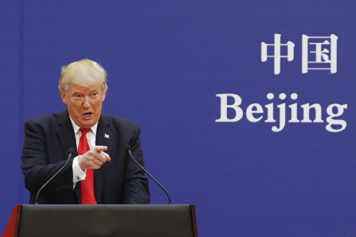

因对中共隐瞒和处理疫情不满，美国总统川普（特朗普）周四（5月14日）表示，美国可以切断和北京的整个关系。资料图。(Thomas Peter-Pool/Getty Images)

   
【大纪元2020年05月16日讯】中共病毒在美国造成的重大人员和经济损失，让美国人出离的愤怒。在十天前美国总统川普（特朗普）将中共病毒袭击美国与二战时日军突袭珍珠港、“911”世界贸易中心恐怖袭击相提并论，并向北京、向世界传递美国业已将中共的行为视为敌对行为，并将会对中共进行一系列反击的信号后，近日，川普政府无论从言辞还是行动上都针对北京持续发力。

5月14日，川普在接受福克斯新闻网主持人玛丽亚·巴蒂罗莫采访时，除了再次重申对中共阻止美国专家进入中国调查病毒的不满外，还以前所未有的口气表示“我们可以做很多事情”，“我们可以切断（和中共的）整个关系。”至于后果，川普给出的回答是：“如果切断（和北京的）整个关系，你将节省5000亿美元。”

显而易见，对于中共藉由病毒对美国的袭击，美国的反击将有很多选项，而且正在推进中，这其中就包括美中彻底脱钩。对此造成的后果，美国应已经有过了研判，并做好了预案，而中南海高层听到川普发出这样重磅言辞，心底恐怕早已是哇凉哇凉的。这也彻底证实了几年来中共智库和专家们所得出的中美不可能脱钩等结论实乃误判。

不仅如此，川普还表示“对中国（中共）非常失望”，并称虽然自己与习近平有着良好关系，“但现在不想和他说话”。一如既往，川普依旧将习与中共区分，但潜台词却是对于身为中共党魁的习的所为同样非常失望，尤其是在隐瞒疫情方面。这意味着习本人的个人品行已经受到了质疑，若想修复与川普的“友谊”并非易事。

也是在采访中，川普透露，美国政府正在考虑收紧对在美国证交所上市的中国公司的要求，会“非常强烈地”要求中国公司遵守美国会计准则，以惩罚中共在疫情中的欺瞒行为。

5月13日，川普还将去年同期签署的行政令延长一年，该行政令禁止美国企业使用对国家安全构成风险的外国企业所生产的电信设备。此举被视为是对华为、中兴通讯等中资企业的继续封杀。

同日，美国半导体设备制造商LAM（泛林半导体）和AMAT（应用材料）等公司发出信函，要求中国国内从事军民融合或为军品供应集成电路的企业，不得用美国清单厂商半导体设备代工生产军用集成电路，同时启动“无限追溯”机制。这意味着美国对华出口的管制升级，对中共高科技和军事发展都带来巨大影响。

5月12日，美国联邦参院司法委员会主席格雷厄姆与多名共和党人，共同推出《2019年中共病毒问责法》。其中表示，如果中共不配合，不全面说明导致疫情爆发的过程，将授权总统制裁中共。法案还要求北京，尽快释放在疫情后镇压行动中遭逮捕的香港民主人士。他还表示：“现在是该顶回中共，向中共追责的时候了。”

同日，共和党参议员克鲁兹提出了“2020年本土稀土议案”，要求对美国稀土产业减免税收，鼓励美国企业在本土生产稀土，从而摆脱中共的威胁。

5月11日，福克斯新闻网独家获得的国家安全顾问奥布赖恩和国家经济委员会主席库德洛写给美国劳工部长斯卡利亚的一封信显示，白宫不希望联邦退休金投资于中资企业股票，并要求尽快撤出既定的40亿美元投资。

5月9日，中共金融与发展实验室理事长李扬透露，世界已经在金融领域形成了排斥人民币的同盟，9个央行签署货币互换协议，但其中没有人民币。

同日，美国17个州的共和党检察长签署公开信，要求国会就中国在病毒传播中的作用召开听证会。信中指控中国隐瞒了病毒的严重性，对美国造成了破坏。

5月8日，在川普表示对重启贸易谈判不感兴趣后，中共副总理刘鹤被迫与美国通话，称要落实好第一阶段贸易协议，要开始大量采购。而如果中共不能落实贸易协议，川普不排除终止协议。

也是在这一天，美国国务院宣布将从11日开始，将中国大陆记者的签证限制在90天以内，但可以延期。一位匿名美国高官表示，这项新规将使得美方更加经常地审视中国记者的签证申请，可减少中国驻美记者的总数。

从不到十天美国政要的言论和行动看，美国的反击举措正在抓住中共的痛处，而且未来的举措会越来越密集地呈现，除了在中共隐瞒疫情上继续追责、要求赔偿外，对中共高官在海外资产的查封也极有可能纳入选项。

美国针对中共的反击，让处于国内政治博弈白热化、经济濒临崩溃，供应链不断撤出中国，海外投资大幅下降，美中在经济、技术和金融方面加速脱钩，华尔街无法继续给中共输血，美国和世界反共态势加剧的中南海高层，感受到了生命不能承受之重。

而这只是让中共疼痛的开始，因为民主体制的美国一旦发力，一旦开弓，就不会停止下来，也难以停止下来，除非实现其所希望达到的目标。让人不禁想起了昔日加速纳粹德国覆灭、由美国发起的安全港计划（Safehaven）。

当年希特勒的崛起，与美国华尔街的支持是分不开的。1924到1931年，华尔街向德国提供了330亿美元的贷款。而且上个世纪30年代中期，美国大型企业在德国有接近60家分公司，华尔街的资本控制着接近300家德国企业，包括著名的钢铁信托等等，其中有26家在德国积极参与纳粹活动，如通用电气、摩根大通、杜邦公司、美孚公司等，他们都为德国的军事发展提供了技术支持。

在所有美资企业与纳粹德国的交往中，涉及金额最大的是美国人控股的瑞士国际合作银行。根据已经披露的情况看，仅仅在1944年5月的一笔交易当中，这家银行就接收保管了纳粹德国的价值3.78亿美金的黄金。而纳粹德国用于战争的大量战略资源，如铁矿砂、石油、钨砂、锌、铅、水银等来自于欧洲的五大中立国土耳其、西班牙、葡萄牙、瑞士和瑞典。德国通过抢夺来的黄金进行购买。

1941年底日军偷袭珍珠港后，美国对日、对德宣战，并开始禁止美国企业与德国进行交易，但如何阻止中立国向德国输送资源则成为一个重要问题。1944年7月，在美国布雷顿森林会议上，美国发起了“安全港计划”，即对二战期间德国支付所使用的黄金的来路进行追查，可以追缴，拒绝为纳粹在中立国被掠夺的资产提供任何安全庇护所，并最终将被掠夺的文物归还其所有人。该行动算得上是釜底抽薪，使得纳粹用掠夺的黄金换取战略资源的计划受到了严重的打击，从而加速了其灭亡的速度。

反观美国针对中共的反击，为了实现既定的目标，一定也会尽可能斩断向其输血的华尔街管道，没有了新鲜血液输入的中共又靠什么维持其邪恶的政权呢？  

<a target="_blank" href=#top><h6 align="right">回上方</h6></a>

<a name=136>
<h1 align="center"><b>软件工程师：修炼将我从压力中解脱</b></h1>

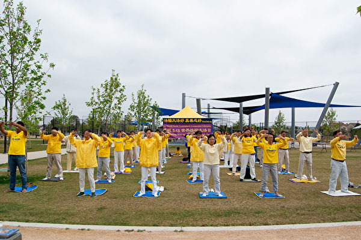

图为2019年5月，加州圣地亚哥部分法轮功学员举行集体炼功等活动，庆祝法轮大法日。（邓舒语／大纪元）

【大纪元2020年05月15日讯】（大纪元记者邓舒语美国圣地亚哥报导）加州圣地亚哥一名越南裔法轮功学员潘河（Ha Phan）曾是软件工程师，拥有稳定的高薪工作，也是一家日式餐厅的老板，工作和生意都颇为顺利兴旺；他的妻子是一名牙医，拥有自己的牙医诊所，儿子也聪明健康，可是这样令人的生活并不让他感到快乐。

潘河说，当时繁忙的工作给他带来了巨大的压力。他变得脾气暴躁，郁郁寡欢，也是在那时他发觉，金钱换不来幸福：“它们只是我银行账户中的一串数字和钱包里的塑料卡片。我开始问自己，我为什么要成为它的奴隶？为它牺牲我的生活和家人？”

为了缓解压力，潘河开始研究各种修炼和功法。他尝试过禅宗、太极拳，但都没有什么改善。继续搜寻的他，一天在上班路上收到了一名法轮功修炼者递给他的法轮功传单。“出于好奇，我把传单放进了公文包里，带着它去了办公室。”

潘河回忆，那张传单上面介绍了法轮大法，同时介绍了其主要著作《转法轮》。“我马上花了两个小时阅读《转法轮》，而这本书几乎回答了我关于人生的所有问题。它揭示了许多我从未在学校或书籍中学过的东西。”

接下来的一周内，他整整读了两遍《转法轮》。“我非常喜悦，思想也平静了许多。随后我就在家附近找到了炼功点，那里的义工教了我法轮功的五套功法。”

潘河说，修炼法轮功6个月之后，他整个像是变了一个人：“《转法轮》教会我宽容他人，即使在事情不顺利时也要保持耐心。五套功法则帮助我放松和镇定了心神、让我精力充沛。”

此外，他曾经患有的严重过敏也在修炼后不翼而飞，曾经夏天不能出门的他现在可以带着儿子去公园游玩。

“看到我身上发生的巨大变化，我的妻子和儿子也走入大法修炼，我们的家庭再次生活和睦。”

潘河由衷感谢法轮大法为自己和家人带来的一切，同时也希望更多人看到法轮大法的美好。

他说：“这套功法完全是免费的，任何人都可以在网上下载《转法轮》和五套功法的教功录像。你不需要付出任何代价，但你从中所获，却是无价。”

<a target="_blank" href=#top><h6 align="right">回上方</h6></a>

<a name=135>
<h1 align="center"><b>瑞典「清零」孔子学院引人思考</b></h1>
   
【明慧网二零二零年五月八日】最近，十五年前在欧洲建立了第一个孔子学院的瑞典，如今成为欧洲第一个将孔子学院在境内「清零」的国家。与此同时，瑞典一百多个城市，解除了与中共对应城市的「友好」关系。瑞典隔离中共，引发了很多的关注。
孔子学院在中国人的心目中，只是一个模糊的符号，因为它在中国没有校园、没有公开的信息；但是在全世界，已有500多家孔子学院，为什么这个所谓的「孔子学院」中国人不甚了解，却在世界各地纷纷落足？

这个「孔子学院」的真面目到底是什么？原中共中央常委李长春曾公开发言：「孔子学院是中国海外宣传的重要组成部份。」孔子学院隶属中共教育部的国际汉语协会办公室（简称汉办）。汉办由来自中共外交部、宣传部等成员组成。

实际上，很多孔子学院就是类似「六一零」的多部门联合超级机构。「六一零」专门负责推动迫害法轮功，孔子学院则负责在海外（特别是教育系统中）推动中共意识形态宣传。

在对外的合约中，孔子学院明文规定，在境外其他国家遵守中共法律，而有关孔子学院的公开信息披露要尽可能少。如果其他国家校方泄露课程信息，合同和资金就将被收回。一些课堂中高悬毛泽东语录，时时提醒孔子学校的党宗旨，对师生进行潜移默化的洗脑。

也就是说，孔子学院和课堂表面上打着交流文化、教授中文的幌子，实则为输出中共意识形态的场所。

<b>为什么孔子学院要保密呢？</b>

蒙上文化的面纱、穿着孔子的外衣，孔子学院的宗旨并非转播中国传统文化。

一是人权歧视，汉办（也称孔子学院总部）在招聘所有孔子学院外派人员的聘用合同中有歧视性条款：不得参加法轮功；二是学术审查，汉办要求开办孔子学院的外国大学（或中小学及其它机构、组织）在孔子学院里不得讨论西藏、台湾、天安门事件和法轮功等中共禁忌的话题。

除了假孔子之名宣传中共政治立场、混淆普世价值之外，孔子学院还在充当中共间谍机构。

去年10月，在比利时安全部门指控布鲁塞尔孔子学院院长宋新宁（Xinning Song）为北京进行间谍活动之后，宋被禁入境。

孔子学院是披着孔子外衣的共产党传媒系统和间谍机构。

<b>疫情中瑞典「清零」孔子学院</b>

4月21日，十五年前在欧洲建立了第一个孔子学院的瑞典，如今成为欧洲第一个将孔子学院在境内「清零」的国家。

自从中共病毒在全球肆虐以来，瑞典是欧洲最后一个不禁足的国家，政府并不强制限制民众活动，16岁以下的学生不停课，餐厅和公共娱乐场所仍然营业。尽管有人质疑这种抗疫方式，但是，瑞典社会的安全、稳定验证了顺其自然之法的可行性。

中共官媒多次攻击瑞典处理疫情的做法，称其为「投降」、对其它国家构成威胁。

而越来越多的瑞典人在这段时间也认清了中共的真实面目，并对中共媒体和中共外交部发言人的虚假言论非常反感。

近日，包括林雪平市和厄勒布鲁市在内的很多瑞典城市，都先后宣布解除与中方城市的友好合作关系。瑞典曾经有116个城市与中国大陆的城市建立了友好关系，现在已经有近百个城市解除了这种合作关系。

<b>「孔子学院」的魔咒</b>

近40年来，中共在海外一直以经济利益为诱饵，用全球化、孔子学院、「一带一路」等计划为遮掩，通过各种渠道向各国腐蚀渗透，散播共产意识形态。

孔子学院是中共一带一路的「火车头」，哪一个地方想获得中共的大笔投资，那么这个地方必须开设孔子学院。凭借「第二大经济体」、「14亿人消费市场」的说辞，中共以利益为诱饵，以孔子学院的渗透、传播为前提，把「共产意识形态」在世界悄然布局。

到目前为止，全球已有162个国家和地区设立了541所孔子学院。其中，欧洲开设数量第一，孔子学院187所，总数居世界之首；排欧洲之后的是美国112所。

那么在欧洲，又是哪些国家开设孔子学院的数量最多呢？英国29所，德国20所，法国18，意大利12所，西班牙8所，人口仅1000万的比利时已合作开办了6所。

可以说，孔子学院开设的数量，与中共在这个国家投入的资金、一带一路的深入程度，有着明显的关联。

意大利不顾西方盟友的反对，成为欧洲首个签署中共「一带一路」协议的国家。

西班牙在中共六四屠城之后，在欧盟中第一个访问北京；在西班牙对前中共党魁江泽民判反人类罪这后，此后屈从中共撤销对江泽民的通缉令；去年，在中共施压之下，取消神韵晚会演出；西班牙王室及政要对一带一路大唱颂歌。

而德国和法国，近年来两国政府都很亲共。在海外华为一直被质疑创办人原身份和解放军背景。而德国和法国却双双决定允许「华为」参与本国的5G网络建设。2019年3月26日，德国总理在巴黎记者会上大赞「一带一路」是「非常重要的计划」、「我们欧洲人想要参与」。法国总统在2017年3月3日接受《巴黎人报》采访时，自称是「毛泽东主义者」。

比利时王国从王室到政要都在推崇「一带一路」，联邦政府加入「一带一路」框架协议的讨论已经摆上了议事日程。

对于孔子学院，西方一直是睁一眼闭一眼的态度。美国参议院委员会在其报告中说：「在过去的15年，当中共在美国开设了100多所孔子学院时，（美国）教育部保持了沉默。」

中共对世界第一都市纽约，下足了功夫，为中共大外宣提供场所与阵地；华尔街精英、大公司与中共沆瀣一气，为中共经济输送利益。中共高度重视华盛顿州和西雅图，四代党魁访美均首选西雅图，成为必经之地。

<b>中共「孔子学院」像魔咒一样，给亲近它的人带来灾难。</b>

到现在为止，一个越来越清楚的现象，欧洲的孔子学院最多，对于中共的「一带一路」投怀送抱，而中共病毒（武汉肺炎）在欧洲也最为严重，西班牙、意大利、英国、法国、德国、比利时等国家，基本上都排在疫情数字的前列。

亚洲国家也开设有孔子学院，然而由于亚洲国家不具备美国、欧洲的实力，因此大多处于被中共欺凌、威胁的状态，在过去数十年与中共打交道的过程中，他们大多一面与中共打交道，一面心怀戒备，早已对中共谎言与暴力心知肚明。正是这样的「不相信中共」，让他们在疫情中不愿沿袭中共的做法，而是采用适当、顺其自然的做法，使得疫情被有效控制。

<b>历史的先声</b>

在著名的预言书《圣经﹒ 启示录》中，对于人类社会堕落的程度曾经写道，「地上诸王都跟那大淫妇行过淫，世上的人也喝醉了她淫乱的酒。」

凡是开设孔子学院的国家或地区，在与中共签下合约，同意遵守中共法律，教师不准聘用法轮功学员，不能谈论法轮功的话题。难道他们不知道法轮功是什么吗？他们不知道中共对于法轮功的残酷迫害吗？

法轮大法创始人李洪志先生弘传的以「真、善、忍」为最高法理的法轮大法，自1992年以来，在短短几年里中国有上亿人修炼法轮大法，并迅速扩展到世界各地。

可是靠暴力、谎言和收买维持生存的中共邪党，极其仇视「真善忍」的法轮大法，前党魁江泽民出自于妒嫉，自1999年7月20日开始，利​​用他手中窃取的权力，开动整个国家机器对法轮功学员进行着群体灭绝式的迫害，直至20年后的现在仍每日每时在发生着。

为了堵住来自国际社会的人权指责，中共一方面利用其外交将迫害法轮功的栽赃谎言传播，毒害世界各国，另一方面中共把中国庞大的人口消费市场，作为其要挟他国的工具，选择与中共站在一起的，中共就大开绿灯、大把撒币。各国眼里的这个中共金主，实际就是《圣经﹒ 启示录》中用迷酒灌醉贪图利益者的「大淫妇」。

就像预言家诺查丹玛斯在《诸世纪》中所说的：黄金、金银的光芒遮住了贪图名誉的双眼，处处可见被欲望熏昏头脑的男女。对于修道之人的迫害，终将给世人带来可怕的瘟疫与灾难。历史上罗马经历三次大瘟疫，苦难中的人们才在基督徒的义行中清醒。今天呢？

不敬神明，为利益所驱使，残害修炼佛法之人，上天怎么会坐视不管？隋朝步虚大师的预言诗中写道：「四海水中皆赤色，白骨如丘满岗陵」──在四海之内，共产红魔的邪说把所到之处都染成了红色；当天惩降临时，无数的人死去，白骨成堆遍布山岗。

此次中共病毒的扩散趋势，清晰地勾勒出各国被中共渗透的程度。拥抱孔子学院的意大利，和拒绝孔子学院的瑞典在疫情中的境况对比鲜明。现实正在为世界敲响警钟，利诱和原则之间，选择哪个，直接关系到生死。

随着西方社会的觉醒，世界各地开始纷纷关闭「孔子学院」和「孔子课堂」。澳大利亚新南威尔斯州（New South Wales）2019年关闭了所有的「孔子课堂」。美国目前已关闭26所「孔子学院」，还有数十所，美国如何选择？

在近期明慧网刊发的《魔鬼在统治着我们的世界》一书中写道：「很多国家政府、大公司、商人可能表面上或在一时从中共那获得所谓的『好处』，但牺牲道德原则终究让他们得不偿失。那些表面的利益其实都是毒药，只有不贪图眼前利益，才会有光明的未来。」

「中共不是正常意义上的政党或政权，它不代表中国人民，而是共产邪灵在人间的代表。与中共交往就是与魔共舞，与中共友善就是在姑息魔鬼、助恶为虐，把人类推向绝路。反过来讲，对中共的反击就是一场正与邪的较量，这不是单纯的国家利益之争，更是为了人类的未来。」

关闭孔子学院（学堂）就是远离中共。远离中共，就会远离病毒；拒绝中共，就是自救自赎。

<a target="_blank" href=#top><h6 align="right">回上方</h6></a>
  
  
<a name=134>
<h1 align="center"><b>【最新疫情5·15】川普：可阻中共窃疫苗技术</b></h1>

川普在接受《福克斯商业》采访时表示，中国（中共）尝试窃取美国知识产权，并想率先获得Covid-19疫苗，但美国可以预防这种情况。图为川普周四抵达宾州。(MANDEL NGAN / AFP)

   
   【大纪元2020年05月14日讯】（大纪元记者夏雨、徐简、戴芙若、李言综合报导）5月15日全球中共病毒（武汉肺炎）疫情最新情况：
   
   根据约翰‧霍普金斯大学（Johns Hopkins University）的数据，截至美东时间5月14日晚上8点，全球确诊感染中共病毒（武汉肺炎）的人数超过440万，死亡人数超过30万（注：因中共和伊朗隐瞒疫情数据，真实数据比统计的要高）。

美国确诊病例超过140万例，死亡超过8.5万人。截至周四美东时间下午4点，美国病例增长1.6%，低于过去7天的平均值1.8%。

美国总统川普5月14日接受福克斯新闻采访时说出有史以来对中共最强硬的话。川普表示，中共在1月份赴美签署贸易协议时，就已经知道疫情爆发。川普还表示，对北京很失望，可以切断美中所有的关系。

针对中共黑客企图窃取美国关于中共病毒疫苗技术，川普表示，美国可以阻止中共黑客。他还重申将供应链转回美国的想法。

=======================

<b>以下是最新疫情实时更新：

川普：可阻止中共黑客窃美疫苗技术</b>

周四（5月14日），美国总统川普谴责中共黑客持续发动攻击，企图窃取美国研究中共病毒（武汉肺炎）疫苗的行为。

川普在接受《福克斯商业》的玛丽亚·巴蒂罗莫（Maria Bartiromo）采访时表示，中国（中共）尝试窃取美国知识产权，并想率先获得Covid-19疫苗打败美国，但美国可以预防这种情况。

“我们可以阻止它们（中共）。它们试图这样做（窃密）。我的意思是，你也可以停止与它们开展业务，这是一回事。”川普说。

他接着表示，中共黑客一直在发动黑客行动窃密，且从未被指控过。现在他自己和美国政府一直在谴责这种行为。

周三，美国国土安全部（DHS）和联邦调查局（FBI）联合发布“公共服务公告”，警告中共黑客正在企图窃取美国对中共病毒的疫苗成果，并称之为“重大威胁”，并对相关研究机构预防黑客袭击提供四大建议。

这是美国政府正式发出警告。参议院国土安全和政府事务委员会的民主党参议员加里·彼得斯（Gary Peters）给总统写了一封信表示：“美国必须向中国（中共）政府传达一个强烈的信息，即这种行为是不可接受的。”“政府应利用国际压力、经济制裁和其它指控，来阻止中共将来对研究机构的袭击。”

众议院国土安全委员会的众议员迈克·罗杰斯（Mike Rogers）将中共黑客的行为，跟其它中共在疫情期间的倒行逆施联系在一起。

在周一（5月11日）白宫召开的疫情记者会上，有记者提问中共黑客企图盗窃美国病毒疫苗研究问题时，川普回答说，“我对中国（中共）不满意……”他表示，中共还有什么花样可以玩呢，这都不是新闻了。

据《华尔街日报》报导，美国官员们表示，这种入侵行为可能会被川普政府视为对美国公共卫生的直接攻击，无异于是一种战争行为。因为在某些情况下，这些网络攻击可能会阻碍疫苗研究。这将意味着美国政府将越来越会把这些网络攻击等同于是对美国这个国家的攻击。

<b>韩国夜总会群聚感染 再增17病例</b>

韩国卫生部副部长金刚理（Kim Gang-lip）周五（5月15日）说，韩国已经确诊另外17名与首尔一家夜总会群相关的中共病毒患者。

上周末，因首尔一家夜总会出现群聚感染，当局关闭了首尔所有夜总会和酒吧。

现在，夜总会群聚感染共有148个病例。

仅在过去一周中，当局就对数万人进行了病毒测试。

<b>川普仔细考虑美国制造的行政令</b>

川普政府正在准备一项行政命令，针对某些基本药物和医疗服务，要求在美国生产。该命令是鉴于中共病毒大流行期间，美国遭遇药品和设备短缺的情况。

该行政令的草案正在政府内部分享，并由彭博新闻社获得。

这份9页的草稿显示：“至关重要的是，我们减少对外国生产商基本药物、医疗服务的依赖”，以“确保足够、可靠的长期国内生产”，从而防止短缺和供应，以在需要时“动员我们国家的公共卫生工业基地”。

一消息人士也告诉CNBC的Kayla Tausche，该行政令可能最早在周五发出。消息人士称，审查的适用时限为90天。

美国政府正在审视那些可被视为国家安全问题的产品，包括药品、医疗用品、半导体和国防设备，并对这些产品的供应链问题采取行动。

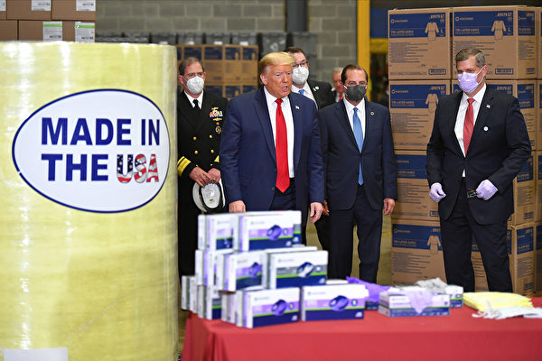

川普政府正在准备一项行政命令，针对某些基本药物和医疗服务，要求在美国生产。该命令是鉴于中共病毒大流行期间，美国遭遇药品和设备短缺的情况。 (MANDEL NGAN/AFP)

<b>墨西哥新病例现最大单日跳涨</b>

墨西哥周四（5月14日）报告了2409例新的中共病毒病例，这是自疫情爆发以来该国出现的最大单日跳涨。

墨西哥卫生部周四还报告了257例新死亡。

这使全国总数达到至少42,595例病例和4,477例死亡。

<b>白宫或支持另一轮补助支票</b>

两名高级行政官员周四（5月14日）告诉CNBC，白宫可能会支持另一轮补助支票。

对此白宫发表了一份声明，但没有提供进一步的评论：

“正如川普普总统所说，我们将确保照顾所有美国人，以使我们健康、强大、经济繁荣，以便摆脱（疫情）挑战，这就是为什么白宫致力于促进（经济）增长，中产阶级税收和通过监管机构纾困的原因。”

第一轮经济刺激支票是国会授权的2万亿美元一揽子计划一部分。立法要求使用最近的2018年或2019年纳税申报表来确定是否有资格获得补助现金。

现金发放金额是个人可领1200美元，夫妻2400美元，合格的扶养亲属各500美元。有资格获得补助的人士为个人年收入不超过75,000美元，以及调整后总收入不超过150,000美元的夫妇。在此之上，支票金额减少，个人年收入超过99,000美元和已婚夫妇总收入超过198,000美元，则无资格获得补助支票。

<b>美CDC发布重开酒吧、餐馆等指南</b>

美国疾病预防控制中心周四（5月14日）发布了六棵“决策树”，旨在帮助企业、社区、学校、营地、日托和公共交通部门确定是否可以重新开放。

该指南就如何重新开放酒吧、餐馆和工作场所向各州提供建议。它概述了工作场所和餐馆应采取的一系列步骤，以确保员工和顾客在重新开放时的安全，包括鼓励洗手，与保持社交距离以及如何检查可能的Covid-19病例症状等。

<b>川普：失控或造成病毒从武汉实验室泄露</b>

川普周四在接受《福克斯商业》的玛丽亚·巴蒂罗莫（Maria Bartiromo）采访时表示，尽管他仍怀疑此次疫情可能与中国武汉病毒学实验室有关，但他表示，中国人不太可能故意释放病原体。他说：“我认为它更有可能是失控（造成）。”

白宫贸易顾问纳瓦罗5月10日接受福克斯节目“Sunday Morning Futures”的采访，他说：“我们知道爆发地有P4武器实验室，病毒可能从那里（泄漏）出来。在接下来的两个月内，我们知道，中国（共）在世卫的帮助下，掩盖病毒（信息），不让全球知道。”

美国联邦参议员汤姆·科顿（Tom Cotton）5月5日表示，冠状病毒（中共病毒）大流行起源的所有调查证据均指向中国武汉的两个实验室。科顿强调，病毒自然产生和病毒来自实验室并不矛盾。

科顿在接受福克斯新闻节目“America’s Newsroom”采访时表示，与另一种理论相反，没有证据表明该病毒起源于武汉的海鲜批发市场。

“现在，所有证据都指向这些实验室——它们使用蝙蝠，研究冠状病毒，它们有不良安全做法的历史，感染这个病毒的零号病人没有接触海鲜市场——所有这些都是可以肯定的间接证据。”他说。

“但是，在情报问题上，我们很少获得直接或结论性证据。”科顿说，“因此，我认同所有证据（尽管是间接的）都直接指向这些实验室。”

他还表示，如果中国共产党有反驳证据，需要向全球展示出来。

<b>巴西病例数量突破20万</b>

据巴西卫生部称，巴西确诊的中共病毒病例数已增至202,918例。

巴西连续第二天发布了创纪录的新病例，周四报告了13,944例。

根据该国卫生部的数据，在过去24小时内，有844例新的死亡病例。目前，巴西Covid-19的死亡总人数为13,993人。

<b>洛杉矶县居民出门必须遮住脸部</b>

美国加州洛杉矶县卫生局局长芭芭拉·费雷尔（Barbara Ferrer）在周四的新闻发布会上说，所有洛杉矶县居民在出门时都必须戴口罩。

费雷尔说：“实际上，在您外出，而不是与家人在一起，并且与他人进行任何形式接触时，整个县的居民都必须使用面罩。” “我们卫生官员的命令很明确。”

费雷尔说，单独运动时不需要遮盖脸面，但应随身携带面罩。

费雷尔补充说：“正如我之前所指出的，您戴布面罩的原因，是为了保护他人免受呼吸道飞沫的伤害。”

费雷尔发布的公告适用于洛杉矶县超过1000万居民。

费雷尔说，截至周四，共有1709名洛杉矶县居民因Covid-19死亡。

<b>美国病例增长1.6% 低于过去7天均值</b>

截至美东时间周四下午4点15分，约翰·霍普金斯大学和彭博新闻社汇编的数据显示，美国确诊病例和前一天相比增长1.6%，至超过140万，低于过去一周平均每天1.8%的增长幅度。死亡人数上升至85,066人。

根据纽约州长安德鲁·库默（Andrew Cuomo）的说法，纽约周四报告了157人死亡。使得该州单日死亡人数连续第四天低于200。

佛罗里达州报告说，该州报告了43,210例病例，比前一天增加了1.9%，而前七天的平均增长为1.6%。死亡人数增加了2.6%，至1,875人。

根据加州网站，加州病例增加了2.8%，达到73,164；死亡病例增加了3.3%，达到了3,032人。

根据州卫生部门的数据，德州连续第二天录得超过平均增长水平的病例增长率，达3.4%，总数至43,851例。过去一周的死亡人数增长平均值为3%。周四死亡人数攀升了5%，是自4月30日以来最大的单日跳涨。1200多人死亡中，约有四分之一是在休斯顿地区。

<b>数百中国人想说疫情真相 被中共抓捕</b>

中共当局上周日（5月10日）逮捕了一名宪法律师，理由是他在社交媒体上发表公开信，批评政府对病毒大流行的处理，以及对言论自由的压制。

43岁的张雪忠在微信上发表的信中说，中国没有非官方媒体，以及阻止医学专家向公众提供建议，这表明“（中共）政府长期严格控制社会和人民，几乎完全摧毁中国社会的组织和自助能力。”

福克斯新闻报导，张的逮捕凸显了中共对持不同政见者的零容忍态度。人权活动家的报导说，自去年下半年COVID-19爆发以来，包括医生、新闻记者和律师在内的数百人在中国被捕，他们只是想说出这种病毒（的真相）。

《中国数字时报》援引统计数据显示，在1月1日至4月4日之间，近500人因发表言论而被指控犯罪。

上个月，中国河南省一名律师因在网上张贴武汉仪馆排长队的文章而受到惩罚。许多医生也因试图对中共病毒构成的威胁发出警报而被迫保持沉默。

上个月，《无国界记者》（RSF）发布了《 2020年世界新闻自由指数》，在新闻自由方面，中国排名倒数第四（在厄立特里亚，土库曼斯坦和朝鲜之前）。

RSF估计，大约有100名中国记者入狱——世界上人数最多。

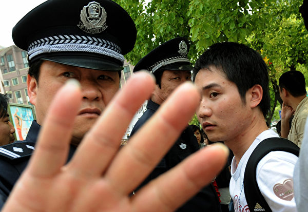

图为中共警察扣留学生，阻止外国记者拍照。(MARK RALSTON/AFP/Getty Images)

<b>美205众议员致函谭德塞 促邀台出席世卫大会</b>

美国联邦众议院205位议员周四联名致函世卫秘书长谭德塞，要求世卫邀请台湾以观察员身份出席今年世界卫生大会，并参与世卫专家技术会议。

众议员在给谭德塞（Tedros Adhanom Ghebreyesus）的信函上表示，正值全球空前公卫危机之际，这封信函表达他们对台湾无条件以观察员身份参加第73届世界卫生大会（WHA）与世卫技术性会议的强力支持。

信函指出，台湾对全球公共卫生的承诺与处理疫情的作为，证明将台湾纳入世卫行动有其价值。

尽管台湾疫情处理表现出色并展现专业，但世卫在中共肺炎危机中对台湾的态度却令议员感到忧心。信函指出，台湾官员无法及时自世卫获得必要资讯、被排除在世卫实验室网路之外，台湾的疫情资讯未能与世卫会员国分享，台湾的统计资料也被错误纳入中国数据之中。

<b>美就业报告仍惨淡 但有一鼓舞迹象</b>

上周初次申请失业金人数又增加了298万人，但在这份报告中，经济学家看到了一个小小的鼓舞迹象，因为连续申请人数增加不到五十万人。

CNBC报导，失业人数仍然令人震惊，仍有2383万人在领取失业救济金，预计这个数字还会增加；上周的数字被下调至2238万人。持续申请失业金统计是截至5月2日一周。

投资机构Amherst Pierpont 首席经济学家斯蒂芬·斯坦利（Stephen Stanley）写道“持续申请失业金（数据）实际上有些令人鼓舞，增加不到五十万人，这是从先前的向下修正中得出的结论”。

“尽管许多迹象很细小，但你可能会惊讶地听到，在截至5月2日一周中，有16个州领取福利的人数有所减少。我非常渴望看到下周的数据。如果这个数字没有再上升，那将是一个非常有趣的信号。”

现在，经济学家们一直在观察有多少工人由于国家重新开放以及“工资保护计划”而返回工作，该计划为企业提供了资金，使他们能够给工人发工资。

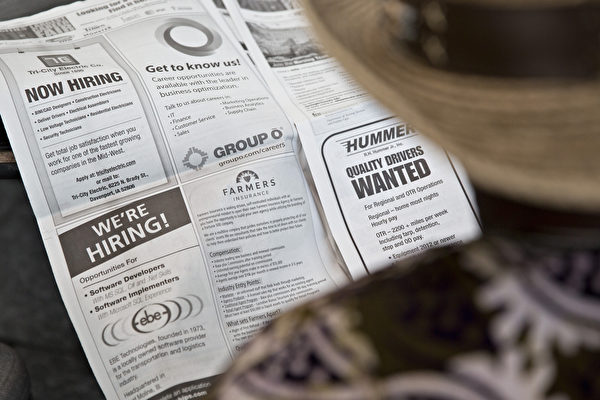

上周初次申请失业金人数又增加了298万人，但在惨淡的报告中，经济学家看到了一个小小的鼓舞迹象，因为创纪录的连续求职人数增加不到五十万人。(Getty images)

<b>俄罗斯教育部长染疫 第6名确诊高官</b>

俄罗斯总统普京周四说，教育部长法尔科夫感染中共病毒。法尔科夫成为至少第6名确诊的俄国高官。

普京在一场电视转播的政府会议上表示，现年41岁的法尔科夫（Valery Falkov）之前确诊感染，如今已康复。

包括总理米舒斯京（Mikhail Mishustin）、文化部长柳比莫娃（Olga Lyubimova）及建设和住房公用事业部长亚库舍夫（Vladimir Yakushev）在内，法尔科夫是普京政府第4名感染病毒的成员。亚库舍夫的一名副手也染疫。

<b>民调：多数美国人认为中共政府需对瘟疫传播负责</b>

5月13日发布的一份民调显示，大部分受访美国人认为中国政府需对新冠病毒的传播负责。

非营利组织“共产主义受难者纪念基金会” （The Victims of Communism Memorial Fund）和民调机构YouGov联合进行的调查发现，超过三分之二的受访美国人（69%）认为中国政府对新冠病毒的传播负“一部分”或“很大责任”。

这份民调对1382名美国成年人进行了调查，发现约一半（51%）受访者认为中国政府应对受疫情影响的国家进行赔偿。

有71%的人认为中国（中共）应该因疫情大流行而受到“惩罚”。具体来说，有25%的人希望禁止中国官员入境美国，32%的人认为美国应该拒绝为中国持有的美国国债支付利息，33%的人希望对中国商品征收额外关税，41%的人则支持国际制裁。

<b>新西兰逐步开放 人们连夜排队理发</b>

新西兰实施居家令有两个月时间，在政府主办解除居家令，开放发廊的前一天，新西兰人已经在店门口排队等待午夜钟声敲响。

新西兰购物中心、零售商店和饭店都在周四（5月14日）重新开业。

周四是新西兰连续第三天没有报告中共病毒新病例。在感染中共病毒的近1,500人中，有1,400多人已康复，另有21人死亡。

周四凌晨，理发师康拉德·菲茨·杰拉德（Conrad Fitz-Gerald）重新打开商店。他告诉美联社，他接到50个急切需要理发顾客的询问。

他说：“人们说他们的头发失控了。” “很多十几岁孩子的父母也一直在打电话，认为在午夜理发会是一件很新颖的事。不幸的是，我们满员了。”

<b>2023年前 航空旅行难恢复到瘟疫前水平</b>

国际航空运输协会（International Air Transport Association， IATA）表示，中共病毒对航空旅行的影响将持续多年，据该协会估计，至少在2023年之前，客运量不会反弹到危机前水平。

该协会表示，自瘟疫大流行开始以来，欧洲和美国的航空旅行需求已下降90%以上；国际航空运输协会警告说，如果封锁和旅行限制得到延长，复苏将更加缓慢。

国际航空运输协会总干事兼首席执行官亚历山大·德·朱尼亚克（Alexandre de Juniac）周四对CNBC的“ Squawk Box Europe”节目说：“我们要求政府采取分阶段方法来重新启动该行业，并（让该行业）再次发展。”

德朱尼亚克希望夏天能恢复飞行。

他说：“我们的目标是在第二季度末之前重新开放和促进国内市场，并在第三季度之前开放区域或各个大陆市场，例如欧洲、北美或亚太地区（大陆），并在秋季进入洲际市场。”

“因此，在夏季，我们希望您能看到欧洲境内的航班回来，希望价格合理且控制过程非常安全，”他说。

外国航空公司减航班 澳国际航线机票恐涨价

<b>加国省长谴责中共瞒疫 吁美加联手带回制造业</b>

加拿大阿尔伯塔省长康尼（Jason Kenney）周三（5月13日）批评中共对COVID-19爆发早期的处理，并敦促加拿大和美国联手将制造业带回北美。

康尼在基于华盛顿的加拿大美国商业理事会（Canadian American Business Council）虚拟圆桌会议上表示，在中国武汉市首次出现新冠病毒（中共病毒）时，中国（中共）进行淡化、掩饰和掩盖病毒带来的危险，中共将很快面临“巨大的谴责”。

他说，中共还试图施压世界卫生组织，阻止进出疫情热点地区的旅行禁令，并拒绝与世界其它地区合作，以查清所发生的事情。

他说：“在全世界遭受的破坏性公共卫生和经济损害中，我认为中国（中共）政府起到重要作用。”

康尼表示，不应该忘记中共所为，让其逃脱，必须对其进行清算，必须让中共担责。

<b>Uber要求司机戴口罩 乘客遮住脸</b>

从5月18日开始，Uber将采取多项安全措施，以防止COVID-19在司机和乘客中传播。

该公司表示，每次乘车前，司机和乘客必须确认他们戴着口罩或防护罩。新准则将一直持续到六月底。

其它准则包括将UberX载客最多人数从4减少到3。

司机将被要求通过新的清单进行确认，该清单要求自拍来验证是否戴着口罩。验证后，司机会通过该APP收到通知。

乘客则必须确认自己是否遮住脸部以及是否对手进行了消毒。 Uber使乘客使用类似清单来验证他们是否采取了这些预防措施。

如果乘客和司机感到不安全，包括乘客或司机没有戴面罩，则可以取消行程而不会受到罚款。用户还可以通过该应用程序将问题报告给Uber。这与Uber的新反馈选项紧密结合，该选项现在包括不戴口罩或戴口罩。

屡次违反遮面政策的司机和乘客将被拒使用Uber。

优步Uber获得了温哥华市营业执照以及ICBC的保险。

<b>中共病毒大流行 网络欺诈暴增</b>

网络安全公司Bolster周三（5月13日）发布的一份新报告显示，随着中共病毒大流行在全球范围内蔓延，网络安全专家正在追踪网络犯罪活动达“破纪录”的水平。

2020年第一季度，Bolster记录了网络钓鱼和网站欺诈的大幅增长，检测到854,441个已确认的网络钓鱼和假冒网站，其中30%与COVID-19相关，另外还有400万个可疑页面。

Bolster首席科学家Shashi Prakash表示，许多COVID-19骗局，无论是提供伪造病毒治疗方法，或伪造的补助支票的网站和电邮，都具有共同点。

美国司法部于4月22日宣布，在联邦调查局（FBI）互联网犯罪投诉中心（IC3）收到3600多个投诉后，联邦当局和当地执法机构、私营企业进行合作，已经摧毁了“数百”在线COVID-19骗局。

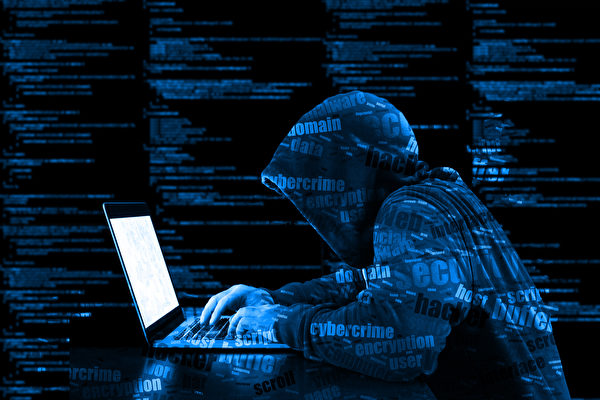

随着中共病毒大流行在全球范围内蔓延，网络安全专家正在跟踪网络犯罪活动的“破纪录”水平。(Fotolia)

<b>杂货食品送货服务成香馍馍</b>

中共病毒正在使像Instacart这样的杂货配送服务非常受欢迎，它们可能会留下来。

由于中共病毒爆发，导致成千上万的小企业关门。但是，在线杂货配送则是增长最快的一个领域。

加拿大皇家银行资本市场公司（RBC Capital Markets）的一项最新调查发现，有55%受访者通过在线购买了食品杂货，高于2018年的36%和2015年的15%。

在线杂货送货服务公司Instacart告诉CNBC，过去几周的需求一直是公司历史上最高的，客户订单量同比增长了500%以上。

在线杂货送货在中共病毒大流行前曾一度是一种奢侈消费，但目前几乎成为人们日常必需服务，Instacart和Amazon Fresh等杂货送货服务一举成名。但从长远来看，杂货配送能否成为主流，将取决于它们的目前表现。

<b>失去父亲后 新泽西男子捐赠iPad给医疗机构</b>

目前美国大多数医院和医疗机构都限制访客，导致许多患者隔离。一名新泽西州男子亲历与患病家庭成员保持联系的重要性，并因此受到启发，帮助其他老年患者和亲人沟通。

新州Wildwood Crest居民林奇（John Lynch）最近不得不通过FaceTime向父亲告别。他的父亲在亚特兰大的一家护理室，由于受到社交疏离限制，林奇在他去世之前无法亲自见到他。

在得知一些护士使用他们的个人手机帮助患者与家人联系之后，林奇受到启发，想到帮助他人的方法。

“与林奇午餐基金会”一位发言人告诉哥伦比亚广播公司新闻，该机构通常专注于为儿童提供学习经验，并协助病危患者的家庭。现在，林奇基金会致力于为医疗机构收集捐赠的iPad，这些医疗机构禁止家人探望患者。

林奇将其称为“操作连接：iPad项目”，到目前为止，通过该计划，已经收集了六十多个iPad。收集的前20台iPad送到了开普梅县（Cape May County）医疗中心，其余的将分发给开普梅县（Cape May County）的疗养院和全国各地医院。

<a target="_blank" href=#top><h6 align="right">回上方</h6></a>
  
 
<a name=133>
<h1 align="center"><b>【内幕】环时打脸刘鹤 党内分歧公开化</b></h1>

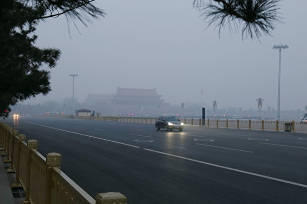

有分析认为，中共高层目前内斗激烈，为了推卸疫情扩散造成恶果的责任，中共内部正在展开甩锅大战。图为北京天安门广场。（大纪元资料室）

   
   【大纪元2020年05月14日讯】（大纪元记者古清儿报导）近日，中共喉舌《环球时报》放出“废止中美贸易协议”之说的言论，与刘鹤的立场唱反调，引舆论关注。而且在《环时》的报导中，公开透露中共内部存在分歧。

<b>美中第一阶段贸易协定 《环时》打脸刘鹤</b>

随着武汉肺炎疫情在美国爆发和扩大，川普政府指责中共隐瞒疫情的力度加大。这使得今年1月刚刚签署的美中第一阶段贸易协定的命运成为外界关注的焦点。

5月8日上午，美国贸易代表罗伯特·莱特希泽（Robert Lighthizer）和财政部长史蒂芬·姆钦（Steven Mnuchin）与中共副总理刘鹤进行了贸易通话。

会谈后的联合声明说，双方都认为，（美中）在建立使该协议取得成功所需的政府基础设施方面正在取得良好进展。尽管当前存在全球卫生紧急情况，但两国都充分期待能够及时履行该协议规定的义务。

中共商务部则表示，双方同意加强经济和公共卫生合作，为第一阶段贸易协议的落实创造有利的氛围和条件。双方同意保持沟通协调。

但三天后，即5月11日晚，中共官媒《环球时报》英文版的报导《知情人：中共内部与美国重签协定的呼声响起》（Calls rise in China to rework deal with US: sources），却与刘鹤通话传递的信号不同调，有“打脸”刘鹤之嫌。

该报导引述“知情人士”的话说，接近贸易谈判的顾问已建议中共官员重新提出令贸易协议作废的可能性，建议还包括谈判新协定，让天秤向中方倾斜。

报导称，中方出现了要求重新评估中美第一阶段贸易协议的鹰派声音，中共内部不满情绪不断上升，因为中方为推动达成此次协议而作出妥协。

报导引用“匿名的前贸易官员”的话指，中方可以疫情下不可抗力为由，称首阶段中美贸易协议难执行。报导还引用一名贸易顾问的话放风称，“中共想要终结第一阶段协议。这对我们（中共）有好处。如果重回原点，美国无法再与中共展开贸易战。”

《环时》作为中共官方喉舌，公然与刘鹤唱反调，究竟何意呢？《香港经济日报》认为，熟悉中共政情的人士都知道，在重大问题上，中共官方是不允许有不同声音存在。而在《环时》的报导中，则公然将中共内部的分歧公开化。

美国总统川普也反击《环时》的言论。

川普5月11日在白宫疫情说明简报会上对记者表示，他对重启协商“一丁点兴趣也没有”，并希望中国（中共）遵守首阶段贸易协定承诺的条款。

此前，川普多次批评中国（中共）隐瞒疫情，让美国及全球遭受疫情冲击。

<b>中共对美中首阶段贸易协定 整体立场未见变化</b>

今年1月15日，美中签署了第一阶段贸易协议，历时18个多月的贸易战暂时停火。中共同意在未来两年内，在2017年购买量的基础上增购至少2,000亿美元的美国产品和服务。

近期中共其它部门的动作，跟刘鹤的立场相近。中共对美中首阶段贸易协定整体态度未见公开变化。

5月12日，中共外交部称，中共愿与美方共同落实贸易协议，并重申会为此创造氛围。这一说法，被认为是间接否定了《环时》的中共将废止协议之说。

同一天，中共财政部宣布，将对79种美国进口商品免除中美贸易战期间所加征的关税。一周后生效，为期一年。最新豁免加征关税的美国商品包括稀土金属、金矿石、银矿石、化学品和纺织品等。

据彭博社报导，中国国有进口商过去两周订购了二十多船美国大豆，总量超过了100万吨；外电指，中国上周订购了逾4万吨美国猪肉，是去年10月以来的最大订单。

上个月，中共驻美大使崔天凯对外媒称，“中美双方正在努力落实第一阶段经贸协议，相信我们能继续落实。”

<b>胡锡进扩大核弹头说法 华春莹：他个人观点</b>

在中共官媒《环时》爆出这篇与刘鹤不同调的文章之前，《环时》总编辑胡锡进刚刚发出狂言，认为当局需快速扩大核弹头和导弹数量，引发争议。

5月8日，胡锡进在微博称，中国（中共）需要在较短的时间内，将核弹头数量扩大到千枚的水准，包括至少要有100枚东风-41战略导弹，目的是“要有更大的核武库来抑制美国的战略野心和对华冲动”。还称，“也许过不了多久”就需要“应对挑战”。

其言一出立刻在网络上引发争议，路透社就此在中共外交部例行记者会上对此提问，外交部发言人华春莹称，这是胡锡进的个人观点。

<b>军方鹰派与胡锡进不同调 评论员批文宣</b>

与胡锡进的言论相对的是，中共军方一些官员、学者均在近期放软了调门，且均没提到增加核弹头。

5月4日，中共军方鹰派代表人物、曾与人合著《超限战》的退役少将乔良一改过去的强硬论调，首次公开承认台湾问题不只是中国（中共）的内政，而是美中关系问题。

他说，“不管中国怎么强调台湾问题属于内政，但本质上仍然是中美问题。”解决台湾问题的关键，不在于怎么解决台独势力，而是要先解决中美实力对比。因为台湾问题的解决不取决于两岸，而是取决于美中关系的变化。

近期，中共鹰派军事评论员房兵被媒体问到“中国（中共）海军的硬实力超越美国海军只是时间的问题”，他承认，“我不赞同这样的一个观点，什么叫就是个时间的问题，如果你说这个时间是100年、200年，那可能就是个时间的问题。如果你说这个时间是10年、20年，那纯粹瞎扯。”

房兵还批评中共媒体夸张宣传，“我一再说我们有些媒体，不要打鸡血，不要打鸡血，不要天天给自己的年轻人打鸡血，没有任何好处。”

时政评论员夏小强表示，中共高层目前内斗激烈，为了推卸疫情扩散造成恶果的责任，中共内部正在展开甩锅大战。中共内部所谓的鹰派和鸽派其实只不过是硬币的两面，其采取政策的最终目的在整体上都是为了中共政权的稳定。

夏小强认为，目前中共内部呈现分裂状态，各方势力代表互不相让，已经很难成为一个统一的整体，胡锡进在这种时刻发出不同于中共官方的信息，正是如今中共内部混乱、政令不出中南海、内斗激烈以及政权面临崩溃前的表现。

<b>中共学者直接批评当局文宣和“文字狱”</b>

另一个大陆鹰派学者、清华大学国际关系研究院院长阎学通，4月底他接受了陆媒财新网的采访，就中共当前的国际、国内形势发表了自己的看法。

被问及中共病毒影响美中在世界领导力的问题时，阎学通罕见承认，中共原本就没有全球领导力，一个不存在的领导力就不存在削弱和没削弱的问题。

阎学通还批评中共文宣指，一些媒体把中国（中共）与欧洲抗疫效果差别归结于政治制度不同，这种说法很容易激起欧洲疫情严重国家的人的不满情绪，“直接和变相批评他国政治制度都会引发或加剧意识形态冲突”。

更大胆的是，阎学通在陆媒的采访中低调批评了中共搞的“一带一路”，“从一开始我就认为，在国外搞道路建设，成功的难度极其大。这就是为什么，很少有国际组织贷款修建跨国铁路，因为两个国家的铁路政策是不同的。到目前为止，我们看到的跨国铁路投资项目有收益的较少，亏损的很多，典型的就是坦赞铁路。”

阎学通甚至直接在采访中批评中共的疫情防范和“文字狱”，“如果人类汲取历史经验教训的能力强，就不会在第一次世界大战之后又发生第二次世界大战；SARS疫情之后就不会发生现在的新冠（中共病毒）疫情，文字狱也不会在中国历史上重复发生。”

<b>王沪宁负责的文宣 煽动民族主义</b>

此前多家媒体报导指，江派常委韩正与王沪宁等曾经在美中贸易战中搅局。

《华尔街日报》去年7月1日报导引述知情人士的话指，在当年5月13日举行的由二十多名中共高层领导人参加的会议上，国务院副总理韩正批评了拟议中的中美协议。

报导指，负责文宣的江派常委王沪宁一直试图煽动中国人的民族主义情绪，进而延续中共的统治。

胡锡进和《环球时报》也归中共文宣管辖。

就在5月13日，大陆知名“五毛”占豪还发表名为“中国连出两重拳，强硬反击号角吹响！后边还有更狠的”的微信文章，将中共暂停以市场采购贸易方式出口防疫物资的行为，肆无忌惮地公告中共将以防疫物资要挟世界各国，“就像美国，如果继续毫无底线地反华，如果一定要栽赃中国，甚至向中国索赔，那对不起了，医护物资肯定就没办法满足了，你们还是自己生产吧。或者，如果美国限制对华芯片出口，那对不起了，医护物资也就不出口了······总之，这实际上是个筹码。”

今年3月初，北京市民薛扶民在网上实名举报主导出版《大国战疫》一书的中共政治局常委王沪宁，批其缺乏对人民的关爱，应追究其政治责任。

<a target="_blank" href=#top><h6 align="right">回上方</h6></a> 
  

<a name=132>
<h1 align="center"><b>两会前港警狂抓人 专家解析香港乱局走势</b></h1>

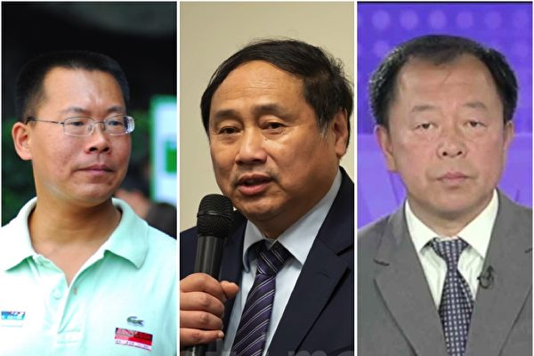

目前生活美国的三位华裔专家学者（从左至友分别为滕彪、王军涛、李恒青）解析香港目前的乱局与走势。（大纪元合成图片）

   
   【大纪元2020年05月14日讯】（大纪元记者骆亚、张顿采访报导）中共两会于5月底召开，而在5月10日港警疯狂抓捕了230名“反送中”民众，引发各界关注。三名专家、学者表示，中共企图把香港的“一国两制”变成“一国一制”，但这不会被港人和国际社会接受，而且还可能把台湾搞丢失了。

大纪元5月13日采访了三名身在美国的专家、学者，包括美国华盛顿信息与战略研究所学者李恒青、中国民主党全国委员会主席王军涛、普林斯顿高等研究院访问学者、原中国维权律师滕彪。他们分析了当前香港的局势及可能走向。

<b>港警拘捕230人 野蛮对待记者和议员</b>

5月10日（母亲节）当天，香港已连续21日没有本地感染病例。一批“反送中”抗议者在尖沙咀海港城、旺角新世纪广场、观塘apm、荃湾广场、屯门市广场、太古城等商场，举行遍地开花式的抗议运动。

港警当日除抓捕了230人抗议者外，还一度包围多名记者，向他们喷射大量胡椒喷雾，甚至勒令他们停止现场拍摄、下跪；更有记者被港警箍颈约20秒，令其短暂休克。

在场调停的民主党立法会议员邝俊宇，被港警打翻在地后遭拘捕。邝俊宇当晚发烧被送院治理，5月11日晚获警方无条件释放。

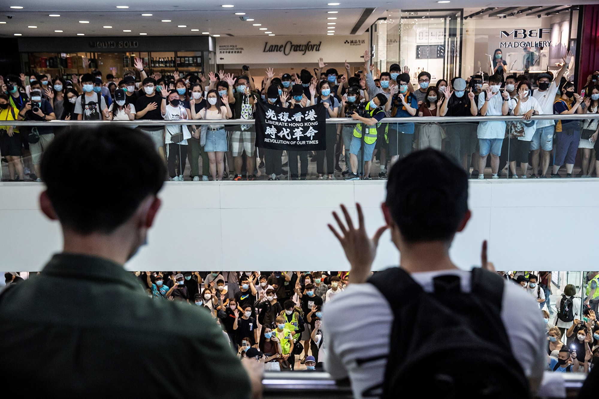

5月10日，香港市民在商场等地抗议。（ ISAAC LAWRENCE/AFP via Getty Images）

<b>原中国维权律师：中共趁疫情打压香港 国际社会需关注</b>

原中国维权律师滕彪表示，香港去年6月份以来的这个民主抗争，一直是国际社会关注的焦点。但现在全世界都在关注疫情问题，所以香港的问题好像就被忽视了。那中共恰恰考虑到这一点，加强对香港的控制，加强对香港的打压。

“所以，我觉得全世界尤其是西方国家，应该继续密切关注香港的局势，而且向中共施加更大的压力。否则得话，香港的自由民主恐怕很快就会面临被中共消灭。”滕彪说。

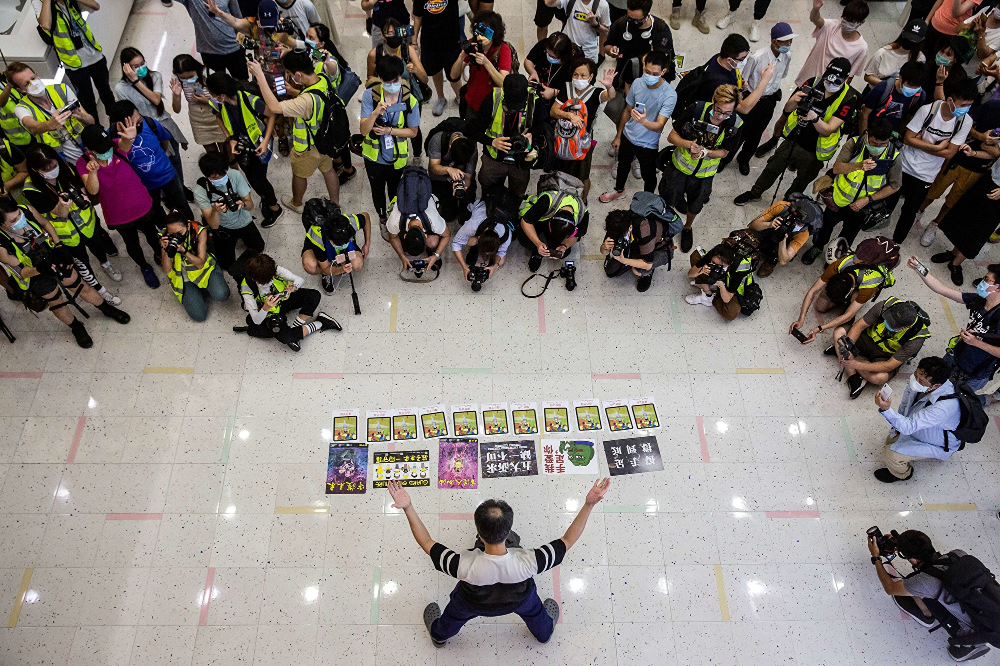

5月10日，香港市民在商场等地抗议。（ ISAAC LAWRENCE/AFP via Getty Images）

   
<b>原中国维权律师：中共根本不想遵守“一国两制”承诺</b>

滕彪认为中共对香港下杀手的根本原因：一是香港作为一个特别行政区，在很多方面对大陆有辐射作用，如信息、新闻、人权方面的活动，中共非常害怕大陆更多人了解到这些外界的情况；二是中共不可能去兑现当初“一国两制、港人治港”的承诺，香港如果按照当初“一国两制”的设想实现这个普选，那中共就会失去对香港的控制。

李恒青也认为，香港现在这个形势非常不好，中共当局可能下一步会对香港实行“一国一制，要彻底改变一国两制”，因为它们感到没办法能够彻底扑灭香港民众的反抗。

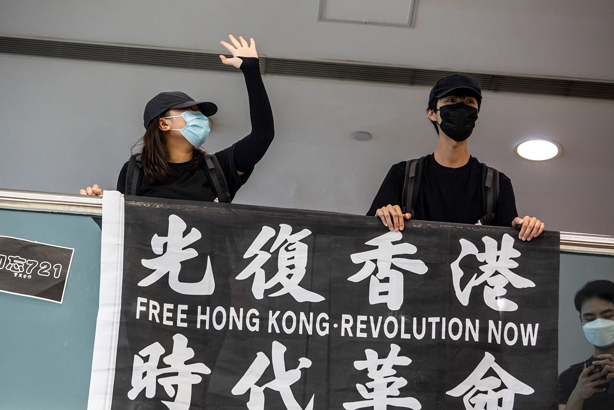

5月10日，香港市民在商场等地抗议。(ISAAC LAWRENCE/AFP via Getty Images)

“就是彻底把香港变成中国的一个直辖市，中共现在都已经在网上放风，我相信这不会是空穴来风，这肯定是中共现在用这个东西来试探风向，看看香港人民是什么样的反馈。”李恒青说，“面对这种情势下，我的一个基本感觉，就是香港可能这个镇压会越来越残酷。”

<b>学者：中共培训港警 警方不听特首命令</b>

李恒青还表示，现在有一批香港警察，是到中国大陆经过中共公安部训练好的，他们对香港民主派、普通老百姓做好了彻底动武的准备。

“香港警务处处长邓炳强与特首林郑月娥的观点都不完全一样，”李恒青说，林郑月娥曾经表示对警队搞独立调查，但是警方不同意。由此可见，现在他们的这个决策实际上是矛盾的，另外他们的执行也是矛盾的。

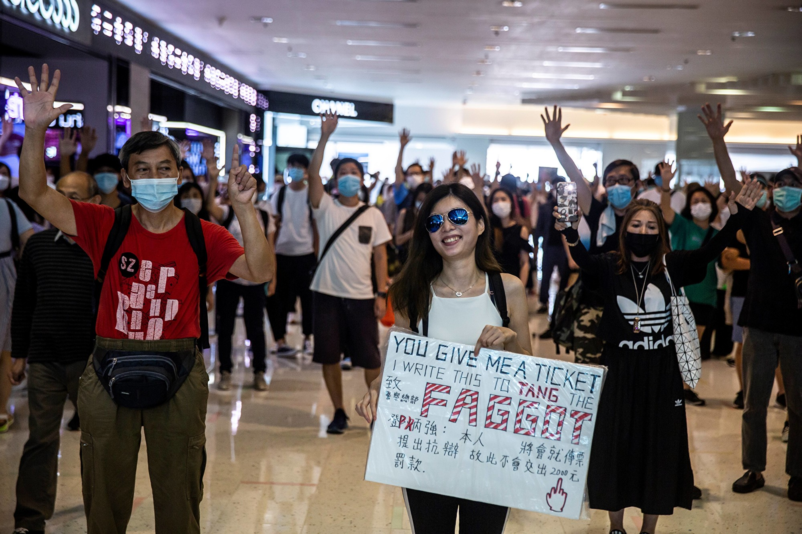

5月10日，香港市民在商场等地抗议。(ISAAC LAWRENCE/AFP via Getty Images)

王军涛也认为，香港过去是英国的传统，警察绝对服从对管理，就是武装力量、警察都绝对要服从文官的命令，但是这一次可以看出，香港警务处处长根本不听特首的话，根本就不把港府放在眼里。

王军涛表示，之所以出现上述情况，是因为共产党要接管一个地方，它首先接管的是专政力量。

<b>学者：中共企图实现“一国一制” 不被港人与国际社会接受</b>

李恒青认为，中共当局想要把香港变成“一国一制”，但这很难实现。第一，香港740万民众绝对不会屈服。如果是屈服，他们早就屈服了，在过去几年当中早就屈服了。而且在去年11月区议会选举当中，民主派一举夺得87%的席位。

“民意明摆着是向着香港真普选、香港民主自治的这个方向发展，这是毫无疑问的。”李恒青说，如果香港民众有决心捍卫他们的诉求，“五大诉求”一个都不能少，然后坚持真普选，那香港就有明天。

第二，香港是国际问题。中共一直希望把香港问题变成一个中国国内的内政，但是国际社会坚定不答应。其一，在香港回归前，中英联合声明中，中共明承诺香港的“一国两制”五十年不变，国际社会有监督的义务和责任。其二，如果“一国两制”存在，国际社会就能够涉足中共对香港的反人权、反人道问题。

<b>中国民主党主席：中共搞不好会失去台湾</b>

李恒青还表示，中共对待香港问题，背后还涉及台湾问题。台湾蔡英文5月20日就要连任总统，相信到时蔡英文会维持现有两岸关系不变。中共提出的所谓“九二共识”，已经彻底破产了。

他说：“在这样的大前提之下，香港有任何一点风吹草动都会影响到台湾，而台湾的任何一个动向，也会影响到香港，所以现在这已经变成了一个非常扑朔迷离的这么一个三角关系。”

王军涛则认为，中共处理不好香港问题，会把台湾给丢掉了。

他分析道，因为国民党韩国瑜最初在高雄深绿的地方当选，主要是得到年轻人支持，当时他提出来不要去管“统独”这些抽象的口号，大家应该拼经济、民生，所以年轻人支持他，竟然在深绿的高雄高票当选。

“但是，为什么在那么短时间，年轻人后来又抛弃他了？因为当时总统大选时，蔡英文说，投韩国瑜，就是投中国大陆，而投中国大陆，其实香港的年轻人的今天，就是台湾的年轻人明天。”他说，“同时，港人当时也到台湾跟台湾人说一定要珍惜民主、自由的价值，要守住，所以最后蔡英文总统高票连任。”

他认为，中国共产党如果在香港真的要采取强力措施的话，它不仅会招致国际社会进一步地围堵和制裁，而且会使台湾会加速远离它而去。

<a target="_blank" href=#top><h6 align="right">回上方</h6></a>
 
 
<a name=131>
<h1 align="center"><b>【新闻看点】川普连出重拳 北京忙兑现贸协？</b></h1>

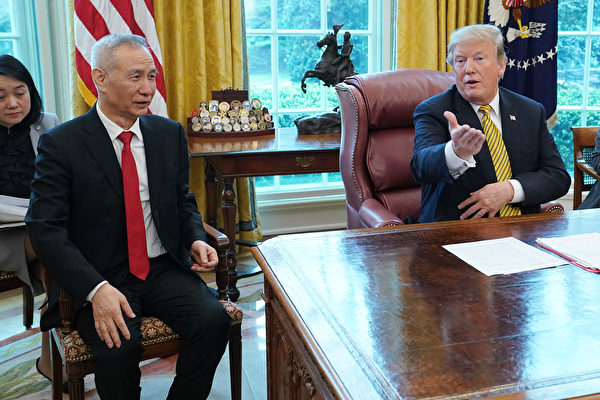

2019年4月4日，美国总统川普在白宫接见中共副总理刘鹤。当时各方看好谈判前景。(Chip Somodevilla/Getty Images)

【大纪元2020年05月14日讯】大家好，欢迎关注新闻看点，我是李沐阳。今天是5月13日星期三。

吉林市今天封城了，乡镇、社区全部封闭管理。目前铁路停运，出城要登记并持有48小时内的检测报告。这是舒兰市封城后，吉林省第二个封城城市，

武汉连续发现疫情后，当局封锁了爆疫小区，对区内5000人逐一检测。11日又开始对全市全员筛检。

韩国在首尔夜总会又发现了28宗新病例，使这起与梨泰院夜生活区有关的群聚感染人数上升到119人。

俄罗斯染疫人数已经高达24万2200多人，跃居全球第二。今天已经是连续第11天确诊人数超过1万人。因为定点医院两次发生大火，俄罗斯已经暂停使用着火的呼吸机。

因为澳洲坚持追责，中共恼羞成怒，11日突然终止了进口澳洲牛肉，澳洲政府非常失望。有政府人士表示，联邦政府会据实处理。如果更多商品被禁，可能会打贸易战。
欧洲死亡最多的英国今天公布数据显示，第一季度GDP萎缩2%，是金融危机以来的最大跌幅。英国央行估计，今年英国将创下三百多年来最严重的经济衰退。

大纪元独家获得陕西政府文件，多个县市一季度GDP大幅造假，证实国际多年来对中共GDP造假的指控。

因为被禁用谷歌，华为海外出货量下降了35%。降幅超过三星两倍多，是苹果的4倍。分析估计，华为规模可能会变小，成为以中国为中心的业务。

湖南郴州近日又出现了“大头娃娃”。大陆媒体报导，他们都是饮用了冒充“特医奶粉”的“倍氨敏”，然后患上了痀偻病和头骨畸形。

之前被中共关押5年，前不久刚刚出狱的大陆律师王全璋今天表示，准备采取法律手段，推翻法院的裁决，将违法之人绳之以法。

下面进入今天的正式话题。

<b>川普连出重拳，中共没了脾气？</b>

从武汉爆发的中共病毒（武汉肺炎、冠状肺炎COVID-2019），对整个世界都造成了冲击，美中第一阶段贸易协议也因此延宕执行。协议签署后的4个月，贸易协议的执行像是被遗忘了，没有任何动静。

随着5月8日美方逼着刘鹤通电话、要求中共执行协议后，美方又是连续出重拳击打中共，甚至打起了金融战。而中共放风要作废贸易协议之后，被川普一个直击怼了回来。随后中共马上改口，说只想落实好第一阶段贸易协议。接着中共又上演了被“挤牙膏”的情况，大动作买买买。

川普连出重拳，中共咋没了脾气？金融战开打，北京为何不敢撕毁协议？我们来说说这个背后的原因。先说说川普近期的几个重拳。

<b>重拳一：金融战开打</b>

福克斯财经频道12日报导，川普正在切断联邦政府雇员退休基金与中共政权的联系。消息称这个举措与中共病毒疫情有关。

在国安顾问奥布莱恩（Robert O’Brien）和国家经委主席库德洛（Larry Kudlow）写给劳工部长斯卡利亚（Eugene Scalia）的信函中，清楚显示，白宫不希望联邦雇员的退休基金TSP投资中共企业的证券。因为军方担心，这大约40亿美元会资助中共公司研发武器，反过来会杀伤美国军人。

基金公司在今天必须要作出回复。法广认为，这使得美中金融大战由美国证交会发信警告中共概念股风险的“口水战”转为正式开打。

9日，中共金融与发展实验室理事长李扬表示，世界已经出现了美元荒，世界已经在金融领域形成了排斥人民币的同盟。李扬指出，9个央行签署货币互换协议，但其中没有人民币。

<b>重拳二：国会推法案授权白宫制裁中共</b>

12日，参院司法委员会主席格雷厄姆（Sen. Lindsey Graham, R-SC）率多位共和党人，共同推出《2019年中共病毒问责法》。其中表示，如果中共不配合，不全面说明导致疫情爆发的过程，将授权总统制裁中共。法案还要求北京，尽快释放在疫情后镇压行动中遭逮捕的香港民主人士。

这位重量级议员说，“如果没中共的隐瞒，病毒不会出现在美国”“现在是该顶回中共，向中共追责的时候了”。

根据新法案，川普在60天内要向国会提交证明，证明中共是否向美国及相关组织机构病毒调查提供了全面完整的交代。这些法案得到了8位议员联署支持。

法案授权总统可以实施一系列的制裁，包括冻结资产、禁止旅行、吊销签证、限制美国金融机构向中共企业提供贷款或承销，以及禁止中共企业在美国上市等等。

<b>重拳三：鼓励本土产稀土 去中共化</b>

12日，共和党参议员克鲁兹（Ted Cruz）提出了“2020年本土稀土议案”。要求对美国稀土产业减免税收，鼓励美国企业在本土生产稀土。

克鲁兹提交议案时表示，生产国防科技与支持军队所需要的稀土元素和关键矿物资源，“几乎全部在中国开采、提炼并生产”，这“很危险”。“就像中共威胁停止向美国提供中国生产的救生药物一样，中共也可能停止向我们提供这些矿物，极大威胁到美国的国家安全”。

2019年5月，中共曾经高唱“稀土牌”，把稀土当成了“终极大杀器”。其实有专家早就指出，美国稀土储量并不比中国少，只是不愿意用牺牲环境污染作为代价开采。

而今美国推动稀土本土化，中共的所谓“终极大杀器”要失效了。

<b>重拳四：无限追溯禁令启动</b>

美国半导体设备制造商“泛林半导体”（LAM）和“应用材料公司”（AMAT）等发出信件，要求中国大陆企业，包括中芯国际和华虹半导体等，不能使用美国清单厂商半导体设备代工生产军用集成电路，同时“无限追溯”机制生效。

信中要求，收信单位承诺或确认不会将产品、技术、软件用于“军事最终用途（military end use）”。军事最终用途包括军用物品或和维护相关包括运行、安装、保养、维修、大修、翻新等等。

这项禁令启动，意味着美国对华出口的管制升级了。这对中共的高科技制造业，包括军事发展都会带来很大的影响。

<b>北京买买买，三千多万吨农产品将成交</b>

在川普的组合拳下，中共又被挤牙膏了。3名中方官员12日匿名向路透社证实，北京正努力兑现增购美国商品和服务的承诺。

有数据显示，3月份的中方进口量只达到了承诺的44%，4月份的进口额也比同期下降了5.6%。

一名官员表示，“个别月份没能完成的协议采购额度，后续可以在其它月份中陆续补回来”，“毕竟不是一次交易就能完成的事，疫情带来的困难是要考虑的”。

同是12日，中共外交部表示，第一阶段贸易协议有利于美中双方和全世界，应该“共同落实好协议”。

同一天，中共宣布了一批对美加征关税商品的排除清单，包括稀土矿、金银矿等79项商品。

11日路透社引述交易商表示，中方至少买了四艘船的大豆，约24万吨，在7月付运。还可能销售更多船货，有一家中共国企已经在求购7-11月的多达20艘船货。

消息人士透露，中方准备购买三千多万吨农产品，包括1000万吨大豆，2000万吨玉米和100万吨棉花等。

<b>北京为啥没了脾气？</b>

美方重拳组合，每一拳都很结实。《环球时报》英文版表示，要推翻协议重新谈判。但川普随即说“对谈判不感兴趣”，要看看北京的表现。随后中共再没有其它不同声音了。

8日，中共副总理刘鹤与美国贸易代表莱特希泽通了电话，报导表示要落实贸易协议。当时我们指出，刘鹤是被逼通电话，美方要求北京兑现协议。

中共官员的说法证实了我们的判断，北京是被逼着往前走。那名官员说“补回来”没有采购满的额度，意味着美方批评北京没有兑现协议，没有采购美国商品等。所以那名官员才说这不是一次交易能完成的事，言外之意，往后的中方采购量很可能会加大。言语中似有希望美方理解的意味。

那么为何北京现在没了脾气呢？外界认为，中共自身是有难言之隐。总的来说有三个。

<b>中共难言之隐之一：史无前例的失业潮</b>

中共官方称，今年2月城镇失业率是6.2%，5000万农民工无法外出打工。3月份失业率回降到5.9%，但仍处在高位。但有评论指出，中共靠得住，母猪都上树。自由亚洲表示，非官方的统计数字远高于中共的数字。

中泰证券测算，中国现在有7000万人失业，失业率大约是20.5%。中泰熟悉经济学家李迅雷在个人公号发布这组数字后，他已经被撤换中台证券研究所所长的职务。

而《南华早报》引述深圳望正资产管理公司首席经济学家刘陈杰的分析报导，这次疫情可能导致2.05亿工人遭遇了“摩擦性失业”，失业率超过25%。

北京经济评论人士张林认为，疫情引发的失业潮，比90年代末2500万国企工人的下岗潮、2008年金融危机造成的2000万农民工返乡潮都要严重。

深圳鞋材工厂老板李先生介绍，2月24日开工，最大问题是“缺人”。因为交通阻断，农民工困在疫区出不来，回到工厂还要等14天隔离期。好不容易熬过了这个槛，准备追回损失，但“订单没了”。

李先生向自由亚洲介绍，三四月就开始取消单，有的要求延后出货，有的直接说不要货了。不下订单，企业当然不会生产。

在郑州经营三家手机零部家工厂的罗先生表示，3月订单比同期少了七成。于是直接通知困在家的工人“别回来了”。

富士康是iPhone最大组装厂，目前已经暂停了招聘工人。《金融时报》表示，富士康鼓励员工多休假，也拿出裁员措施。从4月10日开始，富士康已经不再加班了。

不加班，对农民工人来说就是少挣钱，所以很多人选择了离职。而农民工群体，中国有近3亿人。

瑞银的4月份报告曾认为，中国正面临着20多年来“最糟糕的就业市场”。截止到3月底，中国的服务、制造和建筑业中，已经失去了8000万个工作岗位。

经济学人分析表示，今年中国有2.5亿工人将面临收入减少10%－50%。

<b>难言之隐之二：通缩隐忧加剧</b>

因为国外疫情的冲击，大陆很多工厂失去了外贸订单。12日中共发布的数据显示，4月工业生产价格指数PPI同比下降了3.1%，是2016年4月以来的最大降幅。

路透社引述分析表示，疫情对大陆经济的负面冲击正在显现。分析认为，从目前的情况看，PPI可能会全年进入通缩，甚至可能会出现全年PPI不断下行的情况。

工业品价格滑落，自然要削弱企业获利和扩展业务的能力。同时疫情在全球大流行，造成各地需求锐减，也将使大陆出口前景堪忧。

官方数据显示，生产原料价格同比大幅下降4.5%，跌幅扩大了2.1%。其中下跌幅度最大的前三位是：石油天然气开采业，价格年减51.4%，跌幅扩大29.7%；其次是石油天然气加工业，价格年减19.8%，跌幅扩大9.2%；第三是化学原料和化学制品制造业，价格年减8.3%，跌幅扩大了3%。

中原银行首席经济学家王军认为，疫情对需求的打击更严重、更持久、更不可恢复。她预计工业产品将进入持续通缩阶段，对整体经济而言，需求不足货轻度通缩是未来最大的矛盾。

<b>难言之隐之三：疫情二次爆发风险</b>

大陆疫情出现了反复状况，吉林、武汉等地先后又出现了本土病例，使外界开始关注疫情是否出现了第二次爆发。

中共官方在11日通报，最近的十多天中，7个省份都有新增本土确诊病例，而且聚集性疫情继续增加。

目前吉林市和舒兰市都已经宣布封城了。其中舒兰市病毒传播链已经跨越吉林、辽宁两省，共导致22人感染，但目前仍未找到传染源。

武汉作为疫情初始地，解封后连续一个月没有通报新增确诊病例。但是本月9日、10日两天，突然爆出6例新增本土病例，使连续35天的无新增确诊病例纪录被终结。

武汉当局随即封锁了爆出疫情的三民小区，对区内5000人注意进行核酸检测。11日武汉又紧急通知，对全市开展全员核酸筛检。当局的这个大动作引起很多人质疑，为什么封城期间不全城筛检？非要等疫情再次出现才采取行动，难道又被人言中：嫌人死得不够吗？

这三个方面，都是中共的难言之隐，迫使中共必须软下来，不再像以往一样强硬。因为它怕，怕美国真的断绝与中国的贸易往来。如果美中中断贸易，那么以出口经济作为主要支撑的中共政权，很快就会垮掉。

中共知道自己的斤两，所以不敢有脾气。

<b>疫情何时终结？</b>

到目前为止，人们期盼气温升高，病毒会自动消失，这个希望几乎已经幻灭了，真没有了。而直到目前，没有人知道疫情何时过去，疫苗何时问世，也是未知之事。

《纽约时报》引述历史学家的说法：一种可能性是这次疫情可以在医学终结之前，实现社会终结。

就是说，这个病毒不解决，很可能人类会因此灭绝。

哈佛大学历史学家布兰特（Allan Brandt）说，试图定义流行病的终结，“将是一个漫长而艰巨的过程”。

这是比较可怕的一件事，就是说，这意味着人类可能要与病毒共存。

其实，然我们感到可怕的病毒，远不止中共病毒。中共还衍生了其它的病毒，也一样令人心惊。

<b>现在社会怎么了？</b>

收到一位网友的爆料，他同时发来了一个视频。

这位朋友是我们的忠实观众，也是一位对国事家事都很关心的人。不过他说因为平时见到太多的事情，比如城管打人、官逼人反等等，所以这些他都不是很在意。主要原因是，他认为那些事并没有发生在自己身边，与己无关。

但是他说，他身边发生的一件事，是11日发生的事，让他很生气，就是视频中的事。他说做为一名父亲，虽然打的不是他的孩子，但是在学校里十几名学生打一名学生，而且一个一个轮着打，这让他实在接受不了。

从视频中看，被打的学生一直没有还手，旁边的学生一个一个地轮着打。网友在信中说，那名学生的眼神是那么的无助。

据介绍，这件事发生在广西南宁青秀区刘圩镇第三校区。但这种事情，在这个中学已经发生过多次，最后都是不了了之。网友质问：“现在的社会怎么了？是什么让学生变成了魔鬼？”

信中说，生活在这样的环境下，可以想像人民是多么的提心吊胆。“什么法治社会，都是个屁”。“一个小镇都这样，那么整个中国的现状是什么情况”。

网友最后留给我们一个思考，中国的现状是什么样？

大家知道，中国人以前讲“仁义礼智信”，讲究待人真诚、和善，遇事懂得忍让。但是现在这些全都没了，如果在中国大陆还说这些，很多人会认为这个人是傻子，窝囊，整个人的观念全都反过来了。

年轻人不太清楚，年龄长一些的朋友可能知道，中国人的这种变化，就是最近几十年的事情。就是中共控制中国以后，才出现的这种变化。

中共把中华民族那些正统文化都当成“四旧”，一点不剩地给打破了。在中共邪恶的灌输下，人们的思想变异了。把坏的说成是好的，好的说成坏的。人们开始崇尚血腥、暴力、斗狠，人们逐渐分不清是非善恶。

只要追根究底，就会发现，所有社会问题的毒根就是中共。有网友说，中共不倒，中国不会好；中共不倒，世界不会好。

今天要跟大家说说中共病毒的多种症状。专家们发现，感染中共病毒，并不只是发烧、咳嗽和嗓子痛，还有多种症状。如果不能及时发现，的确很危险。

感谢您的收看，再会。

大纪元《新闻看点》制作组

<a target="_blank" href=#top><h6 align="right">回上方</h6></a>
 

   
<a name=130>
<h1 align="center"><b>大法日 大陆及海外律师学者祝福法轮功</b></h1>

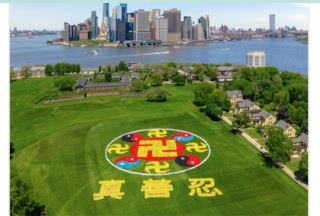

2019年5月18日，来自全球的部分法轮功学员汇集纽约，在纽约总督岛排出“法轮图形”和“真善忍”三个大字，庆祝世界法轮大法日。（大纪元）

  
  【大纪元2020年05月14日讯】（大纪元记者骆亚采访报导）5月13日是世界法轮大法日暨法轮功创始人李洪志大师的华诞，也是法轮功开传28年的纪念日。一些大陆和海外的律师、诗人、学者通过大纪元平台送上诚挚的敬意和祝福，并高度赞誉法轮功学员坚持信仰的非凡勇气，以及法轮功为社会道德重建做出的贡献。

“有信仰，才有灵魂！‘真、善、忍’是一种信仰，她也是普世的。过去这些年里（法轮功学员）走过的路，尽管曲折坎坷、尽管充满了艰辛痛苦，但大家仍然坚定着自己的信念。你们是一个坚强的团体，那种‘不放弃’的精神，永远值得所有人尊重。祝愿今后我们一起继续坚韧不拔，怀着期待与盼望，坚定地走向光明。”大陆一名维权律师“5·13”这天送上祝愿。他虽然也遭到中共迫害，但依然希望与法轮功学员同行，坚定地走向光明。

大陆著名诗人、自由作家王藏也送上祝福说：“5月13日是法轮功开传的日子，也是世界法轮大法日，暨法轮功创始人李洪志先生六十九岁华诞。我向全世界法轮功学员致以诚挚的敬意和祝福。你们的信仰，散发着灿烂的真善忍光辉；你们在信仰之路上所承受的巨大血泪代价和坚韧不拔的非凡勇气，足可谓惊天地泣鬼神；你们为中国乃至世界的自由民主、人权民生等事业所做的贡献早已彪炳千秋。”

<b>海外学者敬佩法轮功对社会的贡献</b>

哥伦比亚大学博士、中国民主党全国委员会主席王军涛在5月13日向法轮功创始人李洪志先生送上了诚挚的祝贺。同时，他对法轮功学员这些年坚持反迫害讲真相对社会的作用深感钦佩。

他说，“第一，我觉得法轮功开传以来宣扬一种‘真、善、忍’的精神，对中国社会的道德重建做了很多积极的工作。而共产党长期统治摧毁了民族文化，同时又拒绝其它的文明中健康的因素进入中国。特别是从文化大革命以来一直搞政治运动，这种迫害导致了中国整个的道德置于一种崩溃。”

“我们也知道共产党有一天是要垮掉，退出历史舞台的，中国要有一个健康社会的话那麽道德就很重要。”他说。

   
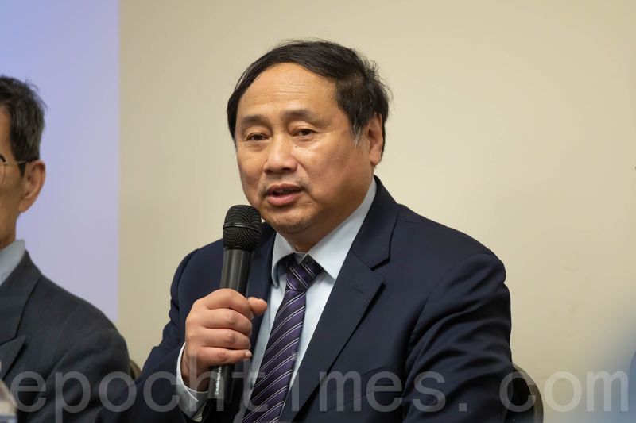

哈佛大学硕士、哥伦比亚大学博士、中国民主党全国委员会主席王军涛。图为大纪元资料图片。（林乐予／大纪元）

   
   “第二，我觉得法轮功在这个结束共产党暴政中起了不可替代的作用，并且作用很大。”他说，“他们讲真相的过程中这些系列活动都是在结束共产党暴政，起了很大的作用。”

他表示，法轮功在共产党的反复打压下仍然可以顽强地抗争，赢得了很多人的尊重，包括一些人过去对法轮功有各种误解，那麽后来也是在这样的一个过程中变了。

他说，第三，在这么多年的这种抗争中，法轮功其实建立了推动中国政治进步和把中国的古老和现在的文明结合起来的一套平台，比如像大纪元、新唐人、希望之声、看中国等这样的一系列的传播频道和机制。未来一旦共产党暴政崩溃之后，那麽他们可以为中国的进步、文明提供传播渠道和平台。

美国华盛顿信息与战略研究所学者李恒青也通过大纪元平台送上诚挚祝愿：“5月13日这个大喜的日子，祝贺李洪志老师生日快乐。”

他说：“我觉得法轮功在过去的二十多年中，应该说前仆后继为自己最基本的信仰自由权利进行不懈的抗争，而且承受那么多的非人道的残酷迫害，一直坚定不移在追随着李老师，继续不断地去修炼，我觉得这一点非常了不起。”

   

美国华盛顿信息与战略研究所学者李恒青。（视频截图）

   
   “也是借此机会希望能够有更多的法轮功学员更加坚定地去信仰。”他表示，“另外希望中共对法轮功的迫害能够早一天的结束，希望中国最后真正变成一个民主法治的这样一个国度，能够让所有的人，包括法轮功的学员，能够自由地去行使自己的宗教信仰的自由，去追求他们最基本的做人的这个权利。”

<b>人权律师呼吁国际继续关注中共迫害真相</b>

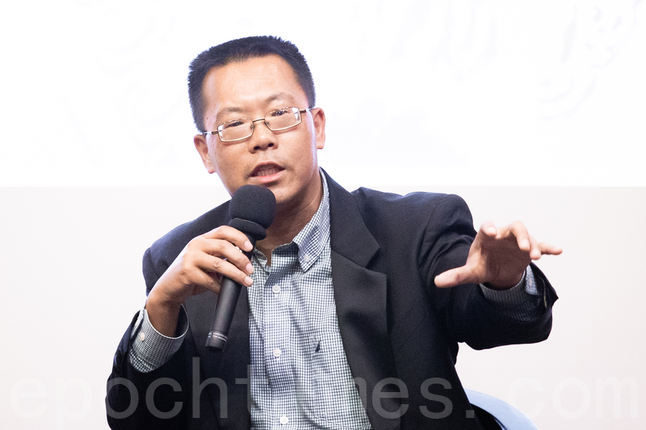

图为揭露中共孔子学院内幕的纪录片《假孔子之名》1月8日在台湾大学放映，人权律师滕彪出席映后座谈。（陈柏州／大纪元）

   
   原中国维权律师、普林斯顿高等研究院访问学者滕彪在“5·13”这天，希望全世界应该继续持续关注中国的宗教迫害的情况，“这种打压没有停止而且也变本加厉，所以世界各国都应该继续关注中国，包括法轮功在内的这个宗教受到残酷迫害的情况。”

他还表示，法轮功学员把这个受迫害的真相讲出来，不断地去告诉全世界发生了什么事情，这个看起来是只是微不足道，但是实际上所有这些真相积累起来、汇合起来，那个巨大的人权灾难就会呈现出来，那样中共抵赖也是徒劳的。

他强调，“因为中共害怕真相，所以这个真相的披露，包括争取言论自由、争取信仰自由，这虽然是基本的人权问题，但是对于中共独裁政权来说也是致命的一击。”

<a target="_blank" href=#top><h6 align="right">回上方</h6></a>

