

<table>
 <tr>
  <td align="center" width="450"></td>
   <td   width="450"><h3>【希望之声2020年2月18日】在武汉肺炎疫情严峻、中共加强大陆封网之际，希望之声推出专门为中国大陆民众开发的自带翻墙功能手机   APP。据开发人员介绍，此款手机APP适用于安卓操作系统，也就是所有的国产品牌手机、以及三星、LG等非iphone手机。
     

     
   安装后可收听收看希望之声的节目：包括《江峰时刻》、《天亮时分》、《老北京茶馆》及最新时事新闻等精彩内容。不需要使用任何翻墙软件，一步到位获得最新海外资讯，帮您免除翻墙上网的麻烦与风险。欢迎大家下载并传给中国大陆的亲朋好友。
   
   希望之声版权所有，未经希望之声书面允许，不得转载，违者必究。</h3>
     </td></tr></table>
     

     
<h1 align="center"><b>免翻看视频 (请收藏网址)，随时连即时最新IP https://git.io/swspip</b></h1>
<h1 align="center"><b>复制（网址或 IP 数字 ）到浏览器打开。若出现   “提示” ，請点击“继续”访问即可。</b></h1>

<h2 align=center><a href="https://github.com/gav01/Heart/blob/master/news1.md">● 大纪元时事 ●</a></h2>

<h2 align="center">直連不必翻牆開花必看精彩視頻http://tt8y.github.io (请收藏网址)</b></h2>

<table>
<tr>
 <td>
 <a href="https://git.io/pamja"> <h3>如何 “ 三退保命 ”</a>，<b>连上面→免翻视频  https://bit.ly/3asSXIA </b> →点 【三退大潮】--为什么要退党？ 可留言三退或用翻墙软件自己办理三退</h3></td>
</tr> 
<tr>
 <td>
 <a href="https://git.io/pamja"> <h3>如何 “ 三退保命 ”</a>，请点击翻牆网站  https://git.io/opopop  下载 { 翻牆软件 }→找 { 大紀元網站 }  ( http://www.dajiyuan.com ) 三退</h3></td>
</tr>
<tr>
<td>
 <h3 align=center><a href="https://www.ntdtv.com/gb/2020/03/26/a102808561.html">最新翻墙软件 突破封锁访问大纪元新唐人(点击右键,另存新档）</a></h3></td>
</tr>
</table>

<a href=https://git.io/souye><h6 align="right">回首頁</h6></a>

<a href="https://github.com/gav01/Heart/blob/master/ls-20-4-1.md"><b>往1~118新闻</b></a> 

<a name=top>
  
  
  
  
  
  
  
  
  
  

<a href =#160>160.中共出口劣质医疗品 各国要求退货退款   
<a href =#159>159.【疫情最前线】疫情未明饥荒将至 日本预警9级地震 
<a href =#158>158.美暂停资助世卫 蓬佩奥：或永远不会恢复   
<a href =#157>157.【快讯】美众院压倒性通过近5千亿援助法案 
<a href =#156>156.全面洗脑 哈族青年揭新疆集中营黑幕   
<a href =#155>155.恃强凌弱 河北女用鞋底抽打女孩 
<a href =#154>154.未获拆迁安置 浙江义乌七十村民状告政府   
<a href =#153>153.【一线采访】习近平突访西安 到处是便衣 
<a href =#152>152.分析：金正恩残废或病故 中共恶梦将成真  
<a href =#151>151.中共发言人急于推卸国际追责 搞出乌龙   
<a href =#150>150.乾元：从户口到健康码——让人死在家里的公权力 
<a href =#149>149.【拍案惊奇】骇客攻武汉病毒所 京城面临大清洗   
<a href =#148>148.要中共为疫情负责 博尔顿吁给台湾外交承认 
<a href =#147>147.【内幕】中共瞒疫情 抽调各省医护援湖北   
<a href =#146>146.连云港化工厂爆炸 连续三次巨大爆炸声 
<a href =#145>145.炒医疗物资牟暴利 “倒爷”叹“人性黑暗”   
<a href =#144>144.【独家】中共密件承认哈尔滨疫情失控 
<a href =#143>143.港警恐袭式大抓捕 李柱铭等14民主人士被抓   
<a href =#142>142.【一线采访】父母湖北双亡 儿子欲状告中共 
<a href =#141>141.加码救小企业 美参院通过近五千亿援助法案   
<a href =#140>140.大陆二手房房源增多价格大跌 上千房企注销 
<a href =#139>139.密苏里州率先起诉中共：疫情骗局 后果巨大 
<a href =#138>138.【独家】各地秘密培训 中共层层瞒疫情   
<a href =#137>137.1传43 哈尔滨疫情失控 内蒙古封边界交通 
<a href =#136>136.消息：美国准备金正恩去世后的应对计划  
<a href =#135>135.专访人权律师麦塔斯 解析追责中共法律程序 
<a href =#134>134.美参院追查世卫 限谭德塞4月27日交材料   
<a href =#133>133.刘细良：中共撕破脸 共产党在香港现真身 
<a href =#132>132.【内幕】危及习近平 孙力军案堪比周永康   
<a href =#131>131.黑龙江下“封口令”禁网上谈论当地疫情 
<a href =#130>130.“砸中俄的锅” 中共大使骂华人回国是散毒 
<a href =#129>129.河南4童被埋致死 住建局长被免职 网民不买账   
<a href =#128>128.传金正恩手术后病危 韩国官媒称无异常动静 
<a href =#127>127.【一线采访】重症者被清零转院 面临庞大医费 
<a href =#126>126.公安部副部长 前610副主任孙力军落马 
<a href =#125>125.【一线采访】俄罗斯如何借疫情驱赶华人   
<a href =#124>124.中共警察跟踪纽时记者吓跑受访者 打脸华春莹 
<a href =#123>123.【最新疫情4·20】川普：美希望进入中国调查   
<a href =#122>122.【一线采访】外贸日子难 粤厂家：没订单 
<a href =#121>121.致习近平公开信！德媒主编：您在危害全世界   
<a href =#120>120.疫情持续英国政要发声问责中共 
<a href =#119>119.广西某组织部部长退党记 

<a name=160>
<h1 align="center"><b>中共出口劣质医疗品 各国要求退货退款</b></h1>

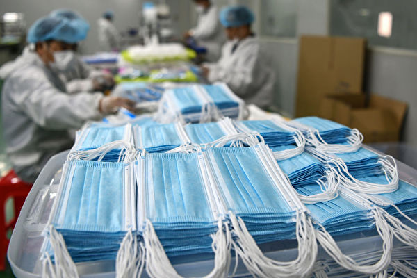

中共近期大搞“口罩外交”，试图“提升国际形象”，但是纰漏连连，犹如在国际社会上演一场将劣质商品以高价卖出的丑剧。图为江西南昌一家口罩厂。(STR/AFP via Getty Images)

【大纪元2020年04月24日讯】（大纪元记者吴英综合报导）中共近期大搞“口罩外交”，向各国出口大批医疗用品，试图“提升国际形象”，但是纰漏连连，犹如在国际社会上演一场将劣质商品以高价卖出的丑剧。

周四（23日），多家媒体报导，西班牙向中国深圳易瑞生物公司（下简称易瑞公司）采购64万套快筛检测试剂套件，上个月底交付的5.8万套件的准确度不符标准。没想到，易瑞公司本月送来的快筛试剂盒样本，仍然不符合检测标准。西班牙只好取消订单，要求退款。

同一天，加拿大政府表示，向中国公司买来的大约100万个KN95口罩（此为中国的分类，相当于西方国家的N95口罩），无法满足医疗保健专业人员的标准，因此不会分发到各省或城市。

加拿大公共卫生局（PHAC）表示，这批KN95口罩不符合N95口罩的过滤标准，也就是必须捕集至少95%的微小颗粒。

对于遭受中共肺炎袭击、急需检测套件及医疗用个人防护装置（PPE）的国家来说，如果使用品质恶劣的中国产品，不仅危及国人生命，还延误应急疫情及分秒必争的救人进度。

更恶劣的是，中共在向世界出口PPE及测试套件的同时，中国业者趁火打劫，抬高这些产品的价格，并且要求先付款才出货，从而获得了可观利润。

另外，当各国抱怨从中国购买的产品质量不佳时，中共当局没有检讨改善，反而将其归咎于用户端使用错误。

除了西班牙及加拿大外，此前荷兰也抱怨从中国买来的口罩不能和脸部密合，口罩内的过滤器也不符合标准。荷兰卫生部在3月21日的一份声明中说，由于不符合质量标准，他们不得不召回已分给医院的数万个口罩。

4月8日，芬兰政府表示，向北京购买的200万个防护口罩“都不合格”，无法在医院使用。应急部门负责人洛内玛（Tomi Lounema）在新闻发布会上说，由于中国口罩市场“极度混乱，价格一直在上涨，必须迅速做出购买，而且要预先付款，商业风险很高。”

两天后，洛内马承认花费1000万欧元采购防护设备，结果不是不合医院使用，就是签了约但对方没履约。洛内马最终辞职。

上个月，捷克亦表示，从中国买来的15万个快筛病毒检测试剂盒，至少八成无法使用，准确性不如其它的检测方法。捷克被迫继续使用常规的实验室检测。

本月，社交媒体上流传一个中国口罩工厂工人，用口罩擦鞋的视频。澳大利亚边境局官员扣押了从北京购买的大约80万个有缺陷的口罩，价值760万美元。该国一位高级政府部长表示，中国公司抬高价格的做法几乎是在“勒索”。

斯洛伐克、土耳其和英国的科学家抱怨，从中国公司购买的病毒检测试剂盒无法使用，导致损失数百万美元。

格鲁吉亚取消了向易瑞公司采购检测套件的订单，马来西亚则是转而向一家韩国公司购买。

美国也出现类似的情况。伊利诺伊州州长普利兹克（J.B. Pritzker）花了1700万美元向中国公司订购KN95口罩。

4月中旬，密苏里州召回了交付给急救人员的大约48,000个中国制KN95口罩，原因是不符合标准。

密苏里州的举动促使伊利诺伊州公共卫生部（IDPH）官员发出声明，警告中国制口罩不符合标准，建议只能在危机中使用，医护人员仍应使用N95口罩。

<a target="_blank" href=#top><h6 align="right">回上方</h6></a>

<a name=159>
<h1 align="center"><b>【疫情最前线】疫情未明饥荒将至 日本预警9级地震</b></h1>

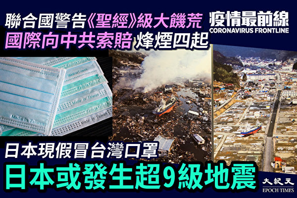

联合国警告或面临《圣经》等级的大饥荒；日本估发生9级地震；深圳首披露27师生感染；国际向中共索赔，烽烟四起。（大纪元香港新闻中心）

 
【大纪元2020年04月24日讯】（大纪元香港新闻中心报导）联合国警告，疫情酿粮食危机，或面临《圣经》等级的大饥荒；疫情尚未平息，日本预警9级地震引发30米海啸巨难；深圳首爆27名师生群体感染。国际向中共索赔，烽烟四起；日本出现大陆仿冒台湾口罩，网友提议台湾口罩印上“天灭中共”可防伪。

<b>专家：疫情酿粮食危机 饥饿人口恐翻倍</b>

中共病毒（新冠病毒，俗称武汉病毒）夺去了大量的生命，也造成了全世界的动荡。然而联合国粮食专家警告说，疫情所带来的经济冲击，可能会让更多人失去生命，人类可能面临“《圣经》等级的大饥荒”。

周二，联合国专家表示，受到疫情影响，全世界的饥饿人口可能会翻倍。若不立即采取行动，到了2020年底可能有2.65亿人“严重缺乏粮食”。换言之，全世界每30个人中就有1人面临饿死的威胁。

美联社报导说，世界粮食计划署（WFP）执行董事大卫·比斯利（David Beasley）说，2020年将是六十多年来世界粮食供应最严峻的一年，如果不采取紧急行动，几个月内可能就会发生“《圣经》等级的大饥荒”。

目前，粮食危机最严重的10个国家，分别是也门、刚果、阿富汗、委内瑞拉、埃塞俄比亚、南苏丹、叙利亚、苏丹、尼日利亚和海地等。这些国家中，数以百万的人已经在面临饥饿的威胁。

“2020年人类将面临自第二次世界大战以来最严重的人道主义危机”，根据世界粮食计划署的分析，如果不采取措施，几个月后“每天可能有30万人将饿死”。

事实上，疫情全面爆发前，因为叙利亚、也门爆发战争，肆虐中东与东非各国的“大蝗灾”，加上横扫亚洲的秋行军虫害等，今年已经面临严重的粮食问题。

随着疫情爆发，全球主要的谷物出口国，如美国、加拿大、法国、澳洲、巴西、印度、阿根廷、俄罗斯、泰国等国都受到了冲击，影响到农业生产的进度。

据日本《读卖新闻》，目前已有俄罗斯、哈萨克斯坦、越南、泰国、柬埔寨等13个国家，开始实施限制农产品和食品出口的政策。这让全球粮食供应的问题浮上台面。

人类历史上，天灾之后的次生灾害，危害性永远大于灾难本身，而饥荒是其中最可怕的问题。如何避免大饥荒，实际上已经摆在各国面前。

<b>日本预警9级地震引发30米高海啸</b>

4月21日，日本内阁府专家小组，公布了日本东北至北海道的太平洋近海海沟和千岛海沟的地震预测，专家警告，未来短期内，该地区可能发生最大规模达9级的地震，甚至引发太平洋沿岸近30米高的海啸。

这个预测范围，包括北海道、青森等7个道县。小组估计，千岛海沟可能将发生9.1级地震，日本海沟或出现9.1级地震。在海啸高度方面，岩手县宫古市可能出现高达29.7米的海啸，北海道襟裳町的海啸或高达27.9米。

专家会议认为，推断地震发生概率很困难。过去每隔三四百年，都会发生一次巨大超级海啸。由于从上一次17世纪的大海啸发生至今，已经过较长时间，因此专家认为情况紧迫。

有日本民众接受大纪元的采访表示，对这样的预测完全不担心。他解释说，由于日本是个地震频发的国家，1995年以后的建筑物要求防震达到7级以上，同时保障门窗都能打开。

他还说，日本的很多防灾措施都做得很好，比如城市中比较大的车站，或者大型住宅区附近，都修筑有灾害物资储备库，以应对地震等灾害发生时所用，有饮用水，不需要炉火就能吃的饼干、面制品等，在食用有效期内定期更换。而且日本国民针对灾害的自我保护和防护训练，可能是全球最好。

但也有网民对人类的未来表示担心，她表示疫情仍在蔓延，饥荒也可能发生，再来几场大规模的地震海啸，未来会越来越像地球的末日，一切灾难真的可能是神的警示与审判了。

<b>深圳首爆27师生感染 下周一分阶段复课</b>

深圳周三（22日）召开疫情防控工作新闻发布会，宣布该市中小学下周一（27日）开始分阶段复课，又首次披露，有27师生感染中共肺炎。

深圳市卫健委副主任吴兵表示，截至周二（21日），深圳累计报告461宗确诊病例，另有33宗无症状感染者尚在接受医学观察。他又首次披露，在深圳各学校，共有27名师生报告感染病毒，其中有6名教师，21名学生。感染学生当中以小学生占最多，共有10人；7人为中学生；其余4名为大学生。

有评论认为，学校是人群密集场合，若不顾疫情，急于让学生复课，恐怕将造成病毒传播。而深圳一旦疫情告急，隔河相望的香港也面临着疫情的威胁。

<b>全球索赔 多方对中共追责</b>

中共当局隐瞒致全球疫情爆发，国际社会正在掀起追责中共的浪潮。

4月21日，美国密苏里州州政府起诉中共并索赔，成为全球首个因疫情起诉中共的政府机构；意大利成立“向中国政府集体诉讼索赔”的连署网站。美国至少7宗私人团体向中共索赔发起诉讼案；美国伯曼法务集团代理了1万名感染中共病毒的40国公民，提起诉讼，要求中共政府赔偿共6兆美元。

美国福克斯新闻获得了密苏里州州政府的民事诉讼状副本，显示原告人是密苏里州，而被告人包括：中华人民共和国；中国共产党；中共国家卫生健康委员会；中共应急管理部；中共民政部；湖北省人民政府；武汉市人民政府；武汉病毒研究所；中国科学院政府部门和机构。

截至4月21日上午，密苏里州已有5,963例中共病毒确诊病例，215宗死亡病例。

起诉书写道，“中国（中共）当局的一场欺骗、隐瞒、渎职和不作为的骇人听闻的运动，导致了这一大流行的爆发。在疫情最初爆发的关键几周内，中国（中共）当局欺骗公众，压制关键信息，抓捕举报人（吹哨人），在证据不断增加的情况下仍否认（病毒）人传人，摧毁重要的医学研究，允许数百万人暴露在病毒中，甚至囤积个人防护设备，造成了一场不必要的、本可阻止的全球大流行。”“被告人要对它们（中共）给全球包括密苏里州人造成的巨大死亡、痛苦和经济损失负责。”

密苏里州官员表示，除了让中共承担尽可能大的经济赔偿外，密苏里州政府还在寻求找出更多的有关中共政府如何处理病毒以及病毒起源的真相。

之前，美国至少有7宗由私人团体对中共提出的群体诉讼案。其中在佛罗里达州的一起诉讼称，中国明知“COVID-19是危险的，能够引起大流行，却行动迟缓，把头往沙子里扎（指逃避处理问题或困难的局面），为了自己的经济利益而进行掩盖。”

代表五家拉斯维加斯企业的另一项集体诉讼，正在寻求数十亿美元的赔偿。该诉讼表示，中共政府当初应该共享有关该病毒的更多信息，相反地，中共却吓阻医生、科学家、新闻工作者和律师对疫情真相的报导和揭露。

在另一起诉讼中，美国保守派律师拉里·克莱曼（Larry Klayman）及其位于华盛顿特区的“自由观察”（Freedom Watch）在德克萨斯州提起诉讼，要求中共赔偿20兆美元，理由是中共“无情、鲁莽冷漠和恶意行为”。

4月20日，22名共和党议员，要求川普（特朗普）政府针对中共在大流行期间的行为，向国际法院提起诉讼。

与此同时，美国国会参众两院分别推出法案，允许美国民众就他们在中共病毒疫情中的损失，向中共政府提出控诉和索偿。

<b>意大利率先提连署向中共索赔</b>

意大利也在4月21日推出了一个“向中国政府集体诉讼索赔”的连署网站，短短一天内就有数百人连署。该网站计划在4、5月完成连署，6月诉诸法律行动，预估参与连署者将超过50万人，向中共索偿金额可能超过1000亿欧元。

意大利通讯社Adnkronos说，意大利非营利组织“欧洲一体”（Oneurope）带头发起向中共政府索偿的行动。

此外，意大利消费者权益保护协会（Codacons）也考虑，他们正在与美国法律公司研究，拟在美国向中共政府提出诉讼案，让全世界都可以参与。

英国智囊亨利·杰克逊学会（Henry Jackson Society）公布的长达44页报告，详尽分析了对中共提起疫情赔偿诉讼的法律依据。

<b>补货仍不合格 西班牙再退中国快筛试剂</b>

西班牙政府4月22日表示，该国从中国大陆订购的试剂在退回后补的货仍然不合格，因此宣布西班牙退回从中国公司订购的所有64万盒试剂。

据西班牙《国家报》报导，西班牙向中国易瑞生物公司订购了64万盒快筛试剂，但准确率不及30%，不得不于3月底退回了第一批的5.8万试剂。然而西班牙政府发现，易瑞生物公司补送的5.8万新试剂，仍然有同样的问题，最后决定全部退货。

日本涌现陆制假冒台湾口罩 网友：印上“天灭中共”可防伪</b>

<b>台湾纪录片《暴民》Facebook专页22日晚上发文，指获许多日本友人通知，有大量中国大陆制的口罩，被印上了“Made in Taiwan”钢印，假冒台湾制口罩在日本贩售，而这些口罩品质低劣，并未达到医疗等级。

专页还提到，台湾的口罩目前不可能外销到日本，而台湾政府捐给日本当局的口罩，只够给当地前线医护使用。早前台湾宣布，禁止出口一般医用口罩和外科口罩直至6月底。

有中国网民直接在推特上指出：“在台湾口罩印上‘天灭中共’，即可起到防伪效果。”台湾口罩厂商，不妨考虑一下。

<a target="_blank" href=#top><h6 align="right">回上方</h6></a>

<a name=158>
<h1 align="center"><b>美暂停资助世卫 蓬佩奥：或永远不会恢复</b></h1>

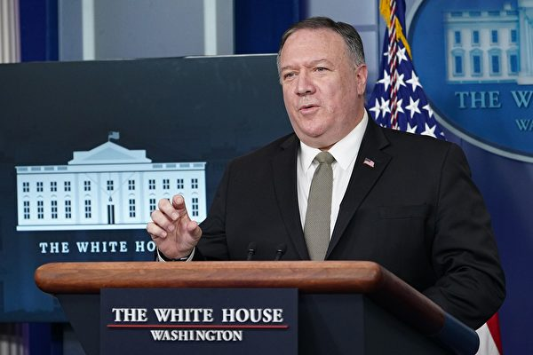

美国国务卿迈克·蓬佩奥（Mike Pompeo）（如图）表示，中共隐瞒疫情，世卫也没有起到应有的作用，它们要对此负责任。（MANDEL NGAN / AFP）

【大纪元2020年04月23日讯】（大纪元记者李言综合报导）美国国务卿迈克·蓬佩奥（Mike Pompeo）周三（4月22日）呼吁对世界卫生组织（WHO）进行结构改革。他同时指出，对于中共病毒（武汉肺炎）的起源问题，中国（中共）政府仍然缺乏所需的透明度，美国可能永远不恢复对世卫金源。

蓬佩奥向福克斯新闻的“英格拉汉姆角”（The Ingraham Angle）节目表示：“即使到了今天，中国（中共）政府也不允许美国科学家进入中国，要了解病毒起源，不仅要进入武汉实验室，还要进入需要研究这种病毒的任何地方。”

蓬佩奥说：“瘟疫仍在持续，我们在中国仍然没有我们需要的透明度和开放性。”

过去数周，国务院一直在呼吁中共让美国专家进入武汉调查，并且暗示中共病毒可能来自武汉实验室，称该实验室不符合安全标准。

蓬佩奥随后批评世卫组织没有帮助美国从中国收集重要数据。按照2007年生效的《国际卫生条例》（IHR）规定，各国必须披露疫情数据，以保护全球健康。

在当天的新闻发布会上，蓬佩奥说：“我们坚信，中共没有及时向世卫组织通报新冠病毒（中共病毒）的爆发”，随后即使通报了世卫组织，“它也没有分享其所拥有的全部信息。”

而世卫总干事谭德塞（Tedros Adhanom）在缔约国没有遵守IHR时，没有充分运用IHR赋予的职能，公开中共的违规行为。

“实现这种透明度是世卫的责任。他们没有这样做。他们需要对此负责任。”蓬佩奥说：“很重要的一点是，世界其他国家也开始认识到世卫未履行其职能。”

川普（特朗普）总统上周在中共病毒特别工作组简报会上宣布，美国将立即停止向世卫组织提供的全部资金援助，称这个全球卫生机构已“将政治正确置于救命措施之上”。

有人认为，世卫组织总干事谭德塞应辞职，以此作为美国与该组织恢复关系的条件。主持人英格拉汉姆问蓬佩奥，他是否“排除”这种说法。

“不，我认为是正确的。”蓬佩奥说，“甚至还不止是这样。可能的情况是，美国或永远不会恢复对世卫资助，把美国纳税人的钱给它。我们可能需要做出更大胆的改变。”

<a target="_blank" href=#top><h6 align="right">回上方</h6></a>

<a name=157>
<h1 align="center"><b>【快讯】美众院压倒性通过近5千亿援助法案</b></h1>

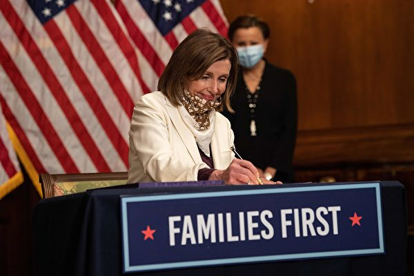

周四下午，美国众议院通过4,840亿美元援助法案。图为众院通过后，议长佩洛希在法案上签字。(NICHOLAS KAMM/AFP)

【大纪元2020年04月24日讯】（大纪元记者吴英编译报导）周四（4月23日）下午，美国众议院通过4,840亿美元援助法案，帮助遭受中共病毒危机打击的小型企业、医院，以及加强病毒检测。

周四，川普（特朗普）总统在白宫主持抗疫简报会之际，众议院388票赞成、5票反对，以及1票赞成“现状”，轻松通过了该法案。预料川普总统将在周四稍晚签署，使之正式成为法律。

不同于两天前参议院以语音投票方式通过该法案，众院采取现场投票。一个月来首次进入国会大楼的数百名众议员，戴上口罩并按姓氏的字母顺序逐一投票，以减少感染的风险。投票之前，众议院工作人员对整个国会大楼进行清洁和消毒。

众议院在通过该法案之前，还批准了一个民主党议员占多数的小组委员会，监督川普政府对企业、州和市政当局的5,000亿美元援助资金的使用。

自疫情蔓延到美国以来，国会总计通过了四项援助法案，总额接近3万亿美元。

周四通过的法案，主要援助项目包括：

3,100亿美元：加码补充“薪资保护计划”（PPP）所需的资金，向小企业提供贷款，以利其保留员工的薪资、福利，以及必要的运营成本。其中600亿美元将专门分配给小型贷方。

600亿美元：分配给小型企业管理局（SBA），作为灾难援助贷款和直接给付款项。

750亿美元：援助收治中共肺炎患者的医院。

250亿美元：加强中共病毒检测，这是重启美国经济的核心工作。

周四，4名共和党议员和1名民主党议员投了反对票。唯一投下反对票的民主党众议员是来自纽约重灾区的亚历山大・奥卡西奥・科尔特斯（Alexandria Ocasio-Cortez），她认为该法案不足以帮助陷入困境的个人和政府。

投反对票的共和党众议员为来自肯塔基州的托马斯・马西（Thomas Massie），以及自由核心小组（Freedom Caucus）的三名成员：来自亚利桑那州的众议员安迪・比格斯（Andy Biggs），代表科罗拉多州的肯・巴克（Ken Buck）和乔治亚州的乔迪・希斯（Jody Hice）。反对理由都是对政府支出以及不断上升的债务表示担忧。

投下赞成“现状”票的是来自密歇根州的无党籍众议员贾斯汀・阿玛什（Justin Amash）。

<a target="_blank" href=#top><h6 align="right">回上方</h6></a>

<a name=156>
<h1 align="center"><b>全面洗脑 哈族青年揭新疆集中营黑幕</b></h1>

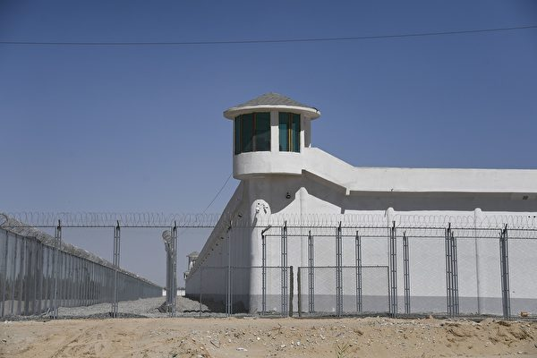

中共新疆再教育营，实行灭绝种族的政策。 (GREG BAKER/AFP via Getty Images)

【大纪元2020年04月23日讯】（大纪元记者顾晓华、方净采访报导）各界一直质疑中共当局在新疆大规模关押维吾尔族、哈萨克族等少数民族的“再教育营”，实际是灭绝种族的集中营。一名向往自由的哈萨克族青年哈瓦（化名）日前对大纪元记者揭露他所了解的再教育营内幕，证实中共对少数民族的洗脑迫害正在有计划的进行。

“从2017年开始，（中共）对新疆少数民族实行洗脑教育，抓到集中营，将它称为学习班、教育中心。”哈瓦说，“不仅是维吾尔族、哈萨克族，回族也抓，蒙古族也抓，其他的那些民族也抓。”

哈瓦指出，中共抓人只有一个罪名，只要不是汉族就是潜在的犯罪分子。目的就是要转化当地十几个民族。

哈瓦是伊梨哈萨克自治州的人，“我们县目前有一个叫北山坡的集中营学习班，那边关押着1万6千名学员，（就是）被洗脑的人，有4千多个管理人员。”“在那里是让你学习汉语，学习赞扬中共。”

在那里平均每个人要学习一年半左右，“情况比较严重的可以判到10年、15年、20年不等。”

哈瓦表示，学习班是从2017年开始的，“他们（中共）的计划是从2017年到2026年，每一个新疆人都要进学习班进行洗脑。”

<b>在食物中下药 男女都遭性侵</b>

哈瓦指出，现在保守的估计，有三百多万维吾尔族、五十多万哈萨克族人被关在所谓的学习班、实际是在监狱里面，“毕业的学员曾经透露，他们（管理人员）在汤里面、饭里面下药，吃饭的时候汤里有药的味道。”所以每个毕业的人都有记忆力差等失去健康的现象。

“在学习班里还有被酷刑的，坐老虎凳，还有被性侵，35岁以下的会被强奸，包括男人。在里面被强奸是再正常不过的事情。”哈瓦说，甚至“在学习班的妇女很多半夜被带走，然后就再也没有回来，被带到哪里也不知道。”

据他所知，有个医院的护士长从学习班出来以后，下身瘫痪，不是被强奸就是被殴打所致。

<b>新疆如露天监狱 百姓在高压下生活</b>

哈瓦指出，维吾尔族的情况比哈萨克族更糟糕。“我们是属于中亚的，南疆那边最惨，一些村庄已经没有男人，该抓的抓，该判的判。”

“大部分都是在半夜睡觉的时候，闯进家里给你戴个黑头套带走。有的人是三天之前通知你，让你做准备要去抓你。”他说。

“新疆就是一个露天监狱，你根本逃不了，每三百米就是一个岗亭警察，”哈瓦说，大城市的岗亭警察会持枪，而且到处都是协警和特警，到处检查身份证和手机。

他提到，只要是少数民族，包括外国的公民，也有可能随时被抓，“比如一个哈萨克人出生在中国，二十多岁的时候移民哈萨克，他们再到中国的时候就会被抓。”

“老百姓都是在高压下生活，去哪里都要检查。”哈瓦因为有偷渡的前科，不能到县城打工，“如果谁给我工作，那老板的店就会被查封。”

做生意的也没有自由，“有些商店不卖烟酒，但政府强制把烟酒摆到商店里面（卖），要不然你就关门。在新疆你不抽烟不喝酒就是一个罪，他们会怀疑你是信教人员。”

哈瓦提到，今年2月，中共当局又有一个政策，以脱贫的名义把当地的少数民族男女青年，强制带到内地，由政府安排一切，“在厂子里面免费地务工，他们没有自由，工厂里有驻厂警察，谁不听话就会被毒打。他们可能永远也回不来了。”

<b>行动自由被控制 渴望出国 逃离邪恶的地方</b>

哈瓦说，中共对少数民族的歧视，让他们生活和工作都困难，“找到工作都不让在那个城市待，所以我们对未来很迷茫，我们也不知道什么时候会被抓到学习班洗脑。”

“我之前有偷渡边境的前科，所以我也很害怕，所以我选择了出国。”哈瓦在2019年到哈萨克斯坦，原本向政府承诺三个月之内回国，“现在超过四个多月了，现在居委会干部从我家里人那里了解我在国外的情况，因为疫情，我目前在租的房子隔离自己。”

他表示，在新疆，很多人想去国外，但是没有护照，“我们办护照特别难，17年开始，新疆百分之九十九居民的护照都被没收了，一个护照在乌鲁木齐那个城市要花10万元人民币才可以买到，维吾尔族百分之九十九的人不可能出国，甚至出新疆也很困难。”

他强调，“我们渴望出国，逃离这个邪恶的地方。”#

<a target="_blank" href=#top><h6 align="right">回上方</h6></a>

<a name=155>
<h1 align="center"><b>恃强凌弱 河北女用鞋底抽打女孩</b></h1>

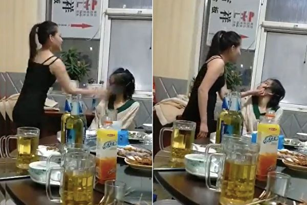

网络传出一段视频，一黑衣女子朝另一女孩搧了数十次耳光。（视频截图合成）

 
【大纪元2020年04月23日讯】（大纪元记者萧律生报导）近日，网络传出一段视频，一黑衣女子朝另一女孩搧了数十次耳光。今天（4月23），中共河北省唐山市滦南县公安局发布通报称，打人女孩田某因琐事在烧烤店殴打女孩吴某，田某已被刑事拘留。

视频中，一黑衣女子一边大声呵斥着，一边殴打另一女孩，另一女孩说自己错了，但是黑衣女子依旧不停手，甚至用鞋底殴打。旁边还有其他人哄笑。有网民说是唐山或是天津口音。

4月23日，中共滦南县公安局发通报称，经查，视频中打人者为19岁的女子田某（滦南县胡各庄镇人），在倴城镇烧烤店因琐事殴打15岁的吴某（滦南县倴城镇人）。

“滦南公安网络发言人”官方微博称，田某吴某在烧烤店吃饭时，吴某到一楼上厕所，田某两次叫其上楼，因吴某未回应而心生不满。当吴某返回后，田某便大声呵斥并用巴掌、鞋底对吴某进行殴打。

这个视频还引发网民对中共教育的思考。

“这些小恶魔的魔性在学校就培养成了。到社会这种恃强凌弱只会变本加厉！”“恶魔统治着的土地！”“看看，这就是共匪教育出来的孩子。”“小时候也是这样过来的，家里家暴和学校充斥着校园暴力，让我现在真的不想有后代。”“特权思想带出来的。除了严判还应该取消共匪制产生出来的特权。回归人性。”“教育失败的产物。”

还有台湾网民说：“在台湾，只要影片被放在脸书上，人们就会有网路上搜索施暴者的个人资料公诸于世，甚至会跑到施暴者的住家外头围堵（私下教训）施暴者。台湾社会是不太允许这种事情发生的，根本不需要出动警察。这就是国情的不同。 在中国，太多人选择保持沉默，不知不觉就成为施暴者的共犯。”#

<a target="_blank" href=#top><h6 align="right">回上方</h6></a>

<a name=154>
<h1 align="center"><b>未获拆迁安置 浙江义乌七十村民状告政府</b></h1>

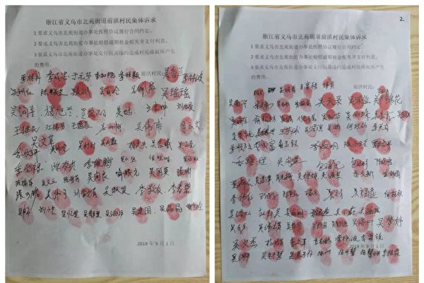

由于浙江省义乌不履行机场改造拆迁安置协议，当地70村民将义乌当局告上法庭。（大纪元合成图）

 
 【大纪元2020年04月23日讯】（大纪元记者李熙采访报导）浙江省义乌市政府为发展航空小镇进行拆迁，却未按原拆迁安置协议对村民进行安置，从而被70户村民告上法庭。一审判决后义乌当局依然不履行合约，村民只好再上诉中院。

据村民维权代表G先生表示，案件二审于4月17日上午在金华市中级法院进行公开庭审，由于受疫情影响，代理律师周涛是在北京的律所参加的网上视讯庭审。

<b>义乌当局毁约 村民不接受</b>

该案件曾于去年8月23日在义乌市法院开庭审理，因为官方无法提供任何证据，法官只好宣布休庭。后法官判决义乌市政府要对村民做出补偿。

因为义乌当局提出的变更方案都不符合村民的需求，村民们坚持当局应履行原来的协议方案。

4月22日，该案律师周涛向大纪元记者表示，“由于产业用房是村民基本生活的根本保障，产业用房不能按照协议约定交付，将会给70户村民的生产生活造成重大影响。做出何种补偿都不合适，因为原来的协议是有效的协议。”

2016年，义乌市政府规划在前洪村发展航空小镇，于下半年由义乌市政府北苑街道办事处和村民们签署了《义乌机场飞行区改造工程房屋拆迁协议书》，征收村民农地和拆迁其房屋，并承诺给村民北苑街道“和聚沁园”高层公寓和集聚配套产业用房安置。

然而，在产业用房即将交付之际，北苑街道办事处告知村民，协议约定的产业用房无法交付，要改以2017年的新政策进行货币安置或者其它方式的安置。

去年，北苑街道和村民们曾调解过一次，但没有更改任何方案，只是把原来的公告重复宣读了一遍，北苑街道还邀开了一次维稳大会，威胁要将村民代表抓走。村民愤而提告。

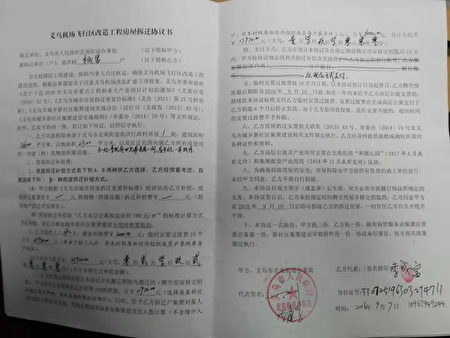

拆迁协议书。（受访者提供）

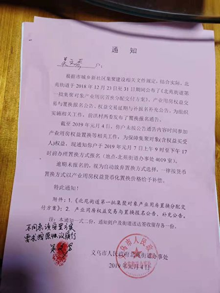

强制置换通知。（受访者提供）

<b>机场周边建筑物限高112.9米  设计高度87米的产业房不符限高？</b>

前洪村被征收的（Ｃ）地块有一百多亩，此地块上有26个测绘点，根据机场海拔高度涉及到机场净空的问题，机场周边建筑物的高度会受到限制。根据北苑街道办事处于一审时提供的一份民航管理局的答复函，内容订的建筑物高度最高是（海拔）112.9米，最低是（海拔）79.9米。协议中产业房的设计最高高度是（海拔）87米，被告以超过最低的高度限制为由不建产业用房。

律师说，“这地块本身就是产业用房用地，而且是经过浙江省政府批准的，原来是农业用地已征收变更为国有土地。而且进行了地上物、青苗等清理，已达到了建设用条件。这案件争议的焦点就在于，限高112.9米，我们产业用房87米的高度为什么不能在这里建？”

律师还提出建议，当时产业房规划建二层楼，如果87米还是超高了，可以变更为一层楼，大家可分配少一点面积，这些村民是可以同意的。”

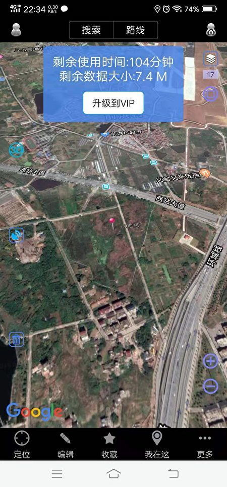

产业用安置房用地。（受访者提供）

<b>当局或另有用地计划</b>

律师说，这地块周边就有一个大的物流集散中心，是空中和地面的物流园，估计义乌当局可能另有用地计划。

“Ｃ地块是个大地块，它又把产业用房地块称为第一地块，当时法官就问了，除了这第一地块外其它地块能不能建？这问题被告也无法回答。”他说。

律师表示，“现在政府的做法就是不作为，更重要的是现在义乌这种产业用房都不太有了，新的拆迁项目给老百姓的说是有产业房，但都是换算为货币补偿，不再给产业用房。因为当地土地资源挺缺的。”

<b>律师：不建产业房就还地于民</b>

律师认为，“这地块已经规划好了就不应该闲置，既然不能建设，那就还给村民继续耕种，充分利用这块地。”

他说，义乌市北苑街道洪前村村民的农地、房子都被征收了，村民赖以维生的耕地没了，等于断了经济收入。当初村民同意签属协议是因为当局说有产业用房安置，如今当局要以每个人大约11万元的货币进行补偿，村民们不能接受。安置产业用房村民可以拿来作生产、做车间或者出租，现在一平米租金大约30元，这是生活的基本保障。

律师表示，另一种变更方案是在高层公寓楼下和周边盖的商品房，以1:0.3比例换，原来70平米的可以换21平米。但是这些商铺也不够按人头分配。此外，义乌商业是以批发为主的，所以在住家附近搞商铺是不行的。因此，如果义乌市北苑街道不履行协议，洪前村村民表示将继续上诉争取他们的合法权益。

<a target="_blank" href=#top><h6 align="right">回上方</h6></a>

<a name=153>
<h1 align="center"><b>【一线采访】习近平突访西安 到处是便衣</b></h1>

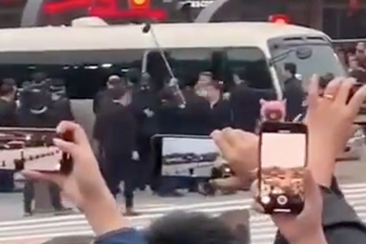

习近平突访西安，现场大量“群众”围观，访民得到消息前往被拦截在外围。（视频截图）

 
 【大纪元2020年04月23日讯】（大纪元记者顾晓华、凌云采访报导）习近平近日在陕西调研，22日突访西安，西安访民得到消息前去上访，只见现场被封锁，到处都是警察和便衣，根本看不到人。

访民张小娟对大纪元表示，她是下午四点多听到消息过去的，一共去了三五个访民。现场民众大概有上千人，都在那等着，说是要有车队过。但直到五点多，车队经过没看见，警察维持秩序的倒是挺多。

除了警察，便衣更多，“三五米之间就有一个便衣，他们还拿着望远镜，高层（楼）的每一个窗户都照一照，每个窗户都要关得好好的，连个缝都不让开，全部都得关得好好的。”

访民拍摄的几段现场视频显示，咸宁西路附近很多警车戒严，大批民众被挡在外围不让进入。路边老百姓都戴着口罩。

张小娟说，后来她们看到车队驶过来，“六点多，正走着呢，他就让你靠边，往里走，要过车队了。”后来看到在马路对面过来多辆车，然后过来一辆看似是领导坐的车，但也没有看见什么。

她推测是习近平去了哪里，又回来了。

张小娟表示，现场的情况，“不可能拦车队，根本到不了跟前，在马路上没人能到跟前。”

另一视频显示，习近平到访西安城内，大批“群众”围观拍照。

之前有网上消息称，习近平到访前，某体制内人员参加了一个紧急会议，所在单位抽调几十名员工应急，任务不得告诉包括配偶在内的任何人，并且抽调的员工全部经过政审。

消息还称，西安南二环当天把立交桥下停的所有车辆全部清理，某主干道几天前就连夜施工，换上全新护栏，所有架设天线全部埋藏，那一片区居民普遍断网。

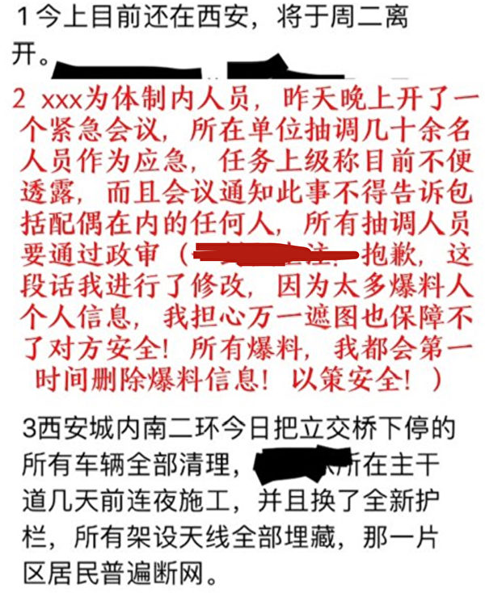

（截图）

公开资料显示，习近平20日到陕西调研， 下午到秦岭东部牛背梁国家级自然保护区考察。期间习近平还强调了秦岭违建的“教训”，警告陕西干部“勿重蹈覆辙”。

习近平所提到的“秦岭违建案”，是指前后时间长达5年的“秦岭北麓违建别墅案”。中共中央2014年5月起下令整治秦岭违建别墅，习近平对此先后6次作出“重要指示批示”，但陕西官场一直不为所动，直到2018年7月，中纪委副书记徐令义两次赴陕西督导后，当地才大规模拆除问题别墅。

此后，陕西官场震荡，时任陕西省委书记赵正永被指控迟迟不作为、上报虚假资料等，被开除党籍；西安市委前书记魏民洲、陕西前副省长冯新柱、陕西省委前秘书长钱引安、陕西前副省长陈国强等高官也随之落马。西安前市长上官吉庆、西安前政协主席程群力被降职。

习近平去陕西考察的时机正值中共公安部副部长孙力军刚被宣布调查，司法部长傅政华随后卸任司法部党组副书记一职之际。外界认为，习近平选择去陕西秦岭“看生态”，实际上别有深意。

时政评论员陈破空分析认为，习近平表面理由是扶贫攻坚与保护生态，但让人联想到“秦岭违建案”。如今他以胜利者的姿态回到那里，又再次提及这六次批示，可看作是一种威慑。

<a target="_blank" href=#top><h6 align="right">回上方</h6></a>

<a name=152>
<h1 align="center"><b>分析：金正恩残废或病故 中共恶梦将成真</b></h1>

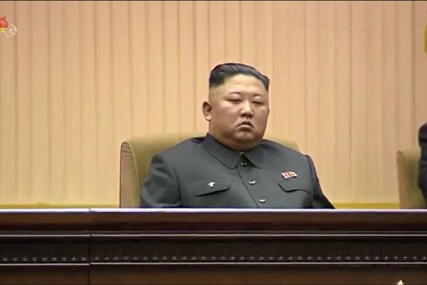

金正恩资料图。（朝鲜中央电视台截图）

 
【大纪元2020年04月22日讯】（大纪元记者徐间综合报导）金正恩去哪了？从4月21起，国际上充斥着朝鲜独裁者金正恩健康状况恶化的各种报导，各国情报机构、新闻工作者和研究人员都在试图弄清情况。

多家媒体引用美国情报说，朝鲜独裁者金正恩最近接受心血管手术后命危，几位美国情报官员还告诉CNBC新闻，金正恩可能残废。

《新闻周刊》4月22日分析，金正恩如果死亡或残疾，将是北京的最大恶梦，因为中共正焦头烂额地应对中共病毒（冠状病毒）、贸易战、香港问题和经济崩溃。

《新闻周刊》报导，长期以来，朝鲜一直是中共有用的外交筹码，这个秘密国家给中共提供了缓冲区，隔开了民主的韩国和成千上万的美军，所以中共曾向朝鲜派遣100多万人的部队来进行所谓的“抗美援朝”。

目前金正恩没有明确的继承人，他如果真的死了，有可能让朝鲜这个国家陷入混乱之中，而这是中共不愿意看到的，对中共目前的情况来说，可谓“雪上加霜”。

无论金正恩生病或死亡，都将是一个不稳定的因素，使本来压力很大的中共不得不面对另一个不稳定因素。前朝鲜政策特别代表尹汝尚（Joseph Yun）告诉《新闻周刊》，如果金正恩的健康状况恶化，对中共来说将是“大事一桩”。

无论发生什么事，对北京来说，在朝鲜设立一个它们信任的领导人是“至关重要的”。“北京想要一个它们认识的、跟它们有关系的人。”尹汝尚说。

尹汝尚表示，中共认为最坏的情况是如果朝鲜出现乱局，韩国或美国或利用朝鲜的权力真空。他说，跟朝鲜利害关系最多的是韩国，其次就是中共了，“但韩国没有任何筹码，而北京在平壤有很多筹码。”

如果朝鲜发生内战或国家崩溃，将意味着数百万难民涌向韩国或中国东北，他们的身体营养不良，心灵上带着共产主义留下的创伤。

“国家利益中心”韩国研究部门的高级主任卡齐亚尼斯（Harry Kazianis）告诉《新闻周刊》，“中国（中共）最可怕的噩梦———除了与美国开战之外，第二就是朝鲜政权发生动荡。”

“尽管他们最近跟金正恩频频会面，但中国共产党并不是金正恩的粉丝。不过，他们宁愿与他们认识的独裁者打交道，也不愿意看到核武器落入他人之手，或被出售。”卡齐亚尼斯说。

卡齐亚尼斯暗示，习近平和他的高级助手们“很可能正在接触金正恩和他妹妹，探听他的真实健康状况。不幸的是，即使习近平可能也不知道内情。或许他要跟我们一样，看到金正恩再次露面发射导弹或朝鲜宣布他的死讯，才能知道。”

自由亚洲电台引用消息人士的话说，为确保金正恩的健康，中共有一支专家组成的医疗队随时待命。如果金正恩病故，中共有后续准备。

“如果金正恩死，中国（中共）会马上扶持一个人选起来。中共在朝鲜保护金正恩的特工有几千人。一直有几千人的特种兵和特工在那边保护他，也是防止政变。”消息人士说。

美媒报导，美国政府已制定全面应对计划，以应对朝鲜领导人金正恩（Kim Jong Un）去世，朝鲜境内可能发生大规模人道危机的情况。

<a target="_blank" href=#top><h6 align="right">回上方</h6></a>

<a name=151>
<h1 align="center"><b>中共发言人急于推卸国际追责 搞出乌龙</b></h1>

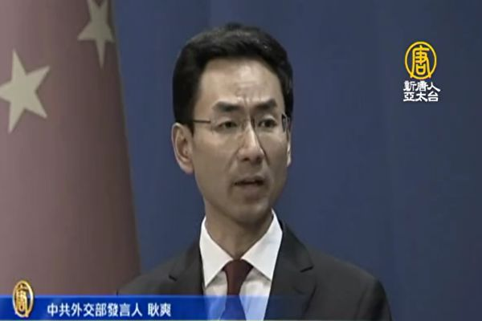

中共外交部发言人耿爽。（授权影片截图）

 
 【大纪元2020年04月22日讯】（大纪元记者林燕综合报导）中共外交部发言人再次爆出雷人言语——艾滋病应叫美国负责，遭到基本事实打脸。艾滋病起源于非洲、而非美国的实验室，同时美国也没有掩盖疫情。

中共外交部发言人耿爽周一（4月20日）在北京举行的例行发布会上被问到，中方是否准许美国派人进入中国调查新冠病毒（中共病毒）的起源问题，包括病毒是否源自武汉病毒研究所。他狡辩说，H1N1流感、艾滋病毒以及2008年的国际金融危机都“源自美国”，但没有谁向美国追责。

言外之意，国际上不应该在这次席卷全球的疫情中追责中共。

随后，中共喉舌《中国日报》（China Daily）海外版官方推特账号引述耿爽的说法，向海外宣传这种移花接木的狡辩术。孰料，中共宣传遭到一批西方专家的反驳。

耿爽搞错了基本事实，H1N1流感和艾滋病毒都不起源美国，而2008年的金融危机更不是传染病，简单对比两者犯了不当对比的逻辑错误。

<b>中共宣传搞错基本事实 艾滋病起源于非洲 不是美国</b>

美国国家安全评论分析师约翰·努南（John Noonan）驳斥说，中共外交部发言人连最基本的艾滋病事实都出错。

他推文嘲讽说：“不知道是我还是中国（中共）的宣传变得越来越懒惰？”

“也许他们没有意识到我们的互联网未受到共产主义者的审查，美国人完全可以花11秒钟上谷歌（Google），就能够了解一个世纪前艾滋病起源于比利时治下的刚果（非洲国家）。”努南写道。

同样的，2009年H1N1流感起源于墨西哥、然后传播到美国及世界各国。实际上，无论是H1N1流感还是艾滋病，美国都有对其他国家提供大量的医疗人道主义援助，帮助缓解疫情。

<b>学者：中共发言人的攻击论跟彭丽媛的形象宣传相悖</b>

哈佛大学韦瑟黑德国际事务中心（Weatherhead Center for International Affairs）的学者朱利安·格维茨（Julian Gewirtz）推文指责耿爽的说法“荒谬”，并建议耿爽读读中共当局是如何真正应对中国境内的艾滋病传播的，并热心附上自己的最新专业研究链接。

格维茨还推文说，中共当局于1984年首次提及艾滋病，指艾滋病是“外来的”、“资本主义”疾病；而耿爽的讲话表明了抹黑美国论在中共政治中的支持度，只是这跟中国国家主席习近平的妻子彭丽媛在艾滋病上的官方宣传有很大不同。

2011年6月3日，时任世卫组织总干事、前香港卫生署官员陈冯富珍委任彭丽媛女士为世界卫生组织抗击结核病和艾滋病亲善大使。同年，彭丽媛参与录制“没有歧视，我们在一起”的反艾滋病歧视公益广告。

 <h4 align=center><a href="https://twitter.com/JulianGewirtz/status/1252587916251074567?ref_src=twsrc%5Etfw%7Ctwcamp%5Etweetembed%7Ctwterm%5E1252587916251074567&ref_url=https%3A%2F%2Fwww.epochtimes.com%2Fgb%2F20%2F4%2F21%2Fn12050056.htm">格维茨还推文说，中共当局于1984年首次提及艾滋病...(点击右键,另存新档）</a></h4>
 
 <b>中共同样掩盖过艾滋病疫情 进行虚假宣传</b>

格维茨还补充说：“有时，我们谈论中国（中共）的‘战狼外交’好像这是个全新概念。其实这种思想经常在中国国内和中共内部长期流传。现在，随着中国变得更加强大和可见，这种思想也开始在‘外部’流传。”

格维茨3月接受《纽约时报》采访时说，中国（中共）显然把围绕着新冠病毒（中共病毒）危机的叙事看作是一场国际角逐，“阴谋论是这场角逐的一个新的、低级的前沿阵地。”

他的最新研究分析了中共当局应对艾滋病疫情的做法，同样的，中共也曾在艾滋病问题上搞过跟新冠病毒（中共病毒）疫情类似的虚假信息宣传运动。

“这些大音量的少数中国（中共）官员似乎没有意识到，在中国（中共）希望被世界各地视为一个积极贡献者的时候，兜售阴谋论完全是自拆擂台的行为。”格维茨说。

他是指，中共外交部发言人赵立坚之前无任何论据、就抛出新冠病毒（中共病毒）源自美国军人。

《纽约时报》报导说，传播虚假信息并不是共产党政府的新策略，美国尤其经常成为中国（中共）政治宣传的陪衬。去年，北京也指责美国政府支持香港的公众抗议。

这种老策略已被更好斗的公共外交手法加以放大，中共官员正在越来越多地使用在中国被屏蔽的社交媒体平台来传播信息。

<b>学者：没有可比性 中共的辩解看起来很绝望</b>

美国智库国家利益中心的高级主任卡齐亚尼斯（Harry Kazianis）在接受“美国之音”采访时说：“耿爽试图提及某种完全不同的历史例子，这只会使他的政府显得愚蠢甚至更有责任。”

“H1N1流感、艾滋病或2008年的金融危机都不是从美国的实验室里泄漏出去的，美国也没有任何人试图掩盖它。中共发布这样的声明看起来很绝望。”他说。

面对国际上要求追责中共掩盖新冠病毒（中共病毒）疫情的呼声，卡齐亚尼斯表示，如果能够最终证明中国共产党确实掩盖了一次偶然发生的冠状病毒（中共病毒）疫情爆发，然后发起了大规模的假信息运动来掩盖疫情，同时又从全球购买了数以百万计的个人防护装备，那么它“不仅应该被谴责，而且应该受到惩罚”。

始于中国武汉的新冠病毒（中共病毒）目前已经导致超过4万多名美国人丧生。

<a target="_blank" href=#top><h6 align="right">回上方</h6></a>

<a name=150>
<h1 align="center"><b>乾元：从户口到健康码——让人死在家里的公权力</b></h1>

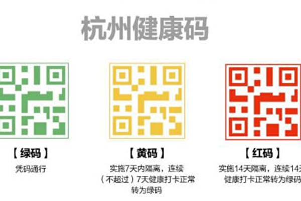

日前，中共为复工复产推出“健康码”，被指把中国变成了大监狱。图为中国的腾讯跟阿里巴巴推出了“健康码”。（网络截图）

【大纪元2020年04月23日讯】发生在上个世纪的“三年大饥荒”，造成了至少4000万中国人民的死亡，事后人们在探讨这个问题，中共窃政之前也会发生饥荒，一般都会带来大规模的外出逃荒，甚至酿成流民起义，那为什么这三年饿死了那么多人，却连一点动静都没有呢？最后人们猛然明白，以前的社会没有“户口”制度，如果家中无粮，老百姓想外出乞讨，想走就走，没有任何限制，而中共治下的那三年，民众外出得需要带着户口，还得有单位开的“介绍信”才能出行，否则连村口都出不去，就会被民兵按住，最终大批百姓活活饿死在家中，甚至骨肉相食，发生了种种人间地狱的惨状，连呐喊一声的可能都没有。

本次疫情发展到现在，中共管控人民的技术也是鸟枪换炮，与时俱进了。在原本压在中国人民头上的户口、身份证、人脸识别基础之上，又活活的码上了一个“健康码”。这个“健康码”可是来者不善，它通过手机定位和云端的大数据黑箱分析功能，收集和分析利用每个公民的出行信息，等于给每个公民安上一个电子警察，只要这个电子警察按照其自定的黑箱规则“觉得”你不对头，那么你的健康码颜色就可能由绿转红，从而寸步难行，被压在五行山下，翻不过身来。

那大家可能会说，“健康码”不是用来防疫的吗？是的，本意是如此，但它建立在一个侵犯公民个人隐私的违法的基础上，这样一个歪脖子树最终肯定不会结出好果子来。防疫是必要的，那么以防疫之名就可以随意封锁病患及家属的家门、楼门吗？以防疫之名就可以随意侵犯公民的个人尊严和个人隐私权吗？以防疫之名就可以无条件的让手机公司和通讯公司提供其客户的一切信息吗？以防疫之名就可以对公民污名化、甚至对整个疫区进行歧视吗？实际上，上述对公民权力的侵犯在今年的前四个月中已经都发生过了，只不过实行健康码后，这种侵犯来的更快、更方便、更无所忌惮 了。

可能还会有人想，乱世用重典，等疫情结束后，“健康码”会自然被放弃，大家应该忍耐。这个是绝对不会发生的，专制政权一旦从专制中尝到甜头，就不会放弃更加专制的脚步，狼绝不会因为这次吃羊吃饱了，下次就不再吃羊了，它会变本加厉的寻找更好吃的羊。中共不是一直在高喊要建立“信用社会”，推行“密码法”，搞什么数字货币吗？“健康码”的顺利推行可以说让中共一步到位，走上了大规模侵犯人权，数字化管理社会的恶路。从此以后，公民的出行有电子轨迹档案，公民花钱有消费电子记录，网上发帖、微信记录、甚至在家里骂街都会有证据留存、与友人聊天日后也可能会成为呈堂供证。到那时，你想不用手机也不行，不用手机就没办法消费、没办法出入公共场所、没办法使用公共交通工具，也就是说没有回头路可走！到那时，恐怕再也不会有人说“把权力关进笼子”了，因为所有公民都已经被关进了笼子！笔者在这里绝对不是危言耸听！

我们再说回防疫。“中共肺炎病毒”固然狡猾凶恶，但还是比不上中共自身，采用“健康码”结合人身强制措施，中共可以轻易的把病患及家属甚至疑似人员统统彻底封锁在家中，病死了就把尸体抬走，自杀了也等同处理，这样就成功的解决了病毒传播的问题，按照斯大林的名言：“一个人死亡是悲剧，一百万人死亡就是统计数据”，关键是不要声张，让老百姓喊不出来、走不出去，有“健康码”这样的技术在，我们可以看到侵犯人权的事件会不断的大规模发生，最近发生在哈尔滨的封门封楼的架势，一改武汉时期的惺惺作态，手段方法上可以说十分激进。

对于这样的“恶码”，民众应当拒绝使用，可以先从减少使用开始，最终彻底放弃，必要时可以诉诸法律，如果手里的最后一点底线都放弃了，那么人权将彻底沦丧。

<a target="_blank" href=#top><h6 align="right">回上方</h6></a>

<a name=149>
<h1 align="center"><b>【拍案惊奇】骇客攻武汉病毒所 京城面临大清洗</b></h1>

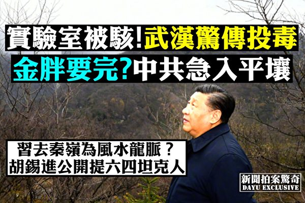

骇客攻武汉P4获新证，京城或大清洗。（新唐人合成）

【大纪元2020年04月23日讯】大家好，欢迎收看《新闻拍案惊奇》，我是大宇。

<b>【骇客攻入武汉P4和世卫 获得投毒新证？】</b>

4月22日，美国《华盛顿邮报》报导了这样一则消息，有匿名骇客，攻入了武汉病毒研究所、世界卫生组织、美国国立卫生研究院，还有盖茨基金会等等多个机构。而这次骇客的目标，或许是针对当前中共病毒的相关信息，进行追寻。这一轮骇客行动后，约有近2.5万份电子信箱、密码以及文件被泄露，泄露的内容最先被公布在知名的英文暗网“4chan”。

这篇报导，引据了监视网络活动的赛德情报集团的消息，集团的英文原名是SITE，本身就是网站的意思。那这家情报机构说，被骇的内容公布时间是4月19日和4月20日。同时，遭泄露最多的机构是美国卫生研究院，涉及9938宗文件，美国疾控有6857宗，世卫有2732宗。

但赛德情报集团说，他们无法核实被泄露的电子邮件或密码的真实性。

不过，《华盛顿邮报》也采访了澳大利亚internet2.0公司的首席执行官Robert Potter，他说可以核实其中有关世卫的电邮和密码是真的。例如，他使用公开的电邮地址和密码，登录世界卫生组织的计算机系统，是可以进入的，他对世卫组织一些人设置密码的随意性感到震惊，例如，他发现有48个人，密码直接用的就是英文password这个单词，也有人直接用自己的名字当密码。

企业家Mike Coudrey在自己的推特上高调讲出这一次泄露事件。他在推文中说：突发！盖茨基金会、世卫和武汉病毒研究所全都被骇，成千上万的电邮、密码和文件被泄露，在网上公开。紧接着，他说，在推特上搜索“gates hacked”，可以知道确实发生了这一事件，很多相关的文件、电邮的截屏图片，已经被贴出来。

我循着他所说的“gates hacked”，在推特上做了一个搜索，果然发现了很多信息。其中比较重要的，包括这样一则消息：2019年10月19日，石正丽从武汉工程大学，乘坐巴士前往P4实验室，车程差不多16英里。但是她在中途停了一下，打开了自己的随身包裹，拿出了一块已经被污染的干冰，放到了一间鱼市的通风口。之所以选择这间市场，是因为在同一幢大楼里，存在着世界最大的高速铁路网络，而且这里也是她日常通勤的必经之处。这件事被监控录像拍到。

这条并不完整的外泄信息，还有几处疑点需要搞清楚。

第一，这块被污染的干冰，是不是被当前的病毒所污染；

第二，干冰被放置的通风口，是不是在华南海鲜市场；

第三，说事情被监控录像拍到，但截至发稿，我们还没有看到相关的录像。

而且最大的一个问题是，如果这个卖海鲜的“鱼市”，就是华南海鲜市场的话，那反而在帮助中共宣传，就好像华南海鲜市场又成了这场瘟疫的源头一样。

而实际上过去两个多月，有太多的证据表明，华南海鲜市场几乎不可能是病毒最早出现的地方。因此啊，这条曝光出来的，有关某人是不是去什么地方放毒，这个信息暂时还不是让人觉得非常信服。

大陆《澎湃》新闻3月14日就有一篇报导，说华南海鲜市场1月1日休市之后，一共有29人还生活在里面，其中18名是工作人员，另外11名是其他人员。其中20到30岁，5人；30到40岁，6人；40到50岁，10人；50到60岁，4人。

其中一个人告诉记者说，1月1日后他在市场里面还是每天工作12小时，1月23日武汉封城后一个星期，才开始戴口罩。直到3月3日，当局对海鲜市场开始大规模消毒杀菌行动，在里面人的情况才广泛为外界所知，而截至3月14日对他们这29人的检测发现，没有一个人感染。因此，在里面住着的人，有的对媒体表示，自己不相信海鲜市场是瘟疫的最早源头。

目前，有消息说，被骇客获取并公开的上万份文件，分析解密的工作，可能要持续月余的时间，所以我们继续拭目以待，看有没有什么最新的信息，可以被挖掘出来。

不过，先不管这些骇客文件，当前世界其它国家已经开始着手，对病毒来源进行调查。

<b>【多方指病毒实验室泄露 武汉P4党委书记再“辟谣”】</b>

4月19日，英国已经决定加入美国的调查团队，对病毒的来源进行调查。德国总理默克尔，也在4月20日对媒体表示，中共对病毒起源越透明，世界上每个人都能更好从中吸取教训。言外之意，就是说中共对病毒起源，遮遮掩掩。

之前的节目中，我们已经引述美国福克斯新闻援引的美国军方消息，认为病毒是从武汉实验室泄露，首先传染的是其内部的研究人员，而其内部的研究人员，又传染给武汉更多的人群。但是美军的消息暂时是说，病毒是天然病毒，他们还在继续调查。

因为最近外界把病毒起源的重点又锁定到了武汉病毒研究所，因此武汉病毒所党委书记袁志明又出来辟谣，他说“不相信人类现在有智慧合成这样一个病毒”。

当然，这话从他嘴里说出来，很多人会觉得是狡辩。不过仍然需要求证的问题是，美军暂时的研究，也是说病毒是天然的。也许这才叫“天灭中共”吧，居然形成了这样一个令人匪夷所思的病毒。

但是美国军方消息可也说了，病毒很可能是武汉实验室泄露，这一点也被袁志明否定。但这一点却不仅是美国军方这样认为，一些专家也质疑病毒是实验室泄露。

其实很简单，不要用嘴来辟谣，真有底气，就让外国专家去实验室独立调查。但是就怕之前的痕迹都被销毁。

<b>【美国2018年开始调查武汉P4 发现安全漏洞】</b>

不过呢，其实美国驻北京大使馆，自从2018年1月开始，就多次派人去武汉病毒所调研，发现了很多令人担心的问题，包括管理弱点，他们在给华盛顿的报告中对这些担忧提出警告，这个事情《华盛顿邮报》做了报导。可见，武汉病毒所至少存在一些管理漏洞，是之前就被证实的。

同时，4月21日，美国总统川普在白宫疫情通气会上说了这样一句话。他说自己已经知道了病毒的来源，可能会就此作很多的讨论，并称自己比任何人对中共都强硬。希望川普能早日公布他所知道的“病毒来源”是什么。

<b>【中共数据“假得离谱” 胡锡进竟夸六四坦克人来黑美国  】</b>

现在不止是病毒来源，西方国家对中共对瘟疫病例数据的隐瞒，也是越来越清楚。先来看一段白宫新闻发布会的录影。

中共信息不透明，造成其它国家低估病毒传染能力，造成瘟疫迅速扩散，是中共被追责的重要原因之一。

面对压力，中共的外宣机器似乎已经开始有点饥不择食、口不择言。党媒《环球时报》总编胡锡进，也许是仗着中国大陆的网络防火墙高耸，竟然在自己的推特上正面引用六四“坦克人”的照片，来混淆视听，攻击美国的防疫工作。

大概情况是这样的，因为防疫，美国采取在家隔离措施，经济普遍停滞，有人上街游行希望恢复工作，但有美国护士，挡住了参与游行的私家车，因为从护士角度来看，阻止病毒传播、救人性命是第一位的，因此不希望人们仓促复工，所以挡住参与抗议要恢复工作的美国人的私家车。这件事就被胡编抓住做文章，还拿出六四坦克人的照片做对比，大意是说那位美国护士的勇敢，就像是六四那位坦克人一样。

胡编的比喻真会让人大跌眼镜，会让人觉得，共产党人没有是非准则，有的只是没有底限的随时黑白互换，一切为即时利益服务。

当然了，胡编的这件事，只是中共利用外国疫情减轻自己压力的一个缩影。但是这些丝毫挡不住许多个人、组织对中共提告索赔。

<b>【美密苏里州政府起诉中共撒谎 法国总统称真相被隐瞒】</b>

4月21日，美国密苏里州政府，也正式对中共提起诉讼，成为了至少是第一个这样做的美国州政府。该州的总检察长介绍说，诉讼包含的指控有：中共对病毒危险性撒谎、噤声吹哨人、遏止病毒扩散不力等等，他们对这些事必须负责。

现在，就连法国总统马克龙，也毫不客气地揭示中共的瞒报情况。他上周对英国《金融时报》表示，如果认为中方很好应对了瘟疫大流行，是“天真的”。并且指出，“真相被隐瞒的国家”，与“信息自由流动、公民可以批评政府”的国家之前，是无法比较的。很明显，他就是说中共在打压信息自由，哪怕是人命关天的疫情期间。

<b>【失联公民记者李泽华现身 透露被公安监视隔离】</b>

武汉瘟疫爆发之初，方斌、陈秋实、李泽华等公民记者深入疫情，曝光第一现场的画面，给我们留下了深刻的印象。但是很快，这些人纷纷失联。

不过，2月26日失联的前央视记者李泽华，突然在4月22日公布了一段视频。在视频中，他说自己是4月16日进行的录影，但为什么22日才公布呢。网友说，那可能是他录好的视频需要经过中共公安的政治审查。

4月初，有消息说在3月13日，湖北政府、武汉市委还有北京专案组，还因为李泽华和方斌、陈秋实专门开了一场专题会议，据说要判陈秋实1年徒刑、方斌5年，而李泽华要监视居住6个月。消息没有得到进一步的证实。

李泽华在16日录制的视频中透露了自己被捕的经过，说2月26日他被公安带走后，坐在铁椅子上被审问到第二天的晚上，但警方最后告诉他“不予处罚”，但是不知道公安还会不会对他进行监视居住。不过呢，虽然“不予处罚”，李泽华被要求在武汉隔离，3月14日又转到老家隔离，隔离结束后可以回家。

对于在武汉的隔离生活，李泽华是这样说的。

李泽华的意思是，在那个期间，他一直是被监视居住。而且说看《新闻联播》，很有讽刺意味，说明很可能是被强制要求看这些宣传内容，进行洗脑和政治教育。

在视频最后，李泽华引用了《尚书·大禹谟》中的一句话作结，这句话是：人心惟危，道心惟微；惟精惟一，允执厥中。这种古文，比较深奥，你怎么解读，可能都会解读出道理来。在李泽华这里，或许可以理解为他要表达“坚持求真的本心”。

当然，也许不同的人会有不同的解释。通常有的人有话不想直说，就喜欢用古文来表达心意。就像香港反送中前期的时候，李嘉诚在报纸上登了一句“黄台之瓜、何堪再摘”，就有不同的解读。

<b>【香港特区变香港市？市委市长公安局长齐了！】</b>

说到香港，最近也很热闹，当局继续在香港“摘瓜”，而且动作很大。除了对民主派人士毫无顾忌、旁若无人地大抓捕，中联办对自己在香港的重新定位，似乎更让港人焦虑。这件事可以从4月17日，中联办和港府对《基本法》第22条的重新“释法”说起。这个第22条中，有一句话是说：中央人民政府所属各部门、各省、自治区、直辖市均不得干预香港特别行政区根据本法自行管理的事务。

但是中联办在4月17日重新解读自己在香港的角色，说自己“不是基本法第22条所指的一般意义上的‘中央人民政府所属各部门’”。

不过，有趣的是，4月18日晚，香港政府发出新闻稿回应，打脸中联办，说它是“中央政府在香港依据《基本法》第22条第二款设立的三个机构之一”；但是，仅仅4个多小时后，港府修改文稿，说“中联办是中央政府在香港设立的三个机构之一”，《基本法》第22条的内容被删去；又过了不到一小时，港府再改新闻稿，直截了当地说“中联办不是第22条所指的中央人民政府所属各部门”，说法完全符合了中联办重新释法的语调。

4月21日，香港政府再发文稿，说中联办有其特殊性。

那么按此说法，中联办到底在香港算什么？

也在4月21日，香港《立场新闻》发表了作者陈国权的文章，做了生动地形容，评论说香港现在已经形成了新的核心管治铁三角，分别是：中联办主任骆惠宁扮演的香港市委书记、林郑担任的香港特区行政长官实则为市长的角色，还有邓炳强所领衔的香港警队实则为香港公安局。

这样香港市委书记、市长、公安局长，都有了，香港距离成为大陆普通城市还差多远呢。这篇立场新闻文章的题目也极具讽刺意味，写的是“骆书记隆重宣布：落实“一国一制”，香港市正式成立！”

实际上，最近在北京的中共高层内斗也很凶，但是还没有忘记伸出长臂，渗透香港事务，让人质疑，中共是不是想让这个社会越乱越好，制造不同的事端，然后它混水摸鱼。

而北京的事态，现在真是大有文章。

<b>【孙力军是倒习集团冰山一角 傅政华乃至曾庆红都涉及】</b>

已经有多方的分析指出，孙力军被证实落马，最根本、最大的原因，就是他涉嫌“倒习”，而且是“倒习集团”的一员，他的落马也是之前习王打虎的一种延续。4月初的时候，习王两个人不是又一起出现过吗？而且还有大量军人进入北京，根据当前流传的消息，孙力军就是在那个期间被抓的。

但是也有分析人士认为，单凭孙力军自己，是无法完成“政变”这样一个极具危险性和挑战性的大事，背后一定有他的团队，而这个团队水很深，可能牵扯很多前任和现任的高官，因此，孙力军的落马，被认为是2012年王立军事件后，对中共政权会产生重大冲击的又一事件。

例如，现任中共司法部长傅政华，就被认为是孙力军背后“倒习集团”的一员。最新消息是，现任辽宁省长、习派人物“唐一军”，将接手傅政华司法部长的职务，是可能性很大的人选之一。

而孙力军背后倒习集团更大的老虎会是谁呢？有人说是在中共党内人脉极广的江派军师“曾庆红”，这把火接下来会不会烧到“庆亲王”，乃至牵连更大呢。

而在4月21日，也有民间消息说，与孙力军关系密切的央视女主播董卿、李思思等，被从央视办公室直接带走调查，消息还需要证实。但实际上，有爆料说，针对孙力军及其周边人士的大抓捕，早已涉及超过百人。我们在昨天的节目中也提到过。

<b>【北京血雨腥风 一尊秦岭赏花 为风水？】</b>

而在孙力军事件爆发之时，中共的“一尊”，却在官媒的公开报导中，展示自己去秦岭赏花、看景的闲情雅致。颇有一番大陆“宫斗剧”的情节。

而对习近平去秦岭的目的，现在也有了比较新的进一步分析。之前我们节目报导说，有爆料指，习近平有在秦岭视察军事基地。同时，新的分析说，习近平去秦岭，也许跟风水有关。

中国问题专家石藏山表示，习近平表面宣传共产主义，实际上本人深信风水，而秦岭被认为是中华的一条龙脉。有一种观点认为，历史上，在这条龙脉上大兴土木，是大忌。因此，2014年5月到2018年7月，习近平就多次要求拆除在秦岭所谓违章修建的别墅，但居然没人听，最后他对陕西官场进行了大清洗。

一位叫王笃然的时事评论员分析说，习近平这次到秦岭，似乎也是想说，违抗他的人，要被清洗的下场。中共的新一场也可能是最后一场宫斗剧，也许就此拉开帷幕。

<b>【金正恩未指定接班人 若死则朝鲜政权将大乱不保】</b>

那么节目最后呢，我们再关注一下中共的小兄弟金正恩的情况。现在有关他的消息还是没有特别确定的。但是很多消息都指向他心脏做了手术，只要心脏做手术，就有风险，而且他的爸爸、爷爷，都是死于有关疾病，所以这一次，他的生死就成了人们特别关注的问题。

美国军方分析说，金正恩死后，朝鲜政权势必陷入混乱，最大的原因是，金正恩没有指定接班人，虽然他的妹妹金与正有可能接手，不过恐怕会生事端。金正恩的爷爷金日成，1973年指定金正日为权力继承人，金正日又在2009年或2010年指定继承人，但是36岁的金正恩至今没有指定谁接手，至少外界还不知道。

而根据最新消息，中共的对外联络部长宋涛，已经率领阜外医院、301医院的专家乘专机奔赴朝鲜首都平壤，目前的画面应该是宋涛以前去朝鲜拍摄的，这一次去访应该还没有画面传出。那么中共这个动作，是不是去救治金正恩呢？除此之外，也是否与朝鲜的政治局势有关呢？

根据CNN和BBC此前的报导，围绕金正恩可能的一个状况是，他4月19日晚又在平壤接受手术，但手术时产生严重血管收缩，此前已经昏迷约48小时。

韩国外交统一委员会的官员也认为，金正恩接手心血管手术，可能是真的，因为两年前他就做过相关手术。而金正恩的妹妹金与正，近期转任劳动党组织指导部副部长，被认为是要培养她接班的一个讯号。如果金正恩真的性命不保，他的妹妹接手，很可能无法完全控制局势，美韩中如何角力，以及朝鲜金家政权的前景，将是2020年的又一桩大戏。

好，如果您有爆料信息，可以给我们发邮件，我们的节目电邮是：xwpajq@gmail.com。有推特的朋友，也可以在推特上关注我，我的推特账号是@xwpajq。

新唐人《新闻拍案惊奇》制作组

<a target="_blank" href=#top><h6 align="right">回上方</h6></a>

<a name=148>
<h1 align="center"><b>要中共为疫情负责 博尔顿吁给台湾外交承认</b></h1>

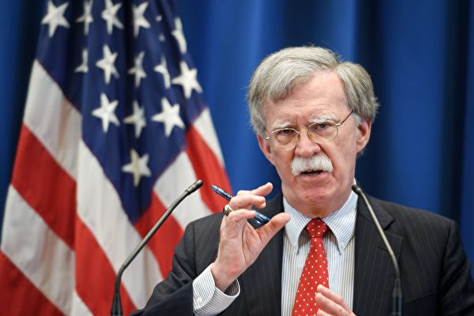

美国前国安顾问博尔顿(John Bolton)，资料照。(Fabrice COFFRINI/AFP) 

 【大纪元2020年04月23日讯】随着批评中共隐瞒疫情而主张向中共追责的呼声日渐增多，美国之音报导，美国一些保守派人士如前美国白宫国安顾问博尔顿主张美国给台湾外交承认。

美国国务卿蓬佩奥4月22日批评中共没有遵守《世界卫生条例》(IHR)规定，指责中共即便有向世界卫生组织通报疫情爆发，也没有分享其所掌握的全部信息。相反，它掩盖了疫情的危险性。持续人传人的情况一个月没有报告，直到全中国每个省份都出现疫情。

包括共和党国会议员克鲁兹、科顿、霍利等，以及密苏里州政府和一些提起个人诉讼者，美国国内对中共究责，要求调查、起诉和索赔的声浪日渐增多，一些保守派人士甚至提出建议，主张美国给台湾外交承认，以便让中共为此付出代价。

博尔顿（John Bolton）重提他在20年前的“双重承认”（dual recognition）主张，认为此时是美国给台湾外交承认的好时机。

博尔顿4月15日在一个推文中说，“鉴于台湾对新冠病毒疫情的处理、北京的反对与掩盖真相，美国必须再次考虑给予台湾全面外交承认。正如我20年前所说，给予台湾毫不模糊的支持最符合美国的利益。”

推文并附上他在2000年发表于《台北时报》上一篇以“双重承认体认现实”（Dual recognition acknowledges reality）为题的文章。

除了博尔顿以外，美国国家利益中心资深主任哈里·卡齐亚尼斯（Harry Kazianis）也认为，现在是考虑与台湾保持全面外交关系的时候。

卡齐亚尼斯这个星期在《福克斯新闻网》一篇文章里，对“中国必须为处理疫情失当付出代价”提出5个建议，其中一个就是调整美国外交策略以符合当前的时机，“意思就是与台湾增强关系而不畏惧北京的霸凌反应。”

他说，“中共视台湾为一个叛离省份，不过现在正是时候考虑与台北维持全面外交关系——甚至是台湾总统蔡英文到白宫访问。”

卡齐亚尼斯认为，美国不应该在继续奉行过时的外交政策，那些政策“只是帮助北京压迫一个活跃的民主社会，那个民主社会试图警告全世界有关新冠病毒（中共病毒），但却被噤声。”

不过有学者认为，给台湾外交承认将导致美中断交，即便是一般认为对中共立场强硬、对台湾也相对较友好的川普（特朗普）政府都不大可能会这么做。

美国圣汤玛斯大学国际研究学系副教授叶耀元说，美国国务院基本上还是“不愿意放弃一中政策”，尽管川普政府团队有些鹰派人士“有点在动摇”，但也不会愿意以美中断交为代价。

不过叶耀元也提到，如果再过一段时间疫情变得更严重，全球化生产线停摆，美国对中国市场依赖减少、彼此互赖性降低，或许美国对于承认台湾的考量也会有所不同。

<a target="_blank" href=#top><h6 align="right">回上方</h6></a>

<a name=147>
<h1 align="center"><b>【内幕】中共瞒疫情 抽调各省医护援湖北</b></h1>

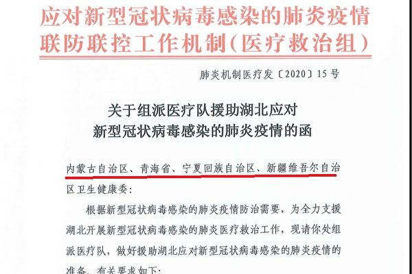

1月27日，中共国家卫健委医政医管局下发内部通知，要求内蒙古、青海、宁夏、新疆卫健委组派三批医疗队支援湖北。（大纪元）

【大纪元2020年04月21日讯】（大纪元记者张顿报导）大纪元获取的中共内部文件显示，中共病毒（武汉肺炎）爆发后，中共当局一边隐瞒医护人员感染的实情，一边又从大陆各地抽调三批医护人员前往湖北。

近日，大纪元获得多份中共内部文件，内容涉及两大方面。一类文件是，中共下令地方组建医疗队前往湖北，如中共国家卫健委下发的《关于组派医疗队援助湖北应对新型冠状病毒感染的肺炎疫情的函》，内蒙古卫健委下发的《内蒙古自治区卫生健康委关于组派医疗队援助湖北应对新型冠状病毒感染的肺炎疫情的紧急通知》、《内蒙古自治区卫生健康委关于组建第二批和第三批医疗队援助湖北应对新型冠状病毒感染》。

另一类文件是，中共卫健委系统要求防控疫情在医疗机构内扩散，如《国家卫生健康委关于加强基层医疗卫生机构新型冠状病毒感染的肺炎疫情防控工作的通知》，《内蒙古自治区卫生健康委员会办公室关于切实加强基层医疗卫生机构新型冠状病毒感染的肺炎疫情防控工作的通知》，《内蒙古自治区卫生健康委关于切实做好新型冠状病毒感染的肺炎医院感染控制工作的通知》等。

<b>中共从各地抽调三批医护队前往湖北、武汉</b>

1月27日，中共国家卫健委医政医管局下发内部通知《关于组派医疗队援助湖北应对新型冠状病毒感染的肺炎疫情的函》。文件要求内蒙古、青海、宁夏、新疆卫健委组派三批医疗队，前往湖北省应对疫情，同时对医疗队的组成做了详细的说明。

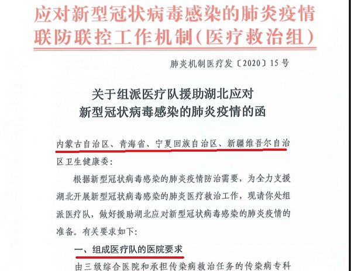

中共国家卫健委医政医管局下发内部通知，要求内蒙古、青海、宁夏、新疆卫健委组派三批医疗队支援湖北。（大纪元）

文件称，这三批医疗队，每省（自治区）每批次135人，每批次均由三级医院派出，包括呼吸科、重症科（ICU）、感染性疾病科、医院感染管理科的医生和护士。

中共国家卫健委在上述文件中要求，第一批医疗队必须在1月28日前抵达湖北省；而第二、三批待命。

同天，中共内蒙古卫健委下发通知，安排第一批赴湖北省的医疗队，分别抽调内蒙古人民医院、内蒙古第四医院、内蒙古医科大学附属医院、呼和浩特市、包头市、赤峰市、乌兰察布市的医护人员，于1月27日17时前组成医疗队。

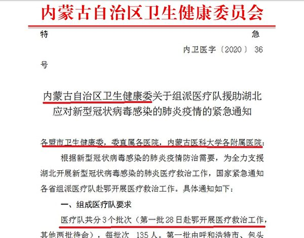

1月27日，中共内蒙古卫健委下发通知，安排第一批医疗队支援湖北。（大纪元）

1月30日，内蒙古卫健委再次下发组建第二批及第三批医疗队的通知。第二批医疗队由各盟市卫健委部分直属医疗机构、医科大学有关附属医院，以及呼伦贝尔市、兴安盟、通辽市和锡林郭勒盟三级医疗机构的医护人员组成。

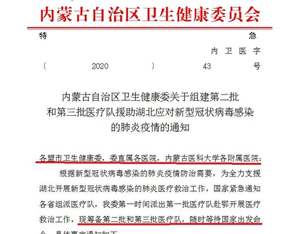

1月30日，中共内蒙古卫健委，安排第二批及第三批医疗队支援湖北。（大纪元）

第三批医疗队由各盟市卫健委部分直属医疗机构、医科大学附属医院，以及鄂尔多斯市、巴彦淖尔市、乌海市和阿拉善盟三级医疗机构的医护人员组成。

内蒙古卫健委要求第二批及第三批于1月31日17时前完成医疗队组建工作，并上报人员名单。

时政评论员李林一表示，中共在1月末抽调其它省份医护支援湖北的时候，已经有很多湖北及武汉医护人员染疫，但那时候中共却没公开具体数字，并提醒这个风险。

<b>中共要求各地加强医疗机构感染控制工作</b>

大纪元获取的第二类文件显示，中共当局1月末在隐瞒医护人员感染的同时，地方卫健委得到指示，需防控疫情在医疗机构内扩散。

内蒙古卫健委1月24日下发“特急”通知，要求各盟市卫健委、委直属医疗机构，内蒙古医科大学附属各医院“防止肺炎在医疗机构内的传播”。

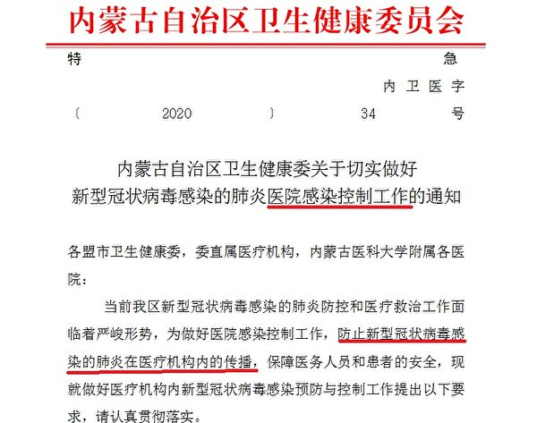

1月24日，内蒙古卫健委要求“防止肺炎在医疗机构内的传播”。（大纪元）

1月25日，中共国家卫健委下发《国家卫生健康委关于加强基层医疗卫生机构新型冠状病毒感染的肺炎疫情防控工作的通知》，防止疫情在医疗机构内传播。

该通知明确要求，各省、自治区、直辖市及新疆生产建设兵团卫健委，要“做好基层医疗卫生机构感染控制”等。

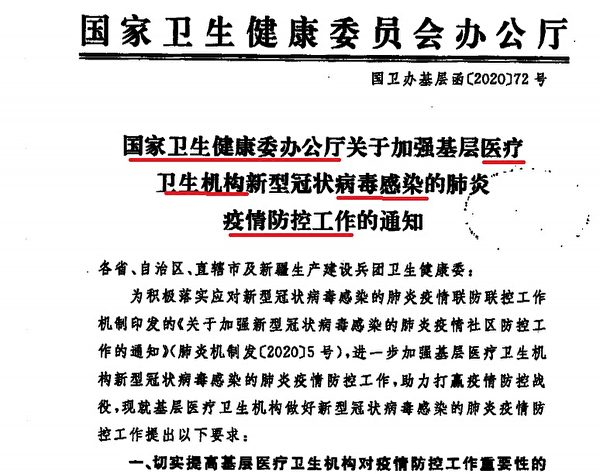

1月25日，中共国家卫健委下发通知，要求“做好基层医疗卫生机构感染控制”。（大纪元）

1月27日，内蒙古卫健委再下发通知，要求各盟市卫健委落实中共国家卫健委下发的有关“通知”要求，要求苏木乡镇卫生院、嘎查村卫生室和社区卫生服务中心（站）等基层医疗卫生机构，“防止院内感染”。

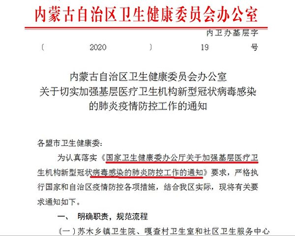

1月30日，内蒙古卫健委安排中共国家卫健委下发的有关“通知”要求。（大纪元）

<b>中共隐瞒医护人员感染实情</b>

中共当局一边隐瞒疫情、隐瞒大量医护人员被感染的实情，一边从大陆各地抽调大批医护人员赶赴湖北、武汉。

台湾“风传媒”获得两份呈报给中共高层的“内参”。一份是2月上旬发表，披露武汉在2月初就已有600名医务人员感染了病毒。

2月22日，旅居海外的蒋小姐对大纪元披露，她从内部渠道获悉，武汉大学人民医院本院和东院（光谷院区）这两院的职工和家属，至少有500多人感染了中共肺炎，但院方仅上报了147人。

据中共官媒报导，截至2月24日，全国476家医疗机构中有3,387名医务人员感染了中共病毒，90%以上（3,062例）的医务人员来自湖北。

但外界认为，实际感染的医护人员远远高于中共官方的数据。

李林一说，中共隐瞒医护人员染疫的做法，主要是维稳的需要，但同时也显示出了这个政权对人命的漠视。中共漠视的不仅有普通百姓的命，连那些医护人员也是一样。

除瞒报医护人员感染数据外，中共当局也一直隐瞒疫情。

中共病毒最迟在去年12月1日在武汉爆发，但中共当局一直隐瞒疫情，打压传播疫情的李文亮等8名医生及民众。同时中共各级卫健委及疾控中心在1月20日之前，一直宣称疫情“可防可控”。5天之后的1月20日，中共才通过专家钟南山之口，首次公开承认武汉出现的“中共病毒”可以“人传人”，而且已有14名医务人员受到感染。3天后，武汉仓促封城，疫情猛烈爆发。

<a target="_blank" href=#top><h6 align="right">回上方</h6></a>

<a name=146>
<h1 align="center"><b>连云港化工厂爆炸 连续三次巨大爆炸声</b></h1>

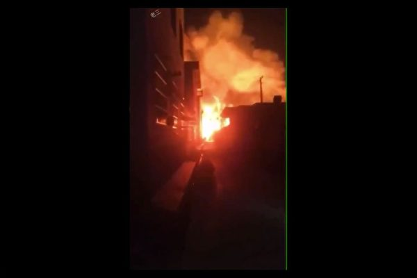

江苏省连云港市一家化工厂发生爆炸事故。（视频截图）

 
【大纪元2020年04月22日讯】（大纪元记者顾晓华采访报导）21日晚9时10分左右，位于江苏省连云港市赣榆区城头镇境内的一家化工厂发生爆炸，火光冲天，附近建筑的玻璃也被震碎。

据当地的一位村民王女士告诉大纪元，她当时听到三声巨大爆炸声，像放炮一样，方园三四十公里都可以听到，后面还听到多次小的爆炸声，窗户和门都有很大的震动。

同时，她还闻到一股烧焦的皮革味道，村民都认为有毒气，她也急忙关紧窗户进屋了。

她还透露，附近的部分村民已经自行撤离事发地，自己找旅馆或者到亲戚家里住。撤离的人挺多的。

官方称“暂无人员伤亡”。不过，这位村民表示，据说村民死伤30来人，但是到现在具体的情况不太清楚。

另据陆媒报导，事故发生在赣榆区城头镇一家生产碳化硅的企业车间。监控视频显示，大火数次把整个监控屏幕照亮。 附近居民称，事发时他距离涉事公司约50米，听到放炮般声响，穿着毛衣和拖鞋赶紧跑出家门。

“等过了十几分以后，放了很大很大声音，火光冲天基本上是，大约有四五次爆炸声。”他还说，距事发地约200米处有玻璃破碎。

<a target="_blank" href=#top><h6 align="right">回上方</h6></a>

<a name=145>
<h1 align="center"><b>炒医疗物资牟暴利 “倒爷”叹“人性黑暗”</b></h1>

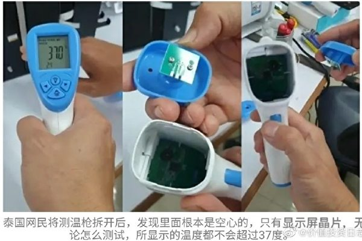

泰国网友早前爆料市场上的一款疑为大陆生产的“空心测温枪”。（视频截图）

 
 【大纪元2020年04月22日讯】疫情期间，中国大陆医疗物资乱象不断，囤积、倒卖、骗卖现象频出，次品、假货也源源不绝。一位医疗物资买手在尝试倒卖口罩、额温枪和呼吸机后，感慨“人性的黑暗你根本想像不到”。

大陆果壳网旗下的微信公众号“放大灯”在近日刊登一篇采访，讲述一位“倒爷”的亲身经历和所见的防疫物资交易黑幕。

<b>以次充好的口罩市场</b>

在二月份，全国的3M口罩被国家统一调配，原本的代理商和经销商都无法继续正常经营，而民间一些“炒家”则开始找“渠道”拿货。“倒爷”说，有人搭上中共官方指定的采购员，拿到货后轻松倒卖赚回几百万。

一些非正规厂家开始包装自家产品，利用虚假广告骗客户。以一家名为“绿盾”的国产口罩品牌为例，该品牌自称“战士执勤都用绿盾口罩”，引得不少客户购买。后来证实，他们仅遵循国标GB/T32610-2016，即非常低的民用防护标准生产，只能防尘，根本达不到医用标准。

<b>炒成“期货”的额温枪</b>

额温枪是另一个需求极高的物资。正常时期，一支额温枪的价格在七八十元人民币；疫情期间，额温枪出厂价飙至两百多，经过七八手的倒卖后，消费者最后要花四百多元才能买到。

一些“炒手”用大订单向厂家骗取优惠价，一下单就是100万个、200万个、甚至上千万个。付30%订金后，厂家开始每天出货，“炒手”同时将到手的货高价卖掉。当拿到订金价格相当的货后，“炒手”会突然违约，不再付剩余70%的货款。 

厂家发现这种现象后立即要求买家全款订购，且不再每天交付一批，而是到最后期限一次性交货；与此同时，厂家不断拖延低价订购的订单，转而开始自己囤货，并直接以高价卖给其他买手。

这些现象导致各方不断囤货而不出货，额温枪被炒成了“期货”。

此外，由于额温枪的关键部件“测温传感器”涨价太快，部分厂家为节省成本开始造假。他们往空枪壳中装入一个随机显示温度的显示屏，无论怎么测，被测者的温度都在一定范围内。

这些假货或者被用来骗订金；或者被按比例掺在真货中混水摸鱼地卖出；或在买家交付所有货款后全出假货。

<h4 align=center><a href="https://www.epochtimes.com/gb/20/4/21/n12050369.htm">这就是那个科技公司老板让做假货卖给美国的对额温枪的功能，事先设置好温度，无论怎样测都不会是真实温度。(点击右键,另存新档）</a></h4>

<b>呼吸机坐地起价 购买过程多刁难</b>

由于曾经做区块链，这位“倒爷”曾接触不少外国政府。3月海外疫情爆发后，北非某国政府委托他从中国找渠道购买呼吸机。

他联系上一家医药央企，订购1500台812A呼吸机。该央企承诺“要现货有现货，要期货有期货”，但是当买方付款后、在交现货的前一天，这家央企却表示“期货和现货都没有”。

还有两个西欧国家联系“倒爷”买VG-70呼吸机。然而，生产这种呼吸机的北京谊安公司关闭了所有渠道，大多数呼吸机都在某医药央企及其下属的授权经销商手里，要拿到货，必须和他们商谈。

VG-70在正常时期的出厂价是10万人民币出头，但疫期被一路炒到四十多万，“倒爷”所知道的最高价的是一笔1000台的单子，每台单价44万元。

此外，从北京谊安公司买货的过程也备受刁难。原本由厂家提供的国外采购函、国内三类医疗器械售卖资质变成了由买家负责；在全国范围内已经取消的“开户许可证”被要求提供；医药央企的授权经销商要求提供“资金证明”，且只有在开具当天有效；看货要随叫随到；大半夜公对公账户付钱；拖延期货订单；收取高通道费用……

“倒爷”北非的客户在拿到货后说这是个“crazy market”（疯狂的市场），还没买到货的西欧国家直言这是个“bad seller”（坏卖家）。

买卖防疫抗疫物资70多天以来，“倒爷”最大的感慨是：“人性的黑暗你根本想像不到，玩区块链至多会遇到割韭菜的小诈骗犯，但倒医疗物资的是一群老头子，看着别人去死。”

<a target="_blank" href=#top><h6 align="right">回上方</h6></a>

<a name=144>
<h1 align="center"><b>【独家】中共密件承认哈尔滨疫情失控</b></h1>

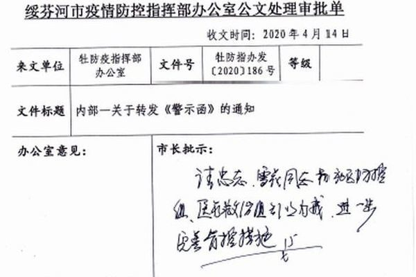

近日大纪元获得的中共内部文件显示，哈尔滨疫情失控，黑龙江省发给地方的文件中也承认了这点。（大纪元

 
 【大纪元2020年04月21日讯】（大纪元记者古清儿报导）黑龙江省中共肺炎（武汉肺炎）疫情告急。从绥芬河到哈尔滨市社区群聚感染，到邻近的内蒙古根河市宣布全面封闭边界交通，并禁止民众来往，黑龙江疫情引发关注。近日大纪元获得的中共内部文件显示，哈尔滨疫情失控，黑龙江省发给地方的文件中也承认了这点。
内部文件显示 中共承认哈尔滨疫情失控

近日，大纪元获得黑龙江当局指责哈尔滨疫情失控的内部文件。

4月13日，“黑龙江省应对新型冠状病毒（中共病毒）感染肺炎疫情工作领导小组指挥部”的内部“警示函”称，哈尔滨市疫情呈现聚集性爆发态势，落实院感防控措施不到位，关联性病例不断增多，“内防反弹”，工作落实不力。

这份文件的状态注明“不予公开”。

文件承认，哈尔滨市社区（村屯）由封闭式管理转入流动式管理后，未能因地制宜精准管控，致使一些村中和开放式小区处于“真空”、“失控”状态，流动式管理措施不到位，“测温、扫码、戴口罩”管控工作流于形式，社区（村屯）管控一再“跑粗”、形同虚设。

这份文件更列举哈尔滨市在防疫问题上的四个“重大失误”：

1. 未能执行中共内部规定，未能落实首诊负责制，医院发热门诊预检分诊“哨点”作用失效；

2. 未能严格按照感染预防与控制技术指南要求做好院感防控；

3. 未能严格实施“一患一陪护”制度和严禁探视制度，陪护管理失控，导致出现院内交叉感染；

4. 对3月31日报告的39个抗体阳性感染者，没有跟踪交底、没有追踪溯源、没有强化管控；

时政评论员李林一说，中共一贯有维稳的心态，大部分文件都不公开，媒体和民间又没机制去监督中共地方的执行效果，导致地方上敷衍了事，结果出了大事。与其说是地方上的“重大失误”，倒不如说是中共体制造成的恶果更为准确。

<b>官方自称哈尔滨疫情出现1传50 民间质疑隐瞒</b>

近日，哈尔滨1传50人的群聚感染事件，引起外界关注。

从4月9日起，中共自己对外公布的数据称，黑龙江省哈尔滨市新增本土确诊病例1例和无症状感染者3例，这几例均与哈尔滨医科大学附属第一医院出现的群聚感染有关。

截至4月17日24时，官方又声称，该病毒传染链已致50人感染。

4月17日晚，包括哈尔滨副市长陈远飞、哈尔滨卫健委主任丁凤姝在内的18人因疫情防控不力被问责。其中涉及三家医院，哈尔滨市第二医院、哈尔滨市胸科医院、哈尔滨医科大学附属第一医院共计13人被处分。其中2家医院院内交叉感染逾30人。

哈尔滨市感染人数激增，网上传出的一个视频显示，有一位女士在视频中说，哈尔滨19日晚正式开始二次封城，比之前更严，街道和小区全都封了。

对此，网络也有不少质疑，觉得中共公布的数据不可信，实际疫情可能比这要严重得多。

与此同时，与黑龙江临近的内蒙古根河市宣布自17日起全面封闭与黑龙江边界的交通，“劝返”黑龙江进入根河人员，也暂停根河人员进入黑龙江。并要求防控确保“不漏一车、不漏一人”。

根河市是大陆至今第一个宣布封闭与黑龙江的交通，并禁止民众来往的地区。

<b>疫情下 黑龙江内部急下通知</b>

大纪元还获得了哈尔滨严重疫情期间，黑龙江当局下发的多份内部医疗文件。这些文件都以不对外公开的形式下发。

4月13日，“黑龙江省应对新型冠状病毒（中共病毒）感染肺炎疫情工作领导小组指挥部”发出的《关于进一步做好聚集性疫情防控工作的提示函》的内容显示，当地疫情严重，管制严格。

文件提到，4月9日以来，道外区本土确诊病例郭某，在疫情防控期间，多次参与和组织家庭聚会，已造成包括其本人在内的11名确诊病例和6名无症状感染者。与郭某及其家人关联的456名密切接触者中，有155人被集中隔离，301人居家隔离，而且还在持续发酵。

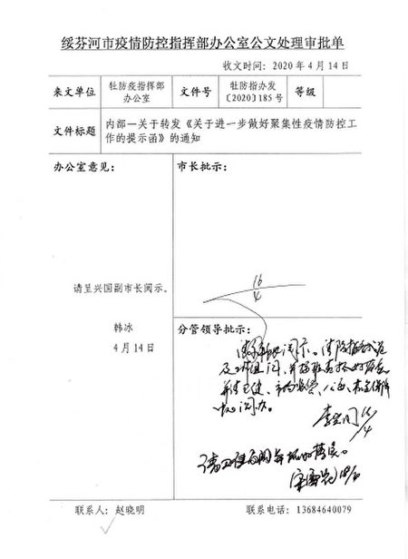

近日大纪元获得的中共内部文件显示哈尔滨疫情失控。（大纪元）

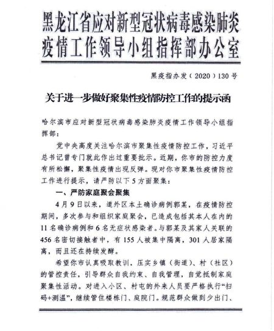

近日大纪元获得的中共内部文件显示哈尔滨疫情失控。（大纪元）

 
 
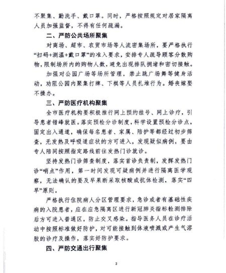

近日大纪元获得的中共内部文件显示哈尔滨疫情失控。（大纪元）

 
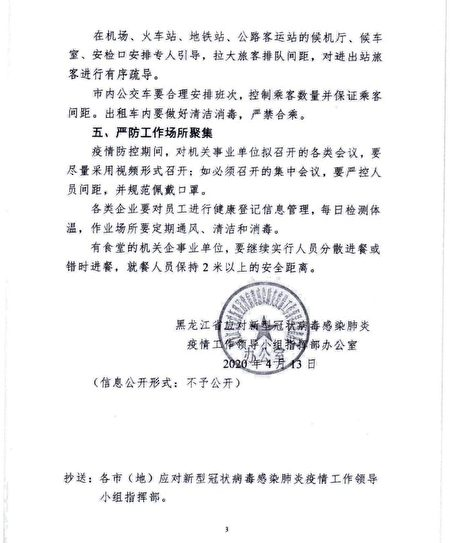

近日大纪元获得的中共内部文件显示哈尔滨疫情失控。（大纪元）

 
 该文件要求，对进入小区、村屯的外来人员要严格执行“扫码+测温”，继续管住楼栋门、庭院门。同时，严格按照规定对居家隔离人员加强监督。

对商场、超市、农贸市场等人流密集场所，要执行“扫码+测温+戴口罩”的准入要求，限制场所内的购物人数等。对公园广场等场所管理，禁止跳广场舞等健身活动，劝阻公园内聚集打牌、下棋等人员扎堆行为。婚丧嫁娶不操办。

4月15日，“牡丹江市新型冠状病毒（中共病毒）感染肺炎疫情防控指挥部办公室”按照黑龙江省要求下发了《关于严格执行牡丹江市新冠肺炎疫情救治和防控人员防护要求的通知》。17日，又下发了《关于印发加强发热门诊和预检分诊工作实施方案的通知》。

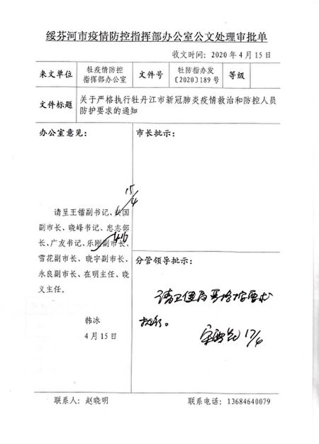

近日大纪元获得的中共内部文件显示哈尔滨疫情失控。（大纪元）

 
4月18日，在名为“关于进一步加强新冠肺炎疫情信息报告工作的通知”的文件提到，中共地方机构需建立问责机制。各级卫生健康行政部门对于迟报、漏报、瞒报、不报的要追责。

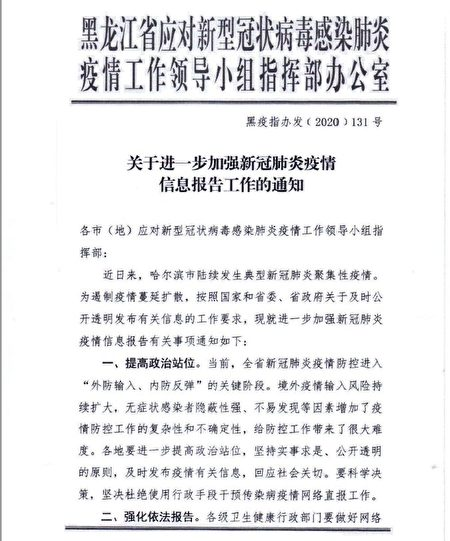

近日大纪元获得的中共内部文件显示哈尔滨疫情失控。（大纪元）

 
《金融时报》引述全球卫生高级研究员黄严忠的话表示，在北京试图重新启动经济之际，哈尔滨的疫情表明，新增确诊病例反弹的风险目前是存在的，而这个风险“不可预测”。

在哈尔滨卫生系统工作的郝医生有一张运动健身卡，但是疫情发生以后，她一直没能去健身房锻炼。郝医生对美国之音表示，这波疫情反弹看来蛮严重。她说，“卫健委都⋯⋯市长都被约谈了，那能是这几个吗？”

也有当地居民向大纪元透露，官方一直在掩盖疫情，所有的消息只要一传出，当局立刻出面“辟谣”。

<a target="_blank" href=#top><h6 align="right">回上方</h6></a>

<a name=143>
<h1 align="center"><b>港警恐袭式大抓捕 李柱铭等14民主人士被抓</b></h1>

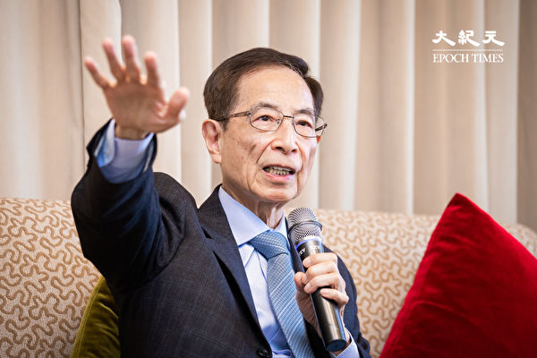

香港警方4月18日突然实施大抓捕，香港民主派人士李柱铭、何俊仁、梁国雄、黎智英等14人被捕。图为香港民主党创党主席李柱铭。（陈柏州／大纪元）

 
 【大纪元2020年04月19日讯】（大纪元记者文婷香港报导）香港警方18日突然实施大抓捕，香港民主派人士李柱铭、黎智英等14人被捕。在此之前，港澳办、中联办曾发表声明，试图强行干预香港事务，遭到民主派议员强烈反对。在瘟疫笼罩之下，香港继续陆化仍暗潮汹涌。

4月18日早上，被誉为“香港民主之父”的李柱铭被警方带走。李柱铭是香港民主党创党成员，曾任香港立法会议员、港同盟及民主党主席，同时也是香港目前最资深的大律师。

现年81岁的李柱铭在国际间享有声誉，1997年在美国国会山典礼接受美国全国民主基金会颁发民主奖，2000年获欧洲议会EPP-ED组织颁发舒曼勋章。

警方早上还前往壹传媒创办人黎智英位于何文田的住宅，但黎智英当时不在家。下午1时许，黎智英返回住宅，警方随即上门将他带走。

据悉，警方18日抓捕了包括李柱铭、黎智英、何俊仁、杨森、单仲楷、蔡耀昌、梁国雄、吴文远、黄浩铭、李卓人、陈皓桓、区诺轩、何秀兰、吴霭仪等14名民主派人士，他们当中多人被指涉嫌参与未经批准的反送中抗争游行集会活动，将被带往不同警署接受调查。

警方实施大抓捕行动之际，民主派立法会议员林卓廷召开记者会，证实至今已有14名民主派人士被捕。

公民党议员杨岳桥在记者会上批评说，港府趁立法会正在处理抗疫防疫基金、社会忙着抗疫之际秋后算账，手段肮脏下流。

民主党主席胡志伟指责警方拘捕反送中游行带头者，令人怀疑政府想借“国家安全”之名，令香港社会噤声。

资讯科技界议员莫乃光则表示，近日港澳办和中联办分别发布声明干预立法会事务，今日就有大搜捕，令人觉得此次行动明显有协调。

香港立法会自去年10月复会以来，首个工作是选出内务委员会主席。近日，港澳办和中联办分别发布声明，批评内务委员会副主席、泛民主派议员郭荣铿“拖延”选举内会主席，令立法会无法正常运作。

郭荣铿和全体泛民主派议员对此强烈反驳，并指出内会纯属香港内部事务，中央政府的做法违反《基本法》第22条“不可干预香港内部事务”的规定，有违“一国两制”。

郭荣铿更直斥“两办”的批评是“无理指控和政治谩骂”，促请对方检点、收敛。

然而，香港特首林郑月娥日前在记者会上表示，中央政府关心香港和澳门的事务是“理所当然”，不构成干预。遭到港人一片怒骂。

4月17日，香港中联办官网刊出中联办发言人的回应，称港澳办和中联办不是一般意义上的“中央人民政府所属各部门”，有权力对香港事务发言发声。

在此之前，4月15日，香港中联办主任骆惠宁发表强硬讲话，声称香港在维护国家安全制度上不够完善，并指反送中运动是所谓的“港独”、“黑暴”，危害中共的所谓“国家安全”。

他还声称，近年外部势力对香港事务“深度干预”，香港应尽快在法律制度和执行机制层面下功夫，“决不能让香港成为国家安全的风险口”。

有分析认为，骆惠宁的讲话有抹黑反送中，嫁祸外国势力和强推23条恶法之嫌。而在此敏感时刻，港府突然大规模抓捕民主派人士，不排除借此恐吓港人。

<a target="_blank" href=#top><h6 align="right">回上方</h6></a>

<a name=142>
<h1 align="center"><b>【一线采访】父母湖北双亡 儿子欲状告中共</b></h1>

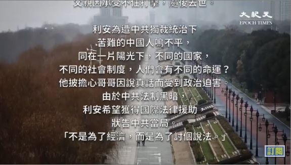

（大纪元视频截图）

【大纪元2020年04月21日讯】（大纪元记者伊铃多伦多报导）“我现在真的感到这是个五浊恶世，没有比这更黑暗的世界，很残酷，很残酷，眼泪都流光了，很伤心。”中共病毒（武汉肺炎）受难者家属利安（化名）悲愤地说，“现在就是太阳照到我身上，都是那种惨白惨白的感觉。”

4月6日晚（美东时间），湖北省黄冈市居民利安向大纪元控诉，由于中共当局隐瞒真相，声称“病毒不会人传人”，误导民众，导致武汉疫情爆发，使无数生灵涂炭，家破人亡。其八十多岁的母亲因为听信当局疫情谎言，疏于防护，染疫身亡；父亲因承受不住打击，随后去世。

利安说，多年来，通过翻墙软件看大纪元、新唐人媒体，了解真相，明白中共一直在撒谎，欺骗国内民众。并表示：“大纪元是非常负责任的，是真正为民伸张正义的媒体。”

利安向大纪元表示，希望寻求国际法律援助，向中共当局“讨个说法”；也希望联合国介入，推翻中共当局，还中国人民公平、正义，让中国人民也能一人一票，选出真正优秀、合格的政府。

采访原文：

利安：你是哪儿啊？

记者：我是大纪元。

利安：我觉得大纪元很负责任的，真的是为民伸张正义的一个媒体。

记者：具体法律援助，你哪些方面需要法律援助？

利安：我不是经济赔偿，我觉得是讨要一个说法。我母亲她抚养我们一场不容易，在医院里面感染的，都没有确诊就直接转到那边去了。我怀疑是在那边去感染的。我哥昨天晚上给我打电话说那个山东一个医师在这边隔离嘛，然后回家隔离14天，刚满的第二天早上就突然心脏病就去世了。

我妈本来是健健康康的，她在医院里面已经住了4年了，跟爸一起住了4年了，都好好的。她是慢性病，心血管，医院的医生把我妈都调养的很好的一个状态，结果我妈在医院里，我都不知道她是什么原因被感染。

记者：你上次说他们说不会人传人，你们就没有引起重视，是不是？

利安：我当时以为那个区是在武汉，跟黄岗这边没有关联性，就是这一方面我就疏忽了。然后他们也做了一个误导，就是没当一回事。因为他要早一点宣传的话不会去隐瞒公众，剥夺了我们的知情权。因为这个信息的不对称，大家所处在的位置不一样，获得的情报也不一样。我妈染病的时候，我把那个电视里面的一些信息、翻墙软件的信息都告诉我妈了，叫我妈注意。但是政府层面上根本都没有什么那个，我们所以就疏忽了这个事情。所以我妈⋯⋯政府上面这里面有个欺瞒公众的一个行为。

记者：我现在明白了，你就是讨个说法，不是人死了就算了，然后还说他们做得怎么好啊。

利安：我现在强烈的感觉到这个真的是五浊恶世，劫浊、见浊、烦恼浊、众生浊、命浊。真的是五毒恶世，没有比这个更黑暗的世界了。很残酷很残酷，眼泪都有流光的感觉，真的是很伤心的，很悲从中来的那种感觉。我现在，太阳照我身上我感觉太阳都是那种惨白惨白的那种感觉。而且现在我妈她是因为有那个补偿，现在铁路社区的胡局长跟我说，打了几次电话说，催我们选公墓，如果选到我们当地的公墓的话呢就可以开证明，少收一万块钱。我还说了我说能不能通过货币化的补贴，补贴给我们，我到时候可以拿着我妈的这个钱去做善事嘛。

我现在真的希望能够，联合国能够介入，推行选一人一票，我们选合格的拥护的政党上台那是最好的。

记者：就说整个政府是黑暗的，是不是，对民众这个过程中？

利安：很黑暗的，天天到处标语标牌，中国梦啊什么，我感觉都是骗人的。政府剥夺我们的知情权，根本都不跟我们说那个武汉的真实情况。等事情发生了他才去说。然后就是，而且更加没有人性的就是我妈在病危的时候，我们想去见最后一面都不允许见。我哥从深圳坪山区，坪山区区长签字才能够回来，他是坪山区的第一个人，唯一一个人回来的。那个时侯都火车停，我们从深圳北搭火车，只能搭到九江市，然后九江挨着是黄梅，然后在高速公路上面路口，然后祈祷菩萨加持，然后才有一台车子过来，就是供电局的那台车接我哥回到家里面。然后没看到我妈最后一面，只是看到一副棺材。

记者：这是什么时候，发生在什么时候？

利安：2月5号到2月22号。我妈她是2月4号确诊的嘛，2月5号转到那个，2月4号判断是为疑似的，2月5号转到黄岗版的小汤山——大别山区域医疗中心嘛，转到那边去了，我妈妈。这个真是呢，这个国家就像那个快要烂掉的苹果样的。哎，很糟糕的那种情况。

记者：你希望用法律手段状告当局，是不是？

利安：对呀，我希望能够，当然如果用中国的法律可能是告不通的。

记者：你希望在国际上面获得法律援助是吧？

利安：对啊。我加你微信，我把我妈的死亡证明都可以你，上面写的是新冠病毒死亡。

记者：这些东西你都留着，到时候真的会国际法庭起诉他们。

利安：要起诉啊，血债要血偿的，我觉得应该把这个政府要推翻掉。这个政府真的很烂的，很垃圾的那种的。每一个人都戴着假面具在那说话，一点活的不真实。你说政府为什么把这个病毒研究出来，搞不懂。我心情很复杂。我感觉你们生活在阳光下，我们也在阳光下面，但是感觉制度不一样，真的不一样。

记者：现在国外也比较严重，病毒也传到国外来了，共产党闯的这个祸很大的，所以国际社会，我估计就不会饶过它。

利安：共产党他对疫情的这个，有些数据他是隐瞒啦，他给的是虚假的数据。那么美国跟意大利是根据这个虚假的数据来建模的，进行电脑的一个预测推算。那实际发生是超出这种想法的。然后世卫的表现也是很偏袒中共。我不知道为什么会把中国这个政党养虎为患，要把它培养的这么好，每年还跟它做生意啊。完全都是，跟强盗打交道一样的。

我担心我哥说真话可能会受到政治迫害，我就担心我哥。

记者：你哥哥说了什么啊，没有别人知道吧？

利安：我就担心嘛，我也不清楚，反正我哥性格也比较静不爱怎么说话。

因为政府无孔不入的，我接到电话10086都会提醒我这是海外来电，叫我注意安全，因为我们实际上手机啊、QQ、微信都被监控的。

<a target="_blank" href=#top><h6 align="right">回上方</h6></a>

<a name=141>
<h1 align="center"><b>加码救小企业 美参院通过近五千亿援助法案</b></h1>

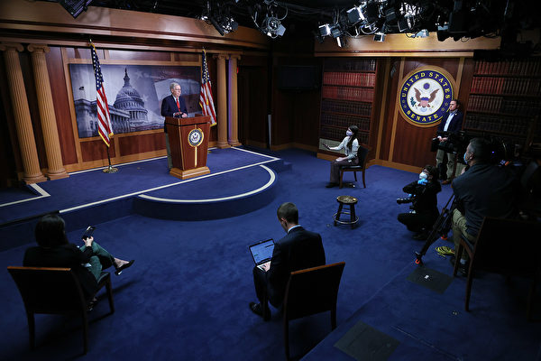

周二（4月21日），美国参议院已于当天下午投票通过加码援助企业法案，金额总计4,840亿美元。图为参议院多数党领袖麦康奈尔在记者会上。(Photo by Chip Somodevilla/Getty Images)

 
 【大纪元2020年04月22日讯】（大纪元记者吴英综合报导）周二（4月21日），美国参议院通过加码援助企业法案，金额总计4,840亿美元。众议院可能于周四（4月23日）投票。如果通过，美国应对疫情的援助金额累计近3万亿美元。

根据参议院多数党领袖米奇·麦康奈尔（Mitch McConnell）办公室发布的文件，将近5千亿美元的救济法案将分配3,100亿美元给“薪水保护计划”（PPP）贷款项目，其中600亿美元保留给小型机构，另外的2,500亿美元则不受限制。

保留给小型贷方机构的600亿美元，大约五成分配给资产低于100亿美元的贷方，另一半则给资产在100亿美元至500亿美元之间的贷方。

该法案拨600亿美元用于“经济损害灾难贷款计划”（Economic Injury Disaster Loan Program，简称EIDL），其中100亿美元将以直接补助的形式提供。另外，拨款750亿美元补助医院，以及拨款250亿美元用于中共病毒检测。

知情人士说，补助检测的资金中将有110亿美元拨给各州政府，其它资金用于疾病控制与预防中心（CDC）和国立卫生研究院（NIH）等机构。另外，拨10亿美元用于支付未投保者的检测费用。

参议院少数党领袖查克·舒默（Chuck Schumer）周二上午表示，参议院将在当天稍晚通过针对小型企业的额外救济法案。

舒默告诉CNN，他与众议院议长南希·佩洛西（Nancy Pelosi）、白宫办公厅主任马克·梅多斯（Mark Meadows）和财政部长史蒂芬·姆钦（Steven Mnuchin）在周一进行了“彻夜协商”，并且“几乎每一项问题都达成了协议”。

为了对抗源于中国的中共病毒（武汉肺炎）全球大流行疫情，川普总统在3月份签署了三阶段援助法案，第一阶段援助计划总计83亿美元，向政府卫生官员和疫苗研发提供联邦援助。

3月中旬，川普总统签署了1,000亿美元的第二阶段援助计划，内容包括为工人提供紧急带薪假及免费检测的规定。

3月27日，川普总统签署2.2万亿美元的第三阶段援助计划，其中分配3,490亿美元帮助愿意维持员工薪资的企业（即PPP项目），但上周PPP资金已用完。

这次近5千亿美元援助法案被外界称为第3.5阶段援助计划。

周二下午，川普总统发推文说，他敦促参议院和众议院通过《薪资保护计划和医疗保健增强法案》（Paycheck Protection Program and Health Care Enhancement Act），为PPP、医院和检测提供额外的资金。

川普在推文中还预示了下个阶段（第四阶段）的援助重点，补助因为中共病毒（COVID-19）财政收入受损的州和地方政府，以及投资急需的桥梁、隧道、宽频基础设施、餐馆、娱乐、体育，以及工资税的税收优惠等，以刺激经济增长。

<h4 align=center><a href="https://twitter.com/realDonaldTrump/status/1252640539574448128?ref_src=twsrc%5Etfw%7Ctwcamp%5Etweetembed%7Ctwterm%5E1252640539574448128&ref_url=https%3A%2F%2Fwww.epochtimes.com%2Fgb%2F20%2F4%2F21%2Fn12050572.htm">川普总统发推文(点击右键,另存新档）</a></h4>

<a target="_blank" href=#top><h6 align="right">回上方</h6></a>

<a name=140>
<h1 align="center"><b>大陆二手房房源增多价格大跌 上千房企注销</b></h1>

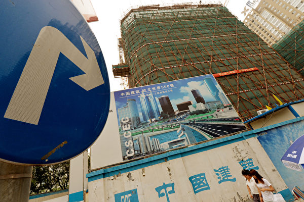

今年一季度重点监测的18个城市，二手房成交量同比减少44.6%。图为资料照。(MARK RALSTON/AFP/Getty Images)

 
 【大纪元2020年04月22日讯】（大纪元记者张玉洁综合报导）今年以来，大陆多地二手房房源增加，成交量下降，很多房主数次降价仍然卖不出去。疫情爆发以来，更能反映楼市需求的二手房市场陷入低谷，2月至3月间上千家二手房企业注销。

一般来说，3月和4月是房地产市场的活跃期，但今年受疫情影响，大陆楼市几乎停摆。据贝壳研究院统计，今年一季度重点监测的18个城市，二手房成交量同比减少44.6%。

天眼查专业版数据显示，仅今年2月1日至3月25日，大陆就有1335家二手房企业注销，其中23.6%的企业成立仅一年左右。

<b>北京降价二手房的数量是价格上涨房源的8倍</b>

4月19日大陆媒体消息，从3月下旬以来，北京市各区域的二手房房源开始增加，但成交量下降。截至4月12日，北京二手房成交周期均值为160.91天，同比去年增加了66.56%，成交周期中位值从去年4月的47天延长至124天。

随着而来的是二手房价格大跌。价格下降的二手房数量是价格上涨房源的8倍，一些小区二手房价格相比中国新年之前每平方米下跌了3000元（人民币，下同）至1万元。

北京朝阳区东北三环附近一小区3月份的成交均价比去年12月份每平方米下跌了4400元，与去年8月份相比，每平方米下跌1.73万元。

海淀西二旗区域的房价以往一直居高不下，一小区过去每平方米大约10万元，但最近成交价不足9万。该区域附近的一个小区，3月份成交价比去年8月下跌8000多元。

<b>重庆挂牌二手房超过22万套 很多连续降价</b>

诸葛找房数据显示，截至4月15日，重庆二手房挂牌量已超过22万套，其中主城九区二手房挂牌量已超过20万套。但在重庆多个购房论坛上，很多人表示近期不会购买二手房，会再观望一段时间。

根据链家的数据显示，重庆二手房降价主要集中在今年3月之后，而且很多房源多次降价。有的二手房从3月中旬至4月初三次降价，相比去年末的挂牌价下跌了43万元。

今年3月份，重庆二手房价格环比下跌0.7%，是去年8月以来最大跌幅。

一位将于明年毕业的大学生表示，原计划毕业前在重庆找到工作，然后买一套二手房，但疫情发生后，现在不再考虑买房，要先等工作稳定后再看。

易居研究院智库中心研究总监严跃进预计，此后一段时间内，包括重庆在内的一些重点城市二手房价格可能还会有所下跌。

<b>西安二手房源近一个月激增 “降价急售”</b>

最近西安二手房挂牌销售的房源正在大量出现，诸葛找房、贝壳、房天下等几家二手房平台公布的数据显示，近一个月西安二手房挂牌房源数量超过7.5万套，但受疫情影响，销售不佳。

最新数据显示，西安二手房价格已经连续下跌五个月。一位房地产业人士表示，他经手的一套三居室二手房从中国新年前挂牌至今，已经累计降价了20多万元。

诸葛找房的数据显示，西安去年3月份平均每天降价的房源有349套，今年3月份连续多天超过500套，有时超过1000套，很多二手房出现“降价急售”“再次降价”，甚至“降价三次还能谈”等字样。

一位房产中介人士表示，在4月初前后的半个月内，他曾带7个客户看二手房，结果零成交。

其它二线城市的情况也与西安和重庆类似。南京二手房上周（4月13日-4月19日）的挂牌均价连续5周下跌。青岛二手房3月份连续第14个月下跌，据中介表示，疫情之后出现普遍降价。

<a target="_blank" href=#top><h6 align="right">回上方</h6></a>

<a name=139>
<h1 align="center"><b>密苏里州率先起诉中共：疫情骗局 后果巨大</b></h1>

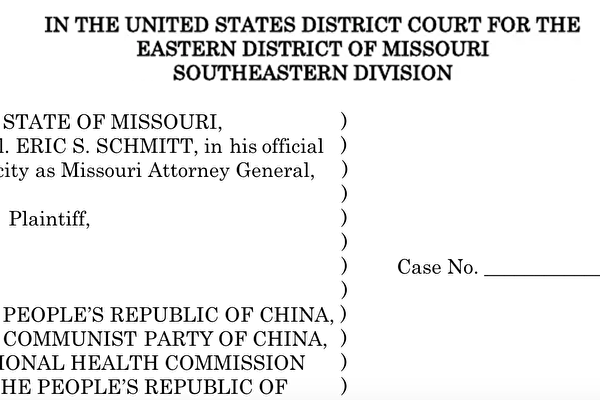

美国密苏里州4月21日起诉中共，要求对中共病毒造成的损失进行赔偿。图为福克斯新闻获得的起诉书文件的截图。

【大纪元2020年04月22日讯】（大纪元记者张婷综合报导）周二（4月21日），密苏里州（Missouri）成为美国第一个对中国（共）提出诉讼的州。该州要求中共对冠状病毒（中共病毒）疫情的全球蔓延承担责任，并寻求赔偿，以弥补该病毒造成的 “巨大生命损失、人类痛苦和经济动荡”。

截至周二上午，密苏里州已有5,963例中共病毒（武汉肺炎）确诊病例，215起死亡案例。

据福克斯新闻独家报导，密苏里州官员们表示，冠状病毒（中共病毒）除带来健康影响外，还造成严重经济损失。一项估算显示，密苏里州为遏制病毒传播而实施的经济停摆措施已经使该州损失了约440亿美元。

“在密苏里州，病毒的影响是非常真实的，数千人被感染，许多人死亡，很多家庭与临终的亲人分离，小企业正在关门，那些‘月光族’正在为吃饭而挣扎。”密苏里州总检察长埃里克·施密特（Eric Schmitt）在一份声明中说。

<b>中共应为大流行后果承担责任</b>

该诉讼强调中共应该为这次大流行后果承担责任。

“中国（共）反复的非法和不合理的行为和不作为，”起诉书称，“已经伤害并严重干扰了密苏里州大量居民的生活、健康和安全，摧毁了生命，破坏了密苏里州的公共秩序和经济。”

密苏里州官员们表示，除了让中共承担尽可能大的经济赔偿外，密苏里州政府还在寻求正式追究中共政府为其加剧病毒疫情的行为承担责任，并找出更多的有关中共政府如何处理病毒以及病毒起源的真相。

“中国（共）当局的一场欺骗、隐瞒、渎职和不作为的骇人听闻的运动，导致了这一大流行的爆发。”起诉书写道，“在疫情最初爆发的关键几周内，中国（共）当局欺骗公众，压制关键信息，抓捕举报人（吹哨人），在证据不断增加的情况下仍否认（病毒）人传人，摧毁重要的医学研究，允许数百万人暴露在病毒中，甚至囤积个人防护设备，造成了一场不必要的、本可阻止的全球大流行。”

“被告人要对它们（中共）给全球包括密苏里州人造成的巨大死亡、痛苦和经济损失负责，它们应该被追究责任。”起诉书说。

“在COVID-19大流行期间，密苏里州面临一场紧急的公共健康危机。”

起诉书还说，密苏里州并不是唯一的受害者：“中国共产党和中国（共）政府所造成的病毒使世界上没有一个社区不受到影响。”

官员们说，密苏里州的诉讼案旨在强调中共的哪些行为导致了疫情大流行。但他们也强调，中共政府还有其它行为加剧了疫情的传播，这些已经得到几乎肯定的证明。

起诉书指控中共囤积医护人员治疗冠状病毒（中共病毒）患者所需要的个人保护设备，导致其从一个个人保护设备净出口国变成一个净进口国。

<b>被告人包括中共 绕过FSIA的限制</b>

值得注意的是，由密苏里州总检察长施密特牵头的这起诉讼案的被告包括中国共产党。这是为了绕过《外国主权豁免法》（FSIA）中的限制。

FSIA限制了美国人起诉外国政府的能力，但某些情况例外。通过起诉控制中国政府的中共，密苏里州官员说，他们的指控就不会受到FSIA的阻碍。此外，他们也声称，这个诉讼符合FSIA中所定义的例外情况。

福克斯新闻获得了这份起诉书副本，上面明确写明：原告人是密苏里州。

被告人包括中华人民共和国；中国共产党；中共国家卫生健康委员会；中共应急管理部；中共民政部；湖北省人民政府；武汉市人民政府；武汉病毒研究所；中国科学院。

<b>至少7起私人团体诉讼案 要求中共索赔</b>

在密苏里州发出起诉之前，美国至少有7起由私人团体对中共提出的群体诉讼案。其中在佛罗里达州的一起诉讼称，中国（共）明知“COVID-19（中共病毒引发的肺炎疾病）是危险的，能够引起大流行，却行动迟缓，把头往沙子里扎（指逃避处理问题或困难的局面），为了自己的经济利益而进行掩盖。”

代表五家拉斯维加斯企业的另一项集体诉讼正在寻求数十亿美元的赔偿。该诉讼声称中共政府当初应该共享有关该病毒的更多信息，相反中共在默许病毒到处传播的同时，吓阻了医生、科学家、新闻工作者和律师对疫情真相的报导和揭露。

在另一起诉讼中，美国保守派律师拉里·克莱曼（Larry Klayman）及其位于华盛顿特区的“自由观察”（Freedom Watch）在德克萨斯州提起诉讼，要求中共赔偿20万亿美元，理由是中共“无情、鲁莽冷漠和恶意行为”。

周一（4月20日），22名共和党议员要求川普政府针对中共在大流行期间的行为向国际法院提起诉讼。

<a target="_blank" href=#top><h6 align="right">回上方</h6></a>v

<a name=138>
<h1 align="center"><b>【独家】各地秘密培训 中共层层瞒疫情</b></h1>

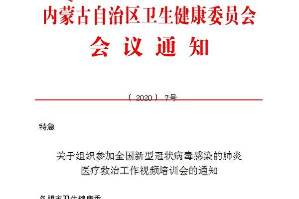

内蒙古卫健委下发通知，中共国家卫健委1月15日召开全国视频会议。（大纪元）

 
 【大纪元2020年04月19日讯】（大纪元记者张顿报导）大纪元获得中共内部文件显示，中共病毒（武汉肺炎）爆发后，中共从上到下层层对外隐瞒疫情，但其内部早在1月15日就开始分层级地进行秘密培训，部署防控方案。

近日，大纪元获得多份内蒙古自治区的机密文件，包括《关于组织参加全国新型冠状病毒感染的肺炎（中共肺炎，下同）医疗救治工作视频培训会的通知》、《关于召开全区新型冠状病毒感染的肺炎疫情防控工作视频培训会议的紧急通知》、《关于参加全国肺炎疫情防控工作电视电话会议的通知》、《关于举办全区肺炎医疗救治工作视频培训班的通知》、《苏尼特右旗卫生健康委员会汇报》、《内蒙古自治区卫生健康委关于在全区开展肺炎疫情防控知识宣传教育的通知》、《社区防控工作》、《关于加强肺炎疫情社区防控工作的通知》等。

<b>中共地方层层秘密培训</b>

上述文件显示，中共国家主席习近平、中共总理李克强，1月20日首次公开对疫情作批示前，中共已开始秘密防范疫情。

1月15日，中共国家卫健委召开全国肺炎医疗救治工作视频培训会，大陆各省（市、区）卫健委都设有主会场，市、县卫健委设有分会场。会议内容包括：诊疗方案；防控方案；以及部署医疗救治工作。

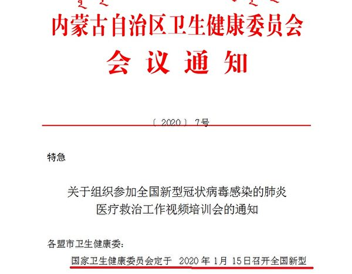

中共卫健委系统召开秘密会议，图为中共国家卫健委召开会议。（大纪元）

1月17日，内蒙古卫健委召开全区疫情防控工作视频培训会，给各盟市卫健委、疾控中心相关人员进行培训病例监测方案、可疑暴露者和密切接触者管理方案、病例流行病学调查方案、肺炎实验室检测方案等。

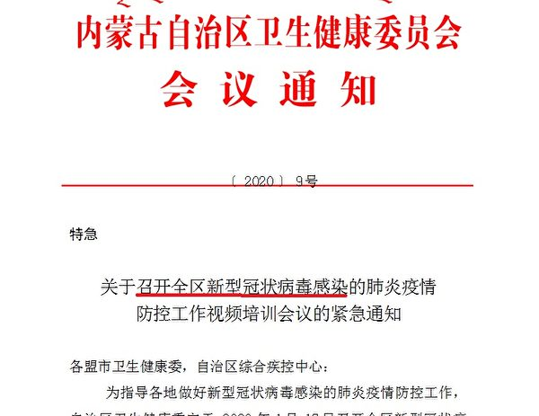

中共卫健委系统召开秘密会议，图为中共内蒙古卫健委召开会议。（大纪元）

1月20日，内蒙古锡林郭勒盟卫健委召开全盟疫情防控工作视频培训会，给各旗县市区卫健委、盟直各有关医疗卫生单位的相关人员培训。

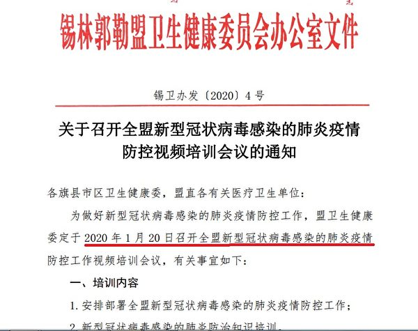

中共卫健委系统召开秘密会议，图为古锡林郭勒盟卫健委召开会议。（大纪元）

上述文件显示，从中央到地方的三次视频会议的信息，都“不予公开”。

<b>习李公开批示前 地方已成立防疫小组</b>

《苏尼特右旗卫生健康委员会汇报》显示，内蒙古苏尼特右旗卫健委1月15日、17日先后参加完中共国家卫健委、自治区卫健委的视频会议后，该旗卫健委1月18日就成立了由卫健委主任任组长的疫情“防控工作领导小组”。

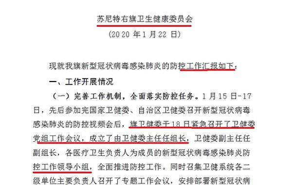

1月18日，苏尼特右旗卫健委成立疫情防控小组。（大纪元）

该疫情防疫小组不仅先于习近平、李克强的公开批示，而且早于中共国家卫健委成立疫情应对处置工作领导小组。

1月20日，习近平、李克强首次公开对疫情作批示，要求各地要“做好防控工作”，但又强调“加强舆论引导”，“维护社会大局稳定”云云。

中共喉舌新华网报导该消息时还称，当天中共在北京召开疫情防控工作电视电话会议；中共国家卫健委成立疫情应对处置工作领导小组。

大纪元获悉的文件显示，1月20日，内蒙古区政府、区卫健委、区各有关部门、 各盟市卫健委等单位的相关人员出席了中共召开的全国电视电话会议。

习、李指示当天晚上，中共工程院院士钟南山才首度承认，病毒在人际间传播，并提到“有14个医务人员被感染”。

<b>中共直到25日才发文要求加强社区防控</b>

中共承认人传人后，又过了5天，即1月25日，中共国家卫健委才下发通知，要求各地加强防控社区疫情。

这份《关于加强中共肺炎疫情社区防控工作的通知》要求：各省（市、区）对辖区内来自武汉的人员要进行登记、居家观察14天；调查病例的感染来源，确定疫情的波及范围；实现网格化、地毯式管理，责任到人、联系到户、追踪到人等。

1月27日，内蒙古卫健委转发了上述通知，要求各盟市卫健委“抓好部署和落实工作”。

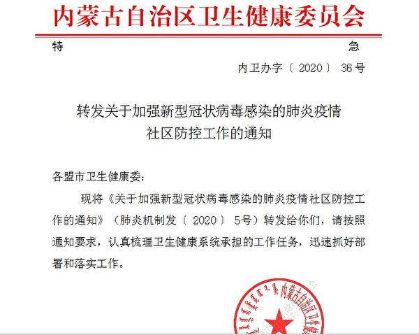

内蒙古卫健委转发中共国家卫健委下发的有关加强社区疫情防控的文件。（大纪元）

时政评论员李林一表示，中共学者在海外的论文中透露，中共肺炎疫情实际在12月1日爆发。此后中共当局一直隐瞒疫情、迟迟不采取行动。直到1月15日，中共国家卫健委才开始对内部进行培训，顺序依次为：全国、全区、全盟往下走。

李林一说，习、李1月20日作指示，中共当天才开始正式动员，但直到25日才开始想起来“加强社区防控”，把人命不当回事。从12月初疫情爆发到开始社区防控，两者相距已近2个月。因为瞒不住了，中共不得不在1月20日透露部分疫情人传人事实。

<b>中共层层隐瞒疫情</b>

中共国家卫健委1月14日还开秘密会议，向省级官员警告疫情可能大爆发，但它向公众隐瞒不报。

美联社4月16日报导了上述消息。美联社获得的中共政府内部文件显示，中共国家卫健委健委主任马晓伟在1月14日与省级卫生官员进行了秘密视频会议，评估疫情。根据一份相关备忘录显示，会上谈到“病例成群的出现”，显示人传人的情况可能存在，并称“（当下）传染病的情况仍然复杂严峻，是自2003年非典疫情以来最大的挑战”。

备忘录亦提及1月13日泰国通报一名武汉游客被确诊后，指出病毒可能已散播到国外。备忘录中说，“随着中国新年的到来，很多人将外出出行，（病毒）传播和扩散的风险较高”。

报导指，但中共在疫情的关键时刻隐瞒了6天后，习近平才于1月20日警告公众。而那时，大陆已有三千多人被感染。

财新网的报导指，1月11日前，武汉已有7名医护人员感染。

中共疾控中心等单位1月29日在《新英格兰医学杂志》刊发的论文显示，早在2019年12月中旬，病毒已在密切接触者之间“人传人”，到2020年1月11日武汉已有7名医护人员感染。

该论文披露，1月11日至1月22日，武汉又有8位医务人员感染。

该论文发表后，立即掀起轩然大波。1月30日晚，浙江大学神经生物学教授王立铭发微博称，“我已经出离愤怒，不知道说什么好了”。他质疑，中共疾控中心早在一月的头几天就已掌握明确人传人的证据，消息却被掩盖三星期之久。

因为此前中共武汉市卫健委、国家卫健委等医疗机构，一直隐瞒疫情。

如武汉市卫健委1月11日发通告谎称：“目前，未发现医务人员感染，未发现明确的人传人证据。”

武汉市卫健委1月15日再发通告谎称：“现有的调查结果表明，尚未发现明确的人传人证据，不能排除有限人传人的可能，但持续人传人的风险较低。”

而当天（1月15日），中共国家卫健委主任马晓伟赴武汉，中共疾控中心的响应升级到最高级别的一级。

<a target="_blank" href=#top><h6 align="right">回上方</h6></a>

<a name=137>
<h1 align="center"><b>1传43 哈尔滨疫情失控 内蒙古封边界交通</b></h1>

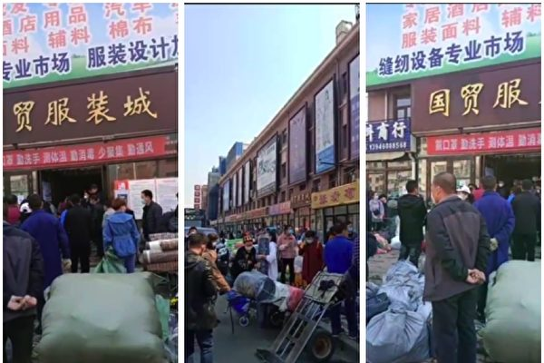

哈尔滨疫情升级，哈尔滨服装批发市场也再次封闭。（大纪元合成图）

【大纪元2020年04月19日讯】（大纪元记者方晓综合报导）黑龙江哈尔滨集体感染中共病毒（武汉肺炎）疫情传染链扩大，由1传10扩散至1传43，其中包括3名被确诊的护士，这起疫情还出现跨省传播。与黑龙江接壤的内蒙古根河市宣布全面封闭边界交通，是大陆至今首个宣布封闭与黑龙江交通，并禁止民众来往的地区。

<b>哈尔滨医院交叉感染链扩大至1人传染43人</b>

《北京日报》报导，中共黑龙江卫健委4月17日晚通报，4月16日0时－24时，黑龙江省省内新增确诊病例3例（哈尔滨），新增无症状感染者5例（哈尔滨4例、牡丹江1例）中的4例，均与此前哈尔滨出现的医院内交叉感染有关。

4月16日新增的3例本土确诊病例，病例1王某3月28日－4月8日，曾在哈医大一院住院治疗，病例2龚某系病例1王某的丈夫，病例3李某系确诊病例于某的保姆（于某是此前“引爆”哈医大一院聚集性感染患者陈某的病友）。

此外，4月16日黑龙江新增的5例无症状感染者中，来自哈尔滨的4例均与哈医大一院出现的聚集性感染有关。

至此，从4月9日起哈尔滨新增本土确诊病例1宗和无症状感染者3宗的个案，因87岁患者陈某引发的医院交叉感染链已由1传10进一步扩大至1传43——目前哈尔滨市43人确诊感染。包括26例确诊病例和17例无症状感染者。

上周，哈尔滨爆发住院的87岁陈某1传10的本土病例，而这些病例的源头纷纷指向4月9日被确认为无症状感染者曹某。据哈尔滨市当局通报，曹某或被其邻居韩某感染。曹某传染给了其母王某，王某又传染给了男友郭某。郭某通过聚餐传染给了他的朋友陈某，陈某再传染给其87岁的父亲。由此病毒进一步蔓延。

<b>三名护士确诊 传染链出现“跨省”传播</b>

报导称，4月15日，这起医院内聚集性感染已导致3名护士确诊。

而且这个传染链出现了“跨省”传播。据辽宁卫健委4月17日通报，4月16日，辽宁抚顺新增1例中共肺炎确诊病例张某华（女，46岁）证实与哈尔滨确诊病例有交集，交集点依然是哈医大一院。

在辽宁卫健委的通报中称，4月10日，张某华在父亲病愈出院后，曾在家中与母亲姚某琴、姑姑徐某凤、姨姚某茹、姨夫张某龙、姨姚某芝、姨夫王某国等一起吃晚饭。

4月17日17时50分，抚顺市确诊患者张某华已由沈阳急救中心120负压救护车运往省集中救治沈阳中心（沈阳六院）。

<b>内蒙古根河市宣布全面封闭与黑龙江边界的交通</b>

黑龙江省疫情近日明显失控，让临近的内蒙古自治区内的根河市宣布自17日起全面封闭与黑龙江边界的交通，当地呼吁，民众切勿再从黑龙江进入根河市，并要求各交通要道确保“不漏一车、不漏一人”。

根河市是大陆至今第一个宣布封闭与黑龙江交通，并禁止民众来往的地区。根河市当局宣布，严密把关输入关口，全面封闭满归镇与漠河县蒙黑边界交通，劝返由黑龙江进入根河市的民众，同时禁止根河市民众进入黑龙江。

由于疫情失控，17日晚，包括哈尔滨副市长陈远飞、哈尔滨卫健委主任丁凤姝在内的18名官员因疫情防控不力遭问责处分。

17日晚，哈尔滨市当局发出通告，寻找4月2日－6日曾在哈尔滨市第二医院、4月6日－9日曾在哈医大一院呼吸内科一病房（12楼）住院、出院、转院、陪护、探视、短暂逗留过的人员。

中央社报导说，虽然中共官方宣称近日疫情已趋缓，但是黑龙江省会哈尔滨市爆发社区群聚感染，且官方公告急寻与确诊患者密切接触之人，俨然沦为第二个武汉市。

<a target="_blank" href=#top><h6 align="right">回上方</h6></a>

<a name=136>
<h1 align="center"><b>消息：美国准备金正恩去世后的应对计划</b></h1>

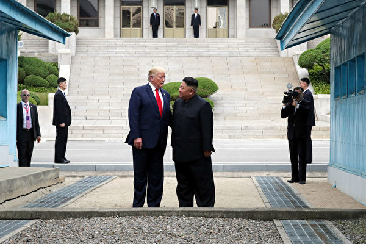

美国总统川普（左）与朝鲜领导人金正恩（右）2019年6月30日下午在韩朝非军事区（DMZ）见面。（Handout/Dong-A Ilbo/Getty Images）

 
【大纪元2020年04月21日讯】（大纪元记者吴英综合报导）美媒报导，美国政府已制定全面应对计划，以应对朝鲜领导人金正恩（Kim Jong Un）去世，朝鲜境内可能发生大规模人道危机的情况。

多家媒体周一（4月20日）引述消息人士的话报导说，美国情报表明，朝鲜独裁者金正恩最近接受心血管手术后命危，周二（4月21日），几位美国情报官员告诉CNBC新闻，金正恩可能残废。

不过，韩国总统府在给NBC新闻的一份声明中说，他们确认金正恩目前正在助手陪同下，前往省区旅行，没有发现任何证据证明他健康不良。

福克斯新闻4月21日报导，尽管目前尚未确认金正恩的健康状况，但是一位美国官员说，川普政府已在讨论金正恩去世后的应对计划。

这位官员说，金正恩死后，朝鲜内部可能发生大规模人道主义危机，数以百万计的人民有可能面临饥饿困境，以及大量朝鲜难民涌入中国。

多位情报人士说，该应对计划的一部分将包括北京的介入，以协助处理朝鲜境内的局势。这样的安排部分原因是中朝关系，以及美国在提供人道主义援助所面临的后勤挑战。

4月20日，一位情报人士告诉福克斯新闻，金正恩4月15日没有参加祖父金日成的诞辰纪念日活动，这是朝鲜最重要​​的假期，有人推测当天他的健康就出现状况。

消息人士说，白宫已经知道了有关金正恩健康状况的报导，但尚未证实他的病情。

川普及金正恩就朝鲜核计划进行的谈判一直停滞不前。一位消息人士透露，在上一次川金峰会上，与金正恩接近的外国人士注意到，他的呼吸异常剧烈。

国家安全顾问奥布赖恩（Robert O’Brien）周二在白宫告诉媒体记者，美国正在监视金正恩的动向。

“我们正在密切监视这些（金正恩病危的）报告。”奥布赖恩说，“如大家所知，朝鲜是一个非常封闭的社会。”

目前尚不清楚如果金正恩因健康问题失能或死亡时，朝鲜政权将会发生什么事。

尽管朝鲜尚未明确谁会将接替金正恩，但是一些专家认为，至少在过渡时期，他的妹妹金与正将出任领导人，或者由执政党精英集体领导。

<a target="_blank" href=#top><h6 align="right">回上方</h6></a>

<a name=135>
<h1 align="center"><b>专访人权律师麦塔斯 解析追责中共法律程序</b></h1>

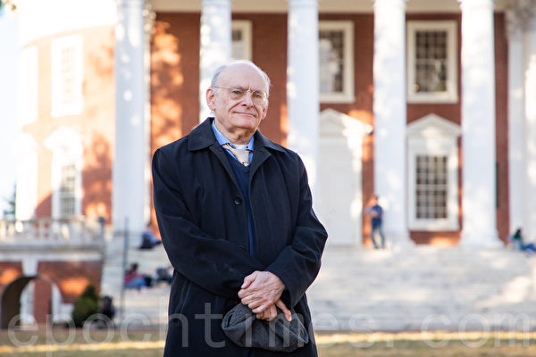

2019年10月18日至21日，加拿大著名人权律师大卫·麦塔斯（David Matas）在维吉尼亚州五座城市巡回演讲，（林乐予／大纪元）

 
 【大纪元2020年04月22日讯】（大纪元特约记者朱丹多伦多采访报导）中共病毒（新冠肺炎）的全球大流行，使得整个西方社会几乎停摆，不仅国家经济，连民众的基本生活都受到巨大影响。现在，美国、澳洲、英国等国正在着手追究中共对疫情扩散的法律责任，因为从一开始，中共就对疫情数字进行隐瞒和造假，从而造成了这场危及整个世界的灾难。

为此，大纪元专访了加拿大著名人权律师大卫·麦塔斯（David Matas）。他毕业于牛津大学，是人权、难民及移民领域的法律专家。在访谈中，他从刑法和民法的角度，分析了追责中共的可能性，并提出了具体法律操作的建议。

2006年7月他和大卫·乔高（David Kilgour）历时2年的独立调查，发表了《关于指控中国摘取法轮功学员器官的独立调查报告》。国际人权协会（IGFM）将2009年度的人权奖，颁给他与大卫·乔高。十几年来他们前往世界四十多个国家，呼吁关注中共活摘器官的问题，并因此成为2010年诺贝尔和平奖候选人。追踪调查过程的纪录片《活摘》，2015年获得美国广电最高荣誉皮博迪奖。

记者：您对中共病毒（CCP Virus）大流行的最初反应是什么？

麦塔斯：共产党只看重自身的政治声誉。任何让共产党丢脸的事情，中共的第一反应不是去解决问题，而是尽其所能保住中共的脸面。它不断掩盖事实真相，使问题在掩盖中持续蔓延和恶化。中共在活摘器官的处理上是这样，在萨斯传染病的事件上也是如此。对于这次武汉疫情，如何起源，如何传播，中共第一时间如何应对，在我看来，都是如出一辙，典型的中共式行为。

在过去一些年中我们还是看到了些微的希望，也引起了一定程度的关注。我说的是在活摘器官问题上，最初我和大卫·乔高发表报告的时候，只有我们两个人参与这个事件的调查，现在越来越多的人站出来，共同对抗中国发生的非法器官移植。

<b>人们正在承担漠视中共活摘罪行的后果</b>

麦塔斯：但即使这样，力度还是远远不够的。这种反对浪潮还没有达到它应该达到的程度——政府间合作的高度。究其原因在于，我们面对的是一个地缘政治大国，一个经济上的强国、政治上的大国，他们（中共）不只是在中国抛出维稳筹码；他们同时试图在全球范围内进行大外宣，施压、恐吓，利用经济和政治筹码来掩盖事实，否认真相，混淆视听，颠倒黑白。世界上有太多人，为了得到政治和经济上的利益，选择同中共勾兑，随波逐流。

我们要吸取的教训是，我们不能无视世界上任何一个地方的人权侵犯行为。有人可能认为我们可以无视中国（中共）的非法器官移植，因为这是发生在中国的事情，和我们加拿大人、和我们美国人没关系。但这次的冠状病毒（中共病毒）就是对这种想法的回应。

如果世界上的其它国家在对待（中共的）器官移植滥用问题上，能更加积极地对抗（中共）歪曲事实、掩盖真相、混淆视听、颠倒黑白的做法；如果全球当初在对待（中共）器官移植滥用问题时，能坚持要求（中共）透明化及实施问责制；如果当初中共面对了来自全球范围的压力，而不得不将其医疗系统透明化、责任化，那么我们现在就不会有这场冠状病毒大流行。

我们现在正在承担对中共活摘罪行漠视的后果。

<b>“故意视而不见”国际层面的刑事责任</b>

麦塔斯：可以推测，中共并未蓄意放出病毒，但在病毒开始传播后采取“故意视而不见”的做法。可以说，全世界都在盲从，都在和中共一道“故意视而不见”。如今我们尝到了苦果。

记者：我记得这是十多年前的事了。大概是在2008年的时候，您告诉我，您正在准备对共产党人进行纽伦堡审判。

麦塔斯：我认为很重要的一点是，侵犯人权应承担刑事责任，“故意视而不见”就是刑法中的犯罪构成要素之一。

纽伦堡审判中已经涉及到了此类医疗纠纷和医疗问题。在纽伦堡审判中，有一场是对纳粹医生的审判。他们（被告）中的很多人都说——这也成了他们常用的挡箭牌（辩护）——他们不知道发生了什么事。他们知道他们自己在做什么，但他们不知道尸体是从哪里来的，也不知道他们处理的标本是从哪里来的。纽伦堡法庭最终还是根据“故意视而不见”的定罪原则，将这些医生中的一部分判处了死刑。

法庭认为：他们不知道的原因是他们没有发问，他们不关心、不在意，他们本来是可以发现真相的——只要他们去探究。

我认为这一点对冠状病毒来说同样如此，中共最关心的不是“这事发生了吗？”他们不关心事情的本身，只关心这件事情是否影响共产党的政权稳定。他们拒绝面对问题本身的严重性并去解决问题，他们的这种“故意视而不见”，就可以被看作刑事责任的要素，国际层面的刑事责任。

记者：美国参议员乔什·霍利（Josh Hawley）提出了一项法案《为COVID-19受害者伸张正义法案》，从法律上讲，你认为这样的追责案件是否能进行下去？

麦塔斯：立法一旦通过，这可能会发生。民事责任的追诉难度大一些，因为涉及到国家豁免权。但对于刑事责任来说就不是个大问题。现在，加拿大、美国，许多国家，任何有普遍管辖权立法的国家，都允许对危害人类的罪行进行刑事起诉，不管你（被告）是什么人、什么国籍，只要这个人（被告）来到该国境内，就可以起诉他。所以，这是可行的。

<b>民事诉讼：有一个国家豁免权的问题</b>

麦塔斯：在民事诉讼中，你不需要确定刑事责任，你所要做的是确立过失责任，已经有很多证据可以证明这一点。但有一个国家豁免权的问题。美国的提案一旦通过，可以绕过国家豁免权的问题。在加拿大和其它国家，我们也有立法规定，国家支持的恐怖主义行为不可以享有国家豁免权。如果这样做，就必须对这个国家做出“认定”。

我认为中共可以被列入这样的“认定国”。显而易见，冠状病毒已经引起了全球范围的恐慌。中共对病毒开始传播时的“故意视而不见”，以及造成恐慌后仍然“故意视而不见”，我认为中共符合国家恐怖主义的定义。

记者：后果将会怎样？案件如何进行呢？

麦塔斯：要提起刑事诉讼，需要被告出现在法律辖区内。从民事诉讼的角度讲，首先要起诉，接着做出判决，然后才能扣押其（被告的）资产。必须有办法越过国家豁免权问题，因为大多数国家的法律体系中都有国家豁免的原则。我们需要找到这一原则的非适用性。一种可能性是美国引入的法案类型。

我刚才提到的另一种可能性，就是将中国（中共）指定为政府支持的恐怖主义，由于它的“蓄意无视”隐瞒信息，导致了病毒在全球的蔓延扩散。

<b>需对中共持不信任态度</b>

记者：关于台湾问题？

麦塔斯：是的，我认为如果我们能像台湾那样，对中共持有不信任态度，那全球范围内的状况将会比现在好很多。我也认为，台湾所做的一切很好地回答了这样一种说法：反对中共不是反对中国人；实际上正是台湾华人在抗击冠状病毒疫情方面，起到了引领世界的作用。

我觉得，我们首先要认识到，在和中国打交道的过程中，医疗的事情、任何事情，只要是和中国有关，就不要相信中共。其次，我们看到了一个非常系统的方法：全面测试、全面跟踪、全方位保持社交距离，等等。社会无需彻底停摆，就有效抵御了病毒，这是可以做到的，台湾就做到了，只有很少的病例。所以我认为他们是一个很好的例子。可以说，中共国有多糟糕，同是华人社会的台湾就有多棒，完全是反过来的。

记者：从台湾的成功里，我们能得到怎样的借鉴？

麦塔斯：台湾人的成功，我认为是一个很好的范例。

不过我们必须警惕中国（中共）政府的医疗体系和中国（中共）政府的说法，我们不能信赖他们的数据，我们不能相信他们的表态。今天我听说他们的死亡人数增加了一千多人，这不太可能是一夜之间发生的吧。我认为他们的数据都是编造出来的。

记者：看来我们需要一个国际战略来应对中共的口径。

<b>需要把（针对中共的）国家豁免权撤掉</b>

麦塔斯：首先，我认为我们应从不接受它开始。意识到它是什么，它（中共）宣传的目的是让他们看起来很不错。台湾人之所以能够立即看透它，是因为他们早已对中共的宣传口径耳熟能详。

我想有很多人还会认为，中共对某些问题的说法也许是对的。当然了，这其中总有一种巧合的可能。他们（中共）可能是对的。但无论对错，它都是在为共产党的宣传目的服务。我想人们必须意识到这一点。你所面对的是共产主义的中国，你所面对的是一个宣传机器，你所得到的任何信息，都必须来自独立于中共的第三方。我们要想保护自己，首先就要认清这一点。

第二，这是我们之前讨论过的，需要有一个更好的问责制度，当他们做了错事时，就像这次（中共病毒），他们会仗着国家豁免权，下次还会故伎重演。所以，如果我们要有效地对付中共的这些伎俩，就需要把（针对中共的）国家豁免权撤掉。

记者：那我们该怎么办？遵循您的建议，我们如何让他们对这场大灾难负责？

麦塔斯：在法律求偿方面，存在许多不同的可能性。但是，就民事责任而言，我必须说，我们必须建立一个机制，使民事责任的追诉成为可能，无论是在美国引入的法案类型，还是采用刑法中现有的非适用原则——将中共指定为国家恐怖主义。

我认为我们需要调用现有的机制。因为在世界上大多数国家，都有可能在普遍管辖权制度下，对中共的危害人类罪发起指控。必须启动这些机制，中共的相关责任官员在做坏事时才会有所顾虑。

<b>直接制裁作恶的官员</b>

麦塔斯：同样，还可以启动类似《马格尼茨基人权问责法》的法案，直接制裁作恶的官员，把他们列入制裁黑名单。我们在加拿大、美国、英国都有这样的法案，我们可以根据这个法案提出制裁者黑名单。我建议政府启动这一法案。至于把哪些人权罪犯列入黑名单，这完全可以由政府决定。

我们可以要求政府启动这一法案。实际上，就器官移植的暴行，我们已经要求加拿大政府把施暴者列入黑名单，但政府还没有付诸行动。对于病毒事件也是一样，我们应该要求政府启动问责黑名单。这不需要立法，不需要执行条例，如果想做的话，政府明天就可以做这件事。我认为我们应该要求政府去做，这不是什么难事。

国家豁免法的不适用性，则需要内阁的决议，对中国（中共）做出“认定”。我认为这很容易做到。就美国引入的立法类型而言，则需要议会的通过。但是议会中的任何议员都可以提案，政府提案当然更好。但其实任何议员都可以提案，然后由议会决定是否通过。

显而易见，台湾人可以做什么，任何人都可以做，任何地方都可以做，发布疫情消息并采取抗疫行动。台湾人很老练，他们意识到疫情正在发生，这是真实的，而且很危险。这就使得台湾出现截然不同的结果。如果我们能像台湾人那样对中共有清醒的认识，我们就不会到今天这一步。我们应该像台湾人那样应对中共。他们比任何人都更了解共产党，我们应该向台湾学一学。

<a target="_blank" href=#top><h6 align="right">回上方</h6></a>

<a name=134>
<h1 align="center"><b>美参院追查世卫 限谭德塞4月27日交材料</b></h1>

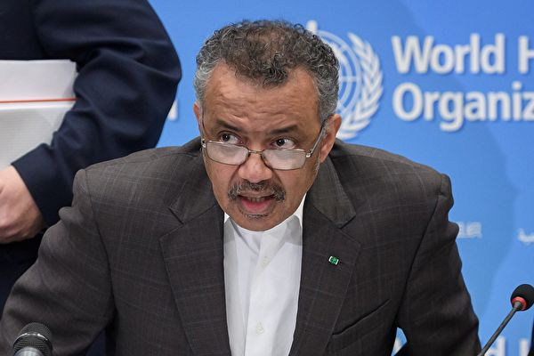

世界卫生组织（WHO）秘书长谭德塞（Tedros Adhanom Ghebreyesus）。(FABRICE COFFRINI/AFP)

【大纪元2020年04月21日讯】（大纪元记者徐简综合报导）美国参议院国土安全委员会正在对世界卫生组织（WHO）及其总干事谭德塞进行追查，调查世卫如何帮助中共掩盖疫情，以致危害全球。

他们要求谭德塞及世卫领导层，在4月27日之前提交跟中共病毒（武汉病毒，新冠状病毒）相关的所有电子邮件、硬盘、短信等文件，他们还在调查世卫是否收了（中共的）贿赂。

<b>参议院国安委员会着手调查世卫和中共</b>

NBC新闻4月15日报导，参议院国土安全委员会主席罗恩·约翰逊（Ron Johnson ）领导的委员会，在对中共病毒的来源、以及世界卫生组织的失职进行“广泛的”监督调查。

NBC的消息源说，约翰逊让呼吁对世卫进行调查的佛州参议员斯科特（Rick Scott）负责牵头，展开调查。上周二，斯科特、约翰逊和其他参议员致函谭德塞，要求他回答六个问题并限期提交资料。

斯科特的发言人说，这是调查过程中的“第一步”。参议员们要求世卫在参加 “预期的国会听证会之前”，提供所有对中共病毒未能作出及时反应的信息。

<b>调查组致信谭德塞 要求听证前提供文件</b>

这封参议员致谭德塞的信由斯科特、约翰逊、麦克萨利（Martha McSally ）、克莱默（Kevin Cramer）、戴恩斯（Steve Daines ）、恩斯特（Joni Ernst）和托德‧杨（Todd Young）签署，上周二（4月14日）发出。

信中说，我们正在调查世卫帮助中共掩盖疫情的情况，在即将举行的国会听证会之前，我们要求您提供有关WHO处理病毒方面的信息，美国纳税人为世卫提供了资金，我们有责任确保这些纳税人的钱得到合理使用。

他们提出了六个问题，其中包括：世卫组织什么时候第一次知道中国出现了中共病毒？世卫小组什么时候第一次到达中国开始研究这种病毒？在与中共沟通和协调应对疫情方面，世卫的负责人是谁？世卫组织领导层中是否有人获得过薪水以外的经济补偿？

信中最后说，我们还要求世卫组织管理层在4月27日之前，提供2019年10月1日至2020年3月12日的所有记录和文件，包括：与病毒有关的电子记录、电子邮件、硬盘驱动器和短信；与中共病毒有关的所有印刷文件；中共对病毒的数据的汇编、分析和要求；从中共收到的病毒数据；你们对病毒的研究文档。

信中还解释了世卫组织领导层的范围：世卫组织总干事（谭德塞）、办公室主任、执行董事、首席科学家、助理总干事和总干事顾问。

委员会还将调查其它内容，比如美国为何没有 “更好地准备”国家战略物资储备，以及制药原料和医疗器械为何在海外生产。此前川普（特朗普）总统指责奥巴美政府对战略库存准备不足。

<b>美国朝野纷纷问责世卫和中共</b>

除了参议院的国土安全委员会，美国多位议员和组织要求调查世卫和中共。参议院外交关系委员会主席吉姆·里施（Jim Risch）呼吁，要求 “对世卫组织应对COVID-19（中共病毒）的措施，进行独立调查。”

对世卫组织有管辖权的外交关系小组委员会主席托德‧杨（Todd Young），除了在给谭德塞的信上签字，还单独写信给谭德塞，呼吁谭德塞出席他领导的小组委员会听证会，以便让美国国会议员听取世界卫生组织对中共病毒的反应。

一直呼吁对中共进行调查的参议员乔希·霍利（Josh Hawley.）宣布了一项法案，寻求追究中国共产党“对造成COVID-19（中共病毒）全球大流行病的责任”。

霍利还与参议员汤姆·科顿（Tom Cotton）一起提出了一项法案，“授权总统制裁那些压制或歪曲国际公共卫生危机信息的外国官员。”

在众议院，监督委员会的共和党人也致信谭德塞，要求他提供有关世卫组织与中共关系的信息，并指责该组织在病毒大流行期间帮助中共“传播危险的宣传”。

美国总统川普说，他将停止对该组织的资助，因为该组织在应对疫情的过程中出了一些问题，“这场疫情的爆发本来可以在源头上得到控制，本来只造成极少数人死亡。”川普说。

<a target="_blank" href=#top><h6 align="right">回上方</h6></a>

<a name=133>
<h2 align="center"><b>高官大换血 终结两制</b></h2>
 <h1 align="center"><b>刘细良：中共撕破脸 共产党在香港现真身</b></h1>
 <h3 align="center"><b>香港将促全球反共潮再起 见证大时代</b></h3>

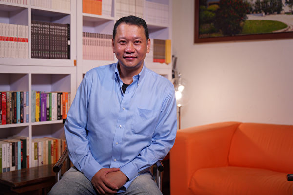

香港近期局势突变，外界盛传港政多名问责官员将会离任。时事评论员刘细良分析，从接任人选来看，中共会进一步收紧对香港的控制，但他同时指出，一连串风波已经将藏在幕后的共产党“现真身”，中共的倒行逆施将促使港人全面反共，并将进一步推高全球反共浪潮。（王伟明／大纪元）

【大纪元2020年04月22日讯】（香港大纪元记者梁珍采访报导）因为立法会内会选主席一事引发的《基本法》22条争议，令香港再次成为风暴眼。中共港澳办21日晚间再度发出新闻稿，矛头指向主持内会选主席的公民党立法会（法律界）议员郭荣铿。郭荣铿强调，如果因捍卫法治而被取消议员资格是一生荣耀。与此同时，外界盛传香港特区政府多名问责官员将会离任。时事评论员刘细良分析，从接任人选来看，中共会进一步收紧对香港的控制，但他同时指出，一连串风波已经将藏在幕后的共产党“现真身”，中共的倒行逆施将促使港人全面反共，并将进一步推高全球反共浪潮。

迈入4月，香港局势突变，先是亲共议员何君尧等在港搞推《基本法》23条立法签名，再到中共施压立法会，炮轰主持内会选主席的郭荣铿议员；紧接着大搜捕，先以64年前的恶法拘捕中西区区议会主席郑丽琼、拘捕包括李柱铭在内的14名泛民主派重要人物等；加上中联办、港澳办登场，引爆《基本法》22条争议，中联办竟然自行释法，称《基本法》22条不规管中联办，特区政府更是一日内三发声明跪低。

<b>入境处 中共掌控核心部门</b>

在香港特首办公室4·18一日三发新闻稿，仅三天后，21日传出多位高官将会离任。

多个媒体引述消息来源称，入境处处长曾国卫将接替聂德权，出任政制及内地事务局局长；聂德权将平调，接替罗智光出任公务员事务局局长。

据了解，刘江华会离任民政事务局局长，由同属民建联的现任劳工及福利局副局长徐英伟接替。财经事务及库务局局长刘怡翔亦会离任，金融发展局行政总监许正宇将接替局长职位。消息又指，机电工程署署长薛永恒将接替杨伟雄，出任创新及科技局局长。

曾担任中央政策组全职顾问的刘细良认为，聂德权被换，相信和特首办第一版声明有关，而这个声明需要得到特首林郑月娥首肯才能发出。但无论林郑月娥还是聂德权，都不知道中联办的立场，所以才爆出之后深夜修改两个版本的情况。

对于传入境处处长曾国卫接替聂德权，刘细良指，过去香港多个敏感部门的高官均由入境处处长接替，如李少光、叶刘淑仪、白韫六等都先后掌管入境处，说明入境处是中共掌控的最核心部门之一，早在97前已被中共渗透。一方面是要炮制异见人士、法轮功学员等黑名单，另一方面则是白名单，即在每日150个单程证之外，中共派了多少的人员来香港，也都是入境处所掌控的。

<b>中共用新疆模式牢控香港</b>

刘细良认为，中联办和港澳办已从幕后跳到台前，透过《基本法》22条争议，表明中联办是党在香港的化身，凌驾于香港特区政府。另一方面清理港高官队伍，说明会进一步掌控香港，不排除下一步林郑月娥会下台。

在全球抗疫之际，中共之所以在香港再度挑起火头，刘细良分析，一方面是全球围堵中共，中共的特性是外交和内政是结合在一起的，当外部受压时，对内部的管治极为不安。所以在国内制造西方假想敌、恐怖主义来鼓动民族主义，但对于香港则行不通，唯有用新疆模式牢控香港，这就是为何最近警务处处长邓炳强多次强调“本土恐怖主义”的由来。

另一方面，中共惧怕9月份立法会选举，因为去年区议会选举民主派大胜，已经令中共非常恐惧。如果今年9月立法会选举泛民主派取得过半数议席，对中共而言是绝不可以接受的，所以刘细良认为，中共将9月立法会选举定性为“政权保卫战”，不惜在香港动用一切力量打压民主派。

<b>欲将李柱铭等作谈判筹码</b>

刘细良分析最近的大搜捕，目的有两个，一个是促使9月之前的选举形势出现尖锐的对立，泛民全部被视为“本土恐怖主义”的剑牌，打倒泛民之后，推曾钰成等所谓的中间派来替代；另一方面，5月美国当局就会提交香港“一国两制”报告书给国会，中美在香港的角力会更加尖锐，中共想要将李柱铭等温和民主派人物，作为对美国谈判的筹码。

另外，中共对香港严控的原因，还有香港的金融中心地位：“当香港这个国际金融中心，成为中共印美金的印钞机的时候，如果香港真是揽炒（玉石俱焚），这个绝对会波及内地，所以它更加要牢牢控制。不光是控制选举这么简单，包括要铲除泛民的温和派，这个是被视为除了同美国斗之外，也是对香港公共政策、公共财政、货币政策、金融政策一个全面的收紧。”

而中共操控香港的整个布局和脉络也越来越清晰，“首先是去年四中全会决定，收紧这个国家安全立法。所以攻击郭荣铿，因为在内会选不到内会主席无办法成立法案审议工作，然后连国安法都过不了，所以他一定要移除郭荣铿，选民建联主席李慧琼进去做内委主席，就可以在9月立法会选举前，启动23条立法程序。但是因为郭荣铿的阻挠，所以才引出中联办，就好像一块骨牌这样，到中联办干预了，他又再亮剑了，我是凌驾于《基本法》22条，我们是有权干预特区内部事务，所以现在去到那个地步是完全不顾‘一国两制’，在香港人和在国际的形象，《基本法》根本就不是（香港的）《宪法》，《基本法》变成中共的家法。”

<b>葵涌汽油弹案中案 曝警队内部分裂</b>

与此同时，警队出现葵涌汽油弹案中案。一名葵涌警署特遣队警长21日被扣查，涉“自编自导”策划汽油弹袭击警署事件，即透过中间人招揽他人在警署外摆放汽油弹，以执行拘捕行动。

刘细良表示，此次案中案绝不简单。“这件事不是由属于管理葵涌警署的新界南总区去调查，而是新界北总区去调查，是另外一个警区的调查。所以我认为一定是有警察不愿意加入这些栽赃嫁祸的阴谋，而把它揭露出来。而警务处长到现在都很低调。”

他认为，中共早在雨伞运动期间，已经准备剧本，即在香港搞栽赃嫁祸，葵涌汽油弹案中案正好暴露其手段。以类似中共镇压新疆的手法一样，即炮制所谓恐怖主义来打压，香港也会沿用这个手法，“这个所谓本土恐怖主义是人为制造出来的。我不相信一个警长为了升职，就做有这么严重后果的栽赃嫁祸，后面一定是有一个政治力量去指挥去做这些东西。”

刘细良呼吁警队有良心的人士要站出来讲真话，不要同流合污。

<b>中共撕破脸 共产党现真身是最愚蠢的</b>

虽然中共严控香港，在香港制造白色恐怖，令不少香港人对前景感到灰心，但刘细良却对香港前景抱有希望。

他指，中共的特性是如同科幻电影中的“异形”，“你的外表依然是人，在走来走去，但你的思想已经被异形控制了。无论是北京大学、无论是腾讯、淘宝、阿里巴巴、民企抑或国企、华为，所有创科企业，包括科学家都是，其实背后有党控制住，包括武汉P4实验室都是，但它从来也不现出来，所以犯了错，就你去背，党是不会错的。”

中共以往是藏在幕后，无所不在，如江泽民时代“闷声发大财”。但今次香港事件却令中共撕开假面，从幕后走到台前，是政治上彻彻底底低能的行为，因为以往香港人要反对都没有一个着力点，现在变成要全力抗共，同时推进全球抗共，“现在已经去到一个地步，中共已经陷入两难，它既不能回到邓小平、江泽民时代的韬光养晦，闷声发大财，但当它更进一步去挑战国际，党越来越走出来去做这些激进行为的时候，就会引起西方国家出现反共浪潮，在武汉肺炎之后，激起这浪潮的可能就是香港人。”

他形容，中共如同幽灵，一旦鬼怪现了真身，结局就有了，“鬼变了实物，你就不会怕了嘛”。

<b>坚守香港 港人正在创造历史</b>

面对香港动荡局势，很多人选择移民，但刘细良却认为坚守香港非常重要。他指，香港人的反抗也在改变和创作历史，“我觉得留在香港最重要的是什么，不是我们睡觉，闭上眼睛当什么也看不到，而是当你面对新的挑战时，你能不能够提起精神，去面对一个我们从来没遇过的世界变局，其实挑战在那里。那种坚毅，我觉得反而是最重要的。当它不断转变想去收服你、恐吓你、镇压你的时候，而你仍然不为所动时，最终它会有很多动作暴露出它的弱点。”

“香港可能慢慢走向一种存在主义式的抗争，就是我反抗故我在。我们的定位identity是什么呢？就是因为我们对于一些不公义，对于曾经承诺过（我们）的事情被背弃遗弃的事，要作出反抗。”

他预计香港将成为一个伟大的城市，“100年前，终止了大清帝国的命运的其实是香港人。你想想香港人未来是会站在中国历史、世界历史什么高度。”

<a target="_blank" href=#top><h6 align="right">回上方</h6></a>

<a name=132>
<h1 align="center"><b>【内幕】危及习近平 孙力军案堪比周永康</b></h1>

4月19日傍晚，中共公安部党委委员，副部长孙力军突然落马。（大纪元合成图）

【大纪元2020年04月20日讯】（大纪元记者方晓报导）4月19日傍晚，中共当局突然宣布，公安部副部长孙力军被调查。消息震动海内外。有中共内部知情人士对大纪元爆料，孙力军是江派人马，也是倒习势力。他所处的位置对习近平的威胁大到可以让习性命不保。孙力军落马，意味着习控制了局面。官方通报已将孙力军视为与周永康孟宏伟同级的“大老虎”。

<b>知情人士：孙力军被拿下 高层内斗升级</b>

孙力军现任中共公安部党委委员、副部长；副总警监警衔，曾任公安部的多个关键要职。中共当前正值因瘟疫肆虐陷入内外交受困之际，作为“维稳”高级打手的孙被拉下马，外界舆论普遍解读这标志着中共高层内斗升级。

知情人士表示，孙力军的职位相当于之前汪东兴的位置，可以决定“政变”哪一边赢。孙力军既是江派又是倒习势力人马，他的落马“是习近平要解除对他本人的威胁”。“这个局如果出问题，对习的威胁太大，这种威胁大到可以让他性命不保。”近期传出政变风声，孙力军被拿下，意味现在习近平控制了局面。

孙力军落马前，中共公安部网站显示，领导信息一栏中，包括部长在内一共12人，孙力军排名第8位。其中，副部长一共6人，孙力军排在第5位。

孙力军曾任公安部一局（国内安全保卫局，政治保卫局）和二十六局局长、中共中央610办公室副主任。

知情人士表示，一局和二十六局都是公安部的“政治保卫局”。“政治保卫局”的权力比国安的权力还大，中共公安系统负责的搜集情报，民族宗教、反颠覆破坏、境外组织都属于它管。境外的亲共组织、特务、间谍也都属于它管，由它来培训、管理。

他说，习近平的亲信、公安部常务副部长王小洪（公安部特勤局局长）最近任命特勤局人员，就是习在清理孙力军的班子。

知情人表示，孙力军被拿下，虽然外界有很多解读，但真正原因不是因为香港的事情，也不是与疫情有关，而是因为近期盛传倒习、政变。

<b>王小洪兼任公安部特勤局书记、局长 任命特勤局局级领导</b>

据中共官媒报导，今年3月27日，中共公安部召开会议，宣布公安特勤部门局级领导干部任职决定。王小洪出席并提出要求。

2019年11月，中共公安部特勤局高层召开扩大会议，公安部排名第一的副部长（常务副部长）王小洪首次以“特勤局党委书记、局长”身份主持会议。

公安部特勤局原是公安部警卫局，主要负责副国级领导人以及外国访华要人的安全，2018年机构改革后退出现役重组。

孙力军曾任中共政治局委员兼政法委书记孟建柱的秘书，和孟建柱有一层特殊的关系。2007年孟升任公安部长后，将孙力军调入北京任公安部办公厅副主任兼孟的大秘。之后孙力军在公安部不断升职。

孙力军落马后，中共国务委员、公安部党委书记、部长赵克志连夜主持召开公安部党委会议，通报孙力军被调查情况。公安部高层表态拥护对孙力军的调查决定，并在会议上罕见将其与落马的前中央政法委书记周永康和前公安部副部长孟宏伟并列。公安部发文称，要从多方面“肃清周永康、孟宏伟、孙力军等人流毒影响”。

公安部会议的长篇表态内容透露罕见信息。时政评论员李林一认为，核心有两点：1. 拥护“习核心”，拥护中共中央权威和统一领导；2. 决不允许做“两面人”、搞“两面派”，即不能有其他的主子。

李林一表示，公安部的表态中最重要的说法是“两个维护”，即“维护习核心、维护党中央”。同时还暗指孙力军是“两面派”。这和孙力军属于孟建柱的江派相符合。

李林一指，公安部的会议还提到“工作中的重大情况、个人和家庭重要事项，必须及时报告，决不允许隐瞒不报”，这和外界流传的孙力军的妻子和儿子都是澳洲籍相符合。而“决不允许搞一个人说了算，决不允许把分管领域搞成个人自留地”指的是什么？这可能要等未来孙力军具体罪名出来后才能知道。

<b>知情人士：习调动不了香港势力</b>

官方资料显示，在此次落马前，孙力军还兼任公安部下属的港澳台事务办公室主任。

上述知情人士曝光中共国保局与香港的关系：“国保局的人去香港，在海关，根本不用经过边检，开着车就直接过去了”。港澳事务也属于这个局管，而且香港边检人员也安插了这个局的人。习近平的亲信新派到香港，但听说调动不了，香港的国保、特务还是听孙力军的。

2017年12月14日，《内地与香港特别行政区关于就采取刑事强制措施或刑事检控等情况相互通报机制的安排》在京签署。公安部部长赵克志、香港特首林郑月娥出席仪式。时任公安部党委委员、港澳台事务办公室主任孙力军，香港保安局局长李家超共同签署通报机制安排文本。

<b>反送中运动期间 韩正多次坐镇深圳</b>

自2019年2月12日港府推出“逃犯条例修订草案”（简称“送中条例”），引爆港人持续不断的大规模“反送中”抗议运动。江派常委、中共港澳工作协调小组组长韩正公开力挺“送中条例”。在韩正多次坐镇深圳直接指挥下，林郑及中共港澳办、中联办多次强硬表态，拒绝民众的诉求，定性民众抗议活动为暴动，力撑港警暴力镇压并出动黑帮对付抗议民众，刺激局势不断升级。

中共国务院港澳办、香港中联办系统、香港黑帮势力、香港警队以及中共公安国安特务势力，均受江派曾庆红及其心腹、政法委书记郭声琨操控。韩正和时任港澳办主任张晓明、中联办主任王志民都是曾庆红的马仔。

中共港澳工作协调小组（简称“港澳小组”）的副组长为杨洁篪、尤权、王毅、张晓明。

2019年9月，正是香港人大规模展开反送中运动时期，港澳小组出现人事变动。据香港《星岛日报》消息，因应香港局势，中港澳小组领导层扩容，习近平亲信、国务委员、公安部部长赵克志出任副组长。显示公安系统在涉港澳事务上将扮演更重要的角色。去年夏季，赵克志屡次南下广东“视察”。

香港反送中运动以来，中共高层操控镇压香港抗议人士，破坏“一国两制”。4月18日，香港警方展开“大围捕”，高调抓捕15名民主派知名人士，包括民主党创党主席李柱铭、前法律界立法会议员吴霭仪以及壹传媒创办人黎智英等人。

此前的4月15日，香港中联办主任骆惠宁发表强硬讲话，声称香港在维护国家安全制度上不够完善，并指反送中运动是所谓的“港独”、“黑暴”，危害中共的所谓“国家安全”。有分析认为，骆惠宁的讲话有抹黑反送中、嫁祸外国势力和强推23条恶法之嫌。而在此敏感时刻，港府突然大规模抓捕民主派人士，不排除借此恐吓港人。

<b>孙力军所涉丑闻和黑幕</b>

孙力军被调查，官方通报中并未提及其“违纪违法”的具体事项。但公安部官网的“领导信息”一栏，已将孙力军的简历撤下。

51岁的孙力军早年在上海任职，官至上海市外办主任。

据传闻消息，中共央视就是中共政法委、公安部的后宫，周永康、孟建柱、孙力军都是淫乱之徒。央视一名董姓女主播与孙力军长期有暧昧关系。

自2006年开始，该女主播多次获请主持中共公安部“春晚”。

官方通报显示，孙力军毕业于澳洲新南威尔士州州立大学公共卫生和城市管理专业。

有消息披露，孙力军的妻子李莉在澳洲银行存款高达数十亿美元，孙还在澳洲藏了大量中共绝密文件和办案卷宗。

另外值得关注的是，孙力军曾任公安部国保局长、610办公室副主任，犯下大量迫害维权人士、异议人士以及法轮功的罪恶。牵涉许多冤案惨案，包括2015年“7·09大抓捕”案等。

610办公室是调动中共国安的“法外机构”，主责协调各机关镇压法轮功。

在江泽民1999年7月开始公开镇压法轮功后，从公安部到各省公安厅、公安局分设相应的国保局、国保支队等，在中央“610办公室”的指挥下，具体执行对法轮功的迫害。610办公室于2018年被并入中央政法委。

<a target="_blank" href=#top><h6 align="right">回上方</h6></a>

<a name=131>
<h1 align="center"><b>黑龙江下“封口令”禁网上谈论当地疫情</b></h1>

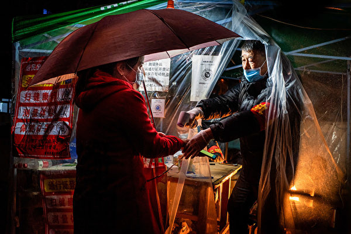

图为4月20日牡丹江市的一个社区工作人员在检查居民体温。(AFP/Getty Images)

 
【大纪元2020年04月22日讯】（大纪元记者李净报导）中共当局除了将北京市定为“高风险地区”之外，同时将黑龙江等3个省份定为“中风险地区”。黑龙江省近日下发通知，禁公职人员泄露当地的疫情信息。

4月20日，中共黑龙江省牡丹江市纪监委发布了该市党员、公职人员疫情期间的纪律规定。除了不准参与聚集性活动（包括红事延办、白事简办）之外，当局还做了“保守工作秘密”要求，不准通过互联网、社交软件等谈论当地的疫情，违者以散布“谣言”论处。

近期，黑龙江牡丹江绥芬河地区的疫情严重，当局已对当地交通进行管控。

黑龙江省被中共当局列为“中风险地区”。据中共“国务院客户端”近日发布的部分地区疫情风险情况显示，黑龙江省、山东省、广东省被定为“中风险地区”，而北京市被定为“高风险地区”。

官方消息称，大陆高风险地区为北京市朝阳区。中风险地区包括：一、山东省青岛市胶州市（地级市）；二、广东省：1. 广州市越秀区、白云区；2. 揭阳市惠来县；三、黑龙江省：1. 牡丹江市绥芬河市（隶属于牡丹江市）；2. 哈尔滨市道外区、南岗区。

中共肺炎（武汉病毒）疫情在俄罗斯爆发后，迫使不少在俄华人回国。中共当局不仅封锁中俄边境以阻止中国公民归国，同时亦悬赏抓捕已经“偷渡”入境的回国人员。

中共驻俄罗斯大使张汉晖4月17日在央视新闻称，在俄罗斯华侨、华商、留学生此时回国，实际上是把病毒带到了国内，这种做法是“吃着中俄合作的饭，砸了中俄关系的锅”。

中国历史学专家李元华表示，中共封锁海关，设置重重障碍，不让他们回到自己的祖国，这和民主社会在当初中国疫情大爆发时，各国政府克服各种困难派飞机去接回自己本国侨民形成了鲜明的对比。

<a target="_blank" href=#top><h6 align="right">回上方</h6></a>

<a name=130>
<h1 align="center"><b>“砸中俄的锅” 中共大使骂华人回国是散毒</b></h1>

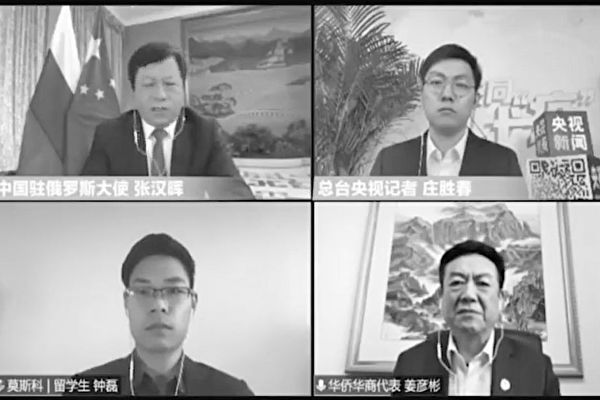

中共驻俄罗斯大使张汉晖近日通过央视与在俄华人代表进行在线交流。（视频截图）

【大纪元2020年04月19日讯】（大纪元记者李净报导）中共驻俄罗斯大使张汉晖近日通过央视与在俄华侨代表进行在线交流，他指在俄华人回国是散毒，并称要警惕这种“政治病毒”。该大使在称赞中俄关系的同时，斥责返乡的中国公民是“吃中俄合作的饭，砸中俄关系的锅。”

中共驻俄罗斯大使张汉晖4月17日做客央视新闻，与在俄罗斯的华侨、华商、留学生代表在线交流。张汉晖介绍，“现在俄罗斯的疫情不仅仅是汹涌，而是有点凶险。”

截至目前，中共病毒（武汉肺炎）在俄罗斯累计确诊病例36,793例，死亡313例。

关于中俄两国目前的通关问题，张汉晖称，“在疫情完全结束之前，中俄陆路口岸的旅检功能绝不会再开启。”“滞留在远东的中国公民要在当地接受隔离，同时准备生活到疫情结束。”

此外，针对近日引发网民关注的俄罗斯当局大规模驱逐中国人的传言，张汉晖予以否认。

他还特别提到，有些中国人闯关回到国内，实际上是把病毒带到了国内。这些人说是“俄罗斯不让待了，我们在那没有活路了！”。

张汉晖指这种做法是“吃着中俄合作的饭，砸了中俄关系的锅。”他称，要警惕这种“政治病毒”，中俄是战略伙伴关系，疫情发生以来，给我们（中共）支持的是俄罗斯。

张汉晖的说法在网上引发国人炮轰，“说真的，我很震惊，很失望。他的霸气，他的大义凛然，让我不知道该说什么。”

还有人说：“实在是要拒绝同胞们回来，也不应该如此态度吧？你是人民的服务人员，人民是这个国家的主人啊！这让我非常不能理解的是，在远东的中国公民，可以直接通过陆路回到祖国，为什么管理者不愿意接受？在危难时刻，祖国应该是海外中国人民最值得信赖的怀抱啊！”

“形势十分危急。俄罗斯应该并没有意愿再肩负起保护我们同胞安慰的重担，我们中国现在不是形势转好了么，迎回同胞不是理所应当？何况还是可以直接通过陆路回来的同胞？”

事实上，中共外交部发言人赵立坚14日在记者会上也发出与张汉晖同样的论调，他称俄罗斯当前正处于疫情防控的关键阶段，中方不能袖手旁观。

早在中国疫情爆发初期，俄罗斯当局就采取了极为严厉的防疫措施，包括对中国断航、关闭与中国的大部分边境口岸。

俄罗斯疫情爆发后，迫使不少在俄华人回国避疫，也有在俄华人说是俄罗斯大举遣返华人。4月7日，中共关闭了绥芬河口岸，该口岸是近期中俄边界唯一开放的口岸。

中共当局不仅封锁中俄边境以阻止中国公民归国，同时亦悬赏抓捕已经闯关入境的回国人员。

中共黑龙江省政府4月13日已下发通知，要求各市（地）有奖征集边境地区非法入境人员的线索。将给予举报人人民币3,000元奖励。如边民自行抓获并交由有关部门处置的，一次性奖励人民币5,000元。

在莫斯科生活了二十多年的秀萍（化名）告诉大纪元，俄罗斯对中国人查得特别严，早在2月份时，莫斯科地铁就有警察检查中国人的护照了，“比如，2月2日从中国回来，回来后应在家自我隔离14天，如违规将被强制隔离，不仅自费还要罚款1万卢布，之后被遣返回国。（中共）大使馆当时也知道这个事情，但他们没啥反应。”

中国历史学专家李元华表示，中共明知道俄国在驱赶华人，却封锁海关，设置重重障碍，不让他们回到自己的祖国，这和民主社会在当初中国疫情大爆发时，（各国政府）克服各种困难派飞机去接回自己本国侨民形成了鲜明的对比。＃

<a target="_blank" href=#top><h6 align="right">回上方</h6></a>

<a name=129>
<h1 align="center"><b>河南4童被埋致死 住建局长被免职 网民不买账</b></h1>
 
【大纪元2020年04月21日讯】三天前（4月18日），河南原阳县盛和府小区工地发现4名儿童的尸体。这4名儿童在今天（21日）入土，这一天，中共原阳县住建局局长等2人被免职。对于当局的处置，网民表示不满。

综合陆媒报导，遇难者家属披露，4名男童的葬礼在今天（4月21日）下午举行。

同一天，据中共河南省新乡市原阳县政府网站的消息，盛和府建筑工地“4·18”压埋窒息事故中，负有监管责任的县住建局党组书记、局长孙国安和安全股股长王建刚被免职；对县城管局（县城市综合执法局）党组书记、局长魏学义进行问责。

前一天（4月19日），8名开发及施工人员被刑事拘留，分别为自卸车司机、建设项目负责人、现场施工建设负责人等。

对于此结果，网民不买账。网民说：“免职完事了？”“免职娃娃能复活吗？”“这不是免职就能解决的。孩子太可怜。”

还有网民说：“行政处分分为6种：警告、记过、记大过、降级、撤职、开除。免职非行政处分，用通俗的话说就是，免职是避避风头，后期平调另一个部门。”

4名儿童被埋致死事件发生在4月18日下午5时半之后，当时盛和府建筑工地工人在自卸车倾倒土方时，4名在工地玩耍的男童遭压埋致死。经初步判断，4名儿童当时是从围挡的缺口钻入工地的。

这4名孩子中，其中两名9岁、一名7岁，还有一名儿童年仅5岁，均是事发小区相邻的原阳县原兴办事处温庄村人。

新京报称，涉事工地未取得“建筑工程施工许可证”，而涉事车辆为向后倾翻型后八轮自卸车，是违规作业。

涉事地盘的开发商是新乡市众孚置业有限公司的吴尧臣，已被控制。而在4月16日，就有网民投诉盛和府涉嫌违建。#

<a target="_blank" href=#top><h6 align="right">回上方</h6></a>

<a name=128>
<h1 align="center"><b>传金正恩手术后病危 韩国官媒称无异常动静</b></h1>

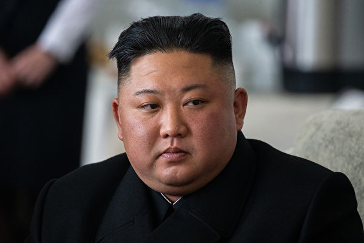

美国有线电视新闻网（CNN）引述一名知情的美国官员的话报导说，朝鲜领导人金正恩疑似在做完心血管手术后仍处于“严重危险”中。(Alexander SAFRONOV / Press Service of Administration of Primorsky Krai / AFP) 

【大纪元2020年04月21日讯】（大纪元记者陈霆、尤思宇综合报导）美国有线电视新闻网（CNN）引述一名知情的美国官员的话报导说，朝鲜领导人金正恩疑似在做完心血管手术后仍处于“严重危险”中，美方正在密切监测相关情报。

主要由脱北者营运的韩媒“Daily NK”也报导了此事，该媒体引述朝鲜匿名消息人士的话透露，金正恩本月12日在金氏家族专用医院——平安北道妙香山的香山治疗所接受手术，由平壤金万有医院、朝鲜红十字医院、平壤医科大学附属医院的顶尖医生联合主刀。

消息人士称，金正恩自去年8月起，他的心血管就出现问题，原因是吸烟、肥胖及过劳等因素，造成他的健康状况每况愈下。

4月15日，现年36岁的金正恩，罕见错过了朝鲜最重要且规模最大的节日“太阳节”，亦即金日成的诞辰纪念日，这也引发了人们对其健康情况的臆测。此前，金正恩最后一次公开露面，是在4月11日的政府会议上。

尽管如此，专家们仍无法确定，金正恩在太阳节庆祝活动缺席的真正原因。除了金正恩健康情况的说法，也有媒体怀疑是出于对中共肺炎的防范。

日前《韩联社》即猜测，金正恩可能因为肺炎疫情，减少出席公开活动。此前也有报导指出，朝鲜传出出现中共肺炎疑似症状的议员，政府随即对所有议员进行检疫，发现共有7位议员体温超过37.4度。

韩联社报导，针对此次的传闻，韩国政府多名官员21日表示，朝鲜目前没有出现异常动静，有关消息可能不属实。青瓦台发言人姜珉硕也表示，并无发现朝鲜内部异常。

韩国统一部对有关媒体报导也不予以回应。韩国国防部则表示，正在密切关注朝方动向。

“最近有许多关于金正恩健康的传闻，如果金正恩住院，就能解释为何他不在4月15日的重要庆祝活动中出席，但多年来，关于金正恩或其父亲的健康谣言很多，我们必须拭目以待。”美国传统基金会高级研究员、前中央情报局（CIA）朝鲜副处长布鲁斯·克林纳（Bruce Klingner）说。

2008年，金正日也曾在庆祝朝鲜60周年的游行中缺席，随后有传言称他身体状况不佳。后来才披露出他得了中风，此后金正日的健康状况持续下降，直到2011年去世。

2014年，金正恩也曾“消失”一个多月，并缺席了一系列朝鲜重要活动，当时也引发了对其健康状况的怀疑，甚至是朝鲜政变的猜测。直到四十多天后，他才拄着拐杖重新露面。几天后，韩国的情报人员表示，金正恩动手术移除了脚踝上的囊肿。

<a target="_blank" href=#top><h6 align="right">回上方</h6></a>

<a name=127>
<h1 align="center"><b>【一线采访】重症者被清零转院 面临庞大医费</b></h1>

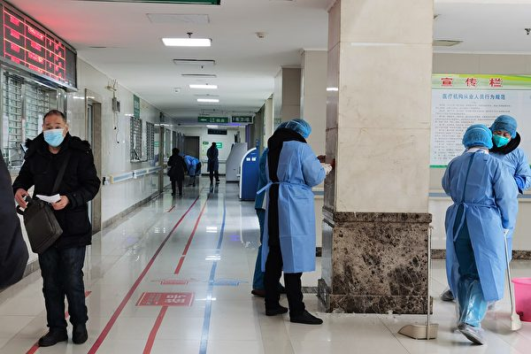

中共官方媒体12日报导，武汉重症病区患者清零，但家属透过报导才晓得患者是被转院了。图为武汉金银潭医院。(Getty Images)

 
【大纪元2020年04月21日讯】（大纪元记者洪宁、方净采访报导）中共病毒（武汉肺炎）蔓延全球，中共当局日前宣称，武汉市金银潭医院重症监护室（ICU）病区的患者已清零。但武汉居民何小姐日前上网求助，指其父亲是中共肺炎重症病患，仍需依赖呼吸机，突然被金银潭医院统一转院，在转院后还要求家属自费负担庞大医药费，让她不知所措。

何小姐说，其父1月16日住进武汉市第五医院，1月22日确诊后转入金银潭医院接受治疗，期间病情恶化，住进ICU。4月11日，在家属不知情下，金银潭医院直接把病人转到武汉中南医院。该院要求家属自负医药费用5万元，后续医疗费用也要全数自费。

何小姐19日对大纪元记者表示，她的父亲在转院前后持续昏迷，病情并未好转，她看到新闻才知道父亲被转院了，她对此深感疑惑，“我有两个疑问，一是他为什么会转到中南医院。他现在所有的状态，和他当时在金银潭的时候，没有任何区别。”

其次，是转院后医疗费变成自费，“费用问题我也很疑惑，他现在肺部情况并没有转变，那怎么就会是属于自费范围？”她说。

何小姐强调，自从其父染疫后，家人亲历一次又一次的难关，承受巨大的压力，现在父亲的症状并未好转，还要面对一天五、六千元的医疗费，“我现在面临的是又一次困难，不知道怎么解决，好像又回到了一开始的原点。”

她同时表示，父亲昏迷至今已超过一个月，家属既未能见到人也听不到他的声音，“我也很疑惑，我不知道现在里面还是不是我的爸爸？我心里一直在这样问我自己。”

<b>1月16日住院时 已知病毒性肺炎会传染</b>

何小姐回忆父亲的治疗过程，他早在中共政府承认人传人前已发病，“一开始发烧不退，门诊拍了CT（计算机断层成像），诊断是患了病毒性肺炎，就住院治疗。1月16日住进五院之后，一直做不了核酸检测，当时我爸爸发病的症状和它（中共病毒）的症状非常相似，不用做（核酸检测），我都觉得是这个病。”

“收进去的时候，是住在综合性病房，后来发现他病症不对，医生把我爸爸放在一个人的单独病房。”“当时知道他这病是会传染的，院区都变成了隔离病区了，人都不能进出。我们没有办法，家属还是必须得进去，因为他生活不能自理了。”她说。

“然后我们1月22日等了试剂盒排队做检测，当时排队等金银潭医院的床位，一直等到2月1日才转到金银潭去。”何小姐说，到了3月中旬其父出现休克状态。“我们刚转进去的时候是在普通病房，根据当时候的治疗方案治疗，但是他突然有一天就休克了，抢救了，病情就很重，病情一直恶化，就直接从普通病房转到ICU。”

<b>月余见不到父亲也听不到声音 看新闻才知被转院</b>

自从父亲进了ICU后，至今已超过一个月没有见到父亲也听不到他的声音，“之前我们都是用手机联系，因为他在隔离。进了ICU，我们就一直不能直接跟他联系沟通，所有的情况都是通过医院来跟我们叙述他的病情，我们一直看不到人。”

她说，父亲被转院是从新闻中看到才知道的，“我看到新闻说要把金银潭剩下的重症患者大部分都转到中南医院，统一转的。然后是等转院完以后，才打电话通知我们，我们才知道我爸爸已经被转到了中南医院直接住进ICU。”

她指出，“他并不是因为好转了，或者是需要接受其它的治疗而转院，就是统一的要求。”别人也遭遇同样情况，如一个在网路上认识的朋友，“他的爸爸也是跟我爸爸同一天从金银潭医院一起转到中南医院，都是ICU的病人，一同转过去的。”

<b>医保用完 自费医药开支庞大 陷入另一绝境</b>

何小姐说，被转院没几天，医院打电话跟她说，爸爸的核酸反应是阴性，“那不属于免费救治的患者了，你这块就要自费。”

她同时指出，医院对病情认定模糊不清，“父亲现在虽然核酸转阴了，但现在还是一个重症的气管插管病人，你怎么能说他不属于免费救治的新型冠状病毒肺炎（中共肺炎）的病人呢？”“他现在毕竟还不能自主呼吸，肺部还没有好，就是这个病没有好啊！”

而且之前所谓“先救治后结算，无需个人垫付”的医保政策，也不是全部免费。经过她去医保中心了解，原来在金银潭医院已经用了医保，“我们从1月份到现在，其实都是在用我们医保的额度。医保就54万元可以去做报销，医保中心跟我讲，在金银潭已经用掉了63万了。现在额度没有了之后，一转到中南医院他就要收我的钱，就要全自费了。”

何小时说，“他现在要收费，不缴费的话，有些治疗也做不了，然后人又睡在里头，我们也没办法去看。”一天五、六千块钱的费用，对一个普通家庭来讲实在难以承担。

<b>家人面对层层难关“感觉天要塌了”  凸显政府政策上的不足</b>

何小姐说，从父亲染疫至今，家人面对层层难关，“当时候觉得天都要塌下来”。从买不到口罩和防护物资、交通的困境、照顾病人的压力，还担心传染给小孩，以及随时收到病危通知等，“能撑到现在，说实在话，真的是很不容易。”

即便一直坚持到现在，却又面临最大的经济难关，“所有的费用又要自费，简直是晴天霹雳，真是有点绝望，实在没办法才做这样一个求助。”

从这些遭遇，她指出，“有些政策上的不足也显现出来了。”“我只是希望这个事情能够得到一个解决，确实这个压力太大了！”

<a target="_blank" href=#top><h6 align="right">回上方</h6></a>

<a name=126>
<h1 align="center"><b>公安部副部长 前610副主任孙力军落马</b></h1>

4月19日傍晚，中共公安部党委委员、副部长孙力军落马。（合成图）

【大纪元2020年04月19日讯】4月19日傍晚，中共官方发消息称，中共公安部副部长孙力军涉嫌严重“违纪违法”，目前正接受中央纪委国家监委调查。

孙力军现任中共公安部党委委员、副部长，副总警监警衔。

孙力军曾任中共上海市政府外事办公室副主任、公安部办公厅副主任、公安部党委委员、中共公安部一局二十六局局长、中共中央610办公室副主任。

1999年的6月10日，中共党魁江泽民为“3个月内消灭”法轮功，在其直接操作下，避开宪法和正常的法律程序在中共中央成立了一个专职镇压法轮功的非法机构——“中共中央处理法轮功问题领导小组”，下设办公室，也称“610办公室”。

随后几个月，其下属分支机构在中国全面成立，上至权力核心层下至乡镇农村基层，“610”形成了严密而独立的体系，建立了和中共政法委紧密联系的指挥系统结构，全方位地组织、指挥、实施对法轮功的迫害。

中央层级，指挥下级610镇压法轮功。各省市级的610主任，通常是同级政法委书记或副书记。而政法委书记，又掌管当地公检法司。这意味着各级610，能调度同级的公安、国安、司法、检查和法院系统。

20年来，大量明慧网案例显示，对法轮功学员的抄家，绑架，酷刑，洗脑，将健康人强送精神病院，停发工资，将人迫害死亡等恶行都指向“610”。在610驱动下，至今，通过民间渠道获悉，大陆至少有4,408位法轮功学员被迫害致死。而多项证据显示，610系统还指挥了活摘法轮功学员器官的罪行。

2018年，610办公室被合并入中央政法委。

此外，孙力军亦曾任中共公安部港澳台事务办公室主任。2017年12月，孙与香港保安局局长李家超在北京签署有关刑事罪行的通报机制文件。

孙力军曾任中共政法委书记孟建柱的秘书。据港媒报导，当局已调查孙一段时间，但原因不明；孙于中共肺炎疫情严重期间，亲自到武汉督导疫情工作，一度被认为可能“软着陆”，谁知今日突传出被查消息。

孙力军是今年第二个落马的中共副省部级官员。第一个是福建省副省长张志南。#

<a target="_blank" href=#top><h6 align="right">回上方</h6></a>

<a name=125>
<h1 align="center"><b>【一线采访】俄罗斯如何借疫情驱赶华人</b></h1>

在俄华人一方面因中国关闭通道无法回家，另一方面又面临着俄罗斯政府的刻意驱赶。图为莫斯科街头。（ALEXANDER NEMENOV/AFP via Getty Images)

  
【大纪元2020年04月20日讯】（大纪元记者顾晓华、黄惠采访报导） 近日，中共驻俄罗斯大使张汉晖指责在俄的中国人回国是“散毒”、“令人不齿”，在网络上引发轩然大波和炮轰。在俄华人一方面因祖国关闭通道无法回家，另一方面又面临着俄罗斯政府的刻意驱赶。

来自台湾的商人郭先生在俄罗斯经商超过十年，近日他对大纪元记者讲诉了俄罗斯如何借疫情驱赶华人的现状。

<b>利用学生签证获得居留权</b>

郭先生说，“俄罗斯人从很早以前就不喜欢华人，从我来的时候就感觉到他们不喜欢华人，所以歧视一直都存在着。”“中国人在这边来这里太多太多的非法居留的，延期居留的，有的投机取巧。”

“有一部分中国商人住在大学的宿舍里，他们为了要拿到这边的居留，到大学注册，给教授注册费，因此许多中国商人的签证是学生签证。六十岁都在拿学生签证，因为他们拿不到商务签证，工作签证，他们就拿学生签证，这样不用缴税，所以他们在这边都是逃漏税的，所以说俄罗斯政府对这近百万的中国人他们很头痛，来这边赚钱又不缴税。”

而“俄罗斯的大学为赚钱也睁一只眼闭一只眼，只要交钱学校就收，只不过中国籍的注册费非常高，一年下来几千美金。但对商人来讲，因不用缴税，还是划得来的。”

郭先生指自己曾到列宁师范大学的宿舍，帮一个朋友的女儿搬行李，看到很多年龄很大，看起来根本不象学生的人，后来得知是市场上的贸易商。他们不用上课，他们不能毕业，他们只是交钱而已。 

郭先生说，这些人一旦出门被警察抓到，就说护照丢了，这也是为什么这边的中共大使馆办签证的总是那么多的中国人，“中国人挤爆了办签证的柜台，你才发现他们很多都在申报他们的护照丢掉，因为他们是非法进来的，所以他们要回国以前，他们重新申请一本护照，他们才不会有不好的污诟。”

据郭先生介绍，在俄罗斯有近百万中国人，很多人利用各种方式逃税，令俄罗斯政府头痛。

<b>借疫情驱赶华人</b>

郭先生说，这次中共肺炎爆发，让俄罗斯政府找到驱赶中国人的借口。从中国黄历新年以后，发生了两波驱赶。

第一波是中国黄历新年期间，有一半在俄罗斯的中国人回国。然后二月中俄政府就不再给这些中国人发放签证，利用疫情这个机会挡住一半中国人回俄罗斯。

第二波就是借疫情的方式，开始去扫荡中国人聚集的市场，中国人聚集的旅馆，中国人聚集的餐厅，大力去扫荡。“每次都是去救护车，丢到救护车里面直接带医院，他不跟你说什么，就往医院里面送，在医院里发生什么事情，就说你有危险期，那就全部都遣送走了。用这种方式往回赶，因为你有可能构成传染源，他就把你送回去了。”

“基本上现在这边的华人就是中铁建等几个比较大的中国国营大公司，他们的员工，剩下的就是这些”。

对于持学生签证，住在学校宿舍的中国人，俄罗斯当局也没有放过。

“3月23日以后，警察开始去敲学生宿舍的门，而且都是半夜，只要你是中国籍的，他看你是几月几号进来的，如果你是在疫情爆发那段期间进来的，那宿舍外都是救护车，就全部把你们赶上救护车，到医院去检验。反正就是这样一个一个抓 。”

“只是那段时间进来的，他有一个理由，必须要隔离你14天，只要隔离期间出了宿舍的门，哪怕是买饭倒垃圾，被守在外面的警察抓到就是立即遣返，然后五年内不能回来。”

郭先生知道一个台湾学生，他这个房间住了四个人，有一个是在这段期间回来，意味着这个房间所有人都要隔离14天，其中一个学生晚上下去倒垃圾，被守在外面的抓到，四个人全部遣送回国，五年内不能再拿签证。所以他们用这种方式把部分的留学生也遣送出去了。

对于有自己员工宿舍的大企业，如中国联通，华为等，警察也用对待学生的方式同样对待。“查出只要你符合14天隔离的这个条件，他就把你这个房间锁起来，就封锁了，不可以出来，他就在外面等。”

<b>俄罗斯对中国始终保持警惕</b>

郭先生还谈到中俄表面保持友好，但是俄罗斯在经济和军事等方面始终对中国保持警惕。

郭先生说，经济方面中国人做得很成功，很多华人投资都不着痕迹，通过第三方大肆地买俄罗斯的土地，盖房子，但是拥有者却不是华人，而是俄罗斯或者是另外一个国家过来的公司等。

此外，俄罗斯对华为也一直保持戒心，华为一直进不去，“俄罗斯自己有很关键的技术，他们可以牵制住华为，他们没有禁止华为，但是很小心华为。”

“许多俄国大客户对华为的印象不好，他们接触华为后对他们的的销售和服务态度很感冒，所以很积极的找其它国家替代品牌的产品，华为的影响力不如大家想像中强。”

郭先生还说，他接触的军武工厂中没有一家用华为的设备。俄国规定到2025年所有的政府采购标案的产品最少要70%以上Made in Russia的进口替代方案。他们普遍认为这是俄国对中国的限制之一。＃

<a target="_blank" href=#top><h6 align="right">回上方</h6></a>

<a name=124>
<h1 align="center"><b>中共警察跟踪纽时记者吓跑受访者 打脸华春莹</b></h1>

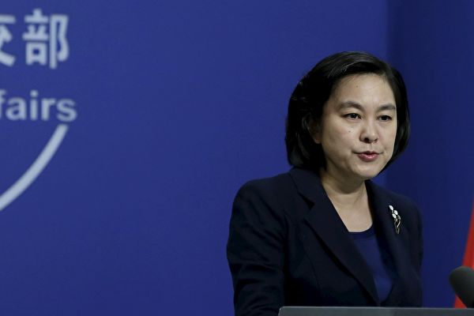

中共外交部发言人华春莹 。（大纪元资料室）

  
【大纪元2020年04月18日讯】中共外交部发言人华春莹曾宣称“欢迎到中国，在街头与任何人交谈享受自由”，但《纽约时报》记者在合肥采访时，遭遇中共便衣警察的跟监和阻拦，甚至还被骂洋垃圾。《纽约时报》记者的遭遇，被指打脸华春莹。

《纽约时报》4月17日刊发了该报记者孟建国（Paul Mozur）的文章，叙述了他在安徽省合肥市采访时遭到警察干扰的经历。

中共3月18日宣布驱逐《纽约时报》、《华尔街日报》、《华盛顿邮报》的记者。但就在《纽约时报》记者孟建国不得不离开中国前，他来到合肥，准备记录中共自称疫情趋缓后逐渐恢复正常的情况，但遭到中共公安鬼鬼祟祟的盯梢。

孟建国说，跟踪的警察打断他与一名建筑工人之间的采访，又吓跑原本愿意聊聊该市严格封城情况的商铺店员。随后该警察脱掉外面制服、穿着黑色长袖衬衫尾随。“当我回头看他时，他会很快闪进旁边的商店，有一次我发现他从衣架后面偷看。”

“作为一个盯梢的，他显得有些可笑。”孟建国说，“每当我和我的同事尝试与某人交谈时，他都会找到一种方法来把该人吓跑。”

孟建国还描述了甩不掉便衣的经过。他们为了摆脱便衣的纠缠，在购物街附近小巷里转圈后，抓准便衣抽烟喘息的机会，跑步穿过街道，但便衣不顾信号灯变红灯，硬是闯过4线道的大马路。

最后他们到地铁站，在车门就要关上之前跳下车，至少甩掉了一半的跟踪者；不过当孟建国上了计程车，还是被某个盯梢的记下车牌号码，不久后司机的手机铃响，如实向来电者交代行车路线。

当他们来到火车站附近的麦当劳用餐时，突然一个年轻人指着孟建国喊：“你就是洋垃圾，洋垃圾。”

然后他又指着孟建国的同事说：“你在我的国家做什么，你跟他（孟建国）在一起你也是贱。”

孟建国指，这个年轻人的激烈斥责，餐厅里没有任何一个人站出来替他们说一句话；该年轻人的言论，也是中共官媒仇恨心报导的结果。

孟建国的遭遇见诸报端后，被指实实在在地打脸中共外交部发言人华春莹。

美国国务院发言人摩根·奥塔格斯（Morgan Ortagus）4月7日发推文，回应中共驻美国大使崔天凯提出的所谓“两国应合作对抗中共病毒（武汉肺炎）疫情”的言论时说，真正的合作需要透明度和实际行动，而不仅仅是空口白话。她敦促中共要分享所有病毒数据，允许中国公民自由发表言论等。

华春莹4月9日在推特回应奥塔格斯的话时称：“随时欢迎到中国，在街上随便找人聊天、享受自由。”

<a target="_blank" href=#top><h6 align="right">回上方</h6></a>

<a name=123>
<h1 align="center"><b>【最新疫情4·20】川普：美希望进入中国调查</b></h1>

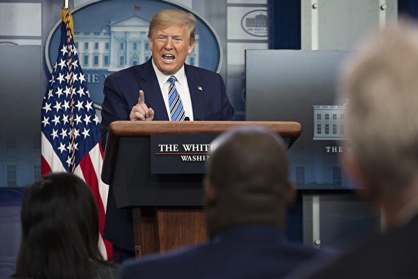

4月19日，川普在简报会上说，从这次疫情，在供应链上学到很多，在美国制造是最好的，要将供应链挪回美国。(Photo by JIM WATSON / AFP)

根据约翰‧霍普金斯大学（Johns Hopkins University）的数据，截至美东时间4月18日晚上10点半，全球确诊感染中共病毒（武汉肺炎）的人数超过230万，死亡人数超过16万（注：因中共和伊朗隐瞒疫情数据，真实数据比统计的要高），美国确诊人数超过75万，死亡人数超过4万。4月19日，纽约州报告了507例新死亡，这是自4月6日以来最低每日死亡人数。新病例和住院数也有所下降。

美国总统川普（特朗普）4月16日宣布重启经济计划的三个步骤，全美有超过20个州已经计划进入开放经济的第一个步骤。一些州已经或计划开始放松一些检疫期间的限制，逐渐开放经济，让民众拥有户外生活。

中共隐瞒疫情持续引发全球各界谴责。澳外长呼吁对大瘟疫传播进行国际性独立调查，包括调查中共政府在信息共享方面的透明度。川普在19日的白宫疫情简报会上说，美国希望调查人员能进去中国，对中共病毒疫情展开调查。总统也强调通过这次大瘟疫，学到的一件事是在美国制造商品。

白宫贸易顾问则表示，中共在疫情期间做了三件事，导致全球很多人死亡。

=======================
以下是最新疫情实时更新：

<b>印度开始逐步放松封闭措施</b>

根据印度内政部（MHA）发布的指南，印度有少数邦和联邦属地已开始放松封闭措施。

总理莫迪（Narendra Modi）在4月14日的电视讲话中，将全国封闭期延长至5月3日，但宣布在病例数处于低水平或零水平的部分地区有条件地放松限制。

<b>英国逾16000人染疫死于医院</b>

英国最新的官方数字显示，截至4月18日下午5点，全英国有16,060人因感染中共病毒而死于医院。

如果算上在医院以外死亡的人数，上述数字以及下面的数字预计会更高。

在英格兰，医院里死亡的总人数为14,400人。

威尔士共有575人死亡。

北爱尔兰报告有194人死亡。

在苏格兰，病毒检测呈阳性的有903人死亡。

在检测方面，全英国共有372,967人接受了测试，其中120,067人呈阳性。

<b>香港报告无新增病例 3月5日以来首次</b>

根据香港卫生防护中心的一份声明，香港周一（20日）报告无新增确诊病例，这是六周多以来的首次。

截至周一，香港已报告的病例总数仍保持在1,025例，其中包括4宗死亡病例。

尽管如此，卫生防护中心仍敦促居民继续保持适当的社交距离，并避免诸如聚餐等社交活动，以降低感染风险。

卫生防护中心说：“鉴于Covid-19病毒的感染情况依然严重，且全世界报告的病例数持续增加，强烈敦促公众避免到香港以外进行任何不必要的旅行。”

香港上次报告无新增病例，是在3月5日。

<b>法总理：法国长时间都不会恢复正常</b>

法国总理爱德华·菲利普（Edouard Philippe）说，法国很长一段时间都不会恢复正常。

菲利普周日（19日）在新闻发布会上说：“想像情况正在好转将是一个错误。”

他说法国已经渡过了疫情的高峰期，但警告说，该国不会很快恢复正常，因为目前没有疫苗，也没有治疗。

法国已暂停所有非必要业务，直到5月11日。

菲利普说，5月11日将不会是限制措施的终结，而是一个新的阶段。他表示，5月11日之后采取的措施将在几周内宣布，并将基于三项主要原则：社交疏离、大规模检测和对受感染者的隔离。

他还表示，5月11日以后，任何地方的学校都不会重开，但不管怎样，都会以不同方式运作。当局正在考虑各种选项，例如告诉学生每隔一周去上课，或者使用比平时更大的教室。

菲利普还宣布，从周一起，将重新允许到养老院进行探视，但将受到严格限制。他说，比如，不允许进行身体接触。

<b>德国开始重开商店和学校</b>

德国数周以来首度开始放松限制措施。

任何规模的小型商店、书店、车库和自行车店，只要采取社交疏离措施，都被允许重新营业。

学校仍大多保持关闭，但即将在今年夏天毕业的班级将逐步恢复上课，大学将被允许举行考试。所有其它封闭措施将依然有效。

德国已经拉平了新增病例的曲线，上周曾说病毒暂时处于控制之下。

根据官方数据，德国周一（20日）记录了过去一天新增1,775例病例，而与中共病毒相关的死亡病例数上升了110例，达到4,404例。

<b>悉尼一些海滩已重新开放，但仍有限制</b>

几周来，悉尼的海滩爱好者们不得不远离沙滩和冲浪。但当地市政府表示；从周一开始，悉尼东郊的一些海滩将开放给“仅以锻炼为目的”民众。

兰德威克（Randwick）市议会表示，Coogee、Maroubra和Clovelly海滩将重新开放，可进行“沙地慢跑和散步、游泳、冲浪和其他锻炼”等活动。

三周前，为了遏制病毒传播，兰威克市关闭所有海滩，以阻止大型群体聚集在海滩。

“住在海岸边上，我知道我们的海滩对社区中许多人的身心健康具有重要意义，”丹尼·赛义德市长说。“过去的三周很不容易，因为我们都不得不对我们的日常作息做出改变和牺牲。”

即使允许人们可以回到海滩上来，但他们必须保持1.5米(4.9英尺)的距离，限制两人一组，并且一旦完成运动后就得离开海滩。该市议会在新闻稿中说，不允许坐在沙滩上或晒日光浴。

此外，昆士兰州的黄金海岸的两个海滩——冲浪者天堂（Surfers Paradise）和库兰加塔（Coolangatta）周一也重新开放。

<b>印度重新禁止电商非必需品销售</b>

印度重新实行了禁止电子商务公司运送非必需品的禁令，推翻了先前解除限制的决定。

CNN报导称，印度内政部在周日发布的命令中表示，亚马逊和印度电子商务巨头Flipkart等公司不允许销售非必需品，直到5月3日。

这改变了上周早些时候该国放宽的封锁期间对电商的限制措施，当时印度政府表示电子商务公司可以开始提供非必需品销售。

自上个月印度实行封锁以来，电子商务公司已被允许运送杂货和其他必需品。

<b>德国新病例出现单日最低增幅</b>

德国疾病控制中心罗伯特-科赫研究所周一在其官网上报导，在过去 24 小时内，确诊的新病例为1,774例，死亡人数有110人。这是德国确诊病例和死亡病例数为单日最低的报告。

德国总确诊病例数达到141,672例，死亡人数达到4400人。另有3500人从该病中康复。

在过去一周以来，德国新确诊病例数量有所下降，但每日死亡人数却有所上升。

<b>印度总理莫迪吁以“兄弟情谊”共同面对大流行病挑战</b>

根据CNN的统计，过去24小时内，印度报告有1553例新的病例，这是印度单日确诊病例最大的增幅。还有36人死亡。

此前印度卫生和家庭福利部称，印度共确认17265例中共病毒（冠状病毒，Covid-19）病例，其中543例死亡。

根据印度医学研究理事会的数据，截至4月19日，印度已经检测了约401,586个样本。

对于印度疫情，印度总理纳伦德拉-莫迪（Narendra Modi）要求他的人民一起共同面对冠状病毒大流行的挑战。

他在社交网络LinkedIn上的发帖说，“冠状病毒侵害并不看种族、肤色、信仰、语言等，引后我们的反应和行动应该把团结和兄弟情谊放在首位。”他补充说“与以往历史上国家或社会冲突有所不同，今天我们所面对的是共同挑战。在未来将团结一致、坚韧不拔。”

<b>新加坡疫情恶化 单日新增1426例确诊</b>

新加坡疫情持续恶化，据新加坡卫生部称，截至周一中午，新加坡已初步确认了1426例新的中共病毒肺炎（新冠肺炎）病例。

根据约翰·霍普金斯大学（Johns Hopkins University）的一项统计，新加坡目前累计总病例数达6588例，包括11例死亡。

新加坡外交部在一份声明中说，新增病例绝大多数为居住在外籍劳工宿舍的持工作许可证的移民工人。

周一早些时候，新加坡卫生部称，当日有30个新病例发生在社区广泛传播中。

<b>新西兰将再延长5天“严格”封锁期</b>

新西兰总理杰辛达·阿德恩（Jacinda Ardern）周一（20日）宣布，将全国封锁期再延长五天。

新西兰原定于当地时间本周三晚上11时59分解除警戒级别最高的第四级封锁令，阿德恩周一表示，这些措施将持续到下周一（27日）晚上11点59分。

这意味着，在即将到来的本周末三天长假期间，新西兰将继续实行严格的封锁措施：要求所有非必要的员工留在家中。下周一是新西兰的公共假日，是澳纽军团日（Anzac Day），这是一个纪念第一次世界大战中的加里波利战役中牺牲的澳纽军人的日子。

尽管过去几周来，新西兰确诊病例数在不断减少，但新西兰还是做出了这一决定。

周一，新西兰报告了9个新病例，全国报总的病例数达到1440例，其中有12人死亡，974人康复。

阿德恩称赞新西兰人为了遏制病毒的传播所做的努力，并说为他们感到非常自豪。她指出，新西兰是世界上检测率最高的国家之一，完成了8.5万多例检测。

她说，新西兰的死亡率也是最低的国家之一，传播率也很低，每一个病例的感染率不到一个人。

新西兰政府上个月实施最严格的第四级封锁令，包括关闭边界、全国禁足，并暂时关闭所有学校和商业活动，仅允许基本服务及商家运作。下周一，新西兰将下调警戒级别至3级，为期两周。内阁将在5月11日审查是否延长。

在3级戒备状态下，国家基本上仍将处于封锁状态，但限制将有所放松。学校可以开放。人们除了可以购买外卖食品，还可以参加更多的娱乐活动，如在海边游泳等；也允许最多10人聚会参加婚礼和葬礼。

阿德恩说，3级警戒不允许更多的社会活动，但会允许更多的经济活动，如建筑业、制造业和林业等营运。

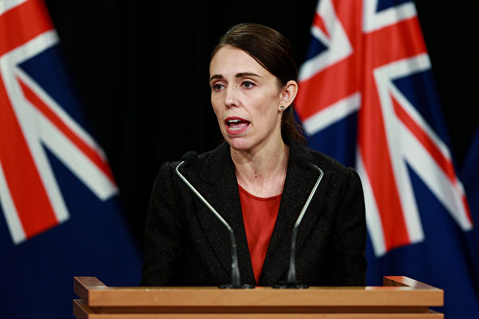

新西兰总理阿德恩(Jacinda Ardern)表示，全国封锁措施下周可望开始解除。（Hagen Hopkins/Getty Images）

<b>巴西总统参加要求结束隔离措施集会</b>

巴西总统贾尔•博尔索纳罗（Jair Bolsonaro）周日（4月19日）参加了在巴西首都举行的一次集会，示威者呼吁结束隔离措施，一些人呼吁军事干预以关闭国会和最高法院。

国会和最高法院支持州长实施的社会隔离措施。

博尔索纳罗一直反对严格的检疫限制，但巴西一些受灾最严重地区的州和地方政府已经关闭了学校，和非基本业务的商业活动，消防员和警察在街上敦促人们呆在室内。

上周，在经历了数周的社会隔离措施冲突之后，博尔索纳罗解雇了卫生部长。在介绍新任部长的新闻发布会上，他重申必须重新开放商业，以确保经济影响不会比疫情更糟。

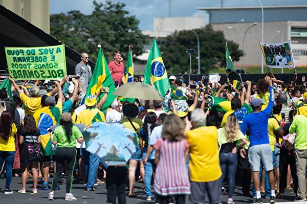

巴西总统贾尔•博尔索纳罗（Jair Bolsonaro）周日（4月19日）参加了在巴西首都举行的一次集会，示威者呼吁结束隔离措施，一些人呼吁军事干预以关闭国会和最高法院。 (Photo by Andressa Anholete/Getty Images)

<b>川普：美希望调查人员去中国</b>

4月19日，川普总统在白宫疫情简报会上表示，美国仍希望调查人员前往中国，调查冠状病毒（中共病毒）的爆发。

美国先前已经提出过此类要求，但被中共拒绝。最近，白宫不断指责中共隐瞒在中国范围内的有关病毒准确信息。

“我们正在与中方交谈。我们很久以前就跟他们谈过有关（美国调查人员）进去（中国）的事情。我们要进去。”川普说。

谈到美中关系，川普说，原本美中关系不好，后来通过贸易谈判关系好转；然后病毒来了，美中关系恶化。“病毒来了，我告诉中共，我们很不高兴。病毒源自中国。”川普说。

他说，中共要负责任，全球很多人死了，G7国家都受重创。

美国国务卿迈克•蓬佩奥（Michael Pompeo）4月17日表示，美国今天还在要求中共让专家进入武汉病毒实验室，以便准确判断病毒从哪里开始。

蓬佩奥周五接受福克斯商业电视台（Fox Business）采访时说：“这是关于科学和流行病学领域的问题，我们需要了解（那里）发生了什么。”

<b>澳大利亚北领地学生返校</b>

从今4月20日开始，预计澳大利亚北领地的学生将回校上学。

澳大利亚政府说，北部广阔而人烟稀少的联邦领地仅报告了28例中共病毒病例，11名患者已康复。同时，该地区至今已进行了3600多次测试。

根据澳大利亚卫生部提供的数据，这是澳大利亚唯一未报告与Covid-19相关死亡的州或地区。

目前，该领地要求所有进入边境的非必要旅客完成14天的隔离。政府建议，一般而言，除非绝对有必要外出，否则人们应留在家中。

北部地区大约有229,000人居住。

<b>美国重新开放非中共肺炎医疗服务新准则</b>

根据医疗保险和医疗补助服务中心管理员维尔玛（Seema Verma）4月19日宣布的新准则，希望重新开放进行选择性外科手术和其他非这个费用医疗程序的医院，仍需能够处理中共病毒感染引起的潜在风险。

维尔玛说，由于一些医院表示他们拥有剩余容量，因此新指南将这项医疗服务纳入重新开放美国的第一阶段内。

他说：“每个州和地方官员都必须在当地评估局势。他们需要确保能够解决（病人）激增问题，他们需要确保有足够物资和保存物资的计划。他们需要能够对患者和医护人员进行Covid病毒筛查。他们需要确保患者有适当的清洁习惯，并注意设施内部的社交距离，以确保患者进来寻求医疗服务时感到安全。”

维尔玛说，这将是一个“渐进的过程”，“全国卫生保健官员和卫生保健系统需要决定应提供哪些服务，最终医生和患者需要对其医疗保健服务做出决定。”

<b>白宫启用《国防生产法》制造药签拭子</b>

川普总统4月19日宣布，将根据《国防生产法》命令一家美国公司生产药签拭子。

两知情人士告诉CNN，该公司是总部位于缅因州的Puritan Medical Products。

川普说，政府对这家公司感到“棘手”，但他没有进一步阐述。Puritan Medical Products没有立即回应CNN的置评请求。

川普说：“我们在处理问题上有一点困难，因此我们将启用-正如我们过去所知道的-我们正在启用《国防生产法》，我们将非常容易得到药签。”

<b>美国人抗议居家令 川普：他们想恢复生活</b>

上周，在全国各地举行的集会上，一些美国人向州长们传达一个共同信息：放宽为对抗疫情而部署的严格居家指令。

上周三的游行可能是迄今为止最大的抗议活动，成千上万的人驾车将密歇根州兰辛（Lansing）塞爆。

星期五，一名抗议佛州监狱处理病毒爆发的男子将自己困在州府外面两个水泥桶中，他后来被拘留。

明尼苏达州也爆发抗议活动。抗议者认为州政府对人们的行为干预过度。

周五，在加利福尼亚州亨廷顿海滩，200多人针对该州的“待在家里”指令提出抗议。

在4月19日的白宫疫情简报会上，川普在回答记者就抗议者提问时说，这些抗议者都是“很棒（great）的的人”。

最近几天，川普鼓励州长在认为安全时放宽这些准则。

川普周日表示：“我见过这些人。我见过对这些人的采访。这些都是很棒的人。” 他补充说，他们希望恢复生活。”

他说：“他们的生活被夺走了。”“这些人爱我们的国家，他们想恢复工作。”

川普还表示，不容忍违反宪法第二修正案的指令。宪法第二修正案保障人民持有和携带武器的权利，亦即公民享有正当防卫的公民权利。

<b>川普：从瘟疫吸取教训 供应链必须回美国</b>

川普在白宫疫情简报会上说，从这次疫情，在供应链上学到很多，在美国制造是最好的，要将供应链挪回美国。

川普表示，供应链外包是一个问题，不应该这样。应该在美国制造各种零件，这是从瘟疫学到的教训。学到供应链的重要性，应该把工厂挪回美国。

川普说，“全球化主义者”构想出一条美国对华供应链的想法。总统断言，这将在战争或其它灾难中导致灾难。

他说，从疫情学到一件事，就是在美国制造商品，这是最好的。否则只要一个国家出问题，全球供应链出问题，伊朗也学到这一点。

总统说，自中共入世就开始利用世贸各种条例占便宜；中共自称发展中国家，且从中获得很多利益。

他还谈到中国购买美国农产品，以及中共一直占美国便宜，但美国和中方谈判有了贸易协议，中国会买农产品。

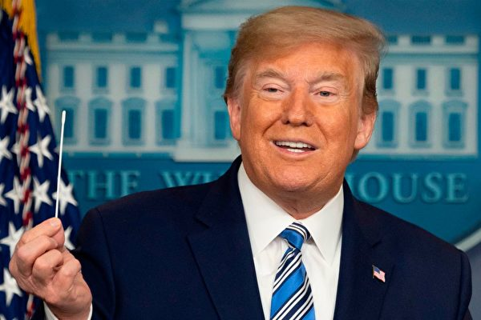

美国总统川普（特朗普）在2020年4月19日在华盛顿DC白宫举行的新闻发布会上讲话时举起棉签（拭子）。 (JIM WATSON/AFP via Getty Images)

<b>川普：美国测试达到重要里程碑</b>

在4月19日白宫疫情简报会上，川普首先介绍美国的中共病毒检测数量全球最多。

他宣布，美国已经通过了一个重要的冠状病毒（中共病毒）测试里程碑。他告诉记者，目前已经筛查了418万美国人，超过法国、英国、韩国、日本、新加坡、印度、奥地利、澳大利亚、瑞典和加拿大测试的总和。

总统在每日简报会上还拆开了药签测试盒的包装，并表示这是可能对抗病毒大流行的新测试技术。他表示，订了很多药签，运送到各州，这是件大事。他还说，美国的很多实验室也在做很多工作。

川普说，有人说他看起来很累，目前自己确实应该很累，因为正在进行（与中共病毒的）战斗。

川普还表示，告诉州长重启经济指南，因为州长提到测试不足就无法重启经济，联邦会帮助州长做更多测试。

总统也提到派遣陆军工兵帮助建立医院，补充病床。他说，目前美国病床足够，说明疫情开始平缓。

他提到在9天期间，纽约州住院率下降，疫情曲线平缓，包括西雅图、底特律的疫情也有缓解。美国人民做得非常好，他们目前想出门活动，但无论怎样，美国人学会了勤洗手。

他还说，佛州、加州州长做得很好，加州州长说了自己的话，未让媒体曲解，川普表示感谢。

<b>美企加快生产呼吸机、N95和防护服</b>

川普表示，美国制造10万个呼吸机，分配给全美，纽约州最需要，也仍把剩下的呼吸机送到麻州，呼吸机储备在加强。

他提到纽约州长库默说，需要呼吸机的人都得到了。

川普说，动态呼吸机系统运作非常好，给全美分派。联邦储备系统还有1万个呼吸机，还可帮助其它国家。

他提到汽车制造商都在生产呼吸机。相信美国人只要需要任何设备，都可获得，政府也通过空运送出很多设备，包括防护服。

川普提到美国有两个企业在生产500万防护服，霍尼韦尔国际（Honeywell）在加快生产N95口罩，雇用1000名员工生产2000万N95口罩，3M也做很多工作。

他说，联邦政府已经释出5500万个N95。

川普还说，美国两个企业从事口罩消毒工作，甚至口罩可以消毒20次，目前已经有2500万个N95口罩被医疗系统用掉。

<b>彭斯：美国68万人痊愈</b>

副总统彭斯表示，目前美国有超过74万人确诊，死了4万多人，但好消息是美国有68万人痊愈。纽约、新泽西、罗德岛，康州，新奥尔良，底特律、丹佛的疫情曲线都在平缓。目前在科州解决猪肉加工厂疫情问题。

他说，也在关注波士顿、芝加哥、费城都会区疫情。疫情能平缓归功于美国人民、地方政府和总统的贡献。

针对加州和华盛顿州疫情，彭斯表示目前稳定。

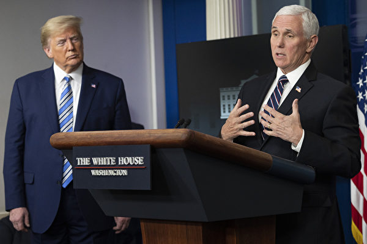

彭斯说，纽约、新泽西、罗德岛，康州，新奥尔良，底特律、丹佛的疫情曲线都在平缓。 (Photo by JIM WATSON/AFP)

副总统告诉美国人听取地方政府建议，总统非常想开放国家，和各州合作，以稳定安全方式开放国家。

彭斯表示，明天将和州长开电话会议，讨论如何开放美国。并告诉州长病毒测试系统运用，以及各州实验室资源和医疗物资供应。

他说，目前美国进行了400多万测试，月底将达到500万，且美国还在加大测试，明天将和州长讨论部署管理测试，希望联邦提供的测试令各州能进入经济开放第一阶段。

<b>纽约州新增死亡和确诊病例均下降</b>

周日，纽约州报告了507例新死亡，这是自4月6日以来最低单日死亡人数。新病例和住院数也有所下降。

纽约州长安德鲁‧库默（Andrew Cuomo）说：“如果这种趋势持续下去，我们将度过（疫情）高点，”但是他警告说：“我们还有很长的路要走，还有很多工作要做。”

他说，在疫情震中纽约市，至少有13,869人死亡。

州长还表示，纽约将开始一项积极的计划以测试抗体。

<b>纳瓦罗：中共做了三件事 导致全球很多人因病毒死亡</b>

白宫贸易顾问彼得‧纳瓦罗（Peter Navarro）在福克斯新闻“Sunday Morning Futures”独家专访中表示，中共在病毒爆发期间垄断个人防护装备（PPE）市场，以此牟取暴利。他也谴责中共隐瞒疫情信息。

纳瓦罗也是《国防生产法》政策协调员，也是最早警告中共病毒的人之一，他指出“中国（中共）在这件事上做了（几件事）”，“这导致了全世界许多人的死亡” 。

他告诉主持人玛丽亚‧巴蒂罗莫（Maria Bartiromo），首先，该病毒在中国首先被发现；第二，它们（中共）通过世界卫生组织隐瞒病毒（信息）；它们（中共）所做的第三件事基本上是囤积个人防护设备，现在它们正从中牟取暴利。

纳瓦罗还指出，美国许多州在应对中共病毒危机期间，面临卫生保健人员缺乏个人防护装备的事实。

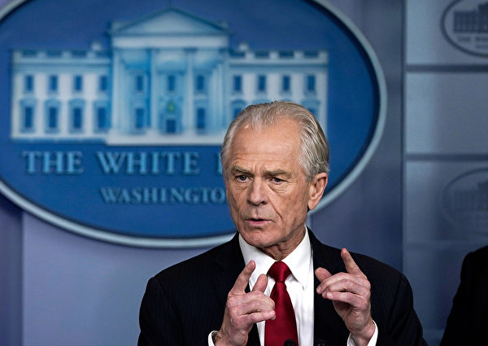

图为纳瓦罗3月27日在白宫简报会上发言。(Drew Angerer/Getty Images)

消息人士认为，中共政府精心编排了有关COVID-19的数据和信息。

福克斯新闻报导，中共迅速采取行动，关闭了从武汉到中国其它地区的国内旅行，但并未停止从武汉出发的国际航班。

此外，消息人士告诉福克斯新闻社，世界卫生组织（WHO）从一开始就在帮助中共掩盖这方面是同谋。

纳瓦罗补充说：“更重要的是，我们知道，在关键的六周时间内，中国（中共）利用其在世界卫生组织的影响力，对世界隐瞒这种病毒。那个时候，武汉可能已经含有这种病毒。相反，有500万中国人从武汉出去，并在全世界传播了该病毒。”

<b>美国哪些州开始放松限制</b>

川普总统于4月16日宣布各州开始开放经济的指导方针，并列举一些州采取措施实现“安全，逐步和分阶段开放”的例子，包括德克萨斯州、佛蒙特州和俄亥俄州。总统正在努力在5月1日之前放松对美国的封锁。

一些州已经开始放松本地限制。 4月17日，佛罗里达州州长罗恩‧德桑蒂斯（Ron DeSantis）允许一些城市允许在受限制的时间内，重新开放海滩，且只允许在海滩上进行步行、骑自行车、徒步旅行、钓鱼、跑步、游泳、照顾宠物和冲浪等活动。德桑蒂斯于4月18日表示，学校将在整个学年结束之前关闭。

以下是美国一些州已经或将采取的放松举措：

<b>爱达荷州和北达科他州</b>

川普在4月18日表示，爱达荷州、北达科他州和俄亥俄州已经“建议非必要企业为从5月1日开始为分阶段重新开放做准备”。

<b>明尼苏达州</b>

4月17日，州长Tim Walz签署一项行政命令，重新开放户外休闲企业，包括高尔夫球场、公共和私人码头以及户外射击场。该命令于第二天生效，要求居民遵守疾病预防控制中心推荐的社交疏远准则。

<b>蒙大拿州</b>

川普在4月18日表示，蒙大拿州将于4月24日“开始解除限制”。

<b>纽约州</b>

4月18日，纽约加入了康涅狄格州和新泽西州，开放游艇码头、船坞等，供娱乐之用。

该州还更新了高尔夫球场指南。

<b>俄亥俄州</b>

州长迈克‧德威恩（Mike DeWine）在4月16日说，该州将在5月1日开始实施一项“渐进式”计划，以使该州重新开放。

德威恩表示，该计划（仍在与商业领袖和顾问一起最终确定）将逐步重新开放经济。

<b>德州</b>

州长格雷格‧阿博特（Greg Abbott）于4月17日宣布行政命令，将放松对零售商店和公园的一些限制，但他说，在整个学年其余时间内，所有公立和私立学校都将关闭。

阿博特表示，德州所有商店将从4月24日起开始，可以将商品运送到客户的汽车、房屋或其它地点。州立公园将于4月20日重新开放。

<b>佛蒙特</b>

4月17日，州长Phil Scott宣布，从4月20日凯斯，有限重新开放部分企业。从5月1日开始，农贸市场可以有限开放。

<b>美前议员：有很多方法可追责中共</b>

美国前国会议员特里‧高迪（Trey Gowdy）4月18日在“华特斯世界（Watters World）”节目里表示，参议员科顿（Tom Cotton）和众议员克伦肖（Dan Crenshaw）提出允许美国人就冠状病毒（中共病毒）损失起诉中共的法案。

高迪说，《外国主权豁免法案》使得若在美国想控告外国政府非常困难，在新法案推动之前应先行修法。“然后是损害赔偿。我的意思是，如果您丧生、失去业务或遭受伤害，您有权获得赔偿。”他补充说。

来自南卡罗来纳州的高迪强调，中共最终必须承担责任，美国可以采取其它手段追责。

他还表示，除了个人诉讼外，中共还必须承担责任，他列举了美国可以采取的其它手段。

高迪说：“世界也有责任对中国（中共）追究责任。”“让我说，如果你不能警告其它国家大流行病已经开始，那么你就没有成为世界舞台上领导者的机会。”他指的是中共政权在大瘟疫中的失职。

这位前国会议员说，美国可能会通过召回在中国经商的产业来“重创”中共。

高迪说：“然后，我们国家可以做些事情。我认为，我们最能打击它们（中共）的地方就是排斥它们，而且还要回收我们的生产，特别是收回我们的制药生产。”

“我们有很多方法可以压制中国（中共）。”前议员说。

<b>旧金山男子免费从自家厨房分发“爱心”咖啡</b>

自从大瘟疫开始，大多数美国人居家防疫以来，本‧拉米雷斯（Ben Ramirez）每天从自家厨房窗户，向附近的人们分发免费咖啡和微笑。

这名旧金山居民告诉CNN：“即使他们没有喝咖啡，他们也可以在窗前停下来聊天。”

平均而言，拉米雷斯每天约生产10到15杯咖啡。他的“常客”是那些疫情期间必须工作的员工。

“附近有很多人，他们都是护士、医生或邮政人员。他们每天都在前线冒着生命危险。这是他们应得的东西，他们总是很高兴早上见到我们。”他说。

按照六英尺的社交疏离准则，拉米雷斯戴着一只玩具大猩猩手套将咖啡分发出去，这是他五岁的儿子卢卡（Luca）的主意。

“他为自己的想法感到骄傲。” 拉米雷斯说。

他从早上8点到中午在厨房的窗户旁，每周为他的社区服务7天。

<b>永利度假村推动内华达州重启经济</b>

永利度假村有限公司执行长马特‧马多克斯（Matt Maddox）呼吁内华达州部分经济体在5月初开始重新开放，随后在5月中旬或下旬开放拉斯维加斯大道。

马多克斯概述了一些安全措施，例如减少酒店入住人数，实际的疏散措施，体温检查以及没有大型聚会等。

这家赌场运营商是该州首家关闭运营的公司，截至5月15日，他将向员工支付60天的薪酬。

<b>法国制定解除限制计划</b>

法国总理爱德华‧菲利普（Edouard Philippe）称，法国将在两周内公布一项计划，开始取消对旅行和商务的限制。

菲利普在电视新闻发布会上警告说，在5月11日封锁解除后，“我们的生活将与以前完全不同”。

菲利普说，自3月17日以来的封锁措施，可能导致欧洲第三大经济体在2020年收缩约10%。

<b>澳媒：中共遭索偿4兆美元 应受纽伦堡式审判</b>

澳洲媒体报导，中共面对国际社会索偿大约澳币6.5兆元（约4兆美元），有澳洲议员指控中国（中共）应该接受纽伦堡式审判。

中央社援引澳洲第九频道新闻网（Nine Network）播放“60分钟”（60 Minutes）节目报导，美国一群受害人提出集体诉讼，指控中共当局疏忽（negligence）、撒谎和隐匿中共肺炎疫情，并要求中共赔偿损失。

这一宗集体诉讼是由美国佛罗里达州柏曼法律事务所（Berman Law Group）首席策略师（Chief Firm Strategist）阿尔特斯（Jeremy Alters）主导。他说：“这一宗诉讼所根据的事实，是它们（中共政府）明知道疫情，却未能控制疫情，也并未及时通知大家，让我们的社会、我们的国家、美国、澳洲和所有其它地方都陷入困境。”

目前已有一万人参与柏曼法律事务所提出的这项诉讼。其中一位参与索偿的受害人卡吉亚诺（Lorraine Caggiano）连同她自己在内，一共有10位亲人受到感染，2位亲人死于疫情，其中包括她的父亲。

英国智库总结了十个法律途径。全球受疫情冲击国家可通过这些途径要求中共赔偿。（Fotolia)）

<b>美国人在线购物从囤货品转向娱乐休闲用品</b>

继急于购买食品杂货和清洁用品之后，越来越多的美国人开始购买书籍等其它休闲商品。

人们由于中共病毒爆发而留在家里，在线购物暂时取代商店购物，网上购物速度激增。除了电子商务支出的整体繁荣之外，销售数据还显示，在最初进行商品库存后，许多在线购物者已将重点转移到休闲产品，例如书籍和游戏，以适应检疫状态。

根据市场研究公司Rakuten Intelligence的数据，从3月初到4月中旬，美国的电子商务支出与去年同期相比增长了30%以上，大大高于最近几年每年20%在线购物增长。

另一方面，实体业务3月份跌幅为8.7%，是自1992年政府开始追踪数据以来的最大跌幅。

<b>大瘟疫前起航 邮轮环球15周后接近终点</b>

一艘豪华邮轮在中共病毒在全球爆发之前展开一场环球旅行，在海上航行15周后终于接近旅程的终点。

这艘名为Costa Deliziosa的船4月19日驶向西班牙一个港口，这次航行的终点在意大利。这两个国家均疫情严重。

意大利邮轮公司科斯塔‧克罗西埃（Costa Crociere）表示，1月初载有1,831名乘客从威尼斯启航的Deliziosa邮轮上没有COVID-19病例。

Deliziosa周一将在巴塞罗那港口让168名西班牙乘客下船。然后，Deliziosa将前往最终目的地意大利热那亚（Genoa），预计这艘游轮将在周三让船上所有的意大利人和其他国籍旅客下船。

公司发言人说，一名乘客离开西西里岛马尔萨拉，出于健康考虑，这名乘客进行了COVID-19测试，结果为阴性。

<a target="_blank" href=#top><h6 align="right">回上方</h6></a>

<a name=122>
<h1 align="center"><b>【一线采访】外贸日子难 粤厂家：没订单</b></h1>

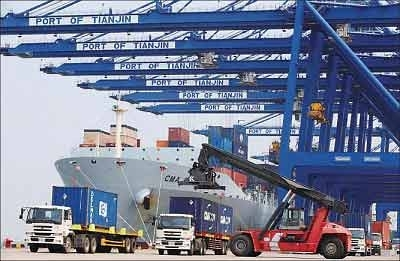

有深圳出口企业管理人士表示，受外贸订单的影响，目前越来越多的企业不得不放长假，甚至倒闭关门，整体经济并非官方所宣传的所谓在复苏向好。图为天津港口。(Getty Images)

【大纪元2020年04月20日讯】（大纪元记者易如采访报导）中共病毒正肆虐世界各地的同时，中国的复工复产并不能独善其身，中国首季经济按年下降6.8%。有深圳出口企业管理人士表示，受外贸订单的影响，目前越来越多的企业不得不放长假，甚至倒闭关门，整体经济并非官方所宣传的所谓在复苏向好。

刚刚过去的3月，中共国家统计局公布的制造业PMI为52，较上月回升16.3个百分点，似乎显示制造业行业景气度基本回稳。但外界却指出，3月制造业承受双重压力，不仅复工复产尚不充分；外需恶化、国内消费需求尚未大面积启动，因而造成生产扩张仍比较有限，没有看到明显的生产回补。

深圳一间家俱厂的管理人士陈先生17日对大纪元说，复工以来，中共媒体之前一直往好的方面宣传，但情况并非如此，“中共媒体宣传的很好听，就像今天说（1-3月份内生产总值GDP）只下降了6.8%，这个东西谁信呢？不可能的。（因为）1到3月份根本都没做什么东西，基本都是在休息，哪有什么经济好之说。”

陈先生介绍，由于国内家俱市场竞争激烈，他们家俱厂的产品主要销往海外各地，大部分市场是在日本和欧洲。

陈先生表示，每年开工时间是正月初十，但今年受疫情影响，推迟到2月下旬开工，但开工不久，海外爆发疫情，所有的出口企业情况都很差，“现在整个都没有货做，订单很少，出口企业都差不多，我们厂以前没有双休日，没有晚上不加班的，现在晚上也不加班了，每周双休两天，这是以前没有过的（事情）。而这个月已经基本不上班了。”

还有，“以前‘五一’都是放三天（假），这次放六天，我在这里做了十几年，从来没有过‘五一’放五六天的，（这个月）27号放到（5月）4号，（说明）出口企业肯定没有货做了。”

据悉，家俱行业工人工资按基本工资加计件工资，往年比较忙的时候，工厂机器昼夜不停，工人都要加班赶单。“往年能拿到四五千，每天最少上8小时，星期六也加班，现在最多上2小时班，然后星期六也不上班，十六七块钱一个小时，2个小时就三十几块钱，一天三十多块钱，（做22）天，加上基本工资，一个月不到3000块钱。”

陈先生表示，目前他们厂还没有进行裁员，“（厂里）现在也不敢裁员，如果到时候有订单做就麻烦了。”但如果一直没有工作做，到时候工人也会辞去工作。

他说，在深圳即使每月3000块钱工资，不包吃不包住，如果不加班（没加班费），很难生活下去，（因为）除了吃饭，再买一点东西根本就没钱剩了，加上外面租房，一房一厅要（租金）1500元多，两房要更多，如果情况持续下去，就会走很多人了，跟裁员也差不多。“现在厂里好多人都有意见，上个星期开始每天加2个钟班，就是说厂里每天多给员工2个小时的工资，其实也没有工作可做，本来（订）单就少。”他说。

陈先生表示，目前整个广东的外贸工厂由于没有订单陷入困境，许多厂放假甚至倒闭，“我弟弟的朋友在广州花都做皮具（做皮带、钱包、手提包之类的）生意，他说那边好多厂都放假两三个月。”

广州花都狮岭镇是“中国皮具之都”，90%的贸易都是做皮具出口，“就像东莞大朗做毛织（纺织、衣服）的两个镇，也是70%、80%的工厂做毛织品出口，那边好多工厂也都倒闭关门了。”陈先生说。

据海关总署4月14日发布的数据，中国首季出口下降11.4%，贸易顺差减八成。今年前两个月，中国外贸出口2.04万亿元，下降15.9%。实现贸易逆差425.9亿元，去年同期为顺差2934.8亿元。

湖南邵阳市出租司机易先生17日对大纪元，他最近接送两位从广东回湖南老家的客人都反映广东那边外贸企业几乎所有的生产线都停摆了。

“大概在四五天前，我拉了一个客人，他在广东东莞开理髪店，他说那边外贸工厂倒（闭）了一片，做外贸订单的企业基本都倒掉、关门大吉了。之后的两天前，有个原来在东莞鞋厂（外贸公司）上班的客人跟我说，中美贸易战增加了关税，由于利润低，他们鞋厂六条生产线只剩下三条，而疫情爆发后，生产线全部停产，就剩老总和管理人员在工厂留守，工厂跟他说今年不用来了。”

易先生说，中共病毒疫情使整个商业经营陷入萧条，无人能幸免，“包括所有的人，没有人能独善其身和置身事外。我是开出租的，我们的生意下降了大概30%到40%，（疫情前）毛收入大概六七百元，现在大概四百元。”

易先生说，“中共老说扩大内销，我也想买东西，但钱从哪里来，你用完了钱，到时候一场大病就没有了，不像欧美国家（医疗有保障）。”陈先生说，（即使）中国老百姓有钱也不敢用，“中国人努力一生赚来的钱，到老了的时候治病住院（就花掉）了。”

据数据公司“天眼查”的数据显示，因遭受疫情打击，第一季度就有超过46万家企业倒闭，其中逾三分之一营业不足三年。在倒闭的公司中，有2.6万家是出口企业。据悉，出口相关行业的就业人数就有大约6000万人，如果出口下滑30%，可能会造成1800万人失业；疫情爆发以来，所有行业面临失业风险的人数总计可能过亿。

<a target="_blank" href=#top><h6 align="right">回上方</h6></a>

<a name=121>
<h1 align="center"><b>致习近平公开信！德媒主编：您在危害全世界</b></h1>

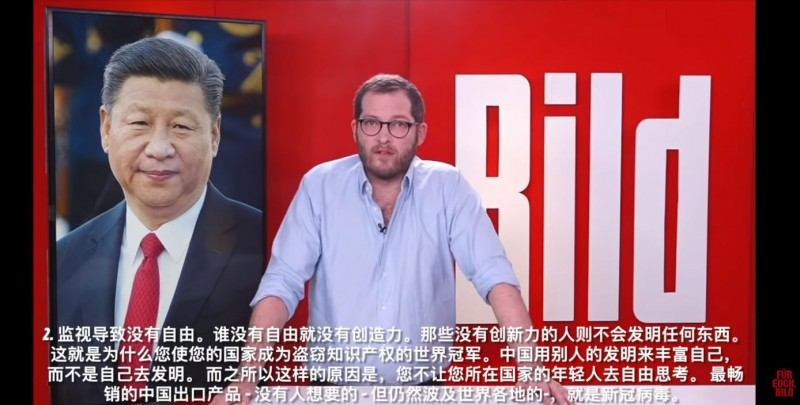

德国大报《画报》（Bild）主编朱利安（Julian Reichelt）在当地时间16日发表一封致予中国领导人习近平的公开信，标题为「您在危害全世界」，信中更一一提及中国各种恶行，包含践踏人权的监控统治、抓捕关押异议人士的政治迫害、剽窃他国智慧财产的恶习、隐匿疫情以致危害全球的过失。（图撷取自Youtube＿BILD）

  
  〔即时新闻／综合报导〕欧洲最畅销报纸之一、同时也是德国发行量最大的媒体之一《画报》（BILD），其主编朱利安（Julian Reichelt），在当地时间16日发表一封致予中国领导人习近平的公开信，标题为「您在危害全世界」，信中更一一提及中国各种恶行，包含践踏人权的监控统治、抓捕关押异议人士的政治迫害、剽窃他国智慧财产的恶习、隐匿疫情以致危害全球的过失。

根据《画报》16日主编社论，《画报》主编朱利安（Julian Reichelt）开头就先点出，近来《画报》因公开提问「中国是否需要为全球疫情（COVID-19）爆发所造成的庞大经济损失，承担起赔偿责任」，而被中国以「卑鄙无耻」、「煽动民族主义」等词怒骂指控。

对此，朱利安话锋一转，便说「尊敬的习主席，容我先说明几件事」，接着朱利安侃侃而谈，「首先，您透过监视统治当上了国家领导人，为了维稳，您监视着中国人民的所有行为，然而您却不去监控高度传染风险的野味市场。您关闭了每一家批评您执政的媒体、网站，每家都被您消音噤声，然而您却不去制止贩售蝙蝠等野味的摊贩。您不只监控着您的人民，您还危害他们的生命安全，也因而让全世界受害」。

朱利安接着又说，「国家监控之下，人民的思想被禁锢，也因而缺乏创造力，这也是为什么您的国家成为了窃盗智慧财产的翘楚。中国只能窃取别人的创造与发明来壮大自己，就是因为您剥夺了您国家的年轻人自由思考以及发挥创意的空间。而贵国最畅销全球的出口产品就只能是那个没人想要的病毒」。

朱利安再指出，「而当您的政府与学者们知道病毒会人传人时，您对全世界隐匿了如此重要的疫情资讯。而当外界想了解中国武汉到底发生了什么事时，您国家的人员拒接致电也不回覆邮件。您以中华民族主义为荣，以致于您不能说出那些您认为会让民族蒙羞、耻辱的真相」。

朱利安再犀利直指，「《华盛顿邮报》报导指出，中国武汉的实验室在未能遵守最高安全标准的情况下，对蝙蝠身上所携带的病毒进行研究。为什么您的有毒而致命的实验室，无法像您关押监禁政治犯的监狱一样紧闭严格？您要不要向全球各地所有因瘟疫而与挚爱天人永隔的悲恸家庭解释一下？」

朱利安接着继续说，「您创建了一个资讯封闭而不透明的中国，过去如此监控制度象征践踏人权的国家监控，今日所象征的更是致使致命瘟疫蔓延全球的症结，而这就是您的政绩」 。

最后，朱利安结论，「当中国驻德大使馆指控本报『撕裂两国人民情感与友谊』时，我在想的是，您将您发送口罩的行为称为『伟大的友谊』，但我对此不以为然，我认为这不是『友谊』，而是笑里藏刀的帝国主义。您想透过输出中国瘟疫来强化中国势力。我不相信您能成功，武汉爆发的病毒迟早会反扑您。以上来自朱利安的友好问候」。

《画报》更将该篇社论全文内容拍摄成不到3分钟的影片，并附上简体中文字幕，方便中国读者阅读，正面回应中国官方的指控。更将该篇社论全文内容录制成长度不到3分钟的影片，并附上简体中文字幕，方便中国读者阅读，正面回应中国官方的指控。

<a target="_blank" href=#top><h6 align="right">回上方</h6></a>

<a name=120>
<h1 align="center"><b>疫情持续英国政要发声问责中共</b></h1>
  
【明慧网二零二零年四月十九日】（明慧记者方园综合报导）由于中共「武汉肺炎」的掩盖和隐瞒，致使疫情蔓延全球200多个国家和地区，至2020年4月18日，全球超过232.8万人感染，超过16万人死亡，而英国则有超过11.4万人受感染，1.5万人死亡。中共病毒疫情的持续，令越来越多英国政要看到中共对国人的危害，发声问责中共。

<b>英国外交大臣：英国要总结教训对中共要问强硬的问题</b>

4月16日，在政府每日疫情新闻发布会上，针对记者提问，临时代理首相的英国外交大臣多米尼克﹒ 拉布（Dominic Raab）回答说在疫情结束后与中共的关系不再会照常进行，他并表示对疫情英国需要进行「非常非常深入的反思」，要「深刻总结教训」，态度上「完全不能畏缩」。

拉布并说：「毫无疑问，在这场危机之后，我们不会和以前一样（与中共）打交道，我们一定要（对中共）问强硬的问题，也就是（中共病毒）爆发起因为何不能早日制止（大流行）。 」

<b>前财政大臣：要对中共掩盖疫情进行法律追究</b>

4月15日，英国前财政大臣萨吉德﹒ 贾维德（Sajid Javid）在英国广播公司第四电台《今日节目》中表示，要追究中共隐瞒疫情，把世界带到危险之中的罪责。他说：「中国（中共）直到今年一月的某个时候才承认（病毒）人与人之间的传播，但已为时太晚。我认为有必要对他们（中共）了解有关情况的内容、时间以及如何产生影响进行法律调查。 」

<b>英国会外交委员会主席：要对中共隐瞒疫情进行国际调查</b>

4月15日，图根哈特议员在接受《天空新闻》采访时说，中共掩盖并隐瞒疫情早期消息的做法应该让英国政府认识到使用华为是错误：「事实非常清楚地表明，中国共产党为了维护自己的权力什么（坏事）都干，其中包括置中国公民生命安全于不顾。」「如果它对本国公民这样做，它将给我们（英国）人民带来多少风险？它将对我们的安全或网络带来多大的隐忧？」他敦促英国政府重新考虑允许华为参与英国5G建设的决定。

4月14日，图根哈特议员在推特上呼吁对中共的隐瞒疫情，导致大流行进行国际调查：「我们需要对中共病毒（Covid-19）大流行进行国际调查，它已经浪费了太多生命，并且还将耗费更多生命。我们不能允许（中共的）掩盖撒谎来使我们所有人面临危险。即使到现在，北京（中共）方面的虚假数据仍在损害我们的回应能力。 」

图根哈特议员的此条推特在两天内得到4.8万个点赞、1.8万次转推。

4月14日，下议院国防特别委员会主席托比亚斯﹒ 埃尔伍德（Tobias Ellwood）也在推特上表示支持对中共进行国际调查。

<b>前英国情报机构负责人：中共掩盖疫情引起世界更多国家和人民对其的深深愤怒</b>

4月15日，在英国《每日邮报》（Daily News）发表的一篇报导中，前英国军情六处处长约翰﹒ 萨维尔斯爵士（Sir John Sawers）谴责中共掩盖中共病毒并试图逃避指责；而前内阁大臣威廉﹒ 黑格（William Hague）则警告英国一定不要在技术上依赖中共。

约翰﹒ 萨维尔斯爵士（Sir John Sawers）并在英国广播公司第四电台《今日节目》中说，从中共病毒爆发至今，中共一直在欺骗世界。他说：「无论是当这种流行病刚刚浮出水面，还是面对国际社会的『愤怒』时，北京（中共）都不诚实。」他指出，中共正引起世界上更多国家和更多人的「深深愤怒」。

<b>英国议员：谴责中共向世界隐瞒真相</b>

4月4日，英格兰国会议员欧文﹒ 帕特森（Owen Paterson）与伊恩﹒ 邓肯﹒ 史密斯（Iain Duncan Smith）、戴维﹒ 戴维斯（David Davis）和鲍勃﹒ 西里（Bob Seely）等15名英国保守党议员联名写信给鲍里斯﹒ 约翰逊（Boris Johnson）首相，呼吁英国政府重新考虑与中国的关系，他们批评中共没有遵守国际条约。

4月15日，欧文﹒ 帕特森（Owen Paterson）议员在接受媒体采访时呼吁英国政府重新审视与中共关系。帕特森议员指出：「英国已经在依赖共产主义国家」。他表示中共政府的所作所为正给世界带来威胁和灾难，他说：「中国（中共政府）未能及时向世界通报中共病毒爆发的全部情况，从而使其传播到世界各地。」

<b>英国记者、作家和电视制片人：清算中共是政治和道义上的当务之急</b>

3月30日，英国的记者、作家和电视制片人大卫﹒ 帕特里卡拉科斯（David Patrikarakos）在著名杂志《旁观者》（《Spectator》）上发表题为「警惕中国（中共）的口罩外交」的文章，表示中共的所作所为激怒了世界，坚决支持在疫情过后对中共进行「清算」，他说这样的愿望必须去实现：「我认为确保做到这一点在政治上和道义上都是当务之急，因为到那时，这将成为民族自决的问题。」

中共对武汉肺炎疫情的隐瞒和欺骗导致中共病毒大规模蔓延，帕特里卡拉科斯认为不能让中共逃脱其罪责：「我们无视中国（中共）对5G的威胁，我们漠视其关押一百万维吾尔族人，实际上，我们几乎忽略了它（中共）所犯下的所有罪行，这次我们不能再放过中共。」他认为这是西方社会勇敢对抗中共的关键时刻。

<b>亨特勋爵呼吁制裁活摘法轮功学员器官的罪犯</b>

3月2日，亨特勋爵（Lord Hunt of Kings Heath）在上议院发言时要求把在中国参与活摘器官的罪犯直接纳入马格尼茨基式的制裁（Magnitsky-style sanctions regime）名单，他当面提请英国外交大臣（Lord Ahmad of Wimbledon）：「我希望政府有关（《马格尼茨基法案》）新规定会考虑到这些内容并采取行动，让那些（参与杀害良心犯、活摘器官的）医生受到应有的制裁。」

奥尔顿勋爵（Lord Alton of Liverpool）随即发言支持亨特勋爵的上述提议，他提请外交大臣关注独立法庭（China Tribunal）的调查结论，即认定中共活摘器官罪行是「有组织地杀害活人」，「超过二十世纪的所有最严重（反人类）暴行」。

三月中旬，包括发起人奥尔顿勋爵在内的45位上议院议员和国会议员致信英国外交大臣多米尼克﹒ 拉布（Dominic Raab），要求英国政府在英国脱欧后实施马格尼茨基式的制裁时要禁止人权侵犯者入境英国，也要禁止腐败者进入英国，并冻结其资产。

4月12日，全球马格尼茨基司法运动负责人、赫米蒂奇资本（Hermitage Capital）首席执行官比尔﹒ 布劳德（Bill Browder）在推特上写到：英国45位跨党议员与外交大臣达成结论，当英国实施《马格尼茨基法案》时，政府必须制裁侵犯人权者。

<a target="_blank" href=#top><h6 align="right">回上方</h6></a>

<a name=119>
<h1 align="center"><b>广西某组织部部长退党记</b></h1>

【明慧网二零二零年四月二十日】（明慧记者章韵报导）在目前中共病毒疫情肆虐全球之际，中国广西某市的组织部部长接到北美法轮功学员的真相电话，明白三退（退出中共党团队，简称三退）意义并用化名「健平」做了退出中国共产党的声明。他感谢法轮功学员的付出和耐心帮助。他说：「我现在终于明白为什么要退党了。谢谢！」
以下是他从不明白到明白的过程：

<b>「我很忙，有什么快说」</b>

一开始法轮功学员打过去电话说：「我想跟你说几句非常重要、对你非常有实用价值的话，你现在方便吗？」他说：「你说，但要说重点，我很忙，有什么快说。」

学员说：「当前病毒疫情是咱不能回避的一个话题，全世界现在都在关注这个事。现在我在加拿大给你打这个电话。听病毒专家说，这个病毒现在变得很复杂了，无症状感染更厉害，再次爆发的时候有可能根本都来不及抢救。所以在非常的时期，我希望你不要掉以轻心，一定要自己保护好自己。」

部长说：「我凭什么听你的？我又不知道你是谁？」学员说：「知道我是谁不重要，重要的是我是想你能平安度过这劫难。」部长说：「那好，你快说吧，我怎么保护自己？」

<b>你要我退党，那你不是干涉我的信仰吗？</b>

学员说：「你第一件要做的事就是退党保平安。为什么呢？因为瘟疫有眼，退党脱险。你应该还记得你入党的时候是举着拳头发过誓的，要把生命献给它的。这个瘟疫是长眼睛的，它不找张三也不找李四，谁脑门上有那个党的印记，它就去找谁。」部长问：「你要我退党，那你不是干涉我的信仰吗？」

学员说：「你信什么不好，你信这个魔鬼撒旦，那是要进地狱的。你知道吗？海外的明慧网──中共的官员被要求要研究明慧网，以便如何掌控法轮功，你一定也能看──三月二十七日报导，网络上传出一份中共某单位内部统计的二月份死亡名单，显示该单位染疫死者当中，中共党员的比例竟高达88%。死者的年龄分布，50岁以下的中青年占总人数的将近一半（其中30-49岁的占了39.7%），并非中共官方报导的老年人居多。由此可见，中共病毒并不针对人的年龄，而是瞄准与恶魔签约的人。」他静静的听着，然后说了一句：「有这么个关系？」

学员说：「既然中共病毒是长眼睛的，瞄准中共党员和与中共契合者而来，那么要想不被该病毒选中，首先就得与中共脱离关系，你曾在血旗下宣誓『自愿献身』于邪党，灵魂被烙上了邪党的标记，从标记辨别你就是党的人。所以声明退出中共及相关组织就是救赎自身的灵魂，使生命远离罪恶，免受牵连，才能不受瘟疫所苦。」

他说：「真管用？」

学员说：「很多中国人的亲身经历验证了：退出中共相关组织，收回『卖身契』，就能逢凶化吉。能否得到上苍护佑而免于瘟疫灾厄，只在那关键的一念──继续与中共用灵魂做交易，还是三退赎身？咱们留得青山在，不怕没柴烧。我给你一个化名，你的姓加上『健平』这个化名，健康的健，平安的平，把你那个党给退了。第二件事就是你一定要记住『法轮大法好，真善忍好』这九字真言，危险时你就能度过劫难。

他有点疑惑的问：「一定要退党才行吗？我不做坏事不就行了吗？」

<b>「感谢你们的付出和耐心帮助」</b>

学员说：有人说，「中共不灭，瘟疫不停；中共灭亡，大疫必停。」其实，「天灭中共」还真不是一句口号，也不是一个咒语，而是历史发展的必然。因为中共行了迫害法轮功的旷世大恶。迫害法轮功是灭佛大罪！以至激怒上天，被判定死刑、明示报应。

学员给他讲了中共迫害法轮功的真相：一九九九年夏，当时的中共独裁者江泽民，悍然对信仰「真善忍」的法轮功（法轮大法）发动了的群体灭绝运动。江泽民及其「610」办公室制定的政策是「名誉上搞臭，肉体上消灭，经济上截断」。在这场迫害运动中，中共以现代化的喉舌造谣污蔑、密集抹黑法轮功、制造和煽动全民仇恨。它以一个国家的党政军、公检法司为后盾，以610特务机构为总司令部，以世界「第二大经济体」为支撑，以历次政治运动娴熟的斗争经验为凭借，以高科技精致装备为依托，以随意制造的邪恶法律为依据，集古今中外一百多种酷刑为主要手段迫害无辜，至今不休。

二十年来，亿万法轮功学员被肆意绑架、抄家、暴力洗脑、高额罚款、送精神病院摧残、枉判劳教重刑、强制奴工、秘密虐杀，无数民众被株连，众多受害者流离失所，不计其数的修炼者家破人亡。明慧网载有逾四千名被迫害致死的法轮功修炼者名单，这些都是经过核实的案例，更有成千上万的法轮功学员惨遭中共活摘器官、至今姓名身源无法核实。迫害法轮功是中共历史上最残酷、最流氓、最疯狂的一次政治迫害和打压正信的运动。

「所以脱离了中共这个组织才能不受天谴。认清中共，远离中共，人类就会懂得正确的爱与光明、健康。」

部长静静的听完，然后说：「谢谢你跟我讲了这么久，感谢你们的付出和耐心帮助。」

<b>「自焚是假的我知道，你说其它的」</b>

部长拿着电话不放，停一下又说：「我好像还有时间，你还可以讲。」学员就开始给他讲「天安门自焚伪案」的真相，讲到一半，他就打断了： 「自焚是假的我都知道，你说其它的吧。」

然后学员给他讲法轮功学员被中共活摘器官的真相，还告诉他在瘟疫重灾区武汉发生的对法轮功的部份迫害事实：其一，一九九九年六月，湖北省委指使武汉电视台台长赵致真调「科技之光」栏目组，奔赴长春市，捏造事实，拍了一部专题片，诽谤法轮大法和创始人。该片是最早期打压法轮功的主要电视宣传片，迫害正式发动的第三天，央视反覆滚动播出，作为全民洗脑的主要工具，它蒙蔽和毒害了无数官员民众。

其二，大量活摘器官牟利。湖北省有37家医院参与活摘器官长达二十年之久。武汉同济医院器官移植研究院是大陆「器官移植的发源地」，是目前中国最大的专门从事器官移植临床与实验研究的综合性医疗服务与研究机构，供源很多是法轮功学员。

其三：湖北省和武汉借召开军运会之名，又一次进行大规模迫害法轮功学员。加上在二十多年的残酷打压迫害中，武汉当局制造了许许多多冤案错案命案。

学员还给他讲了法轮大法洪传世界的盛况，告诉他，法轮功也称法轮大法，是由李洪志先生于一九九二年五月传出的佛家上乘修炼大法，以宇宙最高特性「真善忍」为根本指导，按照宇宙演化原理而修炼。经亿万人的修炼实践证明，法轮大法是大法大道，在把真正修炼的人带到高层次的同时，对稳定社会、提高人们的身体素质和道德水准，也起到了不可估量的正面作用。法轮功的主要著作翻译成四十多种语言发行全世界。

他听完后说：「非常感谢你给我讲了这么多，非常感谢，谢谢！谢谢！我现在明白为什么要退党了。」

学员说：「你只谢还不行，你是否要退党，你一定要表态：『好』，『我退』都行。不然没效。」

部长马上说：「我表态：好， 我退党！」

「退党也是有缘份才能退得了的」

学员说：「恭喜你获得了新生。希望你以后能在你范围内保护法轮功学员，跟你的亲朋好友说三退和诚念九字真言的事，那样，你以前做过的不好的事才会得到赎罪的。希望你和你的家人都能平安度过劫难。」

部长奇怪的问：「我一直想问，你是怎么搞到我的电话号码的，很少人知道的。」

学员说：「那是因为我和你有缘啊。」学员告诉他说：「因为你的一位朋友在我给他讲『三退』的时候，他做了三退后感觉非常受益，他也惦记着你和你的家人，他说你是个善良的人，要我也给你打电话。这不，我就跟你聊上了。」

他笑了：「你知道我的电话号码原来是我们有缘啊！看来退党也是有缘份才能退得了的。」

<a target="_blank" href=#top><h6 align="right">回上方</h6></a>
 
  
  
  
  
