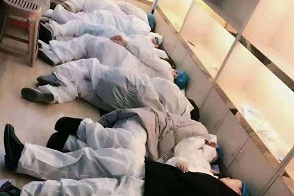
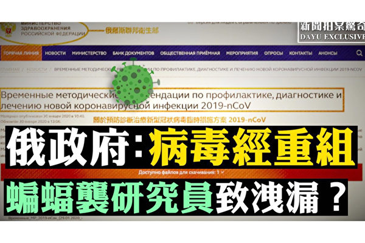
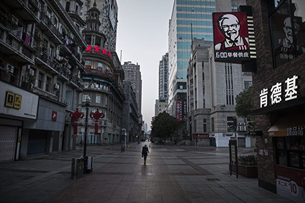
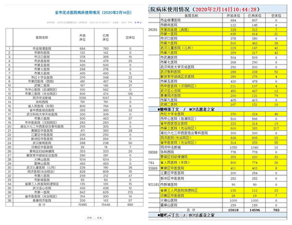
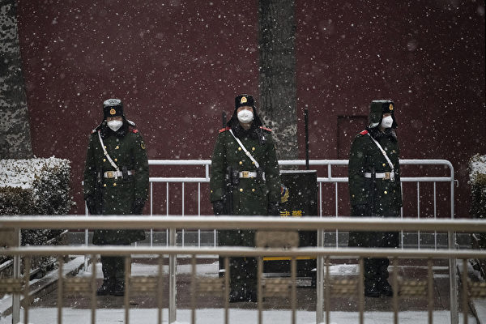
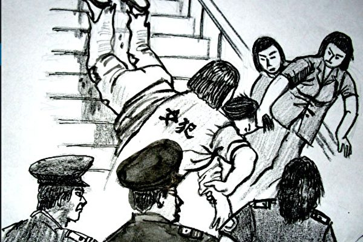
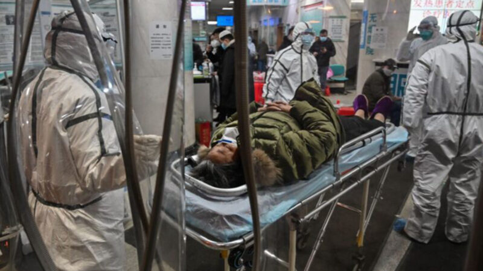
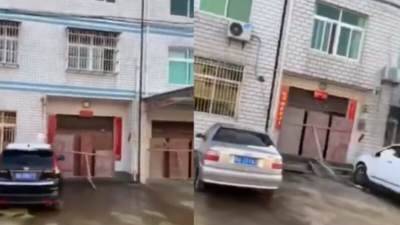
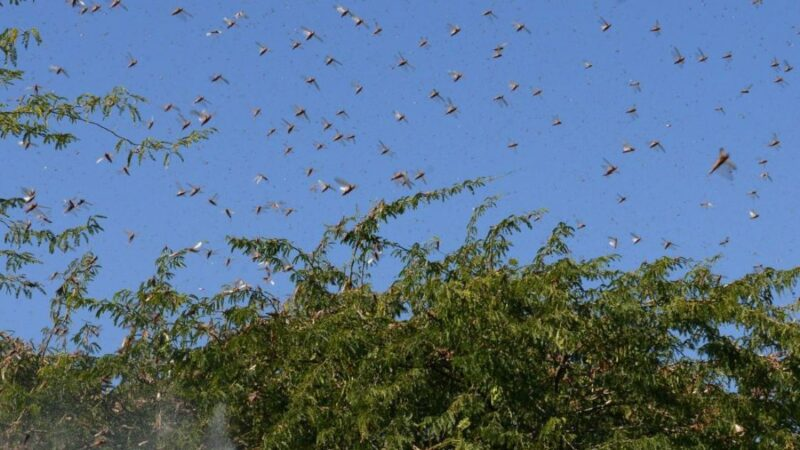
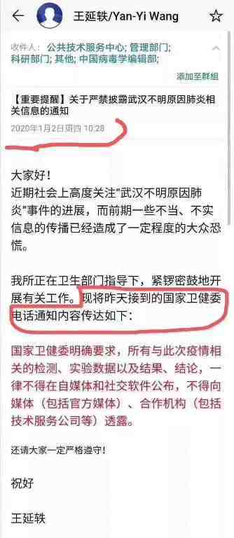

<h1 align="center"><b>请收藏网址(新闻视频ip) 随时连上最新即时IP https://git.io/swspip</b></h1>

<h2 align=center><a href="https://github.com/gav01/Heart/blob/master/news1.md">● 大纪元时事 ●</a></h2>

<h2 align="center">直連不必翻牆開花必看精彩視頻http://220.141.130.31</b></h2>

<table>
<tr>
 <td>
 <a href="https://git.io/pamja"> <h3>如何 “ 三退保命 ”</a>，<b>连上面→免翻视频 IP http://220.141.130.31 </b> →点 【三退大潮】--为什么要退党？ 可留言三退或用翻墙软件自己办理三退</h3></td>
</tr> 

<tr>
 <td>
 <a href="https://git.io/pamja"> <h3>如何 “ 三退保命 ”</a>，请点击翻牆网站  https://git.io/opopop  下载 { 翻牆软件 }→找 { 大紀元網站 }  ( http://www.dajiyuan.com ) 三退</h3></td>
</tr>
</table> 

<a href=https://git.io/souye><h6 align="right">回首頁</h6></a>

<a name=top>

<a href =#142>142.项云：关键时候中共国库从来不酷 
<a href =#141>141.法轮功学员传避灾的真相 遭警察诬陷迫害 
<a href =#140>140.【拍案惊奇】俄国政府文件：病毒非天然形成 
<a href =#139>139.新冠疫情失控 中共政府失能 民间发起自救 
<a href =#138>138.武汉人怒吼：不想再沉默 要反抗邪恶政权 
<a href =#137>137.优秀校长 法轮功学员李桂荣被辽宁女监害死 
<a href =#136>136.中国各省揭竿而起？湖南又传《独立宣言》 
<a href =#135>135.防疫还是大屠杀？湖北孝感挨家钉死大门(视频) 
<a href =#134>134.武汉肺炎未息 4000亿蝗虫逼近中国边境 
<a href =#133>133.武汉病毒研究所所长密件曝光 国家卫健委元旦下令禁报疫情 

<a href="https://github.com/gav01/Heart/blob/master/ls-20-2-1.md#132"><b>往1~132新闻</b></a> 

<a name=142>
<h1 align="center"><b>项云：关键时候中共国库从来不酷</b></h1>

这就是社会主义的优越性？武汉一线医护人员躺在医院的地板上睡觉。（视频截图）

【大纪元2020年02月17日讯】国库当然是应急储备，战时用于军队和百姓之需，平时用于灾难救助，是明显两大用处。

中共国国库每到关键时候都不酷。人为“大饥荒”年代饿死数千万人不见国库开仓放粮，当时却见国库援助非洲粮食；南方“大雪灾”人们被困连空头食品这样基本救助也不见；一九九八年大洪水弄了个全国性捐款，从此中共把民间同情行为的自愿捐助，变成了官方无耻习惯性号召或示意；汶川地震全国大肆鼓动民间捐赠；后来每出现大小灾害，地方官宦就自动号召民众捐助，许多地区作为“政治任务”规定捐款数额，所谓政治任务就是强迫性捐赠，很是无耻。很多地方和很多单位规定既要捐款还要捐物，也不给捐赠人和捐赠单位任何凭证。是否有趁机发国难财的个人和单位呢？不然为什么大肆号召蔚然成风而不是自愿呢？官方也公开报道过官员贪污救灾款。改革开放所积累的庞大国库、雄厚财力，为什么号召捐赠呢？而且社会主义有个很大优越性之一据说是“能够随时集中调动财力物力办事，是万恶资本主义社会无法比拟的”，那调动各方财力轻而易举为什么非搞什么捐赠？

现在的武汉严重疫情同样不见国库发挥应有作用，“厉害国”可以对非洲一掷六百亿，对武汉仅投了十个亿。前方医护防护服和口罩都奇缺，生活物质贫乏，武汉红十字会竟然“明抢”中外的捐赠，让人深度怀疑其目的。广东省居然授权政府可以“征用个人财产”抗疫。广东省改革开放最早应该是最有钱的省份，库存哪去了？财政哪去了？武汉直到封城多时也不见官方集中财力物力支援的社会主义优越，倒是民间先行积极支援，还必须经红十字会盘剥后缓慢地才到医院或不到医院。

疫情尚未出现真正拐点，当局就要求陆续开工生产。一个号称第二大经济体的“厉害国”，怎么不敢向国人宣布“民众可以安心在家躲避疫情，我国半年不生产照样正常生活”。日常为占领国际市场的常态化“出口补贴”，补贴国内人民就不行了。人民纳税补贴出口赚了美国和西方人的钱，难道都补贴非洲和给官员共产了吗？

国库无用只能说明：要么被贪空，要么“宁给外鬼不喂家奴”。寻常百姓每每遇到困境休想指望“共了人民产”的政府，如此对待百姓如果发生了战争，老百姓会再继续甘当炮灰？百姓每每遇到困境中共维稳却能迅速跟上；媒体作秀摆拍忽悠人民舆情能迅速跟上；百姓困难的解决却不能迅速跟上。这就是中共的“为人民服务”和“社会主义的优越性”。如果中共“解放”了台湾，台湾与大陆就是一个命运，其国库也会照样掏空或不喂家奴。

<a target="_blank" href=#top><h6 align="right">回上方</h6></a>

<a name=141>
<h1 align="center"><b>法轮功学员传避灾的真相 遭警察诬陷迫害</b></h1>
 
 【大纪元2020年02月14日讯】2020年2月4日，中国吉林市永吉县法轮功学员孙志文，在外面贴“疫情凶猛 真言保命”的不干胶时，被监控摄像头拍到，遭永吉县“610”主任张博带警察绑架到城北派出所，并非法抄了家。

明慧网报导，孙志文家中的所有法轮功书籍被抄走。他在派出所不停地向警察们讲明法轮功真相，当晚回到了家。

之后，永吉县公安局、政法委、“610”（专门迫害法轮功的非法机构）人员，把拍摄孙志文贴“疫情凶猛 真言保命”真相不干胶的整个监控录像视频，发到许多民众的手机上。百姓在视频中清楚地看到“疫情凶猛 真言保命”的图片和文字（见下图）。

不干胶：“疫情凶猛 真言保命”（明慧网）

 
 在视频里，“610”人员诬陷孙志文是贴“反动标语”，还专门拍了警察非法抄家的画面，并诬陷法轮功和法轮功学员。

报导指出，“疫情凶猛 真言保命”不干胶黏贴（见上），就是在灾难面前，法轮功学员用祥和的图案善意地告诉人们疫情来时，诚念“法轮大法好 真善忍好”能保命、保平安，是给百姓传福音。

事实上，这也得到了证明。近日，明慧网报导了多则武汉肺炎患者诚念，诚念“法轮大法好”被治愈的实例。比如，一位男士过年前到武汉，封城后，设法往外冲。因周边的城市也被封堵，他不得不辗转到其它省，历经千辛回到家，但不敢与家人团聚，就自我隔离，希望14天后能回家。

不料，就在第14天时，他突然出现高烧、咳嗽、胸痛等“武汉肺炎”症状，人很快就倒下了。他打“120”电话向医院求救，但没人出诊。无奈，他打电话告诉儿子，自己快不行了。

他的儿子、妻子、岳母修炼法轮功。儿子告诉他念“法轮大法好”。他终于想起了法轮功，想起了在灾难面前，念“法轮大法好、真善忍好”这九字真言起到的救人的作用。

全家人都经历了难熬的一夜，第二天，他打电话告诉家人，自己的高烧已经退下来了，浑身大汗淋漓，让家人放心。他的家人个个激动不已。

明慧网评论说，自武汉瘟疫爆发后，中共一直千方百计地隐瞒疫情，欺骗老百姓，使疫情泛滥。永吉县公安局、政法委、“610”人员在疫情凶猛之际，不去安抚身处危难中的民众，而是向民众散布谎言，迫害帮助民众躲避灾难的法轮功修炼者，诬陷教人向善的法轮功。

<a target="_blank" href=#top><h6 align="right">回上方</h6></a>

<a name=140>
<h1 align="center"><b>【拍案惊奇】俄国政府文件：病毒非天然形成</b></h1>

目前俄罗斯的官方文件，也认为，这种新病毒不是天然形成，而是SARS冠状病毒与另外病毒的一种结合体。（新唐人合成）

【大纪元2020年02月17日讯】大家好，欢迎收看《新闻拍案惊奇》，我是大宇。
感染新病毒第一人被挖出？石正丽急否认

2月16日，大陆媒体《新京报》根据网上流传的一张截图报导说：武汉（新冠）病毒肺炎的零号病人是黄燕玲，为武汉病毒研究所科研人员，2012年考入武汉病毒研究所的硕士研究生。

“零号病人”就是指最早、第一个被新型冠状病毒感染的人。

在武汉病毒所2011年11月的一张研究生“拟录取名单”上，确实有来自西南交通大学的“黄燕玲”的名字。

根据《自由时报》等媒体引述YouTube网红的消息人士爆料，说黄燕玲此前，曾因实验室样本倾倒，病毒散入空气，她自己口罩经久未换从而失效，导致感染，并迅速在实验室内死亡，成为0号病人。而她的遗体被送往殡仪馆后，病毒又传染给了殡仪馆的工作人员，自此造成泄漏。

《新京报》向武汉病毒所研究员石正丽等人求证，但是他们的回答是，“不确定”病毒所里面是不是有叫黄燕玲的人。同时，黄燕玲的指导老师危宏平，说黄燕玲目前一切安好。

不过，截至发稿，武汉病毒所网页上黄燕玲的照片和简介都消失不见，但依据病毒所公告，可以确定黄燕玲是2012年由西南交大推荐进入这间病毒所工作的硕士。目前，还不知道为什么黄燕玲的内容会在病毒所网站消失。

而在接受采访时，石正丽又做了另一个保证，就是病毒所目前无一人感染新病毒。

在这之前，印度一名科学家发表了一期有争议的学术文章，说新病毒内有一部分是爱滋病毒的插入物，石正丽对此回应说“用生命担保”，病毒跟病毒所的实验室没关系。但实际上，相关的印度科学家并没有点名她和她的实验室。

现在石正丽已经做了双重保证，一，新病毒跟她的实验室没关系，二，病毒所截至她受访时，无一人感染。

<b>研究员被蝙蝠袭击 武汉疾控中心也涉病毒泄漏</b>

但在外界怀疑武汉病毒所泄漏病毒之外，目前又有一个新说法传出。就是武汉的新病毒，是来自当地另一个地方，距离华南海鲜市场仅280米的“武汉疾控中心”。而“华南海鲜市场”被认为是本次新病毒爆发的起源地之一。

这一消息是广州华南理工大学生物学教授肖波涛的论文揭示的，这篇论文2月6日发表在全球学术社交网站Research Gate。合作写论文的还有武汉科技大学附属天祐医院的肖雷。论文还得到政府基金会的赞助。

论文引述以前的官方资料，称武汉疾控中心的研究员，曾在湖北捉到155只蝙蝠，在浙江抓到450只蝙蝠。而且在2017和2019年，武汉疾控中心的相关研究员，还在蝙蝠身上发现活的虱子，自己先后两次自我隔离。一次是被蝙蝠袭击后，蝙蝠血滴在他的身上，还有一次是因为沾到了蝙蝠的尿液。

论文进一步透露，武汉疾控中心研究员抽取野生动物的细胞组织，进行脱氧核糖核酸（DNA）还有核糖核酸（RNA）的排序，这些组织样本还有因之污染的垃圾，都有可能成为病毒源头。同时，论文也没有排除，武汉病毒研究所也可能是病毒源头。

截至报导，肖波涛的这篇论文在Research Gate网站上已经找不到。那么这篇论文，最有价值的是，它揭示除了武汉病毒所外，举例华南海鲜市场更近的武汉疾控中心，也存在实验室活动，或者处理实验垃圾时发生意外，从而造成病毒泄漏。

目前这篇文章流出不知道是什么目的。有人说是提前放风，可能是帮武汉病毒所“转移视线”，也有其它说法。

<b>俄罗斯政府文件：病毒非天然形成</b>

无论如何，现在出现的消息，越来越接近“病毒泄漏说”。与此同时，还有一点也越来越明显，就是这个新病毒，并非天然形成，而是人工改造的。其实如果证明这一点，那也就能反过来说明，新病毒不是意外泄漏，那就是有意被放出，但目前看呢，意外泄漏的可能性更大。

有关新病毒非天然形成，我们有一个新的证据。在俄罗斯生活了25年，有医学背景的华裔企业家杨成，给我们节目，用录音解说的方式，介绍了俄罗斯联邦在网站上发布的一则文件，名字是《预防 诊断 治疗新型冠状病毒（2019-NCOV）》。第一版发表于1月29日。

2月3日还发表了第二版。以下杨成先生翻译和分析的内容，是根据第一版，但是相关内容在第二版中，并没有变化。下面我们来先听我对他的采访录音。

【非常非常细致，它一共是51页。这个文件是俄罗斯联邦官方网站上，双签名，一个是俄罗斯卫生部部长，一个是俄罗斯联邦消费者保护局的局长。

他们为什么要出这种文件呢，因为俄罗斯它是这样，它是一个从法律，从各种文件来讲，是非常严肃、非常严密的一个国家。俄罗斯它对医疗法和医生负责抓得非常严。医疗事故有专门的法庭，就是医疗事故法庭。像出现这种新型的传染病呢，会产生大规模的这种影响啊、治疗啊，产生以后的这种医疗事故，去怎么评判，所以他们急于必须出这么一个文件，是不出不行的。

它在一开始，就是序言当中，它所有文件当中使用的材料、数据，来自于世界卫生组织的专家，这个美国也好、中国也好、欧洲也好，就是分部中心吧，他们公布的官方数据。也就是所有他们这里面出现的数据啊、说法的基础。

它非常严谨地叙述了、描述了现在冠状病毒是一个什么样的东西。报告认为，新型冠状病毒，是一种由蝙蝠的冠状病毒和未知来源的冠状病毒，重新综合组成的病毒，并且，它的基因排列顺序，有70%跟SARS是相吻合的。也就是说它明确阐述，它不是天然来源，不是人类至今所知道的，天然来源的这种产物，它是一个综合体。

刚才才读到，我觉得这是一个非常严重的事情。至今为止，所有研究发现，人得到（感染）冠状病毒后产生的抗体，是极其不稳定的。而且，很容易，重新被感染。也就是说，你得了（感染）冠状病毒的话，自己用身体抗过去之后，并不代表你已经产生了冠状病毒的抗体，也不代表你不会再得病（被感染）了。

中共啊，让武汉这些，得了病的人（康复者）用血浆治（感染者），这很恐怖的一件事情。

第一，你取人的血液，这些人好了多长时间，是刚好的，还是好了一段时间的，这个差别都非常大。你比如说，人刚好，有可能，现在他还没有重新感染。如果他好了一段时间之后，你比如说，他好了两个星期三个星期之后了，再去（给别人）注射（血液），他这个东西（血液）有没有用。

第二，（给患者）注射进去（血液）之后，这些病人有好转，他在24小时之内、48小时之内有好转，那么两个星期、一个星期之内他好没好病？

这些东西是最关键的。所谓的好了，就是表现没了，症状没了。正常是因为什么呢，就是说他体内产生的抗体，足够抑制住他体内存在的新型冠状病毒。但这里它阐述的就是，他的抗体不稳定。你这个新产生的抗体，它一分解了，那你体内存在的冠状病毒，那它就可以重新（侵袭）你的身体，人又得病（感染）了。也就是人类所知道的冠状病毒，它的表象是这个样子。冠状病毒的来源，它（新型冠状病毒）属于这一科这一类，但除了这一类之外，它（新型冠状病毒）会不会有其它的，或者更强烈的，或者变异的其它东西呢，这个暂时我们是不知道的。如果从这个角度来看来讲呢，也就是说，很难做一个定义，就是说疫情过去了，疫情已经出现转折了，那你从科学角度来讲，就很难确定这件事情。

然后它（报告）还说一个什么呢，什么样的人容易得病。20%是糖尿病，15%是高血压，然后其它心血管疾病的是15%。

然后呢中国卫生组织注册的数据当中，（有）25%转重病例，这25%细分为：16%重病人，5%危病人，4%死亡病人。】

好了，刚才杨先生的录音，透露的最重要一点是，目前俄罗斯的官方文件，也认为，这种新病毒不是天然形成，而是SARS冠状病毒与另外病毒的一种结合体。

因此，这也就能解释，为什么这个新病毒像怪物一样，成了一种人类从未对付过的一种怪物。

<b>《柳叶刀》：携带病毒者可以是“健康人”</b>

权威医学杂志《柳叶刀》2月13日，又发表了北京301医院医师常德等人的论文，标题是“保护卫生保健工作者免受亚临床冠状病毒感染”。这里的亚临床指的是，感染新病毒但没有症状的患者。

比如，也是在2月13日，《自由亚洲》公布了一段武汉防疫部门的内部录音，当中有人说，看到中共国家卫健委的“保密函”才知道，这次疫情之所以难控制，是因为很多重症，到死都没有症状，连发烧都没有，所以防不胜防。

那回过头来看《柳叶刀》的新论文，它其中点出了至少新病毒的3个可怕之处：

第一，没有症状的人也可以高效传播新病毒；

第二，从急性疾病中恢复后仍会大量携带病毒并继续感染他人；

第三，传统的保护措施，例如口罩，已无法提供足够的保护，因应新病毒可能护目镜、隔离服都得上。

因为这种新病毒表现特异、可怕，因此有人还把它比作“生化武器”。当然有议论说它就是生化武器，但仍需要充分的证据来证明。

<b>防治瘟疫 大陆当局无能为力的“好办法”</b>

现在这个新病毒的真正来源，或者说起因吧，连美国白宫都很感兴趣，想要调查清楚。如果谁真的要担上这种人为责任，那是很严重的罪行。

2月15日，大陆党刊《求是》杂志，登出了习近平在2月3日中央常委会的讲话，提到自己在1月7日就对新病毒防控，提出了要求。《苹果日报》因此采访分析说，这不是习近平在撇清自己的责任，就是要向湖北当地官员兴师问罪。而我们在之前的节目里已经介绍了，现在湖北和武汉已经有官员陆续被撤换。

但是，真正的问题是向外推掉责任就可以彻底解决的吗？我采访了中国问题研究学者薛驰，他从另一个角度，分析了造成当前疫情大爆发，几乎不受控制的原因。巧的是，他自己就是一个武汉人。

【共产党，支部建在连上。它社会控制，进行网格化管理。它把一切公民的自发行为，都放到了它的对立面。它的社会控制极端化，它垄断一切资源的控制。国际社会的救援、全国各地的援助，都掌控在它手里，它要是给谁就给谁。那么这里面它怎么贪污受贿啊、它怎么滥用啊、应用不当啊，这都是属于它内部机密，谁泄露了还要把谁处理掉。那么，在任何一个正常社会里面，老百姓都会出现大批的自救组织，自救的活动，自救的行为，互助的行动。

在饥荒的时候，不准逃荒，跟现在武汉市的封城，不准逃命，你逃出去后，还进行全国性的追索。你传播传染病，还要判刑，最高可能判死刑，这是黑龙江已经发了个通知了嘛。这跟那个五六十年代，那个大饥荒逃命，针对的逃命措施是一模一样的。】

薛驰的分析指出了两个问题，一个是中共高度中央集权，造成的救灾措施僵化，不够灵活；另一个，就是与前一个观点相应，各国民间自发的这种救灾、互助活动，也是不可忽视的力量，但是在当前大陆的社会制度下，这个很难实现，什么都要靠政府。

<b>香港反送中 给武汉瘟疫防治的启示</b>

他的分析也让我想到，这种民众自发的力量，在民主的正常“公民社会”里，还体现在信息透明化上。

在报导这场新病毒瘟疫之前，我大量跟进了香港反送中运动。两相对比，我发现了一点很明显的差异。

在香港，它的社会，还是一个比较发达的公民社会，政府呢，目前还是一个半民主半极权的政府，在这样的情况，就催生出一个奇景。发达的公民社会，让参与香港反送中运动的年轻人，仍可以自由组织反对力量、甚至是政党，在区议会选举中，压倒性战胜建制派。在街头运动过程中，香港年轻人使用Telegram等通讯软件，非常成功有效的对街头抗议进行了组织。更重要的是，在开放的信息下，香港年轻人自由地把街头发生的一幕幕，通过聊天软件、脸书、推特等各种渠道，送到外界，让外面能了解到香港街头发生的实情。在这种公民社会下，拿着手机镜头的人，每一个都成了发达的自媒体。甚至是什么呢，这些年轻人，为了保证消息准确，还在通讯软件上自发组成了类似“反送中消息核实频道”这样的自发的、事实检验的群组，尽量让外界得到第一手的、准确的反送中资讯。

还不止于此，香港因为还保留言论的相对自由，除了公民作为个人积极主动向外界发送信息，香港也有很多正规的媒体，属于亲民主派，在发布与反送中年轻人立场相近的报导。此外，还有外国媒体，可以自由进入报导。

在香港媒体、公民、外国记者的众多人努力下，让反送中运动有了相对健康和持久的生命力，而且外界能够及时得到清晰、准确的资讯，让支持者运动的人可以根据情况进行声援。

但是我们反过来再看武汉，乃至大陆，公民基本上放弃了发声权，因为会被找去喝茶。仅有的例如方斌、陈秋实这样的公民记者，很快被打压。我们外界能得到的，只有官方统一口径的消息。由于资讯的不透明，连西方大媒体在报导时，都不得不时常引用所谓“网上消息”、“民众爆料”。

信息不透明也同时带来一个对称的问题，就是这些消息真假难辨，需要花时间核实。即使核实为真，为了保护爆料人安全，也不能公开姓名和来源，有时真的消息和画面，还要受到挑战，被中共水军拿来做文章。而且呢，也是因为信息的不透明，官方的辟谣，到底辟的是真相、还是谣言，外界也很难查证。它带来方方面面的影响。

然而，信息的透明，公民社会的发达，无论是有医学专业的社会组织自发组织营救，还是公民可以自发组成通讯群组，向外界发送求助信息，并且当地人自己之间，可以互动有无，这都会对疫情防治，有积极作用。

<b>避免方舱医院交叉感染 有简易可行之术</b>

其实，现在释放出来的有限消息，如果当局重视，已经就可以起到救人的作用。比如这段视频，新建好的雷神山医院，因为下雨变成了“水帘洞”，那官方看到了，如果它重视这个舆论压力，就应该立即去弥补。

我还得到了很多方舱医院的内部视频，经过几天，能发现里面的秩序，渐渐有了一点起色，但是还不够，特别是病人交叉感染的潜在危险，必须解决。现在看到大家还是睡大通铺，很多人仅仅戴着口罩防御，这都是不够的。

说到这，顺便说一下，一位我们的观众，应该是香港人，他提出了一个在方舱医院内消毒的好办法：紫光灯，Ultraviolet Light，方舱医院，很多病人聚在一起，很容易交叉感染。如果在天花板上安装很多紫光灯来杀菌（病毒）的话，就可以避免交叉感染。因为紫光灯不可以直接照射皮肤，你半个小时就躺在床上，用棉被把自己的头都盖住。用紫光灯照射几分钟，就可以把所有的细菌（病毒）都杀死啦。有比如说，不是厕所很污染吗。那么没人上厕所的时候，紫光灯就开着，有人上厕所的时候，紫光灯就关了，这样就可以杀死很多细菌（病毒）啊，就很安全哪。

大赦国际成员，加拿大阿尔伯塔大学的一名学生，给我们来信，抱怨说：有几千人被关在方舱医院隔离，但是他们并没有得到适当的医疗救助。没有人给他们药物或给他们打针，并且那里医生非常紧缺。其次，方舱医院里缺少完善的生活设施，比如厕所和取暖设施。有些病人声称他们要走两百米去上厕所，还有些病人声称，在晚上睡觉的时候非常的冷，并且由于电力系统经常短路的缘故，他们甚至无法使用自己的电热毯。我在此想呼吁政府为方舱医院中的患者提供合理的医疗援助和完善的生活设施体系。毕竟，轻症患者也是有人权的。

另外呢，这名学生还说：政府不应当通过警察和暴力手段，在光天化日之下，当街强行抓人。在中国有句古话叫做己所不欲，勿施于人。请问，假如生病的是你们，你们真的希望自己也被这样非人的对待吗？还有，当政府在一栋居民楼里发现感染者后，便强行焊死大门，阻止全楼的人出入。这是强行把健康的人和感染者拘禁在一起，妨碍了他们的出行自由，毕竟大家还要工作和生活。并且还会无谓的增加楼里健康的人被感染的风险。因此，我在此想呼吁政府尽早停止使用这些不人道的手段。

以上，都是一位阿尔伯塔大学学生的心声。

<b>Telegram信息安全的警示</b>

刚才我们举相关言论自由的例子时，还提到了Telegram，我们收到这样一个例子，一位大陆观众的朋友，在前几天被公安请去喝茶了，原因就是他在Telegram群组里发表了一些过激言论，而警方利用技术手段探测到了他的电话号码，他提醒各位用Telegram的朋友，请要注意隐私保护，Telegram也不一定十分安全。

新唐人《新闻拍案惊奇？制作组

<a target="_blank" href=#top><h6 align="right">回上方</h6></a>

<a name=139>
<h1 align="center"><b>新冠疫情失控 中共政府失能 民间发起自救</b></h1>

武汉封城后，交通工具停摆，社区不派车，很多病患无法到医院就医。图为封城后街上空荡荡的武汉。(Stringer/Getty Images)

 
 【大纪元2020年02月17日讯】（大纪元记者李新安采访报导）由于新冠状病毒肺炎（又称武汉肺炎）疫情武汉封城被指毫无准备，医药、民生等物资匮乏。大量病患得不到安置和医治，社区居委会、街道、疫情指挥部被指失灵，民间不得不发起自救行动。

一名武汉市爱家国际华城小区的居民在网上求助，她于2月12日确诊染新冠肺炎，双肺感染、呼吸急促、高烧39度不退。由爱家社区上报危重加急，但未能入院。疫情指挥部要求由社区上报和平街道，再由街道报告指挥部送医。然而社区上报和平街道后，街道称只能等待走程序。

大量病患都陷入了这种“死循环”。不少病患及家属都表示，社区冷漠、不派车，只会让他们等。有患者反复填写申请表，联系社区街道、打热线电话。110、120都不派人来，说要社区安排，互踢皮球。有的人最终病逝家中，还有的人跳楼自杀。

财新网报导引述两名社区书记的话说， 从1月23日封城至2月1日的10天内，社区对新冠病人的救助很有限，上级部门没有提供实质帮助，社区又没有医院资源。

网友表示，“这叫‘等死’。”“层层压，最后压到社区。可怜的社区，人、财、物都没有。咋解决？”“恐慌+医疗挤兑+封城+又恐慌+进一步医疗挤兑……….”“听说过‘无为而治’，见识了‘无能而治’……”

网友“joie0313”表示，“社区，只是他们抵挡染疫人潮的人盾。120最多的时候每天15,000个求助电话，医院门诊的座位都被挤没了，更别谈床位。殡仪馆加班24小时动转，外地的几千名支援医护，杯水车薪……一线医护人员的口罩都不能保障，何况是病人的性命呢？坐视湖北人捂着相互传染烂掉，就是电影《卡桑德拉大桥》的车厢。”

<b>义工团体发起自救</b>

2月13日晚间，大纪元记者以患者家属身份拨通了一名义工的电话。对方说，“我们是一个义工团队，负责收集资料，把资料发给专门与医院对接的人员（也是义工，不需要费用）。”“我们可以把您的资料上传到医院，然后他们就可以安排床位。”

据介绍，义工团队来自一家企业，该企业是专做消毒用品等业务的，他们跟医院接了很多单，（提供）大量的物资，所以和医院有一些直接的关系。虽然也要排队，但是有优先权，目前排队大概一两天的时间。

社区安排等待时间普遍很长，特别是硚口区、青山区等几个区的病人很多。而义工团队一般就近为患者安排医院，以重症者优先。

“一天大概安排60%的（求助患者），现在求助人的蛮多。武汉十几个区，每个区不一样，每个区到我们这里来求助的每天都有一二十例。”她说，“我们一个小组有七八个人，都在做这个事情。”

大量病患在网上求助，大纪元记者随机调查发现，确有不少患者经过义工的帮助，住上了医院；也有少数是通过找社区理论、排队。

社区除了有少许特权外，其效率远不如民间组织。有分析认为，社区住院程序要求病人先通过社区卫生服务中心（社区医院），由社区医院转诊到指定医院，且规定患者不能跨区就诊。而义工团队充分利用自己的资源优势，在全市范围内协调安排，从而能够提高效率。

此前还有消息说，社区被限定了名额指标，每天只能上报三个确诊病人。这就造成初期大量病患被要求居家隔离，造成每天的确诊病例只有几十、上百。

<b>社区机能被指失灵</b>

 2月9日起，武汉官方发起“清零”行动，即要求确诊病人100%全部收治入院，疑似病人集中收治。然而，网上的求助依然层出不穷，得不到收治的患者走投无路，有的焦虑地想自杀。

武汉飞越疯人院事件的主角徐武，他的父亲也感染了武汉肺炎，医院要求老人在家里隔离。

2月14日徐武发推表示，“我父亲几天吃不了食物了，只能喝些水，人不行了，找不到车子，用轮椅推到几个医院，医生说病情严重只有住院治疗，但医院没床位要找社区协调解决，社区答复没办法解决。”

2月15日，徐武冒雨把父亲送到武钢医院打吊针，医院打算把老人转院到青山一门诊。谈到社区所起的作用，徐武只说了一句，“拖延时间害人性命。”

早有网友提出，看病不需要社区安排，让不专业的人做专业的事。日前，有武汉网友向记者确认，他们那里去医院不用经过社区卫生服务中心了，“社区除了统计体温，没什么实质性帮助。”也有武汉市民告诉记者，现在有些医院可以（直接）收治肺炎病患了。

<b>医生：医院若不是向社会求援 早就撑不下去了</b>

1月23日晚间，武汉各大医院绕过卫健委，首次向社会公开募捐医护物资。此后，武汉医院及医生向外界求援的信息不断。多名医生表示，如果不是社会捐助，早就撑不下去了。

武汉某间医院工作人员芹芹（化名）告诉大纪元记者，“我们有一段时间都断粮了。因为各个炒菜、做饭的点，都关了，更不要说吃饭啦，我们现在吃的菜，都是靠捐赠的。”“这一段时间，所有的物资，如果没有社会的捐赠，医院早就封掉啦。”

除医护物资短缺外，食物等物资供应也成大问题。一名武汉网友发贴称，“超市土豆都没得卖，速冻肉全部被抢光，网购又不派送。餐饮软件上，白砂糖、咸菜老干妈都抢空了。超市每天只营业三小时，进去先排队半小时……社区配送也无法覆盖这么多人口，很多小区居委会和不存在一样。”

<b>官方与民间空床位数据不一</b>

武汉卫健委官网公布的数据显示，2月12~14日，空床位为654、776､880，而据民间志愿者的统计数据，12-14日的空床位分别是473､ 645和783张。

民间与官方统计武汉定点医院的空床数量有出入。（网页截图）

官方与民间的统计数据有出入，且空床位都比出院人数要多，这差数让人质疑真实的死亡人数。有一种可能，就是新增加了床位。中共国家卫健委副主任王贺胜2月15日表示，将继续腾出医院部分的病房，征用部分场馆，改造为定点医院和方舱医院。

但是这些临时收治确诊患者的场所，医疗条件却并不到位。

武汉汉阳区的新冠肺炎病患杨先生告诉记者，他刚刚被安排到秦康同济医院，该院于2月8日被确定为确诊病例治疗点。公开资料显示，秦康同济医院是按照三级甲等标准新建的综合医院，被称为高端医疗中心。

但杨先生说，“这里条件差一点，现在医疗物资都紧缺。他们有医务人员，但是医疗设备都是……药物有吃，CT（电脑断层摄影）什么都还没有。是刚开的定点医院。”而杨先生的母亲在酒店隔离点，没有用药，只是隔离。

<a target="_blank" href=#top><h6 align="right">回上方</h6></a>

<a name=138>
<h1 align="center"><b>武汉人怒吼：不想再沉默 要反抗邪恶政权</b></h1>

图为2月5日北京天安门广场附近站岗的警察戴着防毒面具。 （Getty Images）

【大纪元2020年02月16日讯】（大纪元记者李净报导）由于中共当局隐瞒疫情及防疫不力，致使武汉肺炎疫情失控，引发民怨沸腾。中共唯恐危及政权强力压制民间舆论，令民众反弹公开发声反抗暴政。

近日，一名武汉市民录制视频并强烈发声，她呼吁面对中共邪恶政权，不要再沉默了，一定要起来反抗。

这位女士表示：“武汉瘟疫，都是有计谋的发出来的瘟疫，因为（中共）政党里面都是你搞我、我搞你的事情（政治斗争），牺牲的是我们平民老百姓，我的家人、我的父母在家等死，没有人关心老百姓的性命。

“摆脱共产党的邪恶手爪，腐败的政权，邪恶的社会，没有一个人可以自由发声。只要有人发声，就会被拘留、判刑。他们说判刑多少年就判多少年，律师都没有用的，有正义的律师都被关起来。

  “我要告诉你们，革命肯定会有牺牲。我站出来，就是要为我的父母、我的家人、我的子孙后代能够自由地生活。我发声很危险，这我也知道，但是我已经受不了了。

“满院子的人在医院里面，没有病床，没有医药，CCTV（央视）讲的新闻全部都是假的。（医药里面）他们的吼声我看到了，我要发声，我要为自己发声，我要为武汉人民发声，我要为中国同胞发声。

“（中共）他们想要把养老金废掉，搞这些事情。这个邪恶的政权，我不想再沉默了！一定要反抗！同胞们，不能再让他们宰割、欺压了，为了下一代，真的要站起来呀！”

目前，大陆新型冠状病毒已扩散至全国。最早向社会公开疫情的不是中共卫健委等医疗机构，而是8名医生。但是，武汉警方以散布“谣言”为由将这8人查处，引发各方关注。迫于舆论压力，中共最高法院于1月28日发文，确认8名“传谣者”提前预警行为“有利无害”。

由于中共隐瞒疫情，网络成为民众获得真实资讯的重要渠道。但民间披露疫情、讨论疫情却遭到中共打压和封杀，甚至路人的手机讯息也遭到警方盘查。有评论指，国难当头，中共当局极力打压言论自由，令其公信力丧失殆尽。

一方面海内外的捐赠物资源源不断发往武汉，另外一方面，各大医院的防护用品仍然告急。被官方指定接收捐赠物资的中共红十字会成为众矢之的。近日，湖北省红十字会被曝私自截留“瓜分”援助物资，而当地的一线医生护士却苦求无果，令民怨沸腾。

中共当局在这次防疫行动中几乎处于混乱状态，官场人心涣散，各地频传基层官员为自保“临阵脱逃”的案例，引发大陆网民痛批。

瘟疫肆虐之下，大陆多地发生雨雪冰雹灾害。2月14日，武汉市急下暴雨，电闪雷鸣。有武汉市民表示，老百姓冤情太大了。

方斌被抓前最後一次演講錄影

他說，在邪惡的魔鬼政權下，沒有人是安全的，無論哪個階層，誰都沒有安全感。請大家一定要看到我們的力量，只要大家傳播真相，傳播方斌，明燈就在你們自己的手上，你們就會照亮整個中國。

請大家廣傳視頻。勇士不會孤單！中國才有希望！

“最大的问题不是眼前的瘟疫，而是被传播了几十年的精神瘟疫。

<a target="_blank" href=#top><h6 align="right">回上方</h6></a>

<a name=137>
<h1 align="center"><b>优秀校长 法轮功学员李桂荣被辽宁女监害死</b></h1>

中共酷刑示意图：拖拽。（明慧网）

 
 【大纪元2020年02月16日讯】2020年1月中旬，原沈阳市大东区合作街小学优秀校长、法轮功学员李桂荣被辽宁省女子监狱迫害致死，终年78岁。

明慧网报导，李桂荣曾是辽宁省沈阳市大东区合作街小学校长，修炼法轮功后，遇事为他人着想，曾经把百分之五比例的涨工资机会让给其他同事。她把合作小学这个原来的乱摊子管理得井井有条，深受领导的器重和同事们的尊敬，曾被誉为“区十佳优秀校长”。

2006年10月17日，时年64岁的李桂荣在向人们讲述法轮功真相时，被沈阳市和平区“610”（中共为迫害法轮功专门成立的非法组织）人员绑架；2007年初，被沈阳市和平区法院枉判7年，被非法关押在辽宁省女子监狱三监区，遭受各种酷刑迫害。

狱警为了逼迫她“转化”（放弃修炼），指使狱霸和包夹（监管法轮功学员的刑事犯人）毒打她，对她拳脚相加、横踢乱踹，使她浑身被打得变成了青紫色；并用硬底鞋猛跺她的双手，她的手背立即肿起了青紫色的大包，。

有一次，恶人薅住她的头发满屋跑，大把大把的头发被薅了下来；还对她实施蹲刑迫害，让她蹲一天一宿半、蹲两天两宿半。在蹲的过程中，不让她吃饭、不让上厕所、不让睡觉。

包夹还把她的鞋脱掉，强迫她光着脚蹲在水泥地上，然后往其脚下泼凉水。两个包夹白天黑夜倒班看管她。她的双腿疼痛难忍，站也不行，坐也不行，瘫在地上，只能爬行。狱警队长又指使包夹把她打得满脸是血，然后塞到做服装的案板下面，让她长时间蹲着。
 
 

中共酷刑示意图：殴打、撞头。（明慧网）

 
 2013年10月17日，7年冤狱期满，李桂荣被迫害得身体虚弱、头发斑白、牙齿都掉光了。回到家后，她通过修炼法轮功，身体很快恢复了正常。沈阳市和平区“610”仍不断上门骚扰她，并强迫她抽血化验，被她严词拒绝。

2015年2月7日，73岁的李桂荣在市场上发法轮功真相资料时，被沈阳市浑南区公安分局五三派出所绑架、抄家。

同年6月24日上午，李桂荣被沈阳市浑南区法院非法庭审（已内定判李桂荣5年）；在法庭上，李桂荣为自己做无罪辩护，讲述自己修炼法轮功、做好人无罪。

在被枉判5年后，李桂荣被劫入辽宁省女子监狱老残队五小队迫害。她始终不放弃信仰。

2020年1月中旬，李桂荣在监狱医院被迫害致死，终年78岁。

据明慧网报导，截至2019年8月底，已知有53名60岁以上的老年法轮功学员被非法关押在辽宁省女子监狱遭受迫害。年龄在70岁以上的有15人，年龄最大者78岁；非法刑期最长达13年。

自1999年7月以来，辽宁省女子监狱使用阴毒的手段摧残迫害过数以千计的法轮功学员，其中至少45名学员已被迫害致死。2003年该监狱却被中共授予所谓的“国家部级监狱”称号。

<a target="_blank" href=#top><h6 align="right">回上方</h6></a>

<a name=136>
<h1 align="center"><b>中国各省揭竿而起？湖南又传《独立宣言》</b></h1>

由于中共隐瞒，导致武汉肺炎疫情失控，感染死亡人数超乎外界想像。（HECTOR RETAMAL/AFP via Getty Images）

 
 【新唐人北京时间2020年02月17日讯】中共隐瞒疫情导致武汉肺炎疫情恶化，引发民众愤怒，继有网民发布“武汉临时政府湖北独立宣言”后，目前网路又传《湖南独立宣言》，内容显示有志之士在长沙建立“湖南临时政府”，呼吁各省起义推翻共产党后，共建民选国会，再造联邦共和体制。

中国海外媒体《品葱网》、《良知传媒》与推特（Twitter），10日起疯传1份《湖南独立宣言》，内容炮轰中共实行的集权专制每当灾难发生，只能草菅人命维持暴政，一再堵民口耳，缚民手脚，让民众失去第一时间自我警示、自我救助的机会和能力。

该宣言指出，中共数据显示湖南感染人数超过800人，但确切人数应该高出许多，当前局势“湘江告急，岳麓危怠，我湘人唯有自救自立”，先前湖北省武汉市已有人号召各界揭竿而起，成立武汉临时政府，而湖南108年前，是首个响应民国武昌起义，光复长沙，宣告独立的地区。

<h3 align=center><a href="https://twitter.com/cc_pover/status/1227852212019355648?ref_src=twsrc%5Etfw%7Ctwcamp%5Etweetembed%7Ctwterm%5E1227852212019355648&ref_url=https%3A%2F%2Fwww.ntdtv.com%2Fgb%2F2020%2F02%2F17%2Fa102778953.html">#湖南独立宣言(点击右键,另存新档）</a></h3>

该宣言强调，现在应效仿民国先驱，“响应武汉临时政府20200202湖北独立宣言，庚子起义，成立湖南临时政府，宣告湘省独立，脱离中共暴政”。

该宣言表示：“我们恳切呼吁全国各省各地的仁人志士，借此良机，响应鄂湘，奋起自救，聚起洪流，毕功此役，推翻暴政。而后各省聚义，重行约法，共建民选国会，再造宪政民主自由之联邦共和！”

此前，2月2日，海外知名女作家盛雪在推特上发布“武汉临时政府湖北独立宣言”，宣言称：今日，2020年02月02日，我们一群血性武汉人，为夺回民权，再造共和，效仿辛亥革命武昌起义的先驱，在此郑重宣告成立武汉临时政府，宣布武汉独立、湖北独立！独立于中共暴政之外！

武汉临时政府命令，所有武汉市的官员、湖北省的官员，脱离中国共产党的指挥，通过公开或秘密渠道向本临时政府报到，看守现有岗位职责，服从本临时政府的指令，并静候改组。

<h3 align=center><a href="https://twitter.com/ShengXue_ca/status/1223849972501749760?ref_src=twsrc%5Etfw%7Ctwcamp%5Etweetembed%7Ctwterm%5E1223849972501749760&ref_url=https%3A%2F%2Fwww.ntdtv.com%2Fgb%2F2020%2F02%2F17%2Fa102778953.html">武汉临时政府命令，所有武汉市的官员、湖北省的官员，脱离中国共产党的指挥，通过公开或秘密渠道向本临时政府报到，看守现有岗位职责，服从本临时政府的指令，并静候改组。(点击右键,另存新档）</a></h3>
 
 网友纷纷响应武汉独立、湖北独立的呼声：

“天大的喜讯！”

“要宣布湖北才行，武汉是首都！我是湖北人，我加入，我支持！”

“新型的武昌起义，湖北人，自己救，互救。只要政府人员参与了武昌起义，这武昌起义必定成功。”

“不为刀俎，则为鱼肉，是反抗的时候了。”

“我坚信共匪会在三个月内垮台、灭亡，出台方案，成立临时政府，湖北独立，中华联邦制……这是顺应天意！”

“武汉加油，打倒共产党！”

<a target="_blank" href=#top><h6 align="right">回上方</h6></a>

<a name=135>
<h1 align="center"><b>防疫还是大屠杀？湖北孝感挨家钉死大门(视频)</b></h1>

近日，某地封户堵门上新台阶。几名男子挨家挨户把居民的大门钉死。（视频截图）

 
 【新唐人北京时间2020年02月17日讯】随着武汉肺炎疫情蔓延，中共地方当局各自为政。除封城外，更推出封门断网抓人等极端措施。近日，某地封户堵门上新台阶。几名男子挨家挨户把居民的大门钉死。网友质问，要搞大屠杀吗？

武汉疫情肆虐中国大地，疫区湖北及众多省市都采取了封闭管理，小区被封， 公寓楼被封，村落被封。尽管中共声称为，为市民组织生活物资配送，但不少网友反应，当局没有提供居民购物买菜的配套措施，不少人正在挨饿。

湖北省政府16日宣布，全省城乡所有村组、社区、屋苑及居民点实行24小时最严格封闭管理，所有非必须公共场所一律关闭，一切群众性聚集活动停止。

当天，有网友发视频并附文说，无限放大的权力和愚昧的管控方法，这病毒是靠堵门就能消除的吗？

<h3 align=center><a href="https://twitter.com/MgOqkzLBRPLCHyN/status/1229029667140620288?ref_src=twsrc%5Etfw%7Ctwcamp%5Etweetembed%7Ctwterm%5E1229029667140620288&ref_url=https%3A%2F%2Fwww.ntdtv.com%2Fgb%2F2020%2F02%2F17%2Fa102778964.html">無限放大的權力和愚昧的管控方法，這病毒是靠堵門就能消除的嗎？(点击右键,另存新档）</a></h3>

视频显示，几名疑似政府人员挨家挨户把每一家人的大门，用几根大铁棒和大木棍钉死。视频中传出嘭嘭嘭，钉门的巨响。许多大门口均停有私家车，应该算是中国的中产阶层。

有网友留言说，地点是湖北孝感，“钉门的说胯子走疼了，就是腿走疼了”。

有网友怒问，“想饿死人吗？杀人极权CCP可耻！”

“这是要把人饿死，然后搞大屠杀吗？”

“邪恶的体制向全世界展示他们邪恶的本性！”

“这些被封门的人都不会反抗吗？严重违法了！！即便是疫情期间，万一有火灾啥的，如何逃生？”

“一直不懂把门钉上的逻辑，万一里面的人真得病，甚或死了，难道放火把屋子给烧了？那些人到底是怎样想的？”

“越是未开化的乡村越恐怖，一，可以向上级多收保费用，二，可以趁机收拾平时不听话的人，三，被封的越多，他的权力越大！”

“现在，还没睡死的人应该看见，文革2.0版来到时，红卫兵造反派的专业水准却退步都0.01了，抬头发现也难怪，毕竟新一辈的毛伟人都是-1版。可笑又悲哀！”

“一场瘟疫撕裂了民间所有的凝聚力，封门堵路、相互举报、驱离湖北人，道德完全沦丧，自私自利！毫无怜悯之心，毫不同情别人！”

<h3 align=center><a href="https://twitter.com/liu_xiaoyuan/status/1222480689641033728?ref_src=twsrc%5Etfw%7Ctwcamp%5Etweetembed%7Ctwterm%5E1222480689641033728&ref_url=https%3A%2F%2Fwww.ntdtv.com%2Fgb%2F2020%2F02%2F17%2Fa102778964.html">明明说了要“全面依法治国”，为何遇上疫情就不讲法律，不讲法治了？(点击右键,另存新档）</a></h3>

在此之前，武汉人在家中被贴封条，被用木条、铁链封堵家门的图片和视频大量涌现。

有武汉工作的人回到家乡，被村民用木板钉死在屋内隔离。

有人的家门被乡亲用大木柱子钉死。

还有文革大字报重现小区。在河北某小区，悬挂着“小区1号楼2单元有武汉来人请勿接触”这样的的横幅。

视频中，有人用喇叭对着武汉住户高喊，“请自觉在家进行隔离，不要影响他人健康！出门腿打折！”

1月15日，有武汉网友发出的求助信息显示，武汉恐很快要出现人道危机，大规模饿死人都可能出现。有网友预计，当要出现饿死的情况时，中共就会实施武汉全境断网。

网友表示，因为封城3个多星期了，家里储备的一点点食物快要耗尽了。而小区都实施了封闭式管理，每一户要出门买东西都有限制，而且每个人出去的时候都提心吊胆的，生怕把病毒带回家。不出去呢，要饿死；出去呢，又怕得病死。没有活路了！

也有网友透露，即使到了商场，一次采购的东西也很有限。而有的小区实施派送，根本就不能到位。

经济学者财经冷眼发推文说：封路封村封城，蔬菜和水果运不出去倒掉；城里的蔬菜水果排长队难求！这样下去要出大问题。

一边武汉城内有人面临饿死买不到食物，一边是养殖城的食物运不出去卖不掉。

对比中国民间的冷血与中共的邪恶，也有网友晒出美国学校写给家长的信。

信中说，“每个人都会生病，不要因此孤立中国人和任何和中国有联系的人，更不要歧视生病的人，因为这样会让病人为自己生病而感到羞耻，从而隐瞒病情，不保护他人。我们防的是病毒，而不是中国人。越是危难之时，越需要冷静、理智、人性、团结。”

<a target="_blank" href=#top><h6 align="right">回上方</h6></a>

<a name=134>
<h1 align="center"><b>武汉肺炎未息 4000亿蝗虫逼近中国边境</b></h1>

蝗虫灾害示意图。(SAM PANTHAKY/AFP via Getty Images)

【新唐人北京时间2020年02月17日讯】武汉肺炎疫情未解，非洲蝗灾已蔓延到巴基斯坦、印度直逼中国，联合国粮农组织更呼吁全球戒备，引起中国民众关注。虽有专家指蝗灾不至于侵袭中国，但饱受疫情影响的中国民众仍半信半疑。

隶属中国科学院的“中国科讯”日前披露这项讯息，并直指巴基斯坦和印度“作为中国邻邦，其境内的蝗灾对中国是否存在威胁，又如何防御和治理，是现在需要关注的一个问题”。

根据联合国粮农组织（FAO）资料，这波非洲蝗灾根源于2018年夏季在阿拉伯海形成的飓风。在飓风侵袭沿岸国家后导致环境改变，使蝗群于同年秋冬至2019年间逐渐在东非形成，且隔海蔓延到中东，并在2019年下半年逐渐入侵巴基斯坦及印度。

FAO在11日公开发布预警，呼吁全球高度戒备这场蝗灾，防止受灾国家出现粮食危机。

隶属中国科学院的“中国科讯”日前披露，巴基斯坦目前正遭到来自非洲及伊朗的蝗虫同时入侵，创下巴国27年来未见的蝗灾。官方已表示，蝗灾若再再发展下去，全国将会无粮可收。因此，巴基斯坦已宣布进入紧急状态。

至于印度，日前有4000亿只蝗虫侵袭印度拉吉斯坦（Rajasthan）省，导致大量农作物被毁，并有向其他地区蔓延之势。有印度学者预测，蝗灾将使印度粮食减产30%至50%，引发印度官方担忧。

接受中国科讯采访但未具名的专家表示，全球飞蝗有7个亚种，中国常见则是东亚飞蝗、亚洲飞蝗和西藏飞蝗，而肆虐印巴两国的蝗灾应属非洲沙漠蝗或地中海飞蝗。在中国历史上，非洲蝗虫曾在云南造成危害，但没有形成重大蝗灾。

专家说，目前非洲蝗虫从印度直接进入中国的可能性不大，因为其生存条件在中国并不完全具备，且中国拥有地理上的天然屏障，但不能掉以轻心，要密切关注印巴蝗虫的迁飞路径，以及是否有本地虫源的参与。如果蝗虫群继续朝东到达缅甸，就极有可能对中国及东南亚地区造成直接威胁。

另一名专家指出，中国历史上蝗灾频繁，危害极大。但中共建政后，中国科学家已基本解决了蝗灾的危害，几十年来没有发生过大的蝗灾。

这一消息被中国网路平台及媒体转载后，引起许多中国民众关切。其中不少人表达诸如“中国已经被新冠（武汉）肺炎折腾够了，不能再有蝗灾了”，“希望政府拿出办法事先防范，不要重蹈覆辙（指武汉肺炎疫情）了”的意见。

也有网友表示，中国官方这次（指蝗灾）“终于学乖了，晓得事先透风，先让百姓知道”；然而，部分网友则质疑非洲蝗灾不至于侵袭中国的看法，认为“武汉肺炎殷鉴不远”、“小心驶得万年船”、“不能再粉饰太平了”。

<a target="_blank" href=#top><h6 align="right">回上方</h6></a>

<a name=133>
<h1 align="center"><b>武汉病毒研究所所长密件曝光 国家卫健委元旦下令禁报疫情</b></h1>

图为武汉病毒研究所所长王延轶及其丈夫舒红兵。（网络合成图片）

【新唐人北京时间2020年02月17日讯】本周日，中国网络社群朋友圈中突然热传一张截图，显示中科院武汉病毒研究所所长王延轶曾于1月2日给研究所人员发电邮，要求严禁对外披露与武汉不明原因肺炎疫情的相关研究资讯，并强调这是“国家卫健委”提出的要求。之前有人以中科院“知情人士”身份向海外披露，指王延轶的丈夫舒红兵是江绵恒的重要马仔，通过其妻间接掌控武汉病毒研究所这一涉及军工生化武器的重要地盘。正当武汉疫情水深火热，湖北武汉省市两级政府一把手均被免职之际，上述消息被曝光十分耐人寻味。

网曝王延轶电邮揭开有人隐瞒武汉疫情黑幕的一角

当地时间2月16日，微信公众号“你房叔”发帖称，今天在朋友圈广为转发的一条消息，很是耐人寻味，消息的主体是武汉病毒研究所所长王延轶给该研究所全员发布的一封邮件的截图。

从截图上看，这封邮件的发送日期为2020年1月2日上午10点28分，题为“【重要提醒】关于严谨披露武汉不明原因肺炎相关信息的通知”，主要内容有3个要点：1.不明原因肺炎已经引发了社会恐慌；2.病毒研究所的相关研究工作正在开展；3.国家卫健委要求，严禁向媒体、自媒体、社交媒体及合作的技术公司等披露任何有关这次肺炎疫情的研究资讯。

帖文表示，如果这封邮件属实，说明国家卫健委在1月2日之前就对这次肺炎疫情作出内部指示，要求不得向外界公布，以免引发恐慌。

（网络截图）

这张据信为王延轶给武汉病毒研究所全员发布的邮件截图一经曝光，立即引起公众的极大关注。不少网友表示这张截图的“信息量很大”，背后的深意值得仔细分析揣摩，并表示等待王延轶出面对此消息作出解释。

武汉疫情黑幕重重 背后另有政治搏杀？

值得注意的是，在北京当局拿下湖北省和武汉市两级官场“一把手”及湖北省卫健委“一、二把手”之前，国外科学家对武汉新型冠状病毒研究后已经发现，该病毒有很大可能性是人工制造的病毒，而海内外舆论的矛头很快就指向了P4级别的武汉病毒研究所。

2月4日中午，多益网络董事长徐波在微博发布长文，高调宣布实名举报中科院武汉病毒研究所涉嫌泄漏病毒导致2019新冠状病毒疫情爆发。罕见的，他的这篇十分敏感的举报长文竟然在相当一段时间内没有被中共网管删除。

而在此之前，独立评论网站2月1日发表了帖文，爆料武汉病毒研究所所长王延轶的丈夫中科院院士舒红兵是中共前党魁江泽民的儿子江绵恒的重要马仔，指王某本人只不过是受其丈夫操纵的“花瓶”式人物。

资料显示：1967年出生的舒红兵工作后主要从事免疫相关细胞信号转导的研究，2011年当选为中国科学院院士,现任武汉大学教授、副校长、医学研究院院长。

2月7日，中科院上海生命科学研究院知情人士Q先生向《燕铭时评》证实，舒红兵确实是江绵恒马仔。该人士披露了江绵恒进入中科院系统后，通过建立由中科院、上海生科院、上海高校、上海医院、及军队医院、研究所联合组成的上海帮生工系统利益圈，操控生物领域重大研究项目的立项及巨额经费划拨，在医疗生物科技领域形成上海帮政商利益团体的内幕。

Q先生直言，舒红兵是上海帮生工系统利益圈中重要一员，被江绵恒安插到武汉大学，间接掌控中科院武汉病毒研究所这一涉及军工生化武器的重要地盘。

K先生表示，武汉病毒研究所所长王延轶只是前台木偶、小角色，她的任职是江绵恒通过中科院系统多个重要马仔操控所致，其背后除了其丈夫、江绵恒马仔舒红兵，还有江泽民家族及上海帮在上海和军队生工系统的重要代理人。

<a target="_blank" href=#top><h6 align="right">回上方</h6></a>

