

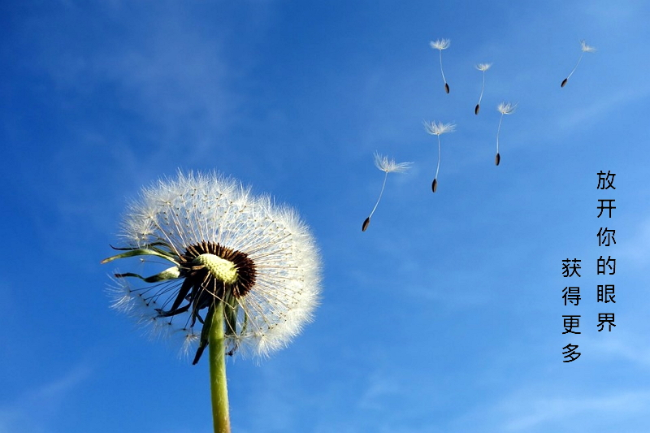

<h3><a target="_blank" href="https://bit.ly/3asSXIA">请多传破网软件，使更多的人了解真相从而得救，这是给自己积福德。 https://bit.ly/3asSXIA </h3></a>

   

     
<h3 align="center"><b>免翻视频  https://bit.ly/3ezRQKo  (请收藏网址 https://git.io/swspip)</b></h3> 

<h3 align="center"><b>复制网址到谷歌或火狐浏览器打开。若出现 “提示” ，請点击“继续”访问即可。</b></h3> 

<h3 align=center><a href="https://github.com/gav01/Heart/blob/master/news1.md">● 看更多大紀元時事 ●</a></h3>

<a href=https://git.io/souye><h6 align="right">回首頁</h6></a>

<a name=top>

<a href =#39>39.田云：世卫更改疫情时间表 中共谎言露馅 
<a href =#38>38.文件曝北京几类人优先打疫苗 专家：临床试验 
<a href =#37>37.【最新疫情7.5】纳瓦罗首提“中共病毒” 
<a href =#36>36.中共军机再侵台 6月以来第11次遭国军驱离 
<a href =#35>35.田云：美国会通过香港自治法 中共恐慌急发声明 
<a href =#34>34.川普在总统山讲话 庆祝美国自由 捍卫遗产 
<a href =#33>33.陆汽车行业势衰 民众拍下滞销汽车震惊画面 
<a href =#32>32.章天亮：中共押上全部家当 最怕美国一大招 
<a href =#31>31.学校民宅被冲毁 传张家界两县十多人失踪 
<a href =#30>30.【最新疫情7·4】全球染疫数达1100万 
<a href =#29>29.看不见的思想与看不见的神佛 
<a href =#28>28.监控民众不力 河北两商场遭中共内部通报 
<a href =#27>27.美国会一致通过香港自治法 交由川普签字 
<a href =#26>26.【一线采访】武汉小伙两陷疫区 如入战场 
<a href =#25>25.北京女设计师：我为何不顾压力走进法轮功 
<a href =#24>24.美参议员：香港自治法将真正惩罚中共官员 
<a href =#23>23.【拍案惊奇】港人抗争新招！贵州地震前龙叫？ 
<a href =#22>22.【最新疫情7·3】NBA复赛在即 25球员染疫 
<a href =#21>21.莫迪正式退出微博 删除跟习近平的合影 
<a href =#20>20.颈椎伤残无药可医　修炼大法重获新生 
<a href =#19>19.信仰真善忍 黑龙江董林桂冤狱12载九死一生 
<a href =#18>18.个股暴涨暴跌再现 微信QQ有人推荐后闪崩 
<a href =#17>17.终认清中共 美国安顾问中国问题讲话全文 
<a href =#16>16.【最新疫情7.2】全球疫情加速扩散 
<a href =#15>15.国安恶法38条震惊全球：要管全世界的人 
<a href =#14>14.FCC发布最终指令 宣布华为中兴构成国安威胁 
<a href =#13>13.郝海东与叶钊颖七一互动 牵手反共到底 
<a href =#12>12.蝗虫大军逼近首都 印度直升机和无人机迎战 
<a href =#11>11.香港新设国安署权力不受限制 架空港府及司法 
<a href =#10>10.【独家】鲁炜发迹和中国“删都”的出现 
<a href =#9>9.涉集体造假？金凰珠宝爆质押83吨假黄金诈贷 
<a href =#8>8.钟原：“百年未有大变局” 习近平有新解 
<a href =#7>7.【独家】前微博审核员勇揭中共审查黑幕 
<a href =#6>6.4名香港大纪元派发人员7·1被捕 吁立即释放 
<a href =#5>5.韩国新学员：入心学法精进去执 
<a href =#4>4.【内幕】关联北京疫情 河北大规模检测背后 
<a href =#3>3.多省市有大暴雨 云南昭通洪涝致3死 
<a href =#2>2.班农批西媒无视中共罪责反攻击大纪元 
<a href =#1>1.【最新疫情7.1】巴西染疫死亡人数增近一倍 

<a name=39>
<h1 align="center"><b>田云：世卫更改疫情时间表 中共谎言露馅</b></h1>

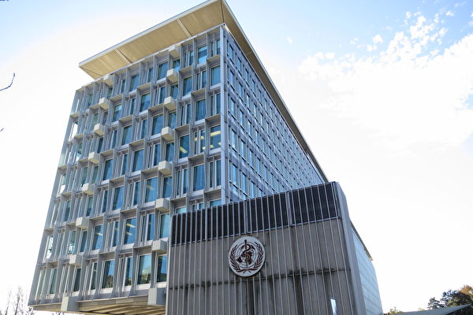

图为世卫总部。（维基百科公有领域）

   
  【大纪元2020年07月05日讯】7月4日，多家国际媒体报导，世界卫生组织低调更改了其应对疫情工作时间表的一个条目内容，推翻了中共当局及谭德塞之前声称的中方主动向世卫报告疫情的说法。
  
<b>世卫更动重要资讯</b>

这份文件于6月29日在WHO官网发表，6月30日更新，首项写道：“2019年12月31日，世卫组织驻中华人民共和国代表处从武汉市卫生健康委员会的网站上看到了一则关于中华人民共和国武汉市‘病毒性肺炎’病例的媒体声明”，“世卫组织驻华代表处随后向世卫组织西太平洋区域办事处的国际卫生条例协调中心通报并翻译了所看到的关于这些病例的媒体声明。”

然而，在世卫4月27日发布的初版疫情时间表里，“2019年12月31日”条目下是这样写的：“中国武汉市卫健委报告了湖北省武汉市的一组肺炎病例。最终确认了一种新型冠状病毒。”这一内容被大陆媒体普遍引用，成为中方防疫“公开透明”的证据之一。

此前，世卫总干事谭德塞在4月20日的新闻发布会上称，第一份报告来自中国，但他未指明该报告是否由中共当局发出。

6月7日，中共发布了抗疫白皮书，声称“中国第一时间报告疫情，迅速采取行动……及时主动向世界卫生组织以及美国等国家通报疫情信息”。

6月15日，美国众议院调查小组发表了《关于COVID-19全球大流行病起源包括中共与世卫组织角色问题的少数党中期报告》，牵头撰写报告的众议员麦考尔（Michael McCaul）在声明中说：“几个月来的调查清晰地显现，中国共产党对新冠（中共）病毒、特别是在疫情爆发初期时的掩盖，在让原本可能是一场地方流行病转变为一场全球大流行病的过程中起了重大作用。”

该报告提出三点建议：撤换世界卫生组织领导人，针对中共在大流行爆发初期隐匿信息的行为展开国际调查，改革《国际卫生条例》。

在世卫更改重要信息后，麦考尔议员为美国之音提供了一份声明，他写道：“我很高兴看到世卫组织和中国共产党都阅读了我的这份有关大流行病起源的中期报告，并终于向世界承认——中国共产党从未向世卫组织报告其境内爆发病毒，违反了世卫组织规定。”

麦考尔还说：“现在的问题是，中国共产党是否会继续虚假信息宣传活动，继续声称他们曾警告世界，抑或他们愿意坦白面对，并开始与世界卫生界合作，彻底查清这场致命的大流行病的真相”。

<b>国际压力奏效，世卫进一步与中共切割</b>

疫情爆发后，川普总统和美国政要多次批评世卫配合中共隐瞒疫情。美国先是暂停注资，对其发出最后通牒，之后因世卫拒绝改革而毅然退群。国际方面，100多个国家要求对病毒起源和世卫在疫情期间的表现进行独立调查。

在强大的压力下，世卫逐渐转变了一味赞扬和迎合中共的态度。在5月18日的世卫大会上，谭德塞同意尽快启动一个有关全球武汉（中共）肺炎反应的独立评估。6月15日，在视讯记者会上，世卫专家称北京新增病例超过100个为“重大新闻”、“重大事件”。6月30日，世卫推翻了“中国主动报告”的说法，引起关注。

<b>世界须合力灭共</b>

随着“中国主动及时报告”的谎言被揭穿，中共防疫的谎言壁垒将迅速坍塌，更多真相呼之欲出。事实表明，中共党媒、外交发言人、驻外大使、防疫白皮书的说辞，以及官方公布的病例及死亡数据统统不可信。

半年多来，中共当局隐瞒疫情，打压“吹哨人”和公民记者，向外“甩锅”，并且信誓旦旦地把谎言包装成真理，甚至出版成书。当它的谎言被揭穿时，中共倒打一耙，对讲出真相者进行谩骂和报复、迫害。流氓自己披上了道德的外衣，横行霸道。

世界卫生组织的职责是拯救生命，可是它却被中共利用，导致上千万人染疫，罪责深重。除此以外，中共还渗透及操控了多少国际机构？世界为此承受了多少损失，还将面临哪些危害？

国际社会应当联手行动，向中共追责、索赔，最终合力解体中共。因为中共的谎言、暴力和人权侵害早已渗透于它的内政和外交当中，贻害全球。

中共这个人权恶棍和骗子要构建“人类命运共同体”，是个危险的笑话。 

<a target="_blank" href=#top><h6 align="right">回上方</h6></a>
   

<a name=38>
<h1 align="center"><b>文件曝北京几类人优先打疫苗 专家：临床试验</b></h1>

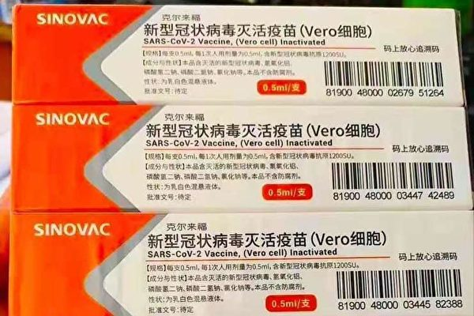

大陆生产出来克尔莱福新型冠状病毒灭活疫苗（Vero细胞），每支0.5ml，但在批准文号处写了“待定”两字。（受访者提供）

   
   【大纪元2020年07月04日讯】（大纪元记者骆亚采访报导）近日，北京航信疫情防控指挥部的一份文件曝北京疫情严重，称给一些特别的群体优先注射疫苗机会。陆媒报导也称另一款疫苗在军队内先打，强调不会扩大。香港专家和大陆疾控中心官员认为目前的疫苗没有批次，打这样的疫苗有风险。
   
<b>航信防疫指挥部：6类人可先打疫苗</b>

近日，中国民航信息网络股份有限公司“航信办发【2020】55号文件——‘关于新冠肺炎疫苗接种有关安排的通知’”，是由落款为中国航信疫情防控工作领导小组于6月15日所发。

文件称，“针对北京近日连续出现新增确诊病例，对公司在京员工的生命安全和身体健康构成严重威胁。接种安全有效的疫苗是保护公司在京员工安全健康的重要措施。”

   
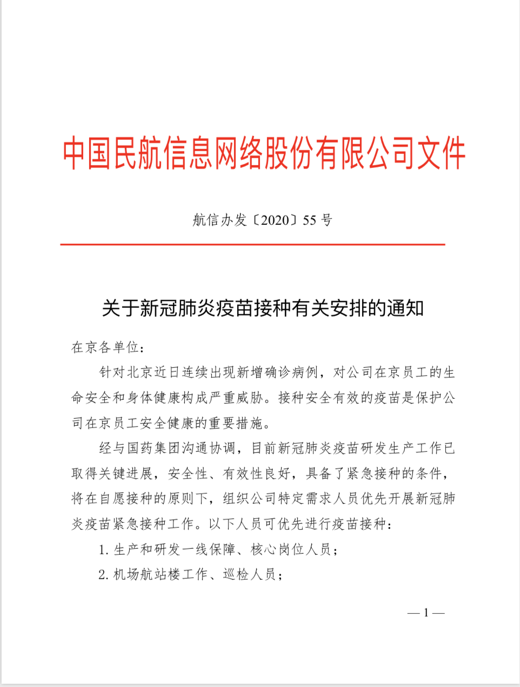

中国航信疫情防控工作领导小组于6月15日所发“关于新冠肺炎疫苗接种有关安排的通知”。（知情者提供）

   
   
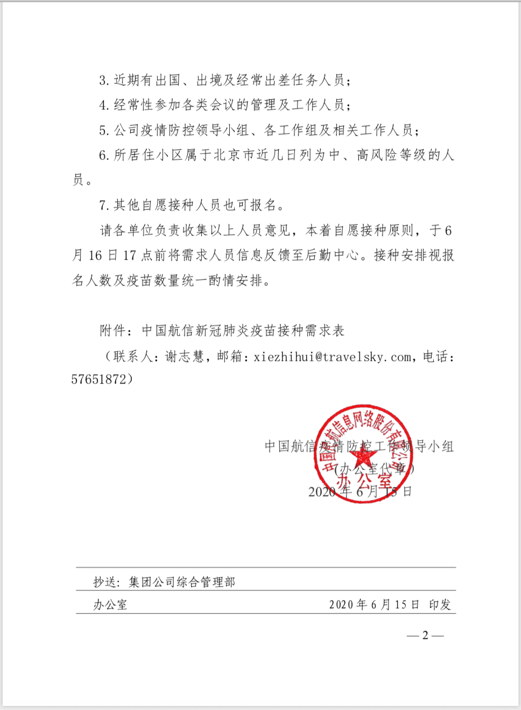

中国航信疫情防控工作领导小组于6月15日所发“关于新冠肺炎疫苗接种有关安排的通知”。（知情者提供）

   
   文件称，目前新冠肺炎（中共病毒）疫苗研发生产工作已取得关键进展，安全性、有效性良好，具备了紧急接种的条件。

文件也强调“将在自愿接种的原则下，组织公司特定需求人员优先开展新冠肺炎疫苗紧急接种工作”，包括以下人员可优先进行疫苗接种：

1. 生产和研发一线保障、核心岗位人员；

2. 机场航站楼工作、巡检人员；

3. 近期有出国、出境及经常出差任务人员；

4. 经常性参加各类会议的管理及工作人员；

5. 公司疫情防控领导小组、各工作组及相关工作人员；

6. 所居住小区属于北京市近几日列为中、高风险等级的人员；

7. 其他自愿接种人员也可报名。

<b>军队内部打康希诺重组新冠疫苗</b>

而根据6月29日财新网的报导“康希诺重组新冠疫苗获批军队内部使用”，中共中央军委后勤保障部卫生局颁发军队特需药品批件，称，继国药集团传出在研新冠疫苗小范围尝试对部分国企出国人员接种的消息后，另一款由康希诺生物股份公司与军事科学院联合开发的腺病毒载体重组新型冠状病毒疫苗（Ad5-nCoV）在军队内部使用，有效期一年，但不得扩大接种范围。

<b>香港专家：疫苗没有批号 忧无人负责</b>

中大环境科学课程主任、美国毒理学会会员陈竟明副教授接受大纪元采访时表示，这基本上是找人做测试，北京所有交通服务员也是要接受注射。

他认为一般疫苗从研发到投入市场使用需要一年时间，三个阶段的测试，包括动物测试、医院测试及社区测试，就是医院临床也是需要一期、二期、三期等三个阶段的试验。

陈竟明副教授还表示，“但是，在中国，什么事都有可能的。”

他介绍，自己的朋友都有这样的照片，大陆生产出来克尔莱福新型冠状病毒灭活疫苗（Vero细胞），每支0.5毫升，但在批准文号处写了“待定”两字。

陈竟明副教授认为，这样的疫苗肯定有风险，有可能无效，打了这个疫苗之后还可能感染武汉肺炎（中共肺炎）。

他强调，“大陆习惯做这样的测试！我只是想问，疫苗没有批次，没有人负责？”

<b>大陆疾控中心官员：临床需要大量人员参与试验疫苗</b>

大陆一名地方疾控中心的官员张华（化名）接受大纪元采访时表示，这种疫苗需要做临床试验，如果他们签署了人体自愿试验的话，就是自愿人群，自愿人群也需要一定的量。

他认为，现在的疫苗不是特供的概念，在军队内部使用一年。按说是自愿人群，因为中国军队好组织，所以在军队内部组织起来试用。

就中国航信疫情防控工作领导小组发的文件，优先提供给7类人，张华认为这不是特别优先照顾，还是临床的概念，因为你批号没有下来肯定是临床概念，你不写临床的概念肯定不对的，就是临床试验。最后一期临床试验要求的人群量还是比较大的，把文件中提到的人群全覆盖也是差不多。中国人口基数大，志愿者试打疫苗的人数也要大一些。

他强调，最后打的时候，都是要按临床的试验手续签订志愿合同。

张华进一步分析，因为疫苗在批号下来前的临床试验也要走到社会人群，每个人打疫苗都要签订志愿者文书，前提是他要相信疫苗、相信科技才会成为志愿者。第一是自愿、第二是志愿。

“它要在自愿的人群中去找志愿者。志愿者比自愿更高一级，志愿者合同上都有一些各方面保障，出了情况后保险公司要赔偿等。志愿者有一种有境界、表达做贡献。（如果）本就不是自愿者，更不可能是志愿者。”

<b>北京新发地病毒基因序列发生突变 毒性传染性高出之前的9倍</b>

广东人民医院的胸外科主任医生乔贵宾近期在视频中表示，6月18日中国预防疾病研究所公布了大家期待已久的新发地病毒检测的基因序列，基因序列就是生命体、病毒、细菌、人体、生物的遗传物质的基础，就相当于密码。它是唯一的，就是每个人遗传背景不一样，主要就是检测这个基因序列。这次他们检测的样本就是在新发地感染病人的样本，还有在新发地各种物体表面的样本。

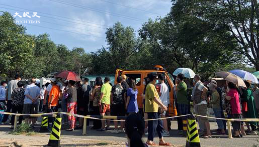

2020年6月30日 下午四点，天气炎热，田村山核酸检测点，人们在排队。（大纪元）

“结果有一个重大的发现，就是所有检测样本中都发现一个病毒在特定的位点，有一个蜕变，就是这个病毒发生变化，这个变化发生在D614G这个基因序列，这个突变导致了一个结果，病毒的传播性和毒力的增加。它比之前流行的病毒发生变化后，它的传播性高了九倍。”

他强调，“这是一个危险的信号”，“所以现在要采取严格的控制政策”，“所有的人要进行核酸检测”，“排查已经感染病毒的人员”。

大纪元此前也报导，中共严重隐瞒北京疫情，仅地坛医院一家上报疾控中心的确诊病例，就要超过中共对社会公布的北京这一波的确诊病例数。而中共这次疫情收治的定点医院，党媒披露的就有三十家。

中共至今也未曾披露过北京这一波毒性9倍强之下有多少死亡者和有多少重症、危重病患。

<a target="_blank" href=#top><h6 align="right">回上方</h6></a>

<a name=37>
<h1 align="center"><b>【最新疫情7.5】纳瓦罗首提“中共病毒”</b></h1>

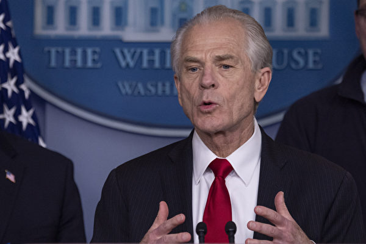

7月3日，白宫贸易顾问纳瓦罗再次批评中共不仅隐瞒疫情，还在武汉疫情爆发后，让大量武汉人前往全球各地，导致瘟疫在全球传播。他并且直呼这种病毒为“中国共产党病毒”。 (Photo by Eric BARADAT / AFP)

   
【大纪元2020年07月05日讯】（大纪元记者夏雨、徐简、谢佳宣、林南、萧律生综合报导）7月5日全球中共病毒（武汉肺炎）疫情最新情况：   

根据约翰‧霍普金斯大学（Johns Hopkins University）的数据，截至美东时间7月4日晚上8点，全球确诊感染中共病毒（武汉肺炎）的人数超过1110万，死亡人数超过52万（注：因中共和伊朗隐瞒疫情数据，真实数据比统计的要高）。

美国确诊病例超过285万例，死亡逼近13万人。截至美东时间7月4日下午4点，在过去24小时内，美国确诊感染中共病毒病例上升了1.7%，略低于一周平均水平。

美国有七州周五单日新增病例创新高，但最近几周全美平均每日死亡人数逐渐下降；佛州周六阳性检出率高达14%，纽约州住院率持续下降。

西班牙局部地区再次爆发疫情，当局封锁了一个拥有20万居民的农业区。意大利周六病例增幅高于平均水平。

中共隐瞒疫情造成全球大流行病，美国总统川普表示对中共越来越生气，他还强调这是一场来自中国的可怕瘟疫。白宫顾问纳瓦罗则将病毒称为“中共病毒”，指控中共在病毒传播问题上撒谎，必须承担责任。他说，中共撒谎，人民死亡。

=======================
<b>以下是最新疫情实时更新：

西班牙重新封锁加泰地区的21万人</b>

因为中共肺炎疫情急剧升高，西班牙加泰隆尼亚地区政府自当地时间周六（4日）下午开始，封锁塞格里亚（Segria）地区，不准任何人进入或离开这个人口21万人的农业区，包含西部大城列伊达（Lleida）。

加泰隆尼亚政府主席托拉（Quim Torra）表示，非本地居民可以在中午12时以前离开。

加泰隆尼亚是西班牙新冠肺炎疫情最严重地区，到7月3日为止，这个人口750万的地区有7万2860例确诊病例，至少1万2586人死亡。

<b>澳洲墨尔本3千人被封锁</b>

在澳大利亚墨尔本的中共病毒感染者增多之后，周六晚上，澳大利亚总宣布对九个公共住宅区中的将近3,000人进行封锁。

在这九个人口稠密的街区，居民不许离开家。警察在楼外驻守。维多利亚州州长丹尼尔·安德鲁斯说，楼中的每个人都将接受测试。

据CNN报导，9个楼中的至少有23人被确诊。维多利亚省4日新增108例，为该省单日次高。澳洲全国有8362例确诊病例，104人死亡。

<b>印度新增近2.5万例确诊病例</b>

据印度卫生部门5日上午公布的数据，过去24小时中，印度全国新增24,850例中共病毒感染病例，累计达673,165例。

这是印度目前单日新增确诊病例数最多的一天，也是连续第三天新增确诊病例数在2万例以上。

<b>日本新增111例确诊病例</b>

日本广播公司（NHK）5日表示，东京确认4日新增111例中共肺炎病例。这是连续第四天新增病例总数超过100例。

<b>文件曝北京几类人优先打疫苗 专家：临床试验</b>

近日，北京航信疫情防控指挥部的一份文件曝北京疫情严重，称给一些特别的群体优先注射疫苗机会。陆媒报导也称另一款疫苗在军队内先打，强调不会扩大。香港专家和大陆疾控中心官员认为目前的疫苗没有批次，打这样的疫苗有风险。

<b>墨西哥中共肺炎死亡人数超过法国</b>

路透社报导，墨西哥周六（7月4日）报告中共肺炎死亡人数增加了523人，累计30,366人，超过法国，成为世界死亡人数第五高的国家。

通报报告指，新增确诊人数6,914例，确诊病例累计252,165例。

<b>亲近人士确诊 西非迦纳总统自主隔离14天</b>

西非国家迦纳政府7月4日发声明指出，总统阿库佛艾杜（Nana Akufo-Addo）的一名亲近人士对武汉肺炎验出阳性之后，阿库佛艾杜接受医师建议，将自主隔离14天。

迦纳政府声明说：“总统采检阴性，但为了谨慎起见，今天（4日）决定这样做。”声明还说，隔离期间，阿库佛艾杜会在遵守防疫规定的前提下继续工作。

声明并未说明确诊的亲近人士是家人还是幕僚。

迦纳目前确诊1万9388例，另有117人病故。中央社称，迦纳是撒哈拉沙漠以南非洲确诊数最多的国家之一。

<b>印度病例数上升7.%</b>

根据约翰·霍普金斯大学和彭博新闻社收集的数据，印度已确认的中共病毒病例已比前一天增加了7.2%，至648,315。

<b>巴西病例上升2.5%</b>

据巴西卫生部网站显示，巴西周六报告了37,923例新病例，增长2.5%，总数为158万人；死亡1,091例，增长1.7％，死亡总数至64,265例。

<b>川普夫妇邀请抗疫人员和军人参加国庆活动</b>

7月4日傍晚，白宫南草坪举办“向美国致敬”（A Salute To America）国庆活动，川普总统和第一夫人梅拉妮亚出席。

白宫新闻副发言人贾德·迪尔（Judd Deere）表示，来宾将由抗疫一线人员及其家人（包括执法人员，医生，护士等），以及军人和家人组成。届时将有美国政府主管部门成员出席。

迪尔说，正如川普总统所说，为了确保参加者的健康和安全，今年的美国独立日庆祝活动将与2019年有所不同。

“就像我们的祖先为确保我们的独立而进行的斗争一样，美国人民在与全球流行病作斗争中，表现出巨大的勇气和精神，特别是我们令人惊叹的一线人员，都值得在今年美国生日那天进行庆祝。”迪尔说。

活动开始后，川普总统表示：“我们绝不允许愤怒的暴民拆除我们的雕像或抹去我们的历史。”

谈到疫情，川普总统说：“我们取得了很大进步。我们的策略进展顺利…。我们拥有世界上最好的测试。”

“在治疗方面，我们现在做得令人难以置信。”川普说，“我们很可能会在今年年底之前，获得一种治疗方法或疫苗解决方案。”

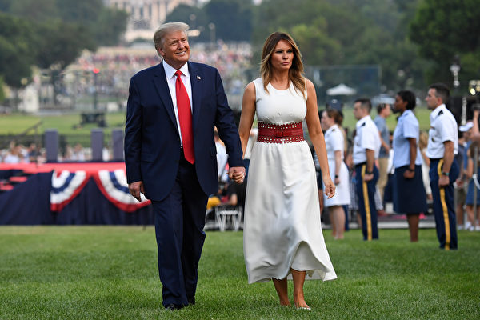

7月4日傍晚，白宫南草坪举办“向美国致敬”（A Salute To America）国庆活动，川普总统和第一夫人梅拉妮亚出席。(Photo by SAUL LOEB / AFP)

<b>德州单日确诊病例创新高</b>

德克萨斯州报告了创纪录的8,258例Covid-19新病例。截至7月4日，该州病例总数达到191,790例，增长了4.4%，高于7天平均水平4.2%。

德州卫生服务部在其网站上说，周六，死亡人数增加了33人，达到2608人。

<b>纳瓦罗首提“中共病毒”</b>

7月3日，白宫贸易顾问纳瓦罗再次批评中共不仅隐瞒疫情，还在武汉疫情爆发后，让大量武汉人前往全球各地，导致瘟疫在全球传播。他并且直呼这种病毒为“中国共产党病毒”。

纳瓦罗周五下午，在白宫对媒体表示，这里正在发生的事情是，你对美国人民被困在家里感到愤怒，你对自己的经济前途感到焦虑，你担心会感染这种病毒。所有这些情绪都在美国国内传播。

他接着说，虽然美国两党在一些问题上存在意见对立，但在美国目前所遭受的所有苦难和破坏问题上有一个共同点，就是中国共产党是祸首。

纳瓦罗谴责中共在隐瞒疫情的同时，采取措施阻止病毒从武汉传播到中国国内其它地区，但却让数十万中国人搭机出国，“有效在全球播种和传播中国武汉病毒，中国共产党病毒（Chinese Communist Party virus，中共病毒）。”

美国总统川普7月2日也表示，瘟疫来自中国，这是一场瘟疫，中国（中共）不应该让这种情况（病毒传播到美国和全球）发生，但中国（中共）确实允许了这种情况发生。

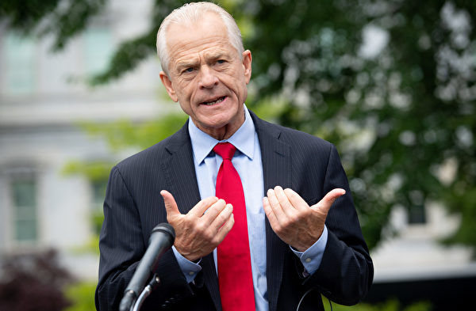

7月3日，纳瓦罗直呼CVOID-19为“中国共产党病毒”。(Photo by SAUL LOEB / AFP)

<b>南非单日染疫人数破万</b>

7月4日，南非新增1万多人感染中共病毒，为境内最高单日确诊纪录，显示疫情正攀上高峰。

法新社报导，南非卫生部发布的每日统计显示，确诊病例新增1万853起，3月以来确诊病例累计达18万7977起。

境内病故人数过去24小时新增74人，死亡累计3026人。

<b>斯威士兰运输部长染疫 内阁全员隔离</b>

非洲斯威士兰王国（The Kingdom of Eswatini）政府7月4日宣布，由于公共工程暨运输部长确诊感染中共病毒，内阁20位成员全部奉令隔离，居家办公。

斯威士兰公共工程暨运输部长恩端兑（Ndlaluhlaza Ndwandwe）于6月30日例行检验后，确诊感染病毒。

政府发言人德拉米尼（Sabelo Dlamini）发表声明说：“出现此情势发展后，全部内阁成员必须隔离，立即生效，并居家办公。”

位于非洲南部的斯威士兰王国人口约130万，境内确诊病例已攀升至984例，包括13人染疫不治。

<b>全球单日新增破21万 创下纪录</b>

世界卫生组织报告说，在过去24小时内，全球新增212,326例中共病毒病例，首次单日感染总数达到20万例。 世界卫生组织过去一周每天报告超过163,000例新病例。

美洲地区，主要是美国和巴西，占所有新病例的61%；其次是东南亚，占每日感染的12%。 世卫组织每日报告显示，欧洲占了9.3%。美国和巴西的病例占全球总数的48%。

在全球所有确诊病例中，美洲51%，即1,092万例中的558万例；其次是欧洲，占25%，东地中海，包括中东，占10%。 世卫组织病例总数常常落后于约翰•霍普金斯大学的统计，截至周六中午，全球共有1113万病例。

上述数据不包括中共隐瞒的病例数量。

<b>川普：摆脱来自中国的瘟疫后 美国将回归</b>

川普总统周六（7月4日）向美国发出了乐观的独立日信息。他宣布，从中共病毒大流行中摆脱后，美国将“回来”，并将比以往任何时候都“伟大”。

他称这场大流行病是“来自中国的可怕瘟疫”。

川普在视频中说：“我只希望祝大家七月四日快乐。”“我们正在朝着巨大的胜利迈进，它（胜利）将要发生，而且还会有更大的发展，我们的国家将比以往任何时候都强大。”

他说，7月4日涉及许多不同的事物，“但最重要的是自由”。

川普表示自己专注于美国经济，并对美国股市和就业数据进行了肯定。

 <h4 align=center><a href="https://twitter.com/realDonaldTrump/status/1279464546097418240?ref_src=twsrc%5Etfw%7Ctwcamp%5Etweetembed%7Ctwterm%5E1279464546097418240%7Ctwgr%5E&ref_url=https%3A%2F%2Fwww.epochtimes.com%2Fgb%2F20%2F7%2F3%2Fn12229032.htm">川普(点击右键,另存新档）</a></h4>

<b>美国病例增幅1.7% 略低于一周均值</b>

截至7月4日下午美东时间4点，根据约翰·霍普金斯大学（Johns Hopkins University）收集的数据，与前一天同期相比，美国的中共病毒病例增加了46,000多例，总数超过282万例，增幅1.7%，略低于过去一周日均1.8%的增幅。死亡人数上升0.3%至129,601。

佛罗里达州新增病例再创纪录，单日增加了11,458例，增幅6.4%。相比之下，该州七天的平均值为5.5%，病例总共190,052例。佛州另新增18人死亡，是6月22日以来最少的一天，死亡总数为3,702。

纽约曾经是美国疫情爆发的中心，周六报告的病例数上升了0.2%，与过去的7天相符。现在该州病例总数为396,598。另新增11人死亡，总计24,896。

加州报告了6,510例新病例，增长了2.6%。共有254,745人检测出阳性。死亡人数增加了50，至6,313。该州网站警告说，洛杉矶县可能会延迟报告一些数据。

新泽西州报告了303例新病例，总计173,033例。与前一天的386个相比略有下降。该州有25例新死亡，比前一天的58例有所下降，死亡总数为13,333例。

<b>疫情下欢庆自由 美国国庆烟花销售逆势飙升</b>

7月4日独立日是美国夏日重要节庆。今年遇上疫情，南加州大型庆典取消，全美烟花销售飙升，是往年两倍以上。疫情艰困仍要庆祝，因为这天象征美国人信仰的自由价值。

中央社报导，在美长大的台裔青年阿发（Alfred）连续几年在7月4日这周与教会朋友当义工，向厂商批货卖烟火，募款协助台湾偏乡的英语教学。今年中共病毒全球大流行，没想到顾客不减反增。阿发说明这一天对美国人很重要。

他说：“这天家人聚在一起，庆祝美国是一个自由的国家，每个人都能享有自由，我知道世界上很多国家没办法享有自由，我们有机会可以庆祝，这是非常重要的。”

今年确实不好过，美国人经历婚礼、运动比赛、国庆活动等大型集会取消之后，对烟花产生移情作用。今年国庆没有办法聚集看游行、烤肉、逛市集，很多人转而在自家后院放烟花庆祝。

美国有线电视新闻网（CNN）报导，美国消费性的家用烟花在国庆假期的销售是往年的两倍以上。

7月3日晚，美国总统山上的烟花 (Photo by SAUL LOEB / AFP) (Photo by SAUL LOEB/AFP via Getty Images)

<b>佛州阳性测试率为14%</b>

周六（7月4日），佛罗里达卫生部表示，在布劳沃德县（Broward）记录了1,346例新病例，使该县病例总数达到19,575例。

迈阿密-戴德县（Miami-Dad）新增2,418例病例。

佛州单日新增病例超过11,000例，使佛罗里达总病例数达到190,052，住院人数增加了585人。

卫生官员说，佛罗里达人中有14%感染了COVID-19。

根据约翰·霍普金斯大学（Johns Hopkins University）的数据，目前全国的阳性测试率为7.5%。

此外，佛罗里达州还有18例新死亡，死亡人数上升至3,702人。

<b>意大利新病例和新死亡略增</b>

据欧洲卫生部门称，意大利是欧洲大流行病的首个震中，周六（7月4日），意大利报告21例新的与中共病毒有关的死亡病例，而一天前为15例，使死亡人数升至34,854人。

周六，意大利新病例增加了235例，超过了过去7天的平均值175例。

<b>亚利桑那州病例增长少于7天平均值</b>

美国亚利桑那州周六（7月4日）报告了2,695例新病例，比前一天增加了2.9%，但低于周三创下的纪录。

在过去7天里，该州病例数量以4.4%的速度增长，目前总数为94,553。该州周三有4,878例新病例，为单日增长之最。

周六，亚利桑那州报告有17例新死亡，低于周三创纪录的88例，该州死亡总数为1,805人。

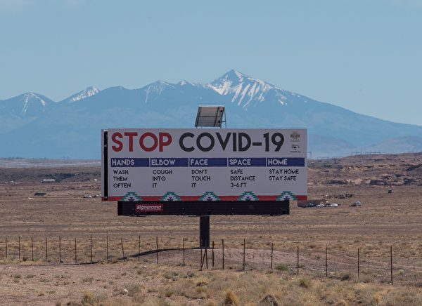

图为亚利桑那州一个标语牌。(Photo by MARK RALSTON/AFP via Getty Images)

<b>纽约住院率下降</b>

根据纽约州卫生部门网站的数据，纽约报告的住院和新住院人数减少，病例增加了726例，即增幅0.2%，与自6月中旬以来的大多数日子保持一致。

纽约的医院有844名患者，比前一天减少了13名，新住院人数为63名，比前一天减少了10名。

周五所有中共病毒测试中，阳性率为1.16%，低于前一天的1.38%。

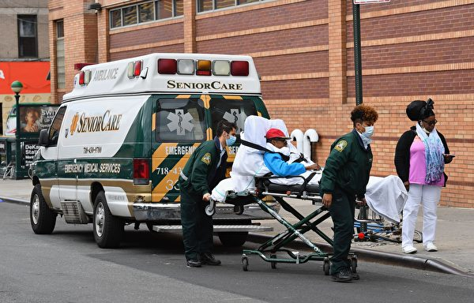

图为一名病人被送往布碌崙医疗中心急救。 (ANGELA WEISS/AFP via Getty Images)

<b>8月开始 沃尔玛停车场变身电影院</b>

从今年8月开始，沃尔玛将其全国160个商店停车场改建成自驾电影院，因为许多电影院由于中共病毒大流行而关闭。

沃尔玛正在与Tribeca Enterprises合作。

Tribeca Enterprises和Tribeca Film Festival首席执行官兼联合创始人简·罗森塔尔（Jane Rosenthal）表示：“自9/11之后，我们在19年前启动Tribeca电影节以来，Drive-In一直是Tribeca的一项标志性计划。”

“但现在，Tribeca Drive-In不仅是一种有趣的复古电影观看方式，也是社区聚会的最安全方式之一。我们很高兴与沃尔玛合作，将更多的人聚集在一起，共同分享看电影体验。”罗森塔尔说。

Cinemark影院在6月底宣布，该公司将在7月底开业。

沃尔玛的驾车看电影之旅将从8月开始，并将持续到10月。

<b>调查：餐馆重新开放 但消费者尚未准备好</b>

尽管各地很多餐馆已经重新开业，但一项新研究表明，并非所有顾客都准备好返回餐馆用餐。根据调查结果，不到一半的受访者会在餐馆重新营业一个月内，对外出吃饭感到自在。

《商业内幕》报导，根据哈里斯民调（Harris Poll）的调查数据，参与调查的美国人中只有40%表示，他们将在重新开放的第一个月外出吃饭。

根据从6月底开始的这项最新调查，有20%的受访者表示，他们会在中共病毒感染曲线趋于平坦后，等两到三个月再到餐厅用餐。

另外有17%的人表示他们将等待4至6个月，另有10%的人表示将等待长达11个月。

自3月初以来，美国已经有超过10,000家餐厅永久关闭。

据报导，随着餐馆开始营业（主要是户外用餐），前往餐厅的人流量呈上升趋势，但这些数字明显低于往年。不过造成这种情况的部分原因是，许多餐馆仍然无法接近满负荷的营业。

虽然许多餐馆转而接受外卖订单，但仍无法弥补店内用餐客流量不够造成的损失。

<b>美餐饮连锁店拟招聘40万员工</b>

上周，丹尼（Denny’s）宣布计划在2020年底之前雇用10,000名新的美国餐厅员工。

由于中共病毒大流行，仍有650万饭店工人失业，但包括丹尼在内的越来越多主要餐厅连锁店正在开始招聘新人。

这些连锁店总共计划雇用40万新员工。这些公司包括麦当劳、Subway、Dunkin’、Papa John’s、Pizza Hut、Chipotle、Taco Bell、Domino’s等。

<b>研究解释为啥酒吧容易传播病毒</b>

一项新的研究表明，酒吧可能是最容易传播病毒的地方。

美联社报导，酒吧的室内空间拥挤，通常挤满了人，人们有时会大喊大叫，夹杂着音乐声，人们也经常彼此靠近交谈，这些都难以让人保持一定距离。更糟的是，酒台往往会被溢出的酒品和饮料沾染。

正如美国疾病预防控制中心（CDC）公布的一项研究显示，由于人们彼此之间“近距离呼吸”，所以酒吧很危险。

报导说，专家还指出，人们倾向于在酒吧喝醉，而喝醉会降低人的警戒性，导致人们忘记采取预防措施。此外，年轻人即便感染病毒也会症状较轻或无症状，这意味着他们不太可能意识到自己具有传染性。

<a target="_blank" href=#top><h6 align="right">回上方</h6></a>

<a name=36>
<h1 align="center"><b>中共军机再侵台 6月以来第11次遭国军驱离</b></h1>

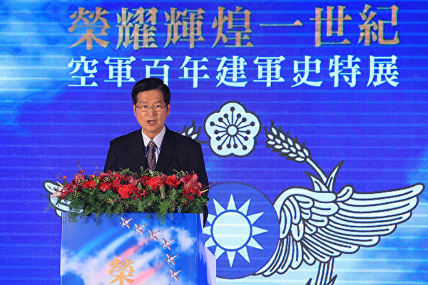

中华民国国防部长严德发7月3日说，中共从未放弃武力解决台海争端，国军一定会做最好准备，随时掌握台海局势，为国家安定与民众福祉尽最大努力，资料照。（中央社）

   
  【大纪元2020年07月04日讯】（大纪元记者钟元台北报导）中共军机今天（7月4日）再度入侵台湾西南空域，遭台湾空军广播驱离。这是6月9日以来，共机第11次侵入台湾防空识别区（ADIZ）。

台湾空军司令部今天表示，上午有共机现踪台湾西南空域，并短暂入侵ADIZ，遭空军广播驱离。空军强调，对于台湾周遭海、空域情势，国军都利用联合情监侦作为掌握并适当应处，以确保空中飞航安全。

据国防安全研究院最新一期“国防安全双周报”，中共政军所助理研究员洪子杰表示，共军军机在6月有10次飞至台湾周边空域，也是2020年以来的第17次，累积次数已逼近历年全年最多次的20次。另一方面，美军军机上半年在台海周边也频繁现踪。

<b>共军在台湾西南空域骚扰 对国军增加压力</b>

洪子杰说，共机扰台的这些次数中，对台威胁最大主要仍以6月份多次飞入西南空域，侵入台湾的航空识别区。由于东沙群岛在台湾防空识别区西南方，因此共机频繁飞入西南空域，除对台湾空军进行压力测试外，也可能对国军在卫戍东沙岛造成压力。他指出，尤其东沙岛的战略地位十分重要，扼守台湾海峡南部的咽喉处，可以监控区域主要国际航道。

日本《共同社》5月12日刊登共军8月将在南海举行针对东沙岛的大规模演习。他表示，共机6月8次飞入西南空域的防空识别区（东沙群岛在防空识别区西南空域外围）也很可能间接证实共同社的消息，也可借此计算台湾空军相关的反应时间、路径等，以进一步评估及修正共军攻打东沙群岛的各项预案。

此外，他说，由于台湾西南面空域邻近东沙群岛，因此共军未来即使次数减少，仍很可能透过西南空域训练的常态化，试图营造既成事实的状态，使得国军面临压力。他指出，国防部将藉由汉光36号演习派遣陆战队99旅赴东沙岛进行规复作战演练，反制共军意味浓厚。

洪子杰说，在习近平推动实战化训练的架构下，共军各部队在演训规划上会较过去更贴近实战，在次数及规模上也会比过去更频繁。因此东部与南部战区部分部队，在演训上理所当然会针对台湾进行假想及验证。未来共军在台海周边行动仍可能因共军制定其它可能攻台（含其他外离岛）的演训计划而增加。

<b>严德发：中共未放弃武力犯台 国军一定会做最好准备</b>

中华民国国防部长严德发3日出席国军历史文物馆举行的“空军百年建军史特展”。他说，中共从未放弃武力解决台海争端，国军一定会做最好准备，随时掌握台海局势，为国家安定与民众福祉尽最大努力。

严德发表示，近来中共不断对台湾海空域进逼骚扰，空军健儿们不分昼夜、毫不迟疑地，在第一时间起飞驱离，以确保领空的安全，这是身为中华民国空军的责任，也是传承自空军前辈的光荣使命。

国军“汉光36号”演习将于7月13日至17日进行实兵演习，14日至18日电脑兵推。国防部9日表示，新编成的“联合兵种营”7月16日将首度参与反登陆作战“实兵、实弹”操演，于台中甲南海滩实施联合反登陆实弹射击，验证“滩岸歼敌”能量。

以三军联合作战概念编成的“联合兵种营”，规划包含步兵、装甲兵、海空军及陆航等各不同单位联络官，以及UAV无人机操作手、刺针飞弹、狙击组等不同专长官兵，还有军备局自行研制的系列云豹八轮甲车。

空军花莲佳山基地1日清晨出动多架F-16战机，每架挂载各2枚MK-84型2000磅通用炸弹，模拟轰炸敌登陆船团；台湾东南沿海一带，剑龙级潜舰同步展开鱼雷（战雷）试射操演。 

<a target="_blank" href=#top><h6 align="right">回上方</h6></a>

<a name=35>
<h1 align="center"><b>田云：美国会通过香港自治法 中共恐慌急发声明</b></h1>

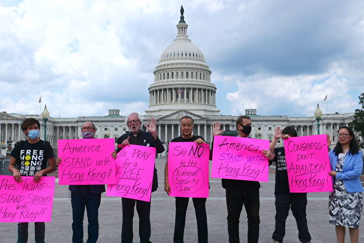

7月1日，人权活动人士在美国国会大厦前举行集会，声援香港，谴责中共人大通过《国安法》。中为袁弓夷。（李辰/大纪元） 

【大纪元2020年07月03日讯】7月2日，美国众议院一致通过了《香港自治法》（Hong Kong Autonomy Act，第3798号）。此法案与参议院7月1日通过的版本稍有差异，所以又被送回参议院审议并迅速获得通过。目前，法案已送交白宫，等待总统签字生效。《香港自治法》将对强行推动《港区国安法》、破坏香港自治状态的中共官员和实体进行制裁。此外，与这些官员有生意往来的银行也将受到制裁。

<b>中共对《香港自治法》反应激烈</b>

在美国参议院对此法案再次表决前，中共外交部发言人在记者会上要求美方“停止审议推进、更不得签署实施有关涉港消极议案”。

7月3日，中共人大外事委员会、中共政协外事委员会就美国国会参众两院分别通过《香港自治法案》发出声明，为《港区国安法》的出台进行狡辩。后者的声明包括了更多观点，措词也更为强硬。

政协外事委员会的声明首先歪曲了“反送中”运动的实质，称“‘港独’组织和本土激进分离势力在外部势力支持下，实施触目惊心甚至具有恐怖主义性质的暴力犯罪”。

这一定性完全违背事实。一年多来，在香港实地采访报导的当地和外国媒体都有明确记录，抗议人士并未实施过“触目惊心”、“具有恐怖主义性质”的“暴力犯罪”。相反，在中共策划下，黑社会团伙对市民进行了恐怖袭击；另外，港警对示威民众实施过度暴力，引发国际谴责，一些命案疑点重重，港府却不进行调查。中共当局对这些一概回避。

声明还称，《港区国安法》“惩治的是极少数严重危害国家安全的组织和个人，不仅不会影响香港广大市民的基本权利和自由，而且能够更好地保护香港市民享有和行使法定的自由和权利。”

现实刚好相反。7月1日，这部国安法生效首日，香港警方逮捕了约370人上街的市民，被捕者不过挥动了旗帜或喊出口号，这就是“严重危害国家安全”？

连日来，许多国家谴责中共实施《港区国安法》，并对该法压制香港自由的未来影响表达严重关切和忧虑。英国、台湾、澳洲、美国等政府已经或计划向港人提供移民、庇护等人道协助。

澳洲政府于7月2日更新旅游警示，劝请国民不要前往香港。澳洲官方旅游资讯网站Smart Traveller提醒旅客注意香港《国安法》，由于该法条文可被笼统诠释，旅客有可能在无意中触犯该法。

据多家外媒报导，香港的媒体工作者、出版商、民间组织、民主派人士、法律学者等人都对《港区国安法》的实施感到不安，尤其是此法关于犯罪的界定模糊、宽泛且随意，其中第38条规定把管辖权扩大到全世界，十分荒唐。由此可见，所谓“国安法”并不是为了维护国家安全，打击目标也不是“极少数”，而是所有不满中共极权的个人和组织。中共是在以法律操弄来维持和巩固它的统治。

中共政协外事委员会的声明称美国国会的法案“关心的绝不是香港人民的‘民主’‘自由’，而是妄图牵制和遏制中国的发展。”

在此，中共再次混淆中共和中国，企图以“中国发展”来掩人耳目。众所周知，香港人反对的是中共暴政，《香港自治法》将制裁危害香港自由的中共官员，是在维护正义。实际上，中共持续侵犯人权，臭名昭著，它是阻挡中国发展、给国家和民众招来耻辱的根源。

<b>中共为何慌张</b>

《香港自治法》的制裁范围广，强度大，涉及大批官员和中国国内及海外金融系统。

法案生效后，美国国务卿须在90天内及未来每年提交报告，列举出协助中共违反《中英联合声明》或《基本法》的相关人员，并指明与相关人员有业务往来的金融机构。

从“一级制裁”，即个体来看，提出《港区国安法》构想的官员，具体文件的起草者，在表决中举手赞成的代表们，以及参与实施的国安等部门的各级人员，都在可能受制裁的圈内。一旦入列，他们将面临冻结在美资产、拒绝入境等。

再看“二级制裁”，被制裁的金融机构将面临禁止向美国金融机构借贷、禁止银行交易、禁止外汇交易、限制商品或技术出口等。

6月30日，彭博社消息，在香港的彭博资讯（Bloomberg Intelligence）资深分析师陈永富（Francis Chan）分析说，《香港自治法》一旦通过，可以假定，与中共官员有密切往来的，四大中国国有银行（中国工商银行、中国农业银行、中国银行、中国建设银行）都可能受到制裁。

彭博社的报导还举例说明，2019年，渣打银行因为违反了对缅甸、古巴、伊朗、苏丹和叙利亚的禁令而缴付了6亿美元的罚款。2014年6月，法国巴黎银行（BNP Paribas SA）因为刻意隐瞒了苏丹及伊朗客户的姓名，被美国司法部重罚89亿美元。

中共反弹强烈，因为其一，它自知理亏，唯有乱喊乱跳；其二，大批涉事官员在美国都有资产及亲眷，断了签证和财路，其与家人在美国享受自由的美梦将成空；其三，那些涉嫌侵犯港人自由权利的官员及整个利益集团依靠金融系统攫取最大化利益和扩张权力，四大国有银行相当依赖美国的金融体系，因此，金融方面的制裁将意味着釜底抽薪。

其四，美国两党在反制中共、维护中国人权的问题上高度一致，这令中共惊恐无奈。而且美国的态度正在引领多个国家，澳洲、印度、日本、欧盟等都转向对中共强硬，台湾多次重申拒绝“一国两制”，国际反共大潮渐成气候。

《港区国安法》不得人心，自曝中共邪恶和狂妄。中共侵吞了人民的血汗钱，还逼迫人民在恐怖高压、没有自由的环境中甘当奴隶，否则就是“破坏国家安全”，搞“恐怖主义”。这种强盗逻辑行不通。

中共重提“美国反华势力”，但美国却是中共贪官们最向往的乐园。中共是揣着明白装糊涂，公道自在人心。

<a target="_blank" href=#top><h6 align="right">回上方</h6></a>

<a name=34>
<h1 align="center"><b>川普在总统山讲话 庆祝美国自由 捍卫遗产</b></h1>

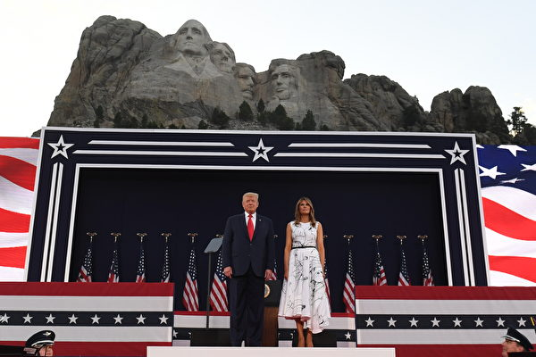

美国总统川普和第一夫人梅拉尼娅7月3日在总统山，参加纪念7月4日独立日的庆祝活动。(Photo by SAUL LOEB / AFP)

   
【大纪元2020年07月04日讯】（大纪元记者张婷综合报导）7月4日是美国独立日（也称国庆节），川普（特朗普）总统7月3日在美国总统山（Mount Rushmore，也称拉什莫尔山）的庆祝活动中发表讲话，捍卫美国的遗产，并强调《独立宣言》所体现的价值观，理念和自由；他还谴责“一种新的极左翼法西斯主义”。

川普督促爱国者们勇敢地对抗“取消文化”运动，并督促美国人捍卫国家的完整。

川普还表示，他将会签署一份行政命令，建立一个美国英雄国家公园，一个巨大的“户外公园”，摆放那些有史以来最伟大美国人的雕像。

“从今天晚上开始，从这个宏伟的地方开始，让我们团结一致地前进，重新坚定不移地前进。我们将培养下一代美国爱国者。”他说。

<b>川普：美国英雄们的遗产将永远不会被摧毁</b>

总统山是位于美国南达科他州的美国总统纪念馆。公园内有四座高达18米的美国总统华盛顿、杰佛逊、老罗斯福、林肯的头像。他们被认为是美国历史上功勋卓越的总统，代表美国建国头130年重要的民主历史。

面对现场大约7,500人，川普在7月3日的讲话中强调了总统山的重要性。他说，这座宏伟、不可思议、威严的山峰和有史以来最伟大美国人的纪念碑，没有比在这里更适合庆祝美国独立的地方了。

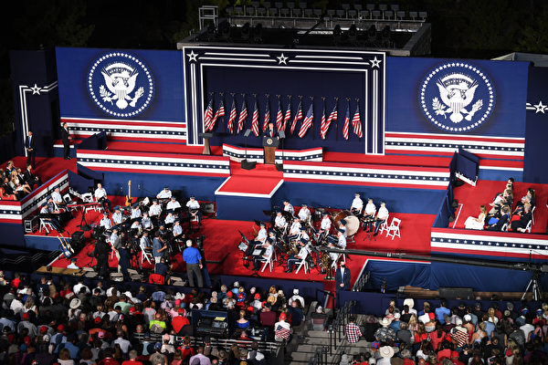

川普在总统山发表讲话。现场大约7500人。(Photo by SAUL LOEB / AFP)

他表示，示威者在反对种族不公正和警察暴行的示威活动中，发起了“一场无情的运动，以消灭我们的历史”。

“这一运动正在公开攻击总统山上每个人留下来的遗产，”川普说，一些左派政客要“诽谤我们的英雄，抹杀我们的价值观，并给我们的孩子们洗脑。”

“这座纪念碑永远不会被亵渎，”川普说，“这些英雄永远不会被毁坏。他们的遗产将永远不会、永远不会被摧毁。他们的成就将永远不会被遗忘。而总统山将永远屹立在这里，作为对我们的先辈和自由的永恒致敬。”

川普总统还表示，最近施暴者对国家纪念碑的攻击，以及“取消文化”（cancel culture）和“黑人的命也是命”（BLM）运动的马克思主义意识形态的兴起，是“左翼文化革命”的症状。BLM明确提倡破坏“核心家庭结构”，川普说这一结构实际上是“美国人生活的基石”。

总统称，激进运动弄污了对总统山上的这些美国总统的记忆。他通过在讲话中详述他们为美国带来的自由英勇事迹来唤起人们对这几位总统的记忆。

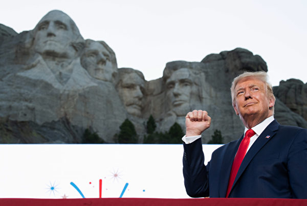

7月3日，川普在总统山。(Photo by SAUL LOEB / AFP)

<b>川普：“取消文化”在美国绝对没有空间</b>

川普表示，一场“左翼文化革命”目前正在寻求推翻美国人的自由，并称“取消文化”是那些寻求革命的人使用的政治武器之一。表现为“驱使人们离开工作岗位，羞辱持不同政见者，并要求任何不同意见的人彻底服从”。

总统断言：“这是极权主义的定义，它与我们的文化和价值观完全不相干，在美国绝对没有空间存在。”

他将这种极端作法背后的力量称为“新的极左翼法西斯主义”，其在全国各地的学校，新闻媒体和公司董事会中“要求绝对的忠诚”。

“如果你不讲其语言，执行其仪式，背诵其咒语并遵守其戒律，那么你将受到审查，驱逐，被列入黑名单，受到迫害和惩罚。这不会（获准）发生在我们身上，”川普继续说道。

川普表示，激进袭击的一部分包括拆除美国遗产的“每一个雕像、象征和记忆”。

<b>川普：对美国历史的激进观点就是一个谎言网</b>

“在每个案例中，我们所看到的街头和城市暴力混乱，都是由自由民主党人所管理的区域。这些暴力混乱是多年来在教育、新闻和其它文化机构中的极端灌输和偏见的可预见结果。”川普说，“违反社会和自然法则，我们的孩子在学校被教导要憎恨自己的国家，并相信建造她（国家）的男女们并不是英雄而是恶棍。”

“对美国历史的激进观点就是一个谎言网⋯⋯每个美德都被掩盖；每一个动机都被扭曲；每个事实都被歪曲；每个缺陷都会被放大，直到历史被肃清，记录被毁得面目全非。”他补充说。

“攻击我们国家的激进意识形态在‘社会正义’的旗帜下前进。但实际上，这将摧毁正义和社会。”川普说，“它将把正义转变成分裂和复仇的工具，并将把我们的自由和包容社会变成一个压制，控制和排斥的地方。”

“他们想让我们保持沉默，但我们不会保持沉默。”川普说。

7月3日晚，总统山的烟火活动。(Photo by SAUL LOEB / AFP)

<b>勇敢对抗“取消文化”</b>

川普总统呼吁美国人民勇敢对抗“取消文化”运动，并捍卫美国的价值观。

“美国人再次像244年前一样宣布：我们不会被暴虐，我们不会被贬低，我们不会被坏透了的邪恶者所恐吓。这不会（获准）发生。”川普说。

“我的同胞们，该是大声、强悍、有力地捍卫我们国家完整的时候了。”川普说。

“面对旨在分裂我们、挫伤我们、贬低我们的谎言，我们将会向外界表明，美国精神在团结我们，启发我们⋯⋯并使每个人都获得自由。”

“我们想要自由开放的辩论，而不是言论守则和取消文化。我们拥抱宽容而不是偏见。我们支持勇敢的执法人员，”川普说，“我们永远不会废除警察或我们伟大的第二修正案，因为该修正案赋予我们保留和携带武器的权利。”

总统说：“我们认为，应该教育我们的孩子热爱我们的国家，尊重他们的历史，并尊重我们伟大的美国国旗。”

“我们只向全能的上帝下跪。” 川普说，“这就是我们的信念，这些价值观将指导我们努力建立更美好，更美好的未来。”   

<a target="_blank" href=#top><h6 align="right">回上方</h6></a>

<a name=33>
<h1 align="center"><b>陆汽车行业势衰 民众拍下滞销汽车震惊画面</b></h1>

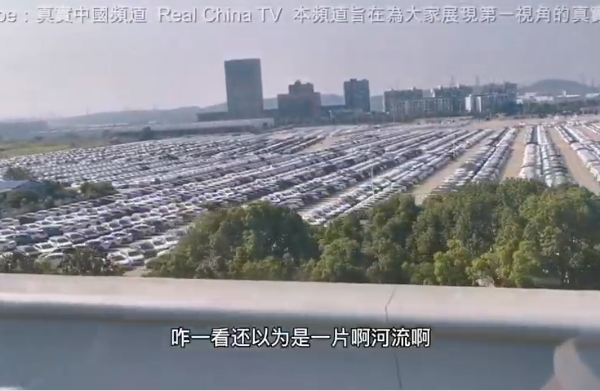

有大陆民众拍下东风汽车集团滞销汽车的画面，并表示感到震惊。（视频截图）

   
【大纪元2020年07月03日讯】（大纪元记者张玉洁综合报导）近日有大陆民众拍下东风汽车集团滞销汽车的画面，并表示感到震惊。东风汽车的滞销只是大陆汽车行业的一个缩影，大陆持续的疫情已经导致整体销售几乎停滞，车企纷纷降薪，甚至裁员和破产。

6月30日有大陆民众在武汉市汉阳区拍下一段视频，拍摄者往返同一条路发现，两边的停车场均停放大量滞销的新车，拍摄者不禁惊呼“乍一看还以为是河流呢！”

这些汽车隶属于武汉市的支柱企业“东风汽车集团”。

东风汽车是大陆四大汽车集团之一，中共国企。今年4月中旬，东风与法国雷诺集团发布声明说，其合资品牌“东风雷诺”停止雷诺品牌相关业务，雷诺公司向东风出售了其持有的东风雷诺全部股权。

此次疫情的发源地武汉市，是大陆汽车重镇，除了东风汽车集团总部，上汽通用、江淮汽车、比亚迪和金龙客车等众多车企都在武汉设有工厂。但是，大陆疫情不止、停工和消费力下降，令车企难以复原。

大陆媒体7月2日报导，《每日经济新闻》近日调查了北京地区多家大陆品牌汽车的4S店，一间奇瑞4S店内空无一人，销售人员说最近店内客流少，销售人员都很清闲。

附近的一间北京汽车4S店也是非常冷清，销售人员说，该店的单月新车销量只有大约20至30辆。

仅根据中国汽车协会的数据来看，今年前5个月，大陆品牌的乘用车销量同比下滑32.5%，市场份额下跌至37.1%，同比下降2.8个百分点。

中国乘用车市场信息联席会秘书长崔东树说，“疫情导致自主品牌的日子都不太好过，很多人失业了，首购消费群体购买力低下。”

前5个月的销量数据显示，大陆国产品牌车企有11家的销量同比下滑逾90%，最差的在这5个月内的全国销量只有2台。有一些本土车企已经申请破产或接近破产，比如北汽银翔已经申请破产。

另外，中共政府一直大力推动的新能源汽车，已经出现颓势——大陆品牌拜腾汽车一度被称为“大陆特斯拉”，但从7月1日开始暂停大陆地区的所有业务，全体大陆员工待岗，美国办事处裁员；博郡汽车全员待岗，可能不再生产汽车；赛麟汽车的资金链断裂、董事长被实名举报和跑路。

降薪的车企则不胜枚举，包括比亚迪、江铃控股、北汽、上汽、长安、威马，等等。

<a target="_blank" href=#top><h6 align="right">回上方</h6></a>

<a name=32>
<h1 align="center"><b>章天亮：中共押上全部家当 最怕美国一大招</b></h1>

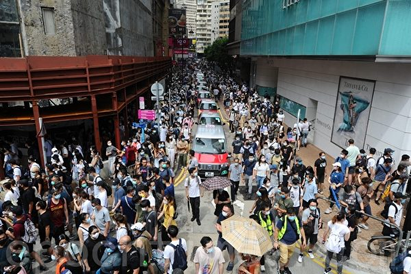

2020年7月1日，香港群众七一大游行，在铜锣湾时代广场罗素街。（宋碧龙／大纪元）

   
【大纪元2020年07月03日讯】今天我想谈中共强行通过国安法的算计，那就是留港不留人。之后我要分析一下中美英三国的决策心理。这一点是非常重要的。

我们看《三国演义》，经常看到诸葛亮说对手是什么心理特征，在此情况下会如何决策，每次都被他言中。所以诸葛亮才能够几乎百战百胜。

其实这种心理分析，在目前的情况就尤其重要。你要知道你的对手在乎什么，那就是他的弱点；然后你知道你的对手希望你做什么，那就是你能出的最昏的昏招儿。这才叫知己知彼，百战不殆。

有人说，你对中共、美国的心理怎么想的，不也是瞎猜吗？美国那么多智库都不如你吗？我要说的是，前几天白宫的国家安全顾问奥布莱恩说美国从1930年代就误判了中共，迄今90年，现在美国刚刚醒过味儿来。

而你们要知道，我们从2004年《九评共产党》发表的时候，就把中共的每一步作为、每一步计算都说得清清楚楚。这十五六年来，中共基本上就是按照我们，包括我本人的预言在一步步行事。

你不知道你的对手是什么心理，你得到的情报都可能是假情报，你的分析就完全是漫无边际的。所以我今天想特别说说，中共在香港问题上到底怎么想的？为什么敢孤注一掷？它赌的到底是什么？

<b>中共押上全部家当 最怕美国一大招</b>

既然是孤注一掷，那就是中共押上了它的全部家当，如果美国真的认为共产主义是个威胁，那就可以让中共赔得裤子都不剩。但要出错了牌，至少贻误了重要的战机。

我先说英美出的是什么招儿。

美国时间6月30日，共和党籍参议员马克·卢比奥（Marco Rubio）和民主党籍参议员梅内德斯（Menendez）提出了《香港避风港法案》（Hong Kong Safe Harbor Act）援救那些在香港因为和平抗议而可能遭新的国安恶法迫害的人能够申请美国的居留权。这个新的法案可以说非常慷慨，对这样的申请人数不做限制。

英国也有类似的法案，就是给持有BNO的人获得英国绿卡的通道。所谓BNO就是英国给1997年6月30日以前持有香港身份的人颁发的海外护照。这样的人香港大约有300万。

现在对中共最大的打击其实不是上面这两招，甚至中共可能为这两招而心中窃喜。

因为中共最害怕的是美国的经济制裁，以及对具体行恶者个人的制裁。当然经济制裁最大的杀招就是断掉SWIFT系统。

我在6月23号曾经做过一集节目，讲到美国不大可能一下子断掉SWIFT系统，就是美元电汇。这固然对中共形成重大的打击，但这对于在港的美资也是打击。至少得等到美资撤退之后才有可能断掉SWIFT，但这已经等于对中共宣布金融战争了。

我当时对美国不大可能一下子断掉SWIFT还有一个理由，就是如果英美给与港人撤离香港并提供庇护的选项，那么也就是说，留下来的港人等于自主选择了生活在中共的专制体制之下。既然你自愿放弃自由，那么英美也就没有必要为你出头。英美也就没有进一步制裁中共的必要，仅仅把香港当作一个内地城市就好了。

所以，你看看，中共在澳门也有类似二十三条立法，2009年就通过了。并不比2003年香港要立法的二十三条宽松，但澳门人不抗争。国际社会也就几乎没有声援澳门人和反对恶法的呼声。美资财团在当地开设的赌场，占据了澳门赌博业的半壁江山，也没有撤资。

<b>中共正在为“留港不留人”布局</b>

因此庇护香港人的做法，英美固然是出于人道考虑，但也就是选择了避免和中共正面冲突。我相信中共是心中窃喜的。因为中共的策略是，留港不留人。

道理很简单，中共是希望把所有能对它造成威胁的人统统驱出国门。所以你看到，中共在江泽民时代，一度非常喜欢搞人质外交。也就是对于那些反共的人，把他们释放到其它国家去。所以中共可以释放魏京生、释放王军涛、释放王丹，包括还有一些被营救出来的民运人士，甚至是假民运人士。

而这些人因为是名人，有媒体效应。他们一出来，美国人一高兴，感觉好像问题就解决了。中共既做出了一种改善人权的姿态，产生的媒体效应又让各国政府减少了民意压力。而那些被迫害而默默无声的人，就这样继续被残酷地迫害。

而真正反共的人，一旦到了美国或英国，他反共也无从反起。他们失去了群众基础，声音被互联网防火墙屏蔽。国内中共也减少了被抵制的压力。这样的策略，其实中共也想用在香港人身上。你反共，你就走，慢走不送。

所以你会看到中共正在为“留港不留人”布局。

布什么局呢？你看看亲共的喉舌《东方日报》怎么说的：“就当全港有二百万人支持反对派，这些人若不认同一国，就应该扶老携幼移民他去，好行夹不送，无谓留在香港搞风搞雨。当这二百万人离开后，留下来的必须是爱国爱港，尊重一国。中央便可趁此机会，彻底改革行政、立法、司法、教育、房屋等问题，实行留港不留人。”

现在中资正大举入港。大纪元报导：早前有中资企业内部高层人士向大纪元透露，北京上层已经拟定好计划，等香港的房地产进一步滑落时会入货，对于股票市场也会有相应动作。而且上面（党）会派更多人手到香港。他解释说，这个计划的实质就是“留港不留人”，相关策略已经内定成型，一些大陆大公司之间，已经分配了各自的目标范围，同时中资会翻倍大陆人工作签证，留港不留人。

<b>英美对中共的应对绝不能停留在此</b>

我也不能说英美不该给香港人退路，不提供庇护和绿卡通道，毕竟孔子说过：“危邦不入、乱邦不居”，英美提供庇护也不是人家的义务，完全是出于情分。但是我要说两点。

第一、英美对中共的应对绝不能停留在此。我们必须要知道，当你基于人道理由，给香港人庇护的时候，实际上对其他生活在中共暴政之下的人是不公平的。如果你给香港人庇护，那么遭到中共更残酷迫害并仍然坚持和平抗争的大陆法轮功学员，你给不给庇护呢？如果不给，那么理由是什么呢？为什么厚此薄彼呢？

法律既然应该是公平的，那就不能只救助这些人，对于处于同样、甚至更严酷困境的人就不予救助。就像是你不能光救助魏京生，而对高智晟、王全璋就置之不理一样。

第二、一定要提防有中共特务，又利用美国的政策漏洞获得美国的绿卡，然后再破坏美国的自由民主制度。

我们必须要明白，类似的事情之前并不是没有发生过。1989年六四镇压之后，美国给当时在美国的二十万中国人发了六四绿卡。最后的结果是，这些人里有多少人现在变成了中共的支持者？多少人认同美国的价值？多少人在为中共做事？而当时的老布什，一边发六四绿卡，一边派特使去北京密会邓小平，表示要继续跟中共做生意。

如果国际社会那时就联合起来，解决中共这个邪教政权，后面还会有镇压法轮功、香港国安法等等事情吗？新冠疫情让美国损失几万亿美元，死了十二万人，不就是中共这个罪魁祸首吗？如果在香港国安法的问题上只治标不治本，不就又回到三十年前，发出二十万张“六四绿卡”的覆辙上吗？

所以我说，我不反对英美给香港人庇护，但一定要继续努力，让中共这个邪教不能继续为非作歹。即使不让中美经济完全脱钩，制裁政治局委员以上，包括所有赞同了国安法的162个人大常委等等，绝对是英美最低的底线。

今天的节目就到这里。如果您对我们的内容感兴趣，欢迎您订阅和传播这个频道。我们下次节目再见。

注：本文内容为2020年7月1日美国飞天大学人文与科学副教授章天亮的YouTube频道《天亮时分》节目的文字稿，视频地址：

https://www.youtube.com/watch?v=PCkYh7BRSec&feature=youtu.be&fbclid=IwAR0yJZrTgJAWsHlXwSLTSxXFYoeQpSIyLHBdCZpOU_1qzk0wxjZstq_HBEA

<a target="_blank" href=#top><h6 align="right">回上方</h6></a>

<a name=31>
<h1 align="center"><b>学校民宅被冲毁 传张家界两县十多人失踪</b></h1>

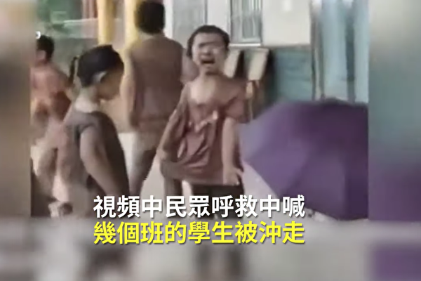

张家界慈利县一间小学附近山洪爆发，居民说有学生失踪了。（视频截图）

   
 【大纪元2020年07月04日讯】（大纪元特约记者常春、林岑心采访报导）湖南西北部遭到暴雨袭击，7月2日一场特大暴雨袭击了张家界，桑植县多处民宅被冲毁，慈利县一处教室被冲毁。

记者致电慈利县村民王泓（化名），他说，有数十间房宅被冲毁，有十多位民众也失踪，详细情况还有待证实。

<b>学校遭泥石流冲毁 居民说有学生失踪</b>

张家界慈利县民众上传的一段视频，当地一间小学教室前，一群孩子满身泥泞、声嘶力竭地哭泣者，过程中有家长和教职员哭喊着抢救失踪的孩童。

居住在学校附近的居民王泓回忆当时的情况说，“这所学校位于张家界慈利县赵家岗乡，乡政府的一所小学。”“校舍靠着大山边，后面山区大水太大了，把房子后边全冲垮了。冲垮了以后，山洪全部涌进教室，学生全部泡在水里。”

“老师当时就发了微信了，喊了一些学生、其他的官员，或是四周围的民众来救学生。老师自己也泡在水里面。”

他提到，7月2日那天暴雨特别的大，“几十年，才出这么一次（大暴雨）。”

官方的通报称，事发后26名受灾学生和3名教职员已经安置，没有发生伤亡。但是王泓说，“听说就有两三个学生失踪，没找到尸体。”

<b>慈利县和桑植县 多处民宅被冲毁</b>

视频中，除了慈利县，桑植县部分山壁崩塌，多处民宅被大水冲毁，汽车泡在滚滚泥流中。

王泓说，一些靠近山边、河边、沟边的民宅，遭与山体滑坡或房子坍塌，在慌张中一些人只能抱着房子的柱子，“当时肯定害怕，两三个多钟头都是大暴雨。”

“一些房子坍塌的，只能抱着两三尺大的那个大柱子，那个柳条啊。”他说，还有些居民自发地组织救人，“帮他们抢财产、救人。”“有些存款放在家里的，连同房子垮塌，损失惨重。”

因为大雨造成山洪暴发，农户沿着河边种植的农作物，王泓表示，“基本上是没有了，冲走了”，“再加上山体滑坡，一米高、两米高的河堤，基本上都被冲垮了，民众的损失比较大。”

王泓说，这次特大洪水给慈利县和桑植县两县带来巨大损失，特别是人员的伤亡，“有的人泡在水里被救出来，有的没有寻到遗体、尸体”，“大概有一二十来人被水冲走了，找不到了。”

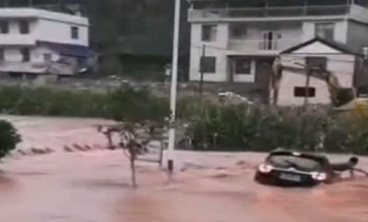

张家界桑植县多处民宅冲毁，民众受困车里，仓皇逃生。（视频截图）

<b>桑植县慈利县预计继续受到暴雨袭击</b>

对于官方报导说学校没有伤亡，也未提到有灾民失踪的消息，王泓说，“很多东西怎么说呢，都是报喜不报忧，它有很多东西都是瞒报的，没有报上去。”

张家界景区里的便利商店对记者说，目前西北部的偏远山区确实较严重，“张家界主城区和武源景区基本上不受影响，发大水的是慈利县，比较偏远，受到泥石流影响严重。”

张家界市、桑植县、慈利县皆位于湖南西北部，预计7月4日还会受到暴雨袭击。

据中央气象局资料显示，7月4日8时至5日08时，包括重庆东南部、贵州西部和东北部、湖南西北部、湖北西南部和东部、安徽南部、江西北部、浙江西部等地局地区，会有暴雨或大暴雨(50∼110毫米)。  

<a target="_blank" href=#top><h6 align="right">回上方</h6></a>

<a name=30>
<h1 align="center"><b>【最新疫情7·4】全球染疫数达1100万</b></h1>

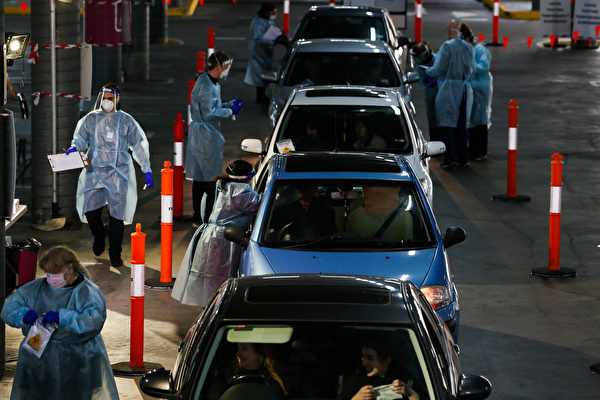

全球感疫人数已超过1100万，一些国家的疫情正在复燃，让当局决定恢复部分封锁措施。图为澳洲墨尔本的病毒测试站。 (Asanka Ratnayake/Getty Images)

   
 【大纪元2020年07月04日讯】（大纪元记者陈霆、张婷、林燕综合报导）7月4日全球中共病毒（武汉肺炎）疫情最新情况：
 
 根据约翰·霍普金斯大学的数据，截至美东时间周四（7月3日）晚上8时33分，全球感染中共病毒（武汉肺炎）的死亡人数超过52.4万人，确诊病例超过1104万例。（注：因中共和伊朗隐瞒疫情数据，真实数据比统计的要高）。

美国有37个州的病毒病例正在增加，近期的病例数上升，主要在南部和西部各州最为明显。周五，包括阿拉巴马州、北卡罗莱纳州、南卡罗来纳州、田纳西州、阿拉斯加、密苏里州和爱达荷州等，新增病例都创下了新的每日高点。然而，尽管感染人数增加，但美国的每日死亡率仍然相对平稳。

受到疫情影响，已停赛多时的全球职业体坛要完全恢复常轨仍困难重重。在网球赛事部分，目前在四大公开赛中，仅有法国网球公开赛宣布，将于7月9日开始贩售延期至今年9月底的赛事门票。

而美国职篮NBA虽预计于7月30日开打，但在最近几周，包括丹佛掘金队、布鲁克林篮网队和迈阿密热火队，都因球员在病毒测试中呈阳性，而关闭训练设施。另外，MLB公布第一组的测试结果，总计有31名球员确诊，联盟目前预计于23或24日重启球季，赛事缩短为60场，不开放球迷入场。

=======================

<b>以下是最新疫情实时更新：
   
印度新增近2.3万例 再度创新高</b>

印度卫生和家庭福利部周六表示，在过去的24小时内，印度通报了22,771起新病例，这是自大流行开始以来印度日增幅最高的一天。

印度目前确诊病例总数为64万8315人，其中有18655人死亡。超过39万4,200人已从疾病中康复，剩余的23万5,433个活跃病例。

根据印度医学研究理事会的数据，该国已进行了超过900万次测试，仅周五就进行了24万2383次测试。

<b>美国连续第三天新增超过5万例</b>

美国的第一次疫情高峰，只影响了少数几个州。两个多月后，病毒开始在南部和西南部蔓延。

根据约翰·霍普金斯大学（Johns Hopkins University）的数据，美国周五通报了51,842起新病例，连续第三天创下每天超过50,000例的记录。

新增病例最快速的是佛州，平均每天有7870个新病例，加州和德州的数量紧随在后。

美国目前总共有279万3435起病例，其中包含12万9434例相关死亡。

<b>秘鲁矿场群聚感染 82名矿工验出阳性</b>

加拿大铜矿商 Trevali Mining 表示，位于秘鲁桑坦德（Santander）矿场共有82名工人的病毒测试呈阳性，目前这82人已全数隔离。

在6月下旬，该矿场中就有19名工人确诊，矿场的营运也被迫暂停，并对298名矿工进行测试。

该公司在周五的一份声明中说：“经过聚合酶链反应（PCR）测试，共有82名工人已对COVID-19呈阳性。”

声明表示，虽然目前有三名工人表现出轻度症状，但其他所有工人目前都没有症状。

“呈阳性的矿工将被隔离在安全的地方长达两周”，声明中表示，“如果出现症状，受感染的矿工将被送到医疗机构进行治疗。”

<b>知名服饰品牌Lucky Brand受疫情重创 已声请破产</b>

知名服饰品牌 Lucky Brand 周五宣布，公司正在声请破产保护，并已与SPARC Group LLC签约，想要将所有资产售出。SPARC Group 旗下已有Aeropostale、Nautica两个时尚品牌。

Lucky Brand 在北美约有200间门市，该公司还计划至少关闭13间门市。

公司的临时首席执行长马修·凯尼斯（Matthew Kaness）在声明中说：“COVID-19大流行严重影响了所有销售管道。”

“尽管我们对商店的重新开业和客户的回购感到乐观，但业务尚未完全恢复。”

Lucky Brand 于1990年在洛杉矶成立。由于疫情爆发，有许多服饰零售品牌都面临破产的边缘。在此之前J Crew Group，JC Penney和Neiman Marcus均于5月份申请破产。

<b>川普长子女友周五确诊 身兼川普竞选募款专员</b>

小唐纳德·川普（Donald Trump Jr.）的女友吉弗尔（Kimberly Guilfoyle）身兼川普竞选团队的高级募款专员，在周五的病毒测试中为阳性。

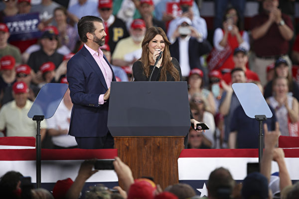

五月份日前两人在宾州的川普竞选集会上演讲。 (Drew Angerer/Getty Images)

小唐纳德·川普（Donald Trump Jr.）的女友吉弗尔（Kimberly Guilfoyle）身兼川普竞选团队的高级募款专员。不料，吉弗尔在周五的病毒测试中为阳性，引起外界高度关注。

川普竞选募款团队幕僚长戈尔（Sergio Gor）表示，小川普测试为阴性，两人皆已进行隔离并取消公开活动。

戈尔在声明中说：“她的状况很好，由于她没有症状，因此将接受重新测试以确保诊断正确。但是作为预防措施，会取消所有即将发生的行程。小唐纳德·川普（Donald Trump Jr）被测试为阴性，但作为预防措施，它也自我隔离，并取消了所有公开活动。”

综合外媒报导，吉弗尔与小川普一起前往南达科他州，但没有与总统一起乘坐空军一号。她没有与总统或与他同行的团体接触。

吉弗尔还参加了川普最近在俄克拉荷马州塔尔萨（Tulsa）的集会，一名记者和2012年共和党总统候选人赫尔曼·凯恩（Herman Cain）在参加活动后确诊。

<b>韩国新增63例新冠确诊病例 累计13030例</b>

韩国疾病管理本部（KCDC）周六（4日）表示，周五新增63个确诊病例，全国累计共13030例。

目前，单日新增病例已连续两天超过60例，且首都圈、光州市等地持续发生群聚感染，新增病例随时有可能增加。

63例中有36例属于社区感染。其中，首都圈共29例，包括京畿道15例、首尔市6例、光州市8例。其余分别是大田市3例、忠清北道2例、大邱市和庆尚北道各1例。境外输入有27例，为6月23日（30例）以来的最高水准，其中18例在入境检疫过程中确诊，9例在入境后居家隔离期内确诊。

光州市疫情以寺庙、教会、直销公司、养老设施及图书馆等为中心不断扩散。截至3日中午12时，相关确诊病例已增至56例。首都圈方面，以教会和直销公司为中心不断发生小规模聚集性感染。京畿道议政府的一小区出现四代感染病例，相关确诊增至22例。

另外，周五也新增1起死亡病例，累计共有283起死亡案例。

<b>全球染疫数达1100万</b>

周五全球感疫人数已超过1100万，这象征该疾病的另一个里程碑。同时，在七个月内这种疾病也夺走了超过52万人的生命。

根据世界卫生组织（WHO）的数据，这个病例数已是每年大流行病例数的两倍以上。

许多受疫情重创的国家，正逐步放宽防疫封锁措施，同时对工作和社交生活进行广泛的改变，这种改变可能持续一年以上，直到有疫苗可使用。

一些国家的疫情正在复燃，导致当局恢复部分封锁措施，专家表示，这种情况可能会延续到2021年。

美国周四通报了超过55,400起新确诊病例，这是全球最新的每日最大增幅。面对案件激增，几位州长决定暂缓重启经济的计划。

拉丁美洲是疫情新热点，巴西有150万例，占全球感染人数的23％。印度已成为亚洲新的震中，上升到62.5万例。

在某些检测能力有限的国家，病例数仅占总感染的一小部分。卫生专家警告说，官方数据可能无法说明全部情况。同时许多人认为，因中共和伊朗隐瞒疫情数据，全球病例数和死亡数均可能被低估了。

<b>忧病例增加 油价跌破每桶43美元</b>

由于担心疫情复燃，美国国庆假期前油价小幅下跌，引发人们对燃料需求停滞增长的担忧。纽约市场西德州中级原油的期货价格下跌0.8%，收在每桶40.32美元。伦敦市场北海布伦特原油的期货价格下挫0.8%，收在每桶42.80美元。

能源研究公司Rystad Energy的路易丝·迪克森（Louise Dickson）说：“如果这种趋势继续下去，该地区的石油需求将面临风险。”

受美国6月份强劲的就业数据和美国原油库存减少的提振，两个期货基准周四均上涨超过2%。

经济开始复苏，加上石油输出国组织（OPEC +）创纪录的减产后，已帮助布伦特原油从4月份创下的21年低点的16美元，上涨了超过一倍。
由于担心疫情复燃，美国国定假期前油价小幅下跌。

<b>英国放宽禁酒令 酒馆、餐馆和美发店重新开放</b>

英国在本周六，向恢复正常生活迈出了一大步，三个月来人们首次被允许在酒吧喝酒、到美发店理发或在餐厅用餐。

首相约翰逊（Boris Johnson）说，每个人都可以“安全地享受夏天”，但必须采取负责任的行为并保持与社交距离，以支持企业发展，并且不要冒第二波病毒的风险。

他说，酒吧、餐馆、美发店和其它企业的工人做出了巨大的努力，为重新开业做准备。

约翰逊说，这些企业的成功，员工的生计以及最终整个国家的经济健康，都取决于我们每个人都以负责任的态度行事。

“我们绝不能让他们失望。”约翰逊说。

尽管开放酒吧，但人数将受到限制，任何人都不能待在酒吧里，也不会有现场音乐表演。如果以后有人测试呈阳性，则主办方还必须提供其详细信息，以使示踪剂能够识别他们。

<b>美七州新病例数创新高 但死亡率相对平稳</b>

美国疫情严峻，几个州在周五的新病例录得了创纪录增幅。包含：阿拉巴马州、北卡罗莱纳州、南卡罗来纳州、田纳西州、阿拉斯加、密苏里州和爱达荷州等，新增病例数均创下单日增长的高点。同时，德克萨斯州的住院人数达到了新高峰。

最近病例的激增，在南部和西部各州最为明显，疫情已使公共卫生官员感到担心，他们提醒人们，在7月4日国庆周末时，应谨慎行事。

根据州卫生部门的数据，在包括佛罗里达州在内的美国50个州中，有37个州的病毒病例正在增加。尽管感染人数激增，但美国的每日死亡率仍然相对平稳。

<b>研究：某些患者需长时间才能恢复嗅、味觉</b>

大约10％失去嗅、味觉的患者，需要花更多时间症状才会缓解。图为示意图，与本文无关。（Fotolia）

一项意大利的最新研究发现，大约10%失去嗅、味觉的患者需要花更多时间症状才会缓解。其余患者皆表示，在一个月内症状会逐步改善或消失。

疫情爆发的最初，味觉和嗅觉的丧失并未列在病毒症状之中，但随后发现该症状可能是感染的主要警告信号之一。

这项研究发表在《JAMA耳鼻咽喉头颈外科杂志》上，研究小组对187名意大利人进行了有关该病毒的经历调查。

有113名患者说他们的嗅、味觉有所变化，而55名患者表示已完全康复，也有46位患者称症状有所改善，但有12位患者表示症状没有改变，甚至更加恶化。

研究者认为，对那些恢复较慢的人来说，该病毒也可能已影响了与气味有关的神经。这些神经细胞需要更长的时间才能修复和再生。

<b>田纳西州长授权各县发布口罩规定</b>

田纳西州州长比尔·李（Bill Lee）周五签署了一项行政命令，授予89个县的市长发布口罩要求的权力。

州长周五在推特上说，六个拥有地方卫生部门的县包含：沙利文、诺克斯、汉密尔顿、戴维森、麦迪逊和谢尔比，将保留其现有权力，根据需要发布口罩规定。

新的行政命令，允许地方政府在病例激增时，可依需要采取更多预防措施以减缓病毒传播。

“在我们人口稠密的城市地区，病毒病例量仍然最高，而我们的地方政府表示需要更大的灵活性来应对病例的激增。” 比尔·李在一份声明中说。

他表示，如此可确保我们能同时保护生命和维持生计，让田纳西州的经济开放。他也鼓励每位田纳西州人，都使用面罩或口罩，保持社交距离并经常洗手。

<b>巴西病例超过150万 死亡数破63,000</b>

巴西卫生部周五通报了42,223起新病例，使全国总感染数达到153万9081例。当天还新增了1290起死亡病例，使该国的死亡数累计达63,174人。

虽然病毒持续肆虐这个拉丁美洲最大的国家，但里约热内卢已决定重新开放酒吧、餐馆和体育馆，引发了人们的担忧。

在过去四个月中，仅在里约热内卢就有6600人死于病毒。世界上只有14个国家的死亡人数高于该城市。公立医院的重症监护病房的床位只剩下30%。

圣保罗是巴西最大、疫情最严重的城市，预计下周将开放酒吧和餐馆。

<b>七届纳斯卡杯冠军 传奇车手吉米·约翰逊染疫</b>

七届纳斯卡杯系列赛冠军吉米·约翰逊（Jimmie Johnson）周五宣布对病毒测试为阳性，将错过周日在印第安纳波利斯的比赛。

在约翰逊缺席的情况下，贾斯汀·奥尔加耶将在周日代表亨德里克赛车（Hendrick Motorsports）出赛。

现年44岁的约翰逊在声明中说：“我的首要任务是亲人和队友的健康和安全。”

“在我的比赛生涯中，我从未错过任何一场比赛”，约翰逊说，“尽管这种情况非常令人失望，但我将再次准备好赢得比赛并进入季后赛。”

七届纳斯卡杯系列赛冠军吉米·约翰逊（Jimmie Johnson）周五宣布对病毒测试为阳性，将错过周日在印第安纳波利斯的比赛。 (Chris Graythen/Getty Images)

   
<b>法国检察部门调查前总理处理疫情是否失当</b>

巴黎检察官办公室周五表示，法国法院已对前总理和两位卫生部长展开调查，以厘清是否在处理疫情上有所失当。

前总理爱德华·菲利普（Edouard Philippe）上周五已辞职，这是人们普遍预期的政府改组的一部分，而前卫生部长阿涅丝·布赞（Agnes Buzyn）及其继任者奥利维耶·韦航（Olivier Veran）也将接受调查。

在请愿和投诉委员会维持对前部长的九项投诉后，法院启动了调查机制。前部长已于2月份请辞，巴黎检察官办公室说，投诉主要是医生们所提出。

<b>捷克、匈牙利允许美国人入境拍片</b>

捷克和匈牙利的国家电影委员会负责人指出，尽管欧盟禁止了美国游客，但美国演员和工作人员仍能前往捷克和匈牙利从事电影和电视制作工作。

捷克电影委员会负责人帕夫利娜·齐普科娃（Pavlína Zipkova）说：“请让我向您保证，这项旅行禁令不适用于经济工作者，而仅适用于旅游旅行者。捷克欢迎所有国家的电影摄制者。”

根据捷克电影委员会的数据，2019年捷克共和国制作了八十多部电影和电视连续剧，为该国经济贡献了3.93亿美元。

该委员会表示，目前在漫威与迪士尼合作的《猎鹰与酷寒战士》影集与《嘉年华大街》已暂停拍摄。

匈牙利也表示，可以给予影视从业人员特殊豁免。

匈牙利国家电影学院说，匈牙利是“欧洲大陆上最受欢迎的电影拍摄地点”。在2019年，大规模制片在该国的花费，超过5.65亿美元。

匈牙利国家电影学院发布了一系列疫情间的“拍摄电影指南”，以确保演员和工作人员的健康和安全。

匈牙利国家电影学院表示，大型科幻电影《沙丘》（Dune）去年已该国完成部分拍摄，8月将恢复开拍。

<b>MLB第一阶段测试 共31球星7员工确诊</b>

美国职业棒球大联盟和美国职业棒球大联盟球员协会（MLBPA）今天宣布了第一组病毒测试的结果。

结果表示，总共有38人测试结果为阳性，占测试总数3185人的1.2%。这38名确诊者中，有31名是球员，7名是工作人员，总计有19个球队至少有一人染疫。

从周五（3日）起，球队已开始恢复训练，预计将于23或24日重启球季，赛事缩短为60场，不开放球迷入场。

<a target="_blank" href=#top><h6 align="right">回上方</h6></a>

<a name=29>
<h1 align="center"><b>看不见的思想与看不见的神佛</b></h1>
 <h4 align="center"><b>文：中国沈阳大法弟子</b></h4>  
   
   那天在公交车上，我看到一位坐着的大姐正在专注看手机，面前立着的大行李箱随着车子的颠簸四处滑动。于是我按住了箱子，对那位大姐说：「我帮你按着，你安心看手机吧。」

当大姐身边有了空位时，她赶紧让我坐下。我往下一坐，被她身边的大兜子给冰了一下。我笑了，问她：「从哪儿拿来的好吃的？」她也笑了，说：「我妹妹家的，从冰箱里刚拿出来的。」大姐说她这是从老房子往新家拿东西，老房子要卖掉。我问好卖吗？她说让疫情给挡住了。

说到疫情，我问大姐：「怕不？」大姐说：「怕也没办法呀！」我说：「相信『法轮大法好』的人就不怕。」接着我给她讲了明慧网上刊登的发生在我们沈阳的那个不怕瘟疫的人的故事（《九字真言小故事：不怕瘟疫的人》）。故事中的人就是诚心念了十六天「九字真言」：「法轮大法好，真善忍好」，武汉肺炎的症状就消失了。听后大姐说：「真好。」

我告诉大姐：「现在中共内部都很恐慌，他们说这次的瘟疫无药可治。啥意思？姐，你说你信佛，那佛不就是比人类更高的生命嘛？！不信神佛的人，借口是谁也没见过神佛，所以就不信。可是，姐，你有思想吧？我也有思想吧？我能看见你的思想吗？」大姐乐了，摇头说：「看不见。 」我紧跟着说：「那我说，姐，你没思想。」大姐更乐了。

兴致勃勃的大姐在手机上找到她女儿的照片让我看，然后问我家孩子的情况。我告诉大姐我孩子在国外。我说：「孩子告诉我现在全世界都知道法轮大法好。这次大瘟疫中，就有外国人念『法轮大法好，真善忍好』这九字真言后死里逃生的。中共迫害法轮功，犯的是天罪，武汉肺炎是来找中共算账的。退出中共的组织，不与中共为伍，就不会跟中共一起受惩罚。」

大姐明白了，高兴的退出了曾经入过的少先队组织。

<h4 align=center><a href="http://big5.minghui.org/mh/articles/2020/1/25/%E4%B9%9D%E5%AD%97%E7%9C%9F%E8%A8%80%E5%B0%8F%E6%95%85%E4%BA%8B-%E4%B8%8D%E6%80%95%E7%98%9F%E7%96%AB%E7%9A%84%E4%BA%BA-400056.html">《九字真言小故事：不怕瘟疫的人》(点击右键,另存新档）</a></h4>

网址转载：http://big5.minghui.org/mh/articles/2020/6/16/看不見的思想與看不見的神佛-407643.html

<a target="_blank" href=#top><h6 align="right">回上方</h6></a>

<a name=28>
<h1 align="center"><b>监控民众不力 河北两商场遭中共内部通报</b></h1>

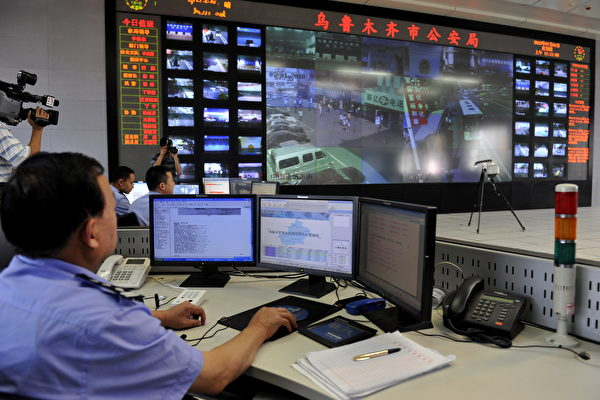

中共病毒疫情爆发以来，中共一直致力推行所谓的健康码，被外界认为是利用大数据监控民众，维稳所用。图为中共公安正在监视居民。(AFP/Getty Images)

   
【大纪元2020年07月02日讯】（大纪元记者古清儿报导）中共病毒（武汉肺炎）疫情仍在持续。近日，大纪元获得多份中共内部文件显示，在疫情下，中共利用“公安大数据”全方位监控中国民众。文件还披露了河北保定有关部门监控民众不力，有两商场遭到中共内部通报。

<b>监控民众不力 两商场遭中共内部通报</b>

近日，大纪元获得的保定市应对疫情工作领导小组办公室6月25日下发的《关于对商务局疫情防控监管责任落实不力的通报》。该通报称，北京新发地聚集性疫情发生以来，该市“进入战时状态”，但个别单位和部门防控举措不力。

通报还点名了两商场。通报提到，6月12日，沧州市肃宁县确诊病例刘某某（蠡县籍）分别到万博广场（河北省第一高楼，保定市地标性建筑）、大润发超市活动。在对其进行轨迹追踪过程中发现，上述两家经营场所均未严格落实测温、扫码、登记、引导消费者佩戴口单等防控措施。

通报称，市商务局作为行业主管部门监管不力，负有主要责任。因此，对市商务局提出通报批评，并对上述两家经营机构作出相应处理。

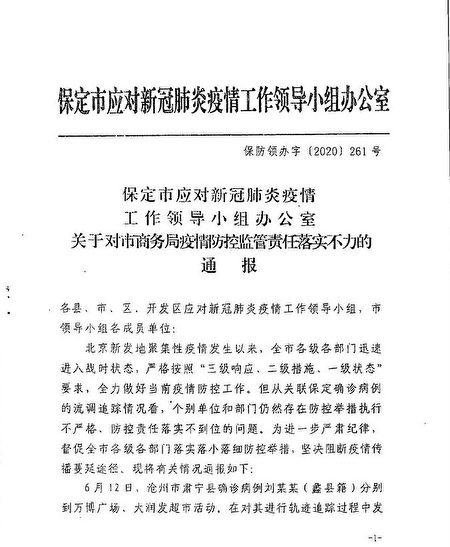

（大纪元）

 
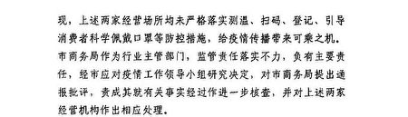

（大纪元）

6月22日，沧州市官方也通报57岁刘某某（女）的确诊病例，并公布了其在6月12日在保定市万博广场海底捞餐厅、东风路大润发超市活动的轨迹。

但中共官方报导没有提到上述部门和商场被查处通报。

<b>河北多市发文要求强化监控</b>

此外，大纪元获得河北省多市的内部文件显示，在疫情下，当局要求利用大数据强化监控举措。

6月10日，石家庄应对疫情工作领导小组办公室下发了《关于进一步做好新冠肺炎疫情常态化放控工作实施方案》。

该方案第11条提到，强化社区网格化管理。按照网格化防控责任体系要求，继续做好摸排登记、健康码查验、体温检测、信息上报等。全面扩大使用“河北健康码”知晓度和使用范围。及时掌握外来人员及新返石家庄人员情况，及时核实追查公安、交通等部门大数据推送的人员信息。

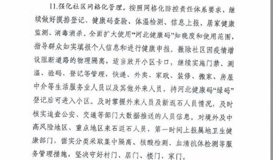

（大纪元）

方案第15条称，持续发挥大数据排查作用。公安、通讯等部门及各大通讯运营商要继续加强数据分析，及时掌握、通报外来重点人员信息，纳入重点管理和服务，“织密扎牢防控网”。

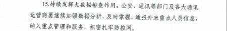

（大纪元）

方案第25条提到，各客运场站要落实主体责任。发现境外、中高风险地区人员，要第一时间上报其居住地防控部门，按要求进行转运处置。

方案30条方案称，严格健康监测制度。所有员工和游客，必须体温检测正常，并持有健康码“绿码”，方可进入。

另外，大纪元获得的保定市应对疫情领导小组办公室6月26日下发的“关于印发《当前疫情防控重点任务责任分解》的通知”。

该通知第二条提到，大数据核查不放松。各地要在三天内把推送的重点人员全部进行核酸检测。

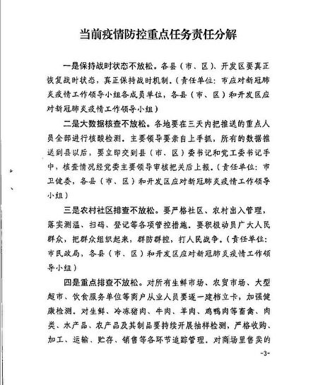

（大纪元）

该通知的第十二条是人员密集场所管控不放松。各经营主体要落实好测温、扫码、登记、口罩佩戴、人员间隔距离等各项防控举措。

第十六条是“河北健康码”推广使用不放松。各级各部门要以村、社区为单位进一步加大“健康码”推广力度，扩大应用场景和使用范围，所有公共场所必须验码进入。

<b>中共大规模推行健康码 利用大数据监控隐私</b>

中共病毒疫情爆发以来，中共一直致力推行所谓的健康码，被外界认为是利用大数据监控民众，维稳所用。

中共的“网格化”管理，就是将城市或乡村辖区按照一定的标准划分成牢笼式的单元网格；以街道干部、公安司法人员、社区工作者作为网格管理员，运用现代化信息手段，对网格内的一切人、事、物进行全面监视和控制。

中共的健康码实现了“绿码、红码、黄码”三色动态管理。领取绿码的人员凭码通行，领取红码和黄码的人员需按规定隔离，满足条件后将转为绿码。健康码系统可以查出“一个人进入疫区多少次、停留多长时间”等等，“精确到具体乡镇或街道”。

自6月11日以来，北京爆发新发地批发市场聚集性疫情，确诊病例大量出现。同时，北京展开大规模核酸检测。

那大数据监控到底有多可怕呢？大陆微信公众号“八点健闻”的文章《我亲历北京70万人大检测，还给100位新发地商户打了电话》描述，6月16日，北京应急响应级别上调的发布会召开之前几个小时里，“我先是接到街道的电话，‘您去过新发地吗？’”

“我很疑惑，我既没有在新发地有消费记录，也没有进去过，怎么摸排到的呢？对方倒是很有耐心，‘只要从新发地附近经过，在那里停留、打电话或者开个软件，您都会被大数据抓取到，记录下来’”。

“您有个心理准备，出门做好防护，可能要居家隔离14天。”他接着说。

“到了晚上，又接到来自北京市防控指挥部的电话，讲的内容差不多。电话后，收到了一条来自朝阳区防控领导小组办公室的短信：经过全市大数据分析，您可能在5月30日（含）以后去过新发地批发市场附近。短信要求即刻停止外出，并填写行动轨迹信息，并且接下来要等待街道工作人员的消息，去做核酸。

“6月17日，我再次接到街道电话，第三次核实完行动轨迹后说：晚上6:40在附近集合，坐大巴车去集中检测。

“到了晚上，因为大巴堵车，集合时间推迟了1个小时。和我一起去做核酸的，还有7个人，加上一个街道工作人员，间隔着坐在大巴上。闲聊中得知，我们这几个人的共同点是，都没进过新发地，但都在5月30日后的这段时间路过新发地或者在附近停留过。”

其实中共的公安大数据，是公安系统从监控中国民众的视频、语音通讯、手机定位，以及其它各类社会资源信息中提取各种数据，来实施对民众的控制。

之前大纪元获得的大量中共防疫文件显示，即使是在大疫冲击的当下，中共也不忘假借防疫，来强化对民众的监控。   

<a target="_blank" href=#top><h6 align="right">回上方</h6></a>

<a name=27>
<h1 align="center"><b>美国会一致通过香港自治法 交由川普签字</b></h1>

美国国会一致通过《香港问责法》（也称“香港自治法”），送交白宫等待总统签字后生效。图为美国国会山。(JEWEL SAMAD/AFP/Getty Images)

   
【大纪元2020年07月03日讯】（大纪元记者林燕报导）美国国会一致通过《香港自治法》（也称“香港问责法”），已送交白宫等待总统签字后生效。

美国参议院周四（7月2日）一致通过《香港自治法》，对威胁和损害香港自治的中共官员以及与他们有业务往来的银行和公司实施制裁。

参议院最早于上周通过这一法案，众议院周三（1日）也通过相关香港法案，因两院版本内容有细微差异，参议院周四再次就统一后的版本投票。

参议院已将法案送给白宫，等待总统川普（特朗普）签字后生效。

参议院法案最早由共和党参议员帕特·图米（Pat Toomey）和民主党参议员克里斯·范霍伦（Chris Van Hollen）共同提出，除了制裁违反香港自治的中共官员及实体外，还将对跟这些实体进行业务往来的银行施加二级制裁。

该法案除了强制性制裁之外，还包括一项条款，使国会能够通过联合拒绝决议、推翻总统放弃或终止制裁的决定。这样的决议必须以三分之二的否决权通过众议院和参议院。

美国国务卿麦克·蓬佩奥（Mike Pompeo）周三（7月1日）在例行新闻发布会上被问到，是否会祭出国会正在推动立法中的强制性制裁规定。蓬佩奥回答说，如果法案中有强制性内容，“我们会做的”。

“至于我们要走多远，我重复总统所说的话——除少数例外，香港应受到像中国大陆一样的对待，因为那是习书记选择了用这种方式对待香港。”他说。

蓬佩奥还说：“我想这些事情总是可逆的。但最近48小时的（中方）行动表明，至少在这一时间点上，中国共产党无意扭转这一趋势。”

他表示，在香港问题上，美国还有更多的工作要做，但“最终，要习近平总书记决定，他是否想要他自己的国家跟世界更接近”。他表示，目前，中共治下的中国已经在很多基本层面与世界脱离。   

<a target="_blank" href=#top><h6 align="right">回上方</h6></a>

<a name=26>
<h1 align="center"><b>【一线采访】武汉小伙两陷疫区 如入战场</b></h1>

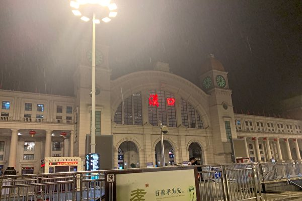

武汉小伙从北京回武汉，之后又从武汉回北京，历经两个疫区，他称是铭心经历。（受访者提供）

   
 【大纪元2020年07月02日讯】（大纪元记者顾晓华、方净采访报导）北京疫情爆发，各区民众进行核酸检测大排查，人心惶惶。对于曾亲历中共病毒（俗称武汉病毒、新冠病毒）、刚从武汉逃到北京上班的刘军（化名）来说，更是心情复杂，他对大纪元表示，“感觉刚从武汉回来，就直接又投奔另一个战场，心理上过不去，就刚好一点就又开始不好了。”

刘军是武汉人，在北京上班，1月23日封城那天晚上从北京回到武汉，“我没办法，家在武汉。”在武汉他曾疑似染疫，1月28日出现发烧、浑身无力等症状，去医院检查医生告诉他肯定是肺炎，但是由于当时核酸检测试剂短缺，医生给他仅仅开了药回家自行隔离，幸运的是他抵抗力好，一周后康复。

4月8日武汉解封后，他历经艰难争取返京，好不容易真的回到北京上班，没想到立刻又遇上北京疫情大爆发。

“我是6月7日进的京，8日刚上的班，上了5天班，刚好12日，12日还是我生日，然后又爆发了新发地，又把我赶进一个抗疫战场了。”他无奈地说。

<b>武汉曾一天增长一万五千例</b>

刘军回忆，武汉1月底的时候各家医院爆满，“病人急剧增加，当时每天确诊病例都是成千成万的上涨，最恐怖的是2月12日，一天增长了一万五千例。都是确诊过的，但是没有床位。”没有床位和疑似病例，都没给往上报。

刘军自己在一月底被感染，当时肺炎症状明显，但因测试盒稀少，没办法做检测，他也不敢去医院，“当时病患太多，医院那些重症患者连床位都没有，都躺在楼道里，是很危险的。”于是他只去了发热门诊，吃了药同时自我隔离，幸而症状逐渐好转。

他回忆2月中前，很多人不知道疫情严重性，“夜市晚上也有摊位在卖东西，在那么严重的情况下还有做生意的，没有把这当回事。”2月中旬大爆发后，当局就开始严厉封区，“怎么个封法呢？那直接就是来个铁皮、围栏直接里里外外全封一遍，你硬是出不去，像在家里坐牢一样。”

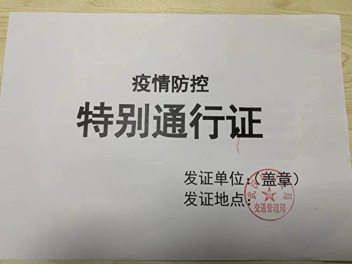

武汉封城时期的特别通行证。（受访者提供）

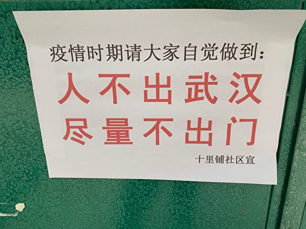

小区贴区的不让人出门的告示。（受访者提供）

“想买菜的话，一般都团购。当时鱼、肉供应都不足，而且还涨价，当时也没人来得及储备，过得挺惨。”他表示期间感觉度日如年，“因为从吃早饭、吃中饭、吃晚饭都是一个人在家待，我给自己做饭，就将就着吃。”

<b>火葬场日夜不停地烧 搬尸工搬到麻木</b>

刘军表示，武汉当时死亡人数难以估计，“未确诊的那肯定很多很多，就我身边就有很多就走了。”他指出，“未确诊的也应该是新冠，因为当时表现出来的症状都是一模一样的，症状都是那种症状。”

他以朋友父亲为例，症状“疑似”，但是没有床位，“他是在武汉第七医院走廊上走的，就因为没有得到及时的救治。”他指出当时是爆发式的增长，“去世的人挺多的，因为全武汉市各大火葬场开足马力去焚烧去世的尸体，也是烧了很长很长时间，不停地烧。”

刘军父亲有位朋友是做殡葬业的，传出当时找了许多工人搬运尸体，“搬一具尸体就是一千多吧，就是搬运费。从早上一直干到晚上，当时搬尸体搬得都已经麻木了，就干了一个星期，拿回来的报酬有十几万吧。”

“再加上各大火葬场每天24小时不停地开工。后期部队还调了几个临时的移动火葬场，肯定是在边郊地区，不能在市内。你想想一天得烧多少尸体啊。”当时就算死者是自己父母亲也不能探望，就是让救护车或者面包车拉走，直接拉到殡葬场。

刘军还表示，他推测未确诊的死亡人数至少有2万以上，并且他父亲的朋友也提到过，数字与他的推测相同。

<b>回京之路艰难无比 做五次核酸仍排不上</b>

4月8日武汉解封，刘军说，“解封的时候我开心死了，我以为我能回去。”没想到另一种艰难又开始了，“回北京的各种条件太苛刻了。艰难、艰难，非常艰难。”

刘军说，当时北京严格限制进出。“每天返京人员也就一千人。核酸过了才能给你排上号。看你提交报告的前后顺序，依次排。”能不能返京或者能不能在那个地方住，还都得先协商好，然后才能拿核酸报告让武汉所在社区的居委会主任一级一级往上报，“这个时候再报给北京，北京再根据你这个信息再确定你能不能返京，然后在‘京心相助’上给你派票。”

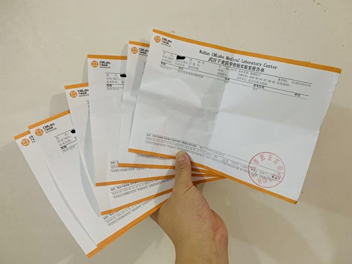

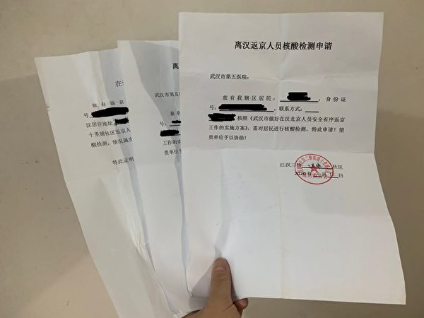

刘军的核酸检测报告单（受访者提供）

刘军在4月20日排上队做核酸，等两天报告才出来，然后赶紧上报给社区，等了七天没排上，这个核酸报告就失效了，就要继续去做核酸检测，再往上报，“然后就不断地往复，一直搞到5月底。做了5次，最近一次是6月3日这次，正好是第5次。然后6月3日做完核酸之后还是没排上票。”

“哪知道到6月6日全部放开了，没有隔离限制了，拿核酸报告就可以进北京了，我当时听了老嗨了。”

“估计北京市政府放心了，全面开放了。”他7日回京，8日上班，没高兴几天，12日北京新发地疫情又爆发了，他又掉进了另一个抗疫战场。
武汉人被歧视 如今换新发地被歧视

刚回北京刘军也经历各种歧视的目光，“歧视很正常，比方说你去外面就餐啊，你去酒店入住啊，你说你是武汉人，多少别人会震惊一下。”他表示前期更严重，“一听说你是武汉的，本来隔你半米的，一下子隔你差不多5米开外。”“我出去，如果别人问我，我尽量不回答。”

“现在武汉还好，说新发地会人心惶惶。”“新发地出事接着就是朝阳区，西城区，海淀区。后来昌平回龙观，那丰台那边绝对是高风险。”

刘军说，目前北京丰台疫情严重，他同桌的同事去过新发地买东西，因此被隔离了，“他小区被封了，他去做核酸，在家隔离，在外面装摄像头，还有测温，东西挺齐全，就禁止你外出嘛。摄像头都是临时装的。”就算住酒店也要装摄像头。

回顾这近半年来，从北京回武汉，又从武汉回到北京，都没脱离被疫情覆盖的阴影，刘军无奈地说，这经历是永久铭心啊。  

<a target="_blank" href=#top><h6 align="right">回上方</h6></a>

<a name=25>
<h1 align="center"><b>北京女设计师：我为何不顾压力走进法轮功</b></h1>

乌云中，黎明在隐现。（王嘉益／大纪元）

【大纪元2020年05月25日讯】（编者按：阮妹（化名），26岁北京某公司广告女设计师。这是她的口述整理。她刚听说“法轮功”吓坏了，但她现在认为，即使我害怕，我还是要说。）

<b>刚开始听说“法轮功”，我吓坏了</b>

上大学时，一位姓于的年轻老师给我讲了一些事，我都没听清他具体讲什么，他一说“法轮功”三个字，我脑子里就一直在重复：他是法轮功，他是法轮功……后来我跟男朋友说，以后咱离这个老师远点，太可怕了！他一定是学法轮功的！

之后于老师问我要不要“三退”？我说“退”，因为面子嘛，还有，我担心如果不退，他会不会伤害我啊？！其实我当时几乎什么都没有听见，光剩下害怕了。“法轮功”三个字是一个禁词，我一懂事就知道了。

这位老师是党支书，人特别好，据说高校管招生的老师，招生一年下来就是一套房。但我们校长就找他管招生，知道他不会干这种事嘛。专业方面，他也能讲很多别人不知道的事情。所以后来我还是想跟老师多接触，多学习，别的就不想那么多了。

后来我偶然看了那本禁书《转法轮》，觉得挺好啊，我就跟于老师说我想学，老师说：学这个功，不能让你提高学习成绩，也不能给你带来什么好处，而且，也不是我想让你学你就能学的，要看我们师父要不要你。

我听了挺羞愧，老师可能觉得我想学法是要和他套近乎吧。可是能怎么办呢，那时自己确实是这样一个人啊！我是个乖孩子，耳根子软，没有分辨能力，家人和亲戚都和我说：“上了学你要会来事，你要和老师搞好关系啊！”他们还要我入党，“以后工作的时候对你有好处啊！”

<b>只要我还在位，就不会发展一个党员</b>

一上大学我就积极要求入党，交了入党申请书，我就跟我爸报喜：“我可能会被选上呢！”

大学三年级，我和于老师学了法轮功，那时我21岁。

一天，于老师跟我说：“你成了预备党员了？”因为他是我们学校的党支书记，所以提前就知道了。接着他说：“只要我还在位，就不会发展一个党员。”他提醒我处理一下这事。他说要找一个合理的借口，比如，以后可能会出国啊，如果是党员，美国是不欢迎的，是不给办绿卡的。

然后我就去找辅导员了，我说，我不想入党了，我可能会出国。辅导员就让我写个材料放进文档里，证明不是她不让我入，是我自己主动放弃的。辅导员说：“这么多年，学生都是单独来找我说想入党，你是第一个找我说不想入党的。”

真的，开始我也是挤破了头都想当党员。其实我并不清楚共产党到底是什么东西，也不知道入党意味着什么。后来了解了共产党的真正历史，我才明白它是多么邪恶，手上有数不清的人命，它是会吃人的！

回过头来看，当时自己挺傻的，还觉得自己很精明、不吃亏呢，其实和魔鬼做交易，那能有什么好果子吃吗？这个体制里能做到洁身自好吗？不站队不腐败都会是异类吧？这让我觉得特别恐怖，为了利益什么都能干，什么都能出卖，没有是非，只讲利弊，人不是越活越没有人性？我不想这么活，我一定要远离它。

<b>知道我炼功，我妈开始极力阻止</b>

放假回家我跟我妈说，中央台播的法轮功都是诬陷造谣，开始我妈还挺认同，后来听说我炼功了，她气得摔了自己的手机，然后冲进厨房，拿起菜刀就要砍自己。长这么大，我都没见我妈这么生气，她是一个特别温柔的人呀。

我爸呢，马上问我，谁教你炼的法轮功？我不敢说。我爸觉得我太天真，容易被人骗，觉得我学了法轮功，就会对父母家庭都不在乎了。之后我爸很长一段时间都不跟我同框照相。

我跟他们说，如果法轮功不好，我能去学吗？我也不是不懂事的人呀。我妈说是，她其实也相信。但是她说，就像我做生意一样，别人觉得我人好，就会来我这买东西，不用我怎么跟他说，我人有多好，他才会来，你也一样，你也不用怎么跟我说，你就自己做好你自己就好了。

因为国家不允许，我爸就觉得自己女儿这样特别没面子，在别人面前抬不起头来。但无法阻止我，他们也就默许我修炼了。他们很害怕。一天找不到我，他们就会找遍我所有的朋友，非常焦急。

<b>我觉得这个理挺好的，您觉得这个理不好吗</b>

大四那年，我回老家看姥爷，姥爷快不行了。我一路坐夜车浑浑噩噩，一直做梦。梦中，我看到姥爷好像被小鬼缠着。我知道他为什么会被小鬼缠上，因为姥爷是党员嘛。以前我给他听过法轮功师父的讲法录音，这次我下决心，一定要尽快和姥爷说“三退”的事，但我真的挺害怕。

当时村里很多人都过来看我姥爷，当姥爷的面，他们讨论人死了应该准备什么东西啊这些事情。

姥爷那时也就剩一口气了吧。我趴在姥爷耳边，跟他说：你要记着法轮大法好，真善忍好，你会有一个好去处的。

在场很多人听到了我这些话，他们围在一起说我、推搡我，还打我来着，就那么捶。当时真害怕，现在想起来还挺害怕的。

我不理解，为什么法轮功这么好，因为听了谎言，他们就不再听我说什么？就这样对我？我难过得说不出话，强忍着，不想让自己哭出来，但最后还是哭了，我觉得自己挺没用的。

我大妗子后来说我：你上了这么好的大学，怎么还相信这些？我说：真善忍难道不好吗？我觉得这个理挺好的，您觉得这个理不好吗？她就不说话了。

<b>我觉得爱情的意义和以前不太一样了</b>

我的男朋友后来也修炼了。如果不修炼，我俩很可能会分手，可能像普通青年一样，考虑的物质条件多一些吧。

开始他父母没有那么喜欢我，觉得我这个小姑娘挺机灵的，怕儿子受骗，慢慢接触下来，就觉得我没有坏心眼，还挺懂事的。

给我妈买过一个泡脚桶，泡了之后我妈说很舒服，我就想也给阿姨买。知道阿姨腰不好，倒水不方便，我就挑了可以下排水的，寄到之后，阿姨一直没用，因为卫生间有台阶，不方便接水。我又在网上查，发现有带轱辘的可以拎着走的，就解决了上下台阶的问题。我男朋友很多问题都想不到，所以我就想着，我要让他父母体会到有女儿的快乐。我给我父母买东西时都会给他父母买。还是下排水，这样就很方便了，现在阿姨用着觉得挺好的。

后来他们就很喜欢我，每次他们都拿最贵的水果给我吃，走时还让我带走好多好多。

大学时我和男朋友经常一起看书、炼功，毕业后，我跟他一直是在异地工作，平时也互相提醒，自己哪里做的不对了，怎么做会更好，我们经常互相切磋。用社交软件聊天，敏感词就会编一些我俩能看懂的小暗号，方便交流而不被监控。

修炼让我觉得爱情的意义和以前不太一样了。以前患得患失，芝麻大点小事，就吵吵闹闹，控制不好可能会变成大吵大闹，其实那很伤感情。学法后知道忍是必修课，生气时慢慢学着控制自己尽量不发脾气，多为他考虑，想着想着就真不生气了，还会想到他的不容易，很多矛盾就化解了。这时我最开心，因为消化掉对他的伤害，比发出去那个脾气更让人痛快。

也是因为修炼，我们彼此非常信任，从不会在男女关系方面互相猜忌，他是不是会喜欢别的女孩儿？是不是不喜欢我？等等，这些从来从来我都没有怀疑过，我们有超越普通爱情的那种感觉。

如果他工作中和女同事搭档，我就告诉他如何对女同事更绅士一点。因为我知道他不太体贴人嘛。我俩还会一起商量，怎么做让那女同事感觉更好。想起来也得挺有意思，如果没修炼，我俩可能不会这么想问题吧。

之前男朋友身体特别不好，就是个药篓子，炼功之后，他身体好了，我对他没有什么担心的。相处七年了，我俩也快结婚了。

<b>老板竟让我上台领奖</b>

上班闲暇，同事们玩游戏、上淘宝，我就看书。开始他们不理解，现在的年轻人还有看书的呀！我就把对自己有帮助的书推荐给他们，他们有问题，我还会给他们上“小课”，推荐好用的技巧，他们当然爱听。公司有好几个设计师，一般都不太愿意分享，因为懂得多就能得到老板的赏识嘛。但我到哪个公司，都会建一个分享群，把我会的东西分享给大家。

有位同事工作不上心，大家都不愿与他合作，不喜欢他。只有我与他合作，起初我也默认自己可以不喜欢他，有时对他态度欠佳。还想跟老板抱怨他的工作问题。后来觉得，我怎么能这样？他妻子怀孕七八个月，马上就有孩子了，如果我和老板说了，也许他会失去工作啊。

做广告设计的人会比较自我，都觉得自己设计的好，如果不被认可，就会抱怨客户不懂审美，提出的要求难以理解。但我尽量满足对方。其实每个人都没有错，能理解别人，换个思路，就可以找到最合适的解决方案。

比如做一个海报，对方想让logo放大一点，背景变成红色。如果只是单纯放大logo，可能并不是最好的解决方案；如果背景变成红色，搭配起来可能真不好看。我理解，客户说这话，并不一定表达了他的本意，他可能想说现在的logo不明显，想突出一点。因为他不懂专业，描述就不是很清楚。

我理解他的心，这是食品海报，他想要的是希望看起来有食欲，于是我选择了一个更加合适的暖色，很好看，客户也非常满意。这让我明白，要善意理解对方，人就会有智慧。就会有很多方式解决问题。

年终开会，老板讲了好大一段话，说和总监们一起商量，要发一个奖。没想到最后，竟让我上台去领奖！我特别震惊，我刚来这家公司还没几个月呀。老板说我很努力，有想法，为公司做了很多贡献。后来老板顺道送我回家，说除了这个奖，还给我准备了年终奖，真是想不到啊。

现在武汉肺炎（中共肺炎）疫情期间，老板选效率高、经验足的人上全天班，有的同事每周只给安排两天工作，一个月只有两千的工资，连房租都不够。我却天天很忙，没受疫情影响。

<b>即使我害怕，我还是要说</b>

以前，我被说是一个典型的小女生，现在我关心政治，经常翻墙，我身边朋友也会跟我要翻墙软件。

在公众场合，法轮功是一个比较危险的话题。一次大家聊天，同事说：应该抓法轮功，抓他们没什么不正常。一听他提法轮功，我先就一激灵，但我说：很多宣传都是假的，都有破绽，你们都可以去看看。如果只是因为他们有信仰，就可以把他们抓起来，就可以把他们的器官卖给别人吗？

你可以不信法轮功，但是学法轮功的人没有伤害别人，我们怎么能有权利这么说他们呢？那同事觉得我说得对，他还也提醒我不要出去随便跟不熟悉的人讲，小心被“请去喝茶”。

我认为触及到人的善良本性，人们最后还是会明白的。即使我再害怕，我还是要说，因为事情就是这个样子的。

口述：阮妹（化名），文字整理：尚云天

<a target="_blank" href=#top><h6 align="right">回上方</h6></a>

<a name=24>
<h1 align="center"><b>美参议员：香港自治法将真正惩罚中共官员</b></h1>

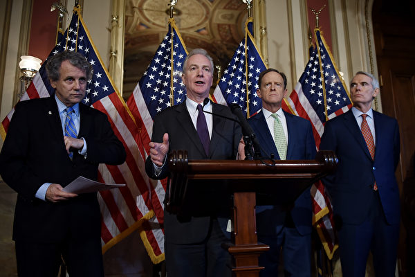

图为美国国会共和党参议员帕特·图米（Pat Toomey，右二）和民主党参议员克里斯·范霍伦（Chris Van Hollen，左二）出席新闻会。(OLIVIER DOULIERY/AFP via Getty Images)

   
【大纪元2020年07月03日讯】（大纪元记者王祥综合报导）美国国会周四（7月2日）一致通过《香港自治法》，送交白宫等待总统签字。

提出议案的参议员表示，《香港自治法》将真正惩罚侵蚀香港自治的中共官员，美国需要采取这样的步骤来反击中国共产党；参议员提醒说，中共的侵略不会只限于香港一地，它有意在全球传播影响力和权力。

参议院最早于上周通过这一法案，众议院周三（1日）也通过相关香港法案，因两院版本内容有细微差异，参议院周四（2日）再次就统一后的版本投票、完成国会立法流程。

参议院法案由共和党参议员帕特·图米（Pat Toomey）和民主党参议员克里斯·范霍伦（Chris Van Hollen）共同提出，除了强制性制裁违反香港自治的中共官员及实体外，还将对跟这些实体进行业务往来的银行施加二级制裁。

参议员图米周四要求参议院一致同意通过《香港自治法》。他表示，法案将“针对中共终结香港的自由生活的做法、那些应担责的人进行真正的惩罚”。

“法案将对任何参与行动、攻击香港基本自由的人施加强制性制裁。立法还迈出了一步，它将惩罚选择跟侵蚀香港自治权人士从事金融往来的银行。”他补充说。

图米在参院表决前说：“美国需要采取像这样的有意义步骤来反击中国共产党；我们应该记住，这种对香港的侵略不会只限于香港一地，中共有意传播它的影响力和权力到全球各地。”

<b>希望总统立即签署法案 对中共发出警告</b>

参议员范霍伦说：“美国必须与香港人站在一起，这就是法案表达的意思。法案说，我们与香港人站在一起。”

“我希望川普总统立即签署这一法案。作为一个国家，共和党人和民主党人必须发出一个强硬声音，即我们不支持北京破坏它们自己签署的、根据国际法规定它们应遵守的协议。”他说，“在它们镇压香港的自由时，我们不会无动于衷、保持沉默，啥也不做。”

《香港自治法》将直接回应中共强推的港版国安法。

美国白宫谴责说，中共此举违反了北京的国际承诺，并誓言将继续采取强有力行动“打击那些扼杀香港自由和自治的人”。

美国副总统彭斯（Mike Pence）周四（7月2日）表示，中共通过并强加给香港的国安法，“背叛了它们所签署的国际协议，这是全世界爱好自由的人们所不能接受的”。

<a target="_blank" href=#top><h6 align="right">回上方</h6></a>

<a name=23>
<h1 align="center"><b>【拍案惊奇】港人抗争新招！贵州地震前龙叫？</b></h1>

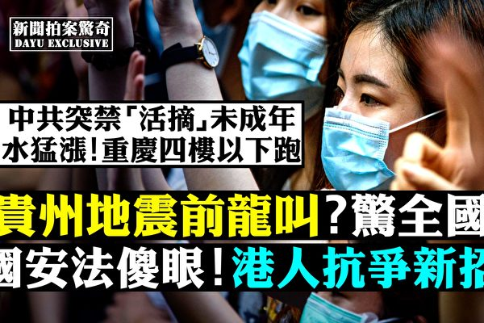

中国连续3场地震，威胁三峡！1号洪水将至；铜锣湾又现离奇坠楼；少女举白纸抗议。（新唐人合成）

   
 【国安法首例被捕男子！竟是国安法“拥护者”】

7月1日，也是国安法实施后的第一天，根据香港警方公布，当天抓捕的大约370人中，有10个人涉嫌违反国安法而被拘捕，根据新消息，截至7月2日晚上，有8个人获得保释，仍有两名男子被扣留调查。这保释的人中，就有那位第一个被警方以违反国安法高调逮捕的25岁男子张先生。张先生说，警察告诉他， 要一个月后回警署报到。

张先生被警方指控违反国安法第21条，是一项分裂国家的罪名。

可是张先生为什么被捕呢，除了他身穿“光复香港 时代革命”的T恤，就是他当时摆在地上的那面“香港独立”的旗帜。按照国安法，香港独立的口号显然是打击的对象，这样看来张先生被捕，也是被警察抓到了这个把柄。但是令所有人都没想到的是，张先生竟然在这面旗上画了一个“小鸡吃米图”。

我们回过头来看看香港警方公布的逮捕张先生时的照片。看看这地上的旗，有什么异样？看不出的话，那就放大、放大、再放大。欸，好像多出几个字！

原来，在“香港独立”四个字的左上角，张先生分明写着写着立场坚决的“不要”，两个小小白字。再往下看，在英文Hong Kong Independence的左侧，也有英文“No to”，意思也是不要香港独立。

这位先生如果不是真心反对港独，就是发挥创意，要玩死国安法。

接下来，就要看针对这面旗帜，政府当局要怎么处置了，人家这面旗，分明是在“拥护”国安法嘛。

【喊“光复香港” 正式违法！】

但是7月2日，香港政府又发了一个“炎症”声明，啊，字幕应该是打错字了，是“严正”声明，说“光复香港 时代革命”这个口号，在今时今日，具有“港独、或将香港特区从中华人民共和国分离出去、改变特区的法律地位，或颠覆国家政权的含意”。

因此，张先生所穿的T恤，就含有“光复香港 时代革命”的字样。不过，张先生七一被捕，这个声明是7月2日发出来的，国安法不具有追溯期，是否也会因此入罪，还有待进一步消息。

其实，就“光复香港 时代革命”本身来讲。香港民主派人士早就做过解释，根本就不是什么港独，简单说来，这个口号完全是在拥护“一国两制”。人家要光复的，是真正意义上的一国两制框架下的香港自治，革命，也不是要推翻政府，而是革新立命的民主政治优化。根本与“港独”扯不上关系。

其实，要说到有煽动分裂的口号，香港的民间讨论区上，倒是在调侃一句新的口号，这个口号，连北京的政府机构都在喊，还能唱，这句话要是按“国安法”，也有理由被禁。但是当局者万万没有想到，这个口号，于今，正是对他们自己莫大的讽刺，也特别恰当地形容出如今香港抗争者的勇敢。那就是“起来！不愿做奴隶的人们。”

【女子举“白纸”抗议 创意背后的悲壮】

在七一游行中，还有一位女孩的创意，巾帼不让须眉，并不比张先生好差。

署名“丁乔”的作者在立场新闻发稿，描绘了一名举着特别“标语”的香港女孩。当时，警察正押着一群被捕者，走上警车，围观的人群中，有一个举着一叠白纸的女孩。

作者询问缘由，女孩说，之前举的标语，到现场可以随意拾取，但是国安法进港，她不知道要用什么标语，才不会犯法。但是她想起了前苏联的一个冷笑话：红场上有人发传单，但是传单都仅仅是白纸，不过苏联军官发现后，照样对散发白纸的人说，别以为我不知道你想写什么！

是啊，国安法下，从天灭中共到光复香港，都似乎成了“禁语”，就算什么也没说，文章作者丁乔写道：统治者觉得你说了，就是说了。

这个笑话，少女说：当初荒谬，今天她试试，看看是不是已经成真。

这名女孩两年前才到香港，自己说，再也不想回到那个“no access to Google”的生活。

不过，如果香港人今后举“白纸”上街，也不失为一个办法。

【刀刺警察男子飞机上被抓 亲人报案！】

香港在七一这一天，发生好多事。抗争者中，有举白纸表达诉求的智慧理性，也有一个人拿刀刺警察的愤怒与冲动。当然，显然刺警察的24岁黄姓男子，并非想出人命，刺到了警察的胳臂，但是血流如注的画面，成了香港警察做宣传的主题。

事情发生在7月1日下午4点多，铜锣湾中央图书馆外，一个防暴警察试图制伏一个抗争者，多人上前试图解救抗争人士，其中这名黄姓男子，就拿出短刀，扎了警察的左臂接近肩膀的部分，造成流血受伤，香港警队高调宣称，誓要缉拿男子归案。

结果，在当晚午夜时分，11点43分，香港机场的警区，收到一个神秘爆料电话，说当天刺警察的男子，就在11点55要离开香港前往伦敦的飞机上。警察很快出动，上飞机抓人，果然把男子抓走。

据报导，举报黄姓男子的，竟然是他的一名亲人，这让人不禁感慨。

【中共治下畸形“生态” 亲人互相检举揭发】

反送中期间，早听说有家庭因为政见不合，甚至有身为蓝丝的父母，将支持抗争的黄丝子女逐出家门。在中国大陆，我也听说过很多案例，就是亲人举报亲人，他们出于一个很奇怪的逻辑，就是被举报的亲人对共产党不满，而举报他们的亲人呢，却抱着对共产党的莫名信任，要党去改造他们。

从文革到1999年的迫害法轮功，再到现在的香港，例子很多。在大陆迫害法轮功的时候，很多家庭，就是丈夫举报妻子，父辈举报子女，让中共的公安，把他们的亲人抓进“洗脑班”洗脑，而“洗脑班”的实质，就是逼迫你放弃信仰的酷刑室。但是举报亲子的人，不知道是吃错了什么药，把对共产党的恐惧变成了依赖和变态般的信任，他们无法说服亲人以开脱自己的恐惧，便把亲人送给共产党任其“改造”，造成一幕幕悲剧。

诚然，这名男子以刀袭警，确实把自己陷入非常危险的境地，从法律角度来讲，也确实存在法律责任。这个案子，有它独立的特质和争议。

同时，有消息说，这名男子的父亲否认报案，也有人在议论，在国安法出台的第一天，香港出现了唯一一例以刀刺警的案子，是否为当局的坑人把戏，也犹未可知。

不过，这名男子犯了案的尝试要离开香港，是有其原因。但是，有的人，因为只说了话，也不得不离开香港，这就很反常。

【罗冠聪默默离港 黄之锋坦言有担心恐惧】

现已解散的香港众志创党主席“罗冠聪”，7月2日晚在自己脸书上正式，自己已经离开香港，而这个决定牵扯多重考虑，包括保密因素，还有自身和别人的安全。而他说出来的，一个离开的重要原因是，国安法出台后，香港当地能承担的国际阵线的工作，遭到大规模压缩，因为有“勾结外国”的罪名嘛，所以他们的风险几何级数地上升。

而就在离开前一夜，7月1日，他用远程视频在美国国会听证上发言，批评国安法字句模糊，容易滥捕，而且过分放大政府权力，法律违反了中英联合声明，并在会议中喊出“光复香港，时代革命，五大诉求，缺一不可”。在离开香港之时，他并不无感慨地说：今此一别，尚未知归途何期。

截至我们发稿，前香港众志的秘书长黄之锋发文报平安，称自己是中共名列前茅的打击对象，但截至7月2日晚，他还安好，一切如常。但是他不知在香港的人身自由还有多久，坦言自己面临终身监禁的风险，内心存在担心与恐惧。但是他表示，还会继续坚持下去。

【铜锣湾抗议刚过 即现可疑坠楼案】

而在七一铜锣湾聚集活动后，7月2日清晨时分，也在铜锣湾，一名年约30岁的男子，横倒在路上，被驶过的大巴士卷入车下，后伤重不治身亡。香港警方把这列成了“交通意外”，同时不排除男子事先从附近大楼高处掉下来，摔到路面。

我们都还记得，反送中期间，香港出现很多浮尸海面、高楼坠地的悬案、奇案，无论坠地还是浮海的男男女女，有一部分还是赤身裸体。很多爆料信息指出，这些人是被中共秘密警察害死，制造恐怖恐惧以吓退香港抗争者。如今，港岛游行刚过，铜锣湾就又有一起疑似坠楼的案件。因此，不少香港网友，在质疑这件案子背后，是否有更深的黑幕。

目前，国际上仍然发出声音，表达对香港的声援。

【美挺港法案只等川普签字 澳拟“避风港计划”】

7月1日，美国众议院通过了《香港自治法案》，此前该法案已经在参议院通过，现只待川普总统签字生效。这项法案，将对违反中英联合声明与基本法的，中共与港府官员个人、实体，还有相关的金融机构，进行经济制裁。

众议院议长在法案通过后，发表声明提到：我们必须考虑所有可用的手段，包括签证限制和经济制裁，以保障香港人对自由、正义和真正自治的希望。

也在7月1日，美国国务卿蓬佩奥在例行新闻会上，也对国安法提出谴责。他特别提到了国安法第38条，内容是“不具有香港特别行政区永久性居民身份的人，在香港特别行政区以外，针对香港特别行政区实施本法规定的犯罪的，适用本法”。

蓬佩奥指出，这一条内容，不仅包括香港人，也包括中国大陆的人，还有美国及世界更多地方的人。这条法律，等于把全世界人，都放在了国安法的管控之内，蓬佩奥说：这是对所有国家的侮辱。而这法律直接威胁在香港的一千三百多家美企，还有八万多名美国公民的安全。

而白宫发言人表示，美国总统川普认为，北京的激进行为，已经暴露了中国共产党的真面目。

7月2日，香港实业家袁弓夷在美国国会山外发言，宣称在美国国会，有很多议员支持香港人民争取自由。

继英美之后，澳大利亚政府在7月2日也表示，正考虑为香港提供“避风港”计划，为香港人发出临时庇护签证，可在澳洲居住三年。

【香港已近“张口就是罪” 郝海东夫妇：灭共救港】

而在香港，国安法的实施，好像已达到“张口就是罪”的程度。一名香港球迷高喊“利物浦万岁”，指的是英国足球俱乐部“利物浦”，但是香港警方，却说他在“煽动港独”。

而换到香港执法者自己的行为失当时，无论做到多么过分，也跟中共学得越来越像，根本不会承认任何错误。

中国前男前锋郝海东，还有他的妻子，前中国羽毛球世界冠军叶钊颖，分别发推文谴责中共对香港的压迫。

叶钊颖7月1日发说推文说：共党不倒，香港不会好，共党是万恶之源，要彻底解决香港问题，必须彻底打倒共党。

郝海东在此前的推文中表示：我踢了一辈子足球，到了50岁才发现，真正要破的门是共产党政权！把共匪踢出历史舞台！对共匪罪恶不能熟视无睹！勿为蝇头小利与邪恶共匪狼狈为奸！

郝海东此前在接受采访时，还透露，自己在中国大陆的所有银行账户，已经被中共报复性封杀，一分都提不出来。但他们夫妇俩人，依然坚持着立场。

就在7月1日开始，中国大陆遭受了一系列自然灾害的侵袭。

【重庆四楼以下逃！北京持续雷雨】

6月下旬发生罕见大洪水的重庆綦江流域，7月1日再出现暴雨导致的山体滑坡，形成泥石流，这阻塞了重庆的一条高速路。

当天，重庆一个小区的通知文件在网上曝光，不过日期是落在6月25日，显示当地物业告知住户，四楼以下，都要做好防洪准备，预估今年的洪水水位，将达到193米，非常之险。

截至发稿前，已知重庆的水灾，已经造成至少6.9万人受灾，而且暴雨持续。

而在北京，7月1日当天不只是香港主权移交的周年，也是中共的所谓“党庆日”。可在这一天北京多处暴雨倾盆，包括大兴区、密云区、顺义区，还出现大量冰雹。

到了7月2日晚，北京官方宣布，将遭受今年最强降雨袭击，直到7月4到10日，北京仍然多雷多雨。在北京郊区，还可能爆发山洪。市内一些地方，已经出现较明显的积水。

【大西南短时间三场地震 贵州震前可怕巨响成谜】

到了7月2日，中国西南地区接连地震。

首先是凌晨4点07分，四川阿坝州若尔盖县发生3.2级地震，震源深度8千米。

接下来，当天第二场地震发生在贵州省毕节市赫章县，而且一连两次，分别是上午11点11分，和11点57分，震源深度都在10公里左右，震级分别是4.5级和2.9级。

因为第一场地震震级相对较高，当地发生较为明显的晃动，不少人跑到街上避险。除了毕节地区，四川宜宾、云南镇雄等地，都有震感。

而比较令人惊奇的是，在贵州地震发生前，至少从7月1日开始，距离震中不远，同在毕节管辖之下的“秀水镇”，就发出过阵阵怪响，令人称奇。

有人说，这像“龙吟”，也有人说，这像牛叫，但是哪来这么大的牛啊？

有人说，这是不是后期加的配音呢。但是很多人是现场听到的，这声音真实不虚，消息源不止一个，陆媒也做了报导。所以声音本身是真的。

因为这个响声奇特，又找不到出处，很多人好奇地跑到声音出现的地方，去解谜，但是都铩羽而归，未有谜底。恰恰官方又变成“辟谣大师”，7月1日就说，排除这是地震，而可能是地下洞穴在水流或风过后发出的声音，那以前怎么没有呢？还说有一种可能，是动物叫，但是什么动物呢，官媒是这么说的：相信权威部门一定能给出科学答案。

结果，没等权威部门给出答案，很快，7月2日，毕节就发生地震，而且接连两次。

我想起我看到的另一种民俗的解释，说这声音来自“地牛”，而地震就是“地牛翻身”，这是地牛在翻身前，发出的呻吟声。

【地震威胁三峡安全 长江上游水位猛涨 库区将迎1号洪水】

那么，四川和贵州，短时间内先后三次浅层地震，即便震级并不高，但引起人们热议。特别是直接位在长江上游的四川发生地震的区域，有水利专家警告，这在长江上游的地震，抑或是山体滑坡，将直接影响到三峡大坝的安危。

而就在四川和贵州连震之后，长江水利委员会急发“洪水预警”，说因为连日暴雨，长江上游的轩流、乌江等，还有长江中游各水位站，水位明显上涨，因此，长江上游，可能形成2020年第1号洪水，加剧对三峡大坝的威胁。

截至当地时间7月2日上午10点，长江进入三峡库区的水量，已经达到每秒5万立方米。

预计乌江武隆水文站，会达到警戒线193米上下。一旦洪水涨到警戒线，说明防洪工程已经到达极限，随时可能诱发防汛工程的险情，所以此时防洪会进入紧急状态。已经有水利部门提醒长江流域的民众，注意安全！

大家可能还记得，香港有一位当世的风水师，叫“权朗”，她曾预言5、6月间中国西南有8级以上地震，直接影响三峡的安危。现在刚出六月，西南的确出现地震，虽然震级尚有限，但是相关的预言，到现在，也不得不说，也许有其不可被忽视的理由。而“权朗”曾在去年9月，准确预测到今年发生的病毒大瘟疫。

【黄河等全国多水系入汛 广西蝗虫多到上人身】

除了以上提到的灾害，云南昭通同样暴雨严重，而四川凉山彝族自治州近日爆发山洪，截至7月1日已经有14人死亡，当地曹古河甚至已经因为山洪改道。

黄河流域同样遭受连日暴雨，小浪底水库也在泄洪，危及下游。

而进入七月后，全国更多水域遭受雨水威胁。包括北方的松花江、辽河，中原地带的黄河、海河、淮河、长江，南方的珠江等，都会有隐患，需要防范的有至少三种灾情：洪水、山洪、溃坝。

除了水灾，广西桂林全州县6月30日就传出视频，显示当地已经遭受蝗虫侵袭，大量蝗虫在当地出现，都从容地爬到了人的裤子上，安然张翅，这可真是“仗势欺人”，显示蝗虫数量众多。哦，有密集恐惧症的观众，忘记告诉您闭眼了，真是不好意思。

【北京女子知确诊后崩溃！卫健委公开禁“活摘”未成年】

各种天灾齐出，瘟疫也还在蔓延。

7月2日，北京石景山的万达广场，一名姓谢的女子，接到消息，得知自己前几日的核酸检测结果是阳性，结果当场崩溃，在她用过餐的一家拉面店外，大哭大闹起来。随后，她用过餐的拉面店被要求强制消毒，商场内的各商铺，也被要求消毒，在其中逗留的顾客，被陆续清退。而商场内的所有，在当天上午上班的职员，全部要进行核酸检测。当天在场的民众，有相当一部分人也对媒体表示，自己心情忧虑。

而最近，大陆国家卫健委，除了处置瘟疫之外，还发出了一个引人关注的消息。《北京日报》发消息说，国家卫健委指出，摘取未满18周岁的公民活体器官，将追究刑事责任。

这个消息是针对什么而来的呢？我们都知道，至少十几年来，对中共活摘人体器官的指控比比皆是，中国大陆失踪的不少年轻人，就被指涉嫌被摘了器官，而中国大陆，已经形成了，有政府包庇的地下器官交易黑市。这一事件，已经得到国际组织、国际法律机构的证实，我们在以往的报导中，都有提到。

相信，这些黑幕的真相一定会被彻底揭开！

<b>～～～新拍互动～～～</b>

现在开始我们的新拍互动。

我们知道，很多人经历了相关反送中后，立场发生转变，而不少人也经历过，跟意见相左的家人，针锋相对地争论，抑或是避而不谈，免得不开心。有一位观众的来信，他的例子，就很典型。

观众“rowley”说：

大宇好，看你们节目一年多了，每天打开youtube第一件事就是进你的频道。有很多话和想法，身边无人可讨论，包括家人，有个朋友因为在家庭群里说香港的事，被移出家庭群，我听了只能苦笑，所以写信给节目，翻墙时间很久了，但多半都是看看国外娱乐和为了打游戏。可笑吗？这片土地上打游戏，你都不能和世界一起玩，要翻墙。

直到去年反送中事件发生后，才关心起“政治”，这里为什么要加引号，其实什么政治呀，这关心的不就是我们以后的生活会怎么样吗。

和很多人一样，我被香港人的勇气、团结震撼到，湿润眼眶不止一次，那么勇敢以生命为代价，争取正确的东西，这些勇气在国内几十年了，大部分人不曾有过，也不曾敢有，包括我自己，怕自己和连累家人的安全，所以看到港人的而我们不感有的勇敢举动时，胸膛里一股说不出的力量涌上来，化为了有点委屈的眼泪，在眼眶里打转。

最开始大陆的宣传说就是因为港人买不起房子开始闹，后来暴动，港独。我本人最开始的想法是不关心，闹去吧，共产党想弄你们，你们还能闹，看在大陆，他们想让谁闭嘴就让谁闭嘴。

可是事件一直不平息，我好奇心就起来了，于是特意翻墙关注香港问题，原来是为了自由！！！！！我彻底被震撼了！同时也遇到了拍案惊奇。

我是八十年代北京生人，六四时我上小学，已经记事，我每天会走长安街，游行我见过两次，晚上响起的突突突的巨响，家长说那时枪声，很多建筑物上的弹孔我也见过，只是那时不知他们学生在干什么，如今在香港又见到了“他们”。原来都曾发生在我身边。法轮功的遭遇我也是看着过来的，以前上高中时，一路上到处都是炼功的人，花园河边。

再说国安法会把香港变成什么样子，警察可以随便以莫名其妙的理由抓人了，大家恐慌，可大陆一直是这样子呀，随便让你消失，无人问津。美国英国都出台法案无条件接纳港人了，祝贺港人的同时，看看自己，含泪充满了羡慕，我们天天过着这样的日子，无处可躲。在大陆和警察打过交道的人，都会不约而同地说出“他们就会和稀泥”，除了搅和什么也不会为你办，他们对老百姓比贼还狠，不管你报了什么案，也没结果了，抓贼不出力，欺负老百姓可卖力气了。

去年我去派出所开无犯罪证明，亲眼看着民警骂老太太，老太太买理财被骗了20万不敢和儿女说，来报警，小警察说我们管不了，你贪呀，不贪能让人家骗？你那是上海公司，去上海报警去，还有更难听的话。这都是人吗？是妈生出来的吗，老太太急得哭，说没老伴，帮帮我。警察往外轰老太太，说影响他们办公。

你被偷什么，遇到什么问题，只要他们出警，见到你就是一副不耐烦的样子，劳他们大驾了，真没觉的是我们纳的税养了他们。可帮日本人找自行车一天就能破案，帮黑人找手机2小时就能破案，你丢的孩子却找不到。

国安法在港顺利实施，黄之峰等人在抖音app上被说成港独惧怕我国新法，解散组织逃之夭夭，打开评论，几万人的叫好点赞，“抓回来挖煤”“臭蟑螂活该”等等。每每看到我都万般心痛，你无法留言去告诉他们真相，大家被仇恨主义教育的完美极了。

和父母聊聊这些事，他们就激动，“这都是拿了钱污蔑共产党的，没事别看这些没用的，你思想都有问题了”，不想和他们吵，我就自行退下了。父母六十年代生人，赶上了“3年自然灾害”的尾声，都有过挨饿的记忆，母亲亲口讲过小时候从砧板缝扣面吃，从锅里捡饭粒，就这样，和他们说“3年自然灾害”的事情，都听不进去。和他们说数字货币、强拆，这些有关自己利益的事也不行，他们会说“拆你了吗，跟你有关系吗？”

我相信，这位观众“rowley”的经历，很多人都有，所有观众也能理解。医病需良医，医国更需良医，几十年在共产社会里泡着，能清醒，真的很了不起，但其实也并非难事。

好，如果您有爆料信息，可以息给我们发邮件，我们的节目电邮是：xwpajq@gmail.com。

新唐人《新闻拍案惊奇》制作组  

<a target="_blank" href=#top><h6 align="right">回上方</h6></a>

<a name=22>
<h1 align="center"><b>【最新疫情7·3】NBA复赛在即 25球员染疫</b></h1>

日前NBA批准22支球队重新开始赛季。（Gray Mortimore/Getty Images）

   
  【大纪元2020年07月03日讯】（大纪元记者陈霆、张婷、林燕综合报导）7月3日全球中共病毒（武汉肺炎）疫情最新情况： 
  
  根据约翰·霍普金斯大学的数据，截至美东时间周四（7月2日）晚上8时33分，全球感染中共病毒（武汉肺炎）的死亡人数超过52万人，确诊病例超过1083.6万例。（注：因中共和伊朗隐瞒疫情数据，真实数据比统计的要高）。

根据美国疾病控制与预防中心（CDC）发布的整体预测，到了7月25日，美国恐将有近148,000人因染中共病毒而病故。此预测报告是基于外部机构的24项独立研究。

而面对即将到来的7月4日美国国庆日，卫生官员呼吁民众们取消聚会，在家庆祝。且为了防止病毒传播，已有六个州决定关闭数千家酒吧，这些州包含了密歇根州、佛罗里达州、德克萨斯州、加利福尼亚州、科罗拉多州和亚利桑那州。另外，宾夕法尼亚州的部分地区也已关闭酒吧。

另外，联合国国际劳工组织（ILO）发布的报告中指出，由于病毒大流行，拉丁美洲和加勒比海地区的失业人数可能会创历史新高，预计该地区的失业率可能上升4至5个百分点。

目前，巴西的总确诊病例数已达149万6858例。而秘鲁的卫生部则表示，周四是秘鲁连续第六天出院人数高于新增病例，秘鲁当局认为，尽管病毒仍在传播，但规模正在缩小。

=======================

<b>以下是最新疫情实时更新：
川普政府更新航空旅行指南</b>

川普政府表示，航空公司的乘客和机组人员在整个旅程中都应该戴上口罩，但没有强制要求他们戴口罩，也没有要求他们在机上保持社交距离，这也是目前航空公司之间争议的问题。

美国交通部、国土安全部和卫生与公众服务部联合发布的旅行指南称，航空公司和机场应该要求乘客戴面罩，并称在无法保持社交距离的任何时候，戴面罩就显得特别需要。

这些政府部门说，航空公司和机场应该告知旅客“什么时候可能无法保持达到社交距离的要求”，并强调在这些时候戴上口罩和保持双手清洁就非常重要。

就在上述建议提出之际，美国航空公司近几周在航班上留下一些不出售座位以给乘客腾出空间的政策出现分歧。川普政府还表示，航空公司应收集乘客联系数据，以协助进行疾病追踪工作。

<b>墨西哥新增6,741例 病例数居世界第十高</b>

墨西哥卫生部表示，周四该国新增了6,741个新病例，确诊数已达到23万8,511例，目前是病例数第十高的国家。同时也新增679人死亡，自大流行以来，墨西哥总计已有29,189人因中共病毒而病故。

墨西哥卫生部副部长拉米雷斯（Hugo Lopez-Gatell Ramirez）说，首都的实际死亡人数可能比通报的人数高三倍，政府也开始调查有类似中共病毒症状的未确诊死亡案例，估计官方死亡人数可能会上升。

<b>韩国增63例确诊 疫情扩散至首都周边城市</b>

截至周四，韩国通报了63起新增病例，其中大部分来自首尔以外的家庭感染。

近两个月来，其他城市的每日新增病例开始超过首尔地区，疫情逐渐从首都圈扩散至大田市、光州市和大邱市，西南城市光州在过去几天里已记录了50多起病例，促使公共图书馆和博物馆等公共设施暂停运营，428所学校停课

韩国卫生部表示，由于病例数仍在可控范围内，地方政府将各自决定是否升级其指南。目前，韩国的确诊总数达到12967例，其中包含282人死亡。

大邱市自4月疫情趋稳后，再度发生群聚性感染。昨日，当地一家表演培训班出现7例确诊病例，其中一例是高中生。防疫部门正在对高中生所属学校进行调查，确诊病例有可能进一步增加。

<b>澳洲维多利亚省66起新病例 出现超级传播者</b>

澳大利亚维多利亚州仍在努力控制新一波病毒爆发，周五又确认了66起新病例。

其中17例与已知爆发有关，而20例来自常规检测，其中一名是目前正在酒店隔离区的人员。另外，28起案件正在调查中。

维州卫生厅长米卡科斯（Jenny Mikakos）周五向媒体表示，有证据表明维多利亚州出现了“超级传播者”。

米卡科斯说，在周二她收到了一份关于基因组测序报告的简报，该报告表明，在横跨墨尔本北部和西部郊区的许多病例中，似乎只有一个感染源。

<b>NBA复赛在即 25名球员染疫</b>

NBA预计在7月30日开打，美国职篮NBA联盟与球员工会周四表示，自6月23日开始采检351名球员以来，至今已有25人对冠状病毒（中共病毒）检测结果呈现阳性反应。这个数据比6月26日公布的16人又多了9人。

自从开始强制测试以来，截至6月29日，共有351名球员接受了测试，目前共有25名球员测试结果呈阳性反应。在884位团队工作人员中，则有10人确诊。

所有确诊者都已经进行自我隔离，直到他们符合公共卫生防护标准，同时被医生确定已经康复后才能解除隔离。

此前，NBA因疫情爆发影响而从3月11日停赛。日前预定复赛季在7月30日于佛州奥兰多迪士尼世界（Disney World）开打，22支球队将于7月9日至29日到当地进行训练。

然而，NBA总裁亚当·肖华（Adam Silver）日前曾表示，如果发生大规模感染，最终可能导致停赛。
2020年NBA全明星赛

<b>CDC预估到7/25全美总死亡人数或达14.8万</b>

美国疾病控制与预防中心（CDC）发布的整体预测表示，到了7月25日，美国恐将有近148,000人因为中共病毒病故。

本周的国家预测，基于外部机构的24项独立研究。新预测于周四发布，预测到7月25日可能会有147,865人死亡，死亡人数将在139,000到161,000人之间。

预测报告表明，未来四周内亚利桑那州、阿肯色州、佛罗里达州、爱达荷州、内华达州、俄克拉荷马州、俄勒冈州、南卡罗来纳州、德克萨斯州、犹他州和怀俄明州的新死亡人数，可能会超过前四周的死亡人数。其它州的新死亡人数，预计将与前四周相似，或略有下降。

根据上周发布的整体预报，到7月18日，约有139,000人死亡。

根据约翰·霍普金斯大学的病例统计，到目前为止，在美国至少有128,574人死于中共病毒。

<b>Uber要求乘客和驾驶员需全程戴口罩</b>

为了应对疫情，Uber宣布将扩大其口罩政策，要求乘客和驾驶员全程掩盖住口鼻部。

根据Uber的说法，公司将扩大“没带口罩，禁止搭乘”（No Mask, No Ride）政策，美国和加拿大的乘客和驾驶员都必须掩盖自己的鼻子和嘴巴。如果乘客没有依照规定，驾驶员则可以拒绝载客。

“扩大我们的‘没戴口罩，禁止搭乘’政策是正确的做法。”Uber发言人对福克斯商业网表示： “我们希望向所有Uber的使用者发出明确的信息，即我们所有人都应发挥作用，以确保彼此之间的安全。”

该公司于5月份首次宣布其政策，称它将一直保持到6月底，届时将对其进行重新评估。

为了确保乘客的安全，Uber先前已实施了一个政策。驾驶员必须在上班前，在线确认他们已采取某些安全预防措施，该公司还要求驾驶员使用APP拍照，以验证他们是否戴着面罩或口罩。

Uber宣布将扩大其口罩政策，要求乘客和驾驶员全程掩盖住口鼻部。

<b>六州在国庆周末前再度关闭数千间酒吧</b>

为了减缓病毒的传播，全美有越来越多州命令酒吧在7月4日国庆周末前关闭。

目前密歇根州、佛罗里达州、德克萨斯州、加利福尼亚州、科罗拉多州和亚利桑那州的州长已决定要关闭数千家酒吧，宾夕法尼亚州的部分地区也已关闭酒吧。这份清单可能会越来越长。

一项新的日本研究表明，酒吧可能是避免传播病毒的最糟糕的地方。研究人员发现，许多群聚感染都与近距离的呼吸有关，例如在卡拉OK派对上唱歌、在俱乐部欢呼、在酒吧聊天以及在体育馆锻炼等。

甚至更糟的是，酒吧的桌面往往会沾满溢出的饮料等，很难避免触摸。专家指出，在酒吧里，当人们喝醉时，会使人们忘记采取预防措施。

在密歇根州一次大规模的暴发已经蔓延到12个县的近140人，起因与密歇根州立大学附近的一家酒吧有关。

<b>华盛顿特区和21州要求人们戴口罩</b>

尽管白宫的立场是，即使病毒病例激增，国家也没有强制要求人们戴口罩。但华盛顿特区和21个州都做出了戴口罩的相关规定。法规因州而异，有些政府要求人们在所有公共场所都戴口罩，而另一些州仅在某些情况下才要求戴口罩。

德州州长雅培（Greg Abbott）周四发布了一项行政命令，要求所有德州人在公共聚会上应戴口罩。

雅培说：“事实证明，在公共场合戴口罩是我们减缓病毒扩散的最有效方法之一。”

雅培说：“我们有能力保持商业开放并推动经济向前发展，以便德州人能继续赚取薪资，但这需要我们每个人都尽自己的一份力量来相互保护，这意味着要在公共场所戴上口罩。”同时，雅培州长还禁止在7月4日周末时，举办10人以上的聚会。

华盛顿州州长杰伊·英斯利（Jay Inslee）说，在接下来的几天里，他将签署一项关于口罩的行政命令。除非顾客戴着口罩，否则企业将无法合法地为顾客提供商品或服务。

以下是做出口罩规定的州：

加利福尼亚州、康乃狄克州、特拉华州、夏威夷（基本业务雇员）、伊利诺伊州、堪萨斯州、肯塔基州（基本业务雇员）、缅因州、马里兰（室内商店，公共交通）、麻萨诸塞州、密歇根州（杂货店，药房）、内华达州、新泽西州（室内企业，公共交通，建筑业）、新墨西哥、纽约州、北卡罗来纳、俄勒冈州（室内空间）、宾夕法尼亚州、罗德岛、弗吉尼亚州（室内业务）、华盛顿特区、华盛顿州。

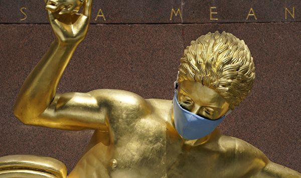

2020年6月25日，美国纽约市曼哈顿区，洛克菲勒中心（Rockefeller Center）外的普罗米修斯（Prometheus）雕像被戴上口罩。(TIMOTHY A. CLARY/AFP via Getty Images)

<b>英国将取消低风险国家旅客的自我隔离措施</b>

英国运输大臣夏普斯（Grant Shapps）表示，从“低风险国家”（例如德国、法国、西班牙和意大利等）前往英国的人们，已取消了自我隔离措施。

夏普斯表示，新措施将于7月10日生效，预计周五将宣布低风险国家的名单。从豁免清单上的国家/地区进入英国的旅客将无需自我隔离，除非他们在过去14天内，曾在非豁免国家/地区停留或通过非豁免国家过境。

夏普斯在声明中说：“整个国家为达到这一阶段而进行了不懈的努力，因此安全必须成为我们的口号，如果与我们重新联系的国家的感染率上升，我们将毫不犹豫地迅速采取行动保护自己。”

<b>Costco将长者购物时间减至每周两次</b>

Costco最近在网页上公告，从7月13日开始，将缩减长者购物时间。

Costco宣布，它将减少在病毒大流行期间年长购物者的专属购物时间，从每天早晨减少到每周两次。

Costco最近在网页上公告，将缩减其60岁以上会员的特殊购物时间。从7月13日开始，大多数地点的长者购物时间，只剩下周二和周四上午的9点至10点之间。在特殊的营业时间内，也欢迎残障者或免疫受损的会员购物。

Costco于3月启动了长者购物时间，该活动一开始每周有两次，后来增加至周一到周五早晨。

除了长辈购物时间，所有会员必须在店内全程戴上口罩，遮住口鼻。只有2岁以下的儿童，以及由于医疗原因不能戴口罩的人例外。

在室内时，鼓励购物者尽可能保持安全的社交距离。此外，目前，每位客户只能购买两件新鲜的家禽商品。目前暂不接受某些必需品的退货，包括厕纸、瓶装水、消毒喷雾剂、卫生巾和纸巾。

<b>巴西总感染数近150万</b>

巴西卫生部周四报告了48,105起新增病例，使该国的病例总数达到149万6858例。周四报告的新增病例数是大流行期间第二高的纪录。

目前，巴西在24小时内通报的最高确诊人数发生在6月19日，当时一天总共新增了54,771个新病例。当时，巴西政府表示数字飙升，一部分原因是一些人口稠密的州，登陆数据的方式“不稳定”。

周四巴西还通报了1,252起新增死亡人数，使全国死亡数达到61,884人。

<b>阿拉巴马州将公共卫生紧急情况延长至9月9日</b>

阿拉巴马州州长凯·艾维（Kay Ivey）将该州的公共卫生紧急状态再延长了90天，至9月9日。

这是紧急状态的第二次延长，由于病毒大流行，该州于3月13日第一次宣布进入公共卫生紧急状态。

艾维在公告中表示，目前，尚无法预测病毒大流行，会维持多长时间的紧急状态。

该命令指出，所有防疫规定也一同延长，在公共卫生紧急状态期间仍然有效，除非另有公告。

该州目前至少有40,111起确诊病例，至少包括985人病故。

疫情恐使中南美洲失业率上升5％

联合国国际劳工组织（ILO）警告，由于病毒大流行，拉丁美洲和加勒比海地区的失业人数可能会创历史新高。

国际劳工组织的最新报告分析了世界银行的数据。报告中说，该地区的失业率可能上升4至5个百分点，从而使该地区的失业人数达到4100万人。如果危机恶化，就业形势可能恶化，加剧社会不平等。

根据国际劳工组织的数据，在大流行袭击拉丁美洲和加勒比海地区之前，该地区的失业率为8.1%，即到2019年底约有2600万人。

目前各个行业都有很高的失业风险，大约 40%的高失业风险人士在旅馆业、餐饮业、小企业和体力劳动等，另外有17%在中高风险，只有20%的劳动力从事低失业风险的经济活动，例如：政府单位、教育和卫生工作等。

<b>秘鲁死亡数破万 活跃病例连续六天下降</b>

秘鲁卫生部周四报告了185起新死亡案例，总计该国的已有10045人因为中共病毒病故。同时，卫生部也通报了3,527个新确诊病例，使全国病例总数达到292,004例。

卫生部表示，周四是连续第六天出院人数高于新增病例。在六天的时间里，共有22,291人出院。

“今天是秘鲁抗击大流行的最好记录之一”，秘鲁政府在一份声明中说，“这一数据表示，尽管病毒仍在继续传播，但由于当局的努力，它的规模正在缩小。”

卫生部表示，这种趋势表明，政府为阻止病毒传播而采取的措施，已开始显示出积极的影响。

卫生部补充说：“但是，如果所有秘鲁人采取自理和保护行为，戴上口罩，遵守至少一米的物理距离，并不断洗手，下降将会明显的。”

秘鲁医学院周四表示，该国已有2062名医生被感染，其中至少有70位医生已不治。
  
  <a target="_blank" href=#top><h6 align="right">回上方</h6></a>

<a name=21>
<h1 align="center"><b>莫迪正式退出微博 删除跟习近平的合影</b></h1>

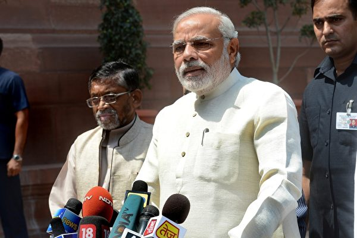

印度总理莫迪(RAVEENDRAN/AFP/Getty Images)

   
  【大纪元2020年07月01日讯】（大纪元记者徐简综合报导）印度《经济时报》（Economic Times）7月1日报导，印度总理莫迪决定退出微博，放弃24万的中国大陆粉丝。目前他已经清空了账户，包括删除了他跟习近平的合影。

印度禁止了微博、抖音等59种中国制造的APP后，莫迪是否会舍弃在微博上的24万中国大陆的粉丝，广受外界关注。

微博是中国大陆居民最常使用的社群平台之一，许多外国政治领袖、企业家和名人也在微博上注册官方账号，希望通过和中国网友互动，拉近与中国大陆网友的距离。

印度媒体曾纷纷质疑，莫迪是否会下决心删除微博账户，因为他毕竟有大批的粉丝，在中国一度是“网络红人”。“The Print”在一篇报导的标题中说，“微博禁令将使莫迪失去超过24万中国粉丝”，也有印度网友问，“莫迪会删除自己的微博账户吗？”

《经济时报》报导，微博的VIP账户如果想退出，需要走一个更复杂的程序，所以莫迪的退出申请被大大迟延。

莫迪在微博上共发布了115个帖子，经过大量努力后，删除了113个帖子，剩下的2个帖子是莫迪与习近平的合影，《经济时报》说，微博用户很难删除带有习近平照片的帖子，但是经过一番“努力”，终于也删掉了。

6月30日印度媒体Quartz India报导，最近因为中印边境局势紧张，莫迪19日在微博上发帖，试图解释中印边境局势，但是他发出的内容被中共网管“秒删”。

在中印关系不断紧张的情况下，6月29日印度以“国家安全”的理由禁用了59款中国研发的App（应用软件），包括微博、抖音国际版（TikTok）、微信、UC浏览器、文件共享应用程序茄子快传（ShareIt）和扫描全能王（CamScanner）等。

印度认为，这些中国产的App“有损印度的主权和完整性、印度的国防、国家安全和公共秩序”。 

<a target="_blank" href=#top><h6 align="right">回上方</h6></a>

<a name=20>
<h1 align="center"><b>颈椎伤残无药可医　修炼大法重获新生--文: 中国大陆大法弟子　　</b></h1>

【明慧网二零二零年七月二日】我和丈夫都是林业局职工，我是局机关档案室干部，丈夫在汽运处工作，有两个可爱的女儿，虽然并不富有，但一家人和和美美，日子过的很平静。

<b>大难降临</b>

一九八二年十月十五日，同事因有事叫丈夫替他给单位出车。那是一辆比较老旧的解放牌卡车，只能用摇把打火，这车如同人带病工作，它是「带病行驶」。为了完成生产任务，单位也顾不上维修，只要能开的车都得开出去干活。这种车打火时摇把会急速反转，很容易把人打伤，如果不是个经验丰富、熟练掌握操作技巧的司机，就很危险。

丈夫不是司机，并不了解这方面的事。不幸在发动卡车打火时被摇把撞击颈椎，当时人就不会动了，立刻被送去医院抢救。

当地医生的医疗水平有限，医生以为不太严重，就只给做了烤电，没给打针、吃药，也没其它治疗措施。丈夫始终觉的脸、胳膊、腿全身都麻木，吃饭手端不住碗，夹菜也困难，有时还得靠家人喂饭；走路腿软，像踩在棉花上一样；排便困难，有时一个月都排不了一次；浑身麻木疼痛，晚上很难入睡，等等症状持续了近两个月没有丝毫好转，我们这才意识到问题的严重。

我们跟医院反映他的情况，希望给丈夫转院，去外地大医院确诊一下。因为丈夫的病纯属工伤，我们就向他的单位申请派人帮忙护理。单位就派了个工人陪我们一起去看病。那时两个孩子大的四岁，小的才两岁，只能托付给邻居照看。就这样，我和丈夫开始了痛苦而漫长的求医之路。

那些年，他不是住院，就是奔走在求医问药的路上，一年有大半年都不着家门。每当出去看病，年幼的孩子就只能托付给邻居照顾，这病一治就是十四年。俩孩子从小就过着这种身边经常没有父母的担惊受怕的日子。

<b>四处求医</b>

林业局局长和当地医院院长都亲自给认识的有名的医院教授写了信，请他们给丈夫好好治疗。我们先后去了北京玄武医院、北京大学第三医院、大连空军医院、大连人民医院、辽宁鞍山钢铁冶金医院、哈医大一院、哈医大二院、国家医药研究所、黑龙江省中医学院、佳木斯中医院，这些医院都是神经内科和骨科很好的医院，还去过好几个大连私立医院和私人诊所，有些去过的医院已经记不清医院名字了。

在哈医大一院住院期间，神经内科的葛教授说：这属于肌萎缩性脊髓空洞症，根本没法手术也没法治疗。神经内科的王医生也说，这种病情在国内还不具备做手术的条件，患者这么年轻，如果保守治疗，他好歹还能活动、自理，做手术一旦碰坏了神经，人就瘫了，还不如现在呢。于是我们就先采取了保守治疗，去辽宁省鞍山市汤岗子疗养院做水疗。

后来听一位一起疗养的病友说，他舅舅擅长治这方面的病，推荐我们去找他舅舅看。他舅舅是一位姓刘的老先生，在大连化学工业公司工作，擅长骨科，业余时间给人推拿按摩，还自己研制中药，曾给很多省部级领导治过病，有些名望，一般人找他他还不给看。因为丈夫是他外甥推荐的，他才同意给丈夫看病。

据刘老先生说，他研制的专门治疗颈椎的药丸和膏药有奇效，丈夫的病吃他的药丸肯定能好。我们很高兴，满怀希望的在刘老先生的诊所住了一个多月，刘老先生对丈夫的病也十分尽心，可后来发现病情没有起色，他就推荐我们去一个造船厂诊所，说他儿子是那儿的大夫，让他儿子给丈夫按摩。

这样几经周转，我们一次次从希望到失望，病情没有任何好转。回家后，丈夫开始跟朋友一起学各种宗教，包括藏密、禅密、基督教、佛教等，去老干部办公室学五禽戏，还练了好几种气功，都没有效果。

随着病情越来越重，我又带他去了北京玄武医院。做完核磁共振后，医生说这种病没有办法，建议我们去北京大学第三医院（北医三院）做手术。北医三院是颈椎方面的专科医院，排号等住院的人很多，我们想方设法托人，好不容易才住上院。住院后确诊为由骨质增生（向内增生）引起的椎管狭窄压迫神经元。住院时，对床的是一名中华医学会杂志编辑，他因腰椎间盘突出手术失败，又回来继续住院治疗。了解了丈夫的病情后，他说，自己就是腰椎间盘手术失败的突出例子，如果丈夫做颈椎手术风险很大，所以不建议丈夫做手术，还说当时北京有好几种气功，建议我们去学学气功。

我们在北京人生地不熟，也不知道去哪学气功，又考虑到丈夫病情越来越重，已经严重影响走路，而且颈椎受伤处长了很多骨刺，很难靠药物治愈，所以我们最后还是决定要做手术。

手术前，我问了主治医师陈忠强，术后能达到什么效果？陈大夫说，即使手术也无法恢复到正常状态，顶多是不继续恶化。手术中出现任何意外，包括患者可能下不了手术台，医院都不承担责任的。尽管如此，我和丈夫都认为，如果不手术，后半生要一直在愈发严重的病痛中苦苦煎熬，毫无生活质量可言，手术是没有选择的选择。

一九九五年七月六日，医生给丈夫做了手术。手术由北医三院闻名全国的骨科专家党耕町教授在现场指导，他的学生陈仲强（后来曾任北医三院院长）和另外一名黄姓医生主刀。签手术同意书时我心情很复杂，手术的成败直接关系到我们这个家庭的命运，丈夫的父母和兄弟姐妹都不在跟前，只有我一个人护理，发生什么状况也只能靠我自己拿主意。签字时，脑袋木木的，手抖得都不太好使了，就这样把字签了。

这个手术叫作椎管扩大术，手术中需要把第二节到第六节颈椎骨上的每节骨头都切掉五公分左右，切完后，才能把颈椎管里的骨刺刮下去，颈椎管也就变成了敞开状态，能看到里面的骨髓。刀口缝合后，从外皮上看，这一段颈椎因为没有了骨节，所以和下面的胸椎比是平整的。因为手术是在身体的主干神经上操作，所以全程不能打麻药。丈夫说当时他趴在手术台上，四肢和脑袋都被固定住，全程有专人站在旁边跟他聊家常，帮他保持意识清醒。

丈夫就在强忍着生不如死的剧痛中完成了手术，全程四个小时。

手术完成后，大夫出来喊家属，我走上前都没认出来是丈夫，只见他脸色土黄，面目都扭曲了，完全像变了个人。事后，党耕町教授和主刀的陈大夫来病房查房，党教授当场给丈夫鞠了三个躬，感佩的说：「你真不愧是东北大汉，这么残酷的手术都没哼叫一声，你太坚强了！」

由于北医三院病床十分紧张，我们在手术后十四天就出院了。出院后，丈夫身体太虚弱，无法长时间坐车，我们就在附近旅店住了一星期。回家后，刀口增生，愈合的不好，时常发低烧，胳膊疼也一直没好，走路还是像刚受伤时那样好像踩在棉花上，正如大夫所说，没有什么明显好转的感觉，只是病情没进一步恶化。

<b>艰难度日</b>

自从丈夫受伤后，十多年的时间里，他除了能生活自理，其它什么都干不了，我一个人承担了所有家务。那时住平房，没有天然气和自来水，做饭用的柴火都得我自己劈，我劲儿小，劈也劈不动，折腾半天好容易劈了点柴火够做一顿饭的，下顿饭用的柴火还不知道怎么办。每天，我都得去几百米以外的井里挑水，到了冬天更难过，水井附近冻成了一个小冰山，得爬上去打水，然后再小心翼翼的慢慢把水桶顺坡滑下去，整个人也跟着叽里毂轳的溜下去，因为打水特别费劲，家里用水比用油都珍贵。接送两个孩子上学、放学、辅导作业、做饭也都靠我一个人。白天上班，下班回家就做家务、照顾丈夫和孩子，都忙完了也就晚上八、九点了。

有一年冬天的早上，我浑身疼的动不了，只能躺在炕上，没法起来烧炉子，屋里很冷，两个孩子吃不上饭，都可怜巴巴的坐在我身边。无奈之下，我问才六七岁的大女儿能不能把炉子点着，然后一点一点告诉她怎么煎鸡蛋，大女儿还真点着了炉子，把鸡蛋炒熟了，俩孩子总算吃上了早饭。那时丈夫因为病痛折磨的心焦，脾气很不好，经常冲我们发脾气，觉的我们这也做的不好，那也做的不对，我又不能跟他发火，只能尽量迁就、容忍他，心里说不出的憋屈。

每天下班回家就得面对两个年幼的孩子和一个坏脾气的病人，在长期的压力和苦闷中，我也病痛缠身，经常晚上睡不着觉，白天神经性头痛，两腿膝关节越来越疼，颈椎痛的稍微多坐一会儿就受不了，妇科病也很严重，经常腰疼、小腹痛。尽管如此，我还必须强打精神，因为这个家还需要我去支撑，丈夫和孩子还需要我照顾。看着身边的人都过的不错，我家却遭遇横祸，日子过的这么苦，什么时候是个头啊？

<b>重获新生</b>

一九九六年三月九日，邻居来我家跟丈夫说，有个法轮功，听说祛病效果特别好，你也去试试吧。十几年的病痛煎熬苦不堪言，只要听说是能治病的办法丈夫都想去试试。丈夫毫不犹豫就跟邻居去了。

丈夫跟着邻居去了邻居的朋友家。那家正好在播放法轮功师父的讲法录像。看完录像当天，丈夫就说他的后背发热。听丈夫说这个功法叫法轮功，都说这个功法怎么这么好。第二天我就领着两个孩子跟丈夫一起去看法轮功师父的讲法录像。

几天后，丈夫的后背、胸口、身体两侧都出现了紫色小水泡，水泡排列整齐，组成了类似花朵的形状，很不舒服，一碰还很疼。后来，丈夫又发烧、咳嗽，呼吸困难、全身疼痛，好像重感冒的症状，咳了一天一宿，咳出大量粘液（不是粘痰），每次用塑料袋接，一共接了好几袋子，整个人躺在床上动不了，全身关节都疼。因为他听了李洪志师父讲法，知道这是师父在为他清理身体，就没认为是病，也没想要吃药或去医院。

没过几天，这些症状就陆续消失了。那几处紫色水泡留下的印记到现在还在。

随着每天去炼功点学法炼功，丈夫的病情明显好转，胳膊不怎么疼了，腿也比以前有劲了。以前有病时胳膊都举不起来，随着炼功，做第二套「法轮桩法」[1]抱轮时，他基本都能做到位。

到一九九六年九月份，我们学法炼功还不到半年的时间，丈夫身体状况就恢复到和正常人一样了，骑自行车、摩托车，挑水、劈柴、买粮、做饭这些家务活全都能干了。我身体也出现了很大变化，头不疼了，颈椎不疼了，躺下就呼呼睡的很香，从前的各种慢性病都不知不觉消失了。

丈夫原本就是个急脾气，受伤后，被病痛折磨的更加焦虑、暴躁。随着学法，他明白了做好人的道理，脾气变好了；我明白了生命的意义，明白了所有痛苦都是有因缘关系的，开始慢慢放下心中的愁苦和愤愤不平的心理，心胸开阔了很多；孩子跟我们一起学大法，变的更乖、更懂事了，学习和生活基本不用我们操心。我家的家庭气氛焕然一新，和乐融融。

丈夫的事在当地影响很大：十四年中看遍中西医都没治好的疑难病老病号，炼法轮功只半年就完全康复了！我们当地医院的院长还曾对一名颈椎病久治不愈的患者说，你去问问老病号某某，他的颈椎病是谁给治好的？那人真找到家里来问我丈夫，我丈夫高兴的告诉他：「我是炼法轮功炼好的啊！」

一九九七年五月份左右，北医三院以院方名义给林业局写了一封信，问我丈夫这个人还在不在世，现在身体状况如何，说大夫们工作实在繁忙，没有时间来实地回访，如果有时间希望我们能回医院复查。因为丈夫的病例在全国都比较少见，院方手术如果成功，会很重视术后效果和康复情况，要求我们半年去复查一次。由于当时丈夫单位经济效益不好，开工资都困难，所以没有钱去北京复查。后来林业局领导看到这封信，便多方努力，帮我们借来两千块钱现金，我们才有条件去了北医三院。

负责复查的是丈夫手术时主管病房的病房医生、骨科主任，当时他也参加了那次手术。他看到丈夫恢复的这么好非常意外，就问我们手术后又去哪个医院治疗过，都用过什么药？丈夫说，这些都没有，就是因为炼法轮功才康复的这么好，大夫感觉很神奇。复查回来，我们把情况跟林业局局长一说，局长也挺高兴，跟我们说：「法轮功好就继续炼吧！」

炼法轮功之前，丈夫吃药、陪护、住院等的费用每年都要一万多元，在近十四年的时间里，花销总计有十几万元，这些费用都由林业局按有关标准报销。每次出去看病回来核销时都困难重重，因为那时林业局效益越来越不好，资金很紧张，这笔费用无疑给林业局增加了很大负担。可修炼法轮功后至今的二十四年里，全家人都没再花过一分钱医药费。

法轮大法在丈夫身上创造了医学无法创造的奇迹！见证了法轮大法的无比神奇和洪大的法力！

二十多年来，我们全家人努力按照「真、善、忍」的标准要求自己做好人。大法也给我们全家人带来身心上的巨变。大法使我们获得了身心的健康，心灵的平静。

感恩师父的慈悲救度！希望有更多人也能和我们一样，成为法轮大法的受益者！

<a target="_blank" href=#top><h6 align="right">回上方</h6></a>

<a name=19>
<h1 align="center"><b>信仰真善忍 黑龙江董林桂冤狱12载九死一生</b></h1>

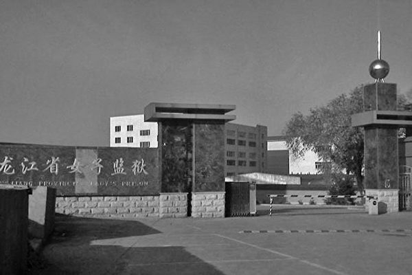

黑龙江省佳木斯董林桂女士在黑龙江女子监狱遭受12年的非人折磨。（网络图片）

【大纪元2020年06月28日讯】在黑龙江女子监狱的三九天里，早上5点狱警赵英玲就叫人把她的被褥拿出去冻上，半夜12点再拿进来让她睡在上面。冰人、扎人，人就像掉到了冰窟窿里一样，就这样持续了一整个冬天。

自2002年佳木斯市董林桂在这所监狱里度过了12年，遭受各种非人的折磨，几近丧命。

董林桂在自述那段痛苦的经历时写道，在江泽民的“名誉上搞臭、经济上截断、肉体上消灭”、“打死白打死、打死算自杀”的邪恶迫害的密令下，黑龙江女子监狱的狱警在暴力监区利用犯人对法轮功学员进行转化（逼迫放弃修炼）迫害。

“在我被非法关押那12年的每一天里，（他们）都不放松对我的暴力‘转化’，残酷迫害。”

董林桂，出生于1949年8月16日。她丈夫于1992年病故后，因负重债，没有住房，她过着一贫如洗的生活。她昼夜不眠、苦苦思索：人生的真谛是什么？人为什么这么苦？

由于丈夫的离世对她精神上的打击，加上为生活操劳的辛苦，她患了冠心病、胆囊炎、胆结石、肾炎、肾囊肿等十几种病。她拖着病身子干活、糊口。回忆那段苦日子，她说：“真是叫天天不应，喊地地不灵。”

1995年4月26日，董林桂得到了《转法轮》一书（法轮功的主要著作），读后一下子明白了许多做人的道理、人生的意义，从此开始修炼法轮功。她的性格变得温和、宽容大度，渐渐地多种疾病也不翼而飞，无病一身轻。

<b>进京上访 遭绑架</b>

1999年7月20日，江泽民与中共对法轮功发动了血腥的迫害。董林桂和无数的法轮功学员一样顶着被抓、被打、被关押的危险，去北京上访、要求停止迫害。

她前后去了四次，每次都被绑架、关押，受尽了折磨。她第三次到北京后，被绑架到佳木斯驻京办，后被劫持到佳木斯看守所。

在那里她因随时随地被打骂，就绝食抗议，遭来了强暴的灌食。灌食时从鼻子插入胃里的大管子天天不拔出来，那种滋味相当难受、苦不堪言。

狱警有意且变着花样折磨她。她被呈大字型固定在地板上，一动不能动，使她生不如死。

有一次，她被折磨得快死了，看守所为推脱责任，把她送到劳教所继续迫害，她被非法劳教3年。

劳教所看她被折磨得不行了，怕死在里面他们要担责任，就不敢收。而警察陈万友把她丢在那里后，开车就跑了。

<b>遭冤判12年 狱中备受折磨</b>

2002年1月8日，董林桂早上起来拎着垃圾袋去倒垃圾时，走到半路，莫名其妙地就被警察绑架，他们猛打她的脑袋。那次，她被非法判刑12年，于同年9月2日关进黑龙江女子监狱。

<b>关“小号”</b>

一到那儿之后，董林桂就被罚蹲、被打，夜间“610”（专门迫害法轮功的非法机构）的肖林强还逼她写所谓放弃修炼的“保证书”。她不写，肖就抡圆了胳膊打她二十个大嘴巴，打累了坐那淌汗。

她被打得嘴里直淌血，头嗡嗡作响，随后她被推进“小号”（用于更严厉迫害人的小房间）继续迫害。在那里她天天被灌食。

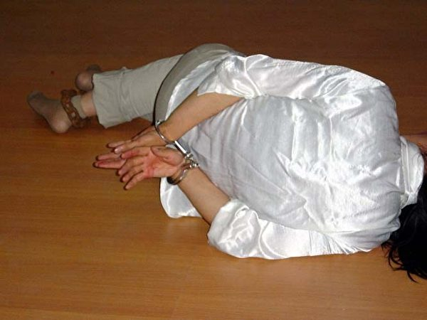

中共酷刑演示图：关小号。（明慧网）

进监狱满一个月的那天中午，“小号”大队长王亚丽叫一个姓林的男警察醉酒后对董林桂进行逼供、殴打。男警说：“我打不死你，也要打掉你几颗牙。”抡起大拳头直往她脑袋上打，把她当时就打昏死过去了。

后来她开始掉牙，最后只剩下八颗牙。当天晚上6时，她醒来后，迷糊中听到一个小刑事犯说：“监控室的警察都在看着呢，看她绝食烧膛怎么死去。”

他们看她又苏醒了，就继续迫害她，逼她上铁椅子。她无力，动不了。他们就叫佳木斯南岗的杀人犯张淑凡用大宽胶带封她的鼻子和嘴，胶带围着头缠，使她窒息。看她快断气了，他们才把她拎出了“小号”。

第二天，董林桂苏醒后才知道自己躺在病号室（关押有病的犯人的监室）。病号人员说：“都知道病号里死人了（指董林桂），你却活过来啦，真神奇！”

<b>受冻刑</b>

董林桂被转到了警察郑杰所管的监区里遭受残酷的迫害。她被迫坐在水泥地上8个月，不让垫任何东西。哈尔滨的三九天，阴冷酷寒，每天坐在水泥地到半夜12点，冰冷造成她腰痛腿痛，手脚抽筋。

狱警给她一盆凉水，让她在开着北门的一楼里洗澡。北风刺骨，冻得她筋骨疼痛、抽筋。

再后来，董林桂被转到狱警赵英玲所管辖的监区里。赵英玲想尽办法害人，非人地折磨法轮功学员。

整个冬天，每天早起5点钟赵英玲就叫人把法轮功学员用的被子、褥子拿出去冻上；一整天学员被罚坐小板凳，从早上5点坐到半夜12点。

半夜12点后，让法轮功学员在冻透的被褥上睡觉。越是阴天、下雪天，赵英玲越让人把被褥拿出去冰冻，一天不落。冻透的被褥像冰一样，人就像睡在三九严寒的冰洞一样，冰凉刺骨。

<b>烤大电炉子</b>

狱警想着各种毒计来迫害法轮功学员。有一天，赵英玲把董林桂叫到办公室里，告诉她：警察给她摊了钱，为她买了一个500瓦的大电炉子，准备让她烤电，还说：“你要知恩图报啊！”

接下来，他们就用这个电炉子来迫害董林桂。早上5点她被罚坐小板凳，坐到半夜12点，坐得腿、脚、腰麻木、失去知觉，人困累得不行。

半夜12点，他们再让她睡在冻透的、带着霜雪的被褥上，她冻得缩成一团。

白天董林桂被扒得光光的，全身冻得直发抖。在她的脸部和胸部包夹（监管法轮功学员的刑事犯人）对她进行“烤电”，大电炉子烤得吱吱直响，使她疼痛难忍。她只要拒绝电烤，就被打。

有一次，哈尔滨的犯人王辛华把她打昏过去了，她很长时间才醒过来，刚醒时脑子嗡嗡响。电炉子烤得她的胸口起个大包，烤得她的眼睛到现在还看不清东西。

狱警赵英玲还操控犯人用大木棍打她，用奖励40分的高分诱控犯人对她随时重击。

<b>吃玉米面水的毒伎</b>

董林桂多次被关“小号”，从2000年至2003年几乎都在“小号”中度过。期间，她被迫绝食、被灌白酒，灌得直吐血；被上大吊、常年戴背铐、地环、脚镣。

其中最狠毒的一招是狱警长时间给关在“小号”里的人吃玉米面水，即将一把生玉米面放到桶里用开水一冲，不熟，比米汤还稀，让人吃。狱警说，在医书上看过，人吃这东西吃了60天后就会废掉。

到了六十多天后，“小号”里的人相继不行了，就被抬出了“小号”。到第72天，董林桂是最后一个因几次大量便血而被放出“小号”的。当时她们的消化系统被破坏，饮食功能全部萎缩。董林桂便血后还被灌酒，导致胃不好，时而吐血。

<b>铐地环</b>

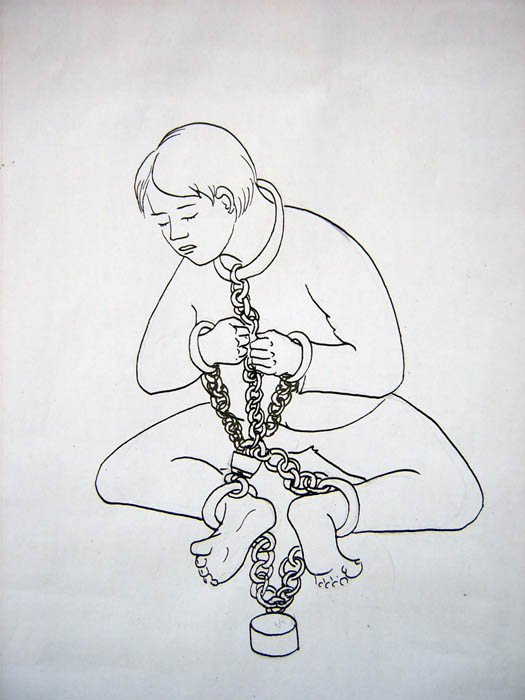

中共酷刑演示：地环。（明慧网）

在“小号”里，冬天狱警不给董林桂棉衣穿，把“小号”屋内的暖气片卸掉，让她受冻、挨饿。

有一次，十多个大男人把她背铐到地环上，他们都穿着大皮鞋，围着她往她的脸上、头上踢，把她踢晕后，扬长而去。行恶者有魏东寻、林枫等；还有杨立斌、肖林，他们打她嘴巴子，直到把她打晕。#

资料来源：明慧网

<a target="_blank" href=#top><h6 align="right">回上方</h6></a>

<a name=18>
<h1 align="center"><b>个股暴涨暴跌再现 微信QQ有人推荐后闪崩</b></h1>

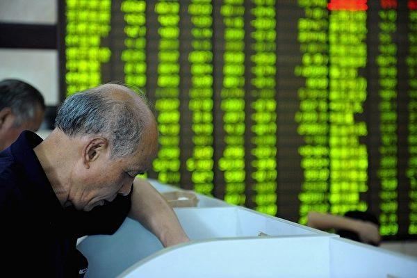

近一个月来，A股多只个股股价一度暴涨，期间微信群、QQ群和直播间有人推荐股票，成交额增加后股价突然暴跌。(Getty Images)

   
 【大纪元2020年07月02日讯】（大纪元记者张玉洁综合报导）最近一个月以来，A股市场出现多起个股暴涨暴跌的情况——相关个股股价暴涨期间，微信群、QQ群和直播间有人推荐股票，成交额增加后股价突然暴跌，令普通股民损失惨重。

合力科技截至7月1日，股价连续4个交易日大跌，跌幅分别为10%、9.97%、6.14%和2.03%，累积下跌近30%。

这轮暴跌之前没有明显的利空消息。暴跌前，合力科技股价在没有明显利好消息的情况下，短时间内暴涨，19个交易日股价从每股9.87元（人民币，下同）涨至6月24日每股15元，累积飙涨51.98%。

在合力科技股价暴涨期间，微信群、QQ群和直播间有人向股民推荐买入合力科技，合力科技成交额大增，仅6月24日的成交额就超过5月份一个月的总成交额。

合力科技官方在6月30日晚间发布两份公告，一份公告说股价暴涨暴跌与公司控股股东和高管无关，另一份公告说公司收到多位投资者反映，市场上有人曾利用微信群、QQ群和直播间向股民推荐买入公司股票。

类似的事件在最近一个月内频频出现。

阳泉煤业一度暴涨，暴涨期间有人在微信群发出买进的指令，就在成交量大幅增加后，5月29日股价突然暴跌。

5G概念股盛洋科技6月3日股价突然大涨，微信群有人以内幕消息为由，让所有人满仓，而当天午后突然闪崩跌停，有的股民损失多达十几万。

大约一周后的6月11日，济民制药发生同样情况。当天济民制药的多名股民表示，有人在微信群、QQ群建议高位买进济民制药，但随后股价大跌，导致损失惨重。

当天，济民制药股价盘中一度涨至历史最高，然后突然下跌，并在此后的5个交易日内累计下跌36.6%。同时，相关的QQ群、微信群被解散，投资者被拉黑。而济民制药的回复与合力科技的公告相似。

北京一家私募公司的一位资深投资人对《中国经济周刊》表示，这种手法有比较明显的“庄股”痕迹，先大幅拉高股价，然后利用微信群、QQ群、直播间等平台向股民推荐，诱骗股民买进，然后高位套现、股价下跌。  

<a target="_blank" href=#top><h6 align="right">回上方</h6></a>

<a name=17>
<h1 align="center"><b>终认清中共 美国安顾问中国问题讲话全文</b></h1>

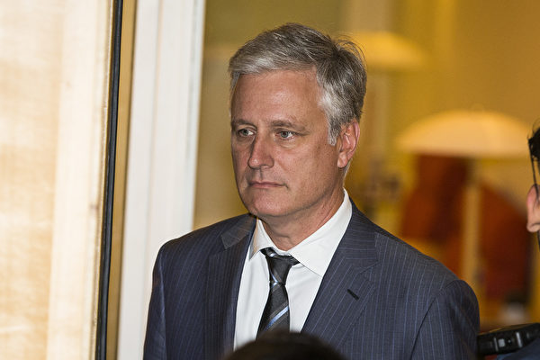

2020年6月24日，美国国家安全事务顾问奥布莱恩在凤凰城亚利桑那州商业局发表有关中国问题的讲话。(Michael Campanella/Getty Images)

   
  【大纪元2020年07月02日讯】（大纪元记者秋生翻译报导）2020年6月24日，美国国家安全事务顾问奥布莱恩（Robert O’Brien）在凤凰城亚利桑那州商业局发表有关中国问题的讲话。

他指出，中国共产党是一个马克思主义、列宁主义的极权政党。美国人被动而天真地对待中共的时代已结束。美国将和盟友一起抵制中共操控我们的人民和政府，伤害我们的经济等等。揭露中共的信条和阴谋，这不仅仅是为美国人，为中国人，也是为了世界人民的福祉。

此外，奥布莱恩明确表示，中共不等于中国，也不等于中国人民。美国对中国人民怀有深深的敬意和钦佩。美国和中国有着长期的友好交往的历史。

以下为奥布莱恩发言的全文翻译：

大家下午好！感谢大家来到亚利桑那州商务局，和我们一起欢迎一位非常特殊的客人——唐纳德·J·川普（特朗普）总统的国家安全顾问罗伯特·奥布莱恩。奥布莱恩先生！欢迎您来到亚利桑那！今天我们非常荣幸，也非常高兴把您请到这里。感谢您花时间要与我们分享一个重要的消息，并介绍政府为保障美国以及我们的盟友的安全而正在进行的工作。我们期待着几分钟后听您的报告。

这场冠状病毒（中共病毒）瘟疫再次凸显了国家安全与我们国家的产业供应链以及公共卫生安全之间的深层联系。在这个危机时刻，美国人很想知道我们有资源，也有办法迎接任何挑战并且打败任何敌人。我知道我们做得到，像亚利桑那这样的地方近年来处于领军地位，由于我们位于战略要地，与墨西哥毗邻，近年来采取了合理的措施整顿环境，使这里成了先进技术的发源地，获得了声誉，吸引了许多世界一流的创新企业来到我们这个优秀的州创业。

最鲜明的例证就是最近台湾半导体制造公司决定把其价值120亿美元的高科技生产设备直接落户到亚利桑那。无论是从增加就业的角度看，还是从国家安全的角度看，这都是美国近年来能看到的具有重大经济意义的事件之一。随着越来越多的美国企业把他们的生产基地迁回我们本土，我们期待着将来有更多的这样的企业来到亚利桑那州。

我谨向罗斯部长脱帽致意，向他的商务部团队致意，也包括精干的联邦政府、川普政府、精于合作的国务卿蓬佩奥、国防部等，感谢你们给亚利桑那带来了就业机会。我还要特别向川普总统表示感谢，他一直在不知疲倦地努力着，巩固了美国在世界舞台上的地位，把越来越多的加工制造企业迁回了美国，进行了具有历史意义的改革，签订了美国、墨西哥、加拿大贸易协议。这些都将直接使我们的国家受益，也使亚利桑那州受益，我们与我们最大的贸易伙伴墨西哥的贸易正在增加。

女士们，先生们，我们今天的这位贵客懂得美国只有国内经济更强大，在国际舞台上军事力量更强大，才能让美国更安全。在出任川普总统的国家安全顾问之前，罗伯特·奥布莱恩曾在国务院担任总统特使负责解救人质工作，代表美国政府进行外交努力，解决与海外人质有关的问题。他拥有无可挑剔的品格，在平凡的工作中取得了扎实的成就，以高尚的职业道德尽职尽责。

在亚利桑那州，也许很多人还都清晰地记得去年秋天他作为政府官员向世界宣布：在一次军事行动中美军击毙了伊斯兰ISIS恐怖组织首领巴格达迪，行动代号则是我们亚利桑那人凯拉·米勒的名字。

奥布莱恩先生，我代表凯拉·米勒的家庭以及亚利桑那州的很多民众向您表示感谢，同时向这位非常出色的年轻女性致敬。我知道，那次非凡的行动对米勒的家庭来说具有非凡的意义，对亚利桑那州所有凯拉·米勒的崇拜者具有非凡的意义，这是他们亲口告诉我的。在此，我请大家和我一起用亚利桑那州的方式热烈欢迎国家安全顾问罗伯特·奥布莱恩！

谢谢你，州长！这是一个非常令人感动的致辞，这让我想到了小凯拉和她的父母，他们已经被写入了《国情咨文》。对于总统来说，也对于我们全体美国人来说，那是一个非常特殊的场合。我们绝不能让发生在凯拉身上的事情再次发生在任何人身上，尤其不能发生在美国人身上。所以我要感谢您能在今天想起她，感谢您给予她的家庭的支持，他们是非常伟大的美国人！

来到凤凰城我感到非常的荣幸！祝贺台积电来到亚利桑那州建厂！我要告诉你们，其他49个州长此刻都有点儿妒嫉杜西州长，这可是您在任期间的一个了不起的成就。把我们的供应链迁回美国对我们的国家安全意义重大，尤其是那些涉及关键技术、计算机芯片、双重使用芯片的产业，不仅对我们的平民生活很重要，比如我们使用的电话、电脑、洗碗机、电冰箱等等，而且对我们的军事很重要。你们已经有了一些大型航天公司正在亚利桑那州开展业务。他们得到的好处是他们的供应商就在他们附近。因此，我要再次表示祝贺！这对亚利桑那州来说真是太好了。

我来到亚利桑那州商业局感到非常高兴。祝贺你们！你们给予了州长和州政府极大的支持，不仅把台湾企业迁到了这里，而且就我所知，很多其它正在返回美国的加工企业也将要落户到亚利桑那。这里气候好，阳光充足，靠近西海岸。我相信世界各地的人也会来到亚利桑那，来到美国西海岸，他们会看到，在华盛顿DC和纽约等一些大都市以外还有这么一块土地，我相信，随着加工业回归美国，这都会实现，亚利桑那州也将成为他们的首选。

因此，州长，我向你祝贺，并代表美国第45任总统唐纳德·J·川普向你表示祝贺！我知道他昨天在这儿，我很荣幸紧随其后也来了。我想我要告诉大家一些其它好消息：下个星期你们即将迎来美国副总统麦克·彭斯。他是我的好朋友，他的办公室在大厅里面。

我感谢你们热情邀请我来亚利桑那与州长以及您的同事们讨论一些对美国国家安全至关重要的话题，譬如来自中国共产党的挑战、中共的崛起、它对美国以及美国的盟友的威胁，眼下对我们来说至关重要。我今天的讲话是政府高级官员计划在未来的一个月里围绕同一个问题做系列讲话的第一场。你们不久还将听到国务卿蓬佩奥、司法部长巴尔、前联邦调查局局长克里斯·雷就同样的话题发表讲话。

在川普总统的领导下美国人终于醒来了，看到了中共咄咄逼人的行为，以及对我们的生活方式的威胁。几十年来，无论是美国政界、商界、学术界，还是新闻界，都秉持着这样一个传统观念：中国的自由开放只是一个时间问题，先是在经济领域，然后在政治领域。我们一直认为，我们越向中国（中共）开放我们的市场，越向中国（中共）投资，培训越多的中共官僚、科技人员、工程师，甚至于军官，中国就会变得越来越像我们一样。

正是在这一前提下，我们在2001年欢迎中国加入了世界贸易组织，做了重大让步，提供了众多贸易优惠。我们故意淡化中共对人权的粗暴践踏，包括天安门广场屠杀。我们对中国（中共）的大范围的技术盗窃视而不见，以至于整个美国经济大伤元气。

随着中国（中共）变得越来越富有，越来越强壮，我们也相信中国共产党会变得开明，会满足中国人日益增长的对民主的渴求。现在看来，这只是一个大胆的、纯粹美国式的想法。它产生于我们天生的乐观精神，而我们在与苏联共产主义的抗衡中获胜也滋生了这个想法。

不幸的是，这个想法被证明是非常幼稚的。我们已经是大错特错了。这种误判导致了自上世纪30年代以来美国外交政策上的最大的一次失败。我们是怎么犯下这种错误的？我们怎么会看不懂中国共产党的本质？

答案很简单：因为我们没有留意中共的意识形态。我们既没有听中共领导人说了什么，也没有读他们在关键文件中写了什么，我们闭塞了自己的视听，一厢情愿地认为这些党员只不过是名义上的党员。

如今我们要把事实澄清：中国共产党是一个马克思主义、列宁主义的政党。该党的总书记习近平把自己视为约瑟夫·斯大林的接班人。事实上，正如前澳大利亚政府官员、记者约翰·加诺所说，中国共产党是除了北朝鲜以外，最后一个从未与斯大林决裂的正在执政的共产党。

是的，就是这个斯大林，他的残酷独裁和引发灾难的政策曾经使大约两千万俄罗斯人和其它国家的人死于饥荒、强制集体化、处决和劳改营。按照列宁、斯大林、毛泽东的解释，共产主义就是一种极权主义意识形态。

共产主义认为，个人只是作为一个工具被用来实现一个民族国家想要实现的目的，因此个人可以轻易地被拿来为实现民族国家的目标做牺牲。

按照马克思主义、列宁主义的逻辑，个人不具有本身的内在价值，他们的存在意义就是为国家服务，而国家的存在意义不是为他们服务。这些观念在我们现在看来非常遥远、陈旧。它们无论如何都是旧思想，诞生于一个半世纪以前的欧洲，在一个世纪前在俄国得到实践，在30年前被抛弃，被看作是历史上代价最惨重的失败了的政治实践。

可是在中国，这些思想一直是中国共产党的根基，就如同《宪法》和《权利法案》是我们美国人的根基。中国共产党谋求对人民生命的完全控制，这意味着经济控制、政治控制、身体控制。也许最重要的是思想控制。

前澳大利亚政府官员、记者约翰·加诺发现，按照中国经典治国方法，获得并维持对江山的控制需要使用两个工具：第一个是“武”，就是武器和暴力；第二个是“文”，就是语言和文化。中共领导人一向认为权力既来自对军事的控制，也来自对文化的控制。

加诺写道，“按照列宁、斯大林、毛泽东所做的类比，语言不是讲道理、劝人的工具，而是杀人的子弹，是用来界定、孤立、消灭敌人的。”对于中共来说，宣传发挥着核心作用。北京要控制政治思想的意图不仅要公开说明，而且要不择手段地去实现。

从1989年起，中共开始围绕意识形态安全进行自我整顿，“意识形态安全”成了中共领导层频繁重复的词汇。2013年4月中共发布了一项关于他们所谓的“当下意识形态”的政策，强调绝对不能让不正确的思想和观点有任何机会和出口传播。

因此，在中国，这就意味着强制学习共产主义意识形态，要求人们下载、使用智能手机的应用程序学习所谓的“习近平思想”。这意味着对全国媒体的完全控制。

来自外部的资讯，从外国报纸到推特、脸书、WhatsApp，被一律禁止。来自中国内部的内容要一律接受审查。这意味着民间博主、记者、律师、活动家、宗教信仰者一旦表达了与党的路线相反的任何观点就会被监禁。

的确，就在最近，在今年1月1日和4月4日之间大约有500人被控犯罪，只是因为他们说出了武汉冠状病毒（中共病毒）的真相、对中共的影响、中共对疾病的掩盖等。

中国共产党还对包括《圣经》在内的宗教文本进行重新解读以便支持共产党的意识形态。中共还把几百万穆斯林维吾尔人等其它少数民族关进再教育营，让他们在那里服务，或者接受政治教化，或者被强制劳动，而他们的孩子则交给了共产党办的孤儿院抚养。整个过程使被关进再教育营的人们失去了家庭、宗教信仰、文化、语言等遗产。在中国共产党的控制下，信息都被严格控制，言论被严格监视，要么被压制，要么被国家篡改。

美国人应该关注，我们应该关注，不只是关注中国人，而且是关注我们自己，因为习近平控制意识形态的野心并不局限于他自己的人民。中共宣扬的目标就是创建人类共同命运共同体，并且按照中共的意愿重新塑造全世界。他们正在越出中国边界去控制人们的思想，并取得了成效。

在过去的十年里，中共花费了几十亿美元在海外进行宣传，并取得了他们期待的效果。中共正在努力清除世界各地反共的中文媒体，并且即将取得成功。美国的几乎所有中文媒体要么被中共控制，要么与中共合作密切。

中共正在入侵英语媒体。美国各地城市有超过12家广播电台利用调频广播以非常微妙的方式向美国听众进行亲北京宣传。最近，中共宣传使非常多的美国人相信是一名美国士兵把冠状病毒（中共病毒）带到了武汉，而不是武汉把病毒传遍全世界。这个完全由中共制造的谎言使得这名士兵和她的家人不得不雇用私人保安来保护自己免遭死亡威胁。这种事情出现在马里兰州，通过抖音进行。

抖音是一个由中国拥有的社交媒体平台，在美国有超过4000万用户，也许包括你们的很多孩子和年轻的同事，其中批评中共和北京的政策的账户被以一种常规的方式删除。

上周推特宣布暂停两万三千多个与中共有关联的账号，因为它们为中共进行有关香港问题和武汉肺炎（中共肺炎）的宣传。推特的这一行动是去年8月暂停超过15万中共账号后的又一次行动，那些账号被用于传播反美的虚假信息，并且在推特上制造了一起假相，让人感到在美国似乎有很多人热心支持北京的政策。这些只是被推特发现的账号。至于还有多少类似的账号尚未被发现，则不得而知。

今年3月中共驱逐了为《纽约时报》、《华尔街日报》和《华盛顿邮报》工作的美国记者，几乎是彻底断绝了来自中国境内的对武汉病毒（中共病毒）的独立报导。除了影响美国人接收关于中共的信息，中共还越来越多地使用杠杆压制美国言论自由。

2017年加州大学圣地亚哥分校邀请了达赖喇嘛在毕业典礼上演讲，北京因此取缔了中国学生以政府基金进入该校的项目。休斯顿火箭队总经理在推特上发文表示他支持香港的和平抗议者，于是中共宣布该队的比赛将不会在中国报导，不会在中国的电视上播出，然后使用这种经济手段给其它篮球队施压，包括要求明星队员站在北京的立场上批评那篇推文。

在中共的压力下，万豪酒店集团、美国达美航空公司、美联航空公司都从他们的公司网页上删除了涉及台湾的字样。奔驰汽车公司甚至为自己在社交媒体上使用了达赖喇嘛的励志格言而向中共道歉。北京利用金融方法和市场准入向好莱坞施压，迫使其自我审查，促使导演、演员、制作人避免使用在中国的审查中可能不被通过的话题。

比如说，在即将上映的影片《壮志凌云》续集《初生牛犊》中，日本和台湾旗帜从汤姆·布鲁斯的飞行服上拿掉了。米高梅公司则在影片《赤色黎明》的重拍过程中用数字技术更改身份，掩盖了中共对北朝鲜的军事入侵。

中共也在寻求机会利用普通美国人。这个党正在收集你最隐蔽的数据、你的言论、你的行动、你的购物、你的行踪、你的健康记录、你的社交媒体发帖以及你的短信。他们会勾勒出你的朋友、家人和熟人的关系网。中共达到这一目的的一些方式包括为软件、硬件、电话通讯公司，甚至基因公司，提供补贴。

结果，像华为和中兴这样的公司可以在价格上同竞争对手竞价，以亏损的方式在全球安装他们的设备。这实际上产生的副作用就是造成美国电讯硬件制造商倒闭，并且使诺基亚和爱立信公司处境非常艰难。

他们为什么要这样做？中共追求的不是电信硬件或者软件方面的利润，而是你的数据。他们在他们的产品上设置了后门以获取数据。

好了，当中共买不到你的数据时，它就偷窃。

2014年，中共黑客侵入安瑟姆保险公司，收集了8000万美国人的敏感信息。

2015年，中共黑客侵入美国人事管理办公室，那里储存着两千万为联邦政府工作的美国人的机密权限信息。

2017年，他们侵入艾可非Equifax信用公司，获得一亿四千五百万美国人的姓名、生日、社会安全号和信用评分。

2019年，中共黑客入侵万豪，搜集了3亿8300万客户的信息，包括护照号码。

2016年，一家中资公司甚至购买了用于交友的应用程序基达Grindr以获取用户信息，其中包括爱滋病毒感染的情况。后来美国政府出于国家安全的考量而强制其转让所有权。

这些只是我们知道的一些案例。中国共产党将怎样使用这些数据？

中共会像在中国境内那样，用同样的方法使用这些数据，对个体美国人进行攻击、取悦、哄骗、影响、要挟甚至敲诈，让这个人去做，或者去说有利于中共利益的事。这是超乎任何广告商能力的微观定位，简直疯狂至极。

与广告商不同，中共不受政府规章制度的限制。中国共产党就是想知道关于你的一切，就像他们想知道几乎所有生活在中国境内的中国人的一切一样。

除了进行宣传影响活动，中国共产党还利用贸易迫使他国俯首听命。

澳大利亚呼吁对冠状病毒的起源地进行独立调查，中国共产党就威胁要停止购买澳大利亚的农产品，阻止中国学生和游客前往澳大利亚留学、观光。澳大利亚拒绝让步，北京方面就把威胁变成行动，对澳大利亚的大麦出口征收80%的关税。

控制国际组织也是中共计划的一部分。中共已经收购了很多国际组织的领导权。

目前，联合国的15个专门机构中的4个被中共把持着，数量超过了美国、英国、法国、俄罗斯，也就是联合国常任理事国其它四个成员国，加在一起把持的机构的数量。中共利用这些负责人强迫国际组织按照北京的论调鹦鹉学舌，在他们的设施中安装中共的电信设备，一点也不奇怪。

比如说，国际电信联盟秘书长赵厚麟上任伊始就全力推销华为产品。国际民航组织秘书长柳芳拒绝台湾参加成员国大会，并且隐瞒中共黑客入侵该组织的行为。中共还利用其联合国人权理事会成员国的身份阻止各国批评其在新疆和香港侵犯人权的行为。

中共还对国际组织的非中共官员施加影响。在北京的操控下，世界卫生组织总干事谭德塞竟然置人命于不顾，顺从地使用中共关于武汉病毒的说辞。直到一月中旬他还在声称不存在病毒人传人的现象，反对限制国际旅行，同时赞扬中国限制国内旅行以防止武汉病毒传播。换句话说，他们可以去海外旅行，但是不可以去北京或者上海旅行，以免可能把病毒带到那里。中共控制国际组织的策略，正如我们透过冠状病毒看到的，不仅引起了美国的关注，也引起了全世界的关注。

好消息是，在川普总统的领导下，我们知道了中共正在做什么。我们正在大声呼吁，并且正在国内外采取果断行动进行应对。

首先，川普总统不让某些听命于中共情报和安全机构的公司，例如中国电信业巨头华为，接触我们的个人和隐私数据。本届政府还对向华为输出半导体技术实施了限制。

第二，国务院把9个中共官方控制的宣传媒体定性为外国使团。这些机构是中国共产党的喉舌。这一定性要求这些所谓的媒体机构必须经常汇报并接受签证限制。

第三，川普总统对参与中共对维吾尔人和其它少数民族的压制、大规模任意拘押以及使用高科技监视的21个中国政府机构和16家中资公司实行出口限制。我们已经阻止参与这些侵犯人权行为的官员进入美国。本届政府还阻止中资公司明知故犯使用维吾尔奴工生产的产品非法进入美国。

第四，川普总统退出了联合国人权理事会，抗议它与中共合作。他还断绝了与世界卫生组织的联系，因为它对疫情的反应表明，它已经完全被中国所控制。美国以及我们的慷慨的纳税人不再每年花费四亿多美元资助驻日内瓦的世界卫生组织，而是把这笔钱直接用在刀刃上，资助在全球发展中国家工作在前线的医护人员。

第五，川普总统限制中共解放军利用学生签证将其军官和雇员送到我国高等院校偷窃美国的技术、知识产权和信息。

第六，总统已经采取行动，禁止美国联邦政府雇员退休基金投资给中资公司，包括中共军方的合同公司以及从事生产用于镇压少数宗教团体的监控设备的制造商。他正在检查那些仍在美国股票交易市场融资的中资公司的不透明的财务审计。

本星期，国防部将向国会提交一份在美国开展业务的与中共军方有联系的中资公司名单，以便让美国民众非常清楚他们正在与什么样的人做交易。

这些步骤只是美国纠正其40年来单方面不公平贸易关系的开始，为的是保护我们国家的经济，以及近期人们看到的政治生态，免受严重伤害。鉴于与中共的不公平贸易，总统在任职初期增加了关税，类似的做法还会更多。

川普总统明白，持久的和平要靠实力。我们是地球上最强的国家，我们不会向中共低头。前面谈到的诸多行动表明，川普政府正在对中共的恶行予以还击。川普政府会继续大声疾呼，揭露中国共产党的信条和阴谋。这不仅是为了中国，为了香港、台湾，也是为了全世界。我们会和我们的盟友和伙伴一起抵御中国共产党企图操控我们的人民和我们的政府，伤害我们的经济，侵害我们的主权。

美国人被动而天真地对待中华人民共和国（中共）的时代已经结束了！我们将忠实于我们的原则，特别是言论自由，这与中共信奉的马克思主义、列宁主义的意识形态形成了鲜明的对比。在川普总统的领导下，我们将鼓励思想多样化，抵制限制言论或者鼓励自我审查的行为，保护美国人的个人隐私，还有最重要的，继续倡导所有男女都享有上帝赋予的权利：享受自由，珍惜生命，追求幸福。

在结束讲话之前，我想要说明：我们对中国人民怀有深深的敬意和钦佩。美国和中国有着长期的友好交往的历史。可是中共不等于中国，也不等于中国人民。

我想对中国共产党说，最近的第一阶段贸易协议表明，我们两国政府有可能建立起一种富有成效的关系。我们想要与中国建立良好的关系，但是我们不想要那种北京目前表述的关系。我相信我们美国人会成功崛起，迎接来自中共的挑战，像我们在历史上迎接一切重大危机那样。川普总统正在率领我们前进。和川普总统一样，我相信我们国家的美好未来就在眼前。

再次感谢大家前来听我讲话。来到凤凰城，来到亚利桑那，我感到非常荣幸。上帝保佑大家！上帝保佑美国！谢谢大家！

<a target="_blank" href=#top><h6 align="right">回上方</h6></a>

<a name=16>
<h1 align="center"><b>【最新疫情7.2】全球疫情加速扩散</b></h1>

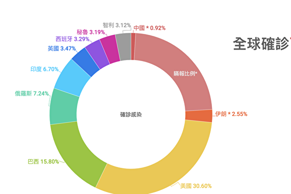

图为2020年7月1日，全球确诊病例排名前十位的国家。（大纪元制图）

   
  【大纪元2020年07月02日讯】（大纪元记者林南、李言、谢佳宣综合报导）7月2日全球中共病毒（中共肺炎）疫情最新情况： 
  
 根据约翰·霍普金斯大学的数据，截至美东时间周三（7月1日）晚上8时，全球感染中共病毒（武汉肺炎）的死亡人数超过51万1000人，确诊病例超过1056万例。（注：因中共和伊朗隐瞒疫情数据，真实数据比统计的要高）。

随着美国确诊案例激增，很多州和地区暂停了部分重新开放措施。纽约市周三改变了计划，决定不让餐馆在下周恢复室内就餐服务。 迈阿密海滩市说，它将恢复从周四凌晨12:30开始的宵禁，一直持续到凌晨5点，以遏制病毒蔓延。 加利福尼亚州关闭了酒吧，并停止了19个县的餐馆室内用餐，这些县的人口占该州70%以上。

美国卫生官员呼吁美国人“在家庆祝”7月4日的独立日。

中东地区，特别是有冲突地区的国家，正面临日益严重的危机。该地区有100万人感染了该病毒。

截至周三，全球疫情排名第二的巴西死于中共病毒的人数超过60,000，累积确诊病例达1,448,753例。

欧盟周三向15个国家（美国，俄罗斯和巴西除外）的游客重新开放了边界，许多欧洲国家进一步放宽了限制。

=======================
<b>以下是最新疫情实时更新：
   
东京单日新增107个确诊 再创解封后新高</b>

日本东京都周四新增感染冠状病毒（中共病毒）的病例达107例。这是日本解除紧急状态后新高纪录。

日本共同社采访相关人士获悉上述消息。当天东京的冠状病毒检测结果，有107人呈阳性反应。这是5月2日以来，东京都内再度出现单日新增确诊病例升至三位数。

对于东京都新增感染人数趋向增长势头，日本官房长官菅义伟在周四的记者会上表示，无需要求采取避免外出等措施。

东京都内在5月25日解除紧急状态后新增感染病毒的人数持续增加。进入6月下旬后，单日新增确诊病例均在50例左右，进入7月份，1日为67人，周四（2日）急增至上百人。

据报导，东京都知事小池百合子对此表示，感染者增加也存在随着检测数量等带来相关措施充实的因素。“大家担心阳性者多，但从蔓延情况来看绝大多数是（重症化风险低的）二三十岁人群。”

<b>球队正在备战比赛 6名达拉斯FC球员染疫</b>

离美国职业足球大联盟MLS复赛只剩下一周，大联盟周三表示，在即将到来的“MLS回归杯”锦标赛（MLS在复赛后进行的第一项比赛）之前，有6名达拉斯FC的球员在抵达佛罗里达州后，接受了Covid-19检测，结果呈阳性反应。

其中两名球员在上周六（6月27日）抵达佛罗里达州奥兰多时被检测出对Covid-19呈阳性反应。MLS在周三的一份声明中表示，另外四名球员在过去的两天里测试呈阳性。

这些尚未确定身份的球员目前被隔离在球队位于奥兰多的华特•迪士尼世界度假区的酒店内。MLS将于7月8日开始在该度假区的ESPN体育世界举办比赛。

此消息公布之际，正值美国主要的联盟赛事开始实行他们的大流行病中回归比赛的计划。

<b>美国现单日新增确诊病例最高纪录</b>

根据约翰-霍普金斯大学（Johns Hopkins University）的数据，美国周三单日新增冠状病毒（COVID-19）确诊病例数创下历史新高，共报告有50203例新病例，这超过了此前6月26日达到的单日新病例最高纪录的45255例。

据该大学统计，美国累计有2,685,806例确诊病例。

<b>墨西哥染疫死亡人数上超过西班牙</b>

根据墨西哥卫生部公布的数据，墨西哥的冠状病毒死亡人数周三已超过了西班牙。

在过去24小时内，墨西哥报告有741例新的死亡病例，使其总的死亡人数达到28,510人。根据约翰-霍普金斯大学的统计，西班牙周三晚间总的死亡人数为28,364人。

目前墨西哥是全球冠状病毒死亡人数第六多的国家。

墨西哥卫生部周三还报告有5681例新的确诊病例，使该国的总病例数达到231,770例。

<b>澳州维州新病例继续以两位数增长</b>

澳大利亚维多利亚州周三录得有77例新感染冠状病毒的病例，这是连续第17天出现的病例数以两位数字增长。

维多利亚州首席医官布雷特·萨顿（Brett Sutton）周四表示，周三发现的大多数病例都发生在墨尔本附近的10个疫情“热点”郊区，那里已有30万人被令“待在家中”避疫。

维多利亚州目前有415例活跃病例，其中20个患者住院，包括有4例在重症监护病房治疗。
目前当局鼓励10个区的所有居民进行检测，无论他们是否有没出现任何症状，周三当地已进行了26,320次测试。

“仍有可能发现其他感染者，他们都有传染给他人的风险，”萨顿说。“人们应该尽可能地缩小自己的行动范围。”

<b>一连串的失误 新西兰卫生部长宣布辞职</b>

新西兰卫生部长戴维•克拉克（David Clark）在疫情期间发生一系列严重失误，包括违反本国封锁规则，遭遇四面楚歌，他在周四宣布辞职。

自4月份以来，克拉克一直遭到抨击。在全国封锁期间，当时他违反新西兰的居家令，带着全家人到海滩散步。

他当时曾提出辞职。但是，总理哈辛达·阿登（Jacinda Ardern）并不接受他的请辞，称这可能会在国家与病毒作斗争时，造成卫生部门的“大规模混乱”。

对此，阿登在4月时撤消了克拉克所兼的副财政部长的职务，并将他在内阁的排名降到最低层。上个月，他将边境失误的责任归咎于卫生局局长阿什莉·布卢姆菲尔德（Ashley Bloomfield）后，又遭到了另一次评击。

克拉克周四再次提出辞职。阿登表示，已接受克拉克的辞职请求。

克拉克在Facebook上的一份声明中写道：“对我来说，越来越清楚的是，我继续担任这一职位有损政府对COVID-19全球大流行的总体反应。”
阿登说，“我们的卫生领导层要得到新西兰民众的信任，这点至关重要。就像克拉克对我说的，团队的重要性排在他个人前面”。

截至周三，新西兰共有22例Covid-19活跃病例，其中1例住院。根据新西兰卫生部的数据，总共记录了1,528例确诊或疑似病例，死亡22例。

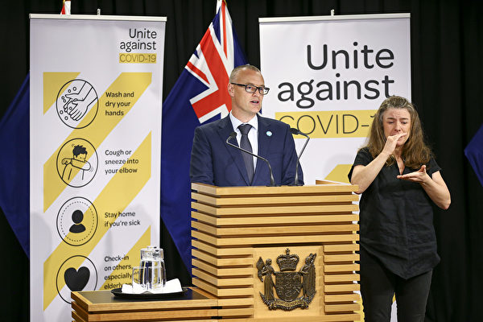

图为2020年3月19日，新西兰威灵顿，新西兰卫生部长克拉克（David Clark，左）召开记者会。(Hagen Hopkins/Getty Images)

<b>韩国新增54个确诊病例</b>

据韩国中央防疫对策本部周四通报，截至当天零时，韩国新增54个感染中共病毒（冠状病毒）确诊病例，但当天没有新增死亡病例。
至此韩国累计确诊病例达12904例，累计的死亡病例达282例。

韩联社报导指，韩国近期的疫情已蔓延至大田市、忠清南道和光州市等首都圈以外地区。当日新增的54个病例中有44例属于社区感染，其中来自光州市的新增病例占半，达22例。

这是韩国单日新增病例连续两天超过50例，为近两周来的最高。另外，10例为境外输入的病例，也是连续7天呈两位数增长。

当天光州市确诊的病例与此前首都圈的病例多出现在教会的情况有所不同，当地疫情以寺院、教会、直销公司、养老设施及图书馆等为中心不断扩散，近5日累计新增39例。

<b>研究：儿童传播病毒能力可能跟成年人一样</b>

一项新的研究表明，儿童可能也能够像成年患者一样传播中共病毒。

日内瓦大学医院和该大学研究人员调查了7名年龄在7天到16岁之间的染疫婴儿和儿童。

除了两个人以外，其他所有人都携带与成年人相同的病毒，这就是为什么研究人员说，除非另有证明，否则应将儿童视为病毒传播者。

感染COVID-19的儿童比成年人少，发展为严重疾病的人也较少，他们似乎不是“主要传播途径”，但各个年龄段的儿童都已被感染。

该研究的作者说，需要更多的研究来充分了解儿童在传播该病毒中的作用。

<b>全球疫情加速扩散 过去一周每天新病例破16万</b>

世界卫生组织周三表示，COVID-19疫情在全球加速扩散，过去一周每天的新病例超过16万例；而且疫情爆发后记录到的所有确诊病例，逾半都是在6月出现。

截至周三，全球至少51万人死于中共病毒（COVID-19，武汉肺炎），确诊病例逾1056万例。

疫情从去年12月在中国爆发后，目前已蔓延到196个国家及地区。

全球疫情最严重的美国，境内累计12万7681人死亡，累计确诊数达265万8324例。巴西死亡人数在全球仅次于美国，超过6万，累计确诊达144.8万例。但是，由于中共和伊朗隐瞒疫情，它们真实的疫情数据可能比上述国家还要高。

从区域来看，欧洲累计确诊269万3243例，死亡19万7605人；美国和加拿大累计确诊276万2595例，死亡13万6344人；拉丁美洲和加勒比海地区累计确诊259万1485例，死亡11万6534人。

世卫周三报导说，中东地区，特别是有冲突地区的国家，正面临日益严重的危机。

该地区有100万人感染了该病毒，6月份报告的病例数超过了前四个月的总和。受灾最严重的国家是伊朗、伊拉克、沙特阿拉伯、埃及和巴基斯坦，这些国家合计占该地区死亡人数的85%以上。

俗称武汉肺炎的COVID-19（中共病毒）疫情至今已在全球夺走超过51万1000人的性命，已知确诊人数超过1056万人。

世卫本周稍早警告，这波中共病毒大流行距离结束还很遥远。

<b>美国国庆日 官员吁“待在家里庆祝”</b>

美国卫生官员敦促美国人缩减国庆日（独立日）计划，取消聚会、待在家里、不要让情况变得更糟。因为新增的中共病毒病例水平达到了令人沮丧的新高，8个州在周二创下了单日确诊人数最多纪录。

俄勒冈卫生局说：“这个假期最安全的选择是在家庆祝。”

对于计划举办野炊活动的内布拉斯加人来说，该州官员建议：保留客人名单，以便更能容易地追踪。

在洛杉矶县，公共卫生部门下令取消烟火表演。

<b>美国政府投资开发监控患者症状设备</b>

美国政府周三表示，它正在投资一个项目，可监控中共病毒患者的症状，甚至可能发现早期感染迹象。

生物医学高级研究与发展局（Biomedical Advanced Research and Development Authority，简称 BARDA）表示，已向数字医学公司Sonica Health投资656,000美元，用于开发可配戴。

据悉，该设备大约只有创可贴大小，可贴在喉咙的底部。

“该设备可以监测咳嗽强度和咳嗽模式；胸壁运动可能表明呼吸困难或呼吸不规则、其它呼吸音、心率、体力活动和体温。”

BARDA表示，Sonica Health将整合西北大学附属公司Sibel Health的技术，以增加连续脉搏血氧仪和心电图，来测量心脏活动和血氧水平。

<b>福西预计美国每天新增10万病例?</b>

美国顶尖传染病专家安东尼·福西（Anthony Fauci）博士在周三下午接受NPR采访时说，美国可以扭转正在上升的中共病毒大流行状况。

福西对主持人凯利（Mary Louise Kelly）说：“每天不一定会有100,000个案例。”

他补充说：“我使用这个数字，是因为我想让人们有紧迫感。”

福西周二在参议院委员会作证说，如果不进行干预，例如戴口罩和社交疏离，美国每天可能会发现多达10万例新的Covid-19病例。该国每天已经有近40,000例新病例。

“如果您将病毒留在自己的设备上，它将迅速感染您。控制爆发是我们应对爆发动态传播的方法。而且，如果您做的事情从本质上增强了疫情爆发，那么您就是问题的一部分。您不是解决方案的一部分，” 福西说。

目前包括佛罗里达州和德克萨斯州在内的一些州每天的Covid-19病例都在上升。

福西说：“我们看到的，各州之间的情况各有不同，人们聚集在酒吧里庆祝⋯⋯” 福西说， “这违反了我们正在尝试做的原则，那就是社交疏离，戴口罩。”

福西说，他相信美国可以再次减少这一数字，回到3月和4月的水平。

<b>巴西又一州长染疫</b>

巴西州政府新闻办公室周三宣布，巴西圣卡塔琳娜州州长卡洛斯·莫伊斯（Carlos Moises）对Covid-19检测呈阳性反应。

莫伊斯现在正在自己的家中隔离。他出现咳嗽、喉咙痛和低烧的症状。

巴西通讯社G1 Globo报导，自Covid-19爆发以来，巴西27位州长中有8位感染了该病毒。

阿拉戈斯州、圣埃斯皮里图桑托州、马托格罗索州、帕拉州、伯南布哥州、里约热内卢州和罗赖马州州长也感染了该病毒。

根据约翰·霍普金斯大学的病例统计，截至周三，巴西死于中共病毒的死亡人数接近6万。该国确诊病例数位居第二，仅次于美国，已确诊病例超过140万。

<b>伊朗封锁11省</b>

伊朗政府在国际制裁的压力下苦苦挣扎，尤其不愿封锁经济。伊朗总统曾说过，经济必须保持开放，因为伊朗“没有第二选择”。

但是在周三，随着感染病例激增，医院满员，死亡人数上升，伊朗官员宣布在11个省的城市采取新的关闭措施。

卫生部官员说，现在包括首都德黑兰在内的八个省被视为红色区域。

<b>美国病例攀升 美股涨多跌少</b>

路透社报导，尽管美国感染中共病毒（冠状病毒）的病例攀升，但市场对安全有效疫苗的研发进展趋于乐观，舒缓当局可能实施另一波防疫封锁令所引发的忧虑，美股周三涨多跌少。

道琼工业指数下跌77.91点或0.30%，以25734.97点作收。

标准普尔指数涨15.57点或0.50%，收3115.86点。

科技股纳斯达克指数上涨95.86点或0.95%，收10154.63点，再创收盘新高。

<b>哥伦比亚中共病毒病例突破10万</b>

据哥伦比亚卫生部称，哥伦比亚周三染疫病例超过了100,000例。

卫生部在过去的24小时内报告了创纪录的4,163例新病例，使该国的总数达到102,009例。

哥伦比亚还记录了136例新的死亡人数，总死亡人数达到3,470人。

根据美国CNN统计，拉美国家本周在七天时间内的平均报告病例数和死亡人数再创新高。

<b>巴西死亡人数超过60,000</b>

据巴西卫生部称，截至周三，巴西死于中共病毒的人数超过60,000人。

该部在过去的24小时内报告了1,038例新的死亡人数，使巴西的死亡人数达到60,632人。

巴西周三还报告了46,712例新确诊病例，每日大幅增加，但仍未超过该国单日纪录。巴西在24小时内报告的最高病例数发生在6月19日，当时卫生部报告了54771例新病例。

截至周三，巴西有1,448,753例确诊的Covid-19病例，是全球第二大疫情国。 

<a target="_blank" href=#top><h6 align="right">回上方</h6></a>

<a name=15>
<h1 align="center"><b>国安恶法38条震惊全球：要管全世界的人</b></h1>

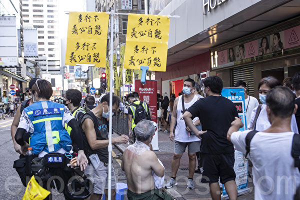

中共人大强推“港区国安法”，引起港人强烈反应，28日下午有网民发起“6.28静默游行”。（余钢／大纪元）

   
   【大纪元2020年07月01日讯】（大纪元记者徐简综合报导）6月30日，中共炮制的“港版国安法”在一片斥责声中出炉了，其中的第38条将中共管辖权扩张到世界任何角落，这引起了各界的惊诧和愤怒，称38条是“与世界为敌”。

这个所谓的港版国安法第38条载明，“不具有香港特别行政区永久性居民身份的人，在香港特别行政区以外，针对香港特别行政区实施本法规定的犯罪的，适用本法。”

换句话说，该条文将《国安法》治外法权延伸至世界每一个人，《国安法》不仅规限香港永久居民或身在香港的人士，适用性还延展至海外与非香港居民。只要共产党认定违法即可入罪，这对全球都具威胁性。

哥伦比亚大学政治学教授黎安友（Andrew Nathan）指，在海外支持香港民主的人士在国际间出行或需提高警惕，规避与中共有引渡条约的国家。

知名评论家章家敦（Gordon Chang）发推说，“第38条将外国人的外国活动定为犯

英国著名人权活动家罗杰斯（Benedict Rogers）说，“我呼吁（对中共进行）制裁、（在香港派驻）联合国特使、救生艇救援（港人）。我想我已经触犯了38条？”

<h4 align=center><a href="https://twitter.com/benedictrogers/status/1278018782049579013?ref_src=twsrc%5Etfw%7Ctwcamp%5Etweetembed%7Ctwterm%5E1278018782049579013%7Ctwgr%5E&ref_url=https%3A%2F%2Fwww.epochtimes.com%2Fgb%2F20%2F7%2F1%2Fn12224164.htm">我想我已经触犯了38条？(点击右键,另存新档）</a></h4>

作家、Axios的中国问题记者Bethany Allen-Ebrahimian写道：“天啊，我真的没看走眼？？？北京刚刚赋予自己对地球上的每个人都有治外法权？”

慈善机构创办人、英国上议院与保守党人权事务委员裴伦德（Luke de Pulford）写道：“这项法律是荒谬的。38条规定非香港公民甚至不在香港的人如果触犯该法，也被视为犯法，我猜那就是我。”

新唐人评论员唐靖远说，港版国安法第38条的规定震动全球，因为按照这条规定，中共可以管辖全球所有人……这种匪夷所思的条款居然堂而皇之出台，只能说明，人大这帮制定国安法的人，要么是一帮二货、伪专家或外行法盲，要么就是他们存心出“一尊”洋相，欺负他看不懂——法案必须要他签字才能颁布实施。

香港名嘴、著名电视电影编剧萧若元说，中共会因第38条把自己玩死，“现在所有外国国家都会警告自己的市民，因为他们很有可能曾经在国外有违法的言行结果构成了‘犯法’行为在香港被拘捕。这对于香港国际金融中心的地位一定是有重大影响。”

台湾陆委会7月1日举办的“台港服务交流办公室”揭牌仪式上，陆委会主委陈明通说，“这是天朝帝国对世界的子民发出的律令”，全世界都必须关注此法，并要严肃面对。#

<a target="_blank" href=#top><h6 align="right">回上方</h6></a>

<a name=14>
<h1 align="center"><b>FCC发布最终指令 宣布华为中兴构成国安威胁</b></h1>

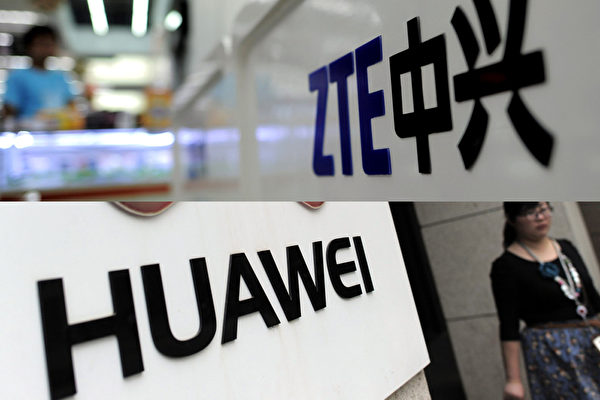

美国联邦通信委员会（FCC）以国家安全为由，提议不许电信业者用国家预算采购中兴及华为的网路设备。(AFP)

   
   【大纪元2020年07月01日讯】（大纪元记者张婷综合报导）周二（6月30日），美国联邦通信委员会（FCC）正式指定华为和中兴通讯对美国国家安全构成威胁，禁止美国公司动用83亿美元的政府资金，从这些公司购买设备。

路透社报导，FCC主席阿吉特‧帕伊（Ajit Pai）周二在一份声明中说：“我们不能也不会允许中共利用网络漏洞，损害我们的关键通信基础设施。”

FCC专员杰弗里·史塔克斯（Geoffrey Starks）周二表示，“不可信任的设备”在美国网络中仍然存在。他表示，美国国会必须为替换这些设备分配资金。

美国电信监管机构FCC于去年11月，以5比0的投票结果，认定华为和中兴通讯对美国构成国家安全风险，要求郊区运营商移除和替换现有美国网络上所使用的华为和中兴设备。

2019年5月，川普（特朗普）总统签署了一项行政命令，宣布国家紧急状态，禁止美国公司使用由可构成国家安全风险的公司制造的电信设备。川普政府还在去年将华为加入了商务部出口管制黑名单，并在今年5月对华为实行新一轮封杀，禁止任何使用美国技术和设备生产芯片的制造商向华为供货。

FCC对中国电信公司采取了越来越强硬的路线。FCC在今年4月表示，可能撤销包括中国电信和中国联通在内的几家中共国有控股电信公司在美国的运营资格。

FCC向中国电信美洲公司、中国联通美洲公司、太平洋网络公司及其全资子公司ComNet（USA）LLC发出“陈述理由令”（要求说明理由的命令，show cause order），指示这三家公司解释为何不应该启动撤销它们在美国运营授权的程序。FCC要求这些公司在30天内做出回应。

FCC主席帕伊在一份声明中表示：此举反映出美国政府机构的“深切关注”。

他说，由于这些公司是中共国有实体的子公司，因此“很容易受到中共的利用、影响和控制。当涉及到我们网络的安全性时，我们绝不能冒险，也不能指望最好的情况”。

<a target="_blank" href=#top><h6 align="right">回上方</h6></a>

<a name=13>
<h1 align="center"><b>郝海东与叶钊颖七一互动 牵手反共到底</b></h1>

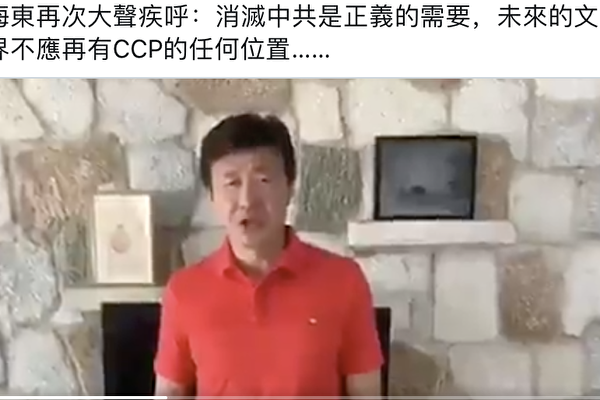

7.1中共建党日之际，郝海东向中共“献礼”，怒吼“共产党，你们完了。”（网络截图）

   
  【大纪元2020年07月01日讯】（大纪元记者骆亚报导）大陆前足球名将郝海东和妻子（羽毛球名将）叶钊颖在临近中共7.1建党日之际，在社交媒体上发表公开言论，反共大义是他们夫妇两人的共同理念，向中共7.1“献礼”。

郝海东还在视频中表示灭共是正义的需要，指中共是危害全人类的一个邪恶组织，并怒吼“共产党，你们完了”。

6月30日，郝海东的最新视频在社交媒体上广为流传，再度表达他灭共的决心，“我会永远跟你们在一起，消灭中国共产党！消灭CCP！”

视频中，他强调，“消灭中共是正义的需要，中国共产党是危害全人类的一个邪恶组织。我坚信、我相信世界自由、民主、文明、法治社会一定会剔除中国共产党，文明世界里不应该有它们的位置。”

最后他高声怒吼：“共产党，你们完了。”

而此前一天6月29日，他们夫妇两人在以各自名字“郝海东”和“叶钊颖”为用户名的推特账号上互动发推文，表面他们两人有共同的“反共”理念，并会一起走完人生的反共下半场。

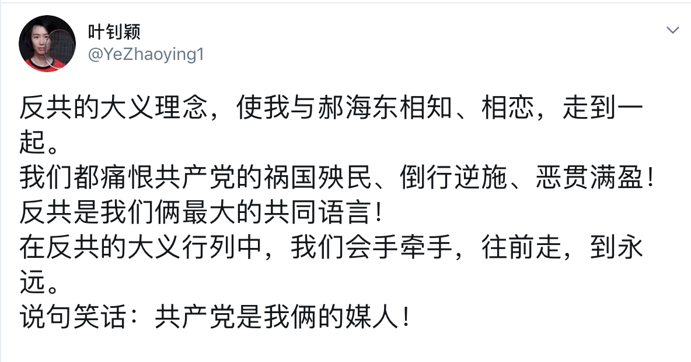

郝海东夫妇7.1前夕再炮轰中共，指出灭共大义是两人共同的理念。（网络截图）

叶钊颖的这条推文写道：“反共的大义理念，使我与郝海东相知、相恋，走到一起。”

她还说，“我们都痛恨共产党的祸国殃民、倒行逆施、恶贯满盈！反共是我们俩最大的共同语言！在反共的大义行列中，我们会手牵手，往前走，到永远。说句笑话：共产党是我俩的媒人！”

与此同时郝海东在与她互动的推文中说：“我们是真正的志同道合的有缘人！感谢小叶对我的支持！我们会一起走完人生的反共下半场！”

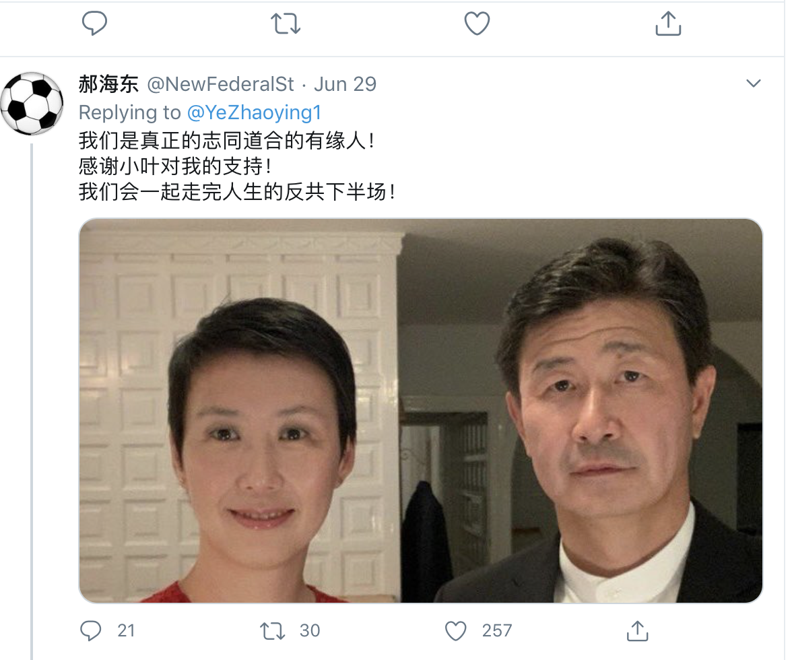

郝海东与妻子互动说，要一起走完人生的反共下半场。（网络截图）

关于这两个大陆原体坛名将的推特账号，目前郝海东夫妇并没有发表任何公开言论出面否认说这不是他们的个人账号。不少网友认为上面的观点符合两人近来的行动，有很大可信度。数万的粉丝中，很多人还在底下留言赞赏、声援、力挺。

<b>六四31周年首度向中共宣战：“新中国联邦”成立</b>

而此前“六四”31周年之际，郝海东夫妇向外宣读了“新中国联邦”成立的宣言，犹如核弹炸翻了网络，足球名将郝海东名字火爆整个网络。

随后他们夫妇两人在接受媒体的专访中谈及他们夫妇与中共决裂的原因，并强调共产党必须“退出历史舞台”。中共对他们举动非常恐慌，郝海东表示，“我们俩在大陆网上所有讯息全部删除，连百度都无法搜到。可见他们心虚。”

郝海东也曾在视频中表示，“特别感谢、感激我的爱人‘小叶’”，“一个男人当他做出人生最重要抉择的时候，没有家人、没有爱人、没有孩子的支持，那是最孤独的。”

视频中，叶钊颖并肩在郝海东身旁带着笑容轻松地说，“不是我们站出来，总有人会站出来，只是这个机缘巧合，这个机会上天给了我们。”# 

<a target="_blank" href=#top><h6 align="right">回上方</h6></a>

<a name=12>
<h1 align="center"><b>蝗虫大军逼近首都 印度直升机和无人机迎战</b></h1>

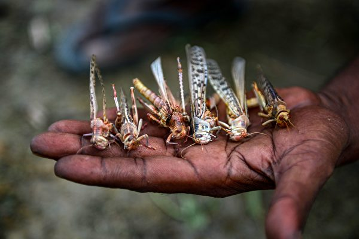

印度政府出动直升机和无人机喷洒杀虫剂来扑杀蝗虫。图为2020年6月10日，印度安拉阿巴德（Allahabad）郊外一名农民手中展示的蝗虫尸体。(SANJAY KANOJIA/AFP via Getty Images)

   
   【大纪元2020年07月02日讯】（大纪元记者陈俊村报导）印度正在经历几十年来最严重的沙漠蝗虫侵袭。正当蝗虫大军即将攻入首都新德里之际，有关当局出动直升机和无人机喷洒杀虫剂，试图抑制蝗灾的爆发。

上周六（6月27日），大批蝗虫出现在古尔冈（Gurgaon）的天空，促使印度政府采取行动。古尔冈是新德里的卫星城市，距离新德里只有30公里。

印度当局已经派出直升机和无人机在至少9个邦喷洒杀虫剂，藉以扑杀成群的蝗虫。其中，一架配备喷洒装备的直升机在周二（6月30日）飞往拉贾斯坦邦（Rajasthan）。这架直升机单趟可携带250公升的杀虫剂，足以覆盖25至50公顷的土地。

2020年6月11日，在印度安拉阿巴德住宅区飞舞的大量蝗虫。(SANJAY KANOJIA/AFP via Getty Images)

印度农业与农民福利部（Minister of Agriculture & Farmers Welfare）部长托马尔（Narendra Singh Tomar）在一份声明中指出，他们已经向英国公司订购5套喷洒装备，一旦收到这些装备，就会安装在印度空军的直升机上，用以对抗蝗灾。

印度民航部（Ministry of Civil Aviation）也已经修改规定，使政府官员得以在夜间使用无人机来扑杀蝗虫。而地方政府也出动特殊车辆和消防车来喷洒杀虫剂。

印度民航部官员表示，这是该国首次允许无人机在夜间执行扑杀蝗虫的任务。在夜间执行这种任务会比较有效，因为蝗虫这个时候在睡觉。

本次蝗虫大军的现身尚未造成严重损失，因为它们出现在前一次农作物的收成与下一次耕种之间，但拉贾斯坦邦部分地区的农民还是遭受轻微的农作物损失。

在强风的作用下，这波蝗虫分散进入了印度的农业带──哈里亚纳邦（Haryana）和北方邦（Uttar Pradesh）。正当这些地区的农民在雨季后开始耕种之际，这些蝗虫的到来对农作物构成严重威胁。

联合国粮食及农业组织（Food and Agriculture Organization）警告说，在农民进行夏耕之际，新一波的蝗虫可能还会从东非越过印度洋到印度与巴基斯坦的边境地区。

<a target="_blank" href=#top><h6 align="right">回上方</h6></a>

<a name=11>
<h1 align="center"><b>香港新设国安署权力不受限制 架空港府及司法</b></h1>

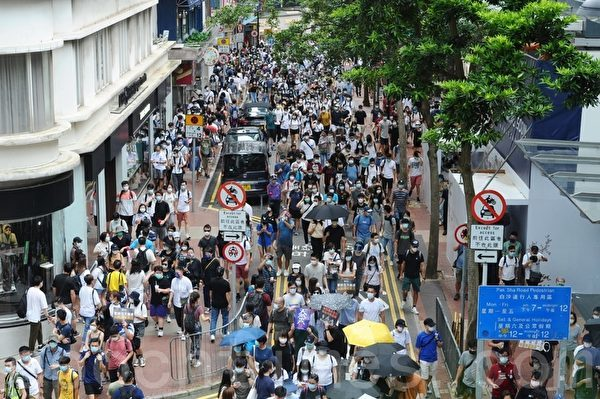

7月1日，港人举行游行，反对《港版国安法》。（宋碧龙／大纪元）

   
 【大纪元2020年07月01日讯】（大纪元记者张顿报导）《港版国安法》实施后，中共将派驻香港特别行政区维护国家安全公署（国安署）。国安署在办案时，不但不受香港特区政府的管辖，而且还须其提供“便利和配合”，否则将追究港府责任。国安署接管案件后，更是由中共司法系统来负责处理。  
 
 评论指，中共凭借一部《港版国安法》架空了港府及香港司法。

中共全国人大常委会6月30日通过《港版国安法》，当晚11点首次公布条文并实施。

该法规定，中共在香港设立维护国家安全公署，公署人员由中共政府维护国家安全的有关机关联合派出，经费由中共中央财政保障，其主要职责是维护中共的国家安全、办理相关案件等。

该法规定，国安署在下列三种情况下对案件行使管辖权。一、案件涉及外国或境外势力介入的复杂情况，香港管辖有困难；二、港府无法有效执行国安法的严重情况；三、中共国家安全面临重大现实威胁。但条文没有就相关情况作更清晰说明。

国安署对有关案件行使管辖权后，负责立案侦查；中共最高检察院行使检察权，中共最高法院行使审判权。

条文还规定，由国安署管辖案件，其立案侦查、审查起诉、审判和刑罚的执行等诉讼程序，将按中共的“刑事诉讼法”等法律规定。

香港《苹果日报》指，上述条文显示，由中共派驻的国安署负责案件，不但港府没有反对空间，而且彻底改变香港司法管辖权。

《港版国安法》中的条文规定，国安署及其人员执行职务的行为，不受香港特区管辖；持有国安署制发的证件的人员和车辆等在执行职务时，不受香港特区执法人员检查、搜查和扣押；国安署及其人员享有豁免权。

条文还规定，国安署行使职权时，香港特区政府有关部门“须提供必要的便利和配合”，对妨碍执行职务将“追究责任”。

外界批，中共几乎照搬了中共国内的国安法，令驻港国安署行使权力时，拥有无限权力。

大纪元专栏作家田云刊文指，中共仅凭一部《港版国安法》就架空了港府。届时，“驻港国安公署”的证件是最高通行证，其人员和车辆畅通无阻，港府其它机构必须无条件配合，不得过问或质疑。

对于涉嫌触犯“国安法”的香港案件，国安署决定何时接管。它若认定案件“复杂”就是复杂；它认为港府处理“无效”就是无效；它说国安威胁“重大”就是“重大”。一句话，港府“不能管”。

田云指，此法处处透着杀机，中共从7月1日开始，将明目张胆地以恐怖治港，要全面封杀港人的自由权利。

他说，中共故意捆绑“国家”与“政权”，以“国家安全”掩护它的“政权安全”。于是，任何人批评中共，或是提出改选、党派竞争，便成了“颠覆国家政权”、破坏“国家安全”。以此伪命题作为一项关乎700多万香港人法律的“出发点”，并祭出“终身监禁”的重刑恫吓，真是荒诞和邪恶得没边儿了。

<a target="_blank" href=#top><h6 align="right">回上方</h6></a>

<a name=10>
<h1 align="center"><b>【独家】鲁炜发迹和中国“删都”的出现</b></h1>

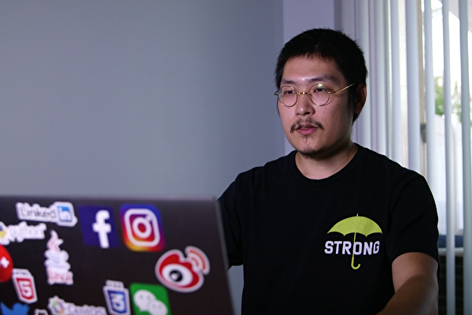

曾在中国新浪微博和乐视视频从事审核工作的刘力朋，近日在美国接受大纪元、新唐人的专访，批评中共言论审查。（大纪元）

   
   【大纪元2020年07月01日讯】（大纪元记者李新安采访报导）“在中国，网信办比中宣部厉害，看看鲁炜的简历就明白。”前资深网络审查员刘力朋说。而中共网信办是审核行业最大的老板，该行业由于必须靠近权力中心，故以地缘关系不断形成“删都”。

曾在中国新浪微博和乐视视频从事审核工作的刘力朋，近日在美国接受大纪元、新唐人的专访，批评中共日益严厉的言论审查和舆论控制。（接上文）

刘力朋表示，从中国有互联网开始就有审核。一开始是公安部做的金盾工程，然后很快就有了GFW（Great Firewall）防火墙。

金盾工程是一个包括网络各个环节的封锁和监视系统，如，网吧内的用户上网必须事先出示身份证，该系统直接连系警方网络系统，是公安系统监控、取证的工具。而防火长城是宣传系统的工具，作网络海关用。

刘力朋认为十年前自己刚入行的时候，审核还不是很强，那时中共是通过防火墙“这种更物理的封锁让民众看不到”，“（让老百姓）只能看《人民日报》、新闻联播，来给人们洗脑”。但随着社交媒体崛起，“光靠GFW不行了，这时候舆论控制开始做得越来越大”。

<b>从鲁炜落马看中共争夺所谓“网络主权”</b>

刘力朋认为，中共加强网络控制大体上是从2011年温州的动车事件开始，当时人们还是很敏感的状态，非常悲愤，把微博刷爆了至少三天。

自那时起，网信办加强舆论控制，时任北京宣传部长的鲁炜宣称要占领舆论阵地，政府也要开微博，去引导舆论，转守为攻。然后鲁炜马上就升官了。

“从理论上讲，这（转变）完全可以跟鲁炜个人发迹联系起来。”刘力朋说，“我印象中现在固定下来的很多审核机制，都是他任上成型的。”

此外，鲁炜得以升迁的很大因素，是他整顿北京的互联网公司，新浪、网易、搜狐、腾讯都被他整过，还有2013年打击网络大V，并提出“网络不是法外之地”，“网络主权”等。

公开资料显示，鲁炜出身记者，曾任新华社副社长。2013年，鲁炜成为国家互联网信息办公室主任，开始主管中国的互联网。于2014年5月至2016年6月任中央网信办主任。

互联网大会曾经被指是鲁炜从政生涯的主要政绩。2014年在浙江乌镇第一届世界互联网大会上，中方提出一份大会声明草案，推出互联网“网络主权”的概念，一时间舆论哗然。

2016年6月，鲁炜被免去网信办主任，只留下中宣部副部长一个没有实权的职务，政治上被指失势。

最终，2018年2月13日，鲁炜被宣布双开，成为十九大后“首虎”，且定性措辞空前严厉。鲁炜被指“欺骗中央，干扰中央巡视，公器私用，不择手段为个人造势，拉帮结派、搞‘小圈子’；频繁出入私人会所，大搞特权，专横跋扈；以权谋私，收钱敛财；以权谋色、毫无廉耻”。

对于中国互联网“大总管”鲁炜为何落马，刘力朋认为，主要是因为他不被习近平信任了，却掌握了网络大权。

“中共无中生有的‘互联网主权’的概念，其实是他们对网络控制能力这种力量的认可。”刘力朋认为，鲁炜落马原因之一，就是中共高层要收回这个权力。

<b>以北京为权力中心的“删都”不断扩散</b>

“这个行业严重依赖人工。”刘力朋披露，他以头条系的字节跳动为例，“他们成天说自己用算法来审核的，是很精准的，不会影响用户体验的，其实他们每一条内容全部被人看过至少三遍。”

据介绍，中国言论审查的重心在北京，业内审核业务的高级职位都设在北京，审核工厂放在别处。比如，腾讯总部在深圳，但是他必须得上北京的山头成立办公室，他的审查部门不放在深圳而放在北京，在北京保留政府关系。

前几年，天津是主要的一个审核中心，现在审核重心慢慢在向西安、重庆扩散。天津能成为最早的“删都”，被指跟靠近中共权力中心有关。

青岛可能会取代天津，成为一个新删都。“只要你说在青岛做互联网，我就能确定你是做审核。”他说，青岛的优势是离北京2小时高铁，所以方便北京的互联网公司去直接管理。

西安也有很多审核外包公司，因为在那里可以招到大量高校毕业生。刘力朋说，这个行业直接招高校毕业生就好，不用太培训，因为中共已经用政治洗脑训练了十几年，现成的人手。

“所有能大量招到高校生的城市都适合做审核工厂。但互联网公司中枢还得是在北京，这个行业必须靠近权力。审核部门在北京的办公室，专门制定政策，下面把指令消化、执行。”他说。

<b>被中共网警用枪顶着工作</b>

刘力朋形容审核员是被中共网警用枪顶着工作的人。

删帖和抓人是网警惯用的模式。网信办频繁地发布舆论控制的命令，而网警负责抓人。

在奥威尔的政治讽刺小说《一九八四》中，“党”通过四个专职部门维护统治，真理部负责新闻、教育等；友爱部负责法律和秩序。通俗地说，真理部负责造谣，友爱部负责拷打。但在刘力朋眼中，中共的公安系统主管造谣和镇压，相当于把友爱部和真理部合二为一，比《一九八四》更恐怖。

“网信办是（网络审查）最大的头，它是党的机构。其它一些部门，政府官僚部门都有权给我们下令，日常管得最多的是网信办。公安网警管社会上的辟谣，比如哪儿发现新冠新病例了，公安部门下命令，‘左手辟谣，右手抓人’。”

网警有进入各个平台后台的权限。刘力朋说，“有时警方会要求平台自己主动上报高危言论和用户，中国所有网站都是后台实名的，他们直接就拿著名单去抓人。”

据介绍，网民的真实个人信息只是不显示在前台，在中国网络这个信息大监狱中，每一个用户都是后台实名的，每一个留言，都要留存IP地址。

比如，网吧上网必须出示身份证，所有机场、图书馆、商场公共场所的WiFi必须登记手机号，手机号实名，每一个点都堵死了。

“控制一个系统最重要的是堵住系统的漏洞，所有他们能想到的都封住了，这过程中可谓无所不用其极，所以我们看到中国互联网变得如此‘奇葩’。”

<a target="_blank" href=#top><h6 align="right">回上方</h6></a>

<a name=9>
<h1 align="center"><b>涉集体造假？金凰珠宝爆质押83吨假黄金诈贷</b></h1>

在美国那斯达克（Nasdaq）挂牌上市的中国金饰制造商“金凰珠宝”，日前被踢爆以83吨假黄金做抵押向十余家中国金融机构融资贷款共约200亿人民币。图为金条示意图。(MICHAL CIZEK/AFP/Getty Images)

【大纪元2020年07月01日讯】（大纪元记者程木兰综合报导）美国那斯达克（Nasdaq）挂牌上市的中国金饰制造商“金凰珠宝”，日前被踢爆以83吨假黄金做抵押，向十余家中国金融机构共融资贷款200亿人民币。丑闻曝光后，6月29日、30日股价随即崩跌，跌幅各达22%、16%，周二30日收盘每股仅0.71美元，市值较去年同期跌掉近八成。

据报导，计有15家信托公司在国营“中国人民财产保险”的承保下，自2015年起相继接受金凰珠宝黄金担保贷款共约200亿。但日前法院人员开启保险箱查验时发现“纯金金条”竟都是“镀金铜合金”。

据统计，83吨的纯黄金相当于中国一年黄金产量的22%、2019年国家黄金储备的4.2%。

此桩“实物黄金质押+保险公司承保”的双重保险融资模式如何形成诈贷犯罪，令人质疑。这其中涉及的评估、质检、监督、保险等机构各应承担何种责任？目前或许仅是连环“爆雷”的开端。此案是否也如曾在那斯达克上市的瑞幸咖啡一般，是桩牵连集体造假的案子？

<b>“实物黄金质押+保单承保”仍难防诈贷</b>

今次事件引爆点是今年2月东莞信托向法院申请对金凰珠宝抵押品展开清算，因后者2019年底信贷逾期兑付，不料赫然发现本应是上海黄金交易所AU999.9的标准金，竟只是铜合金赝品。

接着，总部位于北京的民生信托也向法院申请提前“开箱”检验，5月22日证实收到的金凰珠宝抵押品金条也是膺品。

然而，金凰珠宝董事长贾志宏矢口否认他当初存入的黄金是膺品，否则保险公司怎么会承保。不过，6月24日上海黄金交易所已取消金凰珠宝的会员资格。

金凰珠宝2002年8月成立于武汉，2007年10月改制为股份有限公司，2010年8月18日在美国那斯达克上市，代码KGJI。

随着掺假黄金被揭发，由金凰珠宝发行并许诺年收益最高10%的“东莞信托-金凰集合资金信托计划”彻底破产。另外，此前即身陷麻烦的民生信托、东莞信托、安信信托、四川信托、恒丰银行等金融机构处境更是雪上加霜。

<b>创办人贾志宏系出中共军队系统</b>

金凰珠宝大部分债权人为外省企业。消息人士对《财新》说“我们都知道他根本没有那么多黄金，拥有的只是一些铜”，因此“湖北当地几乎没有信托或银行业者愿意与金凰往来”，但也不敢公开得罪贾志宏。

资深银行家杨艳向自由亚洲电台表示，金凰珠宝前身是1994年成立、隶属人民银行的制金厂，现任执行董事兼总经理贾志宏本身曾是军队总后勤部旗下的金矿负责人。

贾志宏否认造假黄金，但杨艳怀疑，这么大量的掺假黄金，若不与黄金厂勾结根本做不出来。

据了解，金凰珠宝之所以寻求这么多的融资，主要是2018年并购国有汽车零件商“三环集团”99.97%的股权，以全现金支付了70亿人民币，湖北省政府称赞该交易是“混合所有制改革”的样板模范。

金凰珠宝接管三环后，常爆发贪污丑闻并面临调查。2020年以来，金凰珠宝已遭债权人通过法院强制执行22次，累计执行金额高达102.57亿元。而贾志宏持有的金凰珠宝及相关公司的股权也已被法院冻结。

<b>保险公司拒绝赔偿 被告上法庭</b>

6月初，东莞信托、民生信托和长安信托纷纷对金凰珠宝提起诉讼，并向为其承保的“中国人民财产保险”索赔，但遭到拒绝。

一方面信托公司说，保险合同中约定，保险标的为AU999.9黄金金条，如质量或重量不符合即视同发生保险事故，会向受益人承担赔偿责任。

另一方面，保险公司表示，保险期间只有对火灾、雷击、盗窃等六类原因导致的黄金“质量和重量不符合保单约定”承担保险责任。保险公司还强调，合同约定保险金请求权主体为被保险人，而目前金凰珠宝并未提出任何保险索赔，信托公司索赔不符合保险合同约定。

目前，此案已进入司法调查程序。

此外，信托公司发生客户信贷逾期不兑付，负责监管的“银行保险监督委员会”今年还同意信托公司继续发行相关新产品。有投资人最近才买的信托产品，就被告知没办法兑付了。

金融人士推测，信托公司掀开了武汉金凰黄金掺假事件仅仅是连环“爆雷”的开端。#

<a target="_blank" href=#top><h6 align="right">回上方</h6></a>

<a name=8>
<h1 align="center"><b>钟原：“百年未有大变局” 习近平有新解</b></h1>

【大纪元2020年07月02日讯】中共抛出了“港版国安法”，貌似很强硬，实则在壮胆，中共高层的内心其实忐忑不安。

习近平6月29日的最新讲话，就是最好的体现，他说，“当今世界正经历百年未有之大变局……形势环境变化之快、改革发展稳定任务之重、矛盾风险挑战之多、对我们党治国理政考验之大前所未有。”

习近平的这番表述，与强推“港版国安法”的姿态，形成了鲜明的对照。

<b>政治局会议终于探究实质问题</b>

新华社报导，6月29日，中共政治局集体学习，习近平重提“百年未有之大变局”。但这一次的解读，与2年前的说法，已经大相径庭。

习近平把现在的“变局”，描述成“形势环境变化之快”、“稳定任务之重”、“矛盾风险挑战之多”、“考验之大前所未有”。

这是中共高层对局势的最新评估，总算说了不少实话。

6月12日，新华社也曾报导，5月份两会期间，习近平在参加政协经济界委员联组会时，对“危与机”作了更深入的分析。文章称，“正如习近平所说……世界经济深度衰退、国际贸易和投资大幅萎缩、国际金融市场动荡、国际交往受限、经济全球化遭遇逆流、一些国家保护主义和单边主义盛行、地缘政治风险上升等不利局面，必须在一个更加不稳定不确定的世界中谋求自身发展。”

一个多月前，中共高层虽有认识，但还不够深刻，当时的新华社文章最后还总结，“中国策”在“变局”中开创“新局”。中共高层以为还有国际空间，仍然强推“港版国安法”，不惜与美国、英国、西方各国叫板。结果，中共完全被孤立。

如今，中共高层重新解读“百年未有之大变局”，应该又清醒了些，中共陷入了前所未有的“危局”。

<b>习近平2年前的“百年未有之大变局”</b>

2年前，新华社报导，2018年6月22日至23日，中共外事工作会议在北京召开，习近平发表重要讲话。当时的习近平信心满满，首提“百年未有之大变局”，他说，“当前，我国处于近代以来最好的发展时期，世界处于百年未有之大变局……做好当前和今后一个时期对外工作具备很多国际有利条件。”

在这样的基调下，习近平提出“既要把握世界多极化加速推进的大势，又要重视大国关系深入调整的态势。既要把握经济全球化持续发展的大势，又要重视世界经济格局深刻演变的动向”。

习近平虽然说得并不直接，但其后各党媒和中共御用文人们纷纷唱赞歌，更直接喊出，要与美国争高下，要统领世界。

习近平当时也确实提出了外事工作的具体要求，“要高举构建人类命运共同体旗帜，推动全球治理体系……推动‘一带一路’建设走实走深、行稳致远……要运筹好大国关系，推动构建总体稳定、均衡发展的大国关系框架”，“要深化同发展中国家团结合作……共同发展新局面……发展中国家是……天然同盟军……做好同发展中国家团结合作的大文章”。

2年前，中共高层还自以为在群山之巅，今天，中共开始坠入悬崖。习近平对“百年未有之大变局”的新解读，变成了“考验之大前所未有”。

历史的进程，显然无人能挡。中共在“危局”中，还在推动“港版国安法”，无疑在加速中共的坠落，难怪习近平被戏称为“习总加速师”。

<b>中共高层露面成难题</b>

中共高层面临的处境，还不只是国际局势的巨变，同样还有身临其境的艰难。因为北京疫情，也因为内斗，中共高层的露面，都成了无解的新难题。

近一个月的几乎销声匿迹后，中共政治局6月29日集体学习。这是5月29日之后，中共政治局的首次集体亮相，算是对外界辟谣，证明中共高层仍然在北京，没有出现权力真空，也没有人染疫。赵乐际总算也戴着口罩出现在央视的画面中。

然而除了6月29日的亮相，前后的各种活动，中共高层又继续消失。

新华社报导，6月30日，习近平主持召开中共全面深化改革委员会第十四次会议，李克强、王沪宁出席会议，中央全面深化改革委员会委员出席会议，中央和国家机关有关部门负责同志列席会议。这次会议继续无声无影，党媒央视的视频报导超过7分钟，仍然是播报员配文字形式播出。

中共全面深化改革委员会主任，习近平

副主任，李克强、王沪宁、韩正

秘书长，王沪宁（兼办公室主任）

但韩正没有“出席”。

委员会的委员包括：

丁薛祥（中央政治局委员、中央书记处书记、中央办公厅主任）

王晨（中央政治局委员、全国人大常委会副委员长）

刘鹤（中央政治局委员、国务院副总理）

许其亮（中央政治局委员、中央军委副主席）

孙春兰（中央政治局委员、国务院副总理）

杨晓渡（中央政治局委员、中央书记处书记、中央纪委副书记、国家监察委主任）

陈希（中央政治局委员、中央书记处书记、中央组织部部长、中央党校校长）

胡春华（中央政治局委员、国务院副总理）

郭声琨（中央政治局委员、中央书记处书记、中央政法委书记）

黄坤明（中央政治局委员、中央书记处书记、中央宣传部部长）

赵克志（国务委员兼公安部部长）

周强（最高人民法院院长）

张军（最高人民检察院检察长）

张庆黎（全国政协排名第一的副主席）

夏宝龙（全国政协副主席兼秘书长）

杨传堂（全国政协副主席、交通运输部党组书记）

巴特尔（全国政协副主席、国家民委主任）

何立峰（全国政协副主席、国家发改委主任）

新华社报导称，深化改革委员会委员出席了会议，当然也只有文字，没有这些人的图片和视频。这次会议，很可能又是习近平主持的一次“虚拟会议”，李克强等“虚拟出席”。

6月28日至30日这3天里，党媒的报导中，有习近平的各种指示、信件、签发命令、出书、发表文章等，但真正露面的，只有6月29日的中共政治局集体学习，新解“百年未有之大变局”。

习近平的上一次真正露面，是6月8日至10日，在宁夏考察。

习近平主持了6月17日中非抗疫视频峰会，6月22日也参加了中欧视频会议，都只在电视上露一下脸，并非公众活动。

6月24日和7月1日，李克强两次主持国务院常务会议，央视都以文字报导，应该开了视频会议。

但6月28日，李克强却现身主持召开了稳外贸工作座谈会，韩正也戴口罩出席。比较蹊跷。

6月28日，韩正可以出席一个无关紧要的外贸工作座谈会。6月30日，习近平主持召开中共全面深化改革委员会第十四次会议，韩正作为副主任，却没有参加。当然，韩正可能已经南下深圳，观察香港局势去了。

中共高层露面的难题，接下来外界还会继续观察。

<b>习近平的其它“新提法”</b>

6月29日，习近平新解了“百年未有之大变局”，也谈到了一些其它的“新提法”。

习近平谈到，要“着力培养忠诚干净担当的高素质干部”。

显然，目前习近平周围的亲信，是否忠诚不好说，是否担当也不好说，是否干净更不好说了。高素质恐怕也谈不上，否则也不至于陷入“考验之大前所未有”的地步。

中共显然朝中无人了，但习近平却继续要求，“面对复杂形势和艰钜任务……有力应对重大挑战、抵御重大风险、克服重大阻力、化解重大矛盾，进行……伟大斗争”。

习近平还要“斗争”，看起来对“大变局”的认识还不够深刻，也许很快再有新解。

习近平还提到，“敢于刮骨疗毒……永葆旺盛生命力和强大战斗力”。

不知他说的是否有所指，准备对哪些人“刮骨疗毒”。“永葆旺盛生命力”当然是空话了，想给下属打气，但美国制裁马上就到，其它国家也可能跟进，中共内部的高官应该都在考虑退路了，包括向美国投诚的选项。

新华社也跟着打气说，“走过99年……中国共产党是世界上最大的政党……党员总数为9191.4万名”。

这个数字读起来很不吉利。现实中，这个最大的党，也正在迅速坠崖，能不能走过100年都成了未知数。习近平最后又说了句实话，称需要“赢得民心”。

中共早已失去民心，无论是香港的民心，还是中国大陆的民心。历史正在彰显，中国的改朝换代，已经成为70年“未有之大变局”。

<a target="_blank" href=#top><h6 align="right">回上方</h6></a>

<a name=7>
<h1 align="center"><b>【独家】前微博审核员勇揭中共审查黑幕</b></h1>

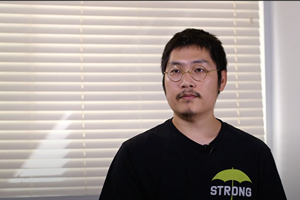

中国大陆前网络审查员刘力朋2020年6月29日在美国接受大纪元、新唐人联合专访。（大纪元）

   
  【大纪元2020年06月30日讯】（大纪元记者李新安采访报导）曾在中国新浪微博和乐视视频从事审核工作的刘力朋，近日在美国接受大纪元、新唐人的专访，披露中共日益严厉的言论审查、信息控制和舆论导向，并将之输出海外，威胁自由社会的言论自由。

中共的审核系统是一个非常复杂的庞大系统。刘力朋曾在民营企业从事网络审核工作近10年，担任过新浪微博审核编辑、乐视视频总编室质量监控主管等。他估计，中国私营部门的审核员，规模有100万到200万人，几乎跟网评员的队伍一样大。

刘力朋解释说，审核员不同于众所周知的网评员（俗称“五毛”），前者是公司或平台聘用的管理员，执行本平台的社区规则；而后者是另外的工种，是中共利用体制内人员、大专院校、高校，加上各种服刑人员组成，网评员执行中共的管控舆论的政治指令。

“审核员日常的工作除了审查政治言论以外，大部分是防滥用、防骚扰，所以他隐藏在一个看上去特别正常的工种里面，但其实质就是管控舆论。”刘力朋说，与审核员对接的部门是网信办和网警，政府部门甚至农业部都有权下令删帖。他指出，网信办对他们审核员其实都不放心，会派驻联络员长驻公司。

据介绍，中国言论审查的重心在北京，业内审核业务的高级职位都设在北京，审核工厂放在别处。例如前几年，天津是主要的一个审核中心，现在慢慢向西安、重庆扩散。

“系统有一些高危的敏感词，如果踩中了会直接进到删除的状态，然后人工审核；低危的敏感词，踩中后是一个默认通过的状态，有先审后放和先放后审两种策略。”他说。

一般负责执行审查任务的都是私企，审核员待遇也相对不错。刘力朋表示，“因为中共不想承担这个成本。私营企业效率非常高，如果你雇200万个网警，每个人都有编制，那么高退休金，一个个还往上窜着去贪污腐败，那直接把中共给整破产了。这个工种就跟富士康一样，需要廉价的劳动力。”

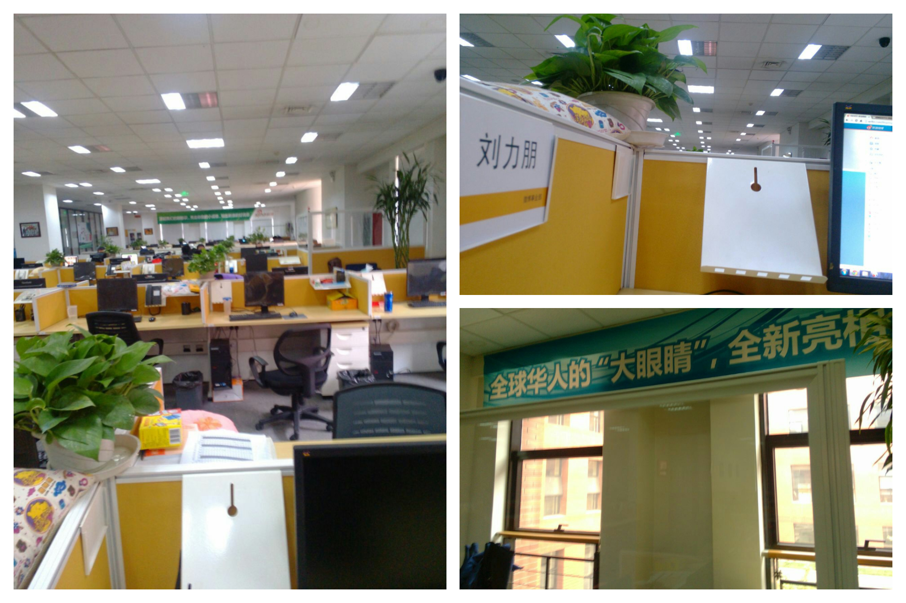

图为刘力朋早年在新浪微博的天津用户管理中心的工作环境。（受访者提供）

<b>网络舆论管制空前严厉</b>

刘力朋认为，中共对中国大陆舆论和言论空间的管控，正变得越来越严厉。

他感觉，胡锦涛时期审查的重点可能是群体性事件，例如茉莉花革命这种直接冲击中共政权的、或者像上海卡车司机罢工事件，而意识形态可能相对靠后。到了现在，意识形式的纯思想领域，可以说得到空前的加强。

刘力朋说，弹压人们的言论、维护党的价值观变成了主流，“甚至已经管到了人们的私有领域，插手到无以复加的地步。比如说电视剧里的婚恋观，2018年的英烈法等。”

他说，中共愈压制意识形态，中国人的反弹就愈强烈。“之前的反对力量都是公知、改良派，现在这些反对力量都是直接说支那这些难听的，人们变得非常非常的愤怒。”

<b>网络审核不断劣化</b>

对于互联网上常见的、小红粉一边倒的情况，刘力朋披露说，那都是被中共的新闻和网络审查，严密审核和过滤过的，“都是一遍遍筛出来的”。

刘力朋表示，伴随着中共对言论控制的加强，网络审核正变得越来越恶劣。

“十年前自己刚入这个行业时，招聘并不要求是党员”，所以当时是有一定生存空间的。刘力朋说，这十年发生非常大的变化。

首先，招聘审核员不再是躲躲闪闪的，而是明目张胆地招聘，招聘网站写着要求政治过硬、有政治觉悟。

再一个，舆论管控内容也在变，变得要求所谓“爱国主义”，社会主义的“价值观”、“道德观”，这些意识形态的东西加进来了。

更可怕的是，刘力朋说，“这个行业只招高校毕业生，而大学生被中共训练了十几年，脑子已经被中共灌输、洗脑得非常可怕，就跟纳粹一样。”“所以我们反而要培训让他们怎么别误删。这些年轻人真的很可怕。”

“现在招了带这种被党国洗脑出来的、带有鲜明的成型价值观的人”，刘力朋认为，十年来中国的网络审核队伍在不断地扩充，更是在不断地被劣化。

有一次，监管部门发通知删除一个律师的帖子，一名维权律师被抓了，孩子上不了学，律师的妻子发一些求助的微博，“她没有表达什么，就是想上学”。有同事说风凉话“活该，谁让你干这个”，被刘力朋骂了。“不过没有任何人站在我这边，我就感觉心里很悲凉。真是一个很垃圾的群体，慢慢就都变成这样了。”

“这个行业太恶心了，被警察拿枪顶后背去办公，执行最脏的活。”

<b>六四和法轮功是最顶级的敏感词</b>

从业多年的刘力朋，揭示出了，中共最畏惧、最敏感的敏感词——“六四”和“法轮功”。

刘力朋举例说，每年六四的时候，审核部门会上紧了发条，提前几周就开始轮休，敏感日都不许请假。

“刚入行的时候，每年六四有很多很多人纪念六四，用各种各样的方式，要审核隐喻、暗示、暗语，但是现在没有，越来越少，今年再加上新冠疫情，人们早形成自我审查了。”

“这种自我审查一来二去，给自己这种想法又增加合理性，时间一久就变成这样，给自己找台阶了。现在墙内几乎是一片安静，在六四的时候。”

他说，“香港那么多人在聚集，31年了还没有忘记这次民主运动，但是在中国人们不光忘记，已经不关心了。”

虽然法轮功和六四性质完全不同，刘力朋说，在审查上是一样级别的，就是绝对不可以说。“中共在审查的时候总把六四和法轮功并列。”

“说出来就把你删了，而且不是把你秘密删掉，像推特后台shadow ban（暗地屏蔽）这种，而是让你知道我删了。再发一条，把你号删了，是这样。是最顶级的审核敏感度。”他说。

“所以发展到现在，甚至没有人去正视法轮功修炼者受到的迫害，人们变成了完全漠不关心。”

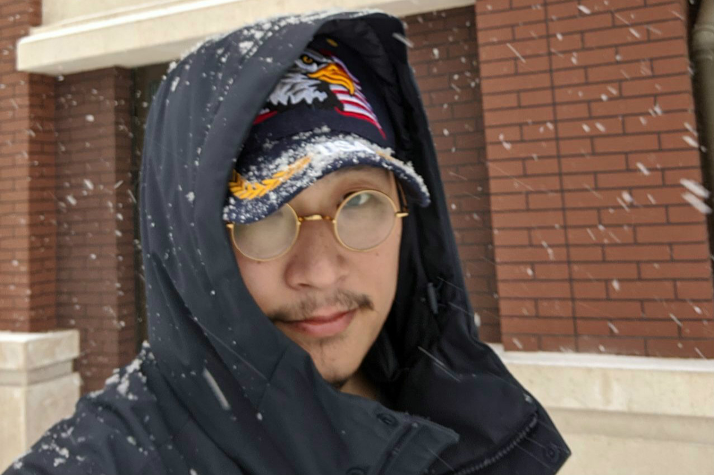

图为刘力朋今年来美国几周前在家门前照的，天津的雪天。（受访者提供）

<b>正告中国同行：停止审查 捍卫言论自由</b>

刘力朋在新浪微博做了2年，觉得实在干不下去了。最后几个月，他一条都没删，全部一键通过。

在2012年、2013年，香港就开始在维多利亚有很多抗议了。刘力朋认为香港人是自由世界的人，悄悄地把一批后台的号给放出来了。

2016年，刘力朋匿名接受CPJ（保护记者委员会）的采访，提供了几百页的微博审查日志，同时曝光了微博的审查机制。

来到美国，成为刘力朋公开站出来的契机。近期视频会议系统Zoom封杀六四相关账号事件发生后，刘力朋表示，他认为中共正在通过网络审查，渗透入侵美国，所以他想要站出来。

“我已经受够了这种没有言论自由了。”他希望能够说出内幕，“最起码审核圈子会知道，有人跟他们站在一起，他们不孤单，站出来是可行的。言论自由原来是这样。如果更多人站出来，有很多证据支撑，那中共就会被拿下。”

刘力朋表示，自己从技术上对中共的邪恶深有感触。“现在越来越多的人站出来反对中共，是一个榜样的效果。但是我还是希望从事数码极权、言论审查的人能够站出来，他们提供的证据甚至可以决定性地把中共打倒。”

他强调，需要很多人站出来，才能有这个效应。

刘力朋说，“我想对正在盯着大纪元的审核同行说，请不要再做共党帮凶了，站到自由世界这边来，与我们一起，你只是失去了中国（中共）的保护，但会得到全世界的帮助。”

<b>中共网络审查正被复制到海外</b>

近期，大量推特号被封号，推特公司往往不说明违反了哪条规定，只是泛泛声明违反推特规则。刘力朋指出，这种没有规则的审查，极易导致和加强自我审查。

当被问到中共的网络审核是否会被复制到海外时，刘力朋说，“绝对会产生自我审查，只要你从心里担心你的号被封，发言会被删，你就已经开始自我审查。这是所有人都避免不了的。你听到风声了，这个也被封、那个也被封，那你就开始自我审查了。”

前资深网络审查员刘力朋还发现了一个问题，那就是中共可能正在染红民主国家的网络审查。

在硅谷，审查基本上是通过人工智能，用AI审核，只需要把一个样本放进去，由技术人员控制。刘力朋表示，从审核专业的角度来看，除李飞飞的红色背景外，他更关心推特公司到底有多少中国人在那儿工作。

“没有证据显示推特是一个红色公司，但肯定是有审查的，结果摆在那儿了。”他说，“那些中共高考工厂制造出的精英，非常爱中国（中共）的，如果公司里面这种红色员工太多了，那公司就会被染红，变成红色公司。”

刘力朋认为，如果中共的网评员倾巢而出，对自由世界打击几乎是毁灭性的。“如果往一水桶里滴一滴墨，它稀释掉了；如果你倒一桶墨进去，那就全变黑了，没有任何可见度了。”

中共肺炎（武汉肺炎）疫情中，中共不断制造谎言欺骗世人。刘力朋表示，像三文鱼感染病毒是太可笑的谎言，但是从技术上中共就可以把它实现，通过言论审查和信息控制是能够做到（把这种谎言讲成“真相”）的。在美国，到现在为止还实现不了这样的谣言，但是如果将来有一天，中共的网络审查应用到美国，把美国染红了，那美国的自由也荡然无存了。 

<a target="_blank" href=#top><h6 align="right">回上方</h6></a>

<a name=6>
<h1 align="center"><b>4名香港大纪元派发人员7·1被捕 吁立即释放</b></h1>

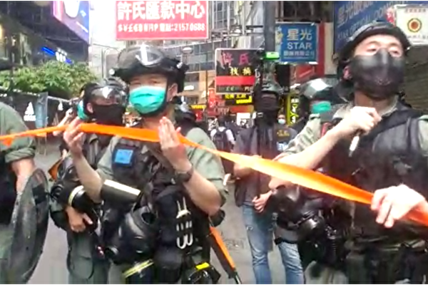

警方在香港百德新街H&M围捕时的现场，香港大纪元员工张艳在此被逮捕。（香港大纪元）

   
【大纪元2020年07月02日讯】（大纪元香港新闻中心报导）昨天（7月1日），中共港版国安法实施的第一天，成千上万的香港民众自发去维园附近抗议，警方公布共抓捕了370人，当中包括4名大纪元派发人员。

在昨天7月1日下午大约2点到4点之间，大纪元4名工作人员在警方的围捕中被捕，之后被送上警方停泊在附近的大巴带走，其中一位人员年事已高，家人很担心，公司已联络律师，得知4名人员均被扣押在香港北角警署。

我们强烈谴责警方滥捕大纪元派发人员，要求警方即时无条件释放所有被捕的大纪元派发人员。

以下是被捕人员姓名及被捕地点和时间：

1. 陈小娟被捕地点：香港铜锣湾SOHO后面影院；被捕时间：7月1日下午16:30PM；

2. 张艳被捕地点：香港百德新街H&M旁；被捕时间：14:30PM；

3. 邱秀珠被捕地点：香港铜锣湾崇光百货后骆克道；被捕时间：15:00PM；现已释放；

4. 王金香，遭扣押在北角警署。

香港大纪元时报

2020年7月2日

<a target="_blank" href=#top><h6 align="right">回上方</h6></a>

<a name=5>
<h1 align="center"><b>韩国新学员：入心学法精进去执</b></h1>
   
   文: 韩国法轮功学员　
   
发表时间: 2020年07月02日

【明慧网二零二零年七月二日】尽管世界笼罩在中共肺炎的阴影下，但是也没有挡住韩国民众迈入修炼大法的脚步。韩国首尔天梯书店今年，分别于二零二零年四月二十一日至二十九日，和五月二十六日至六月四日，举办了两期法轮功九天学习班。参与的新学员们在感叹大法祛病健身显奇效的同时，还体悟到，法轮大法是真正的正法，要重视学法，修心去掉所有执着的重要。

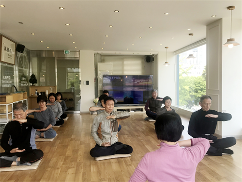

四月上午九讲班中，新入门的学员在学炼第五套功法──神通加持法。

   

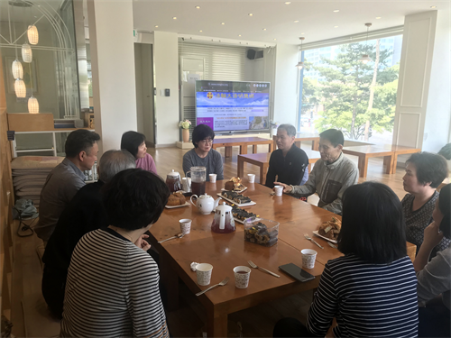

四月上午九讲班结束时，新学员坐下来在交流参加九讲班各自学法炼功的心得。

   
 
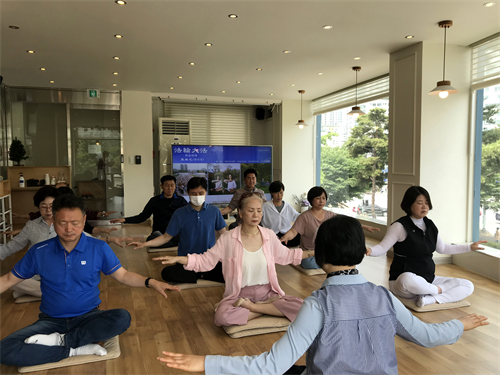

五月的九讲班中，新入门的学员在学炼第五套功法──神通加持法。

   
 

五月的讲班中，新入门的学员在学炼功法动作。

  
   
   
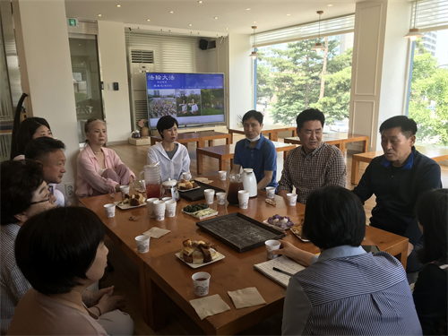

五月的九讲班结束时，新学员坐下来在交流参加九讲班各自学炼大法的心得。

   
   以下是期间部份新学员参加九天班学习的体会。

<b>用心学法重要成为坚持的动力</b>

来自京畿道城南市的朴妍理（音，女）在一个偶然机会接触到法轮功。最近，她一位对修炼有深厚认识的朋友给她谈起一个关于法轮功的问题，于是她怀着「法轮功是什么」的疑问，访问了法轮功的网站，并看了法轮功的书，还了解到法轮功学员在中国受到各种迫害的事实。

她说，当时她看着法轮功炼功录像，听着炼功音乐，感到音乐一下子传入自己的心中，舒适而美好。当看法轮功书时，很入迷，书中的内容一下子进入她的脑海。以前她在学习其它法门修练时所产生的疑问，通过这次读大法书，逐步的都得到了答案。

于是她开始跟着炼功录像炼功，从二月下旬到三月份整个月，通过不断的反覆学炼功法动作，她独自学会了五套功法，随后联系了附近的炼功点，在炼功点，学员给她纠正动作，之后每天她在家中独自炼功。

朴妍理女士表示，四月份时知道首尔天梯书店有九天班，考虑到武汉肺炎期间的保持社会距离问题，犹豫着本想下次再来，但是这次九日班开始的前一天，看到天梯书店的公告通知后，第二天她就来了。

她说，炼功时身体出现了很大的变化，身体（肩部等）纠结的肌肉得到很大的放松，身体健康整体上获得很大好转，身体变的柔软、轻松。

她还说，感到能量从头部开始下走，从上到下逐渐变的轻松，（不好的东西）一下子从下面出去了。尤其晚上睡前炼第五套功法时，从头开始的轻松感一直向下走，感到头脑非常清晰，身体爽快，精神明朗清爽。

朴妍理女士并说，平时自己脚腕很弱，有些疼，目前这个部位仍然纠结着，（感到有不好的东西）还没有出去，随着时间的推移，相信这里也会通的。

「最重要的是看书。」她说：「炼功腿肚子疼的时候，就想到书中讲的，这是业力通过脚出去的现象，会想『要坚持啊，要坚持啊』，产生了不管怎么疼痛和难受都要坚持的力量。」

她说：「大法书中的话言简易懂，一下子就能打入我的内心。」她表示，看书时不断能够领悟，不断有「原来如此，原来如此啊！」的感受。她表示：「所以我感到认真看书很重要」。

她说，讲法的书很多，真想什么也不做，将师父的讲法从头看到尾，但是由于条件不具备，目前只能读《转法轮》。

<b>应该放弃所有的执着</b>

居住在首尔铜雀区的夫基泽（音，男）原本他对气功不感兴趣，在好友崔福东（音，男）的劝说下一起前来参加了法轮功九天班。

他说，本来开班第一天想来，可是开班的前一天晚上，突然出现了严重腹泻，第一天没能参加。后来朋友来电话说，听学习班的讲师讲，这可能是消业现象，一定要参加，于是第三天开始参加。

他表示，炼法轮功盘腿打坐，内心放空时，眼前会出现佛的形像，睁眼后又消失了。于是他想，「看来以后我不能把自己当成一般人啊！」

学大法过程中，他悟到，（修炼就是）把心里所有的东西都放弃，如欲望等。他原以为自己什么执着心都放弃了，自己性格上本来善于忍让，把所有的经济大权都交给了妻子，和妻子也从来没有吵过嘴。可是他发现：这次修炼一看，还得继续放弃。

夫基泽说，自己表面看似很健康，但曾死里回生两次。他曾经因为心脏问题在重患者室住过两次院。之前职场生活中，他晋升的欲望很强，为了升到最高的位置，做了很大的努力，对下属的要求也一味苛刻。但是生病后，他产生了强烈的侮辱感，和羞耻心。他住在重患者室期间，连卫生间都被监控，在那里还得大小便，他感到很丢脸。比起生病，丢脸的事更令他难受。那是他曾想过放弃晋升的欲望。

但是第一次病勉强好后，他那个晋升的欲望并没有放弃。第二次生病后，他明白了，「啊，死亡并不痛苦呢！」因为他当时感到，当达到呼吸紧张，喘不过气那个极限时，反而内心平静，好像在睡觉一样。他以为，在这里睡着的话，就死了，可是等再睁开眼，发现自己还活着。

他说，从那以后，他什么都放弃了。也不再挑剔了，即使下面的职员拿着不很满意的东西来要求批示，他也给以批准。

「由于我的生死关已经提前过了，现在我好像能够对所有的东西都看淡了。通过修炼我知道所有的东西都得放下。」他认识到：「大部份人都是因为欲望导致的疾病。自己的病不是偶然得的，都是因为自己不好的习惯没有好好管理造成的。是自己的责任，都得放弃，包括对食物的欲求等都得放弃。」

<b>师父的法是真正的正法</b>

来自首尔恩平区的洪童心（音，女）表示，来这里之前，练过很多功法，但是其它的只注重表面，都不是正法。这个法完全是修心性的法，别处没有这种修心性的法，而且都是要钱的，与钱有关系的。

「来到这里感到，师父的法是真正的正法，我想应该坚持到底。但是好像不容易，因为放弃执着心真不容易。」她说，所有的人为了放弃执着心做了多少努力呢？但是盲目的想放弃执着，放弃不了。通过修炼法轮功，她悟到，首先要努力学习师父的讲法，通过法的力量，自己将执着心去掉。她表示，自己决心努力实践。

住在首尔龙山区的金圣园（音，女）从去年秋天开始健康出现问题，想休息一下，于是从美国回来了。她说，来到这里听课，学了炼功动作，并读法，这三件事一起做，感到能量非常强。而光读法就能量很强，或者几天不听课，都无法集中。

她感到这个功法非常深奥，心性不到位不行，得找到平衡才行。她说，参加九天班的第五天，头一次感到非常平和、舒适的感觉。她表示，自己因此也明白了法轮功不是一般的修炼。于是下决心修炼。

<b>从新得法身体净化决心精进修炼</b>

来自京畿道始兴市的金真福（化名，女）是中国朝鲜族，一九九九年曾在中国炼过法轮功，当时仅开始修炼几个月，中共的迫害就开始了，没能继续修炼。

二零零八年她来到韩国。她说，由于长期在中国受洗脑教育，对于在韩国看到法轮功展板上展示的中共活摘法轮功学员器官的事实不敢相信，认为共产党怎么能做出那种事情来。但是内心依然相信师父，虽然多年来没有修炼，平时发生了什么事情时，常常内心呼喊师父的名字。

去年冬天她身体健康出现问题，肌肉出现颤抖，呈现帕金斯病的症状，去许多大医院检查，都没有给出诊断。有时身体也颤抖，胸部也颤抖的厉害，她感到这样下去不行。

今年一月份，她从新走进了修炼。随后她来到天梯书店买大法书。

她表示，来买书的路上自己的腿很痛，但是当买完书回家坐地铁时，发现从地铁台阶下去时，腿不痛了，身体变的轻松。当时还没有开始炼功，仅仅买来书，身体就发生变化了。

她说，原本平时腰很痛，在家都不能做菜，修炼半个月后，腰不疼了，也能做菜了，但是腿仍然颤抖。她悟到，腿颤抖没有好，可能是自己有「为什么腿还不好？」的执着心的缘故，明明知道这是执着，也放不下。

如今她从新开始修炼，感到回来的太晚了，近来炼功和读《转法轮》时，她常常流泪，后悔而难过的想，「我为什么这么晚才走回修炼……」这次参加九日班，听了师父讲法，她说：「我决心一定要精进。」

<b>灌铅的身体变成了羽毛</b>

为参加九天学习班的上午班，居住在京畿道仁川江华岛的申银秀（音，女）不顾路途遥远，每天清晨起早坐出租车换乘公交车，之后乘地铁到首尔。

申银秀十年前头部患有肿瘤病，应该手术但是没有做，平时常头痛。最近被疑为脑中风，住院治疗。她在参加学习班的当天凌晨三点出院，在医院的候诊室呆了一段时间，没有回家直接就来到九天班学习，那天只睡了四个小时。

她说，自己平时身体虚弱，头痛、颈痛、全身沉重如灌铅。「但是学习班第一天结束，回家第二天一觉醒来时，发现头痛全消失了，感觉身体变成了羽毛，轻飘飘而舒畅。」她感觉，特别是参加学习班的前三天，身体好像飞起来了。目前病都好了，失眠症也消失了，头脑清晰舒适，神经敏感的部份也消失了，性格变温和了，内心变的从容。她以前总是顶撞丈夫；来参加九天班后，最近几天来，她对待丈夫的态度也发生变化。而且，她再去看医生拍片，发现肿瘤不见了。

韩国首尔天梯书店（地铁三角地站十三号出口前）为帮助人们修炼法轮功，每月都举办一次法轮大法「九天学习班」。九天班每次连续举办九天，分为上午班和晚间班（上午班九点三十分至中午十二点，晚间班傍晚七点十五分至九点三十分），且不收费用。下一届九天班将于六月三十日（星期二）至七月八日（星期三）举行。

天梯书店咨询电话：02-504-0860

<a target="_blank" href=#top><h6 align="right">回上方</h6></a>

<a name=4>
<h1 align="center"><b>【内幕】关联北京疫情 河北大规模检测背后</b></h1>

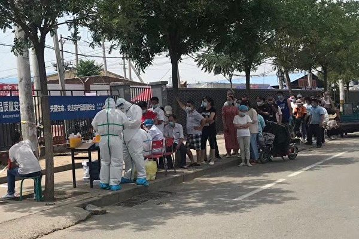

北京再次爆发第二波中共病毒（武汉肺炎）疫情，确诊病例大量出现，河北等多省出现与北京确诊患者关联的病例。图为6月16日，北京通州徐辛庄市场检测核酸。（大纪元）

   
   【大纪元2020年06月29日讯】（大纪元记者古清儿报导）北京再次爆发第二波中共病毒（武汉肺炎）疫情，确诊病例大量出现，河北等多省出现与北京确诊患者关联的病例。近日，大纪元获得的一系列中共内部文件显示，河北内部已经开展大规模核酸检测，该省内各县市被要求在6月底前完成核酸检测实验室的建设工作。
   
<b>独家：河北内部开展大规模核酸检测的背后</b>

近日，大纪元获得的河北省应对疫情工作领导小组办公室（下称：河北防疫小组办）6月24日向各市（含定州、辛集市）、雄安新区应对疫情工作领导小组，省教育厅，省公安厅等下发了《关于进一步加快重点人群核酸检测有关工作的通知》。文件等级是“特提”（最高级，需要马上办理）。

该通知要求做好重点人群核酸检测工作，进一步加快核酸检测进度。文件提到，对确诊病例、疑似病例、无症状感染者的密切接触者和“密切接触者的密切接触者”，中高风险地区来冀返冀人员，境外入境人员，发热门诊患者，新住院患者和陪护，要立即按照3天内完成2次核酸检测的要求，对上述人员要加快核酸检测进度。

同时，对教职工和高三、初三毕业生，医疗、疾控机构人员，口岸检疫和边防检查人员，实行相对集中封闭管理的建筑施工单位人员，监狱、公安监管场所、福利院、养老院、精神医疗卫生机构等特殊场所新进人员及工作人员、机关企事业单位食堂餐厅工作人员优先进行核酸检测。

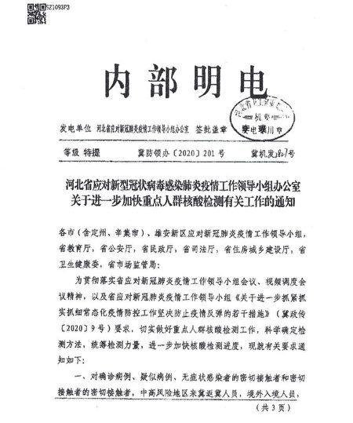

（大纪元）

 
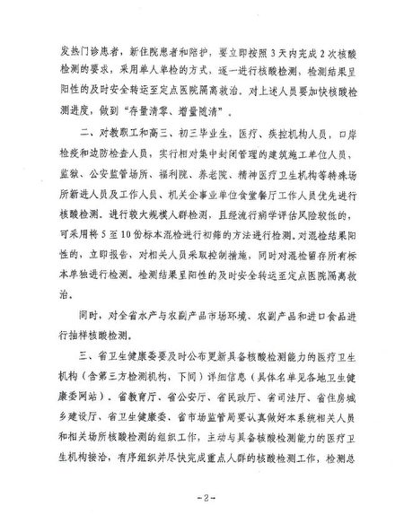

（大纪元）

  

同时，大纪元获得的河北省临床检验中心6月20日下发的《医政药政处关于新冠病毒核酸混样检测的专家意见》称，如检测资源不够的话，可以采取混样检测。

该意见称，原则上采取一人一样本一检测的方法进行核酸检测，对于较大规模人群（流行病学评估较低风险）检测时，如检测量超过本机构最大检测量的1.5倍以上时，可采取混样初筛的方式进行检测（仅限于本次核酸检测筛查工作）。

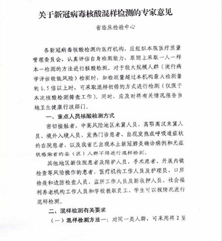

（大纪元）

以上内容至发稿前，均未见中共官方报导。

另据中共官媒报导，6月21日，石家庄市市场监督管理局和石家庄市卫健委联合下发了《关于对场所环境和食品开展核酸检测工作的通知》，对商场、超市、海鲜市场、农贸市场、贮存服务提供者等场所环境样本，以及食用农产品、进口食品、机关企事业单位食堂工作人员开展核酸检测。

<b>独家：河北急扩核酸检测能力 接连下发督办函</b>

随着北京的中共肺炎（武汉肺炎）疫情升温，邻近北京的河北省已连续发生多起与北京关联的确诊病例。大纪元获得的河北省当局下发的一系列内部文件显示，河北在急扩其核酸检测能力。

6月11日，河北省卫健委下发了《关于进一步加强县（区）级疾控机构核酸检测能力建设有关工作的通知》。通知要求各地要高度重视核酸检测能力建设，按照“应建尽建、应建快建”要求，确保6月底前县（区）级疾控机构具备核酸检测能力；各地要加强对检验检测人员的技术培训和指导。

河北防疫小组办则在6月15日下发了《关于全面开展新冠病毒（中共病毒）核酸检测和新冠肺炎（中共肺炎）流行病学调查培训的通知》称，决定在全省范围内开展核酸检测和新冠肺炎流行病学调查培训。

该培训方案提及，“立足现阶段及下一步疫情防控工作需要”，持续加强实验室检测能力建设；培训以疾控机构专业技术人员、医疗卫生机构医务人员为主；每个核酸检测机构（或所在医疗机构、疾控机构等）要组织不少于10名核酸检测专业技术人员参加培训。中等规模的线上培训不少于800人。

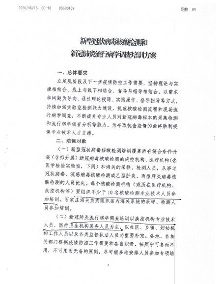

（大纪元）

6月19日，河北省防疫小组办印发了《关于加快推进核酸检测工作方案的通知》。文件等级是“特级”。

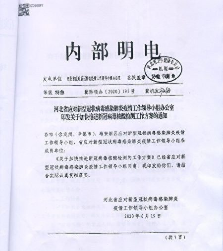

（大纪元）

随后，河北省当局又下发了三份督办函，可见事态的紧急。

6月20日，河北省防疫小组办下发的《关于加强县区级疾控中心核酸检测能力建设的督办函》，要求全省县区级疾控中心务于6月底前完成核酸检测实验室建设。

（大纪元）

石家庄防疫小组办公室6月21日下发的核酸检测《督办函》称，桥西区、井陉矿区、井陉县要加强工作力量，加快建设速度，抓紧做好相关设施设备购置和检测人员培训，按时完成建设任务。新华区、长安区、裕华区、行唐县、高邑县、灵寿县在具备检测能力的基础上尽快开展工作。

6月22日，石家庄卫健委下发给井陉矿区、井陉县卫生健康局的核酸检测《督办通知》称，“你县（区）还未完成疾控机构核酸检测能力建设任务，务必在6月底前完成核酸检测实验室建设，具备检测能力。”

督办通知还称，“请你县（区）分别于6月23日、26日、30日9:00前，将你县（区）疾控中心核酸检测实验室建设进度情况书面报该委疾控处。如建设进度缓慢造成严重后果，将追究责任。”

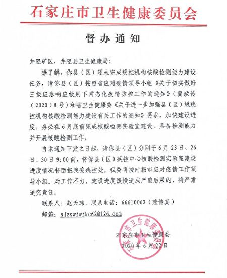

（大纪元）

<b>独家：河北可能承担北京地区核酸检测任务</b>

目前，北京疫情已扩散到市内11个区，已有44个街道、乡镇升为高、中风险地区。与此同时，北京也在大规模展开核酸检测。据中共自己的数据，截至6月28日12时，北京市累计完成核酸采样829.9万人，已完成检测768.7万人。

大纪元获得石家庄6月20日下发的《关于承担北京地区核酸检测任务准备的紧急通知》提到，近期该市将可能承担北京地区核酸检测任务，请各县（市、区）卫生健康局、市直医疗机构提高购置量、加大试剂储备量、加强核酸实验室能力建设，确保高效应对以完成北京地区核酸检测任务。

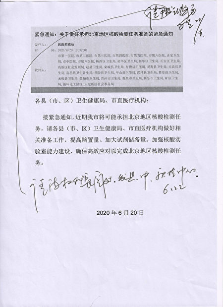

（大纪元）

时政评论员李林一表示，北京疫情持续扩散，已经影响到河北。从河北的一系列文件显示及河北省被要求为承担北京地区核酸检测任务的准备，显然是中共仍在为此次疫情大规模传染做准备。

<a target="_blank" href=#top><h6 align="right">回上方</h6></a>

<a name=3>
<h1 align="center"><b>多省市有大暴雨 云南昭通洪涝致3死</b></h1>

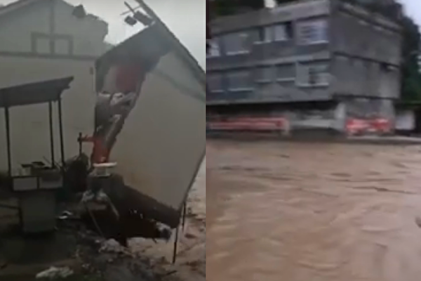

云南省昭通市的洪涝严重。临河房屋因地基被冲毁，裂成两半后坠河。（视频截图合成）

   
  【大纪元2020年07月01日讯】大陆多地连续暴雨，据中共中央气象台预报，7月1至2日，四川、贵州、湖北、云南等地部分地区有大到暴雨。另外，6月29日至30日，云南省昭通市的洪涝导致3人遇难、三万余人受灾。

中央气象台预计7月1日08时至2日08时，四川东部、重庆大部、贵州大部、云南北部和西部、广西西北部以及浙江南部、福建北部等地部分地区有大到暴雨。

其中，重庆西部和东南部、贵州西南部和中部、湖北西南部等地局地有100～150毫米的大暴雨。上述部分地区有短时强降水、局地可超过60毫米，还有雷暴大风等强对流天气。

另外，6月29日8时至6月30日8时，云南省昭通市遭遇强降雨，镇雄县、彝良县、威信县、盐津县等地最大降雨量达226毫米，多地出现洪涝。

截止6月30日18时，此次洪涝导致镇雄县3人遇难，镇雄、彝良、威信、盐津4县33,380人不同程度受灾；3548公顷农作物受灾、绝收61公顷；2户6间房屋倒塌；道路中断、山体滑坡、通信等基础设施不同程度受损；直接经济损失2326万元。

而网传视频显示，昭通市有的临河房屋因地基被冲毁，裂成两半后坠河。也有大型油罐车、车辆被冲入河中、随洪水漂走。 

<a target="_blank" href=#top><h6 align="right">回上方</h6></a>

<a name=2>
<h1 align="center"><b>班农批西媒无视中共罪责反攻击大纪元</b></h1>

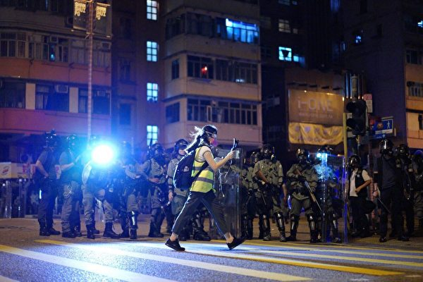

6月29日，白宫前首席策略师班农和华裔富商郭文贵在政论节目战情室（War Room）中讨论时赞赏，《大纪元时报》、新唐人电视台和法轮功学员坚持揭露中共、报导事实真相。图为大纪元新唐人纽约特派记者柯婷婷在反送中直播报导中。（李明真／大纪元）

   
   【大纪元2020年07月01日讯】（香港大纪元记者李思璐报导）6月29日，白宫前首席策略师班农和华裔富商郭文贵在政论节目战情室（War Room）中讨论时表示，《大纪元时报》、新唐人电视台和法轮功学员坚持揭露中共、报导事实真相，却被一些接受中共重金收买的西方主流媒体攻击，那些媒体在中共病毒肆虐全球时却不去问责中共，美国人民应该对此惊醒。
   
  
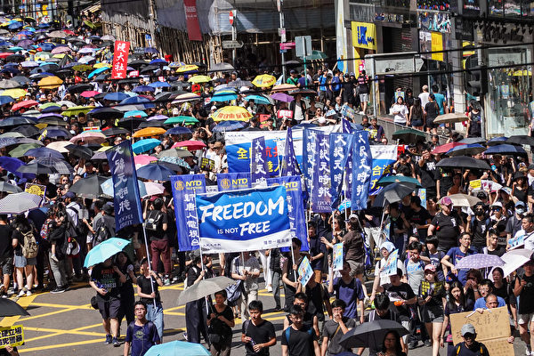

2019年7月1日，香港七一大游行，《大纪元时报》和新唐人电视台的游行队伍。（余钢／大纪元）

 
 
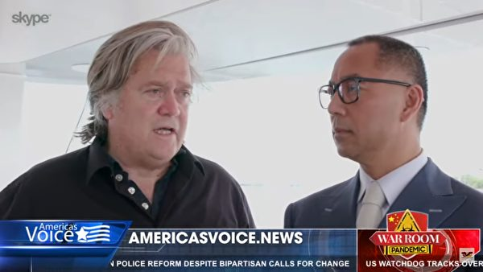

华裔富商郭文贵6月29日在前白宫首席策略师班农的政论节目战情室（War Room）访谈中表示，法轮功学员创办的媒体《大纪元时报》、新唐人电视台坚持揭露中共、报导事实真相，却被一些接受中共重金收买的西方主流媒体攻击。（视频截图）

  
   
 <b> 中共重金收买西方媒体 搅浑视听</b>

班农首先表示当有关中共病毒的事实证据被法轮功学员创办的媒体和郭媒体披露后，西方一些主流媒体却没有去追责中共，是导致中共病毒在全球传播的原因之一。

他说，“美国人不明白的是，为何当Gnews、Gtv、大纪元和新唐人电视台曝光大量有关中共病毒的证据后，美国和欧洲的媒体却没有向中共讨问？”

郭文贵指中共大量投资西方媒体，已把媒体变成替中共遮掩恶行的工具。他说，“所有这些媒体平台的背后都有中共的重金收买。中共的一贯做法就是搅浑水，它不想让人了解事实真相，因而它要把西方媒体先搅浑。”

美国司法部于6月10公布的一份登记文件揭示了中共通过其海外英文喉舌《中国日报》，以支付广告费和印刷费的形式，从2016年11月至2020年4月，向美国数十个主流媒体以及社交媒体共投入了1900万美元。其中《华盛顿邮报》和《华尔街日报》是中共的重点投资目标，《中国日报》给这两家媒体的广告费分别是460万和600万美元。

司法部的文件还记录了《纽约时报》和《外交政策》分别收到了5万美元和24万美元。针对美国政商主流读者发行的《外交政策》属于《华盛顿邮报》媒体集团，后改名为格雷厄姆控股公司（Graham Holdings Company）。格雷厄姆控股公司的控股股东和董事会主席是原美国之音台长阿曼达的丈夫唐纳德·格雷厄姆（Donald . Graham），格雷厄姆的公司主要收入是依靠旗下的凯普兰教育公司，该公司在中国与中信集团下属企业及其它等多家公司合资合作。

中共支付这些广告费是把《中国日报》发行的副刊《中国观察》（China Watch）以夹页的形式插入上述报纸中，通过这种方式向美国读者灌输中共的意识形态和进行“正面宣导”。

今年2月，美国国务院将五家驻美的中共官媒新华社、中国环球电视网、中国国际广播电台、《中国日报》和《人民日报》海外版定性质为“外国使团”，要求它们像外国使馆一样向国务院登记在美雇员和财产等信息。

司法部公开的登记文件中还披露出《中国日报》支付给在美国多个重要州发行的报纸印刷费多达700万美元。这些报纸包括《洛杉矶时报》、《西雅图时报》、《亚特兰大宪法报》、《芝加哥论坛报》、《休斯顿纪事报》和《波顿环球报》，其中给《洛杉矶时报》支付的印刷服务费超过65万美元。

<b>法轮功学员讲出真相令中共害怕</b>

班农表示西方媒体对中共的罪责视而不见，反而攻击大纪元、新唐人和Gtv、Gnews这些讲出事实真相的媒体，而现在西方民众需要认识到他们看的媒体在替中共说话。他说，“现在是时候了，美国人民该觉醒了，欧洲人民该觉醒了，英国人民该觉醒了，他们的媒体已经成了中国大外宣的帮手。”

郭文贵认为西方媒体诋毁法轮功学员，是因为他们是唯一敢于讲出真相的人。他说，“他们是唯一努力向西方世界讲出真相的人，但西方媒体，它们惧怕法轮功，它们想诋毁法轮功，就是因为法轮功学员的媒体讲出了真相，这是它们惧怕的原因。”

《大纪元时报》英文版今年4月份出版的一份特刊，专门报导中共对中共病毒（新冠病毒）爆发的掩盖，导致该病毒在全球大流行。该特刊包括一个时间表，显示中共政府如何隐瞒有关疫情，以及打压疫情举报者的信息，也涵盖了中共政权传播虚假信息等内容。
   
  
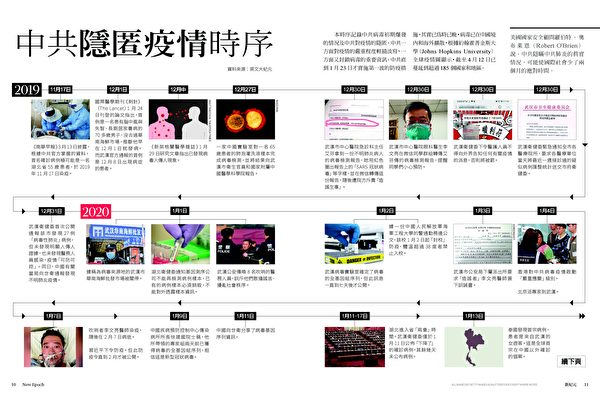

资料来源：英文大纪元

 
   
  特刊在加拿大发行不久，加拿大国家广播电台（CBC）通过刊登文章和YouTube视频节目，指责《大纪元时报》的特刊引起一些加拿大人的反感，认为是搞“种族歧视”和“煽动仇恨”。CBC先后四次改变了文章的题目，然而其所谓的加拿大人的反馈却是基于对个别人的采访。

不过CBC的文章招致了其自己读者的反感，在攻击大纪元特刊的文章后的3000多条评论中，绝大部分反对CBC的报导。

时事评论员盛雪说，她深信CBC这次的行为，不是某些记者或编辑的偶然行为，“是有人经过慎密思考后的决定”。

<b>唯有大纪元坚守在面临生死的前线</b>

郭文贵在和班农的对话中提到去年香港民众反送中运动时，略显激动。他大声表示，香港大纪元记者在反送中运动中面临生死威胁，坚持24小时报导，并且因为《大纪元时报》敢于报导真相，让中共害怕。

他说，“你看香港反送中运动，只有法轮功学员办的媒体报导真相，而且是24小时报导。尽管他们在香港大街上每分钟都面临死亡的威胁，但是他们仍然继续和香港的学生们孩子们战斗在一起。”

他接着表示香港大纪元把香港正在发生的事情及时客观地传播给了世界。他说，“他们没有谈论宗教，没有谈论政治，只是报导真相，直播在香港发生的一切。” 
   
 
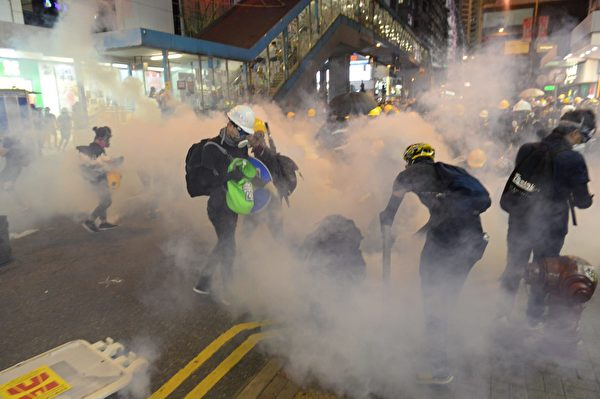

去年反送中期间，大纪元新唐人记者在前线采访多次遭催泪弹袭击，仍不畏艰险，坚持报导第一线真相给读者。（宋碧龙／大纪元）

  
   
   郭文贵继而历数几家全球大媒体在香港的危险关头却不见踪影，他说，“请问《纽约时报》哪去了，《金融时报》哪去了，BBC哪去了，CNN哪去了。只有大纪元的记者在那里，就连我们爆料革命都做不了那样的报导，因为太危险了。”

在长达6个月的反送中抗议运动中，香港大纪元和新唐人的前线记者多次被警察的催泪弹、胡椒喷雾击中。今年6月12日晚间，大纪元记者在观塘报导“6·12”反送中抗争一周年的活动中，突然遭到一名白衣男子持刀袭击，被现场的一位勇敢的市民出手救出，导致该市民的手被割伤送医院救治。
   

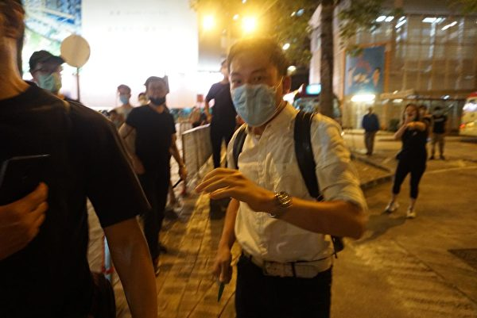

2020年6月12日晚间9时行刺大纪元记者的持刀白衫男子，此人为亲共民建联前社区干事邝星宇。（Jerry／大纪元）

 
 
2019年11月19日凌晨，承印香港《大纪元时报》的印刷厂遭中共雇凶纵火，导致部分印刷设备与当日报纸严重受损。现场的摄像机完整地记录了四个凶犯身着黑衣，手持警用伸缩棍子，他们在短时间内一边威胁现场的工人，一边把准备好的汽油在工厂中泼洒后引燃，在火势猛烈窜烧之后，这四人迅速逃走。 
 
 
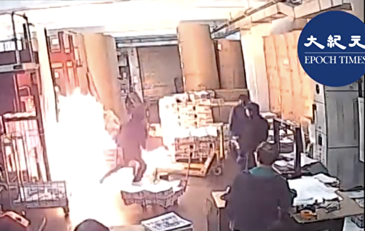

2019年11月19日凌晨，中共雇4名凶徒冲入承印香港《大纪元时报》的印刷厂，纵火烧毁机器和报纸。（大纪元）

 
 自从香港大纪元2000年成立以来，中共曾多次雇凶破坏印刷《大纪元时报》的印刷厂和印刷设备。这次雇凶纵火引起了美国国会的重视，促成了美国参议院快速通过了当时处于胶着状态的《香港人权与民主法案》。

今年6月10日，美国国务院发布的“2019年全球宗教自由报告”中，特别列举了这起中共纵火案例，报告说：“由法轮功学员创办的媒体《大纪元时报》香港版的印刷厂，遭到四名手持类似警棍的蒙面人纵火袭击。”

<b>郭文贵：不许任何人再责难法轮功</b>

郭文贵在节目中提到有人曾经问他是否给法轮功提供资金，他责问对方为何要责难法轮功学员，而不去关注那些不报导中共隐瞒了病毒真相的人。

他说，“你们为什么要这样责难法轮功，你们为什么不去问问中共给了《纽约时报》多少钱，给了CNN多少钱，给了《华尔街日报》多少钱。他们为什么不谈论香港真相，不问中共病毒从哪里来，不报导中国为何不让世界调查。”

当天的战情室节目介绍了大纪元媒体集团专栏节目《世事关心》最新制作的专题纪录片《世纪之掩盖》，该专题片系统地揭露中共隐瞒病毒的全过程。制作人萧茗在战情室的访谈中介绍，《世纪之掩盖》播出10个小时就已超过50万次收看。
 
郭文贵在节目的最后大声表示，“不允许任何人责难萧茗的节目，不允许任何人再责难法轮功。”

<a target="_blank" href=#top><h6 align="right">回上方</h6></a>

<a name=1>
<h1 align="center"><b>【最新疫情7.1】巴西染疫死亡人数增近一倍</b></h1>

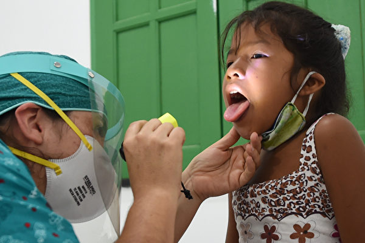

图为巴西医护人员正在为蒂库纳族（Ticuna）原住民的女孩检查身体。(EVARISTO SA/AFP via Getty Images)

   
  【大纪元2020年07月01日讯】（大纪元记者谢佳宣、李言、林燕综合报导）7月1日全球中共病毒（武汉肺炎）疫情最新情况：
  
  根据约翰·霍普金斯大学的数据，全球感染中共病毒（武汉肺炎）的死亡人数在美东时间周二（6月30日）晚上8点接近51万，确诊病例超过1,000万人。

过去几天，美国新增确诊病例超过4万，达3月疫情爆发以来新高，但死亡已降到500例以下。截至周二晚间，全美已有超过262.9万人确诊，并有超过12.7万人死亡。

美国副总统彭斯周二表示，全美有12个州的单日新增中共病毒感染人数增加；但各州的死亡人数都是3月份以来的最低水平。其中马萨诸塞州首次报告零新增死亡病例。

参议院将在7月份国会议员返回、8月份国会休会前，讨论新的振兴方案，下一轮救济法案将侧重于儿童、就业和医疗保健。

美国股市在第一季度经历了历史性亏损后，于第二季度大幅反弹。周二，道指收高0.9%，或217点；标准普尔500指数上涨1.5%；纳斯达克综合指数上涨1.9%。

=======================
<b>以下是最新疫情实时更新：
   
日本单日新增138感染者 创解封后新高</b>

据日本卫生当局通报数据，在过去一天内，日本国内新确诊138人感染冠状病毒（中共病毒），这是连续三天超过百人染疫，也创下解除紧急状态后的单日新高。

日本共同社报导说，增加的病例主要来自东京的感染人数增加。当日东京有54个新增病例，这已是东京都连续五天确诊感染人数超过50人。而此前疫情比较稳定的神奈川也大幅增加31人。

自日本5月25日解除紧急状态以来，东京都努力把每日新增病例数控制在20例以内。但都内的感染者在一个多月来达到约1000人，被认为重症化风险低的年轻人群感染病毒较为突出。许多无症状患者不住院，而是选择在自家隔离检疫等，医疗态势可保持稳定。

目前日本国内感染人数累计达18714人，包括钻石公主号游轮乘客及船员染疫的712人在内，总计为19426人。死亡人数因兵库过去有统计漏报而增加2人，总计达987人。

<b>佛州州长：实施封锁并不能挽救生命</b>

佛罗里达州州长罗恩·德桑蒂斯（Ron DeSantis）周二宣布，在病毒感染率上升的情况下，该州不打算重新实施封锁政策，他表示，再次封锁佛州并不能挽救生命，反而使经济瘫痪。

德桑蒂斯说：“我们不会回去做关闭（州的）事情。我不认为那真的是（疫情上升）的主要来源，人们去做生意不是（疫情）增长的动力。当你（在路上）看到年轻人的时候，我想很多都只是社交互动，这很自然，很显而易见，人们在州里不同的地方进行着不同的活动。这就是现实。”

德桑蒂斯补充说，仅根据病毒数据进行预测是不靠谱的，他敦促年轻人通过社交距离和避开老人来保护弱势群体。他说：“我们是开放的，我们知道自己需要保护谁，我们希望年轻人注意到正在发生的事情，他们的风险只是比那些年龄较大的人少得多。”

上周，佛州在短短五天内录得2.5万个新病例，仅一天就有9000个确诊，以致州政府再次禁止民众在酒吧内饮酒；但没有对健身房或商店祭出限制。

2020年5月5日，在佛州迈阿密的南海滩。由于担心中共病毒的扩散，人们坐在比萨店外吃饭。

<b>福西：无法保证会有有效的中共病毒疫苗</b>

美国政府最高级别传染病专家安东尼·福西（Anthony Fauci）周二（6月30日）表示，美国目前无法保证一定会有安全和有效的新型冠状病毒（中共病毒）疫苗。

福西对参议院委员会表示：“拥有安全有效的疫苗对于美国的每个人来说都是极其重要的。”“但不能保证……我们一定会有一种安全且有效的疫苗。”

他说，目前正在以前所未有的速度开发和测试大量使用各种方法研发的候选疫苗。

<h4 align=center><a href="https://www.epochtimes.com/gb/20/6/30/n12223027.htm">详情请阅：福西：无法保证会有有效的中共病毒疫苗(点击右键,另存新档）</a></h4>

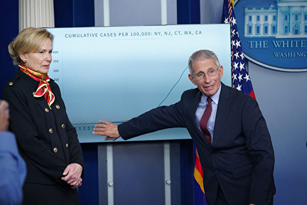

美国国立卫生院下属的国立过敏与传染病研究院所长福西（Anthony Fauci，右）表示，美国目前无法保证一定会有安全和有效的新型冠状病毒（中共病毒）疫苗。图为福西和伯克斯（左）3月31日在白宫简报会上。（Photo by MANDEL NGAN / AFP）

<b>巴西染疫死亡人数增近一倍 更多人不愿待家中</b>

巴西卫生部报告指出，在过去24小时内，该国新增了1280例染疫死亡案例，比前一天的统计数字几乎增了一倍。新增确诊数有33,846例，总数至少达到1,402,041例。

巴西里约州的卫生部长称，周二（6月30日）仅里约热内卢州因该病毒死亡的总人数就超过了1万人，而全国的死亡人数达近6万（59,594人）。

根据卫生部的报告指出，虽然显示巴西人越来越害怕感染病毒，但在家中避疫的巴西人却越来越少。

Datafolha民调公司的数据显示，6月底，47%的巴西人“非常害怕”感染冠状病毒，高于3月中旬的36%，当时几个州下令除了基本行业外，其它产业都必须关门。

但报告显示，只有少数的巴西人留在家里，完全遵守居家令的人从18%下降到12%；采取预防措施但仍然离开家工作，以及进行其它活动的人从24%上升到34%。

<b>美各州死亡人数下降至3月以来最低水平</b>

美国副总统彭斯在周二（6月30日）的疫情简报会上说，美国有12个州感染病毒的病例数和检测阳性率都在上升，而另外28个州则是上述指标中的一个有上升；各州的死亡人数都是3月份以来的最低水平。

他强调说，公众要洗手，保持良好的卫生习惯，并遵循所在州和地方当局的指令，在进入某些区域，或在难以保持社交距离的地方戴口罩。

卫生总监察长杰罗姆·亚当斯（Jerome Adams）说，“请外出时务必戴上口罩”，“如果我们做正确的事，我们可以开放并保持开放”，“如果这样做，感染病毒的人数将下降”。

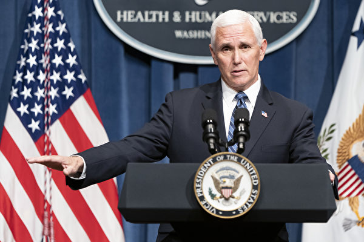

图为美国副总统迈克·彭斯（Mike Pence）2020年6月26日在白宫中共病毒（冠状病毒）工作小组简报上发言。(Joshua Roberts/Getty Images)

<b>马萨诸塞州首次报告零新增死亡病例</b>

马萨诸塞州周二（6月30日）报告新增零个死亡病例，这是该州几个月来，首次在每日疫情记者会上报告没有新的死亡患者。

马萨诸塞州曾经是美国警告病毒（冠状病毒）爆发的中心。根据周二晚间公布的数据显示，该州至少有8,054名居民因感疫死亡。但最近几周，他们的住院率一直在下降，截至周二，有733名因病住院。

州长表示，他将在本周结束前决定该州是否进入重新开放第三阶段。根据该州重新开放相关网站，第三阶段将开放健身中心、博物馆、剧院和其它一些企业重新营业。

根据马萨诸塞州卫生部的数据，该州在3月20日报告了他们第一例死亡病例。

<b>FDA要求疫苗疗效 须好过安慰剂50%或更高</b>

美国食品和药物管理局（FDA）周二在向疫苗制造商发布的新指南中表示，任何中共病毒（冠状病毒）疫苗在预防人们感染，或预防出现严重疾病方面的效果，至少要比安慰剂好上50%。

此外，新疫苗必须与其它预防传染病的疫苗一样安全，确保没有不良影响。疫苗制造商必须询问志愿者接种疫苗后7天是否有不良反应，然后在每次接种疫苗后21至28天内，确认是否出现任何副作用。

如果研究参与者为怀孕妇女，必须跟踪其妊娠结果，包括：妊娠损失、死胎和先天性异常等。

FDA在新指南中设定的50%门槛值，还不算理想的疫苗设定值，例如：过去的流感疫苗可以只有40%的功效。另外，与麻疹疫苗相比，麻疹疫苗两剂后的疗效约为97%。

FDA表示，特别鼓励受病毒影响最大的人群，特别是少数族裔的人参加测试。

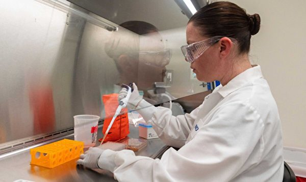

2020年3月20日，一名医生在马里兰州罗克维尔的Novavax实验室检查蛋白质样品，其中一个实验室正在开发中共病毒（COVID-19）疫苗。 (Andrew Caballero-Reynolds/AFP via Getty Images)

<b>美参院7月讨论新疫情救济法案</b>

参议院多数党领袖麦奇·麦康奈尔（Mitch McConnell）周二被问及新的疫情救济法案时说，将在7月份国会议员返回、8月份国会休会前，讨论可能的一揽子方案。

他告诉记者，下一轮救济法案将侧重于儿童、就业和医疗保健。

麦康奈尔在新闻发布会上重申，不会通过不承担责任的刺激法案，刺激法案将适用于企业、大学、医生、护士和学校。

<b>美国股市第二季度创下数十年来最佳表现</b>

美国股市在第二季度大幅反弹，而之前第一季度美股则经历了历史性亏损。

道琼斯指数创下了自1987年第一季度以来的三个月最佳涨幅，上涨了17.8%。

标普500指数也是自1998年第四季度以来的最好的一个季度，增长了19.9%。

纳斯达克综合指数在第二季度上涨了30.6%，是该指数自1999年第四季度以来的最佳表现。

过去三个月，因人们对美国重新开放经济持乐观态度以及联邦政府和美联储的空前刺激措施都在不断提振市场。

美国股市在第二季度大幅反弹，而之前第一季度美股则经历了历史性亏损。

<b>餐馆午夜变夜总会 迈阿密市长下令关餐馆</b>

迈阿密-戴德市市长卡洛斯·吉梅内斯（Carlos Gimenez）表示，他周二将签署一项命令，要求县城的餐馆在午夜时关店。

他说：“我们已经看到一些餐馆利用命令（的漏洞），在12点之后把餐厅变成了夜总会。”“我们看到年轻人的（感染）数量急剧上升。”

吉梅内斯警告说，如果业者不遵守命令将面临轻罪，违反者可能被罚款，并在监狱里待上180天。警方今晚将对餐馆进行检查，确保商家遵守规定。

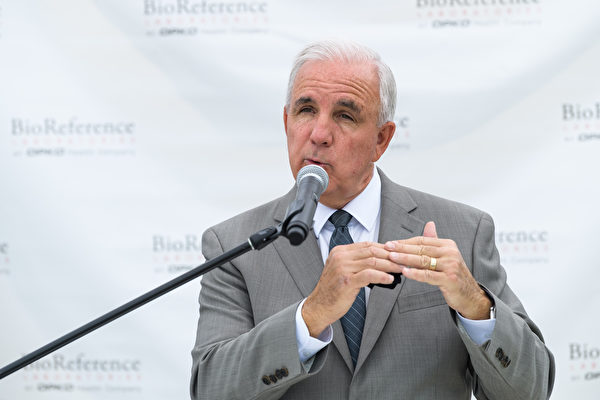

图为佛罗里达州迈阿密-戴德县市长卡洛斯·吉梅内斯。(Jason Koerner/Getty Images for BioReference Laboratories)

<b>德州单日确诊数增近7千例 创新高</b>

美国德克萨斯州周二（6月30日）报告了6,975例新增病例。这是该州自疫情爆发以来，最高的单日新增病例，目前总数达到近16万例（159,986例）；至少2,424人死于该病毒。

德州州长格雷格·阿博特（Greg Abbott）当天下令关闭酒吧，并暂停了该州更多的重新开放项目。

<b>多伦多7月7日起 市民在室内公共场所须戴口罩</b>

根据多伦多市议会的声明，该市议会周二（6月30日）一致投票赞成从7月7日开始，要求市民在所有室内公共场所佩戴口罩，协助减缓中共病毒（武汉肺炎）的传播。

此外，企业也必须采取措施，确保人们在室内公共场所佩戴口罩或面罩。

新规定适用于向公众开放的所有室内空间，包括：零售店、杂货店、餐馆、酒吧、健身房、游泳池、教堂和酒店、汽车旅馆和短期租赁的公共区域等。

新规定将在9月30日到期，如果市议会夏季休会时间延长，新规期效也将跟着延期，直到休会后召开首场会议当天到期。声明表示，多伦多的卫生官将每月审查有关口罩和面罩的建议，并报告是否需要变更措施。

<b>科罗拉多州7月关闭酒吧和夜总会</b>

美国科罗拉多州州长贾里德·波利斯（Jared Polis）周二在新闻发布会上宣布，凡是不提供食物的酒吧和夜总会必须在7月份关闭店面，最多提供外卖服务。

他说，如果继续正常营业恐带来“太大的风险”；若有地区的数据出现改善则有望在7月的某个时间点重新开放酒吧和夜总会。

根据该州新颁布的规定，如果酒吧有贩售食物仍可以继续营业，但必须遵守社交距离规定，让人们保持6英尺的距离。

这项新规定是在科罗拉多州出现病例上升的情况下宣布的。根据约翰·霍普金斯大学的数据，截止6月30日，该州已经有3.2万多例确诊。
  
  <a target="_blank" href=#top><h6 align="right">回上方</h6></a>
