

<h1 align="center"><b>请收藏网址(新闻视频ip) 随时连上最新即时IP https://git.io/swspip</b></h1>
<h2 align="center">直连不必翻墙 blossom必看 精彩视频 http://220.141.128.109 </b></h2>

<h4 align="center"><b>知情权不能放弃，也不作愚民，让你看第一手不被过滤的新闻，翻墙软件免费下载  https://git.io/opopop </b></h4>

<h4 align="center"><b>自由门7.70版使用封包过滤技术，增强突破封锁能力。首次运行时，如果以前版本没有安装过，会有提示安装封包过滤器。这是一次性安装，不会影响用户网络，不需要卸载。</b></h4>
<h3 align=center><a href="http://dongtaiwang.com/loc/software/fg/770/fg770p.exe">专业版exe:自由门7.70版</a></h3>
<h3 align=center><a href="http://dongtaiwang.com/loc/software/fg/770/fg770p.zip">专业版zip:自由门7.70版</a></h3>

<h4 align="center">中共覆灭在即 勿依赖中共保权 https://git.io/Ffor </b></h4>

<h4 align="center">● 红潮即将倾覆 天之将明 ●https://git.io/bb99bbss </b></h4>

<h3 align=center><a href="https://github.com/gav01/Heart/blob/master/news1.md">● 大纪元时事 ●</a></h3>

<a name=top>

<a href =#10>10.程晓容：惧《反渗透法》中共偷换焦点渲染恐怖 
<a href =#9>9.组图：103万港人元旦大游行 街头人山人海 
<a href =#8>8.爆发不明肺炎疫情 武汉海鲜批发市场休市 
<a href =#7>7.山西老板遗书曝光 控诉滴滴黑车垄断 
<a href =#6>6.中共尽失人心 反习势力与保习派激战 
<a href =#5>5.白宫：若朝鲜试射远程导弹 美将采取行动 
<a href =#4>4.中共外交辞令出尽丑 “耿爽模拟器”被下架 
<a href =#3>3.偷带癌症研究材料出境 中国学生在美被控罪 
<a href =#2>2.【新闻看点】欧盟趋强硬 华为：2020生存第一 
<a href =#1>1.香港法轮功学员集会 恭祝李洪志先生新年快乐 

<a name=10>
<h1 align="center"><b>程晓容：惧《反渗透法》中共偷换焦点渲染恐怖</b></h1>

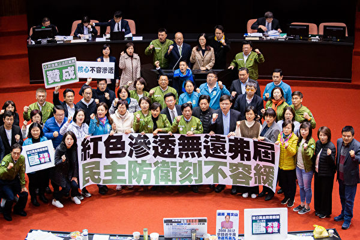

台湾立法院会12月31日三读通过《反渗透法》，（陈柏州／大纪元）

【大纪元2020年01月01日讯】12月31日，台湾立法院会三读通过《反渗透法》，在台海两岸引发震荡。支持者表示欣慰，中共国台办和官媒进行抨击。立法院长敲槌后不久，进驻北京核心地段、背景遭质疑的台湾新媒体《大师链》急发声明，宣布将“暂时放弃台湾市场，结束台湾业务”。显然，《反渗透法》的效力立竿见影。

《反渗透法》明定，任何人不得接受渗透来源指示、委托或资助，捐赠政治献金、违法从事竞选活动，也不得就涉国安、国防、外交、两岸事务进行游说。违者最重处5年徒刑，得并科新台币1千万元以下罚金。

台湾绿党12月31日公布的民调显示，48.6%的民众支持《反渗透法》，反对者占19.7%，5.3%受访者无明确意见，还有26.3%的人不知道有此事。

<b>《反渗透法》之背景——中共全球渗透 危及台湾民主</b>

《反渗透法》剑指中共，有人说，这或许象征台湾步入抗共的2020年。立法院有此举措，与当前的国际背景和台湾事务紧密相连。

近年来，中共在全球范围全方位、多领域的渗透已经引起诸多国家的警觉，其干涉加拿大、澳洲、新西兰内政以及企图干预美国总统大选等图谋见诸报端。众目共睹，中共的手段包括经济合作、金钱收买、间谍窃密、媒体宣传、网络攻击等方式，借此输出共产主义意识形态，企图破坏自由社会的政治体制和道德文化根基，其危害正在逐渐显现，在有些地区的情况是触目惊心。美国等国政府已把中共列为最大威胁或主要威胁之一。

2018年12月10日，澳大利亚总检察长办公室宣布正式实行《外国影响力透明度计划法案》，中共显然是严防对象。今年12月2日，澳洲总理莫里森宣布，将拨款8800万元，新建隶属于澳洲情报组织（ASIO）之下的“高级别情报特别工作组”，以更好地应对外国间谍等形式的干预。

再看台湾。一水之隔，中共对台渗透经过了多年的部署和运作，通过商业经营、收买媒体、拉拢政商和宗教人物、利用黑帮等方式分化内部以期颠覆。去年9月，“共产庙”碧云禅寺被拆除一事被广泛报导，红色势力暗藏庙宇的现象引起关注。

今年8月9日，路透社在一篇文章中确认，中共当局付钱给至少5家台湾媒体集团，以换取各式平面刊物与一家电视频道的新闻报导。

9月29日，香港歌手何韵诗在台北参加活动时被中华统一促进党高层胡志伟等人泼红漆，令公众震惊。当时有政治人物慨叹，何韵诗在香港都未遇袭，而此事竟在台湾发生。早前即有媒体爆料，中共一年付给“统促党”头目张安乐500万人民币、竹联帮3,000万人民币，鼓动其在台滋事。

11月，中共前特工王立强披露了中共对香港、台湾和澳洲渗透的一些内幕，包括干预台湾2020大选。他提供的信息得到了台湾情报单位的严肃对待。

12月30日大纪元报导，据旅游业知情人士透露，12月中旬，台湾某旅游协会带领多位旅行社负责人前往大陆，与“国台办”洽商恢复陆客来台事宜。中共方面对台湾业者提出三点要求，均涉及2020大选，包括第一，若民进党胜选，将持续停办陆客赴台自由行，但可考虑在过年期间推动陆客赴高雄旅游；第二，虽然考虑尽速恢复陆人赴台旅游，但前提必须是国民党执政；第三，若韩国瑜赢得总统选举，将于过年后先开放部分陆团与自由行，到国民党执政的县市，再逐步增加团次与人数。政治大学国家发展研究所教授李酉潭表示，此事正表明了《反渗透法》的必要性。

几十年来，中共持续对台湾威胁和渗透，自上世纪70年代末起，中共因“改革开放”之需对台“示好”，吸引了大批台商赴大陆投资，令中国经济获益不少。即使如此，中共的文攻武吓从未放松，一直以“分裂祖国”掩盖中共暴政之不得人心。因此，反中共渗透，是守护台湾自由民主的迫切而重要的措施。

<b>中共偷换焦点 渲染恐怖</b>

蔡英文在《反渗透法》通过后，在脸书上强调：“反渗透法是反渗透，不是反交流！”

中共国台办发言人曾于12月25日在记者会上声称，《反渗透法》一旦通过，凡是与民进党立场不同的政党、团体、人士，敢于批评民进党的媒体，来大陆就学就业的台胞，参加两岸交流合作的人士，都有可能被“莫须有”地扣帽子、打闷棍，遭到随意调查、罚款，甚至是判刑坐牢。发言人还用了制造“恐怖”、“禁限两岸交流交往”、“捞取选举私利”、“损害台湾同胞利益”等字眼。

中共故意漏掉“反渗透”之核心，把《反渗透法》形容为党派的整人工具，企图让台湾民众心生恐惧和反感。其实，众人皆知，“扣帽子”、“打闷棍”、以“莫须有”罪名陷害良善，正是中共最擅长的伎俩。况且，反渗透与两岸交流无碍，怎会损害台胞的利益？最有意思的是，如果该法果真如中共形容的那样“恐怖”，会损害台湾人的利益，民进党怎可凭此在选举中获利呢？反过来讲，如果此法可以为民进党拉高选情，不正说明台湾民众对反渗透的认同吗？

日前，《人民日报》海外版旗下账号“侠客岛”发表反《反渗透法》的评论，标题内含“五月天可能被起诉？”，该文抛开了法案规定的治罪前提，无限度地夸大了该法的适用对象，认为身在内地的台商、台生、台属，甚至赴大陆观光的500万台湾游客都面临触法入罪的可能，还把这一观点说成是“岛内舆论”。

事实是，中共眼见蔡英文的民意支持度一路高涨，又恼又忧。此时《反渗透法》若得通过，中共的处境将更加不利，不仅它准备实施的渗透计划将受阻，而且那些正在进行的渗透工作也将面临严查。

<b>何人惧怕《反渗透法》？</b>

目前，《反渗透法》在台湾引起了一些质疑和忧虑。例如，国民党总统候选人韩国瑜对媒体表示，《反渗透法》若过，140万台商，以及“五月天”、吴宝春可能都会被起诉，每个人脖子都绑炸弹。

其实，这种担忧是不必要的，因为《反渗透法》明文规定了调查和制裁对象的标准。只要没有在渗透来源的指示、委托或资助下捐献政治献金或从事违法的竞选活动，无需担心。商人、艺人、面包师、游客，都可以堂堂正正地与大陆往来，内心无鬼，有何所惧？

真正感到害怕的是中共和它的代理人。12月31日，统促党总裁张安乐等人在立法院外抗议《反渗透法》，张自称“我就是中共同路人”，还说：“谁在帮中国建设、谁在让中国过好日子，我就是他同路人”。

张安乐的“统促党”原名“保卫中华大同盟”，于2004年5月在广州成立，分明受中共领导和资助。他在台湾持续作乱，引起公愤。张安乐故意抬出“中国”以美化中共和自己，却说错了事实。因为中共祸国殃民，让国家陷入几无间断的政治斗争和高压恐怖，让人民过不好日子。张安乐高调承认与之同路，恰好证明了他是何货色。

还有个别宗教界人士认为，台当局不该为意识形态给民众造成恐慌。台湾与大陆有着深厚的历史渊源，台湾庙里的神像，“哪尊不是源自大陆？”

不过，在经济交往过程中不要忘了中共的本质。正是在神佛造像的发源地，中共砸毁了无数尊神佛塑像和庙宇。中共信奉无神论，以消灭宗教信仰、消灭人类为最终目的，它是破坏传统文化、压制信仰自由的罪魁祸首。近年来，中共迫害法轮功、迫害基督徒等人权罪行也被深度曝光。中共的倒行逆施威胁着中国、台湾和世界。
结语

台湾创造了经济发展和民主建设的奇迹，除了台湾自身民众的努力，也得益于中华传统文化。而中共仇视传统，破坏道德，变异民族文化，它的意识形态与台湾的成功根基水火不容。

在2019年的最后一天，《反渗透法》通过，将防范暴政、守护台湾的议题带入新年。围绕此法的争议，外界不难看清台湾土地上的红色阴影。#

<a target="_blank" href=#top><h6 align="right">回上方</h6></a>

<a name=9>
<h1 align="center"><b>组图：103万港人元旦大游行 街头人山人海</b></h1>

2020年1月1日，香港民间人权阵线（民阵）举办“元旦大游行”，以“毋忘承诺 并肩同行”为主题，由维多利亚公园步行至遮打道行人专用区。（宋碧龙／大纪元）

  
 【大纪元2020年01月01日讯】2020年新年首日，即元旦，香港民阵发起元旦大游行，要求港府回应民众的五大诉求。游行队伍经过警察总部时高喊“成立独立调查委员会”、“五大诉求，缺一不可”等口号。防暴警察在警总对面天桥上戒备。民阵指，今日的游行人数，超过6月9日的103万人。

游行起点是维多利亚公园，步行至遮打道行人专用区。游行时间从下午2时到晚上10时。游行队伍高喊：“光复香港 时代革命”“五大诉求，缺一不可”“解散警队 刻不容缓”等口号，并伸出五个手指表达“五大诉求”，有的拿着“天灭中共”的标语。

此次游行途中，有不同的组织和工会摆设街站，呼吁市民尝试寻求合适的工会加入。有港人认为，加入工会是团结力量的表现。

主办方民阵表示，迎接2020年，有太多工作需要努力：纵然区议会取得意外战果，社区战线仍须打稳；黄色经济圈与工会战线，要在各行各业被打压下匍匐前行；街头行动一旦松懈，或被政府视为秋后算账的时机。

  
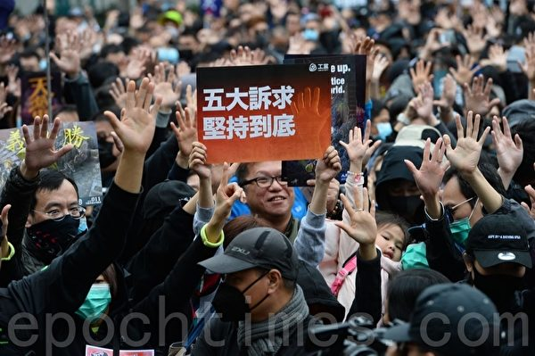

2020年1月1日，香港民间人权阵线（民阵）举办“元旦大游行”。图为参加游行人士手举“五大诉求 坚持到底”。（宋碧龙／大纪元）

   
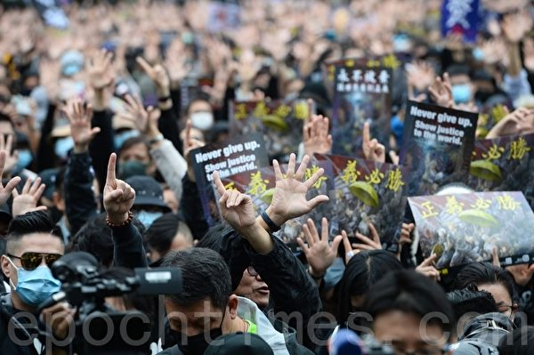

2020年1月1日，香港民间人权阵线（民阵）举办“元旦大游行”。图为参加游行人士举手表达“五大诉求”“正义必胜” 。（宋碧龙／大纪元）

  
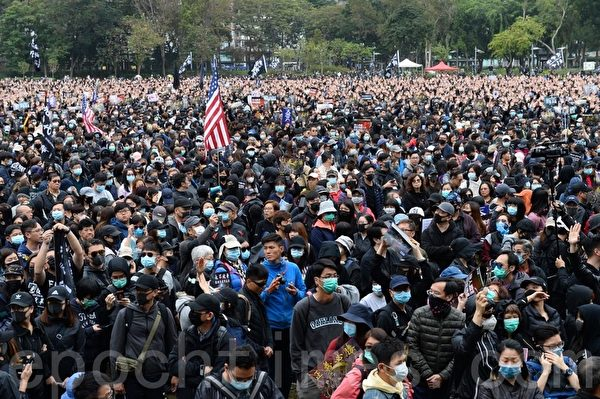

2020年1月1日，香港民间人权阵线（民阵）举办“元旦大游行”。（宋碧龙／大纪元）

  

2020年1月1日，香港民间人权阵线（民阵）举办“元旦大游行”。（宋碧龙／大纪元）

  
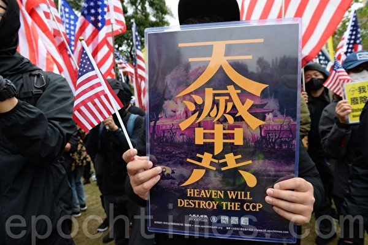

2020年1月1日，香港民间人权阵线（民阵）举办“元旦大游行”。图为参加游行人士手举“天灭中共”展板及美国国旗。（宋碧龙／大纪元）

  
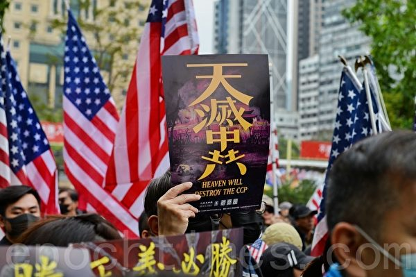

2020年1月1日，香港民间人权阵线（民阵）举办“元旦大游行”。图为参加游行人士手举“天灭中共”展板及美国国旗。（宋碧龙／大纪元）

  
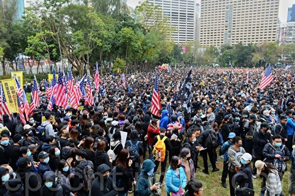

2020年1月1日，香港民间人权阵线（民阵）举办“元旦大游行”。（宋碧龙／大纪元）

  
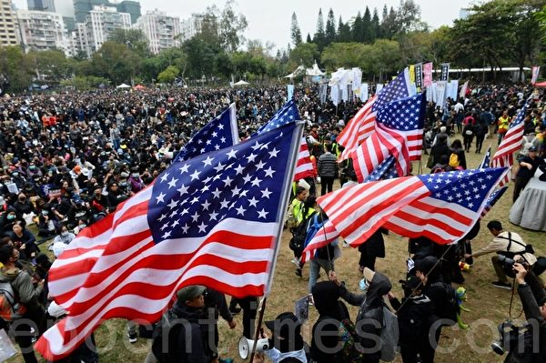

2020年1月1日，香港民间人权阵线（民阵）举办“元旦大游行”。图为参加游行人士手举美国国旗。（宋碧龙／大纪元）

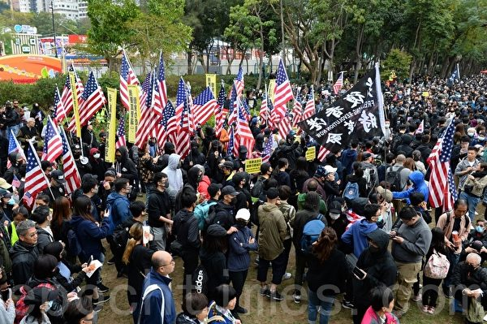

2020年1月1日，香港民间人权阵线（民阵）举办“元旦大游行”。图为参加游行人士手举美国国旗。（宋碧龙／大纪元）

 
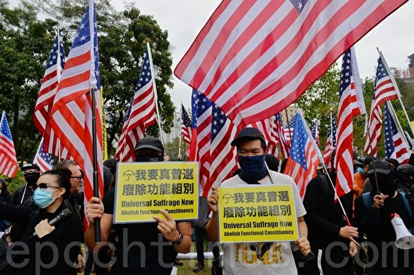

2020年1月1日，香港民间人权阵线（民阵）举办“元旦大游行”。图为参加游行人士手举美国国旗。（宋碧龙／大纪元）

  

2020年1月1日，香港民间人权阵线（民阵）举办“元旦大游行”。图为参加游行人士手举“独立调查委员会 还我公义与真相”“警队大话连篇”展板。（宋碧龙／大纪元）

  

2020年1月1日，香港民间人权阵线（民阵）举办“元旦大游行”。图为参加游行人士手举“独立调查委员会 还我公义与真相”“警队大话连篇”展板。（宋碧龙／大纪元）

  

2020年1月1日，香港民间人权阵线（民阵）举办“元旦大游行”。图为参加游行人士手举“牺牲几多人，你先肯罢工”展板。（宋碧龙／大纪元）

  
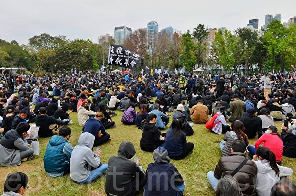

2020年1月1日，香港民间人权阵线（民阵）举办“元旦大游行”，下午2点在维园大草坪集合。（宋碧龙／大纪元）

  
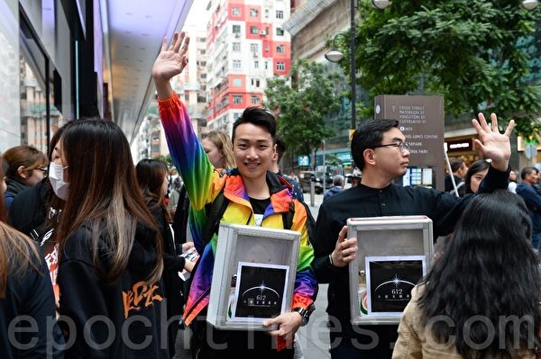

2020年1月1日，香港民间人权阵线（民阵）举办“元旦大游行”，下午2点在维园集合。图为民阵召集人岑子杰。（宋碧龙／大纪元）

  

2020年1月1日，香港民间人权阵线（民阵）举办“元旦大游行”，下午2时在维园集合。不到2点，铜锣湾已见参与游行的大批市民，“天灭中共”标语大受欢迎。（余钢／大纪元）

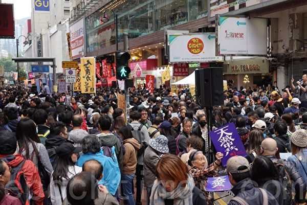

2020年1月1日，香港民间人权阵线（民阵）举办“元旦大游行”，下午2时在维园集合。不到两点，铜锣湾已见参与游行的大批市民，“天灭中共”标语大受欢迎。（余钢／大纪元）

 
  
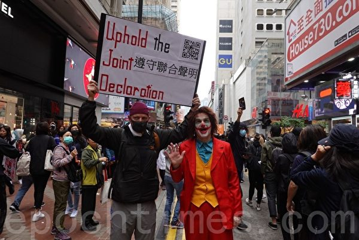

2020年1月1日，香港民间人权阵线（民阵）举办“元旦大游行”，下午2时在维园集合。不到2点，铜锣湾已见参与游行的大批市民。图为外藉人士手举“遵守联合声明”展板。（余钢／大纪元）

  

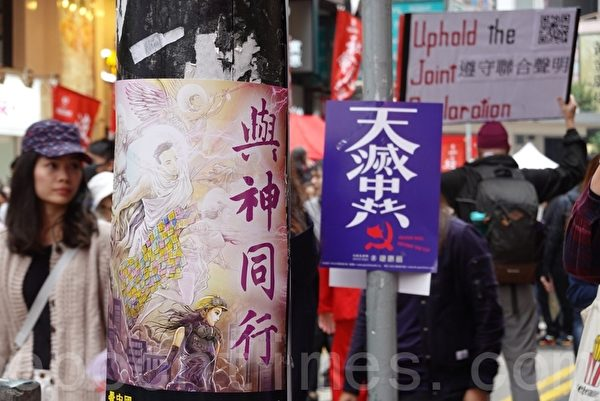

2020年1月1日，香港民间人权阵线（民阵）举办“元旦大游行”，下午2时在维园集合。不到2点，铜锣湾已见参与游行的大批市民，“天灭中共”标语大受欢迎。（余钢／大纪元）

    
  
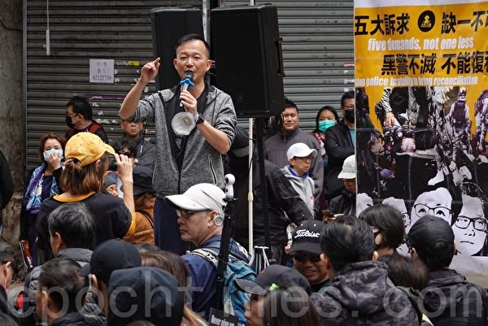

2020年1月1日，香港民间人权阵线（民阵）举办“元旦大游行”。（余钢／大纪元）

  
 
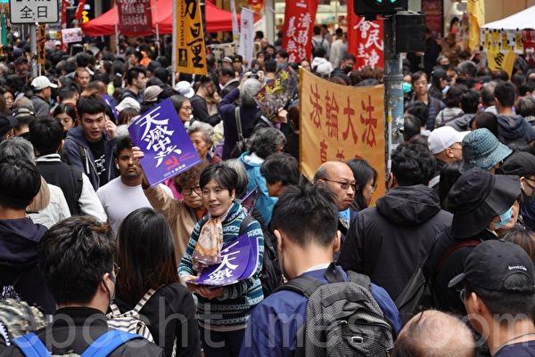

2020年1月1日，香港民间人权阵线（民阵）举办“元旦大游行”，下午2时在维园集合。不到2点，铜锣湾已见参与游行的大批市民，“天灭中共”标语大受欢迎。（余钢／大纪元）

   

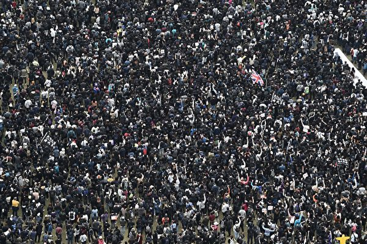

2020年1月1日，香港民间人权阵线（民阵）举办“元旦大游行”。(PHILIP FONG/AFP via Getty Images)

    
 

2020年1月1日，香港民间人权阵线（民阵）举办“元旦大游行”。图为市民头戴玻璃纤维佩佩蛙（PEPE）及连登猪面具参与游行。(PHILIP FONG/AFP via Getty Images)

   
 
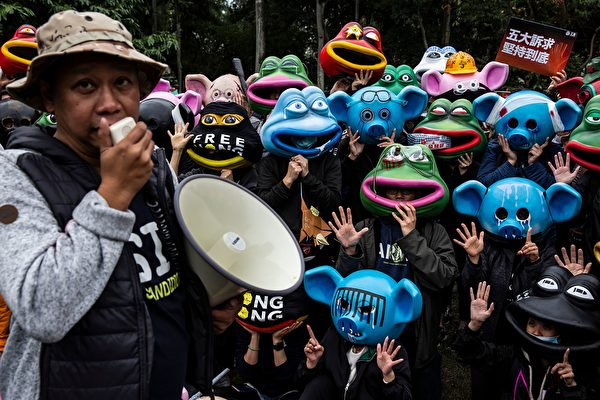

2020年1月1日，香港民间人权阵线（民阵）举办“元旦大游行”。图为市民头戴玻璃纤维佩佩蛙（PEPE）及连登猪面具参与游行。(ISAAC LAWRENCE/AFP via Getty Images)

     
 
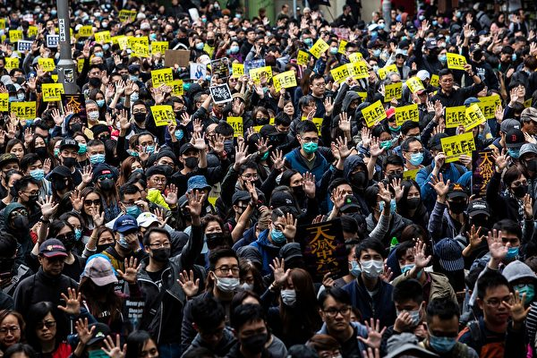

2020年1月1日，香港民间人权阵线（民阵）举办“元旦大游行”。(ISAAC LAWRENCE/AFP via Getty Images)

     
 
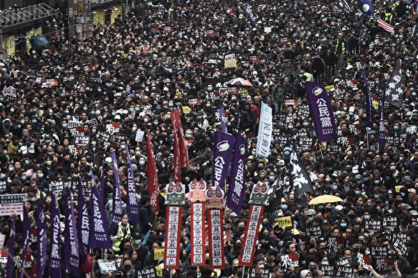

2020年1月1日，香港民间人权阵线（民阵）举办“元旦大游行”。(PHILIP FONG/AFP via Getty Images)

     

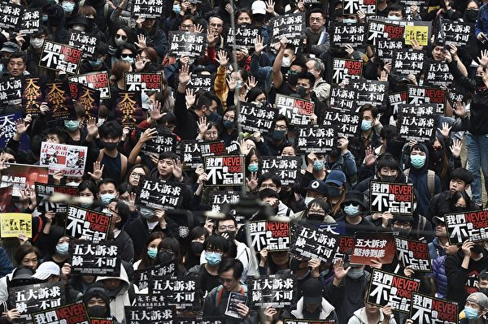

2020年1月1日，香港民间人权阵线（民阵）举办“元旦大游行”。(PHILIP FONG/AFP via Getty Images)

    
    
 <a target="_blank" href=#top><h6 align="right">回上方</h6></a>

<a name=8>
<h1 align="center"><b>爆发不明肺炎疫情 武汉海鲜批发市场休市</b></h1>
  
【大纪元2020年01月01日讯】日前，湖北武汉市华南海鲜批发市场爆发集体感染不明肺炎疫情，引起民众恐慌。今天（1月1日），华南海鲜市场宣布休市整治。

日前中共官方证实，去年12月以来，武汉市发现病毒性肺炎病例27例，均诊断为病毒性肺炎／肺部感染，其中7例病情危重。此次肺炎病例大部分为华南海鲜批发市场的商户。

华南海鲜市场成立于2005年，位于武汉市江汉区，距离汉口火车站只有1.3公里。

今天，武汉市江汉区市场监督管理局、武汉市江汉区卫生健康局发出公告称，对华南海鲜批发市场实行休市整治，开市时间另行通知。

《新京报》报导，华南海鲜市场门口聚集了大量市场商户老板，商户仍可进出，但不能营业，一位商贩表示，她是刚刚看到通知后才知道要休市的。

“早晨5点多贴的通知。”1月1日上午，一位负责值守的监管人员表示，商户事前并不知情，“商户老板很多都提前进货了。”

有陆媒记者前往海鲜市场发现，所有商户正在忙着关门前的整理，将一箱一箱的货物搬运到货车上。有身着城管、食品监督管理局和工商制服的人员在现场执勤。海鲜城各个出入口已被封闭，另有身着白色防护服装的工作人员在现场采样。

去年12月31日下午，《楚天都市报》记者来到华南海鲜市场走访发现，卖野味的店铺已关闭，有遗弃的兔子头及动物内脏散落在市场西区六街角落。

附近一摊位店主大爷称，六街有几家卖野味的，有野鸡、蛇等很多品种，“你来晚了，（都）关门了。”在附近街区，记者还发现了一些摊位附近有闲置的铁笼。

武汉大学医学部一位研究病毒的专家说，纯粹海鲜市场肺炎病原体非常少见。一般能够造成肺炎的，比如说2003年的SARS病原体，“都是在野生动物当中会多一些。”

香港大学感染及传染病中心总监何柏良今天接受一个电台节目访问时表示，武汉短时间内有27宗确诊个案，当中7宗属严重个案，比例相当之高，而多宗病例与街市有关，令人担心病人会否曾经接触过动物，特别是野生动物。

何柏良表示，武汉的爆发已出现一段时间，当地应做了基本验测也找不到致病源，故属于SARS冠状病毒的概率较低，较大可能是新型传染病引致组群爆发。现时不能断定武汉爆发的疫情会不会出现人传人的情况。#
<a target="_blank" href=#top><h6 align="right">回上方</h6></a>

<a name=7>
<h1 align="center"><b>山西老板遗书曝光 控诉滴滴黑车垄断</b></h1>

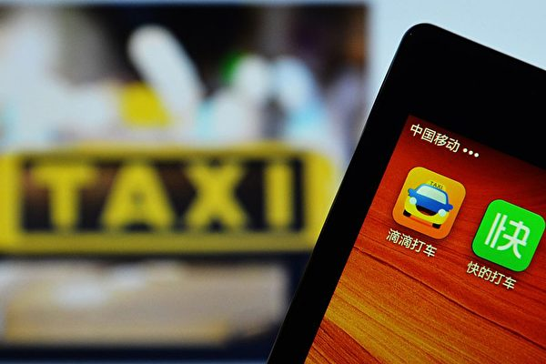

山西“好车容易”公司老板在遗书中控诉滴滴出行以黑车垄断市场，令正常牌照车辆面临困境。(STR/AFP/Getty Images)

【大纪元2020年01月02日讯】（大纪元记者张玉洁综合报导）山西“好车容易”公司老板因公司陷入困境服药轻生，他在遗书中控诉黑车泛滥，滴滴出行（下称“滴滴”）以黑车垄断，令正常牌照车辆无法进入市场。

山西好车容易汽车销售服务有限公司（简称“好车容易”）老板闫宝才12月26日服药轻生，所幸抢救后脱离生命危险。他的遗书随后曝光，其中控诉滴滴存在大量黑车，并可以以此垄断市场。

闫宝才曾与滴滴在山西晋中市合作网约车业务，但发现滴滴未取得当地许可，随后被滴滴解约。他申请与滴滴在太原市合作，第一次被答复“材料上报”，然后再无音信，经多次联系后，最终被以“运力过剩”为由拒绝。

但闫宝才发现，滴滴内部存在大量黑车并以此垄断市场，而合法车却无法进入市场。公司被滴滴拒绝合作后，大量司机退租，令其陷入经营困境。

<b>遗书曝光：滴滴用黑车垄断市场  我用生命捍卫尊严</b>

自杀事件发生后，闫宝才的遗书曝光。他在遗书中说：“我不明白为什么按照政府要求办理的合规车辆，滴滴公司不接纳，满大街的黑车随便可以跑滴滴。”

“利用大量非法营运的车辆垄断市场，然后再给合法网约车设置不可逾越的障碍，以运力过剩为理由，拒绝合法运力公司合作，不让这些合法车辆使用滴滴平台，等于给这些合法车辆判了死刑，也等于给这些合法车辆的主人判了死刑。”

“我是一只蚂蚁，撼动不了滴滴这头大象，但是我也是一个有尊严的合法公民”，“我要为所有司机师傅们维权，我要用我的血洗刷我的耻辱和愤怒。”他在遗书中说。

<b>“好车容易”经理：滴滴占80%市场份额  太原黑车是合法车的两倍</b>

“好车容易”的经理表示，与滴滴合作失败后，“好车容易”与首汽约车太原分公司合作，但由于滴滴占有80%的市场份额，如果无法进入滴滴平台，司机就等于失去了重要的接单平台。

2019年7月，滴滴的网约车开放平台并入小桔租车平台，同时滴滴先后宣布与比亚迪、长安汽车、北汽新能源等厂商合作。

经理表示，太原市取得“网络预约出租车运输证”的车辆大约有1万辆，但太原市的所有平台上，尤其是滴滴平台上保守估计有3万多辆营运网约车。这意味着太原市非法营运的车辆至少是合法车辆的两倍以上，多数不符合网约车的要求。这种情况令合法司机的付出与回报不成比例。

在网约车发展初期，滴滴依赖传统运营商填补运力不足，但现在，传统运营商与滴滴签约需要一定的资源关系和大笔费用。

闫宝才与滴滴在晋中的合作就曾花费一大笔费用，但双方签约合作后，闫宝才公司的司机发现，滴滴在晋中并没有网络预约出租车经营许可证，有的司机因此被罚款一万元，去年8月份滴滴提出解约。

闫宝才自杀事件发生4天后，滴滴旗下网约车平台“小桔车服”12月30日回应称，“因为管理流程不完善，对接过程中婉拒了合作意向，但没有清晰的告知正式流程”，“目前已经暂停了接受新增‘以租代购’形式的车辆在平台上出租。”

滴滴出行成立于2012年，隶属于北京小桔科技有限公司，成立六年累计亏损390亿元人民币，仅2018年就亏损了109亿元人民币。#

<a target="_blank" href=#top><h6 align="right">回上方</h6></a>

<a name=6>
<h1 align="center"><b>中共尽失人心 反习势力与保习派激战</b></h1>

中共内外交困之际，中共高层内斗也更加激烈，各派通过媒体就习近平的权力问题不断放风。(Getty Images)

【大纪元2019年12月25日讯】（大纪元记者张顿综合报导）中共内外交困之际，中共各派围绕习近平是否将连任等问题展开激战。习成为各派保护和攻击的中心，中共各种不利的消息也都推给了习，习将如何面对这些困局？

<b>习四度与林郑握手 人心尽失</b>

12月20日，习近平主持澳门新政府就职典礼之后，离去时，特意停步回头，与香港特首林郑月娥握手。

自港人反修例运动半年多以来，习近平与林郑至少四度握手。前三次公开握手，分别发生在12月19日、12月16日及11月4日。

在上述三次会见中，习近平三度表态支持林郑，二次点名支持港警，这些举动让中共和习在香港和世界上尽失民心。

据香港民意研究所20日发表的报告，林郑月娥民望平均只有19.6分，56%港人给予其0分评价。该所12月6日的报告显示，香港警方的民望只有35.3分，40%港人给予0分评价。

目前，在国内经济、国际外交、美中关系等问题上，中共均处于前所未有的被动地位。世界各国对中共也越来越反感。

<b>外媒披露修例的幕后黑手 影射意味浓厚</b>

更令习近平被动的是，中共官员向外媒披露，修订香港《逃犯条例》的真正推手是中共中纪委，而不是港府。

路透社12月20日援引两名中共官员的话指，中纪委2017年向负责香港事务的中共官员提出引渡的迫切需要，中纪委希望有一种比在香港绑架“逃犯”，更不具政治破坏力的方法。

2017年1月，中共在香港跨境抓捕中共权贵白手套、明天系创办人肖建华，舆论哗然。之前还发生了中共绑架铜锣湾书店员工事件。

路透社的报导，直接将矛头指向了现任中纪委书记赵乐际。因为习近平在中共内是“核心”，赵乐际只是习的党内副手，多方分析都认为，这个报导实际把矛头指向了习近平。

<b>反习势力与保习派激战</b>

在海外，对习近平的正负舆论激战明显。

海外亲共中文媒体《世界日报》12月15日援引中共内部信息说，“习的任期并不一定会超过中共规定的两届”；中共高层连同习近平本人已对下一届接班人进行了内定。

文章称，由于中共当局目前面临的内外交困不断加深，习近平思想及其执政路线，“在中共内部更加引起反弹和质疑，习在党内的威望也不断下降”。

时政评论员李林一对大纪元记者说，这个明显是中共其它派系在放风。习近平2018年才修宪，取消中共对国家主席两届任期的限制，如果他不延任，他何必费力去修宪，引发那么大的震动，“所以亲共媒体的这个消息显示，中共内部有人对习不满，故意在海外放风”。

与此同时，帮习说话的舆论也在海外流传。

亲习的中共军事学院出版社前社长、大校辛子陵，近期在港媒发文，力挺习近平。

辛子陵认为，时至今日，连个官员公示财产都做不到，习近平“对这个党绝望了”。按照少数服从多数的议事规则，解决不了他们的问题，还随时有被他们“解决”的可能。

辛子陵还提及，习近平执政7年下来，认识到共产党变成了“老虎党”之后，已不能依靠中共官员挽救中共“大厦将倾”的命运。在剩余的三年任期，习近平将摆脱“老虎党”的羁绊，丢掉共产党的历史包袱，重新建党，重组干部队伍等。

但辛子陵的说法，难以得到外界的认可。

同时，10月28日至31日召开的中共十九届四中全会通过的《决定》，要求“坚持和完善中国特色社会主义制度”，并设立了到2035年基本实现“推进国家治理体系和治理能力现代化”。

外界认为，这些都是习本人思路的公开：即至少到2035年前，中共这种政治体制都不会大变。

<b>人心尽失 海内外言论均指向习</b>

12月19日，“中改研究”等大陆微信号纷纷转载一篇文章《温家宝的燃情岁月》，再提中共前领导人邓小平等人废除“干部领导职务终身制”的过程。

文章提及，邓小平、陈云等重新主持中共中央工作后，1980年2月29日通过的中共十一届五中全会公报中，明确提出要废除“干部领导职务终身制”。并且将这一要求写入中共党章。同时，他们在各种场合一再强调，“加强对年轻干部的提拔、培养”。

在这个敏感时期，此类影射习近平修宪的文章，却并没被中共文宣删除。

同时，海外的亲共学者也公开发表言论，批评中共当局决策过度集中的弊病。

12月16日，新加坡亲共学者、国立大学东亚研究所所长郑永年教授，在香港发表主题演讲时，提到中共的政治治理体制，最大问题是“决策权太过集中于中央”，有时会导致无法科学决策。

他说，过分强调“中央集权”与“顶层设计”，地方无法制定出符合当地实际情况的政策，地方官员的空间被缩小。

中共官媒“中新网”报导上述新闻时，删除了上面的内容，仅仅点到郑永年提到中国的制度在不同时期呈现出“不同特点”。

<b>专家：2020年习面临更多挑战</b>

知名中国政经专家、美国加州克雷蒙特麦肯纳学院教授裴敏欣12月17日发文，列举了中共在美中贸易战、香港反修例运动、大规模监禁少数民族、台湾等问题上遭受的挫折。

他指出造成这些挫折的原因是：“随着习近平将政治权力集中到自己手里，决策过程发生了变化。那些希望影响政策的人，想方设法挑选迎合习近平口味的信息。同样，习在政治局常委会的同僚，因为害怕被认为不忠诚，也不愿意直陈可能与他的观点相矛盾的信息。他们知道，提出替代方案可能被视为直接挑战习近平的权威。”

裴敏欣的结论是，由于独断独行的决策机制不太可能改变，在未来几个月，习将受到更多挑战的打击。2020年可能是习最糟糕的一年。

时事评论员李林一表示，在中共党内，改革派已对习近平的所谓改革失去信心；而以江泽民为首的贪腐派，对其虎视眈眈，盼他早下台，也根本不信任习。

李林一认为，从目前来看，维持中共不倒，成本变得越来越高。如果还想继续这么做，“明年习近平处境更加艰难”。#

<a target="_blank" href=#top><h6 align="right">回上方</h6></a>

<a name=5>
<h1 align="center"><b>白宫：若朝鲜试射远程导弹 美将采取行动</b></h1>

白宫国家安全顾问罗伯特‧奥布赖恩（Robert O'Brien）周日（12月29日）表示，如果朝鲜试射远程导弹或进行核试验，美国将采取适当行动。(SAUL LOEB/AFP)

  
【大纪元2019年12月30日讯】（大纪元记者夏雨综合报导）白宫国家安全顾问罗伯特‧奥布赖恩（Robert O’Brien）周日（12月29日）表示，如果朝鲜试射远程导弹或进行核试验，美国将感到非常失望，并会采取适当行动。他还表示，金正恩可能已经重新考虑了他的“圣诞礼物”。

奥布赖恩周日在接受美国广播公司“本周”（This Week）采访时说，华府有许多“工具包中的工具”（tools in its tool kit）可以应对任何此类导弹测试。

他还说：“我们暂不做判断，但是在这些情况下，美国将一如既往采取行动。”“如果金正恩采用这种方法，我们将非常失望，我们将表现出这种失望。”

<b>金正恩或已重新考虑“圣诞礼物”</b>

朝鲜要求美国政府在年底最后期限来临之前，就朝鲜核武计划问题提出一个新的倡议计划，以消除双方分歧。朝鲜说，如果美国未能满足平壤的期待，（美国）就可能得到一份不希望的“圣诞礼物”。

美国军事指挥官表示，朝鲜的“圣诞礼物”可能是试射远程导弹。

针对朝鲜对美国发出的威胁，奥布赖恩说，美国仍然是世界上领先的军事大国，拥有巨大的经济实力。他说：“我们可以承受很大的压力。”

这名白宫国安顾问说，“多年来，共和党和民主党多个政府曾对这种情况进行了处理，但没有成功。”“川普总统采取了不同的方法，进行个人外交。取得了一些成功。”

“所以也许他（金正恩）会重新考虑这一点（圣诞礼物）。”奥布莱恩补充说， “但是我们将不得不拭目以待。我们将对其进行密切监视。当然，这种情况令我们感到担忧。”

总统川普上周表示，美国准备应对朝鲜方面的任何“圣诞礼物”。

<b>时间将证明川普总统的方法是否行得通</b>

奥布赖恩说，美国和朝鲜拥有开放的沟通渠道，但他没有透露详情，也拒绝回答美朝最近是否进行接触。他说，华府希望金正恩履行其使朝鲜半岛无核化的承诺。

他说，时间将证明川普总统的方法是否行得通。

奥布赖恩说，总统没有在这件非常危险的、非常令人担忧的事上存在幻想。“他（总统）到那里时很危险，他试图缓解紧张局势，使金正恩真正履行自己的承诺。”

金正恩周六召开执政党会议，在他设置的年底最后期限来临之前讨论重要议题。朝中社没有提供本次会议的进一步详情，只说会议将继续进行。#

<a target="_blank" href=#top><h6 align="right">回上方</h6></a>

<a name=4>
<h1 align="center"><b>中共外交辞令出尽丑 “耿爽模拟器”被下架</b></h1>

中共外交部发言人耿爽资料图片。（大纪元资料室）

【大纪元2019年12月31日讯】中国外交部发言人耿爽的对外发言被外界认为千篇一律、套话连篇，以至于有网友根据一款“耿爽模拟器”便可获得他的外交辞令内容。不过，网友今日发现，该模拟器已被下架。

中共外交部一向被外界嘲讽为“口炮部”，但其外交辞令套话连篇、千篇一律。发言人耿爽长期以来不是“强烈谴责”、就是“坚决反对”国际干涉所谓中共内政。

有中国网友将耿爽发言摘录下来，透过“GitHub公司”软体原始码代管服务平台，对其进行简单随机组合，进而编写出“耿爽模拟器”。只要输入“想谴责的国家／对象”及事件，便可以模拟出耿爽在外交部记者会上的问答形式样板。而且与外交部发言人的讲话如出一辙。

不过，有网友今日（12月30日）发现，该模拟器已被从原始网页中移除。

该模拟器从11月下旬发布以来，在网上引发热烈讨论。不少网友称其为“废话生成器”，很多网友嘲讽说，“根本就是本人回答”、“耿爽要付钱买下版权了”。

网友表示，周一，香港“连登论坛”、台湾“PTT”、“巴哈姆特”，推特以及脸书上的备用连结都已经失效。

网友们纷纷留言，表达他们对这款模拟器的“念念不忘”：“专业的废话训练”、“小粉红崩溃”、“第一次见识到废话可以讲这么多”，还有网友表示，中共发言人“就是个背稿机”。

“耿爽模拟器”发布后，有网友进行各种恶搞实测，例如输入“网友”和“制作耿爽模拟器”，提问“对于网友制作耿爽模拟器，中方对此有何回应？”就听“耿爽”再一次“表明立场”，谴责网友“挑拨怂恿”，要求停止“干涉中国内政”，简直与中共外交部发言人无二。#

<a target="_blank" href=#top><h6 align="right">回上方</h6></a>

<a name=3>
<h1 align="center"><b>偷带癌症研究材料出境 中国学生在美被控罪</b></h1>

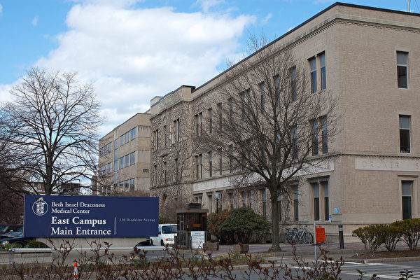

一名中国学生涉嫌从美国“贝斯以色列女执事医疗中心”偷生物样本，并企图走私回中国。图为“贝斯以色列女执事医疗中心”。(Tim Pierce/Wikimedia commons)

【大纪元2020年01月01日讯】（大纪元记者张婷综合报导）中国学生郑凿松（Zaosong Zheng，音译）12月9日在波士顿一个国际机场准备搭机返回北京时被捕。波士顿的联邦法官周一裁定，郑在袜子中藏了若干瓶研究样本，试图走私回中国。一法官说，郑凿松与中共政府有关系，有潜逃风险。

据《波士顿环球报》报导，29岁的中国医疗学生郑凿松是一名癌症研究员。去年获得了哈佛大学的签证赞助，到美国的“贝斯以色列女执事医疗中心”（Beth Israel Deaconess Medical Cente）学习。

周一（12月30日），波士顿一名联邦法官裁定，证据表明郑凿松试图走私美国实验室的研究样本。郑将若干瓶研究样本藏在了行李箱中的一只袜子内，并打算乘坐飞机回北京。

报导称，郑被指控从他所在的“贝斯以色列女执事医疗中心”实验室偷走一些生物样本，作为中国（共）长期以来从美国高校获取知识产权行动的一部分。

“贝斯以色列女执事医疗中心”是一所位于波士顿的国际知名的医疗中心，是哈佛医学院主要的教学医院。它的前身是“贝斯以色列医院”和“新英格兰女执事医院”，1996年两所医院合并。

联邦调查局（FBI）特工卡拉‧史派斯（Kara Spice）向法庭所呈交的一份书面证词在12月19日对外公开。在证词中，史派斯使用“贝斯以色列医院”来替代“贝斯以色列女执事医疗中心”（以下简称贝斯以色列）。

证词称，12月9日，郑凿松在波士顿洛根国际机场（Logan International Airport）打算乘坐海南航空482航班飞回北京。海关人员在郑的行李箱中发现了21小瓶未知棕色液体。这些小瓶被藏在一只袜子里面。

FBI特工凭借经验和培训断定，这些小瓶装的是生物样品，且并未申报，也没有被恰当包装，不适合在商业飞机上运输。

郑最初否认携带任何生物标本，但在海关继续盘问后，他最后供认，他从“贝斯以色列”的研究实验室偷走了8小瓶液体，并没有其他人知道他的行为。他说，他还根据一个名叫陶章（Zhang Tao，音译）的研究复制了11瓶液体。

<b>轩尼诗法官：郑与中共政府有关系 有潜逃风险</b>

周一，郑正穿着狱服出庭。在法庭上，联邦地区法院的法官戴维‧轩尼诗（David H. Hennessy）表示，郑获得中共政府提供的奖学金，并有潜逃风险，他与中共政府的关系将会使他更容易离开这个国家。轩尼诗批准了联邦检察官的请求，将郑拘留直到审判。

郑凿松在波士顿洛根国际机场被抓后，“贝斯以色列”解雇了郑。他被指控制造虚假陈述。哈佛大学的官员周一表示，郑的教育交换签证已被撤销。

“郑被指定到‘贝斯以色列’（做研究）并非偶然；他故意从‘贝斯以色列’收集知识产权，很可能是代表中国（共）政府。”FBI特工史派斯在一份法庭证词中说。

史派斯还指出，中国公民到美国来有这种行为是可以预料的。他们一回国便可得到奖励。

<b>郑有可能面临更多项指控</b>

美国政府正在等待郑凿松藏在袜子内21瓶液体的测试结果。如果证实是从“贝斯以色列”实验室偷走的样本，郑可面临更多项指控。根据法庭文件，曾与郑在一个实验室工作的前室友告诉美国政府，这些小瓶内装有癌细胞。

轩尼诗法官表示，被告的行为反映出其严重违背了对“贝斯以色列”和哈佛大学忠诚。

“贝斯以色列”周一表示，正与美国政府的调查进行充分合作。

“贝斯以色列”女发言人詹妮弗‧克里兹（Jennifer Kritz）说：“我们为我们的研究项目的广度和深度感到自豪。”

“任何损害研究的尝试都会破坏我们教职员工为提高患者护理水平所做的辛勤工作。” 克里兹说。

根据FBI特工的证词，郑承认，他打算把这些液体带到他在中山大学孙逸仙纪念医院实验室进行进一步分析。

“郑表示，他打算一回国，立即前往他在中国的实验室，开始使用偷来的液体进行他的研究。郑还解释说，如果他的研究结果以任何方式成功了，他打算以自己的名字发表论文。”FBI证词说。

<b>FBI：郑和另一中国研究院合作走私生物样本</b>

12月9日在洛根国际机场，海关人员除了在郑的行李中发现了不明液体外，还发现了一台属于另一名研究员的手提电脑。该研究员和郑都在“贝斯以色列”的一个实验室，该研究员已经回到了中国。郑说，他之所以带着这台笔记本电脑，是因为这名研究员的行李放不下了。但FBI官员指称，郑和这个中国研究员一起合作，走私这些样本回国。

“贝斯以色列”的官员拒绝评论他们实验室中的其他中国研究人员是否在医院不知情的情况下拿走了研究和材料，也拒绝评论该机构是否更改了任何安全措施。

<b>郑凿松被抓释放何种信号？</b>

《波士顿环球报》称，郑的被抓捕反映了过去一年，美国政府对涉嫌从事间谍活动和科学盗窃的中国学者和研究人员进行了更广泛的打击。在波士顿地区的医院和学校学习的其他外国研究人员也曾在洛根机场被拦截下来。

根据波士顿新闻网站“Universal Hub”的报导，波士顿另一所著名医院“布莱根妇女医院”（Brigham and Women’s Hospital）首席学术官保罗‧安德森（Paul Anderson）在给该院的一封内部电子邮件中写到，12月早些时候，来自合作伙伴医院系统的三名外国研究员在波士顿洛根机场因没有申报藏在行李箱中的材料而被拦下。安德森表示，政府“打算推行严格的执法议程”。

安德森还指出，基于该医院与FBI的对话得知，洛根机场有大约18起拦截事件，涉事人员的签证被没收并被取消。

据Universal Hub报导，在许多情况下，研究人员将生物材料藏在维生素瓶、拖鞋和袜子中。

“布莱根妇女医院”发言人马克‧墨菲（Mark Murphy）在一份备忘录中说：“该医院重申了运输生物和其它研究材料的监管要求和机构要求。”

FBI以及为美国大学的卫生和科学研究提供资金的美国联邦机构已经警告说，几十年来依靠全球研究合作而蓬勃发展的美国开放式高等教育系统，正在被外国政府所利用。

美国国立卫生研究院（NIH）和FBI正在调查180起涉嫌盗窃由美国政府资助的生物医学研究的个案。这些案例主要涉及华裔或华裔美籍研究人员，涵盖美国71个主要医学中心和研究机构。

<a target="_blank" href=#top><h6 align="right">回上方</h6></a>

<a name=2>
<h1 align="center"><b>【新闻看点】欧盟趋强硬 华为：2020生存第一</b></h1>

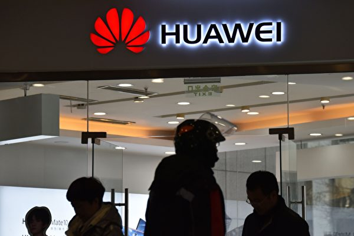

图为华为Logo。(GREG BAKER/AFP/Getty Images)

【大纪元2019年12月31日讯】大家好，欢迎大家关注新闻看点，我是李沐阳。

几个月前，华为欧盟首席代表刘康（Abraham Liu）开始了在布鲁塞尔的台面下运作，试图巩固华为在欧洲这个海外最大市场的地位。据法媒报导，华为在欧盟的游说费用高达280万欧元（约合2185.76万人民币），已经成了游说欧盟花费最多的企业之一。

不过即使这样，欧盟执委会主席冯德莱恩（Ursula von der Leyen）日前仍然表示，无法接受欧洲企业和民众资讯被盗窃的风险。

按照中共十八大的部署，中国大陆明天就进入“小康社会”了。如果谁再说自己没钱，那就是拖后腿了。可是偏偏在这个节骨眼上，党妈最“器重”的孩子——华为今天（12月31日）传出了泄气消息。

华为轮值董事长徐直军表示，2019年业绩不佳，2020年的“首要任务是生存”，并且可能要辞退部分行政人员。

各种迹象显示，在世界各国围堵封杀之下，华为的日子越来越难了。

<b>华为：生存是首要任务 或裁减10%高管</b>

在即将跨入2020年之际，徐直军31日发布了一份新年致词。在这份2,000字的致词中表示，估计2019年的销售收入会达到8,500亿人民币（1210亿美元）。虽然比去年增长了18%，但是远远低于预期的1,250亿美元。

致词中表示，2020年，2019年上半年的快速增长和下半年的市场惯性都不存在了，明年会是艰难的一年。

徐直军并不讳言：2020年“生存将是我们的（华为）的首要任务”。美国政府的针对华为的政策是“战略性和长期的”，对华为的“生存和繁荣”已经构成了挑战。

他说，为此华为可能会裁减10%的经理级员工，有的后勤部门可能会合并或者缩小规模，员工也可能调派到其它部门。

<b>欧盟立场趋强硬</b>

华为意识到生存危机，除了美国在继续围堵封杀之外，可能与它第二大市场的欧盟，其态度开始变强硬也有一些关系。华为估计，它在海外市场的手机销售将会衰退40%。

昨天（30日)，法国世界报（Die Welt）刊登了对冯德莱恩的专访。她表示中方在谈判时“非常有自信”，不过欧盟在人权或网络安全等领域会“保持强硬”。

28日，德国明镜周刊（Der Spiegel）也刊登了对冯德莱恩的专访。这位12月初才就任的欧洲执委会主席表示，欧盟无意限制个别企业，而是打算建立普遍的标准 。其中一个标准就是，这些敏感科技的厂商“独立、而且不能被政府强迫传送资讯”。

冯德莱恩表示，近期将会向会员国提出建议，欧盟没有办法接受中国（中共）的情报法，使欧洲企业和民众的资讯有被窃取的风险。

此前，欧洲各国对是不是采用华为设备举棋不定，都在观望权衡。因为华为有中共举国体制支撑，设备价格比其它商家便宜1/3左右，这是一个相当有诱惑力的数字。但是美国不止一次指出，华为设备有“后门”，威胁国家安全。

欧盟执委会主席的态度，显示出欧洲对华为的立场变得强硬了。这可能意味着华为在欧洲的钜资游说，不会有什么效果。

<b>华为钜资游说无效</b>

其实，华为一直不断游说欧洲，不惜斥钜资，大打银弹牌。世界报报导，仅2017-2018年，华为在欧洲的游说花费就增长了30%，达到280万欧元，成了为捍卫利益而在欧盟花费最多的企业之一。

欧盟首席代表刘康在欧盟总部所在地布鲁塞尔，频频向欧洲议会议员示好，希望尽力占有一席之地。又是出版研究报告，又是举办圆桌论坛、研讨会和5G巴士等等。

为了改善在法国的形象，华为找到了法国最具影响力的公关游说与顾问公司Boury, Tallon & Associés等，同时动用政治人脉，试图敲开法国部会的大门。此外华为还对巴黎歌剧院、各种文化体育活动进行赞助，提供大学研究奖学金和创投基金等等。华为为了讨得各国政府信任，不惜血本。

华为高管梁华稍早前对法新社表示，2020年将在欧洲投资400亿美元，设立5G零件工厂。

但冯德莱恩的表态，意味着华为的这些努力可能要白费。因为不只是美国不断提醒欧盟，华为涉及到国家安全问题，而且华为给人的印象也非常不好，它的黑幕被越揭越多。

<b>华为内部爆黑幕</b>

前不久，华为前员工李洪元因为离职赔偿问题，被华为构陷而遭受牢狱之灾251天。而华为却傲慢地表示，“支持李洪元运用法律武器维护自己的权益，包括起诉华为”，大有挑衅意味。

李洪元“251事件”引爆了公众愤怒，不断有网友曝光华为的更多黑幕丑闻。但是却全都被删帖，网络上干干净净。有的因为转载“工作996、离职251、维权404”，结果QQ被冻结了。

随后一名叫“白离”的华为离职员工也讲述了离职遭遇。在华为干了十几年后，突然被华为劝退。按劳动法提出赔偿，华为不答应。随后就把他的工作一点点的剥离，逼着主动走人。“白离”表示，经过和其他被劝退的员工交流发现，这种卑劣的手法是华为统一培训过的手段。

其实在李洪元之前，华为另一个员工曾梦也因为离职赔偿被拘押了90天。

华为不放过离职员工，连报导真相的记者也不放过。有一位和李洪元关在同一个看守所的科技媒体记者，只是因为报导了Mate 20 Pro绿屏问题，结果被关了252天，与李洪元在看守所还认识。

这位记者感叹：在华为被大力追捧的氛围下 ，媒体记者怕是干不下去了。

<b>网友：从今拒买华为</b>

华为的丑闻越曝越多，起底任正非家族的文章也在大量出现。包括“你一个看不起病的穷光蛋，有什么资格支持人家富可敌国的孟大小姐？”“华为曾把十多名讨薪员工送进牢房”等等。

有网友跟帖说，“孟晚舟被关一年全国关切，华为员工被关251天全网封杀”。也有的说“我在别墅里度日如年，你在监牢里砥砺前行”，还有“你也许会是李洪元，但永远没机会做孟晚舟”等等。

华为的狼性文化和对员工的不人道引发的舆论狂潮之下，华为和任正非家族的形象已经轰然崩塌。可以想见，人们还会使用华为设备吗？

有网友表示“从今天起，不再使用华为手机”，也有说“从今拒买华为任何产品”，还有的说“从来不买华为的产品，因为垃圾”等等。

海内外市场都在衰退，拒绝华为已经成了潮流。或许不久的将来，人们就会见证华为盛极而衰、最终败亡的过程。

好的，感谢您关注新闻看点，再会。

大纪元《新闻看点》制作组 #

<a target="_blank" href=#top><h6 align="right">回上方</h6></a>

<a name=1>
<h1 align="center"><b>香港法轮功学员集会 恭祝李洪志先生新年快乐</b></h1>

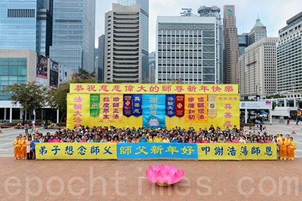

2020年1月1日，香港法轮功学员恭祝师父新年好。（宋碧龙／大纪元）

【大纪元2020年01月01日讯】（大纪元记者黄晓翔香港报导）告别2019年，迈入2020年的第一天，香港法轮功学员1月1日早上在中环爱丁堡广场举行盛大的集会，恭祝法轮功创始人李洪志先生新年快乐，并向世人展现法轮大法的美好。

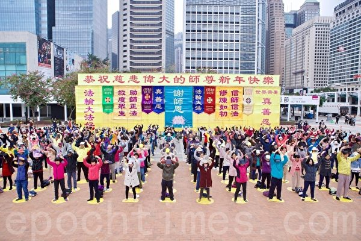

2020年1月1日，香港法轮功学员以炼功的形式，恭祝师父新年好。（余钢／大纪元）

   
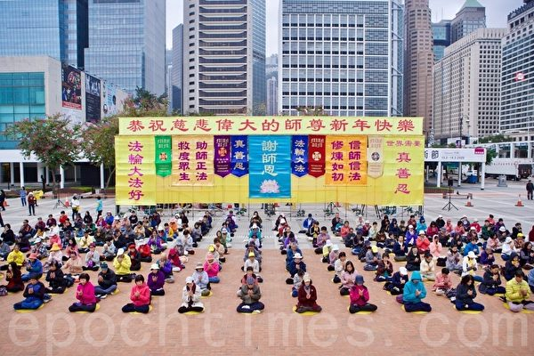

2020年1月1日，香港法轮功学员恭祝师父新年好。（余钢／大纪元）

  
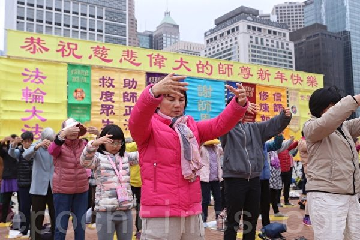

2020年1月1日，香港法轮功学员以炼功的形式，恭祝师父新年好。（余钢／大纪元）

  

2020年1月1日，香港法轮功学员腰鼓队以打腰鼓的方式，恭祝师父新年好。（宋碧龙／大纪元）

  
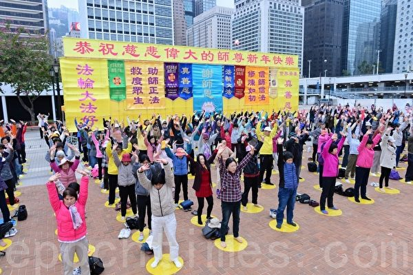

2020年1月1日，香港法轮功学员以炼功的形式，恭祝师父新年好。（宋碧龙／大纪元）

  
  集会开始，腰鼓队作舞蹈及击鼓表演，之后法轮功学员集体恭祝法轮功创始人李洪志先生新年快乐。集会在众人合唱多首大法弟子创作的歌曲后结束。

香港法轮功学员朱太表示，参与今次集会觉得非常感慨，因为自己已经修炼法轮功二十二年。她在修炼前身体很差，心脏有病、怕晒太阳，也不能久站，“现在已经成为一个健康的人了，能弹、能走、能跑。”她也提到自己在修炼后心性的提高：“以前我就是一个自私的人，脾气也不是那么好，现在成为一个宽容的、一个能够体谅别人的人。”

  
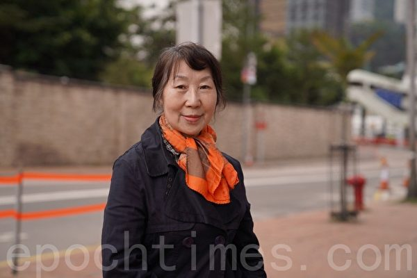

2020年1月1日，香港法轮功学员恭祝师父新年好。图为法轮功学员朱太。（黄晓翔／大纪元）

  
  朱太说，自己原来以绘画为业，来香港后一心只想赚钱，曾以为不可能再画画了，但现在又重拾画笔。她感谢大法开启她的智慧：“有‘真、善、忍’嘛，心静了，画的画比以前更好了……因为我是画比较传统的中国画，我觉得师父给我开智开慧，希望把传统的中华文明、五千年文明的艺术带给社会。”

她表示以往很多人误会法轮功学员，现在很多人都明白了，“‘真、善、忍’是世界的普世价值，做个好人、身体好的好人，多好啊。”她非常感谢李洪志师父的慈悲救度，希望全世界的人都来了解法轮功。

从事金融业工作的黄小姐表示，自己修炼法轮功已经二十年，身心受益。她在十年前曾患上乳癌，医生亦束手无策，“我修炼之后，对于譬如人生里遇到很多不同的事情，包括人生的挫折、身体的不适，我都能明白原因是什么。对于这些难关我看得很淡，也很放松。很神奇的，我的身体现在完全康复了。”

黄小姐说，以往家人对自己修炼法轮功不太理解，自从癌症康复后，家人都转为支持。她表示在修炼前和家人相处不好，但由于修炼后身体上及人生观的改变，现在和家人关系融洽，她也更能理解别人的想法和感受。

她表示香港人以往对法轮功在大陆被打压感受并不深刻，“但在过去半年之内，现在我身边的朋友、我的同事都走过来跟我说，他们对中共打压信仰、打压自由、打压香港人的信念……他们更加理解法轮功（学员）当时为何要走出来讲被迫害的真相。”她举例说，有些同事以前不曾想过中共会做出“活摘器官”这种没有人性的事，但现在他们知道了中共灭绝人性的思维和手法。

香港法轮功学员春微表示，在讲解法轮功真相及如何受迫害的摊位（真相点）上，用心看展板的香港和大陆的年青人多了，也多了一些明白真相的中、青年人，他们说“加油”，希望法轮功学员坚持下去。

  
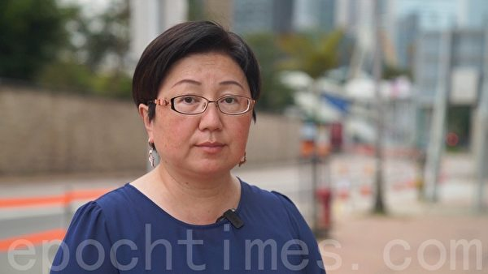

2020年1月1日，香港法轮功学员恭祝师父新年好。图为法轮功学员春微。（黄晓翔／大纪元）

  
<a target="_blank" href=#top><h6 align="right">回上方</h6></a>

原文出处：網址
