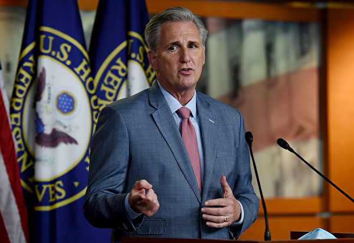
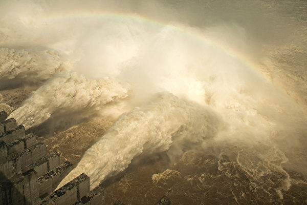
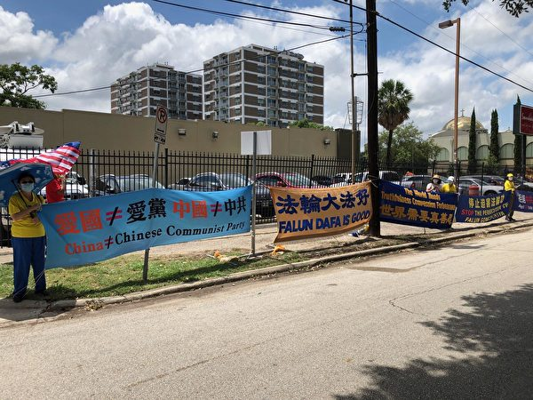
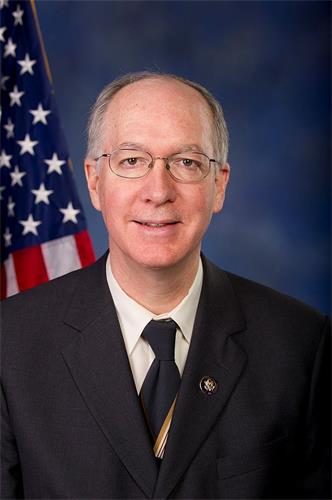
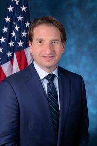
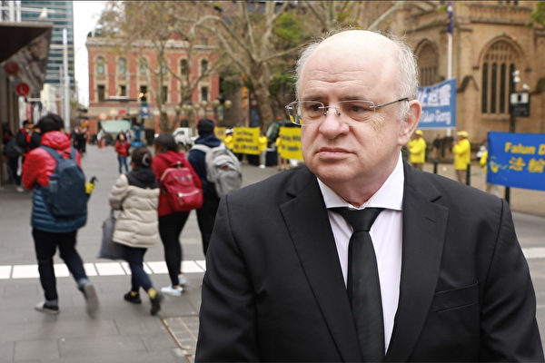
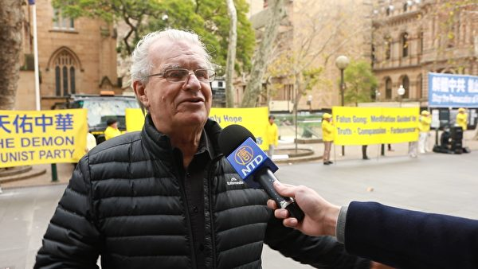
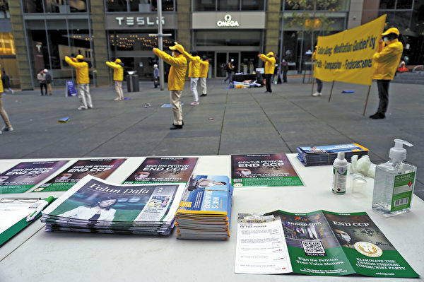

<h3><a target="_blank" href="https://bit.ly/3asSXIA">请多传破网软件，使更多的人了解真相从而得救，这是给自己积福德。 https://bit.ly/3asSXIA </h3></a>

   

     
<h3 align="center"><b>免翻视频  https://bit.ly/3ezRQKo  (请收藏网址 https://git.io/swspip)</b></h3> 

<h3 align="center"><b>复制网址到谷歌或火狐浏览器打开。若出现 “提示” ，請点击“继续”访问即可。</b></h3> 

<h3 align=center><a href="https://github.com/gav01/Heart/blob/master/news1.md">● 看更多大紀元時事 ●</a></h3>

<a href=https://git.io/souye><h6 align="right">回首頁</h6></a>

<a name=top>

<a href="https://github.com/gav01/Heart/blob/master/ls-20-7-1.md"><b>往1~119新闻</b></a> 

<a href =#192>192.美拟禁中共党员入境 原大陆网络宣传员退党 
<a href =#191>191.中领馆关闭 专家：美对付中共还有10大招 
<a href =#190>190.中共在美猎狐 休斯顿中领馆是活动基地 
<a href =#189>189.司马泰：中美全面冲突 争夺核心是什么？ 
<a href =#188>188.北京画家许那被绑架 在北京看守所绝食 
<a href =#187>187.秦淮河堤坝内部已被挖空 或随时崩溃 
<a href =#186>186.【思想领袖】肯尼迪：北京一步走错步步错 
<a href =#185>185.【最新疫情7·26】全球中共肺炎病例超过1600万 
<a href =#184>184.长江3号洪水正形成 三峡大坝或更危险 
<a href =#183>183.澳洲跟进美国 提三点驳斥中共南海主张 
<a href =#182>182.钟原：风云变 七常委频露面 各放不同信号 
<a href =#181>181.沈舟：中领馆被迫交出空军女军官？ 
<a href =#180>180.习李矛盾公开化 中共政权加速分崩离析 
<a href =#179>179.休斯顿中领馆关闭 美政府人员进驻 
<a href =#178>178.中共以商逼政？汇丰银行关闭深圳龙岗支行 
<a href =#177>177.中共虐待奴工骗订单 受迫害者诉亲身经历 
<a href =#176>176.中共关闭美驻成都领事馆 白宫发警告 
<a href =#175>175.休斯顿中共总领事宣称不撤离 蓬佩奥回应 
<a href =#174>174.中共下令播放反美影片 网民：再次忽悠百姓 
<a href =#173>173.台北千名法轮功学员反迫害大游行 
<a href =#172>172.【珍言真语】袁弓夷：拆南海基地 美已部署热战 
<a href =#171>171.英国公布BNO签证细节 惠及年轻港人 
<a href =#170>170.【珍言真语】文昭：港人非暴力抗争三建议 
<a href =#169>169.独家】中共“一网打尽式”舆情维稳揭秘 
<a href =#168>168.疫情升温 大连进入战时状态 小区封闭幼儿园关闭 
<a href =#167>167.美国务院高级官员会见五位法轮功学员 
<a href =#166>166.湖北省司法厅厅长谭先振被免职 
<a href =#165>165.解禁一天 8家科创板公司股东宣布减持63亿元 
<a href =#164>164.班农：美国已定下解体中共计划 分两步走 
<a href =#163>163.旧金山中领馆被控 正窝藏FBI通缉要犯 
<a href =#162>162.长江2号洪水还未退 又迎新一轮强降雨 
<a href =#161>161.蓬佩奥重磅演讲 自由世界须战胜中共暴政 
<a href =#160>160.蓬佩奥：中共宣称代表14亿人是最大谎言 
<a href =#159>159.【独家】内部文件曝中共监控法轮功严密 
<a href =#158>158.蓬佩奥：情报显示 谭德塞已被中共收买 
<a href =#157>157.【更新】美关闭休斯顿中领馆“间谍活动猖獗” 
<a href =#156>156.总领事违规现场被抓？休斯顿领馆为何要关 
<a href =#155>155.FBI在全美约谈有中共军方背景的签证者 
<a href =#154>154.媒体人：敏感时 习夺曾庆红钱袋子防出事 
<a href =#153>153.女版黄安湖北老家被水淹 哭喊求救遭呛别添乱 
<a href =#152>152.美关中领馆 堵死中共偷技术发展经济之路 
<a href =#151>151.【最新疫情7·24】美国连续三天逾千人病故 
<a href =#150>150.34位美国联邦参众议员谴责中共迫害 
<a href =#149>149.法轮功反迫害21周年 悉尼各界声援 
<a href =#148>148.【一线采访】保长江与大城市 安徽泄洪淹多村 
<a href =#147>147.【思想领袖】格里克：美中都撒钱 有何不同？ 
<a href =#146>146.优秀教师揭中共造假 9年冤狱亲见迫害命案 
<a href =#145>145.【最新疫情7·18】100小时内全球增百万确诊 
<a href =#144>144.上半年 至少39名法轮功学员被中共害死（1） 
<a href =#143>143.第一时间迫降有机会保命 台飞官选择舍身避民宅 
<a href =#142>142.入库流量快速上涨 三峡水库水位已超160米 
<a href =#141>141.禁写“让香港自由” NBA停产客制化球衣挨批 
<a href =#140>140.【新闻看点】美制裁留一绝招 北京急买美产品 
<a href =#139>139.中科院核安全所90多人集体辞职 网曝内幕 
<a href =#138>138.【有冇搞错】北戴河会或取消 习严防红二代政变 
<a href =#137>137.无惧国安阴霾 港法轮功坚持讲真相获赞 
<a href =#136>136.【一线采访】疫情过后洪灾 灾民叹太难了 
<a href =#135>135.传中共党员将被禁止入美国？网络欢腾 
<a href =#134>134.【最新疫情7·17】拉丁美洲疫情持续升温 
<a href =#133>133.山东胶州市民政局局长秦某峰坠楼身亡 
<a href =#132>132.越南藏尸案 审讯记录显示中共抹黑法轮功 
<a href =#131>131.中共称制裁美国军火商遭耻笑 ：从不卖给你 
<a href =#130>130.白宫辟谣：川普未排除对中共高官额外制裁 
<a href =#129>129.【思想领袖】莱克腾瓦德：美国正经历文革 
<a href =#128>128.红二代：别觉得可栽赃在川普身上 你栽不了 
<a href =#127>127.时尚大V在上海街头阻止性侵 被咬掉耳朵 
<a href =#126>126.沈舟：7.20前夕中共诬蔑法轮功的新证据 
<a href =#125>125.王友群：迫害持续21年 元凶江泽民必遭清算 
<a href =#124>124.一场致命车祸 小莲花让他化险为夷 
<a href =#123>123.【有冇搞错】大陆地震洪水 港人不再捐款了 
<a href =#122>122.疫情不是抗洪乏力的借口 
<a href =#121>121.反迫害21周年洛杉矶学员吁制止迫害 
<a href =#120>120.受贿2千万 中共人大环保委副主任判14年 

<a name=192>
<h1 align="center"><b>美拟禁中共党员入境 原大陆网络宣传员退党</b></h1>

多位华人在“全球退党服务中心”在纽约组织的集会上公开退党。（大纪元资料图片）

【大纪元2020年07月25日讯】（大纪元记者林丹纽约报导）近日美国打算禁止中共党员及其家属来美并驱逐已在美的党员及其家属出境的消息传出后，在海内外中国人中产生了巨大反响，不仅“退党”一词成谷歌热搜，而且位于纽约法拉盛的“全球退党服务中心”接到要求办理退党证书的电话不绝，比以往明显增多。其中，有一位原大陆央企的“网路宣传员”，也就是俗称的“五毛”，在看到消息后的第二天，立即联系退党中心办理实名退党。

“我原来就是五毛”，目前在加拿大定居的穆先生17日联系全球退党服务中心办理退党证书，他日前对记者表示，“我一直想联系退党中心、大纪元，但一直拖延，看到美国打算驱逐中共党员及其家属及不允许他们入境的消息，觉得自己应该尽快去做，不要拖了。”不过穆先生说，自己退党是真心的，不是为了利益，“我人在加拿大，并不会受到此事的影响，我是真心想退，退了才对得起自己，这件事情更提醒我抓紧办理。”

<b>“五毛”专门接受培训搅浑水</b>

穆先生对记者表示，他原在中国中央一级国有特大型化工企业集团工作，该集团的分支机构遍布全国各地，共有员工十几万人，公司有内部员工论坛、贴吧，“网路宣传员”就是负责监控、“引导”论坛贴吧上面员工所发表的言论。

“每月单位规定我要发一定数量的‘正面导向’帖子，发表‘正面信息’，至少10条，对‘负面帖子’删贴，引导‘舆论导向’，有考核机制，每月要对发帖、删贴情况进行汇总，上报宣传部门，如果不达标会被扣钱。”

“五毛都受过培训，我的一位朋友还专门被送到中国传媒大学培训，学习如何发帖，引导舆论，晚上‘实战’，怎样驳斥对方、对骂，如何转移焦点，偷换概念，搅浑水，把是非颠倒。”

<b>中国人的信息来源是有毒的</b>

穆先生说，“网路宣传员”的规模、人数相当庞大，央企深入基层分支机构设“网路宣传员”，他们归企业的宣传部门管理；地方宣传部所管辖的“五毛”、“水军”队伍更加庞大，而且是专职做，按工作量付钱。

穆先生说，由于共产党严控舆论，大量网路水军搅浑水，删贴，有关司法不公、拆迁不公、人权迫害的信息，只要一发出来，就会被删掉，真相被封杀，“要么被删了，要么被‘舆论导向’了，老百姓在信息输入方面是受控的，什么让你看见，什么不让你看见，全都控制，中国大陆人的信息来源是有毒的，所以得出的结论是错误的。”

<b>看完《九评》后觉醒</b>

八零后的穆先生说，自己从小受所谓爱国主义教育，加上读书、就业都比较顺利，真以为“共产党代表中国”，“爱国就是爱党”，2011年他为了竞争某个岗位而入党，直到2014年他通过VPN翻墙，偶尔在Youtube上看到了“九评共产党”的电视系列片，颠覆了他对共产党的认识，“我的内心无法平静，我失眠了，一连几个晚上睡不着……每天睡觉前就会想起《九评》，对我的冲击非常大，开始对很多事情重新认识、重新思考。”

“一旦学会翻墙后，就无法抑制了，就很想看到外面自由世界”，穆先生说，当他不断翻墙看到外面的真实信息后，就感到生活在没有自由的中国的别扭，内心非常抑郁。

“看《九评》之前，我只知道共产党腐败，但看了《九评》之后，才知道共产党的历史，滥杀无辜，为了经济和金钱，把中国的环境全都破坏殆尽了。”穆先生说，因为从事化工的缘故，看完《九评》令他触动最深的是，“与天斗与地斗”的共产党对自然环境的破坏。

穆先生揭露，他原单位周围的环境，长期弥漫着一股异味，单位喝的水、用的水，不能用自来水，必须买桶装水，就是地下水已经完全被污染了。单位为了节省成本，把化工废料不处理直接排到地下。“打一个很深的深井，把化工废料直接排到地下，因为如果处理了废料再排放的话，要花很多钱，为了节约这个成本，所以就把化工废料直接通过深井排到地下，环保局来查的时候，内部都是有勾结的，当地政府为了财政收入，睁一只眼、闭一只眼，为了捞钱，做着这种对中国人断子绝孙的事情，真的就像《九评》写的那样。”

清醒后的穆先生，决定要摆脱共产党的桎梏，到海外自由世界呼吸自由的空气，“我决定出国，拚命学英语，后来出国留学来到加拿大。”

穆先生以自己的转变告诉中国人说，在中国大陆的同胞，得赶快翻墙，只要接触到自由世界真实的信息，他们自己动脑筋判断，什么是对，什么是邪，什么是错，“‘天灭中共’已经越来越明显了，比如北京两会开幕当天白昼如夜，电闪雷鸣；北京6月端午节那天风云变色，下起像石头一样的冰雹，冰雹如同中共病毒的形状，这些异象都说明中共政权遭天谴。”

“神已经做得非常明显了，神在点醒人，种种事件都是叫人赶快清醒，中国人应该去思考，不要再执迷不悟，赶快跟共产党决裂。”◇

<a target="_blank" href=#top><h6 align="right">回上方</h6></a>

<a name=191>
<h1 align="center"><b>中领馆关闭 专家：美对付中共还有10大招</b></h1>

图为美国休斯顿中领馆在7月24日关闭的照片。（大纪元）

【大纪元2020年07月25日讯】（大纪元记者钟元台北报导）美国7月21日下令休斯顿中领馆在72小时内关闭，北京25日报复性要求美国驻成都领馆关闭。对此，总体经济学家吴嘉隆表示，美国对付中共的手段至少还有10大狠招，可能会要了中共的命。

吴嘉隆24日在脸书发文表示，美国要求中共关闭休士顿领事馆后，有人就迫不急待地宣称美国的大招已经用尽。但他指出，“美国的大招用完了吗？”他整理出美国对付中共的手段“至少”还有10大狠招：

一、追责与索赔：追究中共在疫情上的责任，联合各国一起大量索赔。由于联合索赔金额将是天文数字，例如100兆美元以上，相对于此中共一年的GDP目前大约13兆美元，中共人民银行的外汇储备大约是3.1兆美元。所以中共将完全赔不起，于是国家财政将崩溃。（若假设中共赔得起，那么索赔金额会再增加，一直到中共完全没有可能赔得起为止。）

二、取消主权豁免：为了让美国人民可以对中共政府（而不是只对中国共产党）提起索赔的集体诉讼，美国国会将修改法律，取消中共的主权豁免。

三、拆掉中共设下的防火墙：为了让中国网民更容易上网，美国要拆掉中国大陆的防火墙。一旦中国大陆网民能自由上网，那么他们将获得许多真实的讯息，中共的高压统治与社会监控将维持不下去。

四、摧毁香港的联系汇率制度：美国可切断对香港的美元供应，使得香港的外汇储备耗竭，不足以支撑联系汇率制度。

那时港币将大幅贬值，人民币也会被拖下水，一起大幅贬值。这样一来香港将出现金融风暴，外资将只好撤出在香港的金融业务。

五、将中国与香港踢出美元体系：美国可将中共与香港的银行排除在美元结算体系之外，使得他们的银行没办法为客户承做美元的汇进与汇出。这一来中共的对外贸易将出现危机。

六、在南海开打：海南岛三亚市的亚龙湾有中共的战略核潜舰基地，这类潜舰可发射长程洲际弹道导弹，上面携带小型核弹头，可打到美国本土。所以美国有动机在南海开战，表面上是维持南海的自由航行，但背后还有美国的国家安全问题。

七、石油禁运：美国可以在南海或麻六甲海峡推动对中共的石油禁运。

八、制裁中共高官：对中共的部长级，省委书记级以上的涉案官员进行制裁，当然可上升到政治局委员与常委这一级。另外，禁止中国共产党员及其家属入境，已经入境的则驱逐出境，并冻结资产。这些针对中共的制裁会让中共权贵集团的海外利益严重受伤，所以是精准打击的一部分。

九、放弃“一个中国”政策：美国可考虑与中华民国恢复邦交，甚至改成给台湾外交承认，这对中共会是一个很大的打击。

十、重整国际机构，打造国际新秩序：美国将翻修二战结束以来的国际秩序，将中共排除在美国主导的国际机构之外。例如，美国可以退出世界卫生组织，然后筹组新的国际组织，台湾可以进来，中共不能进来。然后再把此模式扩充到世界贸易组织。还可扩充到联合国，就是美国先退出，然后再组建新的国际组织来取代，称为“民主国家联盟”，台湾是民主国家可以加入，中共不是民主国家不能加入。

吴嘉隆强调，这10大招都很狠，都很可能会要了中共的命。从美国国务卿麦克·蓬佩奥（Michael Pompeo）在尼克森图书馆的演说看出来，美国这边已经铁了心，一定要把中共的一党专政体制结束掉，然后再重新恢复对中国的和平演变，要中国走上市场经济与民主政治。川普对改变共产中国很有使命感，因为美国只能跟民主中国来和平相处。

<a target="_blank" href=#top><h6 align="right">回上方</h6></a>

<a name=190>
<h1 align="center"><b>中共在美猎狐 休斯顿中领馆是活动基地</b></h1>

7月24日下午4点，中共驻休斯顿总领事馆正式关闭，血旗和国徽都被摘下，正门上的门牌也被拿下。（钟心萍/大纪元）

   
 【大纪元2020年07月25日讯】（大纪元记者林燕综合报导）美国司法部资深官员说，中共驻休斯顿领事馆是中共在美猎狐行动的“活动基地”，领馆人员直接威胁目标人士回国。

美国国务院、司法部以及情报机构的资深官员周五（7月24日）举行关闭中共驻德克萨斯州休斯顿总领事馆简报，透露了更多中共领事馆在美国境内从事违反外交条例、甚至是违法的活动。

<b>休斯顿中领馆官员直接胁迫猎狐对象回国</b>

与会的资深美国情报官员证实，中共的猎狐计划试图在美国引诱异议人士或他们称的“经济逃犯”回国。

他举例说：“休斯顿（中共）领事馆的代表发了一封信给美国南方的一个人，称这个人的父亲请他回国。因此，休斯顿（中领馆）非常积极地参与了中国（中共）政府和中国共产党在美国的各种情报收集和渗透工作。”

猎狐计划从2014年开始，由中共总书记习近平率先发起。

<b>中共在美执行强制或秘密行动 构成国家安全威胁</b>

与会的资深美国司法部官员也表示，中共驻休斯顿领事馆是“中共猎狐行动的活动基地”。

“那儿有从中国派遣到这的特务团队，胁迫（中共的）经济逃犯返回中国。”司法部资深官员解释说，这些被胁迫返回中国的人士是“习近平的政治对手、共产党的批评人士以及难民”。

该名官员说：“（中共）领事馆开启这些行动。领事馆还直接游说州和地方官员以及商人，为中国（中共）的利益站台。”

“虽然可以预期这是外交官的工作，但当转向强制或秘密行动时，这便成为国家安全问题。”他补充说。

<b>FBI局长谈中共的猎狐目标：要么回国 要么自杀</b>

联邦调查局局长克里斯托弗.雷（ChristopherWray）7月初发表的对华演讲也提到猎狐行动。

雷说：“目前，中共把‘猎狐’计划描述成某种国际反腐运动，实际上不是这样。相反。‘猎狐’计划是习总书记主持的一个大规模行动，目标瞄准在被他看作是威胁的、居住在中国以外、遍及世界的华人，也就是那些试图揭露中共如何大规模侵犯人权的政治对手、异议人士和批评者。

“他们所瞄准的数百名‘猎狐’行动的受害者就居住在美国，而且很多是美国公民或者是绿卡持有者。中共政府企图强迫他们回到中国，所采取的策略令人震惊。

“比如说，如果中共政府找不到某个‘猎狐’目标，就会派一名特使去该目标在美国的家中。让家人传递一个什么消息？目标有两个选择：要么马上返回中国，要么自杀。如果‘猎狐’目标拒绝返回中国，那会怎么样？在以前，他们的家人，无论是在美国的，还是在中国的，都会受到威胁和强迫，那些在中国的家人甚至会被逮捕作为要挟。

“我要借机说明，如果你相信中共政府正在瞄准你，你是‘猎狐’计划的潜在受害者，请你与联邦调查局的地方办事处取得联系。”

雷提醒美国人，在中共问题上，需要记住，“中共拥有一个根本上不同于我们美国的制度，它正在不择手段地钻我们开放制度的空子，同时利用它自己封闭制度的优势”。  

<a target="_blank" href=#top><h6 align="right">回上方</h6></a>

<a name=189>
<h1 align="center"><b>司马泰：中美全面冲突 争夺核心是什么？</b></h1>

海外华人举着“中共不等于中国，爱国不等于爱党”的标语游行。（李明／大纪元）

   
【大纪元2020年07月26日讯】中美两国从合作走向对立，已是不争的事实。贸易、经济、科技、金融到军事，各个战场都火药味十足。双方争夺的东西很多，光是一个5G，就搅得全世界地动山摇。南海，更是让人瞪大了眼睛，但是，这些都不是双方争夺的最根本的东西。什么才是中共和美国争夺的核心？

答案很简单：是14亿中国人民。

中共从来都把中国人民据为己有，无条件地代表着中国人民，脱口而出的都是“伤害了中国人民的感情”、“中国人民绝不答应”、“中国人民的老朋友”、谁谁谁是“中国人民的儿子”、什么什么玩意儿是“中国人民的选择”，却从来没有问一声中国人民。

美国对中国的任何指责，包括人权状况，都成为中共嘴里严重“伤害中国人民的感情”的案例。谴责中共的人权迫害，声援言论自由、信仰自由、公民维权，是在帮受害者发声，同时也是为所有的中国人民发声，怎么会“伤害了中国人民的感情”呢？

原因就是，美国以前没有分清中共和中国，被中共钻了空子，中共把美国对中国政府的谴责中的“中国”顺手就变成了“中国人民”。

现在美国开始认识到“中共不等于中国”了，明明白白地把干坏事的责任落实到了中国共产党头上。

2020年7月23日美国国务卿彭佩奥在位于加州的尼克松总统图书馆发表了“共产主义中国与自由世界的未来”的演讲，这是几周来继总统国安顾问奥布莱恩、FBI局长雷、司法部长巴尔的中国政策演讲之后的最新一场。

这一系列演讲，旨在宣传川普外交思想的重要精神，那就是扭转几十年既定的中国政策，从“拥共”“容共”转型到“反共”，公开喊出中共不等于中国，也不等于中国人民，认识到中共也是中国人民的敌人，美国和中国人民是一个战壕里的盟友。

“共产党总是在撒谎，但最大的谎言就是中共代表14亿被其监控、压迫、不敢说话的人说话。”蓬佩奥说，“恰恰相反，中共对于中国人民真诚意见的恐惧胜过对外国敌手的恐惧。”“我们还必须与中国人民接触并赋予他们权利……这是一个充满活力、热爱自由的民族，他们与中国共产党完全不同。”

不过，在这场争取中国人民的战争中，中共占有了先天的优势。14亿中国人民被中共作为人质挟持，圈在防火墙内，用摄像头、大数据、人工智能、人脸识别、网络封锁、信息审查等高科技严密监控着，被铺天盖地的反美宣传洗脑着，被狭隘的民族主义煽动着，中共要把这14亿中国人民变成同路人，绑在战车上，与美国和世界对抗到底。

美国说14亿中国人民是朋友，要为中国人民争取自由，但是，14亿中国人民领情吗？这仍然是美国和世界面临的挑战。说关注中国人权，这还可以理解是为中国人民发声。而其他的事情，比如，封杀华为，打击中共盗窃知识产权，声援香港反送中，军售台湾，维护南海自由航行，挑战中共“一带一路”等等看起来是在“遏制中国”的事情，就很容易被中共利用来进行反美宣传，煽动民族主义。如何让中国人民看到真相，并理解美国和自由世界正在遏制的不是“中国”，而是“中共”，就尤为重要。

彭佩奥说，“如果我们不改变中共，中共就将改变我们”。设想一下，如果中共把香港和台湾这样的华人社会的民主自由制度摧毁了，通过“一带一路”把极权专制扩展到全世界，用华为这样的5G基础设施来掌控西方的通讯命脉，以大欺小霸凌周边国家，那么，一个世界性庞然大物般的共产专制就真的形成了。

这不是中国人民之福，因为这个专制制度最大受害者恰恰是生活在中国的十几亿中国人民。没有了外部世界的制约，中共只会更加随心所欲地压制自己的人民。“遏制中共”不是“遏制中国”，也许短期内中国人民会有所损失，但是，从长期来说，抛弃中共才能让中国人民能够走回自由繁荣，那才是真正的强大，真正的崛起。

美国和盟友开启了反抗中共的新篇章，但是要做的事情还很多。拆掉中共的防火墙，让中国人民能看到真相，帮助并鼓励中国人民退党，清理中共在海外的间谍和被统战的政、商、学、媒体界的沼泽，加大舆论宣传争取中国人民。谁赢得了中国人民，谁就是最后的赢家。   

<a target="_blank" href=#top><h6 align="right">回上方</h6></a>

<a name=188>
<h1 align="center"><b>北京画家许那被绑架 在北京看守所绝食</b></h1>

北京画家许那（右）和丈夫于宙。于宙2008年被中共迫害致死。（明慧网）

   
【大纪元2020年07月26日讯】（大纪元记者叶枫采访报导）北京律师梁小军证实，至7月22日，北京画家、法轮功学员许那在北京东城看守所已绝食四天，抗议当局迫害。

明慧网报导，7月19日，许那被北京顺义区空港派出所所长带着国保警察绑架。7月20日，警察再次登门，非法抄家，抄走所有电子产品和摄像机。

北京时间7月24日，北京律师梁小军向大纪元记者表示，他获知的多个消息来源显示，7月19日被绑架当天，许那在家中和其他法轮功学员正在一起学习法轮功书籍，当时一共十四五人被抓；许那目前被关押在北京东城看守所。

梁小军介绍，7月22日，他前往北京东城看守所时，得知许那在北京东城看守所的最新情况。

许那，毕业于北京广播学院（现中国传媒大学），职业画家，作品曾经获奖。父亲是文联画家，母亲生前为吉林美院教师。

此次许那被绑架，家中剩下年迈的父亲。许那被绑架的时间点，正值中共所谓“敏感日”。21年前的1999年7月20日，中共因恐惧法轮功广受欢迎，修炼人数超过中共党员，下令镇压。这场迫害持续至今。

法轮大法信息中心执行主任布劳迪（Levi Browde）近日向大纪元表示，21年来中共对法轮功的迫害没有减轻，“任何人修炼法轮功或者支持法轮功，肯定会面临被监禁或被判入狱的风险。对于法轮功学员来说，这种风险21年来没有任何减轻。”

因为坚持修炼法轮功，许那本人多次被绑架关押，2001年被非法判刑5年，2008年又被非法判刑3年。

许那的丈夫于宙，北京大学毕业，通晓多种语言，知名音乐人；因修炼法轮功，2008年2月6日被中共迫害致死，遗体仍然被冷冻着。

与大陆残酷迫害法轮功形成鲜明对比的是，国际社会要求中共必须停止迫害和声援法轮功的呼声高涨。

7月20日，美国国务卿蓬佩奥（Mike Pompeo）在这一天发表官方声明表示，中共必须停止迫害法轮功。当天，美国国务院高级官员在国务院会见了五名法轮功学员代表。而美国国务院国际宗教自由大使布朗巴克（Sam Brownback）也在这一天发表官方推特，赞扬法轮功学员坚守正信、坚忍不屈。

此外，来自30个国家的606名跨党派议员共同签署了一份联合声明，要求中共立即停止对法轮功修炼团体的迫害。#   

<a target="_blank" href=#top><h6 align="right">回上方</h6></a>

<a name=187>
<h1 align="center"><b>秦淮河堤坝内部已被挖空 或随时崩溃</b></h1>

7月19日晚，安徽省六安市裕安区固镇镇大多数民众一夜无眠，很多人因洪水被捆在楼顶上等待救援。（视频截图合成）

   
【大纪元2020年07月26日讯】长江汛情吃紧，下游支流秦淮河的水位仍居高不下，秦淮河流域部分地区已有水漫出河堤。有民众披露，秦淮河杨家圩大堤内部存在多个空洞，已经到达大坝中线部位。民众和专家皆指，这对大堤安全造成隐患。

据大陆官媒报导，秦淮河穿江苏南京城而过，是长江下游的支流。近日，受到长江大流量来水和上游降雨影响，秦淮河水位一直居高不下，南京已启动秦淮河流域防汛一级应急响应，且发布洪水黄色预警，秦淮河流域不少地区的步道、树木被淹没。且已经有水漫出河堤，渗向周围街道。

就在秦淮河告急之际，有民众反映，在秦淮河杨家圩大堤内部，还开着多家高档酒吧、餐厅，这些建筑对大堤的安全更是造成隐患。

在南京江宁区杨家圩市民公园旁的外秦淮河大堤上看到，上涨的河水已经淹没了河堤外的亲水步道和配套设施。

但在河堤的背水面，胡家花园餐厅、悦品1913等高档餐厅仍然在正常营业。他们旁边还有几家餐厅。

这些餐厅从坝体的背水面，向内挖了十几米，在大坝“肚子里”营业。大坝背水坡内，存在着多个长12米、高约3米、宽度各不相同空洞，经初步测量，餐厅的最深处，已经到达大坝中线部位。

一家餐厅的业主刘先生反映，数年前准备整改煤气设施时，需要江宁城建集团提供资料，对方却支支吾吾，终找不到相关的规划手续文件，此时他才意识到餐厅已开在管理区的违规“红线”之内。

对于兴建餐厅有没有相关规划和审批手续，江宁城建集团相关负责人吴主任表示，“说不清”。该集团另一负责人则承认，堤体内的餐厅没有正规手续。

作为河道管理部门，秦淮河水利工程管理处相关负责人称，对堤体内存在没手续的建筑“不知情”。

武汉大学水利水电学院副教授李进平指，在河堤内部兴建餐厅已经涉嫌违反相关法律，与防汛相关的周边均设布“红线”，红线范围内不能建房修路，即使修桥也要层层审批，因为会影响防洪。

近日，安徽省长江干流、淮河干流均全线超警戒水位，巢湖超历史最高水位。安徽当局公布，由于多条防汛战线并行、长时间高水位运行，7月25日12时起，安徽省长江、淮河和巢湖流域相关地区进入紧急防汛期。

据天气预报，7月27日前，沿淮淮河以南仍多降水过程。

7月26日，中共喉舌报导称，预计至7月27日，四川盆地至长江中下游地区将有强降雨，需持续关注对长江、淮河汛情的影响，长江、淮河流域部分地区堤防长时间高水位浸泡，发生滑坡、塌陷、管涌等险情风险高。国家防决定继续维持长江、淮河防汛Ⅱ级响应。

<a target="_blank" href=#top><h6 align="right">回上方</h6></a>

<a name=186>
<h1 align="center"><b>【思想领袖】肯尼迪：北京一步走错步步错</b></h1>

美国战略集团总裁布莱恩•肯尼迪：中共放任病毒在全球传播不是偶然！香港人被中共蚕食的自由与南中国海的真相；如何推翻中共防火墙。（大纪元合成）

   
  【大纪元2020年07月24日讯】（英文大纪元资深记者杨杰凯采访报导）“我们知道他们为了达到他们的政治目标，不惜对自己人大开杀戒。如果他们对自己人大开杀戒，对其它国家的民众，他们什么事情做不出来呢？”

“武汉病毒只是一个偶然事件吗？即使病毒爆发是偶然事件，放任病毒在全球传播则不是偶然。政府最高层的决策者们，做出了一个战略性的决定，把病毒引向美国。我相信他们做了周密的计算，以达到颠覆美国政治的目的。假如我们不得不关闭政府，那将导致大范围的经济危机。”布莱恩‧肯尼迪说。

在冠状病毒（中共病毒）大流行中，中共为何选择在这个关口强推香港《国安法》？中共是不是向美国和世界传递一个信号，即，更严重的对抗即将到来？美国又如何、但更有效地对中共政权施加压力？

在本期节目中，我们与布莱恩‧肯尼迪（Brian Kennedy）坐在一起，他是“应对当前中国危险委员会”主席、美国战略集团的总裁和高级研究员、克莱蒙特研究所的前主席。这里是《美国思想领袖》，我是杨杰凯。

<b>杨杰凯</b>：布莱恩‧肯尼迪，欢迎您再次做客《美国思想领袖》节目。

<b>肯尼迪</b>：很荣幸再次与你交谈，杨，我总是很高兴。

<b>中共强推香港《国安法》 美国制裁</b>

<b>杨杰凯</b>：布莱恩，您是“应对当前中国危险委员会”主席。今天我们有非常多的话题要跟您讨论。每天我都惊讶地发现，很多被循环播放新闻，都与中国有关。当然，最近的新闻是关于香港《国安法》的通过，或者我们称之为“橡皮图章式”《国安法》草案，随即美国当然做出了反应，国务卿蓬佩奥宣布香港不再拥有自治地位。布莱恩，这一切都意味着什么？

<b>肯尼迪</b>：这是美国，当然啦，还有香港人民，当前面临的一个非常棘手的问题。我们正处于一场瘟疫之中，已经有超过10万美国人被夺走了生命。这种事情在美国历史上从未发生过。可是就在这当口上，中国PRC、中共，却决定进一步明目张胆地镇压香港，在我看来就是预谋挑衅美国，这只能更进一步加深这两个国家的相互对立。

美国国务卿蓬佩奥不得不宣布，香港已经不再享有高度自治，因为中共的所作所为，尤其是中共的这个提议，这个《国安法》将有效地清除任何形式的不同政见。在我们不得不宣布他们不再享有高度自治的时候，程序将被启动，美国将会实际上开始远离香港，使得香港成了中国PRC事实上的一部分，与此同时，对香港和中国的经济惩罚也将要逐步开始。

我们想要尽量避免伤害香港人民，但是又要清楚地告诉中国和中共：事实上，他们将会被当作一个流氓政权看待，他们再也不能分享，香港作为一个与大陆完全不同、享有最惠国待遇的单独实体所带来的好处，因为事情发展到这一步，很有趣但是很不幸，这是他们挑起的，实际上等于是关闭了香港通向美国的大门。

当然，我们很遗憾不得不这样做，香港人将得不到我们的服务，我们不能继续承认他们高度自治，当他们事实上并没有高度自治时。

<b>美国应禁止中共国企来华尔街融资</b>

<b>杨杰凯</b>：布莱恩，“应对当前中国危险委员会”发表了一个声明，谈到美国回应香港问题可以采取的一些方式，提出美国的反应，应该对中共产生“切实的”影响。请您说一说。

<b>肯尼迪</b>：我认为眼下一个最明显的问题是，中华人民共和国及其全部国有企业被允许来美国资本市场融资。我们以一个委员会的名义，建议美国有效地注销这些公司，不允许它们在美国的股票市场进行交易。有些公司是在美国的主要股票市场进行交易，有些则被列为A股，以交易型开放式指数基金（ETF）的方式进行交易。

这是美国投资人给这些国有企业输血的真正的生命线。这些国有企业既是一般性质的公司，譬如阿里巴巴等等，同时也是坏蛋，譬如海康威视，他们负责生产某些监控镜头设备，用于监控位于新疆的关押维吾尔人的集中营。

允许中国国企来华尔街融资，允许它们的股票上市，在美国筹集资本，这是一个巨大的隐患，我们再也不能让中国搭这种顺风车了。在我看来，政府越早采取行动越好。我想川普（特朗普）政府已经看到了，允许美国联邦雇员退休基金，投资给这种企业的负面效应。让我们走好下一步，确保中资公司不再享受美国股票市场的好处，尤其是那种豁免待遇，允许它们不必像美国公司或者其它公司那样，必须接受审计。

在奥巴马和拜登执政期间，他们得到了优惠待遇，可以来美国资本市场融资而不必接受审计。有一个特殊协议，允许他们不接受审计来这里融资，发展他们的公司，而美国的投资人则失去了保护。我们的委员会极力推动的一件事，就是让这种做法马上停止。

有两个问题：第一，我们为什么要用这种方式让中国公司获益？其二，我们需要保护美国投资人，他们基本上不愿意对这种事情做仔细的审查，他们误认为，如果中国公司能来美国资本市场，那就仿佛获得了“好管家”证明。这种做法必须结束。

<b>中共强迫整个自由世界做出选择</b>

<b>杨杰凯</b>：我发现这件事的来龙去脉很有意思，就仿佛他们在强迫美国，坦率地说就是强迫整个自由世界做出选择。有很多人或许是出于，比如说金融利益方面考虑，不想让您刚才所描述的事情发生。可是由于近来发生的中共对香港人的自由的蚕食，以及众多的其它事件，我希望我们在今天的谈话中都能谈一谈，还有对南中国海的蚕食等等，这使得那些人很难再继续争辩下去。真的就像中共所说，“大家选边站队！”您怎么看？

<b>肯尼迪</b>：这个问题非常好，很有见地，因为中共显然在挑衅，对不对？在所有的问题上，尤其是对香港进行逼迫。他们需要这样做吗？他们明知道美国一定会被迫还击。国务卿蓬佩奥和总统可不是随意这样做的，而是根据美国的《香港政策法》，我们必须宣布是否存在高度自治。是他们逼迫我们走到这一步的，我们只好宣布这种自治已经不存在了。

我担心的是，中共正把我们推向到比冷战还要糟糕的地步。他们不仅在沙子上划定界限，然后穿过界限，他们还逼迫我们，向我们发出信号：他们不打算继续遵守国际行为准则。我们原本以为，尽管两国之间存在着各种问题，我们与他们仍然保持着一个良好的工作关系。

可是如今我们是不是已经走到了这样一个地步：中共干脆认为他们不想继续交谈，他们得开始做出一些更具有挑衅性的动作。我这么说的确是因为，假如你并不想封锁香港，也不想对香港人放出这样一个将要得寸进尺的信号，那你为什么眼下对香港采取这样的行动呢？我的意思是，这是一个信号吗？

我认为这是一个信号，首先是给香港人的信号，就是让他们老实点儿，否则就教训他们。其次是给美国人的信号：在香港问题上，无论我们把话说得多狠，他们都不会听，他们就是要我行我素，怎么符合自己的利益就怎么来。因此我们得像他们一样，严肃地对待这件事情，我认为一场激烈的对抗即将到来。

<b>美中贸易战的前景如何？</b>

<b>杨杰凯</b>：在我问下一个恐怖的问题之前，我想先问：美中贸易战的前景如何？

<b>肯尼迪</b>：你看到了，今天中国的副总理说，他鼓励我们继续保持商业联系，尽管我们怀有敌意，我们还应该继续保持商业联系。我想，就实际问题而言，如果他们愿意，他们可以执行第一阶段贸易协议，但是他们也知道，如果他们不想执行，那么也可以不执行。

川普总统会鼓励他们执行，他们也可能会继续执行，但是似乎……他们会，也可能不会，也很难预测他们购买的数量，能否足以弥补我们今年前六个月的损失。

但是我认为事实上更大的贸易问题在于这样一个事实，时至今日美国的大量药品需要从中国进口，即使在香港问题上出现了争端，我们也不能彻底阻止来自中国的所有产品进入美国。既然80%～90%的原料药以及药品需要从中国进口，我们就不能对中国产品实施禁运。这也是政府需要考虑的一方面。

我们目前既没有计划好，要不要真的与中国脱钩，也没有采取必要的、充足的步骤实现脱钩，尽管脱钩是件好事。因此说，在短期内我们只好继续保持经济联系，同时重建我们的工业基础，确保将来不依赖中国。

<b>杨杰凯</b>：布莱恩，我们的节目日前曾经邀请过罗丝玛丽‧吉布森，讨论过您刚刚描述的这个问题。我们知道，美国的一些药品生产企业正在回迁，或者迁往友好国家，看起来中共有很多筹码。

<b>肯尼迪</b>：是的，中国人的操作很具有战略性。无论是商业还是政治交易，如果不事先算计好，他们什么都不会做。他们发现美国这个国家把GDP的30%用于医疗，久而久之，他们决定开发这个市场。一个重要的战略步骤，就是成为全球药物、药品的主要产地。我要说，对他们而言，这是一个常识性决定，他们希望借助药品扩大影响力。

<b>美国遭受病毒侵害 中共以药品要挟</b>

罗丝玛丽‧吉布森也是“应对当前中国危险委员会”的成员，撰写了很棒的书，讨论美国恢复医药生产的必要性，因为把大部分药品生产基地，放在一个所作所为都表现出仇视美国的国家，这绝对是不能让人忍受的。如果是在英国或者法国、德国、加拿大、墨西哥，或者其它友邦生产，那都是可以的，可是眼下却落在了共产中国手里，这个国家公开出书，宣传对美国进行超限战。

我们竟然让我们需要的药品在那里生产，这个想法实在太疯狂了。这是我们截至目前的历届政府，在战略上失误的一个例证，我想川普总统已经看到了，并且正在试图纠正。他必须马上动手，而不能拖延。

<b>杨杰凯</b>：布莱恩，这使我想起不久前在美国遭受冠状病毒侵害时，中共宣传喉舌之一发表的什么东西，说只要不给美国药品，“美国将会陷入新冠病毒的汪洋大海之中”，这是他们的建议。我想到他们将会那么做，那可太恐怖了。

<b>肯尼迪</b>：这是挑衅，对不对？我是说，这是随着病毒爆发而发生的很多事情之一。当然，人人都批评政府应对病毒不得力，但是你看看病毒爆发初期的情形，在十二月和一月全世界都在观望。从武汉传来了关于病毒的传闻，很惊人。你看到身着防护服的人给街道消毒，还有武汉封城的消息，居民的家门被焊死。

美国的政策制定者，并不知道正在发生什么。在这期间我们的疾控中心，请求允许进入武汉了解情况，但是被拒绝了，直到今天也没有得到允许。我想你谈到的那句话来自《环球时报》，那是中共的官方机构，他们用“冠状病毒的汪洋大海”来威胁我们。

我是说，如果把这些事情放到一起，就会让美国的政策制定者非常担心，以至于会想：我们是不是遭遇了中国发动的某种生物战？他们做了这些极具挑衅性的事情，同时又威胁我们，就是因为他们控制着我们的药品生产。这些事情综合到一起，只能让美国政府认为，我们陷入了一种非常可怕的境地。

我们今天所处的世界，仍然在努力理解所发生的一切，这也是美国民众和美国的政策制定者，非常关心的事情，因为中国确实一直竭尽全力想打败美国，而美国也一直在努力，让中国对其在过去二十年中的不良经济行为负责，这就难怪在川普执政的第四年里，我们遭遇了这场意想不到的病毒爆发，紧随其后就出现了中共极具挑衅性的言论。

我们正在经历一个在我们的经济史上从未有过的阶段。每个人都应该非常严肃地思考。我赞赏《大纪元时报》在这方面所做的一切工作。我认为它对病毒本身的报导、对病毒给中国带来的影响、给美国带来的影响的报导，在新闻界都是最好的，非常负责任，信息价值非常大，我非常感谢你们在这方面所做的一切，我认为每个人都应该去读。

<b>为达政治目标 中共不惜对人民大开杀戒</b>

<b>杨杰凯</b>：布莱恩，谢谢您的这一番话！令人难以置信的是，我们的完全相同的报导，一直在各个国家受到各种方式的攻击。但是我们还将继续努力，提供来自外界最新、最重要的信息。

您刚才说的话，让我突然想起您写过的东西，与您刚才所言大致相同，语气重了一点，但是坦率地说很有道理。您说：共产中国作为一个国家，在近代史上曾经杀害了几千万自己人民。

在一篇关于香港问题的声明中，您提到有件事情我们应该做，那就是阻止“以摘取器官为目的的种族屠杀”。我想您说的是中共支持的、一直持续到今天的、获利十几亿美元的器官活摘产业。我记得就在最近有一桩肺移植案例，综合多方因素来看，肯定就是来自那个产业系统。

您认为，大致的意思是，很难想像中共不仅仅这样说“我们将受到某种附带损伤，但是如果我们真的能够给自由世界或者美国造成伤害，那我们就去干”。我不想代替您说话。这是我读来的。您是怎么想的？

肯尼迪：从整体上看中共的所作所为，我们知道他们为了达到他们的政治目标不惜对自己人大开杀戒。如果他们对自己人大开杀戒，对其它国家的民众，他们什么事情做不出来呢？眼下你看到中共30、40年来第一次被追责，因为他们干尽了坏事，犯有不良经济行为，侵犯人权，病毒在武汉爆发，并且放纵病毒传播到全世界。

<b>中共周密计算 颠覆美国？</b>

武汉病毒只是一个偶然事件吗？即使病毒爆发是偶然事件，放任病毒在全球传播则不是偶然。政府最高层的决策者们，做出了一个战略性的决定，把病毒引向美国。我相信他们做了周密的计算，以达到颠覆美国政治的目的。假如我们不得不关闭政府，那将导致大范围的经济危机。

他们不向我们提供信息，以至于我们无法做出更好的判断，对不对？他们不告诉我们武汉正在发生什么。我们要求获得病毒的基因组序列，我相信他们给我们的第一个序列是错误的，以至于我们的早期测试都是错的。无奈之下，美国只好被迫采取一个非常严厉的措施，正如我们知道的，封闭整个国家。中国是不是已经计算好了，认定这会造成这个国家的经济危机和政治危机？

假如川普总统能躲过这一劫，啊，他真的躲过去了。假如你就是中共，你有能力把什么东西强加给美国政治，你能击垮这个非常受欢迎的总统，剥夺他的权力，把权力交给一个喜欢你的观点的人，比如说乔‧拜登，或者其他民主党人，就算你做得到，为什么最终打错算盘了呢？

如果你是中共，你能容忍美国把美国的利益放在第一位吗？你能容忍盛行了很多年的全球主义论调不再盛行吗？你能容忍人们都把美国人的福祉放在第一位、放在首位吗？中共能容忍这样的世界吗？答案绝对是否定的。他们无法容忍。在他们期待的世界里，全球主义盛行，他们成了世界的领导者，无论是通过经济实力还是通过恐吓。唯一挡了他们道的人就是唐纳德‧川普。

那么你该怎么去打破这种制衡局面呢？我的观点是：这个病毒，至少他们在过去的五个月里，一直在病毒上面做手脚，在他们看来，作为一个非常有效的方法，可以极大地动摇我们的政治。我们甚至不知道我们的政治是什么样子了。我们质疑邮寄投票的公平性，造假的可能性巨大。我们很难知道还有多少人，能记得他们以前习惯了的政治形态。

<b>中共打错了算盘 美两党合作增加</b>

当然，中共也可能弄巧成拙。美国人很可能被激怒，于是大量的选票都投给了川普。如果你是中共，你会输得精光。可是你一旦除掉了川普，那的确是你的梦想。我们不知道接下来会发生什么，但是每一个关心自由的人，都应该有兴趣捍卫美国的自由，我确实认为我们的自由、我们的生活方式、我们的思维方式，正在遭遇真正的挑战。这不是偶然，这一部分不是偶然。

<b>杨杰凯</b>：这里还有这么多潜在的有趣视角。我还想请您谈谈您对香港问题的看法，但是我想先提一个问题。您提到了拜登。当然，他曾经在上一届政府……曾经与中共领导人趣味相投，交往颇多。

可是最近他多次在公开场合，大谈对中国的非常强硬的路线。我们还看到众议院议长南希‧佩罗西站出来表态，谴责香港的局势。我认为我们看到的这些现象都很新鲜，也非常重要。民主党的蓝狗联盟，也在呼吁调查瘟疫的起源，这些都是到目前我们从民主党那边，很少听到的声音。在我看来，在严厉对待中共这一点上，两党合作正在增加。

<b>肯尼迪</b>：这是应该的。这不该是民主党或者共和党一家的事情，应该是两党的事情。凡是涉及我们的国防的事情，我们没必要选边站队。我当然希望民主党人与共和党人一道，真正能够为中共干的所有坏事而惩罚中共。有《马格尼茨基法案》，国会可以采用各种各样的方法，确保中共、中国、中资公司等等，在任何方面都占不到便宜，而只能为做错的事而受罚。

过去在美国政坛，民主党和共和党在国家安全方面立场一致。但是我本人也从两党的角度上讲：在过去的三十年里，共和党人的观点不一样，共和党人姑息中共的违法行为，准确地说，因为他们把对华贸易带来的收益，放在美国人的利益之上。

我期待两党能从中发现共识：我们都要保卫美国、抗击中共，我们要从内部入手，确保我们在经济上强大，有能力雇用我们自己的人，在美国生产战略物资。

如果能够达成共识，那将是一件好事。我再说一下，这是我所说的中共打错了算盘的一部分。他们希望用这种行为欺负我们，或者动摇我们的意志。可是，如果我们能从过去发现什么，那就是美国人的意志是不会轻易动摇的，你去压迫他们，他们就会反击；美国工人是世界上最具有创造力的工人；美国的企业家也是举世无双。

我们是这个地球上最具有发明精神和创造力的民族。只要我们能开动美国的经济引擎，受益的是我们，而不是那些追求专制、集权制度的国家，比如中国。

<b>必须推翻中共所谓的“防火墙”</b>

<b>杨杰凯</b>：我们谈一谈独创性。这使我想起我问过的一个与香港问题有关的问题，我也注意到这是您提出的建议之一，这个问题近来很少有人谈及，而过去一直在谈论，即建立和增强主动性，推翻所谓的“中国防火墙”。

《大纪元时报》与“全球网络自由联盟”合作，主要帮助在中国的读者阅读《大纪元时报》。在过去至少15年里，这个群体取得了非常好的效果。您为什么选择在这个时候，讨论如何推翻中共防火墙的问题？

<b>肯尼迪</b>：我觉得部分原因在于人们认识到：中国境内的好人，一旦知道了真相，知道了全世界正在发生的事情，他们就知道了做什么才对，最终推翻中共。推翻中共防火墙，等于是投票为中国人争取自由。今天他们还没有那个自由，他们还无法享受自由世界的成果，我们以前曾误以为，随着时间的推移，信息透明会实现。

我是说……我感觉我现在老了，但是我还记得三十年前进行的讨论，当时人们在讨论共产中国的时候会说：“你知道的，是的，他们正在实现经济现代化，但是他们能实现政治现代化吗？”那是一个伟大的梦想，对不对？他们渴望经济现代化，你获得了经济上的自由，然后你就会有政治上的自由，与这个拥有十几亿人口的国家的关系就会变好。

当时的保守派评论员总是拿起一张软盘，往桌子上一扔，说“看见这张软盘了吗？”现在的人们再也不知道什么是软盘了，但是那些软盘里会有各种各样的信息。中国人会看到那些信息，会懂得什么是自由，会明白世界上正在发生的事情，会懂得中共的邪恶，他们最终会推动、要求获得政治自由。

这些讨论持续了三十年，他们并没有获得政治自由，因为他们实际上并没有得到，我们原以为会在全中国随处可见的信息，你无法控制的信息。当然了，我们发现了什么？我们这才发现中共是控制信息的高手，也是散布各种虚假信息的高手，他们能确保真相不会从外部世界传入。

中国人应该得到最好的信息。推翻防火墙将使他们能够听到来自美国、台湾、香港和全世界华人的声音，他们将知道事情的真相；听到美国人、欧洲人的声音，他们崇尚自由，愿意帮助中国人获得我们在西方享受到的那种自由。

<b>中共在准备一场真正战争</b>

<b>杨杰凯</b>：布莱恩，我们开始谈话的时候您做了这样一个暗示，我不想替您说，但是我是这么理解的，那就是中共正在准备一场真正的战争。

<b>肯尼迪</b>：是啊，我们希望不是这样，但是没人知道。在世界历史上，很多国家都做过重大的战略误判。我们已经看到了他们在冠状病毒方面的表现，我的看法之一是，我们正在进行一些非常敏感的贸易谈判，在美国存在着全球主义、自由贸易、维持现状，然后是美国第一、向中国问责等多种观点，相互争论。尽管争论还在继续，我们于一月份签订了贸易协议。

在这个当口，遭遇了这场病毒瘟疫。我们设想中国对美国和全世界说“我们中国发生了这个可怕的事件，你们怎么不来？你们怎么不帮助我们查明原因？让我们作为全球好公民一起合作吧，毕竟病毒将不可避免地传播到美国和世界各地。我们一起合作，让我们展现全球主义的实际行动，我们一起解决问题！”假如中国真的这么说了，那么会收获多少善意啊！

相反，他们做的恰好相反。正如我们刚才谈到，他们封锁消息，不让我们知道，实际上就是用各种方法强迫我们封城。这本身就是一种挑衅行为，在全球瘟疫期间向我们封锁信息，这等于是对美国说：“我们不打算像一个合格的全球公民那样做事。我们不打算像一个值得信赖的人那样做事，我们就想像一个敌对国家那样行事。”

这不就是在欺负我们吗？这不是想把我们拉入战争吗？好，这的确看上去像是欺负我们。我期待这不会把我们引向战争。

在他们出于军事目的开始行动的时候，比如侵入印度；当他们不再谈及和平统一台湾，而是谈论台湾和大陆统一的时候；当他们用某些特定的措辞发表言论的时候，他们是在向台湾和美国，发出他们正在准备打仗信号吗？他们最不想做的事就是恐吓我们，最后真的招来一场战争。

他们宁愿通过吓唬我们，让我们退缩让步。我觉得病毒就是被设计出来，作为众多手段中的一种，来恐吓我们在经济问题上让步。

他们一方面宣传他们在香港或者台湾的所作所为，另一方面大力扩充军事力量，因为他们正在为战争做准备。他们正在建设第一流的军队，而我认为美国人没有完全理解这一点，美国人仍然认为，美国拥有世界最强大的军队，认为我们自己非常好。

<b>美国需做战争准备</b>

可是如果我们不得不在亚洲、在太平洋打一仗，战争可能一触即发，这是因为中国可以部署太多的军舰和飞机对付我们……他们有世界一流的飞机，有第四代战斗机，正在生产第五代，还有为了与我军抗衡而设计训练的军队。他们既可以在真正的战争中使用军力，也可以威慑我们。

不管怎么样吧，我们得做准备。我们现在得严肃对待这些他们说要去做的事情。他们说要统一台湾，必要时动用武力，那么我们美国就要计划，看我们是不是做好了准备，是不是有足够的军力。我想说，我认为川普总统为重建美国军力做了很多工作，这很好，但是还有很多事情等待要做。

从另一方面讲，我们美国人非常珍惜人的生命，而中国和中共却不然。如果能够把美国彻底赶出亚洲，实现他们的战略目标，他们宁愿牺牲很多人的生命。无论他们是现在就能达到目标，还是需要从现在起五年、十年、二十年，这是他们的战略目标之一，他们正在努力。他们现在所做的一切，都可以说是他们计划的一部分。

<b>杨杰凯</b>：我们谈一谈亚洲的现实。我们很清楚台湾发生了什么，至少在表面上，中共的措辞也有所改变。对不起！（我说的应该是）对香港，我们清楚地知道发生了什么，（中共）对台湾的言辞已经发生了变化。当然，亚洲还有其它一些主要国家：日本、马来西亚、印尼、菲律宾。您怎么看这个地区发生的事情？那里的人们都在想什么？

<b>肯尼迪</b>：我觉得他们都得对我们刚刚谈过的事情做出判断。他们会想：中国和中共只是口出狂言吓唬人吗？还是想来真的？他们会采取什么行动吗？如果我是日本军事计划制定者，当我看到中国一直在建造某种飞机、潜艇、水面舰艇，我就要严肃对待，因为那都意味着非常厉害的军事实力……我必须假设中国此举是为了显示其军事实力，而不是随便做的，他们是想让整个亚洲，特别是日本，人人都知道，他们非常想得到他们想要的东西。

如果你想对付中国，你最好得准备好一支能够挑战他们的军队。我可以告诉你，我不认为日本，也不认为美国，想要跟中国打仗，那么中国想要跟美国、日本、其它亚洲国家打仗吗？我们不知道。我得强调，战略上的某种失误，都会把你引向战争。

与此同时，他们会抓住一切政治优势。他们会威胁美国，威胁美国人，让我们不去选唐纳德‧川普，因为唐纳德‧川普要挺身捍卫美国。假如我们莫名其妙地屈服了，投票给了乔‧拜登，因为我们不想看到中国恐吓我们，威胁我们，而这恰好是中共的如意算盘，对不对？

这场病毒瘟疫能让人们远离川普吗？如果答案是否定的，我们能不能采取军事挑衅？这一招能不能让人们远离川普，去投票给一位对中国比较顺从的候选人？他们很擅长玩这种政治，看上去这恰好是他们正在做的。他们为什么现在如此咄咄逼人？他们希望得到什么？

一旦香港脱离了美国，失去了美国的最惠国待遇，他们每年会损失多少钱？这个星期中国损失了多少钱？几十亿美元。中共把共和党和民主党联合起来了对抗自己，这或许意味着中共又犯了一个错误，又走错了一步棋。这也意味着一步错步步错，无论是在军事上还是在经济上，还是在政治上。

我们正在进入一个具有高度不确定性的历史时期，因此我们得记住这样一个事实：像共产中国这样一个国家一旦这种犯错，就会引起真正的问题。我认为在病毒问题上，我们已经看到了这种端倪。我们期待着不会看到能引发战争的错误，然而看上去，我们显然正在朝着那个方向走，那是最不幸的了。

我认为美国人需要与他们的政治领袖步调一致，他们期待两党能团结起来，共同向中国追责，确保我们能把产业链迁回美国，建立起能够保护我们的军事力量，能够震慑共产中国，使他们不再指望耍各种阴谋诡计能够奏效。每一场危机都会带来两种机遇。期待美国人民能觉醒，认识到我们不能被这样推来推去，我们作为美国人得团结起来，确保我们强大并且受到保护。

<b>国际组织被中共控制 川普敢于挑战</b>

<b>杨杰凯</b>：布莱恩，在我们结束前，再简单谈几个不同观点。其中一个是美国，比如说，一直被指责渐渐退出世界舞台。美国确实正在从一些多边关系组织中退出，或者表面上看是这样。另一方面，我也看到了一些评论，尤其是有关最近香港问题的评论，说美国正在扮演全球领袖角色。您如何看待眼下美国参与国际事务的方式？

<b>肯尼迪</b>：这是一个非常好的问题。很多国际组织都被没有资格加入的国家控制着。你让古巴、中国这样的国家加入，并且领导联合国人权委员会，这不由得让人觉得什么地方出了问题，因此这样的国际组织不值得加入。

你看到总统一直强烈地批评世界卫生组织，参与掩盖武汉病毒人传人的事实。此外，成立世界卫生组织的初衷，就是针对这类疫情采取防疫措施，可是相反，你发现他们与中共合作竭力掩盖事实。我觉得美国正在调查这些事情，这种调查是非常合理的。

国务卿蓬佩奥一直密切关注美国在这些国际组织中的角色，我认为这是非常必要的。在过去，我们一直随波逐流，因为我们不想招惹麻烦，但是川普总统和他的政府不怕招惹麻烦。这非常好。

你看到了这届政府在香港问题上展现的领导力。宣布香港不再拥有高度自治，不能够管理自己，这是美国迈出的一大步。这其实是美国政府做的事，国务卿蓬佩奥向国会做了声明。我觉得这件事非常有意义。

往届政府只能是瞅一眼，非常可能听之任之，掩盖起来，或者对《国安法》的内容做低调处理。本届政府挺身维护香港人民，我想说这种做法，完全在预料之中，因为你制定了一个法律想彻底铲除不同政见，你等于对香港人民和全世界说：“我们不管你们怎么想，我们就是为所欲为，就是要维护中共对中国人民，以及香港人民的统治。”我们美国人希望台湾人民能远离中共的统治。

<b>美中关系进入非常危险时期</b>

可是我想说，杨，我们与中国的关系正进入一个非常危险的时期，他们目前的所作所为表明，他们对和平共处，或者国际关系教授们发明的辞藻，已经不再感兴趣了，他们已经走入了一个新阶段，就是要挑衅、独断。他们想把我们推下国际舞台，看看我们如何反应。他们想看看，我们要不要保卫台湾？保卫日本？保卫我们在亚洲的利益？保卫我们自己？我们能不能把制造业迁回美国？我们能不能把川普总统描述的关系到国家存亡的事情，一一做好？

<b>杨杰凯</b>：布莱恩，还有其它话要说吗？

<b>肯尼迪</b>：我想感谢你再次邀请我。我认为我们谈到的问题非常重要，我希望美国人、《大纪元时报》的所有读者，以及自由世界的人们都能参与讨论，毕竟做决定的时刻已经到了，我们要不要保护美国和自由世界？我们要不要无所事事，任由中共指手画脚。

作为一个经常面对众多美国人发言的美国人，我想说：容忍中共一路走下去，是一个非常坏的想法，因为美国人仍然非常崇尚自由，宁愿为了自由去战斗和牺牲，因为我们认为有一种东西比金钱和权力更重要，那就是男人和女人，自由地生活在一个宪政共和国里。只要我们愿意永远保护她，我们的世界就会越来越好。

<b>杨杰凯</b>：布莱恩‧肯尼迪，感谢您接受采访！

<b>肯尼迪</b>：谢谢你，杨，和你交谈非常荣幸！# 

<a target="_blank" href=#top><h6 align="right">回上方</h6></a>

<a name=185>
<h1 align="center"><b>【最新疫情7·26】全球中共肺炎病例超过1600万</b></h1>

7月24日，美国国会众议院少数党聆讯凯文‧麦卡锡（Kevin McCarthy）发推批评中共隐瞒疫情，导致大量的人死亡。他还列举了中共的四大恶行。( MANDEL NGAN / AFP)

   
 【大纪元2020年07月25日讯】（大纪元记者夏雨、徐简、戴芙若、林南、萧律生综合报导）7月26日全球中共病毒（武汉肺炎）疫情最新情况：
 
 根据约翰‧霍普金斯大学（Johns Hopkins University）的数据，截至北京时间7月26日下午1时，全球确诊感染中共病毒（武汉肺炎）的人数超过1,600万，死亡人数超过64万（注：因中共和伊朗隐瞒疫情数据，真实数据比统计的要高）。

美国确诊病例超过412万例，死亡超过14万人。截至7月24日，美国连续四天死亡人数破千。

路透社数据显示，过去一周，全球近40个国家新增病例创下纪录，巴西连续四天单日确诊破5万。澳大利亚维州新病例居高不下。

川普政府支持失业救济金发放延长到今年年底，但支付金额会有所调整。

上周，美国国务卿蓬佩奥表示，世卫总干事谭德塞已经被中共收买，美国参议员斯科特随即发推说，世卫和中共勾结不可接受。美国众议院少数党领袖则列举中共在疫情期间的四大恶行。

=======================

<b>以下是最新疫情实时更新：

美国德克萨斯州有医院设立“死亡小组”</b>

卫报（The Guardian）报导，德克萨斯州（State of Texas）一家医院被迫设立“死亡小组”。

德克萨斯州农村地区的中共肺炎病例激增，该州一家医院设立起“死亡小组”，用以决定哪些患者可以继续治疗，哪些患者可能会死亡需要将其送回家。此举指在让医生把重点放在治疗具有高生存率患者身上。

斯塔尔县纪念医院是德克萨斯州南部、斯塔尔县（Starr County）唯一的医院。该医院的医生已获得重症监护指南，并执行上述决定。

<b>墨西哥安赛乐米塔尔钢铁厂21名工人死于中共肺炎</b>

路透社报导，墨西哥安赛乐米塔尔钢铁厂工人工会，在当地时间7月25日表示，有21名工人死于中共肺炎（Covid-19），死者包括该厂的雇员、承包商和供应商，其中9人是工会会员。

<b>全球中共肺炎病例超过1600万</b>

截止北京时间7月26日下午1时左右，据约翰·霍普金斯大学（Johns Hopkins University）数据显示，全球已知的中共肺炎病例数超过1600万，为16,046,986人，累计的死亡人数为644,528人（注：因中共和伊朗隐瞒疫情数据，真实数据比统计的要高）。

世界卫生组织（WHO）警告说，在过去的几周中，每周新增病例数约为100万。

<b>部分公交车站临时取消 大连进入战时状态 疫情蔓延东三省</b>

中共病毒疫情在中国大陆持续扩散，大连、新疆新增确诊病例增多。当局宣布大连进入“战时状态”，目前疫情已扩散至辽宁、吉林、黑龙江三省。为防疫情扩散，大连部分公交线路车站临时取消。此外，大连全市独立门诊全部停诊，大连市妇幼保健院长江路分部、友好路门诊部暂停开诊。

<b>朝鲜官方首次承认 一脱北者返朝疑似感染中共肺炎</b>

7月26日，韩联社引述朝鲜官方媒体朝中社报导称，一名疑似感染中共病毒（COVID-19）的脱北者时隔3年后越过分界线，于7月19日抵达开城市。金正恩紧急召开劳动党中央委员会政治局应急扩大会议，决定将防疫级别上调至最高应急级别。

路透社报导指，如果得到证实，这将是朝鲜当局正式承认的第一起中共肺炎案件。

而此前，据脱北者成立的媒体“每日朝鲜”（Daily NK）6月份报导，朝鲜内部消息人士披露，朝鲜中央非常防疫指挥部的统计数据显示，截至5月30日为止，有出现发烧、咳嗽和呼吸困难等症状，而被隔离至指定设施的患者总计865人。

报导说，朝鲜中央紧急防疫指挥部从1月开始统计的数据显示，因发高烧、咳嗽、呼吸困难等被隔离的人员超过了1万5千人。被隔离的不仅有从中国回来的人员，也有跟他们接触过的人员。

据消息人士介绍，累计隔离人员中60%左右的已经解除了指定设施隔离，35%的人死亡了。如果消息人士的话属实，5000多名人员因疑似症被隔离后死亡。

4月份，《朝鲜日报》引述朝鲜军方消息披露，仅是1月及2月就有超过180名士兵死于疫情，另外，全国总共有3700多名士兵正在接受隔离。

<b>美重量级议员列举中共四大恶行</b>

7月24日，美国国会众议院少数党领袖凯文‧麦卡锡（Kevin McCarthy）发推批评中共隐瞒疫情，导致大量的人死亡。

他列举了中共在疫情期间犯下的四大恶行，他写道：“中国（中共）的欺骗直接导致了美国人的死亡；它们掩盖了有关病毒的真相；它们囤积个人防护装备，并试图以政治手段勒索他人；它们正试图入侵我们的疫苗（研究）。”

众议员史蒂文‧帕拉佐（Steven Palazzo）7月23日也发推谴责中共在各方面掩盖疫情。他表示，中共监禁警告他人有关Covid-19疫情的医生，少报病例，故意篡改医学报告，违反2005年《国际卫生条例》。

众议员威尔‧赫德（Will Hurd）发推说，Covid-19是一个全球性问题，但是中国（中共）正在窃取知识产权来挫败（美国的疫苗）研究工作，这是中共休斯顿领事馆被关闭的原因之一。

7月24日，美国国务院一名高级官员说，中共外交使团在美国各地都进行间谍活动和其它恶性活动，但是休斯顿领事馆是最严重的犯罪窝点之一，其犯罪活动远远超出了“可以接受的范围”。

在给记者的简报中，这位高级官员还提到，休斯顿中领馆跟盗窃美国对中共病毒疫苗研究的行为有关联。

参议员玛莎‧麦克萨利（Martha McSally）周六也表示，中国（中共）撒谎、欺骗和盗窃已经持续很长时间，美国人民从中共威胁中清醒了，并开始改变这种状态，并让中共担责。

她还说，不仅仅美国人要行动起来，美国的欧洲和太平洋地区盟友也需要加入，了解中共的危险路径，和美国一起阻止它们。

众议员迈克尔‧沃尔兹（Michael Waltz）周六发推说，中共（#CCP）是专制独裁政权，致力于毁坏自由世界并获得对其人民的全面控制。

“中国（中共）是美国历史上，我们面临的最危险对手，我赞扬蓬佩奥和总统川普对中国（中共）正面直击。”他写道。

图为美国众议院少数党领袖、加州共和党议员凯文·麦卡锡（Kevin McCarthy）2020年5月15日在新闻发布会上讲话。 （Olivier DOULIERY / AFP）

<b>休斯顿7月死亡人数超过去4个月总和</b>

德州休斯顿市长西尔维斯特•特纳（Sylvester Turner）说，7月，该市死于中共病毒的人数，比前四个月加起来还要多。

特纳说：“我们报告说有386人死于中共病毒……其中151人死于7月份。”“ 7月死亡人数比3月，4月，5月，6月的总和还多。”

他说，医院入院人数似乎有所下降，但社区传播仍然迅速。

5月，约3,700人对中共病毒检测呈阳性。到了6月，这一数字上升到13,000。他说，到了7月，已经超过20,000。

休斯顿卫生部周六报告811起新病例，使得总数达到40,897。休斯顿还报告了16例与病毒相关的新死亡，使总死亡人数达到386。

<b>澳大利亚维州疫情仍严重</b>

维多利亚州领导人周日（7月26日）表示，维州记录了459新病例，创每日总数第二高，比前一天的357例有所增加。

州长丹尼尔•安德鲁斯（Daniel Andrews）在新闻发布会上说，维多利亚州过去24小时内有10人死亡，这是澳大利亚有史以来的最高死亡人数。

<b>川普政府支持失业救济金延至年底</b>

美国财政部长史蒂芬•姆钦（Steven Mnuchin）周六（7月25日）表示，川普政府支持在下一轮纾困法案中，将失业救济金期限延长至今年年底，但支付金额有所降低。

美国政府和美国国会一直在试图就下一个纾困计划达成协议，因为国会早些时候批准的每周600美元失业救济金将于7月31日到期。

姆钦表示，他已在周五与众议院议长南希•佩洛西（Nancy Pelosi）进行了交谈，佩洛西表示不希望短期延长失业保险金。

周六，姆钦、白宫幕僚长马克•梅多斯（Mark Meadows）和参议院多数党领袖米奇•麦康奈尔（Mitch McConnell）会晤后表示：“我们也不想短期延期，我们希望延到年底。”

姆钦还重申，下一步救济补助将避免人们呆在家里，获得的补助比工作报酬还多的情况。

图为白宫幕僚长马克·梅多斯（Mark Meadows）（左）和财政部长史蒂芬·姆钦（Steven Mnuchin）。（摄于2020年5月8日）（Anna Moneymaker-Pool/Getty Images）

<b>美连续四天单日死亡人数破千</b>

7月24日，美国连续第四天记录单日超1000人死亡，但顶级白宫顾问表示，她看到有迹象表明，受灾最严重的南部和西部州最坏情况可能已经过去了。

周五全美范围内确诊至少1,019例因COVID-19造成的死亡病例，周四的1,140人，周三1,135人和周二1,141人。

造成这一数字的主要原因是亚利桑那州、加利福尼亚州、佛罗里达州、德克萨斯州的感染激增。

白宫疫情特别工作组成员黛博拉·伯克斯（Deborah Birx）在接受NBC新闻采访时说：“过去四个星期来，这四个严重受灾州的疫情已经开始出现平稳状态。”

伯克斯说，未满18岁的儿童通常比老年人感染概率小，但她表示，10岁以下儿童如何传播这种病毒是一个“开放性问题”。

7月15日，在佛州迈阿密加登斯（Miami Gardens）硬石体育场（Hard Rock Stadium）停车场所设的中共病毒检测点，医护人员正引导一辆车进入，以便让司机接受检测。(Joe Raedle/Getty Images)

<b>巴西连续第四天单日确诊破5万</b>

巴西卫生部周六（7月245）报告了51,147新病例，使全国总数达到239万例。

根据国家卫生部的数据，周六是巴西连续第四天报告超过50,000新病例，而本周记录321,623新病例，创下纪录。

周六，巴西还报告了1,211例新死亡，使全国死亡人数上升至86,449人。

<b>德州报告8,112新病例</b>

根据德州卫生与公共服务部的数据，德州周六（7月25日）报告了8,112例新的中共病毒病例和168例新死亡。

全州共报告了375,846例病例和4,885例死亡。

此外，今年第一个飓风汉娜于当地时间下午5点登陆德州，带来大雨。
2020年7月2日，德州艾尔巴索一处检测站的标示，引导驾驶做中共肺炎病毒检测。(Cengiz Yar/Getty Images)

<b>香港新增133人确诊 连续4天破百例</b>

7月25日，香港新增133例确诊，为连续第4天出现逾百人确诊，其中126例为本地传播病例，其余为境外移入，另有2名确诊病患死亡。

香港卫生防护中心传染病处主任张竹君在记者会上说，这些新增本土个案中，71例与之前的传播组群及餐馆等场所有关，其余55例找不到源头。

这已是香港连续第4天出现过百宗确诊病例。

<b>加州单日新病例高于14天均值</b>

加州卫生部门网站信息显示，周六，加州报告了10,066例新Covid-19病例，高于14天平均水平9,407例。在连续两天死亡人数创新高后，周六死亡人数微降至151人，使死亡总数增加到8,337人。

加州已确诊的病例总数是445,400例。

<b>比利时寻求遏制疫情方法</b>

比利时临时首相索菲‧威尔姆斯（Sophie Wilmes）将在下周一与区域政府官员举行会议，预计将讨论新的限制措施。她说，另一次全国范围的封锁将是最后手段。

比利时581个城市中，将近15%的城市的感染率超过卫生官员设定的每10万居民每周感染20例的门槛，表明病毒传播加速。

安特卫普（Antwerp）是欧洲第二大港口所在地，从周六开始禁止10人以上聚会。市长巴特‧德‧韦弗（Bart De Wever）还表示，警方将在酒吧和餐馆强制执行社交疏离规则。

比利时临时首相索菲·威尔姆斯（Sophie Wilmes）。(STEPHANIE LECOCQ / POOL / AFP)

<b>亚利桑那死亡人数接近纪录 确诊上升</b>

亚利桑那州报告了3,748例新病例，比前一天增加了2.4%，高于前7天的平均增长率1.7%。该州现在总共有160,041例病例。

周六，该州死亡人数增加了144，而前一天是80人。死亡人数已接近7月18日创下的147人的纪录。目前死亡总数为3,286人。

<b>美参议员：不能接受世卫勾结中共</b>

美国参议员里克‧斯科特 （Rick Scott） 7月24日发推批评世卫总干事谭德塞和中共勾结，掩盖疫情。他表示：“不可接受的是谭德塞（@DrTedros）和世卫（@WHO）与共产主义中国勾结，帮助它们掩盖中共病毒（#Coronavirus）的早期传播。”

“他们（世卫）选择成为习近平和中国共产党的傀儡，而不是捍卫全球公共卫生。那是不可接受的。”他写道。

众议员吉姆‧班克斯（Jim Banks）也发推说，在世界卫生组织2005年《国际卫生条例》要求下，中方应分享有关冠状病毒（中共病毒）的相关数据。

他接着说，事实是，它们（中共）没有（分享数据），且WHO纵容它们不分享人们需要了解的（关于病毒的）一切。

美国国务卿蓬佩奥在7月21日访问英国时透露，中共已经收买了世界卫生组织总干事谭德塞，这正是美国决心退出WHO的重要原因。

蓬佩奥说，因为中共的操纵，导致全球很多人死于中共病毒，包括大量英国人死去。他说世卫变成了一个“政治性的”组织而不是 “以科学为基础”的组织。

<b>汤姆·克鲁斯新片获准在挪威拍摄</b>

汤姆‧克鲁斯（Tom Cruise）获准在挪威拍摄下一部《Mission: Impossible 7》（简称MI7）。

挪威文化和平等部长阿比德‧拉贾（Abid Raja）在一条推文中确认了这一消息，并提供了他和演员之间一段电话剪辑，讨论拍摄将在秋天开始。

拉贾在推特上说：“在非常严格的疫情处理系统（估计费用为600万美元）下，汤姆‧克鲁斯（Tom Cruise）的MI7影片将被允许在挪威拍摄。”

拉贾指出，除了每天进行温度检查外，演员和工作人员“到达时”，还必须对中共病毒进行两次测试，结果呈阴性才能拍摄。他说，“移动（中共）病毒实验室”也将在拍摄现场。

“这是一个美丽的国家。我等不及要回到那里了。”克鲁斯在视频片段中对拉贾说，“我和全体成员都很兴奋，回来了。”

<b>英国研究：肥胖增加染疫者病重和死亡风险</b>

英国卫生机构称，有广泛证据表明，肥胖和超重会增加染疫者病情加重和死亡的风险。

英格兰公共卫生部对英国和国际数据分析后指出，随着体重增加，住院、重症监护病房和死亡的风险“显着”增加。

英格兰63%的成年人超重或肥胖，但生活在贫困地区以及某些非裔、亚裔和少数民族中55至74岁的人“受到的影响更为严重”。

英国卫生机构称，有广泛证据表明，肥胖和超重会增加染疫者病情加重和死亡的风险。

<b>过去一周 全球近40国和地区新病例创新高</b>

路透社统计显示，过去一周，近40个国家和地区报告中共病毒感染单日增数创下纪录，是前一周的大约两倍。

这些国家和地区包括美国、巴西、印度、澳大利亚、日本、香港、以色列等。

数据显示，全球所有国家中发生的病例复阳现象也越来越多。

卫生专家和官员说，几乎可以肯定有国家漏报病例和死亡的真实数字，特别是在卫生保健系统较差的国家。路透社数据仅限于定期提供每日数字的国家/地区。

根据约翰‧霍普金斯大学（Johns Hopkins University）的数据，美国7月24日报告称有1,100多例死亡，这是自5月以来，首次每日死亡人数连续4天超过1,000。

<b>CDC研究：在罹患染疫相关炎症前 73%孩子是健康的</b>

美国疾病控制与预防中心（CDC）资助的最新研究显示，尽管COVID-19患儿“相对幸免”，但仍有报导表明许多儿童在感染COVID-19几周后引发罕见的、可能致命的炎症反应。

这种疾病被称为儿童多系统炎症综合症，即MIS-C，可与川崎病相提并论。川崎病是一种急性炎症综合症，可引起冠状动脉瘤。

研究作者指出，在四月下旬，英国临床医生报告了八名儿童出现心血管休克、发烧和严重炎症情况。

在这项研究中，研究人员于3月15日至5月20日对全美儿科健康中心进行了监控。在26个州的186名MIS-C患者中，研究人员发现73%的患者以前是健康的，而70%的患者中共病毒测试呈阳性。年龄中位数为8.3岁，患者住院平均约一周。

图为美国疾病控制与预防中心（Centers for Disease Control and Prevention，缩写为CDC）位于亚特兰大的总部。（公有领域）

<b>大流行病期间 加拿大UFO目击事件激增</b>

据不明飞行物研究人员表示，在中共病毒大流行期间，整个加拿大的不明飞行物（UFO）目击事件显着增加。

据加拿大CTV新闻报导，生物学专家克里斯‧鲁特科夫斯基（Chris Rutkowski）表示，多年来，加拿大跟踪所有不明飞行物的报告。

2019年有849例，比上年减少10%，但似乎今年UFO目击事件正在增加。

鲁特科夫斯基说：“与去年同期相比，今年增加大约50%，因此由于某种原因，人们在封锁期间报告了更多不明飞行物目击事件。”

鲁特科夫斯基说，在很大程度上，不明飞行物的目击是可以解释的；但是每隔一段时间就会出现一次很难解释、使人们挠头的目击事件。

“大多数情况只是普通的错误识别，但每年都有一些情况，实际上是去年，大约有百分之三的（UFO出现）原因无法解释，似乎不是飞机、星星、火球，所有这些类型的东西。”他说。

鲁特科夫斯基补充说，加拿大各地的报导都来自沿海地区。

他说：“我们从飞行员那里得到报告，他们报告说应答器系统上收到碰撞警报，但那里什么也没有。”

他还举例说，空中交通管制员报告说，天空中出现物体，但雷达上却没有；普通人报告说，抬头看着天空，发现有不是飞机、不是星星，但一直闪烁着不同颜色光芒的物体，不确定是什么。

鲁特科夫斯基表示，大流行病期间UFO目击次数激增的原因是，加拿大人在自家后院工作并欣赏大自然，从而有更多在户外的时间。

他说：“那里有美丽的天空，有很多机会可以看到一些东西。”

https://winnipeg.ctvnews.ca/ufo-sightings-across-canada-have-spiked-during-the-pandemic-1.5038118

<b>美移民局将70%无薪休假计划推迟到八月底</b>

美国联邦移民局（USCIS）7月24日表示，70%工作人员的无薪休假计划将推迟到8月31日，使国会有数周时间来解决预算短缺问题。

与大多数联邦政府不同，美国公民及移民服务局很大程度依靠从公民、绿卡和其它移民申请收取的费用中筹集资金，但这些资金在病毒大流行期间因办事处关闭而急剧下降。

5月中旬，移民局告诉国会，需要借贷12亿美元，以避免在8月3日将其19,000名员工中的13,000多人遣散，此举将使该机构大部分日常服务陷入瘫痪。

该遣散计划之所以被推迟是因为最近几周，随着移民局于6月重新开放办事处，移民申请和收入有所增加。

<b>美国铸币厂呼吁民众消费硬币</b>

美国铸币厂和美联储将中共病毒大流行与全国硬币短缺联系在一起。

在全美各地封锁期间，人们购物减少，不愿使用硬币，从而选择非接触式付款方式，导致美国人囤积硬币，引发硬币短缺。

研究显示，货币传播中共病毒的风险很低。

在7月23日的声明中，美国铸币厂恳求美国人开始花费硬币，或去银行交换钱币。

<a target="_blank" href=#top><h6 align="right">回上方</h6></a>

<a name=184>
<h1 align="center"><b>长江3号洪水正形成 三峡大坝或更危险</b></h1>

3号洪水又即将形成，使得已位移、变形的三峡大坝防洪或处于更加危险之中。（STR/AFP via Getty Images）

   
  【大纪元2020年07月25日讯】目前，长江2号洪水正在湖北省内推进之时，3号洪水又即将在长江上游形成，使得三峡大坝防洪或处于更加危险之中。三峡水库可能进一步加大泄洪量。

据大陆媒体报导，长江委水文局预计7月24～28日，长江流域自西向东有一次明显降雨过程，降雨落区主要在嘉陵江、岷江、乌江中下游、汉江上游、洞庭湖水系西部、长江上中游干流附近，面雨量70～120毫米。

湖北省防汛抗旱指挥部及湖北防汛部综合目前情势后研判，近期长江上游发生强降雨，长江3号洪水正在形成，三峡水库可能进一步加大泄洪量。

为了应对来自上游的洪水，三峡大坝加紧清空库容。24日9时，三峡水库出库流量45,800立方米每秒，较23日20时加大了2,500立方米每秒。三峡水库水位159.02米，比前一天降一米。三峡大坝的正常蓄水位是175米。

随着三峡水库进一步加大下泄量，监利站超过最高防洪水位的幅度还会增加，荆江大堤及以下堤防将长时间高水位挡水。

据《湖北日报》官微报导，目前，荆江大堤及以下堤防将长时间处于高水位挡水，危险性增大。

湖北省位于三峡大坝下游，省内其它中小河流、湖泊水位虽然缓退，但五大湖泊和中小河流，特别是荆州、咸宁长江干堤，荆南四河、富水河、洪湖、斧头湖堤防等仍会随时出险。

在中共宣称的“舍小家，保大家”的口号下，为保三峡大坝和长江中下游大城市的安全，江西和安徽两省多地或炸开堤坝泄洪，或开闸放水分洪，造成数十万民众家园被淹，大批灾民举家搬迁，流离失所。

在洪灾严重的安徽，在7月23日早上的新浪微博热搜榜上，几乎没有安徽洪水的话题，仅在第38位有一个“安徽巢湖中庙寺被淹”，话题导语中还优美的形容“俯瞰犹如一艘船浮在湖面”。之后不久，这个话题就从热搜榜消失。党媒央视也对安徽灾情一笔带过。

三峡大坝是1994年由江泽民、李鹏等强行上马的，著名水利专家黄万里等专家学者强烈反对该工程。黄万里曾三次致信时任中共党魁的江泽民，指出此工程祸国殃民，并预言三峡大坝若修建，终将被迫炸掉。 

<a target="_blank" href=#top><h6 align="right">回上方</h6></a>

<a name=183>
<h1 align="center"><b>澳洲跟进美国 提三点驳斥中共南海主张</b></h1>

澳大利亚表示，中共在南海领土主张和海事请求是“无效的”，并不符合国际海洋法公约。这是澳大利亚对中共的又一强势表态，也说明美澳在此问题上步调一致。图为中共在南海建立人造岛屿。(Digital Globe/AFP/Getty Images)

   
【大纪元2020年07月25日讯】（大纪元记者陈霆综合报导）澳大利亚在公开表示，中共在南海（South China Sea，又称南中国海）领土主张和海事请求是“无效的”，并不符合国际海洋法公约。这不仅是澳大利亚对中共的又一强硬表态，也是美澳关系更稳固的象征。

澳大利亚驻联合国代表菲菲尔德（Mitch Fifield）于周四（7月23日）将一份声明递交给联合国。在声明中，澳洲就三点驳斥了中共在南海的主权主张。

首先，澳大利亚反对中共以“自古以来”为由，声称在南海拥有“历史性权利”的主张，并指出，仲裁庭在2016年已裁定，这些主张与《联合国海洋法公约》（UNCLOS）不一致。

第二，澳大利亚也不承认，中共以南海最外围的岛礁、群岛建立直线基线的做法。

澳洲表示，根据《海洋法公约》只有特殊情况可使用直线基线，但南海的条件并不符合。中共没有法律依据在“四沙”、“大陆”或“外围”群岛周围等南海海域，划定直线基准。

声明中说，澳大利亚不接受中共基于这样的直线基准，将南海判定为中国的内海、领海、专属经济区和大陆棚等主权要求。

第三，中共近年来积极以人工的方式在南海改变地貌，将人工岛礁称其为“岛屿”，意图将其作为国土的一部分，成为拥有南海享有主权的理由之一，澳大利亚也驳斥了这样的说法。

澳大利亚表示，根据《海洋法公约》，建设活动或其他形式的人工改造，不能改变《海洋法公约》中地物的分类。因此，人为改变的地貌，不可取得岛屿的地位，不得列入中国的国土领地。

声明中也指出，澳大利亚政府不接受中共在2020年4月17日，声称其对西沙群岛和南沙群岛的主权要求，得到“国际社会的广泛承认”，并对中共关于不受国际仲裁提出异议。

<b>澳洲跟进美国 遏止中共威胁印太地区</b>

在此之前，美国国务卿蓬佩奥（Mike Pompeo）在一份声明中表示：“北京对南海大部分海域的海上资源的主张是完全非法的，它为控制这些资源而采取的欺凌行动也是如此”，并指责多年来，中共一直对其它南亚沿海国家进行恐吓。

7月16日，澳大利亚总理莫里森（Scott Morrison）也表示，澳大利亚将继续强力支持在南海的航行自由；在南海主权问题上，“澳大利亚将采取跟美国非常一致的立场”。

据《卫报》报导，下周澳大利亚外交部长马里斯·佩恩（Marise Payne）和国防部长琳达·雷诺兹（Linda Reynolds），将前往华府会晤美国国务卿蓬佩奥和国防部长埃斯珀。

于此之际发出这份声明，不仅这显示澳洲强硬应对中共，也将使美澳在此南海问题上保持一致的步调。

周六，澳洲部长们发声明表示，与美国会晤“将集中在建立稳定、有弹性、开放、安全和繁荣的印太地区而共同努力，特别是在Covid-19（中共病毒）的影响之下。”

“面对日益复杂和充满争议的区域环境，至关重要的是，我们必须在整个关系范围内继续合作。”部长们说。

声明中也表示：“美国至今仍是澳大利亚最大的外资来源。”

部长们还在周六的澳洲媒体上，发表了一篇评论文章，指出“（中共）在南海的胁迫性行动，例如争端升级和有争议的军事化，将继续破坏该地区稳定”。

澳洲当局这项行动，似乎也获得了反对党的支持。

当周六早上被问及立场时，反对派领导人安东尼·奥尔巴内塞（Anthony Albanese）对《卫报》说，澳大利亚需要捍卫“国家利益”。

“我们还需要捍卫国际法”，奥尔巴内塞说，“而且国际海洋法规定了航行自由，这对于国际贸易绝对至关重要。”   

<a target="_blank" href=#top><h6 align="right">回上方</h6></a>

<a name=182>
<h1 align="center"><b>钟原：风云变 七常委频露面 各放不同信号</b></h1>

中共7名政治局常委集体“隐身”后，陆续露面，准备北戴河博弈？（大纪元资料室）

   
【大纪元2020年07月25日讯】一度隐身的习近平，从7月21日起，一反常态地连续露面。先是参加企业家座谈会，之后在吉林省考察，先后到访吉林省四平农业示范区、长春空军学校、长春一汽等，还听取吉林省官员的汇报。

长时间隐身后，面对党内外的种种猜测和质疑，习近平忽然频繁露面，当然要显示身体健康、大权在握。通过精心安排的露面，习近平不断释放特殊信号，他准备闭关锁国，继续通过保党来保全自己，并用军权确保领袖的地位。其他常委也各藏心思，李克强却偏唱反调。

<b>习参加企业家座谈会 准备闭关锁国</b>

7月21日，习近平忽然露面，参加了企业家座谈会。长时间不露面，首先自然是辟谣。

7月17日，中共政治局常委召开网络会议，专题讨论防汛。如此重要的会议，习近平没有露面，4天后，却特意露面参加了企业家座谈会。汪洋、王沪宁、韩正也跟着一起露面。一个座谈会都可以露面，却不能去水灾现场，也不能参加防汛会议等。当下，座谈会的露面方式确实很流行。

习近平抛开李克强，亲自上阵抓经济，当然因为“面临前所未有的压力”。但习近平还要全面主持大局，并要求“为经济发展积蓄基本力量”，也重复了“六稳”、“六保”。虽然经济环境恶劣，但习近平特意澄清，“以国内大循环为主体，绝不是关起门来封闭运行”，还称“经济全球化仍是历史潮流”，并还要“推动构建人类命运共同体”。

习近平的讲话，更像是为过去至少半年的种种失误辩护，中共高层谁也不愿意承担搞坏美中关系的责任，谁也不敢承担搞坏了与世界各国关系的责任，更不敢承担隐瞒疫情的责任。

习近平在座谈会上，试图给下一步定调，他说，“留得青山在，不怕没柴烧”，“集中力量办好自己的事”，释放了准备闭关锁国的明显信号。党媒新华社还以此为题发表文章，称“指明了前进方向”。

汪洋、王沪宁、韩正也被要求参加，以证明这是中央共同的决策。不知是否也请了李克强，即使请了，李克强可能也会推脱。李克强一周前刚组织了一个经济和企业家座谈会，习近平还要另开企业家座谈会，已经是故意顶牛了。

<b>习近平考察农业要保党</b>

7月22日，习近平忽然到了吉林省四平考察农业。

即使闭关锁国，老百姓也得吃饭，粮食无疑是重头戏，习近平到东北粮仓，是想告诉人们，有足够的粮食吃。

但同时，中南部省份大面积水灾，粮食收成肯定大受影响了。美中关系不断恶化，中共不得不继续从美国加大进口农产品。习近平想借考察农业安抚民心、安抚中共内部，应该是精心安排，但不知能有多大作用。

习近平考察完农业，还特意参观了四平战役纪念馆，并说了他精心准备的话，“创业难，守业更难，我们一定要守住中国共产党……事业，世世代代传承下去”。

中共内外交困，习近平仍然不打算变革，更不想顺应天时、解体中共，他还要保党、保政权、保自己。“创业难，守业更难”，成了中共高层开脱责任的最佳理由。

<b>习近平视察空军学校再示军权</b>

7月23日，习近平到长春空军航空大学视察，军委副主席许其亮也特意赶来。习近平再次向党内各派警示，仍然牢牢掌握着军权。

习近平长时间隐身，反习派当然不会闲着。中共隐瞒疫情，导致全球瘟疫，中共陷入国际孤立，却还继续四面出击，甚至强推“港版国安法”，陷入绝境。中国内部经济惨淡，失业暴增，瘟疫未除，水患连连。反习派当然希望借机内部追责。

中共的元老们当然也不会满意，习近平没收了明天系等红色产业，动了所有人的奶酪，各家族正等着北戴河会议发难。

中共高层很可能会以疫情为由，试图取消今年的北戴河会议，但现在看，中共元老们不会答应。眼看中共政权岌岌可危，一旦中共倒塌，一切就都没了，还可能被清算，这远比瘟疫的风险还可怕。

估计北戴河会议的呼声很高，想取消也取消不了。中共高层只好频频露面，开始加紧布局，准备更多的筹码，在北戴河会议上各自摊牌、交易。

一时间，党媒不顾乌鲁木齐和大连疫情再起，继续高调宣传“疫情防控和经济恢复……走在世界前列”。

<b>习近平被王毅吹捧</b>

7月20日，习近平外交思想研究中心成立，王毅高调热捧习近平是“伟大战略家”。

王毅表面吹捧习近平外交思想，内心里恐怕是想推责任，美中关系坏到不能再坏，都是习近平的决策。王毅引用习近平两年前的说法，“今日之中国……前所未有地走近世界舞台中央……习近平……以伟大战略家的远见卓识……回答了中国应当推动建设什么样的世界、构建什么样的国际关系”，“对中国特色大国外交作出了顶层设计和战略规划。推动构建人类命运共同体”，“全球治理观”，“中国外交以习近平外交思想为指引……取得了历史成就，开创了崭新局面”。

但话音未落，美国就要求关闭中共驻休斯顿领事馆，王毅扬言报复，但却仍然称“不冲突、不对抗”。

中共高层要继续演戏，美国却改变了游戏规则，中共的外交彻底玩不下去了。

<b>李克强连唱反调</b>

中共高层并不同调。

7月13日，李克强露面一次，主持经济形势专家和企业家座谈会。

但李克强却没有出席7月21日习近平的企业家座谈会，当时汪洋、王沪宁、韩正都参加了，赵乐际也没有参加，栗战书不知去向。

7月9日、7月15日和7月22日，李克强三次主持国务院常务会议，都是视频会议，没露面。7月21日，李克强与老挝总理视频会晤。近日，其他常委频频露面，李克强却刻意隐身，应该是有意为之。

7月15日的国务院常务会议上，国务院网站显示，李克强说，“中国仍然是一个发展中国家，做什么事一定要尽力而为、量力而行”，“决不允许搞形象工程、面子工程”。

世界第二大经济体，被降格为发展中国家，还需要量力而行。李克强故意又说实话，因为同时有人鼓噪，中共要建造6艘航母。

李克强仅有的防疫工作领导小组组长头衔也用上了。其他常委频频露面，李克强却刻意与国务院官员一起隐身，显示北京的疫情没有过去，不仅如此，乌鲁木齐和大连又爆发了疫情，可能还有其它地方的疫情也被隐瞒了。

7月23日，李克强又忽然现身，召开了国务院廉政工作会议，还拉上了韩正、副总理孙春兰、胡春华，以及国务委员王勇、王毅、赵克志、肖捷等。

国务院常务会议都不碰头，却专门开一个廉政工作会议，当然是有意安排。赵乐际和政治局委员、监委主任杨晓渡也应邀出席。7月21日习近平的企业家座谈会，赵乐际并未参加。

廉政会议上的官话套话后，李克强忽然又大谈经济，“政府要坚决过紧日子，把钱用在刀刃上……经济社会发展工作都是实打实干出来的，必须求真务实，决不允许搞形式主义官僚主义”。

李克强的反调，越来越高了。

<b>其他常委不断露面刷存在感</b>

其他政治局常委，也不断露面，显示存在感，但似乎不轻易随便发声。

汪洋露面最多。7月24日，他主持政协第38次双周协商座谈会；7月22日，参加政协推进粤港澳大湾区创新合作专题协商会；7月21日，跟习近平参加企业家座谈会；7月20日，参加政协主席成员务虚会；7月10日，参加关爱农村留守老人儿童网络议政远程协商会。

韩正也频频露面。7月24日，他主持房地产工作座谈会；7月21日，跟习近平参加企业家座谈会；7月14日，参加发改委座谈会；7月13日，跟李克强参加经济形势专家和企业家座谈会；7月10日，韩正参加财税部门座谈会。

王沪宁也开始露面。7月23日，他参加少年队全国代表大会，实际以电视电话会议形式召开，各省、自治区、直辖市设分会场。习近平还特意发了贺信，称“传承红色基因……为伟大复兴的中国梦时刻准备着”。这样的会议，中共高层也不忘释放保党信号。7月21日，王沪宁还跟习近平参加了企业家座谈会。

赵乐际也罕见现身。7月19日至22日，他在江苏徐州重型机械有限公司等地调研；7月23日，赵乐际还参加了李克强的国务院廉政工作会议。

栗战书曾在7月12日至15日在广西考察，近日没有现身。

中共高层们的忽然纷纷露面，都各有心腹事，意图传递不同的信号，中共内部显然极不寻常，也许一场风暴正在酝酿。   

<a target="_blank" href=#top><h6 align="right">回上方</h6></a>

<a name=181>
<h1 align="center"><b>沈舟：中领馆被迫交出空军女军官？</b></h1>

图为旧金山中领馆签证处。（马有志／大纪元）

   
【大纪元2020年07月25日讯】7月23日晚，被美国指控藏匿在旧金山中领馆的唐娟（Juan Tang）被捕。看起来，更像是中领馆主动交出了唐娟。实质上，中领馆为自保，应该还放弃了更多的间谍人员。

<b>中领馆被迫交出了唐娟？</b>

这位加州大学戴维斯分校研究员、37岁的唐娟，实际是中共空军的一名军官。在起诉书中，唐娟身穿军装的照片赫然在列，她为中共空军第四军医大学工作。

美国司法部官员此前表示，唐娟一直藏匿在中共驻旧金山领事馆。虽然被捕细节没有曝光，但FBI不可能冲进中共领馆里抓人，只能不断监视旧金山中领馆，唐娟不可能在里面躲一辈子。

与此同时，中共驻休斯顿领馆被勒令撤离，中共外交部也宣布进行报复，要撤销美国驻成都领事馆。如果中共驻旧金山领事馆继续藏匿唐娟，等于给美国反报复的借口，美国很可能也要求关闭中共驻旧金山领事馆。

唐娟被捕的时间，正赶上这个节骨眼，旧金山中领馆除了被迫交出唐娟，似乎也没有选择，这样的命令可能直接来自北京。

说中领馆交出唐娟，自然不是中领馆把唐娟亲手交到FBI手里，应该是中领馆让唐娟离开了中领馆，眼看着正在监视的FBI逮捕了她。

让唐娟离开，中领馆只能向她解释利害关系，或者教她如何向FBI撒谎，试图减轻罪名。中共应该也会明确，不会承认她与中共政权的关系，还可能劝她自首。不管唐娟能否理解，她应该清楚，她被中共抛弃了，还几乎被主动交出。

唐娟这样的身份，应该不算是什么经过特殊培训的专业间谍，她只是中共军队派出的众多研究人员中的一个。如同6月11日被捕的中共军队研究员王欣（Xin Wang）一样，他们这样的小人物，中共轻易就会抛弃。

<b>唐娟绝不是个案</b>

6月11日，王欣被捕。6月16日，中共驻美使馆专门发通知，“再次提醒中国公民注意美国入、出境检查”。通知称，“近来，多名中国公民反映入、出美国边境时被美边境海关执法人员长时间盘问并查验”，“合规携带物品，谨慎对待美执法部门盘查，必要时可要求联系使领馆求助。”

唐娟应该看到了这则通知，被FBI盘问后，立刻跑到了中领馆求救。

6月20日，FBI持搜查令前往唐娟住处，唐娟继续否认自己是军方人员，但FBI在电子媒体上查获了唐娟身穿中共军装的照片。6月26日，FBI拿到逮捕令和控告书，发现唐娟离家去了旧金山中领馆。

FBI应该一直在监视她，直到7月23日被捕，唐娟在旧金山中领馆可能藏了近1个月。中领馆在FBI监视下，显然找不到办法帮助唐娟潜逃。

唐娟于2019年10月28日左右申请了J-1非移民签证，2019年12月27日左右进入美国。据称，唐娟在签证申请时否认是军方人员。

唐娟目前被关押在沙加缅度县监狱，面临欺诈、滥用签证和许可证及其它文件的指控，最高可判处10年监禁和25万美元罚款。果真如此，唐娟的青春年华就得在狱中度过了，和王欣一样，即使刑满回国，好日子也没了。不知他们是不是会选择投诚，他们的家人很可能被中共控制，投诚可能意味着失去亲人。

司法部同时起诉的，还有另外三人。这就是为中共卖命的后果，可以随意欺骗美国政府的日子彻底结束了。

美国司法部官员表示，逮捕唐娟是美国司法部全面调查的一部分，涉及中共军方把美国研究成果带回中国进行复制。

司法部还发表消息说，联邦调查局在全美25个城市，约谈涉嫌未申报中共军人身份的美国签证持有人。这是川普政府打击中共军方窃取美国知识产权的进一步行动。

<b>中共驻休斯顿总领事馆帮多少人逃离</b>

7月21日，美国国务院正式下令关闭中共驻休斯顿总领事馆。美国司法部官员表示，休斯顿中领馆的活动，是美国正在超过25个城市调查的（中共间谍）网络的一个缩影，该网络获得中领馆的支持。

司法部官员说，“（中共）领事馆一直在向该网络中的人员提供有关如何逃避（和）阻碍我们调查的指导。”

这样看来，休斯顿中领馆连夜烧的什么文件，也就可想而知了。

估计被FBI抓住的中共间谍是少数，6月1日后纷纷逃离美国的，应该是多数。休斯顿领事蔡伟接受东方卫视采访时，主动承认护送“亲属”、“朋友”、“留学生”回国，还被抓了现行。

FBI不可能全部掌握每个中共间谍的确凿证据，现有的几千个案子已经够忙的了。休斯顿中领馆不断送走可疑的中共间谍，FBI却毫无办法，没有确凿证据，就无法申请搜查令、逮捕令，只能眼睁睁看着这些间谍逃离。

这类消息频频送到川普手里，自然成了川普手中打击中共的一个重要选项，本周，川普选择出手了。各地的中领馆应该都被震慑住了，估计放弃了很多类似唐娟的案例，中共抛弃的不只是唐娟，被放弃的中共间谍可能数量庞大，休斯顿领馆烧毁文件的数量，完全可以证实。

无法得到中领馆帮助的中共间谍们，只能各自逃命，或者听天由命了，中共主子不会再管了。

<b>亲共社团可能是下一波</b>

一些中共间谍，很可能被迫在华人社区找出路，首选自然是亲共的华人社团，某些亲共社团的负责人，本身也是半个间谍或线人，背后也是中领馆。

当然不排除有的亲共社团有另外的联系渠道，这些自然逃不过FBI的眼睛。亲共社团的人，很可能是被追查的下一波，那些与中领馆联系紧密的人，或试图两面骑墙的人，也悬了。

建议普通的华人朋友们，远离这些人，别和这样的人沾边，一旦遇到美国政府人员的询问，千万要实话实说，不可隐瞒，否则就是自找麻烦。

曾隐瞒过党员身份、还没退党的人，真得赶快了。   

<a target="_blank" href=#top><h6 align="right">回上方</h6></a>

<a name=180>
<h1 align="center"><b>习李矛盾公开化 中共政权加速分崩离析</b></h1>

有媒体拍到，习近平与总理李克强同时按动“赞成绿灯”，但李克强罕见地伸出中指。(Kevin Frayer/Getty Images)

   
 【大纪元2020年07月23日讯】（大纪元记者骆亚采访报导）最近中共政权遭到以美国川普（特朗普）总统为首的西方世界共同的抵制与出击，甚至川普已经下令72小时内关闭休斯顿中领馆，而中南海最高层，习近平与李克强的矛盾日趋公开化，专家认为国内外局势在加速中共政权的分崩离析。

几乎20天没在新闻联播露面的习近平，星期二（21日）召开北京企业家座谈会，汪洋、韩正出席，但管经济的中共总理李克强没有出席，不少评论认为两人在经济问题上有严重分歧。

悉尼科技大学的中国问题专家冯崇义教授向大纪元记者表示，其实中南海最高层的习近平、李克强的矛盾从武汉肺炎爆发出来之后就已经公开化了，“一有解释会议就互相打脸，互相我一拳你一脚，互相不买账。”

他进一步表示，武汉疫情时，习近平一度给李克强唯一一个“中央应对新型冠状病毒感染肺炎疫情工作领导小组”组长的头衔。李克强当了小组长之后，疫情开始出现能够控制的势头后，习近平开始露面讲他亲自布署、亲自指挥，也就打脸了李克强，他这个小组长也不起作用，后面所有的管理疫情的事情再也没有李这个小组长的份儿。

他分析，由于习近平19大上废除任期制他要终身制，“因此现在开始要想二十大的事情，那就要到处去讲他实现经济的小康计划。而李克强是直接主导经济的，他对数字很敏感，所以他知道这个任务根本就完不成，哪怕你做假也完不成，这是很丢脸的事情。”

他进一步表示，在政府报告里面当然是不给他写这些东西，结果李克强就用记者会的机会，去打习近平的脸，称还有六亿人月收入不到一千元。这里就跟习近平“全面建成小康社会”是整体目标、今年要实现GDP和城乡居民人均收入比2010年翻一番，这样硬性的指标不一致了，李克强认为习近平的目标根本就做不到。在这样的情况下，就给他（习近平）难堪了，相当于直接打他的脸，相当于他要以这个作为他的政绩来谋求连任20大他不退，这等于在党内就把这样的一个底给揭开了。”

冯崇义还认为，李克强此举令习近平非常不高兴，“通过《求是》杂志立刻写文章，称小康社会我们已经基本实现了，他不提具体的数据了。这里可以看到你一拳、我一脚互相之间已经把两人的矛盾公开化，公开到上层和民众都看得很清楚。”

7月15日国务院常务会议上，李克强讲话中提及，中国仍然是一个发展中国家，做什么事情要尽力而为。

冯崇义认为这也是李克强有所指，因为习近平上台以来到处大撒币，在全世界大手大脚，并强调，“李克强这话讲出来，官场的人都听得很明白，他是指谁，当然习近平也听明白是在指谁，这个矛盾他们已经公开化了。”

他认为，李克强是当时胡锦涛培养的接班人，但后来成为废子，本身也是最窝囊的一个总理。因为按照中国这几十年来的分工，具体经济事务应该都是总理的工作范围，由总理来具体操作。但现在金融问题全部是归刘鹤管，具体工作订的工业指标及一些指标的编制，是由胡春华还有其他人来分摊，没有李克强的份儿。

冯崇义分析，中国的经济目前并没有具体数据披露出来，但从常识来看目前非常困难，但是现在越困难就越加强控制，他们越担心社会有民众的反抗，包括在香港等很多地方。不是因为经济出问题，让步、放松管制，让社会有活力，完全是倒行逆施。“经济越困难，越强化党的领导、越强化公安干警这些力量来镇压。”

他以校园为例说，大学已经彻底地失去大学的功能了，再也没有思想、言论、学术的空间。“因为现在平时上课，课室全是摄像头，还安插很多学生去举报，制订了很多文件，不能谈这个、不能谈那个，整个学术气氛彻底被窒息掉了。”

他强调，现在中共政权内外交困、矛盾重重，但是中共还是舍不得放弃手中的权力，强调所谓党的领导地位，让所有的人跟党捆绑在一块，那怕是当陪葬，跟它一起死。

大陆独立媒体评论人吴特也向大纪元表示，习李一度被很多人看作是政治盟友，但这一说在他们面对江派这一共同的敌人时需要抱团取暖才说得通。现在习近平已经大权独揽，而李克强倾向于市场化的经济思路与习近平不符，两人的路线之争已经开始逐步发展为权力斗争。首先是习近平搞了一堆小组（后来变成委员会）架空了李克强，再到后来李克强不断揭中共经济老底打脸习近平，两人的分裂甚至决裂已经不可避免。这将使中南海的权斗更加复杂化，未来一旦出现变局估计习李会各自做出不同行动，加速中共政权的分崩离析。

<a target="_blank" href=#top><h6 align="right">回上方</h6></a>

<a name=179>
<h1 align="center"><b>休斯顿中领馆关闭 美政府人员进驻</b></h1>

图为休斯顿中领馆在7月24日关闭的照片。（大纪元）

   
 【大纪元2020年07月25日讯】（大纪元记者张婷报导）美国星期二（7月21日）下令休斯顿中领馆在72小时内关闭，星期五（7月24日）下午4点是中共领馆人员撤离的最后期限。尽管中共方面放风称不会撤离，但从星期四晚间开始，中领馆人员就开始打包，从其占据四十多年的大院中撤出。而期限一到，美方人员立即撬开后门进入“接管”。作为对美方的报复措施，北京星期五宣布，要求美国驻成都领馆关闭。  
 
 

 
美方人員用螺絲刀和錘子把「前休斯頓中領館」後門撬開，進入。

   
  尽管休斯顿中领馆星期四对外宣称不撤离，但已经暗中做撤退准备。

从星期四（7月23日）晚9点30分左右，中领馆人员开始往一辆UHaul上搬一些小件物品，到晚10点左右，一辆18轮大货停在中领馆侧门前。从相关视频中可以看到，领馆人员开始往大货车上搬收拾好的纸箱等物品。截止到晚11点，装车还在继续。

星期五一早，领事馆工作人员持续将箱子和袋子装进卡车及车辆内。一辆大型白色卡车和一辆UHaul在哈罗德街一字排开，停在休斯顿中领馆的一个侧门外。一些人提着大垃圾袋从侧门扔到外面的垃圾桶。到上午9时，垃圾桶已经满了。还有人用手推车把似乎是大帆布袋的东西搬到卡车后面，这些袋子重得需要两个人抬。

有几个人拿着似乎是个人物品的东西出来，其中包括一套放在衣架上的西装和多个箱子。

第一辆UHaul卡车倒退到侧门，以便能够遮住工人们清理大楼的大部分场景。中领馆敞开的侧门冒出了淡淡的烟，工人们在那里来回忙碌。

在星期五上午，中共驻休士顿总领馆的中共“国旗”已经降下，“国徽”也卸下。中方撤离后锁上总领馆大门。

下午约6:30，记者得到美国国务院现场官员的证实，馆内的中领馆人员已经全部撤离。

下午4点过后不久，现场警察增加，一群疑似美国官员的人强行将总领馆的后门打开进入搜查，并将另一侧的门锁上。休士顿当地媒体报导，据了解这些人是美国国务院的联邦官员。他们连续3次破门失败后，强行使用电动工具打开后门。

根据美国政府7月21日发布的命令，休斯顿中领馆由于从事间谍活动，而被勒令在星期五下午4点前，必须腾空中领馆占据的大楼。

随后，第二辆UHaul卡车倒车到同一入口，一小群自称是“告密者运动”的人在街对面设点，播放一名妇女批评中共政府的录音。法轮功修炼者很快也赶到现场，他们穿着黄色T恤，站在人行道上。他们拿着横幅和标语默默地站在那里，抗议中共迫害法轮功。有现场人士表示，“有反对共产党暴政的各团体。可笑的是以前在这种场合有那些小粉红、小五毛，现在现场看不到一个。”

图为7月24日，法轮功学员在休斯顿中领馆前和平抗议。（大纪元）

<b>中共报复 白宫发出警告</b>

中共当地时间星期五上午宣布，已经下令关闭美国驻成都领事馆，以报复美国关闭中共驻休斯顿领事馆。对此白宫国家安全委员会发言人尤利奥特（John Ullyot）警告说：“我们指示关闭中国（中共）驻休斯顿总领馆的行动，是为了保护美国的知识产权和美国人的私人信息，”“我们敦促CCP（中国共产党）停止这些恶意行动，而不是进行针锋相对的报复。”

同时，美国政府各部门持续反击中共的行动。美国国务院星期五（7月24日）发表推文引述国务卿蓬佩奥的话说，“我们正看到全球团结起来，开始明白来自中国共产党的威胁。”国务院当天还引述美国国防部长的话说：“我们呼吁中国（中共）领导人遵守中国和中国人民多年来受益匪浅的国际法律和准则。”

同时，美国国土安全部在星期五在一份声明中说，代理部长沃尔夫（Chad Wolf）日前主持了中国工作组的成立会议。设立这个小组的目的是全面地阐明、优先考虑和协调该部应对中国共产党对美国本土构成的不断演变的威胁。他说，国土安全部处在对付中共对美国国土及其生活方式构成的威胁的最前沿。美国司法部在2018年就针对中共在美间谍活动专门成立了一个“中国行动计划”项目。◇#

<a target="_blank" href=#top><h6 align="right">回上方</h6></a>

<a name=178>
<h1 align="center"><b>中共以商逼政？汇丰银行关闭深圳龙岗支行</b></h1>

日前，汇丰银行关闭了其位于深圳市龙岗区的一处支行。汇丰银行曾因表态支持港版国安法而受到多方批评。（AFP/Getty Images）

   
【大纪元2020年07月25日讯】（大纪元记者李净综合报导）中共深圳银保监局日前声称，汇丰银行关闭了其位于该市龙岗区的一处支行，而汇丰解释称此举为正常商业动作。但外界指或是中共以商逼政恫吓英国。

澎湃新闻报导，针对汇丰将于本月底关闭汇丰深圳龙岗支行一事，汇丰中国相关负责人7月24日晚间称，作为正常网点调整计划的一部分，汇丰近日已正式获得深圳银保监局批准，将于本月底关闭汇丰深圳龙岗支行。

汇丰银行（中国）有限公司（HSBC Bank (China) Company Limited）是目前在华规模最大、网点最多的外资银行。关闭龙岗支行后，汇丰在深圳还有一处分行，九处支行。

深圳银保监局24日发布公告称，该局于7月17日批复汇丰银行（中国）有限公司深圳分行的申请，同意该行关闭深圳龙岗支行。

此外，深圳银保监局还要求汇丰“做好宣传解释”，“对外进行机构退出公告”，并及时办理工商登记注销手续。

汇丰银行为首批在中国大陆注册成立的外资银行之一。截至2019年12月底，汇丰银行（中国）有限公司在北京、上海、广州、深圳等五十多座城市设有分行和网点。

汇丰银行（中国）有限公司为汇丰控股（HSBC Holdings plc）下属公司。汇丰控股的总部设于英国伦敦，为规模最大的欧系银行。

根据汇丰控股2019年报数据显示，其亚洲业务收入占集团总收入49%，欧洲业务占集团总业务收入29%。彭博社报导曾指出，若汇丰完全植根香港市场，最终中国（中共）央行将成为其监管者。

<b>中共以商逼政 汇丰“叩头”挨批</b>

汇丰关闭了深圳龙岗支行，其解释为正常商业动作，但外界认为或是中共以商逼政恫吓英国。

中共人大5月28日通过了港版《国安法》草案之后，中共政协副主席、前香港行政长官梁振英在Facebook上发文，质问汇丰银行为何仍未就此表态。梁振英还恐吓道，“汇丰在中国的业务，中国（中共）和其它国家的银行完全可以隔夜取代。”

6月1日，中共官媒《北京日报》微信公号发文，呼应梁振英的逼问，文章通篇对汇丰银行进行“文革式”批判，威胁称“汇丰终将失去所有客户”，“迟早会为自己的行为付出更为惨痛的代价”。文章还称，汇丰银行在华为事件中“出卖伙伴”。

汇丰银行3日在其微信企业号发文提到，汇丰亚太区行政总裁、香港总商会主席王冬胜已在街头“撑国安立法”站点签名，并附上照片。随后，中共新华社报导，王冬胜受访时称香港商界普遍认为（港版国安法）立法是正确方向。

英国《每日电讯报》6日引述知情人的消息披露，汇丰控股主席杜嘉祺（Mark Tucker）近日通过首相约翰逊的顾问向政府发出警告，如果英国禁止华为参与英国5G建设，中共将对汇丰在中国的业务采取报复。

美国国务卿蓬佩奥（Michael Pompeo）9日发表声明，谴责汇丰向中共屈服。声明中说：“中共吓唬汇丰尤其应该被视为警世故事”，“自由国家之间以真诚友谊相待，渴求共荣，而非靠政治或商业叩头。”

6月26日，美国国务院宣布，对破坏香港高度自治和限制人权的现任及前任中共官员实施签证限制，其家庭成员的签证可能也一并受到限制。

据悉，除了将中共官员以及政府实体列入黑名单之外，《香港问责法案》还将约束企业及金融业。对于被制裁对象，外界认为，相信汇丰银行会首当其冲。

时事评论员程晓容表示，汇丰遭中共威胁，是中共以政逼商、以商逼政的标志性事件。近年来，中共在不同领域对其它国家和外企采用此类超限战手法，破坏国际正常秩序，与普世价值相抵触。  

<a target="_blank" href=#top><h6 align="right">回上方</h6></a>

<a name=177>
<h1 align="center"><b>中共虐待奴工骗订单 受迫害者诉亲身经历</b></h1>

海外媒体《寒冬》杂志引述受迫害基督徒的亲身经历表示，中共监狱廉价获得订单，虐待奴工生产。（视频截图）

   
 【大纪元2020年07月25日讯】（大纪元记者张玉洁综合报导）两位曾在中共监狱遭受迫害的基督徒披露，中共的很多订单是监狱的奴工产品。由于价格低廉，中共监狱订单不断，其中不乏海外订单，而奴工则长期遭受非人的对待。
 
<b>中共监狱低价招商 不乏海外订单</b>

海外媒体《寒冬》杂志7月24日报导，长期受中共打压的一位基督徒表示，监狱试图掩盖海外客户的事实，但是她被强迫制作的服装里一些尺码比较大，明显不是在大陆市场出售的，有时还能看到欧元价格标签和“Made in China”的标志。

她说，监狱工厂的质量监督员有时说，外国客户要求严，每道工序要严格把关，外国公司的产品常因为质量问题卡壳，一般由中介公司在监狱和外商之间协调，中介不属于监狱管理。

<b>中共监狱以虐待行径获取利益</b>

另一位曾在中共监狱待了6年的基督徒表示，监狱工厂的订单量大，犯人常常每天工作13个小时以上，订单多的时候，犯人有时只被允许休息三个小时。

“犯人在车间昏倒是常事”她说，她自己曾经因体力不支晕倒，头部撞在一个铁盒子上流血，只做简单包扎后就被强迫继续干活，曾经有犯人在干活时一头倒下死亡，还有犯人在吃饭时突然晕倒死亡。

“监狱为防止犯人议论此事，统一口径说突然死亡的犯人是突发疾病死亡。在他们（中共）眼里死个人就像死个蚂蚁一样。”她说。

中共监狱使用各种方式控制、惩罚干活的犯人。犯人干活时说话或张望就会被酷刑殴打、罚抄监规或开批判会；犯人上厕所的次数和时间都受到限制，吃饭的时间被限制到5分钟，只有稀饭，咸菜、馒头、菜汤等，抱怨就会被暴打，有的犯人甚至因为忍受不了而寻死。

她说，风湿病、颈椎病在中共监狱是常见病，她这些病都有，还患上了头疼，以前的心脏病加重。

<b>求救信揭开冰山一角 中共监狱奴工产品受关注</b>

今年2月份，一部纪录片《求救信》在美国多地引发热烈讨论。影片讲述中共辽宁省马三家监狱的一位被非法抓捕的法轮功学员在生产万圣节礼品的时候，冒着生命危险在产品包装内放入一封求救信。

该事件于2012年10月底曝光，塞有求救信的万圣节礼品被出口至美国，美国俄勒冈州居民朱莉‧凯斯（Julie Keith）发现了这封求救信，引发媒体关注。

求救信中写道：“如果您碰巧购买了这个产品，请帮忙转送这封信给世界人权组织。这里正处于中共政权迫害下的数千人将永远感谢并记住您。”

2019年12月份，一位英国女孩在从乐购购买的一张圣诞卡上发现一则求救信息，来自上海青浦监狱外国囚犯。求救信息中说，他们在中国被监禁期间遭受非人待遇，包括被迫劳动、不服从监狱命令就遭到酷刑等。

随后乐购宣布，暂停从这张卡片的供应商——浙江云广印业公司采购产品。

今年1月13日，美国阿肯色州国会共和党参议员汤姆·科顿（Tom Cotton）发推文表示，“中共利用政治犯作为奴工、制作圣诞节卡片及其它小饰品，中共甚至还活摘（政治犯）器官售卖。”“我们需要做的是抵制（这类商品），消费者应警惕，如果商品上写‘中国制造’，它可能是（中国）政治犯在枪口下制造出来的。”

7月21日消息，美国共和党参议员乔希·霍利（Josh Hawley）将提出《无奴工企业认证法案》（Slave-Free Business Certification Act），要求美国大公司确保其商品供应链中没有奴工产品，并对其负责。  

<a target="_blank" href=#top><h6 align="right">回上方</h6></a>

<a name=176>
<h1 align="center"><b>中共关闭美驻成都领事馆 白宫发警告</b></h1>

美国驻成都领事馆。（美国驻华大使馆和领事馆官方网站）

   
【大纪元2020年07月24日讯】（大纪元记者张婷综合报导）中共周五（7月24日）下令关闭美国驻成都领事馆，以报复美国关闭中共驻休斯顿领事馆的举动。白宫对北京行为发出警告说，不要进行针锋相对的报复。

“我们指示关闭中国（中共）驻休斯顿总领馆的行动，是为了保护美国的知识产权和美国人的私人信息，”白宫国家安全委员会发言人约翰·尤利奥特（John Ullyot）说，“我们敦促CCP（中国共产党）停止这些恶意行动，而不是进行针锋相对的报复。”

美国国务院周五（7月24日）发表推文引述国务卿蓬佩奥的话说，“我们正看到全球团结起来，开始明白来自中国共产党的威胁。”

<h4 align=center><a href="https://twitter.com/StateDept/status/1286668740457889792">.@SecPompeo
: We are watching the world unite to come to understand the threat from the Chinese Communist Party.(点击右键,另存新档）</a></h4>

国务院当天还引述美国国防部长的话说：“我们呼吁中国（中共）领导人遵守中国和中国人民多年来受益匪浅的国际法律和准则。”

<h4 align=center><a href="https://twitter.com/chenweihua/status/1286670640326508544">The US is the biggest threat according to Pew.(点击右键,另存新档）</a></h4>

7月21日，美国政府要求中共驻休斯顿总领事馆关闭。中领馆人员随后在总领馆大院内大量焚烧文件，引发附近居民报火警。当时网传视频显示，多人在领馆内的露天大院使用几个铁桶焚烧文件。

7月22日，美国总统川普（特朗普）表示，在国务院下令关闭北京（中共）驻休斯顿总领事馆后，下令关闭更多在美国的中国（中共）领事馆“永远是可能的”。

7月23日，美国国务卿蓬佩奥在加州发表演讲时说，关闭中共驻休斯顿领事馆，因为那里是间谍活动和盗窃知识产权的一个中心。

7月24日，中共外交部通知美国驻华使馆，称要撤销对美国驻成都领事馆的设立和运行许可，并对该领事馆停止一切业务和活动提出具体要求。但没有给出时间表。

中共的举动被外界普遍视为对美国关闭休斯顿中领馆的报复。中共外交部在宣布关闭成都美国领事馆时宣称，中方的决定是对美方行动的回应。

目前，美国在中国有六个外交事务办事处，包括在首都北京的美国大使馆和五个领事馆。这五个领事馆分别位于成都、广州、上海、沈阳和武汉。

《华尔街日报》7月23日的报导引述知情人士透露，驻华美国外交官已经预料到北京可能会针对美国外交使团进行报复，并正在做准备，以防发生这种情况。#   

<a target="_blank" href=#top><h6 align="right">回上方</h6></a>

<a name=175>
<h1 align="center"><b>休斯顿中共总领事宣称不撤离 蓬佩奥回应</b></h1>

2020年7月22日，中共驻休斯顿总领事馆门外，人们驻足观看。(Go Nakamura/Getty Images)

   
 【大纪元2020年07月24日讯】（大纪元记者徐简综合报导）中共驻休斯顿总领事蔡伟声称，不会遵从美国的要求在周五（24日）关闭领事馆，他强调领事馆“继续正常运作”，还发文“看明天会怎么样”（so we will see what will happen tomorrow），对此美国国务卿蓬佩奥做出回应。  
   
  美国国务院限令中共驻休斯顿总领馆于周五清空，“关门走人”，但是中共驻休斯顿总领事蔡伟称，他的办公室将一直开放，“仍然正常运行，看看明天发生什么”。

蓬佩奥在7月23日进行了历史性对华演讲之后，接受了福克斯的采访，记者问到，休斯顿中共总领事表示“不打算离开休斯顿领事馆”时，您对此有何回应？

蓬佩奥说，“每个人都知道这样的外交规则：只有在东道国同意的情况下，你才能以外交身份进驻那里。”

“我们非常明确，不能利用外交官（身份掩护），从事工业间谍活动、窃取知识产权等此类行为。这就是我们这样做（关闭领事馆）的原因，这样做是为了保护美国人民，我们将确保这一点。”蓬佩奥说。

福克斯记者又问，您显然认为中共已经违反了《维也纳公约》和《维也纳领事关系公约》，但如果他们说“我们不走”，美国会怎么做？

蓬佩奥说，“我们将确保保护美国人民，川普（特朗普）总统早在2015年准备竞选中，就谈论到这种（中共）威胁，你正在看到（川普）政府正开始采取行动，确保美国人民的安全，确保跟知识产权相关的工作不会被休斯顿的中共外交官偷走。”

蔡伟公然违反美国政府的要求，表示“不会关闭”领事馆，这在美中关系史上前所未有，引起了舆论的轩然大波。

中共驻休斯顿总领事蔡伟。（视频截图）

美国政治新闻网站Politico7月23日的报导说，蔡伟的表态是对美国国务院命令的直接威胁，文章援引专家推断称，休斯顿中领馆若坚持不撤离，总领事及所有人员将可能被撤销签证，被抓捕并遭递解出境。

Politico引用分析人士的话说，蔡伟不敢自己贸然从事，应该是在遵照北京的命令，“北京可能在最后一分钟对休斯顿总领馆发出指令。”

著名中国问题专家章家敦（Gordon Chang）周四表示，“如果中方明天不关闭休斯顿领事馆，则联邦特工必须立即采取行动，必要时采取武力。 我们不能容忍这种公然侵犯我们主权的行为。”

<h4 align=center><a href="https://twitter.com/GordonGChang/status/1286463250759143427?ref_src=twsrc%5Etfw%7Ctwcamp%5Etweetembed%7Ctwterm%5E1286463250759143427%7Ctwgr%5E&ref_url=https%3A%2F%2Fwww.epochtimes.com%2Fgb%2F20%2F7%2F24%2Fn12281175.htm">If #China does not close its #Houston consulate tomorrow, Federal agents must take it immediately--by force if necessary. We cannot permit such a blatant violation of our sovereignty.(点击右键,另存新档）</a></h4>

此前美国参议员卢比奥发推说，休斯顿中领馆是“共产党在美国庞大的间谍和影响力网络的中心节点。现在，中领馆必须关闭，（中共）间谍要在72个小时内离开，否则面临逮捕。”

有网友猜测，蔡伟是收到中共最高指令，即使出丑卖乖，丢人现眼，让全世界人看笑话也不走

还有人说，“显然是接到国内的指令了。不搬、不关、不走，让你们动粗来点硬的，对外可以骗取国际同情，对内可以收拢民心激发仇美，对美可以给川大爷制造点麻烦，破坏川大爷大选。不得不说很无赖，也很棘手。‘我是流氓我怕谁’，典型的中共阴谋。”

周三，美国国务院助理国务卿史达伟（David Stilwell）对媒体透露，蔡伟和另外两名外交人员不久前在休斯顿乔治·布什国际机场护送一些中国人离境时，使用的是虚假的身份证件，被现场抓到。# 
   
  <a target="_blank" href=#top><h6 align="right">回上方</h6></a>

<a name=174>
<h1 align="center"><b>中共下令播放反美影片 网民：再次忽悠百姓</b></h1>

近日中共当局要求全国广电系统播放有关抗美援朝等题材的影片。图为7月20日武汉一家电影院在疫情之下又重新开放。(AFP/Getty Images)

   
 【大纪元2020年07月24日讯】（大纪元记者李净报导）由于中共隐瞒疫情导致中共病毒全球蔓延，美中双边关系急剧恶化。近日中共当局要求全国广电系统播放有关抗美援朝等题材影片，与去年相关指令相比，这次要求更为严格。网民评论：自己都不信，还拿出来忽悠百姓。

中共宣传部下辖的广电总局7月17日召开广电系统电视电话会议，要求全国广电系统近期播放有关抗战题材、抗美援朝题材、抗疫题材的电视剧，还要求“播出剧目要严格落实播前审查、重播重审制度”。

此外，针对纪念抗战胜利75周年电视剧的播出安排，中共广电总局近日下发通知，要求相关播出机构不得播出违背常识常理、随意戏说解读历史、过度娱乐化的抗战题材电视剧。

其实，早在2019年5月，因中美贸易争端陷入激化阶段，中共宣传部亦曾下令要求各省市主要电视台的电影频道临时更改节目表，重播抗美援朝主题电影，以“鼓舞全国人的士气”。

当局要求，自5月16日开始连续四天的黄金时间改播抗美援朝主题的经典电影，其中包括《英雄儿女》、《上甘岭》、《奇袭》等红色影片。

对于中共当局再次煽动反美情绪，不少网民发表评论说：“虽然无法在军事和经济领域打倒美帝，试图在抗美影片中赢回来。那边跪着求饶，这边继续作死。”

“天天放这有意思吗？先整治整治那些不伦不类的那男星吧，男不男女不女的，祸害一下代，宦官祸国历史上的案例还少吗。”

“如今这年月，谁还信他们的那套狗屁宣传，根本就没人信了，连他们自己都不信的那套狗屁玩意儿，居然还敢再拿出来忽悠百姓，根本就不灵了嘛！”

“那些违背常识的手撕鬼子、弓箭射子弹、裤裆藏雷等抗日剧，是电影业被官方不断挤压的结果，在其它领域很多都是禁区，一不小心就踩到红线涉入禁区，时至今日官方连这点空间都给挤压没了。”

自从川普（特朗普）总统就职以来，与中共政权在经贸等领域多次交锋，特别是中共隐瞒疫情导致全球蔓延，美中双边关系急剧恶化。

近期，美国政府和国会携手出大招，从通过法案制裁中共，到关闭中共驻美休斯顿总领事馆，反制中共种种霸凌行为。

7月23日，美国国务卿蓬佩奥（Michael Pompeo）发表重磅演讲，提出新的对华政策，他呼吁中国人民起来，跟美国联手合作，一起改变共产党政权。  
<a target="_blank" href=#top><h6 align="right">回上方</h6></a>

<a name=173>
<h1 align="center"><b>台北千名法轮功学员反迫害大游行</b></h1>
   
【明慧网二零二零年七月十九日】（明慧记者方慧台湾台北报导）一九九九年七月二十日，前中共党魁江泽民发动了一场对法轮功群体灭绝性的迫害，给上亿法轮功学员和他们的家人带来巨大的苦难。台北千余名法轮功学员二零二零年七月十八日下午集聚台北市政府前市民广场，举办「反迫害二十一周年──天灭中共结束迫害」活动，盼民众多了解中共的邪恶本质，以唤起世人正义和善良的勇气，共同制止迫害。

图1～7：二零二零年七月十八日台北千名法轮功学员参加「反迫害二十一周年──天灭中共结束迫害」游行活动。

   
十八日这天，台湾法轮功学员同时也在高雄、台中、台南、彰化及花莲等城市举办反迫害活动。华人民主书院董事主席曾建元说，现在全球疫情当中，法轮功学员还可以在户外进行集会游行，这是全世界绝无仅有的，在宝岛台湾才享有的福份。反迫害二十一年之际，全球发起国会议员共同连署活动，不到一个月的时间，已汇集共二十七国，五百五十名以上的联署议员代表。台湾则已经有跨党派共三十四位立委签名支持。   

图8～14：二零二零年七月十八日台北千名法轮功学员参加「反迫害二十一周年──天灭中共结束迫害」游行活动。

   
台湾法轮大法学会表示，因疫情关系，配合政府之户外活动人数管理规定，仅申请一千名法轮功学员参与游行。游行队伍由天国乐团盛大恢弘的演奏乐声引领「大法洪传」、「千古奇冤」及「结束迫害」三大方阵展开，从市民广场出发，行经市府路、松高、松仁、松寿路等热闹商业区。

图15：台北市市府广场旁草地上还有二百多人展示法轮功五套优美功法。

   
  <b> 民众：法轮功加油！继续坚持</b>

一位路人看到游行队伍中，演示活摘器官行动剧觉得很不可思议，他表示，「只因为人数过多就这样被迫害，而且我知道它们（中共）一直以来就是活体摘取器官，这在台湾是不可能会发生的事情，这真的是中共不倒，世界不会好。」

他还说，「很难反抗一个极权的政体，除非要全世界每个国家都联合起来，否则很难打倒这个极权。」同时赞佩法轮功学员二十一年来面对中共残酷迫害，还能以和平理性的方式讲真相，并坚持到现在。他说：「觉得他们（法轮功）自己内心素质非常强大。我觉得他们（法轮功学员）比中共这个政权还要坚强的群体。希望他们加油！」

另一位路人曾听到很多中共干了很多邪恶之事，他说：「听到很多人被抓去，器官都不见。」他希望法轮功学员「能够加油，继续坚持。好的信仰本来就要坚持。 」

硕士生谢先生说：「第一次看到法轮功学员这么盛大的游行活动。」并认为，法轮功学员的游行是一种很有效的行动，让他对于法轮功学员的遭遇也可以感同身受，「这是很实际跟很有效的作法。」谢先生拿起手机把游行的画面给录制下来，想记录这难得的一刻。

谢先生表示，这天的气温很高，但看到法轮功学员的表情，让他相当感动，并特别想鼓励他们，「我还是希望法轮功学员可以加油。」他也说，「中共对我们而言是敌对政权，我是支持法轮功的。」

<b>民众：盼学员继续努力传播真相</b>

从事科技业，二十六岁的林先生，特别从新北市到信义区逛街，并与法轮功学员的游行队伍巧遇。他看到「天国乐团」的乐器让人惊艳，他赞叹说：「这是国家级游行才会有的隆重感。」他也收到学员递送的真相资料，而林先生也感叹，「因为台湾疫情控制得不错，让大家可以出来游行，这是很好的。」

   

图16：林先生看到法轮功游行队伍中的天国乐团的乐器让人惊艳，赞叹说：「这是国家级游行才会有的隆重感。」

   
   林先生表示，法轮功学员在大热天出来游行非常的辛苦，他们想传达出自己的理念，让世人知道现在的中国需要改变，台湾人也都愿意聆听跟理解法轮功学员，而且愿意知道真相，脑中对中共的想法也慢慢的在改变，「这就是台湾跟中国的差别，这对台湾而言是很珍贵的东西。」

林先生说，他有一次坐客运时隔壁座位的法轮功学员曾告诉他法轮功的状况，他对中共政权也有一定的认识，他说，「极权的中共可以骗得了人民，但是终究带不了民心，中共的带领是洗脑人民，让中国人误以为自己很正常，思维被洗脑得跟中共一样，但这样的体制终究无法走得长远。」

林先生最后说，「法轮功学员持续告诉民众真相，这件事是好的，台湾人民都非常清楚中共的大外宣是在骗人，希望法轮功学员们继续努力，让这些真相可以打进中国人民的思维里，让中国人民也可以改变。」

<b>法轮功学员：告诉世人「真善忍好」「法轮大法好」</b>

刘惠玲是一位美容师，二零零二年因先生生病机缘而认识法轮功。惠玲说，初次接触到法轮功时，学员教她炼第二套功法──法轮桩法时，感到有热能灌顶的感觉，且学炼第五套功法──静功修炼，即能双盘打坐。她心里笃定，「这就是我要找的，这就我想要看的书。」 在工作上，她觉得，「美容化妆的技法与以往不一样，功力大大上长。」现在的她只要顾客上门，她一看到人，就知道如何帮她修容、调整，化妆速度变快了；面对客人无理要求与嫌弃也能忍下来了，也比较会配合客人的需求。

最后，惠玲表示，作为大法弟子，从法中受益良多，本应该要为法轮功讲公道话，更要挺身而出告诉世人「真善忍好」「法轮大法好」，所以来参加这七二零反迫害活动。

   

图17：专业美容师刘惠玲说，告诉世人「真善忍好」「法轮大法好」，所以来参加这七二零反迫害活动。

   
来自德国金凯龙（Thomas KALMUND）说了一口流利中文，他说，「一直对气功的书籍感兴趣，想要找正法，返本归真的路，也一直埋守在同一家书店找书籍，但发现来自中国的气功，内涵较浅不够深入，且宗教内涵被中共破坏。」他为了身体健康，放弃中国气功。

一九九八年九月份的一天，他又来到同一家书店看书，服务员给他一本《法轮功》阅读，金凯龙翻了一下，看了功法很简单，以为这又是一本气功师互相之间抄袭而写的书，和别的功法一样，没有什么特别，便又放回去了。

后来，服务员送他一杯热咖啡，他欣然接受，想说喝人家的咖啡，不好意思地再度拿起《法轮功》，这次他仔细看了书的内容，发现到这本书提及「道德」及提高心性，他觉的很特别，他认为，从中国来的气功书是从不讲道德的与修炼心性的。他觉的这本书太好了，唯一讲提升道德与修炼的书，于是他买下那本书而走入大法修炼。他说很遗憾他太晚得法没能参加李洪志师父一九九八年五月份在德国法兰克福的讲法。

今天他参加台湾的游行活动深有感触，他说：「以前在欧洲也时常参加这类的活动，但我没有重视不太认真，总是会与同修聊天。在当今全球疫情这么严重下，台湾还能举办这么多人的游行活动，可能是全世界唯一的游行，我到现在才明白过来，这个活动是这么珍贵。」

   

图18：德国金凯龙表示，终于找到正法大道，走上返本归真之路。

   
<a target="_blank" href=#top><h6 align="right">回上方</h6></a>

<a name=172>
<h1 align="center"><b>【珍言真语】袁弓夷：拆南海基地 美已部署热战</b></h1>

【珍言真语】香港实业家袁弓夷：解体中共可解危难，不退党好人亦属犯罪集团；美将建立“安全港”助港人；美国已做好热战准备；法轮功21年来不退缩，对共产党构成压力。（大纪元香港新闻中心）

   
   【大纪元2020年07月22日讯】（香港大纪元记者黄采文、梁珍采访报导）7月19至23日，美国、日本与澳洲在南海及西太平洋进行联合军演，此外，英国王家海军也将在远东海域部署其最大、最顶尖新航母“伊丽莎白女王号”。香港实业家袁弓夷接受《珍言真语》专访时表示，美国已做好热战准备，正联合东盟十国以及英国、日本、澳洲，准备拆除中共在南沙群岛的军事设备。

袁弓夷表示，美国正为这场对中共的战争做准备，对内让美国民众认识中共的邪恶。近期美国国务卿蓬佩奥（Mike Pompeo）、白宫安全顾问奥布莱恩（Robert O’Brien）、联邦调查局局长克里斯托弗．雷（Christopher Wray）以及司法部长巴尔（William Barr）等人针对中共历来的恶行，发表演说，目的是揭露中共真面目，“把共产党的问题全部暴露出来，为什么要这么做？准备打仗！”

而在对外的军事行动上，袁弓夷说，美国说服英国将航空母舰队，长驻太平洋，再加上联合东盟十个国家，日本、澳洲，“是要把（中共）南沙的军事设备拆了，强行拆除，现在在做这个准备。在这个过程当中，就肯定不是冷战了，是热战。”

此外，正在美国推动“天灭中共”运动的他说，目前进行得相当顺利，且有了出乎意料的进展。袁弓夷原本计划在美国法庭控告中共犯下反人类罪，进而由法庭定中共为犯罪集团，目前改以“要求（美国）司法部直接用跨国犯罪组织那条法律，直接起诉中共。由他们来告中共，实际他们的行动已经超过法律。”

与此同时，袁弓夷赴美目的之一：寻求美国提供3万香港学生入学名额，协助因参与反送中运动而可能影响前途的学生。此事也有了进展。

美国国会正进行“香港安全港法案”的讨论，提供遭到“国安法”迫害的香港人第二优先级（Priority 2）的政治庇护。“这事可能比我想像得快，我估计一、两个月就能过。即讲明了要帮我们这帮抗争的孩子。包括黎智英、黄之锋，全部那一群人，基本上全部都保护起来。”袁弓夷说。

袁弓夷赴美目的逐一实现之际，他提议将中国共产党定为犯罪组织，并对9000万名共产党员进行制裁，在网路上引发争议，有声音指9000万名中共党员99.999%是好人，因而反对制裁。

袁弓夷认为，即使好人，犯了罪就得接受制裁，中共党员属于犯罪集团的一分子，中共多年来犯了这么多罪，“光是（迫害）法轮功就是其中一个罪，再加上其它的总有十多条罪行，由杀地主开始到现在的瘟疫（中共病毒），全都是弥天大罪，所以我觉得那些（共产）党员都应该受到制裁。”近日，更传出美国政府将禁止中共党员及其家人入境美国。

“如果（共产党员）后悔怎样办？那就退党啊！”袁弓夷说，“不应该党又分他好的房屋，又有好的医疗，小孩子读书也有优待，那些好处被你占尽了，又不退党，然后说他是好人，这样怎么说得通呢？”

他建议中共党员利用大纪元退党机制完成退党，并留下退党编号，将来需要时申请退党证书，至美国国务院申请签证，就不会遭到拒绝，“这办法实际上是可行的！”

而今年7月20日，是中共发动全面非法镇压法轮功届满21年的日子，美国国务卿蓬佩奥与众多政要均发表声明谴责中共，声援法轮功。

“法轮功这二十多年来不好过，那种痛苦，大家都清楚。”袁弓夷说，迫害法轮功是江泽民这辈子做人最大的污点，“后来演变到活摘器官。发生这些悲剧真不得了，变成了全世界最大的一个大问题，连川普总统也已经关注了。”

他表示，多年来中共利用宣传工具诬蔑法轮功，也逐渐为人所识破。而中共强推国安法后，共党邪恶气焰笼罩全港，香港法轮功学员仍旧毫无畏惧与退却，“天灭中共”、“解体中共”旗帜一如以往竖立在香港街头的法轮功真相点，令他十分佩服。

“在香港，大家都看到年轻人在抗争着，他们的人数有时多，有时少，但我看到法轮功的人一个都没有退缩，每个人都有同样的抗争精神，都有同样的理念，这些抗争对共产党构成了巨大的压力。”

袁弓夷说，香港人的命运与法轮功学员的命运连结在一起了，如果解体中共，“实际上是解放了香港，又解除了法轮功遭受中共迫害的（情势），当然，还有14亿的中国人也是同样的遭遇，这是一桩大惨剧，一定要要追究（中共罪行）。”

而近日香港的中共病毒疫情再现新一波高潮，他认为国安法实施后，由大陆来港的武警、公安成为防疫破口，“根本应该封关封城，这班人带着病毒进来，又没有14天隔离。”他打趣地说，这班人接触多位香港政府官员，“传给他们（港府官员），不是传到我们（香港市民）这里，我们与他们保持距离。所以，坏事做得多，全部有报应的。”

然而，港府将这波疫情归咎于日前泛民主派举行的初选，并扬言可能延后9月份的立法会选举。对此他认为延后的概率不大。

他说，中共中央外事工作委员会委员杨洁篪与美国国务卿蓬佩奥6月在夏威夷会谈时说，国安法通过后，香港社会、包括9月份选举，将回复正常，并答应美方“要搞一个见得人的、也就是说合法的选举。”蓬佩奥回答杨洁篪说：“我要看行动！”

“如果这样做的话，如果他押后的话，就很难看，明知道自己会输的，初选又这样的结果，又想着输了就押后，那不就是作弊？”袁弓夷说，9月份选举的结果，可能比去年区议会选举的结果让中共更为不堪。

“所以它们死都（想）叫停，但是叫停的机会不大，去年区议会之前，它们又是叫要推后的，一模一样，这班人怕输，根本从头到尾都是靠欺骗，从来没有真的选举。”

<b>法轮功21年反迫害不退缩 对共产党构成压力</b>

<b>记者</b>：今天是7月20日，1999年，21年前的今天，中共江泽民集团发动了对法轮功的镇压。您对法轮功被镇压的看法？

<b>袁弓夷</b>：这件事真是江泽民这辈子做人最大的污点，人家（法轮功）怎么就得罪了你，人家完全根本与政治无关的一种修炼的信仰，气功对身体非常的好，他自己非要没事找事来搞，后来演变到活摘器官。发生这些悲剧真不得了，变成了全世界最大的一个大问题，连川普总统也已经关注了。

法轮功这二十多年来不好过，那种痛苦，大家都清楚。这是典型的，可以说的出来的，因为在中国很多人被（中共）迫害的，以亿来计算的（不能说出来）。法轮功全世界广传，可以站起来提出正式的抗议。但因为中共做了很多（虚假）宣传，比如香港人，心里有个阴影，说这是个（X）教，这需要时间，现在法轮功做了很多好事，尤其是得到川普总统承认后，大家心里的这种阴影开始没有了。

一定要追究（它们的责任），例如，香港前一段时间，有一个女子（香港大纪元派报员）被抓，被恐吓要送去大陆活摘器官，这件事一定要追究，要知道那个警察的号码，长相什么样，我就要拿去，告到美国的国务院，他一家人都要受到制裁。不可以出了事之后才去追究，那人都已经被伤害了。要一发现，立即就做，所以我从头到尾的想法就是我们香港（这事）做得太迟了，整个的反应都是太迟了，等了23年，开头那几年它开始违反《基本法》我们就应该做，我看法轮功受迫害的事迟早要去国际法庭，去告，不仅是人权法庭，这些全部要追究、要赔偿，不可以让这事就这么过去了。

<b>消灭中共 才能解除迫害</b>

<b>记者</b>：中共港版国安法实施之后，香港法轮功的处境非常受关注。很多团体都非常害怕，许多人都自我审查，甚至解散，然而法轮功学员，继续旗帜鲜明地去表达他们的诉求如“解体中共”、“天灭中共”和“停止迫害法轮功”等，您有何看法？

<b>袁弓夷</b>：在香港，大家都看到年轻人在抗争着，他们的人数是有时多，有时少，但我看到法轮功的人一个都没有退缩，每个人都是有同样的抗争精神，每个人都有同样的理念，一个都没退缩，这些抗争对共产党构成了巨大的压力，因为法轮功学员持续不断的（反迫害）。

它（中共）主要是依靠用迫害方法，港版国安法亦是一种迫害。恐吓了法轮功那么长的时间，什么手段都用尽了，我亦都知道很多，它一直抓捕法轮功的学员，将他们投进去“劳改营”，实际上在里面就是劳役。在里面（工作）没有工资，强迫他们搞生产出口，这问题是非常之大。

我的看法是，实际上香港人的命运和法轮功学员的命运是连结在一起了，同样的敌人就是中共，如果可以消灭中共，实际上是解放了香港又解除了法轮功遭受中共迫害的（情势），现在大家都是遭受到共产党的迫害。当然，还有14亿的人也是同样的遭遇，这是一桩大惨剧，一定要纠正要追究。

<b>犯罪集团言论惹议？兄弟爬山 灭共目的一致</b>

<b>记者</b>：法轮功学员最早提出这个退党运动，至今在《大纪元时报》上发表“三退（党、团、队）”声明的已经超过3亿6000万人。您去美国的三大目标之一是希望将共产党定为非法犯罪集团和制裁9000万的共产党员，但在网络上触发很多的争议。您觉得退党的重要性如何？

<b>袁弓夷</b>：这两天在Twitter（推特）上，发生很大的争议，爆了灯（很热闹），主要是我的主张是9,000万的党员都要受到制裁，这是法律原则。这个对香港人来说是很自然的事情，因他们属于犯罪集团，多年来，犯了这么多的罪！光是法轮功就是其中一个罪，再加上其它的总有十多条罪行，由杀地主开始到现在的瘟疫（中共病毒），全都是弥天大罪，所以我觉的那些（共产）党员都应该受到制裁。

但（流亡美国的反共富商）郭文贵觉得99.999%的共产党员都是好人，他接受不了制裁这东西，在网络上滚动的越来越大，在YouTube上也搞得很大，在Twitter上有几十至一百多人站在他（郭文贵）那边。那我这边，差不多所有香港人，有几万人在Twitter上站在我这边。香港人是明白的，比较客观。他们说：如果（共产党员）后悔怎样办？我说：那就退党啊！大纪元有个退党机制，你们上网或者翻墙找你的亲朋好友做都行，然后取回那（退党的）编号，将来需要时候可以有个（退党）证书，这样去美国国务院申请签证的时候，给他看（这退党证书），就不会拒绝你的签证。这办法实际上是可行的。但仍闹得沸沸扬扬，为什么呢？他们很多人的亲戚都是党员。别说是好人，就算是圣人，犯了法也要面对法律的处理，何况只是个“好人”。

美国政府是文明政府，当然站在我这边，所以前几天，白宫里面在商量，草拟一个文件，所有党员不准进入美国，在美国的党员，也要他们离开。那就除非你退党，没问题，你可以退党。不应该，党又给他一些好的房屋，又分房屋，又有好的医疗，小孩子读书也有优待，那些好处被你占尽了，又不退党，然后说他是好人，这样怎么说得通呢？说不通的嘛！

所以现在这个事，我觉得很可惜。我不是看得很重，但是他们看得很重。最近我就比较顺利。我只不过是继续做我的事情，但是攻击我的人真的不少。不过也无所谓了，我也不是为了要出名，我是为了做事，完成我的任务。我们做访问实际上也不是我的主题，对我来说，最主题的是我要做成我那三件事。那三件事都有些进展，我才来一个月而已。

<b>记者</b>：会不会觉得有很大压力？

袁弓夷</b>：没有。我昨晚去那间华盛顿最出名那间吃北京烤鸭的店，那个老板，姓徐，他特别欢迎我，他请我吃。我跟他聊天，他是专门研究人权的。他是青岛人，香港住了几年，很小的时候就移民来美国了，他在美国学中文，写了很多书，关于人权的。他说，他写了6集书，专门说美国人从欧洲移民过来，怎么保持宗教和天赋人权的精神。所以他们一听就明白了我在说什么，因为我知道这一套文化，所以我争取美国人（的支持），容易得不得了。跟中共不同，中共经常就是我给你利益，我给你这个，它以为全世界都是讲利益的。真的接下来要打的这一场仗，不是利益问题。跟利益有什么关系呢？它（美国）帮香港，有什么利益呢？没有利益的，这次帮香港，那些美国公司，每年3000亿美金的好处都没了，它把（香港）特惠拿掉了，特殊待遇都没了，说跟利益有什么关系呢？一点关系都没有。

大家都是兄弟爬山，都是为了灭共。不过无所谓了，做事情肯定会有困难的，永远都会碰到（困难）要跨过去的，很多困难是需要跨过去的。很正常。

<b>日本已行动 美将建立“安全港”</b>

<b>记者</b>：您推动“天灭中共”的运动，进程如何？

<b>袁弓夷</b>：进展很好。现在白宫直接就在考虑制裁他们了。日本的国会已经开始，要帮香港的抗争者，让他们容易进入，还有要制裁，制裁那些夺走香港自由的人。日本在学美国做那些事情。日本在做，英国当然也在做，欧洲也开始做了。所以，不只是美国，将来这个制裁网，会包括所有的可能G9、G10等。这方面都挺成功的。

我最近这个礼拜，主要是攻司法部，要求司法部直接用跨国犯罪组织那条法律，直接起诉中共。起诉中共，不是起诉中国。这个很重要，不用我自己去打官司了，由他们（司法部）来告，相当于香港的律政司，由他们来告中共。实际他们的行动已经超过法律。我想的是以法，天灭中共。但他们实际在组织，在南海直接与共产党干起来。

英国方面，我每天跟他们通电话，关于起诉中共违反了《中英联合声明》。但是我们觉得它犯的罪是非常严重。反人类罪，尤其是剥夺个人自由的话，到了一定程度，就是可以失去主权豁免权，即可以告。这个挺好。

还有美国那个所谓“安全港”（Hong Kong Safe Harbor Act，香港安全港法案），那些抗争人士以及支持抗争人士的，将来来美国，等于差不多就是政治庇护，即给他们绿卡。我猜今天就开始了，在国会开始讨论了，这事可能比我想像得快，原本以为两三个月，我估计一两个月就能过，而且没人反对。即讲明了要帮我们这帮抗争的孩子。给他们支持，很多的议员，很多都要支持的，包括黎智英、黄之锋，他们那一类的，全部那一群人，基本上全部都保护起来。这叫做“安全港”。意思是你来美国吧，我们能帮到你。通常有很多办法的，挺好。我比较轻松。美国政府比我还走得快。它灭共的行径比我还激进，变成我做事很方便，大家都是一个方向。

<b>港府拟藉疫情叫停立法会选举</b>

<b>记者</b>：香港61万人投票，参加民主派的初选之后，“两办”（港澳办、中联办）批评此举可能违反“港版国安法”。现在最新情况就是一些建制派提出因为疫情的关系，要押后立法会选举。甚至有人说初选可能是疫情爆发的原因。

<b>袁弓夷</b>：我非常关注。我觉得这个权不在香港，在习那里。因为（中共中央外事工作委员会委员）杨洁篪在夏威夷就答应了（美国国务卿）蓬佩奥，这次要搞一个见得人的、也就是说合法的选举。蓬佩奥这样回答，你们已经说了很多了，现在你说的我就不理，我要看行动。蓬佩奥直接跟他这样说，所以他（杨）有压力的。因为他基本上经常说，国安法通过了以后，就可以一切都回复正常，包括9月的选举。

如果这样做的话，如果他押后的话，就很难看，明知道自己会输的，初选又这样的结果，又想着输了就押后，那不就是作弊？所以这件事，未必的，（轮）不到香港人作主。就是香港那班人怕输了，输到真是倾家荡产，这班人拍着胸膛，哗，有了国安法就一定行的了，谁知道又不行。跟去年的区议会选举完全一样，它们已经知道，结果就是跟区议会一模一样，可能比区议会更不堪，所以它们死都（想）叫停。但是叫停的机会不大，去年区议会之前，它们又是叫要推后的，一模一样，这班人怕输，根本从头到尾都是靠欺骗，从来没有真的选举。

<b>记者</b>：现在香港的疫情，有开始加重的迹象，最近几天都是上百宗，政府避开说纪律部队染病，或者违规的群组染病，想将矛头指向泛民主派60多万人去投票而爆发的，在这样的情况下，会不会增加选举被取消的机会？

<b>袁弓夷</b>：哎呀，讲难听一点，这班人能耍赖就耍赖。我就觉得不是问题，这个疫情，隔开距离远一点，投票找个大操场就可以了，不是问题。我觉得疫情到9月都差不多又会回落的，香港又会控制到。最要紧的不要让那些人由大陆过来，像台湾，什么事都没有，一个都不准进来。香港应该同样这么做，没有理由让人（从大陆）进来的，那么严重是不是？而且到底它是不是故意放毒，我都怀疑。

<b>记者</b>：现在国安公署派那么多人来，一天几百人，不知道总共派了多少人，现在又增加，据说增加北角城市花园酒店，做国安公署的一个使用的地方，再加上很多上市公司老板都不用检疫，有些公务那些人都不用检疫都可以进来。这些漏洞是谁要负责？

<b>袁弓夷</b></b>：当然是它（港府）要负责了，根本应该封关封城，老早应该封了，这班人进来又不隔离，没有14天隔离的，我们回到香港有14天隔离，他们不用的，当然传进来了。实际大陆的疫情严重到不得了，只不过它不讲而已。它如果要真是实行国安法，它起码几千人的武警、公安，这班人带病毒进来，等它自己负责，而且这班人不是靠近我们，靠近香港政府多些，传给他们，不是传到我们那里，我们保持距离。所以，做得坏事多，全部有报应的。

<b>闫丽梦等更多专家指证 美国已做好热战准备</b>

<b>记者</b>：除了最近闫丽梦博士去了美国讲疫情真相之外，有更加多的医学专家都会爆料。怎么看这个疫情的真相，有什么新的突破？

袁弓夷</b>：闫丽梦讲的那些东西绝对是真的，但是她在香港，不是在武汉，所以她没有现场证据。要在武汉实验室里才有证据，我绝对相信是在实验室里来的，而且闫丽梦讲的东西绝对是真的，但是，实在没有所谓可以呈堂的现场的证据，美国真是要行动，就需要那样东西。不过美国都在做，蓬佩奥都讲，说一定要追究到底。但是中共不让你进去，而且它所有证据都已经消灭了。

看看法轮功学员被活摘器官，真的可以找到多少证人呢？证人都已经死了，被它弄死了，真的可以找到证据，比如证人说看到了，看到了也不够，要照相了才行。

闫丽梦非常有勇气，真的很让人敬佩，但是就是拿不出所谓可以呈堂的证据。另外那一位，从武汉逃出来的，全家人逃出来到美国，他手上有整个武汉实验室的记录，但他们不是搞侦查案件的人，也不是搞法律的人，不知道什么叫做真的可以控告人的证据。他们出来是好事，越讲，现在美国老百姓（相信的）也多了，虽然没有呈堂证供，现在相信这个是共产党实验室搞出来的人越来越多了。闫丽梦说的事情，非常的真实，我觉得现在美国人非常相信。

美国政府现在在做的，每个星期找一个部长出来，说关于共产党过去做了什么坏事，这也是在教育他们。把共产党的问题全部暴露出来，为什么要这么做？准备打仗，这场仗要打的。为什么要叫英国航空母舰队，一路从英国开过来，长驻太平洋，也是准备打仗的。所以现在东盟十个国家，加上美国、英国、日本、澳洲全部是要把（中共）南沙的军事设备拆了，强行拆除，现在在做这个准备。在这个过程当中，就肯定不是冷战了，是热战。

<a target="_blank" href=#top><h6 align="right">回上方</h6></a>

<a name=171>
<h1 align="center"><b>英国公布BNO签证细节 惠及年轻港人</b></h1>

英公布BNO签证细节，年满18亦可随同父母申请。（大纪元合成图）

   
   【大纪元2020年07月23日讯】（大纪元记者唐诗韵综合报导）英国内政部在7月22日公布，从明年一月正式对约300万持有英国国民（海外）BNO护照的港人开放入境签证申请。申请人获批在英居住5年后便可申请在英国定居，并于一年后申请英国国籍。

值得注意的是，英国对香港年轻人慷慨地放宽了申请条件，年满十八岁的子女仍可以随父母一同申请；父母不是BNO持有者的年轻人，还可以通过“青年流动计划”（Youth Mobility Scheme）申请。

<b>年满十八岁子女可随父母申请</b>

此项名为“香港英国国民（海外）签证（Hong Kong BN（O） Visa）”的政策声明，详细说明计划内容及申请细节。

在一般的情况下，1997年后出生的港人都不符合BNO资格。英国内政部表示，鉴于香港目前的特殊情况及严峻挑战，年满18岁的受抚养子女可随同已持有BNO的父母，以一个家庭单元申请。

内政大臣彭黛玲（Priti Patel）在文件中写道：“我对BNO公民的签证安排是非常慷慨，年满18岁没有BNO的人士通常不符合资格，不会被视为英国移民系统中的受抚养人。”

文件又补充，如果上述条件仍不适用，这些97后出生的港人则可透过现有的青年流动计划（Youth Mobility Scheme）申请到英国：“此计划开放给18至30岁的香港人，目前每年有1,000个名额，他们可根据英国新的积分制申请，以更广泛的职业和更低薪资门槛前往英国。”

<b>BNO签证的基本要求</b>

内政部给议会的书面声明中强调，该政策将不会进行技能测试或最低收入要求，亦不设人数上限。但同时，申请人在英国居住期间，需要有能力负担个人（或家庭）的生活开支，进行严格的犯罪检查并保持良好品格，并需支付签证费用。

香港英国国民（海外）签证的要求包括：

‧ 申请人的BNO身份（已过期或遗失BNO者，无需重新申请新BNO护照）；

‧ 申请人须证明是常住香港（包括现居英国的港人）；

‧ 经济上足够支持在英国居住至少6个月的证明（如银行账单）；

‧ 肺结核病（TB）测试证明（必须由英国内政部批准的诊所发出）；

‧ 承诺学习英语（在适当的时候），因5年后申英国定居需要达到一定程度的英语水平；

‧ 支付签证费用及移民健康附加费（Immigration Health Surcharge）；

‧ 没有严重的犯罪纪录。

英国外相蓝韬文（Dominic Raab）于方案公布后表示：“今天的宣布表明了英国坚守承诺，我们的目光不会离开香港，更不会放弃我们对香港人的历史责任。”

内政大臣彭黛玲说：“英国与香港人民有着牢固的历史关系，我们信守诺言，以维护他们的自由。BNO公民现在可以选择在英国生活，工作和学习，为他们及其家人创造新的生活。我们期待及欢迎BNO港人来到英国。”

<a target="_blank" href=#top><h6 align="right">回上方</h6></a>

<a name=170>
<h1 align="center"><b>【珍言真语】文昭：港人非暴力抗争三建议</b></h1>

【珍言真语】中国问题评论人士文昭：美盯中共港选举前出牌，50%机会触底反弹；习最在意本土派，不许立法会建制再败；传美拒中共党员入境，党心动摇；国安法出台前因后果；非暴力抗争三建议：犯规变常态，不能退让。（大纪元香港新闻中心）

   
【大纪元2020年07月23日讯】（大纪元记者林慧真、梁珍香港报导）“港版国安法”上路已三周，由于国际的谴责和制裁压力，中共暂时未进行大抓捕，但恶法的白色恐怖已造成香港人心惶惶。对于国安法的前因后果、香港人应该如何成功实践非暴力抗争、香港的未来出路，旅居加拿大的文化学者、中国问题评论人士、当红YouTuber文昭接受大纪元《珍言真语》节目连线采访时表示，习近平不能容忍去年区议会选举大败的结果再次发生，因此强推国安法意图干涉9月立法会选举，不过美国政府的反共立场已定，倘若中共在香港大批抓人或DQ（取消资格）民主派议员，制裁就会随之推进，政治局常委也可能包括在内。

关于此次港版国安法的来历，文昭表示，中共不能够忍受在它的独裁政权边上，一直存在香港这个自由民主的避风港，而此次直接催生国安法的原因，则是9月马上要进行的立法会选举。去年11月份的区议会选举，情报部门汇报建制派肯定大胜，结果却是惨败，给了习近平相当大的刺激，此后中联办和整个港澳系统都重新洗牌。

国安法落地前后，香港出现移民及走资潮，7月1日当天因国安法抓捕了10人，4个大纪元派发海报的员工也遭绑架，不过随后泛民主派议员初选仍有61万人上街投票，港人的不屈勇气令北京惊恐不安。至于未来这场戏怎么演，文昭指要看中共下一步怎么动，决定美国怎么动，因为美国施加的压力很大，接近立法会选举的时候，就能够看出中共在香港使用多大力了。

“如果说马上动用香港国安法大批抓人，然后不准民主派的候选人参选立法会议员的话，马上禁止全体共产党员来美国这种事情会推进的很快。但如果香港的立法会选举进行得比较顺利的话，那这一招就可能会缓一缓，所以接下来其实就是一个很微妙的博弈，就是看谁先动，出什么样的牌。”

最近，美国两艘航空母舰带着英国、日本在南海演习，甚至美军有在南海主动求战的愿望，给中共施加压力，加上其它方面的围堵，“像这些角度的压力，都是能够给香港减压的。”

对于香港前景，文昭认为，港人应该有一个务实的“马拉松长跑”的预期，指望一个月或者两个月形势完全改变，可能还是过于乐观了，“毕竟这个香港她已经嵌入了这个中美竞争的整个格局当中，成为这个拼图的一个重要的枢纽，她是随着中美关系、中美竞争的这个节奏而逐渐改变的。”

中共强施国安法，一手摧毁香港国际金融中心，外界关注美国将会采取什么样的金融制裁？文昭表示，把中资银行、香港的银行排除在国际银行转账系统之外，使其无法获得美元，这种极端的做法、绝杀招数不会马上推出，美国对这些银行的限制，因为考虑到世界金融体系的稳定，可能会逐步增加一些限制。另一面，香港人如果集中出逃兑换美元或卖房子，可能造成股市下跌、外汇枯竭，对香港的金融体系也是个挑战，所以中共现在是首鼠两端，进退失据。

7月15日，媒体报导了所有中共党员和亲属可能被禁来美国的消息，对中共冲击非常大。“已经来的怎么处理，现在也还没说，也有可能会清退。因为现在能够出国，搬运财产的，是在体制内获益的，你也很难想像他不是党员，对不对？所以基本上能够在美国，送去子女，置房置产的，那都是党员。如果在这个事情上认真清查的话，那基本这一辈子就算完了，就算白贪了。”

“即便是那种实施的力度不强，比方说，只清退1,000个，2,000个，那个对中共的打击也是非常大的。”他表示，一些别的国家可能也会跟进，目前跟美国最紧的是日本，别的国家就算强硬程度不如美国，也会有所跟进，现在日本和澳洲，是对待中共最强硬的。

二十多年来，香港的法轮功学员一直在各景点讲真相、反迫害，国安法实施之后仍旧在街头坚持着，“天灭中共”的横幅继续挂，很多人关心香港法轮功学员的处境。文昭表示，法轮功在香港长期遭受“610”外围组织青关会的滋扰，在原来治理香港的江泽民曾庆红派系，第一大眼中钉是法轮功，但是从习近平这个角度，他首要介意的并不是法轮功，而是本土派和一些激进的民主派人士，他们才是国安法之下风险最高的一群。尤其近年来，法轮功在香港的境遇，已经受到很多国家的关注，成为衡量香港的人权和自由程度的一个重要指标。

港版国安法的条文既模糊又霸道，这是独裁者恶法的普遍特征，目的是扩大打击范围，迫使人自我审查。文昭建议香港人不退缩，“照常生活、正常的说话，因为如果退缩，就显示出中共把你吓住了，那它的目的就达到了。而实际上它又不可能去执行，因为把所有人都抓了，监狱也装不下，社会秩序也就彻底混乱了，经济也就崩溃了。”

文昭指出，进行非暴力抗争，需要准确衡量对手，理智和勇气两者兼备。“你需要把一个‘犯规’的动作变成常态。比如说，它不准打一些标语，我们就找一些，打擦边球的标语。让这些标语还是要以很高频率在网上、在现实的街道上出现，就是让它知道，是跟它针锋相对的，并没有退缩的。”

目前香港人能采取的行动就是“步步设防，步步狙击”，“它前进一步，你就定在那一步上，坚决不动；如果它压力太大，你顶不住了，你退一步，你再设立一道防线，再坚持。”

对香港人的抗争行动，文昭总结说，有几个事情必须不能退。一是街头运动不能停，避免和警察直接冲突和接触；二是网络上不能自我审查，可以有一些调整，保护自己；三是选举一定要参加，一定要投票，因为参加选举的人越多，中共就越不好控制，就会向真实的民意接近。这基本就是走在正确的道路上了，接下来就要有足够的耐心和忍耐力，静候国际形势的变化。

对于泛民主派议员可否签确认书，文昭认为可以签，因为目的是一定要赢得选举，只要有利于实现这个目标就去做。“要在真正能够打痛它的地方打痛它，立法会民主派过半，以后在预算案当中投否决票，相当于制造香港宪政危机，瘫痪特区政府，最终罢免掉政府，这是中共最害怕的。”

以下为采访内容整理。

<b>习为控制立法会强推国安法 受国际压力暂未大抓捕</b>

记者：香港的国安法实施三个星期了，您的观察它这个前因后果是怎么样，未来的走势是又是怎么样？

文昭：国安法7月1日落地的时候，很多人担心香港的民主派人士会大批被捕。据传的还有个300人的逮捕名单。但实际上的这三个星期，除了7月1日几十万香港人上街当天抓捕了几百名年轻人，那一天逮捕规模比较大，大家比较关心的一些比较知名人物目前暂时没有动。像黄之锋啊，还有人说陈方安生都在那个逮捕名单上。但是这些知名人士暂时没有动。这个呢是一个国际压力使然，主要是美国把它盯的比较紧。

这个国安法的直接来历啊，当然中共它是不能够忍受香港这样一个自由民主的地方在他的这个独裁政权边上，宛若一个自由的避风港，它是不能容忍的。但是呢它有一个直接催生它的原因：就是针对这个马上开始的立法会选举。实际上去年那个11月份的区议会选举给习近平相当大的刺激。因为当时很多人，就是事后有很多消息说：习近平是得到情报部门，还有这个港澳工作系统给他的汇报，说香港人已经厌倦了这个社会动乱了。就是这个闹了半年，说这次选举肯定这个建制派会大胜。结果完全不是这个样子，所以习近平对此非常的恼怒。为此那个中联办的主任、港澳办的主任都换掉了，整个港澳系统都重新洗牌。

习近平不能够容忍对他的这个羞辱和冒犯在今年9月份的立法会选举再发生。所以他一定要在那个立法会选举之前要出一个东西来阻止去年区议会选举的情况重演。所以他最盯死的一个那就是不能够让民主派在立法会选举当中过半。所以他一定要赶在立法会选举提名之前要订立出一个法案，尽量把本土意识和反共立场比较强的排除在候选人名单之外。所以就推出了这个国安法。

但是这个事情美国的这个反应非常的大。美国是川普总统刚刚签署了那个《香港自治法案》，也基本上就是赶在这个立法会选举的提名之前让这个法律生效的。所以基本上都是盯着那个香港国安法。

这个中共这边怎么动，然后美国这边就决定怎么制裁。所以美国真正的这个履行《香港自治法案》，要到三个月才会出第一批制裁的名单。三个月之内，就涵盖了香港的立法会选举了。所以它这个时间是这么安排的。

<b>中共在香港怎么动 决定美国下一步怎么动</b>

记者：这个月香港真的人心惶惶！很多人因此移民、走资潮的情况都出现了。7月1日当天抓了10个人，声称因港版国安法被捕。甚至我们四个大纪元的派发人员也被捕了。但是香港泛民主派议员初选仍有61万人上街投票。这个是不是也是让北京非常的头疼，未来这个戏怎么演下去？

文昭：这个就要看了，因为美国这边的施加的压力很大。其实包括刚刚出来那个消息就是说：禁止（中国）共产党员到美国去。就包括这样的制裁力度它都是和这个香港的事情有关的。

美国总统川普上星期出来讲话谈香港，然后国务卿蓬佩奥谈话讲香港，刚刚美国司法部长巴尔讲话也谈香港，他现在就是，美国这边以香港为标竿，就看中共在香港怎么样履行国安法，怎么样去实施去做，决定美国下一步该怎么动，所以现在因为盯的紧嘛，所以对中共的压力也很大，当然共产党体制内部，它有一部分人真的就是想拿这个国安法，就去把香港的反共势力全部打下去，它肯定是这一派激进势力，但是也有相应的另一部分受抑制的，所以这个和国际的社会给它的压力有比较大的关系。

因为这个有一句名言，是一个日本政治家说的：政治一寸之先是黑暗。那个事情发生之前一秒钟我们都不会知道是怎样的，但是它确有一个趋势，有一个概率。现在看了，就是最最黑暗的那个时刻，其实就是当下，从现在到香港立法会选举这一段时间，一个多月不到两个月的时间，就是最黑暗的时刻。基本上接近立法会选举的时候，我们就能够看出来，中共它能够在香港使用多大力了。

因为现在中共受到各方面的围堵，包括南海都带给它施加压力，其实南海有些像这些角度的压力，都是能够给香港减压的，就是在南海这边，因为美国刚刚两艘航空母舰带着英国、带着日本在那边演习，甚至美军有在南海主动求战的愿望，那这样的话，这个中共它也会在香港这边，它如果施加压力太强，让这个中美压力更升高的话，很有可能，就有发生在另一些热点地区，发生摩擦的危险，就是整体升温了，敌对情绪上升了，所以要降温也得一起降，就是各个热点区域，它都得降温才行，所以这都是给它压力。你就要看这个怎么走，但是我觉得恐慌还是不必的，我觉得现在还是有五五，就是50%它真的会变得更糟，有50%就会触底反弹的可能性。

但是，也应该有一个务实的预期，就是指望比方说一个月或者两个月，这个形势完全改变可能还是过于乐观了，还希望有一个马拉松长跑，这样一个心理预期，毕竟这个香港她已经嵌入了这个中美竞争的整个格局当中，成为这个拼图的一个重要的枢纽，她是随着中美关系、中美竞争的这个节奏而逐渐改变的，所以要，你很难从香港本身她的这个矛盾发展节奏来推演，她接下来会发生什么，她和中美的整个大背景变化有关的。

<b>美国政府抗共立场已定 美中博弈微妙</b>

记者：国安公署到香港它会制造一些白色恐怖，但目前来看，好像也看不到它们有具体的动作，你觉得现在国安公署它这个角色到底怎么样？

文昭：对于中共这边不能掉以轻心，它一段时间可能不做什么，但是一旦认为时机对它有利的时候，它就会很加快步伐，一下子就推动很多事情，这是有可能的。它现在主要是看美国那边国际社会能够持续施加多少压力。

从美国这边来看，除了美国总统之外，副总统也还没有直接出来说，不过那几个主要的行政部门的首长都有所表态，像财政部和外交部就相当于表态，因为财政部已制裁了陈全国，他虽然没出来说，但是行动表态了。然后司法部，美国的国防部长也有个说法说，这个中共是美国的头号战略对手。就是让她各个部门的人都出来说话了，这已经很明确的代表了美国政府的意图了，都是向中共传达一个很明确的信号，就是美国政府抗共，这个立场已经定了。

如果说马上实施香港国安法大批抓人，然后不准民主派的候选人参选立法会议员的话，马上禁止全体共产党员来美国这种事情会推进的很快。但如果香港的立法会选举进行的比较顺利的话，那这一招就可能会缓一缓。所以接下来其实就是一个很微妙的博弈，就是看谁先动，出什么样的牌。

<b>美不马上切断美元途径 但金融制裁措施将前所未有</b>

记者：另外一个就是金融方面，金融方面也是双方博弈的一个焦点。到底美国对香港的金融制裁会在哪些方面表现出来，你有什么样的观察？

文昭：其实金融它是来自两个方面，对目前港元体系的挑战，当然美元与港元脱钩，虽然美国没有办法去阻止另一个政府去把他的汇率与美元挂钩，但她能够阻止香港银行取得美元，她只要在SWIFT，就是国际银行转账系统，设置某些银行比如中国的银行、中资银行还有香港的银行不能通过这套系统转账，他自然就没有办法参与国际贸易，就没有办法获得美元了，那就切断了美元的途径。这是很极端的一个做法，那我的预期这种绝杀的招数她不会马上使出来，即使有的话，在《香港自治法案》当中包括有对金融机构的制裁，包括有这个条款，因为这个法案实施了，那她必然要列出金融机构，列出这个表单之后，她是在头一年必须执行十项金融措施中的五项，两年之内必须全部执行十项，所以这个事情它一定会发生的。

因为给了这一段缓冲期，香港的银行它还有一些腾挪的空间，可以和一些可能受到制裁的机构脱离关系，把这些人请走，这是他自我保护的一方面。另外美国对这些银行的限制，因为考虑到整个金融体系、世界金融体系的稳定，她可能会逐步做，会增加一些限制，然后逐步扩大，这个是我的预期。

现在美国对中国那边的签证制裁，还有其他方面的制裁也都是在试探着一步一个脚印的这样在做，所以我也不预期金融方面会一边倒的马上出来一个绝杀招数，让香港的港元体系彻底崩溃，这种可能性比较小，但会有前所未有的措施，这个是高度确定的。

<b>中共害怕港人集中出逃造成金融资产下跌</b>

文昭：另外一方面对香港金融体系的挑战来自于香港内部，这也是为什么前段时间驻英国大使刘晓明说，不排除阻止香港人拿BNO护照到英国去。中共其实很害怕香港人集中出逃，因为集中出逃就会清空资产，清空资产就会卖楼、卖房子、卖手上的股票，那就有可能造成香港房价的快速下跌、股市的下跌，也有可能造成人们集中去拿港元换美元，造成香港那4000多亿的外汇储备迅速枯竭，实际它怕这个。

中共并不是无限强大的，它在眼下这些事情方面它有些顾及的地方，虽然它搞什么海南自贸区，摆出个姿态要取代香港，但它也知道香港的地位，不是搞一个什么自贸区，你一年、两年就能够取代的，所以它也还是，怎么讲就是首鼠两端，就是说它还有顾忌，有狐疑，就是不希望香港整个金融秩序出现太大的动荡。

所以香港人你看，中共它喊的很厉害是什么，它就怕的是什么。还是有制服它的一方面，有可以制服它的筹码。

<b>政治局常委有可能在美制裁名单内</b>

记者：另外一个香港比较关心的是制裁名单，最新说到底是否制裁韩正和林郑月娥呢，也有报导说可能这个不会制裁，但白宫又否认。你怎么看制裁名单，最后它会到什么样的程度呢？

文昭：这个制裁里面比较确定的，像中联办、港澳办，还有这个国安公署，基本上没有太大疑问它们会被包括在内的。还有香港的像警务处，对吧？还有那个负责安保的保安局，这些是比较大可能的。据说林郑月娥，还有就是韩正，这个政治局常委这一级的呢。我觉得是要看这次立法会选举。

如果这一次立法会选举受到很大的冲击，甚至是比以往的透明公开程度大幅度倒退的话，那我觉得他们是有可能包括在内的。政治局常委都是有可能包括在内的，现在都没有排除这些选项。

<b>美禁入境对中共冲击非常大 其他国家也会有所跟进</b>

记者：美国制裁方案里面，最近老百姓热议的就是禁止中共党员和家属入境美国，这也令到退党搜寻的这个量大增。大纪元的退党网站，退党服务中心，最近也比较忙。那您怎么看这个退党潮，对中共的冲击又是什么样的？

文昭：这个消息放出来呢，对中共冲击就非常的大。因为她提出的就是包括共产党员，包括他们的亲属都不能够来美国。已经来的怎么处理，现在也还没说，也有可能会清退。因为现在能够出国，搬运财产的，是在体制内获益的，你也很难想像他不是党员。如果在这个事情上认真清查的话，那基本这一辈子就算完了，就算白贪了。而且美国这种做法呢，有可能会有一些别的国家跟进，目前跟美国跟得最紧的就是日本和澳洲，是对待中共最强硬的。当然中国人去日本的并不多，但是去澳洲的还是很多。

目前全世界资产最安全的是在美国，因为欧洲啊，还有其他地方，因为他的经济不景气，失业率比较高，资产可能会贬值的。相对来说，还是美国这边最有保值，增值前景最好。所以对他们的影响是非常大。可以说，就这个消息一出，造成党心动摇吧。但是，一步到位的实施，我觉得也可能不会那么的快，还是会有一些甄别处理。但即便是那种实施的力度不强，比方说，只清退1,000个、2,000个，那个对中共的打击也是非常大的。

<b>法轮功是中共眼中钉 但国安法最高风险是本土派和激进民主派</b>

记者：这么多年推动退党潮的前锋，也就是法轮功学员，香港的法轮功学员一直在真相点帮助大陆民众退党。这一次国安法实施之后，很多人也关心香港法轮功学员的处境，他们是否会成为一个最危险的群体之一？

文昭：法轮功在香港一直是中共的眼中钉，青关会多年在香港骚扰法轮功学员。对待香港，中共其实有不同的派系，不同的态度。如果是江泽民那个派系，就是原来曾庆红治理香港的这个派系，后来加上政法委这个派系呢，他们眼中钉第一大敌人是法轮功；但是从习近平这个角度来讲呢，他对香港最在意的，眼中第一位的并不是法轮功，而是本土派，加上有一些激进的民主派人士，这是习近平第一在意的。最高风险的，第一波受到国安法威胁的是，本土派和比较激进的民主派。

但是法轮功群体确实也是风险很高的一个群体。关于法轮功在香港的境遇，我想这也是很多国家所关注的，这也是衡量香港的人权和自由程度是否有大幅度倒退的一个重要指标。

<b>不恐慌不退缩 准确衡量风险 做出有选择的反应</b>

文昭：但我不鼓励过于恐慌，比如我就要逃离香港了，或者把我的资产全部卖掉或怎么样，其实并不需要。通常在危机来的时候，我们首先要准确地衡量目前的风险，然后做出有选择的反应。

像我有一个粉丝网友，也是在英国的香港人，他给我写了一封信，给我讲了一下他的故事，他的背景是以前曾经在英国的媒体工作过，从“反送中”开始以后，就从不关心政治到关心政治，他就发了很多跟香港有关的视频和文章，由于他长期在Facebook上身份是透明的，就是实名上网的，然后他突然就收到了他在香港的弟弟发来的信息说，你在国外行使言论自由，使我们的老母亲，我们在香港的家人都觉得不安全了。就说以前在中国大陆人所面临的这种威胁，现在香港人也遇到了，他的反应是感到很害怕，迅速在脸书上屏蔽了他所有的亲戚，就是说不给他在香港的全部亲戚惹麻烦。

我是能理解他们有这种很震惊的反应，因为他们之前没有面对过中共，但是我给他的建议就说：当我们面临环境很大的变化的时候，我们需要做出一个有选择的反应，你不是做出一个你生活全都变了，其实并不需要这样，我也建议大家不要退缩，因为这时候不能够显示出它明显把你吓住了，那它的目的就达到了。

但中共可能会在网上搜集一些，看谁比较活跃地发表一些批评共产党的内容，它去建立一个大数据，去构建这个社会网络，然后去评判这个社会趋势，去找它的风险。你应对这种方法，首先需要做的是，把你去转发时事内容，评论时事的facebook账号和你生活的账号分开，在你评论时事的这个账号不要放太多的个人的信息让别人能够找到你。其实只要这样做的话，就能规避掉很大一部分风险。

<b>国安法条文模糊扩大打击范围 最终目的是自我审查</b>

文昭：这涉及到一个非暴力抗争的一个很重要的原则的问题。

独裁者通过这种恶法，它本身面临的一个矛盾的处境，就是它想要扩大打击面，恐吓更多的人，所以它需要把那个法律条文定得非常模糊、非常严厉，让你一看到这个条文，就想：不好，我犯法了！比如你一看条文，我就知道文昭肯定犯法了，我经常在网上骂共产党，我就说香港的事情，肯定是属于它那个虽远必诛，就是外国人干了这个事情也属于犯法了，我肯定犯法了。

但是，矛盾的另一方面在于它又不可能实际去执行，把所有人都抓进监狱，监狱也装不下，对吧？然后，抓这么多人，这个社会秩序也就彻底混乱了，经济也崩溃了，不可能做到。所以任何独裁者严厉的法律，会去把法律条文订的很宽，然后在一段时间内非常凶狠的抓捕一部分人，集中力量打击少部分人，让剩下的人产生恐惧感，最终目的让人自我审查。这都是所有独裁者恶法必然走的路。

<b>步步设防步步狙击 抗争理智和勇气需兼备</b>

文昭：应对这种情况，首先，第一步，你不能让它觉得你已经开始自我审查了。就是大家还是要正常的说话，该怎么样就怎么样。然后呢，你需要把一个犯规的动作变成常态。比如说，它不准打一些标语，我们就找一些，打擦边球的标语。让这些标语还是要以很高频率在网上、在现实的街道上出现，就是让它知道，是跟它针锋相对的，并没有退缩的。这是非暴力抗争必须要经由的一条道路。

这个过程中最重要的就是勇气。勇气，同时你要准确地衡量你的对手。就不能说，它看起来无限强大，我们看起来无限弱小。那完了，那就不要抗争了，不能出现这种情况。你要知道他们有怕的呀，你也知道它不可能去实施，比如说，在香港一天抓一万人，这是不可想像的。然后呢，因为香港是个很小的地方，她那个经济体，那个循环的路径很短，你抓这么多人的话，可能一下把这个城市瘫痪掉。

再有呢，它非常担心香港人集中抛售财产和兑换美元，就是它不愿意制造这么大的恐慌。要知道，它在喊不准BNO的人去英国的时候，它心理反应出是有担心的。另一方面，它不可能同时抓这么多人。你需要有一个比较稳健的措施，你知道它还是有弱点。你去找它的弱点，去把一个犯规变成让它很为难的状态。然后等它为难习惯了以后，你再升级一步。

非暴力抗争就是这样一条道路，这个过程中就是，理智和勇气两者兼备是非常重要的。这也就是我目前能给大家提的一个建议。目前香港人的处境，实际上大家的做法，能采取的行动立场上也比较简单了。就是步步设防，步步狙击，它前进一步，你就定在那一步上，坚决不动，坚决不动。如果它压力太大，你顶不住了，你退一步，你再设立一道防线，再在这里，再坚持、再坚持。步步狙击，步步设防，这是你唯一能做的。

<b>非暴力抗争三要项 静候国际形势变化</b>

文昭：现在有几个事情就是必须不能退的。第一个是街头运动不能停；第二个，网络上不能自我审查，表达意见不能停，集会不能停；第三个，选举一定要参加，一定要去投票。我觉得这几方面坚持，那基本上也就是符合了“非暴力抗争”在总体上走在成功正确的方向上了。

目前民主派在直选投票中获得六成或者更多的选票是没有什么太大的悬念的。功能组别选民呢，除了老板投票那一部分，有一部分是从业者都可以注册成为选民的。香港的选举制度是我所了解到世界上最复杂的选举制度。无论如何，只要参加选举的人越多，对中共来讲就越不好控制，尽量把它扩大，就会向真实的民意接近了。所以呢，投票一定要参加。所以就是刚才讲的这么步步设防。

接下来就是，国际形势的变化了，这一点要有足够忍耐力。因为香港现在的处境，他没有别的选择，可能这个对于香港人来讲，要求大家要承受这么多，那么勇敢，有些不公平，但是现在就是这样一个处境，如果你不想变成像新疆那样的话，那就需要坚持和付出，以一个较小的身躯，去抗击一个很庞大的对手，必须依赖国际形势的变化。

<b>确认书可以签 以赢得选举为依归</b>

记者：您刚才谈到对香港选举的观察，现在有一个焦点是，到底泛民主派的参选人，他们是不是应该签署这个确认书，我不知道您有没有留意到他们之间有一些分歧，您怎么看？

文昭：我觉得没有什么关系，签，可以签，有些因为是年轻人，他是本土派的，他觉得这样做背弃了他出来参选的初衷，我也能够理解。但我的建议很简单，你一定要加入选举，一定要赢得选举，赢得选举以后只做一件事情，就是瘫痪特区政府，就是在预算案当中投否决票，因为你别的事情做不了，你只有在这件事情上做的了，所以本次当选议员，就是唯一以此为任务。它按照《基本法》的话，当然特首可以再驳回，然后再从新选立法会，选一次，再否决它的预算案，这个特首就必须辞职，就相当于曲线、变相地罢免了林郑月娥。以达到这个目标为依归，就是怎样能够有利于实现这个目标就怎样实现。

我不太赞成的就是，在一些意识形态标帜上过于坚持，像在立法议员宣誓就职仪式上做出特别与众不同的表态，只是要刻意羞辱北京的表态，我认为这种层面的牺牲是没有太大必要的，你要在真正能够打痛它的地方打痛它。现在中共最害怕立法会议员过半，这是它最害怕的。

<b>香港经济不会马上崩 但大趋势总要跌</b>

记者：刚才听你的分析，如果这样的话，香港的经济也不会出现大幅度的下滑，因为北京也不想见到香港出现大幅度的走资，现在我们看到，股市也泵了很多水进来，但是关键是它中国的经济能不能维持下去，这到底是不是揽炒，最后的一个结局？

文昭：我也是这样看的，现在大陆那边进资金，故意把股指抬高，大家能出就出了，从目前情况来看，香港大风险趋势是比较确定了，毕竟美国已经取消了她的全部特殊待遇了，不管是金融方面的还是贸易方面，虽然北京还不想让香港下星期就崩掉，但总的趋势来讲，香港已经失去她作为国际金融中心比较重要的那些条件和资源，所以总的来说是往下走的。中共是要面子嘛，它不想让股市，一说美国一制裁，下星期股市就崩了，这说明美国人太厉害了，它太无能了，所有它就使劲去拉股指，它愿意拉嘛，你就出嘛，你就把你股票出了嘛，对吧，就获利退出就好了，以后它总是要跌的，大趋势总是要跌的。

<a target="_blank" href=#top><h6 align="right">回上方</h6></a>

<a name=169>
<h1 align="center"><b>【独家】中共“一网打尽式”舆情维稳揭秘</b></h1>

大纪元曝光的内部文件揭示了，中共是如何利用一网打尽的大数据和舆情监测系统来监控中国民众。图为示意图。(Getty Images)

   
 【大纪元2020年07月21日讯】（大纪元记者何坚报导）中共的数字维稳系统，包括人脸识别、大数据分析、重点人物监控、舆情维稳、网格化管理等等。“舆情维稳”是这个系统的重要组成部分。“舆情”近年也成为中国大陆的流行词，不过对中共而言，舆情或民意并非被倾听和顺应的风向标，而是被监控和维稳的目标。大纪元近期获得的内部文件揭示了，中共是如何利用“一网打尽”的大数据和舆情监测系统，来监控中国民众的“舆情”。

“舆情”是舆论情况的简称。与自由社会中常用的“民意”一词不同，在中国大陆，“舆情”这个党文化名词是伴随着中共强化对民众的监控而流行，被中共用于监测民众的社会政治意见或态度。

2019年上海理工大学一份基于2235条网络舆情服务中标公告的研究（点击查看原文）指，2007－2018年期间，中国大陆公开采购舆情服务的订单，近9成来自党委宣传部、政法机关（主要是公安局）和网信办，提供舆情服务的公司有近千家。

<b>智慧星光内部演示 泄中共大数据维稳</b>

大纪元最近获得了中共“网络舆情”方面的内部文件，其中包括“智慧星光”舆情监控产品的内部演示文稿。

北京智慧星光信息技术有限公司将自己定义为文本大数据服务商，主要为中共官方提供大数据应用、智慧商情和重点人物监控等产品服务。在智慧星光官网上，“重点人物监控系统”被直白的推介为“是一款对网络社交媒体上的重点人物、敏感言论进行监控、分析的SaaS平台”。

大纪元获得的智慧星光内部演示文稿，也阐明其目标包括满足政务客户需求，例如支持各级公安部门“舆情事件及时回应”、“阻断谣言”、“构建公安公信力”，并举例说明了舆情监测产品的应用场景，包括重点监控发布“违法违规信息”的网民。

“智慧星光”内部演示文稿介绍说，支持各级公安部门“舆情事件及时回应”、“阻断谣言”、“构建公安公信力”。图为内部演示文稿截图。（大纪元）

“智慧星光”在内部演示文稿中介绍自己是“文本大数据行业领头羊”，称其客户包括江苏公安、内蒙古民政、央行、全国人大、政协等中共机构。“客户遍及全国31个省／市／自治区，涵盖全国各级党政机关、事业单位及教育、医疗、金融、地产、咨询、科技、文旅、汽车等五十多个行业企业，其中1000+公安机关，1000+宣传部门。”

“智慧星光”在演示文稿中介绍说，客户包括江苏公安、内蒙古民政、央行、全国人大、政协等中共机构。图为内部演示文稿截图。（大纪元）

<b>“舆情”监控一网打尽 推特脸书都不放过</b>

智慧星光称其产品“舆情秘书”，是“面向政府和企业客户，提供互联网舆情监测及智能分析的大数据服务平台”，“总数据量2500亿条，日新增数据量4亿条”。

智慧星光舆情监控一网打尽，监测覆盖业务数据／互联网数据／第三方数据／行业数据，包括Facebook、Twitter、5000+境外主流网站等海外信息。图为内部演示文稿截图。 （大纪元）

智慧星光介绍说，其产品“全天候实时监测，微博、贴吧秒级全量采集”，“信源全网覆盖：网站、微博、论坛、微信公众号、视频、APP、报刊等”。

按照智慧星光的内部说明，其舆情监控触角甚至延伸至被中共封禁的海外社媒——推特和脸书；包括“5000+境外主流网站，Twitter&Facebook共6800万+账号、1200万+公众号，覆盖154个国家，100+种语言机器翻译，每日新增1.2亿+”，在网络监控上堪称一网打尽。

智慧星光“舆情秘书”的应用，包括对中共大外宣的分析评估，以及对中共的舆情分析。 图为内部演示文稿截图。 （大纪元）

智慧星光在说明“舆情秘书”产品应用场景时，优先推介了投中共所好的两大场景——“外事机构”和“党政机关”，其应用包括了对中共大外宣的分析评估，以及24小时监测负面信息、舆情报告、预警和领导口碑监测等。

智慧星光内部演示文稿介绍了，“舆情秘书”支持中共维稳的多个案例，其中包括帮助河北省某市公安局从一天86,376条数据中，过滤筛选出公安局所需的72条数据。

智慧星光“舆情秘书”举例场景应用，曾监测到学生自杀，当晚预警学校，在学生家长联络学校前，就帮助校方做好了维稳安排。 图为演示文稿截图。 （大纪元）

智慧星光还披露，曾监测到2020年5月14日晚某理工大学附属中学一名初二学生跳楼自杀，并于当晚通过“舆情秘书”向相关校领导预警，促使该校连夜开会；学生家长次日打电话给学校时，校方已做好了维稳安排。

智慧星光还在内部演示中举例称，某市委宣传部使用了“舆情秘书”产品后，几年来蝉联中宣部舆情信息工作“优秀单位”的称号。

<b>李文亮去世 揭开中共舆情监控黑幕</b>

在中国大陆，为了迎合中共而开发舆情监控系统的，远不止智慧星光一家公司。在疫情爆发初期，吹哨人李文亮医生去世后，一份大数据舆情分析报告在中国互联网上被曝光，并引爆民众怒火。

2月6日，因率先发布武汉疫情信息而遭当局“训诫”的武汉医生李文亮，感染中共病毒（俗称武汉病毒、新冠病毒）肺炎去世。大纪元之前曝光的内部文件显示（《内部文宣指令曝出中共的痛点》），中共文宣2月6日、7日两天内连发5条宣传指令，要求“不报导”。

然而，该消息依旧迅速引爆微信微博圈，并冲上热搜榜首。汹涌民意出乎中共意料，当局随即进行网络维稳，相关话题在互联网上被过滤和降温。

2月7日，大陆网上传出一份舆情分析报告，文件显示来自为中共当局提供大数据网情分析的沃民高科沃德网情研究院（以下简称：沃民高科），抄送“中央有关部门”。

中国互联网上传出的，关于李文亮去世的中共舆情分析报告。（网络图片）

该舆情报告分析了中国网民的情绪，并给出了七条维稳“建议”。外界发现，该报告的多条建议已被实现。

该舆情报告被曝光后，发布报告的沃民高科引发恶评，“这个沃民高科是什么反人类”，“把百姓当动物管理”“原来我们就是这么被分析的。”

<b>大纪元曝光 中共天天监测舆情</b>

大纪元获得的中共内部舆情报告还揭示出，地方政府每天都在网络上监控民众。

大纪元近期获得中共大连市委网信办于3月25日、4月7日、4月29日发出的《今日网络舆情》报告，内容主要包括涉连（大连市）信息、疫情防控动态和网络热议；重点是大连民众、媒体等发出的不利于大连市政府和党政领导形象的“负面信息”。

中共大连市委网信办4月29日发出的《今日网络舆情》截图。（大纪元）

大纪元对比了这三期《今日网络舆情》的发布日期和编号后发现，大连网信办天天都在出舆情报告，对当地民众的监控每天都在进行。  

<a target="_blank" href=#top><h6 align="right">回上方</h6></a>

<a name=168>
<h1 align="center"><b>疫情升温 大连进入战时状态 小区封闭幼儿园关闭</b></h1>

7月23日，大连当局宣布进入战时状态。24日起，乘坐地铁3号线的乘客必须先通过核酸检测。图为地铁站市民排队做核酸检测。（视频截图合成）

   
  【大纪元2020年07月24日讯】大连中共肺炎疫情严重。7月23日，大连当局宣布进入战时状态，关闭中风险地区的网吧、浴室等密闭场所，有小区被封闭管理。7月24日起，大连各幼儿园关闭，乘坐地铁3号线的乘客必须先通过核酸检测。

7月24日，中共大连市官网指，23日统筹疫情防控和经济发展工作指挥部召开会议上，当局宣布大连进入战时状态；关闭中风险地区的网吧、浴室、棋牌室等密闭场所；对于封闭管理小区，成立工作专班。

目前，大连市甘井子区大连湾街道、西岗区香炉礁街道工人村社区已升级为中风险地区。

另外，《半岛晨报》报导称，7月24日一早，大连市各幼儿园园长接到通知，被要求从7月24日起，关闭全市各托幼园。

“大连地铁”微信公号消息指，7月24日起，乘坐地铁3号线的乘客需要先通过核酸检测。网传视频显示，7月24日，乘客在大连香炉礁快轨站等必须做核酸检测才能乘车，导致许多人上班迟到。

此外，7月23日晚间中共大连市新闻发布会通知称，剧院、游艺厅、文化馆（站）、网吧、舞厅、KTV、室内景区等相关文化旅游类企业和单位暂停开放，线下培训活动暂停。原定于7月25日举行的2020年大连市公开招聘事业单位工作人员和大连市高校毕业生“三支一扶”计划招募笔试延期举行。 

<a target="_blank" href=#top><h6 align="right">回上方</h6></a>

<a name=167>
<h1 align="center"><b>美国务院高级官员会见五位法轮功学员</b></h1>

图为美国国务院。（Samira Bouaou／大纪元）

   
【大纪元2020年07月24日讯】（大纪元记者李辰美国华盛顿DC报导）7月20日，美国国务院负责人权、民主和劳工事务的助理国务卿德斯特罗（Robert Destro）会见了五位法轮功学员代表。国务院的国际宗教自由大使布朗巴克（Samuel Brownback）电话连线参加了会议。

法轮大法信息中心的执行主任布劳迪（Levi Browde）是参加这次会晤的法轮功学员代表之一，他表示，这是一次前所未有的会议。

布劳迪7月23日向大纪元记者表示，“据我所知，这是美国国务院官员第一次在7月20日法轮功反迫害周年日，和法轮功学员会面。”

“我认为，这意味深长。因为三件事情同时发生在7月20日：1. 美国国务卿蓬佩奥发布官方声明，要求中共停止迫害法轮功；2. 美国国务院高级官员和法轮功学员会面；3. 美国国际宗教自由大使布朗巴克发表官方推特，声援法轮功。”

“这是我个人看到的美国政府（有史以来）采取的最强有力的立场。”

“他们发出了一个清晰信息：美国严肃对待中共迫害法轮功的问题；面对中共的施压，他们不会沉默。”

中共对法轮功的迫害已经持续21年。1999年7月20日，中共时任总书记江泽民，因恐惧法轮功修炼原则“真、善、忍”与中共意识形态不同，而且法轮功学员人数超过中共党员，下令镇压法轮功。21年来，4000多位法轮功学员被确认迫害致死，由于中共信息封锁，这个数字很可能只是冰山一角。

会晤中，法轮大法信息中心执行主任布劳迪告诉美国国务院官员，对法轮功的迫害是进入二十一世纪后，中共发起的第一场大规模迫害；至今，中共对法轮功的迫害没有任何减轻迹象。活摘器官仍在继续。即便是中国疫情严重期间也没有停止对法轮功学员的迫害。

助理国务卿德斯特罗和宗教自由大使布朗巴克，详细询问了法轮功受迫害具体情况，特别关注活摘器官的问题以及《港版国安法》对香港法轮功学员的影响。布朗巴克大使并表示，中共先迫害法轮功，继而用同样的手段迫害其它团体。

布劳迪表示，国务院官员对法轮功学员所遭受的灭绝人性的迫害表示极大的同情，同时对法轮功学员二十一年来坚守信仰、抵抗暴政表示敬佩，鼓励法轮功学员继续坚持不懈，并随时向美国政府通报迫害情况。

布劳迪说，中共迫害法轮功的很多手段现在被运用到了其它团体身上，比如：洗脑、酷刑、虚假的法庭审判程序、网络监控、脸部识别、大数据监控等等。

“中共对法轮功的迫害，正在影响着每一个人。”

“我想，非常重要的一点是，中共迫害法轮功，迫害的是1亿人，占这个国家人口的1/13。那么，多少家庭成员或者他们的单位受波及？多少家庭被拆散？”

他表示，中共目前还在继续迫害这个总数高达1亿人的群体，“如果对法轮功的迫害不停止，不将责任人绳之以法，那么中国这个国家所受到的伤害永远不会愈合。”

布劳迪透露，会晤中他感到，美国正在研究如何让那些迫害法轮功的中共人员、尤其是活摘法轮功学员器官的中共人员，为此担责，作法律起诉等各方面的准备。

“他们正在积极地研究方法，询问如何能在法律框架下起诉责任人，起诉强摘器官的责任人。”   

<a target="_blank" href=#top><h6 align="right">回上方</h6></a>

<a name=166>
<h1 align="center"><b>湖北省司法厅厅长谭先振被免职</b></h1>

【大纪元2020年07月24日讯】7月24日，湖北省司法厅党委书记、厅长谭先振被免职。今年2月，武汉女子监狱刑满释放人员黄登英“闯京”事件轰动一时，令舆论关注官方在“防控”疫情上的漏洞。官方公布此事件的调查结果，湖北省司法厅党委书记、厅长谭先振被立案调查。

今年2月，当时湖北省和武汉因中共病毒疫情严重均处于封省封城状态。3月20日，中共北京市公安局在北京疫情新闻发布会上称，26岁的湖北咸宁刘姓女子为了返回北京，假借前往江西复工，自湖北乘车到河南，3月14日再乘高铁抵达北京南站，查核身份时被发现。

此事件引起舆论哗然。据报导，湖北省宣恩县水利水产局财务股前副股长兼出纳黄登英从武汉女子监狱获释后，被家人驾私家车接回北京且确诊感染中共病毒。3月2日，湖北省公布此案调查结果称，这是一起因失职渎职导致的严重事件。

湖北省司法厅厅长谭先振及下属的多个监狱的多名领导官员被处理，负有主要领导责任的谭先振被立案审查调查。

在接受审查调查几天后，谭先振仍以湖北省司法厅党委书记、厅长的身份参加公开活动。7月24日，陆媒“政事儿”报导，湖北省司法厅办公室一名工作人员表示，上述事件调查结果公布后，谭先振厅长一直在正常上班。

谭先振的仕途一直在湖北省。在任湖北省司法厅党委书记、厅长之前，其曾先后任湖北省委办公厅秘书；湖北省委组织部信息管理中心主任；湖北省恩施土家族苗族自治州党委常委、组织部部长、统战部部长、党委副书记；中共湖北省委政法委副书记等职。

<a target="_blank" href=#top><h6 align="right">回上方</h6></a>

<a name=165>
<h1 align="center"><b>解禁一天 8家科创板公司股东宣布减持63亿元</b></h1>

刚刚过了解禁期1天，就有8家大陆科创板公司股东宣布减持总计约63亿元人民币。图为示意照。 (AFP)

   
  【大纪元2020年07月24日讯】刚刚过了解禁期1天，就有8家大陆科创板公司股东宣布减持，以最新收盘价计算，这些公司股东减持市值总计约63亿元（人民币，下同），有网民讥讽又会产生很多亿万富翁啦，也有投资者担心，大幅减持会拉低股市。

7月22日是科创板开市满一周年，部分锁定期为一年的首发股份、机构配售以及战略配售股份即将解禁，可以在市场流通买卖。

据每日经济新闻7月23日报导，仅仅过了一天，多家科创板公司发布了股东减持公告。截至北京时间23日20时，就有光峰科技等8家科创板公司的股东宣布减持。以最新收盘价计算，这些公司股东减持市值总计约63亿元。

其中，西部超导股东们准备减持14%的股份，按照最新收盘价，套现金额约21亿元；光峰科技公告称合伙人将合计减持不超过4063.9896万股，不超过公司股份总数的9%，减持金额达11亿元。光峰科技是科创板第一批公司，但从上市一年以来，股价基本从最高价腰斩了。

另外，沃尔德的股东减持不超726.2126万股，金额大约近4亿；瀚川智能公司股东减持金额约1.3亿；乐鑫科技的股东减持股份不超过总股本的3%，减持市值为4.2亿元；新光光电的股东拟减持公司股份不超过总股本的1.49%，减持市值为0.65亿元；容百科技的股东拟减持不超过总股本11.95%，减持市值为16.3亿元等。

按照数据服务商Wind的数据显示，今年科创板共有68家公司解禁，涉及数量60.22亿股，涉及市值4128.34亿元。其中，本周科创板解禁公司的数量达22家，涉及涉及市值1771.14亿元。

股东大规模减持，引发投资者担忧利空股市。

有网民表示：昨天还夸吃相不难看，今天就忍不住了。

也有网民讥讽：“发大财了，各个瞬间千万、亿万富翁，那还有什么心思搞什么科创啊？”

报导显示，以2019年12月31日为基准日，成立至今，科创50指数累计涨幅近50%，大幅跑赢沪深300指数，这让部分科创板的原始股东获得不菲的浮盈。

科创板是上海证券交易所科创板的简称，是指设立于上海证券交易所下的板块，也是独立于现有主板市场的新设板块。科创板的特点是不限制首次公开募股的定价，且实行注册制上市，亦允许企业采取双重股权结构，上市企业以科技创新企业为主。

2019年6月13日，科创板正式开板，7月22日开市交易。 

<a target="_blank" href=#top><h6 align="right">回上方</h6></a>

<a name=164>
<h1 align="center"><b>班农：美国已定下解体中共计划 分两步走</b></h1>

前白宫首席策略师班农 (ALBERTO PIZZOLI/AFP via Getty Images)

   
 【大纪元2020年07月21日讯】（大纪元记者徐简综合报导）前白宫首席战略家史蒂夫‧班农说，川普（特朗普）政府已经制定了一项完整的解体中共的“战争计划”。班农说，这项计划是先与中共“对抗”，然后“击垮”中共，共分这两个步骤。
 
<b>川普政府制定了完整的解体中共计划</b>

他在周一（7月20日）接受《福克斯新闻》（Fox News）采访时说，川普总统对中国共产党制定了一个“连贯的计划”，一招一式按计划出击，来解体中共。

班农说，这项计划是先与中共“对抗”，然后“击垮”中共，共分这两个步骤。

“您会看到一项综合的作战计划，那就是首先进行对抗，然后将中国共产党击溃，揭穿他们的虚张声势。”班农还透露说，这项针对中共的“战争计划”包括在中印冲突中支持印度。

<b>四大骑士冲锋 解体中共</b>

班农说，川普总统的类似“战争委员会”已对中共量身制定了“末日时期的四骑士”（圣经启示录中的四骑士）计划，他们是美国国家安全顾问罗伯特‧奥布莱恩（Robert O’ Brien）、联邦调查局局长克里斯托弗‧雷（Christopher Wray）、国务卿麦克‧蓬佩奥（Mike Pompeo）和司法部长威廉‧巴尔（William Barr）。

在过去三周，“四位骑士”中的奥布莱恩、雷和巴尔已经针对中共发表了三场严厉的“重磅讲话”，而国务卿蓬佩奥定于本周晚些时候发表对中共的演讲。

奥布莱恩说，中共是一个马克思主义、列宁主义的极权政党，美国人被动而天真地对待中共的时代已一去不复返了，而习近平就是斯大林的继承人。

而雷表示，中共是美国的最大威胁，涉及中共的经济间谍案超2000个，每10小时立一新案；

巴尔则披露了好莱坞和迪斯尼等美国公司向中共屈膝的内幕，并警告这些美国公司可能面临的后果。

班农说，“针对中共在技术、信息战以及经济战方面的问题，这四个人制定了一个完整的、连贯的战争计划，然后跟美国盟友一起打开南海、支持在西藏边境的（发生边界冲突的）印度。”

他还透露，“我希望美国财政部长加入（战斗），现在美国财政部也要开始努力，您已经看到了一个连贯的战争计划。”

<a target="_blank" href=#top><h6 align="right">回上方</h6></a>

<a name=163>
<h1 align="center"><b>旧金山中领馆被控 正窝藏FBI通缉要犯</b></h1>

旧金山中领馆被控窝藏遭FBI通缉的中共军方研究人员。（马有志／大纪元）

   
【大纪元2020年07月23日讯】（大纪元记者周凤临综合报导）在7月21日，中共驻休斯顿（Houston）中领馆焚烧文件，该中领馆人员被美方要求限期离境一事曝光之际，旧金山中领馆也被控，窝藏遭FBI通缉的中共军方研究人员。

根据7月20日由FBI呈交法庭的一份评估报告，一名来自中国的女性研究人员，在6月20日接受FBI面谈时，向联邦探员撒谎，隐瞒其与中共军事大学的关系，目前她躲藏在旧金山中领馆。

据Axios报导称，利用外交设施来庇护受到联邦犯罪起诉的人员，无疑将加剧目前美国与中共的紧张关系，尤其是正当美国重拳出击，打击中共间谍活动、偷窃研究成果之际。

纽约专门接有关中国的知识产权盗窃案件的律师王明耀（Mingyao Wang，音译）表示，中共外交人员与知识产权盗窃嫌犯关系如此亲密，显示此案非同寻常，他说：“用中共使领馆的外交豁免地位，来庇护犯罪案件的被告，绝对是超乎寻常。”

7月21日，中共驻休士顿领馆因焚烧机密文件被报火警，媒体询问之下才得知，美方已限中共驻休斯顿领事馆人员72小时内离境。在7月22日，此事已由美国国务院发言人摩根．奥塔古斯（Morgan Ortagus）证实，发言人并称这一行动，旨在“保护美国知识产权，及美国人的隐私信息”。

据一份7月20日美国北加州地区法院旧金山分部的文件显示，这位逃到旧金山中领馆的研究人员名为唐娟（Tang Juan音译），她持美国J-1签证来美，在加州大学戴维斯分校（University of California, Davis）从事研究工作。

在申请签证时，唐娟声明与中共军方没有关系，但美方调查发现，她曾在“空军军医大学”（Air Force Military Medical University）（前身为第四军医大学）工作，这是一所由中共军方直属的院校。于是联邦调查局，持搜查令搜查了唐娟的住所，并找到了她与中共军方有关联的证据。

6月26日，唐娟被联邦以签证欺诈罪提出起诉。

联邦起诉官在6月20日发出的法庭文件中写道：“在唐于2020年6月20日被FBI面谈之后某个时间，唐去了旧金山中领馆，联邦调查局研判，她仍然藏匿在那儿。”

起诉官更称：“唐的案子显示，旧金山中领馆为中共军方人员提供庇护，以免他们遭到美国起诉。”

Axios的报导称，美国司法部一名官员向该媒体表示，中共政府对唐受到起诉完全知情，完全知道她是一名在逃嫌犯。但中共驻华盛顿特区大使馆、旧金山中领馆均不回应；美国司法部则对此不予置评。

联邦起诉官认为，这起案件并非孤立的案件，近期的数个类似案件显示，中共的“空军军医大学”或者其它相关学府，有意以假身份或者虚假声明为掩护，将军事科学家派往美国。其中一个案件确认，一名军事科学家受到军队上司的直接指令，被要求盗取美国学府的情报。

法庭文件称，在其它一些案件中，中共政府还指示军事科学家销毁证据，并协助他们逃离美国。

报导称，如果联邦调查局的评估报告为真，那么旧金山中领馆决意为与中共军方有关系的逃犯提供庇护，这种行为非常具有挑衅性，而且违反了基本外交规范。◇#   

<a target="_blank" href=#top><h6 align="right">回上方</h6></a>

<a name=162>
<h1 align="center"><b>长江2号洪水还未退 又迎新一轮强降雨</b></h1>

7月19日，被称为“中国羽绒之都”的六安市固镇镇遭遇二十多年不遇洪水，全镇覆没。（村民提供）

   
 【大纪元2020年07月24日讯】（大纪元记者萧律生报导）6月以来长江流域的降雨不断。当长江2号洪水在湖北省之际，3号洪水正在上游形成。长江中下游监利至九江段全线超警，巢湖水位因“上下夹击”连续多日超历史水位。而从今天（24日）开始长江流域又要再次迎来强降雨。

综合陆媒报导，据中共国家气候中心7月22日消息，6月以来，长江流域降雨量486.8毫米，较常年同期偏多54%，是59年来（1961年以来）历史同期最多。

2020年长江第2号洪水正在湖北省推进中，同时长江上游近期又发生强降雨，长江3号洪水正在形成，荆江大堤及以下堤防将面临长时间高水位挡水，出险概率加大，防汛情势十分严峻。

长江中下游监利至九江段全线水位超警，沙市水位超过设防水位。截止23日20时，城陵矶水位34.49米，超警戒1.99米；湖口水位21.54米，超警戒2.04米。丹江口水库水位161.68米，入库流量3450立方米每秒，下泄流量2570立方米每秒（黄家港站）。三峡水库水位160.15米，入库流量33,000立方米每秒，出库流量43,300立方米每秒。

洪湖、斧头湖超保证水位，长湖、梁子湖、汈汊湖超警戒水位。中小河流富水河阳新站超保证水位，府澴河、松滋河、藕池河、汉北河、环水、滠水等6条河流水位超警戒，大富水河应城水位退出警戒水位。湖北省内有18座大型水库超汛限。

另外，因受上游不断来水、下游长江水位居高不下的“上下夹击”，安徽巢湖已连续多日超历史水位。中共巢湖市防指副指挥长曹源跃7月21日表示，巢湖城防标准的保证水位为12米，可湖水已达13.41米，意味着巢湖已是“悬湖”状态。

7月22日，由于巢湖水位不断上涨，安徽省庐江县同大镇石大圩白石天河连河段堤防塌陷，洪水冲进多个村庄。

巢湖还将持续迎来两轮强降雨。中共气象局预计，7月24日至26日巢湖的面雨量较大，有30～50毫米；预计忠庙站24日左右水位将达13.6米，防汛压力大。

未来一周，不仅巢湖会有强降雨，据气象预报，7月23日晚至24日，湖北省西部和北部有阵雨或雷阵雨，局部有中雨；7月25日，湖北全省雨势延伸到鄂西南、江汉平原、鄂东北，有中到大雨，局部暴雨；其它地区小到中雨，局部大雨。

气象还预计，7月24日至26日，四川盆地至长江中下游沿江一带有大到暴雨，其中，重庆中部、湖南西北部、湖北东北部、安徽南部等地的部分地区有大暴雨（累计降雨量100～200毫米，四川盆地中部局地可达250～300毫米），最大小时降雨量有30～50毫米、局地超过70毫米，局地还将有雷暴大风等。

中共气象专家称，长江中下游干流及洞庭湖、鄱阳湖、太湖已长时间高水位，24日至26日这轮强降雨可能会让长江干支流水位再上涨。  

<a target="_blank" href=#top><h6 align="right">回上方</h6></a>

<a name=161>
<h1 align="center"><b>蓬佩奥重磅演讲 自由世界须战胜中共暴政</b></h1>

美国国务卿麦克·蓬佩奥（Michael Pompeo）周四（7月23日）在加州的理查德·尼克松总统图书馆发表对华演讲。(ASHLEY LANDIS/POOL/AFP via Getty Images)

   
  【大纪元2020年07月24日讯】（大纪元记者林燕综合报导）美国国务卿麦克·蓬佩奥（Michael Pompeo）周四（7月23日）在加州的理查德·尼克松总统图书馆发表主题为“共产主义中国和自由世界的未来”的演讲。这次演讲代表美国对华政策的根本转型。

蓬佩奥以中共对“经济自由”和“世界自由民主国家的未来”带来威胁作为开场白，他表示，他将整合过去一个月川普政府三场重磅对华演讲的内容，让美国人了解中共对美国的自由和权利意味着什么。

蓬佩奥在演讲中提出一个尖锐的问题，“美国现在更安全吗？我们有更大的自由与和平吗？”

他说，美国人至今仍戴着口罩，看着流行病蔓延；此外，大家还看到经济受到打击，看着中共军队变得更强大，“我们必须承认一个硬事实。如果我们想要有一个自由的二十一世纪，遵从过去的盲目模式是无法达到的”。

“我们过去与中国（中共）盲目接触的模式已失败 。如川普总统明确表示的那样，我们需要一个保护美经济和生活方式的战略。”蓬佩奥说，“自由世界必须战胜这一新的暴政。”

在蓬佩奥演讲前，白宫国安顾问奥布莱恩的对华演讲重点在共产主义意识形态，联邦调查局长雷的演讲重点在中共间谍，司法部长巴尔的演讲着重在中共的经济侵略。

<b>中共害怕中国人民 胜过害怕它的任何对手</b>

“也许我们对中国（中共）这种共产主义毒株想得天真了，或者被北京‘和平崛起’的说辞欺骗了。不管原因如何，中国（中共）在国内日益威权，在海外对自由显示出日益强势的敌意。”蓬佩奥说。

他还引述司法部长威廉·巴尔（William Barr）的演讲金句说：“中共的最终目的不是跟美国做生意，而是袭击美国”；他表示，中共正从美国吸走生意，然后在中国奴役中国人。

“共产党人总是撒谎。最大的谎言是让人以为它们代表中国14亿人说话。（其实）中共害怕人民的意见，甚于害怕（假想的）敌人。”蓬佩奥说。

“如果我们能从武汉医生那里听到疫情的消息，世界会比现在好多了。”他补充说。

蓬佩奥说，他相信，中共在重复苏联同样的错误；看看渴望摆脱中共束缚的香港人，就会知道自由世界仍会赢。

“我们要相信这一点。”他开玩笑说，世界各地的人们都想来美国，他们不想到中国定居。

<b>不能听信中共的言辞 要看它的行为</b>

蓬佩奥还分享他跟中共打交道的经验，就是“真正改变共产主义中国的唯一方法是，不是根据它们的言论、而要根据它们的行为来采取行动”。

他套用里根总统的话说，本着信任的态度，但要去核实、考证（Trust but verify），而在对中国（中共）上，“我们必须不信任以及核实”。

蓬佩奥表示，自由国家必须努力捍卫自由。

“这世界上的自由国家必须通过更加有创造性和更加坚决的方式，去促成共产党改变其行为，因为北京的行为威胁我们的人民和我们的繁荣。”他说。

他表示，不会每个国家都会像美国这样跟中共互动，但中共带来的威胁是每个国家都必须解决的问题。所以，他呼吁，每个国家的每个领导人都能坚持“对等、开放和负责任”的态度跟北京打交道。

<b>提议组建新民主国家联盟</b>

蓬佩奥提议组建一个新的民主国家联盟。他说：“如果自由世界不会改变共产主义中国，那么共产主义中国将改变我们。不可能因为贪恋过去的安逸或便利，再回到过去的做法。”

“也许是时候跟志同道合的国家一起组建一个新民主国家联盟。”他说，“如果指导得当，联合国、北约、七国集团、二十国集团，我们集合经济、外交和军事力量确信足以应付这一挑战。”

蓬佩奥表示，他“相信”可以成功地迫使北京的行为发生改变，因为美国以前曾这样做过——1991年促使苏联解体。

他说：“如果我们现在屈膝，我们孩子的孩子可能会受到共产党的摆布。”

“改变中国共产党的行为不能只是中国人民自己的任务。自由国家有工作要做，去捍卫自由。”他说，“我有信念，我们可以办到。我有信念，因为我们以前就做到过。”

<a target="_blank" href=#top><h6 align="right">回上方</h6></a>

<a name=160>
<h1 align="center"><b>蓬佩奥：中共宣称代表14亿人是最大谎言</b></h1>

图为国务卿蓬佩奥7月23日发表演讲。(Ashley Landis/POOL/AFP)

   
  【大纪元2020年07月24日讯】（大纪元记者张婷报导）周四（7月23日），美国国务卿蓬佩奥发表对华重磅演讲。他强调的一个重点是，中国人民与中共截然不同，美国必须与中国人民接触。他还披露，中共的一个最大谎言就是宣称自己代表14亿中国人民说话。

“共产党总是在撒谎，但最大的谎言就是中共代表14亿被其监控、压迫、不敢说话的人说话。”蓬佩奥说，“恰恰相反，中共对于中国人民真诚意见的恐惧胜过对外国敌手的恐惧。”

蓬佩奥在讲话中还强调，改变中共的行为不能“仅仅是中国人民的使命”，自由国家要做的工作是捍卫自由。“我有信心，我们能做到。我有信心是因为我们之前曾经做过。”他说。

“我们还必须与中国人民接触并赋予他们权利……这是一个充满活力、热爱自由的民族，他们与中国共产党完全不同。”蓬佩奥说。

他还表示，“也许我们对中国的共产主义毒瘤很天真，或者被北京宣传的和平崛起言论所蒙骗。不管原因是什么，中国（中共）在国内越来越专制，在国外对自由的敌视咄咄逼人。川普总统说：受够了（enough）。”

蓬佩奥在7月15日出席国务院的新闻发布会上说，“中国共产党对中国人民的所作所为已经恶贯满盈，但是自由世界决不容忍北京倒行逆施。”

他在7月8日的新闻发布会上以批评中共开篇。他首先说，与所有非选举产生的共产主义政权一样，北京更害怕自己人民的自由思考，胜过害怕外国敌手。

很多国家认为，现在的局势好像是要在美国和中国之间做出选择，蓬佩奥在7月23日的讲话中澄清说，这不是在两国国家之间做选择，而是在自由和暴政之间做选择。他还提到了之前在慕尼黑所讲到的一个点，那就是自由世界一定会战胜暴政的政权。

“我们，世界上的自由国家，必须以更有创造性和更坚定的方式促使中共改变其行为，因为北京的行动威胁到我们的人民和我们的繁荣。”蓬佩奥说。 

<a target="_blank" href=#top><h6 align="right">回上方</h6></a>

<a name=159>
<h1 align="center"><b>【独家】内部文件曝中共监控法轮功严密</b></h1>

近日，大纪元获得的中共内部文件显示，北京对重点法轮功学员的监控人员数量升级。图为资料图。(FREDERIC J. BROWN/AFP/Getty Images)

   
  【大纪元2020年07月15日讯】（大纪元记者古清儿报导）中共对法轮功的迫害已持续21年。近日，大纪元获得的中共内部文件显示，在北京，对重点法轮功学员的监控定人定数量；在所谓的“敏感日”，对法轮功学员的监控更被定为超常规监控。

在中国大陆，中共官方污蔑法轮功为X教。但是在中国之外，法轮功在世界洪传，获得无数褒奖。

<b>北京对重点法轮功学员的监控人数加倍</b>

大纪元获得北京《儒林乡镇（社区）重点人实名制管控登记表》（图一）。胜芳园是北京市延庆镇区儒林街道辖下的社区。

该登记表显示，胜芳园社区的张姓法轮功学员被列为重点监控对象，当局派了4个人监控她，这4人分别为王淑玲、卜丽娟 、王瑞芝、张齐琴，表中列出了他们的联系电话。

（大纪元）

大纪元获得的《2015世界马铃薯大会法轮功等重点人实名制防控登记表》（图二）显示，胜芳园社区的张姓法轮功学员被列在重点防控名单之上。重点监控的等级为“超常规防控”，监控人员为2人，分别为卢鑫、杨燕。

当年7月28日，世界马铃薯大会在北京延庆县举行，北京对法轮功学员还采取了“超常规防控”的手段。

（大纪元）

上述两份内部文件显示，胜芳园社区对重点法轮功学员的监控严密，仅对张姓法轮功学员一人的监控，监控人数就有2人到4人。

大纪元获得的另一份《乡镇街道村口、路口、重点部位、重点单位、重点人防控情况汇总表》（图三）显示，在胜芳园社区，路口值班人员数量为20人。此外，在重点人员防控情况一览，被重点监控的对象是2人，其中1人是法轮功学员，参与重点监控的人数却为6人。

（大纪元）

另一份由中共北京市门头沟区委政法委员会2019年8月30日下发的《关于报送社会面防控点位、人数的紧急通知》称，为了中共建政70周年的防控工作，要求各防控点位在当年9月30日、10月1日、2日三天24小时值守，保证重点区域和街头巷尾全覆盖。

其中，对法轮功的巡控点位被作为单独一项列出。

在该文件附件《社会面防控点位、人员统计表》（图四）中显示，“社会面防控重点点位数量”为81，“重点人管控点位数量”为6，“辖区制高点点位数量”是26，“法轮功巡控点位数量”为11。

（大纪元）

<b>中共敏感日对法轮功学员的严密监控</b>

今年6月18日，中共北京昌平区城南街道“平安建设办公室”发布一份《城南街道（北京市昌平区）2020上半年反X教工作总结》（图五）。

中共所谓“反X教”的重点打击对象，从1999年开始一直是法轮功。中共在对法轮功的迫害中，把迫害法轮功扩展到方方面面，包括疫情防控工作中。

文件显示，中共在今年针对法轮功下发了多份文件。其中包括：《关于做好疫情期间防范X教趁机自扰的通知》、《关于进一步严密防范“法轮功”“调查暗访”新冠肺炎（中共肺炎）疫情的通知》以及《关于印发贯彻落实中政委会议精神防范遏制X教利用疫情渗透反宣工作的工作方案的通知》等。

在中共重要会议的敏感期，中共对法轮功学员的管控更为严密。

上述总结还汇报了中共在两会期间对法轮功学员严密监控的手段，除对每个重点法轮功学员都落实了“六看一”措施外，山峡社区党支部居委会24小时都安排有两委干部带班看守，同时还发动家属负责在家中看守，确保家里家外全天候全方位有人看，有人守。

（大纪元）

工作总结泄露，城南街道专门组建两支队伍监控法轮功学员。第一支队伍是21名反X专干，第二支队伍是30人的反X教专职巡防员。

大纪元获得的《2017年“两会”期间儒林辖区内各类重点人统计明细表》（图六）显示，一名车姓法轮功学员遭到郤风云、于敏、张文娟、唐会臣、陈文琪、李建中六人的监控。

（大纪元）

<b>“十九大”前 中共公安部部署全国性迫害行动</b>

中共于2017年10月11日在北京召开十九大。在十九大之前，公安、地方政府人员对法轮功学员进行严密的监控和骚扰。

大纪元获得的中共内部文件显示，北京市延庆区儒林街道办事处2017年9月22日发出的《儒林街道“党的十九大”期间防控X教工作方案》中，提到中共公安部在2017年部署了全国性的针对法轮功的迫害行动。

该工作方案提及，当年8月至10月的统一打压行动是由中共公安部部署的。儒林街道的各个社区需要配合。

文件要求，2017年10月初至十九大闭幕为“战时严控阶段”。儒林街道每日都要开会讨论对重点人员等的严控，手段包括“敲门行动”、“多包一”管控等。

此前明慧网报导，从2017年2月起，“敲门行动”遍及大陆28个省、市、自治区，挨家挨户对法轮功学员搜集个人信息、照相、监控、强行录像等。此行动针对所有1999年有记录的法轮功学员，并且要人人过筛子。这期间法轮功学员大面积受到骚扰和迫害，其中包括绑架、非法抄家、关押、判刑、送洗脑班。

此外，大纪元近日获得北京市朝阳区王四营乡、王四营“610”2017年下发的多个文件，分别于2017年7月20日、8月12日、8月16日、10月20日下发，均针对迫害法轮功展开的布署。

以王四营“610”在2017年10月20日下发的文件《王四营乡反X教工作信息》为例，王四营乡除组织观看诬蔑法轮功的话剧外，还根据“610”办的要求安排日巡夜巡工作等等。
 

（大纪元）

   
<a target="_blank" href=#top><h6 align="right">回上方</h6></a>

<a name=158>
<h1 align="center"><b>蓬佩奥：情报显示 谭德塞已被中共收买</b></h1>

图为世界卫生组织总干事谭德塞。(FABRICE COFFRINI/AFP via Getty Images)

   
 【大纪元2020年07月23日讯】(大纪元记者徐简综合报导）美国国务卿蓬佩奥在本周二访问英国时透露，中共已经收买了世界卫生组织（WHO）的总干事谭德塞，而这正是美国决心退出WHO的重要原因。

英国电讯报7月22日报导，蓬佩奥本周二跟英国首相约翰逊会面之前，先跟一个英国跨党派议员团体会晤。跟蓬佩奥见面的约20位跨党派议员都是英国“鹰派”政治家，他们主张对中共强硬，在华为、香港等问题上对约翰逊政府施压。

参加会议的保守党元老、前党魁艾恩·邓肯·史密斯（Iain Duncan Smith）对媒体证实，蓬佩奥表示，中共操纵了2017年5月世界卫生组织总干事选举，把谭德塞（Tedros）推上台。

史密斯周三在接受彭博电视台采访时说：“他（蓬佩奥）公开指出，现任总干事（谭德塞）使世卫组织倒退，而且变得相当‘政治化’。”

“他说中国（中共）设法让其他人投票支持这个特定候选人（谭德塞），这就是为什么美国决定撤回给世卫的钱。”史密斯说。

另外几名不愿意透露姓名的与会者告诉媒体，蓬佩奥告诉他们，有可靠的情报显示，中共已经收买了谭德塞，虽然蓬佩奥没有进一步提供细节，但是他表示有情报支持这种说法。

蓬佩奥说，因为中共的操纵，导致全球很多人死于中共病毒（武汉肺炎），包括大量英国人死去。他说世卫变成了一个“政治性的”组织而不是 “以科学为基础”的组织。

彭博社评论，这表明蓬佩奥对世卫和中共在隐瞒疫情的指控大大升级了，美国一直批评世卫在中共病毒爆发中跟中共一唱一和，导致疫情在全球失控。川普（特朗普）总统认为，世卫跟中共走得太近。#  

<a target="_blank" href=#top><h6 align="right">回上方</h6></a>

<a name=157>
<h1 align="center"><b>【更新】美关闭休斯顿中领馆“间谍活动猖獗”</b></h1>

而从高空拍摄的镜头看，休斯顿中领馆院内摆放了六七个垃圾箱一样的大桶，里面在焚烧文件。（视频截图）

   
  【大纪元2020年07月22日讯】（大纪元记者徐简综合报导）周二（7月21日）晚上，中共驻休斯顿（休斯敦）总领事馆内冒出火光，还有烟雾和焚烧纸张的味道传出，却不让救火人员入内，休斯顿警方说，这是中共领馆人员在被驱逐前大量焚烧机密文件所致。

周二（7月21日）美国政府要求休斯顿的中共总领事馆在72小时内关闭。美国国务院解释说，为了保护美国人的知识产权和私人信息，才做出这一决定，下面是这个事件的及时更新：

<b>专家：美中紧张局势重大升级</b>

周三，外交关系委员会亚洲研究高级研究员米拉·拉普-胡珀（Mira Rapp-Hooper）对彭博社表示：“发生了如此迅速的事情，这是一次（美中紧张局势的）重大升级。

“在72小时内关闭领事馆，说明该国（中共）有重大违法行为，并且预示着相当强烈的外交冲突。”拉普-胡珀说。

南洋理工大学S. Rajaratnam国际关系学院副教授李明江（Li Mingjiang，音译）说：“这种事件非常罕见，经常发生在两国之间关系真的非常消极的时候。”

<b>白宫顾问：中共隐瞒疫情 川普总统很生气</b>

白宫顾问康威（Kellyanne Conway）说，川普总统对中共非常不满，因为它隐瞒疫情，已导致超过14万美国人丧生。

康威在回应记者的提问时说：“总统已经表明，他对中国（中共）感到不满，中共病毒散布全球，但（中共）没提供相关信息、不诚实也不透明。”

“我们仍然没有从中共获得信息，不知道确诊数字、死亡数字等。”康威说，“总统非常清楚，一方面我们与中方达成了可完全执行的书面贸易协定，一方面将采取强硬行动。”

<b>斯科特：关闭中领馆是正确行动</b>

美国参议员斯科特说，关闭中共在休斯顿的领事馆，是保护我们国家安全的“正确举措”。

“中共一直在窃取我们的技术、知识产权、个人信息，现在企图窃取或破坏我们的中共病毒（Coronavirus)疫苗研究，我们必须采取行动。”他说。

<b>蓬佩奥：我们将采取行动保护美国</b>

7月22日，丹麦外交大臣杰普·科弗德（Jeppe Kofod）在哥本哈根，热情迎接蓬佩奥，他们当天举行了记者会。 (NIELS CHRISTIAN VILMANN/Ritzau Scanpix/AFP via Getty Images)

对于勒令关闭中领馆，正在欧洲访问的美国国务卿迈克·蓬佩奥（Mike Pompeo）未透露具体细节，但他再次指责中共盗窃美国和欧洲知识产权，使得“数十万个工作岗位”蒙受损失。

他在丹麦的新闻发布会上说：“川普总统已经说了足够多，我们不会允许这种情况继续发生。”

“我们明确告诉了中国共产党该怎么做，如果他们不这样做，我们将采取行动保护美国人民、保护我们的国家安全，并保护我们的经济和就业。”

“这是川普总统所采取的行动，我们将继续（针对中共）。”蓬佩奥说。

<b>共和党议员：休斯顿中领馆要隐藏什么？</b>

美国共和党联邦参议员玛莎·布莱克本（Marsha Blackburn）说，“中国（中共）窃取我们的知识产权，并在整个美国进行间谍活动和施加影响力。昨晚（美国要求）关闭休斯顿中领馆后几个小时，它们就大量烧毁文件，它们要隐藏什么？”

<b>章家敦：应关闭所有中共驻美使领馆</b>

中国问题专家章家敦（Gordon Chang）说，应该把中共驻美国的五个领事馆都关闭，“如果不关闭中国（中共）的五大领事馆并驱逐大使，才是‘疯狂的’，崔天凯大使刚被现场抓到，因为他企图招募间谍。”

<b>卢比奥：共谍72小时离开 否则面临被捕</b>

美国参议员卢比奥发推说，中共驻休斯顿的领事馆不是“外交机构”，“它是共产党在美国庞大的间谍和影响力网络的中心节点。现在，中领馆必须关闭，（中共）间谍要在72个小时内离开，否则面临逮捕。”“就应该这样做。”卢比奥说。

<b>中共称要关闭美驻武汉总领馆 以示报复</b>

路透22日引述知情人士报导，中共正在考虑关闭美国驻武汉总领事馆，以示报复。

中国外交部稍早表示，美方要求中方关闭驻休斯顿总领事馆，是“前所未见的升级行动”，是单方面的政治挑衅，若美方“一意孤行”，中方必“采取措施坚决应对”。

中共外交部证实，美国7月21日突然要求中方关闭驻休斯顿总领事馆，称这是美国“采取的前所未有的升级行动”，中共要“做出必要反应。”

<b>美国务院：中共进行大规模间谍活动</b>

国务院发言人摩根‧奥塔格斯（Morgan Ortagus）周三说：“我们已指示关闭中共驻休斯顿总领事馆，以保护美国的知识产权和美国人的私人信息。”

“美国不会容忍中共侵犯（美国）主权和恐吓我们的人民，就像我们不会容忍中国（中共）的不公平贸易行为、盗窃美国工作和其它不良行为一样。”奥塔格斯说。

国务院在声明中，还指责中共“在整个美国范围内，对美国政府官员和美国公民进行大规模的间谍活动和影响行动”，并表示近年来这种活动有所增加。

<b>休斯顿中领馆“火灾” 消防员和警察赶到</b>

周二晚8点20分左右，有人打电话报告说，蒙特罗斯（Montrose）大道的3417号发生火灾，那正是中共驻休斯顿总领事馆所在地。

休斯顿消防部门和警察部门立刻赶到现场，大型救火车开到领事馆前，但领事馆不允许他们入内，并称“一切都好”，随后中领馆的人自己用水龙头将明火扑灭。

Click2houston报导说，从外面就可以闻到里面焚烧纸张的味道，而从高空拍摄的镜头看，领馆院内摆放了六七个垃圾箱一样的大桶，里面在焚烧文件，火光一片。

<b>中领馆人员必须72小时内撤离领事馆和住所</b>

休斯顿警察告诉FOX 26，领馆人员正在焚烧各种机密文件，因为本周五下午4点（也就是72小时内），他们将被逐出这座大楼。至于问为什么要把中共领事馆人员赶出去，警方说需要问美国国务院才行。

Click2Houston证实了该报告，并说休斯顿警方人士表示，美国把中共人员从领事馆和其员工居住在Almeda Road住所驱逐出去。

 <a target="_blank" href=#top><h6 align="right">回上方</h6></a>

<a name=156>
<h1 align="center"><b>总领事违规现场被抓？休斯顿领馆为何要关</b></h1>

美国政府要求中共驻休斯顿总领事馆限时72小时关闭、撤离人员。(MARK FELIX/AFP /AFP via Getty Images)

   
   【大纪元2020年07月23日讯】（大纪元记者林燕综合报导）中共驻休斯顿总领事馆被美国国务院勒令关闭背后的原因有哪些？目前已有据可查的理由包括：中共驻休斯顿总领事馆是间谍窝，他们不光涉嫌窃取美国经济军事情报，还直接干预美国民选官员，甚至直接将美国正在调查的嫌犯私送出境。

美国限期三天要求中共驻休斯顿总领事馆关闭的消息成为周三（7月22日）的头条，这是美中恢复外交关系40年来首次关闭对方总领事馆。

《华尔街日报》周三引述知情人士消息说，近年来，美国官员对北京使用华盛顿大使馆及其在美国各地设有的五个领事馆的活动越来越感到担忧。休斯顿领事馆则受到美国特别审查。

知情人士说，联邦调查局多年来一直在监视据信属于中共驻休斯顿总领事馆的情报人员。

<b>休斯顿总领事违规送人离境 被现场抓获</b>

美国国务院亚太助理国务卿史达伟（David Stilwell）周三接受《纽约时报》采访时透露，中共驻休斯顿总领事蔡伟和另外两名外交官近期在休斯顿机场利用虚假旅客信息将中国旅客送到中国国航的登机口处，被现场抓住。

史达伟表示，中国国航所持的乘客登机证件上显示错误的外交官出生日期。

此外，中共驻休斯顿总领事馆是中共军方派遣中国留学生到美国大学，获取情报扩大军事优势的“震源中心”。

史达伟还透露，过去六个月来，中国（中共）窃取美国正在进行的某些科学研究的行动有所加速，这可能与新型冠状病毒（中共病毒）疫苗开发有关。

“我们采取了切实可行的措施来阻止它们（中共）这样做。”史达伟说。

中共假借外交渠道、通过中国国航将重要线人逃回中国并不是首例。2019年前中国国航地勤经理、美籍华人林英在纽约联邦法庭认罪，她在2015年10月28日协助正被联邦调查局（FBI）调查的嫌犯、北京商人秦飞（音，Qin Fei）送上国航班机逃回中国。

FBI一直怀疑秦飞是中共特工。因林英知悉秦飞为FBI的调查对象，仍协助其离境；以及林隐瞒其“外国代理人”行为，多次为中共效力，她最后被判处缓刑5年。

<b>竭力影响美国国会、州以及地方政要</b>

国会参院情报委员会代理主席卢比奥（Marco Rubio）周三接受福克斯新闻采访时说：“中共驻休斯顿总领事馆基本上是（中共）间谍活动的前沿，是商业间谍和国防间谍活动的中心节点。”

“该领事馆也在从事试图影响国会的特务活动，在许多情况下他们用商界人士来试图影响国会议员、以及州及地方一级的政治领导人。”他补充说。

卢比奥透露，中共驻休斯顿总领事馆是间谍中心，里面有谁是间谍、美国很清楚。卢比奥可以接触到国会的最高机密信息。

这不是政界第一次关注中共渗透美国。《纽约时报》去年报导说，美国政府稍早秘密驱逐了两名中共使馆官员，因为这两人驾车闯入弗吉尼亚（Virginia）的一个敏感军事基地，至少其中一位是中共情报人员。

美国曾在1987年驱逐两名以外交职能掩盖的中共使馆人员出境。

<b>威胁美官员 若前往台湾 取消中国投资</b>

美国国务卿蓬佩奥2月出席全美州长会议时说，中共驻纽约、伊利诺伊州、德克萨斯州的领事馆，和加利福尼亚州的两个领事馆，本该遵守《维也纳公约》外交责任与权利的约束，但他们在州级层面的政治上非常活跃，中共驻华盛顿特区大使馆也是如此。

蓬佩奥读取了一段中共驻纽约总领事发给美国某州议会的信，要求美国民选官员不得行使其在美国的言论自由权。

信中说：“不得跟台湾有任何的正式接触，包括向台湾新当选总统发送祝贺信息，介绍选举法案和宣言，派遣官员和代表参加台湾总统就职典礼、仪式，以及邀请台湾官员访问美国。”

蓬佩奥还提及，2019年8月，密西西比州前州长菲尔·布莱恩特（Phil Bryant）收到中共驻休斯顿总领事办公室一位外交官员的来信，信中威胁他说，如果选择前往台湾，将取消中国对密西西比的投资。

中共驻休斯顿总领事馆在美国的服务区域包括：阿拉巴马州、阿肯色州、佛罗里达州、佐治亚州、路易斯安那州、密西西比州、俄克拉荷马州和德克萨斯州。

<b>挖美国墙角 中共官员招募精英去中国</b>

在这次讲话中，蓬佩奥还提到，位于休斯顿附近的德克萨斯州A&M大学的一项调查发现，有一百多名学者参与了中共人才招聘计划，但只有其中的5人有主动声明，他们参加这项计划。

一位学校官员表示，所有被针对的研究人员都在北京确定的优先发展科学领域工作。

美国媒体“华盛顿观察家”（Washington Examiner）6月25日报导说，根据美国联邦调查局（FBI）近期公布的一份起诉书，中共驻华盛顿大使和驻纽约外交官暗中协助在美国招募科学家到中国。

报导说，消息人士告诉FBI，中共驻美国大使和驻纽约外交官在波士顿举行了一场科学峰会，也有邀请其他中共官员出席，而这些中共官员是专门飞往美国“招募（被盯上的）某人”。

这名刚被FBI起诉的科学家正是该活动中致开幕辞的几名发言人之一。

报导说，虽然起诉文件没有注明中共驻美大使崔天凯的名字。但只有崔天凯自2013年以来，一直担任驻美大使。

<b>中共要求留美中国学生做间谍 定期报告</b>

蓬佩奥还说，我们鼓励有才华的中国学生来美国学习，但他们不应该害怕北京的长臂。北京主要通过中国学生学者联合会（The Chinese Students and Scholars Association，缩写为CSSA，也称中国学生学者联谊会）等团体进行长臂操作。

“确实有非常可信的报导说，中国（中共）政府官员向中国学生——在我们美国这里学习的中国留学生——施加压力，监督自己的中国学生同胞并向北京作汇报。”他说。

中共利用海外华人、尤其是留学生做间谍，由来已久。有投诚的中共前特工披露，中共藉由“中国学生学者联谊会”为“幌子组织”，其实从事的是间谍活动。

到目前为止，中共驻华盛顿大使馆没有回应对上述言论的置评要求。

<a target="_blank" href=#top><h6 align="right">回上方</h6></a>

<a name=155>
<h1 align="center"><b>FBI在全美约谈有中共军方背景的签证者</b></h1>

周四（7月23日），美国司法部发表新闻说，联邦调查局（FBI）在全美25个城市，约谈涉嫌未申报中共军人身份的美国签证持有人。(Alex Wong/Getty Images)

   
 【大纪元2020年07月24日讯】（大纪元记者夏雨综合报导）周四（7月23日），美国司法部发表消息说，联邦调查局（FBI）在全美25个城市，约谈涉嫌未申报中共军人身份的美国签证持有人。这是川普（特朗普）政府打击中共军方窃取美国知识产权的进一步行动。

FBI国家安全处执行助理主任约翰‧布朗（John Brown）表示，美国欢迎来自全球的学生、学者和研究人员。今天（周四）的公告显示中国（中共）政府一直在积极渗透和利用美国的宽容。

他说，联邦调查局在美国25个城市，对中共军方成员的问询过程中发现，这些人为隐藏自己与军方的隶属关系采取一致性努力，以利用美国和美国人民。

目前，已经有四名中共军方现役研究人员被美国司法部指控签证欺诈，其中三人被捕，第四人藏匿在旧金山中领馆。美国当局认为，这四人是伪装成普通研究人员来到美国。

被起诉的四人中，有三人持J-1访问学者签证入境美国，分别在加州大学戴维斯分校、加州大学旧金山分校和斯坦福大学做研究工作。另一人持F-1学生签证入境美国，在印第安纳大学就读研究生。

加州大学戴维斯分校研究员唐娟（Juan Tang，音译）目前藏匿在旧金山中领馆。

根据白宫发出的最新公告，中国（中共）正在广泛进行、投入大量资源来获取美国的敏感技术和知识产权，部分目的是为了增强其军队现代化能力；这种做法威胁到美国的长期经济活力以及美国人的安全。

5月29日，美国总统川普颁发总统公告（Proclamation），暂停和限制颁发跟中共发展军事相关的F和J签证。

公告指，“中国（中共）当局利用一些中国学生，主要是研究生和博士后研究人员作为非传统的知识产权（信息）搜集者。因此，来自中国的学生或研究人员、本科学历以上、与中共军方有联系或曾与军方有联系的人员极有可能被中国（中共）当局胁迫或指派，需要引起特别关注。”

公告说，鉴于上述情况，总统川普相信，“（允许）某些通过F或J签证进入美国学习或在美国从事研究的中国国民入境会损害美国的利益。”

知情人士对路透社表示，在美国的相关中国学生将被取消签证并被驱逐出境。

美国国务卿蓬佩奥7月23日发表对华演讲，他在演讲中表示，中国（中共）政府的特工已经渗透了美国的新闻发布会和美国大学的学生团体。川普政府对中国学生和记者的签证设置了更多限制，至少部分是为了回应这些要求。  

<a target="_blank" href=#top><h6 align="right">回上方</h6></a>

<a name=154>
<h1 align="center"><b>媒体人：敏感时 习夺曾庆红钱袋子防出事</b></h1>

习近平20天没露面，明天系向当局叫板第3天，习近平露面。分析指，这可能涉及中共高层权斗，因为习近平没收了曾庆红等人的钱袋子。(Getty Images)

   
 【大纪元2020年07月23日讯】（大纪元记者骆亚、张顿采访报导）中共最高领导人习近平隐身20天后，终于露面。学者认为，明天系公开向当局叫板，显示曾庆红等人开始反扑，而习近平在敏感时期防止出事。
 
<b>习近平隐身20天后露面</b>

7月21日，习近平主持召开企业家座谈会，要求企业家们要“爱国，主动为国担当、为国分忧”云云。中共政治局常委汪洋、王沪宁也出席了座谈会。而管经济的李克强没有露面。

这是习近平自6月30日参加中共政治局第21次集体学习会议后，首次公开露面。在这期间，虽然官媒也多次报导习近平的相关活动，但他本人并没有现身。即使在7月17日的政治局常委网络会上，没有七名政治局常委中任何一人的露面画面。

习近平的露面时间引发外界关注。就在其露面的三天前（7月17日），明天系旗下九家核心金融机构被中共银保监会和证监会接管，接管期限至少1年。明天系第二天（7月18日）发声明称，该公司一直在积极进行资产处置，但监管机构突然接管扰乱了他们的工作，当局“不遗余力地推动接管”，“目的究竟是什么？”

<b>“习没收曾庆红的钱袋子 防出事”</b>

大陆独立媒体评论人吴特对大纪元记者表示，习近平整整隐身20天不露面，即使南方这么大的洪灾，他也不到现场“亲自指挥”，做做样子。最近中共强制接管了肖建华的明天系集团，相当于是把曾庆红家族等中共权贵的钱袋子端了，习必须坐镇北京防止出事。

对明天系的公开叫板，吴特认为，肯定是有背景的，毕竟肖建华做过包括曾庆红家族在内的多个中共红色家族的白手套，他背后的势力肯定是不甘心自己的财产被收去的。

“而且，没收明天系资产就在北戴河会议之前，估计习近平有‘挟钱袋以令元老’的想法，恐吓反习势力，叫他们不要跳出来搞事，否则就让他们人财两空。”吴特说，“而曾庆红等人也做出了反扑，所以会支持明天系出来叫板。尽管这个叫板的声明最终删除了，但是北戴河会议估计会有一场风暴。”

他表示，“习派以外的其它派系现在可能是无力反扑，但是都在等待时机，等着习近平搞出大麻烦以后趁机发难。”

<b>“中共当局又搞自力更生那一套”</b>

吴特表示，习近平在企业家座谈会上露面，讲了一堆企业家品德的大话空话，唯一有点看点就是呼应了之前副总理刘鹤说过的“经济内循环”，这应该是他插手李克强的经济工作，不过也算是权斗的某种延伸。

悉尼科技大学教授、中国问题专家冯崇义对大纪元记者表示，“这个内循环，当时毛时代搞这个自立更生、搞内循环，那你改革开放干什么？”

他说，“现在他（习）知道他惹祸了，惹恼了美国和整个西方世界，他受到惩罚、受到孤立，所以想出这些歪招来，又搞这些来忽悠民众。”

“甚至去跟全世界都很恼火的伊朗结盟，保证石油的供应，然后关起门来它也可以生存。”他说，“这些人为了权力，整个社会、整个国家如何发展，它完全撇一边，就是为了权力，折腾整个中华民族、瞎胡闹。”

<b>“中共就是一个匪帮”</b>

吴特认为，中共最高层面对内外交困表现出一种鸵鸟心态，明明处境危险，却根本不愿正视问题，假装自己正在走在带领民族复兴的路上。

冯教授则批中共当局说，“（中共）就是一个匪帮，根本不是按正常常识来去处理这个国家事务。”

他表示，现在还搞像毛泽东的那一套个人崇拜，就是遇到越大的问题就越搞个人崇拜，越要禁止批评的声音、不同的声音。

“现在中国经济很困难，但是越困难，中共当局越加强控制，越担心会有抗议、会有民众的反抗，包括在香港、包括很多地方。”他说：“它（中共）不是因为经济出问题，让步、放松管制、让社会有活力；它做的还是倒行逆施，经济越困难，它越强化党的领导、越强化公安干警这些力量来镇压的功能，很残忍的一群人，又无知、又狂妄、残忍。”

因言获罪、刚刚被清华大学开除的许章润教授7月19日也表示，现在，“（中共官场）心灰意懒，上下虚与委蛇，只待弃舟”；“（知识分子）普遍萎顿，善作靡靡之音”；“（中共）政体恶质不改，全球诸邦防范，早成孤家寡人”。

许教授说：“极权必败，自由终将降临吾土，天意人心，如日月昭昭矣。”  

<a target="_blank" href=#top><h6 align="right">回上方</h6></a>

<a name=153>
<h1 align="center"><b>女版黄安湖北老家被水淹 哭喊求救遭呛别添乱</b></h1>

图为刘乐妍在大陆使用的微博网页。（网页撷图）

   
  【大纪元2020年07月23日讯】（大纪元记者佟亦加综合报导）有“女版黄安”之称的台湾亲共艺人刘乐妍，22日在微博上传一只据称是居住在湖北恩施的家人传来的恐怖洪灾视频，并呼喊：“国家救救我的家人吧！”结果引来的回复是警告她“别添乱”。

华中一带的洪灾已持续一月有余，长江今年第2号洪水于17日在长江上游形成，三峡水库入库流量已达到今年的入汛以来的最高值。中共官媒称，三峡大坝发生位移、变形，不得不不断泄洪，情势岌岌可危。

据《澎湃新闻》报导，湖北恩施17日降下特大暴雨，导致清江流域河水猛涨，城区部分街道被漫堤河水淹没，多个路段严重积水，民众被困。多辆车被雨水冲走。湖北省恩施州恩施市防汛抗旱指挥部21日发布预警说，由于清江上游发生滑坡而形成堰塞湖，随时有溃坝形成洪水下泄的危险。

被称为“女版黄安”台湾亲共艺人刘乐妍，22日在微博贴出一只关于洪灾的影片，并写道：“我恩施的家人传这个影片给我，他们说回不了家，停水停电，车库、房子都被淹了。”然后大喊：“请国家救救我的家人吧！”

看到一向舔共的刘乐妍为家人呼救，马上有人安慰她：“放心吧，这是中国大陆，政府一定会救！”也有人警告她：“长江中下游都吃紧，别添乱！”另有网友留言感叹中国的灾情：“一边（南方）是洪灾内涝，一边（北方）是干旱无雨。唉……”

刘乐妍还感慨：“恩施今年灾情严重，恩施被淹没了！老天爷啊，湖北人今年太惨了。湖北太不容易了！”并喊“天佑湖北，天佑恩施！”

刘乐妍是台湾前女F4团员之一，四年前前往大陆发展。之后，她屡次发表亲共与贬低台湾的言论，称不稀罕“台湾国籍”，因而被网友封为“女版黄安”。

曾表示“不屑用台湾健保”的她，今年3月曾低调回台住院并使用健保。此举形同给自己打脸，也引来许多网友挞伐。

刘乐妍因两年前的台湾九合一选举，怂恿房客回台湾投票给当时参选台北市议员的罗智强，事后房客向她谎称有去投票，她也如约降租1,000人民币。前不久，刘乐妍为此遭台北地检署依《选罢法》起诉。

令网友感到不可思议的是，刘乐妍每次被检察官传唤开庭时，常偏离讯问主题，极力为中共站台。她强调：“我没有那么支持国民党，只是想打败民进党，我最支持的其实是共产党。”

网友纷纷感慨：“她在中国大陆跪舔中共，就是为了搏人气，拿个爱国艺人的名号，让粉红们追捧。可惜效果甚微，她现在是在大陆没混好，回台湾也受排挤。”“亲共的下场，请大家引以为戒！”

可悲的是，刘乐妍要“国家救救她的家人”，也许是她丝毫没注意到，中国大地洪水泛滥，但中共高层至今无一人亲临救灾现场。

有分析认为，眼看灾情越来越严重，此时中共高层现身抗洪一线的可能性也许更小。或许等洪水退去，或确认不再有洪水来临，中共高层更有可能突然现身，宣称抗洪胜利，如同三月中旬宣称抗疫胜利一样。 

<a target="_blank" href=#top><h6 align="right">回上方</h6></a>

<a name=152>
<h1 align="center"><b>美关中领馆 堵死中共偷技术发展经济之路</b></h1>

中共内需不足，以偷窃科技发展经济的路又被美国堵死，未来中国经济将陷入深度衰退。图为深圳一景。(Getty Images)

   
【大纪元2020年07月24日讯】（大纪元记者易如采访报导）日前，中共驻休斯顿总领事馆因窝藏中共科技间谍，遭美方勒令72小时内关闭。与此，中共接连召开内外资企业家座谈会，再提“经济内循环”，强调以内需和高科技发展提振经济。评论表示，中共内需不足，偷窃科技发展经济的路又被美国堵死，中国经济将陷入深度衰退。

美国国务院周三（22日）表示，已指示关闭中共驻休斯顿总领事馆，以保护美国的知识产权和美国人的私人信息。

美国国会参议院情报委员会代理主席卢比奥同日接受福克斯新闻采访时表示，“该领事馆基本上是（中共）间谍活动的前沿，是商业间谍和国防间谍活动的中心节点。”

美国国务院亚太助理国务卿史达伟同日接受《纽约时报》采访时表示，中共驻休斯顿总领事馆是中共军方派遣中国留学生到美国大学，获取情报扩大军事优势的“震源中心”。

美国南卡罗莱纳大学艾肯商学院教授谢田对大纪元表示，休斯顿地区是美国很大的一个医疗科研中心，包括得克萨斯医疗中心，有成百上千从中国大陆来的华人、学生、医生、学者和研究者，“他们很多人也加入了千人计划，现在美国正在调查，美国每10个小时就要逮捕一个华人科学家，也涉及到千人计划。”

“还有，美国也发现休斯顿总领馆是中共在美国最大的情报中心，是中共特务网路间谍集结活动的地方，所以，美国人早就盯上了，现在借这个机会把它一锅端掉，一箭双雕或三雕。”

美国国务卿蓬佩奥2月出席全美州长会议讲话中曾提到，位于休斯顿附近的德克萨斯州A&M大学的一项调查发现，有一百多名学者参与了中共人才招聘计划。一位学校官员表示，所有被针对的研究人员都在北京优先发展的科学领域工作。

谢田说，美国一直是以君子之交的方式来打交道，先礼后兵，但十足流氓的中共政权把美国的耐心已经磨光了，“现在武汉美国领事馆不能正常运作，那为什么要给中共更多的时间，为什么还要再跟它谈判。”

谢田表示，现在美国从国务院开始到川普政府已经改变了策略，雷厉风行地展开行动，打击打痛中共，让其措手不及。“其实，美国在军事上，在南海远洋外交、军事外交上都有类似的举措，并且，美国对中美贸易谈判根本就没有兴趣进行第二期的更进一步谈判，现在基本就是直接打击。”

美国国务院21日就已通知中方，要求三日后（24日）关闭中共驻休斯顿总领事馆。由于美国勒令中领馆紧急撤离，中领馆人员在大院中用明火焚烧文件，引发外界关注。

而在7月21日同一天，中共最高层召开内资外资科技和制造业进行座谈会，呼吁企业家要爱国的同时，强调以国内大循环为主体，主打内需和科技牌提振经济。

而在此之前，中共国家统计局公布了第二季度GDP数据，在大部分重要经济指标数据都下跌的情况下，第二季度GDP居然比去年同期增长3.2%。

“我不相信中共的这些数据，”谢田说，主打内需和科技牌提振经济是官方的宣传。

首先从内需来看，“经历武汉瘟疫全国性的衰退、萧条，现在老百姓有现金也要还以前的贷款，所以内需根本没办法提升起来的，这是最大的问题。”而更大的问题是，“现在中国二十多个省，半个中国泡在水中，长江全流域都在发水。洪灾后可能出现的瘟疫、传染病以及可能随之来的粮荒，这不仅是经济问题，而且是生命财产问题。”

另外，“中国改革开放几十年让一部分富起来的都是中共上层人物、既得利益集团，而老百姓却被住房、医疗、教育压得踹不过气来，没有剩余的钱，中国的储蓄率也在降低，只有债务负担在增加，现在哪有足够的内需。”

科技方面，“中共除了抄袭偷窃，它没有自己真正的研发，所以，发展所谓的科技都是自欺欺人的做法。”美国近年来一直批评中共盗取美国的知识产权和科技情报，这次勒令关闭间谍领馆，预示偷窃科技发展的路将被堵死，未来“中国经济肯定会陷入深度的衰退，这是毫无疑问的。”

谢田表示，在国际市场萎缩、全国际社会对中共开始清算的情况下，想透过内资外资企业用进出口导向来振兴经济根本没有希望，“并且，产业链的外移转移已经在其它国家产生了积极的效果，在越南的产业链及生产甚至吸引了中国广西的打工者到越南去打工，最近有很多人被越南遣返，这也是中共避免不了的趋势。”

“现在（中共）用内循环来安慰自己，实际就是要走回自给自足、计划经济的老路，而事实上，中国人民不愿回到旧时代中去。”谢田说。   

<a target="_blank" href=#top><h6 align="right">回上方</h6></a>

<a name=151>
<h1 align="center"><b>【最新疫情7·24】美国连续三天逾千人病故</b></h1>

美国的疫情有重新回温的趋势，目前已连续第三天染疫病故人数破千。图为迈阿密的病毒测站中，医疗人员正向民种解释鼻拭子的使用方法。(Joe Raedle/Getty Images)

   
【大纪元2020年07月24日讯】（大纪元记者陈霆、徐简、林燕综合报导）7月24日全球中共病毒（武汉肺炎）疫情最新情况：   
   
 根据约翰·霍普金斯大学的数据，截至美东时间周四（7月23日）晚上9时34分，全球感染中共病毒（武汉肺炎）的死亡人数超过63万人，确诊病例近1544万例。（注：因中共和伊朗隐瞒疫情数据，真实数据比统计的要高）。

美国有超过403万人感染了中共病毒，超过14.4万人死亡。美国的疫情有重新回温的趋势，目前已连续三天染疫病故人数破千。然而，尽管美国的死亡人数已连续第二周上升，但仍低于4月份的水平。在4月大流行高峰期，平均每天有2000人死于该病毒。而近日的疫情也对加州、佛州和德州的医疗体系，造成了沉重的负担。

在全球部分，非洲的的疫情发展也受到关注。南非现在是非洲受灾最严重的国家，每天都通报上万起新病例。但据研究机构表示，南非最近几周所记录的自然死亡人数，对比过去增加了近60%，这表明与病毒相关的死亡人数，比官方报导的要高得多。

而在拉丁美洲，疫情仍尚未缓解。巴西卫生部周四表示，在过去的24小时内，巴西增加59,961起新确诊病例，这是自大流行病以来第二高的数字。

另外，玻利维亚在最近几周感染病毒的人数亦快速上升。这也使得玻利维亚最高选举法庭在周四宣布，该国总统选举的新日期将移至10月18日，并可能在11月29日进行第二轮投票。 该国的总统大选，原定于5月举办，因为疫情先推迟至9月6日，如今又再度延期。

=======================

<b>以下是最新疫情实时更新：

日本增981例 东京日增首度破三百</b>

日本卫生部表示，周四全日本共增加了981起新确诊病例和2例死亡。这是大流行以来，日本最高的每日病例增幅。迄今为止，日本的总感染人数为27956人。

其中，首都东京疫情也在缓缓延烧，周四共通报了366起新病例。这不仅比前一天增加了约100例，也是首次单日增幅超过300例。

东京都知事小池百合子对记者说：“这是一个很大的数字。 我认为，我们可以认为这是一个警告，需要加强公共合作，以遏制这种传染病。”

其他城市，如大阪府也新增104例，已是连续两天超过100例，爱知县则确诊96例。

<b>印度在过去24小时内 新增49000例</b>

印度卫生与家庭福利部的数据，过去24小时内印度新增49311宗确诊病例，是每日增幅最高的一天。

截至印度当地时间周五上午，印度总共有128万7945例确诊，其中至少有44万例为活跃病例。

据约翰·霍普金斯大学的数据，印度是全球病毒感染数量第三高的国家，仅次于美国和巴西。

印度今天还通报了740人死亡，使死亡总数达到30601人。在过去的两天里，印度共通报了超过95,000宗新病例。

印度医学研究理事会说，他们已经在全国进行了超过1540万次病毒测试。

<b>澳大利亚维州增300例 国防军协助接触者追踪</b>

澳大利亚维州州长安德鲁斯（Daniel Andrews）周五宣布，位于澳大利亚东南部的维多利亚州，总共新增了300宗确诊病例。

在对这300宗案例进行接触者追踪时，只有51例来自已知的感染来源。

安德鲁斯告诉记者，由于有25％呈阳性的人无法联系上，卫生当局在进行接触者追踪时，遇到了很大的困难。

为了确保在一天之内，完成接触者追踪采访。安德鲁斯说，将派遣澳大利亚国防军的28个小组与卫生官员挨家挨户进行探访。

安德鲁斯说，在军事支援小组被派往各个家庭之前，当局将首先尝试打电话。如果呼叫无人接听，则他们将登门拜访。

安德鲁斯警告，如果小组抵达时该人员不在家，可能会因违反封锁令而受到罚款。

目前，被派往维多利亚州的军事人员已增至1400名。

<b>阿拉斯加州海产加工厂96名员工染疫</b>

根据阿拉斯加州卫生和社会服务部发布消息，阿拉斯加州苏厄德市（Seward）的一家海产品加工厂的96名员工的Covid-19检测呈阳性反应。

位于苏厄德市的OBI海鲜加工厂（OBI Seafoods）拥有262名员工，其中有96名员工周三对冠状病毒检测的结果呈阳性反应，导致该工厂暂时关闭。

阿拉斯加州卫生当局的新闻稿称，OBI海鲜公司表示，染疫的大部分员工没有出现任何Covid-19症状，也没有人住院。

感染病毒的员工将在安克雷奇（Anchorage）进行隔离检疫。

而病毒检测结果为阴性的员工将被安置在苏厄德市的隔离区，他们将每三天接受一次监测和检测，直到没有发现其他阳性病例。

第一个病例是在加工厂一名员工就其它健康问题（与Covid 19无关）就医后发现的。该员工的病毒检测呈阳性。该公司随后对工厂所有262名员工进行了检测，实施了隔离措施，并开始进行接触者追踪。

<b>墨西哥新增8,438个确诊 创最高纪录</b>

墨西哥卫生部周四报告说，该国感染冠状病毒的病例数创下了新纪录，在过去24小时内，录得有8,438例新的确诊感染病例。

卫生部还说，当日有718人死于感染该病毒的疾病。

据该国卫生部报告，墨西哥的确诊感染冠状病毒的总病例数目前达至370,712例，而死亡人数为41,908人。

根据约翰-霍普金斯大学的数据，墨西哥感染Covid-19的死亡人数位居全球第四，仅次于美国、巴西和英国。

<b>美国连续三天逾千人病故</b>

美国连续第三天染疫病故人数破千，病毒大流行也对加州、佛州和德州的医疗体系，造成了沉重的负担。

路透社表示，因为6月病例激增，连带着7月份美国的死亡人数也开始上涨。7月里，有17个州打破了过去的单日死亡病例增幅的记录。

由于有些州尚未通报，周四目前已知的死亡人数至少增加了1014人，让全美死亡数增至14万4211人，而周三增加了1135人，周二增加了1141人，目前确定连续三日死亡破数千。

此外，周四至少增加6万起新病例，全美病例总数已超过400万。

尽管美国的死亡人数已连续第二周上升，但仍低于4月份的水平。当时，平均每天有2000人死于该病毒。

据路透社分析，在20个病例激增的国家中，美国的人均死亡人数在全球排名第六。

<b>病例持续升温 玻利维亚再度推迟选举</b>

玻利维亚最高选举法庭庭长萨尔瓦多·罗梅罗（Salvador Romero）周四宣布，该国总统选举的新日期将改为10月18日，并可能在11月29日进行第二轮投票。

玻利维亚最高选举法庭周四宣布，该国总统选举的新日期将改为10月18日，并可能在11月29日进行第二轮投票，以便实施适当的病毒安全措施。

最高选举法庭庭长萨尔瓦多·罗梅罗（Salvador Romero）在电视讲话中说：“适当的措施是以适当和扎实的健康保护措施，来组织和主办选举。”

在此之前，玻利维亚国家科学委员会向罗梅罗发出了一封信，信中说病毒感染人数众多，建议不要在9月举行选举。

该国的总统大选，原定于5月举办，因为疫情先推迟至9月6日，如今又再度延期。

玻利维亚是拉丁美洲受到病毒打击最严重的国家之一。最近几周，感染继续迅速上升。根据约翰·霍普金斯大学数据，迄今为止，该国已通报了64,100起确诊病例，其中至少有2300人死亡。

<b>南非死亡人数增6成 病例数恐通报不足</b>

研究机构的表示，南非记录最近几周的自然死亡人数，对比过去增加了近60%，这表明与病毒相关的死亡人数，比官方报导的要高得多。

南非现在是非洲受灾最严重的国家，每天都通报了上万起新病例，确诊病例数在全世界中排行前五名。迄今感染病例近40万，其中包括约6000例死亡。

然而，根据南非医学研究理事会（South African Medical Research Council）22日晚间发表的一份报告显示，与过去两年相比，5月6日至7月14日的死亡数，比以往多出逾1万7000名，比历史数据要多出59%。

然而，当时官方的染疫死亡数却仅5940人。

南非医学研究理事会是一个政府资助的独立研究机构，研究人员表示，尽管这些死亡数可能包含了因为大流行无法即时接受治疗所导致的死亡，但也可能代表官方数据严重低估疫情严重程度。

这项新的研究，也加剧人们对非洲疫情的担忧。

<b>MLB重新开打 福西为比赛开球</b>

周四，美国职业棒球大联盟（MLB）终于重新开打，所有人的目光都集中在华盛顿国民队上。传染病专家安东尼·福西（Anthony Fauci）博士也到现场开球。

福西是国民队的忠实拥护者，他穿着19号球衣，戴着口罩和国民队的帽子。他开玩笑说，因为疫情很严峻，所以为赛季开球显得特别紧张。福西这一球，最终没有投到本垒板，是一个偏左的暴投。

不过，在赛前传出国民队新秀胡安·索托（Juan Soto）确诊的消息，他将在对战洋基队的开幕战中缺席。

洛杉矶县增逾2000例 死亡数占加州一半

洛县卫生官员在简报中说，该县已连续第四天通报了逾2,000例新确诊病例。

根据卫生官员报告，洛杉矶县周四增加了2014个新病例，使该县的确诊总数达到16万6848人，其中包含了4262人死亡。加州的死亡案例有一半以上发生在洛县。

<b>密西西比州10家医院没有ICU病床 年轻病例上升</b>

密西西比州州长泰特·里夫斯（Tate Reeves）在周四的新闻发布会上说，密西西比州有10家医院，已经没有重症监护病床可用。

里夫斯说，大约有115个备用的ICU床位，可以用来增加ICU床位。

他说，该州看到0到17岁年龄段的确诊病例有所增加，自7月12日以来增长率为37%。增长第二快的年龄组是18至29岁，自大流行病开始以来已增加了30%。

<b>巴西增近六万例 总统表示近日内将再做测试</b>

巴西卫生部周四表示，在过去的24小时内，巴西增加59,961起新确诊病例，这是自大流行以来第二高的数字，仅次于周三的67,860例。卫生部在周四还通报了1311起新死亡病例。

截至周四，巴西总病例有228万7475例，其中包括84,082人死亡。

巴西总统博尔索纳罗（Jair Bolsonaro）周四表示，他将在“未来几天”内，接受另一项病毒检测，并在巴西在面对挑战时，应耐心等待。

博尔索纳罗说：“巴西长期以来一直在做很多错误的事情，我们不能一夜之间解决它。我请您保持耐心。”

博尔索纳罗自从7月7日首次宣布自己的测试呈阳性以来，他一直在总统官邸进行半隔离工作。

<b>研究：自制布口罩至少要有两层才有效</b>

根据一项周四发表的新研究，布口罩至少应有两层才能发挥效用，最好是三层。

澳大利亚的一个团队使用特制的LED灯和高速摄像头，来拍摄模拟说话、打喷嚏和咳嗽者所散布出的飞沫，测试裸露的脸、单层布、双层布和手术口罩的过滤效果。研究成果刊登在英国胸科协会出版的《胸腔》杂志中。

结果显示，虽然外科口罩在防止飞沫传播方面最有效，但布面罩的确有用。

研究者说，尽管单层布比裸露要好，但双层布在减少飞沫扩散上效果要好得多。

他们建议：“自制的布口罩指南应规定使用多层布（至少三层）。几个因素也将决定了布口罩的功效，例如材质、层数、不同层的排列和清洗频率。”

<b>美国儿科学会发布青年运动指南</b>

美国儿科学会周四发布的新指南，为重返青少年体育活动的家庭提供建议。图为正在训练的年轻奥运水上芭蕾运动员。 (Ezra Shaw/Getty Images)

美国儿科学会周四发布的新指南，根据最新病毒研究，为重返青少年体育活动的家庭提供建议。

“我们建议父母与儿科医生讨论运动的类型和环境，当地疫情以及个人情况等，例如使运动员或家庭成员处于高风险的潜在健康状况。”该指南的作者苏珊娜·布里斯金（Susannah Briskin）博士在新闻稿中说。

美国儿科学会针对运动提出的建议包括，优先进行非接触活动、保持社交距离和对经常接触的设备进行消毒。

指南也建议，青年运动员若未全部混合练习，可能有助于减少全队的爆发。应减少使用共用设备和公共空间。如有可能，应避免通风不良的区域，例如重训室或无法隔开的狭小空间。教练、工作人员、观众应佩戴布面罩。

运动员应戴布口罩，并保持身体距离。当进行剧烈运动且无法维持社交距离时，应上戴口罩。水上活动或有可能产生危险时，则不应佩戴口罩。

指南并不建议所有青少年运动员在参加体育运动之前，都需进行病毒测试，除非该名运动员有症状，或与最近感染过的人接触过。

布里斯金补充说：“遵守安全规程的运动员、父母、教练和工作人员，可降低但不能消除这种风险。父母是否允许孩子参加运动，这将是个人选择。”

<b>新墨西哥州病例数创纪录 州长：劳动节前不面对面授课</b>

新墨西哥州长格里沙姆（Michelle Lujan Grisham）在周四的新闻发布会上宣布，今天新墨西哥州有343起新确诊病例，创下历史新高。

格里沙姆说，新墨西哥州目前在医院有167人，在呼吸机上有34人，有5例新死亡。

目前，新墨西哥州全州共有18,163起确诊病例，其中包括596例死亡。另有49万6085人进行了病毒检测。

格里沙姆说，新墨西哥州将把面对面授课，至少推迟到9月7日劳动节。

她补充说，学校可能会在8月份开始在线或远程学习。在劳动节之后，新墨西哥州将采用一种混合模式，最年轻的学生首先返校，然后是初中生，最后是高中生。

在决定推迟面对面学习之前，已有40%的学区已决定暂停面对面授课。  
   
 <a target="_blank" href=#top><h6 align="right">回上方</h6></a>

<a name=150>
<h1 align="center"><b>34位美国联邦参众议员谴责中共迫害</b></h1>
   
   【明慧网二零二零年七月二十二日】（明慧记者站美国华盛顿DC报导）一九九九年七月二十日，中共江泽民集团发动了对法轮功的迫害。到今年的「七二零」，法轮功学员已走过了二十一年的反迫害历程。美国国会参、众两院的三十四位议员致信声援法轮功学员，谴责中共迫害，要求停止迫害法轮功。
   

法轮功反迫害二十一周年，三十四位美国联邦参众议员谴责中共

   
<b>佛蒙特州联邦参议员莱希：法轮功在中国的困境需要我们关注和谴责  </b> 

法轮功反迫害二十一周年，佛蒙特州（Vermont）民主党籍联邦参议员帕特里克﹒ 莱希（Sen. Patrick Leahy）致支持信

   
帕特里克﹒ 莱希（Sen. Patrick Leahy）是佛蒙特州民主党籍联邦参议员，从一九七四年当选参议员以来，任职超过四十五年，目前已是他的第八个任期。他曾三次担任参议院司法委员会主席，并担任过参议院临时议长，也是第一百一十六届美国国会中任期最长的民主党议员。

莱希参议员在「七二零」当天发表声明。他在声明中说：「今天是中（共）国政府发起消灭法轮功的残酷运动的二十一周年的日子。法轮功是基于『真、善、忍』理念的中国传统信仰。」

「自从一九九九年七月以来，中国政府（中共）肆意拘押成百上千万法轮功学员，迫使许多人流亡海外，并吊销了在法庭上为法轮功学员辩护的律师的执照。」

「法轮功学员被关进中共的劳教所，被殴打、电击、强行灌食、性侵、挨饿，并以其它无数可怕的方式被折磨，中（共）国政府试图迫使法轮功修炼者放弃他们的信仰，背叛他们的群体。许多法轮功学员被谋杀。据报导，多年来，法轮功学员一直是中共在中国大陆各地强摘器官的主要受害群体之一。至少有数以千计的人死于这种酷刑和其它虐待行径。」

「对许多人而言，这些暴行仅是悲惨的统计数据。」莱希说：「但受害者应该被铭记，法轮功在中国的困境需要我们的关注和谴责。」

<b>缅因州联邦参议员柯林斯：能为法轮功修炼者发声我很自豪 </b>

法轮功反迫害二十一周年，缅因州（Maine）共和党籍联邦参议员苏珊﹒ 柯林斯（Sen. Susan Collins）致支持信

   
苏珊﹒ 柯林斯（Sen. Susan Collins）是缅因州共和党籍联邦参议员。她在声援信中说：「我很自豪能够为法轮功修炼者发声，谴责中共在中国大陆对他们的持续迫害。」

「法轮功学员所面临的迫害使中共的恶行在世人面前暴露无遗。在第一百一十五届和第一百一十六届国会中，我都是一项参议院决议案的共同发起人，该决议案对因坚持信仰和修炼而失去生命、自由和其它权利的法轮功学员及其家属表示声援。」

柯林斯议员说：「我将继续向中共施压，要求中共停止对法轮功学员的迫害，释放所有因追求信仰而被关押的学员，并敦促美国政府采取行动，揭露并惩罚中共所犯的侵犯人权行为。」   
   
<b>威斯康星州联邦参议员约翰逊：为法轮功学员持续的决心和毅力鼓掌 </b>

法轮功反迫害二十一周年，威斯康星州（Wisconsin）共和党籍联邦参议员罗恩﹒ 约翰逊（Sen. Ron Johnson）致支持信

   
罗恩﹒ 约翰逊（Sen. Ron Johnson）是威斯康星州共和党籍联邦参议员。

他在声援信中说：「二十一年来，中共对中国大陆的法轮功修炼者进行了深入的、全方位的、毫不留情的打击，取缔了你们的精神运动，意图压制你们的信仰。大法修炼者们仍然坚强地、团结地对抗中共的压迫，我为你们持续的决心和毅力鼓掌。」

约翰逊议员说：「今天，我和你们一起呼吁结束对中国法轮功学员的迫害。」   
   
   <b>威斯康星州联邦参议员鲍德温：钦佩法轮功学员持续反迫害 </b>

法轮功反迫害二十一周年，威斯康星州（Wisconsin）民主党籍联邦参议员塔米﹒ 鲍德温（Sen. Tammy Baldwin）致支持信

   
塔米﹒ 鲍德温（Sen. Tammy Baldwin）是威斯康星州民主党籍联邦参议员，他致信声援法轮功学员反迫害。他在信中说：「我对你们为结束对中国法轮功学员的迫害所做的持续努力表示钦佩。」

他还说：「我希望在不久的将来，中国大陆和世界各地的法轮功学员可以在不受迫害的情况下实践他们的信仰，就像你们今天在这里自由地修炼一样。」

鲍德温参议员最后说，他很自豪联署了一项参议院决议案（S. Res. 274），呼吁中共立即停止迫害法轮功学员，并立即释放所有被关押的学员。他赞扬以和平方式反抗中共暴力和不公的中国人民。

   <b> 马里兰州联邦参议员范浩伦：深深感谢法轮功学员传递重要真相</b>

法轮功反迫害二十一周年，马里兰州（Maryland）民主党籍联邦参议员克里斯﹒ 范浩伦（Sen. Chris Van Hollen）致支持信

   
克里斯﹒ 范浩伦（Sen. Chris Van Hollen）是马里兰州民主党籍联邦参议员。他在声援信中说：「今天是法轮功修炼者遭中共残酷镇压二十一周年的受难日。这个日子及其所意味的漫长迫害令我深感悲伤。」

他说：「在这个沉重的受难日，我的心与法轮功修炼者同在。」

范浩伦参议员说，来自美国国务院、美国国际宗教自由委员会、美国国会中国事务执行委员会以及自由之家等多方的可靠证据表明，中共摘取法轮功学员器官。

范浩伦是参议院第274号决议案的共同发起人。该决议对法轮功修炼者及其家人为坚守信仰而失去生命，自由和权力表示同情和声援，要求中共当局允许法轮功学员在中国自由修炼。

他在信中说：「我深深感谢华盛顿DC法轮大法学会和世界各地的法轮功学员们为将此重要真相传递给中国人民所做的努力。」

   <b>俄亥俄州联邦众议员卡普特：中共迫害令人深感不安 </b>

法轮功反迫害二十一周年，俄亥俄州（Ohio）民主党籍联邦众议员玛西﹒ 卡普特（Rep. Marcy Kaptur）致支持信

   
玛西﹒ 卡普特（Rep. Marcy Kaptur）是俄亥俄州民主党籍联邦众议员，也是美国国会及行政当局中国委员会（CECC）成员。她在声援信中说，二零二零年七月二十日，我和全世界热爱自由的人们一起，声援法轮功学员反对中共迫害二十一周年。

卡普特议员说：「我从选民那里得知（中共）对法轮功学员进行任意拘留、酷刑、法外处决、监视和活体摘取器官等令人深感不安的消息。」「法轮功是由李洪志先生于一九九二年传出，传授『真、善、忍』的法理及打坐炼功。」

卡普特在信中说：「我强烈谴责中共对法轮功和中国其他弱势群体的迫害。」   

   <b>加州联邦众议员卡佛特：如此残酷的迫害必须停止 </b>

法轮功反迫害二十一周年，加利福尼亚州（California）共和党籍联邦众议员肯﹒ 卡佛特（Rep. Ken Calvert）致支持信

   
肯﹒ 卡佛特（Rep. Ken Calvert）是加利福尼亚州共和党籍联邦众议员。他在声援信中说：「二十一年前，中共开始禁止法轮功修炼和精神信仰。从那时起，法轮功学员们就遭到虐待、酷刑、非法监禁，以及极其残酷地摘取器官行为。如此残酷的迫害绝不能容忍，必须停止。」

他还说：「中共当局对宗教和信仰的持续攻击令人无法接受，必须受到追究。对于你们在难以想像的境况下为争取公平和正义而展现的非凡坚忍和抗争，我深表敬佩。」

他最后说：「请你们放心，我仍将继续坚定支持维护全世界人民的基本权利，也将继续支持法轮功修炼团体为维护基本权利和自由的抗争。」

   <b>威斯康辛州联邦众议员金德：谴责中共对法轮功学员的虐待和迫害 </b>

法轮功反迫害二十一周年，威斯康辛州（Wisconsin）民主党籍联邦众议员罗恩﹒ 金德（Rep. Ron Kind）致信

   
罗恩﹒ 金德（Rep. Ron Kind）是威斯康辛州民主党籍联邦众议员，也是兰托斯人权委员会（Tom Lantos Human Rights Commission）成员。他在信中说：「自从中共开始禁止和强行镇压法轮功以来，二十多年已经过去了。成千上万的法轮功学员仍被非法关押，更多的学员在就业、住房和商业机会上面临严重的歧视。没有人应该仅仅因为实践自己的信仰而不得不面对政府报复的恐惧。」

金德议员说：「我将继续支持法轮功学员在中国大陆实践他们的信仰。」

   <b> 密苏里州联邦众议员克​​莱：法轮功遭遇的不公对待必须结束</b>

法轮功反迫害二十一周年，密苏里州（Missouri）民主党籍联邦众议员威廉﹒ 拉齐﹒ 克莱（Rep. William Lacy Clay）致信声援

   
  威廉﹒ 拉齐﹒ 克莱（Rep. William Lacy Clay）是密苏里州民主党籍联邦众议员。他在声援信中说：「法轮功遭遇的不公对待必须结束。」

他称赞：「法轮功在全世界展现出的风范，体现在其道德教化、炼功与平和之中。」

克莱议员说：「我强烈谴责中国（中共）政府对法轮功学员的持续威胁和暴力伤害，这一切仅仅因为他们平和的精神信仰。」

   <b>密苏里州联邦众议员格雷夫斯：中共对法轮功学员犯下的罪行令人无法容忍 </b>

法轮功反迫害二十一周年，密苏里州（Missouri）共和党籍联邦众议员萨姆﹒ 格雷夫斯（Rep. Sam Graves）致信声援

   
  萨姆﹒ 格雷夫斯（Rep. Sam Graves）议员在信中说：「如你们所知，信仰自由并不是美国独有的权利，而是所有人都应该享有的。我相信通过共同努力，我们可以有办法结束这场群体灭绝，将正义与和平带给每一位法轮功修炼者。」

格雷夫斯议员还说：「中国（中共）政府对法轮功学员犯下的罪行──强摘器官，非法监禁，谋杀等等──是让人无法容忍的，不应在现代社会发生。请记住，我支持你们的抗争，并将继续努力确保人权和安全是美国外交政策的最高价值，让所有人享有信仰自由。」

   他在信中感谢法轮功学员为揭露这场暴行而作出的持续努力，以及与不公和邪恶持续抗争。
   
   <b>威斯康辛州联邦众议员穆尔：毫无人性的迫害必须停止 </b>

法轮功反迫害二十一周年，威斯康辛州（Wisconsin）民主党籍联邦众议员格温﹒ 穆尔（Rep. Gwen Moore）致信声援

   
格温﹒ 穆尔（Rep. Gwen Moore）是威斯康辛州民主党籍联邦众议员。她在声援信中说：「从一九九九年开始，到现在已经二十多年，中国的法轮功学员经历了严重的迫害，遭受了系统性的『消灭』。中国的法轮功学员和其他信仰者持续遭到任意拘留、长期监禁、身心折磨，甚至更糟糕的对待。不幸的是，由于政府试图压制消息，我们对于一些更为严重的迫害情况知之甚少，比如强摘器官。」

穆尔说：「这些毫无人道的国家政策，对于平和地实践国际公认信仰权利的公民──包括法轮功学员──的迫害都必须停止。在这场恶名昭彰的迫害标志性日子再次到来时，我们绝不能放弃呼吁中国（中共）政府停止针对法轮功学员不公的恐怖运动，这些手段现在正被用到其他信仰团体和少数民族身上。」

   <b>密苏里州联邦众议员路特克梅耶：尊重和推崇『真、善、忍』 </b>

法轮功反迫害二十一周年，密苏里州（Missouri）共和党籍联邦众议员布莱恩﹒ 路特克梅耶（Rep. Blaine Luetkemeyer）致信声援

   
 布莱恩﹒ 路特克梅耶（Rep. Blaine Luetkemeyer）是密苏里州共和党籍联邦众议员。他在声援信中说：「作为一名信神者，我谨在此对法轮功修炼者的严谨自律及其『真、善、忍』核心宗旨表达我的尊重和推崇。」

「然而极为不幸的是，自一九九九年以来，中共当局一直将法轮功修炼者作为镇压目标。虽然独裁的中国共产党残酷对待法轮功和其他信仰；但我自豪地说，你们的信仰将永远会在美国得到保护。」

「我希望中共有一天能认识到你们所传真相的威力。对包括法轮功在内的信仰团体的迫害是一种暴行，必须曝光于光天化日之下。」

路特克梅耶议员表示，他将继续大力推动维护宗教自由的立法，直到中共的暴力迫害被制止，法轮功和其他宗教群体获得善待。

他说：「法轮功修炼者为坚守信仰付出了不公的代价，这令我一直感到悲伤和愤怒。」

「你们所致力于和平非暴力行使信仰自由权利的努力，已成为全世界其他受迫害信仰团体的灯塔。当我继续在国会工作时，我将继续褒扬你们在面对迫害时仍向全世界展现出的慈悲和善意。」

   <b>伊利诺伊州联邦众议员福斯特敦促结束迫害 </b>

法轮功反迫害二十一周年，伊利诺伊州（Illinois）民主党籍联邦众议员比尔﹒ 福斯特（Rep. Bill Foster）致信声援

   
 比尔﹒ 福斯特（Rep. Bill Foster）是伊利诺伊州民主党籍联邦众议员。他敦促中国政府停止长期以来对法轮功学员的恶劣对待、迫害和孤立。

福斯特在声援信中说：「二十多年来，中国政府一直在残酷迫害法轮功。我与你们一起呼吁，立即结束对平和的修炼者进行强行转化和改造的行为。这些做法令人深感不安。」

「我对法轮功学员遭受的迫害、虐待、强迫器官摘取、非法拘留和酷刑的报导感到担忧。我希望中国政府认识到言论自由对全体公民的重要性，结束迫害。」

   <b>纽约州国会众议员唐考：尽管遭受多年迫害法轮功的影响持续增长 </b>

法轮功反迫害二十一周年，纽约州（New York）民主党籍联邦众议员保罗﹒ 唐考（Rep. Paul Tonko）致信声援

   
 保罗﹒ 唐考（Rep. Paul Tonko）是纽约州民主党籍联邦众议员。他在声援信中说：「在针对法轮功学员的迫害发动整整二十一年之际，我支持你们结束迫害的呼吁。」

他说：「法轮功包括舒缓的炼功动作、道德理念与和平实践，中国乃至全世界有许多人修炼。尽管遭受了多年的迫害，法轮功的影响却在持续增长。」

他最后说：「我希望通过你们的努力，我们将看到所有人都能拥有自由实践信仰而不必担心遭受迫害的那一天。」  

   <b>亚利桑那州联邦众议员戈萨尔：谴责中共对法轮功犯下的群体灭绝罪 </b>

法轮功反迫害二十一周年，亚利桑那州（Arizona）共和党籍联邦众议员保罗﹒ 戈萨尔（Rep. Paul Gosar）致信声援

   
  保罗﹒ 戈萨尔（Rep. Paul Gosar）是亚利桑那州共和党籍联邦众议员。他在声援信中说：「今天我写这封信，强烈谴责中共对法轮功（或法轮大法）的迫害和犯下的群体灭绝罪。」

「自一九九九年以来，中共残暴地将平和的法轮功作为镇压目标，使大量的法轮功学员遭受非人的迫害。我坚决反对这种迫害行为，并呼吁停止这种有针对性的迫害。 」

「中国法轮功学员不顾危险，坚守『真、善、忍』三大核心原则的决心、勇气和承诺，是一个热爱自由的团体的真正标志。从一九九九年在北京抗议中（共）国政府，到面对由此产生的侵犯人权行为仍坚持自己的信仰，法轮功修炼者的力量在中国内外有口皆碑。」

他说：「法轮功学员遭受的苦难并没有被忽视，我强烈反对中共发动的这场系统性的迫害，并呼吁结束这场迫害。」

   <b> 华盛顿州联邦众议员布特勒：七.二零让人反思中共迫害</b>

法轮功反迫害二十一周年，华盛顿州（Washington）共和党籍联邦众议员洁米﹒ 赫雷拉﹒ 布特勒（Rep. Jaime Herrera Beutler）致信声援

   
   洁米﹒ 赫雷拉﹒ 布特勒（Rep. Jaime Herrera Beutler）是华盛顿州共和党籍联邦众议员。她在信中说：「我对法轮功学员表示最诚挚的支持。」

她说，七.二零这一天让人们反思这场迫害和因中共暴政受苦的人们。法轮功对中国和中共产生了深远的影响，带来了近代中国历史上规模最大的信息自由运动。

   <b>密苏里州联邦众议员哈茨勒：必须继续要求追究中共责任 </b>

法轮功反迫害二十一周年，密苏里州（Missouri）共和党籍联邦众议员维琪﹒ 哈茨勒（Rep. Vicky Hartzler）致信声援

   
 她在声援信中说：「在法轮功学员被迫害二十一年之际，必须继续要求追究中共的责任。」  
   
   <b> 俄亥俄州联邦众议员斯特维尔：向法轮大法修炼者致意</b>

法轮功反迫害二十一周年，俄亥俄州（Ohio）共和党籍联邦众议员史蒂夫﹒ 斯特维尔（Rep. Steve Stivers）致信声援

   
史蒂夫﹒ 斯特维尔（Rep. Steve Stivers）是俄亥俄州共和党籍联邦众议员。他在信中说：「我很荣幸能够向法轮大法（又称法轮功）修炼者们致意，在这个阴暗的时刻──为争取信仰自由的抗争仍在继续，这些坚持传统平和修炼的人们遭受着考验和磨难。」

「法轮大法教人们打坐、自我提升，带来幸福而健康的生活方式。我要感谢法轮功学员参与到我们的社区之中，和他们践行「真、善、忍」准则的决心──即使是面对仇恨时。」

他说：「如同很多美国人一样，中国法轮功学员过去二十一年遭受的残酷镇压让我感到忧虑。我将继续支持法轮功，以及他们在美国和海外的信仰自由。」

   <b>威斯康辛州联邦众议员波肯：残忍暴行必须停止 </b>

法轮功反迫害二十一周年，威斯康辛州（Wisconsin）民主党籍联邦众议员马克﹒ 波肯（Rep. Mark Pocan）致信声援

   
威斯康辛州民主党籍联邦众议员马克﹒ 波肯（Rep. Mark Pocan）在支持信中说：「在证据面前，（中共）对法轮功学员的任意关押和实施酷刑必须停止。法轮功修炼者本应可以安全地聚集在公共场所修炼打坐。」

他说：「这种残忍暴行必须停止。我将继续与全美乃至全世界的法轮功学员及其支持者们站在一起，制止这种不公正的行为。」   

他在信中说：「我声援你们谴责中国大陆持续迫害和虐待法轮功修炼者的行为。

   <b> 伊利诺伊州联邦众议员戴维斯：曝光迫害需要极大勇气</b>

法轮功反迫害二十一周年，伊利诺伊州（Illinois）共和党籍联邦众议员罗德尼﹒ 戴维斯（Rep. Rodney Davis）致信声援

   
 罗德尼﹒ 戴维斯（Rep. Rodney Davis）是伊利诺伊州共和党籍联邦众议员。他在声援信中说：「我们有责任与那些在其它国家受到（信仰）迫害的人站在一起。我们必须尽我们所能保护世界上所有人的这项与生俱来而不可剥夺的权利。」

「二十一年来，法轮功学员在中国大陆一直面临着迫害。中（共）国政府用不公正的政治监禁、酷刑和强行活摘器官来消灭法轮功。法轮功是一种强调『真、善、忍』的精神修炼。在国会期间，我一直大力支持法轮功学员。」

他说：「你们把这些迫害法轮功的事件曝光，需要极大的勇气。我为你们的这种勇气和你们迄今所做的一切努力而喝彩。」

<b> 阿拉巴马州联邦众议员伯恩：赞扬法轮功学员对信仰的坚持  </b>

法轮功反迫害二十一周年，阿拉巴马州（Alabama）共和党籍联邦众议员布拉德利﹒ 伯恩（Rep. Bradley Byrne）致信声援

   
  布拉德利‧伯恩（Rep. Bradley Byrne）是阿拉巴马州共和党籍联邦众议员。伯恩在声援信中说：「在法轮功学员反迫害二十一周年之际，我要赞扬你们对信仰的坚持，以及你们为揭露中国政府对法轮功学员实施暴行所做的持续努力。如果没有你们坚持不懈的努力，曝光中共的恶行，世界真的不会知道他们（法轮功学员）的困境。」

他对法轮功学员反迫害的呼声非常重视。 
   
   <b>威斯康星州联邦众议员格罗斯曼：面临疫情美议员仍没忘大陆学员所处的困境 </b>

法轮功反迫害二十一周年，威斯康星州（Wisconsin）共和党籍联邦众议员格伦﹒ 格罗斯曼（Rep. Glenn Grothman）致信声援

   
格伦﹒ 格罗斯曼（Rep. Glenn Grothman）是威斯康星州共和党籍联邦众议员。格罗斯曼在声援信中说：「二十一年来，法轮功学员一直受到中共的残酷打压和迫害。中共试图通过监禁、酷刑和令人发指的活摘器官来消灭法轮功学员。家庭被拆散，成千上万的人失去了生命。我和你们站在一起，谴责中共侵犯普世公认的基本人权的残暴行为。」

格罗斯曼在信中说，二十年来，很多法轮功学员来到华盛顿特区的美国国会大厦，讲述法轮功学员受到的迫害。在国会上举行的集会有助于美国普通民众、国会议员和其他美国政府官员了解法轮功学员在中共统治下所面临的暴行。

他说：「你们在过去二十年的努力推动了国会议员支持关键的立法举措，比如二零一六年众议院通过的谴责中共强摘法轮功学员和其他良心犯器官的决议案（H. Res. 343）。」

格罗斯曼议员说，虽然（中共病毒）疫情使得每年在国会山举行的反迫害集会被迫缩减人数，但美国国会议员们并没有忘记中国大陆法轮功学员所处的困境。中共是一个长期暴虐无辜百姓的高压政权。他们对法轮功学员及其他宗教和少数民族的迫害必须停止。」

   <b>密西根州联邦众议员劳伦斯​​：必须让（中共）为无视公民权利的行径负责 </b>

法轮功反迫害二十一周年，密西根州（Michigan）民主党籍联邦众议员布伦达﹒ 劳伦斯（Rep. Brenda Lawrence）致信声援

   
布伦达﹒ 劳伦斯（Rep. Brenda Lawrence）是密西根州民主党籍联邦众议员。她在声援信中说：「在过去的二十一年中，法轮功修炼者在中国经历了骇人听闻、令人无法接受的人权侵犯。中国（中共）政府在一九九九年发布禁令后，法轮功修炼者遭受了恐惧、折磨、骚扰和强迫劳动。这个标志着法轮功群体遭遇暴行的悲伤日子，提醒我们所有人警惕保护人权是多么重要。」

劳伦斯表示：「中国人民遭受的不公和人权侵犯是令人难以接受的。我们必须继续让它（中共）为无视公民权利的行径负责。」

   <b>密西根州联邦众议员贝格曼：继续呼吁制止中共暴行 </b>

法轮功反迫害二十一周年，密西根州（Michigan）共和党籍联邦众议员杰克﹒ 贝格曼（Rep. Jack Bergman）致信声援

 
 杰克﹒ 贝格曼（Rep. Jack Bergman）是密西根州共和党籍联邦众议员。他在声援信中说：「我们都记得数百万法轮功修炼者所经历的二十多年的恐怖和人权侵犯暴行。感谢你们为结束中国共产党长期侵犯人权行为所做的不懈努力。」

「尤其在中国，当权者对宗教信仰的迫害非常猖獗，我们有责任公开呼吁采取行动，要求中共当局做出改变。作为国会议员，我致力于支持优先考虑世界各地人权和宗教自由的政策，并将继续让人们认清中共当局正在进行的侵犯人权行为。」

贝格曼议员还说：「我们绝不停止为正义而战，我将继续呼吁制止中共的暴行。我与你们站在一起，致力于保护信仰自由并促进人类生活的神圣性。谢谢你们永不放弃的努力。」

   <b> 德克萨斯州联邦众议员泰勒：拒绝接受中共如此残暴的罪行</b>

法轮功反迫害二十一周年，德克萨斯州（Texas）共和党籍联邦众议员万﹒ 泰勒（Rep. Van Taylor）致信声援

   
万﹒ 泰勒（Rep. Van Taylor）是德克萨斯州共和党籍联邦众议员。他在声援信中说：「在过去二十多年中，全世界目睹了无法形容的悲剧，因为中国的法轮功修炼者经历了残酷的迫害、骚扰甚至死亡。作为热爱自由的美国人民，我们拒绝接受针对无辜民众的如此残暴的罪行。」

他说：「今天，我谨在此褒扬法轮功的传统修炼及其基于『真、善、忍』的道德理念。中共政权系统地虐待和逼迫人民放弃平和的精神信仰的行为，与我们国家所尊崇的根本价值观格格不入。」

我们的社区因为融入了包括法轮功修炼这样的多元文化传统而更加强大。我们必须团结一致，反对迫害，支持那些以和平方式伸张正义并传递这一重要真相的中国人民。」

   <b>明尼苏达州联邦众议员克​​雷格：法轮功受迫害有据可查 </b>

法轮功反迫害二十一周年，明尼苏达州（Minnesota）民主党籍联邦众议员安吉﹒ 克雷格（Rep. Angie Craig）致信声援

   
 安吉﹒ 克雷格（Rep. Angie Craig）是明尼苏达州民主党籍联邦众议员。她在信中说：「今年是法轮功学员在中国面临不公正对待的第二十一周年。 法轮功是一种精神修行，教导『真、善、忍』的美德。 自一九九九年以来，成千上万的法轮功学员遭到了残酷的歧视，并遭受了有据可查的虐待事件。」

「我将继续努力确保美国和全世界的基本人权。任何人都不应仅仅因为遵循一套不同的精神信仰而面临骚扰。」

她说：「我支持你们同不公正和虐待抗争。」
   
 <b>宾夕法尼亚州联邦众议员迪恩：感谢法轮功学员传播法轮大法的核心价值 </b>  
   

法轮功反迫害二十一周年，宾夕法尼亚州（Pennsylvania）民主党籍联邦众议员马德琳﹒ 迪恩（Rep. Madeleine Dean）致信声援

  
   
 马德琳﹒ 迪恩（Rep. Madeleine Dean）是宾夕法尼亚州民主党籍联邦众议员。她在信中说：「李洪志先生于一九九二年将法轮大法在中国大陆传出。法轮大法秉承了『真、善、忍』的原则，可以缓解压力并改善整体身心健康。这一修行功法不需要任何费用或正式会员资格，任何人都可以参加，进行平和的炼功和打坐。」

「法轮大法根植于道德和自我提高，但在中国却被禁止，因此许多法轮功学员被拘留、送往劳改营、被强迫摘除器官杀死或折磨致死。尽管遭受了残酷的迫害，但法轮大法仍在发展，修炼者们继续倡导人权。」

「李洪志先生因其对精神和身体健康的贡献以及对信仰自由的拥护而享誉国际。他曾两次获得诺贝尔和平奖提名。李洪志先生的才能受到称赞，他继续致力于指导帮助全球数百万人。」

她说：「感谢你们持续的努力，以传播法轮大法的核心价值并让大家关注法轮功学员遭受的严重人权侵犯。」

 <b>马里兰州联邦众议员特朗：信仰自由至关重要 </b>  
   

法轮功反迫害二十一周年，马里兰州（Maryland）民主党籍联邦众议员戴维﹒ 特朗（Rep. David Trone）致信声援

    
 
 戴维﹒ 特朗（Rep. David Trone）是马里兰州民主党籍联邦众议员。他说：「在中国共产党对法轮功发起迫害二十一年之际，我写下这封信。在最具挑战性的情况下，你们推动中国思想和信仰自由的坚持，令人钦佩。」

他认为，信仰自由至关重要。「任何谴责或压迫法轮功学员或其他信仰团体的行为，既是道德上的错误，又对社会结构有害。」

  <b>德克萨斯州联邦众议员克​​伦肖：呼吁国务院调查中共摘取器官 </b>  
   

法轮功反迫害二十一周年，德克萨斯州（Texas）共和党籍联邦众议员丹尼尔﹒ 克伦肖（Rep. Daniel Crenshaw）致信声援

   
   
  丹尼尔﹒ 克伦肖（Rep. Daniel Crenshaw）是德克萨斯州共和党籍联邦众议员。他在信中说：「今天，中国共产党对法轮功犯下了恶性的侵犯人权的行为，我们必须大声疾呼反对这些暴行。据众多报导，法轮功良心犯被杀害是为了向黑市提供人体器官。这是无法接受的。美国必须为这种虐待法轮功的人权迫害挺身而出。二零一四年，众议院外交事务委员会审议了二八一号国会议案，谴责摘取政治犯，尤其是法轮功学员的器官的行为，并呼吁国务院对中国的器官移植进行调查。」

他说：「我将继续关注这种情况，并与任何有关中国法轮功权利的立法保持同步。我致力于在世界范围内争取人权，并且将反对在任何地方发生的对民族和宗教少数群体的政治迫害。美国有义务勇敢地反对压迫并捍卫被迫害者的权利。」

<b>明尼苏达州联邦众议员菲利普斯：国际社会必须明确谴责中共迫害 </b>
  

法轮功反迫害二十一周年，明尼苏达州（Minnesota）民主党籍联邦众议员迪恩﹒ 菲利普斯（Rep. Dean Phillips）致信声援

   
 迪恩﹒ 菲利普斯（Rep. Dean Phillips）是明尼苏达州民主党籍联邦众议员。他在信中说：「在我们回顾以（法轮功）修炼者为范例所体现出的准则『真、善、忍』的时候，我对法轮功团体致以最诚挚的问候。当我们应对这充满挑战的时代时，这些价值观的重要性得到了重申。你们对人权和宗教自由坚定不移的信奉令我深受鼓舞。二十一年前，中共开始打压法轮功团体；而今天，我与你们站在一起。

他说：「在中国，法轮功修炼者们所面临的危险是真实的。多个独立组织和美国国务院发表的多份报告表明，法轮功（修炼者）在中国面临着严酷的宗教迫害，包括正在进行的非法监禁。这些做法侵犯了人权，国际社会必须明确谴责。」

他表示：「我赞赏你们为在中国的法轮功修炼者所做的不懈努力。」

他并说：「作为众议院外交事务委员会的一名成员，请放心，我将利用我的职位来提高对这一重要问题的认识。」  
   
 <b>德克萨斯州联邦众议员莱特：中共对法轮功的迫害令我不寒而栗 </b>
  

法轮功反迫害二十一周年，德克萨斯州共和党籍联邦众议员罗恩‧莱特（Rep. Ron Wright）致信谴责中共

   
   罗恩﹒ 莱特（Rep. Ron Wright）是德克萨斯州共和党籍联邦众议员。他在信中说：「今天标志着中国共产党发起令人震惊的消灭法轮大法（法轮功）学员的第二十一周年。从一九九九年起，法轮功在中共的手中遭受了巨大的苦难，面对各种暴行，从绑架、监禁到酷刑、强摘器官、失去生命。」

「即使如此，法轮功仍然勇敢地实践并坚持『真、善、忍』理念，希望有一天可以拥有信仰自由。这样的决心是对所有人的鼓舞，尤其是中国及世界各地其他被镇压的信仰少数团体。」

他说：「作为信仰自由和人权的热心支持者，中共对法轮功的迫害令我感到不寒而栗。我坚信美国有一份特殊的责任，即在世界范围内推进自由，并在大规模人权侵害发生时予以介入。国会及川普政府因维吾尔人和香港抗争者而对中共施以惩罚的努力让我感到欣慰，但是我们必须采取更进一步行动，谴责和针对中共强摘器官及对法轮功的镇压。」

他并说：「我很荣幸能够代表有这么多法轮功学员的德克萨斯州第六国会选区，我希望他们的同修将来能在中国自由而毫无恐惧地践行信仰。在未来，我期待通过自己的工作以结束中共对你们的迫害。」

   <b> 威斯康星州联邦众议员蒂法尼：中共数十年的迫害让我深感忧虑</b>
  

法轮功反迫害二十一周年，威斯康星州（Wisconsin）共和党籍联邦众议员汤姆﹒ 蒂法尼（Rep. Tom Tiffany）致信支持

   
  联邦众议员汤姆﹒ 蒂法尼（Rep. Tom Tiffany）在信中说：「今天，我同你们一道呼吁结束在中国的人权侵犯和压制。」

汤姆﹒ 蒂法尼议员说：「自中国共产党首次对法轮功进行系统性的迫害以来，已经二十多年了，法轮功学员受到了严厉惩罚、折磨、酷刑和强摘器官。」

他说：「北京对法轮功学员、维吾尔人、基督徒、藏传佛教徒、艺术家、记者、政治异见人士及他们的家人数十年的迫害，也让我同样深感忧虑。中共通过制定所谓的《国家安全法》扩大地区恐怖影响，解放军在南中国海的不断挑衅，及对二千三百万台湾人民的持续恐吓，都让我深感不安。」

<b>俄亥俄州联邦众议员冈萨雷斯：将中国共产党绳之以法这很重要 </b>
  

法轮功反迫害二十一周年，俄亥俄州（Ohio）共和党籍联邦众议员安东尼﹒ 冈萨雷斯（Rep. Anthony Gonzalez）致信支持

   
 安东尼﹒ 冈萨雷斯（Rep. Anthony Gonzalez）是俄亥俄州共和党籍联邦众议员。他在信中说：「在法轮功被中国共产党迫害二十一年之际，与许多国会议员一样，我与法轮功站在一起。我很自豪作为美国国会『中国工作组』的成员，始终致力于追责中共大规模侵犯人权和对自己公民的残酷行径。我支持法轮功在传播抵抗中共信息的努力中展现的韧性和坚持。」

他认为：「美国应与世界各地理念相同的盟友们共同努力，建立统一联盟，将中国共产党绳之以法，这很重要。」

   <b>华盛顿DC联邦众议员诺顿：支持结束中共对法轮功的迫害 </b>
  

法轮功反迫害二十一周年，华盛顿DC民主党籍联邦众议员埃莉诺‧霍姆斯‧诺顿（Rep. Eleanor Holmes Norton）致信支持

   
埃莉诺‧霍姆斯﹒ 诺顿（Rep. Eleanor Holmes Norton）在信中说：他说：「我写这封信是为了支持华盛顿特区和全世界的法轮功学员努力结束（中共）对法轮功的迫害。」

「作为美国公民自由联盟（American Civil Liberties Union）的前助理法律主任、宪法律师和终身民权倡导者，我借此机会不仅要对结束法轮功学员的迫害表示支持，还要缅怀那些为信仰而献身的法轮功修炼者。」

诺顿议员说：「法轮功是一种和平的信仰，是通过修心和打坐来提升自我。二十多年来，法轮功学员在中国政府的手中遭受了无情的迫害。关于这种迫害的报导包括（非法）拘留、酷刑和活体摘取器官。法轮功修炼者唯一的罪行就是生在一个不包容的社会。」

诺顿并说：「美国的立国之本是相信个人有基本权利，包括宗教信仰自由、言论自由和法治，政府不能剥夺公民的这些基本权利。中国政府的镇压和暴力行为提醒了那些认为这些权利是理所当然的美国人。我们必须为那些在中国大陆遭受迫害的人们发声，因为他们自己无法发声。我写信支持在中国呼吁自由的许多人，包括法轮功学员。」

诺顿最后说：「在今天和（今后的）每一天，我听到你们的声音，我和你们站在一起。」

<a target="_blank" href=#top><h6 align="right">回上方</h6></a>

<a name=149>
<h1 align="center"><b>法轮功反迫害21周年 悉尼各界声援</b></h1>

7月17日，悉尼法轮功团体在悉尼市中心举办反迫害21周年活动。受疫情下户外集会活动20人的限制，他们分别在悉尼市中心的五个地点打横幅并展示功法。（韩宇正／大纪元）

   
  【大纪元2020年07月17日讯】（大纪元记者文清扬悉尼报导）7月20日是中共政权残酷迫害法轮功团体的21周年，也是法轮功学员和平理性抵制中共迫害的21周年。7月17日，悉尼法轮功团体在悉尼市中心举办纪念活动，呼吁停止迫害。

由于受疫情下户外集会活动20人的人数限制，悉尼法轮功团体分别在悉尼市中心的五个地点，即悉尼市政厅、海德公园、高等法院门前的女王广场、奇夫利广场和马丁广场，同时举办纪念活动。

当日中午12点半，悉尼法轮功团体还在悉尼市政厅举行了现场集会。来自悉尼各界人士和社区领袖到场发言，声援法轮功反迫害。

<b>市议员：感谢你们21年的坚持 </b>

2020年7月17日，Parramatta市议员威尔森（Andrew Wilson）来到市政厅处的集会现场声援法轮功反迫害21周年的活动。（Jason Xu/新唐人）

Parramatta市议员威尔森（Andrew Wilson）在集会发言中说：“我多次参加过这个集会，我相信一个事实，一个不会变的事实，那就是镇压不会持久。我们看到今天的中共政府身陷麻烦，处处与周边国家为敌。法轮功学员坚持不懈，单纯地抗争中共暴政，为此，我感谢你们21年的坚持，我相信你们有光明的前途！”

<b>澳洲勋章获得者：神与你们站在一起</b>

澳洲勋章获得者，出埃及基金会创始人克鲁斯（Rev Bill Crews AM）在市政厅处的集会现场发言。 （Jason Xu/新唐人）

澳洲勋章获得者、出埃及基金会创始人克鲁斯（Rev Bill Crews AM）来到集会现场声援法轮功学员的活动。他发言道，“我之所以参加今天的集会，因为法轮功在遭受迫害，维吾尔人在遭受迫害，我不反对中国人民，但我反对中共政府，因为它做的种种恶行，让全球受害；人生来自由，信仰自由是天赋人权。这个世界需要善，神和你们站在一起，上帝保佑你们！”

人权活动家威尼康伯（Bob Vinnicombe）表示，“今天我们站在这里谴责中共这样一个法西斯政府，因为所有生命都重要。中共不仅迫害自己的民众—法轮功修炼者、维吾尔人、藏人、港人，还勒索霸凌世界，用贸易威胁澳洲！中共政府是罪恶政权，中共活摘器官就说明这个政府的邪恶本质，法轮功抵抗中共暴政，让中共害怕。”

2020年7月17日，人权活动家威尼康伯（Bob Vinnicombe）在悉尼法轮功学员反迫害21周年活动现场发言。（韩宇正／大纪元）

   
 

2020年7月17日，澳洲之声创办人潘晴在悉尼法轮功学员反迫害21周年活动现场发言。（韩宇正／大纪元）

  
   
  

2020年7月17日，悉尼维吾尔族社区的法蒂玛．阿卜杜勒．哈法（Fatimah Abdulghafur）在悉尼法轮功学员反迫害21周年活动现场发言。（韩宇正／大纪元）

 
   
  

2020年7月17日，越南社区领袖阮先生（Paul Huy Nguyen）在悉尼法轮功学员反迫害21周年活动现场发言。（韩宇正／大纪元）

   
   

澳洲传统家庭守护联盟主席的弗利（Paul Folley）在悉尼法轮功学员反迫害21周年活动现场发言。（韩宇正／大纪元）

   
<b> 厘清“搞政治”的概念 法轮功没有政治诉求</b>

参加市政厅纪念活动的法轮功学员Christina Xu是一名高级财务主管，她表示7·20这一天对她有特别的意义。1999年之前她就从室友那里了解法轮功，知道法轮功按照真、善、忍为人处事。1999年7月20日中共打压法轮功后，一个偶然的机会她在中国城买了一份报纸，其中有一篇报导诋毁法轮功。她发现报导内容与她十分了解的法轮功完全不同。她觉得自己应该挺身而出，告诉别人她所了解的法轮功真相，就这样她开始真正走入了法轮功。

有人说法轮功有政治野心，但她通过自己的亲身经历想告知人们，法轮功学员长达21年和平理性的反迫害十分不易，法轮功并没有政治诉求，从最初的呼吁停止迫害，到呼吁结束中共暴政，是法轮功逐渐认清中共是一切邪恶根源的过程。

自中共篡政以来，其通过各种政治运动威胁恐吓百姓。用“搞政治”的帽子来打击它要打击的群体或个人。其实，生活在西方社会里的人都参与政治，例如，选举投票。因为在西方社会中人们对于“政治”的概念是，人在社会上的社会活动，不属于经济范畴的，不属于宗教范畴的，就是搞政治。

法轮功学员在反迫害中，出发点都不是为私为我，而是践行着真、善、忍的普世价值，一切只为被中共谎言蒙蔽的世人了解真相。

她觉得今年的纪念活动还有另一种十分重要的意义。她表示中共隐瞒疫情造成全球经济停摆及生命重大伤亡，因为中共本质就是不顾一切地维护自己的政权。如今，中共的谎言置全世界于危险之中，希望世人从法轮功反迫害中看清中共的本质。  
   
   

2020年7月17日，悉尼部分法轮功学员在市中心多处举行反迫害21周年纪念活动。下图和右图为他们在不同地点打出横幅以及展示功法。（韩宇正／大纪元）

   
   

2020年7月17日，悉尼部分法轮功学员在市中心多处举行反迫害21周年纪念活动。下图和右图为他们在不同地点打出横幅以及展示功法。（韩宇正／大纪元）

   
  <b> 中共迫害不停 反迫害不止</b>

参加当天纪念活动的法轮功学员分享了他们多年来参加7·20纪念活动的感受。

前首都师范大学副教授李元华参加了当天在马丁广场的纪念活动。他曾确诊患上难以治愈的传染病，对人生一度失去希望。学炼法轮功后，他在短时间内康复。2006年，他移民来到澳洲，今天是他第14次参加法轮功7·20反迫害纪念活动。

他表示，参加这么多次7·20反迫害纪念活动的最大感受就是看到越来越多的世人了解真相。他说：“因中共谎言的宣传使很多来自大陆的华人或留学生根本不了解法轮功真相。当他们在海外看到法轮功和平反迫害的活动会引起他们的思考，促使他们去了解更多。”

他还表示对西方人而言，他们从法轮功遭受的迫害中，了解到中共对整个中华民族各个阶层的迫害，如对新疆维吾尔人、藏人、异议人士和基督教信仰者的迫害。“他们会了解到中共其实在迫害自己的民众。法轮功学员通过这些反迫害的活动，是为了让恶政和恶党不要再继续祸害（世间）”，他说。

李元华表示“邪不压正。中共没有信仰，它是邪恶的，中共最惧怕有信仰的群体。另外，不管中共对法轮功的迫害多么惨烈，法轮功学员一直用和平理性方式反迫害，让世人了解真相，唾弃中共。这让中共越来越惧怕，所以中共才花那么大精力去抹黑（法轮功）。”
最后，李元华表示只要中共迫害不停止，反迫害就不会停止。
网络集会纪念7·20

7月20日下午12点20分至2点20分，澳洲法轮大法协会将举办全澳网络反迫害集会。届时，澳洲政要及各界主流人士将在网络集会上发言。
参加网络集会的人士可点击 bit.ly/3j3KTmO 链接注册参与；或点击脸书链接在线观看，  www.facebook.com/events/281328559757753。

<a target="_blank" href=#top><h6 align="right">回上方</h6></a>

<a name=148>
<h1 align="center"><b>【一线采访】保长江与大城市 安徽泄洪淹多村</b></h1>

中共安徽宿松县当局日前破堤泄洪，导致堤外多个村子被淹没。（视频截图）

   
  【大纪元2020年07月18日讯】（大纪元记者洪宁、张顿采访报导）中共安徽宿松县当局日前强行赶走村民破堤泄洪，导致堤外多个村子被淹没，水深有五六米，连二楼都淹了。当地居民说，为了保长江和周边大城市的安全，当局打破宿松一带的大坝、淹掉农村。
  
<b>同马大堤泄洪 堤外村庄被淹</b>

“安徽宿松，八百里皖江之首，同马大堤自西南向东北，蜿蜒于长江北岸。大堤外，洪水肆虐，广原成泽。大堤内，万家灯火，平安祥和。”中共喉舌新华社7月16日如此描述。

宿松县当局7月12日破堤后，堤外的多个村庄被淹没。当地村民17日向大纪元记者反馈，当局出动武警、公安强行赶走居民，然后破堤、泄洪，导致当地居民损失惨重，贵重东西都没有来得及转移。

住在同马大堤里面的一位张医生（化名）披露，住在同马大堤里面没事，“外面的小村庄全部淹掉了，冰箱、空调都损失了，庄稼肯定都淹掉了，什么都没有了”。

村庄里的人从大堤外面都撤到堤里面来，有亲戚的就投亲靠友了，因为家里都被淹掉了，所以有的人连衣服都没有换的。

<h4 align=center><a href="https://twitter.com/qingshanlan/status/1283930611628027905">最新洪灾连环推(点击右键,另存新档）</a></h4>

<b>武警强行赶村民撤离 贵重物品未来得及转移</b>

张医生介绍，堤外的村民撤离很突然。“一声令下人都要撤出来，什么交警、武警、派出所的进屋赶人，走不动的就抬出来。”

“我们这里沿江好多村，我这里距江堤有二百多米”，张医生说，每天早上他都去那里看一看水位，现在水退了，所以同马大堤里面没事。

新华社也报导称，近日，宿松县洲头乡泗洲村、汇口镇三洲村等地被洪水围困。由于时间紧迫，不少村民家中的大额现金和贵重物品没来得及转移。

<b>三洲村和泗洲村被淹</b>

宿松县一私营店老板、洲头乡泗洲村村民李先生（化名）对大纪元披露，三洲村（汇口镇）和泗洲村（洲头乡）都被淹了，他们现在一千多人都住在一所学样里面。

<h4 align=center><a href="https://twitter.com/naochashu/status/1284114127921676288">网友实拍安徽安庆洪灾现场(点击右键,另存新档）</a></h4>

他说，“当局通知撤离的时间太仓促了，只提前大概6个小时，上面说安排泄洪，村里搞得也很仓促，人们主要以逃命为主啊，家里的财产、电器都损失了。农村种的地和房子，还有一部分家具全没了。”

“有很多人将家具搬到二楼，以为可以安全，但是连二楼都淹了，二楼有五六米高，都淹了。”

他表示，当局破坝泄洪已有四五天了，现在水已经跌了。这个坝还不是同马大堤，而是位于三洲村和泗洲村的一个长长的大坝。

“泄洪的前一天，上面安排官兵进村了，可能是怕乡亲们反对泄洪，如果反对，估计就要采取什么措施，这个圩破了以后，他们就都回去了。”李先生说。

<b>村民：当局为了保三峡、大城市 淹没乡村地带</b>

李先生表示，当时他们还以为当局派人保坝呢，感觉（破坝）很可惜，有点遗憾。“我们这里是平原，之前是产棉区，这两年土地改革，把地包给大户，一家包千多亩，现在都在水稻田里养殖虾和螃蟹，水一来全冲没了，他们损失也很大。”

张医生表示，当局破当地的小圩、泄洪，是为了保长江三峡、周边的大城市。

“长江三峡那里的水落差有一百多米，水太高了必须要排放，不排放上游就要淹了，放下来，从我们中下游流入大海。”张医生说。

“上面的水位太高，长江太窄的话，流水很急，水位同样很高，如果把旁边的村庄淹掉，泄洪，淹掉三省六县，就会形成一个大的湖泊，像个小小的内海一样的，就可以把水位降下来，水就没那么高了，就缓冲了。”

张医生说，中共当局就是“尽量保城市，比如为了保九江、安庆，就要把这边的小圩给破开，九江不能淹掉，不然这边水堵得死死的，水就往那边跑，城市损失更大，我们这里要是敞开的话，对安庆、九江什么地方都有好处啊。”

但他抱怨道：“当局淹掉我们农村。我们乡下这里是个很痛苦的地方，每年这里都要被水淹。所以那些大型的公司、开发商都不敢来，政府把这个地方列为洪水蓄水区，所以没有外商来投资，所以这里永远是农村，困难的地方。这里的人很可怜。我也舍不得花钱，是个贫困的地方。”

当局破坝，导致坝外村庄被淹。（视频截图）

<b>宿松县长江汇口站水位日涨幅值达历史极值</b>

据宿松县当局披露，受近期长江中上游持续强降雨影响，宿松县长江汇口站水位从7月6日8时至7月12日2时，从19.59米陡涨至22.16米，日涨幅0.47—0.51米，高水位期间长江水位日涨幅值达到该县汇口水位站有历史记载以来的极值。

而长江水位持续暴涨，导致宿松县同马大堤外护永天圩迅速超保证水位21.68米，堤防险情不断、大部堤身漫顶。当局从7月12日5时30分六孔口门全部打开满负荷分洪。 

<a target="_blank" href=#top><h6 align="right">回上方</h6></a>

<a name=147>
<h1 align="center"><b>【思想领袖】格里克：美中都撒钱 有何不同？</b></h1>

邦妮‧格里克接受采访时表示，美国的援助是为帮助国家自立，中共的援助却企图透过依赖而操作其它国家为己所用。（大纪元合成）

   
 【大纪元2020年06月10日讯】（英文大纪元资深记者杨杰凯采访报导）邦妮‧格里克接受采访时表示，美国的援助是为帮助国家自立，中共的援助却企图透过依赖而操作其它国家为己所用，例如以色列和韩国在美国的援助下实现了自立，而斯里兰卡却在中共的援助下失去了治国的权利。

近期香港的自由被剥夺，揭开了中共谎言的面具；了解中国投资计划和专案的潜在危险至关重要，一带一路是通向无法摆脱债务的一条单行道！格里克说。

欢迎大家收看《美国思想领袖》节目，我是杨杰凯（Jan Jekielek）。今天我们采访的是美国国际开发署（USAID）格里克副署长（Bonnie Glick）。

<b>杨杰凯</b>：格里克副署长，欢迎你做客《美国思想领袖》节目。

<b>格里克</b>：杨，能来到这里与你交谈我感到非常荣幸。

<b>美国拨9亿美元给120国家抗击中共病毒</b>

<b>杨杰凯</b>：我一直期待着与你交谈。美国国际开发署（USAID）是美国政府负责向正在抗击中共病毒（俗称武汉病毒、新冠病毒）的国家提供援助的主要机构，抗疫显然是一件重大的事情。我上次查的时候，我相信国务卿彭佩奥说已经落实了9亿美元。一段时间过去了，我想请你给我们介绍一下这些承诺以及执行情况。

<b>格里克</b>：当然。在中共病毒爆发、全世界都受到艰难考验的环境中，你对美国国际开发署的角色定位完全正确。截至今日，美国已经拨付了9亿美元用于在全球范围内抗击中共病毒，覆盖了一百二十多个国家。

国会已经拨款二十多亿美元，目前我们正在为那些和美国一样正在努力控制中共病毒的国家设定资助周期。截至目前我们支付了9亿美元，预计在未来还要支出10亿美元。

<b>杨杰凯</b>：很有趣。我们一直能听到政治光谱两端观众的声音。一方面我们听到有人说：“美国正在远离国际社会的关注”或者说“美国提供的帮助还很不够” 。另一方面，你也能听到有人说：“天啊！为了刺激经济我们正在花数万亿美元，援助20亿美元！这简直疯了。”你能不能解释一下：援助背后的理念和想法是什么？这些钱到底是怎么用的？

<b>格里克</b>：这个问题非常好，肯定会有这种思想斗争。我们思考的问题之一是美国正面临着数万亿美元的赤字，那么我们为什么要向世界提供援助抗击中共病毒？病毒是不区分国界的，因此如果我们不向世界其它国家提供援助，我们也不会安全。

从长远来看，20亿美元与我们在国内为抗击中共病毒所投入的数万亿美元相比，并不是巨额投资。虽然这么说，但是对于美国人和美国公民而言，20亿美元是一笔巨资。

我们用这笔钱干什么呢？我们与相关国家密切合作，帮助他们提高应对中共病毒的能力。在瘟疫初期我们看到的现象之一是，我们知道这个病毒爆发起源于中国武汉，病毒迅速传播，然后到达传统上我们所说的发达国家，比如意大利在疫情出现之初就非常严重。

但是据我们所知，病毒并没有马上传播到发展中国家。这是为什么？人们用很多不同的理论。我不是医生，也不是传染病学者，但是我们在观察病毒传播的模式，并且预见未来数周病毒将在南半球爆发。一旦爆发，我们想确保非洲、拉丁美洲、东南亚各国已经提前做好了准备。我们正在帮助他们加固卫生体系。

在一些场合川普总统一直在和世界各国领导人讨论他们的需要，他对他们讲我们美国正在尽全力提升产能，生产呼吸机等用品。呼吸机是非常复杂的仪器，已经在拯救很多美国人的生命。他表示在满足国内需求的情况下愿意与世界各国分享美国的产能和创造力。

这是一个展现美国人善意的有力声明。我们援助其它国家，因为我们看到病毒没有国界。如果世界人民待在家里都不安全，我们也不能安全。
美国资助世界卫生体系 过去20年投入超1400亿美元

<b>杨杰凯</b>：在我问一些有关援助行动背后的哲学思考事前，我刚刚得知尼日利亚的疫情非常严重。那么美国将如何援助该国？

<b>格里克</b>：在尼日利亚等国家我们长期有业务，和撒哈拉以南非洲的大部分国家一样。在公共卫生和保健交付等领域，借助我们在过去的二十多年里完成的工作，我们与尼日利亚人合作。

美国完成的事情之一是我们资助了全世界的卫生体系，在过去的20年里在全球卫生专案中的投入超过一千四百亿美元，注意是百亿、千亿美元。

钱都花在了哪里呢？这个问题很好。钱花在了一些专案上，比如说乔治‧布什总统设立的一个项目，名叫“美国总统爱滋病救助紧急计划”（PEPFAR）。尽管一些年纪小的人不记得，你和我都还记得在1980年代，爱滋病及爱滋病毒同时在非洲肆虐，美国的疫情也非常严重。美国的医药公司开发出了抗逆转录病毒药物，用于治疗爱滋病病毒呈阳性的美国患者，使他们在携带病毒的情况下也能生存。

布什总统意识到，如果爱滋病在其它地方存在，也将会传染到美国，于是发起了这个PEPFAR计划，在撒哈拉以南非洲、亚洲、拉丁美洲、欧洲国家建立卫生专案系统，把用于救命的抗逆转录病毒药发给患者，使他们也能够生存下去。你记得吗，爱滋病病毒是一种病毒，是一种美国迅速应对的病毒。我们拯救了数以百万计的生命，使世界各国的人在呈爱滋病毒阳性的状态下仍然能生存并且能从事生产。

在尼日利亚我们正在利用已有的爱滋病防治成果以及“总统防治疟疾计划”取得的巨大成就。该计划的设计目标是创建为所有非洲国家的人提供蚊帐以及抗疟疾治疗的平台。因此在一个像尼日利亚这样人口最多的撒哈拉以南非洲国家里，我们真心地为那里的人以及他们应对中共病毒的能力而担忧。我们已经建立了这个防疟平台，我们可以用它来分发抗击中共病毒所需的产品和服务。

<b>美国援助目的：帮助被援助囯自给自足</b>

<b>杨杰凯</b>：有一件事一直让我非常关注，我也一直在思考。你知道，我们《大纪元时报》广泛报导中国的事情。我的问题是美国对援助的做法与中共治下的中国对援助的做法有什么不同。我想知道你是否能谈谈这个问题。在美国看来，对其它国家提供援助一般来说是基于什么样的想法？

<b>格里克</b>：一般说来，我们对外援助的目的是最终消除被援助囯对援助的需求。这是受援囯不再需要外援的唯一办法。在那些国家走向自给自足的道路上，我们要和它们合作。我们坚信这样一种信念：我们将与那些国家合作，帮助他们实现自立，不再依靠外援，并且有一天他们自己也能援助它国。

有两个国家在美国的帮助下走完了自立之路，成为两个典范：以色列和韩国。以色列曾经是美国的最大援助国之一，如今成了与我们在农业、水利、疾病防治等领域合作的捐助国，特别是在非洲。

韩国在朝鲜战争结束后开始接受美国的援助，如今他们每年从美国进口的产品以美元计算，超过了我们曾经提供给韩国的全部援助。我们和这些国家一起走过了令人难忘的历程，如今他们成了我们在世界上最强大的盟友。

<b>中共的外援：被援助国对中国的永久依赖</b>

你提到中国，我很高兴谈一谈。中国的援助做法完全不同于我们帮助它国自给自足的援助。中国版的外援是依赖性的，对中华人民共和国的永久依赖。这意味着什么？这意味着，自称援助国的中共从那些自然资源非常丰富的国家开始，进入发展中国家市场。

中国人来了，对当地人说，“喂，某某国的开发部部长，你看上去似乎需要用我们的援助建设你们的港口设施。我们认为你们的港口建设应该依靠中国的开发资金。这是给你们的合同，已经为你们准备好了，你们不必阅读那些条文的细节。在虚线上签字就可以了！你看着，你们将拥有一个世界级的港口，每年将有上万次船只停靠，带给你们国家经济繁荣。”

这就是发生在斯里兰卡的活生生的事例。斯里兰卡政府没有阅读那些条文的细节就在虚线上签了字，可是那条文的细节规定如果斯里兰卡不能偿还中国提供的建设那个世界级港口的贷款，该港口将租借给中国，租期为99年。还有，这个港口具有国防战略意义。

这件事是怎么发生的？它对斯里兰卡意味着什么？斯里兰卡相信了中共，以为该港每年会有一万次轮船停靠。结果在启用的第一年只有37次，斯里兰卡很快就无法偿还欠中国的债务。

一看到斯里兰卡显然无法还债，中国趁虚而入，以特许权租借了斯里兰卡最大的世界级港口，为期99年。这对斯里兰卡的运输业造成了灾难。这种事我们在其它地方也见到了，在中国所谓的“外援”初期，就着眼于中国的战略胜利。

同样的事情也发生在东非小国吉布地，中国也获得了特许权在那里建港口。那里是进入红海的战略门户，美国在那里有重大的国防利益。吉布地债务违约，中国最终控制了吉布地的这个港口。

<b>香港事件揭开了中共谎言的面具</b>

还有比如香港，中国1997年收回了主权，我们以为将会看到中国会利用香港的特殊地位向西方开放。可是现在我们看到了结局怎样。用今天的话来说，揭开了谎言的面具。

对于发展中国家来说，他们了解到参与中国投资计划和专案的潜在危险至关重要。美国以及西方捐助国也有类似的援助项目。我们美国有个很好的机构叫千禧年挑战公司，也是在小布什的任期内成立的。它在利用美国提供的贷款及资助帮助发展中国家建设关键基础设施方面发挥着非常重要的作用。

想要获得贷款和资助，那些国家必须在民主和透明度等方面达到一定要求，因此都是精挑细选的。顺便说一下，凡是有资格获得千禧年挑战公司资助的国家都可以得到资助，没有其它附加条件，结果这些国家与美国的关系非常牢固。

<b>杨杰凯</b>：引人入胜。关于这些港口，我们讨论的不只是援助问题，而是有关国家安全的严重问题。

<b>格里克</b>：是的，你说得很对。在几乎所有国家，港口都可以军民两用。中国全球布局的方式就是从战略上首先选中那些最有价值的港口，并与那些国家接触。

<b>杨杰凯</b>：这基本是一带一路战略的一部分，对吗？
   
<b>一带一路：让你无法摆脱债务</b>

<b>格里克</b>：对。关于中国的一带一路政策，我们都调侃说“一带一路是通向无法摆脱债务的一条单行道”。一些国家将会因为过去（接受中共贷款）的决定而面临困难，但是我们告诫过他们，也告诫过多边贷款机构。因此你看到很多国家正在为无法偿清中国的不可持续债务而挣扎。世界银行行长大卫‧马尔帕斯实际上也宣布“作为多边银行捐助者，我们应当寻找各种方法在中共瘟疫之后减免债务”。这时观察中国的反应是一件非常有趣的事情。中国最初的反应是“好，我们都应该讨论债务免除”。然后他们开始提出各种条件限定什么样的债务可以免除，小心翼翼地尽力回避他国欠中国的双边债务。

<b>杨杰凯</b>：很有趣。我突然想起你刚刚谈到曾经与美国合作，并且使用了千禧年基金的这些国家。现在我们来讨论一个不同的话题，有关部分美国产业链和制造业迁回美国的事情，也许可以把产业链迁到与我们关系很好的国家。

<b>格里克</b>：这是百分之百可以的。关于回流已经有了很多讨论，这对美国的经济复苏很重要。我们曾经目睹的一个巨大失败是全球产业链。在我们需要来开发医疗解决方案的中共病毒试剂方面，我们依赖中国。

但是在各国期待中国能做到资讯透明并在全世界分配治疗中共病毒所需物资上——如我们已经谈到的个人防护设备——我们对中国的依赖更严重。

让产业链尽量回迁、重建我们的制造业产能以及国内流通能力等的想法在美国可能已经讨论很久了。但考虑近岸外包、离我们边境近一点的地方，我称之为盟友外包，也很重要。回流、近岸外包、盟友外包都可以公开讨论。这种讨论以前是没有的，因为全世界基本都认可中国就是全球多种物资的配送点。

如今我们看到了其后果，正在重新评估以往的决定。我们也在与美国商界领袖密切合作，探讨用什么方式刺激美国企业回迁到美国，或者至少与我们在全世界的盟友合作迁到他们国家。他们在某些领域很有优势。总之我认为回流、近岸外包、盟友外包是我们前进所需要采用的几种方式。

<b>杨杰凯</b>：很有趣。在这方面有很多政府机构都在与你合作，对吗？

<b>格里克</b>：是的，当然美国商务部是最主要的一个。但是比政府机构更重要的是与私人企业合作以确保我们优秀的美国公司有能力承担我们要求他们做的事情，并且取得成功，包括创造就业、帮助失业工人返回生产线，让我们可以挥舞国旗，使用“美国制造”标签，成为表现美国精神的优秀、透明和友善的重要标志。为捐赠医疗物资给世界多国
美国最初捐赠医疗物资给世界多国

<b>杨杰凯</b>：格里克副署长，趁我还没忘记，实际上美国正在捐赠个人防护设备、呼吸机、口罩等物资。我想这知道的人不多。能否请你介绍一下。

<b>格里克</b>：好的。在中共病毒爆发初期，我们没想到它会传染到我国。在亚洲，当我们清楚地看到在武汉爆发的瘟疫将在该地区传染时，我们接到了一些亚洲国家政府有关个人防护设备的求助。我们马上答应了这些请求，向一些亚洲国家运送了个人防护设备。

当我们意识到病毒正在传入美国的时候，川普总统马上下令禁止来自中国的航班，我们开始了我们称之为“跨机构合作”，即政府各部门共同商讨如何解决个人防护设备采购问题和其内涵，以及如何保护我们的医生和护士、日用百货店上货的人、送货人和卡车司机等。所以我们不得不停止向世界各国运送个人防护设备，如防护服和口罩等。

正如我们在美国所看到的那样，世界各地的厂家纷纷开始在本地生产防护服、口罩、手套等物资，这对医疗服务来说非常有用，也非常关键。

呼吸机与个人防护设备相当不同，它属于高科技产品，技术上很先进，我们在美国的医院环境下使用它。世界很多国家没有接受过使用培训，也没有条件使用美国生产的呼吸机。川普总统在和一些国家领导人交谈的时候弄清楚了他们是否需要并且有能力使用美国产的呼吸机。

目前我们运送的呼吸机已经到达了南非。南非大城市的很多医院都有经过训练的医生以及会使用美国产的呼吸机的技术人员。在未来几天或几个星期，我们将向世界不同国家运送呼吸机，提供救命的卫生协助。

还有一个组成部分，也是美国国际开发署的医生以及美国各地的医生都向我们咨询的一个问题，是运输氧气，而不只是使用呼吸机，因为那是在治疗中共肺炎（俗称武汉肺炎、新冠肺炎）的后期，几乎是最后阶段才使用。美国供应商定期向世界各地运送氧气和其它气体。

我们知道氧气救的人将会比呼吸机多，更多的人可以用上它。所以我们不仅关注运送呼吸机，而且关注运送氧气，培训人们使用这些东西，以便迅速地把他们分派到世界各地的医院。

<b>美国正远离多边关系？世卫疫情中不作为</b>

<b>杨杰凯</b>：格里克副署长，你在叙述这一切时，我想起美国在世界的典型形象。我认为美国在世界上正远离多边关系、与各国接触更少、成为一个孤立主义者的想法有一定道理。你的描述让我想到了那个观点的反面。我想给你一个机会谈一谈改变是如何发生的。

<b>格里克</b>：这是一个很好而且非常及时的问题。美国以及川普政府由于采取了与世界卫生组织针锋相对的立场而受到很多批评。我们从刚刚公布的总统写给世界卫生组织总干事谭德塞博士的信中可以看到，很明确，美国采取的方式与世界卫生组织，一个典型的联合国机构对话的方式是非常慎重的。

在川普总统第一次宣布我们将要冻结对世界卫生组织资助的时候，他非常明确：理由与世卫组织对COVID-19（中共肺炎）的应对方式有关，因此需要对世界卫生组织从清楚地得知中国武汉爆发了传染病那一刻起所采取的行动做出评估。

川普总统用非常清楚的措辞指出了疫情的时间线，更重要的是，指出了世卫组织在这场后来发展成全球性瘟疫中不作为，导致了毫无疑问数千亿美元的损失以及更重要的是，夺走了千千万万人的生命。因此川普总统对世卫组织提出了一个非常清楚的要求：它在与国际社会交往中所采取的行动必须更加透明。

从我们美国国际开发署的角度讲，这是一个漫长的等待。我们非常高兴看到评估做出来了。事实上，早在刚果民主共和国爆发埃博拉病毒期间我们就已经注意到世卫组织对疾病爆发事件的反应令人困惑，他们宣布“国际突发公共卫生事件”有些迟缓。

<b>疫情重创美国 川普呼吁世卫改革</b>

那是世卫组织的一个技术名词，意思是该疾病有传染性并且已经跨越了国界，存在发展成为极严重国际性大爆发的危险。我们看到了，我们非常担心，为世卫组织采取的一些行动担心。

但当我们想要指出我们所看到的世卫组织行动中的漏洞，可是又一想“算了，我们正处于一场国际突发公共卫生事件当中，这时候指出世卫组织的问题不合适，等疫情过后再说吧。”然后当埃博拉危机尚未消退时，我们又遭遇了一场全球瘟疫。

与埃博拉疫情相比，世卫组织还算较早地宣布这是一场“国际突发公共卫生事件”，但仍然是姗姗来迟，给了中国政府一个做坏事的机会，譬如销毁样本让全世界无法及时掌握该疾病的病毒特点，因此导致上千亿美元的损失以及成千上万人的无谓死亡。于是川普总统才做出了切割的决定。

与此同时，我们鼓励世卫组织总干事邀请台湾以观察员身份出席世界卫生大会。这并不非得经过联合国同意，也不是非要得到联合国成员国的同意，世卫组织总干事就有权决定，而且事实上世卫组织的前任总干事都曾行使过这个职权邀请台湾参加世卫大会。谭德塞博士选择了拒绝，再次显示了中国对世界卫生组织的日常运作以及政策制定方面超乎其地位的控制力。

此刻川普总统呼吁改革非常重要。的确，我们正处于全球瘟疫之中，每个人都很紧张，不知道中共病毒会传染到哪里，谁会受到冲击。

我们知道我们在美国已经遭受重创。我想说，眼下是我们呼吁评估世卫组织及其在中共病毒爆发期间行为的最佳时刻。现在是最佳时刻，因为我们已经吸引了全世界的注意，并且因此指明了世卫组织作为一个国际组织应该如何运作。

<b>所有联合国机构 美国要进行严格评估</b>

这绝对不是说美国在担任自由世界领导者以及国际社会领导者上退却。事实上，我们呼吁评估正是担任领导者。对我来说很清楚，其它国家将会说：“美国，谢谢你，让我们看见了那些亟待改革的做法。”

川普总统发起了挑战，他说：“我期待看到世卫组织进行实质性改革，否则暂时停止对世卫组织的资助将变为永久性决定，同时美国将考虑退出世卫组织。”川普总统的信息非常清楚，清楚得不能再清楚了：世卫组织需要改革，美国期待看到改革立即开始，我们期待看到改革的结果。

<b>杨杰凯</b>：格里克副署长，你是说这是美国国际开发署工作的一般思路，或者只是评估关系？

<b>格里克</b>：我们评估美国发挥的作用，这种事情经常发生。但关注其它国际组织中的国际人物发挥的作用，我们呼吁进行评估并停止资助很少发生。所以，我不是说美国要对所有的联合国机构进行严格评估，但是这样做也的确能使其它联合国机构注意它们的行为，知道美国不会对发生在国际组织里的事情视而不见。

还有一件事，虽然与美国国际开发署关系不大，但却是联合国大家庭出现了功能紊乱的标志。比如说，联合国人权委员会经常谴责以色列侵犯人权。你看一下联合国人权理事会，美国在尼基‧黑利担任大使期间从中退出，其成员国包括古巴、委内瑞拉、沙特，都在人权方面乏善可陈。

然而他们每个月都要拿出时间搞一个连续性的决议谴责以色列，而不是谴责叙利亚的巴沙尔‧阿萨德或者其它世界各地的独裁者。对这样一个机构，美国没有对其资助做全面评估，而是选择带着资助全部退出。

<b>国际关系领域经历：中共慷慨背后都是为自己</b>

<b>杨杰凯</b>：格里克副署长，在访谈结束前你能不能自我介绍一下，因为你在国际领域里已经工作很久了。我记得──我读过──你能讲七种语言。我不知道这对不对，但是这很了不起。你能否说一说你是怎样担任这个职务的吗？

<b>格里克</b>：这是一个很好的问题。我的整个职业生涯都在国际关系领域。研究生毕业后我在国务院工作，担任外事官员。作为一名美国外交官，我能讲七种语言，其中英语是母语，其它六种是外语。在我的事业发展过程中我有机会在我所驻国家就地使用这些语言。

在国务院工作了大约12年后我去了私人企业工作，在IBM又工作了大约12年，担任全球商业开发主管。在我离开IBM之前，我负责研发，特别是半导体行业的研发，我最感兴趣。

大部分人对半导体没有什么兴趣，但是如今他们从新闻中看到了半导体、集成电路、微电子、晶片的重要性，我们使用的一切东西中都有这些东西。他们也在我们前面的讨论中看到了产品产地的重要性。我们如今正在建设产能──我应当说重建产能──在美国生产最小的微晶片，七纳米晶片，这让我兴奋不已。

我在非盈利机构工作过，在州政府工作过，然后受川普总统的邀请前来担任美国国际开发署副署长，这是我一生的荣耀。这是一个非常好的机构，我在我的事业初期曾经与这个机构有过合作，如今能成为这个机构的领导，我感到非常荣幸。

<b>杨杰凯</b>：你提到半导体很有趣，因为这里涉及两点。第一，半导体存在严重的国家安全问题。我们不想让我们的电脑系统的主要部件，特别是国防部门，在潜在的敌对国家生产。我记得我最近读到台湾一家大型创新企业将要在美国设厂，而不是我们通常听到的外包，这很吸引人。另一点是对制造晶片和技术至关重要的稀土的供应情况。

<b>格里克</b>：对，稀土和矿物质都很引人入胜，这又回到了我们前面谈到的，中国出于战略目的瞄准了一些国家进行所谓的开发援助。中国瞄准的一些非洲国家拥有极其宝贵的稀土矿产，可以被用来扩张某些产品的产能，例如锂电池等其它与国防相关的科技产品。没有这些稀土矿产他们就无法生产。

所以你说得很对，它揭示了中国的慷慨背后的意图：都是为了它自己。至于说台积电决定投资120亿美元在亚利桑那州建工厂，我只能说，这太好了，对亚利桑那州的经济有利，也有利于那些至关重要的微电子企业迁回美国以及其它盟国。

<b>杨杰凯</b>：格里克副署长，访谈结束前你还有话要说吗？

<b>格里克</b>：说一下我的希望吧，我希望能再次应邀做客、再做访谈的话，希望能在你的演播室直播，而不是在我的电脑屋。

<b>杨杰凯</b>：希望如此。谢谢你接受采访。

<b>格里克</b>：非常感谢你！  

<a target="_blank" href=#top><h6 align="right">回上方</h6></a>

<a name=146>
<h1 align="center"><b>优秀教师揭中共造假 9年冤狱亲见迫害命案</b></h1>

吉林省法轮功学员丁晓霞在2019年华盛顿DC法轮功学员纪念四二五集会上发言。（李莎／大纪元）

   
【大纪元2020年07月18日讯】（大纪元记者姜琳达洛杉矶报导）26年的时间，足以让一切物是人非，但对于原吉林省优秀教师丁晓霞来说，26年或许只是一个数字，虽然遭遇过被非法判刑、劳教、酷刑折磨、开除公职，但却丝毫未能动摇过她坚定修炼以及和平反迫害的坚强意志。

2019年2月17日，经历了九死一生的丁晓霞抵达了洛杉矶；2019年的4月25日，她站在了美国首都华盛顿的中共驻美大使馆外，在美国这片自由的土地上，讲述着自己近9年非法冤狱之灾所遭受的非人待遇，以及身边几十位相识好友被相继迫害致死的冤情。

而这一个个幸福家庭被摧毁的悲剧，她说，都是因中共自1999年7月20日开始非法镇压法轮功所酿成的。

<b>警察为何主动放了上万修炼人？</b>

1999年的7月20日，以江泽民为首的中共利益集团，对法轮功群体发起了“肉体上消灭、经济上搞垮、名誉上搞臭”的灭绝性迫害，肃杀之气蔓延至全世界。数以万计的法轮功学员被非法抓捕、判刑、酷刑折磨，甚至被活摘器官以牟取暴利。

在迫害开始的那一天，当时已修炼法轮功近5年的丁晓霞正在学校开会。她说：“那天是暑假放假前的最后一天开会，结果突然听学员说北京抓人了的消息，当时大家仍是抱着善心，想要将真相呈现给省、中央政府，都还天真的希望他们只是不了解情况，不知道法轮功都是好人，所以决定先亲自到省政府讲述事实。”

那个时候，整个中国大陆其实早已是风声鹤唳。丁晓霞说，从那年4月25日开始，她们吉林省辽源市的法轮功学员就已经被中共便衣跟踪。

但7月21日上午，丁晓霞与多位法轮功学员仍突破重重关卡，抵达了长春省政府，“当时省政府周围坐满了法轮功学员，大家都安静的等着，想要与省政府的人沟通，但无人接见。所以第二天，7月22日的时候，大家又都自发去了，那么多人，结果那天就开始抓人了”。

她回忆说，当时政府是用大卡车，将法轮功学员都抓到了长春市体育馆，由大量警察看守。“老多老多的同修了，都有上万人，大家其实都不相识，但就有很多人主动掏钱买了面包和水，逐个分给大家，还有人拿着袋子，把垃圾收拾好。

到了晚上，她说，就连警察在亲眼见到了上万名法轮功学员的平和和善良的表现后，都相信了法轮功学员并不是中共所污蔑的那样，都是好人。“所以后来警察就睁一只眼闭一只眼，将我们全都放了。”

<b>中共“1400例”造假栽赃法轮功</b>

丁晓霞说，在被关在长春市体育馆时，中共还试图给现场的法轮功学员们洗脑，因此播放了栽赃法轮功的所谓“1400例”谎言影片，却反而弄巧成拙，还让她识破了中共为抹黑法轮功所使用的造假手段。

她说：“当播放到李友林时，我都懵了，李友林这个人我们家乡很多人都知道，他是因为生活没有出路而自杀，却被公安买通家属，在自杀现场放上法轮功的书籍，摆上酒和抽了半截的烟，进行录像，以此嫁祸法轮功。现场的法轮功学员们都不敢相信中共竟能如此公开颠倒黑白。”

了解事情真实经过的丁晓霞补充到，在辽源市第二中学校后山的山坡上有个大铁架子，就是李友林上吊的地方，事情是发生在1998年的5月份。

事发后，正巧有一位居住在附近的法轮功学员路过，目击了假现场后还给丁晓霞打电话，并说在炼功点上从没见过此人，周围的邻居也都没有看到他炼过法轮功。接着公安就去处理现场还录了像。丁晓霞说：“万万没想到这个假现场被收录到栽赃陷害法轮功的1400例当中了。”

<b>优秀教师遭遇牢狱之灾</b>

中共的污蔑、诽谤和栽赃让丁晓霞痛苦万分，实在无法忍受，她想既然省政府无人愿意听取法轮功学员的心声，就向北京的中央政府讲述真相。

没想到刚到了北京几天后，她就被强行带回家乡、被强制监视居住洗脑了10多天。8月末，她又被学校的党支部书记、团委书记强制洗脑，逼其放弃修炼。

9月底，丁晓霞被非法劳教两年，成了吉林省首批被关入女子劳教所强制劳教的5位法轮功学员之一。她说在中共的灭绝政策下，女子劳教所也对法轮功学员，施以“打死算白打死、打死算自杀、不查身源、直接火化”的残酷手段，逼迫法轮功学员做放弃修炼的“转化”。

在劳教所里，丁晓霞曾被上万伏电棍电击，还专门电击其颈部、腋下等敏感部位，“那个感受至今都不寒而栗，脖子被烤焦了，伤口好多天后才好。”她说，警察还唆使犯人用旗杆或鞋底子，往死里打法轮功学员。

不仅如此，她与其他法轮功学员白天时要被强迫做长达19个小时的奴工，有时甚至通宵达旦。“后来我们绝食抗议，被残酷的野蛮灌食，警察把极咸的玉米糊用盆往我嘴里灌。”

回想起那个时候，她坦言从未想到自己也有被劳教的一天，更想不到的是，自己被劳教的原因，竟然只是因为不放弃修炼，想要按 “真、善、忍” 做一个好人。

那修炼了法轮功后的丁晓霞，到底变成了什么样？

丁晓霞原是辽源市实验中学英语老师。自从修炼后，她处处按“真、善、忍”严格要求自己，对学生耐心负责，抵制社会不正之风。她不再利用自己的专长课外办班、辅导收费，拒收学生家长的馈赠。

当经常有考上重点高中的毕业生家长，为答谢她，提出帮她换新房、免费装修，还有各种送礼、送红包的情况，她都会用“真、善、忍”的标准要求自己，不占家长们的便宜，通通婉言谢绝。

因为教学业绩突出，人品又好，丁晓霞被连续破格晋升为中学一级和高级教师，获得过吉林省优秀教师的称号。在1998年全国中考时，她曾被任命为吉林省中考英语出题组组长。

<b>监狱中受酷刑 亲眼见命案</b>

可就是这样一位优秀教师，从1999年中共迫害法轮功开始，她基本上就是在劳教所和监狱内度过了9年时间。

2002年9月，龙山区法院对包括丁晓霞在内的9名法轮功学员非法判刑。“在法庭上他们剥夺了我们所有的权利，不允许法轮功学员说话。我被非法判刑7年。”

同年10月20日，丁晓霞被劫持到了吉林省女子监狱。在那里的7年时间，她说，那是她一生中最不想回忆起的噩梦。“那种迫害，不是一般的迫害，是精神和肉体的双重迫害，中共是靠折磨你的肉体，摧残你的精神。”

在监狱期间，她被狱警教唆的犯人看管、迫害，“看管我的犯人，都是些什么人？3个杀人犯，是死缓，还有一个是无期徒刑，而我什么罪都没有，但狱警就派这些人包夹我，不让我睡觉。”

最严重的两次迫害，她说是被恶人上了“抻刑”，她的四肢分别被系上了用几层白布扎成的柔软绳子，系的是猪蹄扣，然后由4名犯人分别在床的四个角上一起将绳子抻到极限，再把四根绳子分别绑在床柱子上方的橛子上。

“当时我感到那四根软绳子，立刻就变成了四把锋利的刀，血立刻就从四肢被勒破的地方流了下来。手背快速的肿了很高，呈紫黑色。”她说，就在持续给上了11天抻刑后，她的四肢早就被勒得皮开肉绽，流血化脓，感觉就像是四肢被五马分尸了一般。

而这种折磨，丁晓霞说，只是中共迫害法轮功所用的酷刑中的冰山一角。她说：“与我一同被关在女子监狱的几位同修中，有人甚至不到一个月，就被折磨致死。杨桂芹、杨桂俊两姐妹，也在不到一年的时间内，先后被迫害致死。”

据《明慧网》统计，从1999年7月20日到2019年7月10日的20年间，突破中共层层封锁收集和核实的被迫害致死的法轮功学员案例有4322件，但仍有太多的案例仍然被掩盖，包括被大量的活摘器官的案例。

丁晓霞说，仅仅是她所熟知的人中，就有25人被迫害致死。“像是在银行工作兢兢业业的刘景容、原吉林市总工会干事的于立新、被迫害死时还不到40岁的东丰县高中教师周文杰、原当地党校教授郁东煇等等。”

<b>见证大法神奇 丈夫：不就7年嘛，我等你</b>

为了诱逼法轮功学员放弃信仰，丁晓霞说，中共采用的一切手段都是极其残忍的。也曾有人问过她，为何在遭受着身体和精神的双重摧残时，却仍选择坚定修炼法轮功。她说：“我的回答是，因为我的第二次生命，是大法给予的。如果没有修炼，生命早就没有了。”

还未修炼前，丁晓霞曾一度百病缠身，她说：“真的是百病，从五官到身体各部位，几乎都有病，包括鼻窦炎、中耳炎、扁桃腺炎、胃炎、肾炎、妇科疾病、风湿症、关节炎、失眠、美尼尔氏综合症及乙肝大三阳等等顽疾。而且经常感冒，病痛曾使我痛不欲生。”

她曾经因为美尼尔氏综合症，被折磨了2个多月，“那段时间，我只能靠着接受体外反搏治疗，治疗2个小时，我才能入睡4个小时。”

后来还因为乙肝问题，她在修炼前已被传染病院的主治医师开了休治半年的诊断，要求其必须在家静养。

她说：“当时我还记得，我在家才躺了4天，因为我是班主任，学校当时没给我班上的学生安排其他老师上课，就那么晾了4天，搞得我的学生都跑到我家哭。”

就在被病痛折磨到绝望时，1994年的9月初，丁晓霞在一个偶然的机会下，从同事那听闻了法轮功。几天后，她就拿到了《中国法轮功修订本》。 “一翻开这本书，看到师父的照片时，我就感觉非常亲。当晚，我读着读着，9点就睡了。太神奇了，那可是从未有过的，以往因为失眠，我都是后半夜2点以后才能睡着觉。”

从那之后，她抓紧一切空余时间，阅读《中国法轮功修订本》。结果，身体状况一天比一天好。到1994年年底，身体彻底恢复了健康。“从我拿起书的那一刻开始，我身体的变化，令我感到太不可思议了。我得法那年40岁，体重还不到90斤。当时受中共邪党的洗脑，不相信神灵。但修炼后，才发现我被误导了。”

丁晓霞说，以往因为疾病缠身，都不能做家务，由于丈夫一直出差，家务都落到了幼小的儿子身上。当她重获新生后，她终于可以像正常人一样生活，也可以跟其他母亲一样，给儿子做饭吃了。

她说：“这么好的功法，我还介绍给了我的学生。迫害之前，每天中午我都会教学生炼功，按‘真、善、忍’的理念，教孩子真诚、善良、忍让，孩子们都很喜欢，成绩也都很好。”

她的变化，也让身边的人都见证了法轮功的神奇。正因为此，她说在自己遭遇7年牢狱之灾时，有人劝过丈夫与她离婚，以免受到更多的牵连。但丈夫顶住了各方的劝说及社会的压力。

“他曾来监狱看我的时候问过我，他和儿子对我来说，意味着什么。我回答他：你们是我的生命。他接着问我，那大法呢？我告诉他，高于我的生命。当时他就沉默了。”但丁晓霞没有忘记，当别人劝丈夫与她离婚时，“他说了一句——不就七年嘛，我等你。”

2019年2月17日，当丁晓霞站在了美国的土地上时，感觉恍如隔世。回顾以往在大陆26年的修炼路，她说：“就像做梦时，这里到处都是和平、自由，与还在遭受迫害的那些同修们，我是幸运的。”所以她努力实践者自己当年的信念——讲述真相，同时呼吁国际社会共同制止中共对法轮功的迫害。◇   

<a target="_blank" href=#top><h6 align="right">回上方</h6></a>

<a name=145>
<h1 align="center"><b>【最新疫情7·18】100小时内全球增百万确诊</b></h1>

印度是第三个超过100万例的国家。图为印度的医护人员正在为一名抱着孩子的母亲做检测。（SAM PANTHAKY/AFP via Getty Images)

   
   【大纪元2020年07月18日讯】（大纪元记者陈霆、张婷、林燕综合报导）7月18日全球中共病毒（武汉肺炎）疫情最新情况：
   
   根据约翰·霍普金斯大学的数据，截至美东时间周五（7月17日）晚上8时34分，全球感染中共病毒（武汉肺炎）的死亡人数超过60万人，确诊病例超过1404万例。其中，美国有超过364万人感染了中共病毒，超过13.9万人死亡。（注：因中共和伊朗隐瞒疫情数据，真实数据比统计的要高）

据路透社统计，在最近的100小时内，全球新增了100万起新病例。从全球的角度来看，第一个100万例花了三个月才达到，但从7月13日的1300万例增加到1400万例，仅用了四天的时间。

尽管各国都努力地防止疫情扩散，但在近七个月的时间内，病毒大流行仍造成了超过59万人死亡。而且，此一数据并未能完全反映真实的情况，在检测能力有限的国家，病例数仅反映总感染的一部分。专家也说，部分国家的官方数据，不足以说明正确的感染数和死亡数。

在美国，已有26个州和哥伦比亚特区，要求民众在公众场所戴口罩。下周一开始，在佛罗里达州迈阿密市，人们在公共场所若未戴口罩，也将处以罚款。

另外，为了因应澳洲维州爆发的第二波疫情，澳洲总理莫里森（Scott Morrison）要求推迟即将举行的国会议程，此举是为了防止来自不同地区的国会议员和助理发生交叉感染。

=======================

<b>以下是最新疫情实时更新：

俄罗斯确诊病例破76万 全世界第四高</b>

俄罗斯的感染数为全世界第四高，仅次于美国、巴西和印度。目前官方总病例数已达到76万5437人。

周六，俄罗斯又确认了 6234起新确诊病例，在过去的24小时内有124人死亡，使总死亡人数达到1万2247，这一比率远低于其他受大流行影响的国家。

从最近七月开始，莫斯科当局不再要求人们在户外必须戴口罩，因为最近几周，俄罗斯首都新病例有所减少。

批评人士对俄罗斯官方的低死亡率表示怀疑，并指责当局低估了其对危机的影响。

前财政部长阿列克谢·库德林（Alexei Kudrin）说，俄罗斯的卫生系统需要更多的资金和现代化建设。

<b>澳大利亚维州新增217例 206例未知感染源</b>

维州州长安德鲁斯（Daniel Andrews）周六宣布，维州过去一天内，通报了217例新确诊病例，
并增加了两起死亡。

安德鲁斯补充说，在新感染病例中，有206例来自未知感染源，正在接受调查，

州长表示，人们应继续留在家里，并警告警方正对违反社会隔离法的人处以罚款。新病例使维多利亚州的感染总数达到5353人，死亡数为34人，目前仍有2608例是活跃病例。

<b>美国连续二天超过70000例</b>

根据约翰·霍普金斯大学的数据，美国在周五增加了71600起新病例，继昨天创纪录的单日增幅77255例之后，这是第二天超过7万例。

<b>日本新增596例 东京连三天破200例</b>

日本卫生部在一份声明中说，日本周五记录了596例新的冠状病毒病例。其中，东京有293例，这不仅是东京连续第三天超过200例，也是疫情爆发以来，东京所录得的每日最高增幅。

日本卫生部说，与东京相邻的崎玉县通报了51例，也是5月25日解除紧急状态以来的最高病例。

但是，在过去的24小时内，日本没有出现任何死亡案例。

<b>纽约市下周一获准重新开放更多户外活动</b>

纽约州州长安德鲁-库默（Andrew Cuomo）周五宣布，纽约市已获准在下周一进入开放的第四阶段，这允许更多的户外活动，如开放动物园、户外电影和植物园等。

纽约州第四阶段将重新开放低风险的户外场所，但有严格的人口容量限制和强制性的预防措施。允许媒体恢复制作，这包括电影、电视节目、音乐和流媒体，以及无观众参与的职业体育比赛也会开放。

库默说，室内餐馆、酒吧、健身房和购物商场等室内商业仍将继续关闭。虽然纽约市获准将进入该州重新开放计划的第四阶段，但库默警告说，由于美国西部和南部新的冠状病毒病例激增，仍存在第二波疫情的风险，敦促居民提高警惕。

“会有第二波的，我敢打赌，”他在新闻发布会上说，“你不能让这个病毒在全国范围内传播，并认为自己有免疫力。”

纽约市长白思豪（Bill de Blasio）当天早些时候宣布，纽约市将于下周一进入开放的第四阶段。

曾经是美国疫情震中的纽约州现在是美国新发病例数最低的州份之一。纽约州数据显示，纽约州周四报告有776例新病例，低于4月份每天约10,000例的高峰。

<b>哥伦比亚连续两天死亡病例创纪录</b>

哥伦比亚卫生部周五报告了创纪录的8934个新的感染冠状病毒的病例和259例与该病毒相关的死亡病例。至此，该国目前的确诊病例总数达到182140个，死亡人数为6288人。

在病例数上升之际，有呼吁在该国受影响最严重的地区实行全面封锁，不过伊万-杜克（Ivan Duque）总统拒绝了此建议。

<b>南卡的联邦执法培训机构有23人感染病毒</b>

南卡罗来纳州的联邦执法培训机构中近日有23人对病毒检测呈阳性反应，促使当局停止培训。

据CNN报导，国家财政部雇员工会称，正在查尔斯顿的联邦执法培训中心（FLETC）接受培训的海关和边境保护局（CBP）的人员，至少有23名学生和教员的冠状病毒检测结果呈阳性反应。

代表数千名CBP员工的国家财政部雇员工会于周五正式要求该培训机构立即将所有正在接受培训的员工送回家，而已检测的员工此前已离开了。

该工会全国主席托尼·雷登（Tony Reardon）在给CNN的一份声明中说：“在目前的情况下，FLETC在查尔斯顿设施对受训者来说已不安全了。”他说，工会在本周早些时候获悉“疫情爆发警报”。

根据该机构的数据，截至周四，有1426名CBP雇员的Covid-19检测的结果呈阳性反应，有8人因感染该病毒而死亡。

<b>100小时内全球增100万例</b>

据路透社统计，周五全球病毒感染总人口数已超过1400万，这意味着在100小时内，全球新增了100万起新病例。

用全球视角来看，第一个100万例花了三个月才达到，但从7月13日的1300万例增加到1400万例，仅用了四天的时间。

在美国，确诊病例已超过360万，美国周四通报了超过77,000万起新病例。根据世界卫生组织的数据，全球病例数约为每年的严重流感疾病的三倍。

尽管各国极力防堵疫情扩散，但病毒大流行在近七个月的时间内，杀死了超过59万人，已达全世界范围每年流感死亡人数的最高水平。

据报导，首例死亡于1月10日在中国武汉发生，随后感染和死亡人数在欧洲激增，随后在美州激增。

路透社统计显示，该疾病在美洲发展最快，占全世界感染数、死亡数的一半。

在巴西，包括总统在内已超过200万人确诊，并且已有76,000多人死亡。

印度是第三个超过100万例的国家，在过去一周中，平均每天有近3万起新病例。

根据世界卫生组织周五发布的报告，在过去24小时内，全球增加了23万7743个病例，创下24小时内的最大增幅，其中增幅最大的是美国、巴西、印度和南非。

先前的记录是在上周日创下的，共记录了23万370起新确诊病例。目前，全球已向世界卫生组织报告的病例总数为1361万6593人。

周五的报告还指出，在过去的24小时内，世界各地向世卫组织报告了5682起新死亡案件，使全世界的死亡总数达到58万5727起。

值得注意的是，在检测能力有限的国家，病例数仅反映总感染的一部分，此外也有些国家并未确实通报疫情数据。专家说，部分国家的官方数据，可能不足以说明正确的感染数和死亡数。

截至到7月17日，全球已有超过1400万人感染中共病毒。（大纪元截图）

<b>澳洲维州爆发二波疫情 总理拟推迟国会议程</b>

澳洲的维多利亚州近日爆发第二波疫情，其单日新增的病例数亦超过了400件。另外，新南威尔斯州也发生了医院的群聚感染。

为了防止第二波疫情蔓延，澳洲总理莫里森（Scott Morrison）要求推迟即将举行的国会议程。此举是因为担心来自不同地区的国会议员和助理，有可能在会期间产生交叉感染。澳洲的代理首席医疗官也在声明中指出，来自高危险区的个别人士进入首都和国会大厦，都会增加议员、工作人员和居民的感染风险。

如果众议院的议长同意推迟议程的要求，那么下个会期可能会从8月24日开始。

<b>英国将分发免费的病毒抗体测试组</b>

据《每日电讯报》报导，在成功进行试验后，英国政府计划分发数百万份免费的病毒抗体测试组。

在6月进行的人体试验中发现，指尖点刺测试（finger-prick tests）可在20分钟内判断一个人是否曾接触过中共病毒（新冠病毒），其准确率达到98.6%。

该测试是由英国快速检测联盟（UK-RTC）开发的，该联盟是牛津大学与英国领先的诊断公司一同组成。

《每日电讯报》表示，迄今为止，英国唯一批准的抗体测试涉及将血液样本送到实验室进行分析，这可能需要几天的时间。预计未来几周内，新测试将获得监管机构的批准，目前已在英国各地的工厂生产。

援引英国快速检测联盟负责人克里斯·汉德说：“准确率达到98.6%，这是一个好消息。”

汉德说：“我们现在正在扩大与合作伙伴的联系，每月生产数十万剂。”

政府的卫生部门正在与UK-RTC进行谈判，商讨在年底之前购买数百万种检测方法。

<b>墨西哥新增逾7000例确诊 736人病故</b>

墨西哥卫生部周五通报了7257起新确诊病例，同时又有736人死亡，使该国的感染总数达到331,298例，死亡人数达38,310人。

当局表示，实际感染人数可能大大高于确诊病例。

墨西哥是拉丁美洲第二大经济体，随着重新开放经济，疫情也再次升温。

根据约翰·霍普金斯大学的数据，墨西哥在与中共病毒相关的死亡数中名列全球第四，仅低于美国、巴西和英国。

<b>巴西新增近3.5万病例 疫情略见趋缓</b>

巴西卫生部周五报告了34,177起新确诊病例，使该国的感染总数达到204万6328病例。

卫生部还报告了1163例新死亡病例，使该国的死亡人数增加到77,851人。

卫生官员表示，在巴西，该病毒的传播不再是指数级的倍增，尽管需要更多措施以减缓疫情，但这一消息为控制疫情提供了机会。

<b>迈阿密海滩市宣布娱乐区实施宵禁</b>

由于病毒流行，在迈阿密海滩许多热点的夜间聚会都被暂停。

迈阿密市宣布，从周六开始对其大部分娱乐区实行宵禁，每晚从美东时间晚上8点起，至美东时间早上6点为止。

该命令至少有效一周，除了宵禁外，迈阿密海滩的大洋路大部分时间全天禁止车辆通行，只允许行人通行。

<b>秘鲁报告了近4,000例新的冠状病毒病例</b>

在拉丁美洲，秘鲁的疫情仅次于巴西。秘鲁卫生部周五通报了3951例新确诊病例，使该国的感染总数达到34万5537例。

卫生部还通报了184起新死亡案例，使该国的死亡人数增加到12799人。

<b>肯塔基州36病例 与足球队群聚感染有关</b>

肯塔基州州长安迪·贝希尔（Andy Beshear），在周五的新闻发布会上说，有36起确诊病例与肯塔基州足球队在举重室的练习有关。

贝希尔说，在练习后，有18名球员、3名教练和15名家庭成员的测试呈阳性。

州长不愿透露案例发生的地点。

贝希尔说：“我想举一个例子，说明在我们的一个县中，有一支足球队发生了群聚感染，与没有戴口罩在举重室训练有关。”

“请记住，如果您在室内，应相距六英尺。相距不到六英尺，将成为一个真正的问题。而且我敢肯定，这支球队尽了最大的努力。尽管却尽了最大努力，举重室的18名球员、3名教练仍确诊，随后又再感染了15名家庭成员。”

贝希尔表示，该州周五新增病例数为531例，目前全州感染总数有21,605例。另外，也增加8个死亡病例，全州共有653人因中共病毒死亡。

<b>德州单日死亡数创新高</b>

德州周五通报了174起新死亡病例，创下单日最高纪录，超过了周四录得的129例。 目前，该州死亡总数现在为3735人。

同时，德州周五通报了10,256起新确诊病例，病例总数达到30万7572例。

<b>美国政要、专家宣导戴口罩 防止感染扩散</b>

尽管强制戴口罩的命令仍有争议，甚至被一些法律专家认为可能违宪。但有越来越多的政治家、卫生专家和商业专家，建议人们戴口罩预防感染。

其中包括美国副卫生部长布雷特·吉罗尔（Brett Giroir），科罗拉多州州长贾里德·波利斯（Jared Polis），乔治亚州州长布莱恩·坎普（Brian Kemp）和贝莱德（Black Rock）首席执行官拉里·芬克（Larry Fink），都在宣导使用口罩。以预防再次关闭美国经济，以遏制疫情蔓延。

密西西比州州长泰特·里夫斯（Tate Reeves）更表示，除非疫情在周末发生重大变化，否则该州可能会对11个县发布口罩命令。目前，该州已有13个县公布口罩令。

下周一开始，佛罗里达州迈阿密市，人们在公共场所若未戴口罩，也将处以罚款。罚款的起价为50美元，其后每犯下一次罚款便会增加。

乔治亚州州长布莱恩·肯普（Brian Kemp）虽未颁布命令，却大力呼吁居民在公共场合和无法保持社交距离的情况下应戴上口罩。

美联社报道，目前美国26州和哥伦比亚特区，已要求民众在公众场所戴口罩。

<a target="_blank" href=#top><h6 align="right">回上方</h6></a>

<a name=144>
<h1 align="center"><b>上半年 至少39名法轮功学员被中共害死（1）</b></h1>

（从左致右）被迫害致死的法轮功学员肖永芬、航空工程师胡林、于永满。（大纪元合成图）

   
 【大纪元2020年07月16日讯】2020年上半年，39名法轮功学员遭中共迫害离世，其中15人在中共的监狱、看守所、派出所里被迫害死。

中共自迫害法轮功至今21年来，即使是在中共病毒（武汉肺炎）流行期间，也一直残酷迫害法轮功学员，实施绑架，抄家、关押、庭审、判刑，酷刑折磨等。

其中，中共对老年法轮功学员丝毫不手软，如渖阳78岁的李桂荣、天津市77岁的李少臣被监狱迫害死；辽宁省营口市西市区84岁的付树勤被骚扰、恐吓致死。

2020年上半年，还有5,313名法轮功学员遭绑架骚扰，132人被非法判刑。
2020年上半年被迫害致死的部分法轮功学员：（上排从左至右）肖永芬、胡林、于永满、李荣丰、李国俊 ；（下排从左至右）刘发庭、付树勤、周秀珍、周淑杰、林桂芝、高艳。（明慧网）

<b>监狱迫害致死案例

沈阳李桂荣被辽宁女子监狱迫害致死</b>

辽宁沈阳法轮功学员李桂荣于2020年1月中旬被辽宁省女子监狱迫害致死，终年78 岁。她曾是沈阳市大东区合作街小学校长，被誉为“区十佳优秀校长”。2006年10月，被枉判7年；2015年2月，再遭枉判5年，被劫入辽宁省女子监狱迫害。

<b>吉林肖永芬被吉林女子监狱迫害致死</b>

肖永芬。（明慧网）

吉林德惠市法轮功学员肖永芬被非法判刑7年。2020年1月31日，其家人接到狱方电话，得知她被抢救无效死亡。当家人赶到监狱时，那里的警察相当紧张。家人见到遗体，她已被整容，但脸部红肿。

<b>沈阳航空工程师胡林遭酷刑折磨致死</b>

胡林。（明慧网）

辽宁沈阳47岁的航空工程师、法轮功学员胡林于2019年5月23日发放法轮功真相资料时被绑架，被非法判刑2年；2020年2月16日，在沈阳市沈北尹家乡康家山监狱被迫害致死。他曾多次被绑架、关押、劳教，遭毒打、电棍电击等酷刑折磨。

<b>辽阳于永满被辽阳市看守所迫害致死</b>

辽宁省辽阳市65岁的法轮功学员于永满于2019年11月15日被绑架，非法关押在辽阳市看守所，于2020年2月23日离世。法医发现他有一根肋骨骨裂，肺部也有撕裂伤痕。

于永满（明慧网）

<b>锦州张振才在监狱里被迫害致死</b>

辽宁锦州市黑山县法轮功学员张振才、张连荣夫妇于2019年7月14日讲法轮功真相时被绑架，遭非法判刑，被关押在大连某监狱。2020年2月7日，张振才在监狱被迫害离世。张连荣至今被非法关押在辽宁女子监狱马三家监区。

<b>天津李少臣被天津市滨海监狱迫害致死</b>

天津市77岁的法轮功学员李少臣于2016年12月7日被非法判刑4年半，后被转到天津市滨海监狱非法关押。2020年3月6日凌晨，李少臣在监狱内的新生医院里死亡，双眼未闭。

<b>盘锦邹立明被大连监狱迫害致死</b>

辽宁省盘锦市兴隆台区66岁的法轮功学员邹立明曾多次被绑架、非法关押。2019年9月，被劫持到锦州南山监狱非法关押，11月被转到大连监狱迫害；2020年3月8日凌晨15分，被迫害致死。

<b>沈阳兰立华在辽宁女子监狱被迫害离世</b>

辽宁沈阳苏家屯区法轮功学员兰立华于2018年11月6日因送人新年台历而遭绑架，在看守所被迫害致患乳腺癌；遭诬判3年10个月后，被劫入辽宁省女子监狱，后染上乙型肝炎，于2020年4月23日含冤离世，年仅49岁。

<b>四川罗学放被乐山监狱迫害致死</b>

四川邻水县67岁的法轮功学员罗学放与妻子李坤菊于2014年7月被县国保大队绑架，均被冤判7年。罗学放于2017年4月被绑架至乐山监狱迫害，于2020年4月初被迫害死。

<b>唐山曹进兴被河北冀东监狱迫害致死</b>

河北省唐山市法轮功学员曹进兴于2017年6月7日绑架，后被枉判7年；2018年11月，被非法关押到河北冀东监狱。2020年5月30日上午8点多，被迫害致死，终年69岁。

<b>菏泽孟庆梅被济南女子监狱迫害死</b>

山东省菏泽市单县法轮功学员孟庆梅于2013年4月被绑架、诬判3年；2017年5月20日，再被绑架、诬判3年半；2020年6月14日，在山东省济南女子监狱被迫害致死，终年76岁。

<b>鞍山王殿国在监狱里被迫害离世</b>

辽宁鞍山市67岁的法轮功学员王殿国被非法判刑4年，劫持到大连市监狱，于6月16日下午4点被迫害致死。

王殿国与妻子于宝芳、儿子王宇于 2017年7月4日晚8点在家被绑架。仅13天，于宝芳在鞍山市女子看守所被迫害致死。

<b>看守所迫害致死案例
   
汕头李荣丰被看守所迫害离世</b>

李荣丰（明慧网）

广东汕头市74岁的法轮功学员李荣丰被非法关押在潮阳区看守所近一年，2020年6月20日被迫害离世。他2012年开始修炼法轮功，疾病消失，家庭变得和睦。

<b>河南禹州张志温被绑架3天后离世</b>

河南省禹州市60多岁的法轮功学员张志温于2020年5月13日被警察入室绑架，非法关押在许昌市看守所。家人去给张志温送衣物和药品，反复陈述她有糖尿病，每天须打胰岛素。看守所人员不收她家人带去的药品。5月17日上午，家人被告知张已去世。

<b>派出所迫害致死案例

唐山韩玉芹在被绑架的当天遭迫害离世</b>

河北省唐山市丰润区68岁的法轮功学员韩玉芹于2020年6月18日早上5点钟，被警察从家中劫持到端明路派出所。下午6点多钟，家属被告知她已去世。

家属赶到医院，强烈要求派出所警察穿上制服给死者行礼。之后出来一个穿警服、自称所长的人在遗体前鞠躬行礼，并说：“大姨对不起。”

<b>出狱后被迫害致死案例

洛阳陈孝民遭河南新密监狱残酷迫害而死</b>

2016年6月，河南洛阳市洛宁县法轮功学员陈孝民被绑架，后被非法关押到河南新密监狱里，被折磨得骨瘦如柴。2020年1月18日，他被接回家后不能吃东西，于3月10日离世，终年51岁。他的哥哥陈跃民、陈少民也先后被迫害致死。

<b>辽宁李国俊起诉江泽民遭冤判迫害 含冤离世</b>

李国俊被迫害化疗后的照片。（明慧网）

辽宁省朝阳市朝阳县政府机关工委宣传部部长李国俊控告江泽民后，遭警察报复，被非法判刑11年。在辽宁省女子监狱里遭迫害致命危，保外回家6个月后，于2020年5月5日含冤离世，年仅53岁。在弥留之际，她说：“法轮功没有错！”

（待续）

资料来源：明慧网  

<a target="_blank" href=#top><h6 align="right">回上方</h6></a>

<a name=143>
<h1 align="center"><b>第一时间迫降有机会保命 台飞官选择舍身避民宅</b></h1>

蔡英文总统今天（17日）上午前往国军新竹地区医院吊唁战搜直升机意外事故殉职弟兄并慰问其家属。（总统府提供）

   
  【大纪元2020年07月17日讯】（大纪元记者郑宜芬台湾台北报导）台湾陆军航空特战部601旅所属的OH-58D战搜直升机，16日汉光演习后飞回驻地时发生故障，造成2飞官不幸殉职。对此，陆军航空特战部601旅长、陆军少将张台松指出，若简任专在第一时间迫降，“是有机会保命的！”对于飞官的舍身取义，网友们纷纷表示，“你是台湾人的英雄”。

两位殉职的飞官，分别是33岁的正驾驶简任专少校，与28岁的副驾驶高嘉隆上尉。

张台松说明，简任专发现主旋翼转速过低时，已飞离基地，下方为民宅，若是实施紧急迫降，恐导致民众重大伤亡，简任专选择紧急向左180度回转，要回到基地内较空旷处迫降 ，但过程中旋翼转速越来越低，迫降无法完成，最后直升机重落地，在基地跑道上起火。

601旅旅长少将张台松（前）表示，因当时飞机下方为民宅，驾驶选择急左迫降到机场跑道内，但也因旋翼转速过低，让迫降无法完成，以致重落地。（中央社）

简任专与妻子结婚4年，育有4岁的女儿与1岁的儿子，脸书上都是平时与孩子们互动的照片、影片。网友纷纷涌入留言：“你是台湾人的英雄”、“谢谢您把伤害减到最低。”

蔡英文总统在脸书发文表示：“这不仅是国军的损失，所有国人也同感哀伤”，已指示国防部全力协助殉职弟兄的家属。

国防部长严德发、参谋总长黄曙光及陆军司令陈宝余等人均在第一时间赶赴医院，慰问家属，强调会从优抚恤。 

<a target="_blank" href=#top><h6 align="right">回上方</h6></a>

<a name=142>
<h1 align="center"><b>入库流量快速上涨 三峡水库水位已超160米</b></h1>

在过去10天里，三峡水库水位上涨了12米，已达160.47米，直逼175米正常蓄水位。(AFP/Getty Images)

   
【大纪元2020年07月18日讯】在过去10天里，三峡水库水位上涨了12米，已达160.47米，直逼175米正常蓄水位。

据陆媒财新网报导，7月18日10时，三峡水库入库流量已达61,000立方米每秒，出库流量32,900立方米每秒。

17日，“长江2020年第2号洪水”在长江上游形成，三峡水库入库流量快速上涨，当日10时，三峡水库出库流量为32,200立方米/秒，水库水位达到157.11米，超出限水位12米。

同日，位于三峡大坝下游的湖北恩施遭到暴雨袭击，造成恩施城清江干流水位猛涨，发生严重洪涝灾害。恩施中心城区几乎泡在水中，随后，该市防洪应急响应升级到最高级1级。

清江是长江的一级支流，入长江口位于三峡大坝下游约50公里处，流经七县市，在宜都陆城汇入长江。目前，清江河水位已临近最高警戒线，大龙潭水库泄洪在即。一旦泄洪，沿河两岸几百户居民将受灾。恩施市入城通道已全部实施临时交通管制。

恩施州气象台于18日发布暴雨黄色预警，并提醒恐伴随发生山洪、地质灾害、中小河流洪水。

此外，三峡大坝上游的重庆市也迎来暴雨，长江重庆段进入入汛以来最大洪水。

18日上午，江苏省也发布预警信息，上午9时，长江南京段洪水升级为红色预警。7时50分，长江南京站水位已涨至10.26米，防汛形势严峻。

上下游汛情的严峻形势，给三峡大坝带来很大压力，一旦发生溃坝，后果不堪设想。   

<a target="_blank" href=#top><h6 align="right">回上方</h6></a>

<a name=141>
<h1 align="center"><b>禁写“让香港自由” NBA停产客制化球衣挨批</b></h1>

NBA官网的客制化球衣因为联盟禁止球迷输入“让香港自由”（Free Hong Kong），遭致大量抗议，现在这项功能已被取消。图为纽约市第五大道的NBA旗舰店。(Jeenah Moon/Getty Images)

   
  【大纪元2020年07月17日讯】（大纪元记者陈霆综合报导）NBA官网贩售的客制化球衣，原本开放给球迷输入名字印在上面。但因为联盟禁止球迷输入“让香港自由”（Free Hong Kong）后，遭致大量抗议，现在这项功能已被取消。

根据福克斯新闻报导，周一（13日）有球迷发现，在NBA客制化球衣的栏位填入“让香港自由”后，系统显示：“我们无法使用您输入的文字来自订购此商品。请尝试其它条目。”

网民将操作过程录成视频，在网络上大量转发。数小时后，网络商店的运营商修改了系统，表示这是一项技术错误，导致该短语被“被无意地禁止”。

   I bet the #NBA will allow you to put #freewoj on their custom t-shirts. But why won’t they allow #FreeHongKong???? Whatsup @NBA @Fanatics pic.twitter.com/9X3eGd4lwa

   — Vince (@vincepaz1230) July 13, 2020

但事发后的几天，客户在NBA的官网商店上发现，客制化球衣已经消失。点进客制化球衣的页面，则显示该产品已“停产”。

NBA发言人证实，客制化球衣的订购功能已被停用。

NBA发言人表示：“因为球迷试图在客制化NBA球衣上输入包含暴力、辱骂和仇恨的信息，客制化功能已在NBAStore.com上被停用。”

“我们线上商店的经营者Fanatics正在进一步审查，以建立适当的预防措施，确保此功能不会用来煽动任何形式的暴力、仇恨或虐待。”发言人对福克斯新闻说。

NBA对此事的处理遭受联邦参议员乔什‧霍利（Josh Hawley）、里克‧斯科特（Rick Scott）以及小川普等共和党政要的强烈谴责。

乔什‧霍利在推特上抨击：“NBA为了不让球迷订购‘让香港自由’球衣，宁可完全杀死客制化装备。”

上周五，霍利致信NBA总裁席肖华（Adam Silver）时，也批评被NBA批准的标语中，对中共受害者的声援“赫然缺席”。

“某些口号被允许，某些口号不被允许，这就像是中共的内容审查。你们在口号上所做的决定，就是对联盟价值观的展示”，霍利说，“请允许你们的球员声援维吾尔人和香港人、允许他们声援美国执法部门，如果他们自己选择这么做。”

霍利说：“和一个以暴力压迫和奴役为统治工具的政权（中共）连成一气，再高的利润也无法成为正当理由。”

在此之前，胡佛研究所高级研究员维克多‧戴维斯（Victor Davis） 也抨击了NBA。

戴维斯表示，该组织一直对中共的不当行为保持沉默。

他表示，NBA表现得像是关心社会正义，或在唱国歌时下跪，但是整个系统的基础是在中国拥有40亿到60亿美元利润丰厚的企业。

戴维斯说：“中共政权摧毁了香港的民主制度、摧毁了西藏的本土文化，并且是国际商业上的不法分子，但NBA却在那里获得了数十亿美元的收入。”# 

<a target="_blank" href=#top><h6 align="right">回上方</h6></a>

<a name=140>
<h1 align="center"><b>【新闻看点】美制裁留一绝招 北京急买美产品</b></h1>

7月14日美国总统川普在白宫宣布签署《香港自治法》（香港问责法）法案和一个行政令。不过美国还留有绝招。（大纪元合成）

   
  【大纪元2020年07月16日讯】大家好，欢迎关注新闻看点，我是李沐阳。今天是7月15日，星期三。
  
<b>【60秒看世界】</b>

上午10点，蓬佩奥在新闻发布会上宣布，将对华为部分员工实施制裁。华府稍后将公布对华为等中国（中共）科技公司的新签证限制措施。

上午10点50分，山西晋中小汪村村民挖菜窖导致窑洞坍塌。造成4人被埋，其中3人死亡，1人受伤。

中印第四轮军长级会谈历时14小时，今天凌晨结束。印度地缘问题专家表示，双方关系难在短期恢复到对峙前的水平。

美国大法官鲁思·金斯伯格（Ruth Bader Ginsburg）可能感染中共病毒，正在接受治疗。已经87岁的金斯伯格在近几年来，一直受健康困扰。

下面进入今天的话题。昨天（14日）傍晚，美国总统川普签署了《香港自治法》，使参众两院都是全票通过的法案成为了法律。川普还签署了一项行政命令，终止美国给予香港的特殊地位。

这项立法，意味着中共七常委已经进入了美国的射击范围。不过，这并不是美国的绝招，美国真正的绝招还没有使出来。国务卿蓬佩奥说，“取决于习近平”。

<b>川普签署《香港自治法》，不愿与习近平交谈</b>

川普在玫瑰园宣布，《香港自治法》的签署，美国政府又多了一个强有力的工具，能够制裁那些中共的个人或实体，让他们为打压香港人民的行为承担责任。

川普演讲中表示，美国目睹了香港所发生的一切，香港人民的自由和权利被剥夺了。这部法律将对推动《港版国安法》、破坏香港自治的中共官员和实体施加强制性的“一级制裁”，也将对所有与上述个人和实体有业务往来的银行施加“二级制裁”。

川普同时宣布，他也签署了另一项行政命令，终止香港的特殊待遇。他说，“香港现在将与中国大陆享受同等待遇。没有特别的特权，没有特别的经济待遇，不能（向香港）出口敏感技术。”

7月14日美国总统川普总统在白宫宣布签署香港问责法法案和一个行政令。（视频截图）

有记者问川普是否打算与习近平进行交谈，川普回答得很干脆：“不，我没有任何与他通话的计划。”他还同时表示，因为中共病毒大流行，他对第二阶段的贸易谈判“不感兴趣”。

好玩文字游戏的中共官员们应该很好地思考一下了，川普说的这些话意味着什么，美国的立法意味着什么。

川普不想与习近平通话，说明美国的态度很坚决，没有任何缓和的余地。中共再想打人情牌，已经是不可能了。

而美国的这项立法，意味着中共的七常委已经在美国的射程之内了。这样看来，中共政治局委员、新疆党委书记陈全国前两天被制裁，很可能是美国拿他在祭旗。

早前美国议员就呼吁制裁中共政协主席汪洋和港澳协调小组组长韩正，现在《香港自治法》立法后，表决通过《港版国安法》的中共人大委员长栗战书，恐怕也将难逃被制裁的厄运。甚至习近平、李克强也很可能入列，因为香港一国两制的被破坏，他们也难逃其咎。

这样说来，和七大巨头相比，肯定要被制裁的香港市长林郑月娥、港澳办副主任张晓明等人充其量算是小虾米。

陈全国被制裁，让中共官员大吃一惊。而美国推出新法，中共官员更得惊掉下巴。因为美国执行法律很严格，不会像中共那样，可以搞特权、法外开恩。如果认定谁破坏了香港自由人权，美国很可能将有制裁措施。

不过，这还不是美国的终极制裁，美国的绝招还没有使出来。

<b>美国的绝招</b>

在美国制裁中共的各种选项中，多位分析师都把“金融制裁”形容为“核选项”，其中最重要的手段之一，就是打击香港联系汇率制度和禁止使用SWIFT结算系统。路透社消息称，蓬佩奥的顾问已经讨论过了打击联汇制度的选项。

打击联汇制度，说白了就是限制香港银行购买美元，以此削弱港元联系汇率制度，使港元与美元脱钩。BBC引述经济学家认为，美国是有这样能力的。

早在上世纪80年代初，中英就香港问题谈判阶段，恰逢香港股灾。当时市场对港币严重失去信心，导致港元被大量抛售，兑换美元一路大幅贬值。

当时的香港市民为了保住自身利益，纷纷花掉手中港币购买各类商品。甚至出现了有的商家不收港币、只收美元的状况。

为了稳定币值，港府在1983年推出了联系汇率制度，一直延续至今。

香港金管局当时承诺，如果港币兑美元汇率达到7.75，则卖出港币买入美元，使汇率上浮。如果达到7.85，则买入港币卖出美元，使汇率下降。就用这种方式，使港币兑美元的汇率稳定在7.8上下。

香港就是用这个联汇制度，挺过了90年代的亚洲金融风暴，也挺过了2008年的次贷危机。如果香港没有强制稳定港元汇率，不知道香港金融会发生什么，因为官方定的汇率，并不能准确反映货币的真正价值。

就是说，联汇制度对港元稳定非常重要。反过来说，如果打击联汇制度，让港元与美元挂钩艰难，或者让挂钩成本非常高昂，那么港币很可能与美元自动脱钩，继而使港币崩溃。

南卡大学艾肯商学院讲席教授谢田撰文分析，美国打击联汇制度，将注定导致港币与美元脱钩，港币崩溃也难以避免。

谢田指出，美国还可以禁止香港的银行、中资或在香港运作的外资银行使用财政部的美元SWIFT结算系统，禁止它们用美元转账和支付。禁止使用SWIFT系统，那么香港将只能使用现金交易，这非常不方便，数额越大，麻烦越大。这也是一个核武器级别的招数，但可能只有在美中开战的时候才用。

<b>香港未来取决于习近平？</b>

川普昨天表示，终止香港的特殊地位，就意味着香港与深圳、上海一样了，也将面临着像大陆商品一样的高关税。同时对技术出口进行限制，香港的金融中心地位很快就会失去。

这实际已经是在打击联汇制度了，只不过是刚刚开始阶段，美国仍然没有一锤子砸死人。之所以没有一锤子砸死，是因为美国还在给北京留机会，等着北京领导人“改邪归正”。

7月1日，蓬佩奥被记者问到一个问题，香港局势回到过去能够多远。蓬佩奥当时没有正面回答，他说，“至于我们要走多远，我重复（川普）总统所说的话——除少数例外，香港应受到像中国大陆一样的对待，因为那是习书记选择了用这种方式对待香港。”

随后他又接着说，“我想这些事情总是可逆的”，“香港走丢与否完全取决于习近平总书记的决定”。他说的“走丢”，就是指香港失去了自由，不再是一个自治的地方。他强调北京对香港的方式决定着美国的做法，这“最重要习近平总书记决定，他是否想要他自己的国家跟世界更接近”。

蓬佩奥代表美国，已经完全亮明了观点。目前美国所做的，并不是所有的招数，只是给一点颜色看看，敲敲脑袋，让你惊醒一点。如果北京一条道跑到黑，美国可能还有更多更重的制裁。

香港国安法，是中共政府对香港实施的独裁行为，无效。港人高举标牌：光复香港，时代革命！（宋碧龙／大纪元）

<b>北京向美示好？</b>

不知是不是美方的锤子砸醒了北京，被外界称为中共战斗部部长的王毅，7月9日一改常态，似乎在向美方服软求饶。

王毅在一个智库活动上表示，中国（中共）不会取代美国成为超级大国。他还提出了所谓“解决争端的三条建议”。几乎与此同时，中共副外长乐玉成和中共前副外长傅莹也公开呼吁，美中之间进行和解。

在中共官员公开喊话之后，中方又采取了一些实质性的动作。

昨天（14日），美国农业部引述民间出口商的报告称，中方购买了176.2万吨玉米，准备在从9月1日开始的2020/21销售年度付运。这个数字，已经打破了1994年12月创下的145万吨玉米单日销售纪录。

此外，中方也签署了12.9万吨2020/21市场年的大豆采购协议。《香港经济日报》报导，事实上，中方在上周五已经调高了当季玉米和大豆进口预估，预计将加大从美国的进口。

从中方大规模买买买的动作来看，像是有向美国服软的意味。因为目前的美中关系非常紧张，外界普遍认为，美中第一阶段协议将会受到影响。但从中方的采购数量来看，好像不仅没有受到影响，反倒是北京在加速履行协议承诺。

川普在前天（13日）也曾表示，美中第一阶段贸易协议完好无损，中方仍然在继续采购美国货。

彼得森国际经济研究所高级经济师哈夫鲍尔（Gary Clyde Hufbauer）对美国之音表示，北京可能会做出有限让步，希望以此平息美国的愤怒。中方将努力完成“第一阶段贸易协议，至少在农业方面”。

不过问题是，买买买的办法能解决美国真正关心的问题吗？能有效改善美中关系吗？

<b>美中将走向对抗升级</b>

大规模采购美国农产品，这应该是川普政府比较关注的问题。因为美国的农业州，正是共和党的主要票仓。在美国大选一天天逼近的情况下，大幅采购农产品，可以帮助川普稳定票源。

但显然北京模糊了焦点，美国当前更关注疫情、香港、新疆和南海等问题。美国朝野对这些方面的关注，远远超过了农产品采购。

《香港自治法》在川普签署之前，美国两党两院都是全票通过。前天蓬佩奥宣布，美方正式反对中共在南海的主张，“不允许北京将南海当成自家海上帝国”。这个决定出台，立刻又得到了参众两院的力挺。还有新疆问题，之前也是两院快速通过，然后川普签署立法。

对疫情的处理也是一样，美国多位议员都曾表示，应该对北京追究责任，让中共为隐瞒疫情、造成病毒大流行负责，对受伤害的人和国家进行赔偿。

就是说，美国的真正关注点是在这些地方。买买买不过是隔靴搔痒，解决不了实质问题。但这些问题，北京会做出实质性让步吗？会珍惜美国留下的不多的机会吗？

夏威夷东西中心资深研究员饶义（Denny Roy）认为，中共不会做出实质性的退让。它不可能撤出南中国海的军事基地，或者恢复香港自治。中共现在所做的是“搁置有争议的问题，转向更容易合作的领域”。

时事评论员蓝述表示，美中真正的问题在于双方的意识形态，自由民主与极权暴政之间的对立，这是永远也不可能调和的。

蓝述指出，只要中共继续统治中国，与美国的对立就会存在。照目前形势发展，这种对立将会越来越明显。随着双方的摩擦增多，也不排除对抗升级、甚至发生热战的可能。

*****
<b>英国踢走华为5G，蓬佩奥表示欢迎</b>

其实与中共对立的，并不只是美国。正如蓝述所说，这是自由民主与极权暴政之间的对抗，意识形态上的对抗，所以与中共对立的，是整个西方自由民主社会。

昨天（14日），英国首相约翰逊签署命令，要求在2027年之前，将华为公司的设备从英国的5G网络中完全清除出去。

随即爱立信和诺基亚立刻表示，可以快速替换华为设备，减少对消费者的影响。法新社引述诺基亚英国和爱尔兰首席执行官科马克‧惠兰（Cormac Whelan）的声明表示，诺基亚“有相应的能力和专业知识，以快速全面替换英国网络中的所有华为设备”。

爱立信欧洲和拉丁美洲总裁阿伦‧班萨尔（Arun Bansal）表示：“我们随时准备与英国运营商合作，依照他们的时间表，不给客户带来任何干扰。”

外界分析认为，英国踢走华为的举动，很可能将影响欧盟的决定。就是说，欧盟国家很可能会受到英国蝴蝶效应的影响，采取相同的措施。也就是说，华为在西方已经不受欢迎了。

英国这项决定是在昨天（14日）形成的。约翰逊在上午主持了国家安全委员会会议，充分审视了国家网络安全中心的建议，以及对英国工业的影响，同时也考虑到了广泛的地缘战略问题。最终认为，国家网络安全中心的建议是正确的，决定禁止电讯商使用华为的新设备来构建英国未来的5G网络。

英国数码、文化、媒体及体育大臣杜永敦（Oliver Dowden）在下议院表示，英国对华为未来5G设备的安全性没有信心。

杜永敦宣布，经英国国家网络安全中心（NCSC）审视过后，认为美国的制裁措施大大影响华为的生产链，因此对华为设备的安全评估做出了重大改变。

他强调，“从今年年底开始，电信运营商不得向华为购买任何5G设备，否则当《电信安全法案》通过了，即属于违法。”

英国昨天做出决定之后，蓬佩奥就在美国国务院官方网站发出了一份公告，欢迎英国禁止华为参与5G网络建设。

蓬佩奥表示，欢迎英国计划在未来的5G网络禁止使用华为设备，并逐步淘汰现有网络中不可信的华为设备的消息。有了这个决定，英国就加入了世界上越来越多的国家的行列，这些国家通过禁止使用不可信的、高风险的供应商的设备来维护自己国家的安全。

蓬佩奥表示，美英是朋友，会继续合作，“建立一个安全和充满活力的5G生态系统，这对跨大西洋的安全和繁荣至关重要”。他同时表示，各国都需要确保5G网络的设备和软件不会威胁到国家安全、经济安全、隐私、知识产权或人权。

顺便说个搞笑的事。今天蓬佩奥在推特上突然晒出宠物犬和它最爱玩具的照片。照片显示，宠物犬的前面，躺着一只小熊维尼玩偶。

蓬佩奥好有心情啊。这背后是不是有什么深意呢？

<b>澳议员吁驱逐中共外交人员</b>

今天，澳大利言联邦参议院重量级人物雷克斯·帕特里克（Rex Patrick）发表声明，呼吁澳大利亚政府“咬紧牙关，采取早应该采取的措施”，驱逐100名中共驻澳外交领事人员。

帕特里克在声明中指出，中共驻澳大利亚的外交领事工作人员总数为148人，远远超过了美国108人和英国的32人。中共获准悄悄扩大它在澳洲的外交与领事机构，“情况实在令人担忧”。

澳大利亚特别广播公司与澳大利亚联合新闻社引述这位参议员的话表示，在过去的20年中，中共在澳大利亚的情报活动已经大规模的扩大。毫无疑问，中共驻澳洲的外事人员“正在从事间谍活动或者政治干预”。

他认为澳洲必须重新建立与中共的关系，并且采取更加坚定的立场。他还指出，中共经常藐视澳大利亚的政府官员以及外交官。

我们知道莫里森政府在疫情爆发后，对中共的态度越来越强硬。澳洲也有不少强硬派议员，纷纷发声要对中共进行制裁。

但是需要注意的是，帕特里克是参议院的中立派议员，而且是一位资深的重量级人物。他呼吁莫里森政府驱逐中共外交人员，反映出中共在澳洲已经非常不得人心了。

另据澳洲《每日邮报》引述匿名联邦议员的消息，因为担心抖音国际版TikTok将用户数据储存在中共的服务器上，他计划推动参议院对抖音展开调查。

英国《卫报》昨天报导，澳大利亚参议院已经将资讯问题递交给了抖音公司，不过抖音还没有提交正式的书面文件。

<b>长江水域全线告急，多处溃堤</b>

再来关注一下中国大陆的水灾情况。中新社引述中共水利部的消息称，长江中下游及洞庭湖、鄱阳湖水位开始缓退。但未来三天，西南等地区仍将有大到暴雨。所以明天（16日）开始，长江上游可能有一次明显的洪水过程。

报导说，截至到昨天傍晚6点，长江中下游干流、洞庭湖、鄱阳湖水位超过警戒线0.12至2.76米。到了晚上，洪峰已经通过大通江段。长江干流监利到大通江段，以及洞庭湖、鄱阳湖水位出现波动缓退的态势。

另外气象部门今早6点再次发布了暴雨蓝色预警。预计17日到19日，长江流域大部分地区仍将有较强降雨，部分地区有暴雨。直到7月20日之后，长江中下游的强降雨才结束。

这一轮的降雨，无疑会继续增加水灾的险情。而目前的灾情，已经给百姓造成了巨大的损失。因为鄱阳湖圩堤溃决，洪水涌入了江西九江永修县三角乡区域，淹没了多个村庄。

劫后余生的村民淦女士一家告诉香港《明报》，他们对当时突如其来的决堤仍然心有余悸。淦女士一边擦泪一边哭诉，“我们什么都没有了，家里的粮食都泡了，这叫我们以后怎么生活啊。”

淦女士有3个年幼的孩子，还有一位80岁的老母亲，她的丈夫腰腿有残疾。水灾发生前，他们已经是村里建档立卡的贫困户，而现在大水又冲毁了他们的生活。

淦女士的丈夫戴先生介绍，7月12日晚上7点40分，三角联圩大堤崩毁，出现了大约200米的决口，洪水迅速倒灌入圩。

灾情紧急，他立刻拉着家里的老小往外面高处跑。因为事情发生太突然，根本来不及收拾家里的任何东西，现在一家老少六口连替换的衣服都没有。

大陆媒体报导，13日中午，从永修县城来到昌九大道上，沿着三角联圩向决口前行，可以看到，左侧的圩堤内满是泛黄的洪水，“汪洋”一片。伫立着的电线塔已经被淹没了三分之一。圩堤内的树木大多已被淹没，有的还能看到一些树尖的枝叶。不少村民的房屋被淹得只有房顶露出水面。

<b>官方向民间征集编织袋防汛</b>

如此严重的灾情，百姓损失惨重，但是中共却向民间征集编织袋救灾。

7月12日，中共九江湖口县水利局发布紧急募集防汛物资公告，声称当前湖口汛情非常严峻，防汛物资告急，现紧急向社会募集60×80的编织袋。

中共的做法招来了无数网民的唾骂，有钱到国外撒币，为什么到了国内赈灾却没有钱了？

《新京报》通过对企查查大数据分析显示，目前大陆共有4.6万家编织袋相关企业，其中山东有近9000家、占比最高。2019年新增企业约6000家，比十年前数据上升111%。水泵相关企业29万家，帐篷和救生设备相关企业分别达到3.5万家和8000家。

有这么多物资，为什么还会物资告急？有网友说，“厉害国真能给人吓尿了，大水到家门口了，找大伙凑分子编织袋。”“上半年缺少装尸袋（指疫情），下半年缺少编织袋。”

中共这么做奇怪吗？不奇怪。中共去世界各国撒币，那是为了收买几个小兄弟，以便在联合国投票表决的时候，多几票，让它们给自己的罪恶站台。而赈灾就不一样了，中国百姓死几个，在中共眼里算不得什么。百姓死得再多，也不会对中共政权构成威胁。

所以中共宁可把钱给别的国家，也不会给自己的国民。大家想一想，大洪水肆虐一个多月了，27个省受灾。但是中共高层却不见踪影，没有人到一线看上一眼，这就是最真实的写照。

在会员区，我们就专门谈谈，为什么南方洪水滔天，中共高层竟然不露面。欢迎大家加入我们的会员，了解更多内容。

以上就是今天的节目内容。如果您喜欢新闻看点，请别忘记点赞订阅。欢迎周一到周六，每天准时收看我们的新节目。也请您将新闻看点推荐给您周围的朋友。

感谢您的收看，再会。

大纪元《新闻看点》制作组

<a target="_blank" href=#top><h6 align="right">回上方</h6></a>

<a name=139>
<h1 align="center"><b>中科院核安全所90多人集体辞职 网曝内幕</b></h1>

今年6月，中国科学院核能安全技术研究所九十多名科研人员集体辞职，引发社会关注。（官网图片）

   
 【大纪元2020年07月17日讯】（大纪元记者张北综合报导）今年6月，中国科学院核能安全技术研究所（下简称核所）的九十多名科研人员集体辞职，引发社会关注。该所人事处承认员工是被挖走，更有消息指所长吴宜灿因私鼓动员工对抗院方，离职的人都去了其在外成立的公司。

核所是中国科学院合肥物质科学研究院的下属研究所。综合陆媒报导，核所最多曾拥有500名科研人员，但这几年人才快速流失，到去年只留200人。此次90多人辞职后，所里仅剩100人左右。

辞职的人中大多都是博士毕业，拥有事业编制。他们一个月工资一万多元人民币，还享有位于科学家园的福利房（2011年竣工，均价17,000元/平方米）。

据《中国经营报》报导，集体辞职事件的导火索是院方强制更换核所自行聘请的保安，核所科研人员认为自身权益被侵犯。

一名疑似核所职工的用户在知乎上写道：“院方在不（进行）任何提前沟通情况下拆门禁，还有不少保安巡逻，把研究所前后门锁住，对科研人员没有一点尊重，有些女同事都惊恐哭了。”

而研究院的一名中层领导则表示，核所有涉密的项目，换正规的保安公司和门禁卡，才能防止外人进入工作区域。这一说法似在暗示涉密项目的安全性已受到威胁。

与此同时，知乎上多名自称是前／现核所员工的用户发帖曝光此次事件内幕。

有人说，核所此次离职事件并不仅仅是因为换保安这个表面原因。“换了保安后，科研资料还能不能带出来？毁掉一些不想示人的材料、账目就不那么容易了。”

一名认证为科大讯飞软件开发工程师的用户表示，自己是核所的前科研人员。据他爆料，集体辞职事件或由中国科学院院士、核所所长吴宜灿组织，与研究院改革有关。

研究院此次改革，将一些管理、财务等问题收归院一级统一管理，这影响了研究所领导的权力，吴宜灿便利用他们对改革的不满，劝说他们跳槽到自己在外的公司上班。

爆料者还表示从研究所辞职的流程非常繁复，他当年只是所里劳务派遣的硕士，离职时找了32个领导签字，流程走了半个月；如果达到组长级别，辞职甚至需要提前两年申请。现在这么多人要求在短时间内离职，如果没有领导允许，仅签字一项就会被耽搁很久。

还有员工透露核所以前常常周六开会，进门就有人收走手机。今年5月，所里开会动员员工辞职，会间举例跳槽的某女同事买了宝马，某男同事买了保时捷，讲话人的ppt最后一页放了辆名车，并喊大家“快上车”，很多同事当时表了忠心和决心。

核所的在读研究生成了被这一事件殃及的池鱼。有人说，“我们这帮无辜的学生才是最大的受害者！本想好好读个研，招谁惹谁了？？突然导师就辞职了，内网还断网了，几乎所有的科研资料都用不了，这种状态已经持续2个多星期了，毕业遥遥无期！怎么就这么倒楣摊上这种事！！！”  

<a target="_blank" href=#top><h6 align="right">回上方</h6></a>

<a name=138>
<h1 align="center"><b>【有冇搞错】北戴河会或取消 习严防红二代政变</b></h1>

有冇搞错】北京卫戍区司令悄悄换人，折射北京权斗明争暗战，激烈异常。今年北戴河会议可能难产，突现习近平左右为难的现状。（大纪元香港新闻中心）

   
  【大纪元2020年07月16日讯】《有冇搞错》。7月16日。

中共北戴河会议前夕，北京卫戍区司令员换人，王春宁中将卸职，去向不明。之前，中共两会前夕，王春宁卸任中共北京市委常委。王春宁接连卸任京城要职，内幕引人猜测。

据中共北京市政府征兵办公室微信公众号“首都征兵资讯”消息，7月14日，北京市召开2020年征兵工作电视电话会议。会议由卫戍区司令员付文化主持。

这是中共官方，首次藉披露付文化履新的消息，宣布王春宁走人了。

这个王春宁不是一般人，原来12军军长，父亲是原来的南京军区副政委王永明中将。爷俩都是中将，这在中共内部不多见。

王春宁长期在原南京军区工作，曾任某集团军装备部部长、师长、集团军参谋长、副军长。2014年2月，任陆军第12集团军军长；2016年8月，任北京卫戍区司令员；2017年7月，晋升中将军衔；2020年1月，王春宁刚刚履新北京市委常委。5月11日就去职了。北京卫戍区的政委张凡迪，接了北京市委委员、常委。原因是什么，谁都不知道。

张凡迪是陆军少将，早期在原济南军区服役。曾任陆军第54集团军防空旅政委、某师政委，济南军区司令部直工部部长。2016年任陆军第26集团军副政委。2019年12月任卫戍区政委。

现在，明确了，王春宁不但不做北京市常委了，而且也不做北京卫戍区司令了，原因是什么，不做北京卫戍区司令后去哪里了，都不知道。

付文化，原来是54集团军参谋长，中共军改后，任陆军第81集团军参谋长。2017年升少将军衔，2017年7月举行的朱日和阅兵中，付文化担任装备保障方队领队。

原来中共的54军，是中共的三大主力之一，38、39、54，38军在河北，39军在辽宁，54军在河南，都是中共的所谓重装甲部队。

这次付文化调到北京卫戍区，当了付司令，是姓付的正司令。中国姓很麻烦，姓郑的比较好，姓付的就有些麻烦了，见到他喊付司令，总觉得怪怪的。以前我在深圳有个朋友，姓徐，当了副局长，是徐副局长，广东话说起来，成了脱裤子局长了。这都是笑话。

北京卫戍区，也被称为中共的“御林军”，担负京畿安全重任，平时守护北京市的重要部门，战时还要掩护中共高层撤退。有说法称，控制了北京卫戍区，相当于将半个北京置于手中。北京卫戍区司令，历来由中共军委主席指定，任用其最信任的人。

这个卫戍区，在以前叫做警备区，就是以军事单位负责地方治安，负责地方军队军纪等等。当然，北京卫戍区级别就高一些了，是军级单位。现在北京卫戍区有三万多人，三个师的编制。

说是御林军，就是保护首都安全的。大家知道有另外一个，以前叫8341部队的，正式名称叫中央警卫团，那是宫中侍卫，带刀侍卫，那个更是要皇帝自己人主管了，级别也更高。北京卫戍区司令，军级，中将。中央警卫团，团级，团长是上将。开玩笑，官比上将其实大多了。当年汪东兴，毛泽东亲信，周恩来、江青都得看他眼色。后来王瑞林，上将，邓小平亲信，邓家的儿女也不敢得罪他。

当然，北京卫戍区，也还是非常重要的保卫单位，对北京，对中南海的安全负很大责任。

所以，现在中共权斗敏感时期，北京卫戍区司令员王春宁被免职，内幕引人猜测。

最近中共军方异动频繁，中部战区换人，空军政委换人。

另一方面，换人不止是军队，公安部副部长孙力军，还有几位政法系统的高官密集落马。司法部长傅政华卸职，河北省公安厅刑事警察总队原总队长王星亮落马，江泽民老乡，军工大佬、中船重工前董事长胡问鸣落马等等。当然，最引人注意的是有关孟建柱的消息，据说他住院了。

7月8日，习近平亲信陈一新出任“全国政法队伍教育整顿试点办公室”主任，放话“刮骨疗毒”、“清除害群之马”。在此前后，中共公安部高层多人被查处、免职或调职。公安部副部长孙力军落马，副部长孟庆丰、副部级反恐专员刘跃进相继离职，重庆公安局长邓恢林被查。

已落马的公安部副部长孙力军、重庆公安局局长邓恢林都曾任前公安部长、前政法委书记孟建柱的大秘。近年，有关孟建柱的负面传闻不断。孙力军落马后，网上一度传出多个版本有关孟建柱被捕的消息。7月7日有消息指，孟建柱目前已“病重住院”，被当局严密监视、限制自由。

7月10日，习近平陕西老乡刘钊升任公安部副部长。中央政法委书记、中央港澳协调小组副组长郭声琨的马仔、公安部长助理聂福被免职。

7月12日，海关总署广东分署缉私局党组书记、局长詹励落马。詹励是江西婺源人，与江泽民集团二号人物曾庆红、郭声琨是江西老乡。另外，詹励是孟建柱主政江西及公安部期间提拔重用的马仔。

7月13日，海南省政协副主席、前统战部部长王勇，与辽宁省原副省长政协原副主席刘国强被查，成为2020年落马的第七、第八个中共省部级高官。刘国强曾与已落马的薄熙来、王珉等辽宁高官共事。

我们回过头讲王春宁。

最近，陈破空披露说，北京发生了红二代的军人，以军逼宫的事件。他们不是要政变，不是要杀人换人什么的，而是要用军队，逼习近平表态，主要是对国内外一系列政策不满，对习近平身边的一些人不满，矛头不是对习近平，而是对王沪宁那一批。

当然，也有消息说，北京发生了未遂政变。今年疫情最紧张的时候，大概在4月份吧，北京街头突然出现了大批的装甲车，不是武警的，也不是重装打仗用的，而是装甲运兵车。很多人照了相，很奇怪。当时就有不少猜测。

大家可能记得，任志强批评习近平的信件，那个信说明在中共内部，红二代对习近平极为不满意。然后有陈平转出来的那个要求中共开扩大会议，讨论习近平是否合适当总书记的信件。还有，就是声称是邓朴方的写给人大的信，也是质疑习近平的，问了十多个为什么？谁负责？

这一切，透露两个内容，第一，内斗激烈。第二，红二代、高干子弟，对习近平尤其不满。

当年2013年习近平刚刚上台，红二代们特别兴奋，延安儿女，这是北京的一个俱乐部，几次集体表态支持习近平。现在，这种声音不见了，我们听到的，多是批评习近平，对他不满的声音。

如今，王春宁卸任北京卫戍区，时间恰好，背景也完全一致了。

按照中共的惯例，7月底到8月，就是所谓的北戴河会议了。其实是各级高级官员，要去北戴河避暑度假。所以7月下旬至8月上旬，中共内部，中南海的高层活动，将进入北戴河秘密会议阶段。

所谓北戴河秘密会议，其实不是一个会议，更多的类似中共高层的人非正式聚会。大家都去避暑，官大的，有自己别墅，官小些的，也有自己的套房。然后全家人都去，好吃好住，私人海滩。然后还有各种游乐设施和场所，打球、打牌、打麻将。过程当中，各家串联，互相聊天谈话，内容往往就会涉及到国家大事，涉及到人事安排。

因为不是正式会议，所以也就很难限制。在邓小平时期，北戴河会议，变成了高官俱乐部内部就各种利益进行讨价还价的最重要场所。

结果是各派、利益团体，都会利用这个机会表达自己的意见和诉求。最后，干脆有些一些专业会议，也去附近开。如果有高度共识，最高层干脆开个会，表个态。所以，北戴河一直是中共权力运作的一个关键。

但习近平上台之后，因为不喜欢老人干政，所以不希望这个北戴河传统持续，但却不能不让老人去北戴河度假，所以干脆自己不去。我不去了，你们自己说什么都没大作用。

但现在不太一样了。习近平可能比他上台之后的任何时候，都更需要党内的支持，需要各位大佬的支持，需要各位老同志的认同和支持。

最近，《学习时报》登了不少文章，说习近平如何关心老同志，关心他们生活起居等等。这个挺有意思，透露的信息也很有意思的。

王春宁的去职，大概只是一个标志。证明党内的红二代，当了大官，恐怕也未必比别人更安全。今年的北戴河，恐怕是另一个标志。因为我听说北京会以疫情的缘故，取消任何与北戴河有关的活动，包括今年北戴河会议也就没有了。这对习近平来说，是好事也是坏事，好事就是省了麻烦，一批人指手画脚，说三道四，都是不能拿他们怎么样的人，类似任志强那样的一大批人，不去北戴河，就不聚在一起了。就像七一，港府不让游行是一个道理。

但另一方面，习近平也需要这批人支持，如果没有一个活动，没有一个平台，也就难以去联络了。

现在内忧外患，习近平又搞“一尊”，什么事都自己决定，实在太类似明末崇祯皇帝。最后的结局，恐怕也是凶多吉少。 

<a target="_blank" href=#top><h6 align="right">回上方</h6></a>

<a name=137>
<h1 align="center"><b>无惧国安阴霾 港法轮功坚持讲真相获赞</b></h1>

民协区议员利瀚庭（左）和何启明（右）。（陈弘铭／大纪元）

   
  【大纪元2020年07月16日讯】（大纪元记者梁珍香港报导）在中共国安法阴霾下，外界关注香港法轮功学员的处境。本报记者走访了在香港街头的法轮功真相点，他们仍坚持讲真相，向民众揭露中共的邪恶，受到港人包括议员的赞赏。

2020年7月20日是法轮功学员反迫害21周年。中共出台国安法，进一步加强对香港民主自由的打压，香港法轮功学员仍风雨无阻在街头坚持讲真相，向外界揭露中共的迫害，呼吁停止迫害法轮功。

大大的“天灭中共”、“停止迫害法轮功”、“法轮大法好”等横幅，竖立在香港街头。香港法轮功学员长年在景点、闹市中心讲真相，向来往的民众派发法轮功单张，已经成为香港特殊一景。

图为香港景点，挂有“天灭中共”的标语。（余钢／大纪元）

但中共国安法于2020年6月30日深夜实施后，7月1日当天民众上街抗议国安法，就有10人因国安法被捕，一时间人人自危。有本地民主组织解散，也有人被迫远走国外，以避过被捕的风险。外资纷纷撤离、港人移民、走资潮再现，香港笼罩在阴影之中。

<b>4名法轮功学员被捕 真相点受干扰</b>

面对国安法阴霾，法轮功学员在港的讲真相活动也受到干扰。7月1日当天，有4名法轮功学员，在铜锣湾派发《大纪元时报》以及“天灭中共”的宣传单时，遭到了警方的围捕，被送到北角警署。

其中法轮功学员阿娟披露，在北角警署期间，因为拒穿囚衣、拒绝签字，而被一名级别较高的香港警察威胁，“送到大陆去活摘器官。”阿娟当场泪下，大声质问道：“你送了多少人回去（大陆）活摘器官？你参与了多少次？你有没有做过？你有做过你就认，你不要戴口罩，我会记住你，我要告诉全世界，你们曾经做过这样的事情。你们是不是全部都认同他活摘器官，这么邪恶的事情？”

4名法轮功学员于7月2日被保释，下个月还要到警署报到。他们担心未来在香港的派发活动会受到影响。

与此同时，法轮功学员在闹市中心的多个真相点也受到干扰。长期干扰法轮功讲真相的亲共组织“青年关爱协会”，自“七一”后多次到警署投诉，声称法轮功学员展示的横幅违反国安法，有警察到场记录法轮功学员的身份证，也有警察要求学员取下“天灭中共”横幅。同时，多个真相点，都发生有不明来历的暴徒扯烂“天灭中共”的横幅的事件。

尽管屡屡受到压力，但法轮功学员仍然顶着压力坚持讲真相。每日在深水埗真相点前讲真相的法轮功学员洪先生坦言，中共国安法的条文“这么邪恶”，“你说不害怕都是假的，但害怕都要做，因为我们的使命是救度众生，所以我们就坚定下来，和大家学员一起交流之后，就继续坚持讲真相。”

他相信“天灭中共”是历史的必然，“贵州平塘山藏字石，有上亿年的历史，上面就写着中国共产党亡。但这些消息都被大陆封锁了!”他认为老百姓需要知道真相，需要了解中共迫害法轮功的邪恶，才能做出明智的选择，退出共产党保平安。

港版国安法通过后，香港法轮功学员继续坚持讲真相。（余钢／大纪元）

   <b>区议员感佩法轮功勇气 要向法轮功学习</b>

参加立法会泛民初选的民协区议员何启明团队，星期三（7月15日）在法轮功真相点旁，举行谢票活动。对法轮功学员坚持反迫害21年，他们表示要向法轮功学习。

何启明说，法轮功学员反迫害21年，最重要给香港人的启示就是，大家不要害怕这个极权，“你看看法轮功，坚持了21年，仍然没有问题，所以我们都应该向法轮功学习，就是要继续坚持去反抗暴政，反抗极权。”

回顾法轮功学员反迫害21年的历程，何启明说，早在学生时代就到街站接过法轮功单张，也看过正反不同的报导。“当大家明白这个事实的时候，你就知道法轮功学员真的所言非虚，无论是说中共出卖领土，以致到国内很多的天灾人祸，之前（报导）的六月飞霜，天上下了冰雹像武汉肺炎病毒的形状，或者是长江三峡的堤坝很快就要崩塌等等的（消息），你看到是真有其事。但是中共就是为了要面子，不断说谎话。”

自2012年梁振英任特首后，香港更出现青关会组织在街头阻挠法轮功，但中共越打压，反而让人更明白真相。而法轮功学员坚持长年讲真相，对于港人抗暴是一个典范。何启明说，“我们看到，中共其实并不是那么强，这么多年来，法轮功依然顽强抵抗。所以我觉得这种精神，其实是很值得我们所有香港人去学习的，就是在面对极权，面对这个打压，都不放弃，都要继续坚持。你看到刚才很多街站的姐姐是义工，就是自发走出来的，就是要出来反抗极权，你可以看到那种精神。大家要知道，和极权斗力气是不可能，但是就是要和它比寿命长短，要打持久战，这个就是极权最害怕的。”

香港大法弟子继续讲真相，受到港人、议员的赞赏。（余钢／大纪元）

<b>盼各国制裁迫害法轮功官员</b>

区议员利瀚庭也说，21年来法轮功学员一直都坚持他们的信念，在香港一直在发展，“已成为香港社会的一个模范”，即使今天面对国安法的威胁，“我们看到法轮功街站依然在屹立，我们香港人正是要以此为榜样，一直长期抗争，无畏无惧。”

利瀚庭还说，法轮功学员在世界各地要求法办迫害元凶，在国际社会上已经有极大的回响，希望欧洲，美国，不断制裁那些迫害法轮功学员的人。 

<a target="_blank" href=#top><h6 align="right">回上方</h6></a>

<a name=136>
<h1 align="center"><b>【一线采访】疫情过后洪灾 灾民叹太难了</b></h1>

长江流域灾情不断，重庆万州16日再降暴雨，江西、安徽的湖滨、江心洲数万人撤离。（视频截图）

【大纪元2020年07月17日讯】（大纪元记者韩露、林岑心采访报导）南方暴雨持续不断，对长江流域沿岸居民的生计带来巨大冲击。居住在安徽省马鞍山当涂县江心洲的孙先生告诉大纪元记者，2020年受到中共病毒（武汉肺炎）疫情影响，再加上洪灾接连冲击，百姓真的是太难的，“那没办法，今年只要能把命保住就好了。”

受上游来水和长江洪峰的影响，安徽省马鞍山当涂县境内各条河流水位快速上涨，13日起受困居民开始转移。14日晚间，居住在安庆、池州、铜陵、芜湖、马鞍山市长江江心洲和外滩圩的居民紧急撤离。

<b>安徽江心洲四处抢险 撤离2万人</b>

江心乡普集村的孙先生16日表示，目前江心洲居民撤离得差不多了，“一直在撤离，这几天一部分、一部分地撤，到昨天为止，基本上撤离得差不多了，只剩下少部分的人。”他说，江心州撤离了将近2万人，只留下一些官兵、民兵，以及一些自发留下来防汛的民众。

孙先生从小就生活在这个被长江环绕的大型沙洲上，跟着父亲在当地经营农场，年初受到疫情冲击，6月份再经洪灾、暴雨不断，“今年哪里有什么收成啊！”担忧一手打造的家园，会被大水冲垮，他自愿留下来防汛。

他提到，今年这场洪水是意料之外的事，长时间降雨带来的巨大雨量，上游许多水库泄洪，致使长江水位高涨，“这段时间一直有雨，长江上游也一直在泄洪，（安徽）陈村水坝那边也在泄洪。”

“防汛工作一直在做，不敢松懈，24小时轮守。”“因为整个江心洲外围不是在一个水平线上面，所以我们一直在到处抢险。如果圩堤的水溢出来了，那段圩堤就会整个被冲垮。”所以这几天，大伙们一直在四处抢险。

<b>江西赣江滨湖区圩堤决口 抗洪压力大</b>

同样四处抢险的情境，也发生在江西省南昌市新建区靠近鄱阳湖地区的居民们。12日，受到滨湖地区水位快速上涨，多个站点水位创历史新高，包括大塘坪乡、南矶乡、联圩镇的居民转移撤离，滨湖景区已全面关闭。

大塘坪乡沙溪村的蔡先生说，洪水已淹没村落，该村一千多人都撤到乡里的中学，“现在已经把河里面的水放进来了，放到屋里去了，人员转移了。”

大塘坪乡联合村的熊先生说，当地农田全部被淹，村庄住家全部转移了，他留下来抗洪，“我们这里也决堤了，抗洪的压力非常大。”“长江的水和鄱阳湖的水都还在涨。”

位于鄱阳湖主湖区南部的南矶乡，赣江北支、中支和南支在此汇入鄱阳湖冲积成一处三角洲，南山、矶山两个小岛地势高，合称南矶山。天气好时，是湿地候鸟过境的观光景点，发大水时，则是一片水乡泽国。

南矶乡政府附近的一间饭店老板说，这次南方暴雨造成鄱阳湖涨水、多处决堤，“好多决堤的，就在我们这附近”，“水慢慢退，但有蛮多房屋被淹了。”

饭店所在位置，虽然地势稍高，但是供水混浊，卫生状况堪虑，“电也不方便，水也不方便，供水混浊，因为都淹水了。”年初疫情期间，多省健康码管制，旅游人口大减，现在估计大水退去之后，也得长时间，才能恢复正常营业。

<b>长江上游重庆二日强降雨 突发山洪</b>

16日，四川邻水、重庆万州出现强降雨，万州城区传出淹水灾情，忠县、云阳县突发山洪，重庆市水文监测总站急发多道水情预警。

网传视频显示，万州城区低洼处，受困民众紧急转移；万州荣昌区发生今年最大降雨，城市内涝，多处桥梁、道路、车库被淹；忠县三汇镇突发山洪，多处坍方；城口县明中乡张家河沟涵洞堵塞，道路全部封闭，居民紧急转移。

居住于万州五桥镇老街上的居民告诉大纪元，“灾情挺严重的，手机上看到的都是真的。”“万州低洼地区、河边淹得挺厉害的，多处民宅被淹，深度达1.5米。”

云阳县汤溪河也发出超警戒水位预警，云阳县江口镇的一间饭馆老板说，目前偏远山区道路出现垮塌，“镇上目前没受灾，暴雨让生意变少。储存物品的库房，因为地处低洼，提前把一些货物垫高。如果再下雨，挺危险的。”

<b>长江武汉段水位高涨如悬河</b>

截至16日7时，长江中游干流宜昌至监利站水位出现上涨，长江汉口水位28.29米，超警戒0.99米；汉江汉川站水位29.22米，超警戒0.22米。有网友拍摄视频，显示武昌江滩公园被洪水淹没，堤坝出现渗水现象。

武昌江滩附近一位餐饮者人员16日表示，目前还没注意到堤坝有渗水现象，估计汉口江滩的防汛压力比较大。

该人表示，今年疫情、汛情对百姓民生影响很大，“今年的生意肯定受到影响，疫情一搞，肯定影响很大。”她表示，该店从2月份下旬就开始做外卖，但是少了上班族和游客，“生意比去年差了很大！”房东给她降了一点房租，最起码保个本，武汉疫情之后又遇洪灾，“武汉今年是太难了。”

<a target="_blank" href=#top><h6 align="right">回上方</h6></a>

<a name=135>
<h1 align="center"><b>传中共党员将被禁止入美国？网络欢腾</b></h1>

中国有超过270万中国公民持有10年美国签证。(Mark RALSTON/AFP)

   
【大纪元2020年07月16日讯】（大纪元记者徐简综合报导）在美中紧张关系升温之际，7月15日外媒报导，美国政府考虑全面禁止中国共产党党员及其家人前往美国，已经在美国的要驱逐出境。中共声称有9200万党员，美政府内部初步估算，可能受到影响的中国人高达2.7亿。

《纽约时报》于15日引述消息人士的话透露，美国政府正考虑以2017年曾经针对穆斯林所使用的《移民和国籍法》（Immigration and Nationality Act），全面禁止中国共产党党员及他们的家人赴美。

《纽约时报》报导还引用专家的说，因为涉及人数巨大，会引起中国人的舆论愤怒。

但事实好像恰恰相反，这个爆炸性的消息一出，引发网络上的一片叫好声和欢腾。中国网民感谢川普，说他这一招老百姓都欢迎，西方网民也说“早该如此”（long overdue）。

有的香港网民留言说，美国这一招比港人喊出的“全党死清光”更绝 ！

也有人说，“中共官员的恶梦来了。”

“中国老百姓没有一个不欢迎这个政策的吧。我感动得哭了。”

“这是正道，必须查清政治背景。中共党员及其家属入境美国必须查清背景。”

还有海外华人谈体会说，“我知道一个朋友的父母来美国后申请绿卡，因为女儿是美国公民，很快就进入面谈，移民官问老夫妻两人是不是共产党员，他们说‘是的’，结果，移民官告诉他们回去退党六年后再来。”

有网民预测，“重点不在于拒签，是为进一步升级做铺垫。”

“如此大快人心的事，定要奔走相告。魔鬼的同盟者，就是魔鬼，无需辩解。如有悔悟者，就应该怎么进去的，怎么退出来，这才是负责任的表现。”

“那些硬说中共党员就是中国人民的人，怎么看待这个禁制令？”

“中共党员是一种政治身份，当制裁是针对这种政治身份、意识形态时，你就不属于人民了。现在退党也许还来得及。”

“ccp的党员就是无条件服从ccp的木偶，只是ccp的工具、传声筒、打手，没有资格享受人的尊严和权利。”

“现在加入共产党这帮人，没有一个动机是纯正的，是一帮精致利己主义者，道德品质是十四亿中最坏的那帮人。因为现在的中国，谁还信共产主义，别说这帮普通党员，就是那些以习近平为首的所谓国家领导人有信的吗？今天凡是加入共产党哪一个不是想在这粪坑中捞点啥？”

“有钱办到美国的投资移民的中国人通常都是党员。因为不是党员就很难赚钱。马云、马化腾等企业家也早就入党了。政府部门的工作人员相当比例是党员，非党员很少。”

“禁止共产党员进入美国的决定非常正确！既然他们相信共产主义，他们就和纳粹一样，没有资格与自由世界交往！”

也有网民质疑，中共党员人数庞大，实际操作起来没那么简单，另外一些网民纷纷支招。

“很简单啊，入境的时候让入境人员在自己的主要社交媒体上发表一条，主题是‘我郑重申明我不是中共党员’的信息，如有虚假愿意承担入境国一切的处罚，然后才可以入境。当然如果后续确实被发现造假，那就处罚喽！ ”

“根本不用担心美国如何辨别共产党员，记得美领馆有个部门，会对申请美签人员进行抽查，比如打电话去他单位核实他的身份和经济状况，同理，一个电话就可以知道他是否在申请材料上撒谎，一旦发现撒谎，美国签证的规定是终身拒签，即使入籍美国后，也会被撤销公民身份，遣返回国。”

“最好的方式就是在签证申请表上增加一项‘是否共产党员’，如果填‘是’，一律拒签，如果填‘不是’、后面查出来是，一律法办。”

“让他们看六四纪录片、九评、解体党文化，过得了测谎的留下，过不了得给多一次机会，不行的驱逐。”   

<a target="_blank" href=#top><h6 align="right">回上方</h6></a>

<a name=134>
<h1 align="center"><b>【最新疫情7·17】拉丁美洲疫情持续升温</b></h1>

拉丁美洲疫情持续升温，巴西确诊数已超过两百万，智利成为世界上人均感染率最高的国家之一。图为巴西里约热内卢卡朱（Caju）地区公墓鸟瞰图。 (Sergio Alves/Getty Images)

   
  【大纪元2020年07月17日讯】（大纪元记者陈霆、张婷、林燕综合报导）7月17日全球中共病毒（武汉肺炎）疫情最新情况： 
  
根据约翰·霍普金斯大学的数据，截至美东时间周四（7月9日）晚上8时35分，全球感染中共病毒（武汉肺炎）的死亡人数超过58.8万人，确诊病例超过1374万例。（注：因中共和伊朗隐瞒疫情数据，真实数据比统计的要高）。

美国有超过356万人感染了中共病毒，超过13.8万人死亡。周四，美国新增超过6万起新病例，总确诊人数亦超过了356万，其中包括13万8267人病故。德州和南卡罗来纳州皆创下单日死亡数最高纪录。根据德州卫生部数据，周四通报了129起新死亡病例。南卡罗来纳州则通报69个死亡病例。

另外，根据洛杉矶县卫生数据，周四通报了4592起新确诊病例，这是自大流行爆发以来最大的单日增幅。数据中也显示，在目前住院的2173例中，年轻人占20%。

在拉丁美洲，疫情仍持续升温。本周，其死亡人数已超过了美国和加拿大，且拉美各国的感染人数仍持续上升。目前，巴西的总病例数已超过200万，而秘鲁在周四一天则新增了近4000例新确诊病例。另外，智利已成为世界上人均感染率最高的国家之一。

=======================

<b>以下是最新疫情实时更新：

日本出资鼓励口罩等工厂迁回国</b>

日本政府为鼓励厂商将口罩、酒精消毒水等工厂回流，大致决定发放700亿日圆的补助金，强化防疫产品供应链。

目前日本厂商的口罩、酒精消毒水等商品都极中在大陆生产。疫情让日本政府认识到，生产链集中在特定国家的风险，于是决定通过补助方式，鼓励厂商移回日本或分散到东南亚生产。

<b>美国豁免欧洲留学生入境 中国留学生除外</b>

美国国务院周四（16日）对国会办公室表示，来自欧洲的外国留学生，可免除病毒旅行禁令，但中国留学生并未在豁免之列。

据路透社报导，在国务院递交给国会议员的备忘录中表示，欧洲国家的留学生如果已有学生签证，将不受美国因新冠疫情而实施的旅行禁令的限制。此外，美国也将为一些互惠生（Au Pair）和美国签证持有人的家庭成员提供豁免。

<b>英美加指控俄罗斯间谍窃疫苗信息</b>

英国国家网络安全中心（NCSC）16日表示，俄罗斯间谍正企图窃取英国、美国和加拿大等国的中共病毒疫苗信息。

英国国家网络安全中心并未具体列明是哪些机构成为了目标，也未透露是否有任何信息被盗取。NCSC还表示，疫苗的研究并没有受到这些黑客的阻碍。

<b>国泰6月份载客量暴跌99%</b>

国泰航空公布，6月份集团载客人次按年大跌99%，乘客运载率下跌59.3个百分点至27.3%。同时集团预计今年上半年公司亏损约99亿港元。

国泰航空顾客及商务总裁林绍波说，国际航空业的前景仍然十分不明朗。尽管情况最近稍见好转，但仍未看到任何市场势头会即时转向的明显迹象。

<b>英国6月就业人数减64.9万</b>

英国国家统计局（ONS）表示，英国6月职位比3月减64.9万，跌幅为2.2%，不过6月的下滑速度较5月慢。

自疫情大流行开始以来，英国每周总工作时数减少1.753亿小时至8.671亿小时，下降了16.7%。

<b>西班牙养貂场爆疫 下令杀近10万水貂</b>

西班牙地方官员表示，东北部一个农场有9.3万只水貂被验出带有中共病毒，已下令扑杀。

养貂场位于海滨度假胜地瓦伦西亚（Valencia）西北面一个小镇，当局发现87%水貂受感染，为了避免他们感染人类，只好决定扑杀全部水貂。

西班牙卫生部门称，将给这个养貂场提供经济补偿。

<b>维州新增428个病例 再创澳洲新高纪录</b>

澳大利亚维多利亚州周五通报，在过去24小时内，报告有428个新的冠状病毒确诊病例。这是该州连续两天的创下澳大利亚单日新增病例数最高纪录。另外，当天还新增3个死亡病例。

在新增病例中，有57例与已知病例相关，370例正在调查之中。目前维州确诊病例总数升至5165例，死亡病例数达32例。

维州州长丹尼尔·安德鲁斯（Daniel Andrews）周五说：“我们将增加整个维多利亚州的检测站。”自1月1日以来，维州已经对冠状病毒进行了120多万次检测。

维州卫生部长珍妮·米卡科斯（Jenny Mikakos）称，维州目前有160多个检测站点，其中有60多个在乡镇地区。并且未来几周将陆续在乡镇地区开放几个新检测站点或扩建现有站点。

目前维多利亚州首府墨尔本上周再次进入封锁状态，因为该州正在努力控制病例激增。

另外，邻近的新州在过去24小时新增8例确诊，与Casula区Crossroads Hotel酒吧餐厅相关的群聚感染达42例。新州目前共计确诊3535例。

新州州长格拉迪斯·贝雷吉克利安（Gladys Berejiklian）宣布将采取进一步限制措施。

下周五（7月24日）起，包括俱乐部、餐厅等在内的室内场所将采取与酒吧相同的限制措施，即团体预订不得超过10人，大型场所只能接待不超过300人。

贝雷吉克利安宣布，婚礼宾客最多不得超过150人，葬礼和礼拜活动人数不得超过100人，家庭聚会不得超过20人。她还说，虽然新措施下周五正式生效，但是建议室内场所现在起就按照新规运营。

图为维州警察2020年7月10日在墨尔本封锁的公共住房附近进行巡逻。（WILLIAM WEST/AFP via Getty Images）

<b>印度新增34956个确诊 总病例数突破100万例</b>

自疫情爆发以来，印度已录得超过100万个感染冠状病毒（中共病毒）的病例。这个世界人口第二大国正努力遏制病毒所带来日益严重的医疗危机。

根据约翰-霍普金斯大学的统计，印度是继美国和巴西之后，成为全球第三个达到100万Covid-19感染病例的国家。

印度卫生部周五表示，在过去24小时内，该国报告有34956例新病例。这是迄今为止印度的确诊病例最高的日增幅。

目前印度的总病例数达到1,003,832例，死亡人数超过25,600人。

印度卫生部说，到目前为止，已有630,000多名患者从病毒中康复。

<b>Covid-19席卷拉美 尼加拉瓜总统个多月不见踪影</b>

在中共病毒继续在拉丁美洲蔓延之际，尼加拉瓜总统丹尼尔·奥尔特加（Daniel Ortega）已经超过一个月没有在公众场合露面。

奥尔特加最后一次公开露面是在6月10日与美洲玻利瓦尔人民联盟（ALBA）成员国举行的关于大流行病后经济的视频会议上。

在疫情开始时，奥尔特加也曾有过类似的长时间失踪，当时他有40多天没有在公众面前露面。政府没有为他失踪作出任何解释。

截至周四，尼加拉瓜政府报告了近100例与冠状病毒相关的死亡病例和3,147例确诊病例。

尽管人们对奥尔特加政府提供的疫情数据的透明度持怀疑态度，尤其是因为政府控制着所有测试信息。根据世界银行提供的2018年数据，尼加拉瓜人口估计约有650万人。

根据一个致力于“填补尼加拉瓜Covid-19信息空白”的跨学科监测小组“尼加拉瓜Covid-19公民观察站”的研究称，该国至少有2225人死于该病毒，确诊病例至少达到7893人。

<b>哥伦比亚确诊病例高达17.3万例 死亡破6000</b>

哥伦比亚当局周四报告新增8037个确诊病例和251个死亡病例。

这使该国的感染冠状病毒的病例总数达到173,206例，死亡人数达到6,029人。

哥伦比亚政府数据显示，迄今该国已有超过76,000人从该病毒中康复。

<b>测试参与者讲述新冠疫苗试药经历</b>

参与美国莫德纳（Moderna）公司Covid-19疫苗临床试验的志愿者伊恩·海顿（Ian Haydon）周四晚上告诉CNN，他在接受高剂量的疫苗后出现了一些严重的副作用。

海顿说，这些（副作用）影响包括在接受250微克剂量的疫苗后，他出现高烧和恶心。

“它们（症状）持续了大约一天，都是诸如高烧超过103°F 、疲劳、肌肉酸痛、恶心之类的症状。在这种情况发生后，我最终接受了紧急护理，以便医生可以随时关注我状况，并进行一些测试，”海顿说。“不过，就像我说的那样，大约一天之后，那些症状渐渐消失了，除了那个短暂的经历，我真的没有任何问题。”

此前，CNN报导了由生物技术公司莫德纳与美国国立卫生研究院合作开发的Covid -19疫苗可在所有接受1期研究的志愿者中诱导免疫反应。

周二发表在《新英格兰医学杂志》上的这些早期结果显示，该疫苗能有效引发免疫反应，且副作用轻微：疲劳、寒战、头痛、肌肉疼痛、注射部位疼痛——这可成为美国首个在同行评审的医学杂志上发表结果的候选疫苗。

该疫苗预计将在本月晚些时候开始大规模的3期试验，这是监管机构考虑是否提供该疫苗之前的最后试验阶段。

图为Moderna位于马萨诸塞州剑桥的总部。（摄于2020年5月8日）（Maddie Meyer / Getty Images）

<b>拉丁美洲疫情持续升温</b>

在拉丁美洲，疫情已经超过意大利和法国，而本周死亡人数也超过了美国和加拿大，中南美洲的各国感染数仍继续上升，其中，智利成为世界上人均感染率最高的国家之一。

随着疫情恶化，巴西的总病例数已超过200万。

巴西卫生部周四通报了45,403起新病例，使全国确诊总数达到201万2151例。同时，卫生部还通报了1322起新死亡病例，使全国死亡人数达到76688人。

秘鲁是继巴西之后，在拉丁美洲疫情第二严重的国家，也增加了近4000例新确诊病例。

秘鲁卫生部表示，周四通报了3,862起新病例，使该国的病例总数至少达到34万1586例。同时，卫生部还通报198起死亡病例，目前秘鲁已至少有12,615人病故。

秘鲁首都利马仍然是感染人数最多的地区，截至周四共有17万793起确诊病例，约占全国总感染人数的一半。

世界卫生组织表示，智利成为世界上人均感染率最高的国家之一，每10万人中有16,700人感染。周四，智利卫生单位公报了至少2475起新病例，使该国的总数达32万3698例。该国还报告了至少104起新死亡病例，意味着智利至少有7290人因为中共病毒而死亡。

其它国家的疫情，包括哥伦比亚新增8037起新病例，以及251例死亡，病例总数达到17万3206例，其中包括6029人死亡。

阿根廷新增3624起新病例，以及62例新死亡，目前，确诊总数为11万4783例，其中包括2112人死亡。

<b>洛杉矶县新确诊数创新高</b>

根据洛杉矶县卫生数据，周四通报了4592起新确诊病例，这是自大流行病开始以来最大的单日增幅。超过了7月14日4244例的纪录。

同时，洛杉矶县又有59人病故，使该县的死亡总数达到3988人。

数据显示，年龄在18至40岁之间的年轻人的住院人数也有所增加。在目前住院的2173例中，年轻人占20%。

洛县卫生局长费雷尔（Barbara Ferrer）博士在新闻稿表示，今天报告4,600例阳性病例，可能在几周内，感染超过18,000人。

费雷尔说：“如果没有每个人的积极行动，我们就无法减缓传播。”

需要注意的是：这些数字是由洛杉矶县公共卫生部门发布的，可能与约翰·霍普金斯大学的CNN数据不完全一致。

<b>星巴克如何训练员工与未戴口罩顾客打交道</b>

根据CNN报导，星巴克正在培训其员工，以应对不戴口罩进入商店的顾客。从大流行病以来，许多商家规定必须戴口罩才能入店消费，这也引发了许多冲突。

星巴克的内部文档为员工概述了三种情况：

1. 在政府未规定强制戴口罩的情况下，顾客质疑星巴克的口罩政策

2. 客户以自由权为由，不愿意戴口罩

3. 有健康状况的客户

在所有情况下，都鼓励员工提供其它选择，例如得来速或路边订购。

根据培训材料，员工应要求有医疗状况且没有口罩的顾客，在路边等指定区域等候。

培训指南告诉员工始终要怀有正向的服务意愿，但如果客户拒绝戴口罩但没有症状，员工可以拒绝为客户提供服务。并告知顾客，若戴着口罩回来，可以免费获得一杯饮料。

如果情况进一步恶化，培训材料会敦促员工避免靠近可用作武器的物品或固定装置。它还建议，采取某些安全措施，包括请员工切勿背向客户。如有必要，员工需要拨打911，但不应告知顾客正在拨打的电话。

一位公司官员说：“目标是给顾客最好的体验。因此，如果他们没有口罩，我们希望为他们提供选择，让他们仍拥有良好的体验。”

<b>美国死亡数超过13万8000人</b>

根据约翰·霍普金斯大学的统计，美国至少有356万3848起确诊病例，其中包括13万8267人病故。

周四，美国新增了61,462起新病例，以及786例死亡。

总数包括来自所有50个州、哥伦比亚特区和其它美国领土的病例，以及撤侨的病例。

<b>病毒大流行导致NASA推迟发射太空望远镜的</b>

NASA已将詹姆斯韦伯太空望远镜的发射，推迟至2021年万圣节。

NASA表示，由于病毒大流行的影响以及技术挑战，望远镜现在“定于2021年10月31日从法属圭亚那发射詹姆斯·韦伯太空望远镜”

<h4 align=center><a href="https://twitter.com/NASA/status/1283877277160345601?ref_src=twsrc%5Etfw%7Ctwcamp%5Etweetembed%7Ctwterm%5E1283877277160345601%7Ctwgr%5E&ref_url=https%3A%2F%2Fwww.epochtimes.com%2Fgb%2F20%2F7%2F17%2Fn12262274.htm">Due to impacts of coronavirus and technical challenges, we are now targeting Oct. 31, 2021, for the launch of our @NASAWebb
 Space Telescope from French Guiana. Once deployed, it will help solve mysteries in our solar system: https://go.nasa.gov/2ZxvbJ4 (点击右键,另存新档）</a></h4>

NASA表示，韦伯是世界上最复杂的太空天文望远镜，也是我们的首要科学工作，我们一直努力在大流行病期间保持进步。该团队将继续致力于达到里程碑，并寻求技术解决方案。

<b>智利希望在8月初开始疫苗试验</b>

智利卫生部长恩里克·帕里斯（Enrique Paris）在周四宣布，智利希望在8月初开始疫苗试验。

帕里斯说：“目前，我们有三种非常先进的疫苗，因为它们处于研究的第三阶段，意味着可以进行人体测试。”

帕里斯说，智利政府正在考虑的疫苗包括SinoVac、CanSino以及“由阿斯利康和牛津大学进行的疫苗”。

卫生部长和智利总统塞皮涅拉（Sebastian Pinera）会见了一组专家，评估将使用哪种疫苗进行试验。这项研究需要大约3,000名参与者。

帕里斯还宣布，智利将改变收集死亡数据的方式。 他表示，从周五开始，智利关于新死亡的每日报告，将以卫生部的统计为基础，不再从之前来自民事登记处获取数据。

<b>强生公司正在加快疫苗试验</b>

强生公司（Johnson & Johnson，又译为娇生、庄生）正在加速疫苗试验。

首席科学官斯托菲尔斯（Paul Stoffels）博士在周四的投资者电话会议上表示，该公司将于7月22日在比利时，并在其后一周于美国，对候选疫苗进行1期和2a期的临床试验。

斯托弗尔斯说，强生公司正与美国国立卫生研究院进行讨论，目的是提前于其原定时间表（可能在9月下旬）开始进行3期临床试验。

1期和2a期临床试验，将包括1,000多名年龄在18至55岁之间的健康成年人以及65岁以上的成年人。该研究将测试单剂量候选疫苗，以及剂量增加后的有效性和安全性。

Stoffels补充说，有关在非人类灵长类动物中候选疫苗的最终研究结果，有望“在未来几周内发表在主流科学期刊上”。

<b>迈阿密警局140名员工自我隔离</b>

迈阿密警察局的两名发言人说，该警局目前有140名员工，其中包括警官和文职员工由于可能接触过感染源，目前在家中自我隔离，或“隔离在安全的地方”。

在这140名员工中，包含68名测试呈阳性的警察。

警官基亚拉·德尔瓦（Kiara Delva）表示，目前140名员工中没有人住院，迈阿密警察局的警力约有1,315名。

<b>德州、南卡罗来纳州创下单日死亡数最高纪录</b>

德州和南卡罗来纳州皆创下单日死亡人数最高纪录。

根据德州卫生部数据，周四通报了129起新的死亡病例，创下单日最高纪录。先前的最高数据是一天中有110人死亡，于本周三录得。目前德州的死亡总数为3,561人。

同时，德州新增了10,291起新病例，使确诊总数达到292,656例。

南卡罗来纳州在一天中通报69个死亡病例，另还有3个死亡案例，在等待医疗证明或死因报告。

南卡罗来纳州卫生部表示，如果这些人有多种疾病，报告则可能会延迟。

该州还通报了1,842起新病例，与周三的计数几乎相同，使南卡罗来纳州的确诊病例总数达63,880例，死亡总数为1,053例。

<b>美卫生部副部长：戴口罩可避免再次关闭经济</b>

白宫病毒特别工作组成员布雷特·吉罗尔（Brett Giroir）海军上将星期四表示，广泛使用口罩以及远离拥挤的酒吧和餐馆，可阻止病毒传播，避免再次关闭社区。

吉罗尔在HHS简报中说：“在疫情升温的地区，我们需要近90％的人在公共场所与其他人互动时，戴着口罩。”

吉罗尔补充说，新病例多的地区也需要关闭室内酒吧，并将餐厅的用餐容量限制为25%。

吉罗尔说：“如果我们遵守这些简单的措施，我们的模型表示，这真的和关闭经济一样好。”

吉罗尔同时提醒，如果人们三天没有症状，并且距离上次症状发生已至少十天，他们已经没有传染力，不再需要进行第二次测试。

有些人在不再具有传染力后，因为病毒残留在体内，仍会检测出阳性。

吉罗尔说：“我们看到，有些人经过三遍、四遍，甚至六遍的测试，也许立意良好，但他们确实不需要这样做，所以我们想把这个消息说出来。”

他说，例外是如果一个人病得很重并且在医院里，或某些免疫缺陷的患者中，病毒可停留更长的时间。

“绝大多数被诊断出只是在家里生病的人都不需要接受重新测试，因为这会阻塞系统”，吉罗尔说，“而且使他们无法工作，上学或其它所有事情。”

<a target="_blank" href=#top><h6 align="right">回上方</h6></a>

<a name=133>
<h1 align="center"><b>山东胶州市民政局局长秦某峰坠楼身亡</b></h1>

【大纪元2020年07月16日讯】今天（7月16日），网上流传中共山东胶州市民政局局长秦某峰坠楼身亡的消息，随后消息被中共官方证实。

大陆《半岛都市报》从胶州市民政局获悉，此消息属实，目前警方正在调查秦某峰的坠楼原因。

今天当地警方通报称，7月15日21时02分，有民众报警：在胶州市北京路2号发现有人坠楼。经确认，该坠楼男子已经死亡，死者系高空坠落身亡。

公开资料显示，秦某峰先后担任胶州市铺集镇党委书记、胶州市海洋与渔业局局长、胶州市民政局局长。

7月7日，秦某峰的消息出现在有关高考题目的一篇报导中。这是他最后一次出现在媒体的公开报导中。

近年来，中共官员“非正常死亡”案件频频出现。

7月8日下午，湖北荆门市委常委、市委秘书长廖明国在荆门市老市委大院坠亡。

4月15日，广东惠州市政协副主席黄志忠因身体原因意外身亡。中共官方通报中并未披露黄志忠身体出现什么问题，也未讲清楚是怎样的意外身亡。

4月14日，安徽省前法制办正厅级巡视员程利民坠楼身亡。

2019年5月20日，湖南张家界市公安局党委委员、政治部主任余四清在家中自杀身亡。

<a target="_blank" href=#top><h6 align="right">回上方</h6></a>

<a name=132>
<h1 align="center"><b>越南藏尸案 审讯记录显示中共抹黑法轮功</b></h1>

越南平阳省人民法院庭审现场。（越南国家媒体VTC Online 视频截图）

   
   【大纪元2020年07月14日讯】（大纪元记者叶枫、玉荷 、洪幸报导）7月初，越南平阳省人民法院宣判混凝土砌块杀人藏尸一案。环球时报、腾讯网、新浪网等中共喉舌宣称4名被告为法轮功学员，借此抹黑和攻击法轮功。但越南平阳省警方的审讯记录以及平阳省人民法院的庭审录像显示，4名被告均声明，自己不是法轮功学员。

2019年5月，越南发生轰动一时的混凝土藏尸案。4名被告： 范氏天霞（Pham Thi Thien Ha ，31岁）、黎玉芳草 （Le Ngoc Phuong Thao，29岁）、阮玉心萱 （Nguyen Ngoc Tam Huyen ，40岁）、郑氏红花 （Trinh Thi Hong Hoa，范氏天霞的母亲，66岁）涉嫌杀害2名男子和无证浇筑混凝土。平阳省人民法院此次分别宣判以上4人：死刑、刑期22年、19年和13年。

<b>“主犯”：我不是法轮功学员</b>

据法院的庭审录像显示，2019年10月23日， 此案“主犯” 范氏天霞，在审讯中向越南平阳省警方表示，自己不是法轮功学员。

其中一段审讯对话记录如下：

问：你的“辟谷”，属于哪一门宗教？

答：我参考了很多来源：佛教、其它宗教、法轮功书籍。但我并不信奉任何宗教。

问：你信仰什么宗教？

答：我不信奉任何宗教。我研究法轮功和其它宗教。 经过一段时间的研究，我自己创造了这种修炼方法。

问：在你之前，有其他人修炼这种方法吗？

答：在我之前，没有他人。只有我悟到这种方法，然后我引导其他人加入进来。

问：你是法轮功学员吗？

答：不，我不是法轮功学员。我的修炼方法，和法轮功不同。

2019年11月13日，范氏天霞在向平阳省警方提供的书面证词中写道：

“我2016年开始学习法轮功，也联系了一些法轮功学员。与此同时，我也在阅读其它修炼法门和宗教的资料。后来，我决定按照自己的方式做。因为我不再学习法轮功，所以我联系和邀请其他人加入我自己创建的这种修炼方式……”

大纪元纽约时事评论员朱明博士认为，即使按照范氏天霞所说她曾在2016年学习过法轮功，但她承认，自己同时也在学习其它修炼法门的。由于法轮功师父要求弟子“不二法门”，所以，即使在2016年范氏天霞也不算是法轮功学员，因为她不符合炼法轮功的基本要求，她只是接触了法轮功的资料，更何况她本人数次向越南警方声明，自己并不是法轮功学员。

<b>黎玉芳草声明不炼法轮功</b>

此案另一名被告黎玉芳草，也表示自己不是法轮功学员。2019年5月30日，她在向越南平阳省警方提供的一份声明中说：

“我读过《转法轮》、经文（并非全部），也读了《封神演义》，旧约和新约（圣经），看过《新三国》、《耶稣》、《少年派的奇幻漂流》、埃及《木乃伊》1和2、《哈利·波特》等电影。我想学习这些书籍和电影的内涵，以改变自己的生活方式。总之，我不信奉任何宗教。”

“有人认为我修炼法轮功，这是不对的。”

“因为我只按照范氏天霞和我的朋友所要求的做，我想要生活得更好。”

<b>阮玉心萱证实 团队成员都按“主犯”范氏天霞的要求做</b>

此案第三名被告阮玉心萱证实，团队成员都按照范氏天霞所要求的做。

由越南平阳省警察提供的2019年12月1日的审讯记录中，阮玉心萱在书面证词中写道：

“范氏天霞研究和阅读了基督教、佛教等许多其它宗教的著作……如果她认为是好的内容，就会和我们分享，一起阅读和研究。范氏天霞也建议一些修炼方法，比如洗净（cleansing）、辟谷（inedia）、抽烟、喝酒……因为我们都相信她，所以都按她说的做。”

据越南新唐人网站报导，2020年6月25日，平阳省人民法院庭审的第一天，范氏天霞说，她们团体修炼其它不同的功法。

<b>郑氏红花告诉平阳省人民法庭：我不修炼法轮功</b>

此案的第四名被告，郑氏红花是范氏天霞的母亲。

在2020年6月26日平阳省人民法庭的庭审中，郑氏红花对起诉书指称她念诵法轮功经文的部分，予以否认。她向法庭表示，她没有念诵法轮功经文，因为她不修炼法轮功。

范氏天霞向平阳省人民法院提供的证词，也证实了郑氏红花的说法。

2020年6月25日，范氏天霞向平阳省人民法院表示，“我告诉妈妈（郑氏红花）坐在房间里，不要念诵任何东西，因为法轮功没有任何念诵的话。我们不炼法轮功，因此我们不念诵法轮功的东西。”

<b>范氏天霞称自己创建新法门 其“理论”与法轮功背道而驰</b>

2019年5月30日，范氏天霞在向平阳省警方提供的自我陈述中写道：

“在研究古老修炼法门时，我注意到有一种方法，‘可以’揭示人的真实本质——那就是抽烟和喝酒。修炼者通常不抽烟、不喝酒。（我认为）这是因为他们并不理解其背后的原理。我指导几人按我的方法做。我并没有和外面的人、和社会联系。 所以，是我选择采取了这种修炼方法。我告诉他们，抽烟和喝酒这个原则，可在最短的时间内，帮助暴露出一个人内心最坏的一面。因此，老人们常说：喝醉了酒，狐狸和黄鼠狼就会露出尾巴。”

范氏天霞还表示，是自己发明了一种不吃不喝14天的“辟谷”方法。

而范氏天霞所要求的抽烟、喝酒、“辟谷”等，都与法轮功法理背道而驰。

法轮功主要书籍《转法轮》要求法轮功学员戒掉抽烟和喝酒。

《转法轮》第七讲写道：

“在这个学习班的场上没有人想到抽烟，你要想戒，保证你能戒，你再拿起烟抽就不是滋味……作为一个修炼的人，你的目标是什么呢？你不应该把它戒掉吗？所以我讲你要想修炼，你就把它戒掉，它伤害你身体，又是一种欲望，和我们修炼人的要求正好相反。”

“喝酒肯定是有瘾的，它是欲望嘛，刺激人的瘾好神经，越喝瘾越大。作为一个炼功人，我们想想，这种执着心应不应该去呀？这种心也得去。”

法轮功也不允许弟子“辟谷”。

《转法轮》第八讲写道：“有许多功法是经过了这样一个承传过程，所以它带有辟谷；有许多功法不带有辟谷，我们今天在社会上传出的功法当中大多数不带有这个。”

“特别是我们在常人社会中修炼，你根本就不需要采用这种方法，而且你那一法门里没有，你也不能够乱来的。”

并且，法轮功是佛家上乘修炼大法，明确禁止杀生和自杀。真正的法轮功学员不会杀人。

《转法轮》〈第七讲〉中专门有“杀生问题”一节，其中写道：“杀生这个问题很敏感，对炼功人来说，我们要求也比较严格，炼功人不能杀生。”

1996年法轮功创始人李洪志先生在《悉尼法会讲法》时，弟子问，“杀生是一种很大的罪业，一个人他自杀算不算罪呢？”

李洪志先生回答：“算罪……所以自杀是有罪的。”

<b>中共抹黑手法 如出一辙</b>

纽约时事评论员朱明博士表示，以上所列平阳省警方审讯记录以及平阳省人民法院的庭审记录都清楚显示，此次越南杀人藏尸案的4名被告均不是法轮功学员；而中共的蓄意抹黑，是为了继续煽动民众对法轮功的仇恨，与之前手法如出一辙。

他说，“中共自1999年7月20日迫害法轮功以来，就一直利用媒体大肆抹黑法轮功。如：迫害之初，编造‘1400例’所谓杀人、自杀、死亡的案例；2001年又通过媒体抛出‘天安门自焚’伪案⋯⋯但都被一一证明，都是中共的栽赃嫁祸，以维持这场非法的迫害。”

“21年来，中共对法轮功的迫害手段，也延伸到其他群体身上。 比如今年，中共掩盖病毒（武汉肺炎）疫情，开展误导性媒体文宣运动，最后导致病毒在全球爆发，包括中国人在内的巨大人群失去生命。”“希望民众及时醒悟，通过中共抹黑法轮功，欺骗民众的技俩，看清其邪恶本质。”

<a target="_blank" href=#top><h6 align="right">回上方</h6></a>

<a name=131>
<h1 align="center"><b>中共称制裁美国军火商遭耻笑 ：从不卖给你</b></h1>

中共自称要制裁美国洛克希德马丁公司（Lockheed Martin） 。 (Suhaimi Abdullah/Getty Images)

   
【大纪元2020年07月14日讯】（大纪元记者徐简综合报导）自周一宣称“制裁”美国官员而遭到网民嘲笑之后，中共外交部发言人赵立坚7月14日表示，美国洛克希德·马丁公司（Lockheed Martin）对台军售，因此中共将对其“制裁”。

赵表示中共坚决“反对美国售台武器，敦促美方停止售台武器和美台军事联系”。赵称，中方决定采取必要措施，对此次军售案的主要承包商洛克希德·马丁公司实施制裁，但他没有详细说明制裁采取何种形式。

外界认为，此举可能进一步加剧北京与华盛顿之间的紧张关系，世界前两大经济体之间的关系已经接近新的最低点。

彭博社报导，伦敦Agency Partners的分析师坎宁安（Nick Cunningham）表示：“这是徒劳的做法，（中共的制裁）对洛克希德·马丁公司来说没有直接影响，因为他们不向中共出售任何产品。”

在收紧对华为的制裁后，华盛顿最近几周表示要禁止更多中共科技公司。与此同时，美国和其它西方国家对北京打压香港、掩盖疫情的批评越来越多。

7月9日，美国政府宣布最新对台军售案，重新鉴定与测试爱国者三型导弹，协助延长导弹的使用期限，这次军售价值约6.2亿美元，是川普上任后第七度宣布对台军售，而洛克希德·马丁是这项军售案的主要承包商。

周一中共外交部13日宣布制裁4名美国政要与1个政府机构，被点名的共和党籍联邦参议员克鲁兹（Ted Cruz）表示，中共吓坏了才反制，自己根本不打算去中共统治下的中国。

他还在推特上幽默地回应说，“真扫兴！我打算去完德黑兰后，带家人一起到北京过暑假。”   

<a target="_blank" href=#top><h6 align="right">回上方</h6></a>

<a name=130>
<h1 align="center"><b>白宫辟谣：川普未排除对中共高官额外制裁</b></h1>

图为川普总统6月24日在白宫玫瑰园的记者会上发表讲话。(SAUL LOEB/AFP via Getty Images)

   
 【大纪元2020年07月16日讯】（大纪元记者王祥综合报导）白宫国家安全委员会发言人表示，美国总统川普（特朗普）采取行动惩罚中共官员，同时并未排除对中共高级官员实施额外的制裁。

川普周二在白宫记者会上宣布他签署了《香港自治法》。该法令赋予川普政府更大权力对破坏香港自治权的“主要官员”实施制裁，以报复北京对香港实施港版安全法。该法令允许川普政府有90天的时间来确定那些帮助北京违反香港《基本法》的中国大陆官员和香港官员。

彭博新闻社报导说，川普目前已经排除了对中国（中共）高级官员的额外制裁，以免进一步加剧与北京的紧张关系。

但美国国家安全委员会（NSC）发言人约翰·尤利奥特（John Ullyot）在一份声明中否认说，“对于共产党的官员在香港或其它问题上的进一步制裁，他（川普）绝不放过任何机会。匿名消息来源以其它方式提出的任何建议都是错误的。”他说，川普上周已经对中共官员实施制裁，理由是他们对新疆维吾尔族穆斯林人的迫害。

路透社报导，知情人士说，白宫正在就美国对香港实施制裁的潜在目标进行讨论，但尚未做出最终决定。

彭博社报导，两名不愿透露姓名的消息人士表示，川普团队已经制定了一份可能制裁的中港官员名单，其中包括中共政治局常委、国务院副总理韩正以及中共香港行政长官林郑月娥。

韩正是中共最高权力机构中共政治局常务委员会的七个委员之一，分管香港事务。

美国之前刚对涉嫌侵犯人权行为的中共官员及家属进行了经济和签证制裁，制裁的最高级别首次提到中共政治局委员一级。

彭博社引述一位官员的话说，美国政府随时准备发布更多的此类制裁令。  

<a target="_blank" href=#top><h6 align="right">回上方</h6></a>

<a name=129>
<h1 align="center"><b>【思想领袖】莱克腾瓦德：美国正经历文革</b></h1>

“美国乃至整个西方正在经历一场软性文化大革命。我们需要大家站起来反对这个文化大革命，要求回击这些红卫兵。”麦克尔‧莱克腾瓦德说。

   
 【大纪元2020年02月26日讯】（英文大纪元记者杨杰凯采访报导）“我们需要更多的人拥有直面这种左派暴民的勇气。美国乃至整个西方正在经历一场软性文化大革命。我们需要大家站起来反对这个文化大革命，要求回击这些红卫兵。”麦克尔‧莱克腾瓦德说。

一个自诩为信仰共产主义的人是如何变成一个对“社会公义”、身份政治和后现代主义的最响亮批评者？欢迎大家收看《美国思想领袖》节目，我是杨杰凯（Jan Jekielek）。

今天我们采访的是麦克尔‧莱克腾瓦德（Michael Rectenwald）博士。莱克腾瓦德博士曾经是纽约大学的教授，他也是《谷歌群岛：数字化的古拉格和仿造的自由》（Google Archipelago: The Digital Gulag and the Simulation of Freedom.）一书的作者。

莱克腾瓦德博士的这本书让我从心底感到震撼。我们讨论了莱克腾瓦德博士的观点，即在马克思主义和后现代主义影响下的大科技公司越来越使审查、监控、社会工程以及社会公义政策的有毒混合体成为可能，这实际上创造了一个数字化的前苏联古拉格。

<b>杨杰凯</b>：莱克腾瓦德博士，非常荣幸您能做客我们的节目。

<b>莱克腾瓦德</b>：非常感谢，我很高兴。
   
<b>为何取名《谷歌群岛》？</b>

<b>杨杰凯</b>：您是佳作《谷歌群岛》一书的作者。书名和《古拉格群岛》谐音，后者是二十世纪的经典著作之一。您能否告诉我什么是《谷歌群岛》？

<b>莱克腾瓦德</b>：这个问题问得很好。我们知道“古拉格群岛”就是苏联的一系列劳改营。之所以被称之为“群岛”，就是因为这些劳改营就像一系列的小岛，这些劳改营通过做同样的事情和起到同样的效果而联系在一起。

《古拉格群岛》的作者亚历山大‧索尔仁尼琴就在其中一个集中营待了好几年，大概八年吧。这些劳改营关的大多是政治异见者， 那儿也是强制劳动营。因此有意思的是，宣称建成后要消灭剥削的马克思主义却使用了奴工。

谷歌群岛不像古拉格群岛那样是个监狱，也不真正存在。在惩罚能力方面，我无意把前者描绘成像后者那样恐怖和残暴。我要说的是，谷歌建立了一种数字化登录，我们在其中都在被监控着。我们的观点受到监控，一些异见持有者会被消失，就像在苏联时期。异见者的声音会被数字化抹掉或者删除。

我针对谷歌，但是谷歌不过是整个大数字化古拉格的一个标志，囊括所有的科技公司，包括苹果、谷歌旗下的“Alphabet”、 脸书、 Instagram、推特以及形形色色的社交媒体。这个群岛的每一个岛屿都是这些公司。

<b>杨杰凯</b>：非常有意思。您在纽约大学做过几年文学研究教授，好像是一个完全不同的领域。您是否能告诉我，您是如何开始本书的写作的？

<b>莱克腾瓦德</b>：首先，我在纽约大学教授写作。其中一个教学方向是关于数字化领域的，比如数字化世界以及数字媒体。所以我对这个领域的研究是很熟悉的。在本书中，我有一整章是关于数字化时代的生活和数字化世界里的学习。我写这本书的原因是我注意到，正在控制学术界的同一种意识形态倾向在网络空间中也非常显著并贯穿一切。这是我离开学术界的原因。

<b>杨杰凯</b>：很吸引人。能否告诉我，您在学术界到底看到了什么？
   
<b>西方经典巨作 正被美国大学铲除</b>

<b>莱克腾瓦德</b>：有一种极左的意识形态占据绝对主导的地位，叫做“社会公义”。要叫我说，这个名字自相矛盾。它是一种非常僵化但有创造性的身份政治，遵从一种反向的社会阶级结构，目的是摧毁顶层的所谓“压迫者”并把他们打到底层去。在纽约大学以及全美国很多大学，都是这么实施的。

美国至少230所大学都设有歧视举报热线，鼓励学生举报他们教授和同学的“歧视”和“过错”。这种意识形态上的管制非常像共产主义、苏联和共产中国。我认为这让人极度不安，每个人都随波逐流。

左派拒绝向演讲者提供场地，扼杀大学校园里意识形态的多样性，因为邀请了他们不认同的演讲者而在加州大学伯克利分校放火。当然还有其它事情，比如说在教学大纲中标示“敏感警告”，这是滑向统一意识形态的起点。还有所谓“安全空间”等等。

我想就教学大纲和敏感警告澄清一下，如果有人说我觉得你的教学大纲不合适，那意味着你不能按照这个大纲讲课。

如果教学大纲的文字出现了某些让人不安的内容，你要发布警告。这最终会导致查禁书籍。譬如， 但丁的《地狱》现在就被从教学大纲中删除了，因为文中描述了穆罕默德在其中一层地狱中。

《神曲》是最伟大的书籍之一、西方经典中最伟大的一本诗集。非常遗憾，西方的经典巨作正在被铲除。还有在宾夕法尼亚大学，他们把莎士比亚的画像拿掉，因为他是个白种男人。这种事到处都有。伦敦大学把所有白人哲学家都从哲学课中清除了。

<b>杨杰凯</b>：所以您对此有话要说……

<b>不接受统一意识形态 被停职</b>

<b>莱克腾瓦德</b>：我认为这是一种审查制度，我认为这是在强迫教授和学生接受统一的意识形态。我认为这是在削弱人的思想、人的智慧水准。我觉得这是在向学生灌输而不是教导，不是让今天的学生接触最新的观点，而是逼迫、引导他们接受某一种特定的观点。这让我非常不安。

<b>杨杰凯</b>：教授们是如何回应您的投诉的？

<b>莱克腾瓦德</b>：我接受了纽约大学的学生报纸《华盛顿广场新闻》一名记者的采访。采访文章在网上和报纸上出现两天之后，我受到了一个叫做“多样化、平等、包容”工作组的攻击，我觉得他们实际上是“统一思想、不平等、排斥” 工作组。因为他们试图排斥任何不接受统一思想的人。

如果你持不同观点，他们不会与你为伍。于是我立即就被带薪停职了。我被学校停课一个学期，因为学校官方机构对我在报纸上的意识形态谴责而受到了惩罚。

<b>杨杰凯</b>：您是这种“取消文化”的早期受害者。

<b>莱克腾瓦德</b>：没错。在“取消文化”流行之前，我就是个受害者。

<b>杨杰凯</b>：现在我了解了事件的经过，再看您写的这本书，我看到了这本书和您所经历的强烈关联。那么接下来发生了什么？

<b>莱克腾瓦德</b>：关于如何开始写这本书吗？在和大学“社会公义”左派的斗争中，我注意到了几件事。我还注意到一些明显的偏见，以及脸书和推特封禁或者暗封任何立场比斯大林右倾的人。讽刺意味实在是太明显了。

<b>谷歌等科技公司存在左派威权主义</b>

莱克腾瓦德：我还注意到，谷歌的搜索引擎也是左倾的。比如，詹姆斯·达莫尔（James Damore）就被谷歌解雇了。在我和纽约大学抗争的同一时间，达莫尔也在和谷歌的社会公义战士做斗争。因为他在研究文献的基础上建议性别之间存在差别，有两种性别以及这种差异也许和他们的技术能力有关，他被谷歌断然解雇。

因此我看到谷歌和其它公司、大科技公司，都存在主导学术界的同一种左派威权主义。后来发生了一些滑稽的事情。苹果手机的语音助手Siri两次因为我是用“脏话”而批评我。我当时想，我正在被社会公义战士攻击，太巧合了。

<b>杨杰凯</b>：您在和Siri对话吗？

<b>莱克腾瓦德</b>：没有。我也没有说什么令人意外的话。然后Siri通过我车里的扬声器对我说：麦克尔，你要注意你的措辞。我是认真的，真的发生过，我有目击证人。然后我就想，我不仅仅被大学的“社会公义”战士所控制，现在电脑、AI机器人都在对我进行同一种审查。

然后我就深入研究了一下，发现所有的虚拟语音助手都是有倾向性的。谷歌有倾向性，脸书有倾向性，有大量的证据证明这一点。在我为本书做研究的时候，“真理项目”（Project Veritas，一个保守派组织）曝光了这些倾向性，证实了我说的一切。强烈的关联性的确存在，就是意识形态的统一。数字化领域要求的统一思想和在大学里要求的统一思想是一样的。

<b>杨杰凯</b>：您在书里讲了一种有意思的现象，我以前没怎么听说过但觉得很重要，因为当今社会因为不同的意识形态立场正在两极分化。就像您所说的那样，如果你陷在一种意识形态当中，你自己都不会意识到那是一个意识形态，而是想当然的结果。这也解释了卡通画家斯哥特‧亚当斯（Scott Adams）所说的两个人看同一部电影却有完全不同的解读。同样的事件，但是不同的人对事件本身的看法完全不同。关于这个话题，您有何评论？

<b>左派意识形态被大科技公司支持 成为主导</b>

<b>莱克腾瓦德</b>：其实我采纳了马克思主义理论家路易‧阿尔都塞（Louis Althusser）的观点，他是个法国结构主义学者。他认为如果一个人在一种意识形态当中，通常不知道自己陷在这种意识形态中。只有你明白自己在一种意识形态中的时候，你才能够摆脱这种意识形态。我想说的是，左派人士在自己人当中看不到意识形态，是因为他们身在庐山中。当你对自己的意识形态有了认知，才能够看明白它。

<b>杨杰凯</b>：讲得很好。这是否认为该意识形态已经成为主导？

<b>莱克腾瓦德</b>：但完全不可见。占据主导的意识形态从来都是看不到的，特别是对那些持有这种意识形态的人。这就是其运行机制。意识形态就是这样奏效的。

<b>杨杰凯</b>：很显然出现了历史性的反转。

<b>莱克腾瓦德</b>：对。不管如何，左派主义的意识形态成为了主导的意识形态。这是我在本书中以及其它场合提出的一个具有挑战性的观点。但是，我认为左派意识形态已成为主导的意识形态，而且受到大科技公司的支持。

<b>杨杰凯</b>：我得告诉你， 读《谷歌群岛》这本书让我从心底感到震撼，让我看到了一些我以前不曾看到的关联。近些年来，我一直在研究共产主义，特别是共产中国。我的父母在70年代逃离了共产主义波兰，我在自由社会长大。

<b>莱克腾瓦德</b>：对。

<b>杨杰凯</b>：在自由社会长大的人是很难理解在共产主义社会里成长、生活是什么样的。我们可能无法进行像今天这样的谈话或者坦诚的交流，因为你也许会告诉别人我们之间的谈话，或者是被要求或者是被迫的。 同样，你对我也会有相同的感觉……

<b>莱克腾瓦德</b>：我也许是个间谍……
   
<b>通过现代科技 自由社会正在复制共产主义社会</b>

<b>杨杰凯</b>：也许你是个间谍。基本上，那是一个你随时随地受到某种监控的社会，你得相应调整自己的言行。如果你可以想像那是个什么样的社会。在读您的书时，我第一次突然意识到，通过无处不在的传感器，通过现代的科技，实际上，我们在自由的社会里正在复制共产主义社会的情景。这让我非常震惊。

<b>莱克腾瓦德</b>：一种科技独裁。

<b>杨杰凯</b>：对。这是我想说的话，现在变成您采访我。这些观点可能对您显而易见，但是对我来说并不是，尽管我可能在不同场合见到过这些事。这应该是您关于《谷歌群岛》的核心观点了吧。

<b>莱克腾瓦德</b>：是的。 看看中国的那些“智能城市”。现在中国至少有50个“智能城市”。这些城市有各种各样的数据源，比如闭路监控系统，可以随时跟踪你的电话、各种数据源、无处不在的摄像头、LED灯，到处都是。它们就在收集并数字化你的每一个动作。然后这些信息都被输到数据库，根据数据内容过滤后交给有关部门。 我当时想，这听起来就像是中国的情况。

但是我注意到，西方也采用了这种技术。比如，澳大利亚的达尔文市也采用了中国的“智能城市”技术， 以“加强安全”为理由安装了一模一样的监控系统。还有另一个谷歌公司合作伙伴——都市创新公司路边实验室（Sidewalk Labs），正在多伦多做同样的事情。所以西方正在采用和中国一样的技术、一样的跟踪系统。

<b>杨杰凯</b>：特别是在像新疆这样的地方，这样的系统让牢牢控制整个社会成为可能，对集中营是彻底监控……

<b>莱克腾瓦德</b>：那里是率先采用这种技术的地方。

<b>杨杰凯</b>：对集中营进行彻底的监控。

<b>莱克腾瓦德</b>：对，他们建立了电字围墙。如果一个公民越过了围墙边界，这个系统就会发出一个警告。

<b>杨杰凯</b>：基于手机？

<b>莱克腾瓦德</b>：基于他们的手机和摄像头。基本上，每个人都有个数字化的特征，不管是虹膜还是其它可以追踪每个人行踪的东西，都可以成为每个人数字化特征的一部分，并和一个数据库相连接，每个人的所有行为都会被存在数据库里。

<b>杨杰凯</b>：你知道，也许除了达尔文市，对美国来说这一切还没有发生。但是从阅读《古拉格群岛》这本书中看到，其中的很多元素已经到位了。

<b>莱克腾瓦德</b>：是的。已经到位了。

<b>杨杰凯</b>：比如，人们在社交媒体上研究你，不仅仅是你的同事。你需要接受某种意识形态，这是你想要说的，是吗？

<b>莱克腾瓦德</b>：是的，我要澄清的一点是，这些大科技公司的立场并不中立，不是在政治上奉行中立原则的公司。这些大公司有一大批左倾专制主义者，他们和中国共产党有着一样的意识形态特征，只是程度稍弱。

<b>杨杰凯</b>：这是一件很严重的事情，您要提供一些很有力的证据。

<b>太多证据表明：谷歌搜索结果是左倾的</b>

<b>莱克腾瓦德</b>：好。我想说，有太多的证据表明谷歌的搜索结果是左倾的。罗伯特‧爱泼斯坦（Robert Epstein）证明了这一点，还有很多其它例子。“真理项目”也曝光了谷歌的左倾。我相信谷歌自己的世界观在它的算法、在它对外的算法以及对内的政策上体现出来。谷歌的内部政策表明他们在身份认同问题上支持几乎所有左派的胡言乱语以及左派观点。

谷歌强烈支持跨性别主义，并强烈反对传统有关性别的观点。他们对政治经济也持极左观点。我认为他们有垄断的野心。他们还有某些政府职能。首先，谷歌就是靠着中央情报局的钱起家的。虽然这并不能证明他们有政府职能，但是他们一直在和政府合作。

现在谷歌的蜻蜓计划尚在起步阶段，已经开始在中国运营。他们最终屈服于中国政府，提供了一个有中共想要的审查和报告系统的搜索引擎。只有在被曝光之后，他们才停止了该计划。我是说，谷歌被曝光并在参议院听证会上公布，这件事才广为人知。

蜻蜓计划是专门为中国开发的。如果有人搜索一些中国政府不喜欢的内容，那么这个行为就会被报告给中国政府，会通过谷歌的机构自我报告。所以，谷歌其实是左派威权主义的同路人，除了程度稍弱，并没有其它区别。

<b>杨杰凯</b>：很有意思。我想进一步讨论这个特定观点，您刚才说到这点，这些公司几乎都有政府的职能。 您在书中把这个现象称为私营治理术，如果我没记错的话。这个概念对大多数人来说很难理解，因为我们一般认为这两个概念是有明确的分界线的。这个概念是什么？又是怎么用到科技巨头上的？

<b>莱克腾瓦德</b>：好的。治理术（Governmentality）是后现代理论家米歇尔‧福柯（Michel Foucault）创造的名词，所以我借用了其概念并用来批评左派。

治理术是一种政府管理和控制的职能，但并不是严格意义上的政府本身。我说谷歌以及其它主要技术公司其实都是有政府职能的，是政府的工具，它们扩张政府的权力，把这种权力放大、延伸，它们为政府提供权力。

<b>中国社会信用体系 美国试图建立？</b>

<b>莱克腾瓦德</b>：比如，我以前曾经写过的一个话题，政府宣布将成立卫生高级研究计划局（HARPA）。联邦政府正在考虑建立这样一个机构。作为这个项目的一部分，HARPA会建立一个类似中国社会信用体系的系统。这个系统会从家电和其它虚拟助手， 比如亚马逊智能音箱Alexa Echo、谷歌home以及苹果手表等，通过在居民家中录音收集数据。

这些数据会被送到一个中央数据库，然后根据从用户家里收集的信息来判断某人是不是拥有枪支。这些都是可以求证的。谷歌和一些其它的搜索引擎都在用这项技术。希望他们把信息放在一个人人可以获取的地方，但是信息的确存在。

HARPA是干涉人们生活和建立社会信用体系的起点，但是还不仅仅是社会信用体系，它会变成一个社会政治信用体系。就像中国共产党，那里的社会信用体系和人们的政治倾向联系在一起。如果谷歌和这些大科技公司都被证实有左派倾向，那么它们就会歧视它们所认为的右派，因为它们认为右派是错的，在政治上不正确。

我来举个谷歌政治正确的例子。 他们有个说法叫做“算法不公平”。算法不公平听起来像是说某种算法不公平，但是他们其实是想说世界是不公平的。他们的算法要通过机器学习来纠正这种不公平，他们这么说。所以他们给你的搜索结果不是客观的，而是他们主观上的世界应该是怎么样的。

比如，你想搜索一些美国公司的首席执行官。搜索结果给你一个名单，但是这个名单上的女性首席执行官比实际的多。也就是说，搜索结果中的女性首席执行官比例比实际大很多。他们在自己的技术资料中就这样说的。

这种现象被“真理项目”曝光了，他们在“纠正”世界的不公平，对搜索结果实施了政治正确的“平权法案”。这就是他们的目的。
侵蚀着越来越数字化的公共平台

<b>杨杰凯</b>：是的。我们采访过举报谷歌的吹哨人之一瓦尔西斯（ Zack Varhies）和爱泼斯坦博士。这些大科技公司、社交媒体巨头，本来应该是公共平台。就像您在书中所提出的，它们在控制着话语权，通过比如机器学习加强您谈到的论点。它们实际上在侵蚀着一个越来越数字化的公共平台。

<b>莱克腾瓦德</b>：是的。数字化领域之外的公共平台已经基本无足轻重，因为现在所有的一切都在数字化的网络空间进行。这没什么不好。但是与此同时，彻头彻尾的对政治理念的歧视也在发生着，这些歧视已经被证实和曝光，爱泼斯坦的研究还有很多其它研究都证实了这种歧视。这些公司违反了《1996年美国电信法》中的第五章第二三零条款。

这部法律规定，这些科技术公司不需要对平台上用户的言论负责，因为它们不编辑用户的言论。他们不是编辑，也不是严格意义上的发行人，所以他们豁免了一些报刊发行人可能面对的责任。作为交换，他们在政治上需要保持中立立场。这是一个妥协，但是现在他们违反了这个协定，违反了《1996年美国电信法》中的第五章第二三零条款。

国会现在提出新立法来解决这个问题，让他们遵守法律，停止歧视，不应根据其传播而对信息进行歧视。他们应该奉行不歧视，但他们不是中立的，他们的政治倾向已经非常极端。立法是解决这些问题的办法之一。

<b>杨杰凯</b>：您在书里很详细地阐述了这个问题，很有说服力。那么编辑性媒体在这个体系中起一个什么样的作用呢？

<b>莱克腾瓦德</b>：媒体经过了大量整合。当然，过去的20年，各种媒体的合并和收购导致意识形态上观点多样的可能性越来越小。因此一模一样的意识形态充斥着整个媒体行业。像你们《大纪元时报》知道的，《纽约时报》、《华盛顿邮报》以及所有主要媒体网络都是左倾的。这些媒体都是有倾向的，现在他们的报导几乎都是社论。

我的意思是他们的文章都不能看，实际上不能被称作新闻，称之为社论更为合适，因为在很大程度上都是有倾向性的。基本上这些媒体和大科技公司在意识形态上属于同一阵营。有意思的是，大科技公司的新闻选择都建立在统一思想的基础上。现在他们已经成为一整套的传播系统，你知道这一点。

<b>杨杰凯</b>：所以您是在说，如果要想在社交媒体领域成功，你就必须忍受现在的媒体，即使你不想。

<b>莱克腾瓦德</b>：你必须和大技术公司的意识形态倾向保持一致，才会出现在他们的搜索结果上、才能够被放行。比如，脸书把其平台上的一些信息来源完全禁止了。

<b>杨杰凯</b>：所以您认为通俄门是某种特别现象的第一个例子。我想请你具体地解释一下，因为我觉得这是一个非常有意义的观点。
深层政府：科技公司和情报界合作

<b>莱克腾瓦德</b>：在某种意义上这是第一次大科技公司和情报界之间的合作，实际上基本就是大家所知道的“深层政府”。这是第一次大数字化公司和大众媒体、情报机构勾结起来，通过传播一种舆论来压制其它言论，不让它们广泛传播。

有意思的是，据说宗旨是在通俄门问题上“反虚假信息”的主要公司之一叫做newknowledge.com。没有任何事比这个公司的名字更自相矛盾了，因为他们在编造事实，他们是事实的对立面，捏造事实。他们是向美国情报界汇报的主要媒体之一，话题涉及通俄门、俄国网络机器人影响了2016年美国大选。

2017年罗伊‧摩尔（Roy Moore）参选阿拉巴马州联邦参议员。newknowledge.com一手炮制了“俄国网络机器人”来支持摩尔以期毁掉摩尔的选举资格，因为据信俄国克里姆林宫支持他。然后他们放出这个消息给各大报纸媒体，说摩尔得到了俄国的支持，说有俄国因素，说俄国网络机器人支持摩尔。

而这些所谓“俄国网络机器人”都是他们一手炮制的。newknowledge.com据说是互联网上最大的所谓 “反虚假信息”的公司，他们就是这样发展壮大的。

<b>杨杰凯</b>：黑白颠倒。

<b>莱克腾瓦德</b>：歪曲事实。这就是奥威尔说过的，真理即谬误，谬误即真理。《纽约时报》和《华盛顿邮报》曝光了他们，是新闻学上难以置信的一个重大突破，你会认为这些媒体不会报导这件事，因为newknowledge.com是属于民主党派系的，是民主党的喉舌。

然而这两家报纸都报导了。当推特得知这一切，也没有把报导的记者禁言，他们的推特账号还在。newknowledge.com的主要金主也有一个推特账号。

当一个川普的支持者说在2020大选的时候，他要在脸书和其它社交媒体建立“虚假账号”来支持川普。他只是这样说还没有做，就被推特给删号了。他只是说他要这样做、他的意图，和newknowledge.com的实际行动相对比，就显示出了不平等对待，非常严重的双重标准。

一方实际上这样做了，另一个只是说他们准备这样做。前者没有被社交媒体删帖封号，后者被禁，就是因为他声称支持右派川普。

<b>最有害意识形态不是纳粹 而是共产主义</b>

<b>杨杰凯</b>：您讲了这些有关左倾的事件。很明显您现在不属于左派，您不把自己看作左派。 但是您曾经也是左派。

<b>莱克腾瓦德</b>：是的，我曾经是左派共产主义者，我比前苏共布尔什维克还要左。

<b>杨杰凯</b>：我还不太明白那是什么意思。但是您是怎么转变的呢？是您刚才讲过的那个过程吗？

<b>莱克腾瓦德</b>：就是刚才那个过程。就在左派和我反目、把我扫地出门的时候，我看到了左派在人人平等的口号下面隐藏的极权主义冲动和他们遮掩信条的伪装。我看清了左派的真正嘴脸。我开始做一些历史研究，我读了《共产主义黑皮书》。我了解到了真相。

<b>杨杰凯</b>：我希望更多的人去读读《共产主义黑皮书》。

<b>莱克腾瓦德</b>：是的，该书让人难以置信。这本书显示，在死亡人数上，20世纪最有害的政治意识形态不是纳粹主义，而是共产主义。在中国、前苏联、柬埔寨和其它地方，九千四百万人死于共产主义。

<b>杨杰凯</b>：你知道，一个题外话是我最近在读一篇大纪元的报导。欧洲议会提出了一项动议，我相信后来通过了，把共产主义归类为和纳粹的国家社会主义一样的极端意识形态。这被称为是一个重大的突破。奇怪的是，每个人都很了解国家社会主义的恐怖，当然它曾经就是那样。但是只有很小的一部分人了解共产主义的危害。

<b>苏联和中共的罪行被美国学界抹掉</b>

<b>莱克腾瓦德</b>：相当相当少，这和学术界关系非常大。我在研究左派的罪行时，我发现很多事实都被隐藏起来、被消失了。我的意思是，这些事实都被从学术界的历史学中抹掉了，找不到了。我不得不从非学术领域去挖掘这些事实。

<b>杨杰凯</b>：令人惊讶。对于有关中国的史实，我听说过“人民共和国失忆症”。中共不想为人知的史实都被消失了，被消除了。

<b>莱克腾瓦德</b>：同样的事情也发生在美国学术界。学术界的左倾倾向如此严重，很多左派政治罪行都被从美国学校中抹掉了。这是很重大的一件事。所以你无从了解前苏联和中共的犯罪真相。在美国的教育系统里，你学不到这些真相，这些很大程度上都“被消失”了。

<b>杨杰凯</b>：这让人惊讶，同时又让人不安。我说过，您的书震撼了我的心灵，原因之一是现在大科技公司无处不在并强行介入人们生活的每一个方面，包括思想层面，而且这种影响还在加剧。按照这种轨迹，这也许还只是开始。这会让人们对未来感到心灰意冷。您怎么看？

<b>莱克腾瓦德</b>：我对于人们看穿意识形态的智慧很有信心，因为我可以看穿它。如果我可以，那么其他人也可以，我知道很多人也都看穿了它。我要说，大科技术公司还会继续编造出更有吸引力的说辞。我们要用以事实为基础的说辞制止它们。

<b>杨杰凯</b>：真理是真的，真理是它们崛起的牺牲品。

<b>莱克腾瓦德</b>：在过去的50年里，真理是后现代学术界、后现代知识分子的牺牲品。 在大学里你都不能用真理这个词。在你学习的早期就被教导不要谈论真理，因为真理根本就不存在。在后现代主义中，所有的一切都是局域性的。

真相存在与否取决于观点持有人的身份。每个人都有自己的真理，但没有普适的真理。 没有任何事情可以被证明是客观的。客观实际就是一个白人至上主义的男性概念。所以在过去50年的知识界，真理是一个主要的牺牲品。整个文化界在其中浸淫如此之深，以至于我们的文化是后真理文化。

<b>美国经历文革？必须反击红卫兵</b>

<b>杨杰凯</b>：但人们还在探寻真理。我想说，这正是您主张的。人们将看透这一切……

<b>莱克腾瓦德</b>：人们会重新相信真理的存在。我在书里说人们必须建立对于真理的新的理解。这已经变得越来越必要，因为大科技公司正在建立对实境的一个模拟，这事情他们非常在行，然后把虚拟的事实报导为事实。我们看到这一切在政治圈中正在发生。

<b>杨杰凯</b>：实质上，您认为整个通俄门都是虚拟出来的，非常吸引人又无处不在……

<b>莱克腾瓦德</b>：通俄门是虚拟现实，然后变成了主导性话语，几乎替代了事实真相，并在事实发现之前先发制人。

<b>杨杰凯</b>：我今天早些时候有一个采访，关于通俄门的最新发展和新的演变。现在的学校充斥着后真理教育、后真理事实。我们怎样才能回到过去呢？

<b>莱克腾瓦德</b>：我们需要大量来自公众和知识分子对学术界的批评，并且要持续，那样人们才会就像我一样叛离。我就是一个叛逃者。

<b>杨杰凯</b>：这很有意思，但我认为您是对的。

<b>莱克腾瓦德</b>：是的，我是一个持不同政见者。我是对学术界的统一思想联盟的一个持不同政见者和叛逃者。我们需要更多，需要更多的人站出来。现在美国还没有多少。加拿大有几个教授现在也是持不同政见者，我和他们都是朋友。

乔丹‧彼得森（Jordan Peterson）就是其中的一个；菲利普‧索尔兹曼（Phillip Saltzman）还有其他持不同意见的学者也在发声反对这一切。但是我们需要更多，需要更多的人拥有直面这种左派暴民的勇气。美国乃至整个西方正在经历一场软性文化大革命。我们需要大家站起来反对这个文化大革命，要求回击这些红卫兵。

<b>杨杰凯</b>：这很有意思。但如果你在中国的文革当中站出来反对红卫兵，你可能会丢掉你的性命，在这里你可能会被开除，但是你总是能找到一些活路。我曾经在各种难以想像的地方遇到过很多人，他们也在谈论著您所讲的这些事情。

<b>莱克腾瓦德</b>：正如有“谷歌群岛”一样， 也有“大纪元群岛”，在做着基于理性和事实真相的报导，发现真相。我们要将其发扬壮大。

<b>杨杰凯</b>：说得太好了。很感谢您能参与我们节目，麦克尔。

<b>莱克腾瓦德</b>：我的荣幸。谢谢你。  

<a target="_blank" href=#top><h6 align="right">回上方</h6></a>

<a name=128>
   <h4 align="center"><b>红二代讲常识（1）</b></h4>
<h1 align="center"><b>红二代：别觉得可栽赃在川普身上 你栽不了</b></h1>
   <h4 align="center"><b>肖凡（化名）</b></h4>

图为2020年6月20日，美国俄克拉荷马州塔尔萨，川普在体育馆(BOK center)举行的竞选集会上，他附近有许多举着“川普的黑人支持者”(Black Voices for Trump)看板的民众。(NICHOLAS KAMM/AFP via Getty Images)

   
 【大纪元2020年07月15日讯】香港人和台湾人有希望，因为他们没有异化，是正常人，他们与大陆人已经不是一个人种了，思维方式完全不一样！大陆就是只要有吃有喝就觉挺好，但人家根本就不是物质层面上的东西……
 
<b>中国可以批评美国，但你幸灾乐祸就露馅了</b>

打砸抢厉害的主要是民主党控制的地区，奇了怪了，而且据说美国新冠死亡率最高的地区，也都是民主党执政的地区，据说民主党管辖的死亡率比共和党死亡率高出2、3倍。

弗洛伊德这事，还是被中国政府有力地抓住了，国内炒作也挺热闹。被中共邪党蒙蔽的中国大陆人多数缺乏思维逻辑能力，也缺乏分析问题的能力，而且那种阴暗的心理还特别强，一看这事，他们就特别兴奋、特别高兴，美国终于出丑了，美国终于弄死一个黑人，赶紧炒！骂死他。

其实出了这种事你可以批评美国，谴责警察的这种行为，站在一个公正客观的角度，这都是正当的，但是你幸灾乐祸就别有用心了。感觉美国就要机毁人亡了！

中国人根本不知道，美国警察执法和中国警察的执法是不一样的。那个警察的行为据说有失误，但大体没有违反他在警察学校学习的规范。美国老百姓和中国老百姓有个本质的区别，美国人是有持枪权的，也就是说，你面对一个犯罪嫌疑人，你不知道他有没有枪，而且那黑人又高又壮，很有威胁的样子，那个警察用膝盖顶的动作，应该不是他发明的，肯定是警校学的，可能他持续的时间有点长，或者他的重量有点大，或者他认为这哥们太壮了，不使点劲压不住他，或者说看他这么壮，多压一会儿应该也没事，但是最终死了，这绝对是不应该的。但他是不是超出了他的职责规范？有待司法鉴定。

警察过度执法，当然可以批评谴责，可以追责，但引发了打砸抢，这里头可能和这事本身关系不大了。我不理解的是那些黑人，打砸抢的这些人，在疫情期间，他们应该得到过国家的救助，他们肯定领了生活费和食物了，疫情并没有影响到他们的生活。美国的司法系统可以解决啊？

美国是一个自由的国家，但不是一个绝对平等的国家，马丁路德金平权运动是不是给美国带来一些负面影响？我就不知道了，据说媒体大部分都在白左手里，如果是这样，它会放大这些社会矛盾，其实任何事情不能做过了。就说这福利吧，必须有，你不能让老百姓饿死在街头，没有住的地方，这是基本保证，但要是做过了，就会培养懒汉了，那些勤奋的人们，心里就不平衡了。美国这事，我觉得是媒体给放大了。

那些示威的还打着红色的旗子，还镰刀斧头什么的，一看就是极左组织。在美国、欧洲一直都有，德国还有纳粹党，意大利街头上还可以看见贴着毛泽东和文化大革命的那个海报，有那么一小批法西斯主义或者极左的也正常。把它压缩到一个合理的范围内，就不会出问题，纵容他，让它搞这么大的动静，那性质就变了，现在有一些和某大国有关系的传言，如果真有实锤的证据，它如何下台？

历史上是有前车的，当年有一个日本的极左组织，头头是一个女的，在特拉维夫机场搞过枪杀，特厉害！日本人，掏出冲锋枪来就一通扫射，那女的头目，她就是经常来中国这边开会什么的，她也是共产党资助的。

<b>你别觉得可以栽赃在川普身上，你栽不了</b>

美国的体制，中国人不理解。为什么川普不能命令州长或罢免州长？或者处罚他？川普是联邦政府的总统，他不是州的领导，州的事都是各州自己说了算，美国联邦政府对他们没有指手画脚的权力。

在中国你可以互相推卸责任，就像武汉那市长说的，我们什么都得给中央汇报，武汉肺炎，我们第一时间就汇报了，什么意思呢？他说的是对的，他们没责任，这事甩给中共中央没问题。因为中央就是那么大的权力，权力越大责任越大，承担的就应该越多。到时候你不负责谁负责？您不是亲自指挥、亲自部署吗？

你看中国把很多地税都给取消了，都变成国税了，地方政府大部分的税收都归了中央！各省自己一点财力都没有，一点自主权都没有，中央说什么，你就得做什么。权力都在中央。

这么多年美国也快异化了，所以不矫正过来，美国也会遇到大麻烦。就看美国人民明白不明白了，好多对中国悲观的人们，一直在说我们面临生死存亡了，其实，美国也面临着生死存亡，弄不好还真的是美国快死到临头了。美国和西方世界真的面临生死存亡，他们知道不知道共产党的厉害？只要美国还想和中国做生意，就还有侥幸心理，前景并不乐观！

<b>说川普印钱？那是不懂美国</b>

大陆很多媒体散布说川普印钱，那是不懂美国，不懂常识。

西方公民最忌讳的就是政府加税，政府印钱，这就是政府直接就抢钱了，哪个政府也不敢干这事。英国光荣革命，就是国王要多收税，有人满世界就喊国王要加税了，立刻人就造反了，最后把国王杀了。就这么简单。因为加税，就跟抢钱一样。

中国人看惯了中国政府印钱，以为政府想印随便就印了。在美国是不是也那样？首先，美联储他是私营企业，不是你想印就印的。还有，在美国印钱你能不告诉老百姓吗？你能不能做到？能做到也行。如果印钱，第一国会得批，然后老百姓得知情，如果你偷偷印，曝光出来，那老百姓就不是砸商店了，那就是砸联邦政府了，联邦政府敢这么干吗？你抢美国老百姓的钱，美国老百姓干吗？

而且美国是个牛仔国家，是个尚武的民族。一动手里就有枪，他用枪保护自己的利益是合法的。如果国家不保护个人的利益，还有存在的必要吗？

还有说美国打伊拉克是为了抢石油，也是被国内媒体误导的。完全不是那么回事。

<b>我们已经被异化的不是人类了</b>

49年以后，中国人失去了一种感恩的心理，对任何帮助我们的人，只要妨碍了我们的利益，我们就反对他，不管他曾经对我们多么好，我们一点都不会感恩。

那天跟我妈吵架，我说：您看您老骂美国，您女儿全家都在美国，您孙子在加州上免费学校，享受着美国的福利待遇。我的意思是，我们对美国没有任何贡献，人家却敞开了欢迎你，你还骂美国，还有良心吗？但我妈一点点的感恩之心都没有。她说：那有什么呀？我说：中国能做到吗？你能敞开了让一个外地人不花钱上最好的中国大城市学校？您挣人家钱、享受人家的福利，还天天骂人家，我妈不认为这里边有任何问题，而且还是从心里发出的，这是特别可怕的事情啊！您还是一个正常的人类吗？其实我们已经被异化的不是人类了！

不过看了几次《新闻联播》我就明白了，产生我妈这种想法太容易了，天天看电视就可以了。现在做的电视不像过去，专请各种专家，诋毁起美国来，那感觉可是苦口婆心，声情并茂，不得不信！

中国人现在都变成这个样子了，你就算告诉他真相他也不信，他也不愿意听，因为他已经被习惯性的那种舆论宣传深深影响了，你告诉他事实，他直接逆反。

《新闻联播》太厉害了，疫情期间不允许保姆回来，只能我自己伺候我父母，一个多月，天天陪他们看中央一和中央四，没两天我就觉得我的脑袋给洗了：哎呀！这美国太卑鄙了，太乱了，这台湾太不像话了，万幸还是我们这里好，真有这种感觉。如果我没有独立思考能力，那我肯定被带走了！

中国人种已经异化了，从49年到现在异化了，很多人的思维相当于癌症晚期了，那是绝症，任何药都不管用，哪怕伤害到他的自身利益，都不管用！这也是我悲观的地方，中国还有没有希望啊。

<b>对香港这次制裁，损失最大的还是美国</b>

香港对中国太重要，好多东西中国不能直接出口，也不能直接进口，因为那些东西违反规定，而从香港可以，香港好多公司做转手，其实美国、欧洲他们也都心知肚明。

其实这次制裁，损失最大的还是美国，美国和中国的整体贸易是逆差，可是跟香港的贸易年年是顺差，如果美国制裁了香港，香港这块顺差就没有了。所以美国做这事也是要下决心的。很多人当时都不太敢相信美国能下这个手，可能也就是说说算了。川普做到这一步，也是很不容易了。这次出乎很多人的意料，就是很多境外的人都估计美国不敢，中国也在赌，赌美国只敢说不敢干，因为这牵扯其他大佬及美国民营企业的利益，难道他们不制衡川普吗？

我也在赌美国最后是不是真的肯下狠手，就光收回香港特殊经济地位，还不是最大的力度，要制裁到具体的人到高层，如果川普要做的话，这个震动才是最大的。

如果制裁了共产党老大，你不就是在全党面前，底裤被扒了吗，你还能呆得住吗？所以，现在别看它吵吵那么凶，所有人都知道危机来了。

香港的出路真不在于美国，在于中国人，如果得到大部分中国老百姓的支持，香港这事就解决了，但中国老百姓大多数并不支持，很多恨不得把香港人嚼碎吃了不可，这就是我们大陆人思维，觉得香港人太嘚瑟，这几天恶法通过了，我看很多人都在弹冠相庆，说香港终于有救了，靠！

难道我们只要给香港的水、食品，给了好的政策，你就觉得对他好吗？那是猪的思维，那不是人！说实在的，你不给人家，香港人靠自己也一定能挣来吃的喝的！改革开放瞬间不就不缺吃喝了吗？只要不把人民的手脚捆住，不就完了吗。用不着你给政策，中国人的财富，全是靠底层老百姓没日没夜干出来的，跟你的“英明领导”没有半毛钱关系！

香港人这次真是拼了。很多年轻人都不怕牺牲，去年反送中还没像现在这么激烈，香港年轻人自杀有多少？不是一、两个啊，不自由毋宁死！这句话在大陆人嘴里顶多就是个口号，但人家就能做出来！过去大陆也有这样的，历届运动中所谓因迫害而自杀的都是这种。他们不受这种侮辱，不给我自由，那我还不如死了！现在有几个人做到的？宁为玉碎，不为瓦全！？

今天香港这个情况，人家能善罢甘休吗？我看不可能！那么矛盾一定会激化。很多香港人，也有看不惯香港的这些年轻人的，就因为他看的几乎所有香港媒体早被收买了！

香港人和台湾人有希望，因为他们没有异化，是正常人，他们与大陆人已经不是一个人种了，思维方式完全不一样！大陆就是只要有吃有喝就觉挺好，但人家根本就不是物质层面上的东西，人家要正常的有普世价值观的社会。韩国的民主也是打出来的，光州事件死了多少人？ 89年之前，那个电视上经常看见，汉城又游行了，一游行就扔石头，扔燃烧瓶的。台湾也一样，台湾的民主也不是国民党白送的。

——肖凡（化名），56岁，红二代，北京某公司老板。尚云天整理。  

<a target="_blank" href=#top><h6 align="right">回上方</h6></a>

<a name=127>
<h1 align="center"><b>时尚大V在上海街头阻止性侵 被咬掉耳朵</b></h1>

时尚界大V李浩铭在微博爆料，自己因在上海阻止一起性侵案，被嫌疑人咬掉三分之一的耳朵。（微博图片）

   
 【大纪元2020年07月15日讯】时尚界大V李浩铭在微博爆料，自己因在上海阻止一起性侵案，被嫌疑人咬掉三分之一的耳朵，报警后被告知事发在监控死角。至今两周过去，嫌疑人仍然在逃。

李浩铭的微博介绍是一名时尚形象顾问，曾与LV、Burberry、Max Mara、Michael Kors等国际知名品牌合作，微博粉丝有40万。

李浩铭在爆料中说，6月26日当天正好是他的生日（37岁）。他在路边看到一只流浪猫，就蹲下来逗它。这时，耳后传来女生的尖叫声。

李浩铭闻声回头，发现一个赤膊男子压在一个女子身上。男子在女子下体附近乱亲，女孩一边挣扎一边哭喊。

情急之下，李浩铭上前拽起男子，不料男子突然转身咬住李浩铭的左耳，李浩铭迅速将其推开，耳朵鲜血直流。李浩铭称，男子当时停止了攻击，嘴里说着自己听不懂的话。

这时，周围有路人过来报警并照料受害女子，李浩铭赶紧拿出手机拍了张现场图，而后赶到医院，才知道自己三分之一的左耳被咬掉，医生告诉他事态严重，李浩铭赶紧报警。

时尚界大V李浩铭在微博爆料，自己因在上海阻止一起性侵案，被嫌疑人咬掉三分之一的耳朵。（微博图片）

报案次日，警方曾告知他案发地点是监控死角，没拍到经过，需要再研究追查。但如今两周过去了，嫌疑人仍然在逃。

而整形科医生则告诉他，耳朵没办法修复，“需要换掉整个耳朵，开半个头颅，需要等两年以上……”听到此，他几乎崩溃。

李浩铭在微博上写道，“这几天反复触摸着陌生的半耳，反复问自己：当时到底该不该这么做……有没有伤害更低的解决办法？如果我有家庭了是不是会更谨慎是否出手相救？所有答案除了矛盾还是矛盾。”

大陆荔枝新闻致电上海黄浦区瑞金二路派出所，工作人员表示案件仍在调查，案情不方便透露。

消息在微博上引发热议，有网友表示：事发两周后依旧没有进展，以后这样在女孩子遇到危险时谁还敢来救！！

还有人说：警察也太不作为了吧，周边的监控不能调吗？拖这么久都被覆盖了。  
   
<a target="_blank" href=#top><h6 align="right">回上方</h6></a>

<a name=126>
<h1 align="center"><b>沈舟：7.20前夕中共诬蔑法轮功的新证据</b></h1>

一位法轮功学员在北京天安门广场被便衣警察殴打。（明慧网）

   
  【大纪元2020年07月16日讯】自1999年7月20日中共开始迫害法轮功，已过了21年。每年7.20前后，全球各地的法轮功学员都会通过各类反迫害活动，大规模揭露中共残酷迫害法轮功，活摘器官的的罪恶。每年的活动都引来国际社会的关注，今年也不例外。

21年来，中共从未停止过迫害法轮功，根据明慧网不完全统计，仅2020年上半年，在中国大陆的28个省、自治区、直辖市的238个城市，就有5313名法轮功学员被抓捕或骚扰，被非法判刑法132人，38名法轮功学员被迫害离世。

今年，国际环境发生变化，中共隐瞒疫情被国际追责，世界掀起反共大潮。美国制裁中共人权迫害者的行动也已开始。中共因6月30日强推“港版国安法”引来全面制裁。7月9日，中共政治局委员陈全国等人因在新疆迫害人权，成为第一批被美国制裁的对象。

同时，美国政府对迫害法轮功的中共官员的调查已经开始，美国法轮功学员去年720将一批恶人名单递交美国国务院，要求根据相关法律将其列入特殊名单，对其拒发美国签证、禁止其入境。美国国务院官员表示，近年在中国有多人因迫害人权被拒发签证，且皆因迫害法轮功学员。

又值720，中共坐不住了。7月初，中共《环球时报》等喉舌，翻出越南平阳省人民法院去年宣判的一起杀人案，宣称4名被告为法轮功学员，借此抹黑和攻击法轮功。

中共媒体谎称越南这个杀人案的凶犯是法轮功学员，以诬蔑法轮功，迷惑中国人。但这个谎言一戳就破，越南法院的庭审现场播放了对4个主犯的审讯录像，4人均称自己不是法轮功学员，不修炼法轮功。但中共媒体却任意造谣，称这4人都是法轮功学员。

在庭审录像中显示，这4人中，有人遍读各类宗教、奇幻类的书籍，包括《圣经》、《耶稣》、《封神演义》、《新三国》、包括电影《少年派的奇幻漂流》、埃及《木乃伊》1和2、《哈利·波特》等，还接触过法轮功。之后，为首的一人自创立一门修炼方法，包括14天辟谷、洗净、辟谷（inedia）、抽烟、喝酒等，让其他人跟着学。中共党媒听到法轮功，立刻把这个案件包装成法轮功杀人案，因为发生在越南，中国大陆人自然无法核实，很容易被迷惑欺骗。

中共官媒《环球时报》等为了交差，直接把去年的旧案翻出来，重新编辑报导了事，但事实早就被揭穿了。如同中共曾大肆编造过的天安门自焚、投毒杀人事件等一样，被法轮功学员一一戳穿，真相得以在大陆广传。

这些谎言被揭穿，自然不是什么光彩的事，中共的迫害也只能暗地进行。于是，党媒不再轻易做诬蔑法轮功的报导，或参与诬蔑宣传。此前参与迫害法轮功的很多人也一一遭到报应。最典型的是李东生，曾在中央电视台操纵了天安门自焚报导，后担任610办公室主任，如今成了阶下囚；还有中央电视台的播音员罗京，曾积极播报诬蔑法轮功的案例，48岁就死于淋巴癌扩散，也有称死于艾滋病。

中共迫害法轮功初期，大陆媒体连篇累牍诬蔑、诽谤法轮功的报导，近年来也基本销声匿迹。一方面，中共害怕被抓到证据，掩盖还在持续的迫害；同时，中共自己不提法轮功，好像法轮功就不存在了，彻底被镇压了。另一方面，现任的当权者显然也不愿意背这个黑锅，表面上取消了610办公室，也是要躲避责任，但现任的当权者并没有制止迫害法轮功的行为，各地政法委的迫害还在继续。

明慧网5月30日曾报导，赵乐际在某省市搞调研时，要直接听“610”的工作汇报，并训斥地方官员，“我们内外有别，谁也不要对外说。610是撤并了、不独立存在了，那是搪塞西方社会反华势力的。什么人权、自由，闹嚷得不可开交。你们怎么就相信了呢？！”“你们看看，法轮功还在，事还在呀？工作要抓紧，事情还要办好的”，“法轮功的问题今后纪委也要管的……”

6月19日，赵乐际的秘书一伙到达湘潭市。湖南省政法委赶紧通知下级政法委布置，十多个法轮功学员被胁迫来见他，这些人大部分是以前在各个洗脑班里被酷刑折磨得“转化”（放弃修炼）的人。赵的秘书一再问，“还信不信法轮功？”“在家里还打坐吗？”

《环球时报》刚刚翻炒的诬蔑法轮功报导，以及赵乐际等的迫害言行，都是中共仍然在迫害法轮功的新证据。这些证据和更多的迫害事实，都会被提交给美国政府和其他西方政府，作为制裁迫害者的证据，中共党媒内相关的人，同样逃不掉。

法轮功学员在今年7.20反迫害21周年期间，还会更大力度的讲清真相，中国人也正在迅速认清中共，全世界都在认清中共。中共的谎言再也难以为继，每一个谎言的新举动，都会成为制裁的新证据，也会成为即将而来的全面审判的新证据。造谣者和行恶者，都将无处可逃。 
   
<a target="_blank" href=#top><h6 align="right">回上方</h6></a>

<a name=125>
<h1 align="center"><b>王友群：迫害持续21年 元凶江泽民必遭清算</b></h1>

法轮功学员游行中“法办江泽民”的横幅。(大纪元)

   
   【大纪元2020年07月15日讯】今年7月20日，是前中共独裁者江泽民发动迫害法轮功21年。这场迫害是中华五千年历史上乃至于世界历史上最邪恶的一场迫害。

目前，迫害仍在持续。据明慧网初步统计，2020年上半年，中共警察在28个省、自治区、直辖市的238个城市，非法抓捕、骚扰法轮功学员5,313人。6月18日早上4点多钟，河北省唐山市丰润区公安分局及下属派出所出动大批警察，到三十多名法轮功学员家中实施绑架、抄家、恐吓。68岁的法轮功学员韩玉芹，当天在端明路派出所被迫害致死。

21年来，全世界法轮功学员，特别是中国大陆法轮功学员，在极端艰难困苦的情况下，以大真、大善、大忍之心，用最和平的方式，百遍、千遍、万遍地向世人讲清法轮功真相，揭露中共对法轮功的迫害，对邪恶产生了极大的震慑作用，同时也唤醒了许多人的良知。

一大批参与迫害的中共官员，包括政法委官员、610办公室官员、警官、检察官、法官、狱警等，都遭到了恶报。有的被以“反腐打虎”的名义判刑，如原中共政治局常委、中央政法委书记周永康，被判无期徒刑；有的暴病而死，如原中共政治局委员、中央军委副主席徐才厚，在审判前病亡；有的遭遇车祸等暴毙。离开高压与欺骗，这场迫害一天也维持不下去了。

但是，为什么现在还有人继续迫害法轮功？我认为，主要有以下四个原因：

第一，江泽民建立起来的那套迫害机器还在运转。1999年7月20日江泽民开始迫害法轮功之后，主要依靠中央政法委和610办公室执行迫害任务。21年来，4任中央政法委书记罗干、周永康、孟建柱、郭声琨，都是江泽民、曾庆红提拔重用的。中共政法系统一直掌控在江、曾手上。610办公室是一个从中央到地方延伸到最基层的庞大组织体系，是专门为迫害法轮功而建立的。因为610办公室在国内外已臭名昭著，现在中共不敢公开用610办公室这个招牌对外宣传了，但是，这套体系还存在。迫害法轮功的两大元凶江泽民、曾庆红，仍然通过他们在中央政法委的亲信，操控610办公室体系实施对法轮功的迫害。

第二，江泽民为达到铲除法轮功的目的，纵容整个迫害体系对法轮功学员采取一切流氓手段进行迫害。据明慧网报导，中共对法轮功学员的酷刑折磨多达一百多种。其中，最邪恶的是大规模活摘法轮功学员器官。因此，从江泽民、曾庆红到中央政法委书记，到中央610办公室主任，到各级公、检、法、司官员，到参与活摘的医生，共同形成了一个“血债帮”，他们手上沾满了法轮功学员的鲜血，欠下了累累血债。他们一直担心被清算，千方百计维持对法轮功的迫害。

第三，江泽民原以为以举国之力可以很快铲除法轮功，但是，事情的发展完全出乎他的意料之外，他把古今中外所有流氓手段都使出来了，也消灭不了法轮功；相反，法轮功学员前赴后继地反迫害。于是，江泽民采取了放纵官员腐败换取官员支持他迫害法轮功的办法，在提拔重用官员时，只要追随他迫害法轮功，无论这个官员怎么腐败，他都不管。因此，他提拔重用了一大批严重腐败分子。这些人上台后，大搞权钱交易，拚命捞线。这样，形成了一个以江泽民为总后台的严重腐败分子的利益共同体。这是一帮没有任何底线的“人权恶棍”，只要有官当，有钱赚，就会维持对法轮功的迫害。

第四，为了防止被清算，江泽民、曾庆红一直在安排他们在中共最高层的代理人。原中共政治局委员、重庆市委书记薄熙来、孙政才都是其人选。但是，这两个“接班人”都被抓捕，被判处无期徒刑。他们还有另外一个人选，就是现任中共政治局常委、中纪委书记赵乐际。赵乐际是江、曾开始迫害法轮功之后，提拔重用的最年轻的省长、省委书记、中共政治局常委。

今年受审的原陕西省委书记赵正永，受贿金额高达7.1亿元。赵乐际当陕西省委书记时，赵正永是陕西省长；赵乐际调中央后，赵正永继任陕西省委书记。赵正永是严重腐败分子，赵乐际的屁股能干净吗？近两年来，陕西查处了一大批严重腐败分子，都是赵乐际、赵正永的部下。这一窝官员全都烂透了，赵乐际能不腐败吗？因此，赵乐际被江、曾提拔重用为中共政治局常委、中纪委书记后，对反腐败根本不上心。

今年大瘟疫、大洪水爆发后，赵乐孙对这两件涉及千千万万老百姓生死的大事根本不关心，倒是对迫害法轮功格外用力。近期，明慧网接连曝光了赵乐际迫害法轮功的两个举措：一是5月赵乐际到某市调研时，主动提出要听取当地610办公室官员的汇报。二是6月赵乐际派他的秘书到湖南听取湖南省政法委关于法轮功的汇报。目前，中国大陆持续迫害法轮功，与江、曾的代理人赵乐际暗中推动有直接关系。

中共迫害法轮功21年，导致了极其严重的后果，最严重的罪行是大规模活摘法轮功学员器官。它超越了一切道德、伦理、法律底线。

去年6月17日，英国伦敦“独立人民法庭”做出判决：中共反人类罪成立，其活摘良心犯器官已大规模存在多年，并仍在进行，法轮功学员是器官供应的最主要来源。法庭表示，中共强摘器官，是本世纪最严重的暴行之一。

中共迫害法轮功21年，将“假、恶、斗”贯穿于经济、政治、文化、社会生活的一切领域，导致2020年瘟疫从武汉传遍全世界，给全人类带来空前未有的大灾难。

江泽民、曾庆红是中共最黑恶势力的总代表，他们种下的恶果，他们必须偿还。2020年的今天，以美国为首的整个自由世界已经打响了“灭共”战役。

7月14日，美国总统川普签署了《香港自治法案》和“正式终止美国对香港的特殊待遇”的行政令。川普总统说：“没有哪个政府比这个（中共）政权更严苛地对待中国（人）了。”川普的上述最新行动表明：美国与中共势不两立，美国将对中共犯罪集团的恶人实行最严厉的打击。

截止7月11日，全球200名政治家共同签署了一份联合声明，旨在声援法轮功学员并共同制止中共对法轮功持续21年的迫害。声明首先表达了对中国境内法轮功学员持续遭受迫害的深切关注。其中特别提到，“法轮功学员占被中共关押并遭受酷刑者总数的66%”。“法轮功遭受的迫害是近代以来信仰团体遭到的最严厉迫害”。声明列举了国际社会谴责中共迫害法轮功的决议案，以及英国“独立人民法庭”的调查结论；要求立即停止迫害法轮功，无条件释放所有被关押的法轮功学员。这份声明代表了全世界一切有良知的政治家的共同心声。

中共迫害法轮功21年，以江泽民、曾庆红为首的“血债帮”，已经从内部将中共搞垮了，现在只不过维持着一个躯壳而已。中共已经成了全世界最腐败的政党，中共的腐败之癌已到了晚期的末后了。

2020年，大瘟疫之后是大洪水，大半个中国都泡在水中，大暴雨还在持续。还有地震、蝗灾、猪瘟、风灾、火灾、爆炸、溃堤、溃坝、泥石流、山体滑坡、桥梁垮塌、车祸等各种天灾人祸接踵而至。这都是中共迫害法轮功21年、持续不断作恶的结果。

如今，中共已成孤家寡人。中共睁眼看世界，满眼是敌人，全中国人民是敌人，全世界人民是敌人，上、下、左、右、内、外，包括中共党内，到处是敌人。一有风吹草动，就吓得要死，怕得要命，真正到了“风声鹤戾，草木皆兵”的地步。这就离中共彻底解体不远了，离最后的大审判不远了。

善有善报，恶有恶报；不是不报，时候未到；时候一到，一切都报。我坚信：将赵乐际及其后台江泽民、曾庆红等迫害法轮功的元凶押上审判台的那一天，不久就会到来。

<a target="_blank" href=#top><h6 align="right">回上方</h6></a>

<a name=124>
<h1 align="center"><b>一场致命车祸 小莲花让他化险为夷</b></h1>

车里挂着的小莲花。（李正昊提供）

   
   【大纪元2020年07月13日讯】和彼得通完电话后，我迅速把早饭吃完就开车去接他了。前天他出了车祸，之后获得两天假期，我们必须在这期间处理意外车祸带来的一系列问题。昨天我和他去买了新车，今天我们的任务是去处理那辆报废的车。

彼得是个德国人，2020年7月1日他开车去100公里外的公司上班，当天下着大雨，在高速公路上，当他想从一个路线转换到另一个路线的弯道上时，车祸发生了。当时路面有雨水，他的车在路上滑行，然后向右转了几乎180度，然后侧面撞在了高速公路的护栏上。

车祸后让我万分惊讶的是，他还活着。因为从当时他给我发的照片中看，整个车的前面撞得非常严重，很难想像他不会受伤。

我们驾车来到了处理车祸的德国汽车俱乐部（ADAC）位于A市的工作站。办完手续后，在停靠各种报废车的停车场，我一眼就找到了他的车，因为这辆车是损坏最严重的，非常显眼。

之后，我们开始把后备箱他工作的各种物品转移到我的车上，在打开副驾驶车门的时候，我有些惊呆了。

严重损坏的汽车。（李正昊提供）

整个挡风玻璃全部损坏，压向驾驶员的座位，驾驶员的空间非常狭小，尤其彼得人高马大的，如果做一种假设，玻璃再向前一点，后果不敢设想。

我问他为什么玻璃没有碎成碎片，他向我解释：汽车前面的挡风玻璃实际上是两层，中间有一层薄膜，当玻璃碎的时候，会像纸折叠一样，不会碎成碎片，这是一种保护司机的安全设计。

再仔细看挡风玻璃位置的时候，一个中国莲花的挂件静静地挂在后视镜上面，挡风玻璃瞬间冲向驾驶员的时候，似乎有一种神奇的力量让玻璃停了下来。哪里来的莲花这么神奇，在不测风云降临的千钧一发默默地保护着彼得？

阳光照进车内，使破碎的玻璃格外醒目，而紫色的莲花在破碎中透露着祥和和安宁。莲花中间的部分一面写着“真、善、忍”，另一面写着“法轮大法好”。莲花上的颜色有些淡了，显然挂在车内已经很久了。彼得生性淳朴、乐观、乐于助人，相信因果轮回，他的朋友中不乏法轮功学员。

两年前一名法轮功学员去台湾回来，他去接机时，学员将台湾法轮功学员制作的幸运莲花作为礼物送给了他，他就随手挂在了后视镜上面。世人开车都期望安全，他说，这个八千里之外的小莲花就在危难的时候保护了他。

法轮功在中国大陆被中共迫害二十一年，但是在一水之隔的台湾却遍地开花，大陆的法轮功学员在监狱遭到迫害，而法轮功却在台湾的监狱使很多犯人弃恶从善。法轮大法是正法，是宇宙大法，二十一年的迫害，有无数正义的人在帮助法轮功学员，彼得就是一个。

他非常了解法轮功真相，对于中共迫害法轮功也嗤之以鼻，还几次有幸观看了著名的神韵演出。车祸发生的时候，彼得除了头部被撞了一个小包外，几乎是毫发无损，当他从副驾驶的车门爬出来的时候，心里默默地感谢法轮功创始人李洪志大师的救命之恩。

而车祸发生的时候，如果汽车正面撞向围栏，后果不堪设想，但是奇怪的是，彼得的车转了一圈，从侧面撞过去了，虽然汽车坏了，人却没事。彼得小心地将莲花拿下来，转头告诉我，他会把莲花继续挂在自己的新车上面。

天有不测风云，如今中国大陆疫情过后，又洪水泛滥，祸不单行，如果您在危难中默念九字真言：“法轮大法好，真善忍好”，注定会获得神佛的保护和像彼得一样获得劫后余生被佛法保护的温暖。

这正是：

了解真相善心助

不测风云有神护

劫后余生谢大法

平安相伴万里路

<a target="_blank" href=#top><h6 align="right">回上方</h6></a>

<a name=123>
<h1 align="center"><b>【有冇搞错】大陆地震洪水 港人不再捐款了</b></h1>

【有冇搞错】今年大洪水，比98年有过之，但港人不再捐款。大陆连续地震，是否有什么预示？（大纪元香港新闻中心）

   
  【大纪元2020年07月13日讯】《有冇搞错》。7月13日。

今天中国大陆又地震了。实际上，是今天上午，中国大陆发生了两次地震，都在新疆。今天上午6时多，新疆和田发生规模3.4地震，9时多在伊犁州发生5级地震。和田在南疆，伊犁在北疆，一南一北。

这种级别的地震，一般不会有什么破坏力。地震按照级别，三级以下，基本上人没有任何感觉，三级以上大概就是所谓有感地震了，能够感觉到了，但一般来说六级以下的地震，破坏力很小，真正破坏力大的地震，要七级以上。

但我们为什么关注新疆这两个地震呢？因为过去两天，世界上发生了十次地震，几乎都在中国大陆境内。而频密的小地震，可能预示着地球表面的压力发生了变化，就是地壳板块之间互相挤压的平衡打破了，说穿了，就是有可能发生更大规模的地震。

如果从7月7日开始算起，新疆阿克淘县规模3.1地震；8日云南昆明规模4.2地震；10日新疆阿克苏3级地震；11日甘肃陇南规模2.9地震；12日中国发生了7次地震，重庆巫山县、河北唐山3次，云南红河州，四川阿坝州，最强是唐山规模5.1。

所以过去一个星期，中国发生了十多次的地震。大家最担心的是重庆巫山县的地震。长江三峡——瞿塘峡、巫峡、西陵峡，巫山县正好在三峡库区里面。所以大家关心。

三峡水库是否会导致地震，这个问题一直在争论。其实，从地质学上来说，这个没什么好争论的，三峡库区300多亿立方米的水，就是300多亿吨的水，这个重量本身是一个变量。第二，地区水位变化，附近土石山体的重量和承重也变化，这是第二个变量。第三，水位变化，岩石中断层内的水量会增加，也会对基岩的结构形成影响。所以水库周围小地震频发，这个是有数据根据的。真正争论的，是这种地震是否会对三峡库区造成影响，或者是否会在周边地区造成灾难性的大地震。

比如2008年的四川汶川大地震，有大陆的地质学家就认为，这个大地震和三峡水库有关系。但这只是一家之言。因为过去那几年，四川、云南、甘肃、青海，连续发生多次大地震，所以很难断定成因。

基本上来说，中国西部和西南部都处在地震带，这是因为喜马拉雅山脉，青藏高原都是活跃板块的结果，青藏高原和华中华北板块挤压，周边有一圈断层和和地震带。

世界上现在有记录的最大的地震，1960年5月22日发生在智利，规模9.5地震，它使200万人无家可归，这是历史上最强地震。死人最多的地震，是1976年唐山地震，规模7.8，官方说24万多人死亡。

其实和中国有关的，还有1950年发生在西藏和印度交界的墨脱到察隅一带，规模8.5地震。西藏墨脱到察隅，都是人烟不多的地区，但那次地震据说死了5,000多人，是一个巨大的数字。发生山体移动，山体滑坡的面积就有十多万平方公里，100多个香港的面积。

中国的地震，主要和喜马拉雅山有关。地质学上说，是印度板块冲入欧亚板块，挤出了一个喜马拉雅大山脉。中国西部和西南部的地震带，都是在这个因素下的产物。以前在西藏工作，经常发生地震，通常是小型的地震，山上大石头滚下去了，声音非常大，如此而已，因为人少，所以损失不大。

但如果地震频繁密集发生，通常说明两个板块之间压力增加，平衡面临考验了，发生大地震的可能性也就增加了。所以，最近一个星期，中国西部的小地震频繁发生，才会引起大家的高度关注。

其实，地震造成的损失虽然大，但历史上地震死人，大多是所谓次生灾害造成的。比如1920年东京大地震，死了10万人，大部分是地震引起火灾造成的。1976年唐山大地震，救灾的军队据说4天之后才进去，粮食缺乏，水被污染，死人无法处理，又正好是夏天，地震死了24万，一半是后来次生灾害造成的，包括瘟疫疾病。

所以，中国西部的地震，大家最担心的当然是对三峡大坝的影响。三峡300多亿吨的水，等于黄河一年的水量，那个破坏力非同小可。是不是会发生超级大地震？会在什么地方发生？这个谁都不知道，地质学家不知道，风水师也不知道。

地震怎么样不知道，但大洪水今年是实在发生了。昨天看到新闻，江西、湖北和安徽有些地方下令疏散，让老百姓都搬走，劝大家去“投亲靠友”。也就是说，疏散令下来了，但政府不会有什么救济行动，没吃的，也没地方住，大家自己管自己。

今年的降雨非常厉害。湖北有地方一天400毫米，江西有地方一天接近500毫米。这个什么意思，香港是降雨多的地方了，一年降雨平均2000多，北京一年700到800毫米，就是说长江中游地区，一天下了香港一年四分之一，北京半年多的雨水。

1975年，河南板桥水库大崩溃，当时的情况非常类似，两天下了800毫米，等于当地一年的降雨量了。结果导致水库连环崩塌，下游三个县被大水淹没，死了二十多万人。现在官方不承认，说是只有几万人，但早期官方文件说二十多万。

我们以前说，中共任何数字都是国家机密。唐山地震的数字，可以仔细介绍，但板桥水库数字，为什么不能详细调查，不能像唐山地震那样宣传呢？因为1975年8月，邓小平复出后，在国务院任副总理，总管国内具体事物。所以板桥水库，追究起来，其实是邓小平的责任。当年有资料说，河南报告上去，说要水库防水泄洪，但国务院没有任何指令。所以80年代邓小平当政之后，不愿意大家去追究板桥水库事件，这个和他不愿意大家提反右是一样的。

但唐山地震不同了，唐山地震是1976年7月发生，邓小平已经被打倒下台了，四人帮当政了，所以就要追究下去，各种调查，各种数字，都可以详细研究了。

今年中国又有大水灾，比1998年更厉害了。

但今年长江水灾，和22年前那一次，有两个地方明显不同。

第一，今年没有军队救灾了。

习近平上台之后，一直强调军队是战争专业团体，不是为了救灾用的。他一直对用军队去做非军事的事情有批评，所以这次，好像看不到军队救灾。大家看到的，可能有部分的武警，还是武警治安部队，不是机动部队。

另一个可能性，是现在国际局势紧张，西有印度，北有北韩，东有台湾和钓鱼台，南边有南中国海，每个方向都很紧张，军队在做准备，局势紧张，军队不能，或者是不敢乱动。

再一个可能，就是和疫情有关了。《大纪元时报》有文件表示，大陆军队中疫情严重。军队中的疫情是最容易传播的，因为是密集人群，紧密接触，一传就好几百人，感染率应该是非常高的一个环境。第一次世界大战的时候，西班牙大流感爆发，美国军队死于疫情的，比战死的还多。所以疫情期间，军队不能出动，不敢出动。或者是军队已经有问题了。

反正，这次大洪水，中共军队没有动作，武警也没有动作。只有靠老百姓了。江西九江有个地方下文件，要求在外打工的人都回去抗洪救灾，谁不回来，一天罚款500元。这是国家制度，国家法令，还是地方制度地方法令。

北京郊区的村和社区就封闭了，不许出去。谁要出去，要办理出入证，一张30元人民币。这个出入证有期限的，出去了之后，多久要回来，如果不回来，就开除村籍，以后不让住了。

一边让人回来，一边不让人走，洪水是一头，疫情是另一头。面对天灾人祸，其实北京已经乱了阵脚了。

今年大洪水，另一个不同之处，就是民间慈善捐款大幅度减少了。中国红十字会在广东募集捐款，捐了好多天才10万8万人民币，其它的官方管控的慈善机构也差不多。没有人捐款，原因当然非常简单，捐出去的钱，一半是行政费用，一半钱下去后，再被地方政府拿去做什么用途，谁都不知道，到灾民手中的，不到百分之十。

过去发生了多次，老百姓不是傻瓜。

但最让人感叹的，是来自香港的捐款。1998年长江大水，香港人捐了6.8亿，包括民间和政府的。2008年四川地震，香港捐了超过230亿，占全球捐赠金钱和物资的一半。

今年，到现在我没看到任何水灾捐款的消息。原因是什么？大概不用我来说了吧。疫情、洪水、地震，这些事情已经够糟糕的了，在香港还要加上一个“港版国安法”这个人祸，还有一国两制的毁灭，正所谓天怒人怨。香港人对中国的认同，在2010年之后直线下坠，雨伞运动到反送中，差不多丧失殆尽了。水灾捐款，只是一叶知秋而已。

按照一些五毛的说法，或者海外小粉红的说法，香港都是穷人，但我们没见到他们那些“富人”有任何动作啊。就算是全世界第一富有政府，大陆中共政府，到现在救灾拨款3亿多人民币，4,000万人直接受灾，每个人分不到10元钱。

大概，中共的钱都救济非洲和伊朗的肺炎疫情去了。拿不出来给中国灾民了。

这真是“天作孽尤可救，自作孽不可活”。 

<a target="_blank" href=#top><h6 align="right">回上方</h6></a>

<a name=122>
<h1 align="center"><b>疫情不是抗洪乏力的借口</b></h1>
   
【明慧网二零二零年七月四日】在武汉肺炎疫情仍然严峻的情形下，中国大陆26省市区深陷淹水困境，一些地区情况危急。然而，对于如此水患，持续近一个月，政府和媒体却无人理会，好似这场水灾和危机并不存在。
目前，仅仅是应急部门向3省预拨1.5亿元救灾资金。有网友计算，每个中国人能得到的抗洪救助资金从五毛到两元人民币不等，还不够一顿饭钱。有中共党媒拿疫情当借口，说抗疫消耗太大，各方已经没有力量救洪。党媒的说辞看起来有道理，但却像纸糊的灯笼，一捅就破：

就在6月初，中共还允诺77个有关发展中国家暂停债务偿还。据环球网数据，近四年，中国给非洲等发展中国家的款项高达六万余亿元人民币，这个数字是抗洪救灾1.5亿元的四万倍！很显然，在中共眼里，上千万中国人的性命、财产和生活，抵不上中共非洲小兄弟的四万分之一。

在中国任何一个政府悬挂的牌匾上都写着「人民政府」，然而「人民」只是个幌子，政府是中共的政府。

<b>一、45年前一次被遗忘的溃坝</b>

2005年美国《探索》（《Discovery》）节目向全世界披露了人为造成的灾难，排在第一位的不是苏联切尔诺贝利核泄漏事故，而是鲜为人知的1975年中国河南板桥水库溃坝事件，这到底是怎么回事呢？

据《探索》报导：1975年8月8日，河南板桥水库因暴雨发生溃坝，9县1镇东西150公里、南北75公里范围内一片汪洋。现场打捞起尸体10万多具，后期因缺粮、感染、瘟疫又致14万人死亡。

灾害发生时，板桥水库大坝已情况十分危急，必须及时泄洪。当地驻军曾向上级部门发出特急电，但没有得到任何回应，时任国务院副总理纪登奎之子纪坡民揭露了一些当时的内幕：邓小平家属接到电话后说邓小平不舒服，已经入睡。在汇报者再三表明情况紧急之后，邓小平家属坚持说邓小平已经入睡，身体不好，不能叫醒，有事天亮再说，并挂断了电话。但据纪登奎后来了解，当晚邓小平并没有生病，也没有入睡，而是在万里家打麻将，一直打到八日清晨五点左右。

情况越来越危急，再次给邓小平家里打电话，要求动用空军，但电话再次被邓家挂断。没有得到上级命令，水库管理人员不敢排水泄洪。

在当地驻军正准备向北京第三次发紧急电之时，灾难发生了，宝贵的时间被错过，最终导致溃坝。

不仅泄洪时间被错过，板桥水库的溃坝本身就有着「先天不足」的内因。河南板桥、石漫滩等系列水库，是上世纪五十年代初期「大跃进」的产物，因工程质量粗劣、疏于日常维护，至灾害发生时，17个泄洪闸只有五座能正常开启，其它由于没有正常维护全部锈死。

在大跃进的1958年，中共兴起了跑步进入共​​产主义的一场「实验」，把水利工程与钢铁视为两大支柱。当时的国务院副总理谭震林来河南视察时将水利工程归纳为「以蓄为主，以小型为主，以社队自办为主」。仅1957～1959年，驻马店地区就修建水库100多座。

有水利专家当时即指出：在平原地区以蓄为主，重蓄轻排，将使水位被人为地维持过高，带来隐患。然而，在「政治挂帅」跑步进入共​​产主义的浪潮之中，没有人听得进去这些若干年之后才可能产生的后果，

在河南驻马店境内宿鸭湖水库的设计过程中，省水利厅一位副厅长认为原设计过于保守，不符合「大跃进」中水利工程「以蓄为主」的精神，擅自作了几处关键的改动。例如：他认为「闸门设计太大」，便将原设计的12孔排水闸门砍去七门，仅剩五门。这样情况也出现在了其他几处大坝的建造设计中。违背自然条件的「改天换地」，就这样将隐患埋伏在了一个又一个风风火火建造起来的大坝之中。

然而，这样一场灾难却被中共消声，成为一场被遗忘的灾难。这场世界史上最大的溃坝事件，荡涤了上万平方公里的土地，却没有一块为死难者而立的灾难纪念碑，唯一的「75.8抗洪胜利纪念碑」是用来歌颂中共政府「功绩」而设立。

<b>二、汶川地震迟到72小时的援助</b>

2008年5月12日，汶川大地震之后，全国民众的眼睛都在注视着电视、报纸、网络，然而，地震发生42小时后，进入汶川几个受灾重镇的救援官兵只有赤手空拳的1000人，而需要被挖掘出来的人却是十几万人。

即使到了震后72小时，这个地震救灾黄金时间的最后期限，进入重灾区的救援士兵也不足一万人。按照国际惯例，把一个人救出地震废墟，至少需要三个人来抬起水泥板。10万人受灾，至少需要30万人的救援部队。国际惯例和中国之间强烈的反差，让人难以理解。

直到15日21时30分，号称「逢山开路，遇水搭桥」的工程兵才第一次开通了从理县进入汶川的公路，大批救援人员才刚刚赶到灾区，然而此时地震已发生了79小时，绝大多数灾民已在废墟中痛苦的死去，而且同时受灾的58个乡镇中，还有34个没有任何救援人员进入。时任国务院总理温家宝甚至对军队喊出：「我就一句话，是人民在养你们，你们自己看着办！」

军队无法调动的原因在哪里？2008年年底，时任中共总参谋长陈炳德在党媒撰文揭示，在汶川地震发生后的72小时黄金时间内，胡、温无法调动军队赴灾区进行救援，在震后的三天时间里，军方的一切行动都要经过「军委首长」江泽民的批准，而江泽民为了显示其对于军队的把持仍然牢固，无视灾情紧急，宁肯让身处前线的救灾者无计可施。也只有漠视生命的共产政权，才允许这样极端的悲剧发生。人民、生命、法律都不重要，重要的是显示个人的手腕和权力。

像历次灾难性事件一样，汶川地震发生次日，中共中宣部要求中国大陆新闻媒体在地震新闻中要「牢牢把握正确舆论导向，坚持团结稳定鼓劲、正面宣传为主」。最终将汶川大地震变成为军队救灾抗灾的颂歌，至少十几万中国人民的丧事被党媒报导成中共政权的又一件喜事。

无论是大多数人不知道的河南板桥溃坝事件，还是多数人都知道的饿死数千万人的三年大饥荒，中共从上至下从来没有人为此承担责任，事后也没有追责。原因很简单，只要有人承责，就说明中共执政出现了错误，「我党伟光正」的画皮就会被戳破，所以再大的坏事也必须不惜代价地不了了之，血写的事实用墨写的谎言掩埋即可，一切为了党的利益。

<b>三、中共的本性和人民的出路</b>

共产党的本质到底是什么？让我们看一看《九评共产党》揭示出的真相：「在共产党那里，没有普遍的人性标准，善良和贪恶、法律和原则变成随意移动的标准。不能杀人，但党认定的敌人除外；孝敬父母，但阶级敌人父母除外；仁义礼智信，但党不想或不愿意的时候除外。」

「中国人讲天人合一，按照老子的说法：人法地，地法天，天法道，道法自然。人和自然是一个连续的宇宙状态。共产党也是一种生命，但其反自然、反天、反地、反人，是一种反宇宙的邪恶生灵。」

「共产主义运动被实验性的引进中国，党的生命大于一切、征服一切，开始给中国带来一场无休止的浩劫。」

「从生命中清除中共灌输的一切邪说，看清中共十恶俱全的本质，复苏我们的人性和良知，是平顺过渡到非共产党社会的必经之路，也是必要的第一步。」

「虽然中共表面上拥有国家一切资源和暴力机器，但是如果我们每个人能够相信真理的力量，坚守我们的道德，中共邪灵将失去存身之处，一切资源都将有可能瞬间回到正义的手中，那也就是我们民族重生的时刻。」

<a target="_blank" href=#top><h6 align="right">回上方</h6></a>

<a name=121>
<h1 align="center"><b>反迫害21周年洛杉矶学员吁制止迫害</b></h1>
 
 【明慧网二零二零年七月十五日】今年是法轮功学员和平反迫害二十一周年，二零二零年七月十二日（周日），洛杉矶部份法轮功学员聚集于圣莫妮卡（Santa Monica）码头公园，以集体炼功、真相长城、发放资料、向民众讲述法轮功真相，弘扬大法美好，揭露中共迫害法轮功的残酷手段及其邪恶本质，呼吁法办江泽民，制止迫害。
 

二零二零年七月十二日，洛杉矶部份法轮功学员在圣莫妮卡码头公园，举办讲真相、反迫害活动。

 
 一九九九年七月二十日，以前党魁江泽民为首的中共邪恶政权，对修炼「真、善、忍」的法轮功群体发起了灭绝性的血腥迫害，数以万计的法轮功学员被非法抓捕、判刑、酷刑折磨，甚至被活摘器官。法轮功学员也从迫害那天开始，在全球各地开始了和平反迫害之路，至今二十一年。

今年，由于中共对武汉病毒（冠状病毒）的隐瞒，导致疫情蔓延全球，让超过五十八万人染疫丧生。目前，这次中共引起的病毒仍继续在全球蔓延，洛杉矶的法轮功在告诉人们，法轮功是什么、中共如何邪恶的同时，也告诉人们远离中共，就会远离病毒。

洛杉矶法轮功学员李海伦说：「法轮大法教人『真、善、忍』，如果世界都认可『真、善、忍』，我们的社会就会非常安全，家庭非常幸福，个人的道德会得到很好的提升。」

李海伦说：「坚持这么久的反迫害，法轮功学员都是理性、善的表现，这使很多被中共蒙蔽、欺骗的中国人，甚至外国人都看到了法轮功的美好，看到中共镇压法轮功的残忍。人都有自己的思想，虽然中共在中国实行防火墙，不让人们了解真相，但人们都有追求真相的权利。了解法轮功学员反迫害的历程后，人们纷纷说法轮功真的了不起。」

她说，尤其当前因中共的隐瞒疫情，造成中共病毒（冠状病毒，又称武汉肺炎）在全球大爆发，以及最近公然撕毁国际合约，强行通过「港版国安法」，让世界民众对中共的毒害有了更加清晰的认识。香港民众在走上街头反抗中共暴政的过程中，也渐渐明白了法轮功学员多年来坚持和平反迫害中所说的都是真的。

在遵守当地政府在疫情期间的相关规定的前提下，洛杉矶部份法轮功学员在圣莫妮卡码头公园炼功，传播法轮功的真相。

 

过往民众在了解真相。

 
<b> 从香港回来的年轻人：你们做的很棒！我为你们而骄傲！</b>
 
 

鲁宾（Rubin）刚从香港回来，他特地在真相横幅前和学员拍照留念，并赞扬学员们多年来坚持传播真相。

美国年轻人鲁宾（Rubin）和他的朋友路过时，看到法轮功学员打出的「远离中共远离病毒」的标语牌，就主动和学员交谈，他细数中共的各种罪行，从活摘法轮功修炼者的器官，讲到中共对新疆民众多年来的残酷镇压，又从天安门自焚伪案，讲到目前正在发生的香港人权迫害……他并告诉学员，自己刚刚从香港回来，亲身经历了在香港发生的人权运动，他对中共的罪恶行径了如指掌，深恶痛绝。他还专门订制了一个印有「CCP VIRUS」（中共病毒）字样的口罩戴着，目的就是让更多的人了解中共病毒的真相，早日认识到中共的邪恶本质。

最后鲁宾在真相横幅前和学员拍照留念，并竖起拇指赞扬学员们多年来坚持传播真相，他告诉学员以后他每周日经过这里的时候都会来向大家问好。

<b>乌克兰女士：这（法轮功）就是我正在寻找的</b>

一位来自乌克兰的女士佩里（Pery）看到学员炼功非常感兴趣，她告诉学员自己是一年半前从乌克兰搬到洛杉矶，想让自己的生活慢下来，充份休养自己的身体和心灵，她认为法轮功正是她要寻找的。并说，她回去后会先上网了解法轮大法，学习五套功法动作，然后再回来找学员交流。

<b>民众：中共太邪恶了，我们能做些什么？</b>

两名年轻女士看到学员炼功很感兴趣，她们询问学员这是什么，学员向她们介绍了法轮大法是以「真善忍」为原则，使人的身体和心灵都能得到提升；但是在中国，中共却对修炼「真、善、忍」的法轮功学员进行残酷迫害。

一名被非法关押了四年半的学员向她们讲述了自己在狱中是如何遭受种种酷刑的经历，告诉她们还有数以千万计的学员被活摘器官时，两位女士非常震惊，她们表示不敢想像在当今文明的世界竟然还有人以国家的名义如此灭绝人性！震惊之余她们异口同声问学员：我们能做些什么？学员告诉她们可以把知道的真相讲给周围的朋友，让世界了解中共做的恶行，对中共说「不」。她们感谢学员告知她们这些真相，表示回去后一定去多了解法轮功，并且把知道的真相传播出去。

<a target="_blank" href=#top><h6 align="right">回上方</h6></a>

<a name=120>
<h1 align="center"><b>受贿2千万 中共人大环保委副主任判14年</b></h1>

7月15日，中共全国人大环境与资源保护委员会前副主任委员孟伟因受贿罪被判处有期徒刑14年。（大纪元合成）

 
 【大纪元2020年07月15日讯】7月15日，中共全国人大环境与资源保护委员会前副主任委员孟伟因受贿罪被判处有期徒刑14年，罚款200万元人民币（下同）。

江苏省徐州市中级人民法院公开宣判全国人民代表大会环境与资源保护委员会原副主任委员孟伟受贿案，对被告人孟伟以受贿罪判处有期徒刑14年，并处罚金人民币200万元；对孟伟受贿所得财物及其孳息，依法予以追缴，上缴国库。

孟伟被指控，在2003年至2017年间，利用担任中国环境科学研究院院长、国家水专项技术总师、实施方案编制专家组负责人等职务便利，通过其他公务员，为他人在公司经营、参与国家科研课题、承接环境治理工程项目等事项上提供帮助，收受共计折合人民币2,046万余元。

2017年11月10日，孟伟于落马，成为中共“十九大”后首虎。当年11月14日，孟伟被终止中国工程院院士资格。2019年6月28日，孟伟受审。

孟伟落马前曾被处分。2015年，中纪委巡视组查出环科院“重复立项、虚假立项套取资金”、“示范工程贴牌套取资金”等问题，涉及内容抄袭、多头交帐、滥用经费、疏于监管等。

此外，陆媒曾引述知情人士消息，指孟伟曾担任“水专项”技术总师，不少承担国家水专项课题的单位以各种方式向孟伟进行过利益输送；孟伟担任环科院院长一职长达15年之久，将环科院视为“自留地”，把科研经费当成自己的“钱袋子”，用科研项目管理权大肆牟利。

<a target="_blank" href=#top><h6 align="right">回上方</h6></a>
