

<h1 align="center"><b>请收藏网址(新闻视频ip) 随时连上最新即时IP https://git.io/swspip</b></h1>
<h2 align="center">直连不必翻墙 blossom必看 精彩视频 http://36.228.34.197 </b></h2>

<h4 align="center"><b>知情权不能放弃，也不作愚民，让你看第一手不被过滤的新闻，翻墙软件免费下载  https://git.io/opopop </b></h4>

<h4 align="center"><b>自由门7.70版使用封包过滤技术，增强突破封锁能力。首次运行时，如果以前版本没有安装过，会有提示安装封包过滤器。这是一次性安装，不会影响用户网络，不需要卸载。</b></h4>
<h3 align=center><a href="http://dongtaiwang.com/loc/software/fg/770/fg770p.exe">专业版exe:自由门7.70版</a></h3>
<h3 align=center><a href="http://dongtaiwang.com/loc/software/fg/770/fg770p.zip">专业版zip:自由门7.70版</a></h3>

<h4 align="center">中共覆灭在即 勿依赖中共保权 https://git.io/Ffor </b></h4>

<h4 align="center">● 红潮即将倾覆 天之将明 ●https://git.io/bb99bbss </b></h4>

<h3 align=center><a href="https://github.com/gav01/Heart/blob/master/news1.md">● 大纪元时事 ●</a></h3>

<a name=top>

<a href =#131.131.反送中 超七千人被捕 警方正引入不同武器 
<a href =#130.130.募捐百万转交两万？医院：没收到 
<a href =#129>129.参与迫害法轮功 2019年529人被曝遭厄运 
<a href =#128>128.中共否认上海监狱奴工事件 专家批惯常撒谎 
<a href =#127>127.中共国企欠民企9千亿 李克强年前急回应 
<a href =#126>126.中共外交部胡言乱语实录 
<a href =#125>125.伊朗在变天 中共或失去打击美国的王牌 
<a href =#124>124.美国紧逼中共 贸易协议北京大让步内幕 
<a href =#123>123.会社社长：看神韵 是生命长久的等候 
<a href =#122>122.【拍案惊奇】蔡英文连任！北京的三层误判 
<a href =#121>121.港警“一哥”首出席区议会 遭议员集体炮轰 
<a href =#120>120.【名家专栏】工资与战争：中俄军费被低估 
<a href =#119>119.美中第一阶段协议 重创“中国制造” 
<a href =#118>118.分析：中美协议真正“牙齿”在哪里 
<a href =#117>117.疫情恐扩散 武汉各大医院最高防疫级别戒备 
<a href =#116>116.借吴花燕之病 民政部募捐百万 仅转出2万 
<a href =#115>115.十家九亏 大陆去年超3000奶茶企业倒闭 
<a href =#114>114.一年倒闭近2万家 大陆游戏公司陷窘境 
<a href =#113>113.【新闻看点】港台政策全盘输 习下步如何走？ 
<a href =#112>112.神韵大宫再现一票难求 各界赞叹为观止 
<a href =#111>111.香港终审法院首席法官 吁法律界挺身护法治 
<a href =#110>110.北京昌平六百特警凌晨偷袭强拆 业主遭群殴 
<a href =#109>109.布拉格与台北结为姊妹市打脸中共 上海跳脚 
<a href =#108>108.中美签署协议前 北京加购美商品金额流出 
<a href =#107>107.美国与各国联手严审中共海外投资 
<a href =#106>106.【独家】专访郑文杰：屈服中共将后悔一生（一） 
<a href =#105>105.蓬佩奥：与中共做生意 硅谷科技公司要三思 
<a href =#104>104.【新闻看点】伊朗3蠢事 北京背书 川普警告 
<a href =#103>103.港男纪律部队坠楼过程被录 评论：老天有眼 
<a href =#102>102.南昌十多名法轮功学员遭中共非法判刑 
<a href =#101>101.【新闻看点】川普邀200人见证签署 促习守承诺 
<a href =#100>100.中共高调“奔小康” 43斤女大学生因贫去世 
<a href =#99>99.>内幕：美军如何第一时间确认炸死苏莱曼尼 
<a href =#98>98.蓬佩奥：美国恢复威慑战略 对抗中俄伊朗 
<a href =#97>97.【思想领袖】中共正威胁我们的权利和自由 
<a href =#96>96.理察森三场全大爆满 著名权威盛赞神韵 
<a href =#95>95.【热点互动】蔡英文大胜 美中台关系走向如何 
<a href =#94>94.亚洲掀起自由浪潮 班农：川普主义力抗中伊 
<a href =#93>93.中美将签协议 难阻2020外商出走潮 
<a href =#92>92.德国修炼者读《转法轮》见证神奇 受益良多 
<a href =#91>91.刘鹤访美将签初步协议 川普：第二阶段将启 
<a href =#90>90.亲属遭中共骚扰 郑文杰宣布与家属断绝关系 
<a href =#89>89.中南海大秘：中共高层心灰意懒 出工不出力 
<a href =#88>88.返乡潮首日大陆无防护 武汉火车站零防疫 
<a href =#87>87.美对伊朗祭新制裁 中国企业上榜被冻结资产 
<a href =#86>86.陈思敏：上海银行爆大雷 官场震动 
<a href =#85>85.山东法轮功学员李长芳被害死 遗体遭抢 
<a href =#84>84.武汉肺炎病毒或来自蝙蝠 与SARS相似度近8成 
<a href =#83>83.大陆阜兴系募资368.45亿 挪用365.65亿 
<a href =#82>82.美杀伊朗将军震慑中南海 传习招7常委紧急开会 
<a href =#81>81.证据不足检方撤诉 疫苗家长何方美获取保 
<a href =#80>80.【新闻看点】习突换人 骆惠宁记者会为何颤抖 
<a href =#79>79.周晓辉：习近平警告王沪宁 断舍离是根本 
<a href =#78>78.中共对川普态度大变的背后 
<a href =#77>77.澳洲野火肆虐 鳄鱼先生一家救下9万只动物 
<a href =#76>76.台湾大选获胜 蔡英文国际记者会致词全文 
<a href =#75>75.【新闻看点】美再出新招：限制AI等技术出口 
<a href =#74>74.颜丹：人均一万美元与人手一张选票的价值 
<a href =#73>73.警方五闯校园 港大学生会向邓炳强发律师信 
<a href =#72>72.河南交通局副局长向司机要钱 视频曝光 
<a href =#71>71.汕头怀孕母牛三步一跪求生 网友买下放生 
<a href =#70>70.港专家向大陆喊话：尽快公布病毒基因图谱 
<a href =#69>69.朱同：没有暴徒，只有暴政 
<a href =#68>68.中国主要城市写字楼空置率惊人 近乎鬼城 
<a href =#67>67.黑龙江前市委书记曾畏罪潜逃 逃跑路线曝光 
<a href =#66>66.【拍案惊奇】危机未完全解除 美伊冲突内幕 
<a href =#65>65.伊朗称导弹击毙80名美国人 美军：无人伤亡 
<a href =#64>64.暴跌90% 大陆电商巨头市值蒸发173亿 
<a href =#63>63.内幕：亡党之音弥漫中共内部 
<a href =#62>62.神韵艺术及神的启示 
<a href =#61>61.武汉现神秘肺炎病毒 加拿大严密监视 
<a href =#60>60.一本“千古奇书” 结缘世界各族裔亿万人 
<a href =#59>59.美军52架F-35战机“大象漫步” 声势浩大 
<a href =#58>58.【揭秘】中共如何利用捷克首富打造形象 
<a href =#57>57.冯仑被退休：退休金8千 广场舞大妈都看不起 
<a href =#56>56.高速收费新系统启动 路费暴涨 民怨四起 
<a href =#55>55.德国《人权问责法》请愿案成功递达 
<a href =#54>54.三正部级高官被批“两面人” 他们干了啥？ 
<a href =#53>53.深圳高楼背后的血泪：湖南工人失去了肺 
<a href =#52>52.安徽合肥三位医护人员经历的残酷迫害 
<a href =#51>51.中东紧张局势升级 法英德首脑促伊朗克制 
<a href =#50>50.苏州十全街发生大面积塌陷 店铺已搬空 
<a href =#49>49.【内幕】谍影重重 中共利用赴美游客窃密 
<a href =#48>48.组图：港人多区快闪 高喊“天灭中共” 
<a href =#47>47.习近平谈中共领导人更替 接班人制再引关注 
<a href =#46>46.大陆又一平台爆雷 涉资千亿 近二百万人受害 
<a href =#45>45.港中联办主任遭撤换 新任骆惠宁有三大特点 
<a href =#44>44.川普击毙伊朗二号人物 对中共释何种信号 
<a href =#43>43.阴霾袭华北黄淮汾渭 69城发重污染预警 
<a href =#42>42.“中国淡水鱼之王”长江白鲟被宣告灭绝 
<a href =#41>41.杭州政府要求全民储粮 被指转嫁粮食危机 
<a href =#40>40.中共长臂深入美校园 中国学生面临红色恐怖 
<a href =#39>39.川普为何下令击毙伊朗将军 五角大楼发声明 
<a href =#38>38.英国掀神韵热 天南海北观众齐聚利物浦 
<a href =#37>37.2020年中国十个科技品牌在海外恐碰壁 
<a href =#36>36.揭大量在美中国留学生遭假公司雇佣 
<a href =#35>35.【新闻看点】教唆港警使阴招？北京陷两难 
<a href =#34>34.严重侵犯人权 古巴国防部长及家人遭美国制裁 
<a href =#33>33.“这是神的恩典” 神韵英国利物浦首场爆满 
<a href =#32>32.中共警察强制中小学男生抽血 建DNA数据库 
<a href =#31>31.【新闻看点】危机来了？官称过紧日子及防暴动 
<a href =#30>30.新年谢师恩 德国法轮功学员谈修大法美好 
<a href =#29>29.陈破空：四大难题无解 恐压垮习近平自身 
<a href =#28>28.家被强拆父母冤死 男子出狱报复致1死2伤 
<a href =#27>27.禁中共黑客盗窃 纳入美中第二阶段贸易谈判 
<a href =#26>26.穿越非洲抵美 山东维权人士万里大逃亡 
<a href =#25>25.周晓辉：习发贺词 2020说新年快乐有些沉重 
<a href =#24>24.山东偷排污水管深埋入海口 污染令人震惊 
<a href =#23>23.【新闻看点】“你被裁了”成热词 中国现失业潮 
<a href =#22>22.7.21警黑勾结 中共鼓励港警流氓化 
<a href =#21>21.神韵传递伟大信息 旧金山精英找到心灵净土 
<a href =#20>20.惧人数破200万纪录 港警腰斩游行毁承诺 
<a href =#19>19.颜丹：中国“暴力伤医”为何异于全球 
<a href =#18>18.大陆火车票抢票软件赛黄牛党 收费藏猫腻 
<a href =#17>17.武汉肺炎疫情 8人发帖遭传唤 引发网络不满 
<a href =#16>16.举债支撑 中共央行降准放水8000亿 
<a href =#15>15.【思想领袖】专访邵岚：港警接令刺激抗议者 
<a href =#14>14.港人游行 警放射催泪弹并出动水炮车装甲车 
<a href =#13>13.谢师恩 大陆法轮功学员祝李大师新年好 
<a href =#12>12.組圖：12.30愛丁堡廣場追悼反送中義士 
<a href =#11>11.林郑 港警 何君尧入选“年度可耻人物”三甲 
<a href =#10>10.程晓容：惧《反渗透法》中共偷换焦点渲染恐怖 
<a href =#9>9.组图：103万港人元旦大游行 街头人山人海 
<a href =#8>8.爆发不明肺炎疫情 武汉海鲜批发市场休市 
<a href =#7>7.山西老板遗书曝光 控诉滴滴黑车垄断 
<a href =#6>6.中共尽失人心 反习势力与保习派激战 
<a href =#5>5.白宫：若朝鲜试射远程导弹 美将采取行动 
<a href =#4>4.中共外交辞令出尽丑 “耿爽模拟器”被下架 
<a href =#3>3.偷带癌症研究材料出境 中国学生在美被控罪 
<a href =#2>2.【新闻看点】欧盟趋强硬 华为：2020生存第一 
<a href =#1>1.香港法轮功学员集会 恭祝李洪志先生新年快乐 

<a name=131>
<h1 align="center"><b>反送中 超七千人被捕 警方正引入不同武器</b></h1>

图为2019年11月19日，当救护员离开香港理工大学时，警察拘捕了想离开的人，被捕人数众多。（余天佑／大纪元）

【大纪元2020年01月16日讯】今天（1月16日）香港中西区区议会第二次大会上，警务处长邓炳强公布，反送中运动至今，警方已拘捕七千多人。会后，邓炳强向媒体承认警方正在研究引入不同武器，但未确认是否会引入电枪。

综合媒体报导，1月16日，邓炳强首次以香港警务处长的身份出席中西区区议会第二次会议。中西区区议会以民主派为主，议员们一致谴责邓炳强，更动议他包庇警暴，要求他下台。

邓炳强披露，从2019年6月反送中运动至今，共拘捕7029人，检控1092人，其中547人被控暴动罪，38人被定罪，12人被判监。而被捕人士中，约2800人报称是学生，占总被捕人数4成多；558名警察受伤。

当邓炳强出席会议时，民主派社会民主连线的十多名成员在会场外抗议，谴责警方武力镇压抗议者，并反对给警察加薪。

会后，邓炳强向媒体承认警方正研究引入不同武器，目的是为了替代实弹，但未有正面回应，未确认是否会引入电枪。

1月15日，《南华早报》引述资深警察消息人士的话称，香港警方正研究加强武器的使用，有意利用电枪或网枪，让抗议者出现晕眩或被缠在网中，目的是加强警方对香港抗议活动的制衡。

<a target="_blank" href=#top><h6 align="right">回上方</h6></a>

<a name=130>
<h1 align="center"><b>为吴花燕募捐百万转交两万？医院：没收到</b></h1>

体重仅43斤的贵州女大学生吴花燕于1月13日去世，年仅24岁。（视频截图）

【大纪元2020年01月17日讯】体重仅43斤的贵州女大学生吴花燕去世，揭开民政部旗下的募捐黑幕，民政部属下机构以吴花燕名义募捐百万，仅转出两万给医院。然而最新的报导指，医院连这两万元都没有收到。

吴花燕父母双亡，与弟弟相依为命，生活上极度节俭，导致长期营养不良。23岁的她仅1.35米高，体重43斤。去年10月，吴花燕因心脏瓣膜损伤严重入院，因无钱治疗在网络众筹医疗费。引起社会关注。

不少慈善机构联系她的亲属。这其中就有民政部旗下的中华少年儿童慈善救助基金会（以下简称“儿慈会”）设立的“9958救助中心”。

“9958”工作人员主动联系到吴花燕的弟弟，称想帮他们筹款。随后，该慈善机构在某公益平台上发起80万元筹款计划。从10月25日开始筹款，短短5天时间，便筹得600,443元。但吴花燕本人及家人亲友，却是在该筹款项目发布之后，才知道在该平台上有这个筹款项目。

除了在这个平台筹款，“9958”还先后在另外一个公益平台发起两期总计40万元的筹款计划。这40万的筹款，吴花燕本人也并不知晓。

针对外界质疑，儿慈会1月14日通过官方微博回应称，“9958救助中心”在微公益平台与水滴公益平台共计为吴花燕筹款100万4977.28元。在款项的使用上，2019年11月4日，“9958救助中心”转款两万元（微公益平台1万元，水滴公益平台1万元）至医院，用于吴花燕的治疗。

然而15日下午，吴花燕就医的贵阳市第二人民医院宣传科工作人员向AI财经社表示，医院没有收到这两万元。

大陆公益人郑鹤红对媒体表示，“9958”不告知患者真实的情况去筹款，而且是超额募捐，并且不及时给予拨款，意图拖死患者达到囤积捐款的目的。

<b>9958平台筹款总额超8亿 只有15名全职员工 合作医院无资质</b>

公开信息显示，儿慈会成立于2009年9月，属于公募基金会，其业务主管单位为民政部。截至2018年度，儿慈会共有专职工作人员60人。

9958救助中心是儿慈会的自主品牌项目，成立于2012年7月，自2017年1月1日开展公开募捐。截至2019年，9958平台筹款总额为8.06亿元，然而全职员工在2018年刚刚增加至15名。

AI财经社报导，9958采取了项目制同全国救助中心相结合的模式，前者通过救助中心各地执行团队同当地NGO合作创立子项目，后者负责“寻找受助者”并同其建立联系。

报导称，9958旗下慈心福佑公益基金曾引起争议，所选定点医院曾无执业许可。

慈心福佑公益基金是9958的子项目，成立于2014年8月，旨在救治强直性脊柱炎和红斑狼疮贫困儿童。项目信息显示，慈心福佑选择扬州慈心堂医院作为合作定点医院。

据慈心福佑介绍，慈心堂医院是一家中西医相结合的民营私立医院，具备合法行医机构资格。但天眼查信息显示，慈心堂医院实为扬州市邗江慈心堂医院有限公司。2009年时，曾有当地媒体曝光慈心堂挂号费高、无执业许可等情况。

13岁的红斑狼疮患儿林冰2015年通过9958在这家医院救治，但最终不治。腾讯公益乐捐平台上的信息显示，林冰的募捐早已结束。但AI财经社15日登录儿慈会官网，发现仍可通过官网为“林冰”捐款，款项将打入儿慈会账户。#

<a target="_blank" href=#top><h6 align="right">回上方</h6></a>

<a name=129>
<h1 align="center"><b>参与迫害法轮功 2019年529人被曝遭厄运</b></h1>

2019年明慧网曝光中国各地参与迫害法轮功遭恶报人数分布示意图。（明慧网）

  
  【大纪元2020年01月16日讯】明慧网报导，2019年有529名中共人员遭厄运，他们来自社会各个阶层、各个部门，尤其是公检法司系统，均紧随中共江泽民集团参与迫害法轮功。其遭厄运形式为自杀、死亡、重病、伤残、被查处等等。

以下全文转载明慧网的报导。

<b>一、概述</b>

中共迫害法轮功已过去20年，已有2万多人因参与迫害而遭恶报。2019年，明慧网又曝光529个中共人员因参与迫害而遭恶报，其中有36人遭恶报殃及了56个家人。遭恶报人数最多的部门是公安系统，有204人，占总人数的38%。在遭恶报的九个类别中，被撤职查处的人数最多，有269人，占恶报总数的51%。

汇总统计这些恶报案例，是为了叫世人明白，跟随中共迫害法轮功，是剥夺人权、逆天叛道、残害好人的恶行，参与人员遭致恶报。有的人直到死都不明白是怎么回事，如四川巴中市公安局江北经济开发区分局国保大队警察江平对劝告他不要作恶的法轮功学员说：“我亲手抓了你们那么多人，我还是比你们活得自在。什么善恶有报，你们报给我看看。”可是您知道后来江平怎样了吗？就在2019年过年前夕，江平在与人闲谈时突然倒地暴毙。

湖南岳阳市君山区国保大队长姜仁武，多次跟法轮功学员叫嚣：“你们都说会遭报应，我怎么没遭报应？我才不会倒阴沟。”他根本就不相信法轮功学员给其讲的“法轮大法好”的真相与劝善是为了他好。结果，2019年10月，姜仁武得癌症死亡。

另外，统计中发现在遭恶报的人中，有269人是因为贪腐、保护黑恶势力等而遭查处、判刑，占总人数的51%，还有一些人刚刚被约谈，或接到上级电话，或同伙被查，就被吓死或跳楼、上吊、服毒、放一氧化碳毒气自杀等等。

民间所说的“中共无官不贪”一点都不假，只是因为这些人参与迫害法轮功，由其党内的对立面去惩罚他们。从中也看到中共官员自身的腐败就像从内到外坏的烂苹果一样，真的是不堪一击。

报应恶人是天理，是由神掌握的，你不信报应，就没有报应了吗？迫害法轮功的中共人员遭恶报的现象告诉人们：不信神、不怕报应，只能让人不计后果地疯狂作恶，加深罪孽，最终报应来得更加惨烈。由此看来，中共给人们头脑中灌输的无神论是多么害人，中共鼓励人违法作恶、对抗天理、践踏法律，只能让人的品质越来越恶劣，越来越走向被神佛淘汰的可怕结局。

本文附录收录了各类人员遭恶报的实例，分别为：政法委系统、“610”（专门迫害法轮功的非法组织）人员、各级官员、公安系统、检察院、法院、司法系统、宣传、教育系统、企事业单位、基层人员、劳教所、戒毒所、洗脑班等。

<b>二、2019年明慧网曝光各地区参与迫害法轮功的中共人员遭恶报情况统计</b>
  

2019年，明慧网曝光的迫害法轮功的中共人员遭恶报的人数为529，其中实际发生在2019年以前的遭恶报人数为228人，29个作恶之人殃及了45个家人。2019年当年发生的中共人员遭恶报的有301人，有7人的恶报殃及到11个家人。

<b>三、2019年明慧网曝光各地区参与迫害法轮功的中共人员遭恶报人数分布情况</b>

2019年明慧网曝光中国各地参与迫害法轮功遭恶报人数的分布示意图。

  
  中国大陆除了西藏外，其余30个省、自治区、直辖市都出现中共人员遭恶报的情况，遭恶报最严重的地区，也是发生迫害最严重的地区，这是相互对应的。表2显示，遭恶报人数排名的前10个省分别是：黑龙江59人、山东49人、辽宁48人、吉林47人、河北42人、河南31人、湖北28人、广东27人、四川26人、陕西25人。
  
</b>四、遭恶报人员所在部门分类和遭恶报分类统计及案例</b>
  

2019年明慧网曝光中共各部门参与迫害法轮功遭恶报的人数统计。

  
   

   
   我们将汇总的案例中，将遭恶报形式大致归纳为七个部分：伤残、死亡、癌症、重病、被查处、自杀、精神折磨。

表3（图3）显示，被查处的人数最多，有269人，占总数的51%；依次为死亡157人，占总数的30%；重病28人，占总数的5%；自杀24人，占总数的5%；癌症20人，占总数的4%；伤残各16人，占3%；精神折磨15人，占3%。

<b>（一）政法委书记、副书记</b>
 
 

政法委人员遭恶报遭查处的47人，占绝大多数；5人死亡、4人自杀、1人罹癌，共计57人遭恶报。

政法委人员遭恶报具体案例见附录1，举例如下：

<b>1. 山东省威海市文登区政法委头子于安青遭恶报死亡</b>

于安青，伪善心黑，是1999年7月20日后江氏流氓集团迫害法轮功初期的政法委头子。在他任职的几年内，本地区（县级市）有十多名法轮功学员被非法劳教或判刑迫害，其中刘玉凤被迫害致死。

江泽民流氓集团迫害法轮功，层层下达迫害命令。于安青为了凑够劳教所下达的劳教人员数量，大年三十头一天，把正在家蒸饽饽的李晓媜非法关进劳教所。于安青已遭恶报死亡。

<b>2. 陕西省政法委前副书记吴新成遭恶报获刑13年</b>

2019年10月10日，明慧网大陆消息，陕西省政法委前副书记、省委“防范和处理邪教问题领导小组”办公室主任吴新成，犯受贿罪被判处有期徒刑13年。

在陕西官场浸淫多年的吴新成，积极追随江泽民流氓集团对法轮功的“灭绝政策”，迫害陕西省法轮功学员，数百法轮功学员被绑架、判刑。

<b>3. 内蒙古通辽前政法委书记辛金山退休6年后被查</b>

据内蒙古2019年6月30日消息，中共内蒙古通辽前市委常委、政法委书记辛金山涉嫌“严重违纪违法”，正在接受调查。

辛金山，长期在内蒙古任职，曾任通辽市科尔沁区委书记、通辽市委常委兼政法委书记、通辽市委巡视员等，于2013年4月退休。他曾于2004年1月至2011年8月任中共通辽政法委书记七年有余。在他任职期间，有多名法轮功学员被非法绑架、关押，有的被非法判刑或劳教，有的被迫害致残、迫害致死。

<b>（二）“610”系统（包括“610”主任、综治办主任、维稳办、治保主任）</b>

“610”系统包括“610”办公室主任、综治办主任、治保主任，维稳办也归入此类。此类人员共有38人遭恶报，其中有33人因参与迫害法轮功而遭恶报，殃及5名家人。

“610”不愧是“死亡职位”，死亡17人（1名是被殃及的家人）、被查处11人（1名是被殃及的家人）、重病3人、癌症2人、自杀2人（1名家人）、伤残2人（1名家人）、精神折磨1人。

“610”系统遭恶报具体案例见附录2，举例如下：

</b>1. 原北京市平谷区“610”主任杨宝山遭恶报死亡</b>

杨宝山，男，原北京市平谷区“610”主任，遭到现世报应，于2015年死于癌症，死时58岁。

在2003年到2006年之间，平谷区“610办公室”迫害众多法轮功学员，十多对夫妻被绑架关押至洗脑班、看守所、劳教所，还有的被判刑关入监狱，有的家里孩子和老人无人照顾，有的家中老人因此而离世。

2003年10月，平谷区“610”办曾在韩庄洗脑班里迫害法轮功学员韩素英、纪桂霞、王克曾、罗海英、赵彩云，除赵彩云因身体不合格劳教所拒收外，其他人都被劫持到劳教所非法劳教2年。平谷区计有百多人次的绑架，是经杨宝山策划和参与下进行的。

<b>2. 河南省襄城县“610”主任谢友仓遭恶报死亡</b>

2019年5月20日前后的一个深夜，河南省许昌市襄城县“610”头目谢友仓在睡梦中惊醒，慌忙对妻子说，他的脖子像是被人卡住一样。他妻子是医生，急忙对他实施抢救，但是没用，一会儿功夫，谢友仓就死亡了。因为前一天还没有任何征兆，加之他是“610”主任，所以当地人都知道他是因迫害法轮功而遭了恶报。

谢友仓，男，40多岁，他多年来在襄城县“610”这个岗位上积极追随江氏政治流氓集团，仇视法轮功，操控当地公检法卖力地迫害法轮功学员。

<b>3. 黑龙江省汤原县“610”主任祡臣遭恶报得脑血栓</b>

黑龙江省汤原县“610”主任祡臣，61岁（大约在2017年担任“610”主任），他在职期间，有一位法轮功学员流离失所；经他手，对14位法轮功学员非法判刑，最高刑期10年，还有8年、7年半不等。

他任职期间，法轮功学员们几次找到他给他讲真相，可他一直参与迫害法轮功学员。他本人现在得了脑出血，瘫痪在床，生活不能自理。

<b>（三）公安局、派出所、看守所</b>

  

因迫害法轮功，公安系统遭查处的有112人，其中殃及家人1人；死亡53人，其中殃及家人4人；重病11人，其中殃及家人2人；自杀10人，殃及家人3人；癌症8人，殃及家人2人；伤残5人；造成精神折磨的5人，其中殃及家人2人，共计204人遭恶报，是遭恶报涉及人数最多的部门，当然也是参与迫害人数最多的部门。

公安系统遭恶报具体案例见附录3，举例如下：

<b>1. 福建宁德蕉城公安局副局长杨春暴毙</b>

2019年1月24日消息，据福建省宁德市公安局微博消息，23日凌晨，宁德市公安局蕉城分局邪党党委委员、副局长杨春在单位值班时突发心梗死亡，年龄49岁。

杨春，自1991年7月参加公安工作直至死亡，已在公安系统工作了28年，在中共江泽民流氓集团迫害法轮功的20年里，杨春全程参与了迫害法轮功，手里沾满了法轮功学员的鲜血，背负着迫害法轮功的“政绩”，从一个小小的派出所所长蹿升至公安分局副局长。

<b>2. 甘肃省白银市平川区长征公安分局于明遭恶报死亡</b>

甘肃省白银市平川区长征公安分局国保大队长于明、王朝彪，多次参与迫害和骚扰监控法轮功学员。4位法轮功学员被非法劳教，一人被恐吓早故；一人因丈夫病重，被于明上门骚扰、恐吓，使丈夫过早离世。中共“十九大”前，于明、王朝彪带人骚扰所有大法弟子。

于明已遭恶报，患胰腺癌，在白银中心医院治疗。2018年11月，于明在白银中心医院于痛苦中死去。

<b>3. 湖北省应城市国保大队队长聂么山遭恶报毙命</b>

2019年11月5日，因迫害法轮功，聂么山患喉癌遭恶报死亡，时年60岁。

自1999年7月20日至2008年12月的9年多时间里，聂么山一直任湖北省应城市公安局国保大队（以前称政保科）队长，一直在一线亲自指挥、操纵迫害法轮功，积极追随江氏流氓集团，执行迫害政策，操控各派出所、企事业单位、社区等参与迫害法轮功，对应城市法轮功学员大肆绑架、抄家、拘留、劳教、判刑、酷刑致死、致残、洗脑、骚扰、勒索、开除公职、克扣工资或退休金等，在迫害法轮功问题上可谓穷凶极恶、不择手段、罪恶累累。聂因积极迫害法轮功，曾多次被明慧网点名曝光。聂么山任职国保大队队长的9年多时间里，应城市成为迫害法轮功的重灾区。

<b>（四）检察院、法院、司法局</b>

 

 

 
 检察院、法院系统38人被查处；有14人死亡，其中殃及家人2人、重病3人、自杀2人、癌症和精神折磨各1人，共计59人遭恶报。

检察院、法院、司法系统遭恶报具体案例见附录4，举例如下：

<b>1. 四川资阳市检察院前检察长罗枝元退休7年后被查</b>

据2019年10月29日消息：资阳市检察院前检察长罗枝元涉嫌严重违纪违法，主动投案，目前被查。

罗枝元担任资阳市检察长11年间，正是江泽民、周永康政治流氓集团疯狂迫害法轮功学员的年代，大批法轮功学员被绑架、关押、诬判。当时，作为资阳市检察院一把手的罗枝元，对迫害推波助澜，助共为虐，操纵下辖检察院非法批捕、恶意起诉法轮功学员，使大批资阳地区的法轮功学员被诬判冤判、致死致残。

<b>2. 广州监狱副监狱长叶运洪遭恶报死亡</b>

2019年10月30日，广东省广州监狱副监狱长叶运洪在清远出差期间，因突发疾病，抢救无效死亡，终年51岁。据中共邪党媒报导，叶运洪上任广州监狱副监狱长仅仅3个月。

叶运洪在各监狱任职期间追随江氏集团对法轮功的灭绝政策，为了所谓的政绩不惜出卖良知、残害善良。尤其在四会监狱任职期间，叶运洪授意指使刑事犯人迫害法轮功学员，对法轮功学员设严管队、狱中狱，将学员隔离关押，授意犯人肆意打骂，赤裸裸地实施暴力“转化”。

叶运洪任职四会监狱副监狱长期间，推出“转化”一个法轮功学员就可以得到几万元的奖金的邪恶政策，对未“转化”的学员加剧迫害，单独关押学员实施严酷迫害。

<b>3. 江苏淮安市淮阴区检察院郑冰遭恶报死亡</b>

江苏省淮安市淮阴区检察院副检察长郑冰，于2019年2月10日突发脑出血晕厥倒下，2月15日经抢救无效死亡，时年49岁。郑冰是江苏省检察院系统迫害法轮功的主要责任人之一，他不听法轮功学员的善意劝告，一意孤行迫害善良的法轮功学员，终于自食恶果，遭到天理报应。

中共自1999年7月20日迫害法轮功以来，淮安市淮阴区检察院与政法委、“610”办公室、公安、司法、法院同流合污，助纣为虐，共同制造冤假错案，非法批捕、起诉法轮功学员，把辖区内的法轮功学员非法判刑送入监狱，致使有的法轮功学员被迫害致死，造成了家破人亡的人间悲剧。

<b>4. 四川嘉州监狱监狱长祝伟遭恶报患癌症死亡</b>

从2006年开始，祝伟担任五马坪监狱监狱长，继而担任嘉州监狱监狱长，直到2017年初。这11年间，祝伟残暴地迫害法轮功学员，在监狱中，发明了“吃秒饭”等十余种迫害手段，狱警要想被提拔、重用，就讨好祝伟，谁卖力迫害法轮功学员，谁才可能被祝伟重用，致使整个监狱成了一个极其邪恶的黑窝。祝伟也受到邪党中央和四川省“表扬”，上了电视。

开始时，四川省将德阳、广元等监狱中不“转化”（不放弃信仰）的法轮功学员转到五马坪监狱集中强制迫害。比如，许浪舟就是从广元监狱转来的，因许浪舟拒绝放弃“真、善、忍”信仰，当时任五马坪监狱长的祝伟当着全体警察的面叫嚣，对不“转化”的，不死不放人。祝伟指使狱卒吊打徐浪舟七天七夜，直至徐浪舟被迫害致死。

后来，四川省邪党人员见祝伟等人的邪恶程度远超其它监狱，于是投资2亿多，就将嘉州监狱作为集中关押迫害法轮功学员的监狱。几乎每年有两名法轮功学员被迫害死亡。

善恶有报是天理，祝伟六十余岁遭恶报，患淋巴癌，已死亡。

<b>（五）各级官员</b>

  

各级官员遭恶报被查处的人数最多为44人；死亡22人，其中殃及家人4人、自杀4人，其中殃及家人1人、遭精神折磨3人、伤残3人，其中殃及家人1人、重病2人、罹癌2人，其中殃及家人1人，共计遭恶报80人。

各级官员遭恶报具体案例见附录5，举例如下：

<b>1. 北京市平谷区刘店镇行宫村邪党书记李新春遭恶报死亡</b>

李新春，男，任北京市平谷区刘店镇行宫村邪党书记14年，2017年底死于肺癌，时年58岁。

2017年5月8日，行宫村法轮功学员张久海在路上被绑架，后被非法判刑4年。

张久海曾数次被绑架、抄家，多次被劳教、监禁迫害，遭受惨无人道的酷刑迫害。张久海的母亲因承受不住打击，早于几年前去世。张久海一家人家破人亡，与村书记李新春配合邪党迫害有关。

<b>2. 重庆市委副书记任学锋遭恶报死亡</b>

2019年11月3日，官方称，中共重庆市委副书记任学锋“因病医治无效”死亡，年54岁。又有重庆消息称，任学锋曾经堕楼，送医院抢救，也有传言说任学锋“自杀身亡”。

任学锋在任职期间，积极追随江泽民集团迫害法轮功，执行迫害政策，协助时任市委书记的张高丽、孙春兰、市长黄兴国，对天津法轮功学员大开杀戒，操控政法系统绑架、诬判法轮功学员，为积累政绩、效忠中共，不惜泯灭良知，踏着法轮功学员的鲜血一路蹿升至副部级要位。

<b>3. 陕西省宝鸡市渭滨区高家镇太寅村前邪党书记田存科遭恶报死亡</b>

田存科，男，宝鸡市渭滨区高家镇太寅村前邪党书记。2016年夏季，田存科发现身体不适，去市中心医院检查，被告知患了胃癌，住院治疗一段时间后，因为已到胃癌晚期，无法治疗，于2016年10月15日死亡，时年55岁。

田存科自1999年7月20日中共开始疯狂迫害法轮功以来，为了捞取政治资本，以完成上级交给的政治任务为借口，经常在村委会议上诽谤法轮功，以此表现自己对中共邪党的忠诚。

他听不进真相，也拒绝看法轮功学员送给他的真相光盘。多次积极配合“610”及国保人员迫害本村的法轮功学员，主动给上级汇报本村法轮功学员的每日行踪，并亲自安排本村全体邪党党员时时监视法轮功学员，处处为难法轮功学员，给他们的修炼及家人的生活造成很大的压力。

<b>（六）宣传、教育</b>

  

  
  宣传教育系统遭恶报死亡10人；被查处8人；重病、自杀、遭精神折磨各1人。遭恶报人员共计21人。

宣传教育系统遭恶报具体案例见附录6.，举例如下：

<b>1. 合肥晚报总编辑杨杰遭恶报病亡</b>

2019年4月17日，合肥报业传媒集团《合肥晚报》总编辑杨杰在合肥病死，41岁。

这些年《江淮晨报》、《合肥晚报》发表了大量的诬蔑法轮功的文章、图片。《合肥晚报》巢湖晨刊就定期刊载诬蔑法轮功的宣传内容，煽动仇恨。

2013年5月27日《合肥晚报》第14版刊文诬蔑法轮功。2011年9月7日，《合肥晚报》要闻三版右上角有篇很短的所谓“新闻”（实际上是宣传），题目是“我家拒绝×教”，说的是合肥市政法委“防范和处理×教办公室”（即“610”办公室）发起的洗脑活动。

杨杰作为报社主要负责人，对这些颠倒黑白、煽动仇恨的报导有不可推卸的责任。

<b>2. 哈尔滨医科大学前校长、党委书记金连弘遭恶报死亡</b>

金连弘，1997年至2001年，任哈尔滨医科大学校长；2000年至2001年，任哈尔滨医科大学校党委书记。

1999年，中共开始迫害法轮功后，哈尔滨医科大学不分是非黑白，积极追随江泽民流氓集团，对在校大学生和教职员工中的大法弟子采取软禁、洗脑、欺骗、威胁、恐吓、停课、逼迫退学、跟踪、收缴偷盗大法书籍、不发毕业证等手段进行残酷迫害，给大法弟子及大法弟子家属造成严重伤害。作为校一把手，金连弘有不可推卸的责任。

2018年8月21日，一辆车牌号为黑AD8057的雷克萨斯牌吉普车在黑龙江省哈同高速公路上发生严重车祸，乘车人金连弘当场死亡。

<b>2. 湖北荆门市钟祥市陈集小学副校长朱光祥遭恶报患血癌死亡</b>

朱光祥，男，1962年生，曾长期担任陈集小学副校长职务，一直分管教学及政教。长期追随江泽民政治流氓集团残酷迫害法轮功，毒害小学生，遭恶报，患白血病身亡。

法轮功学员曾多次以各种形式，长期对朱光祥讲真相，给其机会，希望他不要上当受骗害了自己、不要参与对法轮功的迫害。然而朱光祥却很反感，一意孤行，他为了捞取向上爬的资本，不惜以毁坏青少年的人生为代价，利用手中的一点权力，在学校内持久地办大型墙报，恶毒攻击法轮功，在集体场合，更是大肆诬蔑诋毁法轮功。他的一些学生说：“他朱光祥一搞，就发什么不信‘邪教’（注﹕中共是真正的邪教）的表，就逼我们填等等。”

<b>（七）企事业单位</b>

企事业单位人员遭恶报：死亡10人，其中殃及家人7人；被查处6人，其中殃及家人1人；重病3人，伤残、癌症、遭精神折磨各2人，共计遭恶报26人。

企事业单位人员遭恶报具体案例见附录7，举例如下：

<b>1. 涉嫌活摘器官 海南省前医院院长李灼日遭恶报</b>

2019年2月12日，海南省人民医院前院长、党委副书记李灼日涉嫌严重违纪违法，日前正接受审查和调查。

据医院官网等公开资料显示，李灼日擅长肝胆胰外科，从医30年，施行肝胆胰手术4,000余例，包括肝、肾移植手术，网页明确提及李灼日的肝移植术8例、肾移植术11例。

由此可知，李灼日并非只是主持行政工作的医院高官，他于2005年至2010年在湖南任职期间，从事肝胆外科实际临床工作。

据报导，自2010年，李灼日主持之下的海南省人民医院，“填补了省内无肝移植手术的空白”，都有活摘法轮功学员器官的嫌疑。
<b>2. 中石油副总经理王永春遭判刑</b>

2013年8月26日，涉嫌严重违纪接受调查，中石油副总经理王永春被判处有期徒刑20年，并处没收个人财产200万元。

2008年，王永春到大庆油田任总经理，当时法轮功真相已经广泛传播，但他为了博得主子的欢心，亲自组织召开迫害法轮功的会议，划定迫害名单，甚至还亲自划定了对13名法轮功学员进行重点迫害，并要求在整个油田继续推行迫害法轮功的政策。虽然遭到一些单位的或明或暗的抵制，但是许多法轮功学员依然遭受了严重的迫害。

<b>（八）基层人员</b>

  

基层人员遭恶报：死亡22人，其中7人殃及家人；伤残4人；重病4人都是被殃及的家人；遭精神折磨2人；罹癌、被查、自杀各1人，遭恶报共计35人。

基层人员遭恶报的具体案例见附录8，举例如下：

<b> 1.黑龙江省鸡西市密山市裴德镇青年六组卢西连遭恶报并殃及父母</b>

1999年7月20日，中共发动对法轮功的迫害后，黑龙江省鸡西市密山市裴德镇青年六组卢西连积极配合邪党迫害法轮功学员，带领邪党人员多次上法轮功学员家骚扰、照相，有的法轮功学员不炼多年了，卢西连还到人家里问。法轮功学员发的真相资料，他叫几个村民挨家挨户从门上收走，拿到小卖店放炉子里烧。

法轮功学员多次劝说，他不听，法轮功学员叫他母亲劝他，他母亲说：“这是他的工作，上边让他做的，他不做怎么办？”他还继续干，他父母先后去世，也没能警醒他。

卢西连在一次喝酒后，半夜死去，死时才40多岁。

<b>2. 辽宁省黑山县太和镇太和村村民关井权遭恶报病死</b>

辽宁省黑山县太和镇太和村村民关井权，自江泽民发动迫害法轮功以后，电视媒体说啥他信啥，开始反对大法，仇恨法轮功学员。

本村两个被非法劳教回来的法轮功学员依然向人讲真相，他知道后，耿耿于怀，对一个法轮功学员说：“共产党这样（非法关）押你俩，你俩还不老实。”该学员给他讲大法真相，怎么讲他也听不进去。最后他说：“我啥也不怕，我捡着法轮功传单，就拿它揩屁股。”

半年后，关井权患上了直肠癌，半年后，2011年病死，死时60多岁。

<b>（九）劳教所、戒毒所、洗脑班</b>

  

劳教所、戒毒所、洗脑班共9人遭恶报，其中殃及1名家人。

劳教所、戒毒所、洗脑班遭恶报具体案例见附录9，举例如下：

<b>1. 河北深州市洗脑班头子康丙超遭恶报被病痛折磨致死</b>

康丙超，男，55岁，生前系河北省深州市洗脑班（谎称“法制教育中心”）校长，在遭受近一年的病痛折磨后于2019年8月7日丧命。

康丙超在洗脑班里行恶长达20年之久，积极执行邪党及江泽民流氓集团迫害法轮功的邪恶指令，谩骂、殴打折磨被非法关押在洗脑班里的法轮功学员，强制法轮功学员放弃对“真、善、忍”的信仰。
<b>2. 河南省第三劳教所前恶警孟广璐已遭报应死亡</b>

河南省第三劳教所前恶警孟广璐，已于2011年死亡，这是迫害法轮功学员的报应。

河南省第三劳教所的三大队，有两个中队，孟广璐当时在二中队，他与三大队秘书闫磊一同到三大队，穿的是便衣，还没有警服，私下里听吸毒犯们说，他们两个是合同制工人，等到考了公务员后，才有警服穿。2014年，他们私下里说快有警服穿了。为了得到警服，孟广璐、闫磊迫害法轮功学员很卖力。只要他们值班，迫害法轮功学员的事他们都参与。

<b>3. 湖北省咸宁市强制戒毒所所长金世勇遭恶报 被判刑</b>

金世勇，男，62岁，咸宁市强制戒毒所所长，副县级。2018年2月，因贪污罪、滥用职权罪被咸安区法院判刑，刑期未见公开。

据查，金世勇曾任官埠桥向阳湖劳教所大队长、官埠桥劳教所政委、官埠桥劳教所所长。在劳教所任职期间，他直接参与迫害法轮功，亲自“转化”法轮功学员。当时，该劳教所劫持了12名法轮功学员。作为大队长，他亲自制定迫害法轮功学员的计划，有计划有步骤地实施。

他还与“610”勾结，把法轮功学员的表现报告给“610”，加重迫害法轮功。更为甚者，在邪恶的劳教所制度被废止时，他还积极配合“610”在劳教戒毒所内组建所谓的“咸宁市法制教育转化基地”（洗脑班），卖力地迫害法轮功学员。他对法轮功的所作所为，上天都一笔一笔地记载着。

<b>五、结语</b>

参与迫害法轮功修炼人，作恶者现世就可以看到恶报，甚至即刻就遭到恶报，这是神告诉人：人做了什么都要承担后果，善恶报应是天理，举头三尺真的有神明，神目如电。你被中共骗了，赶紧回头，守住善良，选择一条光明大道。

神叫人遭恶报，不只是单单报应这些恶人、让他们偿还罪业，更重要的是起到警告作用，让他们幡然悔悟，从新做人，让他们的亲朋好友都因此受到心灵上的冲击，接受教训，从而相信神佛的存在，按照神、佛的要求去做好人。即使被突然间夺走生命的人，在他死亡之前，也有一段时间有人给过他归善的劝告，等待他醒悟，都是在恶人死不悔改、不可救要时，才收走他们的命。

每一个参与迫害法轮功的人，都是中共魔体上的一个细胞、一个组织、一个器官、一个肢体，只要你听中共的指挥，去迫害修“真、善、忍”的好人，你就是魔鬼中共一边的人，等天灭中共时，一起都会被灭掉。所以脱离中共、退出邪党，诚念法轮大法好，才是自己得救的唯一希望。#

<a target="_blank" href=#top><h6 align="right">回上方</h6></a>

<a name=128>
<h1 align="center"><b>中共否认上海监狱奴工事件 专家批惯常撒谎</b></h1>

英国一名6岁女童维迪柯姆（Florence Widdicombe）在英国连锁超市特易购（Tesco）购买了套装慈善贺卡，却发现一封来自中国上海监狱奴工写的求救信。(Public Domain)

  
  【大纪元2020年01月04日讯】（大纪元记者钟元台北报导）去年圣诞节前，一封圣诞卡求救信披露上海青浦监狱强制外国囚犯劳动的恶行，遭中共否认称是“编造的闹剧”。对此，台湾投资中国受害者协会理事长高为邦指出，中共惯常撒谎，中国大陆没有人权是大家都知道的事情。

英国伦敦一位6岁女孩弗洛伦斯·维迪柯姆（Florence Widdicombe）在购买的圣诞卡中，发现一封来自上海监狱外籍囚犯奴工的求救信，信中写着：“我们是上海青浦监狱的外国囚犯，遭强迫劳动。请帮助我们，通知人权组织并联络韩飞龙（Peter Humphrey）。”

高为邦博士受访表示，写这封求救信的外籍囚犯关在上海青浦监狱，这名外囚的一个监狱室友韩飞龙已经刑满出狱，他是前英国记者，曾在大陆被关押过23个月，其中9个月被拘禁在青浦监狱，其实韩飞龙被囚是冤狱。

曾任《金融时报》记者的韩飞龙和美籍华裔妻子虞英受雇于英国一家药业公司，前往中国调查该公司在华雇员涉嫌行贿的指控。结果两人被中共以“非法获取公民个人信息罪”抓捕判刑。韩飞龙在2015年出狱，他认为当年的案件是冤情似海。

“中共监狱圣诞奴工事件，揭露（大陆）监狱做无本的生意。”高为邦说，当大陆商人接到外国订单，想尽方法能够节省成本，而大陆监狱就利用囚犯当奴工，“他们只是希望多捞一点油水，管理的人不管囚犯死活，罪犯遭非法强制劳动，当然这种悲剧就一直发生。中共监狱根本没有人权，不只是（被关押的）中国人，（其囚禁的）外国人也一样没有人权。”

台湾投资中国受害者协会理事长高为邦，资料照。（陈柏州／大纪元）

高为邦表示，在中国大陆被关的法轮功学员、记者、律师都很多，以西方国家的人道主义，不接受强迫囚犯劳动的不人道行为，所以英国连锁超市巨头乐购（Tesco，又称特易购）已经宣布，暂停从一家大陆供应商采购圣诞卡。乐购发言人说：“我们鄙弃使用监狱劳工，绝不会允许其在我们的供应链中出现。”

他强调，中国监狱的囚犯被剥夺睡眠时间，在恶劣没有卫生的环境工作，被要求长时间劳动，非常不人道。

一封来自上海青浦监狱外国囚犯的求救信，披露上海青浦监狱强制外国囚犯劳动，高为邦指出，此事件不是第一起，法轮功学员孙毅从沈阳马三家劳教所，秘密传出求救信息还拍成了纪录片。该纪录片《求救信》入围2019年奥斯卡候选名单，并已获多个国际奖项。

高为邦说，他看过《求救信》讲述的是中国法轮功学员孙毅曾被关在恶名昭著的马三家劳教所，孙毅用英文写信夹在万圣节装饰品中，这封匿名求救信辗转到美国俄勒冈州，被朱丽‧凯斯（Julie Keith）发现后将消息公布于众，立即被美国主流媒体报导，引发国际社会关注，最后，让实行十多年的中共劳教制度解体。

<b>《求救信》获国际多项奖 台大放映观众震惊</b>

《求救信》影片主角孙毅（右）逃到印尼后，在美国发现其求救信的凯斯（左）专程去看望他。 （《求救信》剧照）

中共外交部发言人耿爽日前在例行记者会上，否认上海青浦监狱有强迫外籍罪犯劳动的情况。对此，高为邦表示，中共对哪件丑闻不否认？它们当然否认，尤其在香港反送中事件中，国际社会看惯了它们睁眼说瞎话。他说，《九评共产党》一书揭示了中共如何用谎言和暴力统治，大陆劳教所过去发生虐待受刑人，现在虽废除劳教制度，但监狱还照样虐待囚犯，“共产党坏事做尽，骨子里没有改过”。

“中共就是欺善怕恶”，高为邦说，在受到国际压力时，对外也许做一点改变，但骨子里还是我行我素，从来就没有改过。从香港反送中运动发生后，香港区议会选举泛民主派的大胜、亲共建制派的惨败，这显示香港人用民主选票向中共“说不”。但至今中共还力挺香港特首林郑月娥，它们还认为对香港洗脑不够，要加强香港人的洗脑教育，从这些事情就可知道共产党没有反省能力。

<b>高为邦：远离中共才能保平安</b>

高为邦表示，中共用人脸辨识、实施“密码法”，要把人当动物管起来，唯一目的就是要找出谁对它不满，“只要你稍微想的跟中共不一样，它就认为你会危害共产党，就可能把你消灭掉。”他说，中共对自己没有自信，想让在大陆的中国人，都只有顺民没有反抗者，“我认为共产党太恐惧了，根本上是反共的人太多，所以才一定要严加控制，不然中共怕撑不下去。”

“中共迫害法轮功一直没有结束。”他表示，法轮功学员在监狱被强迫劳动，需要国际关注并要求中共停止迫害。而且，他呼吁全世界的人要远离中共，因为基本上只要亲近中共的都会变成受害者，像有的国家亲共，跟中共签一带一路项目，结果变成债务国；有的政党接近了中共，在台湾就失去了人民的支持；商人投资中共最后就成了受害台商，总之没有占到中共便宜的，所以远离中共才得以保平安。

高为邦强调，美国跟中共做那么多生意，当然下场也很惨。还好美国总统川普（特朗普）上台后，美国制裁中共且大幅加税，他认为美中贸易战会持续，而且更有科技战、金融战等，会一直打下去，因为川普政府知道中共是邪恶政权，过去做了多少邪恶的事情，“现在又做了那么多活摘法轮功学员器官的罪恶（行为），我想世人觉醒是大趋势，未来中共只会愈来愈难过了。”

“中国人也觉醒了，最近也有很多抗议事件。”他举例，去年12月23日至25日，浙江绍兴的绍兴文理学院元培学院数千名学生因学校改名换制发起抗议请愿活动，校方则利用各种手段对学生进行施压、阻拦。此前，广东茂名建火葬场事件再爆发激烈冲突。茂名化州市播扬镇民众怀疑政府故伎重施，以建净化水设施为由在当地修建火葬场，引发村民强烈抵制，并发生激烈警民冲突和流血事件。

高为邦说，香港反送中运动引发反共潮，香港发生的事情，中共不可能完全能够保密，或不让外国人知道，这很困难，因为现在资讯很发达，虽然中共有防火墙，但时间久了，真相还是会传到大陆去，“中共的经济、房市、金融都发生问题了，它们想要控制中国人的思想根本不可能。现在中共头大了，自己都知道政权快保不住了。”

曾经在大陆河北燕郊投资“为邦复合材料有限公司”的高为邦，以他在中国受迫害经历说，曾发现有人以他的名字投书到报纸，还刊登在官媒上，中共利用他来骗台商赴陆投资，但从来就没有记者专访过他。高为邦说，他的大陆工厂被掠夺后，竟然还继续谎称他是成功的台商，“我都写过《大陆司法迫害台商实录》等书骂中共了，但它们还照样用你来骗别人，中共就是无耻政权，而且极为无耻。”#

<a target="_blank" href=#top><h6 align="right">回上方</h6></a>

<a name=127>
<h1 align="center"><b>中共国企欠民企9千亿 李克强年前急回应</b></h1>

政府部门和大型国有企业在2019年，拖欠民营企业和中小企业账款8900多亿元。(AFP)

  
  【大纪元2020年01月16日讯】（大纪元记者张玉洁综合报导）2019年中共政府部门和国企拖欠民企逾8900亿元（人民币，下同），中共国务院总理李克强赶在中国新年前回应，同时特别提到农民工工资问题，被指中共对现状越来越感到恐惧。

中国民生银行研究院官方刊物《民营经济观察》最新一期的一篇文章说，政府部门和大型国有企业在2019年，拖欠民营企业和中小企业账款8900多亿元，官方称截至2019年末还有四分之一欠款未还清。

据悉，大陆的民企是中共央企国企重要的供应商和分包商。

文章提到，国企拖欠民企账款的问题严重，甚至形成呆坏帐，令民企无法稳定和持续地经营，影响了民企资金周转和利润，增加了民企的生存难度。

这也形成恶性循环，民企资金紧张、业绩下滑，造成民企更难以从金融机构获得资金支持。

<b>国企欠钱“惊动”国务院  中共恐惧</b>

文章还说，这一问题“惊动”了中共国务院总理李克强，李克强在1月8日的国务院常务会议上提及此问题，并特别提到中国新年还款这一时间点。

财经评论人士谭浩俊1月10日发文表示，民营企业和中小企业在一定程度上与农民工有着密切关系。8日的会议上也提到，“优先清偿拖欠的农民工工资”。

海外评论人士高若涵表示，中共在新年前提民企和农民工的问题是出于恐惧，民企和农民工被欠款太多，维权事件此起彼伏，还有失业潮，农民工的失业问题更严重，而且民企在税收和营收方面还要继续被中共利用，现在大陆经济摇摇欲坠，中共是恐惧它的政权。

<b>国企欠钱的背后深层原因</b>

谭浩俊在文章中说，政府部门和国企拖欠民企账款，不是单纯的账款问题，背后有更深层原因，包括大陆国企民企地位不平等，以及国企的钱花在了不该花的地方等问题。

一方面，（中共）政府部门和国企获得的社会资源最多最容易，能够运用的社会资源也最多，比如信贷资金，连业绩不好的国企都能获得大量信贷资金，还有土地资源和政策资源。

同样是大陆企业，国企比民企有更多的资源优势，国企在与民企的合作中，始终处于高高在上的位置，国企民企之间没有真正平等的关系。

另一方面，政府部门和国企拖欠民企的钱，很多是不该花的钱被花掉了，比如暂时不需要做的事提前做了，不该豪华的工程做成了豪华工程等，令债务越来越多。

有大陆民众表示，中共政府部门和国企的钱，很多都被腐败官员贪污了。

中共纪检委1月15日的会议公告中，特别称要“加大国企反腐力度”，被指间接证明中共央企国企腐败问题的严重程度。

2019年国企涉贪的官员，仅官方公布被查的就包括辽宁省能源产业控股集团有限责任公司党委委员、副总经理刘彦平；江苏汇鸿国际集团有限公司党委书记、董事长冯全兵；安徽省投资集团控股有限公司原党委书记、董事长杜长棣；宜宾市国有资产经营有限公司原董事长张辉；安徽徽商集团腐败窝案，等等。

<h3 align=center><a href="https://twitter.com/skyzkd">没有民主监督下的公有制，那怎能叫公有制？那叫特权制。</a></h3>

<a target="_blank" href=#top><h6 align="right">回上方</h6></a>

<a name=126>
<h1 align="center"><b>中共外交部胡言乱语实录</b></h1>

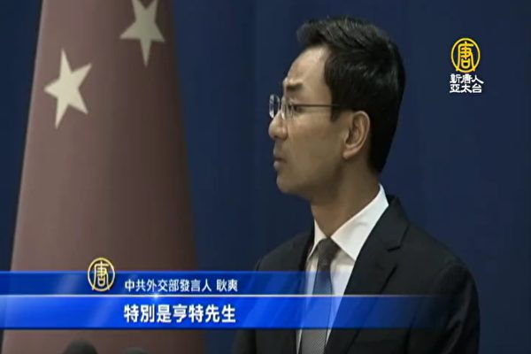

近年来，中共外交部部长王毅及中共外交部发言人华春莹、陆慷、耿爽等人的出位言论，早已成为国际丑闻。图为耿爽。(Kyodo News via Getty Images)

  
【大纪元2020年01月15日讯】（大纪元记者古清儿报导）近日，中共中纪委国监委网站公布中央巡视组对外交部、司法部等37家机构巡视回馈情况。其中中共外交部被点名存在多种问题，如“服务大局不够，选人用人视野不宽”等。

伴随着“战狼式”外交兴起，近年来，中共外交部发言人、外交官的言行越来越野蛮粗鲁，如泼妇骂街、胡言乱语，因此获得了“断交部”的绰号。同时，该部人事传言四起。
中共外交部胡言乱语实录

1月10日，中共中纪委国监委网站公布十九届中央第四轮巡视反馈情况。中共外交部、司法部、最高法院等37家机构被指存在各种问题。

其中中共外交部被指存在“分析形势、破解难题、服务大局不够……形式主义、官僚主义问题存在……选人用人视野不宽”等问题。

有北京不愿署名的学者对《苹果日报》指，中共外交部用人问题，包括新闻发言人经常讲错话，表错情，“语不惊人誓不休”，“水平低、没有条理，甚至违法，与街头泼妇骂街无异”。

近年来，中共外交部部长王毅、驻外大使刘晓明、赵立坚、桂从友，以及中共外交部发言人华春莹、陆慷、耿爽等人的出位言论，早已成为国际丑闻。中共外交部被嘲讽为“斗争部”、“战狼部”、“对外关系破坏部”。

以下为近年来中共外交部发言人胡言乱语的实录。

美国接连出台香港、新疆法案，让中共气急败坏。2019年12月4日，外交部发言人华春莹竟以纽约恐怖袭击事件为例，威胁称“美国9.11殷鉴不远、不要好了伤疤忘了痛”。对此言论，大陆媒体人直斥中共的回应没水平、没有道德底线。

8月26日，七大工业国集团（G7）在法国举行峯会，结束后发表联合声明表示支持香港自治。就此，中共外交部发言人耿爽以“说三道四”、“指手画脚”、“居心叵测、多管闲事、图谋不轨”等话回应，言词如泼妇骂街。

6月12日，中共驻英国大使在接受BBC采访时，称《中英联合声明》已经失效 ，并称该声明是一份“历史文件，已经完成了其使命”。此言论引起舆论抨击。

5月6日，中共外交部发言人耿爽回应中美下一轮贸易谈判等问题时，他要记者去找“有关部门”查询。被追问到底该问哪个有关部门？他显得很不耐烦，说：“有关部门当然就是有关的部门了。无关的就不能称为有关部门。”

美国国务卿蓬佩奥对智利、巴拉圭等四国的访问中多次警告中共在拉丁美洲地区的扩张。4月15日，中共外交部发言人陆慷以强硬的言辞批评蓬佩奥“到处煽风点火、肆意诽谤、蓄意挑拨……”陆的言词一副歇斯底里的样子。

2016年6月，在中加外长联合记者会上，王毅突然对一名提及中共人权问题的加国女记者发怒。他指责该记者的问题充满傲慢与偏见，完全不能接受，并接连质问：“你去过中国吗，了解中国吗？中国的人权，你没有发言权，中国人有发言权。”其言论引发网民的炮轰，斥责王毅“睁眼说瞎话”，“撒谎不脸红”。

2011年3月3日，有外国记者问在中国采访违反了中国哪条法律，当时的中共外交部发言人姜瑜回答：“不要拿法律当挡箭牌。问题的实质是有人唯恐天下不乱，……我想什么法律也保护不了他。”此话一出，立即成为世界级笑话。

因经常发表雷人言论，华春莹曾被中国网民评选为“2013年度中国人渣榜”第32名；姜瑜则上了“2012年度中国人渣榜”，排名第31。
人事传言四起 传王毅退休 刘结一或被撤换

港媒报导，有传今年3月中共全国两会上，中共外交部长王毅将交班退休。

据报，中共外交部的外交官总数一直维持在5500至6000人左右，该数字包括在国内工作及驻外的外交官。一直以来，外交部“近亲繁殖”严重，夫妻档多，素有“家天下”的感觉；翁婿同为外交官的可以数出一串。

中共外交界的父子（女）外交官、夫妇外交官更是比比皆是。如此前长期在外交系统工作的刘结一与妻子章启月（外交部前发言人）。

除中共外交部，1月10日，中共国台办官网刊登中共中央第一巡视组组长黄先耀对巡视情况的反馈，提及国台办贯彻习思想不够深入，“防范廉政风险不够到位，存在形式主义、官僚主义问题，领导班子建设有待进一步加强”等。

同时，巡视组还“收到反映一些领导干部的问题线索，已按规定转中纪委国监委、中组部等有关方面处理。”

台媒报导说，台湾大选投票前一天，国台办官网突然刊登第一巡视组的反馈情况，并称将“收到反映一些领导干部的问题线索”转交中纪委处理，这引发国台办主任刘结一将为民进党大胜、涉台工作失败负责的联想。

报导引述成功大学政治经济研究所教授洪敬富的分析说，中共这次积极介入台湾总统大选，选前祭出各项惠台措施，包括取消自由行、封杀金马奖与惠台26条等，但结果彻底失败。

报导说，由于香港中联办主任王志民因为“反修例”运动刚被撤换，洪敬富预估，国台办主任刘结一很可能在今年秋天的中共十九届五中全会被撤换。

<a target="_blank" href=#top><h6 align="right">回上方</h6></a>

<a name=125>
<h1 align="center"><b>伊朗在变天 中共或失去打击美国的王牌</b></h1>
  <h3 align="center"><b>中东局势变动牵引全球格局 天灭中共进程加快</b></h3>

伊朗政府隐瞒击落民航客机再撒谎，激怒民众。1月11日真相曝光后，愤怒的伊朗民众高喊“独裁者去死”、“光复伊朗”，并冲击宗教领袖哈梅内伊的办公室。(STR/AFP)

  
【大纪元2020年01月16日讯】（大纪元记者方天亮香港报导）1月11日，伊朗革命卫队航空部队承认8日“误击”客机致使130名伊朗人惨死，令原本的悼念活动，演变成愈来愈大的国民抗争。首都德黑兰等地一连两天爆发抗争，大学生等群众抗议要求对当权者问责、还遗属公道，甚至喊出“独裁者去死”和要求公投修宪，并冲击宗教领袖哈梅内伊的办公室。网上还出现了“光复伊朗 时代革命”的口号，一场巨变正在伊朗进行。

伊朗防暴警员动用催泪弹、水炮等驱散抗争者。很多人表示，香港仍在上演的事，如今也在伊朗重演一遍。

1月11日，伊朗阿米尔卡比尔理工大学（Amirkabir University of Technology ）持续第两天的抗议活动，抗议政府隐瞒于8日击落乌克兰客机酿成176人死亡的惨剧。图为伊朗警察与抗议民众对歭。(STR/AFP)

刚进入2020年，国际局势就迅猛变化。美国利用关税促使中共签订遵守世界贸易组织规定的第一阶段贸易协议后，腾出手来，开始对伊朗的恐怖分子基地发起进攻。表面上看是美伊之争，但实质是仍然是中美之争，美国动手伊朗的目的，一是斩断中共扶持伊朗这个美国头号敌人的黑手，二是切断中共的石油进口。

<b>报复美国 伊朗空炮回击</b>

1月3日，美军派出无人机在经过36小时追踪之后，发射“地狱火”导弹，击毙了伊朗头号军事指挥官苏莱曼尼（Qassim Soleimani）。为此，伊朗全国举行了三天追悼活动。

作为报复，1月7日深夜，伊朗朝驻扎在伊拉克的美军基地发起导弹攻击，共发射了22枚导弹。与伊朗、中共报导死伤200多人、至少80个美国人死亡不同的是，川普（特朗普）总统和西方媒体宣布，没有人员伤亡，基地也只有5处楼房受损。

此前，美军侦测到伊朗的弹道导弹进入准备就绪状态，川普总统警告说，任何报复行动将会令到美国锁定伊朗52个重要据点发动袭击。这令伊朗当局很害怕，但为了安抚国内舆论，伊朗又必须对美军发起报复性攻击。

于是伊朗在袭击前先通报了伊拉克政府，让其转告美军。意思是让美国配合一下，唱一出“空城计”，然后伊朗表演“轰炸秀”。据说美军有8小时的充裕时间来转移和防御，所以伤亡为零。

伊朗在发射这种空炮之后，最高领袖哈梅内伊对国民宣布：“我们掴了美国一巴掌”。

<b>故意还是无意 导弹击落民航客机</b>

空袭后不久，美国联邦航空管理局即发出禁飞两伊空域的通知。不过数小时后的8日早上6时多，一架波音737-800飞机在伊玛目霍梅尼国际机场起飞后不久坠毁，机上176人全部罹难，包括至少130名伊朗人。

伊朗官方只表示是“技术故障”，但拒绝波音或美国航空局人员取得黑盒子数据，引起外界怀疑。

1月9日，《纽约时报》公开片段，显示客机遭到伊朗导弹击中。两天后，伊朗才承认因人为失误而击落客机，声称军方错误辨认客机为“敌对目标”。

飞机上有50多位加拿大国籍的伊朗人。由于美国的制裁，伊朗人移民国外，大多去了加拿大。

有爆料说，伊朗政府在撒谎，发射导弹根本不是失误，而是故意袭击。据说飞机上有3位掌握哈梅内伊把钱财转移到海外内幕的知情人。他们获悉了哈梅内伊的几个兄弟都移民到了海外，并把他们家60%的财产都转移到了海外。

为了杀人灭口，于是藉导弹袭击美军基地，出现了所谓错误判断。不过，空难发生在空袭结束几小时之后。

<b>“敌人不是美国” 抗争者促哈梅内伊下台</b>

11日坠机真相曝光后，首都德黑兰等地一连两天爆发抗争，大学生等群众抗议要求当权者问责、还遗属公道，甚至叫最高领袖哈梅内伊“去死”和要求公投修宪。在伊朗的其它城市，如设拉子、伊斯法罕、哈梅丹、乌尔米耶、拉什特……伊朗东西南北均见抗争。

有评论说，革命卫队11日才承认失误，已令群众恼怒；当有革命卫队高级指挥官透露肇事之初即已上报导弹击中客机后，更引发公愤。民众亦质疑哈梅内伊作为实际的三军统帅、全国最高领袖，会如报导所谓“10日”才知情，斥哈梅内伊等领袖“无耻”。

部分抗争青年撕掉苏莱曼尼的肖像海报，指摘官方说：“他们为他一个人办了三日嘉年华（指万人空巷的全国哀悼期），却为176人之死撒了三日谎。我们到这儿本来纯粹悼念，现在我们全都生气又痛恨。”亦有抗争者撕烂哈梅内伊的肖像，批评他是独裁者。

在号称“伊朗麻省理工”、有13名校友命丧于该场空难的谢里夫大学（Sharif University of Technology），学生高喊口号，要求国家最高领袖、军方总司令哈梅内伊“辞职”。阿米尔卡比尔理工大学（Amirkabir University of Technology）附近举行的追悼会演变为数百人抗争，人们更要求驱逐伊斯兰革命卫队，又表示“辞职还不够！修宪、公投！”

有一名愤怒的学生高喊：“我们的敌人不是美国，敌人就在伊朗内部。他们对我们说谎，我们的敌人在伊朗境内。我们不要伊斯兰共和国。”

抗争相关照片、影像、报导，也见于社交网络乃至隶属官方的新闻机构报导。伊朗多份报章星期日（12日）以黑色头版哀悼空难枉死者和谴责官员。立场温和的《伊斯兰共和国报》社评道：“那些拖延发布飞机失事原因者，破坏了人民对建制的信任，应予裁撤或应该辞职。”

连续三天，伊朗都有大量的人群集会。从网络影片中可以看到，德黑兰的大街上有鲜血流淌，可以听见枪声，很多全副武装的男子。有的军警还在用警棍殴打抗争者。

尽管警方和军方在德黑兰的三所大学和重要地点派重兵把守，尽管有2019年11月当局武力镇压抗议撤销燃油补贴的示威者已打死1,500多人的恐惧，但网络流传的影片显示，仍然有几千人走上街头。目前抗议活动已经扩散到至少18座其它城市。

<b>伊朗已开始现政治危机</b>

伊朗民众极少直接挑战哈梅内伊等最上位者，显示这场由美国无人机引起的歼灭事件，已迅速转化为伊朗的政治危机。

伊朗政府继2019年11月经历了1979年伊斯兰革命以来最血腥的动乱，如今的民间抗争与新闻界的攻击，更给政权增添了危机。卡塔尔半岛电视台驻德黑兰记者说：“人民非常愤怒。伊朗人要求伸张正义和向官员问责。许多人包括受害者家属俱感震惊。他们不理解政府为什么会向他们撒谎撒这么久。”

川普1月11日晚间以波斯文发推文给勇敢和正在遭受苦难的伊朗人，他写道：“自从我担任总统以来，我就一直与你们站在一起，我的政府将继续与你们站在一起。我们正在密切关注你们的抗议。你们的勇气鼓舞人心。”他还警告伊朗当局“不可以再发生对和平抗议者的大屠杀，也不要关闭互联网。世界在注视着。”

据说，目前伊朗民众使用的突破网络封锁软件，正是法轮功学员开发的“自由门”。“自由门”不但每天让数百万中国民众翻墙出来看真相，也极大地帮助了伊朗民众了解国际局势。

另外，伊朗一度把曾到阿米尔卡比尔理工大学追悼死者的英国大使马卡伊雷（Rob Macaire）扣留了一小时，挑起与英国的外交紧张，12日又传召他查询他出现在“反政府集会”事宜。英国外相蓝韬文（Dominic Raab）批评拘留无理，“公然违反国际法”。

<b>中共扶持伊朗 买石油卖武器</b>

1月12日，美国财政部长姆钦（Steven Mnuchin）在福克斯节目中表示，他正在与中共官员一起商讨切断从伊朗进口石油。“我们已经切断了95%以上伊朗的石油收入，所以它现在只有少量的石油收入。”

姆钦指出，“这少量收入主要来自中国。我与中共官员坐下来谈判，他们已经让所有中共国有企业停止从伊朗购买石油。我们正与他们密切合作，确保其不再跟伊朗交易。”

姆钦说，“川普政府的目标是切断伊朗的石油收入来制止坏行为（恐怖主义行为和发展核武器）。”

美国的制裁已经见到成果。据《德黑兰时报》报导，伊朗2019年8月的通胀率，较前年同期上涨41.6%，国际货币基金组织（IMF）去年10月曾预测，随着美国加强制裁，伊朗2019年经济将萎缩9.5%。“全球经济指标数据网”（Trading Economics）追踪的数据亦显示，伊朗的青年失业率高达10.6%。

美国国务院政策规划委员会主任胡克（Brian Hook）说，“美国当然希望所有国家充分遵守（制裁令），不要冒着被美国二级制裁的风险，继续跟伊朗交易。”他表示，不排除对北京进行二级制裁。

美国全面禁止进口伊朗原油的禁令已于2019年5月份生效。（ATTA ENARE/AFP/GettyImages）

彭博社去年9月报导说，中国以“极低的折扣”从伊朗手中购买石油；自2019年年初至9月以来，中国从伊朗进口的原油超过1,200万吨，大部分交付中国炼油厂，其余则储存在伊朗石油公司位于中国的仓库内。

伊朗的军事力量，除了来自俄罗斯，剩下就是中共，特别是伊朗的核武研发技术，是中共一直在暗中支持。

政论家陈破空表示，没有中共的支持，伊朗不会跟美国对抗。伊朗在伊拉克境内长期滋事，试图颠覆多元共治的民主现状。实际是中共希望把伊拉克颠覆成伊朗一样的模式，然后打造一个“中东邪恶轴心”。

美国斩首苏莱曼尼，就是看到了中共打造的这个邪恶轴心，可能给全世界带来无休止的恐怖活动。所以川普总统当机立断，射人先射马，擒贼先擒王，击毙了苏莱曼尼，显示出维护国际秩序的决心。

<b>伊朗变天 川普改变中东将被铭记</b>

1月13日，网上影片传出抗争者冲入哈梅内伊办公所在地，呼喊着“让独裁者死去，让独裁者死去”。哈梅内伊侥幸逃脱。

同日多名伊朗官方媒体的记者宣布辞职，其中包括伊朗国家电视台的女主持人贾巴里（Gelare Jabbari）。贾巴里在Instagram上发文对公众表达歉意，说“自己说了13年的谎话”。

与此同时，川普和国务卿蓬佩奥也多次表达对伊朗抗争民众的支持。

13日，蓬佩奥还以非常正式的书写形式推文说，“伊朗人民对政府窃取自己的财富越来越愤怒。”他再次警告伊朗政府不要伤害自己的人民。

1月13日，美国福克斯新闻着名主持梅根（Trish Megan）在晚间节目说，伊朗政权正面临倒台，而改变中东的川普总统将被历史铭记。

的确，川普用中美贸易协议第一次打开了中国的国门，令2,000亿美国商品能够第一次进入中国，假如川普能让伊朗改变，不但中东局势会变，全球格局都在变。

而这一切都是天灭中共、全球围剿中共的具体体现。2020年刚过去十多天就发生这么多事，还有抗共最前线的香港即将到来的新年大游行，看来天灭中共的进程正在以超乎人们想像的速度推进着。#
<a target="_blank" href=#top><h6 align="right">回上方</h6></a>

<a name=124>
<h1 align="center"><b>美国紧逼中共 贸易协议北京大让步内幕</b></h1>

中美贸易协议终于签了！对于中共来说，签协议是死，不签协议也是死。川普马上要到北京，与习近平谈第二阶段协议，将直接点到中共极权经济的死穴。而美国“醉翁之意不在酒”，美国不只是想在贸易上获得公平，而是要全面对抗中共的崛起，要彻底遏制共产主义对全世界的渗透。美国现在所做的一切，都是天灭中共的具体体现。(SAUL LOEB/AFP)

  
【大纪元2020年01月17日讯】（大纪元记者方天亮香港报导）在经历两年的博弈和谈判之后，中美终于达成协议。消息传回，大陆网络沸腾了，以五毛为主的网络水军大骂协议是“跪下”签订的“卖国”条约，“刘鹤是李鸿章第二”云云。不过，大陆企业和一般民众以及全世界对中美能够停火，都感觉松了一口气。

1月15日，美国总统川普（特朗普）和中国副总理刘鹤，在白宫东厅签署了中美第一阶段贸易协议。为何习近平没去签订协议呢？中美协议到底意味着什么？

<b>从未有过的历史性协议</b>

签约仪式上，刘鹤和去年10月一样带来习近平给川普的信函，不过这次刘鹤却不是以习近平特使的身份前往的。

在经历了近两年的博弈，两国元首两次会晤、七次通话，双方最高谈判代表二十多次通话，十三轮谈判之后，中国和美国终于这样签订了第一阶段贸易协议。

川普在记者会上称，“今天，我们迈出了重要的一步，迈向了公正和互惠贸易的未来，这是中国从未采取的一步。”“这是人们已经谈论了40年的协议，（之前中美）甚至从未签署过任何文件，我们从未达成过协议。这将对两国都是一个伟大的协议。”

“因此，对于美国而言，这是非常重要的一天，而对于中国而言，这是非常重要的一天，这是没人想到会有的这一天。但这确实发生了，所以这是我的荣幸。因此，副总理先生，我必须说很荣幸成为您的朋友。”

刘鹤则通过翻译说：“总统先生，我非常同意您的话。这是一项对中国、对美国和整个世界都有利的协议。该协议是一项经济贸易协议，但其含义远远超出了经济贸易协议。当今世界充满不确定性，达成这一协议将有利于世界和平与繁荣。”

川普表示，随着双方试图就一项更广泛协议进行谈判以解决尚未解决的问题，他将立即前往中国，例如，有人抱怨中共补贴国有公司，给它们提供比外国企业更大的不公平优势。

刘鹤也表示，美中双方将致力于使第一阶段协议获得实际的结果。他还强调，中美两国虽然政治和经济模式不同，但可以实现共赢。

中央电视台罕见地直播了这一签字协议，但当川普介绍协议中中方承诺加购400亿到500亿美元农产品、500亿美元能源产品等具体数额时，央视并没有提供翻译。

<b>纠正长达18年的不对等协议</b>

美国贸易代表办公室当天公布了96页的协议英文文本，协议共八个章节，涵盖七大重点领域：一、加强知识产权保护；二、结束强制技术转移；三、增加对美国食品和农产品采购；四、移除对美国金融服务的限制；五、调整宏观经济政策和汇率透明度；六、扩大贸易；七、双边评估和争端解决机制。

中共外交部发言人耿爽于1月15日在记者会上没有正面回答是否会公布中文版，他只是说：“建议你们保持关注，该来的会来，该有的也都会有。”

根据英文版本，协议规定，未来2年，中方增加购买总计2,000亿美元的美国商品和服务。包括777亿美元工业制品、320亿美元农产品、524亿美元能源产品，以及379亿美元服务业产品。

协议规定，双方将定期会晤，以监督中方履约。未来一旦发生贸易争端，可一路从双方工作层级上诉到副总理层级，如仍无法协商解决，则可对违约一方施加惩罚，而违约方不得报复，也不得向WTO或其它国际组织提出起诉，否则必须退出协议。

对于这份协议，白宫网站当天也发表声明，划出了一些重点。白宫声明称，在实施重大改革这方面，中国已同意在广泛的关键领域进行重大结构性改革：这项协议将有助于为美国的创新者提供一个公平的竞争环境，让他们竞争并取胜。重要的是，协议中包含的改革是完全可执行的，包括一个强有力的争端解决机制，以确保有效的执行和落实。

在所有贸易协定中，中共首次同意终止强迫外国公司向中国公司转让技术以获得市场准入的做法；中共将在商业秘密、商标、打击盗版和假冒商品的执法等领域解决许多长期存在的知识产权问题；中共同意就货币贬值和汇率方面的汇率做法作出强有力的承诺；该协议解决了一系列贸易和投资壁垒，这些壁垒阻碍了美国金融服务公司在中国的竞争；该协议解决了不公平地限制美国食品和农业出口的结构性壁垒（该协议包括中国接受美国农业生物技术产品的重大承诺）。

声明还称，在实现贸易再平衡上，该协议将开始重新平衡美国与中国的贸易关系，并为美国企业和农民提供新的机会：作为新协议的一部分，中共承诺将美国商品和服务的进口增加至少2,000亿美元（中国从美国进口的增长将在未来两年内发生，甚至在2021年之后，这一趋势仍将继续）；根据这项协议，中共将购买美国的制成品、农业、能源和服务；中共同意在两年内每年从美国购买价值400亿到500亿美元的农产品。

这次美国的让步，只是把去年9月1日开始对大约1,200亿美元的中国产品（包括鞋和服装）征收的15%惩罚性关税，在协议生效后30天内降至7.5%，但仍维持对2,500亿美元中国商品（主要是科技产品）加征25%的关税，同时不对1,560亿美元的中国商品（大多数是消费产品）加征惩罚性关税。另外在1月13日，美国把中国从货币操纵国的黑名单上除名。

协议是如此对美国有利，以至于美国经济学家、川普前经济顾问斯蒂芬·摩尔（Stephen Moore）说：“坦白说我感到惊讶，在协议中，川普得到北京这么多的让步。现在看来，川普对中共的战略正取得成功。”

事实上，中美签订的这份协议若能真正执行，也只是纠正了一部分中共加入世界贸易组织18年来始终违背WTO条款的诸多不正当作为而已。

<b>协议若执行 有利中国人</b>

美国促成的这份贸易协议，会促使中国真正与国际接轨，真正令中国人融入地球村的大家庭中，是对中国、中国人有利的。比如中国人日后就能购买到价廉物美的美国商品，中国孩子能喝到美国牛奶，避免三聚氰胺毒奶之害。中国人使用银行金融业的自由度会大大增加，会更加方便。

这个协议唯一不利的就是对中共的极权统治。因为，用非法手段直接盗取西方技术是中共实现技术跨越的杀手锏，如今这份协议要求中共做出的包括不强制技术转让、保护知识产权等“结构性改革”，等于收走了中共的杀手锏，动摇政府控制，就对中共的统治不利。因此在中共的党文化认知中，这就是一份“丧权辱国”的“卖国贼”才会签的协议。

2019年5月当习近平把自己与刘鹤苦苦谈判了一年多的协议草案交给中共中央政治局审查时，江派大员韩正就公开跳出来反对，最后令协议夭折。

2019年12月13日中美同时宣布达成第一阶段协议，这是习近平靠一年两次提拔将领、展示军权实力，才强行令协议在中共党内通过。

<b>协议签订日期背后的曲折故事</b>

细心的读者会发现，这份协议有些地方前后矛盾。

比如美国说，中方承诺，在2017年贸易额的基础上，在未来两年内额外购买至少2,000亿美元的美国产品和服务，包括777亿美元工业制品、320亿美元农产品、524亿美元能源产品，以及379亿美元服务业产品。其中第一年执行不少于767亿美元，第二年执行不少于1,233亿美元。

协议还说，“中国将增加对美国乳品、牛肉、大豆、水产品、水果、饲料、宠物食品等农产品进口，今后两年平均进口规模为400亿美元。”

到底中国要从美国进口多少农产品，一会儿是两年总共320亿美元，一会是每年400亿美元，不知道他们是如何定义农产品，又是如何弄出两个如此差距悬殊的数字。

2019年10月，中美确定要分阶段签订协议之后，中方曾表示，每年购买400亿农产品是不现实的，目前从美国进口的农产品才190亿美元，因此中共一直拖着不签协议。

此前中美原订在2019年11月于智利举行亚太经合组织（APEC）领导人峰会期间，习近平同川普会晤并见证签字。但10月30日中共召开四中全会时，智利政府宣布放弃主办APEC峰会。11月5日有消息传出，中共要求美国减少对高达3600亿美元的中国商品的关税。有分析认为，中共在智利有大量投资，智利听命于中共，中共或故意让智利取消峰会，以便向美国讨价还价。

美国贸易谈判代表莱特希泽（Robert Lighthizer）在2019年12月13日曾说，双方计划2020年1月的第一个星期在美国签署这份贸易协议，由部长级的官员签署。但是，白宫贸易顾问纳瓦罗（Peter Navarro）说，协议将由两国元首签署。2019年12月24日川普也说，中美第一阶段协议已经完成，他和中共国家主席习近平将举行签署仪式。

不过，1月15日与川普签订协议的是刘鹤，而不是习近平。

<b>川普为选举 习为保党而演戏</b>

由于中方迟迟不回应何时签订协议，办事高效率的川普总统在2019年12月31日的推文中宣布，中美贸易谈判第一阶段协议的签字日期订在了1月15日。

据英文《南华早报》报导，川普这个推文颇让北京有点措手不及。中美双方虽然已同意在1月份内敲定第一阶段协议，但中方未料到川普会单方面宣布签字日期，而且表示即便中共国家主席习近平不出面也愿意签字。

北京的线人还对《南华早报》说，北京“花了半天的时间开会讨论”，最后决定就按川普宣布的日子让副总理刘鹤率代表团出席签字仪式。

于是川普发推整整10天后，北京才正式表态确认。中国商务部发言人高峰1月9日宣布，中国副总理刘鹤将在1月13至15日率团访问华盛顿，与美方签署第一阶段贸易协定。中方强调，刘鹤“不是作为国家主席习近平的特使”，而是以国务院副总理、政治局委员和中美贸易谈判中方代表的身份，“应美国的邀请”前往华盛顿。

贸易战让中美双方的经济都受损，让两国领导人都着急。总部在伦敦的咨询公司Llewellyn Consulting说，中美双方相互加征关税的累积效应是，美国的GDP被削掉了整整一个百分点。跟踪世界惩罚关税效应的美国行动论坛（American Action Forum）报告说，中美贸易战也给已经疲软的中国经济造成了程度相当的损失。

不光中美受损，全球都受损。国际货币基金组织2019年10月发布对全球经济展望预测：中美贸易战拖累全球经济增长，到2020年将累计使全球GDP减少0.8%。百分点换算成金额就是7000亿美元。

报告没有给出中国具体损失的数据，因为中共官方很多数据都是造假的，比如中国声称GDP增速还有6%，实际可能3%都不到，甚至是负增长。但有一点中共官方说得很明白，中美贸易战给中国带来了数千万的巨大失业人口，这是中共最担心了。老百姓没工作没饭吃了，一定会“起来造反”的。

因此，不只川普为了连任需要一个停战协议，习近平为了维持政权，更需要一个停战协议。所以不只川普着急签协议，习近平同样着急。双方都在演戏。

<b>美国所做的是天灭中共的体现</b>

有评论说，对于中共来说，签协议是死，不签协议也是死。签了协议就得改变中共的经济结构，发展下去，自由的经济必然召唤自由的政治，中共一党专政的体制就会受冲击从而坍塌；不签协议，中国经济马上就是断崖式下跌，失业人口暴增的结果就是民众的反抗起义，中共政权马上就可能因为颜色革命而垮台。

现在中共趁川普需要竞选之机，与美国签订了协议，但双方都心知肚明，这协议是签给美国选民和中国百姓看的，中共会真正执行吗？

特别是川普马上要到北京，与习近平谈第二阶段协议，即中共取消对国营企业的补贴，取消“集中投入办大事”的国家资本主义的模式，这直接点到了中共极权经济的死穴。

美国也是故意这样做的，因为“醉翁之意不在酒”，美国不只是想在贸易上获得公平，而是要全面对抗中共的崛起，要彻底遏制共产主义对全世界的渗透。这不光是经济贸易之争，更是意识形态之争。

一个最新的例子是，就在刘鹤到华盛顿签协议时，美国国务卿蓬佩奥却在硅谷警告高科技巨头，不要助纣为虐，警惕习近平的军民融合。同日他还宣布，斩首伊朗恐怖主义头子苏莱曼尼的做法是美国总统川普大战略，同样适用于中共和俄罗斯，这令中南海高官寝食难安。

美国现在所做的一切，都是天灭中共的具体体现。用中共官员的话说，美国所做的，“不是要你钱，而是要你（中共）命”。#

<a target="_blank" href=#top><h6 align="right">回上方</h6></a>

<a name=123>

2020年1月16日下午，株式会社DUSKIN福岛社长宍户哲郎，观看了神韵纽约艺术团在日本东京都府中市府中之森艺术剧场（FUCHU Fuchu-no-Mori Art Theatre）的第二场演出。（牛彬／大纪元）

  <h1 align="center"><b>会社社长：看神韵 是生命长久的等候</b></h1>

【大纪元2020年01月17日讯】（大纪元记者牛彬日本东京府中报导）2020年1月16日下午，株式会社DUSKIN福岛社长宍户哲郎（Shishido Tetsurou），观看了神韵纽约艺术团在日本东京都府中市府中之森艺术剧场（FUCHU Fuchu-no-Mori Art Theatre）的第二场演出。上半场才刚刚结束，他便已激动得连连叫好，认为他生命中期盼已久的场景，还有寻觅已久的历史上的中国，终于出现了，并栩栩如生地展现在眼前。他赞叹神韵呈现的一切“竟如此地美丽”，看神韵演出彷佛圆了他一生的梦想。

他说：“非常好，能够（通过神韵）接触到中国传统的文化，太好了。”

大幕拉开的那一瞬间，看到满天的神佛浩浩荡荡从天而降，让宍户哲郎全身心感到莫名的激动，“我觉得自己好像期盼了很久很久，终于能看到的那种感觉。”

宍户哲郎一直很喜欢中国古代的历史和文化，他说：“我不敢说自己对古典的部分很了解，但是经常读《三国志》，《水浒传》等等。”这些历史故事，讲述着中国的历史文化，有着天定的安排，天上的星星对应人间的帝王将相，因此，神韵开场的那一幕，彷佛是他等待了很久的场景。

他说，在接下来的演出中，不断看到“一幕又一幕的（中国）历史”，看到了他最熟悉的《三国志》等历史故事，“（通过看演出这才明白）原来那些熟悉的故事，真正展现出来，竟是如此的美丽动人。那种情景，真是（给人）栩栩如生的感觉。”

神韵表现女子的舞蹈令宍户哲郎印象深刻，“看女子舞蹈时被她们美丽的姿态完全吸引住了。”他表示，这样的美，由内至外，流露出她们纯善的内在修养，因此打动人心。

对神韵的色彩，宍户哲郎有着神奇的感受，他说：“说起印象很深的部分，当然（刚提到的）舞蹈是非常出色，（不过我感觉）尤其是那个色彩（非常好），都是很明亮的颜色，色彩本身有很强的震撼人心的表现力，看到色彩就能（让人）受到很大的感动。”

他一再强调，神韵的舞蹈和色彩，太厉害了，他会向别人介绍神韵，将这次神奇经历的感受传达出去，并告诉他们：“看神韵是了解中国文化的绝佳的机会。”

<a target="_blank" href=#top><h6 align="right">回上方</h6></a>

<a name=122>
<h1 align="center"><b>【拍案惊奇】蔡英文连任！北京的三层误判</b></h1>

2020年1月11日，总统蔡英文（左2）赢得2020总统大选，并在晚间召开国际记者会发表胜选谈话。（陈柏州／大纪元）

【大纪元2020年01月12日讯】大家好，欢迎收看《新闻拍案惊奇》，我是大宇。

2020台湾第15任总统及立委选举结束，蔡英文成功连任！三名总统候选人的得票率，截至我们发稿，分别是：蔡英文57.13%，得票超过817万，韩国瑜38.61%，得票至少552万，宋楚瑜4.3%，得票约60万。

另外，立委选举也有结果，台湾立法院一共113席，民进党拿下61席，国民党38席，台湾民众党5席，时代力量3席，台湾基进1席，其他类席次一共5席。

这次选举结果对蔡英文和民进党来说，显然是大胜。蔡英文的得票数超过810万，是1996年台湾开放总统直选以来，得票数最多的候选人。

<b>蔡英文如何逆转？感谢北京“误判”</b>

可是就在一年前，蔡英文的胜算还很低。相反，她的对手韩国瑜却声势正旺。可过去一年发生了什么？让选情发生了这样的逆转。

最终要感谢的，其实是北京的“误判”，外媒纷纷评价说，蔡英文的胜利是对北京抛下的震撼弹。再进一步说，历史的潮流永远是统治者的意志无法改变的，大陆的当政者要正视这个历史潮流。天要变，真是谁也挡不住！

下面来说，北京当局近年三层忤逆历史潮流的“误判”，导致了今天的结果。

<b>第一层误判，就是“迷信强制，误判民心”。</b>

因为大陆当局习惯了强制性的“铁腕统治”，大陆人民的民意在高压统治下是受到压抑的，当局从来没体会过什么是“民意”，即使展示出民意也会很快打压下去。也没有想过，习惯了民主生活方式的人，对专制制度有多么的抵触，民意的力量有多大。

如果说几十年前，台湾在戒严时期，两岸都不是民主制度，要谈统一，基本上是，假如“蒋经国”政府同意，那事情就好办。但是恰恰相反，蒋经国终结了台湾延续几十年的戒严，他的继任者，进一步开拓台湾的民主制度。

经过80年代到现今的发展，台湾已经成为华人社会民主的灯塔，民主制度已经深入人心。能不能跟专制体制的大陆融合，这已经不是台湾政府说了算，而是台湾人民。

如果说2019年以前，韩国瑜提出的依赖亲近大陆，修补两岸关系，来刺激台湾的经济发展，在2019年以前，这副牌还奏效的话，那么2019年以后，这副牌就已经变得有毒了。

从2019年1月一开始，北京重新定义所谓“九二共识”，将两岸统一的内涵明确注入其中。当时已经引起了习惯了民主生活台湾人民的警觉，蔡英文政府严词拒绝了北京方面的说法。

2019年6月，香港的反送中浪潮爆发，本身就是港府当局和北京，误判了香港的社会形势导致的，他们以为香港人不会反抗，但是香港人，反抗了！而且坚持到现在。更重要的是，“一国两制”的香港，用流血和眼泪，活生生地向台湾政府演示了，他们的遭遇。一名香港抗争者在台湾大选前，向台湾喊话说：我们不会示范第二次！

但是北京没有引以为戒，去年十一阅兵的时候，当局再次强调“统一”，进一步引起了台湾人的反感。

在习惯了民主生活方式这一点上，台湾跟香港人民是一样的。

蔡英文政府对香港示威者明确的支持立场，再加上对一国两制以及九二共识的拒绝，进一步赢得民意；而打亲大陆牌的韩国瑜，在回答有关问题时，总是似是而非。

所以，2019年以后，北京的咄咄逼人加上香港人的血泪示范，让台湾人彻底拒绝靠近大陆。所以，自从走进2019年，韩国瑜出牌的时候就输了，蔡英文的胜利，有她走运的成分，但更准确地说，是蔡英文政府抓住了这个历史给予他们的机会。

这印证了中华民国国父孙中山的一句话：历史潮流，浩浩汤汤，顺之则昌，逆之则亡。

再进一步分析，北京错把西方的橄榄枝，当成了理所应当，走上了“政府有钱 政权安全 对内强压 对外赤化”的道路，引发世界警觉。

<b>第二层误判，就是“低估恐共心理 触发反赤浪潮”。</b>

文革之后，中国大陆从闭关锁国开始跟世界做生意，对这个具有廉价劳动力的庞大市场，西方国家非常感兴趣，而且面对当时大陆当政者开放经济的做法，西方一些政治家可能还抱有幻想，寄望中共能够变好，因此不断伸出橄榄枝。90年代开始，中国进入经济高度发展的时期，直到2010年代。这期间中国发生了数不清的人权打压事件，从六四到法轮功、再到民间各种维权事件，逐渐引起西方社会警觉。

到了近年，中方更利用自己鼓起来的钱包巩固独裁统治，发展遍布全中国的监控，使用巨资维稳，并且在近年展示出向外扩张的野心，甚至渗透西方国家的政治，对身边台湾的渗透，更是不在话下。我们可以把近年当局的这种做法，成为对外的“赤化”。

2016年川普（特朗普）上任后，一切开始改变，美国和其盟友，彻底结束了跟中国大陆的蜜月期。美国在国家战略中，更是把中方置于俄罗斯与朝鲜之上，当成了美国头号竞争者，引发了全球范围的抵制。2019年，香港人和台湾人也加强了在全球抵制“赤化”中的角色。

北京当局不知道，在西方人眼里，“共产党”一直是洪水猛兽。虽然西方也有人搞所谓“民主社会主义”，但是他们很多人，对“中共”是戒备的。在美国国会，民主党议员对共产党的反感绝不逊于共和党。北京采取的“政府有钱 政权安全 对内强压 对外赤化”路线，让民主社会的人抛弃了幻想，越来越开始用本应对待“共产党”的方式，对待他们。

<b>第三层误判，就是“执着人定胜天 无视天意警讯”。</b>

再进一步讲，北京的第三层误判，是共产党的基因直接导致的，就是共产党完全完全不信神、不信天意。他们认为，可以跟天地人斗，而且人的意志高于一切，迷信“人定胜天”，只要去争斗好像就能得到。

台湾的蒋经国在这一点上就非常不一样。1986年9月28日，135个反对派人士在台北圆山大饭店，成立了台湾“民主进步党”，就是民进党。当时还在国民党执政下戒严的台湾，这是非法的，有官员建议当时的总统蒋经国“抓人”，但是蒋经国说了几句话：时代在变，环境在变，潮流也在变。还补了一句：世上没有永远的执政党。很快，台湾开启民主化进程。

但中共的领导人，在这方面觉悟就差一些。

我们说，美国和其西方盟友，对中共态度的大转弯，是2016年美国总统川普上任后发生的。如果当年赢的是希拉里，事情就不一定像今天这样。中国大陆可能今年已经超过美国，成为世界第一大经济体，对香港和台湾民主的支持，也不一定像今天的美国政府这样，比较有力。

但是，谁也没想到那一年川普会赢，希拉里的克林顿家庭在美国政界经营多年，川普一个素人怎么会赢？当时美国到处都有人戴着MAGA小红帽，跟身边人疾呼，投票给川普，这是美国的最后一次机会！

甚至有西方宗教界的人认为，川普是神选定的人物，大力表态投川。甚至川普后来还自己打趣地说，I’m the chosen one，说自己是上天选定，来带领美国走回正轨，以至于跟中方打贸易战等等。所以，你说川普赢是偶然也好，是天意，我觉得更恰当。

台湾，本来韩国瑜有希望赢的，但谁知道2019年发生这么多事，助攻蔡英文，你说不是天意？有可能是。

接下去，如果中共继续“迷信强制，误判民心”、“低估恐共心理 触发反赤浪潮”、“执着人定胜天 无视天意警讯”，那么再爆发的民意，可能在中国大陆内部。

有一名姓苏的前国民党官员说，蔡英文赢，可能会让北京对台湾更加强硬，甚至于采取一些军事行动。但也有观点认为，北京还不敢那样做。

蔡英文胜选已成事实。接下来北京怎么选择，全看它自己，最近几年，北京一再误判，下一步如何对待台湾，是在以往的路线上继续走下去，继续加剧反赤浪潮，还是干脆抛弃自己的幻想，顺应历史天意。下一步用什么因种什么果，不是做给别人，而是大陆政府，做给自己。

欢迎您订阅和分享我们的频道，感谢您的收看，我们下期节目再见！

新唐人《新闻拍案惊奇》制作组  #

<a target="_blank" href=#top><h6 align="right">回上方</h6></a>

<a name=121>
<h1 align="center"><b>港警“一哥”首出席区议会 遭议员集体炮轰</b></h1>

图中戴眼镜者为香港警务处处长邓炳强。（宋碧龙／大纪元）

  
【大纪元2020年01月17日讯】香港警务处处长邓炳强周四（16日）出席中西区区议会第二次会议，这是他首次以“一哥”身份出席区议会。以民主派为主的中西区区议员一致向邓炳强“开火”，更动议谴责他包庇警察暴力，要求他下台。

香港的反送中运动，近日街头示威稍有平静，但民间继续追究警方在过往一段时间的滥暴、滥权行为。特别是邓炳强去年11月上任后，以更强硬手段处理示威活动，引来民间强烈反响。

自由亚洲电台报导，邓炳强到区议会第二次会议会场还未开始发言，现场已火花四溅，会议室内有多名便衣警员被中西区区议会主席郑丽琼要求展示委任证，否则将被逐出会议室，并要求指挥官约束下属。

郑丽琼说：“他没有委任证，请你不要进来这里，你站走道、站门口、站到地下，都跟我没关系。真让人生气，这么不尊重我们，你是警察来的。”

邓炳强进场时，中西区区议员齐呼口号“追究警暴，重组警队”。现场旁听的另一批支持警察人士，则举起“止暴制乱”、“支持警察”的标语并呼喊口号。

邓炳强之后读出和反送中运动相关的各项数字，他表示去年6月反修例事件至今共拘捕超过7,000人，检控过千人，当中38人被定罪，其中12人被判监。也有558名警员受伤。他又说，去年8月31日，太子站的清场行动中并没有人死亡，否认网上流传的消息。

<b>区议员集体向“一哥”开火 追究警暴</b>

进入质询环节，民主派区议员相继向邓炳强“开火”。去年6月12日在中信大厦附近主持集会的区议员叶锦龙批评，当日警方未有通知集会申请人，即向和平集会的市民发放催泪弹，差点导致人踩人惨剧。

区议员任嘉儿则要求邓炳强回应，前线警员用强光照射市民眼睛，是否构成袭击。邓炳强则表示，欢迎她拿出真凭实据向警方投诉，被她质疑推卸责任。

任嘉儿说：“是否处长对于他们（前线警员）是毫无责任？你完全没有督促下属的责任？（只是）不断叫我们市民投诉，请问你的责任何在？我另外想再问，因为当时有警员称呼我为‘曱甴’（蟑螂），用‘曱甴’这个字词去称呼市民或议员是否恰当？”

邓炳强说：“我觉得对于任何贬义，说得不好的说话，都不应该说。”但他却拒绝承诺下令警员不再以“曱甴”称呼市民和议员。

区议员黄永志则带同一片生猪肉发言，要求警方不要再对市民“砌生猪肉”，即诬告市民，又批评现时没有监察警方执法的制度，认为监警会名存实亡。就连中西区区议会唯一亲北京区议员杨哲安，都质疑邓炳强如何令市民重拾对警察的信心。

杨哲安说：“之前你说的数据，有暴徒去放火、打人，我都看见。同一时间透过不同传媒，我都看到警方在抓人的时候、执法的时候，是否都根据你的守则去做？我也有我的合理怀疑，但这个我不追究，也不是我的职权去查。我希望听到的，是你如何让大部分市民重拾对警方的信心。现在整个社会撕裂，当中警方的行为是导火线的一部分。”

被区议员连番追问，邓炳强多次反驳，表示不能认同关于警暴的指控。邓炳强辩称：“我们是出来维持治安，所以我们才有需要介入。”

对于区议员质疑他没有能力控制下属，要求他问责下台，他说：“不好意思，我不是问责官员，我不能问责下台。”

<b>谴责声中 邓炳强提早离场</b>

会议尾声，区议员叶锦龙提出临时动议，谴责邓炳强监管警队不力，纵容警暴，要求政府成立独立调查委员会，并解雇邓炳强，邓炳强随即离场。动议最终以14票赞成，1票反对下通过。

会后邓炳强会见传媒，表示当天原订目的是解释政策及解答提问，但遭到大部分议员“情绪式发泄”。被问到警队是否考虑引入电枪时，他表示属于研究阶段，希望引入的武器能替代开真枪。

而在会议开始前，一批民主派社民连的成员到场请愿，要求独立调查和反对警队加薪。另一批人士则支持警方，双方一度用扬声器对骂。#

<a target="_blank" href=#top><h6 align="right">回上方</h6></a>

<a name=120>
<h1 align="center"><b>【名家专栏】工资与战争：中俄军费被低估</b></h1>

去年全球的军费开支仍然创纪录地增长。美国军费开支仍居榜首，中共则继续排在第二。图为在中国吉林省长春市，士兵在参加活动。(Photo by China Photos/Getty Images)

【大纪元2020年01月17日讯】（英文大纪元专栏作家Simon Veazey撰写／高杉编译）众所周知，美国的国防开支比紧随其后的其它七个国家的总和还要多，几乎是其最接近的竞争对手——中共的三倍，是俄罗斯的十倍。

但一些分析人士和学者认为，这些经常被引用的数据存在缺陷，他们正试图说服智库采用另一套不同的计算方法，然后再对各国军费开支进行排名。

根据他们的分析，俄罗斯2018年的国防开支并不是610亿美元，而是1590亿美元。中共的军费开支几乎是最近公布的2500亿美元的两倍，约为4500亿美元，这达到了美国军费开支的75%。

这些新的数据来源于一种不同的计算方法：避免使用另一种由来已久的计算方法，即通过汇率来比较支出的方法，而采用一种名为“购买力平价”（Power purchasing parity，简称PPP）的核算方法。这种方法比较的是当地货币在当地的购买力。

对于每天沉浸在导弹炮台、舰艇编号、部队、训练、地形、不对称优势和胜利理论等等战术细节中进行研究的军事分析家和将军们来说，这两套粗略的计算数字都不太可能对对手军事实力的总体评估产生太大影响。

但据提供新的数据的研究人士表示，旧的军费支出的数据误导了媒体的报导宣传，也扭曲了一些关键决策者对于所面临的威胁的看法。

英国伯明翰大学（University of Birmingham）俄罗斯、欧洲和欧亚研究中心（Center for Russian, European, and Eurasian Studies）主任理查德·康诺利（Richard Connolly）对此表示：“我认为这种旧的、粗糙的军费开支分析已经渗透到决策机构的每一个层面。”

他对《大纪元时报》表示：“我已经敲了大约两年的鼓了。”“我想我是唯一一个写过用‘购买力平价’来分析俄罗斯军费开支的文章的人。几乎所有人，无论是国际战略研究所（IISS）、CIPRI等智库，还是更广泛的媒体或政策制定者，都在使用市场汇率来计算和分析。”

他说，基于市场汇率的军费计算方法是被用来对各国军费开支进行排名的标准衡量方法。“大多数关键的决策者都在使用它。”

他说，这是因为它没有考虑到各国劳动力成本和货币市场的变化，“它导致较贫穷国家的军费开支被低估，同时高估了较富裕国家的军费开支。”

<b>替代措施</b>

2019年10月，康诺利为CNA（一家拥有75年历史的军事分析研究机构）撰写了一份临时报告，详细分析了为什么基于汇率的数据不能反映俄罗斯的实际军费开支，并公布了一套基于“购买力平价”（PPP）分析的新数据。

康诺利说，有时候很明显能看出，使用市场汇率的计算结果是不合理的。他举了2014年至2016年前后俄罗斯军费开支的例子，当时俄罗斯正在增加军费开支。

他解释说：“他们购买了更多的装备，参与了更多的行动，他们在军事采购方面达到了顶峰，在那一年，他们采购了数十枚携带核弹头的洲际弹道导弹，数十架快速战斗机，以及100多架直升机。仅仅在那一年（2014年）里，你就能够看到这个惊人的采购清单。在此期间，以卢布汇率计算的（军费开支）增幅相当大。”

“但在基于市场汇率的计算方法下，由于石油价格在2014年夏末／初秋暴跌，卢布走弱。因此，根据市场汇率，他们在2014年和2015年的军费开支（明显）都有所下降。”

康诺利公布了自己根据“购买力平价”的方法进行的估算结果，该估算结果显示俄罗斯2018年的军费开支为1590亿美元，而不是根据卢布汇率计算出的610亿美元。根据他计算出的数据，俄罗斯国防开支在2016年达到了2000亿美元的峰值。

根据康诺利的“购买力平价”方法计算，伊朗去年的军费开支将接近500亿美元，而美国国防情报局（U.S. Defense Intelligence Agency）去年的报告中对此引用了130亿美元的基于汇率得出的数字。

根据他的计算，中共去年的军费支出超过了4500亿美元。

<b>参谋长联席会议主席也同意</b>

2018年，在参议院拨款委员会（Senate Appropriations Committee）的听证会上，美国参谋长联席会议主席马克·米利（Mark Milley）将军就曾暗示了这个问题。

当时，该委员会的伊利诺伊州民主党资深参议员迪克·德宾（Dick Durbin）质问说：“我们正在花费6000亿、7000亿美元来对付一个花费800亿美元的敌人”，“为什么这还是一场较量？”

作为回应，米利注意到了这些数据的问题，他说：“我们是世界上薪酬最高的军队，遥遥领先。俄罗斯士兵或中共的士兵的成本与此相比非常低。”

米利总结说：“我认为你会发现，中共和俄罗斯的投资、现代化、新型武器系统等等，以及它们的（研发）——这些都是政府拥有的，而且成本也低得多——我认为你会看到一个更接近的对比。”

康诺利也认为，劳动力成本是造成军费开支数字偏差的主要因素。

拉惹勒南国际研究学院（S. Rajaratnam School of International Studies）军事转型项目访问高级研究员理查德·比辛格（Richard Bitzinger）对此评论说，“购买力平价”所面对的问题在于，对于军费开支，还没有一个普遍认同的公式。“因此，对军费开支的大多数分析都在使用汇率标准，这是很自然的。”

他表示，关于是否都使用“购买力平价”进行衡量的争论已经持续了一段时间。

比辛格对《大纪元时报》表示：“‘购买力平价’的主要优势在于，如果处理得当，它能够提供更准确、更具可比性的国防支出数据，反映出真正的消费能力。”“它的缺点在于，它可能夸大消费能力，而忽略了培训、领导力、士气、装备质量等无形因素。”

比辛格也认为，汇率数据在一定程度上具有误导性。“但是使用国防预算数字进行分析总是有风险的：它只能说明一个国家的军事优先事项、方向等等。人们应该时刻警惕‘单个数据点’（one data point）的分析。”

即使你能算出一个军费开支的数字是多少，大多数军事分析人士也会说，它只是一个宽泛的军事实力指标，甚至与任何两个对手在对方的地盘或任何其它特定情况下的表现都相去甚远。

比辛格说：“真正评估一个国家的军事实力（以及它是否在改善或相对优于其它国家）总是需要一个广泛的方法：预算，采购，质量，训练，战术等。”

对俄罗斯来说，甚至对中共来说，对它们的军费开支进行任何形式的评估都是困难的，因为军费开支往往是模糊的或者是捏造的。

国际评估与战略中心（International Assessment and Strategy Center）高级研究员里克·费舍尔（Rick Fisher）告诉《大纪元时报》：“尽管大多数分析师和政府都明白，中共公布的军费数据纯属虚构，但它们至少被用来提供一种反映中共军费增长的‘官方’指标。”

他说：“不管怎样，政府和私营部门的研究人员能够对中共所披露的很少的信息进行评估，并将其与其它独特的信息来源结合起来，得出有用的评估，但这仍然是一项日常而密集的工作。”

西澳大利亚大学（University of Western Australia）商学院院长彼得·罗伯逊（Peter Robertson）教授一直在研究军费开支的数据，他确信，基于汇率计算的军费开支数据具有误导性，基于“购买力平价”计算的数据才是一个更好的选择。

和康诺利一样，他认为这些新的数字并没有在五角大楼内部引起更深层次的认知问题。

他在接受《大纪元时报》采访时表示：“但我肯定地认为，在媒体的讨论等等方面，人们正把这个新数据当作一个快速衡量中共与美国对比，或者评估近年来中共的变化的标准。”

<b>旅游者花更多的钱</b>

在解释利用汇率和使用“购买力平价”之间的差异的时候，罗伯逊举了一个游客前往贫穷国家旅游的例子。

他说：“你在机场得到的汇率是市场汇率，而在全球经济中，这在某种程度上反映了各国之间商品交易的平均价格。”

他解释说：“如果我在澳大利亚买一台电视机，或者把美元兑换成人民币，去中国买同样的电视机，花费可能会差不多。”

“但如果你购买的是劳动密集型产品，比如街头小吃、家庭护理服务、酒店、女佣服务，你会发现，你会花更多的钱。”

他说：“因此，问题是：对于军方来说，这种效应是否同样成立？”

罗伯逊说，从理论上讲，利用汇率计算的方法可能比较适用于军事装备的采购，比如在国际市场上出售的各种机关枪什么的。

“但军队也是由人员组成，这就是问题所在。中共军队的预算中有很多是用于个人的东西，粗略地说，大约三分之一的军事预算用于士兵或国防人员。”

罗伯逊计算了美国和中共大致相当的安全服务成本。

“事实证明，即使考虑到技能水平等方面的差异，与美国士兵相比，中共的士兵非常廉价。”

根据他的分析，中共的国防部门的规模大约是基于汇率衡量方式所显示的两倍。“俄罗斯大约是三倍，”“土耳其大约是四倍。”

罗伯逊和康诺利都认为，使用基于汇率得出的数据不仅会扭曲国家之间的对比结果，还会影响同一国家内部的各年度之间的对比。

罗伯逊举了中共军费开支的例子。

罗伯逊解释说：“近年来，媒体上有很多关于中共军费开支以两位数增长的报导”，“实际情况是，中共的工资正在快速增长，因此军队和工厂一样，面临着个人成本和养老金的不断上涨。因此，他们用同样的支出获得的实际资源数量正在下降。”

<b>“购买力平价”：的确更好，但不完美？</b>

罗伯逊说，一旦根据工资上涨的成本对数据进行了修正，军费开支的增长就比按照汇率计算数据显示的结果要温和得多。

罗伯逊说，他将自己更有针对性的军费分析数据与按照“购买力平价”计算的数据和按照汇率的数据进行了比较。

“你会得到一个对机枪（汇率）和人员（“购买力平价”）都各有好处的方式。问题是：平均而言，哪个国家的军费开支更高？”

“我发现，‘购买力平价’指数（即使是仅仅基于消费者指数）的确比基于市场汇率的指数更有效。但它们仍然不是准确的数字。”

康诺利说，他也得出了类似的结论。

康诺利说：“使用‘购买力平价’的方法并不完美，但我认为它大体上是正确的。而按美元市场汇率来计算则完全是错误的。”

他指出，一些人说，用于“购买力平价”的消费者价格篮子并不是军方所特有的。但他认为，它仍然与军队的成本有关，这就是为什么这种对比是成立的原因。

“交通费用是多少？这将与物流成本有关。生活费用是多少？这将有助于衡量一个士兵的购买力。一辆汽车的价格是多少？这将与制造成本等有关。”

康诺利承认需要一个简单的数字来进行并列对比。“我想说的是，应该使用‘购买力平价’计算，而不是使用市场汇率。我认为，这一变化将是巨大的。”

他说，他正在研究一个专门针对俄罗斯军方的“购买力平价”方案，其他人正在研究一个针对中共的方案。

<b>支出与战略</b>

对于战略与预算评估中心（Center for Strategic and Budgetary Assessments，简称CBSA）的分析师而言，比较军费开支的挑战不仅仅是将一组简单的数字交到决策者手中，而是让他们思考其战略意义。

CBSA高级研究员哈里森·施拉姆（Harrison Schramm）表示，对军费开支细节的深入研究结果揭示了军事战略选择及其局限性。

施拉姆对《大纪元时报》表示：“在我们目前的工作中，我们专注于对战略选择的研究，而金钱最终只是一个替代品，因为金钱很容易衡量。”“我们在工作中寻找的答案是，‘如果我选择A，它将如何影响未来选择B的能力？’所以这就是我们要追求的细节水平。”

施拉姆表示，要做一个真正的“苹果与苹果对比”的支出对比是非常困难的。

他说：“这方面真正的艺术在于选择易于处理和可解释的方法。”他们正在选择尚不够完美的经典统计方法来计算船舶或飞机的成本，就是为了使这个过程更容易实现。

施拉姆说，机器学习或神经网络可能会给出一个更好的答案，“但这是一个你永远无法解释的答案”。

“能够解释为什么我们认为它是这样一个数字，甚至比实际拥有一个精确的数字更重要，因为这能够反映出一个国家必须做出的战略选择。”

“如果我能简单地让人们认识到（对手们）一定会做出怎样的战略选择，而不是‘每时每刻都要去分析所有的事情’，我就会认为这是一场遥遥领先的胜利。”“有些人认为中共是一个超级大国，它们可以无限制地去发展建设，但事实并非如此。”

但是要得到这些数字并不容易。

<b>隐藏数字</b>

施拉姆说：“在美国的公开的论坛上有大量关于他们如何花掉军费的数据”，“而俄罗斯和中共不会这么做。我们有他们的军费总额，我指的是他们能开出的支票的总额。然后我们把它分成几个类别，这都是非常不透明的。

“之所以难以做到这一点，是因为中共和俄罗斯可能自己都不知道他们真正的军费开支是多少。当你进行分析或试图应用统计数据时，你会发现自己不得不做出很多假设，因为这些都有很大的自由度。”

费舍尔说，中共的军费和民用开支之间的界限越来越模糊，这使得评估中共军费开支的问题变得更加复杂。

“在军民融合模式下，现在中共对经济服务于军队有了更广泛的要求。从本质上讲，中国共产党认为军事力量的建设所需要的任何东西都可以被转移到这个目的上来。因此，我们可能会问：现在有可能，任何人，甚至是中共自己，都不可能告诉你中共军费开支的真实数字？”

他解释说，自1998年以来，美国国防部一直在发布中共军力的年度评估报告，现在称为《中共（中国）军事力量报告》（China Military Power Report）。

“20年来，这份报告为美国纳税人和世界其它国家定义了中共实力的崛起。中共的政治和军事领导层永远不会拿出一份像美国那样可信的报告。他们每年都对这份报告怨声载道，但我的评估是，他们实际上对此非常感激，因为这份报告带来了他们非常渴望的外界对他们的恐惧。”

与此同时，康诺利指出，在俄罗斯，基于市场汇率计算出来的数据很适合总统弗拉基米尔·普京（Vladimir Putin）的口味，他本人经常引用这些数据。这些数据夸大了“被包围的堡垒”的概念，即一个四面楚歌的勇敢的俄罗斯被资金雄厚得多的西方军事强国四面包围。

康诺利说，尽管他的数据可能适合于那些推动军费预算的军界鹰派，但他认为，依据市场汇率的数据在西方国家得到使用的部分原因是它符合了某种说法，即西方国家遥遥领先于它们的竞争对手。

作者简介：

本文作者：西蒙·维奇（Simon Veazey）。可以在推特上关注他：@SPVeazey @ spveazey

原文 Wages and Warfare: Standard Measure May Vastly Understate Russia, China’s Military Spending 刊登于英文《大纪元时报》。

本文所表达的是作者的观点，并不一定反映《大纪元时报》的观点。#
<a target="_blank" href=#top><h6 align="right">回上方</h6></a>

<a name=119>
<h1 align="center"><b>美中第一阶段协议 重创“中国制造”</b></h1>

1月15日，美国总统川普（右）在白宫与中共副总理刘鹤（左）签署了美中第一阶段贸易协议。（ MANDEL NGAN/AFP via Getty Images)

  
【新唐人北京时间2020年01月16日讯】已经签署的美中第一阶段经贸协议内容广泛，甚至包含一项打击假冒产品的条款。外界分析，这一条款将重创“中国制造”。亚马逊曾称，其查获的假冒产品90%来自中国。

1月15日，美国总统川普（特朗普）与中共副总理刘鹤，共同签署了中美贸易协议的第一阶段文本，这是中美两国在经历18个月的贸易争端后，获取的首份协议。

这份长达86页的中美协议文本，不仅涉及知识产权、技术转让以及农业、金融服务、货币等条款，还包含一项禁止在亚马逊等电子商务平台上销售假冒商品的条款。

根据协议，美中双方达成共识，当电子商务平台未能阻止知识产权侵权时，双方政府将努力通过采取“有效行动”，来“打击假冒或盗版商品的盛行”。

如果电子商务平台重复销售假冒或盗版商品，中方已同意考虑撤销该电子平台的经营许可证，美方也已同意，将研究打击网上销售假冒或盗版商品的额外措施。

电子商务巨头亚马逊因在打击假冒商品方面失败，而备受诟病。（视频截图）

尽管该公司称，对假冒产品采取“零容忍”政策，但其第三方销售商仍受到盗版商品的困扰。亚马逊曾称，其查获的假冒产品90%来自中国。

美国财经媒体CNBC2016年报导说，亚马逊允许第三方商家在网站上销售商品，此举为中国假货制造商开了大门，可透过亚马逊网站经营海外市场。

美国非营利组织“假货报告”（The Counterfeit Report）2018年8月称，亚马逊上假货猖獗，2016-2017两年间共发现59,749件假货商品。亚马逊已成为美国“淘宝”。

电子商务研究网站Marketplace Pulse创始人兼首席执行官卡兹克纳（Juozas Kaziukėnas）估计，亚马逊卖家中有三分之一在中国大陆。

国际社会对这种欺诈行为表示愤怒。2018年1月，在瑞士达沃斯论坛上，川普总统曾不点名地指责中共，抨击知识产权侵权等“掠夺性行为”。

亚马逊表示，将加大力度向当局举报假冒产品。( INA FASSBENDER/AFP/Getty Images)

日本产经2018年报导称，在日本，通过网站邮购等，获得品牌假冒伪劣品和中国运营商诈骗的案例在增加。中国制造占92.8%，而且连续7年达到90%以上。

报导称，中国不停止“模仿”，原因是保护知识产权意识薄弱。阿里巴巴集团主席马云曾在2016年表示：“假货比正品的质量还好，价格也更低廉。”

2018年1月12日，美国贸易代表办公室（USTR）公布2017年贩卖侵权产品的全球“恶名市场名单”（Notorious Markets List），阿里巴巴集团旗下的淘宝网再度上榜。

USTR的报告说，中国大陆仍是假货集中地。

2019年2月，亚马逊开始在年度报告中警告投资者，它可能永远无法阻止卖家在平台上出售假冒商品。

3月经合组织和欧盟知识产权局发布的最新报告显示，假货贸易量已上升至全球贸易总量的3.3%，大部分假货产自中国，凸显中国侵犯知识产权的恶劣行为。

4月川普签署了一份备忘录，旨在打击在亚马逊、eBay、阿里巴巴和其它电子商务平台上出售假冒商品。川普警告这些公司如果未能清除假冒商品，政府会去做。

备忘录称，据经济合作与发展组织（OECD）的估算，全球假冒和盗版商品的交易额，每年约为5,000亿美元，其中约20%的交易侵犯了属于美国的知识产权。

2020年1月初，亚马逊表示，将加大力度向当局举报假冒产品，希望这将有助于执法部门抓捕更多犯罪分子。

<a target="_blank" href=#top><h6 align="right">回上方</h6></a>

<a name=118>
<h1 align="center"><b>分析：中美协议真正“牙齿”在哪里</b></h1>

对国际经贸事务专家来说，华盛顿让北京签下一个带有“牙齿”的双边协议，确实是一件不容易的事。图为2020年1月15日在白宫东厅举行的中美协议签署仪式。(Official White House Photo by D. Myles Cullen)

【大纪元2020年01月17日讯】（大纪元记者吴英报导）在美中签署历史性贸易协议当天，美国贸易代表罗伯特·莱特希泽（Robert Lighthizer）当着200多位来宾的面说，这个谈判比他想像中的还难。

对国际经贸事务专家来说，华盛顿让北京签下一个带有“牙齿”的双边协议，确实是一件不容易的事。

<b>中美协议争端解决机制三大“与众不同”之处</b>

然而，中美经贸协议的“牙齿”——争端解决机制，也让国际经贸法律专家略感吃惊。根据部分法律专家在Worldtradelaw.net上的讨论，中美协议争端解决机制主要有三个“与众不同”之处。

首先，不同于国际多边或者双边协议，中美协议第七章对于争端解决的安排，没有纳入由中立第三者裁决的机制，这意味着华盛顿或者北京有无违反协议，将由两国各层级官员认定。

其次，如果两国最高级别官员无法解决争端时，控告方可以自行决定采取应对措施，可能是暂停本协议下的义务，或者其它补救措施（例如提高关税）。

最后，被告方若认为控告方系“基于恶意”采取相应措施时，可以自行决定是否要退出协议（此举或许是防止被告方采取加关税的报复措施）。

争端解决机制通常是约束签约国确实履行承诺的“牙齿”，专家怀疑，中美协议的争端解决机制是否真具有“尖锐的牙齿”，可以达到约束对方的效果。

可以肯定的是，中美协议同时纳入了执行机制的规定，美中双方未来会有更多的互动，各层级官员定期举行会议，讨论本协议的落实状况以及重大问题。如此，或可降低未来双方发生争端的情形，争端解决机制可能只是聊胜于无的备案。

<b>真正的“牙齿”在哪里</b>

如果说中美协议的争端解决条款只是中看不中用，那么美方未来制约北京的“牙齿”在哪里呢？

答案或许不在协议的任何条文，而是可能将持续至少一年的“惩罚性关税”。

众所周知，在长达将近18个月的对美谈判中，北京最关切的就是美国对数千亿美元的中国进口商品加征的高额惩罚性关税。据《华尔街日报》报导的内幕消息，去年11月美中谈判又一次陷入僵局时，中共驻美大使崔天凯找到川普总统女婿贾里德·库什纳（Jared Kushner），希望他向川普转达，中方希望美国撤除惩罚性关税。

“不要再要求美方考虑降低关税，而是要考虑如果没有与美国达成协议，北京会发生什么事。”库什纳告诉崔天凯。

当时美国贸易代表莱特希泽根据中方让步程度，提议将1,200亿美元中国商品的惩罚性关税由15%削减到10%，并取消新征关税的计划。不过，莱特希泽坚持保留对2500亿美元中国商品加征的25%关税。

在库什纳的劝说下，北京放弃这个要求，提议如果美方同意将15%关税降至7.5%，中方愿意与美方达成协议。莱特希泽同意这项折衷方案，双方拍板达成协议。

<b>北京若不愿结构性改革 高关税将是常态</b>

在签署协议前夕，莱特希泽和财长史蒂芬·姆钦（Steven Mnuchin）发表声明说，中美之间没有关于未来降低关税的口头或书面协议。周三，姆钦在签署协议前告诉媒体记者，就像第一阶段协议带来一定的削减（惩罚性）关税一样，第二阶段协议也将会有额外的关税减免。

美方坚持继续课征“惩罚性关税”的原因至少有二个，其一是这个高关税是美国根据301调查结果，惩罚中共窃取美国企业知识产权等不公贸易行为的措施。因此，在中方未采取任何改革措施前，美方几无可能取消此等关税。

其二，对美国来说，保留惩罚性关税的一个最重要目的是，可以让中共官员坐上谈判桌，解决美方关切问题。

<b>“惩罚性关税”是一排利齿</b>

除了上述两个原因，中美协议公布后，外界或许更明白了美方坚持惩罚性关税的另一个原因了。

去年5月谈崩前，包括莱特希泽在内的美国官员均表示，中美协议会有一个强有力的执行机制，鲜有人提及争端解决机制。

莱特希泽去年2月在国会作证时表示，未来双方会建立各层级别官员定期协商的执行机制，共同解决与协议有关的问题，包括有关中共违反协议的事情。

由此推论，中美协议最终加入争端解决机制，或许是中方的要求，以达到北京一直强调的“平衡的协议”原则。

美方虽然“让步”，同意了中方的要求，增加一个“与众不同”的争端解决机制，但是另一方面，华盛顿绝不会轻易答应取消“惩罚性关税”。

因为美方知道这才是让中方落实第一阶段协议，以及愿意在第二阶段谈判承诺进行结构性改革的“利齿”。#

<a target="_blank" href=#top><h6 align="right">回上方</h6></a>

<a name=117>
<h1 align="center"><b>疫情恐扩散 武汉各大医院最高防疫级别戒备</b></h1>

武汉新型冠状病毒肺炎持续扩散。图为2003年中国遭SARS袭击时，广州一家医院的一名护士。(STR / AFP)

【大纪元2020年01月15日讯】世界卫生组织（WHO）日前警告，武汉新型冠状病毒肺炎疫情有可能扩大蔓延。港媒报导，当地各大小医院已提高到最高防疫级别戒备，前线医护人员更是穿着连体防护服。

香港《信报》15日报导引述武汉知情人士的话透露，当地各大小医院已提高至最高防疫级别戒备，前线医护人员配发N95口罩，部分医院的急症室发烧病人求诊处，医护人员更穿上从头到脚的连体防护服。

有知情人士透露，根据相关的分级制度，湖北武汉的新肺炎疫情可划分为“特别重大（I级）”，因为是新传染病并有扩散趋势。武汉多家医院实际上从月初就已自行提高防护警戒，抽调不同科室人手到前线应对；自从1月9日晚出现死亡病例后，当局更统一要求提升应急预案级别。

据德新社报导，1月14日，欧洲最大的大学附属教学医院——柏林夏利特（Charité）医学院的病毒学研究院主任德罗斯腾教授（Prof. Dr. Christian Drosten）表示，武汉新出现的肺炎病原体是一种与2003年SARS流感病毒相似的冠状病毒，属同一种病毒类型，只是另一种变体。主要区别在于，可附着在人体细胞的病毒蛋白不同。

1月14日，WHO表示，引发武汉肺炎的2019新型冠状病毒出现了“有限度”人传人情况，主要是家人间的小规模群聚感染，但疫情有可能扩大蔓延。世卫组织已提供世界各地的医院防疫指导方针，包括在医疗机构的“超级扩散”（super-spreading）状况，以防疫情扩散。

1月15日凌晨，武汉卫健委虽继续称目前肺炎疫情尚未发现明确人传人证据，但又说不能排除有限人传人可能，以及持续人传人风险较低。

截至1月12日，中共官方通报称，2019新型冠状病毒肺炎疫情感染者共41名，重症6例、1例死亡。

世界卫生组织1月13日表示，泰国发现首宗确诊感染武汉新型冠状病毒的病例，患者是一名61岁中国籍女游客，这是首例在中国以外地区发现的感染病例。

<a target="_blank" href=#top><h6 align="right">回上方</h6></a>

<a name=116>
<h1 align="center"><b>借吴花燕之病 民政部募捐百万 仅转出2万</b></h1>

体重仅43斤的贵州女大学生吴花燕于1月13日去世，年仅24岁。（视频截图）

【大纪元2020年01月15日讯】（大纪元记者李净综合报导）近日，体重仅43斤的贵州贫困大学生吴花燕去世了。中共民政部旗下的募捐平台被曝光，在吴花燕不知情的情况下，同时使用两个平台以其名义募款超过100万元，但吴花燕在去世前仅获得两万元。有大陆公益人指，这个募捐平台意图拖死患者达到囤积捐款的目的，此前多个案例他们都是同样的操作手法。

自从去年10月12日住院，吴花燕的遭遇就引起社会极大的关注。初期，吴花燕并没有想过网上求助，在亲友和病友的鼓励下才在网络发布了求助信息，希望筹集20万元治疗心脏瓣膜疾患。

吴花燕的求助引发关注，有不少慈善机构露面，联系她的亲属。这其中就有9958儿童紧急救助中心（下称“9958”）的工作人员，主动联系到吴花燕的弟弟，称想帮他们筹款。

随后，该慈善机构在某公益平台上发起80万元筹款计划。从10月25日开始筹款，短短5天时间，便筹得600,443元。但吴花燕本人及家人亲友，却是在该筹款项目发布之后，才知道在该平台上有这个筹款项目。

令人意外的是，除了在这个平台筹款，“9958”还先后在另外一个公益平台发起两期总计40万元的筹款计划。吴花燕的姐姐吴玉荣告诉“封面新闻”记者，“这40万的筹款，吴花燕本人并不知晓。”

上述消息曝光后，“9958”的工作人员告诉《北京青年报》，该平台确实为吴花燕募集了100万元的捐款，并收取了募捐总额的6%作为成本费用，为患者治疗事宜转出2万元。吴花燕去世后，目前剩余的钱款仍在平台账户上，“9958”将派人和吴花燕的家属商议解决此事。

不过，“封面新闻”14日的报导质疑，为何“9958”会在家属不知情的情况下，用两个筹款平台筹款？同时，未经吴花燕本人及其家人同意的情况下，开通吴花燕一期二期筹款，多筹集了40万元？

<b>儿慈会“9958”被指敛财</b>

大陆公益人郑鹤红认为，“9958”不告知患者真实的情况去筹款，而且是超额募捐，并且不及时给予拨款，意图拖死患者达到囤积捐款的目的。

郑鹤红告诉凤凰网说，囤积的捐款慈善机构是允许进行理财收益的，这个收益可以不用于慈善资助，可以用于内部奖金的分配，（吴花燕事件）一定是机构行为，因为在一个慈善机构里个人是无法做这样的事情的。

“儿慈会最看重的项目就是‘9958’，采取的手段是多年来一贯套路，选择这种病情临近不治的患儿，家里条件差、没有能力查询慈善机构的捐款和跟进捐款的家庭进行敛财，包括心脏病小佳慧、白血病林泓腾，对他们（儿慈会）是同样的操作手法。”她说。

郑鹤红还提到，其志愿者团队是在2018年6月份开始举报9958主管王昱的，当时他们花了两个月的时间来调查9958上面的信息，从上万个个案里面挑出来一、二十个违法违规比较严重的案例，并且（将举报材料）递交到民政部，但是民政部没有任何的调查和处理。

关于9958儿童紧急救助中心的背景，很多网民也表示质疑。

大纪元记者查询发现，该中心并非民间机构，它只是中华少年儿童慈善救助基金会（下称“儿慈会”）旗下的多个募捐项目之一。

儿慈会成立于2009年，其表面具有民间色彩，主管单位却是中共民政部，包括其高层人事任免权、财务审计及重大募捐活动均由民政部批准。该基金会的主要职责是募集社会资金，此前已发起多个专项基金的筹资活动。

<b>儿慈会被举报洗钱48亿</b>

据《新京报》报导，2012年12月10日，网民周筱赟微博举报儿慈会涉嫌洗钱，称其2011年账目上，一项金额达48.4亿元，远远高于当年收到的8,000多万元捐款。

对此，儿慈会官网称是工作失误致小数点错位。但会计事务所工作人员认为，按照惯例这样的情况一般不会出现。

该人士表示，会计所在审计基金会财务报表时，须有基金会银行入账和出帐记录，而不是说凭工作人员的口头说明。4.75亿元和47.5亿元差距很大，这与审计工作必须全部有迹可循是矛盾的。

另外，值得一提的是，由于郭美美炫富事件等丑闻曝光后，中共掌控的众多慈善机构接收捐款的数额剧减。#

<a target="_blank" href=#top><h6 align="right">回上方</h6></a>

<a name=115>
<h1 align="center"><b>十家九亏 大陆去年超3000奶茶企业倒闭</b></h1>

有数据显示，截至11月底，2019年大陆吊销、注销的奶茶企业共3,478家，能盈利的店铺不到10%。图为大陆杭州开的一家网红“鹿角巷”店。（视频截图）

  
  【大纪元2020年01月14日讯】（大纪元记者周心鉴综合报导）大陆奶茶行业最新的热门话题不是“又冒出一个新网红”，而是“你的奶茶店倒闭了没”。有数据显示，截至11月底，2019年吊销、注销的企业共3,478家，能盈利的店铺不到10%。
  
<b>遭“山寨”群攻  台湾“鹿角巷”频关店</b>

近日，北京一位“鹿角巷”加盟店店主郭伟（化名）对投资界坦言，“我们准备撤店了。生意不好做，新开的时候还行，时间长了没有新品生意就越来越不好。”

2019年7月，网红茶饮品牌“鹿角巷”在深圳海岸城首家门店关闭，距离开业还不到15个月。

回想开业时，店门口一张“预计等候时间5个小时”的指示牌，曾在网络引发热议，当时，从“鹿角巷”门口蜿蜒而出的队伍长度是同一条街上“喜茶”店队伍的两倍，甚为壮观。

如今，仅过了一年光景，“鹿角巷”大部分门店已经没有了排队的火爆场面。更惨淡的是，2019年6月，位于杭州萧山万象汇负一层的鹿角巷门店也被爆出关店，从开业到关店仅用了约半年时间。

有业内人表示，奶茶行业本质上是一个低门槛的创业赛道，而商标注册是一个相对费时的过程，这就导致，在未拿到商标之前，一旦某个品牌火了，山寨便以“逼死正品”之势蜂拥而至。鹿角巷，就是其中最典型的代表。

2013年创办于台湾的鹿角巷，进入大陆的时候其实是赶上了新式茶饮创业的末班车，并且，鹿角巷独创的“黑糖鹿丸”系列产品，一进入大陆市场就成为了网红爆款。

但鹿角巷既高估了商标注册的速度，又低估了山寨的威力。根据食品安全网数据，现在全中国有7,000多家鹿角巷，但却只有136家店才是那个以“黑糖鹿丸”爆红的正牌店。

从而，当经历了两年多维权战争，耗时耗力耗财拿到了鹿角巷商标时，市场已是另一片天地；另一方面，遭遇了山寨伤害的消费者们，已经有了“既然不知道究竟哪个是山寨哪个是正品，干脆就都不买了，反正又不是非喝鹿角巷不可”的心理。

<b>“十个奶茶店九个亏”成业内年度热词</b>

据天眼查信息显示，截至11月29日，2019年吊销、注销的奶茶企业有3,478家，经营异常的奶茶企业更是高达2.18万家，而2019年新注册的奶茶企业一共就2.3万多家。 “十个奶茶店九个亏”也成为了2019年奶茶行业的年度热词。

大部分奶茶店仍在盈亏平衡线下挣扎。艾媒咨询数据显示，可持续经营超过一年的奶茶店仅为18.8%。

有不少奶茶加盟经历的业内人士近期纷纷在知乎讲述自己遭遇的加盟陷阱。他们表示：“奶茶加盟是巨坑，90%的加盟店都会倒闭。”

他们认为，开设一家奶茶店前期需要投入的资金很大，就算是新进品牌，没有高昂加盟费，但是房租、设备、装修、物料、人工、培训费光这些就已经是一笔不菲的投入，缺少壁垒、门槛极低，同质化严重，活下来成了奶茶店最大目标，能盈利的店铺不到10%。

还有业内人士总结出“奶茶加盟店十家九亏”的原因：加盟品牌真假难辨；加盟费巨大；开店容易运营难；同质化严重、同行竞争惨烈。#

<a target="_blank" href=#top><h6 align="right">回上方</h6></a>

<a name=114>
<h1 align="center"><b>一年倒闭近2万家 大陆游戏公司陷窘境</b></h1>

大陆游戏公司2019年倒闭近2万家，比2018年增加了92.79%。图为年轻人在北京一网吧上网玩游戏。(LIU JIN/AFP/Getty Images)

  
  【大纪元2020年01月14日讯】（大纪元记者张玉洁综合报导）大陆游戏公司2019年倒闭近2万家，比2018年增加了92.79%，行业整体陷入萧条。游戏公司生存艰难的背后是当局内容审查，和行业抄袭成风以致声誉扫地陷窘况。

2019年，大陆游戏公司注销和吊销的数量为1.871万家，比2018年增加了92.79%，大批小型游戏公司是在官方的审查制度反复变动之下倒闭，存活的很多游戏公司亏损、裁员。

<b>大陆游戏行业陷寒冬：裁员、亏损、股价下跌</b>

除了倒闭的公司之外，其它很多游戏公司裁员以缩减规模，甚至被曝暴力裁员，包括大陆两大游戏平台腾讯和网易。

腾讯以游戏为核心业务，去年净利润一路下滑，第三季度净利润比第一季度减少了70亿元。本月初有腾讯员工发帖说，腾讯让很多保安逼迫他们收拾东西离开，当场封掉工卡、内网账号、公司邮箱等所有腾讯内部权限和资料，以间断监控视频指称员工没有做满工时。

网易的游戏收入占总收入59.8%，网易游戏一度被曝高管离职和裁员10%，甚至暴力裁员，网易去年第三季度净利润环比下滑22%。

2019年股价跌幅最大的游戏公司是游久网、天神娱乐和恺英网络，股价分别累计大跌47.15%、45.73%和31.02%。其中，游久网年内市值蒸发17亿元，天神娱乐市值蒸发22亿元。

2020年开年最受关注的是大陆最大的棋牌类游戏公司博雅互动，上周被判罚款9.43亿元并上缴国库，原因是涉及游戏平台赌博，去年已经被判冻结6.35亿元资产。博雅互动去年前三季净利润下滑56.3%。

<b> “政审”窘境致大批小型游戏公司倒闭</b>

2019年通过审查拿到游戏版号的游戏公司只有12家，其中8家业绩下滑或净利润亏损。

大陆电子游戏行业与其它国家采取游戏分级系统不同，大陆任何游戏都要经过官方机构的内容审查，其审查涉及宗教信仰、所谓“反党言论”等。北京当局在2018年3月宣布停止审批版号，此后大陆再无新游戏上架，直至2019年年初，当时曝出一些小型公司开始倒闭。

除了面对审查的障碍，大陆游戏公司还有被海外民众称为“锁国”的窘境。台湾4Gamers网站1月13日提醒消费者，大陆公司开发的实体游戏无法应用在海外的Nintendo Switch（日本任天堂公司的电子游戏机），只能应用在大陆腾讯版的Nintendo Switch上。

腾讯版的Nintendo Switch去年12月在大陆面市，除了上述问题之外，还包括只能通过微信来更新版本，以及无法下载或购买DLC（可下载内容）和线上对战。

<b>抄袭泛滥 行业声誉扫地</b>

2019年是大陆游戏公司大批倒闭的一年，也是大陆这一行业在国际社会被密集曝出丑闻的一年，直接影响大陆游戏公司的声誉。

大陆游戏公司“米哈游”推出的游戏“原神”，被指在风格、游戏系统和角色设定上，与日本任天堂的“萨尔达传说：旷野之息”极其相似。

网易手机游戏“明日之后”的服装设计，被曝抄袭韩国设计师的作品。

美国暴雪娱乐起诉新浪旗下子公司新浪游戏的手游“Glorious Saga”抄袭暴雪“魔兽”，包括角色、物品、音效等，都“毫不掩饰地复制”，之后，新浪游戏宣布停止运营“Glorious Saga”，称原因是“不可抗力因素”。

<h3 align=center><a href="https://twitter.com/fighter_hk">暴雪起訴中國新浪遊戲抄襲魔</a></h3>
<h3 align=center><a href="https://twitter.com/XiaoZhen0537">这款疑似国产游戏抄袭都没抄好 连游戏名字都忘了改就上架Steam</a></h3>

<a target="_blank" href=#top><h6 align="right">回上方</h6></a>

<a name=113>
<h1 align="center"><b>【新闻看点】港台政策全盘输 习下步如何走？</b></h1>

2020年1月11日，2020台湾总统大选与立委选举，下午4点进行开票作业。民进党竞选党部外聚集大批支持民众等待开票结果。（陈柏州／大纪元）

【大纪元2020年01月14日讯】大家好，欢迎大家关注新闻看点，我是李沐阳。

已经过去两天了，台湾大选依然是人们津津乐道的话题。继美国国务卿蓬佩奥在选举结果出炉后很快发表声明祝贺之后，英国、日本、澳大利亚等多个国家陆续跟进盛赞选举，向创纪录高票当选的蔡英文表示祝贺。

面对台湾大选的结果以及国际上的祝贺，昨天中共外交部向有关国家表达了“强烈不满和坚决反对”。今天（1月13日），中共外长王毅表示，台湾选举的结果不会改变一个中国的原则，一个中国的原则“不会被西方政客的错误言行所动摇”。

但北京下一步如何走？调整策略“舍硬取软”，还是一意孤行“继续打压”？台湾817万张选票已经说明，北京对台政策失败，台湾选民对中共说“不”。

而持续半年多的香港“反送中”演变成为民主自由抗争，去年11月区议会选举同样泛民大胜，显示北京的港台政策全盘皆输。如果北京继续逆自由民主潮流而动，将会被文明世界越来越唾弃。

<b>60国及组织发表祝贺声明</b>

台湾大选，世界都在瞩目。蔡英文连任后，美、日、法、德、加拿大等等60个国家、组织和台湾的14个友邦纷纷表示祝贺。

美国国务卿蓬佩奥（Mike Pompeo）的声明比较早，大选结果一出炉，就发出了声明。这位美国最高外交官盛赞台湾为全世界树立了“光辉榜样”，称赞蔡英文“面对无情压力而坚持维护海峡两岸稳定”。

随后，日本、英国、德国、法国、加拿大、澳大利亚等等也都先后发表声明，表示这次大选“彰显了台湾民主的成熟”。向蔡英文获胜表示“热烈祝贺”的同时，也希望两岸未来“重启对话”，“建立建设性两岸关系”。

<b>中方态度强硬</b>

针对国际上的祝贺，中共昨天向有关国家表达“强烈不满和坚决反对”。外交部发言人耿爽说，台湾地区选举“是中国的一个地方事务”，有关国家的做法“违反一个中国原则”。

另外，前天中共国台办发言人马晓光称，中国（中共）对台大政方针是明确的、一贯的，又一次强调了“一中”、“九二共识”和“一国两制”。

中共官媒《环球时报》也发出“警告”，称“莫张狂应是蔡英文和民进党的座右铭”，称“蔡英文连任将增加台海局势的不确定性”。

谁都知道大陆的地方事务是由上至下内定人选，中共也想给台湾内定人选，但干着急没办法，台湾人不接受。你说是“地方事务”，人家会听你的吗？

至于中共又说“九二共识”和“一国两制”，其实蔡英文早就回应得非常清楚了，“不承认九二共识”，“不接受一国两制”。

中共这不是自讨没趣吗？

<b>台湾人对中共政策“公投”</b>

这次台湾大选，吸引了113家国际媒体。国际都把这次台湾大选，看作是自由民主与极权暴政的对决，相当于台湾人民对中共政策的“全民公投”。

大选开始阶段，韩国瑜称自己是“庶民”，是一个普通百姓，他的民意支持度远远高于蔡英文。但他后来的一系列做法，包括早前与香港中联办主任会晤等等，让越来越多人怀疑：他究竟要与中共走得多近？

这种情况下，谁会愿意放弃自由民主权利，主动接受中共的极权统治呢？用老百姓的话说，这么做不是“有病”吗？

所以香港浸会大学讲师关仲然对香港电台表示，这次的台湾大选，就是对“一国两制”的公投。而选举结果证明，“不接受一国两制”，已经成了台湾民众的“最大公约数”。

据最新的民意调查显示，就算是有自由民主的权利，就算是中国的经济和政治达到了台湾的水平，也有70%以上的台湾人“不希望与中国（大陆）融为一体”。这方面的表现，在20～34岁的年轻人当中表现尤其明显，高达95%。所以《南德意志报》直言：蔡英文赢了，中国（中共）输了。

<b>蔡英文高票连任 北京尴尬</b>

蔡英文高票连任，这种结果令北京相当尴尬。

《世界报》昨天（12日）报导，捷克首都布拉格市长贺瑞卜（Zdenek Hrib）表示，将在今天与台北市缔结为姐妹市。这个消息，又给北京增加了一份尴尬。

其实韩国瑜败选，是国民党颜面无光。但是日本五大媒体都认为：“习近平政府误判情势，对台强硬的统一攻势收到了反效果”。《读卖新闻》、《朝日新闻》、《产经新闻》、《日经新闻》和《每日新闻》这五家日媒都在分析中共的败因，认为蔡英文以反共拉动选情，使“九合一”大选的“败部复活”。

台湾民众用选票向中共说“NO”，明确拒绝了“一国两制”，使北京当局和国民党一起吞了败仗，但却“无计可施”。

BBC表示，史上最高得票让蔡英文获得压倒性胜利，也形同对北京投下“不信任票”。中共对两岸关系和香港的强硬手段，反成蔡英文胜选助力。

彭博社说，蔡英文破纪录胜利，象征“台湾离习近平的掌控越来越远”。

英国《卫报》说蔡英文的胜利让北京难堪。

《华尔街日报》表示，大选结果被看作是中共试图介入台湾民主的一大挫败。

《纽约时报》说得更直白：打脸北京！大选结果象征北京的高压手段造成了反效果。
下一步如何走？北京3选择

北京的港台政策不得人心，事实证明已经全盘皆输。大选尘埃落定，球又回到了北京手上。蔡英文和民进党再度完全执政，在北京面前，出现3种选择，要么调整策略“舍硬取软”，要么一意孤行“继续打压”，再有就是先熬过眼前的艰难，然后继续打压。

北京下一步将如何走呢？美国斯坦福大学台湾民主与安全项目主任祁凯立（Kharis Templeman）认为，北京有可能在未来四年“无视蔡英文”，不再像过去那样主动打击她，就像当年对待陈水扁一样，帮助马英九上位。

因为北京有一种担心，刚刚当选副总统的赖清德，很可能是下一任总统的强力竞争者。而赖清德主张对中共更强硬的政策，是中共眼中更难对付的人物。为了让亲共阵营2024年上位，所以北京有可能利诱更多一些。

其实中共对台湾，利诱和施压一直是同时在做。只不过是一个明，一个暗。中共的军机、军舰绕台飞航、在海峡军演等等，武力施压一直都有。而利诱，中共间谍王立强已经说的很清楚了，中共暗中出资支持某些人竞选等等，为此王立强还受到了死亡威胁。

祁凯立认为，“如果习近平有足够的灵活度和自信，拿出新的台湾政策，这会是他的最佳选择”。但他也担心，中共体制内的掣肘，可能迫使他不能对台湾软化。

就是说，为了国内的政治需要，北京也可能一意孤行，对台湾继续打压。从王毅今天的说法以及中共媒体的多次发声来看，中共似乎要一条道跑到黑。彭博社分析认为，中共的回应表明，在蔡英文的第二任期，中共会“继续保持针对台湾的强硬路线”。路透社甚至认为，中共可能会在大选后展示军事力量进行施压。

布鲁金斯学会高级研究员、前美国在台协会负责人卜睿哲（Richard Bush）表示，“北京会不会反省蔡英文胜选意味着什么，对此我保持怀疑态度。”认为他可能继续挤压台湾的国际空间，实施打压政策。

而一名中共中央党校教授表示，北京眼下正全力应对“14亿人口全面脱贫”，暂时顾不上处理台湾问题。他认为可能在两三年后，北京会全力出手处理台湾问题。那时候台湾总统任期也快结束了，那时北京不会容忍台湾问题“裹足不前”，可能从“政、经、军”三方面强力施压。

<b>自由民主潮流 加速中共覆灭</b>

就是说，不管哪一种选择，北京都不太可能放弃武力统一的梦想。

时事评论员程晓容认为，817万张选票已经宣告，中共对台政策是失败的，北京输在了自己的手里。“一国两制”的虚假承诺，镇压香港反送中的暴力恐怖，对大陆人民封锁真相、迫害人权，对外输出共产主义、渗透颠覆等等，种种现实促使台湾选民对中共说“不”。

程晓容在大纪元撰文指出，中共反复念叨台海关系“不稳定”，肇因不是民进党或者蔡英文，而是中共抽离普世价值后的文攻、武吓以及利诱。世界各国向蔡英文的祝贺已经说明，逆自由民主潮流而动的中共将会越来越被唾弃。这次大选所释放的强大冲击，也将激励香港、带动大陆，加速中共的覆灭。

好的，感谢您关注新闻看点，再会。

大纪元《新闻看点》制作组  #

<a target="_blank" href=#top><h6 align="right">回上方</h6></a>

<a name=112>
   

2020神韵日本巡回演出地之一大宫索尼克城（SAITAMA Omiya Sonic City）的首场演出，再次出现一票难求的盛况。（李小朗／大纪元）

<h1 align="center"><b>神韵大宫再现一票难求 各界赞叹为观止</b></h1>

  【大纪元2020年01月14日讯】（大纪元日本埼玉记者站报导）享誉全球的神韵纽约艺术团，2020年1月13日来到日本巡回演出的第六站──埼玉大宫，晚间于著名的大宫索尼克城（SAITAMA Omiya Sonic City）进行首演，再次出现东京场一票难求的盛况。

绚丽华美、技艺高超的神韵演出令主流观众叹为观止。以中国传统故事为题材的舞蹈剧高潮迭起，场内掌声此起彼伏的同时，观众们也感受到了神韵传达的强而有力的理念。

<b>市议员：“神韵的歌词 带来触动心弦般的感动”</b>
 

2020年1月13晚间，新泻县柏崎市议员近藤由香里在大宫索尼克城观赏神韵纽约艺术团的演出。

  
 新泻县柏崎市议员近藤由香里慕名前来观看后表示，“我更加深刻的体会到做人必须要诚实，有良知地活着。”

以复兴中国传统文化为宗旨的神韵舞剧，令近藤意犹未尽地说，“特别感受到每一个节目都有很强的故事性，具有丰富的戏剧效果，也很生动活泼，让我津津有味地沉浸其中。”她颇有触动地继续说，“（演出）体现出人的坚忍不拔的毅力和意志坚强的信念。还有把古老而美好的时代、从传统中继承下来的东西和道德心都蕴含在节目中，这个部分我觉得十分引人入胜。”

二度观赏神韵的她说，当年观看时留下精彩的印象，今年再看仍是“非常的感动！总而言之就是精彩绝伦。演员们技艺高超，动作整齐划一，那种阴阳结合的感觉恰到好处。。”

“台上一分钟，台下十年功”，演员们刻苦地训练，也让近藤钦佩，“可以感受每一位舞蹈演员都是经过不断地努力，反复艰苦地练习才能有这样卓越的演出。”

此外神韵的二胡独奏也令近藤回味无穷，“听了会让人平静下来，是心灵安定的美妙音色。”歌词更令她感动，“神韵歌词带来触动心弦般的感动。尤其是当逐一的去看歌词时，真是感动倍增。”

<b>IT专家观神韵：“我感受到幸福的来临”</b>

美国著名电脑公司日本技术专家金矶善博观看神韵后，十分感动，他说：“中国自古以来，皇帝都是由上天指定其在人间治理国民的。这一点日本人非常认同。”他表示，真龙天子由上天派遣在人间，要顺天意而为。他为在日本能看到这么美又充满故事情节的演出而赞叹，“真是值得来观看。”

<b>吉他演奏家：神韵是超一流的演出 </b>
  

2020年1月13日晚间，吉他演奏家花立纯（HANADATI ZYUNN）观赏神韵纽约艺术团在埼玉市大宫索尼克城的首场演出。（雪娟／大纪元）

  
  当晚，吉他演奏员花立纯（HANADATI ZYUNN）看了神韵演出后，非常惊喜，他赞叹神韵舞蹈技艺高超，天幕神奇，神韵是超一流的演出。

神韵舞蹈演员带领观众畅游华夏风光，花立纯看得津津有味，“我特别喜欢蒙古族舞，还有蒙古族的音乐，刚才也听到那个草原上驰骋的骏马，发出清脆响亮的嘶鸣，啊！真精彩。”

<b>不动产公司社长：跃动感传神，太棒了！</b>

不动产管理公司社长布施义実观看演出后，对中国古典舞赞赏有加，他说：“男子舞蹈活力四射，朝气蓬勃；女子舞蹈那种优美，令人赏心悦目。”

“表现蒙古大草原的舞蹈不一般，那种跃动感很传神，太棒了！”

布施表示，“很喜欢中国历史，演出展现了不同朝代的文化历史，真的引人入胜。”他说：“节目生动有趣，整个演出的色彩亮丽，带给我无限感动。”

<b>外科主任：无可挑剔的完美</b>

“不愧是一流演出！神韵演出物超所值！震撼内心！”外科主任兼任医院院长助理的山藤和夫观看了演出后赞不绝口，他说：“音乐，舞蹈，动态天幕的创意，所有的要素都是那么的棒，无可挑剔！”

“大幕拉开的瞬间，自己就像被吸进去一样，进入梦幻的世界，内心被震撼，那种感受难以用语言表达。”山藤表示，通过演出打动观众并不容易，但是他被今晚的演出所折服、打动。

山藤表示，神韵乐团给他留下深刻印象，他说，“临场感很强，乐团融入了中国乐器的要素，协调得非常棒，有时情不自禁地会把目光投向乐池，真的很棒！”他表示，今晚演出所有的要素都是一流。

<b>华人企业家：“太激动了，太棒了！”</b>

“太激动了，彩色、屏幕、服装，简直太到位了、太棒了！”这是在日本经营不动产及环保相关企业的华人企业家林女士，看完演出后发出的赞叹，她第一次见到如此精彩的演出，代表着中国传统、历史与文化的舞蹈，呈现在日本观众的面前，让她感到非常自豪。

演员们优美的舞姿，整齐划一的动作让她叹为观止，她能感受到演员们演出时的那种“静”，让她的心也随之变得非常安神、愉悦，“看完演出，让人的精神状况变得更好，会把不好的事情、心中的压抑抛出去，把好的、新的东西带进人心。”

她在采访中不停地重复着“太激动了”，难掩她的那份欢喜。她表示，观赏演出后，让她更爱中华民族，更加喜爱中华民族五千年的神传文化。

<b>钢琴演奏家：“音乐和舞蹈真的配合得很好。”</b>

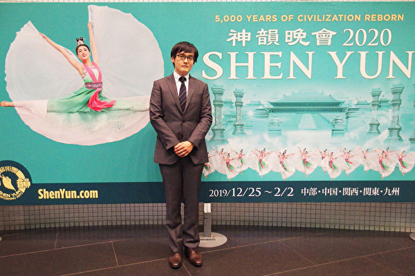

钢琴演奏家清水信守（Simizu Nobumori）先生对神韵盛赞不已，“一切完美无缺，所有的一切都压倒性的出色，令人感动。”（吴丽丽／大纪元）

  
清水信守欣赏神韵纽约艺术团在大宫索尼克城的首场演出后，盛赞道：“服装、舞蹈、音乐，舞台上的一切东西，全部都一气呵成，让人备受感动。”

“（神韵演员）训练有素。”他惊叹神韵演员之间配合默契，那么完美、精准，“无论是仙人的舞姿，还是传统的农村村民们欢乐舞蹈。”

<a target="_blank" href=#top><h6 align="right">回上方</h6></a>

<a name=111>
<h1 align="center"><b>香港终审法院首席法官 吁法律界挺身护法治</b></h1>

香港终审法院首席法官马道立1月13日表示，法治是凝聚社会的基石，社会必须尽最大努力加以维护和珍视。图为法律年度开启典礼前，马道立在爱丁堡广场检阅警察仪仗队。（黄信真／大纪元）

  
  【大纪元2020年01月14日讯】（大纪元香港记者站报导）香港终审法院首席法官马道立1月13日出席法律年度开启典礼并致辞。他表示，法治是凝聚社会的基石，社会必须尽最大努力加以维护和珍视，因为法治一旦受到破坏，社会要复原将殊不容易。他强调，法律界应时刻以维护法治为己任，同时深信社会大众会继续致力维护香港法治。

今次是马道立最后一次在法律年度开启典礼上致辞，因为明年1月他将会退休。

他在演讲中提到推广法治是不具争议的社会利益，并详细说明六项他认为最重要的法治因素，民众都应该清楚。他又认为，法律界有责任促进公众对法治有恰当理解；在法治受到不公平的批评和受损时，挺身而出。

<b>法治尊重人类尊严</b>

马道立说，社会利益可以有多样不同的形式，而公众利益其中不具争议的一个方面是推广法治，以及促进公众对法治有恰当、不带偏见的理解。他重申，法治指的是尊重人类尊严和努力成果的法律，并透过独立司法机关以贯彻法律内容、精髓和精神方式，予以执行。

他提到2015年应英格兰及威尔斯大律师公会邀请，在其国际法治年度讲座上发言，发言题目为“香港法治的力量与脆弱”（Strength and Fragility in Tandem: The Rule of Law in Hong Kong）。讲座中，就香港的司法独立及执行司法工作，列出了六项法治指标。

马道立视该六项指标为重要的法治因素：

（1）法律制度的透明度。在香港，除了少数有保密需要的特殊情况，例如涉及儿童身份，所有在裁判法院以至终审法院的聆讯，市民大众都可以到庭旁听。

（2）市民大众可以知悉任何法庭程序结果的理由。在刑事法律程序中，法官会在法庭宣告裁决的理由（原讼法庭有陪审团参与的审讯除外，因为虽然法官会在公开法庭给予陪审团指引，但陪审团无须就裁决提供理由）。同样，在民事法律程序中，法庭作出判决的理由也是向诉讼各方和市民大众公开。公众亦可查阅所有适用的法律（不论是《基本法》、成文法规或是法庭的判例）。

（3）法官对司法决定所给予的理由会明确地反映法庭的思考过程，让公众可以确实知道所有决定都是根据法律和按照法律精神作出的。

（4）任命法官的制度也是一项重要因素。在香港，各级法官（包括终审法院首席法官）的任命建议，都是由独立委员会，即司法人员推荐委员会作出的。

（5）关乎向法院提出诉讼的权利。这点不说自明。它带出的问题是：有关向法院提出诉讼的宪法权利（载于《基本法》和《人权法案》）如何在实际操作上得以实现。

（6）恒常接触法律制度的人士的意见，当中特别指的是法律界的意见。

马道立说，可能有更多的说法，但这六项因素能客观评价法治在香港的实况。每一项因素均与法律界有关。

<b>法律界护法治责无旁贷</b>

他敦促法律界所有成员都有责任促进公众对法治有恰当的理解，以及在法治受到不公平的批评和受损时，挺身而出。而法律专业的领导者，尤其是大律师界的领导者，更是责无旁贷。

他说，过去七个月社会上不少人评论法庭工作及法官，对于部分意见建基于错误观念和误解，并曲解法律和法制应有的客观和恰当概念，部分近乎不能接受，他对此感到遗憾。

马道立说，履行公义有一个关键要素，便是审判必须公平公正，公正审判并非指法庭必须因应被告的个人或政治观点，作出有罪或无罪的判决。刑事案件的审讯结果取决于证据，包括是否充分有力，以及控方是否已履行举证责任等。

<b>《基本法》订明法院审判须独立</b>

马道立在演讲中还表示，《基本法》订明法院独立进行审判，不受任何干涉，所有人都必须服从法律，无人可凌驾于法律之上。他说，法院执行法律的责任是《基本法》所订明的宪制规定，他对自己及法官同僚会坚定不移，无惧无畏履行职责，充满信心。

他又表示，《基本法》予以明确保证法治的各项要素，尤其是司法独立，相关要素是法律运作的不变要素，不管时世好坏，不管何时总不会改变。

他在回应有意见批评法院处理案件出现延误时指出，法院现时需要处理大量与过去七个月有关的案件，而在绝大多数案件中，控方会请求法庭给予时间搜集证据，以及就采用什么控罪及在什么级别的法院提控，征询意见。

为应付庞大的案件量，司法机构已成立专责工作小组研究法院如何以最佳的方式，迅速处理有关案件，当中包括延长开庭时间。

<b>戴启思：证据足 不检控 仍符合法治</b>

香港大律师公会主席戴启思在法律年度开启典礼致辞时形容，过去一年非比寻常，对一些人来说，今年稍后将要为自己的行为负责。他在演讲中指出一个法治概念的误区：在证据足够情况下，法庭决定不检控，并非不符合法治精神。

香港大律师公会主席戴启思指，在过去七个月的“反送中”运动，警方拘捕了来自各行各业的数千名市民，他们都有良好品格，代表香港社会一大部分人。（黄信真／大纪元）

戴启思说，在过去七个月的“反送中”运动，警方已拘捕了来自各行各业的数千市民，当中大多数都是年青人，有些只是学童，而更多的是大学生，也包括很多普通上班族或者离开职场良久的退休人士。

<b>数千名被捕者品格良好</b>

他说，虽然很多人被指控干犯的公众秩序罪行都往往并不牵涉暴力或严重破坏，他们当中好大部分人正面对可能招致漫长刑期的严重控罪。这些被捕人士都有良好品格，代表香港社会一大部分人。

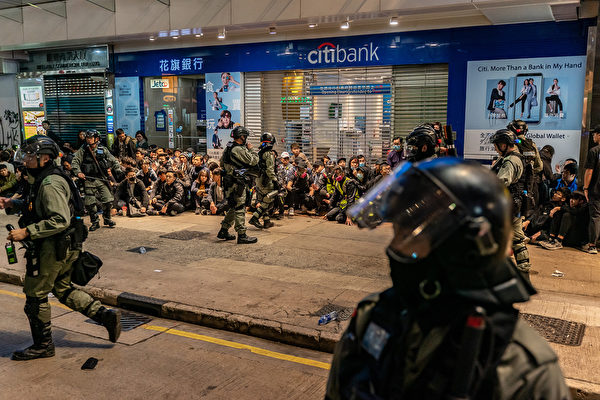

戴启思说，现在时常见到无数市民被捕及被警方拘留，对于曾为被捕人士提供法律协助的大律师及律师，他表示敬意。图为警方提前终止元旦大游行，数以十万计市民无法在半小时内疏散，400多人被指非法集结被捕。(Anthony Kwan/Getty Images)

他续说：“律政司的《检控守则》提醒我们，作出检控决定不单取决于警方是否提交足够证据给法庭令被告入罪。在作出决定时，因为公众利益很重要，即使证据充分，个别人士或者某些种类的案件不一定需要交由法庭定夺。”

他指出，有人认为若证据足以入罪，但律政司最后决定不作检控，不符合一些人心中对法治的定义的理解并不正确；检控人员不拘泥于控罪书而同时考虑其它因素（包括被告的个人情况及其它事情）正正是法治的一部分。

他引用2006年，上诉法庭曾经将此形容为检控自主（prosecutorial independence），而在提出检控决定前对案件作全盘考虑是“法治的关键”（a linchpin of the rule of law）（见 In Re C (A Bankrupt) [2006] 4HKC 582）。

戴启思相信经过筛选的案件将会进入检控阶段，而数量将会以千百计。案件将会在法庭由法官及裁判官审理，而作为检控或者是辩护方代表的律政司、大律师公会及律师会的成员，都会担当重要的角色。

他认为，这将是一个沉重的责任。大律师们要为在法庭保障公平审讯权不受损害做好准备。

<b>对协助被捕人士律师致敬</b>

对于那些曾经在警署以及裁判法院为因被指控干犯公众秩序或其它罪行被捕的人士提供法律协助的大律师及律师，戴启思表示敬意。

他提到，现在时常见到无数市民被捕及被警方拘留，很多时候因警署无法容纳被羁留的人士，导致被捕人士需被分流至其它警署或羁留中心。这情况令大律师在追查其当事人下落面对艰巨的挑战，更遑论能与当事人见面。稍后这些大律师与被捕人士到法庭应讯，亦往往需要轮候至晚上8、9点钟之久，才能处理他们当事人的案件。

为了确保被捕人士与律师见面及获法律代表的宪法权利的保障，超卓的组织能力、热诚和努力缺一不可。

而这些案件到达审讯阶段时，法庭某些判决会令法庭程序的参与者以及关心这些案件的人雀跃或失望，甚至牵动强烈的情绪。他重申：法官不会因为被告的政治或者其它理念对他们有不同的处理。如果法官这样做，将会是不忠于要求他们无惧、无偏、无私及无欺的司法誓言。

他引用美国最高法院法官塞缪尔·阿里托（Samuel Alito）的话：“一位法官不可以有自己偏爱的结果。法官唯一而庄严的责任是对法治负责。”

<b>要紧守“不可拒聘原则”</b>

同样地，戴启思指，大律师也不可以因为自己的个人观念阻碍他们为市民提供法律服务。即专业守则中的“不可拒聘原则”（Cab Rank Rule）。

该原则订明，无论大律师如何看待客人的品格或信念，只要客人愿意付他一般的费用，而案件是他的执业范围，他都不能拒接案件。

他提到一位18世纪的英国大律师托马斯·厄斯金（Thomas Erskine）在1792年为托马斯·潘恩（Thomas Paine）的辩护正是该原则的活生生体现。

托马斯·潘恩是一名激进分子。他写了一本书提倡如果政府无法保障人民的天赋人权，例如思想、集会及言论自由，将该政府推翻将是合法的。

时任检察总长指控他煽动叛乱，即引起对在任政府的离叛及敌意。

由于潘恩是政府的眼中钉，很多大律师试图劝说厄斯金不要接手该案件，因为这将令厄斯金永远与潘恩及他的政治理念挂钩，而为他辩护将会破坏他作为大律师代表政府的机会。

厄斯金在他向陪审团陈词时提及他受到同侪的压力：“从容许一位大律师可以说他会或不会代表受刑事检控的人在法庭向英王陛下政府（the Crown）抗辩的一刻开始，英格兰的自由已经土崩瓦解。”

虽然厄斯金输了官司，但潘恩案加强了他作为坚持自主独立的大律师声名。14年后，他成为英格兰的司法大臣。

对于去年9月份发生一名检控官在高等法院因为反对一名年青抗争者的保释申请而被市民包围事件，戴启思表示不希望再有同类事件发生。如果真的再发生的话，他可以向终审法院首席法官保证，大律师公会会协助司法机构根据《基本法》履行其庄严的职责。#

<a target="_blank" href=#top><h6 align="right">回上方</h6></a>

<a name=110>
<h1 align="center"><b>北京昌平六百特警凌晨偷袭强拆 业主遭群殴</b></h1>

1月13日凌晨12时许，北京昌平区政府纠集近千名特警、十辆挖掘车，偷偷进入果庄村进行强拆，并殴打业主。（受访人提供）

【大纪元2020年01月14日讯】（大纪元记者洪宁采访报导）1月13日凌晨12时许，北京昌平区政府纠集六百多名特警、十辆挖掘车，偷偷进入果庄村进行强拆，激起业主和村民反抗。有男业主遭到群殴，一名女子昏迷倒地。

业主对大纪元记者说，黑压压的特警如土匪进村，将私家车拖走。天亮时，数十特警形成人墙截堵、殴打业主，一名男子被特警围殴倒地。“共产党杀人了！”现场爆出惊叫声、斥责声，一片混乱。

13日白天，宅基地上近七十户产业房被夷为平地。

宅基地上的产业房被强拆。（受访者提供）

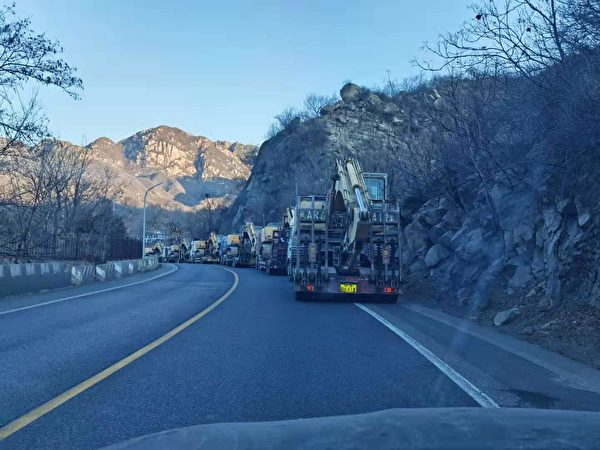

十辆挖掘机进入果庄村进行强拆。（受访人提供）

一名不愿具名的女业主激动地对大纪元记者说，宅基地上近七十套产业房全部被强拆，“我家损失有六七百万元（人民币，下同），没来得及搬走的物品全被抢走了，房子变成废墟。”她是最早投资果庄的，经营民宿已经有三年了。

记者了解到，这批产业房是2016年由政府批准，由果庄村与投资人共建的“美丽乡村”项目。当年8月，昌平区国土局等部门鉴定批准，将果庄村约120亩的宅基地定为泥石流危险、紧急避险两个区域，同意将居住在此地的原村民全部搬迁。

在政府没有下拨一分钱的情况下，村里吸引民间资金，并用这部分钱先为村民盖起了回迁房和小洋房，村民搬迁后，村里又将宅基地上的部分旧房修建成产业房，大部分用来经营民宿，村里也与投资人签下了协议，拥有50年产业房的使用权。

三年来，项目建设推动了果庄村的发展，村民的生活得到很大改善。如今，政府“一刀切”定为违建，加之去年政府还拆了33,000平方米的回迁房，两次强拆造成投资人和村里巨大损失。眼看着三年的心血全部被毁，一名年轻的女投资人曾试图自杀以示抗议，后被拦下。

女业主说，此次强拆，政府不给任何补偿，只是在12月26日贴出了拆迁通知，业主和村民立即展开维权行动，分别到昌平区法院、北京四中院、北京高院起诉，均被拒绝授理，回复是：上面正在研究商量。

张姓男业主说，以前，果庄是一个特别贫穷的山村，没有耕地，仅有少量的果树，每家年收入只有几千元。民间资金进入后，帮助村里盖起了新楼、建立果品加工等，带动农民致富。村民也称，日子刚刚好过些，政府就把“饭碗”给砸了。

令村民和业主不能接受的是，当初共建“美丽乡村”项目是政府批准的；而且违法强拆村民宅基地的房子，没有任何补偿；尤其是村民入住的新房，至今政府没有给办理任何手续，宅基地房子再被强拆，意味着村民没有合法的土地和房屋。

“它们（政府）是疯了，没有什么道理。”女业主表示，投资共建使得村民生活大大改善，也给当地政府解决了资金问题，这是一件很好的事情，它们（政府）根本就不会给老百姓改善生活。而昌平区政府给他们的答复是：先拆，拆错了再处理人。

有业主指，共产党如土匪、侵略者、纳粹，是最无耻的一群人。她说：“相信会有清算的那一天，任何独裁统治都不会长久。”

<a target="_blank" href=#top><h6 align="right">回上方</h6></a>

<a name=109>
<h1 align="center"><b>布拉格与台北结为姊妹市打脸中共 上海跳脚</b></h1>

贺瑞普2019年3月与柯文哲会面，获赠“荣誉市民状”。 (中央社)

【大纪元2020年01月14日讯】1月13日，捷克首都布拉格市与台北市签署协议，缔结为姊妹市。布拉格三个月前取消了与北京的姊妹市关系，打脸中共。14日中共上海市政府外事办公室发声明称，该市解除与捷克布拉格市友城关系并暂停一切官方往来。

据中央社报导，13日，布拉格市长贺瑞普（Zdenek Hrib）与台北市长柯文哲签署协议后表示，这项姊妹市关系对双方都“最为有利”，因为双方“拥有共同民主价值，而且尊重基本人权和文化自由”。

贺瑞普表示，布拉格2016年与北京签的姊妹市协定，内有政治性的“一个中国”条款，这点布拉格难以接受，因为布拉格期待的是非政治性的伙伴关系。

贺瑞普说，在与北京交涉的过程中，完全感受不到尊重，不仅布拉格乐团在中国的演出被取消，写信过去也不回，这样实在不是伙伴之间应有的对待方式，只好决定中断与北京的姊妹市关系。

针对布拉格与北京的风波，柯文哲表示，中国（中共）对布拉格太野蛮了，用取消乐团演出来欺负对方，对方当然不跟你来往，他呼吁中国（中共）用乐观其成的态度看待台北与布拉格的交往。

柯文哲告诉法新社：“布拉格可以自己选择与世界各个城市结为姊妹市，我想北京也应该让布拉格有选择的权利。”

贺瑞普12日在德国媒体上发表评论，批评中国（中共）“满腔愤恨”，并试图左右捷克的舆论。他在文章中说明他领导的市府去年10月取消与北京姊妹市协议的决定。

法新社报导，贺瑞普在文章中指出，他不能签署一份迫使布拉格“宣告反对台湾与西藏独立”的协议。

贺瑞普说，他并未提倡与中国断交或切断与中国的经济关系，但他呼吁欧洲民主国家该认真思考，是否应与“这样一个危险且不可靠的伙伴”建立密切关系。

1月14日，中共上海当局所发的声明称，布拉格市政当局在台湾等重大问题上“屡次采取错误行动，粗暴干涉中国内政，公然挑战一个中国原则”。

贺瑞普2018年11月在市议会选举后，出任布拉格市长。

自称“台湾迷”的捷克首都布拉格市的市长贺瑞普在2019年1月宣布，打算废除与北京缔结为姐妹市的协定中，有关“一个中国政策”和“台湾属中国领土”的第3条条款。他也表示，若与北京交涉废除一中政策和“台湾属中国领土条款”失败，他宁愿废除与北京的姐妹市协定。

2019年3月28日，贺瑞普率海国会议员米夏雷克（Jakub Michalek）、市议员柯索娃（Michaela Krausova）、市议员贝拉尼克（Jaromir Beranek）及市府官员共8人拜会台北市长柯文哲。

贺瑞普在致词时表示，台北市与布拉格有很多共同价值，包括热爱民主自由，盼双方关系能更深化，从伙伴关系转而缔结姐妹市，未来在永续发展、智慧城市及文化方面进行合作交流。

他说，十四年前曾到过台湾，至今仍记忆犹新。贺瑞普对于获赠台北“荣誉市民状”感到相当荣幸。#

<a target="_blank" href=#top><h6 align="right">回上方</h6></a>
  
  
<a name=108>
<h1 align="center"><b>中美签署协议前 北京加购美商品金额流出</b></h1>

在美中签署历史性贸易协议前夕，消息人士透露北京未来两年将向美国加购四大类别即工业产品、农产品、能源，以及服务等的金额。图为美国大豆。（Darren Hauck/Getty Images）

  
【大纪元2020年01月14日讯】（大纪元记者吴英综合报导）在美中签署历史性贸易协议前夕，消息人士透露北京未来两年将向美国加购四大类别即工业产品、农产品、能源，以及服务等的金额。

北京在与华盛顿达成的第一阶段贸易协议，承诺未来两年内加购2,000亿美元的美国商品及服务。路透社引述一名消息人士的话报导，中国预定在未来两年加购近800亿美元美国商品、500多亿美元能源、350亿美元服务，以及320亿美元农产品。

另外两名熟悉初步协议内容的美国官员确认上述中方承诺的购买金额，但没有进一步提供细节。

2017年美国出口到中国的农产品金额达240亿美元，以此为基准，美中初步贸易协议生效后，中国每年购买美国农产品的金额至少为400亿美元。

美国贸易代表罗伯特・莱特希泽（Robert Lighthizer）周一（13日）接受福克斯新闻访问时表示，定于周三（15日）签署的美中第一阶段贸易协议，“对美国来说确实是一笔好交易”。他表示，美方将谨慎应对中方是否会兑现承认。

“我们会很强硬且锲而不舍，我们希望他们（北京）能遵守协议”，莱特希泽说，“我们会提起诉讼，如果他们不遵守协议，我们将诉诸争端解决（执行）机制。就目前而言，这是一个非常非常重要的协议，向前迈出一大步。”

去年12月13日，美中各自宣布达成第一阶段贸易协议，莱特希泽表示，中方在谈判过程中列出各个产品的采购目标。

分析师和贸易商推测中国未来可能扩大采购美国的小麦、大豆、高粱、酒糟和玉米，但怀疑中国是否能够每年增购美国农产品160亿美元。他们说，如此严重地依赖美国可能会使中国面临供需风险。

一位消息人士称，中国承诺加购的800亿美元工业产品，包括汽车、汽车零件、飞机、农业机械、医疗设备和半导体。

对波音公司来说，这是一项利多消息。过去两年，中国没有新购波音公司的飞机，再加上2018年和2019年两次致命的坠机事故，造成其最热卖的737 MAX飞机停飞，波音公司的股票和收益都直线下降。

不过，该消息人士质疑，在没有取消多项非关税壁垒的情况下，北京如何兑现承诺。此外，中国汽车销量近几年均呈下降趋势，很难看出其还具备增购美国汽车的能力。

莱特希泽去年2月在美国国会作证时表示，根据美中协议的执行机制，如果各层级官员无法解决争议，最终将由其与刘鹤磋商。如果双方仍无法解决争议，华盛顿将根据经济损失的比例对中国商品加征关税。

白宫顾问纳瓦罗日前表示，初步协议包含一个“非常非常强大的执行机制”，容许美国贸易代表办公室在90天内裁定争端，在中国不兑现承诺的情况下做出“适当的回应”。

研究中国商品交易的分析人士怀疑北京能否在吸纳如此庞大数量美国商品的同时，不会威胁到其与其他供应商的贸易关系、不会损害中国制造商，以及不需要对其进口标准和配额等非关税壁垒做出重大改变。

法国外贸银行（Natixis）亚太区首席经济学家Alicia Garcia Herrero表示，中国有两个选项，其一是大幅增加进口以及减少经常账户顺差（目前为GDP的1.5%），其二是将其与美国竞争对手供应商的贸易转移到美国供应商。

“我认为第二种情况更有可能。”他说。

石油交易员和分析人士也对中国能否在未来两年加购500多亿美元的能源产品表示怀疑，其中包括原油、液化天然气（LNG）、乙烷等石化原料，以及液化石油气（LPG）等。他们表示，除非北京与美国签订新的交易协议取代其他出口商，否则很难达到目标。

在北京的SIA能源分析师Seng Yick Tee表示，该目标意味着中国每年要购买美国能源产品250亿美元，2017年及2018年，美国出口到中国的能源产品金额大约是80亿美元。

“这目标太过激进，不太可能实现”，他说，“此外，还有一个质量问题，大多数中国炼油厂都使用中等含硫原油，但美国的石油大多是轻质原油。”

伍德麦肯齐（Wood Mackenzie）亚太区副主席加文・汤普森（Gavin Thompson）亦对能源采购数据感到不可思议，称这意味着中国必须取消对美国原油和液化天然气的进口关税。#

<a target="_blank" href=#top><h6 align="right">回上方</h6></a>  
  

<a name=107>
<h1 align="center"><b>美国与各国联手严审中共海外投资</b></h1>

纽约街头的“中国银行”。（Ingrid Longauer／大纪元）

【大纪元2020年01月15日讯】（大纪元记者Emel Akan报导／孙洐源编译）出于国家安全的考虑，许多国家引入了针对外资收购（尤其是中共国企）的新监管机制，因此各国对外资收购进行越来越严格的投资审查。

<b>联合国报告：各国趋向收紧投资审查</b>

联合国贸易和发展会议（United Nations Conference on Trade and Development，简称UNCTAD）的一项研究显示，由于国家安全问题，2018年全球外国直接投资的近12%被各国政府阻止。

UNCTAD的一份报告提到：“近年来，由于国家安全原因和相关的公众关注，各国拒绝外国投资的案例很多。”

“通过扩大对外资审查程序的范围和深度以及相应的外资信息披露义务，世界各国有一种收紧投资审查的趋势。”

UNCTAD确定了2016年至2019年9月期间至少20起外资收购案被阻止或取消，其中有16起与中资有关。被阻止的交易总价值超过1625亿美元。

此外，与国家安全有关的外国投资审查也在加强。

“例如，在意大利，2018年此类审查的数量比2015年增长了255%。在美国，2018年经受外资审查的案例数比2015年增加了160%”，UNCTAD的报告指出。

尽管投资审查过去与军事和国防行业更加相关，但它已扩展到涵盖关键技术和专有技术，例如人工智能、机器人技术、半导体、5G、生物技术、卫星和航空航天。它还可用于控制外国人访问本国公民敏感数据的权限。

出于对国家安全问题的关注，发达国家和新兴国家都已采取措施加强投资审查机制。在将近8年的时间里，至少有13个国家引入了新的监管框架。对现有外国投资法也进行了重大修订。

据UNCTAD的说法，加大对外资打击力度的原因有很多。各国希望确保尖端技术和专有技术掌握在本国公司手中，因为它们是一国竞争力的关键。此外，各国也试图阻止外国国有企业或基金增加投资活动。

外国政府利用国企在海外收购当地公司，以此作为获取关键技术和专有技术的手段。因此，西方国家出于本国安全原因对此类投资（特别是中资）进行严格筛选。

例如，加拿大政府于2018年5月阻止了一家中共国企以15亿美元收购加拿大建筑公司Aecon的交易。加拿大政府表示，“开放国际投资环境以创造就业机会并促进繁荣，但不以损害国家安全为代价。”

美国总统川普在2017年9月发布了一项行政令，以阻止一家与中共有关的中资风投基金并购莱迪思半导体公司（Lattice Semiconductor Corp.）。川普采纳美国外资投资委员会（Committee on Foreign Investment in the United States，简称CFIUS）的建议，出于国家安全原因反对该交易。

<b>美国加强外资审查 尤其对于中资</b>

美国加强了其投资审查程序，以应对尤其是中资并购构成的国家安全威胁。

在压倒性的两党支持下，美国国会通过了《外国投资风险审查现代化法案》（Foreign Investment Risk Review Modernization Act，简称FIRRMA），并于2018年由川普总统签署成为法律。

该法案通过将新并购交易纳入其审查权限来加强CFIUS的权力，使CFIUS能够审查并阻止从事关键基础设施或技术公司的转让控股股份及转让少数股权的交易。

<b>德英及其它各国加强对外资收购的监控</b>

德国也收紧了针对被视为对国家安全构成威胁的外资收购的法规。德国政府于2018年12月通过将直接或间接收购德国公司的股权审查门槛从25%降至10%，加强了其阻止外资收购的能力。

德国政府官员们表示，他们必须降低审查门槛，以监控经济敏感部门的外资并购。

在一家中国家电制造商于2016年收购德国机器人制造商库卡集团（Kuka AG）之后，德国的贸易保护主义情绪开始上升。这笔交易加剧了德国人对中共可能购买对德国经济具有战略意义的高端技术的担忧，并导致反对一家中资基金收购德国芯片制造商爱思强（Aixtron）的交易。

在2019年，英国公布了一项长达120页的政策报告，以增强政府的权力防止外资收购英国资产而引发对国家安全隐患。英国主要针对来自中国和俄罗斯的投资者。

据UNCTAD称，近年来其它加强外资审查的国家包括澳大利亚、加拿大、意大利和新西兰。

中共在其“中国制造2025”计划中展示了其称霸世界的野心，希望在包括先进信息技术、机器人技术、航空和新能源汽车在内的10个高科技行业中占据全球主导地位。

为了实现这个目标，中共一直在采取各种手段：包括工业间谍活动、网络盗窃、以换取市场准入为条件强迫合资企业，及收购外国公司，以获得敏感技术。

根据美国智库外交关系协会（Council on Foreign Relations）的一份报告，中共的意图并不是想加入像美德韩日这样的高科技经济体，而是完全取代它们。

“中国制造2025”概述了到2025年在中国大陆实现高科技行业核心组件和基础材料70%“自给自足”的目标。#

<a target="_blank" href=#top><h6 align="right">回上方</h6></a>  
  
 
<a name=106>
<h1 align="center"><b>【独家】专访郑文杰：屈服中共将后悔一生（一）</b></h1>

郑文杰在英国上议院与保守党人权事务委员洛克(Luke de Pulford)会面，谈及香港、中国的抗议活动和人道危机。（郑文杰提供）

  
  【大纪元2020年01月07日讯】（大纪元记者唐诗韵、梁珍报导）去年8月被中共当局以所谓“嫖娼”罪名拘留的29岁英国驻港使馆前雇员郑文杰，经过数月的秘密逃亡，日前在英国获得两年工作许可。

他近日在英国伦敦接受大纪元独家专访，时间长达3至4小时，这也是他在英国首次公开视频。他详细描述了被“送中”所经历的遭遇。

本报将逐日连载对他合共六集的访问，同时发布独家视频。

<b>（一）艰难抉择终站出 如向中共屈服会后悔一生</b>

记者：唐诗韵
郑：郑文杰（前英国驻香港领事馆职员工）

采访日期：2020年1月3日
地点：英国伦敦

记者：非常感谢你接受大纪元的采访，这应该是你在2020年第一次接受采访，这是不是也是您在英国第一次接受公开采访？
郑：是，没错。

记者：谢谢你。我想香港的读者与听众都非常关心你的情况。知道你经历了很多，几经波折方来到了英国，可不可以跟大家说明一下你是否安全？

郑：目前在英国暂时安全。在英国我暂时还没发现有人跟踪的情况，我目前用两年的短暂工作签证留在这里。现在在与英国政府沟通，看看是否有一个更长期的身份可以留在英国。

<b>在香港销案被特工跟踪</b>

记者：在你离开香港到英国前，你在声明中提到被人跟踪。可不可以详细讲一下，中共如何渗透及你被跟踪的过程？

郑：在英国暂时没有发现这个迹象，但在香港和台湾有遇到过。第一次在香港，我刚刚被释放不久的时间。大约过了四五天，我要离开香港，因为我认为香港并不安全，我需要去销案。所以我主动联络香港警察。

当然他们在我第一天被释放的时候就联系我，问我可不可以取消那个失踪人口的案件。由于自己惊魂未定与对香港警察有所保留，所以开始没有特别理会他们的这个要求。但是直到我（8月底）要离开香港去台湾的时候，我担心他们会在香港机场拦截我，因为我有失踪人口案件在身。

的确我的担心是有效合理的。因为正在我离开香港的那一天，在机场我听到有陈浩天等等不同的示威者被截拦，其他如黄之锋被抓等等的情况，甚至到现在也不能旅行，不可离开香港这个情况，所以我有这个担心，我就需要去做销案。因为这个原因，我就主动去找了当时找我的那个警员。

我必须要说，那三个负责我案件的警员，表现得很友善、很专业、很客气。当时有一位香港警员对我说，担心我会被媒体骚扰，可以去安全的地方做销案。甚至当时叫我在油麻地天主教学校外面见面，然后带我去警局或其它地方去做销案。当时我坐的士去了那个地方。看见有一个穿白色衣服彪悍的男士站在那里东张西望。

其实我在早前（从中国）放出来时已与英国领事馆联系，报告过整件事情的始末。当时负责安全单位的人，我不方便提及他们身份，他提醒我要注意那些戴手环的人。我也不敢问太多。我的确在油麻地天主教学校外面见到他东张西望，而手上是戴着手环的。

记者：油麻地这一个地方是警方安排，不是你提出的？

郑：不是我提出的，是他们安排我到那个地方等，去见他们。当时我见到而且还偷偷地照了相片。不久有三个穿便衣警员来了，出示了他们的警察委任证，做了自我介绍。然后说，如果不介意请上车。但车不是警车，是私人的轻型货车。我惊讶的是那一位我觉得很可疑的男士正在东张西望，有一辆车紧挨着那三个警员的私家轻型货车后面。所以我合理地怀疑如果我坐上那轻型货车，他是会跟踪我。我也不知道我是否能达到目的地或是否安全。

所以我与三位警员说，对不起，我不觉得安全，不如我直接去油麻地警署。他们说，理解明白。我就另坐了的士去油麻地警署那里，他们就坐自己的轻型货车去油麻地警署。我到油麻地警署的门口，一下车。我就见到另一位可疑人士，身形很大很壮，穿条红色裤子咖啡色衣服，也是戴着一个手环。我就觉得很奇怪，他在看着手机。在油麻地警署附近没有特别多商户，民居也不是在正对面，我看不出他为什么要站在那里，当然我也怀疑他是跟踪或负责监视我的人。

之后我进入警署，他们带了我去一个审讯室进行销案程序。当时我的心态是，我认为那两个可疑人士是来自中国内地，是负责监视我的特工。正常来讲，他要跟踪你可以很隐蔽地跟踪，但他们是很明目张胆地去做，故意在门口或附近让你知道他们在那。

<b>没有向香港警方和盘托出的原因</b>

我认为这是一个明确的警告，就是警告我不能在香港警察或香港政府的官方文件上留下一些可疑、敏感的记录。我当然不知道香港警察知道多少。可能事实上他们知道一些，但也不方便将这些东西留在香港政府或警察官方文件上。这样会让香港政府非常难做。你想一下过程中涉及到国安、国保一些政治警察的单位，去严刑逼供、酷刑虐待、政治审查。

甚至我发现一批又一批的示威者因为这个理由在里面，如果我将这个事告诉香港警察，他要不要记录在香港政府官方文件上。那一帮是香港人，香港公民。香港政府是有责任去捍卫他们的权利，是要站出来发声。如果一国两制受到破坏，如果香港公民的合法权益受不到保障，但香港政府有没有能力和勇气去面对北京，面对中共政权、面对中央不退让呢？当然我不会相信（他们有能力），事实上他们背后可能知道，很普遍甚至是共谋或很被动地接受，所以我明白他们的状况。

所以在那个审讯过程当中，他问我的时候，当然是很客气的。那个位置当然没有笼子、老虎椅那些很恐怖的迫害人权的设施在那里。正正常常两个椅子一个桌子问话。我跟他们说，我没有什么要讲的。当时我单一的想法就是想尽快离开香港，我不想在那个地方出事，不然的话我可能出不去，如果我讲一些不该讲的事。我说我不可以讲。

当时有一位高级督察问我：你是不可以讲，还是不想讲？我回应说我不可以讲，然后他们若有所思地点头。说没问题了，就交代给一个初级警员，然后就帮我完成整个销案的手续。简单地说我安全回到香港，不提及当中整个过程发生什么事，这样完成整个销案，这样才可以预期离开香港去到台湾。

<b>在台北街头被境外人士跟踪</b>

第二次被跟踪就更加明显了，更多的证据证明我被跟踪。这一次是在台北。我在11月20日将整件事透过BBC、Wall Street Journal（华尔街日报）、Telegraph（每日电讯报）公开之后的三天，我在台北信义区走路的时候，我发现有人在后面跟随。我发现之后，我尝试去拍照，我想告诉他：我知道你在跟踪我，你不需要这样做，因为你已经暴露，我已经知道你在跟踪我。我向他拍照。 他若无其事继续走，（他是）一个中年男子，去到信义诚品大楼。

我就进去，我的目的就是想告诉他，你不要跟着我。我就等他离开，我自己就上了诚品看书。很奇怪，过了大约一两个小时，我突然发现有一个一模一样的人。但居然他的装束、衣着是完全变了，但乃是同一个人。在大概离我四五米的地方，在假装看书、看手机，我很惊讶。居然我已清楚告诉他，我知道你在跟着我，他居然可以换了全部的衣服继续跟着我，我当时就决定再拍照。我就拍了两张不同的相片和影片，就是同一个人的外貌，但是不同的衣服。

我就通知了台湾政府的陆委会，陆委会就将这个事转给了刑事警察局，至少他们说要加强保护，确保我的安全。当然之后我从不同渠道包括台湾媒体得到的信息，台湾政府做了验证，证实这个人不是台湾人，是来自境外的人士，当然他们没有进一步解释是来自哪里，但我相信是来自中国内地或香港，甚至说不定可能是负责我案件的国保或国安人员，这个比较证据确凿，因为三个小时内同一个人不同的衣服跟踪我，我没有其它可以解释，我也感到台湾不是百分之百安全。之后我就离开台湾，来到英国。

<b>如果向中共屈服 我会后悔一生</b>

记者：你的自白书内提过，在你被释放之前，中共一度警告过你不要公开拘留期间，除了嫖娼以外的任何信息，你会不会同意公开真相比跟中共妥协，长远来说更加保障你个人安全，这个是一个很艰难的决定。

郑：我可以这样说，如果当初他放我出来，他不公布罪名。或者我都可以捂着良心，然后说没有事发生过，然后随便找一份工作做。但一旦他公布了罪名，我都开玩笑地说，我是全世界最有名的嫖娼犯了。可能我没有办法回头，这个是第一件事情，我必须要面对的情况，我必须要讲出来。

第二，我一直都很艰难地做决定，因为我在审讯过程中见到不同的示威者，我认识的一些朋友，甚至是被失踪在内地，也都是被关押到现在，如果我不出声，我不知道会不会他们就从此消失，我很想帮他们发声，去国际社会呼吁。其实要更加关注这一班失踪人的情况，这个对我来说，是被道德的责任感推动。

第三就是我不希望被中共这些所谓的要胁，或者所谓的黑材料噤声；去把持、去威胁我，令我不可以再议论朝政，不可以再批评政府，我不想让他们这样威胁把持我一辈子，这样我会一生后悔。

所以我也相信只有继续去发声，只有继续去帮这个世界，去认清国安或者国保这些迫害或者违反人权的行为，才更能够保障到我的安全。我相信很多香港人都可能有这样的想法，就是觉得需要站出来，为香港人发声。但是同时也看到在声明都有提及过，其实中共秘密警察一度利用你国内的亲戚或家人，试图去威胁你，我相信很多香港人都有同样的经历。决定讲出真相时已断绝与大陆亲人的联络。

记者：其实你有没有担心你现在在香港和国内亲人的安危。

郑：当然会了。他们当时审讯的时候也都明确告诉我，他们知道我的家里人，甚至语带一些威胁，就是你要兼顾你在中国内地的一些资产等等情况。所以其实我决定讲出来的时候，我已经是断绝了跟内地的亲戚的联络，而我跟香港的亲人联络也都非常有限，我也都不会将很详细的资料或者敏感的内容去跟他们说，知道越少是越好。所以这是一个很艰难的决定。因为就算我在英国我都会有思乡的情绪，我都会想念他们。他们要出来都比较困难，包括文化的适应。包括他们对于自己是否真是觉得危险的认知是不同的。所以这个是一个代价，我只可以讲我今天选择出来讲，为了他们的安全我都是尽量少跟他们联络。

记者：明白，的确是一个很艰难的决定。你公布了这件事情之后，你有没有办法知道他们的反应？

郑：大概会知道的。家里人那边的反应是会知道，他们也都会害怕的，也都跟我讲不要特别出来讲那么多，都给过这些压力的。但是我能够理解那个状况下的心理状态。

<b>不想中计 被定性为简单的嫖娼案件</b>

记者：我们讨论一下外界的反应，你向BBC公布了自己遭遇后，中共立即向外展示了你出入会所和你认罪的视频。在这方面你有什么回应？

郑：他们发布这些消息，我完全不感到意外。而它释放这些材料出来，其实跟我的自白书基本上是没有冲突的。不过我想说他们也都回避很多的重点。第一，我在BBC里面为什么会回避嫖娼这一个问题？最主要我知道北京方面，只是想希望整件事定性为简单的嫖娼案件。所以我对这件事一开头是回避的，是不置可否的。因为我不想因为他们舆论舆情控制的需要，而被定性为简单的嫖娼案件。

之后无论见到《每日电讯报》或者是《华尔街日报》，我都明确地讲了针对他们通过非法的程序，例如强迫酷刑而做出的肆意指控，我是一律否认。而当然我也都相信他们一旦把我当成政治的目标和国家的敌人，或者汉奸这些称呼，在他们审讯的过程当中已经明确提到。所以我相信一旦我成为他们的目标，以他们一党专政、威权政权的本质，是可以动用所有国家资源去指控一个政治目标是有罪的。所以我并不想跟他们纠缠在是否嫖娼这个焦点。

因为这个正是他们想要的，例如你见到《人民日报》，它特别在BBC的访谈里面举证了，说我不想将这件事聚焦在我有没有嫖娼那里，那就很能证实我当初的估计和研判，就是他们（中共）一定会将这件事非政治化，去做一个简单定性，但他们回避一些更加重要的问题。例如，一个人有没有嫖娼，他牵涉不到公众利益，但是一个国家透过他们的政治警察、秘密警察施行虐待进行政治审查和迫害，这些事是他们很想回避的问题。

<b>案件由国保国安侦办 具政治动机</b>

第一，他们（中共）在官方证词里面，说我在罗湖被逮捕，那为什么我会在西九龙出现？他们还企图不承认我是在西九龙被逮捕，说我在深圳才被逮捕，但我是在西九龙、香港西九龙的高铁站被截停，我亦是在香港西九龙高铁站的公安派出所被拦截一段时间，问我很多政治问题，要求我拿出手机的密码。

第二，如果是一件简单的嫖娼事件，怎么可能会在西九龙去侦办去执法呢？

第三，如果是简单的嫖娼事件？怎么可能是由国保或国安单位进行侦办呢？

他们并不负责这些事，他们负责政治迫害的事件，所以种种迹象你可以看到，其实整件事本质上来说是具有政治动机的案件，而这件事正是中共，正是政权当局回避的事情。所以在整件事当中他们也都没有回答这问题。而你也都见到中共驻英国大使刘晓明的回应，甚至他们的公安局回应，当然他们不会动用到国安单位去回应，因为他们定性了这件事是简单的治安事件。他们说没有严刑逼供、没有酷刑虐待，这个是睁大眼睛讲大话的谎言，这个才正是我们香港公众要关注的焦点。

他们在第一个星期施行虐待，然后在第二个星期停止虐待，因为要等待上级的指示，他们也都担心会不会如期15日后释放。所以在第二个星期时，甚至国安或国保的人员带上药油、药物去帮我治疗，希望将这些施行虐待的罪证迅速消失。而外交部的回应，他们的回应其实是令我很诧异，他们要维护整个国家的司法形象。然后将一件明明发生的事说成没有，所以这件事我针对他们简单的回应。

记者：那么除了嫖娼的认罪片之外，你在声明里都提到中共秘密警察，同时预拍了一个“背叛祖国”的认罪片段。你认为他们会在什么情况下会利用这一个预拍的片，对你或者对香港的抗争者进行进一步的抺黑或者攻击？

郑：我觉得目前的可能性很低。因为既然他们已经透过外交部，或者不同的渠道去说这不是政治事件，这是简单的治安事件。他们就不会拿石头砸自己的脚，公布我“背叛祖国”的那个片。因为这样只会间接证实，如我所言本质上来说是一件政治迫害、政治性质的案件。那么我觉得如没有必要他们都不会拿出来的。但是到什么情况拿出来呢？可能到鱼死网破的阶段。

我已经不介意了。如果他们直接跟你说，我们根据更多的情报，就说你可能是颠覆、可能是暴乱、武装叛乱、间谍甚至是叛国罪，然后就将这个片放出来。当然那时候已经是一个比较严峻的阶段。但我相信他们目前来说是不会拿这个片出来去佐证的，相信是会备而不用的。因为我认为他们是不想，目前来讲是不想令整个示威活动白热化。这样的话就是直接地对示威者宣战，也直接地对英国政府宣战。

<b>（二）西九龙被捕 遭粗暴对待</b>

<b>西九龙高铁站内被拘捕</b>

记者：可否讲一下你在西九龙被拘捕的过程？
郑：好，在西九龙的高铁站，我已经到了高铁站，我准备离开他们大陆的那个口岸区。

记者：也就是说当时你人在香港？

郑：是的，我当时人身在香港市中心。在那个内地口岸区，当然你就要插张回乡卡或者你要将那本护照放上去（系统），然后他就会把闸门打开，进去后做人脸识别和打指模。

当时他把闸门打开，让我进去中间，我准备去做人脸识别和指模的时候，他们就把这部机子关掉了，那当时是亮起了红灯的，我看到那部机器的红灯亮了，然后见到有一些边境的人员过来。当时我看到边境人员的脸部表情还是那种，（发生）什么事？是不是坏机了？因为坏机是常见的，后来过了大约10多20秒，他看到不对路，不是坏机，他就叫了另一个边境人员过来，另一个边境人员早就准备了一部小摄录机给原来的那个边境人员，我亲眼看到他将那部摄录机放在肩膀上。

以我认知，这就是执法记录仪，我估计情况不妙。因为当时八月是整个示威活动的白热化阶段，我们收到风声，大陆边境人员在香港口岸附近搭建了一些黑房，或去查手机，看有没有任何游行、集会、示威的所谓证据，我很担心这个。此时我夹在那部机器的中间，夹在那里，我把手机拿出来，将我觉得可能是政治上敏感的内容，包括一些可能在Telegram、WhatsApp上和朋友议论朝政，甚至可能是批评政府的一些言论，把整个程式删除。

当时那个边境人员看到我在使用手机，他喝止我不要动我的手机。因为我夹在（过境机器的两个闸口）中间，他没办法过来，所以我就趁着这个黄金时间，把我认为会被政治检控的一些敏感内容删除了。之后，他开了他那边的闸口，叫我出来。严格来说，过了那个闸口，我应该可以出关了（进入香港口岸区）。

但是他就把我叫了出来，然后把我拉到旁边，当时我亲眼看到有很多其他的人准备过关去香港的，他们当时正在办理过关手续，所以是有目击证人的。当时在高铁站里都有大量的摄录机，可以证明我身处在西九龙的高铁站内。他们没有说明理由，为何要把我拦住。

我当时想，会不会是例行的手机检查。他们之后就把我带入香港西九龙高铁站的公安派出所，这个名字对于我来说是很讽刺的。

事后很多人质疑我，说我不是在香港西九龙高铁站被截停。其实我可以跟大家说，我是在香港西九龙高铁站被截停的。

当时被带进去这个公安派出所，他们对我的态度也都很好。在内地，边境是由公安部门管辖的，所以我想他们（边境公安）是挑选过的，可能要长得比较好，或者比较有礼貌，这样才会被派去西九龙派出所。我被带到里面的时候，也都有问他们，究竟什么原因截停我？他们说不清楚原因，只是收到上级的指示。

当时我发觉这不像是因为政治审查去检查手机的事件，而是有针对性的逮捕，是一个上头下令的案件。其后，他们马上没收了我的背包和手机。

我很担心我的背包会被他们放东西进去，所以我说，对不起，我的背包一定要在我的视线范围之内。他们同意了，说没有问题。所以，我的背包就在我的正前方。同时他们也派了两个公安看着我，我的手机被他们收走了，也不知道去了哪里。

当时他们频繁出入，我也隐约听到有人在派出所外讲电话，我相信就是上级或者侦办我的公安在和他们沟通。他们开始问我手机的密码，我说，我这次去深圳是出差，虽然我不是一个外交的人员，但根据《维也纳公约》，我是正在履行（外交）职务的。而我的手机里面也有一些牵扯到政府之间的沟通资讯，属于敏感内容，所以很对不起，我没有办法向你提供手机的密码。

另一方面我也不希望他们看到我手机里的内容，因为手机里任何一条批评中共或者港府的资讯，都可以作为控罪的理由。很多人也可能在想，会不会夸张了一些。其实我对人权案件一向都有关注的。

拿李明哲的事件举例，李明哲其中一个判罪的理由，就是他在微信里面说了一句：中国迟早有动乱。就这一句成为了法庭的呈堂证供，因此他被告煽动颠覆国家政权罪。所以我相信我在社交媒体或手机上的任何可能批评政府的言论，都会成为他们（中共）控告我的借口，所以我是不希望他们看到我手机的资讯，我需要拒绝他们，我没有给他们看。

8月8日晚上10点40分左右，我在（派出所）一路等结果。大约过了一个小时左右，公安就跟我说，因为高铁站就要关门了，我希望你可以跟我们走一趟。于是把我带上了大陆工作人员的车，最后一班的高铁没有其他乘客，用来接载（西九龙大陆）工作人员返回来。我就在那时被押上去深圳福田的高铁。公安拿着执法记录仪一路都在摄录，然后还拿了我的手机和背包。

<b>在深圳遭受粗暴对待</b>

记者：即当晚就在香港西九龙高铁站直接押回去？

郑：是的，把我押去深圳，到了深圳之后我还记得，就在福田高铁站的13号出口。当时押我去那边的时候，已经有一部警车停在那里，还有两个穿着便衣的人员，还有一个穿着黑制服的，我相信是基层的守卫，拿着一些防暴的装备，例如盾和棍。

当这一班身穿制服负责驻扎在西九龙的人员把我交给那帮便衣之后，整件事就急转直下。原本那些人对我很友善、很有礼貌，但是，把我移交给便衣后，我就遭到粗暴对待了。

比如，上了警车之后，我问他们，究竟什么原因要截停我，其中一个身材魁梧的便衣大声对我说：收声！跟着就把我载入福田区的一个派出所。

我在此澄清，官方说我是在罗湖被逮捕的，这个是荒谬的。我实际上是在西九龙的高铁站被截停，然后再把我押去福田区的派出所。

那辆车一进到派出所，基本上就是叫天不应，叫地不闻，因为你已经任人宰割，你已经在人家的地盘上。

下车之后，我很彷徨，我问他之后会怎样，我为何被劫持至此？突然他很凶地说：小子别这么嚣张。我当时本能地举起双手，我想告诉他们，我没有嚣张，也没有想要挑衅任何人。

之后我被带入拘留室，开始做“入册”（关进牢狱）手续，入册手续是拿着你的名牌，自己写名字上去，拿著名牌，背后是量身高的尺，之后就照正面和侧面相，整个的感觉就是囚犯相。因为是在一个你完全没有办法得知原因的情况下，被他们如此对待。我想，惨了，这个不是普通的协助调查，我应该已经被他当做犯人去对待。

之后还要做些什么呢？例如要验血、要验尿，然后他会不断地拍你的照片，尤其是头部、面部特征、360度的照片，照了很多很多次。我当时是有怀疑，他是不是要来做3D打印拿来开我的手机。

当然还要打指模，其实（是）手掌模，而不是单一的一个指模，所以我的整个生理特征都被他们取走了。我可以这样说，基本上以后如果我在大陆的一举一动都会被他们监控，因为我所有的生理特征都被他们提取了。

做完这些，他就马上把我带入审讯室，而那个审讯室，和民主法治国家的相比是完全不同的。例如，审讯室内有一个铁笼，而那个铁笼内有一张，我们叫“老虎凳”的，就是一张铁凳，你坐在上面的时候，在肚子高度有一个铁栏，可以把你扣上，你戴着手铐就可以将你的手扣在那个铁栏上，人是完全动不了的。脚也都可以扣上，然后那班审讯人员在笼子外面审讯。

那个过程当中，他也没有跟我说审讯理由。当然，如果跟其它（拥有民主、人权）国家比较，第一，执法人员需要告诉你审讯理由；第二，就算你是犯罪或嫌疑人也好，你都不应该被关进笼子里，被锁在铁椅子上。审讯只需要一张凳子、一张桌子就足够了。所以当时在那种环境下经受的恐惧是可想而知的。

整个审讯过程当中都是带有威吓的，是不对等、不公正的。他问的问题斩钉截铁，一开始问政治的问题，当然是从大范围开始包抄。例如，他会问，你为什么会觉得在这里？你有没有参与香港的游行集会示威？你对香港怎么看？你有没有认识大陆的人有参与这些游行集会示威？你英国使领馆背后，在这些游行集会有什么样的角色？在那种情况下我有跟他们强调，无论我讲的和做的事都是在香港发生的，我个人有参与过游行、集会和示威，但是，过程当中是合法的。还有，我没有使用过暴力。

当时他们回应说，没有错，在香港你所做的、说的可能是合法的，但是请问你现在是在哪里？我说我现在在中国大陆。他说，就是了，那香港是不是中国的一部分？我说是。他回答，就算你在香港做的、说的是合法的，但是一旦你来到大陆，就会受到我们中国大陆的法律标准审核。

当时我心里也在想，这是明目张胆地违反一国两制。当然，在那种情况下，我无法辩驳。所以，我只可以表达愧疚，我想尽快脱离此地。这样围绕着这些政治问题，扰攘了七八个小时。他自己也会有一些策略和部署，比如他会先录口供，他有一个笔录，然后他要求你在下面写：以上笔录属实，如我所说。然后签名、打指模、写日期。我记得有一个审讯人员跟我说，你都很厉害，你完全绕过了我们给你的陷阱。（待续）

注：部分内容是在尊重原文的前提下经过编辑整理过的。

<b>（三）被虐待致精神崩潰</b>

以下是專訪第三集的視頻和全文：

鄭文傑表示，被中共拘留期間，被虐待至精神崩潰，再開始洗腦套料；有審訊人員操百分百香港廣東話；他擔心被控政治罪名，只能承認較輕的嫖娼。

<b>審訊室有一半是便衣國保或國安</b>

郑：当时，整個審訊室大概有17到20个人左右，这些人中有一半是穿便衣，有一半是穿制服的。根據他們之前在那里whisper，在耳語的時候，他們說穿便衣的人是國保。这样，我就知道，至少我可以確定穿便衣的人，應該就是祕密警察單位，至少是國保甚至是國安的單位在調查我的案件。

在審訊室裡面，他們就開始說話。他們也可能是（对我）做過一些跟蹤之類的事，（所以）他們也都知道：我有時無論是出完差，或者去旅行的時候，我都會去做下按摩。他们就說，根據外部的資訊，有線人指控我嫖娼。

<b>擔心被控政治罪名 只能承認較輕的嫖娼</b>

我當時的心態，其實不是很關心他们是否會控告我嫖娼。因為，當時我很著重的點是：他们會不會告我更加嚴重的政治罪名？至少他们當時說的是：武裝叛亂及暴亂罪。

所以，當時我都有明確地問他：如果嫖娼的話，會是一些什麼的罰則？

他们就特別強調（表示）：嫖娼不是一個很嚴重的事情，不是犯罪的行為，是一個普通輕微違法的行為；你不會被帶去刑事拘留所，你會被帶去行政拘留所，你得到的待遇也會比較好，也不會留有案底，沒有犯罪的記錄。

他當時也有暗示，也跟我說，如果我不合作，會將我交回給本來辦案的人，也就是那些穿便衣的人。他暗示，就會（被）從嚴處理，因為是國保或者國安的人員去處理這案件。

當時我是肉随砧板上（任人宰割），亦無任何的選擇，一定要去承認一個比較輕的罪名，所以我就承認了嫖娼。

我一承認了嫖娼，我就看到穿便衣的那帮人鬆了一口氣。當時我的研判就是：他們至少完成了他們上級領導的指標，就是要求我去承認這個罪名。

記者：你會否認為，因為這件事當時已經在香港曝光了，所以他們想辦法造一個故事出來？

鄭：可能是。

記者：時間上是否吻合？

鄭：可能是，可能是被曝光了。或者是，他們想先企圖用行政拘留的名義去將我拘留，然後得到更多的資訊，等到上級有進一步的指示，再（決定）會不會進行進一步政治的加控。

因為行政拘留，第一，他不需要通報香港政府；第二，不需要經過法院，所以他就可以排除有第三方任何的機構来讓整個案件曝光，就可以被他們肆意地去處置。

所以，對他們來說，就可以方便去操控：就是說（案件）怎麼曝光，用什麼形式曝光，對他們來說就彈性比較大。所以我當時認為他們的臉、他們的表情是鬆了一口氣的，是完成了一個階段性的指標。

我的心態在當時的情況下，當然會認為是有希望的：因為，至少我不是被馬上用國安（國保）的名義去刑事拘留，我得到的待遇相對來說也都會比較好；我至少不會、我也都不會被祕密的（進行）政治審訊，我也不會被送入一些祕密的審訊所，這對我來說是一件，我自己覺得是一件有希望的事情，所以就承認了嫖娼。

<b>拘留室懷疑有臥底想套話</b>

然后，我馬上被帶到拘留室。拘留室裡面有兩個看上去是被拘留的人，他们看上去很瘦弱，好像是吸毒的。其中一個人就問我一些很奇怪的問題：說他很不喜歡中國當局，可不可以告訴他有一些什麼形式可以拿到美國護照，可以去美國從軍。

當時我的研判是，懷疑他是不是臥底，因為他問的一些問題，是很不正常的問題。也許他不是警察，但可能他是受到警察的指示，去問這些事的。

在整個過程當中，我都沒有說：你要怎麼做；或者，說一些很敏感事。不久之後，他们就被兩個穿黑衣服的看守帶走了，我就更加確定，他們應該是臥底了。

因為當時應該是半夜，不會有人来帶走他們，應該是等到早上才會有人帶走他們，所以，我認為他們是應該問不到什麼重要的東西，就把他們帶走了。

<b>在拘留所向獄友求助 失敗後被單獨囚禁</b>

在裡面過了好幾個小時，到了早上，他們就把我叫出去，（我）終於戴上了手銬，換上囚衣，然後我被帶上囚車，把我帶去做身體檢查。當時，也是我第三次做入倉（牢）手續，又是照囚犯相，驗血，驗尿等等等，做了很多這樣的事，之後將我送去羅湖拘留所。

從此，進一步，至少（他们）得到了15天的拘留期限，去獲得更多的料。他們有一份裁決書，那份裁決書也都在裁決書的日期上面留空白，然後要我在那個空白上面去按指紋，簽字。所以，他們其實也想企圖去操控我可以在那裡被拘留多久。我就這樣開始到了拘留所。

記者：那可不可以說，這個惡夢就是在進入羅湖拘留室之後開始的？

鄭：我想，整個（事件）都是惡夢來的。由我從西九龍被帶走，急速惡化是在我進入福田的派出所開始，事態急速惡化。

去了羅湖拘留所第一日，我是被安排跟大概16名艙友（犯人）一起住的，那時是我在拘留期間覺的最欣慰、最開心的時刻，因為終於有艙友（其他犯人）可以聊天了。他們其實都對我很好，免費給了我很多吃的，他們全部都是內地人。

我們彼此都有交流過，他們都覺得，（我的情况）其實不正常，因為他們裡面有些人是吸毒的，有些是嫖娼的，有些是打架，有些是駕駛冒牌車等等不同類型，都是因為一些很輕微的治安事件進來的。

記者：那些（犯人）就不是你之前所提到的臥底了？

鄭：就不是了，我自己感覺到就不是了。大家聊天的時候也都發現說，（我的情況）其實都不正常，如果他要抓嫖娼，怎麼可能會在西九龍抓呢？怎麼可能是這些國安國保的單位去偵辦呢？其實他們都知道（從）本質上來說，這是一個政治動機的案件。他們就說了一句：你一定是得罪了某些人了。那我就知道，我應該是政治目標了。

其中一個過幾天就要走了，要離開了，因為他是一些很輕微的打架進來的。當然他自己有講到說，他是正當防衛，但是中共不鼓勵中國的民眾是去做正當防衛。他們有一個規矩就是打贏的那個就進監獄，打輸的那個就進醫院，其實是沒有贏家的，也就是中共是不鼓勵他們去打鬥，去保衛他們自己。

他就跟我講說，不如我幫你傳信息。那我就把我家人的電話告訴了他，接著我跟他說，說我是因為在香港發生的事而進來的，希望（可以）告訴家人不要因為我而來大陸找我，因為他們都可能會有危險。

過了不久，我就被人叫了出去提審，回去牢的時候，已經是半夜了。他們不敢跟我講話，也都不敢看我，他們靜靜的，其中有一個人靜靜地跟我說，如果我再跟你講話，我都不能出去了。所以，我當時已經知道，其實沒有任何信息可以帶離這個地方。

過了不久後，在我的整個審訊階段，我就已經開始被他們提了出去單獨囚禁，我大概被單獨囚禁了13到14天。是這樣的情況，也都沒有辦法跟其他人聊天。

<b>遭暴力對待下 無奈解鎖手機</b>

記者：那你被帶出去審訊的過程可不可以講講，是否每一天帶你離開拘留室？

鄭：是，有不同階段的，一開始是在拘留所裏面審訊，拘留所裡面有審訊室。我始終認為就是拘留所有起到某一些的保護作用的，例如，審訊室裡是會將審訊人，和我被審訊，是隔開的；他是在審訊場所的外面，我算是在拘留所的裡面。而他們自己也都會有拘留所的守衛或者一些人員，會在場看守的。

當然，那一幫穿著便衣的國保或者國安的人員，是不想讓他們（拘留所人員）看到偵訊的內容，或者是過程，所以就叫他們在外面等。所以，他們是守在外面，關上門的。

（審訊）一開始就在拘留所進行，也都開始問我手機密碼之類的事，去到一個地方時，就是他們要使用暴力。

記者：即是前一個階段手機一直都在他們手上？

鄭：是的。

記者：而你認為手機是未有打開的？

郑：未打開的，直到他們真是可能沒有辦法在我口中得到密碼，就開始使用暴力，就派了兩個便衣進來拘留所。當時我講了它是分開的，（便衣）進來拘留所，在我左右兩邊，一個就負責拿著我手機，另一個就負責固定我。

我知道要強行做人面識別，所以我當時就伏低，不讓他們做人面識別。他們其中一個就扯住我的頭髮向上，然後就逼我做人面識別。

我記得，當時那些拘留所的守衛的表情是很驚訝的，不知要怎樣做。那一幫國保或國安人員，就要求拘留所的人員把我的手扣鎖在那個老虎椅上面，令我動不得。當時我就感覺到拘留所的守衛是有猶疑的，我相信他可能比較少遇到這一種政治敏感性質的案件，或遇見到這一種暴力。但他也都沒有辦法，他照做，他這樣做了。

我也逼於無奈，在他們暴力要脅和施行暴力下，就開了手機。我相信，我當時都很明確跟他說：你竟然夠膽，你們竟然夠膽對領事館的人員採用暴力。他們整個過程是不作聲，不講任何話的。

我相信那一天他們決定施行暴力之後，就覺得在拘留所裡面去做這一種審訊是很不方便，礙手礙腳，因為拘留所的人也都看著。我估計，當時拘留所的領導也擔心他們要負責任，所以就決定在我每次提審之前和之後，都安排醫生跟我做身體檢查。所以，我就說，當時我承認嫖娼、然後進來行政拘留所，相對來講，可能會起到一個比較間接的、輕微的制衡作用在那裡，有一點兒能夠保護到我自己。

當然國保或國安人員覺得很不方便，所以在最後那幾天，進入下一個階段，就是要帶我離開拘留所進行審訊。

<b>被綁架至不明地點施以酷刑</b>

帶我離開拘留所進行審訊的時候，就例如叫我出去，然後做身體檢查，出去之後把我的囚衣反轉去（让我）穿，因為我的囚衣上有我的資訊，有我的編號，有我來自哪裡。然後給我戴上手扣，戴上腳鐐，先以黑布蒙住雙眼，然後再加黑布蒙頭。在蒙頭的時刻之前，我稍微看了下外面，不是警車，是一輛私人的小型客貨車。

他把我黑布蒙頭完全看不到的時候，他就把我拉了出去，進到那私人的客貨車，然後就要求我躺在客貨車的後座。整個過程，就完全像綁架一样，因為他也都不希望外面的人，知道我的來歷，我的身分，我來自哪裡。

他就開車把我帶到不知名的地方，整個過程是從羅湖拘留所，大概是30到40分鐘的車程，到了就把我拉了下車，那個地方我記得是很靜的。

這樣就直接進了一間房，在那間房，我开始聽到一些移動，類似傢俬那樣的聲音，我已經估計到是酷刑來了。我不知道我的命運會怎樣，因為在整個過程當中都很不正常，甚至在車上我都在想，他會不會帶我去海邊呢？这都是有可能的。

记者：當是一個被自殺的被人扔下海的那些？

郑：都有可能的，是啊，都有可能會這樣發生的。他帶了我進去房間，就開始施行酷刑。

记者：全程甚麼都看不到？

郑：甚麼都看不到，見不到任何東西，例如他動一些東西，我估計那些是一些刑具。我已經感覺不對勁，我就主動跟他講，我說你們不需要去虐待我，你們想問我甚麼事情，想我說甚麼，我都會配合的，我都會说的。

他們就不說話，整個過程不說話，就把我挂起來，好像五花大綁這樣挂起我，很長時間我的雙手是不可以放下來的，我的血輸送不上去，就很酸很痛。

记者：那個動作是如何的？可否做一下？

郑：類似大字型那樣。

记者：綁著手腳？

郑：是的，綁著手腳，雙腳也都被分開，這樣（挂）了很多很多個鐘頭。之後，就開始要我做squat（蹲坐），坐無影凳；或者要我蹲下將手舉高很多很多個小時，然後你會感覺到你雙手很痛，在過程當中，他不會讓你休息。

他甚至要剝奪你的睡眠，要你罰站，完全不可以動的；如果你一動，他們就會打你。例如，我坐無影凳，我的雙腳是一直在顫抖的，他覺得我做得不夠標準的時候，就會拿一些類似削尖了的警棍，用这些東西打我，尤其會打我很脆弱的部位，例如我腳的關節。

而當他們去剝奪我睡眠的時候，他們有一個規則就是：如果我要說話，我要先講「報告主人」，我講了「報告主人」後，要等他們批准，我才可以說話。所以在整個過程當中，我感覺到他不是很想讓我說話。

這裡是他們說了算，是他們的主場，是他們有主權的地方：我不是稀罕你說話，我是到了覺得你可以說話時，才會讓你說話。

<b>有審訊人員操百份百香港廣東話</b>

記者：那基本上在那裡就是折磨你？就不是問話了？

鄭：都會是問話的，但可能是一個策略來的。例如，我一被帶到裡面，就有一個人是講很完美的廣東話，（完美到）我分辯不出他是香港人還是廣州人，很完美的、百分之一百的香港廣東話來的。他壓低他的聲音跟我說，你叫甚麼名？我就講了我的名字，（他就说）聽不到，大聲點。

記者：你是否很詫異聽到這個聲音？

鄭：我非常驚訝！完全是香港人講話的口吻，非常驚訝。當時，他跟我講，你竟然幫英國人去監督中國人，你在這裡連屎都不如。這樣，我就知道這個地方，是施行酷刑的地方。

而另外还有一個審訊人員，是講北方的普通話，就跟我說他們來自情報單位。他說，你們使領館都是一個公開的間諜單位，所以你很清楚現在會發生甚麼事，這裡是沒有人權可言的。他們是這樣企圖正當化他們施行酷刑。

如果我在過程當中，我沒說「報告主人」，他們也都會去打我的臉，打我的嘴，也都是用削尖的類似不知名的警棍，類似這樣的東西去打我。

<b>被虐待至精神崩潰 再開始洗腦及套料</b>

到我崩潰了，整個精神狀況崩潰，哭了，然後我說，你不需要折磨我的時候，他就說：我們不是折磨，我們是訓練，這些是訓練，幫你強身健體。

接著，他們感覺到我哭，精神開始崩潰的時候，就放下我，開始餵我吃飯，就開始施恩惠。

然後在这个過程當中，就開始問我問題了：你知不知道甚麼是MI5，MI6？員工證是怎麼樣的？你領館裡面的那個每一層是做甚麼的？遊行示威你有沒有參與？有沒有認識內地人參與遊行示威等等，又是重複很多很多這一類型的問題。

接著就開始餵我吃飯，然後在過程當中也都有做一些所謂的政治矯正教育。（他们）就說，我知道你追求民主，但是我們中國，很多人的教育水平不高，不適合民主。

這些只是民粹，把一些錯的說成對的。但我認為這個是一個策略，這個策略，就是等到你精神上崩潰的時候，他就重新幫你建立一個符合他官方意識形態的價值觀，同時再套你的料。

<b>中共玩文字遊戲 隱瞞自己的傷勢記錄</b>

（上述的）這個情況，隱隱約約維持了大概一個星期。基本上，在第一個星期，我是不能行走的，已經不能走了。

當然，我每一次由外面的祕密審訊所，運回拘留所的時候，我是親眼見到醫生將我的傷口，傷勢，瘀傷，全部記錄在我的醫療記錄中。為甚麼我會知道，因為我是負責按指紋和簽字的人，所以我親眼見到。

你看到官方的回應說：他其實是沒有（受）酷刑，根據他出來那天的醫療記錄，身體狀況一切正常。當然了，因為（他们）在第二個星期停止了酷刑，第二個星期開始，國安或國保的人員帶去一些藥油和藥，來给我治療，想令到這一些罪證儘快地消失。而為了確保自己安全出去，我當然會儘量地表現合作。

他們正在玩文字的遊戲，他們不說第一個星期的醫療記錄，我的傷勢；他們只是說我出去那一天的醫療記錄。（待续）

<a target="_blank" href=#top><h6 align="right">回上方</h6></a> 
  

<a name=105>
<h1 align="center"><b>蓬佩奥：与中共做生意 硅谷科技公司要三思</b></h1>

蓬佩奥在对硅谷领导集团发表演说时，对在座的美国科技产业领袖们说，在中国共产党的领导下，中国不认同自由市场经济，还会盗窃知识产权。(Andreas Gora - Pool /Getty Images)

  
  【大纪元2020年01月15日讯】周一（1月13日），美国国务卿蓬佩奥在加州硅谷发表题为《技术与中国安全挑战》的演说。他呼吁美国公司在与中国（中共）做生意时，需注意国家安全，且不要牺牲美国的价值观。

美国之音报导，蓬佩奥在对硅谷领导集团发表演说时，对在座的美国科技产业领袖们说，在中国共产党的领导下，中国不认同自由市场经济，还会盗窃知识产权。

他在讲话中说：“我们资本主义自由市场的观念，产生了世界前所未见的最大财富和繁荣。科技在其中发挥了重大作用，我们都知道我们将继续这么做。当我在世界各地访问时，非常清楚地知道只有在美国，科技界的巨头是从帕罗奥多和山景城的车库和宿舍起家的。美国的自由使其成为可能，然而，我们的公司在世界上很多没有享有这些自由的地方做生意。”

“中国，特别是中国共产党，构成独特的挑战，特别是对你们的产业而言。你们对问题有第一手的了解，我会再讲讲，我们特别想知道你们的想法。我听说过工商界领袖诉说这些经历，多数是在私下里。害怕被黑客袭击，害怕中国（中共）国家支持的公司损害你们的利润率，害怕一家中国公司会窃取你们的想法，并在中国制造（商品），然后又告你们专利侵权，让你们破产。而且多数都是私下跟我说的，也很说明问题。”他说。

蓬佩奥表示，这就引到一个重点：中共对知识产权的盗窃确实泛滥成灾，这不仅仅是个别受影响公司的问题。因为投资、创造和保护这些产权的能力是美国整个创新经济的支柱。
不要助中共扩展军力或加强政治压制

蓬佩奥还告诫美国高科技公司，不要帮助中共扩展军力或者加强政治压制。

他表示，中共把“军民融合”作为当务之急，你们很多人会注意到。这是个技术术语，但设想很简单。 按照中共法律，中国公司和研究人员必须与中共军队分享技术，否则会受到法律惩罚。中共的目标是确保其军事主宰地位。

蓬佩奥说，中共军队的核心使命是维持中国共产党对权力的控制，就是这个共产党正在领导中国走向越来越威权的方向，而且越来越具有压制性。这与我们这里以及全美国的宽容观念截然相反。

他接着说：“所以，即使中共保证你们的技术只限于和平用途，你们应当知道，这里面有巨大的风险，而且对美国的国家安全也有风险。这是一个真正的问题，因为我们很多最具创新性的公司与中国（中共）政府以及与其有关的公司结成了合作伙伴关系。去年，我的朋友、前参联会主席邓福德将军对参议院作证说‘谷歌在中国所做的工作是间接造福于中国（中共）军队的’。”

去年9月，《华尔街日报》引述美国官员和非营利组织C4ADS的报告称，中共正在敦促这些中国私企竞标国防合同，以此作为“军民融合”计划的一部分，目的是促进中共军火工业的升级。

C4ADS报告称，中共的战略正在带来新的风险：外国公司和研究人员无意中就会帮助中共军队获得其加强能力所需的技术和专业知识。报告首次详细介绍了一个军民融合例子，中国私企北京海兰信数据科技股份有限公司（以下简称海兰信）利用来自欧洲和加拿大的一系列交易来打造中共军队，包括为中国第一艘航空母舰贡献技术。

蓬佩奥周一承认，美国企业有权做出自己的商业决策，必须为股东挣钱，然而他也说：“我想提醒你们每一位，你们是美国人，是自由国家的公民，中国（中共）的行动带来的威胁越来越大，有可能破坏你们所享有的创业和创新的自由。这不是危言耸听。这不是威胁。这是我们大家都应该意识到的。”

他对科技产业高管们说，在华盛顿政界，共和党与民主党都“看到中国真正的样子，而不是我们希望它成为的样子”。
在中国做生意 要有三个“确保”

蓬佩奥提到了美国公司在第二次世界大战期间以及9/11恐怖袭击后投入他所说的“爱国大业”的“优良传统”，请求公司思考如何既维护公司的价值观，也维护美国的价值观。

在蓬佩奥发表这番讲话之际，美国将与中国签署第一阶段的贸易协议。他解释说，川普政府并不是要与中国断绝商业关系。

他说：“我在这里并不是要求你们离开中国。恰恰相反，我们希望美国公司在那里做生意、发财。我们希望你们在美国增加就业，成功打造你们的企业。我们希望创造条件，好让你们有公平的竞争环境，并且本着我们两国互相尊重的精神。这正是川普总统贸易谈判的整个要点所在。”

但是他接着提出三个“确保”，“与此同时，我们需要确保我们的公司不做加强竞争者军力或者加紧政权对其本国压制的生意。我们需要确保美国的技术不给一个真的是奥威尔式监控之国助力。我们需要确保不会为了繁荣而牺牲美国的原则。”

他请求美国公司扪心自问这几个问题：“我是在跟谁打交道？在与中国做生意时，什么是真正的风险回报计算？我是不是在教育我组织内部的高级领导层、我的董事会、我的雇员、我的首席主管团队我们在中国问题上所面临的选择？这不仅对我的公司，而且对广大社会有什么影响？”

去年10月7日，美国商务部以迫害人权为由把28家中国实体列入出口管制“实体名单”（又称黑名单），限制这些实体从美国购买零部件。被列入黑名单的实体包括20个中共公安单位和视频监控公司海康威视等8家高科技企业。

中共副总理刘鹤定于本周三在华盛顿与美国签署第一阶段贸易协议。周一，美国财政部撤销了之前对中国做出的“货币操纵国”的定性。不过，分析人士说，美中两个大国在高科技领域的对峙，不是简单的贸易战停火就能缓解的。

<h3 align=center><a href="https://twitter.com/VOAChinese">美国之音中文网</a></h3>

<a target="_blank" href=#top><h6 align="right">回上方</h6></a>  
  
 
<a name=104>
<h1 align="center"><b>【新闻看点】伊朗3蠢事 北京背书 川普警告</b></h1>

伊朗当局对抗议者展开抓捕行动，到目前已经抓捕大约30人。 (Photo by – / AFP）

【大纪元2020年01月15日讯】大家好，欢迎大家关注新闻看点，我是李沐阳。

伊朗击落乌克兰客机，造成176人罹难事件曝光以来，伊朗当局持续受到压力。昨天（1月13日）是伊朗民众抗议政府的第三天集会。

从流出的视频中看到，在德黑兰谢里夫理工大学的露天集会上，不少人呼喊口号，还有几个人发言批评伊朗当局。在国际国内的冲击下，现年81岁的哈梅内伊还能支撑几天，相当值得关注。

伊朗二号人物苏莱曼尼被美国精准击毙后，伊朗发射导弹袭击美军驻伊拉克基地报复，同日伊朗导弹击落民航客机造成176人丧生；伊朗当局作出了3个相当愚蠢的动作。

<b>民众持续抗议 川普警告伊朗当局</b>

连续三天，伊朗都有大量的人群集会。尽管警方和军方在德黑兰的三所大学和重要地点派重兵把守，尽管有去年11月当局打死1500多人的恐惧。但网络流传的视频显示，仍然几千人走上街头。目前抗议活动已经扩散到至少18座其它城市。

美国国务卿蓬佩奥昨天在胡佛研究所演讲中表示，“伊朗人民走上街头，他们虽然要冒着巨大的个人风险，但人数却令人称奇”。

从网络视频中可以看到，德黑兰的大街上有鲜血流淌，可以听见枪声，很多全副武装的男子。有的军警还在用警棍殴打示威者。

川普在周末分别用英语和波斯语发出推文，向伊朗的示威者们表达团结之意。他写道“世界在看着，他们在抓人”。川普警告伊朗当局：不得杀害示威者。

虽然面对暴力镇压，伊朗民众仍然高喊“独裁者去死”等口号。人们把矛头对准了“最高指挥官”，要求伊朗最有权势的哈梅内伊下台。

有一名愤怒的学生高喊：“我们的敌人不是美国，敌人就在伊朗内部”。

有学生高喊：“美国不是伊朗人民的敌人。他们对我们说谎，我们的敌人在伊朗境内。我们不要，我们不要伊斯兰共和国。”

伊朗民众包括学生过去几天上街抗议，谴责政府在乌航坠机事件发生后试图隐瞒事实，要求追责。图为伊朗学生手持受难者的图片。 （ATTA KENARE/AFP via Getty Images)

看到群情激愤的人群，听到这些愤怒的话语，德国之声质疑，伊朗国内对苏莱曼尼的支持究竟有多大？

伊朗自称有几十万人“自愿”参加了苏莱曼尼的葬礼，但是有推特视频显示，有人撕下并焚烧了有苏莱曼尼画像的标语。这些事凸显出，伊朗刻意打造的“政权亲民”、“民族团结”形象，已经彻底化成碎片了，并非铁板一块。

<b>伊朗做3桩蠢事</b>

其实，伊朗民众的愤怒一直都被压抑，只不过最近连续发生的几件事，彻底激怒了伊朗人。总的来说，伊朗当局做了3件愚蠢的事。

<b>愚蠢之一：打空炮忽悠民众</b>

打空炮是伊朗当局的第一个愚蠢之处。伊朗媒体在空袭后称，对美国驻伊拉克军事基地发动袭击，造成至少80人死亡，200人受伤。随后中共大小官媒一起上，配发图文进行渲染。声称“情报机构消息来源的准确报导”，基地内20个目标被15枚导弹击中，大量无人机和直升机被摧毁。国内的小粉红们也是跟着起哄，对美国又是一片骂声。

但是川普很快出面声明，美军没有人员伤亡。

昨天，驻地美军讲述了“毫发无损”的原因和经历。阿萨德（Ain al-Asad）空军基地美军空军中校斯塔西·科尔曼（Staci Coleman）对路透社表示，“没有人受伤，这真是个奇迹。”

袭击发生前的几个小时，美国国防部长埃斯珀（Mark Esper）就发出警告，伊朗可能会发动袭击，提醒驻地美军提前做好防御。

一名伊拉克情报人员对路透社表示，美军“完全意识到”基地将在“午夜之后”遭到袭击。

美国陆军中校安东尼·切斯（Antionette Chase）证实，“已经收到消息，这将是一次针对阿萨德的导弹袭击”。切斯介绍，10天前，美军还进行了类似的攻击演习。

两名伊拉克军官介绍，在袭击开始前的8个小时，美军和伊拉克士兵就已经把驻军和武器撤离，并且转移到防御掩体中。到空袭当天的午夜时分，户外已经看不到战斗机和直升机了。

从这些说法来看，美军已经完全掌握着伊朗的动向，知道它要发动袭击，所以提早作出了准备，留一块空地给伊朗“施虐”。

<b>事先通知美国？</b>

也有另一种说法，伊朗事先“借道”传话给美国。英国卫报等多家西方媒体报导，伊朗在攻击前通知了伊拉克总理阿德尔·阿卜杜勒·马赫迪（Adel Abdul-Mahdi）。

通知伊拉克总理的目的不言自明，让他转告美国。意思是让美国配合一下，唱一出“空城计”，然后伊朗表演“轰炸秀”。

这并不是说伊朗在释放善意，永远不要低估邪恶政权。伊朗这么做，一是在表演给伊朗民众看，显示一下自己并不软。二是表演给美国，意思我并不是真要打你，只是做做样子。

有网友写了个段子，很有意思。“伊朗：特哥，求你了，腾空一个基地我发几个导弹好给国内交代。美国：发吧，基地周围随便发，有个前提，伤一个美国人我就给你看病呢。伊朗：哥你放心，伤一个算我输！”

<b>愚蠢之二：导弹击落乌航客机</b>

伊朗民众被激怒，最主要的原因就是乌克兰航班被击落，造成176人无辜丧命。

11日，伊朗军方承认，乌克兰国际航空公司波音737客机从德黑兰主要机场起飞后不久，遭到了“非蓄意”击落。原因是一名导弹系统操控员，将这架飞机误认为是美方来袭的巡航导弹，于是发射了一枚地对空导弹。

这架飞机上的176人当中，有57名加拿大公民。加拿大总理特鲁多向死者家属许诺，要还给他们“公正”。在埃德蒙顿大学（Edmonton University）举行的哀悼仪式上，特鲁多表示，“直到有了回答，我们不会平静”。

本来是可以避免的悲剧，却因为伊朗的愚蠢而发生了。

既然对美军基地进行攻击，用美国参议员格雷厄姆的话说，这是“战争行为”。处于战争状态下，应该对航班进行空中管制。而伊朗并没有空管，让这架飞机起飞了。

这里面体现的是，伊朗当局对生命的漠视。

<b>愚蠢之三：隐瞒坠机真相</b>

如果说击落客机是“误判”，那么这个真相被一再掩盖，才是真正激怒伊朗民众的根本原因。

飞机被击落后，伊朗方面一连三天都是坚持一种说法：飞机坠毁的原因是机械故障。

但川普表示，“这架飞机在一个非常恶劣的环境中飞行，有人可能犯了错误”。他在推文中说，“有些人说它是机械原因，我个人认为这甚至就不是一个问题。发生了非常可怕的事情”。

中共官媒环球时报很来劲，在头版用通栏大标题发表报导，“伊朗否认导弹击落客机”。中共对伊朗进行力挺，说美国“造谣”的目的是为了“救波音”。

环时的话音刚落，伊朗军方承认击落了飞机。一个大嘴巴，打得环时“汪”不出声了。

其实西方情报界之前就指出，这架班机是被伊朗击落的。在真相掩盖不住之下，伊朗才不得不承认了事实。

网络视频显示，一名抗议者用扬声器在高喊：“我们要得到清楚的交代。我们国家多年保守缺乏透明之苦。这么多年了，他们一直在对我们撒谎。请原谅我说粗话，他们把我们当成了蠢驴”。

网络推文显示，伊朗著名的电视主持人LUCY在今天的节目中辞职了。她说“飞弹杀死自己的人，非常的悲哀。对不起人家，我在电视台说了13年的谎言，请大家原谅！”

<b>中共魅影</b>

伊朗蠢事不断，引发了伊朗民众的强烈愤怒。不过伊朗的背后，中共的因素是不容忽视的。它的军事力量来自中共，它的核武研发技术也是中共在暗中支持。

政论家陈破空表示，没有中共的支持，伊朗不会跟美国对抗。伊朗在伊拉克境内长期告示，试图颠覆多元共治的民主现状。实际是中共希望把伊拉克颠覆成伊朗一样的模式，然后打造一个“中东邪恶轴心”。

陈破空指出，美国斩首苏莱曼尼，就是看到了中共打造的这个邪恶轴心，可能给全世界带来无休无止的恐怖活动。所以川普总统当机立断，射人先射马，擒贼先擒王，击毙了苏莱曼尼，显示出维护国际秩序的决心。

好的，感谢您关注新闻看点，再会。

大纪元《新闻看点》制作组 #

<a target="_blank" href=#top><h6 align="right">回上方</h6></a> 
  
  
<a name=103>
<h1 align="center"><b>港男纪律部队坠楼过程被录 评论：老天有眼</b></h1>
 <h3 align="center"><b>七大疑点待解 警断定“案件无可疑” 录影菲佣传已被捕</b></h3> 

1月13日上午8时许，郭姓男子从香港油塘纪律部队宿舍坠楼，过程被人无意间拍下并广传。案件疑点重重，警方却公布“案件无可疑”。（大纪元合成图）

  
【大纪元2020年01月15日讯】（大纪元记者赵若水、梁珍香港报导）1月13日上午8时许，一名男子在香港油塘纪律部队宿舍高翔苑高康阁，以疑似双脚弯曲向上“倒立”的奇怪姿势，从大厦高层的狭窄气窗缓慢跌出窗外，坠楼死亡。警方断定“案件无可疑”。然而，该男子坠楼过程却被人无意间拍摄到，并在网络疯传。相关视频显示该坠楼男子，有很大嫌疑是在失去反抗能力的情况下，被人扔下楼的，有人猜测事主是“被自杀”。

<b>男子以奇怪姿势坠楼</b>

警方表示，当日早上约8时30分，接获一名保安员报案，称发现有一名男子倒卧在高翔苑，怀疑有人从高处坠下。警方派人到场证实，坠楼男子姓郭，34岁，当场死亡，在现场没有检获遗书。警方指，郭姓男子并非高康阁住客，他于29至30楼梯间，从气窗抛下背包，然后再坠下身亡。警方强调，死者生前没有在任何的“反送中”抗争活动中被逮捕过，并认为“案件无可疑”，暂列作“自杀”处理。

然而，郭姓男子坠楼的过程却被人无意间拍下，早在警方公布“案件无可疑”信息之前就在网络疯传；有网民据现场目击者拍摄的画面，怀疑案件另有隐情。

据网上流传片段显示，郭姓男子坠楼前，他的头部及肩膀最先由狭窄的气窗伸出窗外，慢慢的上半身也都出来了。随后，画面突然出现男子的双脚，显然其腿部弯曲，小腿和脚出现在画面中，整个身形似双脚屈曲向上倒立的姿势，停顿了片刻后，整个人翻滚坠楼。坠楼时，男子曾撞向楼宇墙外的一条横梁，再反弹后坠地。影片中，整个过程看不到男子有明显反应，也听不到他尖叫。

网民怀疑，他坠楼前已失去知觉，并认为死者坠楼姿态非常古怪，有多个疑点，担心他“被跳楼”。

<b>坠楼事件有七大疑点</b>

《新闻拍案惊奇》主持人大宇综述了网友对是次事件的质疑：

疑点一：按警方说，该名男子是自杀，但是他为什么用这样一个高难度动作，头部朝下，然后在跳楼前腿部弯曲，不像是在跳楼反而像是要跳水。

疑点二：男子掉落的一刹那，没有用力向前跃出，而是顺势掉落下去，而且在掉落的那一刻不是伸着头，直直地向下扎下去，而是头部在掉落的第一刻就蜷了起来，然后身体凌空翻了个180度。掉到下面一层的时候还撞了一下建筑外墙，再继续向下坠落。整个过程，该名男子的头部、颈部、双臂都显的绵若无力，就像失去意识一样，看不到对身体的任何控制。

疑点三：男子在坠楼前，双腿弯曲那一刻起到开始坠楼，期间停顿了3至4秒，也很可疑。因为从画面看，人在狭窄的气窗上是很难以那样的姿势停顿的，特别是双腿弯曲，脚前倾。跟头一样都伸在前面，如果没有牵制力，很容易让身体重心前移，而立刻失去重心，翻下楼去。但是，男子却用那样的姿势停顿了3至4秒。

疑点四：男子掉落过程中，即使身体撞到建筑物外墙，也没有发出任何尖叫声，整个掉落过程静静的。但是在视频中，能听到疑似该名男子落地的巨响，特别是能听到录影者说话的声音。这说明整个录影过程中设备的话筒是开着的，能够收音，但是坠楼整个过程，没有坠楼男子任何声音被收录进去。

疑点五：通常跳楼自杀，如果人是有意识的，往往都是头朝上，脚朝下，直直下落。但该坠楼男子却是头朝下。

疑点六：据报导，男子坠楼的地方是在该栋大楼的楼梯间。楼梯间的窗户下面全都密封打不开，只有上面能打开一扇扁扁的窗口通风。该名男子坠楼就是从这样一个位置高、口径窄的气窗跌下。为什么会选择这样一个高难度的出口去跳楼呢？有网友质疑该男子需要经过怎样的波折才能从这个高高的小窗口钻出去，然后再跳楼？这是非常匪夷所思的。

疑点七：有社交平台“连登”网友根据男子坠楼后的照片，坠楼落地后皮带断开，推断该男子可能在坠楼前被用腰间皮带捉住，然后固定好坠楼姿势后再剪开皮带，使男子以“外旋”的方式坠落。

对于众人的质疑，警方透过脸书（Facebook）表示，强烈谴责别有用心的人造谣生事，诬蔑死者是由警方从高处推下致命。

对此有网民回复道：“为什么不验尸？这么快就下定论。”“是有片看，不是没有根据，警察又心虚心有鬼。”“如果网民只是列出观察事实又怎么算造谣？”“网民只是说死者可能‘被自杀’，没有说一定由警察造成，警方为什么要揽上身？须知纪律部队宿舍不是只有警察住。”“总有水落石出的一天，所有事不会无痕迹，相信正义。”

<b>警称菲佣疑长期偷窥被捕</b>

此外，有名为Meilong的网友14日发推文说：“今早上我发的那个抗争者被警察从警方宿舍推下来的视频拍摄者已经被警方拘捕。警方强烈谴责拍片者在纪律宿舍‘长期拍摄，怀疑偷窥’，现调查并安排拘捕拍片者。穿防暴装束的警员已到场，登上高康阁调查，昨天的拍影片者菲佣姐姐被拘捕。”

Meilong直言：“香港早已经失去集会自由，亦没有言论自由，跟大陆没有什么两样！”对于上述相关信息，本报未能做出事实查核（fact checking）。

对警方拘捕菲佣姐姐的说词，有网友回复：“如果系真，车里的录像机都犯法，全街的CCTV（闭路电视）都犯法，又或者，可以司法复核他们的智慧灯柱！”“影（录）个两分钟片都算‘长期拍摄，怀疑偷窥’，好市民见到对面楼出现问题拍摄以助调查都被人告。真系没什么好讲！”“他目的不是要告入个菲佣，而是叫你班‘好市民’不要拍片指正他们的‘德行’！！！”

<b>反送中离奇自杀事件频发</b>

《新闻拍案惊奇》主持人大宇亦指出，香港自6月份反送中以来，出现了很多“离奇自杀”案，很多人怀疑那些自杀者是被警察打死，或失去反抗能力后遭弃置。制造自杀假象，简称“被自杀”，相关推断和爆料很多，唯独警方没有承认，也一直没有直接的影像证据，所以这些离奇自杀案到现在都是悬案。1月13日郭姓男子坠楼事件是第一次有影片拍到事发过程。在坠楼的一刻，有疑点显示该男子是被扔下楼。但是就算如此，是被谁推下去的还没有证据，目前案件还在调查中，希望真相能够水落石出。有网友提到，如果事发大楼的电梯及楼梯间有CCTV监控录像，希望能尽快公布相关内容。

<b>时评员：天网恢恢 老天有眼</b>

香港自“反送中”运动以来，浮尸、坠楼等离奇命案节节攀升。去年11月20日，保安局称，2019年头10个月有6,584宗死亡案件，其中608宗为“自杀、有人上吊及从高处坠下案件”；保安局11月13日公布，6月到9月间，警方接获的“自杀”案件达256宗，而警方发现的尸体有2,537宗。

网上公布了一份2019年香港自杀资料统计。作者“Benny Yeong杨皓文”收集了每日由香港新闻报导的自杀案的概况。初步统计，从6月12日至11月1日，在香港发生的自杀案有416宗，其中坠落案例有261宗，比重最大，其次是淹溺案，有39例。唯警方多以“案件无可疑”结案。

对于是次疑似“被坠楼”事件，香港作家兼时事评论员潘东凯说：“这件事情的本身我觉得就像是‘天网恢恢，疏而不漏’。如果说看到这样一个片，而网友将原片放大，他们没有加工，只是放大和减慢它的速度，看多几次。我们用正常人的智慧，不需要好高深，只需要超过5岁的智慧，我们都可以看出来这件事情是一件谋杀案。”

潘东凯直言，最怪的事情就是男子坠落时像一个“布公仔”，当时身体坠落时碰到东西然后才反弹落到地上，但是跌落的时候，他手脚都没有动，整个身体都没有知觉。

他说：“这个人没有知觉都可以从那个窗里面走出来，这件事本身就是件谋杀案，所以我说‘天网恢恢’。如果没人影到那个影片，就没有人知道，也就很难去质疑。我就觉得这个世界天有眼呢。”

<b>此地无银 警方反应异常</b>

潘东凯续表示，他觉得离奇的还有警方的反应：“第一，他们反应很大；第二，他们自己给个位自己认，这好奇怪。”因为网上完全没有人讲是警察推该男子下去的。此外，完全没人说这个受害人，或者死者是同抗争有关系，没人说他是手足，没人说他是前线抗争者。但警察的脸书说的话就非常奇怪的。

潘东凯质问说：“警方，为什么你会这么敏感，为什么会有这么一个反应？”

他指：“如果发生这样的谋杀案，正常的纪律部队，维持治安的警队，他们的侦缉人员，是不是应该做点实事，真是要找点证据，而不是在社交媒体吵架。我觉得他们真是失职。”

对于警方是次的反应，潘东凯推论，警方的反应像极了一些专政的工具，一些为了政权而镇压异见人士的工具，是一些政治暴力手段，国家恐怖主义。犹如1977至1983年阿根廷军政府统治时期，当时有3万人口被消失，被秘密处决。他直言警方的行为像“崩口人忌崩口碗”（哪壸不开提哪壸），所以他会跳出来说被人冤枉他们。

他说：“本来警察是有个正常的功能去查一些罪案，找出真凶，找出真相。但是如果警察做过上述的事情，一个真正的谋杀案面前，他唯一做的就是，将这些事情拉到身上，说别人造谣。这个就是我的推论。”

<b>梁家杰：警方下结论操之过急</b>

资深大律师、公民党主席梁家杰认为，警方过于仓促对死因下结论及在脸书辟谣。他说，现在公众对警方的信任程度很低，警方是否应该清楚一点交代来龙去脉。有报导指大堂和升降机有闭路电视，可以拍到死者进入大厦和乘搭电梯的时间，警方是否应该交代得详细一点，例如已经看过影片、地理环境，又例如有没有在附近做一些详尽的搜证？问一下该大厦的居民，或是案件重演，该坠楼男子如何能爬出窗外。

“说这些就是想说，明白警察想辟谣，而现时也没有证据证明跟警察有关，所以他们辟谣得比较仓促，尤其是香港人对警察的信任度那么低，你就要用10倍的努力去说服香港人：这是一宗没有什么特别的自杀案。而不是在几小时之内出post，说有结论，给人儿戏的感觉。”梁家杰说。

梁家杰强调看过影片，但看得不清楚，因为那是很窄的角度拍过去，而且比较远而模糊。有人用慢镜去分析，但还是很模糊。

对于有人提出质疑，为何那么高掉下来没脑浆也没什么血，他指，警察也没有处理这些质疑。他认为“警察下结论是操之过急”。

<a target="_blank" href=#top><h6 align="right">回上方</h6></a>

<a name=102>
<h1 align="center"><b>南昌十多名法轮功学员遭中共非法判刑</b></h1>

江西南昌市十多名法轮功学员在2019年年底被南昌市西湖区法院非法判刑。（明慧网）

【大纪元2020年01月14日讯】江西南昌市十多名法轮功学员在2019年年底被南昌市西湖区法院非法判刑，其中陈文被非法判刑9年半、陈玉莲8年、藤茶花7年半、曹根秀7年、高银凤5年、严锦华5年。

<b>绑架、构陷</b>

明慧网报导，南昌市法轮功学员刘永英老师，56岁，江西省民政学校教师，于1996年10月开始炼法轮功后，处处以“真、善、忍”的标准要求自己与人为善，身心得到巨大改善，原来的多种疾病都不见了，家庭也和睦了。

2018年4月3日半夜零点左右，刘永英被南昌市青山湖区公安分局共七八个警察非法闯入家中绑架、抄家。警察抢走了她家里的电脑等大量私人物品，刘永英被非法关押在南昌市第一看守所至今已四个多月。同年5月10日，她的家属被告知，她已被非法批捕。

当天晚上，法轮功学员温燕、夏明金在外面挂法轮功真相横幅时被便衣警察绑架、非法关押在南昌市第一看守所。

2018年4月10日，南昌市青山湖公安分局的一伙警察冲进法轮功学员李芬玉的家里，当时还有刘海珍、陈冬梅、胡火妹和徐建飞四位法轮功学员正在她家里学法（学习法轮功著作）。警察非法抄了李芬玉的家，同时把她们五个人强行带走，关押到南昌市青山湖公安分局。

两天后，李芬玉、刘海珍、陈冬梅和徐建飞四人被释放回家，而胡火妹则被劫持到南昌市第一看守所非法关押。

2018年4月16日，南昌县莲塘镇法轮功学员高银花、陈文、胡蜜桃、陈玉莲、郭诚、曹根秀，在家中学法时，被南昌市公安局、南昌县公安局警察绑架，并遭南昌县公安局警察非法抄家。

法轮功学员严锦华也在4月中旬被青山湖公安分局警察绑架、被非法关押在南昌市第一看守所。

南昌市青山湖区国保警察非法闯入私宅，非法抄家蒐找所谓“证据”，捏造罪名，以莫须有的罪名诬陷法轮功学员，然后把编造的所谓“案子”递交给西湖区检察院。

<b>非法庭审判刑</b>

刘永英、严锦华等四人被非法庭审判刑。

2019年7月23日上午，南昌市西湖区法院非法庭审刘永英、温燕、夏明金和严锦华四位法轮功学员。庭审在一个极小的法庭进行，旁听席上只有七个座位，规定四位法轮功学员的家属，每家只允许一个家属进去旁听，其余任何人不得进去。

在庭审过程中，公诉人宣读了构陷四位法轮功学员的所谓“罪状”后，四位法轮功学员一致否认自己有罪，并表示不服。

刘永英提出警察对她进行了刑讯逼供，庭审未能继续下去，需重新取证。庭审经过约1小时左右就草草结束。

8月16日上午11点15分至下午2点，南昌市西湖区法院非法庭审法轮功学员刘永英、严锦华、夏明金、温燕，八位家属旁听。

四个法轮功学员都做了自我陈述。刘永英证实了法轮功在她身上显示的神迹，顽症消失，矛盾重重的家庭得到和谐。刘永英的律师作了全面的、有理有据的无罪辩护。当时审判长、审判员都很紧张，急忙说，时间紧，要求律师简单地说。

2019年12月8日，南昌市西湖区法院非法对法轮功学员刘永英、夏明金、严锦华、温燕判刑，其中严锦华5年、刘永英4年、夏明金2年、温燕1年8个月（已回家）。

陈文、陈玉莲等多人被非法庭审判刑。

2019年5月10日上午12点，法轮功学员陈文、陈玉莲、曹根秀、高银凤、胡蜜桃在西湖区法院被非法庭审。

2019年9月16日上午11点至11点40分，南昌市西湖区法院对法轮功学员陈文、陈玉莲、曹根秀、胡蜜桃、高银凤第二次庭审，对第一次做了一点补充。

陈文一再陈述法轮功是正法，于国于民只有百利而无一害，自己没有犯罪，却遭到法官不断地阻止。

2019年10月底，南昌西湖区法院非法对法轮功学员陈文、陈玉莲、藤茶花、曹根秀、高银凤、胡蜜桃6人非法判刑：陈文9年半、陈玉莲8年、藤茶花7年半，曹根秀7年，高银凤5年，胡蜜桃的情况不详。

胡火妹、刘桃英等人被非法判刑。

法轮功学员胡火妹，家住南昌市西湖区团结路，被南昌市西湖区法院未经庭审、未通知家属，秘密非法判刑1年半；2019年10月刑期已满，从看守所被放回。

南昌市高新区法轮功学员刘桃英被非法判刑2年半。刘桃英于2018年7月27日被高新分局一群警察绑架，法轮功书籍等私人用品被抢劫。

第二天，刘桃英被关入高新看守所。家属去分局要人，看守所不让见，说刘桃英不穿犯人服，不配合管理不让见。

刘桃英于8月15日刚被放回家，于8月20日又被高新检察院非法批捕，再次被绑架。

南昌市莲塘多名法轮功学员旷志华、万东南，郑银秀、李均云于2019年5月6日在西湖区法院被非法庭审。

六七月份，他们被南昌市西湖区法院非法判刑：旷志华（莲塘一中女教师）被诬判7年半、勒索罚款2万；郑银秀（退休女教师）被诬判7年、勒索罚款1万。

南昌市法轮功学员杨德兴、邓桂英、张文涛、张丽仍然被非法关押，具体情况不明。#

<a target="_blank" href=#top><h6 align="right">回上方</h6></a>

<a name=101>
<h1 align="center"><b>【新闻看点】川普邀200人见证签署 促习守承诺</b></h1>

2019年4月4日，美国总统川普在白宫接见中共副总理刘鹤。 (Chip Somodevilla/Getty Images)

【大纪元2020年01月14日讯】大家好，欢迎大家关注新闻看点，我是李沐阳。

按照计划，中共副总理刘鹤将在1月13日抵达华盛顿，并将在15日与美方签署第一阶段的贸易协议。从目前透露的讯息来看，中方仍然保持着低调，仅派出10人左右的代表团。但美方则不然，川普政府已经邀请了至少200人参加签字仪式。

更劲爆的消息是，川普将亲自与刘鹤签署这份协议，地点安排在白宫的东厅。

<b>川普亲自签署？刘鹤或再冠“习特使”？</b>

据香港经济日报报导，美国总统川普要“亲自与中国（中共）副总理刘鹤签署”。川普在12月31日也曾推文表示，他将亲自签署第一阶段贸易协议。

如果属实，这是一个很劲爆的消息。以前十几轮谈判，美中谈判代表级别是对等的。中方是刘鹤领军，美方是贸易代表莱特希泽率队。

如果签署协议，人们通常会想到他们两人签署。川普和习近平如果在场，最多也就是督阵。但是川普上阵，明显比刘鹤的级别高出很多，完全不相称。

如果真是这样，川普很可能是在向习近平施压：说话要算数。

另外签署地点安排在白宫东厅，显得也不寻常。白宫东厅并非一般场所，这是美国总统与来访的外国元首召开联合记者会的场地。在这签署，相当于是接待习近平的规格。

可以看出，这份86页的协议有一定的份量。不过也存在另一种可能：刘鹤会不会再次头顶着“习近平特使”的头衔呢？不过我们的猜测还没有得到证实，需要看双方公布的消息。

<b>200人参加签字仪式</b>

有白宫消息人士向路透社透露，这次签字仪式，中方其实是分成了两个团队。一个是刘鹤为首的访美代表团，包括中共商务部长钟山、中共央行行长易纲，以及财政部、外交部和工信部副部长等人。

另一个是留守在北京的团队，据中共官员称，留在北京的团队将“实时观看”。这部分人中，会不会包括习近平和其他几个政治局常委呢？

而美方除了川普要亲自签署外，还邀请了至少200人进行见证。包括美国受到贸易战冲击的各个州的国会议员，都可能出席签字仪式。

川普邀请这么多人来见证签字仪式，一方面显示美国政府对这份协议的重视。另一方面，也可能是要通过这样的形式，促使北京当局兑现承诺。

<b>中共会兑现承诺？</b>

路透社引述匿名交易商的消息，上周中方购买了12条散货船的船货或者80万吨左右的巴西大豆，表明中方第一季度的进口需求已经得到满足。

而且中方已经暂停了在全国范围内推广车用乙醇燃油计划，市场担心中共可能会减少从美国进口的生物燃料和玉米。

再有中共已经表示，不会提高低关税谷物进口配额，以容纳美国农作物的进口。

市场一直怀疑中方每年采购400亿─500亿美元美国农产品的承诺，认为中国没有这个消化能力。

有3名了解内情的中共官员向路透社透露，中方官员一直都小心翼翼的避免公开谈论第一阶段协议细节。一名官员坦言，协议签署之后，关键是执行。一个多月来，双方一直在讨论协议文本和措辞，并确定协议的生效日期。

中方的说法和做法，令人不能不怀疑，中方签署协议后，真的能兑现吗？

<b>贸易战没结束</b>

对于第二阶段协议，华尔街日报表示，第一部分协议中表示，莱特希泽和刘鹤将“至少每年举行两次会议”，以解决冲突。就是说两人半年左右要举行一次会谈。

美国商会副执行长薄迈伦（Myron Brilliant）今天在北京的一个记者会上表示，签署第一阶段的协议，令双方“都松了一口气”。对双方建立互信和确定性来说，落实第一阶段协议很重要。

他指出 ，双方严重分歧的核心是“结构性问题”。对这个争执的焦点还有很多挑战，很多问题还没有解决。

前白宫首席策略师班农（Steve Bannon）指出 ，“我们（美国）需要的是行动，不是对话”。

好的，感谢您关注新闻看点，再会。

大纪元《新闻看点》制作组 #

<a target="_blank" href=#top><h6 align="right">回上方</h6></a>

<a name=100>
<h1 align="center"><b>中共高调“奔小康” 43斤女大学生因贫去世</b></h1>

体重仅43斤的贵州女大学生吴花燕于1月13日去世，年仅24岁。（视频截图）

【大纪元2020年01月14日讯】（大纪元记者李净综合报导）在中共当局高调宣传“2020年建成小康社会”之际，体重仅43斤的贵州女大学生吴花燕去世了，她因贫困曾用糟辣椒拌白米饭吃了5年。她在一首诗中写着自己的梦想：我将回到云贵高原……在那里会有一艘丰衣足食的小船，带我驶向远方。”网友感叹：“如果把援助一个外国留学生一半的钱用来帮助她，都不至于如此。”

2019年10月，贵州女大学生吴花燕的故事被曝光后引发社会关注。大陆媒体报导，吴花燕于1月13日下午去世，年仅24岁。

吴花燕是贵州省铜仁市松桃县沙坝河乡茅坪村人，是贵州盛华职业学院一名大三学生。吴花燕4岁时母亲去世，18岁时父亲去世，只剩她和弟弟吴江龙相依为命。

2019年10月，吴花燕在医院检查时发现患有心源性水肿、肾源性水肿等多种疾病，体重也仅剩43斤。因长期营养不良且患病，吴花燕眉毛掉尽，额头上露出两道白色的痕迹，原本浓密的头发也掉了一大半。

“奶奶和爸爸都是因为没钱治病而去世的，那种因为贫穷而等待死亡的感觉，我再也不想经历一次了。”吴花燕此前曾说，“高中最困难的一次是一天只吃了一个馒头，那时候因为糟辣椒便宜，用糟辣椒拌白米饭吃，一吃就是5年，穿过最贵的一件衣服是100块钱。”

吴花燕的故事在民间引发强烈关注，并获得各界救助后，中共贵州省铜仁市民政局官方微博发布消息表态宣称，启动所谓的救助程序。

吴花燕因体重不到60斤，无法接受手术，于1月13日下午去世。

在一首题为“远方”的诗中，吴花燕写到了自己的梦想：“最后，我将回到云贵高原，在贵州最高的屋脊，种上一片深蓝色的海洋；在那里，会有一艘丰衣足食的小船，带我驶向远方。”

吴花燕去世消息引发大陆网民广泛关注。

“朱门酒肉臭，路有冻死骨！贵州有官员把茅台酒倒进水道，而这个贫困的大学生为了自己弟弟，连续吃了五年辣椒拌饭的43斤女大学生走了！”

“真正需要帮助的人没有人注意到，家里富足的人却拿着国家助学金，整天吹GDP多高有什么用呢？社会连这么苦的人都照顾不到，如果把援助一个外国留学生一半的钱用来帮助她，都不至于如此。”

“吴花燕终于‘脱贫’了，她可以写入历史了！这给贵州原副省长王晓光看看，这些贪官们良心还有没有，精准扶贫个毛，为了营造盛世，GDP数据造假，全世界撒钱，这给所谓小康社会一记响亮耳光。”

在中共官方公布的名单中，截至2019年5月，“国家级贫困县”最多的是西藏，其全境都属贫困县，共有69个；其次是贵州省，有47个。吴花燕的家乡松桃苗族自治县为贵州省贫困县之一。

吴花燕因穷病去世了，令外界感到讽刺的是贵州官场频传的挥霍丑闻。

1月12日，由中共中纪委参与摄制的反腐专题片《国家监察》开播，其中就有此前已落马的贵州省前副省长王晓光。

王晓光曾参与股市交易额达4.9亿元（人民币，下同），盈利达1.6亿元。片中披露了一个细节：王晓光家中有一间房子堆满了茅台酒，数量达到四千多瓶。王晓光觉得家里名酒太多不安全，为了销赃，他把年份茅台酒分批倒入了自己家里的下水道。

此外，贵州省还有另一件令外界瞠目的官场丑闻。

据陆媒1月8日报导，贵州省独山县县委书记潘志立，主政8年为这个“国家级贫困县”留下了400亿元的债务，每年光债务利息就超过40亿元，全年财政收入不吃不喝也远不足偿还利息。

该县委书记在落马前曾盲目举债打造多个“形象、政绩工程”，该县耗巨资22亿元，建造了一座山寨版“紫禁城”。此外还兴建了高尔夫球场、独山大学城、“天下第一水司楼”……其中很多项目成为烂尾工程。

<a target="_blank" href=#top><h6 align="right">回上方</h6></a>

<a name=99>
<h1 align="center"><b>内幕：美军如何第一时间确认炸死苏莱曼尼</b></h1>

被美军无人机击毙的伊朗二号人物卡西姆·苏莱曼尼（Qassim Soleimani）将军的真实身份是恐怖组织头子。图为苏莱曼尼2016年在伊朗境内出席一次公开活动照。(STR/AFP via Getty Images)

【大纪元2020年01月14日讯】（大纪元记者吴英综合报导）伊拉克当地时间1月3日凌晨，美国无人机成功狙杀伊朗二号人物。美媒报导，美国特种作战部队在第一时间抵达现场，确认苏莱曼尼已被击毙。

1月3日，伊朗伊斯兰革命卫队圣城旅（Islamic Revolutionary Guard Corps–Quds Forces）头目卡西姆·苏莱曼尼（Qassem Soleimani）抵达伊拉克巴格达国际机场，与其他八人搭车离去时，浑然不觉美军特种作战部队尾随在后。

不久，美方的收割者（Reaper）无人机发射导弹击中了苏莱曼尼的车队，在他们后方大约半英里（约800公尺）的特种作战部队在一、两分钟内就抵达现场，立即进行了所谓的“炸弹破坏评估”（bomb damage assessment）：在现场拍照并确认无人机击中目标，以及最重要的是苏莱曼尼是否被炸死。

最后，美军确认苏莱曼尼及其他人都被击毙，包括伊朗支持的伊拉克民兵组织“人民动员”（PMF）副指挥官阿布‧马赫迪‧穆罕迪斯（Abu Mahdi al-Muhandis）。

以上是福克斯新闻根据一名美方官员提供信息所做的独家报导。该官员还提供了当时美军所拍的照片，包括一辆被火焰包围的车子，旁边躺着苏莱曼尼四肢不全仍在燃烧中的尸体。

该消息人士说，美军拍照后立即将车旁的尸体拖离现场并扑灭大火，然后才正式确认那就是伊朗二号人物。接着他们从苏莱曼尼的身上搜出一些个人物品，包括书籍及现金、以及一把手枪和突击步枪。

另外，在正常情况下，美军会取走苏莱曼尼的手机和其它电子设备，以利进一步分析调查，但是导弹及大火使得美方无法调查。

一位在伊拉克服役并看到苏莱曼尼死状照片的消息人士告诉福克斯新闻，他的死状与被他杀死的美国人的死状几乎相同。

授命美军狙杀苏莱曼尼的川普（特朗普）总统说，苏莱曼尼在过去很长一段时间内，已经杀死或重伤了数千名美国人，并且还在计划着谋杀更多人。

他说，过去二十多年来苏莱曼尼直接或间接地导致了数百万人的死亡，其中包括最近在伊朗被杀害的大量抗议者。

犹他州参议员迈克·李（Mike Lee）告诉福克斯新闻，如果看到受伤的退伍军人缺少四肢或严重毁容，绝大部分都是因为苏莱曼尼主导的爆炸装置。

<a target="_blank" href=#top><h6 align="right">回上方</h6></a>

<a name=98>
<h1 align="center"><b>蓬佩奥：美国恢复威慑战略 对抗中俄伊朗</b></h1>
  <h3 align="center"><b>蓬佩奥：美企与中共做生意要小心</b></h3>

美国国务卿迈克・蓬佩奥（Mike Pompeo）周一（1月13日）在加州旧金山发表两场演说，都提到中共。(Philip Pacheco/AFP)

【大纪元2020年01月15日讯】（大纪元记者吴英综合报导）美国国务卿迈克・蓬佩奥（Mike Pompeo）周一（1月13日）在加州旧金山发表两个演说，分别提到美国恢复威慑战略对抗中共、俄罗斯及伊朗等敌对国家；另提醒硅谷高科技主管与中国做生意不要牺牲美国价值。

蓬佩奥周一在斯坦福大学胡佛研究所发表题为“恢复威慑力：伊朗实例”的演说时表示，狙杀伊朗二号人物卡西姆・苏莱曼尼（Kassem Soleimani），是华盛顿挑战敌对国家所采取的更大威慑战略的一部分。

他说：“川普（特朗普）总统和我们的国家安全团队成员，正在重新建立威慑力，一个对抗伊朗伊斯兰共和国的真正的威慑力。”

“必须让你的对手了解到你不仅有实力投入更多成本，而且你也准备这么做。”

他补充说，川普在2018年撤出2015年伊朗核协议，再次实施制裁，打击伊朗经济，德黑兰对此感到胆怯，“美国现在拥有最大的实力”。

“威慑战略的目标不仅限于伊朗，还包括中共及俄罗斯”，蓬佩奥说，“在任何情况下，我们都必须威慑敌人，捍卫自由，这也是川普总统要使美国军事实力，达到有史以来最强大的工作重点。”

他还举例说，美国军舰在台湾海峡及南海进行“航行自由”、增加在南海的军事演习，以及对中国进口产品加征关税，都是美国政府（针对中共）威慑战略的一部分。

“我们正在恢复威慑力的威信。”他说。

随后蓬佩奥在加州硅谷Commonwealth Club发表题为“技术与中国安全挑战”的演说，呼吁美国公司在与中国做生意时，要注意可能带来的危害国家安全后果，不要为了利益牺牲美国的价值观，破坏美国的自由。

蓬佩奥说，在中国共产党领导下，北京不认同自由市场经济，盗窃知识产权。他提醒在场的科技公司高管，“即使中国共产党向你保证，你的技术将仅限于和平用途，你也应该知道，这存在巨大的风险，威胁着美国的国家安全。”

“我知道你们的工作是为股东赚钱”，他说，“但是我也想提醒大家，你们是美国公民，是一个自由国家的公民，中国（中共）的行动所带来的风险越来越大，可能会伤害你们所创建的业务以及创新的自由。”

“这不是危言耸听，也不是威胁，而是我们所有人都应该意识到这一点。”他说。

他强调，川普政府并不是要美国公司离开中国，反而是希望美国公司在中国做生意，以及在美国增加就业及成功经营。川普政府希望创造条件，给美国企业公平的竞争环境，这正是美中贸易谈判的重点。

接着他说，川普政府希望能确保：

1. 美国公司与某些国家做生意，不会导致加强军事竞争对手的军力，或者加强该等国家政权镇压本国人的手段；

2. 美国的技术不会帮助任何国家监控其人民；

3. 不会为了自身利益而牺牲美国价值及原则。

<a target="_blank" href=#top><h6 align="right">回上方</h6></a>

<a name=97>
  <h3 align="center"><b>专访人权活动家本尼迪克特‧罗杰斯</b></h3>
<h1 align="center"><b>【思想领袖】中共正威胁我们的权利和自由</b></h1>

英国著名的人权倡导者本尼迪克特‧罗杰斯（Benedict Rogers）接受《美国思想领袖》节目的采访。（大纪元）

【大纪元2019年11月13日讯】是什么激起200多万香港市民（超过香港1/4的人口）涌上街头抗议，为什么他们还在坚持？如果香港失去法治，将会带来什么更广泛的影响？

对于拒绝屈服于中共统治政权的人们而言，今天在中国，他们正在遭受什么样最残酷的虐待？这对美国人民和全世界热爱自由的人们又有哪些影响呢？

这是《美国思想领袖》节目，我是杨杰凯（Jan Jekielek）。今天来到本节目的是英国著名的人权倡导者本尼迪克特‧罗杰斯（Benedict Rogers），他致力于研究亚洲人权状况问题，是英国保守党人权委员会副主席，非政府组织“香港监察”的创办人。由于他关心中国人民的人权问题，中共禁止他入境，他本人受到骚扰，他的家人和邻居也收到了奇怪的匿名信。

我们讨论了香港具有分水岭意义的抗议活动，中共政权对信仰团体和人权捍卫者的持续迫害，包括对法轮功修炼者和其他良心犯进行活摘器官，以及在罗杰斯看来，有必要认识到与中国做生意等同于参与“国家犯罪”。

杨杰凯：本尼迪克特‧罗杰斯，很高兴您来到《美国思想领袖》节目。

罗杰斯：谢谢，我很荣幸。

杨杰凯：您来到华府的这周非常忙碌，我是从国会议员约霍（Ted Yoho）的办公室把您请来的。您在“受奴役民族周”峰会上代表“共产主义受难者纪念基金会”做了主旨发言；明天您还将出席法轮功受迫害20周年纪念活动，您好像将是第一位发言者；您也是“香港监察”（Hong Kong Watch）的创办人和主席。您投身于多个领域。您能否概述一下香港眼下的局势，香港局势已多次上头条新闻，并且情况非常严重。

<b>自由与专制 香港处在抗争新前沿</b>

罗杰斯：情况非常严重。我认为香港现在是自由与专制之间，或者说与暴政之间抗争的新前沿。香港目前的局势是自22年前政权移交以来最糟糕的时候。过去5年，我们看到香港的自由被不断地侵蚀；看到亲民主的立法者和候选人被取消资格，亲民主的抗议者被判入狱；我本人被拒绝入境；《金融时报》亚洲新闻编辑被驱逐出香港。我们目睹了学术自由和新闻自由受到威胁。最近我们看到关于《引渡法案》的提议，值得庆幸的是，该提议至少现在已经搁置一边。但是，这让多达200万人走上街头。

杨杰凯：200万人走上街头，为什么一个《引渡法案》引起如此多人的关注，这占香港人口相当大的比例，简直令人难以置信。简而言之，是什么原因促使他们愤而走上街头？

罗杰斯：简单来讲，这是因为香港一直以来以一座以法治为本的城市为荣。它在法治方面世界排名第16位。然而根据这项《引渡法案》，基本上可以引渡任何北京政权不喜欢的人。香港建立在法治基础之上的司法系统，将沦落为“法制”而非“法治”，从而会普遍发生酷刑、逼供、处决等情形。我认为香港人将其视为最后一根稻草。许多人说，该法案从司法制度方面而言，摧毁了香港与中国大陆之间的防火墙。这就是为什么人们对此感到如此愤怒。

杨杰凯：不可思议。您曾在香港政权移交给中国大陆后在香港生活了数年，亲眼目睹了自由被逐渐侵蚀。它是如何发展成这样呢？

罗杰斯：是的，我从1997年9月——即政权移交2个月后，至2002年，在香港当记者。可以说那段期间“一国两制”实行得不错。我于2002年离开时，对香港的未来没有太多担忧，我觉得香港的未来前景不错。但是自从2014年的雨伞运动开始，情况有了急剧的变化。

杨杰凯：所以说，雨伞运动也是当时人们感到了威胁，他们觉得要沦为中国大陆司法系统的一部分，因此想寻求更大的自由。

罗杰斯：没错，特别是普选权的要求。这在政权移交给中国时，中共承诺过在将来某个时候会实行普选。北京的提案中称香港可以有普选，但须北京指定候选人。香港民主党创办人李柱铭表示，如果在北京指定的候选人中选择，就如同在烂苹果、烂橙子和烂香蕉之间选，没有什么区别。

杨杰凯：所以香港人自始至终都没有选举权。

罗杰斯：刚才指的是选举香港行政长官的普选权。香港人确实有权选举立法会委员，尽管那也受到限制，因为立法机关委员由直接选举和职业界选出的代表组成，后者被称为功能性选区，由不同行业领域，如银行领域、工程领域等业界人员组成。

杨杰凯：因此，香港政治体制基本上是高度结构化的，而北京正在日益扩大对香港政体的干涉。

罗杰斯：完全正确。

<b>中国人权整体状况有史以来最糟</b>

杨杰凯：作为人权活动家，您提到了为什么对北京当局或中国共产党不感冒的一些原因。请进一步谈一谈中国当前的真实状况。

罗杰斯：坦率地讲，中国目前的人权整体状况是有史以来最糟的，自30年前的天安门大屠杀以来，目前肯定是最糟的。有人认为自“文化大革命”以来，目前也是最糟糕的。特别是在宗教自由方面，对中国的基督徒进行了大规模镇压，对新疆至少一百万甚至多达三百万维吾尔族穆斯林实行了监禁，对维吾尔族人的残酷迫害，以及对法轮功修炼者和藏人进行持续迫害。

人权问题甚至不限于宗教自由领域。还记得大约十年前，我在中国北京的一家餐馆里与一些中国人权律师见面。当时我被中国人权律师和社会组织的活动空间所震惊，他们的活动空间有限，但不管怎么说，还能发挥些作用。现在他们根本没有生存空间。这些人权律师或被监禁、失踪、或被吊销执照、或躲藏起来，民间社会团体和异议人士也是如此。在习近平执政下，最温和的表达异议都会受到极其严厉的惩罚。

杨杰凯：我想再稍微谈一谈宗教自由的问题。在“促进宗教自由部长级会议”上，国务卿蓬佩奥（Mike Pompeo）和宗教自由特使布朗巴克（Sam Brownback）均表示，在此类活动中，这是规模最大的一次，是美国国务院主办的最大规模的，我想甚至在全球范围也是如此。您也参与了其中。

罗杰斯：是的，我最近几天都参加了。这是一项不可思议的举措。会议于去年首次举办。今年规模更大。国务卿出席会议并宣布开幕，这给我留下了深刻的印象。布朗巴克大使也发表了强有力的讲话。昨天他们与众议院议长南希‧佩洛西（Nancy Pelosi）和前国会议员弗兰克‧沃尔夫（Frank Wolf）举行了会议。沃尔夫是美国宗教自由立法的设计师，他设立了宗教自由特使的职位。是的，这是一个非常令人振奋的举措。

杨杰凯：会议想实现什么目标？当然，这对于不同信仰的活动人士们来说是讨论相关问题的很好机会。但是这是否真的能够带来改变？

罗斯斯：我当然希望带来改变。我希望这会激励其它国家的政府效仿美国，将宗教自由作为人权关注的重点。我知道，在本周四，有一百多个国家的外交部长要开会，不包括非政府组织。我希望他们能提出一项可以促进宗教自由的行动计划。

<b>法轮功受迫害之惨烈 令人震惊</b>

杨杰凯：非常好。说到星期四，您将在一场纪念法轮功受迫害20周年的活动上做一个介绍性发言。您能透露一些您将在活动上做什么、说什么吗？

罗杰斯：我将在活动开始时做简短的讲话。我非常热切地接受了这个邀请。正如您前面提到的，我这一周非常忙，最初我不确定是否有时间参加，但是我做到了。我想出席该活动，以示对法轮功修炼者以及其他真正关心宗教自由和人权的人士的支持，因为对法轮功长达20年的迫害令人震惊。让我不可思议的是，一个基于信仰“真、善、忍”，完全平和的团体，竟然遭到政权残酷的反应。我认为我们有必要站在一起，记住20年前迫害是如何开始的、迫害仍然在继续、并呼吁停止迫害。

杨杰凯：我一直觉得法轮功修炼者在监狱中的经历对我而言是非凡的。他们在关押的地方被虐待、被所谓“再教育”，然而很多修炼者都向看守人员讲真相，告诉他们不要这样做，因为对他们自身的未来不好。一些情况下，那些看守表示“不会再继续这样对待他们了”。这是你所指的鼓舞人心吗？你提到这是一个鼓舞人心的团体，为什么这么说？

罗杰斯：我认为这是鼓舞人心的团体，因为最近几年我认识了许多法轮功修炼者，而其中未见过一个没有体现出“真、善、忍”价值观的修炼者。作为一名基督徒，这些价值观与我产生共鸣。我认为在价值观方面，基督徒与法轮功修炼者有很多共同点。我看到基督徒面对迫害时也有同样鼓舞人心的勇气。我认为这使我们团结在一起，是的，非常鼓舞人心。

杨杰凯：我一直在关注极为严重的中共强摘器官的问题。最早进行调查的加拿大律师大卫‧麦塔斯（David Matas）形容活体摘取器官是这个星球上从未见过的邪恶。劳教所的人被验血型、人体组织类型等等，然后迅速成为有钱的中外人士的非自愿的器官捐赠者。这是让人难以置信的反人类罪行。我知道在很多人甚至不愿相信此事时，您就已在谈论这个问题。在中国，整个器官移植制度的发展伴随着对法轮功的迫害。因此，法轮功一直是器官的主要来源。您能为我们阐述一下如何看待强摘器官这个问题？

罗杰斯：是的。我若干年前就意识到了这个问题，但是我深度参与其中大约是三年前。我参与的本意并不是因为我需要再增加一个我要投身的项目。我已经有很多人权问题要处理。但是，听到这个消息让我感到极其震惊，所以我觉得谈论这个问题很重要。

最近，杰弗里‧尼斯爵士（Sir Geoffrey Nice）主持了“中国法庭”（这个民间独立法庭全名为“中国强制摘取良心犯器官问题独立法庭”，简称“中国法庭”），这位杰出的律师曾起诉前南斯拉夫总统米洛舍维奇（Slobodan Milosevic）。他同意主持这个法庭，展开对中共强摘器官问题的调查。他们做出了裁决。要记住的是，仲裁小组的7个人，以前与摘取器官问题没有任何关系，与法轮功没有任何关系。其中只有一位是中国专家。其他人之前从未涉及任何中国相关问题，因此不能将他们视为“反华”。

他们做出了一项判决，判决表明：基于他们所看到的证据，毫无疑问，中国（中共）强制从良心犯身上摘取器官的行为已经大规模进行多年，没有证据表明这种行为已经停止。这是反人类罪。

（活摘）罪行实际上很难取证，因为根据定义，受害者不在了，而目击者是犯罪的同谋，但是关键证据之一是，中国各地医院正在进行的器官移植手术的数量与已知的捐赠者群体之间存在巨大差异。因此，关键问题是这些器官从哪儿来的？中国政府没有回答这个问题，我们很清楚，它们来自良心犯。

杨杰凯：非常难以置信在当今时代还会发生这样的事情。您刚才非常仔细地提及了这些人不是中国问题的人权活动家、不是法轮功修炼者。他们没有这类的联系。看来，中国共产党对这些事情的唯一回应就是宣称：“这些都是宣传”。您认为这是他们对所有事情的回应吗？是怎样的？您本人就有过亲身经历。

罗杰斯：是的，它们的回应几乎差不多，说这些都是“宣传、谎言、是有反华意图的人做的”。在强摘器官问题上，它们则说是法轮功。是的，它们的反应总是以这种方式来处理。

杨杰凯：您能谈一谈您经历过的类似事情吗？我看到过一些您的相关报导，我们不妨称之为“中共宣传”或“恶言恶行”。

<b>不断受到中共骚扰和威胁</b>

罗杰斯：有很多方面。首先，我去年收到了十多封来自香港的匿名信，不仅我，我在伦敦住所的同一条街上的邻居们都收到了，我的妈妈也收到了三封。信中让我的母亲告诉我停止谈论这些问题，告诉我的邻居们要防着我。第一封信里有我的照片，明显是从互联网上截图来的，上面写着，“防着他”，所有邻居都收到了这封信。另外，至少有三位英国国会议员在三种不同的场合告诉我，中共大使馆曾打电话给他们，其中一位甚至是与他当面交待，特意要他们告诉我不要再谈论这些问题。公道地说，这些议员们没有让我不要再谈这些问题。他们只是让我知道，这个要求是从中共大使馆那里来的。

另外，还有一件事或许你也听说了。去年10月保守党年会上，我们举办了一个香港问题的论坛。一些著名的香港活动家出席了活动。一名中国官方媒体的女记者开始朝我大喊大叫。我当时刚刚说完：“我反华，事实上我支持中国这个国家和中国人民，但我批评中共政府及这个政权对待人民的方式。我认为将中共这个政党和中国国家分开看待非常重要。”

我阐述了上述观点后，那名女记者朝我尖叫，说我“撒谎！反华！想毁掉中国！”就好像我单枪匹马就可以做到似的。一名义工让她坐下，结果她打了这名义工三次。

最近几周我还收到一些电子邮件，其中一些是很愚蠢的邮件，但有些则有点威胁的意思。最近收到的邮件列出了关在中国监狱的两名加拿大公民的名字，那两位“迈克”，然后邮件中写道：“下个会是谁：本‧罗杰斯。”

杨杰凯：会是谁写的这封邮件呢？

罗杰斯：还是匿名的，所以我不知道谁写的。

杨杰凯：虽然我熟悉这件事情，但为了让听众更好地了解背景，您能大概地介绍一下，为什么两名加拿大人在中国服刑？

罗杰斯：基本上，他们是在华为首席财务官孟晚舟在加拿大被捕后不久被抓入狱的。加拿大警方应美国请求逮捕的孟，美国计划引渡她并调查她的犯罪情况。作为报复，中国政府抓了两名加拿大人入狱。

杨杰凯：一边是法治，另一边纯粹是出于政治利益。

罗杰斯：确实如此。

杨杰凯：这实际上让我想到非常重要的一点。我们在这里谈论中国，我们看到中共在某种程度上插手，并以各种方式威胁您，或者通过让所有邻居监视您来使您的生活不安。我可以想像中国民众的生活感受。但是，这为什么对于普通美国人或像我这样的普通加拿大人来说也很重要？我们知道这两个加拿大人似乎纯粹是出于政治原因而被捕，以换取孟获释。您能否谈谈从更广阔的角度而言，这对于美国、全世界、加拿大的自由意味着什么？

<b>中共在威胁人的基本权利和自由</b>

罗杰斯：我认为这是一个非常重要的问题，因为中共正在做的不仅是（侵害）中国人民的人权和自由。现在，它在许多方面也威胁着我们的自由。首先，通过技术。华为5G技术引起争议，该技术使他们能够侵犯我们各自国家的隐私和自由。我已经多少领教了一些，但是我知道它在世界范围内进行着，他们试图游说和侵入民主制度，从而影响人们，恐吓和消灭批评的声音。

我认为香港是这一战场的重要前线，因为香港是非常重要的国际金融中心，并且一直是亚洲最开放的城市之一。如果香港失去了这一地位，我认为这对全世界的自由都是巨大的打击。

另外，我认为活摘器官也是我们应该关注的问题。西方国家的公众需要知道这一问题，从而劝阻人们不要去中国，或者可能的话，立法禁止人们去中国进行器官移植。因此有一系列我们本国社会的自由受到威胁，同时人们也要意识到在中国发生的这些事情的道德危险。“中国法庭”在作出判决时说：“任何与中国这个国家打交道的人都必须意识到自己正在与一个犯罪国家接触。”

杨杰凯：让我震惊的是，所有这些事情：您提到的酷刑、再教育，强摘器官——这显然是最令人发指的……这是一个完全无道德的政权吗？对我而言，这是我要思考的问题，尤其是人们说中国将在某个时候成为世界的主导力量，或许它已接近这个目标。我本人不相信是这样，但舆论在这样讲，这也似乎是中国对自己的定位。

罗杰斯：是的，绝对如此。中共政权是一个无道德的政权。

这个政权而言，唯一真正的利益和价值就是掌控权力，并且不惜一切代价地掌控权力，它完全无视人的生命、尊严和自由。

杨杰凯：我们就要结束访谈了，您还有什么话想对观众说？关于宗教自由、共产主义或法轮功？

罗杰斯：好的。我相信人权是个整体。人权在《世界人权宣言》中是由一系列权利组成的整体，不能挑挑拣拣，只选择其中的部分人权。人权也没有等级。但是，如果有一项基本权利，我认为那就是在不强制的前提下去选择、实践、并分享（包括更换）自己宗教信仰的自由。这其中也包括无宗教信仰的自由。

这是我们所有人的一项基本权利。我们自己的思想和灵魂做什么事，这应该是我们自己的权利。因此，这是我们必须拥护的权利。我坚信我们要捍卫这个权利，为所有人，而不仅仅是为一个特定的团体。

因此，在这种情况下，我非常乐于捍卫在中国的法轮功、维吾尔族穆斯林、藏传佛教徒、基督徒和其他人的权利。而且，我鼓励观众也这样做，因为如果我们失去了自己决定信仰什么并实践该信仰的基本权利，那么我们实际上就失去了一切。

杨杰凯：本尼迪克特‧罗杰斯，您讲得非常好﹗非常感谢。

罗杰斯：非常感谢。  #

<a target="_blank" href=#top><h6 align="right">回上方</h6></a>

<a name=96>

2020年1月12日下午，著名演说家和作家Allen B. Clark和太太Linda Clark共同欣赏了神韵演出。（乐原／大纪元）

  <h1 align="center"><b>理察森三场全大爆满 著名权威盛赞神韵</b></h1>
  
  【大纪元2020年01月13日讯】（大纪元美国理察森记者站报导）1月12日下午，神韵北美艺术团以卓越超群的中国古典舞蹈、中西合璧的音乐及色彩美学，带领德州理察森观众体验“神舞动之美”。

继昨天在艾斯曼中心（Eisemann Center）的两场演出大爆满之后，今天的最后一场演出继续大爆满盛况，在全场观众热烈的掌声中落下帷幕，掌声久不停歇。

当地商界名流、电影制作人、科技权威以及著名作家纷纷对神韵的演出表示赞赏，他们意犹未尽，难忘从中获得的启迪，赞叹演出充满“神之韵味”，期待明年再次目睹神韵风采。

“让人如醍醐灌顶。”“舞蹈节目富有灵性，非常动人。”“演出让我看到了未来的希望和祝福，还有万物更新的憧憬。”“节目非常纯净，触动人心。”

<b> 著名技术权威：神韵演出丰富多彩</b>
  

2020年1月12日下午，高科技领域的权威Rene Aerdts先生和太太Judy Aerdts一起观看了神韵北美艺术团在理察森市艾斯曼中心的演出。（乐原／大纪元）

  
  “我非常欣赏神韵艺术家能够通过舞蹈和表情来充分表达节目，及节目背后故事的能力。”Rene Aerdts称赞，神韵服装丰富多彩，舞蹈完美结合了各种元素，“非常令人赞叹，太了不起了！”

Aerdts在高科技领域是位著名的技术权威，曾任Metroplex技术商业委员会（MTBC）董事会成员，并拥有9项美国专利，在行业活动（如CIO峰会和分析师会议）上是一位备受追捧的演讲者，目前是DXC Technology公司的美洲首席架构师，负责整个北美洲和南美洲的技术架构业务。

<b>名作家赞佩修炼人坚守信仰</b>

Allen B. Clark先生是著名的作家和演说家，每年发表六十余场公众演说，有《受伤的士兵》、《疗愈战士》和《士兵的鲜血与血腥金钱》等著作。他在观赏完神韵后表示，演出让他非常震撼。

“尽管我坐在这里欣赏演出的美丽，但我心中却在想了解节目背后的更多内涵。”Clark表示，“节目表现了有关法轮大法的内容，表现了修炼人反抗中共迫害的精神内涵，让我了解了其中的真相。这方面的内容深深吸引了我。”

</b>电影制作人：如醍醐灌顶 受了一场洗礼</b>
  

美国知名演员兼制片人Sunny James Lohden一家四口欣赏了2020年1月12日下午，神韵北美艺术团在理察森艾斯曼中心（Eisemann Center）的第三场演出。（苏菲／大纪元）

  
  美国知名演员、电影制片人Sunny James Lohden说，“演出令人感动，蕴含丰富的情感，又如此高雅、优美，绚丽。”

Lohden表示，他对部分节目提到了神传故事创世主下世救度众生，感到精神振奋，“让人如醍醐灌顶，美丽又平和，在演出的最后这所有的一切都呈现了出来，就像受了一场洗礼。”

Lohden出生于美国德克萨斯州达拉斯，是美国年轻多产演员兼制片人，他主演和参与制作的影片有：《Infiltrators》（渗入者）、《Idol》（偶像）和《What Are You Looking At》（你在看什么）、《Asteroid》（小行星）、《The pact》（条约）、《Christ in a Tub》（基督在浴缸）、《Revelations》（启示录）、《Jesus and Me》（耶稣与我）、《My R.D.》（我的研发）等多部影片。

<b>网络传媒联合创办人：令人耳目一新</b>
  

2020年1月12日下午，Dillon Rose和女友一起欣赏了神韵北美艺术=6团在理察森艾斯曼中心（Eisemann Center）的第三场演出。（苏菲／大纪元）

  
  无线传播媒体Media Infinite联合创始人Dillon Rose首次观赏神韵后表示，“我认为这个演出令人大开眼界。”“神韵来此与我们共享所有这些传统文化和历史，我感到很感激。”

Rose分享他最触动的舞蹈故事里，出现了一本有关打坐的书籍——《转法轮》，这本书让故事中的角色重获新生。Rose从中体悟，“人们能通过自我反思来学习、整体上变得更好，我认为理解这一点很重要，我认为很多人都可以从中受益。”

<b>纺织艺术家：神韵色彩美学不同凡响</b>

“丰富的视觉效果，非常视觉性。”Bette Levy女士在演出结束后表示，神韵匠心独运的色彩美丽惊人。“非常漂亮的着色，神韵在所有事物上展现的色彩、风景给我留下了深刻的印象，令人钦佩。他们的着色、整个设计非常不同凡响，我很享受。”

Bette Levy女士是路易斯维尔地区纤维和纺织艺术家协会（LAFTA）的创始成员，美国刺绣协会的一员，以及平面设计协会（Surface Design Association）前副总裁、董事会成员。

<b>设计公司老板：看到了未来的希望和祝福</b>
  
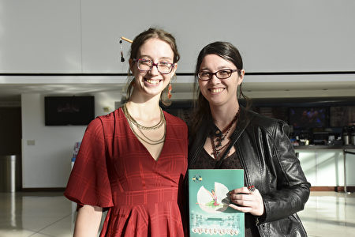

2020年1月12日下午，景观设计师Kira Smith女士（右）和跆拳道教练Rachel Smith女士一同观看了精彩的神韵演出。（乐原／大纪元）

  
Kira Smith女士是位景观设计师，拥有自己的设计公司。她表示，演出在表现神性和精神内涵方面做得非常好。“演出让我看到了未来的希望和祝福，还有万物更新的憧憬。演出在这方面表现得非常好。”

<a target="_blank" href=#top><h6 align="right">回上方</h6></a>

<a name=95>
<h1 align="center"><b>【热点互动】蔡英文大胜 美中台关系走向如何</b></h1>

本期热点互动特别节目邀请专家热议本次台湾大选结果及美中台关系走向。（新唐人合成）

  
  【大纪元2020年01月13日讯】台湾总统大选中，现任总统蔡英文以超过800万票，成为中华民国史上最高票当选的总统。全球华人及各国祝贺台湾又一次成功的民主选举，而许多台湾人则在社交网络上向香港人表示感谢，并称：香港朋友，我们守住了台湾！这样一个结果也再次显示中共的挫败。

本期热点互动特别节目邀请专家热议本次台湾大选结果及美中台关系走向。

嘉宾：时事评论员 横河；美国艾德菲大学政治学教授 王维正

主持：方菲

【热点互动特别节目】蔡英文大胜！北京未必认为是挫败 ；美国朝野会再认识台湾的战略定位？

主持人：观众朋友好，欢迎收看这一期【热点互动特别节目】，现在是美东时间1月11日晚。本次台湾大选，蔡英文以超过800万张选票，成为中华民国历史上得票率最高的总统。那么全球华人和各国都在祝贺，台湾又一次成功的民主选举。而许多台湾人则在网络上向香港民众表示感谢，外界认为这一次的选举结果也再一次显示中共的挫败。那么本期特别节目，我们特别邀请俩位嘉宾一起来点评分析本次台湾大选的结果，以及接下来美中台关系的走向。

一位是在现场的时事评论员横河先生，横河先生您好。

横河：主持人好，大家好。

主持人：好的，那么另外一位是通过skype和我们连线的、人在台湾的美国艾德菲大学政治学教授王维正先生，王教授您好。

王维正：主持人好，嘉宾好，大家好。

主持人：谢谢二位。在节目开始我们先来看一下本次大选的一些最新的镜头。

（播放影片开始）

蔡英文：“今天晚上，是属于全体台湾人的晚上，我们要谢谢台湾人民的勇气，我要谢谢台湾人民的坚持，各位，蔡英文守住了。我们一起守住了这块自由的土地，我们一起守住了这一个民主的堡垒。”

拿下817万票数创新高，总统蔡英文向台下支持者致意，强调台湾人民在全世界面前再一次展现了尊严与自信，讲到激动处还数度哽咽，更表示选举之后，要大家握手言和，彼此包容。

蔡英文：“我也相信全世界的民主国家，以及很多的香港朋友，都会为我们今天集体的决定感到高兴，大家说是不是？”

蔡英文特别感谢年轻选民用各种方式返乡投票，是勇敢的台湾囝仔。

蔡英文：“我要特别感谢所有的年轻朋友，我知道有些人特地从国外飞回来，只为了投我一票。”

蔡英文更在国际记者会上呼吁北京当局，双方都有责任致力于确保两岸的和平稳定。

蔡英文：“今天我要再一次诚恳的呼吁对岸当局‘和平、对等、民主、对话’这八个字是两岸重启良性互动，长久稳定发展的一个关键。”

蔡英文表示民主的台湾不会屈服于中共的威胁恫吓，她更不会忘记她的承诺。

（播放结束）

主持人：好，观众朋友，也感谢您，希望您在节目中间跟我们互动，跟我们谈谈您对本次台湾大选的看法。我首先想先请人在台湾的王维正教授介绍一下，王教授我知道您这次也是特地回台湾几天去投票，那全球华人看到这个台湾这样的一个选举，都是非常激动。跟我们谈谈您回去投票的一些感受，另外您对台湾这样一个大选结果，有什么样的感想？

王维正：首先中华民国现在的选举法，并没有在不在籍投票这样一个规定，所以要投票的话必须要返回户籍所在地。那我的户籍所在地是高雄，所以我这一次趁着学校还没有开学之前，先到户籍所在地去投票。投票是当地时间1月11日，昨天早上八点钟开始，当天的天气非常好，然后各个票务所从一大早就有很多人在排队，大家扶老携幼，可以显现出来一个民主的展现。

汲取了2018年九合一选举那个选务的一些失误，所以昨天投票比较多一点，然后在每个地方等的时间就比较短一点。那我觉得这次能够回来行使这样一个民主的权利，我感到非常的感动，也觉得说这个是华人世界里面一个少有的光荣。至于说谈到这次选举的结果的话，我想我们等一下会有很多的时间来分析，我就先讲一下我个人的感受。

主持人：好的，谢谢您。那横河先生我们来看看这样一个选举的结果，看到这样的选举结果，一个是您吃惊吗？还是意料之中？还是有任何跟您预想的不一样的地方，先请您谈谈您的感想。

横河：这倒没有，没有吃惊，因为这个是大部分，尤其在海外如果你能够得到一个比较正常的消息的话。

主持人：全面的消息。

横河：对，这个应该是可以预料之中的。因为这个转变风向是去年整整一年这个过程，不是说一天两天转过来的。所以说唯一可能出现例外的是最后几天，就是在投票的前几天出现非常戏剧性的重大事件来翻转，因为没有出现，所以这个趋势就很正常了，就是这个结果。

主持人：嗯，但是之前的民调，因为很多人觉得民调也不一定准确，可能还有许多人在民调中，甚至不一定告诉你真实答案什么的，所以您觉得从之前的民调基本上是可以反映出选举的结果吗？

横河：基本上是可以反映出的，除非是一些，网上的东西你很难去用那个做调查。如果真正的民调的话，就打电话民调，或者是有你确定的人，确定调查的人是明确的话，那这个民调结果还是比较准确的。这个跟美国2016年大选不一样。

主持人：对。

横河：2016年大选实际上因为川普总统是个黑马，而且当时在美国有非常强烈的所谓政治正确的环境，所以很多人不愿意说他要投谁的票。在台湾这次投票没有这个问题，所以真实的民调，基本上是能够反映这个大的趋势的。所以我们可以看到，在去年上半年的时候，其实蔡英文的支持率并不高，是到下半年以后才逐渐逐渐升高的，这个过程是看见的，而且这个过程也是通过民调来显现出来的。

主持人：是。

<b>蔡英文大胜的主因是什么？谁是功臣？</b>

横河：我相信台湾在这个问题上，有外界干扰，但这些干扰没有达到可以大面积混淆视听的这个程度。

主持人：那好，那我们来谈谈这次大选结果，我想先请王教授谈一谈，在您看来这样一个大的结果，民进党和蔡英文的胜利，是不是可以说的是一个大胜，那造成这样一个结果的最主要的一些原因您认为是什么呢？

王维正：是的，首先对于这个结果来讲的话，要分几个部分。总统大选部分的话，当然蔡英文她是现任者追寻第二任，然后第二任的话她得到了817万票，也是史上得票数最多的一次选举，那这个毫无疑问的是一个大胜。那么至于说韩国瑜的话，他的得票数比2016年的朱立伦要多一点，所以说，虽然还差了260万票。那当然这就是说基本上来讲的话，跟差不多三个月以来的民调的话都没有太大的差别。所以说，所谓民调不准的话，我想这个没有什么科学的根据。

第二个部分是要谈到立委，立委的话有两个部分，一部分是不分区的，另外一部分是区域代表，区域的立法委员代表。那么立法委员的话在不分区方面，就是台湾选民的第三票投的是政党票，这方面国民党跟民进党都只有拿百分之33点几，所以基本上来讲是相当的近，然后各自分配到13席。但是差的是在区域立委，民进党拿了48席，国民党拿了25席。所以最后的结果是，民进党在立法院里面也是过了半数。所以我上次谈过这样的一个概念，自从台湾改变了选举制度以后，还没有发生过这种左右共治的现象，所谓左右共治就是说，总统是归一个党，然后国会里面多数的话是另外一个党。事实上台湾到目前为止，都是完全执政。那2020年的选举也是造成这样一个结果。

您刚才问到，说主要的原因有哪几个。事实上在2018年的九合一选举之后，这个蔡英文政府受到一个重大的挫折，事实上的话应该是岌岌可危。但是我觉得有两件事情可能是救了她，一件事情的话就是习近平在去年年初，告台湾同胞书40周年上的讲话，显然为统一的话开启了进程。另外就是几个月的香港反送中的大规模示威。所以本来大选应该是注重民生经济，结果蔡英文把它重新塑造成、变成是一个顾主权，然后反中国的这样一个诉求。那显然就是香港多个月的抗争，对台湾的老百姓有很大的影响，就想到说如果今天是香港的话，明天就是台湾，有这个所谓的亡国感；那我觉得这是一个最主要的原因。

另外一个原因的话，当然就是相对来讲民进党很早就团结了，国民党的初选的大戏然后到了初选以后的不团结的话。相对来讲就是在竞选上也输民进党输很多，我觉得这两个是一个是大环境，大环境有利于民进党，另外一个就是小环境，民进党的竞选做得比较好。

主持人：我想快问一个具体问题，因为您刚刚提到您在高雄。高雄这个地方韩国瑜是市长，可是这一次高雄韩国瑜可以说输得特别惨，而蔡英文则是大胜。这又是什么原因？您的看法呢？

王维正：我觉得归根结底的话可能是一个，就说韩市长那时候虽然在2018年引起了所谓的韩流，然后光复了高雄市，30年没有国民党的市长执政，给人家一个相当好的憧憬。但是由于这个选举时程的关系，然后可能他(韩国瑜)自己思考的关系，就很快宣布要去竞选总统，总给人有一个感觉，就是道德上说不太过去。

我觉得这是一个最大的致命伤，另外的话就说我刚才有分析过，你看那个政党的选票 ，国民党跟民进党差不多。但是在总统选票上，蔡英文比韩国瑜多了260万票，那这个显现了什么？就说很多数的选民，当然昨天天气非常好，然后我刚刚讲选务改进了，所以有助于投票率。投票率高达75%，这是近年来所没有的，那么出来了很多人 ，他们要选择一个候选人，这2个候选人都各自有优点也有缺点。

要选的时候，一个是辣台妹可以捍卫台湾主权，另外一个是他被黑了很多，但是在道德上的话是不是对高雄市民，因为我也是高雄市民来讲，是不是有一个欠缺？才做了几个月而已就要去当总统的大位，那么这可能是一个多数选民选择蔡英文的原因。

主持人：好的，谢谢您。横河先生也请您谈谈，在您看来，这次大选这样的结果，甚至一年前蔡英文政府是被认为没有什么希望了。一年后这样大的翻转，造成的主要原因是什么？当然很多人也在说，是不是中共和习近平是最大的功臣，您怎么看这个问题？

横河：必须说的是这个翻转一定是与中共有关系的。因为我看有这么几个因素在里头，这几个因素都和中共分不开。第一个因素应该就是香港反送中，因为反送中过程当中最关键的问题，还不在香港人的抗争，而是港府和中共怎么对应。

主持人：对。

横河：就这种非常残酷的镇压，尽管在中国大陆经常发生，但对很多台湾人来说并不了解。

主持人：对香港人来说也不了解。

横河：我是说，是因为台湾选举，那现在发生在香港，香港毕竟是信息很流通的地方。另外台湾和香港虽然说有相当大的不同，但是它有一点唇亡齿寒的这个感觉。所以看到香港人被这样镇压的话，对台湾人来说，是一个非常大的警示。其实在去年一年当中，正好有一个新的事情，就是对台的一国两制去年正式提出来的。1月份提到了，到10月份重申了一遍，正式讲这时候正好是在香港反送中镇压最厉害的时候，在这个时候中共反而把这个、这有点像那壶不开提那壶。

主持人：对，有一个地方正在演示你的一国两制，而且是很失败的演示。

横河：对，演示成这个样子了，明明就是一国一制的，就是说谁落到一国两制谁就倒楣。在这个时候你又把它强调出来，所以无意当中就强化了这个概念，除了这个以外还有其它因素加起来的话，都是辅助因素。那些因素单独存在，不足以改变这个大的局势，但是当它加在里面的时候，这个因素就很重要了。王立强是个重要因素，因为王立强有二次，第一次实际就是讲了中共要干预台湾大选，而且这个过程其实已经有美国的一些专家已经证实过了，就是曾经调查过。

主持人：您指的是九合一选举？

横河：对！还有就是要派他现在去，那么这个过程本来这件事情已经稍微淡化了一点，对大选的影响已经很小了。但这时候突然之间在这之前，怎么国民党就宣布要开一个记者招待会，要揭露这个民进党收买王立强的这个事情。结果在这前一天，澳洲的媒体就把它报导出来了，就是这个世纪报(Age)，原来是反过来的另外一回事，正好倒过来的。这件事情单独存在，不是一个大事情，就说没有大到说单独能够翻盘的程度。但是它给目前台湾大部分、很多选民就觉得这是一个重要的关口的时候，确实是至少就是把一些动摇票可以拉过来。

主持人：对。

横河：而另外呢，当然还加上很多其它的因素，你比如说经济问题。原来韩国瑜在高雄的时候打的是经济牌，但正好这一年贸易战，台湾经济，就是说很多的台商、包括资金、包括人才开始回台。还有到东南亚不管，就是回台湾的很多，所以台湾的经济去年在亚洲这些国家当中是领先的，发展是相当好的。所以这一部分正好把原来韩国瑜打的那个牌的优势给抵消掉了，所以说它不是一个、两个因素造成的，虽然有最重要的因素在，其它的各种因素加上去的话，它无疑是增强了力量。加上还有这个新疆的集中营、还有就是军机绕台。

主持人：就是说这些事情都让台湾民众进一步看清了中共是什么样的。

横河：对，关键问题就是很多人选举，实际上就是对中共的一个公投，至少有这个意思吧！对于很多选民不是，但它实质上确实有这个涵义在里头。因为不管怎么说就是很多人是考虑到，不一定说我一定就是在所有的方面上都支持蔡英文，也不一定我在所有的方面都支持韩国瑜。这里头有一个共同因素，无论是民进党也好、国民党也好，它的参选人当中很重要的被人看上的，就是我需要考虑的因素一定有中共在。

主持人：所以您觉得，因为外媒记者在记者会上也问了蔡英文这个问题，说你觉得你应该感谢中共北京和习近平吗？她(蔡英文)应该感谢吗？

横河：她倒不需要感谢，我不觉得，因为实际上是台湾的民主选举，台湾的民主选举是台湾人自己做决定。台湾的选民做决定，所以要感谢的是台湾的选民，选民做出了选择，你中共再怎么折腾，它要必须落实到台湾选民身上，而台湾的选民这一次表现得确实是非常好。你看除了在台湾以外，台湾投票率非常高，这一次是75%，台湾一直比较高，每次都比较高。

而且每次选举之前中共总要闹出一些事来，就出境回台湾去投票的人多，这个在成熟的民主国家这个算非常高了。最高的二个国家，就是70%多，很多国家都上不了50%的，一直是个大问题。台湾这一点，我觉得，一个跟它转型走向民主时间不长有关系，另外一个跟对面有一个随时随地在刺激它，想办法要挑衅的中共政权有关系。所以这个投票率高而且这个热情，年轻人第一次投票的人都非常热情，还有一个海外，我所知道的台湾人几乎都回去了。

主持人：是，这一次。

横河：都会回去以后这有一个区别，从大陆回去的台商，可能会投韩国瑜的票。但是我所知道的从海外过去的，因为盛雪搞了一个海外的民调，6000多人投票，都是台湾人，90%投的是蔡英文的票。就说至少从美国回去、美加回去的人当中，很可能是投蔡英文的票比较多一些，因为中共近年特别加强了力量在国际上对台湾的打压。这个在中国大陆的感觉不出来，但是在国际上其它国家的人，他不管站在哪一边，他都感觉受到了中共的压力。所以他们去投这个蔡英文的票的机会就比较大，每个人投票跟自己所在的处境有关。

<b>中共如何应对台湾大选结果？北京会觉得挫败吗？</b>

主持人：反而起了反效果。那王教授也请您谈一谈，我们看到说，之前，刚刚过去一、两个月的香港区议会选举，那个也是一个极大的这样的一个结果。很多人认为是中共的误判也好，挫败也好，那么现在台湾的选举又是这样的结果，所以外界分析这是北京的又一次挫败。您怎么看这个问题，那您认为中共方面看到这样一个大选的结果，它会有什么样的想法或者应对呢？

王维正：我想毫无疑问，就是这两件事情，还有过去几次台湾大选之前中共不小心的助选，这应该可以感觉得到就是说，中国（中共）对于台湾的问题不免流于一厢情愿，照中共的讲法就是说，它们对台湾的政策是有一定的路线，然后按照既定的步调去走，坚定不移地完成和平统一的政策。在它们看起来这个是一个对的政策，坚定不移地走下去，可是对台湾来讲，刚好都是适得其反。

我分析一下中共对于台湾的政策。过去40年来可能文攻也有、武吓也有、外交的压迫也有，现在进行所谓的“锐实力”也有，那么真正讲起来唯一比较有效果的一段时间应该是在胡锦涛跟马英九那一段时间，靠经济的融合，最高潮当然是2010年所谓的ECFA，那个时候两岸的关系可以说是最安定、最安和的时候。

现在的话，和未来的四年，由于蔡英文获得了第二任，而且她可以说是以反中获得胜利，所以我觉得，对未来四年两岸的关系可能不是非常的看好，一方面就是习本人可能希望按照他自己的步调继续走下去，甚至于有使命感希望在他的任内能够完成这一件大事；可是台湾现在选民的结构，还有再加上香港的事情已经非常清楚，一国两制已经完全破产，对台湾人民来讲一点吸引力都没有。所以中国（中共）是不是要再好好思考一个对台湾人民来讲更有吸引力的东西。

主持人：那您觉得这一次韩国瑜当选的票数，因为他也是500多万，有这样一种分析说500多万其实也是蛮多的，蛮大的一个力量，所以中共也许会认为在台湾支持一国两制、支持和平统一这样一个潜在力量也是不小，这会不会让它们（中共）觉得它们还是要去积极推动之前既定的文攻武吓的政策？或者明里暗里渗透的政策呢？会不会继续推行呢？您的看法。

王维正：首先，支持韩国瑜的人不见得支持一国两制，我想应该是非常非常少，然后也不会赞成和平统一，基本上台湾大部分的选民都是维持现状，支持韩国瑜的选民应该是中华民国派。其次就是有的人可能就质疑2018年韩国瑜当选可能拜中共之赐，那个时候有很多这样的怀疑，但是始终都没有直接的证据。

两年之后台湾对中共实行锐实力的警觉性比较高一点，而且有跟美国合作等等，最近又通过所谓的反渗透法，将来中共在台湾要进行所谓的锐实力可能不是那么容易。与其讲支持韩国瑜的人是中共进行所谓和平统一潜在的对像，这不过是中共它们习惯于用统战的一种思维罢了。

主持人：横河先生您怎么看这次台湾大选对于中共来讲，它会不会又受到了很大的挫败？您觉得中共受到挫败，中共是不是要调整一下手法？或者说它会更积极，只不过也许更转向暗地里去，还沿用它过去的那种手法和政策？

横河：它倒不会感到挫败，因为在对台问题上，其实中共基本上一直在台湾走向民主之前，是属于敌对状态、战争状态。其实现在敌对状态从法律上说，还没有消除，只是说台湾放松了，中共方面可没有放松，你拿一个青天白日旗到大陆去一下，马上把你抓起来，所以这是两回事情。

那么也就是说，你看每次大选的时候，其实大家都已经看到了，每次大选中共施加的压力，都是选出中共不喜欢的候选人来、总统来，但是中共从来没有汲取过教训，就是说第一，它是不会汲取教训的，它只会按它的既定方针这样走下去。

主持人：所以您不觉得它（中共）会觉得挫败？

横河：它（中共）不会觉得挫败，它觉得挫败它也会怪别人，它不会怪自己，它不会去检讨它自己政策的错误。第二，是它会不会调整政策？就是它对台湾的政策，其实不是说具体做法的问题，不是说你想出一个什么好办法来做；因为它大政方针已经定了，它要统一，而且是不放弃武力的统一。

就是说最后和平统一达不到了它就要用武力，从来它就没有放弃过武力。所以这个大政方针以后呢，它就不可能制定出一个“又要马儿好，又要马儿不吃草”的这种政策来，就是说既要让你（台湾）符合我指的方向去走，让台湾民众对它（中共）有好感，又要吃掉它（台湾）。

主持人：也就是说它（中共）的目的不变，它手段不管怎么变换，其实都是为它的目的服务的。

横河：问题是变化不出手段来了，就跟香港问题实际上是一样的道理。香港它是说一国两制，但它（中共）紧跟着就说一国两制解释权在它，所以你（香港）没有资格讲一国两制，我（中共）说这就是一国两制了。所以香港为什么现在把中联办主任也撤掉了，林郑在那个位置上，任何人在那个位置上其实都是一样的。中共既不能让自己失面子，又不能让港人的任何诉求得到满足，所以它必然就是要这个样；这跟对台湾政策是一样的，它不大可能制定出一个特定的、让台湾民众能够满意的政策来，因为它的最终目的是让台湾民众不满意的。

主持人：那它（中共）现在面对一个更加强硬的这样一个总统，您觉得它会怎么做呢？

横河：它不会改变它的策略。具体做法上，甚至我都不觉得它会回收，特别是什么一国两制，它继续推。因为中共它整个价值体系和它的思维，跟正常人类的社会，跟正常的国家政府是不一样的，你不能用正常的思维去推断它。

它如果按照正常的思维走，它什么中国模式啊、什么快速发展二、三十年啊，都不会存在；二、三十年就是不守规矩嘛，人家说让你加入WTO，就是要让你守规矩，给你一段时间，它老不守，人家说为什么不守呢？是因为它守了规矩就不可能占到这么大便宜，它要占到这么大便宜的目的是最终它要战胜资本主义。

所以它的大政方向定了以后，它只能这么做，我不觉得在台湾问题上会采取什么特别大的调整，它也不可能想出什么调整了以后又能够行得通、又能够执行的、又能够最终统一的这种策略；这种方法我不觉得它能够想的出来。

主持人：那有没有可能更激进？比如甚至有人说会不会武统就提到桌面上或是怎么样？

横河：武统的问题现在恐怕还不是这么简单的。到目前为止中共的军队其实是没有经过实战训练的，大家都拿中共的军队去跟美国军队比较，跟世界其它国家军队去比较；这个是没法比较的，因为这是一支没有作战过的军队，至少是这几十年没打过仗。最近的一次战争是1979年打越南，那几乎就是冷兵器战争，而且伤亡极大，人家说如果考虑到军人伤亡的话，那是一次惨胜，或者叫大败。

所以它没有作战经验，更不要说加上腐败的问题，军队装备里面的腐败，这个不是说军队可以免除这一部分的，既然说这么多高速公路、这么多高铁、这么多机构都有腐败，难道军队就不腐败？军队装备是腐败最严重的地方。你看军队首脑这么多钱哪来的？没有地方能给他送钱，所以他只能贪污军费嘛。

主持人：所以不是说它想的。

横河：武统不是说它（中共）想像这么容易就能打的，而且跟陆地不一样，陆地可以拼人，死多少百万人它也不在乎，但是海峡你过不去的。

<b>蔡英文提出两岸关系8字原则 会有何效果？</b>

主持人：对，虽然现在高科技。其实我觉得我们看一看蔡英文政府这一次提出的对两岸的政策。王教授，她（蔡英文）在记者会上提出了八个字的原则，她说“和平、对等、民主、对话”，对这样的原则您怎么看？您觉得这个会不会帮助台湾有效去面对中共各种方面的进逼呢？

王维正：我想这四个原则，听起来都非常的合理，也有人把它形容成是所谓的橄榄枝。但是这就像说这个台湾，常常希望说中共能够跟台湾进行没有前提的对话。那我觉得这些，其实是台湾提出来的前提。要跟中共对话，我想北京答应的可能性非常之小。所以我觉得说这未来四年的话，要看中共当局怎么样的去评估，然后怎么样的来反应。那么我个人觉得说双方这个将来对峙的可能性，还会增加。那么中共的话，它可能会增加对台湾的两手。

所谓两手：一手，就是增加压力。压力，是体现在军事上、外交上、政治上的压力。另外一方面，就是按照它的步调去做，给台湾人民一个实惠。希望说能够继续分化这样一个政府。但是事实上这次选举已经证明说，这样一个两手策略的话，也没有成功。

所以我觉得真的是轮到这个中南海，需要一个好好反省。过去对台湾这么多的政策，几乎没有一项的成功。

我刚刚就讲，我就说唯一可以说有点成功的话，就是在跟台湾的经济整合方面。到这个2010年达到一个高峰。那现在中美贸易战打起来，台湾面临到必须要脱钩的选择。所以看起来的话和中共也没有什么好的一个策略。如果说提到这个武统的话，我觉得中共还没有准备好，而且绝对会引起这个美国、还有其它周边国家强烈的反应。

主持人：那我也很快再问一下，就是说我们看的这次台湾选举之后呢，台湾和香港民众之间的互动很让人感动。因为香港民众一直非常关注而且支持台湾的选举。而台湾选举之后，台湾人专门制作了这个文宣，就是向香港人说我们守住台湾了。所以您觉得台湾这样的一个选举的结果，对于香港局势会有什么影响呢？

王维正：是的，我过去常常很长一段时间，觉得说台港虽然相当的近，坐飞机的话也不过一个小时十分钟就到了。但是两边的人，相当的陌生。但是最近，香港回归以后的这二十多年的发展，特别是这几年的发展。我觉得台港人的心灵上有拉近的现象。那再加上今年的这个反送中的事情，然后再加上台湾选举的事情。

很多香港人让很多人感到意外，就是说他们不是只是经济的动物而已，当他们觉得说他们自己的生存会受到威胁；任何人在香港都有可能会被送到中国去，一个没有法治的国家去接受它的审判在黑牢里面，这个终死的话。他们就觉得说“退此一步，别无死所”，所以他们的这样一个反应，让台湾人民感觉到，其实港台两地是唇齿相依的。现在已经有很多香港人认为，台湾是华人社会最后一块、就是很干净、然后民主的一个圣地。然后香港人对于台湾的民主能够继续守护下去，也抱以相当高的期望。我觉得港台这两边人民的青年的契合，将来还会再增加。

主持人：对，不管是从思想还是在行动上。那横河先生也请您谈一谈，一个就是蔡英文提出八个字的原则，您怎么看？您觉得这个能不能帮助台湾有效的应对中共这样一个关系？另外一个就是对香港局势的影响？

横河：我觉得她提出的这八个字呢，其实是表明自己的态度。这个跟对方是没有关系的，因为这个是不可能让中共接受的。什么对等？谁跟你对等啊？中共讲的一国两制指的是什么？它说的很清楚，就是中华人民共和国，然后你这不是出来了吗？刚刚选举结束，中国驻美大使崔天凯就说了，这是中国的地方选举。

主持人：那你怎么不把地方选举推广呢？

横河：所以说它（中共）没有把你对等看待，这个对等对话都是在一个平等基础上。也就说是两个同样的政治实体，两个政府之间的对话，它不会去接受的。

主持人：也就是蔡英文政府就是表明自己的原则而已。

横河：就是表明自己的原则。因为当你就是说，台湾面对中共的时候，你必须自己要有一个纲领在。你是什么态度，就是因为民进党最早的时候是独派，但它执政以后的话，它就维持现状。每个党都应该有一个比较明确的方针，这样的话一个是对自己的选民。告诉自己选民，我们现在就是这个底限，就这个方针。所以我觉得这八个字就是这样的方针，但是这个不可能被中共接受。

所谓九二共识，其实不是共识，没有人跟你共识过。92那年根本就没有达成任何东西，是过了几年以后，台湾一个什么人提出来，这是达成了一个九二共识。那时候没有达成共识过，就出了这个。然后现在一国两制了，更进一步。

所以说，这个你要让中共退回去，中共没有退过，你知道吗？它要么不提出来，它一旦提出来就没有退路。中共自己很多情况自己挖一个坑，自己跳下去。只是说因为它总体积大，然后经济总量又大。然后那时候西方国家搞“绥靖政策”，所以很多东西就让他能够得逞。本来很多事情是行不通的，让他得逞并不一定就是它的策略好，而是说，它就是用这种方式就去推。

主持人：它就这么干了。

横河：直接说对香港的影响的话。我想至少在心理上，给香港人抗争，提供了很大的支持。但是具体来说，还是靠港人自己在抗争，这个也不是说台湾民众能够多大成度上帮得上忙。但是台湾守住民主这一点来说，是非常重要的。因为它毕竟对于港人来说的话，它已经不是在孤军作战了。除了对西方国家来说的话，在华人社会有这么大一个民主的实体，在支持他们，对他们来说也是很重要的。所以说具体怎么走的话，实际上是看港人怎么走？当然国际支持是重要的。但最关键的还是港人自己的态度，国际上的大环境会提供一点帮助。

主持人：英文中有一句话，叫“You Never know”。就是说也可能真的像台湾这个情况对香港是有帮助，至于怎么样的发挥它的作用，现在还看不出来。

横河：那不是说台湾的选举涉及出来的一个结果，那个结果是自然发生的。也就是说当天一要变的时候，要做一件什么事情的时候，你就会发现在这之前很多事情，似乎都是布好局的。

<b>美台关系下一步是否会大幅提升？</b>

主持人：是的，天象变化。所谓古人说“天时地利”。那我也想问一下王教授，在还有几分钟，我们谈谈美台的关系。可以说美中台的关系是重中之重。对于这样一个整个世界的格局，在您看来，台湾这样的一个大选结果，会不会使美国和台湾下一步的关系在很多方面加强？甚至在有些方面上升到国与国层面的这样的程度呢？

王维正：是，我想那个蔡英文2016年上任以后，她宣布说她不会接受九二共识。但是她也不会挑衅，她会维持现状。基本上美国人觉得说现在挑动，更改现状的不是她，而是北京。所以基本上来讲，过去几年在加上川普总统本身，改变了40年以来，美国精英界对中共的看法。

在这样的一个大环境之下，美台的关系就有很多的改进空间。过去国民党可能是希望能够去亲美、和中、友日。但是现在的话，要“和中”的话很困难，所以与其这样的情行之下，你可能台湾被迫要选边站的话，就会站在美国和其它的西方民主国家这边。

但是这样做的话，就是说还是有一些风险。因为川普总统的话，我们大家对他的了解，他并不是一个对道德有执著的人。很多事情的话，他是像做生意、买卖一样。那是不是有一天他跟中国贸易谈判谈好了之后，把台湾作为一个边缘，抗争中共这样的一个作用就会降低。所以台湾在未来的四年，除了要好好的深化民主，然后改善民生之外。对美台关系呢，要有所增进。但是我觉得台湾任何一个领导人，都必须要去面对这样一个地缘的一个事实。就是说它毕竟是在这个大陆旁边，怎么样的话也要跟这个大陆这样一个独裁政权维持一个工作的关系。你不需要喜欢它（中共），事实上你要对它（中共）有所防范。但是你一定要跟它发展出一套可行的一个工作关系。

主持人：横河先生，您怎么看啊？就是说因为刚才王教授也提到了一个很关键的问题。就是确实40年前，可以说美国选择大陆而放弃台湾。那40年后的今天，在你看来美国的这个朝野的主导力量，他们怎么看台湾现在的这样一个战略价值和战略的定位呢？

横河：现在美国有一大批中国问题专家，这些中国问题专家不是那个《百人公开信》的那批。就是说那一批人，因为他是符合过去3、40年的这个美国对华政策，所以他们比较有名。但实际上研究中国问题当中，有一批不大有名的，但是最近因为川普政府改变了对华政策，所以他们开始逐渐的崭露头角。

主持人：可不可以说过去那批是属于拥抱熊猫派，现在这批是属于对中共的鹰派。

横河：对中共的鹰派，这批鹰派开始崭露头角。这个其实它的范围更广，它不仅在学术界，学术界相对还比较弱一些。但很多智库就到一些情报界，然后还有就是军界，还有就是前政府，就是这一些。它（鹰派）现在提出来很多，要重新检讨过去40年的政策是不是合适？这个在5年前，不可能想像在美国提出来。现在是公开提出来，重新考虑对台湾的关系。

所以这一部分，实际上台湾是被动的，一方面是中共在压。另外一个是美国朝野就是川普总统本人的意见不谈，美国朝野这个趋势已经很明显了。就是要提升和台湾的关系，这个是美国方面在主动做。有很多决议、决议案、或者法案，由国会讨论通过，你台湾干涉不了。所以这个事情是中共的压制，所造成的一个反弹。所以促进美国朝野都发生反思了，那么以后的事情，确实不是台湾完全能够控制的。很多是美国国会、美国政府的一些政策。所以说我觉得这个关系会有一定的提升，而且美国方面会做出一些主动的行动，尤其是让台湾加入国际组织方面。

主持人：那美国方面是不是也会真的就是不仅限于利益的考量，甚至国家利益的考量。也会从价值观和这种意识形态方面去考虑这个事情，这个才是更长远的关系。

横河：这个是混在一起的，因为美国的根本利益是在它的价值。

主持人：好的，这个挺有意思。那因为我们节目时间又到了，今天只能先点评到这里。非常感谢今天两位嘉宾的精彩点评。我们也感谢朋友的收看，这个台湾大选对华人世界的影响是非常大的，所以我们欢迎您在节目下面的留言谈谈您的看法。好的，感谢您的收看，我们下次节目，再见！

新唐人《热点互动》制作组

<a target="_blank" href=#top><h6 align="right">回上方</h6></a>

<a name=94>
<h1 align="center"><b>亚洲掀起自由浪潮 班农：川普主义力抗中伊</b></h1>

美国白宫前首席策略师班农表示，由于美国总统川普致力于对抗中共和伊朗等专制政权，致使自由浪潮席卷亚洲。图为2020年1月9日，川普离开白宫，准备搭机前往俄亥俄州参加集会。(Mark Wilson/Getty Images)

  
  【大纪元2020年01月13日讯】（大纪元记者陈俊村报导）在这个周末，自由浪潮席卷亚洲各地，其中包括伊朗民众上街抗议独裁政权、台湾人民在总统大选中以选票拒绝中共、香港民众继续进行反送中抗争等。对此，美国白宫前首席策略师班农（Steve Bannon）表示，受到美国总统川普（特朗普）抛弃绥靖政策，采行正面对抗中共和伊朗的“川普主义”的影响，在中东和亚洲支持自由民主的力量在增加。

班农于周日（1月12日）在接受福克斯电视台访问时做了上述表示。白宫在推特上分享了这段访谈，而川普随后转推。

<h3 align=center><a href="https://twitter.com/realDonaldTrump">白宫在推特上分享</a></h3>

班农在访谈中指出，无论在香港、台湾和伊朗，自由和民主运动都高涨，川普正是为此而对抗中共和伊朗独裁者。这就是“川普主义”（Trump doctrine）。

班农说，在香港数周前举行的区议会选举和持续不断的反送中抗争，以及在台湾创下得票数新高纪录的总统大选等，都是中共试图打压的。而在伊朗，情况也类似。

他提到，在这些自由民主运动中，有民众手持美国国旗或是将川普描绘为超级英雄的海报，这是因为川普的政策发挥了影响力。

在美中第一阶段贸易协议即将签订之际，班农说，川普所做的就是破除陈规。这些陈旧政治阶级的对外政策的目的就是安抚中共和伊朗的独裁者，这导致了独裁势力的扩张。

他认为，川普采行了类似前英国首相丘吉尔（Winston Churchill）在上个世纪30年代的立场。川普停止绥靖政策，通过加征关税对中共展开贸易战，也对伊朗进行经济制裁。川普对抗这些独裁者，受到上街抗议独裁政权的人们的支持。

他还提到，川普支持世界各地争取自由的运动。举例来说，川普连发数则推文支持伊朗的抗议活动，同时警告伊朗领导人不要屠杀抗议者。而其中一则波斯语推文，迄今已获得超过35万个赞，可能是有史以来获得最多赞的波斯语推文。

<a target="_blank" href=#top><h6 align="right">回上方</h6></a>

<a name=93>
<h1 align="center"><b>中美将签协议 难阻2020外商出走潮</b></h1>

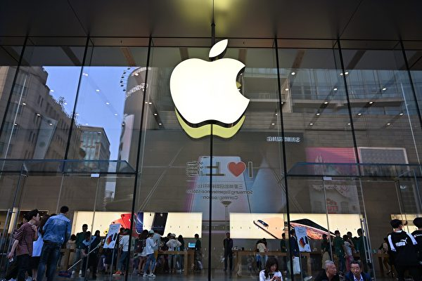

越来越多的外商正在离开大陆，业界预计2020年外商出走潮会持续，由于大陆的经营环境恶化，即使中美签署第一阶段贸易协议，外商也不会再回到大陆市场。(HECTOR RETAMAL/AFP)

【大纪元2020年01月10日讯】（大纪元记者张玉洁综合报导）越来越多的外商离开大陆，业界预计2020年外商出走潮会持续，由于大陆的经营环境恶化，即使中美签署第一阶段贸易协议，外商可能也不会再回到大陆市场。

《南华早报》1月9日报导，外商正在大批离开大陆，转移至印度、印尼、马来西亚、墨西哥、泰国、越南等国家。即使没有高关税，仍有复杂的监管环境、高成本，以及在中国的生活和工作存在高风险等因素，促使外商加速退出大陆。

美国照明设备制造商Capstone International一年半之前将生产线从大陆转移到泰国。其香港分公司总经理拉里·斯洛文（Larry Sloven）表示，即使未来取消了关税，大多数外商也不愿意回去中国，外商接受了一个现实——即使第一阶段协议签署，他们在大陆的经营状况也不会有实质性的改善。

美国Harris Bricken律师事务所创始人丹·哈里斯（Dan Harris）预计2020年离开大陆的企业会更多。
离开中国大陆的外商来自世界各地

2019年将生产线移出或部分移出大陆的外商有美国的玩具商孩之宝公司（Hasbro）、智能音响品牌、苹果、GoPro；韩国的三星（Samsung）、起亚（KIA）；日本的夏普（Sharp）、索尼（Sony）、任天堂（Nintendo）；法国标致雪铁龙（PSA），等等。

从大陆过去一年半的出口情况来看，以美国为例，大陆对美国的出口下降了20.84%。而美国对越南的进口激增51.6%，对泰国增加19.7%，马来西亚增加11.3%，印尼增加14.6%，台湾增加30%，墨西哥增加12.7%。

当下仍有一些在华外商正在计划转移生产线。比如，法国儿童车制造商高乐宝（Globber）在东莞的成本比之前在杭州增加了15%至30%，未来可能会转移到越南。

日本磁力玩具商Sumaku现在在宁波和澳门有工厂，其香港分公司经理Tsutomu Aoi表示，现在的人力成本虽然低，但生产流程慢，而且公司今年的目标是开拓美国市场，所以计划将生产线转移至印尼。

爱沙尼亚玩具商Gerardo’s Toys的CEO表示，公司计划在欧盟进行自动化生产，这样能保持成本和价格不变，而且质量比在中国的手工制作更好。
经营环境引忧   外商对北京当局已形成“承诺疲劳”

法新社（AFP）1月8日报导，北京当局从1月1日开始实施新的《外商投资法》，对外商做出一些承诺，比如外商进入中国不再必须有中国合伙人，禁止管理部门强迫外商转移技术等。但是，外商早已对北京形成了“承诺疲劳”，新的《外商投资法》不能打消在华外商的疑虑。

中国美国商会政策委员会主席罗斯（Lester Ross）表示，对此不抱太大期许，大陆的长期问题不是缺少管理条文，而是缺少执行规范，经常是政府部门裁定，选择性执行。

美国IHS Markit公司亚太区首席经济学家比斯瓦斯（Rajiv Biswas）表示，北京当局的目的是应对亚洲其它国家吸引外商投资的竞争，但是，如果没有很好的实施机制，外商仍然存有疑虑。

而且，该条法规未提侵犯知识产权的惩罚措施，未提（中共）政府给予国企补贴。中共政府补贴国企被指控扭曲正常的市场竞争机制，是中美贸易战有关中国结构性改革的重要内容。

中国欧盟商会主席伍德克（Joerg Wuttke）表示，大陆针对外商的法律框架仍然存在，将外商与大陆本土企业区别开来，而且新《外商投资法》一些措辞含糊不清，可能令地方政府会以“损害公共利益”为名没收资产，还可能以“歧视性限制”或“歧视性禁止”为由，采取报复性措施。而且在华外商提起上诉非常困难。#

<a target="_blank" href=#top><h6 align="right">回上方</h6></a>

<a name=92>
<h1 align="center"><b>德国修炼者读《转法轮》见证神奇 受益良多</b></h1>

2009年11月21日，6,000名法轮功学员排成金光灿烂的《转法轮》立体书图形。（明慧网）

【大纪元2020年01月09日讯】从1995年《转法轮》首次出版至今已有25年了。1998年，这本书的德语版面世，让许多德语国家和地区的西方人先后走入法轮大法（又称法轮功）修炼，他们的亲朋好友和同事也见证了大法的神奇。

通过认真阅读《转法轮》（法轮功的主要著作），有的法轮功学员得以解脱生活的困境；有的放下了对社会的不满，开始严格要求自己做好人；有的终于能解脱情感的过度牵绊，不再无故担心害怕；有的学会了体谅别人；还有的发现自己读《转法轮》后，周围的人也能受益。这样的事例在法轮功学员中数不胜数。学员们感恩师尊的教导，也希望有缘人能用心读一读这本书，从中受益。

<b>走出人生低谷</b>

米莱娜是一位高档美容院的店主，说起得法的美好，她微笑着说：“记得我第一次读《转法轮》时，书中的内容就深深吸引了我。那时我下班都是小跑着去取车，以便早点开车回家，继续读这本书。那几天我根本顾不上买菜做饭，冰箱都是空的。”

她回忆起自己曾经经历的人生低谷，说：“我一生吃了不少苦。小时候我受过父亲的虐待，后来，由于家里没人给我付学费，我没法上大学读书。白手起家创业吃的许多苦也比不上家庭对我的精神打击带来的苦。我儿子的父亲曾两次非法把我的孩子带离我的身边。”

她说，《转法轮》中写道：“佛家讲普度众生这句话的涵义：是把你从常人最苦的状态中拿到高层次上去，永远不吃苦了，解脱了”，当她读到这句话时，觉得身心都受到震动。

“我知道这就是我要找的。当我继续读下去时，发现人生中的很多问题都一个接一个地得到了解答。到后来，我发现自己原来不是像自己以为的那么好。读完第一遍后，我对自己说：原来我做错过那么多事情，我有什么可抱怨的呢？”

读完了一遍《转法轮》她就有了明显的变化。“我突然明白自己没有什么可害怕的。原来在做生意时，我总是觉得自己得努力争取那些利益。当我读完《转法轮》后，心态就平和多了。我的顾客们都发现了我的变化：脸色红润，人也很乐观了，他们甚至问我是不是在谈恋爱。”

另一位法轮功学员艾娃是一位有三个孩子的单身母亲，她说《转法轮》这本书也帮助她走出了人生低谷。她说她的母亲也是她最好的朋友，给了她很多帮助。当母亲去世后，她简直痛不欲生。

“那时我只要一想起她就会哭个不止，哭得浑身无力。《转法轮》中简明又意义深刻的法理深深地打动了我。第一遍读完‘自心生魔’这一章时，那种失去亲人的悲痛消失了。”

<b>多年的祈祷得到回应</b>

赛布丽娜是在感到失去希望和无助时得到《转法轮》这本书的。她说：“我以前曾经做过生意，看到了人类社会道德越来越败坏，一代不如一代，就想这样下去怎么办呀？我对宗教也失去了信心，感到绝望。可是我每天还在祈祷。我向最初的创世主祈求帮助，虽然我并不知道他是谁。”

“刚刚得到《转法轮》这本书时，我并没有立刻开始阅读，而是想先看看这是不是正道。”

她于是先看目录，看到“杀生问题”这一标题时，就翻到相应的章节看了看。她觉得大法师父对不准杀生的要求很高，就觉得这个法门很正。于是她开始从头读这本书。读的时候她觉得很惊奇。

比如，《转法轮》第一讲中提到“释迦牟尼、老子当时讲的理，都是我们银河系范围之内的理。我们法轮大法炼的是什么呀？我们是按照宇宙演化原理修炼，按照宇宙的最高特性──真、善、忍的标准指导我们修炼。我们炼了这么大的一个东西，等于是炼宇宙。”

她说她明白了师父讲的超出释迦牟尼和老子的范围。她问自己，“会不会是我多年的祈祷终于有了回应？当时我的心情非常激动”。

读了《转法轮》后，赛布丽娜不再对社会感到不满，而是开始严格要求自己。她读完第一遍后，发现自己没有必要抱怨别人的道德如何败坏，原来自己也达不到真正好人的标准。做生意时，她接受过别人的赠送。

“读完《转法轮》后，我把原来收的礼物都送给了需要帮助的人。”

<b>放下担忧 身心轻松</b>

从事科研工作的乌苏拉从一开始就被《转法轮》深深吸引住了。她说：“我觉得《转法轮》真的是一本奇书。第一次读时，我每看完一页，就有很多问题。当我继续读下去，就发现我提的问题往往在两三页后就有了答案。可是我又有新的问题提出来，再读下去，又能找到答案。就这样，我放不下这本书了。”

乌苏拉的母亲虽然不修炼，也从中受益。她说，她的母亲是天主教徒，读了《转法轮》后说：发现自己现在才明白耶稣讲的一些话和《圣经》里的一些句子的真正涵义。

<b>会体谅别人痛苦的年轻人</b>

一位90后的年轻法轮功学员现居德国，她从小就从母亲那里知道了大法修炼。在中国大陆上学时，她就能按照《转法轮》中的法理指导自己，学会考虑同学的感受。她说，她以前上学的时候容易和班上同学发生矛盾，有时候会和他们吵，说些伤人的话。

“后来我知道要约束自己的行为，不能够想做什么就按照自己的心意去做，不去考虑别人的感受。上高中的时候，班上的同学都很喜欢我，有一个女生当时和我说，觉得和我在一起感觉很舒服。”

她说，她有时候会想，其实每个人活在这个世上都是很苦的，会遇到烦恼，遇到解不开的心结，会遇到别人对自己造成的伤害。“因为我们往往都只能体会到自己所承受的痛苦，而无法去体会别人的痛苦，这样如果没有正确的理来指导我们，可能就造成我们在痛苦中，为了减轻自己受到的外界伤害，而变得冷漠、圆滑和自私。”

能成为一个与众不同的年轻人，她非常感恩，说：“如果没有大法，我可能会和社会上其他人一样，追星，打电玩，沉迷于吃喝玩乐。不考虑家人的感受，不考虑别人的感受，为了得到自己想要的东西，做一些不好的事情。我庆幸自己可以出生在有大法弟子的家庭。”

<b>读《转法轮》 环境改善了</b>

住在汉堡的佩特拉表示《转法轮》不仅让她自己放下了对父母的不满，还改变了她的工作环境。

“我发现我能给我的环境带来好的影响。比方说，我的同事们如果当我在场时说了骂人的话，他们会向我道歉。如果我在场，办公室的氛围就很好。我的哥哥在我家住了几天，他也感觉非常好。”

文章来源：明慧网德国记者  #

<a target="_blank" href=#top><h6 align="right">回上方</h6></a>

<a name=91>
<h1 align="center"><b>刘鹤访美将签初步协议 川普：第二阶段将启</b></h1>

1月9日，川普在白宫表示，第一阶段协议占整个协议的“很大比例”，对美国农民和银行家都有益。（Official White House Photo by Shealah Craighead）

【大纪元2020年01月10日讯】（大纪元记者许祯祺综合报导）美国总统川普（特朗普）周四（1月9日）表示，美国政府将很快开启美中第二阶段贸易谈判，但可能会等到11月美国总统大选后才能完成协议。

“我们将立即开始就第二阶段（贸易协议）展开谈判。这将花些时间。”川普在白宫告诉记者，“我认为（完成谈判）可能要等到大选结束，因为如此一来，我认为实际上可以达成更好的协议，也许是好得多的协议。”

川普还表示，第一阶段协议占整个协议的“很大比例”，对美国农民和银行家都有益。“因此，我认为这对农民有利，对监管也有利，对银行也有利。你知道的，对金融公司非常有利。”他说。

川普还表示，第二阶段协议将涉及中国（市场）开放等其它议题。

2019年12月13日，美中宣布达成第一阶段贸易协议，此后双方一直表示目前仍正在进行翻译校对等程序。美方表示，要确保中英版本内容完全匹配。
刘鹤率团赴美 下周三上午签第一阶段协议

2019年12月31日，川普表示，2020年1月15日将签署美中第一阶段贸易协议，且第二阶段协议应该是完全版。

周四，中共商务部发言人高峰宣布，副总理刘鹤1月13日至15日将赴美签署美中第一阶段贸易协议。这是中共官方首次公开证实美中第一阶段贸易协议的具体签署日期及地点。

《华尔街日报》报导，知情人士说，刘鹤将率领一个由十人组成的代表团前往美国首都华盛顿。代表团成员包括：中共商务部长钟山，央行行长易纲，发改委副主任宁吉喆，财政部副部长廖岷，外交部副部长郑泽光，工业和信息技术部副部长王志军，农业部副部长韩俊，以及商务部副部长王受文。

知情人士表示，北京驻华盛顿大使崔天凯也将出席签字仪式，该签字仪式目前定于下周三美国东部时间上午11:30在白宫举行。预计将有200人参加，其中包括来自美国主要贸易团体的代表。

双方公布的第一阶段协议内容都包括知识产权、技术转让、食品和农产品、金融服务、汇率和透明度、扩大贸易、双边评估和争端解决（执行机制）的内容。

最受外界关心的是中方承诺在两年内增购2000亿美元美国商品和服务，其中包括增购320亿美元美国农产品。

川普去年10月初曾表示，强制技术转让内容将包括在第一和第二阶段协议内。

美中第一阶段贸易协议文本长达86页，美方表示，在协议签署后，将会公布文本内容。

不过，高峰周四没有提供中国增加进口美国商品和服务承诺的细节。他仅表示，中方将“根据世界贸易组织的规则，改善其对小麦、玉米和其它农产品的关税政策”。
川普未回复是否访华 谈判第二阶段协议

去年12月31日，川普说：“我认为，第二阶段可以完成（谈判）。很多人说：‘您要进行第二阶段，或者进行第二阶段和第三阶段？’我认为，我们将进行第二阶段（贸易协议谈判）。我认为两个阶段协议应该完成（整个谈判）。我们将很快开始谈判。”

他还表示，将在某个时候赴京会见习近平。

周四，川普对记者提问他将访华见习近平的问题未作回复。

在未来第二阶段贸易谈判中，首先将触及使美企和其它外企在中国市场处于不利地位的中国经济结构性问题，包括中共国家主导的产业补贴，政府在经济中的主导作用，以及对外国公司的系统性歧视等。

其它议题可能包括数据处理和中共利用黑客盗窃美国知识产权。

美国财政部长史蒂芬·姆钦（Steven Mnuchin）去年12月14日表示，预计第一阶段协议将在一月份全面执行，然后进入“第二阶段”。他说，“最重要的问题是确保强制性实施第一阶段协议。然后我们开始谈判‘第二阶段’。”

“‘第二阶段’包括重要议题，也许会有一个‘第二阶段A’，‘第二阶段B’和‘第二阶段C’。我们会看到。”姆钦说。

在达成第一阶段协议后，美方暂缓了在12月15日对1600亿美元中国商品加税，并承诺将在协议签署后30天内，把1200亿美元中国商品关税税率减半（从15%降至7.5%）。但美方保留对2500亿美元中国商品25%的关税，以作为未来谈判的杠杆。#

<a target="_blank" href=#top><h6 align="right">回上方</h6></a>

<a name=90>
<h1 align="center"><b>亲属遭中共骚扰 郑文杰宣布与家属断绝关系</b></h1>

图为郑文杰。（授权影片截图）

【大纪元2020年01月10日讯】曾被中共当局“行政拘留”15天的英国驻香港总领事馆前职员郑文杰发声明表示，为免其香港及大陆家属被骚扰，决定与他们断绝关系。

郑文杰是在英国时间1月9日于facebook宣布上述信息的。

郑文杰在声明中说：“谨此与香港及内地家属断绝一切关系，本人之言行与他们全无关系。我衷心希望他们可以不被骚扰，过上平静的生活。相濡以沫，不如相忘于江湖；对不起，愿来生再续前缘。”

去年8月，郑文杰由香港前往深圳公干，被中共当局以所谓“嫖娼”罪名拘留15日，期满后获释回港。

郑文杰对多家外媒表示，拘留期间被中方以不人道方式拷问迫供。

他曾对BBC表示，基于人身安全考虑，希望向可靠的国家寻求政治庇护。BBC的专访引述来自英国的消息指，英方已经向郑提供支援，包括为期两年的工作签证。

日前郑文杰在英国接受大纪元独家专访，详述自己在西九龙高铁站被“送中”，在深圳被关押、酷刑对待、单独囚禁及被逼认罪，以及出狱后在香港、台湾被跟踪恐吓的经历。

郑文杰在专访中强调，自己站出来讲出真相，除了是希望洗脱中共强加的“嫖娼”罪名外，也因为看到不同抗争者，包括他所认识的朋友失踪或者关押在大陆，“如果我不出声，我不知道会不会他们就从此消失”。

<a target="_blank" href=#top><h6 align="right">回上方</h6></a>

<a name=89>
<h1 align="center"><b>中南海大秘：中共高层心灰意懒 出工不出力</b></h1>

中南海一名大秘透露，习近平周围聚集了一帮庸才，中共其他高层个个心灰意懒，出工不出力。(Getty Images)

【大纪元2020年01月10日讯】（大纪元记者张顿报导）中共内外交困，高层权斗不止之际，中南海一名大秘透露，习近平周围聚集了一帮庸才，而中共其他有能力高官个个心灰意懒，出工不出力。

过去一年里，中共当局面临着诸多难题：美中贸易战，中国经济严重恶化，香港的抗议浪潮持续逾半年、仍没有停止的迹象，中共高层权斗不止，中共打压新疆维吾尔人的内部文件被泄露、引发国际社会强烈谴责中共迫害人权。

《华尔街日报》报导说，中共在过去一年里，一直努力应对上述难题，表明中共当局过去一年政策受挫。一些党内人士和政策专家将这些问题部分归咎于习近平。

中南海一名大秘1月6日向《世界日报》透露，现在习近平举步维艰，进退两难。根本原因在于没有一个强大睿智的执政班底。

中南海大秘说，具实际执政能力的团派大员，个个心灰意懒，出工不出力。只有一帮专事逢迎的庸才聚集习身边。所以近来内政、外交昏招迭出。

时政评论员石实表示，中南海大秘向亲共媒体披露中共高层内情，显示中共高层权斗激烈，这与中共官员此前向外媒透露中共打压新疆人的做法如出一辙，就是给当局制造麻烦。

石实指出，这名中南海大秘只说中共团派高层个个消极怠工，传递团派对习近平的不满；但只字未提中共江派的情况。不排除这是江派人马有意放风，挑拨习派与团派间的关系，江派从中渔翁得利。

石实认为，习近平反腐、“打虎”打下大批江派“老虎”后，江派一直搅局、挖坑，让习近平早点下台，至少不能让他再连任。

去年9月底，一名红二代向《大纪元时报》披露，中共党内不同的意见、不同的声音越来越多，而且最近把习近平过去说的一些话，比如说反对终身制，都拿出来在网上闪了一下，这个实际上就是所谓“高级黑、低级红”。

他说，这是因为习近平在香港问题、中美贸易战上没处理好，“捅娄子了”，所以党内不同的声音就越来越多、越来越强。

他表示，习近平现在有各种各样的反对派，比如说，嫌习不妥协的就是反对派，嫌习不够强硬的也是反对派。现在“形势很糟糕，香港也好，中美关系也好，都很糟糕，所以比他（习近平）更左的，比他更右的都是反对派”。

另一名北京女红二代去年6月对大纪元记者表示，中共高层现在貌合神离，在美中贸易战之际，官媒批有人向后扔“手榴弹”，肯定就是窝里斗。

“有些人在他（习近平）前面挖个坑、后面挖个坑，所以这个很难说、很复杂的局面。”她说，“你别看都是在高层，可不见得都是一条心，对不对？有挖坑的、有支持的，各揣各的心事吧。”#

<a target="_blank" href=#top><h6 align="right">回上方</h6></a>

<a name=88>
<h1 align="center"><b>返乡潮首日大陆无防护 武汉火车站零防疫</b></h1>

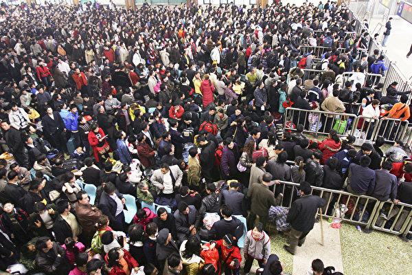

不明肺炎的潜伏期未知、会否人传人亦未知。给马上就要到来的春运带来担忧。图为武汉春运时景象。(China Photos/Getty Images)

【大纪元2020年01月10日讯】（大纪元记者萧律生报导）今日（1月10日）是大陆返乡潮（春运）首日，可是距离武汉疫情爆发地不足1公里的汉口火车站毫无防疫措施，而且大陆其它地方，诸如北京、广州的火车站也未做任何防疫措施。

近日，中共当局称，会在春运期间加强防疫措施。中共交通运输部总工程师汪洋9日表示，会在包括交通枢纽、客运站、货源枢纽厂站等区域进行消毒监测防护措施。

然而，大陆多个火车站均未有任何防疫措施。

香港苹果日报报导，距离“不明肺炎”源头华南海鲜批发市场不足1公里的汉口火车站，武汉居民说，会有安检，但没有防疫措施；大批旅客中只有几个民众戴着口罩。不仅火车站没有防疫措施，距离武汉国际会展中心最近的中山公园地铁站，也未采取任何防疫措施，乘客也没有戴上口罩加强保护。

除了武汉，北京南站也没有采取加强消毒的措施，旅客戴口罩者较少。

大陆南边的广州南站，亦没有加强防疫的措施，无论是售票处售票员，还是乘车旅客，或者车站的其他工作人员，都没人戴口罩，现场也没有配备消毒设施。

在广州读大学、准备坐车回茂名的梁同学表示，不觉得武汉不明肺炎有多恐怖，自己戴口罩只是为了个人卫生，不担心染病问题。

湖南长沙的区先生称，戴口罩不舒服，也不担心染病，并说虽然家乡与武汉只有一省的距离，但家乡的亲戚朋友也不担心染病。

据中共国务院新闻办公室1月8日记者会消息，中共国家发改委预计，2020年春运旅客量将达约30亿人次。

其中，道路客运预计将达24.3亿人次；铁路部分预计达4.4亿人次；航空部分预计达7千9百万人次；水运部分预计达4千5百万人次。

面对如此大量的客流量，中共却未有防疫措施，对此，香港网民表示，“大陆新闻只报喜不报忧，死人，病毒，都是国家机密，不敢报。”有网民担心：“会不会死一半人口？”

前中国大陆医院内科医师、中国问题专家唐靖远曾接受大纪元采访说，首先，武汉是中国中南部交通枢纽，人口流动量巨大。而且随着黄历新年渐近，被称为世界最大季节性人口迁徙的“春运”即将到来，中国人口会大规模由南至北、由东向西地移动，传染病扩散的风险大增。

唐靖远说，不仅如此，不明肺炎的“潜伏期”未知，也就是说，很可能有人已经感染，只是处於潜伏期中，尚未发病；是否有可能人传人，也未有明确答案。如果感染者去往其它地方，就可能出现“地域跳跃式传染”。

台湾马偕医院胸腔内科资深主治医师、曾任台北马偕医院“SARS勤务应变中心”召集人的郭许达曾指出，当疫情出现后，政府应在第一时间公布，向民众进行卫生教育；同时立刻通知所有医院提高警觉；若不及时、透明地公布消息，也容易让一些民众认为“官方说没有啊”，就没有警觉心，未进行应有的防范措施。

中共未做防疫措施，反而是台湾、香港、新加坡、韩国等加强防疫措施。1月7日美国驻华大使馆网站还发出了美国疾病管制与预防中心的注意事项公告。#

<a target="_blank" href=#top><h6 align="right">回上方</h6></a>

<a name=87>
<h1 align="center"><b>美对伊朗祭新制裁 中国企业上榜被冻结资产</b></h1>

美国国务卿迈克·蓬佩奥（Mike Pompeo）和财政部长史蒂芬·姆钦（Steven Mnuchin)1月10日宣布最新对伊朗制裁政策。(NICHOLAS KAMM/AFP via Getty Images)

【大纪元2020年01月10日讯】（大纪元记者林燕综合报导）美国财政部周五（1月10日）宣布对伊朗的最新制裁，将伊朗最大的钢铁生产商和矿业公司、出售违禁品给伊朗的中国贸易企业及其皮包公司，还有涉及转运违禁品的中国轮船列入制裁名单；预计这些制裁行动将“切断对伊朗政权的数十亿美元支持”。

美国国务卿迈克‧蓬佩奥（Mike Pompeo）和财政部长史蒂芬‧姆钦（Steven Mnuchin）周五（1月10日）宣布了这一消息，对伊朗的最新制裁涵盖经济实体以及个人，包括八名参与导弹袭击活动的伊朗高官。

<b>美加大对伊朗的经济制裁 参与袭击活动的高官上榜</b>

姆钦在周五新闻会上说：“总统正在发布一项行政令，对拥有、经营、贸易或协助伊朗经济部门活动的任何个人进行额外制裁，覆盖建筑、制造、纺织和采矿业。”

他强调，这些制裁既包含一次制裁，也有二次制裁；同时总统行政令还允许在未来继续指定部门进行相关行动。

周五宣布的制裁是针对伊朗最大的钢铁制造商、三个塞舌尔（Seychelles，南非岛国）注册的实体，以及一家涉嫌运输违禁品的船只实施17项具体制裁。除外，美国还对伊朗的金属行业和八名伊朗高官实施新制裁。

上述实体及个人已被美国列入指定制裁名单（SDI）。在美国境内的所有人士以及企业都不得与该制裁名单上的对象进行交易，否则违法并会受到制裁。

美国财政部在周五发出的新闻稿中说，美国财政部这次制裁的伊朗高官都被指参与实施了破坏地区稳定的活动。被制裁的伊朗官员包括伊朗最高国家安全委员会秘书和伊朗武装部队副参谋长等。

姆钦在新闻稿中说：“美国将伊朗高官作为制裁目标，因为他们参与并共谋了周二（7日）的弹道导弹袭击。”

总统川普（特朗普）周四（9日）表示，将立即对伊朗政权施加额外的惩罚性经济制裁。川普说，过去的对伊朗制裁措施已经非常严厉，“本次更是大大增加了制裁力度”。

<b>中国贸易公司违禁每月购买数万吨伊朗钢胚</b>

自2019年8月以来，总部位于北京朝阳区建国门外大街的庞潮贸易（北京）有限责任公司（Pamchel Trading Beijing Co. Ltd.）每月从伊朗最大的钢铁企业（Esfahan Mobarakeh）采购数万吨钢坯。

美国国务卿蓬佩奥指，庞潮违反美国的《伊朗自由和反扩散法》第1245条，从一家被列入制裁名单的伊朗公司手上转走2万9,000吨钢铁。

此外，2019年期间，庞潮贸易（北京）公司同时也将多批焦矿、阴极块和石墨电极出售给伊朗矿产贸易公司Khalagh Tadbir Pars Co.，将这些货物运往伊朗、供伊朗铝公司生产用。双方交易还涉及铜精矿等其它违禁物品。

为了掩人耳目，庞潮贸易（北京）公司还在非洲岛国塞舌尔设立了一家皮包公司，名为Power Anchor Limited，用来掩盖从伊朗金属企业的最终用户身份，同时收取伊朗金属企业的款项。

针对中企参与伊朗违禁交易，美国国务院曾在2019年12月16日发布咨询意见，提醒全球范围内有关当事方注意，向伊朗转让或出口石墨电极（graphite electrodes）等都将面临美国制裁的风险。

咨询意见明确指出，无论其国籍和所在地（即包括第三国企业），参与此类交易的相关当事方均可能受到制裁。当事方包括但不限于：石墨电极和针状焦的生产商和出口商，港口经营者，托运人，船运公司以及船舶经营者和所有者。

“鉴于此，有关企业应提高风险意识，开展有效的尽职调查，完善出口合规程序，以防控制裁风险。”美国国务院的声明中写道。

<b>帮助运货的中国货轮也上榜 遭美冻结资产</b>

根据财政部的公告，位于浙江省的宁波鸿源船舶管理有限公司（HongYuan Marine (china) Co., Limited）旗下的宏勋（Hong Xun）号轮船在2019年9月运输伊朗伊斯法罕·莫巴拉克钢铁公司（Esfahan Mobarakeh Steel Company）生产的钢胚到中国，船从伊朗阿巴斯港出发，货物则由一家中国企业庞潮贸易（北京）公司（Pamchel Trading Beijing Co.Ltd）购入。

宏勋号轮船的注册方是中国浙江省的宁波鸿源船舶管理有限公司，鸿源公司也是该船的船舶经理。

美国财政部指，宏勋轮船帮助运货、违反了美国政府于2019年5月8日签发的第13871号行政令。该行政令针对伊朗的整个金属行业实施制裁，其中包括参与支持伊朗金属行业交易的个人以及实体。

美国第13871号行政令适用于美国以及非美国公民。如违反此行政令，可能被：冻结制裁，菜单式制裁（其中包括冻结制裁），以及对于外国金融机构的美元账户制裁。

财政部的公告指，美国财政部外国资产管制局（OFAC）已冻结宏勋号轮船的资产。

<b>美国务院官员：2020年对伊朗加剧施压力度</b>

美国国务院官员在上月的电话会议上说，美国将在2020年加剧对伊朗施压，遏制德黑兰发展核基础设施和区域入侵的行为。

“他们已经深陷经济衰退之中，我们还将看到伊朗受到更大的外交孤立。”该名官员说。

另一位国务院高级官员补充说，川普政府已经制裁了约1000名与伊朗恶意活动相关的个人和实体。

这位官员说：“我们正在做的是不允许伊朗政权获得——用来执行扩张主义外交政策的——收入，根据这项政策，伊朗（政权）现在能花的钱比三年前要少。”#

<a target="_blank" href=#top><h6 align="right">回上方</h6></a>

<a name=86>
<h1 align="center"><b>陈思敏：上海银行爆大雷 官场震动</b></h1>

【大纪元2020年01月12日讯】1月10日消息，上海银行副行长、上银国际董事长黄涛被举报，涉嫌行向深圳宝能集团违法放贷265亿元。举报人是上海衡源、上海申鑫老板徐国良。

徐国良的举报信可以看到一个基本信息，本次举报以及沪深两家房地产大佬的产权纠纷皆因百联中环、徐汇滨江项目而起。

值得起底的是这2块地皮，目前公开信息显示，百联中环曾是上海滩知名烂尾楼项目，在2014年由当时的所有人上海国企百联集团将此处唯一盈利的百联中环购物广场剥离之后，将剩余地块（烂尾楼）与徐汇滨江项目打包出售。

2016年，徐国良实际控制的衡源集团以89.1亿元的高价接盘这不良资产，但以近乎1：10的巨大杠杆拿下，而上海银行作为资金方支持，因自有资金非常有限，遂利用理财资金通过非标通道，合计输血107亿元，利率介于6.2－6.6%之间。

2018年，徐国良开发的楼盘迟迟不能上市，衡源资金链紧张，由于该项目实际是上海银行用理财资金接的，上海银行担不起这个风险，于是又找来宝能当接盘侠。据徐国良举报信，上海银行为这2块地皮的新下家宝能集团，提供了265亿元贷款、利率不到5.1%。上海银行给宝能的首期款120亿元（此款项又是来自上海银行的理财资金），差不多刚好能置换掉前一波107亿的本金和利息。

从以上信息也可读到几个事实。一是坊间盛传已久的“银行地产本质穿一条裤子”，不论2016年的衡源还是2018年的宝能，两家房企能够负债拿地，都是在上海银行的协助下使用了巨大的杠杆；不论是宝能拿到的利率5.1%，还是徐老板拿到的利率在6.2-6.6%之间，这对于房地产同业动辄10%以上、票面利率已达15%的融资成本来说，确实低到有些离谱。对于那些融资利率降0.1个百分点银行都要斤斤计较的中小微企业，更是只有垂涎的份。

二是当年上海国企百联集团的不良资产，辗转经过两个接盘侠后的作价高达265亿，但对实体经济完全没有任何贡献，而是助益上海银行的业绩。

三是百联集团的坏帐是烂在上海银行虹口支行，徐国良彼时接的盘其实包括百联和上海银行。也就是上海银行给房地产违规贷款，实际上都是为了自己不能开出百亿级的天窗。

由此可知，上海银行还涉嫌顶风作案。近几年一轮一轮的房地产调控，从高层发话要对房企融资收紧政策，再到央行、银保监会等发文严防信贷资金违规流入房地产市场，但这次爆雷显示，上海银行违规发放给单一客户的贷款不能超过银行资本净额的10%的规定，并以走理财子公司、信托等方式绕开了贷款的流程。问题是，银保监会的专项检查，以及央行的压力测试，上海银行是怎么过关的。

能被上海银行找上的接盘侠多少有背景。据称，衡源集团实际控制人徐氏兄弟祖籍江西，但衡源集团是地道的上海本地企业，徐国良曾是杨浦首富。而宝能集团这次出面接盘的深业物流，成立时的控股股东深圳控股，即如今深圳市国资委旗下最大的房地产上市公司。徐国良举报背后，或涉上海银行高管内斗。

A股上市的上海银行，目前最大股东是上海联和投资（上海市政府国有独资），而且入股时间非常早。据《政知局》2015年发文大起底江绵恒的五大人生角色，文中在“企业家江绵恒”一段写道：海归一年后，1994年9月，上海联和投资有限公司创办。江绵恒以此为舞台，在中国正式踏入商海。上海联和投资领域涵盖科技、电信、航空等诸多方面，金融领域是上海银行。

流亡海外的中国富商郭文贵也曾经爆料，上海四大班子的亲属都安排在上海银行和浦发银行，这两家银行就是上海政府的私有财产。

而徐国良举报直接点名的上海银行副行长黄涛，公开信息显示，出生于1971年8月，令人注意的一笔经历是，2000年6月至2001年5月担任中共中央金融工作委员会主任科员。

总而言之，上海银行这次爆出百亿级别的雷，如果追查到底，上海官场都要动荡，至少这个年关确定不好过。

<a target="_blank" href=#top><h6 align="right">回上方</h6></a>

<a name=85>
<h1 align="center"><b>山东法轮功学员李长芳被害死 遗体遭抢</b></h1>

2019年7月12日，山东临沂市沂南县法轮功学员李长芳被迫害离世。（明慧网）

  
  【大纪元2020年01月10日讯】山东临沂市沂南县法轮功学员李长芳在临沂市看守所被非法关押期间，疑遭药物毒害致胃疼，被送进临沂市医院。2019年7月6日下午，她在未确诊的情况下做了手术，手术后再也没有醒过来。

明慧网报导，2019年7月12日，临沂兰山区东关派出所与临沂看守所，趁李长芳家属不在，拔掉正在临沂医院重症监护室抢救的李长芳身上的各种仪器管子与呼吸机，随后将李长芳的遗体抢走。

李长芳被做手术前。（明慧网）

  
  李长芳是沂南县依汶镇隋家店村人，是一位善良的农妇，修炼法轮功，按“真、善、忍”做个好人。

2018年10月23日早晨六七点，沂南公安局又出动三十多人、九辆警车，以“扫黑”为名，对隋家店村进行二次洗劫。

当日早6时，沂南县公安局和沂南县依汶镇派出所警察翻墙入室抢劫并绑架了李长芳，当时还把她丈夫学考驾照用的电脑、她的手机及儿子家的电动车一起掠夺走。随后李长芳被劫持到临沂看守所非法关押。

沂南县法院于2019年3月27日对李长芳非法判刑2年6个月、勒索罚款1万元。李长芳不服提出上诉。2019年5月24日，临沂市中级法院非法维持原判。李长芳一直被非法关押在临沂市看守所。

<b>住院</b>

2019年7月5日晚9点多钟，沂南县依汶镇派出所警察通知依汶镇隋家店村村干部，说李长芳住医院了，让家属去。当时李长芳的丈夫王西杰在外地干活，便让姐姐、姐夫及女儿王小交先去。

7月5日10点钟左右，女儿王小交等亲属到医院后，看守所警察十几人在场，临沂市看守所副所长刘世岱暴跳如雷，指责她不签字让李长芳做手术，检察院李局长也在场。在王小交被迫签字时，其父王西杰打来电话问询问情况。

女儿王小交说：“医院说胃穿孔、肠穿孔还未确定。” 王西杰说：“先不能签字，等我到了再说。”

7月6日约凌晨2点50分，王西杰赶到医院走进病房时，见临沂市看守所等单位十几个警察围着李长芳。他们有穿警服的，有穿便衣的。

王西杰问妻子怎么回事，李长芳说她肚子疼了半个月了，一开始胃疼，逐渐往下疼，一直发展到下身，疼痛越来越厉害。送医院前的一个礼拜疼痛得不能吃饭，只能喝点水。

王西杰看到李长芳的下身、大腿、腰部等部位大面积出现红紫现象，便问临沂市看守所大队长张秀霞等警察，她们支支吾吾不做解释。

在7月5日，刚刚送入临沂人民医院时，李长芳能思路清晰地描述身体状况。她说，在看守所吃过几次药，在临沂看守所被打针后，第二天身体疼痛、下身红肿，后转为紫青色。

家属怀疑她被下不明药物或打毒针导致此症状。

李长芳的女儿在门外拍了一张母亲躺在病床的照片。临沂看守所大队长张秀霞抢去她的手机并强行删除照片。

后来王西杰问一个医生，妻子是什么情况，医生声称：可能是皮肤病，也可能是感染。家人具体询问时，医生前后矛盾，语无伦次。王西杰说：“既然你们这里医生解释不了，那我要拍照片外请专家看看。”但遭拒。

临沂市看守所所长陆国强说，李长芳是犯人，不能拍照。王西杰说：“我家属现在是病人。”陆国强说：“她身份不行，现在是我们的人。”王西杰说：“病人与身份能挂钩吗？”王西杰要求保外就医，他们不同意。

王西杰又找到主治大夫刘省臣，询问病情。大夫说，不确诊是胃穿孔还是肠穿孔，提出两种疗法：一是保守治疗、一是动手术。王西杰选择前者。

杨晓峰大夫让李长芳女儿签字做保守治疗。但是临沂市看守所队长张秀霞不满意大夫做保守治疗，说应当做手术。

王西杰再想去病房看李长芳时，看守所警察顶着门不让他进去。

<b>做手术后</b>

7月6日中午11点左右，大夫通知李长芳的家人要做手术，让家人签字。王西杰问杨晓峰大夫原因，杨说，李长芳的病情有了发展，还说不动手术人肯定活不了。临沂看守所民警和大夫强烈要求家属签字做手术，由于家人担心李长芳不保命便签了字。

签完字后王西杰再到病房，李长芳对王西杰说：“挂上吊瓶后，中午疼痛就减轻了。”王西杰就掀开薄被看了看，下身及腿、腰的大部分红、紫部分消失了。这说明保守治疗是管用的。

手术前李长芳82岁的母亲及80岁的老姨、姨夫及姊妹进病房看望李长芳，李长芳说你们这么大岁数还跑来，并落了泪。

当天下午3点半左右，医生给李长芳动了手术。大约下午7点左右做完手术，李长芳直接被推进重症监护室。

做手术的主治大夫刘省臣说：手术做好了，里边形成了脓包，但都清理了，明天早上就能醒来。说四五天后可能伤口会感染。刘省臣让李长芳家人回去。

家人刚到家，重症监护室的医生又给李长芳的儿子王小飞打电话，让去医院。王小飞在病危通知书和用药单上签了字。

7月7日早晨8点钟左右，王小飞又接到电话，说李长芳的肾脏被感染了，并且没有尿，需要上透析机。

当天，王西杰到重症监护室探视时发现，妻子身体从乳房往下缠着白布。警察不让他掀开薄被看。他发现李长芳全身浮肿。

一护士对守在重症监护室门外的王小交说，可能是尿液无法排出的缘故，手术后李长芳的身体全身浮肿。

手术后一男医生说：阑尾炎应当右下腹疼痛，她为什么上部疼。这种症状和别的病人不一样。临沂市看守所所长丁春玲接话说：“是啊，她情况和别人有点不一样。”

7月8日，医生说李长芳的肝脏感染，又说腹腔浓度中毒，使各脏器官感染。

7月9日，专家会诊后，一女大夫说，李长芳被送来之前就已经感染了、休克了，正常人血乳酸达到2就很危险了。她的乳酸达到20，超过正常十倍多，肝红素也升高了，肝脢超过最大值，指标看着正常也是用机器维持着。

刘省臣大夫说：“我的任务已经完成了，以后的事与我无关系了。”

李长芳的女儿进重症监护室（每天只允许探视一次，每次只能一人）探视时，发现母亲的双眼——眼皮上下被用胶带粘住了。

直到7月12日去世前，李长芳的丈夫王西杰、女儿和儿子每次到重症监护室探视，都发现她的双眼被用胶带粘着。

7月10日，临沂市看守所所长丁春玲打电话约王西杰一起去问询医生李长芳的病情。当王西杰、儿子、女儿王小交等赶到医院时，医院里布满了警察和便衣。

警察逼迫家属签字，给李长芳办出院手术。家人拒绝。身穿便衣的警察开始动手抓人打人，企图以暴力威胁，强迫签字。李长芳的儿子王小飞上厕所时，被便衣警察暴打。

李长芳儿子挣脱后呼救：“警察打人了！把我妈妈迫害得昏迷不醒，还打我，想把我也抓进去。我妈妈修炼法轮功做好人，强身健体，没有错……警察去年10月翻墙绑架我妈妈到看守所，非法判刑，突然告诉我们我妈妈身体不行了，要住院开刀，医生说是阑尾炎，后来开刀后被送进了重症监护室，开刀位置是从胸腔往下开刀的；再次问医生，医生说是多器官衰竭，至今昏迷不醒。现在人还没给我们治好，又强行逼我们出院。”

丁春玲对王西杰说：沂南县法院来人了，叫你们签字，保外就医。王西杰说：“一开始我要求保外就医，你们不同意，现在人不行了，你们就推责任，我不签。我现在只想把我老婆的病治好。”

丁春玲说，签了字（李长芳）就是你们的人了，看守所的人就全部撤走了，以后由你们自己管了。

7月10日下午2点半，探视的时候，王西杰让儿子给他母亲照张相，看守所人员不让拍，外面的四个警察就跑进去了，然后丁春玲跑来对王西杰说：“你儿子袭警。”四个警察出来时王西杰问他们的单位并让他们出示工作证，他们凶巴巴地说没有，然后又钻进重症监护室。

随即临沂东关派出所高中军带人把王西杰、儿子、女儿、六岁的小外甥、亲属彭辉强行劫持到警车上，非法关押在东关派出所。东关派出所警察非法审讯了每一个人并强行让他们写保证书，保证以后不能闹事了。

到子夜他们才被释放，但王小飞仍被关押在派出所。东关派出所所长高中军威胁家人说：“你们的事可大可小，就看你们的态度了。只要你们配合就放人。”7月11日王小飞才被放出来。

7月12日下午2点半，王西杰探视时，对着李长芳的耳朵喊了几声，发现李长芳呼吸急促；他又喊了几声，李长芳的头扭了一下；王西杰继续喊，李长芳的头又动了一下，然后眼角流出了一点眼泪。

当时王西杰心里很激动，就对医生说：“我家属有知觉了，头能动了。”医生说这不是她自己的意识，完全是机器控制的。

12日下午6点左右，医院打电话说李长芳心脏不行了，需要抢救。等家人赶到医院时，医院里布满了警察和便衣，重症监护室里也是便衣，殡仪馆的车已在那里等候。

等李长芳的家人进重症监护室时发现，氧气管子已拔了，压心脏的机器也停了。

<b>离世后</b>

临沂市看守所所长丁春玲拉着李长芳的女儿去买寿衣，说这衣服得自己女儿买。等买来寿衣，李长芳的亲属要进去给李长芳穿寿衣时，却不让进，就连李长芳的女儿和儿媳也不让进，也不让哭。

临沂市看守所一所长给王西杰一张释放李长芳的证明，释放日期是10号。

过一会儿，李长芳的尸体就被抬出来了。王西杰强烈要求等一会抬走，因为李长芳的姨和舅已经在路上，想让他们看一眼。东关派出所高中军指使手下把李长芳的家人架起来，把李长芳的尸体强行抬上殡仪馆的车拉走了。

7月13日，临沂市看守所丁春玲约李长芳的家人面谈。当时临沂市看守所刘所长说：“自10号写了释放证明后，李长芳就不是我们的人了。”律师问：“那是哪的人呢？”他无言以对。

律师写了《提请法律监督申请书》，李长芳的家人于7月14号到检察院信访办递交，信访办不收。7月16日，家人再次去递交，再次被拒。

信访办请示了检察院李局长，李局长同意让李长芳家人先看录像，限制最多六个人。

7月17日，李长芳家人去看监控录像。家人从6月19日的监控录像开始看，看到19日星期五，又从22日星期一看到24日星期三。

李长芳家人一直要求看6月30日至7月5日的监控录像，检察院推看守所，看守所推检察院，就是不让看。

8月2日，李长芳的家人到了检察院，之前监察院李局长答应王西杰录音，但到时也不让录了。李局长说：“临沂市看守所没有责任，监管环节没有错，看守所刘所长、杨所长、陆所长还要你们承担30多万元的医疗费，还要追究王小飞（李长芳的儿子）的责任。”

8月22日，沂南县依汶镇镇政府人员拿着当初李长芳的家人因没确诊她的病情拒绝签字做手术的录像，播放给隋家店村全体中共党员观看，说：“李长芳如果不炼法轮功的话和家人及时签字的话，李长芳就不会死。这一切都是他们自己的责任。”

10月1日前后，沂南县依汶镇镇政府人员又找到李长芳的家人，说不用赔医药费了，给4万元钱把尸体火化了。王西杰说：“给4万元钱也行，得把尸体还给我们。”一政府人员说：“要尸体门也没有。”

临沂市人民医院病历显示“李长芳胃病十余年”与事实不符，因李长芳在入所前和入所体检时一切正常。

家属认为，李长芳在关押期间死亡，临沂市看守所存在严重过错，特别是管教干警和医疗人员存在严重渎职，触犯中共《刑法》第397条的规定，已构成滥用职权罪；玩忽职守罪。应当承担民事、行政和刑事责任。法院本应依法予以法律监督，查明事实，追究责任。但却与看守所沆瀣一气，包庇犯罪。#

<a target="_blank" href=#top><h6 align="right">回上方</h6></a>

<a name=84>
<h1 align="center"><b>武汉肺炎病毒或来自蝙蝠 与SARS相似度近8成</b></h1>
  
【大纪元2020年01月11日讯】武汉市新型冠状病毒肺炎已出现首例死亡案例。1月11日，台湾卫福部疾管署表示，中共官方已公布新型冠状病毒基因序列，经比对，发现与蝙蝠冠状病毒相似度高达87%，与SARS相似度近8成。

中共武汉市卫健委11日公布消息说，对现有患者标本进行了检测，初步诊断有新型冠状病毒感染的肺炎病例41例，其中已出院2例、重症7例、死亡1例。所有密切接触者739人，其中医务人员419人，并未发现相关病例。

最新通报披露，死者为男性，61岁，因呼吸衰竭、重症肺炎入院，同时患有腹部肿瘤及慢性肝病，经治疗无好转，在1月9日晚停止心跳，抢救无效死亡。

该患者生前常年到武汉市华南海鲜市场采购货物。

台湾疾管署副署长庄人祥今天在记者会上表示，过去相关检验必须使用广泛冠状病毒核酸检验测试剂，需要1天多的时间，如今大陆已公布基因序列，未来将以此建立快速检测，4小时就能验出，最快一周后上线。

疾管署研检中心研究员刘铭灿表示，今早依据公布的新型冠状病毒基因序列，台湾运用全球基因资料库进行比对后发现，结果显示和蝙蝠冠状病毒相似度高达87.6%，代表有可能是来自蝙蝠，与中东呼吸症候群冠状病毒感染症（MERS）、严重急性呼吸道症候群（SARS）的相似度也分别有52.5%和79%。

港媒报导说，汉口火车站距离“不明肺炎”源头华南海鲜批发市场不足1公里，武汉居民说，汉口火车站有安检，但没有防疫措施；大批旅客中只有几个民众戴着口罩。不仅火车站没有防疫措施，距离武汉国际会展中心最近的中山公园地铁站，也未采取任何防疫措施，乘客也没有戴上口罩加强保护。

北京大学医学部基础医学院免疫学系教授王月丹认为，根据2003年SARS的经验，冠状病毒在人与人之间会传播，因此需要弄清楚传播途径、传播媒介，再采取相应措施，同时要监察疫情，每天公布是否有新增病例，消除公众疑虑。

王月丹说，不能排除其它省市会有病例，大陆各出入境口岸需要加强检疫。他表示，虽然暂时不能判断这次的疫情源于野味，但他认同要停售野生动物，并建议民众要避免到人多的地方，不要接触发烧的病人。

<a target="_blank" href=#top><h6 align="right">回上方</h6></a>

<a name=83>
<h1 align="center"><b>大陆阜兴系募资368.45亿 挪用365.65亿</b></h1>

大陆阜兴系2019年募资368.45亿人民币，其中365.65亿被挪用。（AFP PHOTO/JOHANNES EISELE）

【大纪元2020年01月11日讯】（大纪元记者刘毅报导）中共证监会日前发布了对阜兴系挪用募集资金的处理决定。据悉，2019年，阜兴系累计募集本金368.45亿元（人民币，下同），其中有365.65亿元被挪用。

证监会1月3日发布了对阜兴系参与挪用募集资金一案的处理结果，对朱一栋、赵卓权、余亮等7名责任人处以市场禁入。其中朱一栋、赵卓权被处以终身证券市场禁入措施；对余亮采取10年证券市场禁入措施；对徐铭、张敏、李木松、王源采取3年证券市场禁入措施。

据每日经济新闻报导，阜兴系旗下私募机构2019年发行并备案的私募基金产品共计160只，累计募集本金368.45亿元，私募基金产品约定的主要投资领域为合伙企业合伙份额、股权类、债权、项目收益权等。

而募集的资金绝大部分在募集后没有按照产品设计投向约定用途使用，而是在转入约定投资标的账户后不久，即通过阜兴集团关联企业或关联个人账户多次过桥后，汇入阜兴集团控制的“资金池”账户，由朱一栋、赵卓权在阜兴集团层面统一调度使用，主要用途包括兑付基金及偿还财通证券资管产品本息、归还信托及银行债务本息、各类资产或股权购买、偿付被重组公司债务、二级市场股票操纵、提成奖励、个人挥霍、日常费用等。

据统计，阜兴系私募160只产品累计募集本金368.45亿元，其中资金总额超99%未按约定用途使用，属于挪用基金财产，挪用金额合计365.65亿元。其中部分资金被朱一栋等人用于提成奖励、个人挥霍，用于提成佣金的金额为6.04亿元，用于个人挥霍的金额为0.65亿元，构成侵占基金财产，侵占金额为6.69亿元。

2019年除了阜兴系之外，还有数家私募基金将被查。

据不完全统计，仅仅去年11月份和12月份陆媒披露的私募爆雷案有2起。

12月2日，上海华领资产管理有限公司因为涉嫌集资诈骗被立案调查，该公司的负责人孙祺被公安刑事拘留。该案涉及的金额共计35亿元左右。经过调查发现，上海华领资产所有的产品都无法正常兑付，原因是托管账户上仅剩下1300元。35亿元资金从人间蒸发。

11月27日，至善基金涉嫌非法吸收公众存款罪被立案侦查，公司实控人吕邦政、董事长兼法定代表人王建乐、执行总裁卓栋炜、副总裁兼财务总监裘文杰等人被刑事拘留。2019年7月底，至善基金累计未兑付金额为20.93亿元，涉及投资者逾3000人。该基金成立于2014年7月、在2015年3月登记成为私募管理人的基金公司，

据基金业协会公布的数据，2019年协会办理了1072家私募基金管理人的注销手续，其中主动申请注销的私募基金管理人479家，未按照要求完成第一只私募基金产品备案被注销的私募基金管理人97家，因违反协会自律规则被注销的私募基金管理人496家。

<a target="_blank" href=#top><h6 align="right">回上方</h6></a>

<a name=82>
<h1 align="center"><b>美杀伊朗将军震慑中南海 传习招7常委紧急开会</b></h1>

【大纪元2020年01月11日讯】伊朗二号人物苏莱曼尼被美军击毙的突发新闻，在全球迅速传播。有海外中文媒体引述中南海知情人的消息说，为防暗杀和定点清除，中共领导人安保级别全天候提升至史上最高。

伊朗当地时间1月3日凌晨，伊朗二号人物、伊朗革命卫队圣城旅指挥官苏莱曼尼及随从被美国无人机导弹射中毙命，包括朝鲜领导人金正恩等独裁政权领导人，及世界各国领袖们都“为之一震”！

<b>美军行动震慑中南海</b>

据法广引述博闻新闻报导，中共领导人也不例外，新年首次密会，其个人安危和中东局势及台美大选被列重点议题。

报导引述中南海知情人的消息说，“中共国家主席习近平第一时间听取了核心智囊和御用团队的紧急简报。”中共7常委加上国家副主席王岐山，也就是被称之为“8常委”的中共最高领导人，先期开了“小会”和“密会”。

报导称，“苏莱曼尼、蔡英文和川普（特朗普），伊朗、台湾和美国，是这8位中共最高领导人在2020年的首次密会中，提及最多的关键词。”

报导称，“中共一直在台前幕后支持伊朗，这是不争的事实和公开的秘密；美国总统川普亲自下令对苏莱曼尼进行‘定点清除’，这毫无疑问给中共‘敲响了警钟’，甚至也是某种程度的‘挑衅’。”

1月7日，中共政治局常委会全天召开了会议，“对外宣称是听取全国人大常委会、国务院、全国政协、最高法院、最高检察院党组工作汇报，以及听取中央书记处工作报告。”

消息说，虽然“中国领导人遭遇暗杀的机会几乎微乎其微，但是各种传闻仍然不断；为防‘暗杀’，甚至‘定点清除’，中国领导人的安保级别已经提升至‘史上最高’。”

消息还说，提升安保级别，“不仅是针对国家主席习近平一个人，包括所有正国级和副国级的中共最高层；也不仅仅是重大活动，而是覆盖国内外所有公开场合和日常全天候活动。”

<b>网民讃川普</b>

对于美军的行动，与中共领导人的担心不同，许多网民大声叫好。

自由亚洲电台报导，在中国的微博和美国的推特上可以看到，有人写了对联：

上联：举头三尺无人机。下联：看你还敢吹牛逼。横批：让领导先走。

25年前，新疆克拉玛依市发生火灾，325个遇难者中多数是中小学生。火灾中爆出有人在事故现场提出让领导先走，引发舆论众怒。“让领导先走”因此成为中国人讽刺领导不顾民众死活的经典语句。

“这个好。美帝的斩首伊朗战略，终于使人类真正进入让领导先走的时代！把全民绑在一起去陪葬的年代一去不返了。”

“美帝发明了让领导先走，以前战争是独夫的战争，底层人的拚命。 现在好了，直接斩首，免得普通民众的苦难，精确制导斩首，伤害无辜的都少，让那些战争狂人都去自己牺牲吧。”

对此，旅居美国的时事分析人士赵昕先生说，这种观点有道理。

许多网民认为，美军这种让领导先走的模式应该继续推广。有的网民联想到中国和朝鲜，说或许从此暴徒、暴君的噩梦开始了。

“我们领导的家人及富可敌国的家产都在美国当地，所以一旦让领导先走，后果不堪设想。”

“干掉伊朗、朝鲜，瓦解中共，肢解俄罗斯，世界就没有独裁了。”#

<a target="_blank" href=#top><h6 align="right">回上方</h6></a>

<a name=81>
<h1 align="center"><b>证据不足检方撤诉 疫苗家长何方美获取保</b></h1>

1月10日晚，何方美获取保候审，与丈夫李新及两个年幼的孩子团聚。（受访人提供）

【大纪元2020年01月11日讯】（大纪元记者洪宁采访报导）“疫苗宝宝之家”维权团体发起人何方美被控“寻衅滋事罪”一案，检方称因证据不足撤诉，法院裁定准许。1月10日晚，何方美获取保，与丈夫李新及两个年幼的孩子团聚。

李新于当晚带着近一年没有见到妈妈的一双儿女，去河南省新乡看守所接何方美回家。李新对大纪元记者说，何方美的身体还好，精神也不错。他表示，要感谢给予大量关注的媒体和朋友们。

李新说，何方美始终态度坚定拒绝认罪，此次检方以事实不清，证据不足撤回起诉，但公诉人还是认为有罪。辩护律师已看过法院的裁定书，下一步将申请国家赔偿。

何方美的律师也始终认为何方美无罪，她指，本案是疫苗宝宝这一社会问题引发的，不从根本上解决孩子的问题，还会有类似案件出现。国家对于出现疫苗不良反应的孩子应主动承担康复治疗责任，而不是尽力推卸责任，疫苗宝宝被诊断为所谓“偶合症”的病例中，有几起是能站住脚的？

律师希望孩子的康复问题能得到顺利解决，早日恢复健康。

前中共卫生部官员陈秉中对自由亚洲电台表示，《疫苗法》已经正式执行了，凡是注射疫苗造成反应的，国家要给予赔偿，可是你还给何方美取保候审，仍然定她有罪，她不是罪人，她是受害者。

陈秉中认为，取保是官方给何方美套上的另一重紧箍咒，意在阻止其以后继续维权。

何方美是“疫苗宝宝之家”维权团体的发起人，自今年3月4日被抓后，先是被行政拘留，21日释放当天又被直接转为刑事拘留，关押在河南新乡看守所。4月26日，辉县公安局正式逮捕何方美；6月，家属委托的律师曾去看守所要求会见，但警方以何方美发表所谓“危害国家安全”的言论为由拒绝。7月4日，案件移交到辉县检察院。

11月15日上午，何方美被控“寻衅滋事罪”一案，在河南省辉县市法院开庭。庭上，辩护律师做无罪辩护，何方美本人也做了无罪陈述。法庭宣布择期宣判。

何方美的女儿于2018年3月注射百白破疫苗后患上急性骨髓炎，险些丢命，造成四肢残疾。为了给孩子治病，何方美多次找到辉县政府要求合理的赔偿救治，但被一拖再拖。于是，夫妇两人顶着各种压力，采取上访、上街募捐、到北京反映情况等方式，为孩子争取前期治疗的费用，同时也为了让其他不了解情况的家长们避免再受到类似伤害而积极呼吁，因而遭到中共当局长期打击报复。

<a target="_blank" href=#top><h6 align="right">回上方</h6></a>

<a name=80>
<h1 align="center"><b>【新闻看点】习突换人 骆惠宁记者会为何颤抖</b></h1>

骆惠宁上班首日与媒体见面。（视频截图）

  
  【大纪元2020年01月06日讯】大家好，欢迎大家关注新闻看点，我是李沐阳。

新年伊始，中共官场爆出了第一个轰动性的消息。王志民卷铺盖走人了，骆惠宁今天（1月6日）正式出任香港中联办主任一职。对骆惠宁来说，从封疆大吏转任香港，压力应该是不小，以至于他在会见媒体时神情紧张，双腿不停颤抖。

从骆惠宁的履历来看，他对香港事务是一个“素人”。此番到香港履新，有3个“前所未有”的情况。他的空降任职，能解香港困局吗？

<b>骆惠宁双腿为何颤抖</b>

骆惠宁一上任，先在中联办大厅会见了媒体。从香港电台记者Jimmy Choi的推特现场视频来看，骆惠宁面对众多的媒体记者，神情有些紧张，双腿在情不自禁地颤抖。

为何颤抖呢？这在大陆没有这种阵势，需要媒体采访了，提前给出一个范围，列几个问题，甚至可以照着稿子念。但是在香港不一样，媒体记者可以随意发问、追问。骆惠宁也表示，从记者身上感受到了香港记者的勤奋和敬业。

香港记者的勤奋和敬业，这种情况在大陆是不多见的，也是被中共体制所束缚，不敢像香港记者一样地刨根问底。所以第一次被众多“挑衅”的媒体“包围”，这种阵势可能让骆惠宁有一些紧张。

紧张的原因，主要是怕不小心说错话，会被媒体传播到世界，更怕不小心说了北京不高兴的话。

这种紧张的心理是可以想见的。他自己也说，这是“新的使命、新的挑战”。他还形容，香港是“东方明珠”，“国际化大都市”。

这么大的一个国际大都市，如果搞不好，被外界骂“无能”还是好的。就怕北京不高兴，弄一个南辕北辙，有可能比王志民的下场更惨。

其实空降香港接手王志民留下的烂摊子，这是一块烫手的山芋。一定意义上说，相当于在给王志民擦屁股。擦干净了，一段时间后可以平安着陆。如果擦不干净，甚至再给添点乱，那可能就惨了。所以双腿颤抖，可见他的压力实在不小。

<h3 align=center><a href="https://twitter.com/jimcyf">下面的分析。</a></h3>

<b>不提“止暴制乱”</b>

还有一点很值得注意，骆惠宁会见媒体时，完全没有提及“止暴制乱”这个词。只是说香港近半年的情况“令人揪心”，他会带着“对香港的真诚和真情做好工作”，期盼着尽早回归正轨。

香港理工大学政策研究中心主任钟剑华对自由亚洲表示，骆惠宁的说法给人一种“温和的感觉，对解决现在的困局存有一丝的希望”。

不过他也指出，换人只是一种策略安排 ，“不代表转路线”。

浸会大学高级讲师吕秉权也表示，骆惠宁有地方工作经验，或许更懂得用“软”手法包装“硬任务”。他不认为骆惠宁上任对香港能够获释好消息，有可能会临退休“振臂一击”，落实北京的“硬任务”。其中有记者问他“中环和西环应该继续走在一起吗？”他没有做回应。

香港人喜欢用中环代表港府，西环代表中联办。

骆惠宁曾经任职省委书记的两个省份青海和山西，跟香港的情况有着天壤之别。青海是地广人稀，很贫穷，而山西的官场腐败塌方非常严重，“抱团贪腐”。他是被当局安排处理山西官场大地震，所以有“救火队长”之称。

他究竟如何施政，我们需要继续观察。

<b>习有何考量？三个“前所未有”</b>

王志民被撤换，这是人们预料之中的事。但是骆惠宁接掌中联办，确实让外界大跌眼镜。总的来说，有三大不寻常之处。

首先，从香港主权移交后，从来没有过地方一把手出任中联办主任的。骆惠宁与香港决策机构官员几乎没有什么往来。这样的资历到香港任职，这是前所未有的。“是在非常时期非常之地的非常之举”。

其次，骆惠宁已经是65岁，即便是中共正部级，这个年龄也已经该退休了。但北京却让他替下了62岁的王志民，这也是前所未有。

再有，骆惠宁到香港履新前不久，12月28日，刚被任命全国人大财经委副主任。这种职位通常意味着已经退出政治一线，等着到站下车。但他却被再次任用重职，也是前所未有。

<b>习对骆惠宁什么期待？</b>

打破诸多历史常规，紧急空降骆惠宁到香港，在香港危机深重的时刻临阵换将，自然少不了外界的分析。

就在中联办易主之际，中共官媒新华社发文，用“伤、稳、敢、融”，总结了2019年香港的跌宕起伏。表示希望香港同胞“力压乱流、拨乱反正”，“重新擦亮‘东方之珠 ’的美丽容颜”。

这篇官文，明显是配合中联办换人，有一定的政治讯号。配合北京的动作来看，当局对骆惠宁是有期待的。

骆惠宁是经济学博士，他到香港任职，前清华大学讲师吴强认为，北京可能是希望他用经济怀柔手段处理香港问题。不过他表示，这种用人安排，也不代表北京对港政策有变化。

时评人士刘锐绍也认为，任命骆惠宁，预示着北京将强调经济发展，改善生活水平和强化香港融入。他对法新社表示，北京试图设法止住延续半年多的危机，北京希望以经济手段来处理一个属于政治性质的香港危机。

其实在习近平的新年贺词中，对香港的表述已经出现了一些变化。不再像以前强调“止暴制乱”，而是放软了调子，表示“香港繁荣稳定是香港同胞的心愿，也是祖国人民的期盼”。

从这些方面来看，北京似乎在香港问题上有让步的可能。因为香港的事态发展，已经影响到了台湾，甚至影响到了美中之间的关系。北京当然希望尽快妥善处理香港问题，不影响整体大局。

另外安排骆惠宁到香港，也可能是北京借机以毒攻毒，“借刀杀人”。

长期以来，香港一直控制在曾庆红派系的手中，而骆惠宁也与江曾有一些瓜葛。他的仕途升迁，虽然早前在福建与习近平也有交集，但他同样与江泽民和曾庆红有瓜葛，甚至与青海的“石油帮”也有一些关联。

骆惠宁的官场生涯始于安徽，江派官员安徽省委书记回良玉对他进行了提拔，而汪洋当时是安徽省委副书记、常务副省长。2003年，他调任青海人省委副书记，成了赵乐际4年多的副手。就是说，他与多家派系的关系都不错。

但骆惠宁与香港官员几乎没有往来，如果按照北京当局的要求改组中联办，甚至处理香港深层次的摩擦，他基本不会受到禁忌。可以说是一石二鸟 。

从这个角度来看，骆惠宁可能只是过渡角色，等他清理了曾系人马，很可能被换掉。

不过，北京的期待会实现吗？

首任中联办主任姜恩柱在香港主权移交的当年说过一句话，“香港是一本很难读懂的书”。骆惠宁能读懂吗？

<b>换汤不换药</b>

在香港主权移交10周年的时候，已经转任全国人大的姜恩柱对媒体表示，在香港实行“一国两制”取得的巨大成功，原因就在于“香港人终有行政权、立法权和司法权”，体现的是“港人治港”。同时香港在政治、经济上有重要地位，有困难时中港之间也能互相帮助。

姜恩柱的这番话，值得细细的体味。香港的繁荣发展，完全得益于它的自由民主、三权分立。

而现在的香港，中联办是港府之上的权力机构，直接操控着港府。而港首是由中共划定的小圈子产生，最终需要北京点头。早在2007年胡锦涛答应港人2017年实行直选的承诺，早已经被现任北京当局丢弃。同时中共对香港司法也是肆意践踏，跨境绑架屡屡发生。

曾经被世界接受的“一国两制”，在中共的步步紧逼之下，“双真普选”离香港人越来越远，“一国两制”只剩下了一个空壳。曾经自由文明的社会，在中共的搅动之下，港府冷血，无视巨大民意。港警滥抓滥暴，与大陆公安无异。整个香港政局，上骗下黑，就像一个黑社会。

可想而知，这种情况下，换上骆惠宁也于事无补。如果北京真想改变香港危局，只有兑现承诺，让香港实行真正的双普选，给香港人自由。否则，再换上多少个中共官员，也一样是换汤不换药。

好的，感谢您关注新闻看点，再会。

大纪元《新闻看点》制作组  #

<a target="_blank" href=#top><h6 align="right">回上方</h6></a>

<a name=79>
<h1 align="center"><b>周晓辉：习近平警告王沪宁 断舍离是根本</b></h1>

任中共政治局常委、中共中央书记处排名第一的书记王沪甯。(WANG ZHAO/AFP/Getty Images)

【大纪元2020年01月08日讯】据中共新华社1月7日的消息，中共中央政治局常务委员会在当日全天召开了会议，听取中共全国人大常委会、国务院、全国政协、最高法院、最高检察院党组工作汇报，听取中央书记处工作报告。中共最高党魁习近平主持会议并发表讲话。从报导中可以得出如下印象：

一、重申要坚持中共的领导，强调“坚定维护党中央权威和集中统一领导”的重要性。中共不断召开会议，并勒令全国各级部门党组学习，折射的恰恰是中共党内不听从其领导的人越来越多，面对着即将分崩离析的时刻，无计可施的中共只能继续通过加强学习、洗脑来为其续命。

二、对五部门党组评价较2019年和2018年同期召开的同样的会议稍高了一些，认为在过去一年中，中共全国人大常委会、国务院、全国政协、最高法院、最高检察院党组做到了“毫不动摇坚持党中央集中统一领导，认真贯彻落实党中央决策部署……各方面工作取得了新成效”。

而2019年的措辞是“自觉维护”、“坚决贯彻”，2018年的表述是“自觉坚持”、“认真贯彻”，今年的“毫不动摇”暗示这五部门主官在过去一年所为还是令习近平相对满意的，没有出现与“习核心”对抗的重大事件。

三、对中共中央直属办事机构的书记处在维护最高领导方面评价不高。报导只是说了下在过去的一年，中央书记处“贯彻”了中央部署，“认真履职尽责”，在几个方面做了大量工作。而过去两年的表述基本都差不多，但至少在2018年，还在“贯彻”前加了“认真”二字。较之对五部门的评价，中央书记处的工作似乎令习近平非常不满意。

四、在新的一年中，对五部门的期望是继续以“习思想”为指导，增强“四个意识”、坚定“四个自信”、做到“两个维护”，而中央书记处则要带头增强“四个意识”、坚定“四个自信”、做到“两个维护”，完成好中央交办的各项任务。请注意“带头”两个字，这是此前从未出现过的表述。

而2019年的表述是“中央书记处要在加强和维护党中央权威和集中统一领导上作表率”，2018年的是“中央书记处要增强‘四个意识’，自觉在中央政治局、中央政治局常委会领导下开展工作，自觉维护习近平党中央的核心、全党的核心地位”。

对中央书记处的评价不高，大概就是因为书记处没有“政治意识、大局意识、核心意识、看齐意识”，没有维护习中央，而从2018年迄今中央书记处为何让习近平如此不满意？

目前中共中央书记处有7人，即王沪宁、丁薛祥、杨晓渡、陈希、郭声琨、 黄坤明和尤权。这其中王沪宁、郭声琨二人都具有江派背景，其他几人都为习所信任，因此可以推断，书记处的“四个意识”和“两个维护”不够，主要责任就在于排名第一的书记王沪宁。换言之，习是在对王沪宁发出警告。

此前一些文章已经提到，王沪宁在上海由江泽民提拔到中央，为其炮制了“三个代表”。2002年胡锦涛上台后，王沪宁晋升为中央政策研究室主任，当选为中央委员。2007年当选为中央书记处书记，2012年成为中央政治局委员。2017年中共十九大，王沪宁上位，成为了政治局七常委之一，取代了刘云山分管意识形态、文宣，中联部也在其管辖范围内。胡锦涛的“科学发展观”和习近平的“中国梦”、“习核心”与“习思想”也出自其手。

外界注意到，这两年来，被指是江派棋子的王沪宁对习近平是阳奉阴违，在重大问题上，比如中美贸易战、香港问题、朝鲜问题等，误导、掣肘习。

曾经国内有消息称，习近平曾最为倚重的智囊机构是王沪宁任主任、其弟子林尚立任常务秘书长的中央政策研究室，而其显然在应对美国川普总统在贸易问题上的强力施压方面，让习近平误判了中共自身实力，误判了川普政府的决心，从而从开始的强硬、“以牙还牙”，到后来的“服软”，再到新一波“抗美”，直至今日被迫口头达成第一阶段贸易协议，负有重大责任。

2018年中美贸易战开打之初，有港媒援引中共内部消息称，由于部分中共官员的不当做法和党媒的不当言论，才导致贸易战升温，矛头直指王沪宁。

此外，在香港问题上，江派曾庆红藉由港澳办、香港中联办、港府、安全部等，大概给习近平提供了不少假情报，郭声琨主管的政法委也介入香港的打压，而党媒歇斯底里的诬蔑香港与诋毁美国如出一辙。依靠假情报，习对香港同样做出了误判，认为港人在寻求独立，港人抗议是因为经济出了问题等。直到香港区议会选举民主派大胜，才让习如梦方醒，才有了中联办主任被换。

而王沪宁掌控的党媒在这两年多封杀习的讲话也并不少见。如2019年11月，习近平在上海考察调研期间，提及中共的民主是一种“全过程的民主”，但被党媒封杀。

2019年6月7日，习近平访问俄罗斯期间，正值美中贸易战升级及中共宣传口大举批美之时，习在演讲中，却罕见的表示，美国总统川普是“我的朋友”，双方都不愿看到中美完全割裂。但习的这番讲话也遭党媒封杀。

2018年9月，习近平在黑龙江考察时，重提“自力更生”口号，也被党媒封杀。

此外，王沪宁在媒体上打造的习近平的“光辉”形象，适得其反，引起了国际社会和许多国人的反感。王沪宁的封杀和吹捧是出于维护政权的需要，还是另有目的，估计习本人应该清楚。

习近平对王沪宁的态度从何时起发生了变化，我们不得而知，但2019年6月20日，习近平对朝鲜首次进行国事访问时，按照惯例，本应陪同的王沪宁和中联部部长宋涛，却不见了身影。在习回国后，与川普通话确认了“川习会”，且央视突播讲述抗战期间一个美国飞行员与一个中共八路军女战士间的情感故事的电影《黄河绝恋》，而命令不是来自中宣部，而是中办。这些动作的背后都不简单，彰显的是中共高层间的你死我活的博弈。

如今新年伊始，习再次警告王沪宁要带头增强“四个意识”、做到“两个维护”，效用很难说有多大。而习近平若想摆脱当下困境，不妨学习下生活中的“断舍离”，那就是在思想上切断与中共的关联，舍弃不切实际的意图通过保党而保权力的想法，离开那些误导其的奸臣。倘如是，或许还有一线生机。

<a target="_blank" href=#top><h6 align="right">回上方</h6></a>

<a name=78>
<h1 align="center"><b>中共对川普态度大变的背后</b></h1>
 <h3 align="center"><b>中共内部分裂 分析指习不得不借人民名义压制党内不满</b></h3> 

图为2019年4月4日，美国总统川普在白宫接见中共副总理刘鹤。 (Chip Somodevilla/Getty Images)

  
 【大纪元2020年01月10日讯】（大纪元记者张顿综合报导）美国总统川普公开说，美中第一阶段贸易协定将于1月15日在白宫签署，但中共官方直到1月9日才确认刘鹤访美签约的计划，出奇低调。同时，中共对写在协议上的执行机制也闭口不谈。中共的这些反常作为，背后到底藏有什么秘密？

1月9日，中共官方首次公开回应第一阶段贸易谈判的签约时间与地点。中共商务部新闻发言人高峰在例行发布会上称，中共副总理、中美全面经济对话中方牵头人刘鹤，将于本月13日至15日率团访问华盛顿，与美方签署第一阶段经贸协议。

<b>川普推特喊话 北京一直低调</b>

此前，美国总统川普（特朗普）2019年12月31日发推文说，美中1月15日将在白宫举行第一阶段贸易协议签署仪式，他会亲自参加，中方高层代表也将出席。

但中共官方一直对此低调。在1月2日的中共外交部例行记者会上，有记者问中方是否会派代表团前往华盛顿签署协议时，发言人耿爽建议记者“向商务部询问”。

此前，多家媒体披露，刘鹤将在1月4日赴美、签署协议。《南华早报》1月5日又说，刘鹤将于1月13日前往华盛顿，签署中美第一阶段协议。

这个消息最终在1月9日被中共商务部证实。

<b>中共至今未透露执行机制详情</b>

去年12月13日，美中双方同天宣布达成第一阶段贸易协议。

尽管中共提及协议内容包括知识产权、技术转让、食品和农产品、金融服务、汇率和透明度、扩大贸易、双边评估和争端解决（执行机制）的内容，但对何时签署协议、争端解决机制等问题至今含糊其辞。

美方除确定签署时间外，还把执行机制机制说得非常清楚。

美国贸易代表莱特希泽（Robert Lighthizer）12月17日接受福克斯采访时表示，“第一阶段的中国贸易协议是完全可以执行的。”

白宫贸易与制造政策主任彼得‧纳瓦罗（Peter Navarro）12月15日对福克斯表示，自己最喜欢的协议内容是“执行机制”，如果中共违反贸易协议，“我们能够在90天内单方面报复，而他们什么都做不了。”

如果纳瓦罗此说为实，这将和中共以往的做法大相径庭，因为过去每次川普提升关税，中共基本都会跟进。

有分析指，北京避谈1月15日签贸易协议，是因为“关键条款太丢人”。这样一个“一面倒”的协议，北京当然不希望国人了解详情，更怕被体制内的强硬派骂“软骨病”，甚至骂“卖国贼”。所以希望尽可能缩小影响面，把人们的关注度降低。

<b>中共内部分裂 分析：习以人民名义压制党内不满</b>

12月26日至27日，中共政治局召开民主生活会。官方通稿显示，习近平获得“人民领袖”的称号。

前清华大学政治学讲师吴强认为，习近平被冠以“人民领袖”的称号，“从某种程度上讲，习近平是在以人民的名义来压制党内的不满情绪。”

有中共官媒英文版在6日深夜，还发表题为“中美不应急于签署第一阶段协议”的文章，理由是“美国先前曾在贸易谈判中反悔”，且美方单方面披露相关讯息，都未得到中共官员公开确认。

此文引发外界议论。

主管文宣系统的部门以及中共的左派，早就对中共当局与美国达成第一阶段贸易协定不满。中共大外宣在双方公布达成协议后，反而唱衰协议，称其落实不了；而左派更是攻击中共当局这是“与狼共舞”。

总部在北京的多维新闻网，12月14日连发两篇文章“贸易战重构中国农业供应链 中美第一阶段协议面临落实困局”、“特朗普推文暴露软弱实质 中美贸易谈判或成‘泡沫’协议”，看衰美中贸易协议，认为该协议落实不了。

其中后一篇文章提到，表面上美中双方均表示，双方达成了第一阶段经贸协议文本，然而，更多的不信任和勉强却溢于言表。并称，美中贸易谈判第一阶段或将仅是一份建立在“泡沫”基础上的短暂共识。

而大陆左派网站“乌有之乡”，12月16日刊发《美国丧心病狂搞中国，中国却与狼共舞》的文章，更是攻击第一阶段协议从某种意义上，“无异于再一次挽救美国，拯救美国，让美国起死回生，让美国可以继续在世界上称王称霸”云云。

文章指责中共当局与美国达成这样的协议，是没有“骨气”、“民族气节”，“软弱懦弱”，让“中国老百姓觉得窝囊，窝囊透了”。

以控制言论、删帖著称的中共，至今没有删除该文，该文仍挂在“乌有之乡”网站，并在社交媒体上传播。

早在2018年刘鹤率团到美国谈判时，大陆毛左网站就纷纷炒作所谓的“不平等条约”，还给刘鹤扣上所谓“投降派”、“汉奸”、“卖国贼”的帽子。

<b>中共对川普态度大变 分析：亲中共的美国民主党“不争气”</b>

川普上任后，结束美国数十年对中共的绥靖政策，在香港、台湾、科技、经济、人权等各个领域遏制中共。

在民主党基本无望在2020年美国总统大选中击败川普后，中共对川普的态度，发生了显著的变化。

去年12月18日，白宫经济顾问库德洛（Larry Kudlow）向美媒透露，习近平会见基辛格时表示，他更愿意与川普打交道，而不是民主党。

习近平去年11月22日在北京刚会见包括美国前国务卿基辛格在内的2019年“创新经济论坛”外方代表。

与此同时，中共学者们也开始“唱好”川普。

中共社会科学院政治学所所长张树华，12月21日在一场论坛上公开表示，自己比较喜欢川普。原因是他“率真”，好过“老牌”、“充满着腐朽气味”的民主党员。

中共国防大学教授、军方少将乔良说，民主党如果在弹劾过程中拿不出更硬的招数，川普明年很可能连任。他还说，“我们宁愿他当选。”并建议中共当局应在贸易谈判上给川普“一些甜头”，助他连任。

香港《经济日报》分析说，如果说习近平“喜欢”川普，是不合逻辑的。毕竟，美中贸易战是川普发起的，可以说，川普是30年来让中共吃到最大苦头的美国总统。

文章认为，习近平称更愿意与川普打交道，是因为川普“连任可能性很高，将无奈地要继续与他角力”；而亲中共的民主党“不争气”，胜选机会不高。

这与一年多前美国中期选举前，中共挑唆美国农民反对川普，企图让川普无法连任形成鲜明对比。

2018年9月23日，《中国日报》购买了爱荷华州的最大报纸《得梅因纪事报》（Des Moines Register）四页广告，抨击川普总统打贸易战，让该州农民损失惨重。而爱荷华州是美国农业大州，也是共和党重要的票仓。

广告中还援引美国大豆协会会长戴维·斯蒂芬斯（Davie Stephens）的话说：中国是美国大豆最大进口国，中国市场很有活力且很重要，我们丢不得。

法广当时报导称，美国中期选举将于2018年11月6日举行，曾在总统大选中支持川普的几个美国农业州，仍然是川普和共和党赢得中期选举的关键州。

文章指出，中共官媒的广告具有挑唆意味，试图令川普在农业州遭农民反对而败选，从而迫使川普停止美中贸易战。

经济学者何清涟也有类似的观点。她2019年8月在《大纪元时报》上刊文指，中国明明需要美国的优质农产品，却宁可舍弃美国而从他国寻找替代货源。这种根本不计利害的战斗方式，已经不是美中两国之间的持久战，而是中共当局对川普的超限战，“不管付出什么代价，只要让川普无法赢得连任，为达此目标不惜代价”。# 

<a target="_blank" href=#top><h6 align="right">回上方</h6></a>

<a name=77>
<h1 align="center"><b>澳洲野火肆虐 鳄鱼先生一家救下9万只动物</b></h1>

在澳洲野火延烧期间，“鳄鱼先生”一家拯救了超过9万只动物。图为2020年1月8日，澳洲南部袋鼠岛（Kangaroo Island）上一只受伤的无尾熊。(Lisa Maree Williams/Getty Images)

  
 【大纪元2020年01月09日讯】（大纪元记者陈俊村报导）厄文（Steve Irwin）是澳洲著名的环保人士与电视节目主持人，素有“鳄鱼先生”的外号。尽管他已经离开人世，但他的家人继承他的遗志，在本次澳洲野火肆虐期间抢救受灾动物，迄今已超过9万只。

虽然野火在这个季节的澳洲很常见，但这场自去年9月延烧至今的野火，已经导致24人丧生，而不幸葬身火窟的动物更高达5亿只左右。

厄文在生前创办的澳洲动物园野生动物医院（Australian Zoo Wildlife Hospital），现在由他的家人负责经营，而他们在这场野火中也尽力拯救受伤的动物。其中，一只名叫欧力（Ollie）的鸭嘴兽是他们救下的第9万个伤患。

厄文的女儿日前在Instagram网站发文说：“澳洲发生这么多毁灭性的火灾，我为受灾如此严重的人和野生动物而心碎。” 
  
  她也向关心他们的人报平安说，他们很安全，他们的保育设施附近没有野火，但他们的野生动物医院比以前更加忙碌。
  
  她说：“我的双亲将澳洲动物园野生动物医院献给美丽的外婆。我们将持续藉由担任野生动物战士并尽可能地援救生命来纪念她。”
  
  她也发文呼吁民众伸出援手，捐款帮助正在努力灭火的消防队，并协忙在多个生态保护区筹建饮水站，为受到林火影响、陷入饥渴的野生动物提供水源。
  
<h3 align=center><a href="https://www.instagram.com/p/B69lW40hKVo/?utm_source=ig_embed">澳洲发生这么多毁灭性的火灾，我为受灾如此严重的人和野生动物而心碎</a></h3>

澳洲这场野火已经烧掉超过1,030万公顷的林地，相当于韩国的国土面积，而受影响的动物则是不计其数。光是在新南威尔斯省，就有大约三分之一的无尾熊可能丧生在失控的野火中。

厄文生前最广为人知的节目，就是与妻子一起主持的“鳄鱼拍档”（Crocodile Hunter），这也是他的外号“鳄鱼先生”的由来。

他于2006年在澳洲北部海域拍摄纪录片时，被𫚉鱼的有毒刺钩刺进心脏，送医抢救无效后过世，留下遗孀与一子一女。

如今，他们继承他的衣钵，持续拍摄野生动物保育节目，希望将他热爱动物的意志与理念传承下去。

<a target="_blank" href=#top><h6 align="right">回上方</h6></a>

<a name=76>
<h1 align="center"><b>台湾大选获胜 蔡英文国际记者会致词全文</b></h1>

中华民国总统蔡英文（中）1月11日赢得连任胜选，并在当天晚上9时举行国际记者会。（陈柏州／大纪元）

【大纪元2020年01月11日讯】各位国内外的媒体记者朋友，感谢大家的耐心等待。首先，我要谢谢今天出来投票的选民。参与这场选举，无论投票给谁，都是民主价值的实践。藉由每一次的总统大选，台湾人都在告诉全世界，我们有多么珍惜民主自由的生活方式，也珍惜我们的国家—中华民国台湾。

我也要向韩市长和宋主席致意，和我一起完成了这段民主之旅。我会带着选举过程中，所有对我的建设性批评，开启下一个任期。而就算政党立场不同，我相信未来，大家也会有合作的空间。

今天，台湾人民用选票，选择让民主进步党继续执政，并且维持国会的多数。这样的结果代表，在过去四年，执政团队和立法院党团，正走在正确的方向上。

我要感谢每一位投票给英德配、和民进党候选人的支持者，谢谢你们，选择了民主和进步的价值，选择了改革和团结的道路。

我也要向大家保证，绝对不会因为胜利，就忘记了反省。过去这四年，我们有成绩，但是也有不足的地方。台湾人民愿意再给我们四年，我们会把做不够的、来不及做的，做得更好、做得更多。

未来，我们会继续打造一个更好的国家，有更完善的社会照顾，更全面的基础建设，更有竞争力的经济，更国际化的就业，以及就学环境。

我们会鞭策自己，政府必须廉能有效率，改革必须要持续推动，区域必须持续均衡发展，贫富差距也必须持续改善。当然，我们也会继续加强国家安全的作为，守护我们的主权。

在我的第二个任期，我和我的团队，会在过去四年的基础上加倍努力。

这次大选，得到国际上前所未有的关注。今天有很多国际媒体到场，我要藉这个机会，代表台湾人民，感谢国际友人，对于台湾民主的重视和支持。

这次选举显示，台湾人民希望国际社会，能够看到我们对民主价值的坚持，尊重我们的国家认同；并且在国际参与上，给予台湾公平的对待。

中华民国台湾，是国际社会不可或缺的一员。我们愿意和各国积极合作，共同承担责任，共享繁荣，维持区域的和平稳定。所以对每个国家而言，台湾应该是一个伙伴，而不是一个议题。

这一次选举结果，揭露了一个重要的意义，那就是：我们的主权和民主，被大声威胁的时候，台湾人民会用更大的声音，喊出我们的坚持。

这三年多来，政府紧守着主权的底线，但也愿意和中国维持健康的交往。面对中国（中共）的文攻武吓，我们保持不挑衅、不冒进的态度，让两岸之间没有酿成严重的冲突。

然而，中国（中共）对台湾节节进逼，并提出“一国两制台湾方案”，要台湾在主权上让步，吞下我们无法接受的条件；面对中国（中共）试图片面改变台海现状，台湾别无选择，我们必须持续强化民主防卫机制，并且建立足以保卫台海安全的国防力量。

我要特别强调，我为两岸关系和平稳定所做的承诺，不会改变。但两岸双方都有责任，致力于确保台海的和平稳定。

今天，我要再次诚恳呼吁对岸当局，“和平、对等、民主、对话”，这八个字是两岸要重启良性互动、长久稳定发展的关键，也是能够让两岸人民拉近距离、互惠互利的唯一途径。

和平，就是对岸必须放弃对台湾的武力威胁。

对等，就是双方都互不否认彼此存在的事实。

民主，就是台湾的前途要由两千三百万人决定。

对话，就是双方能坐下来谈未来关系的发展。

我也希望北京当局可以理解，民主的台湾、民选的政府，不会屈服于威胁恫吓。两岸的相互尊重及良性互动，才符合彼此人民的利益与期待。这场选举的结果，就是最清楚的答案。

最后我想说，选举已经结束了，所有选举过程中的冲突，都应该到此为止。我希望所有支持者，绝对不要有任何刺激对手的言行。我们要拥抱彼此，因为，要打败这个国家的困境，所有人都必须团结在民主的旗帜之下。

我感谢这四年来，每一位并肩奋斗的伙伴，尤其是我身边的这几位。我们肩上有更重的责任，眼前有更多的任务。从明天开始，我们还是每一天都努力工作，绝对不会辜负今天投票给我们的人民。

谢谢大家。

（转载自自由亚洲电台）

<a target="_blank" href=#top><h6 align="right">回上方</h6></a>

<a name=75>
<h1 align="center"><b>【新闻看点】美再出新招：限制AI等技术出口</b></h1>

1月7日，美国政府推出了“人工智能准则”，除了在美国国内推广人工智能，也将在国际上对抗极权国家利用人工智能压迫本国人民。(FRED DUFOUR/AFP/Getty Images)

  
【大纪元2020年01月08日讯】大家好，欢迎大家关注新闻看点，我是李沐阳。

美中贸易战经过跌宕起伏的谈判，彭博社前天报导，中共副总理刘鹤将在13日率团访美，可能与美方签署第一阶段贸易协议。不过中共官媒今天（1月7日）发表文章，称美中不应该急着达成第一阶段协议，何时签署“尚不确定”。

同一天，美国政府推出了“人工智能准则”，除了在美国国内推广人工智能，也将在国际上对抗极权国家利用人工智能压迫本国人民。从昨天开始，美国企业出口某些地理空间图像软件，必须要征得美国政府许可，才可以把软件发送到海外，不过加拿大不在受限制的范围之内。

显然美国进一步加强了敏感技术的管制。在美中战略竞争的大背景下，美国的新招被认为是剑指中共。

<b>“专门针对中共”？</b>

美国限制人工智能软件出口的规定，是川普总统在3日的联邦公报上宣布的，也是美国商务部根据《2018年出口控制法案》授权出台的第一项措施。限制范围主要包括无人机、自动驾驶等领域的必要软件，因为这类呈像软件“让美国拥有巨大的军事或情报优势”。

美国没有说明新措施针对哪些国家，但路透社认为，主要针对的是存在贸易问题的国家，其中包括中共、俄罗斯和伊朗等。

美国智库国际战略研究中心（CSIS）副总裁詹姆斯·刘易斯（James Lewis）表示，美国政府想阻止美国公司帮助中共研发更好的、可用于军事用途的人工智能产品。

江峰时刻主持人江峰也认为，美国的这项法案主要就是针对中共国，“因为在对美国军事的跟进上 ，只有中国（中共）有财力和意愿”。

目前这个规定仅在美国生效，但是也存在着扩展的可能。路透社指出，美国当局以后可以把它提交给《瓦森纳协定》（The Wassenaar Arrangement on Export Controls for Conventional Arms and Dual-Use Good and Technologies）的缔约国，让42个成员国都对此类软件的出口进行管制。

《瓦森纳协定》是一项管制传统武器及军商两用货品出口的条约。需要指出的是，中国不是《瓦森纳协定》的缔约国，但仍有缔约国向非缔约国的出售限制。。

<b>软硬件同时对抗？</b>

根据文件内容，这项新规定将影响到一些用到航拍地图、3D地图的企业，另外无人机和自动驾驶等公司也会受到影响 。

美国退役陆军军官肖恩表示，地理空间图像软件的用途相当广泛。它可以利用卫星、地面、手提装置收集信息。通过强大的分析系统，可以捕捉地面军事装置、房屋、人员等变化，是一个非常重要的情报系统。而民用方面，包括无人机和汽车系统等等。

其实美国在2019年已有一系列举措，但主要是针对硬件，特别集中在芯片等领域。而今年一开年，就明确提出了也针对软件。

肖恩告诉自由亚洲电台，美国的新措施“短期内会对中国人工智能领域发展带来冲击”。因为发展人工智能需要大量的资金和人员投入，各方面的技术要达到一定水准。“比如地理空间图像软件，需要大量的情报收集和高科技分析”。

肖恩认为，美国这项新措施“意义重大”，“明确了美国和中国（中共）的对抗不仅仅是在硬件上，也包括软件”。路透社表示，软件比硬件在全球化以及开源共享方面，依赖性更强一些。

<b>科技战明朗化？</b>

美国新措施出台，肖恩认为将会导致美中双方的对峙“更明朗化”。他指出，“美国现在的举动都属于精准打击。比如在硬件方面，专门挑华为和中兴；软件方面，不需要盯住其它方方面面的软件，只需要盯着地理空间图像软件”。

美国艾伦人工智能研究所在报告中也指出，美中之间的科技战“似乎正在不断加剧”。

其实这并不是美国第一次限制技术出口。

2019年10月，美国商务部把28家中国企业列入了实体清单。包括海康威视、大华科技、科大讯飞、旷视科技等这些涉及人工智能、人脸识别、安防监控等公司，规定英伟达、英特尔等公司不能向它们出售芯片。

去年5月，美国把华为以及几十家子公司列入了黑名单。

2018年11月，美国对AI、芯片、机器人、量子计算、脑机接口和生物技术等前沿科技领域，时时谨守或出口管制，以应对中共在这些领域的发展等等。

一系列举措显示，贸易战已经延烧到科技领域，“科技战”枪声正酣。

<b>北京有意淡化影响</b>

对美国的新规定，中共似乎有意淡化影响。官媒昨天表示，美国的措施将“更大地激发中国自主研发的能力，提速相关软件的发展进程，从长远来看，将促进中国相关产业的发展”。

不过网友并不“淡定”，有的认为将“加速中美技术脱钩”。有的调侃说“这是又要让中国在AI软件行业取得进展的一项措施”。有的问“特斯拉国产怎么玩？”也有的质疑“不是说AI碾压美国了吗？”

好的，感谢您关注新闻看点，再会。

大纪元《新闻看点》制作组 #

<a target="_blank" href=#top><h6 align="right">回上方</h6></a>

<a name=74>
<h1 align="center"><b>颜丹：人均一万美元与人手一张选票的价值</b></h1>

中国学者的一项研究报告显示，中国大陆的人均收入高低差距为55倍，大大高于官方公布水准。(Getty Images) 

【大纪元2020年01月09日讯】中共普大喜奔的“小康社会收官之年”已到，但并未看到官媒展示什么“小康”成果，取而代之的，却在强调另外一套说辞。就在新年第一天，各路喉舌就开始纵情欢呼，高喊“中国人均GDP将迈上1万美元台阶”；“成中高等收入国家”。

这套说辞中最经典的，就是那个“将”字，意即“现在还未达到”。用中共的话来讲，只是“预计2019年中国人均GDP应该会稳稳地超过1万美元”而已。

中共选在此时，拿这个“饼”来当招牌，难道是因为“小康社会”没戏了？更讽刺的是，由新华社“瞭望智库”发布的文章还“高级黑”的指出，“人均GDP达1万美元是一个坎儿”；“一些国家就是在人均GDP达到1万美元后，陷入了近10年的发展困境”。这不等于在说，“人均一万美元”可比“小康”差远了！

按照中共硬找来的“2018年世界人均GDP为1.13万美元”的这一标准来看，中国或许算是“中高等收入国家”。但如今在中国，真正拥有1万美元年收入的中国人，却无法认同自己已步入“中高等收入阶层”。不知从何时起，中国人一看到官媒发布的“平均工资”，就立即回答“我拖后腿了”、“又被平均了”。

中国人要面子，却不怕承认自己的收入低，此情此景颇耐人寻味。除了因为自己的收入的确比官方公布的低之外，更在于拿到手的收入太不经花了。试想，叫穷的人就真的没那么高的收入吗？其实未必。只是，他们切身感受到，工资上涨的幅度和速度永远都赶不上通胀水平。在居高不下的房价面前，中国人仍不减购房热度，除了是因丈母娘所迫，显然还与人民币的持续贬值极为相关。

钱都变得不值钱了，还提收入干啥？于是，中共此番都不敢光明正大的提“收入”，而只是拿“人均GDP”来当噱头。上述那篇“高级黑”文章还“哪壶不开提哪壶”，公开承认“2018年中国人均可支配收入为28228元”；就连“收入较高的城镇居民”，也只有“39251元”。面对这种与“人均GDP”所形成的巨大差距，文章理尽辞穷，竟然将其说成是人们的“错觉”。

把简单的加减法说成是“错觉”，中共失心疯到如此地步，不过就是为了否认中国十几亿人“吃一口饭、就要交半口税”的残酷现实。这足以表明，“人均GDP将迈上1万美元”只是看起来很美而已。

要想吃一口，就得先被上缴半口；然后剩下那半口，得全部拿来应对通胀危机、养老危机、医疗危机、失业危机以及孩子教育费这个“无底洞”。既如此，这“1万美元”对惨遭狂征暴敛、盘剥搜刮的中国人来说，又价值几何呢？

有中国人发微博指出，“我不要人均一万美元，我要人手一张选票”。在其看来，比一万美元更能保障生活的，惟有民主制度。

就拿印度来说，中共鄙视其人均GDP落后，只有“大约2000美元”，但前中国驻印度孟买总领事袁南生撰文披露，“印度以中国1/3的国土，负担几乎与中国相当的人口，以中国1/3的GDP，在相同的时间内，能提供几乎免费的义务教育、免费医疗”；“8年时间里，印度人均实际工资和收入的增速比人均GDP增速高出两倍”。

“印度整体上虽穷，却能关注弱势群体的利益”；“除了电影、马戏，印度其它演出都是免费的，不少剧场只有发票窗口，没有卖票窗口”。此外，“农民可随便进城，在一个地方住了30年以上，这个地方就属于你”；“对于进城的农民，政府提供医保和几乎免费的义务教育等”。因此，有“民意测验表明，相信有来生的印度人90%以上希望来生还是印度人”。

中国人没有的，印度人都有，这全仰赖于“印度大的公共支出必须经议会批准”、且“完全透明，难有猫腻”。要想做到这一点，就非得实行民主不可。这也正是人均GDP有一万美元的中国人竟比人均GDP只有2000美元的印度人活得更心酸、更悲惨的关键所在。

中共口口声声要让中国人“脱贫”，但却看不到人民摆脱贫困与推行民主的时间与速度是成正比的。看看那些老牌民主国家吧，其人均GDP只能让中共相形见绌。连中共喉舌都不得不承认，“即使中国人均GDP超过了1万美元”，但跟“美、日、德、英、法、意、加这七个西方国家”相比，“还有较大差距”。在这七国中，意大利人均GDP最少，“也有3.4万美元”，“而人均GDP最高的美国更是达到了约6万美元”。

若说跟美国等老牌民主国家比不了，跟中共眼中“中国的一个省”台湾相比，总能一较高下吧！亲眼目睹着台湾在如火如荼的举行大选，中国人连点评的资格都没有。因为从未尝试过，所以不知“民主”为何物。大陆某地教师在微信群里发布“社会主义核心价值观”时，连“民主”两个字都不敢写，只能用拼音代替。同为中国人，台湾人对民主触手可及，大陆人却对民主闻风丧胆。

在不同的体制之下，经济发展的结果又如何呢？2018年4月，IMF以购买力平价（PPP）来计算各国人均GDP，结果显示，中国的人均GDP甚至超过了1万美元，达到了“18070美元”，但离排在第50名的马来西亚（人均GDP达30860美元），却仍有一段距离。而台湾以52304美元荣登第19位，领先日本和韩国。

这足以表明，与那些老牌民主国家一样，人手拥有一张选票的台湾能保障人民的血汗钱不被整个政府倾吞、挥霍。2018年，蔡英文当局甚至只因上涨了3%，即0.0765新台币的电价就遭到反对党的攻击。此外，当地媒体还大肆报导，一时之间竟引起了轩然大波。

而中国大陆涨电价，不仅来的突然，也只能在悄然无声中进行。政界没有争论，媒体只有公告，泛起阵阵涟漪的民意，最后都被消失的无影无踪。任何形式的“听证会”永远都只能用来装点中共的“伟光正”而已。

一党专制下，中共为搜刮民脂民膏找借口，都显得多余。作为待宰的羔羊，中国人别说年入1万美元了，家趁万贯又如何？只要“打土豪、分田地”的中共流氓还存在，中国人就没有真正意义上的私有财产。人民没有选票，权利就无法得到保障。任何只谈收入、而不谈选票的政府，都是在耍流氓。

<a target="_blank" href=#top><h6 align="right">回上方</h6></a>

<a name=73>
<h1 align="center"><b>警方五闯校园 港大学生会向邓炳强发律师信</b></h1>

香港大学学生会官方脸书截图。（网页截图）

  
【大纪元2020年01月09日讯】（大纪元记者骆亚报导）香港大学学生会近日向香港警务处处长邓炳强发律师信，要求警方在没有法庭的搜查令下，停止进入校园执法，以及停止一切有可能危害港大师生人身安全的不合理武力，否则可能展开法律行动。

1月9日，学生会通过社交媒体脸书发声明称，警方在去年10月初，以胡椒喷雾及警棍攻击我校学生及校园传媒，在没有展示警员编号及没有向在场学生提供合理的法律基础之情况下拘捕同学，更在没有同学挑衅的情况下向校园发射催泪弹及橡胶子弹，严重破坏校园安宁，对港大师生之人身及财产安全构成威胁。

声明还表示，就香港警方于2019年10月4日、11月11日、11月12日、11月13日及11月16日的行动，正式向香港警务处处长邓炳强发出律师信，“要求香港警方在没有法庭颁付的搜查令下停止一切进入校园执法的行动（除满足《警队条例》第五十章第四节外），和停止一切有可能危害港大师生之人身安全的不合理武力（包括并不限于使用催泪弹及其它武器）。”

最后声明说：“如有任何警务人员作出以上违法行为，本会不排除展开法律行动。”

就香港学生会的举动，很多人留言表示支持，赞做得好。pang先生表示，“大学生终于实行对黑警清算行动，鼎力支持。”

去年11月12日在警方向中文大学狂放千枚催泪弹及水炮车助阵，港大校长张翔于学校官方的脸书上发声明，呼吁学生冷静，切勿做出伤害他人等或引致严重后果的行为，及不要制造任何情况，让警方进入校园搜捕、调查等。

10月份时，港大还发起过“寻人启事”，希望消失多时的张翔校长，也可以与学生同行。

作为八大院校校长，去年7月3日，张翔带头发声明谴责占领立法会是“暴力事件”和“破坏性行动”，招致很大非议。当时就被讽刺“热烈感谢张翔同志谴责学生，保护立法会玻璃安全”。港大校长的“大陆背景”——大陆江苏南京市的美国材料学家，也一直是外界关注焦点。#

<a target="_blank" href=#top><h6 align="right">回上方</h6></a>

<a name=72>
<h1 align="center"><b>河南交通局副局长向司机要钱 视频曝光</b></h1>

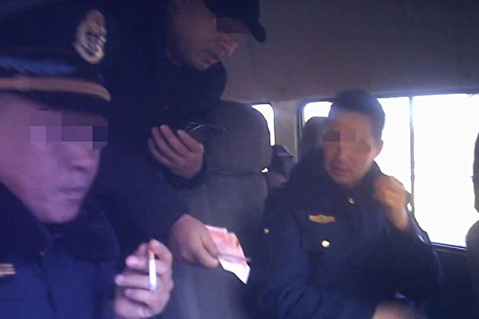

两名身着制服的交通执法人员，向超载车司机收钱。（视频截图）

【大纪元2020年01月09日讯】河南省一名大货车司机拍摄的四段视频中显示，三名河南交通运输执法局人员向超载大货车司机私下收钱，据悉，其中两人为副局长，一人是中队长。

据《新京报》报导，1月8日，河南省汝州市大货车司机王高峰提供了其2019年11月至12月间拍摄的四段视频。其中三段视频显示，同一名身穿便装的男子，在路面向货车司机收钱。王高峰称此人为河南省平顶山市石龙区交通运输执法局副局长张秋生。

王高峰说自己从2019年10月起，经常到平顶山石龙区装载铝石，因车辆超载常被罚款而结识了张秋生。张秋生向他承诺：其经营的每辆大货车，在经过石龙区时向张秋生交纳100元（人民币，下同），只要不是“上面领导带队查车”，他保证这些超载货车在辖区内不会被检查、罚款。

在11月28日的视频中，被指称是张秋生的男子从王高峰所驾货车拿到数张百元现金，并装进衣兜，视频中王高峰对该男子说：“晚点将5辆车号发给你。”

11月29日的视频中，该男子从王高峰手中接过一叠百元现钞后表示，“今天是上级交通局的领导带队查车，只要依照我说的办，他们就抓不住。”

12月21日的视频中，一辆标有“交通执法”字样的车上坐着三名身着交通执法制服的男子。王高峰告知夜里要过三辆车，并拿出300元现金，其中一人示意其将钱放在车座上。

据报导，1月8日，记者致电张秋生，核实收取货车通行“保护费”一事。张秋生承认确有此事，说那些“都是司机给的请客钱”。但对于自己与王高峰私下协议之事，未作回应。

看过12月21日的视频截图后，张秋生表示，交通执法车上的三人中，一人为石龙区交通运输执法局副局长魏红军、一人为该局执法中队中队长侯留欣。随后记者致电两人，但都未予接听。

报道还称，1月8日晚间，记者致电石龙区交通运输执法局副局长梅东升。梅东升表示，当日下午交通运输局已成立调查组，将调查该事件。

<a target="_blank" href=#top><h6 align="right">回上方</h6></a>

<a name=71>
<h1 align="center"><b>汕头怀孕母牛三步一跪求生 网友买下放生</b></h1>

广东汕头潮阳区的一头怀孕母牛在被拉到屠宰场的路上，疑似三步一跪向人哀求饶它一命。（视频截图）

【大纪元2020年01月09日讯】近日，有一段视频在大陆网络热传。视频显示，广东汕头潮阳区的一头怀孕母牛在被拉到屠宰场的过程中，疑似三步一跪向人哀求饶它一命。目前，该母牛被网民筹集资金救下来了。

从网传的视频可以看到，一头黑色大牛被数名民众轮番拉着，前往汕头潮阳铜盂镇的一屠宰场。过程中，母牛一度裹足不前，之后每走几步就下跪不起，前面两只脚、双膝跪地，像是在向人哀求饶过它一命。它数次跪地，不时发出哀鸣声。

据澎湃新闻1月7日报导，事情发生在1月5日，广东汕头。爱心人士林王波说，当天这头母牛在被拉去屠宰场的途中，它就一直跪着的。到了屠宰场之后，屠手要把它拉进去宰掉的时候，它就跪着的，它就一直流眼泪。

报导表示，这段被拍下放上网络后，有人看到之后就打电话联系屠宰场的老板，表示要筹钱将牛买下来，然后放生。后来，大家筹到了24950元，花了2万将牛买下，送至一座寺庙放生，其余的钱则捐给寺庙做香火钱。

林王波描述，有一个网民开着一辆货车要把拉牛到寺庙，牛看到他们，就三步一跪地走了过去，上车之前一直这样。等到下车，它也是三步一跪，还对着那个拉它的货车长跪不起，好像在感谢车一样。
广东汕头潮阳区的一头怀孕母牛在被拉到屠宰场的过程中，疑似三步一跪向人哀求饶它一命。（视频截图）

此视频曝光后，引起舆论的关注。大陆网民表示，“看着莫名的心酸。”“世间万物皆有灵性。”“人类太残忍了。”“动物都有灵性，这是一个“母亲”，想保护肚子里的小牛！”“犹怀老牛舐犊之爱慈悲为怀。”“放过它吧。”“商周时期老祖宗们就知道狩猎时不杀怀孕的母兽，现在真是文明的倒退啊。”“以前古代都是禁止屠宰牛的，耕牛辛苦一辈子，人类不应该杀它们。”

早在2017年，吉林省松原市一只怀孕的母羊，为了肚子里的孩子跪在屠案前，后来被好心人买下，最后联系护生园安置。

<a target="_blank" href=#top><h6 align="right">回上方</h6></a>

<a name=70>
<h1 align="center"><b>港专家向大陆喊话：尽快公布病毒基因图谱</b></h1>

武汉病毒性肺炎疫情快速蔓延。(Christian Keenan/Getty Images)

  
【大纪元2020年01月09日讯】1月9日，大陆专家证实武汉肺炎为“新型冠状病毒”。港大感染及传染病中心总监何柏良呼吁，大陆应尽快公布病毒基因图谱，并要尽快追查病毒的源头，以防止病毒扩散。

大陆官媒报导称，大陆专家初步判定武汉不明肺炎病毒为“新型冠状病毒”。此病毒与先前发现的冠状病毒都不同。

据东网报导，何柏良表示，相信属于源头的武汉湿街市内曾售卖活野味，呼吁大陆尽快公布病毒基因图谱，让香港可研发快速测试病毒。

何柏良指，武汉华南海鲜市场曾售卖什么动物是重点，担心供应链在其它地方也有贩售，要尽快追查，堵截源头才可以防止病毒扩散。

他说，冠状病毒有很多种类，天然宿主是蝙蝠，萨斯（SARS） 及中东呼吸综合症（MERS）均是属于冠状病毒的家族成员。除了蝙蝠外，其它不同动物也可以带有不同类型的冠状病毒，如果带有冠状病毒的动物，被人类入侵，如作活野味售卖，因不同类型的动物困在一起时，有机会出现基因变异，病毒原本只有动物传播，亦可改变为人传人。

香港近期曾到访过武汉并出现发烧、呼吸道感染或肺炎症状的病人不断攀升。公立医院自2019年12月31日起至2020年1月8日，共向卫生署呈报38宗疑似病例，年龄最小的仅2岁。

何柏良此前表示，香港有不少个案与华南海鲜批发市场有关，病毒会在海鲜城内经野味途径传人，现时对事件了解似乎涉及新型病毒，若是经野生动物传人，潜伏期可能只有3至5日，但个案数字在短时间内由27宗上升至44宗，因此很有可能病毒会人传人。

1月8日，香港立法会就武汉不明原因肺炎进行紧急质询，期间多名议员质疑港府与中共国家卫生健康委员会沟通不良，询问食物及卫生局局长陈肇始是否有渠道得悉大陆各地的感染资讯。陈肇始回应称，暂时所得的大陆武汉不明肺炎病例停留在59宗，未得到其它省市的病例。

议员邵家臻问陈肇始，是否知悉与肺炎有关的武汉华南海鲜批发市场出售哪些动物。陈肇始回应称，该市场主要售卖水产，未有进一步资料得悉是否有售其它种类的动物。

医学界议员郭家麒质疑，大陆的实际感染个案远超公布数字。

<a target="_blank" href=#top><h6 align="right">回上方</h6></a>

<a name=69>
<h1 align="center"><b>朱同：没有暴徒，只有暴政</b></h1>

游行中，香港市民拉起“没有暴动 只有暴政”的横幅。（王文君／大纪元）

  
【大纪元2020年01月09日讯】最近一段时间，香港真相已经在国内流传，有朋友说“喝酒的时候，朋友告诉我香港其实是江泽民一伙挑拨的动乱，党媒让美帝背锅”；有朋友说“香港问题就像大清灭亡前的铁路股权被清政府强收事件，在中共身体上开了一条大口子，血淋淋的伤口血流不止，对中共的伤害无法估量，可能是亡党的前兆”；有朋友问我“香港同胞好吃好在的不愿意呀，为什么要闹？”，我回答“你已经习惯了被迫害，在网上发表点反对言论就被抓、被拘留、被判刑、被送中，习惯自由社会的同胞绝对不会答应”。

这几天党媒有一篇文章特别特别毒，文章就“18国40议员、宗教领袖致林郑公开信关注警暴”点评称，“因为香港警察的专业、克制，没有任何示威者因为警方的行动而死亡，反而多名警务人员在行动中严重受伤。这些都是血淋淋的事实，如果外国“领袖”统统都看不到，那确实不是“眼瞎”，而是“心黑”了”，要求“香港事务就是中国事务，有事请找中国中央政府。谢谢。”

通篇各种抹黑“香港暴徒”，让人感觉香港暴徒十恶不赦，几乎可以就地正法。把香港警察吹的像朵花儿一样，吹的像中共一样英明神武，一样的“伟光正”，一样的“永远正确”，这些都是党媒的一贯逻辑，这篇文章可以说是党媒八股文的经典范文之一。 表面上看冠冕堂皇、义正辞严，实际上漏洞百出、颠倒黑白、栽赃陷害。

其主要招式如下：
一、“党媒发布的都是真相，其他媒体都在撒谎”
开篇自称正义，自称真理，自称真相。实际上什么叫党媒，就是党用人民的钱养的媒体，唯一的立场就是拥护中共，所以是绝对不可能公正报道事实真相的。最大的作用就是舆论导向，引导人民相信中共“伟光正”，引导人民相信中共所做的一切都是正确的，就算党迫害人民也都是为人民服务。真相是什么党媒从来不在乎，根本不关心。逻辑特别简单，党需要打倒谁就打倒谁，党需要树立谁就树立谁。党媒最喜欢自编自导自演，最喜欢自欺欺人。

天天宣传其他媒体都是欺骗人民的，都是为了颠覆人民政权的，都是阴谋反对中国的，都是要害死人民群众的，都是无政府主义的，都是喜欢挑拨动乱的,都是没有礼义廉耻的，都是逆时代潮流而行的，都是注定要失败的。

二、捏造罪名，把“反动派”钉死在耻辱柱上。
所有反党的都是反动派，反对党的领导就是反对中国，就是人民的敌人。在民主国家，任何党派都不能代表国家，群众反对任何党派只能证明政见不同，和叛国、反国、反人民没有任何联系。中共一贯绑架民意，任何反共的声音到了国内都是反对中国，都是以中国人民为敌。

中共镇压反对派无所不用其极，没有罪名就捏造罪名，甚至派奸细制造罪名，制造犯罪事实，历史上有很多前科。

特别是这一次针对香港同胞，宣传“自去年6月9日起，过千场示威、游行、集会，许多演变成为暴乱”。

宣传香港暴徒多次打骂威胁记者，比如“2019年8月13日，《环球时报》记者付国豪在采访香港机场非法集会中，被暴徒殴打、非法拘禁、捆绑、凌辱”。众所周知付国豪有两张不同号码的身份证，在国内只有特务才有可能持有（普通群众不可能），真是欲加之罪，何患无辞。

三、歌功颂德，树碑立传。
从本质来看，共产主义是反人类、反自然的。所以中共从一开始就在不停的斗争，“斗天，斗地，斗人”，不管干什么都喜欢说打赢攻坚战,喜欢说“人民战争的汪洋大海”。

经常用的招式就是利用一派斗倒另外一派，现在就在利用港警，所以把香港警察吹到光芒万丈，一方面号称“就武力使用而言，警方有清晰指引，符合国际人权标准”；另一方面面对国际质疑，不敢让人调查，绝对心中有鬼。一言不和就说是干涉中国内政，潜台词是只要归为内政，中共就可以随意践踏人权，随意践踏信仰自由，为所欲为。

有一篇党媒文章宣传香港同胞万分之十二的自杀率很正常，绝对不是“被自杀”，是因为香港同胞生活困难，所以特别喜欢自杀。这是把全世界都当傻瓜，只有习惯草菅人命的中共才会觉得无所谓，很正常。

最近正在讨论给香港警察加薪，不知道将来会不会册封人民英雄，会不会册封共和国卫士。但是笔者担心的是现在这些港警都是活人，万一将来香港暴徒被平反了，黑警们将要如何自处？中共会如何处理香港黑警？

党媒撒谎是有传统的，如果报道真相了，肯定是太阳从西边出来了。笔者有好几年没有去香港了，但是绝对相信香港同胞是被迫害的，绝对相信“没有暴徒，只有暴政”。  
<a target="_blank" href=#top><h6 align="right">回上方</h6></a>

<a name=68>
<h1 align="center"><b>中国主要城市写字楼空置率惊人 近乎鬼城</b></h1>

大陆17个主要城市第三季度的商业办公大楼空置率升至21.5%，达到十余年来最高。图为上海大厦的一个空办公室。(JOHANNES EISELE/AFP/Getty Images)

【大纪元2020年01月09日讯】（大纪元记者周慧心综合报导）“今年会是深圳写字楼市场过往十年最坏的一年，也会是接下来十年最好的一年。”高力国际高管如是说。经济放缓加剧，已推动中国的写字楼空置率达到自2008年金融海啸以来的最高水平。

据国际房地产服务商第一太平戴维斯（Savills plc）的报告显示，深圳2019年第三季的顶级写字楼空置率高达22.4%，部分地区空置率超过50%。

联合新闻网1月9日撰文说，作为中国经济改革标竿的深圳，其写字楼市场也反映了大陆的经济趋势。据传，2019年上半年，深圳前海区顶级写字楼空置率高达65.7%，近乎鬼城，而此地是深圳最昂贵的区域。

文章分析原因说，除了中美贸易战冲击之外，号称中国硅谷的深圳，其创新、创业、创投等热潮急速冷却，另外，中共当局近年整顿P2P网络平台、打击影子银行、加强监管网络金融行业，对深圳的打击也是相当的大。

高力国际与第一太平戴维斯的报告也都强调，网络金融受创对深圳的影响重大。深圳的标志性建筑、世界第四高的平安金融中心，空置率高逾28%，被认为与大量金融资产管理公司以及P2P公司撤出有关。

除了深圳之外，中国其它主要城市写字楼的空置率也飙升。据世邦魏理仕提供的数据显示，中国有17个主要城市，去年第三季的空置率达21.5%，是十多年来新高，其中北京为19.5%、上海为10.9%。与其它国家的主要城市相比高出许多，新加坡写字楼空置率为4.8%、伦敦4.0%、旧金山3.8%、东京仅为0.7%，而台北市2019年第三季写字楼空置率不到3%。

文章引述世邦魏理仕去年12月的报告说，北京顶级写字楼2019年前三季的空置率上升至10.9%，创下近八年纪录；上海写字楼去年上半年的空置率高达18.5%，破近十年纪录。

而中国二线城市写字楼空置率比一线城市更高，据国际房地产顾问公司戴德梁行（DTZ）的报告，中国二线城市商办平均空置率约为28%，其中天津、长沙、重庆、厦门的平均空置率超过30%。

根据大陆法院统计，截至2019年11月20日，一年内宣告破产的房地产开发商已经高达446家，创下空前纪录，平均每天有1.5家房企破产。

近年来，大陆媒体频频释出消息，如李嘉诚出售其大陆资产、王健林出售万达各地项目、潘石屹将旗下资产打包出售等等，这都说明业内人士对大陆房地产市场的信心严重不足。#

<a target="_blank" href=#top><h6 align="right">回上方</h6></a>

<a name=67>
<h1 align="center"><b>黑龙江前市委书记曾畏罪潜逃 逃跑路线曝光</b></h1>

【大纪元2020年01月09日讯】（大纪元记者方晓报导）中共黑龙江省宁安市前市委书记程鹏曾畏罪潜逃。在失踪的两个多月里，其藏在哈尔滨、三亚、北京和辽宁之间。近日其出庭受审。

去年黄历新年后，程鹏潜逃。程鹏潜逃案曾被官方列为牡丹江“一号案件”。

近日，程鹏出庭受审，被控贪腐2636余万人民币。

程鹏曾任黑龙江牡丹江市对外贸易经济合作局副局长、东宁县副县长、市外贸局局长、市商务局局长、东安区委书记等职。

2010年，程鹏改任宁安市市委书记，他的贪腐行为多数发生在宁安——利用职务便利，敛财达2636.11万元人民币。

当了7年宁安市委书记后，2017年程鹏上调牡丹江市政府，担任副秘书长。

中共十八大后的“反腐”中，程鹏寝食难安。在2019年2月，预感“东窗事发”后，程鹏决定潜逃。

“长安街知事”报导，梳理程鹏潜逃事件的时间线可见，去年2月，即过年前后，牡丹江市纪委监委初核程鹏涉嫌受贿问题；2月23日，即正月十九，闻听风声的程鹏畏罪潜逃。

程鹏失踪一个多月后的4月16日，当地官方发布追逃通告；4月21日，中共公安部发布A级通缉令；5天后，潜藏在牡丹江某小区内的程鹏被抓捕归案。

从出逃到被抓的两个多月里，程鹏先后换乘各种交通工具，逃至哈尔滨、三亚、北京、辽宁黑山等多地，最终只得重新潜逃回牡丹江。

落网半年后，去年10月，程鹏被双开。官方通报称，程鹏参加迷信活动，为逃避审查调查潜逃，转移、隐匿资产，与他人串供，对抗审查；违规从事营利性活动；干预和插手司法活动；长期与他人保持不正当性关系；参与境外赌博并涉嫌受贿犯罪。

陆媒此前报导，程鹏行事风格以“霸道”著称，插手建筑工程，与涉恶团伙有往来。而程鹏在牡丹江北山别墅附近的军马场还养着藏獒、猴和熊。

程鹏被审查前，牡丹江官场地震不断，牡丹江前市委书记张晶川和宁安前市委副书记陈春生均已落马，程鹏与两人都有交集。

程鹏这样的贪官贪腐多年，并成功潜逃，引起网民质疑。

“不能沉默不语”：贪了这么多、贪了这么久，却屡屡被提拔，岂不是自己抽自己的耳光吗？！

<a target="_blank" href=#top><h6 align="right">回上方</h6></a>

<a name=66>
<h1 align="center"><b>【拍案惊奇】危机未完全解除 美伊冲突内幕</b></h1>

【大纪元2020年01月09日讯】大家好，欢迎收看《新闻拍案惊奇》，我是大宇。今天是美东时间的1月8日星期三。

前一夜，不知道为什么，跟伊朗隔着差不多半个地球，我的心情还有一点紧张。一场迫在眉睫的战争，随时可能爆发。这种危机感一直持续到今天中午，美国总统川普向全国发表讲话，才算结束。

现在，世界避免了一场美伊战争，但是围绕这次战争危机，还有很多细节，目前越来越多的相关消息出来，我们下面一一来了解。

伊朗导弹袭击美军基地 事件回顾及细节

我们先来回顾一下前一夜的事件。

美东时间的1月7日下午5点半，伊朗开始对驻伊拉克的美军基地发动导弹袭击。一共发射了15枚导弹，针对两个目标。

一个是在伊拉克首都巴格达以西100英里的“阿萨德空军基地”，位置几乎在中东大漠的中心。美国总统川普曾在2018年12月访问过那里，那是他第一次实地探访驻扎在中东的美军。

阿萨德空军基地建设于1980年代，最早是萨达姆政权的军人使用，2003年伊拉克战争以后，这里成为美军最大的基地之一。2009到2010年，美国从伊拉克撤军后，“阿萨德空军基地”再被伊拉克新政府军人接管，但是疏于管理，弹壳、铺满灰尘的弃置的武器、腐烂的食物到处都是。

直到2014年，为了打击ISIS恐怖组织，美军回到伊拉克，再次使用这处军事基地，成为大约1,500名美军在伊拉克的“家”，美国人再次对这里进行重建，花了好多钱。但由于美军这次来的目的主要是培训和协助伊拉克军人，所以基地战争用途弱了，但是生活设施更加发达。

这处基地很大，有电影院、游泳池，快餐店等等，为了通勤方便，基地内还提供两条巴士线路。如果不是因为四周潜在的战斗风险，这里是个不错的渡假村。

那么周二晚上，伊朗发射的15枚导弹，有10颗打到了阿萨德空军基地。根据后来发出的照片，我们能看到，这处基地有至少5个地方被毁坏，包括几个临时机库还有两座建筑物。

另一个遭受袭击的美军基地，是位于伊拉克北部库尔德人半自治区的“埃尔比勒空军基地”。这里包括美军在内，有来自13个国家的超过3600名军人生活，基地目的也是主要去训练当地军人。

周二晚上，只有1枚伊朗导弹落在这里，没有造成重大损失。

那不是说15枚导弹吗？另外4枚发射后失败了，是“臭弹”。

导弹发射之后，伊朗国内疯狂宣传，说炸死了至少80名美军士兵，但这是不是事实呢？我们下一环节就会谈到。而且伊朗周二晚在第一轮导弹发射后，还威胁发射第二轮、第三轮，目标是美国在中东的盟友，具体地点是以色列的海法，还有阿联酋的迪拜。伊朗还威胁，甚至要发动对美国本土的袭击，但是以上这些，后来都没有发生。

有一点必须介绍的是，在发动导弹袭击前，美军得到了充分的预警和撤离时间，为什么这么说呢？至少从两点可以知道。

首先，美军自己有一套先进的预警系统，在伊朗那边刚有动作，美国这边就知道了，所以立即疏散军人。

其次，伊朗政府提前告诉伊拉克政府：哎，那什么，我要射导弹了，你让你们在美军基地的伊拉克士兵，离远点。哈，这显而易见嘛，这是伊朗生怕美国人不知道，他们要发射导弹。结果就是啊，伊朗这边刚放完风，伊拉克政府立即通知美军，也包括伊拉克军人。

有意思的是，在伊拉克告知美军的同时，美军那边就说：我们已经知道了。怎么知道的？他们的预警系统测试到的。

<b>川普全国演说 称伊朗已“解除戒备”</b>

周二晚上，伊朗向驻伊拉克美军基地发射导弹，是1979年伊朗冲击美领馆俘虏美国人的“人质危机”之后，对美国的最直接进攻。以前大多只是通过跟着伊朗混的大大小小恐怖分子，对美国发动的间接袭击。

那么伊朗这次袭击之后，我们第一个想到的，就是基地里有没有美国军人死亡，这是会不会开战的重要因素；第二个想到的，就是马上去看五角大楼、白宫和川普怎么回应。

等了好久，终于美国总统川普在事发后四个多小时发了一则推文，他说：“都很好！伊朗的导弹瞄准两处在伊拉克的美军基地，已经开始评估伤亡和损失。直到现在一切都还好！我们拥有目前为止，世界上最强大、装备最优良的军队！我会在明早发表讲话。”

这次是川普面向全国演说，时间定在美东时间周三中午11点，位置在白宫前门厅。通常事关大局的重要演说，美国总统都会选在这里。在川普发表演说之前，对伊朗是打、还是就此告一段落，抑或是以其它方式回应，外界还根本不知道。如何处理，这也是川普作为总统，面对的最大考验之一。

大约11点22分，川普出现，他开门见山，第一句话就是：只要我是美国总统，伊朗就不准有核武器。演讲第一句话就谈核问题，这是川普在“画重点”。

接着，川普说：没有美国人在昨晚的袭击中伤亡，所有军人是安全的，军事基地遭受的破坏也不大。听到这里，大家就可以松一口气了。

然后他讲：伊朗表现出解除了军事戒备，这对有关各方还有全世界来说，都是一件好事。而前一晚，既没有美国人伤亡，也没有伊拉克人伤亡，这要归功于采取的预防措施，“军队的疏散”，还有一套“预警系统”，效果非常好。

因为这次伊朗袭击美军基地，名义上，是为了给他们的二号人物“苏莱曼尼”，被美军无人机击杀报仇。所以川普在接下去的演讲中，又详细介绍了美军击杀“苏莱曼尼”的理由。包括训练恐怖分子武装人员，包括黎巴嫩真主党，还有向平民目标发动恐怖袭击，在整个中东地区引发“流血内战”，并且使用诸如“路边炸弹”等手段，伤害和杀死数以千计美军士兵。

川普的讲话像“檄文”一样，列举“苏莱曼尼”各种罪状。之后川普终于明确谈到，美国要如何回应伊朗袭击美军基地的事件。川普说：我们在继续评估回应伊朗侵袭的选项的同时，会立即对伊朗政权实施更多惩罚性的经济制裁，这些制裁将伴随伊朗，直到伊朗改变行为。

改变什么行为呢？川普在后面提到了：一是放弃核武器野心，二是停止支持恐怖主义。而具体对伊朗实施哪些新的经济制裁，截至我们今天发稿，还没有公布。

在演讲最后，川普表示：美国准备好拥抱和平，以及所有争取和平的人。

通过以上内容，我们能够知道，美国目前阶段不会使用武力回应伊朗的袭击，而是通过进一步的经济制裁。在伊朗放松军事戒备的同时，川普的表态，标志着这一次美伊战争危机的解除。

川普将在今年11月的美国大选中寻求连任，他曾在选战中，承诺让美国远离“无休止的战争”。这也算是川普又一次兑现承诺。

<b>川普全国演说 重申“以实力求和平”理念</b>

川普周三的全国演说不长，只有大约9分钟。除了以上对局势发展有举足轻重作用的表态之外，川普还提到了其它重点，这些重点的核心理念，用川普和前总统里根都喜欢的一句话来概括最为恰当：以实力求和平。

那么川普今天的讲话还包括至少以下5个重点：

<b>第一、由于美国经济和能源的积极变化，美国的战略重心也发生变化。</b>

特别是能源方面。如果有人问，现在世界上第一大产油国是哪里？是俄罗斯吗？是伊朗吗？都不是，是美国。根据数据，早在2015年，仅德克萨斯州一地，产油量就超过了伊拉克、阿联酋和伊朗。除了德克萨斯，还有墨西哥湾海域、北达科他州、新墨西哥州、俄克拉荷马州等地盛产石油。所以，综合全部数据，2019年美国的石油产量，占全球原油产量的16.2%，超过第二名沙特3.2个百分点。

因此，川普宣称美国已经实现了能源独立，意思就是不再依赖中东石油，伊朗或俄罗斯想牵制美国，手上的牌越来越少。

<b>第二、美国军力强大。</b>

川普在演说中强调自己上任以后，美国政府花了2万5000亿美元重建军队，现在已经重建完成。除了已有的强大导弹力量，美军正在建造许多“高超音速导弹”。但是川普强调，拥有这些强大装备，也不是说一定要用它。综合以上两点：经济实力和军力，这是美国所拥有的两个最好的“威慑力”。

<b>第三、川普呼吁退出伊朗核协议</b>

川普呼吁2015年参与签署《伊朗核协议》的英、德、法、俄、中，几个国家，也退出这项核协议。因为川普不承认2015年奥巴马时代签署的这项协议，认为没有起到实质作用，反而成了伊朗暗中发展核武器的保护伞。所以他要所有这些国家都退出这项核协议，然后跟美国一起，再签署一份新的、有效力的核协议。而美国已经在去年正式退出这项旧的协议，伊朗也在最近苏莱曼尼被击杀之后，宣布不再履行这项协议中的条款。

<b>第四、川普希望北约能够更加配合，多多参与进中东进程的事务。</b>

川普的这一点呼吁，稍后得到了北约秘书长的接受。

<b>第五、川普向伊朗递出橄榄枝</b>

简单说，就是伊朗只要听话，放弃核武器，不再支持恐怖主义，那未来还是光明和繁荣的。而且穆斯林逊尼派的恐怖组织ISIS，与穆斯林什叶派的伊朗政权，不共戴天，现在ISIS还有残余势力，那美国跟伊朗在这一点上，还是可以合作的。

但是，伊朗真的会那么听话吗？经验告诉我们，单纯想让伊朗这么做是不现实的，对伊朗核问题这件事，各方还是任重而道远。而且，当前美国与伊朗的危机，并没有完全解除。

<b>美国伊朗冲突 危机并未完全解除</b>

伊朗在周二晚上耀武扬威，向美军基地发动袭击。但同时，就像我们节目开头提到的，他们又匪夷所思地提前跟伊拉克放风，说要发射导弹了，你们注意。西方的专家啊，普遍认定，这是伊朗故意想让美国人知道，是一种想避免冲突升级的举动。他们喊得欢，那是因为伊朗国内有民怨、有危机等等原因，他们也想借此转移一下视线。

那伊朗的这个心思白宫一定是掌握的，结果那就像是我们一位观众留言说的：一边报仇了，一边没损失，那就到此为止吧！

后来伊朗外交部长沙里夫发出推文说：伊朗已经完成了“自卫”相应措施。因为伊朗把为苏莱曼尼复仇的行动称为是“自卫”性质。那这个表态也被认为是伊朗方面在主动缓解局势。

不过，伊朗最高领袖哈梅内伊在周三的讲话中，却并不意外地再次向外界发出警讯。他说：这点军事行动是不够的，这就是给了美国一个“巴掌”，重要的是，美国势力在这个地区的存在要有一个了结。这话说得多凶啊，但我们也不意外，因为伊朗这类政权，向来是喜欢撂狠话的。

美国总统川普也没有说跟伊朗就这么完了，大家注意到了吧，刚才我们提到川普说，要加重对伊朗政权的经济制裁，是在继续衡量回应伊朗袭击选项的同时，率先采取的措施，这也给美军的下一步行动，做了个铺垫。

实际情况也是如此，知道周三，伊朗和伊拉克当地，气氛还是很紧张。美国更多的军人，包括一支快速反应部队，被派遣到当地，都继续保持着高度警戒。伊朗的那些战争代理人，恐怖组织啊、亲伊朗的民兵啊，还有可能在中东发动袭击。而在川普政府最大化施压的政策，以及伊朗的这种严重敌视的态度之下，双方关系也很难从外交管道得到改善。

因此，美联社报导就说，美伊双方的冲突，还有可能在接下来的几周甚至几个月，以无法预知的形式出现。

<b>飞往加拿大的乌克兰波音737客机 坠毁疑案</b>

在节目最后，我们简单说一下前一晚的意外事故。就是在伊朗发射导弹之后几个小时，一架从德黑兰起飞的属于乌克兰的波音737-800客机，起飞几分钟后就坠毁了，坠毁前还没爬升到目标高度。

这架飞机上有167名乘客，82个伊朗人，11个乌克兰人，至少63个加拿大人，另外还有9名机组人员。机上人员全部遇难。目前所知，机上唯独没有美国人。

所以，现在这架飞机在这么敏感的时刻坠毁，要么是伊朗导弹或其它武器误中，要么是飞机自己就在这节骨眼上发生技术问题坠落。

有阿拉伯地区的媒体，报导说是飞机被伊朗打下来的，这也是人们最怀疑的，但是没被证实。还有伊朗自己的说法，伊朗政府说，这是飞机自己发动机故障造成的，而且飞机坠落前还起火了。

伊朗政府的这种说法，现在外界普遍是非常质疑。因为他们说这话的时候，黑匣子还没找到，他们是怎么肯定地知道飞机是技术原因坠毁的呢？还说飞机上还起火了。难道是遇难者托梦？

有关这件事的进展，周三传出来一个好消息，一个坏消息。好消息是黑匣子已经找到了，坏消息是，黑匣子现在在伊朗人手里，他们是把黑匣子交出来呢，还是在外界质疑下，一口咬定是技术问题，再黑美国波音公司一把呢？这个目前都不知道。好在已经有外国专家组去了，希望真相能水落石出。

好，欢迎您订阅和分享我们的频道。今天的节目就到这里，感谢您的收看，再会！

新唐人《新闻拍案惊奇》制作组

<a target="_blank" href=#top><h6 align="right">回上方</h6></a>

<a name=65>
<h1 align="center"><b>伊朗称导弹击毙80名美国人 美军：无人伤亡</b></h1>

伊朗于1月8日发射导弹攻击伊拉克的美军和联军基地。图为2018年12月26日，美国总统川普在视察其中一个基地──阿萨德空军基地时发表演说。(SAUL LOEB/AFP via Getty Images)

  
  【大纪元2020年01月08日讯】（大纪元记者陈俊村编译报导）伊朗于当地时间周三（1月8日）凌晨，向驻伊拉克的美军和联军基地发射多枚导弹，以报复美军击毙伊朗军头苏莱曼尼（Kassem Soleimani）。该国声称，他们杀死了80名美国士兵，但是美军则说没有人员伤亡。

据CNN报导，伊拉克军方在一份声明中表示，伊朗对联军基地发射了22枚导弹，其中17枚击中伊拉克西部的阿萨德空军基地（Al-Asad airbase），包括2枚未发生爆炸的导弹，另有5枚击中该国北部的一处基地。

这波攻击发生在当天凌晨1点45分至2点15分之间。伊拉克官员告诉CNN说，该国部队并无人员伤亡。

半岛电视台引述伊朗国营电视台的报导说，至少80名“美国恐怖分子”在伊朗发射的15枚导弹攻击中丧生，而且没有任何导弹遭到拦截。

伊朗电视台还引述军方消息称，美军的直升机和装备“严重受损”。如果美国采取报复手段，伊朗还将攻击该地区的100个其它目标。

但半岛电视台指出，伊朗电视台的说法无法获得证实，而该电视台也未能提供证据说明它如何取得这些消息。

美国《军事时报》则引述军方消息人士的话说，初步评估报告显示，美军并无人员伤亡。

《军事时报》说，美国国防部和作战范围涵盖中东的美国中央司令部（U.S. Central Command）尚未提供正式的损失评估结果。

美国总统川普（特朗普）在美东时间周二（1月7日）晚上9点45分发推文说：“到目前为止，一切都很好！”他曾于2018年12月偕同夫人无预警地视察阿萨德空军基地。

2018年12月26日，川普与阿萨德空军基地的士兵合影。(SAUL LOEB/AFP via Getty Images)

此外，挪威、丹麦和波兰军方均表示，他们驻扎在伊拉克的部队并无人员伤亡。英国则谴责伊朗对联军基地发动本次攻击。

英国外交大臣蓝韬文（Dominic Raab）说：“我们谴责这次对伊拉克基地的攻击，这些基地有联军驻扎，包括英国部队。”

他说：“我们敦促伊朗不要重复这些鲁莽和危险的攻击行动，而是寻求（局势的）紧急降级。”

而日本则敦促相关国家展现自制，以外交手段改善彼此之间的紧张关系。#

<a target="_blank" href=#top><h6 align="right">回上方</h6></a>

<a name=64>
<h1 align="center"><b>暴跌90% 大陆电商巨头市值蒸发173亿</b></h1>

有着大陆“时尚电商第一股”之称的蘑菇街（mogu），总市值蒸发超173亿人民币。 (BRYAN R. SMITH/AFP via Getty Images)

  
【大纪元2020年01月08日讯】（大纪元记者周心鉴综合报导）有着大陆“时尚电商第一股”之称的蘑菇街，2019年以来，其股价一直在下跌，相比最高峰时期每股25.69美元跌逾90%，总市值蒸发超173亿（人民币，下同）

公开资料显示：2011年成立的蘑菇街，最初是以时尚+购物为主题的女性社区，上线不久后，便聚集了超数十万的女性用户，每天讨论时尚，分享购物经验。

<b>与最高值相比 总市值蒸发超173亿</b>

蘑菇街于2018年12月在纽约证券交易所挂牌上市。然而，蘑菇街上市首日，股价跌幅一度超过17%，报收14美元，市值为15亿美元。

在此后的一年时间里，蘑菇街的股价一路下跌，截止到2020年1月3日收盘，其股价仅剩2.47美元，相比最高峰时期每股25.69美元跌了超过90%，总市值更是蒸发超173亿元。

市值暴跌的同时，蘑菇街的经营业绩亦惨不忍睹。财报显示，2019年第三季度，归属于普通股股东的净亏损金额高达3.27亿元，创上市以来的单季度最大亏损额，累计亏损金额超14.9亿元。

不仅如此，蘑菇街的活跃买家数也在流失。据蘑菇街披露的数据计算，从2017年第三季度开始，蘑菇街的年度活跃买家就一直在3,000万左右徘徊。而截止到2019年三季度末，年活跃买家数较2018年年末，流失超570万。

<b>电商直播成救命稻草？</b>

电商艰难，蘑菇街找到了新的赛道——直播。2018年上市融资后，蘑菇街便火速启动“2019蘑菇街直播双百计划”，招募了近2,000个有不同特色和才艺的新主播，平台主播数达到24,000名。

2019年7月26日，蘑菇街珠宝专场，单场直播销售超1,600万，为平台最高纪录，双11期间，蘑菇街全品类直播GMV（平台总成交金额）同比2018年增长155%，其中美妆、家居等涨幅超200%。

蘑菇街的直播GMV暴增，并非没有代价，其大规模招募主播，均需要支付巨额人力成本。由此直接导致2019年亏损金额进一步加剧。

2019年第三季度，蘑菇街的营业收入仅1.98亿元，同比大跌超15.3%，创有史以来最大降幅。同时，连续12月的GMV为178.25亿元，同比增速仍在下滑，已跌至不足10%。

而最大的问题在于，直播业务实际为蘑菇街带来的营收、现金流却是杯水车薪。

在蘑菇街披露的财报中，其直播业务带来的营收，主要体现在佣金收入项目中。而上市以后，蘑菇街的佣金收入增速却不断放缓，并未被直播带动起来。

电商原本就是“烧钱”的行业，大部分电商平台，无一不以重金投入营销，反观蘑菇街，一直没有进行大型的营销推广，长期以来总与小有名气的网红合作，很少请明星代言；即使请了明星，也仅是拍摄短期的首页广告，无法掀起强烈的明星效应，提升品牌形象。

此外，如今的电商直播同样风起云涌，竞争激烈，还处于连续亏损之中的蘑菇街要想能在乱战中取胜，并不容易。

<b>曾经的中国第4大电商平台</b>

蘑菇街的鼎盛时期是2013至2014年，当时蘑菇街的日浏览量过亿，炙手可热。

蘑菇街成立后第一个盈利模式：为淘宝等购物平台输送流量，赚取佣金。但好景不长，2013年淘宝出手封杀了第三方导购平台，蘑菇街遭遇打击，佣金收入锐减。

2016年，与“美丽说”合并之后，蘑菇街的估值一度逼近200亿元，成为阿里、京东、唯品会之后的中国第4大电商平台。

有业内人士表示，目前，受经济下行大环境的影响，大陆消费信心不强，购买力不足，蘑菇街不易从困境中逆转。#
<a target="_blank" href=#top><h6 align="right">回上方</h6></a>

<a name=63>
<h1 align="center"><b>内幕：亡党之音弥漫中共内部</b></h1>

过去的2019年，中共政权陷入前所未有的内外交困乱局。(Getty Images)

【大纪元2020年01月06日讯】（大纪元记者古清儿报导）过去的2019年，中共政权陷入前所未有的内外交困乱局。而中共智囊已经开始发表各类“亡党之音”，还有中共高层幕僚向外透露，中共已经进入了死胡同，随时垮台。

<b>中共学者不否认中共将亡</b>

就建政70年，中共是否会跳出“历史周期律”，是否会“人亡政息”这一问题，1月5日，亲共网媒香港01刊发了中共社科院政治学研究所党委书记房宁的专访。

房宁在采访中并不否认中共将亡，“至于中共能否跳出历史周期律，关键要看实践。”他还表示，目前最高领导人有很强的危机感。

他承认，“⋯⋯随着执政时间延长、各种社会矛盾积累以及自身懈怠，有可能会逐渐瓦解，这是个规律。”

“只不过现在这个问题更突出了。执政时间越长、党的规模越大、国家越发展，应该说这方面的风险越高，懈怠的风险也越高。所以要千方百计解决这个问题，最终能不能解决，我认为还是要看实践。”他说。

另一中共大外宣多维网也刊发了这篇房宁的专访文章。

<b>中共学者暗示中共将在竞争中落败</b>

除了房宁的文章外，中共官媒去年12月31日刊发了南京大学国际关系研究院院长朱锋的文章，他谈到了中美关系的现况，并暗示中共将在大国竞争中落败。

朱锋在这篇题为“大变局呼唤有行动力的大战略”的文章中认为，过去400年来的世界历史已清楚说明，大国竞争和冲突的关键时刻，最终获胜的大国常常不是高度的国家主义，而是国家力量、社会活力和个人自由能够有效结合、相互约束、各司其责的国家。

朱锋的“高度的国家主义”说法，被认为指的是中共。

<b>亡党之音弥漫 中共内部承认正走向解体</b>

近期，美国的中国问题专家、宾夕法尼亚大学国际关系和中国历史教授林蔚（亚瑟‧沃尔德伦，Arthur Waldron）接受了英文大纪元专访，谈到了中共这个体制已经到了解体阶段。

林蔚透露说，一名和习近平关系密切的中共高层幕僚曾坦率地对他说：“亚瑟，我们到底该怎么办？每个人都知道这个体制已经不起作用了。我们已经进到了‘Si Hu Tong’（死胡同）……”这个词的意思就是已经沿着一条街道走到了尽头，一个没有出路的街道的尽头。

这名幕僚说：“这是一个死胡同，但是我们不知道下一步该怎么走，因为现在已经到处都是地雷，如果我们再走一步，我们可能就会引发一个可怕的爆炸。”

林蔚认为，中共正进入一个像前苏联的那个都在谈论解体的时期。这个政权也知道自己在国内的处境十分危险。

“这并不是说中共政权一旦垮台整个中国就崩溃了。中共垮台之时，国家还会在，房子还会在。只是政体发生了变化。”他说。
中共内外交困 党内官员面对中共危机的三种心态

如今中共内外交困，美国不断在国际上遏制中共、香港民众抗争持续、中国经济持续下行、中共高层分裂、官员们消极怠工。

旅美政治与经济学者程晓农去年对美国之音表示，现在官员们面对经济下行的风险大致有三种心态：

一是看笑话，看当局怎么办；二是不作为，少干少错，坐着不动，谁也抓不住自己的毛病；三是盲干，上面喊东，他们就到东面闹一番；上面喊西，再转到西面闹一番，至于是否对经济有益，那就不管了。反正上面说了，照做就行了，结果怎么样就不管了。

《华尔街日报》去年12月31日报导，一些党内人士和政策专家将这些问题部分归咎于习近平行事专断，称他将决策权集中到自己手中，抑制了对政策的辩论。这些人还表示，习近平的要求有时相互矛盾，令官员感到困惑。

中共中央政治局于2019年12月26日至27日举行“民主生活会”，在会上政治局高层中除了习近平之外，人人都做了“自我批评”。

时事评论员李林一说，这次的政治局生活会，其实就是“人人过关”，实际也是反映出了中共的内外交困。为了维持高层在表面上不出现分裂，习近平搞出了这么一套东西。只是到了2020年，中共的危机会更加深重，到时候各种乱象会更多。

<a target="_blank" href=#top><h6 align="right">回上方</h6></a>

<a name=62>
<h1 align="center"><b>神韵艺术及神的启示</b></h1>
  <h3 align="center"><b>作者：Madalina Hubert 翻译：善逸</b></h3>

2019年1月、3月，神韵纽约艺术团在纽约林肯中心大卫寇克剧院进行了两轮共29场演出，缔造了场场爆满的票房纪录。（戴兵／大纪元）

  
【大纪元2019年12月20日讯】想创作伟大的艺术作品，要有哪些特质？如果我们这样问米开朗基罗，以了解主导他创作的价值观。他可能会提到“耐心”；因为创作是很辛苦的，要精准慎密，还要一双熟练的巧手。他可能会说要能“奉献自己”，因为他全心全意地把自身投入到艺术创作之中。他也可能说“对神的坚定信仰”，因为他认定创作是神赋予他的使命。

他曾说过：“很多人相信、我自己也相信，神天定我做这个。尽管我老了，我不想放弃；我一切的努力源于对神的敬爱，我所有的希望都寄托于祂。”

米开朗基罗是意大利文艺复兴时期最重要的艺术家之一，这个时期诞生的作品灿烂辉煌，一直到今天其美好、完善及对天界的描写，仍启发着我们。当时人们发现了许多古罗马及希腊的作品，并重新思考人生，米开朗基罗就是活在这样一个年代。

雕塑是古人善用的艺术形式之一，以无比的精度与美感表现人体。文艺复兴时期，不光是富人买，艺术家们也争相模仿古希腊的艺术品。米开朗基罗为我们留下了许多栩栩如生的作品。站在他的雕塑旁，我们好像能听到 “圣殇”圣母的呼吸声，也能感到大卫正要向巨人歌利亚抛掷石块。

米开朗基罗曾说：“真正的艺术只不过是神的完美之下的影子。”他也宣称他并不是这些雕塑的原创。他说：“我在大理石中看到了天使， 我一直雕刻，直到他解放。”这表示其作品的神髓早在他动手前便已存在，他只是发掘出来，展现在众人眼前而已。

我们虽无法确认他的灵感从何而来，历史上有记录，许多宗教艺术的画家及雕塑家相信“神的显现”， 引导着他们的创作。

<b>敦煌石窟</b>

中国的敦煌是一个以莫高窟闻名的绿洲城市，窟内有大量的佛教绘画及雕塑。超过500个洞穴里满是天界、佛及神祇的描述。几个世纪来这些石窟一直是朝圣的胜地，也是世上最伟大的艺术珍宝之一。

石窟的历史回溯到公元366年，一位名为乐尊的和尚来到此地，看见了殊胜的景象；千尊金光闪闪的佛在他眼前显现，周围满是演奏着神乐的飞天。乐尊本就是绘师及雕塑师，便深入这些石窟，想要重现他所见到的景象。后来，许多僧侣陆续来到此地，也看到了类似的显现，他们便在其它的洞窟中留下了灿烂非凡的神界描述。

虽然两人相隔千年，继承了不同的传统文化，米开朗基罗及乐尊和尚为他们的时代及后人留下了“神的启示”这样的遗产。这些艺术作品的美好及喜悦提升了人心，同时让人们更深切地感谢神。

<b>神韵与神</b>

今天，有一群艺术家正遵循“神的启示”在从事至善至美的创作。自2006年创立，纽约的神韵艺术团致力于复兴传统中华文化并与全世界分享。

神韵每年在全球超过150个剧院巡回演出，节目包括中国古典舞、民族、民间舞蹈、加上以民间故事编成的短剧，配上交响乐团的伴奏。神韵还有精彩绝伦的独奏与独唱，以及以完全创新的方式与舞蹈演员互动的数位天幕。

神韵艺术家们不只注重外在的演绎与技巧，也着重舞蹈家内心的境界。根据该公司的网站，该团的舞蹈家、音乐家及整个团队都遵循神的旨意，就有如历史上那些伟大的艺术家一般。

根据神韵艺术团的网站：“舞蹈演员、音乐家、舞蹈编导、作曲家及所有的团员都保持着这个高尚的传统。对神佛的信仰是他们追求完美的动力，每一个音符，每一个舞姿都是演员精神层面的展现，也是观众感到神韵独特的原因。他们的艺术灵感来源于法轮大法，这一深深根植于中国传统文化的佛家修炼法门。”

这门基于冥想的信仰遵循“真、善、忍”的原则，致力于自身心性的提升。

“神韵”可解释为“神舞动之美”，当艺术家们身穿传统中国服饰，或扮演天上的神灵，在舞台上欣喜地跳舞时，该意涵活生生地展现在观众眼前。女舞蹈演员既专注，动作柔和又精确。男舞蹈演员则以优异的体能，同时展现了力量及优雅。他们彼此间的协调更是配合得天衣无缝，无论舞曲再复杂、节奏再快他们都能融为一体。

透过东西合璧的交响乐团，我们能感受到西方乐器的力量及东方乐器的灵魂。神韵融合这两大体系截然不同音质的能力实在是无可比拟，听起来就像这两种文化本来就应合二为一。实际上，这是一个异常艰困的挑战，也是古典音乐中一个全新的领域。

神韵演出的都是原创作品，反应了中国的历史、民族及民俗传统，同时表现了这个乐团的特质。 神韵指挥家以美好及神的启示为指导原则，运用了古典作曲技巧。

我们都知道许多西方的作曲家，如巴赫、海顿及莫札特等都相信他们的灵感源自于神。古代的中国作曲家也相信他们的音乐上承天意。他们尤其关注天、地、 人之间的谐和。神韵的作曲家净弦曾在视频“神韵的音乐”中说过：“过去的概念是，高雅的音乐能孕育良好的品格。”据她说，这也正是神韵的目标，而我们能透过这平和、喜悦及蓬勃的音乐中感受到。

准备好全新的舞蹈与音乐，神韵的2020巡回演出蓄势待发。而我们在迎接新的一年之际，也对今年的演出充满了期盼。

请到ShenYun.com以获得更多资讯。
<a target="_blank" href=#top><h6 align="right">回上方</h6></a>

<a name=61>
<h1 align="center"><b>武汉现神秘肺炎病毒 加拿大严密监视</b></h1>

全球传染病官员一直在警告，某种大流行病即将来临。(shutterstock)

【大纪元2020年01月08日讯】（大纪元记者周行/周月谛多伦多报导）加拿大官员正在密切监视一种新的潜在威胁——在中国发现的一种神秘病毒，该病毒已引起至少59人患上非典型肺炎。17年前，也是来源于中国的SARS（严重急性呼吸系统综合症）导致44名加拿大人死亡，数百人生病。

在中国武汉发现的新疾病症状包括高烧、呼吸困难和肺部病变。中国方面已经排除了SARS、禽流感、中东呼吸道综合症的可能性，并称还没有证据表明，此病毒已在人与人之间传播。

据《渥太华公民报》报导，加拿大及国际社会密切关注此事，不仅因为武汉市有大量未确诊的病毒性肺炎病例，还因为全球传染病官员一直在警告，某种大流行病即将来临。

加拿大公共卫生局发言人莫里塞特（Eric Morrissette）说，加拿大首席公共卫生官Theresa Tam已经与各省和特区的公共卫生官员，以及世界卫生组织和其它国际伙伴联系，讨论这种神秘的病毒。

<b>安省医院没有准备好病毒大流行 </b>

安省卫生厅也在密切监视局势的发展。该卫生厅发言人詹森（David Jensen）说，随着形势的发展，他们会持续评估，并决定是否需要采取进一步行动。

2003年SARS爆发以后，加拿大的公共卫生系统已做了许多改进。但是，加拿大急诊医师协会负责公共事务的共同主席、急诊医生德拉蒙德（Alan Drummond）先生表示，安省还没有为这类公共卫生危机做好准备，由于医院长期过度拥挤，安省在遇到病毒大流行时将难以应付。

他说，为了确保安全，医院大多数时候应该只使用其能力的85%左右。但是在安省，大多数医院正在按其接近100%的产能运作，甚至超产能运作。在渥太华市，该状况已经影响救护车的运作，救护车因为要等所接送的患者入院，导致了没救护车可用的局面。

德拉蒙德说，他可以预见到，如果安省受到大流行病的袭击，有些医院将不得不在停车场设立军事帐篷，以应对患者的突然增加。

<b>多伦多制定应对计划</b>

多伦多卫生局在1月7日发出的公告中称，中国武汉市爆发未确诊的、与当地海鲜市场有关的病毒性肺炎。卫生局已加强防范措施，从而堵截病毒流入。截至7日上午11点，多伦多卫生局尚未发现此类病例。对市民来说，患这种病毒性肺炎的风险“很低”。

不过，鉴于多伦多皮尔逊国际机场是国际旅行枢纽，多伦多公共卫生局正在与联邦以及安省卫生机构一起监察疫情。

多伦多卫生官艾琳德．维拉（Eileen de Villa）博士在声明中说：“多伦多还没发现这种病例，但本市已制定完善的计划，以应对疫情的变化。同时，我们将继续与国家级、省级卫生部门的同事通力合作。”

卫生局建议民众采取一些行动：刚结束境外旅游且出现咳嗽、发烧等症状的人向医疗人员报告其行程；每年到诊所或药房打流感疫苗一次；经常用肥皂与清水洗手，或使用含酒精的手部消毒液；咳嗽或打喷嚏时遮住口鼻；如果没有纸巾，对着袖子或手臂咳嗽或打喷嚏；生病后在家休息。

<a target="_blank" href=#top><h6 align="right">回上方</h6></a>

<a name=60>
<h1 align="center"><b>一本“千古奇书” 结缘世界各族裔亿万人</b></h1>

2009年11月21日亚洲法会召开前夕，六千多名亚太地区的法轮功学员再次举办大型排字活动，排出了优美的巨型《转法轮》书籍的外形。（大纪元）

  
  【大纪元2020年01月06日讯】（大纪元记者陈天仪综合报导）一本书能挽救人的性命，一本书能改变人的命运，一本书能让社会风气回归纯朴，人世间是什么书能有如此神奇力量？

在中共统治下的中国大陆，这本书被列为禁书，但他却以46种文字在全球一百多个国家和地区发行，成为被译成外文最多的中文书，受各族裔推崇。

这本书就是《转法轮》，是法轮功创始人李洪志大师指导弟子修炼的专著，被喻为“一部登天的天梯”。

1995年1月4日，法轮功主要著作《转法轮》中文版首发式在北京举行，迄今已经25周年，本文回顾结缘此书后，一些修炼人的故事。

<b>物理学博士：严重乙型肝炎痊愈</b>

美国佐治亚州理工学院物理学博士杨森。（大纪元）

  
  1961年5月生于北京，毕业于清华大学无线电系，获美国佐治亚州理工学院物理学博士学位的杨森，曾患严重乙型肝炎，休学1年。出院后，他常去查肝功能指标，没有一次正常。大夫直接对他说：“这个病没治，一辈子都好不了了。”

1995年7月的一天，让杨森永远难忘，父母托赴美国探亲的岳母带来两本书：《转法轮》和《法轮功》。

“那晚，我翻开书，刚刚读完书开头的《论语》，就觉得身心受到强烈震撼，我再不愿放下这本书。”

后来，杨森每读一遍《转法轮》都有不同体会：“书中的每句话，每个字，都说到我心里，我真像迷途的羔羊找到了家一样，明白了人为什么活着，明白炼功为什么不长功的原因，明白了人的生、老、病、死的根源所在。所有在心中百思不得其解的问题，在书中都一一找到了答案。”

“在看书时，就感觉到身上有热流在流动，暖融融的，非常舒服。有时，觉得有一只大手在抓我的肝脏。”

在看书十天左右的时候，杨森右边肋骨前边肝的部位出了一片淤血，就像被重物撞击后的那种紫色，后背相应部位也出现了同样大小的淤血，几天后就散掉了。

1998年2月，他所在公司的一次身体年度检查后，“在32项指标当中，有4项肝功能指标，结果全正常。这是1982年以来的第一次。不仅如此，其它28项指标全都正常！”

<b>保送清华博士研究生：这不是一般气功书</b>

 

1996年，王为宇被保送读清华大学精仪系的博士研究生。（视频截图）

 
  
  1996年，王为宇是被保送读清华大学精仪系的博士研究生。1997年，清华大学的一位老师推荐他好好读一本书——《转法轮》。

“我非常震惊。这本书根本就不是一般的气功书。”

“他从开篇就在告诉你，我是来干什么的。而且讲得非常之正。一下子就打到我心灵深处。我很多想要解决的事情，想要明白，想不通的事情，一件一件地解决。”

“我记得当时感觉到最正的一句话是，你一定要‘向内去找’。碰到矛盾一定要向内找，哪怕你自己受到委屈了你还要向内找。当时我就觉得这话太好了，我人就根本坐不住了，就站起来看，走着看。”

<b>好莱坞大奖获得者的音乐之路</b>

 

获好莱坞音乐大奖的北京青年陈东（右）。（大纪元）

 
  
陈东，是一位来自北京的年轻音乐人。2013年、2014年曾两度获得好莱坞传媒音乐大奖，他也曾荣获第三届印度“班加罗尔短片电影节”（Bangalore Shorts Film Festival）的最佳音乐奖，曾经成功列入第86届奥斯卡奖最佳原创音乐和最佳原创歌曲奖的官方竞争者。目前位列格莱美奖投票评审专家。

1999年中共开始迫害法轮功，利用舆论恶意造谣、抹黑法轮功学员，陈东并未受到太多影响，因为自己的母亲和认识的法轮功学员与电视上报导的截然不同，善良母亲的一言一行，胜过一切舆论宣传。

陈东说：“一开始我对练气功没有兴趣，只是修炼法轮功后母亲开朗很多，她不会用打骂的方式教育我，而是用讲道理的方式，因此我经常可以像朋友一样与母亲相处。和法轮功学员接触起来也很轻松，不管是什么年龄段的都很自在，不用担心被算计。”

就是这原因，陈东到英国开始寻找法轮功，在书店买到了《转法轮》和李洪志先生的其他著作。

陈东说，很多音乐家都有在情绪上的困扰，但他庆幸自己修炼了法轮大法。

“不管做音乐也好，做其它事情也好，人的道德非常重要。法轮功大法要求我们炼功要重德，我们做出来产品或音乐，自然就会在其中体现出道德提升的状态，这对整个社会都非常有好处。”

“优秀作品的旋律，似乎与中华文化的阴阳平衡，相生相克，有种自然又奇妙的对应，是种天然呼应。你符合了它，这个音乐就有说不出来的吸引力。”“当有了这种对规律的掌握，好像就不存在没有灵感的问题了。”陈东说：“这是在法轮大法修炼中获得的可贵领悟”。

<b>教育专家：《转法轮》法理真实不虚  </b>
  
 

台湾法轮大法学会理事长张锦华教授。（大纪元）

 
  
  张锦华，台湾大学外国语文学系学士、美国爱荷华大学新闻与大众传播学博士；曾任教于淡江大学与台湾政治大学，台湾大学新闻研究所所长，中华传播学会理事长；2009年，获选中华民国教育部20年资深优良教师奖。

张锦华回忆，在她人过中年之后，身体开始一天不如一天，肠胃不适、血压过低、骨质疏松，更年期、妇科毛病等等；而家庭关系、人际关系、工作关系，也处处是瓶颈和矛盾。

“最糟糕的是，我发现自己虽然读了40多年的书，有了常人所称羡的名声与地位，但我却只是更深切地了解到：以人类有限的能力，恐怕是难以知道生命真正的答案！人生如果像是爬山的话，我似乎就像身处于险像环生的峻岭之中，一身的疲惫，两肩的重担，却不知将攀向何方！”她说。

就在此时，一位中华经济研究院的老朋友向她介绍了《转法轮》。

“我一口气便将此书看完，内心极为震撼，这本书以简白的口语内容，却提供了一套对宇宙、人体、时空、生命的无比高妙观点，而且理论体系博大完整，实践方式简单易学，效果神奇惊人！”

“这一修炼，就是17年，无论是从身体上的变化，还是从精神上的体验，都切切实实印证了《转法轮》讲述的法理，绝对是真实不虚！”

<b>清华教授遇车祸 5处粉碎性骨折 不治而愈</b>

 

法轮功学员，清华退休副教授王久春。（明慧网）

 
  
  这是一场突如其来的车祸，清华大学退休副教授王久春被一辆轿车从右侧撞倒，造成小腿和膝盖共5处粉碎性骨折，右侧的踝骨和膝盖链接的腓骨完全断掉。

事后，她按《转法轮》里所讲处处为别人着想的“真、善、忍”法理行事，既没有起诉肇事司机，也没有索要任何经济赔偿。

医疗专家坚持她必须住院手术治疗，被她谢绝，她不愿身体中被嵌入数块最长8吋的钢板，更不愿意在医院里躺上一年半载，她知道即使那样，也不能完全保证她能像以往一样行走自如。她坚信自己的腿不会有问题，她坚持要回家学法炼功。

就这样，王久春在签署了一系列承担风险和法律责任的法律文件后，回家了。三个月后，她回医院检查，先前以为她可能精神有毛病的主治医生，惊喜地告诉她，“你恢复得让我非常非常满意，你不用再来看医生了。”

2019年，在“5·13庆祝世界法轮大法日”征文中，学习《转法轮》25年之久的王久春写下了这段神奇的经历，以表达她对法轮功创始人李洪志先生的感恩之情。

<b>民营企业家：生命最终目的是返本归真</b>

  

企业家汤志衡与妻儿，家庭合影。（大纪元）

 
  
  汤志衡曾是广东省一位成功的企业家，他用三年时间让一家皮具厂起死回生，业绩年年翻倍，缔造了“阿里巴巴”全国十大网商皮具品牌。

然而，仅仅因为不愿意放弃自己的信仰，他被非法抓捕8次，经受残酷的毒打、灌食、不准睡觉等折磨，被迫害至精神崩溃的边缘。他熟悉的许多企业家法轮功修炼者至今仍在狱中遭受折磨。

1996年年末，汤志衡因为高考失误，被肇庆一所并不理想的大学录取，读非常冷门的化工专业。加之因高考身体被搞得非常糟糕，严重失眠，神经衰弱，每天头疼，胃病，令他感觉整个人非常颓废，从那时起，他开始思考人生的很多问题。

一天晚上自习回来，他看到有一群人在打坐，让他非常吃惊。“因为我觉得现在整个社会都那么浮躁，有这么一群人能静下心来在这里打坐，就很好奇。同学就借了一本《转法轮》，让我慢慢看。”

汤志衡看完第一遍《转法轮》，一个月后，整个人再没有失眠过，身心状况逐渐恢复健康。

当初对他最大的感触就是，“我觉得这就是我生命中一直在寻求，要找的。感觉自己前半生都白活了，因为在常人社会里不知道遵守哪一个准则，去指导自己的人生，非常迷茫。”

“大法给予我新的生命，教导了我‘真、善、忍’的准则，还有生命的最终目的是返本归真。”汤志衡说，“所以内心非常震撼。”

<b>监狱中的一股清流</b>

在中国大陆最北端的黑龙江省会哈尔滨，有一座女子监狱，关押着全省犯罪服刑的女性罪犯。

1995年，一位保外就医的犯人王颖，带回监狱一本法轮功书《转法轮》，从此，有多名刑事犯学习法轮大法，最多时，参与炼功的有170多人，监狱操场站了大半，走路都得贴边。她们身上展现了许多奇迹：瘫痪17年的郑桂芹会走了；不识字的谢亚芹能背下300多页的《转法轮》；冯海波成了监狱最受拥戴的“道长”；最能骂人的高国波不骂人了……

在中共和江泽民对法轮功的残酷迫害中，她们受到难以想像的迫害，遭受到各种酷刑的迫害，有十几个人自始至终没写一个字、没说一句放弃对法轮大法信仰的话。

<b>女警从参与迫害到走入修炼</b>
  
  

原佳木斯市劳教所警察崔会芳。（明慧网）

  
  “她看起来端庄、安静、微笑而又若有所思。从一名劳教警察、从转化大法弟子到接纳认同并成为大法弟子，崔会芳的经历是见证，也是神迹……”这是维权律师黎雄兵在“会见小记”中的记录。

崔会芳是原佳木斯市劳教所警察。她曾经亲眼目睹和参与了对法轮功学员的迫害。

崔会芳的儿子刘畅2015年4月9日在写给一位检察官的一封信中介绍，在参与迫害的过程中，让母亲不可思议的是，那些每天被劳教所警察非打即骂的法轮功学员，无论年老年少，对他们这些参与迫害的警察，哪怕是表现最恶毒的，法轮功学员们依然是无怨无恨，甚至还以德报怨。在越来越多的接触过程中，母亲更是一次次地被法轮功学员大善大忍的高尚境界感动着、震撼着……

后来，佳木斯劳教所领导对参与迫害的警察说：我们换一种方法，每人发一本大法书籍，看看能不能从书中找到方法（逼迫法轮功学员放弃信仰）。母亲也因此有机会看了法轮功创始人李洪志先生的主要著作《转法轮》。

意想不到的事情发生了，“她的人生从此发生了巨变——酒不喝了，麻将不打了，脏话也少说了，身体的病状（修炼前曾患有偏头疼、肠炎、肾结石、乳房小叶增生、颈椎病、关节炎、手脖子筋包和近视等）渐渐消失了。《转法轮》彻彻底底地改变了母亲的人生。”

<b>韩国法官：真理都在《转法轮》中</b>

赵连浩先生，韩国人，曾在韩国做了二十年的法官，在美国从事律师职业，再回韩国后在跨国律师联合事务所工作，后来在一家坦桑尼亚矿物公司任董事长。第一次拜读韩文《转法轮》，他熬了一整夜读完。“那瞬间，内心的激动难以言表。”

“过去三十年，我当法官和律师，在心中常问自己，‘法’究竟是什么啊？这‘法’当然不是我们人类现实生活中的法，而是真理。这真理都在《转法轮》那本书中。”

为了能够理解中文《转法轮》，他于2011年5月专程到台湾师范大学学中文。

<b>从“破坏大王”到日本法律系高材生</b>

  

23岁的王闻良在日本著名私立大学——早稻田大学攻读法律研究生。（视频截图）

  
 今年23岁的王闻良，六年级时，来到日本，在修炼法轮功的父亲的影响下，捧起了《转法轮》，发现这本书很不一样。

之前在国内，王闻良跟着爷爷奶奶长大，幼儿园时，他得到过一个称号——“破坏大王”。

修炼法轮功后，王闻良要求自己，首先要当一个好学生。他从零开始努力学习日语，六年级时才考到60分，但半年后初中的第一次日语考试就奇迹般的得到100分。

修炼不但改变了王闻良的性格，也改善了他的健康。他的鼻窦炎和严重的晕车不翼而飞，学习起来精力更加集中，记忆力更加好，压力却得到了舒缓。

王闻良以英语、数学、日语三门满分的成绩考入高中。毕业后，又考取了日本著名的私立大学——早稻田大学，攻读法律，因成绩优秀，学校给予他研究生免试资格。

从六年级到大学，王闻良一直读着《转法轮》，儿时的他从里面学会了做好人的道理，如今的他觉得，《转法轮》用浅显的语言道出了大学教授也讲不出来的深刻内涵。他希望更多的同龄人能来读一读《转法轮》。

<b>西方富豪的经商成功之道</b>
  
 

从左到右：瑞典企业家瓦西柳斯·祖朴尼第斯（Vasilios Zoupounidis），美国硅谷知名企业家、多家高科技公司的创始人、主席和合伙人克里斯·纪泽（Chris Kitze），澳洲企业家马克·哈奇森（Mark Hutchison）。（大纪元合成）

 
  
  克里斯·纪泽（Chris Kitze），美国硅谷知名企业家、多家高科技公司的创始人、主席和合伙人；过去25年间，他创建的公司市值超过70亿美元。

纪泽经营公司时遇到很多棘手问题，但是由于他修炼法轮大法，总是有智慧不断涌出，使他能够冷静地对待各种挑战。

纪泽是2006年在纽约看到法轮功学员讲真相而步入法轮功修炼的。以他在东德和西德的旅行经验，他知道共产党是怎么回事，他认为共产党说不好的，那一定是好的。

看到法轮功学员炼功，他有一种直觉：“哇，这一定不错。”接着，他发现修炼法轮功没有一定的形式，非常适合于他的生活方式，“很重要的一点是，从来没有一位法轮功学员找我要过一分钱。所以，当我发现这跟钱一点关系都没有的时候，我知道这是一门好功法，这就是我要找的东西。”

“法轮功给我带来平和，我有了干净和清晰的思想。”

纪泽发现，法轮功著作《转法轮》中所教导的“真、善、忍”的原则，适用于他生活的方方面面，无论是家庭、朋友，还是商业客户……“这种价值是永恒的。”
  
  

2011年10月17日，瓦西柳斯•祖朴尼第斯获得“国王卡尔十六世古斯塔夫奖”。(Vasilios Zoupounidis/Facebook)

  
  瑞典的瓦西柳斯·祖朴尼第斯（Vasilios Zoupounidis）也是一位法轮功学员。

1998年春天，他在网络上找到法轮大法，这门来自中国的上乘佛家修炼法门让他激动不已，在一个周末读完《转法轮》和其他所有书籍后，他开始炼习功法。非常神奇，他的过敏症和后背的疼痛很快消失。

祖朴尼第斯表示，修炼法轮功令他身心愉悦，因为这是内在的精神修行，能够从灵魂深处真正地改变一个人。

他说：“我考虑别人多了，压力也减轻了，家庭更和谐；原有的背痛、腿痛和胃病都不翼而飞。”

“我在忙碌的工作中游刃有余。作为一个企业家，无论对客户、雇员、合作伙伴，我尽力遵照大法真的原则，待人以诚心、善意和宽容。我当然希望将‘真、善、忍’的原则作为公司的企业文化。”

 

澳洲企业家马克．哈奇森（左）。（明慧网）

  
  2009年，马克·哈奇森（Mark Hutchison）的公司获得了澳大利亚年度企业奖。2010年，公司业务再增长50%，且入围澳洲年度家族企业奖、Telstra年度企业奖，哈奇森入围全澳年度企业家奖。2012年，公司业务比2010年再翻一番。2014年，哈奇森新成立的Lifewood公司获颁全澳年度最佳展厅奖。

修炼法轮功后，他意识到，他在原先的创业中欠缺“真、善、忍”；以前的奋斗历程是一条追求名利的路，名气越来越大，利润越来越多，身体的毛病也越来越多，内心的苦恼和波澜起伏越来越多。他需要按照大法的要求去做。

意识到这一点之后，哈奇森由内而外全变了，他将按“真、善、忍”修心性放在第一位，把追逐更多的利润放到一边时，他惊奇地发现，公司并没有因此失去客户，而是更加良性地蓬勃发展。

<b>从宝莱坞到好莱坞 名人发型师的灵感源</b>

 
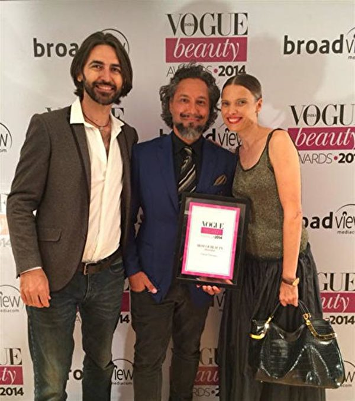

加布利埃尔·乔尔吉欧（Gabriel Georgiou，中）被《Vogue》杂志印度版授予2014年度最佳发型师奖。（加布利埃尔·乔尔吉欧提供）

 
  
  加布利埃尔·乔尔吉欧（Gabriel Georgiou）——这位出生于希腊的澳洲人，他为影坛巨星们打造的令人惊艳的红毯造型，让他获得《Vogue》杂志印度版授予的年度“最佳发型师”称号。

他在好莱坞和宝莱坞明星之间声名远播，洁西卡·艾芭、小劳勃·道尼等都是他的座上客。创意无限的他，将名人的头发当画布，发胶和吹风机作神笔，灵感之源，则是一颗清净祥和的心。他说要归功于每天修炼法轮大法。

乔尔吉欧回忆，2002年在澳洲，他经一位化妆师介绍得知了法轮大法和《转法轮》一书。“当时我在制作电视广告，聊到生活和精神追求，她告诉我她修炼法轮功，并给了我一张简介折页。一读之下我就感到和这种‘身心修行’有种共鸣，其原则是‘真、善、忍’普世价值，而且不收费。”

“我从内心深处一直知道，善良和真知是一种‘心授’，不需要花一分钱。我也一直相信这句老话，‘徒弟准备好，师父会现身。’我们遇到的一切事情都不是偶然，我觉得我必须尝试一下。”他说。

乔尔吉欧说，随着修炼，他看到自己在不断提高，“不但变得非常健康，精力充沛、而且可以轻松处理各种难题”。

<b>纽约名模：修炼让我在喧哗世界中沉静</b>
  

普贾·莫尔（Pooja Mor）2016年春登上《Harper’s BAZAAR》杂志封面。(Pooja Mor/Facebook)

  
  定居纽约的印度裔名模普贾·莫尔（Pooja Mor），是近年来欧美时尚界炙手可热的东方面孔之一。她曾代言诸多知名品牌，包括Calvin Klein、Alexander McQueen、Bob Hope等等。2015年普贾·莫尔成为《Elite》杂志的签约模特儿。

普贾·莫尔在大学期间攻读电脑工程硕士学位时，在骄人的模特职业生涯中，也面临很多身心挑战。她不时从潮流的喧嚣中退隐，回到印度家乡修整。

三年前，友人向她介绍法轮大法——其主要书籍《转法轮》阐述以“真、善、忍”原则为根本指导的佛家修炼，要求修炼者以慈悲与正念主导心灵。

“我总是会为自己留些（早间）时间，炼法轮大法。”莫尔说，“那是我和本真的自己连通的时间——我会向内看自己的心。我的家人都很重视精神信仰，这让我以不同的视角看待生活。”

炼功时，莫尔都有一种“回归真我”的感觉。这是她踏实沉着、处变不惊的心法秘密。

普贾·莫尔（Pooja Mor）参加集体炼功活动。(Courtesy of Pooja Mor)

普贾·莫尔说，修炼法轮大法使她成了一个更好的人，是她的灵感源泉。以前，面对困境，她总会挑他人的毛病，如果出状况就归咎于他人。而现在，她会先看到自己的不对，并反思如何改善与提升自己，以让局面得到真正的改观。

“我在这里看到的是，人们总会对未来将要发生的事情倍感压力。我想，如果你可以放下这种执著，只走你的路，那就很简单了。如果你真的能珍惜分秒，活在每个当下，你会从更深的层次上感受到生活的美丽。”她说。

<b>加拿大青年修炼法轮功 成功戒毒</b>

法轮功学员泽农·多尔奈基（Zenon Dolnyckyj），在2001年11月在北京长城上展开自制的“法轮大法好”的条幅。（Zenon Dolnyckyj提供）

  
  而《为你而来》（Coming For You）一书的加拿大籍作者、法轮功学员泽农·多尔奈基（Zenon Dolnyckyj），在2001年11月20日与其他35名来自不同国家的西方人，在北京天安门广场上打开了印有“真、善、忍”的巨型横幅，希望把法轮功的真相展现给中国人民，举世震撼！

当时年仅23岁的泽农，已经修炼法轮功三年半了，在步入修炼之前，他是一个陷入毒品、酒精、偷窃、情欲、自私等泥沼中的青年，可以连续五年每天抽掉一包烟。他住在阴暗的地下室，日子过得颓废至极。

对人生心灰意冷的泽农，已经准备离开家人、朋友，独自进到深山生活，他的母亲欧芮西雅·麦凯比（Orysia McCabe）一度沮丧叹息：“我以为我要失去这个孩子了。”

不过，随着泽农在1998年开始修炼法轮功、阅读《转法轮》让他生命焕然一新，短短几个月内便戒毒成功！

泽农说：“对于这个世界，法轮功是一份宝贵的礼物。我最感动的是，法轮功给我许多东西，却不要求任何回报。”因为法轮功，他得以认识了更深层的中国文化。

<b>乌克兰飞机制造机械工程师：按真善忍做好人</b>
  
  

2019年8月31日，乌克兰的阿蒂穆（Artem，右一）等人在英国伦敦参加“二零一九年欧洲法轮大法修炼心得交流会”。（明慧网）

  
  来自乌克兰的阿蒂穆（Artem）是一家飞机制造公司的机械工程师，获有理学博士学位，曾经在乌克兰科学院工作，他已修炼法轮功18年。

修炼前，他一天要睡9至10个小时，仍会感到虚弱无力，而且无法消除内心的不安，而阅读《转法轮》和炼法轮功，给他带来了“能量和平静”，让他头脑清醒，去掉头脑中不好的思想，他的睡眠时间比过去减了一半，他可以做更多的事了。

在参加了2019年8月31日举行的修炼交流会及聆听了法轮功创始人李洪志师父向大会发来的贺词后，阿蒂穆感悟到自己必须更多地去为别人着想，更多地去考虑和关心自己周围的人。他认识到：“我不是为自己来到世上的，而是为他人来的。”

阿蒂穆体会到自己生命的意义是“按照‘真、善、忍’努力做一个好人，在生活中净化思想和灵魂”。

<b>墨西哥基督教牧师：一直寻找的大道</b>

  

何塞-路易斯·桑切斯阿尔瓦雷斯（Jose Louis Sanchezalvarez，右）与妹妹蜜瑞牡（Miriam）及母亲。（明慧网）

  
  “当读到《转法轮》这本书的时候，我立即意识到，这就是自己一直在寻找的大道，立即决定修炼法轮大法。”从一位基督教牧师成为一个法轮功学员，来自墨西哥的何塞–路易斯·桑切斯阿尔瓦雷斯（ Jose Louis Sanchezalvarez）感到这个过程非常自然。

现在从事媒体工作的何塞说：“虽然基督教也是正教，但我觉得它所涵盖的范围有限。法轮大法不仅能强身健体，更重要的是，揭示了宇宙的特性与本质，指导人们遵循‘真、善、忍’的准则去生活，直接提升心灵的层次。”

现已修炼大法五年的何塞深感荣幸：“《转法轮》清晰地阐述了生命的本质，让我找到了人生的真谛；五套功法学炼起来也非常容易，适合所有人学炼。”

何塞的妹妹蜜瑞牡（Miriam），现在念企业管理博士，修炼大法五年了，她用中文说：“谢谢师父”，因为师父的《转法轮》揭示了宇宙的真理，教导她在矛盾面前向内找自己的不足，这彻底改变了她的人生道路。

对于《转法轮》一书，法轮功创始人李洪志先生曾经在《法轮大法义解》当中表示：“里边包涵着从常人开始一直到无比高的内涵，只要你修下去，《转法轮》永远都会指导你修炼提高。”

“未读《转法轮》，做人有遗憾”，您想要成为人生智者，不妨去寻找一本《转法轮》读一读，相信也会获益良多。

  

迄今《转法轮》以46种语言在全球发行。图为纽约法轮功盛大游行，展示《转法轮》及法轮大法经书各类语种的模型。（明慧网）

  
  <h3 align=center><a href="https://big5.falundafa.org/chibig5/zfl.htm">《转法轮》在线阅读</a></h3>
  
  <a target="_blank" href=#top><h6 align="right">回上方</h6></a>

<a name=59>
<h1 align="center"><b>美军52架F-35战机“大象漫步” 声势浩大</b></h1>

2020年1月6日，美国希尔空军基地的52架F-35战机进行“大象漫步”。(R. Nial Bradshaw/U.S. Air Force)

  
  【大纪元2020年01月07日讯】（大纪元记者陈俊村编译报导）美国空军的52架F-35战机在周一（1月6日）进行“大象漫步”（elephant walk）的演练，随即依序密集起飞，以展现其坚实的战力。

犹他州希尔空军基地（Hill Air Force Base）在一份声明中指出，隶属第388战机联队（388th Fighter Wing）和419战机联队（419th Fighter Wing）的52架F-35A战机，成功地进行了这项战力演练。

该声明说，这项演练不但展现“他们部署大量F-35A战力的能力”，也能检视该联队对于人员所担负的责任、飞机世代交替、地面任务、飞行任务与作战能力的准备状态。

<h3 align=center><a href="https://twitter.com/419fw">“大象漫步”演练</a></h3>

在“大象漫步”演练中，这52架F-35A战机在跑道上排成整齐的队形，并以最小的间距首尾相连滑行，以便在最短时间起飞最多架战机。

随后，它们一架接一架地起飞。轰隆隆的引擎声持续不断，响彻云霄。

希尔空军基地表示，来自不同中队的战机同时起飞构成多种挑战，也让联队能评估维修专业人员、飞行员和指挥控制团队的能力。

该基地说，这项演练已经规划了几个月，它是事先安排的正常训练任务之一，并非对目前的任何时事所做的回应。

作为空军中拥有可作战F-35A战机的少数单位，该基地的联队必须随时准备让任何数量的战机起飞，以支援国防任务。而从去年开始，该基地的F-35A战机也持续部署在中东等地区，以支援其作战任务。

该基地在2015年10月接收第一架具有作战能力的F-35A战机，迄今已有78架，目前每天执行30至60次单机出击任务。而从第一架抵达开始，该基地已经完成17,500次单机出击任务，其飞行时数超过33,000小时。

去年8月，该基地在接收一架刚出厂的F-35A战机后不到5个小时，就让它执行单机出击任务，创下让新机上线的最快速纪录。

<a target="_blank" href=#top><h6 align="right">回上方</h6></a>

<a name=58>
<h1 align="center"><b>【揭秘】中共如何利用捷克首富打造形象</b></h1>

图为捷克民众在2018年庆祝“布拉格之春”50周年纪念活动，亲中共立场的捷克总统泽曼（Milos Zeman）没有出席。(Sean Gallup/Getty Images)

【大纪元2020年01月07日讯】（大纪元记者林燕综合报导）英国《卫报》周日（1月5日）报导说，捷克亿万富豪疑出于自身商业利益，资助公关公司为中国（中共）买形象；与此同时，捷克安全部门表示，中共对捷克构成的威胁远甚于他国。

富豪为中共在捷克买影响力的新闻已经发酵多日。上月捷克媒体《简明新闻》网站（Aktualne.cz）报导，捷克境内存在一个所谓的精英网——“专家、新闻工作者和政治领导人网络”，旨在通过公开辩论传播亲北京的观点，从而“影响捷克社会”。

随后，几位捷克国会议员呼吁，要求成立议会调查委员会调查该网络。

那么捷克富豪为何要打造亲北京的精英网？背后有何内幕。

一直关注中国人权的捷克活动人士、时评人奥帕夫斯基（Milan Opavský）告诉自由亚洲电台，近些年来，中共在东欧国家以“一带一路”扩张和渗透，输出极权意识；中共当局也利用经济利益，让捷克的公司成为政治掮客，替中共做事。

<b>组建精英网 打造美化中共的舆论</b>

《简明新闻》报导指，捷克首富彼得‧凯尔纳（Petr Kellner）名下的个人信贷公司捷信（Home Credit）于2019年4月资助一家名为“C＆B声誉管理”的媒体公关机构，开展活动以期改善中国（中共）在捷克的形象。

这家机构在6月份成立了一个亲北京的智库Sinoskop，由这一智库的负责人定期接受捷克媒体采访。

这家媒体公关机构归托马斯‧吉尔萨（Tomas Jirsa）所有。从去年1月，吉尔萨开始掌管捷克主要的网站Info.cz。随后，该网站发表好几篇有利于中国（中共）的文章，文章内容近似于广告，由捷信付费刊登。

几名反对这种广告文的记者相继离开该网站，其中一名记者在捷克公共电视台上公开表示，网站Info.cz“发表的批评中国（中共）的内容越来越少，并与一个敢于批评北京的重要智库（Sinopsis）中止合作。”

捷信则称，他们通过公关公司“是想让人听到不同的观点，增加平衡讨论”。捷信从2007年开始，在中国大陆开展金融消费业务。

被Info.cz中止合作关系的智库Sinopsis，其负责人、中国政策专家马丁‧哈拉（Martin Hala）反驳说，捷信雇用公关公司的底线应该是为它自己的商业利益服务，但决不该用来“推销源自中国以及中共的说辞”。

智库Sinopsis在网站上刊文批评捷信与中共的关系后，它马上收到捷信的“停止及保留权利”法律警告；信中指责Sinopsis“误导或进行不正确的陈述”，除非道歉，否则可能对该智库提起诉讼。

<b>为一带一路等中资项目铺路</b>

专家说，捷克《简明新闻》调查揭示的境内宣传中国（中共）的外国影响力活动，突显了中国（中共）通过其雄心勃勃的“一带一路”计划进入前中欧和东欧国家的积极尝试。“一带一路”计划被认为能为这些国家基础设施项目提供资金。

这些美化中共、替其宣传的第一步就是正常化“中国”，不把中共治下的中国当成专制国家，而是当作一个跟其它国家无差别的形象来展示。

“第一个目标就是美化中国（中共）形象，不将其标榜为专制统治，而是将中国定位是一个开放、愿意改革的国家。而我认为，那是一个不准确的（中国）形象。”哈拉补充说。

分析人士指出，捷克共和国比大多数其它欧洲国家对中国（中共）都更为开放。近年来，中国能源公司CEFC收购了捷克啤酒厂、电视台和Slavia Prague足球俱乐部，华为以及中兴也希望进入捷克的未来5G网络。

现任捷克总统米洛什‧泽曼（Milos Zeman）已数次前往中国，而中国国家领导人习近平也在2016年首次对布拉格进行国事访问。

就 “一带一路”框架而言，中国（中共）多年来一直对中欧感兴趣，而捷克共和国则是一片肥沃而复杂的地方。

研究员雅各布‧詹达（Jacob Janda）说，捷克总统泽曼一直希望将自己的国家“转变成通向欧洲的门户”，在这一点上，“当地经济精英与中国共产党有着共同的利益”。

去年11月，还有捷克媒体披露，中共驻捷克大使馆在布拉格查理大学（Charles University）资助一项介绍“一带一路”项目的课程，甚至花钱请该课程的学生到中国旅行，因而被外界批评为宣传活动。

与此同时，捷信作为查尔斯大学的赞助商，提出大学必须签署一份协议的条件，声明大学不能损害捷信在全球的利益，包括让中国（中共）政府不高兴。此消息遭到学生、教工、舆论批评后，捷信最终撤销了对查理大学的5万英镑捐赠。

<b>布拉格取消与北京的姐妹市 中捷关系降温</b>

但是在政商界希望升温中捷关系时，捷克民间却对这些中国（中共）试图影响捷克的努力产生了强烈的抵制。

例如，布拉格的自由党市长兹德涅克‧贺瑞普（Zdeněk Hřib）在去年10月宣布解除和北京的姐妹市关系。

习近平早在2016年访问捷克时，与当时任职的布拉格市长克尔娜乔娃（Adriana Krnáčová）协定与北京缔结为姐妹市，协定条约中包含承认“一个中国原则”，以及“台湾是中国不可分割的领土”，但去年新市长贺瑞普上任后立即表示，要取消一中条款。

在布拉格迟迟等不到中方回应后，市议会推进提案，获得通过，正式解除与北京姐妹市的关系。北京随后也取消了布拉格爱乐乐团的对华访问计划，作为报复。

2019年，捷克总理安德烈‧巴比什（Andrej Babiš）还根据政府网络安全机构的建议，宣布禁止政府使用华为手机，这也引发了中共当局的抗议。

虽然总统泽曼事后却谴责巴比什，指安全服务部门在“泼污”；但捷克情报部门仍坚持在同年11月底的报告中，正式将中国（中共）在捷克的影响活动视为对捷克国家安全的“威胁”。这从一个层面表明，捷克政府在认真对待来自中国（中共）的威胁。

捷克情报局警告说，中国（中共）对捷克造成的国家安全影响，甚至超过俄罗斯政府的干预。

“BIS主要发现中国（中共）情报人员的活动在增加，并将后者视为对捷克构成安全问题。”报告中写道，“这些活动可以准确地被描述为：在捷克公民中寻找、联系潜在的合作者和代言人。”

<b>捷信的中国生意也不好做 害怕早晚被殃及</b>

专家认为，除非捷信允诺在捷克媒体和政治圈中发送有利中国（中共）的报导，否则中共不会给其这样难得的好处。

2010年，捷信消费金融成为中国首批的4家获准开业的消费金融公司，也是迄今为止国内唯一一家外商独资消费金融公司。（消费金融就是资金放贷，利差是主要营业收入。）

2018年，捷信消费金融以1.79亿欧元（约合人民币13.98亿元）的净利润稳坐24家中国已开业消费金融公司的头把交椅，将招联金融、中银金融等银行系公司甩在身后。

2019年7月15日，捷信集团向港交所递交招股书。

“派富集团（PPF Group NV，捷信母公司）在中国处于非常微妙的政治地位，因为能否在当地开展业务完全取决于当地监管机构，”Sinopsis智库负责人哈拉说。

他透露，派富集团的捷信从2007年在华开展业务，当时北京给出的市场准入条件就是，除非两国关系得到改善。于是，集团雇用说客，扭转捷克国内的反共立场，并安排和陪同总统泽曼2014年访华。

但从2019年开始，在中捷关系骤然降温的大背景下，这些在华的捷克企业开始难受。

中共官方媒体开始对捷信在华信贷业务提出公开批评，而捷信在中共法庭上的多起追讨债务诉讼也相继败诉。

这加剧了外界猜测，捷信开始担心其中国业务的未来前程。捷信董事会成员卡威尓（Mel Carvill）去年2月接受Seznam电视台采访时说，公司“在中国状况良好”，还没有看到“面临任何威胁的迹象”，不过他也警告说，如果两国外交关系恶化，“总有遭受殃及的可能性”。

卡威尓称，虽然公司从未在中国成为攻击对象，但“如果我说假使两国关系破裂一切都会安然无恙的话，我想你也会觉得我很傻”。

他还指出，捷信也在向有“未来成长巨大动力”的印度市场以及东南亚市场转移。

<b>捷克富豪的媒体版图导向何方？</b>

近期，派富集团以16.2亿英镑从AT＆T手中收购了中欧媒体企业（CME），该公司包括捷克共和国最受欢迎的商业电视台Nova，以及邻国的电视频道。

此外，它在匈牙利、保加利亚、斯洛伐克、塞尔维亚和黑山也拥有电信资产。虽然派富称，它遵守所在国的所有法律，同时旗下的媒体节目不会受到政治干扰，但仍有人对此持怀疑态度。

捷克政治分析家兼人权活动家彼得‧库蒂列克（Petr Kutilek）说：“派富为达成这笔交易才说，他们永远不会介入政治。但从捷信的业务来看，您实际上已看到他们正在干预政治。”

智库负责人哈拉表示，这些在华有生意的捷克企业担忧的是，一旦他们不遵从中共指示，“要付出什么代价”。

派富集团创始人凯尔纳，1964年出生，22岁（1986年）毕业于布拉格经济大学生产与经济学院，27岁（1991年）成立了一只投资基金PPF，于90年代中期入股捷克最大保险机构，将一家低效率的国有企业转变成能持续经营的私营公司，由此发家。

1989年在捷克斯洛伐克共产党垮台之后，捷克进行大规模国有资产私有化，凯尔纳就是在这一过程中积累了巨额财富。

凯尔纳的派富集团已横跨保险、消费金融、银行、电信、房地产、生物技术等多个领域。截止2018年底，派富集团资产超过450亿欧元，捷克国家银行甚至将其列为具有系统重要性的金融机构。

而凯尔纳也是捷克，甚至东欧十六国的首富。#

<a target="_blank" href=#top><h6 align="right">回上方</h6></a>

<a name=57>
<h1 align="center"><b>冯仑被退休：退休金8千 广场舞大妈都看不起</b></h1>

冯仑称自己被退休，每月退休工资仅8千，引发热议。图为2018年4月25日，冯仑在阿拉善SEE四川项目中心成立大会上。（大纪元资料室）

  
  【大纪元2020年01月06日讯】（大纪元记者梁义综合报导）近日，万通集团创始人冯仑的一段视频在推特上引发热议。冯仑指自己被迫退休，但每月退休工资仅8千元，让跳广场舞的老太太都看不起。

在“2019冯仑风马牛年终秀”上，万通集团创始人冯仑表示自己已到60岁，一天有一个组织告诉他，“你必须来办手续，你退休了！”

冯仑纳闷，“我一个民营企业，怎么被退休呢？”并且是：“他强迫你退休，非得退！”

冯仑说，自己一想，退了也行，也许有人给发工资，就好奇地问给多少钱呢？被告知一个月退休工资8千块钱。

<h3 align=center><a href="https://twitter.com/wuwenhang">员工举报中共厅级官员生活淫乱，被以寻衅滋事罪获刑4年！😂现在上访人员申诉也是犯法了，直接抓起来！</a></h3>

他一看这个数，挺头痛，因为这个数，都不足以让他在广场舞群里抬头来。因为广场上跳舞的大妈最爱问老头的一件事就是，退休金多少钱？

“我如果要去跳广场舞，人家老太太问，‘老头，退休工资多少钱呢？’。我说8千元。老太太立马就走。因为她们能看上的，退休金起码得过一万元。”

视频在推特上引发热议，有评论称，“现在中共以国家的名义共产，明抢！”

另据大陆媒体报导，冯仑还谈到当下的经济比较冷，提到“今年，比起未来十年，是最好的一年”，“如果说去年钱变少了，今年钱就变没了”。

冯仑还调侃不少民企的人被关进去，“去年，有时在吃饭的时候，会有人说某一个哥们找不着了。干吗了呢？成为‘两院院士’，进了‘法院’或者进了‘医院’，找不着了。今年，说是学习完，吃饭的时候，又回来了。大家都挺高兴……在学习期间，很多平时见不到的名人都见到了，特别是P2P的专家，见得挺多。而且，原来还有一些哥们要约，没约着，最后到这儿见着了，特高兴。然后还时不时地讨论一些业务，最后发现，讨论得最多的业务是风险控制。”

资料显示，冯仑，1982年毕业于西北大学，获经济学学士学位。1984年毕业于中央党校，获法学硕士学位。毕业后先后在中央党校、中宣部、国家体改委、武汉市经委和海南省委任职。

1991年冯仑创建万通集团，1993创建万通地产，并且是中国民生银行的创业董事。万通集团在几年内总资产增长逾30亿元人民币。

1999年与深圳万科的王石等联合发起并成立了中国首家房地产策略联盟机构——中城房网。2001年，冯仑获得“十大最具人气企业家”称号，在地产界其“地产思想家”的称呼广为人知。

冯仑曾劝诫私营企业家要“听党的话，按政府的要求办”，但也直言不讳的批评政府滥发货币刺激GDP增长，推高了房价，以致出现社会公平问题。冯仑也曾批评“国进民退”破坏正常的市场经济发育环境；以及政府随意改变公共政策，导致丧失信用。

近年来，经济不断下行，去年9月马云“被退休”后，紧接着大陆一系列科技大佬纷纷卸任重要职务，包括百度公司创始人李彦宏、腾讯公司董事会主席马化腾、京东集团董事局主席刘强东等。顺丰控股董事长王卫，也于近期卸任顺丰商贸公司董事长；联想控股董事长柳传志去年12月18日宣布退休计划。
<a target="_blank" href=#top><h6 align="right">回上方</h6></a>

<a name=56>
<h1 align="center"><b>高速收费新系统启动 路费暴涨 民怨四起</b></h1>

今年1月1日中共统一启用ETC（电子不停车收费系统）之后，大量网民发现高速公路通行费上涨，质疑中共强推ETC的背后另有目的。图为一辆车经过高速路收费站时显示的应缴费用。（网络图片）

  
  【大纪元2020年01月06日讯】（大纪元记者张玉洁综合报导）今年1月1日中共统一启用ETC（电子不停车收费系统）之后，大量网民发现高速公路通行费暴涨。民众质疑中共强推ETC的背后另有目的。

中共1月1日统一启用ETC之后，29个联网省份的487个高速公路省界收费站全部取消。

随后，大陆高速公路通行费上涨，成为2020年新年伊始最受关注的话题之一。有网民发现，大车小车的高速费都大幅上涨，货车出现20%甚至60%的涨幅，有一些地方的ETC通道不再显示费用。网民质疑中共强推ETC的真正目的是为了多收费和监控。

有网民表示：“以九五折来吸引车主们上ETC，然后大幅提高收费标准。同时汽车上装了ETC设备后将更好地被监控，就是我们现在看到的效果。”

还有网民说，“搜了一下，原来是真的，偷偷摸摸。从大货车到小轿车。对此只能说一句：2020年从高速费涨价开始。​”“2020听说，从高速费调整到一切刚刚开始……交通部拈指尖，就能制造一场2020中国经济灾难。 ​”

有分析表示，高速公路通行费涨价与老百姓的生活息息相关，接下来就是物流货运成本上涨，而物流成本提高会引发物价全面上涨，所有的涨价都将分摊在商品中，包括粮食、蔬菜，以及生活日用品。

<b>官方惯用“系统出问题”  民众：民心丧失</b>

一位货车司机1月4日从（湖北）胡集镇上高速，（湖南湘西）吉首收费站下高速，全程550公里，收费3870元。事后有大陆媒体称是系统出现问题。

近日关于ETC实行之后出现的乱象，比如堵车等，官方也多用“系统出问题”的说法来解释，但民众不买单，表示“别有问题就找系统，系统冤不冤啊。”，“民间对涨价反应剧烈，领导赶紧出来说是系统错误，这种把戏其实挺常见的。接下来就会有各种涨价，为什么，还债高峰期到了。”
  
  

  
上述评论所提到的中共债务问题，彭博数据近日显示，2020年中共地方政府有2万亿债券到期，是历年来最高的年份，有网民估算，这笔金额是再建14个香港国际机场的费用。

有网民感慨：“突然好像明白了为什么强推etc……方便涨价啊。我见到了，民心一点点丧失的过程。怪不得老百姓不相信那些好事，因为他们经历的这些好事结果都是其它的……周围的朋友全部都是这个反馈。”

一位河北的物流卡车司机表示，他从四川自贡上高速，在河北衡水冀州西下了高速，全程1650公里，计费器显示7002元高速费，相当于每公里4.2元，当时这位司机愣住了，随后经过“讲价”实际支付4201元。
  
  

  
除了上述货车司机，私家小车车主近日也表示高速费用普遍上涨。有网民说，“五座小车都涨价了，原来15元现在17元，同样路段高速费比油费还高。”

“我昨天开五座私家车从思南到贵阳原收费180元，昨天收费205元，两收费站相距约250公里，每一公里收费超0.8元了，不知是怎么回事，不是说高速要降吗？”

还有网民表示：“这两天上高速ETC就不显示费用，你稀里糊涂就被扣款了。”
  
  

<a target="_blank" href=#top><h6 align="right">回上方</h6></a>

<a name=55>
<h1 align="center"><b>德国《人权问责法》请愿案成功递达</b></h1>

图为德国国会大楼。(TOBIAS SCHWARZ/AFP via Getty Images)

【大纪元2020年01月07日讯】（大纪元记者余平德国报导）德国敦促国会通过《马格尼茨基人权问责法》的网上请愿活动成功结束。据请愿发起人介绍，在去年12月30日期限内，至少有7.5万至8万民众签名，支持这项提议，远远超过德国国会规定的5万签名的最低人数。

去年10月，德国工程师格鲁奥（Ralf Gronau）向国会请愿委员会发起第99914号请愿，标题为“针对在中国实施的残酷侵犯人权的行为，敦促在德国引入《全球马格尼茨基人权问责法》”。

请愿活动到去年年底结束时，仅在线签名的人数就已经突破6.2万。在德国很多城市，例如汉堡、慕尼黑、柏林、法兰克福、斯图加特、波恩、杜塞尔多夫等等，还有志愿者在街上寻求民众签名支持。格鲁奥表示，对这部分签名没有最后统计，他估计至少在1万以上，因此这项请愿活动得到了至少7.5万民众的支持。

这项请愿活动也得到德国政治家的支持，例如德国国会议员尼森（Ulli Nissen）就呼吁民众签名支持。尼森女士于去年12月在其发表的通讯（Newsletter）中写道：“请支持这个要求（德国国会）接受《全球马格尼茨基人权问责法》的请愿。通过该法案，人权迫害者的资产会被冻结，迫害者会被禁止入境德国。这涉及到全球范围内的犯罪分子，尤其是中共的犯罪分子。”

她还写道，“我们收到了很多有关中共残忍迫害无辜者的信息，只因为他们的信仰不同。已经有令人震惊的线索和证据表明，法轮功学员的器官在违背他们意愿的情况下遭到强行摘取，成千上万的维吾尔族人被关进再改造营。”

美国于2015年12月通过了《全球马格尼茨基人权问责法》。该法案授权美国政府对违反人权的人及国外贪腐分子实施制裁，例如拒发签证、冻结其在美国的财产等。2016年12月，该法案成为法令。

目前，加拿大、英国、爱沙尼亚、立陶宛和拉脱维亚也有类似法律。欧洲议会于2019年3月通过了一项决议，呼吁欧盟及其成员国通过类似《马格尼茨基法案》的法律。德国尚未通过类似法案。

中共对人权的破害和践踏、对香港抗议民众的暴行、对新疆维族人的迫害等已经越来越受到全世界的关注。在中国还有数以百万计的民众被非法关押、遭受酷刑，甚至殴打致死或被摘取器官，尤其是法轮功修炼者、基督徒、维吾尔人、藏人、异见人士等。

请愿发起人格鲁奥表示，希望把中共践踏人权的恶行曝光出来，让更多的民众知道，目的是制止中共继续行恶。他表示，预计本周就将收到请愿委员会的信函，他将为公开听证会做准备。

根据规定，如果在规定时间里向议会提交的请愿书达到5万以上的签名，由28名议员组成的请愿委员会原则上必须就此举行公开听证会，并且邀请请愿发起人参加。#

<a target="_blank" href=#top><h6 align="right">回上方</h6></a>

<a name=54>
<h1 align="center"><b>三正部级高官被批“两面人” 他们干了啥？</b></h1>

陕西省委前书记赵正永等42名高官被批是“两面人”。（大纪元合成图）

  
  【大纪元2020年01月06日讯】（大纪元记者张顿报导）2019年，中共42名中管干部被立案审查调查，他们都被指是“两面人”，其中三名正部级高官赵正永、秦光荣、孟宏伟被点名批评。

1月4日，中共陕西省委前书记赵正永，赵的“大管家”、陕西省副省长陈国强被立案审查调查。

中纪委批赵正永是典型的“两面人”、“两面派”，大搞特权，培植个人势力，搞团团伙伙；批陈国强“不忠诚不老实”，大搞政治攀附和人身依附，对抗组织审查等。

1月5日，中纪委官网刊发的《坚决清除两面人、两面派》文章说，2019年中央纪委国家监委立案审查调查的中管干部，无一例外都存在“七个有之”和“两面人”问题。

而2019年1至11月，有42名中管干部被立案审查调查。中管干部，是指在中组部备案、由中共中央任命的干部。中管干部，一般为副部级以上官员。

文章点名批赵正永是典型的“两面人”、“两面派”，点名批中共云南省委前书记秦光荣“公开发表与全面从严治党要求相违背的言论”，点名批中共前公安部副部长孟宏伟“拒不执行党中央决定”。

那么这三名正部级的高官，到底干了些啥呢？
赵正永对当局“阳奉阴违”

赵正永2010年6月任陕西省代省长，2011年1月升任省长，2012年12月至2016年3月任省委书记。

就在赵任省委书记期间，习近平从2014年5月至2016年2月，四次就“秦岭违建”案做出批示，但陕西省高层一直“阳奉阴违”，“企图蒙混过关”。

赵正永被调任中共人大后，习近平又连续就“秦岭违建”案做出批示，并派出以中纪委副书记徐令义为组长的督导组，秦岭违规建别墅问题才得以解决。

赵正永2019年1月15日被调查，成为2019年落马的首名正部级高官。

当局批他拒不落实“两个维护”的政治责任，对中央决策部署“阳奉阴违、敷衍塞责、应付了事”，多次“欺骗”组织，对抗审查，是典型的“两面人”、“两面派”；大搞特权活动，培植个人势力，搞团团伙伙，纵容亲属肆意插手干部选拔任用工作，严重破坏选人用人制度。
孟宏伟拒不执行当局决定

孟宏伟2018年10月被查，2019年3月被“双开”、提起公诉，2019年6月20日被一审，检方指控其受贿1,446万余元（人民币）。

当局指控他“对抗组织，拒不执行党中央决定”，“公权私用，滥权妄为”，“纵容其妻利用其职权搞特殊、谋私利”等。

时政评论员石实此前对《大纪元》表示，还兼任国际刑警组织主席的孟宏伟，被查的根本原因，是因为他“对抗组织”、拒不执行当局决定，这与当局要求官员“维护习核心”背道而驰。

孟宏伟被指是江派周永康的人马。他曾长期在中共公安部工作，周永康2003年任公安部部长，第二年，孟宏伟就被提拔为副部长、党委委员，并兼任国际刑警组织中共国家中心局局长，成为周的重要副手。
秦光荣曾叫板中南海

秦光荣2019年5月9日“主动投案”，9月26日被立案审查调查、起诉，11月25日被提起公诉。

当局指控他对当局“不忠诚不老实，做两面人”；“公开发表与全面从严治党要求相违背的言论”，干预和插手矿产资源转让；与不法私营企业主沆瀣一气，大肆敛财等。

秦光荣也被指是江派周永康、薄熙来的人马，被指曾给周家输送大量利益。

在当今中共官员几乎人人都贪腐的情况下，外界普遍认为，秦光荣被查的主要原因也是政治原因：与当局唱反调，“做两面人”。

秦光荣的唱反调主要表现在：

重庆事件2012年2月6日爆发，时任政治局委员薄熙来、政治局常委周永康、江泽民、曾庆红正在密谋进行的政变计划随即曝光。

但同年2月8日至9日 ，政变主角、重庆市委书记薄熙来高调到云南“考察”时，时任云南省委书记秦光荣率本地官员一路陪同，并在海埂公园一起投喂了海鸥。

秦光荣也曾积极投靠薄熙来，并高调称“把云南打造成支持薄书记的坚实基地”。

但就在2012年3月，薄熙来被免职，第二年，薄被判处无期徒刑。

2014年7月29日，中共前政治局常委、政法委书记周永康被立案审查。第二天，秦光荣在省委中心学习会议上讲话时称，官员“不能因为一点自身利益就举报；自身清白干实事的也不要怕被举报”，并称“云南100封举报信，可能6封是实的”。

秦光荣的言论当时引发舆论大哗，被认为与王岐山主掌的中纪委鼓励官员举报对着干，与前一天刚刚拿下周永康的习近平叫板。

秦发表该言论不到3个月，就于2014年10月14日被免去云南省委书记，随后调任中共人大闲职。#

<a target="_blank" href=#top><h6 align="right">回上方</h6></a>

<a name=53>
<h1 align="center"><b>深圳高楼背后的血泪：湖南工人失去了肺</b></h1>

中共官员们经常把深圳称为中国通往世界的窗口，但浇筑高楼大厦地基时，对工人的肺造成永久性伤害。(NICOLAS ASFOURI/AFP via Getty Images) 

【大纪元2019年12月23日讯】（大纪元记者吴馨综合报导）当他们浇筑高楼大厦的地基时，花岗岩粉尘也渗入了他们的胸膛。十多年后他们的双肺变得僵硬，他们会因呼吸困难气绝而终，没人关心他们的求救，而中国尘肺病人还在增加。

施家曦（Gerry Shih）毕业于斯坦福大学，是美国《华盛顿邮报》的驻中国记者，曾是美联社驻北京的记者，负责报导中国新闻。近日，美国《华盛顿邮报》发表了他从湖南耒阳采访的报导，文章讲述了多个尘肺病人的故事，以及他们上访无果的社会现实。

<b>徐春林：这里本应亲人满堂</b>

中共在1980年批准深圳成为经济特区时，深圳的人口仅为三万。在几十年内，农田变成了苹果手机的工厂、亚洲第四大证券交易所和超富豪的高楼大厦。深圳的经济产值从1980年的400万美元猛增到2018年的3,400亿美元，中共官员们经常把深圳称为中国通往世界的窗口。

对于三十年前的徐春林来说，深圳是走出穷困湖南耒阳市的一条出路。但他怎么也没想到有一天他会想在这里的立交桥上往下跳。

1989年，年仅21岁的徐春林与他的四个兄弟一起来到深圳冒险，他们在这里的建筑工地工作。他回忆说，他当时带着5000元人民币（约合现在的710美元）回家过年，立即将它们全部换成了大米，超过3300磅（约1500公斤）的大米堆成了粮仓，这样他的家人就可以不再挨饿。

四年后，徐春林开始做中间人，他将村民介绍给深圳的分包商，分包商在工地预留了一半的工作给湖南人。慢慢地，徐春林成了一个相对富裕的人，住在一栋带华丽铜门的三层楼房里。他在接受施家曦采访时说：“村里的每个人都想认识我，因为我有工作。而深圳的每个老板都想认识我，因为我有人。”

徐春林所说的工作有一个专业的名称：孔桩爆破井下风钻作业，就是用手提钻钻炮眼，然后装上炸药炸出桩孔，有时深度达150英尺（约45米）。然后，他们将钢筋水泥倒入桩孔中，成为高楼大厦的支柱。

但是，徐春林并不知道，当钻头钻进花岗岩层中时，二氧化硅粉尘一旦吸入肺腑就具有不可逆转的危害。在过去的十年中，湖南有100多名前劳工死于尘肺病，这是一种无法治愈的疾病，因吸入的尘埃微粒导致肺部产生疤痕和硬化。

徐春林在深圳矿区工作的四个兄弟已经去世，他自己也被诊断患有晚期尘肺病。徐春林指着他空荡荡的房子说，如果他从未接触过风钻工作，这里将会住满了他的兄弟、侄女和侄子们。

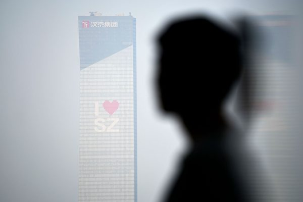

在深圳建筑林立的背后，许多建筑工人的健康产生不可逆转的危害。徐春林的四个兄弟已经去世，他自己也被诊断患有晚期尘肺病。示意图。(WANG ZHAO/AFP via Getty Images)

  
  <b>桑植县的悲剧：重蹈覆辙</b>

陡峭的砂岩峡谷遍布桑植县，这是湖南省的一个贫困县，这里几乎没有工业，甚至没有农业。但是带有仿欧式栏杆的多层房屋沿道而建。记者施家曦认为，这是当地人在深圳等城市打工后的回报，也是用人命为代价建立的。

“每个人都会盖一栋大房子，然后没人住在里面。”前钻工谷中平（音译：Gu Zhongping）在开车时说。他并指出，在一栋房子里，一名前深圳钻工正在死亡或已经死亡。

村民们表示，自2009年以来，桑植县已有超过26名前钻工死于尘肺病，他们说死亡人数正在增加，另有约100名重病患者。尽管没有官方数字，但在网上找到的湖南市级文件支持了村民的主张。2017年的健康检查显示，有290名村民患有尘肺病，其中大部分在桑植。

2013年，《新京报》报导，在耒阳农民工逐渐退出深圳风钻行业后，桑植县的农民工开始接手。资料显示，自2004年后，张家界（桑植县所属市）在深圳做风钻工的民工约有300人。

桑植县芙蓉桥乡的谷龙国自2006年到深圳做风钻工，2013年接受《新京报》采访时表示对打风钻的危险有一定了解，并说：“（耒阳）导子乡的现在，极可能是我们的未来。”

既然如此，他为什么还要做风钻工呢？谷龙国表示，家贫龄大，风钻工是他能找到的最好的工作了。他说，现在戴的口罩比以前要厚，有海绵垫，吸收的灰尘比以前少了很多。

<b>尘肺病：2300万壮丁或为此付出生命</b>

刚开始，吸入岩石沙灰和微小矿物晶体的工人不会立即感觉到症状，但是在几个月，甚至几十年的时间里沉积下来的颗粒却会对肺造成毁灭性的破坏。一旦患上尘肺病，走路，甚至说话，都变得困难，平躺会造成窒息的感觉，因此大多数患者在小型氧气机旁睡觉。在后期，他们会遭受剧烈喘息，体重急剧下降，经常感冒和发烧。肺炎和肺结核很容易致命，肺部迟早会停止运转。

在发达国家，与工作有关的肺部疾病一直保持稳定或下降，因为煤矿开采等工作的减少和安全标准的提高。但在中国，尘肺病人却正在增加。

根据中共国家卫生委的数据，2018年，约有87.3万名中国工人患有尘肺病，高于2000年的约55.9万名。北京一家非营利组织“大爱清尘”估计，真实的患者人数要高得多，可能约为600万人。

正在研究这场危机的中共官员表示，中国有2300万工人有患上这种疾病的危险。卫生部门和研究人员估计，这远远超过印度的1150万高风险工人，美国的200万和欧洲的170万。

中国有近3亿农民工就业于合法的灰色地带，缺乏合同的保障。图为湖南农村的一名工人。(AFP/AFP via Getty Images)

  
  <b>湖南的悲剧谁之过？</b>

中共于1978年12月18日开始推行实施改革开放，40年后的今天，中国社会正面临着因追求现代化而积累的各方难题。

农民从农村来到城市寻找工作，近3亿农民工就业于合法的灰色地带。中共国家统计局的数据显示，尽管2008年颁布了一项法律要求所有雇主提供书面合同，但2016年只有35%的农民工与雇主签订书面合同，这一数字还正在下降。大爱清尘2014年的全国调查发现，患有这种疾病的工人中只有7%签署了合同。

康奈尔大学（Cornell University）工业和劳工关系学院国际项目主任、中国劳工专家埃里·弗莱德曼（Eli Friedman）表示，中国的建筑业是一个因工死亡占所有行业因工死亡人数四分之一的行业，也是靠包工头非正式雇用工人的行业。他说，中共的劳工系统“将风险降至最低。”

香港中文大学职业健康研究中心主任谢立亚（Shelly Tse）教授说，由于尘肺病的潜伏性，深圳的工人受到了进一步的伤害。

谢教授说：“当工人在10年后感觉到逐渐恶化时，他们已无法确定自己患上这种疾病时所服务的公司了。公司也可能已经破产了。”

<b>维权过程中发生警民冲突 风钻工被逼跳桥</b>

徐春林看着他村庄的死亡人数激增至70多个，6人因病自杀。像曹家这样的当地氏族遭到了破坏，他们埋葬了在深圳患上尘肺病的三个兄弟。

他说：“我们必须做点什么。人们需要生存。”

湖南工人维权抗议，图为湖南的一名尘肺病患者，他曾是一名建筑工人，摄于2013年。(Ed Jones/AFP via Getty Images)

  
  在湖南的桑植县和汨罗市，生病的工人开始被动员起来，将他们的诉求带到深圳。

2018年11月上旬，他们数百人占领了深圳的一栋政府大楼，之后警察用警棍和胡椒喷雾将他们驱散，进一步令他们虚弱的肺部受创。

根据四名抗议者、维权人士和新闻报导的说法，就在与警察发生冲突期间，被警察逼上立交桥、逼向角落的工人们威胁集体跳向八车道的深圳高速公路自杀。

徐春林表示，他当时已准备为此而死。

但他后来表示，他感到要对这些钻工们负责，因为他是1990年代率先将乡亲们带到深圳的湖南人之一。

徐春林说，站在那个立交桥上，他向他们大吼，不要靠近栏杆，不要疯狂，保持镇定，改日再战。

谈判于第二天早晨11点开始。几周后，宣布了一项协议：深圳将为尘肺病患者支付17,000至35,000美元，并支付医疗费用。但问题并没有完全解决。

密歇根大学（University of Michigan）政治学家玛丽·加拉格尔（Mary Gallagher）表示，在缺乏健全法院的情况下，中共通常以这种方式解决劳资纠纷。农村请愿者组织群众，反复示威；官员们希望通过一次性付款来安抚他们。她说：“但是他们从不承认系统性的失败。”

<b>徐春林继续上访：只为良心</b>

湖南请愿人与当局之间的冲突仍在继续。请愿者说，数十名希望返回深圳或北京谋求更多补偿的工人被一再拦截，并至少有一次被警察粗暴对待。

受灾地区的村庄已受到密切监视。在前往桑植县的一次采访途中，《华盛顿邮报》的一名记者被便衣警察包围，被迫离开该省。当局还骚扰了在另一次采访中受访的村民。

对于桑植县抗议领袖来说，这场争端没有解决。他坐在一间农舍，策划着他去深圳或北京的第13或14趟上访之旅。他担心官方报复，并在匿名的情况下发言。

他说：“这个社会不存在正义。它拥有的荣耀、财富和摩天大楼建在我们的脊梁上。”

在湖南风景如画的山谷中，现年51岁的徐春林说，多年来随着村民们一个接一个生病，一些家庭来恳求帮助，另一些家庭则诅咒他在深圳为钻工找到工作。

在过去的两年中，他花了12,000美元在深圳为抗议者提供食宿。他在微信上为全国尘肺病上访者家庭提供建议。他探望耒阳的寡妇，因为他们的丈夫曾经跟随他南下工作。他还在上访。

他说，他想要的只是政府对这种疾病的公开数据信息，而不是金钱。

“这是良心。”

本文首发于《真相中国》周刊 2019.12月号/第24期 #

<a target="_blank" href=#top><h6 align="right">回上方</h6></a>

<a name=52>
<h1 align="center"><b>安徽合肥三位医护人员经历的残酷迫害</b></h1>

2013年2月2日，74岁的安徽省合肥工业大学退休校医蒋翠萍在中共没完没了的骚扰、恐吓、抄家和绑架中离世。（明慧网） 

  
  【大纪元2019年12月28日讯】在中共对法轮功持续20年的迫害中，不计其数的法轮功学员因为不放弃修炼，惨遭中共的迫害，身心受到巨大的伤害，甚至失去生命。本文所讲述的安徽省合肥地区三位修炼法轮功的医护人员的遭遇，只是无数的法轮功学员被迫害事实的冰山一角。
  
<b>合肥工业大学退休校医蒋翠萍在迫害中离世</b>

蒋翠萍，女，74岁，安徽省合肥工业大学退休校医，1993年开始修炼法轮功，身心受益。她按照法轮功“真、善、忍”的标准要求自己，处处为别人着想、默默地付出。
  

蒋翠萍（明慧网）

  
  1999年7月20日，中共开始疯狂迫害法轮功后，蒋翠萍在中共没完没了的骚扰、恐吓、抄家、绑架中，于2013年2月2日离开人世。以下是她生前遭受的种种迫害。

1999年12月5日，蒋翠萍进京为法轮功鸣冤遭绑架，被非法拘留后，又被劫入洗脑班非法关押了10天。

2007年9月28日晚，蒋翠萍在家中被庐阳区国保大队、刑警队、街道等一帮人绑架。

2008年5月21日晚，蒋翠萍被合肥市庐阳区国保大队、芙蓉派出所、工大保卫处二十多人绑架。

2012年7月23日，蒋翠萍在合肥工业大学北区菜市场给两个卖瓜的农民讲法轮功真相时，突遭庐阳区国保大队绑架、抄家，当晚12点20分被单位接送回家。

同年8月，庐阳区“610”（专门迫害法轮功的非法机构）、安庆路派出所和合肥工业大学保卫处以“上门关心”为名骚扰蒋翠萍。

9月下旬，蒋翠萍的家中突然闯进几个彪形大汉，他们自称是安庆路派出所的，进门就问，蒋翠萍家是否是做法轮功真相的资料点，因为有电脑和有打印机。

中共警察不由分说，大声吼叫，把蒋翠萍连拖带拽抬下楼，塞进警车里，劫持到了安庆路派出所。一部分警察看守着蒋翠萍并审问她，另一部分警察开车到她家抄家，把家翻了个底朝天，将所有法轮功书籍一扫而光。当天深夜，她儿子才把她接回家中。

在中共的恐怖高压下，蒋翠萍忧心忡忡，提心吊胆。同年10月份，她去医院检查，查出患有肺癌。

2012年11月22日，又有一批警察突然闯进蒋翠萍家，自称是包河区“610”配合合工大南区校保卫处的警察，一伙十多人，还口口声声地说：“你不用怕，这次来不抄你的家，只请你跟我们走一趟。”

蒋翠萍说：“我哪也不去，这是我的家。”警察们恼羞成怒，一拥而上，把她强行抬下楼，塞进警车里，直接送进合肥市“610”办的洗脑班。

在中共不法人员没完没了的迫害中、恐吓高压中，蒋翠萍旧病复发，于2013年2月2日凌晨4时，离开人世，终年74岁。

<b>屡遭酷刑的合肥医生汤菊章失踪</b>

2019年10月28日，合肥医生汤菊章被中共当局强制失踪，至12月底，关于汤菊章的情况还是音讯全无。

2015年6月14日，汤菊章向最高检察院控告元凶江泽民。

明慧网报导她遭迫害的部分事实：

2003年12月，合肥康泰医院人员将她弄到合钢招待所办的洗脑班。她拒绝写所谓“四书”，被单位停职处理，后开除公职。

2004年4月至2010年6月，她先后被非法关押在宿州监狱、合肥市第一看守所、第二看守所、女子劳教所，期间受尽折磨和凌辱，使她的身体、精神受到严重伤害。

2010年6月，她最后一次走出劳教所后，失去家庭、没有工作，三次工作均因是法轮功学员的身份而失去。

2004年4月，她将法轮功光盘分发给家乡人看，被巢湖市公安局警察关进巢湖看守所，后被非法劳教3年。

在宿州监狱，一开始她被关进五分监区，在那里她遭受过吊、铐、电棍、关禁闭室等迫害，以及遭受服刑犯的殴打和辱骂。

2005年下半年，她被转到老残队、关在阴暗的储藏室强行“转化”（放弃修炼）。看守所瞒着她在给她的食物里下不明药物。

2008年3月，她去火车站看一位朋友，在站外给一位病恹恹的老者一张法轮功真相护身，不料这老人向站内警察举报她。她被绑架到合肥第一看守所、非法劳教1年。

一进合肥女子劳教所二大队，她就被关禁闭。狱警唆使劳教人员对她进行折磨：她们用挑水的绳子和布带将她吊起，四肢向四个方向拉；她绝食抗议，她们就用野蛮灌食手段折磨她，撕她嘴角的肉，一天反复多次给她灌食。见她不妥协，又给她穿上“约束服”，五花大绑。

  

中共酷刑演示图：约束衣。（明慧网）

2009年5月，她在下班路上给一名学生讲法轮功真相时，被稻香楼派出所警察劫持到合肥第二看守所关押，后又将她劫持到合肥女子劳教所非法劳教1年。

期间，她遭到酷刑“约束服”的摧残，恶徒们给她头上缠上胶带，捂住嘴巴，早上将她从监舍拖到车间，晚上从车间拖到监舍，上下四五层楼，拖上拖下，她的头被她们倒着、顺着地拖过，拖了一个多月。

2014年5月，她被蜀山区国保大队关进合肥清风苑宾馆洗脑，多人对她威逼、恐吓。为了摆脱这没完没了的纠缠，她不得已离家出走，流落他乡。

<b>多次遭抄家抢劫 八旬老中医周正伦损失惨重</b>

周正伦 ，男，80多岁，合肥肥西县小庙乡法轮功学员，出身中医世家，行医60多年，曾治愈了很多疑难杂症，是当地非常有名望的老医生。1999年7月20日之后，只因坚持修法轮功，老人多次被警察绑架、抄家，一度被迫流离失所、孤苦无依。

2002年10月5日，肥西县公安局警察在没有出示任何证件的情况下，对老人进行非法抄家。警察抄走大量的电器和法轮功书籍，以及现金3,000多元。

因为抄到了现金，警察们去镇上大吃大喝，留下一人看守老人。后来天色渐黑，老人趁看守不注意成功逃脱。

警察们饭后回来发现老人已经不知去向，就出动几十个警察闯入附近老人女儿家的旅馆，砸掉三间客房门，再次抢走现金3,000多元。他们没抓到老人，就把老人不修炼的女儿抓到公安局逼审。

周正伦老人得知后，被迫开始长达近5年流离失所的生活。那时老人已经76岁高龄。

2007年9月28日，肥西警察查到老人在合肥市的租房处，再次前去非法抄家。这一次，他们抢走法轮功书籍，以及老人多年行医的积蓄、用作养老的43,600多元现金。

因老人独身在外，无亲无故，被押送到肥西县小庙乡家里软禁监控，但结案后警察并未把这笔钱归还给老人，将这笔钱当“保证金”继续扣押。

2009年7月17日，警察再一次对老人抄家，当时有八九个警察闯进老人家中，一人问话、其他人在家中到处乱搜乱翻，抢走他们看中的东西。

老人要求他们出示蒐查证件，警察们说“警服就是证件”。老人要打110电话报警，抢东西的警察说：“我们开来的警车就是110。”在几次的抄家迫害中，肥西县国保大队队长宣以文均在现场。

<a target="_blank" href=#top><h6 align="right">回上方</h6></a>

<a name=51>
<h1 align="center"><b>中东紧张局势升级 法英德首脑促伊朗克制</b></h1>
  <h3 align="center"><b>马克龙致电川普：力挺盟友</b></h3>

周日（1月5日），法国总统马克龙致电川普总统，表达力挺盟国之意。(LUDOVIC MARIN/AFP via Getty Images)

【大纪元2020年01月06日讯】（大纪元记者吴英综合报导）近日美国与伊朗紧张局势升级，周日（1月5日），德国、法国和英国领导人发表联合声明，呼吁德黑兰克制。法国总统马克龙致电川普总统，表达力挺盟国之意。

德国总理默克尔（Angela Merkel）、法国总统马克龙（Emmanuel Macron）和英国首相鲍里斯・约翰逊（Boris Johnson）5日在一份联合声明呼吁伊朗克制，并“取消所有不符合2015年伊朗核协议的措施”。

他们在声明中说，现在至关重要的是“降温”，并呼吁所有参与其中的国家展现“最大的克制和责任”，同时保证将继续寻求减缓紧张局势和确保中东稳定的方法。

2015年，伊朗与联合国安理会五个常任理事国（英国、法国、中国、俄罗斯和美国——加上德国达成《全面联合行动计划》（Joint Comprehensive Plan of Action，JCPOA，简称伊朗核协议）。德黑兰同意限制浓缩铀的生产，以换取联合国及美国等国家解除对其实施的经济制裁措施。

美国总统川普（特朗普）认为伊朗核协议并未真正遏止伊朗的野心，于2018年5月退出该协议，并恢复对伊朗的经济制裁，美国与德黑兰的冲突升级，伊朗逐渐放弃对该协议中的关键承诺。

美军于伊拉克当地时间1月3日击毙伊朗军头索莱马尼（Qassim Soleimani）之后，伊朗领导人扬言报复。

周日，伊朗国家电视台援引总统哈桑・鲁哈尼（Hassan Rouhani）政府的声明说，伊朗不会遵守伊朗核协议对铀浓缩燃料、铀浓缩储存规模以及研发活动的限制。同一天，伊拉克国会通过一项决议，督促政府终结外国在伊拉克的驻军。

法英德三国领导人在联合声明中，呼吁各方不要采取危及对抗伊斯兰恐怖组织（IS jihadists）的措施，“在这种情况下，维持（反IS）联盟非常重要。我们呼吁伊拉克当局继续向联盟提供必要的支持。”

美国2014年应伊拉克政府要求，开始派兵到巴格达协助打击IS。目前有数千名美国士兵在伊拉克。

<b>马克龙充分支持川普</b>

周日，马克龙办公室在一份声明中说，马克龙与川普总统通话，表达了法国对盟国的声援，并表示伊朗必须避免采取“破坏稳定”的行动。

“鉴于最近伊拉克和该地区的紧张局势升级，以及最近几周针对在伊拉克联盟的袭击，总统强调他对盟友的充分支持。”该声明说。

“他还对索莱马尼将军领导下的圣城部队，采取的破坏稳定的活动表示关切，并强调伊朗有必要……避免采取任何有可能导致局势升级和破坏该地区稳定的措施。”

<a target="_blank" href=#top><h6 align="right">回上方</h6></a>

<a name=50>
<h1 align="center"><b>苏州十全街发生大面积塌陷 店铺已搬空</b></h1>

苏州著名的十全街发生地面塌陷。（网络截图）

  
  【大纪元2020年01月06日讯】1月4日下午，苏州知名的十全街突然发生大面积地面塌陷。

综合大陆媒体报导，目击者称，塌陷发生在下午4、5点钟，只听到很闷的“轰轰”两声，出来一看，看到那个亭子呼呼地变矮（下陷）了。周围的店铺都已经搬空。

当地秦先生也对媒体透露，位于姑苏区十全街苏州饭店北侧的公交站台发生塌陷，凉亭整体下沉，地砖部分开裂塌陷，沿河部分商户墙壁开裂。

当地人猜测，地面塌陷应与河道清淤有关。目前，现场已设置隔离带，有人员巡视。

有网友表示：“苏州全市就是个大工地，到处挖地铁，挖路，众多公交改道或取消，严重影响市民生活。 ”

十全街是苏州城区东南部的一条街道，已有千年以上的历史，宋代起名为“十泉街”，因街上有十口井而得名。清代为纪念“十全老人”乾隆帝而更名为“十全街”。

苏州著名的古典园林网师园就位于十全街上，附近曾是苏州的宾馆酒店最集中的地段，包括南林饭店、苏州饭店、南园宾馆等。旧街坊改造后，十全街两侧为新建的古典风格建筑，集中了餐饮业、茶楼酒吧和各式工艺品商店。

地面塌陷现场。（网络图）

  

地面塌陷现场。（网络图）

  
<a target="_blank" href=#top><h6 align="right">回上方</h6></a>

<a name=49>
<h1 align="center"><b>【内幕】谍影重重 中共利用赴美游客窃密</b></h1>

美国联邦调查局（FBI）局长克里斯托弗•雷（Christopher Wray）2019年夏天也表示，中共通过情报部门、国有企业、表面上的私营公司、研究生和研究人员收集情报，各种各样的演员都代表中共工作。(Win McNamee/Getty Images)

  
【大纪元2020年01月06日讯】（大纪元记者许祯祺综合报导）2019年6月28日，中国公民李青山（Qingshan Li，音译）乘坐飞机降落在南加州，他持旅游签证赴美，原定于10天后返国，但最终他在美国被逮捕和控罪。

据“石英”（Quartz）网站1月5日报导，李青山抵美后的第二天，便租车开到圣地亚哥地区的一个仓库。在那里，他和一个身份不明的人碰头，此人在美国法庭文件中被称为“AB”，李事先已经安排向此人购买几件敏感军事装备。

李青山的案子以前没有被媒体曝光。“石英”获得的联邦起诉文件显示，此案是中国平民被指控代表北京从事间谍活动的最新案件之一。专家表示，虽然李被美国当局逮捕，但他代表了中共对美国国家安全的直接威胁，且这种威胁正在不断增加。

美国联邦调查局（FBI）局长克里斯托弗‧雷（Christopher Wray）2019年夏天也表示，中共通过情报部门、国有企业、表面上的私营公司、研究生和研究人员收集情报，各种各样的演员都代表中共工作。

<b>赴美中国游客为中共军方当间谍</b>

“石英”报导说，李青山案件所涉及的商品包括Harris Falcon III AN/PRC 152A宽带联网收音机，这是美国国防物品，并受国际武器贩运条例约束，如果没有获得国务院签发的特别许可，不允许出口。

指控文件显示，李同意向AB支付5万人民币（约合7,200美元），且他知道AB已因涉嫌与出口有关犯罪而接受调查；李并相信因为AB被美国执法部门盯上，急于将这款收音机脱手。

李告诉AB，他计划驾车将Harris Falcon III AN收音机运到墨西哥的蒂华纳（距圣地亚哥约30分钟车程），然后从那里运回中国。据报导，李认为该路径将帮助他避开美国出口管制审查。他支付给AB首付款600美元，然后将设备放进手提包。

从法庭记录看无法确定AB是否在与美国当局合作，或美方在监视AB的谈话过程中发现线索。在李和AB完成交易后，FBI特工立即拦下李。FBI发现，李还有第二个Harris Falcon III AN收音机、几根天线、一个数字存储卡，以及北岛海军航空站的地图。北岛海军航空站是附近的美国军事基地，也是两艘航空母舰的母港。

FBI关于此案的书面证词显示，李青山在接受讯问时，承认一名中共军方（PLA）官员联络他，要求他获得这款收音机线。李告诉特工，这名中共军官给了他一份清单，其中包括这款收音机。

专家说，中共极有可能对他们在全球所有地区的伙伴全面部署间谍，不管你是德国人、英国人、日本人还是台湾人。(China Photos/Getty Images)

李在被捕后不到两周被联邦大陪审团起诉，并于9月认罪，罪名是企图非法出口国防物品。这项指控可能会被处以100万美元罚款和20年监禁。目前李青山仍被拘留，等待2月7日的宣判前听证会。

李的律师乔纳森‧拉佩尔（Jonathan Rapel）和负责该案的美国助理检察官亚历山德拉‧福斯特（Alexandra Foster）均拒绝评论李的案件。

美国国家反情报和安全中心（National Counterintelligence and Security Center）主任威廉‧伊万尼纳（William R. Evanina）警告说，中共间谍活动甚至比俄罗斯或伊朗更持久，覆盖范围广，操作技术种类繁多。

伊万尼纳说，（中共）非传统情报收集工作已显着增加。他说：“他们派遣工程师、商人、学生来进行相同类型的收集、招聘、信息选择（工作）……大规模的……”

俄罗斯联邦安全局（FSB）前反情报官诺伊曼（Janosh Neumann）说，中国（中共）情报部门实际上拥有无限的财务资源，可以自由使用这些财富。FSB在冷战结束时取代了克格勃。

美国在创新和先进技术方面处于领先地位，是外国情报、科学和技术间谍活动的全球首要目标。

诺伊曼于2008年逃到美国，他将李青山案描述为中共间谍运作方式的“经典范例”，它利用大量看起来可亲的平民作为自由“特工”以及私人公司来促进其地缘政治目标。

他表示，中共的标准方案是派遣如李青山这样的代理人，从事走私技术设备或走私那些禁止从美国出口的技术，为了执行这些操作，中共会同时使用多个代理，以增加成功机会。

李青山涉案文件没有提供有关他背景的任何细节，但毋庸置疑他是一名平民特工。

<b>中共致力于非法获取美方受出口管制军事技术</b>

尼古拉斯‧埃夫蒂米德斯（Nicholas Eftimiades）曾在中央情报局、国防情报局和国务院外交安全局担任多年的高级官员。他表示，李青山自称供职于中共军方情报部门，该部门的任务是获取军事机密和相关外国技术，主要是非法获得那些出口受限制的军事和两用技术。

埃夫蒂米德斯是研究中共间谍方面的重要专家，他对“石英”说，李青山受命于中共军方的首要任务是“非常有针对性的搜集（情报）行动”。他说，像李这样的人的目的是在美国当局发现前进出美国，并搞定任务。

针对李的案子，他说，是因为AB已经被美方锁定，所以李青山自己走进“陷阱”。

他说，李青山案并非中共首次尝试窃取Harris Falcon III收音机，他指出三名中共特工在2009年因出售早期型号的这款收音机而被起诉。当时版本是民用级别。

中共窃取外国军事技术机密的一种方式是对外国产品进行逆向工程。“石英”报导，如果中共成功获得军用级Harris Falcon III收音机，可能会直接威胁战场上的美军。

美国前海军陆战队坦克司令丹‧格拉齐尔（Dan Grazier）在伊拉克和阿富汗出差时经常使用这款收音机。他告诉“石英”，“这是美军地面使用的一种手持式设备。”“我的坦克部门有前进空中管制员（Forward Air Controllers），他使用这种无线电设备与飞机通话，以指导近距离空中支援任务。因此，这是一个重要系统。当然，我们不希望落入潜在对手手中。”

美国在全美50州都展开跟中共有关的经济间谍调查。(shutterstock)

<b>中共间谍方式是“全社会型”的</b>

“石英”报导，埃夫蒂米德斯认为李青山从事间谍活动的草率行为，说明他属于中共官方情报界外部招募的资产。如果李是专职间谍，其行事和通讯会更加隐秘。但埃夫蒂米德斯也说，“李的行动显然是由（中共）国家资助的”。

他指出，李明告诉联邦调查局，自己正在接受PLA的命令，符合中共从事间谍活动是“全社会型”推测。

FBI前中国分析师保罗‧摩尔（Paul Moore）在2018年《纽约时报》专栏文章中写道，中共这种间谍方式被称为“千粒沙”法（thousand grains of sand）。

摩尔说，中共派出一千名游客，每人被分配收集一粒沙。当这些游客回来时，中共最终将比其他人得到更多沙子。

自2017年以来，美国司法部已至少发现十几宗中共代理人和间谍进行网络和经济间谍活动的案件。

詹姆斯‧奥尔森（James Olson）是中情局秘密服务的老将，也是前反间谍主任。奥尔森曾指出，中共“一直善于从事间谍活动”。

他说：“如果我要重新开始我的中情局职业生涯，我会尝试进入我们的中国项目，学习中文，成为反中共情报专家……我们今天在美国反间谍中的首要任务，也是未来的首要任务，必须停止或者大幅减少中共的间谍活动。”

美前国防情报局（DIA）官员克里斯‧西蒙斯（Chris Simmons）说：“在任何一天，全世界有两百到三百万人从事间谍活动。”他估计活跃的两百万至三百万名间谍中，大约一半为中共政府工作。

在去年10月在华盛顿头条（WTOP）电台国家安全通讯员J.J.格林（J.J. Green）的一篇报导中，威廉‧伊万尼纳（William Evanina）认为，中共间谍威胁是前所未有的。

“从美国窃取商业机密和知识产权，没有哪个国家比中共构成更大的威胁”，伊万尼纳说，“美国每年因中共盗窃知识产权而损失约3,000亿至5,000亿美元。这相当于美国每个四口之家每年损失4,000至6,000美元。”

他也认为中共间谍活动是“全社会”型的。“虽然没有人反对一个国家参与公平竞争以在世界市场上取得进步，但中共政府的策略绝非公平。它正利用各种各样的技术和人员在美国各行各业掠夺技术和创新。” 伊万尼纳说。

埃夫蒂米德斯对“石英”说，对于美方反间谍行动来说，首先联邦政府必须比现在更紧密开始与工业界建立伙伴关系。其次，美国需要加强知识产权法律和《外国代理人注册法》（FARA），该法要求任何代表外国政府行事的人都必须在司法部注册并披露其隶属关系。

2019年8月28日，澳洲安全情报局（ASIO）给新州厅长手下的幕僚长，做了关于外国政治影响力危险性的简报；并警告他们，任何来接触他们的中国代表团体，其中都有中共的情报人员。在9月4日的告别演说中，澳洲安全情报组织负责人邓肯‧刘易斯（Duncan Lewis）警告说，外国的干涉和间谍活动共同构成了前所未有的“生存威胁”。

刘易斯表示，外国的干涉和间谍活动胜过澳大利亚以及西方伙伴所面临的其它威胁，他说：“我认为，目前，间谍和外来干扰问题是迄今为止最严重的问题。”

<a target="_blank" href=#top><h6 align="right">回上方</h6></a>

<a name=48>
<h1 align="center"><b>组图：港人多区快闪 高喊“天灭中共”</b></h1>

1月6日中午，香港有网民继续发起在多区“和你Lunch”活动。图为铜锣湾情况。(ISAAC LAWRENCE/AFP via Getty Images)

  
  【大纪元2020年01月06日讯】1月6日中午，香港网民继续发起在多区“和你Lunch”活动，继续要求港府回应五大诉求。

中午1时左右，在湾仔税务大楼、铜锣湾时代广场，大批市民集合，他们分别沿着轩尼诗道、庄士敦道等道路步行。市民手举自制标语，伸出五个手指代表五大诉求，他们高喊“光复香港 时代革命”“五大诉求 缺一不可”“天灭中共”“驱逐共党 光复香港”“解散警队 刻不容缓”“没有暴徒 只有暴政”等口号。

现场，一度有多位戴口罩的学生手持文宣、合唱《愿荣光归香港》。

此外，葵涌九龙贸易中心对面，也有数十位抗议者聚集静坐，呼吁“坚守我们的公义”，“不要忘记初衷”。现场有警车及防暴警察戒备。

  

1月6日中午，香港有网民继续发起在多区“和你Lunch”活动。图为铜锣湾情况。(ISAAC LAWRENCE/AFP via Getty Images)

  

1月6日中午，香港有网民继续发起在多区“和你Lunch”活动。图为铜锣湾情况。(ISAAC LAWRENCE/AFP via Getty Images)

  

1月6日中午，香港有网民继续发起在多区“和你Lunch”活动。图为铜锣湾情况。(ISAAC LAWRENCE/AFP via Getty Images)

  

1月6日中午，香港有网民继续发起在多区“和你Lunch”活动。图为铜锣湾情况。(ISAAC LAWRENCE/AFP via Getty Images)

  

1月6日中午，香港有网民继续发起在多区“和你Lunch”活动。图为铜锣湾情况。(ISAAC LAWRENCE/AFP via Getty Images)

  

1月6日中午，香港有网民继续发起在多区“和你Lunch”活动。图为铜锣湾情况。(ISAAC LAWRENCE/AFP via Getty Images)

  
<a target="_blank" href=#top><h6 align="right">回上方</h6></a>

<a name=47>
<h1 align="center"><b>习近平谈中共领导人更替 接班人制再引关注</b></h1>

中共最高领导人接班人一直是外界关注的焦点，也是中共权斗的风向标。(Getty Images)

【大纪元2020年01月05日讯】（大纪元记者张顿报导）近期，习近平本人谈到中共“国家领导层”的更替问题，立即引发关注。因为中共接班人一直是外界关注的焦点，也是中共权斗的风向标。

1月1日，中共党刊《求是》刊发习近平去年10月31日在中共十九届四中全会闭幕当天的讲话，全文7,100多字，其中有关中共最高领导层的更替引起外界的注意。

习近平说，他在2014年的中共全国人大成立60周年上说过：“评价一个国家政治制度是不是民主的、有效的，主要看国家领导层能否依法有序更替”等。

习近平还提到邓小平1980年在“党和国家领导制度的改革”中的相关讲话。

中共“国家领导层”的更替，一直是外界关注的焦点。中共十九届四中全会前，就有不少海外中文媒体传，中共当局在本次会议上会确定习近平的接班人，甚至传出中共将增补两名政治局常委，作为下任中共领导人人选，但最后这些传言都不了了之。

法广1月4日刊发评论文章说， 众所周知，邓小平的“党和国家领导制度的改革”，是为废除中共领导人终身制、实行干部退休制度之作，中共后来有了事实上的国家领导人退休制度，比如中共总书记任期两届，每届五年。

但习近平当局在2018年初迅速废除了“国家主席”只能连任两届的限制，为其继续连任铺路。

文章认为，从逻辑上讲，中共“国家领导层”应该包括习近平本人，但因为“习近平思想”已写入中共宪法，而且在所有的党政会议上都要重申维护“习核心”。在这种情况下，包括中共总理在内的所有高官都在“有序更替”范围内，而习本人则不在其中。

文章说，习近平2014年讲这句话的时候，人们自然会想到就是最高领导人任期两届，每届五年；但自从习近平废除了国家主席任期制后，就不一定包含任期最多两届的意思，只要做到“有序”就足够了。

中共掌控的大陆，是当今世界上最大专制极权的国家，其最高领导人的接班人一直备受外界关注。

在毛泽东时期，毛曾先后指定刘少奇、林彪为接班人，但因为权力斗争，他们都被毛斗死。最后，毛在快离世前仓促确定华国锋为接班人，但华国锋掌权不几年，就被邓小平等中共元老斗下台。

邓小平掌权后，也先后罢黜了自己确定的中共总书记胡耀邦、赵紫阳，江泽民虽然逃过了被罢黜的命运，但邓还是隔代指定胡锦涛为江的“接班人”。

邓小平死后，江泽民独揽大权，到2002年该下台时，江利用“军事政变”的形式强行留任两年军委主席。

胡锦涛2004年接任军委主席时，两名军委副主席郭伯雄、徐才厚都是江的心腹，军中布满江派人马；而在中共9名政治局常委中，江派常委占了7人，只剩胡锦涛、温家宝光杆司令，就连胡的“大内总管”、中办主任令计划都与江派同流合污。

习近平被确定为胡锦涛的接班人时，据悉，江派当时本来选择薄熙来为胡的接班人，但遭到中共高层的竭力反对；而胡锦涛当时想让李克强接班；最后，中共高层才确定被各方都接受的习近平。

但就在习近平将要在中共十八大上台前，重庆事件爆发，江派企图通过政变的形式让薄熙来接替习近平的计划曝光。随后，政变主角薄熙来、周永康先后落马，参与政变的令计划、郭伯雄、徐才厚也相继落马。

时政评论员夏小强曾刊文说，文化大革命之后，从表面上看，中共似乎顺利完成了几次权力交接。但是，权力交接的背后，都是激烈血腥的残酷政治斗争。

夏小强表示，从根本上讲，中共从来没有形成过一个稳定有序的权力交接模式，权力的承袭和接替，主要由政治斗争和清洗完成。#

<a target="_blank" href=#top><h6 align="right">回上方</h6></a>

<a name=46>
<h1 align="center"><b>大陆又一平台爆雷 涉资千亿 近二百万人受害XX</b></h1>

大陆金融诈骗时有发生，当局推脱了事。图为来自四川、重庆、江苏、浙江、上海、黑龙江、辽宁、广东等地的受害者聚集在广州市维权。（受访者提供）

  
【大纪元2020年01月06日讯】近来，大陆普顿PTFX外汇平台崩盘的消息，震动了整个外汇圈。据悉，该平台涉案资金近千亿人民币，近200万投资者受害。

据中国基金报1月4日报导，12月19日当晚PTFX平台突然“数据异常”，所有户头“资金亏空”，网站会员后台出现乱码，无法登入。该平台于次日发出公告称，“数据遭到黑客袭击”，开始耍起了“拖字诀”，极力撇清关系。

微博有大V曝料，PTFX普顿外汇资金盘崩盘跑路 ，会员无法接受事实选择自杀。有投资者投资50万（人民币，下同）亏了45万。

据报导，普顿PTFX外汇平台从2016年开始运行到案发，该平台光是注册会员就达175.9万人，其中缴纳会费的活跃会员172.1万人，涉及大陆31个省、自治区、直辖市，主要集中在福建、山东、浙江、河北、江苏和四川等地，涉案金额总计1000多亿元。

据PTFX官网介绍，PTFX是印尼十大券商之一的pruton公司旗下新成立的一个品牌，2017年引进中国，是正规的外汇投资理财平台。

该平台给投资者提供了两种收益方式，其中一种是静态收益，投资人只负责出钱就可以，每个月什么都不干就能够稳赚10%到30%。

PTFX平台上共有5个操盘手，所有在PTFX外汇入资金的投资者需要选择由哪一个操盘手替自己操作资金炒外汇，最低从1000美元起。5个操盘手是否真实存在，情况不详，投资人也没有机会接触到操盘手，只是群管理员经常在群组发布几个操盘手每天的收益情况，投资人通过平台账户了解是否盈利。

据报导引述经纪人的话说，也就是说，会员投入资金之后，绑定操盘手，每天看看账户数字上涨即可，外汇市场的波动因素，杠杆倍数等等都不需要知道。并且初期投资时，单单盈利，能迅速赢得众多金融投资者的欢心。

此前，有媒体记者深入调查发现，会员在PTFX普顿外汇的所有资金全部分流至国内的多家私人公司的账户，而非对外宣传的印尼BCA银行，包括厦门拓善达商贸有限公司、厦门杨林峰装饰设计有限公司、南昌一站物流有限公司、三明市益森贸易有限公司、广州仁佳信息科技有限公司等。

该平台早在2017年就被马来西亚央行列为警示黑名单。而该平台利用了信息的不对称性，在大陆大肆“行骗”。

另外，这个平台还有一个更加重要的赚钱方式，那就是拉人头。投资人负责出钱出力，拉人头发展下线。

有业内人士介绍，PTFX外汇平台表面上是通过炒外汇赚钱，实际上是通过传销式的拉人头赚钱，盘面的外汇交易数据只是掩人耳目，作为拉人入金的背书。通过控制投资人的收益来保证盘面资金稳定，只要不断有新人入场，拿后面进场的投资人的钱作为收益分享给前面的投资人，没有发生大规模挤兑，平台就能够保持长久运作。

据金融专家称：“外汇保证金交易一般通过‘伪平台’和所谓的‘真平台’操作，这两种平台都是借用‘互联网+外汇’的概念，伪装成正规合法的交易平台，设下‘骗局’来迷惑、侵吞投资者的资金，其实质涉嫌诈骗犯罪。”

专家表示，平台操作实际上只是把炒外汇当幌子，涉嫌传销才是真的。

有网民留言表示，出事了才说是诈骗、传销，一百多万人被骗，政府监管是干什么的，背后肯定有官商勾结。

也有网民表示，为什么这种诈骗总是出现在中国？

<a target="_blank" href=#top><h6 align="right">回上方</h6></a>

<a name=45>
<h1 align="center"><b>港中联办主任遭撤换 新任骆惠宁有三大特点</b></h1>

2019年7月21日，香港民阵发起的反送中游行，晚间有示威者聚集中联办，并在其四周涂鸦。（余钢／大纪元）

【大纪元2020年01月04日讯】（大纪元记者张顿报导）在反送中运动进行得如火如荼之际，香港中联办主任被撤换，刚刚退居二线的骆惠宁接替王志民，出任中联办主任。

1月4日，中共国务院任命骆惠宁为中央政府驻香港特别行政区联络办公室（中联办）主任，王志民不再担任中联办主任。

大纪元记者发现，新任香港中联办主任骆惠宁有三大特点：

<b>一，无中联办工作经验</b>

香港主权1997年回归中国后，中共政府2000年1月18日正式将新华通讯社香港分社更名为香港中联办，随后姜恩柱、高祀仁、彭清华、张晓明、王志民5人先后担任过中联办主任，他们在任职前都有在中联办工作的经历。但唯独新任中联办主任骆惠宁，从来没有在中联办的工作经历。

<b>二，已超出65岁退休年龄</b>

1954年10月出生的骆惠宁，去年11月30日已满正部级官员65周岁退休的年龄，不再担任山西省委书记，同年12月28日被安排出任中共全国人大财经会副主任。

<b>三，曾替当局“救火”</b>

中共十八大后，山西省官场曾出现塌方式的腐败，先后有7名省部级高官落马。

2016年6月30日，时任青海省委书记骆惠宁被调任山西省委书记。随后山西官场基本恢复平静，直到2019年3月才有另一名副部级官员、省人大副主任张茂才落马。

外界认为，在当局反腐、“打虎”运动中，山西政坛出现大崩盘，而骆惠宁当时调任山西省委书记，是替当局“救火”。

<b>退居二线的骆惠宁罕见任中联办主任</b>

时政评论员石实对大纪元记者表示，从没有中联办工作经验、已经退居二线的骆惠宁，突然出任正部级的中联办主任，实属罕见。

石实表示，在港人反送中运动中，当局安排骆惠宁出任中联办主任，不仅显示中共高层基本无人可用，而且可能是中共各派斗争的产物。

骆惠宁被指是江派回良玉的人马，曾任回良玉的“大秘”。骆惠宁曾在安徽工作33年之久，回良玉1994年调任安徽代省长，1995年升为省长，同年骆惠宁任省政府副秘书长、办公厅主任，随后任省政府秘书长；回良玉1998年至1999年任省委书记时，骆惠宁被调任安徽省巢湖地委书记。

石实表示，香港一直由江派把持，而与江派回良玉关系密切、且曾替习近平当局在山西官场“救火”的骆惠宁，现在出任中联办主任，应该是得到了中共各派的认可。

“但骆惠宁只充当一个过渡性的角色，”石实说，最晚可能会在2022年换届时被撤换。

资深时政评论员李林一对大纪元记者表示，王志民是江派二号人物曾庆红的人，被撤下去有多重因素，本身没做好，还有内斗的因素。

他说，北京当局把无港澳工作经验的骆惠宁调任港澳系统，就是要打破曾庆红把持的港澳系统，对曾庆红的港澳系统未来的清算慢慢开始了。

<b>撤换中联办主任有先兆</b>

其实，中共当局撤换中联办主任早已有先兆。早在去年8月，反送中运动进行到2个多月之际，在港红二代向《大纪元》披露，习近平对中联办、港澳办不满，他们可能会被追责。

该红二代表示，习近平作为中共领导人，周围还有很多他的对手、前中共总书记江泽民势力的人，在向北京传递假情报，令其政令不出中南海。

去年10月，接近中南海的消息人士再次向《大纪元》透露，中联办主任王志民、港澳办主任张晓明将面临被清算。其中，中联办主任王志民最快将在四中全会后“被撤换”。

消息指，香港建制派也透过各自渠道，密集地向习当局反映讯息，其中中联办、港澳办两办被指插手香港事务、“误导中央”，接到的投诉最多。

去年11月，路透社独家报导，知情人士说，中共高层为了处理香港动荡局面，已在香港边境建立一个危机指挥中心，并正在考虑撤换中联办主任王志民。

报导说，香港抗议活动已经持续5个多月，近几个月来，中共高层领导人一直在深圳郊区一栋别墅中处理来自香港的问题，绕过运作二十年的中联办。

两名知情人士说，北京对中联办处理香港危机不满意，这表明北京方面正在考虑替换王志民的主任职务。

“中联办一直与香港的富人和大陆精英有联系，使自己与港人隔绝，”一名中方官员说， “这需要改变。”#

<a target="_blank" href=#top><h6 align="right">回上方</h6></a>

<a name=44>
<h1 align="center"><b>川普击毙伊朗二号人物 对中共释何种信号</b></h1>

1月3日美军空袭后，巴格达机场一辆被击中着火的车子。(IRAQI MILITARY / AFP)

  
  【大纪元2020年01月05日讯】（英文大纪元记者Cathy He报导／吴英编译）美军击毙伊朗将军卡西姆・索莱马尼（Qasem Soleimani），中国问题专家说，美国此举向伊朗的主要盟友北京政权发出强烈信号。

本次事件清楚地传达了华盛顿将采取果断行动对付“行为不良者”，包括伊朗最重要的经济及军事伙伴——中国共产党。

《中国（中共）即将崩溃》（The Coming Collapse of China）作者章家敦（Gordon Chang）在电子邮件中告诉《英文大纪元》：“坏人会从我们对抗其他坏蛋的方式中发现线索。我们对其中一个坏角色的坚决回应，会使其他坏人退缩。”

伊拉克时间周五（1月3日）凌晨，伊朗将领卡西姆・索莱马尼（Qassim Suleimani）抵达伊拉克巴格达国际机场，在机场货运区下飞机，准备与伊朗支持的伊拉克民兵组织“人民动员”（PMF）副指挥官阿布‧马赫迪‧穆罕迪斯（Abu Mahdi al-Muhandis）乘车离开机场，未料遭遇美军空袭而被炸死。

本次袭击之时，正值美中在将近18个月谈判后，准备签署第一阶段贸易协议，以期部分解决中共长期以来不公贸易行为之际。

62岁的索莱马尼是伊朗革命卫队负责海外事务的将领，是仅次于该国最高领导人哈梅内伊（Ayatollah Ali Khamenei）的第二号人物。

在索莱马尼被炸死后，伊朗发誓要报复。

美国国务卿蓬佩奥（Mike Pompeo）表示，本次攻击的目的是阻止可能危及中东地区美国人性命的“迫在眉睫的袭击”。

美国总统川普（特朗普）周五在佛罗里达州告诉记者，这次袭击是为了“阻止战争，而不是发动战争”，无意寻求伊朗政权的更迭。

“但是，伊朗政权在该地区的侵略，包括利用代理战士破坏其邻国的稳定，这必须被终结，而且必须现在就结束。”川普总统说。

美国与伊朗的外交紧张关系已持续数十年之久，在川普政府退出2015年伊朗核协议后，两国冲突加剧。索莱马尼之死，令紧张局势升级。

<b>中共与伊朗的关系</b>

迈阿密大学（University of Miami）政治学教授朱诺・特费尔・德雷尔（June Teufel Dreyer）在一封电子邮件中告诉《英文大纪元》，作为伊朗的盟友，中国（中共）政权必须支持德黑兰反对美国。

1月3日，中共外交部发言人耿爽敦促美国“保持冷静克制，避免紧张局势进一步升级”，并补充说，“应维持中东海湾地区的稳定与和平”。

中国是伊朗的最大贸易伙伴，也是美国去年5月对伊朗石油实施制裁前的最大原油购买国。分析人士说，北京仍持续进口伊朗原油。

美国政府去年9月制裁中国实体和个人，理由是它们明知故犯，违反伊朗制裁令，从伊朗输出石油。

“中国（中共）需要石油以及与反美的国家建立伙伴关系，伊朗是满足这两项需求的最佳选择。”德雷尔说。

美国空军退役准将、华盛顿智库哈德森研究所（Hudson Institute）高级研究员罗伯特・斯伯丁（Robert Spalding）告诉《英文大纪元》，北京利用与伊朗以及朝鲜等国的关系，迫使美国分散注意力而无法专注应对中共威胁。

“因此，这是（中共）破坏国际秩序整体方案的一部分，……策划逼迫美国必须面对挑衅行动，因为这最终将削弱美国的力量。”斯伯丁说。

另外，斯伯丁指出，北京运用这种方法的前提是，不会影响石油价格。他补充说：“在一定程度上，伊朗及其支持的恐怖组织可以给美国带来麻烦，对中国（中共）有利。”

中共政权长期以来向伊朗提供武器，包括战斗机、地对空导弹系统、反舰导弹和攻击潜艇。根据美国国防情报局2019年的报告，联合国对伊朗的武器禁运将于2020年10月解除，而伊朗已经在评估和讨论从俄罗斯和中国（中共）购买军事硬件。

章家敦说：“中国（中共）一向支持伊朗，妖魔化美国和西方国家，包括通过直接和代理人的方式，向伊朗提供技术、设备和材料，以帮助德黑兰的核武器计划。”

去年访问中国四次的伊朗外交部长穆罕默德・贾瓦德・扎里夫（Mohammad Javad Zarif），12月31日在北京与中共外长王毅会晤，加强他们的亲密关系。中共外交部发言人当天表示，北京希望与德黑兰加深实践合作以及推动全面战略伙伴关系。

去年12月，中共、伊朗、俄罗斯在阿曼湾进行了联合海军演习。

对于美军这次空袭行动，专家说，中共除了发表声明外，不太可能采取具体行动。

“川普打击了它（中共）的其中一个伙伴，（中共）对此无能为力”，章家敦说，“因此，如同当今的情况，美国总统已经拿下了一个中国（中共）资产，习近平必须意识到他现在对此是无能为力的。”

前白宫经济官员威廉姆斯（Clete Willems）此前告诉CNBC新闻，中美贸易战暂时休战，北京没有义务为了捍卫伊朗而放弃与美国达成的第一阶段协议。#

<a target="_blank" href=#top><h6 align="right">回上方</h6></a>

<a name=43>
<h1 align="center"><b>阴霾袭华北黄淮汾渭 69城发重污染预警</b></h1>

大陆多地遭新年首轮“霾伏”，69个市启动重污染预警。图为去年12月7日，人们在阴霾笼罩的山东菏泽曹县街头骑行。（大纪元资料室）

  
  【大纪元2020年01月05日讯】大陆多地遭新年首轮“霾伏”，2日至3日，出现大范围PM2.5（细颗粒物）污染。4日至6日，重污染范围继续扩大至华北黄淮汾渭平原等地，69个城市启动重污染预警。

2日晚间起，辽宁中部、关中地区率先出现PM2.5小时浓度重度污染；3日，污染范围扩大，东至山东半岛、西至陕西关中地区、南至河南、北至辽宁和内蒙古中部，四川盆地和新疆西北部也出现污染，总体程度为中到重度，首要污染物为PM2.5。

截至1月3日17时，全国337个地级及以上城市中，68个城市PM2.5小时浓度达重度污染，10个城市PM2.5小时浓度达严重污染，PM2.5小时浓度峰值为每立方米365微克。

京津冀及周边地区、汾渭平原、东北地区中，53个城市启动橙色预警，16个城市启动黄色预警。

  

大陆多地遭新年首轮“霾伏”，69个市启动重污染预警。图为网民上传的1月4日的西安阴霾天。（微博图片）

  
  4日白天，华北中南部、黄淮、江淮东部、汾渭平原、东北地区中南部、内蒙古中部等地有轻至中度阴霾，其中河北南部、山东中西部、河南、山西南部、陕西关中、苏皖北部等地有重度阴霾。
  
<h3 align=center><a href="https://twitter.com/oOo0oO0OooO0oO">我不敢发照片，但是。。。</a></h3>

中国环境监测总站预计，4日至6日，扩散条件不利，京津冀及周边地区中南部、山东西部和河南北部将出现重度及以上污染。

<b>1月北方大气污染扩散 气象条件整体偏差</b>

据中共生态环境部官方微信消息，近期中国气象局国家气候中心与生态环境部中国环境监测总站联合开展了2020年1月大气污染扩散气象条件预测会商。结果显示，预计1月份，京津冀和汾渭平原地区大气污染扩散条件整体偏差。

预计2020年1月，欧亚中高纬大气环流以纬向型为主，冷空气势力较弱，京津冀和汾渭平原地区大气污染扩散条件整体偏差。月内阶段性变化特征明显，中旬冷空气活动较强，大气污染扩散条件较好；上旬和下旬冷空气活动较弱，整体扩散条件较差。

京津冀及周边地区气温较常年同期偏高1～2℃，降水量较常年同期偏多20～50%。汾渭平原气温较常年同期偏高0.5～1℃，降水量较常年同期偏多10～20%。与过去两年相比，京津冀、汾渭平原地区污染物扩散条件与2019年1月接近，较2018年1月偏差。上述地区中国新年期间污染发生的可能性较大。#
<a target="_blank" href=#top><h6 align="right">回上方</h6></a>

<a name=42>
<h1 align="center"><b>“中国淡水鱼之王”长江白鲟被宣告灭绝</b></h1>

武汉一群渔夫捉住一只珍稀鱼类中华鲟（STR/AFP/Getty Images，2004 年8月1 日）

  
【大纪元2020年01月03日讯】一份研究报告披露，有“中国淡水鱼之王”之称的长江白鲟（Psephurus gladius）已灭绝。

日前在国际学术期刊《整体环境科学》（Science of The Total Environment）上，来自中国水产科学研究院长江水产研究所的一篇论文说，中国特有的物种长江白鲟在2005-2010年时已经功能性灭绝，最近13年来都没有发现野生白鲟的活动踪迹了。

该论文的预校样（pre-proof）于2019年12月23日在线发布。其通讯作者、中国水产科学研究院长江水产研究所首席科学家、研究员危起伟对陆媒介绍，2019年9月中旬，国际组织IUCN（世界自然保护联盟）在上海组织了专家组评估，评估结果为，中国特有物种、国家一级重点保护动物长江白鲟灭绝（extinct）。

危起伟参加了那次评估会。“大家尊重IUCN的评估模型和专家，但这一结果让人心情沉重。”他说。这一结果正在上报IUCN办公室，随后将在IUCN红色名录（《世界自然保护联盟濒危物种红色名录》）中正式更新和公布。

IUCN官方微博1月3日发布消息称，目前正在开展的亚欧鲟鱼类全面评估最终结果尚未发布，预计将在今年6月正式发布评估结果及相应的级别调整。

对此，危起伟回应澎湃新闻称，“是没有正式公布，但评估已经完成了。公布与否，不影响其科学结论。”

继白鱀豚和长江鲥鱼后，长江白鲟是第三种被宣布功能性灭绝的长江流域特有物种。

长江白鲟是国家一级保护动物，属于匙吻鲟科鱼类。长江白鲟，体型硕大，成鱼可长达七八米，游速迅疾，被称为“水中老虎”“中国淡水鱼之王”，它也是世界十种最大的淡水鱼之一。它和长江中华鲟一样，是距今已有一亿五千万年的中生代白垩纪残存下来的极少数古代鱼类之一。

2009年，IUCN对长江白鲟物种濒危等级的评估结果是“极危”。

IUCN专家说，目前没有包括影像学等在内的任何证据证明白鲟还存在。如果人们再拍到或捕捉到任何一个长江白鲟个体，IUCN将重新考虑调整其物种濒危等级。

自2003年至今，科研人员没有再发现过白鲟，也没有其人工养殖个体存留。

长江白鲟灭绝的消息被披露后，1月2日，中共农业农村部官网被迫宣布实施长江十年禁渔计划，2020年1月1日0时起长江流域禁止生产性捕捞。

对此，网民们纷纷留言表示，“几分钱的电费没见过，长江流域的物种是实实在在的灭了不少。”“违背自然，就会被自然惩罚，今天的白鲟只是个开始。”

“导致这种大型鱼类的灭绝的最重要原因是栖息环境变化，水电站大坝。”

“人为的灭绝！”

专家表示，长江珍稀鱼类濒临灭绝，是因为长江生态系统崩溃所致。

原长江流域水资源保护局局长翁立达等表示，长江除了葛洲坝水利枢纽和三峡工程，长江上游和主要支流的水电开发梯级开发和规划也大规模启动。这些目前已建、在建和规划中待建的密密麻麻的各级水电站，将长江上游层层拦腰斩断。

专家表示，长江流速、水温、河势、泥沙等等条件的变化从整体上改变了水生生态系统的功能和结构，改变了鱼类的栖生环境，包括产卵场的丧失、鱼卵孵化环境的改变、以及水温、流速和氧气的急剧变化，这些变化使原来土生土长的鱼类种群数量下降、甚至灭种。

陆媒2013年报导，据统计数据：长江已知物种1,778种，其中鱼类378种，长江特有鱼类为142种，20多种鱼类被列入中国濒危动物红皮书。长江的国家一级保护水生野生动物数量在大陆淡水一级水生野生动物保护名录中占2/3。

报导说，长江“四大家鱼”青鱼、草鱼、鲢鱼、鳙鱼等产卵量只有原来的3%，“长江三鲜”之一的刀鱼，可能步上鲥鱼与河豚的后尘，在“5年内消失”。

长江作为华夏大地的第一大河流，养育了一半以上的中国人。自从三峡大坝开建以来，长江中下游连年出现反常气候，地震、大旱、水灾等灾难接踵而至。数百万“三无移民”——无田种、无工作、无前途造成巨大社会危机，水质污染、水库诱发地震、水位上涨引发滑坡崩坍、水库淹没区扩大、限制长江航运、历史古迹消失、珍稀动植物死亡等，引发很多生态灾难。

在三峡大坝拟议修建之初，著名水利专家、清华大学教授黄万里痛陈三峡工程的危害，先后三次致书时任中共党魁江泽民，指出根本不可修建这一祸国殃民的工程。但江泽民仍强推三峡工程。

<a target="_blank" href=#top><h6 align="right">回上方</h6></a>

<a name=41>
<h1 align="center"><b>杭州政府要求全民储粮 被指转嫁粮食危机</b></h1>

中共财政部12月6日公布，将对部分美国进口大豆和猪肉进行关税豁免。(Scott Olson/Getty Images)

  
  【大纪元2020年01月04日讯】（大纪元记者李新安采访报导）中美贸易战被指加重了中国的粮食危机。近日，网上流出杭州市余杭区政府部门号召屯粮的通知，引发外界猜测。专家认为，中国农业衰退，过度依赖世界粮食市场，一旦出现天灾人祸容易引发粮荒。

一份杭州市余杭区粮食安全工作协调小组办公室的倡议书显示，杭州市余杭区商务局（余杭区粮食和物资储备局）以“社会储粮，粮安余杭”为主题向余杭市民发出通知。

网传杭州余杭区政府号召全民储粮，引发猜测。（网路图片）

  
  文件称，余杭是粮食销区，产不足需，粮食市场易受自然灾害、突发事件等影响发生波动。故号召家庭储粮，“广大城镇居民家庭争取存粮10天以上，人均约7斤以上；农户存粮20天以上，稻谷等原粮3个月以上”。

同时，号召社会储粮，全民参与，并减少粮食损失和浪费。全区党政机关、企业单位、学校和粮食企业都要参与社会储粮。“粮食企业要执行必要库存量制度，伙食单位保持10天以上消费量库存。”

网友纷纷表示，“才全民小康，又要储粮。这是什么信号？”“号召储存粮食，准备过苦日子。”“地主家的余粮不多了。”“要打仗了？”“啥意思，粮食未来都跟不上了？每年500亿农产品不打算买喽？”

有网友向杭州余杭区政府新闻办公室官方微博求证，“号召市民家中储粮，这可是真的？”目前官方未对此做出回应。

记者查询发现，“大力推进全社会储粮”最早出现在杭政函〔2015〕175号官方文件中，到了2019年7月，“社会化储粮”项目已经成为浙江省粮食和物资储备局的专项资金项目。而2018年初，浙江温州还是全省社会化储粮唯一试点地市。

浙江政府网站显示，近年来该省迅速推进社会化储粮。（网路截图）

  
 <b> “粮食依赖进口 恐现粮荒”</b>

自由经济学家夏业良在接受大纪元采访时表示，中国的粮食问题由来已久。中国广大的农村、特别是偏远农村基本还是落后的耕种方式，种植成本越来越高，农民种粮越种越穷，大量的农田抛荒。中国的农业本身还是计划指导下的农业，不是那种自由竞争的农业。

夏业良说，比如政府要求他们种什么就种什么，但是农产品在经济学里有一个蛛网模型，就是市场缺什么要求他们种什么，等到他们真的去种，下一个周期发现又供过于求了。

“中国长期实行粮食统购统销政策，很多年份都出现过农民‘卖粮难’，当丰收的时候又发现政府不收那么多粮食了，到处找人卖不掉，放了二三年的粮食就只能喂牲口了。所以农民就不愿意种粮了，也没有多少余粮。”他说，“当年朱镕基去检查粮库的时候，就发现很多地方连夜从外地运粮到粮库。很多粮库是空的，根本就没有足够的储备粮。”

夏业良认为，中国的产业政策和基本制度就是一个非国民待遇的问题，农民不是真正享受完整公民待遇的公民，农民是被歧视的。而中国这么庞大的人口，如果完全依赖于外部市场的话，是很可怕的。

他表示，中国这些年来进口粮食的数量是相当庞大的。如果不从美国买的话，从世界其它国家去买，对于中国来说是比较麻烦的事，非常分散，交易成本反而会增高。有些国家是从美国买了粮食以后再转卖给中国，比如说巴西。

“现实情况就是如果中国不向美国和几个产粮大国购买粮食的话，就会出现粮荒，是非常恐怖的事情。假设贸易谈判有一天真的谈不下去，双方真的是要脱钩的话，到时候就是非常大的一个粮食恐慌。”他说。

<b>中国粮食自给率低 基层储粮被转嫁危机</b>

中国社会民主党主席刘因全在接受大纪元采访时表示，地方政府号召屯粮叫基层、农民个人想办法存下一部分粮食，万一出现意外，一二个月能够度过，减轻国家粮食空虚的负担，把危机和风险转嫁在下层来。

“我认为中共高层有了一种危机感，也知道粮库里的存粮是远没有办法供应的。万一出现天灾人祸，或者是出现了战争，海外的粮食进不来，自己的粮库又是空的。这种时候就可能出现粮荒，老百姓吃不上饭就会造反，这是自然的。”他说。

刘因全指出，中共实行宏观的计划经济，国家收了税投到那些重要城市去，不投资农业、农村去，农业缺乏资金，自然就衰退了。中共实行“剪刀差”的倾斜政策，对农民一直盘剥得比较厉害。所以农民基本上处于越来越衰落的情况，农村也都空心化了。

“美国的粮价完全是市场调节的。美国的农业很发达，从来没有闹饥荒，粮食、食品太充裕了，二战的时候也没有饿死过人。”他说，“像中国，第一是政府人为地轻视农业、糟蹋农业；第二中国确实人口比较多，土地制度又不好。所谓集体所有制，分地时农民的土地不是整块的，而是分散的，人为地造成效率低下。”

中共国家统计局在2018年12月公布的数据显示，2018年中国粮食总产量为13,158亿斤，比2017年减少了74亿斤。而根据2017年的数据，中国的粮食自给率已经降到了82.3%左右（已经低于世界安全标准的90%）。

夏业良表示，中国这么大的人口，如果自给自足的粮食供给份额达不到70%以上，那还是有风险的。他估测，中国现在的粮食自给率远远达不到70%，大量地依赖进口。

刘因全认为，中国的粮食不可能自给自足，官方公布的数据有水分。“因为种粮食没有收入，现在农村空心化，很多土地都荒芜了，大量的青壮年到城市里谋生去了。在这种情况下18亿亩红线的说法没有意义，是在自欺欺人，过分吹口哨。”

“我相信中国自给率、国产的供给率连一半都到不了。你到城市里的超市看一下，到粮店里看一下，绝大部分粮食都是海外进口的，从美国、东南亚、泰国进口的。中国国产的粮食，第一数量很少，第二质量比较差。”他说。

贸易战压力下，中国经济持续下行。中共当局去年8月曾下发通知，要求各级政府勒紧腰带，做好过苦日子的准备。

刘因全说，“中共历史上爆发过多次粮食危机。毛时代大饥荒，不拿饿死人当回事，人们饿死也不造反；邓时代大量从美国进口，所以也就没有危机；现在又要讲政治、又要跟美国对着干，搞贸易战，国内的老百姓也觉醒了，你再叫他饿死，不造反也不可能了。在这种情况下，它的危机就会爆发。”#

<a target="_blank" href=#top><h6 align="right">回上方</h6></a>

<a name=40>
<h1 align="center"><b>中共长臂深入美校园 中国学生面临红色恐怖</b></h1>

中共长臂深入美国校园，华盛顿担心中共借此窃取知识产权。并导致中国学生及学者在美国校园面临“新的红色恐怖”。图为在美国的中国留学生。（蔡溶／大纪元）

  
【大纪元2020年01月05日讯】（大纪元记者吴英编译报导）中共长臂深入美国校园，华盛顿担心中共借此窃取知识产权，导致中国学生及学者在美国校园面临“新的红色恐怖”。

<b>不受中共支配 中国学生在美国校园寻自保之道</b>

《经济学人》（Economist）在1月2日发行的最新一期期刊，发表《美国校园的新红色恐怖》（The new red scare on American campuses）一文。文章提到，去年秋天，两名中国留学生亚历克斯（Alex，化名）和维克多（Victor，化名）到纽约哥伦比亚法学院聆听香港民主运动人士黄之锋（Joshua Wong）的演讲。他们选择坐在后方的位置，脸上戴着蓝色口罩。

他们告诉《经济学人》，戴上蓝色口罩有双重目的，其一是声援香港人追求民主自由的努力，并与礼堂内另一群所谓“爱国分子”的中国人有所区别；另一个则是隐藏身份，因为中共政府有可能透过各种方式扫描听众并进行人脸识别。

亚历克斯和维克多与中国同学在一起时避免谈论敏感话题，并且与哥伦比亚大学的CSSA（中国学生学者联谊会）保持距离。

“在中国，我听到了很多关于学生打教授小报告的事，只因为他们的课堂上提到了（1989年的）天安门（和平抗议活动）。”维克多说，“这些中国学生在中国大陆这样做，在国外也会这样做。”

近几年中共长臂伸入美国校园，华盛顿认为，部分受中共利用的中国学生和研究人员在美国盗窃大量的知识产权。中共方面则担心像亚历克斯和维克多这样的中国公民，正在美国吸收“危险的”民主理想。

<b>中共利诱下 美中学术合作计划变质</b>

根据最新可得的统计资料，过去十年，在美国的中国留学生人数增长了276%。近几年，全美大学外国籍留学生人数超过100万，其中三分之一来自中国大陆，位居首位。纽约哥伦比亚大学拥有近1.2万名国际学生，其中50%来自中国大陆。2018年，中国研究生获得全美大学科学和工程博士学位的人数，为全美科学工程博士总人数的13%。

随着中国留学生涌入美国，中美间的学术交流越来越频繁，两国研究人员的合作计划数量高于其它国家和地区。不过，这样的合作计划并不全然是单纯的学术交流。

越来越多的中国公司给美国大学提供研究资金，包括有关“中国制造2025”重点产业领域的研究，例如麻省理工学院（MIT）与香港公司商汤科技（SenseTime）的合作计划，该公司为中共公安提供面部识别技术，以及普林斯顿（Princeton）大学和罗格斯（Rutgers）大学与从事语音识别业务的中国公司科大讯飞（iFlytek）建立研究合作关系。

这样的合作模式令美国政府越来越担心中共的间谍活动。自2011年以来，全美所有涉及经济间谍活动的起诉案件，90%以上与中共有关。美国司法部将“中国制造2025”称为中共的“（知识产权）盗窃路线图”。

<b>中共利用中国科学家和学生收集情资</b>

在过去的两年中，川普（特朗普）政府对美国校园中的中国人的审查日益严格，包括在美国的华裔学生和研究人员。

2018年，联邦调查局（FBI）局长克里斯托弗·雷（Christopher Wray）在参议院情报委员会作证说，美中研究人员进行的大量合作令人担忧，中国（中共）对“美国整个社会构成威胁”，吁请“美国整个社会做出回应”。

他指出，这些中国科学家和学生是情报工作所谓的“非传统的信息收集者”，所进行的间谍工作“深入且多样，范围甚广，令人厌恶”。

过去两年，FBI在全美的56个办事处的官员，接触了数百名甚至数千名与中国有关系的学生、研究人员和教授（包括华裔及华裔美国人），以确定他们是否可能是中共的代理人，为中共工作。

除了“中国制造2025”，中共几年前实施的“千人计划”，积极招募国际人才（主要是华裔美国人），支付报酬吸引美国研究人员提供研究成果，或者在中国建立“影子实验室”。

美国国立卫生研究院（NIH）、能源部及其它机构，敦促学术机构等调查接受联邦补助款的研究人员，是否与北京政府有关系。NIH说，已确定180名研究人员尚未披露接受中国机构的补助。

2019年4月，德州著名的安德森癌症中心开除三名华裔科学家，称他们和中国（中共）分享重要研究成果和数据。2019年5月，埃默里大学（Emory University）解雇两位华裔教授，原因是隐瞒接受中共资金以及与中国研究机构合作的事实。

去年12月9日，中国学生郑凿松（Zaosong Zheng，音译）在波士顿洛根国际机场准备搭机返回北京时被捕。波士顿的联邦法官12月底裁定，郑在袜子中藏了若干瓶研究样本，试图走私回中国。

去年10月，麻省理工学院的合作伙伴人工智能公司“商汤科技”和“科大讯飞”，因涉嫌协助中共迫害少数民族而美国政府列入黑名单。

为了防堵中共侵害美国知识产权，除了调查中国学生和研究人员，美国政府还着手研究提高（有情报搜集嫌疑的）中国学生及学者入境门槛的方法，以及如何更容易地驱逐他们。

2018年，川普政府部分官员主张收紧中国留学生的签证，收回对某些理工领域（如航空和机器人技术）外国研究生的五年期签证，仅批准可续签的一年期签证。国土安全部还简化了决定外国学生签证过期的程序。

在美国国会议员的关注及呼吁下，2018年以来，全美至少15所大学关闭了由中共资助的孔子学院。联邦政府颁布新规定，禁止国防部资助与中共合作开设孔子学院的大学。

<b>中共长臂 使中国学生及学者受害</b>

中国学生及研究学者为何在美国受到“特别关注”，这不能全然归因于川普政府。

过去几年，中国境内也发生了变化，中共的野心和威权主义都变得更加明目张胆。中共近几年采取更严厉的镇压手段，迫害中国公民、宗教信仰者及少数民族。特别是近期对香港的和平抗议活动采取强硬立场，使西方国家对其开放后会选择自由民主之路的幻想，完全破灭。

中共长臂伸入美国大学校园，也使人们改变了想法，不再天真地认为中国学生会将民主自由的思想带回中国，而是认识到有些中国人在海外依然“效忠”中共。

一些中国观察家以澳大利亚的例子说明这种情况着实令人担忧。多年来，澳大利亚官员一直在警告中共在该国（包括在澳洲大学校园）的影响力。今年7月，昆士兰大学（University of Queensland）学生举行活动声援香港和平抗议者。不料，一些中国留学生猛烈抨击这些学生。事后，中共驻布里斯班总领事徐杰（Xu Jie）公开赞扬他们的“爱国行为”。

北京多半通过“中国学生学者联谊会”（Chinese Students and Scholars Associations，简称CSSA）传达它对某些事情的指导。该协会遍及美国150多所学校。

2019年，印第安纳州普渡大学（Purdue University）的CSSA，要求行政人员取消中国盲人律师陈光诚的演讲，但没有成功。在陈光诚演讲时（现场有警察维护秩序），CSSA发表声明称此类演讲事件，“引起中国学生激烈争议和不满”。

部分中国留学生经常避免在其他中国学生面前讨论敏感的话题。一所常春藤联盟大学的教授说，在一些学生提出要求，以化名提交涉及人权的书面报告后，他现在开始向所有学生提供了这种选项。#  

<a target="_blank" href=#top><h6 align="right">回上方</h6></a>

<a name=39>
<h1 align="center"><b>川普为何下令击毙伊朗将军 五角大楼发声明</b></h1>

五角大楼发表声明说，在川普总统的指导下，美军采取了果断的防御行动，通过击毙美国指定的外国恐怖主义组织伊朗革命卫队圣城部队负责人卡塞姆・索莱马尼（Qasem Soleimani）的方法，保护美国派驻在国外的人员。 示意图。(MANDEL NGAN/AFP/Getty Images) 

  
  【大纪元2020年01月03日讯】（大纪元记者吴英综合报导）美东时间周四晚间，五角大楼证实，川普（特朗普）总统下令以无人机空袭伊拉克巴格达国际机场。这起攻击造成7人死亡，包括伊朗将军卡西姆・索莱马尼（Qassim Soleimani）以及其他军事官员。

伊拉克当地时间周五（1月3日）凌晨，巴格达国际机场被至少三枚火箭弹射中后起火。伊拉克电视台和三名伊拉克官员证实，伊朗伊斯兰革命卫队圣城部队（Islamic Revolutionary Guard Corps–Quds Forces）的头目索莱马尼在这起空袭中丧生。

火箭弹袭击还同时击毙了伊朗支持的伊拉克民兵组织“人民动员”（PMF）副指挥官阿布・马赫迪・穆罕迪斯（Abu Mahdi al-Muhandis）。

美国五角大楼在美东时间周四晚上发表声明，全文摘译如下：

在川普总统的指导下，美军采取了果断的防御行动，通过击毙美国指定的外国恐怖主义组织伊朗革命卫队圣城部队负责人卡塞姆・索莱马尼（Qasem Soleimani），保护美国派驻在国外的人员。

索莱马尼将军正在积极制定计划，意图袭击在伊拉克和整个该地区的美国外交官和军人。索莱马尼将军和他的圣城部队应对数百名美国和盟军成员的死亡以及数千人的受伤负责。在过去的几个月中，他策划了对伊拉克联合基地的袭击——包括去年12月27日的袭击——最终导致更多美国和伊拉克人员丧生和受伤。索莱马尼将军还批准了本周对美国驻巴格达大使馆的袭击。

美国这次空袭的目的是阻止伊朗未来的进攻计划。美国将继续采取一切必要行动，以保护我们的人民和我们在世界各地的利益。

美国国务卿迈克・蓬佩奥（Mike Pompeo）认为索莱马尼是军事策划者，与伊斯兰国领导人阿布・巴克尔・巴格达迪（Abu Bakr al-Baghdadi）同样危险。

美东时间周四晚上9点40分左右，川普总统在其推特平台上传美国国旗，没有任何留言。

<h3 align=center><a href="https://twitter.com/realDonaldTrump">川普总统分析</a></h3>

在五角大楼声明之后，美国参议院外交关系委员会发表声明说，“索莱马尼应为数百名美国人的死亡负责⋯⋯。正如先前对伊朗政府的警告，他们不应将我们对他们先前袭击的合理克制视为是软弱。”

参议员林赛・格雷厄姆（Lindsey Graham）连发数则推文感谢川普总统保护美国人的生命，并称：“川普总统和美军的这一行动是对索莱马尼将军及其代理人策划的伊朗侵略的直接回应。”

“如果伊朗继续攻击美国及其盟国，他们将付出最重的代价，其中包括炼油厂被摧毁。”他写道：“伊朗政府：如果你想继续从事石油业务，就不要攻击美国和我们的盟友，并且不要再充当世界上最大的支持恐怖主义的国家。”

美东时间周四（1月2日）下午，美防长马克・埃斯珀（Mark Esper）在新闻发布会上表示，有迹象显示，伊朗或其支持的部队可能正在计划另一次攻击；他并警告说，“游戏规则已改变”，美国可能必须采取“先发制人的行动，以保护美国人的生命”。

“游戏规则已经改变，我们准备采取必要措施保卫我们的人员、我们的利益以及在该地区的合作伙伴。”他说。

在当天的新闻发布会上，参谋长联席会议主席马克·米尔利（Mark Milley）说，至少从去年10月开始，伊朗支持的什叶派民兵组织“真主党旅”（Kataib Hezbollah）一直在用火箭弹攻击美国人，造成伤亡。

去年12月27日，伊拉克北部大城基尔库克（Kirkuk）附近的美军基地遭到“真主党旅”的火箭弹袭击，导致一名美国承包商丧生、4名美军受伤。

12月29日，美国总统川普下令美军出动F-15战机，轰炸位于伊拉克与叙利亚境内的5个“真主党旅”军事据点。

31日，美国驻巴格达大使馆遭到支持伊朗的伊拉克示威者攻击，随后美国派750名空降部队到伊拉克。美国官员告诉路透社，未来几天可能会再派遣3,000名士兵。#

<a target="_blank" href=#top><h6 align="right">回上方</h6></a>

<a name=38>

2020年1月4日，神韵国际艺术图在英国利物浦帝国剧院连演两场，每一场都爆满。（罗元／大纪元）

  <h1 align="center"><b>英国掀神韵热 天南海北观众齐聚利物浦</b></h1>
  
  【大纪元2020年01月05日讯】（大纪元记者麦蕾、肖悯英国利物浦报导）威尔士、苏格兰、爱尔兰、湖区、英格兰中部、南部等英国各地城市的居民，忽然从英国的四面八方奔向英格兰西部港口城市利物浦，这是为什么呢？

2019年1月4日晚，神韵国际艺术团在英国利物浦帝国剧院（Liverpool Empire Theatre）连演两场，每一场都爆满。

精彩绝伦的舞蹈，灵动精美的天幕，悦耳动听的音乐，发人深省的内涵，组合成史诗般壮丽的诗篇，令观众叹为观止。

  

2020年1月4日，来自英国全国各地的观众派起长龙般的队伍，来观看神韵演出。（罗元／大纪元）

  
  <b>威尔士公司总裁一家七口震撼于神韵艺术</b>
  

2020年1月4日下午，英国北威尔士公司总裁Alison Maunder女士和先生Timithy Maunder在利物浦帝国剧院观看神韵演出。（麦蕾／大纪元）

  
  “服饰真是绚丽夺目，舞蹈美妙绝伦，编舞设计非常好。绝对令人震撼，演出真是太精湛了，我真是享受其中。”北威尔士公司总裁Alison Maunder喜悦地说。

Alison Maunder一家七口专程从北威尔士Chester驱车前往利物浦观看神韵演出，他们都称赞演出果然不同凡响，难得一见。

“演出的艺术表现充满戏剧张力，我们能够轻松地欣赏和理解这台优美的演出。演出充满优雅、戏剧性和艺术性，艺术水准极高。”

当得知神韵艺术家是一群以“真、善、忍”为原则的修炼人时，Maunder赞佩地说：“他们很了不起。”她表示，“我能够感受到他们（神韵演员）怀有热情，非常专注。”

<b>驱车8小时追神韵 苏格兰经理赞赏回归传统</b>

  
2020年1月4日，英国一家公司的健康与安全经理John Watson带父亲观看神韵演出。（麦蕾／大纪元）

  
  为了准时看到神韵1月4日在利物浦的午场演出，英国一家公司的健康与安全经理John Watson自1月3日即便启程赶路了。

Watson住在苏格兰东北部阿伯丁（Aberdeen）市，这几乎是英国版图上的最北部。他提前一天出发，赶了6个小时的路程到了父亲Robert Watson的住所，又开了2个小时带父亲到剧院，如期观看了神韵演出。父子俩为他们能够观赏到回归中国古老传统文化的神韵演出“非常高兴”。

神韵在过去的13年里，为复兴中国传统文化而走向世界各地的大舞台，Watson对此极为赞赏，“这让我们能够看到不同文化的传统来源，是一件美好的事情。”

他的父亲也说：“（中国）古老的传统遗失了，我相信中国在历史上拥有十分辉煌的文化。”

<b>从伦敦追到利物浦 英国NHS高级主管叹服</b>

2020年1月4日，英国国民保健署（NHS）的高级主管Kashmir Sidhu女士与先生远道从伦敦赶到利物浦观赏神韵演出。（麦蕾／大纪元）

  
  Kashmir Sidhu女士是英国国民保健署（NHS）的高级主管，她和丈夫Jugjeet Sidhu居住在伦敦附近，由于时间安排之故，他们无法在伦敦观看演出，因而不畏辛苦地旅行了300多公里赶到利物浦观赏。

Sidhu太太表示，演出最令她感动的是女高音的歌唱。她说：“我的眼泪在眼睛里打转。这首歌真的是太好了，真的真的非常令人感动，歌词非常打动我的心。”

Sidhu先生说，舞蹈家轻快敏捷的舞蹈动作令他深受吸引。“看起来是如此优雅，又非常敏捷，非常柔和，又很有力量。”

Sidhu太太表示，演出具有深刻的内涵，“节目背后蕴涵着很多哲理，非常具有神性内涵，而他们的呈现方式也非常感人。”

<b>英国湖区公司总裁：创世主转动法轮 治愈人类伤痛</b>
  

2020年1月4日，公司总裁David Harrison先生和太太观看了神韵在利物浦的晚场演出。（麦蕾／大纪元）

  
  David Harrison先生是一位公司总裁，同时也拥有好几个其它产业。他和太太Lisa Harrison特别从英国北部的湖区到利物浦看演出。

Harrison称赞演出发人深省，并反复强调最后一个节目。他说，看到创世主转动法轮，感受到那是对人心的抚慰与疗愈，而且是当下人们最需要的希望。

“最后一个场景透露出一种被救赎的信息，每个人都从中获得疗愈，这是我从最后一个节目中看到的。人们被救治并恢复健康，看起来是一种拯救和救赎，我喜欢这一个节目，我认为这是人们当下最需要获得的信息和希望。”Harrison说。

演出的最后场景显示了创世主转动法轮，看起来就像一个光芒万丈的金轮。他说：“我实际上非常喜欢那个场景，看起来是一种穿透或者旋转的力量，从内到外的穿透。我本人留意到了这一点。”他并且询问有关法轮大法的信息，表示回去要“试一试”。

约克郡也有很多观众纷纷前往利物浦观看神韵，他们有的从Selby，有的从约克，有的从Pontefract，有的从Doncaster或Leeds等城市赶来，不少观众当天赶回，也有人在利物浦停留一天。

<b>慕名观神韵 约克郡多市观众赶赴利物浦</b>

2020年1月4日下午，北约克郡医生Peter Whitehead夫妇和朋友Monica Celis（右）一起观看了神韵演出。（麦蕾／大纪元）

 
 北约克郡医生Peter Whitehead先生和担任护士的妻子Kate O’ Donoghue-Whitehead一同观看演出后赞不绝口，他们认为修炼“真善忍”的神韵艺术家发散慈悲，光彩照人。
 
  

2020年1月4日晚，英国医师Muhammad El-ghazawy和女伴Hannam Hussein在利物浦帝国剧院观赏神韵演出。（麦蕾／大纪元）

  
  Muhammad El-ghazawy医生专程从Leeds市赶赴利物浦观看演出。“壮丽辉煌”，他称赞地说：“演出服饰、色彩、音乐，还有背景动态天幕，真是美妙而又非凡的融合。实在太棒了，真了不起。”
  
<b>神韵舞蹈壮观 公司总监致上崇高敬意</b>
  

2020年1月4日下午，公司总监Matthew Stead及家人在利物浦帝国剧院观看神韵演出。（肖悯／大纪元）

  
  “我要对中国古典舞及其悠久的历史表示崇高的敬意。”在英国的一家德国公司总监Matthew Stead有感而发地说。Stead带一家四口观赏演出。

演出大幕一开，就立即吸引了Stead，“很震撼，因为有那么多明艳的色彩，瞬间跃然眼前！”

他对舞蹈家的高超技艺也是赞不绝口，“舞姿卓绝，鼓舞人心！行云流水般，令人难以置信。”“可以看得出来他们在训练上花了无数时间，真的不同凡响。”

“这绝对不会是我们最后一次看神韵。”“我要祝贺艺术家，他们的专业精神和奉献精神，让演出如此完美无瑕。”他说。

<a target="_blank" href=#top><h6 align="right">回上方</h6></a>

<a name=37>
<h1 align="center"><b>2020年中国十个科技品牌在海外恐碰壁</b></h1>

2019年即将过去。这一年发生了一系列国际大事，令中国品牌的国际地位随之下降及失去信任。(STR/AFP via Getty Images)

【大纪元2019年12月31日讯】（大纪元记者古清儿报导）2019年即将过去。这一年发生了一系列国际大事，令中国品牌的国际地位下降及失去信任。如华为、旷视、商汤等科技公司引发的安全隐忧，全球对中国品牌的印象变差。大纪元在此为您盘点2020年在海外市场形势不妙的十个中国品牌。

<b>一、华为</b>

2019年12月初，华为副董事长兼财务总监孟晚舟在加拿大被捕。2019年1月美国司法部正式起诉华为及孟晚舟；5月华为被列入美国商务部的黑名单。8月，商务部将另外46家华为分支机构（包括十多个重点研究设施）添加到黑名单。

随着华为各种丑闻被曝光，其作为中国知名品牌的地位也急剧下降。

2019年4月，根据美国传播行销公司爱德曼（Edelman）的最新调查，由于华为引发的安全隐忧，全球对中国品牌的印象变得更差，平均信任程度仅为40%。

该公司总裁兼执行长的爱德曼（Richard Edelman）引述公司3月公布“爱德曼信任晴雨表”调查所得的数据，指出华为因素已使全球对中国品牌的信任程度进一步下滑5或6个百分点。

华为的神秘背景一直被美国关注。华为因其安全问题及其中共军方的背景，遭到西方许多国家的围剿。

虽然华为创始人任正非自称，华为的发展不依赖政府援助，不过他的说法几乎很少人相信。

《华尔街日报》2019年12月25日报导，中共政府支持华为的各项补贴，包括补助、信用贷款、税收减免和其它形式的财务援助，金额多达750亿美元。分析师及电信业者表示，获得庞大政府补贴的华为，以低价掠夺海外市场，价格大约比竞争对手低30%。

文章说，中共早在25年前就开始补贴华为，提供税收减免优惠。华为能够迅速扩展全球业务，引发外界对其与中共关系的疑虑。美国川普（特朗普）政府担心，华为有可能答应北京的要求，提供该公司设备收集到的网络数据。

美国智囊机构的一份最新报告显示，华为是中国AI监控技术出口的市场领先者，已将该技术销往至少50个国家，其中许多国家的人权记录令人沮丧。

<b>二、微信</b>

在中国，微信（WeChat ）被用作即时通讯应用、社交媒体平台、新闻渠道和支付平台，它的所有者是中国最大的科技公司腾讯。近年来，微信对海内外用户的监控，备受诟病。

知名学者和中国问题专家韩连潮在美国《国会山》曾撰文指，中共利用腾讯公司为其打造的社媒平台“微信”，监控全球11亿用户，其中包括近400万海外用户，使微信沦为中共审查、控制和迫害中国人的工具。

荷兰互联网研究人员称，每天在中国境内外进行的数百万次微信对话都会被标记、收集并存储在与中共公安机关相关的数据库中。

2019年3月，有美国网民在白宫请愿网站发起请愿，要求腾讯立即停止对美国用户的非法隐私监控。请愿书表示，最近几个月来，北美大量微信用户的账号被监控和封锁。这一做法侵犯了北美用户的权利，腾讯应当立即停止监控行为。最后并表示，如果腾讯做不到这一点，就请立即退出美国市场。

<b>三、海康威视</b>

浙江海康威视（Hikvision）2001年在中共公安部扶植下成立，中共政府持有该公司42%的股份，海康威视也是全球最大的视频监控设备制造商。

海康威视在全球出售其监控设备，其使用AI技术，能够进行大规模的面部识别。海康威视的产品和解决方案应用在150多个国家和地区。

海康威视为中共的公安、监狱、劳教系统提供监控设备，业务包括影像分析、智慧监控系统、大数据中心、无人机侦察等等，规模庞大。

2013年，海康威视曾获得中共所谓“全国公安系统警用装备十佳品牌”。

美国是海康威视的主要销售市场。海康威视的设备被安装在美国的一些敏感地区，包括军事基地和政府设施，引发担忧。

2019年8月，美国国会通过《2019国防授权法案》，规定联邦政府机构不得采购或使用“受控的通信设备或服务”，其中涉及海康威视的产品。

10月，海康威视公司被列入美国商务部的出口许可证黑名单。

<b>四、大疆无人机</b>

全球最大的消费无人机制造商大疆创新（DJI）因“存在数据风险问题”，自2017年底以来，大疆已成为美国政府审查的重点。

据估计，美国大约70%的无人机由大疆提供。

2017年，美国陆军停止使用中国大陆制造商大疆生产的无人机及其相关产品。美国国防部2018年出于网络安全考虑，禁止军方使用中国制造或组装的无人机。

2019年10月30日，美国内政部宣布，该部门的无人机机队原则上停止工作，等到该部门对中国无人机潜在的安全风险进行评估。

外界担心，中国制造的无人机可能会秘密窃取数据，并将数据直接或间接传递给中共情报机构。

<b>五、抖音海外版 TikTok</b>

近年来，抖音海外版TikTok在美国流行，引发美国议员对其国安风险的关注。

TikTok是短视频应用抖音（Douyin）的海外版，母公司为字节跳动。TikTok在美国青少年中非常受欢迎。

数据公司Sensor Tower的资料显示，TikTok在全球和美国分别有近15亿次和1.22亿次下载量。

2019年1月，美国重要智库、彼得森国际经济研究所（Peterson Institute for International Economics）公布研究报告显示，抖音会搜集用户的数据并传回总部，可能成为西方国家的安全隐患，很可能导致像“华为一样的问题”。

报告以美国年轻军人为例，指出不少美国年轻军人都会穿着美军军服用抖音上传自己的健身短片，当中不少拍摄地点都在美国军事设施内，引发安全隐忧。

TikTok在美国的扩张引发国会议员的担忧。三名参议员要求川普（特朗普）政府对该应用程式构成的潜在国家安全和隐私威胁进行审查。

<b>六、中车公司</b>

2019年12月，美国国会的两党议员就“2020 年度国防授权法案”的文本内容达成协议，一旦通过法案，将禁止使用联邦资金购买中国的巴士和有轨列车。

这项法案将影响两家中企在美国的子公司。一个是中共国企中车公司（CRRC，下称中车），另一家是中国电动车制造商比亚迪（BYD）。两者在美国相关产业占有广泛市场。

中车是全球最大的火车制造商。根据牛津经济学院（Oxford Economics）2019年6月的一份报告，中车在美国城市的铁路合同总价值为27亿美元。

美媒报导，中车曾以“超低竞价”拿到波士顿、芝加哥、洛杉矶的捷运轨道车辆的采购合同，为这些城市地铁和通勤铁路生产轨道车辆。中车的美国子公司在美每年营业额据报为180亿美元。

报导说，中车竞标波士顿车辆招标项目时，出价低于主要竞争对手22%，轻松拿到订单，对手被挤出市场。支持这项采购禁令的团体说，2008年中车进入澳大利亚后的10年间，四家澳大利亚同类公司消失，成为美国前车之鉴。

2019年6月，《金融时报》发表文章指，来自美国两党政界领袖指责中车利用其与中共的联系，在美不公平竞争，并成为中共间谍活动的潜在工具。

<b>七、比亚迪</b>

比亚迪于2014年在美国加州设厂，该公司通过BYD Motors LLC公司在美国市场销售电动巴士。

市场研究和咨询公司Prescient&Strategic Intelligence Pvt的数据显示，预计美国电动巴士市场将从2018年的7.45亿美元增长到2024年的约19.5亿美元。

推动参议院议案的人士表示，该公司从中共政府提供的大量补贴中受益，通过利用中共提供的补贴制造汽车和美国提供的补贴销售汽车，比亚迪可以“两方获利（double-dip）”。

<b>八、商汤科技</b>

2019年10月，美国商务部把28家中国实体列入出口管制黑名单。

被列入黑名单的实体包括20个中共公安单位和视频监控公司海康威视等8家高科技企业。其中有三家被称为“AI独角兽”商汤科技（估值为45亿美元）、依图科技（估值23.65亿美元）、旷视科技（估值10亿美元）。

总部位于香港的商汤科技被视为是全球最具价值的AI初创企业，该公司与华为公司合作推出了脸部识别软件。

旷视、商汤、依图都是人脸辨识的重要参与者，属于中共官方确定的AI领域“领头羊”企业。同时，它们向中共警方庞大的监控系统提供脸部识别服务。

如涵盖数亿监控摄像头的中共公安部“天网”工程，其人脸辨识系统就来自商汤科技。

商汤科技还和一些地方公安局有直接合作，包括帮江苏省连云港市公安局设立“天眼”项目，进行所谓“AI+新警务”建设；和深圳市达成“AI+新警务战略合作关系。此外，商汤科技还和多家中国公司成立合资公司，从事与警方安防有关的业务。

商汤科技也为新疆警方提供技术支持。2017年11月，商汤科技与新疆数据分析和监控技术的主要供应商立昂技术股份有限公司联手，成立了一家“智能警务”公司——汤立科技。

<b>九、旷视科技</b>

旷视科技则是中国最早进入安防领域的AI企业之一，多年来为中共公安系统研发了一系列智能安防产品及解决方案。其开发的旷视（Face++）人脸识别系统科精确定位面部关键部位，除了为阿里巴巴的“刷脸支付”提供服务外，基于旷视（Face++）的智能安防解决方案也被集成到中共公安的视频监控系统和警务终端之中。

旷视科技的人脸识别技术也被广泛使用在新疆地区。2017年，乌鲁木齐新城网景信息技术公司和旷视科技达成合作，成为旷视系列产品的新疆区域金牌代理商。

旷视科技的股东包括上海一家投资公司渤海华美（BHR）。BHR是旷视科技人脸识别系统旷视（Face ++）的重要投资人之一。而BHR是拜登之子亨特‧拜登（Hunter Biden）和中国企业联手成立的，亨特也是BHR董事会成员。

<b>十、依图科技</b>

依图科技成立于2012年，其开发的蜻蜓眼系统2015年获得中共“公安部科技进步奖”。同年，其与阿里云合作搭建“贵州公安交警大数据实时作战云平台”。招商银行将“依图人脸识别技术”推广到全国1500家网点；浦发银行“人像识别平台及直销银行远程开户视频认证建设项目”投产，实现VTM和手机银行的人脸身份认证。

2016年，依图科技搭建覆盖十八亿人的全球人像系统，并为海关总署及中国边检提供人像比对系统。2017年，再度融资成功，在美国国家标准与技术研究院主办的人脸识别测试中获得冠军。

2018年，依图科技与永州联合建成国内领先的“市、县、所三级联动”城市级人像大数据平台。10月10日，与华为合作，发布了面向安平市场的智能警务云解决方案。

<a target="_blank" href=#top><h6 align="right">回上方</h6></a>

<a name=36>
<h1 align="center"><b>揭大量在美中国留学生遭假公司雇佣</b></h1>

图为在美外国留学生。(Spencer Platt/Getty Images)

【大纪元2020年01月04日讯】（大纪元记者高杉编译报导）一项调查显示，有成千上万持学生签证的在美外国留学生可能获得了假公司的“实习雇佣”。F-1签证的OPT实习项目允许外国学生毕业后留在美国工作，虽然大多数人都能够合法地使用这个机会，但是最近的调查揭露了大量存在的欺诈行为。

据美国全国广播公司财经频导（CNBC）报导，美国全国广播公司新闻频道（NBC news）和美国全国广播公司湾区电视台（NBC Bay Area）共同进行的一项调查显示，一个允许国际学生毕业后留在美国公司工作的联邦签证项目，似乎被提供虚假就业证明的假公司所利用了。

F-1签证计划包括一个OPT选项，允许学生在获得专业学位后留在美国获得实际工作经验。许多学生、学校和雇主都能合法地使用这个机会。但最近的一项联邦起诉案件揭露了存在大量欺诈的可能性。一名中国公民被告在法庭文件中承认，她为近2700名学生提供了虚假的雇佣证明。

<b>“它帮助极大”</b>

要了解 F-1学生签证计划，就得看看它如何运作才会是很有帮助的。

法瓦兹‧阿尔萨蒂（Fawaz Alshatti）是科威特公民，他来美国学习后，留下来做建筑工程师。

现在他在密苏里州堪萨斯城 “TK 建筑事务所”（TK Architects）工作，他说：“我决定在美国获得更多的经验和工作。”

这家公司专门从事娱乐方面项目，帮助设计电影院、保龄球馆、餐馆和酒吧的系统。

他说：“这给了我一个很好的机会，能够与这个国家的人们一起工作，并在不同的工作环境中获得这样的经验。”

在获得 F-1学生签证后，他以国际学生的身份合法进入美国。毕业后，他申请了签证的“选择性实习训练”项目，或称 OPT项目。它允许国际学生获得学位后在美国工作12-36个月。

他的雇主说这个F-1签证项目的价值无法估量。

经营“TK 建筑事务所”的杰克‧莫福莱托（Jack Muffoletto）对此也表示：“在语言（和）文化方面，拥有国际员工对我们有很大的好处，”“这帮助非常大。”

<b>麻烦的征兆</b>

尽管 OPT选择性实习训练项目受到一些雇主和大学的热烈好评，但NBC新闻频道（NBC News）和 KNTV-NBC 的湾区电视台联合进行的一项联合调查发现，政府列出的OPT实习项目最佳雇主名单上的一些公司，似乎是非法的。

在这份由美国国土安全部学生和交换访问者计划（Student and Exchange Visitor Program – SEVP）制定并对外公布的最佳雇主名单中，包括了一些外界熟悉的名称：亚马逊，谷歌，微软等。

但同时，还有一家不是很有名的由中国公民注册的公司：“Findream，LLC。”

事实上，Findream 的创始人，一位姓黄的华裔女士，已经在伊利诺伊州联邦法院被指控犯有刑事欺诈罪。

根据法庭文件，Findream公司被指控“通过OPT程序”为来自中国的F-1签证持有者寻求工作就业机会而提供“虚假确认（证明）”。

美国联邦调查局（FBI）一名特工提供的一份宣誓书中称，与Findream公司有关的一个网站将OPT工作实习机会描述为“假装的工作”。该网站称，如果提交的文件“准备充分”，“看上去就会很真实”，美国政府“就会认为你的身份是合法的”。

FBI查访了该公司公开的位于在芝加哥的办公室地址，发现那个地址是假的。根据法庭文件透露，这是一家“皮包公司”。

在12月20日的认罪听证会上，中国公民黄女士改变了自己的认罪方式，承认了一项共谋签证欺诈的罪名。

法庭记录显示，黄女士还同意代表案件中的两家共同被告—— Findream有限责任公司和 Sinocontech有限责任公司——认罪。

黄女士承认她和/或她的同谋者提供了政府表格，并谎称这些中国留学生受雇于这两家公司。

认罪协议指出，在2013年至2019年期间，“被告虚假欺诈性地声称”为近2700名持有F-1签证的中国留学生受雇于Findream或sinotech提供了假证明，黄女士和这两家公司从客户那里获得了约150万美元的报酬，“创造了至少80万美元的利润或收益”。

黄女士将面临最高5年的监禁和最高25万美元的罚款。她将于3月20日被宣判。

和许多其它学校一样，堪萨斯大学也被 Findream公司愚弄了。在获悉该案的联邦起诉书后，该大学已经发现，有七名留学生将Findream LLC列为雇主。

堪萨斯大学官员查尔斯‧班卡特（Charles Bankart）表示，此前看上去似乎一切都是合法的，学校“不可能”对此进行监管。

他说：“你可以看看文件，一切都在那里，”“所有必需的文件都有提供。学生们也表现得很有诚意。这是一个注册公司……这不是学生的错，这不是大学的错，这也不是政府的错，那是个骗子。”

此外，该调查还发现了其它一些为留学生提供实习工作雇佣证明的虚假公司。#

<a target="_blank" href=#top><h6 align="right">回上方</h6></a>

<a name=35>
<h1 align="center"><b>【新闻看点】教唆港警使阴招？北京陷两难</b></h1>

2019年11月17日晚，香港理大硝烟弥漫，数百人被港警包围。（宋碧龙／大纪元）

【大纪元2020年01月03日讯】大家好，欢迎大家关注新闻看点，我是李沐阳。

元旦大游行在遭到警方腰斩的情况下，参加人数仍然有103万之多。香港同胞万众一心、齐上齐落，真的非常令人感动。很多网友都表示，香港人是中华民族的希望，还有的把他们比作光复中华的火种。

昨天（1月2日）民阵召集人岑子杰在记者会上再次谴责警方，要求游行人群半小时内解散是绝不可能的事。同时指出，警方在没有提前警示的情况下施放催泪弹。前一天民阵还发出声明，引述目击者的话，质疑搞破坏的蒙面人并非示威者。搞破坏的蒙面人在遭到市民上前质问后快速离开，途中向警方表示是“自己人”。

越来越多的迹象表明，香港警察为了实施镇压，正在频频使用阴招，他们的行为无愧于“2019年度可耻人物”排名第二和“魔警”的称号。不过香港警察的所作所为，却在折射着北京当局的骑虎难下、左右为难。

<b>邓炳强草菅人命？</b>

民阵举办游行前，已经得到了警方发出的不反对通知书，市民被允许在当天下午3点到晚上10点游行。但是下午5:30，警方突然以有人打砸银行等为由，强行要求民阵6点之前解散游行集会，否则召集人等将面临刑事罪名。限时30分钟清场，导致各区都出现了紧张局势。

在昨天的记者会上，民阵以“最严厉的谴责”，谴责邓炳强滥用不反对通知书的权力中止游行，以及“草菅人命的疏散安排”。民阵召集人岑子杰指出“训练有素的警方由元朗警署到元朗西铁站都要39分钟”，超过百万的市民怎么可能在半小时内疏散呢？

岑子杰强调，在大游行的途中，民阵一直在“尽量配合警方”，并派出立法会议员和纠察维持秩序。但下午4点左右，在湾仔轩尼诗道，警方没有任何警示就施放催泪弹，当时有不少老弱长者参加游行。

警方1日抓了420人，但随后有1/3的人被无条件释放。岑子杰批评，这正是警方“赤裸裸的滥捕”。而且警方在入夜后，用包围战术拘捕市民，在铜锣湾街道上截查一百多名市民，要求他们蹲在地上几个小时，用非常“侮辱的方式折腾市民”。

民主党议员许智峯被警方扯下眼罩，警察两次用胡椒喷雾直射他的眼睛，这些做法让人无法接受。

<b>破坏者是不是便衣警察？</b>

岑子杰也提到了游行中的破坏者，人们纷纷猜测其是“便衣警察”的说法。岑子杰表示，他本人虽然没有证据证明是谁干的，但他指出，有关破坏者“不愿意与在场人士沟通”，这与他在近半年当中接触的前线勇武人士有所不同，非常可疑。虽然“和理非”与勇武派策略和理念有所不同，但双方仍然可以寻求共识和对话。

不过香港警务处长邓炳强承认有乔装警员，但他否认便衣警察搞破坏。他声称乔装警不会挑起事端，也不会做违法行为。警方称有人制造假消息抹黑警队。

我们姑且不评论，让事实来说话。现今这个自媒体相当普及的时代，到处都是真相视频，这个是最打脸的。

<b>破坏者是警察“自己人”？</b>

第一起破坏发生在湾仔杜老志道中国人寿总行前，这个过程被人拍了下来。

游行开始不久，有两名蒙面男子打爆了中人寿的店铺玻璃，地上满是玻璃碎片。随即有市民上前问他们是不是乔装警员，这两人听到人们的询问，有一些惊恐，随后就要逃掉。

目击者指，两名蒙面男子逃向了骆克道有防暴警察驻守的方向。两名“蒙面鬼”向防暴警察大叫“自己人”，十多名驻守的防暴警听到后，没对他们采取任何动作，就站在那里，放他们逃跑了。

“自己人”透露出两个讯息，一个是他们并非示威民众，而是警察。另一个，和“自己人”相对的是“敌人”，换句话说，他们把香港市民当成敌人看待。

<b>“是不是黑警？”两人奔向警察</b>

当天下午4点左右，在轩尼诗道附近，有一男一女试图破坏店铺。香港城市大学学生会的“城市广播”报导，有示威者上前问他们是不是“手足”，这两人没有回应，而且面露难色。自从“反送中”到现在，香港的抗议民众都是以“手足”相称。

随后人们又追问：“你们是不是黑警？”这两人马上也向驻守的防暴警察方向逃跑。从去年6月到现在，香港警察已经抓捕了7000人左右，滥抓滥捕现象非常严重。而这两个人竟然跑向防暴警察，他们为什么不怕抓？

网上有爆料，这两个“蒙面鬼”是驻港戒严部队的便衣。其中的“女鬼”逃跑时，被其他抗争者扯下了背包，掉出2个装有灰色不明液体的瓶子，人们猜测可能是“汽油弹”。

<b>港警乔装示威者搞破坏频曝光</b>

其实近七个月来，港警多次被曝光乔装成示威者的模样，做出各种破坏行动，甚至使用暴力。比如2019年9月21日，在元朗街道上，一名黑衣人向警车投掷汽油弹。香港电台拍摄的画面显示，这名黑衣人的脖子后方有闪光灯闪烁，与警方的“敌我辨识装置”极为类似。

再比如8月18日170万人在维园流水式集会，里面也有警察的“黑衣鬼”。自由亚洲的官方推特视频显示，当晚一批示威者装扮的人士进入警察总部大门，有的背背包，有的拿雨伞，还有人戴着口罩和面具。

还有8月11日，不少装扮成示威者的警察帮助警队抓人。有市民目击，3名黑衣人先是在示威者中挑起殴斗，但是警队冲过来抓人时，他们俩出示荧光棒，也大喊“自己人”。

我们所列举的这些，仅仅是其中的一小部分，还有很多事例。这些足以证明，香港警察正在使用阴阳两手，镇压香港民众。

<b>港警阴阳两手</b>

元旦当天，警方要求103万人（保守数字，多方估计实际人数远远超出这个数字）短时间内散去，向没来得及离开的人群发射催泪弹，并且围攻在SOGO和希慎广场对面躲避催泪弹的市民。

香港社会工作者总会在“立场新闻”上撰文指出，尽管市民配合警方的要求撤离，但是警方却不断以花椒喷雾和警棍指向记者、救护、社工和市民，要求行人路上的人群往后退。而另一边的防暴警察也在同时驱散人群，使大量市民“被围困”。

民阵也斥责警方对密集人群施放催泪弹，不顾人群因为躲避化学武器而可能引发人踩人意外，是“极度冷血行为”。

社工总会质疑，警方这么做，究竟是有心，还是无意？究竟是“胡乱布阵”，还是“胡乱驱散”？

而另有港媒引述消息说，港警在元旦当天改变了以往“对峙—驱散人群—再对峙”的做法，采取的是“主动快速围捕”。

<b>北京陷两难</b>

港警改变策略，采用阴阳手，从中可以看出北京当局的两难。其实最初阶段，如果北京兑现承诺，允许香港人进行双普选，根本不会发生后来的许多事情。但是北京失信于香港人，而且不断制造恐怖，造成事态一步步发展扩大，到现在已经骑虎难下了。

从以往中共的动作来看，并非不想出兵镇压。中共早就在深圳部署了大量兵力，如果不是美国总统川普出面发声，香港可能早就重演“六四”了。而且美国已经针对香港人权状况立法，假如事件继续升级，那么中共、港共官员甚至中共政治局以上的官员都可能被制裁。

另外北京也不希望香港国际金融中心的地位遭到打击，因为香港股市、债市和整个银行系统对中国大陆的输血很厉害。香港被打烂了，中国大陆也会受到非常严重的影响。

这些原因让北京不敢轻举妄动。但北京并没有死心，更没有因此让步。在这种情况下，港警的招数变了。

时事评论员秦鹏表示，港警说一套、做一套这种阴阳两手，其实在反映着它幕后主子的困境，在应对香港的问题上左右两难。

秦鹏指出，北京打又不敢打，担心被美国制裁，放手又舍不得，因为北京有权力和统治欲，更害怕香港的民主抗争传到大陆。如果引发大陆民众的抗暴潮，很可能推倒中共政权。

就在不能明打也不能放手的情况下，秦鹏说，北京才唆使港警使用中共的传家手段——这种见不得人的阴招。从中可以看出，北京给自己挖了一个坑，已经黔驴技穷了。

好的，感谢您关注新闻看点，再会。

大纪元《新闻看点》制作组

<a target="_blank" href=#top><h6 align="right">回上方</h6></a>

<a name=34>
<h1 align="center"><b>严重侵犯人权 古巴国防部长及家人遭美国制裁</b></h1>

美国国务院日前宣布，对涉嫌侵犯人权的古巴国防部长实施制裁，禁止他及其直系亲属进入美国。图为美国国务院。（Samira Bouaou／大纪元）

  
  【大纪元2020年01月04日讯】美国国务院日前宣布，对涉嫌侵犯人权的古巴国防部长实施制裁，禁止他及其直系亲属进入美国。

美国国务卿蓬佩奥（Mike Pompeo）周四（1月2日）在政府官网上发表声明说，古巴革命武装部队（MINFAR）部长（国防部长）弗里亚斯（Leopoldo Cintra Frias）严重侵犯人权，并支持委内瑞拉总统马杜罗（Nicolas Maduro）的独裁政权。

声明说，国务院根据相关法律宣布，将弗里亚斯及其两名子女黛博拉·辛特拉·冈萨雷斯（Deborah Cintra Gonzalez）和利奥波多·辛特拉·冈萨雷斯（Leopoldo Cintra Gonzalez）列入黑名单，禁止他们入境美国。这是美国制裁哈瓦那政府支持马杜罗的最新行动。

声明说，作为国防部长的弗里亚斯，对古巴在委内瑞拉支持前马杜罗政权的暴行负有责任。 古巴革命武装部队与马杜罗的军方及情报官员一起在委内瑞拉涉及严重侵犯人权和暴虐行为，包括对反马杜罗的委内瑞拉人民施加酷刑，或以残忍、非人道及侮辱方式对待或处罚。

<h3 align=center><a href="https://twitter.com/SecPompeo">美国国务卿蓬佩奥（Mike Pompeo）</a></h3>

蓬佩奥说：“通过迫使委内瑞拉人民屈服来破坏委内瑞拉的民主，这是古巴革命武装部队和古巴政权的目标。”

目前全球有包括美国在内等50多个国家，承认委内瑞拉反对派领袖瓜伊多（Guaido）为合法临时总统，但古巴、俄罗斯与中共则继续支持马杜罗掌权。

<a target="_blank" href=#top><h6 align="right">回上方</h6></a>

<a name=33>

2020年1月3日晚，美国神韵国际艺术团在英国利物浦帝国剧院（Liverpool Empire Theatre）展开了今年在当地的第一场演出，现场爆满。（罗元／大纪元）

  <h1 align="center"><b>“这是神的恩典” 神韵英国利物浦首场爆满</b></h1>
  
  【大纪元2020年01月04日讯】（大纪元记者麦蕾、肖悯英国利物浦报导）2020年1月3日晚，美国神韵国际艺术团在英国利物浦帝国剧院（Liverpool Empire Theatre）展开了今年在当地的第一场演出，现场爆满。

深厚博大的中国神传文明在西方的舞台上光彩四射，古老的中华道德、敬天信神的传统风貌让纯普的英格兰北部观众深深赞佩，演出结束时现场气氛非常热烈，很多人脸上洋溢着激动之色。

有的观众说，从来没见过帝国剧院像今天这样排着如此之长的入场队伍，“这是神的恩典。”

曾当过古典舞职业演员的英国女士Jackie Summers被神韵之美震撼落泪，“舞蹈演员都出类拔萃，远远超出我所学习和了解的古典舞，他们经过了扎实的传统训练，但水平又远远超出了传统训练，他们完全代表着舞蹈的超凡境界。”

<b>两家农场主观神韵 大赞技艺超群 道德高尚</b>

  

2020年1月3日，农场主 Green（左二）夫妇跟Harrison夫妇一起于利物浦帝国剧院（Liverpool Empire Theatre）观看神韵演出。（麦蕾／大纪元）

  
  约克郡的农场主Green夫妇跟Harrison夫妇观看神韵演出后赞叹，演员的技艺超群实属罕见。Matthew Green是农业公司的董事总经理，他的连襟David Harrison是约克郡另一家农场公司的老板。

Green夫妇同声称赞，演出“壮美优雅，非常壮观！”Harrison表示，第一次观赏中国古典舞，“对舞蹈的各种动作印象非常深刻，演员的技艺实力和他们的平衡感真是非凡。”

观看完演出，Green表示，感受到神韵节目道德高尚的精神内涵，让人积极向上，而且演员从舞台上散发出“非常正的能量”。Harrison也表示，演出令人体会到中国传统文化“与神性的联系”，这和英国人的信仰文化价值有共同的地方。

<b>英国主教夫妇观神韵：跟中国神传文化共鸣</b>

  

2020年1月3日晚，英国地区主教Andrew Golba和太太在利物浦帝国剧院观看神韵国际艺术团在当地的第一场演出。（麦蕾／大纪元）

  
  来自英格兰北部的主教Andrew Golba和同是主教的太太Grace Golba赞叹神传文明的瑰丽。 “演出非常赏心悦目， 色彩缤纷绚丽，非常振奋人心。”

Golba说，在演出中看到了“自己跟中国文化的神性相连”。Golba从神韵故事中发现了中西方文化中微妙的文化联系。他认为，西方宗教中谈到的智者，其实来自于中国。

神韵女歌唱家的歌词让 Golba感到震撼，他表示世界需要走回传统， 不要相信无神论和进化论，因为“它们就是毒药”，“没有证据来证明进化论是正确的，那都是邪说。”

Andrew Golba是英国Doncaster地区的主教，也是Harvest Fields Distribution Limited的董事总经理。 他的业务涉及英国、罗马尼亚，卢旺达，美国和欧洲其他国家。

<b>神韵给人超凡脱俗的视觉 创意总监获取灵感</b>

  

2020年1月3日晚，利物浦一家网络营销公司的创意总监Steve Smith先生跟家人观看了神韵演出。（麦蕾／大纪元）

  
  Steve Smith在利物浦一家网络营销公司里担任创意总监，他称赞演出视觉呈现卓越不凡，并从出神入化的天幕设计中获得设计灵感。“演出的视觉效果、舞台背景、动态天幕都卓越不凡，非常出色。”

二胡演奏更是令他感到惊艳，“这是我第一次看二胡演奏，这种乐器如何与其它乐器合奏十分吸引我。我聆听时感受到心灵上跟这种庭院的联系。”

演出的神性内涵也令Smith印象深刻。“这是一个具备灵性内涵的演出。在视觉上令人感觉到创世主和神都一一呈现，非常好！”

<b>神韵令人陶醉 舞蹈公司老板看到高尚内涵</b>

2020年1月3日，共同拥有一家舞蹈和健身公司的Lane夫妇观看了神韵在利物浦的演出。（麦蕾/大纪元）

  
  Louise Lane女士来源于一个专业舞蹈家庭，她和丈夫Darren Lane在欧洲阅秀无数，见识过很多一流的舞蹈演出。

然而Lane夫妇观看神韵后，才发觉各种艺术门类和舞蹈或多或少的受到了古老的中国古典舞的影响。“我们从中学习到，这一切都来源于中国古典舞。”Lane先生说。

Louise说，“他们配合得非常好，手臂造型和所有的细节都非常美！非常美，真是美不胜收！演出的艺术性真是超凡脱俗。”

“这是一个非常具有神性的演出。”Lane表示，“我们是信神的，能够理解演出呈现的内涵。”“这一切是无法打压下去的，因为这毕竟有古老的来源。”

<b>印度艺术基金会经理：这是神的恩典</b>

2020年1月3日，慈善机构经理Helen Kelly（左）和投资公司总裁Tony Webster（右）在利物浦帝国剧院观看神韵。（肖悯／大纪元）

  
  Helen Kelly是英国最大印度艺术发展基金会的客户经理，她和朋友一同观看神韵后，不断称赞。Kelly说：“舞蹈家技艺卓绝，如此地美丽而奇妙。”

神韵艺术家是“真、善、忍”信仰的实践者，演出中由内而外表达出纯善纯美的信息，Kelly说：“这是绝对的，毫无疑问。从他们面部表情的流露、舞动的方式（都能看出）。”

回想起大幕拉开的印象，Kelly脱口而出：“是色彩！”朋友说：“那位圣人（身后光芒）的颜色真是令人惊叹，如此明亮，让人觉得好像自己都变亮了。”“太壮观了！”

当看到中国当局仍在残酷迫害善良人的信仰，Kelly说：“我认为这样的事情仍在中国发生真是令人沮丧，希望（迫害）会有所改变。”最后Kelly表示，看神韵对自己的工作也有所启发，她说：“这是（神的）恩典。”

<b>如临仙境 震撼强烈 大陆留学生赞叹神韵</b>

“（大幕一拉开）就感觉一下子看到仙境，好像自己就在天上，和他们一起跳舞。”刚来英国4个月、在英国读市场专业研究生的应女士赞叹道，“就看着看着好像就愣神了，就完全融入到这个表演中了。”

当看到舞台上神佛大显时，她的感受是“真的非常震撼”。“结尾那一幕和开头应该是呼应的，对吧？最终这些神仙还是回归到天上。我就觉得非常感动。”

谈到关于反映中国现实社会的节目，应女士说：“我觉得很多故事深刻的抨击了中国社会的现状，作为中国人，我看懂了。神韵把一些很复杂的故事用一些很让人理解的一种方式表达出来。我觉得这个是很难做的。”

应女士最后表示，会将观看韵演出的感受告诉国内的朋友家人，她还说作为中国人，神韵让她感到非常地骄傲，“我希望神韵不管是在英国还是在全世界，都发展得越来越好。”

<a target="_blank" href=#top><h6 align="right">回上方</h6></a>

<a name=32>
<h1 align="center"><b>中共警察强制中小学男生抽血 建DNA数据库</b></h1>

中共正在设立全球最大的DNA数据库。中共企图把个体DNA信息与实时监控工具相结合，建立一个无孔不入的数字化集权国家。(VCG/VCG via Getty Images)

【大纪元2020年01月04日讯】（大纪元记者古清儿综合报导）中共正在设立全球最大的DNA数据库，此举引发争议。近期，在未通知家长的情况下，广西多个城市强行抽取中小学男生的血液样本，引起家长忧虑。

长期关注中国人权问题的杂志《寒冬》1月3日报导，广西省贵港市、桂林市、岑溪市、河池市等多地民众在去年11月以来向该杂志反映，当地警方在未通知监护人的情况下，统一采集中小学男生的血液。

“抽血的事情不应该是医生做吗？为什么是警察做？”一位小学生家长说，“这么多学校的学生被抽血，政府采取大规模的行动也没有给家长下达任何的通知或书面沟通，这让我们很没有安全感。”

贵港市、桂林市至少17所学校的男生被警方以“将来犯罪了”、“发放新身份证”、“检查他们是否吸毒”等理由采集血液。

一名老师告诉《寒冬》，“抽血是政府要求的，是全国统一下发的文件，说抽血是为执法部门好找罪犯。人逃到哪里，警方都能追查到。”

此说法引起家长质疑。“如果是为了防拐卖、走失，为什么只查男孩不查女孩？难道女孩就不会失踪吗？真奇怪！”一位家长说。

由于校方遮遮掩掩的回应及勉强的解释，更令家长担忧，他们担心孩子的DNA数据恐会被纳入器官配对的资料库，甚至被强摘器官。

此外，大陆各省都有类似情况发生。如江西省抚州市崇仁县公安局去年11月下发文件，要求教体局配合公安局采集当地所有中小学校男生信息，对当地十所中小学的男生统一抽血。

中共江西省抚州市崇仁县公安局去年11月下发文件，要求教体局配合公安局采集当地所有中小学校男生信息。（来源：《寒冬》截图）

  

中共江西省抚州市崇仁县公安局去年11月下发文件，要求教体局配合公安局采集当地所有中小学校男生信息。（来源：《寒冬》截图）

去年10月陆媒报导，10月10日，陕西省汉中市南郑区汉山派出所警察和法医一行来到汉山街道办白家湾小学，对该校男学生进行DNA血液样本信息采集，为学生个人建立DNA信息数据库。

去年10月，陕西省汉中市南郑区汉山街道办白家湾小学男生被抽血采样。（网络截图）

据报导，在大陆许多地方，中共警方还以“免费体检”、“检查是否吸毒”等各种理由对男性成年公民进行血液采集。

去年，不少地方的大陆民众反映，中共派出所人员入村、入户、入校进行DNA数据采集工作。其中网上上传的一份来自桂林市桂青派出所9月20日发出的通知显示，称为按照“上级部门统一部署”，该所将于2019年9月20日至12月31日到辖区居民小区，对户籍在该所辖区的男性居民进行血样采集。采集有集中采集、入户采集两种方式。并称目的是“为完成公安基础信息工作”，“提升人口管理的精细化，可控化程度”。

《华尔街日报》此前报导，中共警方计划在2020年前，将全国DNA数据库加倍扩展到1亿笔纪录。为达成这个目标，他们每年需要搜集的记录，几乎跟美国20年来建立的全国数据库一样多。

报导指中共大规模的样本采集也遭到质疑。典型案例是2013年在中国东部工业城市滨州，警方采集3,500名学生的信息引起了公愤，连官方媒体也加入了批评行列，一份报纸发表社论说，不能仅仅因为警察想要破获每一个案件，就可以追踪这么多无辜的人。

中共警方收集标本的许多方式在美国是不被允许的。报导说，在美国，监管部门限制执法人员只能收集因为系列犯罪而被捕的人员的DNA样本（在有些州，只能收集被定罪人员的DNA样本），除非警方获得法庭手令或本人同意。

此外，英国、葡萄牙和科威特等考虑建立所有公民DNA数据库的其它国家，在公众的反对下已经放弃。

另据“中国法庭科学DNA数据库”（THE FORENSIC DNA DATABASE IN CHINA）一文披露，2003年，中共公安机关DNA数据库建设立入“金盾工程”（一期）二类重点项目中；2005年5月，中共公安部金盾办向全国公安机关下发了“全国公安机关DNA数据库建设任务书”，要求全国公安机关DNA数据库系统实行部、省级、地市级三级管理结构。

按照中共法律，公安机关收集DNA样本只限于侦办具体刑事案件所需。《刑事诉讼法》第130条规定，在刑事侦查过程中，为了“确定被害人、犯罪嫌疑人的某些特征、伤害情况或者生理状态，可以对人身进行检查，可以提取指纹资讯，采集血液、尿液等生物样本。犯罪嫌疑人如果拒绝检查，侦办人员认为必要的时候，可以强制检查。”

外界分析，中共多地政府目前对几乎所有男性进行DNA采集的做法明显违背了这条法律。

2019年3月24日，曾在斯坦福大学研究人类生物学的人口研究所主席史蒂文‧W‧莫舍尔（Steven W. Mosher）先生在英文大纪元上撰文揭露，中共正在全球通过生物基因公司收集建立人类基因库，并可能将此武器化，小范围内可打击重要敏感人物及其家族，而更大范围内可摧毁人种。

<a target="_blank" href=#top><h6 align="right">回上方</h6></a>

<a name=31>
<h1 align="center"><b>【新闻看点】危机来了？官称过紧日子及防暴动</b></h1>

中共官员日前称，要过紧日子了，可是很多农村地区的人民一直在过苦日子。(China Photos/Getty Images )

【大纪元2019年12月29日讯】大家好，欢迎大家关注新闻看点，我是李沐阳。

看到网上的一个黑色幽默：还有几天就进入小康社会了，趁着我还没有被消失，来看看大家，算是告个别。这个黑色幽默，是根据中共所说的一个目标演绎来的。中共在十八大曾夸下海口，说到2020年将消灭贫困县，所有贫穷人口实现脱贫。

眼看着2020年就要到了，算上今天（12月28日），总计还有4天时间。那么中国的经济状况怎么样了呢？在昨天（12月27日）结束的全国财政工作会议上，要求明年把握好“以收定支、量力而行”的原则。中共财政部长刘昆呼吁，要树立“过紧日子”的思想。

一系列的迹象显示，2020年消灭贫困县、所有贫穷人口实现脱贫仅仅是个“梦”。圣诞节前夕，中共国务院还发文要求各地区“第一时间处置因规模性失业引发的群体性突发事件”。2020年中共的危机要来了？

<b>2020“过紧日子”？</b>

一连两天在北京召开的财政工作会议要求，对2020年的财政工作，要着重把握做好“以收定支、量力而行”的原则。对明年的财政工作要“提质增效”，注重“结构调整”，从“质”和“量”两方面发力。

刘昆在会上表示，减税降费是2020年的“头等大事”，通过“减税、降费政策缓冲贸易战压力”。不过他认为，这也造成“政府财政短收”，只能通过“节省非急需支出”等方式实现平衡。

他呼吁，牢固树立“过紧日子”思想，还要求抓好“三保”工作。“三保”，指的是保工资、保运转、保民生。

当天中共财政部网站在新闻稿表示，对于“一般性支出要大力压减，不必要的项目指出要坚决取消，新增项目支出要从严控制，原则上不开新的支出口子”。

财政部门的说法，与实现脱贫显然有着天壤之别。

<b>中国经济告急？</b>

从中共大呼小叫“过紧日子”可以看出，中共的财政状况可能已经非常吃紧了，兜里没钱了。财政吃紧的原因有中国经济自身的羸弱因素，也有贸易战带来的影响。内外因素叠加，加速了中国经济的恶化。

马云12月21日曾说，他一天接到过5个借钱电话。他的朋友圈中，一个星期当中有10个要卖房筹资。马云的圈子是这个境况，别人什么样呢？马云自己都说，“浙商都过不去，其它商家肯定也过不去。”而且马云补充了一句话，“也许这只是不容易的开始。”

近日，有26位全球经济学家对明年的中国经济增速做出了预测。《日经新闻》报导，专家们预测明年中国GDP增速是5.6%～6.1%，平均值是5.9%。这些外国专家们认为，明年中国经济的增长率将出现1990年以来首度“破6”的情况。

野村证券首席经济学家陆挺表示，“中国的下滑周期尚未结束”，经济成长被地方政府财政恶化、低线（三线以下）城市信贷收缩，以及制造业投资疲软等拖累。

曾被中共总理李克强邀请分享观点、素有“中国第一经济师”之称的高善文认为，今后十年的平均经济增速不会超过5%。这位安信证券首席经济学家在11月27日演讲中指出，明年中国经济会进入“保四争五”阶段。

高善文的预测比国外的经济学家更悲观，用中共的说法这是“唱衰”。但是有一个奇怪现象，他的演讲内容，最初遭到了全网封杀。不过随后又能在大陆一些网站上找到，似乎是被放行了，是不是他的观点被北京接受了呢？

尽管第四季度GDP增速还没有公布，但从整体来看，下行仍然明显。按照前三个季度以0.2%递减的趋势来看，第四季度会如何呢？

高盛前不久指出，中国经济第三季度已经跌到了6%，第四季度很可能会“跌穿6%”。

体制内知名学者余永定的呼吁也很值得注意，他认为GDP增速在“触6”后应当刹车，“宁可财政状况暂时恶化”，也要稳住经济增长。

就是说，国内外的专家都不太看好第四季度的经济增长。

<b>失业潮汹涌？</b>

如果按照26位外国经济学家的预估中值，明年的经济增速是5.9%，那就意味着2020年的经济增长，比2019年估算的经济增速6.25%低了0.35个百分点。中共给2019年设定的经济增长目标是6%～6.5%，且估算是6.25%。

这意味什么呢？自由亚洲引述专家的观点表示，中国GDP每下降一个百分点，就会造成100到200万人失业。

那么下降0.35个百分点，意味着至少有35万到70万人失业。需要指出的是，这个失业数字，是在2019年基础上增加的，而且相对保守。

如果按照高善文“保四争五”的说法来计算，明年比今年要低1.25个百分点，甚至更多一些。以此来计算，明年的失业人数至少会有250万以上。

那么2019年工人失业状况如何呢？

中共人力保障部的数字，第三季度末的全国城镇登记失业率是3.61%。这个数字，只比美国现在的失业率3.5%高了0.11个百分点。

美国的3.5%失业率是50年来的最低点，反证着美国是充分就业状态。那么照此推理，按照中共3.61%这个数字来判断，中国即便不是充分就业，应该也不会太差。或者说，中国工人的就业情况应该还是不错的。

但实际早在今年年初，日本媒体报导，美中贸易战当时已经造成了500多万家中国企业倒闭，有高达1000万人失业。现在一年过去了，又有多少工厂倒闭？多少外企撤离？多少工人失业呢？

其实从去年下半年开始，中国经济产业链出现破裂后，失业潮就已经出现了。大量的建筑和工厂工人失业，农民被迫返乡。中共2018年11月的公布的数据，有高达740万的农民返回家乡。这些返乡农民实际就是失业，但中共美其名曰“回乡创业”。

就连曾被看作一向稳定的金融、IT行业也在大规模裁员，曾经的“金饭碗”已经被打破了。今年5月，世界软件巨头甲骨文裁员近千人，美国在华规模最大的伟创力，通知4万名员工放假。

另外特别提醒大家注意，中共说的“登记失业率”是3.61%。就是说，失业以后在中共那里登记在册的，才可能被统计进去，不包括没有登记的。没登记的，即使失业也不算失业。

原南京师范大学副教授郭泉表示，中共的“登记失业率”和“调查失业率”是难以令人相信的，这个中共特色的“调查失业率”并不是真实的失业率。

他用了一个简单的算法，中国真实的失业人数=公开的城镇登记失业人数+城市隐藏性失业人数+农村失业人士。最后他推算出的实际失业率大概是在25.48%，也就是说，不到4个人当中，就有一个人失业。

<b>恐爆发大规模暴动？</b>

究竟有多少人失业，中共始终没有公布过，也不可能公布，这对中共来说可能是个秘密。但是从中共的近期动作来看，失业人口很可能已经相当大。

圣诞节前夕，中共国务院发出了一份《关于进一步做好稳就业工作的意见》，要求进一步做好稳就业的工作。其中规定打算裁员的企业，必须提前30天向工会或者全体职工说明相关情况，并完善突发事件的处理机制。

在李克强签批的这份文件中，重点强调采用6项措施，防范爆发“规模性失业潮”，全力防范化解“规模性失业”的风险。

文件要求各地区要“第一时间处置因规模性失业引发的群体性突发事件，防止矛盾激化和事态扩大”。

河北学者郭浩对自由亚洲表示，就算没有美中之间的贸易摩擦，中国经济增长也到了瓶颈阶段。他指出，“中国经济在不断下滑，贸易战加剧了这种趋势。很多企业经营非常困难，有的直接倒闭。失业者不断增加，就业压力不断增大。失业者越多，维稳就越困难。中共依然用老套路，想行政干预，也就是所谓的保就业。但是靠发文件的方式保就业，是保不了的”。

从中共的措辞当中也不难看出，中国的经济形势已经相当紧迫，规模性失业成了中共最大的隐忧之一。中共担心，没钱又没有工作的人们一旦出现问题，很可能会酿成大事件，甚至暴动。

如果出现蝴蝶效应，全国所有的失业人口都站起来说话，那么这种大面积的群体性事件就是飞出的又一只黑天鹅。

湖南法律界学者范鲁湘认为，种种原因导致大量的企业裁员，“有些企业本身就难以存活下去，失业潮是必然的。现在中共这个《意见》文件反映了失业潮已经出现，人们在失去工作后，各种不满越来越多，必然会导致群体事件”。

<b>北京心病多</b>

仅仅是一个内部经济问题，已经把中共搞得焦头烂额。在经济危机之下，大规模失业的工人成了中共一个新的麻烦，又添了一块大心病。

但中共的心病不止是防止工人暴动，香港问题已经让中共的头疼了半年多了。尽管中共一再逼迫港府升级暴力，港警一再升级武力镇压这场民主抗争，但是暴力威胁压不倒一城。抗争了半年之后，香港人仍然一如既往地要求北京兑现承诺，无畏无惧、百折不挠。

而大搞强人政治的北京，始终不肯向香港人让步。但在美国的威慑之下，中共也不敢直接动武，美国已经针对侵犯香港人权立法。面子大国在香港人的抗争和美国人的制裁之下，上不来也下不去，就卡在中间，死要面子活受罪。

此外还有新疆、西藏、台湾等等诸多问题，都是中共的心病。折腾来折腾去，中共在内部已经是危机重重。而在外部，中共同样四处树敌，国际反共阵营越来越庞大。

一场贸易逆差引起的美中贸易战，本来可以通过“好朋友”之间的和平商量解决，偏要率先发起关税制裁美国。打了一年多后，虽然近期双方都在唱好第一阶段协议，但是到目前还没有签署。

即使签署也不意味着贸易战结束，双方还没有触及到实质性的问题，谈判仍是在浅水区。中共经贸政策的结构性问题一旦触及，那才是大戏开始的时候。多方认为，一旦进入谈判深水区，贸易战很可能将重燃战火。

就目前来说，贸易战已经扩展到了科技、间谍、军事等等多个领域。日本、加拿大、澳大利亚和欧盟28国，以及北大西洋公约组织等等，都在用不同方式，加入到反中共阵营。

<b>人心尽失 习近平面临多方挑战</b>

北京当局对国际国内事务的误判和处理不当，已经令习近平相当被动。在海外，围绕习的正反舆论激战很明显。

26日，一名化工业网友在知乎发问：“如何彻底清洗细颈瓶”，随后知乎被指责“违反互联网相关法律法规”。原因是问题中的“细颈瓶”和“习近平”谐音，而且前面有“清洗”二字。

19日，“中改研究”等大陆微信号纷纷转载一篇关于邓小平废除“干部领导职务终身制”的文章，影射习的修宪。这篇文章却没有被中共网警删除，令人奇怪。

16日，亲共学者、东亚研究所所长郑永年在香港演讲，指出中共政治体制的最大问题是“决策权太过集中于中央”。他说过分强调“中央集权”于“顶层设计”，地方无法制定出符合当地实际情况的政策。

15日，亲共的《世界日报》援引中共内部消息说，“习的任期并不一定会超过中共规定的两届”；中共高层连同习本人，已经对下一届接班人进行了内定。

文章还指出，由于中共内外交困不断加深，习思想和执政路线“在中共内部更加引起反弹和质疑，习在党内的威望也不断下降”。

时事评论员李林一表示，中共党内的改革派已经对习的所谓改革失去了信心，而以江泽民为首的贪腐派更是对习虎视眈眈，盼着他早点下台。照这么走下去，“明年习近平处境更加艰难”。

换句话说，北京现在是两头都不讨好，已经人心尽失了。

<b>中共已走入死胡同</b>

前两天看了诸葛高参在大纪元发表的又一篇力作《2019年终，只剩一人在假睡》，感觉说得非常有道理。从现在的结果来看，北京是走了智障到家的臭棋，把自己搞乱了。没看清路，也没看懂人心，都是自己惹的祸，还没法问责，如今左右为难、骑虎难下。

文中说北京当局的“脱贫也是个臆想，还拍脑门定个目标时间点：2020。初一看这日子，我就差点笑岔气了。现在看，还剩几天，中国人民统统都小康喽。随便哪国人到墙国走走，都知道这就是个梦话，黄粱梦呓。”

不久前，美国著名的中国问题专家林蔚对英文大纪元透露，有一位和习近平关系密切的幕僚，曾坦率地告诉他，中共体制内的人都知道“已经走投无路了”。

林蔚引述那位习近平幕僚的话说，“每个人都清楚这个体制已经完了，我们（中共）进了死胡同，不知道下一步该怎么走，处处是雷，踏错一步就可能粉身碎骨。”

好的，感谢您关注新闻看点，再会。

大纪元《新闻看点》制作组  #

<a target="_blank" href=#top><h6 align="right">回上方</h6></a>

<a name=30>
<h1 align="center"><b>新年谢师恩 德国法轮功学员谈修大法美好</b></h1>

2019年12月29日，德国和瑞士德语区的大法弟子聚集在德国首都柏林，恭贺李洪志大师新年好！（明慧网）

【大纪元2020年01月02日讯】在新年即将到来之际，2019年12月29日，德国和瑞士德语区的大法弟子聚集在德国首都柏林，恭贺他们的师尊李洪志先生新年好！ 

<b>从好斗变温柔 大法改变一切</b>

图书管理员施瓦茨女士（Bettina Schwarz）从小对生命的意义就有很多疑问，因为好奇总想知道更多，可是没有人能够回答这些问题。她总觉得除了工作和挣钱之外，人还应该有更多的事要做。

她说：“很多这类问题我在大法中得到了答案。也明白了自己来到世上的意义。现在我也能更好地理解我的生命和处境的关联，以及为什么会这样的原因。现在我能更好的处理这些事，也能在遇到困境时把心放下，因为我知道了为什么会发生的原因。修大法之后，我非常幸运和一位同修结了婚，在婚姻生活中能认识到自己的弱点，并能归正它。”

德国法轮功学员施瓦茨女士（Bettina Schwarz）（明慧网）

  
  修大法之前，施瓦茨总是很孤独，独往独来，脾气不好，好争斗。过去很长时间以来她的身体状况不佳无法继续从事工作，也造成经济上的困难。修炼之后，她明白了，“这不应该是女人扮演的角色。女人应该是温柔、柔和与融洽的。当然我肯定还有改进的空间，可是我想我已经改好了很多。家人和周围的人都能感觉到这种变化，我变得平稳、平和与安静了，正如前不久刚刚听到的那样，从内向外散发着光芒。”

施瓦茨非常感激李洪志师父给她新生，“自从修炼后我获得了第二次机会，大法改变了我的一切。大法是圆容的，这我在各方面都经历过了。”

<b>感谢师父给世界带来大法</b>

德国学员工程师伊利亚（Ilya），当他十四五岁时，就经常想，长大后去挣钱、结婚、拥有家庭，之后老死，然后呢？如果人生就这样结束了，他觉得毫无意义。他希望能找到比这些更多的人生意义。因为伊利亚出生在前苏联共产国家，没有宗教信仰。他说：“那时我有个愿望，希望知道人生结束之后会发生什么事情。”

  

伊利亚（Ilya）一家都修炼法轮功。（明慧网）

  
  之后，伊利亚全家去了美国。大约在1999年前后，他对精神层面的东西很感兴趣，读了很多这方面的书，也尝试了各种方法，“但我都觉得写得很肤浅，无法找到合适自己的。”

伊利亚找了很久，最后，一位同事给他介绍了大法。“他本人并不修炼大法。他跟我说，你如果真想拥有能量的话，那你得试试法轮大法。”

伊利亚开始看《转法轮》，因为他是从书的中间部分开始读，看不懂什么意思，并觉得这不适合他。后来朋友跟伊利亚重复了之前跟他说过的话。“然后我试着从头开始读《转法轮》，我完全无法释手，我很快读完了这本书，觉得非常好。”

当时，伊利亚不认识法轮功学员，不知道应该炼功，也不知道没见过师父也可以修炼。

2002年，伊利亚带着《转法轮》来到德国，开始重读这本书，明白了没见过师父也可以修炼。“我开始自修。我的人生被改变了，我觉得很幸运，非常健康，总是能感受到很多的能量。但在大学生活压力大，很紧张，我没有接着读书，我感到很忧郁，回到美国后，我想起了那时每天读《转法轮》的经历，每天都那么快活和幸福，充满了能量。”

2003年，伊利亚又重新开始读《转法轮》，“每天都读，萦绕我的黑色物质消失了，抑郁症也消失了，每天都很快乐。”

伊利亚从网上学会了炼功，但很多动作都是错的。有意思的是头一次炼功，他就感到“充满能量”。之后，他又到德国读硕士，然后找到了慕尼黑的炼功点，开始真正修炼法轮功。

“后来，我认识了我的太太玛利亚，我们有了孩子，一切都那么顺利。我的人生发生了很好的转变。我对师父充满了感激，他给世界带来了这样的修炼大法，我感激师父挽救了我和其他人。”

伊利亚想对于不了解法轮功的中国大陆民众说几句心里话，“我以前也在共产国家生活过，我知道这个极权国家掌控人们的一切。我希望人们能够看到事物的两方面，进行对比，而不是单方面相信中共的谎言。”他说，“法轮大法非常好，人们遵循‘真、善、忍’的原则，就会成为非常好的人，这是最好的准则。作为一个西方人，我也遵循‘真、善、忍’准则。这是放之四海而皆准的。”

来自德国中部地区的学员约阿辛·杜驰（Joachim Dötsch）在红十字会任职，修炼法轮功将近十年。

杜驰说：“我觉得大法好是因为大法总能唤起我自身好的一面，并不断失去不好的特性。当去掉不好的东西时，自己总能看清楚那些不好的心，知道应该怎么去做。大法总能帮我继续修炼，并把这种能量传播给其他人。”

杜驰说，“直到去年我才清楚地意识到，来到尘世之前，我就已经决定了要转生到德国了。”他觉得自己能在德国助师救度众生非常重要，“我已经意识到，作为大法弟子来说，我的责任就是救度众生。”

最后他说：“我希望能够亲口跟师父道谢，可惜还没见过师父。通过每天阅读师父的法，让我改变了那么多。我也感激师父能让我得法，用人类的语言无法表达出这些。”

<b>“师父给我指明道路”</b>

阮越黄（Nguyen Viet Hoang）修炼法轮功六年了，18岁时他从越南来到德国，开始了大学生涯。由于经济上的压力，他花了十年才完成了学业。“在这十年当中，我迷失了方向，我不明白为什么我要在这里，社会上到处都有很多大型的活动，我都去尝试了，可对我来说非常无聊。”

阮越黄一直在寻找一种修炼方法，但没有办法找到一条真正修炼的路，他知道修炼是生命的目标。找来找去，有人告诉他要去学气功，可以得到健康身体，还可以修行。于是他开始去寻找气功。

  

越南裔德国法轮功学员阮越黄（明慧网）

“幸运的是，我一下子就找到《转法轮》这本书。”阮越黄读了这本书，书中回答了他人生中所有的问题，解答的非常深刻，“我马上明白了，这正是我要找的。”

阮越黄开始把《转法轮》读完，并阅读了法轮功师父其它所有的经文，他阅读了很多心得交流体会。“我体会到了师父的慈悲，他保护着每一个学员。”阮读到关于法轮功师父在中国四处去讲法和教功的事迹，“这让我很感动”。

“我找到了人生的目标，我的生活整个发生了巨变。过去我总去寻欢作乐，这让我的生活很混乱，内心不安，我的争斗心也很强。”阮说，“学了《转法轮》之后，我变好了很多，看事物都用积极的眼光，尽管我的工作很艰难，我能集中精力把工作做好。我非常感谢师父，因为师父给我指明了道路，我花了十年的时间，终于找到了大法。为此我心怀感激。”

<b>读《转法轮》三周内抑郁症消失</b>

达尼拉·达斯卡路（Daniela Dascalu）从2016年开始走进法轮功修炼的队伍。

  

达尼拉·达斯卡路（Daniela Dascalu）（明慧网）

  
  “我开始读《转法轮》，三周内，我的抑郁症消失了。在我一生中，一直努力改善自己的思维习惯，花了很多时间有了一点进步，然后经常又回到自己习惯的行为上。”达尼拉说，“通过法轮大法，短时间内我改善了自己的心灵和性格，从大法中领悟到的能在内心深处持久保存。我能为他人着想，散发着善良、理解和冷静，并间接地积极影响我周围的人。”

“在许多方面我成为孩子们的榜样，他们能够接受并将其融入生活。我们为孩子们树立榜样，这对社会很重要，是未来的基础。我对师父带给我们人类的教诲表示崇敬和由衷的感谢。”

文章来源：明慧网

<a target="_blank" href=#top><h6 align="right">回上方</h6></a>

<a name=29>
<h1 align="center"><b>陈破空：四大难题无解 恐压垮习近平自身</b></h1>

政论家陈破空主讲“四大难题无解 恐压垮习近平自身”。（黄小堂／大纪元）

  
  【大纪元2020年01月01日讯】（大纪元记者黄小堂美国纽约报导）“大纪元新唐人媒体集团”12月21日举办“决战2020 时事论坛”，政论家陈破空以“四大难题无解 恐压垮习近平自身”为题，分析对中国时局的观察。

陈破空表示，习近平上任七年最显着的特点，就是中共内政外交连年挫败，陷入内外交攻、内外交困，“共产党这样的一党专政集团，通常它们无法解决问题，只会制造问题，所以习近平上任以来更不例外”。

他归结习近平面临四大难题：（1）经济大滑坡；（2）美中关系翻覆；（3）香港大抗争；（4）新疆集中营。

<b>难题之一：经济大滑坡，不可逆转的衰落</b>

陈破空表示，毛泽东说让中国站起来、邓小平说让中国富起来、习近平说让中国强起来。实际上，毛让中国人民跪下去了，那样的铁血、一党专制可说是旷古未有的；邓小平让中国少数人富起来，也就是官商勾结、权钱交易，腐败泛滥；而习实际是让中国经济弱下去，就算跟胡温时代相比，经济都是往下降。

如果经济基础都不保，还谈什么强起来呢？陈破空指出，“所有的强硬姿势，都只不过是纸老虎的一个外壳”。

当经济失去支撑的时候，中共以经济增长为它政权的一个支柱，那么中共的极权统治的支柱也在动摇之中，甚至于习近平的权力也在瓦解之中，因为他没有政绩去说服中国老百姓和党内的党员和官员。

<b>难题之二：美中关系翻转，进入制度对决</b>

近日媒体报导，川普和习近平通了电话，双方态度非常积极要签贸易协议（最新情况：川普表示1月15日，美中将在白宫举行第一阶段贸易协议签署仪式）。为什么签这个协议？陈破空指出，因为这对习来说是一个救命稻草，在所有危机之中，他要抓住一个浮木——这就是美中贸易协议。

很多专家对贸易协议进行很多解读，谁是赢家输家。陈破空表示，中国媒体没有报导协议的实质本身是什么，只象征地提了一下美国对中国加征的关税由升到降的这个过程，这是为中共找台阶下。这个协议有九个部分，要解决七大部分，这些都是中共制造出来的问题，而美国要求中共解决。

“综观这些问题，没有一件是美国制造出来的，比如说知识产权、技术转让，汇率操纵、服务业、金融业，双边争端和解决机制等”，陈破空说，这个协议的实质意义是什么？他认为是“中国制造的问题，美国要求解决；美方提出要求，中方必须去执行；美方要监督，中方不能背信。这就是协议的全部含义。

尽管第一阶段的协议是阶段性，但是中方必须停止盗版知识产权、必须开放市场、停止强制技术转让；中方必须扩大进口贸易，以平衡双方贸易逆差；中方必须停止操纵汇率，停止搞低价倾销；必须有监督机制，强制中方执行，而不是强制美方执行。

陈破空表示，其实大部分的商品关税都还在，因此贸易战还未停止。继续到什么时候？继续到中方执行协议为止，否则贸易战会继续。

<b>难题之三：香港大抗争</b>

陈破空表示，为什么叫做香港大抗争，而不叫香港反送中？因为香港问题远远超出了反送中，已经是全民抗争，是持续了六个月的抗争，现在还没有结束。他说，“现在香港出现了和缓的局势，不是中共镇压或香港人民放弃抗争出现的和缓”。一个重大的指标是香港区议会选举，民主派取得压倒性的胜利，这是香港人民压力和怒气的一个宣泄和释放，在这种情况下，香港的抗争有所缓和。

他认为，事实上香港人民取得了三大胜利：（1）港府被迫撤回恶法《送中条例》；（2）区议会选举，代表香港民众的议员大胜；（3）美国国会通过《香港人权与民主法案》，而这些起源是习近平对香港局势的误判。

<b>难题之四：新疆集中营</b>

陈破空说，新疆集中营的丑闻曝光于全世界，近日欧洲议会发表决议案，对涉及新疆人权迫害的中共官员实施制裁，不准进入欧洲国家并冻结在欧洲的资产，这是继美国之后，欧盟采取的强硬动作。陈破空表示，“这是21世纪纳粹集中营的翻版，对习近平的历史定位是相当灰暗。”
习近平实际错失良机

陈破空表示，习近平在头五年的选择性反腐，得到民间支持，但没想到后来习近平却背离了他的初衷，将政权带向往左走，往文革方向走。在习达到权力顶峰的时候，更发动修宪，取消任期制，这一举就应验了古代哲学：“福兮祸所伏”。当习达到权利顶峰，结果实质的权力却遭到重创，不仅失去民心，更是失去党心和官心，所以习近平最大的问题是党内。

<b>结论：四大难题无解 恐祸及习近平自身</b>

陈破空表示，尽管中国有14亿人口，尽管中共党员有9,000万，但没有人出来代替习近平受过。这个美中贸易协议，就是警察和小偷的关系，警察制定规则，小偷必须去执行，如果去执行了，可以减轻处罚，或者是取消处罚，如果没有执行的话，加重处罚。

中共陷入内外交攻、内外交困，陈破空指出，“所有这一切没有人为习近平挡风挡枪，如果他没有任何的改弦易辙，不具备一个政治家的灵活性，只能退不能进、只能左不能右的话，那等待他的历史定位和等待他的命运是非常清楚，那就是覆灭。”◇ #

<a target="_blank" href=#top><h6 align="right">回上方</h6></a>

<a name=28>
<h1 align="center"><b>家被强拆父母冤死 男子出狱报复致1死2伤</b></h1>

1月1日，曾因强拆上访坐牢的彭在林，出狱之后将村支书女儿以及当年的拆迁者2人杀伤，凶手自杀。图为自杀现场（视频截图）

【大纪元2020年01月03日讯】（大纪元记者顾晓华采访报导）新年首日，江苏仪征市刘集镇发生一起罕见命案。凶手彭在林的家曾遭强拆，父母因此去世，自己更因上访被判入狱3年。出狱之后，他杀死了村支书26岁的女儿以及杀伤当年的2名拆迁者后，触电自杀。

据当地警方通报消息称， 1月1日18时53分至57分，仪征市刘集镇街道荣芸烟酒店和联盟组花木场发生一起故意伤害致人死亡案件，其中1人死亡、2人受伤。据中共党媒人民网报导，死者系曾经担任当地村干部的杨某某的女儿。

1月2日上午9时许，警方发现嫌疑人在刘集镇刘集村自杀身亡。

一位当地村民向大纪元记者透露，彭在林自杀的地方为该村的供电房，他是触摸高压电线自杀。

这位村民还透露，彭在林的家在2013年被强拆，政府人员瓜分了他家的20余万元现金，彭在林上访遭当地政府拦截，并遭到黑社会的恐吓。他的父母也因强拆事件先后去世。据说他的儿子在住院（具体原因不知）。

另一位当地村民则发帖称，被杀的年轻女子为村支书杨恩荣的女儿，是名研究生，刚从外面上学回来。杨恩荣强行把他家房子拆了，还弄去坐了三年牢，坐牢的时候就说了，出来要把他们杀了。

一位民众在微博发帖，“拆了人家的房，还判了人家三年，逼死了人家的爹妈，还毒打了人家，还让人家倒赔钱，老兄一举让这个村书记绝后，堪称雷霆一击，可惜的是没有手刃村书记这个恶魔，祝老兄一路走好。”

该事件在网络上疯传的同时，还传出一份彭在林妻子周建梅当年发出的一份紧急报案求助信，信中称，缪春英（彭在林母亲）因上访被村干部逼死，彭在林因挂牌喊冤被判刑三年，最后周建梅还留下了自己的联系方式，记者多次拔打此电话都无人接听。

求助信中披露的彭在林的身份证号码，与警方因此命案通报彭在林的身份证号一致。

据悉，彭在林一家于1996年在自家前后的10亩用地，创办了养猪场、花木基地、饲料加工厂、水产养殖场、鸽子养殖场。

2013年春，当地政府雇用黑社会威胁彭在林一家拆迁，欲将他们家的黄金地段卖给开发商，他们一家不愿意。

结果一批黑社会人员冲砸他们家，暴力拆迁中彭在林遭遇毒打，他的父亲在拆迁过程中因摔倒地而死。

彭在林一家之后通过法律手段状告政府的同时，不停地上访。2015年8月，周建梅与婆婆缪春英进京上访，婆婆被截访人员从火车站候车室扔出门外，送入医院，当年冬天去世。

据大陆媒体报导，2015年，彭在林曾因财产损害赔偿纠纷起诉仪征市刘集镇镇政府。但被以“不属于法院受理民事诉讼的范围”为由驳回。

2016年3月，彭在林拿着父母的遗像到政府及法院门口举牌喊冤，被以扰乱社会公共场所秩序为名判刑三年，彭在林在看守所期间还遭遇毒打。

彭在林的报复行为在网络上引起热议，有网友认为是义举，有网友则表示不能伤及无辜，但是无不感叹现在的社会是“以恶制恶的丛林社会”。

<a target="_blank" href=#top><h6 align="right">回上方</h6></a>

<a name=27>
<h1 align="center"><b>禁中共黑客盗窃 纳入美中第二阶段贸易谈判</b></h1>

图为2018年12月20日，美国司法部宣布，对两名中共国安部黑客组织成员提起诉讼。这两名中国公民被指入侵全球云服务商，盗窃多家商业企业的知识产权和机密信息。(NICHOLAS KAMM / AFP)

  
  【大纪元2020年01月03日讯】（大纪元记者林燕综合报导）中美贸易战历时1年多，有望在1月15日签署第一阶段贸易协议，同时尽快开启第二阶段贸易协议的谈判。禁止中共黑客网攻的话题将留到下一阶段解决。

美国白宫贸易与产业政策顾问彼特·纳瓦罗（Peter Navarro）2019年12月30日介绍说，美中第一阶段贸易协议包括有关知识产权的细节、有关强制技术转让的“良好开端”内容，以及有关汇率操纵的“一些不错的条例”。

对照纳瓦罗在去年8月接受福克斯新闻采访时，具体列举的中共贸易“七宗罪”以及美国贸易代表办公室（USTR）12月公布的第一阶段贸易协议声明，尚未涉及网络盗窃——禁止中共侵入美国计算机、并窃取商业机密的内容。这些内容有望放到第二阶段的贸易协议中一并谈判。

<b>中共黑客为何热衷网络盗窃 “里面有钱啊”</b>

美国国家安全局（National Security Agency）的网络安全部负责人安妮·纽伯格（Anne Neuberger）曾说过：“你们听过那个老笑话，为什么要抢银行？”“因为里面有钱呀。”

意思是中共当局为何热衷网络盗窃，因为窃取的信息具有商业价值和经济意义。

全球多家安全公司追踪中共军方背景的黑客组织APT10已逾十年，这些黑客侵入政府、工程公司、航空公司和电信网络。这个黑客组织仍有很多内容未被揭示，不过美国检方已指控其部分参与者为中共国家安全部工作，是其承包商。

“美国一直在密切监控中国（中共）的网络活动，有证据表明，中国（中共）在继续其十多年来的政策和实践，即利用网络入侵来攻击美国企业、并获取敏感的商业信息和商业机密。”USTR在2018年3月发表的中共窃取美国知识产权的301调查报告中写道。

2018年11月，USTR发布“301条款”的调查更新报告，更是直接点名中共黑客组织APT10窃取外国公司的知识产权和敏感商业信息。

USTR报告说，美国国土安全部（DHS）持续监控APT10黑客组织所获得的信息表明，中共网络盗窃事件的发生率正在上升。作为中共的一个网络间谍组织，APT10对一些全球主要的云服务商，也包括一些美国公司发动一系列攻击。

报告披露，APT10黑客组织锁定中共一三五规划（即《第十三个五年规划》，2016—2020年）科技政策中强调发展的行业，目的是为推进中共创新目标提供有价值的信息。

国司法部2018年12月对中共黑客APT10成员发起的起诉书显示，两名被告分别名叫朱华（Zhu Hua，左）和张士龙（Zhang Shilong，右），他们属于“高级长期威胁10”（Advanced Persistent Threat 10， 简称“APT10”）黑客集团的成员，与中共天津国家安全厅合作。(FBI)

  
<b>中共毁约 美国政府联手企业反击黑客</b>

美国前总统奥巴马曾在2015年跟访美的中国国家主席习近平签署“网络武器协议”（cyber arms agreement）。双方同意根据这项规定，遵守联合国制定的网络行为规范，其中包括同意不向对方实施网络渗透以获取商业机密和知识产权。

当时，美国媒体就不看好这个协议，认为中方从来都不会遵守网络协议，更不会轻易停止网攻。

果不其然，美国情报官员证实，在协议生效后的很短一段时期内，北京的确减少了对美国的网络攻击和渗透，但很快又恢复了这些行为。2017年和2018年他们再度卷土重来。

2018年12月，经12国联手调查、由美国司法部带头起诉中共黑客组织APT10的两名成员。该组织被指接受中国（中共）政府的命令和指挥，至少从45家美国科技公司和政府机构窃取信息。

而第一次真正的反击行动于2017年初启动。《华尔街日报》近日报导说，反击中共黑客APT10的队伍不断扩大，包括数家安全公司、被感染的云服务公司和几十家受害企业。

从2006年左右或之前，直到2018年，APT10一直没有停止对多国云服务公司（网络托管服务提供商，MSP）的入侵以及盗窃活动。

美国政府内部和外部调查人员都表示，许多遭到侵入的大型云服务公司刚开始一直试图阻止客户了解这些公司网络内部发生了什么，并拒绝跟政府共享信息。

据几位知情人士透露，这些云服务公司的抵制令美国国土安全部的官员懊恼不已，使得官员们设法修改联邦合同，以便迫使这些公司配合未来的调查。

随后，在西方政府施压后，这些云服务公司变得更为配合，并展开反击。 首先，调查人员在受害企业的系统中植入虚假的日历项，让中共黑客误以为技术管理人员将在某个周末外出办事、诱使黑客相信，该公司尚未怀疑有不妥之处，黑客也未被公司发现。

之后，调查人员在中共黑客经常活动的时间段外展开迅速行动，立刻切断黑客的进入渠道，关闭遭到入侵的账户并隔离被感染的服务器。

但是这种猫抓老鼠的游戏耗时耗力。因为网络本身的庞大空间、加上黑客更加狡猾地藏匿和隐身，让防御方的操作难度变得更大。

《华尔街日报》的最新一项调查发现，APT10造成的“攻击比之前所知的要大得多”。其范围远远超出起诉书中列出的14家未具名公司，涉及至少12家云提供商，包括加拿大最大云公司之一CGI集团（CGI Group Inc.）、芬兰主要信息技术服务公司Tieto Oyj和美国IBM公司。

最令人震惊的是，黑客目前是否还留在这些公司网络内部是一个悬而未决的问题。《华尔街日报》查阅了网络安全公司Security Scorecard提供的数据，发现在今年4月到11月中旬期间，仍有数以千计的IP地址在向APT10的网络反馈信息。

图为2018年12月20日，美国司法部宣布，对两名中共国安部黑客组织成员提起诉讼。这两名中国公民被指入侵全球云服务商，盗窃多家商业企业的知识产权和机密信息。(NICHOLAS KAMM / AFP)

  
 <b>川普政府将黑客纳入第二阶段贸易协议中谈</b>

不管如何，川普政府已经认识到这一问题的严重性。总统川普2018年9月已签署首个国家网络安全战略。此战略列出了四大支柱，42个优先行动，并授予美国多个部门更大的权限，主动出击清除中共等境外势力的网络威胁。

新网络安全战略指出，中国（中共）、俄罗斯、伊朗和朝鲜等躲在主权概念的背后，同时通过从事有害的经济间谍活动和恶意网络活动来肆意违反其它国家的法律，对世界各地的个人，商业和非商业利益以及政府造成了重大的经济破坏和伤害。

同时，川普政府也在推动执行反制网络威胁，包括制裁恶意网络行为者，对恶意行动进行公开处理，起诉网络罪犯，新战略还要求点出更多的网络犯罪分子的名字和其背后的操作国家，极大地提高了威慑力。

在竞选总统之前、竞选总统期间和就任总统之后，川普就反复指责中共在贸易问题上占尽美国的便宜，严重损害了美国利益。为了纠正这种局面，他在2018年上半年开始对北京发起301调查并加征关税，他的一个主题就是“对等”。

川普总统12月31日说，可能在1月15日签署第一阶段协议。此外，他还说：“我认为更重要的是，我们将开始谈判第二阶段的协议。我认为，第二阶段就可能完成（整个谈判）。”

那么在未来启动的第二阶段贸易谈判中，无疑将触及使美企和其它外企在中国市场处于不利地位的中国经济结构性问题、跨境数据流通问题以及中共利用黑客盗窃美国知识产权的问题。#

<a target="_blank" href=#top><h6 align="right">回上方</h6></a>

<a name=26>
<h1 align="center"><b>穿越非洲抵美 山东维权人士万里大逃亡</b></h1>

界立健的护照被中共使领馆抢走，靠一本旅行证辗转来到美国。（受访者提供）

【大纪元2020年01月02日讯】（大纪元记者李新安采访报导）2020年的平安夜，山东维权人士界立健历时一年来到美国。他在国内因为维权和民主活动，多次被拘留并被关进精神病院，被迫经非洲逃到美国。不想中共一路追踪，他的护照被骗，人在巴西险被绑架，上演了一场万里大逃亡。

界立健是山东高唐人，父亲是一个老实巴交的农民。在界立健幼年3、4岁时，父亲因邻里纠纷被村支部书记安插罪名判刑2年，父亲坐牢后，母亲不堪挑衅离家出走。他是奶奶带大的，读书时老师也不管，初中就辍学了。

界立健记事后，才听父亲慢慢说起往事。他心里有了一个想法，“（中共地方政府）为什么这么坏？！到头来为什么会是这个结果？搞得一个很温暖的家庭破散。”

长大后，界立健对政治慢慢有了一些了解，想通过上访把父亲的冤案推翻。上访期间，他更深地体会到中共体制的邪恶和惨无人道。

因为上访维权，他在山东被拘留三次，并被关进精神病院。2005年7月份第一次被拘留时，他还没有成年。

2007年10月份，界立健在十一“国殇日”去上访，被关进济南市淮阴区康宁医院。护工把他的衣服全部脱掉，换上病号服。也不听他的申诉，几个护工给他上约束带绑在床上，手脚呈大字形，啪啪打他耳光，把他绑了2天。警告他再反抗就给他打针、上电刑。

界立健回忆，旁边很多痴痴傻傻的病号，也有上访被关进去的。一个女孩可能是精神病患者，看到来了新病人有些兴奋，就在那唱歌，男护工很高大，一巴掌把她打到地上，女孩哇哇哭，男护工连跺带踹，最后打得女孩直咬手指头……

界立健在精神病院待了二十几天，每天被强制吃药。饭里边都拌好药了，一吃苦苦的，吃完还要发两个药片。服完药就想睡觉，晕晕的。病房里一股尿骚味，卫生环境很差。

<b>在香港抗议被录像识别</b>

出来后，为了生计，界立健去了广东。上访中他接触了很多访民和维权律师，在广州、深圳开始参与民主活动，举牌要求官员公示财产，恢复中国民主，实现宪政中国。因为深圳靠近香港，他经常持港澳通行证去香港，参加纪念六四的活动，香港支联会声援大陆的活动。

2017年7·1大游行期间，界立健在中联办打横幅抗议，和中方人员发生言语冲突，因为他说普通话被录像。此后，他的家人被频繁骚扰，当地政府要求他回原籍。8月，他被广东政府遣送回去，拘留一个月。

在高唐县看守所，他被戴上脚铐，吊在铁窗上半个多月。等放下来时人已经不会走路了。警察挑动狱友说他是汉奸，指使犯人羞辱他、用鞋底殴打他。看守所伙食极差，早上一碗米粒清汤，中午一个馒头一片老咸菜。界立健一个月瘦了十多斤。

<b>再被关入精神病院</b>

2018年初，界立健又回到广州，租房子一刷身份证（在黑名单）没人租给他，工作也不好找。他因为在广东举牌被八次拘留、两次刑拘，还有两次被关进罗湖区的深圳市康宁医院。

第一次在精神病院待了10天，第二次待了两个多月，父亲和地方政府人员一起接他回去。回家休养了两个多月，感觉人废掉了，每天精神恍惚，特别萎靡。

深圳市康宁医院级别较高，病人很多。界立健在这里直接被打针、吃药。打针时就感觉特别难受，不知道是什么针。在里面敢反抗或者说一个他们不喜欢的字，护工冲过来就打。

“我这还算好，那些真有病的精神病患者，每天都被当动物一样虐待。尤其凌晨的时候，护工值班无聊，就拿疾病人士虐待，堵上嘴，下蹲，学恐龙跑……他们抽的烟头、吐的痰在茶杯里，让病人喝掉它……”他说，“男护工以虐待病人产生一种优越感，实行暴力管制。”

据介绍，医院前面是诊疗室，后面是病患区，过三道铁栏才能进入。病患区打人一般还能听见，里面有个房间专门是做电疗的，可能是一种隔音状态，很多人进去以后，直接拖着出来的。听病人描述有个帽子套在头上，直接通电。

<b>逃离中国</b>

2018年年底，界立健在深圳中级法院声援两位维权律师，举牌时与法警发生冲突，有两个人被刑拘，四人被治安拘留。

“当地政府告诉我赶紧回去，不然就网上追逃。家人说当地国保、公安往家里跑得很频发，事情不像之前那么简单了。”界立健不敢刷身份证了，把它泡在水里。

界立健开始想办法离开中国。有人建议他去泰国，但他不敢坐航空；想从新疆去巴基斯坦，但是有人劝他千万别去新疆，三步一岗，五步一卡，一查信息立马报告地方政府了；从东北出境，没有俄罗斯签证；去老挝、缅甸？共匪渗透很严重。

界立健最后决定去西藏，没敢坐大巴、火车和飞机，一路靠搭车走，十几天才到达西藏。在拉萨的外环路上，大货车把他放下来，他没有去市区，继续找藏民搭车，去尼泊尔方向，下一步想去印度达拉萨拉，因为那边有几位民主人士。

界立健从拉萨走了一个礼拜才到了出境口岸。他被查出曾被拘留过，在办公室被翻了全部的行李，看到他的游客攻略，才被拍照、盖章放行了。

在尼泊尔他没敢停留，而是去了迪拜。因为只能找落地签国家，就又去了非洲埃塞俄比亚，在埃塞待了5天。出埃塞的时候，找开餐馆的中国人换钱，听说在南非有船从南美来北美。

“非洲很乱。当时走一步看一步，我没有退路了，只能往前走，只要不落在共匪爪牙手里，往前走虽然是艰难，退的话可能连命都消失了。”界立健说。

界立健继续往肯尼亚方向走，陆地是贯通的，为了经济上省钱，也怕航空系统与大陆联网。到肯尼亚时，他发现不知道中共通过什么信息渠道（后来想到可能是微信），已经知道他人在非洲了。

“在肯尼亚换钱时，有人告诉我，小伙子你是不是山东的？大使馆正找你呢，发现你要报告大使馆，你赶紧去吧，微信群都传开了，大使馆发了个协查公告。”界立健一听就是一个激灵，“不行还得走！”

他从肯尼亚到乌干达、卢旺达、坦桑尼亚，一个国家一个国家地走，听说在坦桑尼亚可以办南非签证。

<b>護照被騙險被遣返</b>

界立健自己去了南非大使館，因為他是遊客身分不予辦理。後來他看到附近有個中國旅行社，對方稱可以辦，給複印了護照，並要求他留下護照。他有些警覺，要回了護照。一會兒又來了一個人說他正好去南非大使館，當天下午就能搞定。

此人直到晚上7點才回來，讓他第二天再來，被追問才說出實情，「你是不是在國內有些事情沒解決啊？你的護照已經在坦桑尼亞中國大使館手裡了。領事說了，這個護照不可能還給你。你沒有別的選擇，現在只能是回去。」

界立健知道被騙了。他想走，幾個人把辦公室的門給關了。來了一輛車，讓他去旅店拿上行李，把他帶到一個國企單位，一進去7、8個保安拿著槍。

第二天，使領館來了一個姓沈的領事，要安排他回國，給他拍照，並連上微信讓他跟家人視頻通話。他一看視頻，地方政府、派出所的、縣裡、省裡外事辦人員全在他家裡了。縣外事辦主任勸他回去，擔保他回去沒事，說一直在和外交領事司和大使館溝通他的事情。

「中間聽他們聊天說我的機票已經定好了，幾點到北京，中間還轉機一下埃塞俄比亞。」界立健一聽「轉機」二字心裡一動。第三天上午，大使館人員把他送上埃塞俄比亞航空飛機，將他的證件交給了機長。

界立健在飛機上一直在想怎麼辦。他心想，能不能逃出魔鬼手爪就在此一舉了。工作人員一直坐在身邊看著他，下飛機的時候，工作人員開始疏散人群，站在門口等他下飛機，他要去衛生間，但不能鎖門。他抓起洗手液喝下去了。

工作人員發現後馬上拿對講機，機場急救人員把他帶下飛機。他感覺慢慢開始難受，肚子絞痛，被送去醫院洗胃。「這次不拼下，就掉入魔鬼手爪了，只能這樣了！」

神志清醒後，界立健述說自己的遭遇，借用手機翻譯，講共產黨獨裁，父親和他多次被關押，對方聽著直點頭。不到一天，他又被送回機場。機場地勤把他交給辦公室一名官員。界立健這次直接用谷歌翻譯，官員英語很好，看了一直說OK。

這名官員打了一個電話，把界立健的證件要過來了。支付200美金後，界立健拿回了自己的證件，這才發現，護照被大使館沒收作廢後，被換成了一張旅行證。

也許是因禍得福，就是這個旅行證，一路過邊檢、批簽證。界立健給記者出示的旅行證顯示，裡面密密麻麻的簽證頁，他獲得了很多國家的簽證。

<b>獲得美簽</b>

界立健又回到埃塞。他走脫時正好有個時間差，是本應在機場轉機的時間。因為帶的美金不多，他用微信帳戶跟中國人兌換本地錢。這時，又有人告訴他，「你！小伙子，大使館又找你了。」

界立健說，當時是過年前後。因為非洲很多國家共匪滲透很嚴重，遣返一個人很容易。他如果繼續走，前面是蘇丹、埃及，只能從東非往東非南部走。

第二次落地埃塞後，他還是走同樣的路線，又去了肯尼亞。這次他向美領館尋求政治庇護，但是因為按規定在海外是不能受理的，去了兩次沒結果。

他繼續往馬拉維、津巴布韋走，然後是博茨瓦納、納米比亞，每到一個國家，他都會到使館尋求政治庇護。最後朋友建議不要再提這個事情了，「你又不是什麼大人物」。建議他直接按旅遊走，還比較簡單點。由於他所持證件不是護照，一路沒少給小費。

2019年8月，界立健在旅途申請美國旅遊簽證，3天後面試通過了。

<b>在巴西險被中方人員綁架</b>

雖然獲了美簽，入關也是個麻煩事。界立健又去了巴西、阿根廷。朋友建議他多轉幾個國家，讓人家明白這是有效證件。早前巴西簽證很順利，護照被扣後，因為有原始記錄，在肯尼亞補了巴西簽證。

在巴西落地時，他被關了8個多小時，審查旅行證。出境後才了解到，原因是之前有一些福建人、廣東人在智利和委內瑞拉辦過假的巴西簽證，所以嚴查中國人。

「我就擔心他們如果聯繫中國大使館把我弄回去，也是特別危險，後來在巴西又發生了一件事情。」界立健說，「在巴西，中共官方已經知道我獲取了美簽，差一點綁架我。對我手段很粗暴，恨不能馬上把我弄回去。」

在里約熱內盧，他到唐人街的中國小店裡換錢，得知當地微信群裡已經散發了他的照片。突然，十幾個人（中方人員加一些本地人）開著商務車上來抓他，對方想用器械把他打暈，他被打得頭破血流（有視頻），把他往車上拽。

界立健知道只要上車就完了，殊死反抗，拚命喊叫。巴西當地人還不錯，看到很多人拉一個東方人，路人嘩就圍上來了。中方人員一看不妙，上車就走了。當地人幫他上藥水，大家了解情況後一起罵中共大使館。

「巴西這個地方挺親共的，經常做巴西大豆的外貿交易，做為南美洲的大國，被中共滲透很嚴重。」界立健說，「我真的很感謝巴西本地人，他們如果不上來的話，我已經沒什麼力氣了，肯定會被拽上車。」

界立健從巴西陸地去阿根廷（需要辦簽證）、智利（南美很多國家有美簽可以免簽）、玻利維亞、秘魯、厄瓜多爾，最後到了哥倫比亞，從哥倫比亞飛到美國。

在邁阿密轉機時界立健又被送進小黑屋，對方指出這不是中國護照，他回答這是大使館頒發的、上面有簽證。對方查看了酒店名單和行程單，關了2個多小時後被放行了。

界立健說，「這條路能走通，冥冥之中有安排。」

「當時如果不給我入境、給我遣返，我死也不會回去。」他說，「共匪的手段我已經接觸了很多次了，每一次都是那麼歹毒、邪惡。這一次我進去的話可能會像香港這些學生事件一樣，成為它下一個冤魂。我明白只有一息尚存，才有一個鬥爭的權利。」

「共匪不瓦解，我們這個國家將繼續被馬列共匪子孫奴役、殘害，使大中國每天發生這種生離死別，慘痛和悲慘的事件不斷重演。」

<b>早年退黨 擺脫中共</b>

界立健2014、2015年開始翻牆看世界，經常看大紀元的媒體評論和報導。在沒翻牆之前，老訪民就跟他說：你知道天安門這個事嗎？你知道文化大革命這個事嗎？已經敘述了很多，他心裡大概有了輪廓。

老訪民曾抗美援朝，獲過三等功。他告訴界立健，「千萬別信共產黨，今日利用完你，把你當夜壺踢開。如果你哪怕有一個字不滿，它就直接把你砸得粉碎。即使立下汗馬功勞，在它眼裡沒有利用價值，你連一口痰都不如，千萬別信共產黨！」

界立健接觸這樣的實例很多。「我在非洲走的時候我就想，（監獄）裡面那些人士我比他們好多了，他們是身體受到限制，精神受到摧殘，思想受到剝削和侮辱。我在非洲幾次差點走不下去，2次得瘧疾。」

瘧疾通過蚊蟲叮咬傳播，如果不及時治療的話有生命危險。尤其腦瘧最恐怖，瘧源蟲侵蝕神經和血管。界立健高燒打擺子，走路晃悠，關節疼痛，前面還有意識，後面就直接燒糊塗了。

2019年1月份，在烏干達，界立健有一次燒到40多度。為了趕時間在路上攔車，來到了一個村子，司機說自己到家了，就不往前走了。界立健往前繼續走，行走加勞累過度，不知不覺就暈過去了。

「醒過來是一個在非洲打井的東北大哥救了我。」他說，「很幸運，黑人知道附近有個中國人，他騎著自行車就跑去了，東北大哥開著皮卡就來了。在非洲，中國老百姓遇到中國人很親切，把我拉到大城市治療。」

休息了5天後，界立健又接著走了。一路風餐露宿，走哪睡哪。非洲人很簡單，很熱情，他在大地方可以找警察局安身，小地方就借宿在民宅。

12月24號平安夜，界立健終於入境好萊塢國際機場，25號聖誕節轉機到紐約。他早年在香港聲明退黨，在尖沙咀旺角見到過法輪功學員，感覺修煉人很平和，有一種舒服感。沒想到在紐約街頭又看到大法弟子和退黨中心。

「這一路雖然比較坎坷，但是說走下來了，我覺得也是很好，努力的人都不會說運氣太差。」界立健說，「共匪已經窮途末路了，只是個倒計時問題了。」#

<a target="_blank" href=#top><h6 align="right">回上方</h6></a>

<a name=25>
<h1 align="center"><b>周晓辉：习发贺词 2020说新年快乐有些沉重</b></h1>

目前已有三亿四千九百多万中国民众选择退出中共，这标志着退党大潮正在为中华民族带来新生的曙光。（戴兵／大纪元）

【大纪元2020年01月01日讯】2019年走过，2020年走来。在这个辞旧迎新的日子里，人们彼此见面时都毫不吝啬地送上一句“新年快乐”，希望在新的一年中顺顺利利，快快乐乐，平平安安，而最后一天晚上的狂欢也是少不了的。只是祝福终归是祝福，在2020年大陆中国，上至国家、中南海高层，下至普通百姓，真的能做到顺利、快乐、平安吗？

12月31日，中共最高党魁习近平再度发表了新年贺词。贺词的基调就是积极、乐观，重点讲述了2019年的所谓“成就”，而对所遇到的问题、困境完全避而不谈，只是用“历史长河奔腾不息，有风平浪静，也有波涛汹涌。我们不惧风雨，也不畏险阻”来带过。不过，贺词中对2020年的期望值明显不高，除了强调脱贫，要继续共建“一带一路”，“推动构建人类命运共同体”外，再无其他目标。这似乎说明中共高层对2020年的到来，心怀忐忑， 也并不确定会迎来怎样的“波涛汹涌”。

对于中南海高层而言，2019年压在头顶的三大难题仍未解决。2020年1月首当其冲的就是是否要签署12月达成的中美第一阶段贸易协议。虽然从目前中美双方释放的信息看，北京表达了签署的意愿，甚至表达了由川普和习近平签署的想法，但基于中共以往不守诚信的黑历史，基于中共高层迄今并无迹象改弦更张，基于第一阶段协议中包含中方一向反对的美方单独的执行机制，协议能否签署仍存在变数。

而北京也深知，再度反悔将注定迎来川普的猛烈打击，中共所面临的危局很可能最终导致自身被彻底压垮，因此不管内心是否愿意，北京极大的可能是不得不选择签署协议，但在随后的执行过程中，最好的选择是顺应历史大势，遵守协议，彻底推动结构性变革，并进而解体中共。而最坏的选择是继续上演“拖”的戏码，能拖多久就拖多久，继续戏弄美国。不过，对此，美国政府也早有预案，中共最终垮台的下场也没有两样，只是时间再被延续。

而中美第一阶段贸易协议能否签署，也决定了让中共头疼的第二大经济问题能否缓解。2019年伴随着中美贸易战，以出口为导向的经济也出现了大问题：经济下滑严重，绝大多数地方政府资不抵债，大量外资撤离，投资减少，资金外流严重，进出口锐减，几百万家民企关门，知名民营企业家如马云、马化腾、刘强东等为自保选择离场，失业率持续攀高，物价飞涨，消费降低，到处是一片萧条的景象……中共一再强调的“六个稳”没有一个能稳住。

面对着这样的困境，中南海高层2019年不断出台各项政策，包括安抚民营企业，减税等，但一年走过，效果明显有限。近日，中共财政部长、商务部长先后在公开场合强调要过“紧日子”，凸显了中国经济的进一步恶化。2020年如果不从结构上进行根本上的改变，而继续靠投资“铁公基”，中国经济难以走向好转。

日前，旅居美国的学者程晓农指出，中国经济增长的三驾马车“出口、投资和消费”全都跑残，2020年，中国经济将进入全面衰退，经济下行看不到底，根本原因就是中共的专制统治。

在扭转经济方面束手无策的中共，在香港问题上同样陷入困境。无疑，在香港巨大的民意面前，北京仍不愿履行“一国两制”的承诺，但囿于美国和西方国家的警告，以及担心经济受影响，暂时放弃了军队介入，但却仍想通过港警有限度的暴力打压、抓捕、经济分化，将香港的民主彻底摧毁。近期发生在香港的港警施暴事件就表明了这一倾向。但可以肯定的是，只要港人有捍卫自由民主的决心，中共的任何阴谋都将以失败告终。

除了对上述三大问题忧心忡忡外，中南海还有很多忧心的问题，比如台湾大选，饱受诟病的新疆、西藏人权问题，南海问题，以及西方正在构筑的反共联盟等。而很快就要到来的台湾大选，因为中共的强力助攻，使台湾人清醒地意识到了中共的危害，而为其选中的候选人韩国瑜落选的概率非常大。若蔡英文当选，将是对中共的又一个巨大打击。

2020年，中南海将没有一天安生、舒坦的日子。自然，快乐、顺利也离他们非常遥远。

或许，有的人会说，天塌下来，有高个儿的顶着，那么多事，也轮不着咱老百姓操心，我们只要岁月静好就行。可是，真的有人可以岁月静好？你或许很有钱，也有一份安稳的工作和幸福的家庭，吃喝不愁，还可以四处旅游，甚至有可能躲过不知所在的猪瘟，但你唯一躲不过的是看不见、摸不着的瘟疫，以及无法提早预知的地震等天灾。

前一阵儿，北京、内蒙突然出现的鼠疫疫情，在中共一贯掩盖的做法下，突然销声匿迹了，但这是否预示着鼠年将迎来更大的疫情？近日湖北出现的疑似SARS病例又预示着什么？还有12月此起彼伏的地震，也无法不让人联想到1976年文革结束前后，发生在中国大地上的一系列大地震。历史难道不会重演？

其实，历史上的多个预言，都昭告了中共覆亡的日子，而2002年彰显天意的贵州天然藏字石的六个大字“中国共产党亡”，更是在警告世人，天灭中共已定，一定要远离中共。历史上的多个预言和圣人之语，亦揭示了在一段时间内，将发生令人恐怖的灾祸，无数人将无法走过这一劫难，而他们都是替中共效力和追随中共之人。

历史和现实都在昭示着，2020年将是一个多事之秋，将有不少大事发生。当这样的日子到来，谁还能岁月静好？谁还能真正享有顺利、平安、快乐？因此，2020，说“新年快乐”内心实在有些沉重，惟愿有缘人能够找到真相，明白可以保平安之法。

<a target="_blank" href=#top><h6 align="right">回上方</h6></a>

<a name=24>
<h1 align="center"><b>山东偷排污水管深埋入海口 污染令人震惊</b></h1>

龙口市的排污管道偷排污水被曝光，污染状况令人震惊。（视频截图）

  
  【大纪元2020年01月01日讯】（大纪元记者李净报导）近日，有大陆网民拍摄视频，披露山东省龙口市的排污管道深埋于入海口处偷排污水，污染状况令人震惊。

这位拍摄者在视频中说，山东龙口滨海大道附近的入海口处，海水退潮后沙滩裸露，有黑色的污水流入大海。

拍摄者还提到，排出的污水甚至是黑色的，有一股刺鼻的味道。在排污口附近，有一个黑色管道通向更深处的海中。这只是冰山一角。

山东龙口偷排污水的视频被曝光后，受到网民的广泛关注。日前，当地官方的回应也证实了此视频的真实性。

据《新京报》报导，12月30日晚，龙口市委宣传部称，视频中的上游管道已完全封闭，下游管道全部拆除。

<h3 align=center><a href="https://twitter.com/jingkehanqin">山东龙口滨海大道入海口，污染触目惊心！</a></h3>

有不少大陆网民纷纷留言：“那里的空气里还经常散发着刺鼻的气味，周围有大量的居民区，小学、中学、幼儿园。打电话反映过多次，回复说周围没有违规的排放企业。现在气味还是时不时地飘逸着。”

“山东是化工大省，谁要是说哪个工业园区没有非法排污，我都不信。前年夏天去乳山玩，海里游泳，上岸时发现一个直径三四十厘米粗的大管子正在咕咕地排污水，当时心里那个……”

“环保部门只会抓谁家的烟囱烧柴火冒烟、谁家烧煤、哪个馒头铺冒水蒸气，这么大工程排污让人家怎么处理？人家也很为难啊！毕竟给钱了。”

“掩耳盗铃，自欺欺人，天道好轮回，试问苍天饶过谁？做这些缺德事儿的，忒缺德。”

早在2015年官方发布的《2014年北海区海洋环境公报》显示，渤海沿岸直排排污口携带大量悬浮颗粒物、营养盐、重金属入海，海洋生态环境压力不断加大。

《瞭望》于2016年报导偷排现象，在天津、辽宁、河北、山东等环渤海“三省一市”均有偷排企业，入海河流频现“黑水”、“红河”。报导说，每年排入渤海的污染物达70多万吨，占全国入海污染物总量的47.7%。

对于龙口偷排污水的这段视频，在推特上有不少网民也纷纷留言：“10年前我考察过整个长江流域，从重庆长寿县开始到上海崇明入海口几乎所有化工企业都是污水直排，各沿江地区环保局形同虚设，给钱就行。大部分上海人喝的是长江水，我认识的上海朋友中已经有30多人死于癌症，还有6个同学也死于癌症，死亡年龄为40～60之间。”

“海岸变黑岸，绿水变臭水，官员企业勾结，无人敢查，金钱是原罪。唐朝、宋朝、清朝灭了，国破山河在，海水空气也没有一点污染。如今国在，山挖空，河水、海水、空气全部污染了，人类都无法生存了。”

“共产党是中国和世界的毒瘤！”#

<a target="_blank" href=#top><h6 align="right">回上方</h6></a>

<a name=23>
<h1 align="center"><b>【新闻看点】“你被裁了”成热词 中国现失业潮</b></h1>

中国经济下滑，失业人数大幅增加。资料图（Getty Images）

  
  【大纪元2020年01月02日讯】大家好，欢迎大家关注新闻看点，我是李沐阳。

2019年的最后一天，中共领导人习近平在新年贺词中表示，中国人均GDP“将迈上1万美元的台阶”。不过第二天（2020/01/01），中共央行宣布，从1月6日开始，下调金融机构存款准备金率0.5个百分点。央行负责人称这次降准是“全面降准”，释放长期资金约8千多亿人民币。

学者认为央行大规模降准，主要原因就是中国经济形势不好。

前几天，大陆媒体新周刊评选出了2019年度的汉字，南北的“南”，用这个字来概括去年自己的强烈感受。网友在这里使用的是同音字，演绎出了网络调侃语“我太南了”。美国之音表示，“失业无疑是中国人年底的人们话题”，“你被裁了吗？”成了网络热词。

<b>“你被裁了吗？”</b>

37岁的黄先生是一家建筑公司前项目经理，就在习近平声称人均GDP“将迈上1万美元的台阶”时，他正在讨要1万多人民币的失业补偿金。

黄先生告诉美国之音，中国缺乏可靠的就业和裁员数据，但他所在的建筑行业，“失业率高达60%”。“到处都是没有工作的人，很多人都在啃老”。人们不得不在失业中迎新年。

其实在过去几年中，因为经济下行，中国不少的工厂和建筑工地都陆续停工了。可是到了2019年，在贸易战的催化作用下，这股寒流已经波及到了白领和中产阶级。

“你被裁了”成了网络热词，整个互联网上哀鸿遍野。

有网友说“昨天公司倒闭了。年底了不好找工作，待在出租房里不敢回家，不想让父母担心”。有的说“2019最后一个月里我失业了，老板卷款跑路，工资没发，因为合同并没有解除，所以想领失业金也不可能，去劳动仲裁制给你一个字：等！”有的说“2019就像坐过山车一样，毕业、就业、失业、再就业、再失业⋯⋯不到半年的时间里，已经换了两个工作，至今一事无成”。

还有一位网友说，“中西部二线城市，中高档小区，却不说就业情况，小区里捡垃圾的人越来越多。是业主捡垃圾，不是职业回收的，从起初的6、7个发展到20多”。

从百度指数的数据可以看出，去年搜索“找工作”的人数，远远超过过去8年来的平均值。在2019年4、5月，找工作的人数突破了50万次。

<b>究竟多少人失业？</b>

前不久中共总理李克强签发文件，要求做好“稳就业”工作，防止“规模性失业”引发“群体性事件”。

事实上，北京当局已经强调过多次“稳就业”。特别是12月以来，中共就围绕“稳就业”这个重大民生问题，密集召开了几次会议。法新社表示，“稳就业”已经成了北京的“重中之重”。

旅美经济学者秦鹏分析，中国经济的三驾马车失灵，整个就业受到打击。他对自由亚洲表示，有统计说2019年上半年失业人口就有500万。而全年的情况是加速恶化的，他保守估计至少有1,500万人失业。至于2020年，他认为失业还会加速，估计将有2,000万人失业是比较合理的推算。

不过去年12月，中共公布了对31个大城市不包括农民工的城镇失业率调查情况，失业率是4.7%，比去年同期下降了0.2%。

原北大教授夏业良表示，中共官方的失业率通常有一个固定数字。90年代固定发布是3.5%，2000年开始，基本固定在4%左右，现在是4.5%。根据这个基准点做一点“微调”，所以现在官方的失业率仍是4.7%。

根据20年的经验数据，夏业良认为，“真实”失业率至少在8%-10%。根据中共公布的4亿3千多万城镇就业人口计算，他认为全国的失业人口“保守估计”是5,000万。

而原南京师范大学副教授郭泉认为，真实失业人数=登记失业人数+隐藏性失业人数+农村失业人数。经过推算，他得出结论，实际失业率可能是25.48%左右。

如果按照郭泉的失业率计算，失业人口还要远远大于夏业良推算出的数字。

<b>“中国梦”是“幻梦”？</b>

在经济下行的压力下，降低人力成本已经成了企业自保的首选。而一些科技企业巨头被爆出的粗暴裁员、甚至因为劳动纠纷而坐牢的消息，更反衬出中国经济寒冬的凛冽。

2019年11月23日，一名负责游戏策划的网易员工撰文《网易裁员，让保安把身患绝症的我赶出公司，我在网易亲身经历的噩梦》。文章披露，从2014年入职网易，在身患绝症的情况下，被公司逼迫、监视、威胁，甚至被保安赶出公司。

在年终新年贺词中，华为表示，需要裁减一部分经理级行政人员。早前华为还声言，“要放弃一部分平庸的员工”，以减少人员成本。

华为和网易这样的高科技公司尚且如此，其它行业的困境也就可想而知了。这种糟糕状况下，北京要在今年全面实现小康社会，似乎非常遥远。

秦鹏指出，人均GDP一万美元，对绝大多数中国人来说根本不可能。就算这个数字是真的，按照联合国的标准来算，中国的贫穷人口应该是超过2.23亿。这种情况下“说消灭贫穷人口、全面建成小康社会，实际就是骗局”。

旅美经济学家何清涟对美国之音指出，“中国失业率非常严重”。尽管北京把国家形势描绘的一片大好，还用时髦的“硬核力量”形容民众的爱国热情。但去年的对外投资额比2018年下降了50%左右，外汇储备在急剧减少。更重要的是，大量的外企撤离，中国世界工厂的地位已经不再了。同时出口严重萎缩，国内消费不振。

何清涟认为，北京在2012年提出的“中国梦”，已经成了“无源之水”，现在看来，只是一场“幻梦”。

好的，感谢您关注新闻看点，再会。#

大纪元《新闻看点》制作组

<a target="_blank" href=#top><h6 align="right">回上方</h6></a>

<a name=22>
<h1 align="center"><b>7.21警黑勾结 中共鼓励港警流氓化</b></h1>

香港民阵2020年1月1日大游行，遭警方腰斩；乔装警被指参与打砸；陆媒曝港警试用航拍机追踪抓人。（新唐人合成）

【大纪元2020年01月03日讯】（大纪元记者张顿综合报导）一名从警6年的港警披露，7.21元朗袭击事件发生后，港警高层不派警员到场，而一些同事看到袭击事件后拍手欢呼。他质疑警队可能与黑社会勾结，故意不派出警力，让黑社会“教训”港人，从而达到恐吓港人的目的。

滥权、滥暴的港警，还得到中共当局的公开支持。港警的所谓“执法行为”也越来越流氓化，不但假扮抗议者从中捣乱、抓捕抗议者，而且还佩戴一模一样的“行动呼号”卡号，让人识别不了身份。

<b>辞职警曝7.21元朗事件真相</b>

一位从警6年的阿辉（化名）不愿意再与警队同流合污，愤然辞职。他向《苹果日报》12月28日披露，7.21元朗袭击事件当天，部分同事在电视直播中看到白衣人无差别地在西铁站打人，“他们拍手欢呼，觉得自己不能出手打示威者，有黑社会或者围村人士去帮手教训示威者，他们觉得开心”。

阿辉说，事发当天他在港岛区当值，还有不少机动部队在政府总部、警察总部和礼宾府当值，而当天冲突主要集中在西环。最令他失望的是，警队高层都决定不调派空闲梯队过去元朗，“是讲不过去”。

阿辉指，警队高层很明显放纵黑社会（白衣人）去袭击抗议者，借此凸显警队的重要性；纵使要牺牲无辜市民的安危亦在所不惜。

他披露，警队内部还有一个黑社会的小分队。警队内部称机动部队为“TIER 1（第一梯队）”，曾任机动部队的为“TIER 2”，年资较深或初入职的警员则被归类为“TIER 3”，“佢哋（部分警员）直头叫班黑社会做“TIER 14”，因为佢哋（他们黑社会）某程度系14K，内部有个戏称叫TIER 14”。

他直言警队在反送中前几个月还声言要反黑社会，但反黑反了几个月后，警察反到与黑社会勾肩搭背，“有倾（谈）有讲，系唔（是不）合理！”

7月21日晚9时许，一群白衣凶徒在香港元朗一带手持棍棒无差别地袭击抗议者、市民、甚至记者，其中包括老人、孕妇和孩子，造成至少45人受伤。袭击持续近2个小时，但港警迟迟未到，港人质疑港警与黑社会相互勾结。

袭击事件后，有媒体拍到姗姗来迟的警察把胳膊搭在白衣人的头部，“护送他们离去”，警方事后还表示“未有见到任何人士持有攻击性武器”，给市民留下警黑勾结的印象。

阿辉说，自己辞职的最主要原因是，7.21袭击事件令他“心灰意冷”。

阿辉以为7.21袭击事件已经崩坏至极，但8.31太子站警察无差别暴打乘客事件、10.1用实弹射向抗议者，以及后来包围中大和理大，他直言警员滥权滥捕情况更加严重。

10月1日，港警向反送中抗议民众疯狂开枪，警方承认发射6发实弹，一中学生胸部中枪，舆论哗然。反送中运动以来，港警已拘捕6,000多人，但被检控的人数不足两成。

阿辉指，港警滥捕是为了恐吓和理非抗议者，“想做阻吓作用”，让他们少出来。

<b>中共与港黑社会勾结有前科</b>

坊间一直称中共是全球最大的黑社会。中共起家时，就网罗了大批地痞无赖、土匪、强盗入伙。如中共当年上井冈山时，招来山大王袁文才、王佐等人；国共内战时，中共再与国统区的黑帮勾结；现在，中共利用黑社会“维稳”。

在香港回归前，中共也早与黑社会勾结。中共第二代领导人邓小平，在中英谈判期间曾多次表示“黑社会并不都黑，爱国的还是很多”；时任公安部部长陶驷驹也多次公开发表“黑社会爱国论”。

据英国最新解密的一批档案显示，英方听到中方“黑社会爱国论”后，内部反响相当大，最大忧虑是香港1997年回归后，会对社会治安造成不安。因为这意味黑社会与中共过从甚密，日后黑帮可驾驭公安部门官员、获他们撑腰。

中共新华社香港分社前常务秘书长黄文放，也曾在1997年5月的公开论坛上透露，北京早在1984年签署中英联合声明前就与三合会达成“协定”，只要三合会对香港的繁荣稳定不构成威胁，中共会容许他们继续赚钱。

香港《苹果日报》2020年1月1日援引多伦多大学政治系助理教授王惠玲（Lynette H. Ong）的话指，中共经常动用黑社会这类第三方暴力去打击抗议者与请愿者，逼他们放弃抗争，从而维持高压管治。当这套在大陆随处可见的维稳模式日渐搬到香港，抗争之路无疑更加凶险。

<b>习近平二次点名支持港警</b>

港人的五大诉求中的一项诉求就是，要求成立独立调查委员会，调查警队滥权滥暴问题。但港府和中共当局不但不回应港人的诉求，而且还一直力挺港警“严正执法”。其中，仅习近平就至少二次公开点名支持港警。

11月4日，习近平在上海会见香港特首林郑月娥时说，林郑带领的特区政府“恪尽职守，努力稳控局面”；要求其“止暴制乱”。

11月14日，习近平在巴西出席金砖国家领导人会晤时公开称，坚定支持港府“依法施政”，坚定支持香港警方“严正执法”等。这是习近平首次公开支持备受外界诟病的港警。

12月16日，林郑月娥向习近平述职时，习近平再次公开称支持林郑带领的特区政府“依法施政”，坚定支持香港警方“严正执法”等。

自反送中以来，港警除拘捕了逾6,000人外，发射了逾四万枚各式子弹；数千人被打伤，多人的眼睛被打瞎。现在，港人抗议活动中，经常出现“解散警队，刻不容缓”的口号和标语。

得到中共当局支持的港警，更是疯狂镇压、滥捕。仅从林郑月娥11月6日向中共政治局常委、港澳小组组长韩正汇报到11月18日，短短的12天内，港警就拘捕了近1,500名抗议者。

期间，港警还先后攻入香港中文大学、理工大学，把校园变成了硝烟弥漫的战场。

仅在中大，港警在11月12日一天内，狂射多达2,356枚各式弹药；而围攻理工大的时间更是长达16天，期间理工大校园内火光冲天。

另外，备受外界诟病的中共政法委也深度介入港务。习近平在上海、北京会见林郑时，中共公安部部长赵克志、中共政法委书记郭声琨也在场。

香港警队“新一哥”邓炳强12月6日、7日到访北京时，先后会见了赵克志、郭声琨。郭声琨宣称，中共政法委“全力支持香港警方”继续“止暴制乱”；赵克志宣称，中共“公安部永远是香港警队的坚强后盾”等。

对于坊间不断传中共公安乔装成速龙小队成员，对港人进行镇压的问题，辞职的港警阿辉对此无法确认。但他向《苹果日报》披露了一个细节：警察执勤完毕返回警署后，大家都会除下面罩休息或互相打招呼，但有一批速龙小队成员，即使天气炎热，也从来不除下面罩，只会入房间休息。

<b>便衣行动呼号相同 港警越来越流氓化</b>

港警除涉嫌勾结黑社会，无差别暴打乘客等行为外，他们还常常扮演成抗议者，夹在人群中伺机抓捕抗议者，有些便衣甚至佩戴一模一样的“行动呼号”卡号，令人识别不了其身份，港警越来越流氓化。

12月26日，港警在大埔超级城拘捕4人时，一度制服蒙面的便衣警察。

第二天，警察公共关系科高级警司江永祥回应称，因为当天收到线报有人将在商场“搞事”及捣乱，故派便衣警察在商场作“埋伏拘捕行动”，但当警方派人拘捕时，由于没有沟通好，一名便衣警员被截查。

另外，港媒26日还发现4名便衣警察在海港城执勤时，使用一模一样的“行动呼号”卡片。“行动呼号”是港警为了保护警员及家属私隐，10月中旬推出与警员编号一样，独一无二、可识别警员身份的一种编号，行动时可替代警员编号。

12月27日，港警行动部高级警司汪威逊承认，是有警察在使用行动呼号上出问题。

港警这种利用便衣、使用同一“行动呼号”的做法越来越受到谴责，即使警队内部人士也对此提出批评。

阿辉对《苹果日报》说，每名身穿制服的警员，膊头位置均须展示警员编号，便衣警察亦须展示委任证，但大部分警员为防被起底，故意折起膊头的编号，或将委任证反转摆放等。

他指出，这些所作所为全获警队高层默许，所有辨认身份的方法都没有，警察更加肆无忌惮地使用武力。

<b>港警使用武力 七成不合规</b>

《华盛顿邮报》12月24日刊发《香港警方处理示威活动时屡次违反指引，未曾面对后果》文章，文章一开头就是港警暴力殴打抗议者的诸多动画场面。

该报邀请9名国际专家，对65宗港警使用武力的案件进行检视，发现多达70%的个案违反相关指引和标准，仅8%的个案符合，其它个案因无足够资料难下定论。

对9月29日印尼女记者Veby Mega Indah疑被橡胶弹射中右眼的案例，专家质疑港警看似任意开枪，其实可能是非法。因为机动部队训练手册明确指出，橡胶弹应该向身体中央位置发射，应避免射击头、胸、关节等重要部位。

对10月20日港警用水炮车向清真寺发射蓝色水剂的问题，专家强调，警方当时违反使用水炮车的原则，属非法使用武力。

当天，警方用水炮车驱散人群，蓝色水剂直射尖沙嘴清真寺正门，站在人行道的普通市民都被射中，包括印度协会前主席毛汉褚简宁。

对于港警11月11日近距离实弹开枪致21岁的男子一度危殆的案例，专家们认为：该警员使用武力过于主观；不合理使用武力，显示该警员无法控制自己的情绪。

<a target="_blank" href=#top><h6 align="right">回上方</h6></a>

<a name=21>

2019年12月31日，神韵环球艺术团在旧金山歌剧院进行了第二场演出。（周元融／大纪元）

  <h1 align="center"><b>神韵传递伟大信息 旧金山精英找到心灵净土</b></h1>
【大纪元2020年01月01日讯】（大纪元美国旧金山记者站报导）2019年12月31日下午，美国神韵环球艺术团在旧金山歌剧院（War Memorial Opera House）进行了第二场演出。旧金山湾区远近而来的各界精英，齐聚旧金山歌剧院亲身领略古老文明的再现，褒赏臻于完美的艺术境界。

神韵感动了多少人的心，人们看了又看，口耳相传，交口称赞。神韵演出传递了伟大的信息，唤回了人们的神性。在当今的世界，传统的价值观尤为可贵。

<b>地产投资老板：观神韵可以找到心灵净土</b>

2019年12月31日下午，地产投资公司老板Arthur G.和太太Maureen一起观看了神韵环球艺术团在旧金山的第二场演出。（于丽丽／大纪元）

 
  
  地产投资公司老板Arthur G赞美“神韵演出有抚慰心灵的能量”，他说，“新的一年从看神韵开始，真是太美好了！”

Arthur表示，他们看过神韵广告，非常吸引他们。Arthur说，“我知道神韵色彩绚丽，但看了现场演出之后，我更惊叹她极高的艺术性和吸引力。高难度的舞蹈技巧与艺术性完美结合，让我大开眼界。还有精美华丽的服饰，引人入胜的动态天幕。”

Arthur认为，演出中有佛道两家思想的展现，“她体现了与自然融为一体，天人合一的理念，宁静平和。即使你周围的环境纷繁嘈杂，你也能集中精力，化繁为简，找回真正的自己。与别人和大自然沟通，返璞归真。”

“这不像一些嘈杂喧闹的美国艺术，让人心烦意乱，看神韵让人感到平静祥和。”Arthur接着说道，“新的一年从看神韵开始，真是一个好开端。”

Arthur表示，神韵展现了中国的传统文化，“不管你是欣赏舞蹈，女演员的典雅，男演员的阳刚，还是感受艺术境界或是欣赏传统音乐，你都应该来看神韵。在这里可以找到心灵的净土。”

<b>副总监：神韵传递伟大信息</b>
 

2019年12月31日下午，国际咨询公司副总监Ignacio Aguirre和太太Cintia Calevoso一起观看神韵环球艺术团在加州旧金山歌剧院的第二场演出。（林家维／大纪元）

  
  公司副总监Ignacio Aguirre说，“演出很成功，传递了伟大的信息，唤回我们的神性。观赏时，我曾一度眼睛湿润，充满了喜悦的泪水。我被故事情节深深地触动。”

太太Cintia Calevoso表示，“演出以无比美丽的方式提醒我们，每个人都有能力成为光明的使者。这个演出光华万千，充满艺术美感。也提醒我们每个人培养美德的重要性。”

Calevoso表示，“我很欣赏晚会的精神内涵。 我们是神转生世上，记住这一点很重要。 有时候很容易遗忘，但是记得我们来到世上是有更伟大的使命，这很重要。”

<b>心理学家接连两天观看神韵</b>
  

2019年12月31日下午，心理学家Annette Mears带义女观看了神韵在旧金山的第二场演出。（于丽丽／大纪元）

  
  这是心理学家Annette Mears第三次观看神韵演出，去年她就看了神韵演出，今年又连看了两场。她表示，12月30日观看了神韵在旧金山的第一场演出后，感到深深受到触动，演出让她看到的是绝对美丽而且美好的东西。今天特地带义女来看，她希望喜欢跳舞的义女，也能看到神韵演出。

Mears认为，神韵舞蹈的编舞很棒。“舞蹈的技巧，舞蹈连贯性，还有服装，真是不可思议。”舞蹈所传达的故事，也让Mears非常喜欢。“非常感人，她触动了我的心，这让我感觉非常的美好。”她说。

她说：“这是一场一定要来看的演出。非常令人振奋，非常感人。”
大陆人心情激动：我要连看三场

刚从中国大陆来美半年多的迟小姐说，“太美了，这在中国大陆是看不到的。”“对于这些编排节目的人、这些演员，我都特别感动，很激动的心情，所以我要连看三场。如果有时间我还想看。”

“因坚持信仰而受迫害的故事，对我来说感受最强烈，因为在中国时我不了解情况，到这里以后我才了解。这么好的一件事情（信仰），他们（中共）为什么要这么迫害？这是没有理由的。”她说，“看到那个节目，我的眼睛就像有一层曚一样，就想掉眼泪，挺难受的。法轮大法这么美好的一件事情，他们怎么能这么迫害呢？”

“这个节目排得这么好，我是很有福气能够看到这个节目。”对于神韵把中国传统文化介绍给全世界，迟小姐说：“我感到特别自豪，特别感动。那些故事情节特别有趣味，又好看，又容易让人理解。我旁边都是西人，他们都热烈鼓掌，我感到很骄傲。”

神韵更多信息请见：
www.shenyun.com

https://www.youtube.com/user/ShenYunTV

https://www.facebook.com/ShenYunPerformingArts

https://twitter.com/shenyun

https://youtu.be/CHBoExmSC4U

<a target="_blank" href=#top><h6 align="right">回上方</h6></a>

<a name=20>
<h1 align="center"><b>惧人数破200万纪录 港警腰斩游行毁承诺</b></h1>

一位名为“金水”网民在其脸书发图，帖文指看完图片就知道为什么警方要叫停元旦游行。意即香港政府担心游行人数破200万甚至更多人。（宋碧龙／大纪元）

  
  【大纪元2020年01月01日讯】（大纪元记者骆亚、赵若水香港报导）2020元旦，民间人权阵线下午2时组织大游行，当游行的龙头抵达中环遮打花园时，龙尾的维园还有很多人等待起步，一路上都是密密麻麻的游行者。民阵估计傍晚的游行人数已经超过100万，如果活动持续晚上10时突破200万不成问题。但下午5时半之际，民阵紧急宣布：警方已经中止这场游行集会，并要求在晚上6时15分之前全部散去。
  
 

元旦游行队伍中的标语。（宋碧龙 / 大纪元）

 
  
  民阵谴责警方单方面撕毁不反对通知书的承诺，批评警察的做法充分显示政府“旨暴制乱”，无意回应市民诉求，严重侵犯市民参与和平集会的权利，并警告港府，尊重浩荡民意，落实五大诉求，缺一不可，否则香港人绝对不会放弃，社会亦因为警暴不会回复平静。
  
<b>1月1日民阵发起元旦大游行，获警方发出不反对通知书。</b>

<b>两便衣大叫“自己人” 警方任其离开</b>

下午4时半后，修顿球场对出，位于轩尼诗道卢押道交界的汇丰银行爆发警民冲突，汇丰银行疑遭破坏，涉案的两蒙面人遇到防暴警察时大喊“自己人”后，防暴警察任其逃之夭夭。

民阵随后发文表示：“10分钟前，湾仔有银行被两名蒙面人爆玻璃破坏。有目击者称，有市民上前质问实施破坏行为的蒙面人身份，蒙面人立即神色紧张逃走，行经防暴警察行列时大叫‘自己人!’防暴警听罢即停下，没有执法，两名蒙面人逃去无踪。目击者质疑蒙面人并非抗争者。”

警方一度与游行的围观市民发生冲突，并在毫无预警下投掷催泪弹后，导致人群四处逃离。警方借此宣布中止游行。再两面夹击维园出发的游行市民，并对滞留铜锣湾的抗争者施以催泪弹等武器驱散，甚至水炮车、装甲车现场待命。

 

民间记者会将半年多香港人的抗争经历做成标语展示给游行市民看。（余刚 / 大纪元）

 
  
  有民众表示，打碎汇丰玻璃后，大批便衣和防暴警察隔了很长时间才到。途经的游行市民不满警方在汇丰银行银行前抓捕抗争者，高喊口号痛斥警方，场面混乱。冲突期间，有大批防暴警察到场增援，手持防暴枪戒备，有警员施放胡椒喷雾，更有一名港台摄影师镜头“中椒”。
  
<b>警察无预警施放两枚催泪弹</b>

有身穿黑衣的便衣警员制伏多人，将他们按在地上拖行，之后带走。警方在无预警下施放至少两枚催泪弹，落入人群中，有长者受催泪烟影响不适，需要义务急务人员协助洗眼。

其后，游行人士被警方赶至轩尼诗道西行线，警方占领东行线并一度举红旗。市民不满游行路线被霸占，尝试同警方理论。但警方就将一名试图理论的市民推到行人路上，扬言“不要同我理论”，并指游行人士只可继续使用西行线游行。

至下午5时半，虽然维园仍塞满大批等待出发游行的市民。然而，民阵召集人岑子杰表示收到警方通知，要求民阵宣布立即解散游行。

民阵副召集人陈皓桓说，警方通知，由于有人破坏汇丰分行，民阵迫于无奈要疏散由维园到中环的游行人士。他表示，因为是警方要求，如不解散，民阵须要负上刑责。他说，警方要求民阵在30分钟内解散所有市民，呼吁游行市民循最近的交通方法离开。

随后，民阵对警方强行终止了民阵的游行及集会予以强烈谴责，指疏散群众是按不反对通知书要求迫于无奈的做法，民阵绝对不同意警方腰斩的决定，警方相关言论是充满谎言、误导及分化香港人。

<b>民众离场时遭警察围捕</b>

民阵指出，警察于卢押道的拘捕行动引发警民对峙，当时场面渐变温和，防暴警察及后亦准备撤退，却随即向人群投掷2枚催泪弹，激化矛盾。此外，警方亦同时威逼游行腰斩，更要求民阵30分钟内疏散迫爆港岛的数十万市民，大批防暴警察更在地铁站及各疏散路线截查、挑衅市民，成围捕之势。

有网民更在社交平台上发文宣指，警方在5点35分取消不反对通知书后，即有警察于5点45分在天桥上向地下的群众发射胡椒球枪。

警方其后又否认有便衣卧底破坏湾仔的汇丰银行，称警员没有作出违法行为，有关案件已交由湾仔刑事调查队接手调查。

 

港警以有人破坏汇丰分行为由，腰斩1月1日的游行。（余钢／大纪元）

  
 <b> 2人欲破坏店铺 遭追问后逃离</b>

下午3时53分左右，轩尼斯道上有一对男女试图破坏店铺，其他的抗争者问他们“你们是手足吗？”他们一言未发，并且面露难色，抗争者再追问：“你们是黑警？”他们随即逃离，向防暴警察方向逃走。

其中一位在逃跑时留下了一个书包，包中有一支不明性质的灰色液体。另外游行现场，人们还发现游行队伍中有戴黑口罩、耳朵戴有特别装置的人。

<b>铜锣湾记者集体被查证件</b>

下午5时半，民阵宣布接到警方的通知，紧急中止游行集会，并要求在晚上6时15分之前全部散去。一场获得警方批准的“不反对通知书”的大游行就这样突然被警方戛然而止。

民阵其后估计下午至少有103万人参加游行，如果警方不中止的话，应该超过200万人游行。

而在维园等待出发的游行参与者刚离开维园就遭警方的两面夹击，群众如惊弓之鸟向四处逃离，也有一些抗争者留下来保护其他人。另外，部分市民在新年游行宣布结束后，留守铜锣湾。警方不仅在铜锣湾施放催泪弹，还出动了水炮车。

警察于铜锣湾Sogo设立封锁线扣查近百市民、急救员和记者。（余刚 / 大纪元）

  
 

1号水炮车到铜锣湾。（宋碧龙 / 大纪元）

 
  
  连铜锣湾上的所有媒体记者，也被警方要求一字排查身份证。而且所有的记者这时不准现场拍摄。

本报还获悉，在红隧、西隧、屯门车站等多地，警方截公交车检查。

  

元旦大游行被逮捕的抗争者集中在一起，最后再送上白大巴离开。（宋碧龙 / 大纪元）

防暴警察在湾仔轩尼诗道施放催泪弹清场。（宋碧龙 / 大纪元）

  
  
  一位名为“金水”网民在其脸书发图，帖文指看完图片就知道为什么警方要叫停游行。意即政府担心游行人数破200万甚至更多人。
游行前假海报流出

12月30日，民阵召开新闻会，就元旦游行海报“勿忘承诺、并肩同行”被改成暴力版“毋忘报仇、全民装修”进行澄清。

警方还警告称，如果不澄清的话将有法律后果。民阵发言人当时表示，如果有人违法，警方就应该自己去调查，拘捕相关的人士。指警方传来的海报并非民阵出的；民阵的宣传海报已经在民阵的脸书、推特上，其它的跟我们没有关系。

民阵次日在脸书上还质疑这张假海报来源并声明，在警队转发这张海报予民阵前，民阵从未于各网络平台发现相关的修改海报。

在民阵记者会澄清后隔天，12月31日警方记者会上称“欢迎民阵与暴力割席”，民阵对此重申：一定会与警察的暴力割席。

<b>民阵谴警视人命如草芥 人权团体发声明斥腰斩游行违法</b>

1月1日晚上，民阵再发表书面声明，谴责邓炳强滥用不反对通知书的权力中止游行，批评警方的疏散安排是草菅人命。

对于在游行过程中发生的警暴问题，民阵指出：“今日民阵的游行在下午5时30分接获警方的通知，因应游行路线上的情况，强行中止我们今日的游行，并且只给予短短半小时予民阵疏离过百万游行人士，并且在过程中基本上完全没有协助市民离开，反而是在湾仔及中环各区以包抄战术对待和平游行人士，是视人命如草芥。”

另外，民阵谴责：“警队在游行队伍中间，对密集人群施放催泪弹，不顾人群因为躲避化学武器而可能引致的人踩人意外，是极度冷血行为。”民阵表示，将继续就1日晚遭受警暴的被捕人士提供人道支援。

民权观察亦发表声明谴责警方滥用管制游行集会的权力。民权观察指出，市民参与和平游行集会及示威的权利受《公民权利及政治权利国际公约》和《基本法》所保障。根据国际人权法及终审法院的案例，警方有正面责任协助游行集会和平及有序地进行。

民权观察表示：“联合国及欧洲人权法庭都曾指出，在一个整体和平的游行集会，如有一小撮人在游行集会中作出不和平或暴力的行为，警方有责任制止有关行为，但不应以此作为解散整个和平集会的原因。任何干预集会自由的措施必须具有合法目的及合乎比例。”

民权观察认为：“警方今日终止游行集会的决定是不合法及侵犯市民参与和平游行集会、表达意见的权利。警方限制市民参与和平游行集会，只会进一步激化社会冲突。”

<b>首次有观察员被捕</b>

另外，民权观察3名人权观察员在崇光百货对开被警方防线围困，等候数小时后被警方拘捕。民权观察在发声明表示，这是组织自2018年成立观察员团队以来，首次有观察员被捕。民权观察强烈谴责警方滥捕观察员。

香港人权监察1日晚也发表声明指，大量市民参与1日元旦游行，希望以此表达意见，但人权监察观察员留意到，警方剑拔弩张，挑起争执。游行未开始已在港九多处无差别及未有提供理据地截查市民，又威吓游行人士，更向游行队伍投掷催泪弹，其后下令腰斩游行，决定不合理。

而且腰斩后只给予短暂时间让群众疏散，造成恐慌、混乱；期间亦有警员主动挑衅示威者，然后又使用武力，并指警方1月1日的行为是将个人的违法行为用连坐式的做法，要全部和平合法的人去承担，违反一人做事一人当的基本法治和执法常理，更是向示威集会自由的直接宣战。#

<a target="_blank" href=#top><h6 align="right">回上方</h6></a>

<a name=19>
<h1 align="center"><b>颜丹：中国“暴力伤医”为何异于全球</b></h1>

中国大陆医暴事件层出不穷。图为2017年10月15日，一名男子持刀将吉林四平市中心医院消化科主任朱立甯捅至重伤，还挟持一名护士到办公室，随后嫌犯被抓。（合成图片）

【大纪元2020年01月02日讯】多年来，“暴力伤医”事件在中国屡见不鲜。时至今日，仍在频繁上演。然而，面对几日前发生在北京民航总医院的杀医事件，中共党媒却淡定的总结道，“暴力伤医”其实“是一个全球性的痛点”。

这是微信公众号“央视新闻”在撰文分析英国、美国、印度、韩国以及俄罗斯这五国的暴力伤医事件之后，所得出的结论。假如情况属实，就不难让人发现，中国的情况与这五国乃至世界各国都存在着明显而巨大的差异。

首先，最明显的，就是程度不同。上述国家所发生的，基本都是“伤医”，轻则“言语攻击”，重则“身体攻击”，也并未提到有医生死亡的数据和讯息。然而在中国，却已达到“杀医”惨案时有发生的地步了。尤其在医院，医生与病患及其家属之间动辄就会出现“不是你死，就是我亡”的局面。

对此，有博主披露，三年前，广东省人民医院口腔科医生陈仲伟遇袭去世后，就有医生在某医学社交平台上发言，称“在门诊，我的背后绝对不能有人”。医生对患者的恐惧竟然到了如此地步，这能是全球性的问题？

另有数据显示，“在2005年至2015年期间，超过84%的中国医学毕业生最终不会当医生”。中共有官媒还撰文力证“培养一个医生有多难”。也就是说，那些“过五关斩六将”才获得医师资格的学生，普遍都不愿从医。

在谈到原因时，官媒的文章指出，“一方面是各种形式的语言暴力甚至是身体伤害，一方面还有难以承受的工作强度”。因此，在当下中国，被杀或猝死的医生已经越来越多了。

当医生约等于玩命，换谁也不想当医生了。用脚趾头想想，豁出命来当医生，也显然不可能成为全球性的问题。

其次，更大的差别的是，上述五国的医生一旦有难，政府会立即采取各项应急措施。比如在英国，政府“要求医疗机构加强员工在处理暴力事件时的预警训练”，且“对医疗服务人员施暴的最高刑罚也从6个月增加到一年”。又比如在美国，“医院必须配备金属探测器和武装警卫，人们进入医院前需要先通过安检”；“截至2016年，美国已有约38个州政府通过专门立法以保障医护人员的正当权利”。

与各国不同的是，中国有关部门却显得无比淡定。在亲眼目睹、亲耳听闻了无数次杀医事件之后，终于在过去一年的最后几天表决通过了所谓的“基本医疗卫生与健康促进法”，规定“威胁、危害医疗卫生人员人身安全，将入刑”。但对于如何让医生避免被捅、被杀，政府和医院似乎都并未采取行之有效的措施。否则，何以会有医生提醒同仁“背后绝对不能有人”？可见，对中国这些医生来说，要防止被杀，只能靠自己。

然而，患者攻击、甚至杀死医生，医生就真的防不胜防吗？实际上，只要分析一下患者伤医、杀医的动机，就不难发现，医生的遭遇很多时候，都只是因果再现。患者求医问药，不仅不存在杀医的动机，甚至为了健康，还会对医生言听计从。假如不是因为医生谋财害命在先，又有谁会对医生动杀机呢？

中共党媒的文章说，英国“伤医事件激增”是因为“医务人员数量不足、患者等待时间过长以及医院财政不足”；而韩国“对治疗结果不满意”是“最常见原因”，其次是“等待时间长”和“费用高”。

在这些被提到的原因中，惟有“对治疗结果不满意”以及“费用高”能让人对中国患者杀医的动机产生一丝联想。但即便如此，中国的情况也有所不同。

就拿北京民航总医院的这次杀医事件来说，有评论人士指出，“患者亲属和医生之间最大的争执是：孙某氏来急诊部时，情况是比较稳定的，是医生用药后状态才急转直下”；“据亲属说，医生使用了一种叫醒脑康的中药注射液”。

然而，这种注射液“至今不被国际医学界认可，被认为是假药”；“鉴于中药注射液静脉给药的巨大风险与疗效的不确定性，且多年来频繁发生不良反应甚至死人”，有专家多年前就曾呐喊，“中药注射液谋财不要害命”。

北京民航总医院的医生给人注射能致死的假药，甚至让患者在“20天中，花费了4万元”，这还不叫“谋财害命”？更重要的是，中国医生谋财害命，却往往不用担责。归根结底在于，他们能得到医院以及医疗部门、甚至是司法的庇护。面对不公的遭遇，患者及其家属会想到杀医生、报私仇，其实并不在意料之外。

不难看出，中国患者所承受的“治疗结果”以及“费用”都不一般。最厉害的结果是被治死，最高的费用可让人因病返贫、倾家荡产。患者若没钱，连医院的大门都进不了。中国之所以普遍存在这种残忍而悲凉的现象，决不仅是因为医生惟利是图、无良无德，更关键的原因还在于中共拿医疗当买卖。在整个医疗过程中，医生已沦为商贩，而中共则是幕后大佬。领导问医生要效益，医生自然要问病患要救命钱。为了敛财，中国的医生普遍不怕害人性命。

然而，让医生谋财害命，却是中共的决策。只要中共敢谋财害命，中国任何领域都可能出现不同程度的被谋财害命事件。在中共歹毒的决策之下，中国早已是人人互为劲敌，互相戕害。换言之，每个中国人都已成为受害者。

有人指出，中共是全人类的敌人。伤医、杀医事件若有一天遍布全球，那必定与中共脱不了干系，因为毁灭全人类正是中共的终极目的。对于世界各国而言，只有远离中共，才能免遭横祸。

<a target="_blank" href=#top><h6 align="right">回上方</h6></a>

<a name=18>
<h1 align="center"><b>大陆火车票抢票软件赛黄牛党 收费藏猫腻</b></h1>

近年来，加速包已成为出行APP的标配，宣称花几十块钱可以提升抢票成功率。（视频截图）

【大纪元2020年01月02日讯】“到底哪款应用能帮我抢到票？”这是每年过年“回乡潮”来袭时的必考题，但无论哪款软件，最终都要在12306购票系统排队，加速包只是提高了抢票成功的概率，并不能保证一定抢到票。

据陆媒报导，目前，抢票软件依然是不少人在“回乡潮”期间购买火车票的选择。据不完全统计，目前大陆市面上正在运营的近60家抢票软件都推出了有偿抢票服务，或要求分享转发链接，以提高曝光度。

抢票工具也未必让人省心，付费加速包就是其中绕不过的关键一环。近年来，加速包已成为出行APP的标配，宣称花几十块钱可以提升抢票成功率。

以飞猪APP为例，抢票速度分为低速、快速、高速和光速。其中，低速抢票为免费，而快速、高速和光速分别收费20元、40元及60元，网络通道分别加速50兆、200兆、800兆。

《法制日报》报导说，近日针对100名大学生进行的调查显示，至少60%的人使用过“抢票加速包”抢票。有50%的人认为，抢票加速与黄牛倒票本质上差异不大。

<b>默认勾选 隐蔽收费</b>

加速包另一个被乘客诟病的问题是隐蔽收费。张奕之在购买天津到北京的票时，在票源充足的情况下，软件默认勾选了10元“优选服务”（其中包含10元加速包和优惠券）。如果直接在抢票界面选择目的地，软件还会默认勾选20元加速包，只有手动将加速条拉到“低速”才能取消。

“虽然早有耳闻，但付款时还是没避开，付款时点了醒目的高速抢票按钮，之后才发现左侧还有个低速抢票的灰色按钮，那个才是免费的。”买票时中招的张奕之对多花了钱很不满。

<b>没有余票 抢也没用</b>

熟悉互联网票务的计算机工程师向先生表示，抢票软件就是用机器的高频查询来模拟真人下单，让用抢票软件的人更快获取到余票。

“机器向12306发起高频购票请求，这给服务器带来巨大负担，12月23日12306的一度崩溃可能就是流量过大造成的。”向先生说，“12306服务器端也在对这种行为进行封堵，个人观察，软件抢票效果越来越不明显了。”

12306工作人员表示，无论从哪个平台购票，都要通过12306出票，且通过第三方平台购票出现问题时，12306并不负责。

北京一律师事务所的律师周兆成表示，抢票软件收取的费用到底属于车票加价还是服务加价存在争议。目前有关部门尚未对抢票软件行业有明确规定，抢票软件在法律上仍处于灰色地带。

对此，网民议论纷纷：“12306和黄牛没啥区别，把一趟车的车票几乎全部截取给各大APP，然后别人逼不得已只能去APP花高价买。”

“政府应该管管，12306不是有猫腻，怎么车票会秒没？”

“以前可能花50找票贩子就能买到你想要的票，现在你花50给那些APP不见得就能买到，而且可能价格比以前的票贩子花的更多，各种套路。”

“只要铁路内部人员不参与倒票。黄牛党就无法生存，还有什么黄牛党。铁路人每年个个都是赚的撑得不行。请问黄牛手里为什么能拿到票。他们有印票权吗？”

“12306网上购票比黄牛都黑，不停地让买加速包，支持严查，我都升到VIP了还是没订到票。”

“这种变相黄牛让人很反感，最好是罚款几百亿，直接让想赚黑心钱的人死翘翘，12306你对得起老百姓吗？有票就有票，没票就没票。搞什么鬼名堂，老是想不劳而获。”#

<a target="_blank" href=#top><h6 align="right">回上方</h6></a>

<a name=17>
<h1 align="center"><b>武汉肺炎疫情 8人发帖遭传唤 引发网络不满</b></h1>

网爆不明肺炎是SARS。（网络图）

【大纪元2020年01月01日讯】湖北武汉爆发不明肺炎疫情，并传言是SARS，人心慌慌。当局紧急“辟谣”抓人，引发网民不满。有网民表示：“当年非典（SARS）时期也是这样，开头几个月捂盖子、删帖子，还官方辟谣，可结果呢……”

海鲜批发市场近日传出27宗不明原因肺炎，其中7个病例严重。1月1日，华南海鲜市场宣布休市整治。

武汉市公安局下午透过官方微博“平安武汉”通报，8人在未经核实的情况下“散布、转发谣言”，“造成不良社会影响”，已被公安机关传唤处理。

早前，网路盛传多张武汉当地医护人员聊天室截图，有人称确定不是流感，还有人称武汉市第二医院后湖院区已有病例确诊为SARS冠状病毒，病人已被隔离，请大家注意，务必做好防护。

微博上许多网友呼吁官方尽速公布真相，有网友提醒说，2003年SARS爆发时，就是因为很多人不知道所以没有预防，导致疫情蔓延，希望官方能记取教训。

未想到当局迅速抓人，但通报并未提及“谣言”的具体内容，也未公布相关处罚内容。

大陆网民不满政府控制言论，评论批当局不及时公布消息，“不公布官方消息，也不许讨论小道消息。老百姓除了闭嘴，还能做什么？”、“民众传谣还不是（因）官方一天了都没有说法，这也怪大家吗？我说话的权利没有，连知道真相，恐慌自救的权利还没有吗？”

“网上已经传的沸沸扬扬上了热搜后政府才发声，为什么不能第一时间告诉市民发生了什么，要注意什么，采取了什么措施……这样自然没人会传了，传的原因是大家不知情！””

不少人对比03年萨斯爆发时中共的应对，也曾经“辟谣”，封杀消息：“当年非典（SARS）时期也是这样，开头几个月捂盖子、删帖子，还官方辟谣，可结果呢……”、“非典疫情那时候国家及地区瞒报疫情数量，后来疫情蔓延，国际社会都看不下去了。”“03年当时捂着消息挂了好几百，撤了多少人呀？几百人是多少家庭，还有好多医护人员。”、

也有人讽刺当局：“治不了（肺炎）……还治不了你们？” “只说8人造谣传唤，行！造谣的内容呢？图片也行……捂着被子执法什么行为？这是执法透明？”“抓的倒是挺快啊！”

还有微博大V留言：“汶川地震时抓散布不实信息的人，北京非典时抓散布不实信息的人，武汉肺炎又抓散布不实信息的人，天灾人祸的时候你们首先想到的永远不会是调查真相和原因、做好救治防范，你们永远最先做的永远都是抓人和控制舆论，能要点脸吗？”

武汉市出现多宗不明肺炎疫情，令人忧虑萨斯再现，香港、台湾亦紧盯事态。其中香港特区政府表示，会加强出入境口岸健康监察。

香港大学李嘉诚医学院微生物学专家袁国勇指，1997年出现禽流感，以及2003年爆发非典型肺炎“沙士”，死亡率由10%至最高50%。他续指，在是次武汉市个案中，有25%属严重个案，情况与当年的禽流感及非典型肺炎案例有相似地方。

他认为，新的疫情可能是类似禽流感或非典型肺炎的新发性传染病，有必要将所有防御措施提升。

台湾卫福部疾管署长周志浩31日傍晚宣布，即日起针对武汉直航桃园、松山、高雄3机场入境班机，每周共12班次进行登机检疫，希望将疫情阻绝于境外。#

<a target="_blank" href=#top><h6 align="right">回上方</h6></a>

<a name=16>
<h1 align="center"><b>举债支撑 中共央行降准放水8000亿</b></h1>

1月6日下调金融机构存款准备金率0.5个百分点，放水8000亿人民币，被指继续依靠举债来支持日益下滑的经济。（大纪元资料室）

【大纪元2020年01月01日讯】（大纪元记者张玉洁综合报导）中共央行宣布将于1月6日下调金融机构存款准备金率0.5个百分点，预期释放8,000亿元（人民币，下同）。分析人士预计，经济放缓下，中共地方政府发债的速度和规模都将上升，贷款规模会扩大，但银行钱紧，短期很可能会继续“放水”。

中共央行1月1日宣布将全面降准， 1月6日下调金融机构存款准备金率0.5个百分点，不含财务公司、金融租赁公司和汽车金融公司，预期释放8,000亿元。

中共央行在公告中称“不搞大水漫灌”，但分析认为，此次降准之后可能会继续放水，一方面地方政府发债将加快加量，另一方面是要增加银行贷款的资金来源。

路透社1月1日报导，粤开证券首席经济学家李奇霖分析，地方债的发行速度可能比过去更快，发行规模可能更高，相应就会需要更多的贷款，央行投放中长期的流动性是应对地方债和中长期信贷。

华尔街日报12月27日分析，中共地方政府过去依赖土地销售，但随着经济放缓，土地缩水，加上基础设施收益不够还债，地方政府需要找到融资的方法。

数据显示，2019年中共地方政府已经加快了发债速度，前11个月共发行4.3万亿人民币债券，创下新高，截至11月末的地方政府债务余额为21.33万亿元。地方政府外债余额超过2万亿美元，短期外债占43%。

李奇霖表示，目前银行体系流动性的缺口至少2.5万亿元，现在降准0.5个百分点释放的8,000亿仍然有很大差距。他预计1月份央行将继续用公开市场操作和MLF的形式来投放流动性。

大陆银行业2019年资金日益紧张，一方面要承接地方政府债务，另一方面今年超过1400亿的企业债违约金额创下新高，很多银行甚至高息吸引普通储户存款。

在地方政府债务中，四年以内到期的债务占比大约50%，意味着未来四年是地方政府还债的高峰期。中共央行官员近日针对地方债发出警告，今年发生了城投债（地方政府融资平台为主体的债务）违约，可能会出现违约连锁反应。

民生银行研究院研究员王静文预计，1月份LPR也将相应下调，去年9月降准之后LPR利率在9月和10月先后出现下调。东方金诚首席宏观分析师王青预计，今年央行可能还会再有一到两次降准。#

<a target="_blank" href=#top><h6 align="right">回上方</h6></a>

<a name=15>
<h1 align="center"><b>【思想领袖】专访邵岚：港警接令刺激抗议者</b></h1>

香港大专学界国际事务代表团发言人邵岚与主持人杨杰凯合影。（大纪元）

【大纪元2019年12月17日讯】香港学生活动家邵岚近日接受了英文《大纪元时报》资深记者杨杰凯（Jan Jekielek）的“美国思想领袖”节目的专访。以下是专访内容。

我是杨杰凯（Jan Jekielek）。在本期节目中，我们将与香港城市大学学生会署理外务副会长、学生活动家邵岚坐在一起，她还是香港大专学界国际事务代表团（HKIAD）发言人，该代表团是全港11所大学学生会的联盟。

我们永远不能低估，中国共产党为了维护面子、控制整个国家，从而压制各种民主运动的决心。我一直认为，他们非常害怕人权保护自由民主，甚至革命等思想，害怕这些传入中国。因为这肯定会引起震动，中共非常非常担忧，因为这肯定会导致中国大陆发生大规模抗议和示威活动。

为什么香港学生活动家邵岚（Joey Sue）相信，没有一个领导者，香港抗议活动会变得更强大？为什么她认为，香港警察是在有意刺激抗议者，使抗议活动暴力升级？为什么香港的状况与中国内地的侵犯人权行为密不可分？中共又是如何在香港打造监控体系的？

<b>呼吁港人关注《逃犯条例》</b>

杨杰凯：邵岚，能邀请你做客美国思想领袖，太好了！那么，邵岚，首先，你现在20岁了，你在香港本地做了很多相当了不起的工作，不仅是在香港，在国际也是。你告诉我，10日你还要在华盛顿参加中国人权状况听证会。这让人惊讶，你实际上是在全世界到处呼吁。

邵岚：是的。

杨杰凯：在香港，你正在参与民主抗议活动，并深度参与了香港的学生会和学生团体。告诉我，你20岁的年龄，你是如何参与到其中的？

邵岚：好吧，我一直对香港正在发生的政治问题和社会问题非常感兴趣。今年5月，我知道《逃犯条例》将会成为香港的一个非常非常重大的事件。那时我还不是学生会负责人。因此，我就在自己就读的大学里成立了关注小组，开始开展各种工作来推动这一问题，希望人们对《逃犯条例》有更多了解。我当时在车站设点，向人们分发小册子，在社区宣传，我还在整个学校里张贴海报，在社交媒体上发帖。然后在6月份，我决定担任一个更重要的角色，我担任了我们学校学生会的副会长，我相信通过这一职务，我可以为民主运动做出更多贡献。

杨杰凯：因此，你实际上是在5月份，也就是在抗议爆发之前，你就对《逃犯条例》的威胁，进行了很多这样的宣传。因此，你实际上在提醒香港人注意《逃犯条例》的现实威胁中，扮演了一个相当重要的角色。

邵岚：嗯！当时香港政府已经出台了《逃犯条例》，但是没有引起多少人的注意。但是在5月份，香港有很多岁数很小的、许多十几岁的青少年意识到，这将成为一个非常非常大的问题，威胁到香港的核心价值，威胁到香港法治，威胁到我们独立的司法系统。

所以当时，我的一群同学和朋友，还有一些大学生甚至是中学生，他们已在努力推动，提高人们在这个问题上的认识。我相信，这就是为什么《逃犯条例》越来越受到关注的原因。然后在6月就爆发了抗议活动。

杨杰凯：非常了不起！你知道，你成为学生会副会长，你开始作为学生代表而工作。然后，你知道，你又往前迈出了一步，建立了一个将所有学生会连接起来的组织，对吗？

<b>争取国际支持</b>

邵岚：是。是在7月底，很多香港大学的学生决定，我们必须开始对外做宣传工作，将国际社会志同道合之士联合起来。他们意识到反对《逃犯条例》的抗议活动，将会成为一个国际问题，而不仅仅是中国内部的问题。因为我们相信，香港是一个非常非常重要的国际金融中心，在国际社会中发挥着重要的作用。因此，我们相信，通过建立学生代表团并与国际社会建立联系，我们可以做更多的事情。

杨杰凯：那么，什么使你认为，香港对世界其它地区如此重要？香港发生的事情对世界其它地区都如此重要？

邵岚：首先，长期以来，香港一直是一个非常重要的经济中心，在金融领域发挥着举足轻重的作用，例如超过70％的对华外国投资都要通过香港，所以我们相信，香港一直是全球非常非常不可替代的经济中心。

让香港地位非常独特和重要的另外一个因素是，香港实际上是一个相当复杂的文化中心，香港中西文化融合得非常好，世界上任何一个城市都无法取代它，香港是全球最多样化的城市。我们相信这里独特的文化，使香港成为一个非常非常特别的地方。

众所周知，香港实际上有很多国际非营利组织，有很多跨国公司的总部。我们相信它是无法替代的，你无法做到，你无法在中国其它城市找到替代，也无法在全球其它城市找到替代。对于西方世界来说，把普世价值观念，诸如自由、民主甚至是保护人权的观念等，通过香港传入中国，实际上是非常重要的。因此，我相信这就是香港如此重要的原因。

<b>没有领导人的民主运动</b>

杨杰凯：你正在做这项工作，你非常直言不讳，非常坦率。你是否担心这会把你置于危险之中？

邵岚：老实说，我很担心。但是我认为有一点值得庆幸，我们都知道这是一场没有领导人的民主运动，实际上没有人扮演领导角色或充当领导小组成员。因此，中国共产党实际上很难找到一个领导人。因此，我认为这实际上也在保护自己。

但是自从6月份我担任学生会副会长以来，我还是收到了很多恐吓信和恐吓信息。而且，香港白衣人团伙越来越多地袭击民主活动家，袭击学生会领导人，所以我非常担心，但是每当我想到前线的手足，他们比我承担更大的风险时，我觉得这没什么大不了的。

杨杰凯：你知道，无领导者运动的想法，很吸引人。这与2014年大不相同，在2014年，有像黄之锋（Joshua）这样的非常关键的人物，香港抗议运动如何做到不需要领导者的，它是如何运作的？

邵岚：我必须要说，作为一个香港人，我很自豪，因为香港人非常聪明。2014年雨伞运动后，我们做了很多改进。我们意识到，一旦我们有一个领导者或领导团队，那么香港政府或中共，就很容易将目标瞄准领导者，通过打击领导者，来打垮整个抗议运动。

所以这次我们没有任何领导者，我们都是自发地组织在一起，自发地抗议。一般来说，当我们有了一个想法后，我们就把它发布到网上，等有了足够多的响应者，我们就进一步组织集会和抗议活动。我们没有领导整个运动、或所有抗议和集会活动的那种领导人。所以在香港，你可以看到很多主题不同的抗议和集会，我觉得这是抗议活动能够持续下去的一个非常重要的因素。实际上，我们是在利用自己的创造力和智慧，来进行这场抗争运动。这实际上是非常成功的，引起了国际社会的注意。

<b>港府是中共操纵的傀儡</b>

杨杰凯：你刚才提到中国共产党，实际上你一直在直言不讳批评中国共产党，你能为我们总结一下，中国共产党在扮演什么角色吗？

邵岚：说实话，非常明显，香港政府实际上是中国共产党操纵的傀儡，我们认为香港政府其实什么都不是。我的意思是，当你为香港的人权和民主而战时，你必须对抗中国共产党，因为你知道，实际上是它们（中共）发布所有命令，实际上是它们在规划香港的未来。

所以，我相信，这种情况也正在维吾尔人、西藏人身上发生，他们直接受到镇压，直接受到了中国共产党的威胁。因此，我认为对于我们来说，认识并清楚地认识到，我们所反对的敌人是中国共产党，而不是香港政府本身，这一点非常重要。

因为我们都知道，如果香港政府没有得到中国共产党的许可，将无法做出任何重大决定，例如，实现普选等。

<b>港警接令故意激怒抗议者 升级暴力</b>

杨杰凯：你认为香港警察为什么会变成这样？你知道，我实际上去过前线，在那里（比如在大学）呆过一小段时间。很明显，警察非常气势汹汹，想吓唬抗议者，你认为，为什么警察变成这个样子？

邵岚：我相信有几个原因，我相信第一个原因是，香港警察肯定接到某种的命令，故意激怒前线抗议者，这样他们就能使双方暴力升级，给国际社会造成一种不好的印象，那么香港人可能会失去国际社会的支持。我相信这是他们的一个目标，因此，他们故意使暴力升级，动用越来越多的武器打压抗议者，甚至他们还冲入大学校园。

另一个原因可能是，现在的香港警察与英国移交主权之前相比，已经面目皆非，整个香港警察体系确实有问题，他们的整个训练计划，其核心不再是保护香港市民，而是打压我们以达到他们的目的。所以我相信实际上有几个原因导致我们对警察部队的暴力升级。

杨杰凯：实际上，针对你的批评之一是，你知道，基本上你没有谴责学生方面的暴力行为。我想给你一个机会解释一下。

<b>警察使用暴力在先 抗议者自我防御</b>

邵岚：我认为，对于我们所有人来说，最重要的事情就是要明白，为什么学生或者前线抗议者会升级武力对抗警察。我们必须知道，正是因为警察不断地使暴力升级。他们发射催泪弹、橡皮子弹。他们甚至开着水炮车，向大学校园发射实弹。

我的意思是，在这种情况下，我们实际上是出于自我防御，我们必须保护我们自己以及我们的前线手足。你会看到，抗议者所使用的武力水平和警察使用的武装，根本无法相比。当他们发射实弹射击时，他们有枪支，他们有催泪弹，他们有胡椒喷剂。但是你看抗议者有什么呢？他们的盾牌是用床垫做的，是用桌子或椅子做的。你可以看到，暴力水平永远不会相等。

所以，我的意思是，如果警察没有使用暴力在先，没有一个抗议者会有意伤害任何一个警察。我的意思是，这全都出于自我防御。我相信国际社会非常在乎抗议冲突期间相当暴力的场景，但我们必须深入探究，了解造成暴力升级的原因到底是什么？所以我认为，我们都必须在谴责抗议期间的暴力冲突之前，先了解一下原因。

杨杰凯：你谈到你在前线的手足，你也曾在那里，你也遭遇到了催泪弹。请告诉我你在那儿的经历。

邵岚：实际上，我第一次遇到催泪弹，是在6月12日。我的意思是，每个人都没有准备好应对催泪弹。因为我们知道，在2014年，只有在那些最紧急的情况下，警察才会动用催泪弹。我们实际上没有想到，在6月12日甚至会使用催泪弹那种武器。没人会配备非常专业的口罩或护目镜。

那天，我周围的所有抗议者都朝着没有催泪弹的相反方向跑，每个人都非常非常紧张，非常恐慌，因为我们大多数人都没有应对催泪弹的经验，我们不知道该怎么办。

但是现在，无论抗议者到大街上游行，无论我们参加集会和示威，我们都装备精良，而令我感到伤感的是，我看到我们实际上已经从戴着最简陋的口罩，转变为如此专业的口罩和护目镜，这实际上表明，警察对抗议者的暴力水平正在以非常迅速的方式提高。

我们也看到催泪弹是来自中国过期了的催泪弹，许多来源证明它们实际上是有毒的。我看到我们的手足和我自己，站在第一线，实在令人非常难过，因为我们从未想到香港有一天会成为战场，在那里，几乎每周都会有催泪弹和橡皮子弹，在整个城市上空飞来飞去。

<b>几个朋友都是性或性别暴力的受害者</b>

杨杰凯：众所周知，自区选以来，局势似乎有所缓和。人们一直在告诉我的一件事情，而且我确实几周前看到这种场景，尤其是在大学里，有一些关于性暴力的指控，你了解这些情况吗？

邵岚：是的，我知道这种事情。我的几个朋友，其实都是性或性别暴力的受害者，警察对女性抗议者、甚至男性抗议者口头上的性骚扰，实际上是很普遍的。他们一直骂女抗议者为“臭马子”，实际上他们对我们的称呼，非常非常的粗暴下流。

杨杰凯：我听到（抗议者）被（警察）叫做“蟑螂”的。

邵岚：对，抗议者实际上在语言上和身体上，遭受到警察的双重羞辱。在一些案例中，女抗议者在警察局或拘留所内被性骚扰。几天前有一个案例，一个从未参加任何抗议和示威的女孩，被抓进警察局，警察局内的4名警察轮奸了她。

在世界所有国家中，这都是绝对不能容忍的。但是香港政府，没有采取任何措施调查这类案件，他们不愿意成立任何独立调查委员会，调查过去6个月中，警察对抗议者的性侵以及性别侵害案件，这让人非常失望，所有香港人都非常愤怒，怒火中烧，因为这只是最基本的诉求，也是6个月来，我们一直要求的五大诉求之一，但是他们（港府）什么都没做。

杨杰凯：大概这是你10日在听证会上谈论的话题之一。

邵岚：是。

（待续）#
<a target="_blank" href=#top><h6 align="right">回上方</h6></a>

<a name=14>
<h1 align="center"><b>港人游行 警放射催泪弹并出动水炮车装甲车</b></h1>

1月1日，港人元旦游行中，防暴警察出动水炮车、装甲车。（宋碧龙／大纪元）

  
  【大纪元2020年01月01日讯】1月1日，港人举行元旦游行，此游行获得警方发不反对通知书。然而晚间，警方不仅发射催泪弹，要求游行人士离开现场，还出动水炮车驱赶市民。在尖沙咀，多位抗议者被抓捕。

防暴警察约在下午5时后，在湾仔轩尼诗道修顿球场的汇丰银行分行外、在近卢押道发射催泪弹。

5时半，游行主办方民阵表示，收到警方通知，要求民阵立即解散游行和集会。

约6时半，水炮车由警察总部出发，前往骆克道与分域街交界处戒备，并一直向铜锣湾方向推进。

晚间7时半，水炮车前进到中环德辅道中、环球大厦外面。警方在推进期间，多次喝骂在场的记者，不让记者靠近，要求记者离开警方防线。随后，水炮车在德辅道中射水，装甲车亦在场戒备。

现场约有近百防暴警察，一手拿枪，一手拿胡椒喷雾。

7时半后，防暴警察在尖沙咀抓捕多位抗议者。防暴警察在中环终审法院附近至少抓捕三人。

1月1日，港人元旦游行中，防暴警察出动水炮车、装甲车。（大纪元视频截图）

  

1月1日，港人元旦游行中，防暴警察出动水炮车、装甲车。（大纪元视频截图）

  

2020年1月1日，香港元旦由民阵举办“元旦大游行”。铜锣湾鹅颈桥，警方放催泪弹。（宋碧龙／大纪元）

  

2020年1月1日，香港元旦由民阵举办“元旦大游行”。轩尼诗道有大量防暴警察。（宋碧龙／大纪元）

  

2020年1月1日，香港元旦由民阵举办“元旦大游行”。1号水炮车到达铜锣湾。（宋碧龙／大纪元）

  

2020年1月1日，香港元旦由民阵举办“元旦大游行”。防暴警察在湾仔轩尼诗道清场。（宋碧龙／大纪元）

  

1月1日，港人元旦游行中，防暴警察发射催泪弹。(ISAAC LAWRENCE/AFP via Getty Images)

2020年1月1日，香港民间人权阵线（民阵）举办“元旦大游行”，以“毋忘承诺 并肩同行”为主题。图为湾仔催泪弹壳。（宋碧龙／大纪元）

  

2020年1月1日，香港民间人权阵线（民阵）举办“元旦大游行”，以“毋忘承诺 并肩同行”为主题。图为大型标语。（宋碧龙／大纪元）

  

2020年1月1日，香港民间人权阵线（民阵）举办“元旦大游行”，以“毋忘承诺 并肩同行”为主题。图为交通银行外的标语。（宋碧龙／大纪元）

  

2020年1月1日，香港民间人权阵线（民阵）举办“元旦大游行”，以“毋忘承诺 并肩同行”为主题。图为市民游行中的各式标语。（宋碧龙／大纪元）

 

2020年1月1日，香港民间人权阵线（民阵）举办“元旦大游行”，以“毋忘承诺 并肩同行”为主题。图为市民游行中的各式标语。游行至轩尼诗道。（宋碧龙／大纪元）

  
<a target="_blank" href=#top><h6 align="right">回上方</h6></a>

<a name=13>
<h1 align="center"><b>谢师恩 大陆法轮功学员祝李大师新年好</b></h1>

在2020年来临之际，来自中国30个省、直辖市和自治区的近50个行业的法轮功学员恭祝李洪志大师新年快乐。（明慧网）

  
  【大纪元2020年01月01日讯】2020年新年前夕，来自中国30个省、直辖市和自治区的近50个行业的法轮功学员给李洪志师父拜年，敬谢师恩，立志勇猛精进、功成圆满。

“沐浴在这佛恩浩荡中深感师尊的伟大与慈悲，我的感激之情真的无以言表。”一位修炼法轮功的新学员写道。

“珍惜师尊用巨大承受延续来的每一天，不负重托、不辱使命，惟愿师尊笑！”一位老年法轮功修炼者说。

他们表达了成千上万的法轮功学员的心声。

1992年李洪志大师在中国传出法轮功（法轮大法），福泽神州大地，亿万修炼者沐浴在“真、善、忍”的洪恩之中，从苦难中、从迷茫中解脱出来，走上返本归真的大道。

他们是这样一群人，来自于各个领域、各个社会阶层、各个年龄段，被宇宙大法所启迪，获得健康的身体、道德水平的提升，做有利于家庭、社会的好人，带动整个社会道德回升。

他们敢于直面人生、不畏强暴，哪怕付出生命，在巨难中依然坚守信念、捍卫真理、慈悲众生。

这一切归功于大法，他们深深地感谢李洪志师父的浩荡洪恩。

下面选自明慧网发表的大陆法轮功学员的部分贺词贺卡。
感恩

湖北省荆州市公安县一乡村法轮功学员写到，她丈夫患骨髓炎，多年来在全国几大医院历经多次重大手术而得以保命。今年他开始正式修炼法轮功，现在已能走路，还能帮着做饭，红光满面。

“丈夫历经生死大劫闯过巨难，让弟子拥有完整的家，弟子全家无法用语言表达对师尊的无尽感恩。”

她说，在近三年的巨难中，她虽辛苦打工支撑这个家，但没有倒下，“只因为有师父、有大法！”

来自辽宁省沈阳市的一位新学员写道：“幸运的我赶上了这万古机缘，得到了大法，沐浴在这佛恩浩荡中深感师尊的伟大与慈悲，我的感激之情真的无以言表。”

 

 
河北省秦皇岛大法弟子在贺词中说：有多少以前的药罐子通过修大法变成了身体健康、精力充沛的人；有多少以前因中共的教育道德败坏、自私自利的人，通过修大法变成了一个道德高尚、“无私无我，先他后我”的人。

“我们感谢师尊传给我们这万古不遇的宇宙高德大法，使我们的生命有了更深远的意义，在新年到来之际，我们大法弟子跪拜师尊：恭祝师尊元旦快乐！”

  

  
北京昌平被非法关押的法轮功学员尽管身陷囹圄，在新年来临之际念念不忘李大师的恩德：
浊水白莲洁，严冬寒梅香。
弟子正信坚，唯念师恩长。

  

  
北京的一位小弟子说，他出生后是修炼大法的奶奶把他带大的。他刚出生就被医院的医生判了“死刑”。奶奶说：“上苍有好生之德，大法师父不让杀生，相信大法师父能救你。”

就是这样，奶奶把他抱回家，每天给他读《转法轮》（法轮功主要著作）。他这样一个心脏不全、大脑积水、各种器官没长成的人们眼中的弃婴，竟奇迹般地活了下来，并顺利长大了。

他说，他身体健康，长得很帅，学习很好，不玩手机，从来不会打架骂人，“因为我是大法小弟子，是法轮大法的师父救了我！”

  

  
山东省潍坊市一位青年弟子从小跟随父母修炼，他写到，在这风雨20年里，曾因追求常人的生活迷失过方向而在修炼中掉过队；曾因亲眼看见父母亲人被迫害而害怕；曾因为自己的执著而走过许多弯路，经历了太多普通孩子不曾有的魔难。

“叩谢师尊的慈悲，没有放弃我们这些不争气的弟子，对我们时时刻刻地看护、点化，在这想对师父说：师父，我们回来了！您辛苦了！”

  

  
圆满随师还

大陆法轮功修炼者在新年来临之际，除了感谢李大师之外，同时还表达了要精进实修，及随师还、报师恩的心愿。

河南周口全体老年大法弟子赋诗一首，表达“圆满随师还”的决心。

转眼又一年，苍宇换新颜。
弟子苦为乐，福音天下传。
千家长梦醒，万户结圣缘。
丑角妖戏尽，众生满法船。
惟愿师尊笑，奔波不记年。
慈悲救众生，圆满随师还！

广东省深圳大法弟子表达“救度众生了真愿”的心声：
法徒精进正法成
无私无我正念行
救度众生了真愿
法缘亲缘心自明
净心学法思路阔
天体宇宙在心庭
大法内涵无言表
开天辟地新宇成
邪恶除尽机缘到
师徒相见在中原

河北唐山教育系统大法弟子的愿望：“助师正法真相展”、“唤醒世人不被骗”。

创世主来天地间
五洲四海结圣缘
东土西方栽金莲
大法弟子亿万千
助师正法真相展
中共魔鬼真面目
唤醒世人不被骗
全球围剿无处钻
等死等判坐针毡
江山复明人随愿
元旦将至盼师还
普天同迎庆新年

  

  
黑龙江省佳木斯市桦川县一大法弟子说，自己要记住李洪志师父说的话：“修炼如初，圆满必成”（《2013年大纽约地区法会讲法》）。遇事无条件向内找，时时用大法指导自己的言行，精进实修，以苦为乐，不被世间的乱象所迷惑。

“用我整个的身心去同化大法，不负师恩，不辱使命，圆满随师还！”

  

  
重庆市江北区一大法弟子说，自己感谢师尊给予弟子修炼的机缘，倍感幸福和万分珍惜。

“在修炼路上，弟子只走师尊安排的路，稳健地走好每一步，不给修炼留下遗憾。珍惜师尊用巨大的承受延续来的每一天，不负重托、不辱使命，惟愿师尊笑！”

  

  
广东省深圳市一大法弟子十分感谢师尊的慈悲救度：“弟子谨记师尊的谆谆教诲，‘ 难忍能忍，难行能行’（《转法轮》），修得无执无为，企盼早日返回最初家园。”

  

  
北京市朝阳区一老年大法弟子写道，“一定努力实修不负师恩，兑现誓约，完成使命，救度更多众生，让师父多一点欣慰、少一点操劳！”

  

  
山东潍坊有一个大家庭四代16口人，分布在世界4个国家、7个城市，在不同国家、不同省市、不同环境中同修一部大法。

他们写到，他们知道在这人类历史上从未有过的伟大而辉煌的时刻，大法弟子肩负的责任有多么重大！

“我们走过了20年惊心动魄、风雨兼程的助师正法路，没有师父的慈悲保护，就没有弟子的今天！”

“请师父放心，不管路有多长、路有多么艰险，我们找到了，我们得到了，珍惜这万古机缘，一修到底，跟师父回家！”

<b>各行业各地区大法弟子恭祝李大师新年快乐
北京新闻界全体大法弟子祝师父元旦快乐！</b>

  

  
<b>河北省秦皇岛市天然气行业全体大法弟子恭祝师父2020元旦新年快乐！</b>

  

  
<b>陕西省新闻、高教、政法、卫生系统大法弟子恭祝伟大师尊新年快乐！</b>

  

  
<b>河南省平顶山市教育系统全体弟子恭祝慈悲伟大的师尊新年快乐！</b>

  

  
<b>中国银行广东省分行全体法轮大法弟子恭祝师尊新年快乐！</b>

  

  
  <b>河北邯郸纺织系统全体大法弟子恭祝慈悲伟大的师尊新年快乐！</b>

  

  
<b>江苏文卫系统全体大法弟子恭祝慈悲伟大的师尊元旦快乐！</b>

  

  
<b>广东省高校全体法轮大法弟子恭祝师尊新年好！</b>

  

  
<b>陕西省西安市交通大学全体大法弟子恭祝师尊新年快乐！</b>
  
  

  
<b>上海市金山区全体大法弟子恭贺慈悲伟大的师尊元旦快乐！</b>

  

  
<b>青海省格尔木市全体大法弟子祝师父新年快乐！</b>

  

  
<b>云南西双版纳州勐海县全体大法弟子恭祝师父新年好！</b>

  

  
 <b> 福建省福州三个学法点大法弟子拜谢师恩！</b>
  
  

  
<b>四川南充全体青年大法弟子恭贺慈悲伟大的师尊新年快乐！</b>
  

<b>江苏省南京钢铁联合有限公司全体大法弟子恭祝师尊新年快乐！</b>

  

<a target="_blank" href=#top><h6 align="right">回上方</h6></a>

<a name=12>
<h1 align="center"><b>組圖：12.30愛丁堡廣場追悼反送中義士</b></h1>

2019年12月30日，市民在中環愛丁堡廣場舉行「痛心疾首」追悼會，悼念自6月「反送中」運動以來逝世的示威者。逾百名參與活動的市民在會場聚集點燈悼念，部分人戴上口罩並穿上黑衣。（宋碧龍／大紀元）

  
  【大紀元2020年01月01日訊】（大紀元記者王玫心綜合報導）2019年12月30日，港人在中環愛丁堡廣場舉行「痛心疾首追悼會」，悼念自去年2019年6月「反送中」運動以來去世的抗爭者。

集會現場除了嘉賓致詞，民眾也寫心意卡、折紙鶴、獻花，並打開手機燈為離世者默哀，並在地上擺放「光復香港，時代革命」「和平市民坦蕩蕩，黑警真槍亂棍來奪命」「對抗極權我們不怕，只因有著彼此」等橫幅、標語表達訴求。

2019年12月30日，市民在中環愛丁堡廣場舉行「痛心疾首」追悼會，悼念自6月「反送中」運動以來逝世的示威者。逾百名參與活動的市民在會場聚集點燈悼念，部分人戴上口罩並穿上黑衣。（宋碧龍／大紀元）

  

2019年12月30日，市民在中環愛丁堡廣場舉行「痛心疾首」追悼會，悼念自6月「反送中」運動以來逝世的示威者。逾百名參與活動的市民在會場聚集點燈悼念，部分人戴上口罩並穿上黑衣。（宋碧龍／大紀元）

  

2019年12月30日，市民在中環愛丁堡廣場舉行「痛心疾首」追悼會，悼念自6月「反送中」運動以來逝世的示威者。逾百名參與活動的市民在會場聚集點燈悼念，部分人戴上口罩並穿上黑衣。（宋碧龍／大紀元）

  

2019年12月30日，市民在中環愛丁堡廣場舉行「痛心疾首」追悼會，悼念自6月「反送中」運動以來逝世的示威者。逾百名參與活動的市民在會場聚集點燈悼念，部分人戴上口罩並穿上黑衣。（宋碧龍／大紀元）

2019年12月30日，市民在中環愛丁堡廣場舉行「痛心疾首」追悼會，悼念自6月「反送中」運動以來逝世的示威者。圖中是現場民眾將印有「光復香港，時代革命」的橫幅放置在會場附近。（宋碧龍／大紀元）

  

2019年12月30日，市民在中環愛丁堡廣場舉行「痛心疾首」追悼會，悼念自6月「反送中」運動以來逝世的示威者。圖中是民眾將標語「和平市民坦蕩蕩，黑警真槍亂棍來奪命」擺放在地上。（宋碧龍／大紀元）

2019年12月30日，市民在中環愛丁堡廣場舉行「痛心疾首」追悼會，悼念自6月「反送中」運動以來逝世的示威者。圖中是民眾將標語「對抗極權我們不怕，只因有著彼此」擺放在地上。（宋碧龍／大紀元）

  
  

2019年12月30日，市民在中環愛丁堡廣場舉行「痛心疾首」追悼會，悼念自6月「反送中」運動以來逝世的示威者。圖中是民眾所寫的心意卡。（宋碧龍／大紀元）

  

2019年12月30日，市民在中環愛丁堡廣場舉行「痛心疾首」追悼會，悼念自6月「反送中」運動以來逝世的示威者。圖中是民眾所寫的心意卡。（宋碧龍／大紀元）

2019年12月30日，市民在中環愛丁堡廣場舉行「痛心疾首」追悼會，悼念自6月「反送中」運動以來逝世的示威者。圖中是民眾所折的祈願紙鶴。（宋碧龍／大紀元）

  

<a target="_blank" href=#top><h6 align="right">回上方</h6></a>

<a name=11>
<h1 align="center"><b>林郑 港警 何君尧入选“年度可耻人物”三甲</b></h1>

2019年11月2日，爱丁堡广场的声援香港活动遭警方驱散。在中环，大批警力戒备中。（骆亚／大纪元）

【大纪元2020年01月01日讯】（大纪元记者骆亚报导）新年来临之际，香港民间记者以“我们的2019年度回顾”为题发起全民投票，投票结果显示，特首林郑月娥、香港警察及立法会议员何君尧入选“年度可耻人物”三甲。

2019年12月30日晚上9点截止的年度回顾调查，收到4万2千多份回应，31日公布的结果中，“年度可耻人物”一项，林郑的得票率高达82%；其次是香港警察，得票率为68%；何君尧得票率为50%。

民间记者会认为，这三人正好是官警黑合作的代表人物，投票结果反映警队及制度的崩坏令市民深恶痛绝。

民间记者会还认为，7.21元朗恐袭事件作为十大重要事件之首，作为幕后推手的警队刻意制造“无警时分”，令港人痛心受惊，警队登上“年度可耻人物”排名三甲可谓“实至名归”。

林郑资料图。（郭威利／大纪元）

  
  而7.21当晚与白衣人握手的何君尧更是煽动暴力、鼓动群众斗群众，与魔警一样摒弃了生而为人的基本道德。

何君尧两周前（2019年12月11日）在立法会上遭到泛民立法会议员郭家麒的动议谴责，质疑7.21元朗事件中，何行为不检及违反《基本法》第104条所规定的誓言。毛孟静动议谴责认为，何君尧早前在会议上对女性议员作出性骚扰言论，有违议员应有的品行，令立法会蒙羞。

包括建制派在内，立法会上无人提出反对，因此谴责何君尧的议案交付调查委员会处理。

民间记者会还表示，民众擦亮眼睛，将挑起香港这场社会动乱的元凶林郑月娥评为本年度香港最可耻人物，她一再漠视民意、漠视一切反对的声音，甚至漠视支持她的建制派的意见。

  

2019年11月24日，香港举行区议会选举。图为屯门乐翠投票站前，何君尧由多名戴墨镜的彪形大汉陪同。最终在区议会选举中惨败。（余天佑／大纪元）

  
  有市民回应，每日看到这个荒谬的政府同黑警的所作所为，“真是很恶心。”

香港这场反送中运动中，警方施放的催泪弹数量达到了举世震惊的地步，警方自己公布的数字为：半年超过1.6万枚催泪弹、1万发橡胶子弹、2千多发布袋弹、1万8千发海绵弹。

民记举办是次2019大事回顾，希望可以带香港人回到反送中抗争的第一天，忆起七个月以来香港人一同度过的每一个无眠之夜。并希望，“踏入新一年，我们带着2019的悲痛之情，反思过去，2020继续不忘抗争，直至光复香港。”#

<a target="_blank" href=#top><h6 align="right">回上方</h6></a>

<a name=10>
<h1 align="center"><b>程晓容：惧《反渗透法》中共偷换焦点渲染恐怖</b></h1>

台湾立法院会12月31日三读通过《反渗透法》，（陈柏州／大纪元）

【大纪元2020年01月01日讯】12月31日，台湾立法院会三读通过《反渗透法》，在台海两岸引发震荡。支持者表示欣慰，中共国台办和官媒进行抨击。立法院长敲槌后不久，进驻北京核心地段、背景遭质疑的台湾新媒体《大师链》急发声明，宣布将“暂时放弃台湾市场，结束台湾业务”。显然，《反渗透法》的效力立竿见影。

《反渗透法》明定，任何人不得接受渗透来源指示、委托或资助，捐赠政治献金、违法从事竞选活动，也不得就涉国安、国防、外交、两岸事务进行游说。违者最重处5年徒刑，得并科新台币1千万元以下罚金。

台湾绿党12月31日公布的民调显示，48.6%的民众支持《反渗透法》，反对者占19.7%，5.3%受访者无明确意见，还有26.3%的人不知道有此事。

<b>《反渗透法》之背景——中共全球渗透 危及台湾民主</b>

《反渗透法》剑指中共，有人说，这或许象征台湾步入抗共的2020年。立法院有此举措，与当前的国际背景和台湾事务紧密相连。

近年来，中共在全球范围全方位、多领域的渗透已经引起诸多国家的警觉，其干涉加拿大、澳洲、新西兰内政以及企图干预美国总统大选等图谋见诸报端。众目共睹，中共的手段包括经济合作、金钱收买、间谍窃密、媒体宣传、网络攻击等方式，借此输出共产主义意识形态，企图破坏自由社会的政治体制和道德文化根基，其危害正在逐渐显现，在有些地区的情况是触目惊心。美国等国政府已把中共列为最大威胁或主要威胁之一。

2018年12月10日，澳大利亚总检察长办公室宣布正式实行《外国影响力透明度计划法案》，中共显然是严防对象。今年12月2日，澳洲总理莫里森宣布，将拨款8800万元，新建隶属于澳洲情报组织（ASIO）之下的“高级别情报特别工作组”，以更好地应对外国间谍等形式的干预。

再看台湾。一水之隔，中共对台渗透经过了多年的部署和运作，通过商业经营、收买媒体、拉拢政商和宗教人物、利用黑帮等方式分化内部以期颠覆。去年9月，“共产庙”碧云禅寺被拆除一事被广泛报导，红色势力暗藏庙宇的现象引起关注。

今年8月9日，路透社在一篇文章中确认，中共当局付钱给至少5家台湾媒体集团，以换取各式平面刊物与一家电视频道的新闻报导。

9月29日，香港歌手何韵诗在台北参加活动时被中华统一促进党高层胡志伟等人泼红漆，令公众震惊。当时有政治人物慨叹，何韵诗在香港都未遇袭，而此事竟在台湾发生。早前即有媒体爆料，中共一年付给“统促党”头目张安乐500万人民币、竹联帮3,000万人民币，鼓动其在台滋事。

11月，中共前特工王立强披露了中共对香港、台湾和澳洲渗透的一些内幕，包括干预台湾2020大选。他提供的信息得到了台湾情报单位的严肃对待。

12月30日大纪元报导，据旅游业知情人士透露，12月中旬，台湾某旅游协会带领多位旅行社负责人前往大陆，与“国台办”洽商恢复陆客来台事宜。中共方面对台湾业者提出三点要求，均涉及2020大选，包括第一，若民进党胜选，将持续停办陆客赴台自由行，但可考虑在过年期间推动陆客赴高雄旅游；第二，虽然考虑尽速恢复陆人赴台旅游，但前提必须是国民党执政；第三，若韩国瑜赢得总统选举，将于过年后先开放部分陆团与自由行，到国民党执政的县市，再逐步增加团次与人数。政治大学国家发展研究所教授李酉潭表示，此事正表明了《反渗透法》的必要性。

几十年来，中共持续对台湾威胁和渗透，自上世纪70年代末起，中共因“改革开放”之需对台“示好”，吸引了大批台商赴大陆投资，令中国经济获益不少。即使如此，中共的文攻武吓从未放松，一直以“分裂祖国”掩盖中共暴政之不得人心。因此，反中共渗透，是守护台湾自由民主的迫切而重要的措施。

<b>中共偷换焦点 渲染恐怖</b>

蔡英文在《反渗透法》通过后，在脸书上强调：“反渗透法是反渗透，不是反交流！”

中共国台办发言人曾于12月25日在记者会上声称，《反渗透法》一旦通过，凡是与民进党立场不同的政党、团体、人士，敢于批评民进党的媒体，来大陆就学就业的台胞，参加两岸交流合作的人士，都有可能被“莫须有”地扣帽子、打闷棍，遭到随意调查、罚款，甚至是判刑坐牢。发言人还用了制造“恐怖”、“禁限两岸交流交往”、“捞取选举私利”、“损害台湾同胞利益”等字眼。

中共故意漏掉“反渗透”之核心，把《反渗透法》形容为党派的整人工具，企图让台湾民众心生恐惧和反感。其实，众人皆知，“扣帽子”、“打闷棍”、以“莫须有”罪名陷害良善，正是中共最擅长的伎俩。况且，反渗透与两岸交流无碍，怎会损害台胞的利益？最有意思的是，如果该法果真如中共形容的那样“恐怖”，会损害台湾人的利益，民进党怎可凭此在选举中获利呢？反过来讲，如果此法可以为民进党拉高选情，不正说明台湾民众对反渗透的认同吗？

日前，《人民日报》海外版旗下账号“侠客岛”发表反《反渗透法》的评论，标题内含“五月天可能被起诉？”，该文抛开了法案规定的治罪前提，无限度地夸大了该法的适用对象，认为身在内地的台商、台生、台属，甚至赴大陆观光的500万台湾游客都面临触法入罪的可能，还把这一观点说成是“岛内舆论”。

事实是，中共眼见蔡英文的民意支持度一路高涨，又恼又忧。此时《反渗透法》若得通过，中共的处境将更加不利，不仅它准备实施的渗透计划将受阻，而且那些正在进行的渗透工作也将面临严查。

<b>何人惧怕《反渗透法》？</b>

目前，《反渗透法》在台湾引起了一些质疑和忧虑。例如，国民党总统候选人韩国瑜对媒体表示，《反渗透法》若过，140万台商，以及“五月天”、吴宝春可能都会被起诉，每个人脖子都绑炸弹。

其实，这种担忧是不必要的，因为《反渗透法》明文规定了调查和制裁对象的标准。只要没有在渗透来源的指示、委托或资助下捐献政治献金或从事违法的竞选活动，无需担心。商人、艺人、面包师、游客，都可以堂堂正正地与大陆往来，内心无鬼，有何所惧？

真正感到害怕的是中共和它的代理人。12月31日，统促党总裁张安乐等人在立法院外抗议《反渗透法》，张自称“我就是中共同路人”，还说：“谁在帮中国建设、谁在让中国过好日子，我就是他同路人”。

张安乐的“统促党”原名“保卫中华大同盟”，于2004年5月在广州成立，分明受中共领导和资助。他在台湾持续作乱，引起公愤。张安乐故意抬出“中国”以美化中共和自己，却说错了事实。因为中共祸国殃民，让国家陷入几无间断的政治斗争和高压恐怖，让人民过不好日子。张安乐高调承认与之同路，恰好证明了他是何货色。

还有个别宗教界人士认为，台当局不该为意识形态给民众造成恐慌。台湾与大陆有着深厚的历史渊源，台湾庙里的神像，“哪尊不是源自大陆？”

不过，在经济交往过程中不要忘了中共的本质。正是在神佛造像的发源地，中共砸毁了无数尊神佛塑像和庙宇。中共信奉无神论，以消灭宗教信仰、消灭人类为最终目的，它是破坏传统文化、压制信仰自由的罪魁祸首。近年来，中共迫害法轮功、迫害基督徒等人权罪行也被深度曝光。中共的倒行逆施威胁着中国、台湾和世界。
结语

台湾创造了经济发展和民主建设的奇迹，除了台湾自身民众的努力，也得益于中华传统文化。而中共仇视传统，破坏道德，变异民族文化，它的意识形态与台湾的成功根基水火不容。

在2019年的最后一天，《反渗透法》通过，将防范暴政、守护台湾的议题带入新年。围绕此法的争议，外界不难看清台湾土地上的红色阴影。#

<a target="_blank" href=#top><h6 align="right">回上方</h6></a>

<a name=9>
<h1 align="center"><b>组图：103万港人元旦大游行 街头人山人海</b></h1>

2020年1月1日，香港民间人权阵线（民阵）举办“元旦大游行”，以“毋忘承诺 并肩同行”为主题，由维多利亚公园步行至遮打道行人专用区。（宋碧龙／大纪元）

  
 【大纪元2020年01月01日讯】2020年新年首日，即元旦，香港民阵发起元旦大游行，要求港府回应民众的五大诉求。游行队伍经过警察总部时高喊“成立独立调查委员会”、“五大诉求，缺一不可”等口号。防暴警察在警总对面天桥上戒备。民阵指，今日的游行人数，超过6月9日的103万人。

游行起点是维多利亚公园，步行至遮打道行人专用区。游行时间从下午2时到晚上10时。游行队伍高喊：“光复香港 时代革命”“五大诉求，缺一不可”“解散警队 刻不容缓”等口号，并伸出五个手指表达“五大诉求”，有的拿着“天灭中共”的标语。

此次游行途中，有不同的组织和工会摆设街站，呼吁市民尝试寻求合适的工会加入。有港人认为，加入工会是团结力量的表现。

主办方民阵表示，迎接2020年，有太多工作需要努力：纵然区议会取得意外战果，社区战线仍须打稳；黄色经济圈与工会战线，要在各行各业被打压下匍匐前行；街头行动一旦松懈，或被政府视为秋后算账的时机。

  

2020年1月1日，香港民间人权阵线（民阵）举办“元旦大游行”。图为参加游行人士手举“五大诉求 坚持到底”。（宋碧龙／大纪元）

   

2020年1月1日，香港民间人权阵线（民阵）举办“元旦大游行”。图为参加游行人士举手表达“五大诉求”“正义必胜” 。（宋碧龙／大纪元）

  

2020年1月1日，香港民间人权阵线（民阵）举办“元旦大游行”。（宋碧龙／大纪元）

  
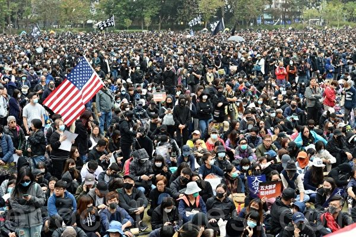

2020年1月1日，香港民间人权阵线（民阵）举办“元旦大游行”。（宋碧龙／大纪元）

  

2020年1月1日，香港民间人权阵线（民阵）举办“元旦大游行”。图为参加游行人士手举“天灭中共”展板及美国国旗。（宋碧龙／大纪元）

  

2020年1月1日，香港民间人权阵线（民阵）举办“元旦大游行”。图为参加游行人士手举“天灭中共”展板及美国国旗。（宋碧龙／大纪元）

  

2020年1月1日，香港民间人权阵线（民阵）举办“元旦大游行”。（宋碧龙／大纪元）

  

2020年1月1日，香港民间人权阵线（民阵）举办“元旦大游行”。图为参加游行人士手举美国国旗。（宋碧龙／大纪元）

2020年1月1日，香港民间人权阵线（民阵）举办“元旦大游行”。图为参加游行人士手举美国国旗。（宋碧龙／大纪元）

 

2020年1月1日，香港民间人权阵线（民阵）举办“元旦大游行”。图为参加游行人士手举美国国旗。（宋碧龙／大纪元）

  

2020年1月1日，香港民间人权阵线（民阵）举办“元旦大游行”。图为参加游行人士手举“独立调查委员会 还我公义与真相”“警队大话连篇”展板。（宋碧龙／大纪元）

  

2020年1月1日，香港民间人权阵线（民阵）举办“元旦大游行”。图为参加游行人士手举“独立调查委员会 还我公义与真相”“警队大话连篇”展板。（宋碧龙／大纪元）

  

2020年1月1日，香港民间人权阵线（民阵）举办“元旦大游行”。图为参加游行人士手举“牺牲几多人，你先肯罢工”展板。（宋碧龙／大纪元）

  

2020年1月1日，香港民间人权阵线（民阵）举办“元旦大游行”，下午2点在维园大草坪集合。（宋碧龙／大纪元）

  

2020年1月1日，香港民间人权阵线（民阵）举办“元旦大游行”，下午2点在维园集合。图为民阵召集人岑子杰。（宋碧龙／大纪元）

  

2020年1月1日，香港民间人权阵线（民阵）举办“元旦大游行”，下午2时在维园集合。不到2点，铜锣湾已见参与游行的大批市民，“天灭中共”标语大受欢迎。（余钢／大纪元）

2020年1月1日，香港民间人权阵线（民阵）举办“元旦大游行”，下午2时在维园集合。不到两点，铜锣湾已见参与游行的大批市民，“天灭中共”标语大受欢迎。（余钢／大纪元）

 
  

2020年1月1日，香港民间人权阵线（民阵）举办“元旦大游行”，下午2时在维园集合。不到2点，铜锣湾已见参与游行的大批市民。图为外藉人士手举“遵守联合声明”展板。（余钢／大纪元）

  

2020年1月1日，香港民间人权阵线（民阵）举办“元旦大游行”，下午2时在维园集合。不到2点，铜锣湾已见参与游行的大批市民，“天灭中共”标语大受欢迎。（余钢／大纪元）

    
  

2020年1月1日，香港民间人权阵线（民阵）举办“元旦大游行”。（余钢／大纪元）

  
 

2020年1月1日，香港民间人权阵线（民阵）举办“元旦大游行”，下午2时在维园集合。不到2点，铜锣湾已见参与游行的大批市民，“天灭中共”标语大受欢迎。（余钢／大纪元）

   

2020年1月1日，香港民间人权阵线（民阵）举办“元旦大游行”。(PHILIP FONG/AFP via Getty Images)

    
 

2020年1月1日，香港民间人权阵线（民阵）举办“元旦大游行”。图为市民头戴玻璃纤维佩佩蛙（PEPE）及连登猪面具参与游行。(PHILIP FONG/AFP via Getty Images)

   
 

2020年1月1日，香港民间人权阵线（民阵）举办“元旦大游行”。图为市民头戴玻璃纤维佩佩蛙（PEPE）及连登猪面具参与游行。(ISAAC LAWRENCE/AFP via Getty Images)

     
 

2020年1月1日，香港民间人权阵线（民阵）举办“元旦大游行”。(ISAAC LAWRENCE/AFP via Getty Images)

     
 

2020年1月1日，香港民间人权阵线（民阵）举办“元旦大游行”。(PHILIP FONG/AFP via Getty Images)

     

2020年1月1日，香港民间人权阵线（民阵）举办“元旦大游行”。(PHILIP FONG/AFP via Getty Images)

    
    
 <a target="_blank" href=#top><h6 align="right">回上方</h6></a>

<a name=8>
<h1 align="center"><b>爆发不明肺炎疫情 武汉海鲜批发市场休市</b></h1>
  
【大纪元2020年01月01日讯】日前，湖北武汉市华南海鲜批发市场爆发集体感染不明肺炎疫情，引起民众恐慌。今天（1月1日），华南海鲜市场宣布休市整治。

日前中共官方证实，去年12月以来，武汉市发现病毒性肺炎病例27例，均诊断为病毒性肺炎／肺部感染，其中7例病情危重。此次肺炎病例大部分为华南海鲜批发市场的商户。

华南海鲜市场成立于2005年，位于武汉市江汉区，距离汉口火车站只有1.3公里。

今天，武汉市江汉区市场监督管理局、武汉市江汉区卫生健康局发出公告称，对华南海鲜批发市场实行休市整治，开市时间另行通知。

《新京报》报导，华南海鲜市场门口聚集了大量市场商户老板，商户仍可进出，但不能营业，一位商贩表示，她是刚刚看到通知后才知道要休市的。

“早晨5点多贴的通知。”1月1日上午，一位负责值守的监管人员表示，商户事前并不知情，“商户老板很多都提前进货了。”

有陆媒记者前往海鲜市场发现，所有商户正在忙着关门前的整理，将一箱一箱的货物搬运到货车上。有身着城管、食品监督管理局和工商制服的人员在现场执勤。海鲜城各个出入口已被封闭，另有身着白色防护服装的工作人员在现场采样。

去年12月31日下午，《楚天都市报》记者来到华南海鲜市场走访发现，卖野味的店铺已关闭，有遗弃的兔子头及动物内脏散落在市场西区六街角落。

附近一摊位店主大爷称，六街有几家卖野味的，有野鸡、蛇等很多品种，“你来晚了，（都）关门了。”在附近街区，记者还发现了一些摊位附近有闲置的铁笼。

武汉大学医学部一位研究病毒的专家说，纯粹海鲜市场肺炎病原体非常少见。一般能够造成肺炎的，比如说2003年的SARS病原体，“都是在野生动物当中会多一些。”

香港大学感染及传染病中心总监何柏良今天接受一个电台节目访问时表示，武汉短时间内有27宗确诊个案，当中7宗属严重个案，比例相当之高，而多宗病例与街市有关，令人担心病人会否曾经接触过动物，特别是野生动物。

何柏良表示，武汉的爆发已出现一段时间，当地应做了基本验测也找不到致病源，故属于SARS冠状病毒的概率较低，较大可能是新型传染病引致组群爆发。现时不能断定武汉爆发的疫情会不会出现人传人的情况。#
<a target="_blank" href=#top><h6 align="right">回上方</h6></a>

<a name=7>
<h1 align="center"><b>山西老板遗书曝光 控诉滴滴黑车垄断</b></h1>

山西“好车容易”公司老板在遗书中控诉滴滴出行以黑车垄断市场，令正常牌照车辆面临困境。(STR/AFP/Getty Images)

【大纪元2020年01月02日讯】（大纪元记者张玉洁综合报导）山西“好车容易”公司老板因公司陷入困境服药轻生，他在遗书中控诉黑车泛滥，滴滴出行（下称“滴滴”）以黑车垄断，令正常牌照车辆无法进入市场。

山西好车容易汽车销售服务有限公司（简称“好车容易”）老板闫宝才12月26日服药轻生，所幸抢救后脱离生命危险。他的遗书随后曝光，其中控诉滴滴存在大量黑车，并可以以此垄断市场。

闫宝才曾与滴滴在山西晋中市合作网约车业务，但发现滴滴未取得当地许可，随后被滴滴解约。他申请与滴滴在太原市合作，第一次被答复“材料上报”，然后再无音信，经多次联系后，最终被以“运力过剩”为由拒绝。

但闫宝才发现，滴滴内部存在大量黑车并以此垄断市场，而合法车却无法进入市场。公司被滴滴拒绝合作后，大量司机退租，令其陷入经营困境。

<b>遗书曝光：滴滴用黑车垄断市场  我用生命捍卫尊严</b>

自杀事件发生后，闫宝才的遗书曝光。他在遗书中说：“我不明白为什么按照政府要求办理的合规车辆，滴滴公司不接纳，满大街的黑车随便可以跑滴滴。”

“利用大量非法营运的车辆垄断市场，然后再给合法网约车设置不可逾越的障碍，以运力过剩为理由，拒绝合法运力公司合作，不让这些合法车辆使用滴滴平台，等于给这些合法车辆判了死刑，也等于给这些合法车辆的主人判了死刑。”

“我是一只蚂蚁，撼动不了滴滴这头大象，但是我也是一个有尊严的合法公民”，“我要为所有司机师傅们维权，我要用我的血洗刷我的耻辱和愤怒。”他在遗书中说。

<b>“好车容易”经理：滴滴占80%市场份额  太原黑车是合法车的两倍</b>

“好车容易”的经理表示，与滴滴合作失败后，“好车容易”与首汽约车太原分公司合作，但由于滴滴占有80%的市场份额，如果无法进入滴滴平台，司机就等于失去了重要的接单平台。

2019年7月，滴滴的网约车开放平台并入小桔租车平台，同时滴滴先后宣布与比亚迪、长安汽车、北汽新能源等厂商合作。

经理表示，太原市取得“网络预约出租车运输证”的车辆大约有1万辆，但太原市的所有平台上，尤其是滴滴平台上保守估计有3万多辆营运网约车。这意味着太原市非法营运的车辆至少是合法车辆的两倍以上，多数不符合网约车的要求。这种情况令合法司机的付出与回报不成比例。

在网约车发展初期，滴滴依赖传统运营商填补运力不足，但现在，传统运营商与滴滴签约需要一定的资源关系和大笔费用。

闫宝才与滴滴在晋中的合作就曾花费一大笔费用，但双方签约合作后，闫宝才公司的司机发现，滴滴在晋中并没有网络预约出租车经营许可证，有的司机因此被罚款一万元，去年8月份滴滴提出解约。

闫宝才自杀事件发生4天后，滴滴旗下网约车平台“小桔车服”12月30日回应称，“因为管理流程不完善，对接过程中婉拒了合作意向，但没有清晰的告知正式流程”，“目前已经暂停了接受新增‘以租代购’形式的车辆在平台上出租。”

滴滴出行成立于2012年，隶属于北京小桔科技有限公司，成立六年累计亏损390亿元人民币，仅2018年就亏损了109亿元人民币。#

<a target="_blank" href=#top><h6 align="right">回上方</h6></a>

<a name=6>
<h1 align="center"><b>中共尽失人心 反习势力与保习派激战</b></h1>

中共内外交困之际，中共高层内斗也更加激烈，各派通过媒体就习近平的权力问题不断放风。(Getty Images)

【大纪元2019年12月25日讯】（大纪元记者张顿综合报导）中共内外交困之际，中共各派围绕习近平是否将连任等问题展开激战。习成为各派保护和攻击的中心，中共各种不利的消息也都推给了习，习将如何面对这些困局？

<b>习四度与林郑握手 人心尽失</b>

12月20日，习近平主持澳门新政府就职典礼之后，离去时，特意停步回头，与香港特首林郑月娥握手。

自港人反修例运动半年多以来，习近平与林郑至少四度握手。前三次公开握手，分别发生在12月19日、12月16日及11月4日。

在上述三次会见中，习近平三度表态支持林郑，二次点名支持港警，这些举动让中共和习在香港和世界上尽失民心。

据香港民意研究所20日发表的报告，林郑月娥民望平均只有19.6分，56%港人给予其0分评价。该所12月6日的报告显示，香港警方的民望只有35.3分，40%港人给予0分评价。

目前，在国内经济、国际外交、美中关系等问题上，中共均处于前所未有的被动地位。世界各国对中共也越来越反感。

<b>外媒披露修例的幕后黑手 影射意味浓厚</b>

更令习近平被动的是，中共官员向外媒披露，修订香港《逃犯条例》的真正推手是中共中纪委，而不是港府。

路透社12月20日援引两名中共官员的话指，中纪委2017年向负责香港事务的中共官员提出引渡的迫切需要，中纪委希望有一种比在香港绑架“逃犯”，更不具政治破坏力的方法。

2017年1月，中共在香港跨境抓捕中共权贵白手套、明天系创办人肖建华，舆论哗然。之前还发生了中共绑架铜锣湾书店员工事件。

路透社的报导，直接将矛头指向了现任中纪委书记赵乐际。因为习近平在中共内是“核心”，赵乐际只是习的党内副手，多方分析都认为，这个报导实际把矛头指向了习近平。

<b>反习势力与保习派激战</b>

在海外，对习近平的正负舆论激战明显。

海外亲共中文媒体《世界日报》12月15日援引中共内部信息说，“习的任期并不一定会超过中共规定的两届”；中共高层连同习近平本人已对下一届接班人进行了内定。

文章称，由于中共当局目前面临的内外交困不断加深，习近平思想及其执政路线，“在中共内部更加引起反弹和质疑，习在党内的威望也不断下降”。

时政评论员李林一对大纪元记者说，这个明显是中共其它派系在放风。习近平2018年才修宪，取消中共对国家主席两届任期的限制，如果他不延任，他何必费力去修宪，引发那么大的震动，“所以亲共媒体的这个消息显示，中共内部有人对习不满，故意在海外放风”。

与此同时，帮习说话的舆论也在海外流传。

亲习的中共军事学院出版社前社长、大校辛子陵，近期在港媒发文，力挺习近平。

辛子陵认为，时至今日，连个官员公示财产都做不到，习近平“对这个党绝望了”。按照少数服从多数的议事规则，解决不了他们的问题，还随时有被他们“解决”的可能。

辛子陵还提及，习近平执政7年下来，认识到共产党变成了“老虎党”之后，已不能依靠中共官员挽救中共“大厦将倾”的命运。在剩余的三年任期，习近平将摆脱“老虎党”的羁绊，丢掉共产党的历史包袱，重新建党，重组干部队伍等。

但辛子陵的说法，难以得到外界的认可。

同时，10月28日至31日召开的中共十九届四中全会通过的《决定》，要求“坚持和完善中国特色社会主义制度”，并设立了到2035年基本实现“推进国家治理体系和治理能力现代化”。

外界认为，这些都是习本人思路的公开：即至少到2035年前，中共这种政治体制都不会大变。

<b>人心尽失 海内外言论均指向习</b>

12月19日，“中改研究”等大陆微信号纷纷转载一篇文章《温家宝的燃情岁月》，再提中共前领导人邓小平等人废除“干部领导职务终身制”的过程。

文章提及，邓小平、陈云等重新主持中共中央工作后，1980年2月29日通过的中共十一届五中全会公报中，明确提出要废除“干部领导职务终身制”。并且将这一要求写入中共党章。同时，他们在各种场合一再强调，“加强对年轻干部的提拔、培养”。

在这个敏感时期，此类影射习近平修宪的文章，却并没被中共文宣删除。

同时，海外的亲共学者也公开发表言论，批评中共当局决策过度集中的弊病。

12月16日，新加坡亲共学者、国立大学东亚研究所所长郑永年教授，在香港发表主题演讲时，提到中共的政治治理体制，最大问题是“决策权太过集中于中央”，有时会导致无法科学决策。

他说，过分强调“中央集权”与“顶层设计”，地方无法制定出符合当地实际情况的政策，地方官员的空间被缩小。

中共官媒“中新网”报导上述新闻时，删除了上面的内容，仅仅点到郑永年提到中国的制度在不同时期呈现出“不同特点”。

<b>专家：2020年习面临更多挑战</b>

知名中国政经专家、美国加州克雷蒙特麦肯纳学院教授裴敏欣12月17日发文，列举了中共在美中贸易战、香港反修例运动、大规模监禁少数民族、台湾等问题上遭受的挫折。

他指出造成这些挫折的原因是：“随着习近平将政治权力集中到自己手里，决策过程发生了变化。那些希望影响政策的人，想方设法挑选迎合习近平口味的信息。同样，习在政治局常委会的同僚，因为害怕被认为不忠诚，也不愿意直陈可能与他的观点相矛盾的信息。他们知道，提出替代方案可能被视为直接挑战习近平的权威。”

裴敏欣的结论是，由于独断独行的决策机制不太可能改变，在未来几个月，习将受到更多挑战的打击。2020年可能是习最糟糕的一年。

时事评论员李林一表示，在中共党内，改革派已对习近平的所谓改革失去信心；而以江泽民为首的贪腐派，对其虎视眈眈，盼他早下台，也根本不信任习。

李林一认为，从目前来看，维持中共不倒，成本变得越来越高。如果还想继续这么做，“明年习近平处境更加艰难”。#

<a target="_blank" href=#top><h6 align="right">回上方</h6></a>

<a name=5>
<h1 align="center"><b>白宫：若朝鲜试射远程导弹 美将采取行动</b></h1>

白宫国家安全顾问罗伯特‧奥布赖恩（Robert O'Brien）周日（12月29日）表示，如果朝鲜试射远程导弹或进行核试验，美国将采取适当行动。(SAUL LOEB/AFP)

  
【大纪元2019年12月30日讯】（大纪元记者夏雨综合报导）白宫国家安全顾问罗伯特‧奥布赖恩（Robert O’Brien）周日（12月29日）表示，如果朝鲜试射远程导弹或进行核试验，美国将感到非常失望，并会采取适当行动。他还表示，金正恩可能已经重新考虑了他的“圣诞礼物”。

奥布赖恩周日在接受美国广播公司“本周”（This Week）采访时说，华府有许多“工具包中的工具”（tools in its tool kit）可以应对任何此类导弹测试。

他还说：“我们暂不做判断，但是在这些情况下，美国将一如既往采取行动。”“如果金正恩采用这种方法，我们将非常失望，我们将表现出这种失望。”

<b>金正恩或已重新考虑“圣诞礼物”</b>

朝鲜要求美国政府在年底最后期限来临之前，就朝鲜核武计划问题提出一个新的倡议计划，以消除双方分歧。朝鲜说，如果美国未能满足平壤的期待，（美国）就可能得到一份不希望的“圣诞礼物”。

美国军事指挥官表示，朝鲜的“圣诞礼物”可能是试射远程导弹。

针对朝鲜对美国发出的威胁，奥布赖恩说，美国仍然是世界上领先的军事大国，拥有巨大的经济实力。他说：“我们可以承受很大的压力。”

这名白宫国安顾问说，“多年来，共和党和民主党多个政府曾对这种情况进行了处理，但没有成功。”“川普总统采取了不同的方法，进行个人外交。取得了一些成功。”

“所以也许他（金正恩）会重新考虑这一点（圣诞礼物）。”奥布莱恩补充说， “但是我们将不得不拭目以待。我们将对其进行密切监视。当然，这种情况令我们感到担忧。”

总统川普上周表示，美国准备应对朝鲜方面的任何“圣诞礼物”。

<b>时间将证明川普总统的方法是否行得通</b>

奥布赖恩说，美国和朝鲜拥有开放的沟通渠道，但他没有透露详情，也拒绝回答美朝最近是否进行接触。他说，华府希望金正恩履行其使朝鲜半岛无核化的承诺。

他说，时间将证明川普总统的方法是否行得通。

奥布赖恩说，总统没有在这件非常危险的、非常令人担忧的事上存在幻想。“他（总统）到那里时很危险，他试图缓解紧张局势，使金正恩真正履行自己的承诺。”

金正恩周六召开执政党会议，在他设置的年底最后期限来临之前讨论重要议题。朝中社没有提供本次会议的进一步详情，只说会议将继续进行。#

<a target="_blank" href=#top><h6 align="right">回上方</h6></a>

<a name=4>
<h1 align="center"><b>中共外交辞令出尽丑 “耿爽模拟器”被下架</b></h1>

中共外交部发言人耿爽资料图片。（大纪元资料室）

【大纪元2019年12月31日讯】中国外交部发言人耿爽的对外发言被外界认为千篇一律、套话连篇，以至于有网友根据一款“耿爽模拟器”便可获得他的外交辞令内容。不过，网友今日发现，该模拟器已被下架。

中共外交部一向被外界嘲讽为“口炮部”，但其外交辞令套话连篇、千篇一律。发言人耿爽长期以来不是“强烈谴责”、就是“坚决反对”国际干涉所谓中共内政。

有中国网友将耿爽发言摘录下来，透过“GitHub公司”软体原始码代管服务平台，对其进行简单随机组合，进而编写出“耿爽模拟器”。只要输入“想谴责的国家／对象”及事件，便可以模拟出耿爽在外交部记者会上的问答形式样板。而且与外交部发言人的讲话如出一辙。

不过，有网友今日（12月30日）发现，该模拟器已被从原始网页中移除。

该模拟器从11月下旬发布以来，在网上引发热烈讨论。不少网友称其为“废话生成器”，很多网友嘲讽说，“根本就是本人回答”、“耿爽要付钱买下版权了”。

网友表示，周一，香港“连登论坛”、台湾“PTT”、“巴哈姆特”，推特以及脸书上的备用连结都已经失效。

网友们纷纷留言，表达他们对这款模拟器的“念念不忘”：“专业的废话训练”、“小粉红崩溃”、“第一次见识到废话可以讲这么多”，还有网友表示，中共发言人“就是个背稿机”。

“耿爽模拟器”发布后，有网友进行各种恶搞实测，例如输入“网友”和“制作耿爽模拟器”，提问“对于网友制作耿爽模拟器，中方对此有何回应？”就听“耿爽”再一次“表明立场”，谴责网友“挑拨怂恿”，要求停止“干涉中国内政”，简直与中共外交部发言人无二。#

<a target="_blank" href=#top><h6 align="right">回上方</h6></a>

<a name=3>
<h1 align="center"><b>偷带癌症研究材料出境 中国学生在美被控罪</b></h1>

一名中国学生涉嫌从美国“贝斯以色列女执事医疗中心”偷生物样本，并企图走私回中国。图为“贝斯以色列女执事医疗中心”。(Tim Pierce/Wikimedia commons)

【大纪元2020年01月01日讯】（大纪元记者张婷综合报导）中国学生郑凿松（Zaosong Zheng，音译）12月9日在波士顿一个国际机场准备搭机返回北京时被捕。波士顿的联邦法官周一裁定，郑在袜子中藏了若干瓶研究样本，试图走私回中国。一法官说，郑凿松与中共政府有关系，有潜逃风险。

据《波士顿环球报》报导，29岁的中国医疗学生郑凿松是一名癌症研究员。去年获得了哈佛大学的签证赞助，到美国的“贝斯以色列女执事医疗中心”（Beth Israel Deaconess Medical Cente）学习。

周一（12月30日），波士顿一名联邦法官裁定，证据表明郑凿松试图走私美国实验室的研究样本。郑将若干瓶研究样本藏在了行李箱中的一只袜子内，并打算乘坐飞机回北京。

报导称，郑被指控从他所在的“贝斯以色列女执事医疗中心”实验室偷走一些生物样本，作为中国（共）长期以来从美国高校获取知识产权行动的一部分。

“贝斯以色列女执事医疗中心”是一所位于波士顿的国际知名的医疗中心，是哈佛医学院主要的教学医院。它的前身是“贝斯以色列医院”和“新英格兰女执事医院”，1996年两所医院合并。

联邦调查局（FBI）特工卡拉‧史派斯（Kara Spice）向法庭所呈交的一份书面证词在12月19日对外公开。在证词中，史派斯使用“贝斯以色列医院”来替代“贝斯以色列女执事医疗中心”（以下简称贝斯以色列）。

证词称，12月9日，郑凿松在波士顿洛根国际机场（Logan International Airport）打算乘坐海南航空482航班飞回北京。海关人员在郑的行李箱中发现了21小瓶未知棕色液体。这些小瓶被藏在一只袜子里面。

FBI特工凭借经验和培训断定，这些小瓶装的是生物样品，且并未申报，也没有被恰当包装，不适合在商业飞机上运输。

郑最初否认携带任何生物标本，但在海关继续盘问后，他最后供认，他从“贝斯以色列”的研究实验室偷走了8小瓶液体，并没有其他人知道他的行为。他说，他还根据一个名叫陶章（Zhang Tao，音译）的研究复制了11瓶液体。

<b>轩尼诗法官：郑与中共政府有关系 有潜逃风险</b>

周一，郑正穿着狱服出庭。在法庭上，联邦地区法院的法官戴维‧轩尼诗（David H. Hennessy）表示，郑获得中共政府提供的奖学金，并有潜逃风险，他与中共政府的关系将会使他更容易离开这个国家。轩尼诗批准了联邦检察官的请求，将郑拘留直到审判。

郑凿松在波士顿洛根国际机场被抓后，“贝斯以色列”解雇了郑。他被指控制造虚假陈述。哈佛大学的官员周一表示，郑的教育交换签证已被撤销。

“郑被指定到‘贝斯以色列’（做研究）并非偶然；他故意从‘贝斯以色列’收集知识产权，很可能是代表中国（共）政府。”FBI特工史派斯在一份法庭证词中说。

史派斯还指出，中国公民到美国来有这种行为是可以预料的。他们一回国便可得到奖励。

<b>郑有可能面临更多项指控</b>

美国政府正在等待郑凿松藏在袜子内21瓶液体的测试结果。如果证实是从“贝斯以色列”实验室偷走的样本，郑可面临更多项指控。根据法庭文件，曾与郑在一个实验室工作的前室友告诉美国政府，这些小瓶内装有癌细胞。

轩尼诗法官表示，被告的行为反映出其严重违背了对“贝斯以色列”和哈佛大学忠诚。

“贝斯以色列”周一表示，正与美国政府的调查进行充分合作。

“贝斯以色列”女发言人詹妮弗‧克里兹（Jennifer Kritz）说：“我们为我们的研究项目的广度和深度感到自豪。”

“任何损害研究的尝试都会破坏我们教职员工为提高患者护理水平所做的辛勤工作。” 克里兹说。

根据FBI特工的证词，郑承认，他打算把这些液体带到他在中山大学孙逸仙纪念医院实验室进行进一步分析。

“郑表示，他打算一回国，立即前往他在中国的实验室，开始使用偷来的液体进行他的研究。郑还解释说，如果他的研究结果以任何方式成功了，他打算以自己的名字发表论文。”FBI证词说。

<b>FBI：郑和另一中国研究院合作走私生物样本</b>

12月9日在洛根国际机场，海关人员除了在郑的行李中发现了不明液体外，还发现了一台属于另一名研究员的手提电脑。该研究员和郑都在“贝斯以色列”的一个实验室，该研究员已经回到了中国。郑说，他之所以带着这台笔记本电脑，是因为这名研究员的行李放不下了。但FBI官员指称，郑和这个中国研究员一起合作，走私这些样本回国。

“贝斯以色列”的官员拒绝评论他们实验室中的其他中国研究人员是否在医院不知情的情况下拿走了研究和材料，也拒绝评论该机构是否更改了任何安全措施。

<b>郑凿松被抓释放何种信号？</b>

《波士顿环球报》称，郑的被抓捕反映了过去一年，美国政府对涉嫌从事间谍活动和科学盗窃的中国学者和研究人员进行了更广泛的打击。在波士顿地区的医院和学校学习的其他外国研究人员也曾在洛根机场被拦截下来。

根据波士顿新闻网站“Universal Hub”的报导，波士顿另一所著名医院“布莱根妇女医院”（Brigham and Women’s Hospital）首席学术官保罗‧安德森（Paul Anderson）在给该院的一封内部电子邮件中写到，12月早些时候，来自合作伙伴医院系统的三名外国研究员在波士顿洛根机场因没有申报藏在行李箱中的材料而被拦下。安德森表示，政府“打算推行严格的执法议程”。

安德森还指出，基于该医院与FBI的对话得知，洛根机场有大约18起拦截事件，涉事人员的签证被没收并被取消。

据Universal Hub报导，在许多情况下，研究人员将生物材料藏在维生素瓶、拖鞋和袜子中。

“布莱根妇女医院”发言人马克‧墨菲（Mark Murphy）在一份备忘录中说：“该医院重申了运输生物和其它研究材料的监管要求和机构要求。”

FBI以及为美国大学的卫生和科学研究提供资金的美国联邦机构已经警告说，几十年来依靠全球研究合作而蓬勃发展的美国开放式高等教育系统，正在被外国政府所利用。

美国国立卫生研究院（NIH）和FBI正在调查180起涉嫌盗窃由美国政府资助的生物医学研究的个案。这些案例主要涉及华裔或华裔美籍研究人员，涵盖美国71个主要医学中心和研究机构。

<a target="_blank" href=#top><h6 align="right">回上方</h6></a>

<a name=2>
<h1 align="center"><b>【新闻看点】欧盟趋强硬 华为：2020生存第一</b></h1>

图为华为Logo。(GREG BAKER/AFP/Getty Images)

【大纪元2019年12月31日讯】大家好，欢迎大家关注新闻看点，我是李沐阳。

几个月前，华为欧盟首席代表刘康（Abraham Liu）开始了在布鲁塞尔的台面下运作，试图巩固华为在欧洲这个海外最大市场的地位。据法媒报导，华为在欧盟的游说费用高达280万欧元（约合2185.76万人民币），已经成了游说欧盟花费最多的企业之一。

不过即使这样，欧盟执委会主席冯德莱恩（Ursula von der Leyen）日前仍然表示，无法接受欧洲企业和民众资讯被盗窃的风险。

按照中共十八大的部署，中国大陆明天就进入“小康社会”了。如果谁再说自己没钱，那就是拖后腿了。可是偏偏在这个节骨眼上，党妈最“器重”的孩子——华为今天（12月31日）传出了泄气消息。

华为轮值董事长徐直军表示，2019年业绩不佳，2020年的“首要任务是生存”，并且可能要辞退部分行政人员。

各种迹象显示，在世界各国围堵封杀之下，华为的日子越来越难了。

<b>华为：生存是首要任务 或裁减10%高管</b>

在即将跨入2020年之际，徐直军31日发布了一份新年致词。在这份2,000字的致词中表示，估计2019年的销售收入会达到8,500亿人民币（1210亿美元）。虽然比去年增长了18%，但是远远低于预期的1,250亿美元。

致词中表示，2020年，2019年上半年的快速增长和下半年的市场惯性都不存在了，明年会是艰难的一年。

徐直军并不讳言：2020年“生存将是我们的（华为）的首要任务”。美国政府的针对华为的政策是“战略性和长期的”，对华为的“生存和繁荣”已经构成了挑战。

他说，为此华为可能会裁减10%的经理级员工，有的后勤部门可能会合并或者缩小规模，员工也可能调派到其它部门。

<b>欧盟立场趋强硬</b>

华为意识到生存危机，除了美国在继续围堵封杀之外，可能与它第二大市场的欧盟，其态度开始变强硬也有一些关系。华为估计，它在海外市场的手机销售将会衰退40%。

昨天（30日)，法国世界报（Die Welt）刊登了对冯德莱恩的专访。她表示中方在谈判时“非常有自信”，不过欧盟在人权或网络安全等领域会“保持强硬”。

28日，德国明镜周刊（Der Spiegel）也刊登了对冯德莱恩的专访。这位12月初才就任的欧洲执委会主席表示，欧盟无意限制个别企业，而是打算建立普遍的标准 。其中一个标准就是，这些敏感科技的厂商“独立、而且不能被政府强迫传送资讯”。

冯德莱恩表示，近期将会向会员国提出建议，欧盟没有办法接受中国（中共）的情报法，使欧洲企业和民众的资讯有被窃取的风险。

此前，欧洲各国对是不是采用华为设备举棋不定，都在观望权衡。因为华为有中共举国体制支撑，设备价格比其它商家便宜1/3左右，这是一个相当有诱惑力的数字。但是美国不止一次指出，华为设备有“后门”，威胁国家安全。

欧盟执委会主席的态度，显示出欧洲对华为的立场变得强硬了。这可能意味着华为在欧洲的钜资游说，不会有什么效果。

<b>华为钜资游说无效</b>

其实，华为一直不断游说欧洲，不惜斥钜资，大打银弹牌。世界报报导，仅2017-2018年，华为在欧洲的游说花费就增长了30%，达到280万欧元，成了为捍卫利益而在欧盟花费最多的企业之一。

欧盟首席代表刘康在欧盟总部所在地布鲁塞尔，频频向欧洲议会议员示好，希望尽力占有一席之地。又是出版研究报告，又是举办圆桌论坛、研讨会和5G巴士等等。

为了改善在法国的形象，华为找到了法国最具影响力的公关游说与顾问公司Boury, Tallon & Associés等，同时动用政治人脉，试图敲开法国部会的大门。此外华为还对巴黎歌剧院、各种文化体育活动进行赞助，提供大学研究奖学金和创投基金等等。华为为了讨得各国政府信任，不惜血本。

华为高管梁华稍早前对法新社表示，2020年将在欧洲投资400亿美元，设立5G零件工厂。

但冯德莱恩的表态，意味着华为的这些努力可能要白费。因为不只是美国不断提醒欧盟，华为涉及到国家安全问题，而且华为给人的印象也非常不好，它的黑幕被越揭越多。

<b>华为内部爆黑幕</b>

前不久，华为前员工李洪元因为离职赔偿问题，被华为构陷而遭受牢狱之灾251天。而华为却傲慢地表示，“支持李洪元运用法律武器维护自己的权益，包括起诉华为”，大有挑衅意味。

李洪元“251事件”引爆了公众愤怒，不断有网友曝光华为的更多黑幕丑闻。但是却全都被删帖，网络上干干净净。有的因为转载“工作996、离职251、维权404”，结果QQ被冻结了。

随后一名叫“白离”的华为离职员工也讲述了离职遭遇。在华为干了十几年后，突然被华为劝退。按劳动法提出赔偿，华为不答应。随后就把他的工作一点点的剥离，逼着主动走人。“白离”表示，经过和其他被劝退的员工交流发现，这种卑劣的手法是华为统一培训过的手段。

其实在李洪元之前，华为另一个员工曾梦也因为离职赔偿被拘押了90天。

华为不放过离职员工，连报导真相的记者也不放过。有一位和李洪元关在同一个看守所的科技媒体记者，只是因为报导了Mate 20 Pro绿屏问题，结果被关了252天，与李洪元在看守所还认识。

这位记者感叹：在华为被大力追捧的氛围下 ，媒体记者怕是干不下去了。

<b>网友：从今拒买华为</b>

华为的丑闻越曝越多，起底任正非家族的文章也在大量出现。包括“你一个看不起病的穷光蛋，有什么资格支持人家富可敌国的孟大小姐？”“华为曾把十多名讨薪员工送进牢房”等等。

有网友跟帖说，“孟晚舟被关一年全国关切，华为员工被关251天全网封杀”。也有的说“我在别墅里度日如年，你在监牢里砥砺前行”，还有“你也许会是李洪元，但永远没机会做孟晚舟”等等。

华为的狼性文化和对员工的不人道引发的舆论狂潮之下，华为和任正非家族的形象已经轰然崩塌。可以想见，人们还会使用华为设备吗？

有网友表示“从今天起，不再使用华为手机”，也有说“从今拒买华为任何产品”，还有的说“从来不买华为的产品，因为垃圾”等等。

海内外市场都在衰退，拒绝华为已经成了潮流。或许不久的将来，人们就会见证华为盛极而衰、最终败亡的过程。

好的，感谢您关注新闻看点，再会。

大纪元《新闻看点》制作组 #

<a target="_blank" href=#top><h6 align="right">回上方</h6></a>

<a name=1>
<h1 align="center"><b>香港法轮功学员集会 恭祝李洪志先生新年快乐</b></h1>

2020年1月1日，香港法轮功学员恭祝师父新年好。（宋碧龙／大纪元）

【大纪元2020年01月01日讯】（大纪元记者黄晓翔香港报导）告别2019年，迈入2020年的第一天，香港法轮功学员1月1日早上在中环爱丁堡广场举行盛大的集会，恭祝法轮功创始人李洪志先生新年快乐，并向世人展现法轮大法的美好。

2020年1月1日，香港法轮功学员以炼功的形式，恭祝师父新年好。（余钢／大纪元）

   

2020年1月1日，香港法轮功学员恭祝师父新年好。（余钢／大纪元）

  

2020年1月1日，香港法轮功学员以炼功的形式，恭祝师父新年好。（余钢／大纪元）

  
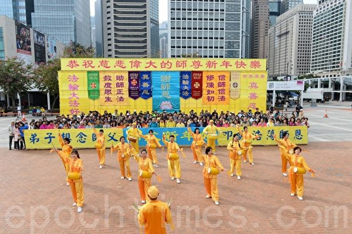

2020年1月1日，香港法轮功学员腰鼓队以打腰鼓的方式，恭祝师父新年好。（宋碧龙／大纪元）

  

2020年1月1日，香港法轮功学员以炼功的形式，恭祝师父新年好。（宋碧龙／大纪元）

  
  集会开始，腰鼓队作舞蹈及击鼓表演，之后法轮功学员集体恭祝法轮功创始人李洪志先生新年快乐。集会在众人合唱多首大法弟子创作的歌曲后结束。

香港法轮功学员朱太表示，参与今次集会觉得非常感慨，因为自己已经修炼法轮功二十二年。她在修炼前身体很差，心脏有病、怕晒太阳，也不能久站，“现在已经成为一个健康的人了，能弹、能走、能跑。”她也提到自己在修炼后心性的提高：“以前我就是一个自私的人，脾气也不是那么好，现在成为一个宽容的、一个能够体谅别人的人。”

  

2020年1月1日，香港法轮功学员恭祝师父新年好。图为法轮功学员朱太。（黄晓翔／大纪元）

  
  朱太说，自己原来以绘画为业，来香港后一心只想赚钱，曾以为不可能再画画了，但现在又重拾画笔。她感谢大法开启她的智慧：“有‘真、善、忍’嘛，心静了，画的画比以前更好了……因为我是画比较传统的中国画，我觉得师父给我开智开慧，希望把传统的中华文明、五千年文明的艺术带给社会。”

她表示以往很多人误会法轮功学员，现在很多人都明白了，“‘真、善、忍’是世界的普世价值，做个好人、身体好的好人，多好啊。”她非常感谢李洪志师父的慈悲救度，希望全世界的人都来了解法轮功。

从事金融业工作的黄小姐表示，自己修炼法轮功已经二十年，身心受益。她在十年前曾患上乳癌，医生亦束手无策，“我修炼之后，对于譬如人生里遇到很多不同的事情，包括人生的挫折、身体的不适，我都能明白原因是什么。对于这些难关我看得很淡，也很放松。很神奇的，我的身体现在完全康复了。”

黄小姐说，以往家人对自己修炼法轮功不太理解，自从癌症康复后，家人都转为支持。她表示在修炼前和家人相处不好，但由于修炼后身体上及人生观的改变，现在和家人关系融洽，她也更能理解别人的想法和感受。

她表示香港人以往对法轮功在大陆被打压感受并不深刻，“但在过去半年之内，现在我身边的朋友、我的同事都走过来跟我说，他们对中共打压信仰、打压自由、打压香港人的信念……他们更加理解法轮功（学员）当时为何要走出来讲被迫害的真相。”她举例说，有些同事以前不曾想过中共会做出“活摘器官”这种没有人性的事，但现在他们知道了中共灭绝人性的思维和手法。

香港法轮功学员春微表示，在讲解法轮功真相及如何受迫害的摊位（真相点）上，用心看展板的香港和大陆的年青人多了，也多了一些明白真相的中、青年人，他们说“加油”，希望法轮功学员坚持下去。

  

2020年1月1日，香港法轮功学员恭祝师父新年好。图为法轮功学员春微。（黄晓翔／大纪元）

  
<a target="_blank" href=#top><h6 align="right">回上方</h6></a>

