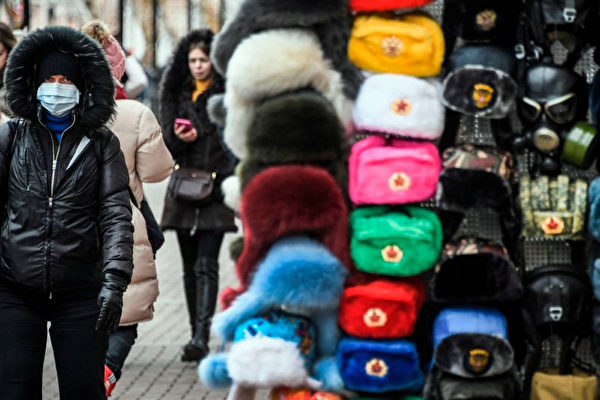

<table>
 <tr>
  <td align="center" width="450"></td>
   <td   width="450"><h3>【希望之声2020年2月18日】在武汉肺炎疫情严峻、中共加强大陆封网之际，希望之声推出专门为中国大陆民众开发的自带翻墙功能手机   APP。据开发人员介绍，此款手机APP适用于安卓操作系统，也就是所有的国产品牌手机、以及三星、LG等非iphone手机。
     

     
   安装后可收听收看希望之声的节目：包括《江峰时刻》、《天亮时分》、《老北京茶馆》及最新时事新闻等精彩内容。不需要使用任何翻墙软件，一步到位获得最新海外资讯，帮您免除翻墙上网的麻烦与风险。欢迎大家下载并传给中国大陆的亲朋好友。
   
   希望之声版权所有，未经希望之声书面允许，不得转载，违者必究。</h3>
     </td></tr></table>
     

     
<h1 align="center"><b>免翻看视频 (请收藏网址)，随时连即时最新IP https://git.io/swspip</b></h1>
<h1 align="center"><b>复制（网址或 IP 数字 ）到浏览器打开。若出现   “提示” ，請点击“继续”访问即可。</b></h1>

<h2 align=center><a href="https://github.com/gav01/Heart/blob/master/news1.md">● 大纪元时事 ●</a></h2>

<h2 align="center">直連不必翻牆開花必看精彩視頻http://tt8y.github.io (请收藏网址)</b></h2>

<table>
<tr>
 <td>
 <a href="https://git.io/pamja"> <h3>如何 “ 三退保命 ”</a>，<b>连上面→免翻视频 IP http://220.141.128.66 </b> →点 【三退大潮】--为什么要退党？ 可留言三退或用翻墙软件自己办理三退</h3></td>
</tr> 
<tr>
 <td>
 <a href="https://git.io/pamja"> <h3>如何 “ 三退保命 ”</a>，请点击翻牆网站  https://git.io/opopop  下载 { 翻牆软件 }→找 { 大紀元網站 }  ( http://www.dajiyuan.com ) 三退</h3></td>
</tr>
<tr>
<td>
 <h3 align=center><a href="https://www.ntdtv.com/gb/2020/03/26/a102808561.html">最新翻墙软件 突破封锁访问大纪元新唐人(点击右键,另存新档）</a></h3></td>
</tr>
</table>

<a href=https://git.io/souye><h6 align="right">回首頁</h6></a>

<a href="https://github.com/gav01/Heart/blob/master/ls-20-4-1.md"><b>往1~118新闻</b></a> 

<a name=top>
  
  
  
  
  
  
  
  
<a href =#126>126.公安部副部长 前610副主任孙力军落马 
<a href =#125>125.【一线采访】俄罗斯如何借疫情驱赶华人   
<a href =#124>124.中共警察跟踪纽时记者吓跑受访者 打脸华春莹 
<a href =#123>123.【最新疫情4·20】川普：美希望进入中国调查   
<a href =#122>122.【一线采访】外贸日子难 粤厂家：没订单 
<a href =#121>121.致习近平公开信！德媒主编：您在危害全世界   
<a href =#120>120.疫情持续英国政要发声问责中共 
<a href =#119>119.广西某组织部部长退党记 

<a name=126>
<h1 align="center"><b>公安部副部长 前610副主任孙力军落马</b></h1>

4月19日傍晚，中共公安部党委委员、副部长孙力军落马。（合成图）

【大纪元2020年04月19日讯】4月19日傍晚，中共官方发消息称，中共公安部副部长孙力军涉嫌严重“违纪违法”，目前正接受中央纪委国家监委调查。

孙力军现任中共公安部党委委员、副部长，副总警监警衔。

孙力军曾任中共上海市政府外事办公室副主任、公安部办公厅副主任、公安部党委委员、中共公安部一局二十六局局长、中共中央610办公室副主任。

1999年的6月10日，中共党魁江泽民为“3个月内消灭”法轮功，在其直接操作下，避开宪法和正常的法律程序在中共中央成立了一个专职镇压法轮功的非法机构——“中共中央处理法轮功问题领导小组”，下设办公室，也称“610办公室”。

随后几个月，其下属分支机构在中国全面成立，上至权力核心层下至乡镇农村基层，“610”形成了严密而独立的体系，建立了和中共政法委紧密联系的指挥系统结构，全方位地组织、指挥、实施对法轮功的迫害。

中央层级，指挥下级610镇压法轮功。各省市级的610主任，通常是同级政法委书记或副书记。而政法委书记，又掌管当地公检法司。这意味着各级610，能调度同级的公安、国安、司法、检查和法院系统。

20年来，大量明慧网案例显示，对法轮功学员的抄家，绑架，酷刑，洗脑，将健康人强送精神病院，停发工资，将人迫害死亡等恶行都指向“610”。在610驱动下，至今，通过民间渠道获悉，大陆至少有4,408位法轮功学员被迫害致死。而多项证据显示，610系统还指挥了活摘法轮功学员器官的罪行。

2018年，610办公室被合并入中央政法委。

此外，孙力军亦曾任中共公安部港澳台事务办公室主任。2017年12月，孙与香港保安局局长李家超在北京签署有关刑事罪行的通报机制文件。

孙力军曾任中共政法委书记孟建柱的秘书。据港媒报导，当局已调查孙一段时间，但原因不明；孙于中共肺炎疫情严重期间，亲自到武汉督导疫情工作，一度被认为可能“软着陆”，谁知今日突传出被查消息。

孙力军是今年第二个落马的中共副省部级官员。第一个是福建省副省长张志南。#

<a target="_blank" href=#top><h6 align="right">回上方</h6></a>

<a name=125>
<h1 align="center"><b>【一线采访】俄罗斯如何借疫情驱赶华人</b></h1>

在俄华人一方面因中国关闭通道无法回家，另一方面又面临着俄罗斯政府的刻意驱赶。图为莫斯科街头。（ALEXANDER NEMENOV/AFP via Getty Images)

  
【大纪元2020年04月20日讯】（大纪元记者顾晓华、黄惠采访报导） 近日，中共驻俄罗斯大使张汉晖指责在俄的中国人回国是“散毒”、“令人不齿”，在网络上引发轩然大波和炮轰。在俄华人一方面因祖国关闭通道无法回家，另一方面又面临着俄罗斯政府的刻意驱赶。

来自台湾的商人郭先生在俄罗斯经商超过十年，近日他对大纪元记者讲诉了俄罗斯如何借疫情驱赶华人的现状。

<b>利用学生签证获得居留权</b>

郭先生说，“俄罗斯人从很早以前就不喜欢华人，从我来的时候就感觉到他们不喜欢华人，所以歧视一直都存在着。”“中国人在这边来这里太多太多的非法居留的，延期居留的，有的投机取巧。”

“有一部分中国商人住在大学的宿舍里，他们为了要拿到这边的居留，到大学注册，给教授注册费，因此许多中国商人的签证是学生签证。六十岁都在拿学生签证，因为他们拿不到商务签证，工作签证，他们就拿学生签证，这样不用缴税，所以他们在这边都是逃漏税的，所以说俄罗斯政府对这近百万的中国人他们很头痛，来这边赚钱又不缴税。”

而“俄罗斯的大学为赚钱也睁一只眼闭一只眼，只要交钱学校就收，只不过中国籍的注册费非常高，一年下来几千美金。但对商人来讲，因不用缴税，还是划得来的。”

郭先生指自己曾到列宁师范大学的宿舍，帮一个朋友的女儿搬行李，看到很多年龄很大，看起来根本不象学生的人，后来得知是市场上的贸易商。他们不用上课，他们不能毕业，他们只是交钱而已。 

郭先生说，这些人一旦出门被警察抓到，就说护照丢了，这也是为什么这边的中共大使馆办签证的总是那么多的中国人，“中国人挤爆了办签证的柜台，你才发现他们很多都在申报他们的护照丢掉，因为他们是非法进来的，所以他们要回国以前，他们重新申请一本护照，他们才不会有不好的污诟。”

据郭先生介绍，在俄罗斯有近百万中国人，很多人利用各种方式逃税，令俄罗斯政府头痛。

<b>借疫情驱赶华人</b>

郭先生说，这次中共肺炎爆发，让俄罗斯政府找到驱赶中国人的借口。从中国黄历新年以后，发生了两波驱赶。

第一波是中国黄历新年期间，有一半在俄罗斯的中国人回国。然后二月中俄政府就不再给这些中国人发放签证，利用疫情这个机会挡住一半中国人回俄罗斯。

第二波就是借疫情的方式，开始去扫荡中国人聚集的市场，中国人聚集的旅馆，中国人聚集的餐厅，大力去扫荡。“每次都是去救护车，丢到救护车里面直接带医院，他不跟你说什么，就往医院里面送，在医院里发生什么事情，就说你有危险期，那就全部都遣送走了。用这种方式往回赶，因为你有可能构成传染源，他就把你送回去了。”

“基本上现在这边的华人就是中铁建等几个比较大的中国国营大公司，他们的员工，剩下的就是这些”。

对于持学生签证，住在学校宿舍的中国人，俄罗斯当局也没有放过。

“3月23日以后，警察开始去敲学生宿舍的门，而且都是半夜，只要你是中国籍的，他看你是几月几号进来的，如果你是在疫情爆发那段期间进来的，那宿舍外都是救护车，就全部把你们赶上救护车，到医院去检验。反正就是这样一个一个抓 。”

“只是那段时间进来的，他有一个理由，必须要隔离你14天，只要隔离期间出了宿舍的门，哪怕是买饭倒垃圾，被守在外面的警察抓到就是立即遣返，然后五年内不能回来。”

郭先生知道一个台湾学生，他这个房间住了四个人，有一个是在这段期间回来，意味着这个房间所有人都要隔离14天，其中一个学生晚上下去倒垃圾，被守在外面的抓到，四个人全部遣送回国，五年内不能再拿签证。所以他们用这种方式把部分的留学生也遣送出去了。

对于有自己员工宿舍的大企业，如中国联通，华为等，警察也用对待学生的方式同样对待。“查出只要你符合14天隔离的这个条件，他就把你这个房间锁起来，就封锁了，不可以出来，他就在外面等。”

<b>俄罗斯对中国始终保持警惕</b>

郭先生还谈到中俄表面保持友好，但是俄罗斯在经济和军事等方面始终对中国保持警惕。

郭先生说，经济方面中国人做得很成功，很多华人投资都不着痕迹，通过第三方大肆地买俄罗斯的土地，盖房子，但是拥有者却不是华人，而是俄罗斯或者是另外一个国家过来的公司等。

此外，俄罗斯对华为也一直保持戒心，华为一直进不去，“俄罗斯自己有很关键的技术，他们可以牵制住华为，他们没有禁止华为，但是很小心华为。”

“许多俄国大客户对华为的印象不好，他们接触华为后对他们的的销售和服务态度很感冒，所以很积极的找其它国家替代品牌的产品，华为的影响力不如大家想像中强。”

郭先生还说，他接触的军武工厂中没有一家用华为的设备。俄国规定到2025年所有的政府采购标案的产品最少要70%以上Made in Russia的进口替代方案。他们普遍认为这是俄国对中国的限制之一。＃

<a target="_blank" href=#top><h6 align="right">回上方</h6></a>

<a name=124>
<h1 align="center"><b>中共警察跟踪纽时记者吓跑受访者 打脸华春莹</b></h1>

中共外交部发言人华春莹 。（大纪元资料室）

  
【大纪元2020年04月18日讯】中共外交部发言人华春莹曾宣称“欢迎到中国，在街头与任何人交谈享受自由”，但《纽约时报》记者在合肥采访时，遭遇中共便衣警察的跟监和阻拦，甚至还被骂洋垃圾。《纽约时报》记者的遭遇，被指打脸华春莹。

《纽约时报》4月17日刊发了该报记者孟建国（Paul Mozur）的文章，叙述了他在安徽省合肥市采访时遭到警察干扰的经历。

中共3月18日宣布驱逐《纽约时报》、《华尔街日报》、《华盛顿邮报》的记者。但就在《纽约时报》记者孟建国不得不离开中国前，他来到合肥，准备记录中共自称疫情趋缓后逐渐恢复正常的情况，但遭到中共公安鬼鬼祟祟的盯梢。

孟建国说，跟踪的警察打断他与一名建筑工人之间的采访，又吓跑原本愿意聊聊该市严格封城情况的商铺店员。随后该警察脱掉外面制服、穿着黑色长袖衬衫尾随。“当我回头看他时，他会很快闪进旁边的商店，有一次我发现他从衣架后面偷看。”

“作为一个盯梢的，他显得有些可笑。”孟建国说，“每当我和我的同事尝试与某人交谈时，他都会找到一种方法来把该人吓跑。”

孟建国还描述了甩不掉便衣的经过。他们为了摆脱便衣的纠缠，在购物街附近小巷里转圈后，抓准便衣抽烟喘息的机会，跑步穿过街道，但便衣不顾信号灯变红灯，硬是闯过4线道的大马路。

最后他们到地铁站，在车门就要关上之前跳下车，至少甩掉了一半的跟踪者；不过当孟建国上了计程车，还是被某个盯梢的记下车牌号码，不久后司机的手机铃响，如实向来电者交代行车路线。

当他们来到火车站附近的麦当劳用餐时，突然一个年轻人指着孟建国喊：“你就是洋垃圾，洋垃圾。”

然后他又指着孟建国的同事说：“你在我的国家做什么，你跟他（孟建国）在一起你也是贱。”

孟建国指，这个年轻人的激烈斥责，餐厅里没有任何一个人站出来替他们说一句话；该年轻人的言论，也是中共官媒仇恨心报导的结果。

孟建国的遭遇见诸报端后，被指实实在在地打脸中共外交部发言人华春莹。

美国国务院发言人摩根·奥塔格斯（Morgan Ortagus）4月7日发推文，回应中共驻美国大使崔天凯提出的所谓“两国应合作对抗中共病毒（武汉肺炎）疫情”的言论时说，真正的合作需要透明度和实际行动，而不仅仅是空口白话。她敦促中共要分享所有病毒数据，允许中国公民自由发表言论等。

华春莹4月9日在推特回应奥塔格斯的话时称：“随时欢迎到中国，在街上随便找人聊天、享受自由。”

<a target="_blank" href=#top><h6 align="right">回上方</h6></a>

<a name=123>
<h1 align="center"><b>【最新疫情4·20】川普：美希望进入中国调查</b></h1>

4月19日，川普在简报会上说，从这次疫情，在供应链上学到很多，在美国制造是最好的，要将供应链挪回美国。(Photo by JIM WATSON / AFP)

根据约翰‧霍普金斯大学（Johns Hopkins University）的数据，截至美东时间4月18日晚上10点半，全球确诊感染中共病毒（武汉肺炎）的人数超过230万，死亡人数超过16万（注：因中共和伊朗隐瞒疫情数据，真实数据比统计的要高），美国确诊人数超过75万，死亡人数超过4万。4月19日，纽约州报告了507例新死亡，这是自4月6日以来最低每日死亡人数。新病例和住院数也有所下降。

美国总统川普（特朗普）4月16日宣布重启经济计划的三个步骤，全美有超过20个州已经计划进入开放经济的第一个步骤。一些州已经或计划开始放松一些检疫期间的限制，逐渐开放经济，让民众拥有户外生活。

中共隐瞒疫情持续引发全球各界谴责。澳外长呼吁对大瘟疫传播进行国际性独立调查，包括调查中共政府在信息共享方面的透明度。川普在19日的白宫疫情简报会上说，美国希望调查人员能进去中国，对中共病毒疫情展开调查。总统也强调通过这次大瘟疫，学到的一件事是在美国制造商品。

白宫贸易顾问则表示，中共在疫情期间做了三件事，导致全球很多人死亡。

=======================
以下是最新疫情实时更新：

<b>印度开始逐步放松封闭措施</b>

根据印度内政部（MHA）发布的指南，印度有少数邦和联邦属地已开始放松封闭措施。

总理莫迪（Narendra Modi）在4月14日的电视讲话中，将全国封闭期延长至5月3日，但宣布在病例数处于低水平或零水平的部分地区有条件地放松限制。

<b>英国逾16000人染疫死于医院</b>

英国最新的官方数字显示，截至4月18日下午5点，全英国有16,060人因感染中共病毒而死于医院。

如果算上在医院以外死亡的人数，上述数字以及下面的数字预计会更高。

在英格兰，医院里死亡的总人数为14,400人。

威尔士共有575人死亡。

北爱尔兰报告有194人死亡。

在苏格兰，病毒检测呈阳性的有903人死亡。

在检测方面，全英国共有372,967人接受了测试，其中120,067人呈阳性。

<b>香港报告无新增病例 3月5日以来首次</b>

根据香港卫生防护中心的一份声明，香港周一（20日）报告无新增确诊病例，这是六周多以来的首次。

截至周一，香港已报告的病例总数仍保持在1,025例，其中包括4宗死亡病例。

尽管如此，卫生防护中心仍敦促居民继续保持适当的社交距离，并避免诸如聚餐等社交活动，以降低感染风险。

卫生防护中心说：“鉴于Covid-19病毒的感染情况依然严重，且全世界报告的病例数持续增加，强烈敦促公众避免到香港以外进行任何不必要的旅行。”

香港上次报告无新增病例，是在3月5日。

<b>法总理：法国长时间都不会恢复正常</b>

法国总理爱德华·菲利普（Edouard Philippe）说，法国很长一段时间都不会恢复正常。

菲利普周日（19日）在新闻发布会上说：“想像情况正在好转将是一个错误。”

他说法国已经渡过了疫情的高峰期，但警告说，该国不会很快恢复正常，因为目前没有疫苗，也没有治疗。

法国已暂停所有非必要业务，直到5月11日。

菲利普说，5月11日将不会是限制措施的终结，而是一个新的阶段。他表示，5月11日之后采取的措施将在几周内宣布，并将基于三项主要原则：社交疏离、大规模检测和对受感染者的隔离。

他还表示，5月11日以后，任何地方的学校都不会重开，但不管怎样，都会以不同方式运作。当局正在考虑各种选项，例如告诉学生每隔一周去上课，或者使用比平时更大的教室。

菲利普还宣布，从周一起，将重新允许到养老院进行探视，但将受到严格限制。他说，比如，不允许进行身体接触。

<b>德国开始重开商店和学校</b>

德国数周以来首度开始放松限制措施。

任何规模的小型商店、书店、车库和自行车店，只要采取社交疏离措施，都被允许重新营业。

学校仍大多保持关闭，但即将在今年夏天毕业的班级将逐步恢复上课，大学将被允许举行考试。所有其它封闭措施将依然有效。

德国已经拉平了新增病例的曲线，上周曾说病毒暂时处于控制之下。

根据官方数据，德国周一（20日）记录了过去一天新增1,775例病例，而与中共病毒相关的死亡病例数上升了110例，达到4,404例。

<b>悉尼一些海滩已重新开放，但仍有限制</b>

几周来，悉尼的海滩爱好者们不得不远离沙滩和冲浪。但当地市政府表示；从周一开始，悉尼东郊的一些海滩将开放给“仅以锻炼为目的”民众。

兰德威克（Randwick）市议会表示，Coogee、Maroubra和Clovelly海滩将重新开放，可进行“沙地慢跑和散步、游泳、冲浪和其他锻炼”等活动。

三周前，为了遏制病毒传播，兰威克市关闭所有海滩，以阻止大型群体聚集在海滩。

“住在海岸边上，我知道我们的海滩对社区中许多人的身心健康具有重要意义，”丹尼·赛义德市长说。“过去的三周很不容易，因为我们都不得不对我们的日常作息做出改变和牺牲。”

即使允许人们可以回到海滩上来，但他们必须保持1.5米(4.9英尺)的距离，限制两人一组，并且一旦完成运动后就得离开海滩。该市议会在新闻稿中说，不允许坐在沙滩上或晒日光浴。

此外，昆士兰州的黄金海岸的两个海滩——冲浪者天堂（Surfers Paradise）和库兰加塔（Coolangatta）周一也重新开放。

<b>印度重新禁止电商非必需品销售</b>

印度重新实行了禁止电子商务公司运送非必需品的禁令，推翻了先前解除限制的决定。

CNN报导称，印度内政部在周日发布的命令中表示，亚马逊和印度电子商务巨头Flipkart等公司不允许销售非必需品，直到5月3日。

这改变了上周早些时候该国放宽的封锁期间对电商的限制措施，当时印度政府表示电子商务公司可以开始提供非必需品销售。

自上个月印度实行封锁以来，电子商务公司已被允许运送杂货和其他必需品。

<b>德国新病例出现单日最低增幅</b>

德国疾病控制中心罗伯特-科赫研究所周一在其官网上报导，在过去 24 小时内，确诊的新病例为1,774例，死亡人数有110人。这是德国确诊病例和死亡病例数为单日最低的报告。

德国总确诊病例数达到141,672例，死亡人数达到4400人。另有3500人从该病中康复。

在过去一周以来，德国新确诊病例数量有所下降，但每日死亡人数却有所上升。

<b>印度总理莫迪吁以“兄弟情谊”共同面对大流行病挑战</b>

根据CNN的统计，过去24小时内，印度报告有1553例新的病例，这是印度单日确诊病例最大的增幅。还有36人死亡。

此前印度卫生和家庭福利部称，印度共确认17265例中共病毒（冠状病毒，Covid-19）病例，其中543例死亡。

根据印度医学研究理事会的数据，截至4月19日，印度已经检测了约401,586个样本。

对于印度疫情，印度总理纳伦德拉-莫迪（Narendra Modi）要求他的人民一起共同面对冠状病毒大流行的挑战。

他在社交网络LinkedIn上的发帖说，“冠状病毒侵害并不看种族、肤色、信仰、语言等，引后我们的反应和行动应该把团结和兄弟情谊放在首位。”他补充说“与以往历史上国家或社会冲突有所不同，今天我们所面对的是共同挑战。在未来将团结一致、坚韧不拔。”

<b>新加坡疫情恶化 单日新增1426例确诊</b>

新加坡疫情持续恶化，据新加坡卫生部称，截至周一中午，新加坡已初步确认了1426例新的中共病毒肺炎（新冠肺炎）病例。

根据约翰·霍普金斯大学（Johns Hopkins University）的一项统计，新加坡目前累计总病例数达6588例，包括11例死亡。

新加坡外交部在一份声明中说，新增病例绝大多数为居住在外籍劳工宿舍的持工作许可证的移民工人。

周一早些时候，新加坡卫生部称，当日有30个新病例发生在社区广泛传播中。

<b>新西兰将再延长5天“严格”封锁期</b>

新西兰总理杰辛达·阿德恩（Jacinda Ardern）周一（20日）宣布，将全国封锁期再延长五天。

新西兰原定于当地时间本周三晚上11时59分解除警戒级别最高的第四级封锁令，阿德恩周一表示，这些措施将持续到下周一（27日）晚上11点59分。

这意味着，在即将到来的本周末三天长假期间，新西兰将继续实行严格的封锁措施：要求所有非必要的员工留在家中。下周一是新西兰的公共假日，是澳纽军团日（Anzac Day），这是一个纪念第一次世界大战中的加里波利战役中牺牲的澳纽军人的日子。

尽管过去几周来，新西兰确诊病例数在不断减少，但新西兰还是做出了这一决定。

周一，新西兰报告了9个新病例，全国报总的病例数达到1440例，其中有12人死亡，974人康复。

阿德恩称赞新西兰人为了遏制病毒的传播所做的努力，并说为他们感到非常自豪。她指出，新西兰是世界上检测率最高的国家之一，完成了8.5万多例检测。

她说，新西兰的死亡率也是最低的国家之一，传播率也很低，每一个病例的感染率不到一个人。

新西兰政府上个月实施最严格的第四级封锁令，包括关闭边界、全国禁足，并暂时关闭所有学校和商业活动，仅允许基本服务及商家运作。下周一，新西兰将下调警戒级别至3级，为期两周。内阁将在5月11日审查是否延长。

在3级戒备状态下，国家基本上仍将处于封锁状态，但限制将有所放松。学校可以开放。人们除了可以购买外卖食品，还可以参加更多的娱乐活动，如在海边游泳等；也允许最多10人聚会参加婚礼和葬礼。

阿德恩说，3级警戒不允许更多的社会活动，但会允许更多的经济活动，如建筑业、制造业和林业等营运。

新西兰总理阿德恩(Jacinda Ardern)表示，全国封锁措施下周可望开始解除。（Hagen Hopkins/Getty Images）

<b>巴西总统参加要求结束隔离措施集会</b>

巴西总统贾尔•博尔索纳罗（Jair Bolsonaro）周日（4月19日）参加了在巴西首都举行的一次集会，示威者呼吁结束隔离措施，一些人呼吁军事干预以关闭国会和最高法院。

国会和最高法院支持州长实施的社会隔离措施。

博尔索纳罗一直反对严格的检疫限制，但巴西一些受灾最严重地区的州和地方政府已经关闭了学校，和非基本业务的商业活动，消防员和警察在街上敦促人们呆在室内。

上周，在经历了数周的社会隔离措施冲突之后，博尔索纳罗解雇了卫生部长。在介绍新任部长的新闻发布会上，他重申必须重新开放商业，以确保经济影响不会比疫情更糟。

巴西总统贾尔•博尔索纳罗（Jair Bolsonaro）周日（4月19日）参加了在巴西首都举行的一次集会，示威者呼吁结束隔离措施，一些人呼吁军事干预以关闭国会和最高法院。 (Photo by Andressa Anholete/Getty Images)

<b>川普：美希望调查人员去中国</b>

4月19日，川普总统在白宫疫情简报会上表示，美国仍希望调查人员前往中国，调查冠状病毒（中共病毒）的爆发。

美国先前已经提出过此类要求，但被中共拒绝。最近，白宫不断指责中共隐瞒在中国范围内的有关病毒准确信息。

“我们正在与中方交谈。我们很久以前就跟他们谈过有关（美国调查人员）进去（中国）的事情。我们要进去。”川普说。

谈到美中关系，川普说，原本美中关系不好，后来通过贸易谈判关系好转；然后病毒来了，美中关系恶化。“病毒来了，我告诉中共，我们很不高兴。病毒源自中国。”川普说。

他说，中共要负责任，全球很多人死了，G7国家都受重创。

美国国务卿迈克•蓬佩奥（Michael Pompeo）4月17日表示，美国今天还在要求中共让专家进入武汉病毒实验室，以便准确判断病毒从哪里开始。

蓬佩奥周五接受福克斯商业电视台（Fox Business）采访时说：“这是关于科学和流行病学领域的问题，我们需要了解（那里）发生了什么。”

<b>澳大利亚北领地学生返校</b>

从今4月20日开始，预计澳大利亚北领地的学生将回校上学。

澳大利亚政府说，北部广阔而人烟稀少的联邦领地仅报告了28例中共病毒病例，11名患者已康复。同时，该地区至今已进行了3600多次测试。

根据澳大利亚卫生部提供的数据，这是澳大利亚唯一未报告与Covid-19相关死亡的州或地区。

目前，该领地要求所有进入边境的非必要旅客完成14天的隔离。政府建议，一般而言，除非绝对有必要外出，否则人们应留在家中。

北部地区大约有229,000人居住。

<b>美国重新开放非中共肺炎医疗服务新准则</b>

根据医疗保险和医疗补助服务中心管理员维尔玛（Seema Verma）4月19日宣布的新准则，希望重新开放进行选择性外科手术和其他非这个费用医疗程序的医院，仍需能够处理中共病毒感染引起的潜在风险。

维尔玛说，由于一些医院表示他们拥有剩余容量，因此新指南将这项医疗服务纳入重新开放美国的第一阶段内。

他说：“每个州和地方官员都必须在当地评估局势。他们需要确保能够解决（病人）激增问题，他们需要确保有足够物资和保存物资的计划。他们需要能够对患者和医护人员进行Covid病毒筛查。他们需要确保患者有适当的清洁习惯，并注意设施内部的社交距离，以确保患者进来寻求医疗服务时感到安全。”

维尔玛说，这将是一个“渐进的过程”，“全国卫生保健官员和卫生保健系统需要决定应提供哪些服务，最终医生和患者需要对其医疗保健服务做出决定。”

<b>白宫启用《国防生产法》制造药签拭子</b>

川普总统4月19日宣布，将根据《国防生产法》命令一家美国公司生产药签拭子。

两知情人士告诉CNN，该公司是总部位于缅因州的Puritan Medical Products。

川普说，政府对这家公司感到“棘手”，但他没有进一步阐述。Puritan Medical Products没有立即回应CNN的置评请求。

川普说：“我们在处理问题上有一点困难，因此我们将启用-正如我们过去所知道的-我们正在启用《国防生产法》，我们将非常容易得到药签。”

<b>美国人抗议居家令 川普：他们想恢复生活</b>

上周，在全国各地举行的集会上，一些美国人向州长们传达一个共同信息：放宽为对抗疫情而部署的严格居家指令。

上周三的游行可能是迄今为止最大的抗议活动，成千上万的人驾车将密歇根州兰辛（Lansing）塞爆。

星期五，一名抗议佛州监狱处理病毒爆发的男子将自己困在州府外面两个水泥桶中，他后来被拘留。

明尼苏达州也爆发抗议活动。抗议者认为州政府对人们的行为干预过度。

周五，在加利福尼亚州亨廷顿海滩，200多人针对该州的“待在家里”指令提出抗议。

在4月19日的白宫疫情简报会上，川普在回答记者就抗议者提问时说，这些抗议者都是“很棒（great）的的人”。

最近几天，川普鼓励州长在认为安全时放宽这些准则。

川普周日表示：“我见过这些人。我见过对这些人的采访。这些都是很棒的人。” 他补充说，他们希望恢复生活。”

他说：“他们的生活被夺走了。”“这些人爱我们的国家，他们想恢复工作。”

川普还表示，不容忍违反宪法第二修正案的指令。宪法第二修正案保障人民持有和携带武器的权利，亦即公民享有正当防卫的公民权利。

<b>川普：从瘟疫吸取教训 供应链必须回美国</b>

川普在白宫疫情简报会上说，从这次疫情，在供应链上学到很多，在美国制造是最好的，要将供应链挪回美国。

川普表示，供应链外包是一个问题，不应该这样。应该在美国制造各种零件，这是从瘟疫学到的教训。学到供应链的重要性，应该把工厂挪回美国。

川普说，“全球化主义者”构想出一条美国对华供应链的想法。总统断言，这将在战争或其它灾难中导致灾难。

他说，从疫情学到一件事，就是在美国制造商品，这是最好的。否则只要一个国家出问题，全球供应链出问题，伊朗也学到这一点。

总统说，自中共入世就开始利用世贸各种条例占便宜；中共自称发展中国家，且从中获得很多利益。

他还谈到中国购买美国农产品，以及中共一直占美国便宜，但美国和中方谈判有了贸易协议，中国会买农产品。

美国总统川普（特朗普）在2020年4月19日在华盛顿DC白宫举行的新闻发布会上讲话时举起棉签（拭子）。 (JIM WATSON/AFP via Getty Images)

<b>川普：美国测试达到重要里程碑</b>

在4月19日白宫疫情简报会上，川普首先介绍美国的中共病毒检测数量全球最多。

他宣布，美国已经通过了一个重要的冠状病毒（中共病毒）测试里程碑。他告诉记者，目前已经筛查了418万美国人，超过法国、英国、韩国、日本、新加坡、印度、奥地利、澳大利亚、瑞典和加拿大测试的总和。

总统在每日简报会上还拆开了药签测试盒的包装，并表示这是可能对抗病毒大流行的新测试技术。他表示，订了很多药签，运送到各州，这是件大事。他还说，美国的很多实验室也在做很多工作。

川普说，有人说他看起来很累，目前自己确实应该很累，因为正在进行（与中共病毒的）战斗。

川普还表示，告诉州长重启经济指南，因为州长提到测试不足就无法重启经济，联邦会帮助州长做更多测试。

总统也提到派遣陆军工兵帮助建立医院，补充病床。他说，目前美国病床足够，说明疫情开始平缓。

他提到在9天期间，纽约州住院率下降，疫情曲线平缓，包括西雅图、底特律的疫情也有缓解。美国人民做得非常好，他们目前想出门活动，但无论怎样，美国人学会了勤洗手。

他还说，佛州、加州州长做得很好，加州州长说了自己的话，未让媒体曲解，川普表示感谢。

<b>美企加快生产呼吸机、N95和防护服</b>

川普表示，美国制造10万个呼吸机，分配给全美，纽约州最需要，也仍把剩下的呼吸机送到麻州，呼吸机储备在加强。

他提到纽约州长库默说，需要呼吸机的人都得到了。

川普说，动态呼吸机系统运作非常好，给全美分派。联邦储备系统还有1万个呼吸机，还可帮助其它国家。

他提到汽车制造商都在生产呼吸机。相信美国人只要需要任何设备，都可获得，政府也通过空运送出很多设备，包括防护服。

川普提到美国有两个企业在生产500万防护服，霍尼韦尔国际（Honeywell）在加快生产N95口罩，雇用1000名员工生产2000万N95口罩，3M也做很多工作。

他说，联邦政府已经释出5500万个N95。

川普还说，美国两个企业从事口罩消毒工作，甚至口罩可以消毒20次，目前已经有2500万个N95口罩被医疗系统用掉。

<b>彭斯：美国68万人痊愈</b>

副总统彭斯表示，目前美国有超过74万人确诊，死了4万多人，但好消息是美国有68万人痊愈。纽约、新泽西、罗德岛，康州，新奥尔良，底特律、丹佛的疫情曲线都在平缓。目前在科州解决猪肉加工厂疫情问题。

他说，也在关注波士顿、芝加哥、费城都会区疫情。疫情能平缓归功于美国人民、地方政府和总统的贡献。

针对加州和华盛顿州疫情，彭斯表示目前稳定。

彭斯说，纽约、新泽西、罗德岛，康州，新奥尔良，底特律、丹佛的疫情曲线都在平缓。 (Photo by JIM WATSON/AFP)

副总统告诉美国人听取地方政府建议，总统非常想开放国家，和各州合作，以稳定安全方式开放国家。

彭斯表示，明天将和州长开电话会议，讨论如何开放美国。并告诉州长病毒测试系统运用，以及各州实验室资源和医疗物资供应。

他说，目前美国进行了400多万测试，月底将达到500万，且美国还在加大测试，明天将和州长讨论部署管理测试，希望联邦提供的测试令各州能进入经济开放第一阶段。

<b>纽约州新增死亡和确诊病例均下降</b>

周日，纽约州报告了507例新死亡，这是自4月6日以来最低单日死亡人数。新病例和住院数也有所下降。

纽约州长安德鲁‧库默（Andrew Cuomo）说：“如果这种趋势持续下去，我们将度过（疫情）高点，”但是他警告说：“我们还有很长的路要走，还有很多工作要做。”

他说，在疫情震中纽约市，至少有13,869人死亡。

州长还表示，纽约将开始一项积极的计划以测试抗体。

<b>纳瓦罗：中共做了三件事 导致全球很多人因病毒死亡</b>

白宫贸易顾问彼得‧纳瓦罗（Peter Navarro）在福克斯新闻“Sunday Morning Futures”独家专访中表示，中共在病毒爆发期间垄断个人防护装备（PPE）市场，以此牟取暴利。他也谴责中共隐瞒疫情信息。

纳瓦罗也是《国防生产法》政策协调员，也是最早警告中共病毒的人之一，他指出“中国（中共）在这件事上做了（几件事）”，“这导致了全世界许多人的死亡” 。

他告诉主持人玛丽亚‧巴蒂罗莫（Maria Bartiromo），首先，该病毒在中国首先被发现；第二，它们（中共）通过世界卫生组织隐瞒病毒（信息）；它们（中共）所做的第三件事基本上是囤积个人防护设备，现在它们正从中牟取暴利。

纳瓦罗还指出，美国许多州在应对中共病毒危机期间，面临卫生保健人员缺乏个人防护装备的事实。

图为纳瓦罗3月27日在白宫简报会上发言。(Drew Angerer/Getty Images)

消息人士认为，中共政府精心编排了有关COVID-19的数据和信息。

福克斯新闻报导，中共迅速采取行动，关闭了从武汉到中国其它地区的国内旅行，但并未停止从武汉出发的国际航班。

此外，消息人士告诉福克斯新闻社，世界卫生组织（WHO）从一开始就在帮助中共掩盖这方面是同谋。

纳瓦罗补充说：“更重要的是，我们知道，在关键的六周时间内，中国（中共）利用其在世界卫生组织的影响力，对世界隐瞒这种病毒。那个时候，武汉可能已经含有这种病毒。相反，有500万中国人从武汉出去，并在全世界传播了该病毒。”

<b>美国哪些州开始放松限制</b>

川普总统于4月16日宣布各州开始开放经济的指导方针，并列举一些州采取措施实现“安全，逐步和分阶段开放”的例子，包括德克萨斯州、佛蒙特州和俄亥俄州。总统正在努力在5月1日之前放松对美国的封锁。

一些州已经开始放松本地限制。 4月17日，佛罗里达州州长罗恩‧德桑蒂斯（Ron DeSantis）允许一些城市允许在受限制的时间内，重新开放海滩，且只允许在海滩上进行步行、骑自行车、徒步旅行、钓鱼、跑步、游泳、照顾宠物和冲浪等活动。德桑蒂斯于4月18日表示，学校将在整个学年结束之前关闭。

以下是美国一些州已经或将采取的放松举措：

<b>爱达荷州和北达科他州</b>

川普在4月18日表示，爱达荷州、北达科他州和俄亥俄州已经“建议非必要企业为从5月1日开始为分阶段重新开放做准备”。

<b>明尼苏达州</b>

4月17日，州长Tim Walz签署一项行政命令，重新开放户外休闲企业，包括高尔夫球场、公共和私人码头以及户外射击场。该命令于第二天生效，要求居民遵守疾病预防控制中心推荐的社交疏远准则。

<b>蒙大拿州</b>

川普在4月18日表示，蒙大拿州将于4月24日“开始解除限制”。

<b>纽约州</b>

4月18日，纽约加入了康涅狄格州和新泽西州，开放游艇码头、船坞等，供娱乐之用。

该州还更新了高尔夫球场指南。

<b>俄亥俄州</b>

州长迈克‧德威恩（Mike DeWine）在4月16日说，该州将在5月1日开始实施一项“渐进式”计划，以使该州重新开放。

德威恩表示，该计划（仍在与商业领袖和顾问一起最终确定）将逐步重新开放经济。

<b>德州</b>

州长格雷格‧阿博特（Greg Abbott）于4月17日宣布行政命令，将放松对零售商店和公园的一些限制，但他说，在整个学年其余时间内，所有公立和私立学校都将关闭。

阿博特表示，德州所有商店将从4月24日起开始，可以将商品运送到客户的汽车、房屋或其它地点。州立公园将于4月20日重新开放。

<b>佛蒙特</b>

4月17日，州长Phil Scott宣布，从4月20日凯斯，有限重新开放部分企业。从5月1日开始，农贸市场可以有限开放。

<b>美前议员：有很多方法可追责中共</b>

美国前国会议员特里‧高迪（Trey Gowdy）4月18日在“华特斯世界（Watters World）”节目里表示，参议员科顿（Tom Cotton）和众议员克伦肖（Dan Crenshaw）提出允许美国人就冠状病毒（中共病毒）损失起诉中共的法案。

高迪说，《外国主权豁免法案》使得若在美国想控告外国政府非常困难，在新法案推动之前应先行修法。“然后是损害赔偿。我的意思是，如果您丧生、失去业务或遭受伤害，您有权获得赔偿。”他补充说。

来自南卡罗来纳州的高迪强调，中共最终必须承担责任，美国可以采取其它手段追责。

他还表示，除了个人诉讼外，中共还必须承担责任，他列举了美国可以采取的其它手段。

高迪说：“世界也有责任对中国（中共）追究责任。”“让我说，如果你不能警告其它国家大流行病已经开始，那么你就没有成为世界舞台上领导者的机会。”他指的是中共政权在大瘟疫中的失职。

这位前国会议员说，美国可能会通过召回在中国经商的产业来“重创”中共。

高迪说：“然后，我们国家可以做些事情。我认为，我们最能打击它们（中共）的地方就是排斥它们，而且还要回收我们的生产，特别是收回我们的制药生产。”

“我们有很多方法可以压制中国（中共）。”前议员说。

<b>旧金山男子免费从自家厨房分发“爱心”咖啡</b>

自从大瘟疫开始，大多数美国人居家防疫以来，本‧拉米雷斯（Ben Ramirez）每天从自家厨房窗户，向附近的人们分发免费咖啡和微笑。

这名旧金山居民告诉CNN：“即使他们没有喝咖啡，他们也可以在窗前停下来聊天。”

平均而言，拉米雷斯每天约生产10到15杯咖啡。他的“常客”是那些疫情期间必须工作的员工。

“附近有很多人，他们都是护士、医生或邮政人员。他们每天都在前线冒着生命危险。这是他们应得的东西，他们总是很高兴早上见到我们。”他说。

按照六英尺的社交疏离准则，拉米雷斯戴着一只玩具大猩猩手套将咖啡分发出去，这是他五岁的儿子卢卡（Luca）的主意。

“他为自己的想法感到骄傲。” 拉米雷斯说。

他从早上8点到中午在厨房的窗户旁，每周为他的社区服务7天。

<b>永利度假村推动内华达州重启经济</b>

永利度假村有限公司执行长马特‧马多克斯（Matt Maddox）呼吁内华达州部分经济体在5月初开始重新开放，随后在5月中旬或下旬开放拉斯维加斯大道。

马多克斯概述了一些安全措施，例如减少酒店入住人数，实际的疏散措施，体温检查以及没有大型聚会等。

这家赌场运营商是该州首家关闭运营的公司，截至5月15日，他将向员工支付60天的薪酬。

<b>法国制定解除限制计划</b>

法国总理爱德华‧菲利普（Edouard Philippe）称，法国将在两周内公布一项计划，开始取消对旅行和商务的限制。

菲利普在电视新闻发布会上警告说，在5月11日封锁解除后，“我们的生活将与以前完全不同”。

菲利普说，自3月17日以来的封锁措施，可能导致欧洲第三大经济体在2020年收缩约10%。

<b>澳媒：中共遭索偿4兆美元 应受纽伦堡式审判</b>

澳洲媒体报导，中共面对国际社会索偿大约澳币6.5兆元（约4兆美元），有澳洲议员指控中国（中共）应该接受纽伦堡式审判。

中央社援引澳洲第九频道新闻网（Nine Network）播放“60分钟”（60 Minutes）节目报导，美国一群受害人提出集体诉讼，指控中共当局疏忽（negligence）、撒谎和隐匿中共肺炎疫情，并要求中共赔偿损失。

这一宗集体诉讼是由美国佛罗里达州柏曼法律事务所（Berman Law Group）首席策略师（Chief Firm Strategist）阿尔特斯（Jeremy Alters）主导。他说：“这一宗诉讼所根据的事实，是它们（中共政府）明知道疫情，却未能控制疫情，也并未及时通知大家，让我们的社会、我们的国家、美国、澳洲和所有其它地方都陷入困境。”

目前已有一万人参与柏曼法律事务所提出的这项诉讼。其中一位参与索偿的受害人卡吉亚诺（Lorraine Caggiano）连同她自己在内，一共有10位亲人受到感染，2位亲人死于疫情，其中包括她的父亲。

英国智库总结了十个法律途径。全球受疫情冲击国家可通过这些途径要求中共赔偿。（Fotolia)）

<b>美国人在线购物从囤货品转向娱乐休闲用品</b>

继急于购买食品杂货和清洁用品之后，越来越多的美国人开始购买书籍等其它休闲商品。

人们由于中共病毒爆发而留在家里，在线购物暂时取代商店购物，网上购物速度激增。除了电子商务支出的整体繁荣之外，销售数据还显示，在最初进行商品库存后，许多在线购物者已将重点转移到休闲产品，例如书籍和游戏，以适应检疫状态。

根据市场研究公司Rakuten Intelligence的数据，从3月初到4月中旬，美国的电子商务支出与去年同期相比增长了30%以上，大大高于最近几年每年20%在线购物增长。

另一方面，实体业务3月份跌幅为8.7%，是自1992年政府开始追踪数据以来的最大跌幅。

<b>大瘟疫前起航 邮轮环球15周后接近终点</b>

一艘豪华邮轮在中共病毒在全球爆发之前展开一场环球旅行，在海上航行15周后终于接近旅程的终点。

这艘名为Costa Deliziosa的船4月19日驶向西班牙一个港口，这次航行的终点在意大利。这两个国家均疫情严重。

意大利邮轮公司科斯塔‧克罗西埃（Costa Crociere）表示，1月初载有1,831名乘客从威尼斯启航的Deliziosa邮轮上没有COVID-19病例。

Deliziosa周一将在巴塞罗那港口让168名西班牙乘客下船。然后，Deliziosa将前往最终目的地意大利热那亚（Genoa），预计这艘游轮将在周三让船上所有的意大利人和其他国籍旅客下船。

公司发言人说，一名乘客离开西西里岛马尔萨拉，出于健康考虑，这名乘客进行了COVID-19测试，结果为阴性。

<a target="_blank" href=#top><h6 align="right">回上方</h6></a>

<a name=122>
<h1 align="center"><b>【一线采访】外贸日子难 粤厂家：没订单</b></h1>

有深圳出口企业管理人士表示，受外贸订单的影响，目前越来越多的企业不得不放长假，甚至倒闭关门，整体经济并非官方所宣传的所谓在复苏向好。图为天津港口。(Getty Images)

【大纪元2020年04月20日讯】（大纪元记者易如采访报导）中共病毒正肆虐世界各地的同时，中国的复工复产并不能独善其身，中国首季经济按年下降6.8%。有深圳出口企业管理人士表示，受外贸订单的影响，目前越来越多的企业不得不放长假，甚至倒闭关门，整体经济并非官方所宣传的所谓在复苏向好。

刚刚过去的3月，中共国家统计局公布的制造业PMI为52，较上月回升16.3个百分点，似乎显示制造业行业景气度基本回稳。但外界却指出，3月制造业承受双重压力，不仅复工复产尚不充分；外需恶化、国内消费需求尚未大面积启动，因而造成生产扩张仍比较有限，没有看到明显的生产回补。

深圳一间家俱厂的管理人士陈先生17日对大纪元说，复工以来，中共媒体之前一直往好的方面宣传，但情况并非如此，“中共媒体宣传的很好听，就像今天说（1-3月份内生产总值GDP）只下降了6.8%，这个东西谁信呢？不可能的。（因为）1到3月份根本都没做什么东西，基本都是在休息，哪有什么经济好之说。”

陈先生介绍，由于国内家俱市场竞争激烈，他们家俱厂的产品主要销往海外各地，大部分市场是在日本和欧洲。

陈先生表示，每年开工时间是正月初十，但今年受疫情影响，推迟到2月下旬开工，但开工不久，海外爆发疫情，所有的出口企业情况都很差，“现在整个都没有货做，订单很少，出口企业都差不多，我们厂以前没有双休日，没有晚上不加班的，现在晚上也不加班了，每周双休两天，这是以前没有过的（事情）。而这个月已经基本不上班了。”

还有，“以前‘五一’都是放三天（假），这次放六天，我在这里做了十几年，从来没有过‘五一’放五六天的，（这个月）27号放到（5月）4号，（说明）出口企业肯定没有货做了。”

据悉，家俱行业工人工资按基本工资加计件工资，往年比较忙的时候，工厂机器昼夜不停，工人都要加班赶单。“往年能拿到四五千，每天最少上8小时，星期六也加班，现在最多上2小时班，然后星期六也不上班，十六七块钱一个小时，2个小时就三十几块钱，一天三十多块钱，（做22）天，加上基本工资，一个月不到3000块钱。”

陈先生表示，目前他们厂还没有进行裁员，“（厂里）现在也不敢裁员，如果到时候有订单做就麻烦了。”但如果一直没有工作做，到时候工人也会辞去工作。

他说，在深圳即使每月3000块钱工资，不包吃不包住，如果不加班（没加班费），很难生活下去，（因为）除了吃饭，再买一点东西根本就没钱剩了，加上外面租房，一房一厅要（租金）1500元多，两房要更多，如果情况持续下去，就会走很多人了，跟裁员也差不多。“现在厂里好多人都有意见，上个星期开始每天加2个钟班，就是说厂里每天多给员工2个小时的工资，其实也没有工作可做，本来（订）单就少。”他说。

陈先生表示，目前整个广东的外贸工厂由于没有订单陷入困境，许多厂放假甚至倒闭，“我弟弟的朋友在广州花都做皮具（做皮带、钱包、手提包之类的）生意，他说那边好多厂都放假两三个月。”

广州花都狮岭镇是“中国皮具之都”，90%的贸易都是做皮具出口，“就像东莞大朗做毛织（纺织、衣服）的两个镇，也是70%、80%的工厂做毛织品出口，那边好多工厂也都倒闭关门了。”陈先生说。

据海关总署4月14日发布的数据，中国首季出口下降11.4%，贸易顺差减八成。今年前两个月，中国外贸出口2.04万亿元，下降15.9%。实现贸易逆差425.9亿元，去年同期为顺差2934.8亿元。

湖南邵阳市出租司机易先生17日对大纪元，他最近接送两位从广东回湖南老家的客人都反映广东那边外贸企业几乎所有的生产线都停摆了。

“大概在四五天前，我拉了一个客人，他在广东东莞开理髪店，他说那边外贸工厂倒（闭）了一片，做外贸订单的企业基本都倒掉、关门大吉了。之后的两天前，有个原来在东莞鞋厂（外贸公司）上班的客人跟我说，中美贸易战增加了关税，由于利润低，他们鞋厂六条生产线只剩下三条，而疫情爆发后，生产线全部停产，就剩老总和管理人员在工厂留守，工厂跟他说今年不用来了。”

易先生说，中共病毒疫情使整个商业经营陷入萧条，无人能幸免，“包括所有的人，没有人能独善其身和置身事外。我是开出租的，我们的生意下降了大概30%到40%，（疫情前）毛收入大概六七百元，现在大概四百元。”

易先生说，“中共老说扩大内销，我也想买东西，但钱从哪里来，你用完了钱，到时候一场大病就没有了，不像欧美国家（医疗有保障）。”陈先生说，（即使）中国老百姓有钱也不敢用，“中国人努力一生赚来的钱，到老了的时候治病住院（就花掉）了。”

据数据公司“天眼查”的数据显示，因遭受疫情打击，第一季度就有超过46万家企业倒闭，其中逾三分之一营业不足三年。在倒闭的公司中，有2.6万家是出口企业。据悉，出口相关行业的就业人数就有大约6000万人，如果出口下滑30%，可能会造成1800万人失业；疫情爆发以来，所有行业面临失业风险的人数总计可能过亿。

<a target="_blank" href=#top><h6 align="right">回上方</h6></a>

<a name=121>
<h1 align="center"><b>致习近平公开信！德媒主编：您在危害全世界</b></h1>

德国大报《画报》（Bild）主编朱利安（Julian Reichelt）在当地时间16日发表一封致予中国领导人习近平的公开信，标题为「您在危害全世界」，信中更一一提及中国各种恶行，包含践踏人权的监控统治、抓捕关押异议人士的政治迫害、剽窃他国智慧财产的恶习、隐匿疫情以致危害全球的过失。（图撷取自Youtube＿BILD）

  
  〔即时新闻／综合报导〕欧洲最畅销报纸之一、同时也是德国发行量最大的媒体之一《画报》（BILD），其主编朱利安（Julian Reichelt），在当地时间16日发表一封致予中国领导人习近平的公开信，标题为「您在危害全世界」，信中更一一提及中国各种恶行，包含践踏人权的监控统治、抓捕关押异议人士的政治迫害、剽窃他国智慧财产的恶习、隐匿疫情以致危害全球的过失。

根据《画报》16日主编社论，《画报》主编朱利安（Julian Reichelt）开头就先点出，近来《画报》因公开提问「中国是否需要为全球疫情（COVID-19）爆发所造成的庞大经济损失，承担起赔偿责任」，而被中国以「卑鄙无耻」、「煽动民族主义」等词怒骂指控。

对此，朱利安话锋一转，便说「尊敬的习主席，容我先说明几件事」，接着朱利安侃侃而谈，「首先，您透过监视统治当上了国家领导人，为了维稳，您监视着中国人民的所有行为，然而您却不去监控高度传染风险的野味市场。您关闭了每一家批评您执政的媒体、网站，每家都被您消音噤声，然而您却不去制止贩售蝙蝠等野味的摊贩。您不只监控着您的人民，您还危害他们的生命安全，也因而让全世界受害」。

朱利安接着又说，「国家监控之下，人民的思想被禁锢，也因而缺乏创造力，这也是为什么您的国家成为了窃盗智慧财产的翘楚。中国只能窃取别人的创造与发明来壮大自己，就是因为您剥夺了您国家的年轻人自由思考以及发挥创意的空间。而贵国最畅销全球的出口产品就只能是那个没人想要的病毒」。

朱利安再指出，「而当您的政府与学者们知道病毒会人传人时，您对全世界隐匿了如此重要的疫情资讯。而当外界想了解中国武汉到底发生了什么事时，您国家的人员拒接致电也不回覆邮件。您以中华民族主义为荣，以致于您不能说出那些您认为会让民族蒙羞、耻辱的真相」。

朱利安再犀利直指，「《华盛顿邮报》报导指出，中国武汉的实验室在未能遵守最高安全标准的情况下，对蝙蝠身上所携带的病毒进行研究。为什么您的有毒而致命的实验室，无法像您关押监禁政治犯的监狱一样紧闭严格？您要不要向全球各地所有因瘟疫而与挚爱天人永隔的悲恸家庭解释一下？」

朱利安接着继续说，「您创建了一个资讯封闭而不透明的中国，过去如此监控制度象征践踏人权的国家监控，今日所象征的更是致使致命瘟疫蔓延全球的症结，而这就是您的政绩」 。

最后，朱利安结论，「当中国驻德大使馆指控本报『撕裂两国人民情感与友谊』时，我在想的是，您将您发送口罩的行为称为『伟大的友谊』，但我对此不以为然，我认为这不是『友谊』，而是笑里藏刀的帝国主义。您想透过输出中国瘟疫来强化中国势力。我不相信您能成功，武汉爆发的病毒迟早会反扑您。以上来自朱利安的友好问候」。

《画报》更将该篇社论全文内容拍摄成不到3分钟的影片，并附上简体中文字幕，方便中国读者阅读，正面回应中国官方的指控。更将该篇社论全文内容录制成长度不到3分钟的影片，并附上简体中文字幕，方便中国读者阅读，正面回应中国官方的指控。

<a target="_blank" href=#top><h6 align="right">回上方</h6></a>

<a name=120>
<h1 align="center"><b>疫情持续英国政要发声问责中共</b></h1>
  
【明慧网二零二零年四月十九日】（明慧记者方园综合报导）由于中共「武汉肺炎」的掩盖和隐瞒，致使疫情蔓延全球200多个国家和地区，至2020年4月18日，全球超过232.8万人感染，超过16万人死亡，而英国则有超过11.4万人受感染，1.5万人死亡。中共病毒疫情的持续，令越来越多英国政要看到中共对国人的危害，发声问责中共。

<b>英国外交大臣：英国要总结教训对中共要问强硬的问题</b>

4月16日，在政府每日疫情新闻发布会上，针对记者提问，临时代理首相的英国外交大臣多米尼克﹒ 拉布（Dominic Raab）回答说在疫情结束后与中共的关系不再会照常进行，他并表示对疫情英国需要进行「非常非常深入的反思」，要「深刻总结教训」，态度上「完全不能畏缩」。

拉布并说：「毫无疑问，在这场危机之后，我们不会和以前一样（与中共）打交道，我们一定要（对中共）问强硬的问题，也就是（中共病毒）爆发起因为何不能早日制止（大流行）。 」

<b>前财政大臣：要对中共掩盖疫情进行法律追究</b>

4月15日，英国前财政大臣萨吉德﹒ 贾维德（Sajid Javid）在英国广播公司第四电台《今日节目》中表示，要追究中共隐瞒疫情，把世界带到危险之中的罪责。他说：「中国（中共）直到今年一月的某个时候才承认（病毒）人与人之间的传播，但已为时太晚。我认为有必要对他们（中共）了解有关情况的内容、时间以及如何产生影响进行法律调查。 」

<b>英国会外交委员会主席：要对中共隐瞒疫情进行国际调查</b>

4月15日，图根哈特议员在接受《天空新闻》采访时说，中共掩盖并隐瞒疫情早期消息的做法应该让英国政府认识到使用华为是错误：「事实非常清楚地表明，中国共产党为了维护自己的权力什么（坏事）都干，其中包括置中国公民生命安全于不顾。」「如果它对本国公民这样做，它将给我们（英国）人民带来多少风险？它将对我们的安全或网络带来多大的隐忧？」他敦促英国政府重新考虑允许华为参与英国5G建设的决定。

4月14日，图根哈特议员在推特上呼吁对中共的隐瞒疫情，导致大流行进行国际调查：「我们需要对中共病毒（Covid-19）大流行进行国际调查，它已经浪费了太多生命，并且还将耗费更多生命。我们不能允许（中共的）掩盖撒谎来使我们所有人面临危险。即使到现在，北京（中共）方面的虚假数据仍在损害我们的回应能力。 」

图根哈特议员的此条推特在两天内得到4.8万个点赞、1.8万次转推。

4月14日，下议院国防特别委员会主席托比亚斯﹒ 埃尔伍德（Tobias Ellwood）也在推特上表示支持对中共进行国际调查。

<b>前英国情报机构负责人：中共掩盖疫情引起世界更多国家和人民对其的深深愤怒</b>

4月15日，在英国《每日邮报》（Daily News）发表的一篇报导中，前英国军情六处处长约翰﹒ 萨维尔斯爵士（Sir John Sawers）谴责中共掩盖中共病毒并试图逃避指责；而前内阁大臣威廉﹒ 黑格（William Hague）则警告英国一定不要在技术上依赖中共。

约翰﹒ 萨维尔斯爵士（Sir John Sawers）并在英国广播公司第四电台《今日节目》中说，从中共病毒爆发至今，中共一直在欺骗世界。他说：「无论是当这种流行病刚刚浮出水面，还是面对国际社会的『愤怒』时，北京（中共）都不诚实。」他指出，中共正引起世界上更多国家和更多人的「深深愤怒」。

<b>英国议员：谴责中共向世界隐瞒真相</b>

4月4日，英格兰国会议员欧文﹒ 帕特森（Owen Paterson）与伊恩﹒ 邓肯﹒ 史密斯（Iain Duncan Smith）、戴维﹒ 戴维斯（David Davis）和鲍勃﹒ 西里（Bob Seely）等15名英国保守党议员联名写信给鲍里斯﹒ 约翰逊（Boris Johnson）首相，呼吁英国政府重新考虑与中国的关系，他们批评中共没有遵守国际条约。

4月15日，欧文﹒ 帕特森（Owen Paterson）议员在接受媒体采访时呼吁英国政府重新审视与中共关系。帕特森议员指出：「英国已经在依赖共产主义国家」。他表示中共政府的所作所为正给世界带来威胁和灾难，他说：「中国（中共政府）未能及时向世界通报中共病毒爆发的全部情况，从而使其传播到世界各地。」

<b>英国记者、作家和电视制片人：清算中共是政治和道义上的当务之急</b>

3月30日，英国的记者、作家和电视制片人大卫﹒ 帕特里卡拉科斯（David Patrikarakos）在著名杂志《旁观者》（《Spectator》）上发表题为「警惕中国（中共）的口罩外交」的文章，表示中共的所作所为激怒了世界，坚决支持在疫情过后对中共进行「清算」，他说这样的愿望必须去实现：「我认为确保做到这一点在政治上和道义上都是当务之急，因为到那时，这将成为民族自决的问题。」

中共对武汉肺炎疫情的隐瞒和欺骗导致中共病毒大规模蔓延，帕特里卡拉科斯认为不能让中共逃脱其罪责：「我们无视中国（中共）对5G的威胁，我们漠视其关押一百万维吾尔族人，实际上，我们几乎忽略了它（中共）所犯下的所有罪行，这次我们不能再放过中共。」他认为这是西方社会勇敢对抗中共的关键时刻。

<b>亨特勋爵呼吁制裁活摘法轮功学员器官的罪犯</b>

3月2日，亨特勋爵（Lord Hunt of Kings Heath）在上议院发言时要求把在中国参与活摘器官的罪犯直接纳入马格尼茨基式的制裁（Magnitsky-style sanctions regime）名单，他当面提请英国外交大臣（Lord Ahmad of Wimbledon）：「我希望政府有关（《马格尼茨基法案》）新规定会考虑到这些内容并采取行动，让那些（参与杀害良心犯、活摘器官的）医生受到应有的制裁。」

奥尔顿勋爵（Lord Alton of Liverpool）随即发言支持亨特勋爵的上述提议，他提请外交大臣关注独立法庭（China Tribunal）的调查结论，即认定中共活摘器官罪行是「有组织地杀害活人」，「超过二十世纪的所有最严重（反人类）暴行」。

三月中旬，包括发起人奥尔顿勋爵在内的45位上议院议员和国会议员致信英国外交大臣多米尼克﹒ 拉布（Dominic Raab），要求英国政府在英国脱欧后实施马格尼茨基式的制裁时要禁止人权侵犯者入境英国，也要禁止腐败者进入英国，并冻结其资产。

4月12日，全球马格尼茨基司法运动负责人、赫米蒂奇资本（Hermitage Capital）首席执行官比尔﹒ 布劳德（Bill Browder）在推特上写到：英国45位跨党议员与外交大臣达成结论，当英国实施《马格尼茨基法案》时，政府必须制裁侵犯人权者。

<a target="_blank" href=#top><h6 align="right">回上方</h6></a>

<a name=119>
<h1 align="center"><b>广西某组织部部长退党记</b></h1>

【明慧网二零二零年四月二十日】（明慧记者章韵报导）在目前中共病毒疫情肆虐全球之际，中国广西某市的组织部部长接到北美法轮功学员的真相电话，明白三退（退出中共党团队，简称三退）意义并用化名「健平」做了退出中国共产党的声明。他感谢法轮功学员的付出和耐心帮助。他说：「我现在终于明白为什么要退党了。谢谢！」
以下是他从不明白到明白的过程：

<b>「我很忙，有什么快说」</b>

一开始法轮功学员打过去电话说：「我想跟你说几句非常重要、对你非常有实用价值的话，你现在方便吗？」他说：「你说，但要说重点，我很忙，有什么快说。」

学员说：「当前病毒疫情是咱不能回避的一个话题，全世界现在都在关注这个事。现在我在加拿大给你打这个电话。听病毒专家说，这个病毒现在变得很复杂了，无症状感染更厉害，再次爆发的时候有可能根本都来不及抢救。所以在非常的时期，我希望你不要掉以轻心，一定要自己保护好自己。」

部长说：「我凭什么听你的？我又不知道你是谁？」学员说：「知道我是谁不重要，重要的是我是想你能平安度过这劫难。」部长说：「那好，你快说吧，我怎么保护自己？」

<b>你要我退党，那你不是干涉我的信仰吗？</b>

学员说：「你第一件要做的事就是退党保平安。为什么呢？因为瘟疫有眼，退党脱险。你应该还记得你入党的时候是举着拳头发过誓的，要把生命献给它的。这个瘟疫是长眼睛的，它不找张三也不找李四，谁脑门上有那个党的印记，它就去找谁。」部长问：「你要我退党，那你不是干涉我的信仰吗？」

学员说：「你信什么不好，你信这个魔鬼撒旦，那是要进地狱的。你知道吗？海外的明慧网──中共的官员被要求要研究明慧网，以便如何掌控法轮功，你一定也能看──三月二十七日报导，网络上传出一份中共某单位内部统计的二月份死亡名单，显示该单位染疫死者当中，中共党员的比例竟高达88%。死者的年龄分布，50岁以下的中青年占总人数的将近一半（其中30-49岁的占了39.7%），并非中共官方报导的老年人居多。由此可见，中共病毒并不针对人的年龄，而是瞄准与恶魔签约的人。」他静静的听着，然后说了一句：「有这么个关系？」

学员说：「既然中共病毒是长眼睛的，瞄准中共党员和与中共契合者而来，那么要想不被该病毒选中，首先就得与中共脱离关系，你曾在血旗下宣誓『自愿献身』于邪党，灵魂被烙上了邪党的标记，从标记辨别你就是党的人。所以声明退出中共及相关组织就是救赎自身的灵魂，使生命远离罪恶，免受牵连，才能不受瘟疫所苦。」

他说：「真管用？」

学员说：「很多中国人的亲身经历验证了：退出中共相关组织，收回『卖身契』，就能逢凶化吉。能否得到上苍护佑而免于瘟疫灾厄，只在那关键的一念──继续与中共用灵魂做交易，还是三退赎身？咱们留得青山在，不怕没柴烧。我给你一个化名，你的姓加上『健平』这个化名，健康的健，平安的平，把你那个党给退了。第二件事就是你一定要记住『法轮大法好，真善忍好』这九字真言，危险时你就能度过劫难。

他有点疑惑的问：「一定要退党才行吗？我不做坏事不就行了吗？」

<b>「感谢你们的付出和耐心帮助」</b>

学员说：有人说，「中共不灭，瘟疫不停；中共灭亡，大疫必停。」其实，「天灭中共」还真不是一句口号，也不是一个咒语，而是历史发展的必然。因为中共行了迫害法轮功的旷世大恶。迫害法轮功是灭佛大罪！以至激怒上天，被判定死刑、明示报应。

学员给他讲了中共迫害法轮功的真相：一九九九年夏，当时的中共独裁者江泽民，悍然对信仰「真善忍」的法轮功（法轮大法）发动了的群体灭绝运动。江泽民及其「610」办公室制定的政策是「名誉上搞臭，肉体上消灭，经济上截断」。在这场迫害运动中，中共以现代化的喉舌造谣污蔑、密集抹黑法轮功、制造和煽动全民仇恨。它以一个国家的党政军、公检法司为后盾，以610特务机构为总司令部，以世界「第二大经济体」为支撑，以历次政治运动娴熟的斗争经验为凭借，以高科技精致装备为依托，以随意制造的邪恶法律为依据，集古今中外一百多种酷刑为主要手段迫害无辜，至今不休。

二十年来，亿万法轮功学员被肆意绑架、抄家、暴力洗脑、高额罚款、送精神病院摧残、枉判劳教重刑、强制奴工、秘密虐杀，无数民众被株连，众多受害者流离失所，不计其数的修炼者家破人亡。明慧网载有逾四千名被迫害致死的法轮功修炼者名单，这些都是经过核实的案例，更有成千上万的法轮功学员惨遭中共活摘器官、至今姓名身源无法核实。迫害法轮功是中共历史上最残酷、最流氓、最疯狂的一次政治迫害和打压正信的运动。

「所以脱离了中共这个组织才能不受天谴。认清中共，远离中共，人类就会懂得正确的爱与光明、健康。」

部长静静的听完，然后说：「谢谢你跟我讲了这么久，感谢你们的付出和耐心帮助。」

<b>「自焚是假的我知道，你说其它的」</b>

部长拿着电话不放，停一下又说：「我好像还有时间，你还可以讲。」学员就开始给他讲「天安门自焚伪案」的真相，讲到一半，他就打断了： 「自焚是假的我都知道，你说其它的吧。」

然后学员给他讲法轮功学员被中共活摘器官的真相，还告诉他在瘟疫重灾区武汉发生的对法轮功的部份迫害事实：其一，一九九九年六月，湖北省委指使武汉电视台台长赵致真调「科技之光」栏目组，奔赴长春市，捏造事实，拍了一部专题片，诽谤法轮大法和创始人。该片是最早期打压法轮功的主要电视宣传片，迫害正式发动的第三天，央视反覆滚动播出，作为全民洗脑的主要工具，它蒙蔽和毒害了无数官员民众。

其二，大量活摘器官牟利。湖北省有37家医院参与活摘器官长达二十年之久。武汉同济医院器官移植研究院是大陆「器官移植的发源地」，是目前中国最大的专门从事器官移植临床与实验研究的综合性医疗服务与研究机构，供源很多是法轮功学员。

其三：湖北省和武汉借召开军运会之名，又一次进行大规模迫害法轮功学员。加上在二十多年的残酷打压迫害中，武汉当局制造了许许多多冤案错案命案。

学员还给他讲了法轮大法洪传世界的盛况，告诉他，法轮功也称法轮大法，是由李洪志先生于一九九二年五月传出的佛家上乘修炼大法，以宇宙最高特性「真善忍」为根本指导，按照宇宙演化原理而修炼。经亿万人的修炼实践证明，法轮大法是大法大道，在把真正修炼的人带到高层次的同时，对稳定社会、提高人们的身体素质和道德水准，也起到了不可估量的正面作用。法轮功的主要著作翻译成四十多种语言发行全世界。

他听完后说：「非常感谢你给我讲了这么多，非常感谢，谢谢！谢谢！我现在明白为什么要退党了。」

学员说：「你只谢还不行，你是否要退党，你一定要表态：『好』，『我退』都行。不然没效。」

部长马上说：「我表态：好， 我退党！」

「退党也是有缘份才能退得了的」

学员说：「恭喜你获得了新生。希望你以后能在你范围内保护法轮功学员，跟你的亲朋好友说三退和诚念九字真言的事，那样，你以前做过的不好的事才会得到赎罪的。希望你和你的家人都能平安度过劫难。」

部长奇怪的问：「我一直想问，你是怎么搞到我的电话号码的，很少人知道的。」

学员说：「那是因为我和你有缘啊。」学员告诉他说：「因为你的一位朋友在我给他讲『三退』的时候，他做了三退后感觉非常受益，他也惦记着你和你的家人，他说你是个善良的人，要我也给你打电话。这不，我就跟你聊上了。」

他笑了：「你知道我的电话号码原来是我们有缘啊！看来退党也是有缘份才能退得了的。」

<a target="_blank" href=#top><h6 align="right">回上方</h6></a>
 
  
  
  
  
