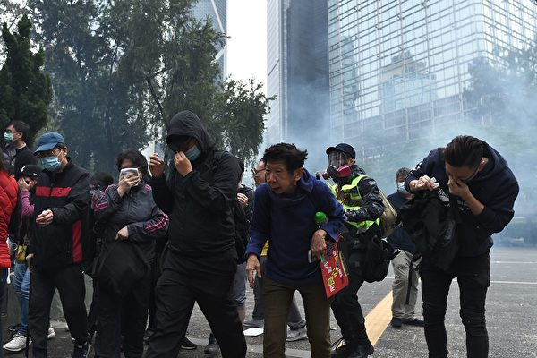

<h1 align="center"><b>请收藏网址(新闻视频ip) 随时连上最新即时IP https://git.io/swspip</b></h1>
<h2 align="center">直连不必翻墙 blossom必看 精彩视频 http://220.141.125.164 </b></h2>

<h4 align="center"><b>知情权不能放弃，也不作愚民，让你看第一手不被过滤的新闻，翻墙软件免费下载  https://git.io/opopop </b></h4>

<h4 align="center"><b>自由门7.70版使用封包过滤技术，增强突破封锁能力。首次运行时，如果以前版本没有安装过，会有提示安装封包过滤器。这是一次性安装，不会影响用户网络，不需要卸载。</b></h4>
<h3 align=center><a href="http://dongtaiwang.com/loc/software/fg/770/fg770p.exe">专业版exe:自由门7.70版</a></h3>
<h3 align=center><a href="http://dongtaiwang.com/loc/software/fg/770/fg770p.zip">专业版zip:自由门7.70版</a></h3>

<h4 align="center">中共覆灭在即 勿依赖中共保权 https://git.io/Ffor </b></h4>

<h4 align="center">● 红潮即将倾覆 天之将明 ●https://git.io/bb99bbss </b></h4>

<h3 align=center><a href="https://github.com/gav01/Heart/blob/master/news1.md">● 大纪元时事 ●</a></h3>

<a name=top>

<a href="https://github.com/gav01/Heart/blob/master/ls-20-1-1.md"><b>往1~131新闻</b></a> 

<a href =#147>147.全球22城市撑香港 港警腰斩15万人集会 
<a href =#146>146.【思想领袖】陈日君：港府只是一个傀儡 
<a href =#145>145.感谢农民支持 川普：将促中方执行贸易协议 
<a href =#144>144.开豪车入故宫惹议 “露小宝”自称是红三代 
<a href =#143>143.看守所不给看病吃药 上海89岁老人绝食抗议 
<a href =#142>142.119“天下制裁”集会 港民：全球围堵中共 
<a href =#141>141.【武汉肺炎 | 持续更新】武汉肺炎蔓延！突然增加136病例 增1死亡 
<a href =#140>140.武汉新冠状病毒再增死亡病例 网民冒险爆料 
<a href =#139>139.中共监控学校 数千学生人脸识别数据遭泄漏 
<a href =#138>138.【新闻看点】6因素 北京接受川普惩罚性关税 
<a href =#137>137.【思想领袖】金里奇：美国曾误判中共这个最大威胁 
<a href =#136>136.【拍案惊奇】救吴花燕钱无踪 港警贴连侬被捕 
<a href =#135>135.习近平两次避见川普的内幕 
<a href =#134>134.新年集体炼功交流 法轮功修炼者遍及俄罗斯 
<a href =#133>133.中共官员变换护照身份 逃避人权法案制裁 
<a href =#132>132.上海两会 访民到举报点投递材料 多人被抓 
  
  
  
  
  
  
  
  
  
  
  
<a name=147>
  <h3 align="center"><b>全球22城市撑香港 港警腰斩15万人集会</b></h3>
<h1 align="center"><b>港警再放弹 中共挑衅世界 料掀国际制裁潮</b></h1>

1月19日参与香港“天下制裁”集会的群众逼爆遮打花园。（宋碧龙／大纪元）

  
  【大纪元2020年01月20日讯】（大纪元记者梁珍香港报导）1月19日，全球11个国家22个城市的香港人发起“天下制裁”大游行，促各国政府尽快实施制裁，惩罚违反人权的香港和中共官员。19日在香港，已获不反对通知书的“天下制裁”集会于下午3时在遮打花园举行。不过，集会期间警方借故挑衅、提早腰斩。之后，大批防暴警察更在驱散民众前后狂放催泪弹，抓捕参加集会的市民。集会申请人刘颕匡在宣布集会有15万人参与后，更被警方以“煽动群众情绪”等名义拘捕。有时事评论员批评，警方滥捕滥暴，只会激起国际上更大的愤怒和制裁，加速中共解体。
  
  

1月19日“天下制裁”集会期间，中环遮打道和平公园挤满人潮。（宋碧龙／大纪元）

  
 <b> 滥查市民和记者 便衣警察遭殴打</b>

民间集会团队在中环举办“天下制裁”游行，早前遭警方反对，故大会决定以流水式方式举行集会。虽然集会的不反对通知书至晚上10时，但警方在3时集会举行前已部署大量防暴警察，在多处截查市民和记者，挑衅民众。

集会在遮打花园举行，早在下午一时多，一名身穿黑衣的男子，就被先行到场、全副武装的数十名防暴警察无故截查，15分钟后才放行。另在中环爱丁堡广场，原本举行古董车展等其它活动，也有大批防暴警察到场，至少3名年轻的黑衣女士被截查，之后被放行。

另外，集会开始前，水炮车及锐武装甲车已在金钟高等法院外驻守，二时多，一名立场新闻记者赶去采访时，两度遭警方盘查。其中一名蒙面的防暴警察，刻意阻碍记者手机拍摄，更将记者身份证推向镜头前。之后警员涉嫌抢夺记者手机，并毁坏手机萤幕。

  

2020年1月19日，香港“天下制裁”集会开始前，水炮车及锐武装甲车已在金钟高等法院外驻守。(余钢／大纪元）

  
  集会下午3时开始后，来参加集会的民众塞爆了遮打花园以及附近的皇后像广场、遮打道一带。下午4时左右，有防暴警察突然在德辅道中制伏一名男子，一度引起民众的鼓噪；下午四时多，一名无佩戴委任证的便衣警察，突然走入遮打花园，要求主办单位腰斩集会，因一度拒绝出示委任证而被集会人士围殴，之后被护送离开。几乎同一时间警察在遮打花园外放催泪弹，驱散抗争者并至少带走一名抗争者。

约下午4时半，集会主办单位不得不宣布终止集会，呼吁市民向金钟方向散去。之后，防暴警察冲入集会现场，驱赶市民，并迅速在遮打花园、雪厂街等处施放催泪弹，参加集会的大批市民在极短时间内被迫紧急疏散，有未配戴防护装置的市民被迫吸入催泪烟。警方在毕打街一带、铜锣湾等处，共抓捕数十名抗争者。

  

1月19日速龙队在遮打道预备清场。（宋碧龙／大纪元）

  

1月19日，防暴警察在德辅道中与金钟道交界处连续发射多枚催泪弹。(PHILIP FONG/AFP via Getty Images)

1月19日，警察在中环毕打街拘捕抗争者。（余钢／大纪元）

  
 <b>15万人集会 发起人被带走</b>

至晚上七时多，集会发起人刘颕匡在湾仔的记者会上表示，共有15万人参加集会，如果非警方腰斩集会，相信出席人数会更多。

他亦指，当时有便衣警察要求他腰斩集会，但没有出示委任证，引起在场人士不满，其后才快速展示委任证，但当时情况已难以控制。他认为警方需为19日的冲突负责。

在会见传媒后，刘颕匡即被警方以“煽动群众情绪，令遮打花园逼爆，违反集会不反对通知书”名义带走。

1月19日，香港“天下制裁”集会团队发言人刘颕匡上台发言。（宋碧龙／大纪元）

  
  <b>桑普：港警滥捕只会惹国际反弹</b>

对于港警施放催泪弹腰斩集会，同时抓捕刘颖匡以及数十名抗争者等，19日在集会上首位获邀发言的时事评论员桑普表示愤怒，“现在香港警察已经跟中共公安没什么太大的分别了。现在是拿着枪，拿着武器，来对待手无寸铁的市民。

1月19日，香港知名时事评论员桑普在香港“天下制裁”集会上台发言。（大纪元视频截图）

  
  他表示，从几个月前，香港警察的手法，已经是专门对付和理非的，“希望是用震慑的方法来威吓所有参与和平理性集会的人士。”特别是新任中联办主任骆惠宁上台后，政策是越来越狠。“针对所有那些和理非的集会，先做一个批准，批准之后，用一种威吓、围捕的方式，来对待有关的抗争人士，希望和理非的人以后不敢出来，达成震慑的效果，就是他一切做事的目的。”

比如今次集会原本到晚上10时，但到四时多已经被腰斩了。虽然腰斩的表面原因是有警员被“私了”，但实质上造成更大的混乱，“你要抓有关的人，你就抓有关的人，而不是说把所有的人集会的权利剥夺掉。这逼出的情况是，大家遍地开花，就让各人去做事，可能是游行，可能是集会。但是，因为香港人是爱好和平的，所以基本上到现在，没有人造成很大的扰乱，反而最大的扰乱是警察。”

参加集会的时事评论员谭得志（艺名快必），也批评警方的做法是害怕游行的巨大民意，改为只批集会，呼吁市民要更加聪明的采用“流水式集会”，比如走去维园看花市等等。

<b>“外国势力论”加快中共解体</b>

另外，在集会进行期间，香港政府发言人发声明回应集会，对有人要求外国政府干涉香港事务及实施制裁感到“极度遗憾”，重申外国不应干预港府内部事务。

声明又提到，政府明白市民对普选的诉求。要落实这个目标，社会必须清楚理解，经普选产生的行政长官不单要向香港特别行政区负责，亦要由中央人民政府任命，需要向中央人民政府负责，这是一国两制下不能忽略的宪制秩序。

桑普认为，在国际同步关注香港的同时，香港警方却以滥捕滥暴、腰斩游行的方式，回应民众和国际诉求，是非常愚蠢的举动，相信反而会掀起更大的制裁潮。“中共中联办跟香港警察一起做这个事情，只会激发各国更加关注香港的问题，而且会效仿美国《香港人权民主法》，制裁香港破坏民主、自由、法治的一些官员，还有黑警，还有他们的家属。”

他预料此举也会进一步加速中共政权的解体，“他们（国际社会）会介入，而不会坐视不理。因为全世界很怕这个暴政输出锐实力，会通达到每一个政府和国家里面，那现在中共要破灭的时候，全球会有共识去从国际外交层面去推进，比如透过伊朗问题等，美国要和欧盟、日本、五眼同盟形成联盟的时候，我觉得这个对于中共的倒台，是有致命性的、关键性的作用。”

  

1月19日，香港“天下制裁”集会现场的“天灭中共”标语。（宋碧龙／大纪元）

  
 <b> 张崑阳：今年将形成国际制裁潮</b>

香港大专事务国际代表团前发言人张崑阳，19日向大纪元表示，预计2020年是一个很特别的一年。去年港人史无前例的抗争运动，已将香港推向一个史无前例的国际高度。

香港大专事务国际代表团前发言人张崑阳认为，2020年将有越来越多的国家仿效美国的《香港人权与民主法案》，通过相似的法例以制裁香港和中共的高官和警察。（梁珍／大纪元）

  
  他指，“随着在11月底，美国已经正式通过了《香港人权与民主法案》，到2020年，今年就正式制裁这一帮高官和警察；同一时间，除了美国，越来越多的国家都会仿效美国关心香港的人权、民主议题，未来也都会用一些相似的法例，制裁一些卖港的人士、官员。”

比如新任警察署署长邓炳强以及前任曾伟雄等，都被香港学界列入向美国推荐的制裁名单中。张崑阳称：“邓炳强是一个很强硬的警务处处长，他完全是不知廉耻的。他竟然可以很理直气壮的在之前的一些区议会上，说他自己没有做错，所以我们看到他的官威很大。但是为什么邓炳强的官威可以这么大，背后就是因为有林郑或者以北京为首的一批人撑腰，所以我们都是要剑指中共，剑指北京政府，我们是不能够再允许香港的警察、这批人再去与中共结谋的。”

他强调，透过今次抗争，未来港人会更加觉醒，“只要他们一天是这样的去残害香港的人权、漠视香港的民意，他们都需要小心。因为我们香港人是一定会反抗到底，同一时间我们香港人这次觉醒的一点就是，我们懂得用国际牌去制衡中国（中共）。”
纽约集会游行声援制裁

此外，纽约周日（19日）中午12时（即香港时间20日凌晨）于曼哈顿Astor Place Cube集合，并游行至时代广场。1月8日，美国国会及行政当局中国委员会（简称CECC）公布2019年年度报告，批评中共进一步打压香港人权。

据悉，CECC主席麦高文（Jim McGovern）及联合主席鲁比奥（Marco Rubio）已承诺，将向美国国务院提交官员制裁名单。位于华盛顿的香港民主委员会（HKDC）理事会成员杨锦霞引述麦高文的话说，在落实制裁前，他希望香港人能够坚持争取“五大诉求”。
郑文杰参加伦敦“天下制裁”集会

19日在伦敦当地时间下午1时也有“天下制裁”集会。现场的集会人士高喊“停止华为（Stop Huawei）”、“没有人权就没有交易（No human rights, no trade deal）”、“关闭集中营（Close concentration camp）”等口号

前英国驻港领事馆职员郑文杰参加19日伦敦“天下制裁”集会，呼吁各国政府特别是英国政府要考虑现在在香港发生的人道灾难危机，不应该售卖武器给一个威权的政体。（唐诗韵／大纪元）

  
 前英国驻港领事馆职员郑文杰也有参与集会，对于香港的“天下制裁”集会被腰斩，他说，“一个已经申请不反对通知书的情况下都腰斩，其实就是要和和理非说，出来游行集会也要面对那种恐慌。对警察的做法是失望的，警方有责任让市民可以享有他们的合法权利，希望政府在这方面有足够的容忍度，游行召集人也被带走是非常不公平的。”

他又说，“更重要的是去了解为什么有那么多市民，禁之不绝的还是要出来集会，是否真的觉得自己手上持有各种武器，和合法暴力就可以令香港市民噤声？这只是程序和手段，但最重要的是，香港警察要知道，他们是应该保护市民的，而不是维护这个威权政府，应在这关键的时刻站在市民的一面。”

至于国际社会可以就香港情况多做什么，他说，英国政府早先已经禁止控制群众的工具出口到香港。而最近又有传闻指警察考虑添置电枪，他呼吁各国政府特别是英国政府要考虑现在在香港发生的人道灾难危机，“他们不应该售卖这些武器给一个威权的政体，用来镇压人民。”他呼吁英国政府停止售卖任何武器给香港警方。

<a target="_blank" href=#top><h6 align="right">回上方</h6></a>

<a name=146>
<h1 align="center"><b>【思想领袖】陈日君：港府只是一个傀儡</b></h1>

曾任香港第六任主教的天主教樞機主教陳日君接受了英文《大紀元時報》的《美國思想領袖》（American Thought Leader）節目主持人楊傑凱（Jan Jekielek）的專訪。（視頻截圖／大紀元時報）

【大纪元2020年01月02日讯】（英文大纪元资深记者杨杰凯采访报导／高杉编译）英文《大纪元时报》《美国思想领袖》（American Thought Leader）节目主持人杨杰凯（Jan Jekielek）于2019年12月对曾任香港第六任主教的天主教枢机主教陈日君进行了专访。

<b>陈日君</b>：……所以，如果现在他们剥夺了所有人的自由，那么我们将会变得和中国（大陆）的任何城市一样。我们都知道那里发生了什么。也许他们现在已经达到了某种程度的繁荣，也许现在许多人已经脱离了贫困，但是整个国家的精神层面都向下沉沦了，绝对是“奴隶制”了。我们都知道天主教教会所受到的迫害是如何愈演愈烈的。

作为老一辈的一员，现年87岁的陈日君（Joseph Zen）如何看待香港的抗议活动，以及领导抗议活动的香港年轻人？为什么陈枢机将香港的情况描述成是一场战争？在陈主教看来，梵蒂冈在面对中共这个共产主义政权时，做出了多么糟糕的选择？……

这里是《美国思想领袖》节目，我是杨杰凯（Jan Jekielek）。今天，我们请到了曾任香港第六任主教的天主教枢机主教陈日君。他可以说是人权、政治和宗教自由的代言人，也是公认对中共迫害天主教以及中共与梵蒂冈之间暧昧关系，最直言不讳的批评者。

 下面请看这个专访的全文：

<b>杨杰凯</b>：陈主教，真的很高兴能够邀请您来到《美国思想领袖》节目。

<b>陈日君</b>：我的荣幸。

<b>杨杰凯</b>：陈主教，自从香港发生反对《引渡法案》的抗议活动以来，已经过了大约半年。最近举行的选举，泛民主派获得了压倒性的胜利。你能否跟我们谈一谈香港现今的情况？

<b>陈日君</b>：好，我想整个事件要追溯到（香港）主权回归中国的最初阶段，当时我们得到了一国两制、高度自治的承诺。但是慢慢地，他们试图缩小这个自主权。举例来说，他们起草了一个非常严厉的法案试图推翻之前的承诺。

<b>杨杰凯</b>：是的。

<b>陈日君</b>：他们承诺民主，但是他们又对自己的承诺食言了。因为根据《基本法》，我们在2007年、2008年就可以享有民主，再迟也不会迟多久。好吧，尽管如此，之后他们还是推迟了很多次。所以在某个特定的时刻，我们有了这个“和平占领中环”事件。后来学生们接手了这件事，整个的事情，他们非常真诚、非常勇敢、但经验不足……

<b>杨杰凯</b>：OK。

<b>陈日君</b>：我认为有一点错了，当局其实有一个非常简单的方法可以智取这些学生。在香港，我们一般都是爱好和平的人，所以在占中抗议活动失败之后，很多人被送上了法庭，被宣判有罪、被判刑，被关进监狱。我们都很平静地接受了这个事实，认为这就是代价，我们认为，我们必须为公民抗命付出代价。

<b>杨杰凯</b>：OK。

<b>陈日君</b>：但是，民众对当局的愤怒是存在的，我们能够平息它吗？那么之后，这个所谓的《引渡法案》……不幸的是，我们这里有非常好的律师，他们向我们解释了这个法案的危险性。于是一切又重新开始了。

现在你们已经知道（都发生什么）了，由于民众和平的天性，所以我们就用游行的方式来表达我们的诉求。其实在占中之后的三月，（抗议）人数已经下降的非常少了。但突然之间又有了动力，很短的时间，游行人数就达到了一百万。

不幸的是，香港行政长官对民众的抗议非常反感，她回应说，我们将继续推动这个新法案。这是非常、非常错误的。因为我们已经用一个和平的集会来表达民众的担忧，而她却下定决心继续推动下去。

然后，事情变化很快。无论是占中抗议还是那次大游行，年轻人都觉得和平手段根本不够……

<b>杨杰凯</b>：OK。

<b>陈日君</b>：民众认为他们必须做些不同的事情。于是，他们包围了立法委员会的大楼，希望能够阻止立法委员在6月12日举行的会议通过这个法案，对吧？所以，我们必须感谢这些年轻人。

<b>杨杰凯</b>：对。

<b>陈日君</b>：但是一点一滴地，又出现了更进一步的，我们可以说，嘿，来个更有力的行动吧，于是他们闯入了立法委员会的会议厅，还做了一些破坏。

但是你可以看到，他们已经知道要更克制些，甚至在蓄意破坏的时候，他们是有选择性地行动。他们还告诉别人要尊重这些，尊重那些。但是，这也是（当局的）一种陷阱……

<b>杨杰凯</b>：我明白了。

<b>陈日君</b>：因为员警就在大楼里面看着，所以他们是故意让这些人能够闯进来，然后看着这些人离开。之后在七月一日，抗议人士又去了立法会大楼抗议。在那里他们也做了一些事，并在特区的区徽上涂鸦，这是一种具象征意义的行动。那么回头看，抗议人士没有做任何伤害人身的事情。

<b>杨杰凯</b>：OK。

<b>陈日君</b>：但是我们可以看到，员警一次一次地在升级暴力。他们使用了催泪瓦斯，刚开始他们只用胡椒喷雾，但后来他们使用催泪瓦斯就像用非常普通的手段防范民众一样。之后就是大规模的民众集会，我指的是那个百万人大游行，一个星期之后规模超过了两百万人。

<b>杨杰凯</b>：对。

<b>陈日君</b>：而且（这些抗议集会）总是很平和的。所以就连香港行政长官都说，我们令全世界都感到钦佩，因为我们可以如此和平地举行这样大规模的集会。但问题是，他们不去倾听我们的（诉求）。

<b>杨杰凯</b>：OK。

<b>陈日君</b>：那么接下来就导致了长期的抵抗。在这些人真正开始使用一些暴力的时候，我就说过，我个人一开始的感觉就对这样的运作系统很警觉，因为这些年轻人说，我们不想要讲台，不想要领导……

<b>杨杰凯</b>：我明白。

<b>陈日君</b>：……没有领导层，没有重新组织之类的，但这是不行的。因为你是处在一场战争之中，你必须去和一个强大的政权战斗，而我们是很弱的个人，所以你需要组织起来，需要领导者，需要相互合作，需要一个能联合所有人的联盟。

不管怎么说，那些所谓的老年人都很欣赏他们（年轻人）的所作所为，但也非常担心。所以每个人都可以看到，既然他们（年轻人）发挥了领导作用，那么我们就跟随他们好了。他们到这儿、到那儿，那我们所有的人都出来支持他们。

你知道在中秋节的时候，他们呼吁去狮子岩，我就跟着他们到了那里。你知道，我已经87岁了，也爬上去了。所以我觉得，他们需要人们的赞赏和支持。但是有些人有些担心，因为现在，你可以看到，随着警方的暴力在升级，他们也相应采取了一些更加危险的行动。

以前他们最多是扔砖头，但你知道，员警都有非常坚固的盾牌，所以他们从来没有伤过任何员警。他们说，他们也放火，但这放的是什么样的火呢？他们只是收集一些垃圾，然后在路中间点燃，这是一种象征性行动或可能只是阻碍交通，但绝不会去伤害人民。但是在最后，他们也把这个汽油瓶扔到建筑物里面，这就更危险了，对那些在附近的人来说就是更危险的了。

所以我们有些担心，但我觉得，这些年轻人认为这是必要的，因为在面对员警如此令人难以置信的暴力时，我们甚至可以将员警的行为称为是残暴，我想，我不需要去具体描述所有那些可怕的事情了吧……

<b>杨杰凯</b>：是的，当然。

<b>陈日君</b>：你看那些可怕的事情。所以我认为，民众是理智的，人民是明智的。他们知道哪里是对的，哪里是错的。所以我认为，这次选举释放了一个非常明确的信号，那就是我们站在人民的一边，而当局是错误的。

<b>杨杰凯</b>：那么，陈主教，你把当前的情况看作是一场战争。

<b>陈日君</b>：哦，是的。

<b>杨杰凯</b>：这场战争的对手是谁？战争的双方都是谁？

<b>陈日君</b>：是的。这是一场战争，因为我们所面对的是一个极权国家——中共。所以不是仅仅面对香港政府，香港政府可能只是一个傀儡，也许他们拥有一些自由的空间，但是我不觉得他们利用了这个空间。

非常悲哀，有时它是在服从，而有时，它是在猜测中央政权的意图，或者有的时候，它走得比中央政权真正的愿望还更进一步。而它的方向非常明确，就是要完全控制人民，让人民成为奴隶。所以，他们不想给予（香港）真正的民主，甚至想利用这个《引渡法案》剥夺人民的言论自由。这是很可怕的，因为作为人，我们希望有尊严地生活，我们希望能够自由地表达我们的思想。

所以我们香港，绝不可能通过暴力赢得战争，我们没有办法。你知道，甚至我们的食物、我们的饮用水都依赖中国大陆。但这是一场战争，因为他们是如此独断。

我们担忧是因为我们距离“50年不变”的约定还有一半的时间。所以，如果现在，他们就已经剥夺了所有的自由，那么剩下的时间里还会有些什么吗？我们将会变得和中国的其它城市一样。我们都知道那里发生了什么。也许他们现在已经达到了某种程度的繁荣。也许现在许多人已经脱离了贫困，但是整个国家的精神层面都向下沉沦了，绝对是“奴隶制”了。我们都知道天主教教会所受到的迫害是如何愈演愈烈的。

<b>杨杰凯</b>：对的。你能不能告诉我们一些关于天主教教会和其他信仰人士在中国的真实情况，以及你对香港的担心。

<b>陈日君</b>：是的，你说得对，我们不能真正地与中国大陆切分开来，所以我们总是关心在中国所发生的事情。曾有一段时间，我们可以为他们提供帮助，但现在出现越来越多的限制。而且最不幸的是，梵蒂冈长期以来一直采取了错误的策略。

事实上，我们有教宗约翰‧保罗二世，他本人来自波兰，所以他知道得很清楚，他知道所谓的美国（对华）政策是失败的。接着是教宗本笃十六世，他有一段时间住在极权统治的纳粹和共产主义的东德。教宗本笃十六世也非常清楚地表明了他对这种政策的看法，这（共产主义）是失败的，他说得很清楚。

但现在是教宗方济各继任。而教宗方济各来自不同的环境。虽然南美洲也有某种独裁，但那是右翼的独裁。在这些国家，共产党员被当成了好人，因为他们受到了政府的迫害，他们真的是站在穷人的一边。所以我想，教宗方济各可能是对这些共产党员有些同情。

但是他肯定也知道其它的共产党政权，当这些共产党员掌权了之后，他们就变得不同了，是吧？

但是后来，帕罗林被召回了。因为在教宗本笃十六世最后一段日子里，他被派走了，由于他（与中共）定的协议草案无法签署，他也不能再继续作为谈判代表了。所以，给了他一个新的职位，他被派往委内瑞拉担任圣座驻委内瑞拉大使。

（译者注：彼得罗‧帕罗林枢机（伯多禄‧帕罗林，Pietro Parolin），1955年1月17日出生，意大利籍，自2013年10月15日担任罗马教廷圣座国务枢机卿。2007年，时任大主教的帕罗林枢机领导了梵蒂冈与北京的谈判。包括香港教区荣休主教陈日君在内的许多人强烈批评他对中共政权妥协。陈日君表示，所谓同中共的“和解”可能会导致1200万中国天主教徒实际上被置于共产党控制的“牢笼”之中。他指责教会官员“出卖”了中国天主教徒，并警告：“一个被政权奴役的教会并不是真正的天主教会。”）

然后教宗方济各又把他召回了，几乎所有人都为此鼓掌欢迎，因为帕罗林确实是一个有能力的外交家。但当他被摆到那个高位的时候，我才看到他的真实面目，他是如此的傲慢、自大和无礼。

后来有一天我真的感到很震惊，因为当我谈到在共产党统治时期东欧的一些信仰英雄们时，他形容他们是“麻烦制造者”……

<b>杨杰凯</b>：真的？！

<b>陈日君</b>：……他称他们为“角斗士”。他说，那些人总是要去反对政府，他们不会出现在政治舞台上什么的。所以我写信给他，我说：“哎，你这到底是在说谁呢？”他没有提到他们，没有提到具体的名字。所以我说：“你们有没有想过，这些人，他们都是信仰的英雄。你怎么能说出这样的话？你必须去道歉。”他回复了，并没有对此否认，而只是说：“哦，如果我说的话让任何人不高兴，那么对不起。”我说：“不，不用，你不用对我说对不起。”

所以从那天起，我就觉得，如果他不能尊重那些信仰英雄，那么这就意味着他不尊重信仰。但是后来教宗方济各允许他继续这个（对华谈判）项目，于是他们在不可能的情况下继续推动这个专案。他们一路走下去。当然，教宗方济各负最终责任，但他可能并不真正了解实际情况。但帕罗林知道所有实际情况。这么多年来，他一定知道得很清楚。所以我很怀疑他所说的我们是一条心，他的目的不是为了推动信仰，因为就只有三个步骤，先是秘密协议，接着让驱逐教会主教合法化，然后是去年（2018年）六月的文件，也就是在六月底，他们鼓励人们加入（中共组织的所谓）教会，加入官方教会，这在客观上讲，就是分裂，真是令人难以置信，难以置信的。

<b>杨杰凯</b>：这个官方教会是由共产党管理的？那些在中国的教堂，都要由共产党管理，对吗？

<b>陈日君</b>：是的。这真的是不可思议。我写了那么多信，教宗从来没有回复我。那时候，我都无法确定他是否收到了我的信。所以在去年（2018年）一月和十月，我去了罗马，然后亲手把信交到圣父的手中，告诉他说：“圣父，我来到这里，只是想要把我的信交给你，以确保你拿到了信。”他没有说：“哦，我收到你的那些来信了。”而是说：“哦，谢谢你。谢谢你。”所以，也许他从来都没有收到过我的信。

今年（2019年）在这份新文件出现之后，我第二天立刻去了罗马，提出了我的反对意见，我要求在教宗在场下同帕罗林就此进行讨论。但很明显，他们拒绝了。他们邀请我吃晚饭，但我却没有机会谈论这个问题。

现在已经过去五个月了。教宗当时只是说：我会调查此事。然后在这五个月里，就没有任何消息了。所以这令人很伤感，很遗憾。

再回到今天的香港，每个人都注意到了，梵蒂冈和教宗方济各这么多年来，从来没有说过任何批评中共的话，从来没有说过任何这样的话，只有赞美。教宗可能有自己的意图，比如以此取悦北京，以便能够进行对话。但现在你看，帕罗林已经减少了对话，他可能也取消了这个委员会，还把梵蒂冈高层负责人中唯一的华人韩大辉派走了，把他派到希腊去了。所以说起这些事情真的是令人感到很伤感。

但是我说这些，并不是反对教宗，因为每次我见到他时，他都对我很和蔼。但在这些问题上，他一直让帕罗林牵着走。

当教宗从日本回罗马的路上，我非常担心他会怎么说。我认为他做得非常聪明。人们问他关于香港所发生的事情时，你知道他怎么说的？你注意到他的回答了吗？

<b>杨杰凯</b>：我没注意到，跟我说说吧。

<b>陈日君</b>：他说：“哦，这其实不是孤立的群体，世界上有很多地方都有这样的失调。我不是掌握了所有的相关资讯，所以……”，所以他什么也没说。

<b>杨杰凯</b>：转移话题了。

<b>陈日君</b>：这是非常明智的，因为在这么久的沉默之后，对于我们在香港的教会来说，如果他说了什么取悦北京政府的话，这将是非常危险的，也是有害的。但他什么也没说。这很好。

<b>杨杰凯</b>：陈主教，最近美国国会几乎一致通过了《香港人权与民主法案》（Hong Kong Human Rights And Democracy Act），以及另一项限制向员警出售可用于监管民众相关商品的法案，事实上，就在几个小时前，（川普）总统签署了这项法案，使之成为了法律。你认为这对香港会有什么影响？

<b>陈日君</b>：说来我们还需要别人的帮助是很伤感的。他们（港府）不愿意听我们的诉求，还说我们依靠外国势力。不是，我们正在做我们自己的工作，但是现在，我们觉得，我们也需要全世界的支援，因为共产党不懂得讲道理，他们只懂得权力，这令人感到很伤感。

幸运的是，美国人民非常尊重人权和民主、自由，美国两党在对华政策上团结一致，他们所代表的是人民。所以幸运的是，我们得到了一些帮助，我们希望欧洲人也能来帮助我们，这真的一场战争。我们不确定这种外来的帮助是否会有效，我不知道。但我们必须试一试。

<b>杨杰凯</b>：OK。实际上你正在用你组织的“612人道主义救援基金”（12 June Humanitarian Relief Fund）做一些非常重要的工作。你能简单地告诉我们关于这个基金的情况以及它在做什么吗？还有它的效果？

<b>陈日君</b>：好的。在此之前，我们为之前所发生的事情设立了两个基金，为了保卫这片土地的一些小插曲，包含之后占中抗议人士被告上了法庭。但是，当这场对抗在6月12日开始时，我们已经可以预见这将是一场大战。所以，我们几乎叫停了那两个基金，因为它们已经运作得非常好了，我们就把它们集中、联合起来了，为了这个目的建立了这个新的基金。民众是如此的慷慨，现在我们有大约八千万港元。

<b>杨杰凯</b>：Ok。

<b>陈日君</b>：但你知道现在有多少人被送上法庭了吗？所有这些法庭诉讼都要由律师经手，我们需要为此支付巨额的资金。在现阶段，主要的还是支付医疗，有许多人受伤了。还有……

<b>杨杰凯</b>：是为那些抗议者支付？

<b>陈日君</b>：对，是支援抗议者的，我们称之为“612人道主义救援基金”。在医疗方面，还有当他们获准保释时，我们也都要为他们支付费用。然后，也因为这个，他们可能失去了工作和其它东西，我们也在为他们提供帮助。虽然这些钱不是很多，但是我们还是提供了一些帮助。

同时我们可以预见的是，当法庭诉讼开始的时候，我们必须支付大笔的费用。但民众都非常慷慨，我们也非常努力地工作，这就是我们所做的了。

我们是五个受托人。我们每周开一次长会，每次时间都会超过三个小时。因为有很多事情要处理。因为我们的钱不够，所以我们必须明智地去使用。钱没有那么多，无法给每个人，无法给每一个来问的人。但同时，还要做到慷慨大方。

<b>杨杰凯</b>：所以，陈主教，现在我们有了这个具有里程碑意义的选举，香港亲民主的民众取得了非常、非常大的胜利。事情看起来平静了一些，你认为接下来会发生什么呢？

<b>陈日君</b>：在赢得这场胜利之后，我在报纸上读到了很多东西，很多的建议，我觉得我们真的需要做些什么，因为我们得到了人民明确的授权。以前他们说那个民意调查不一定可靠，那么好吧，现在这个时候就都非常清楚了。

<b>杨杰凯</b>：对。

<b>陈日君</b>：所以，现在最大的问题是员警。他们可以随心所欲地……他们受到了当地政府的鼓励，中联办、甚至习近平本人也给予了鼓励。所以他们、他们真的是……我们都不认识我们自己的员警了。我不知道究竟发生了什么，也许是在占中运动以后的这段时间里，也许甚至在招募的时候，也许他们只挑选了那些被我们称为“蓝丝带”的人（当员警）？也许，也许他们甚至从中国大陆请来了安保人员？我不知道。

<b>杨杰凯</b>：OK。

<b>陈日君</b>：我不知道。但他们就像野兽捕食一样对待那些手无寸铁的民众，这真的很可怕。如果他们不能解决这个问题，就没有出路，没有出路。这非常危险。他们破坏了我们的员警的名声。现在人们已经不信任员警了。

而且，我认为这是一个……我无法找到另一个词来说它，但这些法庭案件真的就是很愚蠢的，浪费了很多钱、很多时间。他们也在玷污我们的法庭的名声。

很明显，政府在利用法庭来达到他们的目的，这是一个政治问题。那些法官们怎么能够……，有些法官还说：“哦，好吧，我们不管政治，只要他做了什么违法的事情……”，但是我不这样认为，即使是暴力的行为也不能不考虑原因就判决。除了这个原因之外，以前为什么他们很少发生这种暴力行为。同时，现在他们也很少处理员警的暴力行为，发生了那么多的事情，甚至是很可疑的死亡事件。

所以我认为，这两个是真正的问题。一直以来，香港行政长官都拒绝成立一个独立的调查委员会，但这是绝对必要的。否则，他们就摧毁了这座城市最宝贵的两样东西：员警和法治。我很遗憾地说。

<b>杨杰凯</b>：陈主教，我们的采访马上就要结束了，您还有什么要说的吗？

<b>陈日君</b>：讲出所有这些话让人感到很伤感，因为我觉得我有资格说出我所讲的这些话，因为我认为，他们不能说我不是一个爱国者，不能说我不爱国。

<b>杨杰凯</b>：对。

<b>陈日君</b>：因为你知道，从1989到1996，过去七年的时间，我每年在中国待六个月。

<b>杨杰凯</b>：OK。

<b>陈日君</b>：在官方教会的神学院教书，所以我和他们合作。那些年真的很幸运，神学院里到处都是神学院的学生。所以我非常喜欢（那段时光）。也因为我是在天安门广场事件之后进入中国（大陆）的，当所有人都离开中国的时候，我去了中国，所以他们很感激。他们对我很好。因此，我可以非常自由地教授天主教教理，没有任何问题。

但现在的情况已经大不相同了，不但大不相同，而且糟透了。而最近更可怕的是，以前有些人可能会来这里看我，但现在没有人来了。最后一次，他们跟我约好了，但后来说，哦，从现在开始，拿不到许可了。

<b>杨杰凯</b>：我明白了。

<b>陈日君</b>：由于罗马教廷的这种态度，中共政权正在做他们要做的任何事情。所以他们去见那些地下家庭教会的人士，说现在是教宗要你们出来。

<b>杨杰凯</b>：我明白了。

<b>陈日君</b>：地下教会的人回答说，没有，教宗从来没有这样说过。但他们回答说：说过，我们知道他说过。如果你不出来加入我们，我们就取缔你们的教会。因为在此之前，中共政权默许了地下家庭教会的存在，到处都是地下教会。但现在，他们取缔了这些地下教会，那所有人都必须依赖他们的教会，官方的教会。

如果你私下里聚会礼拜，那么你就会受到惩罚。你可以自己去祈祷，但不能够叫信徒来参加你的弥撒。因此，普通的信众就被剥夺了共同进行圣礼的机会。所以我告诉他们，不要与当局对抗。没有必要那样做，你只是平静地（看着）他们拿走一切。他们拿走教堂，那让他们拿走教堂罢了。如果你不能进行集体弥撒，也不要担心，因为恩典可以来到你的家里而不被亵渎。你可以放弃任何东西，但你不能放弃信仰，你甚至可以放弃恩典，但你不能放弃信仰。

<b>杨杰凯</b>：陈主教，谢谢，非常感谢。

<b>陈日君</b>：谢谢你能来。#◇  

<a target="_blank" href=#top><h6 align="right">回上方</h6></a>

  
<a name=145>
<h1 align="center"><b>感谢农民支持 川普：将促中方执行贸易协议</b></h1>

1月19日，川普表示，与中国签署的初步贸易协议将为农民带来福音，并感谢农民的坚持，此前因中共针对农民的报复性关税，他两次不得不向美国农民发放补助。(Nicholas Kamm / AFP)

  
  【大纪元2020年01月20日讯】（大纪元记者许祯祺综合报导）周日（1月19日），美国总统川普（特朗普）感谢农民在美中贸易战中对他的支持，并表示，他将大力推动第一阶段贸易协议，以确保中方执行协议。

川普周日在奥斯丁举行的美国农业局联合会大会上讲话时表示：“我们做到了。”他提起他的竞选承诺包括改善美国与其它国家的贸易关系。

上周美中签署第一阶段贸易协议，且参议院通过美墨加贸易协定（USMCA）。
美中贸易战持续18个月 美国农民仍支持川普

川普说，他上周三与中国签署的初步贸易协议将为农民带来福音，他并感谢农民的坚持。此前因中共针对农民的报复性关税，他两次不得不向美国农民发放补助。

他说：“你们一直在战斗。” “你们一直和我在一起。你们甚至从未想过放弃。（最终）我们完成了（目标）。”

中共的报复性关税让美国农民失去了这个曾经最大的农产品出口市场，2017年美国农产品对华出口的市价为120亿美元，但是在贸易战中很多农民的大豆堆积如山，一年内的储存量就增加了108%，并且价格跌至10年低点。

去年8月6日，普渡大学商业农业中心的最新“生产者调查”显示，7月份创纪录的78%的农民表示，他们相信贸易战将最终使美国农业受益。根据同时进行的Farm Pulse调查显示，农民对川普的支持率为79%。

截至去年12月，川普政府已向受中方关税影响的农民提供了约280亿美元。

伊利诺伊州农民埃文‧胡尔蒂娜（Evan Hultine）曾对CNN说：“政府补助确实表明，他们理解贸易战给美国农民和农村经济带来了压力。”

他补充说：“我们知道，中共需要为其不正当贸易策略和不公平做法承担责任，我们已经坚持了一年半了。”
中方是否兑现承诺是未来关注焦点

第一阶段贸易协议签署后，外界关注中方是否能兑现包括购买美国商品在内的各项承诺。川普告诉农民，他将大力推动贸易协议，以确保中方执行该协议。

他表示，自己认为这将会奏效，中方也将努力证明签署的协议是一个好的协议。

他说：“它（第一阶段协议）比我预期的更大。”川普还表示，他不得不多次离开谈判桌才能完成协议，每次他都被中方召回（继续谈判）。

1月15日，川普在白宫与中方签署了初步贸易协议，该协议中，北京承诺今年和明年将增购2000亿美元美国商品和服务，包括工业品、能源产品和农产品。

协议文本显示，中方将增购320亿美元农产品，第一年125亿，第二年195亿；农产品有6个细项，包括油籽、肉品、縠物、棉花、其它农产品、海鲜。

川普周日表示：“我们将出售你们见过的最优质产品。”

上周，参议院以压倒性多数投票通过替代1994年《北美自由贸易协定》的《美国-墨西哥-加拿大协定（USMCA）》。众议院在去年12月通过了USMCA。

川普周日表示，他从欧洲达沃斯论坛返回后，就签署USMCA。
第二阶段协议针对中共国家补贴和网络入侵

棘手的贸易问题未在初步协议中解决，美方表示，包括中共国家补贴等议题将在第二阶段谈判中讨论。与此同时，美方保留对3600亿美元中国商品的关税，作为进一步谈判的筹码。

白宫贸易顾问彼得‧纳瓦罗（Peter Navarro）1月16日对CNBC表示，川普政府希望在与中方进行“第二阶段”贸易谈判方面取得进展，以解决美国在第一阶段未能达成的需求。

纳瓦罗在“ Squawk Box”上说，美国要努力让中共停止对国有企业提供补贴，中共还需要停止“网络入侵”。

他补充说：“中国（中共）政府官员继续入侵美国企业，并窃取商业秘密真是太疯狂了，” “这对我们的业务非常有害。”

纳瓦罗说，中方还需要遏制非法芬太尼流入美国，芬太尼每年杀死超过5万美国人。

在美中签署第一阶段协议前，白宫首席经济顾问拉里‧库德洛表示：“第二阶段（谈判）将很大程度上取决于第一阶段（协议）的执行情况。”

他说，如果第一阶段协议以“最少的”争端执行，“这将使进入第二阶段（谈判）及以后阶段更加容易”。

其他民主党总统候选人批评川普不稳定的谈判策略，但他们也普遍支持对中共采取更强硬立场。

<a target="_blank" href=#top><h6 align="right">回上方</h6></a> 
  

<a name=144>
<h1 align="center"><b>开豪车入故宫惹议 “露小宝”自称是红三代</b></h1>

日前，一组“露小宝开豪车进故宫”的照片引发轩然大波。（网络截图）

【大纪元2020年01月18日讯】日前，一组“露小宝开豪车进故宫”的照片引发轩然大波。据悉，其中一名女子叫高露，是中共元老何长工的孙媳妇。

1月17日14时56分，网民“露小宝LL”在新浪微博发帖称，“赶着周一闭馆，躲开人流，去故宫撒欢儿～”。并配以两名女子与一辆车牌号以京A8开头的奔驰G500黑色越野车以故宫博物院太和门广场为背景拍摄的照片。

其中三张图片上背景为一辆黑色奔驰车，出镜的两位女士均着便服，没有佩戴任何故宫工作人员证件。

“露小宝LL”微博认证名为“中国国际航空公司乘务员”。对此，国航回应称，其确实是国航的乘务员。不过，这个人2018年就离职了。

因故宫数年前就已禁车入宫，该名网友此举引发热议，并迅速登上微博热搜。

1月17日20时51分，故宫博物院官方微博随即发布消息称此事件属实，并向公众致歉。但未公开说明“露小宝LL”是何时从何门开车进入故宫的，同时也未提开车进入故宫理由，是谁同意放行的。

一名故宫工作人员向陆媒表示，游客不能开车进故宫，西华门是供员工和公务使用的通道。女子拍照位置，车辆可穿行但不能停。

香港《星岛日报》报导，“露小宝LL”据知真名高露，是中共元老何长工的孙媳妇，前国家旅游局长何光炜的儿媳。

有网民查询到“露小宝LL”在2017年7月27日发布了一条微博。微博内容为：“即将迎来（中共）建军90周年的日子，令人振奋的电影《建国大业》也要如期而至。特别要说一句……我们作为何长工的后代，……我作为何家的孙媳妇，何刚（何长工之孙）的夫人，第一时间关注着这部电影”。

事件发酵后，“露小宝LL”一夜删光所有微博。（网络图片）

何长工自1949年后，曾先后任中共重工业部代部长、地质部副部长兼党组书记、军方军政大学副校长、军事学院副院长、第五届全国政协副主席等职。

事件发酵后，“露小宝LL”一夜删光所有微博，其社交平台照片多为自拍照，曾晒豪车、名牌包……

有网民表示，“真给何长工蒙羞，一个孙媳妇得瑟成这样。”“果然红色权贵啊。”“京A80开头的，国管局的车；京A81开头的，中办的车；京A82是北京市委的，京A88是钓鱼台的车。”

<a target="_blank" href=#top><h6 align="right">回上方</h6></a>  
  

<a name=143>
<h1 align="center"><b>看守所不给看病吃药 上海89岁老人绝食抗议</b></h1>

上海89岁老人刘淑珍看守所绝食抗议，坚决没违法犯罪，拒绝办理取保候审。（新唐人视频截图）

【大纪元2020年01月20日讯】（大纪元记者李熙采访报导）上海89岁老人刘淑珍在两会期间向上海市政府递交维权材料时被绑架刑拘，她身患多种疾病却得不到医疗救治，昨天（19日）她在看守所中开始绝食抗议，并拒绝律师的取保候审提议。

刘淑珍的女儿崔福芳表示，“今天律师去会见老母亲，但是老太太开始绝食了，抗议看守所不给她看病吃药。律师要帮她申请取保候审，但她说自己没有犯罪犯法，坚决地拒绝了。”

上海两会于14日召开，此前地方警察和街道部曾上门告诫刘淑珍不要出门。

15日下午，刘淑珍在搭地铁前往市政府设的举报点递交材料途中被绑架，后被以“寻衅滋事罪”送进浦东新区看守所拘留。

但是家属一直没收到拘留通知书，18日崔福芳再次（第四次）向浦东周家渡街道派出所要刘淑珍拘留通知书，警察（警号062507）告知16日已经用挂号信寄出。

崔福芳说，“警察说寄到上南路75弄5支弄15号，我问这个位址还有吗？这个地址早在15年前强迁时就没了。”

“16日我去看守所给老太太存钱和衣物，看守所说一定要有拘留通知书。我说他们不给，看守所说他们执法了还怕什么事，去问他们拿到手。”崔福芳说。

<b>89岁残疾老人带着手铐会见律师</b>

19日下午，律师杨绍刚到浦东新区看守所会见刘淑珍。89岁的残疾老人刘淑珍带着手铐走进会见室。

刘淑珍15日深夜被送进浦东新区看守所，关押在304室，与55人拥挤在一间牢房，晚上睡觉时无法翻身。

刘淑珍告诉律师，被关押在304室，与55人拥挤在一间牢房，晚上睡觉时无法翻身。（受访者提供）

律师问：“你好吗？”刘淑珍回答：“我今天开始绝食了。”

律师问：“为什么绝食？”于是刘淑珍向律师陈述了她被抓被关押的过程：

“我这么大年纪了，我的私有财产被政府强迁了，至今没有归还。上海开两会我去递交投诉状，还没有到两会会场就被人高马大的男人抢了我的材料，还被押上大巴车。派出所警察接我回派出所，就拉我去医院检查，我不肯检查身体。我有医保卡，我要看病，我要求的科目他们却不检查。

“警察强制拉我上车，说转一圈就回庆春旅馆（刘淑珍的暂居处），我坚持不上车。他们人多我没有办法啊，带着手铐就进了看守所，什么证件（拘留证等）也没有。

“1月17日承办警察沈志勤（警号014526）来提审一次，我又带手铐，我一辈子没有带过手铐，这次带了一次又一次。

“我现在主要的是看病吃药，要女儿明天千万要送过来，甲亢病药和其它胃药，在这里血压在170（mmHg）左右给吃一粒药，胃药给吃一粒（在家一餐吃三粒）。我抗议警察不给我看病吃药，所以今天我开始绝食了。”

律师劝说：“你是信上帝的，千万保护好自己。有身体才能要回自己的财产。听我的。”

律师提出来要帮老太太办申请理取保候审。刘淑珍说：“坚决不同意取保侯审，我没有犯罪犯法，犯罪的是他们而不是我，请家人放心。”

<b>群众关注 高龄老人维权被关押</b>

上海人权捍卫者冯正虎一直相当关注刘淑珍的冤案，他表示，“生命脆弱，但耄耋老人为了坚守做人的尊严，为了维护公民权利，宁死不屈。”“上海浦东新区周家渡街道的官员，用一个89岁残疾老人来杀鸡儆猴，难道非要把老人逼死，就能维稳成功？就没有人敢上访了吗？”

冯正虎表示，他没有律师证无法进看守所当面劝慰刘淑珍老人，他说：“刘淑珍老人是一位虔诚的基督教徒，但愿上帝保佑她不绝食，平安回家。”

刘淑珍老人的遭遇在维权圈引起了广大维权人士的关注声援，访民王荣荣表示：“89岁老人的美丽家园15年前被政府部门强拆，如今她上无片瓦，下无寸地，15年来上访吃尽苦头。

“上海大都市建设，政府部门累积了大量问题，政府不肯纠错，市委又高高在上，导致积案大幅年年增加，在纠错无望下，冤民找监督政府的人大有错吗？

“两会年年开，可两会及两会代表会深入民众倾听申诉人的申诉吗？没有！难怪刘淑珍老人及众多申诉人前往两会要倾诉她们的冤情。

“今天，我们的政府不仅不伸出双手为老人家道歉并作出赔偿，相反把一个极度高龄老人家送到看守所养老，于心何忍！”

<a target="_blank" href=#top><h6 align="right">回上方</h6></a>  
  
 
<a name=142>
<h1 align="center"><b>119“天下制裁”集会 港民：全球围堵中共</b></h1>

1月19日，“天下制裁集会”在中环遮打花园及遮打道举行。市民参加天下制裁集会，但集会临时被腰斩，有市民和外籍人士被警察驱赶要求离开，亦有市民被捕。（余钢／大纪元）

【大纪元2020年01月20日讯】（大纪元记者梁珍香港报导）“我们不会被吓怕的。因为我们集会游行的权利是天赋的，而不是法律或者党赐予的。既然如此，我们会一直用我们的勇气和能力，既保护自己，也去参加这些集会和游行，所以这个不会变。”知名时事评论员桑普说。

2020年1月19日，香港民间发起“天下制裁”流水式集会，继续抗争，并呼吁其它国家跟随美国一道，制裁侵犯人权的香港及中共的官员。由于“天下制裁”流水式集会路线遭警方反对，被迫从原来的“中环游行至铜锣湾”改成“遮打花园及遮打道行人专用区集会”。但是此次集会中途却被警方腰斩，防暴警察不仅在中环抓捕民众，还发射催泪弹。甚至在下午4时半后，防暴警察冲入集会现场，驱赶市民，又截查市民、记者、议员等。

<b>桑普：中共将破灭，全球有这个共识</b>

1月19日，香港知名时事评论员桑普。（大纪元视频截图）

在皇后像广场集会上，香港知名时事评论员桑普在接受大纪元记者采访时说：“我觉得从前几个月开始，香港警察的手法，已经是专门对付‘和理非’的。那它希望是用震慑的方式来威吓所有参与和理集会的人士。今天的集会我第一个发言，我发言完毕后有别人发言。我觉得不到3、4个人都已经被腰斩了。”

桑普表示，原定的时间到今天批准到晚上10点钟，但他（警方）腰斩的原因是非常奇怪。毫无疑问，这个腰斩的原因并不是因为有一个大规模的冲击行为，或者违法乱纪的问题，只是因为一个警员，便衣的警察，就被私了了，现在讲是这样。那么警方要抓有关的人，就抓有关的人吧，而不能把所有人集会的权利都剥夺掉。

桑普认为，这逼出的情况是，大家遍地开花，就让各人去做事，那可能是游行，可能是集会。但是，“因为香港人是爱好和平的，所以基本上到现在，没有人造成很大的扰乱，反而最大的扰乱是警察。”那他的目的是把那些人吓坏，那这个只能说，共产党，从中联办的主任骆惠宁上任以来，他的政策是越来越狠。简单来讲，是针对所有那些和理非的集会，先做一个批准，批准之后，就是用一种威吓，围捕的方式，来对待有关的示威人士，希望和理非的人以后不敢出来，达成震慑的效果，这就是他一切做事的目的。

桑普还谈到，这种双方的矛盾，会持续一段相当长的时间，“甚至在我们过年之后好几个月都会有这样的状况。现在看到美中贸易战，签订了第一阶段协议后，套了一个绞锁在中共的脖子上。如果说有更强烈的制裁措施出现的话，我觉得中共才有可能对香港放手。”

“那关键是香港人现在要不要坚持下去，我觉得答案是肯定的。所以，这种矛盾、冲突、摩擦会长期化，未来几个月，我相信都会有这个局面出现。”他说，“那直到什么时候改变呢？可能要到中共崩溃时。”

当日除了香港举行集会之外，全球12个国家、22个城市同步举行声援香港的活动，正当全球关注香港的时候，警方用这种方式腰斩游行，对此桑普说：“现在警察做这样的事情是很愚蠢的，中共、中联办跟香港警察一起做这个事情，只会激发各个国家，他们的政治和公民社会，更加关注香港的问题。”久久不散，而且会效彷美国《香港人权民主法》，立法，之后执法，来制裁香港有问题的官员，破坏民主、自由、法治、自治的一些官员，还有黑警，还有他们的家属。“我觉得这种情况会普遍化，我相信欧盟、英国已经有在推动这个苗头。”

桑普还表示，这一次警察这么暴力地腰斩这个游行集会，只会让国际社会多一个理由，多一个事证，证明香港的一国两制已经名存实亡了。他们会介入，而不会坐视不理，因为全世界现在的目光是关注在集权中国，并且是以中共为首这一个集权、暴政的本身要覆灭的问题，很怕这个暴政输出锐实力，会通达到每一个政府和国家的机构里面，“现在要把住中共破灭时候，那我相信，全球有这个共识。”

那问题是怎么样去做呢，要看这个国际外交的关系，尤其伊朗这个事情，能不能作为一个突破口。因为如果美国能就伊朗这个事情，推动伊朗民主化，而且更重要的，是要和欧盟、日本、五眼同盟形成一个隐形的联盟，或者显性联盟的时候。桑普说，“我觉得这个对于中共的倒台，是有致命性的，关键性的作用。”

<b>谭得志：天灭中共也就是打倒共产党，它死定了</b>

香港泛民主派政治人物、电台节目主持谭得志。（梁珍／大纪元）

香港泛民主派政治人物、电台节目主持谭得志在接受采访时说：“现在就是全球围堵中共，整个趋势就是这样的，它该死的，我们看它何时倒台。希望共产党在我们有生之年，是全面倒台，玩完，可否这样说？（民众鼓掌）。你看，那些市民多热烈？”

记者问他教人如何踢保，什么是踢保？谭得志解释道：踢保（保释）就是，如果那些警察要你每个月回去续保，去报到。“我们就拒绝保释。你够料（有足够的资料）就带我上法庭。所有，现在抓了八千、九千人，只有几百人被告。所有人都要踢保，他一日不将你带上法庭，你都要踢保，自由身，等警察去做事，我们不用配合他，就是这样。”

他认为，成功踢保？够胆量就行。同时，那些警察会提醒你，不能踢保。什么不能踢保？“这是我们的权利，当你知道自己的人权是什么，当你知道自己的人权在那里，现在我们帮了几百人踢保，全部都成。全部都不被警察抓，因为他根本就没证据抓你，那些警察是乱抓人而已。所以我们一定要踢保。踢保，这就是用脑的，对不对。”

谭得志还讲到自己的例子，“一个月回去就踢保了。比如我今天被人抓，48小时之后我就担保，一个月我就回去续保。一个月我回去的时候，我就跟警局的人说，我不会再续保了，我要踢保。他就说，没有踢保的。什么没有踢保？那你现在带我上法庭吧。跟着那警官就说，好吧，那你踢保吧。走吧，把保释金给回我，就这样。一定行的，一定能赢了那些警察的。所有警察都是乱抓人的。”

当被问到踢过几次，有限制吗？谭得志回答，没有限制的。“我的儿子踢保踢了5、6、7次了。是的，香港这份自由的，这些全部踢保，一定要，全部人都是动脑子抗争。那些警察会出来马路上，没人害怕的，不用管他们。我们一会这样走过去，走去维园花市。我们不是游行，我们是各自走去维园花市，不犯法的。”

对于警察中有良心的人，谭得志建议，有良心的那些警察就要出来。首先辞了这份工作，然后出来告诉大家，警队里面，有几个是大陆公安，有几个是武警，推了多少人下海，推了多少人下楼。有良心的警察，现在就马上要出来。

最后谭得志说：“最重要的是：打倒共产党！打倒共产党！⋯⋯”（周围的）民众跟着一齐说：“打倒共产党！我要真普选！公民提名！我要真普选！” “天灭中共也就是打倒共产党，它死定了。继续喊口号……”

<a target="_blank" href=#top><h6 align="right">回上方</h6></a> 
  
  
<a name=141>
<h1 align="center"><b>【武汉肺炎 | 持续更新】武汉肺炎蔓延！突然增加136病例 增1死亡</b></h1>

  
武汉肺炎疫情（2019新型冠状病毒肺炎）重点事件时间表。(STR/AFP via Getty Images)

  
  【大纪元讯】（2020/1/20更新）中国武汉去年12月爆发不明肺炎，今年1月8日确定为新型冠状病毒，世界卫生组织13日将此病毒定名为“2019新型冠状病毒”（2019—nCoV）。

目前疫情不断扩散，据中共官方20日公布数据，武汉肺炎连续两日增136病例、死亡1例，北京、深圳都出现确诊病例。

美国疾管署、加拿大公共卫生局、台湾疾管署等皆发出提醒，计划前往中国武汉及邻近区域的民众，应避免出入传统市场、医院等公共场所，也不要接触野生和禽畜类动物，禽肉及蛋类要熟食，同时做好个人防护措施：以肥皂勤洗手、戴口罩。

本文将持续更新关于武汉肺炎疫情的最新进展。

1月20日：武汉新增136病例、死亡1例，北京、深圳现确诊病例

武汉卫健委20日凌晨宣布，连续两日新增136例感染病例，增1例死亡病例。

与此同时，据北京及广东省卫健委，北京大兴区也确诊2例病例，深圳出现1例武汉肺炎病例。

另据多名网友表示，实际死亡人数远多于目前公布数字。一位网友发帖说，自己的母亲死于武汉肺炎，当天同样情形在武汉汉口殡仪馆下葬的有三家，但三家死者都不在官方公布的病例名单中。还有一名疑似来自呼吸科发热诊室的医护人员透露，呼吸科一天死了几个人，但不让诊断是否是新的冠状病毒。以上消息大纪元无法独立核实。

武汉肺炎疫情（2019新型冠状病毒肺炎）重点事件时间表。点此看大图。（大纪元制图）

1月19日：中共官方公布1日内新增17病例

<b>● 武汉官方发布：新增武汉肺炎病例17例</b>

1月19日凌晨，武汉卫健委发布通告，指在17日24小时内新增肺炎病例17例，其中重症3例。此前病人治愈出院4例。\

1月18日：英国权威机构推测实际感染者逾1700人

<b>● 英国权威机构研究报告推测：实际感染者逾1700人</b>

中共官方数据显示，目前武汉感染者共45例。英国伦敦帝国学院MRC全球传染病分析中心（MRC Centre for Global Infectious Disease Analysis）推测，实际疫情恐怕更严重。并表示，经模型分析推估，截至1月12日，当地感染武汉肺炎者可能为1723人。

研究者之一、英国伦敦帝国学院传染病学家佛格森（Neil Ferguson）表示，“就武汉已经输出3名病例到其他国家来看，当地病例可能比已通报数字多更多。”他还指出，如今应认真思考人传人可能性。

台湾疾管署也表示，英国研究报告所提出的数据有参考价值。

<b>● 美国提升防疫措施</b>

美国对武汉肺炎防疫程度提升。疾控中心1月17日宣布，即日起在纽约、洛杉矶及三藩巿的3个主要机场采取防疫措施，检查从武汉抵美的旅客是否有发烧等症状。
1月17日：泰国现第2宗病例、网传多名医护人员感染

<b>● 泰国出现第2宗武汉肺炎病例</b>

泰国1月17日发现第2宗武汉新型冠状病毒肺炎病例，一名由武汉搭飞机到泰国的74岁中国女子在入境时被发现发烧38度，现正在当地医院隔离治疗。随着农历新年假期即将到来，泰国当局加强对中国旅客的检疫措施。

13日，泰国出现武汉新型冠状病毒肺炎的首例，从武汉飞抵曼谷的61岁中国妇女被确诊，称未到过武汉华南海鲜市场。

<b>● 网传多名医护被感染 院方封锁消息</b>

网上传出疑似医生给他人的留言称：“新型肺炎医生真不是不想报，是不敢报”，表示主任下通知，让医生不要乱说，情况“真的比通报的严重很多，我们医院就有好几个医护人员都中招了”。（点阅详情）

另有网友发帖称，武汉一些三甲医院多名医护人员已感染，情况严重，金银潭医院不是不收，而是已经人满为患。消息尚无法独立核实。

<b>● 港台各有怀疑个案　</b>

香港医管局表示，17日共接收4名怀疑个案，均到访过武汉，出现发烧、呼吸道感染或肺炎症状。从去年底至今，香港已有81宗怀疑个案，但暂未有人确诊为新型冠状病毒肺炎。

台湾目前则有4名疑似肺炎病患，在病毒检验中有3人初筛是阴性。

1月16日：大陆武汉肺炎现第2例死亡、日本现首宗病例、网友吐露疫情或更严重

<b>● 武汉肺炎现第2例死亡病例</b>

武汉卫健委1月16日发布通告指出，69岁熊姓男子去年12月31日发病，1月4日病情加重转入武汉市金银潭医院救治，1月15日00:45抢救无效死亡。入院时有严重心肌炎、肾功能异常、多脏器功能受损严重、胸部CT提示肺纤维病灶及胸水、胸膜增厚等症状，考虑有肺结核、胸膜结核疾病。

外界发现，和上一则肺炎死亡通报不同的是，这则通报未提及死者和武汉华南海鲜市场的关联。

16日通报还指出，武汉市累计新型冠状病毒感染肺炎41例，已治愈出院12例，在治重症5例，死亡2例。密切接触者763人中，有119人尚在接受医学观察。

<b>● 日本出现首例武汉肺炎病例</b>

日本政府1月16日证实，一名家住神奈川县、曾前往武汉的30岁中国籍男性肺炎患者，检验出武汉新型冠状病毒阳性反应。该名男子未到过武汉华南海鲜市场，1月3日发烧，6日回到日本入院治疗，15日已康复出院。

<b>● 中共疑隐瞒疫情 武汉网友指发烧患者“多到躺地上”</b>

1月16日，武汉网友“树先生sss”在微博讲述自己一家三人感染新型冠状病毒肺炎的遭遇。他表示，父亲到武汉同济医院治疗，医院里全是发烧患者，“人多到躺在走廊的地上”，医生让父亲回家隔离，“说没有办法办理住院，没有床位”。（点阅详情）

父亲回家后，开始出现气喘、无法呼吸且一直发烧，几经周折送至金银潭医院，院方看情况严重，最后接收患者。网友和母亲也已发烧3天，检查显示双肺感染，打针都不见好转，并附上自己的检查单和输液药的单据。他写道：“感觉很无助，不知道在哪里能去治疗，给金银潭医院打电话，告知医院没有门诊部，无法打针治疗。”

最后，因帖子遭到举报，“树先生sss”出于担忧而删文。但他仍表示，“发的所有东西没有夸大，都是实事求是，起初发微博就是想提醒大家。”

由于日本、泰国已有确诊病例，疾情显然正往外扩散，但中国只有武汉公布疫情，外界质疑中共当局再度隐瞒消息。有中国网友表示：“新型爱国肺炎病毒，只出国不出省。”

<b>● 新加坡再有疑似病例 都到过武汉</b>

新加坡卫生部1月16日接获通报，一名69岁新加坡男子到武汉旅游后感染肺炎，尽管没去过华南海鲜市场，但已被隔离治疗，以确定是否为新型冠状病毒肺炎。

1月4日，新加坡已通报首起疑似病例，一名曾前往武汉旅行的3岁中国女童疑感染不明肺炎，已隔离治疗。女童同样未到过华南海鲜市场。

<b>● 德国开发出武汉肺炎检测剂 可短时间筛检</b>

《美联社》1月16日报导，德国柏林夏里特医学院病毒研究所的研究人员开发出武汉新型冠状病毒的第一款诊断检测剂，可在“极短时间内”确认患者是否感染，有助控制疫情。

<b>● 德专家指武汉肺炎病毒和SARS“是同一种病毒”</b>

柏林病毒研究专家德罗斯滕（Christian Drosten）指出，武汉新型冠状病毒与2003年的SARS病毒“是同一种病毒，只是形态不一”，差异在于病毒附着人体细胞的蛋白质不同。

<b>● 台湾专家完成武汉肺炎疫情查访</b>

台湾专家完成中国武汉肺炎疫情查访，回台后于1月16日召开记者会表示，在41例病例中，7成有海鲜市场暴露史，另有3成没到过海鲜市场，感染来源有待厘清。

除了官方已公布的夫妻染病案例，另有一家父子与侄子三人同时中标的家庭集聚感染案例，但官方未通报。

经临床初判，有潜在疾病、肥胖者是重症高风险群。因主要感染源不明，疾管署已提升武汉旅游警示。
1月15日：武汉肺炎病毒可能“有限度人传人”

<b>● 1公尺内接触逾10分钟染病风险高</b>

武汉卫健委15日证实肺炎疫情出现首宗家庭聚集性传染，不能排除有限人传人的可能。案例为先生在华南海鲜市场工作，但太太没去过且发病时间在先生的5天后。（点阅详情）

台湾疾管署防疫医师洪敏南指出，这案例透露了武汉肺炎“有可能在家庭内发生传染”，有限度人传人很难推翻。“有限度人传人”指1公尺内亲密接触逾10分钟，家人、照顾病人的医护人员风险较高，日常生活接触比较不容易传染。

<b>● 越南发现2起疑似病例</b>

越南卫生部表示，2名来自武汉的旅客于1月14日在岘港国际机场（Da Nang）入境越南时，检测出有发烧症状，已隔离观察治疗并采样送检。孩童病患确诊是飞机温度变化引起体温升高，已停止观察。成人病患没有发现肺部相关疾病，但仍在等待检验结果。

1月11日：大陆现首宗死亡病例

<b>● 武汉现首宗死亡病例 患者生前常去华南海鲜市场购物</b>

武汉政府1月11日通报指出，武汉肺炎出现首例死亡病例。死者为61岁男性，因呼吸衰竭、重症肺炎入院，同时患有腹部肿瘤及慢性肝病，于9日晚间抢救无效死亡。该患者常年在武汉市华南海鲜市场采购货物。

<b>● 肺炎病毒与蝙蝠冠状病毒相似度最高</b>

中国1月11日公布武汉新型冠状病毒基因定序，台湾疾管署经比对后发现，新型冠状病毒和蝙蝠冠状病毒相似度达87%，和SARS相似度约79%，和中东呼吸症候群冠状病毒感染症（MERS）相似度约52.5%，该数据代表从蝙蝠传染出来的概率较高，但实际感染源仍未知。
1月10日：春运开始 火车站无合理防疫措施

<b>● 春运开始 火车站无合理防疫措施</b>

有“世界最大人口移动”之称的中国春运1月10日正式开始，中共官方估计期间全国旅客发送量将达30亿人次。距离武汉疫情爆发地华南海鲜市场不足1公里的汉口火车站被发现毫无防疫措施。北京、广州的火车站也未做任何防疫措施。大部分旅客也都没有任何防疫装备，连口罩都未戴。（点阅详情）

前中国大陆医院内科医师、中国问题专家唐靖远向《大纪元》表示，春运会使传染病扩散的风险大增。而且武汉肺炎的“潜伏期”未知，很可能有人已感染，只是处於潜伏期未发病，担心可能出现“地域跳跃式传染”。

12月31日：网路传言出现后 中共官方首度承认武汉肺炎疫情

<b>● 网路“传言”后 武汉当局证实不明肺炎疫情</b>

去年12月30日，一份武汉政府内部红头文件《关于做好不明原因肺炎救治工作的紧急通知》的照片在网路被曝光。消息扩散后，引发网民恐慌。

迫于舆论压力，武汉卫健委12月31日首次发布通报，证实发生不明肺炎，且是从华南海鲜市场传出。通报内容显示疫情从12月初开始，但民众却过了近一个月才从网络“传言”得知，倒逼官方证实。

有陆媒到华南海鲜市场实地走访发现，该市场有几家卖野味的摊贩，现场有遗弃的兔子头及动物内脏。

武汉公安当局在1月1日通报抓捕8名“散布、转发谣言”的人，称他们“造成不良社会影响”，引来中国网友不满。

2003年SARS从广东爆发，但因中共政府一直没有真实发布相关讯息、禁止媒体报导，并封杀网路上所有关于疫情的“谣言”，最后造成疫情失控。网友担心，这次武汉的不明肺炎，中共当局将重蹈覆辙。

<a target="_blank" href=#top><h6 align="right">回上方</h6></a>
  
  
<a name=140>
<h1 align="center"><b>武汉新冠状病毒再增死亡病例 网民冒险爆料</b></h1>

港媒引述武汉知情人士的话透露，当地各大小医院已提高至最高防疫级别戒备。图为武汉一家医院。 (NOEL CELIS/AFP via Getty Images)

  
  【大纪元2020年01月17日讯】（大纪元记者凌云报导）在泰国、日本相继出现武汉新型冠状病毒感染确诊病例后，武汉16日深夜宣布新增一例死亡病例，但无新增病例。不过网民则怀疑当局隐瞒疫情。有武汉网民爆料，自己父亲患病毒性肺炎，几经周折才送至金银潭医院，但自己和母亲也患上同样的症状，消息很快被删除。

武汉卫健委16日深夜公布，该市新增一例新型冠状病毒感染死亡病例。死者熊某某，男，69岁，2019年12月31日发病，2020年1月4日病情加重，转入武汉市金银潭医院救治，入院时患有严重心肌炎、肾功能异常、多脏器功能受损严重，于1月15日00:45因抢救无效死亡。

但通知称，该市1月15日当天并无新增新型冠状病毒感染的肺炎病例。截至目前，该累计报告新型冠状病毒感染的肺炎病例在41例，已治愈出院12例，在治重症5例，死亡2例，其余患者病情稳定。

<b>武汉网友：父亲先染病 母子被传染</b>

尽管中共官方的通报仍维持在41名疫情感染者，不过武汉网友爆料，自己父亲患病毒性肺炎，几经周折才送至金银潭医院，但自己和母亲近日也患上同样的症状，消息很快被删除。

1月16日，武汉网友“树先生sss”在微博上讲述了自己一家三人感染病毒性肺炎的经过：其父亲1月9日出现不适、发烧、低热不退，去武汉新华医院治疗，拍CT（电脑断层扫描，Computed Tomography简称），查血、查病毒，显示肺部有阴影，治疗3天仍无好转，转到武汉同济医院治疗。

帖文称，“（同济）医院设有专门的发热门诊，进到医院全是发热病人，人多到躺在走廊的地上。（父亲）在同济医院所有的检查都做了，打了两天针，医生居然说回家隔离，说没有办法办理住院，没有床位。”

但这名网友称，自己父亲回家之后，开始出现气喘，无法呼吸，一直持续发烧，几经周折送至金银潭医院，院方看情况严重，最后接收患者。
  
  

（微博截图）

  
  但这名网友称自己和母亲，已经发热三天，做了CT，显示双肺感染，并附上了自己的检查单。
  
  

（微博截图）

  
  网友称，“打了两天针仍不见好转，感觉很无助，不知道在哪里能去治疗，给金银潭医院打电话，告知医院没有门诊部，无法打针治疗。”他表示：有必要把情况说出来，并为自己的言论负责。
  
  

（微博截图）

  
  但随后，这条帖子遭到另一名微博账户举报，“树先生sss”出于担忧而删文。但他明确表示，“发的所有东西没有夸大，都是实事求是，起初发微博就是想提醒大家。”
  
  

（微博截图）

  
  

（微博截图）

  
  “树先生sss”之后发了自己输液药的单据，汇报其状态是依然发热，38.2度，伴有呼吸困难，但目前其微博账户的所有内容都被清空。
  
  

（微博图片）

  
  此外，也有一名网友邓**在微博上发文称，朋友的亲戚逛了一天商场，感染上“冠状病毒肺炎”，被送至金银潭医院。其老公和儿子去送饭也感染了。现在一家三口都靠呼吸机支撑。但上述消息无法证实。
  
  

（微博截图）

 
 另有武汉大学医院工作人员在微博透露：“我们医院已经有好几例了，已经严密隔离起来了，很恐怖，据说80%是非典（SARS）。”

 

（微博截图）

  
  另有同济医院工作人员家属表示，“坐标武汉，家人在同济工作。但也不敢多说。尽量别去公众场所，尤其医院。”

另有居住在外地的武汉人表示，“我是武汉的，在外地，我家人都是，（如）截图里她们说的是真的，发展态势不乐观！”

<b>只出国不出省，“爱国病毒”？</b>

在大陆严密控制国内最新疫情消息的同时，疫情不断向海外扩散，目前日本、泰国都出现确诊病例，越南也发现两例疑似病例。

日本卫生部门1月16日早在其官网发布通报称，发现一例新型冠状病毒感染确诊病例。这是日本首次发现新型冠状病毒感染确诊病例。患者为中国籍，1月6日从武汉返回日本，同一天前往医院。男子自称没有去过华南海鲜批发市场。

世界卫生组织13日和14日先后通报泰国发现首宗确诊感染武汉新型冠状病毒的病例，患者是一名61岁的中国籍女游客，这是首例在中国以外地区发现感染病例。病例报告显示，患者曾定期去武汉当地的一个生鲜市场，但没有去过华南海鲜市场。

越南卫生部表示，岘港机场14日发现2宗“武汉肺炎”疑似病例。两人来自中国武汉市，已被安排隔离。

尽管国外不断有扩散的消息出现，但大陆除武汉外其它省市都没有公布疫情，引发网友质疑当局隐瞒，“新型爱国肺炎病毒，只出国不出省”，“是个政治性强的爱国病毒”。

以下内容，为安全因素，隐去网民真用户名。

先……：冠状病例都去国外了，国内除武汉外其它省份均无，还捂着压着，自欺欺人。

僵……：我也觉得很奇怪，这个病毒只出国吗？国内除了武汉都有没有吗？武汉如果只有几十个人得了，这得多小的概率，一个去了泰国，一个回了日本……感觉还是不要隐藏数据的吧，有一说一。

  

（微博截图）

  

（微博截图）

  
  为……：病毒都传染到泰国和日本去了，大陆上却不传染，没事了，这病毒是爱国者还是侵略者？

w……：深深不相信官方报导，这么严重，但每天病人数量并不增加。

……：难道只有武汉有？国内的其它城市都没有吗？

吴……：打脸！昨天卫生部门刚说基本不会人传人！难道这名日本人去南华海鲜市场了吗？基本不可能吧！ 我们总是这样自己打自己脸！

沐……：泰国一发现，立马承认有限人传人，也就是之前已经发现夫妻传染案例压着一直没报……

总部位于香港的中国人权民运信息中心表示，泰国和日本只有数百人近期去过武汉就已有两人确诊，而与湖北接壤的6个省份总人口高达4亿，不只数百万人去过武汉，但至今除了武汉外，其它大陆地区没有报告任何疫情，这明显是当局在故意隐瞒。

中国以及世界卫生组织（WHO）目前判定，该病毒属于新型冠状病毒，它与此前爆发的萨斯（SARS，即“非典”）和中东呼吸综合征（MERS）属于同一个病毒家族。曼谷出现中国境外首例患者后，WHO在15日表示，中国大陆武汉市2019新型冠状病毒肺炎疫情，有“有限度”人传人情况，世卫还示警疫情恐扩散。

香港《信报》1月15日引述武汉知情人士的话透露，当地各大小医院已提高至最高防疫级别戒备，前线医护人员配备N95口罩，部分医院的急症室发烧病人求诊处，医护人员更穿上从头到脚的连体防护服。
  
  <a target="_blank" href=#top><h6 align="right">回上方</h6></a>
  
  
<a name=139>
<h1 align="center"><b>中共监控学校 数千学生人脸识别数据遭泄漏</b></h1>

一名研究人员发现，一个包括数千名儿童信息的中国人脸识别数据库存储在互联网上，却没有任何保护措施。图为人脸识别技术示意图。(AFP)

  
  【大纪元2020年01月18日讯】（大纪元记者苏静好综合报导）一名研究人员发现，一个包括数千名儿童信息的中国人脸识别数据库存储在互联网上，却没有任何保护措施。这个消息再次引发外界对中共学校监控和网络安全问题的关注。

《华尔街日报》1月17日报导，据荷兰非营利组织GDI基金会研究员维克多‧葛弗斯（Victor Gevers）表示，该数据库连接到标有“Safe School Shield”的监视系统，包括人脸识别信息和个人位置数据。

在中国，个人数据遭泄漏后经常在黑市上出售，而这种疏忽可能会使未成年人处于危险之中。

葛弗斯说，数据库涵盖四川西南部及甘肃省的23所学校和公司的个人数据。在这20所学校中，约有一半位在藏族和其它少数民族人口众多的地区。四川省教育厅未回复《华日》的置评请求。

“该数据库是开放的，可公开搜索，使其成为犯罪集团的主要目标，” 葛弗斯说。

<b>数据库个资含学生父母姓名和手机号码</b>

葛弗斯表示，他已向阿里巴巴集团控股有限公司发送了有关该数据库的警告电子邮件，该数据库托管在该公司提供的云服务上。葛弗斯也在社交媒体上报告了他的发现。他说，该数据库身份不明的管理员随后保护了这些信息。

葛弗斯说，数据库中的130万条信息似乎是在10天时间内收集的。他说，自去年12月中旬以来，该数据库已在网络安全研究人员和开发人员中流行的搜索引擎上可见。他补充说，网络攻击者可以创建一个管理账户，即使该数据库受保护后，这个管理账户也仍拥有访问权限。

一名知情人士透露，葛弗斯说他无法找到负责该数据库的管理员，该数据库由第三方托管在阿里巴巴服务器上。

根据《华尔街日报》的研究，在最新发现的GDI数据库相关大约二十多个实体中，有20所是位于中国西南四川省的学校，其余的是在四川和甘肃省的公司。

葛弗斯与《华尔街日报》分享的截图显示，数据库中收集的一个画面由穿制服的学生高清身份照片组成，这些学生身着绿色制服，站在绿色背景下，并在他们面前举着自己的名字。研究人员说，该数据库还收集了学生的位置信息，以及父母姓名和手机号码。

在学校中使用面部识别和其它类型监控技术，已成为外界对中国隐私问题的关注点。去年 9月，位于南京的中国药科大学在教室试点安装人脸识别系统，除了能自动识别学生的出勤情况外，还能够对学生课堂听讲情况进行全程监控。该校此举在社交媒体上引发批评，网民炮轰学校变态，并纷纷建议把“人脸识别”安装到中共各级政府部门。

<b>大陆多个不安全监视数据库被曝光</b>

随着中共政府和公司采用人脸识别技术，并应用在从机场安全到移动支付的所有领域，市民对中共监控在中国各地扩散的担忧日益增加。

葛弗斯及其团队表示，他们已经发现几个位于中国的不安全监视数据库。

去年2月13日至14日，葛弗斯在推特上连发多条消息，称其发现中国深圳一家面部识别公司SenseNets存在数据泄露，数百万人的重要个资，包括身份证ID、住址、生日等在网上被全部公开，可供任何人访问，甚至编辑。

据《卫报》报导，葛弗斯去年3月9日在推特发布消息说，位于大陆的一个开放式数据库包含了一百八十多万女性的个人信息，其中包括电话号码、年龄、教育程度、地址、身份证号码、婚姻状况和是否具有生育能力等等。

<a target="_blank" href=#top><h6 align="right">回上方</h6></a>
  
 
<a name=138>
<h1 align="center"><b>【新闻看点】6因素 北京接受川普惩罚性关税</b></h1>

2020年1月15日，美国总统川普与中共副总理刘鹤在华盛顿签署中美第一阶段经贸协定，为近两年的中美贸易战暂时划下句点。（白宫Flicker）

【大纪元2020年01月18日讯】大家好，欢迎大家关注新闻看点，我是李沐阳。

对世界经济造成影响的美中贸易战，随着川普（特朗普）和刘鹤签署第一阶段贸易协议，暂时缓和了一些。

在长达96页的协议当中，有82处“中国应该”（China shall）做什么，而“美国应该”（USA shall）出现不到5次。对两方的要求和约束，几乎是一面倒，而且还有“美国说了算”的执行机制。这样一份协议，不少华人说是“城下之盟”。

令人不解的是，中方曾多次高喊“贸易战由加征关税而起，也应由取消加征关税而止”。中共官媒《环球时报》前不久还对外宣称，中方坚持将取消关税作为“第一阶段协议”的一部分。

面对中方取消关税的强烈要求，美方并没有为之所动，仍然保留3700亿美元商品从7.5%到25%不等的关税。

而中方为何最终改变主意，硬生生吞下“惩罚性关税”？其实这里有6大因素，迫使北京必须接受，其中中方自身的因素占了5个。

<b>第一大因素：经济不给力</b>

今天（1月17日）中共统计局公布了经济数据，去年的经济增速是6.1%。创近30年来最低。《纽约时报》指出，中国经济仍然面临着一些最大的挑战。

中共官媒也开始释放信号，声称“今年经济增长目标不必拘泥于6%”。而经济学家们一直在降低自己的增长预期。德国商业银行高级经济学家周浩对《纽约时报》表示，今年将降到5.8%。

中原银行首席经济学家王军认为，中国经济有一定的下行压力，需求不足将持续相当长的时间。他认为经济增速最可能是5.8%～6%。

标准普尔的预估最低，认为会降到5.7%。

中国褐皮书首席执行官利兰‧米勒（Leland Miller）指出，中国经济“看不到‘活力’，这个令人担忧”。

缺乏“活力”，或许可以从中国电力部门得到一些证实。一名国家电网匿名高级职员对《金融时报》表示，全国27家省级电力公司中，去年至少有10家亏损。国家电网正在迎接未来5年最糟糕的情况，他们预计到2024年，中国经济增长率会降到4%。

中国经济的真实状况，北京不可能完全不知情。贸易战打的就是经济实力，但中国经济不给力。如果再拖延下去，或者川普再提高关税，中国经济很可能撑不住了。

北京似乎意识到，如果经济崩溃，中共政权还能生存吗？

<b>第二大因素：美中经济正在“脱钩”</b>

贸易战打了一年多，美中关系也发生了变化。去年7月15日，川普曾公开表示与习近平的关系“不再那么亲密了”。川普的说法，反映着美中关系受到了影响。直接的表现就是两国经济渐行渐远，甚至滑向了“脱钩”。

大量外企持续撤离中国，仅仅是美国企业就有二百多家。如果只是劳动密集型的低端产业撤离中国，也不足为怪，因为中国正在调整产业转型。

但问题是，像甲骨文这样的大科技公司也要离开中国。去年5月，甲骨文表示要关闭中国的研发部门，裁员一千多人。甲骨文要撤离，很可能反映中国的转型偏离了轨道，甚至转型失败。

如果贸易战不断升级，中国外汇储备就会相应减少，外企的盈利空间也会越来越小。赚不到钱，还要被加征高关税，留在中国还有什么意义？撤离中国的速度在加快。

一旦外企都撤走了，美国又找到了替代国市场，那就是美中经济“脱钩”的时候。

而中国是出口导向型经济，美国是第一大外贸出口国。如果经济“脱钩”，中国经济很可能被腰斩。

安信证券首席经济学家高善文2018年7月31日就警告：如果国家这次走错路，美中关系处理不好，对30岁以下的年轻人来说，这辈子可以洗洗睡了。意思就是没什么指望了。

所以在签署协议后，刘鹤说了一句：“中美协议有效地阻止了中美脱钩的倾向。”

<b>第三大因素：争取时间</b>

这次签协议，央视进行了直播，《人民日报》也配发了评论。但它们都“漏”掉了一点，就是川普关于第二阶段谈判的部分。

川普昨天推文说，“我们（美国）正处于第二阶段（谈判）初始的有利位置”。他15日签过协议后表示，“第二阶段将很快开始”，并说“很快”访问中国。

中共官媒为什么“漏”掉这部分内容呢？因为这是真正的关键部分。无论网络盗窃、政府补贴还是国企改革，都相当敏感。

去年4月底5月初北京毁约，就是因为这些问题。美国要求中方修改六十多部有问题的法律法规，杜绝网络盗窃行为，不许对国企补贴等等。

北京如果真这么做，就涉及到了中国经济体制。中共是“政经一体”，改变经济体制，政治体制也得变。通过暴力和谎言得来的政权，中共当然不会主动放弃。

但如果不改变贸易政策，面临着美国加税。川普在签字仪式上说得非常清楚，“关税是美国在谈判桌上的牌”。

怎么办？中方提出了分阶段谈判。先谈美方关注而中方也能接受的，就是第一阶段协议内容。就这个协议，北京也一拖再拖。如果不是美方明暗两线施压，不知道拖到什么时候。

《华尔街日报》消息说，中共驻美大使崔天凯去年12月找到了川普女婿库什纳（Jared Kushner），了解川普的想法。库什纳告诉崔天凯，如果不解决分歧，川普将在12月15日加征新关税。他建议中方“不要考虑降低关税的问题，想想如果无法达成协议会发生什么”。

于是中方表示愿意达成协议，可以大量买美国货，也接受大部分关税。这起码暂时避开了撼动中共政权的几个关键项。

北京可能有盘算：期盼川普11月大选落败。万一换上不懂经济、好对付的民主党人，对个人施以利益诱惑，可能不用修改法律了。但这有点悬，因为川普连任的可能性相当高。

但不管怎么样，签署第一阶段协议，已经争得了一些时间。但可以想见，第一阶段谈得都这么难，第二阶段深水会容易吗？

<b>第四大因素：缓解内部压力</b>

在一年多的贸易战当中，媒体经常报导中共内部、特别是体制内的有识之士对北京的批评声音。指责北京“误判”，造成中国经济下滑。也有中共利益集团在利益受损后，多有不满言词。

1月6日，《世界日报》援引中南海的消息，称习近平举步维艰、进退两难。因为身边只有一帮专事逢迎的庸才，具有实际执政能力的团派大员心灰意懒，出工不出力，造成中共内政外交昏招叠出。

文章还引述习身边随从的话说，“习近平早已没了几年前的豪情壮志。”

去年12月15日，习近平访问澳门期间，《世界日报》也刊文。说中共高层包括习本人，对下一届接班人进行了内定，以防不测。

讨论最高层“意外”，这是大忌。这两件事的发生，合理的解释是，习的反对派希望他发生意外。换句话说，这很可能是习的对立面在利用曾力挺薄熙来的《世界日报》放风。除了警告习，还试图在中共政坛和国内制造并加剧混乱。

去年5月，李克强曾和王沪宁在官媒对阵。李克强在国务院就业会议上要求，把失业人员留在当地，防止出现“大规模返乡潮”。而就在同一时间，王沪宁主管的《人民日报》发文“走，回乡创业去！”直接跟李克强对着干。

当月，很多人手机上收到消息“中美贸易战停火！止战！”很多商业网站都跟着推送这个消息。但新华社随后就“辟谣”，说是2018年5月20日的旧闻。

这些明显的表征，透视着中共内部的分裂。两派、甚至多派系的势力在拉扯着北京当局，每一方都在向习近平或明或暗地施加着压力。

时事评论员秦鹏认为，对中国共产党来说，“改革亡党，不改革亡国”，这是两难的抉择。现在与美国达成第一阶段协议，可以堵住一部分人的嘴。而这部分协议内容又对中共政权的冲击不太大，也堵住了另一部分人的嘴。一定意义上来说，为北京当局缓解了一些内部压力。

<b>第五大因素：港台民心尽失</b>

16日台北市信民两岸研究协会公布了一份总统大选后的民调，评出了对选举影响最大的5件事。排在第一位的就是香港反送中，高达26.7%的民众坦承，因为北京暴力处理香港问题而改变了支持对象。

很多人都关注了台湾的总统大选，民意很清晰，一千九百多万选民，蔡英文得到了817万票，57.13%的得票率。

其实说起来，蔡英文应该算是反败为胜。而扭转她颓势的一个关键因素，就是北京的“助攻”。它不仅打压台湾，挖角邦交国，而且对香港反送中的处理，更让台湾人看到了一国两制的虚伪。

从去年11月香港区议会选举泛民主派大胜，到台湾总统大选蔡英文以创纪录的高票连任，事实已经证明，北京的港台政策全盘皆输了，已经完全失去了港台民心。

北京不仅误判美国引发贸易战，而且误判港台民意。所实施的一系列政策和做法，已经把香港、台湾推得越来越远。别说自由民主的台湾，就连主权在中共手里的香港，也已经人心背弃。

再加上美国对台湾、对香港的支持，让北京顾虑很大。

去年美国通过了《台湾旅行法》、《台北法案》和《国防授权法》，事实上已经大幅提升了美台之间的官方联系。

而对香港，美国就香港人权立法，川普和其他美国官员都反复强调，在密切关注着香港问题。去年11月26日，川普表示美中贸易协议不会对等，必须对美方更有利。同时他指出，“希望看到香港问题好好解决（go well）”。

在联大演讲中他还说，“中国（中共）如何选择处理（香港）局势，将在很大程度上说明其在未来世界中扮演的角色。我们希望习（近平）主席成为一位伟大的领导人。”

北京担心，如果美国在贸易谈判中打出这两张人权牌，中方会更难受，所以使劲讨好川普，希望减轻一些压力。

<b>第六大因素：美国不相信中共</b>

这一点，相信北京也很清楚。川普在签字仪式上解释了为什么要维持对华关税。他说“我不能丢掉手里的牌”，如果把所有关税都撤销了，美国也就无牌可打了。要想全部撤销关税，只有等第二阶段谈判完成了，才有可能撤销。

这已经很明白了，就是提防北京再次变卦。美国保留大部分关税，让中方时时感觉到疼痛，这样才不太可能毁约。

这也是关税得以大部分保留的一个最关键的问题。不管你说得多么天花乱坠，但是你有不光彩的案底。说白了就一句话：美国不相信中共，必须给你戴上“紧箍咒”。

时事评论员蓝述表示，接受惩罚性关税，纯粹是北京的无奈之举。因为中共政权已经危机四伏，从国内帮派打斗、中国经济疲软，到港台渐行渐远、民心尽失，再到国际社会对中共的施压围堵，中共政权随时都有崩溃的可能。为了保住政权，北京只能硬生生地吞下惩罚性的关税。

不过蓝述指出，中共实施暴政几十年，已经是天怒人怨，天灭中共成了人们的共识。不论北京当局怎么保政权，最终都是徒劳。因为中共解体，已经是历史必然。

好的，感谢您关注新闻看点，再会。

大纪元《新闻看点》制作组  #

<a target="_blank" href=#top><h6 align="right">回上方</h6></a> 
  
  
<a name=137>
<h1 align="center"><b>【思想领袖】金里奇：美国曾误判中共这个最大威胁</b></h1>

金里奇专访：美国曾误判中共这个最大威胁。（大纪元制图）

  
【大纪元2019年11月04日讯】英文《大纪元时报》资深记者扬‧耶凯利克（Jan Jekielek）在2019年10月份采访了美国重量级政治人物、共和党人、曾在1995年至1999年间担任美国会众议院议长的纽特·金里奇（Newt Gingrich）。采访的全文翻译如下：

为什么前众议院议长纽特·金里奇说，共产党统治下的中国是美国最大的威胁？

在过去的几十年里，美国领导人在对待中共的问题上犯了什么样的错误？这对中共政权的崛起起到了哪些作用？中国是不是共产党国家有什么关系呢？

副总统彭斯表示支持香港示威者和台湾的自由具有什么样的意义呢？

这里是“美国思想领袖”（American Thought Leaders）节目，我是扬‧耶凯利克。

今天，我们与作家、历史学家、前美国众议院议长纽特·金里奇坐在一起，讨论他的新书《川普对抗中共：面对美国最大的威胁》（Trump vs. China：Facing America’s Greatest Threat）。

<b>耶凯利克</b>：纽特·金里奇议长，欢迎你来到“美国思想领袖”节目。

<b>金里奇</b>：谢谢，很高兴能来到这里。

<b>耶凯利克</b>：很幸运今天能跟你交谈。副总统（彭斯）刚刚发表了颇具影响的关于中国（中共）的第二次演讲……我希望能聊一聊他所提到的一些事情。实际上，他提到了你已经在《川普对抗中共：美国面对的最大威胁》一书中谈过的很多问题。

彭斯所提到的其中一件事情，就是近年来美国体制内的人是如何卷入到共产党中国的崛起中去的。你也在自己的书中说过：“很显然，作为（美国）政治体制中的一些人……你们对中国（中共）究竟是怎么回事的认识都是错误的。”副总统也说，（美国）政治体制中的很多人基本上都扮演了一个不光彩的角色，在中共的崛起中成为了同谋。我想听听你是怎样想的。

<b>金里奇</b>：我认为我们（关于中共的）很多的看法其实都是不准确或是错误的。我们此前以为，如果中国（中共）转向了开放市场，他们的政治制度也会走向开放。我们曾以为，如果他们的总收入提高了，他们就会成为西方概念中的正常（政权）。我们极大地低估了秘密警察的能量和共产党的能力。我认为，这样看来，我们只是自我感觉良好地一厢情愿地描绘了一幅关于中国（中共）的图画，但它却不是真实的中国（中共）。

<b>耶凯利克</b>：我明白了。是不是说，美国的一些政治与经济精英都主动参与（帮助中共崛起）了？

<b>金里奇</b>：我认为这是毫无疑问的，包括美国的学术界和商界，尤其是金融界的很多人都参与其中了，他们都从与中共的暧昧友好中获得了私利。我觉得，你能找到一长串的商业领袖名单，他们都从中国赚了几十亿美元。出于在财政和心理方面的既得利益，他们会继续尽可能地去描绘那个关于中共的最“美丽”的图画。

<b>耶凯利克</b>：按你所说——我想副总统在演讲中也提到了——即使在三年前，美国对中国（中共）的看法和描述也是同现在的非常不同。

<b>金里奇</b>：是的……发生了改变的一部分原因是因为川普（特朗普），但是更多的原因在于中国领导人习近平，以及中共监控技术的发展。突然间人们发现：“哇，这样的场景和未来真像是奥威尔（George Orwell）的《1984》里所描述的。”

无论是那个旨在追踪你所有所作所为的社会信用评分，还是他们可以随意让任何人失踪的高压统治政策——从大街上把人抓走，连其家人都不知情，也不会通知律师，他们就那样消失了。过后可能会有一个他们自己的录像，“承认”他们自己“有罪”。然后他们可能又突然被释放了。

人们知道中共的这类事情越多，就越会意识到这不仅仅是新疆集中营里的上百万人的问题；不仅是藏传佛教徒的问题——他们的民族文化和文明被中共有计划地破坏着；不仅是法轮功修炼者的问题——这是一个习炼气功的团体，但他们庞大的人数吓到了中共，这是当代社会最引人关注的事件之一。而当所有这些事情凑到一起之后，突然之间，大约在三四年之前，人们开始意识到，原来中共在方方面面的行为都是不可被接受的。于是，对中共政权统治模式的真正排斥就开始了。

<b>耶凯利克</b>：你在书中花了很多篇幅谈论了中国的人权现状。我认为在克林顿政府之前，人权问题是和经济问题相联系着的。但从克林顿时代开始，两者就脱钩了。

<b>金里奇</b>：嗯，（人权和经济脱钩）一部分是从老布什时代就开始了。老布什是第一个……真正的中共代言人，他认为他对他们（中共）的体制有独特的理解。在六四天安门屠杀之后，他非常反对（对中共）实施制裁，他非常重视和中共政府维持良好关系，比对人权的重视要多得多。

我个人有一次为此跟他发生了激烈的辩论，因为我在天安门屠杀事件后，是支持（对中共）实施制裁的。我认为，应该对他们（中共）发出这样一个信号，告诉他们有些事情是不可被接受的，这对全世界都非常重要。屠杀自己国家的公民就是这些（不可被接受的做法）之一。

这是一场真正的战斗。但是很多（美国）精英人士却在致力于维护与中共的经济和金融关系。除了这个，还有一些其它的具体例子，比如彭博社，它之前曾报导了许多中共治下的腐败。后来突然就被中共警告，所有彭博社驻华机构都将被调查并驱逐。彭博社从商业角度考虑后，选择了向中共叩头。就在昨晚，我还跟一位记者在一起，他是（从彭博社）辞职的人之一，因为他们对彭博社（向中共）出卖新闻自由和人权的做法感到非常愤怒。

<b>耶凯利克</b>：在书中，你讲述了自己学习围棋的经历，我认为这非常有趣，因为我觉得这是认识和学习中国人思维方式的好方法，而且你把这种思维方式与你所提到的一些中共在全球的行动所造成的威胁相联系起来。例如，中共的南海战略，当然，还有“一带一路”。你能稍微说一下吗？ 我觉得这挺有意思。

<b>金里奇</b>：在一定程度上，我是被亨利·基辛格（Henry Kissinger）的关于中国（中共）的书中的一个章节所吸引。而他也是被一位美国陆军中校关于围棋和中共战略的论点所吸引。这位中校在军事学院（War College）写了一篇论文，说两者之间有很多相似之处。

围棋是日本人发明的一种游戏（译者按：在西方，很多人都认为围棋是日本人发明的），中国人在很久很久以前就开始使用它了——几千年前。它与国际象棋截然不同。在国际象棋中，你的最终目的是要抓住国王，然后就互相厮杀，交换棋子。从某种意义上说，国际象棋是一种血腥的游戏。而玩围棋这种游戏，你的真正目标不是你的对手，你的真正目标是获得更多领地。通常情况下，如果你能找到不用与对手战斗就能获得领土的方法，你当然就会去走那条路。

有一天晚上，我们邀请到了位于阿灵顿（Arlington）的国家围棋学院（National Go Institute）的人。我们喝了一些啤酒，吃了一些披萨，他们花了好几个小时教我们一些关于围棋的基本概念。

围棋能教会你的是，首先，在走每一步时，都必须要分析整个盘面上的形势，永远不要只盯着看一样东西。其次，它还能教会你，总是去有意识地思考，你如何才能在占领领土方面提高优势。所以我认为，你可以通过中共对南海的争夺，来真正看到围棋（理念）对中共领导层的影响，他们以一种非常平静、有条不紊的方式逐渐扩大着他们的影响力，并逐渐建立起他们的力量。围棋真的是一个非常有趣、非常强有力的游戏。

<b>耶凯利克</b>：在中共所有正在展开的行动中，都有这种具有着悠久传统的中国思想的元素，但是你在书中特别提到了中国仍然是一个由共产党统治的列宁主义国家，它实际上并不是政府，而且，你花费了很大篇幅去解释这一点。我觉得这非常重要，希望你能说说为什么。

<b>金里奇</b>：首先，我要说的是，你必须将有着五千年传统文化和历史的中国，与基本上以列宁和斯大林主义为基础的中共政权区分开来看。二十世纪20年代早期的中国共产党人曾在寻找一个成功的革命典范，而他们能找到的最成功的革命案例就是俄国革命，所以他们积极地去研究它。实际上，邓小平，中国共产党的创始人之一，当时就曾去了莫斯科，花了一年的时间在列宁大学学习如何管理一个极权主义体系。之后他们建立了一个非常强大的极权模式，非常斯大林主义的（统治）模式。

最初的中国共产党的核心集团确实非常崇拜斯大林，他被看作是他们的榜样。他们中的大多数人都阅读了斯大林在十月革命期间的历史。这部历史长达700页，他们很珍惜这本书，并且会反复阅读。它能教会你如何进行连续的革命，并不断地改造事物。

有一种非常非常简单的方式能够把这个（将中国和中共区分开来的）问题说清楚：我一直想让（美国）政府和新闻媒体首先把习近平称为“中国共产党总书记”。中国共产党有九千万党员，相比之下，川普总统获得了6300万张选票。所以，实际上，中共的成员比川普的总票数还要多。其次，应称习近平为中央军事委员会主席，该委员会负责领导和监督中共的军队。

请记住，中共的军队——是党的一个下属部门，而不是政府的，这一点非常重要。第三，在他最不重要的工作中，他才是中国国家主席。

当你明白了这一点，你就会开始意识到，这实际上是一个拥有和掌控国家政府的共产主义政权，而不是一个拥有共产主义制度的国家政府。所以，当你每次和他们谈判或交谈时，你都是在和那些顶层的铁杆列宁主义者交谈，他们绝对、完全、深信中央集权的独裁统治。

<b>耶凯利克</b>：共产党是凌驾于一切之上的……

<b>金里奇</b>：共产党认为，它们是中国存在的理由，Raison d’etre（法语：存在的理由）。它们永远不会做出任何可能会牺牲党的利益去帮助中国这个国家的决定。因为它认为，共产党才是中国的重心，就像在斯大林和列宁时期一样。直到赫鲁晓夫时代，你才能发现有些人背离并忘记了俄国革命的真正目的。

<b>耶凯利克</b>：在这本书中，你描述了美国应该如何应对中国共产党政权威胁的一些方法。你提到，你认为共产党不会自己在短期内自动消亡，但如果假设共产党确实垮台了，这会改变我们与中国接触的方式吗？

<b>金里奇</b>：首先，如果它垮台了，你可能会看到一时的混乱。中国有过这样的周期，他们偶尔会进入非常剧烈动荡的时期。19世纪中叶的太平天国起义可能夺走了7500万人的生命。在某种程度上，文化大革命是中国陷入那种混乱状态的另一种倒退，也是北京领导层如此小心翼翼地不让党垮台的原因之一，因为他们已经看到了。他们知道那是什么感觉。从这个意义上来讲，如果说，你能挥动一根魔杖，而且明天早上你就能看到一个非共产主义的中国，那我认为，我们与中国之间就不会存在任何重大的分歧。我认为，你能够进行谈判贸易，你能够谈判外交政策，但中国不会对我们构成威胁，中国将成为一个有着伟大历史的迷人的国家，人们都会改变对中国的看法。

但是现在，你所面对的是一个由9000万党员组成的一个组织系统——共产党——他们正在统治着14亿中国人民。中国人非常清楚地意识到，他们真的想要重建在中国五千年历史中曾有过的那段历史：“中国——中央王国”。他们想再次处于世界的中心，想让世界的其它国家向他们进贡，不是因为他们像威廉德国（Wilhelmine Germany）那样的具有侵略性，甚至像前苏联那样对抗，而是因为在他们的历史记忆中，这是他们应得的，事情本该如此。事实就是如此。记住，一直到1800年之前，中国都是世界上最繁荣，最复杂的社会。所以从他们的角度来看，他们已经经历了百年的屈辱，现在他们准备再次成为世界的中央王国。他们更多地将该目标视为世界秩序的自然轮回，而不是将之视为侵略行为。

<b>耶凯利克</b>：不幸的是，中国人民现在是在这个马克思列宁主义政党的统治之下。

<b>金里奇</b>：是的，我会说，其中马克思已变成很小的一部分，马克思主义已经逐渐消失了。但是，列宁主义作为共产党极权组织的模式，成为了他们非常有效的制度。

<b>耶凯利克</b>：让我们回到共产党掌权的现实，再回到人权问题，你会主张重新将经济问题和人权问题挂钩吗？

<b>金里奇</b>：当然。我认为我们需要针对中共政权制定一个具有长期目标的宏伟战略：第一，控制中国共产党向世界扩张的能力；第二，帮助中国人民走向自由。从长远来看，我们非常希望能够看到一个非共产主义的中国。

<b>耶凯利克</b>：当然。这是一个非常宽泛的问题，因为，实际上，我认为你的这本书在探索中共对美国——不仅仅是对美国，而且是对全世界——的实际威胁方面做了一个令人难以置信的工作。如果概括地讲，你会如何描述中共的这种威胁？

<b>金里奇</b>：中国共产党专制政权的崛起和发展会带来两个核心威胁。首先是技术的兴起，这使得他们能够走到别的独裁者面前说：“我们很乐意确保你们能够继续实施极权统治，因为我们可以为你们提供各种监控摄像机、人工智能、识别和跟踪设备，这样你们就能真正控制你们的人民。”……你可以把它想像成一个拥有资本主义的先进技术的共产独裁政权。他们给那些独裁者提供了一个机会，让他们能够拥有一种新的统治模式，一种可以替代西方自由和开放社会的统治模式。

其次，我认为共产党政权还有一个真正的核心目标，一个真正的愿望，那就是走向世界，让全世界都服从共产党的统治。如果你看看最近的北京与美国国家篮球协会（NBA）之争，就能看到这个共产党政权如何利用一条推特压迫一个自由国家的篮球协会，并给他们施加了巨大的压力。

还有一个我比较最喜欢的例子就是小熊维尼。就是有人取笑习近平，说他是中国的小熊维尼。于是（中共）他们就查禁了小熊维尼。什么样的独裁政权会去禁止小熊维尼呢？这也在告诉你，共产党政权统治的偏执狂程度，而这正是中共极权体制的核心。

<b>耶凯利克</b>：（彭斯）副总统所提到的事情之一就是指出美国代表着台湾和香港人民的自由。你能谈谈这件事的重要性吗？

<b>金里奇</b>：我认为这实际上是一个非常重要的演讲。首先，它向中国共产党发出了一个信号：我们将积极反对中共的任何跨越台湾海峡、征服台湾人民的尝试。台湾人民是一个独立的民族，他们是自由的，他们的社会是繁荣的，他们努力工作，只要他们不宣布成为一个独立的主权国家即可。

很明显，从1972年尼克松和基辛格与周恩来和毛泽东的会谈开始，我们就已经接受了台湾是中国的一个省，是中国的一部分，但台湾不能被迫成为北京独裁政权的一部分。我认为，我们正在提醒他们，我们不会容忍对台湾的攻击，这一信号非常、非常重要。

关于第二点，我认为，站在香港民众一边的立场……对我来说，这是非常正确的。因为如果按照中共当年在天安门广场事件中的做法，他们早就已经冲进（香港）杀人了。出于各种各样的原因，其中很多我还不是很明白，他们一直非常谨慎小心地（没有这样做）。所以局势正在以你现在无法理解的方式演变，当然你也无法对此做出预测。

<b>耶凯利克</b>：你描述了美国需要针对中共的威胁问题，进行全国性的讨论和制定全国性的战略。基于川普总统最近的决策和行动，美国似乎正在削弱自己在世界上的角色——我不知道你是否会称之为“世界警察”的角色——并越来越多地要求其它盟国为自己国家的防务做出更多的贡献。但是中共正通过“一带一路”，通过华为公司在世界上所有这些地方进行侵蚀，这实际上是一个全球性的问题，这样说对不对？

<b>金里奇</b>：当然对。但是如果你真的去观察一下（川普）总统，你会发现，他并没有在谈论孤立主义。他所说的是，在没有取得胜利的策略的时候让美国的年轻男女去履行“世界警察”的职责，只会让我们付出生命和金钱的代价，却不会有任何结果。

川普实际上已经建立了自里根以来最强大的美国军事力量。而他的目标是：首先关注中共，其次是俄罗斯，第三是伊朗，第四是朝鲜。因此，在他心目中，其它事情都是次要问题，他不想在其它那些问题上浪费美国的军事力量。

此外，也许因为他是一个商人，他对如何利用制裁和经济来传递信号，而不是仅仅使用武力，有着更敏锐的认识。他的部分论点是：如果可能的话，使用银行账户比使用一个年轻的美国公民的生命要好得多。

<b>耶凯利克</b>：金里奇议长，很高兴能跟你交谈。

<b>金里奇</b>：谢谢。我很高兴和你一起交谈。

观看视频：https://www.youtube.com/watch?v=9T5YRopkMKo     #  

<a target="_blank" href=#top><h6 align="right">回上方</h6></a>
  
  
<a name=136>
<h1 align="center"><b>【拍案惊奇】救吴花燕钱无踪 港警贴连侬被捕</b></h1>

贵州吴花燕去世，善款遭扣，富女子紫禁城开车炫照，仍无人被法办；香港防暴警被捕！香港反送中首次，火速遭停职。（新唐人合成）

  
  【大纪元2020年01月18日讯】大家好，欢迎收看《新闻拍案惊奇》，我是大宇。

我以前看过香港大导演吴宇森的一段专访。他说了一个自己的经历。在美国做导演，他发现有的美国演员比较较真。比如吴宇森在跟大牌明星尼古拉斯凯奇合作的时候，凯奇演的是一个英雄，在英雄与妻子重逢的时候，吴宇森让凯奇掉几滴眼泪，这时争论来了，凯奇认为，英雄怎么可以掉眼泪？可能在美国人眼中，英雄都是那种打败大反派之后，一个辉煌的亮相，然后光荣地站在众人眼前为整个影片划上句点。

但是凯奇很配合，照做了，这个场面后来成了影片中的经典一幕。吴导自己总结说，中国人演员，情感会比较丰富，可以哭可以笑，而且角色是复杂的，你是坏人，可你同时可能又是个好人。反之亦然。

比如一个盗贼，他同时可以是一个人见人怕的江洋大盗，可另外一方面，他可能又是一个对父母百依百顺的孝子；一名警察，他可以是行侠仗义为民除害的英雄，可是在世态炎凉下，他又可能变成一个比强盗还可怕的恶人。

在香港人眼中，反送中以来，警察普遍扮演了一个不光彩的角色。本来象征意义不好的黑色，倒成了要求依法自治、争取自由的抗争者的主题色，而寓意美好的白色，在去年7月21日之后，却给香港人留下了一个恐怖的印象。

可见，外在的色彩根本不是辨别好坏是非的依据，内在的选择，才能定义一个人，要被摆放到从正到负的光谱的哪一边。
香港反送中首现防暴警被捕！因贴连侬墙

香港当地时间1月17日凌晨1点，发生了一件这样的事。在屯门龙门路，一些市民前往港铁屯门站附近，去制作反送中抗议形式之一的“连侬墙”，不少资料贴图，是嘲讽港府官员的，包括警务处处长邓炳强。突然，有警察接到街坊报案，凌晨3点抵达，3点45搜身，4点15分，现场拘捕了5男3女共8个人。

屯门区议员李家伟在现场，接受了《苹果日报》的采访。李家伟说，没看到警察在现场搜到什么工具，也不知道警察为什么截查他们。

后来“港人讲地”传出消息说，警方是以涉嫌“藏有工具可作非法用途”的名义，拘捕了这些人，而警察搜出的东西，就是海报、手套、电钻，还有钱。警方后来公开的拘捕指控是：“涉嫌管有物品意图摧毁或损坏财产”。

其中一名被捕男子，事后发现竟是一名现役的防暴警察，当时他是下班的状态，他的女朋友也同时被捕。镇压反送中的“防暴警察”和象征反送中的“连侬墙”，让人不敢相信是可以摆到一起的两个词。

这名防暴警察姓黄，31岁，已经供职6年多，目前还在服役，原来在青山警署军装巡逻小队，反送中后被调到防暴大队第二梯队。巧的是，这一次他被押到青山警署关押。

这是反送中运动以来，第一次有现役警察因为参与运动被公开逮捕，警方表示非常重视警队人员操守，任何人违法必定严正处理。已经很快决定将这名防暴警察停职。多么正义啊！简直让观众想送给他们一个牌匾“罪恶克星”。

但是，香港人是不是这样看呢？

立法会泛民主派议员郭家麒指出，贴连侬墙是警察个人的政治态度的展现，而就因为与警队的政治气候不一样，就被以轻罪拘捕，郭家麒质疑现在的警队是“容不下相反意见”。

而且，警察搜出的那些工具，都是贴连侬墙的用具，警方提出了“管有物品意图摧毁或损坏财产”的罪名，是不合理拘捕。
被捕警被称为“白警” 遭双标待遇

相比之下，此前发生的警察以实弹开枪致人重伤，也有警察被拍到骑着摩托车冲击示威者等等，这些警察滥暴、以至于滥捕的情况，却得不到符合民意的处置。这种“双重标准”，很多香港网友对此表示不满，把被捕的防暴警察称为“白警”，与猛烈打压反送中的“黑警”相对。

同时，还体现着“双重标准”的是，香港高等法院早已下令，禁止披露警员及家属个人资料。但网上有自称警察的人，很快公开了被捕警察的全名、编号、照片等等。而警方只是说“有需要时作跟进调查”来回应。

对参与贴反送中的防暴警察，警队根本不讲什么同袍情谊，说停职就停职，那就更别提抗争者了。

香港《立场新闻》1月17号做了一篇精彩的总结性报导，反送中到现在7个多月，警方的打压对象，不仅仅针对“勇武”，也开始转向“和理非”。

<b>和理非也成暴徒频被打压 1.19游行被拒</b>

文章提到警队佐级协会主席林志伟观点，林大人觉得，“和理非”也是“暴徒”，配不上“和平”、“理性”的词汇。也是，谁有拳头谁就有骂人贴标签的底气。就像文革的时候，你知识分子也是“臭老九”，无论你有多少轰动学界的论文，地位都不如“心是红的”的地痞无赖。事过境迁，但这话，还是挺着刺耳。

因为“和理非”也是暴徒，所以打压也就是正常的咯。《立场新闻》列举了几桩和理非越来越受打压的例子。

首先是游行活动频频受阻。去年11月中旬以后，虽然警方对游行的限制略有放松，但香港市民对申请还是没有信心，因为不像反送中以前那样容易得到批准。

1月1日元旦大游行，因为“一小撮暴徒”的破坏，游行中途被警方喊停，更要求民阵半小时内疏散百万之众；近日申请的1月19日“港共受刑，天下制裁”大游行，警方以严重威胁公共安全为由直接拒绝，只批准了集会。

如果说以上例子不够说明问题，那么在今年元旦游行的时候，警察在sogo外拘押上百人，围观人群中，有人朝警察大叫“放人”，警察不满，当即抓走两名男子。

也是在元旦游行时，立法会议员许智峯一度站在防暴警察面前，呼吁冷静，防暴两次撤下立法会议员的眼罩，近距离喷胡椒喷雾，可许智峯没有任何冲击动作，让看到画面的人瞠目结舌。

以上，实在只是冰山一角，各位观众看到的，肯定要比我上面举的例子，还多！

<b>监警会报告列警暴罪名 突决定无限期延迟公布</b>

本来，香港的警察暴力问题有机会被正视。1月13日，有香港媒体曝光了监警会部分第一阶段报告，虽不是独立调查，却也罗列了多项警察在反送中期间的罪行，例如欠缺停止武力的指引、前线指挥混乱等，甚至建议成立“独立调查委员会”。监警会主席梁定邦也在1月13日说，2月初会提交报告。

但是1月16日，香港特首林郑月娥高调宣称香港没有“警暴”，当晚，监警会就突发声明，说高等法院批出了一项审视监警会工作权力的司法复核，所以，报告要等相关裁决结果后再决定何时公布报告。但香港司法复核官司耗日持久，监警会的报告变得遥遥无期。

<b>香港民怨沸腾 特首再提“年轻人”是祸首</b>

监警会报告不见，独立调查委员会当局更是避之如避虎，香港人要的公道，何时才能得到呢？

没关系，香港特首林郑月娥，在这样的大背景下，1月16日，特首林郑在立法会面对质问时说出：要维护一国之本，尊重两制差异，有足够理由相信，“一国两制”有机会行稳致远，2047后都不会改变。但同时警告，要是“两制”消失，是年轻人一手造成。

林郑好像比原来讲话更有底气！也是，在那样的体制下，不狠就没有政治前途，她可能不会有被捕防暴警察的那种勇气。

想以“江洋大盗的身份扮孝子”，在香港当前的政治压力下，可能要被当成异类。

<b>香港“白警”被迅速制裁 消费吴花燕与紫禁城开车</b>

今天要简述的另一件事，很多观众朋友已经听说过，就是大陆贵州女孩“吴花燕”的故事。

父母双亡的女大学生吴花燕，为了照顾患有精神病的弟弟，连续5年只吃辣椒拌饭，造成严重营养不良，最终于今年年1月13日因抢救无效离世，去世时的体重只有区区21.5公斤，身高只有135厘米，可是她已经24岁了。我们从照片上，也能看到，她身材矮小，体貌萎缩，仅从外观上看，就知道她身体健康状况有严重问题。

吴花燕最早是在去年10月份，得到了广泛关注。

当时的报导显示，吴花燕和弟弟，只能得到来自叔叔婶婶的救济款，也只有每月300元人民币而已，刨去给弟弟治病的钱，她只剩下每天两元人民币的饭钱。

2019年10月，她到医院检查，发现已经患有了上心源性水肿、肾源性水肿等多种疾病，要动手术，可是天天吃辣椒拌饭的吴花燕，怎么拿得起这个钱呢？很多普通中国人，都还是很善良的，在看到媒体报导后，很多人解囊相助。

在收到捐款后，吴花燕还很郑重地用了几天时间写感谢信，在镜头前向大众读了出来，又变成了当局宣传“感动中国”的一个好例子。

在为吴花燕捐款的过程中，一家在“中华少年儿童慈善救助基金会”旗下的“9958儿童紧急救助中心”，在吴家不知情的情况下，以吴花燕名义筹得100万元人民币，但是最后到吴花燕手上的，却只有2万元。

今年1月13日，根据公开的媒体报导，吴花燕因为体重过轻，无法立即进行心脏瓣膜手术而离世。这家“9958儿童紧急救助中心”在质问下，解释说，是因为当地政府告诉他们不要再筹款，又因为吴花燕病情反复，所以这笔钱要等到手术和后期再用。那我们有问题了，那这钱，为什么要压在你们手里呢？

与9958类似的，还有某个抖音账号，以吴花燕名义筹款45万，还说善款会尽快打给本人，但是吴花燕的姐姐却说：根本没收到这笔钱。

而截至目前，同在“一国”，对9958和那个抖音账号的调查乃至制裁，远没有对那个在香港贴连侬墙的警察来得快！这，是不是另一种，“一国两制”呢？

最近类似的事件，还有开奔驰车进北京紫禁城拍照，享受了外国总统级来宾都没有的待遇， 而且毫无顾忌把照片放到网上炫耀。这些，与警察贴连侬墙相比，到底谁，该更被谴责呢？

<b>～～～新拍互动～～～</b>

下面我们进入“新拍互动”环节。因为这个版块有快一个月没出了，之前超多的观众留言，我绝大多数都看了，很多都回复了，您的声音我们都听到了，无论是表扬的，批评的。但今天因为一期节目没法都阅读，我们就分享最近几期节目一些观众的留言。

在1月11日，台湾大选的这期节目，有大陆观众羡慕，要是他们手里也有选票多好啊，但也有观众语出惊人。

观众“假博士”留言说：如果中国有民主选举，中国一定分裂成很多个国家，比如，新疆国，西藏国，内蒙古国，云贵川渝国等等。在中国没有谁希望国家四分五裂。

这个说法其实早已有之了。我还在想怎么回复这位观众，我看下面已经有别的观众留言跟进。

观众pop pop说：你的假设太假 。说句上帝视角的话“如果民主就分裂，那就让她分裂吧！民主也会增强向心力，消弭矛盾！高压的统治统一是不持续不稳定的”。

Suven fuzzy说：民主国家最重要的是遵守宪法，不是想干嘛就干嘛，你这种人就是被党媒洗脑把民主体制妖魔化，共产党的宪法里也有公民选举权，还有集会结社自由，新闻言论自由等权利，但是中国不是宪政体制，党的意志凌驾于宪法，共产党把宪法赋予公民的权利都给剥夺了，一个政府连自己国家的宪法都能随意违背？

观众Wing Shan说：他们宁愿拣假的统一，也不要人性基本的自由！

还有一位叫KAM FAI的观众说：人必自侮然后人侮之。一个独裁政权，永远是夸自己有多伟大，要求人民团结在自己周围，外面就一堆豺狼，没有它，你们全部死定！朋友，少点看新闻联播，多点翻墙，增加点正确世界观，因为中华民族有你也有我。

我再补一句，多看点《新闻拍案惊奇》。

在这一期节目里，一位大陆观众的留言，很让我们感动。当时我们节目刚刚开启首播通知，大概还有20多分钟才播出。

大陆观众Gregory Winter当时就留言说：我在中国半夜三更爬起来静坐，只为等待22分钟后大宇《拍案惊奇》节目的开播。

感谢Gregory！

我们之前播出的另一期节目，香港油塘坠楼案，当时跳楼前一刻，人从窗口出现的时候就被人拍到，视频上传立刻在网上炸开锅，大家纷纷议论，这个坠楼的人，是不是坠楼前就已经死了，被人扔下来。后来还有媒体报导，说拍到这则视频的是当时邻近住户的一名菲律宾女佣。有传言说，在视频传开后，这名菲佣被警察登门逮捕，那不真就成了大陆了吗？但后来香港警方又辟谣说，没有这回事！

观众Chong Mc说：真系奇怪！
第一：不是那个地方住客又怎会这么容易走到入去呢？
第二：正常人自杀都会取易舍难，居然选择气窗去跳楼？
第三：这么多地方不选择自杀，非要去纪律部队宿舍的气窗跳楼自杀？
第四：居然公布无可疑，大佬一个非居民走入黎从气窗跳楼自杀，一句无可疑就叫向公众交代咗啦？！你们已经没有什么民望，越讲无可疑只会令公众更多猜疑。更加认为是你们推死者下楼。

观众Trista说：纪律部队宿舍只有纪律部队人员才能出入，听讲话上次开枪交通警一家住在此处，所以每日都有警车值勤，何来有外来人可以入到？加上保卫森严何来有外边慨因入来自杀！

Chi Ming说：楼下24小时有防暴警察守护，外人不可能随便进去。

及川孝说：不用说，监控器肯定又坏了！

ChengYing说：跳楼自杀的人会选择落地前不会撞到障碍物的地点，这很重要，因为落地前撞到多次障碍物反而减缓落地的力量。

大家的分析都很有价值。说到这还要讲一下，因为一开始办会员区的时候，是想把这类有敏感画面的节目，放到会员区去。大家可以看到，我们在报导的时候一点也没有遮盖，拍摄的坠楼视频放大引用，比较敏感，所以当时播出不久我们就把这则视频放到会员区了，那里不会被YouTube找麻烦，但就像昨天说的。以后我们尽量避开或隐蔽这种敏感画面，这种报导尽力让大家都能持续地、公开地看到。

观众ko lolo留言说：大宇加油！香港人很快撑不住会全被灭声！请努力发挥你的影响力！将真相传开去！

最近国际大事发生特别多，香港的反送中运动还在持续，只是声势比之前沉默了一点。但是我现在，每天看新闻还是最先看香港。在当今世代，香港扮演了一个很特殊的角色，这是世界其它地区无法取代的。

在1月15日，我们报导了美中第一阶段贸易协议的签署。节目最后，我提到了，美国有主流媒体质疑川普政府，是不是要在跟中共交涉的时候，多关注一下人权问题。

那么有一位观众叫“万物有灵且美”，他留言说：大哥，川普也是个现实的人，提中国的人权问题？中国人自己都不关心。你能替一个不关心自己问题的人关心他的问题，只会让那个人恼羞成怒，提这些东西纯粹就是废纸一张。美国能做到的只能是助攻，怎么可以直接帮中国人拿人头呢？就比如香港人反送中运动，持续这么久让全世界看到香港人的民意和执著，美国才好打出助攻神速出台《香港人权与民主法案》，确保中共不会出兵香港，一唱一和才是有用的啊！一群死猪无动于衷，你单方面着急有用嘛？你提这个他反而反过来咬你。

川普是不是现实的人，我们不好下结论。但是这位观众的留言，却真的点出了一个只能惹人叹气的残酷的事实。只好引用美国副总统彭斯在演说里经常提到的一句话：人见眼前，天见久远。历史的演变，不会因为人的麻木而休止。

也有观众跟贴，乐观表示：人权暂时不用提，按这么做了，财政收入会骤减，维稳费用就少了，人权问题会更容易浮现出水面，到时候结合香港问题一起提出人权问题更加有效，人权和后面的结构性改革挂钩才有逻辑性，先管住ccp的钱袋子，这个策略很正常，一步一步来，下药太猛老百姓才会遭殃。

还有一个观众W也跟贴，他在贸易协议这期节目里，又提了一句无关的话题，就是伊朗空袭美国，问我说伊拉克要驱逐美军，我怎么没有提民主人权？

这位W我是经常见，在留言区经常贴笑脸，发酸问，喝倒彩。伊拉克驱逐美军，那个国会只有一部分亲伊朗的议员投票，还有很多人弃权，表决撤军的决议没有任何约束力，就是喊一声而已，只有伊拉克看守总理正式向美军提出声明才算有点效力。另一个角度，这也是伊拉克作为主权政府，面对美国伊朗可能在伊拉克土地上开战的一种被迫表态。

另外，美军进驻伊拉克是两国协议，不是强行进驻，跟某个强国的“债务外交”不是一回事。我希望这位观众W，认真看过节目再留言哈。

新唐人《新闻拍案惊奇》制作组

<a target="_blank" href=#top><h6 align="right">回上方</h6></a>
  
  
<a name=135>
<h1 align="center"><b>习近平两次避见川普的内幕</b></h1>

2020年1月15日，美国总统川普（特朗普）与中共副总理刘鹤在华盛顿签署中美第一阶段经贸协议，为近两年的中美贸易战暂时划下句点。 (SAUL LOEB / AFP)

  
【大纪元2020年01月17日讯】（大纪元记者张顿报导）持续近两年的美中贸易战，终于在1月15日暂时告一段落。但与川普签署协议的不是习近平，而是中共副总理刘鹤，双方官级严重不对等。而此前，川普曾多次提及，他与习近平本人将签署第一阶段贸易协定，那么习为什么要逃避“川习会”？

<b>美中签首阶段贸易协议 现多个罕见现象</b>

1月15日，美国总统川普（特朗普）与中共副总理刘鹤在白宫签署第一阶段贸易协议，标志着双方近两年的贸易战暂告一段落。但美中签约仪式前后，出现了多个罕见现象。

在中共央视报导这场签字仪式中，当对中共持鹰派立场的美国副总统彭斯（Mike Pence）讲话时，央视实时转播的同步口译突然中断；中共官媒在签字仪式逾8小时后，于第二天早上10时30分才公开文本；相较川普要求第二阶段协议谈判立即展开，中共官媒对此只字未提。刘鹤对第二阶段谈判表态与川普完全不同。

除了美中双方签约官员等级不对称外，双方出席签字仪式的官员阵容也不对称，达到52:10。

美方官员包括川普总统、彭斯副总统、美驻华大使布兰斯塔德、财长姆钦、商务部长罗斯、贸易代表莱特希泽、白宫首席经济顾问库德洛和强硬的对华鹰派纳瓦罗、川普女儿伊万卡和女婿库什纳等20人，以及32位来自各州的参议员、众议员和州长等人。

而中方官员只有副国级的副总理刘鹤，及9名部级官员：商务部长钟山，中共驻美大使崔天凯，央行行长易纲，发改委副主席宁吉哲，财政部副部长廖岷等。

在这个签字仪式上，习近平哪里去了？

此前，川普曾多次说，他和习近平将出席签字仪式。

美中双方一度预计去年11月16日至17日在智利举行的APEC峰会期间签署协议，但由于智利爆发大规模抗议，主办方宣布取消峰会，川习会因此取消。

12月24日，川普在白宫再次提到，他将很快和习近平签署第一阶段协议。

但中方对习近平将出席签字仪式一直保持低调。去年12月25日，中共外交部发言人耿爽在例行记者会上，只是说双方正在密切沟通，但并没有说习与川普签字之事。

<b>中共被迫签约的内幕</b>

去年APEC峰会取消后，美中谈判曾一度陷入僵局。去年5月初，中共曾反悔已达成90%以上共识的文本协议，导致美中贸易战升级。

《华尔街日报》1月14日援引知情人士的话披露，为了解川普的想法，中共驻美大使崔天凯去年与川普女婿库什纳进行了交谈。崔天凯对库什纳称，中方认为美国提议的削减关税的幅度不够。

但库什纳回应说，是时候解决分歧了，否则川普准备在12月15日对中国智能电话、儿童玩具等约1,560亿美元进口商品开征新关税。

库什纳还建议中方：“不要考虑降低关税的问题，想想如果无法达成协议，会发生什么。”

在听取了库什纳的建议后，中共表示愿意达成协议，前提是美方将9月份对约1,200亿美元中国商品关税税率，从15%降至7.5%，而不是美方提出的10%。该建议被美方采纳。

12月12日，川普发推说，美中双方非常接近达成一项大协议，“他们想要协议，我们也想要。”

当天晚些时候，多家外媒披露，美中原则上达成第一阶段贸易协议。

《香港经济日报》1月15日披露，川普的极限施压出乎中方意料，北京迅即做出应对，北京时间12月13日深夜11时罕见由6名副部长举行了一场新闻发布会，阐明双方即将达成协议的中方立场，以避免失去话语权陷入被动。

美东时间12月13日早10:25，川普宣布美中已达成第一阶段贸易协议，更指双方将立即开展第二阶段谈判。

时政评论员李林一表示，习近平不参与签约，可能是出于两方面的考量。一是，中方在贸易协议上做出很多让步，是被迫签约，这可能会引发中共内外的反弹。

二是，刘鹤签约，习自己不来，中共也为自己未来撕毁协议留下了后手。

<b>第一阶段贸易协议中方让步更多</b>

美中这次签署的第一阶段协议，一边倒地对美国有利，中方做出很多让步。

在美方未解除对约3,700亿美元中国商品的关税前提下，中共还承诺两年内将增购2,000亿美元的商品；不强制美国公司转让技术；保护和执行知识产权；不进行竞争性货币贬值；消除贸易和投资壁垒，增加美国公司进入中国金融服务市场的机会等。

从文本措辞也可以看得出来。这次的协议全文有82处“中国应……”，平均每页一处，而相对的“美国应……”只出现了三处，完全不对等。虽然在文本措辞上，中共在“中国应……”之前，通常会冠以“为更好满足中国消费者日益增长的XXX需求”的表述，但在协议文本上中共显然是被动的一方。

美国之音引述美国智库彼得森国际经济研究所（PIIE）高级研究员查德·布朗的观点说，从措辞来看，确实是中国需要改进的很多，特别是在知识产权保护部分，“第一章是讲知识产权保护的。如果你看过文本，其中大多数是单方面的。中国同意做这个，那个。”

白宫前首席策略师班农1月15日对CNBC表示，川普在美中贸易战中采取强硬立场获得了好的结果，他将其形容为“打垮了中国共产党”。

<b>智利APEC峰会取消后 习不与川普见面的内幕</b>

在此之前，有媒体披露了习近平在2019年APEC峰会取消后已开始避见川普。

去年智利APEC峰会取消后，由于预定“川习会”流产，去年11月1日，刘鹤与美方代表莱特希泽、姆钦通了电话，讨论“未来的谈判安排”。

香港《南华早报》1月11日援引一名知情人士的话透露，川习会“确实没有B计划”，一个直接的选择是在习近平的巴西之行中寻找中途停留地，让习近平与川普会见。

“听说中共官员盯着一幅世界地图看了数小时，试图找到理想的中途停留点”，知情人士说，以便让习近平与川普会见，但习近平拒绝了前往巴西或回国的途中，与川普会晤的提议。

《华盛顿邮报》当时援引一名消息人士的话说，双方还提及阿拉斯加、夏威夷和澳门等会晤地点，但川普不愿承诺降低现有关税，这让北京方面觉得这份协议“不平衡”，让习近平难以签署。

除签约地点、关税问题外，双方在其它方面的分歧也很大，如川普11月28日签署了《香港人权与民主法案》等，给双方签署贸易协定带来很大冲击。

川普12月3日曾对记者说，“最好等到（美国）大选之后与中方达成协议”，签协议“没有最后期限”。

而那时美国将在12月15日对中国另外1,560亿美元进口商品加征15%的关税。由于加征关税的最后期限很快来临，因此出现了崔天凯向川普女婿打探消息的一幕，最终迫使中共接受第一阶段的协议。#

<a target="_blank" href=#top><h6 align="right">回上方</h6></a>
  
  
<a name=134>
<h1 align="center"><b>新年集体炼功交流 法轮功修炼者遍及俄罗斯</b></h1>

2020年1月新年假期期间，俄罗斯法轮功学员在顿河畔罗斯托夫市（Rostov-on-Don），集体炼功。（明慧网）

  
  【大纪元2020年01月17日讯】在2020年1月新年假期期间，俄罗斯各地的法轮功学员分别组织了集体学法（学习法轮功著作）和炼功活动。俄罗斯修炼法轮功的民众遍布全国，来自各个阶层和不同年龄段，他们都在修炼中身心受益。

据明慧网报导，在来参加学法炼功的法轮功学员中，有母亲带着女儿们的，有一家祖孙三代一起的，有年轻的夫妇，也有刚刚开始修炼就获得了身体的健康和心灵的快乐的新学员。

<b>在卡马河畔切尔尼市（Naberezhnye Chelny）</b>

在卡马河畔切尔尼市（Naberezhnye Chelny），法轮功学员集体炼功。（明慧网）

  
在卡马河畔切尔尼市，法轮功学员第一次举办冬季集体学法炼功活动，包括附近的伊热夫斯克市、喀山市、阿尔梅季耶夫斯克市等地的法轮功学员都聚集在一起。

来自喀山市的阿尔苏‧胡萨伊诺娃（Alsu Khusainova）带着女儿一同前来，并交流了她修炼法轮功后发生的变化。

阿尔苏‧胡萨伊诺娃（Alsu Khusainova）带着女儿一同来参加集体学法炼功。（明慧网）

她说她修炼法轮功还不到一年，但她的家庭关系已经发生了变化。以前她一直抱怨她母亲把东西摆得到处都是，也不喜欢厨房里做完饭后变得很脏。修炼后，她和母亲的冲突逐渐消失了。她母亲也开始修炼法轮功，并开始收拾家里。她自己不再特别纠结这些事情了。

她还说，以前因为工作上的不愉快和麻烦，她会向孩子发火，现在她和孩子的关系变得融洽了。“我不是在遏止自己，而是不再对女儿产生负面的情绪了”。

“修炼法轮大法后每天都是全新的，我知道我身上在发生着什么，对我来说现在是我一生中最美好的时光。”她说，即使出现某种麻烦，她也会以完全不同的方式去看待它。

今年16岁的伊丽莎白‧谢尔盖耶娃（Elizaveta Sergeeva）修炼法轮功2年了。她表示，修炼对她有很大的帮助，“多亏了修炼，我摆脱了对朋友的妒嫉，我曾羡慕她是一个更有创造力的人。在自己的心平静下来之后，我逐渐开始明白她的才能是天生的，虽然我不能做到那样，但是我有其它的能力”。

伊丽莎白‧谢尔盖耶娃（Elizaveta Sergeeva） 在卡马河畔切尔尼市。（明慧网）

伊丽莎白说她以前对自己的弟弟很暴躁，希望他像一个成年人一样听从自己，像她一样去对待一切。现在，她和弟弟聊天时，变得有耐心了。

“我很喜欢炼五套功法，炼功后，我能感到力量和平静，一天能做更多的事情，并且不会像以前一样很快就感到累了。”

<b>在圣彼得堡市（St. Petersburg）</b>

法轮功学员在圣彼得堡市（St. Petersburg）集体炼功。（明慧网）

1月5日至7日，法轮功学员在圣彼得堡举行了为期三天的冬季集体学法。妮娜‧尼古拉耶夫娜‧克里莫娃（Nina Nikolaevna Klimova）带着女儿、孙女和孙子一起前来参加活动。

她说，之前全家人刚刚从汽车旅行回来，她的母亲、女儿和女婿都注意到了她比以前更能忍耐了。要是在以前她会不断地向司机提出一些建议，心不能平静下来。现在她努力按照法轮功的“真、善、忍”法理改善自己的性格，她变得更关心自己的丈夫了。

妮娜‧尼古拉耶夫娜‧克里莫娃（右）和女儿及孙女、孙子。（明慧网）

  
  妮娜说，18年前，她患有许多疾病，包括脊神经根炎、营养管肌张力障碍、胃溃疡，她觉得自己好像白活了一样，性格变得越来越糟。修炼法轮功后，这些疾病都消失了，她的性格改变了。妮娜认为自己精神和身体康复的诀窍是，她从法轮功中学到了无私地对待别人。

妮娜的女儿克塞尼亚（Ksenia）也修炼法轮功，她有两个孩子。她表示，通过修炼，在教育两个孩子和与丈夫的关系上，能够更平静、智慧地对待了。

克塞尼亚说：“如果像我以前那样的话，我可能无法保持住我的家庭。如今，在冲突中，我会寻找自己的原因，而不去抱怨丈夫和子女。孩子们也修炼，变得更能专心学习，可以完成更多的事情，却很少疲倦。当他们的性格按照大法的原则发展时，孩子的视野扩大了，对互联网的依赖就减少了。”

克塞尼亚的女儿亚娜（Yana）说，自己在学习中以及对待兄弟姐妹和同龄人的关系上，知道了要按照“真、善、忍”原则去做，不要以牙还牙。她的音乐老师说她在学习演奏长笛方面取得了成功。

塔基亚娜﹒萨拉赫（Tatyana Salakhi）是六个孩子的母亲，她带两个女儿从莫斯科赶到圣彼得堡参加了集体学法。她说，10年前她怀孕时，身体状况不是很好，那时她的堂姐建议她修炼法轮功。

  

从莫斯科来的塔基亚娜‧萨拉赫（Tatyana Salakhi）和女儿艾尔维拉（Elvira）及索非亚（Sofia）到圣彼得堡参加集体学法炼功。（明慧网）

  
  修炼后，塔基亚娜感觉好些了，并成功地分娩，但是女儿的肾脏不是很健康。三个月后，本该动手术的女儿，她的肾脏奇迹般地变健康了。

她说，法轮功书中的法理帮助她如何与丈夫的亲属们和睦相处。即使她与公公发生矛盾，她也总是第一个道歉。她丈夫不修炼，但是对法轮功很认同，也看到孩子们的身体健康，以及妻子与孩子之间的和睦关系。

塔基亚娜还给她丈夫讲述法轮功学员的修炼经历，他受到这些例子的启发，也开始思考自己的行为。

“在这样（集体学法的）的环境中，孩子们可以学到很多东西。我希望孩子们知道如何忍耐，如何分辨善与恶、真理与谎言，有自己的道德准则。”

<b>在顿河畔罗斯托夫市（Rostov-on-Don）</b>

  

法轮功学员在顿河畔罗斯托夫市（Rostov-on-Don）集体炼功。（明慧网）

  
  法轮功学员在顿河畔罗斯托夫（Rostov-on-Don）市也组织了集体学法炼功。克拉斯诺达尔（Krasnodar）、皮雅提哥斯克（Pyatigorsk）、塔甘罗格（Taganrog）等地的法轮功学员也赶来参加了此次学法交流会。

来自顿河畔罗斯托夫市的阿柳娜‧波德洛兹纳亚（Alyona Podloznaya）和谢尔盖‧图马森（Sergey Tumasyan）是对年轻的夫妇，他们交流了自己修炼法轮功后受益的体验。

阿柳娜‧波德洛兹纳亚（Alyona Podloznaya）和谢尔盖‧图马森（Sergey Tumasyan）（明慧网）

 
  
  阿柳娜说，4年前，她在纽约很幸运地认识了法轮功。她是一名模特，因职业的关系经常到处走。有一次，她的邻居，纽约名模Pooja Mor向她介绍了法轮功并演示动作。

“第一次，我就感到了能量的上涌，并直觉地意识到这就是我一直在寻找的东西。我从小就纳闷：‘我们为什么要来到这个世界上？生活的意义和目的是什么？然后我们要去哪里？’这些问题总是潜藏在我的心灵中。”

她说，在日常生活中，她曾经常为名誉、奖励和别人的认同而奋斗，造成了她心里上的焦虑和空虚。开始修炼法轮功后，她获得了内心的平静和真正的知识，也使她的生活祥和起来。

谢尔盖交流到，法轮功帮助每个人了解自己，即使在家庭生活中很小的矛盾中，修炼人也要首先看自己，就会迅速解决问题。

谢尔盖是一名职业足球运动员，他说修炼对他很有帮助，特别是在控制情绪上，他的内心变得越来越好，外在的生活也变得顺利起来。

“我们第一次参加冬季的集体学法。难以描述与来自不同城市的法轮功学员会面的快乐，这三天的集体炼功和心得交流让我受益匪浅。”

他说，学员们的个人修炼经历也给他留下了深刻的印象，给他印象最深的是在家庭中的修炼。他认为，有时候，最亲爱的人会对自己说一些不想听的话，他们的举止可能会给自己带来痛苦。“但是，如果从慈悲的角度看待一切，那么一切就奇迹般地解决了，而且又恢复了和睦。毕竟，慈悲的强大力量使我们与亲人或者其他人相处时变得更加幸福和明智。”

<b>在乌兰乌德市（Ulan-Ude）和车里雅宾斯克市（Chelyabinsk）</b>

法轮功学员在乌兰乌德市（Ulan-Ude）学法后集体合影。（明慧网）

 
  
  西伯利亚和远东地区的法轮功学员在乌兰乌德市（Ulan-Ude）举行了集体学法交流会。他们来自伊尔库茨克（Irkutsk）、克拉斯诺亚尔斯克（Krasnoyarsk）、切雷姆霍沃（Cheremkhovo）、安加尔斯克（Angarsk）和梅日杜列琴斯克（Mezhdurechensk）等地。
  
  

法轮功学员在车里雅宾斯克市（Chelyabinsk）学法后集体合影。（明慧网）

  
  在车里雅宾斯克市，当地和周边地区的法轮功学员聚集在一起学法炼功。
  
  <a target="_blank" href=#top><h6 align="right">回上方</h6></a>
  
  
<a name=133>
<h1 align="center"><b>中共官员变换护照身份 逃避人权法案制裁</b></h1>

2020年1月1日，香港“元旦大游行”中的“彻查警黑 追究警暴”标语。（文瀚林／大纪元）

【大纪元2020年01月13日讯】（大纪元记者李新安报导）香港反送中运动以来，黑警大行其道，香港人被自杀、性侵等案例不断发生，引发民愤。知情人士向大纪元透露，据可靠消息，很多坏事都是中共派出大陆公安干的。

暂时不方便公开姓名的Y先生日前告诉大纪元，为了打压香港民主运动，大陆派了很多警察到香港，北京派了500多人过去。所谓“黑警”就是大陆派过去的，每个地方都派了一定人数。

Y先生的朋友是中共的公安人员，是有一定级别的官员（领导），他因此得以获悉第一手资料。“按道理大陆公安是不能过来香港（执法）的，公安身份是不能过来的。但是他们还有另外一套身份、另外一套护照。”他说，“很多人在大陆有两套户口，只要有关系就能拿到。这次肯定是官方统一做的。”

据了解，大陆公安在香港的任务主要有三个：一个是把参与香港活动的大陆人士抓回去；一个是参与制造混乱；一个是镇压。

“中共当时的策略就是，希望香港越乱越好，因为香港乱了之后，当局就可以找借口抓人。有的人是制造混乱，有的人是抓人、打人。一方面制造恐怖气氛，一方面找借口可以镇压。”他说。

但Y先生的朋友没有透露香港方面如何接洽、大陆公安混入警队的细节。

直到美国的香港人权法案生效之后，一批大陆公安才回到大陆。主要是香港方面让他们回去，因为香港警察忌惮人权法案，香港的警务人员或者官员，他们不可能有两套身份。

同时，香港警察被禁止出境。“852邮报”创办人游清源去年10月曾在自媒节目中披露，北京下令暂时不准香港警队高层出境。
香港人权法案需防中共钻空子

自去年6月份香港反送中运动以来，警方滥抓滥捕、手段残忍，黑警蒙面执法，没有警号，不出示委任证，有的张嘴说一口普通话。去年8月，香港警务处处长邓炳强曾在记者会上承认，警方会“乔装不同的人物”，以便“获取情报”。而港府一直拒绝成立独立调查委员会，调查警察暴行。

Y先生认为，香港大量的被失踪、被自杀案件，是大陆的公安干的。

中共当局大肆镇压，抹黑香港人是暴徒，抓捕了数千名香港市民和学生，甚至不惜攻打香港中文、理工等大学校园，引发国际社会的强烈谴责。

2019年11月27日，美国《香港人权与民主法案》正式生效，该法案被认为对中共迫害人权构成威慑。法案规定，打压香港基本自由者，有可能被冻结在美国的资产或拒绝入境。被制裁者名单包括那些参与把个别人士引渡到中国大陆被监控、掳走、扣留、虐待或被迫认罪的人。

目前人权法主要对行使过度武力的部门，例如军人或警察，香港已传第一批黑名单有香港警务署长在内。此外，日本及韩国等国家也有望修订法律，不准香港警察入境。

Y先生认为，因为中共官员可以变换身份，所以人权法案对大陆的高官及家属作用不大，对警务人员更没有作用。警察办两套身份很简单的，换身份也是很简单的。所以香港人权法案对他们来说是基本无效的，只能制裁很少的高官。

“很难想像一个到香港参加过镇压的人，转眼之间又到了美国。堂而皇之的该干啥干啥。有的人到美国旅游，并购置了相关财产。”他说，“针对中共迫害人权者，应该定位到他所有的东西，包括家人的。仅限制他不到美国是不够的。他们有2本护照，资产都在家人名下、亲戚朋友名下。”

Y先生分析，能到美国来的警察，恐怕还有第三套身份，因为大陆公安身份不能用，香港警察身份也不能用。

“如果他来过美国了，你可能留有他的指纹。只要他没来过，换一套身份，你一点办法都没有。”Y先生认为，美国人和香港人要跟中共作斗争，包括人权法案的制定，要防止中共钻空子，要有熟悉国内情况的人参与。

Y先生表示，中共对香港问题的处理特别凶（严厉）。自己早期因为发表关于香港问题的观点，受到中共特务的威胁。“大陆公安说，如果发表香港问题的言论，回到大陆会被以‘反恐’的名义定罪。”

他表示，中共其实就是最大的恐怖组织。国内的政治环境越来越差，不得人心。有些警察实际上也不愿意（为中共卖命），所以很多人看得非常清楚，能出来就早出来。

<a target="_blank" href=#top><h6 align="right">回上方</h6></a>
  
  
<a name=132>
<h1 align="center"><b>上海两会 访民到举报点投递材料 多人被抓</b></h1>

上海两会，访民到市政府设的举报站递交材料，被警察抓上大巴车后拉到府村路救助站分流。（受访者提供）

【大纪元2020年01月16日讯】（大纪元记者李熙采访报导）上海两会于14日召开，许多访民到市政府设立的接收举报控告投诉材料点投递材料时被抓。警方在会场附近备有大巴车，访民被抓后统一送至府村路救助站再向各地分流。

<b>警方在举报点抓人</b>

15日下午2点多钟，静安区的孙洪琴到市政府设的举报点递交材料时被抓，警察把她带上停在附近的大巴车。接着车子开至地铁8号线4号出口附近的一个路口，她看见两个壮汉架着刘淑珍老人上车，老人不断的反复说：“抢我的东西不还。”

车上的人都被送进上海市府村路500号的救助站等待分流，其中有13个属于重点治安稳控对象被一一叫出去另外关在一个间房，等候着被传唤到各地方派出所询问做笔录。

孙洪琴被接到静安区芷江西路派出后，就和待押的犯罪嫌疑人关在一起，后又被带到审讯室锁在审讯椅上，警察说：“我们先向你宣读告知书…”。

接着开始做讯问笔录。孙洪琴对警方的讯问不予正面回答，她怒斥警方违反办案程序，并要求警方出具传唤证告知其涉嫌什么违法犯罪案件。警察不理会她的话继续讯问，最后笔录没做成，警方用警车将她送回家。

<b>89岁老人被关看守所</b>

89岁的刘淑珍被周家渡街道派出所接走，一直到晚上11点被以“寻衅滋事罪”送进浦东新区看守所拘留。

刘淑珍的女儿崔福芳知道母亲去了举报站，晚上打电话给母亲没人接，又打电话给母亲居住的庆春旅馆柜台询问，工作人员告知老太太还没回去。于是崔福芳就打电话去派出所询问，果然母亲被抓了。

崔福芳问值班警察：“你们要把她怎样？”警察回答：“我们会依法行政的。”

崔福芳问：“怎么依法行政？”警察回答：“送到看守所去。”

崔福芳问：“罪名呢？”警察回答：“罪名不知道。”

午夜12点，崔福芳打出租车到了派出所，问值班警察：“我妈呢？”
值班警察：“去看守所转一圈，她这么大年纪看守所不会收她的，你还是回庆春旅馆等她。”

等到凌晨1点半，妈妈还是没回来，崔福芳又打电话去派出所问，值班警察要她到派出所把刘淑珍的东西领回去。到了派出所她问：“怎么回事？”警察说要问承办警察。

崔福芳说，“今天（16日）早上，承办警察电话中告诉我是‘寻衅滋事’，我说我家老太太怎么寻衅滋事了？她去讨要自己的财产怎么变寻衅滋事了！”

“你为什么说寻衅滋事，你有同步录音录像吗？你要举证给我的，要讲道理的。89岁的老人被关进看守所，他们要把老太太弄死掉，我是不会放过他们的。”崔福芳说。

记者拨打看守所电话，问接听工作人员：“看守所收监法定年龄是几岁？”她回答：“不清楚，要看具体情况。这事我不知道，你问承办警察。”

记者拨打承办警察沈志勤手机，一名女性接听后没说话便挂断电话，再打就不接电话了。

目前，崔福芳正在找律师进去会见刘淑珍。

访民滕佳说：“89岁老人讨要公道交材料却被打压、被关押，不帮助老人解决问题还要进一步欺压老人，这么邪恶的黑恶流氓行为还有人性吗？”

访民任迺俊说：“把 89岁的老人给刑拘，太恐怖了！这样下去还有底线吗？耄耋老人风烛残年能做什么坏事需要关看守所？这个行为太嚣张跋扈，鱼肉人民了！”

中间白头发老者为89岁的刘淑珍。（受访者提供）

<b>警察两会会场附近抓访民</b>

16日下午，访民“LHM”发出消息说：“我们一行7人在世博园区（两会会场）被押在车里，不知道送到哪？”

同日，嘉定区蔡银婉的妹妹蔡文君也发出消息，“请关注！蔡银婉现被关在封浜警局，刚刚我已打电话到封浜警局，告知（蔡银婉）被刑拘三天，罪名‘寻衅滋事’。”

蔡银婉房宅被强迁十年得不到解决，今天她去上海两会附近举报点递交材料时被警察绑架，关进了府村路救助站，后被接到当地派出所。目前情况不明。

<a target="_blank" href=#top><h6 align="right">回上方</h6></a>

