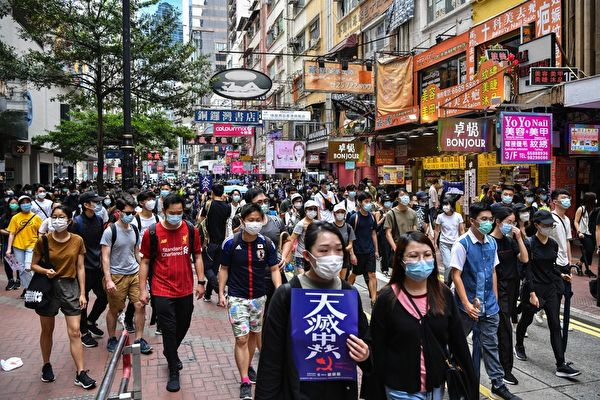
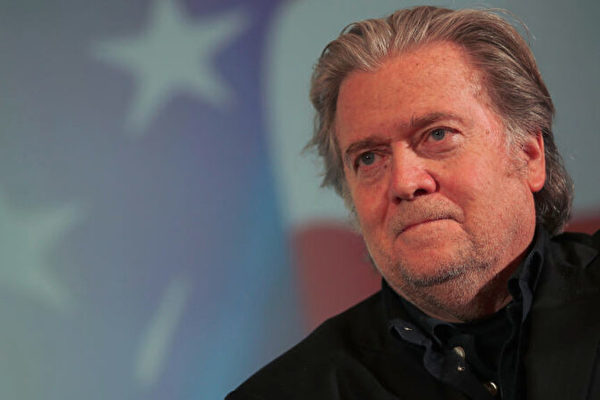

<h3><a target="_blank" href="https://bit.ly/3asSXIA">请多传破网软件，使更多的人了解真相从而得救，这是给自己积福德。 https://bit.ly/3asSXIA </h3></a>

   

     
<h3 align="center"><b>免翻视频  https://bit.ly/3ezRQKo  (请收藏网址 https://git.io/swspip)</b></h3> 

<h3 align="center"><b>复制网址到谷歌或火狐浏览器打开。若出现 “提示” ，請点击“继续”访问即可。</b></h3> 

<h3 align=center><a href="https://github.com/gav01/Heart/blob/master/news1.md">● 看更多大紀元時事 ●</a></h3>

<a href=https://git.io/souye><h6 align="right">回首頁</h6></a>

<a name=top>

<a href =#6>6.程晓容：中共绑架中国人 强推港版国安法 
<a href =#5>5.千载云：美国总统讲话 “四大招”剑指中共 
<a href =#4>4.中共利用美非裔之死抹黑美国 蓬佩奥回应 
<a href =#3>3.【世事关心】班农：暴政即将崩溃 
<a href =#2>2.成龙挺港版国安法 联署声明惊现死者名字 
<a href =#1>1.微博疯传美国暴动照现中共党旗 造假被拆穿 

<a name=6>
<h1 align="center"><b>程晓容：中共绑架中国人 强推港版国安法</b></h1>

5月24日，上万香港人走上街头，举行反对“香港版国安法”大游行。(ANTHONY WALLACE/AFP via Getty Images)

   
  【大纪元2020年06月01日讯】近日，中共党媒连续发文撑港版《国安法》，称“这是香港广大民众的根本利益之所在”，“中国人民不吃美国那一套”，“香港是中国的香港，是包括750万香港同胞在内的14亿中国人民的香港。”

日前，加拿大华人微信群里，流出一封“全加华人联会（安大略区）”支持中共在香港实施国安法的信件，日期是5月25日。信中称，“我们海外华人坚决支持……”一位网民不买账，在信上盖字注明：“警告！勿代表我真华裔加拿大人”。

71年来，中共习惯性地以“人民”为招牌，掩盖它的一次次罪行和恶意企图。大陆民众、香港民众以及海外华人，都是中共欺骗的对象和利用的工具。中共绑架人民，玷污真正的爱国情。

<b>中共能代表14亿人民？</b>

5月28日，中共总理李克强在两会记者会上披露，6亿中国人的月收入只有一千元，“1000元在一个中等城市，可能租房都困难”。一位大陆网民痛心地说，这6亿人才是中共的基本盘！

勤劳的中国人民创造了巨大的财富，支撑起了一个制造业大国。中共骗取各阶层人民的信任，夺取政权后，持续地压榨和迫害国民。它知道，只有打着“人民”的旗号，才能继续行骗，才能不断地侵吞民脂民膏，壮大和保全它自己。

2007年9月10日，维权律师腾彪和人权活动家胡佳发表了《奥运前的中国真相》，文中写道：“你们将看到摩天大楼、宽敞的街道、现代化的体育场馆和热情的市民……你们或许不知道，能够看到的这些鲜花、微笑、和谐与繁荣，正是建立在冤屈、泪水、囚禁、酷刑和鲜血的基础之上的。”

“人民”的定义随着中共的需要而变化。所谓的“人民代表”代表的是权贵集团，为党的利益举手、表决。当中共恶行败露，受到外界谴责时，它便以“伤害了14亿人民的感情”来挡箭，煽动民族主义和仇外情绪。

去年“反送中”运动爆发后，许多大陆网民没有听信中共的谎言，在“墙内”援港，他们写下了：“支持香港人民正义抗争”“你们的坚持令人感动！”“香港人会赢，他们不是废青，他们是无私的勇士，没人可以让自由的人下跪”。

“中国人民”包括了谁？是那些住豪宅、开豪车，把财产和全家移到美国去了的官员，还是涌到美国驻华使馆微博、请求川普总统“解放”的网民，到处被截访的访民，饱受打压的维权人士，数千万因坚守信仰而被迫害的法轮功学员，还是毒奶粉、毒疫苗的受害者，还是染疫后被医院拒之门外、凄惨离世的武汉人？千千万万中国人的权利被剥夺，他们的呼声被漠视，中共凭什么代表中国人？

<b>中共能代表香港民众？</b>

港版国安法针对四类所谓罪名：“分裂国家”、“颠覆国家政权”、“组织实施恐怖活动”和“外国和境外势力干预香港特别行政区事务”。中共绕过香港的司法程序，直接立法，而且今后可在香港设国安机构，对抗议人士大打出手。

众所周知，大批大陆的正义之士被以“颠覆国家政权罪”非法抓捕和判刑。中共企图在香港如法炮制，是以维护国安为名，行镇压自由之实。

自去年6月之今，至少2百万香港市民反对中共破坏“一国两制”。从小学生到八旬老者，抗议者来自政治、教育、法律、医疗、航空、宗教、金融等多个领域。他们冒着生命危险，上街抗议。

去年8月18日，12岁的林同学在维园对大纪元记者说，他走出来，是因为他也是香港的一分子：“我不想长大后，因为如果讲了一句话，就马上被人抓走。同时是为了自己和其他小朋友的将来。”

一位大陆网民质问中共：“香港200万市民的游行，你采纳他们的意见了没有？没有就扣港独、暴乱的帽子。”

5月28日，美国国务院东亚和太平洋事务局发表2020年度香港政策法报告。报告写道：“千百万香港人民抗议这些侵犯其人权和基本自由的行为，抗议中国（中共）背叛了自己对香港的承诺。香港政府没有听取他们的不满和寻求民主解决方案，而是部署了催泪瓦斯，并大规模逮捕了包括和平示威者在内的人。”

中共颠倒黑白，它把维护自由的香港人污蔑为“暴徒”，把镇压“反送中”等同于“爱国爱港”。目前，党媒又偷换概念，将美国对中共的制裁称作“制裁香港”。中共清楚，它如果不混淆视听，不打着“爱港”的幌子，它一天都混不下去。事实上，中共才是乱港的主犯和祸根。

<b>中共能代表海外华人？</b>

去年，亚洲、欧洲、北美60多个城市的华人发起了多次声援“反送中”的游行和集会，喊出了“香港加油”，“香港不孤单”的口号。这些震撼人心的场景全部被中共媒体封杀。中共驻外使领馆调动亲共侨团，组织人马唱对台戏，以其反对的声音代表“海外华人”。
2019年9月28日，数千人在伦敦参加了反对中共、争取香港自由的游行。（晏甯／大纪元）

中共长年在海外渗透，侨界和华语传媒是它的主攻方向。绝大多数华语报刊被中共收买或渗透，主动过滤中共要掩盖和不喜欢的新闻。许多华人商会和同乡会沦为中共的政治工具和代理人，例如纽约的美东华人社团联合总会、温州同乡会、福州同乡会、上海同乡会等等。这些团体听命于中共，借“海外华人”的身份为它摇旗呐喊。

另一方面，真正爱国、坚守良知的华人、华人社团、华语媒体却受到中共的打压及亲共团体的骚扰，甚至暴力威胁。

中共对海外华人输出大量洗脑谎言宣传，利用故土情结来搞统战，渲染“祖国”的“强大”。对于大陆的官场腐败、环境污染、法治不公、人权迫害等乱象，亲共媒体却避而不谈，反而指责“外国势力”“干涉内政”。

据大纪元报导，5月22日，纽约《星岛日报》头条新闻是“中国人大常委会出手将订立‘港区国安法’”，其中一版刊登了该报老板何柱国的文章“理所当然”，何高调挺共，撑恶法。这种扬恶抑善、扭曲事实的立场不仅误导广大美国读者，而且还会被中共当作“海外华媒”的消息内销回国，再欺骗国内民众。

<b>识破中共骗局</b>

每一次，当中共陷于被动时，它便搬出“人民”来说事儿，企图将它的谎言正常化、丑行合理化。它只关心它的政权，根本不在乎人民的利益和生死。中共的“我是护旗手”运动，还有“爱国爱港”口号，都是“爱党”的同义词。它要人们维护的，是玩弄人民、随时向人民举起屠刀的一杆旗。

从土改、反右、文革到“六四”，从迫害法轮功到镇压“反送中”，再到隐瞒疫情和强推港版《国安法》，中共的倒行逆施给大陆人民带来了深重的灾难，摧毁了香港的自由与繁荣，也给海外华人带来耻辱和阴影。

中共不等于中国人民。大陆、香港民众以及海外华人都应当识破中共的“人民”骗局，拒绝它的邪恶“代表”。 

<a target="_blank" href=#top><h6 align="right">回上方</h6></a>

<a name=5>
<h1 align="center"><b>千载云：美国总统讲话 “四大招”剑指中共</b></h1>

图为川普（特朗普）周五（5月29日）在白宫发表中国问题讲话。(MANDEL NGAN / AFP)

   
 【大纪元2020年06月01日讯】今天早上，在网上看了川普（特朗普）总统上周五（5月29日）讲话的中文版，所有内容都是针对中共的，如同向中共挥出的四把利剑，包括调查中国在美国的上市公司，封堵在美国的间谍人员，终止和世卫组织的关系，废除香港的特殊地位。
 
<b>（一）终止和世卫组织的关系，让中共和“世卫”玩二人转去</b>

新冠疫情发生后，世卫组织和中共“合作”得很好，刻意隐瞒疫情，致使首发于武汉的疫情扩大，随之传染美国，传染世界，蔓延成国际性灾难，造成不可估量的损失。

这也是世界一些国家要向中共索要巨额赔偿的缘由吧。

川普总统是个性鲜明的人，给你“世卫”改革方案你拒绝，既然“道不同不相为谋”，干脆终止关系，不和你玩了，也玩不起！

美国每年提供给世卫的经费4.5亿美元，中共是4000美元，只是美国经费的10%不到，世卫组织受中共控制，共同隐瞒疫情，造成国际性大灾难。中共的“公关”还是蛮厉害啊，把谭德赛侍侯得那么好，那就让中共和“世卫”玩二人转去吧。

<b>（二）封堵中共间谍人员，保护知识产权和美国安全</b>

大家可能知道，近20年来中共的间谍网撒得特别大，收买和利用各种各样身份的人，如使馆工作人员，“千人计划”高科技人才，孔子学院师生，大学留学生和社区华人……对民主国家，特别是美国、加拿大、澳大利亚、台湾进行渗透，拉帮结派，输出中共意识形态，收集情报，盗取知识产权，行为十分猖獗。这也让一些国家警醒，纷纷拿出了相应的反制措施。

一些中国留学生可能涉及到军事院校和军方关系，为确保美国的重要大学、企业等的经济和军事安全，将禁止相关中国留学生入境美国，切断他们的间谍之路，以免坑害了这些年轻人，确保美国的安全不受侵害。

<b>（三）调查中国在美的上市公司，确保投资人利益</b>

这是在金融方面，特朗普提出针对中共的措施，以防中国企业在美上市受中共暗中操纵，扰乱美国市场，以规范市场行为，保障投资者利益。

当然也有是中国企业的个人行为，这些企业受中共流氓习气薰染，长于弄虚作假，投机取巧，坑害投资人。

正如有的网友说：“曾有外国人说要防范中国的公司，就像防新冠病毒（中共病毒），听到这样的话，心里真不舒服，但又无力反驳。”

大家知道瑞幸咖啡造假事件吧，这家咖啡公司造假几十个亿，骗了美国的监管部门，也骗了全球投资人。

由此特朗普指示美国金融市场工作小组，采取美国的会计和审计标准，审查在美上市的所有中国公司的行为，以保障投资者利益，剪除祸患，平息市场风险。

<b>（四）废除香港的特殊地位，制裁中共作恶官员</b>

这一招主要针对中共在“两会”上决定强推“港版国安法”的。同时川普语言中充满对港人自由和安全的特别关切，并提出对香港未来的美好期待。

当看到美国废除香港的特殊地位后，网友们议论纷纷。有网友感叹道：“建成一个国际金融中心城市多么不易，可毁掉它只要一天！”“得天独厚的优势就这么完了！”“香港的陨落，是整个中华民族的悲剧！”

从本月24日起，因中共拟强推这一恶法又一次激怒港人，引发了大规模的示威游行，而中共依然打压，依然抓捕，毫不手软，连十几岁的中学生也不放过，还发生过一群警察追捕三位女生，将三人抓住后塞进警车的事件。

没有“国安法”，几十年间港人过得不是很安定很平和吗！一下子怎么涌出这么多“暴徒”？是暴政催生的吧！

“港版国安法”，中共家奴吹它是“定海神针”，其实是“镇压利器”，一旦施行，港人再无自由可言，人权将受到极大的侵害，这是港人不能接受的。“一国两制”变成“一国一制”，中共专制集团就是为了严控香港，“什么‘港人治港’，什么‘一国两制’50年不变”的承诺都被雨打风吹去，这种背信弃义的做法当然会激怒港人，并遭到国际社会的谴责和反弹。

恶法执行之日，也是中共屑小们得势之时，贪赃枉法，栽赃陷害，什么伤天害理的事做不出来？利欲小人得志，一个法治的香港、一个自由的香港、一个美丽的香港将不复存在。

废除香港特殊地位，当然还有相生相伴的制裁措施，最有看点的则是制裁中共的相关官员并冻结他们的财产，这一点不仅国内民众欢迎，就连五毛们也无话可说。

废止香港特殊地位这一招，表明特朗普及其代表的美国，对中共一意孤行打压香港并制度化的极度不满，是美国对中共倒行逆施的反制和打击。这把利剑挥向中共，有多大的杀伤力，是伤筋还是动骨，是断手还是封喉，我们试目以待。  

<a target="_blank" href=#top><h6 align="right">回上方</h6></a>

<a name=4>
<h1 align="center"><b>中共利用美非裔之死抹黑美国 蓬佩奥回应</b></h1>

周日（5月31日），美国国务卿蓬佩奥再次提到中共进行虚假信息宣传，目的是转移视线。（Samira Bouaou／大纪元）

【大纪元2020年06月01日讯】（大纪元记者夏雨综合报导）周日（5月31日），美国国务卿蓬佩奥在接受福克斯新闻采访时，再次提到中共进行虚假信息宣传，目的是转移视线。他还对中共利用明州非裔之死，以及美国各地抗议活动，抹黑美国和香港民主运动，进行了回应。

周日，蓬佩奥在福克斯新闻（Fox News）“Sunday Morning Futures”节目上接受玛丽亚‧巴蒂罗莫（Maria Bartiromo）采访。

巴蒂罗莫问道，2015年蓬佩奥谈到中共盗窃知识产权，2012年谈到中共黑客攻击，中共目前有何变化？

蓬佩奥回答说，中国共产党变得更加激进。这个问题已经存在很长时间了，可以肯定追溯到2012年。但是它们变得更具侵略性。

他说：“它们（中共）在进行虚假宣传活动方面变得更加积极，就像我们看到的那样，当冠状病毒（中共病毒）在世界各地传播，它们关闭了自己的省份（湖北），却允许（武汉人）在世界各地旅行时，从而感染了成千上万的人。”

“我们看到中共虚假信息运动是试图转移注意力。”蓬佩奥总结说。

<b>中共抹黑美国和香港民主运动 控制国内言论自由</b>

巴蒂罗莫接着问道，是否中共利用目前的机会，无论是美国的骚乱（因非裔死亡导致的全美多地暴力抗议活动），还是当前世界忙于对抗COVID-19的局面，中共是否以此为契机进行领土扩张？她还提到中印边界冲突，中共在南中国海的军事化等。

蓬佩奥说：“中国共产党在该野心上努力很长时间了。它们肯定会在实地利用机会。但是，你发现的每个问题都存在威胁，威胁已经存在很长时间。第一次，我们有一个（川普）政府准备好回应（中共）说，这是不可接受的，并采取有针对性的、适当的回应，反映出我们保护美国人民免受中国共产党行为（威胁）的认真态度。”

国务卿还表示，针对现在发生的事情（指美国各地抗议事件），它们（中共）正对美国城市发生的事情进行虚假宣传，且将其等同于香港正在发生的事情。但这些完全不同的（事件）。

“我们有法治。我们全国各地都有得体的美国人，他们为所发生的事情感到困扰，他们有机会就此事发表言论。在中国内部，这些（自由言论）都不存在。中国共产党阻止了这种言论自由。结果，这给美国带来的风险是真实的，我们将做出回应。”

<b>针对暴力抗议 美国各级政府反应迅速保护人民</b>

一名非裔男子25日被警员制服期间死亡，明州爆发示威和暴力冲突，并席卷到全美各地。死者是46岁的乔治‧弗洛伊德（George Floyd），有影片显示他趴在地上，被一名白人警员用膝部压颈，难以呼吸。

随后明州开除四名涉事警员，压住弗洛伊德的警员德雷克‧肖文（Derek Chauvin）被控三级谋杀罪，并将于下周一（6月1日）首次出庭。

在周日接受主持人提问前，蓬佩奥就表示：“我首先向受到这次暴动和暴力影响的弗洛伊德先生的家人和所有人民表示我的哀悼。这样不好。这是一个悲剧。警察在那里的行为令人憎恶。”

他说，到目前为止，政府已经采取了非常迅速行动。你已经看到川普总统的讲话，看到司法部长在谈论司法部的工作，以及司法部对调查那里发生的事件，以及当局迅速对这次事件进行回应。

蓬佩奥提到川普的话“这种暴力，抢劫，暴动是不可接受的”。他表示，总统还提供了可能需要的任何联邦援助，包括国防部长埃斯珀与州长的对话；如果有必要，为保护和平示威者，以及受到类似Antifa暴力示威者影响的所有社区的人们提供援助，以保护美国人民。

<b>诽谤美国 占不到便宜</b>

周日，美国国家安全顾问奥布莱恩（Robert O’Brien）在美国广播公司“本周”节目上，列举中国（中共）、俄罗斯、津巴布韦和伊朗等四个国家，这些国家由于弗洛伊德的死和随后的暴力示威活动而抹黑美国，这些抹黑都是在冠状病毒（中共病毒）大流行和及其造成的经济动荡中出现的。

但奥布莱恩说，和平抗议仍然是美国民主原则的基石，美国不像独裁国家那样，警察经常逮捕甚至是非暴力的反政府示威者。

他说：“这就是美国与其它国家不同的地方。”

奥布莱恩说，对美国进行诽谤的其它国家“是不会占到我们便宜的。我们与和平抗议者站在一起。我们希望和平抗议者能够向他们的国家请愿。”

<a target="_blank" href=#top><h6 align="right">回上方</h6></a>

<a name=3>
<h1 align="center"><b>【世事关心】班农：暴政即将崩溃</b></h1>

美国前白宫首席策略长班农（Steve Bannon）。(Sean Gallup/Getty Images)

   
   【大纪元2020年05月30日讯】中共官媒首先攻击了麦克‧蓬佩奥。然后把矛头指向史蒂夫‧班农。据说班农会见了武汉P4实验室一名叛逃的科学家，这与这件事有什么关系吗？

新唐人《世事关心》主持人萧茗（Host/Simone Gao）:“为什么是现在？为什么他们现在针对您？”

史蒂夫·班农（瘟疫作战室主持人）：“我认为他们现在向我放话的原因是，我一直在媒体上发声。”

萧茗（Host/Simone Gao）:“据说班农会见了武汉P4实验室一名叛逃的科学家。这与这件事有什么关系吗？”

史蒂夫‧班农（瘟疫作战室主持人）：“但是，我想告诉你，中共有很多好人对中共隐瞒疫情感到愤怒。并希望成为吹哨人运动的一部分。”

萧茗（Host/Simone Gao）:“您能否多少确认一下是否真有一位从武汉病毒研究所出来的科学家？有这么一个人来了美国？”

史蒂夫·班农（瘟疫作战室主持人）：“我要对你们说，你们到时候会看到的。”

风暴即将到来吗？北京隐瞒了疫情，国际社会的反击力度是否会达到六四屠杀后的水平。在这个紧要关头，我与“瘟疫作战室”的主持人史蒂夫‧班农进行了讨论。

<b>央视为何攻击班农？</b>

萧茗（Host/Simone Gao）:“班农先生，非常感谢您今天和我们在一起。”

史蒂夫·班农（瘟疫作战室主持人）：“谢谢你，萧茗”

萧茗（Host/Simone Gao）:“中央电视台（CCTV）昨天播出了一个对您进行攻击和谩骂的节目，称您为极右派人士。是一个胡言乱语、顽固、没有道德的反华分子。您要回应这些谩骂吗？”

史蒂夫‧班农（瘟疫作战室主持人）：“当然，这表示我们的节目开始起到了作用。我们向中国人民和世界各地人民控诉中国共产党罪行的努力开始起到了作用。

“中国共产党非常紧张。他们担心什么？他们担心世界上的自由人民，将与中国的老百姓携起手来，并让中国共产党对它们所犯下的、引发这一场大瘟疫的罪行负责。”

萧茗（Host/Simone Gao）:“为什么是现在呢？它们为什么现在以您为目标？他们想达到什么目的？”

史蒂夫‧班农（瘟疫作战室主持人）：“我认为它们现在瞄准我的原因，是我一直在媒体上发声，我有一个名为‘瘟疫作战室’的节目，这个节目在美国乃至全世界都有大量观众。记住因为有GTV和郭的新闻，而且当我们在《大纪元时报》做特别节目时，是用中文字幕的，我们穿越防火墙进入VPN，实际上将真相传给了中国人民。

“因此中国共产党非常担心美国人民的觉醒，欧洲人民在觉醒，全世界的人民，特别是中国人民正在觉醒，中国的公民们明白，他们在世界各地拥有兄弟姊妹支持他们争取自由的努力。”

<b>“我一直都受到中共的威胁”</b>

萧茗（Host/Simone Gao）:“中共有对您进行死亡威胁吗？”

史蒂夫·班农（瘟疫作战室主持人）：“我一直都受到中共的威胁。这就是我有保镳的原因之一。我一直都受到来自中共的威胁。我不知道是否是中共官员，但至少他们表示是来自中国大陆的人。中共的威胁我不担心，事实上让我更有力量。因为我知道我们有产生作用，习应该害怕、王岐山应该害怕、共产党它应该害怕。因为它们天数有限。”

萧茗（Host/Simone Gao）:“在中央电视台发表的批判文章的结尾，它提出了一些问题，我来引用一下它们的话，‘美国于2月6日首次有人死于COVIC-19，该人没有中国旅行史，美国到底是什么时候首次发现被感染的患者的？’这就是他们的问题。另一个问题是为什么美国歧视和禁止与疾病作战的人们的声音。最后，加拿大媒体报导说他们的早期病例来自美国而不是中国。美国对此有何解释？它们想做什么？”

史蒂夫‧班农（瘟疫作战室主持人）：“这很容易解释。央视是一个政治宣传部门，它们是中国共产党的喉舌。《环球时报》是个喉舌、《人民日报》是喉舌，所有新闻部门都是喉舌。它们是最凶残的独裁统治的宣传武器，它们就是如此，是世界历史上最嗜杀的独裁政权，它们杀害的中国人比历史上任何其它政权都要多。

包括纳粹在内、包括意大利的法西斯主义者、日本的军国主义政府、苏联、苏维埃，这是一个嗜杀的独裁政权，央视——它们的评论员以及其它所有宣传分支机构的写手都是为宣传服务，因此它们正在努力分散人们的注意力。

<b>想与美国签署贸易协议 中共隐瞒疫情</b>

我们所知道的事实是瘟疫从武汉开始，告诉我们事实的（那个人）是武汉的伟大英雄李医生。最初是在12月的最后一周，他和他的同事告诉我们，武汉发生了人与人之间的传播和社区传播。

中共知道这一点，中共应该懂得，现在中国大陆和香港的实验室内部有很多人在发声，想与吹哨人联系，有些吹哨人正在外界联系并提供详细信息。因此它们的谎言和虚假陈述将被戳穿。我们知道在武汉有人与人之间的传播，在社区传播的事实。

它们在12月的最后一周就知道了这一点，它们之所以隐瞒这些信息，主要是因为它们想在美国签署贸易协议，并且想去达沃斯，因此它们把一切保密，直到农历新年时它们才终于慌了，然后设定了旅行限制，然后（该病毒）显然在武汉爆发，因为它们没有采取适当的措施。

这就是为什么，其中最大的受害者是武汉的可怜的市民们，中共有一切机会尽早制止这种情况。实际上，我们知道英国南安普敦大学告诉我们，如果中共在12月的最后一周采取了负责任的行动，就能避免95%的死亡，95%的痛苦和苦难，95%的对经济的冲击，这机会就摆在习近平、王岐山和它们其它同伙的面前。（所以）世界将追究它们的责任，他们可以随意发脾气，也可以针对史蒂夫‧班农发表任何批评，它们可以针对与我有联系的所有人发表任何评论，它们可以针对世界上自由的声音发表任何评论，例如麦克‧蓬佩奥和其他人。

但这是徒劳的，这事会进入司法程序，它们的资产将被没收、它们的个人财产将被没收、中共的资产将被没收，最终它们将在武汉受到一次纽伦堡式的审判。因为它们给武汉人、湖北人、中国人，乃至世界其它地方的人们造成了一场生物的切尔诺贝利灾难，要有审判，它们将在纽伦堡式的审判中受审。武汉市民将代表人类对中共做出判决。”

萧茗（Host/Simone Gao）:“太好了，我认为令人惊讶的是，当所有这些信息都被披露出来时，它们仍在努力宣扬这种说法，说美国是该病毒的起源，病毒它不是来自中国，而是来自美国。”

史蒂夫‧班农（瘟疫作战室主持人）：“听着萧茗，它们正惊慌失措，它们正在竭尽全力求援。它们明白世界上每个人都知道这是个笑话，它们确实明白，记住所有的情报机构、所有的公共卫生（组织），从世界卫生组织到加拿大国立卫生研究院、英国国家卫生局、澳大利亚国立卫生研究院和美国疾病预防控制中心，大家都在调查，一切都指向武汉，这一切都指向了中共的无能和腐败。

该政权立即采取行动维护自己对人民的控制，这就是为什么当所有事实都被揭示出来时，它们将首先受到中国人民，其次是美国人民，再其次是世界人民的谴责。”

<b>美国会制裁：中共官员在美资产</b>

萧茗（Host/Simone Gao）:“您说过诉讼，我不知道这些诉讼实际上会导致什么结果？我的意思是，中共实际上有可能补偿世界吗？我认为可能性很小，但是您说过，我们可以在美国没收它们的资产，还有别的办法吗？”

史蒂夫·班农（瘟疫作战室主持人）：“你错了，概率很高。首先国会，我们可以快速行动，而且现在呼声最高的办法是可以用JASTA（反恐怖主义赞助者法）来基本上没收中共的资产。就像我们在911后对沙特阿拉伯做的那样，请记住911受害者和沙特王国之间的诉讼案，案值有500亿美元。我们有权剥夺中共的主权豁免权，让州政府对它们进行追责，让个人、让联邦政府追究它们的责任，中共将为此付出数十万亿美元，它们将赔到破产为止。

不仅如此，这是对习近平和王岐山，以及所有其它黑帮分子们的警告。它们在美国、伦敦和整个西欧的所有资产都将被没收，它们不会有任何财富，它们所做的只是从中国人民那里偷的，将偷来的钱换为美元带出国，然后投资于纽约的房地产、洛杉矶的房地产、伦敦西部贝尔格莱维亚的房地产，在肯辛顿，所有这些地方，骑士桥，它们在全世界拥有所有这些房地产，曼哈顿，所有这些都将被没收。

中共隐瞒疫情，世界人民将因此而要求赔偿，坦率地说，世界人民在这里完全是无辜的，坦率地讲，我们要争取的目标之一就是确保武汉和湖北省的人民，让中国公民从中共那里获得适当的赔偿，这将使中共破产，这就是为什么它们抛出这些荒诞的东西。哦，你无法这样做，没有相应的司法体制。它们完了。”

<b>不必让中国经济崩溃 而是要中共崩溃</b>

萧茗（Host/Simone Gao）:“我们知道中美的经济有相当程度的关联，人们担忧的是，如果中国经济崩溃，是否会对美国经济产生重大影响？您对目前的经济有这个担心吗？”

史蒂夫‧班农（瘟疫作战室主持人）：“我们不必让中国的经济崩溃，我们要做的是让中共崩溃。没有哪个人，尤其是我，想让中国经济崩溃。

我们是大力支持中国人民，请记住，中国人民是地球上最体面、最勤劳的人群。当您看到华人来到施行英国普通法的香港，来到施行英国普通法的台湾或新加坡，萧茗特别是来到美国的所有您的华人同胞，他们的事业蓬勃发展、兴旺繁荣，当他们拥有法治，并有机会自由自立的时候，无论在欧洲、伦敦、美国还是香港，他们在世界各地蓬勃发展。

你看，那些华人不仅富足，他们还很幸福。为什么华人不能在中国享有富足、快乐和自由，这不太荒谬了吗？

<b>中共像对待动物一样对待中国人民</b>

这是真正的种族主义，中共是有史以来最大的种族主义组织，它们像对待动物一样对待中国人民，不允许人民自由地获取世上的信息，华人是我见过的最聪明的人群之一，看看所有我认识的在美国、香港和台湾的华人，以及我在中国大陆的所有朋友，中国人在整个世界的发展过程中都非常努力，非常博学，都在紧跟世界的动向。

但是，中共却把中国人民当作动物对待，它们甚至不让人民通过网路与世界互动，它们对待人民像对没启蒙的小孩，总说人民还没做好迎接民主的准备，你猜怎么着？

如果印度、欧洲、美国、墨西哥和巴西都具备实行民主的条件了，依我看，中国也具备实行民主的条件了，中国人民也做好了实践民主的准备，所有的悲剧、所有的痛苦、所有的死亡，所有的破坏都是由中共和习近平、王岐山及其党羽造成的，它们想怎样胡来就可以怎样胡来，它们想说什么就可以随意说，它们可以设法收买西方和在达沃斯开派对的所有“精英”，那也改变不了什么，那也没用。是全世界人民要求赔偿，它们必将面对世界人民，必须为自己的罪行和行为负责。”

萧茗（Host/Simone Gao）:“很高兴您告诉我您对中国人的感觉。我们聊了很多，您对中国人民表示了敬意，能否请您告诉我这就是中共搞不明白的地方，它们诋毁您、骂您恨中国、恨所有中国人，但是事实并不是这样，能否告诉我一些关于您自己的事？比如，您的经历中有关中国的那部分？”

<b>“我从小就对中国人和中国着迷”</b>

史蒂夫·班农（瘟疫作战室主持人）：“那是一派胡言，因为我每天都在播节目，而且有中文字幕，节目会穿过防火墙，所以中国人知道我对他们很有好感。当我加入海军的时候年纪很小，只有十几、二十岁，最向往的是去太平洋舰队服役，那样好去中国。我出生于美国东海岸诺福克这个海军城镇，但我从没有在大西洋舰队服役，一直想去太平洋，我想去太平洋的原因是想去中国，所以我被分去那儿了。”

萧茗（Host/Simone Gao）:“那您为什么想去中国呢？”

史蒂夫·班农（瘟疫作战室主持人）：“我从小就一直对中国人和中国着迷。我读了中国的所有历史，所有关于中国的书，我就是一直对亚洲、对中国感到很亲近。我小时候就仔细学过第二次世界大战、太平洋战争，一直想去第七舰队服役，这是美国一支伟大的舰队，从根本上击败了日本帝国海军，我也对日本人民有好感，所以我就是想接近所有亚洲的文化，但中国最特别。

我生命中一个非常重要的时刻是当年我们的驱逐舰靠近香港，我想是在1977年，我们第一次去香港，然后我上了岸，那真是太神奇了。所以我就是对中国人民充满了好感，感到很亲近，我热爱那里的文化，那里的社会，我一直感到很难过的是中国人民没有自由，当权者给出来的借口总是，他们还没有准备好有自由，他们没有准备好有民主。

我会说他们是我一生中遇到的最好的人之一，他们努力工作，非常重视家庭，是非常体面的人，正如我说的那样，当您看到他们在香港有民主，他们在台湾拥有民主，在新加坡他们有民主，他们在美国和英国拥有民主，而且他们发展的很好，您给中国人民法治，给他们民主，那就没有什么能阻止他们发展，这就是我们今天面临的困境，事关中国人民的自由问题，这就是全部的关键所在。”

<b>中共崩溃 中国经济不会崩溃</b>

萧茗（Host/Simone Gao）:“让我们再回到中共和中国经济。如果中共今天崩溃，您不认为中国经济会因此崩溃吗？”

史蒂夫·班农（瘟疫作战室主持人）：“中国经济绝对不会崩溃，在中国改组并成立新政府的过程中，人们可能会感到不安，像苏联解体后，东欧一些地方经历过的。但是试想一下，如果中国人民自由了，拥有民主和真正的自由，不必再面对防火墙，不必再有社会信用分数，没有人会再像李文亮医生那样，面对威吓签什么悔过书，被迫承认自己是谣言贩子。

当这一切都消失了，那该是多么伟大，经济会略有下降吗？是的，经济可能会下降，转变初始阶段不会事事完美，但是由于中共的暴政以及它们在这次瘟疫大流行中所做所为，中国的经济已经在崩溃了，中国的第一季度很糟糕，第二季度也非常糟糕，工厂没有得到支持，工人也没有安全感。

记住，在中国现在又有一波疫情，但它并没有影响到那帮北京的家伙，因为它们完全处于隔离状态，如果您去五环或六环，您就无法再回到紫禁城周围的区域，那不就是隔离吗？因为那些人要保护自己，它们知道这病毒有多致命。

<b>中国获得自由 将回归盛世</b>

因此这展示了中共领导层的虚伪，中共倒了，中国会经历一段艰难的时期吗？也许会，但是那时中国将回归盛世，因为中国获得了自由，不是吗？民主自由的原则在全世界哪里都适用，如果我们想为整个世界带来和平与繁荣，很简单，现在该让中国人民摆脱独裁统治，西方精英已经从（与独裁政府合作）中赚了钱。

他们（给中共）提供资金，他们（给中共）提供技术，现在该让这些“精英们”承担责任了。他们必须被清除到一边，只有中国人民才能解放自己，但世界各国人民必须团结起来，提供帮助和协助，帮助中国人民实现自由。”

萧茗（Host/Simone Gao）:“互联网上传说，您与来自武汉病毒学研究所的一位高级科学家会面了。您能透露一下吗？”

史蒂夫·班农（瘟疫作战室主持人）：“我不想讨论网上的传闻。但是我告诉你，中国有好多的人对已经发生的事情很愤怒，希望加入爆料者的行列，因此中国大陆的人、香港的人，以及其他知道真相的人已经在联系这些爆料人，有些人真的想把事实和真相公诸于世，让中共不能再就此疫情撒谎，因此中共该是不放心中国人民了。

因为中国人民已经厌倦了中共的谎言，厌倦了中共的残暴，厌倦了中共对待中国人民的方式，中国人民已经受够了、已经厌倦了，他们厌倦了被当作动物对待，他们已经厌倦了做世界上的二等公民。

为什么全世界的人、印度人、中东人、非洲人、欧洲人、墨西哥、巴西、南美、所有的人，美国人、加拿大人都能自由上网，自由地和世界上任何您想联系的人交谈，自由的访问网站、和人交流。

而只有中国人，就像朝鲜人，还有伊朗人也一样，被当作奴隶对待、被当作动物一样对待，他们不能有自由贸易，不能自由的交往，他们就像儿童不能自由地交换信息，但中国人民不是无知的蒙童，中国是一个古老的文明，中国人民是一群高尚的人、好人，是时候让他们重获自由了，鉴于我们在20世纪所经历的这一切，看到中国人民在21 世纪生活在极权专政之下，简直让人出奇愤怒。

如果这次瘟疫流行有什么好结果的话，可能就是中国人民获得自由，大家必须明白，如果你支持中共，那你就是种族主义者，如果你支持中共，那你就是仇外，因为你是在支持地球上最坏的人来压迫14亿中国人民，而你也要承担一份责任，支持该政权的任何人都将被追究责任。毫无疑问，中共这个政权必将崩溃，就像纳粹分子、像墨索里尼、像法西斯主义者、像苏联一样倒下，这些总是要倒台的，下一个要被踢进历史垃圾箱的就是中共。”
西方在帮助中国 中共压制信息

萧茗（Host/Simone Gao）:“我想在问一下，您能以某种方式确认一下是否真的有一个武汉病毒研究所的科学家来了美国？”

史蒂夫·班农（瘟疫作战室主持人）：“到时候你就知道了。但是我可以告诉你中国有很多很多好人对发生的事情感到愤怒。他们对中共压制信息感到愤怒，对中共销毁证据感到愤怒，对中共的所作所为感到愤怒，让他们愤怒的是中共当局任由武汉和武汉的市民被（疫情）摧毁，那里每个人病死的家庭无法哀悼死去的亲人，不能参加每年的扫墓，因为他们都不知道领回来的是不是自己家人的骨灰，而所有这一切都是北京当局强加给你的。我不回应网上流传的话，但我认为随着时间的流逝，你会看到有很多中国人讲出真相。”

萧茗（Host/Simone Gao）:“我们一直在谈中共，但现在我想谈谈美国。您知道美国疾病控中心在中国有一个分支机构，美国国立卫生研究院向武汉病毒研究所捐赠了370万美元，您认为这种合作关系的本质是什么？”

史蒂夫·班农（瘟疫作战室主持人）：“我认为在世界各地、世界卫生组织、生物医学高级研究所和发展管理局、澳大利亚国立卫生研究院，人们一直在试图提供帮助，原因是世界其它国家希望帮助中国人民，这一切都是因为他们认为这种援助将有利于中国人民，对于这个事情我们需要仔细审视。

现在人们正在调查和研究美国的这笔捐款，这笔钱是用来在中国做研究的，这是目前正在进行的全球调查的一部分，你会发现参与的还有世界卫生组织、欧洲、澳大利亚和美国的一些单位，也许还有其它的一些地方，我们会知道的，但结论是所有这些都是为了帮助中国人民，西方人长期以来一直想要了解非典（萨斯）有多严重，并确保他们能够为中国人民提供某种帮助，以确保类似非典的病毒再也不会危害中国人民。”

萧茗（Host/Simone Gao）：“那么据您了解美国的机构，比如疾病控制中心对武汉实验室的情况有多了解？”

史蒂夫·班农（瘟疫作战室主持人）：“我不知道他们是否知道什么，我们需要一段时间才能找到答案。这些捐款基本上被用来支持主要研究人员的研究，无论是来自澳大利亚国家卫生研究院的捐款，还是来自美国国家卫生研究院，或者是来自世界卫生组织的捐款，我想他们可能在香港有一个可参照的实验室来对研究工作进行监督，或者至少是做一些协调工作。

<b>中共隐瞒或销毁病毒信息 海外如何研究</b>

但很明显，所有的调查、所有的研究都将由中国科学家在武汉完成。随着时间的推移我们会看到的，人们提供资金在不同的地点进行研究，这是在全世界都通行的做法。

这就像世界卫生组织、美国国家卫生研究院、澳大利亚、法国和英国的国家卫生研究院，他们在世界各地都有拨款，但那是为了让那些国家的科学家进行他们的实验，这就是为什么我称它为生化版的切尔诺贝利，很明显中共没有进行管控，没有对武汉病毒研究所的两个实验室，P2实验室和P4实验室进行应有的监管，很显然是监管水平不达标。

我们之所以不了解具体情况的其中一个原因是人们甚至不能从武汉病毒研究所获得信息，中共控制着它，我们今天仍然无法进入那里。直到今天，我们仍不知道我们得到的是否是正确的基因组序列，我们仍不知道我们是否拿到了最初的病毒（样本），所有信息都被中共封锁了。还记得1月1日，中共在外界开始调查之前去了海鲜市场，对它进行了消毒和清洗。

他们这样做的原因是，它们想确保外界拿不到任何证据，以防有人能证明这个病毒不可能来自海鲜市场，这就是为什么它们没有把海鲜市场封起来，并确保国际调查顺利进行，以使每个人都能清楚地见证这一过程，而是立即对它进行了消毒和清洗来隐藏它们对罪行，就像它们所有的论文一样，一切都是从提供信息的第一阶段开始的，它们停止了所有这些，它们销毁了信息，这就是它们管理武汉的方式，这就是它们运作武汉实验室和其它实验室的方式。

我认为随着时间的推移人们会发现，它们在那里做的实验是在缺乏监督的情况下做的，这和切尔诺贝利的情况非常相似，还记得切尔诺贝利事件发生的原因吗？原因是他们在反应堆上做了一个实验，他们在训练不足、准备不到位，也没有监督的情况下做的这个实验。这导致了反应堆的熔毁。莫斯科的苏联共产党又是如何应对的，他们首先试图防止任何信息泄露出去，因为它们自知有罪，因为它们没有有效地管理这件事。

同样的事情也发生在武汉，这就是它们为什么恨我的原因，因为我说这是一场生化版的切尔诺贝利事件，它们也明白切尔诺贝利事件是最终导致苏联政权崩溃和被推翻的原因之一，它们知道这将导致今天的北京政权被推翻，但是这将会有一个圆满的结局，这个圆满的结局就是中共的倒台和中国人民迎来自由。”

萧茗（Host/Simone Gao）:“非常感谢您，班农先生。您自己多保重。”

史蒂夫·班农（瘟疫作战室主持人）：“谢谢你，萧茗！非常感谢。谢谢《大纪元》的工作人员。我真的很荣幸能受邀。”

新唐人《世事关心》制作组

<a target="_blank" href=#top><h6 align="right">回上方</h6></a>

<a name=2>
<h1 align="center"><b>成龙挺港版国安法 联署声明惊现死者名字</b></h1>

成龙资料照。（黄宗茂/大纪元）

【大纪元2020年06月01日讯】（大纪元记者佟亦加综合报导）中共强推“港版国安法”，引发许多港人抗议和全球多国反制。不过，5月29日，一份号称包括成龙等2605名文化演艺界人士挺恶法的名单在网络流传。而遭打脸的是，这份“联署声明”中不仅有活人被“替身”签名，而且也有死者的名字惊现其中。

据香港《苹果日报》报导，中共一意孤行，已授权全国人大通过了“港版国安法”草案。这就意味着，“一国两制”已死，香港的自由、民主、法治尽失。不仅许多港人走上街头抗议，而且香港艺术发展局委员填词人周博贤、歌手黄耀明、何韵诗、导演舒琪、作家邓小桦等，联同各艺文团体共逾千人，在网上发起联署声明，并举行记者会，对恶法深表震惊、忧虑和愤怒，强烈反对通过法例。

与此同时，也有人以香港文化演艺界的名义挺“港版国安法”。29日，网络流出一份由成龙、谭咏麟、曾志伟、惠英红、莫华伦、杨受成、向华强、陈小春等2,605名文化演艺界人士以及110个团体发表的共同联署声明，声称“充分理解维护国家安全对香港至关重要，支持全国人大就香港国安立法所作的决定”。

而这份包括成龙的“2,605名”的名单流出后，不仅陆续有名单中的人士表示仅“同名同姓”，而且有网友发现其中惊现死者的名字。因此，该名单被质疑有“严重水分”。

有细心的网民留意到，台湾艺人徐熙媛（大S）的名字也“赫然”出现在名单中，于是有网民质疑：“香港关你台湾人什么事？”对此，大S回复台湾《苹果新闻网》时表示：“同名同姓吧！我目前只全心准备女儿升学事宜。”

前新闻主播张宝华也“榜上有名”，她随即在脸书澄清没参与联署：“呢个世界，撞样都可以，又况系撞名（这个世界，撞脸都可以，何况撞名）！”

时任香港有线电视记者的张宝华，2000年10月在北京的记者会上向中共党魁江泽民直率提问是否“钦点”董建华连任香港特别行政区行政长官，被江以“Too simple, Too naive”（太简单，太幼稚）大发雷霆和斥责。丑态百出的江，给全世界留下了流传至今的“图样图森破”的笑柄。

曾主唱《皇后大道东》的艺人蒋志光5月31日也在脸书表示，他没有声明签署任何文字，“当中同名同姓者，相信另有他人”。

有网友翻查网上资料后发现，“中国香港人民艺术协会会长、书法家”叫蒋志光，不知与联署者是否同一人。

去年去世的香港音乐人陈汝骞被联署。（网络图片）

香港一粤剧界的人士指，支持“港版国安法”联署名单上惊现“陈汝骞”的名字。据悉，陈汝骞是音乐大师，在曲艺圈服务数十载，但去年不幸离世。不少粤剧界人士对此议论纷纷：“人走了怎么签名？”“难道这也是‘同名同姓’！”

5月31日，音乐界另一位人士，钢琴手李巧灵在脸书发表声明澄清，表示自己从未签署任何支持“国安法”的文件，自己也不支持“国安法”，极度怀疑有关联署的真确性。

李巧灵受访时指，在香港音乐界没有其他人与她同名同姓，且在演艺界也未曾听到过，而她并非110个联署团体的其中一位成员，并得悉有其他人“被联署”的情况。

艺人郑敬基强烈质疑撑恶法名单的真伪，他与太太麦晓安（Angie）在其YouTube Channel上与网民讨论时透露，他曾向一好友试探性地求证对方是否“变节”真的去签了名，结果对方笑答，是被“替身”签了名。

一直支持香港民主运动的郑敬基呼吁网友：“如果不知对方是蓝丝还是黄丝，而你又很希望他是黄丝时，你就应该去问他。不要乱猜测，不要事先给他‘定罪’（如果唔知对方系蓝定黄，你好想佢系黄的话，其实你应该去问佢，就唔好喺度估佢，唔好定佢罪先）！”

由于成龙再度毫不意外地代言该项恶法，因此再度引发网民热议：“有一种死亡叫‘成龙代言’。”

今年大年三十，“中共肺炎”已经在中国大陆迅速扩散，疫情万分危急，一日紧似一日。封城后的武汉更是一片惨状，各大医院人满为患，尸体被放到了走廊，医生忙得一刻停不下来。然而，北京城里装点中共门面的央视“春晚”依旧在高调上演。

特别讽刺的是，惯于舔共的成龙在“春晚”上演唱了一首《大侠霍元甲》，其中的歌词“问我国家哪像染病”，招来网友一片骂声：“你的脑子绝对染病了！该隔离了！”“我的国家哪像染病？那是真病！”“只有精神病人才会问别人，我哪里有病？”

此前，成龙代言的产品包括汽车、洗发水、食品等等，不是出问题下架，就是以企业倒闭告终。连成龙禁毒宣传形象大使，其儿子房祖名在20​​14年8月在北京涉毒被抓，他去年刚刚代言的“香港航空”也出现了严重的财务危机。因此坊间流传：“反正成龙挺谁谁死。”

<a target="_blank" href=#top><h6 align="right">回上方</h6></a>

<a name=1>
<h1 align="center"><b>微博疯传美国暴动照现中共党旗 造假被拆穿</b></h1>

大陆新浪微博广传的图片被发现是造假照片。（新浪微博截图）

   
  【大纪元2020年06月01日讯】美国明尼苏达州非裔男子弗洛伊德（George Floyd）死亡，引发多个州接连发生暴动示威，特别是明州已出现打砸抢烧事件。近日大陆网路广传数张照片，显示示威人群中出现中共党旗等，但很快被发现这些照片都是被“移花接木”的造假照片。

大陆新浪微博广传一个帖子称：“2020年5月29日夜，明尼苏达州的德卢斯市宣布起义，成立由一个无产阶级revolution委员会领导的社会主义国家，暂定国名为美利坚社会主义联邦。该委员会号召全美国的人民拿起武器，参加这场起义。并声称资本主义已经走到了它的末日，我们将埋葬他们。据悉，一部分国民警备队已经发生哗变，加入德卢斯政府的民兵组织。而白宫对此尚未做出回应。”

上述帖子中附带几张照片，其中可见一些白人在街头打出中共的“镰刀斧头”党旗，抗议人潮中还可见“水能载舟、亦能覆舟”、“枪杆子里面出政权”等中共标语。

此信息立刻被大陆网民打脸，经查，白人手持中共党旗是发生在2018年10月的奥勒冈州，当地左翼团体安提法（Antifa）成员上街抗议；而抗议人潮中出现中文标语是今年1月间发生在美国维吉尼亚州，数千名抗议者要求当地议会拒绝限制枪支的法令。

另有大陆网军趁机在社交平台上转载与事件无关的图片，或发布“光复美国”等信息，企图煽动民众采取更激烈行动。

台湾媒体报导，大陆网军在社交平台推特（Twitter）及脸书（Facebook）上使用“光复美国”、“StandwithUSA”等字眼，微博亦疯传多张疑似示威图片。但相关图片的原发布人澄清，图片与这次事件无关。

报导说，有台湾学者认为，大陆网军的英文用词和语法较差，不足以操控英文舆论。

<h4 align=center><a href="https://twitter.com/alek000chen/status/1267338530864328706?ref_src=twsrc%5Etfw%7Ctwcamp%5Etweetembed%7Ctwterm%5E1267338530864328706&ref_url=https%3A%2F%2Fwww.epochtimes.com%2Fgb%2F20%2F6%2F1%2Fn12151785.htm">大陆网军在社交平台推特（Twitter）及脸书（Facebook）上使用“光复美国”、“StandwithUSA”等字眼，微博亦疯传多张疑似示威图片。但相关图片的原发布人澄清，图片与这次事件无关(点击右键,另存新档）</a></h4>

美国总统川普（特朗普）5月31日表示，联邦政府将宣布“Antifa”为恐怖组织。这个极左翼组织与共产主义和准马克思主义有关。

川普在另一则推文中对国民警卫队5月30日晚抵达明尼苏达州明尼阿波利斯后的出色表现表示祝贺。“Antifa领导的无政府主义者及其它（激进组织）迅速被（国民警卫队）遏止住。”川普说。

川普还在推特上谴责一些主流媒体“正在尽一切所能煽动仇恨和无政府状态”。

<a target="_blank" href=#top><h6 align="right">回上方</h6></a>
