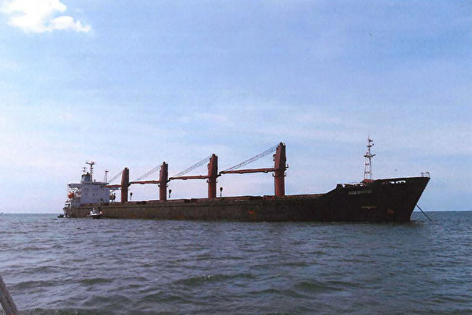
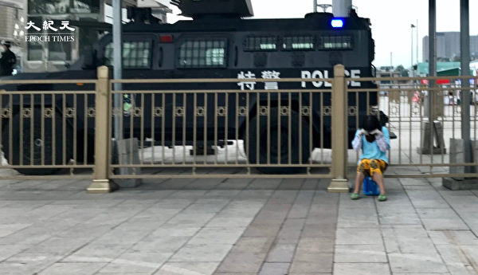
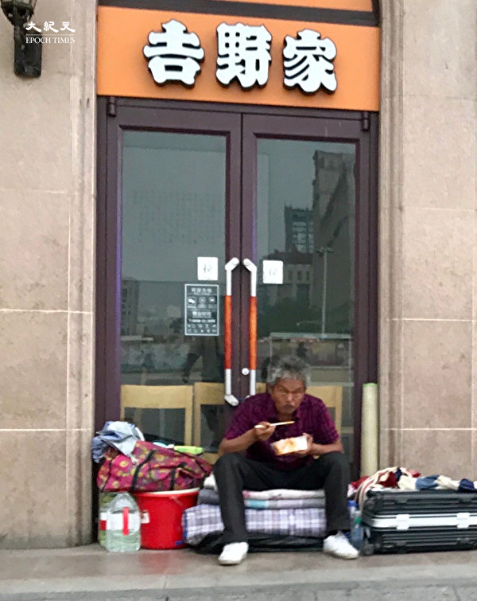
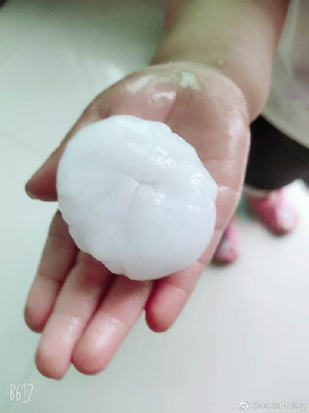
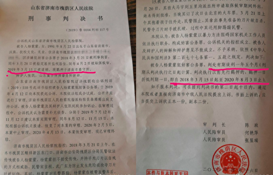
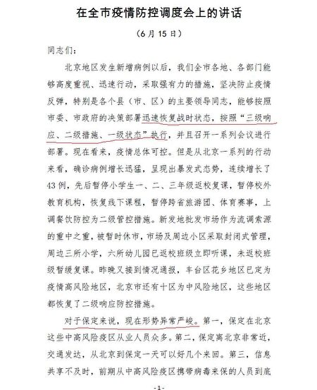

<h3><a target="_blank" href="https://bit.ly/3asSXIA">请多传破网软件，使更多的人了解真相从而得救，这是给自己积福德。 https://bit.ly/3asSXIA </h3></a>

   

     
<h3 align="center"><b>免翻视频  https://bit.ly/3ezRQKo  (请收藏网址 https://git.io/swspip)</b></h3> 

<h3 align="center"><b>复制网址到谷歌或火狐浏览器打开。若出现 “提示” ，請点击“继续”访问即可。</b></h3> 

<h3 align=center><a href="https://github.com/gav01/Heart/blob/master/news1.md">● 看更多大紀元時事 ●</a></h3>

<a href=https://git.io/souye><h6 align="right">回首頁</h6></a>

<a name=top>

<a href="https://github.com/gav01/Heart/blob/master/ls-20-6-1.md"><b>往 1 ~ 141 新闻</b></a> 

<a href =#228>228.金与正是否掌控了臭名昭著的39号室？ 
<a href =#227>227.美限制中共官员及家属签证 哪些人或受制裁 
<a href =#226>226.大陆洪灾 台商被令限期捐钱 不堪重负回台 
<a href =#225>225.中缅边境的河流突然变成红色 民众惊慌 
<a href =#224>224.成都男孩遭陌生人绑走毒打 被发现时浑身是血 
<a href =#223>223.美突下令 对福建晋华前高管等三人发逮捕令 
<a href =#222>222.30万燕郊人像蝼蚁爬向北京 文章被删 
<a href =#221>221.中共全国人大代表申纪兰病亡 
<a href =#220>220.【一线采访】疫情冲击重挫北京经济 
<a href =#219>219.组图：北京城端午节 农民工无处去 睡街上 
<a href =#218>218.端午节北京下冰雹 形状酷似中共病毒 
<a href =#217>217.刘贤斌出狱返家难 朋友前去迎接被抓 
<a href =#216>216.【内幕】莱特希泽与王岐山言论针锋相对 
<a href =#215>215.【内幕】王岐山汪洋与美方交手 铩羽而归 
<a href =#214>214.【最新疫情6·27】新病例急增 美多州暂缓重启 
<a href =#213>213.我在死囚身上剥皮──中国医师王国齐的自白 
<a href =#212>212.迫害法轮功 辽宁省政法委书记于天敏被举报 
<a href =#211>211.沈舟：美财长罕见称脱钩 与中共针锋相对 
<a href =#210>210.钟原：行踪异常 中共七常委是否有人染疫 
<a href =#209>209.吉林政协前委员获刑10年半 曾迫害法轮功 
<a href =#208>208.中共要银行让利1.5万亿 分析：经济难恢复 
<a href =#207>207.川普签总统令 暂停发放H-1B等工作签证 
<a href =#206>206.贵州接连暴雨多镇被淹 木瓜镇道路水深4米 
<a href =#205>205.大暴雨将持续5天 大陆十多省市面临威胁 
<a href =#204>204.北京搞战狼外交 中国科技公司在海外遭殃万亿美元 中共靠举债填补外汇收入 
<a href =#202>202.三峡库区水位持续上涨 已超防洪水位2米 
<a href =#201>201.佳木斯八旬老太陷冤狱 瘫痪老伴孤独离世 
<a href =#200>200.鸡粪厂建居民区 村民投诉无果 盼中共倒台 
<a href =#199>199.【一线采访】京八里庄疫情突升 传涉核二院 
<a href =#198>198.“中国制造”惊魂：五楼住户清早出门发现楼梯不见了 
<a href =#197>197.王振华猥亵幼女被轻判 背后黑幕遭官方封杀 
<a href =#196>196.从新冠疫情到经济疫情 
<a href =#195>195.重庆綦江流域将现80年来最大洪水 
<a href =#194>194.香港惊现大型条幅：中共计划暗杀黎智英！ 
<a href =#193>193.“富可敌县” 内蒙一处级官员贪腐逾1.7亿 
<a href =#192>192.安徽男子被关看守所一个月死亡 家属索赔 
<a href =#191>191.“维稳”延误 女童病亡 母被逼自残又获刑 
<a href =#190>190.程晓容：澳加两大事件 赵立坚说谎不脸红 
<a href =#189>189.中印边境冲突后 中共四大异常举动的背后 
<a href =#188>188.大陆众泰汽车亏百亿达市值两倍 工厂放假1年 
<a href =#187>187.【珍言真语】袁弓夷：美不让步 国安法加速灭共 
<a href =#186>186.北京疫情失控？湖北等5省医疗队紧急入京 
<a href =#185>185.蓬佩奥：中共遏制香港自由 美正确定责任人 
<a href =#184>184.北京疫情延烧 新增确诊者中最小的仅1岁多 
<a href =#183>183.【新闻看点】川普警告脱钩 北京疫情传习震怒 
<a href =#182>182.官媒在美注册外国代理人 泄中共大外宣机密 
<a href =#181>181.济南小区又见高空抛物 儿童车被从22楼抛下 
<a href =#180>180.山西一银行发生挤兑 公务员被要求存钱堵漏 
<a href =#1179>179.沪七旬男被忽悠 花576万元做美容 
<a href =#178>178.【珍言真语】港商觉醒 周小龙唤香港不妥协精神 
<a href =#177>177.【内幕】北京疫情再起 雄安新区心惊 
<a href =#176>176.退休司法女警崔会芳申诉 讲述法轮功美好 
<a href =#175>175.中共推港版国安法 欧洲议会促告上国际法庭 
<a href =#174>174.【一线采访】访民亲睹疫情下长安街戒严 
<a href =#173>173.美企汇回首季海外利润 达1240亿美元 
<a href =#172>172.水攻与狼牙棒 中印边境战更多细节曝光 
<a href =#171>171.【内幕】上海帮“造芯”记（下） 
<a href =#170>170.【内幕】上海帮“造芯”记（上） 
<a href =#169>169.印度军人被隆重下葬 美情报透露中方损失 
<a href =#168>168.蓬佩奥杨洁篪密会7小时 两国声明有何不同 
<a href =#167>167.家人逼迫回国 中国留学生挺身揭中共谎言 
<a href =#166>166.印度全国愤怒抗议 掀抵制中国货风潮 
<a href =#165>165.受贿超1.2亿 中共质检总局前高官被判无期 
<a href =#164>164.中印爆发50年来最严重冲突 双方声明迥异 
<a href =#163>163.中共疾控称“北京疫情已控制” 遭专家反驳 
<a href =#162>162.颠沛流离 河北法轮功学员路进友被迫害离世 
<a href =#161>161.长江流域洪灾泛滥 专家谈三峡大坝隐患 
<a href =#160>160.【独家】大连610整改 加剧迫害法轮功 
<a href =#159>159.海南最富女法官认罪 其姐庭外打媒体人被拘 
<a href =#158>158.美海关查获一批中国制假冒AirPods 
<a href =#157>157.川普：中共或故意让病毒传播 破坏全球经济 
<a href =#156>156.颠覆现代人常识的瘟疫大劫 
<a href =#155>155.【独家】卫健委秘密讲话泄中共瞒疫重点 
<a href =#154>154.北京胁迫设香港“共安法”而非“国安法” 
<a href =#153>153.中印两军黑暗中搏斗6小时 印指挥官坠峡死 
<a href =#152>152.两个家族的不同命运 
<a href =#151>151.【一线采访】遭遇洪灾 广西灾民：政府不作为 
<a href =#150>150.重庆多地成泽国 汽车如纸船般被洪水冲走 
<a href =#149>149.【最新疫情6.17】川普：世卫一直令人失望 
<a href =#148>148.法轮大法在台湾花莲的开传（上） 
<a href =#147>147.恶搞“国歌”遭抖音封杀 留学生无惧中共 
<a href =#146>146.房山学校暂停返校 河北山东至北京班线暂停 
<a href =#145>145.马化腾减持腾讯股票 四天套现42.87亿港元 
<a href =#144>144.朝鲜突然炸毁南北事务所 韩国召开紧急会议 
<a href =#143>143.传中共司法部政治部主任跳楼自杀 
<a href =#142>142.中共长臂伸入美校园 资金渗透内情被曝光 
   

<a name=228>
<h1 align="center"><b>金与正是否掌控了臭名昭著的39号室？</b></h1>

2019年10月21日，美国宣布了对违反制裁的朝鲜船只作出没收判决。 ( HO / US Attorney's Office / AFP)

   
   【大纪元2020年06月28日讯】（大纪元记者徐简综合报导）随着朝鲜领导人金正恩的妹妹金与正逐渐走向台前，外界质疑，她是否已经掌管了臭名昭著的39号办公室？

39号办公室是朝鲜在全球进行走私和非法生意的总部，它直属于朝鲜最高领导人，主要负责朝鲜在海外的地下经济活动，如贩毒、伪造货币、出口奴工、出售伪造香烟、甚至出口军火等。

简言之，39号办公室是朝鲜突破国际经济制裁，获取发展核武等资金，并未金正恩家族购买奢侈品。没有它，受到美国和联合国制裁的平壤“精英们”就在国际上寸步难行，不仅无法购买奢侈品，更没钱制造核武器了。

“您认为金在哪里得到他的干邑白兰地、奔驰和劳力士手表？”美国陆军特种部队上校、朝鲜专家戴维·麦克斯韦（David Maxwell）告诉《华盛顿邮报》， “购买这些东西的所有钱都来自39号办公室。”

39号办公室是金正恩的父亲金正日在1974年成立的，对外称是主管对外贸易的朝鲜大圣总局，由于起保密性极强，近年来外界才从脱北高官那里得知更多消息。

<b>金氏家族的私家金库</b>

一位脱北者说，朝鲜“39号办公室”是金氏家族事业，它不属于政府，也不属于国家，朝鲜最有利可图的事业和最好的企业全都隶属于“39号办公室”，无论在朝鲜的对外饭店，还是在国外工作的朝鲜劳工，只要有赚取外汇的机会，就要上缴一部分给“39号办公室”。

例如以前在朝鲜境内，由韩国营运的开成工业区，那里的朝鲜劳工只能拿到3成薪水，其余7成都上缴“39号办公室”

据信，“39号办公室”的钱财还用来笼络朝鲜高层官员，供养他们挥霍无度的生活，还有一部分资金被使用在核武与导弹的开发上。

<b>39号室掌管伪造美元和人民币</b>

自2011年起，中国境内大连、内蒙古等地公安局先后通过官方网站发布消息称：近日辖区内发现大量朝鲜版假币，并且朝鲜假币仿真度高，凭肉眼较难辨认。金正恩上台后，据悉亲自主持大量印刷假人民币。

而朝鲜制造的美元伪钞于1980年代后期开始流通，美国政府指出朝鲜制造伪钞的两大原因，其一是增加收入，其二是拖累美国经济。但是朝鲜自己矢口否认。

韩国时报（The Korea Times）报导，朝鲜印制仿真度近乎完美“超级美钞”。朝鲜研究大学的教授Yang Moo-jin说，“朝鲜很清楚美国对伪钞极为敏感，朝鲜之所以这样做的唯一的原因，就是表示他们要跟美国对抗到底。”

<a target="_blank" href=#top><h6 align="right">回上方</h6></a>

<a name=227>
<h1 align="center"><b>美限制中共官员及家属签证 哪些人或受制裁</b></h1>

图为北京的美国驻华大使馆外面。(AFP PHOTO)

   
   【大纪元2020年06月27日讯】（大纪元记者林燕综合报导）美国国务院周五（6月26日）宣布，对破坏香港高度自治和限制人权的现任及前任中共官员实施签证限制，这些官员的家庭成员也可能一并受到签证限制。有媒体传首批制裁名单不超过10人。

中共全国人大常委会将在28日再次开会审议备受争议的港版《国安法》。这是人大常委会在两会之后的第二次会议，为期三天；外界预测，这些共产党选出的立法者很有可能最终通过这项立法、并即刻生效。

根据法案草案，港版国安法允许北京在香港设立国家安全公署，同时香港政府设立国家安全委员会。外界认为，港版《国安法》若通过，意味着香港的“一国两制”框架损毁殆尽，香港将等同中国内陆城市。

5月，美国务院经评估后认定香港不再享有足够自治权，随后总统川普（特朗普）宣布，将逐渐取消美国给予香港的特惠待遇，以及采取必要步骤制裁直接和非直接损害香港自治的中港官员。

美国彭博社周五的一篇评论文章引述美国国务院官员的消息说，限制中共官员及家属签证是美国的第一步制裁，如果中共继续损害香港，后续将有更多的制裁措施。文章引述一位不具名的国务院官员的话说，这次受影响的中共官员是个位数，即不多于10人。

图为“共和党研究委员会”（the Republican Study Committee）6月10日发布的国家安全战略报告，建议制裁标红叉的中共高官，最高级别可达中共政治局常委。在香港部分，提到中共常委韩正。（RSC网站）

   
<b>哪些中共官员可能上榜</b>

外界纷纷猜测哪些中共官员会上榜。美国共和党国会议员6月初曾点名在香港问题上可能制裁的中共官员清单，最高可到政治局常委。

美国国会约150名议员组成“共和党研究委员会”（the Republican Study Committee）在6月10日发布一份国家安全战略报告，建议依据《全球马格尼茨基人权法案》采用“史上最严厉的制裁措施”，制裁侵犯香港、新疆、西藏人权的中共高层官员。

报告说，北京在香港的动作是中共惧怕自由民主的最新力证，同时这也是它与西方民主价值观的意识形态竞争时、中共看问题的角度。

“香港的危机是自由与威权主义之间抗争的分水岭”，报告说。

报告指，中共在颠覆正常社会对自由和人权的理解，中共领导人所谓的“具有中国特色的人权”实质是拒绝天赋的、不可被剥夺的人之权利。

报告提议，对涉港事务的中共官员进行制裁，点名的中共官员包括：中共政治局常委韩正、中共国务院港澳事务办公室主任夏宝龙和中共驻香港联络办公室主任骆惠宁。

报告提及，据悉韩正是中共当局在香港事务上的“尖兵”。韩正是中共政治局七常委之一，中共中央政治局是中共最高的核心权力机构。

《全球马格尼茨基人权法案》授权美国总统制裁涉及严重侵犯人权和重大腐败的个人和实体。美国2019年10月曾宣布对在新疆压制维吾尔等穆斯林少数民族的中共政府官员和其家庭成员实行签证限制。

<b>北京企图用“红线”施压美国</b>

对美国限制破坏香港自治的中共官员及家属签证，中共驻美大使馆发言人回应说，香港（相关事务）是中国内政，不允许外部势力干预。

《华尔街日报》周五报导说，16日中共中央政治局委员、中央外事工作委员会办公室主任杨洁篪与美国国务卿蓬佩奥（Mike Pompeo）在夏威夷会面，杨对美国的相关行动以及美国总统签署一项新疆人权法案——将对相关中共官员和实体进行制裁——表达“强烈不满”。

报导引述一名熟悉本次对话的中方知情人士的话说，杨重申了北京对履行贸易协定的承诺，亦强调双方必须“共同努力”。还有一名中共官员说，杨的说法意味着“美方应避免过多干预”，“不应越过红线”。

中共历来把外国政府对中共侵犯中国国内人权的批评声称为“越过红线”，而“中国内政”、“外部势力干预”、“捍卫主权”、“搞政治”等字词是中共官方最常见的搪塞语。

知情人士说，蓬佩奥没有做出任何让步。蓬佩奥在结束会谈后、次日（17日）参加哥本哈根的一个论坛时说，“我那天说的就是我今天早上在这里所说的这些。美国在对中国共产党和其侵略行为做出回应，是过去20年来美国从未做过的。这不是政治。”

蓬佩奥周四（25日）在线参加德国马歇尔基金会的布鲁塞尔论坛时更指出，对美国应该缓和与中国（中共）的紧张关系、接受日益好战中共政权的主张是不可接受的。

他说：“这是无稽之谈。我们不接受这种论点。在自由与威权之间是没有妥协的。我不希望我们的未来由中共来塑造。”

图为2020年6月5日，香港街头活动中随处可见的“天灭中共”海报。（音音／大纪元）

<b>美杀手锏立法在路上</b>

24日，美国参议院一致通过《香港自治法》（Hong Kong Autonomy Act），将制裁违反香港自治的官员或机构，以及对这些实体有业务的银行进行二级制裁。

法案的两位共同发起人马里兰州民主党参议员范霍伦（Chris Van Hollen）和宾夕法尼亚州共和党参议员图米（Pat Toomey）表示，中共强推港版国安法、进一步打击香港自治，促使国会迅速推进立法。

如果说美国务院宣布对中共官员的签证限制是向中共传达明确信息，并可能影响在美国大学就读的中共官员子女，那么国会正在推进的对中共官员的经济制裁将带来实质损害。

《香港自治法》还需要经过众议院审议，最后由总统川普签署生效。

面对中国这个世界最大专制国家日益增强的实力担忧，寻求连任的川普总统和民主党总统候选人拜登都将把对华强硬政策作为主要竞选主题，而国会两党向来对中共破坏人权都持共同的批评声。   

<a target="_blank" href=#top><h6 align="right">回上方</h6></a>

<a name=226>
<h1 align="center"><b>大陆洪灾 台商被令限期捐钱 不堪重负回台</b></h1>

大陆暴雨洪灾持续，近日有消息说，中共要求大陆的台商限期捐钱，有的台商已经因此决定离开大陆，有大陆媒体的微博也开始呼吁捐款。（微博截图）

   
 【大纪元2020年06月27日讯】（大纪元记者张玉洁综合报导）大陆暴雨洪灾持续，近日有消息说，中共正在“割韭菜”要求大陆的台商限期捐钱，有的台商因此决定离开大陆。有大陆媒体的微博也开始呼吁捐款，网友表示，捐了也到不了灾民手中。
 
 《自由时报》6月26日消息，大陆各地台商接到台商协会的通知，被要求捐款千万元人民币。有台商表示，当局要求他们必须在限期内交钱，有的还要求在月底前交钱。

但台商在疫情期间因复工困难，已经受到重创，再没有多余的钱捐款，有的台商拿不出钱，又担心当地政府不满，所以决定离开大陆回台湾。

报导引述知情人的话表示，过去台商也常被要求在台湾选举时，支持特定政治人物，捐政治献金，台商为了在当地发展，有苦难言。

有海外网友在推特留言表示，“丢到水里还有噗通一声，给中国（中共）还会嫌太少。”

近日有台湾网友在PPT提问“三峡大坝溃堤大家会捐钱吗？”，很多留言表示，捐了也到不了真正的灾民手上，“你捐100到灾民手上不知道有没有1块。”“捐了也帮不上平民，捐给中共政府养解放军扰台而已！”

此外，近日大陆媒体的微博上也出现了“点击捐助”的字样。有民众表示，又该全国大捐款了吧！又开始割“韭菜”了！政府只负责捐给非洲！

（微博截图）

   
 <h4 align=center><a href="https://twitter.com/Ewa80998656/status/1246755605081096192?ref_src=twsrc%5Etfw%7Ctwcamp%5Etweetembed%7Ctwterm%5E1246755605081096192&ref_url=https%3A%2F%2Fwww.epochtimes.com%2Fgb%2F20%2F6%2F26%2Fn12215064.htm">都是逼着捐的。我同学不是党员，单位都要求大家捐款。他捐500，算单位里面最少的。他本身是不想捐的。(点击右键,另存新档）</a></h4>
 
 <a target="_blank" href=#top><h6 align="right">回上方</h6></a>

<a name=225>
<h1 align="center"><b>中缅边境的河流突然变成红色 民众惊慌</b></h1>

中缅边境的瑞丽江河水变成红色，令当地居民惊慌。图为罗马尼亚吉亚马那（Geamana）的红色废水，与本文无关。（Shutterstock）

   
   【大纪元2020年06月28日讯】（大纪元记者陈俊村编译报导）流经中国与缅甸边境的瑞丽江（又名龙川江）日前突然变成红色，原因不明。这是历史上首次发生这种事情，令当地居民感到惊慌不安。他们怀疑这是中国工厂的污染所造成的。

据《今日东盟》（ASEAN Today）报导，瑞丽江流经缅甸的掸邦和中国的云南省。它的河水在6月10日左右变成红色，当地居民怀疑这是因为中国工厂在这条河流的上游倾倒废水。此河沿岸尽是生产糖、纸张、肉品和鱼罐头的工厂。

当地居民赛埃（Sai Aye）表示，他们从未见过瑞丽江的河水变红，这是第一次发生。他们不知道中国做了什么事。

掸邦议员赛觉登（Sai Kyaw Thein）说：“我认为中国的一家工厂将废水倾倒到这条河流中。我们已经将抗议信寄到中国云南省瑞丽市的外事部门。”

赛觉登还说，他们已经将瑞丽江的水质样本送到曼德勒（Mandalay）的一间实验室进行化验。

尽管瑞丽江变红的原因尚未查明，但这件事已经引起缅甸民众关注中共“一带一路”项目可能对环境造成的污染问题。

<h4 align=center><a href="https://twitter.com/asean_today/status/1276020991165173762">The waters of the #Shweli river in northeastern Myanmar have turned red, prompting concerns about pollution along a major corridor of China’s Belt and Road Initiative. It raises questions about accountability for cross-border developments. https://aseantoday.com/2020/06/a-rive(点击右键,另存新档）</a></h4>

缅甸的瑞丽江地区和东北边境城镇木姐（Muse）是中缅贸易的核心。而瑞丽江沿着中缅经济走廊（China-Myanmar Economic Corridor）而行，这正是“一带一路”项目的要道之一。

木姐是中缅边境贸易的主要门户之一。据官方资料显示，缅甸有大约一半的陆上边境贸易经由木姐进行，总值高达每年60亿美元左右。受到中共肺炎（武汉肺炎）疫情影响，木姐的边境贸易已经受到严格限制。

就像在很多其他地区一样，中共的“一带一路”项目在如何处理开发项目对边境的冲击问题上，已经引发争议。多年来，很多地方团体一直要求取得此类项目的更多讯息和透明度。

<a target="_blank" href=#top><h6 align="right">回上方</h6></a>

<a name=224>
<h1 align="center"><b>成都男孩遭陌生人绑走毒打 被发现时浑身是血</b></h1>

【大纪元2020年06月28日讯】6月25日，四川省成都市成华区青秀城小区内，一名男童失踪。父母调取小区的监控发现，事发当晚8点多，男童在回家乘坐电梯时被一名男子尾随，该男子将他拖到地下车库，还在电梯内对他施暴。被找到时，男童已浑身是血。

据大陆媒体报导，6月25日晚，青秀城小区内，一名男童的父母发现孩子失踪。父母联系物业调取监控后发现，晚上8点多，男童在回家乘坐电梯时被一名男子尾随，并被其拖着带入地下车库。之后，该男子又在电梯内对男童实施暴行。

经过搜寻，男童在一楼的角落被发现，当时已浑身是血。

当地警方发布通报称，受害男童为8岁的张某晨，其头部及体表多处受伤，经送医救治后无生命危险。6月26日0时许，嫌疑人张某豪（男，17岁，四川省巴中市人）被抓获。目前，张某豪已被刑事拘留，案件仍在进一步侦办中。

事发后有网民发文曝料：“被打的娃现在还在重症监护室，祈祷娃平安。行凶者的母亲已经出面在业主群内‘辩解’，声称自己的娃儿是被人威胁的。目前小区业主希望行凶者及其家人搬离小区。”

民众纷纷对此跟帖表示：“这完全是心理变态吧！看这些打人手法，就是想虐杀小娃娃。17岁了，一定要把他整起判刑才行。啥子恐吓哟，高中生了，恐吓你，你就把小娃娃往死处整？哪儿说得通嘛！”

“还在为自己儿子狡辩，17岁完全有分辨是非的能力。”

“看得人好愤怒，17岁了，找一个8岁的小朋友下狠手，真的是找软柿子捏啊？那个时候小朋友得有多绝望多难受！恶魔！”

“但凡还有点人性、第一时间应该关心现在还在医院的小朋友，而不是给她娃娃辩解！！！”

“太心疼了，那一身的血是有好痛！这个家长不去医院看受伤的娃娃，在群里面聊得多高兴。还威胁他，17岁，人高马大的，哪个能威胁？他不会反抗吗？看这个架势他战斗力不弱撒，还会有人威胁的到他？这次不让这个家庭付出代价，他们会有第二次机会伤害别的小孩。判刑！！！”

<a target="_blank" href=#top><h6 align="right">回上方</h6></a>

<a name=223>
<h1 align="center"><b>美突下令 对福建晋华前高管等三人发逮捕令</b></h1>

美国6月24日对三名涉嫌盗窃美光公司机密的台湾人发出逮捕令。（大纪元制图）

   
   【大纪元2020年06月28日讯】（大纪元记者张婷综合报导）美国芯片公司美光窃密案自2018年以来一直进展缓慢，但美国目前突然提速，旧金山联邦地方法院法官周三（6月24日）发出逮捕令，将3名涉嫌盗窃美光公司商业机密的台湾人列入通缉名单。其中一人是福建晋华的前高管。

据彭博社报导，美国这一举动引起关注，因为这三人是2018年在川普政府“中国行动”（China Initiative）方案下提起的第一起诉讼案。“中国行动”着重打击来自中共的商业机密窃取、骇客攻击与经济间谍活动。

旧金山地方法院的一名法官是在这三人未现身应讯后，发出的逮捕令。

报导称，这起针对福建晋华的官司，已阻碍北京实现大量生产芯片的抱负。此案一直进展缓慢，但突然在本周三，在一个三分钟的听证过程中，一名美国检察官申请逮捕令，并告诉法官说，在周一和被告律师会谈后，她知道被告不会在周三现身。

“他们的当事人基于不同理由，而未出庭。对每名被告发布逮捕令，是适当的行动，也是政府的要求。”助理检察官劳拉·瓦尔恩·霍恩（Laura Vartain Horn）告诉法官。

福建晋华和台湾联华电子（UMC）都没有认罪。

逮捕令针对的是陈正坤（Chen Zhengkun，也称Stephen Chen），何建廷（He Jianting，也称J.T. Ho）和王永铭（Wang Yungming）。三人都是台湾籍。法律专家曾表示，三人几乎没有什么动机会出现在美国法庭。中国大陆和台湾都未与美国签署引渡条约。

前检察官普雷斯顿·普格（Preston L. Pugh）表示，除了出庭外，美国也有追捕被指控工程师的责任。

普格说，司法部可能要求台湾把这些人引渡到美国，换取美方做出一些其它动作。

<b>三名被告都曾在美光任职</b>

美光于2017年在美国和台湾控告台湾联华电子（简称联电）以及福建晋华侵害美光商业机密，指控联电试图招揽美光台湾子公司的员工，劝诱他们窃取美光文件，而这些文件可能被用于协助福建晋华在中国发展芯片科技。

2018年11月1日，美国时任司法部长塞申斯（Jeff Sessions）宣布，控告福建晋华和联电以及3名个人，共谋窃取美光公司商业机密。美光被盗取的商业机密估计价值达87.5亿美元。

起诉书显示，被告陈正坤、何建廷和王永铭都曾在美光工作，并在加入联电时窃走美光的技术，目的是要转移给福建晋华公司。

陈正坤原本是美光公司高级主管，后来跳槽联电，接下来出任福建晋华的总经理。这对美光构成重大威胁。

福建晋华是中共政府重点扶植的记忆体制造商。起诉书显示，中共刻意取得其没有的动态随机存取记忆体（DRAM）技术，而美光是美国唯一制造DRAM的业者。美国司法部说，联电与福建晋华合伙，好让中共能够从美国盗取这种技术，用来和美国竞争，“这是厚颜无耻的阴谋”。

彭博称，从这起刑事案件来看，检察官将赢得一项命令。该命令要求，对福建晋华和联电利用窃取的美光技术所开发的芯片及带来的收入，予以没收。此外，还禁止两家公司使用美光的机密长达5年。

<b>何建廷和王永铭已被台湾一法院判刑</b>

美光在台湾的控告几周前已有了结果。台湾一法院6月12日裁定，何建廷、王永铭以及戎乐天窃取美光科技公司的商业机密，罪名成立。三人被判入狱4.5至6.5年不等，并罚款新台币400万元至600万元。

戎乐天是台湾联电的高级管理人员，调查人员到联电搜索前，戎乐天曾要求何建廷与王永铭，删除或藏匿来自美光公司的机密资料。

<a target="_blank" href=#top><h6 align="right">回上方</h6></a>

<a name=222>
<h1 align="center"><b>30万燕郊人像蝼蚁爬向北京 文章被删</b></h1>

北京疫情持续爆发，出京的检查站，4个机器，30万人一个个查，导致还没进燕郊，公交车和私家车就排起4公里的长队……（微博图片）

   
  【大纪元2020年06月26日讯】北京疫情持续爆发，官方都要求市民去做核酸检测，各个检测点大排长龙。30万的燕郊上班族，忙着预约核酸检测。之后，说北京燕郊的通勤人员只需要核查身份证就可以。于是，出京的检查站，4个机器，30万人一个个查，导致还没进燕郊，公交车和私家车就排起4公里的长队……

原文“燕郊，30万人像蝼蚁爬向北京”是由微博认证的山东省作家协会会员，儿童文学作家刘宇昕所写。目前在大陆已遭删除。有网民@老化看房已用图片的形式在微博上传了该文，并写道“但愿能有更多人看到。”​​​​

原文作者刘宇昕在微博写道：“我如果不把自己经历的事说出来，那作为一个作家，就称不起作家了，我的责任就没有了。而且最近山东的合村并居以及顶替事件，许多人发声，我相信所有发声者都是在为正义做出了自己的选择。越是不发声，胆怯，越是被欺压。”

以下是文章节选：

<b>蝼蚁</b>

又到了一年端午节，我没有回老家陪爸妈，回老家也就4个小时，而我从上班的公司，到燕郊的家，路上也花了4个小时。

我住在燕郊，像大多数人一样，我习惯了在快递地址上写上“北京东燕郊”。

燕郊不属于北京，属于河北，因为房子便宜，所以许多人选择在这里买房，租房。

燕郊距离北京不远，只隔着一座桥。而过这条500米的桥，却要50分钟。

因为不是北京，所以进京要通过一个检查站，就要查身份证，每逢有重大会议，或者事件的时候，就会因为查身份证，而让30万人隔绝在桥上。

许多人也都习惯了这种生活，有的人嫌堵，索性坐公交车到离桥最近的燕郊最后一站，下车后，走过桥，这样在桥那边坐北京的公交车，就会快很多。

不然，所有进京的车辆就会堵在路上。

这件事，大家都已经习惯，所以就没了什么怨言。不过幸好的是，出京，回燕郊的时候，不用检查，即使上班路很艰难，回家路顺畅，大家都就这样忍耐着生活下去了。

虽然生活辛苦，但是大多数生活在燕郊里的人，都不发这些辛苦的上班路的朋友圈，因为穷在闹市无人问，富在深山有远亲……大家都明白这个道理，没有谁愿意把自己蝼蚁一般的生活展示给别人看。

每逢过年回老家，别人说起：“你混的不错啊，在北京买房了。”

我们都会微笑着点头答应，“没有没有……”

心里想说，我在河北买的房，不是北京，房价连北京的一半都不到。

碍于面子，没有人解释这个房子是河北的。

<b>疫情</b>

北京的疫情来得很反复，2月份就停了跨省公交，北京往返燕郊只有一趟公交车818，疫情期间，许多公司还是正常上班的。

所以每天早上排队坐818去北京上班，就成了燕郊的风景线。

晚上下班回家，坐818回来，至少要排100多人的队伍……这些图片，我不想放出来，看到会心酸。

后来开两会的时候，818公交车出了测体温，还要一个个车检查身份证，是一个个检查，从燕郊到北京花费的上班时间，就变成了3个小时以上。

许多人选择在燕郊最后一站下车，走过那座桥，到了桥对面坐车，在燕郊里面，需要排队坐818，等到了桥对面，又要重新开始排队坐新的公交车通往北京。

检查站不查北京里面的人，就好像北京里面的人，都是安全的。

<b>出京</b>

新发地出事了！

所有出京的高速检车站，临时建起了棚子，架上了身份证扫描机子，对所有出京的人员，都需要查看核酸检测的报告，燕郊属于河北，所以进燕郊就算出京。

于是30万的燕郊上班族，就忙着预约核酸检测，核酸检测只管7天，等检测完出来报告，基本三四天过去了，也差不多到了有效期。

后来出了政策，说北京燕郊的通勤人员可以不用核酸检测，只需要核查身份证就可以。

就这样，出京的检查站，也开始查身份证了。4个机器，30万人，一个个查，导致还没进燕郊，公交车和私家车就排起4公里的长队……

所以许多人，就临时下公交，走4公里，进检查口。

密密麻麻的人群，晚上6点下班，进燕郊需要10点。

早上进京要一个个查身份证，晚上出京还是要一个个查身份证……

于是，回家就变成了艰难的事。

<b>大雨</b>

明天就是端午节了，今天回燕郊的人很多，每个人脸上是疲惫，但心里确是喜悦的，因为早上5点起床，晚上10点回家的日子，总算可以休息三天了。

我和这些人一样，我也很开心地坐上了回燕郊的公交。

今天格外堵，在没到丁各庄收费站，就开始堵车，中途，公交司机说大家着急的可以下车……

我们许多人就都下了车，回燕郊的路走了好久好久，走到检查站。

看到许多人已经在检查身份证了，而这时下起了大暴雨。

每个走得出了一身汗的人，又被浇了一身雨。

在雨水里，我们等待着交警给我们查身份证，一等就是半个小时。

雨水越下越大。丝毫没有停下的意思。

那一刻，看着走在路上的人们，我觉得每个人都像是蝼蚁，在爬行的蝼蚁。

公交车上，一个60岁的阿姨，给12345北京市长热线打电话：“我们知道疫情期间，国家不容易，我们也理解，可是你们只弄4个身份证查验的机器，让我们这些岁数大的人怎么熬，我们腿脚不好，就只能在公交车里等着，不能下车走过检查站……你们也得为我们老百姓考虑考虑不是，同志，我都在车上睡了好几觉了，现在都晚上10点半了，求求你了……”

老人，眼眶有泪。

同事有时候会问我：“你上班多长时间？”

我说3个小时……

同事说，你怎么能受得了？

我不是受不受得了的问题，我是没有钱租北京的房子，我是个穷人，再加上燕郊的房子，有房贷要还，我不能再在公司附近花上3,000多租一个小卧室了……我吃不消。

我的爸爸妈妈岁数也大了，他们需要用钱，我需要攒钱。

虽然路上3个小时，可我丝毫没有耽误，我下了许多电子书，会听听歌，看看书，尽量让自己和同事们一样，别因为上班时间长，而耽误了自己的时间。

就连下车走路，我也会安慰自己：“没事的，这漫长的路，现在走一走，以后就可以不走了。”

可是今天晚上，我还是忍不住想哭，就是大雨下来的那一刹那，我扛不住了。

我走过检查站，想找个地方避雨都没有，路上打车已经打不到了。

走了好远的路，在一个公交站等着，雨一直在下。

我被淋得打了个喷嚏，打车实在打不上，我就跑着去旁边的饺子馆点了一份饺子。

吃着热乎的饺子，竟然不争气地掉泪。

<b>人生</b>

一个人在燕郊独居，连送把伞的人都没有……不过我一直都有个信念，有个梦想，我就从来都扛着，我不怕。

可今晚，就真的扛不住了。

就像因为大雨，因为疫情，被困在路上，回来后，又担心感冒发烧，被隔离，就急忙吃药一样……

谁都是这世界上的蝼蚁，苟延残喘地活着。

我同事说，你已经很好了还有个自己的房子，像许多同事都没有房子，在北京租房子，说白了还不如你。

人生，没有可比性，都是一样为生活奔忙的人，没有谁不如谁。

最后，祝30万燕郊人，睡个安稳觉。

打开地图，检查站还是红彤彤的一片，估计有人还在路在……在路上，就能到达目的地……你说呢！# 

<a target="_blank" href=#top><h6 align="right">回上方</h6></a>

<a name=221>
<h1 align="center"><b>中共全国人大代表申纪兰病亡</b></h1>

网传申纪兰病危住院照片。（网页截图）

【大纪元2020年06月28日讯】6月28日，中共全国人大代表申纪兰去世。此前，申纪兰躺在医院病床上的照片疯传。

据澎湃新闻报导，从多个渠道获悉，申纪兰28日凌晨去世。

申纪兰是山西平顺人。

几天前，有网民发帖称，91岁的申纪兰因患胃癌，住进长治市第一人民医院。据称，申纪兰已到了胃癌晚期，因年事已高，医生不建议做手术，做保守治疗。

据中共人大网介绍，申纪兰是第一届至第十三届全国人大代表。

这意味着，从1954年任第一届中共全国人大代表开始，申纪兰就没有缺席过两会，她是唯一连任13届的中共全国人大代表。她66次赴北京开会，被外界戏称为中共全国人大名副其实的“活化石”。

中共建政70余年间制造了无数政治浩劫。66年间，申纪兰经历了包括大跃进，文革，四人帮倒台，六四事件等在内的无数次政治运动。文革打倒刘少奇、邓小平时她举手，邓小平上台她仍在台上……直到今年她还出席中共两会。

申纪兰被指称得上中共人大代表中的代表，最完美地向世界展示何谓中共人大。申纪兰当了66年的全国人大代表，没一次是选出来的，永远投赞成票。

网上广传2012年申纪兰在人大会堂前接受采访的一段视频，被问平常跟选民有交流吗？在选举的时候跟选民有交流吗？申纪兰回答，“我没有……你交流就不合适”。

申纪兰曾说，“当代表就是要听党的话，我从来没有投过反对票”，此话在社交网站上引起巨大非议，因此网民称其为“举手机器”。

申纪兰死亡的消息公开后，引发热议。有网民表示，“共产党的举手机器死了，共产党的活化石烟消云散了，共产党还能存活吗？不能！”

“她一辈子跟党走。现在她走了，希望党也跟她走吧。”

“大跃进她赞成，人民公社她赞成，文革她赞成，斗刘少奇她赞成，斗邓小平她赞成，否定文革她赞成，平反刘少奇她赞成，平反邓小平她赞成……就是没为老百姓说过一句话”。

<a target="_blank" href=#top><h6 align="right">回上方</h6></a>
  
  
<a name=220>
<h1 align="center"><b>【一线采访】疫情冲击重挫北京经济</b></h1>

受到中共病毒疫情影响，北京原本人潮熙攘的商业街门可罗雀。(WANG ZHAO/AFP via Getty Images)

   
 【大纪元2020年06月27日讯】（大纪元记者韩露、林岑心采访报导）中共病毒（武汉肺炎）重创北京，多小区实施封闭式管理、三类人（注1）不许出城，北京城近乎“封城”。记者采访北京中高风险地区的餐饮业、旅行社和快递业者，了解到这波疫情对北京造成的经济冲击，可能在短时间难以恢复。

截至6月27日，北京疫情中高风险地区共计44个，其中丰台区花乡、新村街道，大兴区西红门镇、黄村镇，海淀区永定路街道是5个高风险地区，另有39个街乡镇列为中风险地区。

<b>餐馆爆聚集性感染 多家关门歇业</b>

北京餐馆在这波疫情中受重创，多家餐馆人员因上新发地市场采购，造成一店7、8人感染的案例频传，多家餐馆爆发聚集性感染，其它未爆疫情的餐馆也主动歇业关门。

餐馆无法开业的时间越长，员工的薪资、住房、伙食等开销，对业主来说就是沉重的负担。海淀区永定路一家餐馆人员对记者说，因为附近某间超市出现确诊病例，永定路成了高风险地区，目前什么时间开业，还是未知数。

这家餐馆的员工多来自外地，“一个星期前做过核酸检测，还没出结果。”“员工现在出不了京，也不好回去（老家），回去给家里添麻烦。”“现在都在宿舍居家隔离，靠自己店里做饭，给员工送饭吃。”

海淀区永定路另一家餐馆对记者说，“疫情已经持续六个月，对经济影响肯定很大。”“线上科技公司可能还好，其它所有大、小企业都得赔本，对实体经营者影响最大。”

虽然他也有房贷和车贷要缴，但因为平时樽节支出，目前还能挺得过去，但他观察，在这波疫情中，还有许多同行将面临倒闭，“一些扩张快的、跨度大的企业，一下子断了现金流，那就惨了。”

<b>旅游业长达半年没出团 复苏遥遥无期</b>

受到中共病毒冲击长达半年的旅游业，更是遭受巨大损失。位于北京西站附近的某旅行业者告诉记者，从武汉疫情到北京疫情，已经整整半年，国内、国外旅游市场急冻，“没有出国团，也没有国内团。”

她说，“国家不允许组团出去玩，连代订机票的服务也没了。”谈起未来的规划，她说，“国家哪样都不允许，能规划什么，估计都发展不了。”

同样位于北京西站的另一家旅行业者提到，“这半年旅游肯定受到影响。”“航空公司都停了，大使馆都关闭了，怎么出去（旅游）呢？”即使国内旅游人口也锐减，“大家保命都还来不及，都减少出门，怕感染。”眼见公司业务不晓得何时可以开展，业者索性自己在家里进修、上网课。

<b>最大批发市场关闭 食材供应系统重组、成本上扬</b>

北京疫情发生的新发地市场，供应全北京80%以上的农产品，连续17年在全中国4600多家农产品批发市场中，交易量和交易额都高居第一，是中国乃至亚洲最大的农产品批发市场。

受这次疫情影响，新发地称霸17年的“一哥地位”受到重创，北京其它主要农副批发市场无不战战兢兢，针对市场商户全面进行检测，以期在近期恢复供货。

位于朝阳区的大洋路农副产品批发市场，已取消零售，以批发为主，肉类、蔬果到埠量比以往提升，进货采购的车辆皆需量测体温、排队入场；丰台区岳各庄批发市场对6000名商户及职工进行核酸检测，猪牛羊肉品、蔬菜上市量在最近一周内增加；平谷镇东寺渠农副产品批发市场25日宣布“有限复市”，先恢复蔬菜批发业务，零售和其它商品复市尚待通知。

时事评论员李林一表示，新发地批发市场因疫情关闭，对北京食材供应影响巨大，其它一些批发市场也未完全恢复，整个北京农产品物流系统被打乱，短时间要重组采购系统，成本会升高，未来一段时间也可能会反映在北京的物价上。

<b>超市力拼线上接单 但高风险街道下不了单</b>

北京各大连锁超市紧急从山东、河北等邻近省份调配肉、蛋、菜等民生物资进京，确保旗下超市供货，同时不得不推行线上交易业务。但受限于风险地区不外送，使得线上业务同样受到影响。

位于西城区宣武门外的沃尔玛超市，目前仍正常营业，营业时间没有调整。服务人员表示，目前可接受外送，“但高风险地区送不了，涉及中风险地区，第三方送货员也进不去。”

永辉超市大兴区某门店业者告诉记者，该店正常开店，测体温、扫健康码就可入店消费，“外送方面，下载永辉生活APP，线上下单，还享有折扣活动，满108元减30元。”但若遇风险地区，下不了单，也只能到门市自取。

<b>日拼50单小哥确诊 外送行业景气急缩</b>

今年2月20日，武汉疫情期间，各部门紧急通知，中低风险地区要允许快递通行，被视为给快递行业开绿灯。随着6月北京疫情再起，因居民无法出门，电商、快递、外卖行业需求原本可望增加，但随着病毒在北京十区蔓延，出入这些区域的外送人员风险性也随之提升。

一名北京朝阳小红门地区的送餐小哥，在6月1日至17日期间，平均日接50单，22日爆出确诊后，此行业的风险性，引人担忧。

北京丰台区顺丰速运某营业点人员告诉记者，目前全员都已做核酸检测，但结果还没出来。他认为，这次北京疫情对快递行业影响很大，“新发地等高风险地区已经停送，中风险地区也都不去了。”“例如你在淘宝上买东西，都选择不了，没有那个店（收件点）。”

他说，“这是生命危险，谁也不想跟生命开玩笑。”眼看收入减少，生活方面也会遇到困难，“但是大家都回不去（老家），现在不让走，都封城了。”

<b>北京为政治中心 分析：疫情影响扩及京津冀</b>

时事评论员李林一表示，疫情下的北京，虽没有像武汉大规模封城，但多小区封闭管理也接近“软封城”状态。内需、消费、人员流动皆受到打击，包括餐饮、快递、旅游、酒店等行业，受到冲击较大。现在外地人不愿意进北京，北京三类人也不让出城，即使车子到了黑龙江还被“劝返”。

李林一强调，北京是中国的政治中心，这里的经济活动停滞、交通停摆、民生物资供应出问题，都会造成很大的影响。北京还是中央部委、各省驻京办所在地，现在疫情一来，地方大员前往北京会见中央部委、参与会议的人员流动就会少得多。中共官僚体系原本效率低下，受到疫情冲击，行政效率恐更低下。

他分析，尤其这次北京列为疫情的重灾区，即使疫情控制住，当地的经济活动将有一段时间难以恢复。例如，武汉4月8日解封后，旅游直到现在都上不来。舒兰、哈尔滨曾被列为高风险地区，包含各地政府官员、一般民众都会减少前往，对那几个地方区别对待。

李林一认为，在新发地市场一开始爆发疫情时，就有很多人逃离北京，结果引发了天津和河北多人确诊。中共自2014年起推动“京津冀协同发展”、“京津冀区域一体化”，北京、天津、河北在人流物流高度整合的情况下，新发地这起中共病毒的冲击波，正影响着京津冀将近一亿多人的通勤、生活、经济、教育等各领域。总体影响恐会超乎一般人想像。

注1：北京三类人，曾去过新发地批发市场或与其相关的人员，各类农贸市场、餐饮、食堂、外卖、快递、物流等人员，中高风险街乡、医务人员、防疫一线人员和交通、商超、银行等服务领域的人员。  

<a target="_blank" href=#top><h6 align="right">回上方</h6></a>

   
<a name=219>
<h1 align="center"><b>组图：北京城端午节 农民工无处去 睡街上</b></h1>

2020年6月25日端午节，农民工睡在在北京站广场。（大纪元）

   
  【大纪元2020年06月26日讯】正逢疫情爆发之际，北京城迎来端午节。街上人很少，大部分都居家防疫，留在街面上的都是环卫工人，回不了家的农民工、外地人及拾荒者。

一位民工打算回老家过端午，来的后才知道要做核酸检测，他说，他打电话给妻子说：“我说不回吧，你非让我回，这下好了，耽误这大半天，少挣多少钱啊！”

一位民工等了4天也没出检测结果，他说：“我是自费做的，咬咬牙花了230块钱咧，以为端午能回家咧，这咋办呢？”

一女子去通辽，火车晚上10点10分才到，她上午就来了。“房子退了，我去别的地方也没地方住，街上到处是警察也不敢随便走，就在这等到晚上吧。”

一位男子核酸检测3天没有出来，他说“本来想回家过端午了，这下⋯⋯人家两天就出来，我这咋恁慢呢，我再刷新刷新，可能一会就出结果了。”

车站外，警察驱逐一位男子“还不快走”。你没结果等破天都走不了。该男子在工地大院做的，3天还没有出结果，他说，医院和街道都打不通电话，我找谁去啊。

北京站一位环卫工人给儿子打电话：“你吃粽子了没？我在这边可好了，想吃啥吃啥。”

<b>北京街头的农民工 </b>

2020年6月25日，北京街头的民工。（大纪元）

2020年6月25日，北京站一位环卫工人给儿子打电话：“你吃粽子了没？我在这边可好了，想吃啥吃啥。”（大纪元）

   
 

2020年6月25日，睡在武警车前的人。（大纪元）

  
 

2020年6月25日，广场上的端午节。（大纪元）

2020年6月25日，吃粽子的民工。（大纪元）

   
 

2020年6月25日，吃粽子。（大纪元）

    

2020年6月25日，端午节，这个孩子因为没有核酸测试无法回老家。（大纪元）

    

2020年6月25日，北京街头。（大纪元）

    
   
 <b>北京站的农民工  </b>
 

2020年6月25日，一女子在北京站特警车前哭泣。（大纪元）

    

2020年6月25日，北京站前广场。（大纪元）

    

2020年6月25日，志愿者疲惫不堪。（大纪元）

     
 

2020年6月25日，北京站的一个老人（大纪元）

  

2020年6月25日，一男子在出站口岗亭外铺上床铺准备过夜。（大纪元）

   

2020年6月25日，这个小姑娘发现已经没有回家的车了。（大纪元）

 

2020年6月25日，吉野家已经关闭，有人在门口吃饭。（大纪元）

  

2020年6月25日，准备返家但不能进展的农民工在商量怎么办。（大纪元）

   

2020年6月25日，卖破烂的生意还可以。（大纪元）

  
 

2020年6月25日，北京东站，警察查验核酸证明后才能进站。（大纪元）

 
 <a target="_blank" href=#top><h6 align="right">回上方</h6></a> 
   
 
<a name=218>
<h1 align="center"><b>端午节北京下冰雹 形状酷似中共病毒</b></h1>

6月25日，北京部分地区下起形如中共病毒的冰雹。（微博图片/大纪元合成）

   
   【大纪元2020年06月25日讯】（大纪元记者张北报导）6月25日端午节下午，北京气象局连发雷电和冰雹黄色预警，并预报局部地区将出现短时大雨和7级左右大风。下午三点后，当地民众纷纷在微博分享所拍的冰雹照片，直呼冰雹外形酷似中共病毒。

从上传的图片来看，许多冰雹的个头大如乒乓球，其中有不少外表呈刺状，和中共病毒十分相像。北京目前疫情形势严峻，大部分网友自然地将二者联系在一起。有人戏称这是“新冠冰雹”，也有人说“在天成象，落地为形”，“冰雹都带着病毒的气质”。

（微博截图/大纪元合成）

 

（微博截图/大纪元合成）

  
   
   网友“一生⋯⋯”说，“之前湖北疫情严重期间，下了冰雹，这北京最近严重又下了一场，这是要干啥，自从过了年开始，不是那个省狂风骤雨冰雹的，就是这个省的，这是要干啥呀～ 太吓人了。”

一个视频显示，虽然北京某地当时大风雨夹杂着冰雹，但是市民仍然在街上撑着伞排长队等待核酸检测。有人问，“为什么不分批通知去，一定要晒太阳，淋雨，挨冰雹才显得政府伟大？”“真的可以发号或者网上叫号小程序，完全不必受这罪”，“不怕感冒发烧吗⋯⋯”

还有网友担忧庄稼被砸坏，说“麦子应该收完了，玉米还没发芽，不过果树遭殃了”，“不想老家下冰雹，我哥的大棚刚盖好”，“2020，中国农民伯伯灾难年”。

   

（微博截图）

   
  

（微博截图）

 
   
   与此同时，有河北保定的网友表示当地也下起了他一生中从未见过的大冰雹，另有网友晒出的冰雹大如鸡蛋。#
   

（微博图片）

   
   

（微博截图）

   
<a target="_blank" href=#top><h6 align="right">回上方</h6></a>  
   
 
<a name=217>
<h1 align="center"><b>刘贤斌出狱返家难 朋友前去迎接被抓</b></h1>

中国人权活动人士、作家刘贤斌，于6月27日刑满出狱被当局劫持。左为刘贤斌，右为陈卫。（网络图片）

   
  【大纪元2020年06月27日讯】（大纪元记者洪宁采访报导）中国人权活动人士、作家刘贤斌，于6月27日刑满出狱。当天上午，数名朋友前去其家楼下迎接，遭到警察粗暴拦截，两人被带走。截至13时30分，刘贤斌仍未回到家中。

刘贤斌妻子陈明先对大纪元记者表示，她与家人急切正地盼望刘贤斌回家，此前监狱方、四川隧宁警方、派出所没有打电话通知她。

“我现在感觉很累，等了一上午也没有见到他。”“实在等不及了，我给警方打了电话，他们说5分钟就到，但等了好长时间也没到。”她说，前去迎接刘贤斌的朋友们在其家楼下遭到警察阻拦，陈卫、田辉被抓，带到哪里情况不明。

知情人提供的消息说，近几日，陈云飞及另一位南充的朋友都被警方盯梢，并威胁不得外出访友（刘贤斌）。

<h4 align=center><a href="https://twitter.com/ye_qing4/status/1276730245257678848?ref_src=twsrc%5Etfw%7Ctwcamp%5Etweetembed%7Ctwterm%5E1276730245257678848&ref_url=https%3A%2F%2Fwww.epochtimes.com%2Fgb%2F20%2F6%2F27%2Fn12215427.htm">北京時間6/27日劉賢斌出獄，中共遂寧國寶如臨大敵！派好多的走狗垃圾找茬，萬般阻撓前去見面的朋友，無恥至極！
   
那些穿紅色背心的中共走狗雜碎以及便衣，妳們都是要當砲灰的狗雜碎！(点击右键,另存新档）</a></h4>

<h4 align=center><a href="https://twitter.com/heibazahei/status/1276713229033582595?ref_src=twsrc%5Etfw%7Ctwcamp%5Etweetembed%7Ctwterm%5E1276713229033582595&ref_url=https%3A%2F%2Fwww.epochtimes.com%2Fgb%2F20%2F6%2F27%2Fn12215427.htm">派出所和身穿社区工作服的堵在楼下，与前来接刘贤斌的朋友们发生冲突，陈卫和田辉被强行带走。(点击右键,另存新档）</a></h4>

刘贤斌，别名刘陈、笔名万贤明，是中国知名的民主人士、作家，他被非法判刑3次，在监狱里度过了25年。20多年来，刘贤斌未曾与妻女一起团圆过年，更未能见到母亲最后一面。

刘贤斌于1987年考入中国人民大学，1989年积极参与了学生民主运动，中共六四屠杀后，他仍然坚持民主活动。

1991年4月15日，刘贤斌被中共北京市公安局逮捕，关押在秦城监狱。次年12月以“反革命宣传煽动罪” 判刑2年6个月，1993年10月刑满出狱。

1999年8月6日，刘贤斌又被遂宁市中级法院以“颠覆国家政权罪”判刑13年，2008年11月6日出狱。

2010年6月28日，刘贤斌再被刑拘，7月5日，被以“涉嫌煽动颠覆国家政权”的名义正式逮捕。事发后，至少有16个省市及海外的民运人士发起“我是刘贤斌”公民关注团活动，一些维权律师还自发组建法律援助团。

2011年3月25日，刘贤斌被当局以“煽动颠覆国家政权罪”判处有期徒刑10年。

此外，当天上午被带走的陈卫，也于今年2月20日出狱不久。陈卫在八九学运中，曾担任北京理工大学的学生领袖。“六四”屠杀后，他回到老家遂宁市，与刘贤斌等同学一起筹划成立地下高自联，后被关押在秦城监狱，直到1990年12月获释。1992年，陈卫在北京与胡石根等人秘密成立“中国自民党”等，再被当局判刑五年。

2011年2月20日，12月23日，陈卫遭到当局以所谓“颠覆国家政权罪”判刑9年。陈卫在庭上表示自己无罪，高喊“民主必胜，专制必亡”。

<a target="_blank" href=#top><h6 align="right">回上方</h6></a>
  
  
<a name=216>
<h4 align="center"><b>中共正失去美國（二）</b></h4>   
<h1 align="center"><b>【内幕】莱特希泽与王岐山言论针锋相对</b></h1>
<h3 align="center"><b>中共对付美国的老套路不灵了</b></h3>

中共正失去美国。(STR/AFP/Getty Images)

   
   【大纪元2020年06月26日讯】（大纪元记者古清儿报导）美政府与中共关系已经变成了对手。最新的消息是美国国务卿蓬佩奥在6月26日宣布，对破坏香港高度自治和限制人权的现任及前任中共官员实施签证限制。莱特希泽去年在与中共代表谈判时，明确表示对中共要“听其言而观其行”。

美企与中共的关系也在变差。2018年9月，美企高管们与王毅在曼哈顿的会议中，争执不断。今年，还出现没有美企为中共在贸易方面游说白宫的现象。

随着中共越来越注重投资、保护国内的重点行业，有分析认为，中共正在走向没有美企盟友的时代。

接上文:【内幕】王岐山汪洋与美方交手 铩羽而归

<b>莱特希泽的“孔子说” 与王岐山的“孙子说”针锋相对</b>

《Superpower Showdown》一书（注：此书由两名《华尔街日报》记者编著，中文名为《超级权力对决》）称，中国（中共）领导人花了很长时间才完全意识到他们的老公司盟友不再能够救他们于水火之中。

2018年5月，中共国家副主席王岐山再次邀请外企首席执行官与他会面。这次会谈的场面并不太友好。

王向企业家们讲述了中国古代军事家孙子的故事。他告诉他们：“知己知彼，百战百胜。”根据与会者的描述，王岐山还提到中国对美国的了解超过了美国对中国的了解，中国更为坚忍、而不会让步。

王岐山传达的信息是：让你们美国政府让步。

王岐山在2018年晚些时候与高管会晤时重申了让美国退缩的信息。

王抬起脚向他们展示了斯凯奇（Skechers）运动鞋，以明确表示尽管贸易战，像他这样的高级官员仍想购买美国商品。（一些高管意识到这双运动鞋是在中国和越南制造的。）

王还向沃尔玛公司首席执行官道格·麦克米伦（Doug McMillon）询问关税是否会损害美国消费者的利益。是的，他们会觉得价格上涨，麦克米伦回应。

王认同。

然后，王岐山征求通用汽车公司首席执行官玛丽·巴拉（Mary Barra）的意见。她却借此机会游说王，降低中国的贸易壁垒。

但中共遇到的美方谈判对手是莱特希泽，他并不愿意与中共随意妥协。

2019年1月30日，莱特希泽在与中共代表谈判时，澄清执法问题的重要性。莱特希泽认为，美国和中国（中共）进行了数十年的谈判，北京方面保证向美国企业完全开放市场，并减轻他们转让技术的压力。但是他认为，进展很少。双方正在谈判的协议必须要有强有力的执行支持（即关税），以确保任何承诺的兑现。

莱特希泽引用孔子《论语·公冶长》的话说：“始吾于人也，听其言而信其行；今吾于人也，听其言而观其行。”（In the past when I evaluated a person, I believed what they said. Now when I evaluate a person, I listen to them, then I see what they do。）

<b>2018年年中 美中贸易战升级</b>

王岐山的话并没有收到效果。到了2018年5、6月份，美中贸易战升级。

公开资料显示，2018年5月17日至18日，刘鹤率团和美国财政部长姆钦、商务部长罗斯和贸易代表莱特希泽等就贸易问题在华盛顿再次磋商。17日，川普在白宫椭圆形办公室会见了刘鹤。

由于川普仍对姆钦、罗斯的谈判结果不满，6月15日，美国宣布将对500亿美元的中国商品征收25%的关税。中共也很快进行报复，宣布对原产于美国的659项约500亿美元进口商品加征25%的关税。

<b>美企高管与王毅在内部会议上的争吵</b>

《华尔街日报》的记者提及，2018年9月联合国大会期间，中共外交部长王毅在曼哈顿中城的会议室会见了一批美国企业名人。

王毅将美中关系恶化的责任完全归咎于川普政府。他引用中国古代哲学家孔子的话说：“四十不惑。”王毅认为，华盛顿和北京应该共同努力，不要被美国“不断上升的负面因素”分心。

多名首席执行官接二连三否认王毅的说法，认为事实并非如此，中国（中共）有责任。时任美中贸易理事会主席的埃文·格林伯格（Evan Greenberg）首先发表讲话。格林伯格说：“过去几年缺乏有意义的改革实施，这使美国企业界深感沮丧。”他补充说：“最新的五年计划进一步质疑了改革的轨迹。”他指的是将中共的“中国制造2025”技术发展蓝图变成政府优先事项的规划文件。

其他首席执行官也支持他。Visa Inc.的首席执行官阿尔弗雷德·凯利（Alfred Kelly）说，中共再次保证向外国竞争对手开放其电子支付市场，这是北京自2001年以来就做出的承诺。

据与会人士透露，凯利说：“绝对是没进展。”

王毅在会上作了防御性的回应。王说，“我理解你们的感受。我理解这种情绪，但事实就是事实。我们刚刚开始参加马拉松比赛，在你们身后落后二十公里。”

美国企业高管厌倦了等待。两个月后，前财政部长保尔森于彭博社在新加坡举行的全球企业高管会议上讨论中国问题。

“那些最了解中国，在中国工作，在中国做生意，在中国赚钱，在过去主张（与中国）建立生产关系的人，如今怎么会在争取（与中共）更多对抗的人之中呢？”他问。

“答案在于竞争政策停滞不前，以及近二十年来的缓慢开放。这使得美国企业界沮丧且支离破碎。”

<b>美国公司对中共的态度变化</b>

美国商会（U.S.Chamber）、商业圆桌会议（Business Roundtable）和全国制造商协会（National Association of Manufacturers）这三大主要美国公司贸易团体，经过不懈的努力、花费大量财力帮助中国加入了WTO，但他们现在公开提出要求政府施压以敦促中共作出改变的议案。

2019年习近平的目标是让美国取消关税，但在该问题的决策上，美国公司对白宫的影响并不大。总统最亲密的经济助手们说，贸易是特朗普对自己的判断最有信心的问题。他们说，特朗普看待贸易和关税问题，犹如里根看待减税问题。里根确信减税是刺激经济的正确举动。而特朗普以同样的方式看待关税，他认为是经济和政治上的双赢。

中共认为美国大公司一直是向美国政府施加影响力的可靠盟友，但是现在一切都在改变。

这一次，北京“老朋友”求助时，常常感到冷漠。许多中共的做法激怒了美国企业，其中包括技术盗窃，对国有企业的巨额补贴，操纵法庭和虚假调查。他们悄悄地给予川普政府官员攻击中共经济政策所需的信息。

据报导，本来每年都或多或少有美国公司向白宫游说，以反对川普对中共的关税政策，但从今年开始，这种游说甚至都停止了。

美国商会主席威廉·扎利特（William Zarit）对端传媒说，“现在不是人们来华盛顿的好时机，因为疫情，旅行受到限制。过去每年四五月份，我们都会到华盛顿逐一拜访，但今年我们做不到了。”

扎利特表示，在中国做生意一直都很有挑战，并且棘手。“早在贸易战之前，我们就有很多问题了。很多政策变化在没有预警的情况下就发生了。党胜过法律。”

“现在，我们没有从白宫得到很多注意力。我这么说吧，美国财政部会听听我们的声音，美国国家经济委员会会或多或少听一听我们的声音。而白宫会听鹰派的声音，我会觉得总统更多听鹰派的。”扎利特说。

<b>中共急寻中间人 结果不如所愿</b>

中共在2018年再次找上了黑石集团（Blackstone Group）首席执行官苏世民（Stephen Schwarzman），要他扮演美中之间调停人的角色。

《华尔街日报》记者提到，2018年4月，习近平在参加海南岛博鳌论坛时，刘鹤在习近平的晚宴上轻拍了苏世民的背。刘鹤要苏世民向大家解释川普的贸易和政治策略，在场者包括阿里巴巴集团创始人马云和前联合国秘书长潘基文。

苏世民告诉习近平，川普不是传统的政客。他希望与中国建立良好的关系，但他将运用压力手段使你来到谈判桌前并达成协议。苏世民说：“他不会做空穴来风的威胁。”

据报导，苏世民在中国有着长期的商业利益，同时与川普有着密切的私人关系。

报导引述三位知情人士透露，尽管有人批评其中存在利益冲突，但苏世民于2018年9月初在北京度过了繁忙的一周，他试图重启川普和习近平政府之间陷入停滞的贸易谈判。

白宫曾邀请中共商务部副部长王受文于2018年9月20日访问华盛顿，为与刘鹤进行可能的后续正式谈判铺平道路。“苏世民绝对是整件事的主角，”其中一人说。“他是这一切的发起者和牵线搭桥者。这让莱特希泽震怒。”

苏世民在9月份展开的微妙外交活动还是遭遇了惨败。就在王受文启程前往华盛顿的两天前，川普宣布，将对半数中国输美产品加征惩罚性关税。王受文立即取消了他的访美计划。

熟悉苏世民其他努力的四名人士称，此事是一年多来苏世民第三次没能兑现承诺，即撮合他的北京朋友跟他的白宫朋友会面。

2017年7月，苏世民曾帮助安排川普和汪洋会面。汪洋在白宫等候之际，川普取消了那次会晤。

据两名知情人士透露，随后在2018年3月初，苏世民试图安排在华盛顿与刘鹤到椭圆形办公室会晤总统。川普拒绝会面，并在刘鹤尚还未离开华盛顿，他就宣布将对全部进口钢铝加征惩罚性关税。

《纽约时报》说，包括王沪宁、王岐山在内的几个中共高层领导人，都对川普的迅速决策和贸易威胁感到惊讶和困惑。他们似乎很迷茫，急切地在美国政坛寻找中间人。

<b>分析：中共走向没有美企盟友的时代</b>

因对中共瞒疫和处理疫情方式不满，川普5月14日对美媒表示，“我们可以做很多事情。”“我们可以切断（和中共的）整个关系。”这是川普上任以来针对美中关系发表的有史以来最强硬的评论之一。

之后在6月13日，美国运通（American Express，美国的一个信用卡公司）在华的合资公司终于获央行银行卡清算业务许可证。

外媒报导，中共已下令国家机关和公共机构在三年内拆除外国计算机设备和软件。

中国证券（China Securities）的分析师估计，根据中共指令，将需要换掉2000万至3000万件硬件，明年开始大规模更换。他们补充说，目标是2020年替换掉30%，2021年替换50%，2022年替换剩下的20%，因此该政策有“ 3-5-2”的绰号。

时事评论员李林一说，随着中共越来越注重投资、保护国内的重点行业，也就是所谓的“自力更生”，可以想像外企或合资企业的利润将被进一步压缩。从中共即将投资所谓“新基建”，但是这1.4万亿美元投资受益者都是国内重点行业的公司，可以看出这种趋势。

李林一认为，未来，随着经济进一步下滑，中共将步入不再有美企盟友的时代。美中经济脱钩，从现在的趋势看，在所难免。

（未完待续）

<a target="_blank" href=#top><h6 align="right">回上方</h6></a>
   
 
<a name=215>
<h4 align="center"><b>中共正失去美國（一）</b></h4>   
<h1 align="center"><b>【内幕】王岐山汪洋与美方交手 铩羽而归</b></h1>
<h3 align="center"><b>中共对付美国的老套路不灵了</b></h3>

中美之间已经陷入新冷战。美国全方位遏制中共，几乎每天都有新的举动。(Thomas Peter-Pool/Getty Images)

   
 【大纪元2020年06月26日讯】（大纪元记者古清儿报导）中美之间已经陷入新冷战。美国全方位对抗和遏制中共。川普总统上星期表示中美可能完全“脱钩”，白宫官员近期连续批评中共带来的威胁。国务卿蓬佩奥6月25日公开呼吁欧洲和美国一起对抗中共，并指目前不是美中对抗，而是世界需要对抗中共。

白宫国家安全顾问罗伯特·奥布莱恩（Robert O’Brien）24日发表了他历来对中共最强硬的讲话，他表示，美国犯下的最大错误就是误判中共，因为忽视了其共产主义意识形态。美国人对中共的被动和天真时代已经结束。

接下来几周内，国务卿蓬佩奥、司法部长比尔·巴尔和联邦调查局局长克里斯托弗·雷等白宫官员也将就中共的威胁发表讲话。美国各部门对中共各类制裁措施近期不断出炉。

美中关系何以至此？本文选取从2017年开始的多个中共高层出面的片段，展示中共施展对付美国的老套路——对美企施压以劝说美国政府改变政策的举动，在川普政府面前屡屡失灵。

<b>2018年年中的会议上 习近平对美沮丧情绪爆发</b>

2018年5月，刘鹤在华盛顿与美方的谈判失败。5月末，美中双方在北京的谈判也不顺利。当年5月29日，白宫宣布将对500亿中国商品征收25%的关税，具体商品清单在6月15日公布。

当年6月，习近平会见了包括高盛集团和凯悦酒店集团在内的20个主要欧美跨国公司的首席执行官们。习近平要求他们让美国政客放宽对中共的限制。他警告说，如果失败，他们的公司可能会在贸易战中受损。

根据与会人士的描述，习近平在会上说：“在西方，你们的想法是如果有人打你左脸，你要把另外一边脸转过去给他打。”“但在我们的文化中，我们会反击。”

习近平用婉转的说法提出了相当直接的威胁：“一扇门关上，另一扇门打开。”这也表示中共将对不参与贸易战国家的公司给予优待。

与会者说，在会见结束时，习近平对美国的沮丧情绪爆发了。“我们尊重你们的民主制度，”他说，“你们为什么不能尊重我们的？”

在习近平与美方高管接触之前，王岐山和汪洋早就已和美方展开接触。

<b>2017年汪洋实施的中共对美策略</b>

2017年1月美国总统川普上任，开始酝酿反制中共对美的不公平贸易。美中关系自此开始紧张。

同年4月，川普和习近平在佛罗里达海湖庄园会面时，双方同意实施经贸“百日计划”。在“百日计划”截止时，7月19日美中在华盛顿进行首次全面经济对话。此次对话，中方由中共副总理汪洋带队，美方则由商务部长罗斯和财政部长姆钦等官员出席。

会后，中方自称“兑现承诺”。

美方认为中共是在拖延时间，最后双方取消了原定的新闻发布会，更没发表联合声明。当时，一名美政府高级官员对媒体表示，中美双方在大多数对美国非常重要的贸易及经济话题上，未能达成共识。

有一个细节可以看出当时中共高层的心态。

在《华尔街日报》的记者看来，“在与罗斯的谈判中，汪洋认为他不必付出太多就可以使美国人满意。他认为，中国的钱将带来特朗普（川普）想要的那种结果。”

“中共官员认为，通过向外国银行、保险公司和代理商进一步开放中国市场，可以使中国与罗斯达成的交易更甜蜜。但是他们认为，至少在当时，没必要去达成一个协议。此外，汪洋将在秋天召开的四中全会上晋升为新的政治局常委，安全地处理和美国人的交易比被批评为屈服于美国人要好。”

当时《华盛顿邮报》报导，川普最终拒绝了罗斯与中共谈出的结果，认为他对待中共不够强硬，原定的签字仪式最后被迫取消。

2017年8月18日，美国贸易代表办公室宣布正式对中国发起“301调查”。这也是美中贸易战的导火索。

<b>中共几十年来对付美国的“老办法”失灵 川普开始加税</b>

几十年来，中共利用大型美企游说美国政府放弃反共，这一套手段屡屡奏效，但现在不管用了。这不仅是因为川普入主白宫，还因为中共与美国企业之间关系逐渐变差。

时任国务卿沃伦·克里斯托弗（Warren Christopher）1994年飞往北京就人权问题进行谈判时，中共总理李鹏不屑一顾。李鹏告诉美国官员，高盛和其它美国大公司已经告诉他，他们正在游说克林顿政府，使其让步。李鹏认为他们能占上风。克里斯托弗多年后说：“他基本上是敢说‘尽管取消我们（贸易权），看看谁输掉中国。’”

美国商会常务副主席迈伦·布里安特（Myron Brilliant）对《华尔街日报》表示，当国会2000年要对一项有助中国加入世界贸易组织WTO的法案进行投票时，大公司们为了使其通过，花费了1亿美元进行游说。他说，这比之后那些公司用于所有国会贸易争端相关的费用加起来还多。

中国的庞大市场并不足以抵偿那些支持中国的公司遇到的困境。被说客们称为“Rump集团”的波音（Boeing Co.）、通用电气（General Electric Co.）、通用汽车（General Motors Co.）等10家公司在90年代中期开始为中国加入WTO进行游说。

其中的美国数字设备公司（Digital Equipment Corp.）已经破产；同在其中的美国国际集团（American International Group Inc.）在2008年几乎拖累了全球经济，不得不接受美政府救助；第三家伊斯曼·柯达（Eastman Kodak Co.）成为了空壳公司；第四家是摩托罗拉公司，它被拆分为两家公司，其中一家卖给了中国公司，另一家则起诉一家不同的中国公司，指控其窃取技术。

到2014年，中国美国商会中只有三分之一的成员对他们在中国未来两年的前景表示乐观，这个数字约是2008年的一半。

与此相对的是，在中美产生争端的关键时刻，对美国人出让小部分经济利益以换取美方妥协，成了中共的一种惯例。

在2017年汪洋与美方经济对话之前，中共同意对美开放牛肉市场。当年5月12日，川普发推文称，“中国刚刚同意允许美国再次向中国出售牛肉和其它主要产品。这是真实的消息！”

但实际上，中共只是在“卖旧货”，而刚上任的美商务部长罗斯没有意识到这一点。中共早在2006年就讨论过重新开放其牛肉市场。2003年，因对疯牛病的担忧，中共禁止美国牛肉进口。

2013年，当时的副总统乔·拜登（Joe Biden）在访华期间再次推销牛肉。他告诉习近平说，如果你重新开放市场，“你可以让我成为英雄。”但中共什么也没做。

对于中共来说，开放牛肉市场是每当美中产生争端时都可以做出的让步，就像这次一样。

在川普拒绝中共的让步后，2017年的谈判双方不欢而散。

到了2018年，川普政府动真格，先后多次对中国征税。当年的1月22日、2月14日、2月27日等，美国均对中国产品征税。

2018年4月4日，美发布了加征关税的商品清单，将对中输美的1333项500亿美元的商品加征25%的关税。随之中共对原产于美国的大豆、汽车、化工品等14类106项商品加征25%的关税。

当年4月10日，习近平在博鳌论坛上宣布将实施“四大开放”新举措，承诺将大幅放宽外国企业的市场准入，降低进口汽车关税，增加进口，保护外国公司的知识产权等。

<b>王岐山出场“救火”的三次会议</b>

随着美中贸易战升温，习近平也派出亲信、中共国家副主席王岐山去了解美国人的需求。过去几十年来，华尔街金融大佬在中、美关系间一直有着特殊的影响力。自上世纪90年代以来，主管较长时间经济的王岐山与许多美国政客和华尔街高管打过交道。

据《Superpower Showdown》一书（注：此书由两名《华尔街日报》记者编著，中文名为《超级权力对决》）描述，王岐山多次召集了美国公司CEO们参加“非正式老友聚会”。

2017年底，王邀请了美国私人股本公司凯雷投资集团（Carlyle Group）的联合创始人大卫·鲁宾斯坦（David Rubenstein），该公司在中国的投资涉及金融服务，医疗保健和技术领域。“川普是一个罕见的现象，还是趋势？” 王向鲁宾斯坦提问，而中共外交部官员在记笔记。

鲁宾斯坦回答说：“特朗普是美国态度变化的指标。”

王同意。

王说，来见他的“纽约金融界人士”对普通美国人如何看待中国，以及普通中国人如何看待美国，太过于乐观。

2018年1月上旬，王岐山与包括前克林顿政府国防部长威廉·科恩（William Cohen）在内的一群来访的美国首席执行官会面，但这些人并不像中方那么热情。

王岐山要这些高管告诉他在中国遇到的问题，他认为川普政府也会提出这些问题。但是这些高管主要是利用时间向王介绍他们的公司能向中国提供什么。王岐山恼怒地告诫了这群人。他想要情报，而不是广告。

几个月后，王会见了美国新任驻华大使，前爱荷华州州长特里·布兰斯塔德（Terry Branstad）。布兰斯塔德于1985年在美国接待过来访的习近平。

王对布兰斯塔德说了好话，如中共对与华盛顿的对话有多重视，以及外国压力如何帮助北京推进改革。布兰斯塔德友好地警告说，美政府对中国政策的耐心已经变低。

<b>杨洁篪访美未达效果</b>

2018年2月初，习近平又派中共主管外交的国务委员杨洁篪前往华盛顿，试图缓解紧张局势。

杨于2016年末访问华盛顿，对川普竞选人员发表看法。杨表示，当选的总统不应在台湾问题上挑战中国，此举使一些川普政府的官员不满。

现在，杨洁篪带来的信息是：中国（中共）不想有争端。他告诉美国官员：“我们听到了你们的声音”，中国（中共）准备在未来3到5年内就川普关心的贸易问题开展工作。

美国官员内心愤怒（fumed），（中共改革）还要推迟。他们想要中共迅速改变。当时一名美国官员说，别再给我们“面包屑”了。（未完待续）  

<a target="_blank" href=#top><h6 align="right">回上方</h6></a>
   

<a name=214>
<h1 align="center"><b>【最新疫情6·27】新病例急增 美多州暂缓重启</b></h1>

随着某些地区的病例数增加，目前已有超过10个州表示将暂缓开放计划。图为德州冰屋酒吧店主将招牌重新改为“Closed Again”，该州规定酒吧必须再度关闭。 (MARK FELIX/AFP /AFP via Getty Images)

   
 【大纪元2020年06月27日讯】（大纪元记者陈霆、张婷、林燕综合报导）6月27日全球中共病毒（武汉肺炎）疫情最新情况：
 
 
 根据约翰‧霍普金斯大学（Johns Hopkins University）的数据，截至美东时间6月26日晚上8点33分，全球确诊感染中共病毒（武汉肺炎）的人数超过977万，死亡人数超过49.3万（注：因中共和伊朗隐瞒疫情数据，真实数据比统计的要高）。美国确诊病例超过246.7万，死亡超过12.5万。

在美国，随着某些地区的病例数增加，目前已有超过10个州表示将暂缓开放计划。这些暂缓计划的州包括：德州、佛罗里达州、亚利桑那州、阿肯色州、特拉华州、爱达荷州、路易斯安那州、缅因州、内华达州、新墨西哥州、北卡罗来纳州和南卡罗来纳州。

而本周美国疾病控制与预防中心（CDC）也表示，大流行已经蔓延到了年轻人群中，这一变化可能意味着重症和死亡率都较低。针对病例数上升，佛罗里达州的州长也表示，新病例涉及年轻人，通常无症状，主要是由于社区传播。

另外在欧洲地区，各国正在商讨边界和旅游的开放措施。欧盟已召开会议，讨论7月开始无检疫通行的国家名单，然而该会议并没有得出结论。英国政府也发表声明说，下周英国政府将宣布与法国、希腊和西班牙等国的旅行协议。

=======================

<b>以下是最新疫情实时更新：

韩国新增51个确诊病例 首尔教会群聚感染延烧</b>

韩国疾病中心（KCDC）周六通报，截至当天零时，韩国新增51例感染冠状病毒（中共病毒，COVID-19）的确诊病例，累计病例数达12653例。当天通报无新增死亡病例，累计死亡病例有282例。

韩联社报导说，由于韩国首尔一个教会发生聚集性感染，韩国新增确诊病例反弹至50例以上。

报导指，按感染途径来看，单日新增的51例中有31例属于社区感染，另20例是境外输入病例。当地社区感染病例主要集中在首都圈和京畿道及大田市，其中首尔有15个确诊病例。

韩国疾病中心在周五通报的单日新增的39例中就有27例属于社区感染，主要集中在首都圈和大田市及忠清南道地区。其中首尔有16个确诊病例。

近日韩国的群集感染持续延烧。位于首尔市西南部的冠岳区一家教会日前发生群聚性感染，该教会的信徒有多达1700多人，来自这一群体确诊病例可能会进一步增加。

<b>NBA与球员工会敲定重启赛季计划</b>

美国国家篮球协会（NBA）和国家篮球运动员协会（NBPA）周五宣布，最终确定了恢复因冠状病毒（中共病毒）疫情而暂停的2019-20赛季常规赛的计划。

NBA复赛将在佛州奥兰多的迪士尼世界ESPN进行，联盟将在7月30日派出22支球队前往参加。球队将在迪士尼ESPN宽广的体育综合园区中度过长达3个多月的比赛时间。

NBA主席席亚当·西尔弗（Adam Silver）在周五的电话会上说：“我们相信，我们已制订了一个安全而负责任的方式来重新开始本赛季。”“我们别无选择，只能学会与这种病毒共存。现在没有任何选择是无风险的。我们不能无限期地坐以待毙。我们必须适应。”

22支球队将参加8场“晋级赛”，以确定最后16强。比赛将依各队剩余的例行赛进行。而最后16支球队将按照联盟传统的季后赛模式进行比赛。

根据NBA的说法，NBA总决赛的延续时间不会超过10月13日。

NBA于3月11日宣布停赛，成为美国体育大联盟中第一个因疫情而暂停赛季的职业运动组织。

<b>美国周五增4万例 12州暂缓重启计划</b>

根据约翰·霍普金斯大学的统计显示，美国周五新增40,173个病例，随着新增病例不断攀升，除了德州与佛州之外，至少有其它10个州表示，将暂停重新开放的计划。

这些州包括：亚利桑那州、阿肯色州、特拉华州、爱达荷州、路易斯安那州、缅因州、内华达州、新墨西哥州、南卡罗来纳州和北卡罗来纳州。

德州是最早重新开放的州之一，州长格雷格·雅培（Greg Abbott）目前已暂停该州的分阶段经济重新开放计划。周五，他下令对企业进行进一步的限制，包括要求酒吧仅开放供外送和外带，并要求任何100人以上的聚会都须经当地官员批准。

雅培周五说：“目前，病例的增加显然是由某些类型的活动推动的，包括聚集在酒吧里。”

联邦卫生与公共服务部周五宣布，将允许联邦测试站点再运行14天，以继续支持德州的病毒测试。

在佛罗里达州，一天之内新病例就达到了近9000起，州长罗恩·德桑蒂斯（Ron DeSantis）周五对记者说，这一激增是测试的结果。

德桑蒂斯说：“上周真的没有任何改变。”他补充说，新病例涉及年轻人，通常无症状，主要是由于社区传播。

迪桑蒂斯说，由于不遵守州指导方针，佛罗里达州周五在全州范围内暂停了室内酒精饮料的消费。

南卡罗来纳州州长亨利·麦克马斯特（Henry McMaster）也表示，直到疫情在该州得到控制前，他不会取消对夜总会、音乐会场所、剧院和其它公众场所的限制。

<b>CDC推测 约有5%至8%的美国人被感染</b>

自大流行病开始以来，美国已确诊超过240万个病例，但CDC表示，抗体检测显示超过2,000万人感染了病毒，其中大多数人并不自知。

CDC推估，目前约有5%至8%的美国人感染了中共病毒，且数量因地区而异。这意味着90%或更多的人尚未被该病毒感染，表明需要采取积极行动，来应对不断上升的感染率。

<b>联合国：不要有错误的安全感 世界无法恢复正常状态</b>

在联合国副秘书长阿米娜·穆罕默德（Amina Mohammed）在周五的国际论坛上表示，社会不能返回过去的“正常状态”，人们不应抱着错误的安全感。

穆罕默德周五在谈到全球病毒大流行的严重性时说：“我们必须时刻注意局势的严重性。在某些地区恢复正常状态后，绝不能使我们陷入一种错误的安全感。”

穆罕默德说，对于许多国家来说，最严重的大流行病尚未到来，国际劳工组织（ILO）估计可能会损失3亿个工作岗位，这一数字是2008年金融危机中失业人数的15倍。世界银行估计有7000万至1亿人将陷入极端贫困，世界人均收入可能面临1870年代以来最大下滑。

穆罕默德表示，联合国世界粮食计划署进一步警告说，2.65亿人到年底可能面临粮食不足，这个数字是疫情爆发前的两倍。

她说：“这场危机是一个鲜明的提醒，任何形式的复苏若无法解决造成我们脆弱的根源，都将使我们在未来遭受更严重的危机。”

<b>英国政府下周宣布与各国的旅行协议</b>

英国政府周五在一份声明中说，下周英国政府将宣布与法国、希腊和西班牙等国的旅行协议，当局将审查这些国家的旅客抵达英国后，实行14天检疫的数据。

英国政府表示，根据风险评估，国家被划分为绿色、琥珀色和红色，这些因素包括国内病毒的流行，公开数据的可靠性，以及至关重要的是该国疫情曲线等因素。

低风险国家的完整列表将在下周发布，那些地区的旅行限制，将在下周取消。

政府发言人说：“我们新的风险评估系统，将使我们能够小心翼翼地在全球范围内开设许多安全的旅行路线，从而为人们提供在国外度暑假的机会，并通过旅游和商务促进英国经济发展。”

“但是，如果再次出现任何风险，我们会毫不犹豫地刹车，如果在海外爆发新的疫情，该系统将使我们能够迅速采取行动，重新采取隔离措施。”发言人补充说。

<b>巴西新增46,860例 恐出现回旋镖效应</b>

巴西卫生部周五新增了46,860个新病例，使该国总感染数达到127万4,974例。同时，增加了990起死亡病例，使死亡数达到55,961人。

根据巴西卫生部部长的说法，圣保罗是巴西人口最多的州，也是疫情爆发的中心。该州至少确诊了258,508例，至少13,966人死亡。其次，里约热内卢州至少有108,497例，至少9,587人死亡。

根据路透社报导，卫生专家认为病毒目前正在巴西内陆的小城镇中传播，由于缺乏专业的医疗治疗，将迫使乡村患者进入较大的市中心，这可能出现所谓的“回旋镖效应”，加速大城市的疫情升温。

市中心若发生的第二波新疫情，可能会使重新开放企业并使经济恢复正常变得更加复杂。

根据巴西卫生部的数据，上周有60%的新病例在较小的城市被通报。在主要城市之外，小城镇中的死亡人数也在上升，目前已占巴西每日死亡人数的一半左右。

<b>欧盟边界安全名单 美国将被排除在外</b>

欧盟国家预计周六晚间将确定边界“安全名单”，美国、巴西和俄罗斯很可能被排除在外。

欧盟国家周五最终无法在“安全名单”上定案，该名单上的国家，从7月起将不必检疫即可前往欧盟国家。然而美国、巴西和俄罗斯将确定被排除在外。

欧盟27个成员国的大使从星期五下午开始召集会议，以制定7月开始无检疫通行的国家名单。

然而最终各国无法达成共识，外交官们皆表示，需要各国政府进行磋商。然而一位外交官透露，这份清单将不包括美国、巴西或俄罗斯，预计欧盟国家将在周六晚上定案。

欧盟委员会曾建议，欧盟应先取消内部边境管制，然后逐步向外界开放。但是，第一步并未按计划进行。

希腊强制要求对来自法国、意大利、荷兰和西班牙等国的访客进行病毒测试，并进行自我隔离，直到得出病毒测试结果出炉为止。

捷克表示，不允许来自葡萄牙、瑞典和波兰部分地区的游客入境。

欧盟各国普遍同意，只应对那些疫情控制得宜的国家开放，但对于如何评估一个国家的疫情处理和数据可靠性皆存在疑问。

<b>世界银行贷款7亿美元帮助哥伦比亚应对冠状病毒</b>

世界银行周五表示，已批准向哥伦比亚提供7亿美元贷款，以帮助这个南美洲国家对抗病毒大流行。

世界银行发声明表示，这笔贷款将帮助哥伦比亚加强其医疗保健系统，以满足日益增长的医疗需求，并加强社会援助计划和扩大企业可用信贷等。

哥伦比亚目前确诊总数达84,442例，其中包含2,811起死亡病例。

包括这笔贷款在内，世界银行在今年的前六个月已向哥伦比亚提供了12.5亿美元的贷款，并提供了2.5亿美元的应急资金以帮助其应对冠状病毒。

世行表示，预计下半年将有大量贷款用于住房和基础设施项目。

哥伦比亚财政部预计，今年该国国内生产总值（GDP）将萎缩5.5%，财政赤字为8.2%。

<b>病毒传播速度加快 阿根廷首都再施居家令</b>

阿根廷26日通报新增2606例，累计确诊超过5万例，由于新增病例超过9成都在首都布宜诺斯艾利斯市，阿根廷总统宣布，首都都会区再度实施居家令。

阿根廷总统阿尔贝托·费尔南德斯（AlbertoFernández）表示，病毒是一种看不见的敌人，实际上97%的新病例是在布宜诺斯艾利斯都会区发现的。

自6月17日以来，总统本人一直处于隔离状态。

阿根廷目前共报告了52457个确诊病例，在过去24小时内增长了5.2%，截至周五，该国的死亡人数达到1167人。

<b>田纳西州新增病例创新高</b>

周五，田纳西州通报了1,410个新确诊病例，这是自大流行病开始以来，新增病例的单日最高增幅。

上一次病例峰值出现在6月19日，当天通报了1188起新病例。

目前，该州总病例数为39,444，死亡总数为577人。

根据病毒统计数据，其中16,513例是21岁至40岁之间的人。

<b>美国大型快餐店快速恢复业务水平</b>

大型快餐连锁店通过减少菜单选择、关闭用餐区、提供更好的优惠等方式，已恢复了大量的客流量。

大型连锁快餐厅在克服病毒危机方面特别成功。由于病毒传播，加上政府的封锁令，美国餐饮业造成了严重破坏，许多小型独立餐厅受到的打击最深。

然而与此同时，大型快餐连锁店却已经找到营运方法，这些连锁店通过减少菜单选择、关闭用餐区、提供更好的优惠等方式，目前已恢复了大量的客流量。

以麦当劳为例，在美国的4月份销售额较同期下降了19%，但在5月份反弹至仅下降5%。汉堡王（Burger King）的销售额在3月的最后一周下降了33%，但在6月的第一个周增长了2.5%。同一周内，Louisiana Kitchen的销售额增长了14.6%。

摩根士丹利的分析师预测，到今年年底，线上订单将占美国所有餐厅销售额的13%。在危机发生之前，他们预测要到2023年，才会达到这一水平。各大快餐店在此处，也占得了先机。

而且，由于许多独立餐厅仍长时间关闭，消费者的选择更少，使维持营业的快餐店受益，并可通过取消用餐区，来减少人工成本。

<a target="_blank" href=#top><h6 align="right">回上方</h6></a>
   
 
<a name=213>
<h1 align="center"><b>我在死囚身上剥皮──中国医师王国齐的自白</b></h1>

【大纪元2001年7月23日讯】今年六月廿七日，一名天津武警总队医院烧伤科的医师王国齐，在美国国会的国际运作及人权委员会举行的听证会上出庭作证。在证词中他表示，从 1988年到 2000 年之间，他曾被医院指派，上百次在刑场和火葬场摘取死囚的皮肤和眼角膜。

王国齐表示，他是因为不愿再继续此种侵犯人权、违背医德的事，因此以旅游身份来到美国，将中国大陆窃取并贩卖死囚器官的做法公之于世，并将在美寻求政治庇护。

同时作证的还有吴弘达及美国肾脏科医师Thomas Diflo。2001年五月，在纽约村声周刊登刊的一篇报导中，任职于纽约大学医学中心的 Diflo 医师表示，他有六名美籍华人的病人到大陆去换肾，回来后找他作后续治疗。病人毫不讳言，器官来源皆出自枪决的犯人。Diflo 大夫表示，他虽然予以专业上的协助，但个人并无法接受这种违反医德的作法。更惊讶这些病人并不觉得自己体内有死囚器官有何不人道。

美国国会在 1997 年就有不同的单独和集体的行动，要求中国立即禁止利用死囚的器官。欧洲议会于 1998 年五月十四日也通过决议要求中国停止摘取死刑罪犯的器官。

2001年五月，劳改基金会出了一本详尽的有关于大陆摘取死囚器官进行移植的英文报告: Communist Charity, A Comprehensive Report on the Harvesting of Organs from the Executed Prisoners of the People’s Republic of China，中文版问世。美国国会参议院在2001年六月间并提出一提案，提议禁止大陆从事器官移植的医师生来美国进修。

对未经同意使用并出售中国死囚器官以进行移植的现象及所引发的人权道德争议，一直是欧美国会对中国大陆人权问题一个注意项目。在2001年六月廿七日的听证会上，主持会议的参议员 Ileana Ros－Lehtinen 要求国务院的官员保护王国齐和他尚在天津的家人。她指出，王国齐的证词让外界对了解真相发挥了极大的作用，不论王国齐同意作证的动机和出发点是什么，他都应当得到保护和尊重，并获协助解决身份问题。

以下便是王国齐的自白：

我叫王国齐，今年三十八岁，一九八一年高中毕业后参军。后转入武警天津市总队医院，并考入武警卫生学校学习。自一九八九年十一月起，我院派我到解放军军医进修学院学习，也就是解放军总后勤部直属的解放军 304 医院，位于北京市海淀区阜外大街 106 号。在解放军 304 医院每次取组织器官，是去北京市积水潭医院解剖室。

我不知道北京市枪决囚犯的地点，囚犯处决以后迅速送到积水潭医院解剖室。在那里早已等候着许多单位的医生，他们是准备采取各自可以使用的组织器官。因为我进修的是在烧伤科，所以前后共参加 20－30 次关于死囚犯人皮肤及骨骼、眼角膜的采用，及后期的加工处理及采用低温液氦的保存和活性的测定及临床应用的具体工作。304 医院烧伤科及定验室的具体做法是：

首先花钱买通公、检、法等有关部门领导，以病床及科学实验及科研为名，取去政府正式判决的死囚犯的皮肤、肾脏、肝脏骨、骨关节、角膜及其他可应用的各种组织器官。每一具尸体给法院的刑警科 200－300－500 元人民币不等。过程是犯人执行枪决后没有送去火化，而是拉到医院解剖室进行有组织、有步骤、有准备的解剖及摘取各种器官。我当时每次摘取的以皮肤、骨关节、角膜最多。

我们是每次二至三人去取皮肤，将人的皮肤分双上肢、双下肢、前胸、后背六部分进行采取，用一般 ＃12 刀片切至皮肤下脂肪组织层，也就是肌肉上层，将带有脂肪的皮肤一起取下，暂放于带有冰的桶内。取完后立即送手术室进行清洗、消毒，并用鼓式取皮机，将皮肤下的脂肪去除，保留完整的皮肤组织。要求厚度在 3－4mm 之间，然后再进行抗冻处理，密封装于塑料袋内，置于摄氏零下 196度液氦之中超低温保存，测量皮肤的面积，记录在档。当有病人需要时再进行复温，并按照当时记录的面积出售给病人。

价格是每十平方厘米一百元人民币，一个 30％ 面积烧伤病人一次手术大约需要 2500－3200 平方厘米，合计大约3000至3500人民币之间。目前国内有皮肤科的医院有，天津市：第四人民医院、武警总队医院；北京市：解放军304 医院、北京积水潭医院；上海市：第二军医长海医院、上海市瑞金医院。到目前为止，以上医院还在进行人体皮肤组织的贮存及临床买卖。医院之间还可以根据贮存量的多少而进行买卖交易，价码与以上一样。购买方面，在以上价格加 30％ － 50％ 再次卖给病人。

以下是我在天津武警总队医院烧伤科所做的具体工作：

自从北京 304 医院进修学习完成后回到天津，就准备采购相关设备、仪器、化学试剂等，并有科主科刘凌风及院长宋和平一起打报告向上要求，成了天津市也是全国武装警察部队的第一家皮库（也称低温组织库），并通过天津市公安局局长宋平顺（他任武警天津总队第一政委）。由于这种关系，很快就联系上主管部门，天津市最高人民法院刑侦科负责人。我是直接跟一个叫邢科长的人联系。

天津市一般情况是每到逢年过节的时候，或者是配合政府部门的“严打”的时候，就会宣判枪决一批囚犯。而在此前，邢科长就会通知我们医院，医院再通知我科。我得到通知后就会到医院医务处领取三百或六百元人民币，医院会派车送到位于天津市南开区鞍山西道上的天津市最高法院。我就把要取的死囚人数告诉邢科长，每具付三百元人民币，如取二具尸体就交六百元人民币。

此交易没有任何收具、凭证、发票，交完钱就回去等具体时间安排，这是第一步；第二步，他们（高等法院的刑侦科）会要求我们参加人员必须穿便装，不能穿警服，使用车辆要用地方牌照，要服从刑场指挥的统一指挥；第三步，准备工作，根据所取人数准备好冰桶、干冰及工作人员穿的衣服、手术刀片、剪刀及消毒用具等；第四步，当接到正式通知日期后，我们会根据要求，提前一小时到达目的地等候。

我第一次在天津取皮是在天津北仓殡仪馆内，就在尸体焚烧炉的旁边一间 7－9 平方米的小房间内。当时我们去了四个工作人员，取了二具尸体。尸体是由火葬场的车从天津刑场拉回来的。囚犯每人都五花大绑，手铐脚镣已取除，头部有枪眼，头背的后部小，出口处正面大，其中一具尸体一眼球及半侧面已模糊不清，身上穿着本人衣服及鞋。尸体由一大塑料袋内放于运送尸体火化的平板车内，推进我们在的小房间内，因为房间最多只能放二部车，如果是我们一个单位取，我们就一具一具的进行。

见尸体进来后，首先用剪刀及手术刀将囚犯的绳子、衣服鞋子全部去除，我能看见每个囚犯衣服口袋里有一张高等法院的判决书，能知道此犯人的姓名、性别、年龄、职业及工作单位、家庭住址、本人所犯罪行等，但是判决书上并没有关于尸体捐献的文字，他们是不知道死后自己的尸体及组织器官是怎么处理的。

我们将人体分为双上肢、双下肢、前胸、后背进行采用。一般头、颈、双手、双足的皮肤不要，双上肢从双腕关节及脚关节处作一环形切口，深度至皮肤脂肪下层，肩关节部也作一环形切口，并在上肢内侧端做一纵形切口至两端切口处连接，可以上至下，也可以由下而上进行采取。过程可分组进行，可同时进行，也可交叉进行。

一般会让眼科医生先取眼球，或其他组织器官，最后取皮肤。一般一具尸体的皮肤采取只需 10－20 分钟就行了，因为这是初步采取，取完成后还需进一步的再加工处理，所以在火化场内必须要快速地采取完成，在把尸体可采取的组织器官全部取完后，剩下的是一具血淋淋的全部肌肉外露，血管有的还在流血，或者有的内脏都流在外面的一具可怕的尸体。然后这一具尸体交给火化场的工作人员进行火化。

在天津地区对于死囚犯的枪决是这样的：当天津市最高法院对某人宣判死刑完了，会出具判决书及在天津日报或天津今晚报上刊出或在最高法院海报栏里登出。判决书也会有一份送达死囚犯本人。但是，具体执行枪决的日期就不一定了，要看政治及上级的需要办理了，也就是执行日期是囚犯本人及家属是绝对不知道的。在执行枪决完成后法院会通知家属可以前去领取骨灰，但还需要缴纳二角三分的子弹钱（当时每一颗子弹的价格）。如不去领取，骨灰则按无人头领取，火化场会自行处理。

当尸体皮肤及器官采取完成后，我们医院的车会速将我们送回医院。一般法院是在上午十时左右对死囚犯进行宣判，并有公安、检察院等有关部门对囚犯验明正身后，再押送到天津刑场 (位于天津市北宸区津围公路与外环线外方2－3 公里处）。

到达刑场一般是十二时左右，枪决完尸体拉回火化场的时间一般在十二时三十分左右。我们取完皮肤后的时间是在一点钟左右。回到医院有三十至四十分钟路程，下午二时左右我们就开始紧张的后期制作。首先是皮肤清洗干净，将汗毛用刀片刮干净，用 0.9％ 生理盐水冲二、三遍，再将皮肤放入 5％ 新洁尔灭液体内浸泡十五分钟，取出再用0.9％ 生理盐水浸泡十五分钟，并冲洗二遍，放入准备好的手术台上，用上海医用设备厂生产的鼓式取皮机将皮肤组织进行反取皮，也就是将脂肪组织去除，保留完好的皮肤，要求厚度为 3－4mm。

将取好的皮肤放入 0.9％ 生理盐水中，最后进行抗低温处理，并测量皮肤的大小面积，做好标签，装入聚乙烯塑料袋内，用热合机密封，直接放入摄氏零下 196 度液氦中。

这液氦来源是我们从天津钢厂制氧公司买回来的。由于液氦具有蒸发性，所以我们每十五至二十天就要去买一次。我们医院有五十升的液氦罐三只，可装满五至六具尸体。按一具尸体取完六千至七千平方毫米（人体差异）可以贮存三万至四万平方毫米。我们医院每年要取五至八次左右，因为每次取的尸体不一样，最多一次取回四具。

总之，取多少皮肤是根据我科的病人需要及有外院购买多少决定的。如夏天病人多，外面医院来购买的多，就取得多。我院由于烧伤科的经济效益好，收治病人多，在天津地区名气较大，在全国武警部队中是烧伤中心，是烧伤组织组长科，是龙头科室，所以在烧伤科工作的这几年中，参加无数次此项任务。

我院在烧伤科采取皮肤买卖后，取得了非常好的经济效益，就逐渐地要求别的科室也进行这行工作，具体有泌尿科进行负责进行人体肾脏移植工作。由于肾脏移植手术复杂，病人与供体之间的要求高，所以前期的准备工作更加多。首先要求是病人必须有钱，因为一次肾脏移植手术所需费用是很昂贵的，大约需要十二至十五万元。所以一般病人是做不起这种手术的，所以必须要有钱，然后决定找到肾脏有问题要进行手术的病人。

经过选择，首先找到一位病人名叫阎秀中，男性，五十二岁，天津市电子元件五厂厂长。主因患尿毒症三年，肾功能衰竭而于 90 年 8 月 6 日星期一来院要求肾脏移植。住院病例编号 15699，家庭住址天津市和平区赤峰道。病人入院后，泌尿科主任当时任赵庆岭主任找到我烧伤科刘凌凤主任一起商量，要求找到最佳病人供体。之后两位主任找到院医务处同院长商量，院领导就与高等法院刑警科邢科长联系，具体说什么我就不知道。

第二天下午一时三十分我们刚上班，科主任就找到我，要我和泌尿科一位王志富医师一起去高等法院及监狱，采取囚犯的四样标本。我和那位医生就一起去了，先到位于鞍山西道上的高等法院找到邢科长，他就和小西关监狱的负责人联系，然后我们就去监狱。到监狱后经过登记及证件复合，并有二名警察伴同，我们就来到了死囚牢房。房间大约 8－9 平方米，住二个死囚，每人都带有铁制脚链。

有一位警察说是为他们作健康检查，囚犯本人也根本不知道抽血的目的，他们不知道死后的器官将要被摘取，是要被拿去出售、倒卖。他们被要求每人把衣服卷起来，超过肘关节上方，我和另外的王医师就在肘关节部位正中静脉采取血液 5 毫升。此房间采取二名犯人，然后我们又到另外一间牢房，警察告诉囚犯是做健康检查，要求把衣服卷起来，我们就迅速地采取了这二名囚犯的血样。

之后我们将四名囚犯进行编号为 ＃1，＃2，＃3，＃4，迅速回到医院交给了检验科主任刘小燕。第二天上班后，化验结果出来了，取回的四名血样有二人是 B 型，和我院的住院病人相吻合，但基本血型符合还不行。化验科工做进一步的分类配型，结果选定一名 ＃3 的供体与我院的病人血型及分类配型基本相同，可以进行肾脏移植手术。就这样，病人与供体决定了。就是手术日期及部署人员安排了。

由院领导出面召集烧伤科、泌尿科及手术室进行开会，安排人员及运输后勤及保障等具体问题。首先是手术人员，由泌尿科及手术室选主力人员及助手，并将病人推进手术室进行等候。摘取人员由当时副院长亲自到现场指挥，要求动作要快，在听到枪响十五秒内要将死囚抬到救护车内，二分钟内必须将肾脏取出，并将渗析液灌入肾脏内，并通知院内手术室，可以进行麻醉手术。肾脏迅速有警车护送下从刑场立即送往医院。剩下一组人员是作后期处理工作并跟随火化场的车回火化场进行采取皮肤。初步方案是这样，那么就等具体的执行日期了。

等到八月十五日星期三，高等法院来通知了，告诉医院做好准备工作。八月十七日上午枪决犯人，要求我们所有人员着便装，不能穿军装，并在上午八时三十分在北郊火化场结合等候，由火化场派出所的警察带我们去天津刑场。火化场到刑场的距离开车大约十至十五分钟。八月十七日上午，我们参加人员都提前上班，七时到了医院，七时三十分结合。在此时医院已派一名手术室叫刘路的护士先去监狱，给供体死囚犯注射十毫升肝素（这是一种防止血液凝固用的药物）。

我们医院去了三辆车，一辆警车，一辆救护车，一辆三菱吉普车；人员有医院副院长姚金铭，院务处长刘世奇，手术室护士孙国芳、陈兵，泌尿科主任赵庆岭、王志富，烧伤科由我、郭振存、邢同义、李成亮、陈东来。其中要求我与邢同义二人准备担架，在听到枪响后十五秒内必须把囚犯抬到救护车内。我们所有人员在八时三十分前赶到了天津北仓殡仪馆，即北郊火化场，然后在派出所警察带领下来到了天津刑场。

座落于天津市北郊区外环线与津围公路外侧二至三公里处，是一处人工堆成的小土丘，四边有铁丝网拉起，占地大约三十至四十米宽，长约五十至六十米的一个地方。平时无人看管，只有枪决犯人时才去那里。我们到达的时间是九时左右，全体人员都在车内等候，不得下车来。大约十时左右，听到有警车声响，知道是来了。大约有十五至二十车辆，首先是派出所及高等法院的警察对周围场地的清理及观察，清除四周有无围观人员。这时大批公安局、检察院、中级法院、高级法院等有关部门的工作人员下车。

这天共枪决四名犯人，因为知道我们要取肾脏，所以就把我们要取肾脏的犯人先押下了车。当时我和邢同义医生已下车，姚副院长也下车指挥。他手中还准备了一块秒表〔计时器〕准备计时。这时全体刑场工作人员都集合到了执行地点前方，由总指挥发令执行，由高等法院刑警科及监狱警察一起将 A 车内的死囚犯押下车。

我看见他是被半抬半拉下来的，双手五花大绑在后，手上有手铐，双脚有铁链，被两名警察拉下车，拉到执行地点后已经是半卧半跪的姿势，由总指挥再次发令执行。看见由一名高等法院执行警察拿起六四式半自动步枪，在离囚犯头部一至一米半的地方扣动了枪机。

看见囚犯随着枪响立即倒在地上，由后边的另外一名警察用钥匙打开并取走了脚链。我院姚副院长问了一声总指挥怎么样了，只看总指挥说可以了。这时姚副院长就叫我及邢医生一起上，我们二人就迅速从救护车上取下担架。因为我们车辆离执行地点的距离只有不足八米，因为这一切几乎是同时进行。

当我们俩接囚犯的尸体抬进救护车内时，听到姚副院长说只用了十三秒。尸体抬进车内，车内人员就迅速用剪子去除衣服，在腹部作十字形大切口，迅速取下了囚犯的二只肾脏，并浸泡在生理盐水的透析液内，将死体留在车内。当时因为我在车下，听到车内说，刚取下肾脏的时候死囚还有心脏跳动及呼吸。他们取出肾脏后就立即回医院了。这时车外执行地点同时处决了另外三名犯人，这三名犯人的尸体由火化场的工作人员将尸体装入大型的塑料袋内装上车。这时基本任务已完成，安、检、法部分工作人员开始撤离。

我和我们烧伤科的另外四名医生，随高等法院刑警科及火化场的拉尸体的车来到火葬场，火化炉旁的小房子内，当天我们取了二名尸体的皮肤。具体操作及步骤基本同以前所取的皮肤。取回肾脏经移植后，病人成活，术后一切正常，可正常上班。随后阎某于六年后死亡。这次成功的进行肾脏移植之后，我院进行了每年要做二至三次，基本方法相同。

一直到一九九五年十月的一次，是我们到河北省唐山地区滦南县的一次取肾及取皮，给我留下了深刻的终身难忘的记忆。我院按照以前的经验及经过做好准备工作后到达当地，是提前一天到的滦南县。晚上我们医院还是有姚副院长领队，请了当地的有领导及部门。

第二天上午，在当地县城开完公判大缓，我们跟着车队一起来到一个小丘陵及伴有小河边的地方，作为临时刑场。因为我们一起参加了公判大会，知道此犯人是因为偷盗被人发现而杀人灭口的。临刑前在一辆解放牌军车上，是我给他注射了十毫升的肝素。注射前另外一位警察跟他说给他注射的是安定剂，可安定一点了。那名囚犯还在说道谢的话，直说谢谢政府。开完公判大会，我们去的车辆就跟在押死囚的车后一直来到刑场。因为是在小县城，而临时刑场离县城又不远，我们车队后跟了很多观看的人。

到刑场后，那天执行枪手是一位年青的武警战士。不知是什么原因，那天到临时刑场后，四周的围观群众渐渐增多起来。我们医院一共去了三部车，当刑场指挥官宣布执行时，随着一声枪响，囚犯即时倒地。不知是那位执行战士太紧张，还是他的枪法不行，此囚犯直在地上打滚。可我们医院姚附院长在请示刑场指挥官后，就将囚犯抬上了救护车。

那天抬的人是我烧伤科的邢同义和陈东来医生，抬到救护车里，泌尿科的医生有王志富、赵庆林、刘启友及一位手术室护士迅速将囚犯的肾脏取了出来。当取完肾脏后，囚犯还有呼吸及脉搏、心跳，车下的临时指挥问县法院的同志，是否需要再补一枪。那位法院同志说，两侧肾脏都取出来了，绝对活不了，不要浪费子弹了。

此时取肾脏的泌尿科医生及副院长等人，已经坐着二部车走了。因为从滦南县到天津还有三小时的路程，他们就迅速回天津了。临时刑场只留下我们烧伤科取皮肤的几个人，其他县里来的一些同志及临时指挥逐步撤离了。

此时外边的围观群众逐渐地朝我们车的地方增进，在车里都能听到外面的老百姓在说话，我们取皮的几位同志都很害怕起来，怕死囚的家属也在人群，怕他们冲上车，后果就麻烦了。我们只取了一半，就将囚犯装入大塑胶袋内，交给了县火化场的一位同志，他还要求我将尸体抬到他们的平板车上，我们迅速地将尸体抬了上去。

此时，临时刑场基本没有人了，围观的群众离我们的车不足十米远，我们心情更是紧张害怕起来。等我们回到自己的车上，全身的衣服都湿了，是紧张出的汗，还是害怕出的汗？我想都有因素。当我们的车开动离开临时刑场时，就开始有人从我们的车后向我们的车抛石块，我们立即就离开了。

当经过这件事情后，经常梦见这可怕的事情。我们医院为了巨额的经济利益，千方百计地倒卖囚犯的人体器官，不为下属及具体工作人员着想，不给我们正当的心理保障。而我们科室刘凌风主任与天津眼科医院及北京解放军 304医院联合，要求我们每次去取皮， 一定要我们取回眼角膜。然后刘凌风主任再将眼角膜转手给天津眼科医院或304 医院，从中牟取利润。

自从这次事件后，我的心灵受到了沉重的打击，我的爱人也劝我不要再从事这项不人道的工作了。为此我写出了书面的报告，要求不参加此项工作或调动我的工作。可科主任及院有关领导以我的专业不对口为理由，不能为我调动工作，并要求我继续参加此项工作。在以后的一次取皮任务来时，我就是没有参加。

从此以后，科室及医院就在暗里要整顿我，以其他莫须有的错误批评我，并要求我写书面的报告，保证永远不将我们医院及科室关于人体器官贮存及来源和临床出售等等情况曝光，要永远保密，否则就要对我不客气。

科室后来派另外一名叫李成亮的医生，去北京解放军 304 医院再次学习，接替我的工作。直到我来美国，他们武警天津总队医院还在进行着人体的器官买卖。我在参加工作的几年中，一共去刑场不下十多次，去火化场取皮肤不下百次。

想起这些事情，我的心里就很沉重。因为这不是真正的医生道德，他们做这些事情，不完全是为了病人，不是为了科学研究，而是为了巨额的经济效益，是为了他们个人的政治目的。医院有了钱，他们的成绩就大，就可以升官了。

作为一名普通的医生，不论是心灵还是精神上，他们却不问不顾，真是没有一点起码的公德。所以我要把这一切不光彩的事实向世界宣布，我的目的是要求他们停止这一切不光彩、不人道的事实，尊重人权。

摘自大参考 (http://www.dajiyuan.com)

<a target="_blank" href=#top><h6 align="right">回上方</h6></a>
   
 
<a name=212>
<h1 align="center"><b>迫害法轮功 辽宁省政法委书记于天敏被举报</b></h1>
   
   【大纪元2020年06月25日讯】于天敏自2019年4月担任辽宁省委常委、政法委书记以来，众多的辽宁法轮功学员被绑架、非法抓捕和判刑等，造成无数的人间悲剧，对此于天敏负有不可推卸的责任，现被大陆民众举报到海外。

2019年5月，美国国务院告知法轮功学员向国务院提交迫害者名单，人权及宗教迫害者将被拒绝入境美国。同年5月31日，明慧网发表《通告》，呼吁海内外法轮功学员更完整地收集、整理迫害者名单，自此被举报者的案例不断在该网上被曝光。

于天敏，1964年1月出生，曾长期在重庆市工作，1997年9月，任重庆市高级法院刑事审判第二庭庭长；2004年5月，任重庆市第一中级法院副院长；2005年5月，任重庆市检察院副检察长等职；2017年1月，担任辽宁省检察院检察长；2019年4月，任中共辽宁省委常委、政法委书记。

XXX

   
   于天敏担任辽宁省委常委、政法委书记以来，据明慧网信息不完全统计，2019年5月份，辽宁省绑架法轮功学员44人，是全国绑架人数最多的省份之一；同年7月份，辽宁省多地警察借口“七十年大庆”维稳，至少绑架法轮功学员91人，仍排在全国绑架迫害的前列。其中，仅在7月10日一天内，沈阳市就有20多名法轮功学员被绑架、抄家。

<b>以下是于天敏担任政法委书记以来法轮功学员遭受迫害的部分案例：

癌症患者获新生 72岁老人至今仍陷冤狱</b>

朝阳市72岁法轮功学员王孝芝曾患有严重的心脏病、肝癌，日常生活难以自理。丈夫为维持生活不得不外出工作，卧床不起的她靠家中年幼的儿子照顾。面对她日渐严重的病情，家人给她准备了终老衣服。

90年代末，王孝芝得遇法轮功并开始修炼，按着“真、善、忍”的法理要求自己处世为人，在自身道德境界提升的同时，身体也奇迹般地康复。

2018年5月10日上午，王孝芝和同伴给人们传播法轮功真相时，遭绑架。当日下午2点左右，警察胁迫王孝芝领路到她家，抄家抢劫，随后将她非法关押到朝阳市看守所。

看守所用各种手段折磨人，36个人挤在60平米的房间里，在押人员每天被规定坐板床、背监规，强行看新闻联播，不看就被呵斥，眨眼睛都不行。

王孝芝在炎热的夏天里还穿着很厚的衣服，在近一个冬天里不被允许洗澡。

她被朝阳市龙城检察院、龙城法院枉判5年徒刑，于2019年3月18日被劫入辽宁女子监狱。老人至今仍被非法关押。

<b>81岁洪淑云被抚顺市区望花区法院非法判刑2年</b>

2019年6月25日，抚顺市望花区法院人员到81岁法轮功学员洪淑云家，对老人非法判刑2年，勒索罚金5,000元钱。

当日，洪淑云老人被送到抚顺南沟看守所，检查完身体后回到家。送她回家的人说，他们第二天还要领她到抚顺二院去检查身体。她的家人猜测他们想继续迫害她。

<b>主动让出好田地的李振洋被非法判刑4年</b>

李振洋是朝阳市八里堡村出了名的老实人，自从信仰“真、善、忍”后，心地更加善良，当年村上分地时他默默地把好地让给了别人，自己要了一块谁都不愿种的已长满了杂草的边角地，这事村里干部都知道。

2018年8月22日，李振洋被光明分局警察绑架，非法关押在朝阳市看守所；后被构陷到双塔区检察院非法批捕；12月28日，被构陷到龙城区法院刑庭。

2019年3月22日上午，李振洋被龙城区法院非法庭审。法警给他戴上了重刑犯戴的脚镣手铐，中间还连着短链子，使他无法直身行走。后来他被枉判4年。

<b>辽宁朝阳市公安局与政法委参与 多人遭绑架</b>

2019年10月1日之前，朝阳市公安局、政法委接到辽宁省部门下达的迫害指令，把朝阳市列为辽宁省的迫害重点。迫害指令被传达到下属各县区公安分局与派出所。

朝阳市有8名法轮功学员被绑架、抄家，他们的很多私人物品被警察抢走，他们的家庭陷入为亲人担忧的悲苦之中。

10月16日上午，朝阳市向阳公安分局警察闯入龙城区西大营子镇法轮功学员王玉梅家中，绑架了正在照看外孙子的王玉梅，并把家中的法轮功书籍等抄走。她被非法关押在朝阳市看守所。中共不法人员声称，她不写保证书（所谓不修炼的保证）就不放人。

11月5日， 朝阳市法轮功学员张伟在家中被北塔分局警察绑架。

11月7日，朝阳市法轮功学员王在霞（音）夫妇被朝阳市光明分局在家中绑架，后被非法关押在看守所。

11月8日，朝阳市下辖的北票市哈尔脑乡下杖子村西组的法轮功学员夫妇张文成（62岁）、潘云香（60岁）家中突然闯入七八个便衣，其中有当地哈尔脑派出所所长。他们进屋就开始乱翻东西，把家中的私人物品，包括法轮功书籍等全部翻出来，拍照，并装了好几大箱子强行带走，随后把夫妻两人分两车劫持走。

大约中午12点后，两人被带到哈尔脑派出所非法审讯。他们的子女赶到派出所要人，派出所的负责人态度强硬、拒绝放人。

这期间，警察一直在审讯两人，不给他们吃饭，不让在派出所要人的子女见他们。家属问凭什么抓人？警察威胁：“再嚷嚷把你也抓进去！”

随后张文成被戴上手铐，非法关押在北票台机四井看守所；潘云香被送往朝阳市看守所非法关押。

据明慧网报导，从1999年至2018年12月12日，大陆各地各级政法委书记（包括副书记）遭恶运的共有455人。

苏宏章，辽宁省前政法委书记，于2017年5月19日被判14年。在其任职期，共有一百多名法轮功学员被迫害致死。

张越，河北省政法委书记，于2018年7月12日获刑15年。他曾多年受周永康庇护，一直在“610”和政法委系统身居要职，直接迫害法轮功。

资料来源：明慧网

<a target="_blank" href=#top><h6 align="right">回上方</h6></a>
   
 
<a name=211>
<h1 align="center"><b>沈舟：美财长罕见称脱钩 与中共针锋相对</b></h1>

美国财政部长史蒂芬·姆钦（Steven Mnuchin）周二（6月23日）表示，如果北京不允许美国公司在中国经济中进行公平、平等的竞争，将导致美国和中国经济脱钩。(SAUL LOEB / AFP)

   
【大纪元2020年06月25日讯】6月23日，美国财政部长史蒂芬·姆钦（Steven Mnuchin）说，“如果我们不能公平参与和竞争，那么您将看到（与中共）脱钩的趋势。”

姆钦是一个比较温和的人。在美中贸易谈判中，按中国话讲，姆钦算是主和派。如今主和派的姆钦也称脱钩，比较罕见。瑞士银行做了评估，如果美中脱钩，中共每年将损失7500亿美元的出口额。

姆钦同时也表示，他也“完全期望”中共执行第一阶段贸易协议。外界看到，暂时平息的美中贸易战又起波澜，美中再次争锋。这一次，美国拿出的筹码不再是高关税，而是脱钩。

中共有什么筹码呢？

6月17日，杨洁篪与蓬佩奥会面，主动表示执行第一阶段贸易协议，应该希望换取美国放手“港版国安法”，美国显然没有答应。

6月18日，川普推文，“美国确实在各种情况下，都保留了与中国（中共）完全脱钩的政策选择。”川普当然知道中共要玩弄这个筹码，特意发出了警告。

果然，6月19日，中共党媒新华网转载文章“落实第一阶段经贸协议，需要创造氛围排除干扰”。文章称，“协议是双方面的承诺，需要中美共同参与完成，而并非单方面的义务”，“合则两利，斗则俱伤，绝不是一句空话”。

中共放出了威胁，美国制裁“港版国安法”，中共就不执行贸易协议。这篇文章，特意与中共人大推进“港版国安法”的报导并列。中共求和未果，立刻开始威胁。

美国自然知道中共的算盘，外界也早已不看好贸易协议，中共目前的外汇，根本无法完成今年新增1200亿美元采购。

6月22日，白宫贸易顾问彼得‧纳瓦罗（Peter Navarro）说出了真实感受，美中第一阶段贸易协议“已经结束”。随后川普发推，“与中国的贸易协定是完整的，希望他们将继续遵守该协议的条款！”纳瓦罗也马上声明澄清自己的言论，不再说贸易协议“结束”。6月23日，财政部长姆钦再谈脱钩。

在这一波交锋中，美国拿出了极限筹码，假如中共不执行贸易协议，美中就脱钩。这个筹码对中共实在够大，直接威胁7500亿美元的出口额。

中共先挑起了这一波交锋，扬言要撕毁协议，换取美国放手“港版国安法”。没想到，美国直接喊脱钩，中共又失算了。

2年多的贸易战，中共没有吸取教训，目前内外交困之下，中共仍然不自量力，更看不清美中对抗不可避免的大势。中欧会谈刚刚又失败，美国和西方各国的反中共联盟正在形成，中共已经无路可走。

中共隐瞒疫情，陷入国际孤立，中共还一直妄想突围。武汉人被封在城里自生自灭后，中共以为危机过去，宣称抗疫胜利，全然不顾东北疫情再起的警告。现在，北京疫情爆发，中共高层成了惊弓之鸟，大水灾又导致三峡大坝危机，中共政权灭亡的征兆尽显。

假如中共高层还有点理智，当下保命才最要紧，应该没有心思再与美国争锋了。当然，中共邪党已经没有保命的机会了，中共里面的人还想要保命的话，时间很紧迫了。   
   

<a target="_blank" href=#top><h6 align="right">回上方</h6></a>  
   
   
<a name=210>
<h1 align="center"><b>钟原：行踪异常 中共七常委是否有人染疫</b></h1>

6月11日北京突然发现疫情后，中共高层就开始淡出人们的视野。（大纪元）

   
  【大纪元2020年06月24日讯】6月11日北京突然发现疫情后，中共高层就开始淡出人们的视野。北京的权力中心没保住，中共高层不得不撤离，出现权力真空固然可怕，染疫丢了命更可怕。当年的SARS非典就曾攻入中南海。
  
<b>SARS非典时中共高层的行踪</b>

2003年，SARS非典从广东开始，后来蔓延到北京。据称，时任中共总书记胡锦涛和国务院总理温家宝、国务院副总理吴仪等人作为A组领导，留守北京主持第一线抗疫工作；B组官员包括国家副主席曾庆红、人大委员长吴邦国、常务副总理黄菊等人，将尽量不安排公开活动，以减少感染机会。

其他中共退休高层，包括江泽民、朱镕基、李鹏等，以及大批政界老人、家属或遗孀，都被安排暂时疏散离开北京。据称，B组官员实际也离开了北京，这符合常理。

当时的胡锦涛曾亲下广东部署抗疫，之后也回到北京，并未躲避。温家宝也一直在北京抗疫一线指挥。当时，胡温主张如实报导疫情，还拿下了江派的卫生部长张文康，却政令难出中南海，更无法控制文宣。江派人马则强力掩盖，同样以追责为由，拿下了刚刚上任的北京市委书记孟学农，据称孟学农与胡锦涛关系密切。

当时，江泽民跑到了上海，没想到他一到上海，SARS也跟着到了上海，江泽民只好跑得更远。

<b>习近平班子跑得更彻底</b>

6月11日北京公布疫情前后，党媒报导的中共高层公开露面明显减少。党媒《人民日报》等，实在无料，只好以视频通话、签发文件、以往讲话等搪塞报导。

习近平主持了6月17日中非抗疫视频峰会，6月22日也参加了中欧视频会议，都只在电视上露一下脸，没有任何公众活动。

李克强6月15日在北京出席广交会“云开幕”仪式，属于公众露面。其余也是视频会议，并非公众露面。

栗战书和汪洋没法脱身，不得不戴着口罩参加人大和政协会议。王沪宁仅参加2次视频会议，没有公众露面。韩正6月12日主持冬奥会工作领导小组会议，之后再无报导。赵乐际6月份没有活动报导。

比起2003年SARS期间中共高层的A、B组分工，这一次中共高层似乎都撤了。栗战书和汪洋很可能也不住在北京市内，只是需要时进京开会。

6月份以来，党媒没有发布过中共政治局常委开会的报导，很不寻常。目前中共面临一连串的内外问题，急需政治常委7人经常讨论对策，甚至需要25人的政治局会议讨论。也有可能，已经多次召开了这样的会议，但通过视频进行，没法报导。一旦报导，中共高层不在北京的事实就曝光了。

<b>谁最可能染疫了</b>

中共高层7常委的公众活动急剧减少，不能不令人怀疑，是否可能已经有人染疫了，他们之间也避免接触。

最可能被怀疑的，自然是赵乐际。从中共两会结束后，6月份至今，党媒没有关于赵乐际的任何报导。这比较反常。

其他的6个常委，6月份都有公开的报导，在电视上亮过相，不管是视频会议，还是公众的活动。唯有赵乐际的报导，仍然停留在5月29日的中共政治局关于法典的第20次学习。当时的画面上，习近平讲话，其余政治委员都戴着口罩，包括赵乐际。

仅从党媒报导看，赵乐际染疫的可能性最大，当然这是一种猜测。很可能为了辟谣，赵乐际需要现身。但赵乐际现身的难度比较大。

赵乐际很可能已经离开北京，如果现在以外地调研、考察的方式现身，就证实了中共高层已经离京，造成的反响也难以估计。若赵乐际特意回一趟北京亮相，风险确实比较大。北京的疫情比官方公布的严重，说不定没染病，回一趟北京却感染了。

中共高层的行踪，确实引起了外界不断猜测。无论中共高层是否有人染疫，这都表明，北京的疫情远比人们知道的，要复杂得多。 

<a target="_blank" href=#top><h6 align="right">回上方</h6></a>
   
   
<a name=209>
<h1 align="center"><b>吉林政协前委员获刑10年半 曾迫害法轮功</b></h1>

中共吉林省政协前常务委员倪连山，因受贿罪被判处有期徒刑10年半。（大纪元合成）

   
   【大纪元2020年06月24日讯】6月23日，中共吉林省政协前常务委员倪连山，因受贿罪被判处有期徒刑10年半，罚款100万元人民币（下同），受贿所得被没收。

倪连山被指控，2003年至2019年间，利用担任吉林省辽源市委常委、政法委书记，吉林省中小企业发展局党组书记、局长，吉林省工业和信息化厅副厅长，吉林省政协常务委员、经济科技委员会主任的职务便利，为请托人在融资、申请贷款、土地征迁及审批、新公司设立及运营等事宜上提供帮助，多次收受请托人财物，折合人民币共计1261万余元。

2018年2月，倪连山退休；2019年4月3日被调查；同年7月24日，被开除中共党籍、取消退休待遇。

海外明慧网报导，倪连山在2003年1月指2005年任辽源市政法委书记期间，积极追随江泽民集团迫害当地法轮功学员，对法轮功学员进行监控、跟踪、蹲坑、监视、窃听、撬门、翻墙入室等各种卑劣手段，对法轮功学员任意绑架、抄家、劳教、判刑。

2003年6月3日，在倪连山的直接授意下，辽源市中级法院对辽源市15名法轮功学员进行非法判刑。具体刑期如下：杨桂琴14年、杨桂俊13年、关艳玲13年、孙立强13年、郑刚12年、刘丽华12年、张维喜12年、韩景辉11年、刘佩军10年、杨旭10年、何元慧10年、丁晓霞7年、冯功才6年、张德利4年、李桂琴4年。

倪连山对辽源市年仅36岁的法轮功学员康云岭含冤去世负有责任。2004年7月5日，康云岭在辽源市东丰县讲真相时被东丰县警察绑架，并遭到殴打；后被非法关押在东丰县看守所，出牢房后，康云岭被迫流离失所，四处流浪。而辽源市政法委授意国保大队四处追捕他，还多次骚扰他的家人。在这期间，由于没有生活来源，康云岭过得十分拮。2005年7月，康云岭的精神和肉体健康状况严重恶化，消瘦至7、80斤，于2005年8月18日含冤去世。

<a target="_blank" href=#top><h6 align="right">回上方</h6></a>
   
   
<a name=208>
<h1 align="center"><b>中共要银行让利1.5万亿 分析：经济难恢复</b></h1>

中共近日要求银行让利1.5万亿元支持企业，中共银行保险监督管理委员会要求银行业今年的获利增幅不得超过10%。(AFP)

【大纪元2020年06月23日讯】（大纪元记者张玉洁综合报导）中共近日要求银行让利1.5万亿元支持企业，中共银行保险监督管理委员会要求银行业今年的获利增幅不得超过10%，该消息引发银行股价大跌。分析认为，这不足以支援企业，更何况难以估计资金是否流向实体经济，而且银行压力将大增，储户也面临风险。

6月17日，中共国务院常务会议称，将推动金融系统全年向各类企业合理让利1.5万亿元（人民币，下同），方式包括降低贷款利率与债券利率、允许中小微企业延后偿付贷款本息、向小微企业提供无担保信用贷款及减少银行收费等。

另据彭博6月17日引述消息表示，中共银行保险监督管理委员会要求银行业者今年的获利增幅不应超过10%，以支持企业。

<b>没钱了！中共要求商业银行“少赚钱”</b>

彭博社引述分析表示，北京当局从中央级别限制银行盈利，其背景是中共可能面临40年来最差的经济状况，这凸显了其对疫情中经济的恢复速度表示担忧。

第一季度大陆官方GDP下降6.8%，首次负增长。而目前，大陆境内的疫情再次爆发，打脸中共此前“已经控制住”的说法；此外，还面临三峡大坝变形，垮塌的风险，今年的经济状况不被市场看好。

另据康证投资研究部董事长李声扬对香港《明报》表示，中国国情（中共）独特，“其它国企兄弟有些连生存也有问题，利润几千亿的内银，当然成为‘开刀’对象。”

财经人士马聚6月20日分析表示，由于中共前些年的大水漫灌，中共央行已经没有更多政策性工具，只能收割商业银行，但是这1.5万亿远远不足以资助经济，同时还将增加银行的压力。他也提醒消费者，中共地方政府可能会以各种方式搜刮民脂民膏。

<b>资金是否能帮到实体经济？</b>

中共官员称，要求银行让利是为了给中小微实体企业注入资金。但分析人士一直质疑，市场资金能否真正流入实体经济。

疫情爆发以来，多省市的银行已经签订了延长贷款偿还期限、下调贷款利率的协议，但都是针对基建类企业，被称为“债务化解方案”，被质疑仍然走基建老路。比如，湖北省交通投资集团的贷款从10年延长到25年以上，贷款利率全部下调至基准利率以下；甘肃省公航旅集团还款延至30年，涉及16家银行。

另从制造业来看，疫情爆发导致大陆制造业的订单大减，境内外需求大跌。在这种情况下，业内人士担心实体企业即使拿到贷款也无济于事，最后资金很可能仍然流入房地产市场。大陆搜狐网站5月末曾报导，大陆房地产市场一直以来的最大买家就是企业。

<b>大陆银行业获利恐出现负数</b>

中共要求银行让利1.5万亿的消息一出，银行股股价大跌。分析认为，中共要求银行让利，可能会进一步削弱投资人对银行业的信心。

中共银监会数据显示，2019年银行业净利润接近2万亿元，主要用于银行分红。让利1.5万亿元相当于75%的利润，分析认为可能会冲击银行股本分红。

花旗（citi）分析师张卓佳等人在报告中预测，在政府希望商业银行牺牲获利的要求下，今年全年中资银行营收和获利成长可能将降至零，一些非上市银行的全年盈利可能出现负增长。

此前瑞银集团（UBS）预测，如果今年大陆银行业的坏帐激增，其获利可能会大跌70%。即使今年3月份中共一度延后偿还贷款期限，以稳定坏帐率数据，但招商银行、宁波银行等金融机构的官方坏帐率仍然高达10%，真实坏帐率数据可能更高。彭博社引述的消息人士表示，银行让利恐怕会令中小型银行的坏帐进一步上升。

最近，大陆再有银行出现挤兑事件。山西省阳泉市商业银行、河北省保定望都县保定银行都出现储户集中提款。今年4月份，甘肃银行也曾发生挤兑事件。

<a target="_blank" href=#top><h6 align="right">回上方</h6></a>
   
   
<a name=207>
<h1 align="center"><b>川普签总统令 暂停发放H-1B等工作签证</b></h1>

图为川普在白宫。(NICHOLAS KAMM/AFP/Getty Images)

   
 【大纪元2020年06月23日讯】（大纪元记者高杉编译报导）美国总统川普（特朗普）在周一（6月22日）签署了一项行政命令，在2020年底之前暂停发放多个外国临时工作签证。在继4月份签署了一项相对宽松的措施后，这项新措施进一步限制了外国劳工获得签证。

据白宫官方网站周一对外公布的公告，该行政令适用于H-1B签证、H-2B签证、H-4签证、L-1签证和某些 J-1签证。这被认为是移民鹰派和相关团体努力劝说川普的结果，他们认为，政府应该优先考虑美国本土工人，尤其是在目前“中共病毒”（冠状病毒）疫情大流行导致经济低迷的情况下。

<b>哪些签证受影响</b>

H-1B签证适用于熟练工人，尤其是在美国科技行业很普遍，是此次在周一所签署命令中所涉及的规模最大的签证项目。通常，H-1B签证申请人可以在美国居留多年。

H-2B签证适用于季节性工人。H-4签证适用于H-1B签证持有者的配偶。而L-1签证则用于从同一雇主的海外职位调往美国的高管。

J-1签证发放给研究人员、学者和互惠生等其它专业类别，美国移民委员会（American Immigration Council）的数据显示，每年大约有30万J-1签证获得者来到美国。

该行政令说：“外来临时工人通常会由配偶和子女陪同，其中许多人也将与美国工人竞争（工作岗位）。在正常情况下，适当管理的外来临时工人计划可以为经济带来好处。但是在由于新型冠状病毒肺炎（中共病毒引发的肺炎）爆发导致经济紧缩的特殊情况下，某些授权这种雇用的非移民签证项目，对美国工人受雇构成不寻常的威胁。”

据透露，对这些签证的限制措施将在本日历年剩余时间内维持不变，并可以继续延长。

<b>限制签证可为美国工人保留50万个就业</b>

一位高级政府官员对“The Hill”表示，对这些签证的限制将为美国国内工人腾出超过50万个工作岗位。然而，许多公司由于疫情的爆发正在裁员，经济专家也承认，被裁掉的一些工作岗位可能不会再恢复。

这位官员说，川普还指示助手对移民制度进行长期改革。这位官员表示，总统正在推动一个更加依靠择优录取的制度，该制度将根据申请人获得的最高工资待遇来发放H-1B签证。

这位官员说，总统还在努力堵住那些允许美国公司将工作岗位外包给外国工人的漏洞。

<b>这项命令不适用于已经在美国的人</b>

但同时，这项命令不适用于那些已经在美国的人。川普政府还给出了针对其他一些类型签证的豁免。例如，“对美国食品供应链至关重要”的农业劳动力H-2A签证可以不受此行政令限制。由联邦政府确定的那些“入境符合美国国家利益”的个人也可以被豁免。

鉴于美国此前已经禁止从中国、加拿大、墨西哥和欧洲进入美国的非商务旅行，此次扩大的签证限制可能不会立即产生重大影响。

预计该行政令将会得到共和党人和移民鹰派人士的欢迎，他们一直在推动采取更强有力措施，在经济复苏期间保护美国人的就业机会。

该官员表示：“我们希望看到它会得到两党广泛的支持。”

<b>暂停新绿卡发放行政令的扩展</b>

大约两个月前，川普签署了一项初步行政命令，暂停新绿卡发放，理由是在疫情期间大范围失业的情况下，需要保护美国的就业机会。

最初的命令包含了涉及广泛的豁免，并将在60天期限后，即于本周到期。但这项措施受到了一些支持川普政府团体的广泛批评，他们认为这项措施过于宽松，远未达到川普通过推特作出的“暂停向美国移民”的承诺。

川普在上周六接受福克斯新闻采访时谈到新的行政命令时表示：“我认为这会让很多人感到非常幸福，这是人之常情，我的意思是，老实讲，这是人之常情。”

一些团体承认，川普是面对着巨大压力做出的决定。美国移民改革联合会负责人丹‧斯坦（Dan Stein）在一份声明中对此表示：“在大多数情况下，总统顶住了来自强大商业利益集团的巨大压力，这些利益集团要求继续引入更多廉价外国劳动力，尽管他们在过去三个月里已经裁减了前所未有数量的美国工人。”  

<a target="_blank" href=#top><h6 align="right">回上方</h6></a>
   
   
<a name=206>
<h1 align="center"><b>贵州接连暴雨多镇被淹 木瓜镇道路水深4米</b></h1>

贵州遵义木瓜镇遭遇暴雨和洪灾。（贵州消防）

   
 【大纪元2020年06月23日讯】贵州省近期接连暴雨，其中中共红色根据地遵义以及铜仁接连遭遇大暴雨，洪水引发山体滑坡，水电、道路中断，已造成至少二十多人死亡。

从6月21日以来，贵州省大部遭受新一轮强降雨袭击。22日上午，遵义桐梓县6个乡镇出现大暴雨，其中木瓜镇的降雨量达到160.2毫米，道路积水高达4米多。当地的木瓜河出现数十年一遇的洪水。

遵义木瓜镇暴雨成灾。（视频截图）

接连暴雨导致山体滑坡、桥梁受损，水电、道路中断，木瓜镇、芭蕉镇等多个乡镇被淹，大量人员被困。芭蕉镇因现场通讯瘫痪状况不明。

据官方数字，截至22日16时，经初步调查统计，因山洪爆发房屋倒塌致3人死亡。

另外，贵州省铜仁市沿河县也遭遇大暴雨，持续的强降雨引发山洪灾害，境内出现不同程度的塌方。其中沿河县至官舟镇高速隧道因山体塌方导致道路中断。

有视频显示，铜仁沿河县暴雨，致使县城多地出现内涝灾害，县城大桥下出现“瀑布”景观，县城一些居民房屋、门店被淹。

据陆媒报导，沿河县城区洪水冲走多台车辆，灾害导致2人遇难，4人失联。

贵州省气象局最新资料显示，持续性强降雨天气过程预计将持续到24日，务川县、正安县、沿河县、桐梓县已发布暴雨红色预警。遵义市、铜仁市等所辖13县已发布黄色预警。

此之前，从20日中午至21日晨，遵义的正安、道真多地也降下超过100毫米大暴雨。导致正安、道真多条乡镇公路因塌方中断。

而在一周多前，12日凌晨2时许至早上7时许，遵义市正安县碧峰镇遭遇特大暴雨灾害，强降雨过程持续5小时，单小时降雨量达163.3毫米，是贵州省有气象记录以来降雨量最大的一次，引发大面积洪涝灾害，造成至少13人死亡。  

<a target="_blank" href=#top><h6 align="right">回上方</h6></a>
   
   
<a name=205>
<h1 align="center"><b>大暴雨将持续5天 大陆十多省市面临威胁</b></h1>

湖南永州江华普降暴雨，多地被淹。（视频截图）

   
   【大纪元2020年06月21日讯】近期，中国大陆多省持续发生洪灾。最新预报显示，贵州至长江中下游一带还有今年最强降雨过程，此过程将历时5天，贵州、江苏、浙江、上海等10余省（市）面临洪水威胁。安徽已有153座中小型水库水位超汛限。

据中央气象台官网6月21日下午消息：最新预报显示，21日至25日贵州至长江中下游一带将遇入汛以来的最强降雨过程。预计此轮降雨过程将历时5天，贵州、重庆、湖南、湖北、江西、安徽、江苏、浙江、上海以及广西等10余省份将被其锁定，上述部分地区有暴雨到大暴雨，局地还将有特大暴雨。

官媒称，21日从安徽省水利厅获悉，该厅和安徽省气象局联合发布山洪灾害气象预警（红色预警和橙色预警）。截至21日6时，安徽省有153座中小型水库水位超汛限。

6月10日至21日，安徽省累计平均降水量182毫米。预警显示，20日20时至21日20时，六安市霍山县、金寨县、舒城县和安庆市岳西县发生山洪灾害可能性很大（红色预警）；六安市金安区、裕安区和安庆市潜山县、太湖县发生山洪灾害可能性大（橙色预警）。

截至21日6时，安徽省大型水库总蓄水量53.06亿立方米，比常年同期多2成。与此同时，安徽省有153座水库水位超汛限，包括5座中型水库和148座小型水库。

6月20日，澎湃新闻报导，从中共水利部获悉，长江上游支流乌江、三峡区间，洞庭湖水系，鄱阳湖水系昌江、乐安河及修水，长江中下游沿江河流，太湖及周边河网地区，浙江钱塘江，安徽淮南山区，广西柳江、桂江，云南怒江等河流将出现涨水过程，其中，湖南湘江、资水、沅江，江西昌江，广西柳江、桂江等河流可能发生超警洪水，云南怒江可能发生超保洪水，暴雨区内部分中小河流可能发生较大洪水。

6月19日晚，中共水利部已向上海、江苏、浙江、安徽、江西、湖北、湖南、广东、广西、四川、重庆、贵州、云南省水利（水务）厅（局），长江、淮河、珠江水利委员会，太湖流域管理局发出通知，提出六个要求。

另据川报观察21日消息，受近日持续强降雨影响，6月20日，大渡河形成2020年1号洪水，上游干流及部分支流出现超警超保水位。据气象预报，近日川西高原仍有较强降雨，防汛抗洪形势严峻。

<a target="_blank" href=#top><h6 align="right">回上方</h6></a>
   
   
<a name=204>
<h1 align="center"><b>北京搞战狼外交 中国科技公司在海外遭殃</b></h1>

中印冲突引发印度抵制中国商品。图为印度人烧毁中国商品。(Photo by Prakash SINGH / AFP)

   
 【大纪元2020年06月23日讯】（大纪元记者张婷综合报导）多年来，北京一直将中国市场准入作为外交武器，利用抵制外国产品和商业罚款来报复违背其意愿的外国政府。而现在，北京的战狼外交正在给中国公司带来苦果，遭到来自外国的抵制。

《华尔街日报》报导，随着中共政府在海外变得越来越好斗，海外消费者和监管机构的回应措施是对中企施加压力或抵制中国品牌，尤其是在全球开展业务的中国技术公司，受到的冲击最大。

印度的反击最为激烈。上周，中印在边境地区发生近45年来最严重冲突，导致20名印度军人丧生。这一事件使印度对中国品牌的抵制火上浇油。印度智能手机用户已经大规模删除了中国制造软件。

印度电信部6月17日已下令禁止国营电信公司从中兴通讯和华为等中国公司采购设备。印度当局也私下警告电信运营商，不要与中企合作推出5G网络。

印度国内还掀起了抵制中国货的风潮。据印媒“News18 India”6月18日报导，成群的印度人在街上砸中国制造的电视和其它产品。有的印度居民把家中的中国制造电视机扔到街上。

从社交媒体上看，印度各地有不同的团体和民众发起抵制、焚烧中国商品的活动，他们有些在自家商店前，焚烧成堆的中国商品，并在焚烧时高呼：“可耻的中国（中共）军队，抵制中国货！”

北京对香港强推国安法，引发英国的愤怒，《华日》表示，北京的这一举动伤害了中国公司在英国的前景。首相约翰逊受到越来越大的压力，要求他禁止中国公司华为参与英国的5G网络。

美国近几个月来，对中国科技公司变得更加谨慎。在华盛顿，政府官员、国会议员和监管机构呼吁对抖音海外版TikTok进行更多审查。根据研究公司SensorTower的数据，TikTok在美国有1.81亿次下载。

多年来，中共领导人在国际争端中一直使用“抵制外交”（boycott diplomacy，在商业领域上则称为不买运动）作为工具，利用中国拥有十几亿的消费者这个大市场来惩罚竞争对手的经济。在外交争吵中，中共曾抵制韩国超市、挪威三文鱼、加拿大油菜籽、菲律宾香蕉、澳大利亚牛肉和美国篮球等。

以澳洲为例，该国在4月份曾呼吁对病毒起源进行独立调查，从而引发中共报复。北京暂停了对部分澳洲牛肉的进口，并对澳洲大麦征收80%以上的高额关税。据报，中共也正在考虑对更多产品采取报复行动，从葡萄酒到水果，以贸易压力加大施压澳大利亚。

而现在，中国公司在海外开始受到类似境遇。

牛津大学中国中心主任拉纳·米特（Rana Mitter）说：“大量的政府和企业界人士都在想，如果最终的结果使他们容易受到进一步的压力，那么与中国企业加深关系是否合适。”

<b>中共战狼外交在海外引发反击 中国科技公司遭殃</b>

报导说，中共强势的外交政策在今年尤为明显，其战狼外交官用激烈的语言来反击国际对中共处理冠状病毒大流行的谴责。尽管这种强大的民族主义潮在国内可能奏效，但在海外却引发政要和消费者的反感。

5月，一家印度软件开发商发布了“移除中国应用”（Remove China Apps），该应用使Android用户只需点击几下即可从其设备中删除中国制做的应用程序。该应用在拥有Android操作系统的谷歌从其应用商店移除之前，估计已被下载了近500万次。

对于中国智能手机制造商来说，印度是一个重要的市场。行业顾问Counterpoint Research的数据显示，今年第一季度，中国智能手机制造商占据了印度手机市场的81%，创历史新高。Counterpoint分析师塔伦·帕塔克（Tarun Pathak）表示，在印度发行的所有主要中国产手机品牌都面临抵制，印度人在推动“印度制造”宣传。

《华日》认为，边境冲突所引发的愤怒可能会增加印度排除让华为和中兴通讯参与推出5G计划，进而使这两家中国公司的全球抱负受到挫折。

根据高德纳咨询公司（Gartner）的数据，印度今年在高级无线基础设施包括5G的开支预计达23亿美元。

英国在1月份曾表示，将允许华为参与建设该国5G基础设施的非核心部分。《华日》引述知情人士说，现在，英国安全官员倾向于建议无线运营商减少或完全放弃华为。

英国议员兼负责5G安全的一个委员会主席托比亚斯·埃尔伍德（Tobias Ellwood）上周二在一个会议上表示，北京对病毒和香港的处理应促使人们重新评估英国与北京打交道的方式，包括华为。

根据研究公司Jefferies Group LLC的数据，华为去年在英国的盈利大约为24亿美元。

德国马歇尔基金会高级研究员安德鲁·斯莫尔（Andrew Small）表示，对于有海外抱负的中国企业来说，全球对中国（中共）的抵制可能会产生更长远的影响。  

<a target="_blank" href=#top><h6 align="right">回上方</h6></a>
   
   
<a name=203>
<h1 align="center"><b>外债2万亿美元 中共靠举债填补外汇收入</b></h1>

中共现在主要依靠发行外债和对外开放债券市场，来弥补外汇收入的减损，以期维持国际收支平衡，因为中国对外贸易情况越来越不乐观。（Getty Images)

   
   【大纪元2020年04月09日讯】（大纪元记者程木兰报导）根据分析，现在中共主要依靠发行外债和对外开放债券市场，来弥补外汇收入的减损，以期维持国际收支平衡，因为中国对外贸易情况越来越不乐观。

中共官方最新数据显示，中国外汇储备为3.06万亿美元，外债余额达2.06万亿美元，占了外汇储备的三分之二强。而今明两年是偿债高峰期，业界预料，中国债务负担沉重，违约案件将随之攀升。

据官方报告，截至今年3月末，中国外汇储备为30,606亿美元，较上月减少460.85亿美元，为40个月以来最大单月跌幅。

<b>外债总规模达2万亿美元 占外汇储备三分之二</b>

另据外汇管理局日前发布的统计数据，截至2019年12月底，中国所有外债余额达20,573亿美元，同期外汇储备为31,079亿美元。由此算来，中国对外债务占了外汇储备的66.2%。

其中一年内到期的短期外债占外汇储备的38.8%，达1.2万亿美元（84,084亿人民币），这部分外债流动快，规模大，风险亦高。超过一年期的中长期外债约8,520亿美元(59,435亿人民币)。

以币种结构看，人民币因国际化程度低，中国本币外债占所有外债约35%，占比较小，外币债占比65%。外币债中又以美元债为主，达83%，欧元债占8%，港币债5%，日圆债2%。

中国债务结构中，美元债对中共至关重要，是北京获得外汇最关键渠道之一。因美元是中共政府发行货币最关键的依据和保证金，是维持汇率稳定最重要的工具，更是维持海外大外宣、大洒币外交的本钱。

日本大和证券2019年年中曾估算，如果计算官方未列入的项目，中国的外债可能高达3万亿至3.5万亿美元。

<b>大举发行外债 以填补外汇收入减损</b>

2015年起，由于中国贸易带进的外汇开始下降，中共当局为引进更多外汇，即开放企业发行中长期外债，其中房企外债最引人关注。短短四年间，中国中长期外债占比所有外债比例由20%翻倍至40%以上。自2019年第四季起，这些外债陆续进入偿还峰期。

野村报告指出，自去年第四季起的未来一年，中国平均每季有407亿美元债务到期，又认为在今年第2季，为还债的季度高峰期。

据渣打银行，2019年首11个月期间民营企业债券违约率接近4%，较2017年的0.8%大幅上升。如果今年违约率持平，中共肺炎(武汉肺炎、COVID-19肺炎)疫情没对经济造成影响，仍随时会发生2,000亿人民币的违约案件。

<b>对外开放债市 藉国际金融项目吸收外汇</b>

依中共外管局的报表，中国外债大致分“货币与存款”、“贸易信贷与预付款”、“债务证券”和“贷款债务”四大类。

2019年列入的外债中，外国公民在中国经商投资而存在中国银行里的“货币与存款”萎缩13%，“贸易信贷与预付款”萎缩7%。这两项与外贸相关的外债均大幅滑落，显然是受中美贸易战、外资撤离的冲击。

另外两项中国自身向国际举债的“债务证券”大增24%、向外国“贷款”增加11%。其中“债务证券”自2017年以后稳步增长，现在属于增长率最高、存量最大的外债，2019年底余额达3.69万亿人民币（5,293亿美金），占外债比率25.5%;“贷款”余额3.18万亿人民币，占比22%.

国内署名“小巴猪”的财经人士分析，中国的外债增长主要在于“债务证券”类，因为中国贸易收入大幅缩窄，北京当局于是加快对外开放境内人民币债和证券。

2019年4月，中国债券加入了美国彭博“巴克莱债券指数”，2020年2月28日纳入“摩根大通全球新兴市场政府债券指数”。中共政府冀望利用金融项的外汇流入来平衡贸易方面的外汇收入减少，以维持国际收支账目平衡。

<b>进入偿债高峰期 债务风暴来袭?</b>

国际金融协会(IIF)去年7月表示，中国债务总规模增至国内生产毛额(GDP)的303%。中国2018年GDP总值90万亿人民币。以此推算，中国债务总额超过270万亿元。如上文所述，今年到期的短期外债就有8.4万亿人民币。

另有统计显示，截至今年4月1日，中资美元债市场存量债券3,461支，未偿还规模9,652亿美元，其中房地产和金融企业发行债券存量超过一半，其它产业占约45%左右。

截至3月20日，中资投资级和高收益（即高报酬、高风险）美元债收益率分别为3.39%和16.73%，后者高出前者4倍之多；利差分别为278基点和1,591基点。票券收益率与票券价格本身成反比。从高收益板块看目前利差可见投资者极度悲观，预期违约风险陡增，

今年年初两个月内中资美元债违约就已经预示出危机苗头，违约的是官方青海省投资集团和天津物产集团两家国企。

中国面临的外债问题除了快速增加、短期债务占比高（约60%）之外，如今又进入偿债高峰期，而且随着对外贸易持续恶化，国内外资存款减少，再遇上中共肺炎疫情，经济活动迟缓，中国债务负担只会愈发沉重。#

<a target="_blank" href=#top><h6 align="right">回上方</h6></a>
   
 
<a name=202>
<h1 align="center"><b>三峡库区水位持续上涨 已超防洪水位2米</b></h1>

三峡大坝被认为是长江白鲟灭绝的一个重要原因。图为三峡大坝。(LIU JIN/AFP/Getty Images)

   
  【大纪元2020年06月21日讯】三峡水库近期备受关注。中共官媒21日称，三峡库区水位持续上涨，目前已超出防洪限制水位近2米。

据中共水利部22日最新消息，截止到目前，全国共有16个省区198条河流发生超警以上洪水，多于常年同期。其中有8条河流发生超保洪水，8条河流发生超历史洪水。6月份全国入汛20天以来，共有16个省区171条河流发生超警以上洪水，南方的西江、北江和北方的黄河都已经先后出现今年第一号洪水。

此前，中共官方称，三峡水库在6月9日完成泄洪，将水位从175米下降到145米，共消落水位约30米，腾出防洪库容221.5亿立方米。

如今，中共《央视财经》6月21日报导称，三峡水库的水位持续上涨。6月20日，三峡大坝入库流量增加至每秒26,500立方米，相比19日的每秒20,500立方米，增加了每秒6000立方米。目前库区水位接近147米，超出防洪限制水位近2米。

6月11日，中共水利部在国务院新闻办新闻发布会上表示，大陆已全面进入汛期，当时累积降水量较常年同期高出6%，148条河流发生超过警戒线水位以上的洪水；江南、华南和西南东部自6月2日以来发生了今年以来强度最大、范围最大、持续时间最长的降雨过程；珠江流域西江和北江、长江流域湘江及鄱阳湖水系、浙江钱塘江水系部分中小河流都发生超过警戒线水位的洪水，一些河流还出现达历史纪录的大洪水。

中共水利部副部长叶建春说，超标洪水对现有的防洪工程，可能是一个“黑天鹅”事件；他还强调湖北省江河多、湖泊多，汛期与疫情影响重叠，希望湖北不要再出现更大的问题。

近期，外界也纷纷关注三峡大坝的问题，担心溃坝会造成无法想像的损失。

6月17日，多位网民在推特上转发疑似大陆知名专家黄小坤在朋友圈里的警告说：“宜昌以下跑，最后说一次！”

6月18日，大纪元采访了著名三峡大坝问题专家、旅居德国的王维洛博士。他表示，黄小坤建议三峡大坝下游的人都逃，但往哪里逃？长江下游是中国人口密集的地区，往哪里逃？没有地方逃。

长江干流自西而东横贯中国中部，经青海、西藏、四川、云南、重庆、湖北、湖南、江西、安徽、江苏、上海11个省、自治区、直辖市。

王维洛表示，三峡大坝一旦出现问题，后果不堪设想；他此前看过一个视频，里面做了一个推演，第一个受到影响的应该是老的宜昌城，然后是岳阳，然后是武汉，一路下去一直到上海，中国最好的地方、中国经济最发达的地方。

中国著名水利专家黄万里曾预言三峡大坝最终会被炸毁。黄万里的女儿黄肖路则提醒说，三峡大坝的危险从开工那天就时刻存在、随时可能发生；受到影响的人可能会有6亿人，受影响的地区是中国经济最发达的地区之一。# 

<a target="_blank" href=#top><h6 align="right">回上方</h6></a>  
   

<a name=201>
<h1 align="center"><b>佳木斯八旬老太陷冤狱 瘫痪老伴孤独离世</b></h1>

樊桂芹老太与瘫痪在床的文德芳老人。（明慧网）

【大纪元2020年06月22日讯】80岁的老太樊桂芹至今还不知道自己的老伴在家中孤独离世。约在一年前她被警察绑架，至今仍被关在黑监狱里。

樊桂芹的老伴文德芳今年82岁，早年参加过朝鲜战争，后因罹患脑血栓中风生活完全不能自理，因病卧床已有十年余，全靠樊桂芹照顾。

樊桂芹，佳木斯人，于2019年7月26日被警察入室绑架，后被枉判一年。老太修炼法轮功，信仰“真、善、忍”。

那天，佳木斯国保大队和当地警察突然闯进樊桂芹家中把她劫持走。当时她正在照料全身瘫痪的老伴。

明慧网报导，这次绑架事件是由省政法委、“610”（专门迫害法轮功的非法机构）策划、省督导组监督，各地公安分局、派出所和社区直接参与的迫害行动。当日佳木斯市共有四十多位法轮功学员遭到非法抓捕。

当日闯入老太家中的警察没有出示任何法律文件，并非法抢夺查抄她的个人物品。当时她无法说话的老伴眼睁睁地看着她被一群不明身份的人强行带走。

佳木斯市国保大队警察绑架了樊桂芹后，还不断地骚扰她的家人，到其儿子家非法查抄，并连日多次折返老太家中蒐寻，想对她的亲属实施绑架。

2019年10月，当地国保大队将樊桂芹构陷到向阳区检察院。随后法院秘密冤判樊桂芹一年刑期，并一直对其家属隐瞒冤判结果。

樊桂芹老太在街坊邻居当中是有口皆碑的好人，她与人为善、助人为乐。

早年时樊桂芹曾身患多种疾病，如腰椎间盘突出、神经衰弱眩晕症等；修炼法轮功后，身心受益，得以多年来始终如一地悉心照料老伴。

这十几年里，樊桂芹老太每日给瘫痪的老伴接水喂饭、换被洗褥、擦身换衣、清理失禁的大小便等等。在她的悉心照料下，老伴得以延续生命。

自樊桂芹被抓走后，就再也没有了她的音讯……文德芳老人每天眼含泪水、食难下咽。虽不能说话，但老人心里清楚妻子被中共无辜地迫害。

几个月的煎熬、等待，仍不见妻子回来，每日在焦虑、恐惧中度日，老人的精神终于被击垮了，身体每况愈下，生命危在旦夕。

焦虑万分的家人曾多次到公安分局、公检法单位找寻办案人员，想争取让樊桂芹能够回家照顾家里的老人，挽救其生命。但家人遭到的是冷漠、不理会。

失去了老伴的细心照顾，没有了精神支柱，文德芳老人于2020年4月17日晚孤独而逝，至死也没能见上老伴最后一面。

<a target="_blank" href=#top><h6 align="right">回上方</h6></a>   
   
 
<a name=200>
<h1 align="center"><b>鸡粪厂建居民区 村民投诉无果 盼中共倒台</b></h1>

广东吴川市樟铺镇石狗塘小学距离鸡粪处理厂只有800米，师生每天顶着恶臭上课，校长表示，糟糕的空气让很多学生和老师不得不转校，原本有200多名师生的学校，现在仅剩几十个人。（受访者提供）

   
   【大纪元2020年06月22日讯】（大纪元记者王晶采访报导）近日，大纪元收到广东吴川市樟铺镇石狗塘村民李生来信，控诉邻村三浪村建两家鸡粪处理厂，造成严重环境污染，村民多次向镇政府和环保局投诉无果，官商勾结、无所作为，至百姓生活、健康于不顾。
   
<b>鸡粪场建在居民区 毒气损害村民健康</b>

李生向大纪元记者透露，2017年三浪村私人老板在村内投建了“吴川市三浪迅发畜牧科技有限公司鸡粪环保处理厂”，2018年又一个私人投产的“广东长宏养殖技术有限公司鸡粪环保处理厂”位于三浪村和石狗塘村的交界处。两家鸡粪处理厂全部建在居民区。

他表示，鸡粪处理厂每天将上百吨的鸡粪作烘干处理，产生大量的有毒气体氨气，顺着北风吹到位于下风口的石狗塘村，短短的两年间，村边的一排排桉树、柳树都被熏死了。鸡粪处理厂周围十几个村庄深受其害，仅石狗塘村就有一半的村民患有鼻炎。臭气就像无形的杀手一样，在一点点侵蚀村民的健康。

距离鸡粪处理厂只有800米的石狗塘小学，师生每天顶着恶臭上课，校长表示，糟糕的空气让很多学生和老师不得不转校，原本有200多名师生的学校，现在仅剩几十个人。

石狗塘村长李亚琼在地方电视台采访中曾经表示，他们村（三浪村）有六成村民都有养鸡场，以前他们的鸡粪没有处理，全部在鸡场旁边晒着，2018年就开始在鸡粪处理厂里蒸，一般从晚上7点开始蒸整个通宵。

两间鸡粪处理厂就建在三浪村，但由于风向原因，对石狗塘村的空气污染更严重。村民反映，将鸡粪烘干的过程，臭味相当浓烈，没人敢开窗。

广东吴川市樟铺镇两家鸡粪处理厂建造在居民区，造成严重环境污染，每天排放的大量有毒氨气，影响周围十几座村庄，村民多次向镇政府和环保局投诉无果。（受访者提供）

   
  <b>官员贪腐失信于民 村民盼中共倒台</b>

村民李生说，“我们都很清楚，共产党的所作所为，所以都很希望它倒台，然后要清算这帮土匪。”

两年间，村民们因鸡粪处理厂的空气污染问题，多次向吴川市环保局、樟铺镇政府、湛江环保局、广东省生态环境厅和中央生态环境部投诉，也向新闻媒体爆料，均未得到任何解决。

李生表示，即使投诉到广东省的生态环境局，吴川市环保部门还是继续包庇他们（两家鸡粪处理厂）。一次来采访的记者，接受鸡粪处理厂老板3万元的贿赂后，已答应播报的相关新闻就不报了。

2019年12月10日，湛江市生态环境局局长关卉曾公开明确表示，12月底前完成鸡粪处理厂的设备安装和调适，改善工厂周围环境。其承诺过两次，如果整改不达标的话就会把他关闭。可是到目前也未见有任何整改动作和改善。

李生透露，村民到村委会开一张证明或者盖个章都要交至少200元给村干部的。村委会主任的家里人，个个都是住4层内外装修的楼房，居然还是低保户，可是真正需要低保的村民就得不到低保。村委会主任和书记都能从鸡粪处理厂拿到好处，如果知道哪个村民投诉，以后再想开证明、办理低保等事项就难了。

李生说，“共产党就是说话从来不算数的，有钱就行了，他们不管那些村民死活的，全部都是这样子的。”

<b>村民组织上访被当局威胁问话 恐吓判三年</b>

李生透露，今年5月中共两会前夕，村民们在村内的微信群里大伙捐钱，打算组织进京上访，被村里的政委书记得知，随后组织者就收到了漳浦派出所的威胁电话，“如果你收这个钱，你就是违法，我可以判你三年‘寻衅滋事’。”

这次村民募捐上访的举动，惊动了湛江市、吴川市两级的地方政府，广东佛山南海西派出所也找到组织者进行威胁。还有一个中山当地的派出所三个民警全部荷枪实弹找到组织者家里，警察还要求很多村民到派出所去问话，威胁他们不准上访。

李生表示，“我表弟就劝我不要去投诉，他们会报复你。可是不投诉以后也不知道会得什么病，是肺癌是鼻咽癌？吴川环保局的局长说，这个案件是广东省一个副省长叫张光军，亲自负责督办这个案子的，但是也没有用啊。”

李生表示，“没有人监督它（中共）的，因为它是自我监督，自我表扬，自我感觉良好，自我审查，全部都是自我，自己来评定自己。所以我们这边很多冤假错案啊。生活在沦陷区里，人分分钟会被失踪的。” 

<a target="_blank" href=#top><h6 align="right">回上方</h6></a>  
   
  
<a name=199>
<h1 align="center"><b>【一线采访】京八里庄疫情突升 传涉核二院</b></h1>

21日下午，北京调升中风险地区达37个，部分调升地未通报确诊病例，民众忧官方隐匿疫情。图为21日北京某单元楼进行消毒。(Kevin Frayer/Getty Images)

   
 【大纪元2020年06月22日讯】（大纪元记者韩露、林岑心采访报导）“北京八里庄街道咋成为中风险地区了？”过去几天，在中共官方通报中，该地区未见任何一例确诊病例，为何突升风险等级，引发民众忧虑。

6月21日下午5点，北京市高风险地区上调为4地区，中风险地区增加5个街道，总数达到37个。其中，八里庄街道过去几天没有出现病例，22日下午，北京市疾控中心提到海淀区新增2人，并未说明具体地区。

网友们热议，“海淀公布的病例轨迹都是居住在永定路，怎么突然八里庄就调到中风险了呢？”“看情况，是之前那个未透露的具体小区的，现在绷不住了。”“哪儿知道，某大院吧。”另有网友说，“传是核二院。以官方公布为准。”

记者致电八里庄街道周边，了解到中核集团核工业第二研究设计院（核二院）出现了确诊病例，当局或有意隐瞒这起案例，只调升风险等级，未公布详情。目前该小区的单元楼已封。

<b>核二院1例染疫 传附近市场11例疑似病例</b>

记者致电八里庄街道，多位市民都提到应是核二院出现确诊病例，现在还不清楚是当地的职工或是家属确诊，已知其所在小区“海淀区马神庙1号院”的某一间单元楼已经封闭了。

A市民爆料说，“不止核二院出现一例确诊，在华光市场边上有个卖粥的做了核酸检测，有11个不合格，现在铺子都封了，只是还没有确诊。现在一点都不安全，太可怕了。”

A市民说，“听说（核二院）这例是13日已经到海淀医院就诊，后来就确诊了，具体不晓得怎么回事。”他质疑，若以潜伏期推算，“核二院估计都传遍了，太吓人了。”

B市民说，“今天开始（核二院）小区确诊刚好有一例。”“现在小区没封，就是住的单元楼封了。怕是不晓得哪天也要封小区了。”

另有两位市民也提到，核二院出现一病例，只是官方未公布，小区也还没封，附近超市、餐馆还正常营业。

<b>疫情已控制？市民质疑：误导公众</b>

有网友质疑，多地疫情风险等级不断上调，和此前“已控制住”的说法南辕北辙，“不是已经控制住了吗？本周不是就结束了吗？怎么还中风？”“那是不是可以说：北京疫情的真实情况，官方自己到目前都还不很清楚呢？专家说已经得到控制，他的依据是什么？是否存在着误导公众？”

截至发稿，官方并未公布八里庄街道的相关病例，22日下午，北京市疾控中心于记者会上示警，海淀区新增确诊病例达到13人，仅次于丰台区和大兴区。但官方此数据仍被质疑低估，对于国企央企染疫病例，或隐匿不公布。

公开资料显示，中核集团是中国核电站工程及营运公司，前身是中共核工业部，目前为中国国有企业。核工业第二研究设计院是中核集团直属研究单位，该院有1000名技术人员，主要负责核电厂的建筑设计。  

<a target="_blank" href=#top><h6 align="right">回上方</h6></a> 
   
   
<a name=198>
<h1 align="center"><b>“中国制造”惊魂：五楼住户清早出门发现楼梯不见了</b></h1>

【新唐人北京时间2020年06月23日讯】近日，网络上一段视频显示，浙江台州的一位五楼住户早晨起床准备上班时，推开房门突然发现楼梯没了，站在自家门口却如临深渊一般。

推特账号@Any_Lee6月21日发贴说，“五楼住户睡醒发现楼梯不见了，这是要让人飞下去吗？ 2020 6月14日，中国浙江台州的张先生在网上晒出来了一段视频，视频当中张先生表示自己是住在5楼，当天他收拾好准备出门上班的时候，一推开门发现楼梯不见了”。

<h4 align=center><a href="https://twitter.com/Any__Lee/status/1274609802073669632?ref_src=twsrc%5Etfw%7Ctwcamp%5Etweetembed%7Ctwterm%5E1274609802073669632&ref_url=https%3A%2F%2Fwww.ntdtv.com%2Fgb%2F2020%2F06%2F22%2Fa102876972.html" 中國特色驚恐尖叫的臉中國製造驚恐尖叫的臉,
                    
五樓住戶睡醒發現樓梯不見了，這是要讓人飛下去嗎？

2020 6月14日，中國浙江台州的張先生在網上曬出來了一段視頻，視頻當中張先生表示自己是住在5樓，當天他收拾好準備出門上班的時候，一推開門發現樓梯不見了。。。>(点击右键,另存新档）</a></h4>

从视频中可以看到，一栋看似5层的混领土结构楼房内的楼梯不见了，同时，从一楼到楼顶，在楼梯与墙体侧面的接触部位没有承重的钢筋连接结构。旁观者从视频中便可以辨别出，这是个典型的豆腐渣工程。

这位住户表示很无奈，他现在只能使用楼体外的旋转式逃生梯进出，同样存在安全风险，而其他住户在冲忙间都搬离了此处。

有看过视频的人认为，只是楼梯改电梯，物业忘记通知而已。但有人指正说，“改电梯？即使有电梯，也得保留楼梯。电梯会坏，会停电。我只能说，这是一个神奇的国度”。

在这段视频下面引来不少的讨论，有人批评罔顾人命，也有人批评在中国到处可见豆腐渣工程。

“不通知撤离就施工，而且没有安全防护还允许居住，近似谋杀，人命这么轻吗？”。

“在厉害国，没有什么事情是不可能发生的”；“ 天花板没塌下来算运气，天朝的建筑普遍豆腐渣”；“楼梯跟墙之间居然没钢筋，所以我说中国建造⋯⋯ 呵呵”。

“感觉噩梦中的场景出现了，这也太恐怖了”；“在墙国，什么事都只有你想不到的，没有他们做不到的”

<a target="_blank" href=#top><h6 align="right">回上方</h6></a>
   
   
<a name=197>
<h1 align="center"><b>王振华猥亵幼女被轻判 背后黑幕遭官方封杀</b></h1>

涉嫌猥亵女童的新城控股董事长王振华曾积极参与儿童慈善项目，引发担忧。（大纪元资料室）

   
 【大纪元2020年06月22日讯】大陆房地产上市公司新城控股董事长王振华，因猥亵幼女获刑5年，但有网民质疑法庭轻判而掀起讨论。舆论更强烈要求官方彻查王振华案背后的黑幕，是否存在恋童癖的地下交易链。但官方以各种手段进行封杀，媒体人也多遭噤声。

据自由亚洲电台报导，王振华猥亵9岁幼女案，6月17日在上海市普陀区法院一审宣判后，持续成为民众讨论焦点。

辩方律师陈有西披露，王振华已提出上诉，要求二审判其无罪，同时要求恢复其所谓的上海市政协委员、全国劳模等称号。

而据受害人的律师披露，受害女童的母亲为了让王振华被重判，放弃了民事索赔。而另有消息显示，因为女儿被伤害，这位年轻的母亲患上了严重的抑郁症。

<b>业内人士：背后恐藏恋童癖地下交易链</b>

有业内人士认为，陈有西有权为王振华辩护，但不能因为1200万人民币的高额律师费，就罔顾其猥亵幼女的事实，有必要对王振华的过往行为进行全面的调查，是否存在恋童癖的地下交易链。

知情人士白先生告诉自由亚洲电台，王振华案的复杂，在于其背后可能有各种势力的介入，但问题在于，没有人去调查此事背后是否有更多的受害者，以及谁在加害这些孩子。案件不公开审理，外界并不知情。

白先生认为，王振华恋童癖的这个事实并无争议。“王振华就有这个嗜好，有人投其所好嘛，人家找到他的死脉。”

白先生举例，其中一个叫丁振鹏的人士，和此次为王振华提供幼女的同案犯周燕芬关系紧密，不仅是知情人，甚至是当事人之一，“还有小女孩，目前在一块住着。丁是个江湖上的人，而这周呢，特有钱，她在江苏和上海都有几套别墅。新城有上千亿的资产，他的关系是错综复杂啊，特别复杂。”

<b>官方压制、干预、全力封锁</b>

而尽管丁振鹏并不属于隐私保护的范围，但官方也全力封锁了与之有关的资讯。

案中主要人物周燕芬等人是长期为王振华提供不同年龄女玩伴的嫌疑人，从去年7月起持续受到媒体关注，但迄今为止，上海、江苏警方都没有对关联的案件进行继续调查，也拒绝对外披露任何资讯。

了解王振华的常州徐女士则明确表示，王振华和新城控股，是具规模的大企业，在这种背景下，任何深挖王振华案的举动，都可能在官场引爆更多的地雷。

因此，一年前包括《人民日报》、“中青报”在内的官媒，试图追查案件背后的利益链，现在都不再提及。徐女士认为，官方现在是以拖延方式，等此事降温，最后不了了之。

徐女士对自由亚洲电台说：他是我们常州人，他原先在常州就很有名了嘛，女朋友很多，包养她们啊。那个女的跟他有很长时间的来往，而且他这样的身份的人，都是有后台有背景的。牵扯的人太多了，不可能往深里查，往深里查事情就多了。就此截止，就给他最轻的判决。”

王振华亵童案从一开始就受到官方压制和干预。去年6月29日，王振华在上海万航渡路一家五星级酒店猥亵9岁女童后，消息被封锁5天才被媒体披露，并很快遭上海市委宣传部压制。另外，据称王振华亵童案曝光后，众多利益人士透过股票内幕交易避免损失。

底层民众的子女，成为性侵案受害者的现象在中国社会十分严重，并且大多数类似的丑闻往往被视为敏感事件，在官方的全力压制下，进行跟进的媒体或举报者甚至遭打击报复。2017年广西平南县思旺镇中心小学老师的何思云，即因为追问教育局为何对儿童性侵问题不作为而被开除。  

<a target="_blank" href=#top><h6 align="right">回上方</h6></a>
   
   
<a name=196>
<h1 align="center"><b>从新冠疫情到经济疫情</b></h1>
【明慧網二零二零年六月二十二日】新冠疫情（武漢肺炎）還沒有過去，經濟疫情更是嚴峻。房價、房租下跌了，但是銀行的月供不會跌；工資、獎金減少了，但是孩子的學費、老人的醫藥費沒有減；好不容易「地攤」能擺了，沒過幾天，又擺不了了。然而，中共卻一筆勾銷了77國對中國的巨額債務，原因到底為何？

<b>突發疫情的城市</b>

全球疫情依然嚴重，中國並非孤島。對於突發疫情的城市，往往如臨大敵，封城封戶。東北吉林市、舒蘭市還沒有從緊張的疫情中恢復，六月中旬北京新發地突發疫情。

六月十七日，北京網民「米粒兒」的求救信在網絡傳開來。她指自己居住列為高風險地區的豐台區天驕俊園小區，因在新發地市場附近，十三日凌晨三時起小區全面進行封閉管理，「好多人家裏斷糧斷菜的，大人還可以湊合，可是孩子、老人怎麼辦啊！」一開始還可以訂外賣，但是道路陸續封閉，快遞也送不進來，親友也不能提供支援。

「今天是隔離的第五天，又有出現家裏燃氣用完的情況。」她對外求救：「我們實在沒有辦法了，所以，在這裏求助一下大家。」這裏似乎變成了昔日的武漢，被封閉隔離的人們處於危險境地。

有網民表示，「這年頭，連溫飽都得自己創造，現在怎麼辦？物價狂飆，生活水平下降，每天跟坐牢一樣。我希望老百姓真的別跟著XX黨走了，信他們的話，不存糧食，現在連大額存款也不能取出來，簡直是不讓人活。」

也有網民說，「中國現實的極端已經超出了想像！」

<b>失業潮已經來臨</b>

據自由亞洲電台報導，六月四日，在微信群流傳一段視頻顯示，一位學者發出警告，中國失業潮已經來臨：「很多人在為美國的暴亂幸災樂禍，他不知道接下來國內的失業率會有多麼嚴重。美國一旦沒了消費，中國至少有十分之一的人要失業。為甚麼要發展『地攤經濟』，因為企業倒閉才剛剛開始。」

江蘇商人吳昊對自由亞洲電台表示，接下來中國民眾的生活環境比一般人想像的還要差：「不是勒緊褲腰帶（過緊日子）那麼簡單，現在中國是全民負債，尤其是年輕人，八零後、九零後透支信用卡，每一個人平均負債都達到三萬至五萬元人民幣，有的更高，超過十萬元，他現在失業，沒有收入，連信用卡（帳）都還不起。」

從中共三月一日重啟經濟後，中共對大陸中小企業根本沒有任何救助，導致它們大量倒閉，而這些中小企業提供了城市70%的就業，現在這些企業紛紛倒閉，失業人數肯定飆升，而且短時間解決困難。

彭博社五月二十一日報導，改革開放之後一直被中共作為重要經濟增長引擎的珠江三角洲，現在出現失業潮，有東莞製造商表示那裏十家工廠有九家倒閉，殘存的工廠給出的工資已經回到十年前的水平。

相反中共的國營企業以及金融機構卻頻頻獲得超額的資金，在許多城市出現了房地產土地拍賣，地價一路飆升，房價又現新高。其實，都是中共「國有企業」用銀行的錢炒賣土地，為中共的GDP增添數字。對於普通百姓來說，這些大肆印刷的鈔票只會讓百姓存在銀行的錢越來越不值錢。與此同時，中共出台限制大額提取現金的試點政策，引發民眾不安，個別城市已出現銀行擠兌提現的現象。

深圳望正資產管理公司首席經濟學家劉陳傑表示，疫情可能導致中國大陸2.05億人失業，相當於有超過四分之一的就業人口失業，遠高於中共官方公布的6.2%失業率。報導表示，如果這項預估是正確的，代表中國7.75億勞動人口中，有超過四分之一失業，遠高於中國官方公布的6.2%失業率。

據了解，中共官方數據僅涵蓋4.42億的城鎮勞動人口，不包括經濟波動更容易受害的2.9億農民工。此外，中共每月進行調查時只用約12萬家戶作為樣本，僅佔城鎮勞動人口的0.03%。中共的失業數據怎麼能不失真呢？

<b>大撒幣究竟為哪般？</b>

六月七日，中共宣布將向77個發展中國家和地區暫停債務償還，並稱經過這場疫情，中共的「朋友更鐵了，朋友圈更大了」，專家認為，這是中共在國際上進行公開賄賂。

事實上，中共隱瞞和散播疫情、強推「港版國安法」等做法，使其在國際上已經陷入空前孤立。來自八個國家的國會議員及歐洲議會議員，日前組成「跨國議會對華政策聯盟」，以聯手反制中共對全球貿易、安全及人權等方面的威脅，被外界稱為「新八國聯軍」。

中共沒把錢用來支援在疫情中受害嚴重的民眾，卻向外大撒幣。西方國家和亞洲的日本、台灣等，都在實施大規模救濟計劃，比如向個人發現金、失業救濟、向企業發錢等。

有人算了筆賬：中國已向77個有關發展中國家暫停債務償還。據環球網數據，近四年，中國外援達到60365億元人民幣，如均分給國內3000家上市公司，每家可獲得20億元人民幣。如貸給國內小微企業，可徹底解決全部1000萬戶企業融資難問題，每家60萬元。如用於三農，可實現全部一億農民的小康目標，平均每戶6萬元人民幣。如均分給每個中國人，每人可得4378.28元。看看這些年對外援助的金額，用在國內，還需要擺地攤嗎？

<b>從新冠疫情到經濟疫情</b>

對於正常的國家來說，政府的合法性來源於民眾的認可，在疫情之下，如果一個政府做了應該做的事情，那麼即便災難真的降臨，大家也能夠理解。然而，對於中共而言，早已沒有人相信甚麼共產主義，發展經濟成為中共執政的唯一合法性基礎。武漢肺炎就像精準的設計師一般，讓中共的「經濟靠山」瀕臨困境：

1、疫情首先出現在中國，而中國是作為世界工廠的「生產國」，經過三個月的全國封城之後，疫情緩解，準備復工生產。

2、然而，緊隨其後，作為主要的「消費國」，歐洲、美國疫情大爆發，消費停滯，訂單也沒有了，沒有訂單，生產無法復工；

3、在美國、歐洲疫情趨平、緩解之後，「資源國」俄羅斯、巴西、中東疫情急速的上升，對於「生產國」、「消費國」來說，沒有「資源國」的能源輸出，經濟就沒有動力以及原材料。

這樣一個傳導過程好比多米諾骨牌一樣有序。

也就是說，中共的真實狀況猶如「四面楚歌」，危如累卵。中共的意識形態早已實質性破產。中共通過發展經濟，用利益捆綁來所有人，當「經濟靠山」有如冰山一樣融化，中共還用甚麼來綁架中國人呢？

<a target="_blank" href=#top><h6 align="right">回上方</h6></a>
   
   
<a name=195>
<h1 align="center"><b>重庆綦江流域将现80年来最大洪水</b></h1>

6月22日，重庆暴雨，官方称，预计在未来8小时内綦江流域将出现1940年来最大的洪水。（视频截图）

   
   【大纪元2020年06月22日讯】（大纪元记者萧律生报导）中共重庆市水文监测总站在6月22日上午11时50分发布洪水红色预警说，因强降雨和上游溪水暴涨影响，綦江流域重庆段全线在未来8小时内将出现“超历史洪水”。这将是1940年来最大的洪水。

综合大陆媒体消息，因暴雨，重庆南万高速某路段现塌方，车道被砸断。此外，贵州铜仁也有大暴雨，沿河至官舟高速隧道因山体塌方造成道路中断。

这是重庆市水文监测总站1940年建站以来首次发布红色预警。预计江津区綦江五岔站的最高水位将超过防洪限制水位5.7米至6.3米左右，涨幅可达10米至11米左右。官方称已疏散4万民众。

受暴雨影响，重庆南万（南川区到万盛区）高速往南川方向K29+800出现塌方，导致行车道和超车道被砸断。6月22日凌晨3时50分，南川区气象局发布暴雨橙色预警，截止到当日早上8时，南川城区降雨量达129.6毫米，城市出现内涝。

网传视频显示，街道成河，河水倒灌房内，汽车被淹，停车场被泡。

据中共水利部消息，截止到目前，全国共有16个省区198条河流发生超警以上洪水，多于常年同期。其中有8条河流发生超保洪水，8条河流发生超历史洪水。6月份全国入汛20天以来，共有16个省区171条河流发生超警以上洪水，南方的西江、北江和北方的黄河都已经先后出现今年第一号洪水。

此外，贵州省铜仁市沿河县因暴雨影响，境内出现不同程度的塌方。其中沿河至官舟高速隧道因山体塌方导致道路中断。网传视频显示，沿河县的洪水将街道冲成河道，水流湍急的地方犹如瀑布。

<a target="_blank" href=#top><h6 align="right">回上方</h6></a>
   
  
<a name=194>
<h1 align="center"><b>香港惊现大型条幅：中共计划暗杀黎智英！</b></h1>

香港笔架山挂的“中共计划暗杀黎智英”条幅。（推特图片）

   
  【新唐人北京时间2020年06月22日讯】香港笔架山21日早惊现巨幅条幅，上写“中共计划暗杀黎智英”9个大字。香港《壹传媒》创办人黎智英，因批评中共和港府，及参与反送中运动等，遭中共打压。最近一段时间，他被神秘人日夜接力跟踪恐吓。

6月21日早上，在香港笔架山上，有人挂起一条大型条幅，上书“中共计划暗杀黎智英”。条幅长约10公尺、宽2公尺，从九龙塘附近一带也可以看到。随后香港消防队接报后赶到现场拆走。

 <h4 align=center><a href="https://twitter.com/Carrie2Chau/status/1274576264133701633?ref_src=twsrc%5Etfw%7Ctwcamp%5Etweetembed%7Ctwterm%5E1274576264133701633&ref_url=https%3A%2F%2Fwww.ntdtv.com%2Fgb%2F2020%2F06%2F22%2Fa102876499.html">香港淪陷區：香港筆架山出現讓港共偽軍難堪的大型條幅：中共計劃暗殺黎智英。
（轉自戰友） (点击右键,另存新档）</a></h4>
 
 过去在香港笔架山上，也常常有人挂条幅，多半是声讨中共暴政的，特别在反送中高潮时期，曾挂出的多幅巨幅条幅，多与控诉香港警暴有关。这次较为特别。

现年72岁的黎智英是《壹传媒》创办人。自6月16日以来，黎智英已经连续6天被神秘人跟踪，数辆厢型车及神秘男子，不分日夜接力。

据《苹果日报》报导，黎智英连续第6天遭神秘人士跟踪，截止22日，仍有两辆黑白7人车，继续在黎智英居住地门外守候，并尾随黎智英的座驾外出。

苹果记者发现后追访，但对方拒绝回应。记者调查发现，多名中共的退役警察，包括前警司开设的侦探社涉及跟踪事件。

有跟踪者自称“真传媒服务公司”资料搜集员。苹果记者揭发他与一名资深警员同名同姓，并曾向警方求证其身份，并要求警方澄清与跟踪是否有关。警方回复称“不评论个别个案”。

中共在5月下旬的两会上宣布将审议“港版国安法（草案）”后，黎智英在推特账号说，中共现在正企图通过新的“国家安全法”来打压香港的法治、自由。现在正是启动推特交流的好时机，向全世界展示中共不尊重法律和中共不讲信用的事实。

黎智英表示，在中共的镇压下，香港人只剩下两个选择：移民或留下来战斗到最后，“我会战斗到最后，香港是我的家，我们不害怕”。

黎又发两条帖文说，美国总统川普（特朗普）对该事件发出强硬表态后，事件可能出现转机，因为美国在军事上比中共强。“如果你愿意，可以成为我们法治和自由的救星。”

香港警方于4月18日以参与反送中游行为由，逮捕了黎智英和民主党创党主席李柱铭等十多名民主派人士，随后起诉他们，黎智英被港府限制出境。

5月22日，黎智英向香港高等法院申请撤销禁止他在保释期间离港的要求，但遭到高院法官拒绝。黎智英因此又撤回申请，目前仍不能离境。

目前黎智英面临7项指控，包括组织参与非法集会和煽动他人参加非法集会等。

但黎智英无惧。6月21日他发表专栏文章说，“港版国安法”可能会虎头蛇尾，因为中国不可能成为孤岛，要维持14亿人民温饱和安定的局面，中共必须与自由世界为首的美国和解。

他还认为，中共病毒疫情使中共政权陷入开放以来最大危机，中共内部权斗激烈，开明派势力抬头，习近平内忧外患，地位飘摇欲坠，希望港人不要自乱阵脚。

<a target="_blank" href=#top><h6 align="right">回上方</h6></a> 
   
  
<a name=193>
<h1 align="center"><b>“富可敌县” 内蒙一处级官员贪腐逾1.7亿</b></h1>

中共呼和浩特市经济技术开发区金川工业园管委会主任白海泉因职务犯罪判处无期徒刑。身为处级官员的白海泉被指贪腐“富可敌县”。（大纪元合成）

   
  【大纪元2020年06月22日讯】（大纪元记者萧律生报导）中共呼和浩特市经济技术开发区金川工业园管委会主任白海泉，于2020年1月最终被以职务犯罪判处无期徒刑。身为处级官员的白海泉非法收入逾1.7亿元（人民币，下同）。

白海泉从2004年至2014年任呼和浩特市经济技术开发区金川开发区党政“一把手”，白海泉在此期间与多人进行权钱交易，仅郭某、张某某、郭某某3名商人就累计向白海泉行贿一百多次，总金额近1亿元。由于行贿人众多，白海泉甚至连有的行贿者的名字都记不住。

据统计，白海泉的非法收入总额超1.7亿元，而2019年内蒙古旗县的公共预算收入尚不足1.7亿元。媒体称，白海泉贪腐被指“富可敌县”。

<b>白海泉敛财有两大手段</b>

新华每日电讯报导称，白海泉通过发包政府工程敛财。

2005年至2014年，白海泉接受内蒙古一家建设工程公司负责人张某某的请托，为其在金川承揽49项市政工程提供帮助、总造价2亿余元。张某某在10年间先后向白海泉行贿六十多次共达1200多万元，平均每隔两个月给白送一次钱，多则30万～50万元，少则5万～10万元。

白海泉收到现金后便将钱存放在家中，当攒够200万元、500万元不等时，就把钱交给其亲属保管存放。

张某某说，白海泉想给谁做工程就给谁做，即使是需要招投标的工程，只要白海泉“通融”，就能够顺利中标。白海泉则通过为张某某等6名商人的公司承揽市政工程，累计受贿总金额逾2000万元。

白海泉还将国家土地作为“顺水人情”送给开发商，赚取感谢金。

2010年6月，白海泉帮助呼和浩特市一房地产公司总经理郭某某从金川购买了400多亩工业用地的使用权，还顺利将其变更为商住房用地。事后，郭某某先后13次送了白海泉总价3000万元的财物。

2011年，白海泉接受另一家房地产公司负责人王某某的请托，帮助该公司购买128亩工业用地的使用权。白海泉则从王某某处累计收受500万元现金。

2020年1月，白海泉案二审，白被判处无期徒刑。当时的通报显示，白海泉被指控接受他人请托为他人谋利，收受他人财物折合人民币12500.0404万；伙同他人，利用职务便利，侵吞国家财产265.4477万；家庭财产、支出明显超过合法收入，有4880.112702万不能说明来源。

<b>白海泉哥哥帮其掩盖罪行</b>

当时的报导称，白海泉的二哥白水泉帮助隐藏白海泉犯罪所得14358万元。在白海泉获刑之前，白水泉因犯掩饰、隐瞒犯罪所得、犯罪所得收益罪，被判有期徒刑3年，缓刑4年。

2006年至2014年，白水泉以其名义办理4张中国建设银行卡，帮助白海泉储存受贿所得，4张卡分别存入现金4800万、3769万元、1350万元、130万元，共计10049万；以个人投资款名义存入呼和浩特市浩源房地产开发有限责任公司4309万元；还掩饰、隐瞒白海泉受贿所得的三台车辆共计314.8944万。

2009年至2014年，白水泉将白海泉受贿所得路虎揽胜、宝马X5车、奥迪A8车各一辆所有权变更到自己名下；将宝马X5、奥迪A8车抵顶浩源公司206万元的工程款，以其个人投资款名义列入浩源公司。而一辆蒙AV2993路虎揽胜车，经估价为108.8944万元。# 

<a target="_blank" href=#top><h6 align="right">回上方</h6></a> 
   
   
<a name=192>
<h1 align="center"><b>安徽男子被关看守所一个月死亡 家属索赔</b></h1>

安徽阜阳一男子在当地“扫黑除恶”行动中被以“开设赌场罪”刑拘，一个月后于看守所内“心梗死亡”。图为资料图。 (Ed Jones/AFP via Getty Images)

   
 【大纪元2020年06月22日讯】（大纪元记者张北报导）在经营的棋牌室关闭三年后，安徽阜阳一男子在当地“扫黑除恶”行动中被以“开设赌场罪”刑拘，一个月后于看守所内“心梗死亡”。日前，家属提出224万余元国家赔偿，而网民对其真实死因存疑。

据大陆红星新闻报导，阜阳男子申友证于2019年3月28日被抓，后转押到阜南县看守所。一个月后，家属接到看守所电话，称申友证“因心脏病复发”死亡。申友证的儿子表示，“父亲虽患有‘三高’，但之前未检查出心脏病，为何会猝死？”

被关押期间，申友证曾在会见律师时表示自己身体不舒服，律师两次向办案的阜阳市公安局颍州分局申请取保候审，均未得到答复。

监室的监控录像显示，申友证在4月28日早晨7点33分出现“发病”症状，室友三次按铃求助，但得不到监管人员的回应。大约2小时后，申友证被带到看守所医务室吃了点药，整个治疗过程不到3分钟。

回到监室后申友证坐立难安，下午2点52分时突然倒在地上。室友7次按铃，但医生直到3点17分才进来对他做了几下心脏复苏。3点28分，申友证被送到阜南县人民医院。抢救记录显示，他被送到时已无生命体征，在看守所内应已死亡。

查看遗体时家属发现申友证身上还有伤痕。他的胸部有条状伤痕，心口位置有明显淤痕，手臂、腰侧等有很多淤青和乌紫。

拿到第一次尸检报告后，家属和律师认为鉴定材料不完整，并对报告中的“存在多发肋骨骨折”存疑。

今年6月1日，阜阳市检察院出具二次鉴定意见通知书，称申友证是因“系冠状动脉粥样硬化性心脏病、急性心肌梗塞死亡”，“在阜南县看守所羁押期间不存在被殴打、体罚、虐待情形”，“骨折系频死期或死后抢救过程中形成，与死因无关。”

目前，家属已就看守所延误8小时救治时间提出224万余元国家赔偿。但是，一些大陆网民对检察院给出的死因持怀疑态度。

有人说，“多数有黑幕。皖北有些地方就缺少法治，就不敢公开透明，希望能跟踪报导，还死者一个公道”。

“可能杀人灭口也说不定，开赌档的人，可能做替死鬼也不奇怪。”

“估计是被打死的！看后续吧！”

也有人认为中共所谓的“扫黑除恶”是“扫小鱼保大贼”：“我觉得扫黑扫的有说不上来，扫的全是小虾米，真正万恶的有几个扫进去了？”“公检法的权力太大了，其中部分人本就是黑社会。”

还有网民说，“希望能查清楚，怎么说也是活生生的人”，“间接造成他人死亡，哪怕他是个杀人犯，在未经法律程序，也不能因为人为因素致死。何况没有定罪，麻将馆已经关了3年，不过是一个普普通通的普通人罢了。”  

<a target="_blank" href=#top><h6 align="right">回上方</h6></a>
   
   
<a name=191>
<h1 align="center"><b>“维稳”延误 女童病亡 母被逼自残又获刑</b></h1>

2018年，部分毒疫苗受害家长聚集在一起维权。（受访者提供

   
 【大纪元2020年06月21日讯】（大纪元记者王晶采访报导）杨蒙蒙是山东济南人，女儿因接种毒疫苗不治身亡。2018年3月20日，杨被警察逼迫，无奈自残，当局以“涉嫌妨害公务罪”将她刑事拘留，同年4月2日被取保候审。2019年3月15日，杨蒙蒙再次被逮捕、判处有期徒刑1年5个月，现被羁押于济南市看守所。
 
 

2020年4月16日，山东济南市槐荫区法院对毒疫苗致死儿童的家长张蒙蒙下发的刑事判决书，羁押日期与刑期不符有误。（受访者提供）

<b>掌上明珠被毒疫苗致失明  夫妻俩四处求医债台高筑</b>

杨蒙蒙在自己的微博上记录着：2014年7月30日出生的马嘉骏是个健康的宝宝。她是家中独女，被全家人视若珍宝。

同年9月1日，杨蒙蒙带着孩子到山东省济南市槐荫区五里沟社区防疫站，在工作人员的建议下接种了大连汉信生产的乙肝疫苗（批号201304067）。

次日凌晨孩子开始出现不正常的哭闹和喷射状呕吐症状。杨蒙蒙询问过防疫站工作人员后，得到“过两天就好了”的答复。

2014年9月4日，孩子眼睛开始严重的红肿，家长带孩子到济南市儿童医院检查，眼睛里面全是水泡，并严重充血。在一个月的治疗后，炎症消退，但左眼眼球开始变得浑浊，右眼视力消失。从此杨蒙蒙夫妻带着孩子开始了漫长的求医之路。

马嘉骏的爸爸马宇回忆，2016年8月22日，孩子因病情严重，为保命，摘除了左眼，右眼被确诊为视网膜母细胞瘤，夫妻俩为了保住孩子右眼，奔波于上海、山东、北京的各大医院，高昂的医疗费让他们一家债台高筑，但从未想过放弃孩子的治疗。

马宇表示，在上海治疗期间，一次手术后发生后遗症导致孩子脑梗塞，肢体出现障碍，只能定期带孩子到北京最好的康复医院做复健。

<b>父母伸冤无果 带女儿进京治疗屡被拦截 病情被延误</b>

马宇表示，马嘉骏在上海治疗期间，他曾多次到各级部门反映孩子因疫苗致病的情况，可是迟迟得不到解决，地方各级部门以各种理由拒绝为孩子做疫苗接种异常反应的调查诊断与鉴定。

2018年3月2日，杨蒙蒙夫妇带孩子在北京看病期间，被济南政府人员和警察以“两会维稳”为由强行带回济南，杨蒙蒙多次要求3月6号给孩子复查完再跟他们回济南，却遭到他们的拒绝。

同年3月11日，马嘉骏又开始眼睛痛，到济南市儿童医院就医，医生无法诊治，下午夫妻俩准备带孩子去北京医治，却遭到五里沟办事处及派出所的极力阻拦，他们加派人手、寸步不离地在马宇家门口看守。

马宇表示，同年3月14日，孩子在医院做磁共振，且还在打针，一家三口就被五里沟派出所和槐荫区分局的警察强行带到派出所，孩子在派出所晕过去之后，警察才释放他们，允许带孩子去医院抢救。

磁共振结果显示，孩子眼部肿瘤已经扩散到颅内。因为当局的所谓“维稳”，延误了孩子的最佳治疗时机。即使这样，当局依然加派人手监管，不让孩子去北京医治。

<b>绝望母亲为救孩子拿刀自残 病儿终不治身亡</b>

马宇痛苦地回忆说，2018年3月20日，济南政府、公安及办事处出动一百五十余人到他们小区门口阻拦带孩子去北京看病，绝望的杨蒙蒙救女儿心切，拿出了一把手术刀片想以自残的方式，来获得带孩子去北京医治的机会。

马宇说，“当时一名警察去抓她的时候被刀片划伤，不是我妻子主动给划伤的。”最终警察把家里的三个大人分别关押在拘留所和看守所，把一个双目失明且病重随时有生命危险的孩子独自留在医院，孩子在医院期间遭到看守人员的恐吓，导致半夜经常做噩梦，在惊吓中哭醒。

“两会维稳期”过后，马宇夫妇终于可以带着孩子去北京治疗了。他们辗转于北京各大医院，却被告知“治不了了，能活一天算一天”。2018年9月开始，马嘉骏病情越来越重，同年9月29日，孩子当天被抢救4次后，没多久就结束了她4年短暂的人生。

马嘉骏去世后不久，2019年3月14日晚，杨蒙蒙在北京丰台区出租屋内，被北京公安和济南公安局的几十名警察带走，随后被以“妨害公务罪”刑拘并判刑。

讽刺的是，槐荫区法院发出的判决书日期还是错误的，杨蒙蒙被判处有期徒刑1年5个月，而判决书上写着“自2018年3月15日起至2020年8月3日止”。

马宇表示，“从裁判文书网查询，创造了槐荫区法院妨害公务罪判刑最重的纪录。”他要求济南中院能够依法公开开庭重审杨蒙蒙上诉的案件。  

<a target="_blank" href=#top><h6 align="right">回上方</h6></a>
   
   
<a name=190>
<h1 align="center"><b>程晓容：澳加两大事件 赵立坚说谎不脸红</b></h1>

中共当局拘捕加拿大人康明凯（右）和斯帕沃尔（左）被普遍认为是对加拿大的报复行为。（加通社）

   
 【大纪元2020年06月20日讯】6月19日，澳大利亚总理莫里森在堪培拉的记者会上表示，澳洲目前遭遇国家级骇客发动的大规模复杂的网络攻击，政府机构和教育、医疗等民间企业都是目标。他提醒大众对此保持警惕。澳大利亚广播公司（ABC）引述匿名联邦官员称，他们相信，中共是连串网攻的幕后黑手。北京方面称有关指控“毫无根据”。

同一天，中共检察机关起诉了被扣押一年半的两名加拿大人。前外交官康明凯（Michael Kovrig）被指控涉嫌“为境外刺探国家秘密、情报罪”，商人斯帕弗（Michael Spavor）涉嫌“为境外刺探、非法提供国家秘密罪”。

针对这两个新闻事件，中共外交部发言人赵立坚怎么说？

<b>“网络安全的维护者”？</b>

在6月19日的例行记者会上，赵立坚回应澳洲遭网络攻击的问题时称：“中国是网络安全的坚定维护者，也是黑客攻击的最大受害国之一。我们历来坚决反对，并依法打击一切形式的网络攻击行为。”

事实并未站在赵立坚一边。

中共所指的“网络安全”，旨在维护中共的统治利益。说白了，具体操作就是：对内管控信息，监控网民，过滤不利于当局的所有内容；对外发动网络战，窃取情报，攻击中共的“敌对”目标。

去年10月22日，《纽约时报》发表文章，题为“中国（中共）黑客行动升级，攻击海外少数民族和侨民”，报导引述前美国政府官员詹姆斯·A·刘易斯(James A. Lewis)说，中共“首先用他们最好的工具对付自己的人民，因为他们最害怕的就是自己的人民”，“然后他们才会把这些工具用于外国目标。”

中共于1998年建立了“防火墙”，屏蔽数以千计的境外网站，包括脸书、推特、Youtube（油管）。中共培训所谓的网络情报员，并雇用“五毛”，删除不利于当局的讯息，审查网上内容。网信办、公安局和政法委相互配合，打压在网上传播真相的网民，删贴和封号是家常便饭。近年来，大批微博账户被封，其中许多用户是公知、学者、作家等有影响力的人物。

近期，中共网络监控的一个典型案例是：去年12月30日，李文亮等8名医生率先在社媒上发布了疫情讯息，武汉公安局第一时间称这8人“传谣”，李文亮被医院领导训话，被派出所警察训诫。

今年5月22日，中共网信办启动了为期8个月的“清朗”专项行动，将覆盖各类网络传播渠道和平台，以更大力度监控网上舆情和信息流动。

再看几例中共海外网攻行动。2020年5月，据《华尔街日报》独家报导，美国官员们表示，至少从1月3日以来，中共和伊朗对一系列正在寻找应对Covid-19疫苗的美国公司和机构发动了网络攻击，这些网攻可能会阻碍疫苗研究。因此，此种网络入侵可能会被川普政府视为对美国公共卫生的直接攻击，无异于战争行为。美国政府官员们还表示，在疫情爆发期间，中国（共）是实施网络攻击的主要敌手，其攻击更为广泛和频繁。

2020年2月10日，美国司法部宣布对中共军队第54研究所的4名成员提起诉讼，因其涉嫌参与了2017年对美国信用评级机构巨头Equifax数据库的大规模黑客攻击。Equifax表示，这些黑客在2017年5月中旬至7月底期间窃取了约1.45亿美国人的敏感个人信息。这是世界上最大的数据泄露事件之一。

2018年10月30日，美国联邦检方宣布了对10名中共间谍的指控，其中包括两名江苏省国安厅的情报官。根据美司法部发布的起诉书，在5年多的时间里，这些中方情报员指导黑客等其他人员，多次入侵欧美私营公司的计算机系统，窃取商用喷气式客机中使用的涡轮风扇发动机机密。

2017年3月1日，中共黑客对新唐人电视台和大纪元时报位于纽约的总部发起了猛烈的网络攻击，试图破坏这两家媒体的正常运作。据报导，新唐人技术人员指出，这是国家级的攻击，需要巨大的资金和资源。

<b>“法治国家”的“人质外交”</b>

有关康明凯和迈克尔被提起公诉，加拿大《环球邮报》记者提问说：“他们已被拘押了557天，但我们只看到了指控，并未看到具体证据。”“请问他们具体做了什么，刺探并向境外实体提供了哪些国家秘密？”

赵立坚引用对二人的起诉书答称，“情节特别严重”，“犯罪事实清楚，证据确实、充分”，但却回避具体证据。加记者后提到“人质外交”，赵立坚称此问题“充满恶意”。

路透社记者提问，中方提起公诉正值孟晚舟相关审理结束不久之后，很多人认为二者之间存在联系，中方对此有何评论？

赵立坚答称：“中国是法治国家，中国司法机关依法独立办案，同时依法保障有关加公民合法权利。”赵并指孟晚舟事件是“严重的政治事件”，称“中国政府维护本国公民和企业正当合法权益”云云。

中共治下，哪来法治？党凌驾于一切之上，权大于法。司法机关往往先定罪，再“搜集”证据。大批守法公民被扣上莫须有的罪名，被刑讯逼供，其家属也被株连和威胁。很多当事人被强制“认罪”，不被允许自由聘请律师。更荒唐的是，众多维权律师也被陷害，成了“罪犯”。

孟晚舟在保释期间住在温哥华的千万豪宅里，还可以在市内大部分地区自由活动。而两个加拿大人不仅关押地点不明，律师和家人都被禁止探望，只有加拿大外交官每月一次半小时与其会面，但疫情爆发后也被叫停，至今尚未恢复。

中共抓捕加拿大人，搞“人质外交”，已是国际共识。中加两地人权状况天差地别，赵立坚还理直气壮，振振有词，这只能增加中共司法的不可信度，别无它用。

所以，中共的新闻发布会就是一个散布谎言、倒打一耙的荒诞剧场。  

<a target="_blank" href=#top><h6 align="right">回上方</h6></a>
   
   
<a name=189>
<h1 align="center"><b>中印边境冲突后 中共四大异常举动的背后</b></h1>

6月15日，中印边界爆发冲突，双方各有伤亡，这是45年来中印边境首次出现人员伤亡，图为资料图。(TAUSEEF MUSTAFA/AFP via Getty Images)

   
 【大纪元2020年06月21日讯】（大纪元记者张顿报导）中印边境爆发冲突，据报双方都有数十人伤亡。在印度为阵亡士兵举行隆重国葬时，中共连伤亡人数都没有公布。而且中共官媒一改此前的“战狼”做派，释放印方军人，并试图以文宣对内降温。

同时，由中共主导亚投行还向印度发放75亿美元的高额贷款。中共的种种异常举动，引外界关注。

<b>亚投行突给印度发放贷款</b>

6月15日晚，中印两军在印方控制的加勒万河谷（Galwan Valley）地区爆发武力冲突，致印度军方20人死亡、76人受伤。

仅仅两天后，即6月17日，亚洲基础设施投资银行（AIIB，下称亚投行），批准了印度政府申请的7.5亿美元（约合49亿元人民币）贷款，用以印度抗击中共病毒（武汉肺炎、新冠肺炎）疫情。

亚投行在中共国家主席习近平的提倡下于2015年6月成立，总部在北京，当时有50多个国家加入，受中共操控。

这是印度因疫情向亚投行申请的第二笔贷款。

有海外媒体分析认为，中印边境冲突升级，印方朝野群情激愤之际，由中共主导的亚投行随即批给印度7.5亿美元贷款，有变相赔款的嫌疑。

<b>官媒对内语调异常</b>

同时，中共官媒对这次冲突也异常低调。

上海官媒上观新闻6月18日刊发《印度人，请冷静！》的文章，详细列举了印度电信、铁路部门、全印贸易商联合会都要求抵制中国产品，而且印度人还在社交媒体上广传抵制中国货的视频，推特上也呼吁卸载中国制造的APP。

17日，先后有两批人前往中共驻印大使馆举行示威活动，现场还有人烧了中国品牌的手机。

印度知名板球运动员哈巴詹·辛格也呼吁“抵制所有中国商品”。

报导呼吁，印度要冷静。同时报导把印度官方强硬口径归结为印度执政党在吸引选民，“莫迪领导的印度人民党从选举开始就一直宣扬民族主义来吸引选民，所以做出一些强硬姿态是他们的一贯立场，不足为奇。”

“而且这次事件让莫迪政府在国内承担了来自民间舆论和反对党的巨大压力，话说的太软，莫迪政府无法向国内交差。”报导称。

时政评论员李林一表示，中共官媒以前都是高调煽动民族主义，之前中共是如何煽动民众反美的，仍历历在目。而这次针对印度却较为低调，在中共军人存在死伤后，仍摆出一副“理解印度”的姿态，此举相对罕见。

<b>中共“释放10名印度军人”</b>

中共在这次事件后的反常动作，还体现在低调释放10名被俘虏的印方军人。

印度多家媒体报导，10名被中共军方俘虏的士兵已于 6月18日傍晚返回中印边界实际控制线的印度一侧。

新德里电视台（NDTV）说，当这些军人被扣留时，该媒体选择推迟发布这一消息，以确保中印双方谈判没有任何风险。

6月19日，在中共外交部发言人召开的例行记者会上，赵立坚回应记者提出的有关中共释放被俘获的印度士兵的问题时称，“据我所知，目前中方没有扣押任何印方人员。”

李林一说，赵立坚的回应，等于变相承认已经释放了10名被俘的印度士兵。即现在中共没有扣押印方士兵。不然，赵立坚大可否认。

<b>中共至今不公布此次印中冲突中伤亡人数</b>

在此次事件中，另一个特别现象是，中共至今没有公布此次印中冲突中自己方面的伤亡人数。

6月18日，印度为20名阵亡军人举行隆重国葬，无数国人哭悼。难以让人理解的是，中共至今对冲突中伤亡的人员数目讳莫如深。

据印媒报导，中方约有40多名军人在搏斗中被打死或者严重受伤。

《印度斯坦时报》（Hindustan Times）6月19日援引一名印度高级官员的话指，印方的信息表明，中方直接参与这次冲突的第14巡逻点附近部队的正、副指挥官，全部丧命。

而中共至今没有回应己方伤亡人数，中共官媒《环球时报》总编胡锡进发微博承认中方也有人员伤亡。

<b>中印边境冲突之际 印巴又交火</b>

就在中印冲突的第二天，印巴也爆发冲突。

印度军方17日指控，巴基斯坦16日二度违反停火协议，以迫击炮等武器无故朝克什米尔登格达尔（Tangdhar）及瑙金（Naugam）地区的印军开火，印军立刻对巴基斯坦展开还击，事件中没有人员伤亡。

<b>分析：中共不愿印度全面倒向美俄</b>

时事评论员刘锐绍对香港《苹果日报》表示，中共这次不用“战狼”方式应对领土争议，原因是印度背后有俄罗斯提供的武器，外交上美国撑腰，若强硬应对，有机会导致印美俄联手，外交上造成绝对不利。

对于中共不公开死伤人数，刘锐绍表示，若外媒报导的死伤人数属实，中共避免刺激国内的民族主义，“不少人怀疑解放军能不能打仗，如果公开战绩，将带来更大负面形响”。  

<a target="_blank" href=#top><h6 align="right">回上方</h6></a>
   
   
<a name=188>
<h1 align="center"><b>大陆众泰汽车亏百亿达市值两倍 工厂放假1年</b></h1>

图为汽车示意图。(STR/AFP via Getty Images) 

【大纪元2020年06月21日讯】6月18日，大陆众泰汽车发布业绩预告修正公告，公告显示，预计2019年亏损约108亿元～115亿元（人民币，下同），有消息透露众泰汽车一处生产基地已经给员工放假一年并鼓励职工离职。

18日晚间，众泰汽车发布业绩预告修正公告，公告显示公司此前预计2019年度净利润为亏损约60亿元～90亿元。修正后，预计全年亏损约108亿元～115亿元。

18日，众泰汽车股价收报1.88元，市值为38.1亿元。去年亏损金额是目前公司市值二倍还多。

众泰汽车今年4月份公布的今年一季度的财报显示，一季度营业收入仅为2.1亿元，大幅下降94.71%，净利润亏损4.17亿元，而去年同期为盈利1.05亿元。

有报导表示，众泰汽车已经多月未公布产销数据。据媒体报道未经官方确认的数据显示，众泰汽车今年前5个月销量为3573辆，同比下滑96%。远远高于行业平均22%的跌幅。

面对销售下滑，众泰汽车湖南基地发布了一则《关于公司员工顺延放假通知》，称由于汽车行业下行压力及疫情严重影响，该基地全体在职员工放假时间从2020年7月1日至2021年6月30日并鼓励员工主动离职。

有员工表示：“从2019年10月到今年2月份，基本工资都没领到，再不走饭都吃不起了。”

众泰汽车成立于2003年，股东中有多年主营汽车零配件的家族成员，零部件厂商凑齐，然后再跟人买来整车生产线，众泰就开始造车了。

众泰汽车从成立开始就走山寨之路。2014年，众泰汽车全年销售却突破16.6万辆，较2013年逆势增长23.8%。山寨之路走向高潮。众泰的王牌产品-T600，模仿大众途锐，2015年销量达到11.05万台，2016年末，众泰SR9“闪闪发光”，外观与保时捷Macan高度相似，要加价才能提车。

2017年，众泰汽车年销量32万略有下滑，2018年、2019年汽车销量接连下降到23.4万、15.3万。

2017年，众泰汽车作价116亿元借壳金马股份上市，但如今的最新市值才38亿元。而其股价也从高位至今跌去89.66%。

报导认为，2020年过半才公布去年年报，令众泰汽车6万股民一时难以适应，而众泰汽车借壳上市才3年，企业已经“病入膏肓”，缺乏研发和实力，靠“抄袭”终究不是长久之计，就看后续还能否绝处逢生。

<a target="_blank" href=#top><h6 align="right">回上方</h6></a>
   
  
<a name=187>
<h1 align="center"><b>【珍言真语】袁弓夷：美不让步 国安法加速灭共</b></h1>

【珍言真语】香港实业家袁弓夷：天灭中共运动最新发展；中美谈判美坚持绝不让步，国安法加快制裁；民主法治要付出代价，香港人损失并不大。（大纪元香港新闻中心）

   
  【大纪元2020年06月19日讯】（香港大纪元记者黄采文、梁珍采访报导）日前，美国国务卿蓬佩奥与中共政治局委员、外事委办公室主任杨洁篪的闭门会议，双方未达成协议，随后中共宣布，人大常委将开始审议港版《国安法》。香港实业家袁弓夷接受《珍言真语》专访时表示，美国的立场是“寸步不让”，中共一旦决意立法，美国对中共的制裁是“连环拳”并且“长驱直入”，中国共产党将赔上灭党的代价。

此外，正在美国推动“天灭中共”运动的袁弓夷还表示，已与美国一位国会议员商讨，安排香港年轻抗议者至美国求学。此外袁弓夷也与民权律师共同研议，以美国《麦卡锡国内安全法》，促使美国法庭定性中共为反人类的犯罪集团。

美国国务卿蓬佩奥与中共政治局委员、外事委办公室主任与杨洁篪，当地时间16日在夏威夷举行7小时的闭门会议后，双方除各自表述外，未达协议。而与此同时，七国集团（G7）美国、加拿大、法国、德国、意大利、日本、英国的外交部长和欧盟高级代表也发表声明，对香港《国安法》表示严重关切。

近期，美国海军的3艘航母在巡洋舰、驱逐舰、战斗机和其它军机伴随下同时现身印度─太平洋地区水域。15日中共解放军与印度军队，在中印边界爆发激烈冲突，20名印度士兵死亡，传中方伤亡43人。

袁弓夷说，两个月以来，美国不断在外交与军事上围堵中共，“军事上完全准备好了，你（中共）一动，打就打吧”。他说，中印双方若进入军事冲突，美国及俄罗斯是支持印度的。

“美国其实没有人想打仗，最好就不打，但是你（中共）一动手，肯定是把你除掉，这个‘阵’就是这样摆出来的。”袁弓夷说，劣势下，中共不得不求和，派出杨洁篪谈判即是求和是的第一步。“它（中共）肯定开了很多条件，美国肯定是说不行、不行，每个都说不行。杨洁篪可以说是空手而回。”

“美国这次凶得不得了啊！它也不单是为了香港，它（因疫情）死掉十几万人，每天还在死人的，它不可能不动手。”他说，美国的立场寸步不让，以静制动，中共最终决意立港版《国安法》，美国即出拳制裁，“是连环拳啊，她以后就长驱直入了。”他说，美国将逐步收拾中共，中国共产党将赔上灭党的代价。

他也强调，美国针对香港的金融及进出口制裁，不会伤害一般香港市民，“主要是伤了美国几家公司，还有大陆的几家公司。”“香港又不是什么飞弹基地，我们不会有什么伤亡。可能有一段日子苦一点，那么要自由、要法治、要民主，就要付出一点代价，这是应该的。”

此外，中美会谈前，北韩大动作炸毁两韩联络办公大楼，他认为这是北韩受中共指使，刻意制造不稳定因素：“你美国还是要靠我们中共，来把北韩摆平”，企图借此增加杨洁箎谈判筹码，“现在中共又想用（北韩）这一招，现在不行了，现在它的招数人家全部看穿了，根本行不通。”

目前袁弓夷正在美国与前白宫首席策士班农推动“天灭中共”运动，他表示，已与民权律师开会，研议以美国50年代通过、针对共产党的《麦卡锡国内安全法》，定性中共为反人类罪的犯罪组织，“我们把这条法的目标收窄，针对中国共产党。”

他们计划在美国联邦法庭控告中国共产党，目前正寻觅主控官，也正与美国前纽约市长朱利安尼连系，请他介绍合适的主控官。此外，他也与美国一名国会议员商议，如何提供3万名香港年轻抗争者至美国求学，目前正研议如何避免共产党员冒充抗争者，他也向读者及观众征求方法与建议。

袁弓夷在美国的一连串“灭共”行动，引发香港社会巨大回响，众多香港民众在《珍言真语》节目视频下留言感谢袁弓夷，并对其不惧中共的义行，表达敬佩之意。香港时事评论家、专栏作家李怡也撰文《向袁弓夷先生致敬》，文章中写道：“我敬佩袁弓夷先生，在商界无一人为香港发声的暗黑时刻，他作为成功的实业家，能够挺身而出，已经了不起。”

然而，袁弓夷的行动，却也引发香港部分亲共人士及传统民主派人士质疑。“针对田北俊（自由党荣誉主席）的言论，说我要美国人来打中国。我说：我是叫美国人来灭‘中共’，不是灭‘中国’。美国人没有兴趣灭‘中国’，有兴趣灭‘中共’，因为中共是地球上最大的敌人，美国要代表全世界把它灭了。”

他对香港许多政治人物及民众，分不清“中国”与“中共”，感到遗憾，“长期被共产党蒙蔽，他们自己也不想醒过来，每天就混日子”。他质问按此逻辑：“反川普就是反美国？这么简单的道理，一听就知道。”

他也不客气的斥责自认为独立中间派的田北俊，“它（中共）让你撑《国安法》，你就撑《国安法》了，你还有什么好说的呢？明明《国安法》就是把香港人的立法权夺掉了、毁了。”

“他只不过是另外一个建制派，我非常失望，非常失望。说得难听一点，不是卖港者，是走狗，共产党的走狗。”

港版《国安法》公布后，仿佛成为试验香港政治人物亲共与否的试金石，袁弓夷表示非常赞同此说法，“老百姓的眼睛是雪亮的，看得清清楚楚。他们这种做法，肯定什么选举都是要失败的。”

以下为采访内容整理。

<b>借港《国安法》发挥 美重锤击中共报疫仇</b>

记者：美国国务卿蓬佩奥和主管外交的中共政治局委员杨洁篪已经在夏威夷见面。同时中共的人大常委会也在北京举行。怎么看中美之间就港版《国安法》、香港问题做什么表态？

袁弓夷：习近平派杨洁篪去跟蓬佩奥开会那当然是要谈条件。有了结果之后，人大才决定动不动手，立《国安法》，肯定是这样子。习近平希望与美国达到一个协议，美国不要出这么重手。不然，美国的招数，取消香港的特殊地位，港币和美元脱钩，把你的美金也停掉。

美国这次凶得不得了啊，它也不单是为了香港，它（因疫情）死掉十几万人，每天还在死的，它不可能不动手，这才是美国主要针对中共的原因，又利用我们香港《国安法》的机会，是这样子的情况。

杨洁篪这种有老经验的外交官，他那肯定是跟习近平商量过，知道事态严重。所以过来了（谈判），尽量想办法，限制这个破坏、伤害。

萧若元觉得杨洁篪到那边，就是坚持中共的地位，但我觉得杨洁篪特别到人家的国家要求开会，是一种让步。那么当然谈判有过程，肯定是虎头蛇尾了。我的看法是，上午肯定是大家把立场讲清楚，立场装得很坚定一样。但是到最后，我估计是中方如果不让步的话，根本不需要去夏威夷。如果你打算直做的话，就通知，打个电话给人大通过就算了。还搞什么夏威夷，那么远，带一大批人，美国也有一大批人过去。广东人说“无事不登三宝殿”，就是有所求。

但是不管怎么样，开完会就知道了。但是我个人来说，我反而希望萧先生是对的，美国好好的教训教训中共，不单是教训，最好逐步逐步把它推翻。

（因中共病毒疫情）美国死掉十几万人，她有这个仇恨。而且不单是美国，全世界死掉的人不得了，现在还在（死人），看看巴西、印度非常严重，还不断死人。所以，美国一定要把这个中共在地球上消灭。

<b>民主法制要付出代价 港人损失并不大</b>

袁弓夷：所以我觉得反而（中美）打起来是好。拖一拖的话呢，美国、所有其它的国家这种团结，就没有紧迫感。拖一拖有时候人就变了，软化了。所以我希望通过（《国安法》），通过了就打它一顿。

当然，我们香港人其实损失也不大。打又不会在香港打，而且这种对人（对中共官员）的制裁，金融制裁也好，进出口的制裁也好，其实没有伤害香港的老百姓。主要是伤害了美国几家公司，还有大陆的几家公司，他们赚很多钱，这次要停一停了。对我们一般老百姓没什么大不了，又不会有飞弹到香港，香港又不是什么飞弹基地，我们不会有什么伤亡的。就是可能有一段日子苦一点，那么要自由、要法治、要民主，就要付出一点代价，这是应该的。

记者：他们会面之前，七国外长联合发表声明对香港的港版《国安法》表示关注，批评北京破坏香港“一国两制”。同时《人民日报》也发出一篇文章就说：“中美两国友好是不可阻挡的”。但是它有两个版本，最新的版本去掉“中美两国”。怎么看现在各国就中美最高级别的官员见面，他们的表态围绕香港问题，这是什么样的讯号？

袁弓夷：《人民日报》是代表政治局常委的，这篇文章下面署名“钟声”，是代表常委的。港澳办是微不足道，在决策上是很低的。发表这样的文章，等于它们想修好，但是又不可以太露骨，尤其是杨洁篪跟他们正在谈判、争议的时候，你（中共）不会说中美一定要友好，那么就把自己软化的想法暴露了，所以它把这两个字暂时拿掉，等谈判进行下去再说。所以这个事情，就看到（中共）里边肯定是两派意见，一派主和的，坐习近平那个位置肯定是要两边聼的、摇摆的；主战的，就是中联办、港澳办，要通过《国安法》；主和的，比如外交部，现在看样子，连《人民日报》王沪宁这批也知道打不过美国。那么就派杨洁篪去，尽量减少伤害。这是我的看法，不一定对。

<b>美军事外交围堵中共 中美实力悬殊让步求和</b>

记者：七国联合外长发表声明，也是国际围堵中共的一个趋势？

袁弓夷：美国其实过去两个月不断在准备、在围堵，不只是外交上围堵，军事上完全准备好了，你（中共）一动，打就打吧。

印度也是美国在后面支持，一天一天在升级，就是说你一边又一头火，这边又火，这么多火，你（中共）还是谈判吧，是这个意思。美国其实没有人想打仗，最好就不打，但是你（中共）一动手，肯定是把你除掉，这个阵就是这样摆出来的。

我看得远一点、乐观一点，美国最终就是要强迫你（中共）求和，那么杨洁篪其实是求和的第一步。它（中共）肯定开了很多条件，美国肯定是不行、不行，每个都说不行。到了最后，杨洁篪肯定要打电话请示北京，那么让步让到什么程度。跟中美贸易战很像，看看最后，到底是谁赢了。贸易战很清楚，最后中共要跟美国多买很多很多的东西，美国加了税又不肯减，所以到底是谁求谁。去年送中也是，最后美国警告它不要出兵来香港。（中共）已经准备好了，要出兵来镇压，最终还是不了了之，香港拖到现在。讲老实话，习近平真的是强硬的，所有人说他想效仿毛泽东，毛泽东很多很强硬的，但是我从来没有看到习近平拚命拼过一次。

记者：这次在中美会谈，爆发中印的冲突，北韩也出来炸掉了两朝的联络大楼。您怎么解读？

袁弓夷：中印之间是印度挑起的，中共后来补了很多兵到那边，对中国来说很苦的，要越过喜马拉雅山才可以到那边，这场仗打不来的，没法打的。不是以前62年是突击，中国是突击的，印度没有准备就退兵。这次印度是有备而战，美国在后面支持印度，而且这次俄罗斯也支持印度。

北朝鲜这个还要好笑，它不是去炸南朝鲜的大厦，它把自己的一栋大厦炸掉了，怎么了？中国叫它：你搞一点气氛出来，好像你不稳定。北朝鲜又不敢去炸南朝鲜，把自己的大厦炸了，它做这个事情是为支持杨洁箎，让杨洁箎出去可以说：“你美国还是要靠我们中国，来把北朝鲜摆平”。以前美国人很天真，北朝鲜有中国把它搞定就可以了，北朝鲜的什么核弹、什么导弹，由中国来，以前都是这样。现在又想用这一招。现在不行了，现在它的招数人家全部看穿了，根本行不通，根本没有人给它骗了。

记者：港区全国人大代表谭耀宗17日出来说，在香港犯法的、危害国家安全案件，不排除会送到中国去审，也引起香港法律界反弹。同时，新上任的内地事务局长曾国卫也在警告，泛民主派的议员参选人，如果反对港版《国安法》，是不效忠香港特区政府。怎么看这些言论？局势会这样发展下去吗？

袁弓夷：他们是北京叫他讲什么，他就讲什么，什么时候讲就什么时候讲。为什么现在讲，因为杨洁篪要去开会了，它要给美国看到我们（中共）有个强势、有决心，然后谈判的时候就是把中共地位提高一点：我们（中共）是坚持的，这个法律一定要的。这都是谈判的技巧。

<b>《国安法》立不立进退两难 官二代红二代反对立法</b>

记者：现在有很多说法关于港版《国安法》，第一，7月1日在之前能不能通过；第二，会不会以软着陆的方式通过。如果不通过，到八、九月份就开始立法会选举了，到时它又怎么样去处理这些问题呢？

袁弓夷：我看这次，先说谈判，美国是寸土不让，如果杨洁篪威胁他们（美国）的话，他们（美国）会反威胁，说我会用更重的处罚，处罚你。可以说他们在夏威夷的谈判，任何美国的让步都不可能。蓬佩奥带着纳瓦罗（现任白宫贸易与制造业政策办公室主任）、博明（白宫副国家安全顾问），这两个都是超鹰派，而且就是在夏威夷珍珠港旁边的军事基地、空军基地，给你（杨洁篪）看看她（美国）的武器，你（中共）要来谈判，看看我们的装备，为什么在军事基地谈判，就是要耀武扬威啊。

所以我估计，杨洁篪可以说是空手而回。那么到底空手而回，下一步是什么？最后还是它（中共）要来决定到底《国安法》过不过。（国安法）不过当然丢脸啦，人大已经做了一半了，但是过，你（中共）赔不赔得起。这个赔偿可能就是共产党的寿命了。（美国）这一下子打过来，就是连环拳啊，她以后就长驱直入了，你（中共）自己考虑，你要通过（国安法）的话，你要付出代价，这个代价可能就是你（中共）的灭亡。美国人就是这样子，以静制动，你（中共）自己决定，你看着办。美国不会让步，最后还是中共决定自己怎么做，那些国内的势力，反对《国安法》的势力，比香港还要大，红二代、官二代，他们的财产在香港，他们会给习近平压力的。

<b>“天灭中共运动”最新发展</b>

记者：现在您消灭共产党计划（天灭中共运动），进行得怎么样？这几天您在华盛顿的行程？

袁弓夷：刚刚我去了（美国）议会，跟议员开会。上个星期也跟一个民权律师开会。

50年代美国有个叫《麦卡锡国内安全法》，是反共的，现在这条法还是有效的，没有过期。不是说我们要立法吗，我们可能把这条法，把它的所谓目标，收窄一点，不是针对共产党，是针对中国共产党。

这条法律，叫做Communist Control Act，就是怎么控制共产党的法律，现在全世界都承认中共是问题，美国老百姓也是恨得要死。我们想，把这条法的目标收窄，针对中国共产党。说不定我们可以省掉很多事情。因为现在对付所有共产党好像不合理，如果人家没有犯罪，为什么要对付他们，但是针对中国共产党，就名正言顺，有证据，这有这么多的历史。所以这个方面有点进步。

那么我们也在拚命在做工作，从司法那边。我们在找一个同情我们的主控官（检察官）。因为美国的主控官是选举的，不是像香港的律政司，林郑推荐之后，中央批准。在美国所有的主控官、每个地方的主控官，是老百姓选出来的。所以他们如果可以做几件很大的案件，可以控制几件很大的案，就有机会升上去。像朱利安尼就是这样，以前是一个联邦主控官，后来当了纽约市长，一直升上去，那么很多竞选人都是经过这条线。

我们也在跟朱利安尼（前纽约市长）在联系，要他介绍一个主控官，来控诉中国共产党，找一个联邦法庭去告，现在我们正在做。当然，证据要我们提供。

我们也跟议员谈了关于学生的问题。这个议员比较小心，他说，学生里边如果混了共产党怎么办？我说我回去研究研究，有什么办法证明他们不是共产党，是真的香港学生。请我们的粉丝建议建议，怎么区别被抓的学生，是不是共产党渗透在学生群之中的。

<b>田北俊帮中共说话 《国安法》是试金石</b>

记者：您这次的石破天惊之旅，在香港引起了很热烈的反响。（自由党荣誉主席）田北俊、商界对您有一些微词。香港的商界和传统的民主派人士，他们感到很难以置信，甚至觉得这个方法是好事还是坏事都存疑。您怎么看呢？

袁弓夷：针对田北俊的言论，说我是要美国人来打中国。我说：我是叫美国人来灭“中共”，不是灭“中国”。美国人没有兴趣灭“中国”，有兴趣灭“中共”，因为中共是地球上最大的敌人。美国要代表全世界把它灭了。

这批人像田北俊，他们这批搞香港的领导，不知道他们是有意的还是无意的，还是把中共和中国分不开。我本来以为，田北俊没有参加支持《国安法》，但是后来也支持了。我本来以为他不把他的名字放在里面，后来有人把他的名字放在里面，他又抗议了，现在还是支持了。

共产党最后还是把他搞定了。什么是中间派啊？你（田北俊）已经支持了《国安法》我都搞不清楚什么叫中间派？中间派就是要独立的才叫做中间派，动不动就给共产党买通的话，怎么叫中间派？（共产党）把他给吓倒的话，怎么叫中间派啊？对不起，我一点都不当他是中间派。他只不过是另外一个建制派，把自己说了，我自由，有空我就出来说两句帮香港人的话，只不过是这样。我非常失望，非常失望。

本来两三年前，想我们全家人去参加自由党吧，起码他们敢说话，也比较独立。其实没有独立啊。它（中共）让你撑《国安法》，你就撑《国安法》了，你还有什么好说的呢？明明《国安法》就是把香港人的立法权夺掉了、毁了，你还是要参加，谁不懂啊？没有一个人不懂的？那么你说你（田北俊）有什么原则？等于是没有原则。这不是开玩笑的事情。你没有原则就没有资格，在这个政治上。你就是一个走狗，说得难听一点，不是卖港者，是走狗，共产党的走狗。

记者：自由党创党的宗旨说，要站在香港人这一边。但是当他们要面对中共的时候，又打退堂鼓，不敢旗帜鲜明表示说，我是反共的。他们好像觉得反共就是反华，要扣一个帽子一样，您怎么看呢？其实“反共跟爱国”，“中共跟中国”，香港人在这一方面是不是存在一些误差？

袁弓夷：可以说，长期被共产党蒙蔽，他们自己也不想醒过来，每天就混日子，这批人就在混，他们要混（日子），我也没有办法，我也没有能力去叫醒他们。很明显的，如果说：反川普就是反美国？这么简单的道理，一听就知道。反川普的，在美国有一半人就是反川普的。香港有报纸说，（大陆）网上又没有防火墙，怎么可能不知道？就是在装嘛，在装。（我）非常失望，这批人非常令人失望，他们连做人，做男人的最基本的原则要站得稳，他们就做不到。最多你不说话也可以，不说话人家也不会怪你的。你不支持（《国安法》），你不说出来也可以啊。但是为什么要参加政治运动？为什么要撒谎？为什么瞒着良心讲话？我不明白。

记者：所以这个港版《国安法》是不是一个试金石？是不是在给人一次机会表态？

袁弓夷：正如你所说，把人分清楚，把我们的眼睛擦得雪亮，归根到底是什么样的人？不管将来什么选举，都是有利于我们。他们要败，他们这样做，老百姓的眼睛是雪亮的，看得清清楚楚。他们这种做法，肯定什么选举都是要失败的。 

<a target="_blank" href=#top><h6 align="right">回上方</h6></a> 
   
  
<a name=186>
<h1 align="center"><b>北京疫情失控？湖北等5省医疗队紧急入京</b></h1>

目前北京卫健委已要求各区医疗机构提升防控等级。图为6月17日北京医护人员正在对市民进行核酸检测。（Getty Images）

   
 【大纪元2020年06月21日讯】（大纪元记者李净报导）在中共疾控中心宣布“北京疫情已控制住”后不久，湖北等多个省份的医疗队被紧急调入北京增援。目前卫健委已要求北京各医疗机构提升防控等级。此外，当局为统一口径，查处了60起涉疫“谣言”案件，同时大规模封杀网民有关疫情的“不和谐声音”。

6月20日上午，来自湖北省武汉大学中南医院、武汉大学人民医院、华中科技大学同济医院、华中科技大学协和医院等6家大型三甲医院的医疗团队，驰援北京各大医院。

据官媒消息，这批武汉援京医疗队总人数70余人。其中，武汉大学中南医院将对口支援北京医院，华科同济医院将对口支援北京中日友好医院，华科协和医院将对口支援北京协和医院。

此外，江苏省、浙江省、山东省、河南省以及中国疾病预防控制中心派出的数十名流行病学调查人员目前已抵达北京相关医院。

目前北京卫健委已经要求各区医疗机构提升防控等级。

北京当局已宣布，全城所有小区施行全封闭管理，取消逾千航班，暂停省际客运。

美国陆军病毒学专家林晓旭认为，若以官方公布的数字，按此前武汉的作法，可将确诊病人隔离至传染病医院，另外快速征用旅馆或其它场所，隔离可能的被感染者，“根本不需要开始封路，或者整个城市很多社区都进入Lock down的状态。”

“一旦进入这种状态，肯定这个城市至少有几千例的感染。”他说，数千例感染者再加上其密切接触者，“就面临着十几万人可能被感染的状况，我觉得控制不住才会到这一步。”

近期的北京出现了和武汉当初类似的景象，大街上空空荡荡，少见人影；而在医院，则是人山人海。

<b>医院护士感染 全院封闭</b>

6月20日下午，北京大学国际医院发出暂停门急诊服务的通知。通知称，该院一名急诊科护士确诊为新冠肺炎（中共病毒，武汉肺炎）。

官方消息称，这名护士为海淀区一确诊病例的密切接触者，在确定为密切接触者之前处于工作状态。

<b>小区2人检测阳性 但“非确诊”</b>

有读者向北青社区报反映称，6月20日，位于通州区北苑的天时名苑小区，出现身着防护服的医护人员。张贴在小区里的“公告”称，天时名苑小区有两人核酸检测为阳性，将对小区全体人员进行核酸检测。

北青社区报记者随后从相关部门证实了这一说法，但又称“核酸检测阳性并不意味确诊”。

不过，北京大学人民医院呼吸内科主任高占成此前表示，“核酸检测阳性者即可确定为确诊病例”。

海淀区一家视频营销的公司人事主管对大纪元表示，疫情又爆发了，在单位里我们同事很少发表对疫情的看法，怕隔墙有耳。不过私下去吃烧烤，在饭桌上，大家才会说一说。这时才发现，原来大家都知道啊，知道政府隐瞒，知道数据造假，心里都门清着呢。

<b>北京人被噤声</b>

继北京市委、市政府约谈丰台区领导人之后，市纪委监委等部委日前又对北京协和医院等8家医院，以及东城区等5个区的相关负责人举行约谈。

6月19日，在北京市新闻发布会上，警方通报了关于“涉疫情谣言”的处置情况，称共查处相关案件60起，刑事拘留1人，行政拘留9人。警方此举被认为是遏制网民的言论自由。

与此同时，中共官方还大规模删除网民有关疫情的“不和谐声音”。

中国独立媒体人高瑜6月17 在推特披露北京疫情，其儿子遭到报复，被所在公司辞退。

北京高校的武同学向大纪元记者表示，北京高校中建的微信群管控特别严格，当局怕大家传播疫情的信息，通过QQ上的设置，只有管理员和群主才能发言，群内其他成员全部都被禁言了。

<b>北京疫情扩散到多个省份</b>

北京的疫情目前已扩散到外省，已有浙江、辽宁、河北、四川4省出现北京确诊关联病例。

随着北京疫情逐步升温，与北京毗邻的雄安新区也陆续出现确诊病例。大纪元获得的文件显示，雄安新区安新县防疫措施从13日开始已经全面升级。

除此之外，安新县防疫小组办公室还下发了《关于印发6 月13日新区疫情防控工作视频调度会议精神的通知》。通知要求做好社会面管控和舆情管控。疫情信息要在省“统一领导”下发布，不允许擅自发布信息。

目前已有许多民众逃离北京，林晓旭说，“现在飞去北美的航班全部爆满，逃不到国外的，就逃到中国其它的周边城市，所以河北、内蒙其它他周边的城市，开始严查北京来客。”

“它（中共当局）本身没法对民众交代这件事情，它继续隐瞒下去的话，当然对北京来说是一个巨大的灾难。”他说，北京当局一直在对全中国、全球隐瞒疫情，现在则面临承受自身造成的后果。

  <a target="_blank" href=#top><h6 align="right">回上方</h6></a> 
   
   
<a name=185>
<h1 align="center"><b>蓬佩奥：中共遏制香港自由 美正确定责任人</b></h1>

美国国务卿蓬佩奥（Mike Pompeo）周五（6月19日）表示，如果中国（中共）将香港等同于中国城市，美国将来会将香港视为一个中国大陆的城市，而不是一座自治城市。(Photo by Andrew Harnik / POOL / AFP)

   
 【大纪元2020年06月20日讯】（大纪元记者苏静好综合报导）美国国务卿蓬佩奥（Mike Pompeo）周五（6月19日）表示，如果中国（中共）将香港等同于中国城市，美国将来会将香港视为一个中国大陆城市，而不是一座自治城市。国务卿还透露，美国正在确定遏制香港自由的责任人，包括中国境内的决策人。

应前北约秘书长安诺斯·拉斯穆森的邀请，美国国务卿麦克·蓬佩奥周五（6月19日）从加州橙郡通过网络视频对哥本哈根民主峰会就“中国（中共）挑战”主题发表讲话，其中谈到香港议题。

蓬佩奥表示，中国共产党似乎打算通过一项国家安全法（《港版国安法》），该法将否认中国共产党向香港人民承诺的、将维持50年的许多自由权利。

他提到各界都应该密切注意香港9月举行的一系列选举（香港立法会选举）。“如果这些选举被推迟、延迟、取消，或以某种不公正和公开的方式处理，我认为这将告诉我们需要了解的一切有关中国共产党在香港自由方面意图。”蓬佩奥说。

<b>美国正在通过一项程序 确定决策者是谁</b>

他还说，美国正在通过一项程序，确定谁将为遏制香港自由承担责任。

“总统也明确表示，我们有责任追究未能履行这些协定的中国境内人员。因此，我们正在通过决策流程来确定那些决策者是谁，以及使他们承担责任的适当机制。”蓬佩奥说。

蓬佩奥表示不想伤害香港人民，港人热爱自由，美国的目标是让港人从《中英联合声明》中受益；若中国共产党否定协议内容，美国有责任追究有关各方的责任。

中共强推对香港实施新的安全立法，引发国际谴责；多个国家担忧港版国安法将摧毁香港自治和自由。5月29日，美国总统川普（特朗普）表示，“一国两制”变成“一国一制”，并启动取消香港特殊经济待遇的程序，这使香港难以继续成为全球金融中心。

川普还同时表示，美国将采取必要步骤制裁直接和非直接（损害香港自由）的中港官员。

5月31日，蓬佩奥在接受媒体采访时也表示，“我们将研究是否应该制裁那些破坏香港内部自由的人。”

<b>美国如何对待香港 取决于北京如何做</b>

蓬佩奥周五说：“川普总统已经非常明确地表明了这一点。”“若中国共产党对待香港，如同对深圳和上海一样，我们将一视同仁。”

“任何美国和香港之间独特协议，都与我们与北京的协议是单独且不同的，我们将撤出其中的每一个（和香港的协议）。”他说。

蓬佩奥还呼吁更多欧洲政府对中国（中共）大声疾呼，称美国及其盟国不要只看和中国之间的经济利益，需看到与北京打交道的风险。

<b>中港台的人都在关注香港局势</b>

在被问到若中共实施国安法，拘捕香港民主人士，将会发生什么的问题时，蓬佩奥回答说，他不想在总统做出如何回应之前，做任何决定。

他提到要看香港人的反应如何，以及中国大陆那些热爱自由人民的反应如何。

“他们也在看。永远不要忘记，尽管我们看到中国共产党一党制面孔，但那近15亿的人也有不同的想法，他们也会注视着这种情况如何发生。我知道台湾人民肯定在注视着这种情况。”蓬佩奥说。

<b>国会报告：对涉港事务中共官员制裁 包括韩正</b>

美国国会约150名议员组成的“共和党研究委员会”（the Republican Study Committee）6月10日发布国家安全战略报告说，“香港的危机是自由与威权主义之间抗争的分水岭”，美国国会可以采取许多行动来打击中共的侵犯人权以及对国际机构的胁迫行为。

报告提议，对涉港事务的中共官员进行制裁，应包括对中共政治局常委韩正、中共国务院港澳事务办公室主任夏宝龙和中共驻香港联络办公室主任骆惠宁等人。  

<a target="_blank" href=#top><h6 align="right">回上方</h6></a>
   
   
<a name=184>
<h1 align="center"><b>北京疫情延烧 新增确诊者中最小的仅1岁多</b></h1>

2020年6月16日，北京，民众排队等候中共肺炎检测。(NOEL CELIS/AFP via Getty Images)

   
   【大纪元2020年06月21日讯】（大纪元记者方晓报导）连续10天，北京持续出现中共病毒（武汉肺炎）新增确诊病例。日前新增的22宗确诊病例中，最小的患者年龄仅1岁。

据财新网报导，根据北京卫健委消息，继6月19日北京市新增确诊病例22例后，北京6月20日再确诊22人，其中男性11例，女性11例，年龄平均37岁，最小1岁7个月，最大56岁。

北京新增22例确诊病例，与新发地市场有关联。其中，4例工作单位为新发地市场，1例工作单位为新发地市场某饭店，6例曾经到新发地市场采购，2例工作单位为某食品厂；11例为确诊病例的密切接触者，包括前述工作单位为某食品厂的2例。

除北京外，据中共国家卫健委21日消息，河北省新增3宗本地个案，其中1人为新发地市场返乡人士，其余2人均与北京返乡人员有密切接触。

自6月11日北京新发地批发市场爆发新一轮疫情以来，截至6月20日，北京已累计227宗本土确诊病例。且疫情跨省传播，目前已有辽宁、四川、河北、浙江等多省出现北京确诊关联病例。

中共历来隐瞒真实疫情信息，因此官方数据被外界视为造假严重。

北京市官方6月20日称，过去一周，北京市核酸检测采样人数增长到近50万人，截至6月20日6时已累计采样229.7万人。

新一波疫情再起，再次引起市民恐慌，大量市民前往医疗机构发热门诊等进行核酸检测，出现了扎堆儿聚集的现象。外界担忧这增加了交叉感染的风险。

陆媒称，核酸检测一时需求大涨。“愿检尽检”多为个人预约，“一号难求”情况普遍。

此前，北京当局发布了6类人员需要进行核酸检测的通告。并声称：如果没有核酸检测报告，以后可能就得下岗或停业。于是，各检测点人满为患。

北京新一波疫情爆发以来，确诊患者都在地坛医院救治。

6月19日下午，官方信息显示，北京已经从18家市属医院抽调了102名医务人员支援地坛医院。并且地坛医院本部又增加了医疗床位。

同时，湖北等多个省份的医疗队被紧急调入北京增援。目前卫健委已要求北京各医疗机构提升防控等级。

曾是疫情重灾区湖北武汉的华中科技大学同济医学院附属同济医院、协和医院，已派出医疗队到北京支援，将主要负责核酸检测。

此外，江苏省、浙江省、山东省、河南省以及中国疾病预防控制中心派出的数十名流行病学调查人员目前已抵达北京相关医院。

这些信息被外界解读为北京的疫情形势严峻。而随着北京疫情逐步升温，与北京毗邻的雄安新区也陆续出现确诊病例。

<a target="_blank" href=#top><h6 align="right">回上方</h6></a>
   
   
<a name=183>
<h1 align="center"><b>【新闻看点】川普警告脱钩 北京疫情传习震怒</b></h1>

昨天（18日）美国总统川普发推文，表示与中方“全面脱钩”一直是政策选项。随后中共方面表示，美中脱钩“不现实”。那么美中之间是不可能脱钩，还是北京仍然不懂美国呢？（大纪元合成）

   
  【大纪元2020年06月20日讯】大家好，欢迎关注新闻看点，我是李沐阳。今天是6月19日星期五。

美国国务卿蓬佩奥今天在第3届哥本哈根民主高峰会上发表“中共与对自由社会的挑战”的演讲。蓬佩奥从多个方面批评中共违约，侵蚀自由民主。美国将本着民主自由的立国之本，与欧盟和世界结盟，共同对抗中共。在同一个峰会上，香港众志秘书长黄之锋和台湾总统蔡英文也各自发表了演讲。

印度军队正式公布中印边境冲突伤亡总数，20人死亡，76人受伤。印度媒体报导，印度全国掀起了抵制中国货的风潮，印度政府表示将采用多方面经济手段反制中共。而中方昨天已经释放了10名被俘的印度士兵，但仍未通报中方的伤亡情况。两国外长将在23日进行视频通话。

北京疫情持续扩散，昨天新增确诊病例25例，疑似2例，无症状感染2例。疫情的跨省传播又有增加，天津市在昨天发现病例后，最新消息显示，疫情又传播到了河南。

中共正式起诉已经扣押一年半之久的加拿大前外交官康明凯（Michael Kovrig）和商人斯帕弗（Michael Spavor）。这2人是华为首席财务官孟晚舟在加拿大被抓后，遭到中共扣押的。

澳洲总理莫里森（Scott Morrison）表示，几个月来，澳洲政府与各种各样的澳大利亚组织遭遇了“国家支持的”重大网络攻击。3名消息人士向路透社表示，中共是背后主嫌。

下面进入今天的话题。昨天（18日）美国总统川普发推文，表示与中方“全面脱钩”一直是政策选项。随后中共方面表示，美中脱钩“不现实”。那么美中之间是不可能脱钩，还是北京仍然不懂美国呢？

<b>川普：保留“完全脱钩”选项</b>

昨天（18日）下午，川普发了一则推文，“不是莱特希泽（Robert Lighthizer）大使的过错（昨天在委员会会议上），是因为我可能没有明确表达自己（的意思），但美国确实在各种情况下，都保留了与中国（中共）完全脱钩的政策选择。谢谢！”这则推文在“川普中文同步推”被置顶。

前天（17日），贸易代表莱特希泽在众议院筹款委员会的听证会上表示：“你认为可以坐下来，将美国经济与中国经济脱钩吗？”他说，“不，我认为这是几年前的政策选择。目前，我认为这不是一个合理的政策选择。”

川普发出这则推文后，中共外交部发言人赵立坚表示，全球产业链供应链的形成和发展，是市场规律和企业共同作用的结果，人为的切断，“既不现实也不明智”。

赵立坚的说法，与一位中共体制内的学者观点类似。6月11日，中共国际贸易学会专家委员会首席专家何伟文表示，美国想从军事上、贸易上、科技上打垮中国（中共），但美国有这个想法、野心和立场，却没有这个能力。

究竟是不是这样呢？美国之音引述分析人士的观点，美中脱钩已经成“大势所趋”，美中正在转入全面对抗乃至新冷战。

<b>川普最强硬的评论之一</b>

其实川普的这则推文所表达的强硬态度并不是第一次，最早在上个月14日，他就已经说过一次。在福克斯商业频道采访中，川普说，“我们可以做很多事情”，“我们可以切断（和中共的）所有关系。”

川普上任3年多，针对中共有过不同的强硬言论，但以前从没说过与中共切断关系。

川普当时表示，如果切断了与中方的所有关系，美国将会节省下5000亿美元。这个数字，可能是指美国从中国的每年进口量，而这也恰好是造成美中贸易失衡、贸易赤字严重的原因。

前天（17日）川普接受了《华尔街日报》的采访，谈到了中共病毒在全球肆虐的问题。他表示，北京让病毒传到国外，背后可能隐藏着经济动机，“有可能是故意的”。

川普说中共有意向国外传播病毒，这源于他“内在感觉”，也可能那个是因为“北京的无能或错误”，“但你永远都不知道，这已经产生了影响”。

<b>专家：美中脱钩“早已开始”</b>

5月27日，美国国会美中经济与安全审查委员会发表一份研究报告，对中国银行业目前面临的危机与挑战进行分析，认为中国（中共）的银行体系已经到了“重要关头”。如果当前中共病毒（武汉肺炎、新冠肺炎、新冠病毒、COVID-19）导致中国金融业持续出现问题，“汇率将是最可能向美国投资者传递经济痛苦的”。

观察过去半年的人民币汇率，最小值出现在1月19日，1:6.8593；最大值出现在5月27日，1:7.1681。从3月17日到今天，人民币汇率一直处在7以上。这个汇率比例，几乎是过去十年来的最低点。（https://tw.exchange-rates.org/history/CNY/USD/T）

美国银行业资深从业者郭凤辉认为，美国的银行如果进入中国，能帮中方解决金融方面的一些问题。但问题是，这能给美国银行带来多少好处？谁也说不清。

郭凤辉指出，“相反，中国如果出现了金融危机，中短期可能会拖累全球经济；但从长期来说，也可能是美国所求之不得的。”

考虑到长远利益和现实情况，美国银行更不可能这个时候进入中国。这也是脱钩的一个重要标志。

维吉尼亚大学金融学教授陈朝晖对美国之音表示，美中之间的“脱钩其实早已开始了”。

<b>脱钩“正在加速”</b>

有长期关注美国政治的朋友可能还记得，川普总统在竞选的时候，不止一次地表示，要把制造业带回美国，让那些设立在别国的企业回到美国。

就是说，川普在就任美国总统之前，已经看到了很多问题。但这个时候，川普可能没有想到过与中方脱钩，否则他也不会与中方反反复复地进行谈判。

就任总统后，川普先是大幅减税，为美国企业回归扫清路障。呼吁在外国设厂的美国企业回到本土之后，他开始与北京交涉双方贸易不平衡的问题。在看到谈判无法解决问题后，川普果断对中国输美商品加征关税。

现在回头来看，其实从美中双方互相加征关税开始，已经是脱钩的前期动作了。

为了避开高额关税，一些在华的美国企业不得不撤离中国。不仅是美国企业，其它国家的企业也选择了逃离中国。

到这里，美方要与中方脱钩的迹象已经比较明显了。外界早就看到了这个迹象，只不过白宫并没有公开讲出来。

但在高额关税的情况下，还有一些美国企业宁肯承受高关税，也不准备撤出中国。原因是搬家费用实在太高昂，难以承付。针对这一点，白宫又拿出了新的举措。

白宫首席经济顾问库德洛（Larry Kudlow）前不久表示，川普政府愿意为在华的美国公司撤出中国支付搬家费用。

从白宫的这个动作来看，没有明确说脱钩，但是为了让美国企业离开中国，川普政府不惜支付大笔的搬家费。足见美方与中方脱钩的心意已经完全定了下来。

伴随着美中关系全面紧张，美国的脱钩动作越来越多，加强了对在美国上市的中国公司的监管。

鉴于中国公司大多有各种问题，海内外的经济专家、学者都预见，许多在美上市的中国公司将不得不撤回。

陈朝晖表示，按照目前情况发展下去，美中脱钩将会成为趋势。如果川普和习近平“不去做出扭转目前趋势努力的话，脱钩是必然的，恐怕只是程度问题”。

陈朝晖指出，目前的香港问题，更成了火上浇油的刺激因素，“脱钩趋势不是扭转，也不是在减速，而是正在加速”。

<b>美方给机会，中方没诚意</b>

说到这里，有人可能会问，美中之间在年初不是达成第一阶段贸易协议了吗？

是的，川普和中共副总理刘鹤在1月15日签署了第一阶段贸易协议。但是两国贸易上的根本问题并没有解决，所以才分阶段签署贸易协议。

前天（17日）国务卿蓬佩奥和中共政治局委员、外事办主任杨洁篪在夏威夷进行了闭门会晤。

这次会谈是中方提出的，但美方其实并“不感兴趣”。不过蓬佩奥还是同意了会晤，说白了就是给中方一个机会，看看表现。

说到这，先加一个小插曲，有网友晒出了几张照片。前四张是中共央视新闻的截图，上面有主持人说的话。她在说，“任何有起码道德是非观念的政治家，是耻于和蓬佩奥这样的卑鄙之徒为伍的。”

后两张就是蓬杨会晤的相关照片。一张是杨洁篪躬着腰，脸上带着笑容和蓬佩奥握手。而蓬佩奥直挺著身躯，同样是面带笑容。还有一张是双方会谈的场面，场地就在院子里，简单到了“寒酸”的地步。杨洁篪在这“躺枪”了。

昨天（18日），蓬佩奥在会晤后发了一条推文表示杨洁篪“再次承诺履行两国之间第一阶段贸易协定的所有义务”。这是他目前为止透露出的唯一一点有“干货”的消息。

不过，助理国务卿史达伟（David Stilwell）在昨天的新闻发布会上表示，中方确实承诺落实美中贸易协定，“但中方的态度称不上积极”，“实际效果如何须待观察”。

说白了，史达伟就是在表达对北京的不满，指责北京没有诚意。

试想一下，如果真心要兑现协议承诺，何必三番五次挂在嘴边呢？直接兑现不是更能说明问题吗？从这一点判断，中共嘴上说落实协议，但并不是真心。

那么作为助理国务卿，史达伟说这些话，自然是代表美国的意思。

<b>美中进入新冷战</b>

有一点需要特别注意，蓬佩奥和杨洁篪会晤刚一结束，北京立刻宣布全国人大常委会审议港版国安法。

人大常委会议的日程是早就定好的，18～20日三天时间。但是在蓬杨会晤之前，北京并没有公布对港版国安法的审议内容。恰恰会晤一结束，审议进入了快车道。

从这个细节来看，双方可能已经摊牌了。川普关于脱钩的推文，很可能就是对蓬杨会做出的回应。

从这一点分析，美中关系似乎又加上了一层霜冻。自由亚洲表示，美中两国都有媒体和学者认为，两国关系可能走向了全面对抗，乃至进入新冷战。

时事评论员程晓容在大纪元撰文表示，中共要求会谈，目的是用买买买换来美国在其它方面的松动，不要对它步步紧逼。但中共对港版国安法坚持不让步，说明它宁可毁掉香港，也不能接受抵制的声音。

程晓容指出，现实表明，一个政府、团体或个人，假如与中共搭档，势必落入被牵制、被宰割的命运。说不定哪天就成了中共案板上的鱼肉，或许还是条“替罪鱼”。

美国智库战略与国际研究中心、中国力量项目主任葛来仪（Bonnie Glaser）表示，美中存在多方面的竞争关系。“我们（美国）和中国（中共）的确有军事上的竞争关系，在意识形态上也有越来越多的竞争，这是美苏之间关系的核心。这一点从1970年代以来，在美中之间并不重要，但现在似乎又重现了”。

***********

<b>不看央视新闻</b>

这些内容，在大陆媒体上是完全看不到的，中共只允许人们看到“正能量”的消息。所以有很多了解一些真实情况的人，不看中共的媒体宣传。

一位已经在韩国居住了7年的朋友，在给我们的信中表示，他小的时候很相信国内的新闻。后来长大了一些，接触到了网络，无意间进入了天涯论坛，这才发现“原来国内这么乱”。

他说其中有一个人说的很经典：“看电视歌舞升平、在网路人间地狱。”从那之后，这位朋友就再也不相信国内新闻了。

他在信中说，“在疫情刚爆发的时候，说实话我是真没当回事儿，还以为只是比较严重的流感而已。”

这位朋友说的不是现在的北京疫情，他指的是武汉。他说，“随着时间推移，曝出死人了以后，我才知道这事儿严重。”

这位身居韩国的朋友知道，“一般国内是不会对外公布死人事件的，除非是人死多了。”所以他就到YouTube上搜寻有关疫情的内容，然后看到了新闻看点。

他说这时候才发现，善良限制了自己对邪恶的想像力，自己“想像的邪恶真的太小儿科了”。所以他呼吁，世界各国能够联合起来，摧毁中共的网络防火墙，让中国人民都能够看到外面的世界。

是这样，一般人很难想像得到中共有多邪恶。因为人的想像都是基于人的道德底线的，而中共的邪恶没有底线。中共的媒体负责掩盖真相，并且美化中共。

网上有一个段子，也可能是确有其事。说有一个人在一次聚会的时候，恰好和央视的某个编辑同桌吃饭。几杯酒下肚，这个人就对央视的编辑说，“我从来不看你们央视新闻的时政类节目”。

没想到对方说，“我也从来不看”。这让这个人很诧异，就问他“你们制作的节目自己都不看吗？”那位编辑的回答更出乎他的意料，他说“你见过饲养员给猪配好饲料和猪一起吃吗？”

这个人听完，啥话都没说，自己罚了三杯酒。

不知道这个央视编辑是不是有侮辱人的用意，但是他的话的确值得大家深思。他为什么不看央视新闻呢？因为他知道那是假的，所以不能看。那只是给不知情的百姓看的，为的是中共的愚民统治。

<b>北大医院封院，18家医院支援地坛医院</b>

从我们视频下方的留言来看，除了少数几个上来骂街捣乱的，绝大多数都能有理性思考，也不再相信中共的宣传。特别是中共疾控中心昨天宣称“北京疫情已经控制住了”，更让人们看到了中共的造假宣传和对疫情真相的掩盖。

昨天（18日），官方通报称，确诊本地新增病例25例，疑似2例，无症状感染2例。从6月11日到现在，累计共有183例。

但是在今天的疫情防控新闻发布会上，北京昌平区副区长吴彬表示，昨天北大国际医院确诊1宗病例，是急诊科的一位护士。这名护士是6月14日海淀区确诊病例的密切接触者，所以北大国际医院已经全院封闭了。

另外，地坛医院副院长吴国安称，截止到昨天，地坛医院共收治了183例确诊病例，13例无症状感染。

根据地坛医院公开资料，这家医院本部共开放758张床位。如果是183例病患，对地坛医院来说，应该没有接纳问题的。

但是奇怪的是，央视今天报了一消息，地坛医院本部又增加了1070张床位。而且北京的18家医院共抽调了102名医务人员，对地坛医院进行支援。其中包括26名医生、62名护士、8名检验人员和6名放射人员。

今天看到一个嘲讽的段子：中国疫情本来控制住了。已经做完交卷了，外国抄作业都抄不好。北京一怒之下说：认真看好了，老子再给你们做一遍！

<b>北京疫情“比武汉严重”？传中央震怒</b>

还有这么一张网络截图，看说话的语气，像是在对家属说话，而且可能他是中共体制内的一名官员。

他说，“我今天开了九个会，然后反正非常严重，你就把现在的北京当成一月份的武汉就可以了，可能比武汉更严重。然后这次的病毒是全新的病毒啊，传染性非常强，我估计北京这次可惨了，全力以赴吧。我们现在对我们提出要求就是已经开战了，打好疫情防疫反击战，全面进入一级应战状态。”

后面又说，“丰台区有瞒报，我们内部已经通报了，说中央震怒啊。”下面又提醒，“现在这个病毒的传播途径什么的都不知道，反正只知道传播力非常的强。大家都小心吧，不要出门儿，不要聚会，不要见外人，回到一二月份时候的状态就可以了。”

这些话中，透露出几个很重要的信息。

首先他说一天开了九个会，说明这个人可能是一名中共官员，而且很可能是知情官员。

其次他说北京的疫情“可能比武汉更严重”。武汉当初的情况已经无需再重复，而他说现在的北京相当于一月份的武汉，甚至可能比武汉更严重。

第三他说这次的病毒是“全新的病毒，传染性非常强”。这就意味着病毒不仅出现了变异，甚至可能已经面目全非，所以传染性非常强。

第四他说“全面进入一级应战状态”。中共对外通报是2级响应，而这个人却说是一级应战，说明中共很可能是外松内紧。这也对应了下面的说法，“丰台区有瞒报”。

第五他说内部通报，“中央震怒”，说明疫情很严重，北京高层很生气。

第六他说“病毒的传播途径什么的都不知道”，证明了当局最初指称欧洲三文鱼是中间宿主的说法，完全是甩锅。

我想，通过这个对话截图，大家也应该意识到，北京的疫情可能很严重。但是由于信息来源比较少，所以只能为您提供这些消息。我们希望各位朋友，在安全的情况下，多向我们爆料，让我们一起来揭露中共的谎言。

<b>老华侨支持新闻看点</b>

另外再说一下，因为新闻看点选择的话题绝大多数是揭露中共的内容，所以我们遭受的打压是非常严重的。但是有大家的支持和帮助，我们才无惧打压，敢讲真话，敢揭露事实。

对我们的支持，可以说来自世界各地，有先生，有女士，有老人，也有小朋友。前段时间就收到一位11岁的小朋友写来的信，完全是用英文写的。她的大概意思是说，很喜欢新闻看点节目，希望自己将来也能像沐阳一样，做一个敢讲真话的记者。

另外还有一位老华侨，前几天寄来了一张1000美金的支票，同时还亲笔写了一些鼓励新闻看点的话。他说他在四十年前就移民美国了，年青的时候为了生计，每天只管低头拉车。现在退休了，时间空余多了，每天都准时收看新闻看点。而且经常转发给朋友，让大家一起分享。

老先生说这次疫情，“中共做的那些事很不透明，很不得人心，这是它们一贯的作风，我看清了它们的真面目”。

一老一少，他们对新闻看点的支持和鼓励，让我们节目组的同事都很受鼓舞。特别是这位老先生，已经移民40年了，能够看清中共的“真面目”，非常难得。

因为他们移民那个年代，中国很穷，人们都希望中国能够强大，这样中国人就可以扬眉吐气，在国外不会被人瞧不起。

就在这种思想状态下，很多早前移民的华人看到，现在中国成了世界第二大经济体，都感到高兴。当我们揭露中共的时候，就不理解，甚至说一些难听的话。

其实就是分不清中共与中国的关系。我们也希望中国强大起来，希望中国人民都有钱，中国人到哪里都受人尊敬。但事实是，钱都在中共手里，而中国人民很穷。中共一茬一茬地割韭菜，除了肥了自己之外，它把大量的钱都对外撒币了。

《环球时报》有一份数据，近四年中，中共援助俄罗斯4000亿美元，援助委内瑞拉650亿美元，印尼500亿美元。然后拉丁美洲是1180亿美元，巴西100亿美元，厄瓜多尔120亿美元，非洲有600亿美元，安哥拉是74亿美元，中东国家550亿美元。

中共的做法，充分体现了一点：宁与友邦，不予家奴。如果大家注意，就会发现，我们揭露的都是中共的丑陋和邪恶。但是如果不加分析，很可能就认为我们是在说中国不好。

所以我们才觉得，这位老先生能够清醒地看到这一点，非常难得。我们也希望，更多的朋友能够经常关注新闻看点，分清中共与中国的关系，做一个头脑清醒、理智理性的人。

中印冲突后，两国关系更加紧张了。印度国内正在爆发抗议，民众掀起了抵制中国货的风潮。双方冲突会不会急转直下？我们在会员区来说说，印度反制中共的3大招。

感谢您的收看，再会。

大纪元《新闻看点》制作组 

<a target="_blank" href=#top><h6 align="right">回上方</h6></a>
   
   
<a name=182>
<h1 align="center"><b>官媒在美注册外国代理人 泄中共大外宣机密</b></h1>

CGTN北美分台是中共大外宣在美国的主要“喉舌”之一。它通过有线和卫星电视，每天向3,000万美国家庭播送节目。(WANG ZHAO/AFP via Getty Images)

   
【大纪元2020年06月20日讯】（大纪元记者蔡溶纽约报导）中共央视（CCTV）在美国的CGTN（中国环球电视网）北美分台此前向美国政府注册为“外国代理人”。其注册文件泄露了中共大外宣机密。

CGTN北美分台是中共大外宣在美国的主要“喉舌”之一。它通过有线和卫星电视，每天向3,000万美国家庭播送节目。

依据美国《外国代理登记法》（FARA），任何为外国机构从事游说或公关工作的实体，需向司法部登记为外国代理人，并定期提交最新情况。根据美国司法部的解释，如果外国代理人违反这部法律，一经定罪，可以被处以最高5,000美元的罚款和最高6个月的监禁，涉案的外国人可能被遣返。

图为中共央视大楼。（GOH CHAI HIN/AFP/Getty Images）

   
根据CGTN北美分台的FARA最新注册文件，2019年2月——2019年8月期间，CGTN America的所有开销完全来自中共央视（CCTV），六个月的开销合计近3,156万美元。用于雇用方面的开支达1,760万美元，将近占所获资金的56%。

从总经理、副总经理、总监、节目制作部，主要部门负责人均是华人，年薪资从14.6万至30.4万不等，总监麻静年收入22.1万美元。

CGTN北美分台登记雇用了约180名记者。据美国最大的招聘网站之一Indeed的薪资数据，截至2019年3月，美国记者（Journalist）平均时薪为35.54美元，折算为月薪约6,255美元。以此估算，CGTN北美分台六个月发给记者的薪水约为675万美元，加上注册的高层人员占了不到10%的总薪资，合计也不过780万美元。

也就是说，CGTN北美分台发给高层管理和记者们的薪资，可能只有实际“雇用”开支的44%。那CGTN America最大一项开支——雇用支出的56%，用在哪里了呢？◇ ＃   

<a target="_blank" href=#top><h6 align="right">回上方</h6></a>
   
   
<a name=181>
<h1 align="center"><b>济南小区又见高空抛物 儿童车被从22楼抛下</b></h1>
   
【大纪元2020年06月21日讯】6月15日，山东省济南市章丘区诺德名城小区，一辆儿童自行车被从22楼扔下。业主表示，之前经常有人从小区的楼上扔下生活垃圾等物品。一名业主自费安装了三个摄像头，但没能拍到抛物者的长相。

据大陆媒体报导，近日，一辆儿童自行车被从诺德名城小区业主姜先生所在的单元楼22楼抛下，之后落到三楼平台上，车轮被摔变形。而这样的事情在该单元楼已发生了不止一次。

事发的单元楼有31层。居民表示，之前就经常有人从高层扔下生活垃圾等物品。楼下的地砖、钢化玻璃等都有被砸碎的痕迹。被扔下的物品有时会落到街边的商铺门前。有次一个铁锁从天而降，落在离行人只有一米远的地方。

据悉，三楼本是一个公共平台，住户们经常在这里晾衣服。出现高空抛物后，大家都不敢再使用这个平台。

姜先生就住在平台旁边，他经常听到高空坠物的响声，感到心惊胆颤。“从6月1号就开始疯狂的往下抛东西。”姜先生告诉陆媒记者，“花盆、铁锁、马扎，包括鞋，楼道里的所有东西都往下扔”。他表示，抛物者有时拿着东西到22楼去扔，有时也去19楼或24楼扔。

为了找出抛物者，姜先生自掏腰包安装了三个摄像头，但仅能从单元楼外侧拍到其从高层扔东西的过程，而无法拍到此人是谁。

大陆有律师认为，抛物者已有多次高空抛物行为，且楼层高、物品大，或已构成危害公共安全犯罪，建议姜先生报警处理。

<a target="_blank" href=#top><h6 align="right">回上方</h6></a>
   
   
<a name=180>
<h1 align="center"><b>山西一银行发生挤兑 公务员被要求存钱堵漏</b></h1>

因为传言资金断裂，银行行长跑路，山西阳泉市商业银行发生挤兑现象。（微博图片）

   
 【大纪元2020年06月19日讯】（大纪元记者梁义报导）因为传言资金断裂，银行行长跑路，山西阳泉市商业银行发生挤兑现象。阳泉副市长现身“辟谣”，同时当地迅速抓人。之后，网上很快传出当地政府勒令公务员去存款堵漏的消息。

6月16日，山西阳泉的阳泉市商业银行发生储户挤兑提款。

因为传言资金断裂，银行行长跑路，山西阳泉市商业银行发生挤兑现象。（微博图片）

6月17日下午，阳泉副市长黄海涛到现场针对聚集的民众喊话，声称“阳泉商行运行正常，资金充沛”，并且号称“我用我市长的身份，用我的人格、党性给大家保证”。

山西阳泉市商业银行发生挤兑现象，副市长现场“辟谣”。（微博图片）

不过，这位副市长的“担保”在微博上遭到打脸：“市长的人格值几个钱？有没有都还是个问题？”“秦城监狱很多党性担保的！”“党性？ 还是拿市长的房子资产担保，更实际点！”

还有网民留言： “担保有屁用，拉一卡车现金放门口，立马稳定！”“既然资金充裕的话，那大家去取钱也没问题呀，你怕什么 ？”“这市长放了个响屁！”

同过去多次挤兑的处理程序一样，紧跟“辟谣”的是当局抓人。

6月18日，阳泉警方发布通报：已经抓获4名所谓散布“阳泉商业银行资金链断开”“阳泉商业银行行长卷款跑了”等言论的该市网民。

有网友留言：“解决提出问题的人就行了，留下充足的走路时间！”

很快网上传出，该市动员公务员去堵漏洞的消息。

一份据指来自县委办公室6月18日的紧急通知，要求单位所有正式公职人员在6月21日前必须到阳泉市商业银行存款。

具体金额是，普通公职人员每人5千元以上，科级干部每人1万元以上，县处级干部每人2万元以上。存款凭证要办公室验明登记。最后单位要在21日前将存款人员和未存款人员名单汇报给县委办。

（网络截图）

公开资料显示，阳泉市商业银行的前身是阳泉市城市信用社，2007年9月正式挂牌成立。注册资本33,397万元，共设15个支行，遍布阳泉三区两县。截至2018年末，全行资产总额457.81亿元；负债总额431.41亿元。

今年5月14日，据中国执行信息公开网披露，阳泉市商业银行于5月13日被阳泉市城区法院列为被执行人。#  

<a target="_blank" href=#top><h6 align="right">回上方</h6></a>
   
 
<a name=179>
<h1 align="center"><b>沪七旬男被忽悠 花576万元做美容</b></h1>
   
   【大纪元2020年06月21日讯】近日，上海市民韩女士向媒体曝料称，她的丈夫程先生背着她，往某美容美发会所充值576万。对方声称可以为他“治疗”前列腺、哮喘等病。程先生每天在该店从早待到晚，一日三顿都在店里解决。韩女士表示，该店在87天里给他做了174次“灸疗”，把他灸的极度虚弱。

据大陆媒体报导，韩女士和程先生年近70岁，两人都已退休，女儿定居国外。

去年年底，韩女士前往海南三亚参加聚会，不料因故滞留到今年3月才回家。在此期间，程先生独自一人在上海。

去年10月9日，程先生认识了香港国际美容美发养生上海直营连锁店的孙姓高管。孙某为程先生设计了“私人定制”项目，还请了店外的“安医生”和“高医生”到店里为程先生治疗。

治疗过程中，“安医生”开价133万元，“高医生”开价66.6万元。两个月内，程先生霸气豪充242万元。

程先生的大气也惊动了另一位经理代某。在她的软磨硬泡下，程先生再次大手一挥，充了74万元。至此，程先生一共向店里充值316万元。

此后，程先生不仅一日三餐在美容院解决，还成天待在那里。在店员的推荐下，他还做了心肺、淋巴排毒、苹果干细胞、火龙灸、去眼袋等项目，还买了一千多份面膜。

到韩女士回上海之前，程先生已经在这家店充值576万元。

而让韩女士气愤的是，该店做的“火龙灸疗养”把丈夫灸的极度虚弱。她带他去正规医院检查，医生看了后表示：“你看你先生被折磨成啥样了。”

看着一张张巨额账单，加上丈夫的病情，韩女士又气又急。今年6月8日，他们要求该店退回所有剩余款项。

而该店称，去掉已经做的各种项目费用24万元，剩余292万元，他们只能退款200万元，并且需写进和解协议书内分两次退还。而那92万则已经发给股东和店员，不会退回，该争议款项也不可在协议书内备注。

对此，程先生一家表示无法接受。他们向当地市场监管局反映情况，但无果。之后，他们找到嘉定区卫健委，工作人员前往该店检查后表示：“没看到有行医的迹象，也没有相关药品和器械。”

陆媒记者就此问孙姓高管，她却声称：“安医生和高医生不是医生，是老师。”

记者也问程先生，该店是如何治疗前列腺的，他却支支吾吾：“反正我都说不出口了……”

目前，程先生已拿到消费24万元的发票及具体明细，至于余下的292万元能否退回，还在等相关部门的处理结果。

<a target="_blank" href=#top><h6 align="right">回上方</h6></a>  
   
 
<a name=178>
<h1 align="center"><b>【珍言真语】港商觉醒 周小龙唤香港不妥协精神</b></h1>

【珍言真语】香港知名童装店行政总裁周小龙：遭施压拆除店内民主女神像，节日活动演变政治事件；遭《环时》及梁振英点名批评宣扬港独；曾期望中共给香港民主，去年反送中清醒；坚持留港，呼吁香港企业共同守护核心价值。（大纪元香港新闻中心）

   
  【大纪元2020年06月21日讯】（香港大纪元记者卓心缘、梁珍采访报导）香港知名连锁童装店Chickeeduck日前（6月16日）在荃湾店的店门入口处正中央竖立“民主女神像”引起各方关注，一方面有许多顾客专程到店内消费及与民主女神像拍照、“打卡”，甚至没有孩子的人都来店内消费捧场，见到老板周小龙不忘跟他加油、打气，表示支持他挺民主的决心；另一方面却被大楼业主要求拆掉“民女像”，还被前特首及环球时报集团点名指其宣扬港独。

面对这些不同的声音，Chickeeduck公司行政总裁周小龙（Herbert Chow）接受大纪元《珍言真语》节目专访时表示，他也曾经期望中共会给香港越来越多的民主自由，去年“反送中”游行令他清醒，而今中共强推国安恶法迫使他不得不发声。面对日益收紧的政治局势，他坚定地表示不妥协，会留在香港守护香港的核心价值，同时呼吁更多香港中、小企业主一同站出来，拒绝港版国安法。

自从店内摆放“民女像”之后，来自各方的声音不断。周小龙说：“没想到6.16，摆了两天之后整件事情变得这么政治化，今天在很多社交媒体都看到，连前特首（梁振英）都称呼我的名字，问我在国内有没有开店啊？他可能想（警告）我会被打压的。”同时还遭到《环球时报》的不公平报导，诬指他是港独。

面对中共施压，周小龙没有后悔也没有害怕，反而让他看到港人那份对民主的坚定决心。“我是一个普通市民为什么会被你点名呢？你（梁振英）是一个人大的副主席。今天被他点完名之后我就升级了。”

有意思的是，打压反助他生意兴隆，原本业绩排名倒数第三、四名的店面，自从这次的事件之后，业绩一路飙升。他说：“它们反对的声音其实鼓励了很多客人去我的店；我们这间店在我们集团13间店面里排名在第9或者第10位，这两天的生意也反映出了香港人有多么支持民主，这间店现在排第1。”

从顾客的人流量，证明了香港民众是多么支持民主与自由。“我是在搞一个父亲节宣传，他们则看到那个更加深层次的意思，是很感动的。有的人是来买东西，没有小孩的都过来问我们有没有coupon（优惠券），买来送给别人。所以真是，如果政府想看看民意，多些参与这些，真真正正在小社会发生的事，这些是民意。”

从2014年“占中”运动时期大骂游行者的周小龙，到2019年“反送中”活动时的支持，这份觉醒，从何而来？周小龙表示，香港的民主空间正在消失。他坦言：“我在2014占中的时候，绝对是当时的‘袋住先’（先收下）的‘袋住派’或者一些年轻人形容的非常贴切的‘废老’。因为做生意的，有一百多人跟着我们做事，我们当然首先要保护就业。”怀抱着对中共天真的梦想，周小龙觉得民主进程应该会越来越好：“现在给这些再给多些，然后就有双普选、有真普选了。”

然而去年的反送中运动让周小龙觉得香港的民主自治正在一步步的消逝：“到了2019年在《送中法》的时候，我忽然间醒了。所有人看到的是给的越来越少，《国安法》再给少一点。打压越来越多，没有办法不出声了。”“一国两制，当时邓小平的时代是承诺了香港人50年不变的。所以（中共）不要那么天真，我们一定会反抗的。”

他认为香港的特别之处，在于香港人不妥协的精神：“所以我们要坚持这个不妥协的精神，要希望可以，一个人尽一尽力，袁爸爸尽力，你我尽力，凑够700万人，难道它杀光我们吗？

香港的法治与自由正节节败退，他呼吁大家一起坚持香港的核心价值，香港750万人，只要坚持发声，最终会争取到该有的民主。 

以下为采访内容整理。

<b>父亲节活动遭泛政治化处理</b>

记者：我们关注到您，就是因为6.16，您在商场的店铺里面摆上了民主女神像，被业主要求拆掉，情况怎么样？

周小龙：其实我还没有机会跟业主接触上，我是在网上、在社交媒体上看到了那封信。管理处说我们有一个违规，写了两个重点：第一个重点就是说我们不是first-class（顶级）。第二个（重点）他们就说我们要取得一个展览的license（牌照）。但是我们并不是一个展览，我们也没有收钱，基本上就是一个陈列品。那我在网上看到这封信之后呢。我就想见面谈一谈，先澄清一下这两点，但是从昨天到现在都约不到他们。但是其实他们也不是太在意，他们要是很在意的话就会反过来找我，马上跟我讲清楚，对吧？但现在都是我找他们。所以这个就很奇怪了。

至于6.16就是巧合了，真的不是想专门要在那天做。而是父亲节的一个摆设，以前是送巧克力；母亲节就送花。今年的父亲节就确定了做一些民主主张的事，我自己也支持民主，不如就做一些跟大众互动的事。

我们有一次和公关公司去深水埗看一个展览，就认识了做这个民主女神像的那群人，我问如果（雕像）小一点的话，我可以在店里陈列，用来宣传民主。他们就说没问题，有小的（雕像），跟人差不多大，大概两米高。我们就想一个办法合作；一来可以做一些民主主张的信息；二来可以和小朋友互动。我的主要客人都是4到10岁。当他们进了店以后，我们可以有一个小问答的游戏：有三个选择，这个雕像是什么？第一是妈妈；第二是民主女神；第三是本届特首。答对答错我都会送一颗棉花糖。这个事，初衷就是这样。

<b>梁振英及环时点名指称港独 歪曲事实</b>

周小龙：没想到6.16（200万人上街参加反送中大游行一周年），也没想到摆了两天之后整件事情变得这么政治化。今天在很多社交媒体都看到，连前特首（梁振英）都称呼我的名字，问我在国内有没有开店啊？可能就想（警告）说你会被打压的。

记者：就是恐吓你的信息。

周小龙：我有点觉得是。为什么？我是一个普通市民为什么会被你（梁振英）点名呢？你是人大的副主席。今天被他点完名之后我就升级了。

记者：是的，我看到《环球时报》也点了您的名。说您在大陆赚钱赚够了，现在就宣扬港独。

周小龙：是的，最初我很惊讶，但是后来想想，为什么这份内地的报纸要参与我们香港发生的事情，而且又这么强烈的歪曲（事实）。它的那个报导是说我们在宣扬港独，我们的初衷就是，做一个父亲节的亲子活动的一个宣传。为什么一份大陆的报纸，会断章取义地把这事拿出来说，说港独。而且它《环球时报》不是第一次了，《环球时报》经常把不同的，包括一小撮宣扬港独的支持民主的人，和大部分不宣扬港独的支持民主的人说是港独。今天我这个商店里面的活动又叫港独。

我觉得如果真的不幸地在这么仓促的情况之下，《国安法》通过的话，我希望香港特别行政区的政府第一个就告《环球时报》，因为它颠覆国家。我觉得它真的是在破坏我们和中国14亿人的感情。因为很多事情根本就没有港独的成分，但它就喜欢在它的报纸上面讲港独。

记者：有没有预计到会有这么大的反响？

周小龙：没有，真的没有。我和公关公司谈这个宣传活动的时候，都是为父亲节而做的活动，我当然知道这个雕像是有她的某种程度上的政治意识了。但是我没想到反对的人会把这个事情搞得这么大。

<b>港人支持民主 打压反助业绩飙升</b>

记者：有没有后悔？

周小龙：没有。反对的声音其实鼓励了很多客人去了我的店。我们这间店在我们集团13间店里面是排名在第9或者第10位。这两天的生意也反映出了香港人有多么支持民主，这间店现在排第1。飙升了！

记者：讲到这我们都要介绍一下周小龙先生。因为可能很多观众未必知道您。但是我们香港本土的，我作为一个妈妈，那我们都知道这个童装CHICKEEDUCK是连锁的比较大的商铺。

周小龙：如果讲商铺的数目呢，我们应该是最多的一、两间之一了。我们现在有13间，我们有30年的历史是的。我自己买下这个公司也有20年了。

<b>港府连番施政错误 推国安法再次重创经济</b>

记者：我记得你之前说过你在G2000和Esprit，做过它们的marketing（市场营销），其实你对香港的商界都是比较熟悉的，为什么这次商界都这么支持港版《国安法》，你偏偏放了一个民主女神像在你的店里面？不担心你的生意会受到打压吗？

周小龙：首先，如果你问我对《国安法》的看法，我很奇怪商界或者政界或者立法会议员，这么早表态支持这个《国安法》，因为我们还没看到那个法律是什么形状，是圆的还是扁的。只知道它会有很多的权力，去定义一些事情叫做颠覆国家。但是没有细节，那你怎么会支持一个还没有细节的东西呢？一般的普通常识都不是（这样），在你没看清楚的时候，没理由会支持。所以，我作为一个做小生意的人，我觉得这是超出常理的。建制派的人简直就像是一队足球队一样，就是领导说要支持《国安法》，他就去支持的了。我觉得为什么今天的香港，一说到这些大是大非的事情，那些人是超出常理的，而且给我的感觉是，我做小生意的，好像经常就是说只要大企业，就像我们立法会议员里面，建制派那些大公司、大工厂，或者大连锁店那些人，或者代表地产商那些大地产商，只要他们的利益没有受到损害的话，那些中小企就可以（被）拿出来牺牲的。

《国安法》我是这么看的：李家超局长说香港有很多本土的恐怖分子，那我会很害怕的啊。因为一说起恐怖分子，我会想到911，会想到本拉登，想到那些人。但是在香港你找不到有那么恐怖的恐怖分子。那些艺术家解释完这些抗争者的时候，我觉得，（民主神像）不如摆在这里，让人看一下我们的“恐怖分子”，虽然带着头盔和猪嘴（防毒面罩），不过只是拿着雨伞而已，（让人们）看看有多恐怖，就是我觉得很荒谬。

记者：你周围的朋友，商界的朋友，怎么想的？今天（20日）草案出来了，现在说是勾结外国势力，不是干预香港事务？

周小龙：你（香港政府）不管我们中小企业的利益的，你觉得大公司不倒，要是有人走上街头游行的话，需要拉闸（关门）做不了生意的时候，牺牲他吧，晚些给他们一些，给1万元、给10万元他们，牺牲那些中小企业。我们中小企业是全香港登记的商业企业的98%，我们中小企业是请全香港的受聘雇员的45%，我们也不小的，大企业只占了55%而已。你们（香港政府）做这些大是大非的事情的时候，不用考虑我们中小企业的利益的吗？又来！上次（已经）200万人了，6.16，这次你们想怎么样？推这个《国安法》出来，这次400万人吗？

记者：所以你自选在这个时间点出来说话，是不是也跟《国安法》有关系？

周小龙：对于《国安法》，我一定是反对的，在这个时候做。因为商人，尤其是中小企业，现在才浮到水面上喘口气，口罩都还没摘，那些消费者也还不是很有信心带着小朋友来我的商店买东西，你就说是必立的一个法律，还说长远对香港人是好的。那我想问一下香港政府，那么短期呢？是不是短期不用管？你让社会再矛盾多一年，我们就都倒闭了。

记者：所以商界那时候很感谢那些年轻人的。

周小龙：是的，我们觉得是。一些人要我们“谴责暴力”，真的你不可以，如果因为政府错误施政而造成的，而且还是非常严重的警暴挑引出来的“暴力”。

记者：今天的数据是超过3000个学生已经被捕。

周小龙：是啊。是不是那些谣言说那些学生真的收了3000元、7000元就会去跟警察发生冲突呢？不要傻了。收7000元去坐牢？黑社会都起码要收70万啦。其实我出来接触那些年轻人多了，你能看到，他们真的是为了一个民主的理想，为了公义而走上街头。所以，现在疫情刚刚过去，又来《国安法》，你怎么能够同意让它这么做呢？

<b>曾期望中共给香港民主 去年反送中清醒</b>

记者：以前你曾经都因为占中时期，因为他们影响生意，骂过抗争者。

周小龙：是啊，我是不同意。

记者：到去年开始，你开始转变。是不是去年的反送中，令你有很大的改变？

周小龙：是的，我在2014占中的时候，绝对是当时的“袋住先”（先收下）的“袋住派”或者一些年轻人形容的非常贴切的“废老”。因为做生意的，有一百多人跟着我们做事，我们当然首先要保护就业。我想的比较天真，觉得民主进程应该会越来越好的，现在给这些，以后会给多些的、再给多些，然后就有双普选、有真普选了。

记者：你可能对中共还有个期望。

周小龙：没错，但到了2019年在《送中法》的时候，我忽然间醒了，是给少一点《国安法》再给少一点，是越来越少，不是越来越多。所有人都看到是越来越少、越来越打压，没有办法再不出声了。但那些投票，在建制派那边《送中法》是43票全部赞成的，现在也不需要投票了，因为是国家层面立法，又出报纸、又说支持《国安法》，令香港稳定繁荣。

记者：他们说所谓的300万人签名。

周小龙：是的，包括一些不在生（世）的人，我想是吧。所以我觉得已经是信息很强烈，小市民、小企业可以牺牲的，先过了再说，目标是什么呢，大家其实都看得很清楚，有个《国安法》护着立法会选举，任何人出来讲话太过出位的时候就DQ（取消资格）。我看到议会全部做生意的人，都是支持政府、盲撑政府的，即一个统称为“黄”的生意人都没有，我希望我是第一个例子，希望能带一百个、一千个、一万个出来。

记者：有没有一些反馈，会有商界朋友因为你这次出来表态，开始支持，或者成为第二个、第三个，有没有见到这个趋势？

周小龙：即由当初的“袋住先”到开始发声是吗？我不知道，再要打压到什么程度，这些人才会反抗，我不能够代表他讲话，我只是尽我自己的责任，都是说真话，说真话不需要好记性的，只是希望可以发声。

<b>微博被诬蔑叛国 公安到内地分店约谈</b>

记者：你在大陆被关店的时候，好像有公安上门，是吗？

周小龙：是的，没错。香港民主社会没有问题，我是支持的，去街站捐赠点钱给你，看着我们的，要赚钱，要养一帮伙计。但是他就对我要赚钱，要养一帮伙计这部分没有截图，只是截了我说示威，上街、捐钱，就将其贴到微博，找了一个博主，有180万人关注的博主，叫“上帝之鹰”，就说我是赚大陆钱然后叛国的，是会捐钱给示威者、“曱甴”（蟑螂）、暴徒的人。这些Cap screen Blog（博客截图），在香港看完之后只是笑笑就好，但哪知在国内，他贴到了我有生意的地方、长沙，竟然去到长沙，是有公安看着贴，来到我的商铺，穿着制服，说要见我。真的，所以你说在大陆做生意，这个是什么世界！

记者：你见到一国一制就会这样。

周小龙：是的，所以你见到这样，你怎么可以不发声呢？如果我们香港的核心价值是言论自由、创作自由、新闻自由。现在是倒过来，现在香港越来越打压得厉害。

记者：最近袁爸爸出来说，在香港社会引起很大的反响，现在他去了美国。

周小龙：是的，他很有心，而且说话很到位，我也鼓励大家一定要出来反映市民的意见，你看我们这次做小规模的一个摆设，这个民主女神，你看到带来的人流，是证实给你看，香港很多人是支持民主的，我相信我有13个这样的民主女神，那些商铺会有很多的人去照相，去支持，如果他真的觉得摆个民主女神就是扰乱香港秩序的话，他不会来，是吧！但是你看一下店铺有多旺，好多人。

<b>不正经唱国歌可报警？香港自由大倒退</b>

记者：你是做童装，面对小朋友的，他们现在说小朋友是暴徒，或者想改变香港的教育制度，说要重新来教育这帮小朋友。你觉得小朋友在香港，为什么这么多人会出来？他们为什么这么认同一个民主女神像，或者他的爸爸妈妈都会带他们去看？这反映了什么现象呢？

周小龙：连家长都看到，就是教育都要开始被洗脑和被打压，你看最近的《国歌法》，提到说如果他不是很正经地唱这个国歌的时候，学校当然要处，如果处理不了的话，会报警。我第一次听到在香港要进入这种倒退的，说在学校处理不了学校事件的时候，就要报警，就是因为一个国歌。这个真的会给你毛骨悚然，我们现在变成一个什么样的社会？还有教育局长出来去支持这样的一个思维。香港真的倒退到得很恐怖。

记者：所以今天还说要将学校的那些图改图，就是“五大诉求，缺一不可”变成四个，“4、2”这样的手势，你有没有留意到这个新闻？

周小龙：我没有留意到。不过真的很荒谬，越来越，就是说一有一个号令下来的话，大家就像军队那样。香港是一个核心价值是有民主的，是有自由言论、创作自由的。我希望香港政府醒过来，你越压逼反抗越大的，接着你会说那些人是暴徒。忘记了事出必有因，是你们做出来的，100万人（出来游行），跟着6月16号时候200万人告诉你：不要过这个送中法例，你们就是要做，对吧？这次的教训还不够，接着越来越压逼，越来越多这些事。最奇怪的就是施政那帮人（说他们是）香港人，是不是忘记了邓小平所说的“一国两制”，港人治港，要捍卫香港的核心价值？就是我开始觉得杨润雄是不是香港人呢？为什么他会认同这种施政方法呢？

<b>坚持留港 吁港企共同守护核心价值</b>

记者：你是做童装的，你觉得应该传递给小朋友是什么信息呢？

周小龙：我有三个孩子，25岁23岁和19岁，对于民主的看法有一个共同点，即一定要捍卫的，因为他们都是做或读这个创意产业的，所以一定要捍卫这个创作自由和言论自由。我们的家教就是：我们是中国人，我们是香港的中国人，我们对于自己是中国人是很骄傲的；但是对于我们自己香港人是一样的骄傲，而我们是要捍卫香港的核心价值。我们是要用香港拥有的核心价值，希望可以将来有一天可以带进去给14亿的同胞，我们觉得那14亿的同胞应该都是希望有民主，有言论自由、有新闻自由，有创作自由的，我们应该是继续去争取这种东西，希望日后国内的各省各市都是能够变成好像香港这样。

所以我一直在问这个问题，就是商界为什么没有人聚集在一起？有200万人上街，最后就挡住了那个“送中条例”。你假想一下如果你有20个新鸿基老板、长江老板、恒基老板、恒隆老板加在一起，他们出来帮我们发声，是不是可以力量大一些呢？为什么要我们这些年轻一代出来牺牲，这个可能是一种很理想的想法。

记者：但是现在他们就卖盘、走资、移民。

周小龙：他们是香港人，为什么可以？他们家也都有年轻人，是吧？为什么可以这样的扔下香港人呢？

记者：那你自己为什么有这样的勇气？

周小龙：因为我是香港人，我没有外国护照，我没有想着要走，我退休了都想着要留在香港；我的子女们在哪里发展，就要看他的事业去哪里；但是不希望他们因为逃避中共的打压而不回到香港来，所以我们要帮他们去争取，继续作为一个民主社会。

但是我自己就是土生土长的，1997年7月1号可以拿特区护照，我就第一时间排队去拿了特区护照，连BNO（英国国民海外护照）我都没要。接着骄傲到还拍卖了一个车牌叫作LV1997，就是LOVE1997，我已经真的说爱国爱港已经讲得很明显的，自己很骄傲，觉得哇！终于有一个护照上面有一个，那个国籍是中国人。但是到了今天你是没有办法不提醒：我是香港人，香港中国人，不要忘记了香港和国内的民主价值观是不一样的；我想很多其他人出来说，我是香港人，都是想捍卫这个价值观的。不要一听到这些说法就说，宣扬港独。

“一国两制”，当时邓小平的时代是承诺了香港人50年不变的。所以（中共）不要那么天真，我们一定会反抗的。

记者：香港这种精神，全世界都很关注的，你觉得香港的特别之处是什么？

周小龙：我们的特别之处就是我们带有所有中国人有的传统，由谦虚一路到勤奋我们有，但是我们（还）有一个能够向外看国际市场的视野，就是包括我们对民主的理解，和我们的不妥协，这个是香港人。国内的人，我很深信我们的14亿的同胞，都是很支持民主的，只是他们没有香港人那个不妥协的精神。所以我们要坚持这个不妥协的精神，要希望可以，一个人尽一尽力，袁爸爸尽力，你我尽力，凑够700万人，难道它杀光我们吗？

记者：所以你把狮子山上面那个民主女神像，放在你的商场里面，是一个令香港人觉得很骄傲的一件事。

周小龙：是的，在民主诉求的角度来讲，是一个好的开始的，在店铺看到很多人过来拍照。我是在搞一个父亲节宣传，他们看到那个更加深层次的意思，是很感动的，有的人就是来买东西，没有小孩的都过来问我们有没有coupon（优惠券），买来送给别人。所以真是，如果政府想看看民意，多些参与这些，真真正正在小社会发生的事，这些是民意。

记者：有没有话想跟香港市民讲？

周小龙：大家记得我们有750万人，这个很重要，750万。我们有100万人上街，再加200万人上街，它就开始暂缓，最后就撤回（送中条例）。所以朋友怎样在旁边泼你冷水都好，你们当那盆冷水，大热天给盆冷水淋一淋你，等你醒觉，然后就告诉自己，我不止200万人的，我们有750万人，不要去估计有百分之多少，和之前的朋友有多么的萌塞（食古不化），总之我们尽量拿这750万人的数目，越多越好。

<a target="_blank" href=#top><h6 align="right">回上方</h6></a>  
   

<a name=177>
<h1 align="center"><b>【内幕】北京疫情再起 雄安新区心惊</b></h1>

6月16日，北京朝阳区排长队等待检测的人。（大纪元）

   
  【大纪元2020年06月18日讯】（大纪元记者古清儿报导）中共病毒（武汉肺炎）疫情在北京再次反弹，京城防疫措施升级，邻近的河北省雄安新区也处于恐慌状态。近日，大纪元获得的多份中共内部文件显示，雄安新区已全面恢复各项防疫措施。

雄安新区是大陆第19个国家级新区，位于河北省保定市东部，由雄县、容城县、安新县及其周边部分地区组成，于2017年4月1日正式成立。三年过去后，雄安新区大型建设进展缓慢，海外评论认为这个新区已成了中共的“烂尾工程”。

<b>独家：雄安新区安新县全面恢复各项防疫措施</b>

随着近日北京疫情升温，与北京毗邻的雄安新区也陆续出现中共病毒（武汉肺炎）确诊者。

6月14日，根据中共自己发布的数字，河北雄安新区安新县报告确诊病例3例、无症状感染者1例。随后保定宣布进入“战时状态”启动“战时机制”。

6月15日，雄安新区安新县又报告确诊病例3例；16日，雄安新区确诊1例；17日，雄安新区再确诊2例。

中共发布的武汉肺炎确诊数字大多都在掩盖实情。

6月15日，河北省委书记王东峰在雄安新区举行防疫专题会议，省长许勤出席会议。

大纪元获得的文件显示，雄安新区安新县防疫措施从13日开始已经全面升级。

中共安新县防疫小组办公室6月13日发出的《关于全面恢复各项防控措施的紧急通知》提到，从即日起，全面恢复各村、小区检查站，各单位、学校、医院、药店、车站及各类商贸流通门店的体温检测，健康码检查及出入人员登记、佩戴口罩，就近设立发热人员隔离点等防控措施。

（大纪元）

除此之外，同日，安新县防疫小组办公室还下发了《关于印发6 月13 日新区疫情防控工作视频调度会议精神的通知》。

会议记录显示，6月13日该视频调度会中，雄安新区高层几乎全部到会。参与者包括雄安新区管委会主任陈刚和管委会常务副主任、雄安集团董事长田金昌及公共服务局局长高立春、管委会副主任傅首清等等。

记录提到，对5月30日以来从北京新发地批发市场、京深海鲜批发市场、顺鑫石门批发市场、怀柔区万星农副市场、平谷区东寺渠农副产品市场、朝阳区松榆东里市场六大批发市场返回的人员，要逐一建立档案，对没有返回的劝阻其返回等等。

会议也把“维稳”放在突出地位。

通知要求做好社会面管控和舆情管控。疫情信息要在省“统一领导”下发布，不允许擅自发布信息。

（大纪元）

大纪元还获得一份安新县防疫小组关于印发《安新县新冠肺炎疫情应急处置方案》的通知，从中可见地方如临大敌。

通知称，启动相关村庄的封闭管理。对北京病例的密切接触者刘某某、王某等四人及与其接触的人员的所在村庄、小区设立进出关口，设置警戒标识，进行24小时值守，实行封闭式管理，严禁人员进出。

通知还要求对“重点人群”进行核酸检测。一是（安新县）端村镇政府全体工作人员；二是（安新县）端村第一幼儿园全体师生及后勤人员；三是昌盛医院全体医务人员、工勤人员及全体住院患者、门诊患者；四是其他可能感染人员。

<b>独家：河北保定开会承认形势异常严峻</b>

北京疫情也让邻近的河北保定市紧张。

大纪元获得了6月15日保定举行的疫情防控调度会的会议内容。

会议提到，从北京一系列的行动来看，确诊病例增长迅猛，呈现出爆发式态势。同时承认，保定现在形势异常严峻。

会议说，保定在北京这些中高风险疫区从业人员众多。保定离北京非常近，从北京到保定一天可以跑好几个来回。由于信息共享不及时，前期从中高风险疫区携带病毒来保的人员到底有多少，无从可查。因此，当前疫情防控面临巨大挑战，比以往任何时候都要严峻，到了最吃紧的关键阶段。

该会议还提到各种防疫措施：一是按照“三级响应、二级措施、一级状态”的要求，迅速恢复战时状态，市防疫小组“一办十二组”及各工作专班已经全部到岗到位等等。

（大纪元）

<b>分析：还未发展疫情先至 雄安新区“生不逢时”</b>

雄安新区在2017年一度被中共吹捧为“千年大计”，官媒大幅造势。但三年后，大规模的建设仍未启动。

著名三峡大坝问题专家、旅居德国的王维洛博士曾撰文表示，雄安新区选在 “冀中凹陷”，是华北平原最低洼的地方，违背了老祖宗的教导。这是雄安新区发展缓慢而且未来也不可能有大发展的根本原因。

王维洛认为，雄安新区选址错误，使其根本无法发展成为一个百万人口甚至千万人口的城市，无法成为北京的副中心，无法有效疏解北京的非首都功能，无法调整甚至优化京津冀城市布局和空间结构。

而清华大学教授尹稚也有类似的判断。

2018年8月16日，清华大学教授尹稚在“清华大学雄安新区规划建设发展高峰论坛”上表示，雄安新区建设并不是处在一个天时地利人和的最好时间。

尹稚认为，虽然雄安新区并没有占用农田，但河北当地人都知道，白洋淀周围那块地如果不是每年被淹，民众一定会去耕种。但为何这块地从来没有人耕种？因为这块地非常低洼，对标常年洪水位，雄安新区选址要低8米到9米。如果要防洪，不是简单地修个防洪提。

尹稚还表示，雄安新区动手慢的原因还包括本体条件差，因为交通上以往这块土地并没有规划国家级大型交通网络节点，因此需要重新规划，需要全新的选址和全新的技术工程建设等。

时事评论员李林一说，虽然2018年中共有说法称对雄安新区的投资将超过10万亿元，但进入2020年，雄安新区实质已渐淡出新闻。海外一直有评论认为，这个新区已成了中共的一个“大型烂尾工程”。如今雄安新区建设未行，疫情先至，各项建设势必继续停滞，更会加重人们对此的观感。 

<a target="_blank" href=#top><h6 align="right">回上方</h6></a>   
   
  
<a name=176>
<h1 align="center"><b>退休司法女警崔会芳申诉 讲述法轮功美好</b></h1>

退休司法女警法轮学员崔会芳。（网络截图）

   
【大纪元2020年06月20日讯】2019年1月3日上午，黑龙江省佳木斯市法轮功学员崔会芳与代理申诉律师来到黑龙江省高级法院，将针对冤判的申诉材料递交给窗口值班法官，法官接过申诉材料后按序号做了登记。值班法官告诉他们，要等一年才能例行听证。

明慧网报导，2019年11月2日，崔会芳接到黑龙江省高级法院刑三庭刘法官的电话，通知崔会芳要对她的再审申请听证复议。

同年11月7日下午2点，崔会芳与申诉代理律师如约来到黑龙江省高级法院。

报导说，刘法官和一位年轻的书记员接待了崔会芳和代案律师，交流氛围也很融洽。

崔会芳系原佳木斯市劳教所（劳教制度解体后，佳木斯市劳教所改为佳木斯市强制隔离戒毒所）退休警察。

<b>希望法官公平处理案件</b>

此次交谈中，崔会芳向刘法官和书记员讲述了自己修炼法轮功后的变化。

崔会芳表示，作为司法同行，见到他们有一种亲近感，“相见也是缘分”。这几年历尽重重魔难，很想把自己不同寻常的经历分享给他们，希望他们了解更多的法轮功真相。

修炼前，崔会芳面对被关押劳教的犯人，态度不好，整个劳教所的警察也都是这样，并没有觉得不好。

修炼后，按“真、善、忍”的标准要求自己的崔会芳才发现，“自己离先天纯真善良的本性越来越远，管理犯人是我的工作，打骂是以恶治恶，不可能让人心改变，是法轮大法让我的本性觉醒，能处处为别人着想，能理解别人的难处，尊重别人。”

所以修炼后，无论对待犯人还是同事，崔会芳都能心平气和处事，工作时脏活累活抢在先，办公室的纯净水三十多斤重，大家用完后每次都是她主动去取。“我觉得我的付出能给他人带来愉快，才是我生命存在的意义。”

崔会芳曾连续多年被评为优秀公务员、先进个人，在提副科级受名额限制时，她主动让给同事，不争名、不求利，得到领导同事的称赞和认可。“是法轮大法开启了我的心智，知道了怎么做才是一个真正的好人。”她说。

如果人们都能了解法轮功是什么，按照“真、善、忍”的理念约束自己，人类的道德水准就会提升，也减少了社会上的各种冲突和矛盾的发生。“如果不修炼法轮大法，我根本做不到这样。”

在职期间，崔会芳曾劝说过自己的副所长，千万别推波助流参与迫害法轮功，副所长说：“我也是为了这份工资啊”，还说“610”（专职迫害法轮功的非法机构）某某这些年勒索了很多钱等。

崔会芳告诉副所长：“您可别这样做，那是用德交换来的，不义之财得多了，没德交换，要拿命换的。”

<b>三位所长种下苦果</b>

当崔会芳被迫害两年回来时，得知曾与她共事过的三位所长相继得癌去世。“我很替他们惋惜，他们在这样的位置上被邪党捆绑，听命于上级的指令参与了迫害，给自己与家人种下了苦果。”

她说：“其实人做了什么都是给自己做，天理衡量着每一个人的所为，有意无意地参与迫害修行的人，是一样的罪业。”

崔会芳平心而论，认为自己的很多同行们，并不想主动去参与迫害，只是以工作的身份出现，坐在公检法这个位置上就不好把握。“在对待法轮功这件事上怎么选择就是对自己生命未来的选择，很关键重要！”

崔会芳对会见的刘法官说：“希望你能以事实为依据，以法律为准绳，公平、公正地处理我这个案子，协助我讨回我应得的工资。”

就目前的处境而言，崔会芳表示，没有怨恨任何人，更没有告谁的意思，只是在“争取作为一个公民应享有的权利，也是为公检法司同行们因我的经历而去了解更多的真相，挣脱在中共体制下被钳制着参与迫害的绳索”。

“若我的被迫害能唤醒同行们的良知，选择正义，不再发生因迫害法轮功而遭恶报的悲剧发生，才是我最大的心愿和走申诉这条路的初衷。”

崔会芳希望刘法官能明白真相，善待大法修炼人，为自己、为家人选择美好的未来。

刘法官说，这事也不是他自己说了算的，“我们也得研究”。

<b>将向最高法继续申诉</b>

崔会芳走时，把自己写的给司法同行的一封信送给刘法官，告诉他，“这封信是我用血与泪写出来的，请您有时间看看，能了解很多的真相。”

法官问律师再审的诉求、要求，律师一一做了回答，并要求法院改判崔会芳无罪。

看着法官为难的表情，律师说：“如果再退一步讲，在目前（邪党）这个体制内，不能改判无罪，改为免诉也可以，起码得保住工资才行。”

“我们国家提倡老有所依、老有所养，她在这个工作岗位干了大半辈子了，就因为信仰被判刑，工资都没有了。”

在告别时，女书记员送崔会芳和律师到大厅，崔会芳笑着说：你要记住“法轮大法好”哦！她笑着点头。

2019年12月26日，崔会芳收到了黑龙江省高级法院发来的短信，通知她再审申请已经结案。仍维持非法原判。

2020年6月7日崔会芳接到了黑龙江省高级法院邮寄来的不予重新审判的通知书。

两年的牢狱生活，崔会芳身心受摧残，家人也日夜担惊受怕。回家后，崔会芳没有生活来源，工资被截断，只能以打工维持生活。为讨还自己应该享受的退休养老工资，崔会芳一直奔波在维权的路上，她在省市两级法院申诉，均被驳回维持非法原判，她决定向国家最高法院继续申诉。

<b>事件背景回顾</b>

2014年底，崔会芳因到现场欲旁听“建三江案”对法轮功学员的非法庭审，遭国安、国保监控。

2015年1月，崔会芳退休。

2月12日中午，佳木斯市610、前进分局国保及辖区派出所警察将崔会芳绑架，抄走的电脑中的三篇在工作期间劳教所警察共同学习的简报，成为此后被判刑的罪证。

11月20日，佳木斯市前进区法院非法开庭，以所谓“非法持有国家机密文件罪”对崔会芳非法判刑2年。上诉被驳回，维持原判。

2016年4月27日，她被送往黑龙江省女子监狱，在监狱被强制码排、一个固定姿势坐小凳子（酷刑的一种），每天早5点到晚10点，被逼迫看污蔑法轮功的造假录像，遭关小号等形式的迫害。

2017年2月11日，崔会芳冤狱期满回家后，一直坚持申诉。   

<a target="_blank" href=#top><h6 align="right">回上方</h6></a> 
   
  
<a name=175>
<h1 align="center"><b>中共推港版国安法 欧洲议会促告上国际法庭</b></h1>

欧洲议会全体大会，2016年7月。（欧洲议会）

   
  【大纪元2020年06月20日讯】（大纪元记者高杉编译报导）欧洲议会（European Parliament）周五（6月19日）以压倒性的票数表决通过，如果北京对香港实施新的安全法，欧盟应将中共告上海牙国际法庭。此外，该决议还呼吁欧盟利用经济杠杆对中共施压。

据路透社（Reuters）报导，近期以来，欧盟各国政府已就中共针对香港的安全法表示了“严重关切”。欧洲许多民主活动人士、外交官和一些企业均表示，这部新法律将危及香港的半自治地位及其作为全球金融中心的角色。

据报导，此次欧洲议会以565票赞成、34票反对、62票弃权通过了这项决议，抗议中共对香港实施《国安法》。欧洲、澳大利亚和美国此前已公开表示，中共强推的这个新安全法将破坏管理香港自治的“一国两制”原则。

这项决议称，欧洲议会“呼吁欧盟及其成员国考虑，如果中共在香港的新安全法得到实施，就向国际法院（International Court of Justice）对其提起诉讼”。国际法院是总部位于海牙的联合国最高法律机构。

该决议还呼吁欧盟考虑对中共实施可能的经济制裁。该决议称，欧洲议会“认为欧盟应利用其经济影响力，以经济手段挑战中共对人权的镇压”。

欧洲议会是在周一（15日）提出这项名为“关于中国香港国家安全法以及欧盟捍卫香港高度自治必要性”的跨党团联合决议草案。

该议案强烈谴责中共日益干涉香港内政，指出在香港实行《国安法》立法，是对自治、法治和基本自由的全面攻击，严重威胁“一国两制”完整性，并呼吁欧盟利用一切可能的方法，以及正在进行的双边投资协议谈判向中共施压，要求维护香港的高度自治。

欧洲议会的这份决议虽不具约束力，但它所提供的政治信号可以引导欧盟的政策。

下周一（6月22日），欧盟机构领导人和中共总理李克强将通过视频举行峰会。欧洲议会这项决议案不仅是向国际发出讯息，更是以行动呼吁欧盟领袖对中共采取更强硬的作为。 

<a target="_blank" href=#top><h6 align="right">回上方</h6></a> 
   
  
<a name=174>
<h1 align="center"><b>【一线采访】访民亲睹疫情下长安街戒严</b></h1>
   
【大纪元2020年06月20日讯】（大纪元记者顾晓华采访报导人）“我今年七十岁，第一次亲眼看到特别震憾的一个场面，整个长安街，从公主坟开始，朝天安门方的整个路都给封了。”原中共海军航空兵后勤技术部干部纪卓图的遗孀国俪堃向大纪元记者讲述了她在6月16日凌晨的经历。

北京的中共病毒（武汉肺炎）疫情持续扩散，已连续11天出现新增确诊病例，目前当地许多社区都进入封闭式管理。

国俪堃因丈夫强拆致死案长年上访，6月15日下午，她与其他军嫂等十余人到军委巡视组所在地北京京海大厦上访，但却遭到保安暴力殴打，乃至昏迷。最后被带到派出所关押三个小时后，晚上，她与另外3人驾私家车去医院看病，16日凌晨二三点钟才往家赶。

“我因为各处找医院，看完病都两三点钟了，好多路口都得绕，都给封锁了。我今年七十岁，我第一次亲眼看到的，特别震憾的一个场面，整个长安街，从公主坟开始，朝天安门方向的整个路都给封了，只留了公交车的那条线，其他的线都有大墩子（挡住）。”国俪堃说。

她说：“我们从307医院开始这么绕，我们那天晚上光绕着卡子（关卡）差不多（花了）一个多小时，围着天安门方园的，到东合院正义路，正义路口是一辆扫马路的清洁车挡着，在正义路前面靠近往北海，五四大街那边那条路，从后边过来，从景山那条路过来，凡遇卡子都不让过，那边整个封了，长安街对面。”

“我从来没见过，我小时候天安门游行采排都没那么设过卡子，那个大墩子，临时的，我都没见过那个样的，发光的，那大粗墩子全马路上都是，跟打仗似的，六四的时候我见过，但是这次比六四的情景还严重，特可怕，还有武警、特警，还有车。”

她透露，每个关卡有两辆警车，两辆武警的车，以及特警的车，共有六辆车，然后还站着穿着闪光服的人，一个路口至少有6人，全副武装，凡是路口的地方全部给堵死。

他们一行人也被盘查，“有一个人伸直了手臂，一挥棍让你停车检查，一查我们也老弱病残的，就说走吧，也没问我们什么，什么都不说，我问他们，人家不说，就说‘走吧走吧，赶快走，我们在执行公务’。”

她表示，当时的场面太可怕，街上都没有其它车辆，当时就他们一辆私家车在街上跑，让人感到可怕，就想着赶紧回家。

她断言戒严绝对不是因为疫情，是什么事情不知道，但是肯定有情况。

<a target="_blank" href=#top><h6 align="right">回上方</h6></a> 
   
   
<a name=173>
<h1 align="center"><b>美企汇回首季海外利润 达1240亿美元</b></h1>
  <h3 align="center"><b>还加上部分往年利润 汇回总额高达1,240亿美元 创减税法案通过以来新高</b></h3> 

测试分析仪器生产商安捷伦科技（Agilent Technologies Inc.）加州总部大楼。（Getty Images）

   
  【大纪元2020年06月20日讯】（大纪元记者隋园编译报导）美国商务部星期五（6月19日）表示，今年第一季度美国公司把在海外赚取的1,240亿美元利润汇回了国，是2017年减税案通过后引发首波公司资金回流以来的最高水平。
  
<b>疫情引发美企资金回流“最安全高地”</b>

《华尔街日报》报导，跨国公司此举发生在“中共病毒”疫情引发经济衰退之际，显示其美国业务现金紧缺。摩根士丹利（Morgan Stanley）会计和税收政策分析师卡斯塔尼奥（Todd Castagno）表示，这些公司显然有把钱汇回母公司的需要，“这是一波往最安全高地奔逃的动作”。

<b>首季没有把利润投在海外 2018年以来首次</b>

美国公司第一季度在国外共赚取1,150亿美元的利润，汇回美国1,240亿美元，意味着他们将以往年度的部分利润也搬了回来。从净值角度讲，这意味着这些公司没有再把利润投在国外，这是2018年来首次出现的现象。与此相比，2019年第四季度美国公司将60%的海外利润汇回国，其余的40%均投在了美国之外。

商务部的报告没有列举将利润汇回美国的具体公司，也没有显示回流的资金做了何种用途。

根据提交给证券监管当局的文件，社交媒体巨头脸书（Facebook Inc.）截至去年12月31日时在海外存有190亿美元的现金；截至今年3月31日时，该公司总体现金量上升，但在海外存放量降至150亿美元。

美国第22大制造商联合技术公司（United Technologies Corp.）第一季度汇回美国13亿美元，该公司于4月和雷神公司（Raytheon）完成合并。

证券存档文件显示，测试分析仪器生产商安捷伦科技（Agilent Technologies Inc.）截至4月30日时在海外存放10.2亿美元的现金及现金等价物，低于1月31日时的11.6亿美元。

在大型减税法案通过前，美国公司所得税率高达35%，对于在海外赚的利润，他们通常按业务所在地较低的汇率向当地政府纳税，如果要汇回美国则还要向美国政府缴纳税差。因此，各大公司选择将总体上数以兆计的利润存在海外。

在国会于2017年通过减税法后，企业不再就汇回国的利润缴纳联邦税，但可能缴一定程度的海外资产税及州税。

2018年美国公司汇回国的资金跳升至8,510亿美元，用来回购公司股票或支付股利；2019年汇回的资金则降至3,960亿美元。

川普总统当年大力推动减税法案，目标就是吸引美国企业回国投资，以及将海外利润汇回国。◇ 

<a target="_blank" href=#top><h6 align="right">回上方</h6></a>
   
   
<a name=172>
<h1 align="center"><b>水攻与狼牙棒 中印边境战更多细节曝光</b></h1>

2020年6月18日，印度陆军护送在加尔万河谷地区中印冲突时丧生的桑托什·巴布上校尸体回特兰加纳邦Suryapet举行葬礼，民众自发夹道送行。(STR/AFP via Getty Images)

   
   【大纪元2020年06月19日讯】（大纪元记者林燕综合报导）《印度报》（The Hindu）周四（6月18日）披露6月15日中印边境军事流血事件的更多细节，在印度军人火烧中方驻军的帐篷两天后，中方士兵随后启动无人机侦察、并半夜水攻印军。

报导引述一名印度高官的话说，中共军队“精心策划”了对拉达克东部加尔万河谷地区印军的袭击，整个过程至少持续了两天。

6月15日，当印度军人出现在加尔万争议地点时，中方士兵掘开高地上储好的河水、高速冲向印军。这位官员说：“激流让人失去平衡。中方攻入、连着推印度陆军士兵，许多人掉入了加尔万河。”

他介绍说，中方士兵之前已用无人机进行侦察，以了解印度军队的实力，并同时加强了中方在实际控制线（LAC）另一侧的兵力。

《印度报》周三（17日）曾报导，当天的冲突源于13日，印军的指挥官桑托什·巴布（Santosh Babu）上校下令拆除和烧掉中方士兵搭建的帐篷。

在6月6日中印军长级会谈中，双方已决定拆除帐篷，但中方并没有行动。

15日，当印度士兵在双方具争议的地点巡逻时，中方士兵向印度士兵投掷巨石，并放水冲向印军队伍。

这位官员证实，中方士兵佩戴着身体防护用具、头盔，并携带着“狼牙棒”（带尖刺的棒子）。

他说：“巡逻队陷入埋伏区。该地区在5月5日已目睹（双方）冲突，尽管已有高度警惕，但仍发生了袭击。印度士兵人数比中方士兵多。没有开枪。”

印度外交部周三（17日）发表声明说：“中方采取了预先计划的、有预谋的行动，直接引致这次暴力（事件）和人员伤亡。”

中文网上传出的中方士兵的“秘密武器”跟英国BBC报导的、印方提供的中方武器照片相吻合，木棍上被嵌入很多长钉子。

这次军事冲突是近50年来的中印之间的最严重冲突，且是在上周双方达成“降级”共识后发生的。此前，中印士兵已经在喜马拉雅山的边境上进行了长达一个月的对峙。
网民：印度举国哀悼战亡士兵 中共至今隐瞒

有印度媒体报导说，有些印度士兵在军事冲突中“当场死亡”，寻找失踪者尸体的活动一直持续到6月16日深夜。目前，已有20名印度士兵在这次冲突中丧生。

印度政府至少出动20架直升机，疏散边境的受伤士兵以及运输遇害者尸体。

中共官方至今未公布中方士兵在本次冲突中的死亡和受伤人数。周三（17日）的中国共产党中央机关报《人民日报》以及中共军队报《解放军报》都只字未提此事，只有《环球时报》有报导，但也只是在最内页。

《环球时报》主编胡锡进在微博等社交媒体发文说：“中方没有公布解放军士兵在与印度军人肢体冲突中的伤亡数字，我理解，是中方不想让两国民众对双方伤亡数字进行对比，从而刺激两国公众的情绪。这是北京的善意。”

美国之音报导说，胡锡进似乎是暗示中共当局担忧中国公众的反应。观察家们注意到，近年来中共当局在煽动和利用民族主义方面变得比较谨慎，可能是因为接受了2012年中国各地发生的反日抗议示威的教训，这就是，尽管多方控制，民族主义还是很容易失控，变成对中国共产党政权的贪污腐败的抗议。

中文网民也对丧生士兵遭受的不同礼遇表示不满。有网民推文说：“抛开意识形态，同样是条命，同样是遵命守卫领土，为何人家牺牲了能被哀悼纪念，甚至举国哀痛，中国士兵却连数字也不是？”

<h4 align=center><a href="https://twitter.com/yangzhanqing/status/1273681499536142336?ref_src=twsrc%5Etfw%7Ctwcamp%5Etweetembed%7Ctwterm%5E1273681499536142336&ref_url=https%3A%2F%2Fwww.epochtimes.com%2Fgb%2F20%2F6%2F18%2Fn12196307.htm">抛开意识形态，同样是条命，同样是遵命守卫领土，为何人家牺牲了能被哀悼纪念，甚至举国哀痛，中国士兵却连数字也不是？(点击右键,另存新档）</a></h4>

<a target="_blank" href=#top><h6 align="right">回上方</h6></a>
   
   
<a name=171>
<h1 align="center"><b>【内幕】上海帮“造芯”记（下）</b></h1>
  <h3 align="center"><b>江泽民家族在上海张江早布局 靠芯片制造捞钱</b></h3> 

上海浦东新区金融区的黄浦江外滩。(JOHANNES EISELE/AFP)

   
 【大纪元2020年06月17日讯】（大纪元记者张顿报导）上海是前中共总书记江泽民的发迹地，江泽民的两个儿子一直在上海捞钱。江绵恒在1999年成为中科院副院长后，一方面以国家之名推广“自主芯片”，一方面在上海靠“造芯”捞钱。
 
<b>华虹集团半导体制造大幅落后于台积电</b>

作为半导体产业链最重要的环节之一，芯片代工厂核心竞争力的指标是半导体内电路间距，业界用纳米（nm）级别区分。

当前实力最强的是台积电，已经量产7纳米的芯片，5纳米进入试产阶段，3纳米、2纳米的研发正在推进中。

在中国大陆，芯片制造第一位的是中芯国际。中芯在2015年、2019年分别生产28纳米、14纳米芯片，与台积电差距在两代左右。排名第二的是上海华虹集团（属下有华力微电子、华虹宏力等晶圆代工厂）。但华虹集团现在量产的最先进制程还是55纳米，也远远落后于中芯。

华虹集团今年1月披露，集团14纳米FinFET工艺全线贯通。但其良品率仅有25%左右，远未达到超过90%的量产要求。

中芯国际和华虹集团的总营收、净利润与台积电差距较大。2019年，台积电总营收是中芯国际的11.2倍，净利润是67.8倍。而华虹集团2019年总营收，仅有中芯国际的一半。

<b>华虹集团的股东被指有江泽民家族的身影</b>

西方国家1996年签署的《瓦森纳协议》对中共实施严格的技术封锁，半导体作为高科技产业也被包含其中。

无奈之下，中共在20世纪90年代中后期投巨资设立了“908”及“909”工程，先后建立了华虹、华晶两大国有企业，试图自力更生生产芯片。

1997年7月，华虹集团和日本NEC合资成立了华虹NEC。

2003年，华虹集团全面收回华虹NEC的经营权，日方退出，华虹NEC也正式从半导体加工厂转型升级为中共第一家晶圆代工厂。

华虹集团的三大股东分别为国务院国资委下属的国企中国电子信息产业集团（CEC）、国有独资的综合性投资公司上海久事，以及以投资经营为主的国有独资资产经营公司上海仪电控股（集团）公司，属于“典型的国企”。

上海著名律师郑恩宠曾表示，上海仪电实际由江泽民的长子江绵恒控制，而江绵恒也透过上海仪电成立不少子公司，例如上海科技网通。

2000年底，在上海张江中芯国际一路之隔的地方，有一家叫做宏力的晶圆代工厂也开始动工。

2010年1月，华虹集团和宏力半导体组建了华力微电子。

2011年12月，华虹NEC和宏力半导体合并，将名字改为华虹宏力。这样，华虹集团有了两家晶圆代工厂，华虹宏力和华力。

2014年6月，中共政府发布了《国家集成电路产业发展推进纲要》，9月，国家集成电路产业投资基金成立，就是俗称的“大基金”。大基金一期3年的时间，累计募集并投资了约1400亿元人民币，约70家半导体公司得到资金的补充。

<b>江泽民家族在上海张江“造芯”的布局</b>

江绵恒在1999年11月出任中科院副院长之后，江以手中权力，一方面以国家之名推广“自主芯片”，一方面在上海打造个人的电信和芯片王国。

在2010年与华虹合并的宏力晶圆代工厂，从成立一开始，江绵恒就参与捞钱。

据台湾“中时电子报”2000年透露，江绵恒与台塑集团董事长王永庆的长子王文洋，合作成立了上海宏力微电子公司，在上海建设半导体王国，总投资高达64亿美元。

这起涉及大陆和台湾政商界的“太子”合作的项目，当时备受外界瞩目。王文洋对台媒说，他自己其实没出一分钱，资金都是江绵恒单方面出资，江绵恒才是真正的大老板。

上海宏力的股权结构复杂。由于创始人王文洋所在的宏仁集团是台资企业，在大陆投资先进制造业受到台湾当局相关法令的限制，因此自企业成立之初，关于企业的股权架构便一直神秘地隐藏于公众视线之外。

公开资料显示，美国超捷半导体曾先后两次对上海宏力进行股权投资，投资总金额为8300万美元。此外，日本三洋电机、上海联合投资也拥有宏力半导体的部分股权。上海联合投资（下称：上联投）是上海市政府旗下的投资公司。

据《21世纪经济报导》2008年12月披露，当时上海宏力董事长系上联投副总裁。多方报导指，上联投等于是江绵恒的私企。

《江泽民其人》一书揭露，上联投是由一位名姓黄的上海市经委副主任在1993年8月创办，但运作几个月后，黄突然被调回经委，然后江绵恒被“空降”到该公司，出任董事长兼总经理。

表面看上联投是国企，但实际等于江绵恒私产。由于江绵恒是江泽民的儿子，所以要钱有钱，要权有权，做生意包赚不赔，海外华裔和西方商人包括雅虎掌门人杨致远等纷纷上门拜访或投靠，几年时间江绵恒已建立起他的庞大电信王国，2001年上联投和上联投控股的公司已有十余家。

</b>多个上海帮相关公司盘踞在张江</b>

另外，上海联影医疗科技有限公司，这家专业从事高端医疗设备及其相关技术研发、生产、销售的高新技术企业，也被指是由江绵恒掌控。

上海联影医疗，筹建于2010年并于2011年3月正式成立，并在上海帮的浦东新区张江高科园等地建立了基地。

2000年时担任上海张江高科技园区开发公司总经理的戴海波，被认为是江绵恒的马仔。

2015年3月，戴海波因贪腐落马。郑恩宠曾对大纪元表示，浦东新区有三个要害区：外高桥保税区、张江高科技区及陆家嘴金融区。在张江高科技区，戴海波做了五个企业的法人代表。

根据浦东新区税务局2002年度纳税信用等级A类企业名单查证，这五大企业是：上海致达信息产业股份有限公司、上海八六三信息安全产业基地有限公司、上海张江集成电路产业区开发有限公司、上海张江（集团）有限公司、上海张江高科技园区开发股份有限公司。

郑恩宠表示，戴海波管理的领域跟江绵恒的高度重叠，其中两家企业上海致达信息产业股份有限公司、上海八六三信息安全产业基地有限公司因涉及国家安全，需要特许经营，这可能与从事电信、军工的江绵恒有关联。

郑恩宠还指，戴海波一度升为上海经济和信息化委员会主任，都说明他和江绵恒的关系不一般。

戴海波曾任上海张江高科技园区开发公司总经理、党委书记，上海张江（集团）有限公司党委书记、总经理，上海市南汇区区长，上海市浦东新区区委副书记、常务副区长等职，2012年升任上海市经济和信息化委员会主任，2013年任市政府副秘书长，并兼任上海自贸区管委会副主任。

<b>上海帮“造芯”——后记</b>

2003年2月26日，上海市政府新闻办公室召开盛大发布会，多名上海帮高官悉数到场，包括上海市副市长严隽琪、信息产业部司长闻库、上海市教委主任张伟江、上海市科委副主任张鳌、上海交大党委书记王宗光、校长谢绳武、上海市政府新闻办副主任焦扬等。会上，上海官方宣布“汉芯一号”——中共第一片“自主知识产权”高端DSP芯片研制成功。

对比国外同类产品的开发，英特尔用了40年，而“汉芯一号”的研发，只用了16个月。

“汉芯一号”的发明者陈进教授，也被称为“国产芯片的新教父”。同时，也被授予“上海市科技创业领军人物”、“上海交大微电子学院院长”等各种头衔。

除了上海地方对陈进热捧，上海帮中还有贾庆林、李岚清等高层都曾专程视察“汉芯一号”。“汉芯一号”的评审专家是中科院院士组成的鉴定专家组，评审一致认为，“汉芯一号”及其相关设计和应用开发平台，属于“国内首创、达到了国际先进水准，是中国晶片发展史上一个重要的里程碑。”

3年后，陈进被曝出“将摩托罗拉芯片上的Logo用砂纸磨掉，重新打上‘汉芯’字样”的丑闻。

诡异的是，最后汉芯造假事件不仅没有任何相关部门与人员出面负责，主事者陈进还不知去向，相关科研资金也未追回。

有网文引用2011年业内披露的股权资料显示，陈进仍在幕后领导两家公司：上海新奥通讯和上海硅智晶片有限公司。

有海外评论认为，陈进显然不是技术高超，而是和江派高官关系非同一般。或许这是当年“非核心”的胡锦涛即使震怒促查，还是未能将汉芯造假门办到底的原因。  

<a target="_blank" href=#top><h6 align="right">回上方</h6></a>
   
  
<a name=170>
<h1 align="center"><b>【内幕】上海帮“造芯”记（上）</b></h1>

日本《日经》中文网5月25日报导，中芯的制程技术落后台积电至少两个世代以上。 (NICOLAS ASFOURI/AFP via Getty Images)

   
   【大纪元2020年06月16日讯】（大纪元记者张顿报导）从上世纪90年代开始中共计划“造芯”，即在浦东张江高科技园区汇集一批高科技企业，包括芯片制造企业。正好2000年时，美籍台湾人张汝京想到大陆开办芯片加工企业，双方一拍即合，上海帮将中芯国际引进到了张江，并获得大量原始股。

由于种种原因，中芯国际此后近20年的发展并不顺利。其与台积电的官司更是令其元气大伤，使得目前其与台积电在营收上的差距越来越大。

<b>中芯7纳米芯片研发滞缓</b>

5月15日，中芯国际在港交所公告，中芯控股与中共达成协议，国家集成电路基金II及上海集成电路基金II将分别注资15亿美元及7.5亿美元予中芯南方注册资本，中芯南方注册资本将由35亿美元增加至65亿美元。

但据《IT时报》近期报导，中芯国际作为大陆唯一能够提供14纳米制程的晶圆代工企业，虽然研发7纳米工艺多时，但高端光刻机缺位，使其研发进展滞缓。

据路透社今年1月6日披露，美国国务卿蓬佩奥劝说荷兰政府不要向中共出口高端光刻机。随后，荷兰政府决定不再续签阿斯麦公司的出口许可证，向中国企业出售的一台价值1.5亿美元的EUV（极紫外光刻机）设备未能发货。

荷兰的光刻机技术领先全球。半导体业是高科技产业，西方国家一直对中共实施严格的技术封锁。

<b>上海帮在芯片制造领域的布局</b>

公开资料显示，中芯国际最初落户上海的时候，正好是江泽民任中共总书记的时期。

在邓小平、江泽民、朱镕基等的推动下，上海帮从上世纪90年代开始开发浦东。1992年7月，上海张江高科技园区在时任中共上海市委书记吴邦国任内成立。张江高科技园区是上海帮的招牌之一，与陆家嘴、金桥和孙桥同为浦东最早的4个重点开发区域。该科技园也是上海高新技术产业开发区“一区六园”中的“第一园”。

1999年8月，在书记黄菊任内，上海当局颁布了“聚焦张江”方针，明确该园区以集成电路、软件、生物医药为主导产业。

2000年，美籍台湾人张汝京想在中国大陆投资、建造芯片厂，并到北京、深圳等地考察。据时任上海张江高科技园区开发公司（下称：张江高科）总经理的戴海波称，一个很偶然的机会，他在香港听说了“中芯国际”要在大陆设厂的消息，他立即与当时“中芯国际”的联络人联系，邀请他们一定要到上海张江看一看。

陆媒对此并不讳言。

对上海张江高科技园区来说，“中芯国际”可以说是一块从来没见过的“大肥肉”。按照戴海波的说法：“过去在张江投资的最大的项目最多是三千万美元左右，中芯国际一进来就是十几亿美元，这在张江是从来没有过的。”

戴海波被认为是江绵恒的马仔，2015年被抓，2017年被判刑9年。

2001年1月18日，“张江高科”召开临时股东大会，通过了向中芯国际投资不超过4亿元人民币的议案。

中芯国际的首批投资预计14.76亿美元，最后增加到近20亿美元。投资人包括大陆的上海实业、北大青鸟及美国的高盛、华登国际和台湾的汉鼎亚太等，其中上海实业是大股东，持股12%左右。

中芯国际2000年8月开始在上海动工，2001年9月25日上海第一个8英寸厂正式建成投产。之后，中芯国际在上海一下建了3座8英寸芯片厂。

2004年3月，“张江高科”获得5.1亿股中芯国际股票。当时陆媒报导称，由于招股价在2.41港元/股～2.69港元/股间，仅新股市值就大约有12.3亿～13.7亿港元，而其原始持股成本只有4.8亿港元，盈利异常可观。

报导指，中芯国际上市定位在3港元～3.5港元之间，照此估算“张江高科”的账面利润在10.5亿～13亿港元之间，折合每股收益超过0.8元人民币。

同时，中芯国际到2003年成了全球第四大晶圆代工厂。

2008年11月，中共央企大唐电信入股中芯国际，并取代上海实业成为第一大股东。对于这次股权的变动，海外报导将大唐电信与一名现任政治局常委的家族成员联系起来。

从2013年开始，中共国家大基金及地方性基金对中芯国际重点扶植。截至2017年6月末，大基金已经成为中芯的第二大股东，持股比例为15.91%。

除了“张江高科”投资中芯国际外，上海帮在张江还有其它芯片制造领域的公司。台媒2000年披露，江泽民长子江绵恒与台塑集团董事长王永庆的长子王文洋合作组建宏力微电子公司，在上海建设半导体王国，总投资高达64亿美元。

王文洋的巨资从何而来？海外的报导指，王文洋透露他自己其实没出一分钱。几十亿资金都是江绵恒单方面出资，江绵恒才是真正的大老板。

<b>中芯国际官司缠身 屡遭打击</b>

但是，此后中芯国际的发展远没有当初中共所预料和吹嘘的那么好。

中芯国际从2000年成立到2009年的十年间，除2004年外，其它年份其净利润都是亏损的，而且是巨亏。而且台积电和中芯国际之间宿怨不断，引发一系列的官司。

1977年，台积电的创始人张忠谋已经成为美国德州仪器的资深副总裁，而中芯国际的创始人张汝京这一年刚入职德州仪器，成为张忠谋的部下，两人共事近十年。

1987年，张忠谋回到台湾，创办了台积电。1997年，张汝京辞去德州仪器的工作，也回到台湾，在华邦电和中华开发资金的支持下创办了“世大半导体”（简称“世大”）。

三年后，2000年元旦刚过，张忠谋出资50亿美元收购世大，世大的股东们绕过身为总经理的张汝京，敲定了这起收购。之后，张汝京离开世大。

2000年4月，张汝京在英国开曼群岛注册了中芯国际。公司一成立，张汝京就开始四处打电话、发邮件、找熟人，不断从台积电和台联电挖墙脚。

台积电从2002年起对中芯国际发动诉讼战，并指控中芯国际通过各种不当的方式取得台积电商业秘密及侵犯台积电专利，比如已延揽超过100名台积电员工，且要求部分人员为其提供台积电商业秘密。这已经严重侵害台积电的合法权益。

2005年2月，中芯国际向台积电支付1.75亿美元赔偿，与其达成和解。

2006年，中芯国际未经允许使用了台积电90nm技术，由此再次遭台积电起诉。这次起诉战一打又是三年。

2009年11月3日，美国加州联邦地方法院传来消息，台积电起诉中芯国际侵犯其知识产权的官司成立，中芯国际被判败诉。

2009年11月10日，中芯国际宣布与台积电签订和解协议，向台积电分四年支付2亿美元现金，同时向台积电发行新股及授予认股权证，交易完成后台积电持有中芯国际10%的股份。但中芯2019年5月宣布从美国退市后，台积电立即出售持有的中芯股份，仅剩0.2%。

<b>历经近二十年发展 中芯国际与台积电在营收上的差距扩大</b>

芯片生产大致分芯片设计、芯片制造、芯片封测三大环节，在此基础上，形成了相应的产业。

在芯片制造上，全球最大最先进的芯片制造厂商是台积电。台积电现在已经实现5纳米工艺制式的量产，而号称大陆最先进的芯片制造公司中芯国际，才刚刚完成14纳米的量产。

业内评估，中芯国际与台积电之间的水平存在二至三代的差距，落后国际先进水平十年左右。

2004年，台积电总营收76.5亿美元，而中芯国际营收9.75亿美元，双方差距在7.8倍。

2019年，台积电总营收2470亿元人民币，同比增长3.7%；而中芯国际营收220.18亿元人民币，同比减少4.3%。台积电去年的总营收是中芯国际的11.2倍。

换句话说，经过近二十年的发展，中芯国际与台积电在营收上的差距越来越大。#（待续）
   
   <a target="_blank" href=#top><h6 align="right">回上方</h6></a> 
   
  
<a name=169>
<h1 align="center"><b>印度军人被隆重下葬 美情报透露中方损失</b></h1>

6月18日，印度为在边境冲突中死亡的上校Santosh Babu举行隆重葬礼。(STR/AFP via Getty Images)

【大纪元2020年06月18日讯】（大纪元记者徐简综合报导）周一（6月15日），印度与中共军人在交界地带拉达克爆发流血冲突后，双方均有死伤，但是北京对己方的死伤人数缄口不语。美国情报透露，中方至少有35人死伤。

印度陆军周二说，包括上校Santosh Babu在内的20名印度陆军人员被杀。印度政府消息人士当天还表示，中方也遭受了“相当大的人员伤亡”。这是自1975年以来，中印边境冲突中首次有军人死亡。

美国新闻与世界报导16日报导，根据美国情报报告，中方死亡和重伤的军人有35人。但印度时报引用匿名信息称，有43名中共军人死亡。

印度很快公布了阵亡军人的姓名，并把他们的遗体送回家乡。17日在帕特纳机场举行士兵遗体回乡的追悼仪式上，除了当地的官员、死者家属献上花圈外，比哈省副省长苏希尔库玛莫迪也到场追悼。

印度总理莫迪17日举行部长级视讯会议前，先为死亡士兵默哀，之后表示，不会让士兵白白牺牲。

而中共政府对中印冲突保持“低调沉默”，直到6月17日上午为止，中共国务院、外交部与解放军的高阶将领，都没有对中印紧张表态。

中共只派出了中共西部战区的发言人张水利大校（准将级别）表态，不过他完全没有提到两军冲突细节，也没有说明中方军人的切确伤亡，反而强调“是印度军队非法越界”才招致冲突。

中共最核心的党媒《人民日报》以及中共军方报纸《解放军日报》周三对中印50年来爆发的最大冲突只字未提，就连中共的民族小报《环球时报》也只是在内页提及相关内容。

据上个月，美国总统川普（特朗普）表示愿出面调解中印边界争端，但两国都未接受这一提议。#

<a target="_blank" href=#top><h6 align="right">回上方</h6></a> 
   
   
<a name=168>
<h1 align="center"><b>蓬佩奥杨洁篪密会7小时 两国声明有何不同</b></h1>

周三（6月17日），美国国务卿蓬佩奥与中共政治局委员、高级外交官杨洁篪在夏威夷进行了会谈。(Getty Images)

   
 【大纪元2020年06月18日讯】（大纪元记者徐简综合报导）周三（6月17日），美国国务卿蓬佩奥与中共政治局委员、高级外交官杨洁篪在夏威夷进行了会谈，这是美中关系严重恶化以来，两国之间的最高级别会晤。会后，中美两国各自发布声明。

在双方的声明中，美方未提及双方是否有达成任何共识，但蓬佩奥还强调北京需要在疫情共享信息方面保持透明，以防止未来疫情再度爆发。中共官媒自称这是一次“建设性的对话”。

<b>美方未提达成共识 中共称“建设性对话”</b>

美国国务院发出的声明说，“国务卿蓬佩奥今天与中国共产党（CCP）政治局委员杨洁篪于夏威夷檀香山会面，就美中关系交换看法。”

<h4 align=center><a href="https://twitter.com/statedeptspox/status/1273452518832562178?ref_src=twsrc%5Etfw%7Ctwcamp%5Etweetembed%7Ctwterm%5E1273452518832562178&ref_url=https%3A%2F%2Fwww.epochtimes.com%2Fgb%2F20%2F6%2F18%2Fn12194738.htm">@SecPompeo and Chinese Politburo Member Yang Jiechi met today in Honolulu to exchange views on U.S.-China relations.(点击右键,另存新档）</a></h4>

“国务卿强调了美国的重要利益，以及两国之间的来往要完全对等的需要，包括商业、安全和外交方面的互动。他也强调抗击当前的COVID-19（中共病毒）大流行和预防未来疫情爆发，都需要全面的透明度和信息分享。”

中共在新华网上的声明则称，双方就“中美关系和共同关心的国际与地区问题深入交换了意见。双方充分阐明了各自的立场，认为这是一次建设性的对话”。

“双方同意将继续保持接触和沟通。”

新唐人评论员唐靖远说，从两国发布的声明来看，很显然，双方各说各话，北京放出的缓兵之计落空，美国不上套。

<b>中共外交部：杨洁篪称坚定推进国安法</b>

中共外交部发言人赵立坚就两人会面回复记者提问时称，双方会上提及香港、台湾及新疆问题。并说杨洁篪表示“推进涉港国安立法的决心坚定不移”。并“反对美干预香港事务的言行、反对七国集团外长就涉港问题发表的声明”。

最近几个月来，中美就中共病毒疫情、贸易战、5G科技战、宗教信仰、驱逐记者、港版国安法等一系列问题不断交锋，蓬佩奥在多个场合对中共提出尖锐批评。

中共媒体则谩骂蓬佩奥，将其称为“疯狂”和“人类公敌”。而媒体透露，这次是中方主动求见蓬佩奥。

<b>蓬杨会议期间 川普签署制裁法案</b>

随着蓬佩奥和杨洁篪之间会谈的进行，美国总统川普签署了立法，要求对镇压新疆维吾尔族人的中共官员进行制裁。

这部法案是由卢比奥于5月14日提出的，参议院当天即以一致同意的方式加速通过。众议院随即在5月27日以413票赞成、1票反对的压倒性票数通过。川普选在蓬佩奥与杨洁篪在夏威夷会面的同一天签署，引发外界诸多揣测。

根据法案内容，总统必须在法案生效后180天内向国会递交报告，提供列举出侵犯新疆维吾尔及其他穆斯林少数族裔群体人权的中共官员的名单，并针对名单上的人予以制裁。#  

<a target="_blank" href=#top><h6 align="right">回上方</h6></a>
   
  
<a name=167>
<h1 align="center"><b>家人逼迫回国 中国留学生挺身揭中共谎言</b></h1>

许多海外的中国留学生在认清中共后，与国内长期受中共大外宣影响的家人，因认知差距扩大，造成的矛盾与带来的心理压力也加大。在美国的中国留学生叶先生是一个典型的例子，图为叶先生生活照。（受访者提供）

【大纪元2020年06月18日讯】（大纪元记者顾晓华、方净采访报导）香港反送中、中共病毒（武汉肺炎）的爆发，令中共的谎言宣传被逐渐揭穿，促使人们开始觉醒，抛弃对中共的幻想。不少海外的中国留学生在认清中共后，与国内长期受中共大外宣影响的家人，因认知差距扩大，造成的矛盾与带来的心理压力也加大。

在美国的中国留学生叶先生是一个典型的例子，他向大纪元表示，“今年随着中美关系的恶化，我和我家人的关系也随之恶化。随着大陆党媒对美国疫情和骚乱的过度渲染报导，导致我家人对我极度‘关心’，所有人都催促我回国。我也处在了两难之中。”

“我在墙外能看到国内的失业率以及中国各种内忧外患，但我家人看不到。他们对党媒的坚定信心导致我无法和他们交流。”因此他被家人指责为不孝，他认为这是中共制造的另一种人间悲剧。

“如果我选择亲情，顺服家人回国，那（未来）结局只有死路一条，我的抑郁症一定会复发。”“若我选择留下，我会暂时无法履行亲情的责任，但我能继续坚守正义。”

“我的心里非常矛盾。我只能说，可怜了国内的父母们，他们对子女的关心加上他们被中共腐蚀的头脑，成了两代人决裂的导火线。但终究是因为在中共的无情统治下，（致使）人间已无亲情可言。”

叶先生表示，“我将这件事给大纪元爆料，是因为我相信我不是唯一因意识形态与家人不同而生活在水深火热之中的中国人。我希望我的故事能被报导出来，从而帮助那些和我有类似遭遇的华人。”

<b>中共教育体制下 抑郁缠身</b>

“对中共很反感，是从幼儿园开始的。”叶先生回忆从小到大，就不愿意随大流去附和拥护中共，“从小就对身边人对中共的阳奉阴违感到反感，不知道我为什么在中共洗脑教育下（良知）没有完全沦丧。”

大学时，他在教会听到牧师在讲道中，经常戳穿中共的谎言，“这是我在其它地方听不到的。就这样积累起一些对中共的认识。”

叶先生的父母亲都在国企上班，“国企一般都给员工的子弟优先安排工作，他们想让我大学毕业之后去国企上班，一辈子衣食无忧。”他在大学毕业后在国企上了一年的班后，通过考研究生再去美国，但父母极力反对，“他们想方设法让我按照他们给我定的生活标准去生活。”

他的抑郁症开始逐渐产生，“在国内的时候想出国，想逃离那个环境，感觉被压制住了，像在监狱里一样，但是不知道怎么样逃出来。情绪低落，加上家人不让出来，也让我挺抑郁的。”在研究生上了三年之后，他终于来到美国。

<b>父母深受中共宣传毒害</b>

叶先生虽来到美国，但从中美贸易战开始到中共病毒传到美国，叶先生的父母要他回国的催逼日益加剧，“不但天天要我回国，还发动其他亲戚作为水军来批斗我。”

“他们受了大外宣的影响，他们就以为美国成战场了，加上我又是独生子，他们害怕失去独生子的这种心理状态，天天劝我回国。”后来更以其母生病住院为由，企图打破他的心理防线，“因为我和我妈是最亲的，我其实心里面是很痛苦的。”

当他真的考虑回国时，却接二连三地看到国内的形势变化，从地摊经济到失业率，以及正在发生的各种天然灾害，也看到古今中外预言都讲到的大灾难，“所以我非常不敢回去，心里面就特别矛盾。”

叶先生也设法跟家人沟通，“他们脑子里只有大外宣那些东西，造成无法沟通，他们说你看的那些东西都是黑中国的，说中国没有怎么样。其实我家的经济情况已经算底层了，已经算是贫户了，但是我爸还是在那儿拥护、感激中共，老是跟我说中国人是世界上最有钱的，好多外国人都争着移民中国。”

“我想把我妈接到美国来疗养，但是他们就认为我不孝，他们的观念就是现在我必须回去照顾我妈。但是我现在回去了，找不到工作，还得啃他们老，若再激进一些，可能还会被抓起来，因为现在很多小粉红都已经醒过来了，被抓起来了。那后果就更不堪设想了。”他说。

<b>海内外为中共效忠的科研人员</b>

叶先生在国内学的是模式识别智能系统，“我在读研究生时的导师是国内顶尖的科学家之一，刚开始我对他研究的领域还是比较感兴趣的，后来听我导师说，他的导师跟在美国认识的华裔科学家，他们都在为中共服务、效力。后来我就不愿意搞这个科研了，不是对这个科研本身厌恶，是不愿意为中共搞科研。这是当时自觉产生的心理状态。”

后来他从新唐人媒体上看到消息，说这些人在出国前被中共找去谈话，让他们给中共盗卖技术信息，“我结合我在研究生的经历，觉得这是极有可能发生的事情。所有搞科研的，就是我的老板吧，在政治上他有一些反共，但老是说要为国家做什么科研啊，还是有被中共利用的成分在里边。”

研究生之后叶先生下定决心改行，“也是因为我和我的导师之间出现了矛盾，国内教理工科的这些教授、导师，在那样的政治环境的培养下，他们只会骂人，只会侮辱学生。后来，到美国来以后，发现美国的学术环境不是那么压抑的，大家都很轻松的。”

<b>因港反送中彻底觉醒 了解真相决心退出中共组织</b>

叶先生表示，他真正彻底认识中共的邪恶是从香港反送中开始的，“去年香港爆发游行的时候，我和同学合伙做视频、声援香港。我上新唐人看中共的历史，才发现在抗战的时候，中共在后方种过鸦片，还跟日本军有协定，把国军送上去送死，然后他自己窃取抗战胜利的果实。”

“后来我又在新唐人上看到关于中共肺炎的追踪报导，从这时起我对中共的认识突飞猛进。我开始注意到，中共在背后做的更多的事情，也就是在这段时间，我决定彻底与中共敌对。”目前叶先生也积极利用社交媒体传递真相。

“局势也一直在变，而且现在好多人都在讲，天灭中共。”叶先生说，他在大陆入过少先队和共青团，当他了解到只要曾入过中共组织，就要背负为中共奋斗终身那个不吉利的誓言后，也立刻表态，要上大纪元网站上声明退出中共共青团和少先队组织。

叶先生还说，出国后，他对法轮功的认识也有了转变，“以前是受中共影响的，来美国之后，想法有了改变，经过这次武汉肺炎，看到了一些报导，说有人炼法轮功之后，那个病毒症状消失了，这就让我观念更有了转变。”

叶先生强调，他知道很多人目前跟他有同样的遭遇，也相信天下父母心都希望自己的孩子过得好，只是因为中共一手制造了这些现实的悲剧，让人感觉对家人未尽到义务，内心歉疚。但他最终觉得，人还是需要坚持正义良知，而且真相很快将大白。

“我就想劝大家不要向中共低头，继续奋斗，终究有一天可能欠下的亲情会有机会弥补的。”他说。

<a target="_blank" href=#top><h6 align="right">回上方</h6></a> 
   

<a name=166>
<h1 align="center"><b>印度全国愤怒抗议 掀抵制中国货风潮</b></h1>

在中印冲突中失去亲人的印度军人家属。(NARINDER NANU/AFP)

   
【大纪元2020年06月19日讯】近日，中印两军在边境爆发45年来最致命的冲突。中共军人残忍杀害20名印度军人，引起印度全国愤怒，国内爆发抗议，并掀起抵制中国货的风潮。印有“抵制中国”的帽子和T恤非常火爆。

据印媒“News18 India”6月18日报导，成群的印度人在街上砸中国制造的电视和其它产品。推特上一段“印度人砸中国产电视”的视频广为流传，视频中，一个印度男子将家中“中国产电视”从楼上扔到街上，众人一拥而上，脚踩棒打，将电视机彻底损毁。这个视频让不少情绪高涨的印度网民叫好。

从社交媒体上看，印度各地有民众大规模地发起抵制、焚烧习近平肖像及中国商品的活动，有些人在自家商店前焚烧成堆的中国商品，并在焚烧时高呼：“可耻的中国（中共）军队，抵制中国货！”

《印度时报》报导，印度联盟部长拉达斯‧阿萨瓦莱（Ramdas Athawale）表示，应关闭在印度的所有中餐馆、出售中国食品的商店酒店，并应抵制其它中国制造的产品。

印度媒体还报导，印度电信部发布指令，要求其下辖各企业和机构只购买“印度制造”的产品，在基础设施和设备升级时应“尽量使用印度国产设备”。

印度国大党成员、政治家阿比吉特‧穆克吉发表了一则推文：“不少中国产的‘抵制中国’文化衫成功蹭了印度‘抵制中国货’的热度。”

据大陆环球时报报导，印度一款写着“抵制中国”的帽子在印度火了。

报导还说，印度这股“抵制中国”的风潮是从上到下、一以贯之。许多印度民众加入了“抵制中国”的行动。

6月15日，中印边境发生流血冲突。6月18日，《印度报》披露这次事件的更多细节。

报导引述一名印度高官的话说，中共军队“精心策划”了这次对印军的袭击，整个过程至少持续了两天。

这位官员证实，中方士兵佩戴着身体防护用具、头盔，并携带着“狼牙棒”（带尖刺的棒子）。

中文网上传出的中方士兵的“秘密武器”与英国BBC报导的以及印方提供的中方武器照片相吻合，木棍上被嵌入很多长钉子。

印度外交部17日发表声明说：“中方采取了预先计划的、有预谋的行动，直接引致这次暴力（事件）和人员伤亡。”

目前已知有20名印度士兵被中共军人残忍杀害。

印媒报导，中印士兵直接进行了肉搏，有的印度士兵被“殴打致伤或致死”，有的则被推入峡谷或河中，还有的受伤后被活活冻死。

印度总理莫迪表示，在本次中印边境流血冲突中死亡的印度士兵“不会白死”。

这个武器不但传遍了印度媒体，也经过BBC、经济学人等大量媒体传遍了世界。中共的残忍如新冠病毒一样再次让人震惊。

pic.twitter.com/GW8WTZOdJb

<h4 align=center><a href="https://twitter.com/stanleynordic/status/1273777089406173184?ref_src=twsrc%5Etfw%7Ctwcamp%5Etweetembed%7Ctwterm%5E1273777089406173184&ref_url=https%3A%2F%2Fwww.epochtimes.com%2Fgb%2F20%2F6%2F19%2Fn12197727.htm">这个武器不但传遍了印度媒体，也经过BBC、经济学人等大量媒体传遍了世界。中共的残忍，如新冠病毒一样再次惊人。(点击右键,另存新档）</a></h4>

<h4 align=center><a href="https://twitter.com/yjpc06/status/1273862290341720064?ref_src=twsrc%5Etfw%7Ctwcamp%5Etweetembed%7Ctwterm%5E1273862290341720064&ref_url=https%3A%2F%2Fwww.epochtimes.com%2Fgb%2F20%2F6%2F19%2Fn12197727.htm">印度曝光中印边境打架视频，好欢乐。不知道的，还以为是抢亲。中国现在死了多少人都不敢讲。(点击右键,另存新档）</a></h4>

流血冲突发生后，中共官方喉舌及军报一直没有公布中方伤亡数字。#

<a target="_blank" href=#top><h6 align="right">回上方</h6></a>

<a name=165>
<h1 align="center"><b>受贿超1.2亿 中共质检总局前高官被判无期</b></h1>

中共前国家品质监督检验检疫总局副局长魏传忠被判无期徒刑。图为资料图。（大纪元资料室）

   
  【大纪元2020年06月19日讯】6月19日，中共前国家质量监督检验检疫总局（下称质检总局）副局长魏传忠以“受贿罪”被判无期徒刑，他被指受贿超过1.2亿元（人民币，下同）。

魏传忠被指在2001年至2019年，先后利用担任北京出入境检验检疫局局长、质检总局副局长及中国检验检疫学会会长等职时，为相关单位和个人在工业产品生产许可证办理、工程招标及学会任职等事项上谋取利益，非法收受他人财物共计1.23237344亿元。

2019年3月15日，魏传忠被调查，距离其退休已近5年。

同年9月7日被立案审查调查。当时中共官方通报称，魏传忠违规出入私人会所，安排他人用公款报销应由其本人支付的费用；违规投资非上市公司，收受礼金；大搞钱色交易，道德败坏；经济上贪婪无度，甘于被不法私营企业主“围猎”，利用监管权大搞权钱交易、以权谋私，在工业产品生产许可证办理、工程招标等方面为他人谋利，并非法收受巨额财物。

魏传忠落马之前，质检系统已有多名官员被查。2016年1月，质检总局前副局长杨刚受贿1379万被判刑12年。杨刚获刑后，质检总局有7名司局级干部、5名处级干部被查。

有质检系统的知情人士对陆媒表示，魏传忠担任质检总局副局长时权力很大，求他办事的人很多，即使退休，魏仍在质检系统拥有较大的话语权。

在魏传忠担任国家质检总局副局长期间，曾爆发诸多食安风波，包括轰动社会的三鹿毒奶粉事件、地沟油、黑心面粉、毒水饺、苏丹红鸭蛋、镉大米、皮革奶、瘦肉精等等食品安全问题。

2019年3月18日港媒《明报》的署名文章指，魏传忠的背景不简单，与中共前党魁江泽民的心腹铁杆曾庆红的妻子王凤清有过交集。王凤清曾任质检总局副局长。

1995年，魏传忠前脚从山东到北京任国家商检局办公室主任；1996年，王凤清从北京市商检局副局长升任国家商检局副局长。国家商检局改称为出入境检验检疫局后，2000年魏传忠又任出入境检验检疫局副局长，等于接了王凤清的班。

文章表示，魏传忠与王凤清履历交集颇多，王凤清卸任后曾长期任中共认证认可协会会长，魏传忠在质检总局曾主管认证认可方面的工作，退休后则一直任中共检验检疫学会会长。

而魏传忠在2000年出任“出入境检验检疫局”副局长，仅五个月后即升任局长。当时魏传忠是中管干部，时任中共中组部部长的是曾庆红。 

<a target="_blank" href=#top><h6 align="right">回上方</h6></a>

<a name=164>
<h1 align="center"><b>中印爆发50年来最严重冲突 双方声明迥异</b></h1>

图为印度外交部长苏杰生。 (Photo by ALEX EDELMAN/AFP via Getty Images)

   
 【大纪元2020年06月17日讯】（大纪元记者林燕综合报导）中印边境爆发50多年来最严重的流血冲突，但双方官方声明对冲突爆发的原因完全不同。印度指中方预先策划此次冲突，中方则指印度在蓄意挑衅。

印度外交部长苏杰生周三（6月17日）下午同中共外长王毅通话，重点谈论中印边界在喜马拉雅山西部加尔万河谷发生的两军暴力对峙事件。

印度外交部发出的声明说，中方采取了预先计划的、有预谋的行动，直接引致这次暴力和人员伤亡。

印度外交部长苏杰生代表印度政府，向中共外交部长王毅表达，对6月15日在加尔万河谷发生的两军暴力对峙“最严重抗议”。

苏杰生表示，双方在6月6日举行的军长级会议上已经达成调降紧张局势、沿双方过去约定的实际控制线（LAC）互不侵犯的协议；且双方的地面指挥官上周一直在定期会面以落实这一共识。

声明还说，尽管双方取得了一些进展，但中方仍试图在加尔万河谷实际控制线印度一侧建立一个建筑物。

“尽管这成为争端的根源，但中方采取了预先计划的、有预谋的行动，直接引致这次暴力（事件）和人员伤亡。”声明说，“它反映了（中方的）一种意图——改变地面事实，违反我们之间关于不改变现状的所有协议。”

声明强调，这种从未见过的事态发展将对双边关系产生严重影响。

中共外交部声明则称，印军“公然打破”双方军长级会晤达成的共识、跨越实际控制线“蓄意挑衅、甚至暴力攻击”中共官兵，造成激烈肢体冲突和人员伤亡。印军的“冒险行径”严重违背两国有关边境问题达成的协议，中方再次向印方表示强烈抗议。“我们要求印方对此开展彻底调查，严惩肇事责任人。”

<b>双方媒体报导</b>

印度各大媒体的周三头条都在报导6月15日中印边境发生的重大冲突，称这是自1962年两国发生流血战争以来，双方爆发的最大流血冲突和外交争端。

印度军方表示，有20名印度军人在双方混战中丧生。印度媒体说，中印士兵直接进行了肉搏，有的印度士兵被“殴打致伤或致死”，有的则被推入峡谷或河中，还有的受伤后被活活冻死。

印度媒体newindianexpress引用一名消息人士的话说：“中方士兵身穿头盔，盾牌，护膝和肘帽，身穿防暴服。”

一位印度高级军事官员告诉BBC，混战的现场有55名印度军人与300名中共军人。这名不愿透露姓名的军官说：“他们用铁丝／铁钉包裹的金属棍打我方军人的头，我方则赤手空拳。”

中共最核心的党媒《人民日报》以及中共军方报纸《解放军报》周三对中印50年来爆发的最大冲突只字未提，就连中共的民族小报《环球时报》也只是在内页提及相关内容。

<h4 align=center><a href="https://twitter.com/ananthkrishnan/status/1273094532532494336?ref_src=twsrc%5Etfw%7Ctwcamp%5Etweetembed%7Ctwterm%5E1273094532532494336&ref_url=https%3A%2F%2Fwww.epochtimes.com%2Fgb%2F20%2F6%2F17%2Fn12192677.htm">China's official media broadly buries news of the worst clash on the India China border in 50+ years. Not mentioned in People's Daily and PLA Daily, the official papers of the Party and PLA (unless I missed it buried in a corner somewhere). Global Times Chinese carries on p 16.(点击右键,另存新档）</a></h4>

据印度新德里新闻社ANI引述消息称，本次冲突也造成43名中共军方人员死亡和重伤。

不过，中共西部战区新闻发言人张水利大校16日晚对外发表声明，承认15日晚双方发生激烈肢体冲突，造成人员伤亡。但至今中共官方或军方都没有公布中方士兵的实际伤亡数字。

<b>双方达后续共识 执行6月6日的军长谅解备忘录</b>

印度外交部的声明说，要求中方重新评估行动并采取纠正措施；双方军队也应遵守双边协定和议定书。

“它们应严格遵守并遵守‘实际控制线’，不应采取任何单方面行动对其进行更改。”声明写道。

印度声明说，会议商定双方以负责任的态度处理大局，真诚执行6月6日的互不侵犯谅解备忘录；双方都不应采取任何行动来升级问题，而是根据双边协议和议定书确保和平安宁。

中方声明说，双方同意公正处理加勒万河谷冲突引发的严重事态，共同遵守双方军长级会晤达成的共识，尽快使现在局势降温，并根据两国迄今达成的协议，维护边境地区的和平安宁。

CNN在6月6日的双方军长会议后报导说，即便经过军方会议，双方的紧张局势仍在持续，中印边境问题能很快消失的可能性微乎其微。

印度主要报纸《印度报》（Hindu）稍早刊出的社论文章：“恢复原状将要求中方士兵撤离他们已经挖掘了数周的地区。除完全撤离外，印度不会满意其它选项，这意味着，除了脚踏实地对话和外交官渠道外，需要北京向中共军方发出强有力的政治指导。”

“否则，印度必须为长期的对峙做好准备，并采取策略确保让中国（中共）撤退。”文章写道。

印度总理莫迪在周三的电视讲话中表示，印度希望和平，但是如果受到挑衅，那对任何情况都会做出回应。他说，在本次中印边境流血冲突中死亡的印度士兵“不会白死”。

<a target="_blank" href=#top><h6 align="right">回上方</h6></a>

<a name=163>
<h1 align="center"><b>中共疾控称“北京疫情已控制” 遭专家反驳</b></h1>

中国多个省市目前均出现新增确诊病例。图为6月18日北京市民正在排队进行核酸检测。(Getty Images)

   
  【大纪元2020年06月19日讯】（大纪元记者李净报导）目前，中国多个省市均出现中共病毒（新冠肺炎）新增确诊病例和新增疑似病例。有专家认为，北京发现的病毒传染性强于武汉，本轮疫情正处于上升期，但中共疾控中心日前宣布“北京疫情已控制住”。此言一出，立即引发各界舆论强烈质疑。

6月18日下午，在北京市疫情防控工作第125场新闻发布会上，中共疾控中心流行病学首席专家吴尊友明确表示：“北京疫情已经控制住了”。

但他又解释称：“那是不是明天就没有病例报告了？不是，还会有。”

中共官方的上述言论引发舆论广泛质疑。有网民表示：“说实话令人无法相信，当初还声称武汉疫情可防可控，结果导致全国爆发，前两天刚说完北京无需升级防控等级，晚上就升级了。”

北京市疾控中心18日通报称，6月17日0时至24时，北京本地新冠肺炎（中共病毒）新增确诊病例21例。另外还有疑似病例和无症状感染者。

根据官方数据，从11日至17日，北京累计报告本地新增确诊病例158例。但中共历来隐瞒真实疫情，因此外界指中共官方数据造假。

就在中共疾控中心专家吴尊友宣称“北京疫情已经控制住”的前一天，北京市疾控中心副主任庞星火却认为，“目前北京市疫情还处于上升期”。

<b>专家：“北京疫情控制住了”还很难说</b>

对于吴尊友的上述说法，香港大学病毒学专家金冬雁教授告诉《中国新闻周刊》，这种判断是根据流行病学知识做出的一种推断。但现在排查并没有完全结束，很难说到底这个疫情的传播曲线到底如何。

金冬雁认为，因为新冠肺炎（中共病毒）病毒传播存在超级传播者的概率，也就是说一个人传播给多个人，这种情况不是流行病学的统计能算出来和预测的。

<b>新发地疫情或系“老病毒”隐性传播</b>

近日，在上海疫情防控的专题调研会上，中共疾控中心主任高福称，病毒会在一些阴暗潮湿、比较污染，不好的环境潜伏下来，北京这场疫情很可能要提前推一个月，这里面已经有好多无症状感染或轻型病人。

有专家向行业媒体透露，本轮疫情中的病毒，可能此前在国内有一条隐性的人传人传播链。经过全国各地物流、人流汇集的北京新发地农贸市场“扩大”，（病毒）污染市场后再传人，才形成规模性爆发。

一位流行病、微生物专家也对《21世纪经济报道》表示，新发地环境中检测出新冠肺炎（中共病毒）病毒，说明可能在更早的时候已经有人感染，再传播到新发地三文鱼切割案板上。现在溯源存在一定难度。

对于北京检测出的中共病毒（新冠肺炎）病毒的传染性，武汉大学医学部病毒研究所杨占秋教授在接受官媒采访时称，“北京新发地市场发现的病毒传染性强于武汉华南市场。”

（网路图片）

<b>北京实施不是“封城”的封城</b>

6月15日，北京市当局宣布，全市社区防控工作进入战时状态。北京市委宣传部副部长徐和建18日在发布会上称，当前首都疫情形势严峻复杂，防控处于紧要关头。

18日，在北京市发布会上还通报了一起某餐馆聚集性疫情典型案例。通报称，某餐馆的采购员某男出现腹泻症状后，6月14日转院至天坛医院，核酸检测阳性，15日诊断为确诊病例。截至17日某男所在的餐厅全部7名员工均诊断为确诊病例。

此外，北京市西城区官方18日发布消息称，该区香厂路小学一名六年级学生（住丰台区）新冠肺炎（中共病毒）核酸检测呈阳性。

截至6月17日，北京市已经有32个街乡镇升级为中风险地区，另有丰台花乡地区为高风险地区，涉及丰台区、大兴区、海淀区、西城区、房山区、东城区、石景山区、朝阳区、门头沟区9个区。

6月18日上午，北京市当局宣布对北京社区防控政策进行调整，其中包括对中高风险街道（乡镇）重点区域实行封闭管理；中高风险街道（乡镇）所辖小区，外来人员及车辆禁止进入；关闭高风险街道（乡镇）所辖小区内的单位（学校托幼机构、写字楼等）、宾馆、餐馆等场所等。

当局还宣布，自6月19日起，北京市所有省际客运站运营的省际客运班线全部停运。同时暂停巡游车、网约车、顺风车出京运营业务。暂停出租汽车驾驶员、经营性道路旅客运输驾驶员从业资格考试。

对于坊间流传的北京“封城”的说法，北京市当局予以否认。 

<b>北京爆发疫情 调集各地医护支援</b>

北京市医院管理中心于6月15日从19家市属医院，紧急组织抽调100名医务人员，前往地坛医院支援肺炎集中救治工作。

18日，新浪微博认证的河北新闻网通讯员“衡水文学”发布一则图文消息，称“江苏省今天派出支援北京抗击新冠肺炎（中共病毒）疫情医疗队”。

（网路截图）

另有北京网民“宫王府独一处”当天也发消息提到，“地方政府的白衣天使来支援北京了”。据其发布的图片显示，数十名“全副武装”的疑似医护人员列队等候在高碑店东站。高碑店东站位于北京的“南大门”河北保定市下辖的高碑店市。

（网路截图）

不过，这两则微博消息还未得到官方证实。

根据中共卫健委网站消息，截至6月17日，北京、河北、天津、上海、陕西、甘肃均有报告中共病毒（新冠肺炎）新增确诊病例和新增疑似病例。其中，天津新增本土病例，发病前14天无外出史，无疑似病例和确诊病例接触史。

<a target="_blank" href=#top><h6 align="right">回上方</h6></a>

<a name=162>
<h1 align="center"><b>颠沛流离 河北法轮功学员路进友被迫害离世</b></h1>

海外法轮功学员在美国首都举行游行活动，呼吁“停止迫害法轮功”。资料照。（明慧网）

   
  【大纪元2020年06月18日讯】路进友曾迷失在滚滚红尘之中，染上抽烟、喝酒、赌钱的恶惯，生活颓废，不能自拔；还患有坐骨神经痛、腰部骨质增生、肺结核病，人生跌入低谷。

后来，他戒掉了一切恶习，身体健康，尊老爱幼，被村民信任。如此天翻地覆的变化，原因何在呢？

他逢人就讲，“法轮大法救了我。”法轮大法（法轮功）1992年开始洪传于中国，叫人重德行善，修炼者身心得到净化。

然而，因为修炼法轮功，中共却夺走了他的生命。

明慧网报导，河北省保定市涿州法轮功学员路进友屡遭迫害，长年被涿州公安局施压骚扰，历经近一年的流离失所后，在法院“立即开庭”的威胁中，于2020年6月9日含冤离世，时年68岁。

<b>人生的两次转折</b>

1998年路进友开始修炼法轮功后，按“真、善、忍”要求自己，发生了脱胎换骨的变化。这是他人生中的第一次转折。

修炼后，他主动向家人、邻里、朋友们赔礼道歉，与人为善，渐渐地身上的病不翼而飞。在家里，他上敬八十多岁的父母，下疼五六岁的小孙女，一家人生活得十分幸福。

在村里，他的人缘儿很好，乡亲们和他相处觉得踏实、放心。原先乡亲经常因浇地闹矛盾，人们便叫他管理此事，之后大伙儿也不闹矛盾了。

然而，1999年江泽民对法轮功发动的一场迫害，打破了路进友的平静生活，他的人生再一次出现转折。

2006年12月27日，涿州公安局国保大队杨玉刚、周立民等五人闯进路进友的家中，把屋里翻了一个底朝天，抢走私人财物。家人被吓得直哆嗦，小孙女哇哇大哭。

杨玉刚给路进友的家人留下传唤证，上写：“限路进友12月27日前到涿州市公安局国保大队接受询问。”

路进友被迫流离失所，长达数年，有家不能回，80岁高龄的父母无依无靠。

直至2007年6月份，国保大队的杨玉刚仍带人到他家骚扰，看他是否在家。

<b>被绑架判刑</b>

2010年5月8日，路进友被涿州市公安局国保大队杨玉刚等四个警察从家中劫持到看守所。

同年8月19日，路进友被非法批捕。他拒绝在批捕书上签字。杨玉刚就逼他女儿签了字，同时勒索了500元钱。

路进友的家属去看守所探视他，被拒，看守所声称他是“政治犯”，不让见。家属聘请的律师被打，被迫在家休养。

路进友被绑架后，他八十多岁的父亲遭到打击，天天输液；他妻子耳聋，本需要人照顾，两个小女儿年纪尚小帮不上忙。一家人的生活就此陷入困境。

他女儿写信给涿州市公检法人员，说家家团圆欢乐，而她的家却不欢乐、不团圆。

“我八十多岁的爷爷整天以泪洗面，日夜挂念我的父亲，所以我写信请求你们能够秉公执法，伸出援助之手，帮助我父亲早日回家！”

她的父亲却被诬判3年。

<b>再度流离失所</b>

2017年9月26日，国保大队杨玉刚、梁玉峰等七八个人闯到路进友家中，非法抄家，抄走法轮功书籍、真相资料等私人物品；过程中他家丢失了400元现金。当天路进友没在家。

9月28日中午，路进友刚回家，就被梁玉峰等七个国保警察绑架到公安局，非法审讯，再被送到看守所。后因他血压高等原因，看守所拒收。警察却欺骗他的家人替他签了字，办了取保候审。

此后一年多，涿州国保大队梁玉峰等人三番五次地到他家中骚扰求证，想方设法要构陷他，给他及家人带来巨大压力，全家人无法正常生活。

2019年2月20日，法院将非法起诉书递给路进友，他得知一星期后自己将被非法庭审。

路进友给公检法的相关人员当面或邮寄了劝善信，以法律文书的形式阐述自己的信仰无罪，望他们三思，不要犯下让自己永远遗憾的错误。

随后，路进友为了避免无辜地被迫害，又一次流离失所。

<b>含冤离世</b>

一年来，涿州市国保大队梁玉峰经常带人去路进友家里骚扰。

2019年11月份，梁玉峰和杨玉刚分别到路进友的女儿单位和家里找家人进行恐吓威胁，给路进友的家人造成很大的精神压力，家人更担心路进友在外面的安危。

路进友在长期颠沛流离的生活中，身心俱疲，吃不下饭，正赶上中国新年，便回家调养。

2020年3月18日，梁玉峰、杨玉刚等人又一次到路进友的家中，见他在家，就把他拉到了医院检查身体照CT，随后送到涿州看守所。看守所看到给他照的片子后拒绝接收。两人只得将路进友送回家，并扬言说等法院来找他。

第二天，涿州市法院打电话让路进友家属带他去一趟。第三天，家人带他去法院。法院审判长解文海让他签字，说签了字“立刻开庭”，路进友拒绝签字。

正值疫情期间，法院有人让路进友量体温，结果是37.5℃。法院的人害怕，让他快走，并说他不签字，此事就要延期等话。

在国保大队长年的骚扰恐吓下，在法院的威胁下，经过近一年颠沛流离之苦的路进友，于2020年6月9日含冤离世。 

<a target="_blank" href=#top><h6 align="right">回上方</h6></a>

<a name=161>
<h1 align="center"><b>长江流域洪灾泛滥 专家谈三峡大坝隐患</b></h1>

6月2日长江流域汛期又来了，中共官方说今年的洪水可能是49年来最大的，三峡大坝能否抵挡得住，令人关注。（大纪元香港新闻中心）

   
 【大纪元2020年06月19日讯】（大纪元记者骆亚、张顿采访报导）中国南方多省6月初以来连续大暴雨，17日凌晨，三峡大坝上游、四川甘孜丹巴县发电站被冲毁及爆发泥石流，三峡大坝再次面临是否会溃坝的严峻挑战。
 
<b>长江流域洪灾泛滥</b>

6月16日开始，中国华南、华中、西南部分地区开始连降24小时的大雨或暴雨。阿坝藏族羌族自治州最大累积雨量达五十毫米，部分地区还降下最大直径10毫米的冰雹，甘孜藏族自治州丹巴县梅龙沟发生泥石流，阻断小金川河形成堰塞湖，水量一度达100万立方公尺。

17日开始，发电量2000千瓦的梅龙发电站被冲毁。从网民在推特上发的视频显示，巨大洪流由上游奔腾而下，所到之处，一些村庄直接消失。

有网民发影片说，三峡上游川渝洪水泛滥，小水库溃坝，三峡大坝危矣！四川丹巴堰塞水库溃坝后的场景，整个村庄被毁。  

<h4 align=center><a href="https://twitter.com/caijinglengyan/status/1273258207377387521?ref_src=twsrc%5Etfw%7Ctwcamp%5Etweetembed%7Ctwterm%5E1273258207377387521&ref_url=https%3A%2F%2Fwww.epochtimes.com%2Fgb%2F20%2F6%2F18%2Fn12196081.htm">三峽上游川渝洪水泛濫，小水库潰壩，三峽大壩危矣！ 四川丹巴堰塞水庫潰壩後的場景，整個村庄被毀！(点击右键,另存新档）</a></h4>

<b>传大陆专家：宜昌以下快跑</b>

17日，多名网民在推特上转发大陆知名专家黄小坤在朋友圈里的警告说：“宜昌以下跑，最后说一次！”

<h4 align=center><a href="https://twitter.com/zixinho17/status/1273212410556379137?ref_src=twsrc%5Etfw%7Ctwcamp%5Etweetembed%7Ctwterm%5E1273212410556379137&ref_url=https%3A%2F%2Fwww.epochtimes.com%2Fgb%2F20%2F6%2F18%2Fn12196081.htm">三峡大坝 工学硕士学位，国家一级注册结构工程师，现任中国建筑科学研究院研究员、博士生导师，建研科技股份有限公司总工程师、研发中心主任黄小坤在朋友圈说：宜昌以下跑，最后说一次！(点击右键,另存新档）</a></h4>

据悉，黄小坤有工学硕士学位，为国家一级注册结构工程师，现任中国建筑科学研究院研究员、博士生导师，建研科技股份有限公司总工程师、研发中心主任。

<b>王维洛：长江下游人口密集 没地方逃</b>

就三峡大坝可能溃坝的问题，大纪元记者6月18日采访了著名三峡大坝问题专家、旅居德国的王维洛博士。

王维洛表示，黄小坤建议三峡大坝下游的人都逃，但往哪里逃？长江下游是中国人口密集的地区，往哪里逃，没有地方逃。

长江干流，自西而东横贯中国中部，经青海、西藏、四川、云南、重庆、湖北、湖南、江西、安徽、江苏、上海11个省、自治区、直辖市。

王维洛表示，三峡大坝一旦出现问题，后果不堪设想；他此前看过一个视频，里面做了一个推演，应该第一个受到影响的是老的宜昌城，然后是岳阳，然后是武汉，一路下去一直到上海，中国最好的地方，中国经济最发达的地方。

<b>毛泽东不敢建三峡大坝 江泽民将其推上马</b>

“大家想想为什么会走到今天这个地步？为什么我们今天会讨论这个问题，而不是在二十多年以前来讨论这个问题。”王维洛说。

王博士表示，三峡大坝本来就不应该建，中共有不少人反对建。其中，第一个人说三峡工程很危险的人，就是毛泽东。1969年，湖北省革命委员会副主任张体学、水利部革命委员会副主任钱振英，两个人联合向毛泽东打报告，要求建设三峡大坝工程。

“都说三峡大坝是毛泽东的梦想，那么毛泽东应该是同意建的，但是毛泽东将他们两个人驳回去了。”王维洛说，毛泽东问他俩：“头顶一盆水，你能睡得着觉吗？”

王维洛表示，毛泽东的意思是说，建了三峡以后就等于头顶一盆水，毛泽东就睡不着觉了，所以他一直到死都没有同意。

三峡大坝拟议修建之初，著名水利专家、清华大学教授黄万里痛陈三峡工程的危害，先后三次致书时任中共党魁江泽民，指出根本不可修建这一祸国殃民的工程。黄万里预言三峡高坝若修建，终将被迫炸掉。

但踏着“六四”学生鲜血上台的江泽民，急于与时任中共总理李鹏结盟，巩固其地位，力推三峡工程议案并于1992年在中共全国人大通过。1994年12月14日正式开工，2009年全部完工。

<b>三峡地质灾害</b>

王博士还从地质方面解释了为什么不应该建三峡大坝的原因。

他说，三峡是怎么形成，为什么在这个崇山峻岭中会有这么漂亮、狭长的三峡，就是因为河水在山体最薄弱的地方、结构最差的地方冲出来的一条水道，这就是三峡。

王博士表示，其实三峡库区的人更危险。三峡很多移民新城，都是建在滑坡体上的，是不是在将来被山洪冲击的这个范围里面？

他还列举了几个县、市的水平面都低于三峡大坝蓄水高度，如巫山县、秭归县、巴东县、凤节县、开州县等，“你住的地方就是在这个河流的洪水下面，你住的地方很危险。”

王维洛还指，库区所有的建筑，除了三峡大坝，还有那些县委书记、市委书记家的房子有防震措施以外，一般老百姓的住房都没有防震措施。

“因为三峡工程可行性论证里面，只论证了当遇到六级地震的时候，三峡大坝不倒。”王维洛说，“大坝不倒，不是说你们家的房子不倒，你得读清楚了。”

<b>中国水库的溃坝是“灰犀牛”事件</b>

王维洛认为，三峡大坝可能是一个潜在的“黑天鹅”事件。

6月11日，中共水利部副部长叶建春在新闻发布会上称，当前中国已全面进入汛期，共有148条河流发生超过警戒水位以上的洪水；长江中下游、珠江流域西江、海河部分水系，松花江、辽河等地区可能发生较大洪水。

叶建春称，中国有9.8万多座水库，其中9.4万多座是小型水库，一些水库不同程度存在危险； 今年要重防超标洪水、水库失事、山洪灾害“三大风险”；中国的防洪工程能够防御49年以来的最大洪水，但超标洪水有可能超出现有的防御能力，可能是一个“黑天鹅”事件。

王维洛博士表示，第一，三峡地区的暴雨，可能会导致三峡大坝出问题，可能就是叶建春所说一个“黑天鹅”事件；二，叶建春说一些水库不安全的，但没有指具体哪个是安全的、哪个是不安全的；三，叶所说的“山洪灾害”， 三峡地区本身就是山区，三峡的乌曲、开周市、石柱县都有暴雨、都有山洪，但叶意思是山洪他没办法了。“这是开始推卸责任了，对不对？”王维洛指。

王维洛博士认为，中国水库的溃坝它不是一个“黑天鹅”事件，而是一个“灰犀牛”事件，因为溃坝事件可能大量存在。

“9.8万多座水库，据我知道，起码有百分之四十以上的水库是不安全的。”王维洛说，“就连西藏拉萨的头顶上也顶着水库，北京的头顶上也顶着水库。”

“当年1969年中苏战争的时候，中共中央政府首先把北京密云水库的水全部放光了。它怕的就是苏联的导弹打过来，把密云水库给炸了。” 王维洛说。

<a target="_blank" href=#top><h6 align="right">回上方</h6></a>

<a name=160>
<h1 align="center"><b>【独家】大连610整改 加剧迫害法轮功</b></h1>

中共“610”办公室仍在迫害法轮功。（大纪元合成图）

   
  【大纪元2020年06月17日讯】（大纪元记者古清儿报导）中共对法轮功的迫害已持续21年。近日，大纪元获得有关中共大连“610”整改的内部文件显示，2017年年底开始，辽宁大连部署升级对法轮功的迫害。近期有中共高层声称，中共“610”办公室被撤只是为了搪塞西方社会，迫害将持续。

1999年6月10日，中共成立“中央处理法轮功问题领导小组”，其常设办事机构叫“处理法轮功问题领导小组办公室”，又叫“610”办公室，属于党务部门。其相应的政府部门叫“国务院防范和处理邪教问题办公室”。这两个办公室实为一个机构，两块牌子，对外还是称“610”办公室。

之后，“610”从中央到各个省、市、区等均设立了办公室。

<b>独家：大连“610”被勒令整改 对法轮功迫害加剧</b>

近日，大纪元获得中共大连市委统战部机关委员会2017年12月27日印发《省委第一巡视组巡视反馈意见整改落实工作方案》的文件显示，大连市“610”（防范办）被勒令“整改”（加强迫害），整整有3页的内容是针对法轮功的。

文件称，要进一步加大涉X教情报信息的收集力度；进一步摸清底数，逐案逐个研究应对措施。同时，文件还提出了打击海外法轮功学员的办法：对22名境外法轮功骨干指定一人一策改造方案，并通过其亲属进行远程喊话，加大分化瓦解力度。

文件还称，加大反X教宣传力度，改变过去“只做不说”的做法，大张旗鼓地在各类媒体上广泛宣传；对全市在籍、在册法轮功等人员，进行逐一“转化”，保持对法轮功等的高压态势，等等。
 
   

近日，大纪元获得有关中共大连“610”整改的内部文件显示，2017年年底开始，辽宁大连部署升级对法轮功的迫害。（大纪元）

   
   随着中国大陆和海外的法轮功学员艰苦不懈地讲真相，让全世界大部分的政府、民众及大量的中国民众知道了迫害真相。中共害怕遭到清算，从2004年以后，迫害由公开转入地下，基本停止了在主要喉舌媒体报导与国内法轮功有关的内容，也就是上述所说的“只做不说”。

随着近年中共对法轮功迫害的加剧，在各类大陆媒体上，打击X教的字眼经常可见。

大纪元还获得2018年5月18日大连市委政法委制作的“2018年度市直党群部门单位‘重点工作’‘职责工作’‘规定工作’指标”的内部文件。

从文件显示，直接迫害法轮功的指标内容占了18分。而政法委中维稳和综治指标内容共占了54分，而总分是92分。

（大纪元）

时事评论员李林一说，大连政法委直接搞迫害的重点工作占总体重点工作近20%（18/92）。如果考虑到维稳机构和综治机构对法轮功的迫害，那这个比率会高得惊人。

<b>赵乐际近期关于“610”的讲话曝光</b>

近期，中共政治局常委、中纪委书记赵乐际有关“610”的讲话也被曝光。

海外明慧网今年5月31日报导，近期赵乐际到某省某市搞调研，该市党委书记、纪委书记准备了汇报材料。在市委书记的开场白和市纪委书记的重点工作汇报之后，却直接提出要听当地“610”的工作汇报。

当时与会的地方官员们感到不解：“610”不是与政法委、公安部门撤并了吗？不挂牌、不独立行使职权吗？有的人甚至开始窃窃私语。

报导引述消息人士表示，看到当地官员反应，赵乐际当场面露怒色，训诫了地方官员一通。

“我们内外有别，谁也不要对外说。‘610’是撤并了、不独立存在了，那是搪塞西方社会反华势力的，什么人权、自由，闹嚷的不可开交。你们怎么就相信了呢？！你们看看，法轮功还在、事还在呀？工作要抓紧，事情还要办好的。” 赵乐际说。

他还说，“很快就到党的100周年了，要大庆的！”“国内外闹得沸沸扬扬的，怎么去大庆？”“法轮功的问题，今后纪委也要管的。”

中共官媒4月22日报导说，赵乐际18日至21日到甘肃调研。

<b>2020年中共“两会” 最高检报告提打击法轮功</b>

受中共肺炎（武汉肺炎）疫情影响，两会被迫延期到今年5月举行。在中共“两高”的报告中，罕见提到打击“法轮功”。

虽然中共一直在残酷迫害法轮功，但查找前5年的“两高”报告，均未见中共公开列出此项。

<b>新任中共法学会会长部署迫害法轮功</b>

2019年3月20日上午，中共中央政治局委员、中共全国人大常委会副委员长王晨当选中共法学会会长。大纪元获得的多份中共内部文件显示，王晨上任后，密集举行各种专题培训班，部署对法轮功的迫害。

   

大纪元获得了一份2019年中共法学会部署迫害法轮功的内部文件。（大纪元）

   
  点阅 <h4 align=center><a href="https://www.epochtimes.com/gb/tag/%e6%94%bf%e6%b3%95%e5%a7%94%e8%bf%ab%e5%ae%b3%e5%85%a7%e5%b9%95.html">中共法学会部署迫害法轮功的内部文件(点击右键,另存新档）</a></h4>欢迎爆料：editor@epochtimes.com
   
<a target="_blank" href=#top><h6 align="right">回上方</h6></a>

<a name=159>
<h1 align="center"><b>海南最富女法官认罪 其姐庭外打媒体人被拘</b></h1>

【大纪元2020年06月19日讯】日前，被称为“最富法官”的中共海南省高级法院前副院长张家慧受审。她被指控受贿数千万（人民币，下同）。当天，张家慧的姐姐在庭外殴打举报张家慧的一名媒体人，被行政拘留10日。

6月17日，张家慧在海南省第一中级法院受审。她被指控犯有受贿、枉法裁判、诈骗三项罪名，包括收受律师、法官等人员贿赂共计4375万；在行政审判活动中指使、授意他人故意违背事实和法律作出枉法裁判；诈骗、虚构事实、骗取邻居财物共计143.61万元。张家慧当庭认罪，该案将择日宣判。

一位接近案情人士向陆媒披露，张家慧被控受贿四千余万元，行贿者包括律师及法官在内的三十余人。

海口市警方6月18日晚间通报称，17日上午，海南省第一中级法院门外发生一起殴打他人行政案件。当日上午8时许，张某华（女，64岁，重庆万州人）等人在法院门外遇到刘某，张某华当众推搡刘某，并用手打其脸部。对此，张某华被行政拘留10日，并处500元罚款。

被打的是前媒体人刘虎，也是最早在网络举报张家慧案件的人士之一。而打人者张某华就是张家慧的姐姐。

大陆财新网报导，刘虎表示，他6月17日一早准备去旁听张家慧案开庭，在海南一中院门外被十多人围住，一名妇女两次搧他耳光并用脚踢他，还扯坏他的上衣，将他的口罩扯到了地上，后警察将双方带到灵山派出所。

刘虎称，在派出所里得知，打人者之一是张家慧的姐姐张某华。“打我是因为他们很生气，说我是黑记，不该报导她妹妹。我要是虚假报导，他们可以去告我，为什么要打人呢？”

现年55岁的张家慧和前夫刘远生去年5月被举报家族资产“超200亿”，引起舆论关注。

张家慧，重庆万州人，法学博士、中国社科院法学所博士后。曾任海南省高级法院党组成员、副院长（分管民事诉讼）、海南省女法官协会会长。刘远生亦是法学博士，曾在四川和海南当过法官，系民盟海南省委副主委，海南省政协常委，担任多家企业的总经理或董事长。

刘远生曾公开表示，他的妻子张家慧为“全中国最清正廉洁的法官”。但如今张家慧却当庭认罪。

早前，多名知情者举报称，张家慧是“中国法院系统史上最富有的法官，身家至少200亿”。陆媒报导，张家慧被庞大的家族企业簇拥——其夫刘远生通过直接持有企业股权，以及通过张、刘双方亲友、商业伙伴担任相关公司投资人、高管，掌控着庞大的利益链，构建了价值超百亿的商业帝国。

据陆媒看看新闻网当时报导，一名不愿具名、来自海南的举报者表示，刘远生、张家慧多年来共同在张家慧履职的势力范围、张家慧老家重庆市万州区、刘远生老家近邻地四川省泸州编织了一个巨大的商业帝国。

刘远生旗下及关联公司目前初步统计至少35家。其中，刘远生直接持股的公司有5家，由刘远生、张家慧的亲属、朋友持有的公司多达30家（包括3家境外离岸企业）。这些公司中最早的有在1995年8月成立的，最近的是在2018年12月成立的，注册地域分布于海南、重庆、四川、北京、香港和英属维京群岛。

<a target="_blank" href=#top><h6 align="right">回上方</h6></a>

<a name=158>
<h1 align="center"><b>美海关查获一批中国制假冒AirPods</b></h1>

美国海关6月18日发布声明表示，海关人员查获了一批中国制的假冒Airpods。图为资料照。(Stephen Lam/Getty Images)

【大纪元2020年06月19日讯】（大纪元记者陈霆编译报导）盗版的智能手机周边设备是一个有利可图的市场，美国海关周四（18日）发布声明表示，海关人员查获了一批中国制的假冒苹果AirPods。

美国海关与边境保护局（CBP）官员于6月1日在芝加哥的DHL Express托运中心里，扣押了一批从中国装运的假冒AirPods。

这些盗版商品的包装标示是“锂电池”，但CBP的检查人员发现，包装的质量和标记与合法产品的质量不一致。经过检查，证实这是一批假冒AirPods，正品市价为3,975美元。

“类似的假冒商品损害了我们的经济”，芝加哥地区港口主任肖恩‧坎贝尔（Shane Campbell）说，“当罪犯出售这些物品时，它剥夺了合法企业的收益。”

坎贝尔说，不幸的是，许多公民没有意识到假冒产品会伤害美国的企业和工作机会。盗版产品让美国企业每年损失数十亿美元，并威胁到美国民众的健康和安全。

6月初，美国海关查获的中国制假冒Airpods。（CBP网站）

<b>中国制盗版品占假冒品市价估计值的九成</b>

CBP表示，由于电子商务的快速发展，导致大量低价包裹进入美国。在2019财年里，国内快递发货量为1.44亿件，国际邮件发货量为4.63亿件，这成为递送假冒商品的重要管道。被扣押的假冒品中，超过90%都在国际邮件和快递包裹中。

根据CBP的统计，在2019财政年度里，美国海关共查获27,599批装运了假冒商品的货物，这些货物的市价超过15亿美元，换言之，平均一天可查获价值430万美元的侵犯知识产权的产品。

中国（含中国大陆和香港）仍是假冒商品的主要来源，占所有假冒商品量的83%，并占假冒品市价估计值的92%。

<a target="_blank" href=#top><h6 align="right">回上方</h6></a>

<a name=157>
<h1 align="center"><b>川普：中共或故意让病毒传播 破坏全球经济</b></h1>

美国总统川普6月17日表示，中共有可能故意让病毒传播到海外。图为川普总统。(Drew Angerer/Getty Images)

   
 【大纪元2020年06月19日讯】（大纪元记者张婷综合报导）美国总统川普（特朗普）周三（6月17日）接受美国媒体采访时表示，美国正接近冠状病毒（中共病毒）大流行的尾声，他相信，中国（中共）可能推动了病毒在国际上传播，以破坏竞争国家的经济。

“有可能是故意的，”川普周三接受《华尔街日报》采访时说。

美国和一些国际人士一直谴责中共故意隐瞒病毒严重程度，使国际社会在武汉爆发疫情初期，没有做好足够的预防。中共则否认瞒疫。美国认为，北京本来可以在疫情爆发初期更迅速行动，在去年12月或今年1月将病毒控制在武汉。

川普表示，北京让病毒传到国外，背后可能隐藏着经济动机。当被问及是否中共的这个动机是扩大经济后果的范围时，川普说：“正确（Correct）。它们（中共）在说，伙计，我们一团糟。美国正在杀死我们。”

川普说，过去一年半时间里，美国经济让中共大为惊讶。

针对中共有意向国外传播病毒，川普说，这一指控只是源于他的内在感觉。他说，病毒传播到海外也可能是因为北京的无能或错误。

川普还说，尽管不排除北京不会有意让病毒传到海外，“但你永远都不知道。这已经产生了影响”。

白宫贸易顾问彼得·纳瓦罗（Peter Navarro）接受不同的美国媒体采访时多次谴责，在疫情早期，中共不禁止从武汉飞往世界各地的国际航班，让病毒“播种”到世界其它地方，而病毒原本可以被限制在武汉。相反，中国（中共）所做的却是，让数十万中国公民乘飞机旅行到世界各地，传播这种病毒，从而使武汉本来可以控制的疫情最后变成了全球性大流行。

川普周三在采访时还表示，他认为戴口罩的问题是，很多人触碰口罩，结果更有可能感染。

“他们用手触碰口罩，他们把口罩拿下来，然后开始触碰眼睛、鼻子和嘴。”川普说，“然后，他们不知道自己是怎么感染的。”

中共病毒疫情冲击着美国的经济，很多州都宣布了居家避疫措施，导致大量人无法就业。而目前，很多地方正在逐步开放，以期从疫情的创伤中走出来。

“我们将在11月3日前创造很多就业”，川普乐观表示，美国的经济将会恢复，“我预计，GDP会有巨大的增长。而且我们将走向顶峰。”

当被问及将在第二个任期内采取什么样的新举措时，川普表示，他的重点将会是建立“一个非常强大、有力的经济”，表明他的计划将依靠一系列监管削减和国际贸易谈判。

川普周三（6月17日）在接受《华日》采访时表示，如果在美国再次出现类似疫情，他不会寻求重复这种广泛的测试。他认为，和其它国家相比，美国这次因为测试得更多，确诊的病例也更多。“在很多方面，这使得我们看起来很糟糕。”川普说。

除了疫情外，川普在采访中还表达了根除美国存在的种族主义的意向。他表示，计划通过建造一个强大的经济来治愈弗洛伊德等人的死所暴露的种族主义创伤。

川普表示，针对从10个美国军事基地中移除联盟军军官名字的举动，他还没有询问他的黑人支持者和特勤局特工的看法，但他表示，他本人反对这一举动。这些基地以内战将军命名，作为一种方式来帮助团结北方和南方。若拆下来，将会在美国造成分裂。  

<a target="_blank" href=#top><h6 align="right">回上方</h6></a>

<a name=156>
<h1 align="center"><b>颠覆现代人常识的瘟疫大劫 - - 大疫横行，天灭大明</b></h1>
   
   【明慧网二零二零年六月十八日】在<h4 align=center><a href="http://big5.minghui.org/mh/articles/2020/2/2/%E3%80%8A%E5%A4%A7%E6%98%8E%E5%8A%AB%E3%80%8B%E4%B8%AD%E7%9A%84%E5%A4%A7%E7%96%AB%E4%B9%8B%E5%8A%AB-400609.html">《大明劫》中的大疫之劫(点击右键,另存新档）</a></h4>一文中，讲述了一个奇怪的、令学术界一直困惑的历史现象：明朝亡于大瘟疫，但是那场瘟疫却不染清军。清军入关后，一路杀到南方，统一了中国，瘟疫也奇怪地消失了，好像这场瘟疫，就是为了毁灭大明王朝而来。
   
为什么会这样？该文讲过：吴有性（字又可）治瘟有绝招，凭着道家的真言和达原饮，治愈了所到之处的瘟疫。但是游医走的范围很有限，瘟疫的四散传播，速度之快，绝不是游医可以阻止的。但是，全国性的大疫却随着明朝灭亡而消失了，为什么会这样？

下面就开始揭开这段历史的谜语。--- [1]

<b>1.天定历史设谜语，颠覆常识见玄机</b>

李自成攻入北京，明朝崇祯皇帝在景山上吊的故事，很多人耳熟能详，但是它的背后却有一个惊天的秘密。

北京景山公园纪念明朝崇祯帝自缢殉国处，古歪脖树已死，后来移植了新株。

<b>（1）顺势速得天下，逆势骤失江山</b>

崇祯十七年元旦[1]（1644年2月8日），李自成在西京（今西安）建立大顺政权。满清掌权的多尔衮以顺治帝（虚7岁）的名义致书李自成，提议共取中原。因为大明城防坚固，特别是北京包砖的厚城墙，实在不好打，先主皇太极和多尔衮都曾顿于坚城。对满清瓜分中原的提议，李自成不予理会。

3月10日，李自成亲率骑兵、步兵50万人东征，从禹门渡黄河进入山西[1]。此后大顺军连战连捷，很多地方望风而降。3月下旬占领山西全境之后，兵取河北真定（正定）、保定[2]。4月23日，兵抵北京外城（西直门外）[1]。当天，明军三大营守军溃败投降[3]，夜间，太监开外城彰义门投降[4]。25日，内城陷落，崇祯帝没逃出去，自缢于景山。

东征定天下之顺利，出乎所有人的意料，特别是满清的多尔衮。而后就是人们熟知的大顺军在北京拷打官员追赃助饷[5]，义军将士骄奢淫掠[6,7]，逼反了准备归顺的山海关守将吴三桂。李自成东征山海关，吴三桂请满清入关，大顺军被清军击溃，一路败逃。李自成覆灭大明之后仅仅39天，江山再次易主。

<b>（2）顺势有玄机，瘟疫出奇迹</b>

李自成的义军，前期打仗并不顺利，三度全军覆没，三次顽强复起，从崇祯十四年（1641年）才开始时来运转。1642年称雄于河南，1643年在潼关歼灭了明朝主力孙传庭的大军，1644年东征横扫晋冀，轻取北京。

为什么突然变得这么顺利？对照另一组史料就能看出：瘟疫使然。

1641年，大明瘟疫复起，开始了最大的一次流行，泛滥的地区相当于现在的京津冀[8]、江浙沪[9]、鲁豫皖等地[10]。有些地方「十户九死」，「一巷百余家，无一家仅免，一门数十口，无一仅存者」，一直盛行到1644年。这在电影《大明劫》里有所展现，要不是神医吴又可，孙传庭的军队就完全没有战斗力了。

但是吴又可并没有去北京，而京城疫情最重。当时北京萧条肃杀，街头巷尾连玩耍的孩童都没有了。到1644年4月，李自成围攻北京时，北京被瘟疫扫荡得基本没有抵抗能力了。

把军事和疫情的两方真相拼合在一起，惊人的奇迹就出现了──

<b>（3）义灭大明，疫情骤停？</b>

李自成的义军进京，隔离病人了没有？没有！

他们戴口罩蒙面了没有？没有！

他们被告知要勤洗手了没有？没有！

他们和京城人保持社交距离了没有？没有！

他们封闭京城街坊、让百姓禁足了没有？没有！

他们责令百业俱息，让社会停摆了没有？没有！

那次大瘟疫可是鼠疫[11]，从症状上看，是兼具肺鼠疫、腺鼠疫之厉的「混合鼠疫」，其传染力、危险等级比当今的新冠瘟疫还高！《崇祯实录》记载：「十六年（1643年）京师大疫，死亡日以万计。[10]」北京城中的人口死亡率约为40%甚至更多。北京郊区的疫情也很严重。在通州，「夏七月大疫，名曰疙疽病，挨家挨户传染，常常是全家死绝无人收尸。」

《明季北略》记载：「大明兵科给事中曹良直家里来了客人，与客人对坐饮茶，刚端起茶杯弯下身子请客人喝茶，还没起身，就死在当场。兵部梁希莱拜客后急忙回家，进屋就死了。武将钱晋明，同客交谈，话没说完即死，一会儿，夫人婢仆连死15人。」

「又有两个人骑马，一前一后，边走边聊。后面的人问了一句话，前面的人却不再答话了，走近看时，才发现前面的人已经死了，尸体仍端坐在马上，手里扬起的马鞭还兀自垂着。」

「更有一富户，全家感染鼠疫，满门死绝。有两个小偷趁机进来偷东西，一个小偷入室打包财物，一个趴在屋檐上，俯身朝下接取包裹。两个人分工合作，屋檐上已然堆满了，屋檐下还有许多堆积。檐下的小偷又托起一个包裹，屋檐上的小偷正把接住的包裹向上提拽，两人突然都死了，手里各拿着的包裹也没有落地。」[12]

李自成大军开到北京之时，京军三大营的军队因为鼠疫死亡过多，北京内外城墙15.4万个垛口只能由5万兵据守。这些大疫之下侥幸存活下来的士兵们，「衣装狼狈，等于乞儿」，失去了抵抗能力。

鼠疫是病菌致病，不只是通过老鼠身上的跳蚤才传染。上面的历史事实和当今的科学理论都证实：鼠疫人传人，没有跳蚤作为媒介传染的更快、更惨烈，呼吸、接触就传播病菌。那么，为什么在混合鼠疫大流行的北京城里，李自成的义军不但没有被烈性鼠疫感染，31天后（远远超过了腺鼠疫的潜伏期2～8天、肺鼠疫的潜伏期3～5天）还在山海关和吴三桂的军队激战？！

铁的事实让我们理性面对一个深层真相：瘟疫当时就是不染李自成的义军；那些说李自成军队因为染疫才迅速败于清兵的「假说」是没有根据的猜测。要知道，史料记载的是：当时李自成的军队顽强奋战，战斗力极强，在山海关大战吴三桂的关宁铁骑；如果不是风向（一种小天象）突变，满清大军趁机出击，关宁铁骑眼看就要被李自成全歼了。当时，吴三桂的一些军队拼死也抵挡不住，有的已经开始投降了。

清朝的史料说：李自成的溃兵跑到哪里，就把瘟疫带到哪里[13]，这也是猜想外加栽赃。是清军追击到哪里，就发现哪里有疫情残留。其实瘟疫早已在那些地方流行了，不是溃兵带去的──假如真是溃兵带去的，清军和李自成在山海关大战时，随着将士的呼呼喘息，大疫就把清军放倒了。

正因为人们不理解，所以电影《大明劫》里才虚构了李自成义军也染疫的情节。现在看来，那是不合历史真相的。但这也太匪夷所思了──义军也是明朝的子民，为什么他们造反之后，瘟疫就远离了他们呢？

也许有人会说：是不是形成了群体免疫了？义军都是由有免疫力的人组成的？

<b>2.科学对比，再现玄机

（1）惨烈的鼠疫，人类无法「群体免疫」</b>

现代科学对鼠疫有三条「科学结论」：

结论一：「而今如果没有及时有效的医治，腺鼠疫的死亡率约为75%，肺鼠疫的死亡率为100%。」在人类发现抗生素之前，没有特效药，人类面临的就是这样的死亡率。

结论二：「人体对鼠疫杆菌没有天然免疫力，都易感。「也就是说所有人都会被感染。」

结论三：「患过鼠疫的病愈者可获得持久性免疫力，很少再次感染。」

明末大瘟疫的症状表明：那时是肺鼠疫、腺鼠疫的混合鼠疫，典型的通过呼吸道传染，没有人有抵抗力，感染后很少人能活下来。疫情从崇祯六年（1633年）开始起于山西，而后泛滥全国，疫情间断发作，此起彼伏、扫荡回旋；表面人类没有形成「群体免疫」，每一次幸存下来的人也没有抵抗力，抵挡不住疫情的复发。

<b>（2）李自成的义军，颠覆了无神论</b>

但是历史事实告诉世人：李自成的义军横扫疫区的明军，又轻取疫情最重的北京城，还保持了强大战斗力东征山海关──在烈性鼠疫发作的中国内地，他们甚至对肺鼠疫都产生了免疫力，唯一的解释就是天意所为。

上述史实再次告诉人类，瘟疫真有眼睛，定向感染人，定向取命。无神论在瘟疫面前可谓全面瓦解。

<b>3.马防跳蚤防鼠疫，一叶障目盖玄机</b>

为了解释清军不染瘟疫的奇怪现象，有学者提出了「战马防疫说」，说清军主要是骑兵，战马身上的气味能驱赶跳蚤，所以清军不得鼠疫。然而，这只是为了解释而造的解释，不能成立。

清军也有步兵，为什么步兵不染疫？明军也有骑兵，为什么在瘟疫打击下战斗力大减？李自成东征的50万大顺军，主要也是步兵，为什么不染疫呢？

何况前面刚讲，鼠疫的传播，不只依靠老鼠身上的跳蚤；见面说话（飞沫传染）、接触伤口、物品、货物、财物等等，病菌照样人传人。而且，从上文史料的记载疫情惨状来看，当时的瘟疫，不是在传播传染病，而是在传染死亡，完全不需要跳蚤叮咬的时间，甚至不需要潜伏期。

清军一路杀过去，杀人、抢劫、屠城，在史书中有明确记载。他们干了很多伤天害理的事，为什么烈性传染的鼠疫却不染清军呢？

因为大明王朝的一件天大的罪恶，更伤天害理。揭开这段历史的真容，也就揭开了当今世界性的瘟疫大劫的答案……

   
<b>大明瘟疫，屢見神跡 - - - [2]</b>

很多學者以史料為依據，指出大明王朝亡於烈性鼠疫，可是，奇怪的是鼠疫不染清軍。《《大明劫》中的大疫之劫》一文，講過當時神醫吳又可。他以道家真言和達原飲治癒了一方百姓，但是，吳又可的活動範圍有限，不可能治平全國的疫情，為甚麼隨著清軍統一天下，全國的烈性鼠疫會銷聲匿跡？

中世紀黑死病鼠疫肆虐歐洲幾十年後神奇消失，這已經讓科學十分困惑了。而對明清史料的挖掘表明：當時的烈性鼠疫不感染李自成的50萬義軍；隨著李自成攻入北京，京城盛行的鼠疫嘎然而止，完全顛覆現代人的科學認知。但是，令科學難以解釋的事實還不止於此。

<b>4.關寧鐵騎，也不染疫！？

（1）吳三桂的關寧鐵騎，為何也不染鼠疫？</b>

通過上篇的講述，細心的讀者會想到：吳三桂鎮守山海關的關寧鐵騎，能和李自成的20萬大軍死戰，說明他們也沒有感染鼠疫吧？

確實是這樣。1644年5月26日，李自成大軍到山海關，大戰吳三桂的5萬關寧鐵騎（含步兵，真正關寧鐵騎精兵骨幹不足2萬），一直打到28日晨，吳軍才支撐不住了。此時風向大變，天象不利大順軍，滿清驟然出擊。在清兵出手前，關寧鐵騎以少敵多，能抵擋大順軍強攻兩晝夜，足見其強悍的戰鬥力──這絕不是一隻染過烈性鼠疫的軍隊！

明末的烈性鼠疫流行12年，後期京師疫情最重，全國沒有封城禁足，各地往來一直不斷，吳三桂鎮守寧遠（今遼寧興城）、山海關一帶，軍事補給都來自京城，他的家人也都在京城，鼠疫怎麼可能傳不過去呢？

可事實上，關寧鐵騎就是不染鼠疫。後來吳三桂率領這支勁旅追擊大順、剿滅南明，過河北，平山東，回錦州，入漢中，剿西北，定雲貴，出緬甸，回雲南[1]，走遍了大半個中國，一直保持著強悍的戰鬥力，穿行了無數鼠疫疫區，烈性鼠疫屢屢從關寧鐵騎身邊擦身而過，就是不理他們──前文我們已經詳細辨析過：「馬防跳蚤防鼠疫」的假說，與事實和邏輯都不合，是一葉障目。那麼，在大明王朝被鼠疫肆虐，軍隊戰鬥力銳減的情況下，唯獨關寧鐵騎例外，他們特殊在哪裏呢？

<b>（2）袁崇煥的勁旅，反迫害的特例</b>

關寧鐵騎，是袁崇煥一手建立起來的明末最強部隊。天啟六年寧遠大捷，袁崇煥一萬多人守孤城，火炮擊退了努爾哈赤13萬多人四天的強攻，扭轉了明朝百戰百敗的頹勢。

天啟七年的寧錦大捷，袁崇煥擊退了皇太極六萬大軍24天的來回攻擊，不但寧遠、錦州兩城的火炮發威，野戰也和八旗勁旅打成平手。

崇禎二年的京師保衛戰，袁崇煥帶領關寧鐵騎8000多人，在廣渠門外，把滿清悍將莽古爾泰、阿巴泰、阿濟格、多爾袞、豪格和蒙古親王率領的四萬多精銳騎兵徹底擊潰，斬殺數千人[2]。

這場勝利幾乎困惑了所有學者──文人袁崇煥，怎麼可能訓練出天下第一強悍的騎兵？在滿清八旗最擅長的騎兵野戰中，打垮了五倍於自己的敵人？他的隨軍文書記述：袁崇煥親自上陣，差點被砍死，兩肋中箭如同刺蝟，幸虧身穿重甲，才沒射透[3]……太命大了，以至於太多人認為史料記錄可能有誇張，講這段歷史的時候，含糊帶過。

袁崇煥被大明朝廷迫害死，他的三萬關寧鐵騎一分為三，其中一支落到了吳三桂手中。影視中喊出的「關寧鐵騎，天下無敵」的口號，並非吳三桂吹噓壯膽。這支勁旅擴編後，隨著吳三桂橫掃大半個中國，殲滅了大順軍、大西軍、南明軍隊，後來又反清，對清軍也是屢戰屢勝，以致康熙帝下令禁止滿洲軍主動與關寧軍野戰，最後以火炮殲滅了這支無敵鐵軍[4]。

不是因為最能打仗，才免於瘟疫的天罰，人類對鼠疫沒有自然免疫力──關寧鐵騎與其它明軍唯一的不同，在於它是袁崇煥建立起來的。在袁崇煥被迫害後，祖大壽領著這支部隊撤出，回山海關寧遠，明為自保，實則抗皇命，為袁帥鳴冤。崇禎嚇壞了，趕緊讓袁崇煥寫親筆信召回祖大壽。祖大壽又率軍返回京畿，五天收復四城，為救袁崇煥立下大功。儘管沒有救成，但是為反迫害盡了全力──為甚麼這樣，能免於天罰呢？

<b>5.明朝瘟疫多，冤獄見因果

（1）從表面找原因，科學成了「傾向說」、「目的論」</b>

現代科學總是從表面找原因，認為瘟疫由天災、衛生條件差引起──這種解釋也是猜測，不合史實。現代學術界發現：古代的災年、平年交替循環，在不同地區也有輪替。也就是說：天災人禍歷代都有，但都沒有像明朝那樣，動不動就釀成一場局部瘟疫。所以上述解釋並不科學。

對科學無法解釋的原因，硬是「抓其一點、不計其餘」地做出「科學」解釋，目的性很強，傾向性也很強，這樣的「傾向說」、「目的論」本身就是偏頗、不科學的，在基點上就不能成立。

<b>（2）明朝的兩大歷史特色</b>

明朝的歷史有兩大特色：一是瘟疫多，特別是後期。有人統計：明朝統治277年間，至少有168年發生過瘟疫，不同地區各類瘟疫達330次以上。二是冤獄多，明朝特務機構最發達，太監掌控的東廠、西廠，還有錦衣衛、鎮撫司，以監控、迫害朝臣為業，恐怖治國，大興冤獄，酷刑殘害為歷史之最。發明了完全凌駕於法律之外的「庭杖」（無需有罪，皇帝一句話就棒打大臣，甚至打殘打死）、「詔獄」（含東西廠獄、錦衣衛大獄、鎮撫司獄等），設定凌遲（千刀萬剮）的級別，定下幾千刀，如果在這幾千刀剮肉之前，罪人先死了，行刑者要被重罰……

<b>（3）兩大特色，暗存因果</b>

其實明朝上述兩大特色是有因果關係的，冤獄是瘟疫等天災的根源之一。過去遇到災難、麻煩、疾病或者親人疾病，皇帝常常大赦天下，朝臣勸諫帝王處理冤獄以化解災難的事，史不絕書，為甚麼會這樣？科學認為這不可能──前文的事實已經把科學的認知打破了，所以，只能用超科學的理來解釋。

李淳風的天象著作《乙巳佔》裏多次出現：「以赦解之（天難）」，大赦直接解的是冤獄，怎麼會解開天難呢？因為有些天難，根源是上天對人間大行冤獄的懲罰，所以「以赦解冤獄」，解決了問題的根源，自然就解開了相應的天難。《乙巳佔》不直接說原因，稍微拐了個彎，因為直接泄漏天機要遭天譴的。

一種學說如果不準確，一定會被歷史淘汰。算卦就是這樣：算得準，因為水平高（極小概率的事件，不可能是碰運氣碰來的）；算不准，因為水平不夠或者是騙子。不能因為算不准，就說算卦都是假的。大臣勸諫帝王平反冤獄、大赦解決災異，如果都無效，同樣會被歷史淘汰。比如古代的求雨，之所以流傳下來，是因為有奇驗的時候，如宋太祖請出善無畏不朽的肉身祈求晴天[5]，鄭俠請宋神宗廢止王安石新法──以天降大雨解旱情[6]，明朝王陽明禱文[7]祈雨[8]，等等。當然，不會所有情況都可以「以赦解」，《乙巳佔》也是說在個別天象下，可以「以赦解之」。

<b>（4）朝廷犯罪，百姓連累</b>

可能很多人會問：如果冤獄是明朝瘟疫的根源，為甚麼那些冤獄的製造者、東廠、西廠、昏君不遭報應，而是老百姓首先遭劫呢？

這個問題，《瘟疫的眼睛》一文已經深入辨析過了。這是給人間留的迷，也符合天理：百姓的順從、認同、拱衛，是昏君和亂臣強大、為所欲為的基石，所以這些百姓要遭劫，百姓先受點罪有緩衝餘地，有機會醒悟得救，最壞的最後入劫，沒有機會──崇禎帝和他的後妃兒女何嘗不是這樣？

如此說來，明末那場最大瘟疫，必然對應最大的冤獄──誰？

<b>6.三方神跡有根源，歸一直指袁崇煥

（1）迫害罪彌天，活剮袁崇煥</b>

很多人會知道，明末最大的冤獄，就是保衛大明的第一功臣、忠臣袁崇煥，無辜被崇禎帝下獄、炮製罪名、處以明朝最重的法外之刑──寸磔。袁崇煥不但被欽定凌遲碎剮3600刀（實際剮了3500多刀），劊子手還把剮下來的肉當場出售。史料記載：面對慘烈的酷刑，被朝廷謊言欺騙的百姓們，不但大罵袁崇煥這個賣國賊，還搶購其肉，袁崇煥被折磨三日才死，百姓又爭先哄搶內臟，剁碎解恨……[9]，場面之慘，亙古絕今。

北京東城區花市斜街廣渠門內袁崇煥墓

《明史》記載：「朝廷抄袁崇煥的家，發現家無餘財，將其親屬流放三千里。天下人認為太冤了。[10]」注意，事實上可不是「天下人」都認為袁崇煥冤枉，而是當時大部份「天下人」聽信了朝廷的官宣，誤認為袁崇煥是賣國賊、死有餘辜，所以京城百姓才有那麼激烈的恨袁反應，才有一些民間史書的作者把袁崇煥比作秦檜……

是否知道其中的真相，就成了大明王朝的「分命嶺」──是在迫害中受謊言矇蔽推波助瀾，還是明白冤情，命運截然不同，逃不過瘟神的眼睛。

「大道至簡至易」，《道德經》闡述了這樣的天理。滿清大軍、李自成的義軍、吳三桂的明朝關寧鐵騎都不染疫，這三方神跡，和天滅大明的根源，都歸於一個簡單的原因──袁崇煥。烈性鼠疫是降下的天譴，因為大明王朝忤逆天理至極，聽信官方謊言、不明真相，或者和逆天的朝廷站在一起的人，都和大明一樣，在劫難逃。

<b>（2）冤獄殺常見，大疫卻罕現？</b>

可能有人會反詰了：「歷史上的大冤獄、大冤殺太多了，按你這種說法，每次都應該招來大疫，怎麼沒有呢？西漢初年冤殺韓信，南宋初年冤殺岳飛，都是大冤，怎麼西漢、南宋都延續了很久，沒有被瘟疫滅國呢？難道普通的殺，和千刀萬剮，差別這麼大麼？」

歷史的真機，不是表面能理解的，深入一層，問題才能迎刃而解。韓信、岳飛被冤殺，全天下的百姓、官員都知道他們冤，都知道真相，所以百姓不分擔罪業、不遭劫，不會有瘟疫洗劫整個王朝的子民。而冤殺袁崇煥，相當比例的官員，大多數的百姓，都聽信了朝廷的謊言、擁護迫害；而明白真相、當時為袁崇煥發聲者，屈指可數。

大家都認同著迫害，這在傳統文化中叫做「共業」，共同造下的罪業，所以會有共同的天罰形式，報應所有的逆天理者。疫滅大明，根源於此。

皇上欽定、群臣呼應，政府鼓吹，百姓熱追，到了爭搶食肉的程度。逆天的謊言和迫害招來瘟疫天譴，大明王朝就此毀滅，還裹挾走了上千萬百姓殉葬，只為逆天的君王。

明白了這段歷史因果，也就明白了當今瘟疫頻發的根源，非典瘟疫SARS、新冠疫情SARS-2、未來大疫SARS-3……日月循環，歷史重演，人類面對大劫天譴，當時的科技從來都是無助空盼，真正的救贖，且看歷史水到渠成的鋪墊。

参考文献

[1]计六奇（明末清初），《明季北略﹒ 卷二十》。

[2]《明实录﹒ 崇祯实录﹒ 卷十七》。

[3]汪楫（明末清初），《崇祯长编﹒ 卷二》。

[4]张廷玉（清），《明史﹒ 本纪﹒ 卷二十三》。

[5]谈迁（明末清初）,《枣林杂俎》。

[6]彭孙贻（明末清初），《平寇志》。

[7]毛奇龄（清），《后鉴录》。

[8]《明史﹒ 本纪﹒ 卷二十四》：「（崇祯）十四年（1641年）秋七月，京师大疫。」

[9]吴有性（明末清初）,《瘟疫论﹒ 原序》就着重指出：「崇祯辛已（1641年），疫气流行，山东、浙省、南北两直，感者尤多。至五六月益甚，或至阖门传染。」

[10 ]《明实录﹒ 崇祯实录﹒ 卷十四》：「（1641年，崇祯十四年四月）开封大疫」；「（崇祯十四年七月）北京疫甚，死亡昼夜相继，阖城惊悼」；「自（1643年，崇祯十六年春二月）迄今（七月），京师大疫，死亡日以万计。」

[11]曹树基，鼠疫流行与华北社会的变迁(1580─1644年)，《历史研究》，1997年第1期。

[12]《明季北略﹒ 卷十九》。

[13]河北省怀来县地方志编纂委员会编，《怀来县志》，中国对外翻译出版出版，2001年8月版。

   
  [1]《清史稿﹒吳三桂傳》

[2]《清太宗實錄》

[3]周文鬱（明），《遼師入衛紀事》（又稱《遼西入衛紀事》）：「時賊矢雨驟，公與余兩肋如蝟，賴有重甲不透。」

[4]《清聖祖實錄》

[5]《續資治通鑑長編卷十七》

[6]《宋史﹒鄭俠傳》

[7]王陽明（明），《祈雨辭》

[8]劉長景，陳良棟(清)，王驥（清），《會昌縣誌》清同治11年（1872年）版。

[9]張岱（明末清初），《石匱書》。

[10]《明史﹒袁崇煥傳》:「三年八月，遂磔崇煥於市，兄弟妻子流三千里，籍其家。崇煥無子，家亦無餘貲，天下冤之。」

   
   
<a target="_blank" href=#top><h6 align="right">回上方</h6></a>

<a name=155>
<h1 align="center"><b>【独家】卫健委秘密讲话泄中共瞒疫重点</b></h1>
 <h3 align="center"><b>传1月7日习下令不要造成恐慌影响新年 卫健委奉令行事</b></h3>  

中共卫健委1月14日下发通知，要求各地参加1月15日的新冠肺炎（中共肺炎）视频会，卫健委监察专员焦雅辉在会上披露了中共瞒疫的不少秘密。图为通知截图。（大纪元）

   
  【大纪元2020年06月17日讯】（大纪元记者何坚报导）大纪元日前又获得中共卫健委系统的一些秘密文件，其中，卫健委高层在内部视频会上的讲话，泄露了关于中共病毒（新冠病毒，COVID-19）疫情的、中共不欲人知的5个秘密。
  
<b>大纪元曝光卫健委1月15日秘密视频会</b>

近期大纪元获得中共国家卫健委1月14日，发给各省市卫健委医政医管处的视频会议通知。

这份“不予公开”的通知，要求各省卫健委医政医管部门负责人、以及医疗专家组成员，于1月15日上午10点，参加国家卫健委召开的新冠肺炎（中共肺炎）医治工作视频培训会议。

中共卫健委1月14日下发各省、自治区、直辖市的新冠肺炎医治视频培训会议通知。图为通知截图。（大纪元）

   
   1月15日的会议内容，是由国家卫健委向各地卫健委和专家们，解读新冠肺炎诊疗法案（试行）以及院感防控法案的重点，并全面部署医疗救治工作。

大纪元同时还获得了一个名为“焦局新冠状病毒视频会讲话”的内部文稿。文件名中的“焦局”，是指中共国家卫健委医政医管局正司局长级监察专员焦雅辉。

根据文稿中的内容来判断，这是中共卫健委监察专员焦雅辉1月15日在新冠肺炎（中共肺炎）视频会上的讲话。

因为据美联社4月15日报导，依照获得的中共政府内部文件显示，中共国家卫健委主任马晓伟在1月14日与省级卫生官员进行了秘密视频会议，评估疫情。而在大纪元获得的这个1月15日的内部讲话稿中，焦雅辉提到，“昨天上午委里边开了新型冠状病毒感染的肺炎视频工作会议，马晓伟主任做了重要的讲话。”

由此可知，焦雅辉参加的，正是上图曝光的，1月15日上午10点中共卫健委召开的新冠肺炎医治工作视频培训会议。

中共国家卫生健康委医管局负责人焦雅辉2020年1月28日在北京新闻发布会上讲话。(NOEL CELIS/AFP via Getty Images)

<b>解密卫健委1月15日视频会5大关键点</b>

焦雅辉在这个视频会上，披露了中共不欲人知的一些关键内容。

<b>1. 首先是发警报。</b>

焦局（焦雅辉）在讲话开头，要求“大家保持高度的警惕”，因为“对这项工作大家的认识确实还是不一样，有很大的差距”。

焦雅辉提醒各地“保持高度警惕”的背景，是当时正值春运高峰期，中共却矢口否认病毒“人传人”，并打压武汉李文亮医生等吹哨人。中共对普通民众和基层医护人员严厉封锁疫情真相，无疑会让病毒急剧扩散，严重威胁中国人的生命健康。

焦雅辉作为卫健委高层和知情者，在内部会议上对各地发警报、做出预警。这表明，中共很清楚，隐瞒真相将招致严峻疫情。

<b>2. 紧接着是强调纪律和稳定。</b>

焦雅辉在讨论具体工作前，反复强调了纪律，“就是我们要叫内紧外松”。

焦雅辉称马上就到“春节”了，“不要对社会造成一些恐慌和不稳定的这些影响和因素”。她专门强调，“大家不要在朋友圈还有互联网上，不要在这些地方发布，仅限于工作内部工作层面来使用”。

焦雅辉这个说法，印证了外界指习近平为保节日气氛、错失防疫良机的传言。

2月份有港媒报导称，中共1月初就已经收到关于疫情以及采取紧急防控措施的汇报，但习近平在1月7日的政治局常委会上，要求有关措施不要影响节日气氛，因此错失防止疫情扩散的良机。

<b>3. 随后是做防传染的准备。</b>

焦雅辉谈到了，应组建包括“呼吸的、传染的、感染的、重症的、还有影像的、检验的这些相关的”专家团队，同时，还要“做好相应的一些准备”，包括防护用品、院感的消毒防护用品、消杀用品，以及抗病毒药品等等。

焦雅辉提出的这一点，表明中共虽然未明确肯定病毒的传染性，但明显是在为人传人做准备。

<b>4. 确诊要“讲纪律”。</b>

值得一提的是，焦雅辉在讲话中谈到，“第4个我要强调的就是严格落实首诊病例的诊断”，即首例诊断的程序。

焦雅辉强调的这个重点，是要求各省市不能自行诊断并发布第一例确诊病例，而必须“是国家诊断省里发布”，由中共的国家疾控中心（CDC）来检测，国家CDC来确诊。

焦雅辉还强调，即便是首诊以后的病例，“仍然经过国家CDC的实验室的复核”，诊断和对外公布由省里边来组织。

焦雅辉指出，“这是作为一个纪律”，“各省的第一例的病例必须得是国家组织诊断，然后省里边再对外发布。”

<b>5. 防止死亡病例“引发社会恐慌”。</b>

焦雅辉还谈到，“尤其出现了很多死亡病例的话，这个就容易引发社会上的恐慌，对疾病和对疫情的恐慌”。焦雅辉称，降低病死率，“这是我们重症医疗救治的重点”。

时政评论员李林一对此认为，在中共体制下，卫健委和焦局所提出的重症治疗和降低病死率，更多是为了防止“引发社会上的恐慌”，而不是以尊重生命和挽救生命为主。李林一表示，可以看出，焦雅辉是顺着习近平的话在走，即是在实行维稳政策，不是按照医学常规在做。

<b>成都流调报告 证实内部讲话部分内容</b>

大纪元最近还获得了四川省成都市疾控中心1月16日上报的1例新冠肺炎《观察病例流行病学调查报告》，该流调报告证实了，各地的确是在执行卫健委强调的病例确诊纪律。

成都市疾控中心1月16日上报1例新冠肺炎的《观察病例流行病学调查报告》。图为流调报告截图。（大纪元）

   
   流调报告显示，从武汉返蓉的病例杨某，是中海物流公司武汉分公司副总经理。1月3日杨某在武汉出现发热症状，经治疗好转后，于9日乘机返回成都市。其后反复发热并求诊，于11日前往成都市第一人民医院就医时被隔离收治。
   
   

成都市疾控中心1月16日的观察病例流调报告，证实各地政府无权确诊。（大纪元）

   
   流调报告说，1月15日医院对杨某现场取样，并同时送交成都市和四川省疾控中心检测，16日省疾控中心验出核酸检测阳性。

成都市疾控中心据此在报告中做出了“初步调查结论”——“该病例诊断为新型冠状病毒感染的肺炎观察病例，需结合中国疾控中心确认结果进一步明确诊断。”换言之，该病例未能及时确诊。

事实上，据中共国家卫健委1月21日的疫情通报，截至1月20日，只有湖北省、广东省和北京市、上海市这四地才有“确诊”病例。这表明了，1月16日已被四川省疾控中心验出阳性的病例杨某，直到1月20日都没能等来确诊。

成都市的这份流调报告证实了卫健委焦局的部分讲话内容，即各地实际上没有首例的确诊权，各地的病例即使被各省疾控中心检出阳性，也要等国家疾控中心复核后，才能开始被诊断是否感染，能否被认可为确诊病例。

<b>大纪元多次曝光中共隐瞒疫情</b>

其实大纪元先前已多次曝光中共内部文件，披露了在1月20日习近平公开批示防疫之前，中共蓄意隐瞒疫情的内幕。

例如，大纪元曾曝光中共内蒙古政府的秘密文件，其中一份文件揭示，中共国家卫健委早在1月15日之前，就已经“制定了新型冠状病毒感染的肺炎诊疗和防控等方案”，并向各省市传达。

大纪元曝光1月18日中共卫健委下发各地的秘密通知。（大纪元）

 

大纪元曝光1月18日中共卫健委下发各地的秘密通知。（大纪元）

  
  

大纪元曝光1月18日中共卫健委下发各地的秘密通知，通知要求首例确诊病例必须经国家卫健委来确认，由各省来发布。（大纪元）

 
   
   另外，1月18日中共国家卫健委办公厅，向各省市卫健委下发《关于印发新冠病毒感染的肺炎诊疗方案（试行第二版）和全国各省（区、市）首例新冠病毒感染的肺炎病例确认程序的通知》。

该通知的内容被列为“不予公开”，其中包括了焦雅辉在1月15日视频会上强调的政治纪律——“首例病例确认程序”。

李林一认为，内蒙古传达的这些通知反映出，如此周密的方案不太可能是短时间内准备的，也就是说，中共早已知晓病毒具有很强的传染性，可能迅速扩散，但坚持隐瞒疫情，只在内部向各地预警。
   

<a target="_blank" href=#top><h6 align="right">回上方</h6></a>

<a name=154>
<h1 align="center"><b>北京胁迫设香港“共安法”而非“国安法”</b></h1>
 <h3 align="center"><b>中共不等于中国 美国灭共步步逼近 中共与美国在香港激烈较量</b></h3>  
 <h4 align="center"><b>香港大纪元编辑部</b></h4>  

自从中共人大通过港区国安法草议后，蓬佩奥（图）频频就中共的行为发声。(JACQUELYN MARTIN/AFP via Getty Images)

   
   【大纪元2020年06月17日讯】6月16日早上，香港行政长官林郑月娥在出席行政会议前记者会上声称，中央制定“港区国安法”是“合法合宪”不容置疑，并称此做法不应该受到一些外国政府的挑战，外国政府也在维护自己的国家安全，所以也应该接受由中央出手立法。

林郑月娥的说法就是为了国家，立国安法是天经地义的。准确来说，现在中共要在香港订立的其实是“中共安全法”；不是中国出现了危机，而是中共的统治合法性不单止在中国出现危机，而且在国际社会上也出现了危机。

近期尤其是中共病毒疫情在世界发生大流行后，世界多个国家已经声明会向中共追责讨债。而维持世界秩序的“国际警察”美国，无论是总统川普还是国务卿蓬佩奥都多次针对中共发言，除了指其在疫情上不负责任之外，近期更直指中共对西方社会意识形态的威胁，以及渗透美国国内事务。无论是疫情的隐瞒还是中共的野心，美国政府均强调，中国人民是好的，有问题的是中共。

美国是针对中共而来的，中共在全世界搞渗透、偷技术，强推共产主义的意识形态来破坏别人的生活方式，美国是反共，不是反中国。正常的维护国家安全概念是因应国际局势的变化来调整国家安全法；中共是因为感觉党的危机才立法。

在中国的宪法里，共产党是凌驾于国家的。共产党在十八届三中全会上对35年改革开放的总结是“四个坚持”，第一个坚持就是“党的领导”。时任中国共产党中央委员会总书记江泽民讲的“三个代表”，其中一个是中共代表“中国最广大人民的根本利益”。由此可见，中共在宪法上牢牢把中国和中国人民的福祉与党捆绑在一起，偷换概念来愚弄中国人和世界。

对于这种中共等于中国的偷换概念，美国在近期已经清楚表达其理解。5月28日中共人大会议通过港区国安法的草议，进入6月，蓬佩奥频频就中共的行为发声。

6月1日，蓬佩奥发表推文说，中共的军事进展不是虚的，美国的国防部正力所能及去理解这种威胁。他说，川普总统会一直确保美国人受到保护。同一天，蓬佩奥在另一推文发表他在前一天接受福克斯（Fox）新闻采访的内容。他说，从川普上周五（5月29日）的评论反映，现在的中共与10年前已经不一样了，它是要摧毁西方理念、西方民主和西方价值观。中共威胁美国人的安全，无论是在美国的知识产权方面，还是在破坏美国的就业机会，还是南海安全和该区域的商航运作权等多项非法所为。这是美国总统第一次决定要反击，保护美国人。

6月4日，蓬佩奥在白宫接见六四幸存者包括王丹，可以说是给中共一大巴掌。1989年六四屠城后，西方国家希望通过与中共交往过程中改变中共，中共欺骗西方世界，提出了一个条件：要求西方国家不公开批评中共的人权问题。31年后，世界没有改变中共，中共却改变了世界。蓬佩奥在6月4日的举动，说明了美国以行动表明已经看透了中共。

6月6日，蓬佩奥再发表推文谴责中共冷酷地试图利用美国人弗洛伊德（George Floyd）的死来捞取其自身的政治好处。在最好的情况下，北京当局狠推共产主义，在巨大的挑战中，美国镇守自由。

6月10日，针对中共在港区国安法上胁迫汇丰银行“跪低”表态，并进一步在华为5G设备问题上威胁英国，蓬佩奥发推说，美国撑英国反抗中共强制性的欺凌手段，并准备帮助盟友英国建立重要的基础设施。

6月13日，蓬佩奥发推，提到他在6月4日怀着谦卑和荣耀的心情接见了在31年前的六四屠城幸存者，并发表声明指中共下流地企图利用美国本土的处境来强推其政治议题。强调美国和中国并不能相提并论。美国有法治，中国没有。美国有言论自由，中国没有。美国捍卫宗教自由，中国（共）继续其几十年来对信仰之战。中国（共）冷酷的强推共产主义。美国镇守自由。

蓬佩奥在对中共释出连串尖锐的批评和表现强硬的态度后，6月15日，有消息传出，中共派杨洁篪向美国方面提出会面要求，蓬佩奥将于美国时间周三（17日）在夏威夷的美军基地与中国代表团会面。

美国国务院证实此次中美在夏威夷的会面安排。中共外交部发言人赵立坚15日回应说，中美外交渠道保持着沟通，有消息将及时发布。

中共一直利用香港在国际上偷技术、融资，透过香港买国际先进的技术，搞间谍渗透，进行收买、游说。最近在美国服刑期满，被遣返香港的前港官何志平便是一例。中共也利用香港的商人配合在外国获取世界重要的敏感项目，或设立情报站。

李嘉诚早前在以色列投标的海水淡化厂项目，准备在拿到项目后批给中资公司，由于海水淡化厂位置接近当地的重要军事基地，在5月26日公开招标结果前，13日蓬佩奥去了以色列一趟，结果李嘉诚没有拿到海水淡化厂项目。此外，中共的千人计划很多都在香港进行的。

这次强推港区国安法，中共单方面撕毁了《中英联合声明》；违背了《基本法》，就是违反了国际契约，是一种侵略行为。

蓬佩奥是这次美国对付中共的主将，从他的话锋可以知道美国已经定性中共是邪恶集团，这是美国的国家政策。

旧冷战是以苏联为首的共产党阵营，新冷战是以中国共产党为首的共产党阵营。

美国已经清楚表明这次要灭共，不是灭中国。中共现在要为香港立的所谓国安法，其实是“中共国安法”，维护的是中共政权的安全，而不是中国国家的安全。

邓小平、习近平在中共内部多个场合都提到过“香港人可以不喜欢共产党，但要爱国”，港版“国安法”本质上是设立港版“共安法”，中国共产党要在香港这个西方反共最前线来保护中共，为此，北京不惜撕毁《中英联合声明》及“一国二制”国际协议。在当前美国将反共作为国策之际，中美在香港问题上实际触碰的是中共安全问题。

港区国安法是一场冲突；是中国共产党跟以美国为首的自由正义力量的冲突，在香港这个地方展开了。

<a target="_blank" href=#top><h6 align="right">回上方</h6></a>

<a name=153>
<h1 align="center"><b>中印两军黑暗中搏斗6小时 印指挥官坠峡死</b></h1>

在6月15日夜间和16日凌晨，中印两军发生暴力冲突。(Tauseef MUSTAFA / AFP) 

   
   【大纪元2020年06月17日讯】（大纪元记者徐简综合报导）在6月15日夜间和16日凌晨，中印两军在边境的加勒万河谷（Galwan Valley）地区发生暴力冲突，造成了双方人员伤亡。一名印度指挥官被推搡，从狭窄的山脊上坠入峡谷中死亡。

6月6日中印双方军团指挥官在举行的会谈中对达成“和平解决争端”形成共识。但是不到10天，双方爆发了45年来最大的冲突。

<b>黑暗中战斗六小时 印指挥官坠峡而死</b>

印度媒体报导，当时一支印度的巡逻队在一个陡峭地区巡逻，他们认为中共军队已经从那里撤退，但是意外地碰到了一队中共军人。

双方争吵不休，进行了直接的搏斗，遵循数十年来为了避免冲突升级的传统，双方军人都没有配备武器，他们开始用石头、铁棒、木棒和其它临时武器打斗。

战斗中，一名印度指挥官被推搡，他从狭窄的山脊上掉下来，坠入峡谷中死亡。

印度政府消息人士说，印方从大约4公里外的一处哨所召唤了更多的援兵，最终约有600人混战在一起。

冲突发生在星期一晚上至星期二凌晨，双方在近乎完全黑暗的环境中战斗了长达六个小时，其中多数人的伤亡原因是掉下峡谷或撞在山上。

<b>印方开始辨认死者 中共对人员伤亡保持沉默</b>

北京没有公布中方的伤亡数字，印度报章The Time of India报导，从印度政府得到的消息指，冲突中，至少有20名印度军人及43名中方军人死亡。

在双方冲突的第二天，印度新闻媒体就开始确认死亡士兵的名字，并开始对周一晚上的冲突事件进行清晰的描述。

印度3名首先在冲突中丧生的死者分别是部队上校指挥官巴布（B Santosh Babu）和两名士兵帕拉尼（Havildar Palani）、欧吉哈（SepoyOjha）。

印度报章The Indian Express报导，双方经过两次暴力冲突后，已撤离冲突地区 。

中共外交部发言人赵立坚指控这起事件是印度部队“两次越过边境线，挑衅和攻击中方人员”，但印度外交部发言人斯里瓦斯塔瓦（Anurag Srivastava）16日晚发表声明驳斥赵立坚，他说中方“偏离了两国共识，没有尊重在加万谷的实际控制线（LAC）”。

<a target="_blank" href=#top><h6 align="right">回上方</h6></a>

<a name=152>
<h1 align="center"><b>两个家族的不同命运</b></h1>
   
【明慧网二零二零年六月十七日】很多人受无神论的影响相信眼见为实，其实看不见的也未必不存在，下面的故事或许会对你有所启示。

<b>两个家族的不同命运</b>

一百多年前，美国学者AEWinship曾公布一项研究成果：同时代的两个家族的繁衍发展史比较。这两个家族，一家是虔诚的基督教徒爱德华兹（生于1703年）；另一家是著名的无神论者马克﹒ 尤克斯（生于1700年）。开始的时候，无神论的马克﹒ 尤克斯曾经对爱德华兹说过一句话：「你信神，而我永远都不会信！」

200年后，这两个家族的发展情况统计结果如下：

有神论爱德华兹家族：人口总数1394人，其中有：100位大学教授、14位大学校长、70位律师、30位法官、60位医生、60位作家、300位牧师、神学家、3位议员和一位副总统。

无神论马克﹒ 尤克斯家族：人口总数903人，其中有：310名流氓、440人患有性病、130人坐牢13年以上、7名杀人犯、100名酒徒、60名小偷、190名妓女、20名商人，其中有10名是在监狱学会经商的。

两串数字摆在一起，无神论的老祖宗立刻现了原形：原来它带来的不是高尚，不是幸福，而是下流、淫邪、欺盗。

<b>写上「九字真言」之后</b>

明慧网上《真相内容能销毁什物上的邪灵及邪灵因素》一文讲了这么一件事。这位法轮功学员的公公经常说自己眼睛净，什么都能看到。

作者的丈夫喜欢看地图，客厅墙上从来都得挂几幅大地图，每当公公到客厅时，眼睛就盯着墙上的地图，并说些什么「苏联大鼻子」在干什么什么呢，邪灵周某某怎么怎么的，像讲故事似的。然后就拿起他的大拐杖恶狠狠的向地图砸去。边砸嘴边不停的骂，几乎每天都这样。有一次把地图扯下来撕成碎片。过两天，丈夫又买了两张贴上了，公公还是重复的做。

一天，公公又要砸地图，这位法轮功学员忽然灵机一动，拿笔在一张地图上方写上「法轮大法好」，然后她把公公叫出来说：「你看看地图上还有没有了？ 」公公看了看说：「没有了，它们都跑这张上了。」学员又在第二张地图上写上「真善忍好」。公公看了看，冲着地图说：「瞅你那小样儿，还不愿意走呢……」等等一些话。

这位法轮功学员问公公怎么回事，公公边用手比划边说：「有一根绳子把它们都捆在了一起，拽走了。」他比划着绳子有小碗口粗。自从写完「法轮大法好，真善忍好」后，公公再不砸地图了，说明这「九字真言」就能销毁邪恶因素。

这位法轮功学员曾给公公买了一台电视机，公公却说：「快把电视拿走，别放我这屋，我可不看了，那电视尽放毒。」原来，中共邪党的电视真的不能看，电视节目向外放射邪灵因素。

<b>销毁邪党纪念章之后</b>

前不久，明慧网《销毁邪党纪念章明真相父亲得福报》一文写到：父亲今年八十八岁，退休多年，患高血压、心脏病、糖尿病等多种疾病。父亲年轻时就加入中共邪党，受毒害很深。给他讲大法真相，让他念「法轮大法好，真善忍好」，他并不完全相信。

二零一八年春季，父亲从街道的老年办领了几本邪党老年杂志和一个50年邪党党龄纪念章。到了八月十五前后，父亲突然呼吸困难，喘不上气，赶紧送医院抢救，医院诊断很危险。

晚上这位法轮功学员陪床时，让他念「法轮大法好，真善忍好」，劝他把邪党党龄纪念章扔了。有时晚上父亲同意了，上午身体好点就不同意了，认为念的不起作用，住了十多天出院了。回家不到半个月又犯病了，还是一样的症状，一样急，一样危险。再送医院住院，又住院十多天。连续四次，每次都劝他把那个邪党党龄纪念章扔了，晚上同意了，第二天就反悔。

第五次住院，父亲同意把纪念章扔了，对身体怎么好就怎么办。扔掉之后近一年没有再住院。

身体好了，老人控制不住又开始吃水果，引起并发症，二零一九年十一月父亲又住进医院了，而且随时会有生命危险。住了十一天，直到出院父亲都没下过床，体重一百九十多斤，回家上二楼，自己能上吗？但是念着「法轮大法好，真善忍好」，终于爬上楼，进了家门。而且回家后拔掉导尿管，生活很快自理了。

从此，父亲彻底的相信了法轮大法，师父是来救人的。每天诚心的念，睡觉前也念，有时睡觉一翻身嘴里都在念「法轮大法好，真善忍好」，医生说身体随时会有生命危险，半年多了父亲一直正常生活，真的受益太大了。

<b>武汉肺炎真是长眼睛的</b>

神佛看人心，相信与否天壤之别。明慧网上刊登的《看来武汉肺炎真是长眼睛的》一文中讲述了一个鲜明的对比。这位法轮功学员的大外甥媳妇、姑妈的小儿子都患上武汉肺炎，但诚念「九字真言」，几天病情就好转，烧也退了。

可是姑父就没有这么幸运了。过年前，他把中共邪党的所谓十大元帅图带回家里贴上。姑母把它给处理了，他还不愿意。姑母说就是它惹的祸，你刚贴上第二天，小儿子就得武汉肺炎了，还不醒悟、招惹些不好的东西。可是姑父不太相信，还说些不好的话。此后他很快得了武汉肺炎，咳的不得了，住进了医院，几天就去世了。但姑母整天陪着他也没事，因为姑母天天在家念「法轮大法好，真善忍好」。

尊重事实很重要，生命不能用来赌博。共产邪灵带给人们的是仇恨、斗争、谎言，它给人带来的最终结果只有毁灭。共产邪灵败坏道德的最重要方式就是强行推广无神论和进化论。无神论出现时适逢工业革命带来的生产力大发展，加重了人对物质和技术的崇拜和依赖。本着实证科学的理念，人们开始否定神言、神迹，系统地排斥对神的信仰。只要人不再信神，背离神，就会精神空虚、道德败坏，世风日下，最后走向毁灭。只有敬天信神，才是通往天国的回归之路。

<a target="_blank" href=#top><h6 align="right">回上方</h6></a>

<a name=151>
   <h3 align="center"><b>“它是一种变态心理 要摧毁人间一切美好！”</b></h3>
<h1 align="center"><b>【一线采访】遭遇洪灾 广西灾民：政府不作为</b></h1>

桂林阳朔景区遭遇洪涝后的情形。（大纪元合成图）

   
   【大纪元2020年06月17日讯】（大纪元记者骆亚采访报导）近日，大陆南方多省遭遇特大暴雨，汽车在大水漂流，很多房子被冲垮。官方隐瞒受灾情况，无论是洪灾中还是灾后重建，村民表示，唯有靠自己。
   
6月2日以来，广西、广东、贵州、湖南、江西、安徽、浙江、福建等多地遭遇暴雨灾害，在广西阳朔，暴雨致使全县9个乡镇出现洪涝灾害，全县城内涝严重，附近最高点的甲秀桥成为孤岛，停满了躲避洪灾的各种车辆，在暴雨、洪水冲击下半个山坍塌，泥石流导致当地一个邨尽毁。暴雨中，中共兴建的水库有的无法承载水量，有的是当局不通知下游民众直接泄洪，有的小水库则直接在暴雨中坍塌，更加重了当地的灾情。

桂林阳朔景区遭遇洪灾。（受访者提供）

桂林阳朔景区遭遇洪灾。（受访者提供）

 
<b> 半个山坍塌 村庄被毁全部搬迁</b>

广西梧州的吴先生告诉大纪元：“这是当地50年难得一遇的连续狂风暴雨，当地老人说，他们从小到大都没有看到这么大的雨。这样的暴雨天持续了十天，天空一直黑沉沉的都没有亮过。其中一次的暴雨时间长达十多个小时。”

阳朔当地邨民阿牛（化名）也说：“主要是阳朔县城内涝，排水系统很差，阳朔县城内的都被淹了，我们景区这边都房子受损情况还好一些。我们镇半个山的泥石都塌下来了，很多房子都被掩埋了，有一个村遭遇泥石流，基本要搬迁，无法生活了。原来的路现在都开裂了，都不敢再住了。街道平时买菜的地方，那里水位都涨了一米多深，连小桥车的顶都看不到了。”

<b>有老人孩子被冲走 </b>

吴先生介绍，大家都想不通，这次这么大的一个水库泄洪，官方为何不通知？当地的年轻人，五六十岁的人都外出打工去了，所以有些家中就剩下老人和留守儿童。

他说：“这些孤寡老人或家里有儿童的很惨，没有青壮年可以帮助照顾他们。当地被摧毁的房子中，有一家老人和孩子失踪了，也有老人的尸体被冲到下一个邨后，尸体腐烂都发臭了。”

<a target="_blank" href=#top><h6 align="right">回上方</h6></a>

<a name=150>
<h1 align="center"><b>重庆多地成泽国 汽车如纸船般被洪水冲走</b></h1>

进入六月，重庆各区县相继出现大雨、暴雨天气。其中石柱、酉阳县等地区6月14日凌晨出现特大暴雨，中小河流出现超警戒水位洪水，乡镇被淹，水漫街道，汽车如纸船般漂浮水中，居民损失惨重。图为14日的石柱城北区。（视频截图）

   
  【大纪元2020年06月16日讯】（大纪元记者易如采访报导）进入六月，重庆各区县相继出现大雨、暴雨天气。其中石柱、酉阳县等地区6月14日凌晨出现特大暴雨，中小河流出现超警戒水位洪水，乡镇被淹，水漫街道，汽车如纸船般漂浮水中，居民损失惨重。

自6月11日晚起，重庆相继大部分地区出现大雨，部分地区暴雨，局地大暴雨，綦江区藻渡河、巫溪后溪河、秀山酉水河等3条河流出现超保证水位洪水；酉阳龙潭河、小河坝河、酉阳河、董河等河流出现超警戒水位洪水且水位仍在上涨。重庆市水文监测总站于6月12日上午相继发布了洪水橙色和黄色预警。

<b>石柱县城水漫街道 轿车漂浮</b>

6月14日4时30分，重庆石柱县气象局发布“暴雨橙色预警信号”，万朝镇降雨量更达到111.4毫米特大暴雨等级。持续强降雨在当地引发山洪，县城被淹，街道变成“黄河”。

当地快递公司一位女士15日上午告诉大纪元，昨晚（凌晨）下的暴雨使南宾街道桥北路段受灾严重，“桥北那边很严重，那边靠河边，一楼基本被淹没了，昨天那边都不通车，快递无法正常派送，今天水基本退了，正在清理淤泥。”

“下三天多暴雨，加上山洪爆发，河里的水都满满的。唉！”石柱县城一居民对大纪元说。

网上一段视频显示，连日暴雨水位暴涨，石柱部分居民房、店面被河水淹没近1米。许多车辆浸泡在水里，有的汽车像“纸船”一样漂浮在水面然后又被洪水冲走，被冲走的车辆还包括一辆大型水泥罐车。 

视频还显示，位于城区的小学和中学一楼全部被水淹没，拍摄者说，“华夏小学、南宾中学的一层楼都被淹完（淹没）了，涨得好大的水。”“城区部分地区不少居民被困在家里。”

石柱土家族自治县华夏民族小学校的一位教职工告诉大纪元，学校被水淹没的时间是14日凌晨5点到7点之间，暴雨加上山洪，水非常大，“学校建筑、食堂设施、教学设施都受到影响，目前没有人员伤亡，财产损失较大。”

他说，“今天操场的淤泥基本清理了，正在清除房间里的淤泥，至少食堂和教室恢复正常才能开课。”

据悉，该校有1288学生，教职工111人，还有128名幼儿学生。

有当地网民发帖说，6月14日6点左右，朋友圈“炸”了，全是涨水、被困人员、小车冲走等信息，华夏小学片区涨水比较严重，“因为涨水的缘故，小学内的桌椅全部被冲到小学旁居民楼前的大坝，堵住了唯一的一条进出路口。”

华夏小学旁的居民楼（网络图片）

持续的强降雨已使石柱28个乡镇街道居民生活受到不同程度的影响，部分地区停水多日。

网民“马美丽永远美丽”发帖说，住在南滨尚城26楼，连续停水五天，还让不让人活，“天气这么热，孩子才七个月，吃奶洗澡都成问题，一到晚上，哭个不停。楼层低的（上午）五六点来水，我们高层每天都是（中午）两点来，五点停，也没接到停水通知。问物管说是水公司分流小，压力不够上不来！请有关部门解决，毕竟关系民生问题。”

网民“墨姬”说，“双庆场这边也是，停了几天了。”

<b>酉阳县遭大暴雨袭击 灾情严重</b>

重庆酉阳县自11日夜间以来也普降大到暴雨，其中酉阳县龙潭镇官偿村日降雨量达到318.5毫米特大暴雨等级。官方报导说，截至目前，受雨势影响，河水暴涨致河堤垮塌、损毁，大面积农田遭受冲刷。多个乡镇受灾，许多民房进水、道路被淹，灾情严重。

酉阳县毛坝乡宋女士对大纪元说，最近天天下暴雨，下了半个月，“昨晚下一整夜，县城车站都被水淹了，很严重，水深到人的肩膀高。最主要是庄稼玉米等农作物损坏很严重，有些农户的猪都被冲走了。”

一段视频显示，6月13日，重庆酉阳县暴雨致多条河流水位上涨，龙潭古镇一廊桥在洪峰过境时被洪水瞬间冲塌。另外，高速部分路段也出现严重积水情况，交通已被管制。

<a target="_blank" href=#top><h6 align="right">回上方</h6></a>

<a name=149>
<h1 align="center"><b>【最新疫情6.17】川普：世卫一直令人失望</b></h1>

美国总统川普于2020年6月16日在华盛顿特区白宫玫瑰花园举行的新闻发布会上讲话。（Photo by SAUL LOEB / AFP）

   
 【大纪元2020年06月17日讯】（大纪元记者戴芙若、颜殊璟综合报导）6月17日全球中共病毒（武汉肺炎）疫情最新情况：
 
 根据约翰‧霍普金斯大学（Johns Hopkins University）的数据，截至美东时间6月16日晚上8点，全球确诊感染中共病毒（武汉肺炎）的人数超过814万，死亡人数超过44万（注：因中共和伊朗隐瞒疫情数据，真实数据比统计的要高）。美国确诊病例超过213万例，死亡超过11.6万人。

全球中共病毒病例数6月15日已超过800万，其中拉丁美洲感染数飙升。全球感染病例中约25%，即二百多万人在美国。不过，病例增长速度最快的是拉丁美洲，目前已占总病例数的21%。

巴西中共病毒病例数和死亡人数大增，成为除中国外仅次于美国的第二大疫情热点。卫生专家表示，巴西官方统计的死亡病例数已上升至近44,000人，实际数字可能远比显示的数据大。专家称，这个拉美最大的国家缺乏大面积的检测。

川普（特朗普）政府高级官员在周二的电话简报会上说，目前全世界有一百多种中共病毒疫苗正在研发中，美国政府正在从中选出14种，并计划在进一步测试之前将名单缩小到大约7种。在美国政府的支持下，14种候选疫苗中有些已经在临床试验中。

美国商务部周二发布的报告显示，5月份美零售额增长了17.7%，打破经济学专家8%的预测，表明美国经济在各州继续不同阶段的重新开放的同时快速恢复。美联储周一启动了“主街流动资金计划”，帮助中小企业复苏；同时还宣布将开始购买公司债券。股市因此受到提振，美股周二高开高收。

=======================

<b>以下是最新疫情实时更新：

北京疫情延烧 取消近七成商业航班</b>

大陆多家媒体报导称，在过去24小时内，感染中共病毒的病例急增，疫情防控升级，截至上午9时10分，北京已取消该市两大机场的1255个航班。

据报导，北京首都国际机场和北京大兴国际机场近七成航班被取消。

周二，北京将紧急响应级别从3级提升至2级（最高级别为1级）。

北京当地媒体报导称，根据航班管家APP最新资料，北京两大机场取消1255航班，其中包括615架出港航班和进港航班640架。

在过去5天，北京报告共有137人确诊感染病毒。但由于中共一直以来均隐瞒疫情真实情况，外界质疑此数据有水分，染疫人数可能不止这些。

北京疫情延烧，已取消该市两大机场的1255个航班。

<b>秘鲁染疫死亡人数激增 突破7000人</b>

秘鲁卫生部周二表示，该国遭受中共病毒重创，死亡人数已经升到7056人，为拉丁美洲第3高，仅次于巴西和墨西哥。

法新社报导，官员们说，秘鲁确诊病例数现在已超过23.7万例，而秘鲁已在全国范围内封锁了三个月。

秘鲁人口为3,300万，确诊病例数在拉丁美洲位居第二高，仅次于巴西。

不过，该国卫生部长维克多·萨莫拉（Victor Zamora）告诉法新社记者，新病例数量已开始下降。

目前有10,000多名感染病毒患者住院治疗，秘鲁的医疗体系正处于崩溃的边缘。

据报告，秘鲁70%的病例发生在利马（Lima）大都市地区，该地区拥有全国三分之一的人口。

官方数据显示，死亡人数包括200多名在秘鲁人满为患的监狱中染疫的囚犯，至少170名执行宵禁和封锁令的警察，以及50多名医护人员。

<b>纳瓦霍族保留地宣布两个周末57小时霄禁</b>

纳瓦霍族保留地（Navajo Nation）宣布了另一轮周末霄禁，以减少中共病毒传染。

预计第一个周末霄禁将从6月19日星期五开始，到6月22日星期一结束。

第二个霄禁从6月26日星期五开始，到6月29日星期一结束。

纳瓦霍族主席乔纳森·内兹（Jonathan Nez）在新闻发布会上说：“我们必须继续做我们正在做的事情，戴上防护面具，遵守周末霄禁，待在家里，并与其他人保持六英尺的距离。”

“现在不是退缩的时候。我们不要倒下！戴上口罩，进行社交疏导和洗手。”

<b>洪都拉斯总统确诊感染中共病毒</b>

路透社报导，洪都拉斯总统埃尔南德斯（Juan Orlando Hernandez）周二表示，他已被诊断感染了新型冠状病毒（中共病毒），正在接受治疗，并将通过他的助手进行远程工作。

埃尔南德斯在电视讲话中说：“作为国家总统和负责任的公民，我想传递的（信息）是，在周末我开始感到有些不适，今天被诊断出感染了COVID-19。”

他说：“他们建议休息，但我将继续通过我的助手进行远程工作。”并说，他有轻微的症状，并开始接受治疗，现在感觉好多了。

埃尔南德斯的妻子和他的两名助手也被确诊感染了冠状病毒，他们都在接受治疗。

目前洪都拉斯报告有9,656例确诊病例和330例死亡病例。

<b>北京疫情严重 突发应变调升至二级</b>

北京全面大排查。图为2020年6月15日北京玉泉一小区。(NOEL CELIS/AFP via Getty Images)

据中共国家卫健委的通报，北京的紧急响应级别从3级提升至2级，截至6月16日，已指定了27个中度风险区，对进入该地区的人进行温度检查和登记。并令所有小区进行全面实施封闭式管理，各级学校停止到校，中高风险重点地区人员禁止离京。

北京往日拥挤的车站、交通枢纽要道在高峰时也几乎无人，有些站口只能出人不能进人；车站内外、街上，警察、警车明显增多，西二旗车站的小卖部也有警察把守；车站内还出现蹲地不起的老妇人。

从17日起，北京将针对农贸市场、菜市场、餐饮店、单位、食堂等场所全面消毒，其余公共场所也要做好每日消毒与出入体温检测。公园景区等限制人数比例降至30%，部分体育文化场所关闭。

虽然不须停产停工，但鼓励企业开放居家办公或错峰上下班，并下令各级学校停止到校，中小学恢复线上教学。

<b>川普：世卫一直令人失望</b>

美国总统川普于2020年6月16日在华盛顿特区白宫玫瑰花园举行的新闻发布会上讲话。(SAUL LOEB/AFP)

川普总统周一（6月15日）在白宫回答记者提问时说，世卫令人失望，他不会对离开世卫的决定进行重新考虑，除非世卫改过自新。

有记者在问川普，是否会重新考虑先前做出的结束与世卫关系的决定。

“如你们所知，我们（向世卫）支付了4.5亿美元，有些年份支付了将近5亿美元的资金。多年来，我们支付的费用远远超过其它任何国家。但他们（世卫）却一直是中国（中共）的一个傀儡。”川普说。

“因此，我不重新考虑，除非他们改过自新。我不确信他们在这一点上能做到。但有可能，经过多年后，他们可能做到。”他说。

川普再次重申，在这个病毒大流行上，世卫的每一个行为都是错的，包括批评美国对来自中国的人关闭边境。

详情请阅：川普：将不会重新考虑对世卫的决定

<b>彭斯：新病例激增源于大量测试</b>

2020年6月15日，副总统彭斯与川普总统在白宫内阁会议室举行的圆桌会议上发表讲话。(SAUL LOEB/AFP)

美国副总统彭斯（Mike Pence）周一（6月15日）表示，除了少数地方，美国与新冠肺炎（中共病毒）相关的住院率和死亡率大幅下降。一些州的COVID-19（中共病毒引发的疾病）确诊病例数量增加是由于“检测数量大幅增加”造成的。

彭斯在白宫一个圆桌会议上说，加利福尼亚州长加文·纽森（Gavin Newsom）告诉他：“仅在周六（6月13日）一天里，加州就在全州进行了7.8万次测试。”而同时，在加州，他们的住院人数保持不变。

美国疾病控制中心（CDC）的数据显示，在全美国范围内，检测阳性率正在下降。

<b>美墨边境限制将延长至7月21日</b>

圣地亚哥圣西卓（San Ysidro）美墨边境墙入海的部分。墙左边是墨西哥，右边是美国圣地亚哥。（杨婕／大纪元）

根据美国驻墨西哥大使和墨西哥外交部的公告，墨西哥和美国已同意将其共同陆地边界的旅行限制延长至7月21日。

美国驻墨西哥大使克里斯托弗·兰道（Christopher Landau）在推文中指出，“边境地区的公共卫生状况”是扩大限制的原因。 墨西哥外交部表示，在“审查墨西哥和美国爆发Covid-19疫情的进展之后”，决定扩大限制范围。

加拿大总理贾斯汀·特鲁多周二表示，直到7月21日，美国和加拿大的边境也将禁止大部分旅行。

自3月21日以来，美国的两个陆地边界已基本关闭。

<b>美官员：“超速行动”疫苗将部分免费</b>

美国总统川普于2020年5月15日在白宫玫瑰园宣布“超速行动”（Operation Warp Speed），计划希望到2020年底全面生产和分发中共病毒疫苗。

川普政府高级官员在周二的简报会上表示，如果“超速行动”（Operation Warp Speed）Covid-19疫苗获得批准，该疫苗将对弱势人群、需接种的工作人员和任何想要但无力负担的美国人免费。

白宫计划为Covid-19加速疫苗生产，生产疫苗的公司将向美国政府提供疫苗。此举旨在让美国人能负担得起疫苗费用。

“我们将与保险公司同时开展工作，⋯⋯这些保险公司已表示急切希望纳入这种疫苗，即使不是全部，大多数保险公司都纳入了没有Copay的其他Covid相关服务。我们预计他们会将其扩大到疫苗上，”一位高级政府官员在简报中说。

官员们说，“超速行动”还将通过零售药房和医师诊所协助向美国人分发疫苗。

<b>巴西单日新增三万余确诊病例</b>

2020年6月2日，巴西圣保罗，图为Nossa Senhora Aparecida公墓一名挖墓者，那里是中共肺炎死者被埋葬的地方。(MICHAEL DANTAS/AFP via Getty Images)

巴西卫生部周二报告有34,918例新的冠状病毒病例，使该国的病例总数达到923,189例。

巴西最近一次单日病例增幅最大的纪录是5月30日，当时该国报告了33,274例病例。

根据卫生部的数据，巴西在过去24小时内增加了1,282例新的死亡病例，使该国的死亡人数达到45,241人。

<b>研究表明青少年感染率底 学校可重新开放</b>

前白宫卫生政策顾问埃塞基尔·伊曼纽尔（Ezekiel Emanuel）周二表示，一项研究表明，儿童和青少年感染中共病毒的可能性是成年人的一半，这对于寻求重新开放的学校来说是个好消息。

周二，一项发表在《自然医学》杂志上的研究称，估计20岁以下的人感染Covid-19病毒的概率是20岁以上成年人的一半。

CNN报导，伊曼纽尔博士表示：“首先，如果他们受到感染的可能性大大降低，这实际上是个好消息。”

现任宾夕法尼亚大学医学伦理与健康政策系主任的伊曼纽尔补充说，该研究还发现80%的被感染者没有任何症状。

伊曼纽尔说：“这确实意味着他们不太可能有症状，因此可能很难筛选出留在家里的学生，这可能会在学校蔓延。”

“但是，另一方面，鉴于他们的感染率较低，因此感染的频率较低，而且往往无症状，因此，如果感染的话并没有太大的问题，我认为这是个好兆头。我认为，总的来说，人们正在解释这一点，因为我们很可能可以重新开放学校，其中包括很多事情：社会疏离、手部卫生、戴口罩和减少学校（上课人数）的密度，”他说。

<b>乔治敦大学取消2020年秋季出国留学</b>

2019年9月22日，华盛顿特区乔治敦大学（Georgetown University）。图为希利大楼（Healy Hall）。乔治敦大学成立于1789年，是美国最古老的天主教和耶稣会大学。 (Daniel SLIM/AFP)

教务长罗伯·格罗夫斯（Robert Groves）周一发送的一封电子邮件显示，乔治敦大学（Georgetown University）已取消了2020年秋季学期的所有出国留学和国际交流计划。

根据这封电子邮件，该决定适用于所有大学资助的本科生、研究生和专业学生的国际旅行。

“我们的决定是为了维护我们社区的健康和安全，考虑到全球公共卫生状况的动态性质，当前对国际旅行的重大限制以及在不确定的时期内能够适当地支持出国留学的能力 ”，格罗夫斯说。

该大学表示，现在已经决定给学生一些时间来调整他们的秋季计划，但尚未决定是否在秋季为留在乔治敦校园的本科生提供面对面授课的决定。

<b>德州每日新增病例破纪录</b>

德克萨斯州州长格雷格·雅培（Greg Abbott）宣布了德州每日中共病毒病例的新纪录。

他将阳性病例的增加归因于达拉斯附近科林县的辅助生活设施，以及奥斯汀附近海斯县的数字报告延迟。

雅培表示，该州周二增加2,622个病例，超过6月10日的最高纪录2,504例。

在住院率不断提高的同时，雅培对该州的医院容量表示了信心，目前医院可提供14,933张病床。在过去的一周中，住院的中共病毒患者数量已超过2,000人，周二报导的最高记录为2,518人。

他说：“即使有更多的人住院，对我们医院（病床数）的威胁仍是最低的。”

尽管如此，州长还是敦促德州人努力遵循戴口罩、洗手和保持社交距离等措施。

他说：“我们只是想加倍提醒大家，我们在3月和4月、5月份学到的这些东西，仍然必须加以实践，因为Covid-19并未突然神奇地离开德克萨斯州。”

州长还报告说，一些县的30岁以下人群的阳性检测急剧增加，这可能是由于酒吧和阵亡将士纪念日聚会放宽限制所致。雅培说，得克萨斯州酒精饮料委员会本周警告说，酒吧和餐馆必须遵守国家安全协议，否则将被取消卖酒资格。

<b>美股周二大幅高收</b>

美股今天股市高收。图为位于纽约曼哈顿的证券交易所。(JOHANNES EISELE/AFP via Getty Images)

美国股市周二收盘大幅上涨。

美联储经济刺激计划、购买国债，好于预期的经济数据，以及逐步复苏的经济，刺激了股市。

今天股市收盘时的表现是：

道指收高2%，即527点。 该指数自上周三以来首次收于26,000点之上。标准普尔500指数上涨1.9%。纳斯达克综合指数收盘下跌1.8%。
 
<a target="_blank" href=#top><h6 align="right">回上方</h6></a>

<a name=148>
<h1 align="center"><b>法轮大法在台湾花莲的开传（上）</b></h1>
   
   【明慧网二零二零年六月十七日】（明慧记者方慧台湾综合报导）一九九五年十一月底，七十多岁的张普田扛了三个装满法轮大法书籍和资料的麻布袋，从中国大陆贵阳出发到台湾花莲，拜访姐姐一家，他这趟探亲之旅也促成了法轮功在台湾花东纵谷的开传。
   

张震宇至今保留舅舅张普田从贵州扛来装在麻布袋的法轮功书籍以及资料，有《法轮功》录影带、精装版《转法轮》、《法轮功》录音带、炼功音乐、学员修炼心得体会等等（博大出版社提供）。

   
花莲县位于台湾的东部，就像是一只蚕的形状，短短肥肥卧在像蕃薯的台湾岛，是台湾面积最大的县市，境内有太鲁阁国家公园与泰雅族、布农族、阿美族、平埔族等原住民民族，以自然观光资源著名。

<b>贵州老人花莲行</b>

背上麻布袋，张普田搭飞机从贵阳到广东深圳，当通过中国海关时，他担心带着这么多书会不会被海关人员刁难？然而奇怪的是，当检查人员打开他的行囊查看后说：「都是衣服！」就这样，张普田顺利通关，再由香港转机至台湾桃园机场，再搭车走苏花公路来到台湾的东部─ ─花莲，千里跋涉，对年逾古稀的他而言，却甚是轻松。不过一年前的他，却不是如此。   
   
   

当时年过七十却身体更加硬朗的张普田先生与夫人在贵州的居家照片（张震宇提供）。

   
   那时，张普田历经三次脑部开刀，身体久久未能复原。他的外甥张震宇回忆当初的情况说：「那一刻，舅舅差点倒下去！」时隔一年，当张普田再度来台探亲时，他的健朗，还犹如年轻人般充满活力，着实让姐姐全家大为吃惊。

张普田说，炼法轮功之后，不仅以前脑部开刀留下的后遗症完全消失，他也变得身轻体健，而一起跟着炼功的妻子亦是无病一身轻。身心受益的张普田夫妻，因此决定跟着其他贵阳学员跋山涉水、深入山区村庄介绍法轮功。

他们一群六、七十岁的老人，有的背著录音机、有的背资料，有的带干粮、带棉被等等，白天介绍功法，晚上没住宿的地方，就睡在猪圈里，张震宇说：「他们将猪圈打扫得干干净净，然后打地铺。」

张震宇任职自来水公司一个单位主管，令他印象深刻的还有舅舅讲述的一场修炼心得交流会的情况。

那是贵阳地区法轮功学员举办的修炼心得交流会。那天一大早，没有人指挥，学员们一个挨着一个安安静静的排着队等待入场。公安接获通报有人群集结，急忙派人赶赴现场，抵达现场后，发现法轮功学员们很守规矩，公安也只是跟着人群静静的站在旁边。五、六千人鱼贯的走进会场后，自动从阶梯最上方开始入座。交流会开始，大家认真地听着台上一位位学员讲述自己自修炼以来的心得，不同的人，不同的故事，理悟不同的法理，而在场的公安也默默的听着。交流会结束后，大家又安静有秩序的离开；会场内外没有任何垃圾。当天的一切让公安深受感动。后来，很多贵阳公安也加入了修炼的行列。

张普田也提到贵阳当地学员炼法轮功的情况。当时，他和太太每日清晨三点多出门，步行到黔灵山公园赶赴五点的集体晨炼。「为了去炼功点，至少走一个多小时吧，每天持续不断的。」在这个炼功点，每天有几千人集体炼功，而贵州这个「地无三里平，天无三日晴，人无三两银」的地方，炼功点里也很少能让人站得平稳的炼功；下雨时，树上挂满了伞，蔚为奇观。

张震宇说：「我们听他的故事会知道，大法能够改变人心。」而张普田一到台湾就告诉亲人此行的心愿：希望两个多月后离开台湾时，姐姐一家都能炼功。

对张震宇而言，舅舅就是个活见证，七十多岁的老人还能扛着三个沉甸甸的麻布袋，轻松自在的翻山越岭，甚至在舅舅陆续的叙述里，张震宇感受到，「这个功法能让人变成无私，就是为人好。」舅舅的状态感动了张震宇一家。

一九九六年元月，张震宇利用三个晚上，通宵读完舅舅带来的《转法轮》，此前，张震宇接触过不少气功与宗教。「我很仔细的看，很多事情，李老师在书里面一语道破。」

「什么是层层宇宙概念？原来人看到的东西只是表面的分子，分子以下的东西，你看不到，但是存不存在？存在。」由最初感性的相信亲人，答应炼功，到后来变成理性的认识与理解，法轮功在张震宇心中的份量与日俱增。

而张震宇的妻子卢丽卿一向不喜欢「外形动作」，秀丽文静的她这次却很反常的一下子就接受「炼功」这件事。在她初学五套功法时，就奇怪的有种「已经炼过」般的似曾相识；而当一字一句的首次阅读《转法轮》时，她也觉得书里的内容似乎很熟悉，仿佛曾经读过一般。更特别的是，在第一次看教功录影带时，她发现片头出现的佛像，就是若干年前曾在她梦里显现的那尊佛；她这才知道，原来她与李洪志老师早已结缘。

   

张震宇与妻子展示保存完好的舅舅一九九五年从贵州带来的「法轮佛法的特点」横幅。（博大出版社提供）

   
   舅舅回大陆前夕，张震宇一家，包括爸爸、妈妈、自己就读小学的孩子、姐姐、姐夫、还有姐夫的亲戚，一共十五、六人开始炼功。舅舅还特别手制了一幅写有「法轮大法」的横幅，大伙并在这条横幅下集体拍照。张普田回大陆后，郑重其事地将这张照片交给北京研究会正式注册：法轮修炼大法台湾东部地区花莲炼功点。

<b>颜面神经麻痹神奇痊愈</b>

舅舅张普田回大陆之后，张震宇并不清楚如何建立炼功点，只在家各自炼功。虽然如此，他有机会时仍向周遭亲友介绍法轮功。他第一个想到的是同学的妹妹、也是自来水公司的同事吴婉英。

四十多岁的吴婉英，有一个脑性麻痹的小孩。孩子出生时正常，一岁半时因吃花生意外噎着，导致脑性麻痹，「双眼全盲，腿瘫软不能走路，只剩知觉与听觉。」吴婉英说。

面对残缺的孩子，吴婉英的母爱不曾稍减。出生于基督徒世家的她，经常为小孩唱儿歌、讲故事，生活中喂食小孩，帮孩子抽痰、把屎把尿……她都亲力亲为。每天背着孩子上下楼，长期下来，两个膝盖红肿疼痛，医生告诉她，不出几年她就需要换人工关节了。因为长年辛劳，吴婉英又罹患颜面神经麻痹，整张脸朝左边歪斜，口水不自觉的往出流。

这一切看在张震宇的眼里，十分心疼，就跟她说：「婉英，你来炼功吧。」

「是，我要活长一点，身体要弄好一点，才能好好照顾小朋友。」吴婉英心想。

两人就利用午休时间在公司礼堂炼功，这样过了三个月后，吴婉英突然发现膝盖的毛病全消。有一天，在家里的穿衣镜前，她毫无预期的就亲眼目睹了发生在自己身上的奇迹，一股力量将她原本朝左边歪斜的脸往右拽。就这样她的脸庞恢复了正常，颜面神经麻痹神奇痊愈！

还有一回，吴婉英独自在公司的礼堂里炼第二套功法「法轮桩法」时，​​她隐约看到一个高大的男士来到面前，帮她转正身体，并不时的拉动她的手，调整她的炼功动作。这一天，她炼功炼得满身是汗。

事后，吴婉英询问张震宇，但他也不知道帮她调整动作的陌生人是谁。

几个月后，大家轮流传阅的《转法轮》一书终于传到吴婉英手中，当她打开第一页后，不禁大吃一惊，她看到书里老师的法像，就是那位帮她调整动作的人。

又有一次打坐时，她看见自己的身体像一个灌满黑色沙子的沙漏，沙子慢慢的从上往下漏，颜色由黑变白，最后全身变成透明体。而原本只能「单盘」炼功的她，隔天炼功时就能「双盘」了。

尽管出生于基督徒世家，这些难以解释的现象，让吴婉英更加坚定的修炼法轮功。

<b>花莲炼功点上的修炼故事</b>

张普田在广州第五期法轮功学习班上认识了郑文煌夫妇。当张普田一九九五年来台探亲时，即欲前往拜访，张震宇于是带着舅舅探访已搬迁到宜兰的郑文煌伉俪。

那天的谈话，张普田感到台海两岸的生活差距，他说，「在台湾修炼太幸福了，太好了，我在中国大陆炼功，都是要走很远，打坐都是坐在石子上啊！ 」他们彼此鼓励要珍惜机缘。

那时，郑文煌夫妻每天一大早仍从宜兰开车到阳明山的炼功点炼功、教功。

这次的拜访也促成了张震宇与郑文煌间的情谊，后来张震宇经由郑文煌拿到许多炼功带与讲法带，彼此间也不时有修炼上的交流。后来张震宇明白了在外面设炼功点并举办九天班的重要性。一九九八年四月，张震宇在花莲文化中心成立了花莲的第一个炼功点。

一九九八年四月，张震宇在花莲文化中心成立了花莲的第一个炼功点。（张震宇提供）

   
  「那时在文化中心晨炼，大家都有自己的修炼故事。」张震宇自来水公司的另一名同事张丽珠如此说道。

张震宇是张丽珠的单位主管，对气功毫无兴趣的丽珠，即使经常听张震宇说炼功后身体的变化，仍不为所动。直到一天，丈夫杨坤茂兴起想炼法轮功的念头，张丽珠这才想起自己的主管也在炼法轮功。

张震宇知情后问：「你老公学，你要不要一起学？」张丽珠说，如果丈夫是向其他人学，她就不会跟着一起炼了。于是俩人加入了花莲文化中心炼功点。

拥有一张娃娃脸的杨坤茂笑着回忆，当时炼第五套「神通加持法」吃了不少苦，他不仅无法像妻子那样马上就能双盘，连单盘都困难，晚上在家盘腿打坐，痛得忍不住哇哇大哭，连隔壁房间里的爸妈都能听到。但他感受到盘腿后，身体净化的过程，便咬紧牙关坚持下去。

尤其大家一起晨炼时，看到别人意志坚强的忍着疼痛，督促着杨坤茂，同时，彼此间的互相鼓励打气，也增添了大家突破难关的决心。

高中生张顺煌，是一位原住民。快到大学联考的前两天，每天到文化中心准备联考的他，对这群在广场上打坐炼功的人很好奇，第二天跑来问张震宇：「你们是在做什么？」 「我们告诉他在炼法轮功，他就留下来跟我们学功。」

刚开始张顺煌「骨头很硬」，单盘都很困难，盘腿打坐时几乎是左脚踩在右小腿上，左腿很难往下压，每天炼第五套功法时，他都痛得全身发抖、冒汗，可依然都能坚持完成一个小时的打坐。他每天想方设法：用绳子绑双腿、用哑铃压腿……好让自己盘腿能符合标准。忍着剧痛，努力了近一年他还是只能单盘。直到某一天晨炼打坐中途，他惊喜的声音扰动了炼功场的宁静，大家睁开了双眼，只听他说：「啊！我可以双盘了！」第二年他再参加大学联考，他考上了。

一天，一个体型瘦弱的男子来学功，后来他不仅每天都不缺席，而且总是提早二十分钟到，带着扫帚与畚斗先将炼功场四周打扫干净。

大家都不知道他是谁，也没有人多问。直到日后拍摄学员修炼影片时，大家才知道原来他是一间大理石公司的总经理，有一座矿山在凤林与瑞穗之间，还有一座电厂，而那座电厂却在一场台风中被冲毁，损失了二亿。而在公司遭受严重灾害的期间，他依然每天一早到炼功点扫地，然后炼功。「土石流这样冲下来，工厂就没了。」他轻描淡写的说着：「如果今天没有修炼法轮功，不了解人类生命真正的目的，是很难放得下那个得失心的。」

而张震宇退了休的父亲不仅自己炼功，也邀了许多七、八十岁的老人一起炼。祖籍山西的父亲，在家乡拥有不少房产及土地，后来陆续被亲戚占为己有。「爸爸说若没有修炼法轮功，以他的脾气肯定是会回大陆争取到底，可现在他如局外人般谈着这些事情，那土地与房产像是与他没啥关系一样。」张震宇说。

一位远来饭店的厨师，吃喝嫖赌样样来，一天发生车祸，右手撞断了，医生告诉他，他的手已经报废了，从此无法炒菜。「后来听说法轮大法好，就进来修炼了。」他炼了一段时间，有一天在炼第三套功法，本来靠意念想冲灌冲灌时，没想到这天右手竟然可以举起来了。后来他就回到远来饭店当厨师，并当众炒菜给大家看，见证大法的神奇。

七十多岁的吴先生只懂得日文及台语，他学法时是以台语发音，和大家学法一段时间后，吴先生说，既然大家都是读国语，那他也要学国语，从那天开始，他跟大家一个字一个字的学国语，不到一年时间，有一天，他在学法小组告诉卢丽卿说：「我现在可以用国语读整本的《转法轮》。」

目前花莲至少有上千人得法，「因我们没有名册，没有统计过。经过我们亲自面对面教功的约有四百多人。」张震宇说道，「瑞穗的学员说要成立炼功点，我们二话不说，问是在瑞穗国中，还是在国小成立？打算几点钟开始炼功？瑞穗学员说，『我们打算五点半开始』，那我们配合你们的时间。我们凌晨三点半开车出去支援他们。」

（待续） 

<a target="_blank" href=#top><h6 align="right">回上方</h6></a>

<a name=147>
<h1 align="center"><b>恶搞“国歌”遭抖音封杀 留学生无惧中共</b></h1>

周建明因为不满中共镇压港人，恶搞了中共“国歌”，遭抖音海外版TikTok封号。（受访人提供）

   
  【大纪元2020年06月14日讯】（大纪元记者易如、黄惠采访报导）抖音海外版TikTok因安全隐患以及被控受中共操纵而持续受到西方国家关注，大陆留美学生周建明的经历再次印证了对中共强制TikTok等互联网企业按党的意志审查内容的指控。

周建明告诉大纪元记者，他在自己新开的一个TikTok账号上传了一个恶搞中共“国歌”的视频，很快账号就遭TikTok以“视频不遵守社区指南”为由永久删除。

“之前它也没有提醒我要封号，只是提示说我的视频对抖音的社区安全可能有一些危害。然后第二天就把我的号封了，而且是永久封号，我向它申诉，它也不理我。我猜想背后一定是中共的因素。”

周建明表示，“抖音虽是中共搞出的社交平台，但是它在美国运营，就应该遵守美国的法律。”在美国已经对TikTok进行国家安全调查的情况下，它还这样肆无忌惮地打压普通用户的言论自由，让人难以接受。

周建明制作该视频的初衷是为了表达对中共通过《港版国安法》以及《国歌法》的愤怒。可是，在他上传视频后，却收到了很多大陆网民的批评、攻击甚至生命威胁。

“我一点不怕！面对中共没什么好怕的！”他说，这次来美国之前就已经做好了再也不回大陆的打算，就像爱因斯坦当年终身没有回纳粹德国一样，也想效仿他。

<b>险些就读间谍学校</b>

周建明谈到，父母都是党员，非常拥护中共，他从小就因反共跟父母不断争吵。谈生活问题会很融洽，但谈到中共问题就会有争吵。尤其是母亲，竭力维护中共，甚至会因陌生人批评中共而去骂人家。

但如此拥护共产党的母亲为了周建明有一个好的未来，还是允许儿子出国，追求更好的生活。周建明认为，母亲的内心深处其实是很爱他的，但是她的爱也差一点害了他。

周建明提到，18岁高考后，母亲曾哄骗他去上一个间谍学校。“当时把我骗到一个成都政府机构里面，他们给我做各种测试。那时，我一直被蒙在鼓里，我妈也不愿意跟我说到底是怎样一个学校。到了最后一步，叫我说要发誓为共产党效忠。我就问如果我进了学校，还能不能再出国去美国，他们说不行，我就坚决拒绝了，然后回家。”

“回家之后，我妈才跟我说，原来这是为中共搞间谍实验的一个学校，他们是为中共培养间谍的。当时我非常愤怒。我妈明明知道我是非常憎恨中共的。”周建明说，“记忆中，当时这个学校的名字叫‘北京科技大学’。”

<b>十三岁开始反思中共教育禁锢学生思想</b>

周建明表示，自己13岁上初中时就开始意识到学校的教育是非常不对的。

“上初中时，我发现学校的教育完全是在禁止学生的思想自由和打压学生的个性。学校要求所有人都必须要统一思想，试图把一模一样的思想强制复制到每一个学生身上。”

“我个人头脑想什么，这关学校什么事呢？关其他人什么事呢？我想什么是个人自由，任何人强迫我必须想什么、不想什么，都是侵犯我的基本人权！更何况，从物理、生理角度来说，也没有任何人可以控制我的脑细胞该怎样运动，所以这样控制，统一思想的做法也不现实。”

“我非常反感学校打压学生的个性、侵犯人权、且不切实际的教育方针！”

由于非常痛恨中国国内的教育体系，周建明还在网上找到了美国的星条旗，然后把它打印出来，挂在自己家里面。后来，周建明到成都电子科技大学上大学，有人给他介绍了自由门翻墙软件。翻墙之后，更是非常震惊。

通过翻墙，周建明看到很多对中共的负面评价，“还有发生在中国的那么多见不得人的邪恶做法，我当时也非常愤怒。”

<b>出国——回国——再出国</b>

了解中共的邪恶后，周建明更加明确了出国的愿望，并于2011年到美国新墨西哥州立大学留学，2014年获得航空航天工程学士学位，2016年获得机械工程硕士学位。

出国留学后，周建明因为对进化论的质疑，走入了基督教。2017年先后转学到了德州和宾夕法尼亚州的神学院上学。由于教会强调应该尊重自己的政府、并且懂得原谅和爱，以爱来取代恨，这让他对中共的“恨”也逐渐淡化。

“从2011年到2017年，我对中共的仇恨逐渐地减到了很小的程度。”2017年底，周建明回国工作，之后他的心态又发生了转变。

2017年底至2019年8月底，在大陆唯利是图、毫无公平公正的金钱社会里，周建明开始思考，很多问题用爱和原谅是解决不了的，“甚至是无济于事的”。于是，周建明又重新站起来表达自己对中共种种罪行的愤怒和抗议。

“首先，中共将大陆变成了一个民粹主义和民族主义极端强盛的社会。人们为了所谓国家和民族荣誉而毫不犹豫地撒谎、胡说八道、颠倒黑白是非。第二就是中共为了保持谎言控制，即要求所有人必须统一思想，统一服从、不得有主见思考、不得提出任何质疑，不然就是反党、反社会、反人民的批斗对象，这让我感到义愤填膺！”

2018年中共修宪更让他清楚地意识到，大陆已彻底变成了毫无任何法制、草菅人命的独裁专制国家，其后果只会是自取灭亡。

<b>对比中港教育 赞香港年轻人勇敢</b>

周建明说，几乎中共做的所有事情都是错的，包括对天安门大屠杀、大饥荒、镇压香港人等等，都是非人道，违反人权的。

周建明认为，虽然香港已是中国的一部分，但中共仍然应遵守当初的承诺，保持香港自由民主50年不变。但这个《国安法》明显违背当初签订的国际条约，是公然撕毁协议。

这正是周建明想制作这个改编中共“国歌”视频的原因，他认为这是属于个人言论自由。让他没想到的是，虽然人在海外，仍被TikTok封杀，可见在TikTok根本就没有个人言论自由。

他非常赞赏香港年轻人拥有独立思考的能力，非常勇敢、坚定地去追求自由、民主，这是在很多大陆人身上看不到的。“这个差异是中共长期封闭资讯，长期洗脑造成的。”

周建明认为大陆的中国人大多数丧失了独立思考的能力，不愿明辨是非，原因有三：一是教育系统从小洗脑，在中国接受的都是假新闻、扭曲历史、歪曲历史的教育；其次因为网络封锁，人们只能看中共发布的虚假消息；再就是在家庭教育中，多数家长要求小孩绝对服从，而不是让孩子自己去思考，去判断。

<b>天灭中共</b>

针对这次被TikTok永久封号，周建明表示，这些公司因受中共控制，要维持党国的稳定性，容不下海外这些社交平台上对党国有负面评价，叫他们约束打压民主人士的言论自由。

目前，周建明正在看大纪元系列社论《九评共产党》，内容同他的认识非常一致。比如，中共把进化论强加给中国社会，让大陆人，人与人之间相互当成敌人，而不是朋友或同胞。

在周建明看来，现在的大陆，无论是公司还是社会，人们互相之间都是勾心斗角，背后捅人一刀，非常不团结。之所以这样，“就是从小到大进化论的教育，把社会进化论强加给我们，说人是动物，作为动物你们就不应该当朋友，要当敌人看，不要相互帮助，要相互斗争。”他说。

“所以我觉得，中国人现在所经历的苦难包括现在大陆这么多人这么扭曲的思想，完全就是中共一手造成的。”

在采访最后，周建明说，他最想说的一句话就是四个字：“天灭中共！” 

<a target="_blank" href=#top><h6 align="right">回上方</h6></a>

<a name=146>
<h1 align="center"><b>房山学校暂停返校 河北山东至北京班线暂停</b></h1>

北京新发地批发市场疫情扩大。图为新发地客运站6月13日已闭站，长途客运停运。(NOEL CELIS/AFP via Getty Images)

   
  【大纪元2020年06月16日讯】（大纪元记者萧律生综合报导）北京再次爆发中共病毒（武汉肺炎）疫情，已蔓延到9个区。目前房山中风险区所有学校暂停返校，丰台5个公租房项目选房（入住）活动暂停，大兴区图书馆也紧急关闭。上海也发出通告，要求途径高风险地区者一律集中隔离14天；河北、山东等地部分汽车客运站至北京班线暂停。

综合陆媒报导，截止6月16日零时，北京疫情已扩散9区，即丰台区、大兴区、房山区、西城区、海淀区、东城区、门头沟区、朝阳区、石景山区。

大兴区图书馆发出通知，自6月16日起采取紧急闭馆措施，暂停馆内外一切服务。

同一天，中共北京房山区官方消息称，房山区长阳镇已升级为疫情中风险地区，长阳镇的学校、幼儿园暂停返校；初三、高三年级师生，若本班或本宿舍无本人去过或密切接触过新发地批发市场人员，需申请、经学校同意方可在校继续复习备考。

中共丰台区房管局16日发通知，根据丰台区疫情，再加上康润家园、燕保·银地家园属于疫情高风险地区，暂停康润家园、燕保·银地家园、鸿业兴园、南庭新苑、郭庄子家园等5个公租房项目的选房入住活动。

另外，北京市属公园部分室内展示展区自6月16日起关闭。

北京疫情已蔓延至其它省份。大陆多省发布通知，要求居民不要到北京，北京返回者必须隔离、做核酸检测。

6月16日，中共上海市政府办公厅微信公众号称，对所有来自或途经国内疫情高风险地区的来沪返沪人员，一律进行14天集中隔离、2次核酸检测；对所有来自或途经国内疫情中风险地区的来沪返沪人员，一律进行14天严格的社区健康管理、2次核酸检测。

北京市丰台区花乡已被中共官方定为疫情高风险地区。北京市其它10个街乡被列为疫情“中风险地区”，分别是：西城区月坛街道、金融街街道，丰台区西罗园街道、新村街道、太平桥街道、卢沟桥街道，房山区长阳镇，大兴区林校路街道、高米店街道、西红门地区。

陆上交通也受疫情影响。河北唐山滦南汽车客运站、山东日照汽车站、山东东营长途汽车总站、山东诸城汽车总站，自6月16日开始发往北京的客运班车停运。 

<a target="_blank" href=#top><h6 align="right">回上方</h6></a>

<a name=145>
<h1 align="center"><b>马化腾减持腾讯股票 四天套现42.87亿港元</b></h1>

腾讯CEO兼总裁马化腾。图为资料照。 (AFP)

   
  【大纪元2020年06月16日讯】（大纪元记者周慧心综合报导）马化腾从6月9日—12日连续4个交易日减持腾讯股票，套现42.87亿港元。加上今年1月的减持，马化腾年内已套现近63亿港元。而腾讯总裁刘炽平今年也已三度减持套现。

据香港联交所的资料显示，腾讯董事会主席、首席执行官马化腾在4个交易日共卖出964.78万腾讯股票，出售价在433～450.27港元之间，共套现42.87港元。减持完成后，马化腾个人持股从8.53%减少为8.42%。

而今年1月14日—17日连续4个交易日，马化腾亦沽出累计500万股，套现近20亿港元。

与此同时，腾讯总裁刘炽平也在减持股票，今年1月初和4月初分别减持了50万股及60万股，套现1.92亿港元及2.27亿港元。随后刘炽平在5月29日及6月1日再度减持，两个交易日共计减持60万股，套现约2.472亿港元。今年，刘炽平累计套现6.7亿港元。

腾讯发言人表示，马化腾此次减持为个人财务安排。但外界对马化腾近期频频减持腾讯股票议论纷纷：“不傻的都会逃⋯⋯”“知道腾讯要被国际处理了，动作这么快呀？”“减持又能咋滴，这时候还能逃出大陆么？”

除了腾讯之外，京东和华为最近的消息也令人关注。京东董事长兼首席执行官刘强东自6月11日起，连续卸任京东旗下5家公司高层职务。而该集团将于6月18日在香港二次上市。

6月14日，新浪微博认证为“华为前员工李洪元”的微博账号leedeson发出帖文表示，即将退休的老员工透露，华为7月中旬将宣布大变革，可能涉及股权和裁员，据称裁员规模或高达50%，约9万人。该消息发出后被删，但还是引发关注。# 

<a target="_blank" href=#top><h6 align="right">回上方</h6></a>

<a name=144>
<h1 align="center"><b>朝鲜突然炸毁南北事务所 韩国召开紧急会议</b></h1>
   
【大纪元2020年06月16日讯】（大纪元记者安景韩国首尔报导）6月16日，朝鲜炸毁了用于韩朝沟通的南北事务所，韩朝关系再次陷入紧张局面。

统一部16日表示，当日下午2点49分左右，位于朝鲜境内开城工业园区的南北共同联络事务所被炸毁，当时韩国西部战线前方能观测到浓烟。韩媒引述附近居民的话报导说，当时可听到很大的爆炸声，还看到滚滚的浓烟。

青瓦台于当日下午5点立即召开国家安全保障会议（NSC）紧急常任委员会，讨论相关对策。韩国外交部长官康京和和统一部部长金延哲皆出席会议。

爆炸当时，韩国正在召开的第21届国会外交统一委员会第一次会议因金延哲离场被迫中断。

该事务所是韩朝之间在板门店宣言后建立的外交公馆，从建设到运营共投入300多亿韩元，2018年9月投入使用，被誉为韩朝间和解的象征。

爆炸发生前的9日，朝鲜单方面断绝了与韩国的多种通信方式。13日，朝鲜劳动党第一副部长、金正恩胞妹金与正责怪韩国政府应对反朝传单的工作不力，就此发表战略性报复宣言，威胁南北事务所将成为“倒塌成一片废墟的惨景”。

金与正发言后，韩军加强了边境地区以及空中和海上的军事防卫。

韩国执政党共同民主党就此事深表遗憾，韩媒Newsis引用该党首席发言人姜勋植在当天下午的记者会上的发言报导，“这种行为不仅是对南北关系的巨大威胁，也是韩半岛和平的一大障碍。”

姜勋植还表示，将督促韩国政府对朝鲜再次挑衅的可能性做好准备。

第一大在野党未来统合党发言人裴俊英（音）对此表示，“金与正的威胁从口头变成了现实行动，现政府对朝的怀柔政策以失败告终”，并表示，军方和政府应为保护国民安全做好万全的准备。

韩国总统文在寅在爆发前一天“6.15南北共同宣言”二十周年纪念日的视频贺词中表示，“韩朝需展开合作，共同寻找突破口。”统一部部长金炼铁也在纪念活动上表示，韩朝双方应互相尊重认可，铭记和平统一的原则，展开对话与合作。

16日，韩媒引述朝中社的消息说，朝鲜军方宣布将在南北协议解除武装地区（板门店、开城、金刚山一带）重新派遣军队，向韩国散发反动传单，加强对韩军事戒备。#

<a target="_blank" href=#top><h6 align="right">回上方</h6></a>

<a name=143>
<h1 align="center"><b>传中共司法部政治部主任跳楼自杀</b></h1>

网传中共司法部政治部主任冯力军从自己16楼的住所跳楼自杀。（司法部官网截图）

   
   【大纪元2020年06月15日讯】近日，推特上传出消息，中共司法部政治部主任冯力军，从自己16楼的住所跳楼自杀。

人权活动人士杨占青在推特上转发截图照片，内容指冯力军是周三晚/周四凌晨从16楼跳楼自杀，但两个消息来源的时间并不一致。有的写是凌晨1点，也有称是夜里9点钟。官方迄今没有发布相关消息。

（推特）

中共司法部司法部官方网站，部领导一栏，显示冯力军是司法部政治部主任、党组成员。

公开资料显示，冯力军1965年1月出生，陕西蒲城人，曾是中共的中央党校在职研究生，有中央党校研究生学历。曾任陕西省千阳县县委书记，商洛市组织部部长。2009年开始任陕西省委组织部副部长，长达十年之久。中间还曾同时担任省人力资源和社会保障厅厅长、党组书记。短暂出任陕西省政府副省长，2018年3月至今任司法部政治部主任。

值得注意的是，过去几年，冯力军长期任职的陕西发生窝案。2019年1月落马的中共陕西省委前书记赵正永受贿案日前在天津开庭审理，他被指控受贿7.17亿余元。

赵正永落马后，陕西官场有上百人被约谈，余震至今未停。

有企业家向《中国新闻周刊》透露，赵正永的网友圈大约有七十人，“厅级领导、部级领导不在少数，也有少数企业家。”

赵正永2001年6月从家乡安徽调任陕西省委常委、省政法委书记。之后先后任副省长、代省长、省长、省委书记。直到2016年4月，其转任中共人大任闲职。

从时间段看，冯力军同赵正永曾共事多年。

中共司法部的领导“重要活动和讲话”的介绍显示，冯力军最后一场活动停留在2019年5月9日，身为巡视工作领导小组副组长兼办公室主任的冯力军出席了第三轮巡视进驻的动员会。

百度上搜索的公开报导显示，冯力军最后一次现身是今年1月18日至19日，司法部召开全国司法厅（局）长会议。

<a target="_blank" href=#top><h6 align="right">回上方</h6></a>

<a name=142>
<h1 align="center"><b>中共长臂伸入美校园 资金渗透内情被曝光</b></h1>
 <h2 align="center"><b>超过70所接受中共政府资助美国大学 未向教育部披露捐赠</b></h2>  
   

尽管孔子学院表面上旨在提供普通话学习课程、文化节目等，但中国共产党官员公开承认孔子学院是“中国（中共）海外宣传工作的重要组成部分”。（大纪元）

   
   【大纪元2020年06月16日讯】（大纪元记者苏静好综合报导）超过70所接受中共政府资助的美国大学和学术机构没有向教育部披露这些捐赠，美国国会议员和教育监督者对中共渗透美国大学表示担忧。另一方面，美国反对孔子学院的呼声和行动也越来越多。

美国教育部要求所有获得认证的大学披露从外国获得超过25万美元的捐赠信息。但是，根据《华盛顿自由灯塔》6月15日刊登的一篇调查报导，在与中共孔子学院有联系的美国大学和学术机构中，只有30%的学院申报表明接受了北京的捐赠。

《华盛顿自由灯塔》联系了75家未向联邦政府报告外国资金的高等教育机构，只有22所机构做出回应。多数机构表示，由于捐赠低于25万美元门槛，所以没有透露捐款。

全国学者协会（National Association of Scholars）政策主任拉切尔·彼得森（Rachelle Peterson）表示，缺乏问责制是“警报”，25万美元限额的门槛“太高”。

她说，在大学或学院里，尤其是传统上资金较少的人文学科机构，很少的钱就可能会产生很大影响。

<b>中共向美大学注资 在美国审查言论</b>

中共政府已向美国大学捐赠大量金钱，以支持全国一百多个孔子学院，捐赠者包括一些知名中国企业。

美国参议院国土安全和政府事务委员会去年发布报告指出，中共在这个所谓的教育机构“孔子学院”上已花费了近2亿美元。孔子学院的存在是中共长远战略的一部分。

《华盛顿自由灯塔》报导，密歇根大学、马里兰大学和亚特兰大的埃默里大学在2014年至2020年期间共获得3040万美元。该媒体所联系的其它几所著名大学，例如哥伦比亚大学、斯坦福大学和芝加哥大学，都没有回应。

长期以来，美国国会和高等教育监督机构一直表示，孔子学院是北京的一种重要渠道，用来推动共产党宣传，并传播对中共政府有利的中国历史。

参议院报告说：中共通过一系列课程和资金计划几乎渗透到美国教育系统的每一个部门，这些计划将中共的宣传带进美国课堂，旨在对美国的孩子进行灌输。

参议院和联邦调查还发现，中国教师与中共政府签订合同，承诺不会损害中国（中共）的国家利益。这些限制试图输出中共对政治言论的审查，阻止人们讨论潜在的政治敏感话题。

传统基金会高级研究员迈克·冈萨雷斯（Mike Gonzalez）对《华盛顿自由灯塔》说：“中国共产党不需要征得被统治者的同意。” 他表示，中共非常习惯在中国审查言论，它们想通过不同方式在美国做同样的事情，孔子学院是其中一种方式。

<b>美国开始拒绝孔子学院</b>

随着美国各界对中共渗透和孔子学院的了解加深，反对孔子学院的呼声也增加。今年5月，美国民主、共和两党下属的学生组织的领导人近日联名签署公开信，呼吁关闭所有在美国的孔子学院，并抵制中国共产党对美国大学的影响。

这封由非赢利组织“雅典学会”（Athenai Institute）在5月13日发表的公开信说，中国共产党通过在美国高校设立孔子学院等方式，“公然试图在美国和世界各地的大学中胁迫和控制言论，这对学术自由构成了生死存亡的威胁”。公开信呼吁立即永久关闭在美国的所有孔子学院。

这封名为“华盛顿呼吁”（Washington Appeal）的公开信获得了两党学生组织领袖们的支持。

“华盛顿呼吁”的另一位主要发起人、刚刚毕业的大学生迦勒·麦克斯（Caleb Max）强调说，反对孔子学院不是反对中国人民，孔子学院的问题在于它是由中国共产党出资设立的。

孔子学院对美国校园影响力近年来也开始下降，目前孔子学院在美国运营81个课程，而2017年为103个。

<a target="_blank" href=#top><h6 align="right">回上方</h6></a>
