

<table>
 <tr>
  <td align="center" width="450"></td>
   <td   width="450"><h3>【希望之声2020年2月18日】在武汉肺炎疫情严峻、中共加强大陆封网之际，希望之声推出专门为中国大陆民众开发的自带翻墙功能手机   APP。据开发人员介绍，此款手机APP适用于安卓操作系统，也就是所有的国产品牌手机、以及三星、LG等非iphone手机。
     

     
   安装后可收听收看希望之声的节目：包括《江峰时刻》、《天亮时分》、《老北京茶馆》及最新时事新闻等精彩内容。不需要使用任何翻墙软件，一步到位获得最新海外资讯，帮您免除翻墙上网的麻烦与风险。欢迎大家下载并传给中国大陆的亲朋好友。
   
   希望之声版权所有，未经希望之声书面允许，不得转载，违者必究。</h3>
     </td></tr></table>
     

     
<h1 align="center"><b>免翻看视频 (请收藏网址)，随时连即时最新IP https://git.io/swspip</b></h1>
<h1 align="center"><b>复制（网址或 IP 数字 ）到浏览器打开。若出现   “提示” ，請点击“继续”访问即可。</b></h1>

<h2 align=center><a href="https://github.com/gav01/Heart/blob/master/news1.md">● 大纪元时事 ●</a></h2>

<h2 align="center">直連不必翻牆開花必看精彩視頻http://36.228.7.84</b></h2>

<table>
<tr>
 <td>
 <a href="https://git.io/pamja"> <h3>如何 “ 三退保命 ”</a>，<b>连上面→免翻视频 IP http://36.228.7.84 </b> →点 【三退大潮】--为什么要退党？ 可留言三退或用翻墙软件自己办理三退</h3></td>
</tr> 

<tr>
 <td>
 <a href="https://git.io/pamja"> <h3>如何 “ 三退保命 ”</a>，请点击翻牆网站  https://git.io/opopop  下载 { 翻牆软件 }→找 { 大紀元網站 }  ( http://www.dajiyuan.com ) 三退</h3></td>
</tr>
</table> 

<a href=https://git.io/souye><h6 align="right">回首頁</h6></a>

<a name=top>

<a href =#138>138.【思想领袖】史帕丁：中共寄生式经济 川普反制 
<a href =#137>137.【疫情透视】德国疫情 为何北威州最严重？ 
<a href =#136>136.疫情冲击 水果卖不出 批发市场用铲车倒掉 
<a href =#135>135.大陆原卫生高官：疫情恐再爆发 谎言将破灭 
<a href =#134>134.“郑州毒王”隐瞒旅游史 恐影响全球近4万人 
<a href =#133>133.武汉失踪青年达数百人 警方不作为（上） 
<a href =#132>132.荷兰科学家首发现武汉病毒抗体 药物快过疫苗 
<a href =#131>131.神韵梅沙五场落幕 观众赞“舞蹈充满神性” 
<a href =#130>130.【疫情透视】港抗疫显奇迹 天灭中共成保命符 
<a href =#129>129.【现场视频】武汉医生揭中共关闭方舱内幕 
<a href =#128>128.卫星图曝伊朗挖壕沟 为掩埋大量武肺死者？ 
<a href =#127>127.【最新疫情3.13】川普：我和习都知病毒来源 
<a href =#126>126.【新闻看点】病毒来自哪里？川普：中美都知道 
<a href =#125>125.【一线采访】哪来10元肉？武汉民工斥当局骗人 
<a href =#124>124.中共发言人赖美军带疫情到武汉 国际哗然 
<a href =#123>123.报导李文亮造谣获表彰 新华社女记者被起底 
<a href =#122>122.【网海拾贝】西方根本不可能复制中国抗疫模式 
<a href =#121>121.古玉文：将暴力执行到家，将谎言进行到底 
<a href =#120>120.父母染疫去世 武汉青山区爆孤儿隔离点 
<a href =#119>119.【一线采访】病患出方舱 病症加重医院不收 
<a href =#118>118.拉横幅披露了啥 流亡律师遭小粉红围攻 
<a href =#117>117.传钟南山被免职 专家组组长悄悄换人内幕 
<a href =#116>116.抗议中共造谣病毒起源？美国务院召见崔天凯 
<a href =#115>115.残酷迫害法轮功学员的武汉第一看守所 
<a href =#114>114.神韵美国威尼斯开演 佛州精英感悟神力万能 
<a href =#113>113.江苏公司上百员工隔离结束 发现公司不见了 
<a href =#112>112.武汉90后：要不是会翻墙 说不定进了焚尸炉 
<a href =#111>111.中共全力“甩锅”武汉肺炎 外媒捏住7大死穴 
<a href =#110>110.孝感高价菜引爆大规模抗议 市民怒喊“下课” 
<a href =#109>109.“没把人当人” 武汉用垃圾车救护车运菜肉 
<a href =#108>108.人民币在岸价下跌341点 离岸价跌破7 
<a href =#107>107.武汉作家女方方遭恶意攻击 网民这么说 
<a href =#106>106.大陆男子问：为什么中国人活得这么悲痛？ 
<a href =#105>105.港媒：去年11月17日湖北已现武汉肺炎患者 
<a href =#104>104.习到访武汉 分析：习在党内遭孤立 
<a href =#103>103.习近平有大麻烦？任志强剥光“皇帝新装” 
<a href =#102>102.中国证人公布医师影片美国会听证揭秘中共活摘器官 
<a href =#101>101.不让说不让戴口罩 武汉中心医院隐瞒疫情内幕 
<a href =#100>100.从小粉红到批评家 澳华人记者勇揭中共暴政 
<a href =#99>99.福建一中学生持刀斩伤父母 其母当场死亡 
<a href =#98>98.【新闻看点】中共控制住了疫情？七大疑问 
<a href =#97>97.中伊战略伙伴关系是伊朗新冠疫情爆发根源 
<a href =#96>96.中共封杀武汉肺炎敏感词 “习近平”上榜 
<a href =#95>95.加国留学生丢了中国护照 庆幸丢对了时候 
<a href =#94>94.美最新人权报告 多次提中共迫害法轮功学员 
<a href =#93>93.成龙舔共言论招武汉肺炎？台湾名嘴发帖狠酸 
<a href =#92>92.法轮功走进印度跨国IT公司 深受职工欢迎 
<a href =#91>91.美国宣布对欧洲实施30天旅行禁令 
<a href =#90>90.为习到访武汉全休舱？市民忧疫情复发 
<a href =#89>89.珠海拱北口岸商户罢市要求减租 遭喷辣椒水 
<a href =#88>88.北京雨儿胡同起火 河北正定县化工厂火灾 
<a href =#87>87.武汉市委前常委蔡杰被逮捕引关注 
<a href =#86>86.感恩论犯众怒 中共密令曝光 官方态度大转弯 
<a href =#85>85.泰国代表“高级酸”WHO 各国代表忍不住笑 
<a href =#84>84.大陆疫情多严重？从钢铁库存上可见一斑 
<a href =#83>83.【特稿】武汉病毒针对共产党而来 
<a href =#82>82.黄天辰：孙杨被抛弃 再次印证中共任意宰割国人 
<a href =#81>81.意大利总理宣布全国封锁 6000万人行动受限 
<a href =#80>80.【珍言真语】阮民安：选择良知 舍弃中国市场 
<a href =#79>79.台湾抗疫登上美医学杂志 专家：他国典范 
<a href =#78>78.航班取消军机坠落 政变传闻四起 习近平势危 
<a href =#77>77.江苏工厂大火 上海宝钢厂区高炉爆炸 
<a href =#76>76.雪上加霜！中国东北地区爆发甲肝疫情 
<a href =#75>75.颜丹：中共“一定能战胜新冠肺炎疫情”？ 
<a href =#74>74.【有冇搞錯】政變 暗殺 事故 3月5日發生什麼 
<a href =#73>73.神韵纽约爆满 精英“真切感受到神与希望” 
<a href =#72>72.武汉要市民感恩总书记激民愤 高层下令收回 
<a href =#71>71.疫情下民愤高涨 中共文宣屡屡败退 
<a href =#70>70.陈薇新冠疫苗出世半遮面 网传药瓶标签透玄机 
<a href =#69>69.【一线采访】被困湖北无收入 滞留者心急如焚  
<a href =#68>68.新一批中共恶人名单递美加英澳新五国政府 
<a href =#67>67.【拍案惊奇】隔离大楼2秒坍塌 战机坠毁引猜测 
<a href =#66>66.美国同意豁免中国制百余项医疗用品关税 
<a href =#65>65.美中记者签证 一份报告曝中共不敢说的事 
<a href =#64>64.蓬佩奥用“武汉冠状病毒”强调病毒始源地 
<a href =#63>63.中央候补委员官庆去世 传是华春莹丈夫 
<a href =#62>62.【内幕】强令复工风险大 长春公文泄真相 
<a href =#61>61.神韵展示“创世主救人” 美国哥市观众感佩 
<a href =#60>60.程晓容：中共训诫又表彰 李文亮调查为何难产 
<a href =#59>59.曾活着被送火化炉 湖北女教师凄惨离世 
<a href =#58>58.两岸抗疫模式对比 法媒：台自由体制为利器 
<a href =#57>57.何清涟：北京改写武肺灾难史 注定徒劳 
<a href =#56>56.湖北省司法厅长等9人被审查 辖下黑监狱曝光 
<a href =#55>55.驳中共阴谋论 蓬佩奥：北京在新冠上不透明 
<a href =#54>54.美国五个州推出免费新冠病毒检测服务 
<a href =#53>53.疫情下市场萧条 商户退租抗议此起彼伏 
<a href =#52>52.武汉市民外出被打死 医生：颅外伤出血量大 
<a href =#51>51.【持续更新3.7】川普访问美国疾控中心 
<a href =#50>50.【内幕】济宁掩盖疫情 殡仪馆拒收肺炎遗体 
<a href =#49>49.美发布中国WTO评估报告 列下阶段谈判重点 
<a href =#48>48.每日三退声明精选 
<a href =#47>47.陈思敏：武汉患者出舱猝死 马晓伟“三零”说破功 
<a href =#46>46.【新闻看点】习访日延后 冠状病毒10大谜团 
<a href =#45>45.孙春兰视察武汉小区 居民怒吼：全是假的 
<a href =#44>44.强制复工悲剧：有人倒在厂里 有人死在车上(视频) 
<a href =#43>43.袁斌：最严禁声令 大陆网络将只剩“好消息” 
<a href =#42>42.长春电视插播 遭中共残酷迫害的法轮功学员 
<a href =#41>41.诬判法轮功学员 昆明中院法官张兆龙上恶人榜 
<a href =#40>40.雪上加霜！草地贪夜蛾进入大陆 呈重度态势 
<a href =#39>39.脱罪——中共的舆情控制手段 
<a href =#38>38.颜纯钩：全能网络严控 确立无声之国 
<a href =#37>37.【新闻看点】疫情危机刚开始？习近平五大短板 
<a href =#36>36.卫星图曝中共及朝鲜联手违反联合国制裁 
<a href =#35>35.武汉方舱医院发紧急通知：很多出院患者病复发 
<a href =#34>34.如何才能走出「武汉肺炎」大难？-给中国现任政权领导人的一封信 
<a href =#33>33.北京军队大院军人隔离 家属探亲如探监 
<a href =#32>32.【拍案惊奇】新冠病患肺移植疑团 世卫报告说啥 
<a href =#31>31.【新闻看点】中共控网严厉 媒体噤声代价惨重 
<a href =#30>30.收受巨额财物 海口前书记张琦被审查 
<a href =#29>29.【拍案惊奇】陈秋实生死谜 中共买防弹衣玄机 
<a href =#28>28.大陆专家：蝗灾比预想严重 蝗虫还咬人 
<a href =#27>27.【十字路口】连续换肺抗病毒 中共再曝活摘产业链 
<a href =#26>26.乾元：中共的抗疫已进入了“搅浑水”阶段 
<a href =#25>25.云南强迫学生喝“大锅药”引民怨 
<a href =#24>24.武汉城管群殴配送店员被辞退 网民不买单 
<a href =#23>23.神韵2020年莅临澳洲 各级政要恭贺 
<a href =#22>22.大陆复工现降薪潮 员工：基本工资也拿不到 
<a href =#21>21.湖北官员下发消毒片 村民食后中毒送医 
<a href =#20>20.中共瞒骗世界丧事岂能摇身变伟业 
<a href =#19>19.陆媒三炮齐发 揭中共卫健委隐瞒疫情 
<a href =#18>18.法轮功学员于永满在辽阳看守所离奇死亡 
<a href =#17>17.一线医生过劳死 河南宝丰24天无新增病例？ 
<a href =#16>16.世卫报告公布新冠患者14大典型症状和迹象 
<a href =#15>15.中共吹捧“首例新冠患者双肺移植” 疑点重重 
<a href =#14>14.王赫：习近平何人可用？ 
<a href =#13>13.武汉肺炎源头 中共欲诿过美国 
<a href =#12>12.【一线采访】为GDP从未停工 武钢成重灾区 
<a href =#11>11.神韵费城20场落幕 精英赞颂中国传统文化 
<a href =#10>10.【拍案惊奇】多国感染人数暴增 北京弃瑞德西韦？ 
<a href =#9>9.武汉肺炎 八个故事揭示中共无能 危及世界 
<a href =#8>8.受疫情冲击 大陆签证龙头“百程旅行”破产 
<a href =#7>7.【直播回放】川普白宫讲话谈新冠疫情发展 
<a href =#6>6.法轮功学员盼中国人知疫情真相保命 
<a href =#5>5.单日新增813例 韩国武汉肺炎升至3150例 
<a href =#4>4.疫情后首份调查报告 中国经济比想像中糟糕 
<a href =#3>3.【独家】辽宁卫健委下令销毁新冠疫情文件 
<a href =#2>2.【新闻看点】禁言放大灾难 逾百学者致信习近平 
<a href =#1>1.纽约市疑似病例全被排除 仍保持无确诊 

<a name=138>
<h1 align="center"><b>【思想领袖】史帕丁：中共寄生式经济 川普反制</b></h1>

英文大纪元《美国思想领袖》节目专访罗伯特‧史帕丁将军。（大纪元制图）

 
 【大纪元2020年01月19日讯】（英文大纪元资深记者杨杰凯采访报导）中共的经济和政治体制与西方的有何根本不同？美中经济的脱钩会对美国和全世界有什么影响？中共在美中贸易战中的策略是什么？香港的抗争活动会如何收场？为什么中共要如此坚决地控制香港？这是《美国思想领袖》节目，我是杨杰凯（Jan Jekielek）。

今天，我们邀请了罗伯特‧史帕丁将军（Gen. Robert Spalding）。他曾任美国空军准将、五角大楼参谋长联席会议主席的首席中国战略顾问，以及白宫国家安全委员会的高级战略规划师。他现在是哈德逊研究所的高级研究员。

我们讨论了中共政权如何设法控制给出关于其自身和香港的陈述，并掩盖其极其恶劣的侵犯人权的行为。我们还探讨了史帕丁所说的中国（中共）经济的“寄生”本性——即通过利用西方价值观和经济体系的开放性来实现增长。

（本期节目由英文大纪元2019年8月15日首发。）

<b>杨杰凯</b>：罗伯特·史伯丁将军，欢迎再次来到《美国思想领袖》。

<b>史帕丁将军</b>：很高兴回来，谢谢。

<b>不暴露身份 中共在香港采取行动</b>

<b>杨杰凯</b>：那麽，好，让我们来聊聊香港。（中共）军队现在在香港边境集结。您对此有什么想法？

<b>史帕丁将军</b>：（中共）军队说他们只是进行常规演习，我不知道这是否真实，但是任何关于（中共）军队集结是为了要采取行动的报导，我都不会相信。我不认为他们会事先通知我们。

<b>杨杰凯</b>：那这意味着什么呢？如果他们行动了，会发生什么？

<b>史帕丁将军</b>：这意味着，美国和香港的特殊关系将不复存在，香港不再是中国连接西方资本市场的一扇窗口。

<b>史帕丁将军</b>：在政治上（美方）将无法继续予以支持，因为（出兵）就是中共不再支持“一国两制”政策的信号。

<b>杨杰凯</b>：你觉得他们（中共）可能这样做吗？

<b>史帕丁将军</b>：我认为这取决于中共对抗争从香港蔓延到大陆的恐慌程度。如果他们认为对大陆有坚实的掌控，那中共可能会让抗争自行消亡。

<b>杨杰凯</b>：你认为我们实际掌握解放军意图的可能性有多大？

<b>史帕丁将军</b>：欺骗和伪装是解放军行事特点的一部分。比如，在朝鲜战争期间，他们能把30万大军调入朝鲜，而我们却毫无头绪。所以我再次怀疑，我们所掌握的任何有关解放军准备大规模进入香港的情报是否可信，因为我不认为他们会在真正采取行动前透露任何消息。

<b>杨杰凯</b>：说到欺骗等特点，解放军和中共肯定还有很多其它掩人耳目的方式。你有见过这方面证据吗？

<b>史帕丁将军</b>：当今社交媒体的问题就是它对你眼见的事情做出评价。大量的报导称他们（解放军）乔装成香港警察、示威者、甚至是普通游客，然后去攻击示威者。很难辨别那些人到底是真的香港市民还是从大陆过去的。就拿那个被围堵在香港机场的警察来说，据说他身上的证件表明他来自深圳警方。我不知道这是否是真的。

但我的感觉是，如果（中国）大陆要入港执法，它会用美国意识不到的方式。也就是说，我不太认为他们会用一种暴露自己接下来行动的方式进行集结。回看俄罗斯当年入侵乌克兰，就是所谓的“小绿人”（注：指着俄国装备的秘密武装人员，穿绿色制服和配有先进的武器装备），我认为解放军会执行相当类似的计划。也就是不暴露中共身份的情况下，创造他们想要的条件。

<b>香港问题上 美国开始做些公开声明</b>

<b>杨杰凯</b>：最近有报导称国务卿蓬佩奥周二会见了中国代表，进行了一些讨论。你觉得会谈到香港吗？

<b>史帕丁将军</b>：我想国务卿蓬佩奥在闭门会议上会对中共在香港的所作所为直言不讳，并让他们知道美国的立场，是要维护民主原则、人权、公民自由和法治。只有执行“一国两制”原则，香港（和美国）的特殊关系才能维持住。我想，他甚至可能谴责中共允许引渡法（送中条例）最初被提出，以致造成这样的局面。

<b>杨杰凯</b>：是的，这实质上意味着（港人）已经失去自由了，因为你可以颁布引渡法。

<b>史帕丁将军</b>：是的。或者（是因为）林郑月娥并不是根据普选政策选出来的，她是因为服从于中共才当选（香港特首）。

<b>杨杰凯</b>：你怎么看待美国外交官私人信息在香港被泄露？

<b>史帕丁将军</b>：我觉得，这和我们了解的俄罗斯的做法非常相似。这和极权主义政权（的做法）是一致的。它（中共）认为自己遭到各方面的攻击，不是被实际的东西，而是被思想、民主原则、言论自由、宗教自由等意识形态攻击。（这些政权认为）这些（民主原则、言论自由、宗教自由等）并非美国奉行的普世价值观，而是用来摧毁共产党所刻意宣扬的理念，所以必须对其进行全面反击。作为一名B-2飞行员，我在中国亲身经历过这个。当时有人大叫着告诉我，美国绝对攻击了中国在贝尔格莱德的（驻南斯拉夫）大使馆，因为它（美国）是黑手，而且对方不接受任何别的说法。

<b>杨杰凯</b>：黑手是指……

<b>史帕丁将军</b>：“黑手”是他们用的词汇，指美国给中共的统治捣乱。

<b>杨杰凯</b>：美国对（中共）泄露（美国外交官）私人信息的行为确实进行了公开回应，称其是流氓行为等。所以关于香港正在发生的事情，实际上（美国）已经做了一些公开声明。

<b>史帕丁将军</b>：但那只局限于外交官私人信息被泄露的事。

<b>杨杰凯</b>：是的。对于现在这种情况，美国应该如何做呢？

<b>美国同意与中共私下谈 反让中共操控公共话语权</b>

<b>史帕丁将军</b>：很明显，我认为我们任何时候都应该坚持民主、人权和公民自由的原则。这些是美国的标志之一，我们对自己的价值观要直言不讳，并相信这些价值观是普世的。当然，我们不会把它们强加于任何人，但是我们想要表达这些……因为民众自决是这种信念的一部分。当人们想要表达却不被允许时，我们认为这种做法违背我们信仰的普世价值。所以我们要站出来发声。1999年冷战结束后，我们解散了美国新闻署。这个机构是用于从事国与国常规外交以外的公共外交。

<b>史帕丁将军</b>：所以这里有冲突，每当谈及我们的价值观和原则，即普世的人权和自由原则时，这就和国与国之间的邦交产生一种冲突。实际上，共产党在利用这种冲突操控言论走向。

因为在私下谈话中，他们告诉我们的外交官：你说我们在人权和民主原则方面做得如何差，我们都不在乎，只要你是私底下谈就好。请不要公开讲。如果你私下提出，我们的回应会更理想。所以当你进入美国政府行政部门对中国的外交领域，你就会被教导说：不要在公开场合和中国（中共）起冲突，要和它们私下交谈。

不幸的是，这使他们（中共）操控了公共话语权。由于我们的默认，他们给全世界造成一种感觉，好像美国和中国在任何事情上都意见一致。在香港的和平抗争事件上，中共给抗议者贴上了“恐怖分子”标签。

如果我们还不发声，全世界都会以为美中双方一致认同他们是恐怖分子。从而使中国（中共）这种模式被合法化，实际上他们是极权主义的模式。在某种意义上讲，当美国这么做的时候，它没有面对他们是极权主义者的事实。

<b>杨杰凯</b>：所以你赞成重新成立一个像你刚才说的这种机构吗？

<b>面临挑战 美国必须发出响亮声音反制极权</b>

<b>史帕丁将军</b>：我认为，撤销美国新闻署，不仅使公共外交事务并入了负责邦交关系的国务院，而且这种紧张局面存在于一个单一的机构内部。就是说，由于国务院的主要任务是处理政府间关系，那麽它就可能压制那些对国与国关系发挥（积极）影响的公共外交。所以我主张要有一个独立的机构来处理公共外交。

不仅如此，我认为那些极权主义政权已经花费大量心血，去渗透并扭曲了被称为“美国全球媒体机构”的美国公共外交机构发出来的信息。甚至在2017年伊朗（民众）抗议期间，自由亚洲电台竟然在转推德黑兰的谈话要点。

所以，我们面临一个真正的挑战，即我们必须要有一个公共外交，在极权主义者滥用权力、否认公民的普世人权、公民自由和法治的时候，它必须能够发出响亮的声音。

<b>杨杰凯</b>：所以确实出现了抗议者是恐怖分子这样的说法。最近在（香港）机场举行的抗议中出现了暴力（注：《环球时报》“记者”付国豪被群众包围事件）。我们看到抗议者道歉了，说“我们太害怕了”等事。现在是怎么一个情况？对抗议者有什么影响？对政权有什么影响？

<b>史帕丁将军</b>：我看抗议者都是些二十来岁的千禧一代的孩子。他们面对的是收入差距大、没有希望的未来。可能他们中有很多人还和父母住在一起，因为贫富差距巨大。香港房价高得骇人听闻，就业市场情况低迷。所以他们肯定为自己的未来担忧，而且这种担忧是合理的。

我不知道事态将怎么发展。我认为他们是认真的。他们意识到雨伞革命（占中运动）确实没能带来他们想要的改革，而是逐渐平息了。他们好像要坚持下去。我们只能继续关注事态，看看开学后会如何，是会随着时间推移逐渐平息还是在解放军镇压前继续壮大。

<b>杨杰凯</b>：你认为中共会退让，给香港更多的自由吗？

<b>史帕丁将军</b>：绝对不可能，绝对不可能，不会的。因为这会让他们称作“叛徒”的台湾，以及大陆的省份萌生“不好”的想法——如果他们知道香港发生了什么。当然，一些大陆人已经知道（香港）正发生什么了。

<b>杨杰凯</b>：让我们聊聊美国人对中国的看法，和（香港）整个事件在其中产生的影响。最近有民意调查显示，美国人对中国有越来越多的负面看法，我想也许是因为他们不清楚中国和中共的区别。你认为这会如何影响美国处理这个问题的方式？

<b>史帕丁将军：我觉得没有什么能像看到千禧一代的年轻人被殴打、被射击、被胡椒喷雾喷洒还让人愤怒。一切都被摄影机记录了，大家都能看到发生的事实，所以我觉得共产党很难蒙混过关，毕竟香港还有新闻自由的表象。我想如果他们真的进入香港了，新闻自由将最先被剥夺。

<b>与美打冷战 中共过去几十年没停止过</b>

<b>杨杰凯</b>：这是新的美中冷战吗？还是已经不新了？

<b>史帕丁将军</b>：是啊，有趣的是，我们（美方）极力地说没有新冷战，中共官方也说不存在冷战。但是如果你回看（中共）在过去几十年里的行动，就会清楚地看见他们有所图谋。如果你阅读《九号文件》（注：2013年中共内部文件，指出七个将威胁到中共的危险趋势，其中包括宣扬宪政民主、人权等普世价值、与公民社会等），很明显他们有所图谋。他们所图的是，美国不再是世界上一个蓬勃发展的自由强国。

<b>杨杰凯</b>：再跟我们多聊聊《九号文件》。

<b>史帕丁将军</b>：《九号文件》是中共内部的正式文件，该文件在2013年被泄露并翻译出来。里面提到了像言论自由、宗教自由等普世权利或人权，（并声称，美国）提倡它们的目的并不是为了弘扬我们自己的基本信念，而是为破坏并摧毁中共统治而量身定做的工具。

<b>杨杰凯</b>：哇，我不认为有很多美国人知道这件事。

<b>史帕丁将军</b>：因为很多人不会花时间去想中国，特别是中共。他们更愿意去做点别的。

<b>杨杰凯</b>：让我们聊一聊贸易战、美国政府制定的对中国的贸易政策，以及双方来回的较量。在我看来，这些事情都在同一时间发生并不是偶然的。你的看法呢？

<b>史帕丁将军：如果你说香港发生的事和贸易战之间有什么关系，我不认为中共会故意让林郑月娥在这时候提出个什么东西来加剧已经十分紧张的关系。实际上，我觉得香港的抗议给中共带来的破坏性远比贸易谈判带来的要大。我认为他们（中共）就想（通过一轮轮的谈判来）钓着美国不签订贸易协议……真实的意图是通过华尔街和美国企业给美国政府施压。比起香港的四分之一人口上街示威，和美国谈判要轻松得多，这完全不是一回事。

当然，基于中共认为我们在煽动革命，他们只会在贸易谈判中变得更强硬，是吧？他们很有可能认为，美国在暗地里煽动香港革命，以此向他们施压并达成贸易协议。

<b>杨杰凯</b>：等等，你认为他们真这么认为？

<b>史帕丁将军</b>：他们这么想的可能性很大，因为他们认为我们想要推翻他们。那麽怎么更有效地给他们施加压力呢，就是从基本人权入手，也就是对他们的弱点下手。

<b>杨杰凯</b>：但是川普（特朗普）总统说香港要自己解决问题。他大概说的这个意思。他到目前为止都没有出来说（你刚才说的）那些话。

<b>除军事行动 中共全方位攻击西方文明</b>

<b>史帕丁将军</b>：对。我认为那只是遵循过去四十多年来我们和中国关系的惯例，就是不要在公共场合评论他们的行为，而是私下和他们谈。就像我说的，这就让他们掌握了话语权。

<b>杨杰凯</b>：有争论说，由于香港的局势和全方位对中国不利的贸易战情况，习近平已经被逼得没有退路了，在这种情况下他任何事都做得出来。你怎么看？

<b>史帕丁将军</b>：我不知道“任何事”是什么意思。我不认为他们有什么迫在眉睫的军事类动作的威胁。除了军事行动，一切其它的办法都已经摆在桌面上了。他们并不是刚刚才突然拿出更多的工具摆在桌面上来破坏美国的西方文明。他们已经通过金融、贸易、投资、移民、网络、媒体和政治这么做了。他们今天已经这么做了。

所以这和伊朗是一回事，人们说：哦，如果你攻击伊朗，他们真的要拿刀出来。实际上刀已经出来了，之前已经拿出来了，问题是我们是不是直接承认是这么一回事。

<b>杨杰凯</b>：那麽除了军事这把“刀”，他们目前还有别的选择吗？

<b>史帕丁将军</b>：我认为在中国运营的企业，西方的、美国的那些公司可能面临风险。公司的管理人员和在中国工作的员工可能面临风险。他们的钱在中国，当然有可能汇不出来，永远汇不出来。他们（中共）还有别的可用工具，仍然有美国公司在中国经营，寻求业务，比如像星巴克。你记不记得当时萨德（反导弹系统）要在韩国部署，他们对乐天超市和一些在中国的韩国企业做了什么，他们施加了很多压力。他们可以对美国（在华）企业做同样的事情。

<b>美国公司和华尔街面临挑战 利益被中共掌控</b>

因此，我可以想像为什么美国企业和华尔街在压力下，对（香港）的抗议实际上采取了袖手旁观的态度。（并表示，美国）不要在贸易协议上逼得太紧，不要启动关税，因为这样会惹怒中国，然后中共会对他们的生意下手。这种恐惧一直存在。任何时候，你与在中国有业务的公司谈话，他们都对中国发生的事谨言慎行。

<b>杨杰凯</b>：一两天前，一个大银行预测增加关税会造成经济衰退等。你觉得这是回应……

<b>史帕丁将军</b>：这很有意思，因为其实关税的设计是对中国内部的、在根本上没有开放的市场体系施压。换句话说，如果他们（中共）补贴他们的公司，创造一个没有竞争性的环境，允许他们的公司在一个对他们有利的环境里经营，那关税是一个能够平衡这种（不公平）环境的工具。

所以，如果是一个国有企业，我们知道国有企业的资源分配比不上竞争市场里的企业那麽有效率，所以我们知道这个体系里的资源分配效率低。因此根据定义，如果资金流入那个体系，它无法创造出投资在市场体系里的同等数量的财富。所以，这意味着投资就会自然地去找其它更有效的地方，因为它们是以市场为基础的。

那麽大家可能会觉得，这也许还能刺激经济增长，因为那麽多的国有企业占有了资金，不然这些资金是可以转移到良性运作的市场的行业里。虽然还没有达到我理想的程度，但是你可以看到美国开始重新投资工业基地的制造业等项目了。

<b>杨杰凯</b>：那些大量投资的大型投资基金呢？我越来越多地看到有人认为它们是非常糟糕的投资。

<b>史帕丁将军</b>：是的。假如你在中国投资了很多钱，然后美国政府来找你说：嘿，我们需要你开展这个项目，因为这对国防部来说非常有必要……假如说这是一个5000万美元的项目，你在中国有80亿美元的投资。然后中共也来找你说：如果你做那个5000万美元的项目，你就再别想见到这80亿。这就是美国公司和华尔街面临的挑战。他们从根本上和中共保持一致，因为他们在中国的钱就像俘虏（人质）一样。要是不按照中共的意愿行事，那些钱永远取不出来。

<b>杨杰凯</b>：我一直在思考着这一切的结局。一些人认为，只要有中共参与，这个美中的僵局就不会有建设性的解决方法。不知你对此有什么看法。

<b>史帕丁将军</b>：我认为这与当时苏联的情况非常相似。现在我们不处于一个多边世界，而是重返双边世界：一个是美国为主导的自由世界，另一个是中国主导的非自由世界。我认为他们秉持完全不同的世界观。如果我们回顾《大西洋宪章》：民主理念、贸易自由、法治、自决。那是我们建立的世界，那是布雷顿森林体系，那是世界贸易组织，那是联合国，是吧。那些是我们所施行的体系，以确保不发生一战、二战那样的冲突。

我认为二战的结果之一是我们拥有了核武器。我确实认为核武器实际上要求（拥有核武的）各国领导人在思考是否用核武对付同样有核武的对手时，要非常地谨慎。这可能是北朝鲜如此努力要获得核武器的原因之一。

<b>不同世界观的两大体制 封闭体制渗透开放体制</b>

所以，我认为存在着两种体制：基于不同世界观的封闭体制和开放体制。问题是，封闭体制已经嵌入开放体制，并通过制造（封闭体制）是更好的体制的视角，逐渐地把开放体制转化成封闭体制，是吧？

所以中国的经济一直以两位数的速度增长了几十年，肯定超过5%了。这怎么可能呢？这违背了经济物理学，是不应该增长的。它增长因为它是寄生的，是吧？它就是被设计成这样的，嵌在开放体制中。所以从本质上说，它把开放性变成了可被其挟持的弱点。

在开放体制中，他们不仅有能力获得经济优势，还向全世界推销说自己的体制更优越。所以一个以中国为首的和谐世界里，每个人都有车有房，孩子有学上，什么都是好的，只要人们别去质疑中共的统治。所以这两种体制无法交融在一起，只能分开运行。

那麽从这一点上（开始思考），问题就变成，那些国家的人民想要生活在哪种体制下呢？他们希望生活在一个封闭的体制中，发现越来越难以维持生计吗？根据定义，这就是封闭体制中会发生的事。中国希望国有企业来运行经济，而国有企业是中共管理的，是吧？因此经济是为了少数人的利益而运行的，从根本上说，这是一个有缺陷的体制，这点被一次次地证明了。所以一边是为少数人服务的政府，另一边是为多数人服务的政府，这是两个不同的体制。一旦它们被分开，就开始竞争。

那麽，自由国家的人们就开始意识到：好吧，这并不是一个更优越的体制，社会主义不会更好，因为我可以看到那边……就像你在改革开放以后去中国看到的，什么都在增长，一切进展顺利。如果你沿着鸭绿江旅行，就像我体验过的那样：在右手边，如果你去看，在右手边，你会看到丹东，它位于河的中国一侧，巨大的摩天大厦啊，灯光啊等一切。然后你再看看左手边的北朝鲜，什么都没有，是吧？那里有饥饿的老百姓，到晚上没有一点灯光，因为没钱供电，对吧？

改革开放这一边的人可以看到另一边的人，他们并没有过着更好的日子。随着这两个体制的被分开，开放的和封闭的，显然中国想把自己归为封闭那边。中国人也会开始向外看，然后说：嘿，看看他们都拥有什么。我们怎么就没有呢？你没有，因为这政府不是为你服务的，政府是为中共服务的。

<b>杨杰凯</b>：可是到目前为止，人们争论的理由难道不是：你看，我们（中共）实际上是在给你一切东西。我们给你每年5%的增长率，我们给了你繁荣的经济。你的意思是，这其实是假繁荣？

<b>中共创建模式</b>：国企巨大成功 体制外企业却不能</b>

<b>史帕丁将军</b>：这个（经济繁荣）是利用西方的创新、西方的技术、西方人才、西方资金等所有一切的结果，对吧？微信有能力在中国和西方世界发展，而它的竞争对手们却不能在西方和中国同时发展。所以他们（中共）创建了一个模式，就是他们的公司可以取得巨大的成功，但是他们体制以外的公司却不能，对吧？

所以他们在一个更大的开放体制中，用自己那种封闭体制行事，最终把整个（大的）体制变得更加封闭。

这就是为什么现在你看到如此多的人在鼓吹社会主义，正因为人们看到中国的情况，就说：瞧，他们在经济上是成功的。他们在经济上成功，是因为他们从自由体制里拿走了财富、知识、人才和技术。如果这是苏联，我们永远都不会让他那麽做的，永远都不会。

<b>杨杰凯</b>：是的，是的，确实。这似乎是一种非常狡猾的策略。

<b>史帕丁将军</b>：这是十分华丽的策略。

<b>川普政府保护开放体制：自由贸易和民主原则</b>

<b>杨杰凯</b>：好的。然而川普政府的方法好像是逐渐让（中共）这一举措放缓并完全制止它。

<b>史帕丁将军</b>：第一，恢复《大西洋宪章》里面自由贸易和民主原则之间的联繋。换句话说，它不只是关于开放市场带来财富，然后财富带来民主。开放市场的同时，要特意提到我们的民主原则。所以开放市场以及民主原则是我们社会的方式，这才是使它成功的原因。要意识到这个，这是第一点，最重要的一点。

第二，就像你说的那样，保护我们开放的领域，就是被中国（中共）利用来对付我们的那些。第三，是我认为仍需要继续进行的。就是在我们国内再投资——基础设施，工业基础，STEM教育，研究和开发，所有这些都处于历史的低水平，因为资本都在寻找一个劳动保护和环境保护都很低的地方。

最后，重建民主路线的机构，像联合国、布雷顿森林、世贸组织。你想要成为其中一员？那你就支持民主原则，遵守规则。这是一个法治体系，而不是一个有利于少数人的法制体系。就是这样。

<b>杨杰凯</b>：你觉得这对美国和中国是双赢吗？

<b>史帕丁将军</b>：对中国民众来说是的。

<b>杨杰凯</b>：好的。那中共该被摆放在哪个位置？

<b>史帕丁将军</b>：我认为在亚洲，台湾和韩国都真正地从专制政权走向民主政权。我相信越南也会在某个时刻走上这条道路。说到底，不管你是个共产主义者或不是共产主义者，你都想要生活在一个能给子孙提供更多机会的社会里。

<b>中共管制中国人 家族出国享受西方自由</b>

那麽现在共产党员能得到什么好处呢？他们把大量财富转移出自己的国家，他们的孩子可以随意来往于西方国家，所以他们享有中国和西方世界的最好的生活。他们基本上可以像“乌龟大王亚特尔”那样，用秘密议会来统治（中国）。但同时他们可以出去，他们的孩子和孙子们可以体验西方的自由。

<b>杨杰凯</b>：那你觉得他们为什么坚决要把这封闭体制强加于香港呢？

<b>史帕丁将军</b>：为了他们自己的利益。那些家族把巨量财富放在香港，他们有房产和金钱。那里还是他们获得美元的地方。

<b>杨杰凯</b>：但是因为香港一直以来都是开放的，我们也可以说，它在经济上一直是成功的。

<b>史帕丁将军</b>：香港从来没有完全开放过。殖民地时期，即使英格兰想要将香港民主化，但是自周恩来以后，共产党就一直阻止香港的开放，甚至是在主权移交以前。所以在历史上这就非常明确，就是中共要确保民主原则在香港只能到一定程度为止，不能有更多。

<b>杨杰凯</b>：为什么要在这个时候实行引渡法？

<b>史帕丁将军</b>：这是个关键的重要问题。我认为林郑月娥和香港的执政联盟相信，绝大多数的香港人对通过（引渡法）没异议。这可能是真的，但是他们忘了去看看大众的观点是什么。我敢肯定她没有意识到25%（的香港人口）会站出来说不，其中包括政府官员。

<b>杨杰凯</b>：或者他们理解这基本上意味着丧失自由。

<b>中共最终会插手镇压香港抗议活动</b>

<b>史帕丁将军</b>：我会说，林郑月娥和那些非常亲北京的官员对自由的理解就是分级，对吧？分为我的自由和你的自由。只要我比你享有更多的自由，这个体制就是好的。

<b>杨杰凯</b>：那麽罗伯特，我们已经基本描绘出了整件事的全貌，谈到了香港、贸易、中共扮演的角色，那你认为香港的事态最终在不久的将来怎么发展？

<b>史帕丁将军</b>：我觉得中共最终会插手镇压抗压活动，我只是不清楚会什么时候发生。

<b>杨杰凯</b>：所以前景堪忧。

<b>史帕丁将军</b>：我觉得很不乐观。有可能（上街反抗的）孩子们回去上学了，事态逐渐平息。在这种情况下，那就是个明显信号。如果10月份仍没有结果，香港关闭机场，仍在举行大型抗议活动，我会感到惊讶。不管怎么样，我认为他们（抗议）会终止。

<b>杨杰凯</b>：好的。你是否认为我们会看到之前看到的那种抗议者的暴力行为？这整个事件都很有意思，包括道歉。我没见过那样的，至少不记得有。

<b>史帕丁将军</b>：我认为这种逆来顺受的做法不会长久，所以我想当激情被点燃，他们会有所回应。但是总的来说，他们是非常非常自律、平和的抗议者。所以我觉得这些只想要自由的千禧一代的人，他们采用暴力是反常的，我想那或多或少是由于绝望，或者是对他们所承受的暴力的反抗。

<b>杨杰凯</b>：好的。那（中美）贸易方面呢？根据我们现在所知道的，你觉得会如何发展？

<b>史帕丁将军</b>：是的。我不认为能达成协议。我认为中共自信他们能让川普下台，然后在2020年上来一个对他们更有利的候选人。即使做不到这一点，他们也相信他们可以逐渐对美国经济造成足够的伤害，然后我们因此退步。除此之外，我相信他们已经准备好让（中美）经济脱钩。因为我觉得在他们的思想中，他们觉得自己的技术和经济安全的水平已经达到了让自己的模式独立生存的程度。我相信它可以，只是会停滞不前而已。

<b>杨杰凯</b>：好，非常有意思。说实话，我以前从未听说过这种观点。哪些指标向你暗示了这一点？我有点好奇。

<b>史帕丁将军</b>：我认为，如果他们进入香港，就明确表示他们准备关闭香港这扇连接西方世界的窗口。除此之外，没有其它原因能解释他们为何（在5月初）撕毁了与美国达成的长达50页的谈判协议。所以当你（中共）在分析这个问题的时候，你说：好吧，我们努力等到下一任总统上台。你（中共）知道，现在和你谈判的总统，他可能会连任，是吧？如果这样了，那就是（美方说）：嘿，我们总统没换人啊。所以你（中共）就要为最坏的情况做打算。你说：好吧，他连任了。这下他真的不放过我们了。好吧，我们要做好最坏的打算，那就是经济脱钩。

<b>中共已经准备经济脱钩 对美国是好事</b>

我相信他们（中共）已经做了准备经济脱钩的打算。他们认为自己现在有足够的资本（在脱钩的情况下）存活。随着时间的推移，他们（以为）还可以通过一带一路创造一个更大的封闭市场，他们是主导者，然后逐渐把我们排挤出去。现在，他们已经通过港口和运输系统基本构建了（封闭市场）。他们有非常高效的港口和运输系统，如果真的脱钩了，我们会被脱离。这对他们来说是个巨大的贸易优势。

<b>杨杰凯</b>：假设脱钩真的发生，你说这对美国来说是好事？

<b>史帕丁将军</b>：哦，绝对是好事。即使中国能够从经济角度占领欧亚大陆，我认为北美和南美之间也有足够的经济潜力去创造一个充满活力的经济体。要记住，美国经济的主要驱动力是消费和区域经济。所以要是我们在拉美国家进行前所未有的投资，是吧？

根据传统，我们只在欧洲国家投资。如果我们能在劳动力充足、原材料丰富的拉美国家投资，把它们建成像欧洲一样繁荣的经济体，你会有一个强大的南北美，在经济上非常活跃。所以，当然，现在欧洲人开始意识到中国到底是怎么回事，所以我认为随着时间的推移，他们会分道扬镳。

所以，如果我们只是纯粹从经济角度谈，顺道一提，我觉得我们谈的内容都是从经济角度出发，我不认为有谁会想再和我们打热战。使用核武器是一个非常可怕的想法。所以我们谈论的是经济竞争，谈论开放模式和封闭模式哪个更好。

我认为，即使我们和欧亚大陆脱钩，也就是中国策划的那样，只要我们将北美和南美培育成一个经济联盟，那麽美国、拉丁美洲国家和加拿大都会十分繁荣。

<b>杨杰凯</b>：但是我们会摆脱这种寄生关系。

<b>史帕丁将军</b>：是的。这本身就可能会使GDP在未来十年提高一到三个百分点。

<b>杨杰凯</b>：罗伯特‧史帕丁将军，非常高兴你能来（我们节目）。

<b>史帕丁将军</b>：谢谢。#◇

<a target="_blank" href=#top><h6 align="right">回上方</h6></a>

<a name=137>
<h1 align="center"><b>【疫情透视】德国疫情 为何北威州最严重？</b></h1>
 <h4 align="center"><b>作者：玉清心</b></h4>

中共近些年来在欧洲推广“一带一路”项目、中欧班列（往来于中国与欧洲以及一带一路沿线各国的集装箱国际铁路联运班列）以及大举收购欧洲科技公司的系列举动，引发欧盟各国警觉。(Dan Kitwood/Getty Images)

 
 【大纪元2020年03月15日讯】德国已沦陷为武汉肺炎疫区，近日的疫情分布图上，颜色最深表示疫情最严重的是德国西部的北威州（Nordrhein-Westfalen），其次是南部的拜仁州和巴登-伏腾堡州。

武汉肺炎传到德国，3月初官方报出的德国确诊人数过半在北威州，前三例武汉肺炎死亡病患也在北威州。由此可见那里疫情确实严重。北威州为什么首先被武汉肺炎瞄准中标？很多人不知道也不以为然，但是很多人有所耳闻，更多的人在关注北威州的走势。

北威州有1800万人口，是德国人口最多的州，也是经济总量最大的州。德国最大的50家企业有19家总部在这里落户，商贸额占全国45%。

但北威州的最大特色不是它的人口众多和经济发达，而是它和中共的“亲密伙伴关系”。双方经贸往来的密切程度，多年居联邦各州之首。近年北威州传统工业城市杜伊斯堡更是积极拥抱中共打造的“一带一路”。德国共有19所孔子学院，北威州占4所。北威州在德国“亲共”出名，这大概是北威州的特色。

北威州经济部长平克瓦尔特在盘点2019年北威州的“亮点”时说，目前有1100多家中资企业落户北威州，同时也有1000余家北威州企业进驻中国，它们在北威州与中国之间编织了密切的关系网络。中共官媒称，北威州是近年来全德对华贸易和双向投资的“双料冠军”。

“亮点”远不止这些。据北威州投资促进署2020年资料显示：2019年11月，中铁集装箱欧洲物流公司在北威州杜伊斯堡揭牌，进一步强化了北威州在中国“一带一路”建设中的区域优势；去年还有Oppo、Vivo和小米等中国通讯产业领军企业来北威州投资兴业。目前，世界市场占有率排名前六的智能手机生产商，有4家(前述三家以及华为公司)落户北威州等等。

上述“亮点”中，数中铁集装箱欧洲物流公司在杜伊斯堡(Duisburg)揭牌最惹眼。北威州“一带一路”项目最关键问题是杜伊斯堡港口的使用。杜伊斯堡港是世界最大的内河港，本身吞吐量大，720公里的内河航线有120个港口，直通北海、波罗的海、大西洋、地中海和黑海。杜伊斯堡港口作为中欧班列线路上的重要枢纽，是“一带一路”进入欧洲的大门。中铁物流公司的揭牌，说明“一带一路”上的中欧班列在杜伊斯堡搞定了。“揭牌”与其说这是强化了北威州在“一带一路”的区域优势，倒不如说是强化了中共“一带一路”在北威州的地位优势。

如今，跨越欧亚的“一带一路”突出了杜伊斯堡港的重要性。在这里，“中欧班列”货运列车直抵莱茵河畔，列车货物被卸载或装船，再由火车或卡车转运到希腊、西班牙、比利时、荷兰或英国等西欧南欧各国。

目前每周有30列来自中国的列车抵达杜伊斯堡巨大的列车货物集散地，列车集装箱满载来自苏州、重庆、武汉和义乌等地的服装、玩具和高科技电子产品而来，再满载着德国造汽车、苏格兰威士忌、法国葡萄酒和米兰的纺织品而去。

北威州州长拉舍特2019年9月向新到任的中共吴恳大使承诺：北威州一贯重视对华合作，积极参与“一带一路”倡议，州内杜伊斯堡市已成为目前中欧班列最有集聚效应的重要节点。此外，北威州同中国的江苏、四川和山西省分别建立了友好省州关系。他期待在明年访问上述三省，进一步“深化”省州关系。

看到州长拉舍特的这番话，实在让人痛心。北威州是欧洲的心脏，水陆交通便捷，四通八达，可谓战略要地，中共早就觊觎这里，花了多年功夫在“深耕”。“一带一路”要进入欧洲，以此为据点便可快速扩展。境内的杜伊斯堡港口更是关键，中共能充分使用这个港口，象敲开了得以继续通航的大闸门。

双方谈判会有很多波折和鲜为人知的故事。我不敢说有多少德国官员被中共的“蓝金黄”搞定，但是我敢肯定，中共一定会大施“蓝金黄”，先利诱后威胁，逼迫对方就范配合他。这是中共攻关的一贯做法，而且屡屡得手。

2014年3月，习近平到访杜伊斯堡港。欢迎仪式上，北威州州长克拉夫特和杜伊斯堡市长林克都表示，将抓住丝绸之路经济带倡议，为北威州和杜伊斯堡港带来的“新机遇”，加强双方合作。

这种合作关系，带来了什么新机遇？

杜伊斯堡港总管埃里克•斯塔克认为除了解决部分就业问题，他们有条件对其物流基础设施进行现代化改造，如建造了两万平方米的新仓库，能存放2000个中国铁路公司的集装箱。显然，繁忙的业务让杜伊斯堡赚钱了。

2001年就落户北威州的华为欧洲总部，也已成为总部在北威州波恩的德国电信最大的外国合作伙伴。“华为与杜伊斯堡市携手打造智慧城市样板”的宣传口号曾遍布北威州，华为被视为北威州的亲密伙伴。

名不见经传的杜伊斯堡-埃森大学，因为“一带一路”在大陆也有了知名度，“现在是吸引来最多中国留学生的德国大学”。当然那里也有了孔子学院。

北威州和中国结好30年来的历史，印证了中共在全世界以经济利益为诱饵，忽悠全球一体化，鼓吹“一带一路”，打着双赢的合作幌子，窃取机密，渗透邪恶理念，拉拢腐蚀官员政要。

北威州官方和中共打交道多年，难道真的看不清中共是什么货色？和这样的政权合作，岂不与狼为伍！中共无诚信可言，就是巧取豪夺。为牟利，能活摘人体器官发展移植产业，还有什么不敢干的？中共不是正常的合伙人、竞争对手，它毫无人性，没有人类普世价值的底线。

为中共谋求霸权的“一带一路”开绿灯，放中共长驱直入，等于引狼入室。如果只为本州地方眼前的利益，而牺牲掉德国乃至欧洲子孙后代的重大利益，岂不成历史的罪人？俗话说，损人不利己。北威州最后付出的代价会远远超出眼下得到的利益。

蔓延全球的这场大瘟疫，将改变世界范围的政治经济格局。用人权换利益还能走多远？北威州和中共的“蜜月期”会很快结束。北威州政府应该认真审视自己亲共路线的是非、得失。去年意大利因为和中共签署了“一带一路”协议，今年意大利成了疫情重灾区。

谁和邪恶中共走得近，奉行“亲共”路线，谁会有麻烦。这不是耸人听闻，是眼下正在被印证的事。

<a target="_blank" href=#top><h6 align="right">回上方</h6></a>

<a name=136>
<h1 align="center"><b>疫情冲击 水果卖不出 批发市场用铲车倒掉</b></h1>

录制视频的女士不断地感慨，这大量水果倒掉，太可惜了！（视频截图）

 
 【大纪元2020年03月17日讯】（大纪元记者夏松报导）吉林省辽源市某水果批发市场，由于疫情影响，大量水果卖不出去，最后只能雇铲车倒掉。另一方面，由于封城封小区，居民们却买不到肉、蛋、水果等。

录制视频的女士不断地感慨，这大量水果倒掉，太可惜了！

女士惋惜着说：看这辽源啊，水果批发市场啊，看看啊，大量地扔。看看这都是梨，这卖不出去呀，这都雇铲车给装的，看看这疫情啊，这老百姓的货都卖不出去啊，拿铲车铲。看看这梨，都成筐成筐倒啊，看看都倒多少筐了，这啥心情啊，就这么往出倒啊。

<a target="_blank" href=#top><h6 align="right">回上方</h6></a>

<a name=135>
<h1 align="center"><b>大陆原卫生高官：疫情恐再爆发 谎言将破灭</b></h1>

中共外交部发言人赵立坚2020年3月12日连续发五条中英文推文，质疑“美军把疫情带到武汉”，引起国际社会哗然。（推特截图）

【大纪元2020年03月15日讯】 （大纪元记者骆亚、林岑心采访报导）中共外交部发言人赵立坚3月12日在推特发文说“美军把疫情带到武汉”，引发国际社会哗然，大纪元记者采访大陆原卫生高官、中国健康教育研究所所长陈秉中，他痛批，中共官方眼见疫情已无法掩盖，就把病毒的来源赖给美国，这种行径“简直是无赖”。

他指出，中共当前官方数据是虚假的，各地宣称病例零增长也是不可能的，包含方舱出院者与隐蔽无症状者，将在一定时间造成第二轮疫情大爆发，“这是肯定无疑的。”

美国国务院13日召见中国驻美国大使崔天凯，就赵立坚有关美国政府隐瞒疫情与美军将疫情带到武汉的说法表示抗议，美国共和党参议员斯科特（Rick Scott）也针对赵立坚的推文说，“这简直是发疯了，共产中国会说或做任何事情，来逃避他们导致中国新冠病毒传播的责任。”

川普13日在白宫被问到此事时表示，他确实读过一篇文章，但不认为这篇文章具有代表性，也明确表示他在跟中国国家主席习近平会谈时不曾谈过这个议题，“他们知道它（病毒）从哪来，我们都知道它来自哪里。”

<b>将责任赖给美国 欺骗民众掀起反美情绪</b>

目前身在北京的陈秉中所长3月14日接受大纪元采访时说，中共外交部发言人说中国武汉肺炎的疫情是去年10月份，在武汉开世界军人运动会时，美军带来的，“我认为这是胡说八道，如果是美军把病毒带过来，这个病毒首先得在美国发生，可是美国并没有发生，这个病毒本来就是中国发生的，事实据在了，现在他抵抗不了这个，它就是耍赖。”

他说，“它把病毒说成来自美国，这在推诿这个责任，对中国人来说，就是想欺骗中国人，说这是外国得的，（病毒）这个不在咱们的，咱们应该反对美国。这简直是颠倒黑白，腐败到极点。”

陈秉中质疑，“为什么打压李文亮医师？他应该是受害者，你应该支持他？他认为，中共打压李文亮的目的是想掩盖真相、掩盖事实，“但它发现掩盖不了，所以这两天它又摇身一变又成了受害者了，把这赖上美国了，这简直是无赖！”

并且从过去打压媒体，不让报导疫情真相的作为来看，更说明病毒并非来自美国，陈秉中说，“中共不让很多媒体报导，如果是美国制造，你打压（大陆）媒体干什么，它都打压几百人了，真的谁要说这个病毒的事，它就抓谁？”

除此之外，还打压第一线的医疗人员，“人家分担第一线，冒着危险很不容易，它给人下指令，不能随便诊断病人，就想给指标，不给检验盒，你这么隐瞒干什么呢？”

这些掩盖动作与中共宣称病毒是来自美军的说法自相矛盾，他质问，“如果是美国传的，你何必要给医护人员下指标，隐瞒实情呢？它一旦这么做，就说明此地无银三百两，欲盖弥彰了。”

<b>虚假的零新增 方舱染疫者复发比例高</b>

中共正大力掩盖真相，除了武汉和湖北以外，各地已无新增确诊病例，陈秉中认为这些疫情数字都是虚假的，“我认为这是不可能的，这么严重的疾病，它基本上都是虚假数字，本来该报不能报，一个地方都发生一百多了，它就报了九个人，媒体也在苦苦掩盖。”

“所以中国现在不可能是零的状态，很多人它压制的不能报。”他也提到方舱医院出院者可能会引起新一轮的大爆发，“武汉的很多已经离开方舱医院的，但很多人还是带毒者，说不定哪天还会造成新的疫情大爆发，复发的比例很高的。”

再加上各地已复工复产，无疑将引发第二轮疫情，陈秉中说，“它又着急要复工复产，本来现在有很多隐蔽的患者没有症状，它又不检查，现在都在隐藏着。等到真正到时候了，会引起第二波的大爆发，这是肯定无疑的。”

<b>疫情一但大爆发 中共谎言将彻地破灭</b>

赵立坚12日在推文，除了质疑“美军把疫情带到武汉”“零号病人是什么时候在美国出现的”，还称“美国欠我们一个解释！”

陈秉中认为赵立坚的说法是“颠倒黑白，倒打一把。”“是中国控制不利蔓延给全世界，中国应该给他们道歉，应该给他们赔偿，他要给公民道歉，它现在反过头来它当成防疫英雄了，成了救世主了？真是颠倒黑白到无可复加的地步了。”

而中共对海外一些华裔民众也欺骗说是“病毒是来自于美国投放的生化武器”，对此陈秉中说，“它编得这么有鼻有眼，像真的一样，中国老百姓不知道，因为它封锁讯息了。尤其是王沪宁，简直是把这个（讯息）封闭得非常厉害，它就想掩盖着来欺骗人。”

“中国（中共）政府胡说八道，中国老百姓不会信的。”而且政府越打压，人们越反抗，所谓物极必反，“它越压，这个病毒越爆，肯定要爆发的，人肯定就是彻底露了原形了，所以它现在做的一切事情，是适得其反的。”

“我告诉你，（老百姓）心里都明白，明明白白的了，通过这件事情，就深刻地获得教训，本来很多事，大家就恨之入骨了。”陈秉中强调，现在中共还在到处抓人打压，“但老百姓是知道这些情况，现在，估计有那么一天（疫情）大爆发，就彻底就完了。”

<a target="_blank" href=#top><h6 align="right">回上方</h6></a>

<a name=134>
<h1 align="center"><b>“郑州毒王”隐瞒旅游史 恐影响全球近4万人</b></h1>

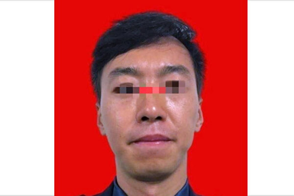

近日，河南郑州公务员郭伟鹏事件成为热门话题。（网络图片）

 
 【大纪元2020年03月14日讯】武汉肺炎（新冠病毒）疫情持续蔓延。近日，河南郑州公务员郭伟鹏事件成为热门话题。他月初曾到意大利、法国等地旅行，回国后却故意隐瞒旅游史，最后被确诊染疫。他被指恐与4万人有过密切接触，被称为“郑州毒王”。

3月11日，郑州官方通报了郭伟鹏案件，他被确诊为武汉肺炎病例。30岁的郭伟鹏现在是浩昶劳务派遣公司派遣到郑州市交通运输局执法支队郑东新区执法大队劳务人员。

通报称，3月1日，郭伟鹏由北京首都机场乘EY889航班飞往阿联酋阿布扎比；2日，由阿布扎比乘EY81航班飞往意大利米兰；6日，由米兰乘EY88航班飞往阿布扎比，转乘EY888航班于3月7日8时50分抵达北京首都机场，乘坐机场大巴于10时30分许至北京西站。

3月7日13时，由北京西站乘K267列车（17车厢63号）于21时50分到达郑州站西广场，后步行回家。

回家后，郭伟鹏没有进行自我隔离，仍照常搭乘地铁去上班2天，直到9日喉咙不适，下班后回家前还特意专车去买了抗病毒口服液和板蓝根。10日出现发烧症状，才前往医院就医，直到11日被确诊染上武汉肺炎。

据郭母称，儿子回来时没有症状，之后就一直上班，没想到要给社区报备。后来郭伟鹏出现感冒症状，郭母就给他熬药，吃完药就退烧了。正因为这一家人，导致郭伟鹏单位所在的整栋楼都被封。

目前，郭伟鹏在郑州市第六人民医院隔离病区进行治疗，已确认郑州市密切接触者为43人，核酸检测结果均为阴性，暂无异常。

3月11日，郭伟鹏因故意隐瞒出境史，涉嫌妨害传染病防治罪，被当地警方立案侦查。

据统计，从3月1日至7日，郭伟鹏至少搭乘了6次飞机，还有高铁、地铁，推估他在可能染疫到发病期间，至少接触了4万人。

有文章表示，从3月1到10日，郭伟鹏每天还在进行高危活动。7天内，他坐了6趟飞机、2趟高铁。前后路线为：郑州—北京—阿布扎比—米兰—巴黎—米兰—阿布扎比—北京—郑州。一共2.4万多公里，相当于地球半圈。一天一个城市。

郭伟鹏回国后，在北京机场、北京高铁、郑州高铁接触的人群，估计没法查到了。

据《梨视频》报导，此次郭伟鹏前往意大利是为了看球赛。3月初意大利的疫情已非常严重。他原定在米兰看球赛，因当地取消了球赛，郭之后又跑到法国购物。7日郭搭机返回北京，又搭了火车从北京返抵河南郑州。

据报，内蒙古呼和浩特市某社区的住户赵姓女子、莎姓女子2人曾于3月7日从土耳其经阿布扎比乘飞机入境，在此过程中与郭伟鹏有过密切接触，却在返国后隐瞒出境史，多次在社区内自由活动，甚至外出到饭店用餐，目前已被强制隔离、立案侦查。

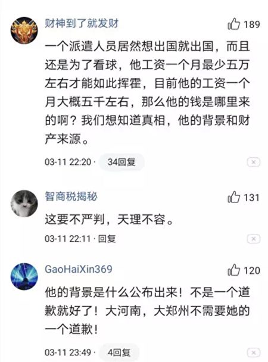

（网络图片）

<a target="_blank" href=#top><h6 align="right">回上方</h6></a>

<a name=133>
<h1 align="center"><b>武汉失踪青年达数百人 警方不作为（上）</b></h1>

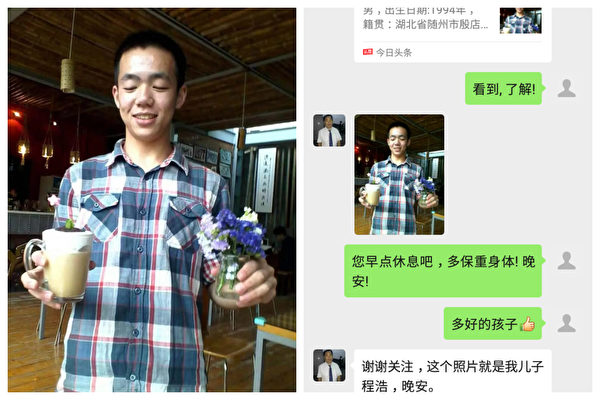

武汉大学生失踪案一直没有线索，近年失踪人数达到了数百人。图为原华中科技大学学生程浩，于2014年11月28日在长江二桥附近失踪。（受访者提供）

 
 【大纪元2020年03月14日讯】（大纪元记者李新安采访报导）自2017年媒体曝光三十多名武汉大学生神秘失踪后，几年来这一数据一直攀升到了数百人，平均每三个月就有一名大学生或同龄社会青年失踪，都是有名有姓的。为了寻找孩子，父母耗费心神甚至写下酬谢承诺书。

2月17日，多名失踪孩子的家长写下承诺书，谁能帮助他们找到孩子，承诺给他（她）十万元酬谢金。据家长提供的一份武汉失踪大孩子名单显示， 统计近年来失踪人数为372人，但文件注明仅“找了一半”。

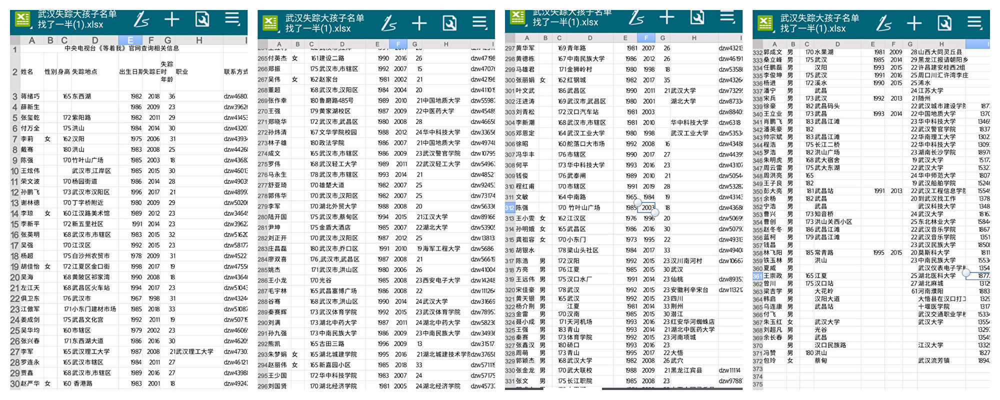

武汉部分失踪大孩子名单。（受访者提供）

 
 林飞阳，河南洛阳人，身高1.85米，2015年11月26日从莫斯科大学回到武汉后，在常青五路失踪。

失踪大学生林飞阳的父亲林先生告诉记者，林飞阳回国没有告诉任何人，只背了一个双肩书包。去的时候超大行李箱满满装了两箱，大部分行李、衣服、电脑都留在宿舍里面。推测他回国办一件什么事情或见什么人，还要回去的。

“当时查监控录像他就在常青五路上往前走，走到中央党校里换了件衣服出来，再走到换乘站那边，车辆特别多，人也多，就看不到了。再没有线索。”林先生说。
 
 
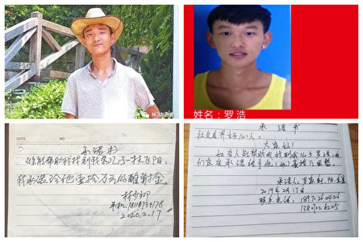

为了寻找孩子，父母写下酬谢承诺书。（网路图片）

 
 让林父颇为遗憾的是，当时警方对人口失踪不立案、不做处理。“当时他的手机号还能打通，但没人接听。我请求警方定位手机，当时的答复是人口失踪不能够立案，所以不能查手机地址。就这样把很重要的机会错过了。”

林先生在武汉贴寻人启事，到处找儿子，结果碰到好多在武汉丢了孩子的家属。但是后来发现丢失的人口越来越多，他表示，“从网上查失踪人口的相关消息，近年来失踪的年龄段从十八九岁到二十多岁的年轻人，失踪的总数量在500－600人。”

林先生在武汉期间一直在找各级的人大、政协，从省级到市级、区级的政府部门，一年以后，2017年6月，最后经过法院审理，才立了案。

对于为什么要写寻子承诺书，他说，“我们觉得只要孩子能回来，我们愿意付出一切，因为孩子就是一个家，没有这个孩子在，整个家庭就散了，没有生活的意义了。”他希望失踪事件能够引起政府和国家相关机关的重视，“如果重视这个事情，后面可能会好一些。”

<b>七十多个摄像头看不到孩子踪影</b>

罗浩，江西九江人，1994年7月生人，身高1.83米，湖南长沙学生。2015年9月10日到武汉大学找同学，在武汉洪山广场失踪。

罗浩的父亲罗先生告诉记者，洪山广场附近有七十多个摄像头，很繁华，道路四通八达的。但武昌分局刑警大队说这是国家机密，不让家人看，只能他们看，他们又没看到。

“洪山广场什么路到什么路，有几个摄像头，有什么单位，我都记得清清楚楚的，七十多个摄像头捕捉不到我小孩的踪影？他就是不让你看。”他说，“失踪几年就是不给立案。我们到武昌区珞珈山派所报案，接警的潭（音）姓警官把我们亲戚的电话全部拉入黑名单。”

罗浩是家里的独生子。几年来，罗先生边打工边找孩子。他听有人说武汉有贩卖器官组织，把小孩给控制起来了。还有人说是传销，但传销会往家里打电话要钱的。还有人说是武汉有个地下组织把小孩搞到缅甸参加果敢军。

“每年都有发生小孩丢失的，这个组织很庞大的，到处都有。还有好多孩子都是大学生，帅宗斌是武汉理工大学的、程浩是华东科技大学的，我们总共将近40个大学生都是那一年失踪的，而且每年都有发生。小孩人间蒸发了怎么可能的事情？”

罗先生认为武汉警察太黑了。他透露，“包括武汉肺炎，我们11月份就在武昌区听说了。军运会（10月18日至27日）不让我们进武汉，（军运会结束后），11月份武汉人跟我们说肺炎有传染。武汉肺炎早就有，它欺上瞒下。”

<b>失踪数百人 只有三人找到尸体</b>

程浩，湖北随州人，时年21岁，身高1.75米，华中科技大建规学院大三学生，于2014年11月28日在长江二桥附近失踪。

程浩的父亲程先生说，“孩子在江汉路附近失踪的，今年5年了，什么音信都没有啊，国家也不管。希望媒体帮助我们这些弱势群体。”

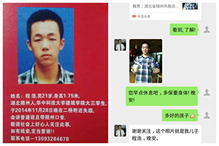

华中科技大学学生程浩，于2014年11月28日在长江二桥附近失踪。（网页截图）

 “我们武汉失踪了几百名大学生啊，政府都不管。你去报案怎么搞？多长时间写个失联，过2个月、半年以后立为失踪（加入全国人口失踪信息库），也不当作刑事案件去侦办。你去找就是敷衍一下，踢皮球，武汉政府腐败得很。”

程先生今年50岁了，只有程浩一个男孩子。“我们家条件本身就不是很好，为找这个孩子家底都找干了。以前我的眼睛视力很好，现在看什么都模糊，为这个孩子流泪流得太多了，身体状况也不好。很多家庭都是这样，好多家庭有的父母为这事都不在了。”

他说，“我们告状都摸不到门，像湖北省和武汉市政府我们去了多少次，大门都进不去，旁边有卫士站岗，他不管你有什么冤情，你进那个大门他还打你，我们吃的苦都说不清，一下子说不完。”

程先生表示，武汉失踪了几百人，有名有姓的，只有三个人找到了尸体，公安都说是自杀。他们每次发个贴子，几天就被封杀了，发不出去了。

“就我这几年找孩子的经验，他们都说国家有贩卖人口器官，卖心脏啊、肾啊，一个人的供体可以卖到上百万，还有当官的换这些东西（器官），一般的普通人不要，就要身强力壮的，十多岁的，大学生的，也有说大学生好上当受骗，有这样分析的。”

目前程先生正在广州打工，当地复工时间不长，担心自己将来没人管，趁年轻能动一下（工作），到哪一天动不了没人管。

<b>调查：失踪学生或为器官移植受害者</b>

原北京传知行社会经济研究所研究员杨子立曾在2017年9月对武汉失踪大学生做过调查，帮助家长建微信群，联系律师、记者进行调查此事，但他很快被武汉警方跨省抓捕，被公司开除。

杨子立在接受大纪元采访时表示，他在调查中发现一些规律性，最可疑的就是失踪的主要是男大学生，女大学生偶然也有很少。此外，基本上都是普通家庭，没有高干。

只有一个例子例外。杨子立从家长处得知，“有一个家长曾经带着亲戚朋友去武汉市青山区公安分局去要人，接待他们的负责人说，每年要失踪好些人，每年找不回来的至少上百人，说好几年了一直找不到人这很正常。还说他们区有一个常委，家里孩子丢了，也是没有找到。他没有说具体的人，是真是假，无从判断。但是报出来的这些丢失的确实都是普通老百姓的孩子。”

杨子立认为，丢了孩子是家庭最大的变故，家人一直熬着，政府不把他当回事。如果一个区找不回来的至少得上百人，那武汉十几个区每年至少上千人。

他指出，失踪人口警方开始一般不给立案，录像也不是都能查的，而且只能查普通治安的那种录像。共产党另外建了一套天网，这套系统就必须得权限更高的人才能使用。

“据我所知2017年抓高智晟律师的时候用过。所以这个天网只是为它统治服务，不是为老百姓服务，中国每年都丢失很多人，做奴工的，也可能器官移植的，这种受害者，我估计应该很多。”他说。

杨子立分析，第一，男大学生失踪后不容易引起警觉；第二，他的智商较高，不会轻易被骗，年轻、身强力壮，这些大学生里面有一半以上是1.8米以上，身体很棒的人。不留痕迹地把他们灭掉也是不容易的。但是大学生毕竟不是很成熟，而警方往往都不会立即立案，过了一二个月之后，很多线索就不好找了。

大学生失踪被认为是敏感话题。杨子立说，“从轻里来说是破不了案；往重里来说这里要是有什么阴谋，器官移植之类的，犯罪团伙跟这些医院能不勾结吗？现在中国这些卖淫嫖娼也好，吸毒贩毒也好，没有公检法做后台，它能干得了吗？贩卖人体器官这种事情肯定也得有政府内部的后台，一定要触犯某些黑后台。”

当年一名腾讯驻武汉的记者报导大学生失踪案被抓，央视说他造谣。杨子立说，“调查的结果证明他说的都是真事，而且有些事他只是点了一下，还没有展开说。他说的全是真的，就这武汉就把他弄起来了。”

杨子立强调，失踪人口实际上各个大城市都有，央视《等着我》节目组在网上可以查到，按比例来看，北京、上海丢的人都比武汉多，这是指失踪的总人数。如果加一些过滤条件，确实处于男性青少年阶段、身高高一点的，武汉失踪人口的比例比其它城市要高。

<a target="_blank" href=#top><h6 align="right">回上方</h6></a>

<a name=132>
<h1 align="center"><b>荷兰科学家首发现武汉病毒抗体 药物快过疫苗</b></h1>

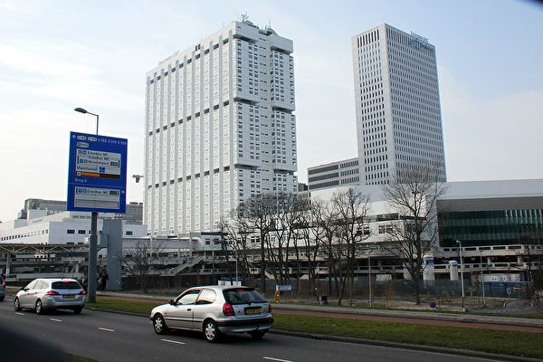

图为荷兰鹿特丹伊拉斯姆斯医学中心（Erasmus Medical Center）。（	Henk Monster／维基百科）

【大纪元2020年03月15日讯】（大纪元记者李言编译报导）来自荷兰鹿特丹伊拉斯姆斯医学中心（Erasmus Medical Center）和乌得勒支大学（Utrecht University）的十名科研人员宣布，他们成为世界首个发现武汉肺炎病毒（SARS-CoV-2）变体抗体的小组。这一发现使武汉肺炎病患们对症下药成为可能。

《荷兰时报》等多家媒体报导，荷兰细胞生物学教授弗兰克·格罗斯维尔德（Frank Grosveld）对这一成果倍感喜悦，他通过《伊拉斯姆斯》杂志表达他的心情：“我年纪太大了，无法跳上桌子（庆贺）。”

他们的文章正在通过在线平台BioRxiv接受其他同行们的评审，他们相信该文章随后将被顶级科学期刊《自然》发表。

研究人员在其学术论文摘要中指出：“在这里，我们报告一种人类单株抗体，可中和SARS-CoV-2（武汉病毒，又称新冠病毒）和SARS-CoV。”而导致武汉肺炎的就是前者。

他们表示，所发现的抗体“中和了”病毒，“提供了预防和／或治疗武汉肺炎以及未来由相关亚类病毒引发人类疾病的潜力”。

“据我们所知，这是阻断（武汉病毒）感染的首个抗体”，格罗斯维尔德向该杂志解释说，“找到这样的东西非常罕见。”

他们的研究未必会产生疫苗，而是有望提供一种可以用来治疗武汉肺炎感染者的新药。他说，这要比开发疫苗快得多，不过，还需要数月的测试时间，而且生产起来也比疫苗贵。

“我们现在正在诚邀一家制药公司加入，看起来很有希望，该公司可以大规模生产作为药物的抗体。”格罗斯维尔德告诉杂志说，这成果给患者带来康复的可能，“如果您以这种患者的身份接受治疗，则有望停止感染。”

<a target="_blank" href=#top><h6 align="right">回上方</h6></a>

<a name=131>

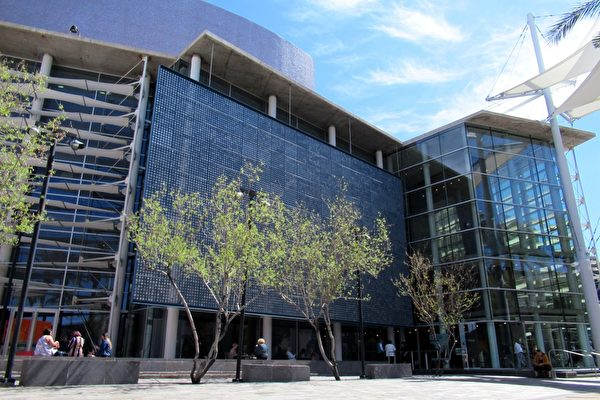

2020年3月15日下午，美国神韵艺术团在梅沙市梅萨艺术中心池田剧院的第五场演出完美落幕。图为剧院外场景。（姜丽／大纪元）

 <h1 align="center"><b>神韵梅沙五场落幕 观众赞“舞蹈充满神性”</b></h1>
 
 【大纪元2020年03月16日讯】（大纪元美国梅沙记者站报导）3月15日下午，神韵艺术团今年在梅沙市梅萨艺术中心池田剧院（Mesa Ikeda Theater at Mesa Arts Center）的第五场演出，在观众热烈的掌声中完美落幕。当地主流精英为之陶醉，他们赞誉演出不仅仅是一场视觉盛宴，更是精神上的洗礼。

各界精英对神韵演出满怀感恩，激动的心情溢于言表。许多观众赞叹中华五千年文化的灿烂辉煌、感谢神韵为复兴传统文化的努力，并表示如此伟大的文化绝不能消失。

<b>前州议员：舞蹈展现力量 演出如梦似幻</b>
 
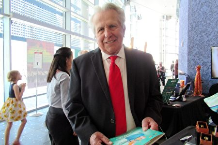

3月15日下午，前爱荷华州州议员Richard Myers先生观看美国神韵艺术团2020年在梅沙市的最后一场演出。（姜丽／大纪元）

 
 Richard Myers先生退休前曾是爱荷华州的州议员，连任了五届。看完当天下午的神韵，他感到很开心。

“如梦似幻！”他称赞说，“我喜欢舞蹈节目，舞蹈动作展示了力量，表现了村庄的兴衰变迁。”

神韵乐团结合了中西方乐器，让他感到耳目一新。“这样的乐团是我们通常看不到的，我喜欢。这不是摇滚，我不喜欢摇滚。”他表示，音乐把人们联系在一起，神韵这样的音乐让人受益。

Myers访问过很多国家，喜欢体验音乐与舞蹈，体验不同国家的人民生活，他很高兴从演出中了解中国人的传统生活方式。

<b>神韵复兴传统 名企分析师：神圣的使命</b>
 

2020年3月15日下午，高级分析师Matt Magiera欣赏美国神韵艺术团在梅沙市梅萨艺术中心池田剧院的演出。（文烨／大纪元）

 
 “观看神韵的整个过程让人心旷神怡，无比享受。”全球网络支付服务商贝宝（PayPal）高级分析师Matt Magiera先生说，整场演出讲述着从古至今的故事，精彩，也耐人寻味，特别是对于神性内涵的展现。

Magiera表示，最让他深受震撼的，是舞剧《为谁行恶》传递的信息，“我以前总认为中国更像是一个无神论国家。我没有意识到是因为迫害才使人们无法弘扬他们的信仰，我以前不知道是这样。”

对于神韵复兴中华传统文化的使命、揭露中共的迫害行径，Magiera认为，“这是一个很神圣的使命，提升人们的意识。”“世上的人并不真的明白发生了什么事（修佛的法轮功在中国遭受迫害的情况）。能够知道这件事很好，很重要。”

<b>律师所老板、前副镇长：神韵演出非常美丽</b>

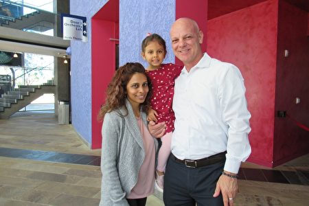

3月15日下午，拥有两家律师事务所的律师Tait Elkie先生和太太Michele Elkie带着小女儿，一同观看美国神韵艺术团2020年在梅沙市的最后一场演出。（姜丽／大纪元）

 
 “演出非常美，不管是色彩的搭配，还是舞蹈、编舞，都是那么令人惊叹。还有超凡的音乐，每个曲目我们都很喜欢。”律师Tait Elkie先生看了神韵演出后赞叹道。

Elkie是特许评判律师，目前拥有两家律师事务所，还曾担任过芳泉山（Fountain Hills）的镇议员和副镇长。

他特别提到，“神韵演出传递了精神层面的信息，与每个人和现在的环境都息息相关，我们都需要更多内心的平和。”

他太太Michele Elkie也说：“神韵的舞蹈充满神性。大幕一拉开，我看到舞蹈演员在天国圣境中跳舞，我立刻就热泪盈眶了。这是美好至极的展现。”

<b>经理：要守住传统 保留民族根源</b>

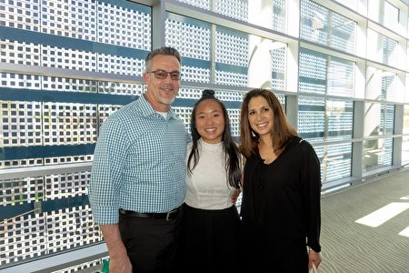

2020年3月15日下午，国际物流公司营运经理Richard Harris先生（左）与妻子Ayn Harris、女儿Alysen Harris观赏美国神韵艺术团在梅沙市的第五场演出。（文烨／大纪元）

 
国际物流公司营运经理Richard Harris先生赞佩神韵透过舞蹈展现珍贵的传统文化艺术，“是一个卓越非凡的演出。”

他特别提到，演出的内涵深刻，尤其当今传统文化逐渐式微，神韵致力于恢复中国传统文化令人赞佩，“我觉得这是非常棒的，是一件非常值得鼓舞的事情。”“我认为能够保持传统是相当美好的一件事，如果我们离我们的‘根’越远，我们的文化就会丢失不复。所以我们要尽可能地守住传统，保留民族根源。”

Harris任职的公司在美国、墨西哥、中国、印度、印尼和阿联酋等国设有32个分公司，是美国著名的大型物流企业之一。

<a target="_blank" href=#top><h6 align="right">回上方</h6></a>

<a name=130>
<h1 align="center"><b>【疫情透视】港抗疫显奇迹 天灭中共成保命符</b></h1>
 <h4 align="center"><b>齐先予</b></h4>

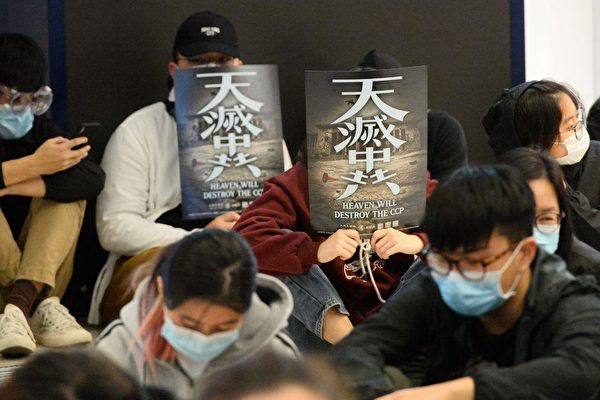

武汉病毒在全球肆虐，最有可能会成“第二个武汉”的香港，疫情得到奇迹般的良好控制。有人说，香港在反送中运动中抵御住了“中共病毒”，武汉病毒只能望而却步。图为2月21日，香港毋忘7.21元朗恐袭7个月集会，抗争者手拿“天灭中共”的海报。（宋碧龙／大纪元）

 
 【大纪元2020年03月16日讯】武汉病毒在全球肆虐，蔓延世界117个国家和地区，国际诧异，最有可能成为“第二个武汉”的香港，在抗疫方面与备受好评的台湾一样，疫情处于低位，香港为何会出现奇迹呢？
 
<b>香港疫情比预计的0.55%还低</b>

3月15日世界各国感染武汉肺炎病毒人数列表（疫情最严重的中国大陆除外）的总数显示，香港确诊149人，排到了第32位，比美国、日本、新加坡、巴西、冰岛都还低。香港具有欧美一样的先进检测手段和透明的制度，香港确诊人数基本可信。

疫情爆发三个多月，香港政府至今没有彻底封关，根据香港旅游发展局入关的统计人次，去年12月约有240万内地游客来港，今年2、3月的数据还未发表，加上香港有近50万人在大陆工作，经常往来香港与内地之间，粗略推算每天往来两地的人数不低于10万。特别是香港有到武汉的直达高速列车，同时近邻的深圳、广州的疫情都比较严重，这些都直接威胁着香港。

参照2003年SARS爆发时香港的感染情况，香港最有可能成为大陆之外的“第二个武汉”，然而香港的疫情疫却出奇的轻微。

2003年萨斯SARS蔓延时，中共官方称中国大陆有5327人感染，349人死亡，当时香港就有1755人感染，死亡299人，香港感染人数是大陆的30%左右。

即使不考虑武汉病毒的传染力比萨斯高出二十多倍、不考虑中共隐瞒疫情压缩数据，仅仅以大陆官方声称的感染人数8万人来按照SARS时30%感染率计算的话，理论上香港至少会有2.4万人感染。而目前香港只有132人感染，死亡4人，香港实际感染数比预期的0.55%还低，堪称奇迹。

<b>香港人喊出“天灭中共”扶正黜邪</b>

香港政府在抗疫方面基本是听命于北京，其措施消极，不封关、也没有多少具体防疫措施。是什么力量使香港人具有如此强大免疫力？

中医认为瘟疫是邪气入侵，正气强就能抵御邪气。去年夏天在香港爆发了反送中运动，历时半年多。随着中共及港府践踏民意人权的步步升级，运动诉求从最初单纯的撤回《逃犯条例》修订，演变成驱逐中共的反极权抗争，香港人民捍卫自由的决心和勇气，获得全世界正义人士的支持，正气汇聚于香江，抑制了中共的邪气。

运动期间，香港的大街小巷随处可见“天灭中共”的海报或手写字样。在中共窃政70年之日，香港市民举行游行，打出“没有国庆 只有国殇”的横幅，高喊“天灭中共”，成媒体关注焦点。

11月香港中大保卫战时，中大学生在中大二号桥与警察对峙，学生在桥边竖起“天灭中共”大横幅，学生向大纪元表示：“竖起后，感觉心里很踏实，似有神在护佑。”“天灭中共”四个字已然成为香港人的“护身符”。

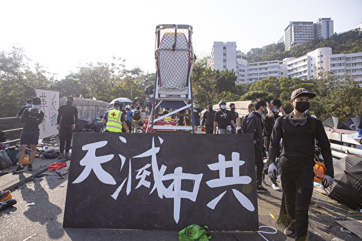

2019年11月13日，中大学生拉起“天灭中共”横幅。有学生表示，竖起横幅感觉心里很踏实，似有神在护佑。“天灭中共”已然成为港人的护身符。（余钢／大纪元）

之后在11月香港的区议会选举，香港市民用选票对中共说“不”，亲共党派在大选中遭遇历史性惨败。中医讲“正气存内，邪不可干”。这一“正气”从深层意义上讲，是指人明辨是非善恶的浩然正气。

香港知名评论人刘细良表示，“共产党比冠状病毒更毒，亲共可能会没命”，这句话也道出了香港人在反送中运动中的表现，早已把最毒的“中共病毒”拒之门外。

最近网络上，有港人批评特首林郑在电视上对香港抗疫“领功”，网民留言说，这半年香港人用血与泪和生命的付出，清理了香港的共产党邪气，扶持了正气，令香港对中共病毒有更高抵抗力，令武汉肺炎病毒在香港望而却步。

网路流传一篇《香港疫情“稍好”是反送中的果》的热文，文章中说，因为反送中，人们不再相信港府，纷纷想办法自救；亦因为反送中，香港人DNA大变，竟然不再“各家自扫门前雪”，不再自私，形成强劲互助自救文化和网络；也因为反送中，全港各阶层几乎全部联通了；因为反送中，香港的抗争已经蜚声国际。最后，经历萨斯之痛的香港，可以极速反应，知道最重要的物资是什么，如何预防。

香港民众因为站在反共最前线，从而未受到武汉病毒的严重侵蚀，从某种意义上讲，抵制中共，远离中共，就越安全。

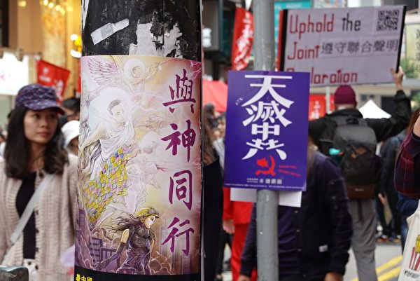

2020年1月1日，香港元旦由民间人权阵线（民阵）举办“元旦大游行”，下午2时在维园集合。不到两点，铜锣湾已见参与游行的大批市民，天灭中共标语大受欢迎。（余钢／大纪元）

<a target="_blank" href=#top><h6 align="right">回上方</h6></a>

<a name=129>
<h1 align="center"><b>【现场视频】武汉医生揭中共关闭方舱内幕</b></h1>

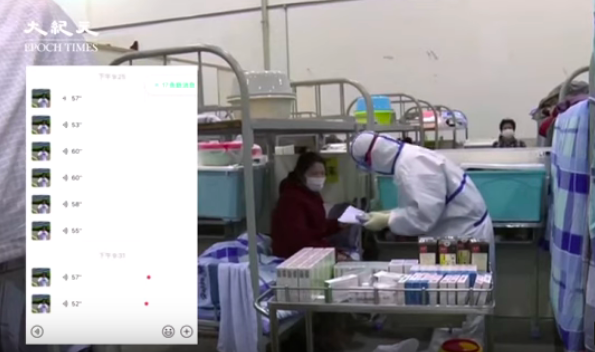

有医生爆料，中共当局是以政治方式关闭武汉方舱医院、从政治上考虑的解除隔离。（视频截图）

 
 【大纪元2020年03月16日讯】（大纪元记者萧律生报导）中共当局称武汉方舱医院闭舱，然而有医生爆料，当局是以政治方式闭舱，从政治上考虑的解除隔离。该医生还认为，方舱大规模清舱，实际上是很可怕的事情。

3月14日，网络上传出几段视频，一位武汉医生在微信上爆料武汉方舱医院的内幕。该医生说，这些在方舱医院隔离的民众被放回家，是政治治愈，不是医学治愈。

该医生在视频中说：“那个时候我是最担心害怕的。因为看他们（中共专家）疯狂地签字、解除隔离的那个状态，我觉得真的是从政治上考虑要解除隔离了，那个是我最害怕的。”

他披露，这些中共专家不问病人从什么时候发病，出现什么症状，只看CT片子，肺部出现可以吸收的情况就签字解除。

“我们驻点医生也在把关，就是他没有发热啊，没有其它的，没有疑似啊，就核酸的问题。但是，如果这个病人放在平常，就如果是我，只要这个病人肺部还有一点炎症没有吸收，我肯定不签字的。但是如果专家签了字，我就没有办法了。他签完之后，我签不签，我不签，明天的医生他一样会签。因为这个是专家组定下来的东西，我今天就是拖着不签，换第二个医生值班的时候，他也签。”

这位爆料医生还指，中共当局将查血这种检验是否感染武汉肺炎的方式全部喊停，喊停时间是武汉居民张毅曝光武汉市亚洲心脏病医院有武汉肺炎患者的第二天。

3月10日，武汉市民张毅带母亲到武汉市亚洲心脏病医院看病，他当天曝光该医院以查血的方式检验是否感染武汉肺炎，而当时该医院已有患者用查血的方式验出感染武汉肺炎。

爆料医生说，查血检验的方式是武汉肺炎诊疗方案第七版推出的方式，当时要求将此方式推及社区；这种检验方式迅速、准确、便宜。

“因为这个是最快的，最快15分钟就可以得出结果。而且它的那个费用，张毅说是两百三十几，两百三十八吧，它比那个核酸还便宜。核酸要三百块钱一个人。实际上它相对于核酸更便宜，而且准确率非常高，它是金标准，现在是金标准。”

该医生说：“但是就这个样子，直接就给你全部喊停。我估计现在同济、协和也做不了，因为亚心（武汉市亚洲心脏病医院）跟省人民（医院）都已经停掉了。这是我知道的。我知道的那个两家医院是停掉了的。可以想像为什么会有这个情况出现。”

“很多不是医学上的问题了。我们在最开始，很早就说了这叫政治学的诊断、政治学的治愈，跟医学是没有关系的。”该医生说，“像这样，方舱大规模地清理干净，那些所谓的人出院回家，实际上太可怕了。因为那帮人⋯⋯”

令爆料医生气愤的是，明明武汉肺炎诊疗方案第七版要求给每一个人查血，但是这些方舱医院全都不执行。“如果按照第七版的要求，每个人做一个查血之后，他真是阴性，你可以放回去，没有关系。但是它没有做。”

该医生说，“实际上，像我们作为普通医生，像我这种普通得不能再普通的医生，我们都说过，你要把四类人员先全部筛查一遍，叫甄别一遍，筛完之后你再考虑问题。它连这个都不做，更别说其他的普通老百姓自费（三百多块钱）去做，它都不让你做。他连四类人员都不给你做。这个真的是政治问题，而不是医学问题，政治学问题，不能叫政治问题。”

该爆料医生指的“四类人”是说：确诊患者、疑似患者、无法明确排除感染可能的发热患者，以及与确诊患者密切接触者。

<a target="_blank" href=#top><h6 align="right">回上方</h6></a>

<a name=128>
<h1 align="center"><b>卫星图曝伊朗挖壕沟 为掩埋大量武肺死者？</b></h1>

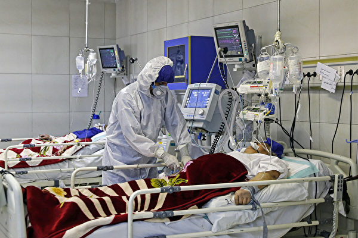

2月下旬至3月初，卫星图像显示德黑兰重灾区库姆市的一处公墓出现大型墓坑，专家推测伊朗死亡人数恐远大于官方数据。图为德黑兰一名医生正在救治武肺患者。(Photo by KOOSHA MAHSHID FALAHI / MIZAN NEWS AGENCY / AFP) 

 
 【大纪元2020年03月13日讯】（大纪元记者吴英综合报导）2月下旬至3月初，卫星图像显示德黑兰重灾区库姆市的一处公墓出现大型墓坑，专家推测伊朗死亡人数恐远大于官方数据。

《华盛顿邮报》3月12日报导，根据马克西科技公司（Maxar Technologies）提供的卫星图像，伊朗于2月19日宣布库姆市（Qom）出现该国首例新型冠状病毒（SARS-CoV-2）病例后，2月21日该市Behesht-e Masoumeh公墓附近就出现挖掘大量墓坑的异常活动。

直到2月底，该地区挖掘了两个大沟渠，在卫星图像清楚可见，估计总长为100码（大约91公尺）。3月1日到3月8日，Behesht-e Masoumeh公墓的活动增加，有时候可见到很多车子停在墓坑的路边。

库姆市Behesht-e Masoumeh地区拥有该市最大的墓地，此外还有公园、清真寺和太平间。

专家认为，最近伊朗人传出来库姆市挖掘坟墓的视频，与卫星图像显示的情况吻合，这些证据都指向当地的武汉肺炎（COVID-19）死亡人数极有可能远高于官方数据。

位于科罗拉多州的马克西科技公司说，去年10月的卫星图像显示，在Behesht-e Masoumeh地区的墓地，大部分没有使用。但是在伊朗宣布首例新冠肺炎后，只不过两天的时间，当地就出现异常活动。

该公司的一位高级图像分析师表示，卫星图像显示，伊朗目前可能采取明显不同于过去的方式埋葬武汉肺炎死者，将死者丢进大墓坑，堆叠在一起。

一位要求匿名的图像分析师告诉《华邮》，马克西科技公司的其中一张卫星图像显示现场有一大堆白色的石灰，可能是用来消除万人塚的腐烂气味。伊朗卫生官员近几周证实掩埋新冠病毒死者时使用了石灰。

<h4 align=center><a href="https://twitter.com/ntabrizy/status/1238171724140679170?ref_src=twsrc%5Etfw%7Ctwcamp%5Etweetembed%7Ctwterm%5E1238171724140679170&ref_url=https%3A%2F%2Fwww.epochtimes.com%2Fgb%2F20%2F3%2F12%2Fn11936235.htm">卫星图像显示现场有一大堆白色的石灰，可能是用来消除万人塚的腐烂气味。伊朗卫生官员近几周证实掩埋新冠病毒死者时使用了石灰(点击右键,另存新档）</a></h4>

除了卫星图像外，社交媒体上流传出来的一个视频显示，在Behesht-e Masoumeh公墓的一栋建筑物内排列着大量尸体，其它视频显示在该公墓附近有成推的坑洞，准备掩埋武肺死者的尸体。

在英国广播公司（BBC）波斯语服务部门3月3日分享的以下这个视频中，一名男子叙述拍摄当时Behesht-e Masoumeh公墓的场景，一些人正在将棺材运往有多个坟坑的大沟渠。

“这是掩埋新冠病毒死者的区域。”他说，“到目前为止，这里已埋了80多人，但是他们说（伊朗全国）只有34人死亡。”后面的数字是伊朗当局2月28日公布的死亡数据。

米德尔伯里国际研究所（Middlebury Institute of International Studies）研究员法比安·辛兹（Fabian Hinz）审视了这些视频后表示，根据视频中的独特地理标记，与Behesht-e Masoumeh公墓附近的地标吻合。

伊朗人口约8,000万，库姆市约120万居民。截至3月12日，伊朗公布数据，确诊10,075例新冠病毒病例，429人死亡，除中国大陆以外，仅次于意大利。

德黑兰包括第一副总统在内至少二十多名官员感染新冠病毒，死者中包括国会议员、前外交官，以及最高领导人的高级顾问。

多伦多大学流行病学家阿什利‧杜伊特（Ashleigh Tuite）等人在一篇论文中指出，截至2月23日，加拿大、黎巴嫩和阿拉伯联合酋长国出现与伊朗有关的确诊病例。杜伊特研究团队以伊朗与这些国家间的航空旅行量，估算这些国家每出现与德黑兰有关的一例确诊病例，伊朗应至少确诊的病例数。得出的结论是，截至2月23日当天，伊朗至少确诊18,300病例。

《大西洋月刊》以杜伊特团队得出的结论估计，伊朗自从确诊病例突破100例后，官方数字大约每三天翻一番。如果保持该比率，那么截至3月9日累计病例数估计应达58.6万。
 
 <a target="_blank" href=#top><h6 align="right">回上方</h6></a>

<a name=127>
<h1 align="center"><b>【最新疫情3.13】川普：我和习都知病毒来源</b></h1>

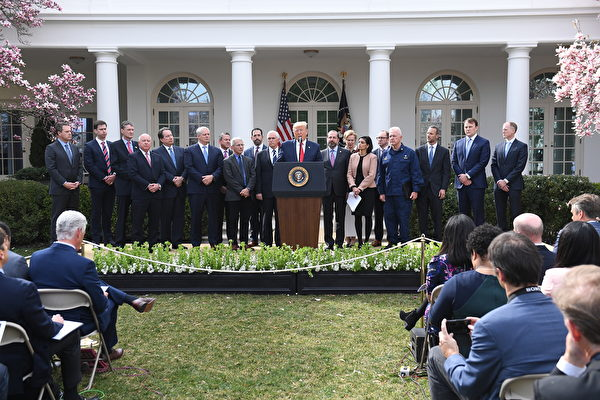

美国总统川普（特朗普）2020年3月13日下午召开新闻会，宣布美国进入国家紧急状态。(SAUL LOEB/AFP)

 
 【大纪元2020年03月13日讯】（大纪元记者夏雨、李言、戴芙若综合报导）武汉肺炎（COVID-19，又称新冠肺炎）在中国武汉首先爆发，已经成为全球大流行疾病。海外疫情严重的国家有意大利、伊朗、韩国等。

美国总统川普（特朗普）周五（3月13日）下午召开新闻会，宣布美国进入国家紧急状态。此举将赋予总统权力，运用国会分配的巨额救灾资金来应对新冠病毒危机。

周四晚，加拿大总理办公室消息称，总理特鲁多的夫人确诊感染武汉肺炎。

美国现有2033例新冠病例，共有47人死亡。纽约州新冠肺炎病例数12日增至325人，比前一天增加109人，州长宣布禁止500人以上集会，纽约市宣布进入紧急状态。

武汉肺炎在欧洲持续蔓延，多国疫情升级，感染个案大幅增加。周四（3月12日），意大利病例总数增加到15,113例，增长了21.7%；死亡人数在24小时内猛增189人，死亡总数至1,016人，增长了23%。

德国武汉肺炎病例达到2750例。西班牙内阁两名成员感染病毒，王后莱蒂齐亚（Queen Letizia）接受新冠测试。

伊朗最高领导人阿亚图拉·阿里·哈梅内伊（Ayatollah Ali Khamenei）的现任顾问阿里·阿克巴尔·维拉亚蒂（Ali Akbar Velayati）新冠状病毒检测呈阳性反应，目前被隔离，这是最新一名伊朗高官感染病毒。

中共官方的武汉肺炎疫情数字受到国际质疑，被指在疫情扩散之际，为了复工不顾老百姓的生命安危，而实际上地方政府和企业仍然对疫情感到恐惧。此外，受疫情影响，中共当局下令的全国复工很难，要全面重启经济也更难。

<b>全球新冠疫情进展要点：

川普3点召开新闻会 或宣布国家紧急状态

西班牙宣布进入国家紧急状态

罗马尼亚总理自我隔离

联合国外交官新冠病毒检测呈阳性

澳大利亚内政部长感染新冠状病毒

加拿大总理夫人感染新冠病毒

美国确诊1696例武汉肺炎

 
以下是最新疫情实时更新：
佩洛西：与白宫就新冠病毒经济援助法案达成协议</b>

众议院议长南希·佩洛西（Nancy Pelosi）周五下午6点宣布，与白宫就新冠病毒经济援助法案达成协议。该法案鼓励美国人接受冠状病毒检测，并且不必担心成本。

佩洛西还表示，“新冠病毒经济救济法案”将送往参议院，然后众议院将开启第三项相关紧急法案的程序，保护美国人民健康、经济安全和福祉。

这位加州民主党众议员周四花了大量时间与美国财政部长姆钦讨论法案内容。据悉，两个人当天通了八次电话。

彭博社记者推文说，据悉川普总统已签署新冠病毒经济援助法案。

<b>美国至今有2033病例 47人死亡</b>

CNN报导，根据州和地方卫生机构、政府和美国疾病控制与预防中心（CDC）的数据，在美国至少有2033例新型冠状病毒病例。根据CDC的说法，有70例病例来自返国公民，包括从中国撤侨和钻石公主号邮轮撤侨。

根据美国有线电视新闻网（CNN Health）通过美国公共卫生系统在美国发现和测试的美国病例统计，在48个州和哥伦比亚特区有1963例病例，使新冠病例总数达到2033例。 共有47人死亡。

<b>危地马拉报告首例新冠病毒病例</b>

危地马拉总统亚历德罗·贾马蒂（Alejandro Giammattei）周五证实该国发现首例武汉肺炎病例。

贾玛蒂在一个公共活动上发表讲话说，一名男子被诊断出感染新冠病毒。他于上周三前往意大利，并乘坐墨西哥国际航空的航班进入该国。

<b>川普在记者会回答病毒来源</b>

有记者提出中共外交官员对武汉病毒来源的奇怪发言，川普回答，他有读过一篇报导，但不认为这文章具有代表性。

川普说：“肯定不是我跟习近平主席的谈话。他们知道病毒从何而来，我们全部都知道它从何而来。”

中共外交部发言人赵立坚3月12日转发中共官媒《环球时报》编译的美国国会听证视频片段，再次散布阴谋论说“美国军方把疫情带到武汉”，引发国际社会哗然。

赵立坚更早在3月4日的记者会上也引导了这样的舆论。他说，个别外国媒体称新冠病毒是“中国病毒”是“企图让中国（中共）背上制造疫情灾害的黑锅，完全是别有用心”，中方对此坚决反对。

一位国务院高级官员告诉福克斯新闻，负责东亚及太平洋事务的助理部长戴维·史迪威（David Stilwell）周五针对中共在武汉病毒事件上，“在全球公然”进行虚假宣传运动，召见中共驻美大使崔天凯。

国务院一名高级官员告诉CNN，史迪威“非常严厉地”向崔天凯陈述事实，崔则“非常防卫”。这位官员说，史迪威没有发出任何威胁，两位外交官坦率地交换意见。

该官员还说，国务院相信，由于各界都在批评中共掩盖疫情导致引发全球大流行，因此中共努力转移焦点。这位官员补充说，这种阴谋论的传播是“危险且可笑的”。

也有一名美国官员告诉《华盛顿观察者》，中共外交部发言人赵立坚的发言是中共总体战略的一部分，他们希望转移全球对中共“引发全球疫情、却不告知全世界事实”的关注。

<b>川普：目前不支持众议院的新冠病毒援助法案</b>

美东时间周五下午大约3点30分，川普总统针对武汉肺炎疫情在白宫玫瑰花园举行新闻发布会。副总统彭斯也出席了新闻会。彭斯负责领导白宫新冠病毒特别工作组。

川普在新闻会上表示，他目前不支持众议院民主党提出的新冠病毒援助法案。

该法案预计将包括为在武汉肺炎大流行期间无法上班的人提供带薪休假、扩大食品供应、延长失业保险和免费覆盖新冠病毒检测。

川普周五早上发表推文，敦促众议院把今年剩下9个月的“薪酬税削减”纳入这个法案中。

媒体报导称，众议院议长南希·佩洛西（Nancy Pelosi）和财政部长史蒂文·姆钦（Steven Mnuchin）在进行了数日的紧张谈判后，即将出台的法案并不包括削减薪酬税。

川普在推文中敦促民主党说，如果你们想让钱迅速且有效地到达人们的手中，那就让他们拥有他们赚取的全部薪水，批准一个薪酬税削减计划，有效期直到今年年底，12月31日。那么，你们就在做一些真正有意义的事情。只有这样才会带来巨大差异！

川普在周五下午的新闻会上说，“我们不认为，他们（民主党）给了（美国人民）足够多，我们不认为民主党给得足够多。”

 
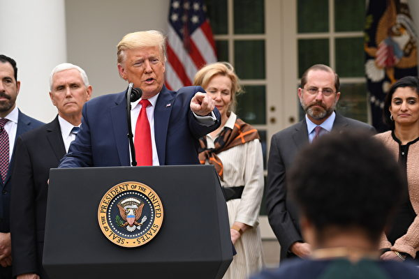

川普总统2020年3月13日在白宫玫瑰园就武汉肺炎疫情召开新闻会。(SAUL LOEB/AFP)

 
 <b>川普：希望国家紧急状态不会持续太长</b>

当被问及国家紧急状态会持续多久时，川普没有给出具体时间。但他说：“我希望不会长。”

他还说，他的政府正在与其它应对新冠病毒的国家保持联系。

“他们在打电话给我们，并寻求建议。他们正在向我背后的这些人寻求建议。”川普说。

<b>川普宣布学生贷款措施和原油措施</b>

川普除了宣布国家紧急状态外，还宣布了有关学生贷款的新措施。该举措旨在减轻全国高校关闭期间学生贷款的负担问题。

“我已经豁免了联邦政府机构持有的所有学生贷款的利息，这将一直持续到进一步通知。”川普说。

他表示，由于武汉肺炎疫情，一些学校已经让学生回家。

川普也宣布了旨在利用低油价的一些措施。

他表示，他已指示能源部长“为美国的战略储备购买大量原油”。

“我们将会填充（原油）储备，这是填充储备的好时机。”川普说。

最近几天，油价下跌，尤其是新冠病毒引发多国实施国际旅行禁令，致使全球旅行急遽下降，对燃料的需求也随之大幅减少。

<b>川普召开新闻会 宣布国家紧急状态</b>

为了应对武汉肺炎疫情，川普在周五下午的新闻会上宣布美国进入国家紧急状态。

川普表示，这一举动将会开放高达500亿美元的资金。这将为各州、领属地和地方当局提供大量资金，对抗新冠病毒。

川普还敦促各州立即建立紧急行动中心。

白宫冠状病毒应对协调员黛比·伯克斯（Deborah Birx）在新闻会上花了几分钟，介绍了一个新的冠状病毒网站。她用一个图表解释该网站的运作方式。

 
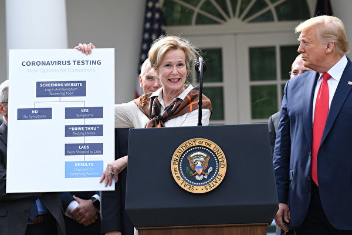

伯克斯在新闻会上讲解新网站。(SAUL LOEB/AFP)

 
 川普在新闻会上表示，白宫团队预计下周初将额外提供50万个新冠病毒测试盒。这将使得下周可能会有140万个测试，一个月内500万个测试。

“我们的首要目标是阻止病毒传播。”川普说。

川普宣布，私人实验室和疫苗开发人员将能够在一个月内提供500万次冠状病毒测试。

他还声称将建立测试站点快速通道，以使更多人更快地获得新冠病毒测试。

他表示，今天发布的紧急命令也将授予卫生和公共服务部长亚历克斯·阿扎尔（Alex Azar）广泛的权力，以便为医生、医院和医疗保健提供者提供最大的灵活度来应对这种病毒。

即使川普宣布扩大新冠病毒的测试能力，但他表示，他不认为所有的美国公民应该争着进行病毒测试。“这完全没有必要。”川普说。

美国很多州已经发布了不同级别的大型聚会禁令。

“我们必须采取一切预防措施，并对我们采取的行动负责。”川普说。

<b>川普：很有可能接受病毒测试</b>

川普总统表示，目前他没有感染新冠病毒的症状。川普上周在海湖庄园与巴西总统会面，随后一名随行的巴西官员被证实新冠病毒检测呈阳性。

在被问到是否计划采取任何预防措施保护他和他的员工时，川普回答：“不用。我们没有任何症状。”

巴西总统贾尔·博尔索纳罗（Jair Bolsonaro）13日被多家媒体报导检测为冠状病毒呈阳性反应。他的官方脸书账户周五（3月13日）11点30分发表声明，称检测结果为阴性。

3月7日博尔索纳罗与其新闻秘书法比奥·瓦金加藤（Fabio Wajngarten）访美，在海湖庄园和美国总统川普共进晚餐。随后瓦金加藤被确诊感染武汉肺炎并接受隔离。

外界担忧两位总统。川普12日跟与爱尔兰总理瓦拉德卡（Leo Varadkar）会面时表示：“这么说吧：我并不担心。”（ Let’s put it this way: I’m not concerned）

他还表示，“我们和整个（巴西）代表团在佛罗里达州的海湖庄园共进晚餐，我不知道新闻秘书是否在那里；如果他在、他就在，但是，我们没有做任何不寻常的事”。

美国副总统彭斯也出席了这次会议，白宫发言人斯蒂芬妮·格瑞斯汉姆（Stephanie Grisham）表示，川普和彭斯与这名巴西官员“几乎没有互动”，他们“目前不需要接受检测”。

格瑞斯汉姆在一份声明中说，“白宫医疗小组和美国特勤局一直与各机构密切合作，以确保采取一切预防措施，使第一和第二家庭以及所有白宫工作人员保持健康”，“我们正在密切关注事态发展，一旦得到更多信息，我们会及时通知大家。”

川普在新闻会上说，他自己很有可能进行新冠病毒测试，但没有表明具体时间。

“尽管对年轻人和健康的美国人来说，风险仍然很低……但任何人都可以成为该病毒的携带者，并有可能将其传播给年长的美国人、有健康问题的人以及感染风险最高的人。”川普说。

<b>佩洛西召开简短新闻会 介绍新冠病毒援助计划</b>

周五，美国国会众议院议长南希·佩洛西（Nancy Pelosi）就新冠病毒援助计划举行了简短的新闻发布会，介绍了周五计划通过的这项名为《家庭首个冠状病毒响应法案》（Families First Coronavirus Response Act）。

佩洛西说，该法案的主要内容是“测试，测试，测试”，法案为所有需要（病毒）测试的人提供免费测试的便利。

她还说，联邦病假和失业支持也是一个优先事项。

<b>丹麦将对非本国公民关闭边境</b>

丹麦周五表示，将暂时对非丹麦公民关闭边境，以遏制新冠病毒的传播。

丹麦表示，所有无法证明有合理可信目的进入丹麦的游客，旅行人士、度假人士和所有外国人都将在丹麦边境被拒绝入境。

<b>委内瑞拉报告首例新冠病例</b>

委内瑞拉副总统德尔西·罗德里格斯（Delcy Rodriguez）周五在国营电视台“VTV”上宣布，两名委内瑞拉公民确诊感染新冠病毒。

罗德里格斯说，已确诊的病例是一名41岁女子，此前曾到过美国、意大利和西班牙旅行。第二起病例是一名前往西班牙的52岁男子。

两名患者都已被隔离。

<b>川普将宣布国家紧急状态</b>

美国媒体报导，川普总统计划宣布对新型冠状病毒大流行，全国进入紧急状态。

这项宣布将令政府获准动用多达400亿美元的财政资源，以帮助受疫情影响的美国人。

总统预定在白宫玫瑰花园举行新闻会。 副总统迈克·彭斯（Mike Pence）将和他一起，彭斯是美国政府新冠病毒工作组组长。

新闻会前，川普在白宫与主要实验室公司的高管开会，讨论关于新冠状病毒爆发的反应后。

此项宣布是援引《斯塔福德法案》（Stafford Act）。

<b>加州最大的学区将于周一开始关闭</b>

加利福尼亚州两个最大的学区，洛杉矶统一学区（LAUSD）和圣地亚哥统一学区（SDUSD），将于周一开始关闭。

洛杉矶统一学区主管奥斯汀·伯特纳（Austin Beutner）和圣地亚哥统一学区主管辛迪·马丁（Cindy Marten）在联合声明中说：

“在抗击Covid-19大流行蔓延的斗争中，加利福尼亚现在已进入关键的新阶段。有证据表明，该病毒已经存在于我们服务的社区中，我们现在必须努力防止其传播。我们相信，关闭该州两个最大的学区将对此起到重要作用。因此，我们计划于3月16日的星期一关闭学区。

“今天晚些时候，我们将为学生、家长和教职员工提供有关我们的计划的更多信息，以便在停课期间继续为学生提供学习机会。我们还指示两个地区的员工准备通过家庭资源设施，继续提供食品营养和其它支持。”

<b>达美航空将削减40%运力并停飞300架飞机</b>

由于受到武汉肺炎疫情的威胁，达美航空宣布大幅度削减运力。与9/11恐怖袭击之后相比，它面临的状况更糟，削减的幅度更大。

“从来没有见过如此快的需求下降速度，虽然我们在业务上经历了很多，”首席执行官埃德·巴斯蒂安（Ed Bastian）在给员工的备忘录中写道。

巴斯蒂安写道，该公司将“在未来几个月内把整体运力削减40%，这是包括2001年（911事件）在内的、达美航空历史上最大的运力削减”。 “局势不稳定，而且可能会变得更糟。”

该航空公司将停放多达300架飞机。

<b>苏格兰报告首例冠状病毒死亡</b>

苏格兰首席医学官凯瑟琳·卡尔德伍德（Catherine Calderwood）周五，报导了首例冠状病毒患者的死亡。

卡尔德伍德在一份声明中说：“去世的患者是接受洛锡安卫生委员会（Lothian Health Board）治疗的、患有长期健康问题的老年人。”

<b>加拿大国会关闭至4月20日</b>

在总理贾斯汀·特鲁多（Justin Trudeau）在家中隔离检疫后，加拿大议会将关闭一个多月。特鲁多的妻子对新冠病毒检测呈阳性后，加拿大总理目前自行在家隔离。

加拿大下议院投票决定关闭至少五周时间，以帮助确保议员们不被感染。

议会中的所有政党都同意暂停会议，这意味着议员们将缺席两周的会议，因为他们原先计划在下周和四月的两周不在。众议院计划于4月20日星期一举行会议。

<b>英国将推迟地方选举</b>

CNN报导，英国内阁办公室周五表示，英国将地方和市长选举推迟了一年，这是对延缓冠状病毒在该国传播升级，而做出的反应的一部分。

英国政府发言人说，内阁将提出立法以促进推迟。

<b>苏丹首例武汉肺炎死亡</b>

苏丹卫生部周五宣布，一名男子死于冠状病毒。 这是与该病毒有关的首例死亡。

卫生部说，这名男子现年50岁，3月曾初前往阿拉伯联合酋长国。

<b>川普政府考虑暂时中止学生贷款付款</b>

财政部长史蒂芬·姆钦（Steven Mnuchin）表示，川普政府将考虑在武汉肺炎疫情爆发期间，将人们学生贷款的付款暂停至少三个月。

人们无法偿还的教育债务，平均每月的账单接近400美元，超过了信用卡和汽车账单。 消费者权益倡导者说，在失业和收入缺乏保障的情况下，借款人将需要财政救济。

<b>西弗吉尼亚州的学校将关闭</b>

西弗吉尼亚州州长吉姆·加斯蒂斯（Jim Justice）说，周五的课堂结束后，公立和私立学校都将关闭。

加斯蒂斯今天说，西弗吉尼亚州将关闭学校，直至“我们必须关闭的时候”。

其它正在关闭学校的州包括：肯塔基州、马里兰州、俄亥俄州、密歇根州和新墨西哥州已成为美国第一批因冠状病毒问题而关闭所有K-12学校的州。

<b>福特、通用汽车指示员工在家工作</b>

福特汽车和通用汽车已指示员工从星期一开始由于冠状病毒而可以在家工作。

新准则不包括工厂工人或必须亲自在现场工作的工人。

该协议是在密歇根州（两家汽车制造商都在其中开展主要业务）确认其第一批COVID-19病例的几天后提出的。

<b>乌克兰报告首例冠状病毒死亡</b>

乌克兰卫生部报告该国首例冠状病毒患者死亡。

根据该部网站上发布的声明，来自日托米尔（Zhytomyr）地区的这名71岁患者，在前一天晚上以诊断出感染武汉肺炎住院后，于周五死亡。

乌克兰周五还报告了两起新的病毒病例。

<b>川普可能今天下午发表紧急状态声明</b>

两位知情人士说，川普总统很可能在周五下午发表紧急状态声明，此举将释放更多联邦资源来对抗武汉肺炎。

CNN周四报导说，川普已决定发表声明，现仍在等白宫进行法律审核。

川普总统定于今天下午3点举行关于冠状病毒的新闻发布会。

<b>卢浮宫博物馆关闭，直至另行通知</b>

巴黎卢浮宫博物馆将从今天晚上开始关闭，直至另行通知。

“根据政府指示，卢浮宫博物馆和德拉克鲁瓦博物馆将于2020年3月13日星期五下午6点（美东时间下午1:00）关闭，直到另行通知。所有在网上购买门票的访客都将获得报销，”卢浮宫博物馆在推特上说。

法国总统马克龙周四表示，法国将采取措施遏制冠状病毒的传播，包括关闭学校，推迟不必要的医疗程序，并建议老年人留在家中。

<b>迈阿密市长检测冠状病毒呈阳性</b>

迈阿密市长弗朗西斯·苏亚雷斯（Francis Suarez）的发言人说，市长的冠状病毒检测呈阳性。

市长办公室说他感觉很好，没有任何症状，目前在隔离中。

<b>巴西总统测试呈阴性</b>

巴西总统贾尔·博尔索纳罗（Jair Bolsonaro）在其Facebook页面上的一份声明说，他的新型冠状病毒的测试结果为阴性。

这项测试是在博尔索纳罗的新闻秘书法比奥·沃恩加滕（Fabio Wajngarten）周四对该病毒测试呈阳性之后进行的。

<b>自1987年以来最糟糕的抛售后，今早股市高开</b>

美国股市从1987年“黑色星期一”以来最糟糕的一天后，周五反弹。

华尔街周四进入熊市，结束了长达11年的牛市行情。

这是今天早上的情况：

标准普尔500指数上涨4.9%。
道指高开5.6%，或1,190点。
纳斯达克综合指数上涨5.7%。
开盘后，所有三个指数均扩大涨幅。

<b>欧盟公布经济措施支持以纾困</b>

欧盟已经公布了一系列旨在限制冠状病毒的经济影响的措施。

欧盟委员会表示，它将释放约400亿美元的资金用于抗击冠状病毒危机。 欧盟还将放宽限制欧盟成员国可以支出和借款的规则，并有望为欧洲的中小企业提供帮助。
高尔夫大师赛推迟

佐治亚州奥古斯塔国家高尔夫俱乐部主席弗雷德·里德利（Fred Ridley）宣布，2020年大师赛已被推迟。

雷德利在一份声明中说：

“最终，与这些赛事相关的每个人以及奥古斯塔社区的公民的健康和福祉，使我们做出了这一决定。我们希望这次延期使我们处于最佳位置，可以安全地在以后的日期来举办大师赛和业余赛。”

<b>波士顿马拉松赛推迟到9月</b>

波士顿市长马蒂·沃尔什（Marty Walsh）刚刚宣布将推迟波士顿马拉松比赛。

马拉松比赛的新日期是9月14日。

 <h4 align=center><a href="https://twitter.com/bostonmarathon/status/1238471300659777539?ref_src=twsrc%5Etfw%7Ctwcamp%5Etweetembed%7Ctwterm%5E1238471300659777539&ref_url=https%3A%2F%2Fwww.epochtimes.com%2Fgb%2F20%2F3%2F12%2Fn11936755.htm">马拉松比赛的新日期是9月14日。(点击右键,另存新档）</a></h4>
 
 <b>西班牙宣布进入国家紧急状态</b>

根据马德里的报导，西班牙政府将宣布应对武汉肺炎疫情的紧急状态，为采取严厉遏制措施铺平道路。

总理佩德罗·桑切斯（Pedro Sánchez）在周五下午的紧急会议中表示，内阁将在周六召开会议，通过启动宪法第116条宣布紧急状态。

宣布国家紧急状态将允许政府限制人员和车辆在指定地点的流动、临时征用货物、接管工厂和企业、确定基本物品的消费量，以及发布必要的命令以确保提供服务。

自2010年针对空中交通管制员的罢工而颁布以来，该法律一直未使用过。紧急状态最初将适用两个星期，但可以在议会批准下延长。

西班牙是继意大利之后爆发疫情最严重的欧洲国家，已确认病例超过4,200例，死亡人数上升至120例。

<b>罗马尼亚总理自我隔离</b>

罗马尼亚临时总理卢多维克·奥尔班（Ludovic Orban）周五宣布，在其党内同事对冠状病毒检测呈阳性反应后，他和其他高级党魁将进行为期14天的自我隔离。

参议员韦吉尔·奇塔克（Vergil Chitac）被证实新冠病毒测试呈阳性，参加了最近的党的领导会议。

奥尔班还宣布将对他内阁中的所有部长进行病毒测试，并没人在他们自己的办公室中隔离，以避免与他人直接接触。 他建议也对记者进行测试。

<b>奥地利将关闭所有非生活必需商家</b>

奥地利刚刚宣布将关闭除超级市场和药店以外的几乎所有商店。

总理塞巴斯蒂安·库尔兹（Sebastian Kurz）说，Paznautal和圣安东的社区将被隔离。

<b>法国将公众聚会限制为100人</b>

法国当局正在加强对公众集会的控制，将人数限制在不超过100个，此前曾表示不允许超过1000个。

总理爱德华·菲利普（Edouard Philippe）对法国TF1电视台说，新的限制将立即生效。

“我们的想法是，我们可以减缓病毒的传播和加剧。

“100人，这将不可避免地对剧院和电影院造成重大影响。”

卫生部周四晚间发布的数据显示，冠状病毒已经在法国杀死了61人，并感染了2876人。

<b>法国足球和印度板球暂停比赛，直至另行通知</b>

法国的足球联赛宣布停赛，先前意大利、荷兰、西班牙、英国和美国的足球联赛都已决定停止本赛季比赛。

法国主要联赛的管理机构周五证实，由于冠状病毒的爆发，法国前两个级别的赛事已被暂停，直至另行通知。

足球联赛专业人士（LFP）在一次紧急会议后的一份声明中表示，该决定是“一致”作出的，以立即停止一级联赛和二级联赛。

欧洲足球理事会欧足联（UEFA）将于周二开会，讨论疫情对国际足​​球的进一步影响。

在其它体育赛事取消活动中，印度板球控制委员会（BCCI）决定将印度超级联赛（IPL）暂停至4月15日。

“BCCI对其所有利益相关者和整体公众健康表示关注和敏感，并正在采取一切必要措施，以确保与IPL相关的所有人（包括球迷）都有安全的板球经历，” BCCI秘书杰伊·沙（Jay Shah）在新闻稿中说。

IPL计划于3月29日重新开始比赛。

<b>意大利推迟环意自行车赛</b>

环意自行车赛组织者RCS Sport今天表示，由于冠状病毒的爆发，意大利自行车赛已被推迟。

环意自行车赛（意大利语： Giro d’Italia）是公路自行车运动界中的年度大赛，与环法自行车赛和换西班牙自行车赛一起，是全球三大自行车环赛之一。

组织者在一份声明中说：“意大利杯匈牙利赛段的组委会宣布，不能在原定的时间在匈牙利举行意大利赛。”

“所有各方都同意，他们决心共同努力，以使意大利自行车赛稍后能够在匈牙利开赛。”

巡回赛原定于五月在匈牙利开始。新的比赛日期将在稍后宣布。

<b>马德里将关闭所有酒吧和商店</b>

西班牙媒体“El Mundo”周五（3月13日）称，受武汉肺炎疫情影响，西班牙首都马德里地区所有餐馆、酒吧和商店关闭，超市和药店除外。

“El Mundo”称，酒吧，餐馆和商店将关闭，而“El Independiente”则表示超市和药店将会保持开放。TVE广播公司也报导了此消息，并称这项规定将从周六（3月14日）开始实施。

<b>埃塞俄比亚报告首个武汉肺炎确诊病例</b>

在肯尼亚成为第一个报告武汉肺炎病例的东非国家后，埃塞俄比亚也宣布首个确诊病例。

埃塞俄比亚卫生部表示，一名48岁的日本男子于3月4日从布吉纳法索（Burkina Faso）抵达该国，被确诊感染新冠病毒。

该患者正在接受治疗，情况稳定。当局开始追踪与这名男子接触过的人，并进行隔离

<b>英超联赛比赛（EPL）暂停至4月4日</b>

根据医嘱和届时情况，英超联赛暂停，至少要等到4月4日重新开赛。

EPL在一份声明中说，股东们3月13日举行会议之后一致决定暂停英超联赛。

英超联首席执行官理查德·马斯特斯（Richard Masters）表示，联赛希望阿森纳（Arsenal）主教练米克尔·阿泰塔（Michaell Arteta）和切尔西球员卡勒姆·哈德森·奥多伊（Callum Hudson-Odoi）能够“迅速恢复”。此前，这两人经过检测对新冠病毒呈阳性反应。

<b>美国确认至少1,762例武汉肺炎 其中41例死亡</b>

根据州和地方卫生机构、政府和美国疾病控制与预防中心（CDC）数据，美国现在至少有1,666例武汉肺炎患者，其中有70例是撤侨，其余1596例分布在47个州和哥伦比亚特区。

为防治疫情扩散，肯塔基州、马里兰州、俄亥俄州、密歇根州和新墨西哥州已成为美国因武汉肺炎关闭所有K-12学校的头5个州。

华盛顿可能是下一个。州长杰伊·因斯利（Jay Inslee）告诉全州各学区准备关门，而一些大型学区已经关闭。

不只是州，还有许多城市决定关闭整个学区，包括旧金山、丹佛、亚特兰大、奥斯丁、达拉斯、休斯敦、西雅图和纽约州的新罗谢尔（New Rochelle）。

<b>武汉肺炎侵入中亚 哈萨克斯坦首报3起确诊病例</b>

哈萨克卫生部部长叶尔詹·比尔塔诺夫（Yelzhan Birtanov）3月13日表示，3名哈萨克公民从德国或意大利回国后，对新冠病毒（又称武汉病毒等）检测呈阳性反应，这是哈萨克境内首次通报确诊病例。

路透社报导，比尔塔诺夫在记者会上表示，2名患者正在哈萨克第一大城市阿拉木图（Almaty）的专门医院接受治疗。

<b>肯尼亚确诊首例武汉肺炎</b>

肯尼亚卫生部长卡戈维3月13日表示，该国确诊首例武汉肺炎病例。患者是一名肯尼亚公民，她于3月5日从美国经伦敦返回内罗毕。目前，被确诊为阳性，目前，患者状况稳定。

<b>联合国外交官新冠病毒检测呈阳性</b>

菲律宾驻联合国代表团的一名外交官员检测到新冠病毒呈阳性反应。他星期一曾与联合国另一代表团的两名代表会面。

联合国发言人史蒂芬·杜哈里克（Stephane Dujarric）周四在一份声明中证实了会晤，称联合国医疗服务官员正在联系两位代表。 他说，该外交官没有接触联合国的工作人员。

声明说：“该外交官最后一次到联合国总部是在3月9日中午，只去了一间会议室约停留30分钟，会议室自那以后已经过了三轮的消毒。”

菲律宾代理联合国大使基拉·阿祖纳（Kira Azucena）在一封信中说，该外交官在访问期间没有出现症状。为了安全起见，菲律宾特派团目前所有人员进行自我隔离中。

<b>韩国新冠病毒感染日增病例减缓</b>

韩国周四公布新增110例确诊，1例死亡。这是自2月22日以来单日新增最少的数字。

根据韩国疾病控制和预防中心（KCDC），韩国至今确诊病例数为7979例，死亡人数67。

其中重灾区南部城市大邱有61例，是2月23日以来最低的日增幅。全国将近90%的确诊病例来自大邱及周边的庆尚北道。

<b>澳大利亚内政部长感染新冠状病毒</b>

澳大利亚内政部长彼得·达顿（Peter Dutton）证实其新冠病毒检测结果呈阳性。今天公布的声明中说他今天早上醒来时“发烧又喉咙痛”，随后接受了COVID-19的检测。下午接到昆士兰州卫生局通知检测结果呈阳性。

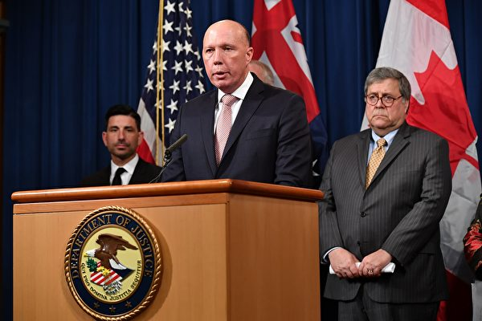

图为澳大利亚内政部长彼得·达顿（Peter Dutton）于2020年3月5日在华盛顿特区司法部举行的新闻发布会。(MANDEL NGAN/AFP via Getty Images)

 
 <b>马尼拉大都会（Metro Manila）暂停海陆空对外交通一个月</b>

菲律宾总统罗德里戈·杜特尔特（Rodrigo Duterte）昨天（3月12日）发表全国讲话，马尼拉大都会从本周六（3月14日）到4月14日暂停海陆空对外交通。公共交通将继续运转，但必须加强保持社会距离（social  distancing）。马尼拉大都会即国家首都区（简称首都区）涵盖周边15个城市及1个自治市，1280万居民。

杜特尔特总统说，菲律宾国家警队和军方将配合新冠病毒工作团队执行这项新措施，并说这项措施不会纳入戒严法。他同时呼吁相邻城市一旦发现有确诊病例应即进行隔离。

根据杜特尔特总统的个人助手邦戈（Bong Go）在脸书上发布的讯息，由于一些内阁成员接触了病毒感染患者，杜特尔特总统也在接受检测中。

根据世界卫生组织的数据，该国有52例确诊，多数是在过去一周内发生的。

<b>尼泊尔因应疫情取消了珠穆朗玛峰探险</b>

尼泊尔旅游部长阿迪卡里（Kedar Bahadur Adhikari）今天说，由于武汉肺炎疫情爆发，尼泊尔已决定取消春季登山季中所有前往珠穆朗玛峰的探险活动。

阿迪卡里说：“立即终止珠穆朗玛峰的探险活动。攀登许可也被取消，直到四月底。”

每年在3月、4月和5月春季这个时间是攀登珠穆朗玛峰的最热门时间。当天气好、气温温暖时，在登山季节的最佳几个星期中，有数百人涌向山上。

取消所有春季登山探险活动也可能对尼泊尔本已疲软的经济带来巨大打击。旅游业是该国经济的支柱之一，有些尼泊尔人，尤其是农村地区的人们，将其作为主要收入来源。

根据文化、旅游和民航部的数据，每六个游客的访问就产生一份工作，该部门雇用了138,000人。珠穆朗玛峰探险是主要的收入来源，因为外国登山者最多可花费10万美元来登山，而其中的大部分钱是用于当地的旅游公司和向导。

<b>美容品牌Glossier暂时关闭所有商店</b>

广受消费者欢迎的直销美容品牌Glossier计划暂时关闭其在纽约、洛杉矶、亚特兰大和伦敦的所有商店。

该公司还将推迟原定于下周三在位于亚利桑那州的新工厂开业。

首席执行官艾米丽·魏斯（Emily Weiss）周五在博客中宣布了这一行动，称关闭将“至少在接下来的两周内进行，以缓解COVID-19的传播”。

她补充说，在此期间，商店的工作人员将继续获得其计划轮班的报酬。

<b>印度报告首个武汉肺炎死亡病例</b>

印度今天早些时候报告了首例死于新冠状病毒疾病的病例。该病人为一名患有基础疾病、曾到过沙特阿拉伯的76岁男子。他周二在西南卡纳塔克邦去世。

根据世界卫生组织的数据，印度有74例新冠状病毒肺炎病例。

该国目前正在采取其它措施来遏制该病毒。总统府将不对游客开放，换岗仪式也将不对公众开放，直至另行通知。

来自斯里兰卡、韩国、意大利和伊朗的外国公民入境印度将被送往检疫中心进行14天强制性检疫。

<b>澳大利亚将禁止超过500人群众集会</b>

澳大利亚总理斯科特·莫里森（Scott Morrison）在今天的新闻发布会上说，澳大利亚将暂停超过500人的群众集会，以遏制新冠状病毒的传播。

这些措施将于周一生效。但是这一做法不会扩展到学校、大学、公共交通或机场。

“我们今天收到基于病例数量不断增加、以及社区传播证据的有关信息，建议我们在周一前调整对策，禁止组织、非必要的超过500人的聚会。”莫里森说。

截止目前为止，澳大利亚报告有195例武汉肺炎病例。

<b>墨尔本F1澳大利亚大奖赛取消</b>

F1赛事主办方今天上午发表声明，取消原定于本周日在墨尔本举行的F1澳大利亚大奖赛。

F1澳大利亚大奖赛组织者在一份声明中说：“在确认迈凯伦车队的一名队员新冠病毒COVID-19测试呈阳性、以及车队决定退出澳大利亚大奖赛后，国际汽联FIA和一级方程式赛车在周四晚上召集了其他9名车队负责人的会议。”

“国际汽联和一级方程式赛车在澳大利亚大奖赛公司（AGPC）的全力支持下，决定取消澳大利亚大奖赛的所有一级方程式赛车活动。”

赛事主办方表示，所有已购买赛事门票的人们将获得全额退款。

<h4 align=center><a href="https://twitter.com/McLarenF1/status/1238062852306583552?ref_src=twsrc%5Etfw%7Ctwcamp%5Etweetembed%7Ctwterm%5E1238062852306583552&ref_url=https%3A%2F%2Fwww.epochtimes.com%2Fgb%2F20%2F3%2F12%2Fn11936755.htm">国际汽联和一级方程式赛车在澳大利亚大奖赛公司（AGPC）的全力支持下，决定取消澳大利亚大奖赛的所有一级方程式赛车活动(点击右键,另存新档）</a></h4>

<b>切尔西足球员哈德森-奥多伊新冠病毒检测呈阳性</b>

英格兰足球超级联赛俱乐部切尔西球队周四宣布，球员卡勒姆·哈德森-奥多伊（Callum Hudson-Odoi）新冠状病毒检测呈阳性。

这位19岁的切尔西球员是最新测试该病毒呈阳性的足球运动员。英超联赛将于周五举行紧急会议，讨论未来的比赛。

切尔西在声明中说，最近与该球员密切接触者现在将自我隔离。

周四早些时候，阿森纳足球俱乐部宣布其经理米克尔·阿特塔（Mikel Arteta）的冠状病毒检测呈阳性的结果。

此前英超联赛曾表示，本周末的比赛将按计划进行。

但在疫情爆发之际，西班牙、意大利、葡萄牙、荷兰、爱尔兰和美国的足球联赛都已暂停，而德国甲级联赛和法国Ligue 1联赛则闭门进行。

<b>密歇根州将关闭所有K-12学校</b>

密歇根州州长格蕾琴·惠特默（Gretchen Whitmer）宣布，从周一（3月16日）至4月6日，所有幼儿园至12年级的学校都将关闭，这是该州努力减缓新冠状病毒传播的一个行动。

迄今为止，密歇根州已确诊至少有12名武汉肺炎感染患者。

<h4 align=center><a href="https://twitter.com/GovWhitmer/status/1238301146500009985?ref_src=twsrc%5Etfw%7Ctwcamp%5Etweetembed%7Ctwterm%5E1238301146500009985&ref_url=https%3A%2F%2Fwww.epochtimes.com%2Fgb%2F20%2F3%2F12%2Fn11936755.htm">密歇根州州长格蕾琴·惠特默（Gretchen Whitmer）宣布，从周一（3月16日）至4月6日，所有幼儿园至12年级的学校都将关闭，这是该州努力减缓新冠状病毒传播的一个行动(点击右键,另存新档）</a></h4>

<b>香港现第四例武汉肺炎死亡病例</b>

香港医院管理局证实，一名武汉肺炎患者在周五早上死亡。这是香港第四例感染新冠状病毒的肺炎死亡个案。

医院管理局说，截至周五，全港总病例数为131例。

<b>奥兰多环球影城将于周日开始关闭</b>

奥兰多环球影城宣布将在本周日（3月15日）开始暂时关闭其主题公园，至少到3月底，但有可能会更长时间。

公告称，奥兰多环球影城的酒店和环球影城仍将保持开放。

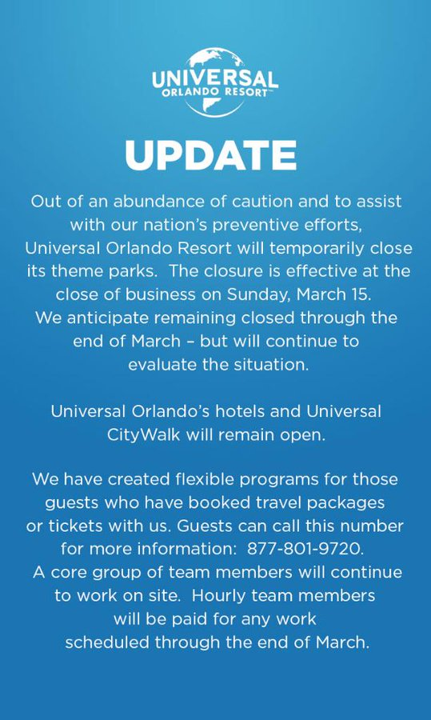

<b>加拿大总理特鲁多的妻子新冠病毒检测呈阳性</b>

加拿大总理特鲁多办公室的一份声明说，加拿大总理贾斯汀·特鲁多的妻子索菲亚·格雷戈雷·特鲁多（Sophie Gregoire Trudeau）的新冠状病毒检测呈阳性。

声明说，她感觉良好，只有轻微症状，并且将保持隔离状态。

声明说，特鲁多没有症状，但将被隔离14天。由于他没有症状，因此目前未接受检测，并将继续正常工作。

加拿大总理办公室表示，总理夫人索菲亚最近曾前往英国演讲，返回后出现了轻微类似流感症状，周三深夜发低烧。

周四上午，在妻子测试结果出来前，特鲁多已经选择自我隔离并在家工作。

本周特鲁多与部长们首次会面的议程已被取消，原定于周四和周五在渥太华与加拿大省长的会晤，已改为通过电话进行。

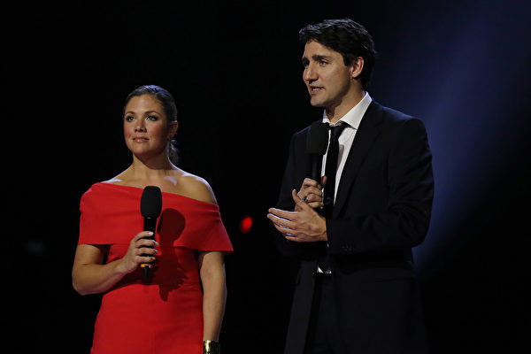

加拿大总理特鲁多夫人索菲亚近日从英国回国后出现低烧，已接受新冠病毒检测后呈阳性，特鲁多在家隔离和工作。 (Lars Hagberg/AFP)

<b>阿拉斯加首例武汉肺炎</b>

州长迈克‧邓利维（Mike Dunleavy）表示，阿拉斯加已经确定了首例武汉肺炎病例，是一名外籍旅行者。

该病例为推定阳性病例，意味着该患者已在该州公共卫生实验室测试为阳性，但仍在等待美国疾病控制与预防中心（CDC）的最终确认。

根据州首席医疗官安妮·辛克（Anne Zink）博士的说法，该患者是正在“穿越”该州的外国公民。

阿拉斯加官员并未透露患者的国籍，但表示该人乘飞机来到该州。

<b>前NBA球星接受新冠检测</b>

前NBA球星，现任“NBA on TNT”分析师员查尔斯‧巴克利（Charles Barkley）星期四在播音中证实，他在去纽约旅行后感到不适后，在医生建议下接受了新型冠状病毒检测。

巴克利的宣布是在NBA因武汉肺炎病毒而推迟其赛季的第二天。

巴克利说，他正处于自我检疫的第二天，也在等待测试结果。

<b>英超首现球员染疫 切尔西19岁球星确诊</b>

3月13日，英格兰足球超级联赛切尔西（Chelsea）俱乐部官方宣布：19岁球星哈德森·奥多伊（Callum Hudson-Odoi）对武汉肺炎病毒检测呈阳性反应，是英超首位确诊染疫球员。

<b>体育和娱乐界的反应</b></b>

包括NBA、意大利意甲和美国职业足球大联盟在内的主要体育联盟正在暂停或推迟赛季。 大学篮球的三月疯狂锦标赛也被取消。 美国职业棒球大联盟宣布，赛季开始至少要延迟两周，并且已经取消了剩余的春季训练时间表。

迪士尼公园也关门了。

纽约市长白思豪（Bill De Blasio）说，麦迪逊广场花园和巴克莱中心是该市的两个主要场所，可能会关闭数月。 百老汇也暂停所有演出。

在娱乐界，美国最大的深夜脱口秀节目中的两个：“The Tonight Show”和“与塞思·迈耶斯晚间放映”（Late Night with Seth Meyers）正在暂停制作，直到3月30日。翠贝卡电影节也被推迟了。

<b>众议长佩洛西：未就新冠病毒应对包达成任何协议</b>

周四晚，美国政府和国会高层谈判代表未就一项全面立法达成最终协议，该立法旨在解决新冠状病毒危机带来的经济影响。谈判人员将谈判推迟至周五，试图解决一些悬而未决的问题。

经过数小时的讨论和提案交易，包括众议院议长南希·佩洛西（Nancy Pelosi）和财政部长史蒂芬·姆钦（Steven Mnuchin）之间的全天通话，谈判人员仍在努力讨论一揽子计划中的分歧。该计划将包括带薪休假、扩大的食品援助、扩大的失业保险和新冠状病毒检测的免费保险。

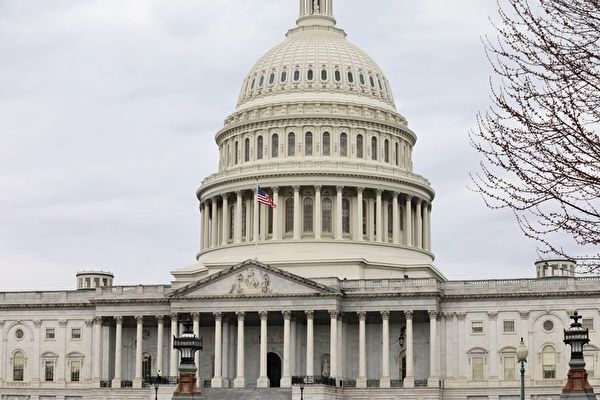

图为美国国会大厦外观。（中央社）

<b>美国至少有1,635例武汉肺炎病例</b>

根据州和地方卫生机构以及疾病控制与预防中心的数据，美国至少有1,635例新型冠状病毒病例。其中70例是从海外撤离的公民，例如从钻石公主号邮轮或从中国撤离的公民。

在美国本土检测到1,565例病例，分布在46个州和哥伦比亚特区。

全美有41人死亡，大部分在华盛顿州。

统计数据中包括推定阳性病例，即在公共卫生实验室检测出阳性并等待CDC最终确认的患者。

<b>蒙大拿州宣布进入紧急状态</b>

蒙大拿州州长史蒂夫·布洛克（Steve Bullock）周四宣布，因新冠状病毒，全州进入紧急状态。

该州目前尚无确诊病例，布洛克在Facebook帖子中说，该州正在准备应对新冠状病毒。

同日，蒙大拿州公立大学和大学院系统宣布，将从3月23日起尽可能多转向远程学习，并暂停面对面学习。

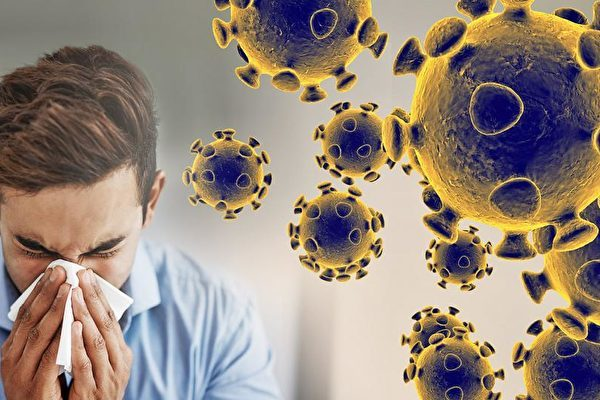

图为新冠病毒示意图。（FDA网站）

 
<b> 新墨西哥州将关闭所有K-12公立学校3周</b>

州长米歇尔·卢扬·格里舍姆（Michelle Lujan Grisham）办公室新闻稿显示，新墨西哥州将从下周一开始关闭所有公立中小学。

关闭将持续三周，以减缓新型冠状病毒的传播。

州长办公室表示，有关关闭的更多细节将在周五公布，但该州希望早日宣布，以便父母可以在下周开始计划托儿服务。

在该州宣布第六例确诊的新冠状病毒病例后不久，学校宣布停课。

<b>堪萨斯宣布首例武汉肺炎死亡</b>

堪萨斯州州长劳拉·凯利（Laura Kelly）周四宣布该州首例因武汉肺炎死亡的病例。

凯利说，该患者是70多岁男性，住在怀恩多特县（Wyandotte）一家长期护理机构中。

根据州长的说法，该男子还患有其它潜在疾病，在去世之前正在当地一家医院接受护理。

该名男子没有自我移动能力，因此该州将其视为社区传播的一个病例，卫生官员现在正在进行追踪。

这是该州第五例确诊的新冠状病毒病例。

这是美国第41例死亡。

<b>美股暴跌</b>

武汉肺炎引爆全球股灾，美股道琼斯指数步入熊市后再跌2352点，跌幅近10%，收在21200.62点。创1987年“黑色星期一”以来最糟表现。

随着欧洲多地股市崩跌逾10%，美股今天开低走低，尾盘卖压加重，500指数大跌260.74点，跌幅9.51%，收在2480.64点。以科技股为主的纳斯达克综合指数重挫750.25点，跌幅9.43%，收在7201.8点。

图为华尔街股票交易市场。(Getty Images)

 
 <b>中共精心策划 将武汉病毒源头导向美国</b>

北京一直在全球散播舆论，将新冠病毒的源头指向美国。有专家称，这是中共剧本中的一个战术；另有专家称，这种阴谋论远超过散播虚假信息，而是中共通过每个渠道攻击美国的全面运动。

美国著名中国问题专家和评论家章家敦（Gordon G. Chang）告诉福克斯，中共的激进宣传表明其一边在极力误导全球，一边在加紧努力来挽救其颜面。

章家敦认为，美国官员们不要屈服，而是应该继续使用“武汉病毒”这个名称，并回击中共的有关种族主义的指控。

全文请看将新冠源头导向美国 专家：中共精心策划

<b>巴西高官确诊 总统接受病毒检测</b>

巴西政府周四表示，总统府新闻秘书汪贾登（Fabio Wajngarten）确诊感染武汉肺炎，巴西总统雅伊尔‧波索纳洛（Jair Bolsonaro）也接受病毒检测，预计明天公布结果。

巴西政府指出，总统府医疗团队将采取所有必要预防措施来保全波索纳洛的健康。

上周，汪贾登陪同波索纳洛出访美国。波索纳洛和家人及所有随行人员都已接受病毒检测，预计明天公布结果。

<b>川普不忧曾接触确诊巴西官员 白宫：总统不需检测</b>

巴西总统波索纳洛曾于3月7日前往川普位于佛罗里达州的私人俱乐部“海湖庄园”（Mar-A-Lago）出席官方会议，他的新闻秘书汪贾登（Fabio Wajngarten）也陪同参访。

川普周四早在白宫接见来访的爱尔兰总理瓦拉德卡（Leo Varadkar），他被问及此事时表示并不担心。

白宫发言人格里汉姆（Stephanie Grisham）随后发出声明表示，白宫已经获悉此事，正在确认测试结果，也正在评估接触程度，以决定下一步行动。

格里汉姆也指出，川普与同场的副总统彭斯（Mike Pence）几乎都未与这名官员互动，目前不需进行检测。白宫正在密切监视情势发展。

声明也表示，白宫医疗小组与美国特勤局（US Secret Service）一直与各机构密切合作，采取一切预防措施确保第一家庭与第二家庭以及所有白宫工作人员的健康。

<b>伊朗最高领导人顾问感染新冠</b>

伊朗最高领导人阿亚图拉·阿里·哈梅内伊（Ayatollah Ali Khamenei）的现任顾问阿里·阿克巴尔·维拉亚蒂（Ali Akbar Velayati）已检测出新型冠状病毒呈阳性反应，目前正在家中隔离。

据ISNA报导，维拉蒂最近在Masih Daneshvari医院待了几天，与医院工作人员讨论在全国范围内对抗新冠状病毒的方法。

医院官员告诉ISNA，维拉蒂从星期三开始表现出类似新冠状病毒的症状，此时他接受了病毒测试，结果表明他已经感染病毒。

 
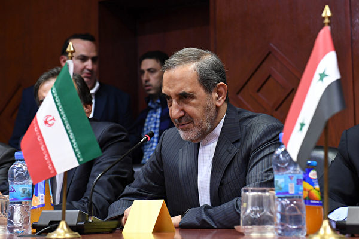

伊朗最高领导人阿亚图拉·阿里·哈梅内伊（Ayatollah Ali Khamenei）的现任顾问阿里·阿克巴尔·维拉亚蒂（Ali Akbar Velayati，图）新冠状病毒检测呈阳性反应，目前被隔离，这是最新一名伊朗高官感染病毒。(George OURFALIAN/AFP)

 
 <b>圣荷西机场两TSA雇员新冠测试呈阳性</b>

根据联邦机构提供给当地官员的信息，诺曼·峰田圣荷西国际机场 （Mineta San Jose）两名运输安全管理局（TSA）官员新型冠状病毒检测呈阳性。

由圣荷西市长办公室发布的信息摘录说：“现行的TSA标准操作程序要求一线人员在检查（乘客）个人或其财产时要戴上丁腈手套，这增加了一层保护。与任何乘客或其个人财产接触后都要更换手套。”

TSA已授权“一线人员”， “如果他们愿意的话，要戴上外科口罩”。

<b>加拿大阿尔伯塔省政府要人们不要出国</b>

阿尔伯塔省要求居民取消所有大型聚会，并建议他们不要出国旅行，以减轻新型冠状病毒的传播。

<b>武汉肺炎令中国复工难 重启经济更难</b>

因武汉肺炎疫情影响，中共当局下令的全国复工很难，但要全面重启经济也更难。

在停摆6周后，中国已经开始恢复工作，一些工厂开工、办公室里的人多了起来。但是工厂远未达到满负荷生产，而城市功能也只是部分恢复，还有很多人不能回来工作。

一方面受复工难的影响，中国工厂难以在短期内重启人力和资源进行生产，另一方面，国内外需求尚未复苏，因发愁销路，部分行业的生产重启步履蹒跚。

全文请看武汉肺炎令中国复工难 重启经济更难

<b>加拿大武汉肺炎已经确诊141病例</b>

根据加拿大各省官网更新的数据，截止周四（3月12日）下午3点，安省、魁省确诊病例都有所增加，而萨省和曼省都发现确诊病例，全国总计141例。

安省公共卫生部门宣布，截至周四（12日）早上，新增17人感染新型冠状病毒，连同之前滑铁卢卫生部门公布的2名患者，安省共有59人感染。

魁省确诊13例；诗省新增7例，总数46例。

<b>英国防疫进入第二阶段</b>

英国周四宣布进入防疫第二阶段“延缓”，英国首相约翰逊表示，民众只要有持续咳嗽或发烧症状，不必等待确诊，必须先行自我隔离7天。不过，约翰逊并未宣布学校停课。

英国截至周四累计10死，并有596人确诊，是疫情爆发以来首次单日增加超过100例。

<b>卫星图曝伊朗挖壕沟 掩埋尸体？</b>

2月下旬至3月初，卫星图像显示德黑兰重灾区库姆市的一处公墓出现大型墓坑，专家推测伊朗死亡人数恐远高于官方数据。

根据马克西科技公司（Maxar Technologies）提供的卫星图像，伊朗于2月19日宣布库姆市（Qom）出现该国首例新型冠状病毒（SARS-CoV-2）病例后，2月21日该市Behesht-e Masoumeh公墓附近就出现挖掘大量墓坑的异常活动。

全文请看卫星图曝伊朗挖壕沟 为掩埋大量武肺死者？

<b>中共被指“要钱不要命”</b>

中共官方的武汉肺炎疫情数字受到国际质疑，被指在疫情扩散之际，为了复工不顾老百姓的生命安危，而实际上地方政府和企业仍然对疫情感到恐惧。

台湾新头壳网站3月12日引述中州科技大学教授林修正的分析文章《中国要钱不要命》表示，中国已被国际认为有防疫失控之嫌，而且口罩等防疫物资严重短缺，可是这时政府的数据却出现很多省市连续几天零确诊，有压低数据和造假的嫌疑。

文章提到，中国（中共）为了救经济，不怕工厂发生群聚感染，强力要求工厂复工，抢救经济却让一个国家深陷传染病的苦难之中，真的很不应该。

<a target="_blank" href=#top><h6 align="right">回上方</h6></a>

<a name=126>
<h1 align="center"><b>【新闻看点】病毒来自哪里？川普：中美都知道</b></h1>

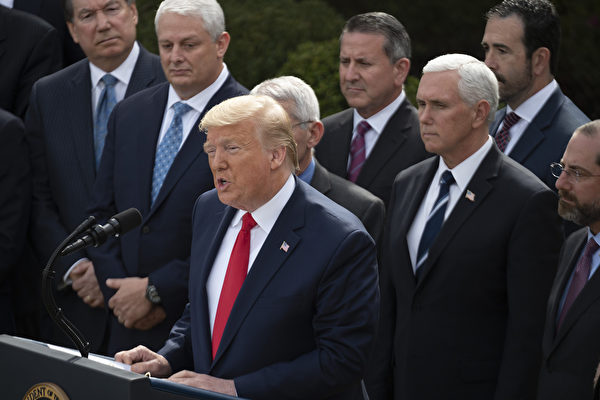

图为13日的川普白宫新闻会现场，背后都是相关的防疫专家；没有宣传部、政法委、公安部等维稳机构负责人。(Photo by JIM WATSON / AFP)

【大纪元2020年03月15日讯】大家好，欢迎大家关注新闻看点，我是李沐阳。

今天是3月14日，我们今天要谈的内容分为几个部分。首先会谈到美国总统川普出面了，正式回应了中共的病毒甩锅。然后比较一下美中两国抗击武汉肺炎（新冠肺炎，COVID-19）疫情的不同。

再结合一些爆料和记者采访录音，看看中国疫情的真实情况，了解一下武汉人目前的生活状况。最后要谈谈这场大瘟疫可能开启了改朝换代的节奏，这个时候人们该怎么做。

<b>甩锅三部曲 到了外交层面</b>

昨天我们谈到，中共外交部发言人赵立坚甩锅，把病毒来源指向了美国。经过我们查证，仅在昨天和前天，他总共发了5条推文。内容大同小异，都是指控美军把武汉肺炎病毒（SARS-CoV-2）带到了武汉，还说“美国欠我们一个解释”。

就像中国大陆很多女星靠绯闻出名一样，赵立坚替中共甩锅，也让他成了网红。不过人们都是对他进行抨击，不少人称他“战狼外交官”。

对于中共外交部，不管大家怎么称呼，“崴脚部”也好，“战斗部”也好，还是“战狼部”也好，作为中共的对外窗口，它代表着中共的态度，说出的话代表着中共的声音。

也就是说，赵立坚所表达的意思，就是中南海的意思，北京当局的意思。

从最初五毛在网络上散布流言，到后来“晚节不保”的中共流行病学专家钟南山放风，再到“战狼部”发言人公开表态。中共已经把病毒来源问题升级到了新的高度，甩锅甩到了外交层面。

<b>美召见崔天凯：严厉的抗议</b>

上升到了外交层面，美国就必须作出回应了。

昨天（13日），美国国务院亚太事务助理国务卿史达伟（David Stilwell）召见了中共驻美大使崔天凯，就赵立坚所说的“美军播毒论”表达了美国政府的“极坚定立场”。

史达伟向崔天凯非常“严厉地抗议”，表示美国“不会容忍”中共为了转移武汉肺炎的指控，发表这样的言论。

一名美国国务院发言人在稍后回应中表示，中国（中共）想转移有关中国开启全球大流行，而且隐瞒真相所招致的批评。“散播阴谋论危险荒谬，我们（美方）要告知这个（中共）政府，为了中国人民和全世界，我们（美方）不会容忍”。

有匿名美国官员向路透社透露，中共正在试图逃避因为导致全球大流行的疫情，并没有及时告知全世界而面临的批评。

密苏里州共和党参议员霍利（Josh Hawley）把赵立坚称为“中共外交部小丑”。不过，赵立坚随后在推特上拉黑了霍利。

霍利推文表示，“我高兴地报告，这位中共外交部小丑把我屏蔽了，因为我敢于挑战他有关美国要为武汉病毒负责的明目张胆的谎言。事实是，中国共产党在这个病毒上对本国公民和世界说了谎。他们要负责。”

<b>川普回应：美中都知病毒哪里来</b>

不仅是美国国务院和国会议员重视中共的举动，美国总统川普也对赵立坚的推文做出了回应。

在昨天（13日）的白宫记者会上，川普表示，自己读过了赵立坚的文章。他认为那篇文章“不具有代表性”，不代表习近平。

川普明确表示，与习近平在会谈中没有谈过这个问题。“他们知道它（病毒）是从哪里来的，我们都知道它是从哪里来的”。

中国有句话，“白菜吃芯，锣鼓听音”。

表面上看，似乎川普没有把话完全说透。但实际上，作为总统来讲，把话说到这个份上，已经等于是把中共甩锅的老底给揭了；相当于告诉人们，这个病毒就是来自中国。

作为一国总统，如果对一个中共外交人员的动作反应过大，级别是明显不对等的，所以川普是点到为止。但是川普还谈到了另外一件事，就是美中贸易谈判。

川普表示，根据双边协议，中国向美国购买2500亿美元商品与500亿美元农产品。他强调说“这对我们国家是重要的协议，是时候有人该这么做了”。

川普曾经多次说过美中贸易谈判的事情，甚至美国官员曾经表示过，疫情可能会影响贸易协议的执行。美国官员早前的这种说法，等于是给北京稍稍地松绑。

言外之意，在这种大疫当头的时候，就算北京不完全履行协议，美国也会表示理解，很可能不会启动执行机制。

但是现在，川普主动提到了这两件事，而且放在了一起说。这已经表明，川普对北京甩锅的做法非常不满意，甚至是很生气。

这背后的意思就是告诉北京，你把病毒扩散到全世界，世界各国都非常紧张，连美国也不得不进入紧急状态。这笔账世界还没有跟你算，还给你捐助大量物资，帮助你抗疫。你不知感恩戴德，反过来恩将仇报，往美国人身上泼脏水。你必须为自己的毒蛇行为付出代价！

<b>美国进入紧急状态，500亿美元救助金启动</b>

说到世界各国都非常紧张，从美国的最新动作上就可以看出来。川普在昨天的记者会上正式宣布，因为武汉肺炎疫情的迅速蔓延，美国全国都“进入紧急状态”。

川普表示，“全国进入紧急状态”，这几个词“意义非凡”。联邦政府将“提供多达500亿美元的资金”，对于共同抗击疫情的各州、个地区和各地方来说，“这是一笔非常重要且规模巨大的资金”。

宣布进入紧急状态，这种权力以往很少使用。根据这项法律，联邦紧急事务管理署（FEMA）可以向各州和地方政府提供救灾资金，并且部署支持团队。

川普敦促各州都建立应急中心，帮助对抗武汉肺炎病毒。他说，“将清除或消除一切障碍，为我们的人民提供他们需要的、他们有权得到的医疗服务。我们（联邦政府）将不遗余力，无论如何”。

500亿美元，从这笔巨款就可以看出，川普政府对疫情的重视，对美国人民的生命财产的重视。

而中国的疫情已经3个多月、将近4个月了。中共当局不仅没有拿出过一分钱，反而让受灾的百姓捐款。物价是翻着跟头上涨，但民众拿到的菜仍然是脱水的，甚至是腐烂的。有的武汉市民拿到的肉上面，已经生出了蛆虫等等。

<b>美国不搞中国式封城</b>

美国全国进入紧急状态，这引起了很多人的疑问，美国会不会也像湖北武汉一样的封城呢？

纽约州州长库莫表示，在武汉肺炎疫情严重的新罗谢尔市划出“控制区”，仅仅是禁止大型公共场所的聚会。他说“民众照常生活，并不是中国式的封城”。

曾经是美国国土安全部副部长的塔拉·奥图尔（Tara O’Toole）也表示，“这是美国，我们不会禁止人们进出城市，禁止他们旅行。而且这通常也不起作用。”

奥图尔对美国之音说，“历史表明，那种对某些地方封锁的尝试，会激发人们去做相反的事情。而且我认为，这样做的代价并不值得”。

现任非营利风险投资公司IQT副总裁的奥图尔认为，“如果要与传染病做斗争，其中关键之一就是，要让所有数据非常开放和透明，组织和避免支持任何所谓的假新闻、引发惊恐的言论和故事”。

奥图尔认为，美国应该在一两年内，让检测病毒像测试怀孕一样的简单方便，人们可以自己在家里诊断。

<b>回应网友：中国式封城的负效应</b>

说到封城问题，想起了前段时间的网友留言。网友大概意思是说，封城有什么不好，如果不封城，中国的疫情能这么快就控制住吗？

疫情是不是真的控制住了，在今天的会员专区，我们会详细地说说。有很多网友的爆料视频，也有我们记者的采访。我们让事实来说话，看看是不是中共宣传的那样。

对于网友的疑问，这里做一点回应，也算是跟大家的互动啊。

其实，对于采取封城防止疫情扩散，我从没否定过，大家可以翻看一下我们前面的节目。我们只是指责中共的做法太野蛮，太不人道。

武汉封城是从1月23日开始的。在封城之前，它一直在粉饰太平，隐瞒疫情真相。很多人相信了它的宣传，没有任何的准备。家里没有储备粮食，也没有准备口罩等必要的防护用品。

就在这种情况下，中共突然宣布了封城。所有的公交、地铁、轮渡、长途客运全部暂停，居民不能出门，每户每两三天才可以有一名成员出门采购等等。手段非常强硬，如果不遵守这个规定，有的挨一顿打后抓走了，有的当场就被打死了。

中共做什么事都是一刀切，只要领导说了，不管对与错，都必须照办。在中国许多地方，当局打着抗击疫情的名义，制造了许多暴行和违反人权的惨剧。

有些地方当局用木板把居民的家门钉死，用电焊把铁门焊死，有的人因为没戴口罩，被拦住殴打，被罚跪在地上，有的被用铁链子锁住，牵着游街示众。还有戴着红袖章的人，提着棒子巡逻，甚至冲进居民住户殴打、抓人等等。

今天有网友转来一个视频，湖北孝感的一个小孩子，被活活饿死在家中。十几天之后，尸体散发出了臭味，才被人发现。

【原声视频】

女：好吓人。

男：这是什么方法？在屋里饿死了，都臭了。

没有口罩，人们可以不上街，不出门。但是没有储备粮食，没有食物，很多人就活活被饿死了。这不是中共野蛮封城制造的人道灾难吗？这种人为制造的人道灾难，我们不应该谴责吗？

意大利现在也采取了封城措施，但它的封城与武汉的强制性封锁是完全不同的。它的封城是建立在公民自律的基础上的，而且公交系统，包括机场仍然在运营。

政府也没有阻止商业的正常运营，也不阻止货物的供应。比如餐馆、咖啡馆和商店，都会继续营业到下午6点，只是要求采取必要的措施，确保顾客之间保持一米远的距离。

也许，意大利的封城效果，可能不如中国有效，但它绝不会发生中国那样的人道灾难。

彭博社专栏作者伊莱·雷克（Eli Lake）指出，虽然中共当局采取了严酷措施，隔离了数以亿万计的人，降低了病毒蔓延速度。但是中共政府的缺乏透明和它的专制压制，恰恰是病毒最初爆发的主要原因。

<b>疫区民众怒喊：共产党，下课！</b>

来看这样一个视频，这是一天前网友发过来的。

【原声视频】“共产党，下课”，“我受不了了”。

这是武汉人民的怒吼，无数的人在一起喊“共产党下课！”，而且其中还有孩子充满稚气的声音，“我受不了了”。

“共产党下课”，在我看来，其实就是把“打倒共产党”变了一种说法。武汉人、中国人在经历了失去亲人、家破人亡之后，在经历了中共的一次次说谎和一次次残暴打压后，终于发出了怒吼，喊出了深埋在心底的口号。

这是一个相当令人振奋的画面，相信这个声音会传遍中国大地，并引起蝴蝶效应。而且我相信，在不久的将来，或许就在下一刻，人们就会直接喊出“打倒共产党”。

法轮功学员曾告诉过我，我也曾转述过他们的忠告。就是诚心敬念“法轮大法好”，可以化险为夷，遇难成祥。

有良知百姓和有识之士，如果信奉“真善忍”是人类亘古以来的普世价值，在动荡乱世的关键时刻，诚念一句“法轮大法好”是能带来福报的。关于这一点，法轮功学员告诉我，他们亿万法轮功修炼者已经身体力行地实践了。

另外在这里，我还可以跟您讲，如果您不敢呼喊“法轮大法好”，您可以喊出“打倒共产党”。

您不要急着反对，听我说完理由。

我们在节目中说过很多次了，现在是天灭中共的时候，相信您也有所观察。看看世界上疫情严重的几个国家，意大利、韩国、伊朗等等，哪个不是亲共的？这能是偶然的吗？

我说过两次“病毒是有眼睛的”，重要的事情说三遍，我现在把第三遍补上：病毒是长眼睛的，它就是冲着中共来的。

那么在这个时候，您如果喊出“打倒共产党”，这不是等于跟中共脱离关系了吗？

中国有一句流传千古的话：顺天者昌，逆天者亡。当人们喊出“打倒共产党”这句口号，那就是顺天而行，那就一定会得到上天的护佑。

沐阳在节目中很少下断言，也很少说肯定的话。目的是引导大家思考，让大家自己得出结论。

但是这一次，沐阳可以肯定地告诉您，真的喊出“打倒共产党”这句口号，一定能保命！不信您就试一试。

好的，以上就是今天的公共区视频内容。我们在会员区，会结合网友的爆料视频以及我们记者的采访，看看武汉的疫情和全国的真实情况。武汉市民说“这个社会是地狱，人们在地狱煎熬着”。感谢您的收看，我们会员区见。

大纪元《新闻看点》制作组

<a target="_blank" href=#top><h6 align="right">回上方</h6></a>

<a name=125>
<h1 align="center"><b>【一线采访】哪来10元肉？武汉民工斥当局骗人</b></h1>

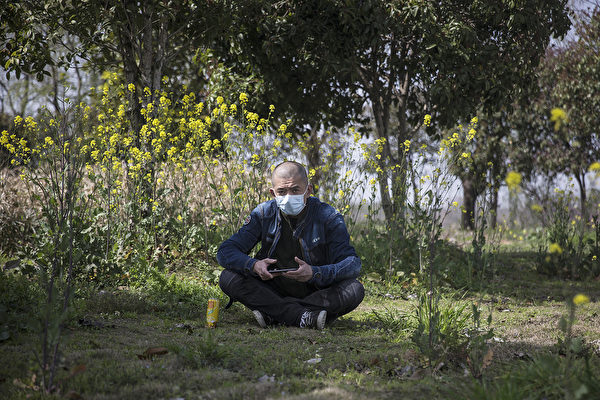

外地滞留武汉的农民，一个多月没吃到肉，对政府非常失望。图为一名武汉工人。(Stringer/Getty Images)

【大纪元2020年03月15日讯】（大纪元记者洪宁、李毅采访报导）武汉封城超过50天，除小区管制未见放松之外，被困在工业区里的外地农民工，因工厂歇业、挣不到钱，社区、街道办互不管事，生活陷入困境。被滞留在黄陂区滠口金都工业园里的高先生说，“已经一个多月吃不上肉了。”

“给市长热线至少打了6次电话，再也不想打了，他们这些人啊，都是老百姓的钱养活着，却不管事。”高先生说，“社区、派出所、市长热线，都打了，他们都推，说我户口不在这个区。”各单位都互相推诿，令人气愤。

位于武汉的华中企业城是武汉黄陂区早期开发的家具产业园区，聚集了多家家俱大卖场和家俱工厂。

高先生说，封城前这里也有不少人，一些农民工没有返回家乡过年，“有些人是老板说留下来看厂，过年给多少钱；也有些人故乡也没什么家人，就留在这里过年。”高先生不是留下来看厂，自己在园区里租房子住，原本打算过完年就上工，“我也不知道会滞留这么久。”

<b>没干活挣不到钱 连冻肉都吃不起</b>

没想到武汉肺炎疫情一发不可收拾，封城到现在超过了50多天，天天吃面条，高先生和留下来的民工吃到都要吐了，“我跟身边留下来的人一个多月都没吃上肉了，想去买些肉吃吧，连冻肉都要45元一斤，再说大家又没干活，没挣到钱，又不是政府的公务员，没有固定工资，我们是干活就有钱，不干活就没有。”

他说，“我看新闻，政府说有补贴的肉啊什么的，10多元一斤，这样宣传，我们都觉得蛮有希望，但是现实生活中，根本就没有。”

他说，“给我打电话的（干部）不知道是哪里的，我说45块钱的肉吃不起啊，他说，‘45块钱不贵啊，我们也都吃45块钱的肉。’新闻上不是说，政府补贴10多块钱的肉吗，我们袋子里没有钱，再说还是冻肉。”

不仅政府宣传的10多元一斤的猪肉没看到，连捐赠物资也不翼而飞，是不是有黑心官员趁机发国难财，高先生说，“外界捐赠许多物资，我们一点都没拿到，那些（捐赠的）物资粮食，是不是也分给我们一点点？”

<b>反映无数次没人理 怒：不把我们当人</b>

他说，“我给市长热线反映问题，没有真正的效果，虽然有人打电话过来，最后还是不了了之了。”他指，市民热线根本只是在忽悠老百姓。

“我们都是农民工，低消费的人，肉贵到我们也没钱买。”他说，“你看那个新闻啊，用垃圾车载肉，市民反感，污染了那些肉，他们就把那些肉拿去销毁了，就这么忽悠百姓啊！还说什么新鲜肉，便宜肉什么的，就算是国家打仗，难民也要供应一回啊。”

“而我们反映了无数回，一次也没有人管，没有人帮我们送点儿生活必需品什么的，我就觉得愤愤不平。”他相当气愤，“我们是一回都没有，我们就是没人管，没人理，不把我们当人。”

<b>休舱、无症状藏危机 解封恐遥遥无期</b>

封城已经50多天，但是，武汉疫情仍不明朗，特别是日前方舱医院全数“休舱”，令人担心疫情会再复发。高先生说，“方舱医院的病人基本上都不是治愈的。所有症状轻的、年轻的、能够治愈的，症状不明显的，都在方舱医院。”

“有人出院过了几天，状态不好就死了。因此不少患者出院回家后，还会出现病情复发感染家人的情况。”更有一些人完全无病症，在血液检查过程中才发现染疫。

他说，“前两天有一个视频说，在某医院门诊查血人中，发现了无任何症状的武汉肺炎病人，不查血根本不知道，这些人放出来的话，我们去超市也不知道对方是否会传染。”

这是多灾多难的年份，武汉市民、滞留的农工、百姓叫苦连天，“我以前没有吃过这么长时间的面条，没办法啊。”他说，“房租也快到期了，冬天这一片都还停电，没人管，现在的费用都是靠一点点积蓄。”再这样下去，他不知再如何撑下去了。

<a target="_blank" href=#top><h6 align="right">回上方</h6></a>

<a name=124>
<h1 align="center"><b>中共发言人赖美军带疫情到武汉 国际哗然</b></h1>

2020年1月25日，一名公安站在武汉肺炎的最早起源地──华南海鲜批发市场外。(Hector RETAMAL/AFP)

 
 【大纪元2020年03月13日讯】（大纪元记者林燕综合报导）中共外交部发言人周四（3月12日）转发中共官媒《环球时报》编译的美国国会听证视频片段，再次散布阴谋论说“美军把疫情带到武汉”，引发国际社会哗然。

《经济学家》记者加迪‧爱泼斯坦（Gad Yepstein）推文回应说，“这名拥有27.2万追随者的中共外交官赵立坚在彻底散布疯狂言论——美军可能把疫情带到了武汉。”

他指出：“中国（中共）在社交媒体散布不实信息的问题正变得越来越严重。”爱泼斯坦曾在2月系统撰文分析中共外交部的推特输出宣传战术，周四更是对赵立坚的推特账户截图介绍。

根据赵的过往资料显示，这名前中共驻巴基斯坦大使在升任中共外交部发言人之前，就已经是中共外交官中最喜欢在推特平台上对外挑衅的人物。

赵的推特账户创建于2010年5月，是所有中共外交人员中拥有个人账户中最早的一个。截至2020年3月12日，赵总共发送58,500条推文，平均每天推送16条。

自从赵立坚今年2月被召回北京后，其作为挑衅者的职责之一就是让更多的中共驻外大使加入发推文。

<b>中共颠倒黑白 妄图推脱武汉肺炎起源</b>

美国疾病控制与预防中心（CDC）主任罗伯特‧雷德菲尔德（Robert Redfield）周三出席国会众议院监督委员会公开听证，表示有死于流感症状的美国人在尸检中被检测出武汉肺炎。

这一回答被中共媒体编译后当成美国的软肋，进行大肆炒作宣传。

赵周四转发该视频，并推文说：“美国疾控中心主任被抓了个现行。零号病人是什么时候在美国出现的？有多少人被感染？医院的名字是什么？可能是美军把疫情带到了武汉。美国要透明！要公开数据！美国欠我们一个解释！”

赵的推文是想推脱疫情源自中国武汉的事实。美国政治网站Axios周三就撰文提醒说，“我们瞥见了中国（中共）如何用其强大的宣传手段掩盖真相，并改变国外报导的手法，这些跟它在中国国内的做法一样。”

中共最拿手的就是篡改历史和掩盖真相。报导总结了中共当局正在推动的两个伪命题，第一个就是新冠病毒的起源不是中国；第二个则是中共为世界赢得了应对疫情的时间。

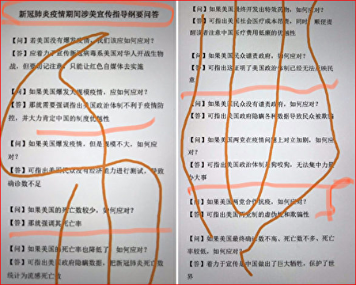

网传“新冠肺炎疫情期间涉及宣传直达纲要问答”的通知貌似对中共网络五毛和自媒体等做出方向性指导。（网络图片）

对比中国国内的动静，反能帮助外界洞悉中共在海外的小动作。近期，网络上传出的中共内部对网络五毛和自媒体的指导性文件“新冠肺炎疫情期间涉及宣传直达纲要问答”的通知，其中一则就是“如果美国没有爆发疫情，应该如何应对，文件的煽动方向为‘应着力宣传病毒是美国对华人开展生物战，但只能让红色自媒体去实施’”。

整个答案可谓“翻手为云覆手为雨”。中共的舆论指导性文件可浓缩为一点，美国未必比中共强，为维护中共体制痳痹人。

而赵立坚更早在3月4日的记者会上就引导了一次这样的舆论。他说，个别外国媒体称新冠病毒是“中国病毒”是“企图让中国（中共）背上制造疫情灾害的黑锅，完全是别有用心”，中方对此坚决反对。

同日，官媒新华社转发自媒体文章《理直气壮，世界应该感谢中国》，以及《听，人类命运共同体的大合唱》，正式进入中共舆情控制第四部曲的全面倒戈篇。前三部分别是丧事喜办、美国阴谋、“中国又赢了”。

<b>贬损他国和稀泥 中共高层罕见策划的反攻</b>

加州大学伯克利分校信息学院的教授肖强告诉《华盛顿邮报》，恰好就在中共及其领导人因隐瞒疫情、形象遭到严重贬损之际，中国国内社交媒体就准确及时地充斥反美言论“绝非偶然”。

“这不只是一些不实信息或官方叙述，这是中国（中共）政府通过各种渠道精心策划的全面运动，罕见的（高层）策划。这是反攻。”他说。

2月3日，中共最高的权力机构中央政治局召开会议，其中之一就是讨论在武汉肺炎疫情期间如何进行宣传教育和舆论引导。

根据中共机关杂志《求是》罕见刊登的全文，中共高层一致认为，中共官员们必须“讲好中国抗击疫情的故事”。而作为回应，中共外交官快速转向他们数年来一直在回避的社交媒介——推特。

经济学家的爱泼斯坦说，“虽然推特在中国受到封锁，但在中共试图在全球范围内放大声音时，推特正在迅速成为共产党青睐的工具。”

自从中共领导人鼓励对外“讲好中国故事”后，越来越多的中共外交人员公开使用推特平台、传播中国（中共）声音。(Bethany Clarke/AFP/Getty Images)

法国巴黎东部大学在读博士生、DICEN-IDF实验室学者黄昭（Zhao Alexandre HUANG）以及美国路易安纳州立大学王瑞（Rui Wang）的研究发现，截至2018年12月18日，有14个中国（中共）驻外使领馆或使馆官员正式开通推特（Twitter）账号。但到现在这一数字已增至八十多个。

这些中共外交官员的推特账号被用来宣传中国医护人员的英雄事迹，以及传达西方领导人对中国的​​支持信息。

他们有时故意推文挑衅人、达到胁迫的目的。2月16日，中共驻印度加尔各答总领事查立友（Zha Liyou）在推文中指，对那些批评中共处理疫情的人士，“你说话的方式看起来就像是病毒的一部分，那么你将像病毒一样被消灭”。

过去，中共外交官很少出现这种自发的点名谩骂或主动出击。但这些年，中共高层一直在鼓励外交官为增强中国的“话语权”做出更大的努力。

《经济学家》问这些中共外交官为什么转向在推特发言时，中共驻奥地利大使李晓驷回答：“习近平主席“要求中国（中共）外交官讲好中国故事，并呈现中国的真实、多维和全貌”。

<b>中共对美的宣传离间计难奏效</b>

观察人士表示，中共外交官的个人推特账户近期看上去更具对抗性，并在引发更多有争议的话题。

但自从中共领导人鼓励“讲好中国故事”后，观察人士表示，有越来越多的中共外交人员出来使用推特平台、传播中国（中共）声音。

西交利物浦大学文化外交专家亚历山德拉‧卡佩莱蒂（Alessandra Cappelletti）告诉英国《卫报》（the Guardian），“这是它们（中共）开始玩的游戏……是它们算计过，才准备这么做的事。”

“（启用推特账户）背后的目的是让中国（中共）被外国受众看起来更熟悉、更友好，更平易近人，更直接接触。”她说，“当（中共外交人员）进行个体发言时，很容易让人觉得它没有被经过审查，也因为它是个体发言，也更容易认为它更可靠。”

卡佩莱蒂认为，赵立坚最近的推文虽然很失败，但中共却认为这具有战略意义，可用于突出北京在台湾或新疆等国际监督问题上的立场。

而其他中共外交官的推文也印证了这一点，他们给出的都是中共官方的观点，只是借用了社交媒体这种媒介。

中共的外交推特账户最喜欢用的标签包括：＃China（中国），＃BelndndRoad（一带一路）和#Xijinping（习近平）。

他们大多数推文都是转发中国国内官方媒体海外推特账户刊发的新闻报导。新华社是中共外交官最多转发的信息账户来源，其次是《人民日报》和中国环球电视网（CGTN，中共中央电视台国际部）。

中共媒体作为中共政府的喉舌，反映的是中国共产党和中共政府的思想；它们的文章也都是中共审查制度和自我审查的结果。

在西方人眼中，中共外交机构及外交人员旗帜鲜明的、同一种的声音，却恰恰让人看到，中共外交管理体系的高度集中化以及言论不自由程度。

西方网民嘲讽赵的推文说：“太好笑了，我现在才知道中国（中共）是最透明的政府，所以他们才封锁推特、脸书和whatsapp。”

还有一名西方网民回复赵说：“你们的宣传可能会对那些轻信你们、被你们控制思想的中国公民起作用，但对其他人没有用。中国冠状病毒是中国制造的。”

美国总统川普（特朗普）周三晚发表的全国讲话，第一句就点出武汉肺炎来自中国；白宫国家安全顾问同日批评说，因为中共当局应对不利，才浪费掉世界最关键的2个月应对时间。

纽约时事评论员朱明也认为，北京使的这招宣传离间计策不可能奏效，因为美国政府是透明操作的，即便存在问题，也能有效洞悉问题所在去处理，不会像中共堵上“吹哨人”及“发哨人”的嘴。

“中共以为通过渲染美国政府治理疫情不力，它就越容易让国内民众盲从轻信它说的，相信它做的是对的。”朱明说。“但是，武汉病毒就是针对共产党去的，它能用纸包住火吗？只会惹火烧身。”

<a target="_blank" href=#top><h6 align="right">回上方</h6></a>

<a name=123>
<h1 align="center"><b>报导李文亮造谣获表彰 新华社女记者被起底</b></h1>

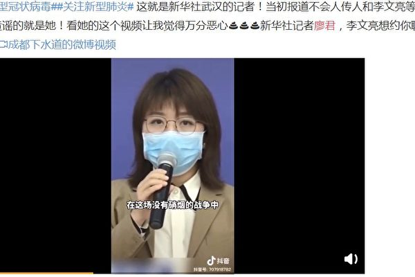

近日，中共官方新华社湖北分社记者廖君成为舆论焦点。（网络图片）

【大纪元2020年03月14日讯】（大纪元记者古清儿报导）武汉肺炎“吹哨人”李文亮医师率先披露疫情遭到中共当局诬指“造谣”，而首先报导此新闻的正是中共官媒新华社记者廖君。近日她因疫情相关报导获中共官方高调表彰，引发大陆网民不满，讥讽她是“最成功的墙头草”、“祸国殃民的典范”。
 
<b>廖君被讥讽为“最成功的墙头草”</b>

3月8日，中共国务院新闻办公室举行记者见面会，廖君“作为6名疫情防控一线的巾帼奋斗者”与记者见面。在中共官媒的报导中，廖被称为“逆行而上的女记者”。

中共官方的高调表彰引外舆论的猛烈抨击和嘲讽。

近日，大陆微信公众号“牛角君”挖出廖君在这次疫情中的两篇报导，并痛责她是“新冠肺炎最成功的墙头草”。

文章披露，早在2020年1月1日，新华社以《8人因网上散布武汉病毒性肺炎不实信息被依法处理》为题，向全世界人民报导武汉造谣8人（包括李文亮医生）的主要记者，正是廖君。

其实，早在2019年12月31日，中共官方新华社《武汉市卫健委通报：发现的多例肺炎病例为病毒性肺炎 未发现明显人传人现象》的文章，也是廖君所写。

接着，廖君继续误导公众，于2019年12月31日21时在新华网发表《实地探访华南海鲜市场 店铺多数正常营业》一文，“以此成功欺上瞒下，是新冠病毒肺炎一发不可收拾之开端，成为祸国殃民之典范。”

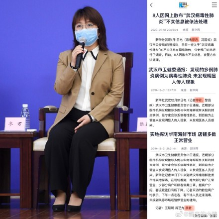

近日，中共官方新华社湖北分社记者廖君成为舆论焦点。（网络图片）

文章说，“此前您说可防可控、未发现明显人传人、李文亮等8人造谣，然而接着，您居然成为疫情防控一线的巾帼奋斗者！这令人匪夷所思。”

“真想问问廖君同志，您写的东西，曾经扪心自问过吗？有多少是历经良心拷问的？面对3000多具冰冷的尸体，您再感动10万+，又能唤醒谁呢？唯你犯大错，历史终将会给定论。”

上海网民“缘定浦江2”在微博发帖说，“新华社湖北分社记者廖君，自称这两个月写了200多篇报道、90篇内参，实际上她是第一个将‘造谣’扣给武汉8名医生的记者。但凡有点良心，有自知之明，就不该在此时此刻站出来为自己邀功。”

前中共官方新华社退休记者顾万明发文表示，看了近来网民对你（廖君）的报道的意见，你在疫情之初的报导的两个关键问题上：“李文亮等8人是不是谣言者”、“新冠病毒会不会人传人”，没有作自己的调查，轻易相信了当地部门的意见，作了错误的报道。至于你的内参反映了什么，人们是看不到的。凭着你的公开报道都是部门怎么说，你怎么报道，就知道你的内参也不会反映真实情况，给高层领导有更大价值的参考意见。

“你如果有一点良心，就应该拒绝领奖、发言的。否则人们就会说你是‘踩着别人的鲜血走上领奖台的’。”

“疫情发生以来，你说这段时间写了200篇报道，还写了90篇内参。人家给你算了算290除以60，平均每天要写5篇报道。这样的稿子就是大部分赶场子出来的，有几篇讲了真话？有几篇是调查研究后的深度报道？”

大陆网民表示，“第一个造谣李文亮造谣的新华社记者。”“从没见过如此厚颜无耻之徒。”“怪不得那批去武汉的专家也理直气壮的说，‘医院没告诉我实情’。”“宣传的工具，已经不配做媒体人这三个字。”“传声筒而已！假大空，现实的写照。”

与此同时，廖君的背景也被挖出。

知情人黄先生对海外自由亚洲电台透露，廖君是新华社湖北分社都市部主任，其丈夫是陆军总医院的医生，它是定点医院。廖君掌握医疗系统内部的真实资讯，比一般民众更了解疫情的危险程度，但她却隐瞒真相，传播官方的谎言，成了祸害千万武汉人甚至全国民众的帮凶。

原央媒记者朱先生表示，廖君被中共官方高调褒奖是因为她听党的话。

朱先生说，本来这个大部分持有反对声音的都是媒体圈的人，对于李文亮他的死亡，还有后续的老百姓的反弹，都是因为媒体圈的人无声的去对抗体制。

报导提到，此事件引发热议，多名前新华社记者13日公开撰文，直指“廖君不配当我们的同行！”但文章很快遭官方删除封杀。

<b>李文亮事件背景</b>

今年1月初李文亮等8名武汉的医生因在微信朋友圈警告SARS已经在武汉出现，要大家注意，被武汉公安抓为传谣言的典型，李文亮还被公安找去训诫。

在舆论压力下，中共最高法院1月28日发文似乎为李文亮等8名“造谣者”正名。随后8名“造谣者”转眼变成了英雄。

2月6日晚上，李文亮因为感染武汉肺炎去世， 终年34岁。他的死亡触发大陆民众巨大愤怒情绪，要求言论自由的呼声此起彼落。当晚，网络上到处都是哀叹、愤怒和对当局掩盖疫情的问责，并要当局向李文亮公开道歉。

2月7日，中共国监委表示，将派调查组赴武汉针对李文亮的有关问题作全面调查。3月5日，中共国家卫健委等三个部门印发文件，李文亮等34名染病去世的医护人员被追授“先进个人”称号。

但至今这个调查结果迟迟没有发布。时政评论员程晓容表示，中共训诫李文亮，又表彰李文亮，都是为了它自己。于此，中共向世界展示的不仅是超乎想像的荒唐，还有突破底线的无耻。

<a target="_blank" href=#top><h6 align="right">回上方</h6></a>

<a name=122>
<h1 align="center"><b>【网海拾贝】西方根本不可能复制中国抗疫模式</b></h1>
 <h4 align="center"><b>编写：千百度</b></h4>

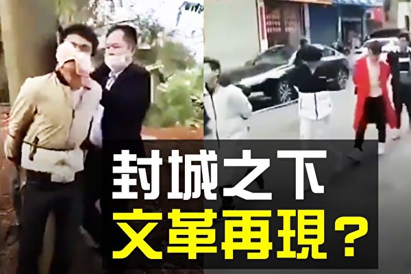

各地封城还要封多久？地方官员不愿复工的“纳什均衡”考量；“文革基因”更添人道灾难。（新唐人合成）

【大纪元2020年03月14日讯】

【西方根本不可能复制中国抗疫模式】WHO专家组组长认为“中国的抗疫方式可以复制，但需要速度、资金、想像力和政治勇气”，暴露了他对中国政治体制的无知。中国政府处理武汉肺炎的四步棋完全依赖中共对政治、经济与舆论的三个垄断，西方国家根本不可能复制中国抗疫模式。——@HeQinglian

【武汉中心医院到底发生了什么？】在如此惨重的伤亡面前，人们不禁追问：中心医院到底发生了什么事？为什么会有这么多医护人员倒下？医院的主要领导即院长和书记应该怎么解释？仅仅是对新型病毒了解不够？或者用正能量的说法：中心医院的医护人员为武汉人民筑起一道人体防毒墙？这些都说得通吗？想来，这是我们必须质疑的事。今天，已经看到数篇文章对中心医院官方领导的质疑，也看到了知情人的呵责和呼吁。我想说：湖北和武汉的官员引咎辞职，从中心医院的书记和院长开始吧。——作家方方

【疼醒的世界】在信息高速快捷的时代，天朝有发哨人吹哨人，但可悲的是，世界不是被哨音吹醒的，而是疼醒的。——@PqA54

【代价最低的抗疫模式】实际上，多数西方国家都采纳了日本模式对抗武汉肺炎疫情：努力降低感染病例的“波峰”，放在第一位，并不是把尽快结束疫情放在第一位。这似乎有些难懂，但是这是综合而言代价最低的模式。——@LifetimeUSCN

【各级官僚都缺乏人性】这场红色瘟疫中各级官僚都缺乏人性。不管是喝斥艾芬的卫生官僚，还是训诫李文亮的低阶警察，他们自己就生活在武汉，比常人更早知道瘟疫的消息，在正常人恐惧忧虑的时候，他们却没表现出任何正常人应有的反应，更像是某种冷冰冰的、被遥控的机器。而这正是中共所追求的，这也是所谓的‘体制优势’，那就是：以安全的名义，或者根本不需要什么名义，他们就可以堂而皇之地侵犯你的隐私，剥夺你的权利。——@hawking197428

【绝大多数中国人并不无辜】中国武汉肺炎疫情已造成3000死，但至今没有人为疫情道歉，却要中国人去仇恨台湾和美国。中国弥漫着一种不寻常的乐观气息，全世界都欠中国一个道歉。绝大多数中国人并不无辜，因为它们纵容了中共作恶。——屠龙

【中共目前正在快速甩锅】中共目前正在快速甩锅，想赖美国军方把武汉肺炎病毒传到武汉的。我倒想问：去年9月，世界军运会之前，你们做演练时，为何在千万种病中刚好选了新冠状病毒？莫非“美国鬼子” 放毒气提前通知了你们？若果如此，你们为何不通知中国人民？——曾铮

【人民不服】一个人发帖，会被封号：10个人发帖，会被训诫；100个人发帖，会被打压；10,000个人发帖，会被安抚：现在是一亿人发帖，人民日报出来说艾芳是个好医生。——网友

【中国神油】上联：世界涨我也涨，世界对我有影响；下联：世界降我不降，我和世界不一样。横批：中国神油。——网友

【无法打破的逻辑怪圈】中国所有的问题，最终归结于没有问题。这是一个颠扑不破的真理，是个无法打破的逻辑怪圈。企图追问答案的人，往往会被当做问题首先解决。——诗人小引

<a target="_blank" href=#top><h6 align="right">回上方</h6></a>
 
 
<a name=121>
<h1 align="center"><b>古玉文：将暴力执行到家，将谎言进行到底</b></h1>

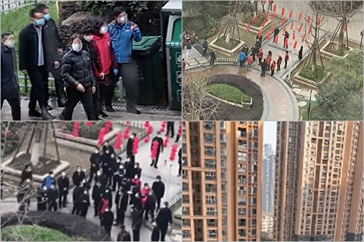

3月5日，中共副总理孙春兰视察武汉市青山区中建开元公馆时，业主们愤怒高喊：“全部都是假的。”（知情人提供）

【大纪元2020年03月14日讯】《九评共产党》一书曾深刻地指出：“谎言是暴力的润滑剂。”谎言是共产主义赖以生存的养分和制度设计。在武汉疫情防控措施中，中共开足马力打造的所谓 “正能量”，概括起来其实就是一句话：让所有人都闭嘴。

<b>缺失真相，它能给你公正的说法吗</b>

武汉封城第41天，湖北作家方方在其日记中谈到了武汉肺炎疫情减缓的当下，欲要给武汉人解开心头的结，当局“你要给李文亮一个说法，给中心医院一个说法，你也要给我们大家一个说法”。

这是一个非常实际的话题，实际到你觉得触手可及的程序正义和道德正义都双手在握。但这又是一个伪命题，因为全世界都知道，你握住什么都没有用，问中共要说法无异于与虎谋皮。

你无法从中共那儿得到你想要的说法，最后，要么它让你进去说，要么你接受它给出的定义。

缺失真相，它能给你一个公正的说法吗？多少年来，不都是中共它一直在给民众说法吗？八九六四是动乱、法轮功是某教、新疆人是极端分子，香港青年是暴徒，病毒可防可控……

“假的，假的，都是假的。”

问中共要真相，或失去自由或付出生命的代价。血与泪本不应成为正义的挽歌，人类无法一而再，再而三，眼睁睁的看着自己的家园分分秒秒地变成了埋葬自己的坟墓。

3月5日，中共国务院副总理、武汉疫情中央指导组副组长孙春兰和武汉市委书记王忠林一行视察武汉市青山区，中建开元公馆小区高楼中业主们对着孙春兰巡视官员们高声呐喊：“假的，全部是假的，全部都是假的，老百姓吃的都是高价菜……”

武汉人终于忍无可忍，渴望着绝处逢生。孙春兰诧异地问了身边的随从：“他们喊假的，什么假的？”然后气跑了。

多难未必兴邦，但多演一定穿帮。

很快，小区居委会“主动”向所在地居民征求意见，做出了积极改善工作的姿态。——这是阳谋。3月7日，武汉开元小区所有可以收快递和团购物资的大门全部都封死。——这是阴谋。

事情到此并未结束。

<b>将暴力执行到家，将谎言进行到底</b>

谎言能为暴力涂脂抹粉，暴力则为谎言保驾护航。

3月10日，中共党魁习近平在疫情期间首次到访武汉，引起国内外强烈关注。自由亚洲广播电台作了一篇题为《习近平戒备森严中抵武汉考察疫情 没有人在喊全是假的》的报道。

报道揭示，习近平下午到访的武汉东湖庭园社区住户此前收到紧急通知，武汉市各区公安分局上午安排警察入户，并在住户家中待1小时左右，通知要求住户积极配合警察工作。

报道中揭露到：“东湖庭园10栋一单元9楼一住户在微信群留言写道，警察坐在我们阳台上，不让我们看，另一位11栋三单元9楼住户写道，警察坐我们家阳台上，不让我们看。9栋楼一住户说，当天早上9点就被警察的敲门声惊醒。另一住户说，狙击手已在重要位置待命等。一视频拍摄者说：‘今天估计是中央的领导人来了，楼顶上全部是狙击手，这边也是，都有狙击手待命。马路全部戒严。’”

法广中文网3月11日发表《习近平视察武汉几个怪异的细节》一文，文中小标题“高喊‘习主席好’的都是演员吗？”中的一段文字，披露了党魁视察期间，中共将谎言进行到底的确凿细节。

文字的表述是这样的：

“一个广为流传的视频显示，习近平一行乘坐的大轿车徐徐开进武汉东湖庭院小区，车缓缓停下，有几个穿着黑衣的人在迎接，从车上第四个走下来的是习近平，只听视频里一个女子问：‘可以喊吗？’没有回答，稍一会只见车前迎接习近平的一位官员，高高举起单臂向身后示意，似乎是向楼上发出了信号。”

“女孩轻声问：‘可以喊了吗？’另一个女孩说，‘可以喊了’。在视频大约播出30秒的时候，从高楼上传出这两个女子呼喊的声音：

‘习主席好，习主席好，武汉加油，中国加油’，习近平回答：‘好，你们好。’有不少网民直指这是演员乔装百姓。”

举国体制的谎言使中共总是从一个“胜利”走向另一个“胜利”。

<b>谎言或能掩盖疫情，但不会真正消禳灾异</b>

《纽约时报》评论习近平此次出访武汉“显然是为了传达一个强有力的信号，那就是，在疫情正在其他国家爆发的时候，中国政府认为国内紧急状态的最糟糕阶段可能很快就会过去。”

《纽约时报》不无幽默地说“戴着蓝色口罩的习近平就差宣告胜利了”。因此，有观察家猜测，武汉封城令解除的曙光可能即将到来。

但身处武汉疫区的当地居民却另有说法。

《美国之音》记者近日采访了武汉市民张毅，张毅说：“武汉人普遍认为，不太相信马上会解封，但是政府不停在鼓吹，多少多少小区、多少天没有发病病人了，多少小区已经是无疫情小区了，我觉得这个是……和我今天在医院看到的是完全不可信的。如果说把这些人全部都放出来，绝对又是一波交叉感染的高峰出现。很有可能以后要长期与这个病毒和平共处。”

张毅本人接受采访时，正在武汉一所医院安排母亲住院，母亲患有严重心脏病的。按照要求，新到急诊的病人应做排除武汉肺炎的检查，但事实上，急诊室根本不接待。

张毅前面一个排队的人检查出来新冠病毒阳性，但医生让患者自己去隔离医院，这些人一般都是一直呆在家里的，根本没出来过，也没有任何症状。

“反正是很恐怖的，说明除非武汉每个人都做检测，否则，虽然你是关在家里四十几天，但是出来你就是一个病毒携带者。”

但这些来自疫区前线的一手消息，在大陆全部被中共“正能量”级谎言给和谐掉了。

<b>切尔诺贝利效应再次到来</b>

人类经历的切尔诺贝利灾难还未尽消除，切尔诺贝利共产谎言却又在东方卷土重来。而且来得更为迅猛、无耻与老道。切尔诺贝利4号反应堆爆炸后的60小时内，前苏联官方没有发布任何安全警告，中共在武汉肺炎事件中保守估计是将这一数字翻了十倍。

切尔诺贝利事故发生7天后，苏联政府总理雷日科夫才带领苏共乌克兰第一书记谢尔比茨基赶到切尔诺贝利。中共武汉封城后李克强才匆匆赶往武汉，40多天后，中共党魁才露面武汉疫区。

人们发现，切尔诺贝利事故的产生和造成的巨大灾难归结于共产极权的恶性官僚作风和一贯掩瞒真相的粗暴传统。戈尔巴乔夫事后承认核泄露：“证明了原有的那个体制已经奄奄一息。”

切尔诺贝利事故最终导致了前苏联解体，解体前，苏联高层和乌克兰共和国高层相互推诿事故责任。

武汉新冠病毒疫情或是中共的切尔诺贝利事故，中共正紧锣密鼓般地步其后尘而不自察。

<a target="_blank" href=#top><h6 align="right">回上方</h6></a>
 
 
<a name=120>
<h1 align="center"><b>父母染疫去世 武汉青山区爆孤儿隔离点</b></h1>

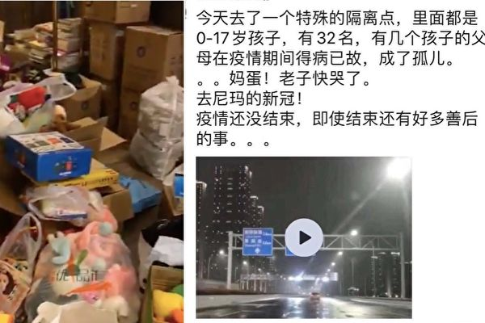

网传大陆某地有一特殊隔离点，这个隔离点是在一家酒店，里面大约有32名孩子。（网络图片）

 
 【大纪元2020年03月13日讯】（大纪元记者萧律生报导）12日，网传武汉青山区有一特殊隔离点，里面大约有30多个孩子。而这些孩子中有几个孩子的父母双双染疫去世，成了孤儿。3月13日下午，武汉青山区官方微博辟谣。网民对此并不买账。

有网传图片显示，一位网民3月12日去了一个特殊的隔离点，这个隔离点里面都是0-17岁的孩子，有几个孩子还成了孤儿。

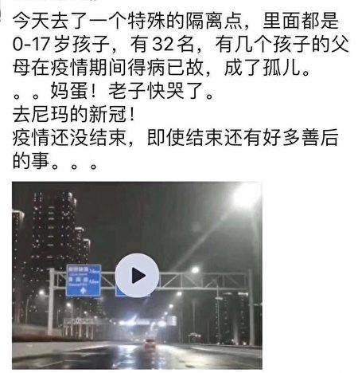

网传有一个隔离点，这个隔离点是在一家酒店，里面大约有32名孩子。（网络图片）

 
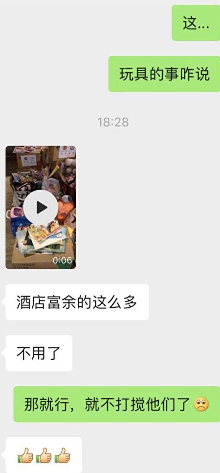

网传有一个隔离点，这个隔离点是在一家酒店，里面大约有32名孩子。（网络图片）

 
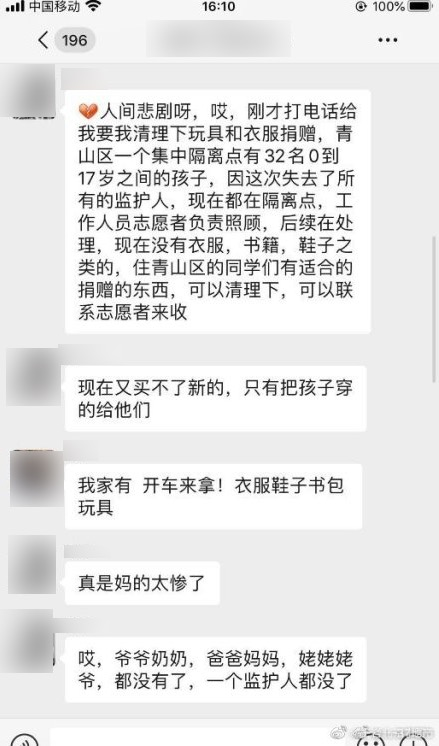

网传有一个隔离点，这个隔离点是在一家酒店，里面大约有32名孩子。（网络图片）

 
 还有网民询问玩具的事情，工作人员说，酒店有捐过来的玩具，并拍摄了一段视频——“这都是捐过来的书和玩具”。
 
 网民留言说：“这是真的可怜人间惨剧啊。”“多么令人心疼啊。”“有孩子的人真不能看这个，看的想哭。”

还有网民愤怒：“它们（中共）已经在庆祝胜利了。”

3月13日下午，武汉青山区官方微博辟谣，称此事是谣言，但是把评论区的评论权限关闭。官方称青山区现有集中隔离点及康复驿站有17岁以下未成年人30名，均有监护人。该“辟谣”回避了“这些未成年人父母是否都身亡”这个关键问题。

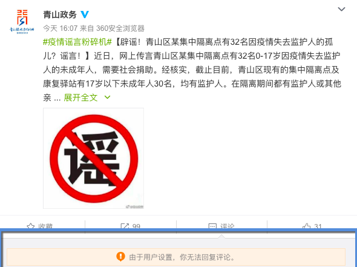

武汉青山区官方微博辟谣，却把评论区的评论关闭。（微博截图）

 
 不过大批网民在大陆其它媒体报导“辟谣”的新闻下留言，质疑官方辟谣的真实性。

“青山区，如果没记错的话是用环卫垃圾车运送平价肉的那个区吧？你现在说话辟谣力度可大不如前了。”“又辟谣？真的是谣言吗？”“造谣，辟谣，现在都分不清谁是实话了。”

“现在只要zf（政府）一辟谣，我就觉得是真的。”“他们一辟谣，我就感到慌。”“反正网传的信息，官方都会第一时间出来打两个字：‘谣言’。”“实在是不敢相信官媒了。”

“看了评论，绝大部分网友不信辟谣，即使可能你说的是事实。这就是透支公信力的可怕后果。”#

<a target="_blank" href=#top><h6 align="right">回上方</h6></a>

<a name=119>
<h1 align="center"><b>【一线采访】病患出方舱 病症加重医院不收</b></h1>

2020年2月18日多名患者在由武汉体育馆改造的方舱医院中休息。 (AFP/Getty Images)

 
 【大纪元2020年03月14日讯】（大纪元记者顾晓华、方净采访报导）武汉市民付女士对大纪元表示，她于2月11日核酸检查呈阳性，进入方舱医院治疗，28日从方舱出院后直接送到酒店隔离，近日因呼吸困难，寻求住院治疗，却面临无医院收治的困境。
 
<b>病患：小伙出方舱36个小时后就去世</b>

大陆强制陆续复工以来，中共官方强调湖北疫情趋缓，方舱医院开始清舱，持续清出病人。付女士3月11日表示，汉阳国博（设在武汉国际博览中心的汉阳方舱医院）2月21日开始让病患分批出院。“我们是2月11日进去的，21日开始放病人出去了，如果你的核酸（检测）做了两次是阴性，你的CT没有什么大的问题，他就放你出来。”

“我28日出来，已经出去好多批了，大概是有五六批了吧。第一批没有政策说要到酒店去隔离，大概有二十几个人可能回家了。我们这一批出来的，车子上有二十多个人。”她们从方舱出来后被直接送进酒店隔离。

“出院的时候给了我们一个小结报告。但CT片子不给我们，给了指挥部，说他们管不了。”她说，出来的人并不是真的治好了，“在车上，我们那几个人同时核对那个小结报告，大家都有问题，不是全部恢复，全部恢复可能还得一段时间。”

她说，还有人出来后很快就去世了，“我们方舱有一个小伙子，出院36个小时后就去世了。年轻的小伙子，36岁。”

<b>病情加重求医无门</b>

付女士表示，在隔离酒店也有医护，但很保密，“这边工作人员也全部穿防护服，这边有几个医生都不对外说的。”住进酒店后没几日，她便因身体难受主动找医护求助，“感到特别不舒服，总是气喘不过来，一句话要喘口气才能说完。”

3月10日，酒店隔离点的医生带她到普仁医院自费看病，“做CT，再做个静脉抽血的化验。”她说，“我后来问带我去看病的医生，说这个片子有问题吗，他说有，但他是跟普仁医院的医生沟通过的，他们怎么沟通的我也不知道，让我在外面站着。”

“检查意见是这样写的，1. 双肺薄膜模糊影，考虑感染性病变，结合临床相关检查，建议治疗后复查。2. 右上中肺轻微肿。3. 动膜钙化，4. 肝左页肝管微扩张，肝总管及胆总管上扩张。”

她说，“普仁医院也不开药，就说我肺部有问题，他不能接收住院。他们（医护）跟我商量要去定点九医院住院。”结果去了九医院以后，九医院说核酸阴性达不到住院治疗的标准，也不收住院。

两边医院都不收，付女士陷入困境，“我们个人没法找医院，医院不对我们个人，像我肺有问题，外面的医院不接收，专门的医院又说你达不到标准。我还是疼得厉害。”

<b>隔离点医生叮嘱勿对外说肺炎</b>

寻求住院过程中，酒店隔离点的医生还特别叮嘱她，不要让别人知道她是因肺部还有问题要去住院，“他就怕别人知道，就让我说，是因为胆怯住院，不要说是什么肺，他嘱咐我，还问你说了没有，我说没说，我跟同房也是这样说的，我胆怯有问题才去住院。”她强调，“他们有些事不对外的。”

<b>隔离点同住者相互防备</b>

付女士强调，住在宾馆除了身体更不舒服，生活也极端不自由，“原来说好了我们是一个人一个房间，后来的安排是两个人一个房间，我年纪大，跟我同房间的是30岁年轻的。”“她也怕我传染给她，我也怕她感染了我，互相心里头蛮不舒服的。”

“晚上我特别想起来喝水，我又怕吵了别人，我特别不舒服时我又不能起来，我有一天夜晚坐起来，她一看我坐起来，她特别害怕。”“我在这里特别压抑。我尽量不骚扰她，影响她，现在我成天不喝水，减少上厕所的事情。”

<b>方舱无治疗 医生称患者有抗体不会相互传染</b>

相较于酒店的环境，付女士觉得方舱自由多了，“有洗澡的地方，都是公共的，一共有9百多人。我们是床挨床，这么近，担心传染，但是医生说你们有抗体，不会传染的。”

但方舱医疗条件并不好，医生太少，病人太多。“他们是山东来支援的医生，一个医生要管好多病人，一个病房有22个人，要管8个单元，一个班值班6个小时，然后换班。”

“他们只检查体温，你如果哪里不舒服，去护士站拿药，你要的药就给你，也没看什么片子，什么治疗都没有，只要是检查肺部有问题，或者核酸做了是阳性的，就给你隔离。有症状、有重的全部都转出去。最后出院的时候是做CT和核酸检查，做2次核酸。”

进方舱治疗的，男女分开，“但是好多夫妻之间，母子之间，父子之间，他们就可以在一个单元里，很多是一家一家得的，还有一个九岁的小孩，还有七岁的小女孩。”

付女士说，在方舱可以到处走动，想干什么就干什么，没有人管。“方舱早上有个大门可以开一会，我们可以出去，就那么一点位置，可以容纳一二十人。我们在那里晒晒太阳，活动活动上肢，开放一个小时左右。”她表示方舱外面拉了一条线，不能跨越。

<b>夫妻和孙子三人染病  夫死妻不知情</b>

付女士的先生也同样染了病，让她十分担忧，“我们两个同时确诊的，我是1月22日开始发烧的，他当时没有染上，结果1月29日两个人都发烧了。”

直到儿子回家来，才将躺在床上的他们带去看病，“然后老公的病情越来越严重，他70多岁，到最后完全不能自理，又没有医院接收，最后社区不放我们出去，在家隔离，我儿子每天把他拖到武钢去输氧，然后再回家。”

后来靠儿子向社会写求救信，她丈夫终于在2月4日住进了新洲人民医院，她自己则在2月6日住进酒店隔离，11日去方舱。由于无法得知先生目前状况，她哭着说，“他的电话总是关机，他现在的状况也不知道，一概不知。”

另外，大纪元记者获悉，付女士的丈夫费尽千辛万苦于2月4日住院，2月8日已去世，但在记者采访付女士时，她本人却完全不知此事。

付女士的孙子也被传染了，“我孙子17岁，读高中，我们一家三口人感染，我的孙子是在我这住了3个晚上，回家以后检查，他也染上了。”本来孙子和她都住在方舱，她说因为孙子核酸过不了关，在方舱撤之前已经转到康泰医院。

付女士说，从进酒店隔离、进方舱、出方舱，再被转送酒店隔离，然后病症加重，仍面临无医院收治困境，“我已经出来一个半月了，没好转，现在完全没恢复，我想坚持到（时间）之后回家。”可是，拖着病体，“让你回家，有什么事怎么办呢？”

<a target="_blank" href=#top><h6 align="right">回上方</h6></a>

<a name=118>
 <h1 align="center"><b>拉横幅披露了啥 流亡律师遭小粉红围攻</b></h1>

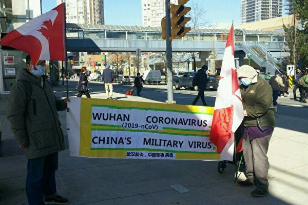

前中国律师祝圣武在加拿大温哥华地铁天车站拉横幅“武汉肺炎，中国军事病毒”，遭毛粉网上批评攻击。（受访者提供）

 
 【大纪元2020年03月14日讯】（大纪元记者李熙采访报导）流亡加拿大的前大陆人权律师祝圣武向大纪元披露，他最近在温哥华的一些抗议活动中都有特务跟着，日前在地铁天车站拉“武汉肺炎，中国军事病毒”被发上当地VanPeople网站，遭到一群小粉红的攻击。

祝圣武表示，“VanPeople.com”网站是共产党色彩很浓的网站，温哥华华人比较关注，连他妻子工作的公司老板也会看，他觉得自己的生活和安全遭到威胁。

他披露，很长一段时间以来他在温哥华的抗议活动不仅有特务跟随，活动时也曾遭到小粉红叫嚣攻击。

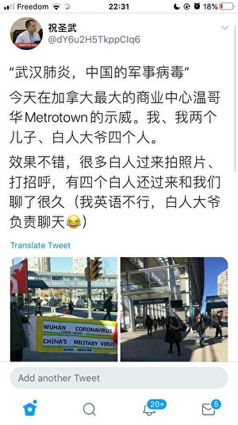

祝圣武在推特上的推文。（受访者提供）

<b>地铁拉横幅遭小粉红攻击</b>

13日，“VanPeople”网站出现题为“武汉肺炎，中国病毒？Metro（地铁）天车站有人拉这种横幅！”的新闻，论坛网民“VanPeople有料姐”跟帖说：“我一脸懵逼，你还带着孩子做这件事，不觉得羞愧？？武汉肺炎，中国XX病毒？”。

随后，不少小粉红跟帖围攻他：“造谣不需要钱，往地铁一站举个牌子就行。”“称武汉肺炎的都是文明程度低的人群，他们内心充满了对中国的仇恨…”

祝圣武说，当然仍然有少数网民表示支持：“为什么连别人质疑的权利都不能有呢？你们来加拿大其中一个好处不就是有了不同言论的自由吗？”“完全支持你。”

他表示，“共产党开始大肆造谣病毒不是中国起源的，并且弄了个‘新冠病毒’这样莫名其妙的名称。所以我就想告诉加拿大人，这是‘武汉肺炎病毒’，是中国起源的病毒，是中国的军事病毒。也为了提醒加拿大人必须高度警惕这个中国病毒。”

他说，从世界各国的新闻中我们都看到了，一些国家因为对武汉肺炎病毒的疏忽，或为讨好中共而迟迟不敢采取与中共隔离的政策，最终导致疫情蔓延，甚至政府官员染病死亡的案例不断在发生。

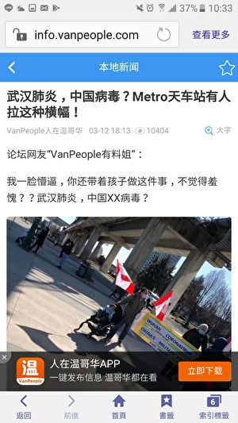

“VanPeople.com”网站上的新闻报导。（受访者提供）

 
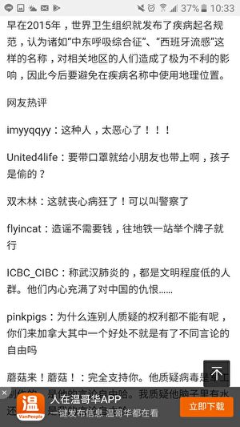

网站上毛粉的批评言论。（受访者提供）

 <b>流亡海外 感受到自由的可贵</b>

2017年9月22日，祝圣武在中国因网路言论被吊销律师执业证。他在自白书中说：“言论自由（思想自由、创作自由、学术自由等）是文明社会的基本规则，是社会道德的底线。迫害言论自由的行为才是真正对国家安全构成严重威胁的行为。”

为逃离被迫害，2018年他举家流亡加拿大，隔年取得加国公民身份，落户温哥华。在海外的生活让他感受到自由的可贵，于是一有时间便会带着两个儿子出去举牌、拉横幅，让人能认清中共本质与面目，从华为孟晚舟事件，到声援香港反送中，再到最近的武汉肺炎等。

他曾表示，言论自由是普世的价值，多元的社会容许各种声音的出现，在民主、开放的国度里，如若还揣着心思不敢自由发表言论，甚至还要干涉他人言论自由的人，离文明世界的距离还是很远呢。

<a target="_blank" href=#top><h6 align="right">回上方</h6></a>

<a name=117>
<h1 align="center"><b>传钟南山被免职 专家组组长悄悄换人内幕</b></h1>

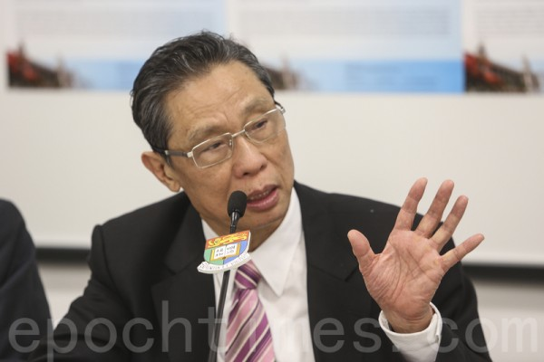

武汉肺炎疫情爆发后，中共国家卫健委的高级专家组组长钟南山频频代表官方发言，但其言论备受外界诟病。（余钢／大纪元）

 
 【大纪元2020年03月12日讯】武汉肺炎（新冠病毒）疫情爆发后，中共国家卫健委的高级专家组组长钟南山频频代表官方发言，但其言论备受外界诟病。日前有消息传出，钟南山已被免去国家专家组组长一职，不过还是专家组成员之一。

3月11日晚上，一篇题为“新冠病毒专家组组长钟南山悄然被免内幕回放！”的文章在网络流传。文章指，武汉把中医排斥在外，这是没有吸取SARS的经验和教训，犯了北京当年犯过的同样错误。

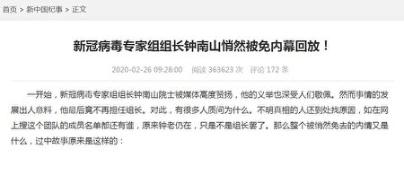

文章说，“作为高级别专家组组长的钟南山，犯了方向性错误。”湖北依然大量使用钟南山发明的、在SARS时被证明是错误的抗生素、激素治疗新冠病毒。

文章提到，钟南山给出的解决方案是什么呢？1月21日，钟南山院士称这个病毒没有特效药。1月24日，作为专家组组长的钟南山，提出的解决方案是：上马新药物。前方战况危急，而钟南山院士的解决方案是让病人去等特效药？

1月25日，中共中央政治局举行会议，“确立落实了中西医结合的战略”。同日，第一支中医国家队抵达武汉。

文章暗指钟南山在抵制中医团队。2月4日，钟南山在恒大牵线下，与哈佛大学成立科研攻关小组。7日，钟南山又说，并不指望中药有很强的抗病毒作用。

今年1月19日，钟南山出任国家卫健委高级别专家组组长。成员包括中国工程院院士、传染病诊治国家实验室主任李兰娟，中国疾病预防控制中心主任高福，中国疾病预防控制中心流行病学首席科学家曾光，中国工程院院士、香港大学医学院微生物系讲座教授袁国勇。以上专家清一色是西医院士。

上述文章提到，2月8日，中共国家卫健委发出通知，调整新冠病毒专家组成员。新组长由国家健康委体改司司长梁万年担任。钟南山院士被悄然免去组长职位，但仍然为专家组成员。

文章说，专家组名单中增加了中医专家：中国中医科学院院长黄璐琦院士、中国工程院院士中医张伯礼、北京中医院院长刘清泉、中国中医科学院广安门医院李光熙，以及多名军队专家。

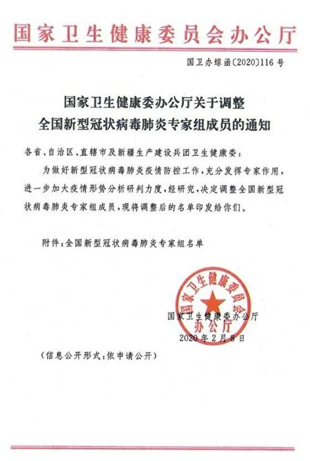

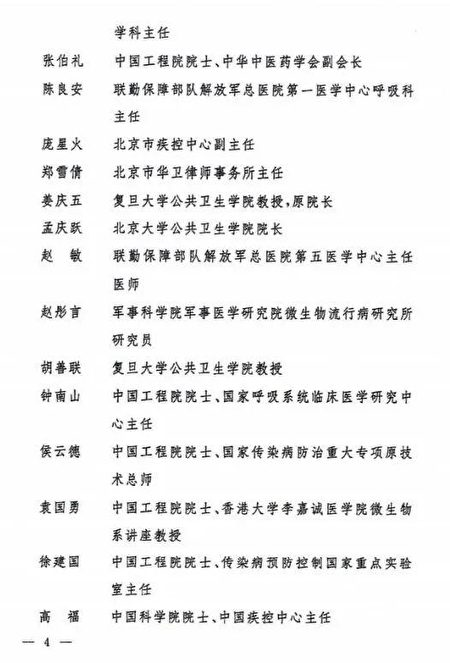

（网络图片）

 
 目前，这篇文章在网上很快被删除，只能找到零星的转发。

自武汉肺炎疫情爆发以来，钟南山多次为中共站台发声，其言论备受质疑。

如钟南山说的“多次拐点”失灵，还说“武汉病患数量无隐瞒”、“有信心不重演SARS疫情”、“疫情首先出现在中国，不一定是发源在中国”等言论，均被“打脸”。

不过，华裔科学家何大一表示，新冠病毒毫无疑问起源于中国。他直指，中共在遏制疫情上由于缺乏透明度、相互推诿责任导致疫情大规模爆发。

有网民表示，钟南山的拐点：1月底说2月底，2月底说3月中，3月中说4月底，4月还没到，就说要6月了，求求你闭嘴吧。

<a target="_blank" href=#top><h6 align="right">回上方</h6></a>

<a name=116>
<h1 align="center"><b>抗议中共造谣病毒起源？美国务院召见崔天凯</b></h1>

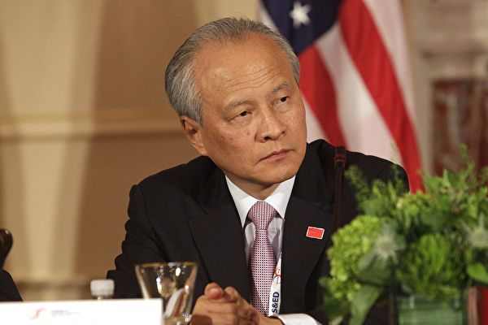

去年武汉爆发新冠病毒疫情，中共外交部发言人日前暗示可能是美军将该病毒带入武汉后，美国国务院周五（3月13日）召见中共驻美大使崔天凯（如图）。(CHRIS KLEPONIS/AFP via Getty Images)

 
 【大纪元2020年03月14日讯】（大纪元记者吴英综合报导）去年武汉爆发新冠病毒疫情，中共官员近日暗示可能是美军将该病毒带入武汉后，美国国务院周五（3月13日）召见中共驻美大使崔天凯。

一位国务院高级官员告诉福克斯新闻，负责东亚及太平洋事务的助理部长戴维·史迪威（David Stilwell）周五针对中共在武汉病毒事件上，“在全球公然”进行虚假宣传运动，召见中共驻美大使崔天凯。目前尚不清楚这次召见是否可能讨论其他中共官员所发表的言论。

福克斯新闻记者在推特上传崔天凯离开国务院的视频，崔天凯不发一语，没有回答记者提问（是否相信美军将武汉病毒带去武汉）。

<h4 align=center><a href="https://twitter.com/RichEdsonDC/status/1238487465373073408?ref_src=twsrc%5Etfw%7Ctwcamp%5Etweetembed%7Ctwterm%5E1238487465373073408&ref_url=https%3A%2F%2Fwww.epochtimes.com%2Fgb%2F20%2F3%2F13%2Fn11938747.htm">崔天凯离开国务院的视频，崔天凯不发一语，没有回答记者提问(点击右键,另存新档）</a></h4>

国务院一名高级官员告诉CNN，史迪威周五向崔天凯“非常严厉地”陈述事实，崔则“非常防卫”。这位官员说，史迪威没有发出任何威胁，两位外交官坦率地交换意见。

该官员说国务院相信，由于各界都在批评中共掩盖疫情导致引发全球大流行，因此中共努力转移焦点。这位官员补充说，这种阴谋论的传播是“危险且可笑的”。

周五，史迪威的召见行动或是要中共政府注意，美国将不会容忍他们为转移外界有关冠状病毒的指责所发表的言论。

在北京近期突然否认新冠病毒源于武汉，并暗示美军将病毒带进武汉后，美国国务卿迈克·蓬佩奥（Mike Pompeo）上周在接受媒体访问时，直接称该病毒为“武汉病毒”，川普（特朗普）总统本周发表全国讲话时称其为“外来病毒”。

美东时间3月11日，美国疾控中心（CDC）主任罗伯特·雷德菲尔德（Dr. Robert Redfield）在国会众议院一场有关新冠病毒的听证会上，在被问及“目前”在美国出现的一些表面上被认为是死于流感的病例，是否可能是死于新冠肺炎时回答说，“今天在美国”实际上已经以这种方式诊断出了一些病例。

由这段对话，美国议员及雷德菲尔德所指的情况是“目前”及“今天”，意指美国今年1月21日出现首例冠状病毒病例以后的情况。该首例患者1月15日从武汉返回美国几天后，在华盛顿州斯诺霍米什郡（Snohomish）被确诊。

根据世卫组织（WHO）的网站，北京于1月11日及12日提供的新冠病毒信息中，包括“这种新型冠状病毒的基因序列信息”。美国CDC网站说，美国武汉肺炎患者的基因序列，与中国最初发布的序列相似。

由以上资讯可推论，病毒来源于武汉。然而，中共外交部新发言人赵立坚以3月11日美国议员及雷德菲尔德的对话，发推文（推特在大陆被禁）说“美国终于承认了”，断章取义雷德菲尔德的回答，并且称：“可能是美军将这种流行病带到武汉的”。

几天前，中共驻南非大使也发表类似言论，试图淡化病毒源自武汉的说法。

《纽约时报》3月13日报导说，这种毫无根据的阴谋论周五在中共严格控制的互联网上广为流传，赵立坚充分利用海外的平台进行宣传，目的是转移国内外对中共在爆发初期，极力掩盖未采取遏制措施的批评。

哈佛大学国际事务研究中心的学者朱利安·盖维兹（Julian B. Gewirtz）说：“对他们（中共）来说，阴谋论显然是全球叙述这场危机的一个崭新战线。”

“然而，这些中国（中共）官员组成的小干部似乎并没有意识到，这种阴谋论完全是自欺欺人的，与此同时，中共却希望在全球被视为是做出积极贡献的人。”

周五，川普总统在白宫举行新闻发布会时，有记者提问中共外交官对武汉病毒来源的奇怪发言，美国如何回应。川普回答，他曾读过一篇报导，但不认为这文章具有代表性。“肯定不是我跟习近平主席的谈话，他们知道病毒从何而来，我们全部都知道它从何而来。”他说。

<a target="_blank" href=#top><h6 align="right">回上方</h6></a>

<a name=115>
<h1 align="center"><b>残酷迫害法轮功学员的武汉第一看守所</b></h1>

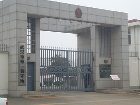

从1999年7月起，武汉市第一看守所就成为非法关押法轮功学员最早的黑窝。（明慧网）

 
 【大纪元2020年03月12日讯】至今，在武汉几个监狱、看守所仍非法关押着大量的法轮功学员，并施以酷刑折磨。

明慧网2020年1月报导，法轮功学员梁香娇在武汉市第一看守所受到迫害，牙齿被打掉两颗，嘴里面被塞垃圾。

武汉市武昌区八一花园玫瑰苑法轮功学员张桂珍被武汉市一看守所迫害，吊挂几天几夜，小手指被打残，还被野蛮灌食。她以前体重一百六十多斤，现在被折磨得十分瘦弱。

2019年，至少26位武汉法轮功学员被非法关押在武汉市第一看守所，部分名单如下：钱有云、孙足英、欧阳如芸、周翠娥、付攸生、朱光荣、李云贵、李桃枝、黄渝珍、李秀梅、江代兰、熊文凤、唐常俊，刘克兴、王姓法轮功女学员、危有秀， 徐慧明、芦秀英、何爱香、张毅（张义）、陈卓、柳木兰、刘静母女、张小荣、张贵珍、赵芝英。

2019年3月20日，武汉市江岸区73岁的法轮功学员欧阳如芸遭绑架后，被非法关押在武汉市看守所，被迫害得出现生命危险，从武汉市第一看守所转到武汉安康医院。

2019年2月25日，武汉市东西湖区80岁的法轮功学员周翠娥被非法关押到武汉市第一看守所，被迫害得身体出现病状，非法关押到武汉安康医院。

2019年4月，武汉市江夏区法轮功学员钱有云、孙足英被非法关押到武汉市第一看守所至今。钱有云、孙足英分别是第四次和第三次被非法关押到该看守所遭迫害。

自1999年7月中共迫害法轮功开始，武汉市第一看守所（又称七处一所）就成为非法关押法轮功学员最早的黑窝，至今已二十多年，至少非法关押过法轮功学员680人次。

尤其在迫害法轮功的高峰期，武汉市第一看守所使用各种酷刑残酷折磨法轮功学员，如：睡“死人床”、吊铐、毒打、野蛮灌食、关“小号”、长时间罚站不准睡觉等，致使一些法轮功学员被迫害致死、致残、致伤、致精神失常。

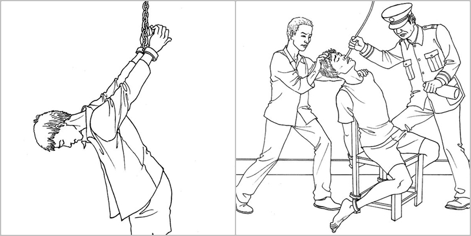

以下是武汉市第一看守所历年来迫害法轮功学员的部分案例。

<b>被非法关押的第一宗案例</b>

1999年7月22日，武汉法轮功学员徐祥兰被武汉市公安局一处绑架，随后，被非法关押武汉市第一看守所。

同年12月12日早上，武汉市中级法院法警将徐祥兰从武汉市第一看守所劫持到武汉市中级法院。在武汉市第一看守所里警察密集站岗，沿途马路上都是警察全副武装戒严。警车前后都拉开很大一段距离，通过后才允许其它车辆通行。

2000年1月6日，武汉市中级法院非法开庭，以“组织利用×教组织破坏法律实施”非法判徐祥兰8年徒刑。随后，徐祥兰被劫持到湖北省武汉女子监狱迫害。

这是武汉市第一看守所非法关押法轮功学员的第一宗案例，即从1999年7月起，武汉市第一看守所就成为非法关押法轮功学员最早的黑窝。

<b>被迫害致死案例

肖爱秀疑似被下毒致死</b>

肖爱秀，女，武汉法轮功学员，湖北省天门人，在武汉汉正街做生意，于2012年7月开始修炼法轮功，当时身体极度虚弱，在7月的高温天里得穿棉衣；别人坐在树荫下都觉得热，她要坐在大太阳下才觉得不冷。肖爱秀修炼法轮功后，身体很快恢复了健康。

2014年，肖爱秀在武汉水果湖的一个小区讲法轮功真相时，被恶人绑架并诬告，于9月29日被水果湖派出所警察押到武汉市第一看守所迫害，遭狱警指使的刑事犯殴打迫害。

期间有亲友去给她存过钱，却被牢头掠夺。2015年7月21日，在关押近一年后肖爱秀被接回家中。此时她已经出现幻觉，整个人干瘦蜡黄，十天后就离开了人世。根据她生前的面色和身体症状判断，疑是被下过毒，中毒而死。

<b>武汉军医被灌食不明药物含冤离世</b>

庞丽娟，67岁，武汉军医，上世纪60年代曾在广州军区空军医院工作，期间获得过无数的奖励和荣誉。

2007年6月23日，汉阳五里墩派出所、汉阳区国保大队以及汉阳区“610”（专门迫害法轮功的非法机构）等一帮人，将庞医生关进武汉市第一看守所。为了抗议这种无理的迫害，庞医生绝食了14天。期间他们粗暴地用竹片撬开她的嘴，灌入一杯白色的流食。

灌食后，庞医生明显感觉异常，口干难受，精神亢奋，如同服用激素药物一样。在经过了多年的非人折磨后，庞医生被抬回家时已是奄奄一息，生命垂危，于2010年12月19日晚上7时30分含冤离世。

刘丽华，女，时年50岁，湖北省武汉市洪山区农业科技推广服务中心主任。曾两次被非法关押在武汉市第一看守所。第二次被非法关押在看守所时，她因炼功被绑在“死人床”上，被挂大铐，于2006年6月9日离世。

李吉莉，江汉区法轮功学员，2007年下半年，向人们讲法轮功真相时，被硚口区宗关派出所警察绑架到武汉市第一看守所。在非法关押期间身体被迫害得出现糖尿病症状，于2015年12月28日含冤离世。

<b>精神失常案例</b>

李艳林，女，武汉市法轮功学员，于2001年4月被抓，遭冤判3年，关押在武汉市第一看守所。

李艳林因不服判决一直在上诉，并因绝食抗议迫害，而被强行灌食。后来家人发现去看守所给她送东西时，收条上的笔迹不是李艳林本人的。经再三要求，看守所同意李艳林的父亲看他女儿一面，原来李艳林已被折磨得精神失常，都不认识自己的老父亲。

在家人的强烈要求下，经法医诊断，医院证明李艳林患严重的精神忧郁症，建议保外就医，回家与亲人团聚，以缓解病情。但“610”人员李英杰惟恐李艳林出去后，人们会知道真相，于是不但不放人，还变本加厉地迫害，将李艳林秘密转移。

<b>遭酷刑折磨案例
 
武汉市十佳青年王莉遭看守所酷刑折磨</b>

湖北武汉市法轮功学员王莉，原中国妇女报中南站记者，曾被评为“武汉市十佳青年”，其事迹曾在“东方时空”栏目播出。后来，王莉在“中国妇女报”当记者，曾帮助过许多受到不公的弱者讨回公道，她本人收入的很大一部分也都救济了贫困者。然而，就是这样一个善良的人却多次遭到中共江氏犯罪集团的残酷迫害。

2000年2月18日，王莉被武汉市公安局带走，关入武汉市七处第一看守所。她在看守所里坚持炼功，遭到了受狱警指使的犯人毒打。狱警为了达到不让她炼功的目的，对她施以“吊挂”的酷刑，将双手吊铐在窗户上，脚尖点地，持续3天之久。

接着又施以“死人床”的酷刑，将其衣服扒光，身体呈“大”字形，用镣铐铐在木板床上，木板上有圆洞，人只能躺着大小便，连续11天；接着又施以“活镣”的酷刑，手脚用铁链锁起，不能轻易动弹，连续8天。

对于这一切残酷迫害，王莉没有任何怨恨，而是以善心向周围的人讲清法轮功真相，很多人被感动得流泪，开始默默地帮助她。

2000年3月底，王莉被非法劳教1年半，关押在武汉何湾劳教所。

<b>武汉理工大学副教授、女博士被上死刑犯的脚镣</b>

武汉理工大学艺术设计学院副教授张苇博士于2000年11月7日，在青山区十九冶居民区发法轮功真相资料，被居委会张某诬告，关押到武汉第一看守所，遭迫害长达10个月19天。

在看守所里，她遭到铐刑，被挂铐在铁栅栏上，一次连续5天5夜，一次3天3夜；曾被戴上用于死刑犯的脚镣，铐在铁栅栏上8天8夜，同时上手铐；曾被连续上铐长达五十多天，另一次十几天。

在非法“提审”中，张苇被男警搧耳光。狱警将她用手铐捏紧，铐到肉里，冬天将可乐从头上灌到衣领内。

张苇曾在上脚镣期间遭受多人的围殴，被刑事犯用指甲猛掐鼻子至出血，差点将鼻尖掐掉；长期被禁止睡觉、长时间罚站、禁水、禁饭、被罚款，夏天遭关死门窗的“闷刑”、蚊子叮咬的“蚊刑”、冬天遭敞开门窗的“冻刑”。

<b>22岁姑娘被施以“死人床”酷刑</b>

彭燕与哥哥彭敏于2000年2月26日因为打印《转法轮》（法轮功主要著作）而被抓捕，关入武汉第一女子看守所。这是她第二次被非法抓捕。

刚被抓入看守所时，由于不肯脱衣服蒐身，彭燕被打得很厉害。后又因为不肯保证在监内不炼功，两次被上“板子镣”。（“板子镣”是一种1997年已被废止的，专用于死刑犯的刑具：让人呈十字形躺在木板上，手脚用铁件固定死，臀部下面挖一个洞，大小便就从洞中排下。）前后共39天。

第二次上镣时，有一次，朱姓所长、海姓所长（女子看守所的男所长）等三个所长巡监到监号，劝彭燕写所谓的放弃修炼的“保证”便可下镣。因彭燕态度很坚决，朱某就令监号里的一个刑事犯用拖鞋底抽打彭燕的脸，那个刑事犯不愿意，朱就威胁：“你不打她，我就要打你。”那个刑事犯被逼哭了。

彭燕看不过，就对她说：“你打吧，我不怪你。”那个刑事犯边哭边打。所长还在旁边不断地吼叫，直到她抽打了几十下后，所长才罢休。

彭燕的哥哥与母亲被迫害致死后，时年22岁的她被非法判了3年，在被非法关押一年半后，于2001年8月7日被转到武汉女子监狱。

<b>武汉医生遭酷刑虐待</b>

2002年9月16日，武汉医生刘麦梅与其他法轮功学员去武汉市何湾劳教所看望被非法关押迫害的法轮功学员，在返回的路上贴法轮功真相标语，遭便衣绑架到武汉市后湖派出所。

一警察用拐杖指着她的鼻子骂：“老子枪毙了你，看你还信法轮功。”并抢走她背包里的真相资料等。她被非法拘押到深夜1点多钟，转送到武汉市第一看守所。

一到看守所，她就被强迫脱光衣服抱头面壁蒐身，后拍照关监号。第二天早上，她要求无条件释放，被警察叫去。她不喊报告，遭警察及两犯人往头部狠打。对面一男警大喊：“是法轮功吗？往死里打！”

她被打得晕厥，抬回监号后，昏睡七八天不省人事。二十多天后，她被转监号，因炼功又被警察上反背高位铐一天一夜，致心慌而休克后才被打开手铐。几天后，她因不背监规，警察两次给她上反背高位铐，被铐到三天二夜时，黄陂区公安分局又对她提审，看她走路摇晃，才给她开铐。

在看守所被迫害八十多天后，刘麦梅又被送到何湾劳教所非法劳教。

<b>杂志女编辑被非法关押</b>

任明是《高电压技术》杂志的编辑，她三次到北京为法轮功鸣冤，遭到中共警察的绑架、关押，并被非法劳教、关洗脑班，遭药物迫害。任明还向最高检察院及最高法院控告江泽民。

2000年11月11日，她再度去天安门广场打横幅“法轮大法好”时，遭到天安门派出所警察和武警的绑架。武汉市卓刀泉派出所警察将她和其他两名法轮功学员三个人铐在一起接回武汉。

当天警察就直接将她送进武汉市第一看守所非法关押，一进去就脱光她的衣服蒐身，衣服拉链全部剪掉。她光着脚，被禁止穿鞋，受尽屈辱。高墙内终日见不到阳光，大冬天洗澡、洗头都是凉水，一条通铺上睡十几个人，大小便都在屋里。她被和吸毒的犯人关在一起。

2000年12月，卓刀泉派出所警察将她从武汉市看守所转到武汉市洪山区青菱洗脑班，因她拒绝“转化”（放弃修炼），于2001年1月被非法劳教1年。

<b>被非法长期关押的法轮功学员部分案例</b>

武汉市第一看守所还是非法审判武汉法轮功学员机制中的一个环节。一些法轮功学员在被绑架到看守所后，警察将案件移交给法庭，法庭却不庭审，拖延对他们的迫害时间，将人羁押在看守所一年、两年，再另行密谋非法审判定罪。

李市红，武汉市江岸区法轮功学员，于2009年3月31日被蹲坑在她家的江岸区公安分局和丹水池街派出所的便衣绑架，非法关押在武汉市第一看守所达一年半，之后被诬判4年，于2010年9月7日被劫持到武汉市宝丰路女子监狱。

刘珍俐，武汉东西湖区法轮功学员，于2014年3月3日在吴家山贴法轮功真相粘贴时，被人举报，遭到警察的抓捕；3月5日，被劫持到武汉市第一看守所（东西湖二雅路），至少八个多月。

冯蕴青，武汉法轮功学员，于2017年5月22日早上8点左右被武汉公安局绑架后一直关押至今，目前仍然被非法关押在武汉第一看守所。尽管湖北省武汉市汉阳区法院已经于2018年3月2日受理了对她构陷的案件，但是他们仍然采取拖延时间、不开庭的手段，变相地关押迫害冯蕴青。

危有秀，武汉法轮功学员，于2018年6月18日在中山公园里遭绑架后非法拘留15天，后被劫入武汉市第一看守所非法关押至2019年12月底。据悉，2020年元旦前后，她才被其儿子接回家。＃

<a target="_blank" href=#top><h6 align="right">回上方</h6></a>

<a name=114>

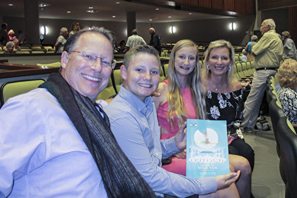

2020年3月13日晚，Brad Hupp医师和太太Michelle Hupp带着两个孩子在美国威尼斯表演艺术中心观看神韵演出。（麦蕾／大纪元）

 <h1 align="center"><b>神韵美国威尼斯开演 佛州精英感悟神力万能</b></h1>
 
 【大纪元2020年03月14日讯】（大纪元记者麦蕾、林达美国威尼斯报导）“有志者，随我下世，救度众生！”在创世主的慈悲呼唤下，众神毅然跟随创世主下界，在宇宙中飞驰而下。这一幕壮观的景象让美国威尼斯表演艺术中心（Venice Performing Arts Center）的观众深受震撼，他们立刻热烈鼓掌。

3月13日晚，神韵艺术团在美国威尼斯表演艺术中心的首场演出获得热烈欢迎。精湛卓绝的中国古典舞与辉煌壮丽的背景相得益彰，精深的神传文化内涵和慈悲洪大的乐曲令人悦目倾心。

当晚的神韵演出恰逢美国进入针对武汉肺炎的“紧急状态”之际，在很多人尽量足不出户的情况下，威尼斯的很多观众仍赶往剧院观看，并非常庆幸自己没有错过观赏的机会。豪宅经纪人Michelle Hupp说，“在神的庇佑下，什么奇迹都可能发生。”神韵粉丝Cleo Graden说，“人类面对大挑战时，应该来看神韵这样的演出，因为演出所呈现的是人类的希望。”

<b>“神无所不能” 获奖地产专家看神韵受震撼</b>

佛州威尼斯知名豪宅经纪人Michelle Hupp说：“我们能够有机会今晚来观赏演出，非常感恩。”“正如神韵的名字，是神在起舞，真是一种美好的舞姿，名不虚传。”

她说，表现受迫害的小伙子重见光明的故事让她感动，“那一幕带给我一种非常神圣美好的体验，同时也让我意识到，在神的庇佑下，什么奇迹都可能发生。”Michelle说，“我会在社交媒体上鼓励威尼斯的人们，明天一定要来看演出！”

Michelle Hupp是一家高端豪宅中介公司的老板，她被《威尼斯杂志》（Venice Magazine）评选为威尼斯前五名房地产经纪人。她还担任多个委员会的成员，并曾担任Albion地区艺术理事会的主席。

<b>美国食品巨头区域经理：神韵带我远离烦恼</b>
 
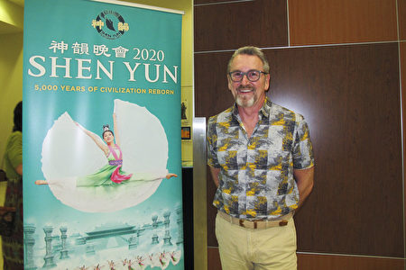

2020年3月13日，地区经理Bill Purcell先生跟朋友观看神韵艺术团在佛州威尼斯的演出。（麦蕾／大纪元）

 
 Bill Purcell先生是著名食品公司Smucker’s在佛州的地区经理，他看完演出后喜气洋洋，笑容满面，“神韵演出带我远离了这个世界上所有的喧嚣和烦恼！”

他赞赏神韵艺术团为复兴中华文化做出的努力：“演出展示了中华的历史和其深邃的文化内涵，这种文化对于当代社会绝对重要。”他表示，神韵艺术家“应该继续演下去，不要停歇，绝对要坚持下去！”

Smucker’s具有一百二十多年的历史，很多美国家喻户晓的美食、连锁店等都是其旗下品牌，三十多年来该公司年年被《财富》杂志评选为“美国前100最佳工作公司”，还曾荣获第一名。

<b>公司老板感悟：人要根植于传统、历史和神</b>
 
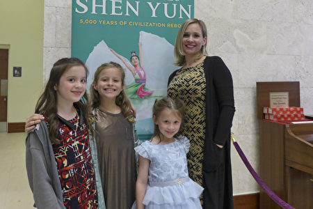

2020年3月13日晚，公司老板Cyrena Douglass和她的孩子们一起观看神韵艺术团在威尼斯的第一场演出。（林达／大纪元）

 
 “从歌词、歌曲的角度来看，整个节目在传达一种信息，即不要困在当今社会和现代世界中，而要植根于传统、历史和神。我们彼此要和平、慈善。”公司老板Cyrena Douglass看完演出后愉快地分享了她的感受。

Douglass和孩子们一起观看神韵演出，她说：“节目中谈到了创世主，当创世主到来时，他拯救每个人。有些人受到了身体上的伤害，有些人受到了情感上的伤害，创世主能够治愈所有人的创伤并拯救他们。”

“我没想到节目会包含精神内涵，我认为那真的很勇敢，我真的很感激。”Douglass说：“复兴传统文化是了不起的使命，神韵可以使人们了解真正的中国文化，并使这些传统文化永存。”

<b>神韵带来精神文明 大学副教授流连忘返</b>
 
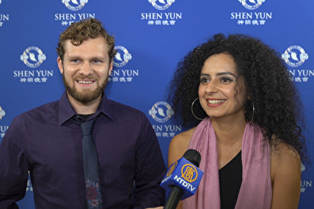

2020年3月13日晚，大学副教授Nassima Neggaz女士跟朋友在美国威尼斯观看神韵演出。（新唐人电视台）

 
 Nassima Neggaz女士是研究宗教历史的大学副教授，她对神韵歌词记忆犹新，“所有内容都具有神和神性价值方面的内容，整个过程中都传达出这样的强烈信息，也有关于谴责共产主义压迫的故事。”

“我非常喜欢神韵的演出风格，每位舞蹈演员的优雅和风格也各不相同，我也很喜欢通过舞蹈讲故事的方式。主持人对每支舞蹈的介绍，对我们非常有帮助。”她说。

神韵的使命是复兴中国五千年传统文化，她说，“就我个人而言，神性在我的日常生活中非常重要。这有助于我变得积极向上并继续前进。”最后她说，由于喜爱神韵节目，他们都不愿意离开剧院了，希望多停留一段时间。

<b>销售经理泛泪 感悟人们要“亲近神 远离共产主义”</b>
 
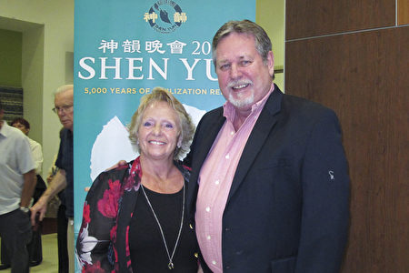

2020年3月13日晚，销售经理Tim Bock先生跟女伴Debby Chamberlain在美国威尼斯观看神韵演出。（麦蕾／大纪元）

 
 “我接收到演出的信息。”美国一家大型工厂的销售经理Tim Bock先生红着眼圈，泪光闪闪地说，“那就是‘亲近神，远离共产主义（邪灵）’。”Bock领悟道，“演出充满了神性，这个信息适用于所有的中国人和美国人，这是人类都应该获得的信息，具有普世的价值。”Bock说，“共产主义非常坏，非常糟糕！”

Chamberlain惊叹道，“我的天哪！这个演出真是超凡脱俗，真是棒极了！”她并赞同Bock的观点：“这是一个美好的信息，一个美妙绝伦的演出。”

卓越高超的音乐和舞蹈令Bock过目难忘，神韵舞蹈家的翻腾跳跃，技巧高超，他称赞道：“音乐美妙极了，绝对壮丽辉煌，舞蹈家太棒了，我无法想像他们是如何做到的。”

<b>“面对当今的困难和挑战 神韵让人忘却恐惧”</b>
 
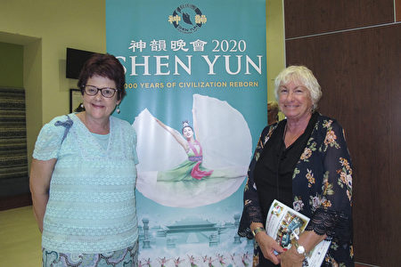

2020年3月13日晚，神韵粉丝Cleo Graden（右）邀请加拿大朋友Jo-Ann McInnis（左）到美国威尼斯看神韵演出。（麦蕾／大纪元）

 
 Jo-Ann McInnis在加拿大健康系统工作，她应美国朋友Cleo Graden之邀观赏演出。Graden是神韵粉丝，曾两次带亲朋好友看神韵。

Graden说，“两年前我就看过神韵了，演出非常卓越。现在正在流行的疫情不会让我害怕，我就是要来看神韵。我喜欢演出所有的服饰和舞蹈，非常美妙！”

Graden表示，人们从演出中获得希望，观看神韵令人忘却病毒带给世人的恐惧，“我认为神韵正是我们需要的。”她说，“目前的困难时期是人类面临的大挑战，我觉得人们应该来看神韵这样的演出，因为演出呈现的是人类的希望。”

<a target="_blank" href=#top><h6 align="right">回上方</h6></a>

<a name=113>
<h1 align="center"><b>江苏公司上百员工隔离结束 发现公司不见了</b></h1>

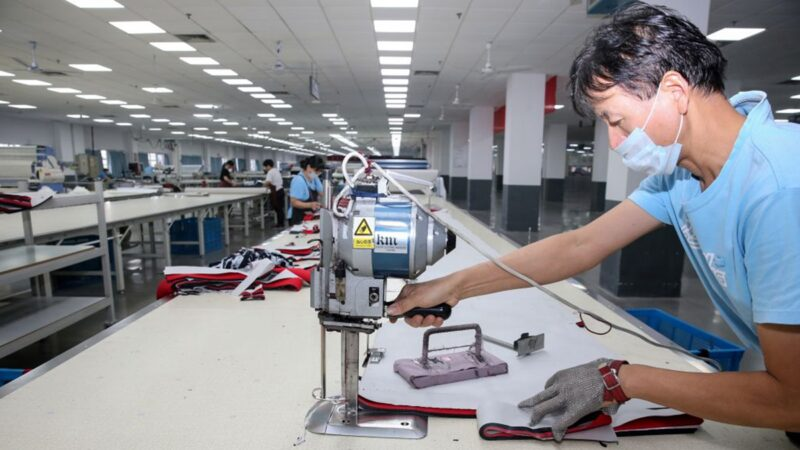

图为中国江苏一家服装工厂。（STR/AFP via Getty Images）

 
 【新唐人北京时间2020年03月12日讯】“隔离结束回来，发现公司不见了！”网上的段子在江苏昆山达鑫电子有限公司员工身上得到应验。该公司上百名员工日前返回公司复工，却惊讶地发现，老板不见了，工厂设备也消失了。

3月5日，达鑫电子有限公司上百名员工返回工厂复工，却发现无工可打。老板已不见人，厂房也搬空了。员工们开始在网上维权，希望公司给一个说法。

公开资料显示，达鑫电子成立于1998年6月，已经营22年，法定代表人张高圳，注册资本772.33万美元，股东仅新加坡达鑫控股有限公司一名。达鑫电子的经营范围包括电脑及电脑零配件、照明设备、电池模组等。

（网络图片）

《每日经济新闻》3月10日报导，在原达鑫电子厂区大门上贴着一份3月7日发布的公告。上面写着，受武汉肺炎疫情影响，目前配套供应商及物流等不能稳定复工，公司人力无法到位，加之订单不足，公司近几年来持续亏损，所租赁厂房已被出租方收回，目前已无法继续经营，于3月7日宣布解散。

当天，达鑫公司多名供应商及员工来到厂区门口等待消息。供应商们希望能够拿回设备或欠款，员工则希望公司给一个说法。

有自称达鑫电子员工的人士向记者透露，2月29日，公司公告称自2月10日起停工停产，放假最大期限为2个月，假期结束后是否继续放假或返厂上班，由公司再行通知。

记者在厂区门口还发现一份发布时间为3月5日、落款为“昆山铨鑫电子科技有限公司（以下简称铨鑫电子）”的公告，其中称：达鑫电子与该公司房屋租赁协议已于2020年2月29日终止，该公司办公场所已搬离。

记者注意到，2月29日，就是达鑫电子发布停工停产公告的日期。

部分供应商向记者表示，达鑫电子解散的原因，并非仅仅是受到疫情的影响。一名供应商说，达鑫电子一度发展得不错，最兴盛的时候，公司有3个分厂，总员工超过千人，但近几年每况逾下。

另一位供应商表示，受国际经贸形势的影响，公司流失了一些比较重要的大客户，才导致难以继续经营，在解散前夕，达鑫电子员工约有三四百人。

近年来，在美中贸易战的冲击下，不少大陆私营企业流失客户，经营受挫。今年又遭遇武汉肺炎疫情严重打击，中国各地停工停业，百业凋敝，其中最为危机的是中小企业。很多企业无法支撑，已经倒闭或濒临倒闭。

中国中小企业协会近日发布一项报告显示，因资金紧张，有近9成的中小企业撑不过3个月。报告还显示，近3成企业表示，目前情况特别严重，将导致亏损；有5成企业表示经营困难，已有裁员计划。

同时，市场上裁员、减薪消息频频传出。据协会数据显示，中小企业占中国企业总数的90%以上，占中国经济的60%，为市场上80%的劳动力提供了工作岗位。若中小企业迎来倒闭潮，即意味着大陆会出现大规模的失业潮，民生面临严峻考验。

<a target="_blank" href=#top><h6 align="right">回上方</h6></a>

<a name=112>
<h1 align="center"><b>武汉90后：要不是会翻墙 说不定进了焚尸炉</b></h1>
 
【新唐人北京时间2020年03月12日讯】武汉疫情爆发3个多月来，众多民众染疫或死亡。疫情改变了很多人的人生轨迹，也改变了很多家庭。90后武汉男孩屠龙说，要不是自己会翻墙知道真相，此刻说不定他已经进了焚尸炉。

在武汉出生长大的屠龙一度认为，只要他不发表任何政治敏感言论，不做任何出格的事，按照当局的意愿做个顺民，他的人生就会一路向上。

然而，一场武汉病毒疫情彻底改变了他的想法。屠龙说，他不想再做“沉默的大多数”。“我知道这个政府有多么混蛋，我以前只是跟自己说不要去在意一些事情。”

据美国之音报导，屠龙是化名，尽管他同意接受访问，但他依然担心自己的人身安全。

<b>从激进少年到“温水煮青蛙”</b>

现年26岁的屠龙是在“防火长城”背后成长起来的中国年轻一代中的异数。

他说，自己11岁就学会翻墙上网，看过89六四的纪录片；在维基百科上读当权者禁忌的历史；从外媒的报导中认识一个未经审查者过滤的中国。

“毛泽东就是杀人的屠夫，”15岁时他在家里对爸妈说。

“先富起来的无非是赵家人，我们只是燃料而已，”他和要好的同学说。

父母告诫他不要去外面发表这种言论；朋友劝说他：“好好读书工作赚钱，以后有机会赶紧离开这里。”还在上小学时，屠龙就希望离开中国。中学时，他拒绝入团，不愿“向他们的政治靠拢”。

但是屠龙家的经济条件一般，父母无力供他出国读书。16岁时，他意识到，要在中国生存下去，他必须作出妥协，保护自己，不去以卵击石。

“OK，我按你们给我的要求，不去做这些敏感的事情，”他说。“我跟着你们走，行吧。”

屠龙的梦想是当一名记者，他努力学习，考上了全中国顶尖的新闻专业，但他很快发现这个梦想在中国无法实现。“我的学校就是他们专门培养控制舆情的学校”，他回忆说。“我不止一次地听到我们老师沾沾自喜地告诉我们，他们是如何控制舆情的。”

毕业后，屠龙在北京一家互联网公司找到一份收入不错的公关职位。虽然要交很多税，虽然买不起北京的房，可是温水煮青蛙，日子久了，他觉得一切似乎也并非那么不可忍受。

他告诉自己，再努力一点就能成为中产阶级。

他依旧谨言慎行，远离政治，只是很偶尔地，会在朋友圈里隐秘地表达自己的不爽，比如他会写：有一只黄熊正在开倒车；又或者，他借用昔日毛泽东、邓小平的言论来反讽现实。

“我们会故意地正话反说，”他说，“我们年轻人管这种人叫‘阴阳师’。”

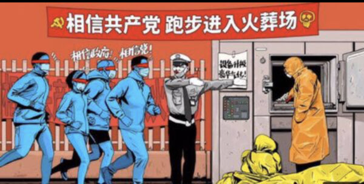

示意图（推特图片）

 
<b>不愿再沉默</b>

武汉肺炎的爆发打破了这一切。屠龙说，要不是自己会翻墙，​​要不是一些海外的朋友告诉他真相，此刻说不定他已经进了焚尸炉。

封城的日子里，他反思了很多：“他们清理北京低端人口时，我跟自己说，我很努力，我不是低端人口，我不会被清理；他们在新疆搞劳改营时，我想我也不是少数民族，我也没有宗教信仰，我也不会被清理。

我很同情香港人的遭遇，但我觉得我也不会去上街，不会抗议，所以也跟我没关系。这一次事情发生在我的家乡，我周边已经有很多人得了病，也有去世的，所以我没有办法再忍受下去了。”

公民记者李泽华对屠龙的触动很大。李泽华也是90后，毕业于中国传媒大学，曾在中共国家电视台做主持人，后成为一名自媒体人。

2月6日，李泽华进入武汉报导疫情，探访了当地社区、殡仪馆、火车站等地。20天后他被国安追捕，至今下落不明。他是继陈秋实和方斌后，第三位“被失联”的公民记者。

屠龙说，和李泽华一样，他也不愿再沉默下去。“这件事情被瞒报了整整一个多月，”他说。事情发展到今天，不仅没有人出来给武汉人道歉。

“他们还告诉我们要去仇恨美国，我们应该去仇恨日本，我们应该去仇恨韩国，我们应该去仇恨台湾，我们应该去仇恨《华尔街日报》，没有人出来为这件事情买单。我们伟大的市长周先旺前几天还被中央公开表扬了”。

到现在还有那么多人没有治愈，“我们已经把它当成喜事了。《大国战疫》都已经出版了。太荒唐了！”“太荒唐了！”他又一字一顿地说。

<b>一场“人性的大考”</b>

除执政者外，很多中国民众的言论和做法也让屠龙失望。有位同学的妈妈染上武汉肺炎，因为没有病床在网上发帖寻求救助，立刻就有“小粉红”蜂拥而至，要求删帖，还说他是“被境外势力控制”。

屠龙本人也常被人说“被外媒洗了脑”。“说实话，这件事情给我刺激最大的，真的不是疫情本身，而是人性的大考，”他感慨地说道。

“绝大多数中国人，包括我自己，并不无辜。因为我们纵容了他们作恶，当然还有更多人是跟他们一起做恶， ”他说。

他又说：“现在中国弥漫着一种不寻常的乐观气息，我看到报导说，全世界欠中国一个道歉，甚至说什么没有这次新冠肺炎，我都不知道中共这么牛。

现在，武汉还在牺牲，还在受苦， 他们还跑出来说，哎呀，你看现在国外做得多么不好，就是我们中共做得特别好。非常可怕！”

<b>准备“逃难”</b>

屠龙已经辞去了北京的工作。疫情结束后，他希望离开中国。他说，自己不是游学，也不是移民，而是“逃难”。

之前曾有朋友对他说：想要在中国生活下去，有两点你要做到其一，两个都做到是最好的——第一，丢掉自己的理智；第二，丢掉自己的良心。屠龙觉得，这两样，他都做不到。

他说：“这次事件我熬过去了，我幸运；熬不过去也是一种解脱，但是只要我熬过去了这件事情，作为武汉事件的幸存者，我这辈子有义务为死去的人发声。 ”

<a target="_blank" href=#top><h6 align="right">回上方</h6></a>

<a name=111>
<h1 align="center"><b>中共全力“甩锅”武汉肺炎 外媒捏住7大死穴</b></h1>
 
【新唐人北京时间2020年03月12日讯】习近平日前视察武汉后，中共官媒全力改写当局隐瞒武汉肺炎疫情，酿成世界灾难的历史，以掩盖中共当局难以摆脱的责任。美媒列出7点无可争议的基本事实真相，直言中共官媒的宣传与事实相悖。

习近平于3月10日到访武汉视察，中共官媒宣传报导也随之齐发，推出了新一轮的抗疫赞歌大合唱。《人民日报》当天头版为“不获全胜 决不轻言成功”，称在习近平的“坚强领导”下，“坚决打好湖北、武汉保卫战。”

对于中共官媒的煽情宣传，一位中国网民哀叹：“世间本无‘战’，硬要拖延隐瞒成‘战’，再去打保卫战。——庶民的死，如蝼蚁。”

美国之音报导称，在观察家看来，武汉肺炎的事实应该是，以习近平为首的中共当局在疫情初期进行隐瞒，导致疫情扩散，最终酿成全球性灾难。

报导列出武汉肺炎疫情自去年12月爆发后的7点基本事实真相：

第一，中共当局在疫情初期进行隐瞒，导致疫情快速扩散。当局以避免引起恐慌为名，禁止武汉医务人员采取戴口罩这样的基础防护措施，导致疫情迅速扩散，不少医务人员感染。

第二，同样是为了进行疫情信息隐瞒，中共当局惩处疫情吹哨人李文亮等8名医生，导致医务人员人人自危，无人敢讨论敏感的疫情问题。

第三，中共在隐瞒的同时展开误导性宣传，声称疫情“可防可控”，没有“人传人”，令民众疏于防范。

第四，在疫情已经扩散严重的情况下，已知晓疫情的武汉当局组织万家宴，给公众营造虚幻的安全感，导致成千上万的人感染病毒，从而促成了疫情的大爆发。

第五，在疫情扩散严重、发展势头凶猛的时候，中共当局仍隐瞒疫情，声称武汉近两周没有确诊案例。相反确诊病例却在国外不断出现，网路上因此流传武汉肺炎是“爱国病毒”，只传染国外、不传染国内的笑话。

第六，习近平声称1月7日已对疫情防控做出具体指示，但在1月23日武汉封城之后，习在北京出席中央团拜会时发表讲话，只字不提武汉，不提疫情，也不提封城。这显示无视疫情、淡化疫情的做法来自中共当局最高层。

第七，香港在1月4日就采取严格防疫措施，显示香港接受了17年前爆发SARS疫情的教训。但中共重蹈覆辙，而且信息封锁比SARS时期有过之而无不及。当年SARS疫情之所以扩散全球，也正是因为中共隐瞒、封锁信息所导致的。

如今，武汉肺炎疫情已扩散至全球100多个国家，与中共关系密切的几个国家如意大利、伊朗、韩国等，疫情尤为严重。

截至3月11日，意大利确诊病例总数达到12,462例，死亡人数累计827人；伊朗确诊病例累计9,000人，354人死亡；韩国确诊7,755人，61人死亡。

11日深夜，世界卫生组织（WHO）宣布，武汉肺炎是一种全球大流行的传染病。不少西方国家政府、专家学者及媒体纷纷抨击中共隐瞒疫情和造假宣传，以及一连串的防疫措施失误，导致疫情全球蔓延。

而中共当局却罔顾事实，试图隐瞒改写这场疫情的发展史。对此，在纽约出版的政论杂志主编胡平认为，习近平“亲自指挥、亲自部署、亲手制造”了这种全国性和世界性的灾难，正是因为他的责任和罪责十分明显，难以逃避。因此他和他的宣传班子才孤注一掷，采取这种完全罔顾事实的宣传叙事，并为此承担这种宣传会成为笑话的风险。

中国老资格的人权民主活动家魏京生表示，这是中共的老一套了。在毛泽东时代，他们就是赤裸裸地这么干的，现在习近平也是这么干的。中共当局这样宣传说明它心虚，“特别心虚，知道老百姓都不信任他们了，所以他们就要靠编造这种假的东西忽悠人。”

<a target="_blank" href=#top><h6 align="right">回上方</h6></a>

<a name=110>
<h1 align="center"><b>孝感高价菜引爆大规模抗议 市民怒喊“下课”</b></h1>

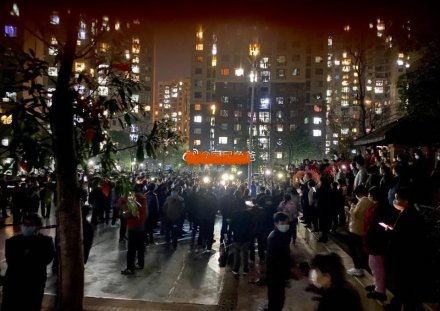

湖北孝感应城海山业主集体抗议高价菜，要求负责人下课。（网路图）

 
 【大纪元2020年03月13日讯】（大纪元记者顾晓华、凌云采访报导）湖北孝感应城海山应置城小区业主对物业配送的高价菜质量却很差感到不满，而通过个人关系联系到平价爱心菜却不让进入小区，物业则报警抓业主，引发压制已久的民怨。大批业主聚集抗议，大喊社区书记下课，要求警察放人。

该小区一位不愿透露姓名的业主向大纪元记者表示，事件起因是业主自己找的爱心菜，被物业和对点超市（大润发精品玛特超市）举报，警察来抓人，业主打抱不平，不让抓人，才导致抗议事件发生。

另一位知情者在网上披露，疫情爆发后，事发小区一直都是由小区周围一家名叫大润发精品玛特的超市配送物资，菜品贵但质量差。小区业主程某看不下去，联系了点菜，几乎按成本价出售，但却因为触动了某些人的利益，不准他出售，并对程某出言威胁。12日下午6点半左右，物业带警察把这位业主带走，点燃了火药桶。

消息还称，这起事件是一个导火索。因为疫情期间他们一直在打电话投诉，但对方一直不作为。

上述未透露姓名的业主还表示，该小区还未解封，业主们买菜需要通过社交群接单定菜，大润发提供了50元（白菜苔、萝卜、大白菜、西红柿等5种）和100元套餐（蒜苔、生菜、花菜等8种），当日接单，次日下午配送，但是数量少而且质量差，而业主自己找的爱心菜价格是套餐菜的一半不到，量多质高，全部成本价，最后支付2元辛苦费而已，因此受到所有业主的欢迎。

业主购买的50元套餐菜。（受访者提供）

 
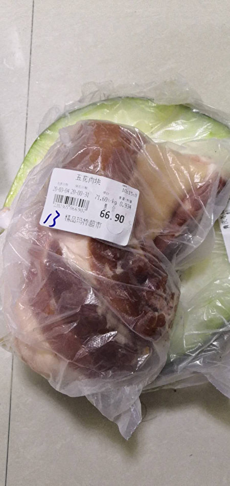

业主购买的高价肉。（受访者提供）

 
 据了解，12日晚现场聚集了三四百名业主，在小区内高喊：“放人！”“吕德山下课！”（注：吕德山是社区书记同时兼任海山业委会主任），最后程姓业主在业主们的强烈要求下被释放，物业向其道歉。业主代表与官方谈判的结果，第一是业委会重新选举，原班人马全部改选；第二是降物业费；第三是解决地下车位，人防不是人防的落实，以及小区的环境各种措施到位。

有网民表示，“积怨已久，压迫已久，谁不惜命啊？我妈今天买了50元菜，4个番茄2个黄瓜5个洋葱，一小袋小白菜……我们已经吃了快两个月了，那个100块钱的肉有2斤，我妈拿起又放下，心酸得不行，这个县城太腐败了，我们老百姓只能被压迫，才能保证他们的利益，这种丑闻出来是迟早的事。”

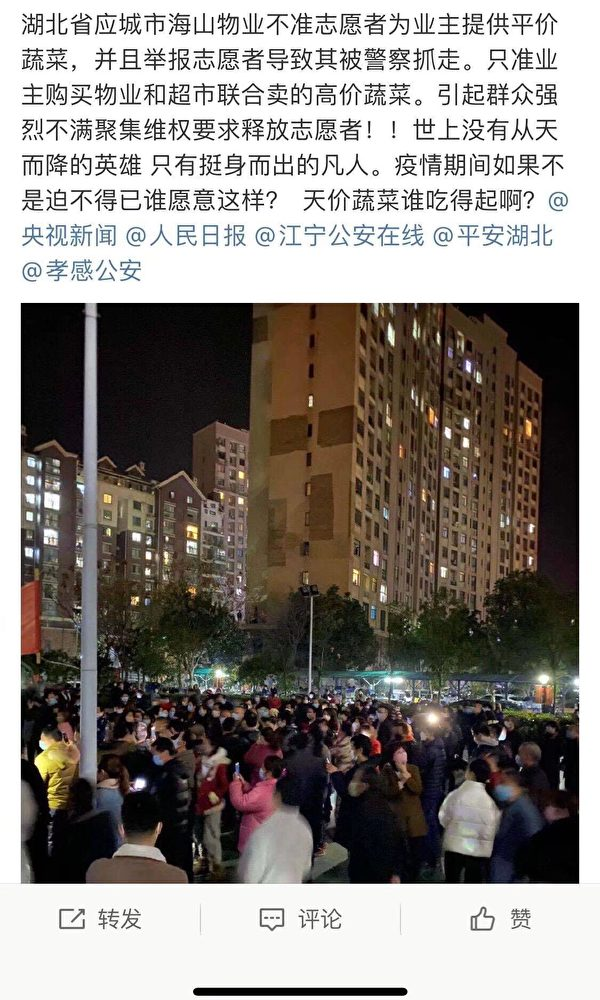

（截图）

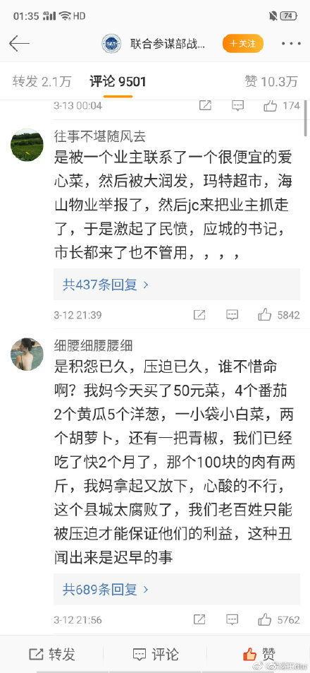

（截图）

 

（截图）

据悉，受应城海山的影响，隔壁小区奥林花园等也出现了居民聚集抗议的情况。

另据业主透露，当地政府惧怕其他小区效仿，再次爆发群体事件，要求各区办事处所有官员、社区工作人员于13日早晨6时30分之前进驻社区各居民小区与物业衔接，及时劝解出门人员，帮助理顺情绪，通知中还称“情况十分紧急，请大家务必克服困难，准时到岗。”

12日晚，应城市防疫指挥部发消息称，19:30左右，应城市海山小区“约100人”在小区篮球场聚集，“少数网民”反映菜价过高的问题。经现场劝阻，20:00时左右“自行散去”。但随后被网友斥责“造假”。

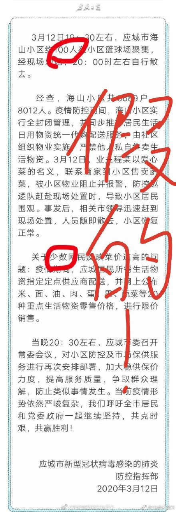

（截图）

 
 一周前，网上也传出小区业主自己了买了平价菜被工作人员硬生生抢走的视频。
 
 自从疫情爆发、湖北多地封城以来，各级政府部门形成利益链，从中大发国难财。

有湖北网友表示：“如果底下人民不造反，我们这边村里、乡镇上的工作人员巴不得关一年。就拿我这个小村（来说），几个大队干部，工作人员，每天国家补贴200。再加上柴米油盐，煤气，猪肉，蔬菜，每天每个人至少分1000元以上……如果连续再关几个月，他们高兴死了，我估计湖北各地的村、乡镇的干部都是这么个心态。”

消息还称，“如果村里没有出现一个疫情，他们还有额外10万元左右的奖金，并且还能升职，你说他们会不会卖力封堵你们这些屁民。”

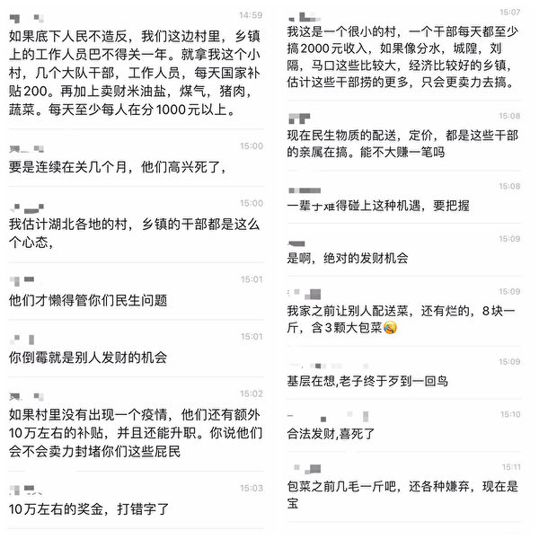

网友披露当地的黑暗。（截图）

 
 网友还表示，自己所在的还是一个很小的村，干部每天都至少有2000元的收入，如果是那些大的村，经济好的乡镇，干部捞的就更多。只会卖力去搞。

消息还称，“现在民生物资的配送，定价，都是这些干部的亲属在搞，能不多赚一笔吗？”

日前有视频消息指， 武汉小区居委会垄断了食物派发，搞食物派发，一天可赚10万元。

有湖北网友表示：“我真的受不了了，湖北的官员们啊！武汉用垃圾车装肉，孝感吃高价烂菜，你们把人当人吗？你们这群畜牲，你们这群垃圾！”

还有网友在微博上表示：“一片惨像，已经目不忍视了，流言尤使我耳不忍闻。我还有什么话可说呢？我懂得衰亡民族之所以默无声息的缘由了。沉默呵，沉默呵！不在沉默中爆发，就在沉默灭亡。”

封城之下，高价菜已经是小区市民的常态。

早前，中共副总理孙春兰视察武汉开元公馆小区，楼上的业主集体高喊：“假的，假的，全都是假的！”“老百姓吃的都是高价菜。”孙春兰视察了一半被气跑。消息在网络上刷屏。

昨日，网上有传出武汉市青山区钢都花园用垃圾车运送平价肉和蔬菜，引爆民怨沸腾。更有网友还担心，若是垃圾车载运过废弃的医疗用品，口罩或病患用过的垃圾，没有消毒过还直接载食物，恐怕会造成疫情再一次扩散。

<a target="_blank" href=#top><h6 align="right">回上方</h6></a>

<a name=109>
<h1 align="center"><b>“没把人当人” 武汉用垃圾车救护车运菜肉</b></h1>

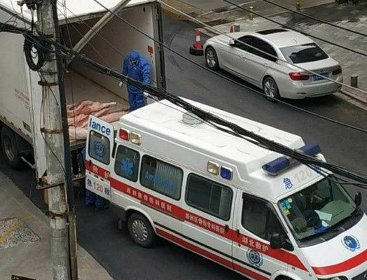

就在武汉青山区用垃圾车派送蔬肉食品给辖区居民引发众怒之时，江岸区用救护车运送猪肉蔬菜的消息再次踢爆网路。民众批评政府，真没把人民当人看。图为网友曝光的武汉当地用救护车送肉的图片。（网络图片）

 
 【大纪元2020年03月13日讯】（大纪元记者易如采访报导）就在武汉青山区用垃圾车派送蔬肉食品给辖区居民引发众怒之时，江岸区用救护车运送猪肉蔬菜的消息再次踢爆网路。民众批评中共政府，真没把人民当人看。

3月12日，有网民在社交平台上陆续发布武汉市多地用环卫车、救护车运输猪肉蔬菜等物资的图片。其中，一辆印有“湖北救护”的新洲区骨伤专科医院的救护车正对着一辆货车“尾对尾”地转运肉品，车辆附近商铺显示其所在地为江岸区西马街。

有网民批评，“救人的时候没车，拉肉的时候用救护车。”

而头一天晚间，青山区钢阳花园小区的居民在网上曝出，小区收到了社区用垃圾车运送的冻肉。目前该区一副区长及相关人士被立案审查。有网民说，“这管事的是真没把人民当人看，会用垃圾车救护车给自己家里运肉运菜吗？”

<b>多地早就用垃圾车运送蔬菜</b>

对于用垃圾车运送食品物资，青山区的徐女士对大纪元表示，武汉市之外很早就有曝光，“武汉之外的城市，像孝感，有这样的事情曝出来，武汉是这两天才曝出来的。”

“没办法接受这个事情，宁愿不要这个东西，发肉、发菜，（用这样的运输）本身就不可思议。我们青山区为这个事情闹得很厉害，每个社群业主群都在指责他们。”徐女士说。

社交平台上，有武汉的网民表示，武昌区也是这样操作的。“用救护车去拖，这个太可怕了，万一有病毒传到家里去多可怕。”家住武昌区的肖先生对大纪元说。

青山区的李先生对大纪元表示，有其他的武汉朋友说，在前一段时间都看到过用垃圾车送肉送菜，“当时他们没有像武汉青山区的小区市民勇敢把这个捅穿了，维护自己的权利，就是说白了，你自己不把这些事情喊出来，把这些事情披露出来、说出来，怎么会有改进呢？”

网民“ICE韧多多”调侃：大家都宽容一点吧，没动用殡仪馆的车就算不错了。但另有网民说，没有你想不到的。

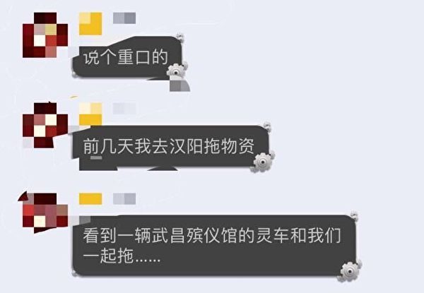

武汉民众爆料当地用殡仪馆的车运送物资。（网络图片）

 
 <b>为何要用垃圾车运送冻肉和蔬菜</b>

对这个问题，不少网民发出质问。网民“我心我橙-心已远”说：“武汉一辆正常的车都没？非要用极端车运肉？”

“为什么会用垃圾车来运，不知道谁做的这个决定。”李先生说，估计有两个方面原因，“一个是，因为大家都关在家里，很多交通都封闭，垃圾车是必须每一天都要去社区拖拉垃圾的，是不是（顺带）方便一点；第二，是不是社区里面，各个地方都封城，可能没有其它的资源，就变成这样，但确实是很操蛋的事情。”

徐女士也表示有两个原因，一个是司机不够用，“武汉是重疫情区，现在司机都是志愿者，虽然给比平时多得多的钱，很多人都不工作了，都为了保命，愿意出来的只是很少的一部分，还有很多司机染病了，要他们出来要有勇气，扪心自问，这个时候有多少人自己愿意出去工作。”

“另一个原因是省钱，商家为了省钱，在这种情况下，正常的车拖一次费用很高。两个因素促成的。”她说。

网民“塔图姆投篮美如画”说：“征用社会车辆运输平价肉，也可以啊，现在武汉没有全面复工，闲置的社会车辆肯定有很多，政府完全可以出钱征用社会车辆，为何要用救护车？再严格消毒，涉及食品安全，也不能用救护车啊，而且对救护车而言，不也是一种资源浪费？武汉政府这调度能力，是故意的吧！！！”

<b>政府应出钱补贴生活 而不是只发物资</b>

据悉，青山区政府这次用垃圾车拉来的蔬菜鱼肉是一次性的派送食品，“正好不是前段时间习大大来了，给的一个福利。上一次不是孙春兰到青山，当时不是有民众喊‘假的假的，都是假的’，然后就说要安抚一下民众的情绪，免费送一些青菜、肉供应、供应，就是这一批。”李先生说。

“其实，不应该去给每个人发菜发肉，（政府）应该是给我们生活补贴，给我们钱，我们自己团购，物资方面我们可以自己组织，自己解决。”徐女士批评政府搞大政府，什么都管，“社区团购政府提供的低价东西，根本不应该这样操作，这样操作又浪费人力，一个政府越搞越庞大，招那么多志愿者都是要钱的，还不如把这个钱直接补贴给居民。”

她也批评政府不作为或乱作为，“应该做的事不做，不应该做的事乱做。”比如，应该针对需要服务的孤寡老人去好好地服务他们，“（现在）他把服务的力量均摊之后，需要服务的人也服务不好，非常需要服务的对象，受到的服务质量也下降了。”

肖先生也表示，现在主要的矛盾就是爱心菜的问题，“爱心菜是免费的，送给孤老、低收入的人，可能没送到位，导致一些矛盾，里面也有利益之争。”

另外，社区组织的团购不应该跟业主自发组织的团购进行竞争，“社区是有权力的，也参与团购，肯定会形成不良的竞争，会出现一些不好的事情”，徐女士说，“因为社区团购联系的商家是市政府、区政府、街道给他们指定的商家，选择的余地也不多。”

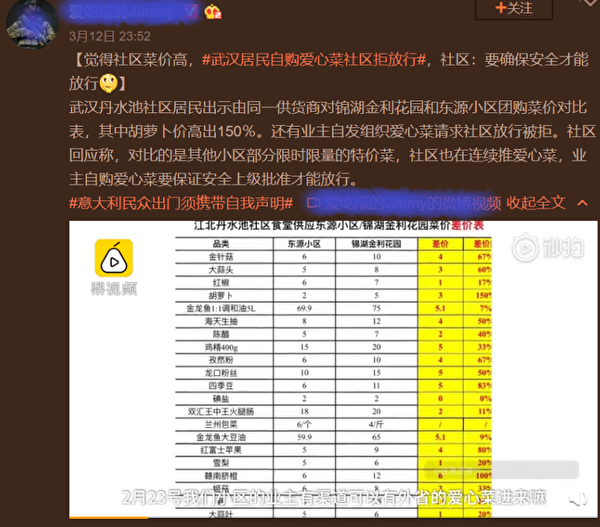

武汉丹水池社区居民出示由同一供货商对锦湖金利花园和东源小区团购菜价对比表，其中胡萝卜价高出150%。（网络图片）

 
 徐女士表示，现在网上团购平台超过30多个，业主自发组织团购，选择物资的余地非常大，“社区是代表政府，你政府就给居民发生活补贴，我们自己去团购就行了，（我们）自发组织的团购做的挺好的。”

不过，徐女士认为，大家现在的注意力都转移到关注肉和菜上去了，“都去关注肉菜的事情了，病毒的事情好像忘记了一样，注意力被转移了，还是要警惕啊。”

<a target="_blank" href=#top><h6 align="right">回上方</h6></a>

<a name=108>
<h1 align="center"><b>人民币在岸价下跌341点 离岸价跌破7</b></h1>

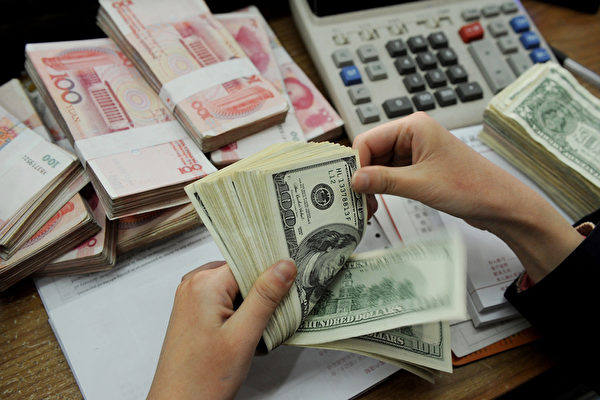

人民币兑美元离岸价和在岸价12日双双下跌。(AFP/Getty Images)

【大纪元2020年03月13日讯】（大纪元记者刘毅报导）3月12日，人民币在岸价和离岸价均大幅下跌，在岸人民币兑美元创下了近两周新低。

12日，在岸人民币兑美元接连失守多个关口，收报6.984，较上日下午4时30分收报6.9499，下跌341点或跌0.49%；较晚上11时30分最后成交价6.9603下跌237点。

据腾讯财经消息，人民币兑美元12日离岸价盘中跌破7人民币兑换1美元。北京时间12日开盘到晚上21点36分，离岸价下跌到7.031，当日跌幅达600多点，跌幅0.87%。

官方12日开出的中间价报6.9641，较上日的6.9612下调29点或0.04%，续创3月2日以来新低，连续第3日下跌。

香港《信报》引述交易员的分析说，武汉肺炎瘟疫继续蔓延，而市场期待的美国政策并没有提振市场信心，全球避险情绪高涨，人民币作为风险货币受拖累走弱，预计短期将维持反复偏弱态势。

另有交易员认为，海外疫情愈发严重，美元的避险作用正在显现，同时大陆股市整体偏弱且北向海外资金呈现流出，均对人民币构成压力，其走强的基础较为薄弱。

路透社则表示，有外资行交易员表示：“现在海外疫情日趋严重，全球避险情绪高涨，预计近期人民币会维持震荡偏弱的格局。”

另一中资行交易员认为，区间波动还是大概率，当然也要看客盘的态度。

该外资行交易员表示，从大陆已公布数据看，瘟疫对外贸冲击比预期大，若海外瘟疫蔓延令进出口持续逆差，人民币升值空间有限；此外，大陆A股近日维持弱势、北向资金大幅度流出，油价持续下跌令市场对油盘购汇预期较强，均会对人民币形成拖累。

瑞银亚洲经济研究主管、首席中国经济学家汪涛称，尽管经济整体面临下行压力、货币政策可能进一步放松，瑞银依然预计人民币对美元汇率企稳于7.0左右。

截至北京时间13日10点22分，人民币兑美元在岸价报7.0084，离岸价报7.0181，体现中共态度的人民币中间价为7.0033。

<a target="_blank" href=#top><h6 align="right">回上方</h6></a>

<a name=107>
<h1 align="center"><b>武汉作家女方方遭恶意攻击 网民这么说</b></h1>

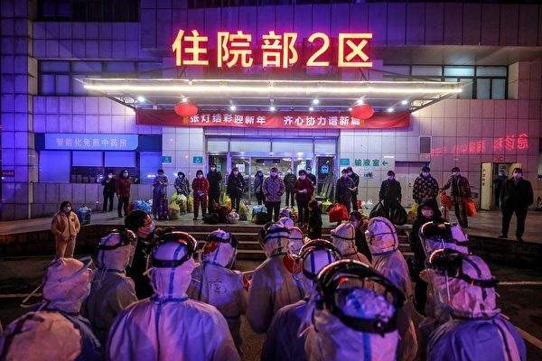

图为3月3日晚，武汉第五医院的确诊肺炎患者等待被转介到雷神山医院。(STR/AFP via Getty Images)

【大纪元2020年03月13日讯】日前，由“湖北省新闻工作者协会”主管的“今日湖北网”发了两百多条恶意攻击武汉女作家方方的帖子。方方在日记中指，有人试图要挟警方对她进行打击，还写“恶攻的势头来得非常凶猛。集体用同一个话题、同样的语言、同样的图片，在同一时间来对我攻击……这跟恐怖组织有什么差别？”事件引发网民热议。

武汉肺炎疫情从去年12月初在湖北武汉爆发，当局于1月23日宣布武汉封城。武汉作家方方的封城日记，引起数百万人追看。

近日，“今日湖北网”上铺天盖地的帖子，指责方方利用特权，找交警把她侄女送出武汉，弄到了新加坡。

对此，方方在3月12日写下“有人试图要挟警方对我进行打击吗？”的日记，日记开头解释道：她侄女是新加坡侨民。过年期间坐新加坡接侨的航班回新加坡。

因为飞机起飞时间大约在凌晨三点，且那天武汉刚下了私车禁行令。方方便联系了她认识的警察，请求帮助。

日记中说，如果有关部门想调查，尽可以去查。这个也叫使用特权，那么特权又是什么？其实，说到底，大概是有人试图要挟警方对我进行打击吧？

日记中还有一段文字写着：恶攻势头来得非常生猛，也是非常令人惊异的：突然有那么多人，集体用同一个话题、同样的语言、同样的图片、在同一时间来对我攻击，还有公开举报，通力合作的感觉……谁在主持（这样的行动，集体自发行为，傻瓜也知道不可能呀！）？又是谁在煽风点火，推波助澜？这样一伙人，一言不合，即下号令，集结团队，各种辱骂和恶意，围剿个体，这跟恐怖组织有什么差别？）

方方的这篇日记有许多跟帖。部分摘录如下：

“白水”：日记是探照灯，日记是扩音机，日记是显微镜，日记是听诊器，日记是解剖刀，日记是投影仪，日记是功过簿，日记是荣辱榜。一维又一维，日日紧追随！

“王朝辉”：从引咎辞职敦促书那一篇起，他们就坐不住了。

“随风”：“管他批评不批评，老子到处说！”“管他删不删，老子到处写！”方方日记一直写，都写到十一维空间了。“管他管控不管控，老子到处发！”

“沁园春”：真话和真药一样重要！真药救人，真话救世！

“Veritas” ：从二湘的七维空间追到十一维：就因为方方老师说了一点真话，有些人就要搞臭方方老师，我希望有更多有良知的人站出来支持方方老师，不为别的，就为了让我们的子女今后生活在一个正常的中国，而不是黑白颠倒的中国，我绝不把这个世界让给那些我鄙视的人，支持方方老师！

“快乐永远的我”：方方一言中的，那些人这么的心虚，说到底就是怕追责。创下如此滔天大祸，最怕秋后。武汉人不会饶过他们，湖北人不会饶过他们，中国人不会饶过他们。

“海子”：方方日记最大的特色就是三点：一是说真话；二是接地气；三是有分寸。

“懒懒的琳”：请相信老百姓心里有杆秤，所以不要因为那些怪物的攻击而影响心情！愿你一直强大，开心，健康！

“2020”：感谢方方老师每天的日记，所记录下的灾难日子里武汉普通百姓悲惨真实的点点滴滴，为受难的百姓发声，无惧于各方当权者的威胁，对他们的问责与鞭笞。看到了在灾难中发生的许多不忍提及的人间悲剧与上演的五花八门荒诞不经丑剧。提醒我们冷静又不失人性温度的观察视角与悲悯情怀。

“Follow the trend”：如果尖锐的批评完全消失，温和的批评将会变得刺耳。如果温和的批评也不被允许，沉默将被认为居心叵测。如果沉默也不再允许，赞扬不够卖力将是一种罪行。如果只允许一种声音存在，那么唯一存在的那个声音就是谎言。

近期，大陆多地武汉肺炎疫情的数据被中共“清零”，但武汉市被封城50天了仍没解封。新任武汉市委书记却开始要求武汉市民感恩习近平、感恩中共党，引发民众强烈反弹。

方方在日记中写道，站出来的感恩者应该是政府。政府要向躺在医院里苦苦与死神抗争的重症病人感恩，是他们的顽强坚持，让死亡名单数字增长慢；政府要向本地所有的医护人员和外援的40000多白衣天使感恩，是他们冒着危险，从死神手上夺回一个个生命。

<a target="_blank" href=#top><h6 align="right">回上方</h6></a>

<a name=106>
<h1 align="center"><b>大陆男子问：为什么中国人活得这么悲痛？</b></h1>

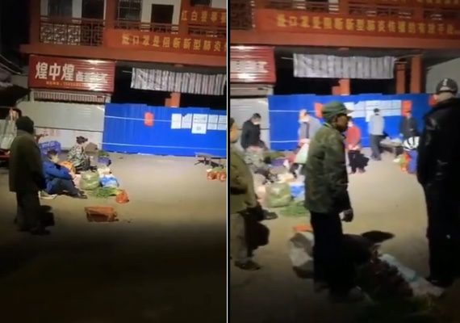

图为网传孝感民众为了躲开警察与防疫人员，半夜1点多到镇上卖菜。（视频截图）

 
 【大纪元2020年03月12日讯】（大纪元记者萧律生报导）今天网络传出一段声音，一男子说这是世界上最悲伤的事情，虽然未说出具体事情，但他指责中共政府，并问：为什么中国人活得这么悲痛？另外，网传孝感民众为了躲开警察与防疫人员，半夜1点多到镇上卖菜。

该男子说：“可能是世界上最悲伤的事情。这个世界太疯狂了。有时候想想。也就是在说这个事情，你的情绪都不会很好，你的情绪马上会感染，你就会那种，那种痛，你会感觉到胃很不舒服。你想吐。有时候不想骂人，受不了，真受不了。”

“你无法想像这是一个什么样的政府，这个政府到底做什么？为什么中国人这么的悲痛，为什么中国人这么的悲，活得这么得悲伤。（哭泣）情绪失控了。情绪失控了。”

有知情网民称，此是医护人员的心声。

另外，网传一段视频显示，在一块空地上，趁着灯光，几位农民戴着口罩在菜摊旁等待，有的很困，但还是在坚持着。画面中亦有几位前来买菜的民众。

知情网民称，这是孝感农民为了躲开警察与防疫人员，半夜1点多到镇上卖菜。

对此，有网民表示此视频真实，“我们家就是这样的，之前有两天还是几天，我妈凌晨去卖的菜，因为我爸贪生怕死，不敢去。”

还有网民表示：“哎，太不容易了。”“好可怜。”“悲哀的民族。”“夹缝生存，也是拼了。”

<a target="_blank" href=#top><h6 align="right">回上方</h6></a>

<a name=105>
<h1 align="center"><b>港媒：去年11月17日湖北已现武汉肺炎患者</b></h1>

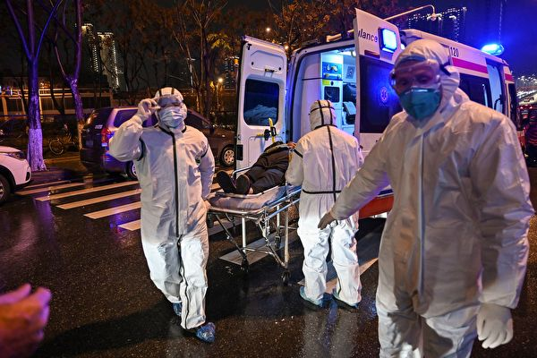

《南华早报》披露，一份未公开的政府文件显示，去年11月17日就已出现武汉肺炎患者，是一名55岁的湖北居民，但“零号病人”仍待确定。图为武汉一家医院。(HECTOR RETAMAL/AFP via Getty Images)

 
 【大纪元2020年03月13日讯】（大纪元记者周慧心编译报导）《南华早报》今天（3月13日）披露，一份没有公开的中共政府文件显示，早在2019年11月17日就已出现武汉肺炎患者，是一名55岁的湖北居民，但不确定该人就是“零号病人”，也不排除还有更早的案例。

报导指，这份未公开的政府文件，提供了有关该疾病在早期传播方式、传播速度等方面的信息，且披露北京已记录的确诊病例数量。

报导引述数据指，早在11月17日，一名55岁湖北省居民就已被感染，这是目前能追踪到的最早的武汉肺炎患者。自该日起，每天都有1至5个新病例，到了12月15日，感染总数为27人。12月17日首次出现两位数的增长报告，直到12月20日，确诊病例总数达到60。

文件还显示，去年11月头9个感染病例中，有4名男子和5名女子，年龄在39至79岁之间，但全都没被确认为“零号病人”，也不清楚有多少人是武汉居民。

现在，科学家急切地希望找到“零号病人”，这可以帮助追踪此病毒的来源。

根据世界卫生组织的网站，中国首例确诊的武汉肺炎病例是在12月8日，而武汉金银潭医院的医生，在医学杂志《柳叶刀》上发表的一篇论文中称，第一位患者的感染日期为12月1日。

上述论文作者之一，金银潭医院的重症监护病房（ICU）主任吴文娟医生曾对BBC透露，这名12月1日发病的病患是一名年过七旬的男子。

去年12月27日，湖北省中西医结合医院呼吸与危重症医学科主任医师张继先（Zhang Jixian）告知中共卫生部门，这种疾病是由一种新型冠状病毒引起的。此时已有超过180人感染，但医师们还没意识到所有人都是因为这个病毒而感染。

报导引述数据指，2019年的最后一天，确诊病例数已增至266人，到了2020年的第一天，数字是381人。

但是，武汉市卫生部门在1月11日，仍声称只有41例确诊病例。

报导表示，武汉肺炎最早的吹哨人之一李文亮医生，在去年12月底得知并透露此事，疫情爆发以来，科学家试图找出病毒最早的传播路径，至今仍没答案，病毒持续在全球扩散。

<a target="_blank" href=#top><h6 align="right">回上方</h6></a>

<a name=104>
<h1 align="center"><b>习到访武汉 分析：习在党内遭孤立</b></h1>
 <h3 align="center"><b>习成孤家寡人 党内没人真心对习</b></h3>
 
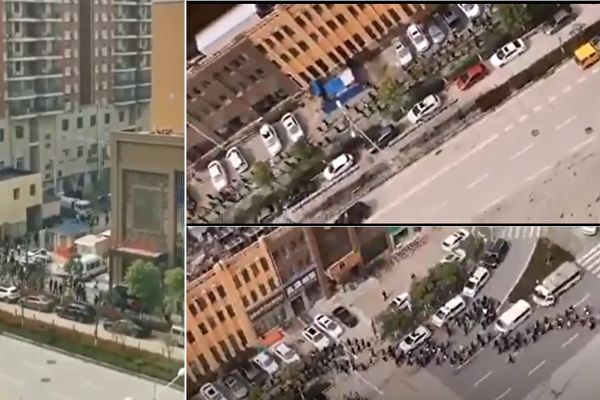

3月10日上午，习近平到访武汉东湖庭园小区。（视频合成）

 
 【大纪元2020年03月11日讯】（大纪元记者张顿综合报导）中共隐瞒武汉肺炎疫情，打压疫情“吹哨人”，中共体制内外的不满情绪高涨。习近平近期接连强调自己从1月7日就对防控疫情“提出要求”，而翻遍中共官媒的所有报导，习近平首次提到疫情是在1月20日，习近平话的背后藏有何秘密？习日前到访武汉，分析认为，习在党内遭孤立。
 
<b>网传署名“任志强”文章炮轰中共</b>

3月6日开始，署名是“任志强”的一篇文章在网上热传。文章在开头说，2016年的2月19日，“我”因为转发“央视姓党”图片并加了一段评论“当所有媒体都有了姓，并且不代表人民的利益时，人民就被抛弃到被遗忘的角落了”后，而被当局全网大批判并被留党察看一年。

随后，文章质疑中共在疫情方面，“试图用各种伟大的成绩掩盖事实的真相，好像这个疫情是从1月7日的批示才开始。那么去年12月发生了什么？为什么没有及时公布信息？为什么会发生1月1日中央电视台追究8名谣言者的新闻？为什么会有1月3日的训诫？为什么会有1月3日对美国通报的疫情信息？为什么不提1月7日之前已发生的各种危机？为什么1月7日的批示未向社会公布？至今也未公布！为什么1月7日之后还会召开了各种聚集性的全国大会？为什么还出境访问？什么在云南敲鼓庆春节？……”

“疫情发生的原因也许尚未查清，但疫情出现之后，未能及时让国民知情，则在于‘上无令则下不行’。同时也在于‘媒体姓党’，没有了新闻和言论的自由，如今又加了个‘对借机恶毒攻击’要严惩的罪名！”

“这次疫情中可以看到的现实是，党在维护党的利益，官在维护官的利益，君则只是在维护一尊的核心地位与利益。”文章指，正是这种体制，中共才不公布事实与真相，反而用抓批“谣言”的方式，限制和阻止真相的传播，才造成了疫情不可控制的传播。

任志强是中共“太子党”，他父亲任泉生曾担任中共商业部副部长。

目前不能肯定，在网上流传的文章就是出自于任志强之手。蹊跷的是，截至发稿，此文已经发出3天，未见任志强出面辟谣。

<b>体制内官员发文提出预警</b>

3月6日，中共体制内专家、中共经济体制改革研究会常务理事祝华新，在财新网刊文指要重视“吹哨人”的作用。

文章称，中共建政以来经过的“一些波折”，主要是因为没有倾听和吸纳党内外“有识之士提出预警”，终于铸成历史大错。

文章列举称，高层对形势和彭德怀的用心作出了错误的判断。这封信被冠以“万言书”，导致彭德怀罢官，全党进行“反右倾”斗争，让党内所有意识到“大跃进”偏差的官员三缄其口。

文章并引用中共内部文件指，“凡是说假话骗取了荣誉地位的；凡是用说假话来掩饰严重过失或达到其他个人目的的；凡是纵容或诱迫下级说假话的，都必须绳以党纪。”

时政评论员李林一表示，刊发祝华新文章的财新网与王岐山的关系较为密切，王岐山本人就是太子党一员。再加上任志强的太子党背景，似有太子党内一些人开始公开质疑北京当局的趋势。

<b>学者发文齐轰北京当局</b>

武汉肺炎疫情2019年12月1日爆发，12月中旬就出现“人传人”，但中共一直宣称疫情“可防可控”、没有“人传人”等，误导民众；同时，武汉当局抓捕大批传播疫情的网民和8名医生，封杀真相。直到1月23日，疫情泛滥后，当局又采用极端的方法，切断武汉市内外的交通，把九百多万人封闭在武汉市内。

中共这种不顾民众死活的行为，引发中国人的强烈不满，他们纷纷发声要求对相关官员问责，要求领导人下台谢罪，其中以许章润、许志永最为典型。

如前清华教授许章润2月初刊发《愤怒的人民已不再恐惧 》的文章，抨击这个“只对上负责的‘制度性无能’，特别是孜孜于‘保江山’的一己之私而置亿万国民于水火的政体‘道德性败坏’，致使人祸大于天灾，在将政体的德性窳败暴露无遗之际，抖露了前所未有的体制性虚弱。”

许章润指，国民的愤怒已如火山喷发，而愤怒的人民将不再恐惧。

除学者外，中共御用文人、复旦大学中国研究院院长张维为也刊文，替“吹哨人”李文亮说话，并批评中共官员说假话。

张维为属于中共左派，历来是为中共坚定辩护的左派人士和国家主义者，这次对中共的态度也发生了转变。

<b>习到访武汉 分析：习在党内遭孤立</b>

3月10日，习近平到武汉考察，这是他自去年12月疫情爆发以来首次到访这座疫区中心城市。

之前，中共党媒《求是》2月15日刊文称，习近平1月7日主持召开政治局常委会，并对疫情防控工作“提出了要求”。

2月23日，中共举行17万人参加的视频会议上，习近平又重复了“从1月7日以来”的说法，然后官媒多次对外界重复“1月7日”的说法。

法广的评论文章认为，按理说，作为总书记，既有强大的宣传机器鼓噪，根本无需自己出来喋喋不休，以第一人称单数反复解释，从那个标志性的时间——1月7日起，“我”做了什么，“我”召开主持了多少次专门研究抗疫的会议，这背后到底出了什么问题？

文章说，粗略查阅一下中共领导人的讲话，这种情形在其前任领导人身上很少发生过。习近平如此专权，如此强势，反而要如此去做？

李林一分析认为，从12月武汉肺炎正式被发现开始，为何习现在突然去武汉？为何中共对习在1月7日的指示喋喋不休？合理的推测是：这次疫情加剧了中共内部的矛盾。习在党内已遭到孤立，内部压力巨大。

李林一认为，习在中共内部成了“孤家寡人”。江派在虎视眈眈，贪腐分子在看习笑话，习派的官员只是口头表忠以谋取更高官阶，没人真心对习。官员们普遍看清了中共大船将沉的事实，也看清了习极力保党是无用、很傻的行为。

<b>《大国战疫》下架 王沪宁遭举报</b>

疫情仍在持续之际，中宣部2月26日开始推出一本《大国抗疫》书籍，吹捧习近平，鼓吹所谓“社会主义先进性”云云。该书2月27日在大陆电商当当网上架，立即遭到外媒、各类专家、学者、网民们的狠批。

3月1日该书预售被紧急叫停。大陆几家主要电商淘宝、京东、苏宁、当当等，都无法检索到该书预售的信息。

与此同时，北京市民薛扶民在网上实名举报主导出版《大国战疫》一书的中共政治局常委王沪宁，批其缺乏对人民的关爱，应追究政治责任。

王沪宁是目前中共文宣的最高负责人。

港媒评论说，当前疫情形势如此严峻，数千人尸骨未寒，数十万人被感染，全国人民人心惶惶，到处都是死寂的空城，中国经济受重创之际，中共文宣系统就急不可耐地“丧事喜办”，阿谀逢迎，出书自擂，把最高领导人放到火炉上烤，其心态之扭曲令人叹为观止，是典型的“低级红”。

2月29日，武汉疫情依然凶猛，但《人民日报》头版头条发表文章《日子过得像蜜一样甜》，引起网民一片哗然。

<b>民众对中共愤怒</b>

除官员、学者外，大陆民众也公开反对中共，中共副总理孙春兰视察社区时遭抗议，武汉市委书记王忠林号召“感恩习近平”遭抵制，中共出台《外国人永久居留管理条例》草案也遭反对。

3月5日，中共副总理孙春兰视察武汉市青山区翠园社区开元公馆小区时，小区居民隔窗高声怒喊“假的，假的，全部都是假的”，喊声此起彼伏，抗议当地物资供给措施造假。

据悉，孙春兰视察的小区是中共的样板小区。孙一行在遭民众抵抗后，匆匆离开。

3月5日，中共武汉市委书记王忠林下令，要对市民与干部展开感恩教育，“感恩总书记、感恩共产党，听党话、跟党走”云云。该消息3月7日经武汉市的机关报《长江日报》报导后，立即引发民众的强烈反弹。当天，《长江日报》被迫撤下了有关王忠林的讲话稿，官方微信公众号也下架了该文章。

2月27日，中共下发《外国人永久居留管理条例》草案后，也遭到各界的强烈反对。之后，中共不得不公开表态会在此事上会“听取民意”。

<a target="_blank" href=#top><h6 align="right">回上方</h6></a>

<a name=103>
<h1 align="center"><b>习近平有大麻烦？任志强剥光“皇帝新装”</b></h1>

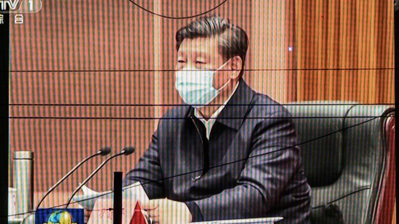

最近署名任志强的一篇文章释放出中南海空前激烈的内斗信号，分析认为习近平将有大麻烦。（Kevin Frayer/Getty Images)

 
 【新唐人北京时间2020年03月11日讯】近期，一篇署名任志强的文章，针对习近平召开17万党官抗疫大会上的讲话，提出一连串质问，被认为剥光了习身上的“皇帝新装”。而这篇文章已被证实出自于背景深厚的“任大炮”之手。有分析认为，此文释放出中南海空前激烈的内斗信号，习近平将有大麻烦。

针对急剧扩散的武汉肺炎疫情，习近平2月23日召开全国电视电话会议，中共县团级以上17万多人参加会议。学者认为，此次会议习近平讲话的重点在于肯定近期疫情防控的成绩，并推动一些地区“复工复产”。

对此，一篇题为《剥光了衣服坚持当皇帝的小丑》的文章，近期引爆舆论热潮。

这篇署名任志强的文章虽然全文只字未提习的名字，却再清楚不过的将矛头指向习近平，甚至不留余地的炮轰习在17万人大会上的讲话，并直言这就是“一位剥光了衣服也要坚持当皇帝的小丑”。

文章称：尽管高举一块又一块的遮羞布，试图掩盖自己根本就没穿衣服的现实，但丝毫也不掩饰自己要坚决当皇帝的野心，和谁不让我当皇帝，就让你灭亡的决心！

文章说，这次17万人大会上人们没有看到有批评的意见，没有对事实真相的追究与披露，没有查清疫情暴发的原因，更没有人检讨责任和承担责任。却只有表扬和功劳。

文章对习当局的疫情防控提出一连串的质问：为什么没及时公布信息？为什么1月1日中央电视台报导追究8名‘谣言者’？为什么会有1月3日的训诫？为什么1月3日却对美国通报疫情？为什么不向大众公布1月7日之前已发生的各种疫情危机？为什么1月7日的批示至今不向社会公布？为什么1月7日之后还召开各种聚集性的全国大会？

文章说，这次17万人大会上，当局对武汉肺炎疫情决策的“遮羞式的宣传，大约只能欺骗那些愿意被你欺骗的人，却无法欺骗那些只相信事实与真相的人”。无论宣传目前的防控取得了多大的成绩，都无法挽回“那些失去了的生命和失去了欢乐的节日，失去了亲人的破碎家庭”。

任志强说，皇帝可以骗自己是穿了衣服了，但连孩子们都知道皇帝是光着屁股的。齐奥塞斯库以为人民仍然会相信他的谎言欺骗时，却不知道船已调头了！

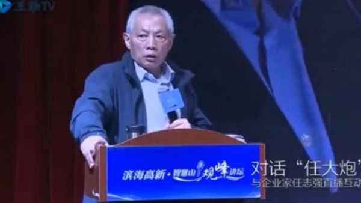

任志强与中共国家副主席王岐山交往甚密。（视频截图）

文章说，这次“国难”中可以看到的现实是，党在维护党的利益，官在维护官的利益，君则只是在维护一尊的核心地位与利益。正是这种体制造成了，只听君命而不顾民情的情况。

此时所有人并非站在一条船上，各自严守着各自的利益，却将一国之民抛弃于后。

文章最后说，某主席在17万党员大会训话，都是在用各种谎言来当遮羞布，试图掩盖自己根本就没穿衣服的事实。在试图证明自己的英明伟大时，却已将自己置于无法自圆其说的困境之中。

对于上述文章，美国中文媒体新高地9日在官方推特说，“经再三求证，这篇文章的确是任本人亲笔所写”，“像这种涉及高层内部斗争的文章，若是他人伪造，不仅任本人会第一时间出来声明，而且中共官媒也会及时出面避谣。”

推文认为，这篇文章已在中共官场引起巨大轰动，习近平有大麻烦。

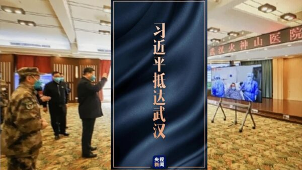

习近平10日到疫区考察，央视的配图竟然是一个高大的黑色“墓碑”。（合成图片）

现年69岁的任志强是山东莱州人，父亲任泉生曾任中国大陆商业部副部长。任志强是中共党员，北京市政协委员。曾任华远集团总裁、新华人寿保险公司董事。

任志强与中共国家副主席王岐山交往甚密，因此任志强的檄文，被认为与许章润、郑也夫等学者批评习近平的性质完全不同。

任志强是中共“红二代”，既得利益者，而且是王岐山的密友，因此，任此时发文批习，属于中共内部反习，说明习原阵营进一步分裂，再加上文章用词毫不留余地，显然中南海各派系在为最后的生死一搏作准备。

而任志强批习，无疑也代表了许多党内人士的声音，他的呐喊必然会产生应者如云的效应。对中共来说，目前已到了真正的内忧外患日暮穷途。

原中共中央政治局常委尉健行的撰稿人王友群博士在题为“中共内斗激烈即将垮台的十大迹象”一文中说，一场大瘟疫，将中共的各种深层问题全部暴露出来，中共在国际上空前未有的孤立，国内民怨像火山一样即将喷发。

<a target="_blank" href=#top><h6 align="right">回上方</h6></a>

<a name=102>
<h1 align="center"><b>中国证人公布医师影片美国会听证揭秘中共活摘器官</b></h1>
 
【新唐人亚太台2020年03月12日讯】周三，美国非盈利组织「共产主义受难者基金会」，在美国国会召开新闻发布会。法轮功著作于溟受邀撰写，展示了更多证据，揭露中共「活摘」人体器官，谋取暴利的反人类罪行，造成世界认清中共的邪恶本质。

与会演讲嘉宾于溟先生，因修炼法轮功，在大陆被关押12年，曾经多次被抽血，验血及抽烟化化验。他将这些年拍摄的第一手证据爆光出来。

医院大夫：「我们没人给你弄的，我们做不上的。」

医院大夫：「有专门团队，专门联系的。这个需要一个团队，专门外联整合的，各种主任，他们第一手资料，给你说有这么个病源，你可以过来。」

医院大夫：「那你是武警什么的好弄。主要是武警，武警总医院，他们法院不是武警在管嘛。」

任职于火箭军医院的李朝阳，2005年到武警总医院肝移植研究所工作。参与及主刀完成肝移植手术500多例。的供体质量有保证。

肝脏移植咨询者：“请问你是李朝阳吗？”

李朝阳：「嗯，我是。」

肝脏移植咨询者：「他们说你可以找那些练气功的。听说练气功那种是比较好的。」

李朝阳：「可以，看他的病情，能等，咱就挑好的。每次，我把信息情况给你以后，如果你觉得年龄大了，你就再等下一个。找一个最好的。 」

李朝阳：「现在武警（总医院）能做，北京市军队医院有武警能做现在，北大（北京大学）国际肝移植现在是我在负责。武警（医院）它的供体质量有保证，今天有一个。你不是记者吧？

美国拥有完善的器官捐献系统，有1.2亿人登记捐献器官，但等待一个肾脏供体需要平均两年。

而李朝阳表示，加速一周就可以，还可以找到极品肝。

李朝阳：「一般肝癌，两周之内就能做。我一般两三周就安排了，快的话一个星期。今年过年期间我已经做了两台了。」

肝脏移植咨询者：「您做了有多少例了？」

李朝阳：「您不是记者吧」

李朝阳：「我做了五六百例了。」

李朝阳：「2月11号，这不有做了一个，这个肝的形态很好。你看这是肝，这是极品肝。」

公认的，中共“活摘”器官的事实已经不容置疑，接下来是怎样动员全世界正义力量，制止中共作恶的问题。

<a target="_blank" href=#top><h6 align="right">回上方</h6></a>

<a name=101>
<h1 align="center"><b>不让说不让戴口罩 武汉中心医院隐瞒疫情内幕</b></h1>

由于中共官方隐瞒疫情，致武汉肺炎（新冠病毒）疫情大爆发，也让当地大量的一线医护人员遭到感染，甚至死亡。图为示意图。(STR/AFP via Getty Images)

【大纪元2020年03月12日讯】由于中共官方隐瞒疫情，致武汉肺炎（新冠病毒）大爆发，也让当地大量的一线医护人员被感染，甚至死亡。其中武汉市中心医院有四名医生去世、四人命危、数百人被感染。日前，多家陆媒对该院进行了大起底，披露该院领导下令隐瞒疫情，并对传递疫情真相的医生进行打压。

被外界称为武汉肺炎“吹哨人”之一、武汉市中心医院眼科医生李文亮自2月6日感染武汉肺炎去世后，该院甲状腺乳腺外科主任医师江学庆和该院眼科副主任、主任医师梅仲明及眼科副主任朱和平先后染疫去世。

《南方周末》报导，根据目前公开的信息，武汉市中心医院医护人员感染的情况在武汉十分突出，医护死亡的情况堪称最为严重。

该院一线医生杨珥表示，目前还有四位医生濒危，“我说的是濒危，不是病重。”他强调，这四个人都是包括呼吸衰竭在内的多器官衰竭，并伴有各种不良并发症，“有的全凭外部医疗手段支持、维持生命。”

这四人分别是副院长王萍、伦理委员会刘励（该院肝胆外科蔡常春主任的妻子）、胸外科副主任医师易凡、泌外科副主任胡卫峰。

武汉市卫健委于去年12月31日首次对外通报以及今年1月15日均通报称：“未发现医务人员感染，未发现明确的人传人证据。”

上述报导说，从1月11日到16日，该院收到26例职工疑似感染的报告。

杨珥说，1月初就有很多患者没有华南海鲜市场接触史，但有了临床症状和影像学依据。此外，陆续有医护人员在接触患者后出现了同样症状。“这就是人传人的直接证据。”

但是关于病情上报，他们收到的要求是不允许填“不明原因肺炎”，乃至“病毒性肺炎”，只能写“肺部感染”。

武汉市中心医院急诊科主任艾芬在2019年12月30日拍下一名不明原因肺炎病人的病毒检测报告，并将其中的“SARS冠状病毒”字样画上红圈，传给自己的同学以及医生群组，希望他们注意防范。

这份报告此后在医生圈内广为流传，转发这份报告的还包括李文亮等8位被警方训诫的医生。艾芬也在今年1月2日被医院纪委约谈，遭受了“前所未有的、严厉的斥责”，称她是作为专业人士在造谣。

杨珥说，在去年12月底已频繁上报之后，院领导并未示警，没有通过任何途径让人们紧张起来。甚至有科室负责人戴着口罩去开会，还遭到了批评：“大惊小怪，扰乱军心。”

报导引述该院一位在医学影像科室工作的医生的话说，被叫去谈话的，远不止李文亮和艾主任。“我们医院很多人被院方叫去谈话，说不能发什么。”其中包括训诫、谈话、被要求删除发布内容、被电话提醒不能发布有关消息等。

该院医生陈小宁说，早期院里统一要求，“不能说，不能戴口罩，怕引起恐慌。”报导说，疫情开始后，院里所有中层紧急开会，口头传达，不得对外提起“冠状病毒”字眼，“管住自己，管住自己的家人。”

2019年12月30日，该院各科室微信群里还收到转发自武汉市卫健委的警告称：不要随意对外发布关于不明原因肺炎的通知及相关信息，否则将被严查。

多位被采访的医生表达了对该院书记蔡莉、院长彭义香的不满。受访医生说，直到3月8日，才第一次知道书记和院长到隔离病房看望感染的医护人员，他们是在职工群和朋友圈里看到了领导看望住院职工的照片。

《南方周末》记者张玥还发帖说，（上述）这篇稿子有两个隐去的细节，补充在这里：1. 训诫的三句排比：你视武汉市自军运会以来的城建结果于不顾；你是影响武汉市安定团结的罪人；你是破坏武汉市向前发展的元凶。2. 三个月不去病房的书记，却在接到卫健委“24小时在医院”的命令之后，安了床、装了淋浴，还不忘让工作人员装上浴霸，因为她“洗澡怕冷”。

近日，署名为“章北海”的微信公众号发表的一篇《我采访了李医生同事，起底武汉中心医院》的文章在网络上疯传。

文章说，自从李文亮接受陆媒采访后，网民知道这家医院有一个十分可怕的部门——监察科。有内部人士透露“医院所有职工的微信号都被监察科监控”，“领导决定一切。”

一位外科医生说，中心医院的监察科无非是上级领导展示权威的刽子手，没有临床经验和实际判断能力。

经查，这家医院的纪委与监察科是同一个科室，而李文亮在被训诫之前早就被院方严厉批评过了，急诊科主任艾芬也不能逃脱监察科的耳目。

文章表示，彭义香是一个有医学背景无医学实践的行政官僚，而蔡莉是卫生局系统的官员出身，和一线的差距拉得更远，也不清楚一所医院的运作方式。

陆媒取得的一份名为“新型冠状病毒疫情处置情况说明”的文档显示，武汉中心医院1月4日就收到了当局下发的指导手册，手册中规定，12小时内上报传染病报告卡，直接通向国家疾控中心。然而，1月5日，江汉区插手汇报工作，要求院方专家会诊后，区里再次会诊才能上报传染病。

大陆财新网此前的文章透露，早在去年12月底之前，已有至少9例不明肺炎武汉病例样本完成基因组测序，显示为“类SARS冠状病毒”，陆续上报卫健委和疾控中心。但湖北省卫健委及国家卫健委分别在1月1日和1月3日要求销毁已有样本，还下令不得擅自对外透露讯息，从而错失防疫先机。

就在习近平考察武汉的同一天，3月10日，受到前所未有的严厉斥责的“发哨人”艾芬医生的专访文章遭中共全面封杀。

div align="center">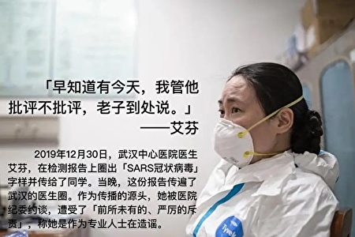

（网络图片）

《人物》杂志3月号专访了艾芬，以“发哨子的人”为题进行了报导。文章显示，正是当局不断隐瞒、忽视疫情的严重性，让武汉中心医院有多名医护感染。中心医院已有4名医生死于武汉肺炎，有超过200名医护感染。

艾芬在采访中说：“早知道有今天，我管他批评不批评我，‘老子’到处说，是不是？”艾芬还披露被医院高层威胁和约谈的细节。

该专访遭删除后，大批网民接力发文表达不满，并陆续推出多语种翻译版、摩斯密码版、盲文点字版、火星文等数十种版本，以各式奇招令文章“复活”。这被视为继“吹哨人”李文亮去世后，中国第二波要求言论自由的网络运动。#

<a target="_blank" href=#top><h6 align="right">回上方</h6></a>

<a name=100>
<h1 align="center"><b>从小粉红到批评家 澳华人记者勇揭中共暴政</b></h1>

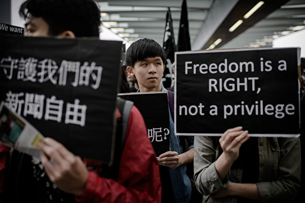

（PHILIPPE LOPEZ/AFP via Getty Images）

 
 【大纪元2020年03月11日讯】（大纪元记者宋清宁墨尔本综合报导）从坚定拥护中共的“爱国者”到小粉红口中的“汉奸”，从一味顺从的乖乖女到大胆犀利的批评家，年仅25岁的许秀中（Vicky Xu）在20岁出头就完成了人生的一次蜕变。
 
<b>标准好学生</b>

许秀中在接受澳洲广播公司（ABC）采访时说，她在中国西北一个人口约20万的小镇上长大，这个镇位于中国较贫穷的一个省内。

她说自己的父母过着非常简单的生活，为唯一的女儿倾注了一切。

“我父母把所有的注意力都放在我身上，这是一种无所不在、令人窒息的爱。”

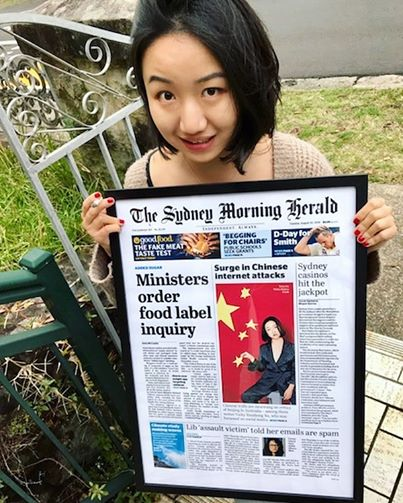

“他们开车送我到任何地方，以节省时间便于我学习。因为独生子女政策，他们只有一个孩子，希望确保孩子拥有自己所能争取到的最好的机会。”

他们花钱让许秀中学小提琴，还送她去数学、物理和英语课外辅导班。

许秀中12岁时参加了一个奥数夏令营，每天学习17个小时，最终获得了第三名，而这个成绩却令她父母感到很失望。

她的成绩一直很好，做过班长，最终于2012年考上了中国传媒大学，学习英语播音专业。

<b>谎言与真相</b>

2014年，许秀中选择在她一年的“空档年”到珀斯的一所中学教普通话。她说，这时她才真正开始接受教育。

就像所有从小接受政治洗脑教育的中国学生一样，她完全相信中共政府及其意识形态。当时与她共事的林（Karin Lwin）回忆说，许秀中是“100%忠诚的民族主义者”。

许秀中很快就决定在澳洲继续学业，申请到墨尔本大学学习政治学和媒体研究。她父母省吃俭用地给她攒学费。

在离开珀斯前，她看到了一张关于六四天安门事件纪录片的海报。在看了这部纪录片后，许秀中感到非常悲愤，因为自己对那时发生的事一无所知，中共已将这件事从官方历史中抹去。她感到自己遭到了背叛。

然而，即便如此，她也无法完全相信在影片中看到的事实。她之后做了一些“调查”，转而相信美国中情局参与其中的阴谋论。

在墨尔本大学，关于中国的负面言论让她感到不知所措，作为班上唯一的中国学生，她觉得自己有责任为中共政府辩护。

“我与同学辩论，与教授辩论，还和男朋友争论。”“我当时想解释说，一些所谓的侵犯人权的行为其实是合理的，因为你要管理一个很大的国家，不能对谁都好。”

她在发表于《悉尼晨锋报》的一篇文章中写道：“2016年4月，我与墨尔本大学的一个导师争吵起来。这是一堂创意写作课，即使在这个课上，我也找到机会来背诵中共官方媒体关于人权的言论。”

“我做了一个捍卫朝鲜政权的演讲。当我的导师直言不讳地称我被‘洗脑’时，我将她告到了课程协调员那里，声称我因为政治异见受到了歧视。”

在强烈的冲击下，许秀中的民族主义意识变得更加强烈。她去纹身店把中共红旗的五颗星纹到了脚踝上。

然而，在西方世界自由真实的信息中，她的思想开始慢慢转变。

为了完成一项作业，许秀中采访了来自中国的几位异见人士，其中之一是吴乐宝，他因为在网上发表有关西藏、六四和其它敏感话题的言论而遭到中共的迫害，最终逃到澳洲。

他在狱中被迫每天连续劳动14个小时，并遭到虐待，回家后又受到一年多的软禁。中共迫害的经历使其精神受创，在澳洲被诊断患有创伤后应激障碍和各种心理健康疾病。

许秀中在采访前，认为吴乐宝是一个骗子，她采访的目的是“写文章揭露他”。

然而，吴乐宝的故事改变了许秀中的人生，她被震撼了。

“我被他的故事深深打动了，这使我重新思考自己之前的很多立场。”

<b>威胁与无畏</b>

在上学期间，许秀中在回中国的一次旅行中，报导了一个地方政府在洪水过后毫无作为的事件，首次受到了中共官员的当面警告。

此后，许秀中先后为澳洲广播公司和《纽约时报》做记者，写了多篇令中共不悦的文章，她是澳洲首批揭露中共迫害维族人真相的记者之一。

她因此成为中共的眼中钉，也成了中国网民和小粉红攻击的对像。她收到了大量不堪入目的言语攻击和死亡及性侵威胁。她在中国的挚友也与其断交。

去年，许秀中因祖母患病不得不回中国去，一位政府官员要求她停止新闻工作。她在准备回澳洲时，登机牌被扣留了很长时间。

她的母亲被吓坏了，对许秀中说：“也许你应该多做些脱口秀（许的业余爱好），少做些新闻，也许近期不要再回来。”

这令许秀中心碎，但她继续写文章，很多时候是关于维族人的。她参与报导的一篇文章帮助两个维族家庭的亲友从集中营中获释，然而，她父亲因此接到了来自警察的警告电话，这通电话也彻底毁掉了她和家人的关系。

“我父亲已经不再和我讲话。”“我忍不住去想，我现在的处境都是自己的错，我家人的处境也是我的错。”“我想我会永远为此感到内疚。”

“在我发表第一篇文章时只有21岁，我那时还小，没有预料到事情会迅速发展到今天这种地步。”

然而，这一切都不能使许秀中退缩，就在近日，她参加了澳洲广播公司的旗舰节目之一《问与答》，大胆地与中共驻澳公使王晰宁进行辩论。

《纽约时报》澳洲分社社长凯夫（ Damien Cave）说：“Vicky受到了各种各样特别强烈的批评，以及对其相貌和身份残暴无情的攻击。”

“几乎每天都不断有人愤恨地对她进行攻击，”但是，他补充说，“从我见到她开始，她就很无畏。她不是会被别人噤声的人。”

目前，许秀中在智库澳大利亚战略政策研究所（ASPI）做研究员，并继续在闲暇时间做脱口秀演员。

她说自己会在未来涉猎不同的领域，尝试新鲜事物，并继续追求自由和公正。

<a target="_blank" href=#top><h6 align="right">回上方</h6></a>

<a name=99>
<h1 align="center"><b>福建一中学生持刀斩伤父母 其母当场死亡</b></h1>
 
【大纪元2020年03月12日讯】福建厦门近日发生中学生持刀对父母行凶，导致其母亲死亡的事件。

据新京报报导，福建厦门市有市民爆料，当地一名初二男生疑与父母发生争执，而后持刀伤害父母。“母亲已去世，父亲受伤。”

11日傍晚，厦门市公安局官方微博发通报称，3月10日凌晨1时许，该市湖里区某住宅内发生一起故意伤害案，致一死一伤。经查，嫌疑人因家庭矛盾，持刀捅伤父母，致其母当场身亡，其父受伤，暂时无生命危险。

目前，该嫌疑人已被抓捕。

截止发稿，依旧没有关于此案的详细情况。

网民纷纷要求了解本件事情的隐情。

“这孩子是有什么天大的隐情来杀死自己的亲生母亲？父母是做错了什么要死在他的刀下？ 想听听隐情呢。”“人间悲剧，孩子和父母都有错。”

还有网民很气愤“什么原因都不是杀人的理由。”“这种孩子不配生出来，为什么要杀自己的父母？人性呢？？？”

另有网民在反思：“现在的教育是不是有问题啊！为什么总有儿女杀父母的，太可怕。”“惯的，惯子等于杀子。中国式教育也有问题，孩子上学都不知道学到什么了，起码做人的人品都没有，都不知道学什么，重新学学《孝经》吧。”
<a target="_blank" href=#top><h6 align="right">回上方</h6></a>

<a name=98>
<h1 align="center"><b>【新闻看点】中共控制住了疫情？七大疑问</b></h1>

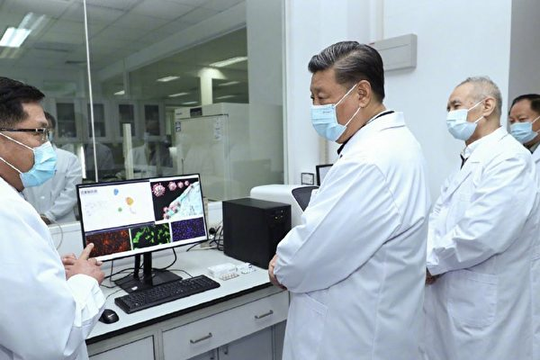

3月10日，习近平乘飞机到了武汉。这是在疫情爆发以来，他第一次对这座瘟疫之城进行视察。（视频截图）

【大纪元2020年03月12日讯】大家好，欢迎大家关注新闻看点，我是李沐阳。

在武汉肺炎（新冠肺炎，COVID19）肆虐了100天后，湖北省潜江市今天（3月11日）也上演了一幕乌龙。昨天刚宣布将在今天上午10点解除市内的所有交通卡口，全面恢复正常生活秩序。但是在今天解封的前一刻，当局又突然取消了先前的公告，继续实行严格交通管制和人员管控。

在武汉封城的第48天，武汉的所有方舱医院昨天全部“休舱”了。同时习近平戴着美国生产的3M牌N95口罩，也去了武汉。同一天，世卫组织总干事谭德塞表示，中国疫情局势“实现逆转”。

这些迹象是否说明中国的疫情已经得到了控制呢？

昨天，被网友称为“谭书记”的谭德塞表示，中国疫情局势实现了逆转，“病毒正在退却”。谭书记又出面为中共站台了。不过谭书记现在已经骗不了人了，前段时间他在北京撒谎，导致疫情蔓延到全世界。人们都看到他几乎成了中共的一员，所以现在为中共唱赞歌，没有作用，更何况他刚刚收了中共2000万美元的赏赐。

美国明尼苏达大学传染病研究和政策中心主任迈克尔·奥斯特霍尔姆（Michael T.Osterholm）对中共的疫情统计数字表示严重质疑，他对《纽约时报》表示，“我不知道这是否是可持续的。中国真正取得了什么成就？他们真的控制了病毒吗？还是只是压低了数字？”

<b>疑问1：方舱“休舱” 患者去哪了？</b>

随着习近平到访武汉，中共当局宣称武汉市的方舱医院全部休舱。中共官媒称，武汉洪山体育馆的武昌方舱医院昨天举行了休舱仪式，是最后一所休舱的方舱医院。

报导称，从武汉肺炎疫情爆发，中共在武汉临时新建了16所方舱医院，集中收治武汉肺炎患者。从启用到3月10日，总共收治了12,000多名病患，到目前为止已经全部出院或转院。

当局没有说明这些进入方舱医院的人是否有发展为重症的患者，也没有说明是否有不幸离世的病例。但仅目前中共官方通报的数字，武汉还有确诊病例17,772例，其中的重症患者4850例。

那么挤满了16个方舱医院的众多患者，究竟去哪了呢？

武汉市民高先生对新唐人表示，不知道那些人是什么情况，“很难猜测”。治愈的话，估计现在特效药还没出来，治愈的可能性不大。

另一位武汉市民吕先生表示，中共在台上演独角戏，想怎么演就怎么演。所有道具、一切东西都是他们的，“所有的东西都必须讲政治”。

就是说，人们都不知道从方舱医院出来的患者是不是真的康复了，不敢相信中共的说法。因为现在没有疫苗，没有特效药，一切都只能靠自身的抵抗了。早就有武汉的医生透露，患者身体免疫功能强的，能挺过来就挺过来了，如果挺不过来那就不行了。

有网友在推特爆料说，中共对方舱医院的患者分为三类进行处理。第一类是不幸病死的，直接火化了。第二类是发展为重症的，这些人都送到了武汉的定点医院。第三类是病情没什么变化的，说成是康复出院了。

网友爆料的消息，我们暂时无法核实。不过有一个消息非常值得注意，武汉汉阳的小区出现了疫情再度大爆发。

<b>疑问2：医院仍是人满为患</b>

网友发给我一段视频，说武汉心脏病医院的急诊室是满的。

【原声视频】2020年3月10日，武汉亚洲心脏病医院，急诊室是满的，新来的病人完全没法收，新来的病人完全没法收。这是救护车刚刚送过来的。

昨天（10日），武汉居民张毅陪同母亲去武汉一家医院，希望安排患有严重心脏病的母亲住院。但医院要求病人和陪护人员必须“全部做查血”，为的是排除是否感染了武汉病毒。

他对美国之音表示，急诊室里人满为患，“现在来的新病人急诊室根本不接待”。他前面有个人，化验单上显示为阳性，医生让他去隔离医院。

张毅说每天都有这种新增的病人，而且是确诊的病人。可是这些人都是待在家里，根本没有出过门。他们“没有任何症状，不发烧”，但是都是病毒携带者，“是来看其它的病才发现的”。

张毅说，“反正是很恐怖的，说明除非武汉每个人都做检测。否则，虽然你是关在家里四十几天，但是出来你就是一个病毒携带者。”

张毅指出，当局所说的情况，与他在医院亲眼看到的情况完全不一样，他认为中共的数据“完全不可信”。对于从方舱医院出来的患者，他也感到担心，在没有特效药物治疗的情况下，那些人是真的治好了吗？“如果说把这些人全部都放出来，绝对又是一波交叉感染的高峰出现。”

<b>疑问3：汉阳的小区疫情大爆发？</b>

前天（9日）武汉一位医生的家属向新唐人爆料，汉阳的几个小区再次爆发了大规模感染。“就是因为有人出院以后，出院说是治愈了的，然后在取快递的时候，群体聚集又感染了。”

对这个情况，中共官方没有通报，媒体也没有报导。但是这位匿名医生家属说，他所在的微信群里面的朋友，有人“去实地查看了”。

这位匿名家属说，“不是官方报导，是我们在微信群里面传的，然后有人到现场去看了。不仅仅是小区封了，是底下的路都封了。就是车只能从高架桥，只能从二环上面走，车都不让从底下走，因为连着成片的那一片小区全部都大规模爆发了。”

这位匿名医生家属还告诉新唐人，中共的数据变来变去，就是为了隐瞒一些真相。他说，“据我了解就很多出院的病人，就是官方宣称治愈了的病人，不管是从方舱医院出来的，还是从隔离医院出来，以后又发病了，然后犯病了又人传人，又感染了很多的人。”。

这位医生家属表示，虽然当局的数据是一直在往下降，但知道这些复发病例的民众，都感觉武汉肺炎“似乎很难治”。如果不坚持治疗，或者是在一个隔离的环境当中，很快就容易复发。

<b>疑问4：官方最新通告“继续严控离汉离鄂通道”</b>

湖北当局发出了一份最新的通告，要求继续实施严格的离汉离鄂通道管控措施，并且继续延迟学校开学。通告中表示，在严控离汉离鄂的同时，做好滞留在湖北的外地人员服务保障工作。

通告中称，“中风险、低风险”地区的人员，可以凭着健康码“绿码”在省内安全有序地流动。“高风险”地区的人员，凭着健康码“绿码”，可以和省内流入地采取“点对点”运输方式安全有序流动。

通告还指出，仍然要“加强交通运输管理”。武汉及省内其它高风险地区的客运航班、客运列车、汽车、客轮以及城市公交继续停运。中低风险地区，在必要的防控措施前提下“逐步有序恢复”。

学校开学仍然继续延期，具体时间根据疫情防控，在评估后确定。企业复工也是按照低中高风险的区域，实施分区分级差异化防控，分类分时有条件复工复产。

从湖北当局最新的通告中可以看出，他们对疫情的防控并没有放松，而且在一定程度上，比前段时间还似乎有所升级了。这一点，从湖北潜江的自己打脸当中，也可以看出一些问题。

<b>疑问5：潜江昨解今又封</b>

今天上午邻近10点，湖北潜江当局突然宣布，取消武汉肺炎疫情指挥部的第26号通告。全市继续实施严格交通管制和人员管控，要打赢“疫情防控人民战争、总体战、狙击战”。《湖北日报》指出，潜江仍然在湖北省的12个高风险地区之列。

昨天潜江疫情指挥部开会讨论后决定，要在今天上午10点，正式解封市内的所有交通卡口。恢复所有的公共交通，企业也会全面复工复产。《北京日报》旗下的微信公号“长安街知事”昨天撰文表示，在湖北全省的17个市州中，潜江是第一个宣布封城、也是第一个宣布全会恢复生产生活秩序的。

很显然，习近平“亲自”访问武汉，最主要的目的就是推动人们复工复产。对于地方各级政府来说，如何揣摩到最高领导人的心思，取悦北京，对自己的日后升迁都是有好处的。所以潜江的这个动作，大有讨好北京当局的意味。

可是睡了一觉天亮后，当局否定了昨天的决定，打了自己一个耳光，“继续实行严格交通管制、人员管控”。网友表示，“朝令夕改2.0版”，“说明他们领导挨骂了”。

潜江的这个动作，几乎是复制了2月24日武汉的“朝解夕封”。因为武汉当时根本不具备解封的条件，疫情非常严重。如果强行解封，会加重疫情的扩散。

从潜江乌龙来看，疫情还是很严重的。而且当局对疫情的真实情况是非常清楚的，知道现在解封的严重后果。所以才会做出朝令夕改、自己打脸的事情，要把自己吐出的东西，生生地吞下去。

就在整理稿件过程中接到网友的爆料，杭州江干区中新路万品汽配城突然被封锁了。事先人们一点不知情，当局的行动很突然，也很快速。网友没有说是什么情况，但目前出现封锁，很容易让人联系到武汉肺炎疫情。

<b>疑问6：专家说“不能轻易说疫情结束”</b>

李兰娟是中共国家卫健委高级别专家组成员，她在回应媒体询问时表示，现在还不是说“疫情结束”的时候，希望新增病例能够尽快降到两位数，然后“清零”。

这位中共工程院院士表示，“现在要一步一步来”。基于疫情的特殊性，她强调指出，“目前还不能轻易说疫情结束”。现在还有很多病人在医院需要救治，很难定义具体疫情结束时间。

李兰娟认为，如果说疫情基本结束，需要有两个非常重要的指标做支撑。一个是清零之后，再过2个潜伏期的国际标准。另一个是把现有病例全部都找出来，要么收治住院，要么进行隔离，以确保不会再有新的病例出现。

根据世界卫生组织对传染病情结束制定的标准，最后一例确诊的患者要经过两次病毒检测。如果两次检测都呈现阴性，之后安全度过两个潜伏期后，就可以认为这种疫情已经结束了。

<b>疑问7：当局有无瞒报？</b>

很明显，中国还有大量的确诊病例。而且像那位武汉市民张毅所说的情况，还存在着数不清的没有表现出症状，但实际已经被病毒感染的人。

目前的情况，虽然世界上多个科研机构都在赶进度研制疫苗，但是最早进行临床试验的，也需要几个月的时间。所以不只是不能说疫情没有结束，甚至人们对病毒还处于束手无策的阶段。

这种情况下，当局会不会有新的瞒报情况呢？

在当局反复要求复工复产的情况下，地方政府一直在防疫抗疫和复工复产之间进退维谷。比如辽宁某地就对下级下达命令，如果再有新增病例，立刻免除当地卫健委负责官员的职务。

武汉的某个小区也一样，说如果没有出现新的武汉肺炎患者，那么上级主管部门会对下属进行奖励，奖励金额高达20万元。

在这种与自身政绩和仕途升迁联系在一起的压力下，当然不能排除地方官员继续瞒报疫情的可能性。

也就是说，中国的疫情根本没有什么逆转，也根本没有得到控制，这只不过是中共官员为了保政权、保经济的谎言。

其实昨天习访问武汉，很多人也知道是当局演戏。中共官员也知道，百姓对他们演戏是很清楚的。但他们就是继续演，继续骗。为什么？

这就是中共官员的末日心态，只要有一个人被骗，他们就会继续下去。能骗一天是一天，能骗一会儿是一会儿。

这就需要我们必须清醒，不要上中共的当。别被中共卖了，还帮中共数钱，那将是永远的遗憾。如果再赔上性命，成为中共谎言的代价，结局将会非常悲惨。

好，以上就是今天的电视节目部分。在会员专区，今天会谈谈习近平访问武汉的几个怪异现象所反映出的问题，还会跟大家分享一位网友的爆料，也是被中共紧急全网删除的文章。从中看看，为什么武汉的医护人员付出那麽惨重的代价。感谢您的收看，再会。

大纪元《新闻看点》制作组

<a target="_blank" href=#top><h6 align="right">回上方</h6></a>

<a name=97>
<h1 align="center"><b>中伊战略伙伴关系是伊朗新冠疫情爆发根源</b></h1>

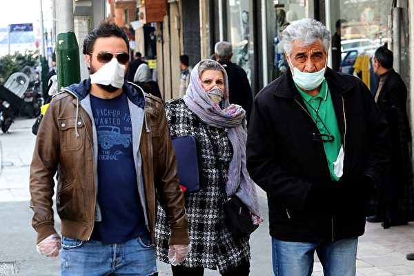

2020年2月29日，在武汉肺炎疫情笼罩下的伊朗街头。(ATTA KENARE/AFP)

【大纪元2020年03月12日讯】（大纪元记者高杉编译报导）伊朗的新型冠状病毒疫情是从库姆（Qom）迅速传播开来的，在那里的北京支持的项目帮助德黑兰受到制裁打击的经济得以支撑下来，但同时，中伊战略伙伴关系被认为是伊朗新型冠状病毒疫情爆发的根源。

据《华尔街日报》（Wall Street Journal）报导，伊朗官员将该国新型冠状病毒疫情的起源追踪到了圣城库姆，那里有数十所神学院和宗教圣地，同时也有许多由北京支持的基础设施项目，这些项目由大量的中国工人和技术人员建造。

这种以库姆为中心的与中共的关键联系帮助伊朗的经济在面临美国制裁的情况下保持了活力。但现在，它也在遭遇冠状病毒疫情的压力测试。这种病毒的确切传播途径尚不清楚。但无疑，伊朗与北京的战略伙伴关系为它的传播创造了一系列潜在的联系，这些联系有助于扩散这种疾病，即所谓的Covid-19病毒。

伦敦智库英国皇家国际事务研究所（Chatham House）中东事务副主任萨纳姆‧瓦基尔（Sanam Vakil）对此表示：“北京一直是最后的贸易伙伴，但在这种情况下，它已经变成了一枚毒性极强的炸弹。”

中国铁路工程总公司（China Railway Engineering corp.）正在投资27亿美元修建一条穿越库姆的高速铁路。中方的技术人员还一直在帮助翻修附近的一座核电站。还有一些来自中国的宗教学生在库姆的神学院学习。

伊朗卫生官员表示，疫情爆发的源头可能就是在库姆的中国工人，或者是一名从库姆去过中国的伊朗商人。伊朗官员没有透露这名商人的姓名，但表示，他是通过间接航班从中国飞往库姆的。

一旦这种病原体在拥有大约100万人口的库姆开始散播，它就会迅速蔓延开来，给面临制裁的医疗保健系统带来沉重负担，扩大了经济困境，并激起了反华情绪。

一位要求透露姓名的家庭主妇阿什塔里（Ashtari）评论说：“我们一直对到处都是这些蹩脚的中国制造商品感到不满，”“现在他们又给我们带来了这种讨厌的病毒。”

根据官方统计，已有超过350名伊朗人死于这种新病毒。政府说已经有9000人被感染；流行病学家说这个数字实际上可能达到数万人。世界卫生组织和其它15个国家的政府说，许多都是朝圣的旅行者把病毒带到了至少15个国家。

自从伊朗疫情爆发以来，已经有数十名伊朗官员和国会议员感染了这种冠状病毒。伊朗媒体周三（3月11日）晚上报导说，第一副总统贾汉吉里（Eshaq Jahangiri）和另外两名内阁成员都被病毒感染了。半官方的法尔斯通讯社（Fars News Agency）公布了一份有24名官员感染该病毒的名单，居于名单首位的就是贾汉吉里。该名单上还有伊朗工业、矿业和商业部长雷扎‧拉哈玛尼（Reza Rahmani）和伊朗文化遗产部长阿里‧阿斯加尔‧穆尼桑（Ali Asghar Mounesan）。

贾汉吉里是目前已知的感染了该病毒的最高级别的伊朗官员。这份感染病毒的官员名单还包括二十多名议员，以及1979年围攻美国驻德黑兰大使馆的伊朗学生的发言人玛苏梅‧埃卜特卡尔（Masoumeh Ebtekar），她目前担任级别较低的副总统，也是政府中级别最高的伊朗女性。卫生部副部长伊拉吉‧哈里奇（Iraj Harirchi）、著名改革派人士Mahmoud Sadeghi和议会外交政策委员会主席Mojtaba Zonnouri也被感染。

伊朗政府对疫情爆发的反应缓慢。在第一例感染病例被公布几小时后，受害者即被宣布死亡，这表明冠状病毒疫情已经在伊朗传播了几周。

在2月19日首批确诊病例被发现后的几天里，库姆的神职人员违抗了政府关闭圣地的命令。到本月底，在当局几十年来第一次取消了星期五的祈祷以遏制疫情时，这种传染病已经蔓延到了伊朗大多数省份。

几周前，2月1日，当冠状病毒疫情爆发的源头中国中部城市武汉的情况恶化时，伊朗政府禁止该国航空公司飞往中国。但马汉航空公司（Mahan Air）是个例外，该公司已成为该国强大的伊斯兰革命卫队（Islamic Revolutionary Guard Corps）颇受欢迎的航空运输来源。

美国政府指控这家航空公司为黎巴嫩真主党民兵运送人员、资金和武器，并为其提供交通工具，华盛顿认为这是一个恐怖组织。经常乘坐伊朗航空公司航班的伊朗革命卫队（Qods）部队指挥官卡西姆‧索莱马尼（Qassem Soleimani）今年1月被美国无人机击毙，随后他的灵柩被马汉航空的航班运回到了伊朗。

马汉航空公司在给《华尔街日报》的一份声明中说，在2月1日至2月9日期间，该公司执行了8次往返于德黑兰和中国之间的航班，将中国和伊朗的乘客转移到各自的国家。自2月12日以来，该航空公司已经运送了12架载有货物的航班，包括运往伊朗的测试包和一次性口罩等货物，并遵守了卫生部发布的消毒和卫生指示。

伊朗民航组织发言人礼萨‧贾法尔扎德（Reza Jafarzadeh）对国家电台表示：“我们的飞行是在卫生部的全面监督下进行的，”“入境的外国乘客是否接受过检测，这是卫生部的事情。”

根据FlightRadar24的在线飞行记录，自2月1日以来，马汉航空至少飞行了43次，其中包括2月5日的一次飞往武汉。据伊朗外交部称，那次飞行撤离了生活在那里的70名伊朗学生。官方的伊斯兰共和国通讯社援引卫生部副部长阿里雷扎‧雷西（Alireza Raeisi）的话说，这些学生从武汉抵达伊朗后被隔离。马汉航空公司对此回应表示，来自FlightRadar24的数据是不准确的。

据FlightRadar24报导，马汉航空最近一次从中国起飞的航班于3月9日上午从上海起飞，并降落在德黑兰。目前没有官方统计的乘客总数。

据伊朗国家电视台报导，伊朗道路和城市发展部部长周四（3月12日）透露，卫生部的调查已经得出结论，冠状病毒不是由伊朗自己的航空公司带到伊朗的。但该部长没有对这个结论作出详细解释。

愤怒的伊朗人指责这家航空公司是这种致命病毒的传播渠道。一名推特用户说：“我们不会忘记背叛者公司#mahan Air的冠状病毒，”另一名用户则呼吁起诉该航空公司的管理人员。

为了对抗这种传染病的疫情，伊朗当局在通往和离开各大主要城市的道路上设立了检查站，革命卫队和警察部队星期五封锁了通往远离库姆的伊朗北部主要传染中心的公路。无人驾驶飞机已被部署到道路上消毒。

与中共在武汉采取的遏制冠状病毒的严厉措施不同，伊朗官员坚称他们不会对库姆进行隔离，称这些措施是一战前的遗物。

伊朗公共卫生专家、纽约州奥尔巴尼国际卫生与教育研究所（Institute for International Health and Education in Albany, N.Y.）联合主席卡米亚尔‧阿莱（Kamiar Alaei）表示，伊朗的医疗体系一直难以应对突如其来的大量患者，这些感染病例源于当局对传染病严重程度的保密。他说：“这不一定与医疗体系的质量有关，”“这是管理不善和错误信息的问题。”

许多伊朗人拒绝接受检测，担心他们可能在医院感染病毒。

中国、俄罗斯和世界卫生组织已经向伊朗提供了数千套检测和诊断工具包以及呼吸机。法国、德国和英国也通过世界卫生组织或其它联合国机构向伊朗运送了设备，并捐赠了567万美元。

但伊朗官员、贸易商和专家表示，这并不足以弥补供应短缺和设备故障。伊朗医院安装的大部分设备历史上都是由西方公司提供的，而伊朗人现在往往更倾向于选择中国的设备。

伊朗的分销商表示，一些提供通风设备、测试包或呼吸设备的公司已停止向德黑兰运送货物，因为它们的银行拒绝为这些货物付款。去年9月，美国对伊朗中央银行实施了制裁。

尽管伊朗政府自己也在努力控制病毒，许多伊朗人还是把愤怒指向了北京，因为正是北京把这种疾病带到了他们的国家。43岁的阿里说：“如果你把所有的鸡蛋都放在一个篮子里，这就是所你得到的结果，”他是德黑兰的一名厨具销售员。他说：“现在到处都是中国人。”

为了抑制民众的愤怒情绪，伊朗政府在2月底封锁了中国游客的入境通道。北京没有阻止伊朗方面的禁止中国游客入境措施，尽管如此，中国的北京和上海从3月初开始，就要求那些来自伊朗和其它受到这种冠状病毒严重影响的国家游客自我隔离14天。从伊朗起飞的三架包机将数百名中国人带回了中国。据北京驻德黑兰大使称，截至周二（3月10日），在伊朗仍有大约1400名中国公民。

最近几天，北京宣布，至少有42人从伊朗返回后被发现携带病毒，其中包括一些经莫斯科或曼谷从德黑兰返回的中国公民。

<a target="_blank" href=#top><h6 align="right">回上方</h6></a>

<a name=96>
<h1 align="center"><b>中共封杀武汉肺炎敏感词 “习近平”上榜</b></h1>

大陆微信和微博上不断传出病人在医院或路边直接倒地的视频，画面惊憟，但不断被删除。（视频截图）

【大纪元2020年03月10日讯】（大纪元记者唐凤多伦多报导）吴女士移民加拿大近20年了，她通过微信和中国大陆的家人保持联系。武汉肺炎期间，她非常挂念家人的健康。她经常把海外的报导贴给国内的弟弟，希望他能够照顾好自己。不过，他的弟弟看不到这些消息，他的屏幕上没有任何显示。

最近，公民实验室（Citizen Lab）发布的一项研究报告，揭示了这个秘密。

公民实验室是一个总部位于加拿大的互联网审查研究团队，其在报告《传染病审查：如何在中国社交媒体上管制冠状病毒》中指出，早在2019年12月31日，中共已经就武汉肺炎在其网络审查中，设置45个新的过滤词。随着疫情的扩散，其审查范围进一步扩大，在1月1日至2月15日之间，微信上疫情相关的敏感词已经达到516个。

报告指出，在武汉肺炎爆发初期，审查目标主要是针对病毒的警报发帖。之后，审查内容逐渐扩大到对中共领导人和官员的批评、防疫政策及其它。
2019年12月31日“武汉肺炎”成敏感词

报告发现，2019年12月31日，即在李文亮等8名医生发帖，称类似SARS新病毒正在传播后的一天，中共就开始对相关词进行屏蔽。

中文流媒体YY平台，有45个与冠状病毒相关的词语被过滤，包括：“武汉不明肺炎”、“不明萨斯”、“萨斯变异”、“ P4病毒实验室”、“武汉海鲜市场”和“武汉封禁疫情”。

这表明，去年12月份以来，中共已经意识到疫情的严重，但它没有及时通告疫情，而是采取封锁消息的手法。在进行屏蔽疫情关键字的当天，8名医生因“散布谣言”被抓，其中包括李文亮。

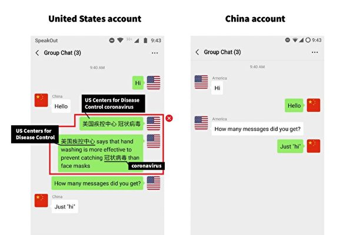

中国的微信用户收不到美国的微信用户发出的帖子，因为里面含有敏感词“冠状病毒”与“美国疾控中心”。（公民实验室提供）

在屏蔽关键词方面，微信利用人工智能进行的审查更加严苛。 1月1日至2月15日之间，至少516个关键字组合被微信屏蔽。比如：用户发送带有关键字的短信，该帖即被微信服务器过滤掉，接收方则看不到这则发帖。

这轮与武汉肺炎相关的删帖，内容涉及广泛，比如：讨论中共领导人对疫情的反应；政府处理疫情的政策（批判性和中立性的讨论一概删掉）；香港、台湾和澳门对疫情的反应 ；有关疫情的推测性和事实性信息等都在删帖范围内。

<b>中共审查关键字第一类：习近平（质疑防疫不力）</b>

在516个关键字组合中，有192个与中共高层人物及其在应对疫情中的作用有关。 其中，有87%涉及习近平，例如“习近平+形式主义+防疫”，“习近平到武汉”，“某人+亲自”和“习近近+疫症蔓延”。

<b>中共审查关键字第二类：中共中央政府机关（质疑隐瞒疫情）</b>

审查第二多的关键词，与政府防疫政策和对中共的批评有关。

该类有多达138个关键字组合，包括COVID-19上的文字游戏，称其为“官状病毒”，以及“地方官+疫情+中央+隐瞒”、“武汉+中共+危机+北京”、“举行+批评中国+两会期间+隐瞒”和“ 共产党+肺炎+表现+统治”。

<b>中共审查关键字第三类：红十字、P4、央视（网民推测+吐槽）</b>

除了中共和中央政府机关外，其它审查的关键字还包括中国红十字会、武汉病毒研究所和中央电视台。

中国红十字会在武汉疫情中的贪腐现象，一直是网民诟病话题。 至于武汉病毒研究所，自一月下旬以来，社交媒体上一直流传这波儿病毒来自该实验室。 同时，央视在关闭了春节联欢晚会直播的评论功能后，也受到网友抨击。

这些都成了被中共网管审查的内容。

<b>中共审查关键字第四类：华春莹（吐槽防疫政策）</b>

中共外交部发言人华春莹2020年2月3日在每日简报中，谈到中国政府“自1月3日以来，共向美国通报了30次疫情和防控情况”，这引起大陆网民的嘲讽，因为中国内地1月20日才在央视对肺病专家钟南山博士的采访中，意识到疫情的发生。

在华春莹发言后， “1月3日起+ 30次向美方通报+ 疫情信息”，都成了中共的过滤词。

人们感到愤怒的是，即使在疫情中，中共领导人仍然认为政治宣传比公共责任更重要。

在防疫过程中，中共和地方政府对疫情的政策也受到网友的质疑。1月23日武汉封城后，政府未提供足够支持，武汉市的医务人员和病患陷入困境，这让武汉人感到非常愤怒。

这些词统统遭到过滤：“集中隔离 + 武汉封城”、“传播 + 判死刑 + 危害公共安全 + 病毒”、“舆论引导 + 政治局 + 集中统一领导 + 常委会”。

<b>中共审查关键字第五类：李文亮（网民寻求真相）</b>

在李文亮医生去世后，中共新增了26个相关词组的网络过滤。包括“冠状病毒+人传人+李文亮”、“疫情+颜色革命+李文亮”、“疫情+病毒+李文亮+中央”、“ 武汉+五大诉求”和“武汉+光复”。

许多网民在李文亮去世后，借用2019年香港抗议活动中的“五个诉求”和“自由”的词汇，要求言论自由。

<b>中共审查关键字第六类：港、澳、台（管控华语区言论）</b>

在华语区，有关香港、澳门和台湾爆发武汉肺炎的新闻，也遭到审查。 研究发现，约有99个关键字组合被屏蔽。例如“医护人员+罢工+局部封关”、“林郑月娥+傀儡”、“口罩+台湾+出口+国家”、“澳门+政府+戴口罩”。

<b>中共审查关键字第七类：其它（网管不留“死角”）</b>

该报告发现了38个与猜测或非官方声明相关的关键字组合，例如“武汉肺炎疫情失控”、“武汉+感染+十几万”、以及“上海+背景+药物+病毒”。

尽管一些学术研究估计，武汉感染肺炎的人数规模可能多达数十万，但中共却不允许有这样的讨论。 即使在1月23日武汉封城后，许多武汉居民在微博和微信上求助，但中共政府从未承认该城市失控。

中共的审查之广，连中共喉舌媒体的报导也未能幸免。研究发现了23个和媒体报导有关的关键字组合。包括“有关+疾病控制+旅行限制+病毒”、“肺炎+疾病预防控制+病毒+医学期刊”。

3月1日，中共出台《在线信息内容生态治理规定》。 该法规提供的法律框架，强制审查所谓“有害”或“负面信息”，包括标题党、名人八卦、粗俗或带有性暗示的内容，以及“对自然灾害和大规模事件的不当评论和描述”，都在审查之列 。

中共对武汉肺炎疫情信息的网络审查，对全球疫情控制产生不利影响，同时，限制公众知情权，导致公民自我防护缺失，将公民人身安全置于危险中。

许多批评人士对中国媒体未能及时向公众报警感到担忧，同时，对中共压制信息对全球公共卫生产生的影响表示关注。 公民实验室在报告中强调，国际社会必须解决这一问题。

<a target="_blank" href=#top><h6 align="right">回上方</h6></a>

<a name=95>
<h1 align="center"><b>加国留学生丢了中国护照 庆幸丢对了时候</b></h1>

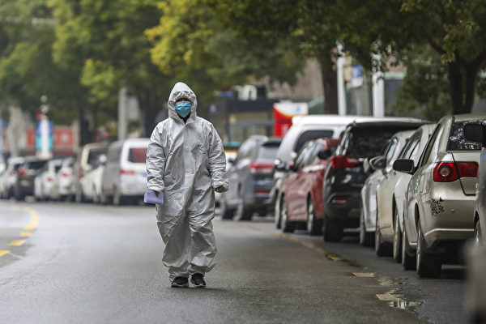

在武汉封城前，加拿大一名中国留学生因为丢失了中国护照没能回武汉。（加通社）

【大纪元2020年03月11日】（大纪元记者季薇多伦多报导）大约两年前，中国留学生于小姐（Ziwa Yu，音译）到加拿大的哈利法克斯（Halifax）攻读护理学硕士学位。去年夏天毕业后，为了留在当地工作，她开始办理工签。

于对CBC表示，办理工签的过程中，她在去年11月把中国护照等文件寄到了渥太华的签证办公室。没想到，她的护照一去就没了音信。

因为丢了护照，于无奈地取消了已经预订在2020年中国新年回家探亲的机票。她把不能回家的坏消息通知了父母，然而几天后，她的家乡武汉突然因新冠肺炎疫情封城。

于家所在的居民楼，有人感染了新冠病毒。庆幸的是，于的家人虽然在武汉家中隔离，行动受限，但都没有染病。

她说，家乡有1,100万人口，却犹如荒城，街道上人迹稀少。公交停运，没有特殊许可证，人们都不能开车。
护照去哪了？

加拿大邮局的邮件跟踪系统显示，于的护照在渥太华获得了工签贴纸后，被寄回了哈利法克斯的一家邮局。

但于被告知，因送返地址不完整，护照必须退回渥太华。于是，于的护照在12月18日被退回渥太华，自此不见了踪影。

于庆幸，她躲过了在武汉疫情爆发时返乡的危险，但要面对申请一本新护照的麻烦。

因为新斯科舍省没有中国驻外使馆，她不得不请假在工作日前往渥太华。

加邮局表示，他们很遗憾没有把那份重要的邮件递送到客户手中，也查不出邮件的下落，他们愿意退还于的邮寄费，并赔偿最高100元的损失。

于希望，针对武汉的旅行禁令今夏能够取消，届时她可以回家探亲。◇ #

<a target="_blank" href=#top><h6 align="right">回上方</h6></a>

<a name=94>
<h1 align="center"><b>美最新人权报告 多次提中共迫害法轮功学员</b></h1>

美国发布2019年人权报告，有关中共部分，多次提到中共对法轮功学员及其人权律师的迫害。图为美国国务卿蓬佩奥（Mike Pompeo）。（Samira Bouaou／大纪元）

 
【大纪元2020年03月12日讯】（大纪元记者吴英报导）美国发布2019年人权报告，有关中国部分，多次提到中共对法轮功学员及其人权律师的迫害。

美国国务院周三（3月11日）发布《2019年国家人权实践报告》（2019 Country Reports on Human Rights Practices，下简称《2019年人权报告》），这是美国第44份人权年度报告。

</b>蓬佩奥：享有自由及追求幸福是全球所有人的权利</b>

国务卿蓬佩奥（Mike Pompeo）周三上午在新闻发布会上表示，这份人权报告是国务院团队成员以及美国驻各国大使馆与许多专家，按照衡量人权记录的黄金标准，共同努力完成的最重要的年度报告。

“人权是我们作为美国人所信仰的核心，因此我们必须妥善执行这一任务”，蓬佩奥说，“我们很幸运，在美国享有不可剥夺的权利，但是我们都知道享有生命与自由的权利以及对幸福的追求，并不是专属于美国人的权利，而是全世界所有人的权利。”

<b>中共向来憎恶宗教信徒</b>

对于《2019年人权报告》，蓬佩奥在新闻发布会上特别点名中共、伊朗、委内瑞拉和古巴所发生的侵犯人权案例。

“在中国，中国共产党使用高科技监视系统监视潜在的异议人士”，他说，“它在拘留营中关押宗教信徒，其在历史上向来憎恶宗教信徒。”

此外，蓬佩奥说，中共在新疆的人权记录是“世纪污点”，而且“试图通过恐吓记者来掩盖自己的所作所为”。

他并且提到中共暴力迫害希望美好未来的中国公民实例。去年7月，王美余站在派出所门外，要求进行选举。公安逮捕了他，不到三个月，他的妻子接到电话被告知他死了。她看到的是一具几乎无法辨认、全身伤痕累累的尸体，中共官员没有提供任何解释。

<b>与中共同类 伊朗迫害人权</b>

蓬佩奥说，在伊朗也常见到像中共这样迫害人权的恶行。去年秋天，年仅27岁的工程师普亚（Pouya Bakhtiari）和母亲加入其他数十万伊朗人的抗议政权的活动。当天活动结束时，母子天人永隔，普亚头部中弹倒在母亲的怀抱中。

“这一家人的噩梦还没有结束”，蓬佩奥说，“伊朗政权剥夺了他们按照其信仰哀悼普亚的权利，当他们试图举行葬礼时，普亚的11岁侄子、他的祖父母、父母和其他亲戚都被捕。”

<b>2019年中共人权报告：持续压制中国公民</b>

《2019年人权报告》有关中共的部分，开宗明义指出：“中华人民共和国（PRC）是一个集权国家，中国共产党（CCP）拥有至高无上的权力。政府及安全机构的高层职位几乎全部由共产党员担任。最高权力掌握在25人组成的中共中央政治局以及7名成员组成的政治局常务委员会手中。”

报告说，中共主要的安全机构包括国安部、公安部和武警，武警继续在中共中央委员会和中央军事委员会的双重管辖之下权。中共军队也负责部分国内安全任务，地方政府还有“城管”执行命令。

该报告指出中共去年持续对新疆地区维吾尔人等少数民族进行大规模拘留，目的是消灭这些民族的宗教信仰及其种族身份。其它重大人权问题包括：中共任意或非法杀害人民、中国公民被强迫失踪、酷刑、任意拘留、非法关押、人身攻击和刑事起诉、审查和网站封锁、剥夺和平集会和结社自由权利等。
对法轮功学员及人权律师的迫害

<b>法轮功学员被强摘器官</b>

报告说，虽然没有直接证据表明中共非法的器官移植系统，但是一些运动人士及组织去年持续谴责中共政权，强制摘取良心犯特别是法轮功成员的器官。

报告提到一所澳大利亚国立大学研究中国器官捐赠官方统计数据后发现：“非常有说服力的证据显示，中共的数据是伪造的。”此外，该研究报告认为，中共的器官移植计划涉及将“非自愿捐助者的器官标记为公民捐赠的器官”。

去年6月，调查中共强制活摘器官的国际独立“人民法庭”（简称独立法庭）在伦敦举行听证会后做出终审裁决并发表报告说，中共进行活体摘取器官的暴行，已犯下反人类罪以及酷刑罪。该法庭并表示，在中国因器官移植而杀害被拘留者的事件仍在继续，受害者包括法轮功修炼者。

国务院的人权报告引述了独立法庭的报告说：“直接和间接的证据显示，中国境内存在强制摘取器官的事情”，并且提到“等待（器官）的时间非常短”以及“器官移植手术的大量基础设施建设和医务人员”等。

报告说，一些新疆拘留营的幸存者担心营中健康的年轻人可能被强摘器官。他们说，那些年轻人虽然不会遭受到肢体虐待，但是通常在接受包括DNA样本在内的健康检查后失踪。

<b>中共行政拘留法轮功学员</b>

报告说，中共当局运用行政拘留来恐吓政治和宗教信仰者，以及吓阻公众示威，包括针对政治活动人士及宗教信徒特别是法轮功学员的“法律教育”（legal education）中心。

<b>人权律师被逮捕</b>

去年10月，广西秘密警察以“煽动颠覆国家政权罪”的罪名拘留律师覃永沛（Qin Yongpei），随后于12月将之正式拘捕。直到去年年底，覃永沛一直被拘留在南宁市第一看守所，不准律师会见。

覃永沛于1990年代中期开始执业，2018年5月被取消律师资格。他曾处理过一些人权案件，包括“ 709律师”和法轮功学员的案件，为许多贫困和弱势群体提供了帮助，并公开中共政权及高层官员的不当行为。

<b>为法轮功学员辩护 人权律师被吊销执照</b>

去年部分律师的营业执照或法律执照被中共当局暂停或撤销，这些律师为民主异议人士、运动人士、法轮功学员等辩护。

去年1月，广东省司法厅吊销了刘正清（Liu Zhengqing）的律师执照，指控他“危害国家安全”。刘正清是以捍卫社会运动参与者和法轮功学员而闻名的广东省律师。
法轮功学员被关押

年底，许多政治犯及良心犯不是被关押在监狱中，就是被拘留在其它形式的监狱中，其中包括维权人士王炳章、台湾民主运动人士李明哲、法轮功修炼者卞丽潮及马振宇、维权律师王全璋等。

<b>中共拒绝法轮功学员再次入境</b>

虽然没有法律规定，但中共拒绝在海外的异议份子及宗教信徒再次入境，包括法轮功成员。一些被中共当局假释且同意出国的人士，等同是被“流放”。

<a target="_blank" href=#top><h6 align="right">回上方</h6></a>

<a name=93>
<h1 align="center"><b>成龙舔共言论招武汉肺炎？台湾名嘴发帖狠酸</b></h1>

成龙资料照。（黄宗茂/大纪元）

 
 【大纪元2020年03月11日讯】（大纪元记者佟亦加综合报导）武汉肺炎疫情在中共的掩盖中已蔓延到全球一百多个国家和地区，3月10日，台湾知名评论员黄创夏在facebook（fb）将成龙的舔共言论“中国打喷嚏，地球会震动”改成“中国一咳嗽，世界染肺炎”。黄创夏切中肯綮的概括，引来许多网友认同和大赞。

一向舔共的成龙，继提出“中国人是需要管的”“奴才论”后，去年10月1日在中共窃政纪念日拍摄节目时又发表“爱国论”。他扬言：“以前人家不理不睬，到今天，中国已经是大国也是强国”，“中国打个喷嚏，地球就会震动”。

岂料，现今武汉肺炎肆虐全球，成龙这句话沦为笑柄。名嘴黄创夏10日在fb发文，嘲讽成龙说，现在应该变成“中国一咳嗽，世界染肺炎”。

黄创夏还发帖感慨：“（中共这么）一个‘前现代’的威权体制，为害之剧，超乎想像。”

网友纷纷力挺黄创夏，并留言道：“很想知道爱国的成龙此刻在中国吗？！” “他（成龙）还认为台湾的选举是笑话吗？他现在是躲在世界哪个角落避来自中国武汉的肺炎呢？”

今年大年三十，武汉肺炎已经在中国大陆迅速扩散，疫情万分危急，一日紧似一日。封城后的武汉更是一片惨状，各大医院人满为患，尸体被放到了走廊，医生忙得一刻停不下来。然而，北京城里装点中共门面的央视“春晚”依旧在高调上演。

特别讽刺的是，惯于舔共的成龙在“春晚”上演唱了一首《大侠霍元甲》，其中的歌词“问我国家哪像染病”，招来网友一片骂声：“你的脑子绝对染病了！该隔离了！”“我的国家哪像染病？那是真病！”“只有精神病人才会问别人，我哪里有病？”

有网民痛批成龙是“乌鸦嘴”，再度耻笑他是“代言杀手”：代言“小霸王”复读机，“小霸王”倒闭；爱多VCD花2.1亿元人民币请成龙代言，结果“爱多”老总坐牢；代言“汾湟”可乐，“汾湟”可乐没了；代言“霸王”洗发水后被查含致癌成分；成龙号称“禁毒大使”，可20​​14年8月其儿子房祖名在北京涉毒被抓。最近的是2019年12月份，成龙代言的“香港航空”（港航），出现严重的财务危机。

因此，网友纷纷警告成龙“早日收口”。

成龙作为香港演员，多年来长驻大陆，频频为中共站台，“奴才”表演数不胜数。

中共党媒人民网2014年5月30日披露的消息显示，1997年香港主权移交时，江泽民在宴会上敬酒时称成龙为“大哥”，成龙因卖力为江站台而名利双收。

成龙2009年被港府委任为香港旅游大使时，曾在某论坛上说，因为台湾和香港自由太多，所以很乱，“中国人是需要管的”。此言一出，港台各界人士及网友纷纷抨击，有港媒直斥“成龙这个奴才”。网友指：“大陆市场改变了成龙。”

早在2004年，成龙说“台湾选举是个笑话”，发表“中国统一论”，引发台湾朝野不满，台湾当年曾发起“反龙潮”。

成龙不仅公开支持香港的23条立法，而且在去年香港民间发起的“反送中”和反极权运动中，他高调声称要充当中共的“护旗手”。在香港市民遭受警察的暴力镇压时，他扬言“支持香港警察”。其“中共奴才”行径遭民间与国际舆论痛骂。

<a target="_blank" href=#top><h6 align="right">回上方</h6></a>

<a name=92>
<h1 align="center"><b>法轮功走进印度跨国IT公司 深受职工欢迎</b></h1>

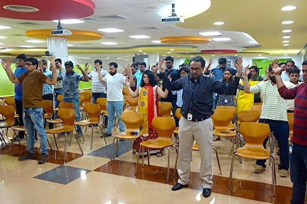

印度浦那的法轮功学员在一家跨国IT公司教法轮功功法，受到同事们的欢迎。（明慧网）

 
 【大纪元2020年03月11日讯】3月6日，印度浦那（Pune）法轮功学员阿南德（Anand），在他工作的一家位于浦那玛格珀特（Pune Magarpatta）地区的跨国IT公司里介绍法轮功并传授功法，深受同事们的欢迎。

明慧网报导，阿南德修炼法轮功（也称法轮大法）后，感觉身心受益，他表示炼功使他精力更加充沛。渐渐地他开始向他所在公司的人力资源部门（HR）介绍法轮功。

该公司为全球客户提供电信服务，在印度有12,000名员工，在浦那的部门就有2,500名职工。

早在2018年8月，阿南德获得了人力资源部门的许可，第一次在公司向大约五十名员工介绍了法轮功，并且教这些员工们学炼了法轮功的第一套和第二套功法。许多人进一步咨询了这一功法，想更多地了解法轮功。

2020年3月初，阿南德再次找到公司人力资源中心部门（HR）推荐在国际妇女节上，向女职工们介绍法轮功，并且与人力资源中心部门分享了所有法轮功视频和书籍。该部门表示对这次会议很感兴趣。他们经过讨论后决定邀请浦那（Pune）法轮功学员们前来向愿意学炼法轮功的女员工们教功。

浦那的部门有大约七百名女职工，3月6日下午3点至7点之间，法轮功学员们为大约七十五名职工教授了法轮功的第一套和第二套功法。

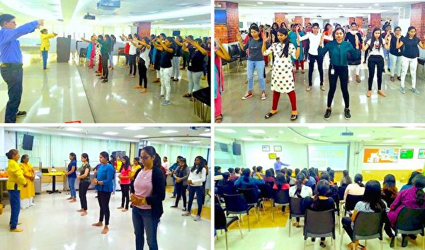

浦那法轮功学员在跨国IT公司教功以及讲解法轮功在全球弘传的盛况。（明慧网）

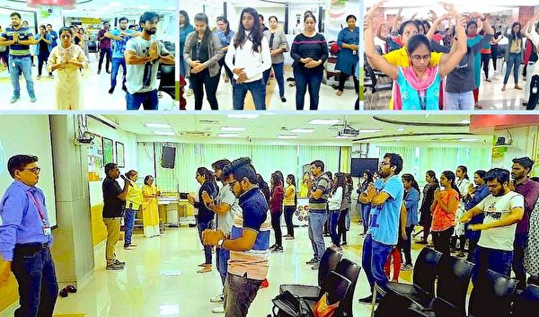

浦那部门的职工们在学炼法轮功（明慧网）

在学习了第一套功法之后，许多员工表示感到精力非常充沛。他们分享了经验，这是一次非常不同的炼习，从未经历过的如此轻松的锻炼。

学炼完第二套功法之后，一些员工分享说，他们感觉自己体内像有能量在流动，手掌中感觉到不断流动的能量流。法轮功功法受到所有女性员工的一致好评，甚至人力资源部门都说这是一次非常好的锻炼。

教功后，法轮功学员还向员工们讲述了法轮功的修炼原则“真、善、忍”，教人做好人，提升人的道德水准，以及法轮功洪传至全球一百多个国家和地区的盛况。

最后，法轮功学员们派发给所有学功人法轮功真相传单，让大家了解中共害怕人们相信“真、善、忍”，残酷迫害法轮功修炼者的事实真相，并向她们介绍了法轮大法的视频链接及法轮大法网站（falundafaindia.org ）。

浦那的法轮功学员们还计划在更多其它公司和大专院校中传播法轮功。

法轮功是佛家上乘的修炼法门，由李洪志先生于1992年在中国长春传出，在短短的几年里，迅速传遍大江南北，上亿人走入修炼，使人们提高了身体素质和道德水准，于国于民百利而无一害。

而以江泽民为首的中共邪恶集团出于对法轮功的妒忌和对“真、善、忍”修炼原则的惧怕，于1999年7月20日对法轮功发动了灭绝人性的迫害，打死、打伤、打残无以计数的法轮功修炼者，甚至活摘他们的器官，给他们及其家庭带来深重的灾难。

至今法轮功受到各族裔民众的欢迎，获得数千项国际褒奖。在印度法轮功得到广泛传播，2003年2月，印度已公开发行印度文《法轮功》。2004年9月，印度法轮大法佛学会在孟买注册。

自此，在印度许多地方人们建立了法轮功炼功点。法轮功尤其受到广大学校师生们的喜爱，常常有数千人在学校集体学炼法轮功。#

<a target="_blank" href=#top><h6 align="right">回上方</h6></a>

<a name=91>
<h1 align="center"><b>美国宣布对欧洲实施30天旅行禁令</b></h1>

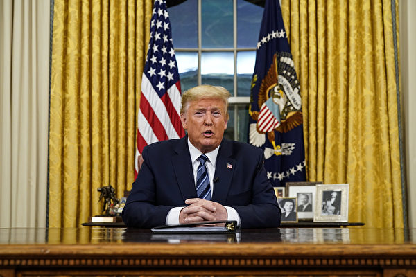

美国总统川普（特朗普）3月11日晚在椭圆形办公室就新型冠状病毒发表全国讲话，他表示美国“有信心”减少持续的冠状病毒威胁。(Doug Mills-Pool/Getty Images)

 
 【大纪元2020年03月12日讯】（大纪元记者林燕综合报导）美国总统川普（特朗普）周三（3月11日）晚在椭圆形办公室就新型冠状病毒疫情发表全国讲话，宣布从周五（13日）午夜起对欧洲实施30天旅行禁令。

川普宣布，将在未来30天内暂停所有往返欧洲与美国之间的航班，但英国除外。此外，所有过去14天去过欧洲申根区的外国旅客均被禁止进入美国。

这跟美国之前对中国和伊朗祭出的旅行禁令一样，限制欧洲的30天旅行禁令不仅会影响直接旅行，还会影响在过去14天之内到过欧洲的外国人士。比如：过去两周去过申根区的加拿大人将无法进入美国。

申根区共有26个国家，包括奥地利、比利时、 丹麦、芬兰、法国、德国、冰岛、意大利、希腊、卢森堡、荷兰、挪威、葡萄牙、西班牙、瑞典、匈牙利、捷克、斯洛伐克、斯洛文尼亚、波兰、爱沙尼亚、拉脱维亚、立陶宛、马耳他、瑞士和列支敦士登。

川普表示，这一决定是为了防止新病例传入美国。他说，新规将从周五（13日）午夜开始生效，限制政策将根据情况进行调整。

他还说，“经过适当筛查的美国人”可获得指定的豁免入境。

川普还提到，美国正在监测中国和韩国的疫情局势；随着情况改善，美国将重新评估目前的限制和警告。

美国国土安全部代理局长随后发出的旅行禁令通告称，鉴于美国对中国以及伊朗发布的旅行禁令被证明可有效减缓冠状病毒在美国的传播，国土安全部将发布补充限制入境通知，要求所有去过申根区的美国乘客通过指定的美国机场入境、并接受美国海关的相关筛检。

通告还称，美国对欧洲的旅行禁令不适用于美国的永久居民、美国公民的直系亲属等。

 <h4 align=center><a href="https://twitter.com/realDonaldTrump/status/1237924658185469954?ref_src=twsrc%5Etfw%7Ctwcamp%5Etweetembed%7Ctwterm%5E1237924658185469954&ref_url=https%3A%2F%2Fwww.epochtimes.com%2Fgb%2F20%2F3%2F12%2Fn11933815.htm">请记住，这对所有国家和企业都非常重要，贸易活动绝不会受到欧洲30天旅行限制的影响； 限制令制止的是人而不是货物(点击右键,另存新档）</a></h4>

川普在发表讲话1小时后推文提醒说：“请记住，这对所有国家和企业都非常重要，贸易活动绝不会受到欧洲30天旅行限制的影响； 限制令制止的是人而不是货物。”

<b>川普：有信心迅速击败冠状病毒</b>

川普表示，美国“有信心”减少持续的冠状病毒威胁。

川普说：“我们一直与盟国保持经常联系，并调动联邦政府和私营部门的全部力量保护美国人民。”

“我相信，通过继续采取严厉措施，我们将大大减少（新冠病毒）对我们公民的威胁，我们将最终且迅速消除病毒。”他说。“一直以来，美国和人民就面临着一些不可预见的挑战，包括大规模和非常危险的健康威胁，无论在过去还是将来都是这样。如何去应对这些威胁很重要，而我们也正在以快速、专业的态度应对这些威胁。”

川普在演讲中再次提醒美国民众，新冠病毒在美国境内的风险仍然很低，尤其是对年轻人以及健康人群，但是老年人，尤其是有慢性病史的老年人要避免旅行。

同时，提醒民众要注意保持卫生，包括勤洗手，以及身体如感觉不适，请待在家中休养。

<b>政府为小企业提供紧急财政救济</b>

川普还提到，美国政府将为受到新型冠状病毒影响的美国人提供紧急经济救济。

“为了确保受疫情影响的在职美国人可以呆在家中、而不必担心财务困难，我将尽快采取前所未有的紧急行动、提供经济救济。救济目标是因冠状病毒致病、被隔离的人士或需要照顾生病家人的工作族。我将要求国会采取立法行动，延长这一救济时间，”川普说。

他表示，“这不是金融危机。这只是一个短暂的时刻，我们作为一个国家和整个世界都将克服的一个时刻。”

川普还知，他已经指示小商业局为受冠状病毒影响的小企业提供资金和流动性贷款。小商业局将为在受影响的各州和地区提供经济贷款，这些低息贷款将帮助小型企业克服由疫情引起的暂时性经济活动中断。

川普说，他将要求国会为该计划增加500亿美元的资金。

到美东时间3月11日晚10点，美国境内确诊新冠病毒案例1321例，死亡38例，康复15例。新冠病毒源自中国武汉，现已蔓延到全球多个国家。

<a target="_blank" href=#top><h6 align="right">回上方</h6></a>

<a name=90>
<h1 align="center"><b>为习到访武汉全休舱？市民忧疫情复发</b></h1>

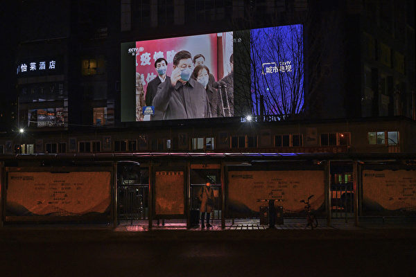

习近平3月10日乘飞机抵达湖北省武汉市考察疫情。图为北京大街上屏幕上的报导。(Kevin Frayer/Getty Images) 

【大纪元2020年03月11日讯】（大纪元特约记者常春、林岑心采访报导）3月10日，习近平首度前往武汉视察前，武汉14家方舱医院陆续“休舱”，10日当天，最后1所方舱医院“江夏方舱医院”进行休舱仪式，官媒高调宣传抗疫成功。是否为了政治目的，令收治病患的方舱医院全数休舱，这让武汉市民相当忧心。

上周，武汉地区多处方舱医院才传出多起病患出院却又复发为阳性，即“复阳现象”。其中，江岸方舱医院一名负责人向媒体证实，武汉市防疫指挥部通报指出，近期出院患者复发者较多，导致患者需重新入院治疗。江岸方舱医院决定5日起，改对出院病患抽血加做病毒抗体Ig-M与Ig-G检查。

但国家卫健委8日表示，努力在10日让所有方舱医院“休舱”。

<b>病患方舱出院后复发 引发更多忧虑</b>

一名居住于武汉市青山区的民众付女士，她的女儿10日发出求助信，引起网友们的关注。

她的母亲是2月12日核酸检查阳性进入方舱医院隔离治疗，2月28日方舱医院出院。目前在隔离宾馆检查3次结果是阴性，但是这几天已经病情加重，10日，去医院检查CT显示肺部感染，新冠肺炎还没好。隔离点上报防疫指挥部，指挥部要求送到定点医院，但定点医院又因母亲检测阴性不符合收治标准，而不让她住院。

她在求助帖上说，现在母亲浑身无力呼吸困难，希望能尽快住院治疗。记者尝试与付女士及女儿联系，但手机暂无法接通。

针对付女士的经历，网友纷纷议论，“为了复工，为了漂亮数据，不顾一切。”“那些可都是人命啊！”“防疫指挥部还指挥不了医院？不怕真是复发到处传染？”“方舱也都关了，出院率这么高，可想而知。”“已经有出院然后死人的先例，怎么还不重视！”

还有网友说，“视察结束了，可赶紧救人啊！”“我只能说太邪恶了，为了安抚群众吗？明明没有痊愈，干嘛不让治病，干嘛休舱？一条鲜活的生命就这样要被抛弃了吗？”

“这几天运动式出院，关方舱，本能地就感觉很恐怖！”一名网友说。

<b>病毒也讲政治？战疫思维透露党文化</b>

武汉市民吕先生对大纪元说，中共全面关停方舱，并且高调宣传抗疫成功，这跟疫情本身没有绝对关系，目的还是为了政治，“在他们逻辑里，所有东西都必须讲政治的，不只是人，包括一个物体，甚至病毒，都是应该讲政治的。”

他认为，这透露了中共一党专制的危害，“他们独家在台上演戏，他想怎么演怎么演，这导演也是他，演员也是他。不管他是一个人，或是一个病毒，所有的一切东西，都觉得是它的道具。”

吕先生说，从疫情的处理面对就可以看出中共的党文化，他们觉得自己是“正确、伟大、光荣”的党，战天斗地，打败不了的，所以，“他就要你感恩，因为它是不可战胜的，它可以战胜一切，甚至还可以解放全人类的。”这凸显了中共一贯的思维。

但事实真是如此吗？武汉市民高先生接受大纪元访谈时说，这么多老百姓正在遭遇灭顶之灾，还要老百姓感谢党，“这完全是无耻之尤，不可理喻的。”

<b>专制危害人类 灭顶之灾使人醒悟</b>

特别是在疫情尚未稳定时，国家卫健委就全面收停所有收治轻症患者的方舱医院，让人很难臆测究竟是什么目的，高先生说，“武汉这样的休舱，对中国（中共）这样一个专制国家来说，你不晓得他的目的是什么，人（患者）到哪里去了，他采取了什么目的，什么手段？你完全无法得知，很难搞清楚这个事实真相。”

大陆媒体正在大面积宣传中国抗疫成功，国际社会疫情蔓延，高先生说，中共才是始作俑者，“不光是中国，包括伊朗、日本、韩国、意大利、美国等国家，都深受这样一个专制毒瘤的毒害，他们现在牺牲自由（旅行自由、封城），这就是允许专制政权毒害的一个代价。”

他一直希望国际社会能尽早介入调查疫情，“因为，这不光对中国来说是一个灭顶之灾，对世界来说同样是最大的威胁。”

现在中共罔顾事实，反过来对民众灌输思想，高先生认为，灾难终究会让人们醒悟，“随着人们信息的多元化，眼界的扩张，逻辑思维的成长，很快会转变。灾难、教训和事实真相，是他们最大的启蒙老师。”

<a target="_blank" href=#top><h6 align="right">回上方</h6></a>

<a name=89>
<h1 align="center"><b>珠海拱北口岸商户罢市要求减租 遭喷辣椒水</b></h1>

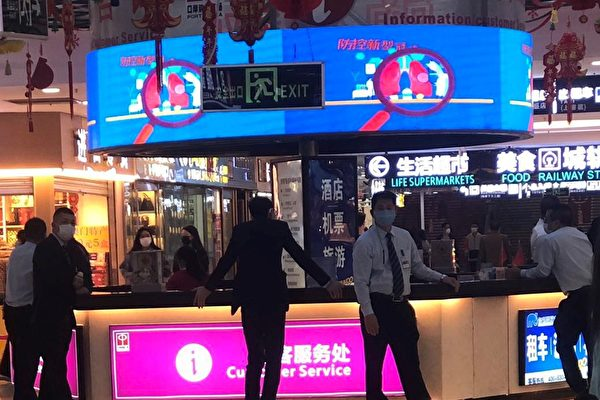

3月7日、8日，广东珠海拱北口岸地下商业广场的数百名商户罢市，要求减免租金，遭到商场人员恐吓，以及喷辣椒水。图为商场到处可见保安人员。（受访者提供）

 
 【大纪元2020年03月11日讯】（大纪元记者顾晓华采访报导）3月7日、8日，广东珠海拱北口岸地下商业广场的数百名商户罢市，要求减免租金，遭到商场人员恐吓，以及喷辣椒水。

一名商户李女士向大纪元记者介绍了整个事件的经过。

拱北口岸地下商场占地面积1.3万平方米，大约有五千余家商户，据李女士透露，他们的收益完全是靠去澳门旅游或赌博的游客以及澳门当地民众的消费，全年无休，1月下旬武汉肺炎疫情爆发以后，商场的客流量急剧减少，他们商家一直坚持至1月底。

“1月底，我们实在扛不住了，所有的人员不敢出门，自己隔离在家里，隔离差不多到第十天的时候，商场人员说可以免租的，这十天让大家安心地在家里，到第二个十天，我们准备工作时，商场又说免租十天，十天又十天，实际上整个二月份是免租。”

李女士还表示，2月份商场曾让商户交1月份的租金，声称如果不交租金不予免租十天，商户们纷纷将款项汇给了商场方面。

3月份复工，商场又开始催交租，并且突然改变口径，“他们的交租方式跟我们说的免租完全不一样的，他们想把免租的那三十天呢，每个月拆分十天，给我们这样一个打折优惠，这让我们租户感觉很伤心 ，太气人了。”

商户们虽然3月份复工，但是受疫情影响，根本无客流量，商户们聚在一起问得最多的就是“今天开张了吗？”

3月7日、8日，一百余名商户在商场的中心地广场处聚集，他们喊着免租的口号，要求商场方面能够为商户着想，二、三月份免租，其它月份可以适当打折。

商户们的维权换来的是商场方面的威胁、恐吓，7日部分情绪激动的商户与保安发生肢体冲突，保安向商户们喷辣椒水，有孕妇当场不适送医院。

“对着那些抗议维权的商户进行喷雾，他们没有一个对象，完全是朝着人群去喷的。”李女士说。

同时，商场管理人员威胁、恐吓商户，视频显示，一名工作人员在现场说：“拍个全视频，谁要在这里挑头搞事的，列为口岸广场黑名单，看以后还能不能在里面做生意，先拍一个，看哪些人?”

李女士表示，许多商户在7日维权以后遭到恐吓。在商户的争取之下，8日，当地街道办官员与商户代表协商，但是无任何结果。

商户们的诉求未获得解决，他们拨打当地媒体电话都无果，发在网络上的视频也被屏蔽。

李女士表示非常无奈，“我们很多租户在商场里工作了十几年，二十几年的，奉献了自己的青春，去外面已经找不到别的工作，所以说大部分商户维权只是不想放弃自己的生计问题。”

近期，大陆部分地区陆续复工以后，包括广州、深圳、上海、沈阳等地的店铺商户发起了减租、免租维权活动，他们走上街道，举牌抗议。

<a target="_blank" href=#top><h6 align="right">回上方</h6></a>

<a name=88>
<h1 align="center"><b>北京雨儿胡同起火 河北正定县化工厂火灾</b></h1>

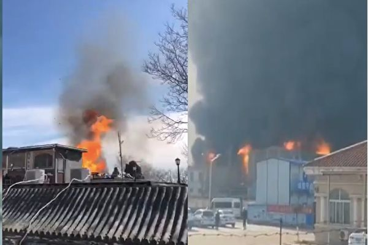

3月10日，北京南锣鼓巷与雨儿胡同交叉口发生火灾（左），河北正定县一化工厂亦发生火灾（右）。（视频截图合成）

【大纪元2020年03月11日讯】3月10日当天，北京南锣鼓巷与雨儿胡同交叉口发生火灾，河北正定县一化工厂亦发生火灾。

3月10日，北京消防官方微博通报，当天13时32分，市119指挥中心接到报警，北京东城区南锣鼓巷121号起火。当天下午，多位网民披露，东城区南锣鼓巷与雨儿胡同交叉口一饭馆发生火灾，并发出爆炸声。

据网传视频显示，现场火势大，浓烟滚滚，还有火光；同时伴随爆炸声。目击者称，在平安大街上都能闻见烧焦的糊味。

通报称，经核实，现场为一未营业饭店二层房顶厨具及煤气罐起火，现场无人员伤亡。

有网民说：“北京雨儿胡同火烧连营了，离中共老巢直线距离2公里左右。北京城中心平房全都连着，胡同窄得连过三轮车都费劲，更甭说救火了，烧吧，把中共烧光，五毛粉红杂种们一起烧光，中共不灭，世界必亡。”

另有网民指：“雨儿胡同可是习（习近平）之故居，还有正定那个化工厂的大火，正定可是习从政起步的地方。”

据悉，3月10日当天上午8时50分左右，河北省石家庄市正定县亮马化工厂爆炸起火。

网传视频显示，现场浓烟滚滚，还伴随着火光、爆炸声。陆媒报导称，火灾现场过火面积约300平米，当时无人员伤亡。起火原因亦不明。

<a target="_blank" href=#top><h6 align="right">回上方</h6></a>

<a name=87>
<h1 align="center"><b>武汉市委前常委蔡杰被逮捕引关注</b></h1>

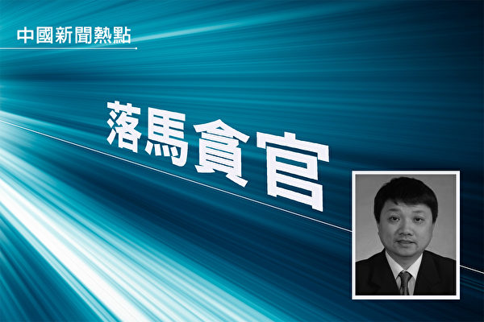

中共武汉市委前常委、秘书长蔡杰（大纪元合成）

【大纪元2020年03月11日讯】3月11日，官方消息称，武汉市委前常委、秘书长蔡杰以涉嫌受贿罪、滥用职权罪被逮捕。目前正值武汉乃至湖北官场动荡之际，蔡杰被逮捕的消息引发关注。

据中共喉舌《人民日报》报导，湖北省武汉市委前常委、秘书长蔡杰（正厅级）涉嫌受贿、滥用职权一案调查终结，移送检方审查起诉。日前，湖北省检察院汉江分院对蔡杰作出逮捕决定。

2月22日，武汉市委前常委、秘书长蔡杰被“双开”并移送审查起诉。其于2019年8月落马被查。

湖北省纪监委发出的通告中称蔡杰与多人串供，不如实报告个人有关事项；涉嫌受贿罪、滥用职权罪；索贿受贿，擅权妄为，涉嫌犯罪。

现年53岁的蔡杰是湖北武汉人，曾任武汉江岸区委副书记、代理区长、区长、区委书记；2016年1月任武汉市委常委、市委秘书长。2019年8月26日落马。

海外追查迫害法轮功的国际组织“追查国际”曾发通告，指蔡杰在江岸区任职期间，对迫害法轮功学员负有责任，被“追查国际”列入追查名单。

自武汉肺炎疫情爆发以来，湖北及武汉官场备受诟病，且发生大动荡：湖北省3名卫健委主任在20天内相继被免职；中共中央政法委秘书长陈一新到武汉任中共中央指导组副组长；湖北省委书记和武汉市委书记双双换人。#

<a target="_blank" href=#top><h6 align="right">回上方</h6></a>

<a name=86>
<h1 align="center"><b>感恩论犯众怒 中共密令曝光 官方态度大转弯</b></h1>

武汉肺炎（2019新型冠状病毒）疫情持续蔓延，大陆民众仍活在恐惧之中。图为武汉一家医院。(HECTOR RETAMAL/AFP via Getty Images)

 
 【大纪元2020年03月09日讯】（大纪元记者古清儿综合报导）武汉肺炎（2019新型冠状病毒）疫情持续蔓延，大陆民众仍活在恐惧之中。近日，武汉新任书记王忠林的“感恩论”引发众怒，随后中共要求删除相关报导的密令曝光。与此同时，新任湖北书记的态度180度转变，又引发民众嘲讽一番。
 
<b>王忠林的感恩论犯众怒 中共密令曝光</b>

《长江日报》7日报导，武汉当局3月6日晚举行有关武汉肺炎疫情防控会议。武汉市委书记王忠林在会议上称，要对市民开展感恩教育，“感恩总书记、感恩共产党，听党话、跟党走……”

王忠林的言论立即引起大陆网民猛烈抨击。大陆网民表示，“疫情没有结束，冤情没有昭雪，责任没有查清，现在就跳出来要开展感恩教育为自己升官发财捞政治资本，没有想到走了一个庸官，来一个贪官。”

“疫情还未完全控制，这么多家庭家破人亡，数千死者尸骨未寒，要如何感恩？让人心寒。”

截至7日下午4时许，《长江日报》的文章被删除。转发此文的“武汉发布”、“凤凰网”以及与此事相关的微博词条均已被删除。

同时，网络传出中共国新办会议纪要、要求删除有关王忠林报导的相关禁令。会议内容称，今天，《长江日报》的感恩教育报导引发的舆论非常汹涌，舆情反应热度与某医生去世引发的舆情相似。

并称，“经与省、市领导沟通，并请示中央领导同意：《长江日报》、武汉发布、武汉台从源头撤掉稿件，其它媒体一律不得再跟进报导、评论！”还称，“无论内宣还是外宣，无论中央还是地方，无论网上还是网下，都要听招呼……不得各自为战。”

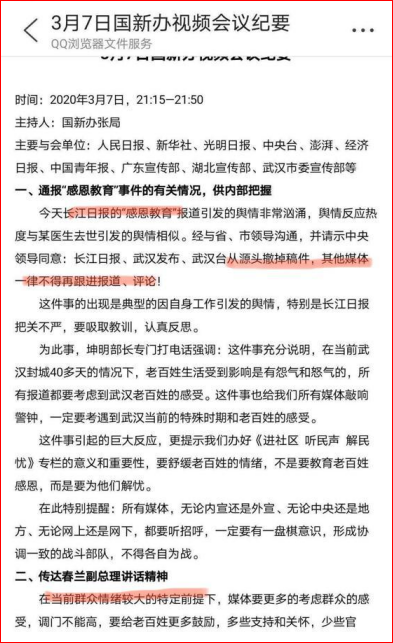

（网络图片）

 
《南方周末》记者褚朝新在网上发文《稍有良心，此时都不会要求惊魂未定的武汉人感恩》，指“……他们尸骨未寒，他们的家人、朋友、同学都还在悲痛之中，他们的家人、朋友、同学甚至自己都还在医院里躺着等着抢救，根本无力悲伤，此时却有人要对他们加强感恩教育，这是没有人性的行为”。

武汉作家方方说，武汉的领导要求人民向党和国家感恩。真是奇怪的思路。政府是人民的政府，它的存在是为人民服务的。政府公务员是人民的公仆，而不是相反。不明白领导们天天学习，怎么学反了向？

复旦大学曲卫国教授说，武汉人民还该感激什么呢？感激不死？感激终于了解了病毒的残酷？感激被赐给体验一把生离死别机会？说这话的人忘了自己是谁了吧？不是说宗旨是为人民服务么？既然是为人民服务，凭什么要人民感恩？要说感恩，难道该感恩的不是你们？造成如此大规模的灾难，难道你们对武汉人民没有一点愧疚？对于武汉那么多死去的人，有那么多家庭破碎，甚至有的家庭都死绝了，难道你们没有一点负罪感？你们和人民到底是什么关系？到底是谁该接受感恩教育？

<b>王忠林报导被撤后 官方态度大转变</b>

王忠林报导被撤后，中共官方的态度马上来个180度的大转变。

据《湖北日报》报导，3月8日，湖北省委书记应勇在武汉看望慰问抗疫一线的妇女代表。他说，“武汉是英雄的城市，武汉人民是英雄的人民。武汉人民识大体、顾大局。……我要向武汉人民、湖北人民表示衷心感谢。”

为此网民又议论一番：“互相拆台是不是？”“湖北省委书记说要感谢人民，武汉市委书记（省委常委）说要感恩总书记。同是一个省委班子成员，说法也没统一呀？”“要不是之前王感恩被喷，省委书记估计也会让人民感恩。”

“你信吗？”“风向大转变。”“被骂惨了，赶紧改个腔调，道歉有没有？追责有没有？”“为什么不道歉？对不起三个字就这么难说出口吗？”“瘟疫究竟是谁的责任！百姓不需要虚假的东西。”

就在日前（3月5日上午），中共国务院副总理孙春兰视察武汉市青山区中建开元公馆小区的视频在网络热传。

多个视频显示，当天，武汉青山区中建开元公馆小区的被封城困于家里40多天的业主们对孙春兰等官员怒喊：“假的，假的，都是假的。”“ 老百姓吃的都是高价菜。”“形式主义。”

有消息称，近期武汉市政府称，能够让民众以较便宜的价格买到猪肉，即10元人民币一斤，但民众根本买不到，认为是虚假宣传。

去年年底武汉肺炎疫情爆发，中共隐瞒和封杀消息，并打压“吹哨人”无人再敢说话，致使错过最佳防疫时间，导致疫情在全球爆发。

美国福克斯新闻的主持人杰西·沃特斯曾在节目中说，武汉病毒起源于中国，迄今没有听到中方说一个道歉，没听到一句简单的对不起（Sorry）。

<a target="_blank" href=#top><h6 align="right">回上方</h6></a>

<a name=85>
<h1 align="center"><b>泰国代表“高级酸”WHO 各国代表忍不住笑</b></h1>

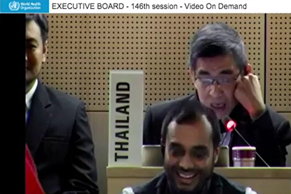

泰国代表说：“主席，全球武汉肺炎的旅行禁令都没人在理的，例如WHO秘书长谭德塞，他才刚去过北京。” (撷自WHO官方影片)

 
 【大纪元2020年03月08日讯】（大纪元记者郑宜芬报导）武汉肺炎（COVID-19）疫情爆发以来，世界卫生组织（WHO）亲中态度引起外界批评。近日网友爆料在2月6日第146次执行委员会会议时，泰国代表发言酸主席与秘书长谭德塞（Tedros Adhanom Ghebreyesus），让在场各国代表忍不住笑出声，网友一片叫好，形容这是“泰式酸辣”。

有网友3月7日在脸书翻译了WHO于2月6日举行的会议片段内容，影片中可见泰国代表一开口就说：“主席，全球武汉肺炎的旅行禁令都没人在理的，例如WHO秘书长谭德塞，他才刚去过北京，现在又来坐在这里开会，会场中大家都有被传染的危险。”

泰方代表更酸：“主席，你最危险，因为你一直坐在秘书长旁边，我个人倒是很安全，因为过去这几天秘书长都不跟我握手。”

他接着说：“但我们还是要阻止世人产生无谓的恐慌，要重建大家对WHO的信心！我建议我们WHO应马上到中国开会，尤其是到武汉，现在正是造访两千年历史黄鹤楼的最好时机，或是去北京也行，现在长城、紫禁城空旷无人，价格也便宜！”

最后，泰国代表更告诉主席：“我已征得我太太的同意，愿意捐出我半年的退休金，另外自掏腰包筹办这个在中国举办的WHO会议，谢谢！”

在泰国代表发言过程中，坐在他前面座位的印度代表露出笑容，会场也不时传出他国代表的笑声；他发言结束后，获得满场掌声。

网友发布影片后，网友纷纷留言说，“真的是有够酸”、“泰式酸辣XD”、“高级酸”、“那两个邻座笑到快要并轨了”、“超狂的”、“印度代表要忍笑到内伤了”、“没听过这么厉害的高级酸”、“讲完大家还拍手叫好”。◇#

<a target="_blank" href=#top><h6 align="right">回上方</h6></a>

<a name=84>
<h1 align="center"><b>大陆疫情多严重？从钢铁库存上可见一斑</b></h1>

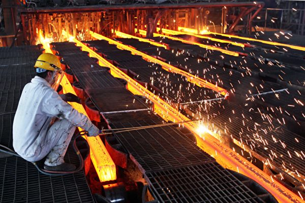

G7将采取措施解决全球钢铁过剩问题，许多人将这个问题归究于中国钢厂产能过剩。 (Getty Images)

【大纪元2020年03月09日讯】（大纪元记者张玉洁综合报导）武汉肺炎肆虐，尽管中共要求复工，但难阻民众对疫情的恐惧。大陆钢铁库存量激增、价格下跌，显示大陆制造业、建筑业、物流等相关行业仍几乎停滞，可见当下大陆疫情之严重程度。

日经中文网3月9日报导，大陆境内的钢材价格在最近一个多月下跌近10%，如果库存继续增加，恐出现大规模倾销海外的行为，这已引起国际关注和担忧。

钢铁的主要出货行业是制造业和建筑业，但大陆这两大行业因疫情大停工，至今未恢复生产，过去积累的钢铁库存无法出货。

另外，大陆大部分钢铁厂使用高炉冶炼，不能即时停转，中国新年假期期间也在运转，虽然可以减产，但有最低限度，所以新产的钢铁加上旧库存，因无订单而无法出货，库存量激增。

<b>建筑业制造业被按下“暂停键”  钢铁价格大跌</b>

大陆建筑业对钢材的需求量占钢材总需求量的一半，该行业目前尚未复工。从2月份的情况来看，与房地产有关的建筑业停滞，涵盖房地产和建筑业的非制造业采购经理人指数（PMI）大跌至29.6历史最低。

3月9日来自大陆媒体的最新消息，目前建筑业“复工难复产难”，突出的问题是工人不足一半，施工所需的门窗、机电等配套产品缺乏，以及防疫困难，出现防疫问题的事件时有发生。

另以制造业中的汽车生产为例，疫情中心武汉就是大陆的汽车重镇，至今封城。台湾中央社最新消息，武汉所在的湖北省工厂据说最早3月11日开工，但实际情况无法预测，员工能否返工仍是未知数。

大型钢铁企业华菱钢铁的负责人表示，虽然实施了减产，但是很多客户持续停工，无法决定减产的规模。

从价格来看，汽车和家电等制造业使用的热轧卷板在大陆境内的价格，1月中旬为每吨3800元（人民币，下同）以上，受疫情影响，目前价格下跌至接近3400元。

<b>物流惨淡：原料进不来，有产品也运不出去</b>

日本本田、河西工业、美国康明斯公司等在大陆设有工厂的汽车制造商都表示，不仅仅是武汉，其它城市的复产也很艰难，缺工、缺料，物流困难，原料进不来，有产品也运不出去。

目前大陆很多地区的交通仍然因疫情封锁，物流情况堪忧，卡车运输不顺。中国宝武钢铁集团的高管表示，大陆各地的钢铁厂都在持续运转，甚至也包括武汉市，但物流严重停滞，该集团已经减产，预计今年第一季度将比去年同期减产5%。

香港《经济日报》消息，目前大陆物流企业仍存在不同程度的复工但未复产的情况，其原因包括外地员工返岗后需要隔离14天、员工不足等问题，企业实际运转率不足满负载运行的一半。

也有物流业内人士表示，由于各行业没有恢复，实际上大陆整个物流行业的需求也不足。

实际上，进出口数据显示，2月份大陆钢铁的出口量受到重创，同比下跌27%，其主要原因是运输停滞，因大陆疫情严重，国际社会与大陆之间的航运仍处于暂停状态。

<a target="_blank" href=#top><h6 align="right">回上方</h6></a>

<a name=83>
<h1 align="center"><b>【特稿】武汉病毒针对共产党而来</b></h1>

大纪元编辑部特稿。（大纪元）

【大纪元2020年03月10日讯】今年以来，武汉肺炎（又名新冠肺炎）因为中共的隐瞒而迅速向全球蔓延，演变为令世界惊恐的瘟疫。瘟疫虽无情，但并非无迹可循，尤其是武汉肺炎在中国之外的扩散趋势，鲜明地点出了病毒的风向和目标：它是冲着共产党而来的。

这场气势汹汹的瘟疫爆发一个多月，在全球呈上升之势，危机当前，各国政府和民众不得不反思：病毒到底为何而来？它和共产党有什么关系？个人和国家又该如何趋吉避凶？

纵观共产党的历史，就是一部充满战乱、饥荒、瘟疫和死亡的黑暗史。中共70年暴政，害死八千万中国人，破坏中国传统文化和道德；尤其是近30年来，从八九年屠杀学生，到九九年镇压法轮功修炼者，以及现在对更广大民众的欺凌打压，中共用暴力和谎言给中华民族和世界带来深重灾难。《九评》编辑部的文章指明，“共产主义的本质是一个邪灵”，其终极目的是毁灭人类。

近40年来，从亚非拉发展中国家到欧美发达国家，共产邪灵的代表——中共，一直在以经济利益为诱饵，用全球化、孔子学院、“一带一路”等计划为遮掩，通过政治、经济、文化、教育、科技等各种渠道向各国渗透，“引诱人远离神背叛神，达到最终毁灭人的目的。”

受利诱的国家和地区在与中共加强往来的同时，却不知灾厄也随之而来，就像这一次的“武汉瘟疫”向世界蔓延之势，清晰地勾勒出它循着与中共关系密切的国家、城市、组织和个人一路蔓延。

<b>中共的“亲密战友”伊朗 疫情惨重</b>

中国是当前疫情最惨重的国家。截至3月9日，中共宣称全国累计确诊病例80,754例，累计死亡3136人。但国际医学界的模型测算、大纪元等媒体的采访调查以及大陆疫区民众披露的一手资料，都证明实际感染病毒的患者人数远远超出中共发布的数字。欧美多国专家估算，中国真实病患人数或是官方数据的十倍以上。

截至3月9日，中国之外武汉肺炎累计确诊病例过千人的国家有五个，依次为：意大利（9172例）、韩国（7478例）、伊朗（7161例）、法国（1412例）和德国（1112例）。而其中死亡病例过百的国家，分别为意大利（463例）和伊朗（237例）。

虽然伊朗疫情数据看起来没有意大利或韩国高，但鉴于伊朗跟中共一样是专制政权，同样对疫情采取了隐瞒和封锁的“维稳”措施，外界认为，伊朗官方发布的确诊病例和死亡人数都被极大程度地缩减。

《华盛顿邮报》援引德黑兰医院泄露的数据报导，伊朗确诊病例约为官方数据的五倍。而伊朗国内媒体披露的数据，更是官方数字的十多倍。伊朗民间流出的视频，与武汉惊人地相似，尸体堆积在医院里，街道上屡屡有行人倒毙。

值得一提的是，武汉病毒明显更针对伊朗高官。伊朗官方发布的237例死亡病例中，包括多名现任和前任国会议员。目前，最少有24名国会议员确诊，其中包括第一副总统和卫生部副部长。

中共是伊朗的后台，也是其“亲密战友”。由于伊朗能源充裕，在中东占据重要的战略地位，且其激进的伊斯兰政策对民主国家构成巨大威胁，长期以来中共一直为伊朗政权提供经济和武器支援。中共不但直接向伊朗出口飞弹、战斗机和潜艇等高端武器，甚至为了威胁和掣肘民主国家，向伊朗提供了关键的核武技术。

联合国和美国为遏制伊朗的核武威胁，多次对其实施经济制裁。而中共公然违反贸易禁令、大量进口伊朗石油，从经济上支撑伊朗政权。近年来中共控制的中兴和华为公司屡屡遭美国政府制裁，就是因为这些公司违反国际禁令，向伊朗提供敏感的军事或民用技术。

伊朗亦是中共的“亲密”伙伴。在中共2013年起推行的、输出共产主义霸权的“一带一路”计划中，伊朗是中共渗透欧亚非的战略枢纽。过去10年中，中共一直是伊朗最大的贸易伙伴，在伊朗拥有规模巨大的投资。

<b>“一带一路”盟友意大利 疫情最严重的欧洲国家</b>

截至3月9日，累计确诊9172例的意大利，名义上是中国之外武汉肺炎疫情最严重的国家，死亡人数高达463例，比除去中国、伊朗之外的各国死亡人数的总和还要多。

3月9日当天，意大利总理宣布全国封锁，要求除了工作和紧急情况外，全国六千多万人不要外出。

昔日宁静安详的意大利，转眼间变成监狱囚犯暴动、市民抢购、全国封锁的灾厄之地。这其中最重要的原因，就在于错信了中共。意大利相信了中共和亲共的世卫组织的宣传，对检疫和中国游客防范不严。

不过，真正令意大利疫情爆发的根源，恐怕还应归因于意大利政府与中共的“亲密”关系。

作为最发达民主国家G7集团成员之一的意大利，不顾西方盟友的反对，于2019年3月与中共结盟、“加强全面战略伙伴关系”，并成为欧洲首个签署中共“一带一路”协议的国家。意大利近年经济衰退，幻想中共的“一带一路”会带来好处，中国的游客也确实带来了一些经济利益，但不文明旅客也带来种种负效应。更没想到的是，这次招来了疫情爆发，对经济和人命的损失都无法估计，得不偿失。

意大利与中共已结成74对友好城市，其中就包括疫情最严重的伦巴第大区及米兰、威尼斯、贝加莫等城市。

<b>中共的欧洲伙伴国 疫情严峻</b>

在累计确诊病例已过千的法国和德国，新增病例数都正在快速增长中，疫情形势严峻，近日法国文化部长也被确诊感染。

同为欧洲大国的法德两国，有一个共同点，那就是近年来都与中共很“亲近”。例如，中共欲借华为5G渗透全球的野心昭然若揭，然而法德两国政府都无视美国的郑重警告，最近决定不将华为排除在本国5G网络之外。

2019年3月26日，德国总理在巴黎记者会上，大赞一带一路是“非常重要的计划”、“我们欧洲人想要参与”。

而两国疫情最严重的地区——法国瓦兹省和德国北威州也是与中共关系更紧密的地区，分别与青海省、江苏省建立了友好省州关系。

<b>中国近邻 疫情“亲疏”有别</b>

相较于欧美中东各国，中国大陆周边地区的疫情更为直观地映射出与中共的亲疏远近。

例如截至3月9日，中国近邻韩国累计确诊7478例，名义上是中国之外疫情第二严重的国家。

与中国有大海相隔的日本累计确诊512例，而与大陆相邻的香港和台湾，累计确诊分别为115例和45例。台湾死亡1例，香港死亡3人。而且香港的早期病例全是大陆过去的，后来感染的还包括防暴警察及亲政府人士。

日本、韩国和香港、台湾同为大陆近邻，然而武汉病毒的蔓延，显然不看与中国的距离远近，只看与中共的关系亲疏。

韩国自1992年与中共建交后，开始逐步向中共靠拢，加强与中国的经贸关系。本届政府上台后，韩国更是大幅向中共靠近，不但增加在大陆的投资，同时加大开放中共对韩国的投资。中国已是韩国最大的贸易伙伴、最大的出口市场和最大的进口来源国。甚至在中国大陆疫情被曝光后，韩国政府唯恐损害与中共的关系，坚持不在边境设限，也不对旅客进行检疫。韩国与中共建立190对友好省市关系，其中包括疫情最严重的大邱市和庆尚北道。

尽管日本政府与中共的关系并不亲近，但有大量的日本公司在中国投资，从而依赖中共，甚至促成日本与中共结成256对友好省市关系，其中包括日本疫情最严重的北海道、东京、爱知县、高知县等地区。

在区分与中国的关系和对中共的态度这一点上，香港、台湾就跟日韩大不相同，因而也带来不同的疫情。

香港、台湾虽然也与大陆经贸关系异常紧密，但港台民众并未被利益蒙蔽心灵。2019年香港民众觉醒，发起声势浩大的反送中运动，不但吹响了和平抗暴、解体中共的号角，同时也促使台湾民众认清了中共的真面目，坚定了拒绝中共的决心。

尤其是台湾，因为中共的打压在世界卫生组织没有一席之地，在面对疫情时，台湾没有跟随中共和世卫的拍子走。结果，虽然与大陆的人员来往密集，台湾却成功地抑制住病毒的扩散，成为全球抗疫的典范。

选择了拒绝中共的香港和台湾，结果真的成功拒绝了武汉病毒。

同样与中国接壤的印度、俄罗斯和蒙古等国，截至3月9日，累计确诊分别为47、20和1例。这些国家的共同点，就是都与中共不对付。

如果说，武汉病毒在中国之外的蔓延，清晰地呈现出以中共为标靶的选择性扩散，那么，明朝末年的鼠疫剑指大明却不染闯王军和清军的历史，则彰显了瘟疫无情却有眼的昭昭天意。

据史料记载，明末鼠疫肆虐，明军“鸠形鹄面，充数而已”，然而转战疫区的闯王军队以及来自关外的清军，尽管没有隔离措施，却都没有遭到瘟疫的伤害。

<b>结语：病毒选择性扩散 如何避开它</b>

历史上，多数王朝的末年，都伴随着天灾瘟疫，给那一王朝政权送终。以史为鉴，纵览如今武汉瘟疫在世界各国的扩散趋势，不难看出，病毒就是冲着中共而来的。今天的世界已是地球村，任何和中共关系密切的国家、城市、组织和个人，都可能成为病毒选择性感染的目标，沦为中共邪党的牺牲品。

在中国大陆还有这样的例子，有病患痊愈后，受中共洗脑宣传的欺骗，真以为自己的病是中共治好的，因此对中共感恩戴德起来。结果，病毒回来了，这人的武汉肺炎又复发了。

武汉瘟疫虽然给世人带来了病痛甚至死亡，但历史和现实都指出了消解瘟疫、趋吉避凶的明路：那就是认清灾厄的根源，明晓中共的真相；脱离中共、拒绝中共，就能远离灾厄、不受瘟疫侵害。

无论是伊朗、意法德等远邦，还是韩国、日本等近邻，它们在武汉瘟疫中所付出的惨重代价，应为世界各国的政府或当权者敲响了警钟。为政者，或代表国之民意，或掌舵主政方向，一念间定下的邦交国策不但决定了自己的未来，亦关联到万民之福祉；一旦混淆了中国和中共，甚至错信了中共，就可能将自己以及无数国民都推入深渊。

《九评》编辑部已指出，“神的慈悲与威严同在！神在看着每个人的内心。一个人在此时此刻的抉择和所为，就会决定他（她）的未来。”

病毒仍在肆虐，警钟再次响起！曾经加入中共组织的人，可以在大纪元网站发声明，退出中共党团队。远离中共，脱离中共，拒绝中共，作为个人、组织和国家，都可以因此而回避病毒侵害，选择美好未来。

大纪元编辑部
2020年3月10日

<a target="_blank" href=#top><h6 align="right">回上方</h6></a>

<a name=82>
<h1 align="center"><b>黄天辰：孙杨被抛弃 再次印证中共任意宰割国人</b></h1>

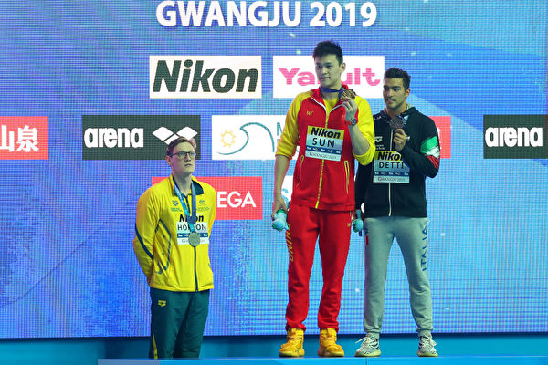

澳洲选手霍顿（左一）拒绝与中国选手孙杨（中）同台领奖合影，引发关注。(Maddie Meyer/Getty Images)

【大纪元2020年03月09日讯】国际体育仲裁法庭（CAS）于2020年3月4日，在官网公布了对孙杨抗检事件的全部仲裁报告，不仅详细解释了为何判罚孙杨禁赛八年，还公布了听证会鲜为人知的细节。此前2月28日，该法庭裁定，给予孙杨禁赛八年的处罚，即日生效。

3月4日，中共高检机关报《检察日报》用两整版登出四篇评论，内容全是认同法庭裁决，全面抛弃孙杨。如《无视规则将会承担相应后果》中，指“由于孙杨的不配合，药检人员未能完成这次药检取样”，根据《世界反禁药条例》的明文规定，“毋庸讳言，孙杨不配合药检取样的决定是错误的。”文章说孙杨此举“无知及无视”。

还有一篇《商业比赛不能与国家荣誉捆绑》称，“除非运动员拒绝参加国际体育比赛，否则，必须接受国际反禁药调查机构的有关规则，允许国际反禁药调查机构进行飞行检查”。“国际竞技体育比赛只是商业活动，因此，胜负都是常事”，“如果把个人的荣辱和国家捆绑在一起，那么最终必然会进退失据”。

与此同时，国内舆论从最初支持孙杨开始反转，一些大陆网友也涌到曾拒绝与孙杨同台领奖和拍照的澳洲游泳名将霍顿的社交媒体平台上留言致歉。有些留言是真诚的个人道歉，也有些道歉是泛泛的语言，代表某国、某些人等的道歉，是否其中五毛渗入，不得而知。

以上种种不难看出，孙杨已被中共彻底抛弃。

实际上像中国那样的共产极权国家，运动员服用兴奋剂大多由组织来决定，有的从小被迫服用兴奋剂。不像很多民主国家那样，大多是运动员个人行为。

前中国国家体委义务监督大组长薛荫娴女士，在60年代进入中共国家体委工作了数十年，70年代末，中共倡导使用兴奋剂，薛荫娴成为体制内罕见的公开反对者，并拒绝给李宁等体育明星打兴奋剂。数十年间薛荫娴写有68本工作日志，大量记载了中共体育界使用兴奋剂的证据。据她介绍，举重、游泳、田径和体操等金牌项目，都是使用兴奋剂的重点领域。当局一方面强迫运动员系统地服用兴奋剂，另一方面，研究怎样能躲避药物检查的方法。

薛女士说：“每一枚金、银、铜的奖牌都受到兴奋剂的玷污。”

薛荫娴曾对大纪元表示，兴奋剂的伤害非常多，可引发脑癌、严重损害肝脏，还会引发肝癌，对心脏、血管也都有影响，对全身上上下下的组织，包括运动系统都有影响，比如肌肉拉伤、肌腱断裂都是使用兴奋剂的结果，最厉害的是骨头酥松脆弱容易断。更可怕的是，女性还可能出现变性。

2015年赵瑜的《马家军调查》书中揭露了马俊仁从1991年开始给队员亲自喂服或者注射针剂兴奋剂的事实，并且列举了在这些女队员身上已经出现的不正常变化——说话声音越来越粗，有的不来例假，肝病越来越多，甚至听说会生出畸形儿等。

从另一个角度来看，一旦运动员出了什么问题，中共会立刻撇清关系并抛弃这些人。

可怜孙杨不明白这些，还坚信中共会为他撑腰，对抛弃他的中共感激万分，在被裁决之后还说，“感谢国家体育总局，中国游泳协会和各级领导的关心，感谢国内外体育爱好者的支持！我要为捍卫自己的合法权益奋战到底！”

孙杨不知道的是，他已被中共弃之如敝履，像对待其他运动员那样。

中共对待运动员，向来随心所欲，毫无人性。中国国家羽毛球队在汤尤杯比赛期间，曾隐瞒队员王晓理外婆的去世。王从小由外婆带大，和外婆很亲，其训练基地离外婆只有几十公里。直到中国队夺冠后，王才得到噩耗，当场就蹲在地上哭泣。

湖北省乒羽中心主任石伟就此事回应称，国家队利益必须放在第一位。这位主任的回答真是精辟，在中共看来，运动员只是为中共争光的工具。

一句“国家队利益必须放在第一位”，身为世界头号女双种子选手的王晓理和于洋，在2012年伦敦奥运会期间被要求打输球，以此来保障中国除金牌之外还能夺一枚银牌。

由于比赛现场观众强烈不满，嘘声一片，跺脚声震耳欲聋，裁判数次发出必须认真对待比赛的警告。次日世界羽联召开听证。世界羽联对排名世界第一的于洋、王晓理和包括韩国、印尼在内的八名运动员进行裁决，认为这四对选手不仅仅“消极比赛”，甚至“伤害、侮辱羽毛球运动”，为在接下来的淘汰赛中获得理想中的签位，不惜故意输球，因此取消参赛资格。这在奥运史上尚属首次，这也可称得上是奥运史上的最重罚单。

此判决一下来，韩国、印尼代表团立即上诉，中共代表团立即撇清关系，表示尊重处罚决定，说于洋、王晓理赛场上行为违背了奥林匹克运动的宗旨和体育公平竞争的精神，对此他们感到痛心，并坚决反对、严厉批评这种行为。中国奥委会历来反对任何人、任何队伍、任何形式的违反体育精神和体育道德的做法。

新华社也在第一时间发表评论，说国家需要这样的金牌吗？强烈谴责于洋、王晓理，说她们在金牌的诱惑下，奥林匹克精神、公平竞赛的原则、对观众的尊重被抛诸脑后，云云。俨然一副正义的化身。

于洋、王晓理双双不仅被取消参赛资格，还被中共抛出当了替罪羊，所有的辛勤、汗水和泪水都付之东流。

在伦敦奥运期间，《泰晤士报》发表的一篇署名评论文章说，中国为了国家的利益可以牺牲个人，集权制度似乎在体育上得到了充分的发挥。从中国运动员的表现看中国近乎残忍的训练体制，人们应该同情叶诗文以及数不清的“身心被粉碎的”中国运动员。

历史何等惊人的相似。这些被外媒称之为“身心被粉碎的”中国运动员以及中国百姓，有多少人能够看清中共的真面目还很难说。就像今日武汉肺炎在中国肆虐，多少人命被中共玩在手心的同时，还有人不分是非，继续感激中共，撞了南墙都不知道要回头。

<a target="_blank" href=#top><h6 align="right">回上方</h6></a>

<a name=81>
<h1 align="center"><b>意大利总理宣布全国封锁 6000万人行动受限</b></h1>
 <h1 align="center"><b>意大利武汉肺炎确诊病例超9000 463患者死亡</b></h1>

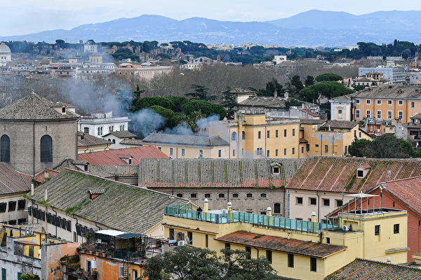

意大利司法部在一份声明中说，为制止新型冠状病毒的传播而禁止探监后，在22所监狱中发生了暴动。多名囚犯在暴乱中丧生，有些囚犯继续占领设施。 (Photo by Alberto PIZZOLI / AFP)

【大纪元2020年03月10日讯】（大纪元记者夏雨综合报导）意大利总理朱塞佩·孔特（Giuseppe Conte）在周一（3月9日）的新闻发布会上表示，整个意大利现在处于封锁状态。他补充说，他将立即签署该法令，该法令将于周二上午生效。

孔特上周日凌晨表示，他签署了一份法令，封锁疫情最惨重的伦巴底大区（Lombardy），而该区也是全国最富裕的区域；其余区域的14个省份也被纳入“隔离红区”，包括金融中心米兰和观光胜地威尼斯等大城，以及若干扮演意大利“经济火车头”角色的工业区；估计高达1600万居民，亦即全国四分之一人口遭隔离。

现在新的封锁令涉及全国，明确限制了超过6000万人的行动。孔特说，全国有六千万人口，除了工作和紧急情况外，不应外出旅行。

这些限制将包括禁止所有公共聚会，禁止紧急情况以外的所有活动。包括关闭电影院、剧院、健身房、迪斯科舞厅和酒吧、葬礼、婚礼和所有体育赛事，意甲比赛也被禁止。所有学校和大学将关闭至4月3日。

据路透社报导，孔特表示，这一决定对于保护意大利最弱势的公民是必要的，而目前正确做法是让人们待在家里。

另据CNN报导，意大利北部因疫情严重，上周日开始处于封锁状态，但已开始产生连锁反应。周一，囚犯暴动并冲破了意大利的一些监狱逃脱，占领监狱设施并绑架警察。

意大利司法部在一份声明中说，为制止新型冠状病毒的传播而禁止探监后，在22所监狱中发生了暴动。多名囚犯在暴乱中丧生，有些囚犯继续占领设施。

意大利是欧洲武汉肺炎疫情最严重的国家，武汉肺炎在该国已经夺走463条生命，并感染了9,172人。

分析指，对中共领导层来说，维稳比遏制武肺疫情更为重要。对西方国家来说，一味地取悦中共将带来致命后果，意大利是前车之鉴。意大利的致命错误是信任中共政权。意大利北部经济瘫痪、人民恐惧和歇斯底里、米兰市的超市空荡荡。

去年3月底，意大利和中共签署一带一路计划合作备忘录，成为G7（七大工业国组织）第一个也是唯一搭上中共一带一路的国家。

今年2月13日，意大利媒体报导，在意大利疫情还没爆发时，罗马一家口罩工厂“Dpi di Roma”因10年的库存10天内被中国扫光，导致该国陷入口罩荒，甚至还出现哄抬口罩价格的情形。但该公司高层表示，意大利没有疫情，民众不必恐慌。未料隔不到一周，意大利武汉肺炎疫情大爆发，短短几天，2月25日确诊数超过200例、7人死亡，并自此成为欧洲武汉肺炎疫情最为严重的国家。

世卫组织官员说，全球约有93%的病例集中在四个国家：中国，韩国，意大利和伊朗。

分析指，韩国，意大利和伊朗都是亲共国家。

<a target="_blank" href=#top><h6 align="right">回上方</h6></a>

<a name=80>
<h1 align="center"><b>【珍言真语】阮民安：选择良知 舍弃中国市场</b></h1>

参与反送中运动的香港知名歌手阮民安（Tommy）表示，反送中与疫情爆发成为香港艺人的一面“照妖镜”，让观众是知道谁站在香港一边。（大纪元）

 
 【大纪元2020年03月10日讯】（大纪元记者叶依帆、梁珍香港报导）参与反送中运动的香港知名歌手阮民安（Tommy）接受《珍言真语》主持人梁珍专访时表示，反送中与疫情爆发成为香港艺人的一面“照妖镜”，“那就洗牌吧，让观众是知道谁站在香港一边。”

阮民安为前男子组合E-kids成员，独立创作歌曲，包括《七日之痒》、《乱世起舞》、以及反送中歌曲《煲底之约》等。

阮民安表示，受疫情波及，香港艺人大多靠储蓄维持日常开销，“疫情对他们的影响非常大，据我所知有些电影制作也会停止，很多工作组的人都没有工作。”

另外，他提到，表态支持反送中运动的艺人几乎失去发展机会，他也曾遭遇“政治审查”，差点租不到演唱会场地。他说：“不会在电台听到我们的歌，在电视台看见我们，不会在一些正常的电影看到我们。”只能藉由独立创作寻求生存，他呼吁港人像支持“黄色经济圈”一般，支持他们。

日前网上传出多条片段，“晨曦明星队晚宴”上，港星成龙、谭咏麟（阿伦）、曾志伟等人与出席的香港警务处长邓炳强，称兄道弟，对此阮民安说，这帮人下命令暴打与拘捕香港年轻人，“这些艺人由这班市民去支持的，却与我们敌对的警队的头头，关系这么友好，这最让人气愤和恐怖的！”

阮民安曾到大陆发展，亲身经历中共限制大陆娱乐圈言论与思想，并在（要求艺人在）必要时刻为中共发声。他披露2016年期间，中韩因“萨德”系统的部署，关系恶劣，中共随后下达“限韩令”；南海仲裁案公布前，发动在微博发布图片《中国一点都不能少》，“那一刻他们要拿我的微博出一个Post，他们打了字、给了照片，照发就可以了。”阮民安拒绝后，遭到剧组刁难，“他们的制度就是这样，就是要和他们同党：‘你要将我们的思想，透过你的频道去说给别人听’。”

他也提醒以良知、个人意志，交换利益、附和中共的香港艺人，中国娱乐圈会突然来个“限韩令”，限制韩国艺人，怎料哪天不会来个“限港令”呢？“你怎么办？你到时候返回来香港，你觉得我们（香港民众）还能不能容纳你？到时候两边都不是人的时候，你就会后悔了。”

<b>遭遇“政治审查” 演唱会租不到场地</b>

记者：你算是香港娱乐界中罕有的敢言的明星之一，请问这次疫情对娱乐界有什么影响？

阮民安：我有很多的工作、很多的秀，因为这个疫情改期或者取消，据我所知道我刚巧算是幸运的，也不能说幸运，因为没人希望疫情爆发得那么厉害。刚巧我在过年之前就已经完成自己的一场演唱会，疫情对我的影响不是很大，因为原本9月开始预订场地，大家都知道有些“政治审查”，很多场地都不租给我们。

记者：他有说什么理由呢？

阮民安：其实有，例如突然间说内部要维修，我问之前有档期，到问的时候突然间说这几天要维修，又有些突然间要加一些从来没有出现过的条款，令大家觉得是因为我去申请而特意出现这个情况。其实不只是我，我知道有些比较“黄色”（支持反送中运动）一点的歌手都申请不到场地，这些事大家都很头痛。

终于在去年12月底我找到一块私人场地，有人跟我说不如过了年（中国新年）再做秀，多些时间做准备，我说不好。不知道为什么我很想过年前完成那件事。

<b>疫情波及 演唱会取消 电影停止制作</b>

记者：庆幸当时有感应？

阮民安：我觉得日子可以挑选的，不如1月23日做吧。

记者：那天很多事情发生，武汉就是那天封关。

阮民安：是。我记得所有人都戴口罩来看，起码大家都还敢上街，那天就顺利完成了那个演出。如果我过完年以后再开演唱会，疫情对我影响就非常大了。因为筹备一个秀不是今天说明天就去做的，要预备很久，又要排练，很多工作人员的档期都要安排，要去改就可能又要转、又要重新安排。我知道现在很多秀、红馆的秀，很多世界的歌手取消来香港或者去不同地方，这个决定其实很难的，我见到那些到最后一刻还在决定取消还是不取消，因为排练了很久，我很明白，疫情对他们的影响非常大，据我所知可能有些电影制作也会停止，很多工作组的人都没有工作。

<b>艺人生活靠积蓄 衣食住行行业影响大</b>

记者：艺人的生计会不会受到影响？他们怎样生活下去？

阮民安：多多少少都会有影响的，但是大部分艺人都有些积蓄，用些积蓄先去继续维持着。反而有些明星发廊跟我说他生意额不足，因为大家都不用开工，根本没有人去理发。变成入不敷支，跟业主说租金只会拖迟不会积欠，还要求减租，要不然都要倒闭了，类似这样。反而一些在生活上衣食住行（相关）的商铺影响是非常非常的大。

<b>港人怒捧出的明星：香港也需要打气</b>

记者：香港相当出名的明星最近唱一些抗疫歌曲，还配合大陆的明星一齐去唱，怎样看这个现象呢？

阮民安：我觉得很难看的，我们土生土长的香港人来说，我们大家都知道的，不知道他们为什么有这个决定？以他们的地位其实可以选择唱与不唱的，是不是真是这么爱国呢？我不知道了。

但是可能他们忘记了香港的医护或者香港的市民都是很需要他们打气的，哪怕你不唱歌，你有没有实际行动去帮香港人？好像没有。偏偏听到捐了多少钱回大陆，帮他们唱了多少首歌去打气，做了很多事。但是对香港他们好像没有做，就好像与林郑月娥一样。我想大家为什么会那么生气、反应这么大，就是因为他们是一班由香港人捧出来的明星，他们是因为有香港，才有今时今日的地位。

我2002年入行，第二年（2003年）发生萨斯疫情，其实是一呼百应的，以前有很多不同的天灾人祸，每一次香港我们有一班明星就突然会收到通告，你们明天什么什么时间，通常都是港台录音，在港台录一首打气歌，帮香港人打气，什么香港心啊、We shall overcome（我们会克服的），很多这类歌，我参与了其中几首歌。

当年我们各个自己去做，当官的就会到各个区去处理一些卫生之类的事，打打气，那时没想到艺人要去帮忙找口罩，当年不会有这样的问题，当今就不是了。当时我们唱歌能起一个打气的作用，但是今天有人会说，你不要唱歌了，你下来派些口罩给我们吧，现在混乱了工作，因为政府说买不到口罩，你们自己想办法吧。

<b>香港歌手大洗牌：谁站香港这边</b>

记者：古天乐帮香港人买口罩。

阮民安：是的，古天乐、诚哥、王维基、亚泽等等都很努力去帮忙。

但我们偏偏看到有一帮我们曾经陪着他长大的艺人，在为武汉加油，让人觉得很讽刺、愤怒。我觉得不要紧，那就洗牌吧，今年香港的歌手，观众是知道谁站在香港一边，把娱乐、力量带给大家，希望这边的力量能强大些，能弥补他们的离开。

记者：他们去唱这些歌，是否接到一些“政治任务”？

阮民安：会吗？我想会有一点，应该是有压力下去完成的，因为以他们今天的地位完全可以选择唱与不唱，但他们选择了唱。也不排除他们确实是爱国的，可能觉得武汉的市民很苦，也确实是苦，可能觉得武汉人比香港人更需要他们，至于背后是否有政治因素，我不知道，不知道就不去说、也不去猜了。

记者：过去半年多的反送中运动，他们完全没有发声，好像香港没有这个事发生一样？

阮民安：你想一想，其实是很厉害的，让自己看不见这些画面，不知道有这件事的发生或不发表任何东西，继续日常生活，是很难的。

记者：我知道有些明星住在市中心，楼下在发射催泪弹，不可能看不到，加上全世界（包括）《时代》杂志等都在报导这事情。

阮民安：不知道是不可能的，偏偏有一帮艺人，很大一帮人，恰恰他们好像活在另一个世界，在另一平行时空里生活。

<b>与香港黑警头头称兄道弟 令人作呕</b>

记者：怎么看香港艺人这个选择？

阮民安：我当然觉得是很不知所谓。他们那次的饭局，我在脸书上写帖子说，因为我很小就入行，那时候刚好和他们阿叻（陈百祥）、阿伦（谭咏麟）、（曾）志伟在同一个公司，他们那时候开了一个Star East公司，还有一个audition（试镜），那时试镜明星现在全部都靠拢了大陆（中共），当时我入行，与他们一起长大的，99年一起开演唱会，校长谭咏麟签了我们三个，他开演唱会到后台换衣服，我们就上去唱首歌。所以他们的饭局、明星队，我一早就在里面了，我早就是明星足球队的成员之一。

记者：你也参与了他们的饭局？

阮民安：这样的饭局太多了，世界各地都有，我们去到不同的地方都有这些饭局。当年我小的时候，觉得这些饭局是没问题的，当年香港的环境也不是今天这样，可以说是歌舞升平，各自发展是很融洽的，你当然不会抗拒这些艺人，他们是明星。

但到今天我见到这个画面，我很想吐，因为与警队的一哥们去饭局，称兄道弟，唱《朋友》这些歌，而这帮人就是下命令去打年轻人、打香港人的。从去年6月开始，每天每秒都见到他们（港警）不停地滥拘捕，不停地用暴力，每一秒画面让我气愤得无法忘记。

偏偏这些艺人，大家都知道你很爱共产党、很爱大陆，为了钱你们离弃了我们，这我们都算了，但你不要让我们看到，与我们敌对的警队的头头做那么多亲密的动作，这么友好的关系。他们明知道而无视大家，这是最让人气愤和恐怖的，怎么可以这样。

第二天，大家很气愤，就到某明星的儿子那里留言，他太太说小孩是无辜的，不要去搞他。我们那么多年轻人被开枪、被打得头破血流，他们也很无辜，那天饭局邓炳强就在你身边，你怎么不叫他们不要这么做，不要这样去对待这些年轻人。如果这些年轻人中有你的儿子，被打得头破血流，你的反应会怎样？如果你很气愤，会与警察说这句话，打你儿子你就会生气，打别人的儿子你就不生气吗？

就是这样。所以那天大家为什么这么大反应，这么生气，又加上看到更多不同的艺人，或者大家熟悉的面孔在那里，想像不到的人在里面，对于香港市民来说，他们的梦想又破灭了，对于我们艺人的形象……其实我一早知道这一班人，从来都一直是Party（党）的脚。

记者：所以邓炳强说学成龙。

阮民安：学成龙作警察。

记者：他今天就解释说，这个是幽默的说法。

阮民安：搞笑，这样就好笑了，你觉得好笑就好笑了。

<b>娱乐圈大佬联手警察大佬 控制香港传媒</b>

记者：娱乐界和警察的关系，会不会影响他们在日后的选择、他们的立场？

阮民安：绝对影响。首先现在警察很明显就是要和香港的市民敌对，而这班艺人应该是由这班市民去支持的，但偏偏和我们的敌对头头这么友好，那么就是说，其实你不再需要这班市民的支持，在某程度上可不可以这么说？或者他们（香港市民）的支持我已经够了，现在就走向世界各地去赚钱，没有问题。但是其实那个（娱乐圈）传统的制度，也都是这班人在垄断着的，饭局里所有的大佬，即是娱乐圈的大佬和警察的大佬都在这里，其实他们也都控制着传统传媒的电影界、音乐界、电视界这样，除了大纪元、《苹果日报》的立场他们控制不了之外。

<b>表态立场 失去发展机会</b>

阮民安：幸好现在有网媒，他们的力度就没这么大，如果没有网媒的话，和他们不同意见的人基本上是没有工作了，就是我们这些，即是你还想拍曾志伟的戏，不用想；还想拍TVB的剧，不用想了；还想跟谭咏麟去唱歌，不用想了。因为已经表明了立场。

所以为什么会看见，有一堆不是很出名的明星都会在那里，就是需要了，因为他们依然在这个制度里面生存着。这反映了一个事实，所以为什么我说希望大家真的再多一些、再多一些支持我们这些表了态的艺人，不单只是我，比如阿泽（杜文泽）、何韵诗其实都艰难的，王喜、明哥（黄耀明），其实大家都很艰难的。我们表面很轻松、形象很洒脱、很有骨气，但是其实我们都很艰难，因为我们已经没有办法在那个大方向里面发展了。

<b>与港人同行 独立创作</b>

记者：体制内就没有你们了。

阮民安：体制内已经没有可能了。不会在电台听到我们的歌，在电视台看见我们，不会在一些正常的电影看到我们，已经不会选择我们的了。惟有我们自己去生产一些东西，那么我们自己生产一些东西，就很需要大家的支持。

为什么阿泽（杜文泽）搞一个LateShow（喱骚），他很需要大家支持，没有钱怎么去运作？我们怎么捱，又碰到这个肺炎，比如阿诗（何韵诗）她作一首歌也需要钱，我们去作一首歌也要成本，我们要去搞一场show也要成本，其实是很难的。以前还觉得不要紧，可能我们去登台、回大陆唱几场秀，就可以继续运作自己的兴趣，或者自己的制作公司，现在已经没有了。

我们真是自负盈亏，赚多少就要用多少，其实是很艰难，尤其新人像庄正，我都很尊敬他，因为他本身与Sony Music（香港索尼音乐娱乐）签了约，但他依然去救手足，最后被人抓了，被控暴动，然后解约自己做独立歌手，可能梦想从此幻灭的。

所以我觉得，既然我们这么反感这一班艺人这么无赖去忽视我们民间的疾苦，那么我们要强大，这是一直在说“黄色经济圈”这件事情，不可以只是强大食市，或者一些手作业等等，其实音乐圈、电影圈、艺术圈大家都要疯狂去支持，希望大家都去做到，既然我们都肯和大家一起同行，舍弃了一个很大的环境。

那晚的饭局就是娱乐圈的一个大环境的缩影。和他们一起怎么样都有利益，埋推（靠拢）都可以找到CSI口罩戴，怎么样都有个口罩，好一点就有一个角色，再好一点就有一封大利市。他们经常有利市收的，他们吃饭很开心的，志伟经常派利市的，基本是一些很简单的福利。但是我们选择不要，因为我们就是做不到假装看不到每天发生的画面。

<b>中国娱乐圈：限制思想 为政治发声</b>

记者：对于那个曾经的体制里的一员，你有什么话和这些明星说？

阮民安：因为我自己早两三年，有在和大陆的一些电视台、一些制作公司合作，我接受不了他们的制度。我觉得其实有一班在那个饭局出现的人，他们不是很了解，只觉得一年有两、三场登台就很好了。但是到了真的要进他们电视台，到他们的制作公司里和他们合作，其实是两回事。

例如，一来就会拿你的微博密码，要帮你拿一个大V，他帮你拿加V，加完V之后，他就告诉你，定时定候他要你出一个Post。比如我记得那时候（2016年7月），“中国，一个都不能少”，总之就是要表态的。2016年8月中韩因“萨德”系统的部署，关系恶劣，中共下达“限韩令”……

那一刻他们就说可不可以拿你的微博出一个Post，他们打了字、给了照片，你照发可以了，那么我们就说不行，我们不同意，之后他们就整个剧组耍你，马上刁难你。他们的制度就是这样，就是要同党，“你要将我们的思想，透过你的频道去说给别人听”，其实是这样。大家看到，比如护旗手、国庆他们出这些Post，大家（香港民众）都在骂，其实他们一发都发给艺人公司：“到时候你们就发吧”。

<b>“禁韩令”有先例 怎料哪天下“限港令”？</b>

记者：怪不得差不多同一日。

阮民安：差不多同一日，同一个画面、同一些字差不多类似，就是因为他们都已经写好了，这就是他们的体制。可能很多人都不知道，要进去他们那个世界，就是要做这样的事情，我就觉得是很、很、很神经的，就是你不可能完全有自己的想法，就算有也都不敢去说。如果你说了，就会遇到他们刁难你的事情，马上会删了你的Show，没有你的份，完全是这样的。我很直接地见过这样的事情，也都觉得，你没有理由的可以出一个“禁韩令”，突然间你可以出一个“限港令”？

2017年的时候我已经有危机感，我根本就不接受他们的一套。我其实由反国教开始，我一直都有留意着的，但是这么走出来都因为反送中，就算国教的时候、梁天琦参选的时候，到占中（雨伞运动），这些日子其实每一件事我都很支持的，我都很想大家会成功的。

当然每一个运动、每一次的革命都是有它的因素，就使大家一直在学习。这次反送中就是很大的一件事情，我一直很支持的，但是一直和大陆做着生意，又一直很不接受他们的那一套，其实是很痛苦的，要做大就要用他们的方法去做，很难的，就是你这个人良知也好，或者你讲的都要跟着它那一套。这件事是很分裂的，因为现在香港的娱乐圈，直接和他们挂钩着，你反的他的，其实就是说回来，和大围的环境反桌子，其实就是这样。老实讲上面的机会，会不会给香港大围的环境好很多，又不会越来越少了。据我所知，他们很恨香港的人，大陆人不喜欢香港人的。

<b>为利益舍香港 一旦失大陆市场 后悔莫及</b>

阮民安：可能这班大围的艺人都未必知道，他们还以为上面很美好，又或者他们真的觉得一年有两场登台就已经很美好了。我不知道，那么校长、阿叻，志伟、成龙他们当然不可能舍弃大陆，他们每个礼拜都开演唱会，都在拍电影，大哥在上海的铺、酒店很多，那么他们没有办法。其实还有很多艺人可以挑选（选择）的，但是你又选了归那一边。假设它（中共）突然出一个“限港令”，全部香港明星都不用，你怎么办？你到时候返回来香港，你觉得我们（香港民众）还能不能容纳你？你可以融入进来，没有的。到时候两边都不是人的时候，你就会后悔了。

记者：自由党曾经说要站在香港人这一边，我觉得艺人可能都希望站在香港人这一边，是不是？

阮民安：完全是这样。始终都觉得土生土长，我们在这里长大，我们在这里讲我们的语言，我们在这个社会环境长大的，只不过是你看见的事情，你不可以装作看不见，其实就是这么简单。他们能够装作看不见，我们几个不行，所以做回本土的事情。

<a target="_blank" href=#top><h6 align="right">回上方</h6></a>

<a name=79>
<h1 align="center"><b>台湾抗疫登上美医学杂志 专家：他国典范</b></h1>

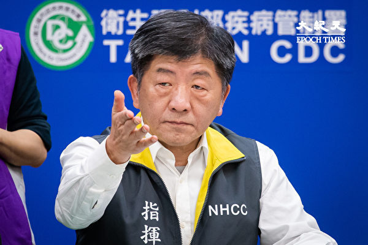

台湾抗疫登上美国医学杂志，专家认为这是他国典范。图为指挥中心指挥官陈时中。 （陈柏州／大纪元）

【大纪元2020年03月04日讯】（大纪元记者吴英编译报导）新冠病毒（COVID-19）蔓延全球，部分国家病例数据激增，与中国大陆毗邻的台湾，并没有出现专家预测病例迅速增长的情况。

台湾的应对得宜，美国公卫专家在知名期刊发表评论文章表示，这是他国典范。

斯坦福大学小儿科副教授、“政策、成果和预防中心”（Center for Policy, Outcomes and Prevention）主任杰森・王（Jason Wang，中文名王智弘）3月3日在《美国医学会杂志》（The Journal of the American Medical Association, JAMA）发表题为《台湾因应COVID-19》（Response to COVID-19 in Taiwan）的评论文章，探讨台湾以大数据分析、新科技，以及积极检测等方式，应对突如其来的新冠病毒。作者认为台湾迅速采取行动，有效预防大规模流行病，对其它国家具有指导意义。

台湾距离中国大陆沿海仅81英里，每天往返中国的航班频繁。此外，台湾人口2300万，其中85万人居住在中国，40.4万人在大陆工作；2019年，271万大陆游客前往台湾。作者认为，在这些条件下，如果推定COVID-19在台湾爆发的可能性大于其它国家，一点也不为过。

然而，台湾自从2003年严重急性呼吸道综合症（SARS）后，就一直对可能来自中国大陆的流行病保持警戒，随时做好准备。

<b>台湾应对方式概述</b>

COVID-19爆发在中国新年之际，通常在这段期间，数百万中国人和台湾人会选择旅行。为预防病毒扩散及保护公众健康，台湾政府迅速动员并制定具体方法来识别、控制和分配资源。

台湾运用其国民健康保险数据库，并将之与移民和海关数据库结合在一起，开始创建大数据进行分析。这个分析可以帮助医疗机构，在病人就诊时掌握他们的旅行历史，再根据他们的临床症状判断是否要进一步检测。

另外，台湾还使用了新技术，包括用QR码扫描在线报告旅行历史和健康症状，根据每个人过去14天的搭机情况和旅行历史，区分他们的传染风险。

对于低风险群者（没有前往3级警报区域），台湾相关部门以短信发送健康申报边境通关信息到他们的手机，以加快他们的出入境手续；对于那些被归类在较高风险群者（最近曾去过3级警报区域的旅客），会要求他们居家隔离，并通过手机追踪行踪，以确保他们在潜伏期间一直待在家里。

此外，台湾政府根据国家健康保险（NHI）数据库信息，主动寻找出现严重流感症状的患者。这些患者的流感检测虽然呈现阴性检测，但台湾医疗机构仍对他们进行COVID-19的检测，以提高新冠发现率遏制传播。在这个过程中，台湾找到了113名这类病患，并因此发现其中1人感染COVID-19。

台湾中央政府还设立免费电话热线1922，提供民众举报自己或他人可能出现疑似症状。由于该热线电话已满载，因此中央政府请地方政府创建自己的热线电话。

台湾政府还采取了关怀行动，对患者及被隔离者提供食物、经常进行健康检查，以及鼓舞他们。

<b>高度危机意识</b>

萨斯爆发后的第二年（2004年），台湾政府建立了“国家卫生总指挥中心”（NHCC），负责灾难管理，专注于应对大规模疫情，是协调中央、区域和地方的作战指挥中心。

NHCC结合中央流行疫情指挥中心、生物病原灾害中央灾害应变中心、反生物恐怖攻击指挥中心及中央紧急医疗灾难应变中心等功能，共同架构完整的防灾启动机制。

2019年12月31日，世界卫生组织（WHO）接到中国武汉市出现不明肺炎的通知，台湾官员立即展开登机筛查从武汉直飞到台湾的乘客，没有发热和肺炎症状者才能下飞机。

此外，台湾早在2020年1月5日就扩大筛查范围，包括过去14天曾到武汉旅行，入境时出现发烧或上呼吸道感染症状的任何个人；对疑似病例进行的筛查扩大到26种病毒，包括SARS和中东呼吸综合征（MERS）；由国外返回出现发烧和咳嗽症状的旅客，被要求在家中隔离，并由卫生人员评估是否需要住院。

1月20日，虽然当时中国仅报导了零星病例，但是台湾疾病控制中心（CDC）正式启动了由NHCC领导的武肺专案CECC，由卫生福利部长担任指挥官，每天召开新闻发布会，协调包括交通运输、经济、劳工、教育部，以及环境保护总署等多个部会应对危机。

<b>危机处理</b>

1月20日至2月24日，CECC迅速制定并实施了至少124个行动项目，包括空中和海上边界管制、使用新数据和技术确认病例、隔离疑似病例、主动发现病例、评估和管理的资源分配、教育公众、及时公布错误信息及假新闻、与其它国家和地区进行谈判、制定学校应对政策及托儿，以及减轻企业负担等。

<b>边境管制、确诊病例和遏制病毒</b>

1月27日，台湾的健康保险局（NHIA）和移民局（National Immigration Agency）在一天之内完成台湾民众过去14天的旅行历史与健保资料的整合；通过户口登记系统和外国人入境卡，追踪由新冠病毒疫区飞到台湾的高风险旅客，并对被确认是高风险居家隔离的人士，通过其手机进行电子监控。

1月30日，NHIA数据库扩大到过去14天去过中国大陆、香港和澳门的旅客。

2月14日启动了入境检疫系统，旅客可以在出发或到达台湾机场之前，通过扫描QR码进入在线表格填写健康申报表。然后，健康申报通行证会通过台湾电信运营商的SMS传送到个人手机上，从而使风险最小的人可以更快速地办理出入境手续。该系统是在72小时内创建的。

2月18日，台湾政府所有医院、诊所和药房都可以访问患者的旅行历史。

<b>资源分配</b>

CECC在资源分配方面发挥了积极作用，包括确定口罩的价格，以及动用政府资金和军事人员增加口罩的生产。1月20日，台湾CDC宣布，已准备了4,400万个外科口罩、190万个N95口罩，以及1,100个负压隔离室。

<b>信息传播及与民众沟通</b>

为了达到最大透明度及传播最新信息，卫生福利部长每天召开新闻发布会，报告最新病例及公共政策。此外，台湾副总统（知名流行病学专家）定期向公众报告最新进展，并通过互联网发布。这些公告包括戴口罩的时间和地点、洗手的重要性，以及囤积口罩将使一线医护人员处于危险之中。CECC还制定了计划来协助学校、企业及被迫休假的劳工。

<b>民众反应</b>

根据台湾民意基金会于2月17日至18日对1,079人进行的民意调查，超过80%受访者认可卫生福利部长应对武肺疫情的能力，总统和行政院长的表现则获得将近70%的支持。

截至2月24日，台湾确诊30病例，在受影响国家中排名第十，但是远低于最初模型预测台湾可能是风险第二高的地区。
挑战

作者在文章中提出了台湾在整个抗疫过程面临的已知及未知的挑战。首先他提到台湾提供的实时信息主要使用的语言是中文和手语，除了CDC网站，没有足够的其他语言与在台湾旅行或居住的非台湾公民进行交流。

其次，1月31日，钻石公主号游轮由台湾出发前往日本前，曾被允许在基隆停靠，并允许乘客下船。随后该游输上的部分乘客在日本被确诊感染。这起事件引发台湾公众对社区传播的担忧及恐慌，台湾政府公布了游轮旅客可能在台湾去过的50个地点，并要求可能与该旅游团接触的公民进行症状监测和必要的自我隔离。所幸14天后，没有人被确诊感染COVID-19。

第三，目前尚无法判断，台湾政府的抗疫措施能否维持到流行病结束，并且持续为公众所接受。
结论

台湾政府从2003年的SARS经验中吸取了经验，并建立了公共卫生应对机制，为下一次流行病危机采取迅速行动做好准备。在武肺爆发初期，训练有素经验丰富的官员团队迅速意识到危机，并立即启动了应急管理机制。

在危机中，政府通常会在不确定性和时间限制下做出艰难的决策，而且这些决定必须同时考虑到文化差异及敏感问题。通过对危机事件的早期认识、每天向公众报告最新情况，提供浅显易懂的卫生信息等，台湾向其民众公开及时、准确、透明的流行病信息，从而使公众安心。

台湾迅速应对危机及保护其公民利益的作法，是他国的一个典范。#

<a target="_blank" href=#top><h6 align="right">回上方</h6></a>

<a name=78>
<h1 align="center"><b>航班取消军机坠落 政变传闻四起 习近平势危</b></h1>

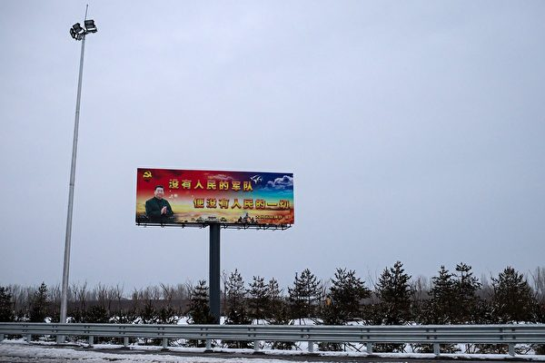

3月5日，深圳、广州取消当晚飞往北京、上海的航班，当天下午还发生军机坠毁在天津市武清区的事件。引发许多京城发生政变未遂的联想。图为北京高速公路旁巨型宣传看板。(NICOLAS ASFOURI / AFP)

 
 【大纪元2020年03月09日讯】（大纪元记者齐先予香港报导）上周四（3月5日）下午5点多过后，从深圳、广州飞往北京、上海、南京和杭州等多个城市的航班突然被取消，当天并传出有军机坠毁在天津武清区的消息，据指京城发生政变未遂事件，大陆政局不稳。有评论指，目前中共高层内斗十分激烈，“习近平的处境其实很危险”。

有消息说，班机取消的原因是“公共安全原因”，暗指与目前的疫情有关。不过，当天下午还发生军机坠毁在天津市武清区的事件。许多猜测，把两个事件联系在一起，并带出真假难辨的各种传言。

<b>网民：林彪事件重演？</b>

3月5日，天津武清区军机坠毁现场，浓密的黑烟直冲天空，现场不断传出疑似爆炸声，引来不少民众围观。事件发生后不久，多辆警车及消防车抵达现场。网络流传多个相关的影片，影片中有民众说，刚才看见飞机掉下来，机师跳降落伞逃生。还有民众说：“飞机掉下来（爆）炸了！”

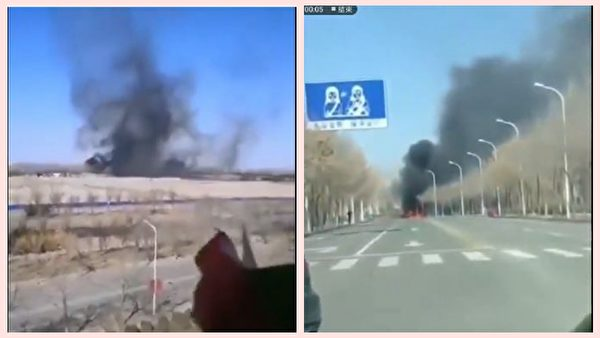

天津武清区3月5日发生军机坠毁事件，浓密的黑烟直冲天空。（影片截图）

不少网友纷纷跟帖发表言论：“禁飞民航，又掉军机。估计有重臣出逃，被打下了。林彪事件重演。”另一位网友发推文称，事件发生在天津武清区碧溪秋园，属于北京附近，中部战区地盘儿，传闻东部战区发生军变，难道是林彪事件再现？

还有推友透露：“来自国内提供的消息说，东部战区动用了火箭炮击落战机。”

<b>刺杀习？被火箭炮击落？</b>

一位推友帖文称：“就在大陆万架航班停飞不久，天津劲爆共军战机坠毁惨剧发生，有分析认为与中共内斗白热化程度有关……”

另一推文称：“事件发生在天津武清区碧溪秋园，属于北京附近，中部战区地盘，传闻东部战区发生军变，难道是林彪事件再现？”

有网友爆料说，政变发生在石家庄，是习近平的一个侍卫，受人指使，要刺杀习。也有的说，政变发生在浙江，是中共军委副主席郭伯雄的儿子郭正钢主使的。

郭正钢一直被郭伯雄安排在浙江管军队，2013年郭正钢升任浙江省军区党委常委、政治部主任，副军级。郭正钢在军队很猖狂，曾放言：“有人想搞我们家，做白日梦，全军干部一半以上是我家提拔的。”

2016年7月25日，郭伯雄因受贿罪一审被判处无期徒刑，褫夺上将军衔。郭伯雄被捕后，郭正钢也被调查，但最后习近平并没有处罚郭正钢。

在YouTube上，一个署名“蒋罔正Edwin尹科”的账号，在3月5日的直播中称：郭正钢在莫干山罗心谷刺杀习近平！张旭东、杨晖中将造反！秦卫江、王新海护驾！车俊、袁家军关闭萧山机场。

同一天，他还称：“习近平糟（遭）刺杀！华东兵变在即！南平糟张旭东杀人灭口！郭正钢率死士刺杀习近平！王新海率七十二军护驾。”

这位爆料者，从3月2日就开始播出多个有关习近平的消息，包括“习近平被感染？彭丽媛确诊！钟绍军（中央军委办公厅主任、解放军选举委员会委员）护送习近平、习明泽（习女儿）出京。莫干山罗心谷封禁”，等等。

另外，在社交自媒体上，标注“政治经济学者”的网友“Cheng Kaifu”也称，大陆6日发生政变未遂事件，“各个机场停飞几个小时，目前虽失败，人没抓到”。他还称：“天津军机坠毁！控制太严了，没把习近平搞定很可惜，很多人要搞他，堵了太多人。”

该推文还批习近平走毛泽东路线，开历史倒车。甚至称习的精神也有问题，对谁都不信任。最后还强调：“以上根据，都是事实绝没任何凭空捏造。”不过，他对媒体发出的查询一直未作回应。

网友“小札”也在社交平台提到北京可能发生政变，她说：“接下来的北京会有很多这样的飞机被‘坠落’，一次次的失败，就会有一次‘关键’的成功，这是上天对我们的考验……大幕开启，一切已经开始！”

中共官方对天津军机坠毁事件一直保持沉默，未作任何说明。

<b>专家：习近平处境很危险</b>

华府中国问题专家石藏山评论说，虽然外界难以知道内情，但目前中共高层确实非常混乱，内斗十分激烈。

“大量航班突然被取消，2015年也发生过，当年3月，令计划的弟弟令完成出逃美国，据说他带了很多中共绝密文件，中共竭力拦截，但最后他还是成功跑掉了。”

石藏山没有评论网上的政变传闻，“不过，这和前不久习近平女儿习明泽的爆料有吻合的地方。”

他指，十九大后，习近平修宪之后，所有内外政策都显得犹犹豫豫、没有力度，“感觉他又被拖回到刚上台时的困境中了”。石藏山强调：“习近平的处境其实很危险了”。

<a target="_blank" href=#top><h6 align="right">回上方</h6></a>

<a name=77>
<h1 align="center"><b>江苏工厂大火 上海宝钢厂区高炉爆炸</b></h1>

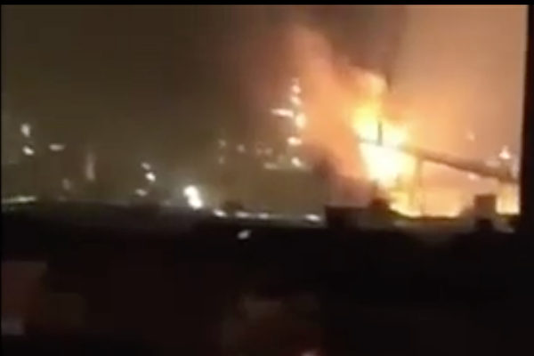

上海宝钢厂区发生爆炸。（视频截图）

【大纪元2020年03月09日讯】3月8日，江苏常州一家工厂刚发生大火不久，上海市的宝钢集团厂区也发生爆炸，现场有大量火光，并伴随爆炸声。

上海消防发布消息称，2020年3月8日22时53分，上海宝山区纬一路四高炉发生火灾。初步了解是厂区内一高炉热风管道机器损坏，内部高温气体喷出。消息还称现场无人员伤亡。

但消息并未公布是什么工厂，随后，北京日报旗下微信公众号《长安街知事》披露，宝山区纬一路为宝钢股份厂区所在地。宝钢为美国《财富》杂志评选的世界500强企业之一。

爆发发生后，多位网友在微博上发布疑似现场视频，火光中伴有巨响。

就在上海宝钢厂区发生高炉爆炸之前，3月8日下午，江苏常州赛蓝光伏技术有限公司提纯车间发生火灾，网友拍摄的现场视频显示，现场浓烟滚滚火光席卷整个楼顶。

据陆媒报导，大火发生在3月8日下午14时许，常州赛蓝光伏技术有限公司有八名工人在一楼提纯车间进行锅炉测试，在测试过程中于下午16时50分许，因中频炉烘炉过程中，新打的炉衬击穿，铁水接触水导致起火。

常州市政府应急值班电话工作人员称，截至21时30分，暂时未有人员伤亡。

据称，爆炸的厂房去年刚刚建成。

<a target="_blank" href=#top><h6 align="right">回上方</h6></a>

<a name=76>
<h1 align="center"><b>雪上加霜！中国东北地区爆发甲肝疫情</b></h1>

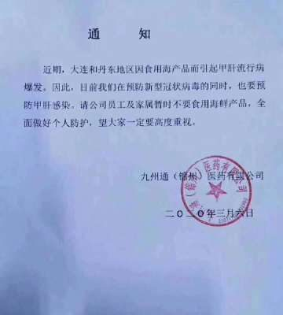

中国九州通医药有限公司6日发出通告：“近期，大连和丹东地区因食用海产品而引起甲肝流行病爆发。”（来自微博）

 
 【大纪元2020年03月08日讯】中国大陆武汉肺炎疫情未了，一张疫情通告在微博疯传，显示近期东北地区出现甲肝疫情，当地疾控中心已证实消息，并表示目前疫情正在扩大。网民认为，此消息对中国大陆来说无疑是雪上加霜。

3月7日晚间，一则加盖了“九州通（锦州）医药有限公司”公章的《通知》在网络流传，该《通知》称，“近期，大连和丹东地区因食用海产品而引起甲肝流行病爆发。因此，目前我们在预防新型冠状病毒的同时，也要预防甲肝感染。请公司员工及家属暂时不要食用海鲜产品……”落款时间为3月6日。

《每日经济新闻》报导，对此，有九州通工作人员证实该《通知》为真实的。

7日晚，大连市疾控中心工作人员也对媒体证实：大连确实有出现甲肝病例，但其称，目前疫情还在散发状态，没有到集中爆发（状态），如果有集中爆发的情况，疾控中心将进一步发布预警。并建议民众食用海鲜一定要煮熟，不要生吃。

该工作人员还表示，甲肝属于一种流行病，截至目前的数据显示，（发病率）比去年同期的比例大概高1.2%—1.4%。

目前武汉肺炎疫情未见任何拐点迹象，中共无限期推迟全国“两会”的召开时间。这些被外界解读为疫情根本没有控制住。此时，东北地区再爆发甲肝流行病，被网民认为是祸不单行，雪上加霜。

网民“老叟看资讯”：新冠肺炎病毒还没整明白，甲肝流行病又爆发了！

网民“两个耳朵宝贝”：我的天啊！这是怎么了？

网民“六月雪寒心”：庚子年灾疫不断！

网民“林继明”：破屋更遭连夜雨，漏船又遇打头风！

据悉，甲肝病毒会引发人类肝脏发炎、病变，主要传播途径是口粪传染，患者通常会出现食欲不振、全身疲劳，肝脏肿大、肝功能异常等症状，还有些患者伴随明显的黄疸症状。

<a target="_blank" href=#top><h6 align="right">回上方</h6></a>

<a name=75>
<h1 align="center"><b>颜丹：中共“一定能战胜新冠肺炎疫情”？</b></h1>

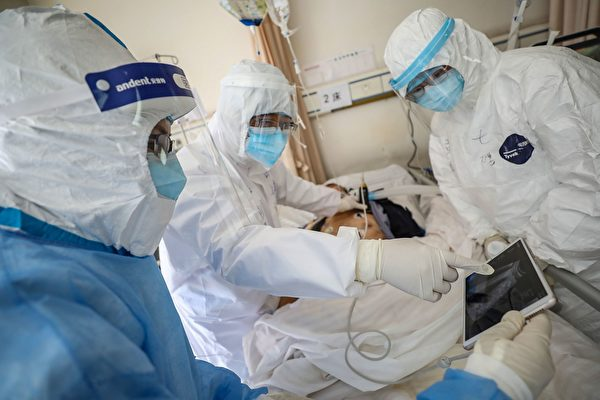

图为示意图。(STR/AFP via Getty Images)

 
 【大纪元2020年03月10日讯】最近，美国NGO自由之家发布了“2020年全球自由报告”。在针对“公民自由”（满分为60分）与“政治权利”（满分为40分）所进行的评比中，中国大陆取得的成绩分别为11分和负1分，且最终以10分的总成绩被列为“最不自由国家”，是“15个表现最差的国家之一”。

只得“10分”是什么概念，与它国间有何差距，我们不妨以台湾获93分的结果来作为参照。台湾、大陆的情况如此悬殊又表明了什么，亦可先从自由之家本身及其“全球自由报告”的性质说起。有资料显示，“自由之家是一家独立监督机构，旨在支持民主变革”；“从70年代初起，该机构每年发布报告，监测全球政治权利和公民自由情况”。

也就是说，该机构的评分结果足以表明一个国家基于公民的政治权利和自由所反映出的民主程度。你国是不是民主国家，仅在“公民自由”和“政治权利”上所取得的分数高低就很能说明问题。

去年11月，即武汉肺炎爆发前夕，习近平已花式解读过中国当前的“民主”。他说，中国是“人民民主”，并首次提出“是一种全过程的民主”，“所有的重大立法决策都是依照程序、经过民主酝酿，通过科学决策、民主决策产生的”。尽管一句话就碎碎念了4个“民主”，但这种只挂在嘴上的“民主”，不过是假借其名而已；目的更在于掩盖中共的极权专制，为独裁暴政洗白。

然而，黑就是黑，白就是白。若把黑说成白，那就是在颠倒黑白、以假乱真。要想甄别黑白、真假，不妨将其放在世界舞台上来进行比较。

看中共执政下的中国，“10分”到底是个啥民主？在“政治权利”上不但不得分，反而还要负1分的中国人又给哪位领导人投过票？而“公民自由”仅11分，则更是在告诉全世界，整个中国就是被中共“老大哥”监视的牢笼。在这种肃杀、恐怖的环境中，请问普通老百姓还有机会“搞政治”吗？

中国不民主、中国人不自由已到了“最”的地步，却非要说中国民主、中国人自由；这显然是赤裸裸的欺骗。几十年来，洗脑不就是中共至始至终都在使用的骗术吗？骗老百姓说中国是民主国家，就意味着中共永远都不会改变“一党专制”的现状；一如既往的实施极权暴政，就意味着中共永远都不会把人民当“公民”，且依法赋予其任何权利。

如今大疫当前，中共还放话说“我们一定能战胜新冠肺炎疫情”。这话首先要质疑的，就是“我们”一词。中共若以为，此时还能代表人民，那就大错特错了。

要知道，灾难降临于一个国家，最能考验的不是人民，而是政府。作为当今中国的执政党，中共有道义、有责任、有义务保障人民的生命、财产安全。况且，中共遇事就说，要“坚持党的领导”。而“对这次疫情的防控工作”，习近平也表示，“我一直在亲自指挥，亲自部署”。可见，中国当下每一条人命的生死都与中共的作为有着最直接、最密切的关系。

但问题是，在过去两个月中，中国染病、死亡的人数都远远超出预期，基本是以家庭计。仅从“方方日记”中就能看到，“不是一个人死，而是一家人在几天或半个月内，全部死光”；“死亡者似乎离自己越来越近。邻居的表妹死了。熟人的弟弟死了。朋友爹妈和老婆都死了，然后他自己也死了”；而“剩下的，除了等死，又能如何？”

在夺命的病毒面前，十几亿中国人似乎已被分成了两拨，即死亡者和等死者。难以计数的老百姓生命垂危、濒临绝境，中共还好意思说“战胜疫情”？短短数十天，无论是感染率还是死亡率，中国都远超其它国家，这难道就是一种“战胜”？那么请问中共，在厉害的国彻底战胜病毒之前，还会有多少人要被送进焚尸炉？

看来体制不同，对“战胜”一词的理解也如此不同。在国家自由度的评比中，实施民主宪政的台湾在“政治权利”和“公民自由”这两项中分别获得了37分和56分的好成绩，并以93分的总分被评为“自由”之地。

更重要的是，与中共一党治下的中国相比，完全赋予民众合法权利和自由的台湾在大量人潮返乡、疫情延烧至今的恶劣情况下，已将确诊以及死亡病例分别控制在40余人以及1人的数量上了。

与疫情爆发地的中国大陆近在咫尺，台湾到底是如何做到的？

首先，理应归功于民主政体。最近，法国有媒体撰文称，“台湾的危机处理方式堪为典范”。在分析“台湾能成功抗疫”的原因时，该媒体指出，一是“台湾政府快速的资讯与反应能力”；二是“资讯透明”。这意味着，政府第一时间就公开发布了最真实的疫情讯息，并且进行了有效的防控。

蔡英文政府为何不敢拖、不敢瞒？显然就是因为稍有差池、防控不力，就可能被台湾的选民选下台，从而让其政府失去执政合法性。可见，民主体制最明显的特征之一就是，人民无需恐惧政府，而政府却需要忌惮民意。连法国的媒体都说，此次台湾足以证明，“在对抗这类流行病上，民主制度比共产极权专政更有优势”。

仔细想来，共产极权倒是从来都不忌惮民意，并且只搞愚民、洗脑的那一套：说骗你都是为你好，鼓励你为国、为党牺牲。中共防疫两个月来不都是这样吗？你死了你倒楣，除了军警、医护是先进、是英烈，其他人连数字都算不上，因为它是厉害国、伟光正，只有“出院率”和“治愈率”。

除了民主，台湾此时的成功与幸运恐怕还得归功于“反共”的信念。放眼世界，虽然正面例子不太多，但反面例子却不少。

最近，有人发帖称，“一带一路在亚洲和欧洲的两个中心站，伊朗+意大利，在领受金钱的沐浴的同时，也享受到了最高级别的武肺病毒关照。这说明，上苍是公平的，要索取，就得要付出。只是，索取的是钱，付出的是命！”

这话足以表明，中共比病毒还毒，一点都不能碰，你与它的远近亲疏直接决定了你的得失与未来，国亦然，人亦然。此外，这种因果关系倒是很符合共产邪灵的终极目的，那就是毁灭人类。况且，被金钱所诱的人，往往更容易上魔鬼的当，离“误了卿卿性命”仅一步之遥。

直到今天，自由与不自由的国家都仍在用现状表明，只有实行民主、走上宪政之路，且认清中共的本质、不为魔鬼所诱，才能走出险境、渡过难关。对于亿万被中共挟持、活在“最不自由国家”的中国人来说，要想真正的战胜病毒、自保自救，必得推翻极权暴政、解体中共，且从此远离邪恶、回归良善才行。中国人活在不自由的当下，只可能被沦为暴政的牺牲品。不战胜中共这个最大的病毒，任何疫病都可能卷土重来。

<a target="_blank" href=#top><h6 align="right">回上方</h6></a>

<a name=74>
<h1 align="center"><b>【有冇搞錯】政變 暗殺 事故 3月5日發生什麼</b></h1>

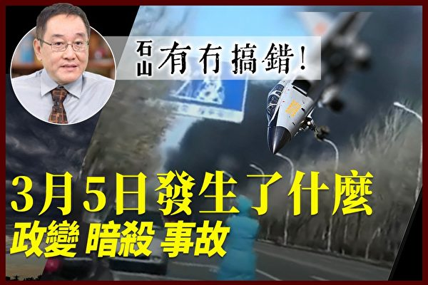

大紀元《有冇搞錯》製作組

 
 【大紀元2020年03月10日訊】上個星期，中國發生了兩件事。

上周四，也就是3月5日，首先是廣東這邊的網友發出消息，深圳和廣州飛往北方的班機，只要是飛北京的班機被大量取消。很快有網友發現，不僅是飛北京，飛上海、杭州和南京的飛機也取消了。也有消息透露，上海飛北京的飛機也有很多被取消。

不久，就傳出了當天在天津郊區的武清，有一架飛機掉下來了的消息，而且是一架軍用飛機。隨後，就有北京發生未遂軍事政變的傳聞出現。

這個消息太驚人，但卻只有太少的資訊。今天，我們來一起分析一下這個事件。

我們先看一下網上的各種消息。

先看一下班機取消的情況。各種發在網絡上的截頻顯示，廣州和深圳宣佈取消班機的狀況。也有別的地方取消班機的情況。

有網友發出中國空中航班飛行的即時情況。這個叫做非常準的APP，可以即時顯示中國空中民航班機的情況。當時有網友發出的貼圖表示，3月5日下午，中國上空的航班突然大量減少了。（可惜，我們沒有把當時網友的貼圖存下來。）

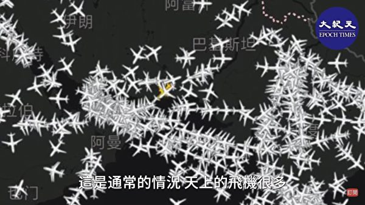

（圖一）

 
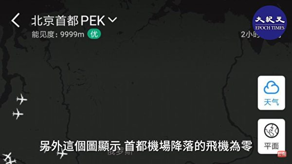

（圖二）

這是通常的情況，天上的飛機很多（圖一）。這個圖顯示，首都機場降落的飛機為零（圖二），這顯然不太正常。所以有網友認為，中國出大事了！

隨後不久，網上熱傳多個影片，天津武清區3月5日發生軍機墜毀事件。現場的影片，有濃密的黑煙直衝天空，同時不斷傳出疑似爆炸聲。在影片中有市民說，剛才人們都看見了，飛機掉下來了，飛行員跳傘。還有市民說，好像是轟6還是轟7，掉下來（爆）炸了！而且，很快，估計大約三五分鐘之後，就有多輛警車及消防車抵達現場。

感覺上，應該是天津軍機墜機在先，而民航取消班機在後。這個比較合乎邏輯。但是，也有網友發出的貼圖說，廣東班機取消的通知，在3月4日就已經發出了。如果是這樣，那問題就更複雜了。這是我們能夠看到的客觀的情況。

下面再看一下各路神仙的評論。這都是網友的評論。

標註「政治經濟學者」的網友「Cheng Kaifu」稱，大陸發生政變未遂事件，「各個機場停飛幾個小時，目前雖失敗，人沒抓到。」他還稱，「天津軍機墜毀！控制太嚴了，沒把習近平搞定很可惜，很多人要搞他，堵了太多人。」該推文還批習近平走毛路線，開歷史倒車。甚至稱習的精神也有問題，對誰都不信任。最後還強調：「以上根據，都是事實決沒任何憑空捏造。」

有人說，「來自國內提供的消息說，東部戰區動用了火箭炮擊落戰機。」

有人說：「禁飛民航，又掉軍機。估計有重臣出逃，被打下了。林彪事件重演。」

一位推友貼文稱，「就在大陸萬架航班停飛不久，天津勁爆共軍戰機墜毀慘劇發生，有分析認為與中共內鬥白熱化程度有關……」

另一推文稱，「事件發生在天津武清區碧溪秋園，屬於北京附近，中部戰區地盤兒，傳聞東部戰區發生軍變，難道是林彪事件再現？」

當然也人認為是普通事故，「天津武清有一個小型表演戰機訓練基地，主要作用是為國慶閱兵儀式的飛行表演做準備，總出事故，去年還有幾個飛行員死了呢。所以，這種飛機出事故太正常了，本來因為軍隊貪腐問題嚴重，飛機質量就不行。」
發生政變刺殺習？被火箭炮擊落？

首先說一下那個「國內提供的消息」，說「東部戰區動用了火箭砲擊落戰機」。這個恐怕不太準確，第一，火箭砲不是一種放空武器，當然，如果他說只是一個大概情況，而不是軍事用語，比如說的其實是導彈，那是另外一回事。因為火箭砲不是精確武器，普遍用於地面的砲火覆蓋，特點是密集打擊，不是一種防空武器。

第二，說「東部戰區」，也不太可能。現在中國五大戰區，北京、、天津、河北一帶，屬於中部戰區，鄰近的山東，其實屬北部戰區，東部戰區最近的在江蘇北部的徐州一帶。除非它使用中程的防空導彈，否則不會打到天津那邊去。東部戰區，用火箭砲更不可能。

在現場影片中，有人說是「不是轟6就是轟7」，這個有些讓人混淆。轟6是中型戰機，70年代開始裝備，機身長34米多，翼展33米。而轟7，正規的說法應該是殲轟7，是一種戰鬥轟炸機，就是又可以空中搏鬥，又有地面轟炸支援功能，機身要小得多，機長只有22米多，翼展大約12米，兩種機型體型相差很大，外型外觀也相差很大。當然，也可能現場這位人士不清楚其中區別。

不過對一般外行人來說，如果是轟6，大概會說是轟炸機，那位老兄說是戰鬥機，所以最可能的情況，真的是比較小型的軍用飛機。所以後來有人說有一個飛行員跳傘了，就比較符合實際了。因為通常轟6有多名機員，最少有三個人。

還有一件事值得注意。墜落的飛機，還傳出多次的爆炸聲音。是否說明飛機上真的帶著彈藥呢？如果帶著彈藥，在距離北京這麼近的地方，要幹什麼呢？

天津武清區，在天津的北邊，也是天津最接近北京的區。旁邊就是廊坊了，距離北京六環大概就四十公里，距離北京市中心，也就六七十公里。普通的亞音速軍機，就算是轟6這種飛得慢的，一個小時也可以飛七百公里，從天津武清飛過去，也就幾分鐘時間。

而且，空軍戰機執行某種暗殺任務，確實是最容易也最可能的。其他軍兵種，需要大範圍的配合協作，只有空軍戰機，一個飛行員，一個架次就可以行動。現在美國在中東的定點行動，也都主要是依靠空中執行。而且政變或者暗殺這種事情，人越多越容易走漏消息。所以，網友的分析也頗有道理。

但另一方面，如歸真的是軍事譁變，或者是軍事政變。事發之後，中國天上的飛行控制，恐怕不會是只有幾個小時。1971年林彪出逃，全中國天上的飛機停了三天。如果真有暗殺或者政變行動，最高當局一定會採取更大範圍的清查行動，空軍最高指揮官一定首先被拿掉，然後全面清查，而且會有不同尋常的軍事調動，感覺上，最少幾天時間才會結束。

雖然有很多難以解釋的問題，但總體看來，這個事件更像是普通的軍機事故，但事情發生在距離中南海幾十公里之外，確實容易讓人產生各種聯想。不過，各種政變的傳言不絕於耳。有網友爆料說，政變發生在石家莊，是習近平的一個侍衛，受人指使，要刺殺習。也有的說，政變發生在浙江，是郭伯雄的兒子郭正鋼主使的。這些好像和天津軍機墜落事件都無法直接拉上關係。

在YouTube上，還有一個「蔣罔正Edwin尹科」網友，在3月5日做的直播節目稱：【習近平被迫下野】6：郭正鋼（郭伯雄的兒子）莫干山羅心谷刺殺習近平！張旭東、楊暉中將造反！秦衛江、王新海護駕！車俊、袁家軍關閉蕭山機場。

同一天，他還稱，「習近平糟刺殺！華東兵變在即！南平糟張旭東殺人滅口！郭正鋼（郭伯雄的兒子）率死士刺殺習近平！王新海率七十二軍護駕。」

這位網友從3 月 3 日就開始做【習近平被迫下野】系列節目，稱「習近平走蔣介石老路？習近平避居浙江羅心谷！還談到中部戰區副司令員張旭東造反！原一軍二師師長南平（山東武警部隊司令員）被殺！等等。

網友「小札」也認為北京可能發生了政變，她說：「接下來的北京會有很多這樣的飛機被『墮落』，一次次的失敗，就會有一次『關鍵』的成功，這是上天對我們的考驗……大幕開啟，一切已經開始！」

看來不少人希望中共最高層出事，而且是出大事，有點千夫所指的味道，否則不會有這麼多傳言和這麼多人轉載類似的消息。

中共歷史上的政變，主要有兩次，都造成了局勢的巨大改變。第一次是林彪事件。說林彪搞了571工程紀要，要殺掉毛澤東。結果是林彪出逃，身死外蒙古。這個事，成了毛澤東文化大革命的一個轉折點，在此之後，黨內反毛，或者說反文革的勢力不斷集結，最後在毛澤東死後，主管軍委的葉劍英，和主管中央警衛部隊的汪東興合作，搞了另一次軍事政變，抓了四人幫。後來才有鄧小平復出，和中國的改革開放。

不過這一次的事件，就我個人的判斷，更可能只是一起軍機事故而已。各位如有什麼不同看法，歡迎留言討論。

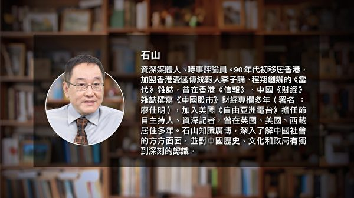

<a target="_blank" href=#top><h6 align="right">回上方</h6></a>

<a name=73>

神韵艺术团2020年3月8日在纽约林肯中心大卫寇克剧院演出结束时，演员谢幕。（戴兵／大纪元）

 <h1 align="center"><b>神韵纽约爆满 精英“真切感受到神与希望”</b></h1>
 
 【大纪元2020年03月09日讯】3月8日下午，神韵艺术团在纽约林肯中心大卫寇克剧院（The David H. Koch Theater at Lincoln Center）的第五场演出爆满。

神韵复兴人类正统艺术，弘扬传统价值观，开创当今艺术新潮流。

越来越多的名流、商界精英争相观看。有人盛赞神韵服饰绚丽多彩，有人为神韵感人的舞剧故事所深深触动，有人为神韵的神性内涵所启迪所唤醒而心生感恩，人们为神韵打造如此洗涤人心的传统文化盛宴而赞佩不已。

“感受到了神就在那里”，公司创办人欣喜地欢呼，“我宛如腾云驾雾。”

知名制药公司会计主管由衷地感佩：“舞蹈所传达的信息很美丽，令人惊叹，给人带来希望。”

音乐界名人：“整场演出都令人陶醉，这是不能错过的演出。”

著名画家感觉自己“被神韵洗净”，“感受到一种本性被唤醒的感觉”。

<b>神韵完美展现精神文明 公司总裁收获丰</b>

2020年3月8日下午，资深税务顾问、税务公司总裁William Stevenson与太太Joan Reed欣赏神韵艺术团在纽约林肯中心大卫寇克剧院的第5场演出。（卫泳／大纪元）

 
 “很荣幸观看这场演出！”William Stevenson观赏神韵演出后开心地说。Stevenson是资深税务顾问，也是税务公司National Tax Consultants的创始人之一、公司总裁。该公司拥有35年的历史，为全美50个州的企业和个人提供税务相关服务。

Stevenson开心地表示，“我们都非常喜爱这场秀！”“很荣幸观看这场演出，”Stevenson说，“神韵质量高超，甚至难以找到合适的词汇来形容。”

神韵中国古典舞绝美的舞姿与色彩绚丽的服饰相映成辉，令他啧啧称赞，“演出（服饰）运用了高质量的绸缎面料，令人惊艳；再有，女子的舞蹈动作细腻流畅，犹如在舞台上飘动，而不是挪动步伐，这非常独特。”

他更盛赞神韵节目在精神方面给自己带来的愉悦，“精神层面展现得非常完美，对我有很大帮助，他们（神韵演员）做的这些，让我感到非常开心。”

<b>公司创办人“腾云驾雾”：神就在那里</b>

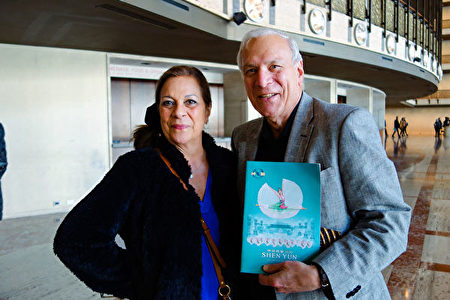

2020年3月8日下午，纽约长岛一家会计公司的创办人Richard Libero偕太太Delores观赏神韵艺术团在纽约林肯中心大卫寇克剧院的第5场演出。（贾谊／大纪元）

 
 纽约长岛会计事务公司“Libero and Kappel”的创办人和合伙人之一Richard Libero偕太太Delores观赏神韵后，连连称赞演出的艺术性“卓绝非凡，令人难以置信”；而神韵通过舞蹈、服饰、动态天幕、歌唱等形式传递的神性内涵，更远超他的预期，“感受到了神就在那里”。看完中华文化秀的他如此地轻盈喜悦，他说，“离开这里时，我宛如腾云驾雾。”

“和我想像的不一样，演出超过预期，如梦似幻，我喜欢，喜欢所有的一切。”他说。

神韵的一幕幕舞剧通过观众喜闻乐见的小故事，展现神传文化内涵，让Libero感到远超预期。“我坐下来之后想，演出可能就是跳舞，我没有意识到会有故事让你仿佛身临其境、参与其中。很多时候我都感觉自己是整个场景的一部分，因为我想要了解更多，真的如此。非常非常出色，非常出色。”

Libero对所有的舞剧都印象深刻，因为“对神的信仰是很有力量的主题，在这里，我们感受到了神就在那里。”

从神韵的歌唱节目中，Libero也感受到神性的内涵。“歌唱家的演唱简直令人难以置信。两位歌唱家——女歌唱家和男歌唱家唱出的歌词，是我先前没有意识到的，我甚至没想到歌词会和神、创世有关。”

就整台节目而言，Libero强调，“信仰神的主题非常耐人寻味。她让你震撼，无须提及基督或耶稣或是整个一套（宗教）形式，你感到神都是一体，是一位主神，只是你想要一个名字而已。演出中并没有说神的名字是什么，但观众明白演员在表达什么。令人难以置信。”

<b>知名制药公司主管感佩：神韵带给人希望</b>
 

2020年3月8日，一家公司运营经理Ben Robinson（右）和美国一家知名制药公司的会计主管Mariola Robinson（左）一起观看神韵艺术团在纽约林肯中心大卫寇克剧院的演出。（李辰／大纪元）

 
 Mariola Robinson是美国一家知名制药公司的会计主管，她说：“我爱神韵演出，这是我第二次回来观看，我就是喜欢上神韵了。”

Robinson太太表示，演出深深地打动了她的心，“演出触及我的内心，尤其是音乐。”

神韵演出以技巧高超的乐舞，将忠孝节义、天人合一、敬天知命等中国传统价值观再现舞台，令观众心生共鸣。

“舞蹈所传达的信息很美丽，令人惊叹，给人带来希望。”她说。

Robinson的先生Ben Robinson是康州一家连锁公司的运营经理，他之前在其它公司担任副总裁的职务。

他感佩地说，“这是美好的演出。令人赏心悦目。”

Robinson先生也表示，演出富有深层的精神内涵，引发他对“生命的思考”。

<b>音乐界名人叹服：不可错过 令人陶醉</b>
 
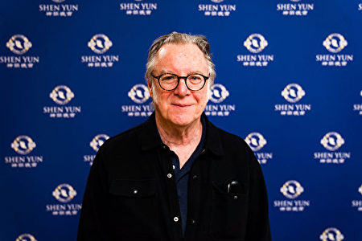

2020年3月8日下午，著名摇滚歌手和词曲作家John Sebastian观赏神韵艺术团在纽约林肯中心大卫寇克剧院的第五场演出。（新唐人电视台）

 
 在美国流行乐坛拥有重要地位的著名乐队主唱John Sebastian一连用三个“了不起”赞佩神韵的舞蹈、色彩和音乐。

现年76岁的John Sebastian是美国最著名的摇滚乐队之一The Lovin’ Spoonful的主创和灵魂人物，在1960至70年代，他创作的单曲多次成为美国流行歌曲排行榜Billboard Hot 100的冠军。曾与多位家喻户晓的音乐家合作，包括获得诺贝尔文学奖的民谣歌手鲍勃･迪伦（Bob Dylan）。

Sebastian还为百老汇的音乐剧和电影进行词曲创作，有些剧目曾经连演一百五十多场。2000年，The Lovin’ Spoonful乐队入选美国摇滚名人堂（The Rock and Roll Hall of Fame）。

Sebastian说：“整场演出都令人陶醉，这是不能错过的演出，与我想像的完全不同，非常了不起。”

“聆听音乐让我感到心旷神怡，他们的音乐令我产生共鸣。”他还认为：“现场交响乐团的每一个人都出类拔萃。”

他表示：“演出展示了一种独立的精神信仰，对我来说是与众不同的，但演出很令人享受。”

他还表示想告诉更多人：“来观赏了不起的舞蹈，了不起的色彩以及了不起的音乐吧。”

<b>著名画家“被洗净” 赞颂神韵色彩来自天堂</b>
 
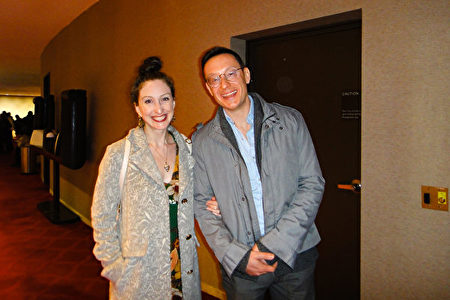

2020年3月8日下午，蜚声国际的著名画家Charlotte Segall女士在纽约林肯中心大卫寇克剧院观赏神韵艺术团在纽约的演出，她赞叹神韵是难以置信、完美无瑕的演出，感到自己被洗净。（滕冬育／大纪元）

 
 “我感到被神韵洗净，看到来自天堂的神圣色彩，我感受到本性被唤醒，壮丽辉煌的场景让我震撼！”蜚声国际的著名画家Charlotte Segall女士观看神韵演出后赞叹道。

Segall是著名画家，她的系列作品曾在世界各地的著名博物馆展出，并连年在纽约各大著名博物馆展出。Segall有多本艺术专著，在纽约多家艺术学院授课、讲演，连年被美国和欧洲等各类媒体报导，2014年被英国媒体誉为前100位新生艺术家，2017年入选德国Leipzig国际艺术项目，2016年被《纽约时报》报导等。

“神韵是绝对技艺超群的演出，整体水平完美无瑕。”Segall表示，“我是画家，我运用色彩进行设计，我感到神韵演出就像色彩和形状在流动，美好的画面在眼前徐徐展开。”

Segall说：“你能看到来自天堂的色彩，那是来自内心良知所选择的色彩！天国的神总是积极正面的，将事件向好的方向转变，对应的色彩也是明亮和光明；色彩的搭配运用和神韵的每个方面，都让你睁大双眼，感受到愉悦，真是美好的视觉感受。”

她说：“看到来自天堂的神圣色彩，我感受到本性被唤醒。”“如此壮丽辉煌的场景展现在我面前，我一下子就沉浸在其中，我被震撼得目瞪口呆！”

<b>设计师：神韵传递全球性信息 应领受神的旨意</b>

纽约艺术家、设计师Tom Sharp（左）与同事Clay Grant（右）观赏神韵艺术团于2020年3月8日在纽约林肯中心大卫寇克剧院的第五场演出。（林南宇／大纪元）

纽约艺术家、设计师Tom Sharp先生表示，“神韵演出传递了一个全球性的信息和思想：告知万物起源，肯定了总体的良善和人类的爱”，“这个信息是传递给所有世人的。”“我们都来自于天堂，我们应该在心中接受来自神的旨意。”

“我们拥有的一切都来自于更高级的生命，我们需要确保我们是人类正的力量的一部分，按照正的方式生活的人将得到神的赏赐，享受爱、和平与感恩之乐。”

Sharp拥有自己的设计公司，专长于室内设计，外观设计，橱窗展示，概念性品牌启动等创意设计，创立了名为“都市时尚”（Urban Chic）、“流行偶像”（Pop Iconic）的时装品牌。

<a target="_blank" href=#top><h6 align="right">回上方</h6></a>

<a name=72>
<h1 align="center"><b>武汉要市民感恩总书记激民愤 高层下令收回</b></h1>

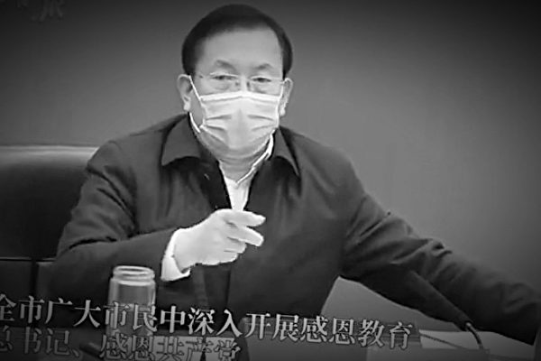

瘟疫肆虐之下，武汉当局计划开展“感恩教育”活动，引发舆论抨击。（视频截图）

 
 【大纪元2020年03月08日讯】（大纪元记者李净报导）正值新冠病毒疫情持续蔓延之际，武汉当局计划在全市发起一场“感恩教育”运动，该市市委书记要求市民“感恩习近平”、“感恩共产党”，引爆舆情。而武汉“一把手”的这番表忠讲话并非无的放矢。

《长江日报》7日报导，武汉当局3月6日晚召开新冠肺炎疫情防控指挥部视频调度会，武汉市委书记王忠林、市长周先旺等官员出席会议。

王忠林在会议上提到，当前要注意出院患者康复期间复阳、无症状感染者等新的情况，不要盲目乐观。

但他又特别强调，当局计划要在全市开展感恩教育活动，称要对市民开展“感恩教育”，要“感恩总书记”、“感恩共产党”。

王忠林在武汉“开展感恩教育”的讲话内容，经官媒报导后引发网络舆论猛烈抨击。

不少网民表示：“疫情没有结束，冤情没有昭雪，责任没有查清，现在就跳出来要开展感恩教育为自己升官发财捞政治资本，没有想到走了一个庸官，来一个贪官。我只想说：感恩你XX，感谢你十八辈祖宗，那些因为疫情走了的人，做鬼都不会放过你。”

“要脸不？疫情还未出现面明显拐点，死去的人还没来得及告别就化成骨灰等着疫情过后家人认领，各地艰苦奋战在一线的医护人员还未安全撤离，这位新来王书记就布置感恩教育，请问是怕武汉人民把你忘了吗？ ”

“成百上千无辜的人们尸骨未寒，叫他们如何感恩？你叫买不到菜的老人们如何感恩？叫身患慢性病却得不到及时治疗的人们如何感恩？疫情尚未结束，每天都有新增病例，叫这些绝望的病人如何感恩？”

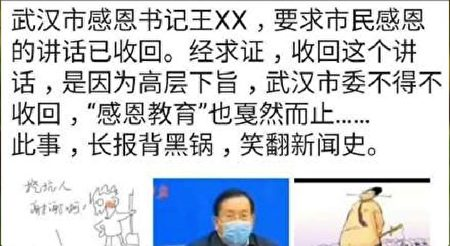

武汉当局计划开展“感恩教育”活动，引发舆论抨击。（网路截图）

 
 截至7日下午4时许，《长江日报》刊发的题为“武汉市委书记：在广大市民中开展感恩教育”的文章已被删除。转发此文的“武汉发布”、“凤凰网”等公众号也同时删文。

武汉当局欲发起的“感恩”活动似乎要在大众口诛笔伐中黯然收场，而武汉“一把手”的这番被指是代表湖北当局向北京表忠的讲话并非空穴来风。

3月5日上午，中共中央政治局委员、国务院副总理孙春兰率中央指导组到武汉市青山区翠园社区、江汉区西桥社区等地视察。武汉市委书记王忠林是随行的陪同官员之一。

据多个视频显示，当天，武汉青山区中建开元公馆小区的被封城困于家里40多天的业主们对孙春兰等官员怒喊：“假的，假的，都是假的。”“ 老百姓吃的都是高价菜。”“形式主义。”

对于这起事件，中共审查机构通常会立刻删除这些揭露当局丑闻的视频。但罕见的是，不仅这些视频目前还在大陆社交媒体上流传，官方媒体也就此发文“自揭家丑”。有分析认为这是当局为民怨沸腾的民间打开了一个“出气口”。不过，有消息称该小区居民遭到“秋后算账”。

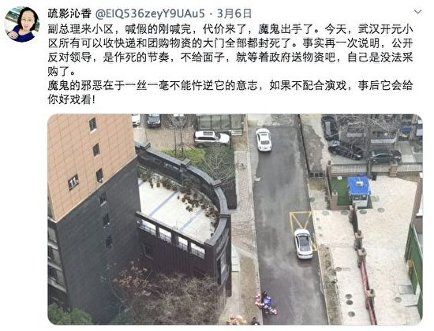

中共副总理孙春兰视察武汉市青山区，小区业主们高喊“都是假的”之后，据称该小区居民遭到“秋后算账”。（网路截图）

 
 此外，香港《明报》6日引述消息人士的话披露，习近平计划近期前往疫区湖北武汉视察。外界预料，习也将进入社区慰问武汉当地居民。

时事评论员夏小强发文表示，孙春兰的小区意外遭遇，却为习近平消除了一个隐患。孙春兰等于提前为习近平“趟蹚雷”，保证习近平在视察社区的时候，绝对不能发生这样的政治事故。

可以预计，武汉地方政府将会严防死守，或者安排习近平视察的社区为警察社区或公务员社区，让这出武汉民众“岁月静好、疫情消退”的戏表演成功。

<a target="_blank" href=#top><h6 align="right">回上方</h6></a>

<a name=71>
<h1 align="center"><b>疫情下民愤高涨 中共文宣屡屡败退</b></h1>

近日，中共国务院副总理孙春兰视察武汉市青山区中建开元公馆，被困在家四十多天的业主们愤怒高喊：“全部都是假的。”（知情人提供）

 
 【大纪元2020年03月08日讯】（大纪元记者古清儿报导）2020年，中共进入多事之秋。从去年底持续至今的武汉肺炎（新冠肺炎）疫情扩散全世界，成为全球之难。由于中共对疫情的隐瞒和不作为，导致民愤高涨。同时，在多起近期发生的事件中，也可以看出中共文宣已在中国人的民意下节节败退。
 
<b>武汉书记要求民众感恩中共 言论被轰后遭删除</b>

北京时间3月7日，中共《长江日报》报导，武汉市委书记王忠林称，“武汉人民是英雄的人民，也是懂得感恩的人民”，“要在全市广大市民中深入开展感恩教育，感恩总书记、感恩共产党……”

王忠林的讲话内容引发大批网民不满。有网民转发2012年时任广东省委书记、现任中共全国政协主席汪洋的发言“必须破除人民幸福是党和政府恩赐的错误认识”，作为批驳。

有网民留言：“感恩……说这话还真需要比较厚的脸皮。”网名“吴华轩的主场”的武汉居民说：“现在好多武汉家庭还沉浸在家破人亡的悲痛之中，还生活在水深火热的煎熬之中，他们为护佑全国，做出了牺牲，大家是否要感恩一下武汉市民呢？”

更有人批评“王忠林，你想对上面感恩就感恩，但千万别拖着武汉老百姓和你一起感恩，他们还在瘟疫的威胁下苟延残喘，没心情和你一起跪下，高呼万岁。”

目前，这则报导以及与此事相关的微博词条均已被删除。

《南方周末》记者褚朝新在网上发文《稍有良心，此时都不会要求惊魂未定的武汉人感恩》，指“……他们尸骨未寒，他们的家人、朋友、同学都还在悲痛之中，他们的家人、朋友、同学甚至自己都还在医院里躺着等着抢救，根本无力悲伤，此时却有人要对他们加强感恩教育，这是没有人性的行为”。

<b>民众骂声一片 《大国战疫》一书下架</b>

在新冠病毒扩散全球，造成大量民众染病及死亡之际，2月26日，中共中宣部、国务院新闻办高调推出《大国战“疫”》一书，由官方出版社“紧急编辑制作”出版发行。此消息一出随即遭大陆网民挞伐，骂声一片。

有网民表示，“疫苗没有，病毒来源自知来源不敢曝光，疫情仍在发展，发声者一个个被消失，这就迫不及待在鼓吹了？有脑子吗”、“湖北人都还出不来，书就出来了，无耻”。

湖北作家方方在《武汉封城日记》中直言：“我们都还被关在家里，足不能出户。而另有一些人却已在大唱颂歌，连胜利的书都看到了封面（如果不是恶搞的话）。武汉人有什么话可说？焦躁也好，烦乱也好，我们都得忍下来，是不是？胜利也是你们的胜利。”

很多观察家认为，在中国大陆疫情仍未结束时，就出版此书进行宣传，是用力过猛和不合时宜的。

在舆论逼迫之下，3月1日有网民发现《大国战“疫”》一书从大陆各大网络交易平台“悄悄下架”。

与此同时，北京市民薛扶民在网上实名举报主导出版《大国战疫》一书的中共政治局常委王沪宁，批其缺乏对人民的关爱，应追究政治责任。

王沪宁是目前中共文宣的最高负责人。

2月29日，当时武汉疫情依然凶猛，《人民日报》头版头条发表文章《日子过得像蜜一样甜》，引起网民一片哗然。

<b>官媒罕见证实孙春兰视察武汉遭抗议</b>

3月5日，网上流传中共国务院副总理孙春兰视察武汉市青山区中建开元公馆小区的视频。

视频显示，有一群人正在小区的通道上缓缓行进，他们当中有孙春兰、武汉市委书记王忠林及一帮随从。随后，各栋楼内业主们大声高喊：“假的，假的，都是假的。”“老百姓吃的都是高价菜。”“形式主义。”等，小区民众发出此起彼落的吼声。

开元公馆小区业主在微信群里的对话截图显示：“王忠林和孙春兰来到了家楼下，物业不让下楼，还假装让志愿者送菜送肉给业主，大伙高喊‘物业作假，物业不作为，换物业！我们太难了。’”“副总理和市领导们视察了一半被气跑了，估计青山区领导挨了批评，现在社区办的来了好多人，在我们小区每家每户上门上访搜集问题。”

有消息称，近期武汉市政府称，能够让民众以较便宜的价格买到猪肉，即10元人民币一斤，但民众根本买不到，认为是虚假宣传。

事发后，中共官媒《经济日报》旗下的微信公众号“陶然笔记”文章承认，住户主要反映的是社区物业假装让志愿者送菜送肉给业主、实际工作不足的情况。这是官媒罕有证实中共领导人去考察遇到抗议事件。

不过，当晚（5日）央视新闻联播没有放出居民这段愤怒的呼叫和视频。还有消息称该小区居民遭到“秋后算账”。

有网民表示，“假的方舱歌舞，假的便宜菜，假的死亡数据，假的‘没有问题’。”“孙春兰出丑再次证明：多难不能兴邦，多难只会穿帮。”

<b>评论：人心正远离中共 中共亡党也许比意想的要早</b>

时事评论员李林一说，武汉肺炎事件使得中共垮台加速。这起事件不仅仅从经济上对中共造成了打击，更重要的是，民众从这个肺炎事件中对中共有了越来越清醒的认识。尤其是当吹哨人李文亮去世后，现在在社交媒体上，很多民众说话不再像以前那样畏首畏尾，很多言论都已经开始直接质疑中共当局。

李林一认为，目前中共处于民众离心离德的状态，民意和人心正越来越远离中共。中共也不得不因为民意压力暂时做出部分妥协或退让。照这个趋势，中共亡党之日也许比大多数人想像的要来得早，而且要早得多。

<a target="_blank" href=#top><h6 align="right">回上方</h6></a>

<a name=70>
<h1 align="center"><b>陈薇新冠疫苗出世半遮面 网传药瓶标签透玄机</b></h1>

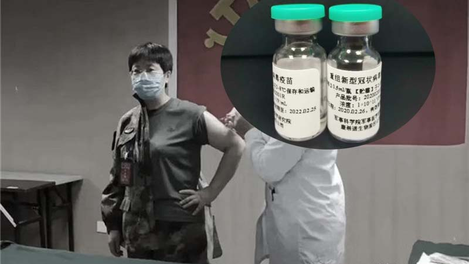

陈薇团队的“重组新冠疫苗”遮遮掩掩露面，网传药瓶照片透出更多信息。（网络图片）

 
 【新唐人北京时间2020年03月05日讯】武汉新冠病毒来源饱受质疑。3月3日，即习近平考察军事科学院次日，网上传出该院生化武器专家陈薇已研制出新冠疫苗，但当晚央视只称其疫苗研发取得“重要阶段性成果”。而网传其疫苗药瓶显示，生产日期为2月26日。
 
 3月2日，习近平在北京“考察新冠肺炎防控科研攻关工作”，先后到访军事科学院医学院和清华大学的科研机构，要求加快相关药物和疫苗研发。

3月3日，网上传出消息称，军事科学院医学院少将女院士陈薇的专家组研发出了首支针对新冠病毒的疫苗，陈薇本人、专家组7名党员都接受了疫苗注射，用自己的身体进行了“首次人体安全性试验”。消息并称，中共国务院副总理孙春兰到场祝贺。

和消息同时传出还有三张照片，分别是疑似陈薇在党旗前接受注射药物、7名军装人士在党旗前合影以及疑似孙春兰接见陈薇团队。

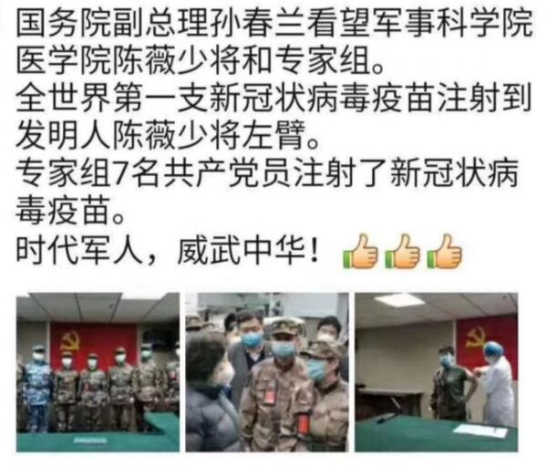

网传陈薇团队“研制出新冠疫苗”。（网络图片）

 
 该消息在社交媒体广传，一些小粉红颇为兴奋。但是消息并不见于党媒正式报导。相反，3月3日晚的央视新闻联播中只称，陈薇团队在疫苗研制方面“取得了重要阶段性成果”。陈薇本人也出镜表示，“我们一定要牢记领袖的嘱托，力争在最短时间内将我们正在研制的重组新冠疫苗推向临床”。

此外，网上与“陈薇研发出疫苗”消息同时传出的，还包括其“重组新型冠状病毒疫苗”的药瓶照片。药瓶包装显示，该疫苗生产日期为2020年2月26日，有效期至2022年2月25日，生产单位为军事科学院军事医学院和康希诺生物股份公司。

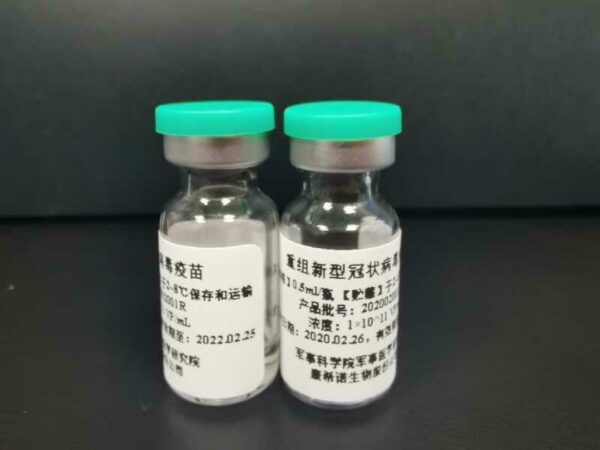

网传重组新冠疫苗的药瓶照片。（网络图片）

 
 这张疫苗照片显示，陈薇团队开发的“重组新冠疫苗”，至少在2月26日之前就已经开始生产。但是无法断定该疫苗是否已经投入使用，或者在多大范围内使用。

该疫苗2月就已生产，直到3月习近平考察军事科学院之后，才“犹抱琵琶半遮面”的公开，引起网友各种猜测。有人认为可能疫苗仍是半成品，拿出来只是临时作秀，向习近平表忠。也有人猜测中共早有疫苗，但不敢太早面世，因为担心泄露新冠病毒来源。有网友评论陈薇研制疫苗称：“看来解铃还需系铃人啊！”

<h4 align=center><a href="https://twitter.com/TuCaoFakeNews/status/1235175542124507136?ref_src=twsrc%5Etfw%7Ctwcamp%5Etweetembed%7Ctwterm%5E1235175542124507136&ref_url=https%3A%2F%2Fwww.ntdtv.com%2Fgb%2F2020%2F03%2F04%2Fa102791985.html">疫苗瓶身上的「军事科学院」字样似乎泄露了天机！
解铃还须系铃人？(点击右键,另存新档）</a></h4>

前，外界一直质疑病毒来自武汉病毒研究所的生化武器研发。法媒2月初引述消息指，中共生化武器专家陈薇早在1月下旬就已接管了武汉病毒所的P4实验室。随后党媒证实，陈薇确实在大年初二（1月26日）就已南下武汉。两天后，陈所在的军事医学研究院就与地方公司合作，共同研制出新冠病毒核酸检测试剂盒。

1月底，陈薇曾对陆媒表示，美国总统1月28日宣布美国将在12周内研制出新冠疫苗，她相信中方科研人员的速度“不会亚于美国”。

2月24日，美国Moderna公司率先宣布生产出新冠疫苗，已送往美国国立卫生研究院，预计将在4月启动人体实验，最快明年正式投入应用。

<a target="_blank" href=#top><h6 align="right">回上方</h6></a>

<a name=69>
<h1 align="center"><b>【一线采访】被困湖北无收入 滞留者心急如焚 </b></h1>

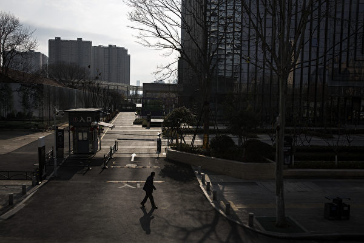

图为武汉封城后空荡荡的街道。 (Stringer/Getty Images)

【大纪元2020年03月07日讯】（大纪元记者顾晓华、方净采访报导）“我现在心情无比沉重，就比坐牢好一点吧，现在是开什么证明都不能出武汉。”因疫情被困武汉的王先生对大纪元表示，“我们现在是任由政府宰割，心情肯定是着急啊，谁都着急，你可以想像一下，高物价的环境下没有收入是一种怎样的心情。”

武汉肺炎爆发以来，湖北多地骤然封城已超过40天，大量从外地回家过年探亲的打工者也被困无法出城工作，经济陷困境，物价又奇高，无数滞留民众身心已产生难以承受的焦虑状态。

被困在天门的刘先生说，“再拖下去估计很多人经济上顶不住会造成心理上很大的压力。”他说当地就业也不可能，“湖北大多数城市都是低收入群体，失去工作和收入无异于一种灭顶之灾。”

同样被困天门的李女士强调，“湖北不放人，目的地不接收，没有收入来源，这就是普遍现状。”她大声疾呼：“希望记者们能把滞留在湖北的所有健康人心声传递出去，我们不要补助，我们也不要就地就业，我们要回去！”

<b>政府补助金形同虚设 也没有爱心菜</b>

1月20日到武汉探望罹癌的叔叔而被滞留的王先生说，“目前在叔叔家里住着，每天想尽办法到处找购买物资的地方，小区不让出。除非是抗疫或者就医可以出小区，其他的一律堵死。”

王先生原来在广州一家私人企业工作，“公司2月28日复工，工作基本都算丢啦，首先就是收入没有了。”“政府说不能因为疫情耽误工人工资，私人企业根本就不管这些。公司老板有跟我联系，就是登记谁在湖北，然后上报政府部门，然后就没有下文了。”

“这里的物价基本上是天价，在微信群团购，捆绑销售，猪肉45.6一斤。”他说，社区也从来没有送过什么菜，“全靠自己掏钱买，根本没有报导的什么爱心菜，实际买到的少之又少，爱心菜都在社区办公室堆着的，也不知道那些办公室的菜是怎么样消化掉的。”

他指出，政府政策形同虚设，“新闻报导说可以领取3000元救助金，申请之后被社区各种条条款款卡死，首先武汉不能有亲属，还要家庭是贫困户，需要查支付宝微信银行账单，具体要求又没有一个明确说法，什么样的规矩政府也不公开，随便社区说。”

“政府报导的上门测温也是假的，我18日发烧，自己去医院做了体检，期间一直没有人来过问体温是否正常。”他说主动联系社区才来量过一次体温，“目前社区没有对居民做任何有帮助的事。”

“现在武汉没有一点解封的消息。”王先生沉重地说，“目前的话就是花自己的老本。其他任由政府宰割。”

<b>无通行证不放行 无收入生活陷危机</b>

被困在湖北天门的刘先生也提到，政府的政策不是便民，是卡民，“想出去得向天门市政府申请通行证，通行证需要目的地开接收证明，但目的地说同意过去，但不能开接收证明，因为别的地方都没收到过给开这个证明的通知。”

他强调，目前许多人被卡在这个通行证动弹不得，“这边这种流程卡着我们这些要外出的人，这不是正常流程。”他说，政府要求村委会统计体温情况并上门核实，社区也不管，“关了这么长时间了，都没有出去，也没有感染的情况，但是也不放我们，造成特别大的生活上压力。”

“房贷、车贷、信用卡都要还，没有收入还要亏房租，如果不能尽快赶回去工作，就会失去客户，”他指政府现在没有任何说法，打了很多次12345服务电话反应，就是官方回答，“以天门市防疫指挥部要求为准，具体时间等通知。想过很多办法回去都行不通。”

所谓当地就业也根本不可能，“天门这个城市就业岗位本来就不多，绝大多数人都是外出，走不了就面临的是失业。”

“现在最大的期望是3月10日能给我们外出通行证，再拖下去估计很多人经济上顶不住。但能不能放行谁也不知道。如果是4月解封，估计很多人都坚持不下去的。”

<b>政府尽开空头支票 隔离自费发国难财</b>

返乡探亲结果被困在天门市的李女士也同样面临经济压力，“现在被困在这里了，没有收入来源，导致现在的房贷，信用卡，各式各类的贷款还不上。”她表示，像这样的人群有很多，心里承受很大的压力，“所以我有点呆不住，慌了。”

李女士是1月22日从江苏昆山来到天门，“其实我好几年没回来了，今年是因为我爸爸立碑才回来的，那时的新闻让很多人会觉得没什么大不了的，都发生在武汉，所以觉得应该不会发生在自己身上，但是没想到，我22号到这里，23号的时候开始封城，那时候就想封几天吧，结果没想到至今封了40多天。”

“生活上都还好，饿不着，也冷不到，因为我们家有房子。但我妈妈吃药很费劲，我妈是脑梗前期，一旦断药，后果是不堪设想的。”食物来源也是问题，“反正就是统一采购。买菜要提前报，报完之后不知道哪天给你采购回来，而且报的东西不一定有。上次我妈报了一些菜之后，结果就空手而归。”

她说，现在不只是滞留在湖北的人无法回去的问题。即使能回去，又普遍要面临隔离自费的天价。“上海自费隔离的费用一天是150元，江苏昆山大概是340块钱，浙江大概是一天1000块钱。”她质疑，“现在物价已经很高，然后这个价钱，这是不是在发国难财？”

她强调，“这个实施起来，因为费用太高了，很多人他是没有这个能力去承担这个费用的。”“这是变相赚取劳动人民的血汗钱，试问良心不安么，钱去哪里了？进了谁的口袋？被封了40多天回去还要被区别对待！”

她认为其实很多事是政府可以做的，但是却根本不做，“如果能够逐步地去按照每个地区的风险等级，逐步解封，然后跟外地进行一个对交，我觉得这个没有什么难的，只要从湖北过去的人，能够再进行14天隔离，为什么现在政府就做不到这一点呢？”

“湖北目前政策只是要求我们滞留人员能够就地复工，我们从外地过来的就地复工合适吗，这不是强制性地让我们留在这里工作，我们本来是有工作的，为什么强制性地让我们留在这里工作呢？”

“天门这边很明确，不让你出去，前段时间是让办手续，这其实就是扯淡，就是要给你开一个空头支票，根本就办不了，你知道吗，天门这一块的防疫指挥部不让出去，现在要等省里面的文件下来之后才放人。”

她指，各种压力下，已经有人表示承受不了了，“确实在群里也看到有些人因为这个事情想不开，就不想活了，就是有这么说的：‘再过段时间真的是解封不了的话，要被这个贷款压到喘不过来气，我真的就不想活了，我承受这么大的压力，又没有收入来源，那么活着还有什么意义呢？’”

<a target="_blank" href=#top><h6 align="right">回上方</h6></a>

<a name=68>
<h1 align="center"><b>新一批中共恶人名单递美加英澳新五国政府</b></h1>
 <h3 align="center"><b>要求对其拒发签证、冻结资产</b></h3>

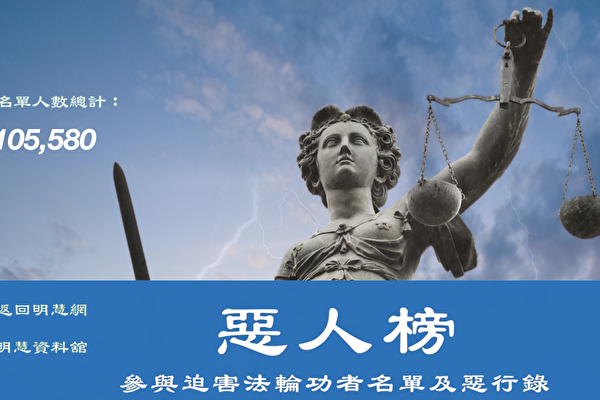

2019年11月，明慧网恶人榜问世，迄今为止，共搜集了105,580名参与迫害法轮功学员者的名单。（网络截图）

 
 【大纪元2020年03月07日讯】明慧网报导，近日，美国、加拿大、英国、澳大利亚及新西兰等五国的法轮功学员将又一批新整理出的迫害法轮功的中共恶人名单递交给本国政府，要求依法对这些恶人拒发签证、甚至冻结资产。

自去年11月份法轮功学员将中共人权迫害者的恶人名单同步递交五国政府之后，国际社会在制裁人权迫害者方面又有一些进展。

在2019年12月9日，即国际人权日的前夕，欧盟外交部长会议一致通过决定，将启动制裁侵犯人权者的立法程序，以对全球范围内严重侵犯人权者实施制裁。该立法在欧盟相当于美国的“全球马格尼茨基问责法”，此法律的通过将是全球维护人权的标志性事件。

从去年十二月开始，澳大利亚议会就制裁人权迫害者的问题，在国内外广泛征集意见，许多信仰、人权团体给予了积极正面的反馈。

今年一月，美国政府两位官员在华盛顿一家人权组织的协调下与许多信仰、人权团体的代表见面，专门详细解释了对人权迫害者实施经济制裁的相应法律条款，并回答了代表们的问题。两位官员表示，为了使相应法律真正起到作用，他们非常需要各受迫害团体给他们支持与帮助，为他们提供恶人名单及其恶行记录。

为此，法轮功学员将继续从明慧网刊载的材料中选取恶人，整理、翻译其迫害恶行的材料，将名单送交一些民主国家的政府要求予以制裁。

参与迫害者若想知道自己是否在册，只需查看明慧网的恶人榜。所有榜上的恶人勿存侥幸心理，凡作恶者，或早或迟都将出现在民主国家政府的制裁名单上。

<h4 align=center><a href="https://library.minghui.org/criminal/html/lastname/">点击查看：明慧网恶人榜</a></h4>

报导说，希望大陆所有相关人员引以为戒，对迫害政策不予配合、执行，不要堵死自己和家人前往西方国家定居、学习、旅游或经商之路。尚未作恶者，洁身自好、切勿作恶；已经作恶者，立即改邪归正、将功补过。

明慧网也希望大陆的法轮功学员继续收集和整理恶人的迫害恶行及个人信息、将其递交明慧网，明慧网的恶人榜将不断更新，大家共同努力制止迫害。

<a target="_blank" href=#top><h6 align="right">回上方</h6></a>

<a name=67>
<h1 align="center"><b>【拍案惊奇】隔离大楼2秒坍塌 战机坠毁引猜测</b></h1>

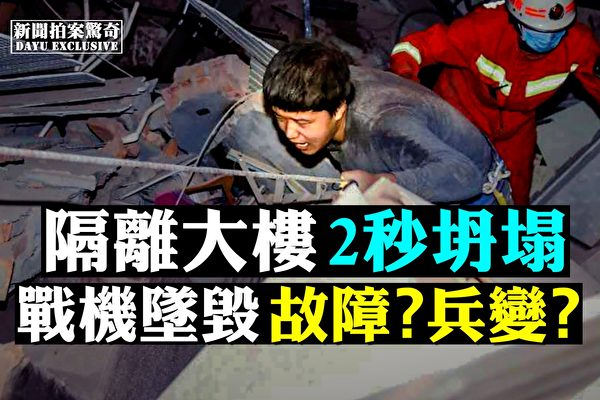

【大纪元2020年03月08日讯】大家好，欢迎收看《新闻拍案惊奇》，我是大宇。截至美东时间3月7日下午，新冠病毒瘟疫已经蔓延到世界至少92个国家。

<b>【中欧全沦陷 意大利单日增1,247例】</b>

其中，美洲的哥斯达黎加等国传出首例确诊，而且在哥斯达黎加确诊的是一名美国游客。前一天，欧洲国家斯洛伐克也传出第一例确诊，患者本人没有近期的旅游史，但他的儿子几周前去过意大利威尼斯。那么这也标志着所有中欧国家，包括捷克、波兰、匈牙利等，都有了确诊病例。

世界上，传播最凶的前5个国家，除了中国大陆，仍然依次是韩国至少7,041例、意大利至少5,883例、伊朗至少5,823例、日本至少1,116例，

其中，中国大陆以外，死亡人数最多的是意大利，现在已有233例。而且意大利过去一天，单日增加了1,247例确诊。

<b>【至尊号游轮停旧金山外海 船上21例确诊】</b>

下面先主要来关注下美国，截至发稿，美国已经有377例确诊，分布在29个州。其中，3例是从武汉撤侨回来的公民，46例是之前日本钻石公主号的乘客，还有21例，来自另一艘游轮，是大公主号，或者叫至尊公主号。

至尊公主号于日本的钻石公主号游轮，属于同一家公司。这艘至尊公主号目前停在加州旧金山外海，截至发稿，加州当局不允许游轮靠岸，而且要求乘客暂时留在各自舱房内，由工作人员统一送餐。不过，之后这艘游轮会被允许停靠在一个非商用的港口，所有人都要进行检疫。专家建议他们下船隔离，但是美国总统川普则主张，所有人直接在船上隔离。

3月7日，这艘船上已经有至少21人被确诊。担任防疫总指挥的美国副总统彭斯表示，这21人中，有19个人是船上工作人员，其它2人是乘客。

船上一名乘客说，当得知船上有确诊后，自己开始尝试在阳台上呼吸新鲜空气，来让自己保持镇定。

至尊号游轮上一共有3,533人，包含2,500多名乘客，而且多数是年长的人。比如60多、70多，甚至80多。根据现在的数据，这些年长的人，正是相对容易感染新冠病毒的高危人群。

2月11日，曾有一名71岁的加州老人，在旧金山登上至尊号游轮，随船前往墨西哥游玩，后来在2月21日返回。2月27日，老人出现症状，3月4日，他成为加州首例因感染去世的患者。

但是，他曾搭乘的至尊号游轮，2月21日他下船的时候，有上千人跟他一期下船，同时又有另外上千名新乘客登船前往夏威夷，其中有62名乘客，是之前就与老人同船的乘客，再次登船。

后来这艘船3月5日返回旧金山外海，结果直接被留在外海，加州派人乘直升机去船上检疫。现在这两张照片，显示了当时检疫人员登船时的情景。

<b>【新泽西现美东首例华裔确诊 患者在纽约诊所工作】</b>

截至目前，美国确诊人数排在前三的州分别是，华盛顿州87例，加州80例，纽约州76例。紧邻纽约的新泽西州，目前也有4例确诊，而且传出了美国东部地区第一例华裔确诊。

确诊的新泽西州华裔，是“何恭程联合医疗中心”的医师助理，这间诊所在纽约市有四家分部。诊所所有人何恭程说，这名确诊员工3月1日开始感到身体不适，就医后确诊，而他最近一次上班是在2月26日。目前，这间诊所自觉关闭了四间分部中的三部，时长14天，也要求所有员工居家隔离14天，截至发稿，没有其他员工出现症状。

<b>【上海专家分析美防控能力 加拿大卑诗省新增病例】</b>

美国副总统彭斯7日宣布，几周内，新冠病毒的检测设施将充分满足公众所需，同时强调，美国公众感染新冠病毒的风险，仍然比较低。

对于美国的防控能力，中国的一个医学专家，上海复旦大学附属华山医院感染科主任张文宏，给出了自己的解释，我们来听一下。

同时呢，因为新病毒也会在物体表面存留，所以美联储2月21日就已经开始，对来自中国和亚洲其它地区的货币，在交易处理之前，隔离至少7到10天。美联储也同时储备着应急用的新钞，如果有需要，储备的新钞会向社会发放。

美国北边的加拿大，3月7日确诊病例上升到57例。其中，在西部卑诗省，单日出现至少6例确诊。两人是至尊公主号的乘客，两人是温哥华一间长期护理中心的居住者，还有一人是最近从伊朗返回，另一人是伊朗返回人士的密切接触者。

接下来，了解一下亚洲的情况。

<b>【台湾经验被推崇 日本患者4院8检终确诊】</b>

截至发稿，台湾有45例确诊，1例死亡。原本，大家以为，台湾离大陆那么近，可能是爆发的重灾区之一，但由于台湾当局防控得力，疫情没有出现爆发。台湾人自己，还有世界上其他很多国家，都认为台湾的防控可圈可点。这其中也包括美国，台湾当地时间3月6日凌晨，高雄医学大学校长钟育志、台湾大学公共卫生学院长詹长权等人，向一位美国联邦众议员的代表以及上百名哈佛大学师生和研究人员，分享了台湾的防疫经验。

距离台湾不远的菲律宾，最近又新增了6例确诊，当局已证实该国国内已经发生社区传染，总统杜特尔特可能会9日宣布菲律宾进入公共卫生紧急状态，届时菲律宾也可能出现停工停课的情况。

同在亚太地区的日本，情况依然不容乐观。最近该国还爆出一个极端的案例，就是日本广岛县出现一个30岁左右的男子，2月15日开始就多次就医，但是病情不见好转，一共去了4间医院、8次检测后，才最终于3月6日被确诊。目前，广岛市还在追踪这名患者此前的接触史。

<b>【泉州临时隔离中心建筑 2秒内完全坍塌】</b>

好了，现在，我们把目光放回到中国大陆。

当地时间3月7日晚7点多，福建泉州市鲤城区南环路，一栋7层楼的建筑完整垮塌。

我们从事后流传出的监视录像可以看到，大厦坍塌的准确时间是当地3月7日晚7点17分56秒，仅用2秒钟就完全垮掉。在垮塌前，周围没有任何异常，但突然坍塌时，附近街道车辆加速躲避。

截至我们发稿，有约70人被压在废墟之下，泉州市随后出动26辆消防车辆共147人到现场救援，已经有45人被救出。后来，从外地也调去了很多救援人员还有设备。

大楼坍塌后，附近居民用手机做了记录。我们来听听当时现场人们的反应。

泉州卫健局证实，建筑物内已被开辟为临时隔离点，有隔离人员在内居住。根据一张网上传出的当地社区通告，2月18日后去过湖北、浙江温州等地的人，都要在建筑中的欣佳酒店隔离。

这栋建筑物原本一层有很多商铺，包括汽车维修店，楼上2到6层是足浴店，还有2018年开业的、有80间客房的“欣佳酒店”，7层是员工宿舍。《新京报》报导，整个建筑物是钢架结构，地板是水泥材料。

该建筑在2017年以前，每一层都是开阔大厅，但是2017年之后，据说楼内酒店开始在大厅砌墙，隔断成一个一个小房间。在酒店这么装修的时候，一楼的商户就因为楼上重量增加，而出现门窗玻璃遭受压迫而炸裂的情况。而最近，建筑物某处的地基也正在进行维修。

香港《苹果日报》报导同时引述了另一个自称建筑专业人员的观点，认为就算是结构问题，也不应该塌成这样，一干二净，连受力点也没有。

一名附近的甜品店职员形容，当时坍塌时，外面传来大块大块石头脱落的声音，像泥石流，出门一看，眼前的大楼变成废墟。很快，一名满脸是血和灰的大叔出现，说自己住在顶楼，正在吃饭，不知道怎么回事，突然就……变成现在这样子。可以想像大叔当时的表情，一定是一脸懵的状态。

因为这个建筑是隔离点，有的患者，隔离期马上就结束了，但却遇到这样的事情，事发后家属打电话，已经没人接了。

<b>【大陆各地“清零”患者 独独北京湖北继续收紧】</b>

坍塌事故所在的福建省当局，刚刚在3月7日宣布，全省最后9个住院患者全部出院，实现了无确诊、无疑似、无住院的新馆病毒“三无”状态。“清零”了所有患者。而这种“清零”，它在大陆，同时也是个政治目标。福建之外的其它地方，也在搞“清零”。

3月5日，大陆防疫的中央指导组专家组成员、中国工程院院士张伯礼，在接受人民日报采访时说，湖北武汉有望3月底“基本清零”，而在武汉以外的湖北省地区，3月中旬就能“基本清零”，而且还说，到了4月底，湖北省以外都能摘掉口罩，而湖北省要比其它地区晚一个月。

但张伯礼也说，只是一种推测。目前，大陆宣传导向，完全为全面复工复产造势。所以，大陆的朋友还是小心谨慎为妙。

比如我们上期节目就提到，有广东等地的企业，在复工后，出现聚集感染。而一段最新传出的画面显示，在深圳惠州的TCL工厂，一名员工突然倒地，暂时原因不明。但这种突然倒地的场面却是瘟疫中时常能看到的。

另外，《华尔街日报》5日报导，当中国其它地区逐渐放松管制的时候，北京市却反而继续加强防疫，同样要加强防疫的是湖北省，这两个地方是全国复工复产大潮中的例外。

3月6日下午，北京市防控小组发言人张彤军介绍官方数字，说北京有82.7万名回京人员处于居家观察之中，全市瘟疫防控到了“最吃劲”的时候。

<b>【开启“庆功”模式：表彰王广发 武汉感恩教育】</b>

而在这个瘟疫还很紧张的时候，歌功颂德的声音已经开始此起彼伏，还有人得到了表彰。这个人不是已经去世的吹哨人“李文亮”医生，而是“可防可控”的卫健委专家王广发。武汉作家方方看到这个消息后，认为王广发欠了武汉市民一笔债，其它也有很多网友发出批评声音。王广发和官方，在1月中上旬说疫情可防可控，一定程度上导致市民放松警觉，后来瘟疫大爆发。我们之前已经引据了很多资料，说明了大陆宣传部门，如何涉嫌瞒报和迟报病毒人传人和医护感染的可怕事实，相关人一定要为此负责人的。

不过在此时此刻的武汉当局在做的，是什么呢？

《长江日报》3月7日报导，武汉市委书记王忠林，要求在广大武汉市民中，开展感恩教育，说武汉市民是懂得感恩的人民，要对当局表达感恩。学者章立凡对此评价说：武汉人绝不会买账。

<b>【深圳全肺移植失败变“活检” 感染者“手到毒留”】</b>

瘟疫爆发后，武汉的感染者众多。武汉大学分析了8,000个病例，于3月2日发表了一篇初步论文，发现女性感染者比男性的潜伏期更长，症状也相对更轻微，所以，论文呼吁在新冠病毒医学观察中的女性，应该把隔离期延长，应超过14天。但这篇论文的研究结果，也受到其他同行的怀疑。

在深圳，还有一例全肺活检的例子。这个病例是当地“全肺移植”治疗办法的失败者，移植失败后死亡。之前我们提到过江苏是大陆第一例用肺移植救治新冠患者的地方，但是有人透露，实际上第一例是在深圳，但是失败了。而肺脏等器官移植，因为其来源问题，在中国大陆一直存在医学伦理的巨大争议。

不过，深圳这例肺移植的失败者，医生在他的人体上进行了“全肺活检”，发现全肺表面呈古铜色，肉眼可见弥漫性充血，多为点状出血，部分出血坏死，而出血坏死主要发生在患者肺右下叶、中叶和上叶的外边缘，肺部支气管被黏液和出血渗出物覆盖。等等这些肺部变化，会导致危重症患者出现严重呼吸衰竭。

现在各地还有很多团队，在研究新冠病毒。台湾和新加坡的最新研究结果还发现，新病毒感染者，他们“手到之处”，病毒遍布！而且住得越久的地方，病毒就越多。所以提醒人们还是要重视洗手。

节目最后，我们再来了解一下最近引发网友关注的天津坠机事件。

<b>【天津战机坠毁 兵变？故障？】</b>

3月5日，天津武清区发生军机坠毁。我们能从当地人发出的视频中，看到坠机后出现的火光和滚滚浓烟。军机飞行员事先跳伞逃离。

而且就在3月5日当天晚些时候，从广州、深圳，飞往北京、上海等多个城市的航班都被取消，官方给的理由是：公共安全原因。

天津的军机坠毁，还有中国内地大量航班，在同一天取消，而且目前正处在大陆政治局势并不安稳的状态下。所以事件引起了很多网友的关注和讨论。有人甚至提出，中国是不是发生兵变？

2016年9月，一架中共歼10战机，也是在天津武清坠毁，飞行员跳伞逃生。坠落原因据说是撞鸟。而当时的飞机是从天津武清区杨村机场起飞，隶属于中国空军24师。

前两年，陆产歼10机型也是意外频发。

2015年10月22日，一架歼10在夜间飞行训练时，因为动力问题坠毁，飞行员跳伞逃生。当年11月，浙江湖州安吉县发生歼10坠毁；12月，浙江台州温岭市也发生歼10坠毁。2016年，浙江台州市又发生歼-10战机坠毁。

有专家分析呢，歼10战机因为采用了存在缺陷的俄罗斯AL-31发动机，所以频传坠毁事故。

但是当今3月5日又发生在天津武清区的坠机事件，我们还没有更多的细节。它可能是又一起军机因故障坠毁的事件，也可能与政治事件有关。网上有传言说，3月5日天津坠机，是因为东部战区发生兵变，战机是被火箭炮击落。不过这种说法，目前无法得到证实。

而且，为什么在同一天，很多民航飞机因为“公共安全原因”临时取消飞行任务呢？有媒体说这个“公共安全原因”，经过咨询大陆航空公司，说是与新冠瘟疫有关。

截至我们发稿，以上事件，还没有官方的公开说法。

大楼坍塌、军机坠毁、民航暂停，这都是大事。如果您对这些事件有什么看法或消息，欢迎给我们留言或者来信。节目信箱是：xwpajq@gmail.com

好，欢迎您订阅和分享我们的频道，在订阅的时候，不要忘了点击订阅按钮旁的小铃铛图案，在第一时间收到我们新节目上传的通知。也欢迎您加入我们的会员。有推特的朋友，也可以在推特上关注我，我的推特账号是@xwpajq。这期节目就到这里，感谢您的收看，下期再会！

新唐人《新闻拍案惊奇》制作组

<a target="_blank" href=#top><h6 align="right">回上方</h6></a>

<a name=66>
<h1 align="center"><b>美国同意豁免中国制百余项医疗用品关税</b></h1>

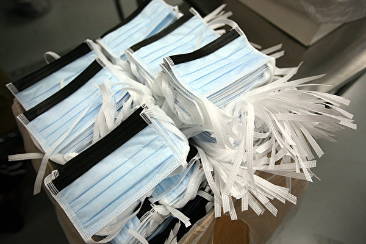

美国同意豁免中国100多项医疗用品的惩罚性关税，包括口罩。(Tom Pennington/Getty Images)

 
 【大纪元2020年03月07日讯】美国同意豁免中国100多项医疗用品的惩罚性关税，包括口罩。

《华尔街日报》3月6日报导，美国川普（特朗普）政府已同意豁免美国27家公司，自中国进口的100多项医疗用品（包括口罩、手套和消毒湿巾等）的惩罚性关税。

位于伊利诺伊州诺斯菲尔德的Medline公司在1月31日截止期限前，提出豁免关税申请时说：“目前，严重短缺的口罩，可能会在全球范围内产生影响。”

“Medline正在加快增加产能，以确保公共安全和健康，我们必须继续扩大所有可能的供应商（中国或其它地区的供应商）的最大化产能。”该公司在申请书上写道。

Medline提出了103项商品，美国贸易代表办公室（USTR）批准了其中30项商品的关税豁免，包括口罩、手术罩、标本容器和手术服等。

其它公司获得的关税豁免项目包括手术台罩、抗菌床单、识别腕带、血压袖套和听诊器套等。不过，USTR没有同意药品的关税豁免。

美中贸易战于2018年开启，其后川普政府分四次对总计超过50%的中国进口商品加征惩罚性关税。

3月5日USTR同意的关税豁免项目，属于去年9月（第四批）对价值1,200亿美元中国商品加征15%关税的项目，包括数百种医疗物品。今年1月中旬美中签署了第一阶段贸易协议，2月中旬生效后，这批项目的关税降至7.5%。

卫生行业分销商协会（Health Industry Distributors Association）主席马修·罗恩（Matthew Rowan）在USTR于去年6月举行的拟加征关税公听会上作证说：“保健产品对于美国应对流行病及紧急应变状态的准备能力至关重要，⋯⋯关税对卫生保健和公共卫生的风险，大于其对贸易或经济创造的任何利益。”

几家公司的发言人说，关税豁免可以为自中国进口医疗产品的公司，提供一些经济上的缓解，对供应链不会有任何影响。

位于纽约州哈帕克（Hauppauge）的Medegen Medical Products发言人罗恩·普里贝拉（Ron Prybella）说：“豁免关税更像是一种经济措施。”该公司获得了16项产品的关税豁免，包括袋子、口罩和容器。

自对中国商品加征惩罚性关税后，USTR一直在处理豁免申请。截至目前为止，USTR总计收到5.2多万个请求，对最早的前两批加征关税项目，USTR批准率达35%，但对第三批（主要是更多的消费品和组装成品）的批准率仅3%。USTR还需要对超过1.2万个申请做出决定。

<a target="_blank" href=#top><h6 align="right">回上方</h6></a>

<a name=65>
<h1 align="center"><b>美中记者签证 一份报告曝中共不敢说的事</b></h1>

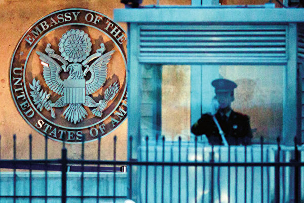

美中记者签证问题，一份报告披露中共不敢说的事。图为美国驻中国北京大使馆。(Getty Images)

【大纪元2020年03月08日讯】（大纪元记者吴英综合报导）在美国决定限制北京驻美新闻机构的中国籍员工人数后，中共指责美方做法并暗示将采反制措施。然而，中共的说法一如既往掩盖其压制在华外媒记者的实际作为。

<b>美国要求对等所采措施 重大事件回放</b>

2月18日，美国国务院依据《外国使团法》认定新华社、中国环球电视网（CGTN）、中国国际广播电台（CRI）、《中国日报》、以及《人民日报》等五家中媒为中共驻美机构，要求他们提供员工清单、办公室所在地，以及在美国拥有的资产等资料。

3月2日，美国国务院宣布这五家中共国营媒体必须在3月13日前，削减他们在美国雇用的中国籍员工人数，由目前总数160人降到100人。

美国国务院官员说，削减后，这五家媒体在美国的中国籍员工的上限分别为：新华社59人；CGTN30人；《中国日报》9人；中国国际广播电台2人。《人民日报》在美国的发行公司（海天）仅聘雇两人，都不是中国籍，因此暂不受此限。

“我们的目标是对等”，国务卿迈克尔‧蓬佩奥（Michael Pompeo）2号在一份声明中说，“正如我们在美中关系其它领域所做的那样，我们寻求建立一个期待已久的公平竞争环境。”

<b>中方反应</b>

2月19日，北京以《华尔街日报》一则评论文章具“种族歧视”为由，吊销该报李肇华（Josh Chin，美国公民）、记者邓超（Chao Deng，美国公民）以及澳洲籍记者温友正（Philip Wen）的新闻通行证，并限他们5天内离境。

该三人都与那篇评论文章没有任何关联。《华日》另一名驻华记者王春翰（Chun Han Wong）去年因签证被北京拒绝续签而被迫离开中国。

3月3日，中共外交部发言人华春莹“翻墙”发推文说：“美国现在开球了，我们来玩吧”。推特在中国是被禁止的社交平台。

她同时还在推文中回应蓬佩奥所说的“对等”，称中国有29家美国媒体机构，而在美国的中国媒体只有9家。此外，她还说中国给美国记者颁发的是“多次入境”签证，而美国给中国记者颁发的是只有“一次入境”的签证，自去年以来有21名中国记者被拒签。

<b>中共新闻自由度远落后美国</b>

无国界记者组织发布的2019年新闻自由度排名，在180个被评比的国家，中共列在177名，远低于排在第48名的美国。

蓬佩奥在声明中表示，美国希望这个行动能促使北京“履行其尊重言论自由的国际承诺”，对在华外媒采取“更加公平和对等的态度”。

值得注意的是，美国务院官员强调，美国无意驱逐任何中国记者，也没有限制他们在美国的居留，要裁减哪些职务的中国籍员工，完全取决于各家中国媒体。

<b>记者签证争议</b>

华春莹说，自去年以来，有21名中国记者的媒体签证（I签证）遭到拒签。不过，美国国务院表示，自2015年以来，已向大约3,000名中国公民发放I签证，单仅去年就给中国媒体记者及家属发放了425份I签证。

此外，美国虽然仅给中国记者单次入境签证，但是并没限制他们居住在美国的时间，也就是说，只要他们没有离开美国，中国记者就可以在美国停留10年或更长时间。

反之，尽管北京政府给美国记者“多次入境签证”，但是中共外交部核发给外媒记者的签证有效期限通常只有一年，而且越来越多的情况是仅核发六个月或三个月的签证，最近甚且还有外媒记者只拿到一个月效期的签证。

美国之音报导，美国近期对中国媒体代表及其家属发放的I类签证，与其发放给其它国籍的同类签证有所不同。部分国家媒体代表拿到的I类签证为五年有效多次入境的签证。

<b>FCCC报告 披露中共如何对待外媒记者</b>

3月2日，驻华外国记者协会（Foreign Correspondents’ Club of China，简称FCCC）在其发表的题为“控制、中止、删除：在驱逐威胁下的中国报导”（Control, Halt, Delete: Reporting in China under Threat of Expulsion）的报告中表示，北京已“武器化”签证，将其作为加大对外国记者施压活动的一部分。

FCCC在去年12月问卷调查该协会186名会员，其中114名来自25个国家及地区的记者回复。FCCC说，连续第二年没有一位外媒记者表示北京有所改善，自2013年以来，中共至少强迫9名外媒记者离开中国，未来恐怕会驱逐更多外籍记者。

该报告说，2020年伊始，2名外媒记者收到的签证效期只有1个月。去年，至少12名记者获准的记者证效期不到6个月，为2018年（5人）的两倍多。受到影响的外媒包括《纽约时报》、《华尔街日报》、BBC、英国《电讯报》、加拿大《环球邮报》、以及美国之音等。

《纽约时报》北京分社社长史蒂芬·李·迈尔斯（Steven Lee Myers）说，取消和缩短签证效期是“非常不祥的兆头”，表明了北京政府对控制的欲望或者对审查的态度，“确实阻碍了必须报导的中国新闻”。

<b>更新记者证或签证遭遇困难</b>

FCCC的报告说，22%回复问卷的外媒记者表示，去年在向中共政府申请签证及记者证更新时遭遇困难，这个比例在2018年只有9%。21%受访记者表示，遭遇困难的原因与其报导的内容有关。四分之一受访记者说，去年获准的签证效期不到12个月，有些只有6个月或3个月。

加拿大《环球邮报》记者纳森∙范德克里普（Nathan VanderKlippe）说，他一直到记者证到期那天才获准更新，但是“由于担心无法获准，我已经订了离开中国的机票”。

一名欧洲媒体记者说，中共核发给他的记者证效期，一次是6个月，两次是3个月，而且每次更新都相当耗时，通常至少要等4个星期。“很显然，中共的意思是，签证涉及国家主权，它们不见得要批准更新。”他说。

一名英国记者说，中共官员在处理他的签证延长申请前，要求他提供“所有中国同事的名单，包括他们的身份证件号码，我从未见过这种事”。

<b>中共官员威胁外媒记者</b>

3 8 % 受访记者表示，中共当局在更新记者证或签证前要求与他们会面，并暗示有可能不会批准，除非他们“有所改进”。

一名英国记者说，中共官员当面告知，如果“改进报导内容”，就会获得6个月签证。这名记者在回复问卷时写道：“我们当然不会向这种施压低头。”

日本《产经新闻》北京分社社长Yoshimi Nishiak说，中共外交部在数次签证更新会议上表示，不满意“我们的报导”，通常他们指的是有关台湾及香港等的报导。

有时外籍记者会在报导现场遭到中共官员的威胁。英国天空新闻（Sky News）记者麦可尔·格林菲尔德（Michael Greenfield）说：“在我们要报导一个地下教堂集会活动时，一名便衣警察在现场警告我们，签证效期会被缩短。”

<b>中共效率低 影响外媒作业</b>

中共行政效率低，对外媒造成诸多不便。47%受访记者表示，他们首次申请记者签证，至少花了4个月的时间才获批准。首签获批至少需要1到4个月者达33%，仅大约二成记者表示用了不到1个月的时间。

有些人甚且没有获准签证，导致其无法到中国工作。42%受访者说，他们知道同事的长期记者签证（J-1签证）被拒签，14%表示，同事的短期记者签证（J-2签证）被拒签。

美国之音记者比尔·艾德（Bill Ide）说，去年6月，在他预定离开中国的前一个月，报社为某位同事向中共申请临时记者签证，以利其能在他离开后暂时接替他的工作。但是等到去年9月，中共一直没有批准，这位同事只好到中共驻美大使馆取回他的护照。后来，报社在去年11月向中共申请另一位同事的记者签证，直到他回复问卷时还没有任何回音。

<b>外籍记者支持国务院做法</b>

对于蓬佩奥要求的对等，部分外籍记者并不认同，但经过亲身体验后，他们改变了想法。

全美公共广播电台（NPR）记者史明智（Rob Schmitz）3月2日发推文说：“当我第一次到中国担任记者时，反对这种对等主张，我认为这会使美国将标准降低到和中共一样的水平，我们的水平高。”

“但是经过多年的被骚扰、威胁、监视、跟随、拘留，以及和我在中国一起工作的中国公民，也在工作时遭受到甚至更多的骚扰后（更不用提那些对我们信息来源的迫在眉睫的威胁），我很伤心地说，我不知道我是否还会相信这个了。”

<h4 align=center><a href="https://twitter.com/rob_schmitz/status/1234572020190330880?ref_src=twsrc%5Etfw%7Ctwcamp%5Etweetembed%7Ctwterm%5E1234572020190330880&ref_url=https%3A%2F%2Fwww.epochtimes.com%2Fgb%2F20%2F3%2F7%2Fn11923242.htm">当我第一次到中国担任记者时，反对这种对等主张，我认为这会使美国将标准降低到和中共一样的水平，我们的水平高。但...(点击右键,另存新档）</a></h4>

<a target="_blank" href=#top><h6 align="right">回上方</h6></a>

<a name=64>
<h1 align="center"><b>蓬佩奥用“武汉冠状病毒”强调病毒始源地</b></h1>

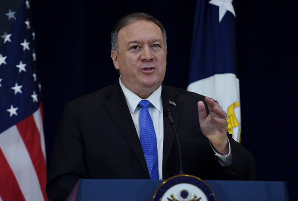

美国国务卿蓬佩奥近日多次使用“武汉病毒”或“武汉冠状病毒”来强调病毒的来源。图为蓬佩奥资料照。(Olivier Douliery/AFP via Getty Images)

 
 【大纪元2020年03月08日讯】（大纪元记者张婷综合报导）尽管中共抗议，美国国务卿迈克·蓬佩奥（Mike Pompeo）就是把这个在中国武汉最先爆发的新冠病毒叫做“武汉病毒”或“武汉冠状病毒”，以此强调病毒的真实起源地。

世界卫生组织（WHO）在2月11日把去年12月在中国首度确认的致命冠状病毒疾病正式命名为COVID-19（2019年冠状病毒疾病）。

周五（3月6日）是蓬佩奥连续第二天将这种新型病毒称作是是“武汉病毒”（Wuhan virus）或“武汉冠状病毒”（Wuhan coronavirus）。

此前一天，蓬佩奥在一个新闻发布会上强调，美国拨出3700万美元援助，用于支援那些受“武汉病毒”传播打击的国家。

武汉是新型冠状病毒最先爆发地，也是受疫情冲击最严重的地区。中共多次强调病毒可能不是来源于中国的说法，引发争议。

中共外交部发言人赵立坚3月4日在例行记者会上抗议媒体上有关“中国病毒”、“武汉病毒”，暗示病毒来源中国的说法。他强调，新冠病毒是否起源于中国尚无定论。

赵立坚还引述了中国工程院院士钟南山“疫情首先出现在中国，但不一定发源在中国”的说法。

蓬佩奥周五在接受美国媒体CNBC采访时则用“武汉冠状病毒”来回应。他说：“请记住，是武汉冠状病毒导致了这一切。”

蓬佩奥反驳中共声称病毒可能源于中国以外其它地区的说法，他说，“我们很确信我们知道病毒起源在哪儿。”

他还批评中共不肯完全公开并共享疫情信息。他表示，实际证明与中国共产党合作获取新冠病毒的数据“极其令人沮丧”。这些数据对研发疫苗以及找出应对新冠病毒风险的解决方案极其重要。

该病毒的爆发打击了全球经济和市场，而这恰逢美中两国的摩擦之际，美国从贸易、人权和军事等诸多方面批评中共的不良做法。

<a target="_blank" href=#top><h6 align="right">回上方</h6></a>

<a name=63>
<h1 align="center"><b>中央候补委员官庆去世 传是华春莹丈夫</b></h1>

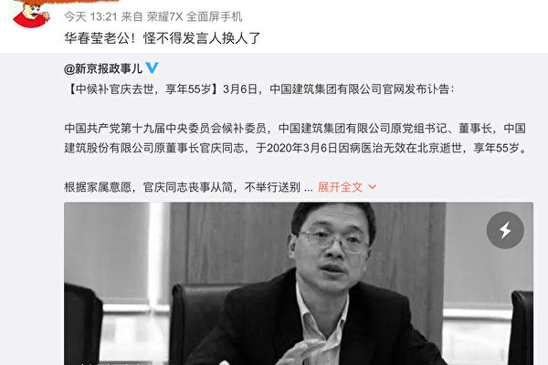

网友称去世的中候补官员官庆是中共外交部发言人老公。（截图）

 
 【大纪元2020年03月06日讯】3月6日，中国建筑集团有限公司官网发布讣告：集团原党组书记、董事长官庆于2020年3月6日因病医治无效在北京逝世，终年55岁。

讣告还称，根据家属意愿，官庆的丧事从简，不举行送别仪式。

公开资料显示，官庆长期在建筑央企工作，曾任中国建筑股份有限公司副总裁，中国建筑工程总公司总经理，中国建筑工程总公司董事长、党组书记，中国建筑股份有限公司董事长、总裁等重要职务。目前是中共第十九届中央候补委员。

官庆去世引发关注，是因为网上传出官庆是中共外交部发言人华春莹的老公，立刻成为网上热议的话题。

在大陆微博上，官庆去世的消息后面，有着大量网友的跟贴，不少内容指向华春莹：“华春莹老公，怪不得发言人换人了”，“脑癌去世，外交部发言人华春莹老公”。这些跟贴至今都没被删除。

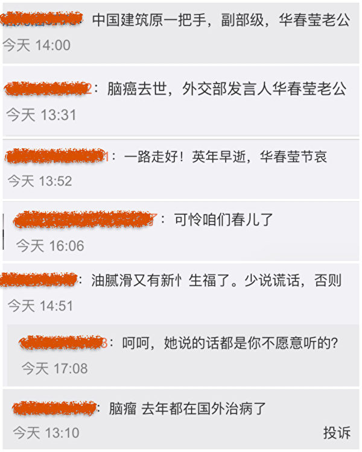

（微博截图）

今年2月24日，中共外交部新闻司副司长赵立坚以新任发言人的身份首次现身，华春莹对现场媒体做介绍。之后的记者发布会都是由赵主持。

中共外交部官网的记录显示，华春莹截至目前最后一次主持记者会是2月7日。

在百度百科上，2018年也曾有帖子称官庆是华春莹的老公。不过因为中共内部都是黑箱，目前还无法证实上述说法的准确性。

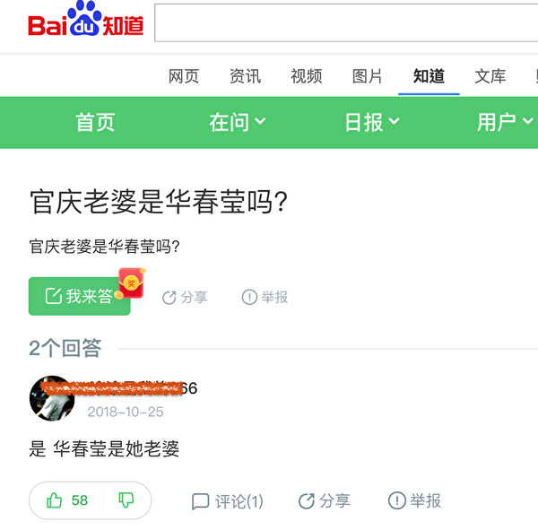

（截图）

还有网友猜测官庆是否是因为武汉肺炎去世，不过有多个帖子对此否认，称官庆是死于脑癌。

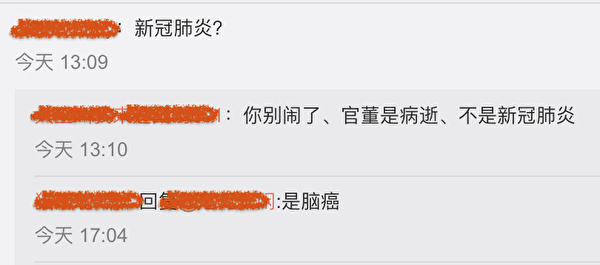

（截图）

去年9月2日，官庆被免去中国建筑集团有限公司董事长、党组书记职务。当时网上也有消息称，官庆的患有脑癌，在美国治疗了很长时间。

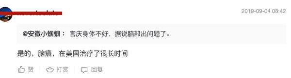

（截图）

<a target="_blank" href=#top><h6 align="right">回上方</h6></a>

<a name=62>
<h1 align="center"><b>【内幕】强令复工风险大 长春公文泄真相</b></h1>

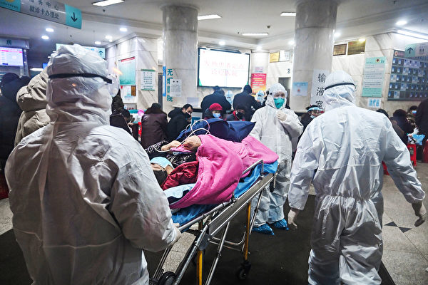

武汉肺炎爆发后，中共当局一直隐瞒疫情，致使疫情迅速蔓延。(HECTOR RETAMAL/AFP via Getty Images)

 
 【大纪元2020年03月05日讯】（大纪元记者何坚报导）尽管陆媒报导中国多数省份已复工复产，而中共“官方”的新冠肺炎（武汉肺炎）新增病例数自习近平督促复工起也骤降，但大纪元获得的政府文件披露了复工背后的真相：中共强令企业复工，却罔顾防护品严重匮乏的现实，相当于逼着员工和企业去玩命，将民众迫入感染病毒的危险中。

中共发布的“官方”疫情数据显示，日前除了疫情始发地湖北外，各地新增病例已降至个位数，3月3日新增病例零增长省份更是达到28个。

依照中共的数据，除湖北外，中国新增病例几乎归零，疫情似已消退，企业复工复产正当时。事实上，中国各地确已掀起复工潮。据陆媒报导，目前中国大陆21省份规模以上工业企业复工率超80%，复工率达90%的省份已有11个。中共的数据一贯有水分，所以这个数据也难当真。

然而，大纪元3月4日获得的中共地方政府的防疫文件显示，地方政府为了完成复工的政治任务，而不惜以民众可能感染病毒、企业可能遭重创的代价，全力推动辖区内的企业复工复产。

<b>政府文件泄底 复工加大民众感染风险</b>

例如2月26日，长春市宽城区委在《宽城区企业复工复产工作情况汇报》文件中披露说，截至2月25日，宽城区累计复工复产规模以上工业、限额以上批零住餐业和重点服务业企业104户，复工率达到63.8%。其中：规上工业46户，开工43户，复工率达到93.5%；限上批零住餐企业88户，开工39户，复工率达到44.3%；重点服务业29户，开工19户，复工率达到65.5%。

规模以上工业、限额以上批零住餐业及重点服务业企业是中共经济统计系统的专用称谓，一般都是规模达到一定标准的大中型企业（标准从主营收入200万元至2000万元不等），企业员工人数一般都有成百上千甚至数万人。

长春市宽城区委在工作汇报中披露说，区政府“为企业提供酒精3200升、消毒液2850升、口罩3500只”。也就是说，宽城区政府为辖区内复工的这些大中型企业所提供的3500只口罩，可能连一家企业一天的口罩用量都满足不了。

而在新冠疫情严重的中国大陆，如果没有口罩防护，民众在上下班途中以及工作期间，都暴露在病毒感染的风险中。例如2月28日重庆北区疾控中心披露一起病例，一名男子因乘坐公车被感染，而车上另一确诊病患还戴了口罩，仅是途中偶尔取下口罩缓口气。

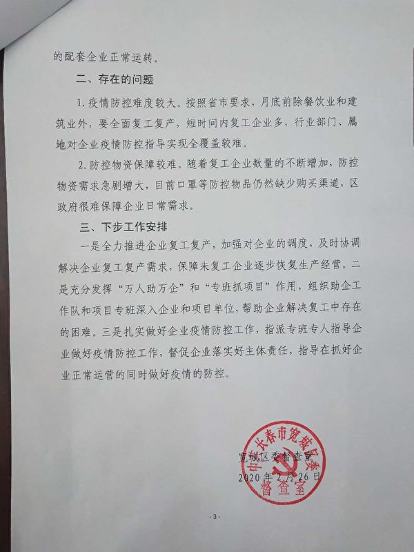

2020年2月26日，长春市宽城区委《宽城区企业复工复产工作情况汇报》文件截图，当地政府承认复工是上级要求的，但因为防控物资难保障，防控难度大。（大纪元）

 
 对于企业复工和缺乏防护品保护员工生命健康之间的冲突，长春市宽城区委在文件中承认，“防控物资保障较难。随着复工企业数量的不断增加，防控物资需求急剧增大，目前口罩等防控物品仍然缺少购买渠道，区政府很难保障企业日常需求。”

宽城区委的文件透露了复工是政治任务，“按照省市要求，月底前除餐饮业和建筑业外，要全面复工复产”，但表示“疫情防控难度较大”。

那么在长春市，企业或居民个人是否有条件自行购买口罩等防疫物资？

长春市医疗保障局在2月25日《关于口罩在线预约购买的情况说明》文件中披露了，民众想要买到口罩是多么的难。

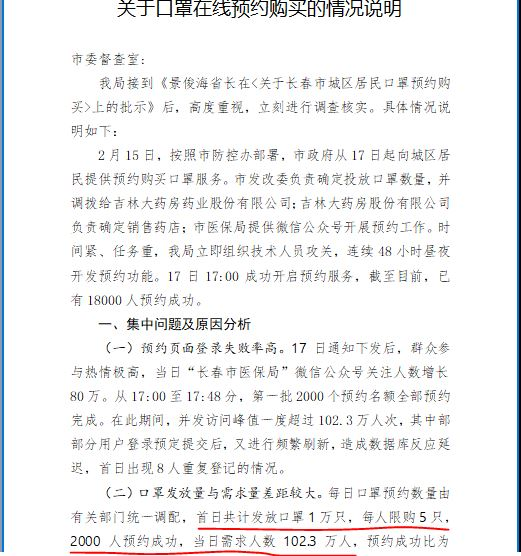

长春市医疗保障局2月25日《关于口罩在线预约购买的情况说明》文件截图（大纪元）

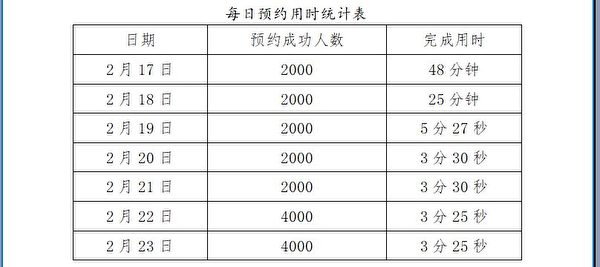

长春市医疗保障局2月25日《关于口罩在线预约购买的情况说明》文件截图，文件显示，长春市每天4000个购买口罩的名额，3分钟就被抢空。（大纪元）

 
 该文件披露说，按照市防控办部署，长春市政府从2月17日起向城区居民提供预约购买口罩服务、每人限购5只；然而2月17日当天政府只提供2000个预约名额，但当日需求人数为102.3万人。

也就是说每500个长春市民中，只有一个人能幸运地购买5只口罩。即使2月22日起，长春市政府将购买口罩预约名额提高至4000个，对于拥有750万人口的长春市而言，依然是杯水车薪。该文件显示，长春市每天4000个购买口罩的名额，3分钟就被抢空。

值得一提的是，中共官方数据显示，2月17日以来长春市新增病例一直零增长。不过当地政府对口罩的限购与民众的疯狂抢购，显示双方都不相信所谓的官方数据。

另外，长春市下辖的部分县市政府，也在复工工作汇报中披露了复工企业缺乏防护用品的问题。

例如榆树市市委汇报说，榆树市现有规上工业企业51户，已开工35户，开工率68.63%，现上岗人数3431人；榆树市政府“先后为复工复产企业发放1950升消毒液、5000副医用口罩”。如果按一名工人一天在工作期间仅进食一次、至少使用两只口罩来计算，榆树市政府提供的口罩还不够复工企业一天的用量。

而长春市下辖的农安县和德惠市当地政府则直接汇报说，部分企业未能复工的原因之一就是缺乏防护口罩。

不过，在中共的“正面”宣传中，各地不但全面复工，且是复工和防疫“两不误”，而对于复工企业缺乏防疫物资、民众买不到口罩、复工后出现的聚集性感染等现实，中共绝口不提。

如果没有足够的口罩来防护，复工的中国民众随时都可能感染新冠病毒，自己和家人的健康、生命都处在高度危险中。

<b>复工企业危机重重</b>

而对于企业而言，复工同样带来巨大的风险和危机。一旦复工后有员工被确诊感染，不但企业会被立即关停、蒙受停业带来的经济损失，同时还会遭受密切接触员工被隔离（每人每天隔离费用至少数百元）及进行医学检测等巨额费用损失。

更糟糕的是，即便企业尽职尽责地满足了政府的复工防疫要求，若员工被感染，政府依旧会将责任推卸到企业头上。

例如3月2日，安徽省合肥市卫健委通报了一起新冠病毒无症状感染病例，病患许某是安徽国风塑业股份有限公司的一名员工，但当地政府对国风塑业开出的《停产通知》却称，该公司“存在近期员工发热就医未及时上报的问题”，为“实现复工和防疫‘两手抓两不误’”，“现责令企业停产整顿”。

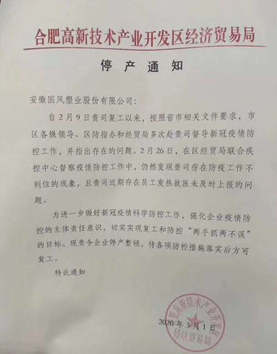

合肥高新技术产业开发区经济贸易局下发的《停产通知》（网络截图）

国风塑业这名确诊员工到底是无症状还是发热未被公司及时上报，合肥市卫健委的回应是“以我们官方发布为准”。根据合肥市卫健委网站的信息，国风塑业排查出许某的密切接触者有167人，均予以集中隔离并采样送检。工厂所在地合肥开发区管委会称，工厂至少停工14天。

大纪元早前已经根据获取的中共内部文件以及对大陆病患、火葬场、一线人员的采访等各种素材，发布过内容翔实的报导，揭露了中共隐瞒疫情、数据造假的真相。

大纪元多篇报导都指出，新冠疫情在中国依然严峻，中共封锁信息和造假等维稳措施以及为保政权而强推复工的政治任务，令当前的疫情形势雪上加霜。#

<a target="_blank" href=#top><h6 align="right">回上方</h6></a>

<a name=61>

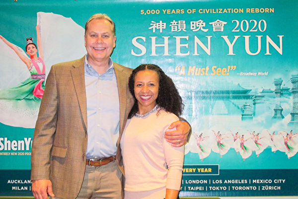

Chris Pratt先生和太太于2020年3月5日晚，在美国哥伦比亚宼格艺术中心观看了神韵演出。（麦蕾／大纪元）

 <h1 align="center"><b>神韵展示“创世主救人” 美国哥市观众感佩</b></h1>
 
 【大纪元2020年03月06日讯】（大纪元记者麦蕾美国哥伦比亚报导）3月5日，神韵新纪元艺术团在美国哥伦比亚宼格艺术中心（Columbia Koger Center for the Arts）进行第二场演出。缤纷的色彩，如诗如画的场景，神传文化的高深内涵，令现场观众赞叹不已，并由此而思考生命的意义。

演出现场的气氛非常火热，汉家男儿月下习武，清纯少女玉手卷珠帘，神韵艺术家的跳跃、翻转等各种高难度动作，引来观众席上阵阵热烈的掌声。

<b>神韵深具教育意义 CEO感佩创世主危难中救人</b>

Chris Pratt先生在一家提供工作安全装备的公司担任CEO。对于神韵致力于复兴传统文化，Pratt十分赞赏，并认为中国需要这样的改变，“这是一个伟大的努力！我认为对于这样一个政权，人们要从下至上的改变。”

他尤其喜欢最后一个创世主救人的节目，他说：“创世主阻止海啸而救了所有人，否则结果是可怕的。但我不知道如果海啸是针对所有人而来的时候，人们是否都能上天堂？”

得知神韵艺术家们都修炼法轮大法，以“真、善、忍”为准则。他表示感受良多：“哦，是的！这是一个令人从中学习的体验，对于所有人都有教育意义。我想如果更多人能够了解，那么在真实的世界中我们会赢得更好的机会。”

<b>全球百强保龄球教练：神韵充满平和关爱</b>
 
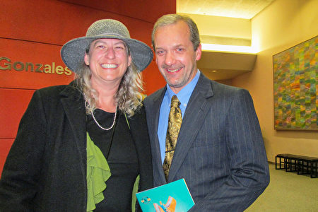

Charles Schommer先生和太太于2020年3月5日晚在哥伦比亚宼格艺术中心观看神韵。（麦蕾／大纪元）

 
 Charles Schommer是一家保龄球公司老板，他曾等多次在美国获得州锦标赛冠军，还是业界银牌教练，在2016年被“保龄球国际杂志”评为全球最佳100名保龄球教练之一。

神韵的宗旨是复兴中国传统文化，展现了传统的精神价值观。Schommer表示：“的确是，这是一场充满平和于关爱的演出，缓和了当今世界的冲突，展示了爱如何将人们凝聚在一起。”他认为，节目中对善良与邪恶的较量的体现“非常确切”。

<b>租赁公司老板观神韵：要去了解法轮大法</b>
 
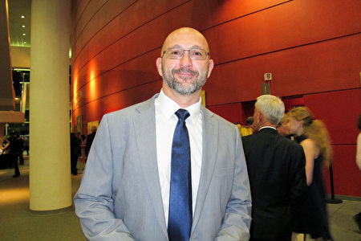

房屋租赁公司老板Stephen Wilcox于2020年3月5日晚在哥伦比亚宼格艺术中心观看神韵。（麦蕾／大纪元）

 
 房屋租赁公司Indigo property的老板Stephen Wilcox先生看后表示：“演出令人非常印象深刻，背景天幕、所有服饰的色彩，都非常非常鲜活，让人赞叹。”

展现现实的法轮大法修炼人反迫害的节目，触动了Wilcox，他说：“是的，我还不太了解这种通过冥想的信仰，我很好奇。”

而演出中，神韵艺术家所展现出的“真、善、忍”风范令Wilcox感受很深，“绝对的，我能从中感受到。”他表示这种理念很吸引他，“今晚回家后我会去了解更多关于法轮大法的内容”。

<b>神韵艺术家谦逊配合 资深金融顾问惊叹</b>
 
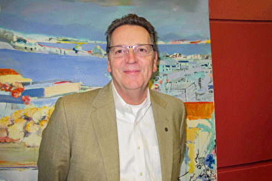

Van Hobbs先生和太太于2020年3月5日晚，在美国哥伦比亚宼格艺术中心观看了神韵演出。（麦蕾／大纪元）

 
 Van Hobbs先生是一位资深金融顾问。当大幕拉开第一个节目呈现在眼前，Hobbs说自己的感受是“哇！”

他对神韵演员的谦逊和配合惊叹不已，“我对艺术家们的协调一体感到震撼，似乎没有人想突出自己、或者专门表现自己，他们相互合作，互相配合。”Hobbs称赞道，“演出的精准性也令我感到惊叹！”

Hobbs表示自己能够感受到演出透露出的慈悲，“是的，我可以感受到这种慈悲，跟（中华民族）几千年前的感受产生共鸣。”

<a target="_blank" href=#top><h6 align="right">回上方</h6></a>

<a name=60>
<h1 align="center"><b>程晓容：中共训诫又表彰 李文亮调查为何难产</b></h1>

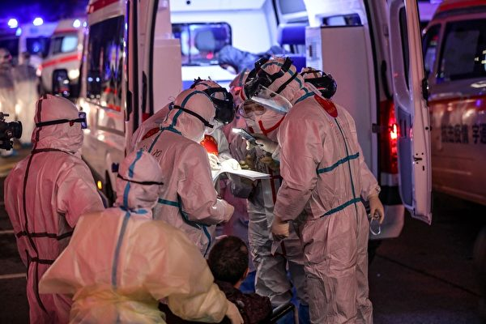

2020年3月3日，武汉市第五医院将武汉新冠肺炎患者转移到新建的雷神山医院。(STR/AFP via Getty Images)

【大纪元2020年03月06日讯】3月5日，中共国家卫健委等三个部门印发文件，表彰一批防疫工作的先进集体和个人，李文亮等34名染病去世的医护人员被追授“先进个人”称号。大批网民抨击中共，认为当局不公布调查结果，却试图以追加荣誉蒙混过关。

李文亮事件引爆巨大民愤、引发国际关注。2月7日，中共在李文亮去世后宣布派出调查组前往武汉，“就群众反映的涉及李文亮医生的有关问题做全面调查。”

群众反映了哪些问题？第一，李文亮没有传谣，警方的训诫是错误的，武汉公安局应当撤销训诫并道歉，办案者应被追责。

第二，1月2日，央视播报了前一日武汉警方查处8名“传谣者”的新闻，这是对李文亮及其家人的进一步伤害，也是对全国民众的极大误导。

第三，李文亮从出现发热症状到去世，历时26天，期间他的病情曾有好转，但后来急转直下。有网民透露，“李文亮的治疗极其不够到位和及时，医院院长有压力”，“官方说是因为感染病发，我们有理由怀疑他是怎么死的？”

李文亮的母亲表示，要警方给个“说法”。李文亮的妻子付雪洁也告诉媒体，她在等待中央调查组的处理结果。可是，从2月7日到3月5日，不见一点调查进展，更不用提结果。

<b>李文亮事件调查为何难产？</b>

疫情爆发以来，中共撤换了大批官员，包括武汉和湖北书记，而且出炉了关于武汉女释囚进京一事的调查报告及处理通报。为什么对李文亮事件的调查悄无声息？

原因很简单：此事触及疫情的人祸因素，触及中共维稳的邪恶机制，直接威胁到中共的统治根基。找几个替罪羊无法服众，而且，替罪羊还不好找。

第一，李文亮事件涉及公民知情权、言论自由，涉及信息公开透明，而中共绝不会放松对这一领域的管控。因为中共政权就建立在封杀真相、散布谎言的基础上。

假如撤销对李文亮的“训诫”，让武汉警方做出道歉，那么，另外7名披露疫情的医生，是不是也应恢复名誉？再者，全国几百名因在网上披露疫情信息而被传唤甚至拘留的人，难道不应立刻予以正名？还有方斌、陈秋实、李泽华等人，现在何处？政府应立即还他们自由。

再进一步，疫情之外，大批维权人士、异议人士、坚守信仰者都是因言获罪，他们也都应获得无罪释放。

所以，如果中共真的调查并一一纠错，中共构陷公民的谎言将迅即瓦解，暴力维稳机制也将崩溃。

第二，警方之所以查处李文亮等人，不是因为他们传谣，而是因为他们说出了真相，而这个真相影响了党所要的“稳定”。事实证明，对“传谣者”的打压导致了病毒蔓延。所以，直接训诫李文亮的人员，以及从上到下“维稳”至上的官员，都不同程度地对疫情失控负责，即对武汉、湖北和全国乃至世界民众的染病和死亡负有责任。

2月8日，武汉地区10名教授在网络发布署名声明。他们援引中国宪法，认为“李元亮的行为完全符合宪法”，要求政府承认错误，并取消对李元亮等人的处罚。声明写道：“如果不把李元亮的话视为流言蜚语，让市民们能够说出真相，就不会发生像现在这样的国家性灾难。”

迄今，中共一直拒绝承认隐瞒疫情，一直强调信息“公开透明”，因为它深知，人祸夺走了人命，它不敢担责。它要调查的话，就是自己查自己。

第三，针对外界对李文亮死因的质疑，调查其实很容易，只要公开诊断和救治的全部医疗记录即可。但是，中共越捂着盖着，越说明内有隐情。

<b>中共翻手为云 覆手为雨</b>

中共追授李文亮为“先进”，网友们表示不能接受：“一个被指造谣遭警方训诫、被央视批判的人，居然被授予先进了。百思不得其解，感觉要精神分裂了。”

“流程本该是公布调查结果、处理责任人、面向公众向受冤屈的医生赔礼道歉，最后才是表彰个人。现在是直接从第一步跨到最后一步，潜台词：给了表彰就等于免了训诫，等于道歉，等于一切，不接受！”

中共从不认错，而是用不同手法掩盖它的罪恶。上个世纪，中共在土改、反右、文革等运动中错杀了数百万人，竟逼着被枪决者的家属缴交子弹费。多年后，当局下发“平反”通知书，用一张纸抹去了枉死的生命，党依然“伟光正”。是非标准随时翻转，国家主席一夜之间便了成“叛徒”和“工贼”，爱国科学家被贴上“特务”标签，勇敢建言者被打成“反革命”，被踏上一万只脚。中共颠倒善恶，蹂躏人的尊严，践踏公民权利。

中共在3月5日表彰《决定》中强调党的领导，称要“把党中央的关怀和温暖传递给每一位奋战在一线的卫生健康工作者”。在李文章亮事件中，党的“关怀”体现在哪里？

想当初，李文亮在深夜被公安人员带到派出所接受训诫，那不正是党的意志吗？央视播音员声色俱厉地播报8名“传谣者”被查处的消息，那不是党的喉舌在警告全国人民吗？现在，党又说，李文亮是“先进”？党不怕丢丑，喜欢自打耳光，却让所有人跟着错乱、分不清是非善恶。

目前，中共加强了舆论和媒体管制。据悉，“中国医生和护士被勒令，‘任何情况下都不得谈及与新冠病毒有关的事情，不得在社交媒体发布相关信息。’”中宣部从2月3日起严格审查所有陆媒报导，3月1日，中共网信办推出新规，以治理网络生态为名，实施最严厉的整肃。同时，中共政法委越界管起了文宣，要求记者撰写充满“正能量”的“暖新闻”。花样繁多，目的只有一个：为党唱颂歌，压制民声、强力维稳。

中共训诫李文亮，又表彰李文亮，都是为了它自己。于此，中共向世界展示的不仅是超乎想像的荒唐，还有突破底线的无耻。

<a target="_blank" href=#top><h6 align="right">回上方</h6></a>

<a name=59>
<h1 align="center"><b>曾活着被送火化炉 湖北女教师凄惨离世</b></h1>

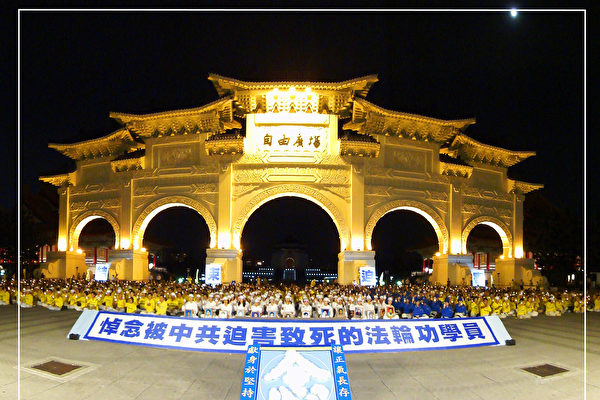

台湾台北，自由广场上的法轮功学员，悼念用生命捍卫真理、被中共迫害致死的中国大陆同修。（大纪元）

 
 【大纪元2020年03月06日讯】在武汉市女子监狱，她备受摧残，精神失常，此后，又被秘密押回襄樊市航宇系统364医院所谓“治疗”，导致瘫痪，最后一道黑令，要把心脏还在跳动的她送进殡仪馆……幸而操作人员发现人还活着，拒绝火化。

她是湖北省襄樊市法轮功学员，51岁的优秀女教师刘伟珊。2019年10月28日，在经历中共当局长达20年的迫害后，她在冤屈中悲惨离世。

明慧网报导，刘伟珊，壮族，原襄樊汉江机械厂（现中航工业航宇救生装备有限公司）子弟学校教师，曾教过英语、化学、音乐、地理、历史等学科，多次被评为厂级先进及“省工办”先进个人，她勤劳朴实，在学校师生中拥有较高的声望，一直以心地善良著称。

以前，刘伟珊体弱多病，1994年做过胆囊摘除手术。1999年初修炼法轮大法后，她变得朝气蓬勃，健康向上。半个月内，同事们目睹她像换了个人似的；3个月内，她一身的病痛也奇迹般消失。

<b>多次被非法关押迫害</b>

1999年“7·20”中共江泽民集团迫害法轮功以后，刘伟珊看到周围的人们被铺天盖地的谎言所欺骗，出于人的良知，她向人们讲述法轮大法的美好，劝大家不要相信电视上的谎言，却遭到厂内软禁。

2000年的一天，刘伟珊单位的宣传栏里出现一张“全球公审江泽民”的传单，厂领导与专职迫害法轮功的“610办公室”合谋，在刘伟珊上班的路上将她绑架。刘绝食出来后，单位只给她每月一百多元的生活费。

2000年12月16日，刘伟珊接到通知“到校上课”，在校园内被非法诱捕至襄樊市“法教班”，遭到襄樊市公安局政保科长聂晓武的毒打、捆绑、踢跪于地。而后被非法关押在汉江派出所留察三天两夜，再非法行政拘留15天。

2001年7月3日，刘伟珊又被厂保卫人员从女厕所挟持到保卫科，以“襄樊市政府有事要问，24小时内必须返回”为由，将刘伟珊骗捕至襄樊市劳教所，非法关押61天，期间她被关入小号牢笼5天。铁笼很小不能站立，只能半蹲。

2002年4月的一天，汉江派出所警察到刘伟珊家，强行搜走法轮功书籍。

2002年5月，襄樊市检察院非法逮捕了刘伟珊。她被几名公安抬着押上警车。刘伟珊在看守所以绝食抗议迫害，被送襄樊市第一医院急诊室强行灌食半个月，生命垂危。

<b>遭非法判刑4年 被迫害精神失常</b>

2002年9月14日，刘伟珊因发放法轮功真相资料，被非法关入襄樊市第一看守所。

看守所警察对她野蛮灌食，由几个身强力壮的犯人，将刘伟珊的头、手、脚按住，强行从鼻孔插入胃管，同时警察唆使犯人掐、拧刘伟珊的身体，扯头发、搧耳光，并扒光她的衣服，只给一块被单裹在身上，说是上厕所方便。一天两次灌食折磨，每15天才换一次胃管，当胃管拔出时，底下半截管子都是黑的。就这么折磨了她40天。

在刘伟珊被非法关押期间，汉江机械厂党委书记胡代新助纣为虐，要求“610”（专门迫害法轮功的机构）：“你们这次只要不放刘伟珊回家，要多少钱都行。”

2002年10月13日，身体极度虚弱的刘伟珊被抬到看守所大院，她被非法秘密宣判4年刑期，并于次日被关入武汉市女子监狱。

武汉市女子监狱迫害法轮功学员的手段极其阴毒，把不妥协的法轮功学员关押到偏僻的小监号，双手反铐起来，几天不管，吃睡等基本权利也没有了，警察却佯装不知道。

法轮功学员绝食抗议迫害，警察就用犯人吃剩的饭菜，腐败发酵的恶臭水灌食。在这种精神加肉体的双重迫害下，很多法轮功学员被迫害致疯，甚至死亡。

刘伟珊被非法关入武汉市女子监狱仅几个月，就被迫害致精神失常，骨瘦如柴，头发被剃光了，例假停止，手臂发抖，两腿蜷曲，生活不能自理，身体状况极差。

狱警怕她死在监狱里要承担责任，将她三天两头拖到医务室打吊瓶，注射不明药物，用绳子反捆在铁栅上，野蛮灌食不明药物，把食道都插坏了。

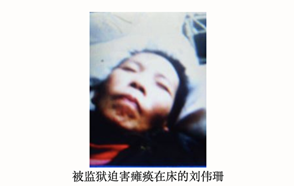

法轮功学员、优秀女教师刘伟珊被中共迫害后的悲惨境遇。（明慧网）

<b>被医院“治疗”瘫痪</b>

2006年1月31日（正月初三）晚，生命垂危、神志不清的刘伟珊被秘密转押回襄樊市航宇系统364医院，进行所谓的“治疗”。

住院姓名写的是“无名氏”，由两名看护24小时监控。刘伟珊的同事、学生、好友前去探望，在单位反响很大：“好好的一个人，怎么被折磨成这样，骨瘦如柴、全身抽搐、目光痴呆完全没有一点人形了。”

但是2006年2月11日（正月十四）以后，人们再去探视刘伟珊时，发现病房门上贴着“危重病人、谢绝探视”，前去探视的人都被盘问。

刘伟珊被“治疗”瘫痪在床，肌肉萎缩，两小腿已没有多少肌肉，两腿完全屈曲呈“之”字形，精神失常，偶尔能说几句单词口语，对看护她的人说：“我想回家！”

“610办公室”让家属领人，家属说“去的时候好好的，回来变成这样了”，予以拒绝。
一道黑令要将活着的她送入火化炉

2011年8月，364航空医院由郊区搬迁到市区新建的医院大楼，刘伟珊被转移送往新建的医院大楼。在这期间，湖北襄阳市“610”人员及364航空医院党委书记樊智勇指示把心脏还在跳动的刘伟珊拉往殡仪馆。

当准备火化时，殡仪馆当班的操作人员检查发现，人还活着，心脏还在跳动，拒绝火化。在这种情况下，刘伟珊才又被拉回到364医院。

据查， 这个364医院党委书记樊智勇就是原汉江机械厂迫害过刘伟珊的党委副书记、“610办公室”的樊智勇。

刘伟珊被关在湖北364航空医院6楼10号房间。2013年新年前后，刘伟珊的几位同仁前往医院探望，被襄樊市“610”及医院党委雇用的康姓女护士拦住说：“上面有指示，不准任何人看。”

此时的刘伟珊瘫痪在床，不能吃也不能喝，已经成了植物人。医院没有采取任何治疗方法。

2019年10月28日凌晨，刘伟珊在364航空医院凄惨离世。

<a target="_blank" href=#top><h6 align="right">回上方</h6></a>

<a name=58>
<h1 align="center"><b>两岸抗疫模式对比 法媒：台自由体制为利器</b></h1>

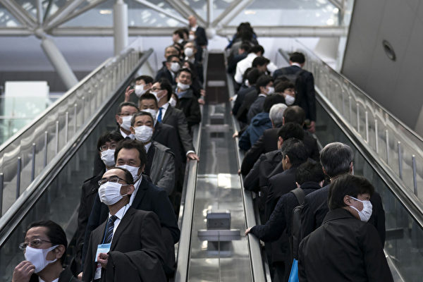

台湾与中国大陆仅百公里之遥，至今疫情控制得当，法媒报导详述台湾成功抗疫的原因，并表示民主制度能比极权做得更好。图为戴口罩的民众。 (Tomohiro Ohsumi/Getty Images)

 
 【大纪元2020年03月06日讯】（大纪元记者江禹婵综合报导）武汉肺炎来势汹汹，各国陆续出现确诊病例，台湾与中国大陆仅百公里之遥，至今疫情控制得当，让各国期盼借鉴台湾经验抗疫。继法国《世界报》刊登台湾对抗武汉肺炎的报导后，法媒开始关注台湾模式。《十字架报》与网络媒体Slate皆详述台湾成功抗疫的原因，并表示民主制度能比极权做得更好。

《十字架报》（La Croix）与网路媒体Slate都在文章开头表示，台湾与中国仅百公里之遥，居住在中国的有一百五十多万名台商，且2019年冠状病毒疾病（COVID-19，武汉肺炎）疫情爆发正值中国新年，有大量返乡人潮，原预测台湾将遭受重创，而疫情延烧至今，台湾只有四十多例确诊及1人死亡。

报导赞台湾当局面对疫情反应相当迅速并做出评估。《十字架报》表示，“台湾的危机处理方式堪为典范。”其中一个主要原因，便是“台湾政府快速的资讯与反应能力”。

由于2019年底，在大陆的台商开始耳闻武汉有未知的肺炎开始传播，台湾政府便立即管控武汉来的班机。加上去年12月31日，中国才刚通报世界卫生组织（WHO）疫情的同时，台湾疫情指挥中心就已经下令隔离从武汉入境、有症状的旅客。后台湾更宣布取消来自中国的所有航班。

“资讯透明”是台湾能成功抗疫的关键。《十字架报》特别提到，包括公民出入境的资讯，都可以通过健保卡看到，易于医疗人员确认其旅游史。此外对于可疑病例的居家隔离、对抗假消息的全民教育、企业与学校的应对政策等，都归功于资讯的透明。

《十字架报》同时访问了史丹佛大学副教授王智弘（Jason Wang），王智弘指出，疫情指挥中心有一份124项措施清单，以保护台湾人的公卫安全。王智弘在日前《美国医学会期刊》上刊出的专文中强调，“由于COVID-19的疫情全球蔓延，这份124项措施应该能启发其它国家。”

《十字架报》则在文章最后表示，“尽管台湾没有世界卫生组织的协助，因为中国甚至拒绝给予台湾观察员资格，台湾仍证明，在对抗这类流行病上，民主制度比共产极权专政更有优势。”

网络媒体Slate则提出，台湾的口罩控管政策，包括价格的控制、动员增加量产等，指“台湾对于疫情处理，确实展现出无庸置疑的效率”，并在文章最末表示，或许应该在下次流行病发生前，仿效台湾模式。#

<a target="_blank" href=#top><h6 align="right">回上方</h6></a>

<a name=57>
<h1 align="center"><b>何清涟：北京改写武肺灾难史 注定徒劳</b></h1>

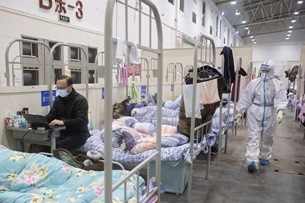

钟南山。（视频截图）

 
 【大纪元2020年03月07日讯】截至3月6日，据Worldmeters消息，武汉肺炎已经流播六大洲96个国家，欧洲疫情告急，美国病例也迅速增加，韩国、伊朗已经焦头烂额，但北京却想趁此机会，重新改写武汉肺炎流播世界这段人类灾难史的开端。改写的手段有两招，一是要彻底将武汉肺炎这一名称从这场疫情中抹去；二是由习近平发话，应该明确调查病毒来自哪里，寻找一个国家做替罪羊，在中共控制的国内舆论场中，美国已经中标。

<b>为何要消除“武汉肺炎”这一名称？</b>

中国外交部发言人赵立坚3月4日就“中国病毒”、“武汉病毒”一词发言，声称这是个别媒体“企图让中国背上制造疫情灾害的黑锅”，别有用心。

中国现在为何特别忌惮其它国家的媒体将这场席卷全球的病毒称之为“武汉肺炎”？其目的之一，是希望世界将这场病毒与中国的联系抹去。用“武汉肺炎”称呼这场瘟疫，本是中国首创，在今年疫情爆发初期，武汉沦陷、全国恐慌、一度被怀疑成SARS变种的新型病毒，被中国所有媒体称之为“武汉肺炎” （Wuhan virus），习近平当时正焦头烂额，穷于应付隐瞒疫情的指责。无论是他本人还是其智囊班子，没来得及去想“武汉肺炎”这个病毒名的“政治影响”，待回过神来改用“新冠病毒肺炎”这个词来定名时，武汉肺炎已经成为全球媒体对这场中国病毒引发的瘟疫的通称。中国政府突然觉得这名儿有损国家形象，宣布暂时订出官方名字“新型冠状病毒肺炎”，简称“新冠肺炎”，以避免任何与中国相关的联想。

谭德塞对中国政府这番用意心领神会，先是宣布暂时简称为“2019-nCoV”，继而在2月11日的世卫专家会议上宣布，将“武汉肺炎病毒”正式命名为“COVID-19”（2019年冠状病毒疾病），COVI是冠状病毒（corona virus）英文缩写，D是英文疾病（disease）的首个字母，2019年代表疫情爆发的年份。

此名一出，不少人质疑中国政府想跟这次疫情划清界线，在抗疫工作如火如荼之际仍不忘粉饰中国形象，并以MERS中东来命名作为例子，称为何可以“污名化”中东人，却对中国武汉肺炎要采用政治正确的方式对待？但不少中国人非常欢迎这一命名，认为只要名儿改了，这病就不是中国来的，不会引起歧视，这当然是阿Q式的自慰。

从“COVID-19”出来之后，媒体三者混用，武汉肺炎、新冠病毒肺炎、COVID-19混合使用。要说这三者本就一回事，世界也没那么健忘，疫情刚从中国随病毒携带者跨越国境、漂洋过海，遍布六大洲，美国对中国的旅行禁令还未解除，就算不称为“武汉肺炎”，世界也忘不了病毒发源地是哪个国家。但中国急于洗白自己，让世界各国资本以为中国疫情过去了，开始重新收拾旧山河，再奏天朝威武曲，如我所归纳的那样，疫情舆论控制四部曲前三丧事喜办、美国阴谋、“中国又赢了”都是“完成进行时”，现在正在大奏特奏“中国拯救了全世界（世界应该感谢中国）”，于是“武汉肺炎”这个标识病毒来源地的名称就特别扎眼，早在赵立坚以外交部发言人身份指责使用武汉肺炎是污名化中国之前，中共就派出大批五毛到推特脸书上，拿出小学教师批改作业的精神，看见用武汉肺炎四字的言论，立刻校正，说世卫已经定名为COVID-19，不能再叫武汉肺炎。我就遇到几十位。为此我专门回了一条推文：坚持称武汉肺炎，就为了将中国政府钉在耻辱柱上，也为了纪念那些因武汉肺炎而死于非命、以及在疫情期间因各种原因熬不过去而用种种方式自尽或死亡的绝望者。

<b>正名的目的是为病毒另找娘家</b>

为武汉肺炎这名字大光其火，在名字上纠缠不休，当然是北京还有更深层的目的，中国原生的武汉肺炎害了太多国家，中国必须甩锅，为武汉病毒另找娘家。

关于零号病人是谁、病毒来源是哪里这一争论，从武汉肺炎开始流行后，国内、国际社会就没断过争论。国内非官方质疑者认真查找了“蝙蝠女侠”石正丽及武汉P4实验室过去种种事迹，包括其英文论文，以及国际病毒学界披露的资料，早就认定是中国武汉P4实验室泄露。分歧是：是实验室事故泄漏还是另有原因，还有少数认为是习的政治对手给他下套。

国外争论主要是根据病毒样本，参与争论者主要是对中国病毒研究有所了解的病毒学家。美国罗格斯大学（Rutgers University）生物学家理查德·埃布莱特（Richard H. Ebright）曾在《自然》杂志（Nature）对武汉病毒所的一项蝙蝠病毒实验表示关注，今年1月，他在接受BBC采访时，非常肯定地说，基因组测序显示，此次爆发的病毒与武汉病毒研究所2003年在云南某个山洞采集的蝙蝠冠状病毒RaTG13非常接近，全基因组同源性为96.2%。根据目前对病毒的基因组测序，没有任何证据表明该病毒经过人工改造，“这意味着，这种病毒目前已知存在于两个地方：云南的山洞和武汉病毒研究所的一个实验室中，……它从2013年储存在武汉病毒研究所至今。” 埃布莱特认为，并不排除此次疫情的病毒由于实验室事故进入人群的可能性。

国际病毒基因库网站（GISAID）每天更新新冠病毒的进化树，到3月6日为止已有179 个新冠病毒株基因序列存入这个病毒基因库，现在发现所有的新冠病毒的共同祖先都是武汉新冠病毒，也就是说世界各地现在发现的新冠病毒都是来自于武汉的新冠病毒。

面对如此确定无疑的事实，中共却想否定。在武汉封城后几天，中国网络上就出现一篇《武汉肺炎、SARS、基因炸弹……大国角力下的生物战魅影》，该文先从SARS流播全球时回忆，认定血淋淋的事实就是：SARS只钟爱“华人”。中国人、新加坡人（华裔国家）、美籍华裔、加拿大华人等，SARS只攻击一个特定的人类种群——拥有最独一无二的“O—M175”基因群的汉民族。美国人、日本人和欧洲人都得到SARS的格外关照，对SARS有特殊的免疫力。与17年前的SARS一样，武汉肺炎也只钟爱“华人”，迄今为止的确诊案例均为华人。作者的结论是：这是美国针对华人的生化战，目的是从地球上排除该死的华人——这篇文章前半截其实忽略了SARS极可能是从实验室泄漏这一事实，后面的立论已经被现实否定，因为目前武汉肺炎病毒流播世界，欧洲美国无一不沦陷，但当时在大部分中国人眼中看来引经据典，很能迷惑根本被防火墙封锁在中国的中国人，以及完全不读中文信息之外的中国人。

这个脚本的思路，一直就是中共疫情期间控制舆论的第二部曲：美国阴谋论。只是当时习近平正陷入困境：武汉市长周先旺1月27日接受CCTV采访时，声言隐瞒疫情信息责任不在地方政府，湖北官僚集团亦利用地方媒体甩锅给中央政府，国外舆论及社交媒体舆论都认定习近平是最高责任人。习近平好不容易用三招扭转了局面——将李文亮树为吹哨人，化被动为主动；解放军首席生化专家陈薇少将接管武毒所、撤换湖北省与武汉市主要领导人，紧接着就开始将舆论控制纳入疫情、灾情的传统宣传套路——民间讽刺为丧事喜办，例如着力吹捧政府如何重视，集全国之力援助武汉、医护人员如何置自身安危于度外等等，就开始不断搅浑水，不断推出所谓专家论文，病毒一会儿来自湖北CDC养的浙江与湖北蝙蝠、一会儿来自与蝙蝠接触过的老鼠，将源头在中文世界里煮成一锅粥。

1月26日，中国当局宣称疫情拐点来到，每天新增的病例远少于全世界各国的总和，再将中国从病毒输出国塑造成南韩、伊朗输入病毒、形成“疫情倒灌”的受害国。有了这番铺垫，中国专家开始助攻。钟南山这位“防疫国宝”开始助攻，其工作单位所在地是广州，广州市政府新闻办于2月27日在广州医科大学举办疫情防控专场新闻通气会，身为“国家卫健委高级别专家组组长”钟南山称：“对疫情的预测，我们首先考虑中国，没考虑国外，现在国外出现一些情况，疫情首先出现在中国，不一定是发源在中国。”从此，病毒来源于美国论在中国微信上刷屏。《环球时报》紧随着发表文章称：“新冠病毒发源地目前尚不确定。不应（让中国）背上污名。”《朝鲜日报》3月4日发表报导说，习近平在清华大学医学研究院举行的座谈会上就传染病等问题表示：“这是事关国家安全、发展和社会稳定的重大挑战，应该制定全面规划，对病毒源头、传播途径和可能是中间宿主的可疑动物进行研究分析。利用人工智能（AI）和大数据技术，查明病毒的来龙去脉。”

武汉肺炎源于中国本是毫无疑义之事，WHO干事长谭德塞在慕尼黑安全会议上，为中国向国际社会甩出了第一大锅，称“中国牺牲自己，成为世界第一抗疫国，为世界抗疫赢得了‘机会窗口’”，不料中国意犹未尽，希望通过宣传做成事实：病毒来自中国之外。但是，这种说法除了在中国国内有市场之外，无法得到国际社会认可。在中国宣传病毒来自中国之外后，美国之音记者方冰等人采访了哥伦比亚大学医学院教授、亚伦·戴蒙德艾滋病研究中心（Aaron Diamond Aids Research Center）的创始人、华裔科学家何大一教授，他在采访中非常明确地说：“根据我们对萨斯（SARS）和新冠病毒的了解，以及对从其它动物物种中发现的新冠病毒的了解，我毫不怀疑它起源于中国。”

中国通过与疫情日益严重的国家分享信息、提供防控和诊疗等技术支持、捐赠医疗设备等作为，努力修补因疫情而受损的国际形象。这是中国应该做的，因为疫情毕竟从中国起源，但因此想重写这段人类灾难史的开端，并因此认为“理直气壮：全世界都应该感谢中国”，那就实在有点无耻了。互联网有记忆，全世界病毒学家那么多，中国既不能全部收买，也不能全部封嘴，还请北京神智清醒一点：国有国格，国格不是靠撒钱买来，当然更不能依靠耍赖争来。

大纪元首发

<a target="_blank" href=#top><h6 align="right">回上方</h6></a>

<a name=56>
<h1 align="center"><b>湖北省司法厅长等9人被审查 辖下黑监狱曝光</b></h1>

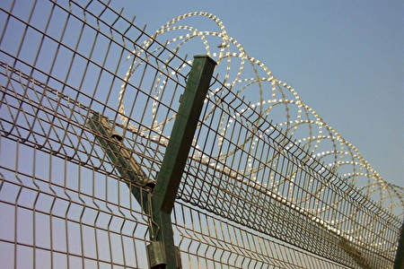

湖北省司法厅长谭先振被审查， 其管辖下的监狱严重迫害人权，黑幕重重。（网络图片）

【大纪元2020年03月06日讯】2020年3月2日，由于在武汉女子监狱刑满释放的新冠患者违规离汉抵京，湖北省司法厅厅长谭先振等相关部门9名领导被立案审查。海外明慧网关注，在这些人的职务管辖范围下，湖北省法轮功学员深受迫害成为全国重中之重。

据中纪委国家监委网站消息，被立案调查的还有湖北省监狱管理局局长郝爱民、副局长胡承浩、政治部主任张新华、刑罚执行处处长李欣被免职并立案审查调查；此前已被免职的武汉女子监狱原党委书记、监狱长周裕坤被立案审查调查；武汉女子监狱副监狱长郭秋文、刑罚执行科科长汤早容被免职并立案审查调查；武汉市东西湖区公安分局副局长尹志强被免职并立案审查调查。

其中，谭先振，男，汉族，1962年5月出生，湖北江陵人，2010年2月任湖北省委政法委员会副书记、省维稳办主任；2016年5月任湖北省司法厅厅长、党委书记，湖北省监狱管理局第一政委，湖北省委政法委员会委员。

郝爱民，男，1972年9月生，湖北黄梅人，曾任湖北省黄冈市公安局副局长、黄冈市罗田县委政法委书记、公安局长（期间挂职任省公安厅法制处副处长），省公安厅国保总队副总队长（期间挂职任咸宁市咸安区委常委），省公安厅内保总队总队长，省委政法委办公室主任，省委政法委委员、秘书长等职。2018年11月任湖北省司法厅党委委员、省监狱管理局党委书记、局长。

明慧网报导，1999年7月20日，中共的司法系统就成为中共邪党举倾国之力迫害法轮功的暴力工具，湖北省司法系统更是全国迫害法轮功的重中之重，并且以所管辖的臭名昭著的沙洋范家台监狱、武汉女子监狱和湖北省法制教育所而闻名全国。

以下简述湖北省司法厅管辖的监狱中的黑幕

<b>一、湖北省范家台监狱——法西斯集中营</b>

据明慧网曝光的资料显示，自中共迫害法轮功以来，湖北省司法厅所管辖的范家台监狱就是一个法西斯集中营，先后至少两百余名法轮功学员受到该监狱的残酷迫害。

其中，已知黄冈市郑捍东、荆州市陈启季、襄樊市邢光军、黄冈市江中银、孝感市郭正培、黄冈市郑忠和武汉市刘运朝等7名法轮功学员被迫害致死；枣阳张明启、十堰王玉超和武穴郭春生等3名法轮功学员被迫害致精神失常。

中共迫害法轮功长达20年，在江泽民“打死算自杀”的罪恶命令胁迫下，范家台监狱总结积累了一套系统的迫害法轮功学员的手段和方式，并在全国监狱系统推广。

范家台监狱，副监狱长张峰撰写的《矫正人生》，书中详述120种“矫正犯人”的邪恶方法。他还总结出12种“攻心转化方法”，使其迫害手段更加“理论化”、“系统化”和流氓化。从该监狱有幸逃脱出来的法轮功学员都能证实，使自己生不如死、九死一生的正是这些恐怖手段和伎俩。

例如，法轮功学员郭春生因为不放弃修炼，被多个“包夹”（狱警利用犯人监管法轮功学员）残酷迫害，导致精神失常，最后他被毫无人性的囚禁在铁笼里好几个月，直至刑期满。

<b>二、武汉女子监狱——人间地狱</b>

湖北省司法厅所管辖的武汉女子监狱，名为中共邪党所授予的“模范监狱”，实为人间地狱。监狱原政委蒋春曾被中共610和司法系统树为迫害法轮功的典型，由其主导实施的“三人互监”制度，即：吃、住、行、睡、包括如厕都必须3人同行，管制严厉，生产任务量加大，导致发生多起普通犯人自杀事件。

2014年4月10日，武汉66岁的法轮功学员崔海女士被非法关押在武汉市女子监狱，七监区一分监区指导员刘建鹰安排、指使犯人一天24小时监视，分白天、夜晚二班，寸步不离。

狱警还指使包夹人员强制体罚崔海。因遭受精神和肉体上的双重虐待，崔海的血压一度高达200。后来监狱又将她关押到迫害法轮功最凶狠的五监区进行“严管”折磨——强制洗脑，不准与他人接触、说话，家人不准探视、不准与家人通信、通电话，不准购物。睡觉、吃饭、洗漱、上厕所等都被多名犯人贴身监控、限制。

<b>三、“湖北省法制教育所”——强制洗脑的黑窝</b>

湖北省司法厅直属的湖北省法制教育所也被外界称为“现代法西斯集中营”，是对全省法轮功学员强制洗脑的黑窝。那里的警察基本上都是过去劳教所迫害法轮功的骨干。

被各地“610”（专门迫害法轮功的非法机构）强行绑架进来的法轮功学员，如果拒绝写“决裂书”，法教所除了指使“犹大”（被威胁利诱放弃修炼的前法轮功学员）用谎言与欺骗进行精神蛊惑之外，警察还会运用各种暴力的“辅助手段”。

酷刑手段包括：长时间罚站、长时间谩骂侮辱讥讽、长时间不让上厕所、长时间不让睡觉、不让吃饭喝水然后借口恶意灌食、毒打、卸掉下巴、打掉门牙、开水烫、烟头烫、脚踩头部、电棍电、食物饮水里下毒、注射毒针，等等。

其中，黄梅法轮功学员戴美霞被狱警、犯人捆绑，一次就强行灌了两斤盐水糊。管教科警察龚健还恶狠狠地扇其耳光，将其嘴唇打肿，一颗门牙被打松脱落。

<b>以下是湖北省政法系统迫害法轮功20年的部分案例统计；</b>

一、据明慧网信息不完全统计，自1999年7月至2019年，被曝光的湖北省武汉市被迫害致死的法轮功学员有159人，被迫害致死的法轮功学员家属7人；244人、263人次被非法判刑；被非法劳教的法轮功学员为544人，计588人次；开设洗脑班多达60多处，迫害法轮功学员至少2,382人次；被关拘留、看守所、安康医院、精神病院的法轮功学员数以千计；被骚扰、绑架、抄家、罚款、勒索的法轮功学员数以万计。

法轮功学员被迫害造成直接经济损失总计金额至少二千万元。

以上数据显示，其祸之烈，可见一斑。详情请见明慧网刊登的《武汉法轮功学员二十年遭迫害情况综述（1）》。

二、据初步统计，湖北省荆门市截至2019年11月，至少9位法轮功学员被迫害致死。至少51位法轮功学员被非法判重刑，最高刑期达10年之久。至少有90位法轮功学员被非法劳教，最高期限达6年。大约有300多人次被非法拘留。

此外，在荆门市城区非法办的洗脑班（其中包括荆门党校洗脑班，荆门警校洗脑班、民兵训练基地洗脑班）就有三次，近百人被洗脑迫害，办班时间最长达6个多月。

另外，“610”办公室、公安及单位人员等以下岗失业、扣发工资、开除、坐牢等卑鄙手段，从经济上迫害法轮功学员。详情请见明慧网刊登的《湖北省荆门市法轮功学员二十年遭中共迫害综述》。

三、据截至二零一九年七月的不完全统计，被迫害的湖北省赤壁市法轮功学员至少有78人，至少236人次；被迫害致死至少7人，被酷刑致残、致疯至少3人，被枉法判刑至少5人次，被非法劳教至少32人次，被投入精神病院至少2人次，被非法关进看守所、拘留所的至少有121人次，被绑架到洗脑班至少29人次，被非法抄家的至少有21人次。

以上详情请见明慧网刊登的《湖北省赤壁市法轮功学员被迫害综述》。

由于中共严密封锁消息，明慧网上报导的湖北省地区法轮功学员遭迫害情况，也只是突破封锁曝光的一点点，即便如此，从综述收集的大量事实与迫害案例，足以昭示湖北省政法体系追随中共迫害法轮功所犯下的反人类罪、酷刑罪、群体灭绝罪、罪无可赦、罄竹难书。

古语云，“尔俸尔禄，民脂民膏，下民易虐，上天难欺”、“多行不义必自毙”，明慧网评论，今天，湖北省司法厅的最高长官们成了党妈的阶下囚，是他们迫害善良人的报应。#

<a target="_blank" href=#top><h6 align="right">回上方</h6></a>

<a name=55>
<h1 align="center"><b>驳中共阴谋论 蓬佩奥：北京在新冠上不透明</b></h1>
 <h3 align="center"><b>批中共在疫情初期不行动 美国务卿：为获取病毒信息与北京合作是令人沮丧的</b></h3>
 
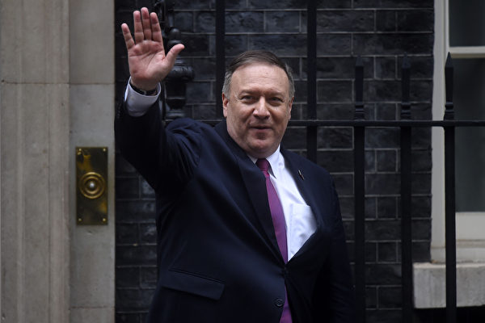

3月6日，美国国务卿蓬佩奥就新冠病毒肺炎发表言论。他表示，与中共合作获得疫情信息“令人沮丧”。(Peter Summers/Getty Images)

 
 【大纪元2020年03月07日讯】（大纪元记者张婷综合报导）美国国务卿迈克‧蓬佩奥（Mike Pompeo）周五（3月6日）在接受美媒采访时谴责中共在新冠疫情上不透明，并指为获取病毒信息与中共合作是“令人沮丧”的。他还反驳了中共宣传的病毒来自美国的阴谋论。

蓬佩奥周五在接受CNBC的“Squawk Box”的采访时说，中共在疫情爆发初期不予回应的行为阻止了防御工作。

<b>蓬佩奥：与中共合作极其令人沮丧</b>

蓬佩奥表示，实际证明与中国共产党合作获取新冠病毒的数据“极其令人沮丧”。这些数据对研发疫苗以及找出应对新冠病毒风险的解决方案极其重要。

他还表示，从一开始，美国就没有从中方获得足够的信息，导致美国今天面临新冠疫情的诸多挑战。“传染病医生们告诉我，这（指中共的做法）不是处理问题的方式，也不是美国对透明、开放以及信息共享的运作方式。”

2月25日，美国国务卿蓬佩奥批评中共和伊朗的审查制度及这两个国家试图掩盖新型冠状病毒疫情，并警告此等举措损害了全球的抗疫行动，会带来严重的后果。

蓬佩奥周五表示，他相信美国政府能恰当回应新冠病毒危机。“我有信心我们能够应对，我有信心，我们会处理得比全球任何其他国家都好。”

<b>蓬佩奥反驳中共的阴谋论</b>

针对中共官媒宣传的新冠病毒可能起源于中国大陆以外的说法，蓬佩奥予以反驳，并说“我们很确信我们知道病毒起源在哪儿”。

蓬佩奥还表示，美国也很确信，有一些信息本来可以更迅速地得到，一些数据中共本来可以提供并与全球卫生专家分享，但不幸的是，它并没有这样做。

自中共掩盖疫情、打压爆料人导致新冠肺炎爆发以来，科学界对病毒来源的猜测和追责一直没有平息。外界一直质疑是否跟研究病毒的武汉P4实验室有关。

中共领导人习近平在中央内部会议上特别强调要加速推动“生物安全立法”，并要求将生物安全纳入国家体系，这番谈话引发外界联想。

中共国家卫健委高级别专家组组长、国家呼吸系统疾病临床医学研究中心主任钟南山近期在一次新闻发布会上突然表示，疫情虽然是首现在中国，但不一定是发源在中国，立刻引起了巨大的舆论漩涡，“甩锅论”又起。

钟南山这番公开言论被陆媒和某华侨网炒作为“美国有可能是病毒发源地”。

近日有阴谋论者大量转发美国CNN电视台的截屏，并说，美国疾控中心承认第一例新冠病毒起源于美国。

在这张美国CNN的视频截图中，画面上写着：CDC Confirms First Coronavirus Case of “Unknown” Origin in US。下面有中文翻译：“美国cdc疾控确认，首例冠状病毒源于美国。”

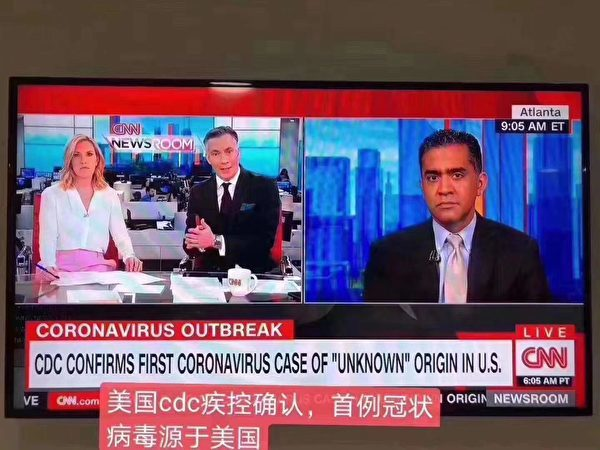

图片中的中文标注，有明显的误导之嫌，并且迎合了此前钟南山所称的“新冠肺炎不一定发源在中国”的说法。（读者提供）

但很快被熟悉英文的华人看出破绽，因为这句英文的真实意思是：CDC确认美国首例来源不明的冠状病毒病例。图片中的中文标注，有明显的误导之嫌。并迎合了此前钟南山所称的“新冠肺炎不一定发源在中国”的说法。

大陆资深媒体人、时事与财经独立评论者“时评君”发文指：“这真的是欺负我们不懂英文或英文没学好。”

“时评君”又举了其它的阴谋论调：武汉军运会期间，有5名外籍运动员曾经因为输入性传染病先后被送往武汉金银潭医院住院治疗，阴谋论者便把这件事翻出来，大胆猜测新冠病毒就是从那时候输入武汉的。但对此《南方周末》曾电话采访武汉市金银潭医院院长张定宇，张定宇明确说，那5名外籍运动员所患的输入性传染病都是疟疾，与新冠肺炎病毒毫无关系。“这都是不需要辟谣的内容。”

旅美学者何清涟认为，“美国早就成了共产极权、宗教极权国家清洗自己各种罪孽的污水桶，不管它们遭遇什么坏事，哪怕与美国没半点关系，在这些国家的宣传机构与中国的大外宣那里，罪魁祸首总是万恶的‘美帝’。”#

<a target="_blank" href=#top><h6 align="right">回上方</h6></a>

<a name=54>
<h1 align="center"><b>美国五个州推出免费新冠病毒检测服务</b></h1>

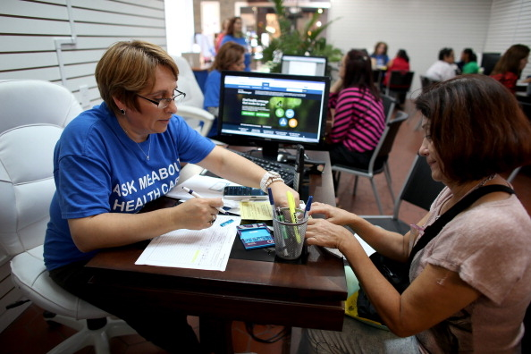

美国多州要求健保公司覆盖新型冠状病毒测试项目，免费为疑似患者提供测试。(Joe Raedle/Getty Images)

 
 【大纪元2020年03月07日讯】（大纪元记者林燕综合报导）美国五个州推出免费新冠病毒检测服务，要求各健保公司负担患者的新型冠状病毒测试费用，以及进一步降低可能阻碍公民进行相关诊断和治疗的费用。

纽约州、内华达州和密苏里州已经宣布这些行动；而加利福尼亚州和华盛顿州在周四（3月5日）也要求州内的保险公司为公众提供免费的新冠病毒检测服务。

美国的大型健保公司也对外表示，他们的健保计划将覆盖投保人的新冠病毒检测费用。

此举可以在一定程度上缓解民众因担心检测费用高而推迟或拒绝检测。美国疾病控制与预防中心（CDC）一直对新冠病毒进行免费检测，但目前加入检测的商业实验室有可能会收取费用。所以健保公司将新冠病毒检测纳入保险计划覆盖是很重要的一环。

健保公司信诺（Cigna）周四表示，其全美范围内的健保计划都将免除投保人诊断新冠病毒的自付费。

信诺说，旗下的健保计划将覆盖免费实验室测试新冠病毒，包括雇主和个人保险、红蓝卡优惠计划（Medicare Advantage）和白卡（Medicaid）。自我投保的雇主也可以选择为向其员工提供免费的新冠病毒测试。

信诺集团首席执行官戴维·科达尼（David M. Cordani）说：“我们将竭尽所能，帮助遏制新冠病毒传播，消除测试和治疗障碍，尤其是对那些年长者和慢性病患者，让我们服务的客户安心。”

代表健保公司的组织美国健康保险计划（AHIP）也表示，其成员希望确保消费者不会面临测试或护理方面的障碍，并将“采取行动以减轻患者就诊、转诊和事先授权的要求，以及免除患者成本分摊”。

美国联邦医疗保险和补助服务中心（CMS）局长维尔玛（Seema Verma）周四称赞健保公司的这一举动，她周四上午已经跟AHIP总裁进行了交谈。

她建议，需要接受新冠病毒检测的人士可以向自己的健保公司查询承保范围。维尔玛说，现在这属于一种“普遍承保”的诊断方法；同时，她重申，各州卫生部门将免费提供检测。

领导白宫冠状病毒工作组的副总统迈克·彭斯（Mike Pence）也保证，奥巴马健保计划以及红蓝卡、白卡都承担新冠病毒的测试费用。

<b>美国多州在行动 把新冠病毒检测纳入健保</b>

华盛顿州的保险监管机构表示，健保公司必须覆盖新冠病毒测试的费用——医生可以给任何符合CDC新型冠状病毒测试指南的病患进行测试，同时健保公司不得向患者收取任何共付额或其它费用分摊。

此外，在患者支付自付费之前，检测费用由健保计划预先支付。

加州表示，保险公司将豁免病患的测试费用分摊，以及急诊室或医生诊所进行冠状病毒筛查和测试服务的费用。

美国其它州也在考虑类似措施。罗德岛已有两个人被确诊感染新冠病毒，该州保险监管机构的发言人表示，他们将跟健保公司会谈，并考虑是否要求或可能要求健保公司豁免新冠病毒检测的费用。

《华尔街日报》报导说，美国各州之所以采取行动，是因为他们担心消费者，即使是有保险的消费者也会因为担忧巨额的自付费、试图避免接受测试或治疗。

凯撒家庭基金会2019年3月的一项调查中发现，一半以上的美国成年人表示，他们或其家庭成员由于医疗费用推迟了医疗服务；即使有保险的人群，也有34%的人表示，很难承担自付费。

不过，目前各州的健保监督机构聚焦的是新冠病毒的检测费用，而不是治疗。

公众关注的治疗新冠病毒的费用覆盖目前还不清楚。因为虽然大多数人通常会受到疫情的轻度影响，但在某些情况下，老年人和存在身体健康状况的人群仍需要更多、且昂贵的医院护理。

此外，州保险监管机构仅监督某些类型的承保范围，它们通常不监管大多数大型雇主所拥有的红蓝卡或自雇主计划。

标普全球评级（S＆P Global Ratings）分析师迪普·巴纳吉（Deep Banerjee）说，目前的措施可能仅限于测试和诊断，由于州政府政策并不适用于所有健保计划覆盖，因此对健保公司的影响眼下有限。

至于后续，若健保计划覆盖人群无法支付一定数量的自付费或获得某些类型的护理时，监管机构是否会进一步缓解人们的担忧，还有待观察。

<a target="_blank" href=#top><h6 align="right">回上方</h6></a>

<a name=53>
<h1 align="center"><b>疫情下市场萧条 商户退租抗议此起彼伏</b></h1>

广州十三行租户抗议，要求降租。（视频截图）

 
 【大纪元2020年03月07日讯】（大纪元记者凌云综合报导）“武汉肺炎”疫情席卷全国，全国各地的零售市场一片凋零。很多商铺处于亏损状态，甚至面临倒闭。广东、辽宁等地的商户，本周发起多宗示威活动，要求业主减租及退租。

近日，网上流传多段视频，显示广州十三行新中国大厦服装城5日爆发示威，大量商户聚集在一起，举起标语在商场内流动抗议，指在疫情期间没有营业额，争取大厦减免租金和退租。

大批租户逼满商场走廊，并手持“2月退租、3月免租、取消涨租”的纸牌标语，还在商场内高叫口号。

6日，又有广州十三行商户再度走上街头。广州十三行诚大时装广场的商户在抗争中遭警察和保安殴打，被喷辣椒水，场面混乱。

广州十三行新中国大厦是中国最大型的服装成衣采购批发市场，同红遍天服装交易中心、诚大时装广场这三个大型服装城，汇聚了近10,000家主打品牌、淘宝爆款为主的商家。

有知情者在网上发帖称：十三行商城和房东签的是阴阳合同，账面是一万/月，实际是280万（人民币，下同）三年租约+每月一万，280万是直接收现金不走帐的，平摊在每月实际租金成本是9万。

早在前年11月，广州十三行就曾发生过一次租户与业主对立的大规模冲突事件。当时一名李姓租户表示，自己一间不到2平方米的店铺，月租却达30万元，而自己卖的服装每卖出1件，仅获利40元，即使每日卖出100件，一个月收入也只有约12万元，难以支付高昂的月租。

除广州十三行外，沈阳五爱服装城亦爆发商户集体抗议。有报导说，商场虽有发出了租金减免通知，但这些减免租金的措施都是针对业主的，而商场大部分租户则完全没有减少负担。租户表示，现时因疫情影响，在营业额大减的情况下，难以继续支付租金和管理费。

东北某地商户要求商场退还2月、3月的租金！不少商户戴着口罩，手举着“二三月退费，四五月减半”的标语，齐声高喊：退费、退费。

6日网上也传出地点不明的商户抗议要求退租，减租的视频，可看到大批特警出动。也有消息称是来自广州十三行。

受到疫情持续影响，广东、四川、辽宁及浙江多个省份的服装、日常用品批发市场尽管本周一恢复营业，依然一蹶不振，生意惨淡。

四川成都一服装店“名兰哲”负责人说，他的店铺开业三天，却卖不出一件衣服。他说：“成都的铺子开了三天门，三天没有卖出一件衣裳，一个人没有进来过。开了三天门，还有很多货。”

有商铺经营者发帖说，由于今年一、二月份基本停市，商户的经营基本为零收入。但很多批发市场并未体谅商家，不落实政府扶助中小企政策，居然追交租金和物业、水电费，甚至加租。

据广东媒体报导，广州和深圳的主要批发市场目前均未完全复市，例如中国最大的布料市场广州中大布匹市场、广州一德路的玩具、干货、零食批发市场等只有零星商户开店，商家纷纷表示损失惨重，寄望政府免租退税。

另有民间调查显示，中国大陆三分之一中小企业的现金只够维持一个月，另外三分之一企业最多能撑两个月。

<a target="_blank" href=#top><h6 align="right">回上方</h6></a>

<a name=52>
<h1 align="center"><b>武汉市民外出被打死 医生：颅外伤出血量大</b></h1>

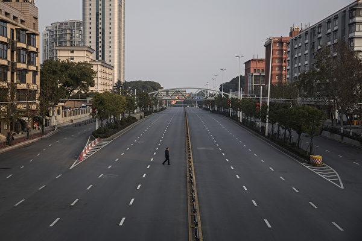

图为2月3日空荡荡的武汉市。 (Getty Images)

 
 【大纪元2020年03月07日讯】（大纪元记者李新安采访报导）自武汉封城以来，发生多起保安殴打市民事件，遭当局掩盖真相。中国民主党海外委员会主席陈忠和控拆，自己的弟弟因出入小区被殴打，颅内大量出血致死，却被以疑似武汉肺炎草草火化。

3月3日，陈忠和在网络发布视频，称“我的亲身经历，就是我的弟弟，我家的老四，22号晚上他憋不住了，出去，可能找朋友喝了酒，2点钟回来被他们拖出去，4、5人进行殴打，第2天就死了……”

陈忠和在接受大纪元采访时表示，这是2月22号晚上、23号凌晨的事情。社区封闭了个把月了，弟弟陈和建夜晚12点翻院墙出去了，直到凌晨2点钟才回来，回来的时候就被社区的保安人员抓住了，几个人把他拖出去打了一顿。

被打后的陈和建回到家中，只跟母亲说了一句，“我回来的时候被四五个人拖出去打了一顿。”

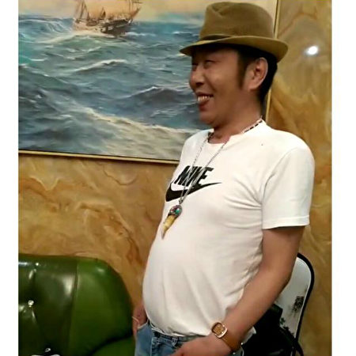

图为陈和建生前照片。（受访者提供）

第二天早上11点钟，母亲起来叫他吃饭的时候，一进房间发现他倒在地上口吐白沫，人事不省。就把隔壁邻居叫来帮忙，因为隔离，叫了很久别人都不出来。叫急了别人才出来，帮忙把他扶在床上了，这时人已经失去知觉了，大小便都失禁了。

邻居打电话通知陈和建的女儿，通知街道、救护站和公安局的110。救护车和警车都来了，把他送到医院，做完CT检查和肺部拍片已经下午2点多钟了。

陈忠和说，医生准备做开颅手术，说治好了以后也是植物人。颅内出血很厉害，有几个出血点，最后放弃开颅，保守治疗，把他放到重症病房里，后来他女儿就回去了。女儿在家没待几分钟，医院打电话来，说她父亲去世了。

“他女儿赶到医院，大约晚上8点开的死亡证明，女儿要求做检查，医院也没给做。死亡证明开的是疑似新冠肺炎，要求立即火化。殡仪馆的车来了把尸体拖去，第二天早上去拿的骨灰盒，就寄存在殡仪馆里了。”他说。

陈和建是陈忠和最小的弟弟，住在青山区青康居5栋1单元902号，家中还90岁高龄的母亲。弟弟死后，家人都害怕，不敢作声。但陈忠和认为人命关天，应该予以曝光。

“就他和母亲两个人住在一起。人都被打死了，你们还怕什么呢？这完全是共产党的政策导致的，因为共产党指挥他们打人，打死了也不追责，而且还奖励他们，那他不打死人啊？”陈忠和说，“在武汉市只听到打死人，没有听到处分了谁？共产党就是鼓励他们这么做嘛。这是共产党的又一笔血债。”

陈忠和质疑，居委会的保安值班只有一个人，怎么会有四五个人？可能有公安局的警察、协警、城管都抽调来了。武汉市民承受了双重打击，一个是瘟疫的打击，一个是警察、共匪的打击。

陈忠和提供了弟弟的诊断证明和CT片子，死亡证明没有要到。

记者向原广东省人民医院的刘其顺医生求证，刘医生是医学影像专业，在该三甲大医院工作了十几年。刘其顺表示，病人是脑部有外伤，脑内大出血的死亡。颅部片子可以做为其外伤致命的证据。

“这个人一侧颞部头皮下血肿，临近脑实质内大量出血，出血量在100毫升以上，并且大量出血破入脑室内，形成脑室内大量积血。另外脑组织水肿，脑疝形成，可致死。结合病史，可以断定是外伤或外部力量，作用在伴有颞部头皮下血肿那一侧，至脑内大量出血。这个出血太猛了，一般高血压出血都达不到这样，除非车祸。肺内基本正常，也许轻微的炎症，对比头部不值一提。”他说。

 
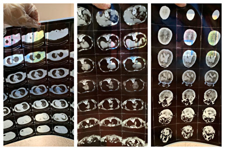

图为陈和建的肺部和头颅部CT局部。（受访者提供）

 
 刘其顺特别指出，脑室系统明显扩张，大量积血，脑组织中线结构左移，右颞部头皮下高密度血肿，这些诊断报告里没有提。
 

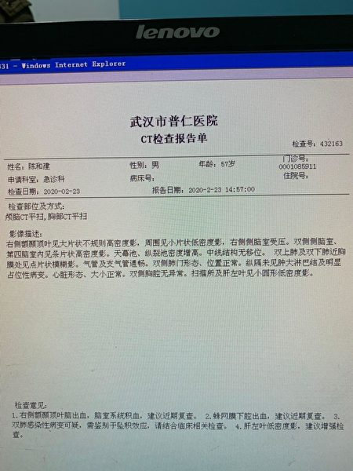

图为普仁医院CT检查报告单。（受访者提供）

 
 “这是很重要的事实，不知道是有意还是无意，报告还写什么复查，根本没有复查的机会啊。还有一点，病人好像是抬上床趴在那里的，如果是这样是很不负责任的，一般的病人应该是仰卧位，估计病人已经昏迷没有摆好体位，片子不是左右对称的，脑袋是歪的。”他说，“条件有限，大体上凭我们的经验，这个病人百分之百昏迷，死亡原因就是脑内大量出血。外伤什么他都不提，掩盖了一些东西。”
 
<b>“军管”打死人不犯法</b>

自武汉封城以来，已经传出多起打人甚至打死人事件。网友“萤火虫之地”3月5日发推表示，武汉妹妹家小区里有人用梯子从围墙翻墙出去，回来时候被保安打了，三个保安围着打。群里有邻居做法律工作的，说了一句“翻墙出去不犯法，打人才犯法”也被围攻。

此前，有网友2月19日发消息称，武汉有人因为没有戴口罩被警察带走，和警察发生争执，被警察当场用拳头和警棍打死。120来到时人已经死亡，警察让120拉死者去殡仪馆，他们回复太忙没有答应，警察通知殡仪馆来拉尸，电话中称发现肺炎病毒感染者已经死亡。警察不让任何人靠近死者，二十分钟过后死者被殡仪馆拉走。

 
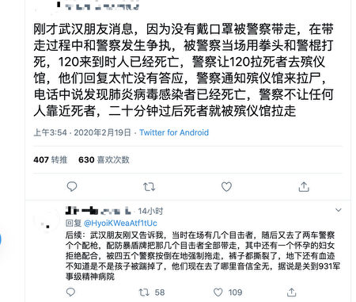

曾有消息传出，武汉有人因没戴口罩被警察带走，当场用拳头和警棍打死。（网页截图）

 
 还有网友表示，随后又去了两车配枪警察，把在场几个目击者全部带走，其中一个孕妇被按倒拖走，地上有血迹，带去哪里音信全无。

当时记者联系了该网友，但对方表示不方便接受采访。

此外，武汉自杀事件频发，跳楼的、上吊的视频疯传。相关视频显示，武汉社区实行封闭管理后，小区门口都有很多穿制服的人，检查出入证。后期更是全封闭管理，不让居民出小区，只能买社区规定的高价物资。

陈忠和表示，“正常的人都关疯了。我给母亲打电话她就说，关得时间长了受不了了，一天只能在家里转来转去。还不知道什么时候解封，原来是说2月14号解封，后来又延长了。”

“共产党制定政策的时候，从来不考虑人权问题、人性问题，为了使疫情传播少一点，把人封在家里，下个死规定把人关在里面。既不科学也不人性化。”

外界关注，自启动封城模式以来，公安、城管和保安成为维稳的主要力量。有网友说，“武汉军管，出来不用军人动手，小区‘保安’都能弄死不听话的居民。”

中国问题学者薛驰向大纪元表示，武汉有1万多名警察，警察数量不足，起主要作用的就是协警、保安和城管。中国的保安公司也是归公安管的。

薛驰说，“武汉城管是半军事化管理的，实行军训，汉阳区成立武装部。就是必要时候潜在的武装力量，专门镇压老百姓的。城管打人有培训教材，打人不见血。”

<a target="_blank" href=#top><h6 align="right">回上方</h6></a>

<a name=51>
<h1 align="center"><b>【持续更新3.7】川普访问美国疾控中心</b></h1>

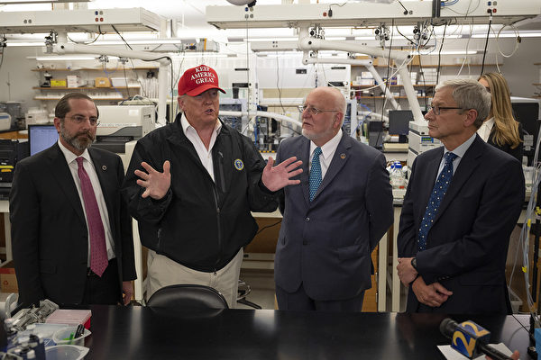

3月6日，川普总统周五访问了疾病控制和预防中心（CDC）总部，对公众卫生部门对新冠病毒的反应充满信心。(JIM WATSON/AFP)

 
 【大纪元2020年03月07日讯】新冠肺炎（COVID -19，俗称武汉肺炎）在武汉爆发后迅速蔓延，传播到全球六大洲逾八十多个国家。海外疫情最严重国家是伊朗、韩国和意大利。截至美东周五晚9点，美国已经有三百多个病例，美国总统川普签署83亿美元新冠紧急支出法案，并对美国疾控中心总部进行访问。
 
<b>下面是海外新冠疫情最新进展要点：</b>

川普访问美国疾控中心；

佛州报告二例新冠死亡病例；

至尊公主号邮轮有21人新冠测试为阳性，船上每个人都将接受测试；

美国SXSW影展（西南偏南电影节、音乐节，South by Southwest）今年停办；

副总统彭斯表示，美国所有公共卫生实验室现在都可检测；

全球市场继续下滑；

韩国新增483例确诊；

<b>以下是海外疫情持续更新：
加州斯坦福大学取消冬季的所有课堂课程</b>

斯坦福大学在其官网上发信宣布，从下周一（3月9日）开始，将取消冬季最后两个星期的的课堂课程。

“在可行的范围内，我们将把课堂改成在线形式，以取代亲自面授课程，”教务长佩西斯·德雷尔（Provost Persis Drell）在信中说。

该大学说，原定要亲临参加的考试将以带回家考的形式进行。

斯坦福大学还取消了原定于4月23日至26日周末，面向准本科生举行的校园之旅和“录取周末”的活动。

斯坦福大学所在的北加州的圣塔克拉拉县，目前有24例新冠肺炎病例。而整个加州有65例。

<b>犹他州宣布首例新冠病例</b>

在犹他州宣布一居民新冠检测呈阳性之后，美国现有29个州出现新型冠状病毒病例。

犹他州卫生署在新闻稿中说，该居民在登上至尊公主号游轮时被感染了新冠状病毒。

该患者60岁以上，是该州戴维斯县居民，回家出现症状后寻求医疗救助。病人现在在家中隔离。

新冠状病毒阳性推定结果来自犹他州公共卫生实验室的测试。

<b>佛州报告两例新冠死亡</b>

佛罗里达卫生部周五晚宣布，有两名新冠病毒检测阳性患者死亡。

其中一名70多岁，最近从国际旅行返回，当局未公开其旅行地点。

佛罗里达州卫生部还宣布了在布劳沃德县两个新冠状病毒推定阳性病例。

这使美国的死亡人数达到17。这是美国加州和华盛顿州以外的首例死亡病例。

<b>川普访问CDC总部</b>

川普总统周五访问了疾病控制和预防中心（CDC）总部，对公众卫生部门对新冠病毒的反应充满信心，他同时表示与副总统彭斯对是否允许让至尊公主邮轮乘客上岸存在分歧。

川普表示，他自己希望乘客和船员暂时留在船上，但彭斯希望将他们带到岸上。川普说，最终决定将由彭斯做出。

同时，川普表示对CDC等美国公共卫生部门对新冠的反应，以及抵御疾病的能力充满信心。

他还表示自己不会放弃握手的礼仪。

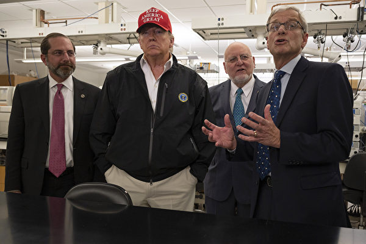

川普总统周五访问了疾病控制和预防中心（CDC）总部 (Photo by JIM WATSON / AFP)

 
 美国各州病例分布

亚利桑那州：3

加利福尼亚：60，包括1人死亡

科罗拉多州：8

康涅狄格州：1

佛罗里达州：4

佐治亚州：3

夏威夷：1

伊利诺伊州：6

印第安纳州：1

肯塔基州：1

马里兰州：3

马萨诸塞州：8

明尼苏达州：1

内布拉斯加州：1

内华达州：1

新罕布什尔州：2

新泽西州：4

纽约：44

北卡罗来纳州：2

俄克拉荷马州：1

俄勒冈州：3

宾夕法尼亚州：2

罗德岛州：3

南卡罗来纳州：2

田纳西州：1

德州：8

华盛顿：80，包括14死亡

威斯康星州：1

 
<b>美国新冠确诊超过300例 多数在加州和华州</b>

截至周五晚，全美报告三百多例新冠病例和15例死亡，其中西海岸首当其冲。 感染数量不包括21名至尊公主号邮轮上测试呈阳性的人。

根据美国有线电视新闻网（CNN）通过美国公共卫生系统在美国发现和测试的病例总数，在28个州中发现了255例病例。加上撤侨的49例病例，美国新冠病例总数为304例。

该总数包括在公共卫生实验室中测试为阳性，并正在等待CDC确认的推定阳性病例，以及已从CDC收到阳性结果的确诊病例。

华盛顿州记录的病例最多，超过80例，死亡人数也最多，为14例。大多数致命病例来自西雅图地区的一家养老院。

纽约州出现一个超级传播者。

<b>美国豁免中国制百余项医疗用品关税</b>

美国政府已同意豁免美国27家公司，自中国进口的一百多项医疗用品（包括口罩、手套和消毒湿巾等）的惩罚性关税。
 
 
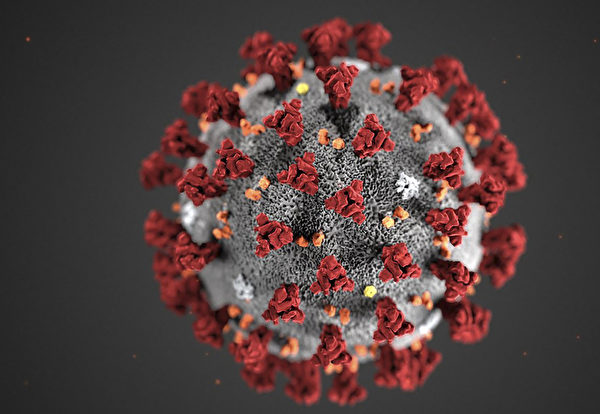

图为新型冠状病毒示意图。(Lizabeth MENZIES4/CDC/AFP)

 
<b> 韩国病例超过6700例</b>

韩联社报导，当地时间周六，韩国通报武汉肺炎新增483例，目前境内累计6,767例。

韩国疾病管理本部表示，死亡病例维持在昨晚的44例。

<b>因新冠病毒 纽约州旅游保险涵盖“以任何理由取消”</b>

纽约州州长库莫周五表示，旅行保险公司和旅行社将为纽约居民和企业提供购买保险的能力，使他们能够出于任何原因取消旅行，包括与新冠状病毒有关的旅行。

库莫说，此举是因为消费者向纽约州金融监管机构“纽约州金融服务部门（NYDFS）”投诉，他们无法获得所谓的“由于任何原因取消旅行”的保险。

<b>马里兰州三例新冠病例与埃及有关</b>

马里兰州州长拉里•霍根（Larry Hogan）周五在新闻发布会上宣布，三名马里兰州新冠患者在埃及尼罗河游轮上感染了新冠状病毒。

霍根说，这些病例似乎也与德州六例确诊新冠病例有关，这些病例也和尼罗河巡游有关。

<b>美CDC鼓励老人尽量待在家中</b>

美国疾病控制与预防中心（CDC）鼓励美国老年人尽可能减少外出。

<b>新冠疫情导致大陆房企违约风险上升</b>

因为新型冠状病毒肺炎疫情失控，大陆房地产市场几乎陷于停顿，有业界人士表示，疫情将导致大陆房地产开发商违约风险上升。

<b>澳大利亚报告63例新冠病毒病例</b>

澳大利亚卫生部周六在一份声明中说，澳大利亚现在有63例确诊的新型冠状病毒病例。

该国已有两人死于该病毒。

<b>彭斯新冠简报会</b>

3月6日傍晚，美国副总统彭斯在白宫举行新闻简报会，通报新型冠状病毒疫情在美国的最新状况。彭斯说，美国民众感染新冠病毒的风险仍低。不过，医学专家提醒，有严重基础疾病的老人需要多加防备。

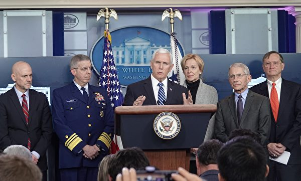

2020年3月6日傍晚，美国副总统彭斯在白宫举行新闻简报会，通报新型冠状病毒疫情在美国的最新情况。（亦平／大纪元）

 
 伊拉克确认八例新冠病例 总数达46例

伊拉克与伊朗接壤，伊朗是该地区感染人数最多的中东国家。

截至周五晚，伊朗已确认确诊该病毒病例超过4,700例，包括124人死亡。

<b>台湾报告新的新冠病毒病例</b>

台湾卫生福利部发表一份声明说，台湾周六证实了另外一例新冠病毒病例，使台湾总数增加到45例。

新确诊病例是一名五十多岁的妇女，与先前病例在同一病房。

<b>纽约州确诊44例 出现超级传播者</b>

纽约州政府宣布，截至6日下午，全州新增22名新冠肺炎确诊病例，确诊患者已达44人；大部分新增病例都与纽约威彻斯特郡（Westchester County）新罗谢尔（New Rochelle）的第二例确诊患者、50岁的犹太裔律师嘉布兹（Lawrence Garbuz）有关联。

全州已有超过四千人被要求居家隔离。

<b>墨西哥宣布第六例新冠病例</b>

墨西哥卫生部门在周五晚间新闻发布会上证实了一例新的新型冠状病毒病例，使该国病例总数达到六例。

最新病例是一名曾前往意大利的71岁男子。当局说他处于危急状态，但是现在已经稳定并且正在观察中。

<b>海外各国新冠死亡数量</b>

意大利：197

伊朗：124

韩国：44

美国：15

日本：12

法国：9

西班牙：8

香港、伊拉克和澳大利亚：各有2人死亡

台湾、泰国、菲律宾、瑞士、英国和荷兰均报告有1人死亡。

<b>至尊公主号邮轮所有人需进行新冠检测</b>

彭斯周五说，在19名船员和两名乘客测试呈阳性之后，将对至尊公主号上3,533人进行新型冠状病毒检测。

他表示，共对46人进行新冠病毒检测，其中21人呈现阳性反应，确认感染武汉肺炎，其中包括19位船员与2位乘客。其他24人呈现阴性反应，另一人尚未确认。

彭斯也表示，至尊公主号将在周末从现在停靠的旧金山外海转往非商业码头停靠，船上人员将在港口进行检测，需要隔离的人将进行隔离，以遏止疫情蔓延，保护健康民众。

副总统彭斯在周五（6日）下午的新闻发布会上说，在加州海岸外逗留的至尊公主号游轮上有21人检测出冠状病毒阳性，其中包括19名机组人员和两名乘客。图为至尊公主号邮轮。（大纪元）

 
<b>全球股市持续下滑</b>

全球股市6日再度下跌，华尔街损失惨重；美国商业银行（Bank of America）研究显示，全球股市市值在九天内蒸发约9兆元。

亚洲开发银行（ADB）6日也表示，新冠肺炎疫情最多恐让全球经济削减0.4%，相当于3,470亿元；最少也会减少0.1个百分点，损失770亿元，其中大部分损失由中国承担。

<b>美国SXSW影展取消</b>

德州首府奥斯汀（Austin）市长宣布，今年美国SXSW影展正式取消。

SXSW是德州奥斯汀年度盛会，期间会举行电影、互动式多媒体和音乐表演等一系列的艺术节与大会，每年都会吸引大量游客到来。

<b>科威特和沙特限制陆空交通</b>

为防范武汉肺炎疫情，中东国家科威特周六起暂停所有往返埃及、黎巴嫩、叙利亚、孟加拉、菲律宾、印度及斯里兰卡的航班，为期一周；沙特阿拉伯也开始限制陆空交通。

<b>天津滨海新区防疫小组一官员猝死</b>

中共天津官媒《天津日报》3月6日报导，滨海新区政协副主席单玉厚及张世林、王尔唐、王辉、孙术祥、张成银等六人死在抗疫第一线。

其中，单玉厚是滨海新区防控工作领导小组（防疫小组）物资保障组副指挥长，因为“加班加点”2月22日在机关宿舍心源性猝死，终年58岁。

新唐人电视台2月底获得一份大陆各地一线官员和警察猝死的名单，仅在一张纸上，就统计有65人，其中党员占大多数。

<b>马来西亚报告新冠新病例急剧增加</b>

马来西亚国家通讯社周五报导说，全国新发冠状病毒病例增加了28例，目前全国共有83例。

根据国家新闻社Bernama的报导，全国83例，包括65名马来西亚人，15名中国公民，以及在美国、日本和意大利公民各一例。截至周五，马来西亚共有23例完全康复并已出院。

<b>印度尼西亚确认二例新冠病例</b>

据国营新闻社安塔拉新闻社报导，印尼周五确认了两起新的冠状病毒新病例，使全国范围内的病例增加到四例。

<b>越南报告三周多以来首例新冠病例</b>

越南政府媒体办公室在推特上表示，越南于周五晚报导了第17例新型冠状病毒病例。
这是越南22天以来的首个病例。

<b>旧金山附近FBI员工冠状病毒检测呈阳性</b>

联邦调查局官员周五证实，旧金山现场部门一名联邦调查局雇员新型冠状病毒检测阳性。

受感染者来自较小的FBI卫星办公室，而不是旧金山的主要办公室。

这位官员说，卫星办公室员工已被遣送回家，联邦调查局正在采取一切必要步骤，以防止病毒进一步传播。

目前尚不清楚该员工如何感染该病毒。 FBI已通知当地卫生官员，并正在追踪与该雇员接触过的人。

<b>武汉华南海鲜市场内部整拆 民众议论</b>

近日曾被作为武汉疫情大爆发发源地的华南海鲜市场内部进行拆除工作，引起网民热议，当地居民也认为，在没有做完调查结论就让市场消失，这是想掩盖什么事实。

6日网上有华南海鲜市场的视频传出，有当地居民在视频中说：“从明天开始华南海鲜市场要彻底夷为平地。”

<a target="_blank" href=#top><h6 align="right">回上方</h6></a>

<a name=50>
<h1 align="center"><b>【内幕】济宁掩盖疫情 殡仪馆拒收肺炎遗体</b></h1>

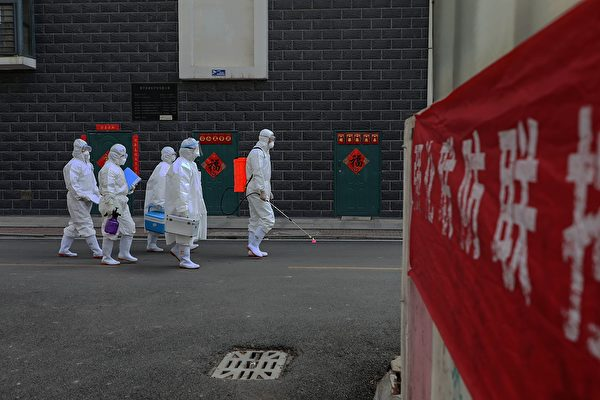

山东省任城监狱爆发群聚感染事件后，迄今未更新感染数据及隔离现况，引起监狱所在地济宁市民的担忧。图为山东流行病学调查。(STR/AFP via Getty Images)

 
 【大纪元2020年03月07日讯】（大纪元记者骆亚、林岑心采访报导）大纪元日前获悉一份山东省济宁市政府内部资料显示，当地有某间殡仪馆所长向地方政府反映，济宁市第一、第二人民医院针对肺炎患者开具的死亡证明书上，并未注明是否因新型冠状病毒死亡，使得殡仪馆职工人员安全存在隐患。

大纪元2月29日去电核实后发现，该所所长确实于2月初两度向有关部门投诉此情况。投诉内容显示，济宁市第一、第二人民医院，在一些肺炎死亡患者的证明书上只写“细菌性肺炎未特指”，并不标注是否因新型冠状病毒肺炎感染而死亡，以及是否存在传染性问题。所长希望有关部门能协调两家医院对肺炎死因详细备注。

由于任城监狱爆发集体感染新冠肺炎疫情，而监狱所在地就位于济宁市，从2月10日至13日任城监狱即陆续传出有狱警染疫，到20日才将消息向外界公布。

殡仪馆所长表示，自21日起，他们就不愿意再接受因不明肺炎去世的遗体火化工作。

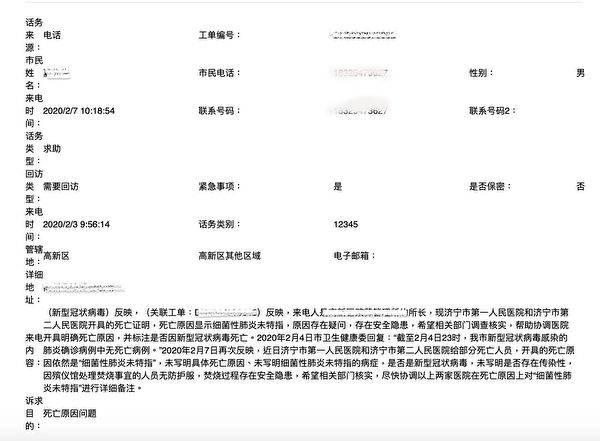

某殡仪馆向市民热线投诉资料截图。（大纪元获悉的内部资料截图）

 
 记录表明，该所长投诉日期分别为2月3日、2月7日。在第一次投诉后隔天，济宁市卫健委回应说，截至2月4日，济宁市新型冠状病毒感染肺炎的确诊病例中无死亡病例。

记者致电所长，问他反映的是死亡证明的问题吗？所长说，“对，我反映的是这个问题。”

记者问那现在情况如何？所长说，“现在肺炎的我们就不接了，肺炎死亡的上其它地方去弄，因为不是我们辖区的，是某某辖区的，他们往这拉的。”

谈到死亡证明的问题，所长说，“医院有这个能力，他应该给写明，但他没注明。”他写肺炎不确定，印象中有4、5具这样的例子，“他净这样给你写，后面‘不确定’这三个字，弄得我们这边职工很恐慌，你先说他是肺炎，但是你又写不确定、不知道。”

所长说，“职工们只是干活，他又不懂医，你弄过来，大家都很害怕。”“所以我们从2月21号起，就不再接受人民医院、二院、还有妇院开出来的这样的肺炎疾病的人员来火化了。”

至于，一些因肺炎死亡的遗体，具体运到哪去火化，所长说他并不清楚。

针对一院、二院是否有能力开立确诊的死亡证明，记者随后致电第一人民医院发热门诊，询问病人是否可以至该院进行核酸检测，接线人员称，必须要等医生看过给建议后才做，而且结果要等官方公布为准。第二人民医院发热门诊则表示，该院并非新冠重点医院，不进行核酸检测，需到一院检测。

<b>任城监狱疫情公布不透明、不及时</b>

济宁市这家殡仪馆所长对于肺炎死亡病例是否染疫的忧虑并非空穴来风，主要是山东省卫健委对于确诊人数的严重掩盖（【独家】山东内部文件：确诊数是公布的数倍），以及济宁市卫健委对任城监狱疫情的揭露并不透明，令社会感到担忧。

一开始知情者就向《大纪元时报》曝料称，“任城监狱由于管理不当出现疫情爆发，监狱环境特别糟糕，监狱工作人员及关押犯人多数感染，保守也得几百人，形成人道主义灾难。省领导已经到济宁准备强将消息压下去。”

而《大纪元时报》也获得济宁市公安局市中分局2月16日一份内部文件，指出任城监狱的大量警察在凤凰西苑酒店内隔离。（【独家】山东监狱警察被隔离 要签保密承诺书）

“财新网”此前报导，在干警陈民华出现发病症状前，监狱警察秦某某已于2月6日出现发热症状，并且和另一位密切接触者李某，两人于2月10日经领导允许，离开监狱自行回家。

而济宁市疾控中心事后发布流行病学调查显示，干警陈民华2月6日至12日皆在监狱封闭工作，12日晚发病，照CT显示肺部感染，13日赴济宁市第一人民医院确诊。

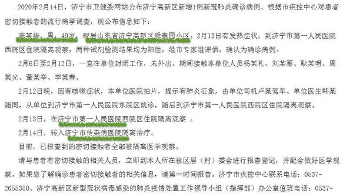

济宁市疾控中心讯息。（网路截图）

 
 眼看掩盖不住疫情，山东省卫健委迟至2月20日，才对外公布任城监狱7名干警200名服刑人员，共计207人的感染数字，引起社会一片哗然，由多部门组成调查团队进行调查。

3月4日调查结果指出，这起事件起因“1月21日一名从武汉自驾车到达山东济宁的人员，传染给监狱干警、职工，进而造成部分干警和罪犯感染。”

央视报导称，报告中的干警是任城监狱干警陈民华、职工戴光辉，他们二人1月21日接触到从武汉自驾车到山东济宁的人员，“是整起事件的起点”；官媒新华网则称此“事件已查清”。

此事件导致该省司法厅党委书记、厅长，省监狱管理局党委书记、第一政委等11人因涉嫌严重违纪违法问题被立案审查；公安机关则对陈民华、戴光辉两人以涉嫌妨害传染病防治罪立案侦查。

但在攸关民众关心的疫情方面，资讯仍然付之阙如。自2月20日首次通报后，截至3月5日止，任城监狱最新的感染情况从未更新，甚至在济宁市卫健委的统计数字上，也看不出和监狱有关的增长人数。

更加令人关注的是，济宁市卫健委迄今并未说明这名“从武汉自驾车到山东济宁的人员”究竟何时进入到济宁、是否接触过其他市民，以及相关的活动范围，是否造成其他人的感染等，相关资讯皆未见公开。

使得调查结果虽已公布，但人民对疫情的恐惧并未消散。

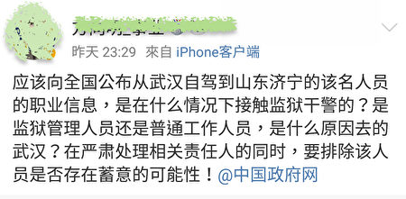

调查报告未提及监狱干警接触来源现况。（网路图片）

 
 <b>疫情波及 市民受歧视 企业复工难</b>

由于受到任城监狱大规模感染的影响，济宁市成为山东省感染人数最多的地级市，不止小区实施严格封闭管理，包括北京等各大城市，一听到是济宁市来的，要求先隔离，甚至听说有接触济宁人，包括家人、室友等，复工后也不用急着上班了，还是先行隔离。

有名济宁人说：“我感觉我像个武汉人。”

也有网民形容说：“可能是任城监狱的原因吧，这样死憋长了，济宁的经济也要憋死了！”

另一网民说：“我进来的时候，那个门卫查我的信息嘛，一看我济宁的，给他吓得，脸都变了。济宁可出名了！”

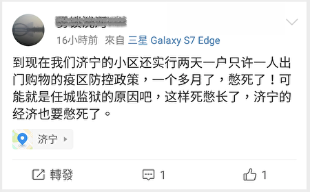

济宁市外地复工难。（网路图片）

<a target="_blank" href=#top><h6 align="right">回上方</h6></a>

<a name=49>
<h1 align="center"><b>美发布中国WTO评估报告 列下阶段谈判重点</b></h1>

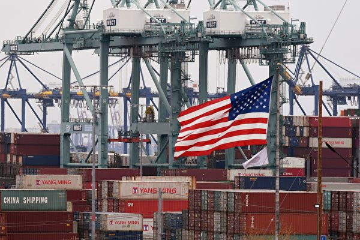

图为美国加州长滩的港口。 (MARK RALSTON/AFP/Getty Images)

【大纪元2020年03月07日讯】（大纪元记者吴英报导）美国川普（特朗普）政府发布中国履行WTO评估报告，指出北京履约记录仍然很差，并且列出美中第二阶段贸易谈判重点。

美国贸易代表（USTR）3月6日发布《2019年中国履行世贸组织（WTO）国会报告》（2019 Report to Congress On China’s WTO Compliance）并表示如同往年的报告，中国（中共）遵守WTO规范的记录很差，不仅远不如WTO会员的预期，同时也与其所承诺的履约内容相距甚远。

北京虽然承诺经济改革，奉行WTO认可的开放及以市场为导向的政策，但是其经贸政策仍然持续采取以国家为主导的重商主义。同时，中国的非市场经济对WTO会员带来巨大损失，而且这个情况仍将继续下去。

USTR在报告中说，在过去的近20年中，美国和其他WTO会员在各种双边及多边架构下采取了多项努力，以应对中共加入WTO后各国所面临的挑战。但是，尽管各国的持续努力，仍然无法促使北京的经贸措施发生有意义的改变。

“中国（中共）不公平和扭曲的政策和做法，引发的相关代价是巨大的”，该报告说，“例如，中国的非市场经济体系及产业政策已系统性地扭曲了全球经济的关键部门，例如钢铁和铝行业，破坏了美国和其它工业化国家的市场。”

此外，北京对重要的经济领域特别是服务业，持续阻止来自外国同行的竞争。与此同时，北京政府和中国共产党为其国内产业进行强有力的干预，所采取的产业政策造成全球新兴经济领域的他国公司被取代。来自遵守市场约束的经济体的公司，无法有效地与中国公司及整个中共竞争。

面对这些现实，川普政府在两年前改变过去的作法，以更加积极的态度应对美中贸易长期以来的问题，捍卫美国公司和工人的权益，使其不会受到中共不公平贸易行为的侵害，并力图恢复美中贸易关系的平衡。

美国将采取一切适当措施，确保中共非市场经济体系所造成的损失，由中方承担，而不是转嫁美国。华盛顿将继续鼓励中方对其经济和贸易政策进行根本的结构性改革，符合WTO会员所追求的市场导向政策，以及公平、对等、透明的的市场准入原则。

USTR说，如果中方愿意进行这些改变，不仅会缓解其与贸易伙伴之间日益加剧的贸易紧张关系，而且将使中国的经济走上可持续发展的道路，从而使中国受益，并为美国经济和全球经济的增长做出贡献。

该报告说，这次评估改采新的衡量重点为：（1）WTO会员对新加入会员的期待：严格遵守WTO规则，并且支持和奉行开放且面向市场的政策；（2）中共没有满足WTO会员的这些期望；（3）近年来，北京已远离开放且以市场为导向的政策，更加全面地采用了国家主导的重商主义；（4）中国即便从加入WTO中获得了巨大利益，但是其扭曲的市场政策和做法已损害了WTO会员的利益，并使他们处于不利地位。

报告说，川普政府正在使用所有可得工具，包括国内贸易救济、双边谈判、WTO诉讼以及结合志趣相投的贸易伙伴等，应对来自中共的独特且非常严峻的挑战，以达到公平、对等、平衡的美中贸易关系的目标。

在过去的一年中，川普政府的对华政策达成了重要进展。2020年1月，美中签署了第一阶段经贸协议，中方承诺进行经贸体制结构性改革，包括知识产权、技术转让、农业、金融服务以及货币和外汇等领域。

中方还承诺在未来几年内大量购买美国的商品和服务。此外，该协议建立了强大的争端解决体制，可确保迅速有效地实施和执行。

USTR说，由于第一阶段协议并未涵盖美国所有的关切问题，因此将与中国进行第二阶段贸易谈判，以解决其它重要的问题，包括：尚未解决的知识产权、技术转让和服务市场准入问题，以及产能过剩、补贴、国有企业、网络安全、数据本地化和跨境数据传输、药品和医疗设备、竞争法执行问题、法规透明度和标准议题。

<a target="_blank" href=#top><h6 align="right">回上方</h6></a>

<a name=48>
<h1 align="center"><b>每日三退声明精选</b></h1>

【大纪元2020年03月06日讯】

退出邪党组织少先队、共青团

明白真相，大难当头，瘟疫肆虐，邪党还在隐瞒疫情。我要退出邪党组织少先队、共青团。

声明人: 安全

2020-03-05 22:41

中国

 
http://tuidang.epochtimes.com/index/showpost/id/25792236

退党团队

这个邪恶失民心，专政，天怒人怨，定遭恶报！

声明人: 有缘 郭福寿 振新 等 15人（详细三退名单请查阅网址）

2020-03-05 23:08

 
http://tuidang.epochtimes.com/index/showpost/id/25792313

退党声明

本人从事教育工作。由于几十年来在工作中一再的目睹邪党所做所为欺凌压迫善良老师的恶行，本人一忍再忍一让再让。忍无可忍！虽然从心里退党14年了。但面对恶劣现实邪恶领导逼迫本人再次重温党员学习逼迫交党费损款等，令本人非常恶心、讨厌！所以为了证明本人的清白与坚决不和恶党为伍，与恶党划清界线。做清白善良的好人，从而有一个美好的未来。故在此声明退出邪党及其一切附属组织。

声明人: 吴跃三

2020-03-05 23:15

中国

 
http://tuidang.epochtimes.com/index/showpost/id/25792341

退黨團隊聲明

武漢發生冠狀肺炎，讓我更看清了中共為了維護政權、不顧民眾生死的獨裁本性。為了權利階層的利益，掩蓋疫情真相，顛倒是非、胡說八道、誤導民眾，關於疫情的報道常常自相矛盾，自己都無法自圓其說。我再也無法忍受。

聲明人: 王盡力

2020-03-04 14:13

 
http://tuidang.epochtimes.com/index/showpost/id/25787371

退出少先隊組織

武漢肺炎顯示中共是和正常的人類反著做事的，它是害人的。以前來加拿大讀書，畢業後回中國，工作了六年，切身體會哪裡的邪惡不正常。很多來加國的留學生充當中共小粉紅，其實他們沒有接觸社會，體會不到中共的欺騙邪惡，所以跟著瞎喊瞎叫的。以前我入過少先隊，心想沒有什麼的，早已經不是了。其實那是因為年齡的緣故才退的，而現在我是看清楚了它是邪惡的組織，我現在退出是遠離邪惡，做出明智的選擇，內涵意義不同。

聲明人: 張明智

2020-03-04 16:10

加拿大

 
http://tuidang.epochtimes.com/index/showpost/id/25787573

疫情當前，任務繁重，聲明退黨

我於1997年加入中共，妻子徐亞子1998年加入，兒子甄實在2019年在加入。原本以為，我們一家三口，會成為生在紅旗下，長在春風裡的幸福一家，早年也從未接觸過海外媒體。但不幸的是，我們並沒有等來中共許諾的所謂幸福，只等來了疫情，還有疫情下的失業，現在我們一家三口都沒有了收入，但是還需要交黨費，否則就成了「不積極進取」的反面典型了。我們實在實在沒有辦法，在某位不願意透露姓名的好心人的幫助下，知道了大紀元，知道了彼岸。

 我們真心希望奔向新生活，於是決定三退，兒子最積極，因為他一年前為了入黨付出了艱苦卓絕的努力，但等來的只有失望。

沒有收入，是否染上病毒已經不再重要，重要的是，如果不退，便只有死亡。

我在這裡鄭重聲明，我甄多實，妻子徐亞子，兒子甄實在，自發稿之日起，退出中國共產黨，永久。

聲明人: 甄多實 等 3人

2020-03-04 16:43

中國湖北

 
http://tuidang.epochtimes.com/index/showpost/id/25787777

<a target="_blank" href=#top><h6 align="right">回上方</h6></a>

<a name=47>
<h1 align="center"><b>陈思敏：武汉患者出舱猝死 马晓伟“三零”说破功</b></h1>

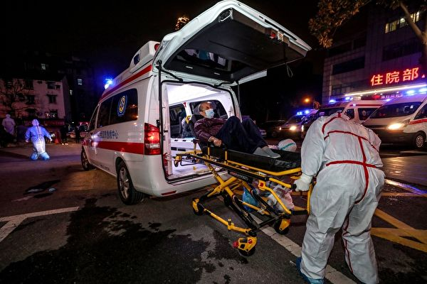

2020年3月3日，武汉新冠肺炎患者等待从武汉市第五医院转移到雷神山医院。(STR/AFP via Getty Images)

【大纪元2020年03月05日讯】中共卫健委主任马晓伟2月28日说，武汉的新冠肺炎患者每4人就有1人是在方舱医院治疗的，方舱医院做到了“零感染、零死亡、零回头”。

3月4日，澎湃新闻报导，武汉一确诊患者36岁李亮，2月12日开始在汉阳方舱医院住院治疗，2月26日从方舱医院出院，到指定的酒店康复点隔离，3月2日突然在康复点发病，送医后不治。

据该报导披露的2月23日CT报告单、2月25日出院说明结语、3月2日死亡证明书等显示，李亮的肺部炎症其实没有好转；李亮符合出院标准之一的“两次核算检查阴性”就是造成“吹哨人”李文亮医生很快又复发的因素；李亮“直接死亡原因为新冠肺炎”发病时呼吸道阻塞猝死。

只是报导未深挖，李亮既已治愈出院，却不是回到自家休养，而是如同确诊甚或疑似者到指定康复点隔离14天，原因是2月22日武汉市疫情防控指挥部出台第16号通告，要求出院患者应到指定场所统一实施为期14天的隔离，而武汉这16号通告俨然是中共卫健委2月19日公布《第六版诊疗方案》新增“出院后注意事项”的强化版。

而近一段时间以来，全国多地出院新冠患者“复阳”现象多发，如广东一地复阳率14%。2月下旬，武汉医生张旃曾对44名两次阴性结果的医护人员新冠肺炎患者进行了多次病毒核酸检测，有大约26人第三次核酸结果为阳性，比例高达50%以上。

3月4日中共卫健委推出《第七版诊疗方案》，调整了出院后注意事项，将原来诊疗方案中出院患者“应继续进行14天自我健康状况监测”改为“应继续进行14天的隔离管理和健康状况监测”。这意味，针对治愈后复阳比例极高的现况，中共卫健委不是修改太宽松的出院标准，而是要全国比照武汉第16号通告。

如众所周知，武汉16号通告出台次日，2月23日武汉封城满月，中共卫健委《第六版诊疗方案》显然为了“治愈率”、“床等人”的政绩，也为了复工复产的按需数据，将宽松出院标准的风险，转嫁给了出院患者定点隔离14天。

李亮这篇报导虽被下架，但止不住网友提供自身或亲友经历，说明这在武汉或者中国全境绝非孤立，比如一名网友曝其所在小区业主群聊、央视新闻截图，指画面中是2月出院的一个阿姨接受央视采访，回家没几天就死了。据称，实际上很多出院后隔离时发病猝死的人。而这些人在卫健委的统计上，已经算治愈人数，而不会列入死亡人数。

武汉疫情爆发以来，卫健委一直处于封口浪尖，现任卫健委主任马晓伟过去的仕途备受关注。

2001年10月马晓伟转任卫生部（卫计委前身）副部长之前，担任中国医科大学附属第一医院院长，辽宁省卫生厅厅长、党组书记等职务。曾有一份“辽宁省医疗事故鉴定委员会鉴定书”显示，马晓伟1999年涉包庇骗子医院搞假鉴定。马晓伟不被丑闻所累，并在薄熙来省长任内进京当官。

2002年3月官媒报导马晓伟对喀麦隆进行访问，喀麦隆时任总统比亚请马晓伟向江泽民转达问候。

2003年4月时任解放军总医院医生蒋彦永给时任卫生部副部长马晓伟写信，建议卫生部派人来和他核对SARS病例的数字，但蒋彦永一直没得到卫生部的回音，反而遭到软禁。

2016年4月军中大老虎郭伯雄被移送起诉，卫计委（卫健委前身）官网率先发出通告，通告中特别提及副主任马晓伟传达了郭伯雄案。这与2015年两会黄洁夫宣称“大老虎周永康落马打破死囚器官移植利益链”有异曲同工之妙，郭伯雄当年由江泽民一手提拔，郭伯雄曾经掌管的解放军总后勤部、军队医院，以及国家医卫系统之间，有着一个非常关系，那就是国际上长期指控的活摘法轮功学员器官。而马晓伟曾经主持过的中国医科大学附一院，《追查国际》调查发现肝、肾移植数量异常。

马晓伟看似有长达20年的国家医卫部门管理经验，但方舱毕竟不是医院，马晓伟“三零说”言过其实，如今武汉的新冠肺炎患者每4人就有1人是在方舱医院治疗的，截至3月2日，卫计委累计50%的患者已经出院，这令人关注，有多少人像李亮一样，治愈出舱后隔离时发病猝死，却没有得到披露。

<a target="_blank" href=#top><h6 align="right">回上方</h6></a>

<a name=46>
<h1 align="center"><b>【新闻看点】习访日延后 冠状病毒10大谜团</b></h1>

至今，武汉肺炎病毒还有10大谜团没有解开。（大纪元合成）

【大纪元2020年03月06日讯】大家好，欢迎大家关注新闻看点，我是李沐阳。

武汉肺炎爆发，让整个世界都重新认识了中共。今天（3月5日），中日双方都宣布，原订4月份习近平访问日本，因为武汉肺炎延期了。具体安排在什么时候，双方再商量。《朝日新闻》引述政府相关人士的说法，可能会延期到“秋天以后”。不到秋天以后，难以保证。

昨天，联合国旗下的世界知识产权组织（WIPO）秘书长职位竞选，中共推出的竞争者王彬颖以惨败收场。55:28，相差一半的票数表明，世界各国可能从世卫组织总干事谭德塞身上吸取了教训。

“谭书记”为中共站台背书，使世界各国放松了警惕性，导致疫情在全球急速蔓延。吃一堑，长一智，惨痛的教训，使多数国家对中共的台前人物投下了不信任票。

目前，武汉肺炎病毒仍在肆虐，截止昨晚7点，海外已经累积确诊14,835例，死亡270例。中共副外交部长马朝旭今早表示，全球疫情呈扩散态势，中方积极向好。中方愿意向疫情比较严重的、有需要的帮助的国家，提供力所能及的帮助。中共的说法遭到许多人的质疑，中共仍然是自顾不暇，所谓的提供帮助，很可能是输出中共的流氓做法“控制不住病毒，就拚命控制人”。

根据多方透出的消息，武汉的惨剧仍然频发不断，武汉肺炎病毒还有10大谜团没有解开。

<b>武肺谜团之一：康复者会再次感染吗？</b>

36岁家住武汉硚口区的李亮，2月12日到26日在汉阳方舱医院治疗，出院后随即住进酒店隔离观察。住进酒店一两天，李亮告诉妻子梅女士嘴巴发干，胃有点胀。

3月2日上午，与丈夫视频通话，李亮说不想吃东西，全身没有力气，站都站不稳。梅女士告诉澎湃新闻，医生亲口讲，李亮可能是精神压力大。

但实际没过多长时间，李亮被救护车送到了附近医院，下午5点08分宣布死亡。武汉卫健委开出死亡证明显示，死因是武汉肺炎。

不过梅女士提供的包括出院报告等书面资料显示，李亮经过治疗和专家组会诊确认，符合出院标准，体温正常3天以上。呼吸道症状明显好转，连续两次核酸检查阴性，无吸氧指末氧饱和度大于95%，并称超过14天，专家评估“准予出院”。

澎湃新闻发出消息后，被《新京报》等多家大陆媒体报导并转载，不过这些媒体又都删除了报导。这不能不让人怀疑，为什么删除消息呢？

中共卫健委主任马晓伟3月3日说，武汉方舱医院做到了“零感染、零死亡、零回头”。但是《中国新闻周刊》报导，44名痊愈者26人复阳。这么高的复阳率，当初是真治愈了吗？还是说出院标准太低？换句话说，是不是中共当局需要治愈率？

<b>武肺谜团之二：到底多少人感染？</b>

武汉肺炎爆发将近4个月，官方每天都会公布新确诊病例和死亡病例等，但是对于究竟有多少人感染，有多少人是没有症状却能够传染的病毒携带者？对这个问题，世界各国政府和世卫组织都没办法掌握。

现在人们掌握的传染时间越来越短，有的几乎是一瞬间就被感染了。重庆北区疾控中心副主任周海龙在2月28日披露，他们收治一名患者在1月19日乘坐巴士，与另一名后来确诊患者上了同一辆巴士，前后相差16秒，这是传染的最短时间纪录。

英国萨里郡出现了一例确诊患者，但患者从没到过受感染的地区。这是一个令人紧张的问题，他是通过什么途径被感染的呢？

英国目前的疫情情况，只能说是初发阶段，51例确诊病例，其中12例已经康复。不过英国首相约翰逊3日警告说，“如果疫情爆发，高峰期英国可能有五分之一的劳动力请病假”。

英国国家统计局2018年统计的总人口是6644万，2019年估算出劳动人口大约是3260万人。如果按照约翰逊的比例计算，五分之一劳动力就是652万人。那么也按这个1/5的比例估算全国染病数字，那就是1328.8万人。

日本厚生省（卫生部）也警告，国内染病量大增，正在准备针对重症者的医疗提供体制。

这么快的传播速度，这么大的染病比例，中国有多少人染病？世界有多少人染病呢？

<b>武肺谜团之三：致死率是多少？</b>

染病基数大，死亡人数就会相应增加。但是到目前为止，真实的死亡率究竟是多少，世卫组织一直在变。前天谭德塞说全球致死率是3.4%，高于先前的2%。

今年2月4日，中共卫健委透露，中国疫情初期病死率是2.3%，到2月初将到了2.1%，但武汉市病死率高达4.9%。

中共官员表示，统计到的确诊病例的病死率，也就是说分母是现在能够确诊的病例。还有一些确诊的病例，还有其他的没有纳入到统计当中的。

是不是武汉人与其它省市人的身体结构不一样？否则为什么武汉的死亡率这么高呢？另外，究竟有多少没被确诊死去的，没有纳入官方统计的死亡人数究竟有多少？官方什么时候会公布这些数字？

<b>武肺谜团之四：疫苗何时面世？中共早有疫苗？</b>

死亡的数字不断攀升，使每个人都心生恐惧。目前挣扎在死亡线上的人们，唯一的希望都寄托在疫苗身上。谭德塞曾说，世界上多家研究机构正在抓紧时间研制疫苗，未来几个星期就会有成效。

世卫组织总干事的讲话水准，越来越像“谭书记”了。人们想知道，未来几个星期究竟是多久？是三五个星期，还是八九个星期？三五个星期是一个月左右。有没有一个相对准确的数字，给人们一份希望呢？

其实谭书记说的这个时间还是相对较短的，有的甚至说疫苗问世要3～5年。因为从研发到批量生产，中间要经历动物实验、人体临床实验、大规模人群验证、世卫组织许可、本国许可等等程序。

今天收到网友转来的一份爆料，是一位网名叫“David Ng”的推文。推文说，“紧急消息，有朋友给发来这张图片，请仔细看这是什么？‘重组新型冠状病毒疫苗’！生产日期是2020年2月26日，有效期至2022年2月25日！是谁出品生产的？‘军事科学院军事医学研究院’！也就是说，中共军方已经研发出了疫苗！而且注意品名：‘重组’！也就是说，原始病毒的疫苗，中共早就有了！”

我们无法证实这个消息真伪。这个问题，我们在会员区还会详细谈，会结合一些网友的爆料。

同时也请您多多支持新闻看点，帮助我们传播真实的讯息。

<b>武肺谜团之五：宠物开始传染？</b>

昨天（4日），香港确诊了第85宗病例，是一只宠物松鼠狗。

香港渔护署表示，2月26日，他们在跑马地马主周巧儿的宠物松鼠狗身上抽取了样本进行测试。27日又从松鼠狗的口腔和鼻腔取出样本，检测到小量武汉肺炎病毒。28日和3月2日再次检测，结果呈现微弱的阳性反应，但没有出现相关的病征。

根据香港几所大学公共卫生学院、动物医学及生命科学院和世界动物卫生组织等专家的意见，他们一致认同，这只宠物狗已经呈现低程度感染了武汉肺炎病毒，并且很可能是由人类传染的。

目前这只松鼠狗正在港珠澳大桥口岸动物拘留所接受检疫，另外还有一只狗也在这里接受检疫。

虽然这只松鼠狗感染病毒事全球首例，但很值得注意，不能不让人担心，武肺病毒是否在宠物间也开始传染呢？如果猫狗染病，会不会再回传给人类呢？

<b>武肺谜团之六：巴西病毒突变与武汉病毒不同，病毒太狡猾？</b>

2月26日，巴西出现了第一例确诊患者。当地与英国科学家合作，对这名61岁的患者进行了紧急“冠状病毒基因定序”。发现患者体内病毒与武汉公布的病毒基因有3处不同。

在科学家撰写的《南美洲首例新型冠状病毒报告（First report of COVID-19 in South America）》中表示，对患者鼻咽中采取的病毒基因进行分析，发现巴西“Brazil / SPBR1 / 2020”病毒基因组与中国公布的“Hu-1”参考菌株有3处不同。科学家认为，这代表病毒在传播过程中已经开始突变。

这个研究结果证明，病毒相当狡猾，在人们还不知道它的底细的时候，又进行了变异。给人类攻克病毒又增添了难度。

<b>武肺谜团之七：病毒可以导致脑炎？</b>

说这个病毒狡猾，不仅仅体现在传播中突变，而且它对人体的多个器官，包括心、肝、脾、肺、肾都会发起攻击。除了已知堵塞呼吸供血系统、人体免疫系统和生殖系统外，昨天北京地坛医院说，病毒还可以感染神经系统，导致脑炎。

在对一位56岁患者的基因排序检测中，地坛医院发现，患者的脑脊液中存有武汉肺炎病毒，而且引起病毒型脑炎。

同一天，在当局公布的第七版诊疗方案中，修改内容中也提到发现患者出现脑组织充血、水肿，部分神经元变性，证实病毒会入侵到人的中枢神经系统。

说到这里，想起来朋友发给我的几张图片，是当年SARS后幸存下来的部分医务人员。这些曾经上一线的外科医生、护士，如今都丧失了工作能力，生活在病痛中。

<b>武肺谜团之八：拐点将到？</b>

对于疫情拐点，中共专家多次预言都落空了。拐点究竟什么时候出现？疫情什么时候结束呢？

前段时间高喊“党员先上”的上海华山医院援助组组长张文宏近日对中共官媒表示，对抗武汉肺炎的战斗“4月底结束”。他乐观地表示，“我的预测一定是对的”。

张文宏说自己一直在摸索病毒的“脾气”，发现它并不是“非常妖”。有点像SARS，但没有那么严重；传播方式像流感，特性介于SARS和流感之间。

他预计几个周期后，全国基本就平安“安全”了。不过他说的另一段话，又让人产生了怀疑：“如果不尽快复工，城市停滞带来的次生影响，可能会导致人口死亡率高于武汉肺炎死亡率。”

莫非张文宏说4月底疫情结束，也是在为当局推动复工吗？

<b>武肺谜团之九：病毒与人类共存？</b>

病毒的狡猾与毒性，害惨了整个人类，人们都在盼望着病毒快快消退。但是哥伦比亚大学4个研究团队的牵头人何大一表示，武汉肺炎病毒可能与人类共存。

前天他对美国之音表示，“这种病毒可能会与人类共存，并随着天气的变化，从北半球移到南半球，并在下个季节再次出现。”

这位发明“鸡尾酒疗法”治疗艾滋病的华裔科学家表示，他和他的同事正在尝试，要永久解决冠状病毒家族的问题。他们正在努力研制一种药物或抗体，既可以抵抗这个病毒，也可以抵抗更大病毒家族。

<b>武肺谜团之十：零号病人是谁？</b>

对于零号病人，中共最初说首例武汉肺炎患者是12月8日确诊。随后很多病例都被指向华南海鲜市场，指称那里有贩卖野生动物的现象。

但是《柳叶刀》发表中国研究团队的论文表示，确诊第一例是12月1日，而且与华南海鲜市场没有任何关系。研究人员之一、金银潭医院资深医师吴文娟告诉BBC，患者是一名患有阿尔茨海默氏病的老人。但老人卧病在床，基本没有出门，而且他离海鲜市场有四五个公交站。

那么零号病人是谁呢？大家还记得2月15日开始，很多微博博主都关注一个叫黄燕玲的人。说零号病人是武汉病毒研究所的黄燕玲，因为做实验，不小心感染了病毒。不少人还在网上发出视频，寻找黄燕玲。

武汉病毒所的工作很诡异，马上删除了黄燕玲的相关资料。但随后又在《环球时报》发出一份“郑重声明”，承认黄燕玲曾经在此读研究生。还辟谣说黄燕玲毕业后去了其它省份工作生活，“未曾回武汉，未曾被病毒感染，身体健康”。

看这份声明，武汉病毒所应该对黄燕玲目前的情况很清楚。如果证明黄燕玲不是零号病人，她本人出面说清楚，不是更有说服力吗？那为什么不让黄燕玲出来呢？是不是像网友猜测的，黄燕玲可能已经在世上消失了？

大纪元《新闻看点》制作组

<a target="_blank" href=#top><h6 align="right">回上方</h6></a>

<a name=45>
<h1 align="center"><b>孙春兰视察武汉小区 居民怒吼：全是假的</b></h1>

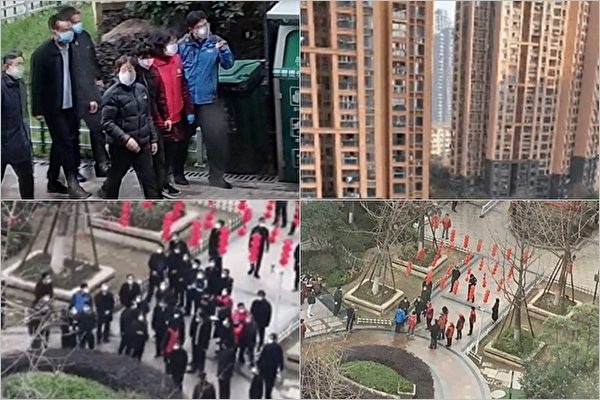

近日，中共国务院副总理孙春兰视察武汉市青山区中建开元公馆，被困在家40多天的业主们愤怒高喊：“全部都是假的。”（知情人提供）

 
 【大纪元2020年03月05日讯】（大纪元记者洪宁采访报导）近日，中共国务院副总理孙春兰视察武汉市青山区中建开元公馆小区，封城后被困在家里40多天的业主们愤怒高喊：“全部都是假的。”

武汉一名市民提供的视频显示，孙春兰及跟随人员进入高楼林立的开元公馆小区内，各栋楼内业主们便大声高喊：“假的，假的，都是假的。”“ 老百姓吃的都是高价菜。”“形式主义。”等，声音在空中回荡。

这位市民提供的涉事小区业主在微信群里的对话截图显示：“市委书记王忠林和副总理孙春兰来到了家楼下，物业不让下楼，还假装让志愿者送菜送肉给业主，大伙高喊‘物业作假，物业不作为，换物业！我们太难了。’”“副总理和市领导们视察了一半被气跑了，估计青山区领导挨了批评，现在社区办的来了好多人，在我们小区每家每户上门上访收集问题。”

有消息称，近期武汉市政府称，能够让民众以较便宜的价格买到猪肉，即10元人民币一斤，但民众根本买不到，认为是虚假宣传。

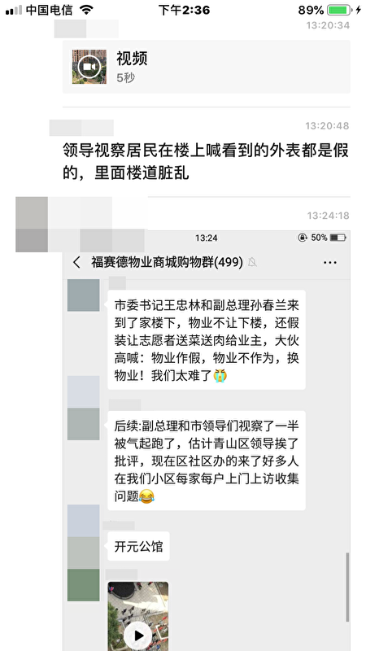

业主的对话。（知情人提供）

业主们的呐喊引起不少网民共鸣，“青山还是有钢人啊！”“这是疫情下的另类维权。”

一名武汉市民群里留言说：“这一声，要回响到历史深处！太激动人心了。”“全部都是假的，这句话得流行。”

还有网民对业主的行为点赞“好好好！顶顶顶。”：“‘这全部都是假的！’，连听了好几遍，绕梁而不去，振聋发聩。”“当面揭皇帝的新衣了。”“过瘾喊出真实的话了。”“是的，这种愤怒的呐喊很珍贵。”

武汉肺炎疫情爆发以来，中共处处造假，隐瞒疫情，欺骗全世界。市民张女士对记者表示，中共将保住政权让人民屈从看作是最重要的。

“我心里感到最难过的是，现在的防疫措施纯粹是一种镇压，很多细节的内容。如果没有言论自由，不让大多数人知道真相的话，那只是麻痹别人，还要强制人服从，这是不符合人性的，这样做工作，是不可能将这次疫情控制下来的，它们（当局）宁可让人们在家里饿死。”#

<a target="_blank" href=#top><h6 align="right">回上方</h6></a>

<a name=44>
<h1 align="center"><b>强制复工悲剧：有人倒在厂里 有人死在车上(视频)</b></h1>

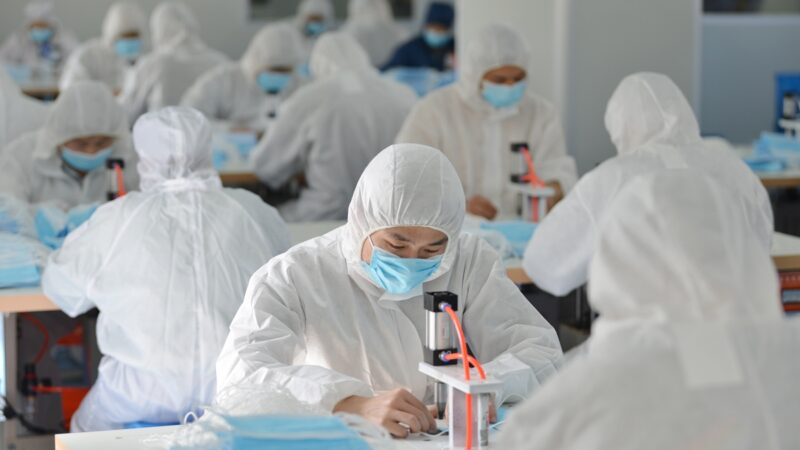

中共强令复工，开启了中国更大的群聚感染。有人倒在厂里，有人死在车上。但中共只字不提。示意图（STR/AFP via Getty Images)

 
 【新唐人北京时间2020年03月04日讯】武汉肺炎（新冠病毒）疫情失控，重挫中国经济。中共当局担心经济下滑导致政权垮台，不顾疫情继续扩散，一边严控疫情真相，一边强令企业复工。然而，大量视频显示，复工开启更大的群聚感染。有人倒在厂里，有人死在车上。但中共只字不提。

目前，各国专家纷纷警告武汉肺炎疫情正处于爆发高峰期。然而，中共高层强令各地企业复工，并出台最严厉的网管新规，有关武汉疫情的议论、图片及帖子全部封杀。许多微信群被解散。

与此同时，中共下调武汉疫情防控应急响应等级，多省新增病例均现“零增长”。更有中共媒体宣称：疫情过后，中国是最大赢家！然而，网路大量视频显示，这是中共欺骗民众自我安慰的谎言。

3月4日，有推特网友发视频并附文说，复工带来的危害不可想像！有人死在从湖南到汕头的大巴车上，一车人成为密切接触者，如果中途有人下车，后果更难以预测。

<h4 align=center><a href="https://twitter.com/cindywei2017/status/1234891846553350145?ref_src=twsrc%5Etfw%7Ctwcamp%5Etweetembed%7Ctwterm%5E1234891846553350145&ref_url=https%3A%2F%2Fwww.ntdtv.com%2Fgb%2F2020%2F03%2F04%2Fa102791522.html">复工带来的危害不可想像(点击右键,另存新档）</a></h4>

同日，还有网友发布深圳复工的视频说，有人倒在了工厂里，上前救助的员工完全没有隔离措施，短衣短裤，太危险了~。

<h4 align=center><a href="https://twitter.com/TuCaoFakeNews/status/1235054716737871872?ref_src=twsrc%5Etfw%7Ctwcamp%5Etweetembed%7Ctwterm%5E1235054716737871872&ref_url=https%3A%2F%2Fwww.ntdtv.com%2Fgb%2F2020%2F03%2F04%2Fa102791522.html">深圳复工，有人倒在了工厂里，上前救助的员工完全没有隔离措施，短衣短裤，太危险了~(点击右键,另存新档）</a></h4>

另有网友发布类似视频说，深圳某工厂复工，员工武肺倒地不起引恐慌！复工将开启中国更大的群聚感染！但是中国的数据只字不提，最终必然以更大规模的感染和死亡作为报复。

网友纷纷跟贴说：
“共产党造谣这几天零感染。”
“共产党第二次谋杀开始了！”
“死了也不是确诊病例，所以确诊病例零增长。”

“想哭，中国人真可怜，为了生计，必须得出去工作。就这么死在外地了。”
“复工归复工，员工可以不干，但是穷呀，房贷车贷压死了。都是拿命赌。”
“不复工，共产党死一千万；复工，老百姓死一千万。孰重孰轻，不言自明。”

2月3日，有网友贴文显示，中共高层说，不复工中共政权难保，会死亡1000万党员，复工也就死亡1000万老百姓。

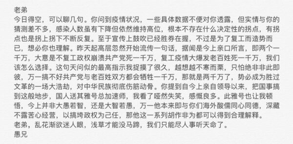

(网友老灯推特图片）

 
<a target="_blank" href=#top><h6 align="right">回上方</h6></a>

<a name=43>
<h1 align="center"><b>袁斌：最严禁声令 大陆网络将只剩“好消息”</b></h1>

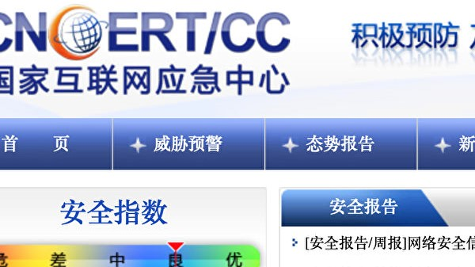

互联网新规，中共对大陆网络的封锁钳制必将进一步升级。（网站截图）

3月1日，微信群里近乎刷屏的一句话是：“三月的第一天，有一个好消息与一个坏消息。好消息是：以后每天都会是好消息！坏消息是：以后就很难再看到坏消息了……”

之所以这么说，是因为从当天起，中共制定的网络新规“网络信心内容生态治理规定”开始正式实施了。这一规定被网民称为最严“禁声”，它的实施意味着今后中国大陆将只剩下中共审查标准的“好消息”，而所有与此相悖的“坏消息”则将遭到无情的封杀。

尽管北京当局称出台这一新规是为了营造良好的网络生态，维护国家安全和公共利益，但其真实目地无非是为了从根本上铲除对其不利的信息，采取对“制作、复制、发布”采取三管齐下、连锁控制的方式，严密监督对当局不利的信息，而且还采用连环锁的方式，把信息生产者，网络信息服务平台，信息使用者三方绑在一起，互为制约，控制、监督。

这一规定毫不掩饰的表示：鼓励网络信息内容生产者制作、复制、发布含有宣传习近平思想，宣传中共理论路线方针政策和中共重大决策部署，弘扬社会主义价值观，有助于提高中华文化国际影响力的内容，等等。而对于稍微与党的路线、方针，政策不合的信息，则予以控制，清除，甚至会“依法制裁”。

比如第六条明确规定网络信息内容生产者不得制作、复制、发布“危害国家安全，泄露国家秘密，颠覆国家政权，破坏国家统一”以及“损害国家荣誉和利用”等内容的“违法信息”。不能丑化英雄烈士事迹，不能“散布谣言”等等。

第七条还规定信息内容生产者防范和抵制制作、复制、发布各种“不良信息”，包括“使用夸张标题”的，“炒作绯闻丑闻的”，“不当评述自然灾害、重大事故的”，“带有性暗示、性挑逗等易使人产生性联想的”等等。

就我所见，新规实施后，网上可以说是一片讥讽和骂声。有网民评论，这么冠冕堂皇的规定，无非就是给他们多几个冠冕堂皇的抓人的理由。也有人痛斥：“网络大屠杀正式开始了!”

出乎意料的是，就在党媒人民网等各大媒体，呼喊著新规施行可以拔除网络生态“杂草”的时候，不同的声音出现了，有全国知名行政法专业律师（暂不提名）提出，新规可能因为违反立法法而不具有法效力。

这位律师指出，根据中国《立法法》第八十条第一款之规定：国务院各部、委员会、中国人民银行、审计署和具有行政管理职能的直属机构，可以根据法律和国务院的行政法规、决定、命令，在本部门的权限范围内，制定规章。而根据《国务院关于机构设置的通知》，出台新规的国家互联网信息办公室显然未在国务院的直属机构之列（国务院直属机构名单：中华人民共和国海关总署、国家税务总局、国家工商行政管理总局、国家质量监督检验检疫总局、国家新闻出版广电总局、国家体育总局、国家安全生产监督管理总局、国家食品药品监督管理总局、国家统计局、国家林业局、国家知识产权局、国家旅游局、国家宗教事务局、国务院参事室、国家机关事务管理局），那么此新规制定程序违反立法法的明文规定，属于没有制定规章权力机构制定，应当属无效。

不论如何，有一点可以肯定，那随着互联网新规的实施，中共对大陆网络的封锁钳制必将进一步明显升级，而网民的反封锁反钳制也必将更上一层楼。

<a target="_blank" href=#top><h6 align="right">回上方</h6></a>

<a name=42>
<h1 align="center"><b>长春电视插播 遭中共残酷迫害的法轮功学员</b></h1>

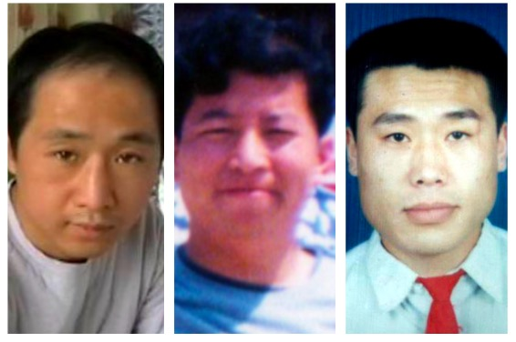

2002年3月5日，参与长春电视插播的法轮功学员雷明、梁振兴、刘成军（从左至右）均被迫害致死。（大纪元合成图）

 
 【大纪元2020年03月04日讯】在2002年3月5日法轮功学员在长春八个电视频道中插播法轮功真相后，被中共指认的18位参与者遭到惨烈的迫害，其中梁振兴、刘成军、雷明等多人被迫害致死。

美国《标准周刊》（The Weekly Standard）在2010年12月6日发表了长篇报导：《进入细微的电波──几位不为人知的中国烈士如何帮助全世界的自由事业》，文中这样记录了当时的长春：法轮功的节目在八个频道播放了50分钟，积聚了超过10万的观众。随着消息的传开，观众越来越多，人们互相打电话，说他们会马上打开电视。

在一些居民区，当地中共官员变得绝望，切断电源，使街道陷入黑暗。在其它居民区，比如在文化广场附近，人们走到街上庆祝：禁令结束了！法轮功平反了！

几个修炼者从工厂和藏身之处走出来，公开发资料。邻居、孩子、陌生人，甚至戴着红袖标的老太太都接近他们。每个人都在说话，跑过去，笑着拍着他们，祝贺他们。

有几个人怀疑这不是政府的广播，但他们仍然开心地笑着轻声问：“你们是怎么干成的？你们法轮功真了不起！”而且这时看起来他们似乎真的是被平反了，快乐和笑声到晚上10点都没有停止……

2002年3月5日长春插播后，中共当局指认是梁振兴、周润君、刘伟明、刘成军等18位法轮功学员实施的，他们是：

1. 梁振兴（男，37岁）
2. 周润君（女，52岁）
3. 刘成军（男，31岁）
4. 刘伟明（男，32岁）
5. 孙长军（男，24岁）
6. 张闻（男，28岁）
7. 雷明（男，26岁）
8. 李德海（男，31岁）
9. 赵健（女，35岁）
10. 云庆彬（男，37岁）
11. 刘东（男，37岁）
12. 庄显坤（男，29岁）
13. 魏修山（男，35岁）
14. 陈艳梅（女，40岁）
15. 李晓杰（女，31岁）

以上所列均为他们当时的年龄。

在当局指认的18人中，缺失3人，其中刘海波和侯明凯被抓后随即被打死，还有1人可能被酷刑迫害致死，而被当局隐匿。

2002年3月5日晚上8时，吉林省长春市发生了震惊世界的法轮功真相电视插播事件。长春有线电视网络八个频道同时播出法轮功真相电视片《是自焚还是骗局》、《法轮大法洪传世界》。

“305”电视插播法轮功真相后，江泽民惊恐万状，密令“杀无赦”。长春全城戒严，在大抓捕中，5千多名长春法轮功学员落入魔掌，至少7人被活活打死，另有15人被非法判刑4至20年。

本文收集、整理了明慧网对其中12位受迫害者的相关报导。

<b>梁振兴</b>

 

梁振兴（明慧网）

 
<b> 在长春市第一看守所遭到的迫害（2002.2.27～2002.11）</b>

2002年2月27日，梁振兴被长春市公安局一处的警察绑架到长春市第一看守所（又称：长春铁北看守所），期间被绿园分局的警察提审六次。他们蒙住梁振兴的眼睛，将他带到长春市净月潭国家森林公园宾馆内的秘密刑讯室。每次出来，他都是遍体鳞伤。

 
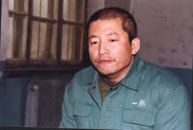

2002年3月，梁振兴在狱中。当时中共警方把这张照片作为战利品发到网上。（明慧网）

 
 <b>在吉林监狱遭到的迫害（2002.11～2005.3.29）</b>

2002年11月，梁振兴被押进吉林监狱（又称：吉林省第二监狱）的六监区。监区长魏向辉明确指示看管人员说：“对法轮功人员绝不能手软。”狱霸李明、赵广存、刘干、陈志强等对梁振兴、杨光等法轮功学员进行毒打、捏睾丸、用手指插肋骨骨缝。犯人李明用塑胶管毒打梁振兴，他的头撞到暖气片上，昏死过去。

2004年7月10日，梁振兴又被送到“严管队”。周姓狱警指使刑事犯打他，强迫他坐在不到一寸宽的木棱上，甚至坐在角钢的尖棱上，一天要坐十几个小时。

梁振兴被严管迫害两个多月。在那里，警察先是找法轮功学员进行所谓的谈话，放诽谤法轮功的录像；然后对他们用刑，包括：坐老虎凳、头上套塑料袋、往手指甲里钉大头针、背铐、电棍电。他们甚至用在电炉子上烧红的螺丝刀往法轮功学员身上烫……

 
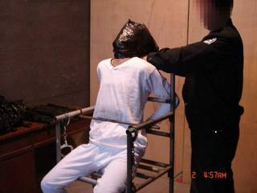

酷刑演示：塑料袋套头。（明慧网）

 
<b> 在长春市铁北监狱遭受的迫害（2005.3.29～2005.8）</b>

2005年3月29日，梁振兴被转到长春市铁北监狱22监区继续迫害。监区长王晓光、教导员张力周指使犯人迫害梁振兴，经常毒打折磨他，持续数月。

8月中旬的一天，梁振兴被送到公安医院，连续六天六夜遭受“抻床”酷刑（四肢被往四个方向拉至极限）；不久，又被送回铁北监狱医院，白天戴脚镣，晚上被呈“大字形”固定在床上，即铐在“死人床”上，由近十名犯人轮流监视。

 
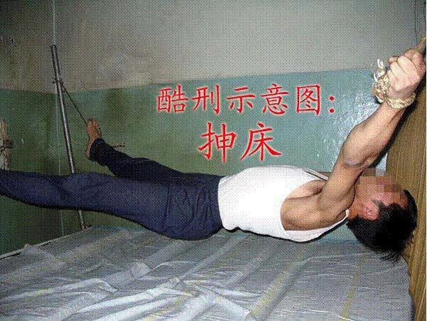

酷刑演示：抻床。（明慧网）

 
 在四平石岭监狱遭受的迫害（2005.8～2010.1）

梁振兴在四平石岭监狱里遭受了各种非人的酷刑折磨，例如以下的几种：

<b>毒打</b>：犯人高明龙专门制作了一根三角皮带放在铺下，经常鞭打梁。一次高魔性大发，抽出铺板对梁振兴进行长时间毒打，致使梁振兴的后背都是血印。

酷刑演示：毒打。（明慧网）

 
 犯人颜德全等还用手掌使劲劈梁振兴的喉部，再使劲用脚踹其胸部，使其肺部严重受伤。

狱警副区长周立佳进监室查岗时，打梁振兴左边一个嘴巴，并让犯人颜德全再打梁振兴的右边一个嘴巴，又把梁振兴踹倒，还说：“我是不是没迫害你？”

犯人杨建国曾用铁锥子剜梁振兴身上的肉，用锥子扎他的头，对他拳打脚踢、抓住他的头往墙上撞；犯人王荣国用打火机烧梁振兴的头部，把他的头使劲往床梁上磕。

<b>性侵犯</b>：颜德全等一伙犯人借口给梁振兴洗澡，扒光他的衣服后往他身上浇凉水，将黄瓜插进其肛门里，再按着他，让外号叫“大虎”的刑事犯对他进行性侵犯。

<b>电棍电击</b>：2006年7月，教育监区的监区长尹首东、狱警杨铁军、干事武铁等用四把电棍一齐电梁振兴。2007年末，梁振兴拒绝背监规，狱警杨铁军、干事张业军（人称“酒疯子”）和犯人韩景军、杨建国、颜德全等用八根电棍电击、毒打梁振兴，用了大半天时间迫害他。

 
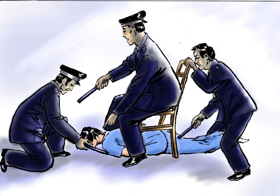

中共酷刑示意图：电击。（明慧网）

 
<b> 在公主岭监狱受到的迫害（2010.1.1～2010.5.1）</b>

2010年元旦，梁振兴又被转到公主岭监狱遭受更加残忍的迫害，他的身体状况急剧恶化。

2010年4月12日下午是梁振兴被迫害关押的六监区的探视日，梁振兴家属探视遭野蛮拒绝，后几经周折见到梁振兴。他已被折磨得骨瘦如柴、走路困难、说话声音沙哑。

2010年4月25日，狱方通知其家属去公主岭市中心医院。梁振兴被初步诊断为休克、右侧胸腔内积液、两肺继发性肺结核伴空洞伴炎症、两肺间质性炎症样改变。

家属来到医院，只见梁振兴身体极其消瘦，吸着氧气、打着吊瓶，脚肿得像馒头，脚脖两侧有皮下渗血，带有血泡，经常流水，右眼几乎失明，他痛苦得直咬牙。

2010年5月1日，梁振兴被送到公主岭中心医院的时候，已经没有了呼吸。据说，狱警在给梁振兴插管灌食时，把管插到了肺里，导致他死亡。当日上午10时左右，在狱警的监视下，梁振兴离开了人世，终年46岁。

<b>刘成军</b>

 
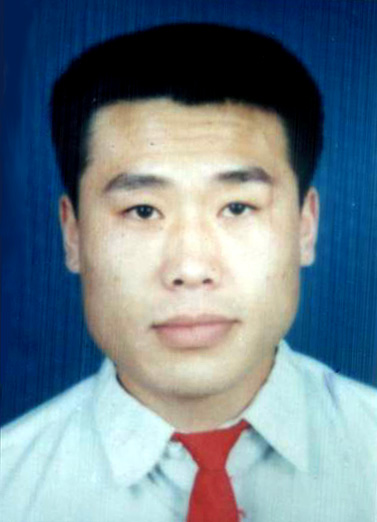

刘成军（明慧网）

 
 <b>被绑架的经过（2002.3.23）</b>

2002年3月23日，刘成军被非法抓捕的前一天，给一个法轮功学员打了个电话（当时此人已被绑架，刘成军不知道），发现情况不对就关机了。第二天，他的表弟又用这个电话打了一次电话，结果被定了位，当时刘成军住在松原他的姨父家。

当刘成军发现警察来时，已无处可躲，就藏到了柴垛里。

当晚，20余辆警车包围了前郭县山后屯，一群警察像土匪一样闯入刘成军的姨父柳长发家，让柳家给他们做饭，还把刘成军的表弟带到派出所毒打了一个多小时，威胁要把他84岁的姥姥抓来，这样逼着问出了刘成军的下落。

凌晨1点多，公安部督办、省厅指挥、长春市局、松原市局、前郭县公安局、农安县公安局联合组成的专案组杀向山后屯，七辆警车包围了柳家，点燃了柳家的两个柴草垛，很多村民都惊起救火。

藏在里边的刘成军跑了出来，身上多处被烧伤。警察在众目睽睽之下用碗口粗的大棒对他一顿暴打，然后给他砸上镣铐。松原的警察李伯武（音）往刘成军腿上连开了两枪，叫嚣着：“这回我看你往哪跑！”然后把刘成军塞进小车后备箱里，又抓了柳长发夫妇扬长而去。

<b>在吉林省监狱管理局中心医院遭受迫害（2002.3.24、2003.10.27）</b>

2002年3月24日，刘成军被捕后被直接送入吉林省监狱管理局中心医院（又称：公安医院），他的双手被抻开铐在床的两侧。

4月的一天，警察突然给刘成军打开了手铐，一群电视台的人要给他摄像。一个女记者想获取他的声音，以便用移花接木的贯用手法制造假新闻。该记者让刘成军向她讲真相，被刘成军识破、拒绝。事后，公安医院的狱政科长给他戴上了脚镣。

 
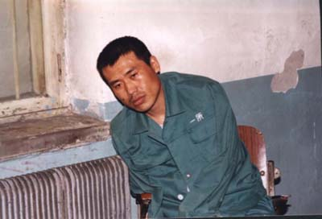

狱中的刘成军。（明慧网）

 
 
 4月1日，新华社公布了上面的照片，可以看出刘成军已无法保持坐姿且身上有被用刑的痕迹。

2003年10月27日，刘成军生命垂危，第二次被送入吉林省监狱管理局中心医院。该医院长期迫害包括因长春电视插播事件被捕的法轮功学员。

<b>在长春市第一看守所遭受的迫害（2002.5.1～2002.11）</b>

2002年5月1日，刘成军被转到长春市第一看守所。警察对他酷刑逼供，让他坐“老虎凳”52天。他的手被铐在床上，狱政科长刘伟给他戴上脚镣。

自2002年5月1日至9月20日，刘成军一直被非法关押在该看守所。据悉，在那里，来自长春市公安局的警察对他实施迫害。

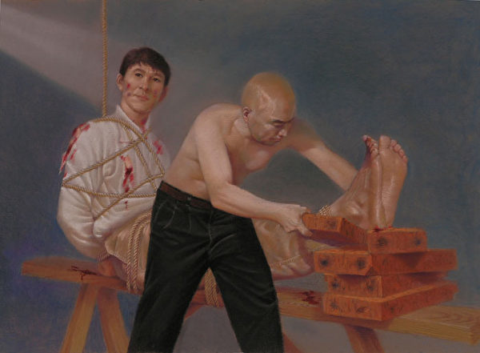

酷刑演示：老虎凳。（明慧网）

 
<b> 在吉林监狱遭受的迫害（2002.10～2003.12.26）</b>

2002年10月份，刘成军被劫持到吉林监狱一大队。当天在狱长、副狱长等人的授意下，六名重刑犯（李刚、郭树铁、贾玉彪、刘X海等人）将刘成军拖到水房里，用很厚的床板猛击他。他的臀部被打得肿得很高，血渗透了短裤，连短裤都脱不下来，木板被打折了几根。

罪犯贾玉彪用腰带抽打刘成军的脸、眼睛，把腰带上的一个大纽扣打碎，他的眼睛被打得充血。

2002年10月11日，刘成军开始绝食反迫害；到10月21日，10天内他一口饭未吃、滴水未进。其间，犯人还用三至五公分厚的木板把他往死里打，以致他被送进狱内医院。

2003年10月21日，刘成军的家人得到吉林监狱的电话，说他不行了。家人赶到医院看到他奄奄一息、骨瘦如柴，全身是伤。医院下了病危通知，他被转到吉林省监狱管理局中心医院，医生确认为尿毒症，也下了病危通知。

大约在12月初，刘成军又被劫持到吉林监狱，极其虚弱的他却被直接押进“小号”（专门迫害法轮功学员的狭小的房间）。

12月26日凌晨4点，刘成军在长春吉林大学中日联谊医院离开了人世。临死时鼻孔、耳朵、大腿等处都在流血。当天，吉林监狱纠集了大批警察，不顾其家属反对，未经尸检，于中午11点强行火化遗体。

<b>雷明</b>

 
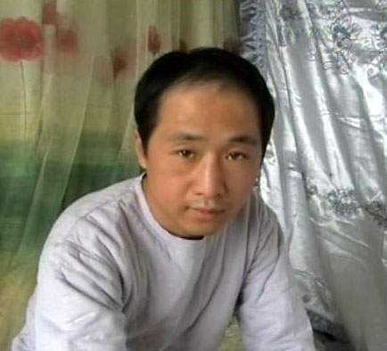

雷明（明慧网）

 
 雷明，男，30岁，未婚，吉林省白山市人。他曾是快餐师，双手灵巧；曾在北京天安门广场上展开请愿的横幅，并摆脱穷追不舍的警察们而脱身。

雷明是电视插播的主要成员之一，在选择电视插播地点时，主动承担一处离电视台很近、在电线杆上操作的不好做的线路。 2002年3月5日，在长春市利用电视插播法轮功真相后，他被警察非法抓捕。在经历长春市公安局一处及吉林监狱酷刑折磨致残后，于2006年8月6日离世。

<b>被绑架（2002.3.5）</b>

2002年3月5日晚8点，在雷明等人进行电视插播的过程中，警察巡线，在路上把雷明、张闻（法轮功学员）堵住了。雷明把张闻推开，自己迎上了警察而被绑架。

参与抓捕的清明街派出所指导员李福，于2002年被公安局记三等功，并被公安部授予所谓“全国优秀人民警察”称号；长春市国保支队副大队长李兴涛，指挥抓捕雷明立个人二等功，光经其手被致死致残的法轮功学员有上百人，被非法关押的不计其数。

雷明被抓到清明街派出所，背铐着坐在地上，身上仅剩的200元钱被抢走，随后被架到车上，劫持到长春市公安局。

协助并参与绑架的还有：长春市有线电视网络公司的副总经理刘文祥、朝阳站站长佟军。

<b>被长春市公安局迫害（2002.3.5～2002.3.9）</b>

雷明被押到市公安局，被用刑之后又被蒙上眼罩，警车一路警笛，押到净月潭宾馆的地下包房。

雷明又被架上铁老虎椅，双臂绕过椅背，用牛皮带套着手铐，两个警察把手铐死死拉向椅子底下的铁梁。手铐硌着他的腕骨，双臂被拉到极限，仍被继续往下拉。雷明疼得汗水湿透了全身，几乎昏过去。最后，一个警察猛踹手铐，才把牛皮带扣到了极限。

 
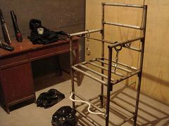

老虎椅（明慧网）

 
 在房间里有个高姓警察科长诽谤法轮功师父，雷明大声制止他。高某疯狂地冲向雷明，打了他一顿嘴巴子，打累了才停手。

这时又过来两名警察，手里各持一根电棍，把雷明的上衣扒开露出胸部和脖子，接着又把他的裤子脱下，露出生殖器和大腿，然后同时电击他的脖子、嘴、大腿、胸部、生殖器、肛门，使他痛苦万分，惨叫声不绝于耳。
 
  
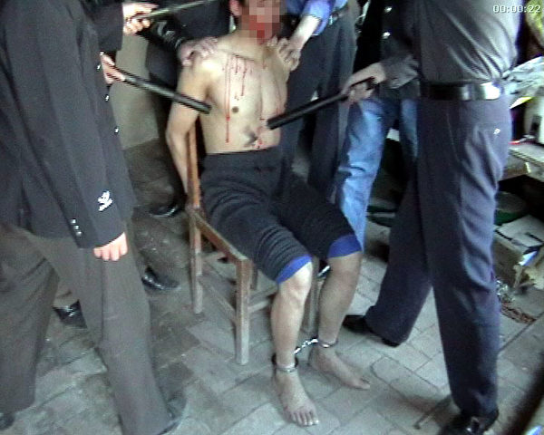

酷刑演示：电棍电击。（明慧网）

 
 直到电棍没电了，警察去充电。这时，换上其他两个警察，用塑料袋套在雷明头上。当他要憋昏时，警察突然松开头套，等他刚喘了几口气后，又给他套上塑料袋，反复不已；然后又电击，充电，用塑料袋套头，再电击，充电，反复折磨他。
 
 
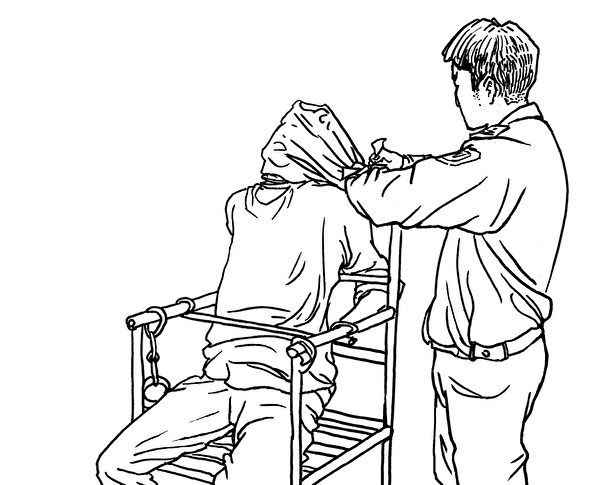

中共酷刑示意图：人为窒息。（明慧网）

 
 
 之后，警察用烧红的螺丝刀烫他的脖子，烫得他皮开肉绽；紧接着，用电棍电击其烫伤处，再用水往脖子上浇，使他生不如死。

在这期间，警察们还用一个大铁桶套在雷明的头上，用一根大铁棍使劲敲打铁桶，达到了震耳欲聋的地步。

 
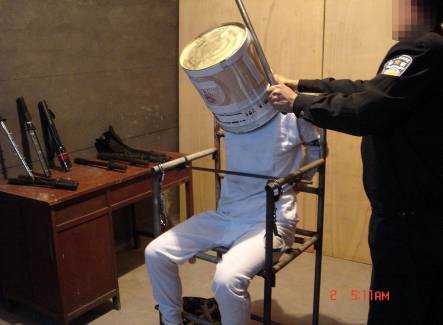

中共黑狱酷刑演示：铁桶敲头。（明慧网）

 
 接着警察还把一个木棍的一端插进他的肛门，另一端卡在椅背底部的横梁上，再用电棍电击肛门。

在大约四五个小时的酷刑折磨中，雷明的胳膊，手腕骨被抻得、硌得极度痛苦。

一个警察抓住雷明反背铐的双手，使劲往上抬，使他的前胸和大腿紧贴在一起。他的小腹被铁棍硌得十分疼痛，约过了5分钟，警察才住手。

 
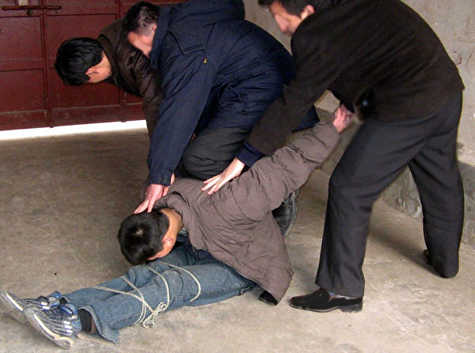

酷刑演示：把腿捆住，使劲往下按头部。（明慧网）

 
 
 随后，雷明被扔进了铁北看守所。看守所一见他满身是伤，马上拒收，警察说这是特案，才同意接收。

到了监号，犯人们都惊呆了，雷明满身是电击的焦糊斑，烫伤、电伤、勒伤，惨不忍睹。牢头说：“以前我不信法轮功被迫害得这么严重，今天我彻底信了，这共产党要完了。”

<b>劉海波被長春市公安局寬城分局迫害致死</b>

 

劉海波（明慧網）

 
 2002年3月11日晚，因被懷疑給參與插播的法輪功學員提供住所，長春綠園區醫院醫生、法輪功學員劉海波家被長春寬城分局刑警大隊警察持槍破門而入綁架。

當時，警察當著劉妻和驚恐大哭的3歲幼子的面，打斷了劉海波的腳踝，用槍柄將當時拜訪劉的法輪功學員張忠余砸得頭破血流，搶走了劉家中的5,000元現金及張忠余身上的現金，將兩人戴上黑頭套拖下樓，塞入警車帶到寬城區公安局刑警隊。

據一位逃到澳洲的寬城分局的霍姓警察披露：兩個警察毒打劉海波，打斷了好幾根木方；將他全身衣服扒光，用最長的高壓電棍從肛門插入體內電擊其內臟……事後警察將其遺體祕密火化，對外謊稱其死於心臟病。劉海波於3月12日凌晨在極度的痛苦中離世。

3月16日下午1時30分，長春寬城分局召開刑警和部分科室科長會議。時任長春市公安局寬城區分局局長的周春明謊稱劉海波死於心臟病，要求各單位抽調警力看管太平間，抽女警看管已被刑訊逼供、送去醫院搶救的劉海波的妻子侯豔傑。

事後寬城區分局在沒通知家屬的情況下，直接就將其屍體祕密火化。

<b>侯明凱被吉林市「610」和國保大隊迫害致死</b>

 
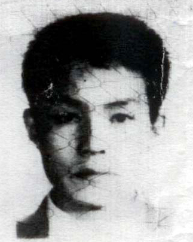

侯明凱（明慧網）

 
 
 2002年8月20日，吉林市「610」（專門迫害法輪功的非法機構）和國保大隊非法抓捕了當時35歲的侯明凱，一起被抓的還有另外三名法輪功學員。當晚，在關押侯明凱的屋裡集中了十多個警察。從屋裡傳出打人聲，侯明凱沒喊一聲。

有的警察打累了就到別的屋裡休息，還說這人經打，什麼酷刑也沒有使他屈服。後來很多警察從別的屋裡都被叫去集中到那間屋子裡，從那裡不斷傳出打人聲和叫罵聲。

不到半小時，就聽到警察說：「侯明凱完了，不行了。」那時是8月21日凌晨三四點鐘。8月23日，其屍體被祕密火化。

<b>魏修山被吉林監獄迫害致死</b>

魏修山於2002年10月被關進吉林監獄。獄警讓他寫放棄信仰的所謂「三書」（「認罪書」、「悔過書」、 「保證書」），他不寫。監獄教育科幹事李永生和他「談話」，他只說「法輪大法好」，遭電棍電擊。

夏天，獄警不讓他穿單衣，逼他穿棉襖、棉褲，白天、晚上都不讓睡覺、面壁；還讓四五個犯人圍毆他，每天都打他，用手掐他的生殖器，把他的腿盤上和身體捆成球形。
 
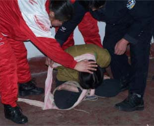

酷刑演示：「球」形捆綁。（明慧網）

 
 獄警不讓他上廁所，不讓吃飽，在他的飯、菜、饅頭上吐唾沫。犯人用棉襖把他的頭蒙上，四五個人打他的頭，最後造成他腦膜炎積水、發高燒三四個月之久，臉色煞白、不能走路。

2003年10月21日，他被拉到醫院治療後失蹤，據稱已被迫害致死。

<b>孫長軍</b>

2002年8月末，孫長軍被警察綁架，被綁在「老虎凳」上折磨了兩天；9月份，被非法庭審時。他力爭為法輪功辯護，身上被警察用高壓電棍電得多處焦糊。

 
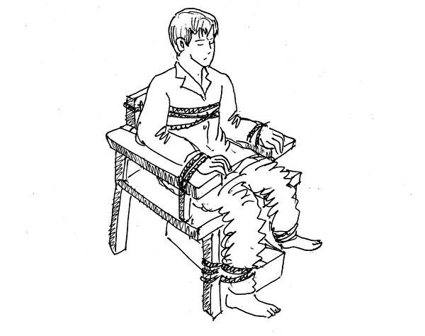

酷刑演示：老虎凳。（明慧網）

 

2002年10月25日，孫長軍被劫持到吉林監獄十監區。當晚在獄警李永生的唆使下，犯人武少臣、崔立君、韓明君（已出獄）毆打他，用膠皮管子抽打，致使他的左側一條肋骨骨折。

2003年9月23日，孫長軍因寫聲明不承認「四書」（放棄修煉的所謂「認罪書」、「悔過書」、 「保證書」等），被十監區警察魏向輝、崔龍哲嚴管70多天，造成身體消瘦，體重下降了40多斤。

2004年7月，獄警逼孫長軍與省「610」派來的人員張案山進行「談話」，他堅決不談，獄警威脅要嚴管他。

2005年7月，孫長軍出現肺結核雙肺空洞而噴血，獄方不給他辦「保外就醫」。

2007年至2009年，他的病情進一步惡化：肺結核、胸膜炎結核、腹膜炎結核、胸積水、腹積水，骨瘦如柴、肚大如鼓。因孫長軍堅持信仰，不寫「五書」，吉林監獄拒絕給他辦理「保外就醫」。

2019年12月16日，孫長軍被釋放回家。

<b>趙健</b>
 
在長春市第三看守所的迫害（2002.3～2002.10）</b>

2002年3月，時年35歲的趙健被長春市公安局一處跟蹤綁架。警察用衣服蒙住她的頭，把她拉到淨月潭賓館地下室，七八個警察一起把她圍住，拿出事先準備好的尼龍繩，迅速將她雙手和雙腿一圈一圈地纏住，然後，把她的手和腳背到後面，將四肢捆到一起，再把她被綑綁成球型的身體反覆提起放下，她的臉被地毯蹭破。

十幾分鐘的功夫，趙健的四肢失去了知覺，癱倒在地。隨後，警察又把癱倒的趙健鎖在「老虎凳」上，逼她說出其他法輪功學員和資料點的位置。四個警察拿著啪啪冒火星的電棍一起電她的手心、前胸、大腿。乳頭被電出血，整個前身都是黑紫色。

他們還用黑塑料袋套住她的頭，再勒緊，等她憋得快沒氣了時，才放開頭套，等她剛吸口氣，就再勒緊，反覆折磨；還用菸頭熏她，熏得她鼻涕眼淚一起流。四天四夜把她綁在「老虎凳」上，不讓睡覺、吃飯，然後把她送到長春第三看守所非法關押迫害。

該看守所是迫害法輪功學員的黑窩，由於遭受酷刑折磨，趙健生活已不能自理，手連飯勺都拿不住，只能靠其他法輪功學員照顧。

長春市公安局一處為了破壞某個資料點，又非法對趙健提了一次外審，把她拉到淨月潭賓館地下室，鎖在只有兩根鐵棍的鐵椅子上一宿。

在看守所，趙健絕食反迫害。看守所的蘇科長把趙健叫出去，勸她吃飯。趙健說，吃飯就得答應三個條件，第一、把法輪功師父的經文拿回來；第二、給一個看時間的鐘錶；第三、法輪功學員沈劍麗被提外審後再沒回來，要求給個說法。她的前兩個條件被答應了，被提外審的沈劍麗已被迫害致死。

<b>在吉林省女子監獄的迫害（2002.10～2012）</b>

2002年月10月，趙健被非法關押到臭名昭著的吉林省女子監獄（前身是長春黑嘴子女子監獄）繼續迫害。

監獄為了「轉化」（逼人放棄修煉）法輪功學員，不讓她們睡覺。趙健多次絕食抗議迫害，身上長疥瘡，身體狀況非常差。沒多長時間，她就被關進五監區勞動大隊，每天被強迫早上5點起床走隊列，趙健不配合，也不配合唱所謂的洗腦歌曲。

在五監區，趙健煉功的時候，警察拍著桌子威脅，要把她關進「小號」（關押法輪功學員的狹小房間）迫害。趙健正告警察：「你不能這樣做，你要善待法輪功學員。」警察才沒把她關進「小號」。

五監區的警察害怕趙健煉功，就把她調到六監區，六監區的隊長于秀豔在監獄是出了名的凶惡。

在六監區的法輪功學員集體抵制幹活，警察指使刑事犯從上鋪往下拽學員，過程中對學員又打又罵。趙健對警察喊：「刑事犯打人了，你們都不管，你們配穿這身衣服嗎？」法輪功學員三天沒出去幹活。

2005年底，監獄把所有法輪功學員都集中到單獨成立的所謂教育監區（洗腦班）。那裡是迫害法輪功學員的集中營，沒有任何人身自由，每天被強行集中到一個大教室，不許說話，由包夾（看管法輪功學員的犯人）看著，逼看誣衊法輪功的光碟。然後，逼著學員寫所謂的「思想匯報」。很多法輪功學員在那裡被迫害致瘋、致死、致殘。

2006年末，趙健、何鳳波、張玉芬、李海紅把法輪功的經文傳給其他法輪功學員，被一個包夾發現。當時教育監區的隊長曹紅暴跳如雷，下令嚴管，一場更殘酷的迫害開始了。

趙健被關在五樓的一個專門迫害法輪功學員的祕密黑屋裡，房門外掛上簾，不讓外面看見。趙健的四肢被綁在「抻床」上，身子被懸空吊起來。她遭受著分分秒秒的撕心裂肺的疼痛，手和腳頃刻間變成紫黑色。

趙健被吊了一宿，棉衣、棉褲被汗水濕透，頭髮全是濕的，整個人虛脫。後來又被呈大字形綁在床上，殘酷迫害持續了兩個月的時間，才讓她下地。兩個月後，趙健又被關在四樓繼續遭受精神迫害。

 

中共監獄酷刑：抻床（「五馬分屍」）。（明慧網）

 
 2012年，趙健走出了人間地獄，結束了長達10年之久的殘酷迫害。

2015年5月，趙健因為實名起訴迫害法輪功的元凶江澤民，被長春南關區永吉派出所綁架，在葦子溝非法拘留10天；中共「十九大」召開之前，又被長春南關區永吉派出所和社區騷擾。

<b>雲慶彬</b>

2002年8月，雲慶彬遭綁架，後被非法重判14年，被非法關押到吉林監獄。2003年初，因雲慶彬不寫所謂的「四書」，獄警不讓他睡覺。2005年4月15日，因拒絕「轉化」，被強行嚴管三個多月。

11月24日，犯人把雲慶彬押去「嚴管」。在給他戴手銬及送往「嚴管」的路上，雲慶彬高喊「法輪大法好」，他被固定到「抻床」上。雲慶彬晚上再次喊 「法輪大法好」，犯人把抹布塞到他嘴裡，不讓他上廁所，逼他便在褲子裡。

後來雲慶彬失去知覺，等他醒來後發現自己已關在「小號」裡。從「嚴管」中出來的刑事犯說，雲慶彬被迫害得精神失常，在「小號」裡吃屎喝尿。

<b>周潤君</b>

 
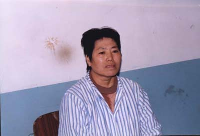

周潤君（明慧網）

 
 周潤君在被非法判刑前被送往長春市公安局市局一處在淨月潭附近設的行刑室逼供。市局的警察用電棍、「老虎凳」等刑具折磨她，打折了她的肋骨，把她關押在公安醫院。周潤君被迫害得出現嚴重的心臟衰竭。

2002年9月20日，周潤君被非法判刑20年， 後被送往女子監獄時，因檢查有嚴重心臟病，監獄拒收，再次被送回雙陽看守所關押，十幾天後被強行送進監獄。她入監後被送到公安醫院住了一個多月， 監獄不讓她「保外就醫」。

<b>張聞、李德海</b>

時年28歲的張聞是位很專業精幹的電工，他和劉偉明一起繪製了有線電視網絡圖。2002年9月20日，被非法判刑18年；2002年12月份，被送到吉林監獄五大隊三小隊迫害。

當天獄警張建華指使幾個犯人毆打張聞，把他的一隻腳打瘸了一個多月。過後，一個犯人對法輪功學員說，他要得分、要減刑，不聽警察的不行；還說，法輪功學員必須每天坐板，不能和任何人說話，違反了就要被打。

2003年5月，張聞堅守信念，不承認有罪，向獄警張建華遞交了一份申訴書，之後被叫去訓罵一頓。警察告知他，法輪功學員不能申訴，沒有這個權利，還要他把申訴收回去，否則要嚴管他。

張聞堅持申訴無罪，被副隊長林玉彬、獄警張建華送入「嚴管隊」迫害。他不配合、不妥協，被「嚴管」了半年多才放出來。

2003年11月份，他被劫持到二監區，於2004年4月份又被強制關進「小號」，遭受「抻床」的酷刑迫害。他的腳後跟被鐵卡子卡出一個很深的口子，鮮血直流，走路一瘸一瘸的。

時年31歲的李德海是通化市人，他家是養牛的，當時正在給他攢錢結婚。他因為講法輪功真相被警察追捕，流亡到長春。他為人爽快，身手麻利，也成了團隊（參與電視插播）的主將。在吉林監獄，李德海曾被固定在「抻床」上押了一天半，痛苦得使他咬破了舌頭。

<b>其他被迫害致死的法輪功學員</b>

<b>李容（音）</b>，長春市法輪功女學員，於2002年3月被當地警察以參與電視插播為由抓捕，在3月末至4月初，被迫害致死。

<b>沈劍利</b>，時年34歲的吉林大學應用數學系教師，2002年3月6日，中共當局操控南關區法院對其丈夫鄭煒東非法審判時，沈劍利在南關區法院門口被綁架。當時年僅4歲的女兒格格被丟在法院門口，後來被法輪功學員收養，幾經輾轉才回到爺爺奶奶身邊。

沈劍利被非法關押在長春第三看守所，丈夫被非法判刑13年。沈劍利一直絕食抗議對她的非法關押。有證人證實沈劍利在一次被提外審後，就再沒見她回來。

在2002年4月末，有公安人員「無意」間透露沈劍利已被迫害致死。曾有警察對前去查找沈劍利下落的人說：「她在哪兒，我不能告訴你。如果告訴你，我就完蛋了。」

多年來，沈劍利的死一直是個謎。中共活摘法輪功學員的人體器官的罪惡曝光後，沈劍利的死因更令人懷疑。她的離世給其家人和女兒格格帶來了極大的傷害。婆婆經受不起這個打擊，患上癌症過早地去世了。

<b>佚名學員</b>，30多歲的男性法輪功學員，2002年3月16日，被長春錦程公安分局刑警大隊活活打死。該法輪功學員身體多處受傷，內臟被打得多處破裂，身體已經嚴重變形。

<b>劉義</b>，34歲的法輪功學員，2002年3月18日，被長春綠園區公安分局刑警隊打死在該刑警大隊辦公室裡。

<b>李淑芹</b>，54歲的女學員，2002年3月20日，遭長久路派出所警察綁架，在長春第三看守所被摧殘致死。

2002年3月15日，大赦國際發行了一份公開文件（文件索引號：ASA 17/011/2002 UA 81/02 ）呼籲採取緊急行動、保障長春法輪功學員人身安全。4月11日，大赦國際再次發行公開文件，就中國長春市法輪功學員的人身安全問題再次緊急呼籲。但是，大赦國際的呼籲未能阻止江澤民集團的暴行。
 
 <a target="_blank" href=#top><h6 align="right">回上方</h6></a>

<a name=41>
<h1 align="center"><b>诬判法轮功学员 昆明中院法官张兆龙上恶人榜</b></h1>
 
 【大纪元2020年03月03日讯】云南省昆明市中级法院刑事审判第一庭庭长张兆龙因涉嫌严重“违法”，目前正在接受审查。

张兆龙因积极参与中共迫害法轮功，在明慧网《恶人榜》上有名。

张兆龙，男，白族，1969年12月出生，云南鹤庆人，历任昆明市中级法院民事审判第五庭副庭长，立案庭副庭长，刑事审判第一庭副庭长、庭长，昆明市中级法院执行工作局应急指挥中心主任、审判员。

张兆龙

 
 1999年“7﹒20”中共江泽民集团迫害法轮功以后，张兆龙是昆明市中级法院专门负责非法审判法轮功学员的审判长之一。

以下是张兆龙自2003年至2012年（2012年以后法轮功学员的案例改由下级法院审理）当任审判长期间对法轮功学员犯下的罪恶。

<b>阻挠辩护 韩震坤夫妇被非法判重刑</b>

韩震坤，男，1965年1月3日出生，昆明法轮功学员。2004年4月23日，韩震昆和妻子郭娟（法轮功学员）在白马小区的家中被昆明市五华公安分局从家中绑架；7月份，被昆明市检察院非法起诉，公诉人是李云兵。

2004年8月24日，昆明市法院违反法律法规，打着公开审理韩震坤、郭娟夫妇的幌子，却不让人参加旁听。一些亲属和法轮功学员到庭外关注审理情况时，被各个区的国保大队警察骚扰并非法录像。随后，警察根据录像传讯、绑架、关押了杨苏红（肢体残疾人）等数名法轮功学员。

在非法庭审过程中，韩震昆一直向法庭讲述法轮功真相，并质问审判长张兆龙为什么自己的辩护人马玲没到场。张兆龙不但没有回答，反而追问他委托书上的名字是怎么签上去的，并辱骂代理人是劳教释放分子。

庭审中张兆龙禁止受害人自我辩护，多次打断其讲话，最后竟终止律师的辩护。昆明中院对韩震昆非法判刑7年、郭娟3年。

<b>高惠仙被非法秘密庭审</b>

2004年3月，昆明市中级法院审判长张兆龙、审判员徐建斌、书记员段云萍，到安宁市看守所对高惠仙非法秘密庭审，没有辩护人，也没有通知家属到庭。张兆龙当场就诬判高惠仙3年徒刑。

<b>妻子同名被错抓 丈夫程洪畴被冤判3年</b>

2011年6月2日上午，云南昆明市西山区国保大队队长邱学彦等一伙警察在没有任何法律依据，没有弄清要抓捕的对象的情况下就闯到昆明市橡胶厂职工、法轮功学员赵海鹰家，此时赵海鹰去菜市场买菜，家中只有其丈夫程洪畴正在上网。

一伙警察冲进屋里就开始野蛮抄家，翻箱倒柜。这时赵海鹰买菜回到家，警察上去就要绑架她。她一问才知他们要抓的不是她这个赵海鹰，而是另外一个同名的人。

当警察得知抓错了人后，不但没有放人，反而以赵海鹰的丈夫上明慧网为由将其绑架，还说：“你们家只有两人，只好抓一个”，而且还威胁赵海鹰不得将抓错人及抓她丈夫的事情曝光，否则连她一起抓。

赵海鹰的丈夫程洪畴被非法关押在西山区看守所，由于身体极度衰弱、双下肢浮肿而被“取保候审”释放。

2012年3月13日，昆明市法院时任审判长的张兆龙与审判员唐勇、代理审判员徐建斌、书记员段云萍秘密庭审程洪畴，不顾事实，捏造罪名荒唐地以所谓“利用×教组织破坏法律实施罪”判程洪畴3年徒刑、缓刑3年。

事实上，公安部2005年认定的14种邪教里面没有法轮功。在最高法院于2017年2月1日专门出台的一个关于组织利用邪教的解释中，也根本没提法轮功。

因而为法轮功学员辩护的律师们如大陆著名律师、东南大学法学院教授张赞宁均认为，中共用《刑法》300条给法轮功学员定罪，而这则条款所提到的“利用x教破坏法律实施”根本不适用于法轮功。

<b>昆刚职工何其琼被非法判刑4年</b>

何其琼，女，56岁，昆明钢铁公司华云分公司职工。2004年10月24日，在家中被昆明市公安局昆钢分局绑架、抄家、关押；2005年，被审判长张兆龙非法判刑4年。

何其琼被关押在云南省第二女子监狱集训监区期间，两次被关“禁闭”、坐小凳子。在第四监区由于过重的劳役，她的身体状况极差，体重下降，身心受到极大的伤害。

<b>原云南林业职业技术学院讲师周模芳被非法判刑5年</b>

周模芳，男，58岁，原云南林业职业技术学院讲师。因为修炼法轮功，不放弃信仰，于2002年10月30日被昆明市公安局官渡分局从家中绑架。

昆明市中级法院刑一庭于2003年5月16日对周模芳秘密庭审，在庭上审判长张兆龙不允许周模芳说话，同时打断、终止律师无罪辩护。张兆龙还声称：“不采纳被告律师的辩词，按你这种辩法，我们只有放人了？不予采纳！”最后周模芳被非法判刑5年。

<b>退休职工张静如被非法判刑4年</b>

张静如，女，1944年出生，云南光学仪器厂（现更名为北方光学电子有限公司）退休职工。2002年5月，因为告诉人们法轮功真相被单位保卫科、昆明海口派出所、西山区国保大队杨增福、陈坤光、柴正军等一伙人闯入家中强行抄家、绑架，随后被审判长张兆龙非法判刑4年。

张静如被关押在省女二监的一监区期间，被包夹（监管法轮功学员的犯人）24小时监视，每天从早上7点到晚上9点，被强迫做奴工长达十多个小时。

包夹还偷偷地在她的饭里下药，致使她饭后头刺痛，半小时后就打瞌睡、睁不开眼睛、耳底疼痛、全身冰冷、左眼不断流眼泪、目光呆滞，体重由刚到监狱时的54公斤减到42公斤，身体消瘦了12公斤。监狱怕担责任，让她“保外就医”。

<a target="_blank" href=#top><h6 align="right">回上方</h6></a>

<a name=40>
<h1 align="center"><b>雪上加霜！草地贪夜蛾进入大陆 呈重度态势</b></h1>

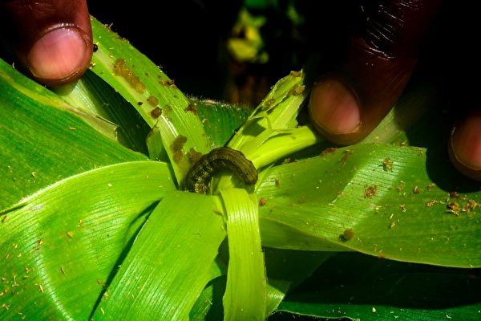

今天（5日）中共官方承认，草地贪夜蛾已进入中国大陆，而且今年的基数大，会呈重度发生态势。图为示意图。(SIMON MAINA/AFP/Getty Images)

【大纪元2020年03月05日讯】新型冠状病毒（俗称“武汉肺炎”）肆虐之际，中国大陆不仅面临沙漠蝗侵入的风险，还再次遭受草地贪夜蛾（也称“秋行军虫”）的入侵。今天（5日）中共官方承认，草地贪夜蛾已进入中国大陆，而且今年的基数大，会呈重度发生态势。

3月5日，中共国务院联防联控机制召开的新闻发布会上，中共农业农村部种植业管理司司长潘文博表示，草地贪夜蛾确实已入侵中国大陆，监测显示今年基数大、北迁时间提早，将呈现重度发生态势。

潘文博未披露目前入侵的具体情况。但相关专家说，草地贪夜蛾已成为又一个北迁南回、周年循环的重大迁飞性害虫。

草地贪夜蛾被称为“无敌破坏王”，具有迁飞扩散快、繁殖能力强、暴食危害和几乎无法根治的特点，是联合国粮农组织（FAO）全球预警的重大农业害虫。

2月21日，中共农业农村部印发《2020年全国草地贪夜蛾防控预案》（以下简称《预案》）。该《预案》显示，当前大陆虫源积累基数明显高于上年。截至2月10日，云南、四川等地区见虫面积超过60万亩，是2019年同期的90倍。当时陆媒称，预计全年，该虫发生面积为1亿亩左右。

2019年1月，草地贪夜蛾入侵云南，到当年6月份，草地贪夜蛾已蔓延至中国大陆19个省的1千多个县、市、区，农田受害面积达500多万亩。而与此同时，大陆农作物还遭到另一迁飞性害虫草地螟的袭击。到2019年年底，中共官方称，草地贪夜蛾蔓延大陆26个省1518个县、发生面积1,500多万亩，实际危害面积246万亩。

除了草地贪夜蛾、草地螟，中国大陆还面临沙漠蝗入侵的风险。

2020年3月2日，中共国家林业和草原局发布紧急通知说，在东非、中东、南亚肆虐的蝗灾恐随季风6~7月袭击中国大陆西藏、云南等地，一旦侵入，将面临“规律未知、监测技术缺乏、防控困难”等诸多不确定性。

通知说，经专家研判，如果气候条件适宜，巴基斯坦、印度等邻国的蝗灾将会持续暴发。6 ~ 7月在西风急流与印度洋西南季风的共同作用下，沙漠蝗虫恐从巴基斯坦和印度直接侵入西藏，或者经缅甸侵入云南，或者经哈萨克斯坦侵入新疆。如果6 ~ 7月到达大陆，蝗群规模增长至当前的500倍，届时蝗虫将达到不可思议的数量。

沙漠蝗虫不仅迁徙快，而且进食量大，被指每天可移动150公里，占地一平方公里的蝗虫群一天可吃掉3.5万人的口粮。#

<a target="_blank" href=#top><h6 align="right">回上方</h6></a>

<a name=39>
<h1 align="center"><b>脱罪——中共的舆情控制手段</b></h1>
 <h4 align="center"><b>文: 无弦</b></h4>

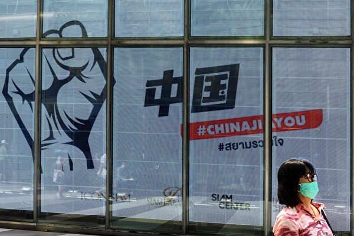

新冠状病毒武汉肺炎疫情肆虐，感染人数和死亡人数不断蔓延的情况下，中共越是加强国内舆情控制。(AFP/Getty Images)

【大纪元2020年03月05日讯】这是一场不可否认的罪行。2019～2020年新年之交，以中国武汉为起点，全中国乃至全球爆发了一场重大肺炎疫情，而中共在初期对疫情实况长达1个多月的隐瞒，使这场大灾难愈演愈烈，难以收拾。

从2019年12月1日第一位武汉病毒患者入院到2020年1月23日武汉封城，武汉政府持续对外宣称病毒传染性不强，可防可控。在第一位患者已经先后传染了14位医护人员、许多患者为全家集体感染，出现了明显的人传人病例时，中共一方面仍然坚称未发现明显人传人现象，未发现医护人员感染，另一方面大力“惩治谣言”，将意识到疫情危险性并在朋友圈内发出提醒的八名医生训诫、约谈。

近两个月的隐瞒与谎报，导致病毒在全中国乃至世界迅速扩散，无数人被夺去生命，疫情局面一发不可收拾。

面对中国人民对湖北省、武汉市当局隐瞒疫情的怒斥，中央下令问责武汉政府，不料武汉官网挂出了《“疫”流而上，何不多给武汉市长暖暖心》一文，文中申辩：“早在疫情发生12月，武汉已将相关情况上报国家卫生部门，专家组一行也深入到武汉调研，给出了初步结论，这位市长亦非专业医学出身，遵从专家的建议又何错之有？”暗指此次疫情失控的责任在中央。这场中央与地方政府之间的相互推卸责任，让无数中国人民用健康乃至生命付出了代价。

武汉疫情爆发百天以来，除去武汉市民是事件亲历者，多数人通过新闻媒体追踪这场灾难。但谁能想到，这些铺天盖地的消息竟被巧妙地编织成蒙蔽真相的遮羞布，本该为犯下的罪责付出代价的人躲在其后，妄图利用信息控制脱罪。

本文试图通过分析大陆两个月来疫情报导与舆情控制的特点，分析中共信息控制的手段与目的。

<b>1. “实情”：掩盖再掩盖后的“真实”数据</b>

此次武汉疫情中，有许多网站、公众号实时滚动播报肺炎疑似、感染人数，如“丁香园医生”等。这种“数据公开”反而给予了很多非湖北群众安全感——使其自认为心里是有数的。在疫情早期，武汉市内的各种求救、呼吁信息还未在网上传开，许多中国民众对党还保留着基本的信任，这些“透明”的数据影响力就更为突出。

那么，这些数据真的“透明”么？

2020年1月底～2月初，武汉官方统计的肺炎确诊、死亡人数信息表

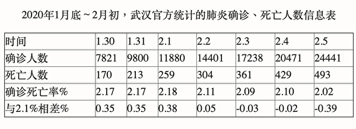

（网络截图）

我们注意到，这些数据的确诊死亡率极为规律地呈现“稳中有降”的趋势，很难想像在疫情爆发的早中期，感染人数就如此“听话”地稳定下来，这份数据确有伪造的嫌疑。

日前，大纪元发表了一份朝阳市卫健委2月23日发给辽宁省卫健委的内部文件，内容是该市政府办公室已按照《关于稳妥处置有关信息的紧急通知》的要求，通知下属朝阳市交通局、凌源市政府办公室、龙城区政府办公室销毁有关新冠疫情的文件数据，并对接触过数据的人员逐一排查登记，要求其签署《保密承诺书》。对疫情有关数据的“稳妥处理”的要求，使辽宁省政府掩盖疫情实况的举动暴露无遗。

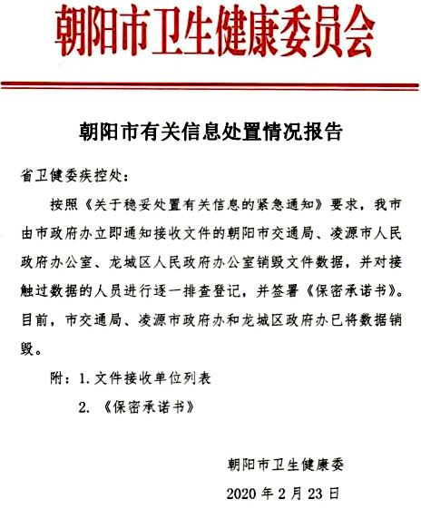

图2：辽宁省朝阳市卫健委发布的“销毁疫情数据”的文件。

然而辽宁省的例子并非个案。前央视主持人李泽华于2月16日起作为独立记者前往武汉，在YouTube上发布了数条疫情消息，其中包括武汉正在招聘天价搬尸工。

2月21日，李泽华暗访青山殡仪馆。在他的视频中，李泽华自称帮朋友寻找抬尸的工作机会，一个负责招聘抬尸工的人告诉说，“如果今天没有拖尸体就一分（钱）没有……（用自己的车到指定的地方拉尸体）拖第一具500（元），拖第二具增加200，拖第三具再加200，如果第四具的话就是1100。”与网传4小时可以挣到4000元人民币不同。

李泽华到晚上11点才离开青山殡仪馆，但是殡仪馆的焚尸炉还在轰隆隆作响，意味着殡仪馆的工人在加班加点。他在这段视频的最后用了几个数据，算了一笔账。

他说，根据官方的数据，武汉市平均每天非病毒感染死亡人数为137人，而武汉市区共有74个火化炉，日常情况下，每天每个火化炉只需火化1.74具尸体，每具尸体火化需要60分钟的时间。疫情爆发后，根据中共官方的资料，武汉在1月12日公布首例确诊病例死亡到2月19日为止的38天内，平均每天因疫情死亡的人数为40人。

汉口殡仪馆专门负责火化新冠病人的遗体。这家殡仪馆共有30台火化炉。按照上面的数据，李泽华推算出，汉口殡仪馆每天需要处理的52具非感染者遗体（每个火化炉每天火化1.74具X30座火化炉）；加上40具病毒感染者遗体，每天需要火化的遗体总数应该是92具，远远低于这家殡仪馆的火化能力。如果每天工作八小时的话，汉口殡仪馆有能力每天火化240具遗体。

李泽华的结论是，如果官方有关武汉肺炎死亡的人数是真实的话，非但汉口殡仪馆不需要加班，其它殡仪馆（青山殡仪馆）更不需要加班。

中共显然对疫情死亡人数有所隐瞒——因为武汉殡仪馆从中国新年后就没有休息过，24小时连轴转工作，有的火化工每天只能休息几个小时，累得大骂武汉市领导。

2月中旬，武汉肺炎疫情失控之际，媒体披露，已有40台“移动式医疗垃圾焚烧方舱”进入武汉。武汉网友指出，死人太多，这些设备烧的是死人尸体。每个方舱大小约20公尺，体积约30立方公尺，包含固体粉碎、焚烧及空气净化三个部分。引人注目的是，这些方舱外头印上了“垃圾和动物尸体处置方舱”字样，显示方舱不只处理医疗垃圾，也处理“动物尸体”。

武汉网友周先生说：“调了一些烧尸体的炉子过去了，不让出门，把门堵死，也就是一定要死就死在家里，如果不死在家里就传染，不好。那个焚化，那是烧尸体的，烧人的尸体。告诉烧尸体的人，高薪，2000块一小时，死的人太多了，一个车子就烧一万斤，这是什么概念。”

网民“麻吉妹子”根据李泽华提供的数据推算，武汉殡仪馆的74台焚烧炉，乘上全天24小时工作，再乘上每小时焚烧1具尸体，结果就是武汉每日真实死亡人数为1776！

此次，不断传递到全国人民手中的、堪称娴熟欺骗。在一月底二月初，完全隐瞒疫情已经是不可能的了，通过政府公布的被多重过滤后所剩的“公开数据”，人们虽然意识到疫情是可怕的，但又“亲眼见证”着它的“可防可控”，似乎再强大的敌人都会被党和政府轻易地“收服”，自然只会保持“有限度的恐慌”。

而那些在过滤和修剪时被除名的数据，那些根本无法进入统计的数据，其实也是活生生的人。他们被疫情大潮吞没，失去了健康乃至性命，但却永远无法留下姓名和进入统计。

<b>2. 祸水东引：对美国的指责</b>

2月3日，外交部发言人华春莹主持了网上例行记者会，指出：“美国政府迄今未向中方提供任何实质性援助”，并提及美国2019～2020流感季已导致1900万人感染，至少1万人死亡，而截止到2月3日，中国确诊感染新冠肺炎17,205例，死亡361人。这些言论的直接意图虽是论证美方禁止中国公民入境为“过激之举”，但显然还有别的用意——寥寥数语，再次把“亡我之心不死”的美帝推成了靶子，描述成了“中国人民的敌人”。

事实上，就信息本身而言，这些说法都非常不客观。首先，指责“美国政府”未向中方提供实质性援助，是一个巧妙的擦边球。据统计，截至2020年2月2日，188家外资企业共捐赠10.96亿元，美国、中国香港、印尼、韩国、英国的企业捐赠额暂居前列。美企捐赠2亿7954万元人民币，排名第一。

至2020年2月6日，254家外资企业累计捐赠13.78亿元现金及物资。美国、中国香港、韩国企业捐赠额居前三。其中，74家美国企业累计捐赠3.84亿元，占比27.9%。不错，美国企业的捐赠确实不算在“美国政府”头上，但作为整体的美国，以极大的力度援助了武汉更是不争的事实。华春莹的发言并没有逻辑上的漏洞，但却暗中将人们的愤怒情绪转向整个美国——有多少人会在匆匆浏览新闻时深究“美国政府”这一微妙用词呢？

其次，将美国流感死亡人数与武汉肺炎疫情规模并置，更是极有欺骗性的做法——似乎和美国大量死亡的流感人数相比，中国的肺炎疫情算不上什么。但我们应该认识到，普通流感导致大量人口死亡一事，在任何一个人口大国都是常见的。2019年9月，复旦大学公共卫生学院在《柳叶刀·公共卫生》上发表了一篇论文，分析了中国2010年～2011年到2014年～2015年间的流感死亡率，研究发现，中国每年有超过8.8万人死于流感。这种普通流感与现在的武汉肺炎从传染率、死亡率上来说都是不可同日而语的。

图3：复旦大学公共卫生学院研究成果报告显示，全国每年流感相关的超额呼吸死亡超过8.8万人。（网络截图）

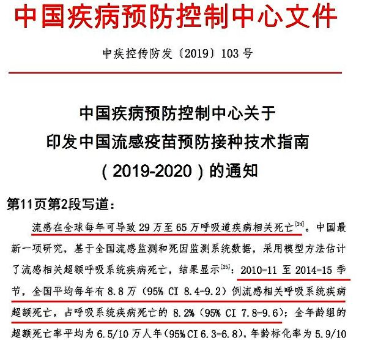

图4：中国疾控中心文件显示，全国每年流感超额死亡（相关呼吸道疾病，超过预计人数为）8.8万人。（网络截图）

 
我们也许会在这一段外交言论中发现相似的套路：华春莹所使用的数据确实是真实的，但却无形之中起着误导的作用——似乎“为人民服务”的中共与中国政府的疫情防控措施远比美帝有力。只有深究下去，才会察觉其中的不合理处，但同样的，大多数读者并不会发现这一点。

让事实为自己说谎和煽动——如此“高明”的舞文弄墨，道德低下程度可见一斑。

<b>3. 着墨：高歌猛进的“作为”</b>

在那段荒唐的答记者问中，华春莹倒是说了一句真话：“中国政府采取了最全面、最严格的防控措施。”不错，从武汉封城开始，党和政府采取了一系列疫情应对措施，积极的“作为”频频登上各大官媒，并配合“众志成城”的标语、图片或音乐一同放送。方舱医院、火神山、雷神山医院的建设更是其中浓墨重彩的一笔。

平心而论，这些“作为”对疫情的防控的确是必要的，新闻媒体的大量报导也并不过分。但笔者想谈一谈这些作为的另一面：真实情况并非一派光明。

<b>强制体温测量与强制隔离</b>

2月6日上午，中共中央政治局委员、国务院副总理孙春兰出席武汉肺炎疫情全面排查动员会，提出“武汉要举全市之力入户上门排查‘四类人员①’”。这一新闻被媒体冠以“大动作！”等标题，似乎是分外激动人心之举。但实际上，这一举措存在诸多问题：

此次上门排查以体温测量为主要手段，但发热并不是唯一的感染标志。武汉市的魏鹏医生指出，这一举措不但无法实现全面排查的初衷，反而容易以工作人员为载体挨家挨户地传递病毒，引发更大面积的感染。

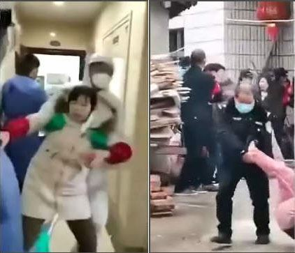

图5：网民拍摄的强行入户排查、隔离的视频截图，显示出很难保证执法中不互相感染。（网络图片）

这一排查执行的手段较为粗暴。许多网上图片显示，对于不配合强制隔离的武汉市民，上门排查人员的手段相当粗鲁，自己只戴个口罩，和被排查者大量肢体接触，将人拖出门外，既缺乏对中国公民基本的尊重，也很难保证执法中不互相感染。

确实是“大动作”，确实是有“执行力”的党与政府。但不是所有的雷霆手段，都算得上为人民服务。

<b>方舱医院的医疗设施问题</b>

自方舱医院建设以来，相关的争议一直在持续。方舱医院的医疗与物资条件到底如何？能否达到收治病人的标准？

连日来，大陆媒体关于方舱医院的报导较多地集中在医护人员与病人的乐观抗疫上，镜头往往对准医院中跳广场舞的老人、耐心安抚孩子的医生护士和认真准备高考的毕业班学生等。这些温暖动人的细节所展现的人对生命的热爱与积极的生活态度，确实值得敬佩。但这不应该成为我们对方舱医院的全部记忆。

在苦难中展现出的人性的高贵，并不能为苦难本身正名。

临时在体育馆等场地搭建的方舱医院，医疗物资、生活物资较正规医院匮乏仍然是不争的事实。归根结底，方舱医院的拔地而起还是由于疫情规模蔓延过大、相关物资筹备不及时，是一种无奈应对之举。倘若今后还有疫情发生，我们并不希望这样隐瞒、扩散、临时收治的局面再次出现。

如果一味地高唱赞歌掩埋了阴影，那与挽歌有何区别？

<b>4. 淡化：被遗忘的污点</b>

也许到了3月份，百步亭将不再被人提起。

1月18日，黄历小年，武汉江岸区百步亭在已经有人得知封城消息的前提下，仍然红红火火地开展有四万多家庭聚集的“百家宴”。消息传出后，当即受到海内外舆论批评。

“百家宴”之后，截至2月6日，百步亭社区一共有57个门栋被列为发热门栋，每个门栋14户人家，楼下进口处被贴上红底黑字的“发热门栋”字样。该社区内的怡康苑（百步亭社区共包括9个小区，此为其中之一）则共有3779户，分为5个单元网格，截至2月4日中午12点，其中一个网格已至少有10人确诊感染了新型冠状病毒肺炎，还有超过30人在医院拍的CT结果显示“高度疑似新冠肺炎”，另有数十人轻症患者居家观察中。百步亭万家宴“一万多道菜品出邻里温情，二十届万家宴见证社区和谐”的宣传口号显得极为讽刺。

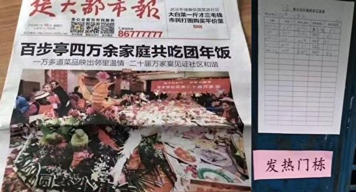

图6：得知武汉要封城的前提下，仍坚持搞百步亭社区的万家宴，使该社区成为瘟疫的重灾区。（网络图片）

然而大陆媒体对百步亭事件的后续报导并不多，真正跟进感染人数的更是少之又少，大多只是泛泛提到疫情防控的重要性云云。若不是居民利用网络求助，也许被誉为全国文明社区示范点、全国和谐社区建设示范社区、全国文化先进社区的百步亭，只有无声无息地成为“面子工程”的牺牲品。

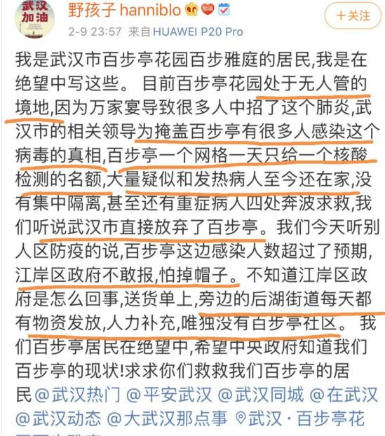

图7：百步亭社区居民的无力控诉之一。（网络图片）

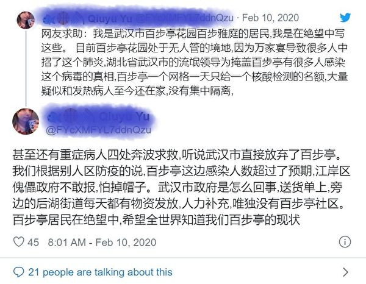

图8：百步亭社区居民的无力控诉之二。（网络截图）

也许有人认为，民众对这些人和事没有那么健忘，不会被轻易蒙蔽。但在信息时代，每人每天接触到海量的信息，如果一些消息被人为地抹杀，在众多信息中难以占据一席之地，会无意间使人觉得其次要，乃至逐渐遗忘。何况有更多的“大作为”被浓墨重彩地推出，没有人希望被愚弄，但总是不由自主地跟波逐流，唱起赞歌。

<b>5. 封口：言论管制</b>

随着疫情攻坚的白热化，舆论管制也达到了高峰。3月1日，被称为“网络大屠杀”的中共《网络信息内容生态治理规定》生效。在2月29日，中共网警对社交媒体的“大屠杀”就已启动，大批敢言账号被停或无法登陆。据此前爆料，这是迄今中共最严厉的一次网络整肃。

据自由亚洲报导，2月29日及3月1日，中共网络警察和网络社交平台对发布所谓敏感信息的账号，采取了大规模封号行动。2月29日晚，前《南方周末》记者、香港中文大学助理教授方可成的公众号“新闻实验室”被封号。3月1日，又有无数活跃网民的账号无法登录。

在这场规模空前的封口中，连相关的学术论文都难逃一劫——现任美国斯坦福大学社会学系教授、清华大学社会学系兼职教授的著名社会学家周雪光先生一篇分析中国国家治理制度逻辑的论文，从被广泛转载到被封禁不过半天时间。上到学者研究下到普通民众的议论皆被禁止，这绝不是客观清理谣言。

更有甚者，新浪微博甚至大量删除武汉市民的求助信息，这些处于水深火热之中的百姓绝无意挑战党的统治与权威，不过是求告政府无门，转而利用网络自救求生，何罪之有？

为告知公众疫情的真实状况，几位“公民记者”利用网络发布了在武汉市拍摄的视频。方斌是武汉当地的一名服装销售员，他录制的视频，让人们看到了疫情中心未经过滤、往往是令人心碎的画面。医院外排着的长队、虚弱的病人、焦虑的亲属。几天后，方斌被人从家里破门抓走。

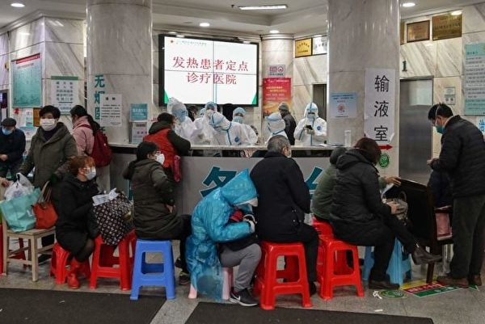

图10：1月24日，武汉一家医院等待就医的病人（瘟疫初期的确诊和收治极为有限）。(Hector RETAMAL/AFP)

遭遇同样命运的还有前文提到的前央视主持人李泽华。2月16起，他开始对武汉市疫情实况进行暗访调查，先后到了武汉百步亭社区百步雅亭小区、武汉软件职业工程学院、青山殡仪馆等地进行实地采访。2月26日，李泽华在武汉的公路上开车，被疑似国安人员尾随追捕，李泽华一边开车一边发视频向网友求助，当晚10点，在与门外不明身份敲门人一段时间对话之后，李泽华居所被强行闯入搜查，视频中断。

李泽华进央视做主持人的时候，二十岁出头。李泽华被抓走的时候，二十五岁。有网民可怜他：“这是什么年代了还说真话……”他的被失踪似乎与他拍摄的视频触及了P4病毒所与武汉火葬场的敏感问题有重大关系。

他播放的视频显示，16日前往武汉疫情严重的百步亭社区实地采访；18日报导了武汉市殡仪馆“天价招聘尸体搬运工”内幕；25日，他前往武昌火车站地下停车场访问滞留的外地劳工；2月26日，李泽华在前往武汉P4实验室后回家就被国安追捕，在酒店他对着镜头做了“最后的演讲”后主动开门，然后失联。

武汉P4病毒所，全称中国科学院武汉国家生物安全实验室，简称武汉P4实验室。武汉P4实验室一直被怀疑是这次疫情泄毒的源头。

图11：前央视主持人李泽华（网络视频截图），独立采访武汉疫情被安全部门抓走。（网络图片）

香港浸会大学新闻系高级讲师吕秉权认为，公民记者接连被扣查与他们踩进了“禁区”有关。他指出：“这疫情里有很多见不得光的事情。根据中国官方的讲法，他们要突显是中央的坚强领导，还有主旋律，宣传重点基本上没有对准病人。疫情还有民间的情况还是一个‘禁区’。”

一个抽象又空洞的稳定的逻辑，压倒了真实的鲜活的生命；对民心动摇的惧怕，超出了对人民生命的尊重。防民之口的维稳，终究只是一张血淋淋的画皮。

<b>6. 收编：被“主旋律化”的“众志成城”</b>

联合国秘书长古特雷斯24日在瑞士日内瓦表示：“中国人民为尽量减轻新冠肺炎疫情造成的负面影响，实施严格的防控措施，以牺牲正常生活的方式为全人类做出了贡献。”

这确实是中国民众的劫难，中国民众的牺牲，中国民众做出的奋斗和贡献。

但当疫情结束时，那些灾难中可歌可泣的事件、无私奉献的精神、鼓舞人心的歌曲，都将被中共作为“党与政府”领导人民的丰功伟业，被收编入主旋律的宣传话语中，成为新的红色资源。

等到没有亲身经历这场灾难的下一代人成长起来，唱着赞歌的他们永远不会知道中共在疫情中犯下的罪业。

民众与党的距离是如此的微妙。当党进行维稳时，民众的生命健康是“不值一提”的，可一唱起赞歌来，党与人民群众又一下成了“一体”的，所有歌颂人民的歌，都被算作歌颂党。

<b>7. 总结：中共的脱罪历程</b>

经过上文的分析，我们可以窥见中共构建“信息谎言”的高明之处：

对疫情实情，采用修剪美化过的报导，展现出“可防可控”的稳定形势；

面对民众对政府通报实情不力导致疫情蔓延的局面，采用祸水东引的手法，把“美帝”又一次变成活靶子，供人们平息愤怒、“一致对外”；

相关新闻报导中，刻意放大政府的积极作为，特别突出此类行动的光明一面，而对可能带来的不良后果回避不谈；

对于无法收拾的事件，采用淡化的方式，妄图借助时间为自己脱罪；

“调控”网络舆论，使从专家到民众都不敢发声。

最后，当一切都结束时，所有为武汉人、中国人谱写的赞歌，都将成为这个本该承担罪责的党和政府的“光荣事迹”，成为“党领导人民抗击‘天灾’（而不提人祸）”的丰功伟业，并作为“历史”，交代给下一代人。

这是个非常熟悉的“党的赞歌”故事，我们已经讲了几十年。

但是，事实永远没有那么皆大欢喜，太多的惨剧被掩盖了。

2月24日下午，湖北十堰，一位志愿者上门查体温。敲开房门，走到一户人家，开门的是个六岁的小男孩。

志愿者问：“家里几口人？”
男孩回答：“只有我和爷爷。”
“你爷爷呢？”
“去世好几天了。”
“为什么不出去？”
“爷爷说外面有病毒，不能出去。”

这个小男孩给死在厕所的爷爷盖上了棉被，靠吃饼干度过数日。如果不是被人发现，他也许会悄无声息地死去。

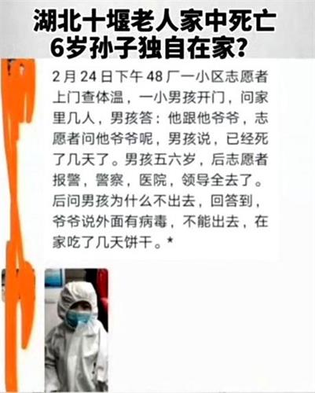

图12：湖北十堰封城，老人死在家中，孩子在家吃饼干，幸亏被发现。（网路截图）

人对数字总是那么的容易麻木，看惯了几万个确诊的数字，就觉得每日几百人确诊，已经是雨过天晴，该唱一唱春天，唱一唱彩虹，一切都会过去。

但一切都不会过去，如果我们仍然这样在谎言之中得过且过地生活。

正如前文所言，苦难中展现的人性的高贵，并不能给苦难本身正名，一个政党，一个政权，倘若仅凭玩弄舆情的伎俩脱罪，那千万亡魂该何处安息？

不要忘记人祸，且等那恢恢天网。

文章来源：明慧网

<a target="_blank" href=#top><h6 align="right">回上方</h6></a>

<a name=38>
<h1 align="center"><b>颜纯钩：全能网络严控 确立无声之国</b></h1>

前央视主持人李泽华（网络视频截图），独立采访武汉疫情被安全部门抓走。（网络图片）

【大纪元2020年03月05日讯】中共自３月１日起，实施“有史以来”最严密的网络控制，此事未在大陆网络世界引起轩然大波，事实是，已经没有人够胆说“不”了。

按新规定，没有任何人可以对中共所有的政策法规﹑官员作为﹑社会现象﹑民情民意有什么独立的异议，也就是说，官方做的任何事都是对的，说的任何话都是真理。即使官方做错了事说错了话，只要他说自己对了，十四亿中国人也只能相信官方对了。

官方永远不会说自己做错，网控一推行，中共就永远不会做错事了，中国人也永远都不会知道中共做了错事，或者明明知道了，也只能相信官方没做错。

原来所谓共产党的伟大，就是如此这般得来。

网络控制条文全部是抽象陈述，解释权完全控制在中共自己手上。有那些条文在，任何人只要轻举妄动，都可以将某一个条文强加在他头上，因为只有官方才有解释权，被指控者根本无以自辨，唯有低头认罪。

在此之前，网络早有控制，不过中共通过各大网络运营商，动用数不尽的网警和五毛，以电脑大数据追寻关键字的技术，随时封号封群。但想说真话的人，还可以重新注册﹑重新组群来躲避封口的厄运。在新法规出台前，一般违规者只是暂时噤声而已，没有法律上和生活上的后果，但此后，这种“好日子”不再了。

首先，封口的范围非常广，几乎无远勿届，就是说你说的任何一句话，都在这部新规定涵盖的范围之内。每个人在网上说什么，都逃不过这部法规的监控，因此，不管你想说什么，在说话之前，都要好好掂量每句话，会不会违规，违规后的后果如何。那不只是封号封群的问题，是你的政治立场如何被官方定义的问题。

其次，监视范围直接落实到每个个人身上。在大陆，手机和上网都要实名登记，中共自己有一套卫星定位系统，也就是说，你这个人在什么地方，什么时候，说了什么话，官方都知道，“老大哥”每时每刻都盯住你。你的头上又有一部管制到无远勿届的法规，这部法规笼罩了你在网上所说的每一句话，你每句话都在审查范围之内，那你还敢随便说话吗？

最后，中共早前搞了一个社会信用系统，最近又搞了一个防疫三色二维码，前者关涉个人财政状况，后者关涉个人健康状况（绿黄红三色二维码，由大数据根据个人的行踪算出来，一个绿色二维码，可能因为你走过一个有疫症发生的地区而转为红色，你的通行便处处受阻）。日后，中共一定会出台一个政治定位三色二维码，你在网上说了什么，你的政治定位将跟随你到处去，绿色通行，黄色受限，红色禁足。你唯有不断对中共说好话，争取大数据算法把你的定位由红色改变为黄色，否则你将失去行动自由。

够厉害吧，“我的国”！

有了这部网管法规，中共想做什么都可以，因为不管做什么，中国人都要说好，既然人人都那么满意了，中共当然就很伟大。

这部法规当然不是为抗疫提出的，是筹划已久的强化专政统治的一步棋。中共要将中国改造成一个放大的新加坡，甚至更倒退到文革，网络严控当然是重中之重。之所以在近日推出，主要基于疫症过去后，经济情况必然恶化，失业与通涨齐升，中国人一觉醒来，发现好日子一去不返，那时民间的反抗会普遍发生。

从前，中共只能严管传媒，网络漏洞很多，万一各地民变频起，风吹草动，互相影响引爆，那就很危险。现在把网络管严了，一地之民变，外地无人得知，中共从容镇压，迅雷不及掩耳，不会造成涟漪反应。

而网络管死了，民间反对声音死寂，没有人可以推波助澜，稍有异议即刻扑灭，那就更可以防微杜渐。

够厉害吧，“我的国”！

什么许章灁﹑许志永﹑陈秋实﹑方斌，日后都无用武之地，说的话传不出去， 拍的视频无从扩散，自己说给自己听，小鱼掀不起大浪来。

中国人从此只能听党的声音，消费党批准的娱乐，乖乖过自己的小康日子，只有八个样板戏的日子不远了。

香港人应该庆幸暂时还不至于如此，但好日子还有多少，就没有知道了。

俗话说，物极必反，且看大陆人如何消受网络严控﹑心灵窒息的日子。

——作者脸书
3:01 PM

<a target="_blank" href=#top><h6 align="right">回上方</h6></a>

<a name=37>
<h1 align="center"><b>【新闻看点】疫情危机刚开始？习近平五大短板</b></h1>

富士康复工心切，聘用了钟南山为防疫及复工总顾问。图为富士康深圳厂。 (AFP)

【大纪元2020年03月05日讯】大家好，欢迎大家关注新闻看点，我是李沐阳。

先向大家说明一点，从今天（3月4日）开始，新闻看点恢复使用“武汉肺炎”的称呼，不再使用新冠肺炎（COVID-19）。正如网友所说，使用新冠肺炎的称呼，是中共有意“让人们淡忘病毒来源”。而世卫组织总干事谭德塞推动使用新冠肺炎的说法，可能是替中共洗白。

昨天世卫组织表示，武汉肺炎致死率远高于季节性流感，将死亡率上调为3.4%。不过谭德塞仍然表示表示病毒“可以控制”，还没构成全球大流行。但日本网民批评说，这次疫情爆发“根本就是WHO轻忽造成的大错”。

昨天《国家科学评论》发表一篇论文，研究团队证实，新冠病毒近期发生了突变，而且不排除再突变。论文证实，病毒经过“人为干预”。但在疫情仍然肆虐之下，北京当局仍坚持要求复工复产。外界认为，第二轮疫情爆发已经不远了。而疫情只是其一，北京的5大短板都在一一曝光。

<b>世卫调高死亡率</b>

在昨天新闻发布会上，被网民称为“谭书记”的谭德塞表示，“新冠病毒致死率远高于流感，但病毒可控”。他认为武汉肺炎还没有构成全球大流行。

相信疫苗早晚会研制成功，治疗方法早晚会有，但是目前没有。而这个时候谭德塞就说“病毒可控”，他的结论是怎么来的呢？

疫情已经扩散到79个国家和地区，六大洲都发现了病例。即使这样，谭德塞仍然说没有构成全球大流行。他还说，“中国以外的国家新增病例数快速增加，已达中国新增病例数的9倍”。言外之意中国防控措施做的好，别的国家做的不好。

“谭书记”的发言激怒不少日本网民。有批评表示，日本就是因为相信世卫组织的数据和建议，导致政府 、医疗学者和民众对武汉肺炎过度乐观，才发生疫情扩散，包括在限制中国客入境上慢人一拍。

日本网友表示，“完全感受不到他（谭德塞）发言的重要性。对于这问题，重点在一开始就采取措施，加强实施，最终结果就只会造成最小伤害。但因为这个总干事一直反对这样做，大流行因此不可避免。这完全是人祸。”

另一名网友表示，世卫对中国表示肯定，却批评日本，“说日本疫情是令人担心的对象是不正确的。WHO可以解散了”。

还有网友说，“一开始缺乏危机感的WHO造就了现今状况。事到如今说什么都让人难以相信了。而且如果正确应对有制止（病毒）的可能，那也请告诉我们具体的正确的应对方法。”

其实“谭书记”为北京背书，也反映出了北京当局的短板。

<b>短板之一：复工恐爆第二轮疫情</b>

截止到2月26日，全国96家央企及所属子公司在2月3日以前，已经进入了正常运转状态。央企所属的4.8万家子公司复工率是是97.9%。同时，许多地方已全面复工，许多城市也放松了旅行和公共交通、社会生活方面的限制。

前美国国防部中国事务官员唐安竹（Drew Thompson）认为，恢复商业活动，特别是恢复工厂生产，“无疑将会导致新的感染”。

大陆媒体报导，上周从意大利返回浙江的7名中国人，都被确诊感染了新冠病毒。这是疫情从国外反流中国的现象。

美国前资深外交官坎贝尔（Kurt Campbell）昨天在哈德逊研究所表示，无法确定疫情会达到高峰期，中国过早复工会加剧病毒传播风险。他认为，中共政府可能会人为制造第二波大流行。

清华大学社会学系教授郭于华对自由亚洲表示，“把人作为工具来对待、作为统治对象，这种东西本身就是病毒，这种统治，不比武汉肺炎的病毒毒性小，我觉得毒性甚至更大。”

值得一提的是，长沙富能公益机构从2月26日开始，发起了义务为染病伤亡家庭的追责索赔行动。虽然索赔路途遥遥，但是相信踏出第一步后， 就会有人陆续跟进。

由于时间关系，这个问题先说到这，在会员专区将结合网友爆料视频详细说说。其实根据网友爆料的视频来看，第二轮疫情已经不远了，甚至可能已经开始了。

<b>短板之二：产业链加速迁离</b>

北京不顾爆发新疫情，要求复工复产，可能是出于中国经济的压力。

今天公布的2月财新中国服务业PMI只有26.5，大幅下滑了25.3。此前公布的2月制造业PMI大跌了10.8，只有40.3。

两大行业PMI都大幅跌落，证明中国经济遭受了重创。更让北京焦虑的是，这种创痛并不是最深的，更深的伤痛是产业链离开中国。

经济受创是暂时疼痛，只要恢复生产，即使不能完全追回损失，也可以追回一部分。但是产业链离开中国，这种损失不可挽回，是无法平复的伤痛。而疫情爆发后，生产厂商正在加速离开中国。

中国国际贸易90%是海运，但疫情爆发后，几十艘装满货物的轮船被取消，中国产品不能交给买家。彭博社报导，克莱斯勒（FCA）汽车工厂因为中国生产的零部件断货，暂时关闭了。

“海洋情报”是一家海运咨询机构，执行长墨菲（Alan Murphy）估计，大约有60万个20呎标准货柜（Twenty-foot Equivalent Unit）被困在中国。

不过运输停滞是双向的，中国货物出不去，外国商品同样进不来。有中国买家向沙特提出请求，减少原油供应。并且以“不可抗力”为由，请求减供天然气。彭博社指出，“未来回顾2020年2月，将是一段供应链中断的历史”。

经济学家俞伟雄对新唐人表示，过去几年，随着中国工资成本上涨，一些低阶的工厂已经移出中国了。贸易战使中阶也开始离开中国。“本来有一些产业恋栈不想走，但这次肺炎会加速生产链的外移”。

南卡大学艾肯商学院讲席教授谢田指出，“中国从南到北都有疫情，大家都不敢出门，不愿意购物，中国经济整体下滑5～6%是肯定的。中国经济正在陷入更大的衰退，这是必然。”

<b>短板之三：病毒已突变，或侵害心脏及大脑</b>

今天，中共国家卫健委发布了第七版诊疗方案，其中增加的“病理改变”部分显示，武汉肺炎可致肺脏、脾脏、心脏、肝胆、肾脏还有其它器官受损。

另外还提到了病人脑组织充血、水肿，部分神经元变性外，首都医科大学附属北京地坛医院通过基因测序证实：确诊的武汉肺炎合并脑炎病人的脑脊液中存在新冠病毒。

财新网引述地坛医院披露，他们收治的一例56岁武汉肺炎患者，通过基因测序证实脑脊液中存在SARS-CoV-2（新冠病毒），临床诊断为病毒性脑炎，患者中枢神经系统受病毒侵袭。

另外，科研团队发现病毒近期已突变，传染力更强。昨天（3日），中国科研团队研究证实，病毒近期已产生突变，演化出2个亚型，感染力有差异。澎湃新闻报导，北大生命科学院生物信息中心研究员陆剑、中科院上海巴斯德研究所研究员崔杰对103个新冠病毒全基因分子进化分析。发现病毒株已经发生149个突变点，多数是近期产生的。

发表在《国家科学评论》的最新论文表示，病毒已经演化出L和S两个亚型，其中101个属于这两个亚型。从比例上看，L亚型更为普遍，达到70%，S亚型占30%。S型是相对更古老的版本，而L亚型更具有侵略性，传染力更强。

病毒发生突变，等于是“老病没好，又添新病”，防治病毒的难度又增加了。而在这种情况下，北京当局推动复工复产，套用网友一句话：“细思极恐”。

<b>短板之四：封不了病毒就封嘴 引公愤</b>

进入3月，中共实施了更全面、更严格的《网络信息内容生态治理规定》。中共官媒称给网络生态“拔杂草”、“洗洗澡”。疫情肆虐阶段实施新网规，外界认为这是当局为推动复工制造舆论环境。

独立学者吴强对美国之音表示，网络新规是对所有中国公民、特别是对言论自由的恐吓。这是中共在延续“洗脑运动”和“反右运动”，已经覆盖了所有人。

其实，在疫情初期，中共已经开始屏蔽“武汉不明肺炎”、“武汉卫健委”等关键词。

加拿大多伦多大学跨学科实验室专长于研究信息封锁，他们发现，疫情初期，一些关键词已经成了网络禁区。以维稳的名义，大陆几家网络巨头负责清除敏感内容，称之为谣言。

实验室指出，从12月底到2月中，包括“肺炎”、“预防流行病”、“病毒”等等，大约500个关键词句，被视频网络YY和微信封锁。“人传人”这类关键词，也被删除。两家应用还删除了批评中共领导人的关键词和信息。

研究学者告诉法新社，中共通过封锁信息，给公众健康带来的潜在损害极其罕见，“限制了公民知情和自我保护能力”。

对病毒没有办法，中共就在封锁舆论上下了力气：封不住病毒就封人们的嘴。李文亮等8位医生的事例，离我们并不远。

不过，这种做法只会激起更大愤怒。虽然陈秋实、方斌、李泽华接连被抓，但是相信会有更多人起身。刀客杨佳说过一句话：你不给我个说法，我就给你个说法。

目前已经有人在白宫请愿网站发起请愿，呼吁释放这些公民记者，还给有脊梁的人自由。只要在30天内得到10万签名，白宫就会做出官方回应。

（https://petitions.whitehouse.gov/petition/save-independent-reporter-chen-qiushi-and-brave-wuhan-citizen-fang-bin）

<b>短板之五：捧习遭举报，批习获表扬</b>

疫情仍在肆虐，前两天中宣部推动出版了歌颂北京当局的《大国战疫》。但是出师未捷身先死，书还没上市，引起了许多人反感。

北大法律系82级的学生薛扶民是北京海淀居民，最近在网络上公布了自己的身份证号码，实名举报主管宣传的中常委王沪宁。指称他缺乏对人民的关爱，应该追究政治责任。

举报事实主要有两个，一个是王沪宁主导出版的《大国战疫》，另一个是《人民日报》发表的《我们的日子过得比蜜甜》。

信中表示，“王沪宁做为政治局常委，主管意识形态，在当前防疫、抗疫的严峻形势下，罔顾人伦与基本良知，不思反省如何加强和改善防疫抗疫的工作，尽力减轻人民痛苦，真诚向全国人民道歉，向世界忏悔由于早期疫情防控失当，致使疫情外溢给全世界人民带来灾难的罪行，反而吹嘘所谓的战疫功绩，让全世界人民耻笑，让全中国人民伤心与绝望。”

薛扶民指责王沪宁不配再承担这样的工作，“应该辞职谢罪，并追究政治责任”。

吹捧习的人被举报，可能是王沪宁没想到的。不过这个事可能不是孤立存在的，因为批习的人却受到了表扬。

2月28日，中央指导组成员、国家卫健委主任马晓伟，在新闻发布会上介绍疫情防控工作时，对武汉市长周先旺点名进行了表扬。

马晓伟表示，在面临延误治疗时机、疫情扩散的双重压力下，武汉市长周先旺“靠前指挥、亲自调动，夜以继日组织力量施工改造”等等。

早前在中共央视直播中，周先旺曾说过，作为地方政府的领导人，获得信息，授权之后才能披露。在得到政府授权后，“工作就主动多了”。

周先旺的说法，外界认为是向北京甩锅。按照通常情况，向当局发难，很可能会被撤职查办，但是周先旺却受到表扬。这是一个不一般的现象。

是不是有人在用这样的方式，迂回向习近平问责呢？

<b>北京当局日子难熬</b>

清华大学教授许章润在网上发表评论表示，武汉肺炎疫情“在将整体的德性窳败暴露无遗之际，抖露了前所未有的体制性虚弱”。随着疫情爆发，整个国家跟着遭受戕害。

这位知名法学家写道：“值此大疫，睹此乱象，愿我同胞，十四万万兄弟姊妹，我们这些永远无法逃离这片大地的亿万生民，人人向不义咆哮，个个为正义将生命怒燃，刺破夜瘴迎接黎明。”

时事评论员蓝述表示，政治与经济的压力，已经让北京焦头烂额，日子很难熬。而现在又是国际、国内合力，红墙倒塌的日子不远了。

节目最后再重申一次，新闻看点网络征文活动已经开启了，欢迎大家踊跃投稿，将您在疫情冲击下的感受和所受的伤害写出来。来稿请发送到xwkd2017@gmail.com，这也是我们的爆料邮箱。

好，以上就是今天电视节目部分。在会员区，我们会引用一些网友爆料视频，看看大陆疫情的真实情况。还有大陆民众已经开启了向国家索赔的脚步，其中被称为国妖的王沪宁，已经遭到大陆民众的实名举报。感谢您的收看，再会。

大纪元《新闻看点》制作组

<a target="_blank" href=#top><h6 align="right">回上方</h6></a>

<a name=36>
<h1 align="center"><b>卫星图曝中共及朝鲜联手违反联合国制裁</b></h1>

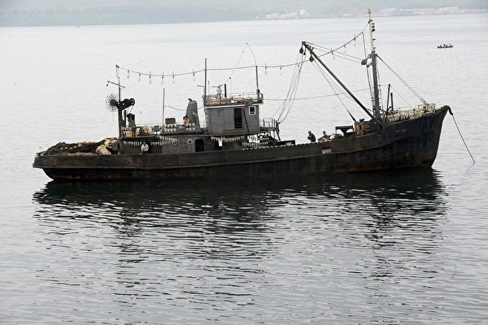

华府智库周三发表报告表示，去年3月到8月，朝鲜运送大批砂石到中国大陆，违反联合国制裁规定。图为朝鲜船只示意图。(GOH CHAI HIN/AFP)

 
 【大纪元2020年03月05日讯】（大纪元记者吴英编译报导）华府智库周三发表报告表示，去年3月到8月，朝鲜运送大批砂石到中国大陆，违反联合国制裁规定。

高级国防研究中心（Center for Advanced Defense Studies，简称C4ADS）周二（3月3日）在一份报告中写道：“2019年3月至8月，C4ADS观察到大批来自中国海的船只前往朝鲜海州湾（Haeju Bay），挖掘及运输砂石。”海州湾距离韩国不到30公里（18.6英里）。

该报告说，中共及朝鲜联手将朝鲜砂石运送到中国，明显违反联合国安理会2017年制裁朝鲜的决议：禁止朝鲜供应、出售或转运砂石。

C4ADS研究人员通过商业卫星图像和运输数据库跟踪北京及平坏挖掘及运输朝鲜砂石的活动。北京曾表示将全面执行联合国安理会批准的制裁朝鲜决议。

联合国发现，朝鲜经常通过海上船对船转运煤炭和石油等物品的方式规避制裁。C4ADS在报告中说，朝鲜运送砂石到中国是明显的违规行为，“显示即使在受到严格监视的情况下，（朝鲜）仍然明目张胆地逃避制裁及相关惩罚。”

根据C4ADS审视的自动识别系统（AIS）数据，2019年，来自中国海域的船只至少造访海州湾1,563次。相比之下，前两年的访问量仅为418次。AIS数据显示，许多船只返回了中国沿海港口。

卫星图像显示，某些船只似乎还有护航或其它形式的船只一起行动，这表明这是经过协调的活动。
<h4 align=center><a href="https://twitter.com/C4ADS/status/1234940842655277057?ref_src=twsrc%5Etfw%7Ctwcamp%5Etweetembed%7Ctwterm%5E1234940842655277057&ref_url=https%3A%2F%2Fwww.epochtimes.com%2Fgb%2F20%2F3%2F4%2Fn11915406.htm">“在海州湾的活动，与其它已知的朝鲜在海上逃避制裁的案件有所不同，其规模及违规程度都很高。”C4ADS的报告说。(点击右键,另存新档）</a></h4>

C4ADS报告作者之一劳伦·宋（Lauren Sung）告诉路透社，分析师正在研究如何估计自朝鲜出口到中国的砂石数量以及平坏的获利。

“近年来砂石价格快速上涨，全球都在进行合法和非法的砂石采掘和买卖。”C4ADS说。

美国国务院发言人说，所有联合国成员国都应执行联合国的制裁决议，“我们希望所有人都继续这样做。”

<a target="_blank" href=#top><h6 align="right">回上方</h6></a>

<a name=35>
<h1 align="center"><b>武汉方舱医院发紧急通知：很多出院患者病复发</b></h1>

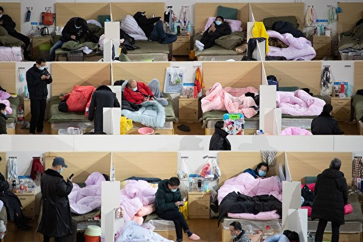

2020年2月18日多名患者在由武汉体育馆改造的方舱医院中休息。 (AFP/Getty Images)

【大纪元2020年03月05日讯】（大纪元记者李净综合报导）新冠肺炎在世界各国陆续爆发，而在疫情发源地中国，中共官方报告的确诊人数却在持续下降。与此同时，大陆各地出院的患者频现“复阳现象”。

3月3日，中共官媒《人民日报》刊文，文章引述中共卫生健康委员会主任马晓伟的话称，武汉方舱医院已经做到了“零感染、零死亡、零回头”。

但武汉市江岸方舱医院一名负责人3月4日向澎湃新闻证实，江岸方舱医院发布了一份《紧急通知》：根据市防疫指挥部最新通报，近期出院患者中复发者较多，导致患者重新入院治疗。

报导称，江岸方舱医院决定从3月5日开始对所有在舱拟出院病患抽血加做病毒抗体Ig-M与Ig-G的检查。

由于新冠肺炎患者出院后不断出现核酸检测复检阳性的情况，中共官方对出院后注意事项的说辞有了变化，将原来诊疗方案中出院患者“应继续进行14天自我健康状况监测”改为“应继续进行14天的隔离管理和健康状况监测”。

不仅在武汉，出院患者“复阳现象”也在其它地区频现。早在2月21日，成都市公共卫生临床医疗中心公告表示，一名居住于锦江区望江锦园的新型冠状病毒肺炎患者，出院回家隔离期间，接受核酸复检的结果再次呈现阳性。

2月25日，广东省疾控中心也称，广东14%的武汉肺炎出院患者出现“复阳现象”。

2月27日，江苏徐州的首例新型冠状病毒肺炎患者出院后再做核酸检测呈阳性。3天前为他出院举行欢迎仪式的邻居们全部被隔离，波及至少65人。

目前，武汉肺炎疫情已蔓延世界各国，疫情在多国爆发，各国纷纷提高防范等级。诡异的是，中共官方报告的确诊人数却持续下降。据央视报导称，3月2日，27省区市新增确诊病例数为“0”。其中，江苏等10个省份连续10天以上“无新增确诊病例”。

在武汉生活了40年的吴先生现旅居加拿大，他在武汉的15位亲友已感染新冠肺炎，3人已去世。他说：“共产党一开始就撒谎，不确认。我所有感染的家人和朋友，他们都面临一个问题，他们（中共）不确认，他们不认为是新冠肺炎。”一个亲戚的诊断书写着，“双肺有感染性病变，通过CT看出呈毛玻璃状”，这是典型新冠肺炎的症状，但是就是不给确诊。

江苏知名环保人士吴立红对大纪元表示，当局目的是为了保经济，最终还是为了“维稳”。

根据中共日前发布的“新冠肺炎诊疗方案（试行第七版）”显示，科研团队发现武汉新冠肺炎病毒近期已突变，传染力更强。可致肺脏，脾脏、心脏，肝胆，肾脏还有其它器官受损。

<a target="_blank" href=#top><h6 align="right">回上方</h6></a>

<a name=34>
<h1 align="center"><b>如何才能走出「武汉肺炎」大难？-给中国现任政权领导人的一封信</b></h1>
 <h1 align="center"><b>文：曾严</b></h1>
 
【明慧网会计年度二月二十三日】因为看到中共现政权领导人面临的重大矛盾和危机，因此写来这封公开信。写信的目的是想帮助现身领导人看清一条光明和希望的路，走过自己替代替代的生命劫难。

今天，「武汉肺炎」已席卷整个中国大陆，并殃及海外。致病的「2019新型冠状病毒」（简称「新冠病毒」）其严重性远远超过「萨斯」（SARS），至少致命性，传播逐步，传播途径更多，并且还在不断变异，无症状的潜伏期越来越长。

在「武汉肺炎」面前，完全是无数普通百姓切身的意识到了死亡的威胁，近距离的闻到了死亡的气息，我想中共高层的人也概莫能外，因为在疫病面前，中共高层的人和普通百姓一样，人身肉体都是爹妈所生，血肉组成，都食五谷杂粮，没有任何区别。

到现在，这场大疫已给大陆疫区内部的无数民众造成了巨大的生命损失，带来恐慌和压力。同时也给中国大陆的经济造成了重击。现政权已包围两难：不封闭不隔离的话，疫情可能蔓延更广，但严厉的封闭又导致全国各地街道冷清，百业凋敝，经济萧条，尽管现政权早已要求不停产，“防疫措施不要过头”，但疫情肆虐，无人肯听，很多地方政府仍各自为政，防疫措施还在不断加码。

然而，把民众像动物一样强制关在自己的家里，看不到结束的希望，给人们带来的压抑，恐惧和绝望，无形中又在酝酿另一场巨大的危机。

很多人都把武汉肺炎疫情结束的希望寄托在美国「吉利德科学」开发的新药「瑞德西韦」（Remdesivir）上，还有就是寄希望于「新冠状病毒」像当年的SARS「萨斯”病毒一样，在天气变暖，温度升高时自动死亡。

对于前者，武汉专家表示：对重症束手无策，瑞德西韦现只用作轻症。

对于某些，研究人员最新发现，新型冠状病毒在人传人之后会发生突变，有加速传染的风险。而且也没有证据显示，病毒会受到高温的影响。因此疫情不一定能在今年夏天受到控制。

今天在这里，我给现政权领导人提供另外一种（也可能是真正的一种）终止首要大疫病，同时走出去自己面对的各种冲突和危机的思路和建议。

让我们先看看历史上两次大疫终止的史实

<b>1，古罗马大瘟疫的终止</b>

两千多年前，罗马帝国残酷迫害基督徒。在尼禄等罗马皇帝编造的对基督徒的谎言中（如污蔑基督徒是“邪教徒”，吃婴儿血等等），罗马帝国中参与迫害者甚众，对基督徒的迫害严重绝人寰，招致了四次大瘟疫，死亡人数在五千万左右，最终使曾经强大的罗马帝国走向灭亡。

罗马大瘟疫之后，公元680年，人们逐渐的清醒了，知道了真相的人们，开始谴责统治者对基督圣徒的迫害和社会的道德沦丧。罗马市民纷纷走出家门敬拜基督圣徒塞巴斯蒂安的圣骨游行，并虔诚的向神忏悔，从此罗马城的大瘟疫就彻底消失了。

罗马人的忏悔也影响到很多周边地区，公元1575年米兰和1599年里斯本两地的大瘟疫中，诚心忏悔的居民也敬捧圣骨绕城而行，各自忏悔，瘟疫得以停止。这种现象现代科学根本无法解释，站在今天所谓的“无神论”的角度更无法理解。

<b>2，明朝大瘟疫的终止</b>

华北一带是重灾区，如山西境内，十室九病，传染者接踵而亡。传染者无论贫富贵贱，得病即死，皇宫中也不能幸免。史料记载，从北京城抬出去的尸体大约20多万，占北京人口的40％。

万历，崇祯两朝，华北死于各种瘟疫者不下1000万。

崇祯末年，明朝京天津重重本有近20万精锐，北京城城池高深，李自成大军攻到北京时，未必有必胜把握，但瘟疫早已使明朝廷的军民丧失了战斗力，从而使李自成轻松攻入。奇怪的是，当时的瘟疫只针对明军和百姓，但对李自成的军队以及后来入关的清军，包括归附清军的明军都不传染。

至清朝顺治帝登基，在明末猖獗獗了几十年的各种瘟疫立即消除踪迹迹，华北平原顿时一片清平，其后迎来了中华民族一百多年的治世──康干盛世。

以史为镜可以知兴替，我们从中应得到某种意义的教训和教训，来对照当下和自己，不再重复历史的悲剧，从而走出现在的危难和突破呢？

我们看到，前一个瘟疫的终止是在正信蒙冤得到昭雪，被谎言误导和蒙蔽的人民真心忏悔之后；后一个是腐朽的王朝被淘汰，迎来佛法兴盛的治世之时。实际上类似的史例还多余，基本都大同小异。

参考前面的两个史实，我们是否可以试着往这两方面想一想：（一）是否在当今的中国有正信蒙冤需要昭雪？（二）是否有腐朽和罪恶面临淘汰需要我们远离和避开？

<b>（一）找到今天瘟疫的起因和真相。</b>

先从疫情的表面的起源说起，关于此次病毒的源头，称为很多，但国际国内集中最多的是武汉病毒研究所──中国华南唯一储藏有SARS等多种冠状病毒，可以冠状病毒进行高度秘密研究的武汉BSL-4实验室，简称P4实验室。稍微国际上进行有理有据的专业分析和评论很多，在大陆民众中知道这事的人也不少。

有爆料称，舒红兵背后是中共前党魁北克江泽民之子，前中科院副院长江绵恒。武汉病毒研究所因武汉肺炎一直陷在舆论的风暴眼中，其39岁的长王延轶及其院士丈夫舒红兵一直是舆论焦点。攻击的势力强大的上海帮生物圈，而上海帮间接掌控中共的军工生化武器地盘。

更有人认为这是毫无道德底线的中共江泽民集团为搅乱时局，想「翻盘」，而搞出的「病毒事件」，也就是中共一直宣扬的「超限战」。

这些消息是真是假，我想，中共高层比普通百姓清楚。但不管哪一种陈述，我认为这些都是表面起因。却不是实质的真相。就像很多人知道的那个“红眼石狮的故事” ，故事中，表面原因，是村中的几个混混涂红了石狮眼睛，于是大难如期而至，但真相和实质却是村民们道德败坏，不敬神佛，不信神佛，并且多次拒绝神佛救度的机会，使自己难逃灾难。

如果这次重大疫病真是武汉病毒研究所“病毒感染事件”导致，中共江泽民集团的恶徒只不过扮演了“红眼石狮的故事”中那几个混混的角色而已。

参考第一个史实，那么在今天的中国大陆，是什么正信正在蒙冤？

仔细想一想，从1999年，江泽民和中共相互利用利用害害法轮功（又称法轮大法或法轮佛法），这是历史上最大的一次灭佛（迫害正信），因为被迫害的佛法修炼人达上亿之路多，被迫害的人数和波及的人​​数及影响的范围超过历史上任何一次灭佛（迫害正信）的时期。

说起法轮佛法，很多人会质疑，思想中就会反映出中共长达二十年的污蔑宣传，如“邪教”，“自焚”，“杀人”等等。其实这和当年罗马帝国污蔑基督徒是“邪教徒”，“喝婴儿血”是一回事。那些“自焚”，“杀人”全是中共江泽民集团为给迫害制造理由，煽动民众仇恨和迫害法轮功文献而编造的欺世谎言。

有人不相信法轮大法是佛法。我们简单的从几方面来说一个说：俗话说江山易改本性难移。小到一个单位，大到一个国家的管理者，你们想想，这个世界上什么最难改变？人心，是不是？很多人都知道，有时一个小小的单位，几个，几十个人还各怀私念，一个家庭俩口子还同床异梦呢。在政权中统治者最怕下面的人不忠，但是不管再怎样强制，再怎样高压，再怎样叫他效忠，你只能改变他的行为，但很难改变他的内心。而法轮大法却能够上亿人发自内心的修心向善做好人，能把不同年龄，不同人生经历，以及文化水平，道德水准，性格脾气不同的人都变得真诚，善良，宽容忍让，使多少浪子回头，恶棍变善良……上亿人如果不是佛法能有这样的威力吗？

而且现在法轮大法传遍世界一百多个国家和地区，修炼者来自各个民族，甚至不同的宗教背景，韩国的众多高僧，印度寺院中多年秘密修行的人都在修炼法轮大法，他们都在称轮大法师父是“真正度人的上师”，因为他们阅读《转法轮》，发现这本书表面理白言明，却内涵无穷，充满天机，是真正真正能返本归真的高德大法，这也是为什么很多人看了《转法轮》后一下就明白“这就是自己生命中一直要找的”的原因。

另外，中共江泽民集团诽谤法轮大法师父。极尽诬陷抹黑，造谣栽植沉积之能事，花费天文数字般的财富，找尽各方面的专家（「砖家」），教授（「叫兽」），写了无数的污蔑文章，拍了无数诽谤的视频。

但是，其中有谁能做到：写一本书被翻译成四十种文字，短短几年让全世界不同民族上亿的人都能来学，并且真心的敬仰他，而且历经各种考验甚至残酷的迫害都不放弃！

有谁能做到：组建七个神韵艺术团，在全世界巡演，以顶级的艺术形式展现纯正的中华民族传统文化，唤醒无数人的善良本性和神性，使人在观看的过程中都感动得落泪，带来不同国家，不同宗教，文化，信仰，族裔美国人的人观看后都极尽人类的最美好的语言，给予他最崇高的赞美，认为他充满了神佛的慈悲，带来了中华优秀传统文化的真正复兴，是全人类的希望！

谁能成就呢？就是中国现政权以倾国之力都很难做到，是吧？你说我们师父是一个普通的人吗？佛经中记载：“法轮圣王”又称“转轮圣王”拥有与佛一样的三十二相，七宝，是不用武力用正义转动正法的轮，从而来支配世界的理想王……法轮大法不是佛法是什么呢？

那么法轮大法弟子今天正在中国高层的诬陷和迫害，是不是古罗马帝国迫害基督徒的翻版？长达二十年的迫害，造成的无边罪业，造成和打击“真，善，忍”造成国人的道德沦丧，堕落到无底线的程度，会不会招来各种灾难包括瘟疫呢？

<b>（二）为什么今天席卷中国大陆的武汉肺炎“新冠状病毒”是从武汉向全国扩散？</b>

我们再来看看，这次的瘟疫是从武汉发源，并扩散到全国。为什么非要从武汉开始，而不从其他地方开始呢？

古罗马帝国因残酷迫害基督徒，才招致四次大瘟疫，大瘟疫是从迫害最严重的罗马城发源，因为那里罪业最大。

我们来看看，这次大疫的发源地为什么是武汉。因为在江泽民发起的对法轮大法的迫害中，湖北省和武汉市的一些官员做了几件恶冠中华的大罪之事：

1，当时的中共政法委书记罗干。他一心想分解身中共最高领导层（指中央政治局常委，离休年龄晚），如果他不搞出点大事来证明自己的存在很有必要，他就该退休了，有所值，他开始找最好欺负的下手，把信仰“真善忍”的法轮功考虑了“任人宰割的羔羊”。1996年，他指使公安部深入调查法轮功，结果反应很好，退休的前人大常委会委员长乔石，还上书中央一份调查报告《法轮功于国于民有百利而无一害》，当时的总理朱镕基，政协主席李瑞环等，，也都很支持法轮功。罗干不甘心就此退休，孤注一掷，先给法轮功定性为“邪教”，然后让公安部去给他的定性找“证据”，把所有气功，会道门甚至神经病造成的社会危害，还有炼过法轮功又改练其他气功的人出现的偏差，都强加给法轮功。

而与此同时，罗干对江泽民由于嫉妒失去了理智，一心要镇压法轮功，心领神会，罗干暗中唆使武汉电视台台长赵致真，拍摄了植入恶意植入的法轮功的电视片《李洪志其人其事》（简称“武汉台赵片」），声情并茂地罗列那些伪证，长达六个小时。中央开会酿造，讨论是否取缔法轮功的会议上，就播放了这部片子，该片以假乱真的真的造谣手段迷惑了所有的人，为中共最终决议镇压实行了决定性作用……

1999年7月20日，中共开始镇压法轮功，7月22日在全国滚动式播出“武汉台赵片”，中共强迫各机关，企业，学校，事业单位组织成员观看，以谎言煽发起了民众对法轮功的仇恨。

这部「武汉台赵片」从武汉造成，流毒全国和世界，使无数世人对法轮佛法产生了很深的误解，甚至仇恨，失去了得到这部高德大法的万古机缘，它给武汉和武汉疫带在这个罪恶深重之地爆发，也就毫不奇怪了。今天席卷中国大陆的武汉肺炎，「新冠状病毒”从武汉向全国和世界扩散，如此“巧合”，是不是一种警示和提醒呢？……

2001年12月21日，美国联邦法院以“缺席审判”的方式决定原湖北省公安厅副厅长，610办公室二把手的赵志飞虐杀罪成立。赵是第一个在海外被判有罪的迫害法轮功的中共官员。

2，中共活摘法轮功研究机构的滔天大罪，从陈忠华所主持人的武汉同济医院发源。中共活摘法轮功研究机构被国际上称为“这个星球上最大的罪恶”。是大陆「器官移植的发源地」，是目前中国最大的专门从事器官移植临床与实验研究的综合性医疗服务与研究机构。该医院仅2005年2月所施行的肾脏移植手术就达1000例以上

“神目如电”。谁能证明这场革命对法轮大法的迫害所积攒的罪业，不是武汉灾难的根源呢？只不过城门起火，殃及池鱼。

但是法轮功学者（法轮佛法弟子）一直视所有被谎言蒙蒙的民众和参与迫害的中共该人员为中共谎言的受害者（江泽民，罗干等少数迫害首恶除外），因为法轮功学者知道，那些心中装着说谎言一直仇视视法轮佛法，或参与迫害的人会遭遇各种劫难，如被共产邪灵或疫鬼所害。的讲真相，劝三退，就是要让世人明白，消除他们内心中对法轮佛法的恶念，离开迫害和罪恶，也就是远离最后的巨大劫难。无数法轮功学者因此被抓，被打，被残酷迫害……付出了巨大的代价，但是当这一切过去后，所有得救的人一定会感激法轮功文献。

就是在当前大疫病面前，法轮功学者在自身遭受迫害的情况下，还不断地善意提醒人们：不管你是高官还是平民，诚心诵念九字真言：“真善忍好，法轮大法好”，就能得到强大的正的能量保护，外邪不能侵害，就可保平安，就是希望更多人能得到神佛的保护，跳出这场灭顶之灾。在这段时间，明慧网上已登载了不少普通人诚心敬念「真善忍好，法轮大法好」而使自己的「武汉肺炎」痊愈的实例。

那么作为现政权领导人，参考古罗马大瘟疫终止的史实，如果能主动为法轮佛法昭雪，公布各种真相，让无数被谎言蒙蒙的民众清醒，忏悔对法轮佛法的恶行和恶念，最终将得到他们也能赎回罪过，其后一正则百顺，有神佛的保护，人民的真心拥戴。什么不能铸造呢？

其实这才是真正能终止一场场大疫的唯一办法。

武汉地方官员透露：在从疫情开始到武汉封城之前，已有五百万人逃离，遍及全国。谁也无法想像，在这个过程中有多少人在无意中感染，至今症状全无，从已这几乎像在全国埋下了将来大疫病全面爆发的「种子」，即使在中共高层，现政权的每个个人都不敢说自己绝对安全，请千万别心存侥幸。

顺天意而行，一定有光明和希望的出路。

为什么现政权这两年会遭遇如此多的麻烦，挫折？在我看来真实的原因就是现政权领导人崇拜马，毛的一系列举动，还有保党的行为，违背了天意。

天意是什么呢？2002年6月，贵州省平塘县发现一块“藏字石”，引起轰动，中共新华网，央视等100媒体，都由此事作了报导。包括中国科学院院士在内的三批科学家对「藏字石」科学鉴定的一致特征是：未发现任何人工痕迹，纯天然。巨石形成于2.7亿年前，大约五百年前一分为二，断面凸显「中国共有亡”六个大字。中共官方报导了前五个字，称为“救星石”，但实际为六个“中国会员亡”，门票上都清晰可见，民众称其为“亡共石” 。天意就是通过这块“藏字石”明白无误的告诉了大家。

既然天意是「中国工会亡」而不是「中国全体兴或存」，那么上天就会让一切都按「中国国会亡」这个主题和注定的结局去安排。中共就必然会在各种危机和灾殃中最终走向灭亡，这是不可阻挡的，是人力难以对抗的，不管其在灭亡的前夕，如何一时“回光返照”，表面形式如何扑朔迷离。所有的实际上其实就是冲着这个主题去的。那么任何人无视天意，想让「中国共产党兴或存」，就是逆天意而行，逆历史潮流而动，就如逆水行舟，遭遇冲突是必然的，而且会会越来越大，麻烦也会越来越多，最终的倾覆也是必然的。

中共从上到下，从表面看起来，都是这个体制的受益者，其实他们最终会发现，每个人都是这个体制的受害者。

马克思曾一次次公开宣称自己是撒旦的代言人，他在《联合国宣言》中豪不隐晦的把代表说成“共产主义幽灵”，幽灵就是马克思真心崇拜的魔鬼撒旦。魔鬼只会害人，毁人，，不过不过在毁了你之前给你点甜头和好处：如权和钱，但绝不会保佑你，在这次大疫中，没有谁去求过魔鬼和马克思保佑保佑自己的吧？我们终究是中华儿女不是马克思子孙啊。

在被称为「神州」的中国，历朝历代都留下了传世预言，对历史且惊人的准确预测。比较著名的预言包括：汉代诸葛亮的《马前课》，唐代李淳风的《推背图》 ，宋代邵雍的《梅花诗》，明代刘伯温的《烧饼歌》等。外国比较著名的预言有：韩国的《格庵遗录》，圣经《启示录》，法国诺查丹玛斯留下的《诸世纪》。无论中国的预言和国外的预言都预言到了今天发生的大事，都准确预言了中国的朝代更迭，中共的产生与灭亡，以及人类此时将有大劫之忧。

还有《陕西太白山刘伯温碑记》（以下简称《刘伯温碑记》）一直在民间流传。其中其中的“三愁湖广遭受大难……十愁难过猪鼠年。”在今天看来准的吓人。知道这不是今天的人杜撰出来的，三十多年前在我上中学时，我家族中的一个长辈，是位老中医，精通周易，他就给我讲过《刘伯温碑记》，我印象最深的是“贫者一万留一千，富者一万留二三”，而且他当时告诉我：将来千万不要入党。我很奇怪，问为什么？他说：入过党的将来留不下来。按这个预言的说法，看看眼下，今天的一切似乎才刚刚开始。

其实不说以前的预言，在过去的2019年，上天曾有一个大的预测：发生在中国大陆的非洲猪瘟。其传染范围之大，扩散速度之惊人令现代医学束手无策，称为“猪即使大陆各地设关严查，贴满布告，采取禁止泔水喂猪等等措施，其余二十多省被迅速波及。而瘟疫疫只传染猪，人和其他牲畜皆不传染，不是针对当时上天对人的重大预测呢？中国汉代大儒董仲舒说过：“国家将有失道之败，而天乃先出灾难以遭受告示之声？ ，不知自省，又出怪异以警惧之，尚不知变，而伤败乃至。」

而「猪」和「朱」同音，「朱」者「赤」也。中国原来就有了加入称为「赤党」的陈述。国会最喜红色：红军，红旗，红五星，红色江山，「红彤彤的世界”……今天在疫情中看，这个“猪瘟”的所指和预测是不是很明显？

为什么现在还要苦保中共这个已失尽了民心和官心，在世界上越来越孤立的权力和罪恶的体制？为什么不去赢得昭雪佛法，解体中共后亿万人民真心拥戴，世界各国真心敬佩的权力呢？

历史上汉武帝曾为奸臣江充所惑，在“蛊惑之乱”中，既贤良的卫皇后和太子被害，而且数万人因此遇难，再加上一系列的政策失误，国家处于动荡和危亡但当汉武帝知道了真相后，能反省自己的言行，毫不避讳自己的所有过错，写下了流传千古的《罪己诏》昭告天下，《罪己诏》内容之深刻，汉武帝真诚改过之心感动了所有臣民，我想也一定感动了上天，于是天下人的憎恨恨恨随之而来的烟消云散，其后国家又重新恢复了平静和活力。

希望这个故事能给现政权领导人以参考。能得到人心的政权才是真正稳固的。但是中共这个罪恶的体制，因为一直以来充满残酷的倾轧和内斗，处处是陷阱和“地雷”，但却不能不想：无数平民和官员的积怨可以一时压制，但那就像一个人身上长了脓包疮，强覆盖只能解决一时，但积累到一定时候总爆发的时候，那就是致命的。那怎么办？唯有抛弃中共，才能走出绝境。

抛弃罪恶的中共，公布真相，抓捕和惩治真正的罪犯，（2015年你们提出“有案必立，有诉必应”，二十多万法轮功出版物的诉江状，今天不用更待何时？ ）一定能得到神佛的帮助，海内外亿万民众的真心响应。

伴随真善忍正信蒙冤得到昭雪，罪恶腐朽的中共被淘汰，灾难和大疫必然终止。

我知道在这个世间有的人牵扯到的人太多，涉及到生命的…………他以前错过了多少次机会，但如果他最后终于做对了选择，那也有利于更多的生命如《生命的选择题》中讲的那个故事：七十多年前的二战中那个寒冷的夜晚，艾森豪威尔将军在事关生死的选择题中，做出了正确选择，并非救了他自己，也救了跟随他的所有人。

眼下虽遇大劫，然而这也正是启动巨变之机，顺天意而行，抛弃中共，一定有光明和希望的出路。机会虽有终有头。请千万不要再错过机会。

<a target="_blank" href=#top><h6 align="right">回上方</h6></a>

<a name=33>
<h1 align="center"><b>北京军队大院军人隔离 家属探亲如探监</b></h1>

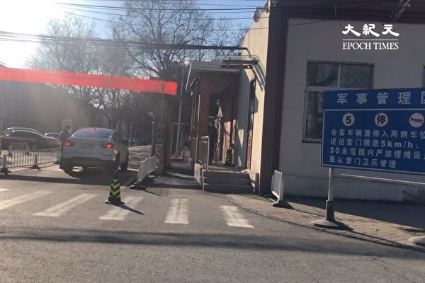

北京海淀昆明湖南路甲7号院，这是一个军队大院。和很多军队部门一样，这是一个地图上没有标示单位名称的地方，门口也没有挂牌。（大纪元）

 
 【大纪元2020年03月04日讯】（大纪元记者程静报导）武汉肺炎疫情依然严峻，中共军队有否受影响备受关注。中共军委后勤保障部官员说，目前军队医护仍保持零感染。而中共国防部几天前宣布暂停常规训练演习，并推迟春季征兵。有知情人向大纪元透露，目前北京军队大院管控异常严格，一些军人被“封闭”，军人家属探亲“就像探监一样”。
 
<b>北京军队大院防疫严密</b>

北京海淀昆明湖南路甲7号院是一个军队大院。与很多军队部门一样，这是一个地图上没有标示单位名称的地方，门口也没有挂牌。

据一内部人士向大纪元爆料说，这院里住着很多老干部及空军军人。1月底2月初，里面很多军人（包括后勤保障部队人员）就都被封闭了，封闭地点与外界隔一道铁门。军方允许他们家属一周去给他们送一次衣服和食物。隔着铁门，里面的军人把脏衣服递出来，家属把干净的递给他们，“就像探监一样”。

这位人士还说，二月初的时候，他就知道疫情可能要持续到五月份，但当时也不敢告诉别人，而且他的手机是被监控的。

“平时在电话里我什么都不能说，就是他们军人家属的手机，也都是被监控的，他们家人之间都不能随便说，这是纪律，必须保密。我不能说太多，但具体情况，我这个级别的也不知道。”他说。

他还说，现在这个大院管得很严，一周家属也就能去两次，“那些封闭在里面的人，估计要等五月份之后才能出来，因为他们要给领导开飞机、服务什么的，所以必须保证他们不能被感染。”

他还披露，“里面很多军人都没有身份证，如果失踪了，都查不到姓名。”

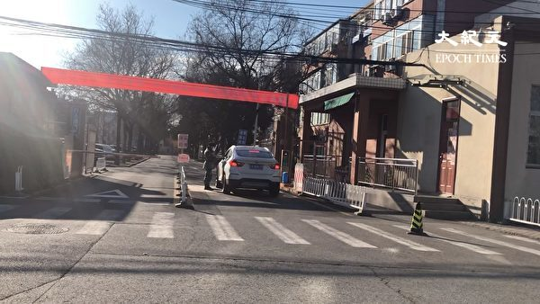

北京海淀昆明湖南路甲7号院是一个军队大院。与很多军队部门一样，这是一个地图上没有标示单位名称的地方，门口也没有挂牌。（大纪元）

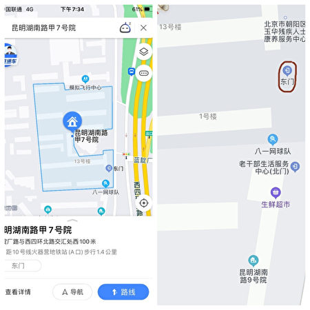

北京海淀昆明湖南路甲7号院，一个军队大院的地址。（大纪元）

目前北京部分地区的疫情控制规格已经升级为跟武汉同等级。

此前，有知情人告诉大纪元，军队大院防疫远比北京居民区严格。例如，海淀区的一军队大院，住有两千多中共老干部，1月25日之前，就开始测体温。过年（1月25日）后，外地保姆都不准回大院，里面人也不准随意进出。

而且从2月25日开始，每个楼单元门口都有士兵站岗，每家只有一个出楼卡，管控越来越严格。而北京其它军队大院情况基本类似，有的已经是食物配给，不许出门了。

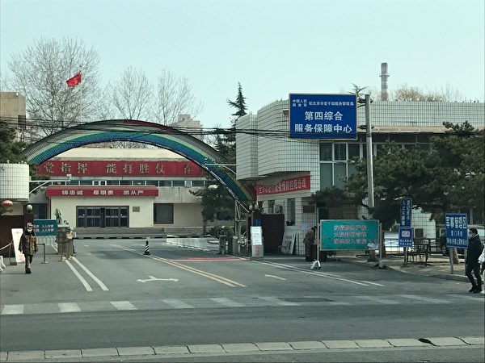

位于北京海淀区的一个军队大院。（大纪元）

<b>军方称医护保持零感染 民间早有透露军方疫情</b>

军队有无感染？3月2日，中共军委后勤保障部卫生局长陈景元在记者会上宣称，四千名军队医护人员前往疫区，目前仍保持零感染。

而几天前，中共国防部发言人吴谦说，暂缓部分大项演习训练活动，上半年征兵工作也推迟至下半年一并组织实施。他说，年度征集新兵任务不变，但征集时间统一调整为8月1日开始，9月10日起运新兵，9月30日结束。

不过，总部设在香港的中国人权民运信息中心早在1月27日披露，一名湖北孝感市的中共“空降兵军保障部”的军官于1月25日被确诊患有新型肺炎，隔天孝感市有200名现役军人被隔离在一个空置的军机机库中。但因为中共军队内部疫情攸关军事机密，所以未公布详情内容。

2月4日，该中心再次爆料说，军队疫情日益严重，目前全部兵种（海、陆、空、火箭军）已暂停绝大部分大型演习及大型集训，绝大部分军营已停止放假外出及探亲，军营内也取消每周的开会政治学习。

报导说，目前一些重点省市的部队，在条件许可下，连级单位设立隔离房，团级单位设立隔离区，车务、后勤、采购、炊事等必须同外界接触的人员，出现任何不适者必须隔离14天。

<b>军方曾自曝海军舰长被隔离</b>

2月17日，中共《解放军报》报导，东海战区各部队有部分官兵正在隔离观察，而某舰舰长余松秋大年初五就中止休假回到了驻地，正在支队招待所进行隔离观察。余松秋是东部战区海军舰队的常州军舰舰长。

报导说，东部战区海军各级采取防控措施，并执行测温消毒、归队隔离等防控措施，把疫情防控纳入战备值班要素。东部战区海军训练计划也因疫情有所调整。

2月11日，中国人权民运信息中心披露，位于海南三亚市的海军潜艇部队有一名军人确诊新病毒肺炎后，有300名海军军人被隔离，而原定本月开始的核潜艇重点训练项目已暂停。

该中心说，中共海军及潜艇部队属于高危军种。位于三亚的中共军方总医院（海南）医院，准备为30,00名人员做新冠病毒肺炎样本测试，重点是近期有出海训练任务的潜艇人员。

<a target="_blank" href=#top><h6 align="right">回上方</h6></a>

<a name=32>
<h1 align="center"><b>【拍案惊奇】新冠病患肺移植疑团 世卫报告说啥</b></h1>

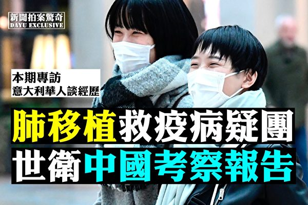

江苏肺移植救武汉肺炎，肺从哪来；世卫公布中国考察报告；香港115人被捕。（大纪元）

 
 【大纪元2020年03月02日讯】大家好，欢迎收看《新闻拍案惊奇》，我是大宇。
 
<b>世卫发布《中国考察报告》 揭开专家组调研结果</b>

世卫发布了一份《2019新冠病毒疾病联合专家组中国考察报告》，综合陈述了该病毒在中国大陆表现出的一些特质，3月1日，报告得到中文圈媒体的关注。

这份报告认为，新病毒是新发病原体，人类没有已知的免疫力。而且病毒具备高传播性，会造成社会和经济的巨大损失，必须假设以全球人口都容易被感染，来处置。

报告还发现，新病毒与蝙蝠身上冠状病毒的同源性最相近，达到96%，这证明蝙蝠似乎是最初的病毒宿主，但是中间宿主还是未知。病毒最早在武汉人际传播，随后扩大到湖北和中国全境。如果没有防护，病毒可以通过飞沫和密切接触传播。感染者中，儿童病例少而轻，80岁以上老人死亡率最高。

报告还总结了病毒感染后带来的十大典型症状，按百分比从高到低，依次是发烧、干咳、倦怠、含痰、呼吸急促、肌肉或关节痛、喉咙痛、头痛、发冷、恶心或呕吐。

<b>新病毒空气传播新证据 德国确诊病例突然暴增</b>

报告中没有提病毒空气传播。不过此前大陆上海市政府公布，病毒能通过气溶胶传播，实际也是通过空气作为载体传播，但是说法当时有争议。可是2月27日，大陆吉林大学的一篇论文证实，医院病房的空气中，还有物体表面，都检测到了新冠病毒。目前论文发表在医学预印本网站，等待同行的审核。

截至美东时间的3月1日，世界上已经有至少60个国家，出现感染病例。继中国大陆和韩国之后，意大利和伊朗，也同样被美国疾控中心列为“避免前往旅行”的国家，这四个国家的确诊数字在全球名列前四。其中，截至我们录制，韩国3736例确诊，17死；意大利1128例确诊，29死；伊朗987例确诊，54死。但是伊朗官方数字还是被质疑瞒报。

接下来，是日本946例确诊，8个死亡案例，被美国疾控列为“旅行慎重考虑”区域。然后是德国，暴增到至少117例确诊。超过了无死亡病例，但有102例确诊的新加坡，也超过了96例确诊、2例死亡，被美国疾控列为“旅行小心前往”的香港。

德国的疫情发展速度是最快的国家之一，短短一周时间，确诊患者已经从十几例增加到100例以上。比较严重的在“北威州”，超过60例确诊，已进入社区传播阶段，这里是欧洲人口最密集的地区之一，约有1800万人。同时，包括北威州的海因斯贝格地区，德国同时存在三个“感染群”，另外两个是巴符州和巴伐利亚州。

德国的感染病例中，包含意大利和伊朗的输入病例，在海因斯贝格的一场三百多人的狂欢节聚会上，已有多人确诊。还有1名确诊者，在上周去过柏林附近一个名为“热带岛”的水上乐园，在里面玩了4天，而这个乐园每天接待约3000名游客。

在德国、香港、新加坡之后，是西班牙76例，美国73例，其中1例死亡。

<b>美国华盛顿州现首例死亡 护理院疑似群聚感染</b>

美国的死亡病例是比较新的，发生在2月29日，死者是华盛顿州一名50多岁的男子，除了感染新病毒，他还患有其它疾病。美国疾控中心主任雷德菲尔德说，没有证据表明，这名男子生前与其他感染者有过密切接触，或有相关爆发瘟疫地区的旅行史。这表明，这名死者属于社区传播感染。他是美国境内的第一个死亡病例，但2月初已有1名美国人在武汉因感染离世，是一名60岁的美国公民。

华盛顿州州长已经宣布该州进入紧急状态，这有利于为防治做更好的准备，州长英斯利（Jay Inslee）并提出必要时会派出华盛顿州的国民警卫队协助。这个州不仅传出美国本土第一例确诊，第一例死亡病例也发生在这里，而且，目前在西雅图还有一间护理机构，有五十多人出现疑似症状。

<b>美国加强境外筛检 纽约华人抢购食物</b>

与此同时，美国联邦层级也加强了对瘟疫的防控。美国总统川普3月1日早上发推文表示，美国将对疫情高风险的国家及其内部相关区域，采取登机前检疫的措施，并且在抵达美国后，还会进行一次筛查。这些国家目前包括中国、韩国、意大利和伊朗。

作为美国防疫总指挥的副总统彭斯，在2月29日宣布了新的旅行禁令，包括过去14天之内去过伊朗的所有外国人，都被禁止入境美国。但是彭斯同时强调，美国人感染的平均风险仍然很低，他还引用美国国家过敏与传染病研究院主任福西的观点说，多数感染病毒的人，都会得到治愈，一些同时患有其它疾病的人可能面临更大的风险。

包括华人在内，人口组成相当国际化的的美国纽约市，之前传出一共8个疑似病例，其中7人是当地居民，1人是外来人口。根据2月29日美国疾控中心的消息，这8个人已经全部排除确诊，纽约市的感染病例还是0。不过，可能是因为看到大陆的景象而产生恐慌，纽约华人在微信中广泛转发有关美国也要做好屯粮准备的信息，因而在华人聚居的纽约法拉盛地区，超市的大米等物资被华人哄抢。不久后，在纽约布鲁克林的costco，各族裔人群在外大排长队，不知道跟囤积物资是否有关。

<b>川普大公子“阴谋论”：有民主党望病毒大流行打击川普</b>

川普认为，美国已经为防御新冠病毒做好了准备。同时，因为今年是2020年，正值美国大选年，美国民主、共和两党，要再次展开白宫宝座的逐鹿大战，川普指控，有的民主党人试图将新病毒瘟疫政治化，以打击川普的选情。但目前，川普连任的胜算还是比较大的。

不过呢，川普的大儿子小唐纳德·川普，讲出了一种听起来更为“惊人”的说法。雅虎新闻报导，2月28日，小川普在接受美国福克斯电视台采访的时候提出，民主党的一些人会利用一切可能，打击川普选战。他说一些民主党人尝试利用这次传染病的机会，好像是希望病毒能在美国流行并杀死上百万人。这显然是一种很夸张的说法，用以加重口吻，小川普应该就是想说明，担心有人利用传染病做政治盘算。一位美国国会议员回应，这种说法过分了，他说可以很确定地讲，没有一名民主党或共和党议员，希望任何人感染病毒。

确诊病例数目排在美国之后的，包括台湾，是40例确诊，1例死亡。不过台湾有一个新近的病例值得关切。就是在当地时间的3月1日中午，台北市一间便利店门外，一名刘姓男子突然倒地失去意识，后抢救无效身亡。目前死因还在查看。刘姓男子生前曾在新北一间医院，跟一个新病毒确诊者，短暂地待在一个房间，但不算是密切接触者，所以没有对他进行隔离。他的这种突然倒地的情况，与新病毒爆发地武汉当地，出现的一些情况类似。就是一些感染者突然倒地，然后便撒手人寰。所以台北出现的这个情况，十分值得警惕。

香港大学医学院院长梁卓伟警告，瘟疫在中国大陆以外的第一波疫情才开始，而且只要发现1例确诊，就代表相应地区已经有100人受感染，只是检验不足没有被查出来而已。他认为新病毒瘟疫从“技术”上讲，已经算是全球大流行。

日前传出首例确诊的国家，包括欧洲的卢森堡和爱尔兰。这两个国家的首例确诊，也都是从意大利返回的人员。

<b>意大利“0号病人”或非中国人 病毒已发生三处突变</b>

意大利俨然成了欧洲的病例输出大国，我们前几期节目也都提到了，意大利输出的病例，让好多国家登上了有确诊患者的名单，受影响最远的，目前是南美的巴西。

意大利首个确诊病例1月31日出现在罗马，是两名中国游客。随即，意大利立即中断所有大中华地区、包括港澳台的航班。

伦巴第和威尼托两个大区，是意大利疫情爆发的地方，这两个大区是意大利重要的经济区，很多中国大陆的温州人在这里从事服装行业，瘟疫爆发后，一些人辗转返回意大利，而温州是继武汉之后，大陆最早采取封城措施的城市之一。

现在，意大利忙着寻找该国的“0号病人”，也就是最早带着病毒进入意大利的人，这对疫情防治很重要。

但是意大利米兰大学的流行病学教授加利认为，早在1月中旬，新病毒就已经在意大利开始传播，只是没有引起人们的注意。而意大利首例确诊的中国游客，并不一定是把病毒带进意大利的第一人，也可能是新病毒从中国传出后，经过变异，间接传入意大利。他认为，在意大利流传的新病毒，已经发生突变，是在人传人之后，发生的不断变异。

目前，这名教授把研究重点，放在了没去过中国或从未接触去过中国的确诊患者，这样有助于他找准这个意大利版的病毒，对遏止病毒在意大利扩散，有帮助。

巴西和英国专家的合作研究，得出了跟上述米兰大学教授类似的结果，就是病毒已经变异。他们的研究针对巴西的首例确诊，从意大利返回的一名61岁男子。他们初步分析在男子身上的新冠病毒，对比武汉最初的病毒株，已经有了三处突变。而之前德国的一例确诊者身上的病毒，只存在两处突变。同一个病毒，已经不只一个同胞兄弟了，这几个兄弟同时在扩散。所以研究团队断定，不止一个人，在欧洲传播病毒。

2月21日在意大利确诊的第4例患者，是造成该国大流行的“1号病人”。他不是华人，是38岁的意大利男子，确诊前没去过中国，一开始只是给他做了一般性治疗，后来才确诊为新病毒感染。

也有怀疑观点认为，意大利政府或许不愿意把新病毒的传入跟中国人连系起来。原因是，当局担心，这样的连系，会给外界造成Made in Italy BY CHINESE的观感。

<b>意大利华裔：华人小心防疫 多数民众友善 忧医疗资源不足</b>

针对意大利的情况，我录音采访了一位在意大利土生土长的华裔Silvia，她中文说得很好，瘟疫爆发后，她同时在关注中文圈和意大利当地新闻的报导，所以观点比较有参考价值。下面我们就来听一下，她的分享。

这里感谢Silvia的分享。

同时，位置在意大利罗马的梵蒂冈，3月1日，教宗方济各公开露面，当众忍不住咳嗽，并对现场数千人宣布，自己因为感冒，而在最后一刻决定，无法出席3月1日下午开始一直持续到6日的“四旬期避静”活动，这乃是就任教宗后首次缺席。这次83岁的方济各说自己是感冒，之前梵蒂冈官方也说，教宗只是有轻微的疾病。在瘟疫较为严重的意大利，教宗的表现，引起舆论普遍的关注。

在疫情最初爆发的中国武汉，当地监狱传出严重的群体感染。2月29日一天，根据大陆官方数据，武汉市各监狱，单日增加233例确诊。此前在2月21日的时候，已经传出大陆的湖北、山东、浙江三省的监狱内，共有505人确诊。监狱是一个相对封闭的空间，人员进出有限，按理讲不容易感染，但是一旦有1个人感染，在监狱的环境下，就很容易变成群体感染。类似的还有养老院、医院等等，所以这些地方的瘟疫防治，要十分注意。

说到中国大陆，在瘟疫肆虐的同时，却有一个意外收获。就是它的空气质量，明显好转。美国太空总署NASA与欧洲太空总署的卫星发现，2月份以后，中国空气中的二氧化氮浓度，大幅度减少。二氧化氮是工厂、发电厂、汽车，经常排出的污染气体，这个浓度的骤降，侧面显示，中国的工业活动，还有交通运作，出现大幅减少甚至停滞。

我们可以看2020年1月1日到20日，当时大陆的这些活动还比较正常在进行，二氧化氮浓度在山西、华北平原、内蒙和辽宁部分地区，都达到中等甚至最严重的污染程度，但是到了工业和交通活动大幅减少的2月10日到25日，大陆天空一片晴朗，二氧化氮含量惊人般地减少到相当低的水平。NASA的一名专家说，因为某一事件导致“二氧化氮”浓度如此大范围戏剧性降低，史无前例。这间接说明，大陆经济活动，受到瘟疫的巨大影响。

空气透明了，我们希望大陆的信息更加透明。3月1日是大陆《网络生态法》实施的第一天，一位大陆朋友给我们发了一封信，他在QQ里聊了有关大陆体制的一些话，QQ号立即被冻结一天，前所未有，暂时不清楚他QQ上面的存款是否也受到影响。

另外一件事，我们更需要知道真相。

2月29日，江苏无锡人民医院的院长陈静瑜，与团队一起，给一名59岁确诊男性，成功进行了双肺移植手术，病人手术后情形，病情明显好转。这初看上去是一个振奋人心的好消息，但是一留意到细节，我们就发现一些问题。

这名病人是2月24日因为各种办法都用尽，也无法救回来，因此决定采用肺移植。大陆媒体报导是说，这名病人等了5天，就得到了健康的双肺捐献，但是没有说，是谁捐的，哪怕提供一些相关的细节。这要是说一下，多么感动中国正能量啊，非常符合官方宣传，但是提都没提。

这件事有三大疑点：第一、捐双肺的人，捐完一定是没命的，那这人是自愿地想马上寻死的人，还是死刑犯，抑或是健康的活人呢。如果是前两种情况，为什么不敢提及捐献者的情况；

第二、一般等待器官捐献，要排队，这名确诊感染者是否涉嫌插队，赶在了其他等待器官人的前面呢；

第三、在自愿器官移植库最大的美国，等待肺移植，至少几个月，短短5天就能找到配型的肺，除非这“肺”是用来做夫妻肺片的原料！但是很抱歉，夫妻肺片里实际也没有肺。

节目最后，我们讲一下周末在香港发生的事情。去年8月31日，香港太子站发生了港警无差别攻击民众的事件，香港民间不少人坚持相信，这一天有人被打死，但是港府一直否定。自那以后，每个月的最后一天，港人都会纪念831。

2月29日是831半周年，至少数百名香港人，下午在太子站举行纪念活动，警方赶来后，民众也越聚越多，傍晚时分，双方发生对峙。到了晚上8点左右，警方开始发射催泪弹，开始驱赶人群，过程中，至少一名香港警察拔枪指向人群。有报导说，他之前可能被抗争者包围。这一夜冲突，警方又制造了不少残酷的镇压画面，同时，有115名抗争者被逮捕，罪名包括纵火、袭警、非法集结等等。

这是反送中运动的持续，而香港人在瘟疫期间，抗争规模有所缩减，但从未停止。

好，欢迎您订阅和分享我们的频道，在订阅的时候，不要忘了点击订阅按钮旁的小铃铛图案，在第一时间收到我们新节目上传的通知。也欢迎您加入我们的会员。有推特的朋友，也可以在推特上关注我，我的推特账号是@xwpajq。这期节目就到这里，感谢您的收看，下期再会!

新唐人《新闻拍案惊奇》制作组

<a target="_blank" href=#top><h6 align="right">回上方</h6></a>

<a name=31>
<h1 align="center"><b>【新闻看点】中共控网严厉 媒体噤声代价惨重</b></h1>

图为中共警察扣留学生，阻止外国记者拍照。(MARK RALSTON/AFP/Getty Images)

 
 【大纪元2020年03月04日讯】大家好，欢迎大家关注新闻看点，我是李沐阳。

从3月13日开始，中共驻美国的5家官媒最多只能在美国雇用100名员工了，而不是现在的160名。昨天（3月2日），美国国务卿蓬佩奥宣布这个决定时表示，美方用这个行动促使北京公平对等对待其它国家的新闻媒体。

在前天《网络信息内容生态治理规定》正式生效后，昨天中共官媒报导，由于病人数量大幅度减少，武汉硚口区方舱医院已经关闭。不过网友爆料的情况与此完全相反，说新型冠状病毒肺炎（武汉肺炎，COVID-19）再次爆发了，医院重新爆满，病人主要是来自方舱医院。不过我们在网络上没有查找到更多的信息源佐证。在中共严控信息、媒体死亡的情况下，当局付出的代价是惨重的。

<b>美寻求对等，限制中共驻美官媒人数</b>

蓬佩奥昨天宣布，对中共驻美官媒机构实行人员上限限制。按照新的限制措施，新华社、中共环球电视网、中共国际广播电台、《中国日报》发行公司和《人民日报》海外版的总代理海天发展公司，这5家中共官媒机构，将从现有人员中裁员60人。

根据规定，中共国际广播电台的人数上限是2人，《中国日报》是9人，环球电视网是30人，新华社是59人，对海天发展公司暂不采取行动。名额缩减后，被裁减的60名员工将失去签证。如果没有新雇主，他们必须离开美国。

蓬佩奥指出，这几家机构与在中国的外国媒体机构不一样，并不是独立新闻媒体，“实际上由中共政府控制”。多年来，中共政府对在中国运作的美国和其他外国记者施行越来越严厉的监视、骚扰和恐吓。

蓬佩奥表示，川普总统已经明确表示，北京对外国记者的限制是“误入歧途”。美国政府长期以来都欢迎外国记者、包括中共政府控制的记者在没有报复威胁的情况下自由工作。

国务卿说，美国的目标是对等。“就像我们在美中关系其它领域所做的一样，寻求建立早就应有的公平竞争场地”。他表示希望美方的这个行动可以促使北京采取“公平对等的方式”，对待美国和其它在中国的外国新闻媒体。

外界认为，美国此举是在报复中共驱逐3名《华尔街日报》的记者。不过美国政府表示，仍然寻求与中方发展公平互惠的关系。

<b>外国记者在中国的工作环境明显恶化</b>

在今天的记者会上，中共外交部发言人赵立坚表示，驱逐《华尔街日报》3名记者“只是极个别现象”。600多名外国记者只要“遵守中国（中共）法律，依法依规进行报导，就没有必要担心”。赵立坚还指称驻华外国记者协会（FCCC）的年度报告是“拉偏架”。

就在蓬佩奥宣布美国决定的同时，驻华外国记者协会发表了年度报告。其中指出，在华外国记者的工作条件越来越恶化。从习近平2013年完成权力接管后，中共通过驱逐或拒绝延长签证的方式，总共强迫9名外国记者离开中国。

驻华外国记者协会担心，中共驱逐外国记者的人数会越来越多。报告指出，中共已经把签证问题武器化，“以前所未有的方式把签证当作武器对付外国记者”。

中共在去年8月先是驱逐了《华尔街日报》的记者王春翰（Chun Han Wong），今年2月又吊销了另外3名驻京记者的签证。中共指称《华尔街日报》的一篇文章“辱华”，不过那篇文章与被驱逐的3人并没有关系，而这3名记者正在报导新冠病毒疫情。

报告表示，越来越多的驻华记者获得签证的有效期被严重缩短。通常驻华记者每次可以获得一年的签证。但是从今年开始，2名驻华记者只获得1个月的延长签证。去年至少有12名记者，只拿到了6个月、甚至更短的签证。（受影响的）人数也有大幅增加，是前年的2倍多。

驻华外国记者协会对114名记者做过一项调查，其中82%的受访者在新闻报导中曾经经历过干扰、骚扰或者暴力；44%的受访者表示，自己的中国同事至少受到过一次骚扰。55%的受访者感到在中国工作的环境严重恶化，没有任何受访者感到工作环境有改善。

报告中指出，外国记者协会成员在报导六四30周年、香港抗议时，都遇到过阻碍，甚至报导中共70年阅兵也受到了干扰。

一位英文媒体主管向协会表示，中共外交部多次跟他们约谈，告诉他们越过了哪些“红线”。对方威胁称，如果再越过“红线”，会面临着不良后果。这些红线包括新疆、香港，但首先是关于习近平的任何报导。

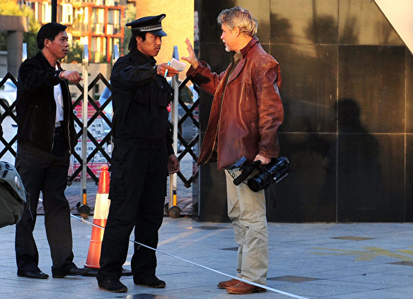

图为中共保安人员阻止外国记者拍摄维权人士胡佳的妻子被软禁的居所。(FREDERIC J. BROWN/AFP/Getty Images)

<b>疫情究竟如何？</b>

中共对外媒控制尚且如此，可想而知，对中国境内的媒体控制就更严了。

前天（3月1日），被称为迄今为止“最全面、最严厉”的《网络信息内容生态治理规定》正式生效了。尽管中共官媒在宣传出台这项规定的意义，但许多人都意识到，“今后只有好消息了”。

当局生效新规定，这个时机相当敏感。因为事关身家性命，人们都希望了解一些真实的新冠肺炎疫情情况。哪怕是坏消息。

一位网友曾在我们节目下方留言，说每天看新闻看点都是“令人心情沉重”的消息。但网友表示还是忍不住要看，因为这是真实的消息。

新闻看点报导的真实内容，中共媒体是从来没有的，也绝对不敢报的。它们首先会进行自我审查，过滤这些资讯。所以在大陆媒体上，只能看到“暖心”的新闻，只能听到“形势一片大好”的声音。

特别是这个新规生效后，人们只能宣传和中共一致的政策、核心价值观等等。无论大陆媒体还是自媒体，所宣传的内容必须与官方保持一致。否则就是违法，将要受到整治。

中共层层加码控制网络，目的当然是为了它的统治。当人们的眼睛被捂上，耳朵被塞住，嘴巴被封口，中共才认为它的政权稳固。无论是用谎言还是暴力，都会容易很多。

昨天中共央视报导，新增病例数量减少和出院病人数量大幅度增加，武汉在疫情高峰期紧急搭建起来的多家临时医院，目前已经进入“床等人”的状态。所以武汉修建的第一所方舱医院武体方舱医院关闭了。

中国之外的疫情还在扩大，目前已经增加到了75个国家和地区。而中国是疫情始发地，这么快就控制住了疫情？

还是那句话，真心希望疫情快快退去，人们都好起来。但是对中共官媒的报导，我们也必须打个问号。

中共早前曾说过，进入方舱医院的人，都是症状轻微的患者。但是方舱医院负责人曾亲口对患者家属讲，“这里（方舱医院）不是医院”。

不是医院，那位负责人说得很清楚，就是没有治疗，只是隔离。在没有治疗的情况下，染病的患者是自我康复的吗？

29日，有网友推文说了一个令人紧张的消息：武汉肺炎再次爆发了。

网名叫“独行侠”的网友表示，“据可靠消息，平静了快一个星期的武汉各医院重新爆满，病人主要来自方舱医院。方舱医院2月15日投入使用，到今天（29日）刚好14天，武汉市政府愚蠢制造的交叉感染，把武汉市民推向深渊”。

网络上没有查到更多相关消息，无法证实这个与官方说法完全相反的消息真伪。因为大陆的网络封锁，来自大陆的爆料越来越少了。我们希望得到证实，最好是图片或者视频，配上一些文字说明。

<b>“两个一千万”？</b>

中国有句话：兼听则明，偏听则暗。当人们看不到真相的时候，就会有各种“小道消息”传播。

网上流传着一个网络截图，看其中的语气，似乎是某位知情人在透露内容。其中说“你问到疫情状况，一些具体数据不便对你透露，但实情与你的猜测差不多。感染人数虽有下降，但依然维持高位。根本不存在什么决定性的拐点，有拐点也是拐上拐下不断反复。至于宣传上鼓吹已经胜券在握，不过是为了复工而造势而已，想必你也理解”。

截图中继续说，“昨天起高层忽然开始流传一句话，据闻是今上亲口所言，即两个一千万。大意是不复工政权崩溃，共产党死一千万，复工疫情大爆发老百姓死一千万，我们该怎么选择。这句天问似的最高指示我琢磨了很久，越想越不寒而栗。只怕绝非非此即彼，万一搞不好共产党与老百姓都会牺牲一千万，那就是两千万了。势必成为胜过文革的一场大浩劫，对中华民族彻底伤筋动骨”。

回复中还说道，“你提到自今上亲自领导以来，把国事搞到这班地步，国人送其雅号‘总加速师’，我看了哑然失笑，感慨良多。此雅号让我顿悟，今上并非大愚若智，还是大智若愚。万一他本来即与你们海外酸儒同心同德，深藏不露苦心经营，以搞垮政权为己任，那他这一系列胡作非为都可以得到合理解释”。

最后说了一句，“老弟，乱花渐欲迷人眼，浅草才能没马蹄，我们只能尽人事听天命了。”

这段话的信息量很大。首先说的是疫情依然维持在高位，并不存在什么“拐点”。当局反复说胜券在握，只是为了复工造势。

其次是“两个一千万”。就像我们之前节目中所分析的，北京当局在赌博，赌新冠疫情会随着温度升高而自动消失。所以现在不断催促人们复工复产，以试图保住中国经济。但是正如对话中所担心的，万一搞不好，那就是两千万人命。

至于第三点“总加速师”的说法，这个仍然需要关注。

当局如果真想搞垮中共政权，早就可以做到了。在习的第一任期，反贪打虎声势高涨。那个时候，如果要解体中共政权，可以说是顺天意，得民心，但是北京没有做。而现在，北京的种种保政权的怪异行为，早已使人心离散，各方都不再看好。

具备天时地利人和的条件下，都没有解体中共组织，北京会在人心越来越散、几乎到了众叛亲离的时候放弃政权吗？值得怀疑。

但是这里折射出一个问题，北京说什么，底层官员就做什么。就像我们以前说的，中共官员现在的心态是“支支动动，拨拨转转”，都不想担责任。

<b>刚性体制的弊端</b>

这次疫情的发展过程，已经严重暴露出了中共官僚体制上的问题。所谓官僚体制，就是指等级制度、上传下达、汇报请示等等。

在强大的政治压力下，媒体只报导当局允许的声音。而中共的规章制度、条条框框越来越多，中共官员越来越谨小慎微。凡事都要请示汇报，自主能动性受到很大约束。

斯坦福大学社会学教授周雪光把这些称为“刚性体制”。北京当局把整个官僚机构变成了一个巨大的机器，上面让怎么运转就怎么运转。官员按照指令运作，扮演着一个听话照办的角色。只向上负责，执行自上而下的指令。

但这样的官僚体制却不能有效地采集和传递自下而上的信息，造成自下而上的信息流通困难和启动应急对策滞后，而且使专业人员不能在决策过程中发挥作用。

具体到武汉发生的这次疫情，武汉市长周先旺在央视直播中就直接表示，他们向上级进行了汇报，但是必须等到回复授权，才可以向外通报。

中共倚赖的流行病学专家钟南山也说，疾控中心的职权太低，不能直接向社会通报疫情。

就是说，中共的各地各级政府都在听令，在没有当局明确指示之前，都按兵不动。

周雪光认为，在中共这种刚性制度下，才会使疫情发展成如此之大的灾难，造成许多生命损失、家庭破裂和经济中断。他指出，有的时候，体制是问题的渊源，而不是解决问题的答案。

大纪元《新闻看点》制作组

<a target="_blank" href=#top><h6 align="right">回上方</h6></a>

<a name=30>
<h1 align="center"><b>收受巨额财物 海口前书记张琦被审查</b></h1>

中共海南省委前常委、海口前市委书记张琦。（大纪元合成）

【大纪元2020年03月04日讯】3月4日，中共海南省委前常委、海口市委前书记张琦因“严重违纪违法问题”被立案审查调查及被双开。其被指非法收受巨额财物等罪名。

张琦被指“落实中央重大决策部署不到位；处心积虑对抗审查，不按规定报告个人有关事项；多次接受不法私营企业主的宴请和旅游安排；收受礼品、礼金；在工程项目承揽、土地征收拆迁、干部职务晋升等方面利用职务上的便利为他人谋利，并非法收受巨额财物；伙同家人大肆收钱敛财、大搞权钱交易等。因此，张琦被开除中共党籍及公职及移送法办。

张琦于2019年9月6日落马。张琦落马前，其两名下属已落马。同年5月，三亚市人大常委会副主任朱永盛被查；4月，三亚市副市长王铁明落马。

大陆财新网此前报导，张琦落马前的7月，海南瑞泽董事长张海林就已被带走，随后张琦的妻子钱玲也被带走，张海林或涉张琦案。知情人士说，钱玲与亲属曾插手园林和房地产工程项目，钱玲身边围了不少商人。

中共十八大以来，海南先后有前副省长冀文林，省委前常委、常务副省长谭力，省人大常委会前副主任张力夫和省政协前副主席林方略4名省部级官员被查。张琦是中共十九大以来落马的首名省部级官员。

谭力和冀文林曾因参与迫害法轮功被海外“追查迫害法轮功国际组织”追查。两人被指是江派前常委周永康的亲信。冀文林、谭力以“受贿罪”先后于2016年3月、10月分别被判处有期徒刑12年和无期徒刑。

<a target="_blank" href=#top><h6 align="right">回上方</h6></a>

<a name=29>
<h1 align="center"><b>【拍案惊奇】陈秋实生死谜 中共买防弹衣玄机</b></h1>

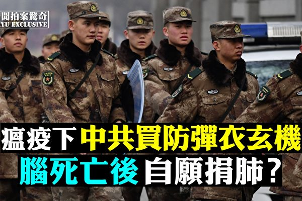

中共买140万防弹衣， 美国专家解读。（新唐人合成）

【大纪元2020年03月03日讯】大家好，欢迎收看《新闻拍案惊奇》，我是大宇。

节目一开始，我们还是先来看一下，新病毒瘟疫，在世界范围的传播情况。

<b>【纽约首例感染者是医护 早已自觉居家隔离】</b>

3月1日，美国纽约市出现了第一例确诊的新病毒感染者。但是，纽约州长库默对此发表谈话，提到了两个重点。

第一点，他认为，纽约是国际性大都市，对于出现确诊，不是会不会发生，而是何时发生。

第二点，库默认为，纽约的第一例确诊，是不幸中的大幸。

因为这名确诊者本人，是一位39岁的医护，在这个领域很有经验，她自己也非常了解情况。大约一周前她从伊朗回到纽约，就在曼哈顿的家中隔离，没有乘坐大众运输工具。确诊后，继续隔离，并接受治疗。

纽约州目前正在强化公共卫生能力，以抑制病毒的传播。

纽约市是一个多族裔的国际都市，瘟疫发展至今出现第一例确诊，而且确诊患者自己是医护，非常小心谨慎，她的病例几乎没有对公众造成任何影响，这已经是一个surprise。

<b>【美6例死亡全在华盛顿州 长者护理院成焦点】</b>

但是，截至3月2日，美国已经有6个死亡案例，不过全都来自西海岸的华盛顿州。第一名死者，出现在2月29日，有报导说是女性，也有报导说是男性，《纽约时报》说是一名50多岁男子，他是在华盛顿州Kirkland的“长青健康医院”。随后，3月1日晚间，在同一家医院，传出第二名死者，是一名70多岁的男性。随后到3月2日星期一，在华盛顿州又传出4例死亡。

这截至目前的美国6例死亡，5个在King County，范围包括西雅图市以及西雅图市以东的部分地区，1个是在紧靠King County以北的Snohomish County。

同时，紧邻西雅图市的Kirkland，还有一间Life Care Center，是一间老年护理院，已有至少2人确诊，另有约50人感觉到不适。目前这件护理院已经谢绝访客。

以上是美国的相关重点事件。

<b>【印尼“终于”有首例感染 曾与确诊日本人接触】</b>

前两天同样被津津乐道的另一个surprise，是印尼，这样一个拥有超过2亿6千万人口的国家，而且离中国也不是很远，但一直没有确诊病。甚至引起外界怀疑，印尼你怎么还没确诊？印尼很委屈，当局回应，意思是“没有就是没有”。

不知道是不是盼来的，3月2日，印尼终于沦陷。印尼总统佐科威说，该国出现首例确诊，而且是两个人，是一对母女，分别是64岁和31岁。这两人2月初曾在印尼和一名日本人接触，后来这名日本人，在2月27日于马来西亚被确诊。

印尼政府得知后，回溯这名日本人在印尼接触过的人，于是找到了这对母女，并发现确诊。目前，印尼政府也已经为此做好准备，在全国一百多间医院设置隔离病房。

<b>【伊朗最高领袖顾问感染亡 高层岌岌可危】</b>

而在疫情严重的伊朗，截至目前，它的死亡案例，官方数字已经达到至少66例，还是中国大陆意外，最多的。这些死亡案例中，已经至少包含三名政界人物。

一个是2月27日，伊朗驻梵蒂冈大使霍斯罗沙希；一个是在2月29日，伊朗国会议员达斯塔克；还有一个就是在3月2日，伊朗最高领导人哈梅内伊的顾问，71岁的米尔莫哈玛迪。他供职于哈梅内伊的顾问团“权宜委员会”，是一名委员，这个委员会是伊朗重要的裁决机构。

此前，2月27日，还有伊朗的一名副总统埃布特卡，也被确诊感染，而在确诊前1天，她还与伊朗总统鲁哈尼以及多名内阁成员开会。这让伊朗最高领导层整个都陷入危险。

<b>【大邱和庆北确诊占韩国90% 艺人团队2人确诊】</b>

韩国，是疫情最严重的另一个国家。截至我们发稿是4,335例确诊，28例死亡。其中大邱市的确诊病例大约占全韩国的87.9%，庆尚北道次之，两者合占韩国约90%的病例。

截至发稿，韩国超过10万人接受了病毒检测，排除了7万多人，还有3万3千多人，在等待检测结果。

韩国军队的感染人数也达到至少28例。韩国军队的防疫标准非常严格，除了军内具备确诊、疑似、有症状、还有密切接触者这四类人，一共900多人接受隔离外。还有另外约9000人，为谨慎起见，也全部在隔离中。

韩国的中小学幼儿园，推迟开学，至少要到3月23日。

此外，韩国明星宋慧乔、朴敏英等人，连同工作人员一共30多人近日出席了意大利的米兰时装周，住同一间旅店。而米兰后来成了意大利疫情最严重的地区之一。这一行30多人的韩国艺人团中，传出至少两名工作人员确诊。这也让一些韩国明星的粉丝，担心自己偶像的身体状况。

<b>【朝鲜近8000人隔离 金正恩不戴口罩 又玩导弹试射】</b>

那么，韩国的坏邻居朝鲜，1月22日就关闭了与中国边境，是本次瘟疫中，世界上最早采取类似措施的国家。而且它的内部防护措施，非常严厉，而且狡猾。

朝鲜官媒《劳动新闻》3月1日报导，平安南道和江原道分别有2420多人和1500多人被定为“医学观察对象”，加上此前2月24日，平安北道等与中国接壤地区，有3000多人在被“医学观察对象”，这加起来就有将近8000人受影响。韩国《朝鲜日报》说，这意味着，这些疑似患者，可能正在被隔离，质疑朝鲜当局隐瞒疫情。

2月29日，金正恩海在一场高层大会上，把组织指导部部长李万健，一名负责农业的副委员长朴泰德，全都开除。他们被开除的原因之一是腐败，有消息人士说，可能是有关防疫的贪污事件。

此前，我们节目也提到过，从香港那边传出来的消息，说朝鲜之前有1人确诊。还有1人，是一个政府贸易官员，因为去中国后，在朝鲜又去了公共澡堂，而被抓去枪毙。这都是2月早些时候的消息。

韩国“每日朝鲜”还引述消息人士的话说，1月至今，朝鲜因为疑似感染新病毒而死的人数，已至少有23人。而且朝鲜当局要求，所有疑似感染新病毒的人，全部按“急性肺炎”诊断，要告诉外界，没有任何人感染。

虽然如此，在全球都聚焦在瘟疫防治问题上时，朝鲜当局似乎不甘寂寞，总想做出点行动刷刷存在感。3月2日，朝鲜进行了2020年第一次导弹试射，发射地点是东海岸的元山一带，朝日本海发射出两枚不明物体，被解读是“短程弹道导弹”，飞行230多公里。有分析说，这是朝鲜为了完善去年试射的新武器附加性能，而进行的试射。

此前在29日，金正恩还视察了军事演习，比较引人眼球的是，官媒朝中社刊登的金正恩照片，在场的政府官员全都戴着口罩，唯独金正恩没戴。这种场面跟2月下旬，中共在北京召开的17万人大会一样，除了远程连线参加会议的，在北京现场的，下面坐着的全都戴口罩，主席台上包括习近平在内的政治局常委，都没戴。

以上是中国大陆以外，几则比较受关注的有关新病毒瘟疫的消息。综合全球的官方数据，截至美东时间3月2日下午，瘟疫蔓延至少67个国家，新西兰、塞内加尔等国，分别传出首例确诊。全球总计超过9万零2百人确诊，3081人死亡。这死亡案例中，除了169名死者在海外，其余全部在中国大陆。

<b>【武汉人自述生存困境 河南商丘排大队就医】</b>

在中国大陆，武汉市的封锁状态，仍然持续，当地民众面对至少4个问题：买菜不易、积蓄渐少、封锁无期，还有一个潜在的问题，就是网络信息的通畅性，会不会出现大问题。

我收到一位武汉市民的录像，就是近两天的录影，讲述了她当前的生活情况。从她的录像分析，她属于武汉市家庭条件比较好的中产阶级，我想她的情况，会代表武汉市内一些市民的真实处境。下面来听她的分享。

除了这次瘟疫爆发的原点武汉，中国其它地区，至少在一些地方，情况依然不乐观。比如，有800万人口的河南商丘市，是郑州之外的河南另一个重要的交通枢纽。商丘市民却透露，这里的医院都挤满了，大家只能在外面排队。现在您看到的视频，就是这位商丘市民发出来的。

这个地点是商丘市第一人民医院，人们在广场上排起长队，然后陆续进入医院进行检测。发出消息的商丘市民怀疑，当地一定有漏报，所以有的人说自己还是不敢出门。

<b>【大陆急推复工 票房收入清零 汽车销售降九成】</b>

目前，大陆当局推动全国复工复课，其中一个重要原因是，经济活动如果继续瘫痪下去，经济真的要垮。他们这个红色江山，也就要提前褪色。

《华尔街日报》报导，中国新年期间，大陆电影票房收入是“零”，但是去年同期是59亿人民币。综合其它消息，大陆电影业在瘟疫后，从制片到电影院，全部暂停，大片先后撤档。而中国新年期间大陆的票房占全年的10%，如今暂停这么久，电影业损失超过百亿是一定的。

此外，《华尔街日报》还统计，大陆的企业，90%在货物运输上都遇到困难。而在今年2月1日到16日，中国汽车销售量下降多达92%。相反，支持在家工作的软件提供商Zoom，股价却上飙38%。

<b>【中共买140万防弹衣 美国两专家：或拿台湾续命】</b>

有“末日博士”绰号的纽约大学经济学教授鲁比尼，2月27日接受德国媒体《明镜周刊》专访时透露：有商界人士跟他说，中国的情况比政府的官方报告显示的要糟糕得多。鲁比尼认为，猪流感、禽流感、反送中，还有这次瘟疫，大陆内地出现很多有关外国干预的“阴谋论”。

接下来，他认为，中国会在台湾、香港或者越南制造事端。而制造事端的目的是，为国内爆发的这些危机，找一个“替罪羊”。换句话说，就是转移国内矛盾。

鲁比尼举例说，比如中共派军机飞越台湾领空，以激怒美国军方。但是爆发冲突并不一定是“热战”，而是某种形式的战斗。他自己认为，台湾海峡只要发生一次意外，就会看到军事行动的出现。

自从新病毒瘟疫爆发后，在紧张之时，中共已经多次派出军机绕台。例如2月28日，中共又派战机进入台湾的防空识别区。六四学生、民运人士王丹就说，这是中共疫情紧张时，想藉扰台来转移外界对疫情的聚焦。

美国康乃尔大学法学博士、中国问题专家章家敦，近日在美国“应对中共当前危险委员会”上发言说，大陆呼吸病学专家钟南山2月27日说，新病毒瘟疫发生在中国，不一定源自中国，这是为美国故意在其它国家传播疾病，打下理论基础。实际上钟南山的这个观点，很快被上海的医学专家张文宏直接否定，认为病毒不可能是源自国外。

而制造这种病毒外来的阴谋论，章家敦认为，这是中共在末日心态下的一种盘算。他提到一周前的一个新闻事件，就是中共军方在当前经济形势下，开始招标采购军事物资，是多达140万件防弹衣，包括93万件通用型防弹背心，还有46.7万件加强型防弹背心。这些防弹衣合计134.2亿人民币。

而目前，中共陆军一共13个集团军85万人，这些防弹衣足以覆盖全部陆军所需，每人可得一套以上。而防弹衣的平均寿命，不超过5年，很快会老化，不能使用。因此，除非在5年内使用，不然这些钱、这些防弹衣，就都浪费了。

章家敦认为，中共买这么多防弹衣的目的，是针对台湾和美国。他大胆提出观点，说其实美国跟中共的战争，已经开始。

2月中旬，也有海外消息人士爆料，说习近平身边一些人甚至建议，以台湾来转移当前危机的焦点。

不过，中共买140万件防弹衣，目前的消息只是说招标，并没有买到手。所以，也不排除是当局虚张声势。真的想做出大胆的军事行动，那真得看具不具备这样的实质条件，包括天时、地利、人和。

<b>【“脑死亡爱心捐肺”救疫 脑死还怎么献爱心？】</b>

现在，瘟疫这个事已经是让当局焦头烂额。下面的医生，有的人也是什么招都敢用。我们昨天节目说，江苏无锡人民医院的副院长陈静瑜，29日给一名新冠病毒感染者，采用移植双肺的方法进行救治，这个移植的健康肺从哪来，是谁身上的，陈静瑜没有具体说。他甚至要在全国推广肺器官移植，来治疗新病毒感染者。

这种豪言壮语，也许是换成纳粹军医才敢喊出来的话。因为谁捐肺谁死，等于是死一个，活一个，还得手术成功才能活。这么大数目的器官，从哪里来？

我们查了一下陈静瑜的资料，发现他是在海外“追查国际”组织挂了号的，参与大陆强制摘取人体器官的黑手医生之一，还被称为“中国肺移植手术第一人”。2018年3月14日，大陆《健康时报》发表题为“全国七成肺移植手术是他做的”，这个“他”指的就是陈静瑜。

2015年1月1日开始，大陆当局已经宣布，全面停止死囚器官作为供体来源，这就是说，自那以后，就完全要靠自愿捐献。但是在全国注册自愿捐献的并不多。而陈静瑜在2015年8月13日发微博说：凌晨从外地获取供肺，原想今年取消死囚供体肺源少了，谁料现在三天一台肺移植，比去年更忙。

当年9月3日，北京阅兵，陈静瑜还发微博，得意地说：献给大阅兵的礼物——一台双肺移植。如此有备正常人情感的“献礼”，真是不知道这位陈医师是医生还是魔鬼。

陈静瑜在29日给新病毒感染者做完双肺移植后，接受大陆丁香园网站的采访，被问到是谁捐的肺，陈静瑜说是一个“河南脑死亡爱心团队”捐助，但是缺乏具体细节。

不过，在大陆，做器官移植，很容易人为制造“脑死亡”。

于2012年出逃美领馆的前重庆市副市长、公安局局长王立军，2011年12月曾与第三军医大学大坪医院的尹志勇、赵辉、王正国，申请“原发性脑干损伤撞击机”的专利，并获得批准。

王立军，本来是一个大陆公安，对人体医学却有特别的研究。这种“脑干撞击机”，就是专门用来制造人类的“脑死亡”。2017年11月15日，韩国《朝鲜日报》旗下的“朝鲜TV”，播出专题纪录片《杀了才能活》。讲述了大陆医院以外国人进行不法器官移植手术的内幕。包括2000年后到当时，约2万韩国人在大陆做器官移植。

这个报导中就提到，王立军发明的“脑干撞击机”，被广泛用于器官移植，先杀死供体，以来医疗器械维持人的呼吸和血液循环，再挖取新鲜的器官。而纪录片还采访了韩国“器官移植伦理协会”会长李承原，李医生说，这种“脑干撞击机”，除了摘器官，还能做什么用呢？谁会特意脑死呢？想来也是，王立军作为一个公安，发明这样一个东西，能做什么呢？不仅如此，韩国这家电视台调查发现，中共还在研发新一代的“脑死亡机”。

这样反过来再看陈静瑜说的，“河南脑死亡爱心团队”捐助器官，如果拥有器官移植黑历史的他，不能说清楚捐助者的具体情况，是无法平息质疑的。“追查国际”调查发现，大陆很多医院都有“脑死亡中心”，包括中山大学附属第一医院、南京医科大学第一附属医院等等。这些“脑死亡中心”完全可以被粉饰成“脑死亡爱心团队”，前面换个地名就行了。

而实际上，“脑死亡”本身来看。2004年，武汉的华中科技大学同济医院器官移植研究所陈忠华，在其论文中提到，原发性脑死亡发生概率很小，能够使用的脑死亡者器官也极其有限的。那么，陈静瑜口中的这个河南的“脑死亡爱心团队”，上哪去找那么多人献爱心？而且人已经脑死，又怎么献爱心呢？疑点重重。

<b>【陈秋实生死成迷 我们得到的一个消息】</b>

节目最后，我们再关注一件事，就是陈秋实律师。我们在一周前就收到了一个消息，有关陈秋实律师的。但是我不敢发，一个是对这个消息还有很大质疑，再一个，我也不想对陈秋实律师，说一些不吉利的话。现在陈律师的推特是他的朋友帮忙维持。

3月1日，我看陈律师朋友在推特上写，陈律师会在2日解除强制隔离， 但是我2日再去看推文，又写着“最新消息：陈秋实继续“强制隔离”，不给家人说法，不让和本人通话，没有书面通知，没有对限制人身自由的法律解释，律师无法介入。这我就非常怀疑了。

所以今天，我就拿出我得到的这个消息，说出来。首先我想说，我希望这个消息是假的，希望有人出来辟谣，这样至少可能从辟谣中知道，有关陈律师的更多消息。

这个消息还配有几张聊天截图，是说：陈律师在2月中下旬的一天，因为感染病毒，在凌晨4点21分抢救无效不幸离世。在聊天截图中，对方还质问发消息的人说，能不能给点具体信息，不然不信，因为共产党可以给他一万种死法，他不相信陈律师是因为感染病毒而死。 但是发消息的人说，这件事武汉中心的人都知道，不知道是不是指武汉市中心医院。但是收到消息的人跟我最初的反应一样，就是不太相信这个消息。

这个消息，目前没有什么相关报导，还要查证，谨慎对待。希望陈律师真的安然无事，如果你今后知道我做了这个报导的时候，希望你能理解，我觉得，这至少会让更多人关注，勇于发声的人的安危。

目前，陈秋实、方斌、李泽华，都是在武汉因言被抓，都是音讯全无。在白宫请愿网站上，还有营救陈秋实和方斌的请愿书，3月9日截止，没剩几天了，但是还差2万多人的签字，大家有这方面愿望的，可以抓紧时间去签署。

https://petitions.whitehouse.gov/petition/save-independent-reporter-chen-qiushi-and-brave-wuhan-citizen-fang-bin

好，欢迎您订阅和分享我们的频道，在订阅的时候，不要忘了点击订阅按钮旁的小铃铛图案，在第一时间收到我们新节目上传的通知。也欢迎您加入我们的会员。有推特的朋友，也可以在推特上关注我，我的推特账号是@xwpajq。这期节目就到这里，感谢您的收看，下期再会!

新唐人《新闻拍案惊奇》制作组

<a target="_blank" href=#top><h6 align="right">回上方</h6></a>

<a name=28>
<h1 align="center"><b>大陆专家：蝗灾比预想严重 蝗虫还咬人</b></h1>

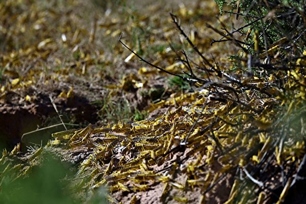

在东非南亚肆虐的蝗灾恐随季风6～7月袭击中国大陆，被派遣到巴基斯坦考察蝗灾的大陆专家发现，此次蝗灾比预想还严重，而且蝗虫还咬人。图为1月22日，肯尼亚的拉拉塔村（Lerata）的蝗虫。(TONY KARUMBA/AFP via Getty Images)

【大纪元2020年03月04日讯】在东非南亚肆虐的蝗灾恐随季风6～7月将袭击中国大陆，被派遣到巴基斯坦考察蝗灾的大陆专家发现，此次蝗灾比预想还严重，目前蝗虫正进入交配繁殖期，对生态的破坏十分严重，而且还咬人。

中共国家林业和草原局3月2日发布紧急通知称，经专家研判，如果气候条件适宜， 6～7月在西风急流与印度洋西南季风的共同作用下，沙漠蝗虫恐从巴基斯坦和印度直接侵入西藏，或者经缅甸侵入云南，或者经哈萨克斯坦侵入新疆。

<b>多名专家前往蝗灾灾区视察</b>

当局已派出多名专家前往巴基斯坦蝗灾灾区视察，专家们表示，目前蝗虫正进入交配繁殖阶段，而这次蝗灾比预想的要严重。

草原管理司生态修复处处长王卓然称，从目测情况看，这次沙漠蝗虫的密度还很大。

同行的山东省植保总站副站长王同伟则表示，此次灾害中的沙漠蝗虫与中国境内常见的东亚飞蝗相比，不但个体较大，攻击性较强，对生态的破坏也十分严重。而且沙漠蝗虫还咬人，大陆专家们在视察中都被蝗虫咬过。

<b>蝗虫生殖能力强大 产卵地难以发现</b>

巴基斯坦当地植保部门的工作人员则表示，交配产卵季节是治理蝗虫的关键节点，如果让蝗虫顺利完成繁殖，孵化的幼虫无法飞行，会啃食这些农作物，“在几天内就会吃光一片地。”

蝗虫一次能产卵60～80个。产卵的时候，它会把肚子插入松软的土中，放下卵。产卵后，土会把卵盖住，完全看不出这里有卵。这样，这批卵能安全孵化，完全没有天敌。

而且，群居的新生代虫卵，孵化之后，很快就会转变成极具攻击性的群居状态。

<b>大陆粮食安全遭威胁</b>

中共国家林业和草原局的通知引述联合国粮农组织（FAO）的判断说，此次始于非洲的沙漠蝗灾，因初期控制不力，可能会延续到2020年6月，届时蝗群规模可能增长至当前的500倍。

而6～7月的时间点正好是在西风急流与印度洋西南季风的共同作用下，恐会袭击大陆西藏、云南和新疆的时候。

而今年大陆的粮食安全问题已经十分严峻了。由于武汉肺炎疫情持续肆虐，“财新网”引述中共农业农村部种植业管理司司长潘文博的话表示，许多地区由于防疫措施限制，工人、技术人员无法复工，导致农业企业复工率低。还有地区因防疫封村堵路，农民不能下田、农机不能上路，春茶采摘、蔬菜采收等农事活动无法正常进行。

此外，大陆已面临草地贪夜蛾大规模爆发。2月21日，中国农业农村部印发《2020年全国草地贪夜蛾防控预案》显示，截至2月10日，云南、四川等地区已有113个县见虫，见虫面积超过60万亩，是2019年同期的90倍。预计全年影响1亿亩农地。

外界认为，武汉肺炎疫情、草地贪夜蛾灾，已经威胁大陆的粮食安全问题了。若蝗灾再到来，未来很可能发生粮荒。

<a target="_blank" href=#top><h6 align="right">回上方</h6></a>

<a name=27>
<h1 align="center"><b>【十字路口】连续换肺抗病毒 中共再曝活摘产业链</b></h1>

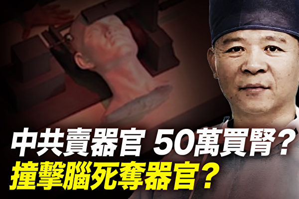

【解读】连续换肺抗病毒，中共活摘产业链复活？王立军发明脑干撞击机做啥？中国脑死器官供体为何多？（大纪元合成）

【大纪元2020年03月03日讯】大家好，我是唐浩，今天都好吗？

今天我们要继续带大家来关注肺炎疫情与器官移植的话题。因为我们在上一集节目才刚聊到，江苏完成首例新冠肺炎病患的肺移植手术，并且提出多项疑点来质疑，结果马上又出现了另一起肺移植案例。所以我们要来跟大家再好好聊一聊。

不过，先带大家来看一件事，昨天的节目出来之后，有网友陆续给了我们一些爆料反馈。

有一名台湾网友说，“我有一个亲戚，十几年前，他真的花100多万（台币）去中国移植肾脏，而且不用排队，大约一个礼拜就有一颗新鲜的肾脏。”

另一位中国网友则留言告诉我们，“地标广州，我有同事患尿毒症，医生说换肾需要五十来万（人民币），包匹配。”

虽然这些留言，我们无法去一一详细查证，但是我们还是感谢网友提供消息，毕竟这些消息来自中国境内与海外，可以让大家感受到，中共系统性地活摘器官、盗卖器官的事情，确实各地都有所接触、有所了解。我们也欢迎大家提供更多的相关信息。

<b>‧移植肺脏抗新冠病毒 中国出现“老年移植”首例</b>

好，昨天我们才跟大家聊到，江苏无锡人民医院陈静瑜的团队，在2月29日完成了中国首例新冠肺炎病患的肺脏移植手术，但背后疑点重重，包括了：器官来源不清楚，器官寻找、配型异常快速，医生与医院涉及活摘器官被国际组织追查，以及中南海权贵可能涉入等等。

没想到，隔天3月1日马上又出现了新的肺移植案例，地点是在浙江杭州的浙江大学第一附属医院（浙大一院），而且强调是“全球首例老年新冠肺移植手术成功”。

这次浙大一院的手术，与江苏无锡的手术一样，受到中共党媒的高调报导宣传。根据几家党媒的报导，我们大致说明一下这起肺移植案例的经过：

1月31日，一名66岁的女性确诊感染新冠肺炎。

2月2日，病患从浙江某地转入浙大一院抢救。

2月3日，病患进行气管插管。

2月16日，病患使用人工膜肺（ECMO，叶克膜）维持生命。接下来，病患连续8天核酸检测呈现阴性反应，因为病患肺功能严重受损不可逆，决定移植肺脏。

3月1日，湖南有一位脑死亡患者提供肺脏，与患者配型成功。当天下午，器官送抵医院；当晚，完成移植手术。

好，如果您有看我们3月2日的节目的话，就会很容易地发现：第一，这次浙江案例的报导与江苏案例的报导一样，党媒对于器官来源的说明，再次含糊其词，只有简单九个字：“一位湖南脑死亡患者”，而且还同样是“脑死亡患者”。

我们不确定中国每天有多少人脑死亡，不过，器官供体是因为什么原因而脑死亡，这一点，党媒在这两起案例里都没有说明。而且，脑死亡者的器官又刚好能够和病患配型成功，这个概率真的是相当不容易，如果不是上天的恩典安排，那么就是背后可能藏着活摘器官的魔鬼交易。

当然，我们不能排除真的可能连续两天都有脑死亡患者捐出肺脏，而且都刚好配型成功，遗爱人间。

只是根据专家说法，陌生人之间要器官配型成功的概率相当低。所以，我们更担心的是，“脑死亡患者”这个说词，会不会是中共用来对外掩盖活摘人体器官的廉价托词。

不过，这次案例与江苏案例的报导相比，至少器官供体来源还有点出了是来自“湖南省”，而不是模糊不清的“外地”。

根据《新京报》对主刀医生、浙大一院肺移植科主任韩威力的专访，可以发现，这次供体是来自湖南省怀化市通道县。这里呢，是少数民族侗族的自治县，位于山区，地点偏远。

根据韩威力的说法，浙大一院的两名医生，是先搭了六个小时的高铁到怀化，再搭两小时的车抵达通道县，取得器官之后，再搭车到桂林，改搭飞机回杭州。

但是，不同党媒的报导里头，却似乎可以拼凑出更多蛛丝马迹。

在中新网的报导里，明确提到器官的运送流程：

“1日上午，一位湖南脑死亡患者捐献大爱。”
“10:30，供体完成捐献。”
“15:56，供肺搭载的飞机落地杭州。”
“17:00，供肺到达之江院区手术室。”

然而，在《新京报》的报导里，可以发现，其实在取器官的前一天，也就是2月29日，浙大一院就已经和东方航空联系，寻求协助，要帮两名负责取器官的医生做特殊安排，方便他们加速通关。

也就是说，浙大一院应该是提前知道“脑死亡者”的器官是能跟病患配型成功的，才会派人大老远去到通道县取器官，也才会提前在29日就跟机场预约，安排所谓的“绿色通道”。以此推论，医院应该是在29日之前就找到器官供体了。

至于浙大一院究竟是在哪一天找到这个可以配型成功的“脑死亡”供体？报导里并没有说明。

但是病患从16日开始使用ECMO急救，之后还得经过连续8天的核酸检测呈现阴性，才能符合移植的条件。那么最快最快，应该也是要到2月24日以后，16加8等于24嘛，医院才能确定病患适合做肺移植手术。

假设医生真的是在2月24日就决定要帮病患动刀，开始寻找供体来源，那么一直到29日他们向东方航空预约绿色通道为止，整个过程居然才短短五天不到。那么，这是不是和江苏案例有着惊人的雷同呢？

第一，两起案例寻找器官而且配对成功的过程，大约不到五天。
第二，两起案例的器官供体，都是“脑死亡”，但脑死原因不明，供体的身份背景不详。
第三，器官都历经长途运送抵达医院，可能都来自偏远地区。

另外，这两起案例还有一个雷同之处。

上一集节目里，我们提到过，负责江苏案例的无锡人民医院副院长陈静瑜，因为涉嫌活摘器官，而被海外国际组织追查。而陈静瑜工作的无锡人民医院和中日友好医院，也都涉入了活摘器官。

无独有偶，韩威力本人以及他工作的浙大一院，也都在国际组织的追查名单里榜上有名。

巧的是，去年底，一名曾经在浙大一院参与过器官移植手术的实习医生，向海外媒体透露，他曾在2011年某个深夜，参与一台肝移植手术，结果现场居然有公安人员到场。

而且除了肝移植之外，他事后得知，旁边还有另一个手术间在做眼角膜移植。他怀疑，器官供体很可能当时在隔壁的手术间里，因为隔壁房间有几个外来人员。

他根据自己的经验研判，器官供体应该是政治犯，他说：“肯定是政治犯，肯定是的，否则的话，没有必要警方要过来。如果是自愿捐献的话，那没有必要。”

这位实习医生还透露，后来浙大一院的肝移植权威、中国工程院院士郑树森在某次大会上提到说，“现在（供体）就没有以前那么多了”，“我们当年可以怎么怎么样，现在就没有那么多了”。

根据党媒报导，郑树森的团队在2017年底前，完成的肝移植手术超过2,300例。而浙大一院的肝移植中心网，曾经在2005年1月28日的报导里提到，郑树森在一天之内连续完成5例肝移植手术，一周之内完成11例肝移植。

这些数字听起来相当不可思议，让人不禁好奇，为什么郑树森可以做这么大量的肝移植？器官都是从哪里来的？背后是不是有个庞大的器官供应库？浙大一院跟中共的活摘器官产业链到底有多深的关连？而现在韩威力做的肺移植手术，器官来源究竟是真的“脑死亡”病患，还是另外有“不能说的秘密”呢？

<b>‧中国“脑死亡”器官供体为何多？</b>

提到脑死亡，大家一定会好奇，怎么这么巧，中共的医生可以连续两天都找到脑死亡的人来提供器官，而且器官都还刚好能跟病患配对上？当然，我们不能排除真的有可能发生这样的事情，只是概率上实在太低，而且太巧了，巧到让人惊讶。

然而，有位网友提醒大家一件事，他说：“脑死亡……，突然想到一个东西，大家有想到吗？原发性脑干损伤撞击机。”

脑干撞击机是什么呢？2017年韩国电视台“TV朝鲜”制作一部纪录片，揭露前重庆公安局长王立军，曾经发明了一种“原发性脑干损伤撞击机”。

新闻报导：

“这个机器是用一个圆形的金属球，直接锤击脑壳，形成了冲击波，穿越头盖骨到达脑部，让人瞬间脑死亡。”

当时这种机器，已经研发到第三代。那大家知道，王立军当时在重庆担任公安局长的上司是谁？是重庆市委书记薄熙来。而薄熙来不但涉及想要发动政变而被逮捕，他还跟着江泽民集团一起进行活摘器官的勾当。

新闻报导：

王立军出逃美领馆后，海外追查国际组织为揭开内幕，透过化身采访，追查王立军涉及的活摘器官暴行。

调查员：喂，是205医院原秘尿外科主任陈荣山吗？
陈荣山：对，对，对，你哪里啊？

调查员：王立军跨部门专案组的，
陈荣山：啊，啊，啊。

调查员：王立军曾经在锦州公安局的时候，办过一个叫现场心理研究中心的，他们跟205医院有一些合作的科学的研究课题。你们这些移植供体里头有在押的法轮功人员，有没有这个事？

陈荣山：那都是经过法院的。

那么，王立军身为薄熙来的心腹，他发明这种瞬间杀人机器，目的是什么？是不是可能要用来让特定的人快速脑死亡，好让这个人的器官还可以维持一定时间的新鲜度与存活度，用来作为器官移植使用呢？

虽然王立军已经被抓，甚至传出他已经在牢里死亡。但是，如果这部机器还在被中共秘密地用来活摘人体器官，那是不是就可能说明了，为什么中共可以轻易找到这些“脑死亡”而且器官配型成功的供体呢？

当然，事实的真相是不是这样，我们还不知道，恐怕只有中共与活摘产业链里的人最清楚。但是，中共连续高调宣传两台肺移植手术，不但意外揭露了自己的器官来源相当可疑，也让人质疑，中共是不是想要借此让活摘器官产业再次走上台面，同时也要借此塑造“中共通过器官移植、对抗病毒、拯救全世界”的虚假形象？

不过，我们要提醒一件事，如果病毒无法获得根本的控制与扑灭，那么不管换了多少肺脏，病人还是可能会再感染病毒。

<b>‧小结</b>

好，最后我们再重复一遍，江苏的肺移植案例与浙江案例有哪些共同点：

第一，寻找器官而且配对成功，大约不到五天。
第二，器官供体都是“脑死亡”。
第三，供体脑死原因不明，身份背景不详。
第四，器官历经长途运送抵达医院。
第五，主刀医生与医院，涉入活摘器官暴行。

大纪元《世界十字路口》制作组

<a target="_blank" href=#top><h6 align="right">回上方</h6></a>

<a name=26>
<h1 align="center"><b>乾元：中共的抗疫已进入了“搅浑水”阶段</b></h1>

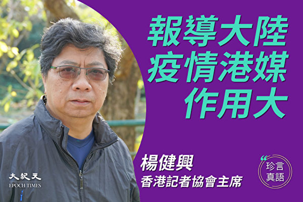

香港记者协会主席杨健兴表示，大陆信息封锁、阻挠新闻严峻，报导疫情受到诸多限制和刁难，并且投放了越来越多的资源打舆论战，他呼吁读者务必留意某些网媒的背景，避免被误导。（大纪元合成图）

 
 【大纪元2020年03月03日讯】何谓“搅浑水”？，这是中共“舆论战”的一部分，把水搅浑，不是搅黑，如果搅黑了，中共发布的新闻都是假的了，那样民众一点都不信了，就会彻底失去听众。而把水搅浑就不会出现这样的问题，利用民众固有的短视、先入为主、以偏概全、信息不对称的特点，在假新闻里掺真料，在真新闻里掺假料，使民众如入云里雾里，糊里糊涂中达到了中共的洗脑意图。

比如说，大家都在怀疑武汉P4实验室泄露病毒，甚至习近平自己也声称要加强“生物安全立法”，武汉P4实验室泄露病毒如果坐实，中共的脚面上就会落下一块大石头。那好，开始搅！首先是“政府站台，专家唱戏”，御用专家钟南山出场称“病毒不一定来自中国”，立刻迷雾四起，话里有话，然后更多的佐证材料冒出，如中科院西双版纳热带植物园、华南农业大学的专家开始发表论文，从病毒的嬗变关系上来证明新冠病毒来自美国，证据可以有目的的选取，论证过程可以似是而非，结果也可以荒谬不经，但是——“舆论自由”，得让人家说话！下个阶段，就是广泛发布报道这些谎言，百姓不明就里，也都开始怀疑病毒是美国造的了。

读者可能难以理解，这些荒谬的消息怎么会有人信？笔者最近往国内仅仅打过两个电话，结果人家都主动的神秘兮兮的谈起“听说这个病毒是美国人造的？……云云”，一副煞有介事的样子。可见谎言遗害之甚，美国怎么就一下子成了阴谋论的中心了呢？

再有，媒体上开始连篇累牍的报道国外疫情。例如，通过瞒报和编造每日新增病例数据与国外新增病例数据对比，创造了抗疫取得阶段性胜利的观感，其目的一则是降低民众恐慌，引导国内复工，避免经济损失加剧，其次是转移国内外舆论的注意力，甚至连BBC这种国外主流媒体也都转移了注意力，称：中国的情况已走向稳定，而把关注的重点转向了日本、伊朗、韩国、意大利等国家。中国一下子竟然成了力挽狂澜的典型，下一步就要向全世界输出抗疫经验了，以致于连“大国战疫”这样的拍马屁的书籍都差点获得出版，让千千万万尚处于病毒威胁之下的民众去欢呼中共的英明统治。

一个负责任的政府应该把注意力首先放在自己家里，小心翼翼，如临深渊、如履薄冰，上对得起苍天、下对得起苍生，而不是成天与其他国家比来比去，再怎么比，也无法抹杀最初掩盖病毒爆发并最终输出全世界的事实。其实中共取得的所谓“疫情稳定”是在严重限制民众自由的高压控制之下实现的，无法持久，一旦社会转向正轨，必将快速反弹，欢呼胜利的日子还远着呢！

作为民众来讲，一旦过度关注这些乱七八糟的掺沙子新闻舆论，难免不把脑袋搞乱的。那怎么办呢？首先得具备一双慧眼，不上假新闻的当，其次是不随着转移注意力，要集中精力不断的探究病毒起源的真相、真实疫情的发展变化。与负责任的国外媒体形成良性互动也是一个好办法，最近在国外媒体中不断看到民众收集的中共编造新增病例的第一手证据，这种第一手材料能大大压制中共的造假气焰，把搅浑的水再变清。只有充分自由和真实严谨的舆论，才有中国民众抗疫胜利的明天。

<a target="_blank" href=#top><h6 align="right">回上方</h6></a>

<a name=25>
<h1 align="center"><b>云南强迫学生喝“大锅药”引民怨</b></h1>

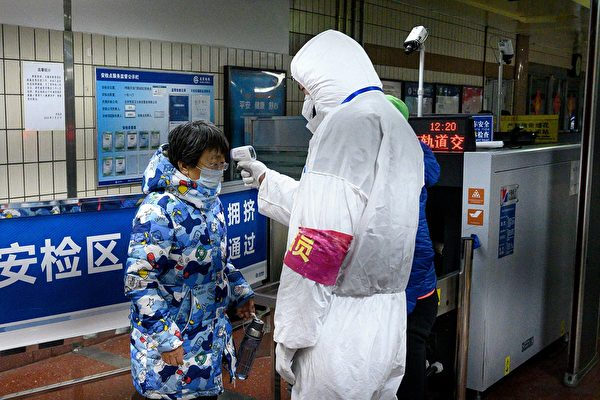

武汉肺炎（2019新型冠状病毒）疫情持续蔓延。图为1月28日北京地铁站。(NOEL CELIS/AFP via Getty Images)

【大纪元2020年03月03日讯】武汉肺炎（2019新型冠状病毒）疫情持续蔓延。近日，云南临沧市强制要求当地学校学生服用名为“大锅药”的中药，当作新学期入学报到的条件，此举引发极大的争议，当地政府被迫紧急喊停。

2月28日，临沧市政府决定让全市中小学生和家长服用“大锅药”。29日，当地政府向学校发出有关通知，开学前，全校师生和家长要自行购买服用，需将购买时的处方、服用情况及时报告班主任（拍照上传），各年级汇总后上报学校德育处。不按要求服用者，需按照要求服用后方能报到入学。开学后，学校将统一组织全校师生免费服用大锅药。三至六岁幼童还被规定必须每天喝。

“大锅药”一般指用大锅熬制的传统民间中医药。据悉，“大锅药”处方是由临沧市中医医院开出的。

陆媒报导，网络截图显示，有临沧幼儿园要求学生每天上传喝药的图片，并写明“喝药后有异常，如拉肚子，头晕等”。此举让家长感到疑惑、恐慌甚至愤怒。

据报导，2月29日，临沧市凤庆县第一幼儿园作为试点单位，在幼儿园大门口设置分批发放点。全园三个年级、20个班、750名幼儿、100名教师全部以自行购买、统一发放、对隔离师生送药上门的方式，共计发放大锅药5100剂。

面对当地家长的反弹声音，临沧市教育体育局3月2日发通报声称，当日只是倡议师生服用“大锅药”，并称学校以拍照上传购买药方、服用情况等方式是错误的做法，下令立即停止执行并道歉

有职业医生表示，要有医生职业证的医生才能开处方让人吃药的，以行政命令让孩子喝中药违法。

2月29日，北京地坛医院中西医结合科主任医师王融冰在新闻发布会上表示，中药方剂主要是用来治疗有症状的人，不主张没有症状的健康人使用中成药来预防新冠肺炎，（盲目使用）没有意义。

有香港注册中医师向《苹果日报》表示，要用中药预防疾病，往往“因人因时因地”而异，不可能有一剂处方适合所有人服用，胡乱用药引来更大问题。

2005年大陆曾发生因“大锅药”引发公卫事件。据南方网报导，2005年6月15日，云南省昆明市禄劝县茂山乡红石岩小学为了预防水痘，让151名小学生集体服用“大锅中药”。不久，151名学生陆续出现拉肚子、恶心、呕吐等中毒症状。学生们立即被急送当地医院，一个孩子因抢救无效死亡。

<a target="_blank" href=#top><h6 align="right">回上方</h6></a>

<a name=24>
<h1 align="center"><b>武汉城管群殴配送店员被辞退 网民不买单</b></h1>

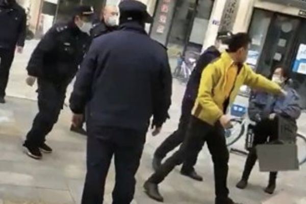

大陆网络热传一段视频显示，多名武汉城管群殴一名分拣、配送店员。（视频截图）

 
 【大纪元2020年03月03日讯】昨天（3月2日），大陆网络热传一段视频显示，多名武汉城管群殴一名分拣、配送店员。3月3日，其中三名城管被辞退。对此，网民认为辞退的处罚太轻，纷纷怒骂城管“无法无天”。

视频显示，武汉某地，多名身穿制服的城管对一名黄衣男子大打出手，旁边还有一位身穿灰色衣服的女士。

据大陆媒体报导，3月3日，据视频中黄衣男子的朋友说，黄衣男子是武汉阿拉加鲜生盛世江城店的一名员工，事发地点位于江汉区新湾路盛世江城小区门外，时间约在2日早上8时左右。当时，黄衣男子正在做分拣、配菜工作，由于分拣的菜比较多，就将几个配菜筐放在的店门外。结果，多名身穿制服的城管冲过来称该店铺违规营业，随后双方发生肢体冲突。

该店铺与当地社区有供菜合作关系。

3月3日9时，中共武汉市江汉区政府办公室官方微博通报称，该视频属实。与店员发生冲突的城管人员吕某某、蒋某某、李某某已被辞退。

网民对此处罚感到不满，纷纷怒骂城管。

“城管是城市管理者，可是为什么老百姓都惧怕城管，因为城管喜欢暴力执法，普通百姓打有身份的就拘留判刑，城管围殴普通百姓仅仅辞退？不拘留吗？不寻衅滋事吗？一声叹息无语了⋯⋯”

“城管在各个城市都存有土匪行为，目前在更需要爱与和平的武汉市居然发生如此事件，必须严格处理！而且还只是简单的辞退？这是需要网友来治国一波？！ ​”

“上岗都不做培训吗？？公职人员就是高级服务员，有什么权力仗着一身制服就肆意妄为？？出事儿了就甩一个临时工出来顶锅，这样下去永远没好！不能出事儿了现教育处罚，就是平时对自己的权力和义务都不清楚界限，为虎作伥！” ​

“防疫关键时刻，城管爆出如此事件，真是让人震惊，作为多年编外近来刚刚转正的执法人员，这些年爆出的野蛮粗暴执法的案件比比皆是，简直就是野蛮执法的代名词。”

“国难当头，孰轻孰重？你穿上这身制服给于的使命和责任，是维护治安，保护这座城市。那这座城市里的救命急资，是不是优先派送出去，而不是用你们的权力，野蛮执法！看看你们手臂上的红袖章，城管那两字，已然是群众害怕又唾弃的标志。”

“我只能用两个词来形容，伪军，土匪。武汉城管，除了打砸抢。还干过人事么？”

“这个时候，这么牛逼，武汉乃至湖北的整个官场存在严重问题，需要利用雷霆手段进行清理。要不然疫情可平，但人祸难平。 ​”

<a target="_blank" href=#top><h6 align="right">回上方</h6></a>

<a name=23>

神韵国际艺术团将在澳大利亚展开第十四次巡回演出前，澳大利亚各级政要纷纷向神韵艺术团和主办方发出贺信，祝愿神韵演出成功。（大纪元合成图）

 <h1 align="center"><b>神韵2020年莅临澳洲 各级政要恭贺</b></h1>
 
 【大纪元2020年03月03日讯】（大纪元记者安平雅澳洲悉尼报导）用音乐与舞蹈勾勒出五千载历史长河中的华美画卷，让历史名人、英雄豪杰讲述古老文明中最高尚的美德。神韵，用最完美的艺术形式寻回了人类失落的瑰宝——神传文化。打破民族界限，感动各族裔观众，这就是神韵在当今世界缔造的神话。

3月4日，神韵国际艺术团将在澳大利亚展开第十四次巡回演出，澳大利亚各级政要纷纷向神韵艺术团和主办方发出贺信，在祝愿神韵演出成功的同时，也感谢神韵为澳大利亚观众带来精彩的艺术飨宴及为复兴中华神传文化所做出的努力与付出。

<b>通讯、网络安全和艺术部长、聯邦众议员Paul Fletcher MP：祝愿神韵演出再创佳绩</b>

担任澳大利亚艺术部长的Paul Fletcher联邦议员说：“祝愿神韵艺术团2020年巡回演出再创佳绩，再次为澳大利亚观众展现丰富多样的中国文化。”

<b>影子卫生部长、聯邦众议员Chris Bowen MP：
神韵承担重要使命</b>

影子卫生部长、聯邦众议员Chris Bowen在贺词中表示，“我很荣幸地向神韵艺术团来澳演出表示欢迎。神韵以高贵、优雅的艺术形式展现中国五千年的历史文化，承担的是一项重要的使命。神韵对中国传统文化的生动演绎，无疑将更加充实澳大利亚社会。我希望澳大利亚社会所有民族背景的民众都有幸来体验这个鼓舞人心的演出。”

</b>授权立法监督委员会常务主席、聯邦參议员Senator the Hon Concetta Fierravanti-Wells：神韵推动中心文化交流</b>
 
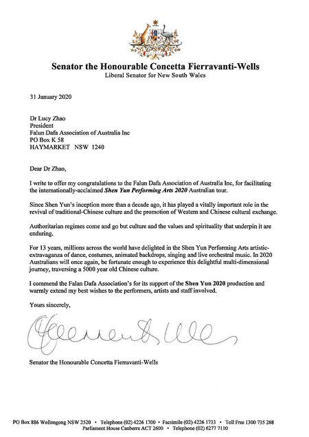

 
聯邦參议员Concetta Fierravanti-Wells在贺信中说，“我写此信恭贺享誉全球的神韵艺术团莅临澳大利亚的2020年巡回演出。”

“神韵艺术团建立已超过十年，在复兴中国传统文化和推动中西方文化交流中扮演着至关重要的角色。朝代政权会更迭，但文化、价值观和精神将源远流长。”

“13年来，由舞蹈、服饰、动态天幕、歌曲和现场交响乐伴奏所组成的神韵艺术盛宴为世界的数百万观众带来喜悦。2020年，澳大利亚人可以再次幸运地体验令人欣喜的多元化旅程，体验5000年中华文化。”

</b>联邦参议员Senator Richard Di Natale：
神韵内涵丰富 引人入胜</b>

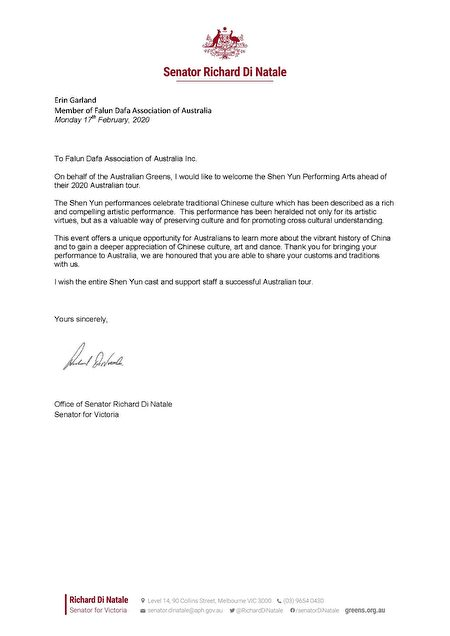

联邦参议员Richard Di Natale在贺信中表示，“我谨代表澳大利亚绿党，在神韵艺术团开始2020年澳大利亚巡回演出之前对艺术家们表示欢迎。”

“神韵演出弘扬中国传统文化，被誉为一场内涵丰富且引人入胜的艺术演出。演出不仅因为其艺术美德而受到赞扬，还因其作为一种保存文化并促进不同文化间相互理解的宝贵途径获得到赞赏。”

“神韵为澳大利亚人提供一个难得的机会来了解更多生机勃勃的中国历史，并加深对中国文化、艺术和舞蹈的理解。我祝愿神韵全体演员和工作人员澳大利亚巡回演出成功。”

<b>联邦参议员Senator Janet Rice＆绿党领袖、联邦议员Adam Bandt MP：衷心感谢神韵</b>

联邦参议员Janet Rice和绿党领袖、联邦议员Adam Bandt共同在贺信中表示，“我们热烈欢迎神韵艺术团莅临澳大利亚。我们祝你们顺利，并衷心感谢你们为丰富我们社区所做的一切。”

<b>拨款及管理委员会常务副主席、税收及财政管理委员会常务副主席、聯邦众议员Julie Owens MP：
请接受我最美好祝愿</b>

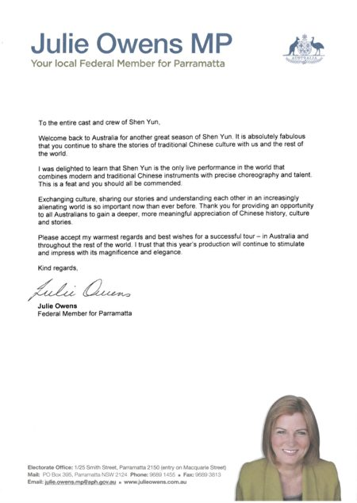

聯邦众议员Julie Owens在贺信中表示，“欢迎（神韵）回到澳大利亚，开启新一轮精彩的神韵演出季。你们继续和我们以及全世界分享传统中华文化，这真是太好了。”

“感谢你们向所有澳大利亚人提供了这一机会，让他们能对中国历史、文化和故事进行更深入、有意义的理解和欣赏。”

“请接受我最诚挚的问候和最美好的祝愿，祝神韵在澳大利亚及全球巡回演出成功。我相信今年恢弘壮丽的作品将继续引人入胜，给观众留下深刻印象。”

<b>联邦众议员Craig Kelly MP：神韵引发心中共鸣</b>

联邦众议员Craig Kelly 表示，“能有机会再次向来自纽约的神韵艺术团莅临澳大利亚演出送上祝福，我感到无比的荣幸和喜悦。”

“神韵为数百万观众带来具有高难度技巧、高度艺术性、至美的演出和至善的故事。她展现的是传统文化，致敬亘古不变的价值观、维护人类的尊严，在每个人心中引起共鸣。”

“澳大利亚人是如此幸运，有机会欣赏神韵2020年一套全新的制作。我祝愿所有观众度过一段美好的时光。感谢神韵艺术家不懈的付出，与澳大利亚人分享艺术瑰宝、智慧和感动。”

<b>新州下议院议长、新州下议员Hon. Jonathan O’Dea MP：神韵带来杰出精彩的艺术节目</b>

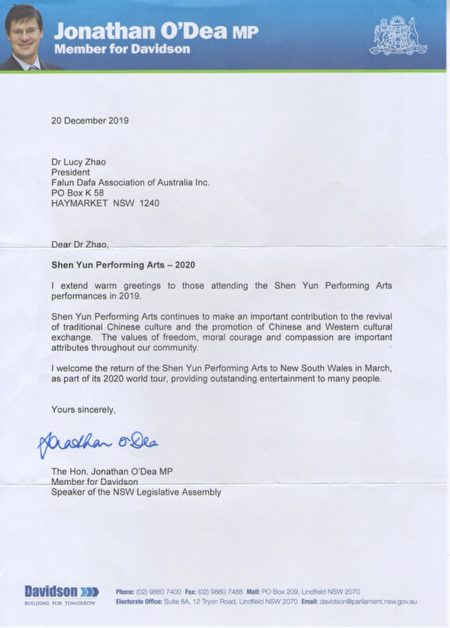

新州下议员Jonathan O’Dea的恭贺信说，“我向参加神韵2020年演出的所有成员送上热切的问候。”

“神韵在复兴中华传统文化与推进中西方文化交流方面不断地作出重要贡献。自由、道德勇气和善良这些价值观是贯穿我们社会的重要属性。”

“我对神韵在2020年的世界巡回演出再次来到新南威尔士州表示欢迎，演出为众多观众带来杰出精彩的艺术节目。”

<b>环境厅和退伍军人事务厅次长、新州下议员James Griffin MP：体验非凡的中国传统音乐和舞蹈</b>
 
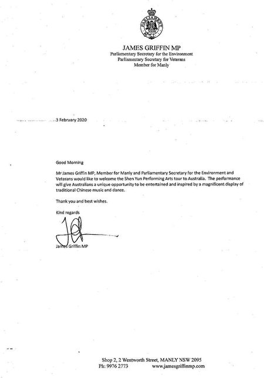

 
新州下议员James Griffin欢迎神韵艺术团莅临澳大利亚。他表示，“神韵演出为澳大利亚人提供了独特的机会，在体验娱乐性的同时，体验非凡的中国传统音乐和舞蹈的鼓舞，感受艺术熏陶。”

<b>新州上议员Emma Hurst MLC：享受舞蹈、歌曲和音乐来学习历史</b>

新州上议员Emma Hurst表示，“我非常高兴可以对神韵2020年巡回演出再次来到澳大利亚表示欢迎。激动人心和引人入胜的神韵演出是帮助人们学习5000年中国传统文化的方式。作为一个多元化的社会，澳大利亚人肯定会通过享受充满活力的舞蹈，歌曲和音乐来学习这段历史。”

<b>新州下议员Julia Finn MP：展现神舞蹈时的韵味与美好</b>

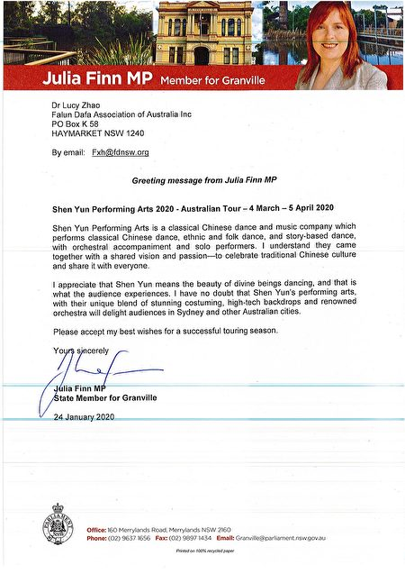

新州下议员Julia Finn赞扬神韵，她说，“‘神韵’是指神舞蹈时的韵味与美好，我很欣赏这点，这就是观众所体验到的。我可以肯定，神韵演出中惊艳服饰、高科技天幕和声名显赫乐团的独特交融将会给悉尼和澳大利亚其它城市的观众带来欣喜。我为巡回演出的成功送上最好的祝福。”

<b>新州下议员Alex Greenwich MP：多样性的文化演出</b>

新州下议员Alex Greenwich表示，“2020年，我再次欢迎神韵的到来。我很自豪地代表新州政府悉尼选区的民众支持神韵这样令人赞叹的多样性文化演出。”

“神韵所展现的善良、勇气和希望，对构建一个人们彼此尊重、多元文化的社区起着重要作用。”

<b>新州下议员Tanya Davies MP：神韵艺术家以真诚、善良和忍让影响世界</b>

新州下议员Tanya Davies 说，“我欢迎神韵表演艺术团莅临悉尼。 祝贺艺术家们致力于通过倡导真诚、善良和忍让的原则来影响我们的世界。”

<b>维州影子律政厅长、维州上议员Hon. Edward O’Donohue MLC：祝愿巡回演出成功 </b>
 
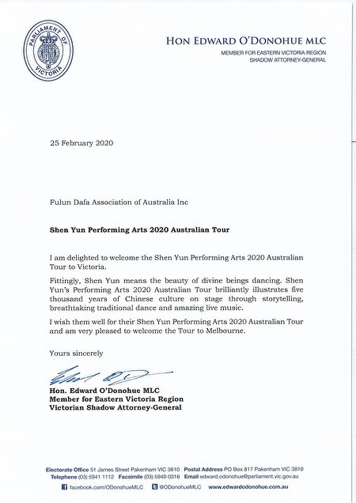

 
维州上议员Edward O’Donohue的贺词说，“我很高兴欢迎神韵艺术团2020年澳大利亚巡回演出来到维州。”

“我祝愿他们的澳大利亚巡回演出成功，并非常高兴地欢迎他们来到墨尔本。”

<b>维州上议员David Limbrick MLC：展现中国人的善心、忠诚、仁爱、勇敢和艺术才华</b>

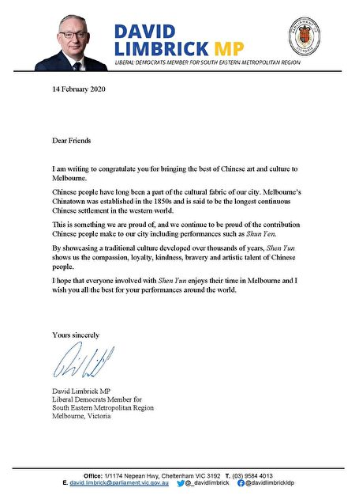

维州上议员David Limbrick的贺信说，“我写信祝贺你们将最好的中国艺术和文化带到墨尔本。”

“通过展现延续了数千年的传统文化，神韵向我们展示了中国人的善心、忠诚、仁爱、勇敢和艺术才华。我希望神韵的所有工作人员都能享受在墨尔本的时光，我祝愿你们在世界各地的演出一切顺利。”

<b>维州上议员Samantha Ratnam MLC：分享神韵的习俗和传统令我们感到荣幸</b>
 
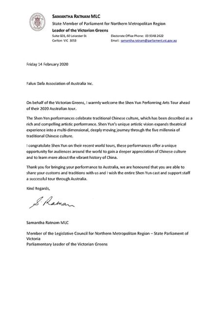

 
维州上议员Samantha Ratnam表示，“我代表维州绿党，在神韵艺术团开启2020年澳大利亚巡回演出之旅前，对其表示热烈的欢迎。”

“我对神韵近期在世界各地的演出表示祝贺，这些演出为观众提供了一个难得的机会，来加深对中国文化和生机勃勃的历史的了解。”

“感谢你们来澳大利亚演出，你们能够在此分享你们的习俗和传统令我们感到荣幸。我祝愿神韵全体演员和工作人员澳大利亚巡回演出成功。”

<b>Derryn Hinch’s Justice党维州领袖、维州上议员Stuart Grimley MLC：热情欢迎神韵到来</b>

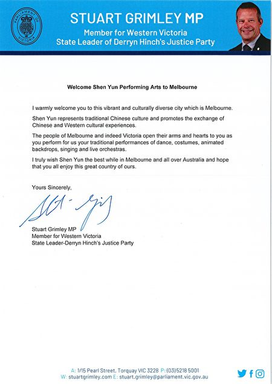

维州上议员Stuart Grimley在贺信中写道，“我热情地欢迎你们来到墨尔本这个充满活力和多元文化的城市。神韵展现了中华传统文化，促进了东西方文化交流。”

“墨尔本和维州的民众向你们展开双臂，敞开心扉，欣赏你们为我们呈现的古典舞、服装、动态天幕、歌曲和现场交响乐演奏。”

“我真心祝愿神韵在墨尔本和澳大利亚各地的巡回演出成功，并希望你们会喜爱我们这个美好的国家。”

<b>小企业影子助理厅长、维州联盟党上议院党鞭Bernie Finn MLC：中华文化是人类最伟大的珍宝</b>
 
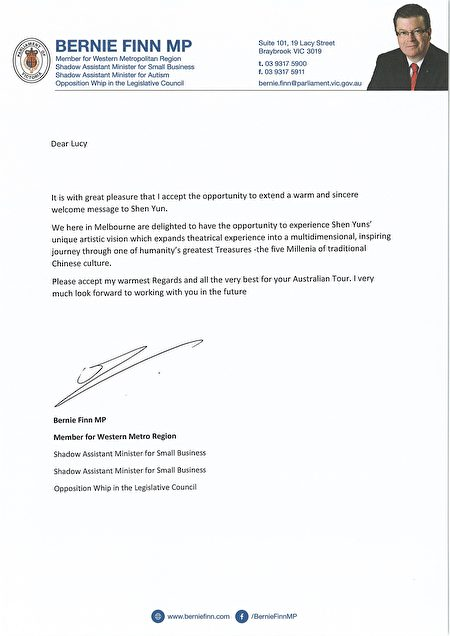

 
维州联盟党上议院党鞭Bernie Finn在贺信中表示，“我备感荣幸地利用这个机会向神韵致以温暖和诚挚的欢迎。我们墨尔本人很高兴有机会体验神韵独特的艺术。神韵将剧场体验扩展成一个多维的、令人振奋的五千年中华文化之旅，该文化是人类最伟大的珍宝之一。”

“请接受我最温暖的问候，祝愿你们的澳大利亚巡回演出一切顺利。我非常期待在未来与你们合作。”

<b>维州教育、青年事务影子厅长、维州自由党副领袖Cindy McLeish MP：重现了中华五千年文化历史</b>

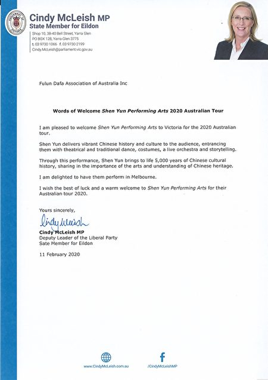

维州自由党副领袖Cindy McLeish表示，“我很高兴欢迎神韵艺术团来到维州进行2020年澳大利亚巡回演出。”

“神韵重现了中华五千年文化历史，分享了艺术的重要性和对中国传统的解读。”

“我祝愿他们一切顺利，热情欢迎神韵艺术团2020年澳大利亚巡回演出。”

<b>维州影子助理教育厅长、维州下议员Brad Rowswell MP：神韵是陶冶情操的文化之旅</b>
 
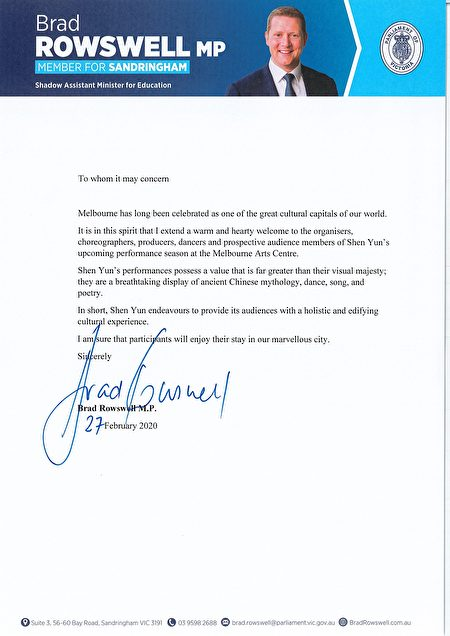

 
维州下议员Brad Rowswell说，“我向参与神韵在墨尔本艺术中心演出的组织者、编舞、制作人、舞蹈演员和将观看演出的观众致以热烈诚挚的欢迎。”

“神韵演出蕴含的价值比其壮丽的视觉效果更加宏大，动人地展现了古代中国的神话、舞蹈、歌曲和诗词。”

“总之，神韵致力于为观众提供一个全面的和陶冶情操的文化之旅。我相信参与神韵演出的人员会享受在我们这个顶级城市度过的时光。”

<b>昆士兰州议员Nick Dametto MP：神韵展现中国丰富的神性和艺术遗产</b>

昆士兰州议员Nick Dametto 表示，“热烈欢迎神韵艺术团光临澳大利亚演出。”

“神韵演出通过令人难以置信的优美的中国传统舞蹈，为澳大利亚观众体验失落了的文化提供了一个宝贵的机会。神韵用舞蹈这样的世界语言展现了中国丰富的神性和艺术遗产，是一次不可错失的机会。”

“我祝愿神韵艺术团及承办方、所有演员和工作人员一切顺利！”

<b>塔斯马尼亚州议员The Hon Mike Gaffney MLC：
天赋卓绝的舞蹈演员带来壮观演出</b>

塔斯马尼亚州议员Mike Gaffney 赞美神韵，他说，“神韵艺术团通过激动人心的音乐和舞蹈，在推动国际理解和接受多元文化中起到了不可或缺的作用。”

“澳大利亚的观众非常幸运可以欣赏到天赋卓绝的舞蹈演员带来的壮观演出。”

“我所能做的只是为这场惊艳的演出付出努力的所有台前幕后的人们送上感谢。”

<b>西澳上议员Robin Scott MLC：神韵已成珀斯艺术日历中重要特色</b>

西澳上议员Robin Scott 说，“自2007年在西澳演出以来，神韵已成为珀斯艺术日历中的重要特色。”

“神韵维护和保存中华传统文化的精髓，将这种文化带给全世界的观众，为全世界做出了巨大的贡献。”

“我热烈欢迎神韵艺术团再次来到澳大利亚。”

<b>南澳上议员The Hon Tammy Franks MLC：
神韵为文化生活增添光彩</b>

南澳上议员 Tammy Franks表示，“我很荣幸地欢迎神韵艺术团光临澳大利亚。  毫无疑问，神韵表演艺术将为我们的文化生活增添光彩，并通过以善良、勇气和希望为主题的中国古典舞及音乐，吸引和启迪观众。 请接受我最热烈的欢迎，祝愿演出成功。”

<b>墨尔本Port Phillip市市长Bernadene Voss
副市长Tim Baxter：展现真善忍和尊重的隽永故事 </b>
 
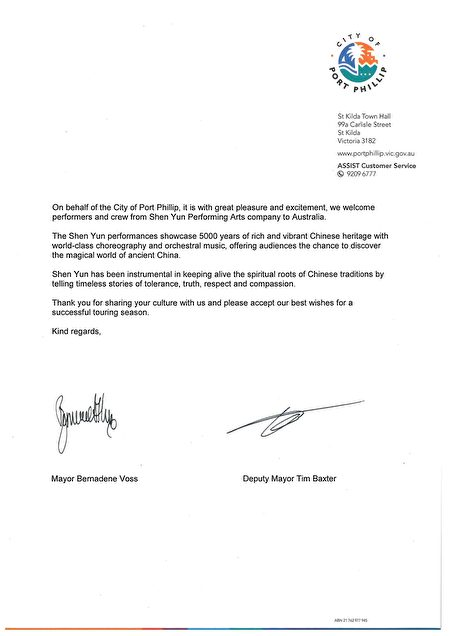

 
墨尔本Port Phillip市市长Bernadene Voss和副市长Tim Baxter共同表示，“我们深感荣幸并满怀欣喜地代表Port Phillip市，欢迎神韵艺术团的演员和工作人员来到澳大利亚。”

“通过讲述有关真、善、忍和尊重的隽永故事，神韵在复兴中国传统文化的精神根源方面发挥了重要作用。”

“感谢与我们分享你们的文化，请接受我们对巡回演出成功的最美好的祝愿。”
 
 <a target="_blank" href=#top><h6 align="right">回上方</h6></a>

<a name=22>
<h1 align="center"><b>大陆复工现降薪潮 员工：基本工资也拿不到</b></h1>

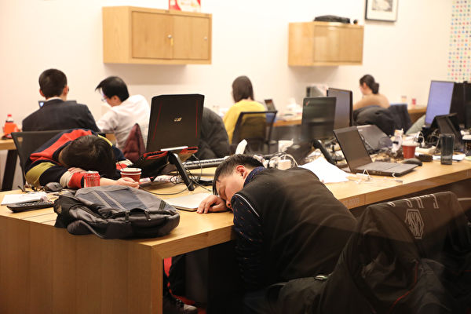

新冠病毒疫情下，大陆企业不堪重负，因此纷纷降薪。图为示意照。(AFP)

【大纪元2020年03月03日讯】（大纪元记者张玉洁综合报导）大陆在疫情中复工，但各行业企业经历了停工、需求下降等困境后，已经不堪重负，因此纷纷降薪，甚至有员工表示，“干一样的活儿，却连基本工资也拿不到。”

综合大陆媒体3月2日报导，一位刚刚接到降薪通知的职员表示，“觉得很无语，但是转身想起房贷，又不敢轻易辞职。”而北京一家公司人事部暗示，就算现在有员工辞职，疫情过后也将有很多公司不会招聘。

疫情爆发至今，服务、互联网、金融等众多行业都相继宣布降薪，有员工表示并非自愿降薪，而是公司要求之下被迫选择。

<b>“连基本工资也拿不到”</b>

有企业员工表示，现在连基本工资也拿不到。“花生好车”是一家分期购车平台，其员工近日表示，公司强制执行降薪，一个月只能拿到一千多元，而技术部门80%员工待岗。公司方面表示确有此事。

《证券时报》3月2日报导，在深圳一家影院工作的一名员工表示，从3月起其所在的影院公司全员降薪30%，全年不调薪，不接受的员工可以主动辞职。

大陆共有超过12,000家电影院，目前仍然全部暂停售票。有影院投资人表示，中国新年期间的影片全部撤档，很多影院1月份均亏损30万至50万，2月份仍然停摆，两个月平均每家影院亏损上百万。

现在一些影院只能线上销售零食、饮料，同时线上提前售票。一位业内人士表示，影院这一密闭空间给人不安全的感觉，即使防疫结束，影院业务也很难短期恢复，可能会出现倒闭潮。

教育创业公司“松鼠AI”复工后全员发放35%工资，持续5个月，最核心高管零工资。该公司负责人表示，公司账面上3.2亿元现金，本来够活2年，但如果没有收入只够生存6个月。

诺亚财富集团是大陆知名的第三方财富管理机构，该集团2月17日复工后宣布，在疫情期间所有员工每月有5个工作日无薪休假，这意味着员工每个月少拿近四分之一的薪水。同时，三位董事零薪水，管理层降薪30%至40%，员工可以申请停薪留职。

有企业主感慨，连诺亚财富这样市值超百亿的知名上市公司都要降薪，其它中小企业的处境就更令人堪忧。

生活家居品牌“名创优品”多名员工在社交媒体爆料，虽然公司说是自愿选择降薪，但实际上并没有合理拒绝的余地。

近日，清华大学和北京大学联合调查发现，如果疫情持续半年以上，大陆中小企业90%很可能停业或破产；从公司现金流来看，目前35.96%的企业只能维持一个月，31.92%的企业能维持两个月，17.03%的企业可以维持三个月，能维持六个月及以上的企业只有9.27%。

<a target="_blank" href=#top><h6 align="right">回上方</h6></a>

<a name=21>
<h1 align="center"><b>湖北官员下发消毒片 村民食后中毒送医</b></h1>

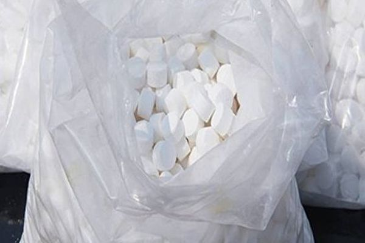

网传中共黄冈市黄梅县黄梅镇疫情防控指挥部14户22位村民下发二氧化氯环境消毒片，结果民众喝了此消毒片中毒。（网络图片）

 
 【大纪元2020年03月01日讯】（大纪元记者萧律生报导）2月29日晚，大陆网络传出一份疑似中共黄冈市政府发往各县的电报，称该市黄梅县黄梅镇疫情防控指挥部给14户22位村民下发二氧化氯环境消毒片，导致这些民众中毒。此事引发网民热议。

该网传电报等级为“特急、明电”，落款日期为2月28日。电报披露，黄梅镇疫情防控指挥部向窑村一组22位村民下发二氧化氯消毒片，这些村民均误食了消毒片。

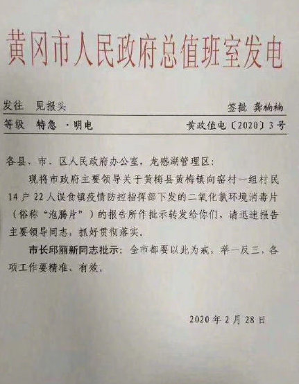

中共黄冈市政府发往各县的电报。（网络图片）

 
 据悉，二氧化氯消毒片是国际上公认的高效消毒灭菌剂。

除了该电报，2月29日晚间，还有一份微信群聊天截图显示，“黄梅县人民医院护士说他们正在抢救一批中毒的人，一个村20多个人喝了84消毒水（注：84消毒水是以次氯酸钠为主要成分的含氯消毒剂），说是村干部发的，还要当面喝”“口服过程中，组长还要拍照留痕迹纪录。”

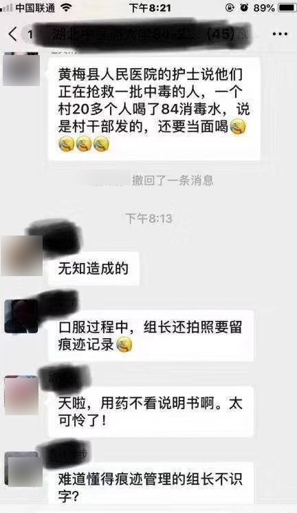

微信群聊天截图。（网络图片）

 
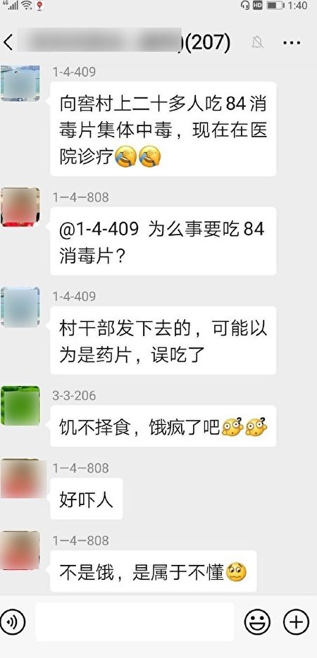

微信群聊天截图。（网络图片）

 
3月1日，封面新闻从黄梅县委宣传部获得证实，确实发生一起误食“消毒片”中毒事件；但是致电黄梅县疫情防控指挥部，工作人员均称没有听说中毒事件发生；黄梅县人民医院多个渠道亦证实处理了一批中毒患者，但具体人数、中毒情况尚不清楚。

对于此消息，网民愤怒：“这些人是怎么做工作的？简直是残害百姓！”“这种村干部愚蠢之极！要他添乱吗？中国还有多少类似这样的干部，趁着疫情赶快罢官，并撤销待遇。”“当保健品吃啊！啥工作人员啊？有没有点儿常识啊？”“逼他们喝，还拍照了，证明工作到位！”

“自己要求拍照，村干部这回跑不脱了吧。”“这个村干部可以判死刑了。”“无知的人有点权会害死人的。”

还有网民再次证实此事是真实的。“这个事情是真的，我男朋友家那边的，说发放的人还让他们饭后服。”“这是真的，我就是这个村的人，唉！”

另有网民透露，不止这个村子发了此消毒片，“我也是这个县的，村干部给我家发这个的时候，跟我爸妈说可以洗手，洗碗也可以，我妈没读多少书还特地给我说了，幸亏我知道了，跟我妈说别信人家瞎说，你敢给洗碗全家一起毒死算了。”

此外，网民透露：“我终于明白我们这儿大喇叭喊，不要喝84，原来真的会有人这样做。”“我们社区之前也有人在群里问消毒片怎么服用。”

<a target="_blank" href=#top><h6 align="right">回上方</h6></a>

<a name=20>
<h1 align="center"><b>武汉新冠病毒疫情蔓延三个月回顾</b></h1>
<h1 align="center"><b>中共瞒骗世界丧事岂能摇身变伟业</b></h1>

【明慧网第二十年】（明慧记者综合报导）2019年12月至2020年1月初，正值30亿人次的中国人返家的春运高峰期。此时，湖北省武汉市却突然爆发「新型冠状病毒肺炎」。

武汉市是湖北北省省会，大陆中部六省唯一的副省级市，特大城市，全国重要的工业基地，科教基地和综合交通枢纽。户籍人口908.35万人，流动人口510.30万人。武汉地处江汉平原东部，长江中游，长江及其最大支流汉江在此交汇。作为中国经济地理中心，武汉素有“九省通衢”之称，是中国内陆最大的水陆空交通枢纽和长江中游现代化中心，其高铁网辐射大半个中国，是华中唯一可直航全球五大洲的城市。

1月26日，武汉市长向世人宣布了一个可能比死亡与感染人数更令人恐惧恐慌的数字：在法定宣布时，作为中国重大的地理枢纽，武汉也为此次新冠状病毒肺炎的扩散提供了理想的集散地。武汉封城之后，仍有约500万人离开了武汉，还有900多万人留在城里。

截止到2020年2月28日，新型冠状病毒肺炎（俗称武汉肺炎）从武汉蔓延到海外近60个国家和地区。中国大陆央视新闻报道，湖北省不断报告武汉新型冠状病毒肺炎确诊病例是66337例；中国内地逐步有74,567宗确诊病例，死亡个案2,117宗，现有疑似病例5,248宗。然而，中共的数据一直受到人们的质疑。

彻底今海外确诊逾5,200多例，死亡近90例。

<b>一，中共隐瞒疫疫情七八周抓捕知情人</b>

武汉新型冠状病毒肺炎，2019年12月初出现首例病例。然而直到12月31日，有人在网上发布武汉市卫健委关于“不明肺炎”的通报后，各界对此才略有所为。 20日中共才承认「可以人传人」。1月23日武汉封城。

该通知是「市卫生健康委员会关于报告送不明原因肺炎救治情况的紧急通知」，通知对像是武汉的各医疗机构，表示武汉华南海鲜市场陆续出现不明原因的肺炎病人，因此要求各单位清查统计近期，武汉市民恐惧是“非典”──严重急性呼吸道症候群（SARS）再度爆发。

2019年12月31日，中共卫健委首批高等级专家组到武汉后，确定了确诊病例的三大标准：有华南海鲜市场接触史；要有发热症状；要做全基因组植入。这三包括财新报导的《四大IUC主任详解病毒》等文章都指出，中共专家组定的这套标准“太苛刻”，让很多早期感染者得到了诊治，隔离。漏掉很多有病的人，造成很大的社会危害。错失了防控的黄金时期。

2020年1月1日，8名武汉医生因为在微信朋友圈传递疫情信息而被当地公安抓走，还被在微博上游街，通报众人，避免所谓的“谣言”扩散。中共的刻意隐瞒瞒疫情，抓捕传播疫情真相的医护人员及民众，要求知情医护人员不得外传疫情，同时又要传播疫情“可防可控”，没有“人传人”等假消息，致使疫情迅猛在全国蔓延。

1月1日，据大陆媒体报导，武汉市江汉区市场监督管理局和江汉区卫生健康局联合发布的“关于休市整治的公告”。公告称，根据中国（中共）国务院“突发公共卫生事件”应急条例》等法规条例，以及武汉市卫生健康委员会“关于当前我市肺炎疫情的情况”通报，“经研究，决定对华南海鲜批发市场实行休市，进行环境卫生整治。”

该通知显示，中共海军2019年就知道武汉不明防疫疫情，并出台「2019」298号1月2日，中共海军工程大学警通勤务连就下发了「严控外来人员进校的通知」。防控文件，而且中部部战区总医院也已知情。

1月3日：中共报告共有44名“神秘疾病”疑似患者。之后，在“武汉肺炎”的感染源，传播方式，是否人传人，会不会变异等都明显的情况下，一些党媒1月10日，中新社采访到曾参与过SARS救治的呼吸领域专家王海龙医生。王海龙称，目前武汉所有患者无死亡病例，未发现明确的人传人证据，未发现医务人员感染，民众不必担心过多。

1月5日，上海市复旦大学附属公共卫生临床中心（上海市公共卫生临床中心）发给中共国家卫健委的一份内部报告显示，2020年1月5日从武汉市华南海鲜市场一名不称重肺炎患者呼吸道灌洗液中测出类似SARS（萨斯）冠状病毒，并测得该病毒的全基因组。报告称，该病毒与SARS冠状病毒同源性高达89.11％，命名为Wuhan-Hu- 1冠状病毒。

1月8日确定病原为新型冠状病毒。2月12日，世界卫生组织将此次发布新冠状病毒肺炎正式命名为“ COVID-19”。

1月11日，中共官媒《人民日报》报导说，中共国家医疗专家组专家，北京大学第一医院呼吸和危重症医学科主任医师王广发称，目前来看该病毒的“致病性较弱”，病患病情和整体疫情处于“可控状态”。

1月14日，极受中共影响的世界卫生组织（WHO）才出来说，引发武汉肺炎的2019新型冠状病毒出现了“有限度”人传人情况，主要是家人间的小规模群聚感染，但世卫已提供世界各地的医院防疫指导方针，包括在医疗机构的“超级扩散”状态，以防疫情扩散。

然而，在消息报导后不久，世卫又引述中共官方所说的“删除”，说没有明确证据表明新型冠状病毒会人传人。世卫透传回覆《苹果日报》称，根据中共官方初步调查，没有清楚。证据显示新型冠状病毒会人传人，也没有证据证明可以有限度人传人。

1月15日凌晨，武汉卫健委不足继续称重目前肺炎疫情尚未发现明确的人传人证据，但又说“不能排除有限的人传人可能，以及持续人传人风险降低。”

1月17日，世卫组织传染病建模合作中心，英国帝国理工学院MRC全球传染病分析中心（MRC全球传染病分析中心）发表报告指，他们试图，武汉潜在新型冠状病毒感染患者可能超过1723人，数量远大于当前通报的病例数量。

1月27日，时任武汉市长的周先旺在接受中共央视采访时，公开承认武汉披露疫情不及时，但他又说：“作为地方政府，我获得这个信息以后，授权以后，我才能揭示。”

1月18日，在武汉市政府已掌握十多名医护感染的消息，明知新冠肺炎人传人的情况下，武汉市百步亭社区仍仿古了“第二十届万家宴”。活动后结束，疫情在百步亭社区内部爆发，引来海内外非议。有人承认志志的社区工作者在接受媒体采访时说，有4万多个家庭参加，摆出了13,986道菜品。对于疫情，他周边的社区工作人员是知道的，“ 18号当天武汉还没有封城，但我们有内部一些消息，说会封（城）。但是宴会还是照常搞了。”

中共官媒以武汉市百步亭社区某居委员会工作人员“江强（化名）”的名义说，“ 1月初，我们听说了肺炎的消息，但起初说『可防可控』，后来又说『不排除有限人传人』。万家宴聚会前三天（1月15日），我们跟居委会领导反映，最好取消万家宴，但没成功。

1月19日，《楚天都市报》报导，从1月20日起，武汉市文化和旅游局主办的2020春节文化旅游惠民活动即将启动，20万张文旅惠民券将开放免费预约。

总部在美国华盛顿州的财政组织「中国国防捍卫者」公告，从1月22日至1月28日，短短一周之内，中共法定至少抓捕了325名中国公民。公布的数据显示，这些中国人多数被扣上“散布谣言”，“制造恐慌”或“虚构事实扰乱公共秩序”的帽子，而遭受行政拘留，罚款金或教育训诫等处分。

<b>二，中共御用专家出来证实「可以人传人」</b>

1月20日晚间，中共国家卫健委员会高级别专家组组长钟南山在记者会上亲口证实，根据目前的资料，新型冠状病毒肺炎是肯定的可以人传人。

1月21日凌晨，中共武汉市卫健委通报，武汉市共有15名医务人员确诊为新型冠状病毒感染的肺炎病例，另有1例疑似病例。16例患者中，危重症1种。 ，外界质疑中共，认为中共在隐瞒医护人员感染的人数。

1月21日下午，美国疾病预防控制中心（CDC）宣布，一名曾去过武汉旅游的美国公民，在西雅图被诊断出患有武汉冠状病毒，即患有武汉肺炎。这是首例被证实的在美国发现的武汉肺炎案例。

1月23日凌晨，武汉封城。所有通道关闭，包括城市公交，地铁，轮渡，长途客运，机场和火车站也暂时关闭。拥有至少1100万人口的武汉已接近于全城封锁。同时，湖北省15个城市「封城」，后包括北京内部的13个省市先后启动重大突发公共卫生事件1级响应。但疫情已蔓延到中国的至少26省市，并已传播到海外。

1月24日（除夕），习近平向国人讲话。此时疫情已全面爆发，武汉因此封城，但习近平讲话中只字未提武汉，未提疫情。

1月25日，哈佛大学流行病学家埃里克·。斐哥丁博士（Dr. Eric Feigl-Ding）导致，导致武汉肺炎的新冠状病毒的传染力指数是3.8，这是热核武器等级的瘟疫。

1月27日，武汉市长周先旺在接受央视采访时，针对外界批评武汉疫情信息隐瞒，发现敏感细节：地方政府只有在中央授权之后才能显示信息。

1月28日，北京开始停运部分铁路运输，天津亦宣布启动战时机制。

1月28日，对于中共应对武汉肺炎疫情的解决，美国高级卫生官员表示，北京拒绝美国援助。周二（1月28日），卫生部长亚历克斯。阿扎尔（Alex Azar）在新闻中他说，美国在1月6日即提出建议，通过疫情的迅速蔓延而来，在纽约发布会上说，北京政府一直在拒绝美国疾控中心（CDC）官员前往中国帮助对抗武汉新型冠状病毒的转移。 ，美国官员持续敦促北京提高额外。

1月29日，中国疾病预防控制中心和湖北省疾控中心等单位的研究人员在新英格兰医学杂志发表了一篇名为《新型冠状病毒肺炎在中国武汉的早期传播》的论文，指出：「有证据表明，自二零一九年十二月中以来，亲密接触者之间已发生人传人。”表明中国疾控中心一月初就知道“人传人”，却刻意隐瞒。

1月29日，《新英格兰医学杂志》（新英格兰医学杂志，简称NEJM）发表了一篇名为“新型冠状病毒肺炎在中国武汉的早期传播”（中国武汉的早期传播动力学）的文章，新型冠状病毒─感染性肺炎研究报告，总计分析了武汉去年12月1日到今年1月22日，425名早期新型冠状病毒肺炎确诊患者的数据。

1月30日，大陆卫生系统前高官，中国健康教育研究所所长陈秉中对大纪元时报披露，武汉现在非常危急，内部人传出来的信息，病人多得抢救不过来，一床难求。数字和武汉医院的容量可见不相符。

1月30日周四，意大利政府宣布，该国确诊的2种新冠肺炎病例，是近期来到意大利旅游的中国游客。

在美国出现首例武汉肺炎人传人病例后，美国卫生部长宣布，自2月2日起，从湖北返美的美国公民须强制隔离14天，过去14天曾前往中国的外籍旅客则禁止入境。

美国总统川普并签署了一项临时命令，自2月2日下午5点起，过去14天曾经去过中国的外籍人士，除美国公民或绿卡持有人的直系血亲，其他人禁止入境美国。而所有从中国飞往美国的航班都将降落在旧金山，洛杉矶，西雅图，纽约肯尼迪，芝加哥，旧金山，亚特兰大7个主要国际机场，以集中进行入境筛查。

然后，美国航空宣布自2月2日起至3月27日，暂停往返中国航班；达美航空也将自2月6日至4月30日暂停所有飞中国航班。联合航空宣布自2月6日至3月28日全面暂停往返北京，成都与上海的航班。联航已于1月28日暂停自2月1日至2月8日往返北京，上海，香港的某些航班。国务院将赴中国旅游警示升至最高第4级“请勿前往”。

2月3日，中共外交部据说公开说，中共从1月3日就向美国通报了30次疫情，而中国民众却一直一直被中共蒙在鼓里。中共内部尤其中共军队，卫健委这些关键部门，早在去年底就疫情是不明肺炎，有传染性，并开始采取预防措施，但中共一直向国人隐瞒疫情，隐瞒疫情真相。

2月5日，英国传染病科学家尼尔·弗格森（Neil Ferguson）曾表示，根据他的模型分析，中共当局每天通报感染新冠状病毒的人数为实际人数的10％，而且武汉肺炎的传播速度每隔五天翻一番。

2月6日，外媒報導，美、英、日、澳及印度尼西亞等國皆派出專機從中國撤僑。

2月7日，最早在朋友圈發布信息之一的、武漢市中心醫院眼科醫生李文亮因患武漢肺炎病逝。「李文亮醫生去世」在微博熱搜榜，收穫5.4億閱讀量、問鼎榜首，之後卻被消失。

2月8日週六，美國駐北京大使館傳出消息，首位美國公民死於新型冠狀病毒感染。據報導，死者是華中科大一位美籍華裔教授。

2月9日，武漢肺炎疫情繼續蔓延，中國國內出現越來越多的感染案例，包括在華的外國公民。

2月11日，中共國務院要求，除湖北省外，其它省區市逐漸復工，有關部門將制止以審批等方式限制企業復工復產。

2月17日，傳出或將推遲召開兩會的消息。網民怒斥：一邊堅決復工，一邊擬推遲兩會。工人的命就不用負責？！

三、中共官方數字與實際數字相差5倍到52倍

2月中，齊齊哈爾市建華區運建小區的一個老年公寓，48個人中23個人被確診新型冠狀肺炎，其餘的人全部被隔離。來自老年公寓的消息說，是兒女過年前去探望時傳染的，病毒潛伏十多天後才被發現。此老年公寓的病例也被瞞著沒報。

該老年公寓樓邊附近的樓，所有樓門都被焊死，只留一個小窗口。

復工命令下達後幾日，中共官方公布的確診人數下降。專家及民間指出，大陸至少有超十萬的感染人數，遠遠大於官方數字。外界擔憂，各地復工恐致第二波疫情爆發，除武漢的疫情繼續惡化外，疫情不可控會發展到其它城市，特別是北京。

2月17日，中共疾病預防控制中心在《中華流行病學雜誌》刊發的論文顯示，去年12月31日前，武漢和湖北就可能已出現了104名新冠病毒感染者。但武漢市衛健委12月31日首次公開發布通報時稱，目前僅發現27例病例。兩者相差近4倍。

該論文說，全國確診病例1月1日至10日裏增加了653人（其中88.5%在湖北省內）。但武漢市衛健委1月11日通報稱，截至1月10日24時，初步診斷病例僅有41例。兩者之間相差約15倍。

2月19日，位於北京西城區的中共財政部一則通知在網上熱傳。財政部通知下屬單位：三里河一區51號樓18日出現確診病例，要求統計住在蓋樓的財政部員工的姓名以及所在單元。西城區宣布對轄內1300多個小區全覆蓋排查。而就在一天前，西城區區長證實，某部門出現新冠肺炎確診病例，一名員工過年回河北老家探親感染，回京第二天上班，導致該部門69人隔離。

2月21日山東省上報統計表顯示，該省2月20日確診273例，但官方通報了202例，其中任城監獄就有200例群集性感染，有高達71例確診病例未通報。僅山東一個省，其新增確診病例實際至少49例，是「官方」2例的24.5倍。

2月23日，中國武漢封城滿一個月。

2月24日，山東省疾控中心病毒所上報給山東省衛健委疾控處的「全省新型冠狀病毒感染的肺炎檢測信息統計日報表」顯示，內部上報的「當日檢測標本陽性數」（即確診病例），是官方發布的新增確診病例的數倍，甚至數十倍。其中的2月20日上報統計表顯示，該省2月19日有49例確診病例，但官方僅僅通報有2例。

根據山東省「檢測信息統計日報表」文件，2月9日至23日期間，山東省各醫療機構上報衛健委的當天新冠肺炎核酸檢測陽性數，最少是政府發布「官方」數據的1.36倍，最多是「中共版」新增確診數的52倍。

2月24日，美國聯邦疾病控制和預防中心已經將意大利旅遊警示調升至第一級。

2月24日，武漢當局上午11時宣布「封城」解禁，隨後不到三個小時，又發通報稱有關通告無效，並稱上午的通告「繫市指揮部下設的交通防控組未經指揮部研究和主要領導同意發布的，現宣布該通告無效」。同時還屏蔽了上午通告的轉發和評論功能。

這個朝令夕改的舉措，被網民解讀為中共高層內鬥激烈。

2月20日至25日，意大利成為海外疫情最嚴重國家。意大利前衛生部長羅倫辛（Beatrice Lorenzin）認為，很可能是一些中國感染者轉換飛機旅行，但沒告知最初出發地而進入和經過意大利，他們沒在病毒潛伏期內進行自我隔離才使得武漢疫情在意大利傳播。

意大利、伊朗及韓國的患者數量突然激增令國際社會關切。

2月25日週二，美國疾病控制和預防中心（CDC）提醒美國人，武漢肺炎有可能在美國本土傳播，要做好防範準備。這一聲明標誌著疾病控制和預防中心的應對疫情基調發生了變化。美國主要股指在週一暴跌後，週二繼續下跌。

2月26日外媒報導，最初發源於中國武漢的新冠狀病毒肺炎，如今確診病例已經遍及除南極洲之外所有大洲。東亞的韓國和西亞的伊朗都成為新的「重災區」。意大利北部眾多城鎮也出現疫情激增現象。另外非洲和南美洲也開始出現確診病例。

世界衛生組織（WHO）要求世界各國做好迎接疫情的準備；美國則直接警告說，疫情全球大爆發已「難以避免」，只是遲早問題。

美國疾病控制和預防中心（CDC）副主任安﹒舒切特表示，雖然美國本土目前疫情爆發的風險仍然很低，但全球形勢表明，疫情大爆發只是一個時間問題。

2月26日外媒報導，韓國已成為中國以外新冠肺炎病例最多的國家，一週多時間確診病例從幾十例上升到超過1200宗。

約在2月25-26日間，齊齊哈爾市鳳凰城小區居民稱，有一名老年婦女絕望的跳樓了，生死不明。造紙廠小區一名男士上吊自殺，已經被殯儀館拉走。對此，中共控制的當地媒體出來闢謠，聲稱「近日網傳一段鳳凰城三期居民跳樓視頻，經核實，該視頻發生地為牡丹江市鳳凰城小區，並非我市鳳凰城小區。」

2月29日，消息來源說，黑龍江齊齊哈爾市第一醫院CT科室已有一名醫護人員被確診為感染了新型冠狀肺炎。目前該醫院已有一百多個冠狀肺炎患者，其中包括醫護人員，但這些病例（數字）並未上報，否則違背中共「抗疫宣傳」和上報數字的指令。

現在齊齊哈爾市第一醫院醫護人員上班是二十多天一個班。別的醫院醫護人員也有感染的，也是不報，以避免單位和單位領導個人被懲罰。

2月26日，武漢新冠病毒肺炎，疫情未了，哀鴻遍野，新華社北京消息則公布說，由中共宣傳部、國務院新聞辦指導，五洲傳播出版社和人民出版社聯合緊急編輯製作的《大國戰「疫」──2020中國阻擊新冠狀肺炎疫情進行中》即將出版，全書10萬餘字，內容「講述」中共如何「有力有效」防控疫情，將中共打造成「抗疫英雄」。未來還將推出英、法、西、俄、阿拉伯語版。

2月26日大陸媒體報導，根據來自湖北省公安廳的消息，截至2月25日17時，湖北公安機關已有293名警察、111名輔警確診感染新型冠狀病毒肺炎，4名在職警察因感染新冠肺炎死亡。湖北省公安廳統計數據顯示，從各警種感染情況看，派出所警察感染比例較高，佔感染總數的47.4%。

<b>四、中共瞞騙世界 喪事豈能搖變偉業</b>

中共中央，包括湖北和武漢當局，最遲2019年12月初就了解了疫情，但直到1月20日才開始發話，1月26日才成立防疫小組，至少隱瞞、拖延疫情一個月又二十多天，致使疫情迅速失控，並擴散到全國、全世界，失去了防控的機會。

武漢市長周先旺曾把隱瞞武漢肺炎疫情的責任推卸給中共中央，而習近平則公開說，1月7日自己就曾對疫情防控工作提出了要求。

中共衛健委、中共武漢疾控中心也一直推卸責任。它們多次在國內外期刊上發表論文，暗示其已很早就掌握了疫情，之所以疫情會迅速蔓延，是因為政府不作為。

儘管中共醫療機構推卸責任，但它們一直伙同中共政府隱瞞疫情是不爭的事實；同時，它們早期處理疫情不當，也備受指責。

因中共嫻熟隱瞞疫情和播撒謊言，外界無法準確得知被感染人群真實規模有多大。目前，對許多疑似病毒感染者都採取不化驗、不確診、不收治、遣回家「自我隔離」的措施，以營造「疫情已被控制」的假相，力圖「消滅」確診人數的數據的上升而減輕國際壓力。

美國財經雜誌《巴倫》（Barron』s）週刊近日刊登了麗莎﹒貝芙絲（Lisa Beilfuss）的報導，對中共所公布的有關冠狀病毒的數字提出明顯質疑。

美國量化金融專家在對《巴倫》提供的中共數據進行回歸分析之後發現，報導的死亡人數似乎與一個簡單的數學公式具有極度精確的相關性。金融專家說，用一種稱為決定係數R平方（R squared）的統計方法計算，方程式顯示變化接近完美的99.99%，即死亡人數的更新數據幾乎可以完全預測。此專家表示：「真實的數據永遠不會發生這種情況，而總是充滿離群值的。」

中共駐美國大使館沒有對《巴倫》雜誌的置評請求作出回應。外界普遍認為，中共隱瞞疫情的做法無疑加重了武漢新冠病毒的凶險性，將會給整個人類帶來災難。

近日，美國白宮前首席戰略顧問史蒂夫﹒班農(Stephen K. Bannon)接受了外媒體專訪。他表示，主流媒體都在替中共宣傳，都在重複著中共的宣傳。

他說，中國人正在經受巨大的心理傷害、留下心理傷疤。中國原本是一個建立在家庭基礎上的社會，當祖上去世之後，你需要有一個表達哀慟的過程，行使你的權利，這是幾千年來這個社會的承襲。可現在，當他們，按照中共副總理的要求，挨門挨戶去敲門、量體溫時，如果他們說你有該病毒，你去的是隔離區，而不是醫院。到了那裏之後，你的家人再也見不到你，你離開時是死了躺在屍袋中被救護車拉走，被火化，骨灰被扔到甚麼地方。中國人因此造成的心理傷疤會很深。這是中共造成的。

班農說，我要告訴中共，我知道我被他們當成死敵，可他們也必須清楚：如果他們繼續壓制信息，這個世界會聯合起來，各個國家會聯合起來，說（中共）是危險的，他們對中國人是危險的，對中國這個國家是危險的，他們對這個世界是危險的。他們必須被除掉（remove）。

班農特別提出了防火牆必須被拆掉，讓中國人能夠和這個世界不被過濾的互通信息。他說，中共的行為告訴他兩點：第一，他們不在乎中國人民，他們不在乎有多少人死亡；第二，他們不在乎這個世界上的人們，他們在乎的只是他們一直在乎的，那就是他們把持權柄、權柄把持的牢靠。

班農認為，中共完全是無神的、無上帝的、拜物的，只信權力和金錢。他們是撒旦在人間的代表，所以他們不信天堂、沒有善良的概念。這個政權只會壓迫世界上最勤勞、最得體的中國人民，有精神信仰的中國人民，不管是法輪功、西藏佛徒、還是基督教家庭教會、天主教教堂。中共不惜工本摧毀他們，為甚麼？因為中共永遠也不會讓中國人有自己的精神信仰。中共不是合法政權，他們是流氓政權，就像希特勒政權、墨索裏尼政權。

班農說，「多年以來，人們視而不見中共活摘器官，視而不見藏人佛教徒和達賴喇嘛所受的迫害，視而不見新疆維吾人遭受的迫害，視而不見中共對地下基督教會的鎮壓，視而不見中共對法輪功的迫害，視而不見梵蒂岡與中共達成協議、出賣中國地下天主教會。」

他認為，現在人們不能再裝著看不見了，「因為這個來自中共的惡魔病毒，已經在世界各地蔓延。不管你是不是億萬富翁，多麼高的地位，這種病毒都在向你襲來。」

眾所周知，過去的二十年，武漢是中國的樞紐和中心，而中國是世界投資、製造、消費的中心，儘管各國都知道中共在對大家撒謊、耍流氓，即便是在薩斯肆虐期間。然而，目前這場新冠肺炎疫情，讓武漢被隔絕了，中國經濟將被重創。

這二十年中，中共很大程度上控制了整個世界，而這一切，正在成為歷史，而且永遠也不會重現。沒有中共的世界才是正常的、和平的世界。
原文語言： 中文
4581/5000
2月6日，外媒报导，美，英，日，澳及其他等国皆派出专机从中国撤侨。

2月7日，最初在朋友圈发布信息之一的，武汉市中心医院眼科医生李文亮因患武汉肺炎病逝。“李文亮医生去世”在微博热搜榜，收获5.4亿阅读量，问鼎榜首，之后却被消失。

2月8日周六，美国驻北京大使馆传出消息，首位美国公民死于新型冠状病毒感染。据报导，死者是华中科大一位美籍华裔教授。

2月9日，武汉肺炎疫情继续蔓延，中国国内出现越来越多的感染案例，包括在华的外国公民。

2月11日，中共国务院要求，除湖北省外，其他省区市逐步复工，有关部门将制止以审批等方式限制企业复工复产。

2月17日，传出或将加入合并两会的消息。网民怒斥：一边坚决复工，一边拟合并两会。工人的命就不用负责？！

<b>三，中共官方数字与实际数字相差5倍到52倍</b>

2月中，齐齐哈尔市建华区运建小区的一个老年公寓，48个人中23个人被确诊新型冠状肺炎，其余的人全部被隔离。来自老年公寓的消息说，是儿女过年前去探望时传染的，病毒潜伏十多天后才被发现。此老年公寓的病例也被瞒着没报。

该老年公寓楼边附近的楼，所有楼门都被焊死，只留一个小窗户。

专家和民间指出，大陆至少有超十万的感染人数，远远大于官方数字。在附近，各地复工恐怕引发第二波疫情爆发，除武汉的疫情继续恶化外，疫情不可控会发展到其他城市，特别是北京。

2月17日，中共疾病预防控制中心在《中华流行病学杂志》刊发的论文显示，去年12月31日前，武汉和湖北就可能已出现了104名新冠病毒感染者。但武汉市卫健委12月31日首次首次公开发布通报时称，目前仅发现27例病例。其中相差近4倍。

该论文说，全国确诊病例1月1日至10日里增加了653人（其中88.5％在湖北省内）。但武汉市卫健委1月11日通报称，直至1月10日24时，初步诊断病例仅有41例。两者之间相差约15倍。

2月19日，位于北京西城区的中共财政部一则通知在网上热传。财政部通知下属单位：三里河一区51号楼18日出现确诊病例，要求统计住在盖楼的财政部员工的姓名以及所在的单位。西城区宣布对辖区内1300多个小区全覆盖排查。而就在一天前，西城区区长证实，有人部门出现新冠肺炎确诊病例，一名员工过年回河北老家探亲感染，回京第二天上班，导致该部门69人隔离。

2月21日山东省上报统计表显示，该省2月20日确诊273例，但官方通报了202例，其中任城监狱就有200例致命性感染，有高达71例确诊病例未通报。仅山东一个省，其新增确诊病例实际至少49例，是“官方” 2例的24.5倍。

2月23日，中国武汉封城满一个月。

2月24日，山东省疾控中心病毒所上报给山东省卫健委委疾控处的“全省新型冠状病毒感染的肺炎检测信息统计日报表”显示，内部上报的“当日检测标本阳性数”（即确诊病例），是官方发布的补充确诊病例的数倍，甚至几十倍。其中的2月20日上报统计表显示，该省2月19日有49例确诊病例，但官方唯一通报有2例。

根据山东省“检测信息统计日报表”文件，2月9日至23日期间，山东省各医疗机构上报卫健委的当天新冠肺炎核酸检测阳性数，最少是政府发布“官方”数据的1.36倍，最多是「中共版」新增确诊数的52倍。

2月24日，美国联邦疾病控制和预防中心已经将意大利旅游警示调升至第一级。

2月24日，武汉当局早上11时宣布「封城」解禁，随后不到三个小时，又发通报称有关宣布无效，并称上午的通告「系市指挥部下设的交通防控组有权领导部研究和主要领导同意发布的，现宣布该公告无效”。同时还屏蔽了上午通告的转发和评论功能。

这个朝令夕改的逐步，被网民解读为中共高层内斗激烈。

2月20日至25日，意大利成为海外疫情最严重的国家。意大利前卫生部长罗伦辛（Beatrice Lorenzin）认为，很可能是一些中国感染者转换飞机旅行，但没意识到最初是从出发地而进入和经过意大利，他们没在病毒潜伏逐步进行自我隔离才以及武汉疫情在意大利传播。

意大利，伊朗及韩国的患者数量突然激增令国际社会规定。

2月25日周二，美国疾病控制和预防中心（CDC）提醒美国人，武汉肺炎有可能在美国本土传播，要做好预防准备。这一声明标志着疾病控制和预防中心的应对疫情基调发生了变化。美国主要股指在周一暴跌后，周二继续下降。

2月26日外媒报导，最初发源于中国武汉的新冠状病毒肺炎，现在确诊病例已经遍及除南极洲之外的所有大洲。东亚的韩国和西亚的伊朗都成为新的“重灾区”。另外非洲和南美洲也开始出现确诊病例。

世界卫生组织（WHO）要求世界各国做好迎接疫情的准备；美国则直接警告说，疫情全球大爆发已“难以避免”，只是迟早问题。

美国疾病控制和预防中心（CDC）副主任安。舒切特表示，虽然美国本土现有疫情爆发的风险仍然很低，但全球指标表明，疫情大爆发只是一个时间问题。

2月26日日外媒报导，韩国已成为中国以外的新冠状肺炎病例最多的国家，一周多时间确诊病例从几十例上升到超过1200宗。

大约在2月25-26日间，齐齐哈尔市凤凰城小区居民称，有一名老年妇女绝望的跳楼了，生死不明。造纸厂一名男子上吊自杀，已经被殡仪馆拉走。当地媒体出来辟谣，修正为“近日网传一段凤凰城三期居民跳楼视频，经核实，该视频发生地为牡丹江市凤凰城小区，而不是我市凤凰城小区。”

2月29日，消息来源说，黑龙江齐齐哈尔市第一医院CT科室已有一名医护人员被确诊为感染了新型冠状肺炎。目前该医院已有一百多名冠状肺炎患者，其中包括医护人员，但这些病例（数字）重新上报，否则违背中共“抗疫宣传”和上报数字的指令。

现在齐齐哈尔市第一医院医护人员上班是二十多天一个班。别的医院医护人员也有感染的，也是不报，从而单位和单位领导个人被惩罚。

2月26日，武汉新冠状病毒肺炎，疫情未了，哀鸿遍野，新华社北京消息则宣布说，由中共宣传部，国务院新闻办指导，五洲传播出版社和人民出版社联合紧急编辑制作的《大国战「疫病────2020年中国阻击新冠状肺炎疫情进行中》即将出版，全书10万余字，内容「称为」中共如何「有力有效」防控疫情，将中共打造成「抗疫英雄」。推出英，法，西，俄，阿拉伯语版。

2月26日大陆媒体报导，根据来自湖北省公安厅的消息，结束2月25日17时，湖北公安机关已有293名警察，111名辅警确诊感染新型冠状病毒肺炎，4名在职警察因感染新冠肺炎死亡。湖北省公安厅统计数据显示，从各警种感染情况看，派出所警察感染比例较高，占感染总数的47.4％。

<b>四，中共瞒骗世界丧事岂能摇变伟业</b>

中共中央，包括湖北和武汉当局，最迟2019年12月初就了解了疫情，但直到1月20日才开始发话，1月26日才成立防疫小组，至少隐瞒，拖延疫情一个月又二十多天，致使疫情迅速失控，并扩散到全国，全世界，失去了防控的机会。

武汉市长周先旺曾把隐瞒的武汉肺炎疫情的责任推卸给中共中央，而习近平则公开说，1月7日自己就曾对疫情防控工作提出了要求。

中共卫健委，中共武汉疾控中心也一直推卸责任。它们多次在新兴期刊上发表论文，暗示其已很早就掌握了疫情，之所以疫情会迅速蔓延，是因为政府不作为。

尽管中共医疗机构推卸责任，但它们一直都是伙同中共政府隐瞒疫情是不争的事实；同时，其早期处理疫情不当，也备受指责。

结果，对很多疑似病毒感染者都采取不化验，不确诊，不收治，遣返回家“自我隔离”的措施，以创造「疫情已被控制」的假相，力图「消灭」确诊人数的数据的上升而缓解国际压力。

美国财经杂志《巴伦》（Barron）s周刊近日刊登了丽莎。贝芙丝（Lisa Beilfuss）的报导，对中共所公布的有关冠状病毒的数字提出明显质疑。

美国量化金融专家在对《巴伦》提供的中共数据进行回归分析之后发现，报导的死亡人数似乎与一个简单的数学公式具有极度精确的相关性。金融专家说，用一种称为决定系数R平方（R平方）的统计方法计算，方程式显示变化接近完美的99.99％，即死亡人数的更新数据几乎可以完全预测。此专家表示：“真实的数据永远不会发生这种情况，而总是充满离群值的。」

中共驻美国大使馆没有对《巴伦》杂志的置评请求作出回应。内部普遍认为，中共隐瞒疫情的做法确实加重了武汉新冠病毒的凶险性，将会给整个人类带来灾难。

近日，美国白宫前首席战略顾问史蒂夫。班农（Stephen K. Bannon）接受了外媒体专访。他表示，主流媒体都在替中共宣传，都在重复着中共的宣传。

他说，中国人正在遭受巨大的心理伤害，留下心理伤疤。中国原本是一个建立在家庭基础上的社会，当祖上去世之后，你需要一个表达哀恸的过程，行使你的权利，这是几千年来这个社会的承袭。可现在，当他们，按照中共副总理的要求，挨门挨户去敲门，量体温时，如果他们说你有该病毒，你去的是隔离区，而不是医院。到了那里之后，你的家人再也见不到你，你离开时是死了躺在尸袋中被救护车拉走，被火化，骨灰被扔到了什么地方。中国人因此造成的心理伤疤会很深。这是中共造成的。

班农说，我要告诉中共，我知道我被他们当成死敌，可他们也必须清楚：如果他们继续压制信息，这个世界会联合起来，各个国家会联合起来，说（中共）是危险的，他们对中国人是危险的，对中国这个国家是危险的，他们对这个世界是危险的。他们必须被除掉（remove）。

班农特别提出了防火墙必须被拆掉，让中国人能够和这个世界不被过滤的互通信息。他说，中共的行为告诉他两点：第一，他们不在乎中国人民，他们不在乎有多少人死亡；第二，他们不在乎这个世界上的人们，他们在乎的只是他们一直在乎的，那就是他们把持权柄，权柄把持的牢靠。

班农认为，中共完全是无神的，无上帝的，拜物的，只信权力和金钱。他们是撒旦在人间的代表，所以他们不信天堂，没有善良的概念。这个政权只会压迫世界上最勤劳，最得体的中国人民，有精神信仰的中国人民，不管是法轮功，西藏佛徒，还是基督教家庭教会，天主教教堂。中共不惜工本摧毁他们，为什么？因为中共永远也不会让中国人有自己的精神信仰。中共不是合法政权，他们是流氓政权，就像希特勒政权，墨索里尼政权。

班农说，「多年以来，人们视而不见中共活摘器官，视而不见藏人佛教徒和达赖喇嘛所受的迫害，视而不见新疆维吾人面对的迫害，视而不见中共对地下基督教会的镇压，视而不见中共对法轮功的迫害，视而不见梵蒂冈与中共达成协议，出卖中国地下天主教会。

他认为，现在人们不能再装着看不见了，因为这个来自中共的恶魔病毒，已经在世界各地蔓延。不管你是不是亿万富翁，多么高的一部分，这种病毒都在向你袭来。”

毫无疑问，过去的二十年，武汉是中国的枢纽和中心，而中国是世界投资，制造，消费的中心，甚至各国都知道中共在对大家撒谎，耍流氓，甚至是在萨斯肆虐期间。然而，目前而言，新冠肺炎疫情，让武汉被隔绝了，中国经济将被重创。

这二十年中，中共大部分控制了整个世界，而这一切，正在成为历史，而且永远也不会重现。没有中共的世界才是正常的，和平的世界。

<a target="_blank" href=#top><h6 align="right">回上方</h6></a>

<a name=19>
<h1 align="center"><b>陆媒三炮齐发 揭中共卫健委隐瞒疫情</b></h1>

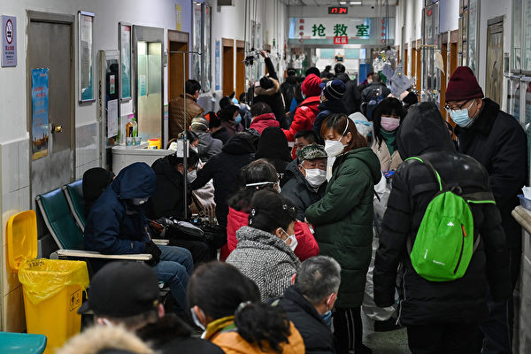

因中共隐瞒疫情，武汉肺炎（2019新型冠状病毒）疫情已蔓延全世界。(Hector RETAMAL/AFP)

【大纪元2020年03月02日讯】（大纪元记者古清儿报导）因中共隐瞒疫情，武汉肺炎（2019新型冠状病毒）疫情已蔓延全世界。近日，陆媒纷纷披露中共卫健委隐瞒疫情的内幕。

<b>《新京报》透露上海公共卫生中心的遭遇“惊心动魄”</b>

去年12月初武汉肺炎爆发，中共内部早知此次疫情的严重性。直至今年1月20日，中共工程院院士钟南山才在央视首次披露武汉肺炎“会人传人”，但此时疫情已失控。

陆媒《新京报》日前报导，全国新冠肺炎医疗救治专家组成员、复旦大学附属上海市公共卫生临床中心（下称：上海公共卫生中心）专家卢洪洲透露，上海公共卫生中心早在1月5日已向上级提交了正式的疫情报告。

卢洪洲表示，上海公共卫生中心还参与了早期武汉疫情防控，并紧急上报了相关报告。

卢洪洲透露，“过程我只能用‘惊心动魄’来形容”“报告是敲了我们单位正式的章，不是一个随随便便的报告，这就说明了我们的重视程度，包括后面的几个报告。但是非常遗憾，不该发生的事情还是发生了。”

关于所谓“惊心动魄”的细节，陆媒并没有透露更多内容。从外媒报导中，可见一斑。

香港《南华早报》2月28日报导，上海公共卫生中心和复旦大学公共卫生学院张永振主导的团队，早在1月5日分离完成了新冠病毒的基因组序列，但自1月3日以来，当局未公布病毒的危险性与人传人的警告，该实验室遂于11日公开了调查结果。

但在发布的次日（12日），上海公共卫生中心被上海市卫健委勒令关门整改。报导透露，该中心没有得到有关对实验室关门整改决定的任何解释，他们提交了4份报告，要求重新开放实验室，但未收到任何答复。

<b>财新网揭露湖北省卫健委及国家卫健委隐瞒疫情</b>

大陆财新网2月26日发表《独家：新冠病毒基因排序溯源：警报是何时拉响》的文章透露，早在去年12月底之前，已有至少9例不明肺炎武汉病例样本完成基因组测序，显示为“类SARS冠状病毒”，陆续上报卫健委和疾控中心。

但湖北省卫健委及国家卫健委分别在1月1日和1月3日要求销毁已有样本，还下令不得擅自对外透露讯息，从而错失防疫先机。

报导引述武汉市中心医院呼吸内科主任医师赵苏披露，该医院去年12月24日将首例华南海鲜市场的武汉肺炎患者样本送到第三方检测机构进行基因检测，27日，检测机构电话通知检测结果“是一种新的冠状病毒”，而当天就有研究者从一名早期病例样本获得接近完整的病毒基因组序列，并与医院及疾控部门沟通，但未得到回应。

一名承接武汉不明肺炎检测的基因测序公司人士透露，今年1月1日，他接到湖北省卫健委一位官员的电话，通知他，武汉如有新冠肺炎的病例样本送检，不能再检；已有的病例样本必须销毁，不能对外透露样本信息，不能对外发布相关论文和相关数据。

1月3日，中共国家卫健委发布通知称，针对近期武汉肺炎病例样本规定，各相关机构应按省级以上卫健行政部门的要求，向指定病原检测机构提供生物样本开展病原学检测，并做好交接手续；未经批准，不得擅自向其他机构和个人提供生物样本及其相关信息。有病毒学家透露，甚至中科院武汉病毒所都一度被要求停止病原检测，销毁已有样本。

该报导说，1月11日，停止更新多日的武汉卫健委通报首次将“不明原因病毒性肺炎”更名为“新型冠状病毒感染的肺炎”，称截至1月10日24时，初步诊断有新冠肺炎病例41例。同一天，湖北“两会”召开。至1月17日湖北“两会”结束，这个数字没有增加。

这篇报导目前已在大陆网上被删除。

<b>《财经》揭露湖北卫健委隐瞒疫情</b>

就在钟南山公布“人传人”之前，先后有两批专家组分别在2019年12月31日、2020年1月8日赴武汉调查，但两批专家均未明确公开提及病毒会“人传人”。1月4日，卫健委第一批专家组成员公开表示，“从目前看，未发现明显的人传人证据”；1月10日，又有第二批专家组成员对媒体表示，按病人病情及扩散情况，整体疫情“可防可控”。

第二批专家组的一位成员对陆媒《财经》说，“我们听说（医护感染）消息，就联系院方，因为不知道具体是哪个医生，联系完了人家不跟你说，不跟你说实话。我们也没办法，因为很明确是属地管理，我们接到的这个指示是地方为主，国家专家组帮忙、指导、辅助。”

“后来，湖北、武汉各自有自己的专家组，对病人的救治，主要由他们负责。我们主要的任务，一个是当时接待港澳台的代表团，另外一个是，我们去发热门诊了解情况。”

“当时我们讨论的时候，我们让他如实报。卫健委的领导当场就说了，他说，‘你们是不是怀疑我瞒报啊？’他公开反问我们，专家组的都在场。他都这么说了我们还能说什么？”上述成员说。

当时陪同专家组的人有当地医院的院长、医务处主任和湖北省卫健委的人。

上述成员说：“我们一直怀疑有人传人，但就是没有证据。”“没有告诉我们实情，从现在真实的情况看来，他（湖北卫健委）在说谎。”

报导还指，这个卫健委的人已经被免职了。

2月10日，张晋的湖北省卫健委党组书记职务被免；刘英姿的湖北省卫健委主任职务被免。

<b>钟南山为疾控中心推责 矛头指向卫健委</b>

而中共专家钟南山也公开为疾控中心推责，并把矛头指向卫健委。

2月27日，钟南山在广州市新闻发布会上透露，早在2019年12月31日，研究机构就已明确，疫情是一种新型冠状病毒导致的。2020年1月3日，病毒就已经成功分离出来；1月7日上报联合国。这些信息同步报给了地方CDC和国家CDC，CDC亦报给了卫健委。但在此后的十余天里，公众对疫情几乎一无所知。

钟南山称，在很多国家，CDC直接归属中央管辖，在特殊情况下，CDC可以直接向社会发布疫情信息。但在中国，疫情信息需要逐级上报。

2月27日，中共卫健委网站则发表文章称，“1月14日已召开全国电视会议，部署疫情防控工作”，似是回应钟南山。

武汉市委书记马国强1月31日对央视说，2019年12月30日至31日，武汉还有其它医院也发现病患，所以上报了中共卫健委。

<b>分析：问责之火或已烧到孙春兰</b>

5月将满70岁的孙春兰，中共政工干部出身，从工厂到妇联，再到工会，数十年“专注”群众团体工作。1990年代孙进入辽宁省委常委，再升任省委副书记，2001年接替薄熙来兼任大连市委书记；胡锦涛掌权时期她主掌全国总工会，2009年空降福建，成为封疆大吏；“十八大”后成为政治局委员主政天津，2014年接替落马的令计划，出任中央统战部长。“十九大”后她接替刘延东出任副总理，主管科、教、文、卫。孙也是中共在卫生健康领域的负责人。

2月6日，孙春兰带着中央指导组在湖北武汉指挥时候，放出狠话，“要以战时状态落实落细各项防控措施”，“战时状态决不能当逃兵，否则就会被永远钉在历史的耻辱柱上。”

时事评论员李林一说，中共各级卫健委开始成为众矢之的，国家卫健委也在其中，目前来看孙春兰难逃干系。这也解释了为何孙春兰当时在湖北如此气急败坏。

李林一认为，财新网、《新京报》、《财经》这些文章，看似在揭露中共，但是指向的层级仍然有限，应该是得到了最高层的允许。随着民间怒火越来越大，不排除孙春兰未来会被问责，甚至有更多的隐瞒疫情的内幕出现。

<a target="_blank" href=#top><h6 align="right">回上方</h6></a>

<a name=18>
<h1 align="center"><b>法轮功学员于永满在辽阳看守所离奇死亡</b></h1>

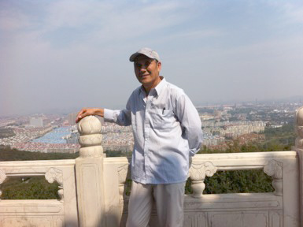

仅3个月，法轮功学员于永满在辽阳看守所离奇死亡（明慧网）

 
【大纪元2020年03月01日讯】辽宁省辽阳市65岁的法轮功学员于永满，2019年11月15日被中共绑架，非法关押在辽阳市看守所，仅3个月后，2020年2月23日，突然离世，看守所方面没有给出明确说法，只是说“突发疾病”。

明慧网报导，于永满本人生前身体很健康，被绑架之前每天都会骑车或步行出门向民众讲法轮功真相。现家属已要求尸检，调看看守所监控，并聘请律师为逝者讨一个公道。

于永满，原辽化炼油厂职工，1999年10月为法轮功进京上访，无辜被抓，1999年11月1日被辽化地区非法拘留一个月，1999年12月1日被非法劳教2年。在劳教期间，被强迫重体力劳动，剥夺人身自由，强迫精神洗脑。从劳教所出来后，于永满为躲避中共迫害，流离失所。

2004年2月25日晚，于永满在辽宁省营口市老边区姜家村发法轮功真相资料时，被营口老边区公安分局非法抓捕，关押在营口市看守所。

此后，于永满被非法判刑4年，关押于鞍山市监狱， 2007年12月被转入大连市监狱，原定于2008年3月10日出狱，但几位家属与朋友在监狱门外等待一天也未见人，最后得知他被劫持到辽阳市石嘴子教养院洗脑班。

2019年11月15日，于永满在一名法轮功学员家学习法轮功著作时，被中共警察非法闯入绑架。于永满被带至宏伟区工农派出所后，送到辽阳看守所非法关押。

此外，11月19日，辽阳市国保大队警察还闯进宏伟区法轮功学员刘英家中，将他绑架；随后又闯入邸邵群、熊辉家，把夫妇二人绑架，说是安装大锅收看新唐人电视，并非法抄家抢劫。

新唐人电视台是美国最大的独立中文电视频道，亦有英、法、西等多语种。其宗旨是促进中国“新闻自由”、向中国及世界提供不受中共官方审查过滤的信息报导，该台受到中共封锁和干扰，但在中国的观众仍可透过卫星天线和突破网络封锁收看直播。

在辽阳市看守所，于永满由被非法行政拘留转为非法刑拘，中共警察的说法是“家里有锅（接收新唐人电视台卫星锅）”。据悉，警察图谋让于永满指证刘英给邸少群安锅，收看新唐人电视，制造冤案。

此后，于永满、邸少群和刘英三人被警察分别构陷到检察院。

此前，宏伟区被迫害致死的法轮功学员还有许桂霞（刘英的妻子）、徐玉芝、林永夺。

报导说，从1999年7月20日至今，辽阳市宏伟区法轮功学员因坚持法轮大法“真善忍”的信仰，遭到当地政法委、六一零、公安、国安、国保等残酷迫害。这些所谓的“公务员”对不放弃法轮功修炼的学员采用各种卑鄙流氓手段，施以洗脑、劳教直至判刑，给法轮功学员本人、及其家属造成身心的极大伤害，给社会造成极坏的影响。

<a target="_blank" href=#top><h6 align="right">回上方</h6></a>

<a name=17>
<h1 align="center"><b>一线医生过劳死 河南宝丰24天无新增病例？</b></h1>

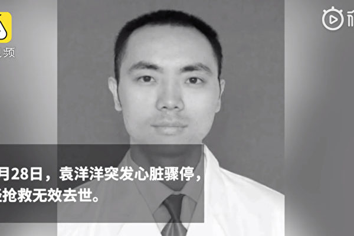

2月28日，河南宝丰县中医院新冠肺炎专家组副组长袁洋洋连续工作39天突发心脏骤停去世，年仅36岁。（视频截图）

【大纪元2020年03月01日讯】（大纪元记者梁义综合报导）大陆武汉肺炎疫情持续，不断有医务人员在疫情一线去世。河南宝丰县再有一线医生连续工作39天突然去世。然而讽刺的是，官媒刚报导了该县24天无新增确诊和疑似病例的“好消息”。

据大陆媒体报导，2月28日凌晨4时许，河南宝丰县中医院新冠肺炎医疗救治专家组副组长袁洋洋突发心脏骤停，经抢救无效去世，年仅36岁。

医院工作人员表示，袁洋洋此前已连续工作39天，家中还有2个年幼的孩子，目前相关事宜正在处理中。

就在同一天，据大陆媒体报导，广西贺州市一名卫生院副院长钟进杏，在防疫前线连续日夜工作33天，于2月28日过劳猝死。

而钟进杏年仅32岁，已婚且育有一名6岁的女儿。

针对接二连三有医生过劳死，旅美学者吴祚来在推特上留言：“确诊与治疗的人数应该非常大。这是河南宝丰一个县。”

也有推友质疑：“河南累计确诊1200多人，为什么大夫工作量这么大？”，微博上也纷纷质问：“为什么要让他工作那么长时间？”

讽刺的是，就在袁洋洋所在的河南宝丰县，人民网2月29日还报导了该县“三个清零”的消息。

报道称，2月28日，从宝丰县疫情防控指挥部传来“好消息”：“截至当天，该县唯一一例输入性确诊病例痊愈出院。这意味着，在连续24天无新增确诊和疑似病例的基础上，宝丰县实现了“三个清零”：即确诊患者全部治愈清零，所有疑似病例全部清零，所有密切接触者（包括医护人员）全部排除清零”。

今年1月28日，中共官媒新华网还报道了题为“河南宝丰：疫情防控 严把“关口”的图文报导。

然而袁洋洋作为“医院新冠肺炎医疗救治专家组副组长”，连续工作39天后过劳死，无异于打脸中共官媒的宣传。

值得注意的是，袁洋洋去世两后天，消息才在视频网站上最先曝光。

除了上述来自大陆医生界的悲剧。3月1日，武汉市中心医院发布公告称，该院甲状腺乳腺外科主任江学庆因感染新冠病毒肺炎，于3月1日凌晨在武汉市肺科医院去世，年仅55岁。之前去世的疫情“吹哨人”李文亮医生生前亦是该医院医生。

江学庆的同学也在微博上发文指，江学庆大概于1月17日出现新型冠状病毒肺炎症状，当天住院治疗。

<a target="_blank" href=#top><h6 align="right">回上方</h6></a>

<a name=16>
<h1 align="center"><b>世卫报告公布新冠患者14大典型症状和迹象</b></h1>

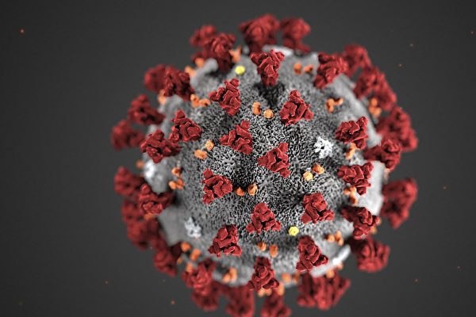

世卫日前公布中国新冠病毒调查报告，并总结了患者14个症状和迹象。图为新型冠状病毒示意图。(Lizabeth MENZIES4/CDC/AFP)

【大纪元2020年03月02日讯】（大纪元记者张婷报导）世界卫生组织（WHO）日前发布中国新冠病毒考察报告，总结了患者14个典型症状和迹象，并警告该病毒有极强传播力，需采取假设全球人口易感染来制定应对措施。

报告称，病毒来源尚未确定，关键信息尚缺乏，已发生疫情地区必须要考虑复发风险。

世卫发布的这份名为“世卫－中国2019年冠状病毒疾病联合专家组考察报告”（Report of the WHO-China Joint Mission on Coronavirus Disease 2019），长达40页。这份英文报告总结了2月16日至24日世卫在中国的考察结果。

<b>新冠病毒特点</b>

有关新冠病毒的特点，报告有多项发现，包括新型冠状病毒是一种“新的病原体（pathogen），具有高度传染性，能够快速传播，必须被认为在任何情况下都能够对健康，经济和社会产生巨大影响。

“它不是SARS，也不是流感，是一种具有自我特征的新病毒。”报告说。

报告还警告说，仅基于已知病原体来制定应对策略的风险在于，无法利用所有可能的措施来减缓新冠病毒的传播。人类尚无已知的免疫力。

报告还说，这个病毒在人类冠状病毒中独一无二。这是因为其具有高传播性，对某些高风险群体具有重大致命后果，并能够造成巨大的社会和经济破坏。

报告因此呼吁国际必须以假设全球人口均容易感染病毒来制定应对措施。目前病毒的来源仍不明确，先前受感染地区必须要考虑病毒复发的风险。

<b>患者的14个典型迹象和症状</b>

报告说，新型冠状病毒肺炎（也称武汉肺炎）的症状并非是特定的，从无症状严到严重肺炎和死亡。到2月20日为止，所搜集的共55924例实验室确诊病例中，发现患者14个典型迹象和症状，包括：

发烧（87.9%）

干咳（67.7% ）

疲劳（38.1%）

有痰（33.4%）

呼吸急促（18.6% ）

肌肉或关节痛（14.8%）

喉咙痛（13.9%）

头痛（13.6%）

发冷（11.4%）

恶心或呕吐（5%）

鼻塞（4.8％）

腹泻（3.7％）

咯血（0.9％）

结膜充血（0.8％）

<b>专家尚未掌握新冠病毒的关键信息</b>

报告指出，专家尚未掌握有关该病毒的关键信息，包括感染源、发病机理、毒性、可传染性、感染和患病的风险因素、监控、诊断、危重患者的临床管理以及防控措施的有效性。报告还说，及时获得这些信息对于加强疫病防控必不可少。

<b>病毒如何传播</b>

报告指出，在武汉发现的早期病例被认为是通过动物传染到人，因为许多人报告有华南海鲜市场暴露史。但截至2月25日，尚未证实病毒的动物来源。

报告说，在疫情早期的某个时点，部分病例间产生了人与人之间的传播，导致随后的社区疫情爆发。首先在湖北省武汉市扩散；再随着大规模人口流动，进一步扩大到湖北省和中国其他大部分地区。

报告说，在无防护下，病毒在亲密接触期间，通过飞沫和污染物在感染者和被感染者之间传播。尚没发现透过空气传播的报告。根据现有证据，空气传播被认为不会是病毒传播的主要推动力。

尽管患者粪便中有检验出新冠病毒，但这似乎并不是推动新冠病毒肺炎传播的一个驱动力。

至于谁会受到最大威胁？报告指出，罹患重症甚至死亡风险最高的族群是60岁以上，及患有高血压、糖尿病、心血管疾病、慢性呼吸道疾病和癌症等患者。儿童病例似乎很少且病情较轻。◇

<a target="_blank" href=#top><h6 align="right">回上方</h6></a>

<a name=15>
<h1 align="center"><b>中共吹捧“首例新冠患者双肺移植” 疑点重重</b></h1>

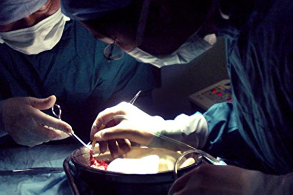

中共官媒日前高调报导“全球首例新冠肺炎病例双肺移植手术”。（大纪元）

 
 【大纪元2020年03月02日讯】（大纪元记者李净报导）在新型冠状病毒疫情持续蔓延之际，“中国肺移植手术第一人”陈静瑜再次成为中共官媒关注的焦点，其医疗团队日前进行了“全球首例新冠肺炎病例双肺移植手术”，而本次手术获得肺源时间之短令外界质疑。

据《北京青年报》报导，2月29日，在江苏省卫健委支持下，南医大无锡市人民医院副院长陈静瑜团队，对一新冠肺炎病例进行了双肺移植手术。

报导称，该新冠肺炎病例，男，59岁，1月23日发病，1月26日确诊为新冠肺炎，2月7日气管插管，2月22日使用ECMO，2月24日转至无锡市传染病医院。病人经气管插管+ECMO和药物治疗后，连续核酸检测呈阴性，但双肺功能已严重受损且不可逆。

这意味着，从该新冠肺炎病例转至无锡市传染病医院，到接受双肺移植手术，仅仅用了5天时间。

陈静瑜告诉媒体，称手术是在“江苏省市领导支持下”完成的。下一步，团队将做好移植后抗排异、抗感染后续治疗。

官方报导还特别提到，移植手术的肺源系“外地脑死亡患者爱心捐献”。

另据《北京日报》报导，本次双肺移植手术的活体肺源来自广西。两名医护人员乘坐东航MU5538航班，从桂林将肺源送达浙江大学医学院附属第一医院。

根据官媒报导，无论是当地政府还是民航系统，都为这次移植手术大开绿灯。

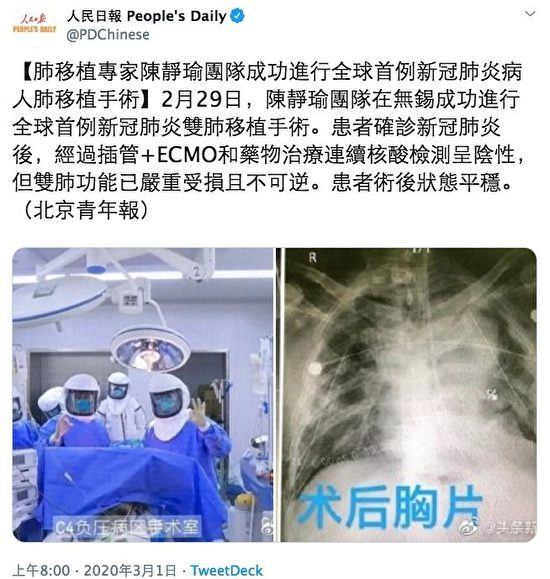

（网路截图）

目前，中共当局要求各地加强宣传疫情中的感人事迹，而这则“全球首例新冠患者双肺移植术”的官方消息，在网上也成为人们谈论的热点话题。以下摘选几则有代表性的网民评论：

“肺移植一般患者承担不起，肺源是最短缺的，有的患者等了10年了！有的没等到就去世了。一个死一个生，这个病人很幸运的在这么短的时间里就找到了合适的供体。”

“双肺已经完了，只能换肺才能正常生活，但是肺源是可遇不可求的，不是大家想的这么容易，除了配型相符的概率低之外，还得看钱，一个肺移植及术后用药，需要200万，不是一般家庭承受的起的。”

“这名患者得多大的背景，才能等到合适的双肺，很多人也是肺病，等不到就没了。我只想弱弱地问一句肺源和移植患者是谁？什么身份？方便说吗？”

“双肺功能已严重受损且不可逆，说明这名重症患者就算换肺，也无法解决根本问题，因为新冠病毒已扩散全身，除非该患者仅仅是普通肺炎患者而非宣传中的新冠病毒感染者。”

据大陆媒体报导，无锡市人民医院曾于2018年6月为剖宫产后的吴梦进行了心脏修补、双肺移植，手术费用花了100多万元。该院副院长陈静瑜为吴梦主持了这次手术。2019年4月1日，吴梦去世。

早在2015年10月5日，中共官媒曾高调报导，无锡市人民医院副院长陈静瑜的器官移植团队在机场遇阻事件，受到舆论关注。

大纪元记者当日从陈静瑜以往发布的微博中看到，该院器官移植所需的肺源几乎随要随到。据这名副院长透露，死囚供体取消后，现在比以前更忙了，三天做一台器官移植。

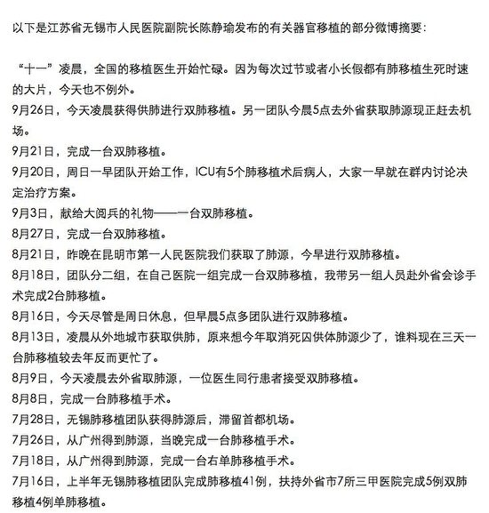

（网路截图）

根据公开资料显示，陈静瑜现任南京医科大学附属无锡人民医院副院长，同时还兼任胸外科主任、无锡市肺移植中心主任、中华器官移植学会委员等职。陈静瑜于2008年任中共人大代表，享受中共国务院特殊津贴。

无锡市人民医院是中国大陆一所三级甲等综合医院，该院拥有全国肺移植数据中心、江苏省器官移植重点实验室等省部级科研与培训场所。据该院的咨询信息显示，目前肺移植手术费用约50万～60万元（人民币），术后维持免疫药物约5万～8万元/年，术前评估费用约5千元左右。

2018年3月14日，《健康时报》发表题为《中国肺移植第一人：全国七成肺移植手术是他做的》的文章。文章称，陈静瑜推动建立了“人体捐献器官转运绿色通道”，其带领的团队进入全球三大“肺移植中心”。

从2002年9月28日做第一例肺移植起，据称中国七成肺移植手术都是他及其团队做的。2018年3月3日至7日，陈静瑜在中共两会期间“紧急”连续在北京做3台肺移植手术。

<b>陈静瑜等被列入国际追查名单</b>

近10余年来，海外患者流行到中国大陆去做器官移植手术，其特点是在大陆无需耗费等候器官的时间，所需配型的器官几乎随要随到。

HLA匹配度越高，移植的安全性越高，但HLA配型完全相符的概率非常低，仅为十万分之一，直系亲属之间HLA完全配型的概率是25%～50%；而一般非血缘关系人群中搜寻相匹配的供体的概率在千分之一到数万分之一。

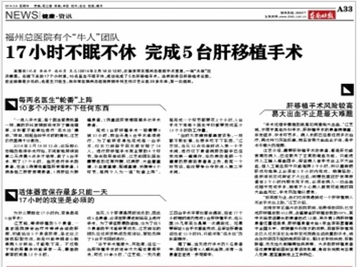

（网路截图）

上述大陆媒体看似平凡的报导，其背后器官的供体却来源不明，尤其能在极短时间找到这么多个合适器官。一个合理的推断就是，中共官方存在一个庞大的器官活人供体库，随时能摘取器官。

据追查迫害法轮功国际组织（简称追查国际）于2014年9月27日发表报告，公布第一批中国大陆超过800家医院涉嫌参与活体摘取法轮功学员器官的医务人员的追查名单。追查国际表示，将对中国大陆参与器官切取或移植的相关医务人员进行全面追查取证。

其中，上述报导提到的无锡市人民医院以及该院的医务人员陈静瑜、郑明峰、吴波等被列入追查名单中。

追查国际报告说，供体器官的获取是决定器官移植的数量与成败的关键环节。自2000年起，在大陆各省份大小不同的城市和乡镇中的规模各异的医院里，不约而同地出现了很大数量的供体器官切取现象；参与器官切取和器官移植的医院为数众多，甚至一些没有足够资质的小型医院、专科医院等都开始做人体器官移植。器官切取和移植迅猛增长的时间与中共对法轮功学员的群体灭绝性迫害的时间高度重合。

追查国际对全中国28省和4个直辖市200多家医院的300多篇论文进行分析，从器官切取过程、器官热缺血时间、供体健康状况等多方面，发现证据证明相当大比例的器官供体在被切取器官的时候是活体，大量被非法关押的法轮功学员很可能是提供移植器官的供体。

<a target="_blank" href=#top><h6 align="right">回上方</h6></a>

<a name=14>
<h1 align="center"><b>王赫：习近平何人可用？</b></h1>

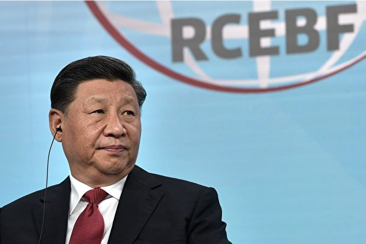

中共国家主席习近平。 (Alexey NIKOLSKY/SPUTNIK/AFP)

【大纪元2020年02月29日讯】人祸招致天灾，天灾因人祸而更甚。武汉肺炎瘟疫至今没有个头，连拐点何时而至都不清楚。虽然，能开17万人大会发表超万字演讲（2月23日），湖北省和武汉市的中共书记能一夜换人（2月13日），但是，仍掩盖不了习近平的真实处境——四面楚歌。

事到如今，习也算是孤家寡人了。举例说，2月10日下午，习近平到北京治疗新型肺炎患者的地坛医院视察，新华社刊发的照片显示，习所戴的医用外科口罩的金属条明显没有按压下去。习戴错口罩不算稀奇，稀奇的是竟然没人提醒。感染病毒可是要命的事情，这件事自然就引出一个问题：有人真心对习吗？

“习家军”是习上台后迅速组建起来的，突出体现在，中共19届政治局25名委员，新上任的15人中，绝大多数都是带有标签的习派人马，其中6人越级提拔，蔡奇更是“三级跳”。

但是，与习近平的集权速度相比，“习家军”的扩容确是相当迟缓的，以致捉襟见肘。这从习对涉港高层人事的调整可一窥端倪。

其一，骆惠宁本已到龄退休，2019年11月30日卸任中共山西省委书记，还无港澳工作经历，却突然于今年1月4日傍晚，新华社公布，出任香港中联办主任，并于2月13日兼任国务院港澳事务办公室副主任。

其二，曾与习共事的原中共浙江省委书记夏宝龙，退居二线，2018年3月以66岁的年龄出任全国政协副主席兼秘书长，又突然于今年2月13日，兼任国务院港澳事务办公室主任一职。

香港反送中民主运动让中共颜面丢尽，束手无策，只知一味野蛮镇压。习早就想修理涉港系统，却一限于中共内斗，二限于死不认错的传统，三限于人选难觅，所以一拖再拖，迟至此时。

问题是，以当权者的有利地位，为什么“习家军”没有迅速兵强马壮呢？这不太反常了吗？

根本原因是习的路走错了。

习一再声称，“既不走封闭僵化的老路，也不走改旗易帜的邪路”。这纯粹是自欺欺人。基于其邪恶本性，共产政权本身并没有自我改良的能力。在抛弃共产政权和死抱共产政权之间，没有第三条道路可选。

其实，共产政权的破产，习氏父子自身遭迫害的遭遇就足以说明了。习却仍受惑于共产政权的权力和自出生就被灌输的党文化，以及青少年时代形成的毛泽东情结和红卫兵烙印；置近代中国走向共和、肇立民国的艰难历程和历史性成就于不顾，反面理解苏东共产政权的解体，要扶中共大厦之即倾。

如果逆历史潮流而动，习又能有多少同路人呢？中共覆灭的现实性，在中共全党上下早已成为共识。所以，人们看到难以计数的资金流到国外（上世纪90年代中国就已成为世界十大资金输出国之一），裸官层出不穷，“满朝文武藏绿卡、半壁江山养红颜”。就是习的最大政治敌手——江、曾之流，也早已做好了“沉船计划”。就只有习还妄想“保党”而独立支撑，这不是愚蠢是什么？

更可悲的是，这个党内顽固派对习近平也不信任。这个党既要利用习来保它，又防着习。所以，习表面上是核心，大权在握；可中共却是寡头政治（如坊间流传着的“500个家庭控制着中国的命脉”之说），内斗从未消停，强烈掣肘着习的施政，习同样也是“政令出不了中南海”。

在这种情形中，时日不长、根基不深、实力不强的“习家军”，会对习忠心耿耿吗？中共各级官员都是人精，对这一切心知肚明，那么“习家军”还能迅速扩容吗？

中国人口众多，从来不缺乏人才，但中共却是个 “逆向淘汰”的 体制，即使拉拢各界名流入党给自己脸上贴光，但这些人实质上也只是个花瓶，根本进入不了核心，起不了多大作用。

而且，习上台以来，社会控制极端化，政治形势日益恶化，想走民主道路的人对习也颇为寒心，自然不会向习靠拢。

这样，中共政权就彻底腐烂了，腐败和无能成为中共官员阶层的两大标签。例如，在当前的瘟疫中，社交媒体上盛传一张网民制作的八骏图，历数了八位失职严重的政府官员，其中提到：一问三不唐志红， 准备不足邱丽新， 人不传人是高福， 物资充足王晓东； 等待授权周先旺， 深感内疚马国强， 可防可控王广发， 答非所问蒋超良。

习近平如果有人能用，那才是咄咄怪事。

<a target="_blank" href=#top><h6 align="right">回上方</h6></a>

<a name=13>
<h1 align="center"><b>武汉肺炎源头 中共欲诿过美国</b></h1>
 <h3 align="center"><b>钟南山疑开第一枪 五毛伪造信息瞄准美国开舆论战</b></h3>

2月27日，钟南山突然高调公开表示，武汉肺炎病毒源头“不一定是中国”。随后在中共专家及官媒煽风下，数百万网军“五毛”闻风而动，全面出击攻击美国。（STR/AFP via Getty Images）

 
【大纪元2020年03月02日讯】（大纪元记者吴雪儿、游沛然香港报导）中共党魁习近平在2月23日主持武汉肺炎防疫会议，强调控制舆论，以及“提高新闻舆论工作的有效性”。之后中共的宣传部门全面行动，直接开辟了第二战场──舆论战，目标瞄准美国。对此，美国也不示弱，成立专门机构，准备应付对抗升级。

中共国家卫健委高级别专家组组长钟南山2月27日公开表示，武汉肺炎新型冠状病毒源头“不一定是中国”，中共官方宣布立即禁止染疫国家人员进入大陆，而《环球时报》更嘲讽其它国家，如果出了个武汉，将束手无策。

中共专家和官媒放出风声，含沙射影，而数百万个网络舆论引导员（即“五毛”），则闻风而动，全面出击。

<b>五毛三大造谣信息</b>

中共网军最重要的攻击对象是美国。

网络上和社交媒体群中，成千上万的伪造信息蜂拥而出，包括美国的新型冠状肺炎疫情早已爆发，然后才传到大陆，传给大陆的方法也多到离奇，有称军运会传的，有用航太飞机空投到大陆，还有的说这种病毒是美国从火星上带回来的等，千奇百怪不一而足。这些网军目标清晰，大致要传达三个信息：

一是病毒原发自美国；

二是美国故意传给大陆，

三是美国疫情将大爆发，比大陆更为危险。

中共网军建军已久，而今次全面主动出击，很可能被美国视为“宣战”。2月27日，美国康奈尔大学法律博士章家敦（Gordon G. Chang），在出席美国“应对中共当前危险委员会”（Committee on the Present Danger : China）的会议上，直接了当提醒与会者说：“各位，我们已经在打仗，而我们的敌人就是中国（共）。”

他表示，从2月5日开始，可以看到中共及其外交部，就已经开始将大陆出现冠状病毒的责任推卸给美国做准备，“这是为造谣，为美国有意在中国释放这个病毒的说法打下理论上的基础。这是荒谬的、完全没有根据，不负责任而危险的，但重点是这种荒谬和危险的指控在告诉我们，习近平在抨击美国。”

章家敦认为，中共狗急跳墙，“抨击美国只是其中一招，同时我们看到在中国现在控制资讯的力度很大，这也是指向中共有很多事情是要隐瞒的。要记得习的英雄是毛泽东……”

他指出，在中共心目中，中美关系从来就是敌对的，《人民日报》曾刊登〈人民与美国之战”的文章，中共官媒也释出一个概念：“中国（共）有权用武力来摆平中美贸易争议。”

章家敦进一步列举更多的事件：2018年，中共用平地雷射，在吉布提（Djibouti）令两名美军C130机师暂时性失明，同时期，中共用音波攻击美国驻广州的领事馆人员，造成脑伤害。“我们不禁问，我们为何还要情系一个在伤害着美国的政权？！”

<b>美设剥夺国籍科“备战”</b>

2月26日，美国政府发表声明，宣布将成立一个专责处理剥夺美国国籍事务的“剥夺国籍科”（Denaturalization Section）。声明指，虽然司法部在处理剥夺国籍案件上，胜诉率达95%，但由于案件量不断上升，有需要分拆一个专责部门出来处理相关案件。

司法部指，剥夺国籍并没有时限（no statute of limitations），只要曾经违反《移民法》，就有机会被联邦政府剥夺美国国籍，而被联邦政府剥夺美国国籍的理由包括，隐瞒重大事实（concealment of a material fact）、故意作出虚假陈述（willful misrepresentation）等。

一位华盛顿消息人士告诉大纪元，美国正在为与中共对抗升级作准备。他说，华盛顿早有人在积极运作，并已长期游说美国政府，要关注在美国境内替中共做事的华人。他解释说，二战期间，美国因无法判断日本侨民和日裔美国人是否会协助日本帝国，因此把所有日本人关入集中营。但现在，美国境内有几百万的华裔和华人，如果不早做准备，未来美国将非常被动。

中国问题专家季达说，从章家敦的讲话，看到了美国的愤怒，在面对中共以整个国家的力度来造谣，美方似乎已经意识到与中共快接近决战的时刻。

2019年9月18日，武汉军运会前，中共曾在武汉天河机场举行了防范“新型冠状病毒扩散”演习。演习模拟机场口岸通道发现一例“新型冠状病毒”感染个案的处置全过程，并在两个小时后将“患者”确诊为“新型冠状病毒”病例。

有专家分析，武汉肺炎病毒可能早在2019年10月就已经出现。

目前，美国对一些国际组织，如联合国和世界卫生组织等都失去了信任。福克斯新闻频道老牌明星主持人鲁道博（Lou Dobb）于2月25日在电视节目上采访美国卫生及公共服务部部长阿札（Alex Azar）时，就直截了当地反映他对世卫组织的不信任。

正当阿札谈到世卫将就武汉考察发表报告时，鲁道博打断了阿札的讲话说：“我期望的是我们自己政府向我们汇报，老实说，我们不在乎世卫组织以及联合国玩的任何‘政治’，我需要知道我们政府掌握的情况。”

在美国，随着社会对疫情爆发的预期，一次性使用的口罩价格也在上升，虽然政府说在现阶段健康的人士不需要戴口罩，不过，消费者整体对医疗相关产品的需求在上升。一个月前，10个3M N95口罩卖18.20美元（约141.15港元），现在已经被炒高到99.99美元（约775.45港元）。

阿札表示，现时美国政府有3000万不同类型口罩的存货量，但提醒说，N95口罩一定要试戴好和测试过才使用，否则是无效的。他又表示，政府希望多生产3亿个N95口罩，但现在仍不知道什么时候执行。

美国医务总监亚当（Jerome M. Adams）则呼吁民众停止买口罩，因为可能会影响到医护人员的供应。他在推文上说，口罩不能有效防治公众感染新冠状病毒，但如果医护人员没能拿到这些物资来照顾病人，将会增加医护人员和社区感染的风险。

<a target="_blank" href=#top><h6 align="right">回上方</h6></a>

<a name=12>
<h1 align="center"><b>【一线采访】为GDP从未停工 武钢成重灾区</b></h1>

日前，武汉青山区病毒感染人数突然暴增，该区居民披露，中共为GDP增长，国企武钢集团一直在加班生产，由于人员的交叉感染，致使青山区成为瘟疫重灾区。图为2016年8月27日武钢工人在移动镕炉中的钢水。(Wang He/Getty Images)

【大纪元2020年03月02日讯】（大纪元记者易如采访报导）新冠肺炎从去年底开始在武汉爆发后，死亡人数不计其数。日前，武汉青山区病毒感染人数突然暴增，该区居民披露，中共为GDP增长，国企武钢公司一直在加班生产，由于人员的交叉感染，致使武钢所属青山区成为疫情重灾区。

“我父母他们还在武汉青山区，最近打电话说，青山区成了重灾区，疫情在当地开始爆发、传开了。”卓辉说。

卓辉（化名）是武汉青山区人，现在在外地从事教育工作。他2月28日对大纪元表示，他已有2年多没有回家乡，武汉新冠肺炎爆发后，他时常与在青山的父母和朋友电话联系，“有的朋友、熟人在重灾区，我平常打电话问他们情况，说那边情况很惨，很早的时候，就是封城的时候，几乎每天至少都要抬一个人出去，所以，死亡人数绝对不是他们（官方）说的那么一点点。”

卓辉说，他从父母处得知，青山区在刚开始的时候情况还比较好，“青山区是工业区，离市中心还有点远，人流（与市区）交往不太频繁，刚开始还不算重灾区，现在突然感染很多，就是这个病毒传开了，潜伏期爆发出来了。”

其实“（病毒）疫情还没爆发出来的时候，武钢职工医院都已经人满为患了”，卓辉说，“现在那更不得了。（各小区）被封闭起来，都不让上街买菜，都是配送。”

“现在有很多（人）在抱怨，送的东西没送到，或价格太高。现在也不知道（小区）要封闭多久，（隔离）14天也不管用，听说潜伏期还不确定有多长，他们（官方）疫情信息不公开，那这个问题就很严重，大家都不知道怎么防范。”卓辉说。

据资料，武汉钢铁有限公司（下称武钢公司）坐落在武汉东郊，是中国最大钢铁央企中国宝武钢铁集团有限公司的重要基地之一。资料还显示，2017年青山区常住人口54万人，而武钢公司就大约有20万武钢退休和在职工及其家属，超过整个武汉市青山区常住人口1/3多。

<b>为了GDP搞生产 青山区成瘟疫重灾区</b>

家住青山区的章杰（化名）2月22日告诉大纪元，青山区成瘟疫重灾区是因为国企武钢公司一直在生产，人员上下班交叉感染，“现在比较严重，这边钢厂从来就没有关停，控制不住。小区单元隔离，但是上班的可以出来，主要是生产人员，假如有人得病了，就把他周围的人都控制起来，所以，死了多少人，只有官方知道。”

2月21日，青山区钢花新村119小区的居民在微博发帖爆料：目前青山区钢花新村119社区新型冠状病毒确诊人数已达47人，密切接触者达40人，死亡人数8人，疫情非常严重，小区的居民都处于高度危险之中。

（网络）

23日晚，有住在118社区的居民跟贴说：我家118也是一样情况，确诊28，疑似9，还有很多密切接触者，死亡5人。

24日晚，又有该社区的居民跟贴说：2月23日，小区确诊49人，死亡9人，较昨日各增长1人。发热数据未知，密接情况未知，社区通告这是街道要求的表格。好多数据成谜了，我更慌了。

（网络）

居民的帖子发出几天都无人问津，2月25日下午2点再有居民表示：我也是119社区的，我们现在基本上都是在自救，社区人根本没有来过。更谈不上武汉市的三天的大普查，社区的人都没看到可见普查的是敷衍了事！现在大家都是怨声载道啊！另一居民表示，他的外公外婆被社区工作人员的不作为耽误，先后离世，“两条人命，不如指令！可怜的武汉百姓啊生命如蝼蚁。”

2月27日，网上传出的另一份青山区钢都花园126社区的情况显示：累计确诊人数已达59人，而且数字还在不断攀升。而在126社区群里有一则通知显示，有确诊病例的武钢职工曾乘坐通勤车上下班。

网路

而据大纪元早前获得的“钢花村”2月9日的疫情通告，包括110社区、111社区、114社区、116社区、117社区、118社区、119社区、120社区、121社区、景胜社区、南苑社区、北苑社区、青翠苑社区共13个社区数据统计，确诊数共计为155人，其中19死亡，疑似病共计为267人，发热共计122人，密切接触者共计430人。而据当地人士表示，这些疫情通告也是被瞒报后的数据统计。

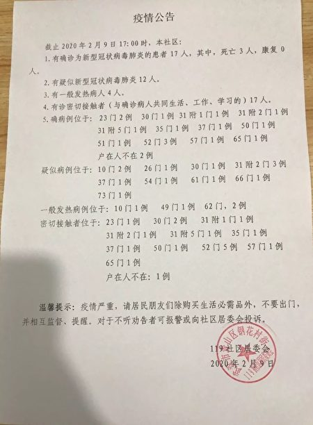

（网路图片）

据资料，青山区的“钢花村”和“钢都花园”是武钢职工的住宅小区，集中住有武钢职工及其家属、退休老人。截止2017年，这两个大社区内住有超过10万人。而通勤车是日常往返于青山各住宅小区与厂区之间的大巴士，46座，密闭不开窗，单程通勤时间普遍在半个小时以上。

大陆媒体《财新网》2月22日报导，目前正在武钢工作的在岗工人有六千余名。工人们反映，平日发放的口罩和消毒水数量不够，“上班就是赌博”，感染隐患让他们忐忑不安，“万一我在工作中被感染，回家是不是害了我全家？”。另外，公司未向基层员工通报过内部确诊人数。

报导说，截至2月14日，钢花新村、钢都花园以及周边的东方雅园、江南春城、八大家花园等每一个社区（街坊）都普遍有25个以上的确诊案例，是本次新冠肺炎的重灾区。自新冠肺炎大规模爆发以来，青山区在武汉市下辖13个市辖区中确诊新冠肺炎人数和死亡率排在前列。不过，2月21日，《长江日报》刊发的武汉新冠肺炎疫情防控指挥部的公告显示，青山区却排名第7位。

疫情期间，不但武钢这样的国企没有停产，近期中共为了保经济搞生产，称疫情“好转”，并下发文件要求各地迅速复工。

武钢职工韩江（化名）2月28日对大纪元表示，中共为了GDP搞生产，相信疫情不会好转，瘟疫还可能会再次爆发。

<a target="_blank" href=#top><h6 align="right">回上方</h6></a>

<a name=11>

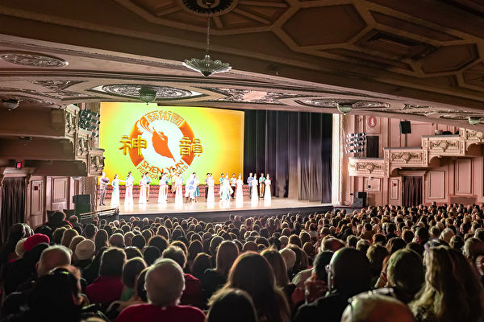

3月1日下午，神韵环球艺术团2020年在美国费城玛丽安剧院的最后一场演出再次爆满加座，在当地总共20场的演出也圆满落幕。（新唐人电视台）

 <h1 align="center"><b>神韵费城20场落幕 精英赞颂中国传统文化</b></h1>
 
 【大纪元2020年03月02日讯】（大纪元美国费城记者站报导）3月1日下午，神韵环球艺术团2020年在美国费城玛丽安剧院（Merriam Theater）的最后一场演出再次爆满加座，为今年在当地的20场演出划下完美句点。

神韵自2月12日在费城开演后，票房火热，常常一票难求，20场演出中有17场剧院都是满场，甚至需要临时加座以满足观众的需求。

神韵以舞蹈和音乐展示了辉煌灿烂的中华文化，震撼了费城主流精英，宾州众议员特地褒奖神韵，许多人表示，“神韵以美好的方式影响西方社会”，“感人至深”，“神韵将传统发扬光大”，“希望神韵在中国上演”。

<b>宾州众议员褒奖神韵 盼能在中国上演</b>

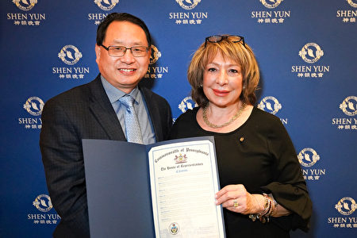

2020年3月1日下午，宾州众议员Maria Donatucci向神韵费城主办方－－大费城法轮大法学会颁发宾州众议院的褒奖，并观看神韵演出。（新唐人电视台）

 
 “我喜欢这个演出。非常美丽！我喜欢服饰、天幕背景，还有故事。我真是激动不已，太美了！”宾州众议员Maria Donatucci在费城玛丽安剧院为神韵费城主办方－－大费城法轮大法学会颁发褒奖，表彰神韵艺术团对宾州的艺术贡献，并观看演出。

“我喜欢舞蹈，也喜欢他们将演出与信仰相融合的方式，真的很好！我很高兴能来看这个演出。”Donatucci说。

神韵在全球五大洲150多个城市巡回演出，却不能在中国上演。对此，Donatucci说：“这让我感到悲哀，因为演出是如此美好，深具文化性。他们自己的国家不允许这样美好的演出，这真是令人遗憾。我希望他们在这里能实现他们的理想。”

演出中关于善良人遭迫害的故事让Donatucci内心深受触动，“我对监狱的部分感到非常沮丧，那是如此地压抑和令人不安。但我又很感动，我被舞蹈家的美丽和优雅所感动。”

神韵艺术家把“真、善、忍”的准则融入日常生活和艺术训练中，Donatucci很认同。她说：“我认为他们的舞动充满热忱，就像他们所信仰的那样。想想他们在这场演出中所做的所有不同的事情，真是太神奇了！确实是很美丽！”

神韵歌唱家的演唱也令Donatucci赞赏有加，“太精彩了！我也喜欢在他们演唱时展示给我们看的歌词，非常令人感动，非常富有灵性，非常神圣，太棒了！”

<b>公司副总裁：神韵以美好方式影响西方社会</b>
 
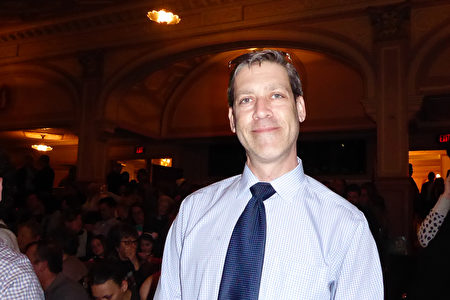

2020年3月1日下午，联合特许经营集团公司（United Franchise Group）的地区副总裁Eric Brewstein欣赏神韵环球艺术团在费城玛丽安剧院的第20场演出。（良克霖／大纪元）

 
 Eric Brewstein是联合特许经营集团公司（United Franchise Group）的地区副总裁。该公司经营许多连锁品牌，在全世界有1400多个加盟商。

“舞蹈、演员的配合、美丽的场景都很棒，很漂亮！”Brewstein欣赏神韵演出后连声赞叹。

“台上一分钟，台下十年功。”Brewstein表示，“艺术家的刻苦训练、奉献和团队合作精神非常具有教育意义。”

Brewstein表示，表现中国传统文化的神韵正以美好的方式影响着西方社会。他说：“我认为能够在海外公开弘扬中国传统历史文化真是太好了。（神韵）以最美丽的方式感染着我们。”

看神韵演出让Brewstein感受到艺术家的神性内涵，“当你静下心来享受演出时，看看演员身上的活力、韵律的节奏和振动，如果你没有感受到神性，没有感受到艺术家的投入，那么你就错过了很多东西。这些都是实实在在的。”

<b>神韵讲述故事尽在不言中 基金会主席感恩</b>
 
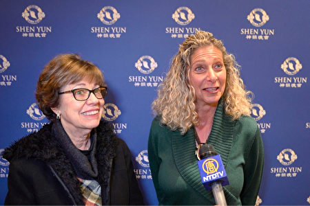

2020年3月1日下午，新泽西州的基金会主席Alesia Shute（右）和友人欣赏神韵环球艺术团在费城玛丽安剧院的最后一场演出。（新唐人电视台）

 
 “我明年会再来，一定再来！”新泽西州的基金会主席Alesia Shute观看神韵演出后表示，“他们没有说一句话，就讲述了整个故事”，让她“开心、放松”，带给她难忘的体验。

Shute热衷于慈善事业，她经营的Alesia Shute基金会旨在改善患者在住院期间的舒适性，她在自己的书籍《一切都好》（Everything’s Okay）中讲述了自己儿童时成功战胜癌症的经历。该基金会的捐赠及图书销售利润直接捐赠给费城儿童医院（CHOP）。

“女演员看上去那么美，相当优雅。她们都面带微笑，非常快乐，她们很喜欢自己做的事情。”Shute认为，看神韵演出是一种难得的体验，“演出美丽动人，展现了丰富的文化，我为中国人感到难过，他们无法做我们这里能够做的事情（信仰自由）。”

Shute也非常赞同神韵复兴传统文化的宗旨，“他们绝对应该做这件事情，我们谁都不愿失去自己的文化，他们绝对应该继续做下去。”

<b>信仰故事直触心灵 公司财务高管赞神韵激励人心</b>
 

2020年3月1日下午，医疗信息技术公司IMS Health的财务部高管Jim Ferguson携太太Tracy Ferguson欣赏神韵环球艺术团在费城玛丽安剧院的第二十场演出。（卫泳／大纪元）

 
 “非常激动人心，非常美！”医疗信息技术公司IMS Health的财务部高管Jim Ferguson观看神韵演出后连声赞叹道。

Ferguson说：“独唱很美，神韵歌唱家简直不可思议。整场演出美妙而感人，非常优秀。”“歌词中的信息也很好，让人谦卑，真是好的信息。”

神韵呈现的文化和精神内涵震撼人心，Ferguson感佩地说：“非常感动。比如那个（修炼者）眼睛（复明）的舞剧，真是太……真的触动了我，我很感动！（演出）触动人心，而且非常非常美，舞蹈太美了。”

<b>神韵弘扬传统 强生公司总监赞了不起</b>
 
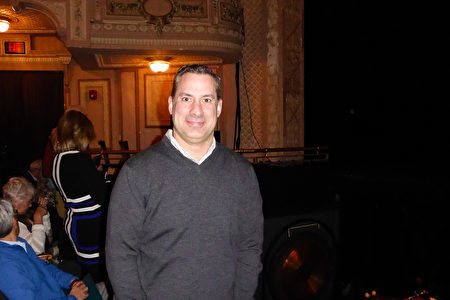

2020年3月1日下午，《财富》世界五百强之一的强生公司的供应流程总监Eric Watson欣赏神韵环球艺术团在费城玛丽安剧院的第二十场演出。（良克霖／大纪元）

 
 “演出在艺术手法上生动活泼，几乎一气呵成，很多承前启后的内容，都协调得整齐划一。”《财富》全球五百强之一的强生公司（Johnson & Johnson）供应流程总监Eric Watson为神韵精彩绝伦的艺术成就深深折服。

“从美学上来说，演出非常令人愉快，因为她的协调性很好。而且我喜欢背景天幕与演员之间的互动，演员在舞台和屏幕上进出自如，非常酷！”他说。

他赞佩神韵致力于复兴中国传统文化，“从历史的角度看，正如一切事物一样，想要传承那些传统和教训，必须有人承担起发扬光大的责任，我很高兴他们（神韵演员）在这里做这件事。了不起！”

最后Watson表示，神韵带给他意外的喜悦，“非常愉快，其实我自己都感到惊讶，我是如此地喜爱这场演出，超出预期。”

<a target="_blank" href=#top><h6 align="right">回上方</h6></a>

<a name=10>
<h1 align="center"><b>【拍案惊奇】多国感染人数暴增 北京弃瑞德西韦？</b></h1>

3.1网络峻法须知，北京放弃瑞德西韦？（新唐人、大纪元合成）

【大纪元2020年02月29日讯】大家好，欢迎收看《新闻拍案惊奇》，我是大宇。节目一开始，我们先来看一下，新病毒在世界范围内的扩散情况。

<b>全球多个国家暴增感染病例</b>

截至美东时间的2月28日下午，已经有至少56个国家，出现了新病毒的确诊病例。根据美国疾控中心设置的风险级别，最严重的是中国大陆和韩国，风险级别是“避免前往”。其中，韩国确诊人数已经超过2,300人，其中至少13人死亡。

其次是日本931例确诊，8人死亡；意大利888例确诊，21例死亡；伊朗388例确诊，34人死亡。这三个国家，被美国疾控中心列为旅行的“慎重考虑”级别。

但是，伊朗的真实疫情怀疑被当局隐瞒。英国BBC的波斯语频道28日引述伊朗医院内部的知情人消息报导，伊朗已经至少210人因感染新病毒而死，这个数字是官方三十几人的6倍还多。即便是官方公布的数字，伊朗也已经成为中国大陆以外，因感染而死的人数最多的国家。美国情报部门也对路透社说，伊朗政府对病毒的反应能力有限。

此外，香港被美国疾控中心列“小心前往”的风险等级，排在之前5个国家之后。香港已有94人确诊，2人死亡。

前面我们提到的6个国家和地区，中国大陆、韩国、日本、意大利、伊朗、香港，是目前世界上确诊者数目最多的前6个地方。其中排第6的香港的确诊数目是94例，与排第五的伊朗，官方数字388例，相比之下也是少很多。

在香港之后，依次还有新加坡93例，美国68例，法国57例，德国48例，科威特45例，泰国41例，巴林36例，台湾34例，等等。刚说的这几个国家，法国有2例死亡，台湾有1例。

28日出现首例确诊的国家，包括墨西哥和冰岛。

墨西哥是1名此前去过意大利的游客，称为该国首例确诊，也是继巴西之后的拉丁美洲第二例确诊。

冰岛的确诊案例是一名五十多岁男子，刚从意大利返回。

<b>美国防疫有漏洞 紧急补上</b>

在刚才提到的确诊病例比较多的国家中，也有美国。

美国的确诊多数来自日本钻石公主号撤下来的民众，加上其它病例，美国目前确诊总数是68例，没有死亡病例。

按地区来看，加州是最严重的，出现了33例，其次是内布拉斯加州13例，德州10例，华盛顿州5例，伊利诺伊州2例，亚利桑那州、威斯康星州还有麻州各1例。

加州的33个确诊病例中，有24人来自钻石公主号邮轮，有7个人有武汉的旅游史，1人是被配偶传染，还有1例比较受关注，是全美第一例“社区感染”，是一名女性。

这名社区感染者，既没有武汉的旅游史，也没接触过任何确诊病例，所以美国公共卫生局就怀疑，会不会有一名“无症状感染者”，正在不自觉的四处游走，散播病毒呢。

这名女性社区感染者受关注的还有另外一点，就是暴露了美国疾控中心的一个防疫漏洞，幸好已经被及时弥补。

这个漏洞是什么呢？这个女患者，现在住在加州大学戴维斯分校的医学中心。她在住院之初，因为感染源头不明，不符合美国疾控中心对新病毒检测的依据，因此没有进行新病毒的检测，直到住院一个多星期之后，才被确诊。目前这名确诊者症状严重，要插管治疗。

美国疾控中心因为此事，被批评反应僵化。但好在，在这名病人确诊后，美国疾控立刻在2月27日修改了对新病毒患者的检测依据。新的检测依据是：任何住院病人，只要出现发烧和严重的呼吸道病征，虽未能确认感染源头，在排除流感等其它疾病之后，就可以安排进行新病毒的测试。简而言之，前线医生发现疑似，就可以报给疾控中心进行检测。美国疾控中心的主任雷德菲尔德，也在27日的国会听证上，向议员们交代了疾控中心的措施改进。

从本周一，全球有29个国家出现确诊，到本周五，全球至少56个国家有确诊病例，短短5天翻了近一倍。并且在意大利、伊朗、韩国，出现中国大陆以外的大规模爆发。2月28日，世界卫生组织把新病毒瘟疫的风险级别，由之前的“高”，上调到“非常高”，这是一个全球性的风险级别。世卫说，这种调整主要是想让世界各国，提前了解，并做好准备。

世卫健康紧急项目执行主任Michael Ryan博士说：这个星球上的政府要清醒了，准备好，这种病毒可能正在路上，你们需要做好准备。

面对瘟疫，除了提醒防治，世界各国的专家也在研究新病毒的特质，以及研发抑制新病毒的药物。

<b>首例“尸体解剖报告”</b>

日前，中国大陆的《法医学杂志》，刊出了第一例感染新冠病毒死者的“尸体解剖报告”，这篇文章的作者是参与尸体解剖的主要人员之一、湖北省司法鉴定协会会长刘良。

此前，2月16日，大陆完成了第一例新病毒死者尸体解剖，当天又着手进行了第二例，全部在18小时内完成，刘良都参与其中。

报告发现，死者肺部损伤明显，炎性病变主要在左肺，肺部用手触摸，手感质韧，失去肺部原有的海绵感，等等。根据初步结果，报告给出一个共识：新病毒主要会引起深部气道和肺部损伤为特征的炎性反应。

此前我们有报导过，新病毒死者肺部分泌液体多，患者死时形同被水淹，而肺部纤维化没有SARS严重。这份报告重申了这个情况，但提到一点，就是死者从确诊到死亡仅仅15天，病程较短，可能是造成这一现象的原因，所以具体结论还有待更多的尸体检验。

刘良介绍，这种肺部黏液多的情况，需要用稀释或溶解的办法保持气道通畅，单纯用吸氧的办法，可能会起反作用，氧气可能会把黏液推得更深，加重患者缺氧。这种结论推翻了之前，包括钟南山在内的多名专家，在2月9日的一篇论文中的观点，就是把“吸氧”作为主要疗法。

<b>世卫推荐“瑞德西韦” 意大利治愈三人</b>

而对于治疗新病毒，世界卫生组织在中国考察之后，曾在2月24日于北京宣布一个重要的消息，就是：当前治疗新病毒感染者，只有一种药物真正具有疗效，那就是美国出品的“瑞德西韦”。并希望各国在治疗用药上优先取舍。

此前，美国第一例感染者，就是因为在静脉注射了这种药物之后，当天出现明显好转，随后痊愈出院。最近疫情爆发的意大利，该国媒体也在近日报导，罗马有三名患者，在使用瑞德西韦后，实现痊愈。

瑞德西韦本来是美国吉利德公司2013年研发的抗埃博拉药物，之前就发现，这种药物对治疗MERS和SARS有效用，今年拿来治疗新冠病毒，居然也出现奇效。

中国网友根据英文音译，把这个药称为“人民的希望”。因为这款药还处于试验阶段，此前没完成过临床试验。吉利德公司把这种药的成品赠送一些给了中国，2月初在中国就展开了临床试验，但是直到我们发稿时，2月底了，媒体也不见公开的相关报导，没有实质的临床试验进展。

不过，一个有趣的动作是，当世卫推荐瑞德西韦之后，大陆当局一度把世卫专家讲话的英文翻译版中，删除了相应推荐“瑞德西韦”的话，这个细节动作引起了人们的议论。

有一种观点是，根据此前一名武汉一线医生的揭露，至少在当时，对于入院确诊者，当局规定了一套治疗办法，其中把“中药环节”强行施加给每一名感染者，进行治疗。造成一些没有对症症状的患者，肝都吃出了问题。

究其原因，很可能是在防治之初，中共高层强调用中医治疗有关。

一篇源自大陆“国家中医药管理局”的文章显示，1月21日，该局开会，专门传达了习近平的重要指示，因此要研究中医药系统，落实相关的措施。当中提到，要“在国家卫健委同意领导下，坚持中西医结合，推动中医积极主动介入”。中医药管理局还提出了三项具体安排，一是推动形成中西医协同的防控机制，二是组织中医结合临床提出中医药诊疗方案，三是中医药及早介入，中西医结合救治重症和为重症患者。整个安排读下来，就给人一个感觉：先有政策，再有治疗对策。

中医是中国的宝贝，中共在历史上系统清理中国传统文化的时候，把中医的一些精华当成四旧给破了，包括很多现代医学不容易解释但却很有奇效的部分。现在留下的一些皮毛的东西，真正掌握精髓的人，可能很难找到。

如果说平日，恢复中医可以理解。在防治新病毒的这关键的时候，如果合理使用，还可以，但是强推中医疗法，把治理瘟疫政治化，这就难免招惹非议。

同时，对于病毒的传播途径，也有了新的认识。

<b>新病毒在物体表面能存活多久？如何传播？</b>

美国疾控中心27日提出，新病毒通常能在金属铜或钢的表面，存活约2个小时，但在纸板或塑胶上，存活的时间会更长。目前，美国疾控正对此做进一步的研究。

德国的《医院感染杂志》也报导说，科学家进行了22种研究，结果发现，在室温条件下，人类的病毒病原体，可以在塑料表面存活最多9天。不过，这项研究是基于SARS和MERS这种与新病毒一类的“冠状病毒”进行的研究，所以研究结果，只可用来参考。

德国科学家相关的研究结果还包括，冠状病毒在离开人体等宿主之后，在玻璃、木头、纸、铝等材质表面，能够继续存活4到5天，还可能更长。这些材质都是我们日常生活中常见的东西，这意味着，人们要对家庭环境进行及时的清洁，特别是疫区的人们。

此外，大陆浙江大学医学院附属的一个研究团队，2月26日在《医学病毒学杂志》上，发表了一项研究成果。

他们在1月26日到2月9日间，对浙大医学院附属第一医院确诊的30名新病毒感染者的眼泪和结膜分泌物混合物进行研究。最终发现，其中一名感染者的左眼出现结膜炎症状，警告左眼分泌物检测，发现其左眼的病毒检测呈阳性，而右眼却是阴性。

为了确认，他们对这名患者的两只眼睛先后进行了至少三次核酸检测，结果一样。最终这个研究团队得出结论：患者左眼结膜炎与新病毒有关，通过眼部传染新病毒的风险是存在的，呼吸道可能不是新病毒传播的唯一途径。

那么，除了新病毒在人际之间的传播，也会传染给人类饲养的宠物吗？前一天我们看到香港媒体报导，当地知名马主、富豪“周巧儿”确诊感染，她家的宠物狗通过口腔和鼻腔检测后，也发现呈现弱阳性反应，疑似感染。但是根据香港渔护署的最新消息，宠物狗可能只是因为与确诊病人同住，被宠物狗舌头舔的地方可能已经留有病毒，或者确诊病人抱着宠物狗时发生咳嗽，离狗只太近，造成狗沾上病毒，因此病毒只是存在于狗的口鼻处，因为没有在狗的肛门处验到病毒，说明病毒也没进消化系统。

所以香港渔护署当前的评估显示，从周巧儿的狗的口腔鼻腔验出病毒，不代表狗已经被感染或病毒侵入细胞。因为狗目前为止也没出现症状。根据世界动物卫生组织的资料，目前也没有除人类以外的哺乳动物，感染新冠病毒的病例。

<b>钟南山称病毒不一定是发源在中国 引热议</b>

现在对新病毒传播途径的研究，还包括这个病毒的根本来源。2月27日，中国大陆的呼吸病学专家钟南山，在广州的防疫记者会上说，疫情出现在中国，不一定是发源在中国。这一番话立即引来舆论热议，大多数人认为钟南山的这番话不着边际。

2月28日，上海复旦大学附属华山医院感染科主任“张文宏”，在接受中共官媒《中国日报》的采访时，直接了当用“No”，回应了钟南山的观点，他认为新病毒不是最早从外国传入。

张文宏说，中国只有武汉最先出现了这个新的传染病，如果是外面传进中国，应该是中国几个城市同时发病，而不是有时间先后。

钟老的观点引来很多质疑，其权威形象也受损。近日，有人挖出，钟南山自己拥有3家公司，其中一家名为“广州呼研所医药科技有限公司”，而包括钟南山在内的这家公司的高管，相互关联的公司有约90家。

而钟南山的儿子钟帷德，是广州市第一人民医院的教授，主任医师，也是享受大陆国务院特殊津贴的专家。他在最近接受外媒采访时，腰间昂贵的“爱马仕”皮带，成为网友们关注的热点。

说到这，我们能联想到大陆那些有背景的人群，他们即使在防疫这么严重的时期，也能享有特别的照顾。有关前几日武汉女子监狱服刑期满的黄姓女子，即便确诊了也能顺利离开武汉抵达北京，有了最新消息。其实1月23日武汉封城之后，有至少3个刑满出狱的人员，由法院特别向辖区的防疫指挥部申请了通行证，然后再由警车护送有关出狱人员，离开武汉。

能得到这种待遇的，包括那名黄女士，想必背景都不是一般的人。

不过，背景再不一般，那是在国内，在国外可不一定有特殊，比如，俄罗斯。

<b>俄罗斯防疫有效</b>

在本次瘟疫防治中，俄罗斯是比较成功的，至今只有两例确诊，还都是中国游客。他们早早就把新病毒称为对俄罗斯人的生物威胁，而且在2月中旬彻底禁止有中国国籍的人进入。而对于在俄罗斯境内的中国人，他们的遭遇，更是受到了海外媒体的注意。

《美国之音》2月28日报导，俄罗斯是世界上唯一一个，在瘟疫期间，把中国人挡在门外，但允许其他去过中国的外国人入境。

2月19日开始，莫斯科的公交系统，重点检查中国人，官方印制中俄双语表格，要被抓到的中国人填写。有的中国人因为出门倒垃圾，甚至是前往机场的途中，就被警察抓到隔离中心。不过也有中国人说，警察检查时的态度，还是比较客气和蔼的。

俄罗斯政府其实对北京当局也有不满。俄罗斯官方表示，他们得到了能够开发疫苗的新病毒株，但不是中国给的。2月初俄罗斯专家去中国访问，希望拿到第一手资料，但是中方不让俄罗斯人参观医院，也不让他们接触病人，并拒绝提供病毒株，在双方接触的时候，用的都是歌唱两国友谊的空话，这重复了俄罗斯在2003年的遭遇，当年的SARS病毒株，也不是中国给俄罗斯的，俄罗斯要，大陆当局不给，后来俄罗斯从德国和美国那里取得。这些事让俄罗斯对北京当局非常不满。

<b>北京启动互联网在中国局域网的根服务器</b>

节目最后，我们分享一个收到的消息，但我们对这个消息暂时没法独立查证，供观众参考。

大陆一家互联网软件公司的人发出消息说，2月29日开始，大陆当局会启动互联网在中国局域网的根服务器，对国内网络开始实行更严格的禁言，可能会搜索各个群组，查找敢言人士。这可能跟3月1日大陆的《网络信息内容生态治理规定》有关。

这份互联网新规包含了大量的内容，几乎涵盖了共产党不喜欢的所有网络内容和行为，还配套了惩治办法，甚至规定了互联网该宣导什么样的内容。

内容比较多，我们不一一说了，给大家放图片，大家自己看吧。我们举几个例子，例如这项《生态治理规定》的第五条，规定你不是宣传社会主义，就是要宣传讲品味讲格调、促进稳定的内容。

再来看第六条，这主要列举了你不许说的所谓“违法信息”，危害政权的内容首当其冲，但最后一条很有意思，这是一个可以无限加餐的条款，就是你也不能讲“法律、甚至是行政法规禁止的其它内容”，这就给今后政府规定的任何禁言法规，留了后门。

第七条，列举了“不良信息”，其中第三个会很抢眼：不当评述自然灾害、重大事故，也属于不良信息。

这套审查制度还会创造就业，就是专门负责跟进个人用户的注册、账号管理、信息发布审核、跟贴评论审核、版面页面生态管理、网络谣言等内容的专职人员。

还有一个重点，就是这套规定，有一个新的概念，叫做“重点环节”，什么是重点环节呢？大家看图片，也是很长，几乎涵盖了我们日常关注的重要网络内容，当局规定，对大家见到的这些“重点环节”，必须呈现“正能量”。

这一套新规定很长，细谈起来可能要一整期节目专门去讲。它至少是中国大陆，目前为止最严格的内容管理和审查制度。

另外，刚才提到的发出消息的人也提醒，建议2月29日以后，不要在微信号里留钱。因为一旦你成为受控对象，你在微信里的钱，有可能，会被冻结。

好，欢迎您订阅和分享我们的频道，在订阅的时候，不要忘了点击订阅按钮旁的小铃铛图案，在第一时间收到我们新节目上传的通知。也欢迎您加入我们的会员。有推特的朋友，也可以在推特上关注我，我的推特账号是@xwpajq。这期节目就到这里，感谢您的收看，下期再会！

新唐人《新闻拍案惊奇》制作组

<a target="_blank" href=#top><h6 align="right">回上方</h6></a>

<a name=9>
<h1 align="center"><b>武汉肺炎 八个故事揭示中共无能 危及世界</b></h1>

美国著名作家认为，从新型冠状病毒开始传播以来，中共不断变换说法，除了让中国人民付出惨痛生命代价外，也让世界在盲目的猜测中等待瘟疫降临。（图片来源：Feng Li/Getty Images）

 
 【大纪元2020年02月22日讯】（大纪元记者吴馨综合报导）新型冠状病毒疾病（新冠肺炎，武汉肺炎）在中国武汉爆发，并在全球蔓延。在中共处理疫情的过程中充满着谎言和编织的故事。而新冠病毒正在向人们展示相信谎言要付出生命的代价。

美国著名科学作家撰文揭示在武汉肺炎传播时，中共不断编织出的八个故事，正在导致一场危及全球的灾难。

劳里·加勒特（Laurie Garrett）是前美国外交关系委员会全球卫生高级研究员，也是曾获得普利策奖的科学作家。2月15日，《外交政策》（Foreign Policy）网站发表了她撰写的一篇文章。加勒特在文章中认为，从新型冠状病毒开始传播以来，中共不断变换说法，除了让中国人民付出惨痛生命代价外，也让世界在盲目的猜测中等待瘟疫降临。

加勒特指出，新冠状病毒的流行已经到了关键时刻。接下来中共领导人采取的措施对抵抗病毒的效果，以及病毒是否会在国际上传播，成为真正的全球大流行病都会产生影响。虽然世界卫生组织和世界各地科学家起初曾称认为和SARS相比，中共此次信息相对透明，但现在世界看到，中共其实一直在掩盖、说谎和压制，在不断失误的情况下，未能阻止病毒传播，反而煽风点火可能助长疫情。

文章写道，中共正面临着国际的指责和国内的动荡，其政权正面临着自六四以来最大的生存危机。

<b>中共不断编织故事 信任正在减弱</b>

加勒特表示，中共的政治危机正在促使全球关注中共政府所发布的疫情数据可靠性。自12月30日首次公布这一新病毒以来，出于国内政治目的，中共编织了一系列故事，让官方公布的病例和死亡人数与这些故事保持一致。与此同时，国际卫生界、学术统计人员和传染病分析人员，都试图从可疑的中共官方日常统计中，推断出冠状病毒对世界其它地区可能带来的危险程度。

这种故事编织有一条底线，那就是信任。加勒特指出，对中共政府的信任在中国国内似乎正在减弱，并且在世界公共卫生界也在日益瓦解。然而，除非政府和人民之间的信任纽带能够在抗疫的悲痛、混乱、激动和医疗挑战中幸存下来，否则就无法战胜这场瘟疫。中共政府在疏忽大意下破坏了这条纽带，这也许是无法弥补的。

以下是在武汉肺炎爆发以来，中共编织的六个谎言故事。

<b>第一个故事：当地海鲜市场传出病毒 不是非典</b>

在12月上旬至1月19日之间，来自武汉疾控中心的主要故事是，与武汉当地的海鲜市场有关的很少一部分人感染了一种新病毒 ，导致一些人因肺炎住院。不论疾病的起因是什么，该疾病不是非典，或类似非典的疾病。所有发布的数据都非常符合这个故事。于是任何像李文亮医生一样暗示事实的人都受到了压制。

在武汉工作的李文亮医生在12月30日通过社交媒体聊天室告诉同学，他在去年12月收治了貌似非典的病人。几天后，由于所谓的造谣罪，李医生和其他七名医生被带到公安局，被迫签署了一份承认“散播谣言”的文件。几天来，武汉当局一直试图遏制李文亮的声音，即使他因救治病人而感染了这种病毒，并被限制在重症监护病房内时同样如此。2月6日，这位曾经健壮的34岁医师去世，他的离世引发了空前的悲痛和愤怒，民众谴责政府掩盖。

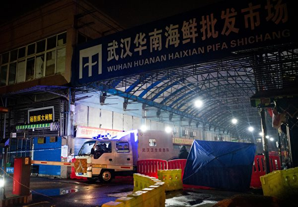

图为华南海鲜批发市场。 (NOEL CELIS / AFP via Getty Images)

<b>第二个故事：病毒不会人传人 疫情得到控制</b>

在除夕正式宣布新病毒后，第二个故事开始流行，该故事为关闭海鲜市场辩护，并称已有效阻止了病毒的传播，因为没有证据表明该病毒可以在人际传播。两个星期内官方病例数几乎没有变化，甚至减少到41例。而中共当局向中国人民传达的信息是：没有什么可担心的，当地警察和卫生官员已经阻止了一场疫情的爆发，工作做得很好。世卫组织接受了这个故事情节。

在这重要的两周中，对海鲜市场的积极控制可能已阻止那里的疫情爆发，然而新冠状病毒至少从12月中旬起就完全独立于海鲜市场而传播。在整个12月和1月初，武汉大约有一半的冠状病毒病例与海鲜市场无关，并且传播规模每周增加一倍。伦敦帝国理工学院的研究人员估计，到1月12日，武汉已有1,723人被感染。

随着国际社会的日益焦虑，中共控制疫情的故事受到怀疑，并且病毒人传人的证据变得不可否认，中共采取了释放信息的措施。

图为美国疾病与预防中心刊出的新型冠状病毒的示意图。（CDC网站）

<b>第三个故事：借鉴SARS应对手法 封城封路</b>

毫不奇怪，中共官方的故事突然有了变化，感染病例和死亡人数的统计也随之出现变化，到1月19日感染病例翻了四倍。新故事不再提及海鲜市场，武汉的领导人互相指责，并将先前的故事和1100万人口的城市大部分地区一道进行封锁。

但是随着中国新年假期的临近，以及对隔离的日益担忧，数以百万计的武汉人弃城而去，去了中国各地的村落和其它城市，许多人不知不觉中就携带了这种病毒。

中共政府借鉴其2003年的SARS剧本，将整个国家置于一系列封锁之下。武汉在物理上被封锁，同时由于持不同意见和批评的声音也将越来越多，所以在虚拟的世界里也被封锁。中共政府不鼓励中国新年旅行，假期在全国范围内延长，以尽量减少病毒在学校和工作场所的传播；在湖北省及周边地区，约有1亿人被鼓励待在自己的公寓和房屋中，以进行自我隔离。

香港大学的病毒学家管轶警告说，封锁策略可能会失败，而且肯定会爆发更大的疫情。他说：“保守估计，此次感染规模是SARS的10倍起跳。”也就是说，将有超过8,000死亡病例。

从科学上讲，封锁策略基于一个关键的假设：只有在病源发烧的情况下，病毒才能从一个人传播到另一个人。因此，中共在全国各地，沿高速公路、在大型建筑物的入口、在所有中转站都建立了体温检查站，甚至是在武汉以外数百英里的城市街道巡逻的警察也可进行体温检查。火车、飞机、公共汽车和高速公路被完全关闭。通过识别中国每一个发烧的人，并将其隔离，该病毒将不再传播，并很快结束疫情。

但是到2月3日，有证据表明，没有发烧，只有轻度感染冠状病毒的人也可以将病毒传播给其他人。一个人可能感染另外两个，甚至四个人。该病毒不仅可以通过咳嗽、唾液或鼻液传播，而且可以通过粪便传染。更糟糕的是，这种轻微症状具有传染性的潜伏期可能会非常长，达到24天。

突然，冠状病毒看起来并不像SARS了，SARS的潜伏期只有三天左右，并且只有发热病人才能感染他人。这种新病毒看起来更像是流感，可以通过握手或共享空间区域从无症状的个人传播到另一个人。但是即使那样，这样的类比还是失败了，因为很少有人会在感染流感后24小时以上毫无症状，更不用说24天了。

网上纷纷传出，中国救护车在大街上频频运尸的画面。图为2月13日的武汉街头。 （Stringer/Getty Images)

 <b>第四个故事：警察国家严控</b>

到1月下旬，武汉成了一个幽灵城镇，几乎看不见人或车辆，全城人口要么已离开这座城市，要么就被隔离在家。然而，该病毒仍在继续招致新的感染者。中共警告，病毒正在全国“加速蔓延”。由于封锁的故事被证明是容易犯错的，而且武汉以外的城市开始经历这种疾病的可怕蔓延，中共又转向了另一个熟悉的剧本：警察国家严控。

一夜之间，体操房、体育场馆、宾馆、大学宿舍、会展中心等大型设施被转化成拥有数千床位的隔离区，里面为上千人提供食品、盥洗用品、普通发烧检测用具。毫无疑问，这些地方不是医院，许多住在这些临时检疫设施中的人抱怨说，这里不提供感染检查，他们只是被集中起来，并被迫与数百名其他潜在感染者共享淋浴和卫生间等设施。

<b>第五个故事：指责美国政府</b>

随着焦虑的加剧，中共还提出了另一个故事：美国政府应该对中国困境负责。1月30日，世界卫生组织宣布该流行病成为国际关注的紧急公共卫生事件的同一天，美国国务卿迈克·蓬佩奥（Mike Pompeo）向美国人发布了旅行忠告，警告美国人不要访问中国。在2月的第一个星期，美国限制了航空公司、机场、中国移民、重返美国的旅客。中共开始指责美国对中国疫情过度反应。

到2月3日，中国全国各地的医院都报告称缺少检测试剂盒，从而大大减少了诊断和病例报告的数量。中共国家卫生委员会的医学专家和高级专家小组成员警告说：“早发现、早诊断、早隔离、早治疗，目前在武汉还做不到，希望全国支持武汉。”

<b>第六个故事：发动“人民战争”</b>

当天，中共中央政治局常委召开会议，提出新的故事：由于管理不善，疫情已失控。现在，中共将领导一场针对该病毒的“人民战争 ”，更加严厉地隔离检疫，并控制谣言。新的官方数据显示，鉴于80%的受害者年龄超过60岁，75%的人身体有其它疾病，而令人好奇的是，很少有儿童感染，而66%是男性，该疫情应该易于控制。

中共呼吁爱国主义，敦促人们查明患病的邻居，并把他们报告给当局。最后至少有一个城镇承诺有偿告发。识别出的人有时被强行从家中带走，并被安置在学校和体育设施中的临时现场医院。当国际专家质疑这种病毒是否可以被阻止时，北京投入了更多资源用于可疑病例的仓储和患者的住院治疗。

但是据报导，到2月5日，武汉殡仪馆和火葬场在处理死者尸体方面存在问题。尽管没有提供任何数据来解决此问题，但武汉的封锁不仅危及冠状病毒感染者的生命，而且危及数千名需要药物治疗和特殊治疗的患者生命，诸如艾滋病毒感染、肾脏疾病，糖尿病和高血压患者。但医院不再欢迎他们，药品用完了，也没有关于他们的数量或死亡数字统计。

在整个湖北，到2月的第一个周末，医院的床、呼吸器、氧气等设备用光了。随着越来越多的城市看到病例数猛增，他们遵循了武汉的封锁和隔离策略。2月14日，中共国家卫生委员会最终承认 COVID-19正在对医务人员造成伤害，称有1,716人在工作中被感染，6人死亡。

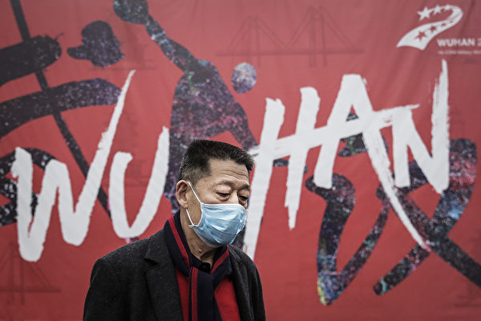

武汉肺炎疫情中，口罩等医疗物资被政府控制，老百姓被限购，很难买到口罩。 (Getty Images)

<b>第七个故事：疫情到顶峰 恢复生产</b>

2月9日，官方数字显示新病例报告的速度有所放缓，这种趋势一直持续到2月12日数字激增。在这三天的时间里，又出现了两个新的故事：首先，此次疫情已达到顶峰。其次，是中国该恢复生产、恢复经济的时候了。

但是在全国几乎找不到稳定的地方。中共地方领导人说，在中国受灾最严重的城市之一黄冈，该市每天只能测试900人。一项在全市范围内的搜索确定了13,000名发烧患者。根据中共疾病预防控制中心的数据，全国各地的死亡率各不相同，其中有4%的冠状病毒患者在武汉死亡，而5%的病例在天门证明是致命的。但是人们很难相信这些估计，因为没有人真正知道基数，即多少人被感染了，这或许意味着某些实验室漏检了一半。

2月10日，湖北省两名高级卫生官员落马，理由是该病毒可能使武汉市5%的人口患病。

<b>第八个故事：坚持认为疫情正在逐渐消退</b>

吴尊友（Wu Zunyou）是中国疾病预防控制中心的首席流行病学家，负责最终估算和计算冠状病毒流行病的死亡率。2月13日，他在与《美国医学协会杂志》（Journal of the American Medical Association）主编霍华德·巴赫纳（Howard Bauchner）谈话时维护着中共疫情数字的准确性。他承认诊断试剂短缺，并且可能难以用来确诊，但他坚持认为疫情正在逐渐消退。吴认为，随着更多的感染者进入潜伏期的后期，传播将会减慢，很明显，（按照吴的说法）中共的控制方法确实奏效了。

美国疾病控制与预防中心负责人罗伯特·雷德菲尔德（Robert Redfield）上周对 CNN表示，他远远没有那么乐观。雷德菲尔德说：“目前，我们处于积极的封锁模式中，我们对该病毒了解不多。这种病毒可能会在这个季节，这个年度过后来到我们中间，我认为最终该病毒将找到立足点，并将在我们的社区传播。”

不久前在日内瓦，约400名顶级传染病专家聚集在一起，帮助世卫组织解决围绕该病毒的许多谜团。其中之一是香港大学的梁卓伟（Gabriel Leung）教授，他认为中共的战略不会成功，并担心随着学校的重新开门，以及成千上万的人返回武汉，其它城市封锁，这种病毒可能会再次激增。而且它可能会传播到中国之外，可能会感染世界60%以上的人口。

即使冠状病毒疾病仅杀死了1%的受害者，但70亿人口中60%的人口中有1%的死亡人数也是惊人的（4200万人），这将冠状病毒与人类历史上三大流行病的死亡人数相当，即14世纪的瘟疫、1918年的大流感，以及目前的艾滋病毒。

最后，加勒特指出，不幸的是，中共正在展示所有这一切都可能出错，从而使危机成为一场灾难。中共为世界提供了大量数据，但是它们缺乏可信度，与中共的执政、审查、恐吓和奉承的方法密不可分。在不知道冠状病毒这个敌人真正能造成多大浩劫的情况下，世界其它地区只能进行预测和准备。

本文首发于《真相中国》周刊 2020.2月号/第32期

<a target="_blank" href=#top><h6 align="right">回上方</h6></a>

<a name=8>
<h1 align="center"><b>受疫情冲击 大陆签证龙头“百程旅行”破产</b></h1>

疫情冲击下，大陆有着“签证龙头”之称的百程国际旅游股份有限公司成为业内首家倒下的知名旅游企业。 (AFP via Getty Images)

【大纪元2020年03月01日讯】（大纪元记者周心鉴综合报导）疫情对旅游行业的冲击还在持续，有着“签证龙头”之称的百程国际旅游股份有限公司成为业内首家倒下的知名旅游企业。百程旅行29日宣布，关闭公司启动清算准备。

百程旅游总部设于北京，主要经营出境旅行在线零售、商务旅行服务，并在上海、广州、深圳、成都、沈阳、武汉设立六个分公司。

<b>资金无法维系 宣布关闭清算</b>

综合陆媒报导，百程旅行发布“关于公司决定关闭公司启动清算准备的通知”显示，鉴于新冠病毒疫情的爆发，旅游业受到了前所未有的打击，全行业处于停顿状态。百程也深受其影响，资金不能维持公司继续运转。为此，公司召开了股东大会，管理层做了汇报，股东会决定关闭公司并启动清算准备。

自新冠疫情爆发以来，大陆旅游业受到前所未有的重创，机票、车票、酒店等遭到大量退订，销售量急降。

<b>CEO：旅游需求几乎为零</b>

百程旅行网创始人兼CEO曾松表示，目前公司债务过高，在疫情影响下，旅游消费需求几乎为零，公司已经无法支撑，下一步将优先处理好员工的薪酬问题以及客户的退票问题，积极处理银行债务。

曾松还表示，暂时没有进一步的创业打算，始料未及的疫情对旅游行业产生了严重影响，不能确定下一步是否会有更多中小型旅游业公司支撑不住。

<b>阿里是第二大股东 曾投资过亿</b>

公开信息显示，成立于2000年的百程旅游，2014年3月获得阿里巴巴、宽带资本2,000万美元B轮投资。2015年7月，百程旅游完成由王亚伟旗下的千合资本领投，点睛资本、飞猪资本、博雅资本等投资机构跟投的2亿元融资。

根据百程旅游2018年中报披露的信息，阿里创投仍为公司第二大股东，持股16.47%。

天眼查显示，截至目前，杭州阿里仍为百程旅游股东，且近年百程旅游未发生过股权变更。

还有数据显示，自2015年至2018年上半年，百程旅游净利润均为亏损状态，并于去年7月18日在新三板终止挂牌。

<b>新冠疫情重创旅游业</b>

新冠肺炎疫情对旅游行业的冲击是整体性的。百程旅游启动清算的消息引起旅游行业人士的广泛关注。据了解，作为新型出境旅行服务机构，百程旅游曾同时与七十多家境外旅游局、全球五十多家航空公司、三十多万家境外酒店、五百多家境外合作商建立关系。

北京第二外国语学院教授王兴斌对《北京商报》表示，百程旅游有多年的经营历史，旅行社、出境游、签证等业务在业内也属于大体量级别，却也没能撑过这场行业“寒冬”。

“百程旅游是自旅游业全面停业以来第一家因资金状况停业的历史较久，且体量较大的公司，但也不会是最后一家。同时，百程旅游旗下较为出色的签证业务，也因出境游的停滞而暂停，成为压垮公司资金链的又一因素。”王兴斌说。

近日，中国旅游研究院召开“《中国旅游经济蓝皮书No.12》线上发布会”，公布对2020年旅游经济研判结果。报告称，受新冠肺炎疫情影响，2020年一季度及全年，中国国内旅游人次分别预计减少56%和15.5%，全年预计同比减少9.32亿人次。

<a target="_blank" href=#top><h6 align="right">回上方</h6></a>

<a name=7>
<h1 align="center"><b>【直播回放】川普白宫讲话谈新冠疫情发展</b></h1>

2月29日川普在白宫就新冠疫情发表讲话。 (Photo by Roberto SCHMIDT / AFP)

 
 【大纪元2020年03月01日讯】2月29日周六下午1点半（美东时间），美国总统川普（特朗普）在白宫举行新闻发布会，介绍新冠病毒疫情发展情况。

到目前为止，美国已经发现60多起新型冠状病毒肺炎（也称武汉肺炎）病例，其中4起为社区传播病例。分别是加州2例，俄勒冈州1例，华盛顿州1例。且华盛顿州一名新冠患者死亡，这是美国首例因感染病毒去世的病例。

川普在新闻会上表示，华盛顿州因感染新冠病毒死亡的病患大约50岁左右，属于医学上的高危病患。

川普周六早些时候从他的冠状病毒工作组获得简报后，讨论了最新的新型冠状病毒发展。

这是川普总统本周第二次举行罕见的白宫新闻发布会，并对记者发表讲话，这表明美国政府对这种冠状病毒的重视程度。

<b>彭斯宣布新的旅行限制</b>

美国总统川普任命副总统迈克·彭斯（Mike Pence）领导白宫新冠病毒工作组，应对行动、监测和控制疾病蔓延。彭斯周六上午在白宫战情室会见卫生与人类服务部负责人和疾病控制与预防中心负责人。

彭斯在新闻会上周六宣布了针对新冠病毒传播的新旅行限制，包括对来自伊朗旅行的更多限制。 他说，政府正在扩大现有旅行限制，在过去14天内访问过伊朗的任何外国国民将不允许入境。

彭斯说，美国政府将通过国务院将意大利和韩国旅行咨询意见提高到最高级别4级，建议美国人不要前往这些国家的特定地区。

彭斯说：“我们敦促美国人不要前往意大利和韩国受冠状病毒影响最严重的地区。”

卫生和公共服务部长亚历克斯·阿扎尔（Alex Azar）说，目标是减少受影响最严重地区的往返旅行，以试图控制病毒的传播。

本周二，CDC警告美国公民，新冠病毒在社区中传播不可避免，呼吁大家做好准备。CDC高级官员南希·梅森尼尔（Nancy Messonnier）表示，如果传播变得更加普遍，这可能意味着学校将停课，公司将强制进行远程办公，以及群众集会受限或推迟。

截至周六凌晨，美国共有66例冠状病毒病例，其中包括9名已康复患者和4例“推定”病例，这些病例在当地疾病检测中呈阳性，但有待疾病预防控制中心的确认。

川普白宫讲话谈新冠疫情发展网络收看方式：

大纪元新闻网：https://www.epochtimes.com/gb/nf1334917.htm

<a target="_blank" href=#top><h6 align="right">回上方</h6></a>

<a name=6>
<h1 align="center"><b>法轮功学员盼中国人知疫情真相保命</b></h1>

法轮功教人向善，呼吁制止中共对法轮功的迫害。图为香港法轮功学员2019年12月9日举行国际人权日大游行，高举“普世价值真善忍洪扬世界”巨型横幅。（李逸／大纪元，资料照）

 
【大纪元2020年03月01日讯】（大纪元记者张原彰报导）综合各方消息，武汉肺炎疫情在中国无法得到良好管控，使得许多中国人处在较高的染病风险中。外界观察，中共又想藉由进一步地封网企图隐瞒疫情。有法轮功学员透露，很多中国人正急切地想找到关于疫情的真相，法轮功学员正持续帮助他们，“法轮功学员想救中国人的命。”

武汉肺炎疫情正在中国全境肆虐，许多疫区的中国民众正在遭受生离死别的苦痛。台湾法轮功人权律师团发言人朱婉琪表示，在这危难时期，中国民众得从中共的谎言里觉醒。在疫情爆发初期，很多人过度相信中共的防疫能力而延误治疗，也有很多患者没有得到适当的医疗救治，这让武汉肺炎在中国有较高的致死率。

“在中国，封城不可怕，可怕的是封闭网路。”朱婉琪表示，中共想继续隐瞒疫情，让更多人无法知道疫情真相，这会让人们以为不必防疫，“中共不对民众采取更高的防护，反而是继续隐瞒，这只会造成对全人类的灾害。”

“我觉得现在的中国人，被中共逼迫得没有出路了。”朱婉琪表示，现在的复工是中共为了稳定政权，未来隐瞒疫情的状况只会更严重，中共是想拿中国人的命换取金钱跟时间，“很多人觉得，中共是想跟中国人同归于尽。”

<b>法轮功学员：收到很多来自中国的求救信</b>

朱婉琪透露，很多在海外的法轮功学员近期收到许多来自中国的求救讯息。中国民众想向法轮功学员寻求保命的方法跟管道，“有中国民众反映，当听到法轮功学员所讲的真相时，心中表示非常的感激。”

“很多人知道，法轮功团体能真正戳破中共的谎言。”朱婉琪表示，多年来，全球法轮功学员积极提供管道，让中国人认识中共政权的邪恶本质，“很多中国人非常相信法轮功学员跟法轮功学员办的媒体。”

朱婉琪表示，很多中国人透露，他们现在更清醒地认识了中共政权，知道在疫情爆发时，中共无法保护民众，且中国缺乏病床跟防疫物资，甚至讯息都被封锁，这让他们连自保都没有办法。

<b>法轮功学员：知道真相可度过难关</b>

“法轮功学员想救中国人的命。”朱婉琪说，法轮功学员正在持续告诉中国人关于这场疫情的真相，因为中国人只有知道这些，才可以找到正确的保命方式，尽力保全自己珍惜的事物。

“法轮功学员非常的急切，希望更多中国人知道‘真相是得救的希望’。”朱婉琪表示，“法轮功学员们希望让中华民族可以度过这场瘟疫，让全世界都知道，看待中共政权必须有更高的标准，不能轻易相信他们说的话。”

朱婉琪表示，法轮功学员深切地知道，保持心中的善良会是人们得救的基础。在历史上，很多具有无私无我情操的人们，在绝境中发生奇迹，度过了许多困难。

朱婉琪表示，对于还在参与迫害人权的恶人，法轮功学员希望劝他们回头是岸，“尤其是，中共的领导人应尽速停止对法轮功学员的迫害、释放遭到非法关押的法轮功学员，让他们可以继续讲清真相，协助更多的中国民众度过难关。”◇

<a target="_blank" href=#top><h6 align="right">回上方</h6></a>

<a name=5>
<h1 align="center"><b>单日新增813例 韩国武汉肺炎升至3150例</b></h1>

截至当地时间2月29日上午，韩国迄今共感染2931例武汉肺炎。 (STR/AFP via Getty Images)

【大纪元2020年02月29日讯】（大纪元记者张智综合报导）韩国疾控中心（KCDC）今天（29日）通报该国新冠病毒（COVID-19，又称武汉肺炎）最新疫情，单日新增确诊病例813宗，累计确诊增至3150例。死亡人数增至17人。同日亦出现首个治愈后再次染病的病例。

韩国疾控中心（KCDC）在今天通报说，截至上午9时，新增594例确诊病例，其中大邱市476例、庆尚北道60例。下午再通报新增219个确诊病例，其中大邱市181例、庆尚北道19例。全日共增加813例，再创新高。

韩联社报导，韩国今天亦首次出现治愈的病患再次被确诊感染病毒个案，患者为京畿道始兴市的一名73岁女性。她在本月稍早确诊感染病毒，22日治愈后出院，27日又出现不适症状，28日再次被确诊。

到目前为止，韩国已有17名病毒感染者死亡。最新的一名是77岁男子，他于周二（25日）确诊感染病毒，于周六上午在大邱市北区的庆北大学医院不治身亡。他患有糖尿病和其他潜在疾病。

而在28日大邱市出现3个死亡病例，使当日韩国境内死亡病例增至16例。

报导指，28日新增的第14宗死亡病例是一名70岁女性，27日接受检测回家后，病情突然恶化被送往院后不治身亡，死后被确诊感染新冠病毒。第15例死亡病例为94岁女性，23日确诊后入住大邱医疗院，27日死亡。第16例死亡病例为一名63岁女性，27日死亡后被确诊感染病毒。防疫部门正在调查这些死者的具体死因。

目前韩国确诊患者仍集中在大邱市与庆尚北道，两地累计确诊人数从28日的1988例增至29日上午9时累计的2524例。

<b>新天地教会有3381人出现感染症状</b>

韩国卫生当局今天表示，他们已经对韩国新冠病毒爆发中心的新天地教会成员进行了调查，到目前为止，已检查88%成员，其中约2%的人出现新型冠状病毒的症状。

根据韩国疾控中心（KCDC）的数据，在该国大约有21万名新天地教会信徒当中，有17.1万人回答了有关其健康的问题。

韩国当局说，已收集3,381名教会成员的样本，这些样本显示出感染新冠病毒的症状，仍在等待筛检结果。不过，该调查排除了下落不明的863名成员以及16,000名未成年人。

大邱是韩国第四大城市，拥有250万人口，在当局对新天地教会进行全面调查后确诊病例急剧增加。

目前大邱是韩国新冠病毒爆发的中心，感染者已超过2,000人，占全国病例总数的70%以上。

KCDC还表示，还在努力联系65,000名未注册为新天地教会正式信徒者，他们也具有感染风险。

韩国中央灾难安全对策本部第一总括协调官金刚立在今天的记者会上表示，新天地大邱教会信徒确诊感染新冠病毒的比例极高，预计大邱地区确诊病例今后几日内将会持续增加。

金刚立表示，前往筛查诊所接受检测的大邱市民被确诊感染的比例远远低于新天地教会的信徒。

<a target="_blank" href=#top><h6 align="right">回上方</h6></a>

<a name=4>
<h1 align="center"><b>疫情后首份调查报告 中国经济比想像中糟糕</b></h1>

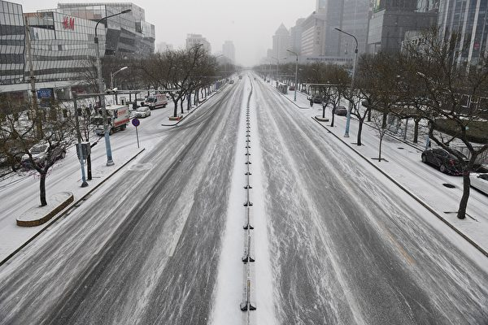

著名的中国经济分析公司近日公布新冠疫情爆发后的第一份调查报告，分析师认为，中国的情况比媒体报导的还要糟糕。图为2月5日空荡荡的北京街景。(GREG BAKER / AFP)

【大纪元2020年03月01日讯】（大纪元记者吴英综合报导）著名的中国经济分析公司近日公布新冠疫情爆发后的第一份调查报告，分析师认为，中国的情况比媒体报导的还要糟糕。

<b>最可怕的不是短期的经济损失</b>

上个星期，受新冠病毒（COVID-19）疫情影响，全球股市经历2008年金融危机以来最糟糕的一周。美国财经杂志《霸荣》（BARRON’S）2月28日报导，新冠病毒疫情对中国经济的冲击，最可怕的不是短期的经济损失，而是对供应链的长期破坏。

中国汽车制造商和化工厂的关闭数量超过其它行业。相比之下，闲置的科技（IT）工厂虽然较少，不过大多数IT员工还没有回到公司上班。航运和物流公司的停业率也高于全国平均水平。

未来几个月，全球汽车零部件、电子产品和医药供应链将感受到这种严重破坏的连锁反应。然而，市场更应担心的是到目前为止，新冠病毒对经济冲击的实际程度，可能难以估计。

<b>至少三成中国企业仍未复工</b>

“中国褐皮书”（China Beige Book）于2月份完成对1,400多家中国企业的调查，并发布今年第一季度中国经济初步分析报告。

根据该公司的调查，大多数中国企业仍处于部分隔离状态，31%的首席执行官表示他们的公司仍然暂停运营，至于已复工的公司中，32%是让员工在家工作，7%公司的员工在工作地点等待复工。换句话说，仅1/3的中国企业完全复工。

<b>调查七年来首次所有指数“自由落体下降”</b>

值得注意的是，“中国褐皮书”这份最新调查，是七年来首次出现所有数据都呈现负值，收入、利润、订单和生产都是“自由落体下降”。大约40%的公司销售额下降了10%以上，每个主要的经济部门都处于收缩状态。68%的高管将第一季度营收惨状，归罪于新冠病毒。

根据该调查所得的早期数据显示，中国经济正在艰难地起步，这场流行病已重击中国的主要行业，将导致第一季度GDP的收缩，尽管中共官方数据可能永远不会承认这一点。

定期调查数千家中国公司以评估中国商业状况的“中国褐皮书”，所做的经济分析报告被认为是比引述中共官方数据的媒体报导，更详细且接近事实。

<b>“中国褐皮书”首席执行官：中国局势比媒体报导更严重</b>

该分析公司的首席执行官莱兰德·米勒（Leland Miller）在接受美国财经网站市场观察（MarketWatch）访问时说：“（中国）当地的局势比媒体所报导的要严重得多。”

米勒说，“中国褐皮书”于2012年开始搜集中国经济数据，这次调查获得的早期数据是首次见到整体指数都转为负数，几乎所有主要指标都处于收缩状态。

<b>观察中国经济最重要指标：房地产</b>

他认为，观察中国经济最重要的数据是房地产行业，因为这是北京政府最后一道防线。在这种时候，股市及债券市场都令投资人恐惧，拥有大量财富的中国投资人，因中共管制外汇，只能选择比较不可怕的房地产。中共政府向来知道作为家庭财富储备的重要性，这表明他们更加担心中小企业的破产，房地产开发商是最后被允许倒闭的行业。

根据该公司的调查，米勒认为比较正面的数据是工作增长数字仅略为收缩。这意味着虽然中国经济可能面临长期萎缩风险，但企业目前并没有解雇员工，虽然他们支付员工薪水，没有现金流，也没有客户。由于企业还没有裁员，因此中共尚未提出巨额的刺激计划。

<b>中共最担心的事：数百万家中企拖欠债务</b>

米勒认为，对中共当局来说，现在最大的担心是，在没有现金流的情况下，可能会有数百万家公司拖欠债务，那将是“一场灾难”，因为如果中企大规模裁员是中共政权绝对不乐见的事。人们希望看到中共当局采取一些财政和货币政策应对经济困境，中共控制着所有的交易，可以命令银行只向国营实体提供贷款，可以命令这些银行做任何中共想要的事，甚至是根本不允许银行借贷。

<b>专家：中共所有报告都是政治性的</b>

对于投资人如何解读中共的数据或官方报告，米勒说，北京发布的数据或报告，无论是经济报告还是医学报告，都是“政治性的”报告，都不能信以为真。“掌握真相并非易事，而真相通常介于过于乐观的华尔街银行的报告以及金融人士的推文（可能又太危言耸听了）之间。”他说。

<a target="_blank" href=#top><h6 align="right">回上方</h6></a>

<a name=3>
<h1 align="center"><b>【独家】辽宁卫健委下令销毁新冠疫情文件</b></h1>

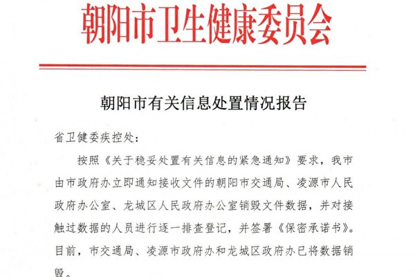

朝阳市卫健委按照省健委的要求，要求传递新冠肺炎的相关政府工作人员销毁内部材料，并保证不外泄。（知情者提供/大纪元）

【大纪元2020年02月29日讯】（大纪元记者张顿报导）武汉肺炎在全国蔓延，全国感染人数成了中共的一个最大秘密，各地纷纷掩盖疫情真相。日前，大纪元获悉辽宁省卫健委下令要求朝阳市卫健委相关人员销毁新冠肺炎疫情的内部文件。

大纪元获得一份朝阳市卫健委2月23日发给辽宁省卫健委的机密文件，文件说的是朝阳市卫健委按照省卫健委要求，要求朝阳市交通局、凌源市政府办公室、北票市政府办公室、龙城区政府办公室、双塔区政府办公室、喀喇沁左翼蒙古族自治县政府办公室、建平县政府办公室等相关人员，在传递有关新冠肺炎信息时，都已签署《保密承诺书》。

 

辽宁省卫健委要求朝阳市销毁内部文件的接收单位列表。（大纪元）

 
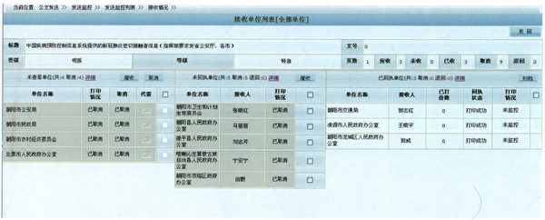

辽宁省卫健委要求朝阳市销毁内部文件的接收单位列表。（大纪元）

 
 文件称，目前，朝阳市交通局、凌源市政府办公室、龙城区政府办公室，已经销毁了相关数据。

文件的附录部分还包括13份签名的《保密承诺书》，承诺书内容都是一样的，只是签署人不同而已。

该承诺书说，对于2月21日发送的保密数据，他们本人承诺：

一，立即销毁保留在电脑、U盘、手机等储存设备里的数据文件，以及拍摄的照片、记录的文字等信息。

二，绝不以任何原因、任何方式复制、使用或向其他人发送上述数据资料。

三，除法律规定的形式外，不得向其它机构和个人泄漏此信息。

如有违反上述内容的，其本人将承担相应的法律责任和一切后果。

 

朝阳市相关政府人员签署有关新冠疫情的保密承诺书。（大纪元）

 
 朝阳市下辖：双塔区、龙城区2个市辖区，北票市、凌源市2个县级市，朝阳县、建平县2个县，喀喇沁左翼蒙古族自治县。

大纪元记者查阅2月21日辽宁省、朝阳市的有关新闻发现，当天辽宁卫健委宣称，2月21日0至24时，辽宁省无新增新冠病毒肺炎（也称，武汉肺炎）确诊病例。官方通报数据显示，朝阳市有6例确诊病例，无死亡病例。

 

遼寧朝陽市衛健委按照省衛健委的要求，匯報銷毀新冠肺炎內部材料的情況。（大紀元）

 
 大紀元記者目前尚未查知遼寧省衛健委要求保密的是何事。但中共掩蓋疫情，向外界通報虛假數據的作法，已被大紀元此前的獨家報導證實。
 
<b>山東省衛健委瞞報確診病例</b>

大紀元近日獲得十多份山東省疾控中心病毒所上報給山東省衛健委疾控處的「全省新型冠狀病毒感染的肺炎檢測信息統計日報表」。該報表顯示，內部上報的「當日檢測標本陽性數」——即確診病例，是官方發布的新增確診病例的數倍，甚至數十倍。

其中的2月20日上報統計表顯示，該省2月19日有49例確診病例，但官方僅僅通報有2例。

2月21日上報統計表顯示，該省2月20日確診273例，但官方通報了202例，其中任城監獄就有200例群集性感染，有高達71例確診病例未通報。

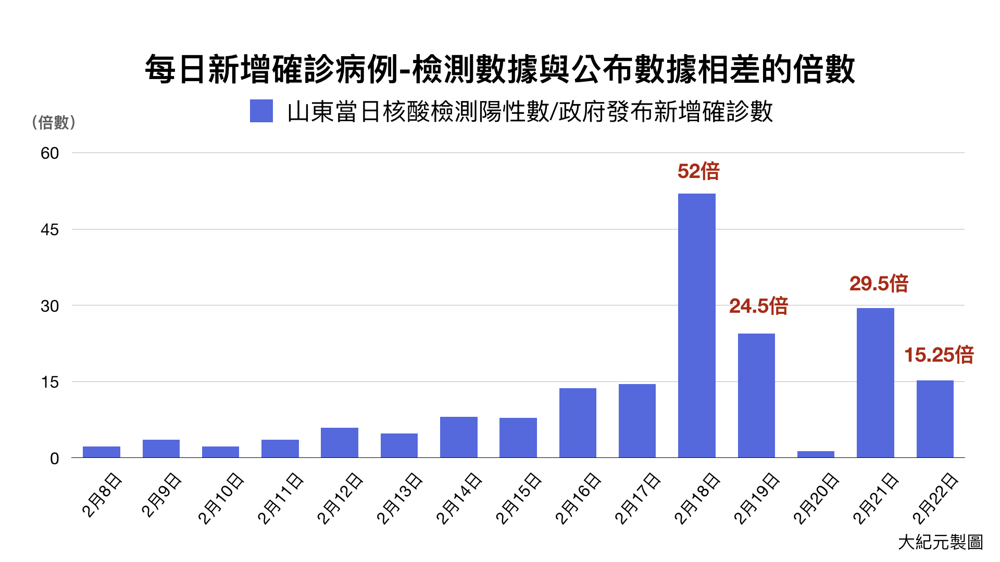

山東每日新增確診病例與公佈數據相差的倍數。（大紀元）

 
 <b>全國少報病例至少10多倍</b>

而該次疫情的重災區武漢，更是一直掩蓋疫情真相，僅官方的數據，就先後矛盾，相差數十倍之多，甚至少報20多倍。

2月17日，中共疾病預防控制中心在《中華流行病學雜誌》刊發的論文顯示，去年12月31日前，武漢和湖北就可能已出現了104名新冠病毒感染者。但武漢市衛健委12月31日首次公開發布通報時稱，目前僅發現27例病例。兩者相差近5倍。

該論文說，全國確診病例1月1日至10日裡增加了653人（其中88.5%在湖北省內）。但武漢市衛健委1月11日通報稱，截至1月10日24時，初步診斷病例僅有41例。兩者之間相差約15倍。

該論文還說，1月11日到20日之間，全國又暴增5,417例（77.6%在湖北省內），達6,174病例 。但中共國家衛健委通報數據是：截至1月20日18時，全國共有217例確診病例（武漢市198例）。全國少報28倍，武漢少報22多倍。

<a target="_blank" href=#top><h6 align="right">回上方</h6></a>

<a name=2>
<h1 align="center"><b>【新闻看点】禁言放大灾难 逾百学者致信习近平</b></h1>

武汉肺炎爆发后，中共当局一直隐瞒疫情，致使疫情迅速蔓延。(HECTOR RETAMAL/AFP via Getty Images)

【大纪元2020年02月29日讯】大家好，欢迎大家关注新闻看点，我是李沐阳。

今天是2月28日，要谈的内容也很多。我们会讲到剃光头、穿纸尿裤的女医护，每天想哭100次的孕产妇，武汉销毁大量的外省捐助食物等等。然后会从央视主持人阿丘被围攻，聊一聊言论自由与新冠肺炎（武汉肺炎，COVID-19）的关系。最后会说到这场疫情给全世界带来的灾难，全球将有52亿人口感染。
全球52亿人将染病？

这场源于中国的新冠肺炎疫情，也让曾为中共站台的世卫组织总干事谭德塞感到了忧心。他在昨天（27日）表示，新冠疫情有可能演变成全球大流行。如果有哪个国家侥幸认为不会受到疫情冲击，将是“致命的错误”。

向媒体介绍最新情况时，谭德塞表示，新冠病毒不管国界、不分种族民族。每个国家都需要做好早期发现病例、隔离患者、追踪接触者、提供高质量的临床护理、防止医院爆发疫情和社区传播的准备。他说现在不是害怕的时候，而是应采取行动预防感染和拯救生命的时候。

哈佛大学流行病专家预测，在一年当中，全球最高可能会有40%～70%的人口感染新冠肺炎。公共卫生学院流行病学教授李毕希奇（Marc Lipsitch）表示，这种病“致命，却又不太致命”，多数患者可能症状轻微或没有症状。

全球人口目前大约是75.2亿，如果按照李毕希奇的预测，那么染病的人口最多可能会超过52亿。

耶鲁大学讲师韩布林（James Hamblin）以“你可能会得冠状病毒”为题，在《大西洋月刊》（The Atlantic）撰文指出，由于许多新冠肺炎确诊病例并没有危及生命，这个现象让疫情特别难以抑制。

<b>阿丘遭围攻，中国舆论“病得不轻”？</b>

面对这场灾难，前央视主持人阿丘（邱孟煌）20日在微博留言，“东亚病夫的牌匾早已踢碎一个多世纪了，我们可不可以说话语调稍温和并带些歉意，不怂也不豪横地把口罩戴起来，向世界鞠个躬，说声‘对不起，给你们添乱了’。”

没想到，阿丘的这个帖子捅了马蜂窝，大陆很多五毛、小粉红对他进行了围攻。有的说，“病毒是天灾，是全人类共同的敌人，谁头上都落锅，只是这一次刚好落到了武汉头上。而武汉以封城的形式替全人类扛了，中国替全人类扛了。”

有的说，“阿丘的言论是很危险的，他在为全球跃跃欲试的排华行为提供道德依据——中国人错了，中国人该死。而阿丘本人作为中国人，却不肯率先自杀向全世界谢罪。”

微博被大量灌水，阿丘只好删除了这条微博。但是围攻并没有停止，有的说，“奴才就是奴才，你叫他站起来他还不乐意”，“西方不放过任何一个机会反华，国内的公知们亦步亦趋闻鸡起舞”等等。

阿丘的这条微博，可能是对中共以“亚洲病夫”伤害中国人的感情为理由，驱逐《华尔街日报》的3名记者发出的。我们说过，《华尔街日报》的那篇文章内容整体是平和的，只是标题似乎犯中共的忌讳。所以中共就以此为理由，驱逐3名记者，实际是当局不想让疫区真相被曝光。

“中国改变”（chinachange.org）网站总编辑曹雅学认为，阿丘因为一条微博遭到围攻，只能表明“中国的言论市场真的是有病，而且病得不轻”。

<b>没有言论自由，灾难被放大</b>

人们可能忘了，正在肆虐的这场疫情，就是因为当局早期打压李文亮等8位医生的相关言论，才使人们都不敢发声。致使疫情扩散，搞得现在人人自危，随时面临着死亡，中国的每个角落都不安全。

李文亮医生最早通过微信，告知了他的同学。他所在的武汉中心医院收治了一批不明原因的肺炎患者，怀疑是受到了一种类似SARS的冠状病毒感染。

其实根据财新网前天披露的消息，这个时候，根据基因检测，已经基本确定是冠状病毒感染。但是李文亮和另外几位医生在微信群里讲出他们的怀疑，却遭到了警方的训诫封嘴。

而且，对李文亮们被打压的事情，央视等主流官方媒体还做了报导，说这8个人“造谣传谣”，强调“武汉没有发生SARS”。一个月后，李文亮本人感染了这种新冠病毒，不幸离世。

反过来想一想，如果李文亮们不被打压，而是允许人们自由表达和传递信息，情况会不会好一些？很可能疫情会在爆发的初期就得到控制，范围不会这么大。

知名汉学家林培瑞（Perry Link）表示，新型冠状病毒之所以能扩散到如此程度，“与中国长期以来面临的言论自由问题有着很大的关联”。“如果这个体制能够容纳更多的言论自由空间，李文亮医生的警告就能传播得更远，官员的瞒报现象也不至于如此严重，获得更多信息的民众就能更早地采取行动，从而减缓疫情扩散”。

其实回过头看看过去几十年，中国因为言论自由受限而遭到大灾难的情况已经发生过多次了，最近的2003年SARS，就是一个典型例子。军医蒋彦永也是因为讲了真话，遭到当局的打压。这些悲惨的经历，应该给人们留下一点记忆，吸取一点教训。

李文亮在去世前，对财新网说过这么一句话，“一个健康的社会，不该只有一种声音”。

林培瑞还驳斥了过早公布疫情可能引发民众恐慌的观点，他对德国之声表示，“在一个信息能够真正自由流动的社会中，民众总是能听到不同的声音，不会轻易恐慌。况且警惕提高的越早，之后疫情防控的就越好。就算迟早要出现恐慌，我宁可早点出现小的恐慌 ，而不是晚点出现大的恐慌”。

（武汉民间）3月1日要发起第二轮自救。在晚8点到8点半，关掉自家的灯，同声喊“抗议”，同声唱“起来，不愿做奴隶的人们”。

武汉人已经明白了没有言论自由的危险，但是代价相当惨重。在沉痛的教训面前，而且仍然面临着危险，您会怎么做呢？

<b>665名中国人联署要言论自由</b>

其实李文亮的离世，已经唤醒了很多人。在他去世不久，至少有两个团体公开倡议，把李文亮离世的日子定为“全民真话日”或者“国家言论自由日”。维权网消息，截止到2月16日签名终止日，共有665人在公开信上签名。

709事件中遭到中共抓捕关押的王宇律师表示，在关系到人生死存亡的时候，很多人虽然害怕，但还是在积极发声行动。

北京清华大学法学院教授劳东燕用“小心翼翼的勇敢和良知”，形容李文亮等医生的行为。她表示，平时畏惧强权，担心说真话遭到整治，所以谨小慎微的保持着沉默，不断地退却，直到退无可退。李医生的死亡让她明白，这是“一个连小心翼翼的良知与勇敢都不允许保留的社会”。

政论家陈破空表示，中国老百姓已经被逼到了生死存亡线上，被逼迫着发出最后的呼声。这在某种意义上，体现了“民不畏死，奈何以死惧之”的心态。

国内民众要求言论自由，因为这是与每个人都息息相关，谁都不可能置身事外。其实国际社会也是一样，也看到了中国人没有言论自由，并不仅是中国人自己的事。

<b>逾百学者致函习近平：还民言论自由</b>

几天前，林培瑞和另两位国际知名学者发起了一场公开联署行动，一位是美国知名汉学家黎安友，另一位是法国蓬多瓦兹大学华人教授张伦。他们就中国言论自由受打压问题，向习近平发出公开信。

信中表示，“言论自由的丧失导致中国预警机制废弃，令新冠病毒如入无人之境，肆意荼毒生灵，造成极其惨烈的次生灾害”。

公开信的矛头直指习近平，信中说“动用国家强制机器压制批评、压制言论自由，有违中国宪法，有损政府和您的尊严”。信中敦促北京当局“吸取李文亮事件教训，立即予以纠正”，“把言论自由还给中国人民”。

林培瑞并不期待习近平本人会看到公开信，他希望公众看到信后，“长远能起到好效果”。他对BBC表示，“西方世界看到病毒心里慌，但实际上应该慌的，是共产党处理信息的制度”。“这个问题比病毒严重得多，可怕得多”。

据了解，这次参与连署的国际著名学者很多，来自亚洲、美洲、欧洲和大洋洲。以前不太喜欢参加这类活动的，这次也站了出来参与联署。还有两位著名的政治家，其中之一是前美国驻华大使洛德。

发起人之一张伦教授向法广表示，这次中国疫情在全世界扩散，向全世界昭示了一个事实：中国的人权状况不仅是关系到中国人，关系到他们每个人的生命财产自由，甚至是呼吸的权利。同时由于这些年中国的全球化，世界的高度整合，越来越介入世界事务。中国的事情处理不好，不仅对中国是灾难，甚至会是全球的和人类的一个灾难。

张伦指出，现在日本、韩国、意大利和伊朗都爆发了非常严重的疫情，就是由于中共的体制，最高领导人决策失误造成了蔓延，才引发了世界性的危机。那么关心中国的人权状况，实际就不仅仅是关心中国，也是关心这个世界，甚至关心到每一个国家，以及这些学者所在国家人们的健康自由和尊严。

<b>女医护的光头、纸尿裤，被骂“缺乏奉献精神”</b>

在这场疫情当中，医护人员付出得很多。尤其是生理期的女性，需要付出的更是人们想不到的。

正在黄冈家中过年的时候，27岁章璺澹（音），接到医院立刻返回医院的通知后，在妈妈的泪水中，回到了医院。面对传染性非常强的病毒，她也像同事一样。不得不习惯被防护服包裹，不得不习惯被汗水浸湿的衣服，也不得不接受没有足够口罩给医护人员使用的事实。

听说防护服可能会因为动作太大而撕裂，她提醒自己做事更加小心翼翼。为了个人卫生和方便，在医院隔离区的30天，章璺澹剪掉了全部头发，变成了别人口中的“帅哥”。这还没什么，难的是生理期到来的时候。

因为武汉封城，只有当局批准的物资才能进入城市。所以对许多女性来说，获得生理期用品变得困难了很多。而章璺澹和她的女同事们要想获得生理期用品，还必须向“上级”寻求帮助，才可能得到卫生巾和棉条。

尴尬的是，章璺澹的上级几乎全都是男性。让女孩子开口向男性上级寻求生理期的帮助，对于中国传统女性来说，这在心理上是一种挑战。而且在寻求帮助时，还会被上级骂“缺乏奉献精神”和纪律。她告诉《纽约时报》，感到自己的精神在“慢慢崩溃”。

志愿者们注意到了这个情况，购买了2000个成人纸尿裤送给医院，专门提供给500名女医护人员。

好，以上就是今天电视节目部分，完整内容，请到新闻看点会员专区观看。我们将会曝光一些武汉的真实内幕，包括剃光头、穿纸尿裤的女医护、每天想哭100次的孕产妇，还有当局为了保证国营和大企业提供的粮食的较高价格，大量销毁外省捐赠的食物等等。

今天的节目就到这样，感谢您的收看，再会。

大纪元《新闻看点》制作组

<a target="_blank" href=#top><h6 align="right">回上方</h6></a>

<a name=1>
<h1 align="center"><b>纽约市疑似病例全被排除 仍保持无确诊</b></h1>

纽约市新冠病毒检测，送检8例，至今无一例阳性。（纽约市卫生局推特）

【大纪元2020年03月01日讯】（大纪元记者施萍纽约报导）2月29日，从美国疾病防控中心CDC传来好消息，最近送检的一个从意大利回来的纽约市民疑似病例的检查结果是阴性。同时纽约卫生局表示，纽约已经被授权在纽约市当地自己进行新冠病毒的化验了。

纽约市卫生局局长巴博特（Oxiris Barbot）29日在推特上公布：CDC确认，纽约市第八例新冠病毒检查结果仍然是阴性；这也是纽约州的第28例被排除的病例。

巴博特在纽约市官网上的视频公报中表示，“我想让大家知道的是，目前纽约市没有确诊的新冠病毒COVID-19的病例。虽然其他国家社区间的人传人感染引起了我们的关注，但是请放心，我们部署了我们所有的工具和措施来保护纽约人的健康。”

她再一次告诉大家几个关键的卫生措施和注意步骤。它们是：经常洗手！每次洗手20秒可避免包括新冠病毒在内的呼吸系统的疾病；另外避免用手来触碰你的脸。

如果你咳嗽或者打喷嚏，请用你的袖子挡住；

如果你有症状或者去过中国以及其他疫情爆发的国家，请待在家里，给你的医生打电话。

“纽约人一定要对新冠病毒小心谨慎，时刻关心新情况，我们会及时通知大家。但是纽约人记住：这件事情我们大家是在一起的。”

在这个结果公布前不久，巴博特还在推特上宣布了另一个好消息，那就是：CDC已经授权纽约市在本地化验新冠病毒了。

“我们高兴地得知，我们代表纽约人的努力要求终于得到了回应，我们在不久之后就可以在纽约市这里检测新冠病毒（COVID-19）了。”她在推特上说，“在这里测验将大大减少我们等待某人是否携带新冠病毒的时间。这是重要的一步，是我们与联邦卫生实验室通力合作的结果。”

从上周四（27日）开始，联邦要求纽约市肯尼迪机场扩大对旅客的监测范围，从原来的中国一个国家扩大到包括伊朗、意大利、日本和南韩等五个国家。

纽约市和纽约州此前一直向联邦争取当地做测验的授权。纽约市长白思豪发表声明祝贺这个好消息。

“这意味着我们将很快，就在这个星期，有能力在几小时内，而不是几天内得到结果。迅速的检测对阻止病毒的传播至关重要，这一进展将帮助专家们更能做好他们的工作来保护纽约人。”

<a target="_blank" href=#top><h6 align="right">回上方</h6></a>

