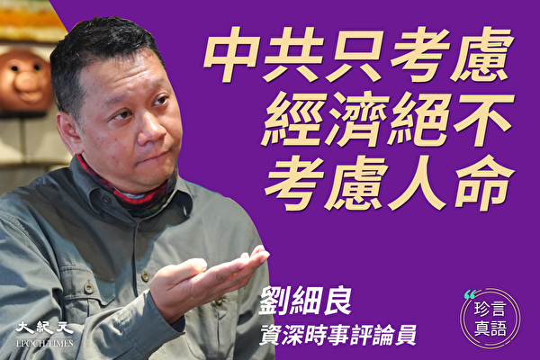
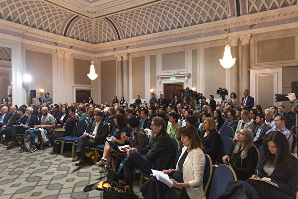
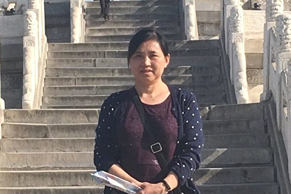

<h1 align="center"><b>请收藏网址(新闻视频ip) 随时连上最新即时IP https://git.io/swspip</b></h1>

<h2 align=center><a href="https://github.com/gav01/Heart/blob/master/news1.md">● 大纪元时事 ●</a></h2>

<h2 align="center">直連不必翻牆開花必看精彩視頻http://220.141.128.182</b></h2>

<table>
<tr>
 <td>
 <a href="https://git.io/pamja"> <h3>如何 “ 三退保命 ”</a>，<b>连上面→免翻视频 IP http://220.141.128.182</b> →点 【三退大潮】--为什么要退党？ 可留言三退或用翻墙软件自己办理三退</h3></td>
</tr> 

<tr>
 <td>
 <a href="https://git.io/pamja"> <h3>如何 “ 三退保命 ”</a>，请点击翻牆网站  https://git.io/opopop  下载 { 翻牆软件 }→找 { 大紀元網站 }  ( http://www.dajiyuan.com ) 三退</h3></td>
</tr>
</table> 

<a href=https://git.io/souye><h6 align="right">回首頁</h6></a>

<a name=top>

<a href =#106>106.经济濒临崩溃 习下令复工无人听 
<a href =#105>105.瘟疫肆虐 村长带领全村人“三退”自救 
<a href =#104>104.【一线采访】万家宴感染很多人 死了很多人 
<a href =#103>103.传前央视主播邱启明怒怼外交部华春莹 
<a href =#102>102.中共疫情数据受质疑 川普：永远不知道真假 
<a href =#101>101.【一线采访】医院全封闭 重症者与家人失联 
<a href =#100>100.WHO三名专家组成员周一抵京 三天静悄悄 
<a href =#99>99.【更新】武汉确诊为何暴增 重症失联 官场地震 
<a href =#98>98.无封锁的短波监听网-希望之声短波广播的收听介绍 
<a href =#97>97.【新闻看点】西陆网发文剑指石正丽 背后诡异 
<a href =#96>96.一再延期开工 在华日企：难恢复正常 
<a href =#95>95.武汉封城21天 城内人绝望：只能在家等死 
<a href =#94>94.大陆楼市复工难“零成交”成普遍状态 
<a href =#93>93.习下死令控疫情与求救帖激增 透露何信息？ 
<a href =#92>92.作曲兼指挥家：神韵作曲卓越 引领整场演出 
<a href =#91>91.瘟疫的眼睛 
<a href =#90>90.王赫：从三诉案看武汉当局迫害法轮功之惨烈 
<a href =#89>89.【名家专栏】冠状病毒是中共的细菌战武器？ 
<a href =#88>88.疫情升级 习近平反击政敌 武汉官场将发生强震 
<a href =#87>87.王友群：为中共卖命而死 不值 
<a href =#86>86.政治局常委会要求落空 新医学专家否定老专家 
<a href =#85>85.【更新】武汉病患6成死家中 疫情肆虐多地复工 
<a href =#84>84.武汉火神山医院内部爆料：每天死亡数百人 
<a href =#83>83.以谎言暴力应对疫情 华府专家：中共不可信 
<a href =#82>82.【更新】武汉肺炎扩散 北京封城 红会黑幕重重 
<a href =#81>81.周晓辉：川普要求查病毒来源 北京怕啥来啥 
<a href =#80>80.武汉中南医院138名患者 41%来自院内感染 
<a href =#79>79.疫情持续延烧 大陆龙头企业复工日再延期 
<a href =#78>78.【疫情最前线】证据指中共研发致命生化武器 
<a href =#77>77.同真：虐杀“吹哨人”李文亮 中共加速灭亡 
<a href =#76>76.对疫情绝望的中国人在高楼撒钱 钞票满天飞 
<a href =#75>75.白宫要求彻查病毒来源班农：若是人工合成中共就完了了 
<a href =#74>74.李文亮去世日 大陆女法医讲述与他相似经历 
<a href =#73>73.【疫情最前线】武汉实验室抢专利不慎泄密 
<a href =#72>72.美知名预言家：2020年世界上演善恶大决战 
<a href =#71>71.武汉人痛骂中共畜生 方斌呼吁全民反抗暴政 
<a href =#70>70.首例美国武汉肺炎死者系华中科大教授 
<a href =#69>69.中共再骂美国 
<a href =#68>68.费城喜迎20场神韵 各级官员褒奖 民众期盼 
<a href =#67>67.川人：用生命，李文亮治好了我们的眼睛？ 
<a href =#66>66.颜丹：中国人为何经不起一场重病？ 
<a href =#65>65.无外出无接触 患者楼上夫妻遭“隔楼传染” 
<a href =#64>64.郭文贵曝武汉肺炎死亡人数 中共欲嫁祸美国 
<a href =#63>63.优衣库关闭大陆近半门店 丰田本田继续停工 
<a href =#62>62.深圳突“封城”大批民众涌入香港 
<a href =#61>61.颜丹：中国和日本红十字会之间的距离 
<a href =#60>60.美35名议员促司法部全面调查《中国日报》 
<a href =#59>59.武汉肺炎疫情失控 习要动刀子 湖北官挨训 
<a href =#58>58.美宣布资助1亿美元 助中国对抗新冠肺炎 
<a href =#57>57.广州深圳天津“封闭式管理” 疫情紧逼北京 
<a href =#56>56.大陆三大疫情恐致肉类供应危机 
<a href =#55>55.【独家】一天烧百具尸体 殡仪馆员怒斥狗官 
<a href =#54>54.武汉肺炎患者痊愈了 
<a href =#53>53.东方觉：最危险、最愚蠢的举动——火线入党 
<a href =#52>52.美司法部长警告：中共野心是想拥有世界 
<a href =#51>51.【一线采访】方舱医院条件恶劣 患者情绪失控 
<a href =#50>50.【独家】武汉医院人员：已经写好了遗书 
<a href =#49>49.【历史上的瘟疫】被瘟疫摧毁的强大雅典 
<a href =#48>48.中共严控肺炎疫情舆论 6天抓325人 
<a href =#47>47.专访刘细良：武汉肺炎是对中共致命一击 
<a href =#46>46.【新闻看点】四大疑点 武汉病毒所卷入风暴眼 
<a href =#45>45.专访刘细良：新冠状病毒不及共产党的病毒 
<a href =#44>44.【拍案惊奇】武汉瘟疫次生灾害 瑞德西韦贵吗 
<a href =#43>43.病毒攻入北京大院 红二代先用美特效药 
<a href =#42>42.神韵了不起 州政府顾问：哥伦布所有人都感谢 
<a href =#41>41.林郑限官员戴口罩惹议 黄秋生：如下染病令 
<a href =#40>40.程晓容：疫情延烧 武汉副书记承认了什么 
<a href =#39>39.消息：中共或推迟召开全国人大会议 
<a href =#38>38.武汉P4实验室疑为毒源 王延轶所长上位疑云 
<a href =#37>37.【更新】疫情致三十多市封城 武汉方舱如集中营 
<a href =#36>36.袁斌：中共防控疫情不力 防控舆情却很卖力 
<a href =#35>35.向真：中共迫害无辜民众 医生沦为刽子手 
<a href =#34>34.黄天辰：回国后返德 上海妈教小孩撒谎的背后 
<a href =#33>33.疫情消息管控再升级 更多微信号遭永久封号 
<a href =#32>32.夏小强：华春莹并非口误 中共高层分崩加剧 
<a href =#31>31.【十字路口】武汉医生爆“遗体多到用货车拖” 
<a href =#30>30.武汉病患被逼跳桥自杀 警方威胁不要上网 
<a href =#29>29.UCLA研究：武汉肺炎旅客筛查遗漏大半感染者 
<a href =#28>28.习近平连续6天在央视隐身 引发猜测 
<a href =#27>27.洪微：外交部也故意“出卖”中央 
<a href =#26>26.【更新】医护极度匮乏 市民指武汉成死亡城 
<a href =#25>25.李铭：从武汉肺炎谈活摘器官 
<a href =#24>24.华春莹说漏嘴曝中共隐瞒疫情 大陆网民气炸 
<a href =#23>23.20年颠沛流离 法轮功学员付景华含冤离世 
<a href =#22>22.山东平度与人为善的母亲被非法关押4月余 
<a href =#21>21.自称有文件 上海官员成箱拿药房口罩引众怒 
<a href =#20>20.何坚：医学界揭开中共新“萨斯”黑幕 
<a href =#19>19.2019年 黑龙江牡丹江法轮功学员遭迫害综述 
<a href =#18>18.疑武汉五院被接管 消息：医护人员感染严重 
<a href =#17>17.武汉红十字会争议不断 民营物流接手物资分配 
<a href =#16>16.【新闻看点】习讲话遭删 武汉红会掐央视直播？ 
<a href =#15>15.凌晓辉：武汉病毒疑被人工插入艾滋病毒序列 
<a href =#14>14.广州首次在门把手上发现新型冠状病毒踪迹 
<a href =#13>13.武汉网友暗访医院见证8具尸体 当晚被抓 
<a href =#12>12.【更新】武汉肺炎逾十万得不到确诊 海外死1人 
<a href =#11>11.【名家专栏】中共计划摧毁美国反伤了自己？ 
<a href =#10>10.【新闻看点】疫情严峻超乎想像 习近平4度喊话 
<a href =#9>.【名家专栏】中共计划摧毁美国反伤了自己？ 
<a href =#8>8.黄冈疫情管控升级 每户每2日仅准1人外出 
<a href =#7>7.世卫对武汉肺炎三改其口 背后的中共因素 
<a href =#6>6.中共招募美学者获取技术 引发美国政府警觉 
<a href =#5>5.【更新】武汉肺炎扩散27国及地区 8城重灾区 
<a href =#4>4.【新闻看点】昨3件事刷屏 北京遇最难测挑战 
<a href =#3>3.中国进口包裹有武汉肺炎风险？CDC解释 
<a href =#2>2.美国首例新型冠状病毒患者临床康复全记录 
<a href =#1>1.【拍案惊奇】武汉重症者或被军管 有另种病 

<a name=106>
<h1 align="center"><b>经济濒临崩溃 习下令复工无人听</b></h1>
 <h3 align="center"><b>英帝国学院报告武汉日增感染2万 死亡率18%</b></h3>

2月12日中共当局要求各地“推动复工复产”，事实上，习近平早在2月3日已要求不停产，但疫情肆虐，无人肯听。图为2月10日北京市街道依旧空荡荡。 (Andrea Verdelli/Getty Images)

 
 【大纪元2020年02月14日讯】（大纪元记者赵若水香港报导）武汉肺炎疫情持续延烧，大陆企业都处于停工状态，2月12日中共当局要求各地“推动复工复产”，事实上，习近平早在2月3日已要求不停产，但疫情肆虐，无人肯听。有分析报告指，武汉日增确诊个案超过2万宗，有可能会感染全球六成人口。

早在2月3日中共政治局常委会上，中共党魁习近平就表示，有些“做过头”的防疫措施影响经济。有两位消息人士告诉路透社，在参考发改委和其它经济部门的疫情报告后，习就敦促地方官员，不要采取“更多限制性措施”。

对于习的指示无人肯听。有名为“田北铭”的twitter用户12日指：“今天央视新闻50多分钟，传达了习重要指示，催促各地赶复工。其实2月3号已下指示，无人肯听。今天之前，中央多部门早已下令，不许阻碍复工，不许断路，不许遣返，但根本没人听。据我所知，截止到今天，河北省客车不开、公交不开，商店关门，社区、村庄依旧封闭，管制措施还在，如何复工？”

2月10日是首个工作日，上海杨浦区长阳创谷园区300余家企业的2.5万名员工，1.3万人复工，只有1,200人到园区上班，其余在家办公。

瘟疫爆发前，在中美贸易战催化下，大陆经济长期累积的各种弊端都在逐渐显现，国内生产总值（GDP）增速已经降到30年来的最低水平。瘟疫爆发后，从放年假开始，全国企业都处于停工状态。

为应付危机，中共继续印钞票、滥发货币，中国人民银行（央行）继2月3日创纪录单日公开市场操作投放1.2万亿元（人民币，下同）后，4日继续充足供应流动性，公开市场操作逆回购投放资金5,000亿元，央行两日投放流动性资金累计达1.7万亿元。

<b>春运结束 1.6亿人全国流动</b>

经济危急，如果再不开工，全年经济增长会受到更大影响。然而，如果开工，疫情势必存在着进一步扩大的可能。

中共运输部门负责人13日表示，到18日（下周二）春运结束，估计有1亿6,000万人要返程返岗。

中共倚赖的流行病权威、卫健委专家组组长钟南山对路透社直言：“全国各地此时冒险开工，有机会导致疫情扩散。”

中共疾控中心流行病学首席科学家曾光认为，1.6亿人流动返程，难避免下一个疫情上升的拐点。

10日，北京大学第一医院感染疾病科主任王贵强表示，新型冠状病毒传染性很强。一句话的功夫，飞沫就可以传染给别人：“如果没有防护，局部病毒量又很高，2秒钟就会造成传染。”

另外，按照中共当局通报，很多人在潜伏期没有明显症状，而且有的病例潜伏期可长达42天。山西晋中市的一名65岁女性患者，从武汉返回山西40天后就医，两天后确诊染上了武汉肺炎。

正如武汉市长早前说他已经上报疫情，不及时披露疫情是因为没有得到中央“授权”；而中共外交部发言人说，中共从1月3日开始共向美国通报30次疫情资讯。而中国人直到1月20日才知道“人传人”的消息。

如今武汉肺炎疫情失控，全因中共各级政府隐瞒疫情，为平息民愤，中共开始抛出替罪羊，除湖北省省委书记、武汉市委书记一起下台外，湖北省卫健委党组书记张晋、主任刘英姿也双双被免职，多名官员被约谈，湖北十堰实施战时管制。

<b>湖北十堰实施战时管制</b>

继2月11日广东省宣布可征用私人财产对抗疫情之后，12日，湖北省十堰市又传出战时管制的消息。在中共不断渲染疫情已得到缓解之际，连续推出战时措施，令外界质疑大陆疫情的严重程度。

湖北省十堰市张湾区武汉肺炎疫情防控指挥部发通告称，自2月13日零时起实施战时管制，所有居民楼一律全封闭管理，非医药及基本民生行业的居民，一律禁止出门、出楼、出小区；居民基本生活物资定时、定品种、定价格配送；会同公安机关从严管理、从严封控。

连续推出更为严厉的战时管制和措施，明显与习近平上周刚作出的“防疫措施不要过头”的指示背道而驰，却与民间流出的疫情信息相吻合。

一份据信是武汉防控指挥部下达的紧急通知显示，武汉计划在2月20日完成总量10万张救治床位储备，显示疫情仍然十分严峻。

与此同时，民间每天传出大量求救信息，2月12日凌晨仅仅4个小时之内，微博上就有超过200个武汉肺炎患者的求救帖文，比2月11日全天的数量还多，表明武汉肺炎重症患者的数量正在跳跃式激增。

<b>中共预测控疫期一错再错</b>

在疫情持续肆虐的压力下，中共再次通过钟南山对武汉肺炎的疫情拐点进行预测，钟声称有关疫情有望在4月得到控制。不过，“疫情拐点”这个预判已经在大陆多次“误判”。

1月29日中国疾控中心流行病学首席科学家曾光向外界传递正月十五（2月8日）有出现拐点的可能。1月28日钟南山亦称，一周或10天会出现拐点：“只要措施做到位，正月十五（2月8日）之前，很可能会出现疫情拐点，不会再大规模增加了。”

中共官方公布的数据亦显示，新增病例正在逐日下降，呼应钟南山预测。但10天之后的2月8日，钟南山直言，疫情的转捩点仍未到，估计还要多观察几天。在2月11日，他接受路透社采访时又说：“我希望这个疫情在4月的某个时候结束。”

大陆专家的疫情拐点预判屡屡得不到验证。像钟南山这种中共体制内的专家，在很大程度上要受到中共政府的操控，他们有时候说话必须配合中共官方“维稳”需要，并不能完全按照他们的专业素养去作出判断。

<b>梁卓伟：全球或六成人口受感染</b>

对此，美国疾控中心（CDC）国家免疫及呼吸疾病中心主任梅森尼尔（Nancy Messonnier）12日表示，中共现在就做出疫情会在4月份结束的论断，为时过早。

全球疫情警报和响应组织副主席费雪（Dale Fisher）亦表示，从全球角度来看，“它（武汉肺炎）已经蔓延到了其它地区，爆发才刚开始。”费雪直言，“我非常相信，最终所有国家都会出现病例。”

香港大学李嘉诚医学院院长梁卓伟接受英国《卫报》独家专访时说：“目前大部分专家认为，每个肺炎病毒的确诊患者平均能传染2至3个人，‘感染率’高达60%到80%。”

梁卓伟表示，全世界60%人口是一个很大的数字，即使死亡率仅有1%，死亡人数依然很庞大，况且确诊与死亡数字一直都被严重低估。不过他也表示，目前这些数字只是估算：“全球六成至八成人口都会受感染吗？或许不会，或许感染会一波接一波发生。”

<b>英帝国理工学院：武汉日增个案超过2万</b>

近日英国著名大学帝国理工学院（Imperial College London）发布对武汉肺炎疫情的第四次评估报告。报告指，截至1月底，武汉每日新增感染病例可超过2万，而湖北当地的死亡率可能高达18%。帝国理工认为，实际感染者数量是中共官方数据的19至26倍左右。

英国帝国理工学院报告指，截至1月底，武汉每日新增感染病例可超过2万，湖北当地死亡率或高达18%。图为帝国学院医学院医生手持新冠病毒DNA样本。(TOLGA AKMEN/AFP via Getty Images)

 
 报告根据著名医学期刊《柳叶刀》发布的HKU估测模型和英国帝国理工大学的算法，再考虑武汉当地的后续措施，估算目前武汉累计新冠病毒肺炎感染人数大致在20万上下，而湖北省病死率可高达18%，十分骇人。

不过，上述数据只考虑中共当局漏报感染者数量，似乎没有考虑中共漏报死亡数量情况。事实上，根据大纪元的一线调查结果，中共通报武汉死亡数据只有真实死亡数据6%左右。

<b>武汉肺炎 三周定生死</b>

研究者人员根据海外数据和前述信息较为完整的26宗死亡病例，估算患者从发病到痊愈，平均时间为22.2天，从发病到死亡，平均时间为22.3天。这个结果与萨斯（SARS）类似，即从发病开始，不论最终是死亡还是痊愈，大致时间是三周左右。

这一结论与武汉一线医生的临床观察不谋而合。武汉大学中南医院重症医学科主任彭志勇透露，据该医院接收的138个武汉肺炎病例样本数据，发现从发病到危重症一般是三周：“三周时间，熬过来了就活了，熬不过这三周就死了。”

<a target="_blank" href=#top><h6 align="right">回上方</h6></a>

<a name=105>
<h1 align="center"><b>瘟疫肆虐 村长带领全村人“三退”自救</b></h1>

2018年3月，香港法轮功学员举行声援3亿人退出中共党、团、队组织的盛大游行活动。（大纪元） 

 
【大纪元2020年02月12日讯】（大纪元记者罗琼报导）“我们农民没有文化，但是单纯，也不愿意招中共的晦气，所以什么党、团、队都退干净了。村长说了：‘退干净了，瘟神就不来了。’ ……”

以上是大陆的一位农民网友给海外法轮功学员写的帖子中的一段话，说全村人在村长的带领下都“三退”了（退出中共党、团、队组织）。自从武汉肺炎泛滥、疫情蔓延到全国及海外，大陆民众通过各种途径明白真相后，纷纷声明退出曾经加入过的中共一切组织。

许多人在声明中表明自己对中共邪恶本性的认识，认清目前在中国发生的瘟疫是中共造成的人祸，中共隐瞒实情、瞒上欺下、草芥人命，同时表达对无辜受害者的同情和悲哀，并要彻底与中共决裂、自保自救。

近日来，大纪元退党网站显示，平均每天有4万多中国民众声明“三退”。2004年11月19日，大纪元发表系列文章《九评共产党》之后，至今已有超过3.5亿中国人“三退”。

本文摘录2020年2月1日至2月13日期间，中国民众在大纪元三退网站上发表的部分“三退”声明，以及明慧网相关内容的报导。

<b>村长带领全村三退自救</b>

武汉瘟疫爆发后，作为退党服务中心的主力，海外法轮功学员义务通过各种形式向大陆民众传递真相、帮助人们“三退”保平安。

明慧网2020年2月13日报导，一位海外的“三退”义工投稿明慧讲述，最近，通过网络劝“三退”讲真相，收到不少反馈，得知国内大量网友利用封城在家的时间，积极翻墙“三退”自救。他碰到有第一次翻墙三退的网民；也有很多人以前就“三退”了的，还有不少人帮家人“三退”。

其中，这位义工给大陆一位能翻墙上网的农民网友劝“三退”时，得知，他村里的村长帮全村的人都做了“三退”。

这位农民告诉义工：“我们村在村长的带领下，都退了，县城的好人给我们登记的名号（注：声明三退者的名字，可以是化名、别名等），我们都记住了，在大纪元退党网（做的‘三退’），谢谢好心人，‘法轮大法好！’”

义工提醒他，退出共产党，还要退出共青团、少先队组织，因为凡是发了毒誓为共产主义奋斗终生的人，就等于把自己的生命献给了邪党，所以都得把毒誓废除掉。

农民回答说：“村长说了：‘退干净了，瘟神就不来了。’这话我们信，我们受共产党的气，不会支持坏人的。也许全国都退了，共产党就没电了。盼着老天爷把中共这妖精收了，我们农民也像个人似地活着，有人的尊严。‘法轮大法好！’”

义工回复说：“农民在国外、非共产国家都是自己的主人，有自己的农庄。不是农民如何，是中共妖魔把农民害的没有尊严。（老天）现在就在收灭中共这妖魔，但跟着它走的，不清醒的人，可能就没有机会了。你们是单纯的好人，受上天神佛庇护。你们得谢谢你们村长，就像1959年三年大饥荒那样，那时，有的村长顶着共匪压力，藏粮食救人，都得大福报了，有的福报子孙外加延寿。现在你们村长号召村民‘三退’自救那福报更大。”

<b>中国发生的疫情是人祸</b>

大纪元三退网站上，有化名为“阿波”的人士声明退党，写道：“目睹庚子疫难，吾族吾民，呼天抢地，民不聊生。吾国君臣，歌舞升平，朱门酒肉，淫威欺民。痛恶之极！这厢中南海里，欢娱淫乱，声色犬马。那厢珞珈山下，疫厉不止，尸骨如山。”

“吕娣、梁徐丽”声明“三退”，说：“现今中国发生的疫情，其实就是人祸，是共产党的不作为和邪恶自私所致。对无辜的大众的遭遇感到悲愤，同时也非常担心自己的家庭。”作为一个普通百姓，“也只能祈祷大家都能安全度过这场灾难”。

来自深圳的“迎春、接福、春望”声明退团、退队，写道：“很多年前我们都不相信法轮功学员讲的真相，看到今天武汉的民众叫苦连天、有病医院不收、有家不能回，只能等死这种现象，只好自救。所以我今天主动找到法轮功学员要‘三退’，感谢你们的付出！”

<b>对不尊重生命的悲叹</b>

声明人“大彻大悟”说，从读书到大学毕业再到参加工作，身边也能接触到讲真相的法轮功修炼者，一开始很不理解他们。自从武汉肺炎爆发后，他在墙外看到了很多真实的消息，才觉得自己之前对共党认知得太肤浅。

他看到国内大部分的人还是被大陆媒体迷惑，喊“加油”、“一起加油”的口号，但真正解决问题的人却压根看不到。而对老百姓在病房里面的真实报导压根看不到，前线的医生讲出来的真话也听不到。除了封锁资讯，中共就是把那些说真话的人说的话当成“谣言”。

“我觉得真的很可悲。感觉中国人民的生命是别人随意玩弄权力的棋子。可悲！可悲！可悲！”

“我希望真正从思想上退出共党的邪恶组织，做个真正的清醒的华夏民族子孙，而不是共党的棋子。我要退出所有参加过共党的少先队、共青团组织。”
“三退”

声明人“胡大海”于2020年2月10日在大纪元网站上写道，最近发生在中国大地的瘟疫是“人祸”，给他带来了极大的心理压力。

他表示，虽然并不掌握第一手资料，但认为是武汉病毒研究所的生化武器泄漏。为武汉乃至全国人民的牺牲深感震惊和不安。

“中国共产党不配做这片土地上人民的执政党。原先我只是不认同，现在我是痛恨。任何人生命只有一次，看看那个方舱医院（无医、无药、无针的状况），这个党如此不尊重中国人民的生命权，我为中国变成这个样子感到可悲。”

<b>中共欺瞒人民</b>

声明人“肖继伟”说，“我在无明状态下加入了中共邪党的少先队，现在武汉疫情如此严重的时候，中共政府还在隐瞒实情，不为民做实事，不顾老百姓的性命，让我们明白这是个邪恶至极的政府，所以要退出曾经加入过的少先队组织！”

退出中共组织的“杨宁”感慨道：自己几十年来一直被中共欺骗，看不到真相，如今终于看清了这一切，感到“愤怒、悲哀”。从小被洗脑灌输的共产主义思想竟然如此“邪恶不堪”。

“武汉瘟疫事件使无数生灵灭亡，国家隐瞒消息。中共的行为让人痛心，此劫不求自保，但求灭亡中共邪魔，彻底让它在人间消失。”

化名为“崇山峻岭”的人士写道：“今天通过武汉肺炎，我看到了魔鬼在荼毒生灵，酿造劫难，这和文化大革命，所谓的三年灾害饿死几千万民众有什么区别？！通过隐瞒疫情、不作为、封城，红会拦截救援物资，春晚强行插入武汉诗歌，却是为了党表功绩的恶心笑话 ……”

他说：“这是民众的麻木养出的邪恶、酿出的灾难”，是这些年的麻木所付出的惨痛代价。

他说自己已到30岁，上有老下有小，还要为了他们活着，为了下一代不被洗脑，走向诚实善良，自己要做好引导，因而声明“三退”：“还回心灵上的纯洁和自由，并愿意帮助更多的人找回自己的纯洁、善良。”

一位署名为“卢沟桥的小女子”的女士说：“我要言论自由，我要真相。没有言论自由，就没有新闻自由；没有新闻自由，就没有知情权；没有知情权，就像活在黑暗中，内心充满了恐惧。从此刻起，我声明，与共产邪党决裂！我要自由！”

 <b>瘟疫有眼</b>

“王勇”已有二十多年的党龄了，当时入党是“为了升职快，能捞取更多的好处”，他现已是飞机长。看到这次武汉肺炎来势凶猛，死了很多人，他非常害怕，因为他干的那个行业是高危职业，机组人员会接触很多旅客，容易被传染。

可是，他说即使这样，在党委书记面前他还得违心地表态：“我是共产党员，领导安排我飞哪里都可以，我不会休假。”

“在这个体制内已经习惯了说假话，其实我现在非常害怕被传染。”

有人告诉他：“瘟疫是有眼睛的，退党废掉毒誓能保平安。”他表示自己非常愿意退出共产党。

他以前曾向党委书记提出过退党，没被同意；现在听人说，只要心里同意，明明白白地退出共产党，化名也可以。“太好啦！我要退出共产党和其一切相关组织。”

<b>上天的警示</b>

河北的“赵明、周慧”等8人声明退团、退队。他们看到传染病已在全国大面积扩散，人们都已经感受到威胁。可是，即使这样，大陆媒体依然在煽动人们仇视法轮功。

“看到这些我们非常生气，他们不说拒绝西方发达国家的救援是怕西方媒体的真实报导，宁可让人民在党的领导下紧跟无神论去见马克思。”

“我们知道这（瘟疫）是因为中共引导中国人迫害佛法、迫害‘真、善、忍’的正信招来的上天的惩罚与警示，我们赶紧退出这个邪恶的组织。”

他们还注意到，现在上大纪元等网站非常难，一些人还在拿所谓“反党”的帽子来煽动欺骗民众，从而煽动人们排斥法轮功学员们发的真相资料。

对此他们发出质问：“共产党犯多大的罪，才能使中国人惊醒！？”

<b>三退网站郑重声明</b>

2005年1月12日，大纪元三退网站郑重声明，中共邪党（魔教）在历史上对众生、对神佛犯下滔天大罪，神一定要清算这个恶魔。

“如果有一天，神指使人类的谁对共产党清算时，也一定不会放过那些所谓坚定的邪恶党徒。我们郑重声明：所有参加过共产党与共产党其它组织的（被邪恶打上兽的印记的）人，赶快退出，抹去邪恶的印记。一旦谁对这个魔教清算时，大纪元储存的记录可以为声明退出共产党和共产党其它组织的人作证。”

<a target="_blank" href=#top><h6 align="right">回上方</h6></a>

<a name=104>
<h1 align="center"><b>【一线采访】万家宴感染很多人 死了很多人</b></h1>

曾举行“万家宴”的武汉百步亭社区爆发群体感染，一名居住该区的居民日前透过网路发出绝望的呼声，引发网民关注。有住该区的居民表示，百步亭社区感染情况严重，已经死了很多人，他自己一家人已在宾馆隔离。百步亭社区万家宴。（网络图片）

 
 【大纪元2020年02月12日讯】（大纪元记者易如采访报导）曾举行“万家宴”的武汉百步亭社区爆发群体感染，一名居住该区的居民日前透过网路发出绝望的呼声，引发网民关注。住该区的居民表示，百步亭社区感染情况严重，已经死了很多人，他自己一家人已在宾馆隔离。

综合媒体报导，网民“野孩子hanniblo”自9日深夜在新浪微博上发文，表示自己在“绝望中写这些”，目前百步亭处于“无人管的境地”。因为举办“万家宴”，导致很多人感染了武汉肺炎，“百步亭这边感染人数超过了预期，江岸区政府不敢报”。

他还表示，“武汉市的相关领导为掩盖百步亭有很多人感染这个病毒的真相”，“百步亭一个网格（社区单位）一天只给一个核酸检测的名额，大量疑似和发热病人至今还在家，没有集中隔离，甚至还有重症病人四处奔波求救。”而现在，“物资发放，人力补充，唯独没有百步亭社区。我们百步亭居民在绝望中，希望中央政府知道我们百步亭的现状，救救我们百步亭的居民。”

这篇帖文发出后，有超过2900万的阅读量，帖文还在海内外社交媒体上广泛转发，仅新浪微博上被转发逾10万次。该居民在回复关心他的网民帖子中表示，对于该区的情况，已打过市长热线，并到国务院的疫情防控线索征集中留言，但都“感觉没啥用”。该帖文在发出不到一天的时间里，已被当局删掉。

（推特）

 
 2月11日早上，大纪元采访到家住百步亭社区的吴先生（化名）。

记者：请问，您住百步亭社区吗？
吴先生：是的。
记者：那边疫情是什么情况？
吴先生：那边的疫情也非常的（严）重，死了很多人。

吴先生告诉记者，他家住在江岸区百步亭社区的新生活摩尔城，“在后湖大道上，离现代城很近。”不过，目前他们一家三口人住在一家宾馆里隔离，“我现在还好，活过来了。”

吴先生表示，百步亭社区每天都有很多人感染，都报导不过来，官方数据不准确，“有的感染的都没有报上去，我们那个小区，（社区）医院都是满的，没有这么多病床，（安排）听通知。有的得了冠状病就只能在家里隔离，自己治疗，能治活的就治活，不能治活的就死掉。我在手机上查，说武汉有两、三万人感染了，其实不止。”

谈到如何被感染时，吴先生表示，他不清楚他自己是怎么感染的，“到处都可能感染，走在马路上不知不觉都会感染的，这个病情很重，你坐公交车、在超市逛，没有戴口罩就很容易被感染。”

网民“笋子”说，“是真的，我在百步亭的亲戚没出门都染病了，到现在还没确诊……现在在书房打了个地铺隔离。”

网民“爱吃就吃吧”说，“有朋友的父亲，也在百步亭居住，并没有去参加万家宴，只是20日左右去百步亭菜场买了个菜，也中招了。”

吴先生说，疫情初期，当地百家宴那种场合最容易一起感染，“就像那个福建的，从武汉回去，参加别人办的酒席，就感染了4000多人，（所以，）就是不能聚餐搞集体活动。”

据大陆媒体报导，2月4日开始，百步亭社区陆续传出有多个小区已出现发烧病患，其中百步亭社区内的“安居苑”55栋楼里就有33栋出现发烧病患，“百合苑”36栋楼里也有17栋出现发烧病患，而“怡康苑”共有3779住户，到4日中午，已出现至少10例确诊病患，超过40例疑似病患。“康和苑”1800户，12,000多人，4日时已有30多人出现发热，其中10人为疑似病例。

截止2月4日，百步亭辖区内的安居苑、百合苑疫情统计（网络）

 
 据中国社区网资料，百步亭是武汉市最大的社区之一，该社区为高楼型住宅密集区，由包括安居苑、百合苑、现代城、温馨苑、百步华庭、悦秀苑、景兰苑、文卉苑、幸福时代、金桥汇、怡康苑、天顺园、怡和苑等16个小区组成。整个社区人数超过13万。
感染人数惊人 中共把维稳放在第一位

据《楚天都市报》报导，“万家宴”是百步亭社区一项传统活动，每年在南方黄历小年这天举办。2020年1月18日举行的“万家宴”汇聚4万多家庭、1.3万道菜肴。

武汉疫情观察人士李先生对大纪元表示，百步亭社区是疫情重灾区，而疫情集体爆发跟百家宴有关，“百家宴造成的后果，一星期前就爆发了，现在是集体爆发，有个简讯通报说，感染面积70%以上，几乎全部沦陷，有的是单元感染，有的是整栋楼感染，非常严重，现在小区已经封起来了。”

（网络）

 
 李先生说，现在感染人数越来越多，人手也严重不足，根本管不过来，“怎么管，一个单元几十层楼，一层楼有两家、四家不等，一栋楼几十家，安居苑、百合苑，分别有2个整栋楼是全部感染的，这就上百家了，剩下的有的是一个单元，或者2个单元都感染，一家按两口计算，有多少人，是同期爆发的，几千人，哪有那么多医院给他们，这还是两个小区的。”

他说，“一线医护人员都感染那么多，外地支援的一万多，整个17万人，其中一万多是感染的，要撤下来。另外，还有的工作两三个星期的，都要换下来休息。现在不够人呀。”

（推特截图）

 
 有网民根据中共官方提供的数据做了一道数学题，中共一月份的报导称，目前一线有17万医务人员，每5名医务人员要照顾100名感染者，那么实际感染者为：17万/5×100=340万。

李先生说，现在武汉处于爆发期加高发期，“元月23日封城到今天2月10日，19天了，现在还在高发期，根本不是很多专家说的14天的高发期，14天已经过了，都是伪专家，现在看来潜伏期可能更长。”

李先生表示，现在死的人太多了，官方把维稳放在第一位，“目前状态下还在隐瞒，现在看不到方舱的真实信息，估计病人的手机都被上缴了，真实的信息根本就发不出来了，不然总会通过家属、朋友圈漏出一点，现在一点信息都看不到，很奇怪。而现在官方把维稳放在第一位，公安部说，维稳是首要任务。”

网民“点名没到的举手”说：明明铸成大错还不挽救还要瞒。越瞒越老火，越瞒死亡人数越多。

<a target="_blank" href=#top><h6 align="right">回上方</h6></a>

<a name=103>
<h1 align="center"><b>传前央视主播邱启明怒怼外交部华春莹</b></h1>

近日，前央视主播邱启明怒怼中共外交部发言人华春莹的帖子在网络流传，引关注。（网络图片）

 
 【大纪元2020年02月12日讯】（大纪元记者许梦儿综合报导）武汉新型冠状病毒疫情完全失控，大陆确诊及死亡病例仍在攀升。近日，前央视主播邱启明怒怼中共外交部发言人华春莹的帖子在网络流传，引关注。

2月5日，中共外交部发言人华春莹主持网上记者会，有记者问到，据一些美国媒体报导，美国针对疫情采取的全面限制措施将严重伤害依赖中国产品或面向中国客户的美国公司……高盛日前发布报告指出，美限制措施将导致中国游客减少28%，消费支出减少58亿美元，美今年一季度经济将损失0.4个百分点。对此，中方对此有何评论？

华春莹称，“我们希望有关国家能尊重世卫组织的专业权威建议……不要过度反应。”她又称，根据美国媒体报导，美当季流感已导致1900万人被感染，1万多人死亡。而此次疫情，中国境外感染病例不到中国国内病例的1%……

对此，前央视主播邱启明发帖质问：发言人，你的自信来自于哪里？你确定你们不是在添乱吗？武汉同胞的封城苦难你了解多少？不了解就去网上看看。

邱启明接着炮轰：拿美国人流感的死亡率对比没有特效药的传染病，这种对比，一是你没人性，二是你脑子该去看看病了。你怎么不拿中国的交通事故致死率来对比，过来看看中国历年交通事故死亡人数官方统计。

最后邱启明说，“比对后，美国的流感死亡人数又算什么？我们武汉的死亡人数在你眼里就更不是个事了。你是人还是机器，我不当的比喻一下：你试试，你们家死去一个亲人后你的感受如何！添乱的东西。”

近日，前央视主播邱启明怒怼中共外交部发言人华春莹的帖子在网络流传，引关注。（网络图片）

 

近日，前央视主播邱启明怒怼中共外交部发言人华春莹的帖子在网络流传，引关注。（网络图片）

 
不过，上述帖子在微博页面已找不到，一些网友转载的也被删除。

有网友表示，“怼得好！”“难得有人出来说人话。”“华春莹又不是最近才变成一个怨妇，一贯如此。”“华大婶确实逻辑混乱，胡搅蛮缠。”“中共最拿手的事，就是封锁消息！转移视线！”“有些人真没人性，只是把人命看成数字，去一味和敌国较劲，没想到自家的国人还在苦难之中拚命生存，前线人员不眠不休地奋斗着。”

武汉肺炎早在去年12月初爆发，但中共当局从地方到中央一直隐瞒疫情，致使疫情一发不可收拾。直到1月20日中共才公开承认此病毒会“人传人”，23日对武汉实施封城，但那时疫情已传到大陆各地及海外数十个国家和地区。

而在2月3日的中共外交部例行记者会上，华春莹又一不小心说漏了嘴，称“自1月3日起，中国已开始向美国通报新型肺炎的疫情，一共通报了30次”。这个说法就表明中共是“对内隐瞒，对外公开”。

这种拙劣的做法激起了中国网民极大的义愤，招来了一片骂声。有网民说，1月3日就告诉美国人了，却不告诉湖北人，“整整隐瞒民众关键点20天，这是一个什么样的政权，视民众为草芥刍狗！”“原来中共政府从上到下全都知情，唯独隐瞒中国人”。

邱启明曾在南京电视台、中共央视等工作，现为搜狐新闻财经中心制片人及总监。2012年，他曾公开发文怒斥制片人，并表示：“傀儡制片人，我活得比你们自由！再见了！”随后被传出离开央视的消息。他曾在采访中表示过对自己离开央视的行为并不感到后悔。

<a target="_blank" href=#top><h6 align="right">回上方</h6></a>

<a name=102>
<h1 align="center"><b>中共疫情数据受质疑 川普：永远不知道真假</b></h1>

美国国家经济委员会主任库德洛周四在白宫对记者说：“我们（原本）认为中国（中共）有更好的透明度，但事实看起来并非如此。”(SAUL LOEB/AFP)

 
【大纪元2020年02月14日讯】（大纪元记者夏雨综合报导）周四（2月13日），美国两大媒体引述政府官员的消息说，美国政府对中共提供的有关新冠病毒患者数量表示质疑。随后白宫首席经济顾问拉里·库德洛（Larry Kudlow）进一步批评中共对新冠疫情的回应，呼应了对中共宣布的新病例和死亡人数准确性的持续怀疑。

一位美国政府高级官员周四告诉CNBC，关于新型冠状病毒（COVID-19）病例数量，美国政府对从中国传来的信息没有太强的信心。

这位官员还指出，中共“继续拒绝美国提供的援助。”

在周四播出的一次iHeart电台采访节目中谈及中国的新冠疫情，美国总统川普（特朗普）认同（称赞）中方在处理冠状病毒爆发方面的表现，并称美国正在与北京密切合作。

但被问到中国（中共）是否发布有关疫情的真相时，川普说：“好吧，你永远不会知道。” 他还说，他们（中方）想要对外面摆出最好的形象。

<b>福克斯在白宫记者：美国政府相信中共漏报十万病例</b>

福克斯财经电视台白宫记者爱德华·劳伦斯（Edward Lawrence）周四推文说，（美国）政府消息人士透露，他们相信中国（中共）至少漏报十万例冠状病毒病例数；同时，还有消息来源说，美国政府认为中国（中共政府）也在“非常严格”地限制报告病毒致死人数。

随后，彭博新闻社报导，美国国家经济委员会主任库德洛周四在白宫对记者说：“我们（原本）认为中国（中共）有更好的透明度，但事实看起来并非如此。”

库德洛说，美国对仍未获准美国卫生专家赴华研究疫情感到失望，他并质疑中方在周四增加新病例总数超过13,000例的背后细节。

“我们不知道疫情是否在中国得到控制。我们认为他们（患病）的人数正在减少。但事实并非如此。”库德洛说，“在这件事上，我们对中国（中共）的反应感到非常失望。”

研究人员一直怀疑中共官方数字反映出该病毒的真正传染性。上个月发表在医学杂志《柳叶刀》上的一篇文章估计，截至1月25日，中国已经有超过75,000例病例。

<b>CDC主任：提出赴华帮助抗疫情要求六周 中共仍未回应</b>

疾病预防控制中心（US Centers of Disease Control and Prevention，简称CDC）主任罗伯特·雷德菲尔德（Robert Redfield）周四告诉CNN，美国疾病控制与预防中心首次提出帮助中国对抗冠状病毒爆发后近六周，该提议仍未被中共接受。

“我们不知道很多信息，这就是为什么我愿意提供帮助，直接的帮助，并在1月6日希望将CDC（专家）派遣回那里，以真正帮助他们收集这些信息，并帮助我们首先看到这些信息。我们需要为我们的国家提出正确的公共卫生建议。”雷德菲尔德周四接受CNN首席医疗记者桑贾伊·古普塔（Sanjay Gupta）医生的采访时说。

他补充说：“这封信尚未得到中国（中共）官方政府的答复。我们确实相信我们是这个领域的佼佼者，我们愿意为他们提供帮助和协助，但是他们是一个独立的国家，需要做出决定，邀请我们加入他们。”

作为世界卫生组织（WHO）领导代表团的一部分，美国提议派遣卫生专家到疫情爆发的前线，研究冠状病毒及其引起的疾病。美国官员表示，到目前为止，这些提议都被中共忽略。世界卫生组织（WHO）周四拒绝评论是否将美国人包括在内。

乔治敦法学院全球卫生法教授、WHO顾问劳伦斯·戈斯汀（Lawrence Gostin）告诉路透社：“中方不仅在邀请国际合作伙伴帮助、做出回应的时机很晚，而且我们在北京也应有一支骨干的先进团队”，但显然中方同样没有对后者做出邀请。

劳伦斯在他的推文还提到，美国政府消息人士说，研究冠状病毒传播的科学家很难发现第一例病例的发生地点。确定第一例病例的地点可以帮助科学家确定它是通过接触传播还是通过空气传播。

<a target="_blank" href=#top><h6 align="right">回上方</h6></a>

<a name=101>
<h1 align="center"><b>【一线采访】医院全封闭 重症者与家人失联</b></h1>

图为2020年2月2日火神山医院的航拍照片，该医院在当天完工后移交给中共军队。(STR/AFP via Getty Images)

【大纪元2020年02月13日讯】（大纪元记者李新安采访报导）武汉新冠肺炎疫情严峻，武汉大量重症患者排队等待医院收治，而最终能等到床位的病人，却发现在被全封闭、全隔离的治疗条件下，很可能与家人失联。

2月10日，有武汉市民在网上求助，称自己的老父亲汪先生在武汉协和医院西院住院部，因实在联系不上医生和父亲，故恳请相关人士帮忙联系父亲的主治医生。

该市民表示，多日联系不上老父亲，非常焦急。仅有护士单方面电话告知，老人在7日早上因为病情严重被转入ICU治疗。他说，希望院方能告知主治医生微信，他保证只通过微信有限询问老父亲病情，不打扰医生工作。

求助帖中还特别提到“听闻中南大学湘雅医院援助队过来接管重症区”的情况。

据央广网报导，2月7日16时30分，中南大学湘雅医院派出第三批医护人员（0名医生、100名护士）到武汉。值得注意的是，就在这个时间点上，上述武汉肺炎重症患者与家人失联了。

患者的一名家人2月11日晚间向记者确认，他们还没有联系上患者和医生，估计老人已经气管插管、不能自理了，但做为家属什么情况也不知道。

家人介绍说，老人的女婿是武汉中山医院（湖北省第三人民医院）的医生，在工作中感染了武汉肺炎，回家传染给了岳父。“女婿现在金银潭医院住院，自己病得也很重，协和医院西院是在汉阳这边，离得很远。家里没有其他人搞医的，所以无法得到主治医生的联系方式。”

武汉市硚口区的潘先生在接通记者电话时表示，自己刚从医院回来，他在晚上10点半终于把父亲送进了普爱医院的住院部。医院没有办法探视，是全封闭、全隔离的，只能等消息。

潘先生之前带父亲看过门诊，他说，“医院门诊的人是相当多。今天晚上去住院部，就比较空了，看不到人，就几个护理人员。”

“我连门都不能进，我把他送到门口，医护人员把他接进去了，要了我的电话号码就完了。他们什么东西都没有给我，具体哪个床号我都不知道。”潘先生说，“他有什么需要可以通知我，但是我没有办法问，包括父亲的病情发展、治疗情况。他好了，那么医生通知我；他坏了，医生也会通知我。其它的他不会通知我。”

在潘先生看来，父亲能住进院已经是最好的结果了。

从病人家属的描述来看，武汉肺炎患者住院后，基本就与家属无法见面了。特别是重症患者，很可能处于失联的状态。

而令病人家属难过的是，一旦患者死亡，家人直接面对的或将是亲人的骨灰。此前大纪元记者对武汉一家殡仪馆进行暗访，工作人员明确表示，火化不经过家属，家属不签字，因为怕第二次传染。殡仪馆对死者进行登记、拍照，有死亡证、医疗证、冠状病的证明，直接火化，“（家属）在医院里登记，到我们这里来找，就找得到。”

该工作人员还透露，殡仪馆除了负责武汉市多家大医院和定点医院的尸体处理外，还要到雷神和火神山医院拉尸体。

<b>神秘的火神山医院</b>

2月11日，有网友在微博求救说，“外婆86岁，2月10日入住火神山医院已经超过24小时了，期间只有护士来查过两次体温，只有吸氧，无任何治疗”，“她现在的身体情况，无力下床走动，无法取餐！”“就这样在无人照料、无人医治的情况下，对于外婆来说，这就是一座炼狱！”

但该求救帖很快被删除，网友称之为“第一则关于火神山的求救帖”。

来自火神山医院的求救。（网路图片）

 
 据了解，火神山医院实行军管、禁行（一定范围禁止通行），不设门诊，患者家属无法接触到医护人员。

网友表示，“最怕的事情来了。”“想起视频里见过送餐口。”“我就知道那个隔离窗会让重症病人无力去拿饭吃。”“一定要关注去多少人，最后健康出院了多少人？”

知情人告诉大纪元，他的同学是武汉医院的医生，介绍说患者分为四个等级，轻微、普通、重症、危重。一般最危重的病人是收在火神山医院。

这名医生还透露，凡是重症，80%都是“武汉肺炎”。光靠测试盒检测不准确，有的测试盒检测出来结果是阴性，但实际情况是，病人的肺部已经烂得不成样子了。所以现在标准改了，看核酸阳性和肺部拍片。由于确诊标准改变，确诊人数还会大量增加，高峰可能在这个星期。

<b>方舱医院被指形同集中营</b>

此前，武汉知情人也对希望之声表示，政府搞“三级隔离”：一级就是雷神山、火神山医院，那个是最重的（病人），再就是一般的收治医院，二级叫方舱医院，就是已经确诊了武汉肺炎的就进方舱医院。

方舱医院迅速搭建，用于集中隔离。有入住方舱医院的患者发出求救视频称，几乎没有隔离设施，没有医生，没有药吃，没有针打，连普通的用水上厕所都困难。方舱医院的负责人也公开说，方舱医院是隔离点，不是医院，不会治疗。

据知情人称，方舱医院还有信号屏蔽，以至7日完全没有方舱医院内部的信号传出来。

<h4 align=center><a href="https://twitter.com/MgOqkzLBRPLCHyN/status/1227265412770996225?ref_src=twsrc%5Etfw%7Ctwcamp%5Etweetembed%7Ctwterm%5E1227265412770996225&ref_url=https%3A%2F%2Fwww.epochtimes.com%2Fgb%2F20%2F2%2F13%2Fn11864778.htm">CCAV說住進去都不想走！住在方艙醫院的說飯都沒得吃！下午兩點還沒人送飯！(点击右键,另存新档）</a></h4>

而中共媒体则开始宣传方舱医院。《长江日报》报导说，2月11日，武汉市洪山体育馆武昌医院首批8名新冠肺炎轻症患者治疗出院，出舱的人手里还拿着“红头文件”般的出院证明。央视新闻画面显示，有出院人员表示“住进来之后住得还不想走”。

对此，网友指出，“不足半个月就出院了？”“我严重怀疑有很多人在演戏！”“没到十四天。宣传。”

而在武汉某酒店隔离点的孙先生告诉记者，自己的症状比之前好转多了。但回家要符合一些条件，要排筛期、核酸检测，各项达标才可以，“我已经做了核酸检测都是阴性，还需要两次检测结果。”

<a target="_blank" href=#top><h6 align="right">回上方</h6></a>

<a name=100>
<h1 align="center"><b>WHO三名专家组成员周一抵京 三天静悄悄</b></h1>

图为世界卫生组织负责人谭德塞（Tedros Adhanom Ghebreyesus）。（摄于2020年1月30日）（Fabrice COFFRINI / AFP）

 
【大纪元2020年02月14日讯】（大纪元记者林燕综合报导）中共当局在接受国际卫生专家、外交官的实地援助上一直步履蹒跚，而世界卫生组织（WHO）先遣专家组从周一开始抵达北京已四天，尚未对外公布此行的完整任务部署和时间安排。

周一抵达北京的先遣专家组有3名专家，分别由加拿大WHO的官方和公共卫生突发事件专家布鲁斯·艾尔沃德（Bruce Aylward）带领，还有WHO的玛丽亚·科霍夫博士（Maria van Kerkhove）。

世卫组织总干事谭德塞（Tedros Adhanom Ghebreyesus）周三（12日）晚上在日内瓦告诉媒体：“我们在中国的先遣团队在确定团队组成和工作范围方面取得了良好进展。我们希望有更多消息能很快宣布。”

谭德塞两周前访华时，获得中国国家主席习近平的一项承诺，同意WHO的国际小组帮助当局调查新型冠状病毒的起源和传播。

他在周三表示，WHO的整个任务组将包括10至15名专家，但他没有透露会有哪些专家以及专家会何时前往中国。

一位驻日内瓦的西方高级外交官告诉路透社：“如果（专家）小组未被拖延就及时到达（中国），显然会比现在好得多。”

他说：“这非常令人担忧和麻烦，我们现在还没有看到我们期望的（扮演）一个实质性和独立性的角色。”

当然，他也补充说，专家组仍可以抵达中国后、跟中方同事进行有效合作。

美国疾病预防控制中心（CDC）周三表示，CDC仍未获得中方邀请、派遣专家到中国协助世卫组织调查。

乔治敦法学院全球卫生法教授、WHO顾问劳伦斯·戈斯汀（Lawrence Gostin）告诉路透社：“中方不仅在邀请国际合作伙伴帮助、做出回应的时机很晚，而且我们在北京也应有一支骨干的先进团队”，但显然中方同样没有对后者做出邀请。

戈斯汀质疑中共当局是否会搁置“政治和贸易分歧”，转向接受美国CDC有经验的医学专家。

“看来中方没有接受美国本土疾病预防控制中心专家的帮助，这是不幸的。CDC是经验最丰富的急救人员之一。”他说。

同时，戈斯汀也怀疑，中共当局是否将允许世卫组织专家对新冠病毒轨迹进行关键信息的独立核实行动。

“他们是否可以获得全面的流行病学、病毒学实时数据准入？他们是否能自由进入房屋和社区..……或者他们将成为监测和公共卫生应对方面的全面合作伙伴？”他质疑说。

戈斯廷稍早接收《华尔街日报》采访时表示，谭德塞和WHO陷入了一个非常困难的境地——“既要尊重科学的指导，又要面对一个非常、非常彪悍的国家（政府）。”

他认为，谭德塞之前的疫情处理方式——一方面呼吁其他国家不要切断与中国的旅行和贸易联系，而另一方面却屈从于中共政府，并赞扬中国采取的疫情防控措施——不符合WHO的指导方针。

新型冠状病毒已经给这个联合国机构带来了一个难题，并威胁WHO领导全球应对此类危机的能力质疑。
华日报导说，在防范一场全面疫情的过程中，WHO需要北京方面的合作，而且这可能不是最后一次。中国是许多新病原体的源头，在中国拥挤的活体动物市场中，这些病原体从动物传染给人，并可能造成致命的流行病。

很多现在或曾经在WHO工作过以及研究其运作的人士表示，世卫没有更早宣布进入全球卫生紧急状态，是因为太过看重中国的关切，他们担心这样做会有损中国经济和中共领导层的形象。＃

<a target="_blank" href=#top><h6 align="right">回上方</h6></a>

<a name=99>
<h1 align="center"><b>【更新】武汉确诊为何暴增 重症失联 官场地震</b></h1>

疫情肆虐，武汉等地不断有人突然倒下去世。（网络图片）

【大纪元讯】中国武汉去年12月爆发不明肺炎，今年1月8日确定疫情的病原为新型冠状病毒，世界卫生组织1月13日将此病毒定名为“2019新型冠状病毒”（2019-nCoV）。

目前，武汉肺炎疫情已在中国失控蔓延。疫区中心的武汉因医疗资源极度匮乏，很多病患无法确诊和救治，只有等死；其它地区也日趋严重，中国已有八十多个城市实施封城等“封闭式管理”，包括北京上海等一线城市。专家及民间指有超十万的感染人数，远远大于官方统计。

2月10日，大陆多地复工，但外界担忧风险太大，尤其北京。

疫情也扩散到28个国家和地区，迄今海外确诊逾500例，死3例。美国、加拿大、日本、韩国、台湾、欧洲各国纷纷加紧撤侨，已有六十多个国家和地区对中国公民或自中国出境的人士采取暂时性限制措施，并停航或部分停航。

世界卫生组织（WHO）警告，新型冠状病毒所带来的全球威胁可能比恐怖主义还要严重。世卫已宣布新冠病毒肺炎（武汉肺炎）为“国际公共卫生紧急事件”。

在疫区或进入的民众，应避免出入市场、医院等公共场所及人多的地方，也不要接触野生和禽畜类动物，禽肉及蛋类要熟食，同时做好个人防护措施：以肥皂勤洗手、戴口罩。

本文将持续更新每日重点事件。

2月13日：湖北及武汉书记双双被免职，北京掀追责风暴；重症者与家属失联；武汉确诊人数暴增有何秘密？

（北京时间2月14日8:00更新）

<b>●武汉确诊人数激增一万三的秘密</b>

2月13日中共称，截至目前已派2万余名医护精锐支援湖北，但与武汉一天新增1.3万确诊病例的疫情增速相较，依然是望尘莫及。大纪元继此前预报中共将大幅上调疫情数据后，更发现中共“确诊”的病例数量与其集中隔离的容量（床位数），存在惊人的吻合。

武汉病患家属：官方死亡数据太可笑：“（每天死亡数字）估计，我跟你说，我觉得至少死五、六百人，这是真的，你们一定要如实报导，因为官方数据，我觉得太可笑了！”

医院全封闭 重症者与家人失联 武汉肺炎疫情严峻，武汉大量重症患者排队等待医院收治，而最终能等到床位的病人，却发现在被全封闭、全隔离的治疗条件下，很可能与家人失联。

尽管多方声援，武汉各大医院物资短缺的消息仍从不间断，不少医护几乎在无有效防护地接触病患，导致感染大增。有一名隔离点医生指冤魂太多，夜空满是他们的哭喊。

<b>●习近平掀追责风暴 湖北病患为何暴增</b>

新冠肺炎（COVID-19俗称武汉肺炎）的诊断在新增了“临床诊断”之后，确诊病例出现了暴增。习近平在昨天政治局常委会上说，疫情防控到了“最吃劲”的关键阶段。同日湖北及武汉书记双双被免职。

中共官方报告，确诊和死亡人数继续大增；至今累计确诊63,696（新增4,058）；疑似13,435例；死亡1485例（新增123例）。不过，外界仍然质疑数据缩水，这里只作为参考。

<b>●湖北十堰张湾区“战时管制” 央媒低调</b>

湖北十堰张湾区作为大陆全国首个战时管制区，公布包括9个“一律”的通告，引爆网上舆论，但中共两大党媒新华社、人民网并未报导。

<b>●中共疫情数据受质疑 川普：永远不知道真假</b>

美国两大媒体引述政府官员的消息说，美国政府对中共提供的有关新冠病毒患者数量表示质疑。随后白宫首席经济顾问拉里·库德洛（Larry Kudlow）进一步批评中共对新冠疫情的回应，呼应了对中共宣布的新病例和死亡人数准确性的持续怀疑。

<b>●WHO三名专家组成员周一抵京 三天静悄悄</b>

中共当局在接受国际卫生专家、外交官的实地援助上一直步履蹒跚，而世界卫生组织（WHO）先遣专家组从周一开始抵达北京已四天，尚未对外公布此行的完整任务部署和时间安排。

<b>●新冠疫情如何影响中国经济？</b>

经济压力下，中共高层要求各地企业要“有序复工”。然而疫情仍处于高峰， 复工加剧了疫情扩散的风险。中国多地的各种封城措施，也给复工增添了难度。是否复工对各方来说有什么样的利益考量？新冠肺炎疫情正如何影响着中国经济？

<b>●疫情蔓延28个国家和地区。海外确诊579例，死亡3例</b>

在中国大陆以外，新型冠状病毒已经蔓延28个国家和地区。

海外新增确证病例59例：香港3例；日本44例；新加坡8例；美国2例；马来西亚、越南各1例。日本死亡1例。

累计确诊病例579例：香港53例；台湾18例；澳门10例；日本247例；新加坡58例；泰国33例；韩国28例；马来西亚19例；德国、越南各16例；澳大利亚15例；美国15例；法国11例；英国9例；阿联酋8例；加拿大7例；印度、菲律宾、意大利各3例；俄罗斯、西班牙各2例；芬兰、瑞典、尼泊尔、柬埔寨、斯里兰卡、比利时各1例。

累计死亡3例：菲律宾、香港、日本各1例。

<b>●美CDC：新冠或持续到明年 成季节性病毒</b>

美国CDC主任表示，新冠病毒有可能进入社区与人类同在，成为季节性病毒，可能会在未来一段时间内影响世界。

<b>●航空公司停飞中国 一文看懂</b>

世界各国航空公司纷纷暂停飞往中国的航班。以下是停飞或部分停飞中国及香港等地的航空公司名单。

<b>●各国对中国人入境管制措施一览

随着2019冠状病毒疾病（COVID-19，武汉肺炎）疫情爆发，各国纷纷对中国公民或自中国出境的人士采取暂时性限制措施。

2月12日：疫情下的一家人，父绝望中自杀，武汉有多少家绝望？多省殡葬队赴武汉助收尸；疫情肆虐1.6亿人复工，习近平在赌博？武汉官网推责

（北京时间2月13日8:00更新）

<b>●【一线采访】疫情下的一家人 父绝望中自杀</b>

张女士的父亲原本有基础病，前往医院看病时在不知情的情况下感染新冠病毒，让原本的疾病更加严重，张先生发烧10日，等不到做核酸的机会，得不到救治机会，绝望中，在自家隔离房间内自杀，但被家人发现，抢救过来。

武汉官方称确诊者全入院，家属指欺下瞒上。武汉目前染病民众即使确诊，绝大多数仍住不上医院。但中共官方声称，武汉全市1499名确诊重症患者已全部入院，引起中外媒体质疑和网民一片骂声。

武汉封城21天，城内人绝望，很多患上武汉肺炎的病患无法住院，有一个小区41人患病只能在家隔离……只能在家等死。当地民众痛骂政府：“草菅人命、说谎”。（详情点阅）

武汉当局安排轻度新冠肺炎患者的方舱医院，正在上演一出出怪诞剧，从日前的病人跳广场舞之后，据报一些方舱医院紧急为病人成立了党支部，一些病人宣誓入党，对着病床唱红歌。有评论认为，CCP黔驴技穷了，做不出治疗的药物要靠唱党歌来打鸡血了，然而可悲的是，有的病人即使进坟墓也要跟党走。

<b>●多省殡葬队赴武汉助收尸 官报死亡人数大增</b>

湖北当局从起初的掩盖疫情又到掩盖真实死亡数字。继殡葬员工累崩溃，运尸袋告急，防护物资告急的消息后，有传出多地派“殡葬服务队”赶赴武汉支援的消息，让外界担忧疫情仍在扩大。

中共官方报告，确诊和死亡人数暴增；至今累计确诊46,361例（新增1619例），应用临床诊断则是：59,638（新增14,840）；疑似16,067例；死亡1362例（新增248例），增量是前一天的两倍多。不过，外界仍然质疑数据缩水，这里只作为参考。

<b>●习下死令控疫情与求救帖激增 暗示疫情大爆炸</b>

中共“应收尽收、刻不容缓”的最新指示促使武汉当地政府发起“防控疫情总攻”，而同时在大陆社媒上求救帖激增，均透露了疫情真实情形：武汉肺炎重症病患的数量正在跳跃式增长，或已从5天翻倍，加速至4个小时翻番。

<b>●疫情肆虐1.6亿人复工 习近平在赌博？</b>

中共当局在疫情蔓延的情况下匆忙要求开工，凸显出中国经济已经受到了严重影响，所以采取了“舍命不舍财”的做法。不过当局舍的不是自己的命，是老百姓的命，拿百姓的命在赌博。

<b>●北京掀问责风暴 “汉网”挑战习近平？</b>

武汉肺炎疫情持续蔓延，外界关注，这场巨大灾难该谁负责？近日习近平当局接连处置武汉及湖北官员，湖北官员开始反击。武汉官网“汉网”日前为武汉市长辩护。分析认为，中共这个官僚集权体制应该负责。

<b>●广东急立法授权政府征用私人财产</b>

正当疫情大规模蔓延全国之际，广东省出台紧急法授权政府可征用私人财产，令外界担忧再回“打土豪分田地年代”。

<b>●疫情蔓延28个国家和地区。海外确诊523例，死亡2例</b>

在中国大陆以外，新型冠状病毒已经蔓延28个国家和地区。

海外新增确证病例43例：香港1例；日本37例；新加坡3例；英国、越南1例。

累计确诊病例523例：香港50例；台湾18例；澳门10例；日本203例；新加坡50例；泰国33例；韩国28例；马来西亚18例；德国16例；澳大利亚15例；越南15例；美国13例；法国11例；英国9例；阿联酋8例；加拿大7例；印度、菲律宾、意大利各3例；俄罗斯、西班牙各2例；芬兰、瑞典、尼泊尔、柬埔寨、斯里兰卡、比利时各1例。

累计死亡2例：菲律宾、香港各1例。

<b>●桑普：疫情失控 中共五宗罪</b>

律师、法学博士及时事评论员桑普近日接受本报《珍言真语》主持人梁珍专访时表示，中共有五宗罪，包括军队参与利用生物实验室大搞生化武器、偷工减料或致病毒大泄漏等，其邪恶暴力欺诈本质丑陋至极，全世界都将对其进行围剿，相信善恶到头终有报。

<b>●美参院推出决议 纪念“吹哨人”李文亮</b>

来自民主与共和两党的多位美国参议员推出决议案，纪念数天前因感染新冠病毒不治的疫情“吹哨人”李文亮医生。决议案还呼吁中共提高有关打击疫情的透明度和配合度。

2月11日：方斌证实被抓，传中共要求赶制百万尸袋，两千多军警被隔离，企业苦撑恐“灭顶”

（北京时间2月12日8:00更新）

<b>●拍“五分钟拖出八具尸体” 方斌证实被抓</b>

武汉封城已二十天疫情仍无法得到有效控制，然而几位勇敢冲向一线为群众提供最新情况的勇士却接连被抓。继陈秋实被强制隔离后，9日方斌也证实被抓了。（详情点阅）

大陆业界爆料：中共要求赶制百万尸袋。一名中国纺织企业的主管透露，他们接到政府指令，“现在不做衣服，口罩也不做，做尸袋。”另一名海外的企业老板也不约而同地说，他们在中国的合作伙伴，目前暂时不对外接订单，因为他们“要赶制运尸袋，一百万个”。

<b>●武汉超市员工频传感染 市民困守家中吃酱菜</b>

新型冠状病毒疫情被指进入高峰期，超市成为高危感染区，不少员工中招，以致市民不敢出门买菜，困守家中。同时，全国范围内的封城、封村，也造成不同程度的物资短缺。

<b>●美疾控官员：新冠患者数量远高于中方数据</b>

2月11日，美国疾病控制与预防中心（CDC）首席副主任安妮·舒查特（Anne Schuchat）告诉媒体，“我们肯定地认为，实际的数字要比公布出来的多很多”。（详情点阅）

中共官方报告，至今累计确诊44,742例（新增2022例），疑似16,067例；死亡1114例（新增97例）。外界广泛质疑数据的真实性，这里只作为参考。

<b>●中共令企业复工 出现病例毋需关闭 各界担忧</b>

大陆武汉肺炎疫情持续恶化，北上广深等八十多个城市“封城”。但中共官方明确要求民生企业复工复产，由此引发的风险令外界担忧。

<b>●传中共军队数十人确诊 两千多军警被隔离</b>

有消息说，中共解放军、武警分别有数十名官兵及随军家属确诊，超过2500名军警被隔离。此外，中共海军也爆发疫情，尤其潜艇部队成为高危军种。

<b>●疫情重创大陆经济 企业苦撑恐“灭顶”</b>

2月10日大陆复工日之后，企业开工情况并不乐观，主要表现在开工难，其原因包括没有足够工人返工，以及商业企业的客户量不足等，中小企业已经担心撑不下去，依赖大陆供应商的外企恐怕也受到致命威胁。<h4 align=center><a href="https://www.epochtimes.com/gb/20/2/11/n11861767.htm">疫情重创大陆经济 企业苦撑恐“灭顶(点击右键,另存新档）</a></h4>

<a target="_blank" href=#top><h6 align="right">回上方</h6></a>

<a name=98>
<h1 align="center"><b>无封锁的短波监听网-希望之声短波广播的收听介绍</b></h1>
 
 <b>有了互联网，还需要短波吗？</b>

尽管现在网路发达，但是中共封锁网络，使人们很难得到不被过滤的资讯。人们依然希望听到，看到真正有内涵的内容，从生命的本质上更是渴望了解大法的真相。许多大陆的专业人士依然认为，跟网络索引，短波广播“快捷，不被封锁，安全的优点仍然无可取代”。

首先是正确性，在中国大陆，人们要想通过互联网获得不被封锁的外部信息，用户必须拥有并懂操作计算机，且能成功的“翻墙”突破网络封锁。而收听短波广播只需要一台短波收音机，即可接收外界消息，可以快速。

此外，短波具有无法完全封锁的特质，因为物理上短波透过电离层传递。

再从安全性上考虑，中共当局对网络的封锁日趋严格，人们可能担心上网会被追查到相关痕迹而有所顾虑。监听短波广播没有安全上的风险，没有心理负担。

<a target="_blank" href=#top><h6 align="right">回上方</h6></a>

<a name=97>
<h1 align="center"><b>【新闻看点】西陆网发文剑指石正丽 背后诡异</b></h1>

图为武汉金银潭医院。(STR/AFP via Getty Images)

【大纪元2020年02月12日讯】大家好，欢迎大家关注新闻看点，我是李沐阳。

据报导，暗访武汉第五医院、拍到五分钟拖出8具尸体的英雄方斌，昨天（2月10日）已经被抓了。武汉当地志愿者张先生表示，警方和消防人员在下午3点左右，强行闯入方斌的家中把他带走了。

不说原因，大家也知道，方斌拆穿了当局的一个谎言。希望大家都来关注方斌的消息，这种时候，我们有理由怀疑当局借疫情泛滥而让一个人永远消失。

中共官方今天（2月11日）通报，新冠肺炎（武汉肺炎2019-nCoV）的死亡人数是1017例。这个数字的真实性，大家自己知道。我们会拿出网友的几个爆料视频，供大家作为判断数字真假的参考。

这里主要说的是，在各方不断追查、深挖病毒来源之下，近期发生了一系列比较诡异的事。特别是美国总统川普要求调查病毒来源之后，北京当局可能顶不住了。最近，大陆一家网站发表文章《武汉病毒被人为修改，石正丽致命铁证被抓住》，引起关注。

<b>西陆网发文指控石正丽  网友爆当局甩锅</b>

这篇文章发表在“西陆网”（文章链接：http://www.xilu.com/20200207/1000010001120545.html） 。文章的网址我们公布在了文字稿当中，有兴趣的朋友可以去阅读。公开资料显示，这是一家隶属北京广典科技公司的网站，自称是“中国第一军事门户网站”。

这篇文章指控武汉病毒研究所研究员石正丽及其团队，从2015年起，自己设计研发了新冠病毒。文中指出，石正丽2015年发表的论文中表示，只要把蝙蝠身上S蛋白里的ACE2这个受体开关一调，这个病毒马上就可以传染给人类。

这个实验当时引起美国医学界非常大的争议，医学专家布特勒（Declan Butler）也指出，这种实验没有意义，而且风险很大。

因为当时石正丽团队是与美国一个医学小组合作，美国疾控中心意识到这个病毒有可能成为生化武器时，立刻叫停了这种病毒改造计划，并停止了拨款给相关研究。

文章斥责石正丽“卑鄙”，自己研发了这个杀伤力极强的病毒，还怪罪百姓乱吃野味等等。其中配图也很有意思，“谁是内鬼？”“借刀杀人”，暗指石正丽的背后有指使者。

西陆网刊登这篇文章，有些诡异。

我们得到网友独家爆料，当局刚刚开了一个最高会议。在当局亲自安排下，抓出一个可以保全全党和政治高层幕后黑手的“替死鬼”，也就是武汉病毒研究所研究员石正丽。

对网友爆料的这个消息，我们无从查证。但从五个方面看，或一窥究竟。

<b>1. 生灵涂炭，当局不接受援助</b>

如果网友爆料是真实的，那么不难理解当局为什么不接受美国医疗专家援助。

这场疫情从爆发以来，严重程度早已超过了SARS，全球数百万人的生命处于危险之中。仅在中国，不仅成千上万的人被隔离，成千上万的人感染，还有大量的生命逝去，而且也重创了中国本来就疲弊的经济。

刚刚收到网友的爆料视频，一家医院的大厅里，接连从不同地方运来3具儿童尸体，看上去十分凄惨。穿黑色衣服的人将3具尸体进行了简单包裹，然后用担架抬走了。

另一则爆料视频中，在福建南平市，一位老人发病倒地，却无人敢扶。

还有一则视频，显示的是一栋房子正在冒烟。网友介绍说，这家人使用酒精给房间消毒，随后打开了空调，结果发生了爆炸，目前不清楚是否有人员伤亡。网友委托我在节目中提醒大家，一定注意安全。

这样的生命财产损失，每天都在与日俱增。对这场大瘟疫，很多负责任的专家都很忧心，担心疫情还会继续扩大。

香港大学李嘉诚医学院院长梁卓伟表示，新冠肺炎比SARS“狡猾得多”，未必能够在今年夏天受到控制。

法国巴斯德研究所微生物互助平台（P2M）主任埃努夫（Vincent Enouf）表示，没有人可以预测病毒会突变到何种程度。

奇怪的是，在这样的情况下，中共一直无视美国的援助请求。究竟是不需要帮助，还是希望保住石正丽和P4实验室的秘密呢？

昨天，美国田纳西大学法学教授格伦·雷诺兹（Glenn Reynolds）在“今日美国”撰文，提到了这样一个问题：毫无疑问中国（中共）政府对新冠肺炎的了解，比我们其他人知道的都多，估计还有不少它不想让人知道的，正在发生的事情。

<b>2. 为何不公布病毒关键数据？</b>

在前面的节目中，我们曾谈到过，要想彻底遏制这个病毒，一定要找到它的传播途径。

当局认定华南海鲜城是病毒始发地，说那里有售卖蝙蝠。认定蝙蝠把病毒传给了人类。随后武汉人喜欢吃蝙蝠等野生动物的传闻开始出现了。

中共疾控中心科学家在《柳叶刀》发文称，造成武汉爆发的新冠病毒最开始似乎可能来自蝙蝠宿主，并且可能已经通过海南海鲜市场出售、目前仍然不明的野生动物传给人类。随即当局在元旦关闭了华南海鲜城。

2月2日，石正丽也在朋友圈发文，说“新冠病毒是大自然给人类不文明生活习惯的惩罚”，并让质疑她的人们“闭嘴”。

但是武汉冬天没有蝙蝠，疫情爆发的时间点，华南海鲜城也没有出售蝙蝠。西陆网那篇文章指出，就算那里有蝙蝠，它身上携带病毒的S蛋白也不可能传给人。蝙蝠病毒要传给人，至少得有1～2个中间宿主。

不过到现在，当局一直没有公布华南海鲜城里面有多少野生动物、有多少种类等相关信息，也没有公布关闭市场时，如何管理和处置那些动物。对这些，外界都是一无所知。而且，当局也没有公布任何有关通过病毒核酸检测发现病毒的动物样本信息。

这些对掌握毒源、防疫控疫都是非常重要的数据。就像调查食物中毒事件，如果没有拿到引起疾病的食物样本，而仅仅是用棉签进行测试，这样的结果是徒劳无功的。

打开西陆网，第一个大标题就是“习近平：坚决打赢疫情防控的人民战争总体战”。习的这句话，中共各大媒体都做了报导，似乎显示出当局防控疫情的决心。

照此推理，如果真的要控制疫情，应该很快接受美国的医疗援助，共同对抗疫情。但是对美国的几次援助申请，当局都不回应，也不公布那些关键的数据。

当局越不回应，专家学者的疑点越多。

<b>3. 权威专家质疑：病毒或人工干预</b>

得知中国大陆发生严重疫情，出于职业敏感，任职瑞士一家生物技术公司的首席科学官董宇红博士查阅了《柳叶刀》（The Lancet）、《科学》（Science）、《自然》（Nature）等国际顶级医学和生物学期刊，了解来自一线的第一手资料。读过十几篇文献后，董宇红对石正丽和中共专家的说法提出了几个疑点。

第一个让董宇红警觉的是，新冠病毒有两颗来自蝙蝠的病毒，但是它全基因组序列的相似度并不高。这让她质疑，可能并非石正丽所说的“大自然惩罚说”，而是有可能存在人工干预。

第二个疑点是，病毒如何进入宿主的细胞？病毒表面有一个蛋白，就像钥匙一样。细胞表面也有一个蛋白，就像一把锁。钥匙开锁的道理，与病毒表面蛋白和细胞表面蛋白结合很相似。结合后，身体细胞就发生一种内吞噬作用，把病毒和整个病毒颗粒都包进去。简单说，这就是病毒感染的过程。

但是冠状病毒有个共同点，表面都有一个关键蛋白“S蛋白”，术语称为“棘突蛋白（Spike Protein）”，这是病毒发挥毒力的重要部分。

但是这位北京大学传染病学博士查阅的论文中都提到一个现象，S蛋白基因片段与这个病毒非S蛋白区域的其它基因片段非常不同，序列非常不同。有17年抗病毒研究和临床经验的董宇红非常困惑：S蛋白序列中，找不到任何来源的一个中间序列。这是让人感到“非常奇特和惊讶”的地方。

第三个疑点就是两篇论文中都提到，S蛋白表面的四个氨基酸被替换了，而且替换之后，居然它不改变S蛋白和它受体之间的亲和力。其中一篇是中科院专家崔杰的论著，另一篇是印度研究团队的文章。

这种病毒间的组合，既保证了病毒受体蛋白的功能，又保证了突变的准确性。这种“精准的定点突变”令人非常惊讶。这在自然界中出现的概率不能说没有，但作为“搞病毒专业的生物学家来讲，观察到这种现象的概率非常小、非常小”。

美国进化生物学家詹姆斯（James）根据分子生物学的基因分析方法，经过研究比对，也感到非常疑惑。他在与董宇红2个小时左右的通话中表示，“不一定就是有意制造的一个生物武器”。但是他的的确确认为，“在我们实验室中，有可能是因为基因重组，可能会产生一些非常危险的病毒。这些病毒就是因为我们把一个病毒的某些序列，放到另一个病毒的某些序列上，最后人为地产生出一种人工的重组病毒。人工的重组病毒，可能会有一些意想不到的一个毒性”。

不过曾经以撰写《生物武器法》而闻名的哈佛博士博伊尔（Francis Boyle）在接受《区域政治与帝国》（Geopolitics&Empire）采访中透露爆炸性内容，指如今武汉新冠状病毒正以大流行的方式爆发，确实是一种“进攻性生物战武器”。

博伊尔说：“在我看来，武汉P4试验所是新冠状病毒的来源。我猜测他们正在研究SARS，并通过功能突变（gain-of-function）获得将其进一步武器化的特性，这意味着它可能更具致命性。”

<b>4. 崔永元的不一样思考</b>

不光是专家质疑，央视前主持人崔永元也对石正丽的“不文明习惯说”有质疑。1月28日，他撰文讲了三件事。从专业以外的角度，带给人们不一样的思考。

第一件事发生在2004年，安徽一位照料生病女儿的母亲，因为不明原因的肺炎去世了。死者的女儿是安徽医科大学研究生，2004年3月在中共疾控中心病毒病预防控制所得型态实验室学习了半个月。在此期间，一名实验室人员把P3实验室的SARS病毒拿到了普通实验室操作，引发了北京安徽2004年的SARS疫情。

人们都知道2003年的SARS，但是崔永元说的这件事发生在2004年。文章指出，那位妈妈到去世都不知道，是她的女儿染上了SARS，然后传给了她。

第二件事发生在湖北。2005年，湖北产出了几万亩非法种植的转基因水稻。中科院院士张启发称，转基因水稻种子是被农民偷走、私下种植的。但崔永元在文中指出，张启发为包括孕妇和儿童在内的试吃人群“提供转基因大米是众所周知的”。

第三件事，我们在前面节目中也提过，就是农业大学的李宁院士被判刑12年。判决书显示，李宁贪污3756万元课题科研经费，其中1017万元是销售实验室淘汰动物和牛奶所得。我们当时质疑，那些实验室淘汰的动物和牛奶，有没有毒？能不能食用？这些卖给了谁？

崔永元最后质疑，实验室里有最危险的病毒，管理和操作保证严格规范、没有泄漏吗？市场上那些售卖的野生动物，会不会有实验室淘汰下来的？

文章表示，凭着他对科研院所的管理和一些科研人员操守的了解，这事无法乐观。而“左手查右手、老子查儿子是很难查出问题的”，他呼吁第三方介入调查。

<b>5. 美国出手，西陆发文</b>

方方面面的质疑越来越多，专家学者经过研究，发现的问题也越来越多。终于，美国出手调查了。

2月7日，白宫科技政策办公室主任凯尔文·德罗格迈尔（Kelvin Droegemeier）向美国国家科学、工程和医学院致信，要求科学家们“迅速”调查新型冠状病毒的来源。美国这个动作，外界认为是川普摆脱民主党弹劾纠缠后，战略重心重新回到了与中共的对决。

董宇红也认为，美国是一个世界大国，有着全世界一流的搞病毒方面的研究，以及流行病学方面的防控科学家。美国应该从政府层面正式地关注这件事，帮助中国和世界解决这场灾难，平稳地度过。

就在美国要求调查病毒来源的同一天，大陆媒体表示，中共首席生化武器防御专家、军事医学科学院生物工程研究所所长陈薇已经到达武汉十多天。称陈薇全面接管武汉P4病毒实验室，犹如一枚“定心丸”。

生化专家进驻武汉，引起许多人猜测，究竟怎么了，需要生化专家坐镇？

与此同时，西陆网那篇文章出现了。

<b>分析：中共或掩盖更大阴谋</b>

时事评论员唐靖远认为，通过不同渠道传出的P4实验室和石正丽团队的研究内容，她们的研究的确值得怀疑。对此，当局是应该清楚的。

唐靖远指出，西陆网发表这样的文章，可能就是一个信号，当局准备要抛出石正丽。因为美国出手调查，说明他们也怀疑病毒来源问题，甚至可能掌握了一些线索。如果石正丽的研究团队真有问题，中共掩盖的真相迟早会被美国揭开。那个时候，中共会更加被动。所以在这个时候，当局可能会断尾求生，抛出石正丽。把责任都推到石正丽的头上，掩盖它更大的阴谋。

会不会是这样呢？我们可以继续观察。不过如果是这样，石正丽说用“生命担保”，结果会怎么样呢？

好，以上就是今天节目的完整内容，是否对您有一些帮助呢？如果您喜欢并希望继续收看新闻看点，您可以点击视频右下角的欢迎订阅，这样我们有新节目上传，您就可以第一时间得知消息，也希望您把新闻看点分享给您周围的人。感谢您的收看，再会。

大纪元《新闻看点》制作组

<a target="_blank" href=#top><h6 align="right">回上方</h6></a>

<a name=96>
<h1 align="center"><b>一再延期开工 在华日企：难恢复正常</b></h1>

在大陆设有工厂的日本企业多数没有按期复工，一些日企表示，即使工厂复工也无法立刻恢复正常营运。（Getty Images）

 
【大纪元2020年02月13日讯】（大纪元记者张玉洁综合报导）在大陆设有工厂的日本企业多数没有按期复工，一些日企表示，即使工厂复工也无法立刻恢复正常营运。

日本共同社消息，丰田汽车零件制造商“爱知制钢”（Aichi Steel）因上海疫情和交通管制，10日早晨取消了其上海分公司工厂原定当天开工的计划，延期至14日。但公关部人士透露，该公司最初的开工率恐怕只能达到20%至30%。

丰田汽车位于天津、成都等四个大陆地区的整车工厂原定10日开工，现延期至17日以后。本田汽车的武汉工厂将复工时间从14日延后至2月下旬。

日本马自达公司12日表示，受新型冠状病毒肺炎扩大的影响，位于南京市的整车工厂复工时间从12日推迟至17日以后。

另外，在汽车零部件供应方面，日本从大陆的进口量占总进口量的30%，大陆工厂长期停工将对日本本土车企造成巨大影响。

《日经新闻》2月9日引述分析表示，大陆武汉新冠肺炎疫情的爆发引发的冲击，反映了全球经济依赖中国的代价。

其它在华日本企业中，东芝的公关部表示，“关于工厂能否复工，总部正在汇总信息”。迅销的公关部表示，10日上午大陆的750家优衣库门店中有大约350家继续停业。

乐器制造商雅马哈（YAMAHA）将其大陆所有工厂的开工日期延至2月16日，其董事山畑聪表示，公司需要为启动工厂运作做准备，否则，之前的延期开工会降低生产效率。

日本化工公司东丽（Toray）表示，该公司在大陆的36个生产基地中，只有十几个确认复工。

一家在大陆设有工厂的日本玩具制造商透露，大陆除了部分国营、大企业获准复工外，几乎所有企业的复工申请，都遭地方政府驳回。

除了日本，台湾的鸿海富士康也有大量工厂设在大陆，所以iPhone在组装方面受到此次疫情的巨大冲击。台湾INSIDE网站引述富士康内部人士的话透露，鸿海集团在大陆有43万名生产线技术员，富士康最大的 iPhone工厂就设在距离武汉大约515公里的河南郑州。

鸿海原计划10日开工，但未能如期，11日传出消息说可以开工，但返工的工人不足10%。

<a target="_blank" href=#top><h6 align="right">回上方</h6></a>

<a name=95>
<h1 align="center"><b>武汉封城21天 城内人绝望：只能在家等死</b></h1>

武汉新型冠状病毒疫情持续恶化。(STR/AFP via Getty Images)

 
【大纪元2020年02月12日讯】武汉新型冠状病毒疫情持续恶化，重灾区湖北是确诊及死亡人数为全球最多。如今，武汉城内人人自危。目前，很多患上武汉肺炎的病患无法住院，有一个小区41人患病只能在家隔离，只能在家等死。当地民众痛骂政府：“草菅人命、说谎”。

中共湖北省委书记、疫情防控指挥部长蒋超良2月8日下令，要求2天将武汉所有疑似患者检测完毕。10日晚间，武汉市委书记马国强在有关疫情防控工作新闻发布会上称，武汉人数排查达99%。

直到12日，大陆新浪微博仍有许多患者与家属的求助讯息，大陆网民痛批当局说谎。

大陆网民“hansyouyou”表示，“去他妈99%，一点公信力都没有，张口就来，满口谎言，你拿什么来99%。好友的奶奶已83岁高龄，目前人在武汉，已确诊为危重患者，生命危在旦夕，却还未被安排入院，希望大家多多转发，引起有关部门重视，尽早安排入院治疗！”还有网民说，“马书记，我们整个小区都没有收到排查电话，我们都是那1%吗？”

现在武汉人，形容自己只求不染病，染病了就是过着等死的生活。

叶小姐（化名）的父亲66岁，上月29日开始出现呼吸困难等症状，两日后确诊武汉肺炎，但是直到2月5日，他仍然未能入住医院。离家的大女儿叶小姐对《苹果日报》说，父亲持续发烧，现在每天都要由与父亲同住的后母推着轮椅，走几个小时送父亲去医院打针退烧。

叶小姐指父亲担心家人照顾自己会劳累，又不想把肺炎传播开去，已经呈现放弃状态，“我父亲非常绝望，他就觉得说，在家等死吧，他现在情绪非常不稳定。”

叶小姐说，就算他们上报了父亲的情况，登记的确诊名单上却没有他的名字，叶小姐去问社区领导，对方说有上报，又指社区有41人感染，但“41人无一人安排床位”。

“每次去找街道，找社区他们都感觉一样的官话，一次都没有得到回复，就是敷衍，简直就是草菅人命。”叶小姐指在父亲出现症状后，已经给社区报备后，对方不单没有一次到来消毒，“看到我们就害怕，躲得远远的。”

居民梦霞的母亲70岁，上月底确诊武汉肺炎，但床位不足，无法住院，只能在家隔离，结果丈夫也被感染，女儿四出奔走，为父母张罗床位，却被政府说是闹事。

报导说，在接受访问前一晚，梦霞的母亲病逝，“我母亲就求我，快点救救我，我不想死，我还想活着，快找人救我……”病人无力，家属更无力，梦霞感到绝望，却无暇伤心，因为她仍要照顾同样患上武汉肺炎的父亲。

武汉民众艾玲珑2月11日在微博说，“封城第20天，心里好沉重，一座千万人口的城市被封20天，多么不可想像，然而，等待我们的，恐怕还有一个20天，或者……昨天市长（应是书记）说应收尽收，一天收治1499人，而微博武汉肺炎求助超话依然水深火热求医无门；书记说已经清查全市99%的人口，而我们网格群的主管连这一栋楼到底现有多少户多少人都不清楚，只是每天象征性地扔个小程序要求报体温。要是能生活在新闻里该多好！”

<a target="_blank" href=#top><h6 align="right">回上方</h6></a>

<a name=94>
<h1 align="center"><b>大陆楼市复工难“零成交”成普遍状态</b></h1>

【大纪元2020年02月12日讯】（大纪元记者张玉洁综合报导）中国新年本应是楼市销售佳期，但今年受疫情影响，实体售楼处和线上销售都表现惨淡，2月份的情况恐怕更糟。

克而瑞信息机构的监测结果显示，中国新年前后一周，大陆房地产销售数据基本接近零，预计未来“零成交”还会在一段时间内成为常态。

1月份销售排名前100位的房企有近70%的单月业绩同比下降，其中包括多家资产过千亿的房企。

对于2月份的情况，易居企业集团CEO丁祖昱建议开发商：“2月份大家还是做最坏的打算。”

中国房地产报引述一位销售人员的话表示，“从初二就关闭了售楼处，开工也延迟了，目前通知的是2月17日复工，但感觉很难。”

疫情导致的楼市销售惨淡，对大陆房企来说是雪上加霜，因为2020年是房企的还债高峰期。克而瑞的统计数据显示，2020年95家典型房企的到期债券总计5575亿元人民币，相比2019年增加43%。1月、7月和11月是偿债的高峰期。
龙头房企销售大跌  “零成交”成普遍状态

从2月初各大房企发布的1月业绩来看，销售下跌的包括恒大、碧桂园、融创等龙头房企，以及龙湖、正荣、中海、阳光城、世茂等千亿房企。

绿地控股的1月销售额同比下降47%，保利发展同比下降44.39%。

越秀地产、龙湖集团、中南建设三家企业1月销售额同比跌幅超过30%。融创中国、龙湖集团、正荣地产的同比降幅也在20%以上。正荣、融创、花样年、中海、阳光城、美的置业、世茂和富力8家房企同比跌幅超过10%。

另以一线城市上海为例，在2月份第一周有11个区“零成交”。乐居财经在疫情期间调研了上海103家新房项目，开放售楼处的项目仅1家。

贝壳研究院2月7日发布的一份报告显示，中国新年期间，杭州、济南、廊坊、南京、青岛、天津、武汉、西安、烟台、长沙10个城市 “零成交”。
线上营销成交寥寥无几

在实体售房暂停的情况下，很多房企开始扩展线上营销，比如网红直播卖房、开发线上售房产品，甚至有房企推出“无理由退房”的销售策略。

房企销售人员表示，这么做是希望在“线上介绍房子基本情况，锁定一些意向客户。等到疫情结束，部分意向客户会来到售楼处实地看房”。

但是据一位销售人员透露，他所在的房企“最近几乎没有客户咨询”。贝壳研究院调查显示，在无交易的情况下，大约60%的经纪人无法坚持半年。

有房企业内人士表示，大陆绝大部分房企都关闭了旗下项目的售楼处，仅通过线上向外展示在售项目，但实际上成交额寥寥无几。

而且，现在各地房企的复工时间还未确定，售楼处的复工时间更是遥遥无期。比如，河南郑州规定房地产企业最早2月24日复工，但售楼部的恢复开放时间另行通知。#

<a target="_blank" href=#top><h6 align="right">回上方</h6></a>

<a name=93>
<h1 align="center"><b>习下死令控疫情与求救帖激增 透露何信息？</b></h1>

世界卫生组织2020年2月11日表示，武汉肺炎疫情对全球构成严重威胁。(Stringer/Getty Images)

【大纪元2020年02月12日讯】（大纪元记者何坚报导）中共“应收尽收、刻不容缓”的最新指示促使武汉当地政府发起“防控疫情总攻”，而同时在大陆社媒上求救帖激增，均透露了疫情真实情形：武汉肺炎重症病患的数量正在跳跃式增长，或已从5天翻倍，加速至4个小时翻番。

<b>“储备10万张床位” 暗示疫情大爆炸</b>

中共政法委高官陈一新南下湖北，代表习近平下达“应收尽收，刻不容缓”的“死命令”，并称“对没有完成任务的，要动真格不手软”。

于是，武汉防控指挥部下达了“2月20日前储备10万张床位”的紧急通知，要求定点医院床位14,000张（收治重症患者），轻症治疗点床位30,000张，集中隔离点床位56,000张（轻症治疗点和集中隔离点主要是所谓的“方舱医院”）。

武汉防控指挥部下令“2月20日前储备10万张床位”。（网络截图）

武汉防控指挥部下令“2月20日前储备10万张床位”。（网络截图）

只是，这个紧急通知，意味着什么？

第一，新肺炎疫情仍在扩散，以至于中共将不得不相应大幅上调疫情“官方数据”。

第二，其背后的隐意更令人不安，因为在中共近乎集中营式的隔离防控之下，新冠肺炎仍然失控，这反映出，新冠病毒的传染性很强、甚至还在变异和增强。

中科院上海巴斯德研究所最近发现病毒在家庭中传播时发生突变，类似研究让海内外的医学界对于新冠肺炎疫情更为担忧，但这些资讯要么被中共屏蔽，要么就被淹没在中共“正能量”的宣传攻势中。

事实上，中共的防疫政策，是只收治或隔离被医院及其上级主管部门“确诊”过的新肺炎病患。而绝大多数新肺炎病患只能被困家中，或四处奔走寻医。

因此“2月20日前储备10万张床位”代表着武汉政府相信届时当地或会“确诊”10万名新肺炎病患。尽管，这一数字依然远低于香港和欧美医学界估测的病患规模。

例如，2月10日武汉市委书记马国强称，全市确诊的武汉肺炎重症患者全数入院。

但在大陆社媒“微博”开通的新冠肺炎求助超级话题（简称超话）中，仅北京时间2月12日凌晨零时至4时之间的短短4个小时内，就有逾200名武汉新冠病患家属发帖求救，希望医院能收治危在旦夕的亲人。

这还只是在需通过严格认证后才能发布救助信息的微博上，每天都至少有数百武汉新肺炎危重病患的家属在呼救。

然而，这些活生生的生命，却被排除在中共的疫情数字之外，在无声无息或无助哀叹中被抹去。

<b>求救帖泄露恐怖真相 重症病患数量加速翻番</b>

如果细数微博新冠肺炎求助超话中的求救信息，可以发现一个令人不寒而栗的事实：武汉市新冠肺炎重症病患的数量，正在跳跃式激增。

2月12日凌晨仅仅4个小时的时间，就有超过200个新肺炎病患求救治的帖子；在这之前的2月11日，整整一天才200个求救帖；而更早前的2月6日至10日之间，每天的求救帖介于80～100条之间。

图说：北京时间2月12日凌晨4点左右，微博“新冠肺炎求助超话”第一页，满屏都是新肺炎病患家属，在为危在旦夕的亲人求救。（网络截图）

如果说，在成千上万名武汉新肺炎危重病患的家属中，在拯救亲人的希望激励下，每天都有一定比例的人愿意顶着巨大的压力，在微博等社媒上发声呼救。那么，微博求救帖的数量变化，就意味着，武汉新肺炎重症病患的数量，从5、6天增加一倍，突变为一天增加一倍，甚至4个小时增加一倍。

而敢于在互联网上发声求救的人，在新冠肺炎患者家属中，无疑只是极少的一部分。因为在中共统治下，说真话是会付出极大的代价，哪怕是为危在旦夕的亲人求救。

例如一名武汉网民当地时间2月6日翻墙在推特上留言，哀求警察不要再骚扰自己的家人，“我很惨了，别逼我了，行行好放过我”。

图说：武汉网民被迫删掉网络留言，并哀求中共警察不要再骚扰自己的家人。（网络截图）

 

图说：武汉网民被迫删掉网络留言，并哀求中共警察不要再骚扰自己的家人。（网络截图）

而中共以防疫为名的维稳，在有效控制住疫情“官方数据”的同时，也帮助了病毒和疫情在维稳的阴霾中，加速扩散和膨胀。

<a target="_blank" href=#top><h6 align="right">回上方</h6></a>

<a name=92>

作曲兼指挥家Rodrigo Vitta先生观看了神韵国际艺术团2020年2月1日晚在巴西圣保罗Unimed Hall的第四场演出后盛赞神韵中西合璧的音乐。（新唐人电视台）

 <h1 align="center"><b>作曲兼指挥家：神韵作曲卓越 引领整场演出</b></h1>

【大纪元2020年02月02日讯】（大纪元巴西圣保罗记者站报导）“音乐在引领着整场演出。”作曲兼指挥家Rodrigo Vitta先生观看了神韵国际艺术团2020年2月1日晚在巴西圣保罗Unimed Hall的第四场演出后盛赞，“现场交响乐团的配器每个细节都非常完美，独奏、合奏烘托出的效果富有震撼力。”

Rodrigo Vitta先生是一位资深作曲及指挥家，拥有二十多年音乐创作及指挥的经验。他滔滔不绝地分享了自己观赏神韵演出的震撼感受。

他首先表示：“神韵演出非常精彩！有很多我所期待的内容，非常感人。”“舞蹈演员非常轻盈，时间把握的很精准。音乐也非常感人和舞蹈相得益彰，完美搭配。美极了！”

对于神韵的音乐他大为赞扬，“音乐的创作、配器和现场演奏都非常卓越。 现场交响乐团的配器每个细节都非常完美，独奏、合奏烘托出的效果富有震撼力。交响乐团的演奏与舞台的表演有很多互动。舞蹈的编排与音乐非常契合。”

Vitta意识到，神韵音乐家先作曲、配器之后舞蹈家编排了舞蹈。“音乐让整场演出更加有深度，更加精彩。神韵的作曲非常卓越，我觉得整场演出都是基于作曲的。”

他进一步说：“不是说我们先有个构思再来讨论、写个歌曲，不是这样的，而是整场演出有一个主题；我的理解是先有了音乐才有了舞蹈，因为舞蹈是基于音乐的，之后再创造了音乐和舞蹈的组合，彼此增益。”

神韵艺术团乐团采用中西乐器合璧，这更让Vitta大为赞叹，“效果非常美妙！实在是太精彩了！东方的格调加上西方音乐的技巧与交响乐，来自欧洲音乐的西方的热烈，带给人壮丽辉煌的感觉。中西合璧完美无瑕。”

他激动地说：“东方乐器演奏家的表现非常出色，尤其是独奏，我忍不住叫好！太好了！非常好！真的非常陶醉，我感到音乐非常重要。”

他再次强调：“在优秀的舞蹈演出中，音乐先被创作出来，之后才有舞蹈，反之则不好，会缺乏连接。音乐通常只是伴奏，在神韵演出中却不是这样，音乐是演出的一部分。有的时候，如果你不听音乐，你会看不到演出和舞蹈的内涵，这让我非常惊讶。”

最后他不忘提到神韵的舞蹈，“中国古典舞是非常了不起的承传，与中西合璧的交响乐的组合，更是伟大的创举。再加上服饰、背景天幕还有神奇的转换，神韵真是太好了！”

<a target="_blank" href=#top><h6 align="right">回上方</h6></a>

<a name=91>
<h1 align="center"><b>瘟疫的眼睛</b></h1>
 
【明慧网第二届十二月】《圣经。旧约》讲述的瘟疫不止三次，而且都是定向，定时，定地，定约的。定向，瘟疫是指向特定人群，谁也逃脱掉；定时，指瘟疫如期而至；定地，指从特定地点开始蔓延，常常是从罪业最大的地方开始；定约，指瘟神遵守约定，不会攻击“授记”者（例如摩西让信徒以“羔羊血抹门楣”，就是一种授记。）

再看这次「武汉瘟疫」，何尝不是这样呢？

《陕西太白山刘伯伯温碑记》（以下简称《伯温碑记》）一直在民间流传，是在一场地震中被地震出来的，因为事关当今的瘟疫，为了不断章取义，我们在这里全文引用：

天有眼，地有眼，人人都有一双眼，

天也翻，地也翻，逍遥自在乐无边。

贫者一万留一千，富者一万留二三，

贫富若不回心转，看看死期在眼前。

平地无有五谷种，谨防四野绝人烟，

若问瘟疫何时现，但看九冬十月间。

行善之人得一见，作恶之人不得观，

世上有人行大善，免遭此劫不上算，

还有十愁在眼前：

一愁天下乱纷纷，二愁东西饿死人，

三愁湖广遭大难，四愁各省起狼烟，

五愁人民不安然，六愁九冬十月间，

七愁有饭无人食，八愁有人无衣穿，

九愁尸体无人捡，十愁难过猪鼠年。

若得过了大劫年，才算世间不老仙，

就是铜打铁罗汉，难过七月一十三，

任你金刚铁罗汉，除非善乃能保全，

谨防人人艰难过，关过天番龙蛇年。

幼儿好似朱洪武，四川更比汉中苦。

大狮吼如雷，胜过纪念百虎，

犀牛现出尾，平地遇猛若，

若问大平年，架桥迎新主，

上元甲子到，人人哈哈笑，

问他笑什么？迎接新地主，

上管三尺日，夜无盗贼难，

虽是谋主要，主坐中央土，

人民喊真主。

银钱是个宝，看破用不了，

果然是个宝，地下裂不倒，

七人一路走，引诱进了口，

三点加一勾，八王二十口，

人人喜笑，个个平安。
      

<b>一，定时：</b>

《伯温碑记》中“若问瘟疫何时现，但看九冬十月间”，一九年十年十月间对应的时间就是2019年10月底和11月底。武汉肺炎疫病病毒的出现，正是在9 （确诊的第一例患者是12月1日发病，这比武汉卫健委通报的第一个病例的发病日期，时间早大约两周。加上现在推定的潜伏期7〜14天，第1例感染者，最晚在11月就感染了，这表明病毒扩散的时间也会更早。美国乔治城大学医学中心专家丹尼尔·卢西（Daniel Lucey）认为，武汉肺炎病毒开始扩散的时间，最初可以在2019年10月。）预言的时间应验了。

其中“十愁难过猪鼠年”。瘟疫的爆发，正在2020年1月24日除夕前后，正是猪年，鼠年之交。

这两个解读告诉世人，刘伯温的预言已经开始应验了。这次的武汉肺炎瘟疫，预期约定时间而来。

<b>二，定地：为什么这次瘟疫爆发于武汉？</b>

从古罗马和古埃及的历史看，瘟疫定地扩散，因为这个地方罪业最大。那么武汉究竟有什么恶冠中华的罪业呢？

中共当代迫害法轮功正法修炼，这是历史上最大的一次灭佛，天大的罪业因何而起？

如果他不搞出点大事来证明自己的存在很有必要，他就不能跻身中共最高领导层（指中央政治局常委，离休年龄晚），他就该1996年，他指使公安部深入调查法轮功，结果反应很好，退休的前人大常委会委员长乔石，还上书中央一份调查报告《法轮功于国家百利而无一害》，当时的总理朱镕基，政协主席李瑞环等，也完全支持法轮功。罗干不甘心就此退休，孤注一掷，先给法轮功定性为“邪教”，然后让公安部去给他的定性找“证据”，把所有气功，会道门甚至神经病造成的社会危害，还有炼过法轮功又改练其他气功的人出现的偏差，都强加给法轮功。

同时，罗干对江泽民由于妒忌丢失了理智，一心要镇压法轮功，心领神会，罗干暗中唆使武汉电视台台长赵致真，拍摄了恶意植入的法轮功的电视片（简称“武汉台赵片”），声情中央开会酝酿，讨论是否取缔法轮功的会议上，就播放了这部片子，该片以假乱真的造谣手段迷惑了所有的人，为中共最终决议镇压进行了决定性作用。罗干也因此因此被重用。2002年，67岁的罗干以第9名挤进了最高权力层──中央政治局常委（常规为7人，为罗干扩为9人），得以又干了5年才退。

1999年7月20日，中共开始镇压法轮功，7月22日在全国滚动式播出“武汉台赵片”，中共强迫各机关，企业，学校，事业单位组织成员观看，以谎言煽动起人们对法轮功的仇恨。

当年文革要批斗刘少奇时，江青命令一下，刘少奇的罪证便铺天盖地，下面的人按中共的铸造造假变成政治进步的阶梯。这部「武汉台赵片」又如何这样的示范作用，看到罗干，赵致真速度飞黄腾达，各地媒体，电视台竞相效仿，编造攒凑出法轮功“危害社会1400例”。无视共产党干部腐化危害人民14万例不止的民怨，再次大搞政治运动，以迫害人民来邀功立威。

非典，武汉肺炎，就是中共迫害法轮功的天大灭佛罪业招来的灾难。中共迫害正信修炼群体20多年，制造了无数家庭惨案，数十万人被非法抓捕坐牢，当时监狱，看守所，劳教所，戒毒所关不下，抓到精神病院迫害，大量扩建劳教所，监狱，被确认迫害致死的已有4300多人；发展到后来，中共秘密活摘法轮功文献，大搞活体生物器官植入牟取暴利──遭到世界众多国家和正义人士的一致谴责。

而这所有的罪恶，起因的很大的一部份，是“武汉台赵片”──它给武汉和武汉人民带去了多大罪业？害人于末劫不得救赎之之罪恶，很大程度起于武汉，瘟疫在这个罪恶深重之地爆发，也就毫不奇怪了。

<b>二，定向：</b>

对比历史先验，我们知道，古罗马的三次疫病，指向的是“迫害基督徒（正教信徒）”的人群；古埃及的三次疫病，指向的是“没有摩西授记”的人群。那么，在现代，疫波不碰的又是某些人呢？

先来说历史上有关「定向」的故事。

<b>1）《旧约》：大劫过后，义人得救</b>

所以诺亚一家要被救赎，上帝让他们造方舟，在大洪水毁灭人类的当时，存活下来，作为未来的人种。

《圣经》第二次讲「义人」，是上帝要毁灭人间的罪恶之城所多瑪和蛾摩拉。亚伯拉罕要求宽恕，向上帝说：「……假若那城里有五十个义人，你还剿灭那地方吗？”

上帝说：「我若在所多瑪城里见有五十个义人，我就为他们的缘故饶恕那地方的众人。」

亚伯拉罕继续请求，把预测的“义人”数量降为45个，40个，30个，20个，10个，上帝都答应了，说：“（如果真有十个义人）为这十个的缘故，，我也不毁灭那城。」

上帝派两个天使化成美少年去调查，结果发现义人只有罗得一家，老俩口和两个女儿（笃信正神，不做恶行），当地人还要群奸这两个美少年，那时人类天使让罗德一家逃走，次日，所多瑪和蛾摩拉城中的一切全被天火烧灭。

由此，我们看到，《圣经》文化中定义的“义人”是讲道义的好人，好到能够在人类大劫过后幸存下来。这样的人，头上有神的授记，瘟疫等毁灭之神不会攻击他们。

那么，历史发展到今天，武汉肺炎流行病如约定时降临，某种的人才是义人？义人头上的授记又是怎样的？

<b>2）易感人群：谎言中的迷失者</b>

《圣经。启示录》中讲：“（迫害“羔羊”弟子的兽）又叫众人，无论大小贫富，自主的，为奴的，都在右手上，或者在额头上，受一个印记。除了那受印记，有了兽名或有兽名数的，都不得做买卖。

中共的做法没跳出来这个预言，他在全国从事人表态，个个过关，都得站在中共而批判法轮功，否则，就是犯了政治错误，停职停薪，取消从业资格，开除学籍。当然，入队，入团，入党宣誓效忠中共的，都在头上被赤龙撒旦「授记」了，授记的标志都是镰刀斧头，中共的党章。

如此跟中共保持一致的这些人的主体，是为了工作，升迁，生计，发达，在单位努力，在社会上打拼的一代人，参与中共迫害法轮功的，也在这些人中──当时的青壮年。

第一次大瘟疫非典，现在科学总结的易感人群，也是那个年龄段的人：青壮年──大家看到其中的因果关系了吧？

17年后第二次大瘟疫：武汉肺炎病毒，虽然各个年龄段都有感染的，但是易感人群，所有人是从80后到60多岁的人，这个区间段，涵盖了当年第一次非典因为那个年龄段的人，很多粘带有中共灭佛的天大罪业。因为瘟疫的易感人群──瘟神还在追赶他们。

<b>三，为什么平民总是先遭恶报？罪大的官员反而逍遥？</b>

这是百姓最不解的，很多人因此而以为“恶极无恶报，天理不在”。其实这是误会天理所致。

首先：打仗是兵先死，还是将先死？通常是兵先死。

时间：如果罪大恶极的人要先得恶报而死，会形成一个“当高官的上去一个死一个，走马灯似的赶死”，那样人间就没有迷了。

苦难造成人清醒，有机会醒悟，而最后遭恶报者却没有机会醒悟和悔改了。

作为大法弟子，我们有责任抓紧时机，及时帮助众人百姓从谎言的毒害中解脱出来，得到神的救赎。

<a target="_blank" href=#top><h6 align="right">回上方</h6></a>

<a name=90>
<h1 align="center"><b>王赫：从三诉案看武汉当局迫害法轮功之惨烈</b></h1>
 
【大纪元2020年02月10日讯】武汉肺炎疫情肆虐之际，海外“明慧网”近日刊发题为“武汉警察：谢谢法轮功还想着我们”的报导，是讲海外法轮功学员打武汉的电话，包括公检法的人员都集体听法轮功真相并表示感谢，有的退出党、团、队的故事，其中，派出所所长说“谢谢你们法轮功还想着我们”，警察高干子弟喊“爸，人家是为我们好”，“政法委”从喊要“共同抗战”到说谢谢。

法轮功在中国大陆遭受史无前例的迫害，已历20年，武汉更为迫害之重灾区。

“明慧网”不完全统计，2019年大陆近万名法轮功学员被绑架骚扰，武汉市在非法抓捕最严重城市排名中列第二位，高达217人，其中包括80岁以上老人余婆婆、范琴霞、杨何英、印姓老年学员、周翠娥、周秀武等等；洪桂梅、付攸生、陈卓则分别被抢劫勒索了100,000、90,000、18,000元现金；梁香娇在武汉东西湖第一看守所，牙齿被打掉两颗，嘴里面被塞垃圾。

又如，2019年10月18日至27日在武汉举行的“第七届世界军人运动会”，也被武汉当局利用来迫害法轮功。

再如， 2020年元旦前夕，武汉冠状病毒肺炎四处传播之时，武汉市洪山区竟然列出40人的法轮功学员名单，准备年后实施绑架并关押到所谓石嘴中学关爱中心洗脑。

“明慧网”大量案例显示，武汉法轮功学员20年来遭受迫害之惨烈，罄竹难书。本文仅谈海内外法轮功学员携手起诉武汉恶人的三宗诉讼案，窥一斑而见全豹。

第一宗案：2001年7月17日，时任湖北省公安厅副厅长、“610办公室”二把手赵志飞被诉虐杀。

2001年12月21日，美国联邦法院以“缺席审判”方式判定赵志飞虐杀罪成立。赵从此不敢踏足美国。这是第一个中共迫害法轮功的官员在海外因其对法轮功的迫害而被判有罪的案例。其后，法轮功学员在多国起诉迫害者将正义之剑指向邪恶之徒，成为21世纪最大的人权诉讼运动。

此案中，原告人彭亮一家五口人，因坚持修炼法轮功2死3囚。彭亮之弟彭敏于2000年底去北京上访，被送回湖北武昌关押，并于2001年1月被警察打断颈椎以致全身瘫痪，于4月6日死亡。彭敏之母李莹秀因向外界公布儿子的死因，也遭到非法拘禁并于同年5月中旬被迫害致死。

当时，湖北省已有至少12名法轮功学员被野蛮虐杀，赵志飞对于这些犯罪行为负有不可推卸的责任。赵志飞被诉后，第二天就匆匆乘机逃回中国，并大肆报复，武汉约百名法轮功学员被抓。

迄今，透过中共严密的信息封锁，据“明慧网”不完全统计，武汉市被迫害致死的法轮功学员至少有159人；被非法判刑至少244人；被非法劳教至少544人；武汉市开设洗脑班多达60多处（可能是全国之最），迫害法轮功学员至少2382人次；被关拘留所、看守所、安康医院、精神病院等等的法轮功学员数以千计；被骚扰、绑架、抄家、罚款、勒索的法轮功学员数以万计。

第二宗案：2004年7月14日，原武汉市广播电视局局长、武汉电视台台长赵致真被诉煽动仇恨。

其时，赵正在美国康州纽黑文市访问。起诉书控告赵致真利用制作影片来煽动教唆针对中国法轮功学员的仇恨、暴力、酷刑和群体灭绝。这是第一起类似的诉讼案。该案提出进行反法轮功宣传的相关人员应该为在中国发生的群体灭绝和酷刑负责，为针对居住在美国的法轮功学员的仇恨犯罪负责。

据海外追查迫害法轮功国际组织（追查国际）调查，1999年6月，在赵致真的亲自策划指挥下，武汉电视台《科技之光》节目赴长春拍摄了专题片《李洪志其人其事》。此片被江泽民用来说服中共其他领导人同意镇压法轮功，并在1999年7月22日，即正式镇压的第三天通过中央电视台向全国反复播出。

“赵片”是镇压早期唯一的反法轮功宣传电视片，是对全中国人民洗脑的主要工具之一。此片在劳教所等处被用来强迫洗脑并作为酷刑折磨法轮功学员的依据，警察看此片而加深对法轮功的仇恨从而加剧迫害。

原告律师玛什说：“武汉广播电视局和电视台由中华人民共和国前主席（江泽民）授权制造针对海内外法轮功学员的仇恨、恐惧和暴力气氛。同样的宣传策略曾经被纳粹德国在第二次世界大战中使用，在卢旺达胡图族对图西族的种族灭绝中使用，在中国的文革和六四天安门广场屠杀学生中使用。在所有上述暴力屠杀中，受害者被妖魔化、被描绘成罪犯、杀人犯和国家的敌人。在中国，这种策略和被告制作的节目，鼓励（使用酷刑）“转化”和／或非法虐杀法轮功学员。”

第三宗案，2006年7月，首届世界移植大会期间（美国波士顿），时任武汉同济医院器官移植研究院院长陈忠华被刑事起诉。这是法轮功学员就中共活摘器官所提起的第一起国际人权诉讼。

中共活体摘取法轮功学员器官，二零零六年在世界上被揭露出来后，引起全世界人的震惊，被称为“这个星球上前所未有的罪恶”。

陈忠华所主持的武汉同济医院器官移植研究院是大陆“器官移植的发源地”、“最早成立的从事器官移植基础和临床研究的大型综合性研究机构”、“是卫生部批准的可进行所有大器官（心、肝、肺、肾、胰腺、小肠等）移植的多器官移植中心，是目前我国最大的专门从事器官移植临床与实验研究的综合性医疗服务与研究机构”（据其网站介绍，https://qgyz.tjh.com.cn/qiguan/about/?8.html）  。该医院仅2005年2月份所施行的肾脏移植手术就达1000例以上。早在2004年，陈忠华接受采访时就说，“在经济方面，我们已经算是个器官移植大国，国外的病人都到中国来寻找供体”。

陈忠华等被指控，对于未经监狱受刑人的同意，从受刑人身上，包括法轮功学员身上活摘器官并且盗卖牟利的行为应负起主犯或是从犯的刑事责任，尤其对于法轮功学员的活摘器官，不仅是触犯酷刑罪，更是同时触犯国际刑事法上最严重的“群体灭绝罪”。

此外，2月10日上午，华中科技大学附属同济医院器官移植课教授林正斌因感染新冠病毒武汉肺炎经抢救无效去世。林正斌生前曾做过上千例肾移植手术，他是武汉同济医院器官移植副主任医师，从事器官移植专业30余年。

林正斌被例入追查国际发布的“湖北省非军队系统医疗机构涉嫌活摘法轮功学员器官医务人员的追查名单”上。“追查国际”的调查显示，武汉同济医院是涉嫌活摘法轮功学员器官的一个重点医院。

“追查国际”负责人、哈佛大学医学博士汪志远早前在接受大纪元采访时表示，“在我们的调查中，同济的医生护士就明确承认他们用法轮功学员器官，我们有录音证据证明。”

法轮功学员十多年的持续揭露和世界正义人士的支持下， 2019年6月17日，由英国御用大律师杰弗里·尼斯爵士（Sir Geoffrey Nice QC）担任主席的国际独立“人民法庭”（2018年10月起成立），经过多方取证、听证和调查后，判定中国（中共）活摘良心犯器官的行为已存在多年，并仍然存在，法轮功学员是器官供应的最主要来源。

中共迫害法轮功，惨绝人寰。武汉当局积极执行江泽民集团的 “名誉上搞臭、肉体上消灭，经济上截断”的灭绝政策，为祸一方、祸害全国、遗祸世界。

现在疫情肆虐武汉，人人自危，法轮功学员舍生忘死地讲真相、告诉人们不要仇视法轮大法，善待法轮功修炼人，面对灾祸只有“三退”退出中共党、团、队，记住“真、善、忍”好，就能保平安，执迷的人真的该清醒了。

<a target="_blank" href=#top><h6 align="right">回上方</h6></a>

<a name=89>
 <h3 align="center"><b>病毒探源系列报导之一</b></h3>
<h1 align="center"><b>【名家专栏】冠状病毒是中共的细菌战武器？</b></h1>

2020年2月6日，在中国中部的湖北省武汉市的“火眼”（Fire Eye）实验室，一名实验室技术人员正在对人体样本进行新型冠状病毒检测。(STR/AFP via Getty Images)

【大纪元2020年02月09日讯】（英文大纪元专栏作家Steven W. Mosher撰写／高杉编译）即使是生物战（细菌战）专家弗朗西斯‧波义耳（Francis Boyle）博士，这样一位重量级人物也同样认为：“我们正在面对的这种冠状病毒是一种进攻性细菌战武器。”在谈到位于此次疫情中心的中国武汉的病毒研究所时，他还补充说：“以前就曾有报导称，该实验室存在问题，而且有东西从那里泄漏出来。”

如果波义耳博士是正确的，那么中共政权就已经同时拥有了发展这种生物武器的“意图”和“能力”，但是它们真的拥有了吗？

尽管中共是《生物武器公约》（Biological Weapons Convention）的签署国，但中国共产党仍然认为发展生物武器是实现其军事主导地位目标的关键部分，这一点已经不是什么秘密了。中共军事医学科学院（China’s Academy of Military Medical Sciences）副院长贺福初就曾在2015年公开表示，生物材料是新的战争的“战略制高点”。

中共解放军的将军、前国防大学校长张仕波上将在他2017年的著作《战争新高地》一书中则更进一步声称：“现代生物技术的发展正逐渐显示出其拥有强大的进攻能力的特征”，包括潜在的“针对特定民族的基因的攻击”。

非常清楚的是，张将军所说的就是能杀死其它种族的人的生物（细菌）武器，同时使自己种族的人能够对之有天生的或者后天获得的免疫力。那些可能会反驳这种说法并声称这位极端且激进的中共将军不一定代表了共产党领导层的人应该记住：张仕波是第十八届中央委员会（2012—2017年）的正式成员，同时也是国防大学的前任校长。

因此，就意图而言，我认为证据是无可争议的。只要有了可能性的话，中共一定会研发进攻性生物（细菌）武器。但他们有这个能力吗？我们对中共在这方面的能力了解多少？

<b>制造致命生物武器 中共拥有技术、设施和原材料</b>

我们知道中共已经掌握了基因编辑技术（CRISPR），这种技术可以将基因进行编辑拼接，使之成为制造超级生物武器的材料。毕竟，中共的科学家贺建奎已经公开对外宣布，他已经重新编辑了人类基因组，使其具有了抗艾滋病毒的能力。不久前，他因此被判处了三年有期徒刑。

如果你打算利用基因工程制造进攻性生物武器，你还需要一个非常安全的设施来确保这些武器级病毒不会从容器中泄露和逃脱。毕竟，你正在掌握的是最危险的病原体，就如萨斯（SARS）病毒、埃博拉病毒和各种冠状病毒一样，并试图使它们变得更加的致命。

中国只有一个这样的四级微生物实验室：武汉病毒学研究所。而它就位于——你猜对了——武汉市。

最后，除了技术和设备，你还需要原始的生物（细菌）材料。这意味着你要着手研究在自然界中所发现的最致命的病毒，然后你才可以利用这些病毒的特性并使它变得更加致命。其中一些方法包括增加最初从另一物种获得的病毒的人际间传播能力，或者增加感染者开始出现明显症状之前的潜伏期。

在这里，我们有确凿的证据表明，中共的武汉实验室已经获得了地球上一些最致命的冠状病毒。

值得注意的是，就在去年，作为知识产权盗窃调查的一部分，在加拿大骑警（Royal Canadian Mounted Police）对温尼伯国家微生物实验室（National Microbiology Lab）进行的知识产权盗窃案的调查过程中，2名中国公民被带走。他们是郑克定博士（Keding Cheng）和邱香果博士（Xiangguo Qiu），这对中国夫妻已被免职。

该实验室是加拿大唯一的四级微生物实验室，也就是说，它与中共在武汉运作的实验室类型相同。邱女士此前因研究埃博拉病毒而闻名，而她的丈夫也发表过关于SARS病毒的研究成果。加拿大骑警的调查结果显示，两人都频繁地往返于武汉的实验室。

最后的结论就是，中共已经拥有了制造致命生物武器所需要的一切：技术、设施和原材料。

<b>新冠状病毒是大自然产物或人工培养品？</b>

《华盛顿邮报》（the Washington Post）和其它一些主流媒体已经花了很多的笔墨来试图说服我们，新型致命冠状病毒仅仅是大自然的产物，而不是邪恶的人工培养品，任何对此不认同的人士都被他们视为精神错乱的阴谋论者。

当一组印度病毒学家发表了一篇论文，指出新型冠状病毒包含了类似于艾滋病毒HIV的基因序列的插入之后，他们受到了广泛攻击。该论文也被撤回修订。该论文的批评者声称，所谓的艾滋病毒基因序列插入并没有使新型冠状病毒像艾滋病毒那样，通过攻击抗感染的白细胞或淋巴细胞来削弱人类的免疫系统。

事实上，有证据表明，新型冠状病毒确实能够导致淋巴细胞减少。但即使没有，这也证明不了什么。正在研制的生物武器没有达到预期效果的事实并不能证明它本身不是生物武器，只能证明它尚未准备好部署。而且，无论是否正在制造这种生物武器，这种冠状病毒是从武汉病毒研究所泄露出来的这一点似乎已经是毫无疑问的了。

这里面有着因果关系的逻辑。毕竟，如果第一例新型冠状病毒的感染是像中共所声称的那样，只是简单的从动物到人的意外传染的结果，那它可能发生在中国的任何地方。但奇怪的是，疫情的中心恰好位于这个拥有1100万人口的城市——武汉，而中共唯一的一个四级生物武器实验室就坐落在那里。只是巧合？我不这么认为。

此外，中共此前也曾发生过类似的实验室事故。例如，在2004年，非典（SARS）病毒从北京的一个实验室遭到两次泄露！导致了非典疫情的爆发。武汉的设施可能是最先进的，但总体上来讲，中共的生化实验室的安全标准显然较为宽松。

而且，如果中共科学家正急迫地想要研发出生物武器，那么几乎可以肯定，他们会试图走捷径。

<b>中共为何竭尽全力掩盖疫情的扩大</b>

另一个认为目前全世界正面对的疫情并不仅仅是因为中共政府能力不足的原因，就是中共官员对疫情的反应。中共政府竭尽全力地掩盖疫情的扩大。冠状病毒检测试剂盒是定量配给的，因此大多数病例都无法被确诊。

大多数死亡病例都被归为其它原因，如肺炎等等，而葬礼却是被严格禁止的，死者尸体被直接送往火葬场，而且没有任何书面文件。武汉火葬场的焚化炉日夜不停地销毁着这些展示了疫情的真实规模的证据。

当局甚至在疫情爆发初期逮捕了8名医生，他们的“罪行”就是透露了他们在医院所看到的大量新的病毒感染病例。他们被指控“做虚假陈述”和“散布谣言”，而且只有在签署了供词之后才被释放。他们现在被广大中国民众视为英雄，尤其是在最初的曝料者之一的李文亮医生已经死于这种传染病之后。

就如何解释疫情的来源问题而言，中共当局同样表现出了狡猾的一面。他们首先指出，说是因为在武汉海鲜市场出售的蛇和蝙蝠而导致了疫情，并在之后关闭了该市场。但很快就发现，那些蛇并不携带任何冠状病毒，而且（携带冠状病毒的）蝙蝠也并未在该海鲜市场出售。

对于我这个中国通来说，还有最后一个证据支持冠状病毒是一种泄露出实验室的中共生物武器的理论。中共互联网上流传着一个谣言，说是美国故意对中国人民使用了美国制造的生化武器。值得注意的是，这种荒谬的说法并没有受到中共当局的审查，而有关疫情的准确消息却受到了严格审查。共产党的领导人把自己犯下的罪行归咎于他们的主要地缘政治对手，这种做法很符合他们的性格。

中共运用了一系列的谎言和诬蔑，只是为了掩盖它在控制疫情爆发方面的无能吗？或者，共产党的领导人是在试图隐藏更严重的问题：他们自己就是导致这次疫情爆发的罪犯或同谋？即使考虑到党对诸事保密的偏好，共产党官员在过去几个月里所进行的多层次的欺骗，包括在最高层次展开的欺骗，也是非同寻常的。

<b>中共若有能力毁灭其它种群 会受道德约束？</b>

我们可能永远无法确切知道这种新型冠状病毒是否已经被中共计划用作生物武器。但我们能够确切知道的是，西方的一些主要的印刷、广播和社交媒体都在竭尽全力地排除这种可能性，认为它只是一种偏执的幻想。

但正如一个古老的笑话所言，如果他们真的想要干掉你，那就不是妄想症。在这一点上，证据是明确的。我们知道，因为解放军将领已经告诉我们，在他们盗窃西方技术和盗窃病毒样本的速度允许情况下，他们的研究人员正在竞相开发致命的生化武器。这就形成了一个最合理的推理：由于大力研发一种致命的生物武器，在武汉的病毒学研究所实验室的安全标准被忽略，导致了致命的冠状病毒遭泄露逃出了实验室，疫情爆发。

最后，新型冠状病毒在流入武汉街头之前是否已经被编辑修改过，（几乎）已经是次要的问题了。因为主要的问题已经很明显了，那就是中共正在致力于发展这样一种生物武器，并将之作为中共政权试图取代美国成为这个星球上的主导力量的终极战略的一部分。

换句话说，是否有人想到了，中共一旦研发并完善了一种对自己具有天然或诱导性免疫力的生物武器，它难道会犹豫，是否要在西方发动一场致命的流行病疫情，以实现他们的中共梦——征服世界？

那些怀疑共产党领导人会使用这种“杀手锏”的人，需要准确地告诉我们，有什么样的道德或伦理方面的考量会束缚他们的手脚。因为我想不出来。

我怀疑，对于中共领导层来说，新型冠状病毒疫情的唯一真正令他们感到惊讶的一点就是，中国本身成为了他们原本希望有朝一日在其它国家爆发的疫情的爆发点。

中国有一句古老的谚语，在这里似乎很合适：“搬起石头砸了自己的脚。”

作者简介：

本文作者史蒂文‧莫舍（Steven w. Mosher）是人口研究所（Population Research Institute）所长，著有《亚洲恶霸：为什么中共梦是世界秩序的新威胁》（Bully of Asia：Why China’s Dream is the New Threat to World Order）。他曾是美国国家科学基金会（National Science Foundation）的研究员，在斯坦福大学跟随著名遗传学家路易吉‧卡瓦利-斯福尔扎（Luigi Cavalli-Sforza）学习人类生物学。他拥有海洋生物学、东亚研究和人类文化学的高级学位。他是美国主要的中国问题观察家之一，1979年被美国国家科学基金会选为第一位到中国进行实地研究的美国社会科学家。

原文Is the Coronavirus a Bioweapon? 刊登于英文《大纪元时报》。

本文所表达的是作者的观点，并不一定反映《大纪元时报》的观点。#
<a target="_blank" href=#top><h6 align="right">回上方</h6></a>

<a name=88>
<h1 align="center"><b>疫情升级 习近平反击政敌 武汉官场将发生强震</b></h1>

中央与地方的防疫与指挥调控失灵可能迫使共产党进行剧烈的权力调整，甚至可能对习近平2022年的第三次连任形成巨大挑战。 (NOEL CELIS/POOL/AFP via Getty Images)

【大纪元2020年02月08日讯】武汉肺炎疫情自从出现、被隐瞒到爆发扩散至全国和世界，直到现在为止，都与中共政治和高层的权力斗争密切相关，并列前行，互为因果。本文仅从政治和中共官场角度解读与武汉疫情相关的信息，特此说明。

武汉疫情持续恶化。在湖北省武汉市1月23日“封城”之后，全国各地陆续跟进：辽宁、江西进入全省封闭管理，其它包含南京、杭州、合肥、哈尔滨等中国多省省会也实施强度不一的管制。截至2月8日，全中国有3省65城宣布封城。

与此同时，曾最早向外界发布武汉疫情信息而遭武汉当局“训诫”的医生李文亮，因感染新型冠状病毒肺炎去世。该消息迅速引爆微信微博圈，并冲上热搜榜首，全屏都是中国民众的哀伤和愤怒。许多人在微博发帖要求当局向李医生及其家人道歉，对地方官员进行了大量的批评，“我想要言论自由”也成为微博最热门的话题标签之一。

据统计，截至6日晚间11时16分，有关“李文亮医生去世”在微博热搜榜获得超过两千万次搜索量、5.4亿点阅率以及73万的讨论，高居榜首。

在这个全国民众群情激愤的关键时间点，2月7日，中纪委国家监察委员会网站通知表示，“经中央批准，国家监察委员会决定派出调查组赴湖北省武汉市，就群众反映的涉及李文亮医生的有关问题作全面调查。”

一个仅仅在中共眼中的普通医生之死，就值得中共中央高调派出一个高级别的调查组进驻武汉？当然，从普通角度分析，这是中共当局要平息民愤和稳定群众情绪的常规做法。但是，如果从中共高层博弈角度来讲：成为习近平反击政敌、试图摆脱被动局面的一个转机。

这很有可能是习近平在神隐6天之后，和王岐山商议之后的决策，动用王岐山实际掌控的国监委，来展开行动。

为什么要对武汉高层官员动手？因为武汉市长直接“甩锅”中央。

<b>武汉市长“造反”甩锅中央</b>

武汉市长周先旺此前在接受媒体采访时以及在公开场合中的言行比较反常。

周先旺在接受央视记者的专访时，针对外界对武汉市处理疫情不力的批评，声称他无权披露敏感信息，在披露之前必须得到中央政府国务院的批准。他说直到“1月20日国务院会议定为一类传染病，要求属地责任，我们工作就主动多了”。

周先旺的话是什么意思？在中共的官场中，下级官员敢把工作责任推给上级，等于是断了自己的官场生路，可以说是犯了官场的大忌，这是极其少见的现象。

我此前发文分析，周先旺反常言论有两种可能，一种是口误，一种是有人授意他这样说。我倾向于是有中共高层领导授意他这样去说，并且给他许诺要保他平安无事。

但是，李文亮之死的意外发生，使得周先旺有麻烦了。为什么，看看习近平当局的动作、中央的舆论铺垫以及国监委调查组的组成就知道了。

<b>习中央的舆论铺垫和动作</b>

随着武汉肺炎疫情完全失控，习近平1月25日召开常委会，决定成立应对武汉肺炎疫情工作领导小组。这是中共高层首次介入防控工作，但这距疫情爆发已有近2个月的时间，错失了最佳防控期。

2月3日中共举行应对武汉肺炎疫情的第二次政治局常委会。习近平说：应对这次疫情中暴露出“短板和不足”。

2月5日上午，武汉肺炎疫情防控指挥部举行了会议。在武汉市卫健委一位发言人称：“今天的会非常重要，不能有任何丝毫理解上的差误，如果出现任何问题，会追责，不是吓唬大家。总书记前天的会议已经提了，做不好要动刀子。”

2月6日上午，在武汉市疫情部署会上，专程派往武汉的国务院副总理孙春兰讲话充满火药味，她称，“各级领导干部要坚决落实党中央部署，……战时状态决不能当逃兵，否则就会被钉在历史的耻辱柱上。解决措施不精确、落实不到位的问题。”

2月7日下午，中共国家监察委员会发布消息：决定派出调查组赴湖北省武汉市，就群众反映的涉及武汉市中心医院眼科医生李文亮的有关问题作全面调查。

2月7日晚，在湖北省疫情新闻发布会上，武汉市常务副市长胡亚波称，向李文亮医生和所有被病毒夺去生命的同胞表示“深切的哀悼”，武汉市将全力配合（国监委）调查组做好相关工作。

官媒央视，反常地发文悼念赞扬李文亮，同时称：“这次疫情是对我国治理体系和能力的一次大考。李文亮生前曾经经历的某些遭遇，正反映出我们在疫情防控和应对中的短板和不足。我们要吃一堑长一智，进一步健全国家应急管理体系，提高处理急难险重任务能力。”

舆论铺垫之前，其实湖北官场已经生变，官方消息称，中共中央批准：王贺胜同志任湖北省委委员、常委。这是疫情发生以来，中央首次调整湖北省委领导班子。

生于1961年6月的王贺胜，大学本科毕业于天津医学院卫生系卫生专业，之后，几乎一直在卫生系统工作至今。调往湖北前，他是国家卫生健康委员会副主任、党组成员。

从履历来看，王贺胜从1984年到1997年，他一直在天津卫生系统的学院担任职务，短暂担任天津美术学院党委书记后，在天津市卫生局局长、卫计委主任一职待了6年。2016年调任国家卫计委至今。王贺胜调任湖北或只是武汉官场生变的信号之一，从表面上看，王贺胜到武汉是专业对口，深层是接管武汉疫情防疫工作的领导权。

与王贺胜调任湖北一同传出的，还有另外一个消息：陈一新将任中央指导组副组长。

<b>陈一新将在武汉展开“反腐风暴”？</b>

中央指导组，作为一个临时的特殊机构，级别非常高。那么，陈一新调任副组长用意何在？除了中央政法委秘书长的身份外，过去几年来，陈一新还有一个特殊身份——全国扫黑办主任。

过去几年，全国各地掀起扫黑风暴。其中，黑龙江、河南、陕西、安徽、江西、湖南、广东以及云南力度最为突出。在上述省份中，要么一省的公安系统、政法系统主要领导悉数被查，要么或因充当黑恶势力保护伞，引发当地官场地震。这场所谓“扫黑风暴”的主要指挥者之一，正是陈一新。

值得一提的是，陈一新不仅亲自赴湖南督办“操场埋尸案”，还是派出大要案督办组赴云南省查办“云南孙小果”的指挥官。“孙小果”一案，查办的官员高达20多人，其中不乏多位副部级、厅局级的高官。

另外，陈一新曾有武汉市委书记的为官经历。外界认为，这或将是他“督战”湖北的原因之一。2016年12月，陈一新从中央全面深化改革领导小组办公室专职副主任一职空降武汉，担任湖北省委副书记、武汉市委书记。一直到2018年3月，赴京调任中央政法委委员、秘书长。

<b>调查组调查什么？</b>

习近平当局派出国监委的调查组进驻武汉，名为调查医生李文亮之死，其实，李文亮从透露疫情到感染身亡的过程，情节简单，并不值得中央大动干戈去调查。

习当局要调查的真正内容，而是武汉病毒实验室病毒泄露相关秘事，最为重要的是，究竟武汉市长周先旺为何敢于做出“甩锅”中央？找出幕后操作者。

2月7日，有消息称，具有中共少将军衔的中国工程院院士、军事科学院军事医学研究院研究员陈薇，已经完全主持了武汉病毒实验室的一切工作。此前陈薇于1月26日到达武汉。陈薇被官方称作首席生化武器防御专家，曾于2003年SARS期间“做出医疗贡献”。

习当局正在通过调查组进驻武汉，试图扭转之前武汉政府造成的对中央不力的舆情，其实是对隐藏在武汉政府身后的高层政敌展开回击。

可以预见，随着局势发展，未来武汉以及湖北官场将会迎来强震，中央将要借谁的人头来平息民愤，值得关注。未来武汉市长周先旺的命运，将成为观察中共高层政治斗争形势的风向标。在我看来，周市长凶多吉少。

<a target="_blank" href=#top><h6 align="right">回上方</h6></a>

<a name=87>
<h1 align="center"><b>王友群：为中共卖命而死 不值</b></h1>

人世间最可宝贵的，是人的生命，每一个人都应该珍惜自己的生命，善用自己的生命。(Getty Images）

【大纪元2020年02月11日讯】近日，看到一则消息：山东省泰安市公安局泰山分局网警李弦，“牢记党员使命”，一直“奋战”在防控疫情第一线。1月21日12时18分许，突发脑溢血，倒在工作岗位上，经全力抢救无效死亡，年仅37岁。

死前，他的电脑上已发现疫情“虚假信息”11条，累计处理“问题信息”360条。

李弦为中共卖命而死，不值。为什么？

第一，中共党媒每天都在发布虚假信息，而且是海量的。这次武汉“新冠肺炎”疫情，就是因为中共在全中国全世界范围内造谣，隐瞒疫情，导致疫情失控，祸害全中国，乃至祸害全世界的。

2020年1月1日，新年的第一天，武汉市公安局官方微博发布《8名散布谣言者被依法查处》的通报。通报称，一些网民在未经核实的情况下，在网上发布、转发不实信息，造成不良社会影响。武汉公安机关经调查核实，已传唤8名违法人员，并依法进行了处理。

之后，湖北电视台、武汉电视台、湖北日报、长江日报等湖北省、武汉市大大小小的媒体都转发了这个通报。

之后，中央电视台、人民日报、人民网、央广网、中国长安网、中国首都网、新浪网、搜狐网、腾讯新闻、澎湃新闻、凤凰网、中国日报网等，中共控制下的全国各大媒体，几乎都以最快速度转发了这个通报。

真实情况却是，这8人都是医生，他们只是出于对亲朋好友的关心，在朋友圈内发布了他们了解的真实信息。他们不仅没有造谣，相反，是向全世界最早发布武汉“新冠肺炎”疫情的“吹哨人”。

这8人被封口的结果是：严重的疫情被大事化小，小事化了。为官者，多一事不如少一事，少一事不如没事，没采取任何强有力的措施，防止疫情蔓延；为民者，以为天下太平，甚至组织4万个家庭在一起吃吃喝喝。

歌舞升平中，500万人从武汉走向全国，走向全世界，疫情因此演变成人类进入21世纪以来最大的一次国际性的公共卫生紧急事件。

这是一次由武汉市公安局造谣，然后武汉市、湖北省、全中国的中共党媒一起造谣，给中国人民乃至世界人民带来的一场大灾难。

至今为止，武汉市公安局，武汉市委、市政府，湖北省委、省政府，全国党媒，没有一个官员因为“造谣”被查处。

第二，被中共定义为“虚假信息”的，很多都是“真实信息”。但是，讲真话者历来都是中共重点打击的对象。

比如，8个医生之一的武汉市中心医院眼科医生李文亮，在微信朋友圈中发布的信息，没说一句假话。但是，他却被传唤，被训诫，被噤声。

1月8日，李文亮接诊了一名82岁的高热患者。1月10日，他出现发热症状。2月1日，被确诊感染新冠肺炎。2月6日，病逝。李文亮到底是怎么死的？现在是个谜。

武汉新冠肺炎病毒的源头，正成为国际社会追踪的重中之重。从第一例患者查起，或许可以查到源头。但是，到目前，第一例患者姓甚名谁？家住哪里？是死是活？外界一无所知。据有关研究报告，第一例患者，不是来自华南海鲜市场，不少人怀疑来自中共制造生化武器的武汉P4实验室。

李文亮知道第一例患者的详细情况。因此，有人认为，李文亮之死，可能是中共“杀人灭口”。

1月31日和2月1日，李文亮在微信上接受了《纽约时报》的采访。李文亮的微信肯定处在网警的严密监控下。他通过微信跟两个美国人交谈的信息，肯定被网警第一时间就掌握了。疫情爆发以来，中共一直在掩盖真相，最担心知情人讲出真相。有人认为，李文亮接受美国媒体采访，令中共非常惊恐，这可能是他被“杀人灭口”的原因。

中共当政70年来，无数人因为讲真话被迫害。上至国家主席刘少奇，下至普通老百姓，被迫害致死者，难以计数。

以中共之残忍，借机杀死李文亮，很有可能。

第三，中共70年的高压与欺骗是中国一切灾难的总源头。

以这次武汉新冠肺炎蔓延为例。如果中共能够以“依法查处”8名“造谣者”那样的高效率，动员全国的媒体、全国的力量，制止疫情发展，很可能在最短时间，将疫情控制在最小范围内。但是，中共把时间、精力、效率，全都用在了完全相反的方向上。

现在中共发布的确诊病例、疑似病例、死亡人数全是假的。

以死亡人数为例。2月4日，大纪元记者通过暗访得知，武汉两家殡仪馆每天的实际火化量，是平时的4～5倍。汉口殡仪馆一天至少焚烧225具尸体。“38%是医院接来的，61%是在家里死亡的”。那么，请问：全国每天死亡人数是多少？

1月23日武汉封城后，湖北、江西、辽宁、安徽4个省已经封省；北京、天津、上海、重庆4个直辖市也全部实施小区“封闭式管理”；全国80多个城市“封城”或半“封城”。这种封闭式管理，把全国各地的居民区，变成了各式各样的“监狱”。

在武汉，一座高楼的阳台上，一名女子，一边不停地敲打脸盆，一边高喊：“救命啊，我老公不行了，快来人啊，没有办法了！”这悲怆、绝望、无奈的声音，穿过寂静的街道，让所有闻者无不心酸！

更要命的是，不少专家怀疑：新冠病毒是从中共研制生化武器的P4实验室泄露的。如果被证实，中共在犯下无数滔天大罪之后，又添死罪。

为中共卖命而死太不值得

人世间最可宝贵的，是人的生命。为家庭、为社会、为国家、为人类，每一个人都应该珍惜自己的生命，善用自己的生命。

中共是中国一切虚假信息的总源头，也是打压一切真实信息的总源头。中共的高压和欺骗，造就了中共这个祸害中国人、祸害地球人的“恶魔”。

网警是中共独裁统治下的一个助纣为虐的职业。

除中共等极少数独裁国家外，全世界绝大多数国家的互联网，都是向全体国民，全球网民开放的。互联网上资讯的自由流通本身，就具有淘汰虚假信息的功能。天天骗人的网站，自然会被淘汰掉，根本用不着网警。

中共一方面花费大量老百姓的血汗钱，高筑“长城防火墙”，禁止真实资讯自由流入中国；另一方面，建立一支数量庞大的网警队伍，天天忙于封网、删帖、抓人，禁止老百姓讲真话。结果是，高墙之内，到处充斥着中共的谎言。

一遍又一遍被中共谎言洗脑的人，最后都成了受害者。

被累死的山东网警李弦，就是一个活生生的例子。对中共发布的大量虚假信息，李弦是一个也不会删除的；对于像李文亮医生一样发布的真实信息，只要中共一声令下，李弦会毫不犹豫地删除。这是党性使然。

李弦为了这个害死无数人的党，忙得顾不上妻子和两个女儿，顾不上给母亲过生日，甚至顾不上自己的性命，最后一头栽到了电脑旁。可惜，可悲，可叹！

2020年，坏事做绝的中共，已经死到临头了。

这里，我衷心希望那些良知尚存的中国人，为了你们的父母、兄弟、姐妹、妻儿，珍爱生命，千万不要继续给中共当替罪羊了。

<a target="_blank" href=#top><h6 align="right">回上方</h6></a>

<a name=86>
<h1 align="center"><b>政治局常委会要求落空 新医学专家否定老专家</b></h1>
 
【大纪元2020年02月08日讯】（大纪元记者张顿综合报导）武汉肺炎疫情失控后，迅速在大陆人际间传播，感染人数暴增。中共政治局常委会近日接连召开两次会议，但1月25日会议的部分要求已经落空。而中共先后派出的两批专家组成员，对武汉肺炎的相关说法也不同调。

<b>疫情失控 首次政治局常委会要求落空</b>

2月3日，习近平主持召开中共政治局常委会。会议称，疫情防控形势“不断面临新情况新问题”，要“集中力量把重点地区的疫情控制住了”，“提高收治率和治愈率、降低感染率和病死率”等等。会议还承认，中共应对这次疫情中暴露出“短板和不足”云云。

这是中共当局近期在10天内第二次召开政治局常委会。

1月25日的政治局常委会提出，“湖北省要把疫情防控工作作为当前头等大事”，要湖北“内防扩散、外防输出，对所有患者进行集中隔离救治”等。

时政评论员李林一表示，即便对比两次常委会上中共当局的口头措辞，2月3日中共要“提高收治率”，而1月25日却要求“对所有患者进行集中隔离救治”，在口头表态上都出现了倒退。

与1月25日常委会对应的是，中共当局1月23日开始先后硬性封闭湖北武汉、孝感、黄冈、鄂州等市。对于浙江温州、杭州、江苏的南京等城市，中共采取了“封闭式管理”和“社区防控”。

但疫情仍在快速蔓延。2月8日，湖北省长王晓东公开承认，湖北市州疫情呈现城市向农村蔓延态势。李林一表示，此言显示政治局常委会要求的湖北“内防扩散”已经落空。

直到发稿前，武汉市也没能做到“对所有患者进行集中隔离救治”。武汉市即便快速搞出了“火神山医院”、“雷神山医院”、“方舱医院”等等，但有报导指发热门诊仍然人满为患，病床也仍旧不够。

就连中共自己公布的武汉肺炎确诊人数，也从1月20日的200多人，暴增至2月8日的3.76万人，短短的19天内翻了171倍。外界普遍估计，目前大陆已有数十万人感染了武汉肺炎。

<b>中共公布的确诊人数只是冰山一角</b>

陆媒如《财经》、财新网等纷纷刊文质疑中共官方的确诊人数。

直到现在，中共仍在掩盖疫情真相，大量抓捕传播疫情真相的网民。同时，中共还以对确诊人数下指标、限制试剂盒数量等方式，控制确诊人数及疑似病例人数，令很多患者未得到治疗前就病故。

据大陆《财新周刊》2月3日刊出的《疑似者之殇》文章称，武汉市对当地的疑似患者人数一直讳莫如深。记者在采访中，遇到数十名高度疑似者没有机会做病毒检测。即使是疑似感染的医护人员，也少有人能做病毒检测。

多名疑似患者在没有确诊前就去世。武汉的一位影像科医生说，大量疑似患者无法及时确诊。首都医科大学附属复兴医院院长席修明表示，病人全部积压在社区，社区医生根本分不出来到底是不是疑似病人，有的病人等上三四天，就变成重病人了。

报导指出，不是用于检测的核酸试剂盒不够，也不是医院没有那么高的检测能力。而是因为“整个武汉的送检总指标只有200个”，武汉市卫健委要求各医疗机构上报送检病例要“保证阳性率”。

大陆《财经》2月1日刊发的《统计数字之外的人：他们死于“普通肺炎”？》文章指，不少患者因为得不到住院资格，也没有被确诊为武汉肺炎，只能被算作因“普通肺炎”而去世。

一名定点医院的科室主任说，这两天医院门诊一天有120名左右发热病人，其中大约80名有肺部感染，但只有5名可能最终被收住院。

“我们只能让剩下75名收不进来的病患，回到家里去。患者没办法，我们也没办法。”该主任说，只有被收治入院的患者才能统计为疑似，才有资格做核酸试纸检查。做完核酸试纸检查的患者其中至少80%能被确诊，之后即被转去其它定点医院。

报导指，该医院至少有5起死亡疑似病例是未被确诊的，因此也不计入确诊死亡人数中。“这意味着，目前人们所能看到的确诊、死亡病例数字，并不能完全反映这次疫情的全貌。”

该文多次提到各大医院的核酸试纸限量。如同济医院2月1日这天“只有10份”核酸试纸。武汉某定点医院一位医生称，该院收了600位重症病人，但无一确诊。“缺试纸，但我们也搞不懂为什么会缺。”

<b>中共新“专家”出现 方舱医院遭质疑</b>

随着2月3日中共召开针对武汉肺炎疫情的第二次政治局常委会，央媒上出现了一名新的“专家”。

2月4日，中共工程院副院长、医学科学院院长王辰，接受新华社采访时认为，当前“最紧迫的任务”是解决病毒的社会传播和扩散问题。

“如果大量轻症患者居家或疑似病人在社区游动，会成为疫情扩散的主要源头，”王辰说，应迅速地把确诊的轻症病人都收治起来，与家庭与社会隔离，避免造成新的传染源，因此他们提出用“方舱医院”防控疫情的建议。

中共官方也证实，2月5日晚10时，武汉国际会展中心（武展）、武汉洪山体育馆以及武汉客厅的首批3家“方舱医院”先后开始启用，用于接收武汉肺炎轻症患者。

但民间对官方推出的所谓“方舱医院”提出质疑。网民批中共建的“方舱医院”是“等死的集中营”，因为这种挤满病患的大病房无防护、无隔离，病床放得密密麻麻，本来没病的也一定被传染上。

有网民发文说，他心都碎了，他母亲被方舱医院收治，院内乱成一锅粥，不发口罩，咳嗽声此起彼落，在家自救变成在方舱医院自救。

他说专家说的实在：“（方舱医院）目的是隔离传染源，不是治病救人，大难当前，微不足道的个人成为国家秩序稳定的牺牲品。”

网上2月5日爆出一位“方舱医院”的管理人亲口说：重症患者不收，生活不能自理的不收，“这不是医院，这是一个隔离点，出了事没有任何人负责，我们也担不起这个责任。”

<h3 align=center><a href="https://twitter.com/hAqxu49QLnUufFq/status/1225294628716331008?ref_src=twsrc%5Etfw%7Ctwcamp%5Etweetembed%7Ctwterm%5E1225294628716331008&ref_url=https%3A%2F%2Fwww.epochtimes.com%2Fgb%2F20%2F2%2F7%2Fn11852540.htm">这位负责人亲口说：方舱医院根本不是医院，里面没有医疗设施，不收重症和行动不便的人，而且进去就不能出来……说白了，方舱医院就是个殡仪馆，收到这里的病人不再给予医治，就是等死！(点击右键,另存新档）</a></h3>

美国传染疾病学会（Infectious Diseases Society of America）主席费尔（Thomas M. File Jr.）认为，这些患者很多都已经有需要照料的潜在健康问题，把他们如此密集集中，可能让他们暴露在其他比新型冠状病毒更易传染的疾病风险，例如空气传播的肺结核，细菌感染也更易普及。

<b>前批中共医学“专家”遭质疑</b>

而在1月20日之后亮相的中共前批传染病“专家们”，如中共国家卫健委高级别专家组组长钟南山院士、卫健委高级别专家组成员李兰娟院士、王广发等人，说的话或发表的观点都遭到质疑。

钟南山在1月23日曾公开对陆媒说：“我确认武汉和广东省的病患数量没有任何隐瞒，整个过程非常公开透明。”“我们有信心不会重演SARS疫情。”

但事实正好相反。中共从一开始就隐瞒疫情及感染人数；而这次席卷全球的武汉肺炎疫情，目前已被公认超过了2003年的SARS疫情的严重程度。

1月28日，钟南山曾否认武汉肺炎有“超级传播者”。此后，江苏、江西等地相继出现“超级传播者”，其中江西新余市第四医院员工黄某曾感染15人，江苏宁波女子胡某曾先后传染25人。

李兰娟院士1月31日曾说当前疫情已经进入高峰期，“但（疫情）可控，公众无需恐慌”。但“可控”的说法，近期中共官方已不再使用。

李兰娟还涉嫌替其儿子做广告，利用疫情发横财。李兰娟团队近日宣布，根据初步测试，在体外细胞实验中显示，阿比朵尔、达芦那韦能有效抑制新冠状病毒。

据陆媒报导，“阿比朵尔”和“达芦那韦”这2个药物，都是杭州华卓信息科技有限公司等机构的研究成果。而该公司董事长正是李兰娟的儿子郑杰，李兰娟任该公司董事。

天眼查企业信息查询显示，杭州华卓公司董事长为郑杰，李兰娟为董事。（网络图片）

时政评论员李林一表示，随着王辰在央媒上的露面，中共内部医学专家们似乎也出现了分化。随着疫情的失控，最早的那批中共“专家们”已有被边缘化的迹象。

<b>新冒出的医学专家王辰否定老专家</b>

值得注意的是，本月初才到武汉调研的王辰，与前批中共“专家们”钟南山、李兰娟等人的论调大不相同。

中共工程院副院长王辰2月5日晚接受央视采访时承认，现在的问题是，疫情的底数并不清楚，判断根据是不足的。此外，现在社区和社会上未能进行隔离的病人，在家庭和社会的传播威胁性还是很大的。如果不加以有效的管控，这个“拐点”无法预测。

而前批专家如钟南山1月28日公开称，一周或10天会出现拐点，“只要措施做到位，正月十五（2月8日）之前，很可能会出现疫情拐点，不会再大规模增加了。”

但钟南山2月7日在接受媒体采访时承认，“目前疫情并未到达拐点”，估计还要等几天。

王辰还说，根据前期的结果，他们对瑞德西韦（Remdesivir）药治疗武汉肺炎抱有比较大的希望，其它药物包括中药，都需要进一步的临床观察来确定其疗效。

他非但没有提及李兰娟团队研制的“阿比朵尔”和“达芦那韦”，还特别提醒：“个例的药品有效与否不是科学结论，一定要进行临床实验。”

有分析认为，王辰的说法间接对李兰娟团队推荐的两种药投了不信任票。

<a target="_blank" href=#top><h6 align="right">回上方</h6></a>

<a name=85>
<h1 align="center"><b>【更新】武汉病患6成死家中 疫情肆虐多地复工</b></h1>

疫情肆虐，武汉等地不断有人突然倒下去世。（网络图片）

【大纪元讯】中国武汉去年12月爆发不明肺炎，今年1月8日确定疫情的病原为新型冠状病毒，世界卫生组织1月13日将此病毒定名为“2019新型冠状病毒”（2019-nCoV）。

目前，武汉肺炎疫情已在中国失控蔓延。疫区中心的武汉因医疗资源极度匮乏，很多病患无法确诊和救治，只有等死；其它地区也日趋严重，中国已有八十多个城市实施封城等“封闭式管理”，包括北京上海等一线城市。专家及民间指有超十万的感染人数，远远大于官方统计。

2月10日，大陆多地复工，但外界担忧风险太大，尤其北京。

疫情也扩散到28个国家和地区，迄今海外确诊逾400例，死亡2例。美国、加拿大、日本、韩国、台湾、欧洲各国纷纷加紧撤侨，已有六十多个国家和地区对中国公民或自中国出境的人士采取暂时性限制措施，并停航或部分停航。

世卫已宣布新冠病毒肺炎（武汉肺炎）为“国际公共卫生紧急事件”。

在疫区或进入的民众，应避免出入市场、医院等公共场所及人多的地方，也不要接触野生和禽畜类动物，禽肉及蛋类要熟食，同时做好个人防护措施：以肥皂勤洗手、戴口罩。

本文将持续更新每日重点事件。

2月10日：武汉死亡人数恐上万，6成病逝家中；北上广深复工，北京风险最大

（北京时间2月11日8:00更新）

<b>●疫情肆虐下复工 北上广深未来4周考验大</b>

新冠病毒持续肆虐， 2月10日起迎来数百万返工潮，目前人口流动规模是萨斯时的6倍。中共发改委专家预计，未来4周，北京、上海、深圳、广州等大城市，将面临巨大挑战。

北京和上海宣布实施“封闭式管理”，至此包括大陆一线城市已有80多个城市封城或封闭管理。外界分析，其中北京的风险最大，而中共领导人习近平“前线”隐身，或遇政治危机。

<b>●武汉死亡人数恐上万 6成病逝家中</b>

大纪元2月8日根据对武汉某殡仪馆的录音调查推算，目前中国实际死亡数或已超过一万人，该殡仪馆2月3日死亡证明书显示，六成死者因无法住院在家病逝，尸体是从家中直接送去殡仪馆。

在新冠病毒肆虐下的武汉，感染民众人数越来越多，医院病床一位难求，许多在家隔离的病患家属，也开始纷纷出现发病症状，内心焦虑无助崩溃。（详情点阅）

但官方报告，至今累计确诊42,708例（新增2473例），疑似21,675例（新增1914例）；死亡1017例（新增108例）。外界广泛质疑数据的真实性，这里只作为参考。

<b>●病毒突变更致命 恐酿大瘟疫</b>

最近，大陆相关研究人员发现武汉肺炎病毒在人传人之后发生突变。香港大学李嘉诚医学院院长梁卓伟 （Gabriel Leung）表示，武汉肺炎比萨斯（SARS）“狡猾得多”，武汉肺炎未必能够在今年夏天受到控制。

<b>●万名医护被派往武汉 传江苏团物资被抢</b>

新冠肺炎疫情失控，全国各地的医护人员被派遣到武汉，然而乱象频生。近日有消息爆出，江苏医疗队到达武汉机场后，随身携带的医疗物资被抢，上千人滞留机场多小时没有食水。

<b>●钟南山：新肺炎潜伏期可达24天 或有毒王存在</b>

中共国家卫健委高级别专家组组长钟南山之前曾声称，2月8日左右，武汉肺炎疫情或会出现拐点，引起各方质疑。近日，钟南山不断改口，称疫情的转捩点仍未到；潜伏期最长可达24天，且不排除有俗称“毒王”的超级传播者存在。

<b>●中共不公布病毒关键数据内幕</b>

武汉新型冠状病毒在中国的传播没有放缓迹象。全球数百万人的生命处于危险之中。为了遏制新冠病毒，首先必须了解这个被中共声称源于动物的病毒，从动物传播给人类的途径。然而，官方有关新冠病毒起源的调查存在很大落差……

<b>●调查武汉肺炎病毒的专家猝死</b>

国际病毒学权威专家普拉玛（Frank Plummer）因心脏病发作过世，享寿67岁。有印度媒体认为武汉肺炎疫情蔓延之际，他的死因恐不单纯，他曾经的同事、中国生物战专家曾走私SARS冠状病毒到武汉病毒研究所。

<b>●钻石公主号再增65人确诊 全船135人感染</b>

钻石公主号豪华邮轮发生新冠病毒群聚感染，继日本政府厚生劳动省9日公布新增6个确诊病例后，今天（10日）再确认有65人感染新病毒，至此，船上群聚感染人数总计135人。

<b>●疫情蔓延28个国家和地区。海外确诊462例，死亡2例</b>

在中国大陆以外，新型冠状病毒已经蔓延28个国家和地区。

海外新增确证病例91例：香港6例；新加坡10例；日本66例；英国4例；新加坡、马来西亚各2例；阿联酋1例。

累计确诊病例462例：香港42例；台湾18例；澳门10例；日本162例；新加坡45例；泰国32例；韩国27例；马来西亚18例；澳大利亚15例；德国、越南各14例；美国12例；法国11例；阿联酋、英国各8例；加拿大7例；印度、菲律宾、意大利各3例；俄罗斯、西班牙各2例；芬兰、瑞典、尼泊尔、柬埔寨、斯里兰卡、比利时各1例。

累计死亡2例：菲律宾、香港各1例。

<b>●武汉肺炎疫情升级 各国撤侨一文看懂</b>

随着新型冠状病毒疫情的升级，世界各国纷纷从疫情中心——中国武汉撤离外交人员和公民。

<b>●搭飞机如何避免感染新冠病毒 专家有建议</b>

航空旅行是感染病毒的一个潜在途径之一，那么如何在飞行中保护自己呢？了解在飞机上如何保持卫生，更好保护自己远离病毒，是非常重要的事情。

2月9日：武汉肺炎疫情失控，北京也沦陷“封城”；红十字会黑幕重重；再有专家分析：新冠病毒疑似实验室产生

（北京时间2月10日9:20更新）

<a target="_blank" href=#top><h6 align="right">回上方</h6></a>

<a name=84>
<h1 align="center"><b>武汉火神山医院内部爆料：每天死亡数百人</b></h1>

一名自称火神山医院实验室技师的人在美国4chan网站爆料说，该医院内每天死亡的病患多达几百人。图为2020年2月2日，火神山医院内部一景。该医院在当天交由军方接管。(STR/AFP via Getty Images)

 
 【大纪元2020年02月09日讯】（大纪元记者陈俊村报导）新型冠状病毒引起的肺炎疫情大爆发，中共当局在湖北武汉赶建了火神山与雷神山两座医院，已经在几天前正式启用。现在有自称火神山医院内部人士的人在美国网站爆料说，这波疫情比外界知道的更严重，每天死亡人数多达数百人。

美国一个英文贴图互联网论坛4chan在周六（2月8日）晚上出现一个匿名用户的爆料帖子。此用户自称火神山医院的一名实验室技师，他（或她）以不是很符合文法的英文描述该医院内部的现况。

该用户表示，火神山医院的情况比外界知道的更严重。有报导的新型冠状病毒的死亡案例只是那些突发型（sudden type，可能指猝死者），而非肺炎。每天被移走的肺炎病患都是有去无回。他们正在努力，但（病患）实在太多了。

该用户在4chan网站所发的帖子。（4chan网站网页撷图）

 
 当被问到有多少病患死亡时，该用户回答说，依据推测，若以每天空出多少房间来计算，一天有200至400人死亡。军方将他们移往货车，再也没有回来。
 
 

该用户在4chan网站所发的帖子。（4chan网站网页撷图）

 
 该用户上传了一张照片作为佐证。照片中有一个类似管制室的出口，还有一只戴着手套的手拿着一张纸，上面写着“4chan 2020-2-8”这几个字。该用户称，他（或她）对这个设施了解不多，这里通常很难进去。
 
 

该用户提供的照片。（4chan网站）

 
 该用户提到，每天都有新的工程在进行，也有新的区域启用。他们在实验室里打电话的风险很高（可能指对外联系），在早班开始前有机会。

该用户还说，千万不要相信政府所说的。99%的肺炎（病患）都是有去无回。发烧猝死的约占30%，没有症状但确诊的占5%－10%。没有其它地区的资料。受感染的军人和党员都由军医照顾。

该用户想上传更多照片，但身边有同事在，不方便。他（或她）是在离心机运转时偷偷打字的。

2020年2月2日，火神山医院的病房一景。该医院在当天交由军方接管。(STR/AFP via Getty Images)

火神山医院是参照北京“小汤山”模式建造的临时医院。在该医院内部画面曝光之后，有评论说，该医院如同集中营，再加上有军队把守，人一旦被隔离在那里，就生死未卜了。

北京某间医院的陈姓资深专家指出，火神山医院草草建好后让军方1,400人接管，发烧的“全都让他就地消失”，“说白了就是建医坑、活人坑、死人坑，完了烧，烧完了就完了”。

<a target="_blank" href=#top><h6 align="right">回上方</h6></a>

<a name=83>
<h1 align="center"><b>以谎言暴力应对疫情 华府专家：中共不可信</b></h1>

2月10日，上海一所办公楼的保安在检查进入大楼人员的体温。（NOEL CELIS/AFP via Getty Images）

【大纪元2020年02月11日讯】（大纪元记者林乐予美国华盛顿DC报导）2月10日，华府智库“哈德逊研究所”（Hudson Institute）举办研讨会，讨论新型冠状病毒疫情相关问题，美国国立卫生研究院（NIH）专家对中国官方发布的致死率数据持怀疑态度。华府政策专家埃里克·布朗（Eric Brown）则表示，中国当局一贯以欺骗和暴力的手段应对危机，而世界已经不再信任中共了。

一个多月以来，美国多次提出派专家团队前往中国援助，但迟迟没有被接受。NIH新兴病原体科主任丹尼尔·切尔托（Daniel Chertow）在研讨会上说，美国疾病控制与预防中心（CDC）和NIH有众多能力出众、经验丰富的世界级疾病防控专家，能够去疫区实地研究病毒的基本问题，如影响范围和潜伏期病理特征，将对制定有效的预防措施有着关键作用。

切尔托还说，以现在发布的数据推算，新型冠状病毒的致死率约为2%，与同为冠状病毒引起的萨斯（10%致死率）和中东呼吸综合征（MERS，34%致死率）相比，似乎相对较低。“但真的是2%吗”，切尔托问道，“这是真的致死率吗？分母到底有多大？”

“中国（当局）发布的数字和对疫情的说法是不可信的，我想这是一个普遍的共识。”哈德逊研究所高级学者布朗表示，中共根据政治需要歪曲事实，信息的不透明更加剧了世界的恐惧。

从去年年底，武汉官员在北京的授意下掩盖危机，到如今，中国社会各个阶层都受到当局的威胁和惩罚，数以千万计的中国人被封锁起来，邻里间互相猜忌甚至反目成仇。布朗质疑如此严厉的封锁措施是否真的必要。

“这与共产党过去处理类似的危机反应方式一致”，布朗举例说，90年代血祸造成艾滋病流行、2003年萨斯（SARS）爆发都是一样的情况。

布朗说，无论是面对公共卫生问题，还是执政危机，中共习惯性的处理方式都是：先否认事实，再撒谎掩盖事态的严重性，然后以拙劣和严酷的措施解决问题。不对体制内的官员进行问责，没有自由讨论的空间，反而全力开动宣传机器渲染民族主义，将民众的注意力从中共自身的失败转移到“外国势力”。

布朗进一步分析，之所以这样，是因为共产党要民众相信共产党是唯一有资格统治中国的，必须维护自身永远“绝对正确”的形象，就要掌控一切的信息。可是，从这次传染病爆发后美国及周边国家采取的措施来看，世界已经不再信任中共当局，“人们不再相信中国共产党说的话了”。

美国国务卿蓬佩奥上周宣布，美国准备斥资1亿美元援助中国和其它受新型冠状病毒影响的国家。“美国是最亲中的国家，翻看过去150年的历史，美国比任何一个国家对中国的帮助都多”，布朗说，虽然乐于见到美国再次伸出援手，但他担心“这样的善意是否能改变中共”。

<a target="_blank" href=#top><h6 align="right">回上方</h6></a>

<a name=82>
<h1 align="center"><b>【更新】武汉肺炎扩散 北京封城 红会黑幕重重</b></h1>
 
【大纪元讯】中国武汉去年12月爆发不明肺炎，今年1月8日确定疫情的病原为新型冠状病毒，世界卫生组织1月13日将此病毒定名为“2019新型冠状病毒”（2019-nCoV）。

目前，武汉肺炎疫情已在中国失控蔓延。疫区中心的武汉因医疗资源极度匮乏，很多病患无法确诊和救治，只有等死；其它地区也日趋严重，疫情紧逼北京。专家及民间指有超十万的感染人数，远远大于官方统计。

疫情也扩散到28个国家和地区，迄今海外确诊逾300例，死亡2例。美国、加拿大、日本、韩国、台湾、欧洲各国纷纷加紧撤侨，已有62个国家和地区对中国公民或自中国出境的人士采取暂时性限制措施，并停航或部分停航。

世卫已宣布新冠病毒肺炎（武汉肺炎）为“国际公共卫生紧急事件”。

在疫区或进入的民众，应避免出入市场、医院等公共场所及人多的地方，也不要接触野生和禽畜类动物，禽肉及蛋类要熟食，同时做好个人防护措施：以肥皂勤洗手、戴口罩。

本文将持续更新每日重点事件。

2月9日：武汉肺炎疫情失控，北京也沦陷“封城”；红十字会黑幕重重；再有专家分析：新冠病毒疑似实验室产生

（北京时间2月10日9:20更新）

<b>●武汉肺炎疫情失控 北京也沦陷“封城”</b>

今天（2月10日）首都北京也宣布“封城”。到目前，大陆已有八十多个城市实施封城等“封闭式管理”。（详情点阅）

官方报告，至今累计确诊40,235例（新增3073例），疑似23,589例（新增4008例）；死亡909例（新增97例）。

外界质疑，如果新增感染人数“稳定”在3千人，中国各城市为何接二连三地宣布封城或加强管制？

伦敦帝国学院的世界卫生组织（WHO）顾问佛格森（Neil Ferguson）教授根据模型分析，中国境内每天感染新冠病毒的人数大约5万人，并估计这个传染病的传播速度每隔五天就会翻一番。

大陆封村封路封社区，民众人心惶惶度日如年。“一辈子从未经历过今年这样的事，这哪是过什么年？简直就是过难，度日如年啊！”远在中国大陆的谢女士对记者说。

<b>●武汉中南医院138名患者 41%来自院内感染</b>

武汉中南医院14名医生向《美国医学会杂志》投稿，描述了从1月1日到1月28日之间在该院确诊新冠状病毒肺炎的138名患者的临床特征。一个震撼性的数据是，在这138名患者当中，有41%来自医院内感染。

【一线采访】方舱外等半夜，病患要崩溃了。“那天在方舱医院门口，又冷又冻得不得了，结果等到1点多，说我先生血氧太低，不收，只好回来。”武汉病患任先生夫妻7日晚间在武展方舱医院等到凌晨，因病况严重再度被拒收。

<b>●武汉大气出现惊人浓度的二氧化硫 在烧什么？</b>

据捷克公司“Windy”的全球交互式天气数据显示，武汉市充满大量二氧化硫，全市每立方公尺的浓度均超过80微克，武汉各行政区都难以幸免，在昨（8）日晚间7点甚至出现每立方公尺1700微克的惊人浓度，甚至湖北省其它城市也飘散着此类有毒气体。

<b>●红十字会拦截医疗物资 揭中共体制黑幕</b>

武汉肺炎疫情严重爆发之际，当地各大医院医疗物资短缺告急，全球救援物资挤入武汉红十字会，如入羊肠小道被堵。中共治下半政府机构红会延误医疗物资送达医院和医护手中，引发中国民众愤怒。

<b>●“武昌起疫”出三代表人物 网友投票引热议</b>

有网友在社交媒体上做了一个民意调查，将近期武汉出现的三个代表性人物，通过民众投票来选出谁是第一个英雄，引起热议。大陆更多民众通过这场疫情认清中共的实质，网上公开要求言论自由。

<b>●欧洲专家：新冠病毒疑似实验室产生</b>

欧洲病毒学专家董宇红，分析解读专家近期发现及新冠病毒特点；并呼吁中共透明公开资讯，让全球专家参与抗疫。

<b>●受疫情冲击 中国第1季度GDP或降2.5百分点</b>

汉肺炎疫情迅速蔓延，重创中国经济。中国经济学家巩胜利认为，短期内估计，疫情会让GDP降低至少2.5个百分比，每延长一个月再降低一个百分点。

<b>●疫情蔓延28个国家和地区。海外确诊378例，死亡2例</b>

在中国大陆以外，新型冠状病毒已经蔓延28个国家和地区。

海外新增确证病例42例：香港10例；台湾1例；新加坡10例；日本、泰国各7例；韩国3例；德国、越南、英国、西班牙各1例。

累计确诊病例378例：香港36例；台湾18例；澳门10例；日本96例；新加坡43例；泰国32例；韩国27例；马来西亚16例；澳大利亚15例；德国、越南各14例；美国12例；法国11例；阿联酋、加拿大各7例；英国4例；印度、菲律宾、意大利各3例；俄罗斯、西班牙各2例；芬兰、瑞典、尼泊尔、柬埔寨、斯里兰卡、比利时各1例。

累计死亡2例：菲律宾、香港各1例。

<b>●WHO专家团队已启程前往中国</b>

总部位于日内瓦的世界卫生组织（WHO）周日（2月9日）表示，WHO专家的一支先遣队已经启程前往北京，协助调查中国爆发的新型冠状病毒疫情。

<b>●武汉肺炎世界3类治愈案例</b>

武汉肺炎蔓延至今，在中国大陆之外，美国、泰国、台湾等都陆续出现痊愈案例。在治疗新型冠状病毒感染过程中，除了最基本的支持性疗法，一些国家尝试使用其它抗病毒药物。这些痊愈的病人都使用了什么疗法，疗效又如何？

2月8日：武汉病患致死数字惊人，阴霾笼罩，李文亮之死有新说；专家解析中共是否在造细菌战武器

（北京时间2月9日8:00更新）

<b>●武汉一殡仪馆就日烧百具死尸 深夜满城拉病患</b>

中国大陆爆发的新冠肺炎（武汉肺炎）到底死了多少人？湖北某殡仪馆人员在愤怒中说出了殡仪馆接运和火化遗体的真相，数字触目惊心。（详情点阅）

武汉深夜满城拉病患，病人睡医院大厅至死。武汉肺炎的患者及家属们，有的仍在忙着联系医院找床位，有的在收治入院的途中，有的还在向隔离点转移，也有的已经含恨送走了亲人……

“我的老伴就是这个病去世的。”她说，“我在陪护他的时候也染上了。”武汉肺炎疫情失控，很多确诊病人医院无法收治，武汉69岁李女士眼见老伴家中死去，感到十分恐惧，透过女儿在网路上发出求救讯息，盼望求得一线生机。

疫情蔓延之际，武汉阴霾笼罩。日前，英媒披露武汉阴霾来源，说是焚烧武汉肺炎感染者尸体造成的。武汉多家殡仪馆被曝24小时不眠不休地运作，外界质疑官方瞒报死亡人数。

<b>●英名校教授：中国日增5万例新冠病例</b>

一些专家认为中国境内每日感染新型冠状病毒的人数，应远高于中共当局公布的数据。英国一名专家推测，中国每天感染武汉肺炎的人数达5万人。（详情点阅）

而官方今天报告，至今累计确诊37,251例（新增2651例），疑似28,942例（新增1285例）；死亡812例（新增89例）。实际上，很多病患得不到确诊和救治，直到死亡都不在官方的统计中。

<b>●关于李文亮之死的惊人传闻</b>

疫情爆发后，一个十分不正常的事情就是：“第一个感染者”似乎失踪了。刚刚去世的李文亮医生曾经曝出过“第一个感染者”身份。戏剧性的事情来了……

<b>●李文亮去世引众怒 两批学者联署要自由与政改</b>

武汉肺炎“吹哨人”李文亮去世后，引发中国学者强大愤怒。多名知名学者公开联署，要求中共当局归还国人的言论自由；而清华校友公开谴责中共扼杀真相，就是杀人，并要求启动政治体制改革。

<b>●冠状病毒是中共的细菌战武器？专家解析</b>

“我们正在面对的这种冠状病毒是一种进攻性细菌战武器。”在谈到位于此次疫情中心的武汉病毒研究所时，生物战（细菌战）专家弗朗西斯·波义耳（Francis Boyle）博士说：“以前就曾有报导称，该实验室存在问题，而且有东西从那里泄漏出来。”

<b>●常忍：武汉肺炎的神奇解方</b>

武汉肺炎疫情蔓延中国大陆之际，明慧网近日登载了一位患者的经历，发人省思。<h3 align=center><a href="https://www.epochtimes.com/gb/20/2/8/n11853413.htm">常忍：武汉肺炎的神奇解方(点击右键,另存新档）</a></h3>

<b>●疫情升级 习近平反击政敌 武汉官场将发生强震</b>

武汉肺炎疫情自从出现、被隐瞒到爆发扩散至全国和世界，直到现在为止，都与中共政治和高层的权力斗争密切相关，并列前行，互为因果。

<b>●疫情蔓延28个国家和地区。海外确诊339例，死亡2例</b>

在中国大陆以外，新型冠状病毒已经蔓延28个国家和地区。

海外新增确证病例12例：台湾1例；法国5例；阿联酋、加拿大各2例；越南、马来西亚各1例。

累计确诊病例339例：香港26例；台湾17例；澳门10例；日本89例；新加坡33例；泰国25例；韩国24例；马来西亚16例；澳大利亚15例；德国、越南各13例；美国12例；法国11例；阿联酋、加拿大各7例；印度、菲律宾、英国、意大利各3例；俄罗斯2例；芬兰、瑞典、尼泊尔、柬埔寨、斯里兰卡、西班牙、比利时各1例。

累计死亡2例：菲律宾、香港各1例。

<b>●美国本周捐赠17.8吨医疗物资到中国</b>

美国本周已经向中国运送了17.8吨的医疗物资，包括口罩、医疗工作服、医用纱布、呼吸机以及其它重要医用物资。

<b>●新型冠状病毒疫情意外加剧中美“脱钩”</b>

由于武汉和中国其它地区设置出行限制，阻止假期后工人返工，“新冠病毒正对各个行业的供应链造成破坏，尤其是重要的科技行业。”位于中国郑州的富士康科技园本周继续关闭。疫情可能会加剧美国、甚至是世界与中国“脱钩”的趋势。

2月7日：湖北两殡仪馆每日火化约341新冠死者；一线城市逐个“封闭”，疫情紧逼北京

（北京时间2月8日8:00更新）

<b>●湖北两馆每日火化约341新冠死者</b>

大纪元最新的调查发现，仅2月3日一天，湖北数家殡仪馆火化的新冠病患遗体数量，就超过了中共当局宣称的、截至当日的武汉肺炎死亡总人数。殡馆馆长说，只有38%遗体来自医院，61%来自家庭。

而官方今天报告，至今累计确诊34,598例（新增3387例），疑似27,657例（新增1298例）；死亡723例（新增86例）。民间披露，很多病患得不到确诊和救治，直到死亡都不在官方的统计中。

<b>●李文亮去世 9亿人次围观 民众爆料：一死死一家</b>

新冠肺炎疫情“吹哨人”的“八君子”之一，武汉眼科医生李文亮去世，成千上万的网友表达哀悼。“人民要自由” 响彻网络。有民众爆料疫情最新情况：一死死一家，由于得不到确诊、有效隔离及治疗。

<b>●【一线采访】信息不透明民众恐慌 资源紧缺</b>

截止2月6日，中国已有3省封闭及65座城市封城。不少大陆民众表示，感觉疫情非常严峻，但因中共封锁真实资讯，大家生活在恐惧中。（详情点阅）

武汉肺炎疫情在大陆失控，各地医疗物资消耗巨大，多地爆发地方政府截留口罩事件。知情人表示，口罩等医疗物资已被政府控制，而老百姓被限购，以至根本买不到口罩。

<b>●广州深圳天津“封闭式管理” 疫情紧逼北京</b>

继天津后，7日起，广州市、深圳及安徽16个省辖市实施封闭式管理，疫情紧逼紧邻天津的北京。目前大陆至少有80多个城市实施规模不一的封锁措施。

<b>●新冠病毒笼罩下 北京冷清如鬼城</b>

在北京居住15年的路透社大中华区视频制作主管马克·奇斯霍姆（Mark Chisholm）记录了他过去从未见过、宛如鬼城一样的北京。

<b>●钻石公主号再增41例武汉肺炎 全船61人感染</b>

日本厚生劳动省表示，在神奈川县横滨附近停靠的公主邮轮公司钻石公主号豪华邮轮感染武汉肺炎人数比前一天增加了41例，使受感染乘客总数达到61例。

<b>●疫情蔓延28个国家和地区。海外确诊325例，死亡2例</b>

在中国大陆以外，新型冠状病毒已经蔓延28个国家和地区。

海外新增确证病例34例：香港2例；日本25例；新加坡3例；越南2例；马来西亚、韩国各1例。

累计确诊病例325例：香港26例；台湾16例；澳门10例；日本89例；新加坡33例；泰国25例；韩国24例；澳大利亚、马来西亚各15例；德国13例；美国、越南各12例；法国6例；阿联酋、加拿大各5例；印度、菲律宾、英国、意大利各3例；俄罗斯2例；芬兰、瑞典、尼泊尔、柬埔寨、斯里兰卡、西班牙、比利时各1例。

累计死亡2例：菲律宾、香港各1例。

<b>●美宣布资助1亿美元 助中国对抗新冠肺炎</b>

美国国务卿迈克·蓬佩奥（Mike Pompeo）周五（2月7日）宣布，美国随时准备斥资1亿美元援助中国和其它受新型冠状病毒影响的国家。美国务院本周已经向中国捐赠了17.8吨的医疗物资，包括口罩、医疗工作服、医用纱布、呼吸机和其它重要医用物资。

<b>●各国撤侨及隔离措施</b>

2019新型冠状病毒疫情持续蔓延，各国纷纷以包机等方式，从疫情中心——中国武汉市撤离侨民。以下是综合媒体得出的世界主要国家对撤侨的安置或隔离措施。

<b>●全球取消5.4万中国航班</b>

在1月23日至2月4日期间，全球超过5万架次的中国航班被取消，估计至3月底前，可能共会取消16万架次，受影响的旅客高达2,700万人。

2月6日：武汉疫情“吹哨人”李文亮去世，医护写好遗书，全中国3省65城宣布封城，病毒攻入北京大院

（北京时间2月7日8:00更新）

<b>●武汉疫情“吹哨人”李文亮去世</b>

武汉市中心医院的医生李文亮2月6日去世。李文亮因去年底向外界发出疑似SARS预警，遭抓捕后仍在防疫第一线，而被称为武汉肺炎疫情的“吹哨人”。网络响起一片“英雄走好”的惋惜声，并斥责中共“这个政权犯下了反人类罪！”

<b>●【一线采访】方舱医院条件恶劣 患者情绪失控</b>

武汉市新增设的方舱医院开始收留武汉肺炎病患，但内部条件恶劣，无治疗 ，有患者反映，无药无针，无水无电，甚至千人共用一个大厕所，引发患者内心焦躁，情绪失控。

<b>●武汉医院人员：已经写好了遗书</b>

武汉某间医院工作人员芹芹（化名）向大纪元吐露心声，她感觉到压力非常大，面对这场失控的疫情，她已经写好了遗书，以备随时可能发生的状况。

<a target="_blank" href=#top><h6 align="right">回上方</h6></a>

<a name=81>
<h1 align="center"><b>周晓辉：川普要求查病毒来源 北京怕啥来啥</b></h1>

【大纪元2020年02月10日讯】2月7日，在美国川普（特朗普）总统与习近平通电话不久，美国ABC新闻网就报导了这样一则重磅新闻：白宫科学与技术政策办公室（OSTP）主任凯尔文‧德罗格迈尔致信美国国家学院院长玛西娅‧麦克纳特，呼吁召开专家会议，特别是召集世界级遗传学家、冠状病毒专家和生物学家就新型冠状病毒进行磋商，“尽快”调查本次病毒的起源，以明确目前的传播路径，并“为未来疫情爆发做好准备、更好地了解冠状病毒在动物／人类与环境传播等各个方面”。

美国国家学院（National Academies of Sciences, Engineering, and Medicine，简称the National Academies），也被译为“美国国家学术院”或“美国国家四大学院”，由多个对美国及世界科研、技术创新等具有广泛影响力的学术机构组成，其四大学院是：美国国家科学院（NAS）、美国国家工程院（NAE）、美国国家医学院（IOM）和美国国家科学研究委员会（NRC）。毋庸置疑，由其分析和确定发生在武汉并蔓延到整个中国和世界多个国家的新型冠状病毒的起源，是极具权威性的。

根据德罗格迈尔信中所言，川普政府下令调查病毒来源，源自于一篇有关病毒源头的极具争议性的论文，“尽管随后被撤回，但这表明有迫切需要向社会提供病毒起源的准确信息”。这篇有争议性的论文应该是指1月31日印度生物学家们发表的关于新型冠状病毒研究报告，文章指新病毒穗状蛋白中独特的插入物与艾滋病毒中的插入物惊人的相似，这令病毒可更有效地入侵人体，并指出这种变异“不大可能是自然发生的”。

除此之外，海外自媒体和若干专家也直指病毒并非来自动物，而是来自于武汉病毒研究所的人工改造。比如，日前美国James Lyons-Weiler博士在IPAK网站上发表的一篇题为《关于武汉冠状病毒的源头》的文章，得出的结论是：有明确的证据表明，新型冠状病毒基因组合中的一个新序列是在实验室被合成出来的。合成的动机可能是为了制造生化武器病毒，也可能是为了制造抗SARS的疫苗，但是因为实验室管理不当，病毒被泄漏出来了。再如美国财经博客网站“零对冲（Zero Hedge）”也曾刊文指，中共此前通过科技间谍盗窃了加拿大科研项目中的新型冠状病毒，用于生物武器研发，而武汉病毒研究所正是参与中共生物武器研发的机构之一，武汉肺炎爆发疑似源于该研究所的病毒泄漏。

一些迹象，比如美国最先宣布撤侨，美国撤侨的飞机上有穿生化服的军方人员，向公众发出前往中国的最高旅行警告“切勿旅行”，美国禁止持中国护照者入境，川普每天会听取有关新型病毒的最新进展等，表明美国政府早就怀疑此次病毒是生化武器泄露，而非来自大自然。而推动美国政府调查的更为关键的一个原因极有可能是中共有媒体公然宣称新病毒是人工合成的，并指其是美国制造的生化武器。对于中共的不打自招，美国政府通过权威机构确定新病毒的来源，即是来自动物还是人工合成，不仅仅是为了廓清中共的谎言，也是在为自己未来的某些行动做铺垫。

美国的一系列行动让中共是无比的害怕。先是试图阻挠美国等国撤侨、停航，借世卫总干事之口为疫情严重情况降温，阻挠不成，就气急败坏的指责美国。而对于美国多次提出派专家团队到中国协助抗疫，北京也是推三阻四，拒不答应，似乎有难言之隐。可是怕啥来啥，如今川普政府要求彻查病毒来源，会查出什么惊天秘密呢？

试想，如果美国确认武汉新冠状病毒来自中共的实验室，并向全世界宣布，中共将面临怎样的处境？一方面，即便中共再想方设法阻挡国人知道真相，但面对无数翻墙之人，还是会了解到中共才是这场大灾难的始作俑者。中共此举不是恐怖组织又是什么？本已因中共掩盖病情、控制报料医生而愤怒的国人，一定会燃起熊熊大火，烧向中共。

另一方面，基于对本国和全人类生命安全的考虑，对于中共如此不负责任的做法，美国和国际社会又将会有怎样的反应？中共不仅将成为众矢之的，成为世界唾弃的对象，而且在国际压力下，将极有可能被迫承认错误，接受国际社会的监督，等等。

这样的后果显而易见绝非北京当局希望见到的，而如果中南海继续嘴硬，拒不承认自己是始作俑者，亦或推出武汉病毒研究所做替罪羊，继续掩盖真相，那北京还是要考虑下美国政府何时会回应去年8月民众在美国白宫请愿网站“我们人民”的请愿内容。

彼时，有民众鉴于中共在过去70年来对中国的统治中犯下的无数罪行，而且导致香港局势恶化、港警暴力升级，在美国白宫请愿网站发起征签活动，要求美国政府正式将中国共产党定为恐怖组织。该网站表示，任何请愿如果能在30天内获得10万人签名支持，白宫官员将就此事进行评估，并给予正式的官方回复。

据海外爆料，请愿签名不仅很快超过10万，而且超过百万。这意味着将中共定性为恐怖组织得到了很多人的支持。的确，与美国定性为恐怖组织的基地组织、伊斯兰革命卫队相比，中共才是世界上最大的恐怖组织，它掌控了中国所有的政治、经济、能源、文化等所有的资源，不仅在国内祸害中国人，摧残中华文化，而且绑架了14亿中国人，将中共的行为方式推向世界，祸乱全球。

半年时间过去，迄今为止，美国白宫尚未对请愿活动给予回复。不过，美国多位政要，包括美国国务卿蓬佩奥都明确点出“中共才是这个时代的主要威胁”。贸易问题如此，对全球扩张如此，此次病毒扩散世界多国也是如此。可以毫不夸张的说，美国内部恐怕早已认定中共是恐怖组织，只是台面上如何表述以及时机问题。

或许，这个机会就在美国确认新冠状病毒来自于中共的武汉病毒研究所之后。北京无论怎样回应，都将在国内外掀起新的惊涛骇浪。

<a target="_blank" href=#top><h6 align="right">回上方</h6></a>

<a name=80>
<h1 align="center"><b>武汉中南医院138名患者 41%来自院内感染</b></h1>

1月25日，武汉红十字会医院。(Photo by HECTOR RETAMAL/AFP via Getty Images)

【大纪元2020年02月10日讯】（大纪元记者关山综合报导）武汉中南医院14名医生向《美国医学会杂志》投稿，描述了从1月1日到1月28日之间在该院确诊新冠状病毒肺炎的138名患者的临床特征。一个震撼性的数据是，在这138名患者当中，有41%来自医院内感染。

《美国医学会杂志》2月7日发表了中南医院14名医生撰写的这篇文章。

文章说，在这138名病人当中，41.3%是院内感染，包括17名病人（12.3%）和40名医护人员（29%）。在17名病人当中，7名病人来自于外科，5名来自于内科，5名来自于肿瘤科。

在40名被感染的医护人员当中，31名来自于普通病房，7名来自于急诊室，2名来自于ICU（危重病房）。

中南医院还出现了一名超级传染者。这名病人以腹部症状就诊，被外科收治。这个科室的10名医护人员被这个病人传染。

中南医院也出现了病人-病人之间的传染。在一个病房内，一名病人首先发热，被诊断为新冠肺炎，被隔离。随后其他3名病人出现发热、腹部症状，随后被诊断为新冠肺炎。

CNN报导分析说，中南医院内的新冠病毒大面积传播，支气管镜检查可能是一个原因。在这种检查当中，医生将一根管子插入病人肺中，它可能造成许多感染。

然而，支气管镜检查似乎并非新冠病毒在医院内大面积传播的唯一原因，因为，在医院许多科室（不涉及支气管镜检查）的许多医护人员和许多病人都被感染上新冠病毒。而且，如果考虑到只有生病的人才接受核酸测试（新冠肺炎确诊试验），在院内感染的人数很可能更多。

《美国医学会杂志》的文章还披露，在138名确诊病人当中，有26%的人接受ICU（危重病房）治疗，死亡率为4.3%。

文章还说，此次研究暗示，2019年新冠病毒发生了快速人传人的传播。

此前1月29日，中国疾控中心李群（Qun Li）等人在《新英格兰医学杂志》发表文章说，对425名确诊患者的分析显示，新冠病毒的R0（基本传染数）为2.2。

《新英格兰医学杂志》的文章将新冠病毒跟萨斯（SARS）病毒进行比较。萨斯的R0大约是3。萨斯最终是通过隔离病人和仔细的感染控制措施得到控制。而对新冠病毒而言，控制疫情的难度在于，有许多轻微感染者，并且隔离资源有限。

根据大纪元对武汉新冠肺炎患者的采访，许多家庭全家感染。原因是医院爆满，病人、甚至是病情危重的病人也无法入住医院，只能在家治疗。而住在同一屋檐下的家人也纷纷感染。

<a target="_blank" href=#top><h6 align="right">回上方</h6></a>

<a name=79>
<h1 align="center"><b>疫情持续延烧 大陆龙头企业复工日再延期</b></h1>

武汉肺炎蔓延，许多病人病死家中，家属亦感染，感到前景无望。示意图。(Getty Images)

 
 【大纪元2020年02月10日讯】（大纪元记者方晓综合报导）武汉肺炎疫情持续失控，大陆多地企业的正式复工时间再次延长。包括腾讯、阿里巴巴等龙头企业都再次宣布延后复工。同时，大陆数十个城市“封城”，有城市要求“一律劝阻”来自严重疫情地区的员工返回就业城市，有部分已前往深圳打算返工的员工不得不返回原籍。

2月9日，腾讯集团微信公号通知，原定2月17日返工的日期再延迟一周至24日。富士康方面也表示，将取消原定2月10日复工的计划。

《证券时报》报导，其它如阿里巴巴等网路公司也将再次延迟复工。

包括百度、字节跳动、美团、快手、便利蜂、斗鱼在内的互联网公司都把正式复工时间暂定为2月17日。

新冠病毒肺炎疫情持续蔓延，2月10日是大陆预定过年后的开工日，但许多城市依然对外来人口实行人员管制，复工难度高。

江苏省无锡市8日晚间发布通告，来自湖北、浙江、广东、河南、湖南、安徽和江西等7个省份的人员，一律劝返。不得在疫情响应解除前返回江苏境内。

据官方数据，这7个省是大陆目前新冠状病毒肺炎确诊病例数最多的前7名，而排名第8的，则是江苏省。

广东省珠海市建筑业协会9日发布关于当地建筑施工企业延迟复工的倡议书，指当地从业人员约有10万人，但疫情严峻，口罩、酒精消毒液等防疫物资欠缺，大批从业人员的隔离和就餐问题也无法满足要求，“客观决定了施工企业不具备开工条件”。

该倡议书建议主动延迟复工，除民生工程外复工时间不早于3月1日，具体复工时间视疫情防控情况而定。

广东省中山市东升镇商会7日已发出延后复工的倡议表示，由于部分地区封城，且回流人员须隔离14天，导致上班员工参差不齐，也容易在开工后发生交叉感染，全镇大部分企业都不具备开工条件，故主动建议从10日延后到20日复工。

广东深圳市日前下“封城”令，所有进入的车辆及乘员必须提前申报。圳市原定于2月10日复工日，但在封城令出台后，企业在复工前需先经当地政府批准，有回到市内准备上班的员工得悉公司未获复工的消息后，直言复工无望，“赶紧离开深圳吧”。

在深圳龙华区某企业上班的杨先生对陆媒透露，他日前收到公司通知10日可回厂复工，遂9日由老家四川乘坐高铁回深圳。未料，他抵埗后却收到公司通知不得进厂的消息，才得悉深圳一系列的封城措施。

杨先生见复工无望，与工友商讨后，终决定乘飞机回四川，“来回花了两千块，结果还开不了工，实在后悔”。

另据陆媒报导，深圳的企业申请复工数量急剧增加，而官方通告企业在复工前需实施报备制度，包括要具备防控机制、员工排查到位，以及口罩、消毒药水等防控物资足够的条件，否则需待官方通知才可复工。报导认为，该制度或令市场上口罩的需求量进一步增加。

新冠状病毒疫情在中国大陆延烧，各省及各级城市纷纷实施“封闭式小区管理”的封城措施。

10日上午，北京宣布采取“封闭式”管理，“上海”也跟进，上海市民政局局长朱勤皓称，截至目前为止，上海市1.3万已采取封闭式管理，且采取出入口管理措施。

此前，浙江省杭州市、宁波市、嘉兴市；江苏省无锡市、南通市、苏州市、南京市、广东省广州市、深圳市等80个城市先后实行“封闭式小区管理”。

另外，湖北省、辽宁、江西及安徽等4省已处于“封省”状态。

<a target="_blank" href=#top><h6 align="right">回上方</h6></a>

<a name=78>
<h1 align="center"><b>【疫情最前线】证据指中共研发致命生化武器</b></h1>

 【大纪元2020年02月08日讯】（大纪元香港记者站）日前印度学者指，武汉肺炎病毒S蛋白被插入类爱滋病毒基因。多方报导指抗爱滋药物可抑制武汉肺炎病毒。台湾前卫生副署长李龙腾指，武汉肺炎新型冠状病毒疑为加工病毒。美媒质疑该病毒是中共研发的最致命生化武器。2月8日香港新唐人大纪元《疫情最前线》栏目，追踪武汉肺炎病毒疑为加工病毒的更多证据。
 
<b>台湾前卫生副署长：武汉肺炎病毒疑为加工病毒</b>

台湾前卫生署副署长李龙腾2月4日在电视节目中表示，17年前就怀疑SARS病毒有（中共）人为加工，而非自然产生。

李龙腾说，“1月31日9名印度专家做的研究，这次病毒确实是百分之八九十跟原来SRAS病毒非常像；不太像的是，为什么突然有四个点呢？好像黄色四个点，就是我们说的spike protein，就是穗状蛋白质，这四个点是被植入进去的。后来他们自己的人否认，说这不是、这是随机突变。其实（哪有）那么巧的事，每一只病毒上都有随机突变的可能性，所以这9名（印度）科学家就马上发表出来说，他们发现这是相当恐怖的一件事，不过昨天（3日）晚上（印度论文）被迫撤掉了，撤掉当然后面，一定有相当的压力，才会这样做。不过已经秀出来，大家已经知道。”

<b>印科学家报告：新型冠状病毒被植入爱滋病病毒</b>

1月31日，印度生物学家们发表了一篇新型冠状病毒研究报告，题为：“2019-nCoV穗状蛋白中独特的插入物与HIV-1 gp120和Gag惊人地相似”。
1月31日，印度生物学研究团队在BioRxiv发文指出，新型冠状病毒S蛋白中被插入多个与爱滋病毒（HIV）相似的氨基酸序列，文章强调这在自然情况下不可能发生，暗示是“基因改造”产物。哈佛大学流行病专家表示，新发现耐人寻味。（BioRxiv原文）

报告由位于印度新德里的印度理工学院库苏马生物科学学院（Kusuma School of biological sciences）与印度新德里大学阿查里亚·纳伦德拉·德夫学院（Acharya Narendra Dev College）共同贡献，有Prashant Pradhan , Ashutosh Kumar Pandey , Akhilesh Mishra 等9名研究人员参与了这项工作。

研究报告中说：“我们目前正在见证一场由2019新型冠状病毒（2019- nCoV）引起的重大流行病。2019-nCoV的演变仍然难以捉摸。我们在穗状糖蛋白（S）中发现了4个插入点，它们是2019-nCoV独有的，在其它冠状病毒中不存在。重要的是，所有4个插入物中的氨基酸残基都与HIV-1 gp120或HIV-1 Gag中的氨基酸残基相同或相似。这项工作为2019-nCoV提供了未知的见解，阐明了该病毒的进化和致病性，对该病毒的诊断具有重要意义。”

印度专栏作家Anand Ranganathan发推文说：“哦，我的上帝。印度科学家刚刚在2019新型冠状病毒中发现HIV病毒样的插入物，这在其它任何冠状病毒中都没有发现。他们暗示了这种中国病毒被设计出来的可能性。如果是真正的就太可怕了！”

<b>泰国使用抗流感和抗爱滋组合药使新型肺炎患者迅速好转</b>

据《曼谷邮报》报导，两名泰国医生2月2日在曼谷发表医疗简报，他们使用抗流感和抗爱滋的组合药物治疗一名新型冠状病毒感染的肺炎患者，病人的病情在48小时内迅速好转，病毒检测结果也在48小时内由阳性转为阴性。

两名来自曼谷Rajavithi医院的医生表示，一名71岁的女性患者1月29日转院至Rajavithi医院，她当时已出现一系列严重症状。医生决定使用奥司他韦（一种用于治疗中东呼吸综合症MERS的抗流感药），以及两种抗爱滋病药物洛匹那韦与利托那韦对其进行治疗。2天内，这名病人病情迅速好转。

两名医生称，抗流感和抗爱滋组合药对出现严重症状的患者有效，他们已将这一发现的相关报告递交给医学杂志，接下来还将在其他患者身上试用这种组合药物。

<b>中共院士宣布抗爱滋药物可抑制武汉肺炎</b>

2月4日，中国工程院院士、中共国家卫健委高级专家李兰娟，在武汉公布了其团队有关治疗“新型冠状病毒”感染的所谓“最新研究成果”。李兰娟的丈夫郑树森也是一名中国工程院院士，因为涉嫌参与活摘器官，被国际权威学术期刊《国际肝移植（Liver International）》永久禁止发表论文。

李兰娟4日声称经“初步测试”，两种旧有药物阿比朵尔和达芦那韦对抑制武汉肺炎病毒有效。其中，达芦那韦能“显着抑制病毒复制”。

值得注意的是，达芦那韦是一种HIV-1蛋白酶抑制剂，会选择性抑制HIV（爱滋病毒）编码的Gag-Pol多蛋白的裂解，从而阻止感染性病毒颗粒的形成。

被感染武汉肺炎的中共卫健委专家王广发曾说过，一种抗爱滋病病毒的药物“洛匹那韦利托那韦片”，对治疗他的病情有效，他只用了一天体温就降低了，随后身体有所好转。但这种药物是否同样适用于其他患者，还需要观察。

王广发是中共卫健委专家，曾赴武汉调研疫情。1月10日，他在党媒宣传“疫情可防可控”，21日对港媒证实自己被感染武汉肺炎。陆媒称，他1月30日病愈出院。

与之相关的还包括，上月中共国家卫健委发布的《新型冠状病毒感染的肺炎诊疗方案（试行第三版）》中，也推荐使用另一种抗爱滋药物洛匹那韦/利托那韦。

中共党媒早前报导，上月中国科学院上海药物研究所和上海科技大学联合研究团队曾公布30种可能对“新型冠状病毒”有效的药物，当中高达12种是抗爱滋药物，达芦那韦也是其中之一。

<b>美媒：中共研发最致命生化武器</b>

早在印度学者发表论文之前，美国财经博客网站“零对冲（Zero Hedge）”就曾刊文指，中共此前通过科技间谍盗窃了加拿大科研项目中的新型冠状病毒，用于生物武器研发。而武汉病毒研究所正是参与中共生物武器研发的机构之一，武汉肺炎爆发疑似源于该研究所的病毒泄漏。

1月31日，“零对冲”再次发文指，中共官方宣称病毒来源于武汉华南海鲜市场，这只是一个借口。

不止外国专家，中共体制内专家的研究成果，也指向武汉病毒来自人工改造，并与上述印度学者的论文存在关联。

1月21日，中科院上海研究员在《中国科学：生命科学》英文版上发表论文指武汉“新型冠状病毒”是通过S蛋白与人体血管紧张素转化酶2（ACE2）相结合的分子机制，来感染人的呼吸道上皮细胞。

早在2015年，武汉病毒研究所专家石正丽和葛行义就参与制造了一种杂交冠状病毒，将SARS冠状病毒和一种蝙蝠冠状病毒进行工程化改造，使其具备了与ACE2相结合的能力，从而可感染人的呼吸道细胞。该结果当时发表在权威学术杂志《自然（Nature）》上，引起巨大争议。

据报，将不感染人的蝙蝠冠状病毒改造出传染人的能力，正是石正丽团队研究方向。疑武汉“新型冠状病毒”或来自武汉病毒所生物武器研发。

<h3 align=center><a href="https://twitter.com/Kazuya_Chinge/status/1221446444655071232?ref_src=twsrc%5Etfw%7Ctwcamp%5Etweetembed%7Ctwterm%5E1221446444655071232&ref_url=https%3A%2F%2Fwww.epochtimes.com%2Fgb%2F20%2F2%2F8%2Fn11853087.htm">这张历史照片让我更加相信这次武汉肺炎大传播是共匪当局故意制造的。(点击右键,另存新档）</a></h3>

<b>为阻真相 中共6天抓了300多人</b>

总部在美国华盛顿的人权组织“中国人权捍卫者”披露，从1月22日至1月28日，短短一周之内，中共当局至少抓捕了325名中国公民。

公布的数据显示，这些人大多数被扣上“散布谣言”、“制造恐慌”或“虚构事实扰乱公共秩序”的帽子，而遭受行政拘留、罚金或是教育训诫等处分。

广西隆林县女子韦某因在微博发帖，质疑中共官方数据的真实性，她说“百色才一个（病例）吗？为啥听我妈说隆林这里都有两个了？”她因此被认定为造谣，被中共公安教育训诫。

目前在大陆的微信群都发出公告，“凡是有疫情报告的，全部删除”，“绝不允许官方以外的任何疫情消息”。

<b>方舱隔离医院恐出现暴乱</b>

2月6日，大纪元的《新闻看点》收到网友独家爆料，称新冠肺炎的扩散远超当局的预期，武汉现在使用雾炮车全城消毒了。爆料说武汉市内连救护车都是静悄悄地拖病人，不鸣笛、不闪灯，深怕引起恐慌。

武汉市每个人手机上都收到中国移动的短信，是转发武汉新冠肺炎防控指挥部的通知。从今天开始，“全民测体温”，只要体温不正常，立即抓人，然后“送入集中营”隔离点。如果全部家庭成员检测正常，发给一张有效期为3天的出入通行证。所有小区每天晚上10点到第二天早上6点禁止出入，实行“宵禁”。

前不久大陆官方在武汉洪山体育馆、武汉国际会展中心等地，修建了隔离点，如武展的方舱医院，有推友爆料，官方“只送不管，里面的人吃喝没有，也没有暖气，电源也没通，没有医疗，不给打针吃药，就在里面隔离，吸氧设备严重缺乏，上百人的病区一瓶氧都没有，咳嗽声此起彼伏，患者情绪激动，恐怕要出现暴乱了”。

<a target="_blank" href=#top><h6 align="right">回上方</h6></a>

<a name=77>
<h1 align="center"><b>同真：虐杀“吹哨人”李文亮 中共加速灭亡</b></h1>

被称为武汉疫情“吹哨人”的李文亮医生，昨（6日）晚被病毒夺走了生命。让广大民众不胜唏嘘！（受访者提供）

【大纪元2020年02月10日讯】今天的中共已是千疮百孔，和满清政府垮台前极其相似。

我们都知道，满清倒台源于武昌起义。可是，武昌起义当时准备的并不完美，还提前泄密了，但并不影响以此为引子推倒满清政府。巧的是，这次事件也源于武昌，武汉中心医院眼科大夫李文亮因在同学微信群中发布武汉冠状病毒消息，被武昌公安分局下属派出所“训诫”，之后的消息大家都知道，后来疫情迅速蔓延，短短一个多月蔓延至中国三十四省自治区和多个国家。

李文亮是最早披露“第一位感染者”消息的人，蹊跷的是，这名被“训诫”的眼科大夫后来被安排抗击疫情，据报导，1月8日李文亮接触一名82岁的高热患者，1月10日出现发热症状。可是，官方确诊李文亮为冠状病毒肺炎患者的时间是2月1日，为什么从发热到确诊需要21天？这21天到底发生了什么？

中国疾控中心的学者1月24日在英国著名医学期刊《柳叶刀》发表了一篇研究论文，论文说：第一个感染者和后来的感染者，没有发现在流行病学上的连系。就是说，他跟武汉华南海鲜市场、跟野生动物没有直接关联。《柳叶刀》的研究数据显示，最早发现的病例是12月1日出现疑似症状的，说明潜伏期是2019年11月，国内外研究人员由此认为，武汉华南海鲜市场可能不是武汉肺炎的新型冠状病毒的源头，或者武汉肺炎有多个源头。所有的研究文章都说“第一个感染者”跟武汉华南海鲜市场没有交集。

而李文亮还说：“在我们医院后湖院区急诊科隔离，请大家注意。第一例患者是水果批发摊老板”。李文亮还披露第一例患者在自己所在武汉市中心医院后湖院区急诊科隔离。顺着这个思路，我们就知道李文亮为什么被安排抗击疫情、为什么发热21天没有被确诊、为什么确诊5天后“被死亡”。中国是在杀人灭口，因为李文亮是知道第一例患者详细消息的人，而病毒来源肯定不是武汉海鲜市场，很可能是外界传说的武汉病毒研究室。

中共虐杀李文亮自以为做的天衣无缝，可是，李文亮“被死亡”几小时后，微博点击率超过6亿，更多的民众通过这件事看清了中共的邪教本质，清华部分校友2月7日发出了《告全国同胞书》，并呼吁：“同胞们！为亿万中国人的生死，为我们的民族和国家的存亡，发出我们最后的吼声！”人民日报上海分社弘冰社长挥洒泪文悼李文亮：“ 我们愤怒于你的预警被当成谣言，我们伤恸于你的死亡竟不是谣言……你从来和谣言无缘，却被迫因“造谣”而具结“悔过”。现在，因为不信你的“哨声”，你的国家停摆，你的心脏停跳……还要怎样惨重的代价，才能让你和你们的哨声嘹亮，洞彻东方。”海内外更多的民众都自发的用各种方式纪念李文亮、怒斥中共邪恶的暴政，并在持续发酵。

接下来必然是更多的民众觉醒，都起来反对中共暴政，中共政权在本年倒塌也是必然。

就如同当年武昌起义一样，看似不可能成功，最后不但成功了，还推翻了268年的满清王朝。看似是一件偶然的事件，但里边含有必然的因素。满清王朝到末期已腐朽至极，从1898年慈禧太后在菜市口砍下谭嗣同等六位君子的头颅后，就注定了满清王朝的覆灭。

今天的中共比满清王朝末年烂一百倍。先不说中共历史上犯下的滔天罪行，从其不光彩的起家到肃整AB团、镇反、三反、五反、四清、反右、文革、六四，1999年7月20 日更是把屠刀对准了一群修炼真善忍的法轮功学员，对法轮功学员实行“肉体上消灭 、经济上截断、打死算自杀”的群体灭绝政策。特别是已被揭露和证实的中共“活摘法轮功学员器官牟取暴利且焚尸灭迹”，是历史上从来没有过的反人类罪行，成为整个人类的耻辱、令天地震怒、人神共愤。

中共这次疫情中的一次次倒行逆施尤其是李文亮事件正在加速中共的灭亡。

现在是天要灭中共，2002年贵州的藏字石已彰显中共灭亡的天意。如果现任者借此机会能站出来解体中共，就是办了一件顺天意、得民心的好事。如果他不选择解体中共，上天也会选择其他人解体中共。

最后引用《九评共产党》的一段话作为该文的结尾：

“没有了中国共产党，才能有新中国；没有了中国共产党，中国才会有希望；没有了中国共产党，正义善良的中国人民一定会重塑历史的辉煌。”

<a target="_blank" href=#top><h6 align="right">回上方</h6></a>

<a name=76>
<h1 align="center"><b>对疫情绝望的中国人在高楼撒钱 钞票满天飞</b></h1>
【大纪元2020年02月10日讯】（大纪元记者陈俊村报导）在武汉肺炎日益严峻、封城等管制措施不断升级的情况下，中国民众所感受到的生活压力与日俱增。有些对未来感到绝望的人，可能就会出现异常行为。最近网上就流传一段某地民众从高楼上撒钱，造成钞票满天飞的奇特画面，似乎感到此时此刻金钱已毫无用处。

从这段视频可以看到，在一栋高楼的前方，有一张张的钞票在空中飞舞。视频中有女子的声音说，对面27楼已经撒了第四波钱了，这些都是百元钞票。

尽管可能有人会去捡这些钞票，但有网民表示，这些钞票可能带有病毒，最好别拿。还有人说：“绝境中，金钱没有用了。”另有人说：“中国人已经被逼疯了！起来反抗吧！”

<h3 align=center><a href="https://twitter.com/TuCaoFakeNews/status/1226201368358084610?ref_src=twsrc%5Etfw%7Ctwcamp%5Etweetembed%7Ctwterm%5E1226201368358084610&ref_url=https%3A%2F%2Fwww.epochtimes.com%2Fgb%2F20%2F2%2F10%2Fn11858110.htm">绝望的人已经开始撒钱，想起武汉阿姨的话「人都没了，还奔什么小康？」(点击右键,另存新档）</a></h3>

像这样绝望的人并非个案，还有其他人以痛哭、呼喊等方式来发泄情绪。

有一名女子在阳台上以敲锣的方式唤起人们的注意，她以悲惨的声音高喊：“救命啊，我老公不行了，快来人啊，没有办法了！”

有网民说，这种景象令人肝肠寸断。

<h3 align=center><a href="https://twitter.com/Bear44010236/status/1226181402774761473?ref_src=twsrc%5Etfw%7Ctwcamp%5Etweetembed%7Ctwterm%5E1226181402774761473&ref_url=https%3A%2F%2Fwww.epochtimes.com%2Fgb%2F20%2F2%2F10%2Fn11858110.htm">在阳台上敲锣呼喊的女人。“救命啊，我老公不行了，快来人啊，没有办法了。”(点击右键,另存新档）</a></h3>

另有一名女子因为“封闭式管理”而无法营业，为生计犯愁。她边哭边喊：“老百姓的日子怎么过啊！”还试图把有关当局设置的路障拆除。

<h3 align=center><a href="https://twitter.com/CrossstreamW/status/1226087937420361733?ref_src=twsrc%5Etfw%7Ctwcamp%5Etweetembed%7Ctwterm%5E1226087937420361733&ref_url=https%3A%2F%2Fwww.epochtimes.com%2Fgb%2F20%2F2%2F10%2Fn11858110.htm">這才是拐點(点击右键,另存新档）</a></h3>

就连堂堂男子汉也会嚎啕大哭。一名疑似遭各家医院拒收的男性病患在讲电话时高喊：“我真的受不了了，老天爷！”

<h3 align=center><a href="https://twitter.com/MgOqkzLBRPLCHyN/status/1226164306238046208?ref_src=twsrc%5Etfw%7Ctwcamp%5Etweetembed%7Ctwterm%5E1226164306238046208&ref_url=https%3A%2F%2Fwww.epochtimes.com%2Fgb%2F20%2F2%2F10%2Fn11858110.htm">病人表示他受不了！要爆炸了！也想殺人了！精神崩潰了！我想他可能是四處碰壁走投無路，醫院可能都不收治他！（個人猜測）(点击右键,另存新档）</a></h3>

此外，还有一名女子殴打戴着臂章、可能是监管人员的男子，还发出歇斯底里的尖叫声。

<h3 align=center><a href="https://twitter.com/MgOqkzLBRPLCHyN/status/1226349783519940609?ref_src=twsrc%5Etfw%7Ctwcamp%5Etweetembed%7Ctwterm%5E1226349783519940609&ref_url=https%3A%2F%2Fwww.epochtimes.com%2Fgb%2F20%2F2%2F10%2Fn11858110.htm">為緩解群眾恐慌心理，為閉關的日子增添情趣和活力，某社區開展了「自由搏擊，與民同樂」等豐富多彩的運動項目(点击右键,另存新档）</a></h3>

有外国网民问道：“谁能翻译一下，为什么她如此抓狂？”有人回答说：“病毒。”

<a target="_blank" href=#top><h6 align="right">回上方</h6></a>

<a name=75>
<h1 align="center"><b>白宫要求彻查病毒来源班农：若是人工合成中共就完了了</b></h1>

白宫科学与技术政策办公室（OSTP）致信美国国家学院，要求科学专家们“尽快”调查该武汉新型冠状病毒的真正来源。（李莎／大纪元）

虽中共官方称流行病源头是华南海鲜市场，但著名学术期刊《刺针》（The Lancet）论文指出，包括首位确诊病人体内，，武汉肺炎的很多首发病例与此没有任何关系。更有印度研究暗示，武汉病毒是基因编辑产物。

意识到病毒源头引起极大争议，白宫科学与技术政策办公室（OSTP）日前致信美国国家学院，要求科学专家们“尽快”调查该病毒的真正来源。

<b>白宫要求彻查武汉病毒来源</b>

据ABC新闻报道，美国白宫科学与技术政策办公室主任凯尔文。德罗格迈尔（Kelvin Droegemeier）致信美国国家学院。信中指出，相关的武汉病毒源头的论文极具争议性，尽管随后撤回修订，则表明有迫切需要向社会提供病毒来源的准确信息。

在该篇论文的初稿中，印度理工学院与印度新德里大学的生物学家提出，新型冠状病毒中很不自然地插入了类似HIV的4个氨基酸残基，暗示该病毒是基因编辑的产物。为此后，白宫要求科学专家们“尽快”调查是次病毒的起源，以明确传播路径，并“为未来疫情爆发做好准备，更好地了解冠状病毒在动物/人类与环境传播等各个方面”。

德罗格迈尔在信中的大规模专家会议，特别是世界一流的遗传学家，冠状病毒专家和进化生物学家展开讨论。而科技政策办公室也将为有关研究提供更广泛的支持。

<b>特朗普关注病毒研究进展报告</b>

新型冠状病毒肺炎自去年12月在武汉爆发，目前已经蔓延到超过20个国家。在美国，威斯康星州，加利福尼亚州，华盛顿州，亚利桑那州，马萨诸塞州和伊利诺伊州已报告了12例确诊病例。

白宫披露，美国卫生及公共服务部部长阿扎尔（Alex Azar）领导的新型冠状病毒特别工作组于周四（2月6日）和取代总统会面。新型冠状病毒最新进展报告。

<b>班农：若病毒是人工合成中共就完了</b>

据《看中国》媒体披露，前白宫首席战略顾问班农（史蒂夫·班农）周一（2月3日）曾表示，已经取代总统愿意向中国提供帮助，世界都想要与中国合作，医疗专家们班农说，中共方面很显然把数字低估了，这使得医疗专家很难就此进行分析研究。纷纷给班农发来信息表示，他们得不到来自武汉的数据。

不过，美国可以确定的事实是：中共很早就知道了，却在隐瞒，而隐瞒会导致很多在武汉的人遭受痛苦。这与切尔诺贝利泄漏不同，但相似的地方是政府都在隐瞒，隐瞒将导致其失败，此事将重演。

班农表示，西方世界的人民如此难以理解，一些政府怎么可能在实验室创造出武器，而这种武器可能导致，杀死自己的人民？这在人类历史上是前所未有的。西方政府难以置信。所以初步是寻找武汉肺炎是自然产生还是人工合成。

班农直言：“如果它（新型冠状病毒）被发现不是自然产生的病毒”“如果任何部分是被合成的，中国会员就完了！它们会塌塌。世界会转向与它们对抗！包括那些中国人，他们会说，再也不让这种事情发生了。」@

<a target="_blank" href=#top><h6 align="right">回上方</h6></a>

<a name=74>
<h1 align="center"><b>李文亮去世日 大陆女法医讲述与他相似经历</b></h1>

武汉肺炎“吹哨人”李文亮医师去世引发舆情风暴。图为2020年2月7日，湖北武汉市中心医院外，民众放置李文亮医师的遗照及鲜花表达哀悼。(Getty Images)

【大纪元2020年02月09日讯】大陆新冠病毒吹哨人李文亮病逝，令海内外民众痛心，再指中共政府失职。李文亮去世当日，一名曾被认定散播“谣言”的女法医讲述自己与李文亮相似的经历。

在武汉肺炎疫情爆发初期时，有8名“吹哨人”被警方指散播“谣言”而遭到训诫。李文亮7日去世后，疫情“吹哨人”再次成为社会关注焦点。同日，一名曾“散播谣言”的女法医接受陆媒采访时表示，她不认识李文亮，但对他明知有疫情，仍坚持在前线工作的行为十分敬佩。

这名女法医表示，去年12月底，她通过在临床工作的同学得悉武汉肺炎的存在，认为事态严重。女法医工作单位，有老师做尸检工作，她担心万一有类似肺炎的病人尸体要解剖，老师们不能疏于防范，同时她也有学生在医院实习，女法医在部门群组和学生群发布防护讯息。

就在发布讯息的第二天，她就接到公安的电话，要求她删除之前所发布的内容，还要她发短信纠正之前的“错误”。几天后的2020年1月2日，公安部门亲自上门要求她做笔录，检查手机内容，还令她签署一系列的声明和保证。

女法医最后表示，在疫情发生后，自己所作的贡献很小，呼吁市民要更关注正在前线抗疫的医护。

武汉肺炎“吹哨人”李文亮医生感染冠状病毒不治身亡，在社交媒体激起滔天巨浪，舆情汹汹。社会各界民众在网媒和社媒发布了无数讯息，表达哀思、要求问责，对李文亮和其他“吹哨人”的不公遭遇表达愤怒。

路透社说，李文亮生前和弥留之际的遭遇激起了人们对2003年萨斯（SARS）时期的记忆。最初中共当局设法隐瞒疫情之举在国内外招致谴责。

武汉10位教授发布公开信指，事态发展充分证明，李文亮等8位医生2019年12月底言论的正确性和必要性，但他们却受到训诫处罚，并一直未获平反。以上情实违背宪法，应予追究。

据维权网信息，这10位在公开信上署名的教授是：冯天瑜，唐翼明，余品绶，于可训，郭齐勇，邓晓芒，李工真，赵林， 徐少华，叶永刚。

<a target="_blank" href=#top><h6 align="right">回上方</h6></a>

<a name=73>
<h1 align="center"><b>【疫情最前线】武汉实验室抢专利不慎泄密</b></h1>
 
【大纪元2020年02月07日讯】（大纪元香港记者站）武汉病毒传染力惊人，与患者接触15秒就中招；美国免费送新药，武汉病毒研究所却抢注专利，不慎泄漏了中共秘密；中国诸侯割据，云南大理违规拦截“征用”重庆口罩；中共毒比武汉病毒更毒。以下是香港时间2月7日早上7:30开播的香港新唐人新频道《疫情最前线》节目内容。

<b>【大陆疫情】

武汉病毒传染力惊人 与患者接触15秒就中招</b>

2月6日，据浙江媒体报导，浙江宁波市江北区一名56岁男子，买菜时与另一名确诊病人约15秒的短暂驻留接触后，确诊感染，当时两人均没有戴口罩。

该男子2月4日被确诊新型冠状病毒肺炎。他感觉很奇怪，自己从未有疫区居住或旅行史，也没有野生动物接触史，亦不认识区内之前确诊的患者，每天只是去菜市场买菜，怎么就被感染了呢？

其后据公安部门2月5日公共视频比对发现，1月23日早上7时47分，该患者在菜场买菜时，与区内61岁确诊女患者在同一摊档有过短暂（约15秒）的近距离共同驻留，当时两人都没有戴口罩。

这样就被传染了，可见武汉病毒的传播力有多强！

2月3日，流亡美国的大陆富豪郭文贵在与白宫前首席顾问班农在直播中表示，“据可靠情报！武汉病毒确诊130万人，死亡3万人”，“由于中共的洗脑宣传，目前国内对美国人的仇恨远远高于对病毒的仇恨，巨大的人道灾难，即将发生！”

<b>诸侯割据 云南大理违规拦截“征用”重庆口罩</b>

由于武汉病毒的高度传染力，加上内地人口基数庞大，在出现“一罩难求”的同时，竟出现跨省争抢情况。要知道，重庆比大理疫情严重很多，确诊人数多出近50倍。

据陆媒报导，重庆市政府委托购买的一批口罩，原定从云南运往重庆，却遭云南大理市政府扣下“应急征用”。

这批口罩是重庆新型肺炎疫情防控工作领导小组委托企业采购、用于重庆市疫情防控的紧急物资，但2月2日，云南大理市发出《应急处置征用通知书》，将一批发往重庆市的9件口罩“依法实施紧急征用”，并要对方收到补偿通知起1年内，向当局书面提出应急补偿申请。

大理当局征用口罩的做法，已违反传染病防治法。重庆曾敦促大理退还，但口罩已发放，无法征回。

按照内地法规，只有中国国务院才有权征用物资，而且前不久国务院曾发紧急通知，要求地方各级政府不得以任何名义截留、调用重点医应急防控物资。

不过像云南大理这样公然违背国家规定、擅自谋取地方利益的事还很多。

华府中国问题专家石藏山说，这次瘟疫爆发，极大冲击中共由上至下的大一统管理模式，北京高层被汹涌而来的病毒给打懵了，对各地的请示回复是“各自酌情处理”，这令地方势力抬头，各自为政。

“这样发展下去，就会出现诸侯割据。你看，现在内地各乡村都可以随便封路，不许外人通过。假如疫情延续下去，类似1940年代各地军阀割据的局面就会出现，中央体制就会坍塌。”

<b>美国免费送药 武汉病毒研究所却抢注专利</b>

2月6日最令人吃惊的新闻是，大陆媒体报导说，武汉病毒所抢先注册美国抗病毒药物在中国的用途专利。

此前，美国医生为抢救西雅图附近一个从武汉感染回来的华人，为了救他的命，出于“同情原则”，1月26日医生决定为他提供一种尚未获批的药物——由吉利德（Gilead）公司研发的用来对抗埃博拉病毒的新药remdesivir瑞德西韦，结果病情马上好转，使他成为美国首例武汉病毒的康复者。该药对其他病患也有很好的效果。

这一消息引爆舆论，有网友指出，“美国免费送的药被武汉病毒研究所抢注专利！美国免费开放分子结构，给中国送的治疗肺炎的药瑞德西韦被病毒所抢注商标，美国人彻底懵了吧！让你们看看蛇是怎么咬死农夫的！”

还有网友说，“武汉病毒研究所，他们联合军事单位，在1月21日抢注了‘用瑞德西韦治疗2019年新冠病毒专利’，并且通过国际协议把权益伸张扩散到全球。这是什么神鬼操作？”

“太无耻了！拿着别人辛苦又无私给予的东西，略加更改就变成自己的东西还去注册专利想赚大钱。世界上最无耻的莫过于此了！”“共产党这样耍流氓，就不怕全世界都会围攻殴打吗？”

武汉疫情制造了前所未有的人道灾难，也把武汉病毒研究所这个中国最先进的病毒实验室，推到了舆论质疑的风口浪尖。由于武汉病毒独特的结构和特性，很多人怀疑这是从武汉病毒所的P4实验室人工制造出来的。

面对外界愤怒的质疑声，武汉病毒研究所一直保持沉默，直到2月4日才突然宣布：“要为国家利益”而抢注一项可有效抑制新型冠状病毒肺炎的美国在研药物“瑞德西韦”在中国的用途专利。一旦专利被中共批准，美国吉利德公司想在中国卖这个药，就得给武汉病毒所上缴专利使用费。

<b>1月21日抢注专利泄露的秘密：病毒来自武汉所</b>

2月4日，中科院武汉病毒所官方网站上的一篇文章中写道：“近日，中国科学院武汉病毒研究所／生物安全大科学研究中心与军事科学院军事医学研究院国家应急防控药物工程技术研究中心开展联合研究，在抑制2019新型冠状病毒（2019-nCoV）药物筛选方面取得重要进展。……

……我们依据国际惯例，从保护国家利益的角度出发，在1月21日申报了中国发明专利（抗2019新型冠状病毒的用途），并将通过PCT（专利合作协定）途径进入全球主要国家。如果国外相关企业有意向为我国疫情防控做出贡献，我们双方一致同意在国家需要的情况下，暂不要求实施专利所主张的权利，希望和国外制药公司共同协作为疫情防控尽绵薄之力。”

不知大家从中看出什么秘密了吗？

北京官方1月20日才正式宣布武汉肺炎是一种人传人的严重传染病，第二天的1月21日，武汉病毒研究所就为尚未正式使用的美国新药瑞德西韦申报了中国发明专利。

武汉病毒所的人，怎么知道人们感染的是什么病毒，怎么可能在那么短的时间内就证明，治疗刚果埃博拉病毒的瑞德西韦，能够治疗武汉病毒了？

唯一可能的答案就是他们早已开始研究！

这至少说明，武汉病毒所早就获得了病毒样品，而一直隐瞒着。据说，武汉病毒所在1月8日就得到了武汉新型冠状病毒的基因排序，知道这种冠状病毒会人传人。

另外，要证明一个药物有效，在做人体实验之前，必须要反复做动物实验，这是很复杂、很耗时的。很可能武汉病毒所在几年之前就在开展这方面研究。

这次武汉病毒，无论是人工合成的，还是培育的，也不管是无意中泄露出来的，还是故意释放出来的，武汉病毒所对这次疫情的蔓延，具有不可推卸的责任！

<b>【香港疫情】

市民买口罩队伍长六百多米</b>

2月5日铜锣湾莎莎门口，排队买口罩的人群从地铁站C出口排到E出口。

2月6日，早上8:20买口罩队从西洋菜南街，到登打士街，顺弥敦道，经过豉油街，排到山东街。记者顺队伍走到源头，此时队尾已经从西洋菜南街延长排到山东街的另外一边，队伍大约六百多米，很多人都是拿着凳子排队。

<b>香港被传染的比例 比澳门、日本低</b>

面对政府的封关不彻底，很多市民都忧心忡忡，不过对比香港确诊案例的数量，相对于进来的大陆病患，香港被传染的比例，比澳门、比日本、比台湾还要低。

“2月6日，根据中国最新即时统计，中国境内已达2万8022例确诊，死亡案例达到563例，其中香港21例、1例死亡，澳门则有10例。台湾有11例，日本45例。”

当然内地公布的数据，都是被大大降低了来欺骗大陆百姓的，不过，香港、澳门、日本等地的数据，还是可以参考使用的。

疫情被公布之前，每天从大陆到香港的游客有十多万，特别是香港有到武汉的直达高速列车，这令香港人被感染的危险系数比澳门、日本等地高出数百倍。但事实上，目前香港被确诊的患者人数，甚至比日本还低，按人口比例，也比澳门低很多倍。

中国人历来认为瘟疫是邪气入侵，而中共是比武汉病毒更毒的邪灵。

过去半年香港人站出来，数百万人上街游行，公开反对送中条例，反对中共极权，喊出的口号还有“天灭中共！”这等于是告诉天上人间，香港人选择的是良知、是正义、是善良，抛弃的是中共的邪气，选择的是人间正气。

那半年艰苦的努力，香港人用血与泪和生命的付出，捍卫正义，在一定程度上清理了香港不正的东西。

今天我在上班路上，遇到一个老人。车厢内其他人都戴有口罩，就一个老大爷没戴。一问，老人说买不到，于是，车厢中有个阿姐就送给他一个，老人哆哆嗦嗦地要把口罩戴上，阿姐还拿出酒精帮他手消毒。

我看了，真的很感动，我相信，香港人一定会善有善报的。

中医讲“扶正除邪”，扶正就是多与善良为伍，在灾难面前守望相助。中国人讲“天人合一，境随心转”，分辨善恶，与好人同行，逢凶化吉。

欢迎大家给我们爆料。

爆料WhatsApp：+852 2770 8836
Email: editor@epochhk.com

爆料勿提供转载内容，需要第一手新闻素材，最好提供联络方式和简要说明，方便核对。

<a target="_blank" href=#top><h6 align="right">回上方</h6></a>

<a name=72>
<h1 align="center"><b>美知名预言家：2020年世界上演善恶大决战</b></h1>

美国已故预言家狄克逊说，在2020年，这个世界将上演善恶大决战。图为天空中散发出金色的光芒。（Fotolia）

 
【大纪元2020年02月09日讯】（大纪元记者陈俊村报导）狄克逊（Jeane Dixon）是美国著名的女预言家，她在生前曾正确预言前总统肯尼迪（John F. Kennedy）遭暗杀、共产党统治中国等重大事件。她还曾预言，2020年这个世界将上演《圣经》中所记载的善恶大决战（Armageddon）。

<b>自称预言能力来自神的恩赐</b>

狄克逊在威斯康辛州出生，但在加州长大。有个吉普赛人据称在替她看了手相之后告诉她说，她将来会成为著名的“先知”，并为有权势的人提供建议。

狄克逊一开始替报纸写占星专栏，并用水晶球进行占卜与预言，随后逐渐累积名声。

尽管狄克逊对政治和世界局势并不感兴趣，但她曾担任过多位美国总统的顾问，替他们预测时势并提供建言。

她声称曾在二次大战期间受前总统罗斯福（Franklin D. Roosevelt）之邀前往白宫，就军事议题提出建议。她告诉罗斯福说，这场战争在1945年年中之间就会结束。但罗斯福在1945年4月过世，未能亲眼见到战争的结束。

狄克逊也曾预言肯尼迪遇刺事件，这是基于她于1952年去教堂做祷告时所看到的景象。当时她看到一名身材高大、拥有蓝色眼睛的年轻男子，然后有个声音告诉她说，这名男子是民主党人，将在1960年当选总统，但会在任内遭到暗杀。后来，肯尼迪果然于1963年在总统任内遭枪击身亡。

身为虔诚的基督徒，狄克逊强调说，她所预见的景象都来自上帝，她也因此而赢得许多来自宗教界的支持者。

美国前总统肯尼迪摄于1962年。(Central Press/Getty Images)

<b>预见共产党夺取中国政权</b>

狄克逊在一生中做过许多预言，其中有些与中国相关，包括中共夺取政权。

她在一次与罗斯福的会谈中提到，在二次大战结束后，东欧和亚洲地区的很多中小国家将成为红色政权，而俄国会被尊为共产国家的老大哥，与美国进行长期的军事对峙和军事竞争。但美国最终还将与俄国结盟，共同对抗红色中国。

罗斯福吃了一惊，他认为“红色中国”并不可能，当时美国与中国并无冲突存在。而美国与俄国结盟，是为了维持美国在世界上的地位，求得生存。

狄克逊聚精会神地看着水晶球中正在形成的画面说道：“我看见共产党将夺取中国政权，中国现政权将去一片树叶状的小岛（台湾）。共产党的中国将成为我们在外交上的第二大忧患。”

美国前总统罗斯福摄于1938年。(Central Press/Getty Images)

<b>预言善恶大决战发生在2020年</b>

狄克逊生前著有7本书，其中包括一本自传。她在书中指出，人们必须了解、接受和善用自己的天赋，就像多种乐器和谐演奏而成为一首交响曲，进而使这个宇宙更美好。

她说，当预示未来的景象开始形成时，一切都改变了，包括她四周的空气。她似乎待在不同的大气层里面。

她说：“我感受到难以形容的祥和与爱。我独自站立，没有世俗的任何东西能碰触我。我感觉我从较高的飞机上往下望，我想知道为什么其他人看不到我见到的景象。”

狄克逊曾在1971年出版《光荣的召唤》（The Call to Glory）一书。她在该书中说，耶稣再临（Second Coming of Christ）将会出现在2020年至2037年之间，而《圣经》中提及的末世善恶对决，将会发生在2020年。

2015年11月10日，意大利佛罗伦斯（Florence）的圣母百花大教堂（Cathedral of Saint Mary of the Flowers）的穹顶上的画作《最后的审判》（Last Judgment）。(GIUSEPPE CACACE/AFP via Getty Images)

或许，在面对已经到来的2020年、武汉肺炎在全球肆虐等天灾人祸以及狄克逊所预言的善恶大决战时，每个人都必须在善恶之间做出选择，而这样的选择将会决定自己生命的未来。

<a target="_blank" href=#top><h6 align="right">回上方</h6></a>

<a name=71>
<h1 align="center"><b>武汉人痛骂中共畜生 方斌呼吁全民反抗暴政</b></h1>

 【大纪元2020年02月09日讯】（大纪元记者萧律生报导）2月9日，网络上流传一段武汉人痛骂中共是畜生的视频，并提及中共抓方斌一事。武汉人方斌在2月7日、8日自媒体视频中，呼吁中国人要全民反抗中共暴政。

这位武汉人在视频中说：“武汉人，不要你（中共）送口罩，我们花钱去买，你都不能供应。李文亮一个医生，以专业的知识提出警告，幸亏我们听了，活了一家人。”

“再来抓，来呀。不是要抓方斌吗？武汉市的人，你抓得完吗？1200万的武汉人，来抓！来抓⋯⋯你看老子怕不怕。武汉人你抓不完⋯⋯，畜生，不告诉人民。”（注：省略具体骂人的词语）

对此，不少网民表示骂得好，骂得痛快，“对那些草菅人命的狗哥们，骂的好！”。

还有网民说：“病毒已经让共产党的根基动摇了，大家再给它添把柴吧。”“看看共匪把老百姓祸害成什么样子了。”“听得出绝望和无奈。”

“武汉人该带头出来了！”“大部分武汉人都敢这样骂的时候，情势绝对会大反转！”“如果大家都有骨气去对抗暴政，它们是抓不完的。”

该武汉人在视频中提及方斌。方斌在2月1日到武汉各家医院拍摄实际情况，曾在武汉市第五医院拍摄到“5分钟抬出8具尸体”的影片，引起国内外轰动。随后，方斌被公安带走；在强大舆论压力下，方斌被释放。但是，2月4日，警方再此骚扰方斌。最近，方斌在他YouTube平台“武汉直击”上披露，他楼下全是便衣警察。

在如此危险的情况下，方斌坚持每天发一个视频向关心的网民报平安，并发起“全民互助”运动。2月7日，方斌将此运动升级为“全民反暴政”运动，并呼吁一切反共力量都应团结起来，中国人没有退路了。“暴政不可能持续，胜利一定是我们的。”

2月7日，方斌在YouTube平台“武汉直击”上说，今天的武汉肺炎，不仅是天灾，更是人祸。中共开始掩盖，压制李文亮医生；掩盖不住后开始封城，造成医院、机场、卖场人挤人；有肺炎的已经有了，没有肺炎的也被感染了。逃离的30、40万人，将病毒带到全中国、世界。

方斌炮轰中共：“一切都是中共的愚蠢造成的！中共的愚蠢，不该由全中国人来承担。我们必须清算它。”

方斌还说，所有的中国人民，无论体制内、体制外，无论是部队还是公安，都应该团结起来，“你们都是中国人，你们都有中国人的良心！你们都受这个暴政的压制、迫害，你们不能再做奴才、做狗、做牛！”“我们的故乡被马列邪教奴役了，我们成了马列的奴隶，我们要回故乡⋯⋯要汲取一切正义的力量，反抗暴政，将暴政灭掉。”

方斌说，病毒的残酷远远比不上暴政的残酷。

2月8日，方斌在YouTube平台“武汉直击”上继续呼吁反抗中共暴政。“中共暴政这么邪恶。这种邪恶绝对不能再存在下去了。中国是中国人民的大地，怎么能允许中共魔鬼在这里猖行？”

他认为，中国几千年历史上，残暴、贪婪的政权不会主动交权，而是人民起义、反抗，被迫交权，是民众推翻的。

方斌说，不要看到中共现在有多少军队、警察、军舰、坦克等，那些不是中共的，是属于人民的。他劝诫中共体制内的人，无论是军队的师长还是行政机构的省长，“你们站在人民一边，人民就会记得你，你站在镇压人民的一边，必遭人民的清算。”

最后，方斌在视频中还吟诗一首：

中华大地多阳刚.不做奴才不做娼.马列邪教行暴政.全民反抗倒贼巢

<a target="_blank" href=#top><h6 align="right">回上方</h6></a>

<a name=70>
<h1 align="center"><b>首例美国武汉肺炎死者系华中科大教授</b></h1>

据报，华中科大遗传学教授红凌死于武汉肺炎。（Kevin Frayer/Getty Images）

【大纪元2020年02月09日讯】（大纪元记者李言综合报导）武汉肺炎疫情延烧，造成越来越多的中国人罹难，甚至包括在华外国公民。周六（2月8日），美国驻北京大使馆传出首位美国公民死于新型冠状病毒感染的消息。据报道，死者是华中科大教授一位美籍华裔教授。

美国驻华大使馆周六说，一名53岁的美国公民2月6日在武汉金银潭医院去世。大使馆在一份声明中说：“我们向其家人致以最诚挚的哀悼。”不过，大使馆未透露死者的身份。

之后，《华盛顿邮报》引用中国新浪网的报导说，死者事实上是专门研究人类罕见疾病的遗传学家红凌。

红凌毕业于武汉大学，于1987年赴美国学习，并于1994年获得亚利桑那大学生物学博士学位，之后他在加州大学伯克利分校进行博士后研究。1999年，他加入美国加州大学能源系的劳伦斯伯克利国家实验室（Lawrence Berkeley National Laboratory）。

2007年，红凌回到大陆，此后一直在武汉华中科技大学任教，曾获得多个国家奖项。他还担任中国国家科学奖评委、中国国家自然科学基金评委、中国抗癌协会纳米肿瘤学会委员和中国稀有疾病研究联盟全国协调主任等职务。

红凌在华中科大的一些同事告诉媒体，他们在1月21日农历新年假期来临之际见过红凌，讨论他们的研究工作。

《新京报》援引红凌的同事称，1月25日左右他感觉身体不适，但病毒潜伏期为10天左右，因此到2月4日才发病。目前，该学院内部群已发讣告，此前学院已通知接触者隔离观察。

《华邮》指出，武汉肺炎疫情爆发后，美国国务院已经用包机分批从那里撤回800多侨胞。目前尚不清楚为什么这位美国公民无法离开武汉，不过，也可能是因为他已经病得无法出行。

美国疾病控制和预防中心（CDC）称，最近撤离的这些美国侨民中有少数人表现出发烧症状。目前他们正在加利福尼亚的特拉维斯空军基地（Travis Air Force Base）接受检查和治疗。所有返国的美国人都将被隔离、观察14天。

截至目前，在美国国内有12个人被确诊感染新型冠状病毒。

<a target="_blank" href=#top><h6 align="right">回上方</h6></a>

<a name=69>
<h1 align="center"><b>中共再骂美国</b></h1>
 
【明慧网第二届九月】（明慧记者综合报导）中国骂美由来已久，不是新闻，只能说是消息更新。至于为什么中共一直煽动反美情绪，则是另话─ ─一个涉及中共本质的话题。

<b>中共新骂</b>

海外媒体报导说，中国外交部领导华春莹在星期一（2月3日）的例行新闻发布会上指责美国一直没有给予中国“任何实质性援助”，而且“持续制造和扩大恐慌” 。中国驻美大使崔天凯更是警告美中应该应该预防防「政治病毒」的存在。

<b>美国人被定格「美帝国主义分子」</b>

中共官方对美国的指责，很容易让中国人联想到「美帝国主义」和「美帝国主义分子」这两个词。因中共对美国指责已久，「美帝国主义」这个词在中国四，五代人的常用词汇中已经扎根，并且七十多年，在中国成为家喻户晓，妇孺皆知的一个单词，反美情绪从来未得间断。

回顾历史，中共中央机关报《新华日报》曾于1947年7月4日发表评论。社论中说，「从年幼的时候起，我们就觉得美国是一个特别可亲的国家。我们相信，这该不单因为她没有强占过中国的土地，她也没对中国发动过侵略性的战争；更基本而言，中国人对美国的好感，是发源于从美国国民性中发散出来的民主的风度，博大的胸怀。」

可是仅仅三年之后，1950年，中共便派兵在北韩和美国兵戎相见，并把美国人变成成世界上最邪恶的“帝国主义分子”。

《九评议员》一书进行评论说，「谎言和欺骗，在这些夺权和保权过程扮演了极为重要的角色。中国知识分子自古以来就具有深厚的历史意识。中国是世界上信史最长也最完整的国家，盖中国人要根据历史来判断现实，甚至从中达致个人精神的升华。因此，隐瞒和纠正改历史也成为中国领导人的重要统治手段。

<b>美国「不提供实质性协助」的真相</b>

据美国之音报导，星期二（2月4日）美国政府的第二批撤侨飞机已抵达武汉。美国政府的这两架飞机携带着捐赠的个人防护设备，医疗和人道救援物资。

有消息显示，截至上星期六（2月2日），在外国企业对中国抗击新型冠状病毒的努力的捐赠中，美国企业排第一。美国国务卿蓬佩奥对美方迅速为运送救援物资提供便利表示骄傲。

美国国务卿蓬佩奥星期五（2月7日）宣布，美国将提供超过10亿美元的资金，帮助中国和其他国家抗击新型冠状病毒疫情。同时，美国卫生部长阿扎尔说，美国早已准备好派遣专家团队前往中国，但仍在等待中国政府的批准。

《华尔街日报》记者采访一间美国商会时被告知，虽然他知道华春莹的替代是针对美国政府的，但还是感到“有些不舒服”。

<b>美国的隔离措施与北京，上海类似</b>

美国政府1月31日宣布新的冠状病毒为国家公共卫生紧急事件，并宣布了一系列临时措施，包括对自中国返美的美国公民实行隔离，并禁止近期去过中国的外国公民入境。从美东时间2月2日下午5时已经实施。

禁令立法，过去14天去过湖北省的返美美国公民实行长达14天的强制隔离；对过去14天去过中国大陆其他地区的返美美国公民在指定口岸实行严格检查并要求他们在家实行有监控的自我隔离14天。

截至1月31日，根据中国外交部的资料，全球大约62个国家对中国公民实施了入境管理措施。

美国的隔离措施与中国北京上海对待返京，返沪人员类似

在1月29日的新冠状病毒疫情新闻发布会上，上海官方说：“整个防控工作当中非常重要就是加强来沪人员的健康筛查，特别加强重点人员居家重点隔离观察，这是道防线。 」

美国第二批大约要从武汉撤走530名美国公民。美国国务院官员说，对国务院来说美国公民的福祉和安全是他们的首要任务。

<b>普京下令空军飞机撤侨</b>

俄罗斯总统新闻报道佩斯科夫2月1日表示，总统普京下令动用空军飞机当天开从武汉撤侨。俄罗斯外交部1月31日说，莫斯科已通过外交渠道正式通知中国撤侨行动。武汉大约有300多名俄罗斯侨民，湖北的俄罗斯侨民总数量大约有600人。

2月1日当天早些时候，俄罗斯已开始了陆路从中国的撤侨行动。希望回家的俄罗斯人可从远东滨海边疆区的几个陆路边界通关口岸入境。当地政府宣布了通关口岸名称和其他细节。俄罗斯驻中国外交机构都开通了电话热线。俄罗斯驻沈阳总领馆说，从中国时间早上10点起，有免费巴士提供给俄罗斯人。俄罗斯的撤侨行动持续数天。

<b>蒙古对中国人封关</b>

官方的蒙古通讯社报导，蒙古总统1月31日主持召开国家安全委员会会议，当天决定禁止中国公民和到过中国的外国人通过陆路，铁路和航空等所有通关口岸入境蒙古，但蒙古与中国之间的货物运输将不受影响。

<a target="_blank" href=#top><h6 align="right">回上方</h6></a>

<a name=68>

2月12日至3月1日，神韵艺术团将莅临费城，各级官员纷纷褒奖神韵。上排左起：费城市长肯尼、宾州州众议员多纳图奇、宾州州众议员艾萨克森。下排左起：费城市议会主席Darrell Clarke、市议员Mark Squilla 和Derek Green。（大纪元合成图）

 <h1 align="center"><b>费城喜迎20场神韵 各级官员褒奖 民众期盼</b></h1>

【大纪元2020年02月07日讯】（大纪元记者童云费城报导）2020年2月12日至3月1日，神韵艺术团将重返费城玛丽安剧院（Merriam Theater），为大费城地区的观众带来20场演出，再造辉煌。政府官员颁奖，民众翘首以待，喜迎盛事。

“此曲只应天上有，人间能有几回闻？”唐代诗人杜甫这千古传唱的名句反映出人们观看神韵后的感受。从引人入胜的天国世界、到风景如画的民族风情，从婀娜多姿的宫庭舞、到矫健勇猛的阳刚之气，再加上色彩亮丽、精心制作的服饰、荡气回肠的音乐与令人惊叹的动态天幕，神韵自2006年成立以来倾倒了全球无数观众。在感动与赞美的同时，人们欣赏到了代表中华文明之巅的神传文化，在受到启迪的同时连接了那来自生命深处久远的期待与梦想。

<b>2019年风靡费城 各界精英震撼</b>

2019年2月8日至3月3日，神韵艺术团在费城的25场隆重演出震撼了费城主流社会，一票难求。除2月20日因为暴风雪致使一些已买票的观众不能成行外，其余24场都是场场爆满。应观众的要求，剧院还临时加售了一些原本不开放的边角座位。费城3万多名现场观众深深陶醉。

2019年3月1日晚，华尔街顶级投资家Michael Debevec看神韵演出后惊艳不已。他说：“神韵的舞蹈、动作和表达方式都非常棒，我很喜欢。我尤其喜欢蒙古族舞蹈，我觉得自己与这个节目有一种共鸣。舞蹈动作和演员骑马奔驰的形象，我觉得非常棒！” Debevec是黑石集团（BlackRock, Inc.）的董事总经理（Managing Director）。总部位于纽约华尔街的黑石集团是全球最大的投资管理公司，其管理的资产近6兆亿美元，客户分布在全球100多个国家。由于其庞大的资产和影响力，黑石集团被称为世界上最大的“影子银行”。

“神韵的艺术造诣令人敬佩，舞台上的景象壮观美丽。”Jeff March观赏完神韵演出后说，“非常享受”。神韵也让March更多地了解中国传统文化历史：“这场演出打开了我的眼界，让人一探中国久远的历史和文化”“我仿佛可以让自己融于那种（中国传统）文化之中，并在那个朝代中体验、感受当下。”March是Citadel Federal Credit Union Inc.金融公司首席执行官兼总裁，该公司成立于1937年，是大费城地区最大的地区金融机构之一。

<b>各级官员褒奖</b>

在神韵莅临费城演出之际，继宾州州长沃尔夫（Tom Wolf）、宾州的联邦众议员伊文斯（Dwight Evans）、德拉华州的联邦参议员卡珀（Tom Carper）及宾州州参议员法尔内塞（Larry Farnese）发来贺信或褒奖之后，费城市长肯尼（James Kenney)、联邦参议员图米（Pat Toomey）、宾州州众议员多纳图奇（Maria Donatucci）和艾萨克森（Mary Isaacson），以及费城市议会也分别给神韵主办方发来贺信，预祝神韵演出成功。

费城市长肯尼在褒奖中表示，神韵代表的是“神韵舞动之美”，能将如此杰出的演出邀请到费城是他的荣幸。“演出中才华横溢的艺术家们将中国古典舞、民族舞和民间舞完美地展现在舞台上。”他代表费城感谢主办方不懈的努力来承传中华文化，“并向超一流与传奇般的神韵演出，以及其代表的独特而又难忘的中国传统文化致敬。”

宾州众议员Mary Isaacson在贺信中说：“宾夕法尼亚州自豪地表彰致力庆祝历史、改善社区生活质量并丰富我们联邦、国家和世界的个人和团体。神韵艺术团–世界顶级的中国古典舞与音乐艺术团正是这样的团体。” “神韵的节目传达了真正中华文化的非凡深度和广度，并将五千年文明的辉煌带入舞台。”

宾州众议员Maria Donatucci在褒奖信中说：“神韵的受欢迎程度反映了世界各地人们对善良、和谐与更新的需求日益增长。” “宾夕法尼亚州众议院与全州居民一起庆祝神韵2020。衷心祝愿神韵继续秉承卓越演出及人道主义精神。”

费城市议会议长达雷尔·克拉克（Darrell L. Clarke）和市议员Mark Squila，Derek Green代表费城市议会发来贺信说： “费城市议会认可并褒奖神韵艺术团–这个世界顶级的舞蹈和音乐艺术团，第十四年光临费城。” “祝愿神韵继续取得成功，同时致以我们全体议会成员诚挚的敬意和钦佩。”

<b>民众热切期待</b>

据负责票务的龚女士介绍说，今年的售票状况良好，尤其是周末的场次，几近告罄。由于越往后越难挑选位置，所以她建议人们不要等待与观望，欲购从速。

神韵在大费城地区多年来已经有口皆碑。张女士说她这几个月里遇到了许多感人的故事。一天，她到每年都去的一家商店介绍神韵并张贴一张海报。刚进店门，坐在柜台里的两个人不约而同地叫道，“她终于来了！”其中一个是店主的女士说：“今年我已经留了最好的位置专门给神韵海报。今天正想着你为什么到现在还没有来时，就看见你走进门来。” 她说今年会早点买票，这样就不会向以往那样错过机会。

张女士说她还有一位朋友，由于只有周一或周二休息，所以这几年来虽然想看神韵，却未能成行。不久前张女士去看望他，并介绍说今年费城的神韵增加了一次周一和周二的演出。“听到这时，他的眼睛发亮，印象中我从来没有见他这么高兴过，”张女士补充说。这位朋友也表示会尽早安排时间，以满足自己多年来的夙愿。

Dottie是费城郊区的一位小学老师。她和先生都喜爱中国文化。一次她从一位学生家长了解到神韵代表真正的中国五千年文明与神传文化，看着手中精致的神韵传单她爱不释手。 不久后她告诉那位家长说：“我已经买了两张神韵票，要送给先生作情人节礼物。我想他一定会开心极了！”

<b>神韵费城演出信息：</b>

时间：2020年2月12日至3月1日
地点：费城玛丽安剧院（Merriam Theater）
250 South Broad Street, Philadelphia, PA 19102
电话：844-888-SHOW (7469)
电话：215-893-1999 (Box Office)
网站：shenyun.com/phila

<a target="_blank" href=#top><h6 align="right">回上方</h6></a>

<a name=67>
<h1 align="center"><b>川人：用生命，李文亮治好了我们的眼睛？</b></h1>

武汉疫情“吹哨者”李文亮医生病逝。（大纪元合成）

【大纪元2020年02月08日讯】2月6日晚，最早向外界公开武汉疫情的“吹哨人”李文亮医生病逝，消息一出，举国哗然，很多人在网上自发的表达对这位眼科医生的哀悼，同时也引燃了国人对中共官员新一轮的怒火，很多人质疑李文亮医生是被中共官员故意害死的。迫于全国舆论的压力，2月7日下午13:02分，中共国家监委决定派出调查组赴武汉市就李文亮医生的有关问题作全面调查。然而中共《人民日报》上海分社社长弘冰也忍不住发文称：“因为不信你的哨声，你的国家停摆，你的心脏停跳……还要怎样惨重的代价，才能让你和你们的哨声嘹亮，洞彻东方。”更有人称，这位眼科医生用生命治好了我们的眼睛，让我们看清了中共及其官员的真实面目。

据了解，因感染新型肺炎去世的武汉市中心医院医生李文亮，出现在公众的视野不足一个月。2019年12月30号，李文亮在微信群里提到，“华南水果海鲜市场确诊了7例SARS”“最新消息是冠状病毒感染确定了，正在进行病毒分型”。2020年1月1日，中共武汉警方发布通报称，一些网民在不经核实的情况下，在网上发布、转发不实信息，造成不良社会影响。公安机关经调查核实，传唤8名违法人员，并依法进行了处理。两天后，李文亮收到中共警方的训诫书，中共官员认定“华南水果海鲜市场确诊了7例SARS”的言论，不属实。此时，中共仍对公众称，疫情“可防可控”，不存在“人传人”等。

1月8日，眼科医生李文亮接诊了一位年长的青光眼患者。第二天，这位患者就发烧，并出现了肺炎的症状。当时，李文亮就高度怀疑这位患者患的是这种新型肺炎。1月10日，一直在疫情前线工作的李文亮因咳嗽、发热住院。1月23日，中共官员终于承认病毒疫情的严重情况，并立即实施武汉封城。1月31日，在病床上接受治疗的李文亮通过社交媒体讲述了他被公安传唤的经过。他还上传了一张武汉市公安局下属派出所让他签字的训诫书的照片。后来李文亮的父母也感染了新型冠状病毒，并被送进了医院。2月1日，李文亮称：“今天核酸检测结果阳性，尘埃落定，终于确诊了。”确诊仅仅5天后，李文亮去世了，年仅34岁，他留下同样身患武汉肺炎且怀孕的妻子、年迈的父母和一个5岁的孩子。

与此同时，中共及其官员却一直在封锁疫情的有关消息，最终导致武汉肺炎蔓延全中国。2019年12月8日，武汉发现第一例不明肺炎患者，中共简单通报了病情；2019年12月30日，武汉卫健委要求各医疗单位严格上报疫情，严禁对外发布信息；2019年12月31日，武汉卫健委通报，发现27例病毒性肺炎，强调“未发现人传人和医务人员感染”；2020年1月1日，中共警察处理了8名擅自发布疫情的造谣者；1月3日，北京、深圳、日本等地爆发疑似病例；1月5日，中共武汉官方仍称，没有人传人证据，没有医务工作者感染，但同日，武汉医务工作者发烧；1月9日，中国卫生专家组确认市新型冠状病毒；1月11日至17日，武汉卫健委强调1月3日后未发现新增病例；1月19日，武汉通报新增患者136名，中共官员仍强调“传染性不强，疫情可防可控”；1月23日凌晨2点，武汉突然被迫宣布“封城”；1月24日，湖北七市封城；随后，一场席卷全国的防疫一级响应拉开序幕了……至2月6日，包括湖北、辽宁、江西三省都进入全省封闭管理，浙江省的温州、杭州、乐清、宁波，江苏省的南京、徐州、南通市，福建省的福州市，江西省景德镇市等65座城市宣布封闭。

在此疫情期间，中共官员仍“不忘初心”，闷声发大财。1月28日，山东寿光的蔬菜种植户连夜采摘蔬菜350多吨，无偿捐赠给武汉。可武汉红十字会却回应称“从未接收任何单位、任何个人捐赠的寿光蔬菜”。1月29日，在舆论的追问下，中共武汉商务局发布信息称，寿光首批350吨蔬菜抵达，它们将由商务局组织武商、中百、中商三大商超集团按照低于市场价进行销售，扣除人力、运杂费后，所获款项全部“上缴”用于疫情防治工作。对于中共武汉官员的行为，有网友提出“山东寿光无偿援助武汉350吨蔬菜，武汉官员为何上架售卖？为什么不分发给受灾市民？”甚至还有寿光蔬菜种植户直接给武汉市长热线打电话，对此提出批评。一边是武汉一线医院物资紧缺，一边是湖北和武汉红十字会库存积压现象严重和针对性的发放防疫口罩，中共湖北和武汉红十字会的行为引发了广大中国人的愤怒。

除了搞腐败外，从1月22日至1月28日，短短一周之内，中共至少抓捕了325名中国公民。这些中国人大多数被扣上“散布谣言”、“制造恐慌”或“虚构事实扰乱公共秩序”的帽子，遭受到中共的行政拘留、罚金或是教育训诫等处罚。天津一名34岁的高姓女子1月25日被拘留5天。她被中共扣上在微信上“夸大全国和本市新型冠状病毒感染肺炎人数”，传播“虚构信息”的罪名。福建惠安县女子陈某在微信群里说，官方报导是假的，是为了安抚民心，实际武汉已经有接近两万人死亡，并说自己的亲戚就在武汉上班。她因此被认定为造谣，被警方处教育训诫。江西修水县男子1月30日在微信群里说，“我们这边好像死了4个”，并质疑官方数据说“不可能；江西至少死了10个”，随后他中共警察被拘留了5天……

实践一再证明，敢于在中共社会里讲真话，无论是谁都将遭到中共的迫害。1959年，彭德怀在庐山会议上讲真话，结果被迫害致死；习仲勋因替战友刘志丹讲真话，而遭到中共迫害；李源潮之父李干成，在文革中因拒绝说假话诬陷陈丕显被专案组迫害；中共上将张爱萍，因讲真话，拒陪毛泽东接见红卫兵，遭迫害致残；1989年很多中国大学生因坚持同政府讲真话，呼吁中国实行民主自由，而被中共枪杀；1999年成千上万法轮功学员因坚守“真善忍”，而遭到中共的诬陷和惨无人道的迫害；2004年军医蒋彦永因勇于揭露SARS疫症真相，而被中共关押；2015年蒋彦永又揭幕中共军队活摘人体器官的黑幕，而遭到中共的消声；2018年，向外界公布北京驱逐低端人口短片的中国艺术家华涌，被中共警察连夜抓捕；被誉为“中国良心”的高智晟律师，应坚持讲真话，替信仰“真善忍”的法轮功学员做无罪辩护，而受到中共疯狂迫害，至今下落不明……2019年11月13日，中共新华社发表了“基层干部为何难讲真话？八大怪像发人深省”的文章，感叹在中国官场讲真话难。

现在眼科医生李文亮，因讲真话而遭到中共地方官员的忌恨。据现场看到过李医生救治的人描述，李医生死后瞳孔是高度放大的，看的出来他死得非常痛苦、恐惧和难受。他死后3个小时，再给他插管用上体外呼吸机再进行一次表演，可以说是令人发指啊，这完全就是谋杀啊！外界分析，李文亮医生在去世之前接受了CNN采访，而CNN海外报导内容中涉及到一些中共官方不希望出现的内容，这很可能是让他丧命的重要原因。一个幡然醒悟的中国人发推文表示：现在武汉市民在为“八勇士”打抱不平时候，应该反思当时“八勇士”勇敢的公布十万火急的疫情为何没有人相信？如果多数市民相信“八勇士”而不是政府、警察、央视，武汉市民就不会像今天这样狼狈。所以，现在李医生，他用生命为代价，治好了我们的眼睛，好让我们中国人擦亮眼睛看清中共的邪党面目，我们中国人永远不要相信那个“好话说尽，坏事做绝”且集万恶与腐败于一体的中共邪党！

<a target="_blank" href=#top><h6 align="right">回上方</h6></a>

<a name=66>
<h1 align="center"><b>颜丹：中国人为何经不起一场重病？</b></h1>
 
【大纪元2020年02月06日讯】最近，有人在微信朋友圈里发布的一条消息加重了国人的震惊与悲痛。

消息称，“就在刚才17：30分，有一个人从司门口的桥上跳下来了，生前他一直站在桥上哭，哭的很忧伤很绝望”；“他哭诉的大意是：自己被感染了冠状病毒，家里不能待，怕传染给妻小，医院也没有床位了”；“现在连吃的都没有了，生不如死啊……”

有微博披露，消息中提到的这位“武汉肺炎男子”就是“因为得不到救治，又不想感染家中妻儿”，加上“社区医院相互踢皮球”，才“选择了在武汉武昌最热闹的司门口跳桥自杀”。

对此，有中国人痛心的说道，“大家经历了这几天，再审视自己的家底，自问：我们经得起一场重病吗？我反正经不起，就算我的收入已经超过国内百分之多少的人，我也经不起，我连医院里的一张病床都搞不到”。

知乎上有人说，中国的ICU医疗支出“一天2万起”。鉴于国内的调查显示，60%的中产人士年收入在30万人民币以下，因此“国内中产遇上ICU，可能撑不了几天，就会遭遇‘家庭灾难性医疗支出’”。在世卫组织看来，“一个家庭除基本生活费外，医疗支出超过剩余收入的40%”，就是“灾难性支出”。可见，对中国的中产们来说，重病就如同“灾难”一般。

很多人都无法想像，在这个GDP排名世界第二的厉害国，不仅有庞大的群体“因病致贫”，甚至还有难以计数的民众“因病致死”。由于看不起病，中国大量的底层甚至以“在家锯腿”、“离家出走”、“喝药自杀”等极端方式来应对重病。对那些穷苦的老百姓来说，一场重病就真能逼死他们。

在这个“公共医疗”已被当成“生意”的中国，一般人没有钱是住不进医院的。如今，武汉肺炎一爆发，就连带着让中国卫生领域的另一黑幕也昭然若揭，那就是没关系，即没权力、没地位，也同样住不了医院。

一直以来，在北、上、广、深的三甲医院里搞不到床位，或许并不让人感到稀奇。但稀奇的是，不会像今天这样，活生生把人逼死。此时，患者若住不进医院，就只能等死。与其痛苦、无望的等死，还不如自决，在现下人满为患的医院里，不知还有多少迟迟得不到救治的肺炎病人想用自杀来摆脱厄运、寻求解脱？

在这些人中，更多的都是些没权、没钱的底层。如今遍观世界都很难得见，身染重病之人，若是没钱、没关系，就得不到救治。难怪有人说，中国根本就没有中产阶级，只有两种阶级，一种是我们，一种是“能搞到病床”的阶级。

问题是，在公立医院里搞不到床位的往往都是普通公民，二者都姓“公”，却并不是一家人。花纳税人的钱建立的公立医院，只能让征税的官老爷们“搞到病床”，这分明就是赤裸裸的以权谋私、恃强凌弱。如今，在这个疫病高发的非常时期，高干及其裙带们若还霸占着普通老百姓的床位，剥夺他们被救治的权利，那就太不人道了。

有人在网上披露，“大陆常见的因病返贫、网上到处借钱的病人家属在欧洲发达完备的医疗体系中并不存在。此外，欧洲人看病也不需要找关系，对医院来说，只看病情轻重，不看病人身份，是流浪汉还是官员，都一视同仁，更不存在高干病房”。

从这样的对比中不难发现，“完备的医疗体系”以及对病人的“一视同仁”，靠的不仅官员的良知与道德，还有独立的司法以及建立在人性、道义之上的民主体制。中共推行专制暴政，其本身就是一个吃人、杀人的体制。

这样的体制显然不会对人、对生命有丝毫的尊重与敬畏。当中国有大量的肺炎患者因病丧命时，连美国的商务部长都能在新年的庆祝活动上，呼吁所有人为“新型冠状病毒”的遇难者默哀。而中共这厢，却仍在歌舞升平的搞团拜、办春晚，极尽歌功颂德、粉饰太平之能事。习近平在新年致辞时，干脆对“武汉”提都不提。

面对大量、无辜的生命瞬间逝去，武汉市长根本不怕承认，“我获得信息之后，授权之后才能披露”；习近平也十分淡定的说，“这次疫情的防控工作，我一直是在亲自指挥，亲自部署”；而湖北黄冈的那位卫健委主任则更是在镜头前从容不迫、一问三不知。他们的态度与说辞就好像在诠释毛的那句“经典名句”——中国“死3亿人没关系”，令人不寒而栗。

既然“死3亿人”都“没关系”，那么大量的中国人在得了武汉肺炎时只能等死，也就不足为奇了。正如女作家盛雪在其发布的“武汉临时政府湖北独立宣言”中所说的，“酿成此次肆虐全球之灾难纯属人祸，根源明确”，如今武汉成为“死亡之城”，难以计数的中国人面临濒死的绝境，都与有权、有钱的中共觉得死人“没关系”有关。

说到底，此前的重病、此时的瘟疫会成为中国人“不能承受的生命之轻”，全拜中共所赐。害人、夺命的中共不解体，中国人难获生机。

<a target="_blank" href=#top><h6 align="right">回上方</h6></a>

<a name=65>
<h1 align="center"><b>无外出无接触 患者楼上夫妻遭“隔楼传染”</b></h1>

无本市外出史，未接触过发热病人，也没有到过农贸市场，没接触过野生动物，内蒙古一名40岁的男子白某云就确诊感染新冠病毒肺炎了，网民恐慌。图为2月4日，一名医务人员（左）在湖北省武汉的一个检疫区内采集病毒样本。(Photo by STR/AFP via Getty Images)

 
 【大纪元2020年02月06日讯】（大纪元记者李心茹综合报导）日前，内蒙古一名40岁的白姓男子确诊感染了武汉新冠病毒肺炎，他无本市外出史，未接触过发热病人，也没有到过农贸市场，没接触过野生动物。不过，其楼下邻居是确诊病人。这起特殊感染病例引发网民恐慌。

另外，新冠病毒的传染方式以及存活时间也倍受关注。

<b>“隔楼传染”疑云</b>

白姓男子是鄂尔多斯市达拉特旗树林召镇东源新村人，其家楼下的住户即是鄂尔多斯市达拉特旗首例确诊病例宋某。白某在1月29日出现胸闷、恶心发烧等症状，两日后到达拉特旗人民医院就诊，于2月1日确诊武汉肺炎。白姓男子的妻子张某某也被确诊。

据《每日经济新闻》报导，2月3日达拉特旗通报的调查结果显示，宋某家门经常敞开，门口常有生活垃圾堆放，期间白姓男子一家曾多次上楼经过宋某家门外。

此外，在白姓男子确诊之后，达拉特旗另一确诊患者王某，曾与母亲前去探访白姓男子及其妻过程中，经过宋某家门外，当时宋某站在家门外向屋内人说话，期间与没有戴口罩的王某距离较近。

根据上述情况，不排除宋某是白姓男子夫妻及王某感染新型冠状病毒感染的肺炎的源头，有关专家仍在进一步调查。

上述病例引发网民惊恐：“无处不在，可怕！”“防不胜防啊！”

很多网民还理出更多的感染途径：“卫生间的排风系统是否也是病毒传染的通道？”“是不是水的原因？”

“冬天太冷，楼道里密闭太严，病毒不容易消散，累积起来病毒浓度上升，容易感染。”

“我觉得注意厕所马桶的消毒，因为管道都是相连的。”

“媒介有可能是动物啊，老鼠啥的在患者家光顾了又跑楼上去了。”

“电梯，楼门都是可能传染的。”

<b>钟南山列出3大传染高危场所</b>

对于传染疫情的高危场所，中国传染病学专家钟南山提醒，在密闭空间里感染危险性是最高的。依危险程度排名，密闭空间的危险区依序是：

1. 电梯
2. 餐厅
3. 办公室

澎湃新闻报导，钟南山针对已陆续返回工作岗位的大陆上班族呼吁：“大家尽量减少出行”，空气不流通、人员密度较大、人员来往较频繁密集的地方，都是高危险地区。搭乘电梯一定要戴口罩，而有条件的单位“一定要频繁为电梯间消毒，特别是按钮区”。

他还表示，进入餐厅吃饭，要到坐下吃饭的最后一刻才脱口罩，且“避免面对面就餐，避免就餐说话，避免扎堆（一群人）就餐”；至于在办公室，除了戴口罩，谈话保持适度距离，且随时保持良好通风。

钟南山说，办公室的门把手、键盘、滑鼠、文具、桌面应进行必要的酒精消毒。而上班进办公室，第一时间要做的就是洗手。而搭过电梯、去过餐厅及外出后，立即洗手。

<b>发现了新冠病毒新传染方式？</b>

外界注意到中共官方的“第五版诊疗方案中有关传播途径”的描述和第四版是不同的，第四版描述是“经呼吸道飞沫传播是主要的传播途径，亦可通过接触传播”，第五版诊疗方案修改为“经呼吸道飞沫和接触传播是主要的传播途径，气溶胶和消化道等传染途径尚待明确。”

《新京报》报导说，“有这种改变是因为发现了气溶胶和消化道传播的案例了吗？”

有网民担心道：“要是存在气溶胶传播，那可就不好办了。”“放屁会不会传染？”

“蚊子会传播吗？马上就会有很多蚊子了。”

<b>新冠病毒存活可达5天</b>

“病毒最多存活几天？”也是民众关心的问题。国家卫健委专家组成员、北京地坛医院感染二科主任医师蒋荣猛答道：“病毒在这些光滑的物体表面，可以存活数小时。如果温度、湿度合适有可能存活数天，比如在温度20℃的环境，湿度40%到50%，有研究发现病毒有可能存活达到5天。”

<h3 align=center><a href="https://twitter.com/ziyoufeng8964/status/1224888700468727809?ref_src=twsrc%5Etfw%7Ctwcamp%5Etweetembed%7Ctwterm%5E1224888700468727809&ref_url=https%3A%2F%2Fwww.epochtimes.com%2Fgb%2F20%2F2%2F5%2Fn11847233.htm">爸爸媽媽爺爺奶奶全去世，12岁孩子住孤儿院！用尽世间最心酸的文字,也写不出这“盛世”一幕幕的悲剧(点击右键,另存新档）</a></h3>

<a target="_blank" href=#top><h6 align="right">回上方</h6></a>

<a name=64>
<h1 align="center"><b>郭文贵曝武汉肺炎死亡人数 中共欲嫁祸美国</b></h1>

反共富豪郭文贵在2月3日爆料说，中国因武汉肺炎而死亡的人数已有3万人以上。图为2020年2月3日，武汉一所医院内的医生与病患谈话。(STR/AFP via Getty Images)

 
【大纪元2020年02月05日讯】（大纪元记者陈俊村报导）现居美国的反共富豪郭文贵在2月3日爆料说，中共承认新型冠状病毒是人工合成的，但谎称是美国合成的，借此挑动中国民众对美国的仇恨。而目前因武汉肺炎而死亡的人数已有3万人以上，远超过中共对外宣称的几百人。

郭文贵当天在直播节目中表示，中共已经承认，新型冠状病毒不是来自于动物或大自然，与海鲜市场也没关系，而是人工合成的，这整个病毒事件的关键人物就是现任中国中山大学医学院院长的郭德银。

郭文贵说，中共军方门户网站（指西陆网）承认新型冠状病毒是人工合成的，但他们声称，这是美国合成的。

西陆网在1月刊出的文章中称“病毒不会是自然的产物”，等于承认“病毒是人工合成，不可能靠蝙蝠病毒自然突变”，而且欲把源头推向美国。

西陆网的文章指称新型冠状病毒是人工合成的。（网页撷图）

 
郭文贵在节目中引用刚取得的情报说，目前中国境内确诊人数达130万人以上，而死亡人数超过3万人。

他还提到，人传人感染一旦失控，在全世界扩展开来，后果无法想像。由于中共挑拨中国人民对美国的仇恨，现在恨美国的中国人比恨疫情的还多。他提醒在中国的美国人小心，可能会有大事发生。

针对郭文贵的说法，同时出席这个直播节目的美国白宫前首席策略师班农（Steve Bannon）简短回应说，他希望并祈求郭文贵所说的数字是不正确的，因为这将会是人类历史上的悲剧。

班农还强调说，美国人民是中国人民的最好朋友，他期望美国在接下来的数周内能在疫情上持续帮助中国人民。

郭文贵曾在上周爆料说，中共估算这次武汉肺炎疫情的死亡人数可能介于1,000万至1亿人之间。#

<a target="_blank" href=#top><h6 align="right">回上方</h6></a>

<a name=63>
<h1 align="center"><b>优衣库关闭大陆近半门店 丰田本田继续停工</b></h1>

瘟疫蔓延，370家大陆优衣库店面被关闭。图为优衣库东京的分店。（图片来源：YOSHIKAZU TSUNO/AFP/Getty Images）

 
【大纪元2020年02月08日讯】（大纪元记者刘毅报导）受武汉新冠肺炎疫情的影响，日本迅销(Fast Retailing)表示将关闭旗下优衣库在大陆的370家店面。丰田汽车和本田汽车均表示延后大陆工厂的开工时间。

据路透社2月7日消息，旗下拥有知名平价服饰连锁业者优衣库的日本迅销(Fast Retailing)表示，已暂时关闭优衣库中国750家门店中的大约370家，应对大陆新冠肺炎疫情。

另外，因疫情继续恶化，日本本田汽车7日宣布，中国武汉工厂将停产至2月13日。而日本经济新闻6日的消息显示，本田汽车武汉工厂的停产至少延长到2月底。

另一家日本汽车大厂丰田7日也宣布，其在中国的所有工厂将持续停工至2月16日。该公司表示“在考虑包括本地与地区政府指导方针、零件供应和物流在内的诸多因素后”，将延长停工时间。

丰田原本的停工计划是到9日为止。

因武汉肺炎疫情蔓延之势不见停止，造成的供应链问题日益严重，越来越多的汽车制造商面临停工，并已经逐步对全球汽车产业构成威胁。德国大众汽车公司中国拥有24家生产汽车或零部件的工厂，占其产量的40%，现在还在停工阶段。

而受打击最大的还是中国的汽车业，令本来已经步入寒冬的大陆汽车业雪上加霜。

标普全球评级（S＆P Global Ratings）的分析师在2月5日发布的一份报告中表示：“我们认为，消费者将倾向于避免在经销商商店购买汽车，以减少传染风险。”报告预计，延长工厂关闭时间将使该行业摆脱衰退更加困难。根据标准普尔全球评级公司的数据，疫情将迫使中国汽车制造商在第一季度的产量削减约15%。

武汉是中国的汽车城市之一。通用汽车、日产（Nissan）、雷诺、本田和标致汽车所有者PSA集团（PUGOY）都在武汉设有大型工厂。而武汉是本次疫情爆发的源头，也是目前被感染人数最多的城市。
<a target="_blank" href=#top><h6 align="right">回上方</h6></a>

<a name=62>
<h1 align="center"><b>深圳突“封城”大批民众涌入香港</b></h1>

图为2月8日从深圳湾公路大桥上看到的深圳一隅。 (Philip FONG / AFP)

【大纪元2020年02月08日讯】武汉新型冠状病毒疫情持续恶化，广东确诊病例仅次于湖北，并出现首宗死亡病例。在各省市陆续宣布封省、封城后，广州、深圳也宣布实施“封闭”措施。消息传出后，2月7日晚间起有大批民众涌入香港。

2月7日晚，深圳市新型冠状病毒感染的肺炎疫情防控指挥部发布消息称，深圳所有社区小区100%实行围合封闭式管理；近14天有疫情重点地区旅居史的人员100%居家隔离；存在与病例密切接触史的人员100%实行集中隔离，出现确诊病例的住宅楼单元一律实行14天的硬隔离等。

深圳市政府宣布，2月8日起对市内民众的车辆全面实施管控，要求进入深圳的车辆，要提前1天在网上申请，方可以进入深圳。包括所有深圳以外的车辆，其次是曾经去过发生疫情地区的深圳车辆。

香港《立场新闻》报导，上述消息出来后，7日起出现大量民众想涌入香港，从当时的现场影片显示，在当晚10点28分之前，深圳口岸就出现大排长龙的计程车，都是要将深圳民众载入香港，长长车龙长达约有1公里。

此前港府宣布，从2月8日凌晨开始，从大陆入境的人士，包括香港、内地居民和其他旅客，都需要强制接受检疫14天。

香港入境处表示，7日全日总共有95982人次入境，较前日增加13965人次。增幅17%。入境人次中，一成三为内地访客，主要经深圳湾口岸来港。另外，7日全日有57988人次出境，当中近两成为内地访客。

广东首次出现的死亡病例，是一名肇庆55岁男子，他和武汉回粤人员有接触史。广东全省累计报告确诊病例中，深圳市最多，其次是广州市。

自上个月23日武汉“封城”关闭机场、铁路、大众运输后，最严重的疫区武汉2月7日下午宣布要实施村组封闭管理，形同封省。

据中国科学院等科研单位主管的《中国科学报》报导，在一份“未来15天中国城市疫情危险系数排名”中，北京位列第一，之后是武汉、广州、重庆、上海、杭州、成都、温州、深圳。

2月7日，广州和深圳同时宣布实施封闭式管理，安徽省16个省辖市也实行相同措施。到目前，湖北、江西、辽宁和安徽已封省，至少有80多个城市进行“社区封闭式管理”。

独立经济学者“财经冷眼”认为，广州打响一线城市封城第一枪，意味着武汉病毒已经在全国彻底失控，一个新的爆发高峯即将到来，全国进入封城模式的人口已高达4亿，且大多是经济发展水平较高的地区。

<a target="_blank" href=#top><h6 align="right">回上方</h6></a>

<a name=61>
<h1 align="center"><b>颜丹：中国和日本红十字会之间的距离</b></h1>

或许在红十字会的官员们来看，截留善心的民众的善款已成为一种习惯，管它外界骂声滔天。（Getty Images）

【大纪元2020年02月08日讯】多年前，“奇女子”郭美美让中国红十字会饱受非议；若干年后的今天，山东寿光援助武汉的350吨蔬菜让武汉红十会饱受非议；几乎就在同时，湖北红十字会发布的《物资使用情况公布表》让其自身饱受非议。当中国的各家红会丑闻缠身、并都急于跳出来“辟谣”时，有网友反问，“你反思一下为什么你的事情这么多？”

仅一个武汉红十字会，就曾在2011年时，被一家陆媒曝光了“救灾备灾仓库出租13年，却没人知晓”的丑闻。当时，该陆媒记者“遍寻了国土规划部门、建设部门、工商局、市政府、卫生局以及湖北红十字会”，都“没能找到武汉市红十字会的上级监管部门”，因为这“六部门相互推诿”。于是，人们这才发现，公开打着旗号收受捐赠物资的武汉红会，竟是“无人监管”的法外之地。

武汉红会没人管，其它的红会又如何呢？有网友“随机查了几个省/市，发现红会会长均是副省/市长兼任”。若以此类推，我们不难想像，这大概就是中国各级红会的“标准配置”。由此不难看出，中国的红会不过是一个“听党指挥”的政府机构而已。

在一党专制下，给这样的政府机构捐钱，不就是“肉包子打狗”吗？平时“喂狗”，中国人还觉得于己无关，因此，就这样纵容红会在众目睽睽之下腐败多年。如今，事关民族危难与个人的生死存亡，中国人似乎已从被骗、被坑、被害的噩梦中醒来。

BBC有中文记者在一个微信群里发现，“红会分拨物资不公问题曝光后”，“捐赠者明确表示不走红会”；“大多数人走定点捐赠：即自行联系受捐单位，无需红会调配”。还有网民帮转“我们的部分物资陆续屯到了距离黄冈只有一江之隔的九江市，……不用入境，在高架桥下面甩货就行，我们会有人弄进去”时，不禁感慨道，“做慈善像打游击，看着太堵了”。可见，此时的中国人宁愿选择冒险偷运，也不再相信红会的安排、调配了。

至此，人们发现，武汉、湖北等各级红会已被人民放在了对立面，在他们心中或已名存实亡。同时，人们还发现，与中国红会“无人监管”、“名存实亡”的现状形成强烈反差的，是日本红十字会严谨自律、行之有效的运转。

据当下在网上疯传的《日本红十字会真的太恐怖了！》一文介绍，“日本的红十字会发展的太可怕了”；“他们不单单募集爱心捐款、招志愿者、招献血者，居然还有医疗事业、护士等人才培训、血液事业、社会福祉事业、急救知识讲座、青少年红十字会、志愿者活动等等”；“是一个庞大的，非常系统的体系”。

其中，仅“医疗事业部”就是一个“拥有93家医疗机构，在职56000医护人员的庞大机构”。此外，日本红会还“拥有6家高度急救中心，2家新型急救中心，4架急救用直升机，7家儿童急救中心”。就连“传染病医院”都按照“特定感染症”、“第一种感染症”以及“第二种感染症”被分成了三家指定的医疗机构。

由此足见，日本红会所做的慈善不仅是捐钱、捐物，还包括“治病救人”、“救死扶伤”。它不是医院，却胜似医院。这种细致的规划让人深切的感受到，他们对“救人于危难“的重视，不是只停留在口头上，而是在行动上做好最充分的准备、最妥帖的安排。

既然是红十字会，就必然会收到大量的捐赠。因此，其资金、款项的流入和流出就成了众人关注的焦点。那么，日本红会是怎么做的呢？

从它的网站上不难看出，小到一次地震灾害，都“直接用数字展现……派了多少个人，救了多少人，发了多少个毛毯，等等都很清楚”。另外，资金流向也在清晰的图表上得以呈现。如图所见，“从募捐者捐出资金到红十字会，然后义援金分配委员会发到各个市町村，再由市町村发给每一个受灾群众，流向清晰明了”。

往大了看，红会的整体“收支报告”也同样事无钜细。上面的“收入和支出是一摸一样的”；“每1日元的去向”、“精细的费用计算，透明，清楚”；“谁都可以看得懂，谁都可以知道钱去哪里了”。

日本红会告诉人们，每一笔经费都有来源和出处，这才叫“透明”。同时，将其系统的做成报告，放在互联网上，供所有人参看，这才叫“公开”。亲眼目睹了日本红会的透明、公开，中国人恐怕要嗟叹，中共的红会可能连什么是透明、公开都不懂。实际上，就是假装不懂。

这样的透明、公开，遍观中国，不仅在红会的网站上难见，在所有党、政、军部门的网站上，或许都不可能看到。别说中国纳税人的钱上交之后，就是肉包子打狗，有去无回；中共政府还会变本加厉的主动搜刮民脂民膏。说到底，日本红会与中国红会之间所呈现出的天壤之别，就是民主与专制的差别。

这样的洞见恐怕已在不少武汉、湖北民众当中形成了共识。当武汉、湖北红会以及中共各级政府、官僚引发民怨众怒之时，有人在草拟的《武汉临时政府湖北独立宣言（征求意见稿）》中疾呼，“在政府非民选、言论不自由的体制超过70年的肆虐中，神州大地从一个灾难走向又一个灾难”；“我们一群血性武汉人，……再次郑重宣告成立武汉临时政府，宣布武汉独立、湖北独立！独立于中共暴政之外！”

该宣言还指出，“武汉是全体武汉人的武汉，不是少数唯诺于朝廷之官僚的武汉；成立武汉临时政府、宣告武汉独立湖北独立之目的，就是回归共和；武汉临时政府之任务，就是尽快在武汉市范围、在湖北省范围实现议会与行政首脑双普选，实现新闻自由、司法独立、人权保障、多党政治”。

该宣言发布后，民众中一呼百应。大家都在喊，“是反抗的时候了”、“打倒共产党”、“这是顺应天意”、“光复武汉，时代革命”。这声声呐喊中所蕴藏的，正是无数中国人迫切的想要抛弃暴政、走向民主的心声。人们开始认识到，只有让中国实现了由专制暴政到民主共和的转型，红十字会也好，政府也罢，才能真正接受人民的监督，才能真正顾及民生、尤其是老百姓的死活。

从专制到民主，看起来遥不可及，但有时只需要一场瘟疫，就会变得触手可及。然而，对于那些“留一半清醒留一半醉”的中国人来说，却不知还要经历多少天灾、人祸，才能让他们完全摆脱中共的欺凌与残害。中国人何时彻底清醒，足以决定中国从专制走向民主的速度与进程。

<a target="_blank" href=#top><h6 align="right">回上方</h6></a>

<a name=60>
<h1 align="center"><b>美35名议员促司法部全面调查《中国日报》</b></h1>

35位美国议员联名致函司法部，要求对《中国日报》进行全面调查。图为《中国日报》海外版。(TONY KARUMBA/AFP via Getty Images)

【大纪元2020年02月08日讯】（大纪元记者张婷综合报导）在“华盛顿自由灯塔”发现中共官媒《中国日报》无视美国联邦法律后，美国国会35位议员周四（2月6日）敦促司法部，对该报进行“全面调查”。

《中国日报》（海外版，China Daily）花费数百万美元在美国主流报纸上刊登中共政府批准的宣传文章，违反了美国政府外国代理人的披露要求。这促使国会众议院军事委员会成员吉姆‧班克斯（Jim Banks）、国会参议员汤姆·科顿（Tom Cotton）以及其他33位国会议员周四联名致信司法部长威廉·巴尔（William Barr），要求司法部展开对《中国日报》的调查行动。

在信中，议员们要求司法部立即审查并制定一份有关《中国日报》遵守联邦披露法律的报告。

<b>《中国日报》向美国读者呈现歪曲报导</b>

议员们在信中说，“《中国日报》向英文读者呈现的是有关中国共产党政策以及中共与美国关系的歪曲报导。中国共产党在2009年对外宣工作投入了66亿美元，根据FARA（《外国代理人注册法》）的收据，自2017年以来，中共向《中国日报》提供了3500多万美元。中共的巨额财政投入表明了它们要左右外国民意的严肃性。”

信中还说，作为把中共的观点在海外推向主流社会努力的一部分，《中国日报》已付钱给30多家独立报纸来刊登4至8页的“中国观察”（China Watch）插页。这些插页包含正面宣传中国共产党形象的文章。

“企图掩盖共产主义暴行的宣传应被予以抵制”，信中说，“《外国代理人注册法》为联邦政府提供了打击有害外国影响的工具。司法部应利用它们来制止中国（中共）的宣传。”

“华盛顿自由灯塔”此前曾披露，《中国日报》在《纽约时报》、《华尔街日报》和《华盛顿邮报》等美国主流媒体的页面上刊登了数百篇宣传文章。这些宣传文章看起来像真实的新闻文章。作为中国共产党的喉舌，《中国日报》在过去30多年没有向美国政府报告这些广告购买。

一些《中国日报》的广告会出现在美国媒体真实新闻的旁边。例如，《华尔街日报》刊登了一篇中国经济的评估文章，《中国日报》的同主题广告文章就出现在同一个页面，但两则给出的结论完全相反。

<b>美中进入冷战时代</b>

班克斯议员在给“华盛顿自由灯塔”的电子邮件中，将美中紧张局势与冷战进行了比较。 他说：“我们说服了这个世界，民主优于共产主义专制。看来我们必须再次进行这场斗争……联邦政府必须使用其武器库中的所有武器来确保我们的价值观取得胜利。失败的后果难以言喻。”

美国联邦法律要求外国代理人报告并提供其在美国“两个或更多人之间传播或流传的”所有宣传品副本。国际政策中心“外国影响力透明度计划”主任本·弗里曼（Ben Freeman）此前表示，《中国日报》的广告插入内容必须符合这些要求。

“很明显，刊登在《华盛顿邮报》、《华尔街日报》或任何大型媒体上的广告将被分发给两个或两个以上的人。”他说。

议员们在信中说，《中国日报》没有恰当报告其对“中国观察”广告的购买，一再违反美国联邦法律。

《中国日报》在中国大陆以外的发行总量达60万，渗透到外国的权利高层。班克斯此前曾督促国会领袖，就在美国国会传播中共政府资助宣传举行听证会，限制《中国日报》在国会山的发行。

周日发给司法部的这封信是由8名参议员和27名众议员联合签署，这不是国会第一次敦促司法部针对违反FARA要求的中共国有实体采取行动。在两党议员的要求下，司法部于2019年命令中共宣传媒体新华社和中国环球电视网（CGTN）美国分支注册为外国代理人。

<a target="_blank" href=#top><h6 align="right">回上方</h6></a>

<a name=59>
<h1 align="center"><b>武汉肺炎疫情失控 习要动刀子 湖北官挨训</b></h1>

武汉新型冠状病毒疫情完全失控，到目前全国已有3省封省、65个城市封城。(STR/AFP via Getty Images)

【大纪元2020年02月07日讯】（大纪元记者古清儿报导）武汉新型冠状病毒疫情完全失控，到目前全国已有3省封省、65个城市封城。这期间，湖北省、市主政官员被强烈质疑在处理疫情上管制能力低下，批评声浪不断。此事是也让中共高层火大，陆媒称习近平要动刀子了，一众湖北官员挨训。

<b>武汉肺炎疫情失控 中国有3省封省、65个城市封城</b>

武汉疫情持续延烧。湖北省武汉市1月23日“封城”及随后全省“封省”以来，全国各地陆续跟进。

近日，辽宁、江西进入全省封闭管理，加上湖北也几近封锁，其它包含南京、杭州、合肥、哈尔滨等中国多省省会也实施强度不一的管制。截至目前，全中国3省65城宣布封城。

继湖北后，江西、辽宁也全省封闭。2月5日，辽宁当局印发全省疫情控制措施30条通知。包括严格排查“十清楚”；严格防控“十必须”；社区（村）居民“十不要”。全省小区一律采取必须对村庄、居民小区实行封闭管理等。

2月7日下午，湖北省新型冠状病毒感染肺炎疫情防控指挥部发布紧急通知，称要实施村组封闭管理。

武汉新型冠状病毒传染力有多强？以下这个例子可以看出，据报，浙江宁波一名确诊男患者怀疑与另一确诊患者“擦身”15秒而染病。

武汉肺炎确诊和死亡病例不断攀升，重灾区武汉如“人间炼狱”。有武汉网友曾录下影片，记录武汉“封城”24小时后的生活，有如末日的电影情节画面曝光，让全世界的人知道当地封城的恐怖景象。

<b>湖北官员处理疫情手法引民愤</b>

这期间，中共官员们处理疫情时笨拙手法及隐瞒疫情，特别湖北及武汉红十字会因分配捐赠物资不公、造假，更是民怨沸腾。

被称为“湖北F4”的湖北省委书记蒋超良、省长王晓东、武汉市委书记马国强及武汉市长周先旺被指消极怠惰、指挥混乱，而且是瞒报武汉肺炎疫情的主要祸首。

武汉肺炎从最初发现病例、蔓延、大爆发的前后过程。有文章说，湖北省、武汉市主政官员、中共卫健委、疾控中心，都存在太多疏漏和失职，以至于造成一发不可收拾的局面。

2019年12月31日，中共卫健委就已派出第一批专家组来武汉调研，期间不可能不知道疫情真相，但还是毫无作为。后来多家媒体披露的消息指，疾控中心的一众专家型官员大概率在1月初就已知道武汉肺炎人传人的真相，却没有公之于众，而是自私地谋取学术成果，忙着在《新英格兰医学杂志》（NEJM）等海外顶级医学期刊发表论文，造成海外不少业内人士都知道武汉肺炎真相，中国大众却毫不知情的讽刺一幕。

<b>习要动刀子 湖北官员挨训</b>

随着武汉肺炎疫情完全失控，习近平1月25日召开常委会，决定成立应对武汉肺炎疫情工作领导小组。这是中共高层首次介入防控工作，但这距疫情爆发已有近2个月的时间，错失了最佳防控期。

2月3日中共举行应对武汉肺炎疫情的第二次政治局常委会。会议承认：这次疫情是对中共的“一次大考”；中共应对这次疫情中暴露出“短板和不足”。

2月5日上午，武汉肺炎疫情防控指挥部举行了会议。

《财经》报导说，“今天的会非常重要，不能有任何丝毫理解上的差误，如果出现任何问题，会追责，不是吓唬大家。总书记前天的会议已经提了，做不好要动刀子。”在武汉市卫健委10楼会议室中一位发言人称。

该会议中强调，要求各区在未来两天内，最晚至2月7日，完成武汉市所有疑似病例的核酸检测。除了疑似病例的检测，这次会议还提出争取在5日晚24时，收治所有确诊病人。报导称，这两个任务是上级对武汉提出的硬性要求。

指挥部会议中一位发言人称，如果有病人没能进入“方舱医院”或定点医院，则由各区安排，临时进入民营医院过渡。总之，所有确诊的病人，将都集中到隔离点，不能在家隔离。

危重症医学专家、中国工程院的副院长、中国医学科学院院长王辰院士2月5日接受陆媒采访时称，目前武汉形势严峻。大批患者没有及时收治到医院，这批患者在社会上的流动，在家庭中的居住，会造成更进一步的家庭和社区的感染，这是加剧疫情的最重要的因素。关键要把已经确诊的轻症患者及时收入医院，进行集中救治和隔离。

2月6日上午，在武汉市疫情部署会上，孙春兰讲话充满火药味，她称，“各级领导干部要坚决落实党中央部署，……战时状态决不能当逃兵，否则就会被钉在历史的耻辱柱上。解决措施不精确、落实不到位的问题。”

有海外中文媒体的评论文章称，从2月6日主管卫生的孙春兰在武汉会议上的讲话来看，她已事实上接管了湖北省和武汉市的疫情防控工作。

时政评论员李林一表示，从武汉接到两个硬任务上来看，武汉疫情的严重性不可想像，以前那批专家解决不了问题，中共高层已感到火烧眉头。最近，当局建火神山、雷神山、“方舱医院”，及王辰突然跳出来“安抚民心”，这也是出于最高层的指令，说明事态紧急。

时政评论员袁斌表示，由于中共从上到下隐瞒疫情，防控不力，应对失措，导致武汉肺炎迅速蔓延至全国及几十个国家和地区，成千上万的人纷纷染病，甚至因此失去了生命。在这场灾难中，作为罪魁祸首的中共，理所当然地遭到了广大民众的谴责和唾骂。

<a target="_blank" href=#top><h6 align="right">回上方</h6></a>

<a name=58>
<h1 align="center"><b>美宣布资助1亿美元 助中国对抗新冠肺炎</b></h1>

美国国务卿迈克·蓬佩奥（Mike Pompeo）于2020年2月6日在华盛顿特区出席第68届年度国家祈祷早餐（National Prayer Breakfast）。 (Photo by NICHOLAS KAMM / AFP)

【大纪元2020年02月08日讯】（大纪元记者戴芙若报导）美国国务卿迈克·蓬佩奥（Mike Pompeo）周五（2月7日）宣布，美国随时准备斥资1亿美元援助中国和其它受新型冠状病毒影响的国家。

美国务院本周已经向中国捐赠了17.8吨的医疗物资，包括口罩、医疗工作服、医用纱布、呼吸机和其它重要医用物资。

美国务院发布的公告中说，“美国政府随时准备向中国和其它受冠状病毒影响的国家资助一亿美元资金，以控制和抗击疫情。”

国务院公告还说，资金将通过直接和多边组织向这些地区送达。

在过去二十年中，美国通过“美国国际开发署”（United States Agency for International Development，简称USAID）投资了超过10亿美元，以加强25个以上国家在预防、发现和应对现有和正在出现的传染病威胁方面的能力。

自2015年以来，美国还支持全球健康安全议程（Global Health Security Agenda ，简称GHSA），帮助其改善了监视和实验室系统、通信风险、疫情处理，以及对日益增长的抗微生物药物耐药性威胁的应对。

蓬佩奥说，“这一承诺，连同美国私营部门所慷慨捐赠的数亿美元，证明了美国在应对疫情上的强大领导能力。”

“美国现在是将来也会是世界上最慷慨的资助国家。我们鼓励世界其它国家能一样做出奉献。共同努力，我们可以产生深远的影响，以遏制这种不断增长的威胁。”蓬佩奥说。

<a target="_blank" href=#top><h6 align="right">回上方</h6></a>

<a name=57>
<h1 align="center"><b>广州深圳天津“封闭式管理” 疫情紧逼北京</b></h1>

北京2月起采取严格社区管制，仍爆发多起群聚感染。图为2月7日的北京火车站，人烟稀少。（中央社）

【大纪元2020年02月08日讯】（大纪元记者李心茹综合报导）武汉肺炎疫情快速蔓延，继天津后，广州市、深圳及安徽16个省辖市7日通告，实施封闭式管理，疫情紧逼紧邻天津的北京。目前大陆至少有80多个城市实施规模不一的封锁措施。

<b>一天内 广州、深圳及安徽16省辖市实施封闭式管理</b>

深圳、广州继珠海后，7日宣布实行封闭式管理。广州的通告称，将限制外来车辆进出；所有居住小区禁止居民及速递人员以外的人进入；居民必须凭证出入及量体温；并要求现滞留在重点疫区的人员，在还未解除“公卫事件一级响应”前不得返回广州。

深圳发布消息称，8日起，车辆提前申报才准进入；社区小区要做到“五个100%”：100%实行围合封闭式管理；近14天有疫情重点地区旅居史的人员100%居家隔离等。

从7日起，安徽16个省辖市对所有的村组、小区一律实行封闭式管理，内容和其它城市的措施大同小异。

<b>天津成为首个封闭式管理的直辖市</b>

6日，天津武清区人民医院则因发热门诊未能准确诊断，导致包含医护人员、患者共973人需控管隔离。天津市当天紧急宣布将对全市居民社区采取“封闭式管理”，将24小时严格管制人员、车辆进出，并禁止居民聚集，也代表天津市成为首个对居民区实行封闭式管理的直辖市。

其中宝坻区疫情严重，宝坻区区长毛劲松7日称，天津一宗死亡病例为66岁的宝坻女子，也曾到宝坻区百货大楼购物。发病的23个人目前都是百分之百与去百货大楼相关。该百货大楼共摸排出销售人员194人，而上月19日至25日到过百货大楼的顾客，最新摸排出9200人，预料仍会增加。

2月6日，除天津市外，南昌、唐山、马鞍山、珠海、雅安及江西全省均发布通知明确辖区内实施小区封闭式管理。

疫情发生以来，截至7日，据不完全统计，大陆至少有80多个城市实施规模不一的“封锁”措施。

视频：辽宁5日也封省！住宅区、村庄封闭式管理 车辆全管制

<b>预测：北京或是下一个疫区 比武汉更危险</b>

北京目前虽然未正式发布文件或者通知，但多数小区封闭式管理已经成为常态。来自北京市昌平区的张女士对中新经纬客户端表示，目前她家所在的小区出入都要凭“临时出入证”。

此前，大纪元记者从原居住北京的一名红二代处证实，新冠状病毒也攻入了北京的机关大院，但多少人感染尚不清楚。染疫的红二代及亲属目前都被集中接收在北京的中日友好医院，都在使用美国最新研制出的特效药。

公共场所必须戴口罩，否则最重将被拘留。北京市司法局局长李富莹7日称：宾馆、饭店、文化娱乐场所、商场超市、公共交通场站等和地铁、公交等公共交通运营管理单位对未佩戴口罩的，应当进行劝阻。对不听从劝阻者，轻则处以警告，重则将被拘留。

2月10日后，大陆各地将开启大规模的 “返工潮”。外界担忧，这恐会导致又一波的疫情蔓延。

据中国科学院等科研单位主管的《中国科学报》报导，在一份“未来15天中国城市疫情危险系数排名”中，北京位列第一，之后是：武汉、广州、重庆、上海、杭州、成都、温州、深圳。

另据大数据提供的城市迁徙图谱显示，全国热门迁入地排名前五分别为：北京、上海、成都、广州、深圳。

报导引述管理学者、上海财经大学常务副校长徐飞的话分析，北上广深等一线城市的经济活跃度最高、人流量最大，发生交叉感染的可能性也最高，这也意味着这些一线城市对抗疫情的压力和形势将更加艰钜严峻。

中国城市规划学会副理事长、厦门大学教授赵燕菁也认为，这份系数排名很可信，“一般情况下最容易出事的就是人流量最多的地区，北上广就是这样的地方”。北京一定要加倍警惕，要做10倍于其它城市的准备。

<b>学者：疫情未必在夏天受控</b>

武汉新型冠状病毒疫情持续延烧，香港医学院院长梁卓伟说，武汉肺炎比SARS“狡猾得多”，武汉肺炎未必能够在夏天受到控制。

梁卓伟7日接受电台节目访问时表示，武汉肺炎比起严重急性呼吸道症候群（SARS）“狡猾得多”，因为SARS病患首日就会出现病征，需要七天至十天后，其病毒才会提高传播率，但武汉肺炎在病发初期就可传播。

先前抗疫督导委员会专家顾问福田敬二说，疫情未必能在夏天受到控制，梁卓伟说，认同有关说法，没有科学数据显示武汉肺炎可在湿度或温度高的环境缓和，像新加坡和泰国现在天气炎热，仍有出现本地的传播个案，强调单靠天气防疫的策略既不科学也不实际。#

<a target="_blank" href=#top><h6 align="right">回上方</h6></a>

<a name=56>
<h1 align="center"><b>大陆三大疫情恐致肉类供应危机</b></h1>

新型冠状病毒、非洲猪瘟、禽流感，大陆三大疫情同时扩散，令大陆的肉类供应受到阻碍，可能出现供应不足。（大纪元资料室）

【大纪元2020年02月08日讯】（大纪元记者张玉洁综合报导）新型冠状病毒、非洲猪瘟、禽流感，大陆三大疫情同时扩散，令大陆的肉类供应受到阻碍，可能出现供应不足。

<b>新冠病毒+非洲猪瘟：大陆猪肉恐断货</b>

路透社2月6日报导，泰森食品和美国农业组织表示，新型冠状病毒疫情正在中断肉类运输，使得原本已经短缺的猪肉供应更加恶化。

大陆2018年8月爆发的非洲猪瘟至今尚未平息，猪肉供应短缺，猪肉价格飙涨涨幅至去年价格的42.5%，肉类的进口需求加大。

目前，新型冠状病毒疫情令大陆工人不得不滞留家中，再加上多个城市封城，减缓了港口的卸货速度。 “港口出现了中断，扰乱了发货和接收。”泰森食品首席执行官怀特（Noel White）在与分析师的电话会议上说。

农业运输联盟（Agriculture Transportation Coalition）执行理事弗里德曼（Peter Friedmann）表示，只有很少的进口公司来收货，大陆有几个港口的冷藏集装箱和电源插座利用率已达到满负荷运转。

“那里的情况真的越来越糟”，美国家禽和禽蛋出口委员会（USA Poultry & Egg Export Council）主席萨姆纳（Jim Sumner）说。

怀特同时也表示，疫情也令大陆的猪肉消费减少，因为消费者也只能待在家中，所以对于猪肉供应商来说，猪肉需求前景是另一个堪忧之处。

另据《华尔街日报》2月6日报导，大陆港口船舶停靠和航空航班也骤减，很多国家停止或减少了过往大陆的航线，以避免新冠病毒的扩散，这也影响到大陆的猪肉进口量和供应量。

<b>新冠病毒+禽流感：大陆鸡肉也恐不足</b>

新型冠状病毒疫情导致的交通中断，令动物的饲料供给也遭阻断，各地可能出现大量牲畜被饿死的情况。

以疫情中心湖北为例，湖北是大陆第六大家禽生产省份，有近3.5亿只鸡，平均每天消耗大约1800吨玉米和1200吨豆粕作为饲料。

交通中断导致农村饲料没有进货，如果仅依靠饲料存货，只能坚持不到一周，农民目前不得不减少每日喂食量。

在此期间，2月1日湖南省又爆发禽流感，导致4,500只肉鸡死亡，扑杀了近1.8万只家禽。大陆前一次禽流感疫情出现在2019年4月。

世界卫生组织（World Health Organization）表示，人类感染禽流感可能导致死亡，死亡率高达60%。

湖南省也是新冠病毒疫情重灾区，省会长沙市靠近武汉，大纪元1月末就引述知情人的消息报导，当时新冠病毒在长沙已经呈现大面积传播的态势。

<a target="_blank" href=#top><h6 align="right">回上方</h6></a>

<a name=55>
<h1 align="center"><b>【独家】一天烧百具尸体 殡仪馆员怒斥狗官</b></h1>

2020年2月7日湖北武汉一名保安。(Getty Images)

【大纪元2020年02月08日讯】（大纪元记者汪有法、何坚采访报导）中国大陆爆发的新冠肺炎（武汉肺炎）到底死了多少人？湖北某殡仪馆人员在愤怒中说出了殡仪馆接运和火化遗体的真相，数字触目惊心。

“要听真话还是假话”，“说实话，我本人都快崩溃了”，“我们的人员从春节前到现在都没有休息”，“我们现在的运输量和火化量是平时的四到五倍”，“昨天总共接运遗体127个，烧掉了116个”。

2月4日，大纪元调查员以特殊身份暗访湖北省多家殡仪馆的高管，从而获知其中两家殡仪馆每天的实际火化量，是平时火化量的4～5倍。据估计，武汉最大的汉口殡仪馆一天至少焚烧225名新冠肺炎死者。

暗访录音首次披露了，在新冠肺炎第一批死亡高峰爆发前，多数病患并非病逝在医院，而是被迫在家中等来了死亡。“前几天我做了一个统计数据，百分之三十八是医院接来的，百分之六十一是在家里死亡的。”

该馆员怒骂中共官员们：“别相信他妈的那些狗官，他们要亡”，“像他们这样搞下去，不敢想像啊！”

为保护受访者，本文使用化名并变音。

调查时间：2020年2月4日
调查录音之一：

调查员：我是中央督察组的，我这汪有法，哎。

尤虎：哎，你好。

调查员：是这样的，我是抽查一下，问一下。

尤虎：哎，你说。

调查员：就现在的疫情啊，我们看到还在向上涨，你们现在这个工作量，你们目前完成得可以吧？就是目前的工作量你们感觉怎么样？还可以完成，对吧？

尤虎：现在压力很大，现在压力很大，你要是听真话还是听假话（有些激动）？

调查员：你当然要说实话哪，

尤虎：要实话我就跟领导说，我现在我本人都要快崩溃了。

调查员：哦，你讲讲看，为什么？

尤虎：压力非常大，我们现在压力非常大。

调查员：嗯，为什么呢？你们现在……

尤虎：如果领导重视这个问题，现在中心在医院这块，这块被人遗忘了，我们现在的运输量和火化量是平时的四到五陪。

调查员：哦

尤虎：我们的人员从去年，年前到现在人头上没有休息。

调查员：哦，就是。

尤虎：而且还得不到人员的补充。

调查员：嗯，那你现在说四到五倍，像昨天你们有多少？

尤虎：我这个数字我不好跟你说，因为我不知道你的真实身份，你光一个电话，按照上级的要求这个数字不准随便说，只能讲个大概的情况。

调查员：对，我知道。

尤虎：我不知道你的真实身份。

调查员：哎，这个理解。

尤虎：不能说具体的数字。

调查员：哎，我现在就问你呀，我就是想了解这情况，然后呢看你们人员需要多少？

尤虎：你按照我们的组织程序去询问，因为你现在是一个电话，我按上级的要求我不能随便透露数字，可以跟你讲个大概的情况。

调查员：好，你现在就跟我讲个大概的情况，我现在就需要了解

尤虎：大概的情况我刚才讲了，我们现在的业务量是平时的四到五倍。

调查员：哦，四到五陪。那你这个业务量是从什么时候开始？

尤虎：啊？

调查员：你是从什么时候开始有这么紧张的？

尤虎：从腊月的29

调查员：啊

尤虎：这个数量在不断的上升，现在已经达到最高峰

调查员：昨天达到最高峰，是说什么时候到底最高峰？

尤虎：昨天是最高峰了

调查员：你说的腊月29是12月29是吧？

尤虎：腊月29应该是元月23吧，22号开始，就感觉不对头了，这个人数上升有点猛了

调查员：哦，那你们现在是每天是三班倒吗？

尤虎：不叫三班倒，领导！哪有人三班倒啊？！我现在有两班到就不错了。

调查员：哎哟

尤虎：我在这里每天能睡上两三个小时已经是很幸福的了

调查员：哎哟，那是你们辛苦了！那现在是如果给你们增加人员的话，需要多少人？可以满足目前的这个量？

尤虎：哦，增加人员？

调查员：啊

尤虎：如果按照昨天的那个量的话，至少给我增加四十到五十个人。

调查员：四十到五十个人，好，四十到五十个人。那你们现在有多少人？

尤虎：我现在有一百一十多人。

调查员：哦，一百一十多人，你们一共有多少个炉子？

尤虎：我的炉子设备一共有十八台，但是能够使用的只有十一台。

调查员：十一台。

尤虎：能够使用的只有十一台。为什么只有十一台，就是他妈的一帮人去年我本来招标搞的（……非常激动听不清）我不想给你说了。

调查员：哦

尤虎：基层可难哪！

调查员：那你那些十一台可以工作，不能工作是坏了吗？还能不能修？

尤虎：有的坏了，有的是完全不能修了。前年好不容易通过市指挥部，从外地找了两个维修工过来一直到现在封城

调查员：这个我告诉你，我马上派人来给你维修炉子。啊，你现在是需要什么？我问你，你现在需要什么？需要人四十几个人。

尤虎：我现在需要人

调查员：嗯

尤虎：我们现在人太疲倦了，太疲乏了得不到休息

调查员：嗯

尤虎：你刚才说三班倒，我现在两班倒都做不到了

调查员：哎哟，那你这两班到24个小时，那一班就得十几个小时呀

尤虎：我都连年都没有回家了，领导哎！

调查员：哎哟，那你一个炉子要几个人看？是一个人看就行了吗？

尤虎：我一个人要管几台炉子，我火化工加上维修的总共才十二个人。

调查员：哦，那你刚才不说你有一百多个人吗？

尤虎：一百多人还有些女同志，我现在车队那边我九台车，每台车派四个人，两班到，领导你算算，我全馆的男同志全部去接尸体了。女同志搞调度，接电话，搞消毒。

调查员：那你一台车一次能拉几个人啊？

尤虎：以前一台车拉一个人的。

调查员：现在呢？

尤虎：现在把里面的那些东西给拆掉了。

调查员：哦

尤虎：最少拉两个。然后，把不是殡葬车的中巴车把椅子卸掉，一次拉七、八个。

调查员：哦，这样啊，哦，那你十一台炉子那是少了一点。那一台炉子处理一具尸体需要多长时间？

尤虎：五十分钟。

调查员：五十分钟。那能不能缩到半个小时？这个能不能缩短？

尤虎：缩不了，缩不了。

调查员：那有些地方说四十五分钟到四十多分钟就可以了嘛。

尤虎：那我不知道人家的设备上怎么回事。

调查员：哦

尤虎：我们烧到五十分钟。

调查员：对，五十分钟，那也是够忙的哪，哎哟那你真是够忙的呀。

尤虎：我说我就要崩溃了就是这样。

调查员：那你原来正常的情况下不需要晚上值夜班的对不对？

尤虎：以前按照习俗12点钟之前叫路障，所以说我们从一大清早，从早上6点钟开始上班，开始火化，到中午就不干了。现在的情况是怎么样的，我告诉领导，遗体接应过来立即火化不停。

调查员：哎哟，那真是现在够忙；还有一个，那你现在拉过来的每天能不能完成？有没有积压下来放到第二天做的？

尤虎：火化的，积压的还不是太严重。

调查员：嗯

尤虎：主要的遗体在医院我们接应不及时。

调查员：哦，就是车少。

尤虎：我们那个狗屁书记马国强，他还说什么要我们一个半小时把遗体拉完，拉得了吗？让他去试一试拉一下试一下。

调查员：哎哟

尤虎：他妈的狗屁官僚主义（激动喊叫）。他给我们下指标让纪委督察我们，医院病人死了以后让我们一个半小时把遗体拉走。

调查员：对，那是。

尤虎：可能做到吗？（大声喊叫）

调查员：那你叫他派车来呀，你叫他派车拉过来嘛，你们负责烧。

尤虎：跟他们要人没人，要车没车（激动大喊）

调查员：那你叫书记你说你叫人给我拉过来

尤虎：狗屁书记

调查员：你叫他派车送过来，你说我们没车，我们烧可以，拉没那么多车。

尤虎：我不怕官，我们局长怕官，他敢去说吗？

调查员：嗨呀，所以说这些事情，可是你们书记汇报说是你们是保证完成，而且现在还是有潜力。

尤虎：狗屁，他妈的。

调查员：你想想看。

尤虎：他妈的该枪毙！

调查员：哎呦！……

尤虎：我这是个基层党员凭党性说的话。

调查员：对，我相信你，我相信你，我相信。你像昨天,昨天你们拉了多少车？跑了多少趟？

尤虎：这个不好说多少车，领导我真的不好说多少车。

调查员：对，没关系，你不是没关系。

尤虎：这个基本的组织原则我还是要遵守的。

调查员：没关系，我至少应该很快给你解决人来，第二个叫你们书记给你派车来。你说你们需要增加多少辆车？

尤虎：我们现在主要是人力的问题，车给我增加个三、四辆就可以了，我的人现在受不了了。

调查员：人给你增加四、五十个人。

尤虎：二十四个小时人不停的去搬运接人，我们现在所有的人男同志全部投上去了，能动的都上去了。

调查员：哦，你们这个一月二十日以前是不是还可以嘛啊

尤虎：一月二十日以前还可以，情况不是太严重，但是这个数字是一直向上，向上走。

调查员：那向上走数字从十二月二十日就开始了对吧？

尤虎：应该是从元月的十几号数字就开始不正常了。

调查员：哦，对，昨天还不是最高。

尤虎：昨天是最高峰值。

调查员：我跟你讲昨天还不是最高，现在还在往上增，所以我要打电话来问问你们的承受能力呢，就是这个原因。

尤虎：我真的承受不了了，我昨天我跟我的局长说，我说我要疯了我自己就要去跳楼了，我说你下的这些任务的真的完成不了，我说，什么医院里面人死了以后，这是我们马书记说的哈，人死了以后三十分钟内医院完成消毒打包；公安部门三十分钟内完成给家属的什么手续，同意立即火化；民政部门三十分钟内把遗体接走。什么狗屁书记呀，有点常识没有哇？

调查员：嗯

尤虎：我们管的范围多大，我的车开过去半个小时都到不了。

调查员：对呀！你知道他们其它几个殡仪馆情况怎么样？

尤虎：只会比我差，不会比我好。

调查员：哦，你跟他有沟通吗？

尤虎：有沟通啊。

调查员：哎，你最近跟哪个殡仪馆有沟通过啊？

尤虎：我跟汉口的殡仪馆沟通过，他现在的业务量比我还大，他的压力比我大。

调查员：你说是哪一个殡仪馆？

尤虎：武汉市汉口殡仪馆。

调查员：哦，他的比你们那里压力还大。

尤虎：它的量比我的还大。

调查员：哦，他们是服务范围是哪几个医院啦？

尤虎：它服务的是汉口片的，就是武汉市江岸、江汉、桥口、东西湖区，然后武汉市第一批定点的二十三家定点医院它承担了八家。武昌殡仪馆承担了八家，汉口馆承担了八家，这两个大馆，压力特别大。

调查员：哎，除了这个医院之外，有没有这个社区直接给你们拉来的？有些倒在路上的他就不一定去医院了对不对？

尤虎：有，前几天我做了一个统计数据，就是前几天的数据啊，不代表这几天，这几天医院有所改善，前几天我做了一个统计

调查员：哦

尤虎：百分之三十八是医院接来的，百分之六十一是在家里死亡的。

调查员：哦

尤虎：所以说这个就医的情况很不好，前几天。

调查员：对

尤虎：你想想，百分之六十多在家里死的。

调查员：哎哟！

尤虎：当然在家里死的不一定是那个肺炎哦，我说的那个数字没有区分肺炎和非肺炎。

调查员：对，现在大部分都是，对。

尤虎：就这么个情况。

调查员：哎哟！

尤虎：武汉市这帮狗官把这个城市管理得一塌糊涂。

调查员：嗯，是，是有些问题，哎呀，真的是你们辛苦了啊，你们辛苦了！啊，我们尽快，要叫他们尽快的解决这些问题。

尤虎：好，好好。

调查员：好，谢谢，谢谢！

尤虎：以上我说的是凭着一个共产党员的党性说出来的。

调查员：嗯，知道了，好好，那就这样。

尤虎：好，谢谢。

调查员：辛苦了！多保重。

尤虎：谢谢领导关心。
调查录音之二

……

调查员：你好，刚才我们通过电话。

尤虎：啊，你好。

调查员：我放下电话呢，就给你们这个市里的领导讲了一下情况，让他们赶紧派车来，他们答应尽快给你派车来。但是呢他们也说个情况，我在想这可能情况有时候沟通不够啊，他说呢昨天呢，你们不至于那么忙嘛，说你那里可能就四五十个不至于忙成那个样子。我就想着要核实一下是不是这样的？

尤虎：领导，你能不能派人实地到我这边来别问我，到我车队的调度室查我们的派调车单，行不行？

调查员：哎，现在是这样的啊。

尤虎：然后看看我的，从源头查起，我每一个遗体从哪个医院拖过来的，几点钟拖的，几点钟火化的。

调查员：对。

尤虎：好不好？领导！

调查员：哎，对。

尤虎：你别相信他妈的那些狗官（非常激动）。

调查员：对，现在是这样的。

尤虎：他都要亡！！（高声喊叫非常激动）

调查员：为什么中央派我们这个督查组到这来，就是因为我们有些情况了解不到，这些领导为了当地的工作啊，这个成绩啊，这个形象啊，他有时候不一定给我们说真实情况。

尤虎：对。

调查员：所以呢，我们要实地的找你们基层的问一下，就这个原因

尤虎：我跟你负责的说。

调查员：嗯

尤虎：昨天是我们最多的一天。

调查员：昨天是多少？你能不能告诉我一下，他说四十多个不到五十个，是不是这样的？

尤虎：我就姑且相信你一下。

调查员：嗯，你说。

尤虎：我昨天总共接运的遗体127个，烧掉了116个，然后确诊数，哎确诊数是8个，我拖的127个中间根据死亡证上确诊的是8个，写的疑似的是48个。我这是全部有死亡证书在我手上的。

调查员：嗯，好好，我知道了，那他们还只是说了一半。哎哟就是缩水呀，他就是觉得好像是他们工作做得很到家了，下面呢很多的是抱怨，哎，这个是，我知道你们很辛苦啊，你们一线工作很不容易，这些领导呢他也不见得了解真实情况，行，那我知道了。

尤虎：真的希望中央重视。

调查员：好，你放心好了。

尤虎：像他们这样搞下去，这这这个不敢想像的啊！

调查员：是啊，行，我知道了，好。

尤虎：谢谢领导！

【独家】湖北两馆每日火化约341新冠死者

<a target="_blank" href=#top><h6 align="right">回上方</h6></a>

<a name=54>
<h1 align="center"><b>武汉肺炎患者痊愈了</b></h1>
 
二月二日，我联系武汉一朋友（同学），认识朋友陪妻子就诊，不幸染疾，症状和武汉肺炎完全一致。医院没有床位，就是不给确诊，让在家自我隔离。家里还有不满十岁的小孩，还有两老人，情况危急。

很早以前，我给他讲过真相，做过三退。我问他「九字吉言」是否记得，同学说忘记了。我告诉他九字吉言「真善忍好，法轮大法好」，并嘱咐他不停的念，全家都念，可能会有转机。

二月四日，联系该朋友，朋友告诉我，今早醒来，所有症状消失了，一身轻。

在“武汉肺炎”面前，愿意诚念“法轮大法好，真善忍好”，甚至肯读一读《转法轮》的人，可能会得到神佛的保护，死里逃生。

在那个法轮功的修炼者中，有很多曾经患重病的人，经过修炼而得到身体的康复。这就是为什么在中共铺天盖地的对法轮功的谎言和迫害中，修炼者仍然坚持对法轮大法“真，善，忍」的信仰，因为每一个真正的修炼者都知道，中共讲的除了谎言，还是谎言。

二十年来，法轮功学者在自身相互歧视与严重无人道的迫害中，坚持不懈地注意到法轮功真相，就是为了使人度过劫难。不是要大家都来修炼法轮功，佛家讲缘份，只要您在善恶正邪面前，选择善良，支持善良，“人心一念，天地皆知”，就能平安度过今天的劫难！

<a target="_blank" href=#top><h6 align="right">回上方</h6></a>

<a name=53>
<h1 align="center"><b>东方觉：最危险、最愚蠢的举动——火线入党</b></h1>

入党宣誓，为教牺牲。（大纪元配图）

 
 当前，由于中共隐瞒真相，致使武汉肺炎肆虐疯狂，不但毒遍全国，而且祸害危及世界已到无法控制的地步。近来，各省市和军队组织了68个医疗队，约8300多名医护人员赴湖北救援。而在临行之前，不少地方又组织了最卑劣无耻的祸害年轻生命的活动——“火线入党”和“火线宣誓”，对参与者来说，那也是最危险的行为和最愚蠢的举动。有的医院也在本院组织了这样的活动。

据报导，2月2日，南宁市第四人民医院为抗疫一线9名人员举行入党宣誓仪式，还有26名人员在隔离病区写下入党申请书。十堰定点救治医院3名青年医生火线入党，身穿防护服宣誓。2月1日下午，内江市第六医院成立了两个临时党支部，28名党员宣誓，决心与病毒战斗到底。陆军军医大学10名医疗队员火线入党。1月31日，在武汉金银潭医院援鄂的安医大四附院护士袁净写下了“火线入党申请书”。江苏南医大第一附属医院7人救援队，出征亮出党旗，并表示让党员“冲锋陷阵”吧，自称是“最美的逆行者”。安徽省委号召各级党组织发挥作用，构筑党员先行、抵御疫情的“红色长城”。有网友说：中共最恶毒，蒙骗年轻生命当炮灰。还有的说“火线入党就是走向不归路”，“为了名利，为了镀金而跳入火坑，那是最愚蠢的行为”。

赤龙肆虐神州，邪灵祸害中华。中共在西方马列邪灵附体后，集古今中外邪恶为一身，穷凶极恶，无恶不作。特别是建政以来，中共更是邪恶之极，十恶不赦，它用暴力血腥屠杀镇压，用谎言欺骗宣传洗脑，用煽动斗争手段制造恐怖动乱。它不断发动政治运动，摧残生命，维持其邪恶政权。历次政治运动迫害了中国一半以上的家庭，造成了8000万中国同胞丧生。尤其是文革，它彻底摧毁了中国传统文化和道德，彻底摧毁了人类正信，人们不相信善恶有报，无所顾忌干着坏事。而“六·四”动用军队镇压手无寸铁的爱国师生，导致更大腐败与社会分配不公。更为残忍的是中共与江系集团残酷地迫害信奉“真、善、忍”的法轮功，其残酷迫害达到了正常人无法想像的地步，甚至活摘他们的器官，犯下了这个星球上从未有过的罪恶。中共酿成的血案惨案冤案遍布中华大地，导致道德沦丧、良知缺失、人性泯灭和司法崩溃，给中国社会带来了深层的巨大危机。中共血债累累，罪恶滔天，祸国殃民已到如此地步，人神共愤，上天还能容它吗？！

2002年6月，在贵州省平塘县掌布乡发现了“中国共产党亡”的藏字石，许多专家经过实地考察后一致认为，此石乃天然形成。冥冥之中有天意，藏字石不就是上天的昭示吗！藏字石彰显的是神佛的意志，兑现的是“善恶相报”的天理，天要灭中共，人岂能视而不见！

2004年11月19日，《九评共产党》发表后，在国内外出现了波澜壮阔的精神觉醒运动，“天灭中共，三退保平安”已成历史大潮，至今已有超过3亿5千万民众退出中共党团队组织，远离邪恶，消除毒誓，抹掉兽印，获得新生。

这次武汉疫情的凶猛程度，远远超过萨斯，更具有致命性，而且传播更快更广。武汉多家医院医护人员被感染急救，网传有医生死亡。一家三甲医院的医生披露，其所在医院有四分之一的同事已经被感染，全医院有61人被感染。就连香港著名病毒学专家管轶1月22日从武汉返港后自称“连我都选择做了逃兵”，“有心无力，很悲愤”。身经百战的他说“我经历过这么多，从没有害怕过，大部分可控制，但这次我怕了”。

今天的“武汉肺炎”疫情严重到这种程度，毒遍全国且危害世界，都是因为中共大小官员的眼中只有“维稳”，而没有对生命的敬畏与尊重，真相一次次地被中共的铁幕掩盖，错过了防控的最佳时机，而且还在继续不断地蒙骗国人与世界，使疫情愈加蔓延泛滥，千千万万的性命被病毒吞噬。

当前，在疫情第一线的医护人员生命处在危险之中，而那些未“三退”的人员处在更危险之中，而那些刚刚“火线入党”的年轻生命处在更更危险之中。因为在加入中共组织时，要宣誓把生命都献给它。此乃毒誓、卖身契。一旦成为它的一员，就得替它犯下的滔天罪行承担一份。老天清算其罪恶时，就是毒誓兑现之日，那不危险可怕吗！人家快“三退”，逃脱危险，你却争入党，往火坑跳，岂不最愚蠢吗！

目前，武汉肺炎疫情凶险，命悬一线，生死一念。早退早平安，晚退晚平安，谁退谁平安，不退很危险。愿国人都能看清中共的邪恶本质，不与邪恶为伍，从内心和行动与中共脱离关系，告别黑暗，迎接新生，在新的一年和以后的人生中，得到真正的平安和好运！

“三退保平安”真实不虚。跳下即将沉没的红船，登上当代的“诺亚方舟”，躲过这场生死大劫，这才是最明智的选择！

本文只代表作者的观点和陈述。

（转自大纪元/责任编辑：王馨宇）

<a target="_blank" href=#top><h6 align="right">回上方</h6></a>

<a name=52>
<h1 align="center"><b>美司法部长警告：中共野心是想拥有世界</b></h1>

图为美国司法部长巴尔（William Barr）。（摄于2019年5月1日）(Nicholas Kamm / AFP)

 
【大纪元2020年02月07日讯】（大纪元记者李言编译报导）美国司法部长巴尔（William Barr）周四（2月6日）在华盛顿的演讲中对中共的地缘政治意图发出警告：其党想拥有整个世界。

福克斯新闻报导，巴尔今天在华盛顿的战略与国际研究中心发表讲话，过程中他提醒在场的听众，共产党仍然控制着中国经济，并且是“贯穿始终的独裁者”。

为了表达他对中共野心的看法，司法部长巴尔在讲话中引用了他上大学时的一个故事。

巴尔回忆，一位同学曾经告诉他，俄罗斯想征服世界，美国可以应对。而中共想拥有这个世界，这就要困难得多。

“这有一定的道理。”巴尔对周四在场的听众们说，“其目标是最终消灭资本主义。”

美国长期以来一直指责中共大规模盗窃美方知识产权。巴尔说：“据估计，美国经济每年因此损失或高达6,000亿美元。”

<b>美国需要在市场上“挑一匹马”</b>

在担任司法部长以前，巴尔还在电信行业工作过几年，并利用他的行业经验发出另一可怕的警告。这位美国官员表示，中共企图在向5G过渡的竞争中成为世界主导力量。

巴尔称即将到来的5G时代是“重大飞跃”，这将对经济产生重大影响。他说，由中共支持的华为“是除北美以外各大洲领先的5G供应商”。中共“正在利用各种力量来扩大其在全球的5G市场份额”。

他还说，美国需要在市场上“挑一匹马”，以在国内5G影响力竞争中脱颖而出。巴尔将诺基亚和爱立信这两家公司列为美国市场上的候选对象。

<b>中共企图“统率所有国家”</b>

巴尔警告说，作为专政政权，中共企图“统率所有国家”。美国公有和私营部门需要齐心协力，以增强竞争力。

美国官员说，中共领导人正在努力在其夺取政权100周年的2049年之前成为世界地缘政治、经济和军事领导人。

国家安全部助理检察长约翰·德默斯（John Demers）表示，中国（中共）希望利用美国的才智之果，助其播下成为经济主导的种子。

联邦调查局局长克里斯托夫·雷（Christopher Wray）也在活动中讲话。他告诉听众说，截至他发言，联邦调查局至少在对中共盗窃美国知识产权展开1,000项公开调查。

雷说：“这与华裔美国人无关。”“这与中国政府和共产党有关……它们想偷偷摸摸地把我们当成它们向上爬的梯子。”

<a target="_blank" href=#top><h6 align="right">回上方</h6></a>

<a name=51>
<h1 align="center"><b>【一线采访】方舱医院条件恶劣 患者情绪失控</b></h1>

武汉方舱医院内部条件恶劣，有患者反映，无药无针，甚至千人共用一个大厕所，引发患者内心焦躁，情绪失控。（视频截图）

【大纪元2020年02月06日讯】（大纪元记者洪宁采访报导）近两日，武汉市新增设的方舱医院开始收留武汉肺炎病患，但内部条件恶劣，无治疗 ，有患者反映，无药无针，无水无电，甚至千人共用一个大厕所，引发患者内心焦躁，情绪失控。

武汉肺炎疫情早已失控，很多人因医院无法收治散居在家里，感染人数飙升。中共当局除了正在修建火神山、雷神山医院外，又增加了三间方舱医院，用于收治肺炎轻症患者。

这三间医院分别是：洪山体育馆、武汉客厅、武汉国际会展中心（武展）。

<b>无药无医 见不到医面</b>

江汉区唐家墩街道天门墩社区的罗先生，于2月6日凌晨3时被社区送至武展，当日下午15时30分许，记者联通他的电话得知，入院已超过12个小时，但没有得到任何的治疗，也没有医生问诊。

他说，武展收了几千人，他的登记号已是3900多号。他所在的通间里有28人，都是男性，以年轻居多，属轻度感染。

“没有医生问诊，也没有护士分发药物，处于没人管的状态。”罗先生说，在房间的外面只有一个护士守着，医护都是从各地派到武汉的。

罗先生从1月26日开始，出现了发烧、咳嗽的症状，但食欲尚好，他去社区医院打针，一周后不发烧了，但社区还是上报了。6日凌晨1时30分左右，社区突然打电话问他是否去方舱医院，罗先生和家人想，到医院最起码有人管了，就同意了。社区人员到家里接人时还告诉他，那里有医护人员，不需要带药品，但实际情况跟社区说的不一致，令他的家人非常担心。

记者得知，罗先生所在的大通间内，允许家属陪护，但如有外人送物品，由分诊台护士统一收留，再分发给个人。

馆内有一个大的卫生间供患者使用，而不是一个通间一个厕所。罗先生说，人多时间长了就不好说（卫生）是什么情况了。

对于这么多人在一起，是否会造成交叉感染，罗先生表示无奈。

<b>千人共用一个厕所 无人打扫</b>

网民“换个名字怎么这么难还有”在微博发文说，她的小姨在硚口区被确诊为新冠肺炎病人，于6日凌晨3点被送到武展。

“这里条件很差，完全不是新闻里说的那回事。”“电线短路停电，电热毯无法使用，晚上睡觉打寒颤。”帖文说，“不能打针，自己带的丙球（蛋白）打不了。”“一千人共用一个厕所，也没人打扫，病人的屎尿洒在便坑外。”

帖文中还说，没有见到医生护士登记病情，发放药物，人手有限忙不过来；吸氧设备严重缺乏，上百人的病区一瓶氧（气）都没有，咳嗽声此起彼伏。

该网民对记者说，自己在微博中说的都是实情，但表示不方便接受外媒采访。6日晚上，记者发现，上述内容的帖子已被删掉。

<h3 align=center><a href="https://twitter.com/XinlunZ/status/1225296772139896832?ref_src=twsrc%5Etfw%7Ctwcamp%5Etweetembed%7Ctwterm%5E1225347150969655296&ref_url=https%3A%2F%2Fwww.epochtimes.com%2Fgb%2F20%2F2%2F6%2Fn11848910.htm">【转发】爆料：我的小姨是硚口区阳性确诊的新冠肺炎病人，昨天晚上9点被送到一家民营医院隔离治疗，凌晨3点又被叫醒说送往条件更好的大医院，结果被送到了武展方舱医院。这里条件很差，完全不是新闻里说的那回事。电线短路停电，电热毯无法使用，晚上睡觉打寒颤；不能打针，自己带的丙球打不了。1千(点击右键,另存新档）</a></h3>

<b>无供电无水 患者情绪失控</b>

另有一名自称已被确诊是2019－ncov（新型冠状病毒）感染的网民，于6日上午8时55分在微信群中传出消息说：“我在（洪山）体育馆集中营了”“随时发生暴乱，打起来了。”因为没人管，患者出现焦躁情绪，情绪失控，有人还砸东西。

消息还说，里面没有医生，没有药，没有暖气，没有食物，被子很薄。虽然有电热毯，插线板，但是没有供电。几百个肺炎患者在一起，没病都能搞出病。

这位网民所在的大通间里有250个人，只配了2名医生，却见不到医生的面。“厕所在遥远的露天，没有遮雨设施。”这位网民说，“（早上）当时天正下大雨，有多少人憋着呢，等雨停了要跑路。”他说。

方舱医院内条件恶劣，患者情绪失控。（微信截图）

<a target="_blank" href=#top><h6 align="right">回上方</h6></a>

<a name=50>
<h1 align="center"><b>【独家】武汉医院人员：已经写好了遗书</b></h1>

武汉各大医院医护人员感染新型肺炎案例剧增。图为某一家医院二线人员也累瘫了。（网友提供）

 
【大纪元2020年02月06日讯】（大纪元记者顾晓华、林岑心采访报导）新冠病毒爆发以来，疫情重灾区武汉市，除了大量病患无法入院治疗，家属求助无门外，医生护士也爆集体感染。武汉某间医院工作人员芹芹（化名）2月6日向大纪元吐露心声，她感觉到压力非常大，面对这场失控的疫情，她已经写好了遗书，以备随时可能发生的状况。

最新消息指出，根据上善若水资产创始人兼董事长、投资总监的网络大V侯安扬在微博上爆料一份湖北一些医院的医务人员发病情况，显示很多医院早在1月初就出现了医护人员感染病例，然而当局一直在隐瞒疫情，仅协和一家医院就有262名医护人员确诊和疑似感染病例。

湖北一次防控会议上揭示武汉各医院医务人员感染人数。（曹山石推特）

这张照片的背景显示是来自湖北省某个新冠肺炎防控工作会议。值得关注的是，上述列举数据，虽宣称是确诊病例15人以上的部分大医院，但事实上，还有社区医院及其它重点医院没有列举或统计其中，凸显武汉各医院医护人员的感染人数，远超过防控中心的统计数字。

<b>第一线医护倒下好几批 压力巨大</b>

芹芹说，他们医院有上千名工作人员，第一线的医护人员“都倒下好几批了”，“（受感染的）估计有60、70个人吧。”“昨天就有一位30多岁年轻力壮的小伙子，趴，当场就晕倒了，后来发现中标啦！”

她说，当时武汉封城，有些同事隔绝在外地没有回来，人员本来就不齐，再加上现在能上班的工作人员越来越少，无形当中，每个人的工作压力就越来越大。“我从过年到现在，一天都没有休息，几乎每天都工作到晚上11、12点。”

“整个城市都封闭了，没有车通行，就是‘限行’，上班很困难，有车的医护人员可通行，但是家里没车的，有的住在医院里，有的家里有小孩，有的要回家喂奶，很困难。”

“之前还有爱心车可以搭，有好心人就开私家车来帮助接送一些同事。但现在搭爱心车的也被传染了，所以政府部门也不让坐了。所以，现在能上班的人数越来越少了，我们能上班的人就累死了。”

她说，“我们真的是可怜死了，医生不够，护士不够，包括女生都要去扛物资，真的是累趴了、累垮了。”

<b>防护资源严重缺乏 甚至到断粮</b>

再加上求诊住院的人数不断增加，“受感染的病人人数越来越多，病房就很紧张。医院还腾出了几百张病床，但新病床，没有设备和物资，要到处筹物资，物流又很慢，货物都没有生产出来，真是让人着急死了。”

说到物资急缺，绝对是医护人员的巨大压力。芹芹说，他们医院前几天才收到政府发放的N95口罩，不足人员需求的五分之一，防护服更是短少，光给一个科就不够了，现在防护物资，只能根据医院里不同片区的危险程度来发放。常遇到医护人员不能理解，甚至情绪激动，大爆粗口，她说，“没办法，因为大家都很恐慌。”

但是防护装备短缺，可能还不是最艰苦的，“我们有一段时间都断粮了。因为各个炒菜、做饭的点，都关了，更不要说吃饭啦，我们现在吃的菜，都是靠捐赠的。”她感叹，“这一段时间，所有的物资，如果没有社会的捐赠，医院早就给你over掉了，早就封掉啦。”

<b>没有特效药 只能先写好遗书</b>

她说，现在感染的医护人员，已经被隔离了，主要是吃一些药、打针，但能不能治好就很难说了，“有能治好的人，但是并不确保，谁能说得清楚呢？”

“身体稍微好一点的人，可能就扛过去了，身体素质差一点，或是抵抗力差一点的，就走了，这完全看个人，完全没有特效药。”

她说，虽然认识到医护工作很重要，能够救别人，但看到发热求助的病患越来越多，医院里不论第一线的医护人员或是内勤人员，大家内心都很煎熬，“每天生活在恐惧中，但是每天都要把事情做到位。”

芹芹叹道：“工作压力非常大，前几天开完会，在回来的路上，都晚上11点钟了，真的是，开着车坐在路边哭，觉得有一种特别无奈的感觉。”

为了不让家里担心，她已经先把后事安排好了。她说，“我跟我妈都说好，我要是over掉了，我跟律师已经把遗书都写好了，孩子的抚养权等等其它一些问题，其实我每天都想这问题。”

“你问我害不害怕，我也不晓得，因为我不知道哪天就over掉了，因为这个事情（疫情），可能会是一个很漫长的过程。”芹芹说。#

<a target="_blank" href=#top><h6 align="right">回上方</h6></a>

<a name=49>
<h1 align="center"><b>【历史上的瘟疫】被瘟疫摧毁的强大雅典</b></h1>
 <h3 align="center"><b>文／秦顺天</b></h3>

雅典大瘟疫。约1652年至1654前后由Michiel Sweerts绘制。（公有领域）

 
雅典是地中海的经济文化科技的中心，当时自认强大无敌。但这座斯巴达勇士未能攻克的城邦，却因一场瘟疫自行土崩瓦解了。

<b>瘟疫逼近每一个雅典人</b>

公元前5世纪下半叶，雅典和斯巴达两个城邦国家，为争夺希腊世界的霸权而展开了伯罗奔尼撒战争。

战争第二年，即公元前430年，当斯巴达军队逼近雅典城时，突然发现城外多出无数的新坟，原来雅典城内正流行致命瘟疫。惊诧中，斯巴达国王急忙下令撤兵。雅典被隔绝了，无论是雅典的敌人还是同盟，谁都不敢再靠近这座瘟城。

雅典城内，是致命的瘟疫而不是敌军，咄咄逼近了每一个人。

最初，在临近雅典的港口比雷埃夫斯，有三个人被同时发现得了一种怪病：先是发高烧，喉咙严重发炎，然后是腹泻不止，最后整个人垮掉死亡。不久同一个地区又有11人死于此种病症，而且四肢出现坏疽，疽由深红变成黑色并开始腐烂，同时身上散发出恶臭。全身腐烂时，心脏还在跳动，病患就这样亲眼看着自己渐渐腐烂致死。

病患外表并不会呈现高热，却无时不承受着体内灼热的煎熬，以致无法忍受任何衣物的遮挡。即使最轻薄透气的亚麻布单，他们也不愿盖，他们放任自己，裸露全身。他们时刻处于无休止的口渴状态，总想把自己浸泡在冷水中，看护者稍有疏忽，干渴难耐的病患便会本能地跳进水池，贪婪地大口吞喝凉水，无论喝多少，也都无法浇灭焦渴，同时他们还饱受无法休息、无法入睡的折磨。

强健者未必就比衰弱的人更能抵抗瘟疫，由于相互看护染上瘟疫造成的死亡，数量是最多的。

人们害怕照顾病患，也害怕去看望亲朋，大批病患因无人照顾而死亡，但得到精心照顾的，最后同样也是一死。雅典的许多家庭都绝户了。

每天，人都像羊群般地死去，垂死者的身体叠加堆积，半死者在街上到处打滚，或者聚集在池水旁边抢水止渴。来自雅典农村的难民们被迫在神殿留宿，很快死去的人与垂死的人混在一起，挤满了神殿。

开始，不间断的哭嚎使人们无法入睡，后来，哭声就听不见了，因为很多哭嚎的人也死掉了。

尸体遍地无人埋葬，没有任何哀悼仪式。鸟兽吃了尸体，很快也跟着扑地死亡，所以连鸟兽也都远离尸体，很长的一段时间，城里的食肉鸟类都绝了踪迹。城市废弃，田园荒芜，数以百万的尸体覆盖了雅典城的各个角落。

雅典城里，有许多哲学家、学者、诗人、艺术家，但面对瘟疫，人类所有知识技艺、聪明谋略都是没用的。各种医生开的药方，无论口服还是外敷，都无济于事，最后医生也被感染而倒下。

古希腊人信奉神灵，但所有的祷告和祈福也毫无用处。一些人明白，瘟疫是神灵在惩罚雅典人了。

一些人明白，瘟疫是神灵在惩罚雅典人了。(AFP)

<b>雅典城自行土崩瓦解</b>

瘟疫渗透影响了雅典的整个社会结构，道德崩溃了。

当人们以求庇护的神庙也到处躺满尸体时，对神不坚定的人开始背离神，神权与世俗的法律对公民不再有拘束力了。为了自保，人们违逆人情世理，肆无忌惮地公开犯罪，盗窃、谋杀和抢劫在城中横行。

瘟疫面前，富人与穷人毫无差别地死亡。富有的人忽然死亡，一文不名的人就把那富人家的财产劫掠一空，发不义之财。但财富也没有任何意义，金子再多，也没人能真正带走，没有人知道，自己明天会不会成为下一个躺在地上的尸体。

恐慌与绝望使及时行乐成为时尚，活人决定迅速地花掉金钱，疯狂地追求感官享乐，这可以使他们麻痹，逃避对现实的恐惧。于是，文明城邦出现了令人生畏的景象：一边是尸体，一边是在尸体边纵情声色、醉生梦死的活人。

死亡摧毁了雅典人最后的心理防线，这座斯巴达勇士未能攻克的伟大城邦，却被一场瘟疫摧毁了，雅典城自行土崩瓦解。

后世历史学家估计，当时雅典城邦死亡的人约三分之一，瘟疫导致雅典诸多重要人士去世，雅典“黄金时代”的缔造者伯里克利及他的妻子、两个儿子都死于瘟疫。

哲学家苏格拉底亲身经历了这场瘟疫，但他以节制的生活及健康的生活习惯，成功抵御了瘟疫的侵袭。这场大劫，使苏格拉底以“我知道我一无所知”为基点，开始探讨个人的道德与对真理的追求。

25岁的修昔底德感染上了瘟疫，但他以超人的毅力详尽地记录了自己的耳闻目睹和所思所感，因此雅典大瘟疫成为史上记载最详尽的灾难事件，为后人提供了瘟疫的第一手资料。

女神雅典娜雕塑，雅典娜被视为雅典的守护神。（公有领域）

<b>突然间销声匿迹</b>

瘟疫虽然肆虐，但它的传染似乎还是有选择性的。在伯罗奔尼撒战争中，雅典人曾俘获了很多伯罗奔尼撒人，他们被押到雅典城中。但修昔底德的记载中，却没有伯罗奔尼撒人被传染的记录。瘟疫只在雅典城和雅典较大的邦国里不断扩散。

更奇怪的是，公元前426年底以后，像是接到了无声的指令一样，肆虐几年的大瘟疫突然在雅典城里销声匿迹了。

传说当人们对瘟疫都畏避不及时，希腊北边马其顿王国的御医希波克拉底冒生命危险前往雅典，他仔细调查疫情，很快发现全城只有每天与火打交道的铁匠没有染病，由此希波克拉底设想，或许火可以防疫，于是雅典城内各处燃起了熊熊大火，人们改用火葬尸体及死者衣物，病源由此逐渐减少并得到了控制。

这个传说并未见诸《伯罗奔尼撒战争史》，火确实可以净化空气，但希波克拉底对于此次瘟疫的影响无法证实。

据修昔底德记载，雅典瘟疫起源于埃塞俄比亚的一些地方，后传播到埃及和利比亚以及波斯王国的大部分领土。今天的医学家和史学家们虽然有各种推定， 但瘟疫最初是怎样产生、为什么突然结束等等一系列问题，至今仍然是不解之谜。

崇尚神灵的古希腊人，战争的胜负都被他们归结为神的旨意，瘟疫被他们认为是神灵对人间罪恶或过错的惩罚，而瘟疫止息，就意味着神灵对他们的宽恕。

古希腊本来崇尚纯洁高尚的精神生活，但瘟疫来临之前，富裕发达的雅典人很多穷奢极欲，沉迷于物质享乐生活，乱伦、同性恋被视为正常时尚，社会盛行暴戾与杀戮，当人的道德败坏已完全违背神旨时，雅典自己召来了灭顶之灾。

超级月亮照耀下的希腊雅典的一座古老的庙宇。(ARIS MESSINIS / AFP)

<b>雅典文明走向衰落</b>

瘟疫结束后，雅典坚持与斯巴达作战，但公元前429年及公元前427年冬，瘟疫再度出现在雅典。接二连三的重创打击，以及国家领导人及宗教、军事领袖接连死于瘟疫，使雅典最基本的政治秩序难以为继，政治力量被削弱，军队和公民的士气也跌到谷底。

公元前404年，斯巴达联盟从海陆包围了雅典，雅典被斯巴达彻底击败，自此斯巴达取得了希腊霸权。

其实，对神的不敬及人与人之间的信任、亲情友情、正义感荣誉感的缺失，让曾经高傲自信的雅典，在战争结束前就已经崩溃了。

<b>神言不虚 历史的发展逃不过神的安排</b>

古希腊人相信神谕，即神灵附于人、通过人的口说出的神意，有预言性质。

一位雅典先知在瘟疫前曾警告过雅典人：“与斯巴达人的战争将会到来，并带来一场大瘟疫。”但那时，雅典人是不相信的。

在伯罗奔尼撒战争之前，斯巴达人也曾去德尔菲神庙求神谕。斯巴达人问是否可以与雅典人进行战争，神谕的回答是肯定的，并说，神会保佑斯巴达人，斯巴达人将赢得最后的胜利，此神谕在战争期间一直流传。

雅典和斯巴达本来势均力敌，却因一场瘟疫，自认强大无敌的雅典败给了斯巴达。神言不虚，历史的发展，都逃不过神的安排吧。@*#◇

参考资料：

修昔底德《伯罗奔尼撒战争史》

张岚《“神谕”的不可逆转》

郭海良《关于希罗多德与修昔底德作品中对神谕的描述》

<a target="_blank" href=#top><h6 align="right">回上方</h6></a>

<a name=48>
<h1 align="center"><b>中共严控肺炎疫情舆论 6天抓325人</b></h1>

【大纪元2020年02月06日讯】（大纪元记者文朴综合报导）中共在武汉肺炎爆发后一直隐瞒疫情，致使疫情在大陆不断蔓延、恶化，愤怒的中国人纷纷在网上发言，谴责中共暴政并传播疫情真相。这令中共非常恐惧，中共当局进一步收紧言论，并抓捕大量网民。

<b>疫情失控 国人愤怒</b>

武汉肺炎已完全失控。中共地方政府至2月6日，包括湖北、辽宁、江西三省都进入全省封闭管理，湖北的武汉、黄冈、咸宁、赤壁、孝感、黄石、荆门、宜昌等市，浙江的温州、杭州、乐清、宁波，江苏的南京、徐州、南通市，福建的福州市，江西省景德镇市等65座城市封闭。

中共从去年12月初刚开始爆发疫情时隐瞒疫情，宣称新型冠状病毒“可防可控”，没有“人传人”等不实消息，并营造一种歌舞升平的景象，到现在大面积封锁省、市等极端做法，不仅令国人苦不堪言，而且令国人生命安全受到威胁。

面对瘟疫的死亡威胁，大陆网民纷纷在社交媒体上传递真实疫情，也有不少国人谴责中共的暴政。

如清华大学前教授许章润日前刊文谴责，中共为了“保江山”的一己之私，而置亿万国民于水火的政体“道德性败坏”，致使“人祸大于天灾，在将政体的德性窳败暴露无遗之际，抖露了前所未有的体制性虚弱”。

许章润说，国民的愤怒已如火山喷发，而愤怒的人民将不再恐惧。中共败象已现，倒计时开始。

<b>中共6天抓300多人</b>

面对国人的愤怒，中共开始大面积打压、收紧言论，并疯狂抓捕网民，以期阻止疫情真相传播。

总部在美国华盛顿的人权组织“中国人权捍卫者”披露，从1月22日至1月28日，短短一周之内，中共当局至少抓捕了325名中国公民。

公布的数据显示，这些中国人大多数被扣上“散布谣言”、“制造恐慌”或“虚构事实扰乱公共秩序”的帽子，而遭受行政拘留、罚金或是教育训诫等处分。

天津一名34岁的高姓女子1月25日被拘留5天。她被中共扣上在微信上“夸大全国和本市新型冠状病毒感染肺炎人数”，传播“虚构信息”的罪名。

广西隆林县女子韦某因在微博发帖，质疑中共官方数据的真实性，她说“百色才一个（病例）吗？为啥听我妈说隆林这里都有两个了？”她因此被认定为造谣，被中共公安教育训诫。

福建惠安县女子陈某在微信群里说，官方报导是假的，是为了安抚民心，实际武汉已经有接近两万人死亡，并自己的亲戚就在武汉上班。她因此被认定为造谣，被警方处教育训诫。

安岳县肖某1月22日在QQ群里说：“最近新型病毒有点凶，咱川渝两地都发现了病例，最近出去各位做好防护措施哈”、“县城已经死了一个了”、“卫生院隐瞒了消息，还没有报上去”。他因此被中共公安处置。

四川德格县登某，1月25日因发表藏语疫情：“甘孜州（德格县）龚垭乡13个人都被一汉族人传染了，请大家一定注意”，而被行政拘留。

江西修水县男子1月30日在微信群里说，“我们这边好像死了4个”，并质疑官方数据说“不可能；江西至少死了10个”。随后他被拘留了5天。

贵阳人士颜某璋，2月2日因在微博发布了“东东告诉我贵阳花果园V区今天查出一例肺炎，救护车已经抬走了”的信息，也被拘留5天。

另外，中共日前还叫停了多家陆媒，不让其报导疫情的真相情况，如武汉市内大量被感染人群，因为医疗资源不足而处于自生自灭的状态，他们中很多人到死都没能获得确诊，根本不被官方统计等内容。

<b>中共越抓捕 说明事态越严重</b>

德国之声2月6日援引大赦国际的中国研究员潘嘉伟的话说，中共政府一如往常地打压言论自由，目的就是确保其处理疫情不当的消息不会流传到网络上，因而影响到其政权的正当性。

潘嘉伟说，中共政府大规模审查与新冠病毒相关讯息的情况下，国际社会必须仰赖国际媒体、国际组织以及国际卫生专家来追踪疫情的相关的讯息，这样国际社会才能取得最精准的信息来对抗新冠病毒疫情。

大陆维权人士胡佳对德国之声表示，这次疫情影响了不少中国人的切身利益，给中国人上了一课，“真的会让一些中国人在心中积累了不满”等。

自由亚洲电台2月5日援引推特用户“中国文字狱事件盘点”运营者王先生的话说，中共越如此控制言论和信息，会越加大民间的恐慌心理，反而不利于疫情的防控。因为中国人习惯上认为，如果中共政府要禁口控制不让发声了，说明事态很严重。

<a target="_blank" href=#top><h6 align="right">回上方</h6></a>

<a name=47>
<h1 align="center"><b>专访刘细良：武汉肺炎是对中共致命一击</b></h1>

香港前中央政策组全职顾问、时事评论员刘细良表示，中共面临黑天鹅（武汉肺炎）加灰犀牛（中美贸易战），目前当局最头痛的就是中国经济崩溃的问题。因此中共防疫的核心在于只考虑经济不考虑人命。（大纪元） 

 
 【大纪元2020年02月07日讯】（大纪元记者梁珍香港报导）中共隐瞒疫情，令武汉肺炎病毒全球扩散，至今已感染二十多个国家，邻近的香港2月4日出现死亡案例、5日出现本地社区感染爆发。香港前中央政策组全职顾问、资深时事评论员刘细良近日接受大纪元《珍言真语》栏目主持人梁珍专访，就中共隐瞒疫情的手法进行剖析。

他认为，在中国经济日益下滑之际，武汉肺炎的爆发是对中共最致命的一击。中共面临黑天鹅（武汉肺炎）加灰犀牛（中美贸易战），目前当局最头痛的就是中国经济崩溃的问题。因此中共防疫的核心在于只考虑经济不考虑人命。

经历去年反送中运动，他并预测今年是香港最动荡的一年。香港将面临大量大陆疫症难民涌入香港，而在政府无能、无法运作的情况，人性是最重要的，“拿出我们人性的本质出来，照顾好自己，照顾好身边的人，多些关怀一些弱势的人。”

以下是专访内容：

<b>新型冠状病毒源头三版本</b>

梁珍：新型冠状病毒到底源头来自哪里，中共有一套说法，你相不相信？

刘细良：有三个版本，官方的版本是华南海鲜市场里面，因为吃蝙蝠、野味，人接触后感染上而传播开来，这种病毒可以人传人，所以导致在武汉市爆发，扩散到湖北以致全国，这是官方的版本。

那医护的版本是什么呢，也是说来自华南海鲜市场，但后来经过武汉P4实验室，在12月26日证明是一种新型的冠状病毒，是可以人传人的，与萨斯（SARS）有七八成相似，但中国卫健委的专家下到武汉听了报告之后，没有去做处理，掉以轻心，导致在华南海鲜市场集体爆发，这是人祸，这是一个版本。

第三版本，外媒报导说与武汉P4病毒实验室疫苗研究外泄有关。这个P4实验室就是中共在萨斯之后，与法国联手合作兴建的一个所谓最高安全级别叫P4的实验室，因为实验室有一定的要求，所以需要法国专家协助，当时的确是想研究对抗萨斯的，但后来为什么变成另一个东西，这与2012年习近平上台有关，是因为他在航天科技、资讯科技与医疗科技方面，要与美国竞争，在这个情况下，就选择了这个疫苗研究，谁控制病毒疫苗谁就是将来医疗科技大国。正电子素描、电脑断层扫描等生产医疗技术的机器，中国是没能力生产，但想在病毒研究方面追上去。所以武汉这个实验室就变质了，抛开了法国，自己独立去兴建，还在哈尔滨、北京、昆明、武汉建立四个P4实验室，病毒研究为什么要建立那么多，是不合理的。然后大家留意到最近加拿大CNBC报导，加拿大警察王家骑警拘捕了一对华裔，是在加拿大微生物实验室的夫妇科学家，就是将埃博拉活体病毒带去北京中科院，然后交给武汉P4实验室，这个埃博拉的病毒研究其实与中华冠状病毒研究有关，也就是中科院下面有一帮专研究攻坚埃博拉病毒的，想超越美国，你知道疫苗其实就是病毒，是否因为疫苗研究出现了病毒外泄，因为如果根据基因排序的演变，这个病毒的出现不应该是12月26日在武汉市场，应该是更早时间，根据中国有一个姓童的科学家、微生物家研究，估计是在10月1日，地点也不是在海鲜市场。现在中共是没有否认的，因为第一个武汉肺炎确诊病患没有去过海鲜市场。

也就是说病毒有多源头，海鲜市场不是病毒的来源地，只是在批发市场最多人感染上，但来源地有其它地方，这已经是肯定了。另一个肯定的是，比12月初更早的时候就出现病毒，这个谜团到现在还没有解开，有待中共官方如何去回答这些问题，我相信这个也许永远是一个谜，因为它不会去解答。

<b>中共隐瞒疫情的手法比萨斯时先进得多</b>

梁珍：你觉得这次中共隐瞒疫情的手法，与2003年萨斯时有什么不同？

刘细良：他先进了很多，萨斯时，姓张的卫生部长与北京市委书记、市长一起被革职，理由就是他们隐瞒疫情。我记得当时在2002年11月，广东人已经在煲醋，抢购板蓝根，一直传有一种不明的肺炎，一直没有核实，到2003年4月才与世卫接触，交出病毒和突然间公布已经确诊的个案有300多个，一揭开就发现隐瞒了将近5个月。那为什么这次世卫会称赞习近平，确实比起萨斯时，他很快就向世卫汇报，他汇报了两次，第一次说是肺炎，没说是萨斯冠状病毒，只说是肺炎个案；第二次是1月22日开会之前，就告诉说基因图谱是怎么样的。确实比萨斯时隐瞒情况少一些，时间短一些。但我刚才讲的那些还是没有交代清楚，第一，华南海鲜市场以外的感染个案，第二是否与中国P4病毒实验室疫苗研究有关。

中国卫健委高福的专家小组刻意很快就在国际专刊里就去发布那些数字资料，比过去来说表面上看来好像透明度高了很多，但实际上是不是用这件事来掩饰疫苗病毒外泄的问题呢？我觉得很有可能！也就是说，为了隐藏那个真正的病毒外泄的原因，他们刻意表明已经做了研究了，卫健委的专家12月去看之后说可控可防的。这个我觉得可圈可点，已经经过SARS了，究竟哪些专家敢不敢那样在不知情的情况下面去欺骗习近平呢？我觉得这个是很不合理的，因为一定会爆锅的嘛！如果那个疫症是可以人传人的，却说疫症是可防可控的，肯定会爆锅的，我不相信他们会那么笨，可防可控其实是可圈可点的，因为他们根本就知道这是他们研究疫苗的一部分。

梁珍：就是说他们是知道怎么样去防护？

刘细良：所以他们说可防可控，不过当疫苗外泄，出现人传人，那也不是专家就能可防可控的。而且他们怎么那么快就有一些数据出来在国际杂志上刊登呢？因为如果他们正在研究的这个病毒的时候，他们很快就可以拿去刊登了。我觉得这是个疑团，我只可以用一个怀疑的角度去看，事实上是没有证据的。

梁珍：看到很多专家都转向转得很快的，像管轶、钟南山。到底之前他们就已经知道了真相而不讲出来呢？或者他们不知情？

刘细良：我觉得不是，钟南山他不会不知情的，他只是1月20日说出来之后，1月21日《人民日报》马上转载武汉疫情，到1月22日习近平下达动员令，钟南山马上闭嘴。整件事都是共产党安排的，不是什么抗疫英雄，是因为习近平做了个决定，就是要动员起来封城，所以才给他们讲。但是如果根据中共他们内部自己武汉实验室的人外泄的资料，12月26日已经知道这是一个新型的跟SARS病毒相似的冠状病毒。他们隐瞒了多长时间，接近一个月了。

<b>中共防疫只考虑经济 绝不考虑人命</b>

梁珍：是，去年就已经全部围堵中共，特别是香港这件事已经变成了一个浪潮，那你觉得到了今年2020年中共的局面会怎么样？

刘细良：为什么中共一路在幕后操控世卫秘书长谭德塞，一路对于封关、对于停航班那么紧张？这个绝对不是从人命角度考虑的，这是从经济角度上考虑的。现在中共最怕的是什么呢？在贸易战休战，第一阶段谈判之后，第二阶段开战，这个疫症不迟不早在这个时间出现，中国经济必然会有一个相当大的衰退风险，甚至是金融危机和债务危机爆发，根本就不知道会影响多深的，而他们的角度一定会尽量去控制经济。所以我觉得香港不封关，就是因为不想那个经济的影响像2003年SARS一样，当宣布为疫区，跟着就是旅游警告，跟着航班也不到香港，香港就变成死城。现在他很明显地知道这个经济的危机了，所以他只有求饶，第一步呢，暂缓中美阶段的第一阶段协议，但当看到美国来势汹汹，中共在疫情里之所以进退失据的原因，也是背后有中美贸易战这个角度去考虑的，因为当你的经济一路下滑的时候，你在贸易战里面谈判的筹码就越来越少，甚至还会动摇到第二阶段，如果美国在现阶段施压，中共根本就没有还手之力，所以他才用尽办法去阻挠这个封关，阻挠世卫升级和阻挠其它国家禁止航班或禁止中国人入境，当这个现象一出现，也就是说全世界围堵中国，虽然是在疫症上，但要记住，在疫症上面围堵中国的影响就是经济性的，现在习近平想的绝对不只抗疫的问题，这个对于他来说反而是次要的。

他想的是整个中国经济崩溃的问题，而怎样在贸易战里面美国在这个时侯，美国疾病管制与预防中心为什么一直催促世卫去封中国，也是因为与两国之间的角力有关，所以大家要密切留意美国的媒体会不会再揭露疫苗外泄的问题，这就是对中共致命的一击，这就是1986年乌克兰的切尔诺贝利事件的翻版，是直接促使苏共倒台的翻版。

<b>中共因为贸易战而隐瞒疫情失控</b>

梁珍：那你觉得，中美贸易战签约八天之后习近平爆出疫情，是否因为迁就这件事八天之后才爆出来？

刘细良：他当然不会在这段时间让美国知道中国的疫情已经失控了。你看管轶去武汉的时间（1月21日至22日），当时在1月，事实上刘鹤1月（13日至15日）去美国签（中美第一阶段贸易协议）之前疫症已经在武汉失控了，所以我就说这个绝对就是因为整个中美角力，贸易战，整个的考虑而出现的隐瞒。

如果第一宗的感染在10月1日发生，是因为共产党的武汉P4实验室病毒外泄，这就是在1986年乌克兰的切尔诺贝利核电厂惨剧的翻版，当时就是操作失误，使核电厂的芯溶解，然后就释放了辐射，而苏共是隐瞒了这件事，使进去救灾的消防员全部因受辐射而死，也没有疏散人群。那你想想，现在与1986年的切尔诺贝利惨剧有什么分别？如果这真的是研究室研究疫苗外泄的话，对中共来说是一件什么样的事情，这是黑天鹅加灰犀牛就这意思，灰犀牛就是中美贸易战，中国经济意图称霸全球，所引发的全球围堵，这就是灰犀牛。是过去几年，中共在习近平主政下敢于向西方亮剑，这么一个大的背景；然后出现的黑天鹅就是疫症。

<b>2020年是香港最动荡的一年</b>

梁珍：你对香港的前景如何看？

刘细良：我觉得这10年来，已经没有办法和中共分开了，已经是一个揽炒（玉石俱焚）的格局。中共经济崩溃，香港必然受到冲击，我们不需要很乐观地鼓掌，你预备要承受这个代价的。包括中共大量出现疫症难民的时候，我们也都要承受这个代价的。他不一定是正常封关过来的，可以偷渡进来的。大家没想过可以偷渡进来的，其实可以坐快艇进来的，其实很近的。

梁珍：翻过梧桐山就是了。

刘细良：以前中共每一次内地出现这种动乱，包括1960年，上一个庚子年1960年，“大跃进”失败，饿死3000万人，其实很多人是翻过梧桐山走来香港，当时很多香港人上梧桐山去救济他们的，在粉岭那里，我姨妈就在那里救济那些大陆的非法偷渡者。现在可能是这样的，如果疫症一直没有办法控制的话，那些疫症难民从武汉湖北省一直突破封锁，向南走一直会走到哪里呢，就算有没有封边境都好，到经济下陷，出现最大的经济崩溃的时候，香港的楼市、股市，一定会受影响的，香港的成分股都是以内地的企业为主。

所以我说香港人要坐稳了，2020年是很动荡的一年。我在去年的12月已经预计了，我说2020年将会是香港最动荡的一年，而这个也是不幸言中的。但是我也相信经过这7个月来，香港人的训练、锻炼，就是自我提升，变成应付这个黑天鹅、灰犀牛，就有了一个底气。如果不是，我想会更糟糕。

<b>在政府无法运作时 人性是最重要的</b>

梁珍：香港人如何在这个动荡的时候，可以自求多福？

刘细良：我觉得最重要的是什么呢，拿出我们人性的本质出来，照顾好自己，照顾好身边的人，多些关怀一些弱势的人，在这个政府已经没有办法起作用的情况下，人性才是最重要的。不是脑袋、不是谋略、什么都不是，其实是人性。

<a target="_blank" href=#top><h6 align="right">回上方</h6></a>

<a name=46>
<h1 align="center"><b>【新闻看点】四大疑点 武汉病毒所卷入风暴眼</b></h1>

武汉国家生物安全（四级）实验室（武汉P4实验室），坐落在中国科学院武汉病毒研究所郑店园区内（网络图片）

【大纪元2020年02月07日讯】大家好，欢迎大家关注新闻看点，我是李沐阳。

首先跟大家通报一个消息，《生命时报》微博消息，当地时间今天（2月6日）晚上9:30，被人们称为疫情“吹哨人”的八君子之一——李文亮，带着当局对他的训诫书，扔下了怀孕的妻子去世了。而他怀孕8个月的妻子也因为染病正在抢救，情况十分危急。看到这个消息，我的心情跟大家一样难受。

不过武汉中心医院在12点38分发消息说，李文亮病危，仍在抢救当中。目前不清楚李文亮的具体情况，需要进一步核实。但不管怎样，网友都很气愤，要求那些当初抓人的人和造谣媒体出来给个说法。其实这已经不是一句“对不起”能解决问题的了，正如知名法学家许章润所说的，“人民怒了，不干了”。

前天，武汉病毒研究所将美国研制的治疗新冠肺炎（武汉肺炎）的药物瑞德西韦（Remdesivir）抢先申报了专利。这个举动让外界大为惊异，也再次把目光投向了这个被严重质疑是病毒来源的研究所，审视它在这场“举国大疫”中所扮演的角色，为何卷入了风暴眼？

<b>“清算”与“抗疫”同步？</b>

这场瘟疫的爆发马上满2个月了，法广今天报导称，中共准备对湖北军管了，并且要问责湖北负责人。文章表示，北京对湖北及武汉官场的表现“相当不满”，极有可能在民怨沸腾的情况下，问责湖北和武汉主要党政负责人。

2月3日，身居武汉的知名作家方方写了这么一段话：“记住这些不知名的人，记住这些枉死者，记住这些悲伤的日夜，记住到底是什么原因让他们在这个本该欢乐的节日中断了人生。只要我们尚且偷生在世，我们就要为他们讨个公道。对于渎职者不作为者不负责者，我们必须一层一层追究，一个也不放过。”

方方的这段话，应该代表着许许多多人的心声。这场已经远远超越SARS的新冠肺炎，人们所了解的仍然太少。当局封网删帖，隐瞒真相，使人们在完全看不到真相中染病，在不明不白中含冤离世。

其实当局对下级问责，早在人们的预料之中。按照中共的通常做法，问题出现以后，都会抛出替罪羊以平民愤。不过对“军管”的说法，官方之前曾辟谣，说武汉没有军管。

对法广爆出的消息，我们没有得到证实。

就在方方写这段话的当天，中共领导人习近平主持召开了针对新冠肺炎（武汉肺炎）疫情的第二次政治局常委会议。会上表示，对“不服从统一指挥和调度、本位主义严重的，对不敢担当、作风漂浮、推诿扯皮的”给予警告。还称“追究直接责任人的责任，问责党政主要领导甚至惩处失职渎职者”。报导还说“研究了其它事项”。

这已经透露出，北京将要问责湖北党政官员的信息。不知道这个“研究其它事项”，是不是商量撤换哪些官员，让谁来当替罪羊。

我们看到第二天（4日），湖北省纪委处理了几个人。直接免去湖北省红十字会常务副会长张钦的职务，指称他调拨紧缺医用物资不力。武汉市统计局副局长夏国华也被免职了，而统计局局长孟武康和武汉市政府办公厅副主任黄志彤则是被诫勉谈话。

这些迹象显示，压力之下，当局急于转嫁危机，缓解人们的指责。法广认为，当局可能不会等到疫情局势遏制后才启动问责程序，“清算”有可能与“抗疫”同时推进。

<b>大疫当前 武汉病毒所抢先申请美国药物专利</b>

4日晚间，武汉病毒研究所官网发布了一条标题不显眼的消息。自称“我国学者在抗2019新型冠状病毒药物筛选方面取得重要进展”，对在国内尚未上市的药物瑞德西韦（Remdesivir），“在1月21日申报了中国发明专利（抗2019新型冠状病毒的用途），并将通过专利合作协定（PCT）途径进入全球主要国家”。

这个消息爆出，很多人感到惊讶。因为瑞德西韦是美国吉利德（GILEAD）公司开发的一种新型实验性广谱抗病毒药物，被认为可以有效抑制呼吸道上皮细胞中SARS病毒和MERS病毒的复制。美国使用这种药物，已经成功治愈了一名武汉肺炎患者。随后免费提供给中国治疗新冠病毒，目前这种药物正在北京中日友好医院临床试验。

得知武汉病毒所抢先注册的消息，吉利德发言人在电邮中回复自由亚洲表示：吉利德知道武汉病毒研究所申请“用途专利”的报导。瑞德西韦是吉利德研发的药物，在中国享有专利，包括吉利德提出将此药用作对抗新型冠状病毒的“用途专利”申请。

吉利德表示，目前的当务之急，应是尽速确定瑞德西韦在对抗新型冠状病毒上的潜在疗效。

吉利德的观点相当明确，大疫当前，救人要紧。至于知识产权的问题，暂时先放一放。对比武汉病毒所的做法，谁尊重生命、谁漠视生命，已经不用多说了。被严重质疑是病毒来源的武汉病毒研究所，“抗疫”不卖力，抢功却无人能比。用老百姓的话说，“下蛋不勤，争窝积极”。

熟知药品专利申请流程的白氏生物科技咨询公司总裁白越珠表示，提出药品人体实验阶段的“用途专利”申请，不等于就一定能获认可。“不是那么简单的，不是说你就可以偷我的东西用”。

全球健康药物研发中心主任、北京清华大学药学院院长丁胜认为，武汉病毒研究所申请成功的“可能性不大”。就算它申请成功，也不握有瑞德西韦的结构（发明）专利，无法应用。“就好比用铲子挖地，你手中没有铲子，怎么挖呢？”

<b>不知什么病毒 也不知药品是否有效 先注册？</b>

大家注意，武汉病毒所自称是1月21日已经申报了发明专利。如果大家还有印象，我们在前面曾说过，1月20日有两个重要人物出面了。一个是习近平第一次对新冠肺炎疫情作出表态，随后每天确诊的病例数字几何倍数往上翻。另一个是钟南山，首次肯定了病毒“人传人”。

按照武汉病毒所的说法，它们对瑞德西韦的药效研究，肯定是比20日这个时间要早。因为药效研究不是一朝一夕的。也就是说，正当武汉人还不知自己正处在疾病传染的风险之中时，武汉病毒所已经开始通过细胞实验，并发现了一种对付尚无正式名称的新型冠状病毒的有效药。

那么武汉病毒所为什么不把这种药物拿出来治病救人呢？难道申请专利比治病救人还重要吗？如果说没有确定药效的话，那为什么对还在验证中的药品抢先申报专利呢？这与它们对“双黄连口服液”的处理完全不一样。

1月31日，中科院有一项公布，说上海药物研究所、武汉病毒研究所联合研究，初步发现中成药“双黄连口服液”可抑制新型冠状病毒。然后中共官媒纷纷高调报导，在大陆引发抢购潮，有的地方甚至是上线就卖断。

虽然中科院发布消息时明确指出，双黄连口服液还要开展临床研究，但是武汉病毒所和上海药物所仍然在“没有任何证据”的情况下，“发布双黄连可抑制新型病毒”，未免也太急功近利了吧？

<b>研究合成病毒干什么？病毒是否泄露？</b>

昨天，郑州法律人士任照向武汉病毒研究所发出公开信，敦促他们公开病毒研究过程的详细资料。任照表示，已经有多人实名举报这个病毒研究所“管理混乱”，随后被删帖。

任照申请公开的有以下事项：2019年到2020年间病毒保存和出入这家研究所的明细，公开这家研究所研究冠状病毒的研发详情，公开对瑞德西韦药品的研发过程及申请专利的详细文件，公开研究所教授石正丽的研究方向、发表的论文以及详细简历。

石正丽本人2月2日在个人微信朋友圈发文表示，2019年新型冠状病毒是大自然给人类不文明生活习惯的惩罚。还表示她愿意用“生命担保，与实验室没有关系”。就连一些被中共渗透的西方媒体也表示，这种怀疑是“假新闻”。

不过2月3日，“武小华博士”在微信中实名指证，新冠病毒与石正丽实验室的病毒泄漏有关。目前人们不清楚武小华究竟是谁，可能是某个熟悉中国科研系统的医界学者。

武小华直言要与石正丽公开对质，并对石正丽提出两点关键质疑。

一是石正丽团队称，新冠病毒可能由蝙蝠直接传染给人。武小华认为，这是石正丽欺骗外行的谎言。根据医学常识，蝙蝠病毒必须经过变异才能进入人体。而这个基因变异需要通过1～2个大鼠或灵长类的中间宿主参与，而且这种基因改造只能在实验室完成。但石正丽论文中根本没有提到有中间宿主。

二是中国医学实验室内部的管理混乱，武小华认为这是病毒泄露的主要原因。

面对武小华的叫阵，石正丽一直在保持着沉默。我们说过，沉默有两种可能，一是不屑争辩，二是默认。石正丽属于哪一种呢？

另外，有网民挖出了一片研究论文，是石正丽5年前与别人共同撰写的论文，题目是“一簇源于蝙蝠的类似SARS冠状病毒，显示出了传给人类的潜能”。论文中像“嵌合病毒”、“杂交病毒”、“合成病毒”与“不依赖于其自然主干上其它必要的适应性突变”等词汇多次出现。

微信公号“工农之声”表示，原文发表在国际著名期刊《自然医学》（Nature Medicine）电子刊物上。“工农之声”表示，原文是英语，他引用的全部来自百度翻译。并且给出了原文的文章链接（https://www.nature.com/articles/nm.3985?fbcldi=lwAROiTTfDIT-uxNFPtvQH-xFrF6QaF1hKE1Ey2TPrEi17XfFUIbpUIAosDc），显示文章的发布时间是2015年11月9日，2016年4月6日进行了更正。

论文中有这么一段：“为了研究循环蝙蝠冠状病毒的出现可能性（即感染人类的可能性），我们构建了一种嵌合病毒”，并说“这种杂交病毒使我们能够评估这种新的棘突蛋白引起疾病的能力”；还说“在此基础上，我们合成了一株具有感染性的全长SHC014重组病毒，并证明了该病毒在体内外的复制能力”。

巴黎巴斯德研究所的病毒学家西蒙·韦恩-霍布森（Simon Wain-Hobson）表示，研究人员创造了一种新型病毒，“如果病毒逃脱了 ，没有人能够预测其发展轨迹”。

人们都想知道，风险这么大，为什么要进行这种研究？这种实验有什么意义呢？合成病毒又为的是什么呢？

<b>武汉病毒所出售实验室动物？致病毒泄露？</b>

前天（4日），大陆多益网络董事长徐波在微博中表示，自己实名带可靠证据作为线索，举报武汉病毒研究所。徐波在列举一些基本事实的同时，附带了石正丽发布论文的多个证据链接。

徐波表示，因为疫情防疫事关重大，怀疑武汉病毒所对实验动物管理不善，致病毒实验动物流出，导致2019新冠状病毒疫情。他还强调，“我明确认为2015年石正丽研发的那针对人类的转基因病毒与武汉新冠状病毒有差异，但其实验室必然还存在大量其它类似病毒，且之后必然有继续研究类似病毒，这才是应该查处的真相。”

这个问题，一直是人们希望得到真相的问题。很多媒体、包括新闻看点都曾经列举过大量事实，怀疑病毒可能是从武汉病毒所流出。

但是美国罗格斯大学（Rutgers University）生物学家理查德·艾布莱特（Richard H. Ebright）昨天表示，虽然根据目前对病毒的基因组测序，没有证据表明病毒经过人工改造，但“这并不代表可以完全排除这次疫情的病毒由于实验室事故进入人群的可能性”。

我们再回到徐波的微博，他怀疑武汉病毒所“对实验动物管理不善，致病毒实验动物流出”。

这个说法并非空口无凭。今天1月2日，吉林省松原市中级法院判处了李宁12年有期徒刑。罪名是“贪污课题科研经费共计人民币3756万余元，其中1017万元是销售实验室淘汰动物和牛奶所得”。

李宁是中国农业大学教授，有“最年轻院士”之称。在对他的判决书中有这么一段：“自2008年7月至2012年2月期间，相关课题在研究过程中利用科研经费购买了试验所需的猪、牛，对出售课题研究过程中淘汰的实验受体猪、牛、牛奶所得款项，被告人张磊向李宁请示如何处理。李宁指使张磊将该款项交给报账员欧某甲、谢某甲账外单独保管，不要上交。欧某甲、谢某甲遂将该款存入个人银行卡中，累积金额为人民币10,179,201.86元”。

这段判决书的描述，清清楚楚地告诉人们，这名转基因科学家把实验室的转基因猪、牛和转基因牛奶都卖了钱，赚了一千多万。

这些动物和牛奶卖给谁了？能不能食用？是不是带着病毒或者病菌？为什么实验室对这些实验品不做无害化处理？中国还有没有这样的实验室，在悄悄地出售实验室的动物？

1月28日的新闻看点中，我们引用法广的消息，法国政府官员称，中共悄悄修建了多个类似武汉P4实验室的实验室，“某些实验室十分可疑”。

前白宫首席策略师班农表示，中国共产党对所有事情都撒谎。如果新型冠状病毒被发现是人工合成的，中国共产党就完了。

<b>新冠病毒肺炎疫情最新情况</b>

今天（2月6日）收到网友独家爆料，新冠肺炎（武汉肺炎）的扩散远超当局的预期，武汉现在使用雾炮车全城消毒了。爆料说武汉市内连救护车都是静悄悄地拖病人，不鸣笛、不闪灯，深怕引起恐慌。

与此同时，武汉市每个人手机上都收到了中国移动的短信，是转发武汉新冠肺炎防控指挥部的通知。从今天开始，“全民测体温”，“每天逐户逐人全面排查”，要求市民配合。网友爆料中说，只要体温不正常，立即抓人，然后“送入集中营”。这里说明一下，网友称为“集中营”的地方，指的是那些隔离点。

<b>发烧即强制送方舱医院等隔离点</b>

网友说每3天上门来测量一次，检测到发烧人员后，强制送往方舱医院等隔离点，并对其与家人进行封户管理，禁止外出。如果全部家庭成员检测正常，发给一张有效期为3天的出入通行证。所有小区每天晚上10点到第二天早上6点禁止出入，实行“宵禁”。

<b>只送不管：洪山体育馆</b>

昨天我们在节目中曝光了武汉新设立的“方舱医院”情况，现在又有了最新的消息。有网友发来视频，说隔离点的这些人“吃喝没有，也没有暖气，电源也没通，没有医疗，不给打针吃药，就在里面隔离，患者情绪激动”。

另一位网友发来对话截图，上面显示是一位被隔离在武汉市洪山体育馆的人说，“我在体育馆集中营了”，“没有医生、没有药，没有电，没有食物”，“随时发生暴乱”。并且说“打起来了”。

<b>武汉国际会展中心方舱医院</b>

另一个网络截图说，“我妹妹今天凌晨1点进了（武汉）国际会展中心方白舱，现在已是上午9点39分。没医护！！没吃的！！几百患者，一早上就大乱，刷牙挤、如厕挤、大厅风大、冷、饿！争吵不断，污水横流！如果方舱只有隔离，那它是什么？”

还有一位网友发来的是网络截图：我的小姨是硚口区阳性确诊的新冠肺炎病人，昨天晚上9点被送到一家民营医院隔离治疗。凌晨3点又被叫醒，说送往条件更好的大医院。结果被送到了武展（武汉国际会展中心）方舱医院。这里条件更差，完全不是新闻里说的那回事。

电线短路停电，电热毯无法使用，晚上睡觉打寒颤。不能打针，自己带的丙球（蛋白）打不了。1千人共用一个厕所，也没人打扫，病人的屎尿洒在便坑外。早上10点才吃到早餐，几块小点心，中餐不知道有没有着落。也没有见到医生护士登记病情，发放药物，人手有限忙不过来。吸氧设备严重缺乏，上百人的病区一瓶氧（气）都没有，咳嗽声此起彼伏。

在这种情况下病人病情只会发展加重。恳请政府尽快改善条件，不能因为病人目前是轻症就掉以轻心，轻症患者也有人权啊！大家都想活下去！

<b>湖北省委省政府要“动刀子”</b>

大陆《财经》昨天晚上发消息，武汉当局要求各区在2月7日前，必须完成武汉市所有疑似病例的核酸检测。而且还要求，在昨天夜间12点之前，收治所有的确诊病人。据称这是上一层对武汉提出的2个硬性要求，同时还说“如果出现任何问题，会追责”，“做不好要动刀子”。

武汉的上一层，应该是湖北省委省政府了。所谓“动刀子”，可能就是免职。这样的命令之下，武汉破门入户、强拖硬拽市民隔离的情况会有多惨烈，是不难想见的。

<b>病毒传染性超强 人们不敢出门</b>

北京网友在早晨7点10分拍下了一段视频，阴霾笼罩下的北京东三环，路面上只有前面一辆车在跑。这个时间，往常都是塞车非常严重的时段。但是武汉肺炎肆虐，即使没有当局的限行令，可能人们也不敢随意出门。

昨天浙江宁波通报了一例新确诊病例，这个病例的染病时间只有15秒，创下了最短的传染时间纪录。一名56岁的男子没戴口罩出门去买菜，在菜市场的菜摊前，与一名已经被通报确诊的女性患者有大约15秒的近距离共同驻留。这名确诊患者也没有戴口罩。

15秒钟，病毒传染给了那名男子。人们在惊讶之余，也在质疑，既然这名女子已经确诊，为什么没有被隔离？为什么出门不戴口罩？

大纪元《新闻看点》制作组

<a target="_blank" href=#top><h6 align="right">回上方</h6></a>

<a name=45>
<h1 align="center"><b>专访刘细良：新冠状病毒不及共产党的病毒</b></h1>

香港前中央政策组全职顾问、时事评论员刘细良认为，冠状病毒不及共产党的病毒，冠状病毒可能是研究疫苗出了意外或吃野味出了意外，但共产党的病毒会将这个伤害扩大很多倍。（王伟明／大纪元）

 
 【大纪元2020年02月06日讯】（大纪元记者梁珍香港报导）面对来势汹汹的武汉肺炎，香港政府却坚持不肯全面封关，令医护界被迫以“罢工”要求政府回应封关等五大诉求，其它行业罢工也在酝酿着。香港前中央政策组全职顾问、资深时事评论员刘细良最近接受大纪元《珍言真语》栏目主持人梁珍专访时表示，林郑月娥坚持不全面封关的举措并非刚愎自用，而是在执行中共当局的命令，目的是将香港作为中共权贵的最后一个“逃生门”。因为中共经济急速下滑，极度需要香港来挽救中国经济。

面对疫情迅速爆发，香港甚至出现死亡案例，刘细良认为，今次事件说明“好人一生平安”的道理。很多支持反送中的黄丝，因为不信政府，加上经常参加抗争运动，家里通常有口罩，也不会回大陆，意外地在这次疫情中得到了保护；而反对抗争运动的蓝丝却相当被动，甚至某些撑警人士还鼓励大家回大湾区，因此失去对这种病毒的抵抗力。

刘细良强调，冠状病毒不及共产党的病毒，冠状病毒可能是研究疫苗出了意外或吃野味出了意外，但共产党的病毒会将这个伤害扩大很多倍。

以下是专访内容全文。

<b>林郑不封关 为中共权贵留逃生门 并延迟国际围堵</b>

梁珍：外界很关注疫情，到今天为止，政府都没有全面封关，也引起很多人的焦虑。医护界正在罢工，其它行业也在醖酿着罢工。怎么看政府这个坚决不全面封关的措施呢？

刘细良：好多人就觉得林郑在刚愎自用，或者是她不听别人的话，或者是喜欢斗气。我觉得这个完全跟她个人的性格是无关的。因为防疫封关的问题，一定是北京中央的参与了，因为那是中国之间的关口嘛。你看到1月22日世卫第一次专家会议决定将事件升级，而中共一直在幕后影响世卫，希望它不升级的目的是什么呢？正好就是不想国际在这个空运、航运和边境去禁止中国人入境，不想停止航运和航班。这个其实是国家的政策来的。

如果香港在1月22日到1月30日之间决定去封关的话，这个根本就是中共最不想见到的事。如果在香港这样做的话，就会产生一个很大的国际影响。国际上的其它城市和国家就会跟随香港去封中共的航班，和（阻止）中国人入境了。所以这个事我觉得，在1月22日、23日世卫的会议里，仍然维持这个（疫情）不是一个紧急事件，这是整个中共连同世卫，希望在国际社会里把整个疫情的负面影响一路淡化和降低的战略之一。在这个国家的大战略里，香港是不可能自己去封关的，这个决策一定是由北京决定的。到了1月30日，世卫终于要决定将它（疫情）列为国际紧急疫情事件之后，当时你看到林郑其实可以把封关扩大到落马洲、皇岗和罗湖了。这就对了。

但是仍然留了一条尾巴，就是港珠澳大桥、深圳湾口岸和香港机场。那么，机场这个就是中共最不想（封）的了，因为现在以美国为首的西方国家已经开始在陆陆续续地停飞中国的航班。如果在香港再加入停航班的话，那中共也很难确保其它亚洲（国家和地区）不停自己的航班。所以这个一定是守到最后没得守了，香港才能得到中共的批准去停这个飞机。而另外深圳湾，就是港珠澳大桥的私家车过来，因为原本深圳湾口岸，就不是港珠澳那个口岸，现在他们可以由港珠澳经过深圳湾过来，然后下来就可以去机场。这个很多人亦在揣测就是跟中共的很多，比如说企业、商界的高层、权贵、地方的权贵、共产党的精英要外逃的一个逃生门。有没有这样的作用呢？我说绝对有。不过这政策本身不是说放逃生门，这个政策本身就是要尽量延迟国际在飞机航班和出入境里的一个对中共的不信任，和一个围堵的政策，尽量推迟（这个事）的出现。

梁珍：所以你认为这个从头到尾都是中共的政治决策。

刘细良：一定。这个跟反送中是一样的，是中纪委决定交给林郑去做这个送中条例，林郑就找方法去解释，所以就找了潘晓颖和陈同佳（案子）出来。这个也是一样，中共给了个指示，不可以封掉所有关口，那她就拿来解释，拿世卫的立场，曲解世卫的立场，硬拿那些无关的同样的话来解释。然后一会儿多封点儿，一会儿又像挤牙膏一样封，你可以看到完全没有政策的理性在背后，跟送中是一模一样的。

梁珍：既然疫情是和生命相关的，这些中共权贵这么（看重）保命，为什么不在第一时间就走呢？还要留到现在？

刘细良：你知不知道（湖北）黄冈市现在300多个干部已经落马了，在湖北省。那帮人现在个个都没法走的。我想首先到他们的家人先外逃吧，第一步。权贵的家人用这个解放军，用军车运走不行的嘛，他只能用私人的方式来到香港嘛。澳门没用的，澳门不是一个国际的航运枢纽啊，他去美加都不行啊，他也要先回来香港的啊。所以为什么澳门（封关）行，香港不行？不就是这个原因吗？因为澳门全封都无所谓的嘛，因为那些权贵外逃不会飞澳门的嘛。但是香港就是，不仅仅是他自己，他自己是走不了的，因为习近平最近已经下了一个相当严厉的命令，就是所有官员违纪渎职要落马的嘛。好了，他（官员）自己留在这，但是你知道中国人做官最重要是什么，让自己的下一代和自己的亲戚朋友、老婆子女快点走嘛。所以这些人就飞香港这个逃生门走啊。现在这个就是整个权贵集团的逃生门，不是自己或个人的，是包括了他们的亲朋好友的。

梁珍：所以林郑现在也在说，因为香港和大陆的关系是很密切的。

刘细良：对，她这个没说假话。这句话是真的。这个关系的密切，不过不是跟普通中国大陆的公民，或者是和香港市民的密切，而是和中共的权贵集团的关系很密切。所以要用作一个逃生门的存在。当广州市的这个飞机没办法飞去，这个白云机场没办法飞加州的时候怎么办？广东省的那些权贵的亲朋好友就又要通过深圳湾来到香港，在香港坐飞机走嘛，是吧。那么他当然是说，那你是来自中国的，他总有办法可以回避的，因为（海关）仍然是一个申报制度的时候，他回避了自己来自广东省这个旅游历史，然后声称自己从香港过来的。

<b>市民罢工自救 避免香港沦为疫埠</b>

梁珍：但是现在人家说你香港不封关，而现在全世界都封香港了。

刘细良：当越来越多的中共的权贵，甚至好像入境到澳洲那个大陆学生，讹称自己是香港来的，而去闯关，闯入这个澳洲，去破坏人家那个防疫制度的时候，那么人家下一步收紧的时候就会针对香港，这个是必然的；我觉得已经是。所以为什么香港市民这么愤怒就是这个原因，因为林郑是照顾中共权贵的利益而牺牲自己市民的利益。

梁珍：是啊。如果到时那些机场都罢工了，林郑用什么办法去应对呢？

刘细良：大家看到了，刚刚就确诊了一个39岁的，就是个案，第一个死亡个案。当有第二、第三个时，我觉得香港市民的恐慌会达到极点。因为这个恐慌来自两个原因：第一，对这个疫情的恐慌，这个是根本。第二，更根本是对政府无能的恐慌，这样的话，为什么每一个人要抢口罩、消毒液，都是因为现在不信任这个政府嘛，自救嘛。好了，最终自救是什么呢，除了医护罢工之外，就是航空业工会，就是国泰港龙的工会会议，已经准备召开这个委员大会了。然后就是巴士职工会已经宣布召开委员大会，讨论罢工了。港铁的其中一个工会也已经讨论了。虽然港铁有很多工会，但其中一个工会罢工，它就会有一个骨牌效应。那你说你不封关，那我们就只有不提供巴士服务了，不提供铁路了，不提供飞机服务了。已经到了第二步了。现在，就是靠市民的罢工，令香港的人流停摆，这样停摆的话就堵截大陆人会将病毒传到香港。这个很快会出现的。

梁珍：是的。当时反送中你记不记得市民呢，就是勇武派在前面抗争的时候，当时希望有第二轮的罢工可以全面铺开去支持，但那时做不到。但这一次武汉这疫情反而促成……

刘细良：我相信这次成功的概率大很多，因为这一次不是一个政治上的诉求，去要求林郑下台。这个是一个关乎香港会不会成为一个疫埠，很多人也觉得这个是跟自己的性命有关的。所以你见到医护第一阶段罢工，支持的声音大过反对的声音。而组织起来反对的你看到都是些蓝丝群组，中联办有关系的红色“爱国组织”。一般市民呢，甚至病人也好，是没有什么强烈的反应，因为他们觉得医护是为了集体的利益。即使我觉得巴士业罢工也好，也是一样，别人会觉得巴士的司机是为了香港的整体利益，所以这个政府是赢不了的。在整个罢工（事件）里，如果她继续坚持不封的话，好了，罢工一成形开始，在这时才开始封呢，以后罢工就会成为逼政府撤回或者下台的最有效的政治方法。

<b>北京错了 香港封关才能保住金融枢纽</b>

梁珍：但现在问题就是香港跟大陆这种关系，你见到，习近平他比较主动去封大陆的城市，但香港这里，却留下缺口，好像有点令人难以接受。

刘细良：我觉得最重要是，对北京来说，它需要这样的一个窗口，这个是由1952年韩战开始的，它1967年为什么不收回香港，当时的民兵已经在深圳了，随时一越境，英军可能撤退。但当时周恩来为什么坚持不收回香港，而出卖香港的左派群众？是因为他觉得八个字：“长期打算，充分利用”，到今日香港的角色仍然脱离不了这八个字，就是作为中共权贵集团一个充分利用的工具。你想一想，这个工具在今时今日，武汉疫症蔓延全球的时候，扮演了一个什么样的角色。

我觉得有几种情况，第一，香港作为国际金融中心，不能停摆，因为大家想到了，中共现在的经济总量1百万亿（人民币）GDP，但是，没有人想到，在过年七天停止消费，看电影和去饮饮食食和去旅游，已经令中共的损失是1%的GDP，一万亿。由100万亿，少了1万亿。你想想，这个疫症现在不知道那个影响有多大。

武汉市的确诊个案是完全低估的，因为很多在家里死的，甚至没有办法进到医院确诊，而已经在路上倒毙，已经烧了尸体。它是用这个方法来去减低那个确诊数字。如果按照港大（李嘉诚医学院院长、公共卫生学院讲座教授）梁卓伟的推测，或者是英国伦敦大学帝国学院的推测，现在的情况应该不是现在的数目，现在确诊的个案应该已经去到三、四万人了。它是一路压制着那个数目。在这样的情况下，中共的经济，中国大陆估计的经济，我想现在最保守的估计，全年2020的GDP增长可能是保持到5%已经很好了，由原本预测的6.3、6.4，其实6点多已经是跌了的，由保7保8变成了6点多，甚至可能是退到5。

共产党现在最要紧的防范，不是只是消费的衰退影响，春节之后什么时候生产复工，民工什么时候可以回去东部沿岸上班，或去了西北等，即是说，交通运输要恢复了，那些病毒到处（传播）。如果你继续封下去的话，不单只影响消费，影响生产，那个影响更加深远。影响生产之后企业倒闭，接着债务危机大爆发，你想想，如果没有香港这个仍然和国际接轨的金融中心，中共的金融危机爆发的时候，怎么办？所以，必定要保持着香港，作为一个国际城市的枢纽。

但是，他走错了一步，他应该让香港封大陆的入境，这样才保得住香港作为金融枢纽，因为这样的话，别人就会把你区别看待。你见到现在菲律宾，突然封了来香港的航班，麻烦了，香港很多中产现在很麻烦，因为那些菲佣不能来，回去放假的工人不能回来，现在滞留了几千个菲佣在马尼拉。接着，如果印尼也是这样做怎么办？所以，我就说，它有一个动机或一个意图，但是执行的方法是错的。中共执行的方法是错的，如果它放生香港，反而才符合整个中共的利益。我觉得就不是个别官员外逃的利益，而是整个国家经济（利益），面对2020年这么高风险的经济危机的时候，如果放生香港，香港保得住金融中心地位，就不会被外国封杀。（相反的，）当外国的人都来不了香港，经济活动金融投资活动都停下来了，如果大陆出现大量信贷违约危机，变成金融风暴的时候，你见到，最近新闻都讲的，它现在已经是要用国家队入市的手段，去撑着金融市场。

<b>武汉肺炎冲击中国经济 比萨斯严重多倍</b>

梁珍：即是很快就有一个股灾。

刘细良：这个是必然的。很多人说，会不会像萨斯（SARS）那时候那样，其实我想跟大家讲，这个是比萨斯的时候更恶劣。萨斯那时，中国是制造业大国；现在中国消费市场占超过5成，在中国的GDP里面，是一个消费大国，现在首先重击的就是消费，消费市场。你说是不是比那时候更难堪。第二，中国的制造业现在是全球的供应链，即是说，当那些工厂复工，你看到的，苹果手机那些，是会加快移离中国的，因为当他们的生产供应链一断裂，货品在外国市场推不出去，他唯一方法就是将工厂移离中国，去越南，去台湾，去缅甸这些地方，这个是会加速。美国国务卿都讲了，其实是会令更多的企业回到美国。我想他们回到美国之前，他们先去东南亚其它国家。这个在2020年是一定会出现。所以，很多人以为只是像萨斯那时候那样恶劣，其实不是，是会比萨斯更恶劣，因为今日中国的经济活动，已经不是萨斯那时候的那个规模，而这种（武汉肺炎）这样的一个高度扩散，感染率相当高，差不多接近2%死亡率的，那样的大规模的疫症，其实是比萨斯严重很多的。

梁珍：你觉得香港就是2003年萨斯，我们的楼价跌的很厉害，但如果这次已经是预计了，可能比2003年更加差，商界为什么不出来反对呢？

刘细良：我相信他们现在仍然是，怎么说呢，习近平在2019年的年初，在党校讲话里面，就提到灰犀牛和黑天鹅的问题，就是警惕，就是中国面对国际的环境，灰犀牛即是远远已经看见它的了，但是你习以为常，认为它没有威胁；黑天鹅是什么呢，就是突然间出现，那个影响是一发不可以收拾。其实香港正是两种情况同时出现，对中共来说，灰犀牛是什么呢，它一路都以为香港是囊中物，即它已控制了香港，所以，可以搞送中修例不会有事，好像一地两检那样没有问题，已经习以为常，那些共党官员，觉得香港已经飞不出他的手掌心，这个就是灰犀牛。黑天鹅就是林郑月娥。

林郑月娥个人的因素就是黑天鹅，很近习近平身边，而他预估不到她的损害，破坏力是那么厉害，是两者同时出现。当我们对楼市的看法就好像灰犀牛，我们经常以为有影响，不过你见到了，反送中抗争半年都没有影响，不会跌的。为什么？因为反送中没有直接影响中国大陆的经济，他已经将他切割开。你留意一下，所以中国在香港房地产市场的那些资金流动是没有影响的，香港楼市现在其实没有个人的炒家，一路保持着楼市的投资价值。相对于内地来讲，香港的投资市场仍然是比较稳定的，那个避险的能力比较高，所以，钱就放在香港楼市那里。但是，这次（武汉肺炎）疫症的冲击，对中国经济的冲击是比2003年的萨斯严重很多倍的，而只是新春的消费市场都已经是1万亿的影响，这个是中国自己专家的估计。当企业倒闭潮开始的时候，香港楼市可不可以挺得住，现在当然还没有去到萨斯的情况，但我估计它不会那样急剧的下跌，断崖式的跌，但它会一步一步一步地跌，这个是对香港投资市场的一个最大的影响。

<b>从公民抗暴到公民抗疫 好人一生平安 亲共或送命</b>

梁珍：现在香港人就要自救，上次反送中运动中香港人都很团结，你觉得这次面对的疫情，会不会在民间有另一个突破？

刘细良：我觉得是，那时大家有一句话，叫做“好人一生平安”。就是这样的原因，大家投入到反送中里面，其实是减少了我们被疫症的影响，第一，很多的群众已经有口罩，因为我们每一次上街，总会有人派口罩，有前线的手足给我们装备。第二是什么呢，大家都不信这个政府，林郑的政府的信任度是很低的，所以政府说没有事，当中共的专家说，这个疫症可防可控的时候，香港人已经是不信的了，在农历新年前，我认识很多朋友都买了口罩，现在找口罩的其实是支持警察、支持中共、支持政府的群众，那些才突然间发觉，原来信错了这个政权。

所以我觉得医务人员罢工是得到很多市民支持的，这与过去七个月的抗争有关。你想一下，医务人员罢工对正常的香港人来说是很难接受的，因为医生是救急扶危的，这很容易变成了政府道德勒索的方法，但现在为什么接受呢，如果没有之前七个月的抗争，我觉得医务人员罢工是很困难的，我相信之后航空业、运输业罢工也是一样的，其实是水到渠成的。正是有了之前香港人“兄弟爬山、各自努力”，与政府抗争下去的意志和认知，我觉得是认知的改变，不会再认为只要罢工就是不对的，只相信政府，那时完全没有了这些想法，这是整个从公民抗暴到公民抗疫，早期是公民抗暴，现在是公民抗疫，你看到他们改了口号，叫“康复香港”，健康的康，所以我相信，我觉得“好人一生平安”的意思就是，正是你以往有为公义付出，支持这些人去反对不公义的政权，所以在疫症肆虐的时候你可以能够及早防范。

梁珍：所以今天看到第一个死亡案例，他也发表一些撑警的言论。

刘细良：这不是报应，但我觉得是与人的认知有关，当你撑警察的时候，你一定是相信政府的，因为警察做了那么多暴力行为，你还支持他，你就是相信政府，也就是支持中共，因为中共背后就是“止暴制乱”的黑手。当中共告诉你说这个武汉疫症是造谣，你当然会相信，你看见当时很多蓝丝个个都说武汉疫症是造谣，你记不记得一开始武汉政府抓了八个医生，拘留他们，去年12月份，武汉公安还说他们造谣生事。

梁珍：现在平反了。

刘细良：这样（既然政府说武汉疫症是造谣），他们自然会想农历新年去哪里玩呢，那回大陆吧，因为那些撑警察的，那个光头警察还叫人到大湾区，这些亲共的取向令他们对共产党的病毒没了防预作用。我告诉你，冠状病毒不及共产党的病毒，冠状病毒可能是研究疫苗出了意外或吃野味出了意外，但共产党的病毒会将这个伤害扩大很多倍！因为冠状病毒是从去年10月开始出现，一直隐瞒，非典也是这样。（武汉肺炎）10月开始出现的，不是12月，也不是在华南海鲜市场出现。这样，当你做决定的时候，黄丝很简单，共产党说的，我们不相信，不要回大陆，我们也回不了大陆，因为过境会被查手机，会被抓去罗湖问话，要你供出你们群组里面的成员，所以我们参与抗争的人非必要都不回大陆。那回大陆的人一定是撑警察的人，支持政府林郑的人。所以我说这个不是报应，是当你的认知错了的时候会影响你的决定，可以没了命。你撑警察以为可以拿到很多的利益、便宜，以为亲共可以拿到很多便宜的东西，但你有没有想过，亲共可能会没命，其实这次是一个很好的教训。

<a target="_blank" href=#top><h6 align="right">回上方</h6></a>

<a name=44>
<h1 align="center"><b>【拍案惊奇】武汉瘟疫次生灾害 瑞德西韦贵吗</b></h1>

武汉瘟疫的次生灾害，美国的药，瑞德西韦贵吗？（新唐人合成）

【大纪元2020年02月06日讯】大家好，欢迎收看《新闻拍案惊奇》，我是大宇。

节目一开始，我们先来看一段视频，这是在家庭自己隔离中，亲人之间担心互相传染，虽然同在一房，但却不能相依相抱的悲苦。

<b>天涯咫尺受隔离苦 武汉瘟疫“次生灾害”</b>

女声：（妈妈）离你远一点你听见没，你在里面，（哽咽）你在里面乖乖地听话，你不要哭听见没，听见没。

视频一开始那个词，没有录清楚，但是比较确定的是“妈妈”两个字，在屋子里是她的女儿，视频后半段，我们也能听到她女儿哽咽的声音。

这段视频不是当事者本人发出来的，但消息是可靠的。据我们掌握的情况，这是发生在武汉的事情。他们是一家三口，在武汉没有别的亲人，爸爸暂时独自隔离，截至2月5日，母亲还是疑似症状。但是孩子母亲说，这几天，孩子的精神可能有一点崩溃，会自言自语。

不过幸好，现在有邻居和社区、志愿者啊，帮助疑似染病的母亲，一起照顾孩子。消息还担心，这样遭遇的小朋友，现在应该不止一个。

湖北有一位医生，我们暂且叫他Z医生，他有一篇原创文章，已经在关注这场新型冠状病毒瘟疫的“次生灾害”，他说媒体一直在关注乐观的消息，但是疫区确实出现的问题，必须正视。他说了一句话：我们宁可把疫情想得严重一些，也不能因为太乐观而麻痹大意。

<b>“次生灾害”五个重点</b>

针对“次生灾害”呢？Z医生说了很多，但他的观点，主要包括以下五个重点，但不限于这些。

<b>重点一：居家隔离是与非</b>

居家隔离者面临的困境；我们节目一开始的例子，就是现象之一。

Z医生自己也接触了武汉市内居家隔离的一些人，截至他写完文章，发现这部分人仍没有得到很好的救治和照顾。一个是有的人缺少高营养高热量的食物，一个是药店里的相关药品，都很紧缺，买不到。

另外，居家隔离的人，因为缺少医疗物资，早期得不到治疗，到最后也容易发展成重症患者。

<b>阳光国际城</b>

同时，一些地方，居家隔离是真的不能随便走，出入凭票、限时，这也给生活造成困难。比如一张写着“阳光国际城”的小区，根据规定要求每个住户，两天只能有一个人，凭票出入，出去购买生活必需品。拿票出，拿票回，回的时候，票据要上交。

<b>靠山社区</b>

类似的还有一处叫做“靠山社区”的地方，规矩差不多，不同的是，根据规定，每个住户一周只有三张票。

我们再引申出一个例子，不是Z医生举的例子，是跟上面的例子反过来的。就是相比之下，有人喜欢在家隔离，不愿意出去被政府隔离，但有时这样的人却被上门抓走，强制隔离。我们之前也提到过这样的例子，但是今天的更生动。

<b>昆山</b>

我们来看下面这段视频，身穿隔离服的工作人员，在交谈未果后，将一处住宅单元里的一男一女，先强行拉了出来，带去隔离，随后，在屋中另一名男性，十分坚持，两名身穿隔离服的人员，费了好大功夫，也没把人抬出去，后来是4个人一起上，又折腾了好一会儿，才做到。但直到走到车前，这个男士仍然很难被搬上车。

先前被拉出来的女士，在车上打电话，我们听到她说：我们是自己在家里隔离的，我想告诉你，他们在这里抓人。视频拍摄地点并不明确，但是在视频中一处，一个穿着蓝色工作装的人，背部写这一行字，在镜头前闪过，写的是：昆山市社会治理。而昆山是紧靠上海，西临苏州的一座江苏省城市。

<b>上海</b>

有在上海的武汉人，不是疑似也不是确诊，但是在健康观察名单里。他在跟朋友聊天时提到，最近有一天早上，上海疾控中心和特警，一起找上门，他说如果体检不合格，担心就要全家被带走。但好在他通过体检，拿到了健康观察解除告知单。

目前，面对瘟疫，湖北、浙江、江苏等省，已经有至少27到30座城市下达封城令。上海虽然截至发稿没有宣布封城，但是这座城市已经被多个封城的城市所包围。

<b>南京</b>

离上海不远的南京市，也在2月4日晚10点多宣布封城，小区要封闭式管理，各小区只留1个出入口。

还有一种谁都没想到的情况。我们说，一般隔离在家，一些政策也应该朝着方便民众的方向调整，但是在重庆，却出现这么一件事。

<b>重庆罚单</b>

重庆某街区，当地按政府要求居家隔离的住户，发现交警还在街边给汽车贴罚单。视频一开始一个女士这样说：这个期间来贴啥，贴了好多车，现在都不能出门，国家规定不能出门，现在你来贴啥（罚单）。我们看到，一队交警，在周围居民的抱怨声中，继续在贴罚单。在视频最后，录影者还给其中一张罚单一个特写。

我知道，比如在美国，有很多城市有每周定期换边停车的规定，因为街边每周扫一次，扫街的时候，那个地方如果停车了，就会被贴罚单。视频中重庆交警贴罚单不知是出于什么理据，但显然引起在家躲避瘟疫的居民们的不满。

<b>重点二：正常生活陷入反常</b>

好，继续说Z医生分析瘟疫“次生危害”的几个重点。第二点，为因应救治疫情，正常医治和生活，陷入危机；

比如，在湖北黄冈黄梅县，有一个人，没有感染瘟疫，患的是癌症，现在已经没法就医，当地封城几乎不通车，为了求医，她和家人必须徒步走九江长江大桥，尝试去江西看病。

此外，企业停工，交通阻隔，正常的经济活动、物流，都受到很大影响。

这一部分我们就不多说了，影响是显而易见的。

<b>重点三：新病毒R0值还是迷 潜在的新一轮爆发</b>

他举了个例子。2月3日，天津市疾控中心公布一项调查，说在天津宝坻区的一个商场，发生聚集性瘟疫。原因是商场的一个职工，在外地进货感染病毒后，一名顾客在商场购物，与这个职工接触后被感染，当时这名顾客又去了另外两间店铺，一共在商场逛了3个小时，就又把病毒感染给另外两个人，就在这么短的时间。

2月3日，北京疾控中心也举了一个例子，北京复兴医院心内科重症监护室，有9名确诊的病人，其中有5个是医护，4个是患者。

Z医生引据权威医学杂志《柳叶刀》刊登的香港大学学者研究论文，他们根据模型推算，截至2020年1月25日，武汉市感染人数是75,800人，但感染人数的翻倍时间是6.4天，这个数字，比较恐怖了。这说明这种病毒持续得越久，就越危险。

我们知道基本传染指数R0，指的是，假定没有任何外力，也没有人体免疫力的介入下，一个病毒会感染给多少人的平均数。R0小于1，就容易控制，等于1，基本就是地方性传染病，如果大于1，那么传染将是爆发式的，大得越多，越难以控制。

目前我们已知传染系数比较大的是，比如麻疹，R0值达到难以置信的12-18，还有天花，R0是5-7，而流感呢，是2-3，SARS，是0.85-3。那现在的新型冠状病毒呢？还没有统一的说法。

估算比较高的，比如大陆西安交大和南京医科大学的估算，新型冠状病毒R0值达到6.47，相当于天花，但是这个数据，是在1月10日至1月22日，疫情爆发初期统计出来的，所以R0值相对偏高，高得感觉有点夸张；哈佛大学流行病专家估算的R0值3.8，已经被他称为热核级别的瘟疫了；但中国疾控中心给的数值是2.2，也接近于世卫的数字，这个数值与流感等已知的传染病，是差不多少的。

不过，这些都不是定论。根据Z医生举出的例子，这种病毒的传染能力，真的不容小觑。

<b>重点四：湖北未来天气 对疫情的隐忧</b>

未来湖北天气，对控制疫情不一定是乐观的。

有很多人会说，这种病毒，到天气热的时候，可能就自然而然消退了吧。Z医生不这样看。他说去年湖北是暖冬，整年又都比较旱，所以，今年的湖北会不会出现“倒春寒”，使冷天气延长呢？或者说，会不会出现比较长的梅雨季节，这个都很难说，他说以自己一个湖北人的生活经验，如果前一年是旱年，第二年就会雨水多，天气湿冷。这将给防治瘟疫，雪上加霜！

在大陆，有官方的专家就说过，在空气湿度是40%，气温摄氏20度的条件下，新型冠状病毒，能留存5天！然而，40%的空气湿度，还有20度的气温，恰好是湖北省4月份清明前后的气候状态。而现在才刚刚2月初。

而除了湖北省，附近的湖南、江西、安徽，乃至江苏和上海，气候特征也都与湖北有相似之处。

同时，Z医生指出，如果雨水多，长江中下游还可能出现洪水，他还担心病毒会经过水流蔓延，那将更加严峻。

<b>重点五：治武汉易 治武汉周边难</b>

武汉医疗资源现在算多的，问题是周边城市怎么办。

Z医生说，武汉作为一个集约型的城市，就是人口和资源比较聚集，相对容易调配，而且武汉现在是从多个地方调去了医务人员去支援，算是一个受到重视的防护重点。但是武汉周边的城市，黄冈、孝感、荆州、黄石等等，加上这些地方下属的乡村地区，人口分散、资源也分散，救助起来，难度会更大，他们自己求医问药，也很困难。Z医生最担心瘟疫在这些农村地区爆发。

再加上真的有一部分患者，属于“无症状感染者”，没有发病，也检测不出来，带着病毒到处走，就更容易让警惕性小的地方遭殃。

他说啊，这些地方的人，之前还觉得无所谓，在一起聚集打牌。但现在，很多地方出现感染者，路也封了，刚才我们提到了这种病毒传染和爆发的可怕，万一这些武汉周围广大的农村，疫情更严重，那将更难治理。而Z医生担心，这些地区，有一部分人可能还处于未发病状态。

以上呢，并不是Z医生吓唬大家，而是他提出警讯，预防的同时，想一些解决办法。他还提到了一个很多人忽略的地方，就是有这种现象：没病的人囤积药物，有病的人没有药物。他希望这些都能得到改善。

<b>研究药物“瑞德西韦”进入临床 价格不菲吗？</b>

刚才说这些都是比较沉重的，再说一个比较解压的消息。

现在美国“吉利德”公司免费提供的研究药物“瑞德西韦”，已经正式在武汉展开临床试验，在武汉金银潭医院进行。据说吉利德已经与大陆卫生部门达成协议，支持进行临床试验，以验证瑞德西韦治疗新型冠状病毒的有效性。

这款药物本来是开发用于治疗埃博拉，此前用于治疗了美国首例新型冠状病毒的患者。前一天静脉输注，第二天患者症状就大为好转，氧饱和度恢复94%到96%。当地时间2月5日下午开展的临床试验，入组患者是761例。

也有人担心，这种药会不会普及到所有患者。根据一份流传的“海关文件”显示，吉利德公司提供了2843盒“瑞德西韦”，每盒一支，每支150毫克，价值不到200元人民币，平均每10毫克9块3毛钱。但是入关之后，在大陆GlpBio网站上的价格，仅10毫克，就报价人民币7,660元，比原先翻了几百倍。

但不知道之后一旦真正普及使用，这种药会按什么方式推广，如果按照GlpBio网站的报价，那一般人一定是承受不起。

<b>全身隔离服的保安 一次性纸袍的护士</b>

那好，以上啊，我们都是关注患者的，下面，我们来关注一下医护。先听一段故事。

录音：天哪，现在这医务工作者，那不就明显等你送死。看有一个视频说的，山东东营吧，有一个小孩，他妈妈去支援武汉。那小孩说，我就不让你开门，我就不让你走，我要妈妈。那个网友当时（把这消息）都点爆了。都知道那个疫情是什么。还有一个是上海的，还是哪个地区的，他老婆是护士长，各医院的护士长去支援，她先生是医生，然后（她先生）在车上喊：XXX（名字声音去掉）我爱你！旁边医生就劝他。都知道那个战“疫”是什么，这是学医的人更懂，这个东西有多严重，老百姓还不是很清楚呢。

根据最新曝光的一个数据，武汉至少13家医院发生医护感染，其中协和医院最多，确诊疑似加在一起是262例，而最早出现医护感染例子的，是湖北省中西医结合医院，在2020年1月1日就发生医护感染，比官方确认的又早了十几天！这不仅显示官方通报数据不力，而且显示出第一线医护的付出。

还有一段视频，是武汉一位居民小露发出，她把跟当地某医院一名护士的对话，用手机录了下来，但是镜头不小心被别的东西遮挡了一些部分。她发现护士没有穿防护服，只穿了用于一次性外科手术的，蓝色棉纸袍子。于是她问：

小露：你们穿这个（无隔离服）就可以啦？

护士：比不穿要好一些了

小露是帮助别人寻找床位，当时小露问的时候，眼含泪水，小护士看她哭，以为是担心亲人，就告诉她，必须由社区联系医院，医院才能收。但不知道这是不是武汉普遍的规定。可关键是，小露说，她不是给病人哭，而哭的是这里的护士。

她进医院门口的时候，看到全身白色隔离服、头戴透明头盔的人，站在门口，但是手里拿着警棍，显然是警察或保安。

她哭的是，连门口暴力维稳的人，都可以穿全套防护服，而在这间医院的这些一线的护士，却没有。小露认为，医护没被保护好是政府失职，但她身边有很多极端利己主义的普通人，只要不死他们家里的人就行，这些人还在主动替CCP站台。

好，欢迎您订阅和分享我们的频道，别忘了订阅后打开订阅按钮旁的小铃铛，及时收到我们新节目上传的通知，也欢迎您成为我们的会员。感谢您的收看，我们下期节目，再见！

新唐人《新闻拍案惊奇》制作组

<a target="_blank" href=#top><h6 align="right">回上方</h6></a>

<a name=43>
<h1 align="center"><b>病毒攻入北京大院 红二代先用美特效药</b></h1>

消息称，有16万病毒携带者在中共隐瞒疫情的两个月中从武汉来往北京。在北京机关大院，也传出红二代已确诊感染 了武汉冠状病毒。“病毒不长眼啊，谁都别想跑！”这令中南海忧心忡忡。(Mark Schiefelbein–Pool/Getty Images)

 
 【大纪元2020年02月06日讯】（大纪元记者方天亮、骆亚香港报导）目前武汉肺炎疫情进入爆发期。在压缩染疫数据数十倍之后，官方通报，仅湖北省在2月4日一天内就新增了3千多案例。当天，全国又新封闭了九个城市，包括南京和杭州等，至今大陆至少有36个城市实施规模不一的封锁措施。2月5日，大纪元记者从原居住北京的一名红二代处证实，新冠状病毒也攻入了北京的机关大院，但多少人感染尚不清楚。染疫的红二代及亲属目前都被集中接收在北京的中日友好医院，都在使用美国最新研制出的特效药。
 
<b>36市“封城”包括南京杭州哈尔滨</b>

据武汉市长透露，1月23日武汉封城前有500万人离开，专家估计其中至少有几十万武汉肺炎的感染者，把病毒带到中国和世界各地。以病毒的潜伏期10至15天来计算，外界预测2月8日前将是一个爆发期。

4日，包含湖北省17个城市封城，全中国已有27座城市进入“封闭式管理”。

5日再有合肥、昆明、自贡市以及辽宁全省采取小区“封闭管理”，除辽宁以外，大陆至少有36个城市实施规模不一的封锁措施。

其中，南京市人口超过800万，封城影响甚巨。从2月4日起，南京市全面实行“小区封闭管理”，管理期间小区仅留一个进出口，出入车辆必须接受登记、测量体温并配戴口罩，市区内公共场所限制营业时间，暂停各类工程施工。

杭州市人口约1,200万人，为阿里巴巴的总部所在地，距离上海市不到200公里，杭州市宣布封城，对于上海经济圈影响重大。

接下来上海是否会爆发大规模疫情，这是专家们担心的事。

<b>病毒攻北京大院 多官死</b>

2月5日，大纪元记者从原居住北京的一名红二代处证实，武汉的新冠状病毒也攻入了北京的机关大院，但多少人感染尚不清楚。他们目前都被集中接收在北京的中日友好医院。

中日友好医院，是大陆国家卫生健康委员会直属医院，并承担中央保健医疗康复任务，当年被指定为萨斯（SARS）专病防治医院，也是北京中高级官员等的定点医院。

一名红二代指，北京机关大院感染武汉肺炎者，都被集中接收在北京的中日友好医院。该医院2003年被指定为萨斯专病防治医院，也是北京中高级官员等的定点医院。(Coolgene/Wikimedia commons)

2003年萨斯疫情爆发时，病毒曾经攻入中南海，中共两个常委病倒，这令中共前党魁江泽民非常害怕，他快速逃到了上海，还下令“用生命保卫上海”。江泽民到了上海后，很快上海死亡人数就暴增。

这次武汉肺炎疫情蔓延，还有消息源告诉大纪元记者，北京北五环边上的一个部队大院1月26日也封了，因为有人确诊感染了武汉肺炎，但具体人数也不确定。

该红二代还表示，北京这些机关大院染疫的红二代、红三代都在使用美国最新研制出的特效药，目前没有上市，但现在美国已经提供给中国，中国也用了。至于效果，他认为，只要有药治，总比没药治强。

在原北京部队大院生活过的华裔玛丽告诉大纪元记者，她知道的二炮部队大院目前没有人感染，“但生活在那的部队大院人，现在大家都不出门、不见面，全部躲在家里，而且非常恐惧这场疫情。”

该华裔直白地说：“他们比谁都怕死。所以这次的政治局会议，他们圈内猜开的是不见面的会，而且李克强刚去过武汉，再怎么几个常委都不会跟李克强坐下开会的。”

而湖北军方也有部队被病毒攻入，孝感市的一名中共空军保障部军官1月27日也被确诊患新型肺炎被隔离。之后，200名现役军人均被隔离。

此外，湖北省的官场也有一批官员被感染、甚至去世的。

据不完全统计，湖北省目前感染新型冠状病毒肺炎死亡的官员至少有五名，包括原湖北省民政厅副厅长、巡视员文增显，68岁，1月31日去世，死前没有确诊；省住建厅计财处处长王同初，57岁，1月30日去世；原黄石市市长、现任长江财险集团董事长杨晓波，57岁，1月27日去世；原武汉市民宗委主任王献良，62岁，1月26日去世。

被感染的官员有湖北省商务厅副厅长、党组成员黄谋宏，武汉市的市委常委、常务副市长胡亚波，副秘书长程介儒，湖北荆州松滋市市委书记黄祥龙，湖北省荆州市监利县县委书记黄镇等。

其中，松滋市委书记黄祥龙因年前到武汉拜访其老领导黄谋宏后染疫，并波及松滋市委办公室工作人员全部在市宾馆里隔离观察。有知情者在朋友圈内传松滋市市委、人大、政协等四大班子只剩六个人在办公了。

<b>离中南海三千多米爆群体感染</b>

2月3日，《新纪元》视频报导“武汉肺炎攻入北京 一总裁死亡 红二代被传染”，消息称，有16万病毒携带者在中共隐瞒疫情的两个月中，从武汉来往北京。尽管北京严查武汉人，但还是很快出现了首例北京人染疫死亡。

死者是原天合光能副总裁、中国商用价值群执行总裁杨军，1月27日去世，年仅50岁。杨军1月8日曾前往武汉，15日返京后出现发热症状，21日到医院就诊，确诊为武汉肺炎，27日死亡。从确诊到死亡不到一周。

在北京机关大院，也传出红二代已确诊感染了武汉冠状病毒。“病毒不长眼啊，谁都别想跑！”这令中南海忧心忡忡。

不过更令中共高官恐惧的是，2月3日下午，北京市政府召开记者会，承认北京复兴医院爆发群体感染事件，有五名医护人员和四名患者集体确诊。

外界认为，这些数字都是被高度压缩了的，但传递的信息却是真实的：一旦医院出现医护人员被感染，表明北京疫情已经失控。

北京复兴医院的门诊部在北京市西城区月坛北街4号，距离中南海开车10分钟，而复兴医院的住院部在西城区复兴门外大街甲20号，这里距离习近平等高官居住的中南海，只有3,500米，开车只需7分钟。

有网友发帖统计“让领导先走”的名单；还有网友调侃说：天道可轮回，苍天饶过谁，领导先走一步，给革命小将探路。这病毒胆子忒大，没有党性，没有人性，要对党员和舵手下手了！

由于中共当局隐瞒疫情，导致全中国人民饱受瘟疫之苦，加上过去三十多年来，中共各级官员的层层贪腐，以及对民众的盘剥，早已激起民众的愤怒，不少网友留言称，让武汉肺炎多带走几个中共贪官，甚至让武汉肺炎“荣归中南海！”

<a target="_blank" href=#top><h6 align="right">回上方</h6></a>

<a name=42>
 

2020年2月5日晚，俄亥俄州政府顾问Rick Boylan一家三口欣赏了神韵新纪元艺术团在哥伦布俄亥俄剧院的第二场演出。（苏菲／大纪元）

<h1 align="center"><b>神韵了不起 州政府顾问：哥伦布所有人都感谢</b></h1>

【大纪元2020年02月06日讯】（大纪元记者苏菲美国哥伦布报导）“这是一次很棒的体验，非常好。”2月5日晚，俄亥俄州政府顾问Rick Boylan一家三口欣赏了神韵新纪元艺术团在哥伦布俄亥俄剧院（COLUMBUS Ohio Theatre）的第二场演出，惊喜赞叹、感恩不已。

Boylan表示，当看到神韵演出广告讯息，就想带女儿来，观赏之后，发现演出为他们带来惊喜。

“所有的元素都和音乐有关，但实际上是舞蹈、历史、故事的呈现方式、以及每个故事都很引人入胜。”他说。

特别是学习到中国文化是神传文化，让他禁不住赞叹，“很赞同（创造主降临拯救世界），我们认识到这一点，非常美！”她的妻子也赞叹：“太棒了！”

而最后一个节目最触动他的心灵，“感人至深！其实每个节目都有一个故事和历史，而且节目编排很出色。”

Boylan表示非常认同神韵传递的普世价值，包括“正义战胜邪恶的美好价值”。

他更认为，神韵复兴传统文化对于下一代具有重要意义，“回顾历史并向年轻一代展示不同文化背后的历史一致很重要，这就是我们带来女儿来的原因。”

“他们做了一件杰出非凡的事。”他对神韵年轻艺术家的付出由衷钦佩，“他们做的事情、为此做的研究令人惊叹，他们在纽约一边学习，一边投入大量时间制作这个节目，非常出色。”

Boylan太太是一名护士，她分享道，“我喜欢神韵所有的一切，包括演员的优雅以及他们讲故事的一举一动，很美很棒。”

Boylan认同地说：“从脚趾到手指，每一个动作都那么优美。在信仰方面，包括节目中呈现的天堂与人间，神来拯救了世界，我认为相当美好。”。

Boylan太太也对神韵音乐赞赏有加，“非常棒，整个演出让我感到更加积极向上。”

初次观看演出，她表示对最后一个节目有着深刻的理解：“这个节目表现的是：尽管这个世界上发生了很多事，但我们仍然有希望，这个希望就是，神最终会来，我们会去天堂，天堂就在那儿。”

他们8岁的女儿Giselle Chen则认为神韵节目“有些很有趣，有些很美妙，能够让人理解”，而神韵交响乐现场演奏令她十分惊讶。

Boylan强调全家观赏神韵不虚此行，因此推荐说，“值得花时间观看，这真是一场精彩的演出，带上你的家人，尽情享受。”

最后，他特别表达对神韵艺术家的感恩，“感谢你们的出色表现，很了不起，我们喜欢所有的一切，从音乐、舞蹈到文化，再从服饰、历史到乐团，演出所有细节都非常出色，俄亥俄州哥伦布的所有人都感谢你们！”

<a target="_blank" href=#top><h6 align="right">回上方</h6></a>

<a name=41>
<h1 align="center"><b>林郑限官员戴口罩惹议 黄秋生：如下染病令</b></h1>

黄秋生资料照。（宋祥龙/大纪元）

【大纪元2020年02月05日讯】（大纪元记者佟亦加综合报导）新型冠状病毒（俗称武汉肺炎）疫情持续蔓延，2月4日，香港发生首宗确诊患者死亡个案，导致人心惶惶，不少港人外出都戴口罩。不过，特首林郑月娥声称，为了节约，她限制官员佩戴口罩。其言论惹来不少争议，艺人黄秋生嘲讽道：“你不如下染病令啦！”

由于中共当局隐瞒疫情，令在武汉爆发的新型冠状病毒扩散并蔓延到全球。香港卫生署卫生防护中心2月2日宣布，已接获882宗符合呈报准则的个案，其中确诊病例达15宗。据香港电台（RTHK）报导，一名39岁的港男因罹患武汉肺炎于2月4日不治身亡。

为了抵御来势汹汹的疫情，全港市民出行人人戴口罩。据媒体报导，由于港府无能，香港市面上的口罩严重匮乏，每当有店铺公布口罩上架，巿民扎堆前往疯狂抢购，甚至很多人凌晨排长队守候。

据香港《苹果日报》报导，总是与主流民意对着干的特首林郑月娥，在4日的记者会上说，她连续两天没戴口罩见记者，是因为要“悭啲使”（节约）。她向香港官员发出“限罩令”，声称因港府向中央及其它国家“扑不到口罩”，因此政府官员要“以身作则”带头除罩，以减少香港的口罩用量，还“呼吁”传媒监督官员。

由于此举无疑会增加人与人之间的互相感染的可能性，因此林郑的言论引发不少争议和民愤。

艺人黄秋生4日在facebook写道：“这些官员理睬你都是傻瓜啦，为了做官命都不要？除非你就如传闻说真的打了疫苗。因此你不如下染病令啦！”

黄秋生又指，虽然好多港官是混蛋，但他也对他们表示同情。他怒斥林郑：“你不想活了无所谓，也要考虑一下其他港官的命。你已经满手血渍啦！”

网民纷纷留言斥林郑：“她巳是疯癫状态，香港人要小心！”艺人田蕊妮也转贴关于林郑言论的报道，并嘲讽道：“有没人带她（林郑）去看医生呀？”也有网民嘲讽：“支持林郑不戴口罩入医院巡视！”

<a target="_blank" href=#top><h6 align="right">回上方</h6></a>

<a name=40>
<h1 align="center"><b>程晓容：疫情延烧 武汉副书记承认了什么</b></h1>

2月3日晚，武汉市连夜建了洪山体育馆、武汉客厅、武汉国际会展中心三处“方舱医院”。(STR/AFP via Getty Images)

【大纪元2020年02月06日讯】2月5日晚，在湖北省疫情新闻发布会上，武汉市委副书记胡立山回答记者提问时，谈到了一些与党媒渲染迥异的情况，凸显疫情严峻。看来，在全世界最大的疫区，面对近千万市民和媒体、尤其是外媒的监督，地方官员再没胆子玩儿太多虚的。不过，在胡立山承认的现象背后，还有更多隐情。

<b>武汉副书记承认了什么？</b>

胡立山承认，第一，对于“四类人员”（四类人员包括确诊患者、疑似患者、有肺炎症状的发热患者、确诊患者的密切接触者），集中治疗压力非常大。“病床供需矛盾还确实比较突出。”

第二，“老百姓对我们指责非常多”。胡立山可能是首个在武汉事件中公开承认受到民众指责的官员。这说明，武汉人对政府非常不满，他已经压不住了；这也表明，从武汉民间流出的疫情真相的视频和文字起到了抵制官方欺骗宣传的作用。

然而，广大民众的愤怒、质疑和求救却一直被中共喉舌媒体所掩盖。近日，中共又加强了关于疫情的信息和舆情监控，中宣部要严查所有陆媒报导，特别警告曾经采访病患、披露过关键情节的一些内地媒体。显然，中共根本不打算正视人民的声音。

第三，胡立山说，“指责是因为我们工作没有做好。为什么没有做好？病床供需矛盾还确实比较突出。”他还透露，“已经确诊的和很多疑似的病人没有住进指定医院救治，无法及时到达医院得到很好救治。”

在一个政府天天宣扬“为人民谋幸福”的国度，在一个拥有全国顶尖病毒研究所、多家知名医院的大都市，“很多病人无法及时到达医院得到很好救治”是个什么概念？大批武汉人拖着病体辗转奔走，却看不上病、住不进院，明明染上新冠肺炎却不被确诊，只得在家等死。许多人已经无声地死去了，他们的遗体被匆匆火化，毫无尊严。

发生在武汉的悲惨真相，已被大陆记者和多家外媒报导和印证。但是，党媒却统一步调，宣扬“驰援武汉”、“加油武汉”、“中国速度”，完全无视一批批倒下的同胞。

第四，胡立山还承认，病床严重不足，当地“设备和物资”也有短缺。

当重大疫情爆发，中国医疗资源缺乏，缺乏，缺乏！武汉市委书记“自责”，副书记“痛苦”，湖北省长“内疚”，国家卫健委主任“非常着急，非常揪心”。海内外网民怒斥：你们早干什么去了？？？

一位大陆医疗系统的资深工作者表示，“武汉不缺顶级医院，不缺顶级专家，不缺顶级医疗能力，缺的是公共卫生防控能力、行政效率和疫情处理流程。”

中共并不在乎公众的健康和安全，这便解释了一切：从瞒报信息、歌舞升平，到断然封城、医疗防护用品告急，再到患者走投无路，疫情蔓延、失控。萨斯灾难重演，武汉肺炎的冲击更为猛烈，震醒世界。

<b>武汉疫情有多严重？</b>

胡立山承认的只是皮毛，真正惊悚的事实仍被中共严密掩盖。官方公布的新冠肺炎病例数据与武汉病床告急、患者喊救命、火葬场连轴转等多方情况不符。

综合陆媒报导，武汉28家定点医院已用床位8千多张，火神山和雷神山医院合计可提供2千多张病床。全市还开设了132个集中隔离点，共有1万2千多张床位。此外，武汉市已征用11家场馆改造成“方舱医院”，估计将可提供万余张床位。即使如此，胡立山却称，病床、设备和物资仍严重短缺。人们不禁要问：究竟多少人患病？真相何在？

据悉，全国紧急抽调了约6千名医护人员赴武汉支援。这是否会造成或加剧这些人员原单位、原地区的医疗资源的不足？目前，温州已成第二大疫区，一旦疫情在更多地区恶化，中共要如何调配力量？

<b>中共仍在隐瞒实情</b>

连日来，大陆确诊和疑似病例双双暴增，死亡人数也不断上升。日前网上流出一张截图，显示在北京时间2月1日接近午夜时分，腾讯“疫情时事追踪”网页显示的数据再次出现异常。其中全国确诊人数为154,023，超过官方公布数字的10倍；疑似病例79,808，是官方数据的近4倍；死亡数字24,589，约为官方数字的200倍。有网民猜测，这可能是有人冒险泄露真相。

由于官方隐瞒，真实数字仍是谜。不过，至少十几万人感染，几万人死亡，应是保守的估计。

1月25日，任教哈佛大学15年的流行病学家丁亮（Dr. Eric Liang Feigl-Ding）在推特表示：新冠状病毒是热核级别的瘟疫。他说，我们预测，疫情于2月4日再次扩大，届时在武汉会有19万1529人至27万3649人感染，而在中国其它城市也会爆发，对其它国家的传入也会更加频繁。

近日，温州、杭州、南京、昆明、合肥、自贡等多个城市宣布不同程度的“封城”措施，严控人口和车辆进入，严控本地人员流动，大部分公共场所关闭，学校延迟开学，多数企业停产，辽宁全省实行小区式封闭式管理，气氛十分紧张。这充分表明，疫情不止在武汉失控，丁亮所言不虚。

2月3日，中共政治局常委在会议上承认，这次疫情暴露出“短板和不足”。可是，当病毒传播、举国“封城”之际，党媒却仍在捕捉所谓的感人事迹，塑造冲在第一线的党员形象，要让“党旗飘扬”。这些言行无视中国和世界人民的生命安全，为戕害生命的“短板和不足”贴金。

<a target="_blank" href=#top><h6 align="right">回上方</h6></a>

<a name=39>
<h1 align="center"><b>消息：中共或推迟召开全国人大会议</b></h1>

图为武汉的一家医院。 (HECTOR RETAMAL/AFP via Getty Images)

【大纪元2020年02月06日讯】大陆疫情形势严峻，5位知情人士对外媒说，新型冠状病毒疫情到3月前都不会得到遏制，中共高层正考虑推迟召开全国人大会议。

2月6日路透社报导，中共一名要求匿名的高级政府官员表示“重点仍是朝着如期召开会议方向努力，但我们正在讨论一系列选项，因疫情看来不太可能在3月前得到控制”“推迟（会议）是其中一种选择”。

如果上述消息获得证实，这将是中共自1995年确定3月5日举行全国人大会议的日程以来，首次推迟举行该会议。

中共一年一度的所谓全国人大会议通常3月5日在北京开始，为期至少10天。

报导说，中共国务院新闻办公室和全国人大新闻中心没有立即回应传真发出的置评请求。

<a target="_blank" href=#top><h6 align="right">回上方</h6></a>

<a name=38>
<h1 align="center"><b>武汉P4实验室疑为毒源 王延轶所长上位疑云</b></h1>

武汉肺炎疫情持续扩散，国际聚焦武汉肺炎新型冠状病毒源头疑来自于中国科学院武汉病毒研究。而武汉病毒研究所所长王延轶年仅39岁，先生舒红兵是中共政协委员、国家科学院院士。王延轶年轻上位、背景不凡亦成为舆论关注焦点。（大纪元合成图片）

 
 【大纪元2020年02月01日讯】（香港大纪元记者赵若水报导）武汉肺炎疫情持续扩散，世界卫生组织1月31日宣布将新型冠状病毒疫情列为国际公共卫生紧急事件。然而至今引发武汉肺炎疫症的具体源头尚未确定。日前，作为在中国最早建立的P4（生物安全最高等级）生物实验室——中国科学院武汉病毒研究所走入公众视野。

国际聚焦武汉肺炎新型冠状病毒的源头疑来自于此实验室。而武汉病毒研究所所长王延轶因年轻上位、背景不凡亦成为舆论关注焦点。

<b>病毒所所长上位引关注</b>

有名为Tolerancy@tolerancyly的人发推文指出：“华人论坛扒的中科院武汉病毒所所长（王延轶）。武汉P4实验室为其下辖机构。盐碱地特色，小三上位的青年才俊，因傍上北大海归长江学者一步登天。这么危险的实验室遇到这么奇葩的管理者，发生什么妖异之事都不奇怪。”
 
<h3 align=center><a href="https://twitter.com/tolerancyly/status/1222053544380915712?ref_src=twsrc%5Etfw%7Ctwcamp%5Etweetembed%7Ctwterm%5E1222053544380915712&ref_url=https%3A%2F%2Fwww.epochtimes.com%2Fgb%2F20%2F1%2F31%2Fn11835543.htm">【转】华人论坛扒的中科院武汉病毒所所长。武汉P4实验室为其下辖机构。盐碱地特色，小三上位的青年才俊，因傍上北大海归长江学者一步登天。这么危险的实验室遇到这么奇葩的管理者，发生什么妖异之事都不奇怪(点击右键,另存新档）</a></h3>

武汉P4实验室是中科院武汉病毒所下辖机构，年仅39岁的王延轶已是现任中国科学院武汉病毒研究所所长。王延轶，1981年出生，先后在北京大学、美国科罗拉多大学健康科学中心（University of Colorado Health Sciences Center）、武汉大学获得学士、硕士和博士学位。

导致是次武汉肺炎疫症的新型冠状病毒是一种具有包膜的正链单股RNA冠状病毒。王延轶主要研究方向恰巧为病毒与宿主的相互作用机制。其中之一的研究内容就包括：“以RNA和DNA病毒的感染为研究模型，运用表达克隆、亲和纯化等多种筛选方法，寻找病毒通过模式识别受体诱导I型干扰素表达这一过程的关键调节蛋白，从分子、细胞、动物模型等层次阐述它们的生物学功能与调节机制，揭示这些调节蛋白的失调在感染与免疫疾病发生中的作用。”

<b>所长背景“强大” 能力受质疑</b>

网络帖文指出，她的先生名为舒红兵，生于1967年，53岁，比王延轶大14岁。

据悉，舒红兵，1998至2005年曾任职于美国犹太医学研究中心及科罗拉多大学健康科学中心免疫学系。目前，舒红兵是中共政协委员、国家科学院院士，同时担任武汉大学副校长、医学研究院院长。主要从事免疫相关的细胞信号转导研究，发现多个抗病毒天然免疫与炎症反应的关键信号和调节蛋白。

推文质疑：“看履历，王延轶不会北大本科时就和舒红兵结识吧，然后去舒红兵所在的科罗拉多？”“这次应对肺炎病毒，武汉P4的似乎还没上海和浙江的两座P3实验室作用大。”

推文发出，引起网民热议。有网民回复：“王延轶是舒红兵学生，舒红兵和老婆离婚，和她结婚。”有网民惊呼：“真的假的？国家级的病毒研究所居然一个80后掌控？国家进步了，不论资排辈了。”

亦有评论指：“所以说中国哪有什么能力去研发病毒。国外偷回样本然后不会弄，加上管理混乱泄漏了”；“这才是病毒的真正来源！恐怖国家知道，核武器不如人、常规武器不如人，它一定会偷偷发展生物化学武器。事实：朝鲜金三胖杀兄，用生化武器；叙利亚杀平民，用生化武器……”

<b>P4实验室安全受质疑 疑病毒外泄</b>

中国科学院武汉国家生物安全实验室，位于湖北省武汉市江夏区中国科学院武汉病毒研究所郑店园区，是中科院和武汉市政府合作建设的P4实验室，该实验室于2015年建成，2018年正式投入运行，实验室研究包括SARS、埃博拉病毒在内的自然疫源性病毒和其它新发病毒。

简称“武汉P4实验室”的中国科学院武汉国家生物安全实验室，是中国首座生物安全第四等级的实验室。（取自网络）

 
 从谷歌地图来看，此实验室距中共官方宣称的“武汉肺炎”的爆发地点华南海鲜批发市场33公里。然而，作为中国唯一的拥有P4生物实验室的武汉病毒研究所，至今对武汉新型冠状病毒肺炎仍无任何解释和回应。

据英国《每日邮报》报导，中国科学院武汉国家生物安全实验室在投入使用后，美国马里兰州生物安全顾问特雷文（Tim Trevan）2017年就在《自然》期刊上发表评论，表达对中国设立P4实验室可能会造成病毒外泄的担心。

文章指出，来自武汉国家生物安全实验室的科研人员计划将病毒注入实验室的动物体内，而这一实验做法具有不可预测性。特雷文认为，中国体制下创造的文化会使实验室变得不安全，因为言论自由和信息公开对科学发展尤为重要。

<b>疑为“人工干预基因”的产物</b>

另外，有人怀疑，因武汉国家生物安全实验室是中国唯一的P4生物实验室，在那里可以进行相关病毒人工基因变异干预，可能是出现意外导致病毒泄露或者是有人故意泄露，成为“武汉肺炎”疫情爆发的重要线索。

因武汉国家生物安全实验室是中国唯一的P4生物实验室，可以进行相关病毒人工基因变异干预，成为“武汉肺炎”疫情爆发的重要线索。图为世界卫生组织指武汉肺炎新变种病毒谱图。（网络图片）

导致是次武汉肺炎疫症的新型冠状病毒又名为2019-nCoV，这是一种具有包膜的正链单股RNA冠状病毒。近日，发表在《SCIENCE CHINA Life Sciences》（《中国科学：生命科学》英文版）上的题为“Evolution of the novel coronavirus from the ongoing Wuhan outbreak and modeling of its spike protein for risk of human transmission”的论文指出，武汉新型冠状病毒与SARS极为相似，具很强的对人感染的能力，但该病毒换掉了4个关键蛋白！这是与SARS最大的不同！

文章指出，病毒的变异只有两种渠道：第一，自然变异；第二，人工干预。如果是自然变异，这种病毒精确换掉4个蛋白至少要经历1万次以上的变异才能实现，机遇极小。

假如不是自然变异，那就只有一种可能——人工干预基因改变。这篇论文从专业角度得出的结论就是：武汉肺炎新型冠状病毒，人工干预基因改变的可能性很大。那么是谁精准地改变了病毒的4个蛋白呢？问题已成为国际关注的焦点。#

<a target="_blank" href=#top><h6 align="right">回上方</h6></a>

<a name=37>
<h1 align="center"><b>【更新】疫情致三十多市封城 武汉方舱如集中营</b></h1>

武汉肺炎（2019新型冠状病毒肺炎）疫情重点事件时间表。图为武汉等地不断有人突然倒下去世。（网络图）

【大纪元讯】中国武汉去年12月爆发不明肺炎，今年1月8日确定疫情的病原为新型冠状病毒，世界卫生组织13日将此病毒定名为“2019新型冠状病毒”（2019-nCoV）。

目前，武汉肺炎疫情已在中国失控蔓延。疫区中心的武汉因医疗资源极度匮乏，太多病患无法确诊和救治，只有等死；其它地区也日趋严重。专家及民间指有超十万的感染人数，远远大于官方统计。

疫情也扩散到28个国家和地区，迄今海外确诊200多例，死亡2例。美国、加拿大、日本、韩国、台湾、欧洲各国纷纷加紧撤侨，已有62个国家和地区对中国公民或自中国出境的人士采取暂时性限制措施，并停航或部分停航。

世卫已宣布新冠病毒肺炎（武汉肺炎）为“国际公共卫生紧急事件”。

在疫区或进入的民众，应避免出入市场、医院等公共场所及人多的地方，也不要接触野生和禽畜类动物，禽肉及蛋类要熟食，同时做好个人防护措施：以肥皂勤洗手、戴口罩。

本文将持续更新每日重点事件。

2月5日：大陆封城蔓延，辽宁全省小区封闭管理， 另有36市“封城”；武汉协和医护感染262例；方舱医院如集中营

（北京时间2月6日8:00更新）

<b>●武汉医务人员感染数字曝光 协和262例居首</b>

武汉肺炎爆发期间，大量医护人员在初期没有防备，后来医用物资极度缺乏的背景下感染。然而当各大医院的医务人员感染数字首次曝光后，还是让外界震惊。

去年底披露新型冠状病毒的武汉眼科医生李文亮，近日被确诊感染该病毒。他在重症监护室病床上接受美媒专访，陈述了整个事件过程。

<b>●武汉病患在隔离点无人管等死 方舱医院画面曝光</b>

武汉当局将宾馆做为重症病人隔离区，病患家属向外求救，进去就是等死，只是把感染者隔离在一块儿令其自生自灭。有的病患为求生还想方设法逃了出去。

武汉继新建火神山、雷神山两所专科医院后，又连夜加盖3 所“方舱医院”，但内部画面经陆媒曝光，有网友表示，这么密集的环境如“死亡集中营”，有可能进去了就走不出来了。

2月3日晚，武汉市连夜建了洪山体育馆、武汉客厅、武汉国际会展中心三处“方舱医院”。(STR/AFP via Getty Images)

武汉并立军令状全数隔离新冠病患。湖北5日向武汉下硬指标，2日内完成所有发热病人的核酸检测，25日晚收治所有居家隔离的确诊病人。此前2月2日开始，“集中收治和隔离”成为处于新冠肺炎疫情中心的武汉市当局“压倒一切的事情”。

<b>●爆料武汉疫情 公民记者遭三次上门抓捕</b>

武汉公民记者方斌因拍摄武汉各大医院疫情，提倡全民自救，遭到中共当局三次上门抓捕。（详情点阅）

中共担心民间揭开疫情严重的真相。据官方报告，至今累计确诊27,460例（新增6929例），疑似23,260例（新增3971例）；死亡563例（新增136例）。虽然外界质疑数字严重缩水，但显示确诊及死亡病例暴增的趋势。

<b>●湖北及武汉红会5天内成万人所指</b>

湖北及武汉红十字会（下称红会）因分配捐赠物资不公、造假陷入舆论漩涡。从1月29日起，一直到2月2日，在短短5天内，发生了一系列的事件，也使得武汉和湖北红会成万人所指。

<b>●辽宁全省小区封闭管理 另有36市“封城”</b>

武汉肺炎疫情快速延烧，自湖北武汉市封城后， 5日再有合肥以及辽宁全省采取小区“封闭管理”，除辽宁以外，大陆至少有35个城市实施规模不一的封锁措施。

<b>●疫情蔓延28个国家和地区。海外确诊237例，死亡2例</b>

在中国大陆以外，新型冠状病毒已经蔓延28个国家和地区。

海外新增确证病例23例：香港3例；日本10例；新加坡4例；韩国3例；加拿大、美国、菲律宾各1例。

累计确诊病例237例：香港21例；台湾11例；澳门10例；日本33例；新加坡28例；泰国25例；韩国19例；澳大利亚13例；德国12例；美国12例；越南10例；马来西亚8例；法国6例；阿联酋5例、加拿大4例；印度、菲律宾各3例；俄罗斯、英国、意大利、各2例；芬兰、瑞典、尼泊尔、柬埔寨、斯里兰卡、西班牙、比利时各1例。

累计死亡2例：菲律宾、香港各1例。

<b>●白宫顾问：美竭尽全力助中国人民遏制疫情</b>

白宫国安顾问奥布莱恩表示，美国将竭尽所能，帮助中国人民遏制新型冠状病毒。美国总统川普4日晚在国情咨文中也表示，正与中方协调合作，应对中国的冠状病毒疫情。

<b>●美CDC全球分发400新冠病毒测试盒 加速筛查</b>

美国疾病预防控制中心（CDC）表示，将向本土实验室分发200份武汉冠状病毒检测试剂盒，向国际实验室分发200份检测试剂盒。每个测试套件可以执行700～800个患者样本检测。

<b>●两岸民众染武汉肺炎 抗疫5大不同</b>

在这次的新冠肺炎疫情的防疫与抗疫过程中，中共当局与台湾当局的应对手法与态度，形成了高度鲜明的差异，也充分反映中共极权体制与正常政府体制的差异。

<b>●新型冠状病毒危机凸显中共体制的失败</b>

“武汉市长指责上级；一名疾病控制高级官员指责官僚阶层；一名高级政府专家指责公众说，人民根本没听懂他告诉他们的话。”美媒分析认为，武汉肺炎疫情严峻之际，这种互相踢皮球推责任的现象凸显中共体制的失败。

2月4日：肺炎扩散28国家和地区。武汉死亡例激增，更多遗体视频曝光，一线医生认为有近10万之多的疑似病例。

（截至北京时间2月5日8:00更新）

<b>● 武汉一线医生揭真相 更多遗体视频曝光</b>

“父亲眼看着不行了，我给医生下跪求他抢救父亲。”2月3日下午，王先生声音哽咽着对大纪元记者说。他的父亲在武汉协和医院被确诊为新型冠状肺炎五天后，因无医院接收住院治疗凄惨离世。他当日见到五人离世。

继早前武汉市民方斌拍摄到第五医院大量尸体引发社会关注后，更多武汉肺炎尸体视频流出，包括殡仪馆的大量尸体排队等候火化的现场首次曝光。（详情点阅）

武汉一位参与过SARS疫情防治的专家说，武汉出现的很多病症是隐匿型的，开始检查不出来，结果家庭聚集性发病越来越多，她认为有近10万之多的疑似病例，而应急建设的火神山和雷神山医院，其容量根本无法应对……

而中共官方报告严重失真。官方数据，累计确诊23,696例（新增3266例），疑似23,214例（新增5072例）；死亡491例（新增65例）。

<a target="_blank" href=#top><h6 align="right">回上方</h6></a>

<a name=36>
<h1 align="center"><b>袁斌：中共防控疫情不力 防控舆情却很卖力</b></h1>

武汉医院人满为患，病患家属透露，打针平均排12小时，有些病人等不到就死了。 (HECTOR RETAMAL/AFP via Getty Images)

【大纪元2020年02月06日讯】武汉肺炎爆发以来，一些良知犹存的大陆媒体和记者，冒着感染新型冠状病毒的风险，深入到武汉抗击疫情的第一线，采访了很多感染者或他们的家人，写出了一些如实反映武汉肺炎真相的报道，不但曝光了中共官方瞒报疫情甚至误导公众的细节，也披露了武汉市内大量被感染人群，因为医疗资源不足而处于自生自灭的状态，很多人到死都没能获得确诊，甚至都没被列入官方的统计数字之中的惨状。

尽管这些报道深受读者的好评，但却让中共感到十分难堪，并让官方宣布的统计资料备受外界质疑，因此很快横遭删除。如《北京青年报》的报道“受训诫的武汉医生：11天后被病人传染住进隔离病房”、《财经》杂志的报道“统计数字之外的人：他们死于‘普通肺炎’”等。

一位要求匿名的记者向西方媒体证实他们被迫删稿的事实，并表示，他们报导中涉及大量疑似感染者不被统计，已被中宣部严令删除。

这位记者说：我们的报导部分删了，就是那个统计的那个事，删得比较厉害。中宣部直接让删呀，你不删不行。其它媒体现在都不让写稿了，稿子都不发了，全部下禁令了，不让写了。内部口头通知。

据自由亚洲电台2月3日报导，仍留守在武汉的前线记者透露，包括财新、财经、澎湃、《三联生活周刊》、界面等在内的媒体，都接到了中宣部的指令：将对它们此前发布的相关报导进行审查，而且所有涉及武汉肺炎疫情的报导从3日开始都要受到严格的审查。

外界认为，这一轮的封杀令来自主管宣传的中共政治局常委王沪宁和政治局委员、中宣部部长黄坤明。这两人都是中共中央应对武汉肺炎疫情工作领导小组的成员。

众所周知，中共当局1月25日召开政治局常委会，第二天成立了中共中央应对武汉肺炎疫情工作领导小组。按说成立这个小组的目的是为了防控疫情，成员理应以事关这方面的官员和专家为主，但8名成员中却无一名传染病或医学专家，宣传口的高官就占了两个，包括副组长、主管文宣系统的政治局常委王沪宁和中宣部部长黄坤明，公安部部长赵克志也名列其中。王沪宁、黄坤明被指负责文宣系统，统一口径，封杀敢言媒体、网民之口，赵克志被指负责抓捕传播疫情的中国公民。可见，这个小组成立后，重心不在防疫，而在维稳。事实也证明，它抓疫情防控很不得力，抓舆情防控却很卖力。在这个意义上，与其说它是疫情防控小组，还不如说是舆情防控小组。

<a target="_blank" href=#top><h6 align="right">回上方</h6></a>

<a name=35>
<h1 align="center"><b>向真：中共迫害无辜民众 医生沦为刽子手</b></h1>

【大纪元2020年02月06日讯】二零一九年十二月二十六日至二零二零年一月十五日，“追查迫害法轮功国际组织（简称追查国际）”发布最新报告，通过五个录音证据，调查取证了中共第四军医大学附属西京医院肾移植科医生李国伟，再次证实：中共活摘法轮功学员器官的罪行仍在继续。

报告说，特别是第四次调查中，又一次暴露了中共长期以来用死囚犯器官和红十字会公民捐献等掩盖它活摘器官的谎言。调查对像承认：实际用的是法轮功学员的供体器官。调查员严正告诫李已多年参与活摘器官，其所犯的是反人类罪，将面临可悲下场，劝其弃暗投明，配合调查，立功赎罪。李国伟却冷回以“中国就是一党制，你不用跟我说这些”。

二零一九年全球知名的《自然》杂志网站，发表了对科学最具影响力的年度十大科学家、担任“终止中国活摘滥用器官国际联盟”（International Coalition to End Transplant Abuse in China，简称ETAC）主席、揭露中共从事非法器官移植的澳大利亚麦格理大学（Macquarie University）临床伦理学教授温蒂•罗杰斯（Wendy Rogers）是其中之一。

去年十一月十六日《福布斯》刊登文章，引述十一月十四日在《BMC医学伦理》（BMC Medical Ethics）杂志的一份最新报告，结论指控中共精心伪造了人体器官分配与共享计算机系统（COTRS）的数据，以掩盖它大规模杀害无辜人民以摘取器官的事实。

近期“追查国际”的最新报告，印证了去年二月罗杰斯教授所带领团队发表的调查报告，也与《BMC医学伦理》等国际专家的结论一致。

一九九九年七月，中共发动全面镇压法轮功。江氏集团与中共以洗脑、酷刑、虐杀等手段，逼迫法轮功学员放弃信仰“真善忍”，更对法轮功学员进行大规模活摘器官。自此中国大陆的器官移植呈爆炸式增长，等待供体的时间短得不可思议，在全世界绝无仅有。公开信息显示，有些医院以促销招揽客户，还出现“包换包退”的广告词。以超速的人体器官为前提的移植手术，在中国成为带来巨大利润的新兴产业。在白色的病房内，隐藏着中共的灭绝人性和江氏集团的滔天罪恶。

中共军队和武警医院大规模活摘人体器官做移植手术牟利，成为活摘器官的重灾区，也包括李国伟所属的第四军医大学附属西京医院。“追查国际”经过十多年的调查，获得数千个调查电话录音，其中包括多家医院以及中共军方和高层的证词，最后证实当年是江泽民亲自下令，推动活摘法轮功学员器官“军事化、产业化”。当时的中共总后勤部是活摘器官的核心机构，负责秘密器官供体库（即大批法轮功学员）的管理和分配。因此，中共军队和武警医院获得了最便利的条件，成为活摘器官做移植手术的主要机构，以此牟取了巨额的血腥暴利。

法轮功学员只是一群遵循“真善忍”的善良好人，却遭到中共铺天盖地的非法迫害。中共活摘器官的暴行是泯灭人性与良知的灾难，逾越人类的道德底线，被加拿大著名人权律师大卫•麦塔斯（David Matas）形容为“这个星球上前所未有的罪恶”。

恶徒可能逞凶一时，终究难逃法律究责。明慧网在二零一九年五月底发布的《通告》指出，美国政府将更严格地审核签证申请、对人权及宗教迫害者拒发签证，包括移民签证和非移民签证（如旅游、探亲、商务等），已发签证者（包括“绿卡”持有者）也可能被拒绝入境。美国国务院官员透露，有28个国家已经制定或准备制定类似于美国的《全球马格尼茨基人权问责法》，对人权迫害者拒发签证、冻结资产。官员更明确告知，近年有多人因迫害人权被拒发签证，皆因参与迫害法轮功。

去年夏天，加拿大和英国的相关官员专程到美国国务院，商讨如何加强合作、共同对人权迫害者予以制裁，并听取受迫害组织的反馈。十一月底，美国、加拿大、英国、澳大利亚及新西兰组成的五眼联盟国收到法轮功学员最新整理出的一批严重迫害法轮功的恶人名单。美国政府表示，只要有受迫害事实就可提交恶人名单，即便恶人或家属已经入境美国，也可吊销签证、将恶人和家属递解出境，以防堵他们妄图通往“避罪天堂”的大门。

明慧网不断更新了迫害法轮功的中共恶人名单，迄今“恶人榜”上已超过十万人。二零一四年十月，“追查国际”曾公布对100家中共军队和武警医院器官移植的调查概况，共有2,096名军医涉嫌活摘器官。类似李国伟医生之流的刽子手，都无法置身名单之外。

随着法轮功学员坚持不懈的揭露迫害真相，中共编造的弥天谎言逐一被拆穿，它刻意掩盖的满盈万恶也陆续被曝光。中共活摘法轮功学员器官的罪行，经由国际权威杂志《自然》、《BMC医学伦理》的学者专家相继认证，与“追查国际”的缜密取证，中共已无法掩盖它残酷迫害法轮功的事实。曾经参与迫害的中共各级官员，包括“六一零办公室”、公安、国保等公检法人员与冷血执行活摘器官的医护人员，这批丧心病狂的加害者，未来都将在法律的审判与严惩中偿还其罪恶。

<a target="_blank" href=#top><h6 align="right">回上方</h6></a>

<a name=34>
<h1 align="center"><b>黄天辰：回国后返德 上海妈教小孩撒谎的背后</b></h1>

2020年1月27日，丹麦《日德兰邮报》（Jyllands-Posten）将中共血旗上的“五星”换成五枚“冠状病毒”，非常生动形象地揭示了中共的邪恶本质。（Ida Marie Odgaard / Ritzau Scanpix / AFP）

 
 【大纪元2020年02月05日讯】前几天家人朋友圈里有条消息说，有从中国大陆返回德国的妈妈教唆小孩，谎称已回到德国两周了，以便孩子能跟其他小朋友一起玩。看了之后，感到震惊的同时，又觉得是意料中的事。
 
 

家人朋友圈中的消息，上海妈妈教混血女儿撒谎。（黄天辰）

看到这条消息之后，打电话给几位朋友谈论此事，看法大致有几方面：

第一，这种人太缺德，太自私，害人害己。尽管在德国社会生活了很长时间，还是没学会怎样为他人着想。为达到自己的目的，不择手段。这是中共党文化毒害的结果，整个社会道德沦丧，说谎不眨眼，思维扭曲丑陋。

第二，这人被中共控制的舆论骗了，不知道武汉肺炎的严重性和危害性。这位上海妈妈可能真的低估了局势的严重性，觉得这病毒没什么，才会做出那种反应。

从中共对待武汉肺炎这个问题上，人们可以看出，中共是怎么隐瞒疫情，掩盖事实真相，剥夺老百姓的知情权。中共外交部发言人华春莹2月3日在记者会上称“自1月3日起，中国已开始向美国通报新型肺炎的疫情，一共通报了30次。”消息一出，中国民众气炸了，质疑中共为何不向国人包括武汉人通报疫情？“整整隐瞒了20天！”

世界卫生组织可能在中共的压力下帮助中共隐瞒。世卫组织（WHO）总干事谭德塞仅凭中共数据低估武汉肺炎疫情，网友于1月31日在全球最大请愿平台Change.org发动连署，要求他引咎辞职，几天内就已突破20万最低门槛。目前，世卫已宣布新冠病毒肺炎（武汉肺炎）为“国际公共卫生紧急事件”。

那么武汉肺炎到底有多危险呢？

1月25日，在哈佛大学任教15年的流行病学家埃里克．费格丁博士在其推特上表示：“新冠状病毒（武汉肺炎）的R0值竟然是3.8！这意味着什么？这可是热核级别的瘟疫──在我的职业生涯中，从未实际见过那么猛的系数。”费格丁博士并质疑中共数据的真实性。

德国巴伐利亚同一家公司有八名员工和两名家属被一位从上海来短期培训的中国同事感染。过程中，包括无症状感染、人传人，而且这些人年龄都不大，其中还有两个小孩。

第三，这个例子并不典型，这种妈妈并不能代表大多数人，很多中国人回到德国自觉在家隔离。也有人说这是德国政府的错，对武汉冠状病毒警惕性不高，过于轻信中共说词，认为这种病毒危害性没有那么强。德国人在海关就应该好好检查来自中国的人。

抛开德国不说，昨天读到法广一条消息。

1月29日，去武汉接回被困美国侨民的飞机降落在洛杉矶远郊空军基地。原本包机降落地点为旧金山，湾区有高水平的医院和防疫人员，当局做好了准备迎接和安置这批从武汉死里逃生的同胞。但28日媒体传出消息，包机将改降洛杉矶郊区的安大略机场。到29日又传出消息，包机再次改降更远的河滨县马区空军基地。

包机降落地点为什么一再更改。据美国一家中文媒体披露：先是旧金山然后是洛杉矶地区华人，密集打电话给当地政府和机场以及联邦疾病防控中心，并在华人微信群里和脸书上频繁转发信息，反对这架包机降落，甚至扬言，他们会到机场采取激烈的行动。尽管包机上的201人，有30名华人，还有20名儿童。

这件事虽然和上海妈妈教混血儿说谎不是一回事儿，可性质没啥区别，这跟人们在全国范围内围追堵截武汉人也没有本质上的区别，在灾难面前昭显人性恶劣的一面。

在中共统治和教育下，发生的种种令人震惊的事件，应该说也在意料之中吧。有人说，不铲除中共这个最毒的病毒，中国人民不会有安慰的日子过，世界人民也同样不好过。丹麦媒体更是直接把五星红旗换成五棵武汉肺炎的冠状病毒，由此可见，世界已经看看渐渐看清中共的邪恶本质了。

<a target="_blank" href=#top><h6 align="right">回上方</h6></a>

<a name=33>
<h1 align="center"><b>疫情消息管控再升级 更多微信号遭永久封号</b></h1>

为封杀武汉肺炎真相，中共发出了严厉的封口令，规定民间发的信息都是假的，禁发禁传。（网络图合成）

 
 大纪元2020年02月05日讯】（大纪元记者梁义报导）随着新冠肺炎疫情真相不断通过社媒曝光，中共自1月25日以来大大加大了对微信群的监控和封杀，连日来不断有网友多年使用的微信遭永久封号。

2月4日，网上热传一条消息，“从今晚八点起，禁止发关于武汉的各类信息及链接，如发现将永久封号。如果群里有一个人发，群内所有人将永久封号。微信中的钱将无法取出。有关细节可看中央电视台。”

随后中共网监部门对此“辟谣”，称消息不实，但没有说明具体哪些内容不实。

而连日来，有很多大陆网友在微博上披露自己的微信号无预警遭永久封号，多年来的朋友圈信息丢失，欲哭无泪。

网民“大嘴绿毛怪”说 ：“2月3日晚上9:00左右微信号无故被永久封停，不能解封，用了10年的账号说封就封了，显示说我造谣！但是我没有造谣啊，能麻烦给一个合理的解释吗？从昨晚到现在，精神高度紧张，脑子里一直是这个事情，麻烦赶快给解释！”

网友微信被永久封号，网上呼救。（截图）

网民“我的猫叫啊拽 ”说：“我今早起来发现我微信被永久封号，说我恶意传播谣言，我不知道哪些算是谣言，没有警告也没有提醒，就直接永久封号。是否可以人工申诉？我从读书时代就开始用这个微信号，朋友圈里都是我的旅游、朋友、宠物的点点滴滴，今天一整天都吃不下饭，非常焦虑，求求你们。”

网民“Eden_Chen18 ”说：“救命啊，用了很多年的微信晚上忽然被永久封禁了，毫无征兆，账号上还有客户家人跟朋友，马上就要上班了，还能解封吗？打人工客户电话无数通，等待半天都被挂断，申诉无门，救救孩子吧！！”

这名网民还说：“最近特殊时期，一个人住，在家也不出门，响应国家号召，不给国家添乱，疫情情况，包括工作信息报告，小区内的通知信息都是通过微信告知的，甚至连购买口罩等问题都是微信进行，晚上八点多毫无预兆就封了，真的快崩溃了。哪怕是感染了要去隔离，也会给机会跟家里人告知，这一刀切，我就跟这天地间失去联系了，甚至都不知道自己做了什么，吃了睡睡，吃了打打腾讯欢乐麻将、和平精英，忽然就永久封号了，救救孩子吧！”

网民“你叫大宝我叫小宝k”表示：“最近好多大v还辟谣说不封号。事实就是在随便封号！还是永久封号！不管是传播这个还是我的微信，都被误封 ，强烈要求解开，永久！”

武汉网友“心很软的马姐姐”则说：“我微被冤枉封号两次，都说传播恶意谣言。但我未造谣更未传谣！这是用了近十年的号，都是工作和家庭成员。也并没有做任何传谣负面的事情！我在武汉……我2.1被封了24小时到2.2解封后，更是注意言行，没有说太多话，刚（2.4下午三点多）在跟家里人微信扯皮聊家长里短的事，居然又被封号？我没有造谣也没有传谣。”

网民“多乐麦兜响当当”说：“微信这次封得太多了。”

另外，近日，一段网传视频显示，一名男子疑在微信群中转发疫情侵袭消息，在路上遭到警方截查，最终还是被带到当地公安分局进行调查。

事实上，随着大量疫情信息在网络上曝光，中共网监部门早就对微信圈进行严控。微信安全中心曾于1月25日发布《关于新型冠状病毒肺炎相关谣言专项治理的公告》，威胁对发布“虚假消息”、“严重扰乱社会秩序”的处以有期徒刑。

网上同时传出的一份网信办通知，称自1月26日开始，所有群组不得转发任何没有官方证实的关于新型肺炎的内容，造成“恶劣影响”的一律拘留。

另有一份疑似来自公安的公告显示。从即日起，公安，网警对所有微信群“联合执法”，所有群组开始执行“群规”，除了管理员统一安排发布官方公告和信息之外，任何人不允许发布涉及疫情的任何信息和图片，散播“谣言”，转发“不实”信息，违者移交公安部门处理。

相关消息在网络引发强烈批评。在中共党媒“环球时报”一条相关报导后面，几乎是清一色的呼吁处理中共武汉以及湖北省委的官员，理由是他们掩盖疫情导致疫情大爆发。（以下为节选部分网友留言：）

网络吐槽湖北官员造谣。（截图）

浪漫未央：那把武汉发布处理了吗？

脱单奔现社：湖北官员一开始故意隐瞒病情，说物资充足也要处理。

勒布朗詹姆栋1990：请问博主，官号带头造谣该怎么处理呢？

雨小薇彭彭彭：湖北官方造谣最多。

晚睡晚起啊：说“人不传人”的制造谣言者现在控制器来了吗？

微笑也残酷：目前没有人传人，然后几天后遭打脸，算是造谣不？

黄埔一期炒股班学员：先把湖北领导封了才服人心！

冬坪：请问一开始官方宣布“不存在人传人的现象”，这个事情是不是应该追责一下，谁造的谣？

橘子汽水烧仙草：但是zf（政府）和普通百姓会不会双标对待，普通百姓发个真实的消息只要和官方不一致就会被说造谣，那湖北政府一开始瞒天过海这怎么说？

小尧尧—：想想为什么政府的公信力会降低？官方造谣说不传人没新增案例，你抓不抓，封不封？

钰童_旺旺：这要算谣言，那武汉“可防可控”“不会人传人”是不是得判死刑？！

马甲某某某：我已经分不清谣言和真相了。

Ersrtcc：都什么情况了？还在这控制舆论？！当初就是控制舆论 造成疫情严重！还不吸取教训！哎。

Xcrsrxuan：麻烦把“平安武汉”（武汉公安）封了！

未感有秋凉：武汉zf（政府）有没有造谣？！有没有欺瞒？！你的举国体制只能用来对付“造谣者”吗？！对失信于民的政府有没有一个说法呢？！

大盗四十郎：这是要垄断谣言。

JARYLOUIS006：官状virus，没有言论自由，没有知情权，强制性闭嘴。顶我上去。

中药堂田七：武汉市和湖北省等领导要不要在地球online上永久封号！！！

大澄小事0424：如果如实报导，哪来的遥言。遥言都是从欺瞒开始的，比如说武汉。不抓源头，只靠打压百姓？

亦雪似绒：请问哪些是谣言？whzf（武汉政府）当初说的每一句话现在看来都是谣言，漠视了疫情瞒报了很多，请问怎么处理？

啊一SXF：湖北政府的账号封一下。

哎哟有太阳：就问问武汉省长市长处理了吗？“病毒不会人传人！疫情可防可控！物资储备充足！”处理了吗？！

不求明利：不能解决问题，解决提出问题的人。

祢肯：造谣的是武汉政府，最大谣言者，小地方传染上有多绝望。

FFF郑乐乐：他们怎么有脸呢？要不是“谣言”倒逼，这真相还能闷一段时间吧！

一宿和尚：公开透明，接受群众监督，那里来的什么谣言，所以，谣言是在作假的基础上产生的，所以与其封锁谣言，不如做好自己。堵天下悠悠之口，能堵住公信力缺失吗？这些做法不过是垄断说慌权而已……

过客不才：要学朝鲜了吗？ 这个时候不把精力放在治理疫情，要封口吗？你这样对疫情有好处吗？让人不重视疫情死都不知道怎么死的吗？

薏米西米妈妈：12.8武汉就出现了第一例，12.31官方还在辟谣，1.20发文肺炎可防可控传染性不强不严重，武汉人民相信zf（政府），相信官方，也没有觉得多大点事，很多人放假早就出去玩出去探亲了，真正算逃跑的就是封城前跑出去的30万人，封城还要发文，脑子有坑，一群狗官，害整个湖北省被全世界唾弃。tm我们才是受害者好吗？

兰兰兰兰兰兰裳：武汉那群领导班子还出来彩虹屁说物资紧张缓解了！只字不提承担着不计其数返乡人和未知病毒的县市，他们要不要封！

南城初七：官方带头造谣，你封。

阶砖不可拒绝磨蚀：湖北领导造谣物资丰富不会人传人疯了吗？

C小姐_Tina：最先处理的不是应该是武汉嘛，隐瞒病情，说是无新增。

橘子味神仙愿望：武汉政府这一些贪官全部都抓起来。

小云吞爱听广播：民间造谣处理是应该的，支持。那湖北武汉那几个酿成大祸的官呢？总要给老百姓一个交代吧，谢谢！

孝感日记：快把武汉政府湖北发布封掉！

<a target="_blank" href=#top><h6 align="right">回上方</h6></a>

<a name=32>
<h1 align="center"><b>夏小强：华春莹并非口误 中共高层分崩加剧</b></h1>
 
【大纪元2020年02月05日讯】2020年2月3日，在中共外交部例行记者会上，外交部发言人华春莹在回答记者提问有关中方拒绝美国提供帮助的问题时说，从1月3日起，中方共30次向美方通报疫情信息和防控措施，两国疾控中心就疫情相关情况多次进行沟通。

华春莹的言论透露出了一个重要的信息，那就是等于向外界公开承认了中共最高当局向中国民众隐瞒武汉肺炎疫情的事实。因为中共当局一直到1月20日习近平对武汉疫情发表讲话之后，才开始开始对疫情采取措施，任由疫情扩散。

也正因为如此，华春莹的言论引起此消息引发中国网上舆论哗然，和中国网民强烈愤怒不满 。有网民表示：“1月3日就告诉美国人了，却没告诉我们湖北人，如果不是官方亲口宣布，真不敢相信啊”。

也有网民说：中共官方称，从元月初起向美国通报中国疫情30次，却“整整隐瞒民众关键点20天，这是一个什么样的政权，视民众为草芥刍狗!”

对于华春莹的言论，有外界评论和分析认为是她不小心说漏嘴，或者是不慎失误造成。但是，我却认为华春莹很大可能不是说漏嘴，而是刻意而为。

为什么呢？因为中共规定：新闻发言人不是人，而是一种制度，发言人只能发出中共官方的声音。作为中共发言人，在记者会上的发言内容，包括遣词用句的具体规定，都有严格地一套潜规则和政治纪律，是绝对不能违犯的。

中共官方和美国在疫情方面互动的信息，作为华春莹个人，如果没有上级的首肯，她是断断不可能自作主张向外界透露的。那么，向外界透露出这个消息的结果显而易见，就是引发民愤和众怒。这种愤怒指向哪里？当然是指向隐瞒疫情的人。

那么，是谁隐瞒了疫情呢？ 1月27日，武汉市长周先旺接受央视采访说，武汉最初之所以没有及时发布疫情，是因为武汉政府要披露信息必须先上报中央，得到“授权”。这种说法直接把隐瞒疫情的责任“甩锅”给中央。

1月28日，在湖北省举行的疫情发布会上，中共武汉市委书记马国强在回应为何“确诊病例大幅增加”的问题时表示，由于“国家检测权”下放到湖北省，样本不再需要送到北京，“检测能力、速度提高”导致确诊人数大幅增加。马国强的说法，等于爆出大料，支持了市长周先旺的说法，不再遵照中共官场地方官员为中央高层担负事故责任的惯例和规则。

而中共总书记习近平在1月28日会见世界卫生组织总干事谭德塞时说，“对于这一次的疫情防控工作，我一直是在亲自指挥、亲自部署。”

以上所有的信息显示，隐瞒疫情的责任，都指向了中共最高层，这种迹象显示，中共高层的激烈内斗正在发生和持续。

如今，武汉的肺炎疫情正在急剧恶化，从网络传出的消息来看，武汉正在成为人间地狱。同时，全国各地的疫情扩散也正在加速，全国多个城市，都已经进入实际的封城状态。多个国家正在撤侨，美国等国家也开始停止飞往中国的航班，中国正在成为一座孤岛。

到2月4日，中共总书记习近平已经7天没有“露面”，中共高层出现反常诡异的气氛。这场世界瘟疫，正在重创中国本来已经下滑的经济，同时给中共政权带来沉重的打击。

如今，中共高层的政令已经难出中南海，中国各地实际进入各自为政的状态。中共高层正在为谁来承担疫情扩散和经济下滑的罪责而展开激烈斗争，中共将在激烈内斗中，加速分崩。

<a target="_blank" href=#top><h6 align="right">回上方</h6></a>

<a name=31>
<h1 align="center"><b>【十字路口】武汉医生爆“遗体多到用货车拖”</b></h1>

新型冠状病毒肺炎的疫情，主要要跟大家探讨几个疑点。（大纪元合成）

【大纪元2020年02月03日讯】大家好，我是唐浩，今天都好吗？

今天我们要继续跟大家来聊新型冠状病毒肺炎的疫情，主要要跟大家探讨几个疑点，包括：

‧疑点一：新冠肺炎病毒有无“阴谋论”？

‧疑点二：中共官方数据，隐藏什么神秘规律？

‧疑点三：疫情死亡人数有多少？

‧疑点四：为什么红十字会成为批评焦点？

不过，先来讲一件事。在上一集节目里，我们曾经提到湖北省阳新县切断网络，有不少中国网友给我们反馈说，目前中共对网络言论的封锁非常厉害，极力掩盖疫情。为了他们的安全，我们必须隐去他们的名字与头像。

有人说，“在微信朋友圈里，完全不能发关于疫情的视频、文章，如果发了，哪怕是关于红十字会不作为的文章，很快就会被查被封，马上就看不了了。”

也有人提到，“事实情况是现在政府在大力打击翻墙软件”，“现有很多翻墙软件都被切断”。

甚至还有人反馈说，“我在微信上提起这个节目，马上被网警发现了，然后被咔擦了。”

好吧，我们的节目被中共咔擦，应该代表我们做的方向是正确的，我们传播的资讯是真实的，所以让中共感到害怕。那我们就继续努力做下去。

<b>紧急的疫情重点</b>

不过，我们先带大家来看这两天出现的几个紧急的疫情重点：

<b>重点一：东西方肺炎病患 粪便检测出病毒</b>

2月1日，深圳第三人民医院的肝病研究所发现，在某些肺炎患者的粪便里，检测出新型冠状病毒。

2月2日，澳门政府也表示，当地8名确诊患者的粪便样本也都验出了新型冠状病毒。而当年SARS病毒，同样可以通过粪便传播，而且病毒可以在粪便存活长达14天。

事实上，在1月31日，美国华盛顿州卫生部的流行病专家林德奎斯特（Scott Lindquist）就曾经披露，他们在一名病患的粪便里发现了肺炎病毒，病毒“不仅会黏附在呼吸道的分泌物上，还会产生在粪便上”。

换句话说，肺炎病毒不只是会通过飞沫传染，还可能通过粪便来传染。这也让我们必须警觉，如果住家或医院的下水道或污水管，缺乏足够的消毒能力或防护机制，病毒会不会通过污水扩大污染范围？厕所，特别是公共厕所是不是可能会传播疫情？如果病毒存在动物体内，会不会通过动物粪便或人的粪便去污染水源或农作物？

特别是江苏也爆发了群聚感染，出现了一人感染10人以上的“超级传播者”。所以这些问题，都是接下来需要厘清的防疫重点。

<b>重点二：内蒙古传出“无接触”案例</b>

2月2日，内蒙古通报了一起确诊病例，这名40岁的男性病患没有离开过当地，没有接触过发热病人或野生动物，也没有去过农贸市场，但却还是感染了病毒。不过，这名男子住家楼下，住着一名确诊病患。

这起确诊案例相当值得重视，因为这次病毒变异得非常快速，是不是可能出现了空气传染现象，或者通过卫生排污系统发生了人传人的传染现象？

特别是，现在有部分城市已经要求，社区居民的门都必须强制上锁，每三天才能开一次，让居民在特定的时间段出来购买食物与生活用品，等于是一种软禁。虽然这种软禁是要强制居民在家隔离、减少人群接触感染的概率，但是如果病毒真的可以通过飞沫以外的途径传播，那么这种集体封闭式的软禁隔离，会不会造成群聚感染？非常值得注意。

<b>重点三：湖南发生禽流感疫情</b>

很遗憾，湖北出现了新冠肺炎，湖南却同时发生了禽流感。

2月1日，湖南邵阳传出H5N1禽流感，养鸡户养的7850只鸡，死了4500只。当地也随即扑杀了1.7万只家禽。至于禽流感的疫情是否获得控制，还是会继续扩大？会不会传染到人体身上？需要大家继续观察。

<b>几个重要的疫情疑点</b>

好，看完这些疫情重点，提醒大家要多留意居家卫生防护，保护自己，也保护别人。接下来，我们来探讨最近几个重要的疫情疑点：

<b>‧疑点一：新冠肺炎病毒有无“阴谋论”？</b>

相信很多朋友最近从网络上、媒体上看到各式各样的奇特消息，比方说，新型冠状病毒是“有人刻意投放的”、“病毒是美国人放的”、“病毒是生化战阴谋”、“中共要用病毒消灭中国一半人口”等等。不过，这些说法绝大多数都缺乏足够证据。我们依据现有的证据与线索，帮大家整理一下事件脉络与疑点：

在2018年4月5日，中共央视报导，科学家发现了一种源自蝙蝠的新型冠状病毒。

2019年9月18日，武汉举办一场模拟新冠病毒感染的演习。显示中共当局一年多来对病毒有所研究，在这次疫情爆发之前，就已经对病毒有一定程度的研究与了解，甚至不排除已经在研发疫苗，所以才能展开防护演习。

12月1日，武汉开始传出感染病例，不过武汉市卫健委却直到12月31日才承认出现疫情。尽管官方宣称，病毒是来自华南海鲜市场，但后来经过学者研究证实，最初感染的几个案例，并没有去过海鲜市场，很可能在12月初或更早，就已经出现人传人的疫情。

不过，全中国最顶级的病毒研究所——武汉病毒研究所，却在事发后保持沉默，直到一个多月后的1月29日，才出来“报喜”，说他们研发出抗体检测试纸，还找出三种药物可以抑制病毒。

武汉病毒所能够在疫情爆发后的短短一个月左右，就研发出抗体检测试纸与抑制病毒的药物，显示武汉病毒研究所应该早已经掌握了病毒的特征，甚至可能知道病毒的根本来源。但是，为什么最了解这个病毒的武汉病毒所，此前一直保持沉默，没在第一时间出面帮助官方稳定舆论、安抚百姓？是不是因为内部有疏失而保持低调？这是第一个疑点。

第二个疑点，是关于病毒本身。最近有几个研究相继在《柳叶刀》、《新英格兰医学杂志》等知名期刊上发表，指出这次的新冠病毒，在基因组序列与结构上非常不寻常，不但基因组序列的中段，是在以前其它冠状病毒里没见过的。而且，这个前所未见的基因组序列中段，正好是病毒可以入侵宿主细胞的关键。

此外，一篇来自印度学者的研究也发现，新冠病毒疑似被植入了艾滋（爱滋）病毒，结构特征很不寻常。不过，这几篇论文，目前还都有待学术界的“同行审查（peer review）”或者“同侪审查”，所以证据力度还有待进一步验证。

不过，巧的是，这次武汉病毒所提出的三项可以抑制病毒的药物，其中的“利托那韦（Ritonavir）”，就是用来治疗艾滋（爱滋）病的。而日前宣称病毒不会“人传人”的北大第一医院主任王广发，后来感染肺炎后，也是使用这种药物来治愈。

目前，结合种种线索来看，或许可以总结出几个要点：

第一，这次的新冠病毒的长相与特征，看起来“很不自然”，几乎不太可能在自然界突变而成，因此引发各界质疑是不是经过“人为加工”。

第二，中方早已掌握这个病毒，甚至可能研究过疫苗。而且，目前还没有直接证据可证实，中方通过生物工程手段制造这个病毒，或者研发生化武器。

第三，病毒源头并非来自海鲜市场，而且病毒构造很不自然，不能排除，病毒是从距离海鲜市场只有23公里的武汉病毒所外泄。如果真是如此，或许可以解释为什么武汉病毒所沉默了这么久。

至于病毒是意外地外泄，还是有人刻意对外投放病毒？目前不得而知。但是，由于病毒变异太过快速，即便武汉病毒所真的研制出疫苗，还是无法应对当前的疫情变异蔓延。

有趣的是，当外界高度质疑病毒是从实验室外泄，中方出面澄清“绝非实验室外泄”。不过，出来澄清的不是武汉病毒所或者中科院、卫健委等中央权威单位，而是位于广东的中山大学医学院院长跳出来说话。不知道，中共是不是要先通过次要人物来引导舆论带风向，同时也为将来中央单位出面改口，留一点余地呢？

‧<b>疑点二：中共官方数据，隐藏什么神秘规律？</b>

我们在前几天的节目里，多次提到中共制造假数据、掩盖疫情真相的证据。

有趣的是，台湾网友也通过大数据分析，发现自从中共宣布确诊案例超过2000人后，每天确诊案例的成长速率十分接近，特别是1月29日到31日之间，每天的确诊案例大约都是前一天的1.2倍到1.3倍。

还有台湾网友留言告诉我们，他发现，从1月29日到2月1日，只要把每天中共公布的确诊人数乘以0.22，也就是乘以22%，就等于当天的死亡人数。我也仔细查核了一下，确实是这样。

不过，2月2日这一天，中共宣布确诊案例14411人，如果乘以0.22，应该是317人；但官方公布的死亡人数只有304人，出现了一点点差异，大约是乘以0.21左右。

换句话说，这么整齐的数据，实在让人匪夷所思，跟中共的GDP数据规律差不多整齐，每个季度大约以0.2%的幅度往下调。好莱坞电影《黑暗骑士》也曾经以一家华人公司的年度财报增长太过整齐，用来暗讽中共。

因此，这些数据规律再次让我们看见中共是如何制造假数据、操控舆论来掩盖疫情，也难怪中共官方总是说“疫情可控”了。因为要确诊多少人、死亡多少人，都是他们可以在办公室里“控制”的。

<b>‧疑点三：疫情死亡人数有多少？</b>

究竟这场疫情造成多少人死亡？目前还难以掌握确切数据，毕竟中共方面极力掩盖疫情真相，同时也设法截断真相信息从民间传播出去。

不过，最近网络上传出多个来自医院现场的视频，确实可以看见不少遗体被运出医院，甚至还有医院在5分钟之内搬出8具遗体，令人惊讶。

武汉市急救中心的医生向海外媒体披露，“很多病人还没来得及看病，就在家里死了，数量很多”，多到医院“都是用货车去拖（遗体）”。

还有熟悉武汉殡葬系统的民众爆料称，一个晚上就要处理700多具遗体。不过，这项数据我们目前还无法核实，只能参考。

然而，中国媒体《财经》在2月1日刊登了一篇名字叫做“统计数字之外的人”的报导，里面披露了医院处理这次疫情的惊人内幕。

由于求诊病患太多，医院病床太少，因此许多病患并无法住院接受治疗。有医生透露说，“这两天医院门诊一天有120名左右的发热病人，其中大约80名有肺部感染，但只有5名可能最终被收进医院。”剩下的75名病患，只能回家里去。

而且，只有住院的病患才能被列入“疑似病例”，才有资格做核酸试纸检查，也才有机会变成“确诊病例”，才能接受官方所说的免费治疗。

但是，因为医院病床太少，大部分病患没机会住院，不但没法确诊，连列入“疑似病例”的资格都没有；而且即便病患住院，但医生透露，经常会因为不明原因而缺乏核酸试纸，无法检测病患，也就没法确诊。如果病患没有确诊就死亡，就不会列入“确诊死亡人数”，只能算“肺部感染死亡”。

所以，这篇报导强调：“目前外界所看到的确诊、死亡病例数字，不能反映实情。”

这篇报导能在中国境内出现，确实相当罕见，引发网友热烈讨论，但也随即被当局屏蔽。不过，这项来自武汉第一线的报导，再次告诉我们中共掩盖疫情的另一个手法：通过医疗程序的认定与拖延，减少确诊与死亡人员的表面数字。

<b>‧疑点四：为什么红十字会成为批评焦点？</b>

最近这几天，湖北红十字会成为网络舆论的炮轰焦点。

因为不断有武汉民众发出视频或网络信息，指控各地民众捐给红十字会的抗疫物资，都被当地官员囤积起来，并没有发送到前线医护人员，引发民众不满。

而且，还有媒体追踪发现，有多位湖北省官员前往红十字会的仓库拿走大量口罩，并且支吾其词，让人质疑这些医疗物资都被中共官员拦截霸占，作为特权阶级使用。

中国红十字会在中共体制下，基本上属于官方机构，跟其它国家的红十字会是民间组织非常不同。像湖北红十字会会长赵海山，就是湖北省副省长。因此，中国红会的腐败消息、负面新闻也时有耳闻。

湖北红会囤积物资、不作为的消息传出后，随即引来海内外媒体批评，连中共党媒与海外亲共媒体都加入围剿。

后来，中国红十字会的中央出面介入，宣示要“确保捐赠款物公开透明”，以平众怒。

不过，这里我们要提醒大家一点，为什么这时候中共会允许网络言论去批评红十字会？甚至连党媒也加入炮火行列？是中共真的懂得“苦民所苦”吗？我们必须留意三个可能性：

一、转移海内外舆论焦点。当海内外集中聚焦中共的掩盖疫情与民间疾苦之际，中共让党媒与网络聚焦红会的特权腐败问题，引导舆论、转移焦点，避免集中在中共身上。

二、宣泄民怨，降低人民对党的不满。这次疫情让许多民众看见中共隐瞒疫情或防疫不力，蓄积庞大民怨。中共相当熟悉社会控制的手段，因此顺势把红会树立成箭靶，让民众与媒体舆论集中炮轰，让民怨找到宣泄出口，降低党的政治风险。说白了，就是“调虎离山”、“弃车保帅”。

三、营造“党为人民伸张正义”假象。红会腐败引发人民不满，党中央再出面介入，营造“为民除害”、“关怀人民”的“伟光正”形象，让人民继续对党感恩戴德。
‧小结

好，从今天的节目里，我们再次看到中共在这次疫情当中，惯用的几个维稳手段，包括：

一， 制造假数据，维持疫情稳定、可控。

二，操控医疗程序，降低疫情数据。

三，树立替罪羊当箭靶，转移焦点，宣泄民怨。

<a target="_blank" href=#top><h6 align="right">回上方</h6></a>

<a name=30>
<h1 align="center"><b>武汉病患被逼跳桥自杀 警方威胁不要上网</b></h1>

武汉肺炎疫情肆虐，中共当局救援部门频出状况，引发民怨。图为武汉医务人员带走一名疑似感染的患者。(Hector RETAMAL/AFP)

 
 【大纪元2020年02月02日讯】（大纪元记者骆亚报导）武汉疫情泛滥，中共不顾民众死活掩盖疫情真相，令病毒在全世界扩散。武汉被封城后，中共继续不作为，患者自行隔离每天到医院打针，继续流动扩散病毒。武汉有民众承受不了这样自生自灭的环境，哭诉生不如死，从桥上跳下来自杀。

2月2日，大陆资深媒体人曹山石在社交媒体上披露了武汉冠状病毒感染患者被逼自杀的悲剧故事。事发2月1日傍晚5点半，一名感染新型冠状病毒的武汉男子从桥上跳下来自杀。目击者形容他在自杀前一直哭诉，哭的很忧伤、很绝望，寂静的街道上他那声嘶力竭声音，让路人感到心底刺痛。

目击者从他哭诉中了解到，男子被感染了冠状病毒，家里不能待了，怕感染传给妻子和孩子，但医院没有床位，所以他在外面借房子住。他想去看病因为没有车，需要走很远很远的路，但是他的体力已经不够了，而且现在他连吃的也没有，简直生不如死。

目击者感叹，“男子纵身一越，了却了世间所有恩怨。”

武汉肺炎感染者哭诉被逼跳桥自杀，（网路截图）

 
 当目击者准备报警时，来了一辆警车，警察再三叮嘱说不要在网上发布消息，目击者称听后“自己含泪笑了”。

也有知情者说，该患者还被社区医院之间来回踢皮球，身心俱疲。

无独有偶，1月31日，武汉一个男子被诊断为疑似武汉肺炎，医生让他回家隔离，但男子想在医院隔离，医院不收，男子想不开直接撞墙自杀，把自己撞昏了，边上他母亲嚎啕大哭。这段寻死的视频也在网上传开了。

<b>医院病房隔离 患者：我死不瞑目！</b>

一方面患者得不到医院隔离治疗，饱受折磨，另一方面，患者进入医院隔离的也同样传出得不到很好治疗，像进入地狱。23岁武汉女大学生，网名伯曼儿在隔离病房发出最后求救“我死不瞑目”，也一定程度说明现状。

1月31日，她写遗书说：“我知道今天过了，就应该会死了，呼吸衰竭，身体动弹不得。三医院都不给打针，营养针都不给打。”

武汉女大学生从医院隔离病房写遗书死不瞑目。（网路截图）

 
 她说，“进了医院隔离病房，就是人间地狱。不给用药，不打针输氧。整个人都不行了。”“没有人给治疗，每天发两片奥司他韦，连营养针都不给打，任由其自身自灭。”

她还强调，“我知道像我这样发病的人然后死在这里的肯定不少了，我们是如此相信政府、相信党，主动隔离，竟落得这样的结局。”

她还披露，因为说了实话，被警察上门恐吓家人，病情恶化求救一周没人理，撑不住了，因此遗书已经写好了。

2月1日中午，她又发贴文说，我挺过来了，医院见我没死，把我的氧气掐断了，……他们联合起来谋杀我……我到现在还没有确诊！我一定要挣扎，我死不瞑目！”

而武汉的徐女士24日发病，无儿无女，在武汉第五医院发热门诊确定是疑式冠状病毒感染，但没有床位住不进医院，在家没人管等死，有人在海外社交媒体上帮她发出求救的呼吁。2月2日，大纪元记者联系上她，她表示昨天（2月1日）已经住进医院了，现在每天上午一次吃药打针，比在家时已经有所好转。

最近平民百姓通过海外社交媒体求救的信息很多，在国际舆论的关注下，很多人的情况得到改善。

<a target="_blank" href=#top><h6 align="right">回上方</h6></a>

<a name=29>
<h1 align="center"><b>UCLA研究：武汉肺炎旅客筛查遗漏大半感染者</b></h1>

加州大学洛杉矶分校（UCLA）科学家的最新分析报告，目前采取的新冠状病毒感染旅客筛查手段只能拦截到不足一半的感染者，而大部分已感染旅客既无任何症状、也不知自己被感染。(Kevin Frayer/Getty Images)

【大纪元2020年02月05日讯】据加州大学洛杉矶分校（UCLA）科学家的最新分析报告，目前采取的新冠状病毒感染旅客筛查手段只能拦截到不足一半的感染者，而大部分已感染旅客既无任何症状、也不知自己被感染。相关调查结果正在审核中。研究者呼吁当局加强机场和客运巴士的筛查措施。

据《每日新闻》报导，UCLA生态与进化生物学教授劳埃德-史密斯（James Lloyd-Smith）说，许多国家已经开始对来自中国的旅客进行隔离，或是发布了旅行禁令；因为各国都意识到筛查措施无法有效阻止新冠状病毒的传播。而一些发展中国家由于缺乏基础设施和资源，阻止病毒入侵的能力很薄弱。

他说，公共卫生界都非常担心新冠状病毒会侵入非洲和印度，因为两地人口众多、又缺乏先进的医疗护理措施。研究者包括来自芝加哥大学与伦敦热带卫生医学院的科学家们。他们已经开发了一个免费的手机App，帮助人们基于一些参数计算旅行筛查的有效性：http://ow.ly/m3BG30qePg6。

这些参数包括：何时筛查（抵达、离境或同时）、平均潜伏期天数、从患者发病到隔离的最大天数、发烧病患的比例、知道自己有危险接触的病患比例、飞行时长、逃避筛查的感染旅客比例等。

此外，进阶参数还包括：出行或抵达问卷有效性（即旅客诚实报告的比例）、离境和抵达发烧筛查的有效性（发烧探测敏感度）、样本数和人口规模等。◇

<a target="_blank" href=#top><h6 align="right">回上方</h6></a>

<a name=28>
<h1 align="center"><b>习近平连续6天在央视隐身 引发猜测</b></h1>

习近平连续多天在央视隐身引发猜测。图为习近平资料图。(NOEL CELIS/AFP/Getty Images)

 
 【大纪元2020年02月03日讯】致命的武汉肺炎疫情肆虐之际，习近平在中共央视新闻联播节目中连续6天隐身，引发猜测。

资深媒体人“高瑜”3日晚在推特发文：称3日晚中共央视新闻联播的头条，长达13分钟，央视播音员一读到底，没有插入画面。而主持中共中央政治局常委会议并发表重要讲话的总书记习近平连续六天，继续隐身。

也有网友留言：“我看新闻联播了，声音没有，图片照片也没有，全凭主持人一张嘴！”

据中共官媒新华社3日报导，中共中央政治局常委会3日召开针对武汉肺炎疫情的会议。习近平主持会议并发表重要讲话。

而在2月3日白天，武汉网友传出习近平疑似到访武汉的消息。根据网友提供的消息，已经封城的武汉市内在周一上午突然出现高规格豪华车队，对此公安部门如临大敌。也有视频消息指，习近平到访新建成的火神山医院。不过消息无法得到证实。

网传习近平到了武汉。（网页截图）

据自由亚洲电台报导，习近平自从1月29日跟世界卫生组织总干事谭德塞会面后，由1月30日开始，一连多日在新闻联播中都没有他当天活动的最新消息，而从1月29日开始，习近平也没有在新闻中露面。

直至2月3日，新闻联播头条是 “中共中央政治局常务委员会召开会议， 研究加强新型冠状病毒感染的肺炎疫情防控工作， 中共中央总书记习近平主持会议。”但仍未看到习近平露面。

武汉市处于新型冠状病毒疫情爆发的中心，上周，总理李克强曾造访武汉。

3日，习近平安排中共军队抽组1400名医护人员于2月3日接管新建成的武汉火神山医院。网友发现的高规格豪华车队不排除与此有关。#

<a target="_blank" href=#top><h6 align="right">回上方</h6></a>

<a name=27>
<h1 align="center"><b>洪微：外交部也故意“出卖”中央</b></h1>

中共外交部发言人华春莹主持网上例行记者会，自1月3日起，共30次向美方通报疫情信息和防控措施。图为华春莹。 （大纪元资料室）

【大纪元2020年02月05日讯】武汉肺炎“突然”爆发，难以遏制，越来越多的证据显示，这场“天灾”实际是中共制造的人祸。

2月3日，中共外交部也提供了新证据，再次“出卖”了中共中央。
当天，中共外交部发言人华春莹主持网上例行记者会，忽然说出了一个新的实情，“自1月3日起，共30次向美方通报疫情信息和防控措施。两国疾控中心就疫情相关情况多次进行沟通。”

外交部提供的这个新证据，透露了1月3日时，外交部不但知晓疫情，还向美国通报了，中国老百姓却被蒙在鼓里，这可又把中共中央“故意出卖”了。怪不得美国撤侨、撤领馆、封关这么快，原来有人一直在通报，按照中共的爱国主义宣传，好像出“汉奸”了。
外交部也敢“故意出卖”中央？听起来好像不可思议，透露1月3日这个日期，是无意还是“故意”呢？

请注意，这次外交部发言人华春莹主持的，是网上例行记者会，不是面对面记者会，这意味着，记者提出的提问，外交部工作人员可以做更充足的准备，既可提供更详尽的资料，也可以尽量防止口误。“自1月3日起，共30次向美方通报疫情信息和防控措施。两国疾控中心就疫情相关情况多次进行沟通。”这些详尽的资料和数字，显然是精心准备，不是临时脱口而出。

当时记者提出的问题是：美方仍称中方拒绝美方提供的帮助，这是否属实？

这个问题，并不是一个太尖锐的问题，也不是在追究拖延疫情的责任，属于美中外交的常规问题。回答这样的问题，外交部发言人完全可以按照一贯的做法，或者轻描淡写，或者一味指责美方，就算完成任务了。但华春莹却偏偏借这个问题，说出了不为人知的数字和详情，应该不是无意的口误，更像“故意”透露。

准备这些详细资料的外交部工作人员，完全知道信息的敏感性，这些资料也需要外交部层层把关，至少需要副部长级，甚至部长级的审核，才能提供给发言人。外交部很可能有意释放这些信息，“故意出卖”中央。

2020年的中共官场，真的很热闹。

1月27日，武汉市长周先旺“主动”接受党媒央视采访，称没有“授权”，无法披露信息，直到“元月20日，国务院召开常务会议……要求属地负责”后，才“主动多了”，他直接推责国务院。看起来没得罪习近平，但是习近平不买账。第二天，1月28日，习近平会见世界卫生组织总干事谭德塞，他说“我一直是在亲自指挥、亲自部署”，完全“纠正”了武汉市长周先旺的说辞，自揽权责。

随后，新华社的报导，习近平的原话被删除，换成了另一番套话，意图摘除中央高层的责任。可笑的是，二类党媒《环球时报》的报导，文字照搬了新华社的修改稿，但视频的链接，却还是央视录制的习近平“亲自指挥、亲自部署”的原声画面。大疫当前，中共内部想让中共高层难堪的人，还真不少。

习近平亲自出面“纠正”，武汉市委书记马国强感到风向不对，1月31日也接受央视采访，他的“自责”，看起来很“到位”，却不是真的。他根本无权决定“封城”这样“严厉的管控措施”，所以做不到“让党中央、国务院少操心”。他表面“自责”，实质变相“推责”，他还把下一步控制疫情的工作责任，也推给中央了，他说，“因为有党中央、国务院的坚强领导，有总书记、总理的亲切关心、亲自部署、亲自主持会议。那么中央又派出孙春兰副总理为组长的中央前方指导组在帮助我们，作为我们强大的后盾，……所以我相信……会取得这场阻击战的胜利 ”。

表面都是中共官场的恭维套话，潜台词却是，最终“胜利”或“失败”的结局，关键责任仍然在中央。

谈到物资短缺，马国强还称，“我们所有的医用物资……不能保证时时刻刻都能充足……可能现在还有，大家担心两个小时以后还有没有，三个小时以后有没有……中央前方指导组也在全力帮助我们，我们国务院的各个部委也在全力帮助我们，在多方筹措这些医用物资。”

这些话说的更直白，武汉急缺医疗物资，中央调配的不够，民间援助的也不够，所以市委市政府也没办法，防疫工作的责任，仍然主要是中央，还包括了全国老百姓的捐助不够。

武汉市委书记马国强，就这样在“自责”和恭维中，把前后的责任，再次推给了中央。大难当前，中共内部的掐架升级了。

这回，外交部的例行记者会，也跟着添油加醋，提供新证据，他们如此出卖中央，中央作何感想，躲避瘟疫、隐藏起来的中共高层，又会如何回应呢？2020中共官场的大戏，才刚开场。

<a target="_blank" href=#top><h6 align="right">回上方</h6></a>

<a name=26>
<h1 align="center"><b>【更新】医护极度匮乏 市民指武汉成死亡城</b></h1>

【大纪元讯】中国武汉去年12月爆发不明肺炎，今年1月8日确定疫情的病原为新型冠状病毒，世界卫生组织13日将此病毒定名为“2019新型冠状病毒”（2019-nCoV）。

目前，武汉肺炎疫情已在中国失控蔓延。疫区中心的武汉因医疗资源极度匮乏，太多病患无法确诊和救治，只有等死；其它地区也日趋严重。专家及民间指有超十万的感染人数，远远大于官方统计。

疫情也扩散到27个国家和地区，迄今180多例确诊，1例死亡。美国、加拿大、日本、韩国、台湾、欧洲等各国纷纷撤侨，已有62个国家和地区对中国公民或自中国出境的人士采取暂时性限制措施。

计划前往中国武汉及其它疫区的民众，应避免出入市场、医院等公共场所及人多的地方，也不要接触野生和禽畜类动物，禽肉及蛋类要熟食，同时做好个人防护措施：以肥皂勤洗手、戴口罩。

本文将持续更新每日重点事件。

2月3日：武汉医护极度匮乏，市民指成人间炼狱，中国首席生化武器专家坐镇武汉引恐慌：遭生化攻击？

（截至北京时间2月4日8:00更新）

<b>● 有病无医物资奇缺 市民：武汉封城成人间炼狱</b>

武汉封城后，由于医疗物资紧缺，很多武汉肺炎患者无法得到救治，导致全家感染，甚至酿成一幕幕家破人亡的人间惨剧。同时，中共封锁小区、封锁消息，武汉被指成为人间地狱。

“整个武汉像一座死亡城”，一名CT扫描显示双白肺的患者，跑遍武汉五家医院，希望能获得确诊，以便求得一张入院门票。然而愿望仍然落空。“有上千的人排着号等着那个试纸。”患者家属说。

网民传出大量视频显示，医院病患死了不许家属看，直接送火葬场，有病患自杀，再有人倒在街头。 患者直到去世还得不到确诊及救治，网上多位患者求助，一些已出现重症迹象的患者，依然不能确诊，医院也无力收治而被迫在家等死。

<b>●武汉周边城市封街封户 禁止外出</b>

武汉周边城市的疫情也一发不可收拾。疫情第二大重灾区黄冈发布了“最严封户令”，部分街道更是整条街被用围栏封住。除黄冈外，湖北已有14城市采取了严厉的对中心城区的交通管制。

<b>●中共官方数据 民间质疑</b>

虽然中共官方数据每日暴增，但民间透露的实情，严重质疑官方统计。官方数据，累计确诊20,471例，日增3235例，疑似23,214例，日增5072例；死亡425例，日增死亡64例。

死亡有多少？有武汉殡葬一线员工崩溃求助，可见一斑。他说，大年前就开始，“哪有什么上班时间，二十四小时轮着的，比如我一个班，要从早上7点一直上到第二天下午6点。”“晚上经常就是通宵，累得饭都不想吃。”

<b>●中共内部混战 三方推责</b>

疫情严峻，中共武汉当局与中共疾控中心在言论上互掐，而中共官方也一度删除了习近平“亲自指挥、亲自部署”疫情的相关表述。分析认为，中共内部的武汉当局、疾控中心和习近平当局三方均在推责。

<b>●首席生化武器专家坐镇武汉 P4研究引关注</b>

武汉肺炎疫情不断蔓延，中共派出首席生化武器防御专家陈薇少将到武汉坐镇，她也表明“要做最坏打算”，引发网民恐慌：“我们遭到生化攻击了吗？”武汉P4病毒实验室被曝，曾研发变种冠状病毒。

<b>●围绕武汉P4实验室的疑云</b>

武汉肺炎发展的过程当中，中国武汉病毒所下面所属的P4实验室受到国际上关注；P4实验室究竟在这一次武汉肺炎当中起了什么作用？

<b>● 疫情蔓延27个国家和地区。海外确诊187，死亡1例</b>

在中国大陆以外，新型冠状病毒已经蔓延26个国家和地区。

海外新增确证病例：德国、美国各2例；印度1例。共增5例。

累计确诊病例，香港15例；台湾10例；澳门8例；日本20例；泰国19例；新加坡18例、韩国15例；澳大利亚12例；德国12例；美国11例；马来西亚8例；越南7例；法国6例；阿联酋5例、加拿大4例；印度3例；俄罗斯、英国、意大利、菲律宾各2例；芬兰、瑞典、尼泊尔、柬埔寨、斯里兰卡、西班牙各1例。

菲律宾死亡1例。

<b>●20万人连署罢免世卫秘书长</b>

中国爆发2019新型冠状病毒疫情后，世界卫生组织因“反应迟钝”、“轻描淡写”而引来非议。网友近日在请愿网站Change.org发起连署，要求世卫秘书长谭德塞下台，已获逾20万人连署。请愿书还说世卫不应排除台湾。

2月2日：武汉肺炎超十万人得不到确诊，官方统计数字诡异；海外确诊182例，首个死亡例

（截至北京时间2月3日8:00更新）

<a target="_blank" href=#top><h6 align="right">回上方</h6></a>

<a name=25>
<h1 align="center"><b>李铭：从武汉肺炎谈活摘器官</b></h1>

“人民法庭”于去年6月17日在伦敦宣判，判定中国（中共）活摘良心犯器官的行为仍然存在，法轮功学员是器官供应的最主要来源。当日人民法庭内聚集了大约200名旁听的民众。（冠奇／大纪元）

【大纪元2020年02月04日讯】由新型冠状病毒感染的武汉肺炎疫情持续延烧已经一个多月，中共“国家卫生健康委员会”近日发出公告，规定肺炎患者死亡后遗体必须就近全数火化，不得采用土葬等方式保存遗体，也不得举行告别式及利用遗体进行丧葬活动。

中共针对武汉肺炎死者的“就近火化”政策，不禁让人想起中国大陆法轮功学员的遭遇。二零一二年十二月二十二日，明慧网刊登一篇文章《浮出水面的疑案》，披露了一百多个实名案例，都是被迫害致死的法轮功学员诸多令人费解且可疑的迹象，比如：遗体上的可疑刀口、没有家属监督的解剖、不让见的遗体或对遗体的掩盖和粉饰等等，种种端倪不得不让人质疑这些法轮功学员的脏器被活体摘除。

该篇报导最频繁出现的字眼之一，就是“就近火化”。疑案中的这些学员们修炼法轮功之后都是身心重获健康，有的顽疾康复，有的沉痾痊愈，从无“传染疾病”之虞。他们只是按照“真善忍”的标准做好人，品行高洁，却无辜遭受中共残酷迫害致死，遗体还被“就近火化”，映射出中共亟欲掩盖其罪恶的阴毒。这些浮出水面的疑案，虽然不能认定都是被活摘器官、迫害致死的，但在中共对法轮功无所不用其极的残酷迫害中，疑云重重，难杜世人悠悠之口。

王宝金事件，仅是其中之一。二零零二年，三十八岁的法轮功学员王宝金被警察绑架到辽宁省营口第一看守所，他因坚持炼法轮功，并绝食抗议非法关押，频遭毒打，多次被钉在炕板上，最长达半月之久，身心遭严重摧残，终至外伤性胸膜炎，遭非法判刑十年。二零零九年十二月七日，王宝金在南关监狱严管队已被迫害得奄奄一息，昏迷不醒，量不出血压，大小便失禁，人瘦的皮包骨，仍被迫戴着刑具。十二月八日，狱方才通知家属病重，十二月九日王宝金终因身体迫害严重，不幸离世，年仅四十五岁。狱方只让家属草草看看，威胁家属“就近火化”，不许家属检查尸体，不许声张。

一九九九年七月中共与江氏集团发动全面镇压法轮功，成立专责迫害法轮功的黑机关“六一零办公室”，执行“肉体上消灭、经济上搞垮、名誉上搞臭”的灭绝政策，迄今至少有四千三百多名修炼者被迫害致死，难以计数的法轮功学员在劳教所与监狱中遭受惨绝人寰的各种酷刑折磨与精神凌虐。

二零零六年三月初，中共在苏家屯等至少三十六个集中营活体摘取法轮功学员器官的暴行被海外媒体曝光。来自国际律师、医学专家和媒体的调查结果显示，活体摘除的器官主要来自被关押的法轮功学员。二零一二年二月，前重庆市公安局长王立军出逃，引爆震惊世界的“重庆事件”。在王立军交给美国政府的各类中共机密文件中，包括了中共活体摘取法轮功学员器官的证据。中共竭力掩盖的薄熙来、周永康与江氏集团利用政法、军队、医疗系统以活体摘取、贩卖法轮功学员器官的滔天罪恶成为举世瞩目的焦点。

中共动用整个国家之力来摘取民众身体上的器官，骇人听闻，近年广受各界瞩目。在其“打死白打、打死算自杀”、“不查身源、直接火化”的迫害政策下，多年来在中国大陆各监狱、劳教所普遍对法轮功学员进行抽血等异常体检，而学员人数却大量转移消失，早已启人疑窦。中共历来否认活摘器官的指控，声称采用新的自愿捐献制度，取缔了强迫从死囚犯身上摘取器官的做法，企图转移国际上对它活摘暴行的关注。

中共一贯以洗脑、酷刑、虐杀等手段，逼迫法轮功学员放弃信仰“真善忍”，更对法轮功学员进行大规模活摘器官。自此中国大陆的器官移植呈爆炸式增长，等待供体的时间短得不可思议，在全世界绝无仅有。公开信息显示，有些医院以促销招揽客户，还出现“包换包退”的广告词。以超速的人体器官为前提的移植手术，在中国成为带来巨大利润的新兴产业。在白色的病房内，隐藏着中共和江氏集团灭绝人性的罪恶。

在荷兰海牙起诉战争罪犯经验丰富的律师杰弗里•尼斯（Geoffrey Nice）主持的国际专家小组，二零一九年曾发表一篇论文，质疑中共器官移植的数据并得出结论，在中国因宗教或政治观点而被监禁的人，因被强制摘取器官致死，这种状况很可能仍在持续中。

去年十一月十六日《福布斯》刊登文章，引述十一月十四日在《BMC医学伦理》（BMC Medical Ethics）杂志的一份最新报告，结论指控中共精心伪造了人体器官分配与共享计算机系统（COTRS）的数据，以掩盖它大规模杀害无辜人民以摘取器官的事实。《BMC医学伦理》刊登的报告，恰与前述尼斯律师等国际专家的结论一致。

牡丹江市法轮功学员高一喜于二零一六年四月遭警察绑架，十日后家属被告知，年仅四十五岁、健康乐观的高一喜“猝死”。数十名特警、武警、公安、“六一零办公室”人员聚集火葬场，不顾家属的强烈反对、哭求，强行解剖，取走高一喜的所有器官，包括大脑。更令人震惊的是，牡丹江市“六一零”科长朱家滨在“追查迫害法轮功国际组织”电话调查时，亲口说他活摘了高一喜的器官，将器官“卖了”、“来钱快”等等，朱家滨直呛，他不把高一喜当人看，把他屠戮了。

王宝金与高一喜的悲惨遭遇，印证了中共迫害法轮功的残酷严峻，曝露其泯灭人性的本质，已经严重逾越人类的道德底线。二十年来，中共许多公检法人员昧于现实利益，宁可出卖良知，也要残害无辜的法轮功学员。最让人齿冷心寒的是，“六一零”科长朱家滨的一席冷血自白，不只蔑视人命如蝼蚁草芥，更显毫无愧疚的嚣张跋扈。恻隐之心，人皆有之。“六一零”草菅人命，毫无人性中的悲悯与怜慈，禽兽不如。无怪乎凡智者皆称中共是嗜血狼性的邪灵，假披人皮，祸乱世间。

法轮功学员只是一群遵循“真善忍”的善良好人，却遭到中共铺天盖地的非法迫害。活摘人体器官这一暴行的残酷血腥，被加拿大著名人权律师大卫•麦塔斯（David Matas）形容为“这个星球上从未有过的邪恶”；加拿大自由党国会议员博里什•瑞兹纽斯科基（Borys Wrzesnewskyj）也以“当今时代最黑暗的罪恶”来形容。

善恶有报是天理。近年因迫害法轮功而遭恶报者频频发生，明慧网上已公布了二万余实名案例，神目如电，报应不爽。行恶者岂只苍天不容，也难逃人间法律，参与迫害者将面临全球的追查和究责。美国国务院官员曾透露，有28个国家已经制定或准备制定类似于美国的《全球马格尼茨基人权问责法》，对人权迫害者拒发签证、冻结资产。美国官员更明确表示，近年有多人因迫害人权被拒发签证，皆因参与迫害法轮功。

中共活摘法轮功学员器官是惨绝人寰的世纪灾难，堪称当今时代最黑暗的罪恶，触犯反人类罪行，严重违反了国际人权公约，受到联合国与国际社会高度关切，遭到全世界所有正义人士的谴责和抵制。对于迫害人权者予以制裁，是民主国家的共同趋向。去年夏天，加拿大和英国的相关官员专程到美国国务院，商讨如何加强合作、共同对人权迫害者予以制裁，并听取受迫害组织的反馈。

近年亚洲、欧洲、澳洲、北美的多国议会陆续通过决议，谴责中共强摘法轮功学员器官的罪行。美国国会和欧洲议会通过了谴责中共攫取良心犯器官移植的决议，包括以色列、西班牙、意大利、挪威、比利时和台湾等，已立法禁止公民赴中国的器官移植旅游。

明慧网一直更新迫害法轮功的中共恶人名单，“恶人榜”上已超过十万人，许多参与活摘器官的恶徒都在其中。古语有云：“善有善报，恶有恶报，不是不报，时辰未到”，可预见的是，对无辜法轮功学员的残酷迫害与活摘器官，这批丧心病狂的加害者，最后都将在上苍审判与法律严惩中偿还其罪恶。

《九评共产党》问世以来，迄今声明退出共产党、共青团与少先队者已逾三亿五千万人，世人越来越看清了中共的真面目，其党的解体覆亡已是指日可待。曾经参与迫害的中共官员与警察，应速幡然悔悟、诚心悔改才是正路；尽早声明退党、不再助纣为虐，方是救赎自保之道。祝愿更多的人们能秉持良知，凝聚正义力量，制止邪恶残害善良，共同让这场迫害早日结束。

<a target="_blank" href=#top><h6 align="right">回上方</h6></a>

<a name=24>
<h1 align="center"><b>华春莹说漏嘴曝中共隐瞒疫情 大陆网民气炸</b></h1>
 

中共外交部发言人华春莹 （大纪元资料室）

 
【大纪元2020年02月04日讯】2月3日，中共外交部发言人华春莹在记者会上称“自1月3日起，中国已开始向美国通报新型肺炎的疫情，一共通报了30次”。此消息一出，中国民众气炸了，质疑中共为何不向国人包括武汉人通报疫情？“整整隐瞒了20天！”

3日的中共外交部例行记者会上，武汉肺炎疫情成为焦点。华春莹在回答记者有关“中方拒绝美国提供的帮助”的提问时称，自1月3日起，共30次向美方通报疫情讯息和防疫措施，两国的防疫中心已多次进行沟通，炮轰美国政府“迄今为止未向中方提供任何实质性帮助”。

华春莹的上述说法捅出了中共在疫情方面“对内隐瞒，对外公开”的惊天大秘密。然而华春莹的这句话很快从官方网站上消失了。

华春莹疑似说漏嘴的“实情”，让全中国网民崩溃！原来中共官方早在1月3日就通知美国，中国人民却被蒙在鼓里，直到钟南山1月20日透露病毒有“人传人”的消息后，中国人民才知道事态。

网民表示，1月3日就告诉美国人了，却不告诉湖北人，“整整隐瞒民众关键点20天，这是一个什么样的政权，视民众为草芥刍狗！”“原来中共政府从上到下全都知情，唯独隐瞒中国人”。

更甚者，1月21日，湖北省和武汉市的领导人还进行“团拜”，并观看文艺演出，直到1月23日武汉宣布紧急封城，全中国与世界才知武汉疫情已然失控。

更多的网民骂中共“撒谎撒多了自己都不记得了”、“敢情我这一个中国人在自己的国度还是个二等公民”！

武汉肺炎疫情于2019年12月初已传出，但中共加强监控网络及媒体，以“传谣”的罪名逮捕了8名传播武汉肺炎疫情相关消息的医生。

今年1月，中共疾控中心的专家们还公开声称疫情“不会人传人，死亡率低，大家不必过虑”。

中共各大官媒更异口同声谎称疫情“可防可控”、不存在“人传人”等，导致疫情一发不可收拾，至今已扩散至全球。#

<a target="_blank" href=#top><h6 align="right">回上方</h6></a>

<a name=23>
<h1 align="center"><b>20年颠沛流离 法轮功学员付景华含冤离世</b></h1>

2019年7月18日，法轮功学员在华盛顿DC举行烛光悼念会，悼念被中共迫害致死的中国大陆法轮功学员，呼吁制止中共迫害。（明慧网）

 
【大纪元2020年02月04日讯】辽宁省朝阳市建平县八家农场刘家沟村的法轮功学员付景华和丈夫尹国志，20年来多次遭受迫害，其中付景华被非法判刑7年，一家人一直颠沛流离，经济窘迫。2019年12月31日，53岁的付景华在她的租住屋中含冤离世。

明慧网报导，目前，尹国志仍被非法关押在建平县看守所遭受迫害，他还不知道妻子离世。

<b>坚持“真、善、忍” 被非法判刑7年</b>

付景华和丈夫尹国志在1999年7月20日之前开始修炼法轮功，以前患过的多种疾病都好了，从此家庭和睦。

在中共迫害法轮功后，付景华和丈夫坚持信仰遭到迫害。在1999年7月20日至2009年7月间，他们遭到多次骚扰、拘留。

2009年7月28日，八家农场派出所所长段伟军、张宝凤带领警察姚云阁闯入民宅，绑架了付景华。付景华的丈夫尹国志趁机走脱。付景华被非法转押至朝阳市看守所迫害。三个月后，付景华被非法判刑7年，在沈阳大北监狱里遭受非人的奴役迫害。

在这次遭绑架后，一个美满的家庭就这样被破坏了，家中只剩下七八十岁的老人和一个不懂事的孩子。尹国志的老父亲卧病在床，靠年迈体弱多病的老母亲照顾。当时正值秋收季节，家里的庄稼只得靠亲戚、邻居出手帮忙收拾。

之后，朝阳市建平县公安到处追捕尹国志，过程中，采取蹲坑、监视、株连、诱骗等方式，达到不择手段的地步，在建平的大街上到处张贴非法抓捕尹国志的告示及照片，并用5万元钱做诱饵，去抓捕一个没做任何坏事的好人。

为了找到尹国志，警察绑架其家人逼着到处找寻尹国志的下落。一天四次去凌钢西区一老年法轮功学员家骚扰。一时间导致建平、凌源、朝阳地区多名法轮功学员无端遭绑架、抄家，或被送洗脑班“洗脑”。警察抢走现金数万元，造成多名法轮功学员被迫流离失所。

之后，尹国志又被全国非法通缉，十多年时间，尹国志一直过着流离失所、有家不能回的日子。

即使这样，建平县公安局国保大队队长姜杰和本乡派出所段伟军等警察还多次到尹国志的家中骚扰、恐吓，试图通过各种渠道非法抓捕他，使他的孩子、父母老人遭到身心上的双重打击，吓得付景华的婆婆心脏病、高血压复发，于2014年离世。

付景华的孩子没有了父母的关心照顾。付景华的娘家母亲也因思女心切，于2013年离世。两位至亲的离世，付景华和丈夫尹国志都没能在身旁照顾、为其养老送终。

<b>被迫流离失所</b>

2015年，付景华遭受7年的冤狱迫害回家后，正好赶上补办社保，付景华去问如何办理时，才得知她自己的户口都没有了，也没法办理社保。付景华在这样艰苦的情况下，还要照顾儿子和公爹的一切生活。

2018年12月13日，付景华再次遭到建平县公安局国保大队陈荣亚、张立慧、八家农场派出所于跃军（所长）、张宝凤、刘艳军、于勇等警察绑架，被非法关押到朝阳市看守所15天。

付景华的公爹在家没有人照顾，既担心、害怕，又想念儿子、儿媳，老人的身体、精神承受着巨大的压力，等付景华被迫害15天回家时，公爹已经卧床不起、生活不能自理了，不长时间，老人就离开了人世。

在这次被非法拘留迫害期间，付景华坚持信仰“真、善、忍”，没有写“保证书”，建平县公安局国保大队张立慧、建平县八家农场派出所所长于跃军等警察在2019年7月之前，两次闯入付景华的家中骚扰、恐吓她，并威胁说：“你要不写保证书，上次判你7年，这次就给你判刑16年。”

付景华为躲避迫害，就流离失所在外，过着有家不能回的艰苦日子。

2019年9月26日，尹国志因租房家中发生电源失火，遭到凌源市八间房派出所警察绑架，并非法抄家，被非法关押在建平县看守所。因他不配合迫害，警察曾把尹国志与黑社会人员关在一起，让黑社会人员对尹国志毒打折磨。

在尹国志被绑架后，付景华回到家中，建平县八家农场派出所新任所长（姓名不详）等警察再次去付景华家敲门骚扰，付景华因承受不住巨大压力，害怕再遭受绑架迫害，不敢在家住，再次离家，过着流离失所的生活。

离家在外，付景华担心和思念自己的丈夫和儿子，自己居无定所，身心受到很大的打击，于2019年12月31日离开了人世。#

<a target="_blank" href=#top><h6 align="right">回上方</h6></a>

<a name=22>
<h1 align="center"><b>山东平度与人为善的母亲被非法关押4月余</b></h1>

山东平度市法轮功学员展中香至今被非法关押4个多月。（明慧网）

【大纪元2020年01月31日讯】山东平度市56岁的法轮功学员展中香于2019年9月24日与另外两位法轮功学员周玉香、周君一起到平度仁兆赶集，被仁兆派出所警察绑架并被非法批捕、关押至今。

明慧网报导，2019年12月24日，构陷展中香、周玉香和周君的案卷被移送至青岛黄岛区检察院，负责此案的检察员叫单体民（男）。
展中香（明慧网）

<b>律师：不让律师会见是违法的</b>

2020年1月7日，律师到青岛即墨普东看守所会见展中香。一开始，看守所有关人员不让律师会见。律师问为什么，看守所人员说：“你们上次会见的时候，公安不知道。知道了以后，公安给我们下了一个通知，不让律师会见。”

律师当即指出：“（不让律师会见）这是违法的。”看守所人员马上说：“现在已经到检察院了，我们可以让你会见。”

家人得知展中香从进看守所起就一直被逼吃降血压的药。

<b>平度检察院人员气急败坏</b>

10月28日上午9点多，律师去平度检察院递交法律文书，随后赶到普东会看守所见展中香，恰好遇到负责周玉香、展中香、周君案的平度检察院吕良芳。

见到律师，吕良芳态度比较粗暴。在非法提审时，吕良芳问展中香：“你认不认罪？”展中香反问她：“我哪里有罪啊？”吕良芳气急败坏地说：“你等着吧，你等着吧，平度不就你们几个？”并对外扬言展中香是平度法轮功学员中重点要迫害的对象。

非法提审后的第三天，即10月30日，平度检察院就对展中香等三人非法批捕。

<b>家人被恐吓骚扰</b>

2019年10月22日上午，平度公安局密令平度刑警大队有关人员，给展中香的儿子、大姑姐及大姑姐的儿子打电话，叫其三人到同和刑警大队去一趟。

大姑姐去了之后，被非法拘留，并于当晚劫持到即墨普东看守所，被诬陷的罪名是“妨碍公务”罪，据说是平度公安局长汤龙文下的命令。展中香的儿子和大姑姐的儿子都受到电话骚扰。

公安绑架展中香家人的借口是：1. 家人去仁兆派出所、国保、公安部门及国保刘杰、平度“610”（专门迫害法轮功的非法机构）副头目国玉成家要人。2. 国外法轮功学员召开新闻发布会，揭露平度警察绑架法轮功学员并对其家人行凶的恶行。

仁兆派出所副所长贾书豪要求展中香的家人撤掉明慧网曝光他们恶行的文章中所涉及的他个人的信息，包括他的名字以及其他参与迫害者的警号和照片。他们欺骗展中香的家人说：只要按他们的要求撤掉相关信息，他们就放展中香的大姑回家，并不再追究其他家人的责任。这给展中香的家人造成了非常大的精神压力。（此文《山东平度市展中香被关押 家人维权被殴打》于2019年10月4日被发表在明慧网上）

<b>做好人遭关押</b>

展中香是平度市农村信用社退休职工，家住平度市福乐花园。2019年9月24日中午时分，展中香等三人在赶集时被平度仁兆派出所非法抓捕。现三人被非法关押在即墨普东看守所。

展中香修炼法轮功前，曾患神经衰弱、头痛、肺病、肠胃病、关节炎、便秘等疾病，多年来治疗也无济于事。1997年，她开始修炼法轮功，不长的时间，这些疾病就痊愈，她从此身体健康、开朗乐观。

在单位里她每年被评为先进职工，在领导眼里她是位最踏实、最卖力、最没私心的职工；在生活中，展中香以身作则，让儿子深切体会到什么叫“孝在心”。

有一次临近8月15，展中香的丈夫下班顺路在市场买了几只被处理的螃蟹，改善伙食。看着丈夫与儿子开始吃螃蟹，展中香难过地说：“两边的老人都还没吃过，你们怎么吃得下去？！”其实是展中香的公公喜欢吃水产。

第二天，他们一家三口就回老家，给她公婆送螃蟹去了。

自丈夫去世后，无论怎么忙，展中香差不多每隔半个月就回到平度石桥西营村的婆家，看望公婆。每次必带的是公公最爱吃的猪头肉，还有鱼、馒头、包好的饺子、包子等食品。回家之后她就给公婆洗头、理发……每逢节日更是与公婆一起度过。

她曾对儿子说：“你工作忙，可以不用回来看我；但是，再忙也不能不去看望你爷爷……忘了你爷爷可不行。”展中香的公公曾经心疼地劝她再嫁，展中香告诉老人自己不会离开这个家，令公婆非常欣慰。

然而，努力按照法轮功教导做好人的展中香却被公安警察迫害。

2019年9月25日，展中香的儿子与大姑等家人得到了她被关押的消息后，就赶到仁兆派出所想见她一面。就因为这个小小的请求，展中香的儿子被殴打，右眼球受伤，视力仅剩0.15，下肋受伤，身上多处有外伤。

10月22日，展中香的大姑被以“妨碍公务罪”非法关押、批捕。

展中香的儿子呼吁：“不要将一个与人为善的母亲，与她唯一的儿子以这种方式分离。请三思，再三思，帮帮我吧！”

展中香的丈夫已经去世，公公出现脑梗症状，婆婆常年卧床，大姑又被非法关押，母亲身体也不太好，儿媳妇刚生完孩子，急需她回家照顾。

87岁高龄的公公心酸地说：“我出现脑梗症状在平度住院时，是儿媳和女儿轮流伺候我的。如今……唉！”

<a target="_blank" href=#top><h6 align="right">回上方</h6></a>

<a name=21>
<h1 align="center"><b>自称有文件 上海官员成箱拿药房口罩引众怒</b></h1>

上海市民拍下视频——一名市场监管人员从药房拿走一箱口罩，而老百姓被限制一次买两包，而且很多天买不到。（视频截图）

 
 【大纪元2020年02月02日讯】（大纪元记者张玉洁综合报道）疫情升级，口罩紧缺，中共政府官员被曝从药房成箱搬口罩，并称有上面的文件，引发众怒。

2月2日上海，一位市民在药房拍下“制服男”搬走一箱口罩的视频。该男子身穿公务员制服，把一箱口罩放进“市场监督管理”的车内，车牌号是“沪A F32622”。

市民愤怒的表示，“穿制服的一拿就一大箱，我们老百姓买什么，连续几天都买不到口罩，昨天来了三次都没有，都看到被人一箱一箱的搬走，我们哪里买得到，电话打了不知道多少个。”。

“口罩就这么多，老百姓也要买的，政府的人是人，我们老百姓就不是人了？这么多人买不到口罩。”

“制服男”一边搬口罩走出药房 ，一边说“我们是有上面文件的。”

市民说：“有文件你去厂里买，药店是给老百姓用的。”“这么多人在这等着，老百姓只能限购两包口罩。”

旁边人建议打电话举报，该市民表示，“举报没有用，他说他有文件，他们就是监管的，打了也没用。”

民众表示：“大陆十三亿人民醒醒喇！”“官员以外全部是韭菜。”

另一个中共官员成箱从红十字会搬口罩的消息一度登上热搜榜首，但很快被封杀。

2月1日武汉，在红十字会借用的武汉市国际博览中心临时仓库外，一名男子抱着一箱3M口罩，径直走向一辆写有“公务用车”字样的黑色轿车，放进后备箱。

旁边就站着几位医护人员在仓库门外排队。有民众反映，医院去红十字会排半天队也只能拿到500个口罩，市民已经买不到口罩了。

该公务车司机被问到这个情况时说“这是给单位领导配的”；被问到“是哪个单位的”，司机说“不太清楚”，之后开车离开。该车车牌号是鄂A0260W，后经搜索显示是武汉市政府办公厅公务用车。

有民众表示，“正是有了米田共产党的这些败类，武汉疫情才会这么迅速爆发。”“你们拿口罩像是出入自家后花园，一群医生却等几个小时拿不到物资。”

<h3 align=center><a href="https://twitter.com/frank64244722/status/1223884638587719680?ref_src=twsrc%5Etfw%7Ctwcamp%5Etweetembed%7Ctwterm%5E1223884638587719680&ref_url=https%3A%2F%2Fwww.epochtimes.com%2Fgb%2F20%2F2%2F2%2Fn11839279.htm">医生们守在门外等着施舍，官员开着公务车抱着一箱口罩洋洋自得。</a></h3>
 <h3 align=center><a href="https://twitter.com/azure_yumo/status/1223707815853858817?ref_src=twsrc%5Etfw%7Ctwcamp%5Etweetembed%7Ctwterm%5E1223707815853858817&ref_url=https%3A%2F%2Fwww.epochtimes.com%2Fgb%2F20%2F2%2F2%2Fn11839279.htm">真就不是人，一群黑心肝的畜生！政府官员堂而皇之利用特权拿口罩，而旁边是苦苦等待领取物资的医生。</a></h3>
 
<a target="_blank" href=#top><h6 align="right">回上方</h6></a>

<a name=20>
<h1 align="center"><b>何坚：医学界揭开中共新“萨斯”黑幕</b></h1>

新型冠状病毒肺炎（武汉肺炎）存在“沉默传播者”，即无症状的人也可传播病毒。(Shutterstock)

 
 【大纪元2020年02月03日讯】过去一周中，医学界针对新型冠状病毒（也有称为新萨斯（SARS））的一系列研究报告，在帮助世界更好的认识这种造成全球恐慌的新病毒之余，亦在无意中揭开了新萨斯瘟疫背后的重重黑幕。

日前网络传言，印度科学家发现新冠病毒的基因序列中，疑似被人工植入艾滋病毒基因。尽管该传言后被澄清，但也只是出于学术研究的严谨性，而并非有任何科学证据否认该观点。

1月31日，印度新德里两所知名大学的一群生物学家在bioRxiv平台上刊发一篇关于新型冠状病毒2019-nCoV（又名武汉肺炎病毒，wuhan coronavirus）的预印（Preprint）论文草稿，论文名称为“2019-nCoV新型冠状病毒S蛋白中的独特插入片段，与HIV-1艾滋病毒的离奇相似性”（ Preprint论文链接）。

bioRxiv是一个生物科学开放获取预印本资料库，bioRxiv上的论文未经同行评审，但经过了基本筛查。预印本是指尚未在需要同行评审的科学期刊上出版的科学文献的草稿。

2月2日， 该论文作者在bioRxiv网站上回应说，他们并非散布阴谋论，而是希望公布论文可以促进对新病毒的研究，但在同行的批评和压力下，作者正式撤回了该论文草稿，准备重新研究、编辑后，再行发布。

<b>萨斯+艾滋二合一生化病毒？</b>

由于中共隐瞒疫情和封锁信息，新萨斯不但在中国大陆失控扩散，也正在向全球蔓延，并导致人心惶惶，其中包括了“阴谋论”愈演愈烈。

民间一直在传言，与萨斯（中共缪称为“非典”）高度相似的“2019-nCoV新型冠状病毒，来源很可能并非武汉华南海鲜市场，而是位于武汉的、中共最高级别的病毒研究所。

如今印度科学家昙花一现的研究报告，无疑为“中共制造生化病毒”这种传言，提供了更大的联想空间和可能性。

事实上，大纪元梳理了bioRxiv网站上、全球各地的医学同行对于该研究的分析，发现主流医学界之所以否认该研究，并非否定新型冠状病毒S蛋白中的4个独特因子与HIV-1艾滋病毒的相似性，而是认为仅凭4个病毒因子不足以证明新萨斯病毒是基因工程的产物。

换言之，目前认定“新萨斯病毒是利用萨斯和艾滋病毒人为制造出的生化病毒”，和断言“2019-nCoV是武汉海鲜市场流出的自然变异的病毒”一样，都缺乏充分证据。但前者至少提出了一种可能性，后者只是批评和逻辑上的否定。

事实上，与海外医学界尚在就新萨斯与艾滋病毒的关联性进行争论所不同，中共当局早就在行动。

例如替中共宣传“疫情可防可控”的国家级专家王广发，仅仅视察了武汉的医院就被确诊感染病毒。不过，与成千上万名在生死线上挣扎的、连使用检测试剂来确诊都没资格的中国民众相比，王广发的病情一天就得以控制。据陆媒报导，王广发使用的正是抗艾滋病毒的药物。

中共的国家卫健委早在1月22日，就公布了“新型冠状病毒感染的肺炎诊疗方案（试行第三版）”，其中就推荐使用抗艾滋病药来治疗新萨斯。

另据路透社2月2日的报导，曼谷拉察维蒂医院（RajavithiHospital）的医师说，他们结合流感与爱滋病毒药物，成功治疗2019新型冠状病毒（2019-nCoV，武汉肺炎）重症患者。

<b>国际论文揭开中共新萨斯黑幕</b>

与印度科学家的Preprint论文草稿罕为人知所不同，中共疾控中心和卫健委等单位的专家们，在过去10余天内连续发表了多篇重磅研究报告。

北京时间1月30日凌晨，世界最重要的医学期刊之一、《新英格兰医学杂志（NEJM）》发表了一篇关于武汉新型冠状病毒的流行病学研究论文，论文对截至2020年1月22日已报告的、经实验室确诊的425例病例的数据进行了流行病学分析，并指出“2019年12月份即在密切接触者中已发生了人际传播”。

这篇由中共疾控中心主任高福参与撰写的，引起国际关注的该论文，至少证实了四个事实：

第一，2019年12月中旬，武汉已经发生密切接触者之间的新病毒人际传播。第二，2020年1月1日至11日之间，已经有医护感染。第三，1月以后每天都有新增感染案例，但官方没有更新数据。第四，中共疾控中心至少在1月初已经掌握了明确的人传人的证据。

而中共对新萨斯的公开反应却是：

1月3日，武汉市卫健委发表通报，初步调查表明“未发现明显的人传人证据，未发现医护人员感染”。

1月4日，中共疾控中心传染病预防控制所所长徐建国表示：从目前看，未发现明显的人传人证据，未发现医务人员感染，且没有发生死亡案例，说明病毒威胁水平有限。

1月10日晚，北京大学第一医院呼吸内科主任王广发接受新华社采访时表示：可防可控。

1月11日，武汉市卫健委称：目前没有发现明确的人传人证据。

值得一提的是，一直到1月20日，卫健委高级别专家组组长钟南山才从侧面说出了“新型冠状病毒人传人”的结论。他还证实了有医务人员感染。

尽管医学界有专家认为这篇425个病例的论文“结果新颖”，“将为这种新出现的传染病的早期发现和预防做出大贡献”。但浙江大学教授王立铭评论该论文说，“新冠状人传人的证据被有意地隐瞒了！”

中共疾控中心和个别流行病专家对此辩解说，该论文是“回顾性分析”，并非“临床诊断”。不过，任何学术名词都无法掩盖，中共当局隐瞒了致命疫情这一事实。

而且，中共体制内的专家们在国际期刊上发表的论文，暴露了更多政府不欲人知的秘密。

国际知名医学期刊《柳叶刀（Lancet）》早在1月24日就发表了一篇论文，论文显示，包括疑似患者在内的59例病患，收入医院之后被全部予以空气传播阻隔措施。这篇论文的通讯作者曹彬，是中共的首批国家卫健委医疗救治专家团队成员。

2019年12月31日，包括曹彬在内的中共首批专家团抵达武汉，对新型肺炎进行重症救治攻关。陆媒当时的报导和图片都证实，1月1日，曹彬在金银潭医院时，是按论文中所述的“空气传播隔离措施”进行防范。

2019年12月31日，首批国家卫健委医疗救治专家团队成员抵达武汉，对新型肺炎进行重症救治攻关。1月1日金银潭医院现场照片显示，专家组成员按“空气传播隔离措施”进行防范。（网络截图）

这表明，至少在2020年1月1日，中共的医学专家们已经很清楚新萨斯可能人传人，且可能会通过空气传播。

那么，中共为何再三隐瞒这种可能挽救无数中国人生命的信息？

中共的专家们，为何只能、只愿、或只敢在海外学术期刊上，发表关于新萨斯病毒的研究成果？为何没有及时公布本可避免无数中国人感染、死亡的关键信息？

中共体制内的医学专家们，虽然在流行病学研究上“迅速”做出了成果，但在现实中的防治疫情与治病救人上，却屡屡做出与自己研究成果相反的举措。

不过，中共专家们的医学研究，确实同大陆义士冒死传出的医院死亡视频一样，正在揭开中共的新“萨斯”黑幕，让中国人越来越清楚的认识到：知情权关乎生命，中共封锁真相就是在谋杀中国人民。

<a target="_blank" href=#top><h6 align="right">回上方</h6></a>

<a name=19>
<h1 align="center"><b>2019年 黑龙江牡丹江法轮功学员遭迫害综述</b></h1>

被迫害致死的牡丹江法轮功学员郑炫淑（左）和高一喜（右）（大纪元合成图）

 
 【大纪元2020年02月02日讯】在刚刚过去的2019年，据明慧网资料统计，牡丹江法轮功学员中又有一人被中共迫害致死，4人被非法判刑，共计33人被绑架、骚扰或非法抄家。

据不完全统计，20年来，牡丹江法轮功学员至少有37人被迫害致死，7人被迫害致疯，353人被冤判入狱或非法劳教，遭公检法勒索的钱财至少有406万元。

法轮功学员只是因为向人们揭露中共祸害百姓的事实，就被无端地剥夺了学业、事业与家庭，在冤狱中惨遭酷刑折磨，甚至被夺去生命。

<b>被迫害瘫痪11年 牡丹江朝鲜族妇女郑炫淑离世</b>

郑炫淑（明慧网）

 
 家住牡丹江市机车厂的朝鲜族妇女郑炫淑曾经患脑溢血，生活不能自理，修炼法轮功后获得了健康，成了正常人。

2008年7月，郑炫淑遭警察绑架，在看守所被迫害致脑溢血，手术后一直生活不能自理，瘫痪11年，于2019年1月16日含冤离世，终年69岁。

2008年北京奥运会前夕，牡丹江多位法轮功学员被非法抓捕。7月20日，郑炫淑在家中被阳明区前进派出所所长郑春江带领刘军、刘志刚等七八个警察闯进来绑架，时年58岁的郑炫淑被劫持到看守所非法关押。

郑炫淑的家属每天都去牡丹江前进派出所（现改名为前进社区警务大队）和看守所要人。副所长刘军要勒索1万元，家属说只有7,000元，刘军不干。后来刘志刚说要个吃饭的钱吧，他两人要3,000元，家属给了，但他们并没有放人。

郑炫淑的丈夫多次请求警察放人，一再申明，郑炫淑曾经患脑溢血，生活不能自理，修炼法轮功后，才成了正常人，“你们关她，犯了病咋办？人命关天哪。”派出所拒绝放人。

2008年8月24日晚，郑炫淑在看守所突发脑溢血，昏迷不醒。家属赶到医院，医生说她没有什么抢劫的价值了。家属仍要医生抢救她，她被推进手术室做开颅手术。警察逼家属签了字，所有医疗费用全部推给家人自己承担，累计7万8,000元。手术期间，警察仍监视她，不许她家人随便探望。手术后，郑炫淑仍昏迷不醒。

她的家属情绪非常激动，气愤至极，要跟刘军和刘志刚拼命。刘军两人赶紧推卸责任，拿出市里的批条，称他们做不了主。市里说不给郑炫淑送哈市劳教所了，办理了释放手续。

郑炫淑于2008年10月6日出院，回家后不能动、不能吃东西、不能说话，生活不能自理。郑炫淑的丈夫精心伺候她，后来他做心脏支架手术，期间郑炫淑被家属送到了敬老院。

郑炫淑的丈夫出院后去敬老院看望，郑炫淑抱着丈夫哭，要回家。她丈夫就把她接回了家。后来，郑炫淑的丈夫再次做支架手术，郑炫淑又被送到敬老院，于2019年1月16日，在敬老院孤苦离世。

参与迫害的牡丹江前进派出所副所长刘军已遭厄运死亡。华电分局刘志刚被从前进派出所调到了华电分局。

<b>原牡丹江监狱警察戴启鸿又被非法判5年入狱</b>

2019年6月25日，牡丹江多个公安分局统一行动，大规模骚扰法轮功学员，并到处打听戴启鸿的下落。戴启鸿失踪多日后，于7月份被绑架到牡丹江市第一看守所。

2019年10月份，戴启鸿再次被非法判刑5年，非法关押在牡丹江监狱。

戴启鸿本是牡丹江监狱公务员、警察，为人正直善良，乐于助人，工作技术过硬，是单位企业生产技术骨干。

2008年3月20日，戴启鸿遭绑架，被非法判刑5年，狱中遭受暴打、关小号、吊刑、电击等多种酷刑折磨，并被剥夺公职。戴启鸿于2017年8月31日再被绑架后绝食抗议，被“取保候审”。

<b>牡丹江高一喜10天“猝死” 更多疑点被披露</b>

据明慧网2019年12月20日报导，牡丹江市法轮功学员高一喜于2016年4月19日晚在家遭被警察绑架。4月30日，家属被告知，年仅45岁、健康乐观的高一喜“猝死”。

当天下午，数十名特警、武警、公安、“610”（专门迫害法轮功的非法机构）人员聚集在火葬场，不顾家属的强烈反对、哭求，强行解剖，取走高一喜的所有器官，并剜走脑子……

更令人震惊的是，牡丹江市“610”科长朱家滨在被国际追查组织电话调查时，亲口说他活摘了高一喜的器官，将器官“卖了” “来钱快”；还说，他不把高一喜当人看，把他屠戮了。

从抓人到解剖仅10天。警方称高一喜绝食，目击证人却说“他想吃，也不给他吃”；警方称在看守所给他两次灌食、在公安医院一直静脉注射，年轻健壮的高一喜却在“治疗”不到两天后“猝死”。

警方那么急着解剖、取走器官的目的是什么？到底高一喜被解剖时是死是活？是被强摘器官还是活摘器官？是虐待致死还是按需杀人？这桩离奇命案的背后究竟掩藏着什么？

高一喜，牡丹江市穆棱镇河北村人，是高家父母兄姐们最疼爱的老幺。他按照法轮功的“真、善、忍”原则做好人，乐于助人、心地善良，家庭和睦、幸福。

2016年4月19日晚近11时，高一喜与妻子被牡丹江市国保支队李学军、尹航及先锋分局立新警务室的吕洪峰等人绑架。第二天，牡丹江看守所对高一喜体检，确认他一切正常后，将他关到8号囚室。

自4月20日起，看守所非法拘押高一喜八天八夜，期间都不准焦虑万分、四处奔波的家属见他一面。看守所称，高一喜拒绝在审讯笔录上签字和进食，对他进行了两次胃管灌食。

4月28日早9时左右，高一喜被警方送往牡丹江公安医院，进行了详细、全面的体检，检查表明其身体是健康的。

然而，4月30日上午，高一喜突然被宣布“猝死”，令人震惊。突闻噩耗，高一喜的哥哥情绪激动地质问说：“你们抓来时人好好的，怎么突然死了呢？”

在解剖室，他看到在解剖床上的弟弟全身赤裸，双眼睁着，额头有用粉覆盖的青紫伤痕；弟弟的双手是紧握着的，胳膊上有一道道被绳子勒过的痕迹，看似挣扎过的样子；胸部挺起，腹部很瘪；左臂中部有被注射过的针痕；右腿小腿处有三个粗大的针眼，是黑色的。他心疼地用手慢慢地抚上弟弟睁着的眼睛，吃惊地发现弟弟的眼角处有泪痕，湿乎乎的。

高一喜的女儿高美心赶到后力阻解剖，并下跪哀求他们，嘴角都哭出了血。警察却对哭的撕心裂肺的孩子施暴，无人性地把她双手反拧到背后。

家属们都拒绝签字，牡丹江市检察院驻第二看守所检察室主任田瑞生称，他们已商量决定，不管家属同意不同意，都“必须”、“马上”解剖！

晚7点多，高一喜被强行解剖完毕，大脑、小脑、心脏、左右肺、肝脏、胆、脾脏、左右肾均被取走，只留下一具空壳。身体被缝合后移到美容室，化妆时，有大量鲜血流出。

牡丹江公安医院声称，高一喜是以“重度营养不良”收治；而在病案管理室查到，看守所是以“肾衰竭”把他送医的，通过全面各项医检，高一喜的身体是健康的。真相到底是什么？

高一喜被“猝死”后，家属找到主治医师张丹询问情况。张丹却非常紧张地说：“你不要问我，不要问我。我什么都不知道。”检方声称2016年5月15日及17日就做好了尸检报告、病理鉴定。牡丹江医学院第二附属医院司法鉴定办公室的刘景春却以各种名目拒绝交给家属。

高一喜被虐杀，疑点重重，警方欲盖弥彰。

<b>迫害者厄运连连
 
牡丹江公安局长闫子忠被逮捕</b>

闫子忠，密山市人，自2010年6月，任牡丹江市副市长、公安局局长后，残酷地迫害法轮功学员。2019年春，遭厄运，被逮捕。

闫子忠到牡丹江上任伊始，就布置了对法轮功学员继续迫害的任务，使众多法轮功学员被绑架。仅2011年，牡丹江市至少有刘雪琴、张宏艺、张连生、于长兰等4位法轮功学员被非法判刑，彦（燕）秀华、陈雁微被非法劳教。

据悉，闫子忠上任后，还亲自命令公安局国保大队绑架了法轮功学员董淑艳等多人。

<b>穆棱市教委主任潘学明遭厄运死亡</b>

潘学明，至2004年任穆棱市教委主任，在1999年“7.20”中共开始迫害法轮功时，就追随江泽民迫害法轮功，在大会小会上都诬蔑法轮功。他妻子因学法轮功，被他强行阻止，最终放弃修炼。

2003年至2004年，潘学明被迫退居二线。不久，黑龙江省政府查他贪污，吓得他拿了很多钱去平事。后来审计局又找他说中央又来人查他，他惊吓不已，在下床时，一跟头栽倒在地上。家人赶紧把他送到医院，他在医院医治无效死亡。
<b>牡丹江监狱狱警遭厄运</b>

牡丹江监狱迫害法轮功学员极其凶残，长时间毒打、饿饭、冰冻、关小号、灌芥末油、高压电棍电击生殖器、肛门，冬天泼凉水、坐铁椅子等等。至今已被确认的有16位法轮功学员被牡丹江监狱迫害致死，可能还有许多不为人知的罪恶被阻隔在高墙电网之后，未被曝光出来。牡丹江监狱的许多警察因迫害法轮功学员遭厄运，这里仅举两例：

牡丹江监狱副监狱长付润德，在2011年，因监狱内发生恶性杀人案件被撤职，接着付润德又患重病住院，靠药物维持生命，艰难度日。

牡丹江监狱狱警李显龙，也在2011年时体检查出了肝癌，并且属于晚期，两个月后就在痛苦中死去了。在这期间，他唯一的儿子也被人连捅七八刀，险些丧命，而行凶者一直没有找到。

<a target="_blank" href=#top><h6 align="right">回上方</h6></a>

<a name=18>
<h1 align="center"><b>疑武汉五院被接管 消息：医护人员感染严重</b></h1>

图为2020年1月24日，一名戴着口罩的男子戴着口罩开车经过湖北省武汉第五医院门诊前。（HECTOR RETAMAL/AFP via Getty Images)

 
【大纪元2020年02月01日讯】（大纪元记者李新安报导）由于防护物资紧缺，武汉医院的医生、护士有不少感染新型冠状病毒肺炎，而武汉第五医院被指是重灾区。有消息称医护人员感染致“上班的人都没有了”，随后几天，该院三个科室被138人的江西医疗队接管。

连日来，武汉一名市民实名在微博上求助，她的先生于1月中旬被确诊为“双肺感染”，却一直无法住院。第五医院没有试剂不能确诊，到处没床位。医生还说她的先生属于“超级感染者”必须隔离，他们的防护措施不到位，就算有床位也没办法救治。

病患家属对封城感到绝望。社区不送发热病人，也不给派车。他们只好每天在第五医院门诊排队打针，有时候从从早上八点排队，到晚上七点多才打上针。她的先生严重时出现呼吸困难，喘不上气，高烧达40℃。

武汉病患家属在微博上实名求助。（网路截图）

大纪元获得的一段录音显示了这名患者家属与第五医院医护人员的对话过程。由于她的先生情况严重，家属问医生“到底什么时候才能住院？”医生称不能给准确答复，“还有（病情）很重的，没有办法！打到哪个医院去都是没有办法！你都是一样的。我变不出办法来啊……还是只能等通知。这里边住进来的人不是一个月能出（院）去的……我们都是一样的，没有办法！”

家属又想反映排队打针的情况，医生激动地说，“人都没有了还排队打针呢？！能排队打上针就不错了！上班的人都没有了！病的病死的死！还排队打针能解决吗？现在能排队打上针就不错了！我们护士都关进去几个，隔离了！有的回家隔离，有的护士长都住不进去……”

此前，网上传出多段医护人员在办公室号啕大哭的视频，还有一名主任情绪崩溃、拍着桌子给上级打电话，“我们不想活？你自己看！你们到底想干什么啊！你们把这些病人都搞走，躺在地上的都拉走……”

据中青网发表武汉市第五医院消化内科吕小红主任的自述文证实，“除夕夜流传的医生在办公室号啕大哭的视频，是真的。”“情绪激动打电话的男医生也是我们医院的。”

文章称，该院从2020年1月6日前后收治疑似感染的病人。但一直物资很紧缺，“库存的防护服不到100套”，“22日晚上5点半的时候，领导突然要我们提前接诊。但这时，污染区、半污染区、清洁区的都只是设计好，整个系统也还没来得及调试。而且，我们没有防护服、N95口罩和护目镜。”“等于是在病毒面前‘裸奔’”。

网传图片显示，很多医护只穿隔离服没有防护服，脚上包裹塑料袋。吕小红也证实，“我们只能戴双层或者三层医用外科口罩。”

武汉第五医生医护人员没有防护服，穿隔离衣，用塑料袋自制脚套。（网路图片）

武汉市第五医院的医务人员在微信朋友圈发文，“医院没有领导，医疗物资不够，一天没吃饭，死了很多人尸体都没人收”，还有一张微信截图显示，“我急诊科同事都病危了，我们几个护士长都在这里哭，主任也哭……”

（网路图片）

1月23日晚，武汉多家医院绕开卫健委，公开向社会紧急求援。要求募捐N95口罩、医用外科口罩、一次性医用口罩、防护帽、一次性医用防护服等防护物资。

（网路图片）

然而，大纪元记者此前接通一名第五医院急诊护士电话，她否认了网上关于患者、医护人员肺炎感染者死亡的说法，还说防护服等物品充足，不缺。

<b>第五医院疑因人员损失被接管</b>

1月27日，一条网传信息震惊了世人。有人称用内线电话打给五院的战友，“他（对方）哭吼着告诉我两个科室三小时（医生护士）一个没剩下，全死了”，“昨晚一小时内武汉五院死了七十多个病人”。

（网路图片）

对于这条消息，五毛在拚命“辟谣”。虽然目前无法证实，但官方随后的一个动作十分罕见。

据新华网1月30日报导，1月29日，江西援助湖北第一支医疗队正式入驻武汉市第五医院，接管该院呼吸科、重症科等病区，并建设新的传染病区。

1月29日，江西138人医疗队正式入驻并接管了武汉市第五医院。（网页截图）

外界质疑，在什么样的情况下一个医院会被“接管”？

据梨视频消息，这是一支138人的医疗队。江西人民医院感染管理处处长李福太医生介绍，“他们（武汉市第五医院）是有三个科室，第一个是重症医学科，第二个就是呼吸科，第三个还新开了一个感染科。这一说法与新华网的信息是一致的。

新组员排满了班，每个人被要求做好防护，做好自己每天的健康检测。“这家医院原来不怎么收传染病的，他们压力很大，我们去的时候，他们心理都快到崩溃的边缘……流着眼泪哭啊，都是好伤心的……”李福太说到这里忍不住拭泪。

多名网友向记者表示，五院感染情况严重。一网友在某论坛上发贴称，“五医院绝对是重灾区。26、27号我家亲戚住附近的说死了5个，然后说院长早就跑了，护士长急着哭，说没人签收救援物资。网上说五医院三个科室，死了75个，但是我还没有从亲戚那边得到证实。”

该网友随后向记者确认了此消息。但他表示，他也没有后期的消息，“我问了他们是不是死了75，都说不知道，因为没有人亲眼看到。要好好查查院长跑了的事情，这应该是导致严重后果的起因。”

独立政经分析人士秦鹏分析认为，五院被接管是有可能的，一个是原来的科室比较弱，但是作为大城市级别的医院也差不到哪儿去，说这个科室没人了的可能性反而比较大一些。如果连N95口罩都没有，那医护人员感染很厉害就可以理解了。因为N95本来就不够用，库存也不够，何况长时间缺货？

“很多的信息在讲这个医院的人，实际上损失得非常严重了，我看到之前有一个数据，有个医院的人员损失了25%。其中一个重要原因是它的设备很落后，这种情况下，一个科室损失这么多（人）是很有可能的。”他说。

<a target="_blank" href=#top><h6 align="right">回上方</h6></a>

<a name=17>
<h1 align="center"><b>武汉红十字会争议不断 民营物流接手物资分配</b></h1>

图为2020年1月24日，在武汉市红十字会医院，人们在排队等待就诊。(Photo by Hector RETAMAL / AFP)

【大纪元2020年02月03日讯】中国武汉红十字会近期在防疫物资的管理分配上，饱受舆论抨击。陆媒报导，民营医药物流公司“九州通医药集团”近日接手物资分配，定时盘点数量，尽快出货紧急物资。

新型冠状病毒传染的肺炎疫情在武汉爆发后，中国各地陆续捐赠隔离衣、护目镜和口罩等防疫物资到武汉。但却接连传出武汉红十字会索取“捐赠服务费”，及防疫物资并未分配给主要收治患者的医院等争议，让外界质疑红十字会的效能。

综合陆媒及港媒报导，九州通医药集团1日晚间代替武汉红十字会负责捐赠物资的入库、分配工作。九州通派出30人轮班作业，晚班人员在深夜12时对当天收发货完成的商品进行动态盘点，确保物资进出的准确性。

报导引述九州通的项目经理表示，对口罩、隔离服和护目镜等物资建立应急专区，每2小时报告库存按照指挥部的计划出库、选货。

报导也引述负责人说，紧急的医疗物资在2小时内就能完成从到货到分配过程。紧急物资抵达武汉后，会安排在机场等地直接分配，不一定要进到仓库。

而对于定向捐赠物资，仓库方表示，物品到期后会安排统一配送，但受赠方也可以凭医院出具的取货联系函，和捐赠者的捐赠函到仓库直接领取。

武汉红十字会近期争议不断。1月底曾外传该会向上海医疗队收取6%到8%捐赠服务费，以及切断民间自主捐赠管道的消息。对此，武汉红十字会否认收费，强调只接收捐赠物资，发放分配由武汉市卫生健康委员会负责。

湖北省红十字会在1月30日公布捐赠物资使用状况，却被人发现一间做人工流产手术的医院获赠6万个口罩；而收治大量武汉肺炎患者的协和医院却只拿到3000个，再遭质疑。

对此，湖北省红十字会坦承疏失，指存在审核把关不严、执行程序不严格、工作不细致、作风不扎实等问题，会作出深刻检讨，并对直接负责人依纪依规追责。

（转自中央社）

<a target="_blank" href=#top><h6 align="right">回上方</h6></a>

<a name=16>
<h1 align="center"><b>【新闻看点】习讲话遭删 武汉红会掐央视直播？</b></h1>

武汉肺炎疫情中，连续出现病人突然倒地的现象。（视频截图合成）

【大纪元2020年02月02日讯】大家好，欢迎大家关注新闻看点，我是李沐阳。

今天（2月1日）继续跟大家说武汉肺炎的疫情，会讲到一些网友的爆料。其中包括一位曾染病的中医师，亲口讲述自己治愈的“偏方”。再有会分析一下新华社删改习近平“2个亲自”的背后，以及中共正在全力重蹈“切尔诺贝利”覆辙。

<b>一位自我隔离者的隔离日记</b>

目前这场大瘟疫已经肆虐全国，所有省市全部沦陷，病源始发地武汉的情况最为严重。这里跟大家分享一位武汉朋友今天写的隔离日记，我们或许可以从中管窥一点武汉民众的真实状况。

2月1日，晴

今天算是自我隔离的第一天。今天下午，我老公就有车把他接走。一个人在家，肯定会害怕，超级超级害怕。因为我的情况也不好，我真害怕睡着了就醒不过来了。为了我的孩子，我一定要挺过去。园子你不知道，妈妈有多想你。但是现在妈妈不能和你见面，如果这次能挺过去，往后的日子，我一定会更珍惜。

从今天开始，每天做好记录。一定一定要坚强，不能哭，保持乐观的态度。爸、妈，对不起！我不敢告诉你们，因为我现在情况真的很差，我不想你们担心，请你相信女儿，我一定会坚持。

昨天去医院拍片，双肺感染为随着呼吸困难。现在一个人，谁会知道我有多害怕。给自己一点希望吧，希望社区能给我联系到床位。希望能。以（已）经没有任何办法了，因为呼吸困难，看不清写的字。

14日正好是情人节呢，17天后就是我的生日，希望那天能收到你们的祝福。

<b>高烧10天住不上院</b>

再来看另一位患者的情况。大陆律师干卫东发消息，他的堂弟干汉江已经染病十几天，正在家中自行隔离。目前持续高热，却进不去医院，也无法确诊。干卫东表示，“武汉已经稀烂”。

干汉江也在网上曝光了自己的情况，并且公开了自己的住址和身份证号码。他说自己的父亲干章勋1月15日染上武汉肺炎，到武钢医院就诊，治疗一周无效，在21日离世。而他曾在医院照顾父亲，在他父亲去世当天也开始发烧。

封城后公交和出租车都停运，自家又没有车，只能在附近指定医院就诊。每天挂号打针要排4～5个小时，目前连续高烧38～39度以上10天，想住院没有床位。找社区、市委、疾控中心，都说给反映了，让在家“耐心等待”。天天打电话没作用，得到的永远是“等”。

干汉江说，“这就是让我们老百姓在家等死啊！”“我天天看新闻上说的这好那好，满满的正能量，实际上就是报喜不报忧，负能量全部都屏蔽了！”

昨天（31日）高烧39.8℃，在老婆的陪同下，干汉江去了社区。但社区锁门不让进，并且喊来警察，说影响办公。警察给遣送回家，说住院没那么快。要么回家等消息，要么送到杨春湖医院隔离，等着核酸测试。但是杨春湖隔离区护士都不敢进去，不提供打针和药品。

文章最后部分说，社区今天（2月1日）回复，让尽快去隔离，看病情大小排优先级。并且说一天隔离点只能做20个人的核酸检测，而且只针对隔离点内部的人员，不对居民个人检测。

<b>老人倒毙武汉街头</b>

昨天一位白发老人倒卧武汉街头，这一幕恰好被法新社记者亲眼目睹。（AFP）

 
昨天一位白发老人倒卧武汉街头，这一幕恰好被法新社记者亲眼目睹。这名男子看上去六十多岁，手里还握着一个购物袋。一名女子介绍，老人离世的地点，与武汉第六医院只有一个街区之遥。

全身防护服的警察和医务人员很快赶到，医务人员用一条蓝色毯子将老人遗体覆盖。救护车离开后，警方用超市纸箱堆叠起来封锁现场。法新社记者在现场观察了2个小时，看到至少15辆救护车经过，前往处理其它通报。后来一辆车窗被涂黑的白色货车抵达现场，工作人员将遗体装入了一个黄色手术袋中抬上了车。

新闻看点今天收到一位网友发来的视频，拍摄者深入到武汉第五医院，拍了一些鲜为人知的画面，网友在文字中说“尸体满天飞”。网友一边拍，一边解说。

“我是进去看的，但住院的病房就不让看了。这武昌殡仪馆里面尸袋，干脆我照给你看看，现在又多了。刚才三个，现在我数一下尸袋：一、二、三、四、五、六、七、八，有八个。哎呀，这么多的今天死的？这是昨天的是吧？哎呦，死了这么多啊？往里面搬尸体。这你家什么人啊？我的父亲。已经没有生命特征了，这个也完了啊。这又完了一个。他的儿子已经喘不过气了，刚才三个，现在五分钟，又来了两个。里面还有尸体吗？还有啊？这么多？这也太多了，尸体还在搬。八个尸体。现在8个。你敢不敢去数？”

<b>掐断央视直播，武汉红会后台硬？</b>

就在我们整理稿件的时候，收到了一位网友的网络截图和视频爆料。

截图是澎湃新闻的微博，文字显示是“央视记者探访武汉红十字会  在仓库物资分发处受到保安阻拦”。说的是今天（2月1日）下午，央视记者试图探访武汉红十字会，在仓库物资分发处受到保安阻拦，直接切断了央视的直播。澎湃质疑，武汉红十字会连央视记者都硬拦？

下面留言的网友表示，“央视直播被红十字会保安掐断了，1300W（万）在线群众，我真的服了，震撼我全家。”下面跟帖说，“震惊全中国！！！”

有网友猜测，“红十字连央视记者都敢拦，这仓库莫不是藏了什么见不得人的东西吧。”也有网友表示，“不要逼得太紧，万一仓库起火呢。”

我查阅了湖北省红十字会的相关资料，上面显示湖北省红十字会会长是赵海山。公开资料显示，现年58岁的赵海山是现任湖北省政府党组成员、副省长。早期在航天部第三研究院8358所任职，后来去了天津任职，再后来到了湖北当官。

2011.10～2018.11，这段期间，赵海山一直在天津市任官职。2018年11月，他到了湖北省任副省长，党组成员。

这里有个细节。大家还记得2015年天津港大爆炸事故吗？那起爆炸事故，官方报告死亡人数至少165人，还有近800人失踪。那个时候，赵海山恰好是在天津科委任党委书记、主任职务。后来2016年2月，中共公布事故调查报告处理人员名当中，没有他的名字。

赵海山在那起事故中没有被问责，但有网友说他是“带罪转任”到湖北继续当官。红十字会的保安有这么壮的胆气、敢把央视的直播掐断，与他的后台硬有关？

<b>中共官员有特供</b>

网友发来的另一段视频，还是跟红会有关，可能会给您另一种震撼。

今天下午2:30，在武汉红十字会物资储放点——武汉国际博览中心A1展馆，来了一辆公务车。车上的一个人从红会领了一箱3M口罩，被另一个人放进了车子后备箱。然后领口罩的这个人又径直走进了仓库，没有任何人阻拦。车上的司机面对询问，回答说口罩是“给领导配的”。

从视频中的截图中看，这辆公务用车上写着监督电话：027-82624205。车牌照是“鄂A0260W”。“鄂”是湖北省的简称，这个牌照经过网友核实，是武汉市政府办公厅的公务用车。

我查阅这个电话，发现与武汉市纪委监察委网站公布的电话相同。网站提示说，这是“投诉电话”。

我们再来看网友爆料的另一段视频，是一位红会内部员工拍下。视频中显示，大大小小的纸箱摆放的到处都是，拍摄者说“你们看一看啊，这是我们收的邮件啊，看看大家”。

爆料网友说，这些纸箱中装的都是海外援助大陆的医用物资。但是这些物资都被武汉红十字会囤积在武汉国博展览中心A1仓库。

大家都知道，现在网络上到处都是武汉各家医院求援的帖子，医护人员早就说物资用光了。红会收到这么多的物资，为什么不发放呢？

另外昨天有网友说，协和医院的医生因为向社会求援而得罪了当局，结果受到惩罚。没有防护用品的情况下，医生们只好用床单自制口罩，用雨衣当作防护服。

在各方不断曝光下，湖北红会今天发出了道歉声明，承认内部分配物资有问题。这也证明，网友所曝光的的消息是真实的，并非空穴来风。

<b>习近平讲话央视直播 新华社删改</b>

说到这，想起了前两天习近平会见世卫总干事谭德塞（ Tedros Adhanom Ghebreyesus）时说的一句话：“我一直是在亲自指挥，亲自部署”。央视画面中，完整地保留了习的这句话。

法广认为，他说“亲自”，可能是为了突出自己的“核心”，“一切都是听我指挥的”，表明“他对专权的认知程度已经到了情不自禁的地步”。

但是随后新华社的通稿中，变成了“成立了中央应对疫情工作领导小组，统一领导，统一指挥，分类指导各地做好疫情防控工作”。

从“亲自指挥”到“统一指挥”，一个词的变化，明显淡化了习的个人成分。法广认为，新华社篡改习的讲话，应该是王沪宁的授意。

因为从12月初疫情爆发，习几乎没有多少反应，“指挥得很糟”。这个时候说“亲自指挥”，相当于把一切责任都背在了身上。其次，如果说“亲自指挥”，等于是说李克强这个小组长是“形同虚设”。而抗疫任务十分艰巨，要不停奔波到一线视察、指导，但习至今没有去过武汉。所以不如说“统一指挥”，既没有放权，又不担责任。

<b>中共全力重蹈“切尔诺贝利”覆辙</b>

言归正传，不管是不是“亲自”，很多网民把中共的处理手法，与当年苏联时代切尔诺贝利核泄漏事故相提并论。

1986年苏共时期，切尔诺贝利核电厂发生爆炸。苏共当地官员隐瞒了核辐射扩散的消息，只是附近3万多居民被核辐射36小时后才撤离。而前去救灾的消防员在不知情、没有足够防护装备的情况下，近距离被核辐射，以致后来出现人体病变等等。

后来清理残垣败瓦，前苏共政府向西德借用月球车，同样隐瞒了核辐射数据，致使月球车很快出现了死机。最后苏共又派出60万人去救灾，等于是执行“自杀式任务”。

切尔诺贝利事件，外界普遍认为加速了苏共倒台。而如今中共官员处理武汉肺炎的手法，与苏共官员极其相似。可以看出，共产党并不看重人的生命，它看重的是自己的权力，看重的是政权稳定。

时事评论员唐靖远表示，中共早已经惹得天怒人怨，中国大陆的茶壶风暴酝酿很久了。中共处理这场瘟疫的做法，显示出它正在全力重蹈切尔诺贝利的覆辙。迹象显示，这场瘟疫是不折不扣的人祸。

唐靖远指出，当人们的亲人没了，甚至自己也濒临死亡的时候，很难想像人们会做出什么。

<b>美澳拒中国旅客入境</b>

武汉肺炎疫情日趋严重，澳大利亚总理莫里森（Scott Morrison）今天宣布，即日起拒绝所有来自中国大陆的旅客入境。从中国前往澳洲的澳洲公民和居民，要接受14天的隔离。

昨天下午，美国卫生部长亚历克斯·阿扎尔（Alex Azar）在白宫新闻发布会上表示，川普总统签署了命令，将武汉新型冠状病毒定为“公共卫生紧急状态”。并采取限制从中国抵达美国旅客的一系列入境措施，从美东时间2月2日下午5点开始生效。

另外，外籍旅客在抵达美国前的2个星期，如果去过中国，将会被拒绝入境，但美国公民的直系亲属及绿卡持有者不会受限。不过只要抵美前14天内曾到过湖北，所有人入境美国都要先接受健康检查，并且必须接受被监视的14天自我隔离。

稍早时候，美国疾控中心（CDC）宣布，对从武汉撤离的195名美国人进行14天隔离。这是美国50年来，第一次采取这么大规模的隔离措施。

同一天，美国三家航空公司达美航空、联合航空和美国航空，都宣布暂停所有飞往中国大陆的航班。前天美国国务院已经发布了最高级别的旅行警告，警告美国人不要前往中国大陆。

据中共外交部说，已经有62个国家针对中国公民采取了入境管制措施，其中包括中共的小兄弟朝鲜和中共的好朋友俄罗斯。

从目前公布的全球染病患者来看，新加坡是中国之外的第二高，有16例确诊。随后是泰国和日本，各有14例。这些病患数字，与当初武汉一下发现27例还差很多，但是各国都不敢放松警惕，纷纷拉响了警报。那么中共在发现疫情之后，是怎么做的呢？

<b>中共“专家”写论文，“让武汉按兵不动”</b>

网友给我发来两张微信朋友圈的截图，因为字迹模糊，所以网友把文字也一并发给了我。

这是一篇转发的文章，题目是“这样的院士太无耻而可恶！”大概意思是说，去年12月初，武汉一发现疫情，中共国家疾控中心主任高福带着8名院士就到了武汉。但他们不是首先关心如何防控病毒，而是首先抢取武汉疾控中心科研人员掌握的病毒资料数据，随即马上赶回北京。

离开武汉时，高福这个团队说“要给我们至少两周时间，等病原分析完成后再决定”。但是这些中共专家们拿到数据后，他们干了什么呢？赶写文章。

1月25日，高福领衔的“专家”团队第一篇研究论文，发表在了《新英格兰医学杂志》。随后医学权威杂志《柳叶刀》，也连续发表了这个“专家”团队的8篇论文。

文章表示，“事后恍然大悟，他（高福团队）是让武汉按兵不动，让他们完成论文后再说”。

文章指出，“内行知道：启动疾控应当先于病原分析！可人家（高福‘专家’团队）代表的是最高专业权威机构啊！被动的武汉政府、可怜的武汉人民、受牵连之苦的全国人民被害惨了！”

文章气愤地表示，“武汉生死攸关！抢救分秒如金！高福等院士却置武汉人民生死于不顾，大搞名利双收！白白失去了早期发现、早期扑灭的黄金时段。把武汉坑惨了！把国家坑惨了！把全国人民坑惨了！”

<b>中医师的“天赐良方”</b>

节目最后，还是带给大家一点希望。一位南阳的中医师，去武汉后也染上了武汉肺炎。他用了一个很简单的方法就治愈了，不少人都在使用这个“天赐良方”。

“这里给大家分享一个病案，这个病案就是我本人。我是腊月二十二从武汉回的南阳，到家第二天开始感冒发烧，浑身酸、困、疼。发烧，烧多高我不知道，因为我从来没有量过。然后呢用西药退烧，西药消炎的也用了，抗病毒的也用了，中药的药方也用了。它能控制住症状，会轻，但它始终没有完全好。这个情况维持了多久呢？大概也就是一周多的时间，8天吧，大概是这样的事。”

“其实是在第六天的时候有点咳嗽，轻度咳嗽，咳嗽的时候，偶尔会吐那么一口或两口痰，但是是铁锈色的痰，带血丝。我就知道这个病已经深入了，但是自己还在积极地运动。”

“在第8天的晚上，烧，发烧，浑身麻、冷、浑身疼，躺在被窝里面盖老厚都不行。突然间想起来咱们群里边的‘大医’，我们亲爱的谭老师，说了一个方：就是大蒜如何如何。我赶紧起来，剥了8头大蒜。8头啊，可不是8瓣。8头大蒜剥下来呢，把它拍碎，放了7纸杯的水，就这样煮了一锅的水，一锅大蒜水。”

“水开2～3分钟，大蒜熟了。这个时候连喝带吃，那天半夜，我用了是2纸杯的水和吃的。吃完呢，因为还在烧嘛，我就睡了。第二天早上，一觉醒来，烧也不烧，浑身也不疼了。头两天咳嗽的铁锈色的痰，它已经变成白色的了，就这么快！”

“大蒜这个东西呢，是好东西。但是有的时候，咱们大家还真是想不起来去用它。因为经常用，太普通了，太普遍了，我们都不当回事。还是感谢我们的谭老师，他在群里边说过这个事，突然间提醒了我。一用，行之有效，且疗效确切。就从那天开始过来，我是每天两次大蒜水，现在是一家喝，也不咳嗽了，浑身没一点事了。现在是好好的，完全正常。”

“不是说我作为一个中医，连个感冒都看不了？不是说你看了看不了，当你遇到这个事的时候，你如何去治疗它，如何采用比较合适的方法，及时准确地去治疗它。”

“大家不要害怕，我正儿八经地在武汉待了多长时间了。回来镇里边，我们乡里边，卫生院几乎天天打电话问我如何如何，我没一点事。我又不发烧，又不咳嗽，现在精精神神的。你让我来个旋风脚、二踢脚，我还能蹦老高，这不就没事了呗。”

“（大蒜水）我们全家每天喝两次，熬一锅，凉了热一热，就这样每天喝。现在一个村左邻右舍全都喝大蒜水，就这么简单的事，怕啥了？”

“大蒜这个东西，不是说抗炎抗毒，或者是抗啥啥。大蒜中医上来讲，它就清热解毒。就这四个字，把所有东西全概括了，怕什么了？它还辛，辛辣嘛，还毒表，里外全给你搞了。”

“武汉那边有一群病号，我给他们推荐这个东西，他们已经把这个方法推荐给新疆那边的病人了，所有的病人反馈呢‘非常好’。我这两天还在吃甘蔗，甘蔗称为皮脂液。一边喝大蒜水，一边吃甘蔗，我都有三天没吃饭了。现在过年的，什么吃饺子、吃这个、吃那个，我就空腹，喝大蒜水，吃甘蔗。一天两根甘蔗，两根甘蔗的意思是我们当地的细甘蔗，其实也不烧了。两根细甘蔗那就相当于粗甘蔗的大概有5节吧，那么多，一天的量。天天如此，饿了喝点开水，吃甘蔗。这也算是激发自己潜能的一种方法，这叫饥饿疗法。”

“甘蔗这个东西也相当养人啊，称为皮脂液嘛，也走肺，这个季节正用的一个东西。当然大家也可以用白萝卜、大白菜帮啊、藕节啊，莲藕嘛，像这些东西、白梨啊，熬成水，一家人都喝就可以了。因为这个季节所用的东西，它就能调治这个季节的病，就这么简单。”

这个方法大家可以试一试，看看是不是有效。如果有效，您可以给新闻看点发送一份反馈，说一下您的情况。不过，需要向大家说明一点，我们收到的邮件太多，不能一一回复，请您见谅。最后祝您和家人平平安安。

好的，感谢您关注新闻看点，再会。

大纪元《新闻看点》制作组  #

<a target="_blank" href=#top><h6 align="right">回上方</h6></a>

<a name=15>
<h1 align="center"><b>凌晓辉：武汉病毒疑被人工插入艾滋病毒序列</b></h1>

武汉肺炎疫情持续扩散，国际聚焦武汉肺炎新型冠状病毒源头疑来自于中国科学院武汉病毒研究。（大纪元合成图片）

【大纪元2020年02月03日讯】

<b>一、新型冠状病毒概述</b>

武汉2019-nCoV新型冠状病毒[i]是一种具有包膜的、不分节段的单股正链RNA病毒，颗粒呈圆形或椭圆形，直径约60-140nm[ii]，属于网巢病毒目冠状病毒科乙型冠状病毒属。

2020年1月27日，中国疾病预防控制中心分离出第一株新型冠状病毒。

目前推测，新型冠状病毒与其他冠状病毒相同，会刺激患者的先天免疫系统，致使体内大量释放细胞因子，造成细胞因子风暴和急性炎症反应。这会导致全身血管更为脆弱，引发急性呼吸窘迫症和多器官衰竭。

现今对病毒无有效抗病毒治疗方式，护理主要为通过维持病人体征平稳，间接促进病患自我产生抗体。

<b>二、法国帮建P4实验室，中共违背承诺复制多个可疑实验室</b>

据法广2020年1月25日报导，自2019年12源起武汉的新型冠状病毒肆虐全中国，并且正在海外快速扩散，法国的挑战网站刊登了《法国 -中国之间的危险关系》一书中有关中法合作建设P4病毒实验室的内容。该项目是按照法国梅里埃在里昂的P4实验室“盒中盒”的模板帮助中国建设的，被中国媒体称为是是“一带一路”的典范。今天武汉P4实验室是中国突发急性传染病防控科学研究基地，也是烈性病原的保藏中心和世界卫生组织烈性传染病参考实验室。

法国是全球病毒研究领域的领先国家，2003年，中国科学院就向法国政府提出协助中国开设同类病毒研究中心的要求。武汉病毒实验室被认可从事伊波拉，刚果-克里米亚出血热以及尼帕病毒这三类病毒的研究。

文章谈到：法国对外安全总局指出，法国里昂的一家建筑设计所RTV原定负责该实验室的工程，但2005年中国官方选择武汉当地设计所IPPR负责工程，而根据法国安全部门的调查，IPPR设计所与中国军队下属部门有密切关联，这些部门早已是美国中央情报部门的监督目标。直致武汉P4病毒中心到2017年才正式投入运作。

有法国专家担心中方会使用法国提供的技术来研制化学武器，法国情报部门当时向政府提出严正警告。尽管协议规定北京不能将此技术用于攻击性的活动，但是、有政府官员向记者表示，中方在十多年的合作过程中多次违背承诺，比如说，中方当初承诺仅仅在武汉修建唯一的一个实验室，后来发现，中方已经修建了多个实验室，而且某些实验室十分可疑。

<b>三、病毒疑似来自武汉P4病毒实验室</b>

由于中共官方舆论的导向，中国方面坚持最初的病毒来自于华南海鲜市场，因此，人们普遍认为源头在武汉市的华南海鲜市场。

专业的研究来自于《武汉海产品市场可能不是新型病毒在全球传播的来源》，这篇世界权威的医学杂志英国《柳叶刀》（Lancet）于1月26日发表的这篇论文。英文标题是：《Wuhan seafood market may not be source of novel virus spreading globally》提出了不同的看法。研究人员称，最初一个病例12月1日患病，据报导与华南海鲜市场无关。研究人员表示，“第一个病人与后续病人之间未发现流行病学关联。”

圣达戈市斯克里普斯研究所进化生物学家Kristian Anderson在《柳叶刀》文章中分析了2019-nCoV的序列，试图弄清该病毒的起源。结论是：“有人在市场外被感染，然后把病毒带到市场，这是我们考虑过的三种情况之一，我们的资料与此一致。”另外两种情况是，其源头是一群受感染的动物，或者是进入市场的一只动物。

Anderson于1月25日在病毒学研究网站上发表了他对2019-nCoV的27个可用基因组的分析。研究表明它们早在10月1日就有一个“最近的共同祖先”，即一个共同的来源。

肖汉姆去年7月在《国防研究与分析研究所》上发表的一篇文章中说，武汉研究所是从事生物武器某些方面开发的四个中国实验室之一。

“冠状病毒（特别是SARS）已在该研究所进行了研究，并可能保存在里面。” 肖汉姆说。

他还表示，SARS总体上被纳入中共的生物武器项目，且在几个相关设施内处理。目前尚不清楚是否这个研究所的各种冠状病毒都被特别纳入生物武器项目，但这很有可能。

而且这个病毒中心的重要股东，是中共解放军。所以外界猜测，这个病毒中心还是中共生物战、病毒战的研究中心和实验基地。

<b>四、疑为“人工干预基因”的产物</b>

有人怀疑，因武汉国家生物安全实验室是中国唯一的P4生物实验室，在那里可以进行相关病毒人工基因变异干预，可能是出现意外导致病毒泄露或者是有人故意泄露，成为“武汉肺炎”疫情爆发的重要线索。

近日，发表在《SCIENCE CHINA Life Sciences》（《中国科学：生命科学》英文版）上的题为“Evolution of the novel coronavirus from the ongoing Wuhan outbreak and modeling of its spike protein for risk of human transmission”的论文指出，武汉新型冠状病毒与SARS极为相似，具很强的对人感染的能力，但该病毒换掉了4个关键蛋白！这是与SARS最大的不同！

<b>五、印度学者发现：换掉的4个关键蛋白疑似艾滋基因</b>

近日，几名印度学者合作撰写的英文论文[iii]“Uncanny similarity of unique inserts in the 2019-nCoV spike protein to HIV-1 gp120 and Gag（2019-nCoV中S蛋白的独特插入与‘HIV-1 gp120和Gag’的异常相似性”。

论文指出，武汉“新型冠状病毒（2019-nCoV）”S蛋白的4个不连续位点被插入了HIV病毒（艾滋病毒）的氨基酸序列，而在S蛋白的立体结构上，这4个插入位点恰好与动物细胞膜上的病毒受体相互结合。这意味着，“新型冠状病毒”的感染能力与爱滋病毒一样，而其毒性则仍由冠状病毒所决定。

论文还提到，“有趣的是，尽管这些插入片段在一级氨基酸序列上是不连续的，但2019-nCoV的3D建模表明，它们会聚在一起构成受体结合位点。”

论文并指，这4个插入位点在其它冠状病毒中并不存在，这么巧妙的变异“不大可能在自然界中偶然发生”。有专家认为，这是在含蓄暗示，变异更可能是人工干预的结果。

<b>六、是中共魔鬼在屠杀中国人</b>

习近平曾形容“疫情是魔鬼，我们不能让魔鬼藏匿。”然而、恰恰中共本身就是魔鬼。

《共产党宣言》宣布：“一个幽灵，共产主义的幽灵，在欧洲游荡”。一百多年后，共产主义已经不仅仅是幽灵，而是真正具有了具体的物质实相。这个幽灵，在上个世纪的一百年中，像传染病般在全世界泛滥展开，屠杀了数以亿计人的性命，剥夺了亿万人的个人财产甚至他们原本自由的精神和灵魂。

这个魔鬼以谎言利用各种天灾人祸来欺骗人民，在每次灾难到来时，中共会再增加人祸，加剧的惨烈程度更容易欺骗人的情感，也更好为共产党贴金；更为恶劣的是，这个魔鬼在背后操控被它附体的人制造灾难，魔鬼吸食了人血后会添加能量。然而、神将不会容许魔鬼这样肆无忌惮的吞噬人类。

这个以暴力和谎言，不断变换自己外表形象的附体邪灵，近年来败像尽显，已经到了惊弓之鸟、风声鹤唳的程度，它以更加疯狂聚敛财富和控制权力来试图自救，但却更进一步加剧了其危机的到来。

危机中，中国人无可避免地需要进行选择。但无论如何选择，中国人都必须清醒，任何对这个现存的邪灵附体的幻想，都是对中华民族灾难的推波助澜，都是向附在身上的邪恶生命输注能量。

唯有放弃所有幻想，彻底反省自己，而坚决不被仇恨和贪婪欲望所左右，才有可能彻底摆脱这一长达70多年的附体梦魇，以自由民族之身，重建以尊重人性和具有普遍关爱为基础的中华文明。

注：

[i] 此病毒每组基因组长度约30000个核苷酸左右，其基因序列显示与中华菊头蝠中发现的冠状病毒相似，例如MERS-CoV或SARS-CoV。武汉冠状病毒与SARS-CoV同属于冠状病毒谱系B（Betacoronavirus Lineage B, Sarbecovirus）。

 [ii] 纳米（nm）是一个长度单位，指1米的十亿分之一（10-9m）

 [iii] Uncanny similarity of unique inserts in the 2019-nCoV spike protein to HIV-1 gp120 and Gag Prashant Pradhan, Ashutosh Kumar Pandey, Akhilesh Mishra, Parul Gupta, Praveen Kumar Tripathi, Manoj Balakrishnan Menon, James Gomes, Perumal Vivekanandan, Bishwajit Kundudoi: https://doi.org/10.1101/2020.01.30.927871

This article is a preprint and has not been certified by peer review [what does this mean?]. AbstractFull TextInfo/HistoryMetrics Preview PDF

Abstract

We are currently witnessing a major epidemic caused by the 2019 novel coronavirus (2019-nCoV). The evolution of 2019-nCoV remains elusive. We found 4 insertions in the spike glycoprotein (S) which are unique to the 2019-nCoV and are not present in other coronaviruses. Importantly, amino acid residues in all the 4 inserts have identity or similarity to those in the HIV-1 gp120 or HIV-1 Gag. Interestingly, despite the inserts being discontinuous on the primary amino acid sequence, 3D-modelling of the 2019-nCoV suggests that they converge to constitute the receptor binding site. The finding of 4 unique inserts in the 2019-nCoV, all of which have identity /similarity to amino acid residues in key structural proteins of HIV-1 is unlikely to be fortuitous in nature. This work provides yet unknown insights on 2019-nCoV and sheds light on the evolution and pathogenicity of this virus with important implications for diagnosis of this virus.

<a target="_blank" href=#top><h6 align="right">回上方</h6></a>

<a name=14>
<h1 align="center"><b>广州首次在门把手上发现新型冠状病毒踪迹</b></h1>
 
【大纪元2020年02月03日讯】武汉新型冠状病毒疫情持续蔓延，造成全球恐慌。目前经监测、检查中发现，广州首次在门把手上发现新型冠状病毒踪迹。

2月3日陆媒报导，日前，广州市疾病预防控制中心在对新型冠状病毒的肺炎疫情监测中，在一名确诊患者家中门把手上发现了新型冠状病毒的核酸，这是广州首次在外环境中发现。

广州市疾病预防控制中心副主任张周斌表示，现在知道病毒主要是通过飞沫传播，也有接触传播。“在我们近日监测中，对一个病例的防盗门的门把手采样中也检出新型冠状病毒核酸。”

专家提醒，日常家居细节中，有许多可能造成病毒间接传播的途径，容易为人所忽略，如手机屏幕、电脑键盘、水龙头等等，都需要日常清洁。

日前，武汉大学人民医院和中国科学院武汉病毒研究所联合研究发现，在新型肺炎病患的粪便和肛门拭子检体里，也发现新型冠状病毒核酸检测阳性。研究团队指，此前国家权威指南提出的飞沫传播、接触传播的基础上，新冠病毒还存在一定的“粪-口”传播。

2月1日，深圳市第三人民医院肝病研究所透露，研究发现在某些新型冠状病毒感染的肺炎确诊患者粪便里，检测出新型冠状病毒核酸阳性，显示粪便极可能有活病毒存在。

<a target="_blank" href=#top><h6 align="right">回上方</h6></a>

<a name=13>
<h1 align="center"><b>武汉网友暗访医院见证8具尸体 当晚被抓</b></h1>

武汉网友实地探访当地医院，见到大量尸体。（截图）

 
 【大纪元2020年02月01日讯】（大纪元记者凌云报导）武汉肺炎疫情爆发至今，当局仍在掩盖真相，真实感染人数和死亡人数成谜。武汉网友实地探访武汉第五医院，碰巧看到院方正搬运尸体。随后该网友被当局找上门抓捕（注：各界关注下已经获释）。同时网上也传出武汉殡葬业“运尸袋”告急的消息。

1日，推特上出现多段视频，显示一名武汉网友去实地探访武汉第五医院，在门口遇到武昌殡仪馆运送尸体，看到一辆运尸车上， 五分钟功夫装尸体的尸袋就由3具增加到8具。

他又进入到医院里面的诊室里，亲眼看到病床上一个病人已经失去生命特征，而床头边病人的儿子也呼吸困难。他出门时问工作人员“里面还有尸体吗？”，工作人员回答：“还多呢！”这名网友在拍摄中感叹：“这么多（尸体）！这也太多了！”

这名网友自称名叫“方斌”，视频传出的1号晚上，就传出这名网友被政府人员找上门抓捕的消息。

武汉封城后，网友方斌曾多次直播街头的所见所闻。（视频截图）

推友“自由之猪@hujunxiong”在推特上发表视频，称拍摄者是他的朋友方斌，是来自武汉疫区一线的民间义士。画面显示，方斌同自称防疫部门前来抓他的人交涉良久，仍不幸被抓。

从方斌拍摄的医院外景，大楼上写有“武汉市第五医院”的字样。

在本次武汉肺炎疫情中，武汉市第五医院被指是重灾区，该医院的医生、护士也有不少感染。1月27日，曾有人称用内线电话打给第五医院的战友，“他（对方）哭吼着告诉我两个科室三小时（医生护士）一个没剩下，全死了”，“昨晚一小时内武汉五院死了七十多个病人”。

据中共官媒新华网1月30日报导，1月29日，江西援助湖北第一支医疗队正式入驻武汉市第五医院，接管该院呼吸科、重症科等病区，并建设新的传染病区。
武汉“运尸袋”告急

武汉肺炎疫情失控，官方声称至今死亡逾2百人。然而武汉市以及湖北大批疑似病人被以“没有试剂盒”为由，不被确诊而“自行隔离”。网上不断传出有行人正走着路就倒毙的现象。

当地殡葬情况疑泄露实情，继日前传出武汉某殡仪馆张贴的公告称提供24小时服务，又传出武汉运尸袋以及防护物资告急的消息。

海外异议人士“韩连潮”在推特发了一则“武汉运尸袋告急”的海报，并留言“武汉疫情继续发展，殡仪行业向全国求援，急需运尸袋等物品，看来 #武汉肺炎 死亡人数远远超过官方公布的数字。”

武汉殡葬业向外界求援运尸袋以及各种防护物资。（韩连潮推特）

<a target="_blank" href=#top><h6 align="right">回上方</h6></a>

<a name=12>
<h1 align="center"><b>【更新】武汉肺炎逾十万得不到确诊 海外死1人</b></h1>

武汉肺炎（2019新型冠状病毒肺炎）疫情重点事件时间表。图为1月24日在武汉医院门外等待的市民。(HECTOR RETAMAL/AFP via Getty Images)

 
 【大纪元讯】中国武汉去年12月爆发不明肺炎，今年1月8日确定疫情的病原为新型冠状病毒，世界卫生组织13日将此病毒定名为“2019新型冠状病毒”（2019-nCoV）。

目前，武汉肺炎疫情已在中国失控蔓延。至今扩散到27个国家和地区。

计划前往中国武汉及其它疫区的民众，应避免出入市场、医院等公共场所及人多的地方，也不要接触野生和禽畜类动物，禽肉及蛋类要熟食，同时做好个人防护措施：以肥皂勤洗手、戴口罩。

本文将持续更新每日重点事件。

2月2日：武汉肺炎超十万人得不到确诊，官方统计数字诡异；海外确诊182例，首个死亡例

（截至北京时间2月3日8:00更新）

<b>● 超十万人得不到确诊</b>

武汉疫情严重程度远超官方报导。有病毒感染者对大纪元表示，他双肺已经感染，但各大医院至今不给确诊，而且，在武汉像他这样的人远超十万。（详情点阅）

而中共官方数据，累计确诊17,238例，日增2829例，疑似21,558例，日增5173例；死亡361例，日增死亡57例。

一名CT扫描显示双肺变白的患者，跑遍武汉五家医院，希望能获得确诊，以便入院。然而愿望仍然落空。“有上千的人排着号等着那个试纸。”患者家属说，“整个武汉像一座死城。”

<b>●武汉肺炎确诊及死亡数据的秘密</b>

大陆财经发表了一份长篇报导，“统计数字之外的人：他们死于‘普通肺炎’？”表示没有确诊就死去的人，很多可能也是武汉肺炎患者。文章暗示，武汉肺炎死亡的数字远远高于官方通报的数字。

<b>●武汉下令隔离四类人员</b>

中共武汉市新冠肺炎防控指挥部下令，全市在中午12时前集中隔离四类人员。但民间之一是针对拍摄真相的人。

<b>●民间绕过红会“空投”援助物资</b>

中共红十字会近期备受舆论诟病，其私自截留“瓜分”援助物资的丑闻不断被曝光，对此民间开始绕过官方将援助物资直接送达医疗机构。

<b>● 疫情蔓延27个国家和地区。海外确诊182，死亡1例</b>

在中国大陆以外，新型冠状病毒已经蔓延26个国家和地区。

海外新增确证病例：香港1例，澳门1例；韩国3例；新加坡、澳大利亚、德国、越南各2例；美国、阿联酋、印度、菲律宾各1例。共增17例。新增死亡：菲律宾1例。

累计确诊病例，香港15例；台湾10例；澳门8例；日本20例；泰国19例；新加坡18例、韩国15例；澳大利亚12例；德国10例；美国9例；马来西亚8例；越南7例；法国6例；阿联酋5例、加拿大4例；俄罗斯、英国、意大利、印度、菲律宾各2例；芬兰、瑞典、尼泊尔、柬埔寨、斯里兰卡、西班牙各1例。

菲律宾死亡1例。

<b>●专访抗SARS专家：武汉肺炎应如何防疫</b>

抗SARS专家、台湾前疾管局长苏益仁先生针对武汉疫情的分析，如何做好防疫。

<b>●各国对中国人入境管制措施一览</b>

各国对中国公民或自中国出境的人士采取暂时性限制措施。截至目前，有62个国家和地区实施相关限制措施。
2月1日：武汉运尸袋告急，民间怀疑官方统计数字，多国确诊比例增加。

（截至北京时间2月2日8:00更新）

<b>● 大陆疫情严峻，死亡成谜，武汉运尸袋告急</b>

武汉肺炎疫情失控，官方声称死亡逾3百人。当地殡葬情况疑泄露实情，继日前传出武汉某殡仪馆张贴的公告称提供24小时服务，又传出武汉运尸袋以及防护物资告急的消息。

中共官方数据，累计确诊14,411例，日增2590例，疑似19,544例，日增4562例；死亡304例，日增死亡46例。

但是民间怀疑官方隐瞒死亡数字，有武汉网友实地探访武汉医院，发现大量尸体。随后该网友被当局抓捕。

<b>● 武汉医护人员感染严重 有科室1/4医生被感染</b>

由于防护物资紧缺，武汉医院的医生、护士有不少感染新型冠状病毒肺炎，而武汉第五医院被指是重灾区。有消息称医护人员感染至“上班的人都没有了”，随后几天，该院三个科室被138人的江西医疗队接管。

武汉一家三甲公立医院的医生披露，其所在科室有1/4的同事已经被感染，全医院共有61人被感染。

<b>●湖北红会捐赠背后的黑幕</b>

湖北省红十字会对分配物资情况及拖延物资发放的作法，及该会频频出错，引发全民声讨及质疑。同时还对捐赠背后是否存在猫腻表示愤慨。

<b>● 疫情蔓延27个国家和地区。海外确诊167例</b>

在中国大陆以外，新型冠状病毒已经蔓延26个国家和地区。

海外新增确证病例：香港1例，日本3例，美国、德国、越南、阿联酋各1例。共增8例。

累计确诊病例，香港14例；台湾10例；澳门7例；日本20例；泰国19例；新加坡16例、韩国12例；澳大利亚10例；马来西亚、美国、德国各8例；法国6例；越南5例；阿联酋4例、加拿大各4例；俄罗斯、英国、意大利2例；芬兰、瑞典、尼泊尔、柬埔寨、斯里兰卡、西班牙、菲律宾、印度各1例。无死亡病例。

<b>●美国“公共卫生紧急状态”两周内去过中国拒入美国</b>

美国总统川普（特朗普）周五（1月31日）签署命令，拒绝在抵达美国前14天曾到过中国的外国人士入境，但排除适用绿卡持有者（合法永久居民）及部分外国人士。

<b>●英撤离部分驻中国使领馆人员</b>

英国政府2月1日发表一份声明说，由于俗称武汉肺炎的2019新型冠状病毒（2019-nCoV）的疫情蔓延，英国正撤离驻中国大陆的使领馆的部分人员。（详情点阅）
●全球62个国家实施入境管制</b>

中国方面表示，有6个国家收紧或停止发放签证给中国公民，4个国家限制中国人入境，5个国家管控湖北人或前往湖北旅游的人入境，47个国家入境检测中国人体温并要求申报健康状况。

<b>●世卫对武汉肺炎为何三改其口</b>

武汉新型冠状病毒疫情大爆发期间，世界卫生组织多次重复中共官方的谎言，误导外界。近日才承认在武汉肺炎疫情上的风险评估出现错误，并在1月30日定性疫情为“国际公共卫生紧急事件”。

1月31日：疫情蔓延27国和地区，大陆8座城市成武汉肺炎重灾区。

<b>● 疫情蔓延27个国家和地区。海外确诊159例</b>

在中国大陆以外，新型冠状病毒已经蔓延26个国家和地区。

31日，新增英国、俄罗斯确诊各2例；瑞典、西班牙各1例。

海外新增确证病例：香港1例，台湾1例，泰国5例，日本4例，新加坡3例，韩国6例；德国、英国、俄罗斯各2例；澳大利亚、美国、加拿大、瑞典、西班牙各1例。共增31例。

累计确诊病例，香港13例；台湾10例；澳门7例；泰国19例；日本17例；新加坡16例、韩国12例；澳大利亚10例；马来西亚8例；美国、德国各7例；法国6例；越南5例；阿联酋4例、加拿大各4例；俄罗斯、英国、意大利2例；芬兰、瑞典、尼泊尔、柬埔寨、斯里兰卡、西班牙、菲律宾、印度各1例。无死亡病例。

<b>● 大陆疫情多严重？不断有人倒地去世</b>

根据一最新模型推估，截至1月25日，武汉市当地75,815人感染新型冠状病毒，远大于中共公布的病例数据。多个主要城市，广京沪深疫情已呈指数增长，（详情点阅）

大陆疫情肆虐，中共官方公布数据，累计确诊11,823例，日增2102例，疑似17,988例，日增5019例；死亡259例，日增死亡46例。

不过外界认为官方数字仍然缩水，死亡人数及确诊病例都在暴增。不断有人倒地去世。（详情点阅）

家住武汉的李女士告诉大纪元记者，她的姐夫是医生，退休后回聘，为病人看诊却被传染：“现在只能待在家里，我们去了好多医院，他们都不收住院。”。亲见往外拖死人。

<b>●大陆8座城市成武汉肺炎重灾区</b>

武汉肺炎在全国迅速蔓延，确诊病例成倍增长。除武汉外，其它7个城市也成为重灾区：黄冈、孝感、襄阳、随州、荆门、荆州，以及浙江省的温州市。

<b>●2000万人返京潮 社区恐慌禁外地人返家</b>

年后迎来返程潮，首都机场和地铁里人头攒动，返京潮下的高密度聚集给北京带来疫情隐患，引发多个社区恐慌，纷纷禁止外地人返家。

<b>●武汉肺炎 受影响国际公司一览</b>

国际一些公司警告说，武汉肺炎疫情造成的工厂和商家关门歇业、航空公司暂停航班，会打乱供应链或影响基层行业。

1月30日：武汉肺炎继续蔓延23国及地区，中国大陆疫情严峻，世卫宣布武汉肺炎为“国际公共卫生紧急事件”。

<b>●世卫宣布武汉肺炎为“国际公共卫生紧急事件”</b>

国际公共卫生紧急事件将建议所有国家，预防或减少疾病的跨界传播。还向全球各国家的卫生主管部门提出临时建议，包括加强监督、准备和控制措施。

<b>● 疫情蔓延23个国家和地区 海外确诊128例</b>

在中国大陆以外，新型冠状病毒已经蔓延22个国家和地区。

30日，意大利、菲律宾、印度首次发现确诊病例。无死亡病例。

迄今确诊病例，香港12例；台湾9例；澳门7例；泰国14例；新加坡、日本各13例；澳大利亚各9例；马来西亚8例；美国、法国、韩国各6例；越南、德国各5例；阿联酋4例；加拿大3例；意大利2例；芬兰、尼泊尔、柬埔寨、斯里兰卡、菲律宾、印度各1例。

<b>●疫情失控 武汉人多到当局不敢确诊</b>

大陆原卫生高官表示，中共从地方到中央隐瞒疫情40多天，目前疫情已经失控；武汉感染人数太多，当局限制发放检测试剂盒，层层造假隐瞒，不敢确诊，很多病人得不到治疗，病情延误。

官方的统计虽然严重隐瞒，但显示出暴增的趋势。30日官方报告累计确诊9720例，较昨日增加1982例；死亡213例。较昨日增加43例。
●武汉肺炎病人家属控诉</b>

有病人家属透露，感染人数巨大，医院很多人躺在门诊和急诊室很恐怖；确诊后病人被送到像是“集中营”的地方隔离；死者打个包直接拖去火化……这是把人民当人的政府吗？

<b>●红会大批口罩给政府机构和莆田系</b>

尽管大量捐赠物资涌入湖北，但当地知名的武汉协和医院等多家武汉肺炎定点医院直至今日仍在向外求援。然而湖北红十字会1月30日发布的疫情捐赠物资使用情况公开后，网络上被骂翻天。

<b>●新冠肺炎疫情将持续多久？</b>

香港专家根据模型推算，武汉新冠肺炎疫情要到4、5月方能见顶，之后渐渐回落。不过，大陆专家表示，一周或10天后疫情可到高峰，之后应该不会大规模增加，但专家认为这种讲法不负责任……专家点评

<b>●去年12月武汉肺炎人传人</b>

最新研究显示，武汉地区爆发的新型冠状病毒疫情，在去年12月中旬就出现人传人，推翻中共当局的说法。

<b>●停飞中国航线的各国航空公司</b>

美国航空公司、加拿大航空、英国航空公司、法航荷航（AIR FRANCE – KLM）等暂停飞中国航线。

<b>●跨国公司暂停大陆业务</b>

截至目前，暂停员工去大陆出差的公司包括美国的苹果、谷歌、迪士尼、脸书、通用、麦当劳、菲亚特克莱斯勒、埃克森美孚；日本的本田、丰田、日产；韩国的SK海力士、LG；四大会计师事务所、渣打银行、澳洲联邦银行等。

1月29日：武汉肺炎快速蔓延23国及地区，各国撤侨，中国大陆疫情依然严重。

<b>●武汉肺炎速扩散 专家：致死率或超10%</b>

专家分析，新型冠状病毒现高度传染性，正以SARS五倍速度快速扩散，预估一周后武汉恐25万人感染，并将在全国各城市爆发，致死率或超10%。全球病例也会上升。
而官方只报告确诊7736例，死亡170例。但也几乎是昨天的双倍。

<b>●上海广州青藏停运39车次</b>

上海铁路局29日起停运D704次等动车、高铁共28车次（不包括单车次停运次数）。广州、青藏铁路局也有发布停运通告。
● 疫情蔓延20个国家和地区</b>

在中国大陆以外，新型冠状病毒已经蔓延19个国家和地区。

香港10例；台湾8例；澳门7例；泰国14例；新加坡10例；日本8例；马来西亚、澳大利亚各7例；美国、法国、阿联酋各5例；韩国、德国各4例；加拿大3例；越南2例；芬兰、尼泊尔、柬埔寨、斯里兰卡各1例。

<b>●中共对疫情言论管控加大</b>

随着疫情扩散，中共对言论管控加大，江苏护士被指发表有关疫情的所谓“谣言”，遭通报批评。

<b>●武汉疫情初期8人遭约谈 消息：都是医生</b>

武汉肺炎疫情爆发初期，有8人因称“出现SARS”被当局以“散播不实消息”为由约谈。最新消息指这8人都是医生，都在抗疫第一线。

<b>●各国撤侨</b>

美国、日本、德国首批侨民回国；法国、西班牙、丹麦和波兰联系飞机撤侨；加拿大、澳大利亚、新西兰和英国宣布计划撤侨。

<b>●全球航空公司暂停航班飞往中国</b>

英国航空、美国航空、联合航空、德国汉莎航空、国泰航空、芬兰航空等已宣布计划削减飞往中国的航班数量，或完全停止飞往中国的航班。

1月28日：全国沦陷，疫情已蔓延17个国家和地区。大陆疫情远比官方报导严重得多

<b>● 武汉疫情远比官方报告严重得多</b>

中共卫健委公布感染新型冠状病毒的确诊案例增加到4515例，死亡106例；仅27日一天，湖北省的确诊案例新增1291例，死亡24例。但民间认为真实情况要远远严重得多。

《大纪元时报》从不同渠道获得消息，被感染和死亡的数据远远超出中共公布的数字，仅武汉市区每天死亡人数恐不低于200人，相当于中共公布数字的10倍。

据香港大学李嘉诚医学院院长梁卓伟的研究数据，估算武汉封城前感染者至少有2.5万人，潜伏人群1.5万，加在一起4万人左右。

<b>●官方报西藏出现首例疑似病例</b>

至此，全国各省市区全部沦陷。

<b>● 新型病毒3大特点</b>

中国大陆疾控中心副主任冯子健说，新型病毒，感染者数目增倍的时间要比2003年的SARS更短，SARS是9天左右，而武汉这种新型病毒是6、7天就会翻倍。（详情点阅）

此外，新病毒与SARS的感染能力相似。还有一个可怕之处：“潜伏期传染”。

<b>● 武汉肺炎病人直接倒地 </b>

武汉连续出现病人突然倒地的现象，已经扩散到外地，甚至港澳。

<b>● 疫情蔓延17个国家和地区</b>

在中国大陆以外，新型冠状病毒已经蔓延17个国家和地区。

香港、台湾各8例；澳门7例；泰国14例；马来西亚、日本、新加坡各7例；澳大利亚、美国各5例；法国、韩国、德国各4例；加拿大3例；越南2例；尼泊尔、柬埔寨、斯里兰卡各1例。

1月27日：李克强到武汉考察被“隔离”，武汉市长推卸隐瞒责任，专家估算武汉肺炎感染病例将以十万计。

<b>● 李克强到武汉考察被“隔离”</b>

中共总理李克强27日到武汉考察，慰问医护人员、患者和建筑工人。但武汉居民说，他们根本无法当面向李克强诉说当地严重缺医少药、病床不足等情况。

<b>● 武汉市长将隐瞒疫情说成是没得到授权</b>

武汉市长公开说，武汉市不及时披露传染病疫情信息，是因为没得到授权。

<b>●海外专家估算武汉肺炎感染病例将以十万计

● 新研究显示新病毒的特点，不同于官方说法：</b>

这份刊登在英国著名医学期刊《柳叶刀》上的中国研究者针对早期武汉41名新型肺炎感染者病例的研究说：

1. 病毒源头并非只有“华南海鲜市场”；2.武汉肺炎病毒扩散，最早可于10月感染；3. 病毒人传人的直接证据早在1月2日就有了；4. 受病毒影响重的不是只有老年群体。

1月26日：7省市暂停省级客运。多名武汉人网上求助。

<b>● 大陆几乎所有省市区都升级警戒</b>

目前只剩下无确诊病例的西藏，尚未将警戒提升到一级响应。

<b>● 许多武汉民众在网上披露疫情、呼吁帮助</b>

近日，许多武汉民众、医护人员等上网发声，表示在武汉肺炎爆发后，大批医护人员感染、物资严重短缺、缺少床位，病人无法被确诊，很多家人看着亲人慢慢死去，家人也纷纷被感染，得不到任何救助，罹患武汉肺炎以外疾病的患者更没有医疗资源，呼吁外界帮助。

亦有武汉市民在当局宣布封城后，抢购高铁票、飞机票、自驾逃出，但成功出逃后的武汉人，面临各地拒绝接收、围堵阻截和警车抓捕。

<b>● 广东汕头宣布封城后收回，北京上海等7省市暂停省级客运</b>

广东汕头市肺炎疫情防控指挥部26日上午公布，汕头从27日0时起“封城”，禁止车辆、船只、人员进入汕头市。成为湖北以外首个宣布封城的南方城市。而当日下午广东汕头市收回“封城”通告。

中国北京、天津、上海、河北、西安、山东、海南均采取暂停所有省际长途客运及旅游包车业务。

<b>● 加拿大确诊首例，海外共确诊36例</b>

加拿大安大略省宣布，多伦多出现加国首例新型冠状病毒肺炎病例。患者是一名现年50岁男子，于1月22日从中国武汉返回加拿大。（详情点阅）

目前海外确诊36例。泰国7例，澳大利亚、马来西亚、日本、新加坡各4例；法国、韩国、美国各3例；越南2例；尼泊尔、加拿大各1例。

在美国政府宣布将派包机接回在武汉的美国外交官和美国公民后，日本周日也宣布，将从武汉接回所有希望回国的日本公民。

<b>● 英美专家：若现有防疫措施不变，10日后武汉患者或逾25万人</b>

1月23日公布的、由英美学者共同展开研究的报告《2019新冠状病毒：流行病学参数的早期估计和疫情预估》显示，现时中共政府通报的病者数字，是实际个案的5.1%；如果现有的防疫措施不变，10日后（2月4日）武汉患者有可能增至逾25万人。

1月25日：北京停省级客运、湖北接近“封省”，欧洲澳洲首现确诊，美国安排包机将从武汉撤离本国公民

<a target="_blank" href=#top><h6 align="right">回上方</h6></a>

<a name=11>
<h1 align="center"><b>【名家专栏】中共计划摧毁美国反伤了自己？</b></h1>
 <h3 align="center"><b>英文大纪元专栏作家J.R.Nyquist撰写／高杉编译</b></h3>

武汉肺炎疫情严峻，江西惊现“毒王”， 1人感染15人含13医护。（HECTOR RETAMAL/AFP via Getty Images）

 
 【新唐人北京时间2020年02月01日讯】大约20年前，时任中共国防部长迟浩田在一次对共产党高层干部内部秘密讲话中，曾阐述了一项确保中共生存和复兴的长期计划。

他表示，有三个关键问题必须抓住：首先是生存空间问题，因为中国人口严重过剩，环境正在恶化。因此，第二个问题是，共产党必须教育中国人民“走出去”。迟浩田的意思就是征服新的土地，在这些土地上，可以通过“殖民化”建立起“第二个中国”。但也由此产生了第三个重要问题：“美国问题”。

迟浩田当时警告说：“这听上去似乎令人震惊，但是逻辑其实很简单，”因为中共“与西方战略利益存在根本性的冲突”。因此，美国绝不会允许中共夺取其它国家来建设第二个中国。所以美国阻碍了中共的计划。

迟浩田对这个问题的解释如下：“美国会允许我们获得新的生存空间吗？ 首先，如果美国坚决阻止我们，我们就很难对台湾、越南、印度甚至日本做任何有意义的事情，那么我们还能得到多少生存空间呢？ 非常得微不足道！只有像美国、加拿大和澳大利亚这样的拥有广阔的土地的国家才能满足我们大规模殖民化的需求。”

他说：“我们不至于愚蠢到想通过核武与美国同归于尽。”“只有使用能杀死许多人的非破坏性武器，我们才能把美国留给自己。”答案就在生物武器中。他还说：“当然，我们并没有一直闲着，在过去的这些年里，我们抓住了掌握这类武器的机会。”

在中国执政的共产党认为，生物武器是实现“清理美国”这个目标的最重要武器。迟浩田认为，邓小平把生物武器放在了中共武器库中所有其他武器系统的前面，当邓小平还在的时候，党中央就做出了正确的决定：先不发展航空母舰，而是集中精力发展能够消灭敌国大量人口的致命武器。

这似乎令人感到难以置信，但迟浩田认为自己是一个“人道主义”的共产主义者，因此他承认，在这个问题上他有着复杂的个人感受：“我有时会想，中共与美国为敌是多么的残忍。”他指出，毕竟美国在第二次世界大战中帮助了中国。中国人民还记得美国反对日本帝国主义。但现在这些都不重要了。

迟浩田说：“从长远来看，中美之间的关系就是一场你死我活的斗争。”我们必须接受这种悲惨的局面。根据迟浩田的说法，“我们不能忘记，我们的历史一再告诫我们：一山容不得二虎。”

根据迟浩田的说法，中国的人口过剩和环境恶化最终将导致社会崩溃和内战。他估计，这样的社会崩溃将造成“超过8亿”中国人死亡。因此，中国共产党别无选择：要么美国被生物武器袭击而“清理干净”，要么中国遭受民族灾难。

迟浩田还提出了以下观点：“我们必须做好两手准备。如果我们的生物武器在突袭中取得成功，中国人民将能够在与美国的战斗中把损失降至最低。但是，如果袭击失败并引发美国的核报复，中国可能会遭受一场灾难，将导致超过一半的人口死亡。这就是为什么我们需要准备好大中城市的防空系统。”

在他的演讲中，迟浩田提供了一个了解中共发展战略的关键点：“我们的经济发展就是为了战争的需要而做准备！ ” 并不是为了在短期内改善中国人民的生活。这不是要建立一个以消费者为导向的资本主义社会。迟浩田表示：“我们仍然会强调以经济发展为中心，但实际上，经济发展是以战争为中心的！”

中共对生物科学的浓厚兴趣也源于此。

<b>病毒武器化</b>

西方国家还没有弄清楚中共迅速运作P4微生物实验室的潜在动机，这些实验室被用来研究世界上最致命的微生物（即病原体致死性4级实验室）。现在，就在中国的中心城市武汉，在位于武汉P4病毒实验室（专门研究致命病毒的）的附近，爆发了一场快速扩散的新型冠状病毒疫情。

（译者注：1993年，中共宣布第二个设施“武汉生物制品研究所”为8个生物战（细菌战）研究设施之一。P4实验室是中国首个生物防护水平在4级的实验室。）

在发表了这个演讲后不久，2003年，也就是中国爆发萨斯病（SARS）疫情的同一年，迟浩田辞去了国防部部长的职务。（巧合的是）也是在同一年，北京决定建立武汉P4病毒实验室。考虑到迟浩田的内部演讲，这种新型冠状病毒疫情在武汉爆发，是否就是由于该市的P4病毒实验室在将致命病毒武器化过程中出现了意外所造成的呢？

有三个数据点值得考虑。首先，据《雪梨晨锋报》（Sydney Morning Herald）报导，2008年，台湾最高安全官员告诉立法者，台湾已经拥有可以将SARS病毒与中共实验室的相关研究联系起来的情报。考虑到中共的经济影响力和中文媒体的政治渗透，时任中华民国国家安全局局长的蔡朝明后来被迫收回自己的声明也就不足为奇了，因为他的声明中并没有任何“过失”的常见特征。蔡局长是否只是因为不能透露他在中国大陆的情报来源而被迫收回了这项真实的声明呢？

第二个值得考虑的数据点：《病毒学杂志》（Virology Journal）刊登了Gulfaraz Khan于2013年2月28日发表的一篇文章，概述了2012年6月在沙特阿拉伯发现的一种新型冠状病毒。是的，这是与（武汉肺炎的）同一种的冠状病毒，但有以下不同之处：在第一次发现它时，它还不能轻易地在人与人之间传播。从那时起，该病毒发生了某种变化。因此，武汉新型冠状病毒被标记为“2019-nCoV”而不是简单的 “NcoV”。就是因为后者不具有传染性，而前者正在中国迅速传播。

那么你认为在2012年到2020年间，是什么改变了该病毒的传染性呢？ 发生了随机突变？还是因为它被武器化了？ 如果目前的致命疫情爆发是发生在武汉以外的任何一个城市，我们都可能会倾向于相信它只是发生了随机突变。但是，武汉市正是中共生化细菌武器的发源地。我们应该相信这只是一个巧合吗？

第三个值得考虑的数据点是：《印度大博弈》杂志（GreatGameIndia）发表了一篇题为《冠状病毒的生物武器——中共如何从加拿大偷走冠状病毒并将其武器化》（Coronavirus Bioweapon – How China Stole Coronavirus From Canada And Weaponized It.）的文章。

作者们非常聪明地把Khan的《病毒学杂志》的文章和中国公民从位于温尼伯（Winnipeg）的加拿大（P4）国家微生物实验室（Canadian （P4） National Microbiology Lab）偷走冠状病毒的安全漏洞的消息放在了一起。据称这种新型冠状病毒和其它致命有机体一起存放在那里。去年5月，加拿大皇家骑警调查委员会被召集对此案进行调查，到7月底，中国公民被驱逐出该设施。据称，这位中国首席科学家当时正往返于温尼伯和武汉之间。

这样我们就有了一个关于冠状病毒NCoV病毒是如何传播的模糊推理结果：首先它在沙特阿拉伯被医生发现，然后在加拿大被研究，在那里它被一个中共的科学家偷走并带到了武汉的实验室……。

就像台湾情报局长在2008年作出声明后的遭遇一样，《印度大博弈》杂志的文章也受到了猛烈的攻击。无论真相如何，我们的推理中都必须要考虑到接近和不大可能发生突变的事实。

2019-nCoV 病毒极有可能就是沙特医生在2012年所发现的NCoV病毒的一个武器化版本。

我们必须对武汉的疫情进行调查。中共也必须对世界公开疫情信息和保持透明。真相必须大白于天下。如果中共官员是无辜的，他们就没有什么可隐瞒的。如果他们有罪，无疑他们将会拒绝合作。

真正令人担忧的是，世界其它各地区是否有勇气要求进行一次真正彻底的调查。在这种要求下，我们需要无所畏惧，不允许以“经济利益”为借口再玩一场遮遮掩掩、不诚实的否认游戏。我们需要诚实的调查，需要现在就开始调查。

作者简介：

本文作者J．R．奈奎斯特（J.R. Nyquist）是专栏作家，著有《第四次世界大战的起源》（Origins of The Fourth World War）和《傻瓜和他的敌人》（The Fool and His Enemy），还与人合著了《全球战争的新战术》（The New Tactics of Global War）。

原文Did China’s Plan to Destroy the United States Backfire? 刊登于英文《大纪元时报》。

本文所表达的是作者的观点，并不一定反映《大纪元时报》的观点。

（转自大纪元/责任编辑：李敏）

<a target="_blank" href=#top><h6 align="right">回上方</h6></a>

<a name=10>
<h1 align="center"><b>【新闻看点】疫情严峻超乎想像 习近平4度喊话</b></h1>

网友拍下武汉肺炎一线医生休息时的场景。（来自推特）

 
 【大纪元2020年02月01日讯】大家好，欢迎大家关注新闻看点，我是李沐阳。

由于世卫组织1月24日没有采取紧急措施，结果造成武汉肺炎疫情在全球迅速扩散。昨天（1月30日），在多国压力之下，世界卫生组织终于把武汉肺炎疫情列为“国际关注的突发公共卫生事件”。不过世卫组织总干事谭德塞（Tedros Adhanom Ghebreyesus）连续两次重申，“这一宣布不是对中国（中共）的不信任票”，“世卫组织继续对中国（中共）控制疫情的能力抱有信心”。还说“世卫组织不建议、实际上反对任何针对中国的旅行、贸易和其它限制措施”。

不知道谭德塞为什么这么替中共说话，而中共自己都承认事态严重。前天，习近平再次喊话，坦言“目前疫情防控形势依然严峻复杂”。他要求中共军队“积极支援地方疫情防控”。

从习近平高密度喊话来判断，中国大陆的疫情很可能已经万分危急。原大陆卫生高官表示，疫情已经失控了。因为感染人数太多，中共官方有“紧箍咒”，不敢给患者确诊，只能眼睁睁看着疫情扩散。

<b>习近平4度喊话</b>

中共官媒新华社报导，习近平在29日第四次通过媒体发布声明。在坦言疫情“严峻复杂”的同时，要求军队“要在党中央和中央军委统一指挥下”，“支援地方疫情防控”。

报导称，这是25日中共政治局常委会成立应对疫情工作领导小组之后，他第四次公开对肺炎疫情发声。报导引述习的话称，湖北武汉等地区发生疫情后，军队“启动联防联控”，抽组精兵强将奔赴疫情防控第一线。

习近平高密度喊话，足见疫情相当严重。有消息说，一名属于湖北孝感的中共空军保障部军官25日被确诊染病，导致200名现役军人被隔离。这种消息，在中共部队里是属于机密的。

有消息人士表示，中共部队从24日起，抽调了海陆空医疗队进入武汉。但是军队被调派到一线，后勤物资和医护设备是个问题。香港《信报》引述消息说，中共各地部队口罩等防护物资奇缺，隔离执行不彻底，军方防疫形式相当严峻。

据一些士兵反映，部队给很多人只发了两三个口罩。军营门卫兵、采购员等一些使用较频繁的人员，口罩鼻圈位置都是黑的，防护效果大打折扣，甚至一些小单位连体温表都没有。军事类微信公号“新绿网”表示，“一旦部队家属院当中有人携带病毒，后果是极为可怕的”，军队防疫“困难度不比打仗小”。

不过法广表示，目前还没有见到中共军队大规模接手武汉肺炎疫情的防治。

<b>女医生一夜收诊200病患</b>

瘟疫的始发地武汉，无疑是重灾区。一位化名王阳的女医生告诉《新京报》，她所在的医院在1月22日被指定为收治武汉肺炎患者的医院。她所在的科室被改造成了输液室，她本人也从当天晚上7点，一直忙到第二天早上8点才可以休息。这一夜，她接诊了200个输液和留院观察的病人。

整个医院都被看病的人挤满了，到处都是污染区，没有干净的地方。而医护人员还是穿着普通的袍子，戴一次性外科口罩、帽子和手套照顾病人，所有医护人员都忙不过来。

当天夜里，王阳开始头痛、喉咙痛，第二天出现发烧，持续了几天。最终被确诊肺部感染，只能在家休养。她说，“每个科室基本上都管了武汉肺炎的病人，所以医护人员有一大批都被感染”。

王阳表示，医院床位不够，设备缺少、防护不足，更严重的是人手严重短缺。医生护士都得面对去世的病人，以前只要负责把医疗仪器撤下，现在还必须承担收尸员的工作。

<b>医院不收治，病患躺在地上等死</b>

我收到很多网友的爆料，因为时间和内容的关系，我们只能一点点地选用。这里要说的是一位武汉洪山区仁和路欢乐大道的市民刘女士，她给新闻看点发来的求助信。她通过自己就诊的经历，介绍了武汉的真实就医情况。1月19日刘女士开始低烧、干咳，22日转为高烧，持续不退。23日到普仁医院照CT，双肺出现多个小斑块高密度阴影、胸膜增厚，确诊是严重感染和病变。

在普仁医院的要求下，刘女士去了武汉第九医院就诊，医生又做了超敏C反应蛋白，指标超过正常人近9倍。但是医生不收纳住院，说“只收纳重症患者，轻度患者回家自行隔离”。

打完吊针的刘女士不敢回家，担心传染给家人，就在医院大厅的板凳上坐了一夜。天亮后，去酒店开了一个房间休息。等家人给租好了房子，刘女士才进行自我隔离，直到现在。她说几天拖着高烧的身体东奔西跑，检查结果一次比一次加重。现在高烧39.6℃不退，呼吸困难。但每次申请住院，医生都以各种理由拒绝。

另一位武汉市民向我们爆料，也提到了武汉九医院。视频中显示，因为九医院不收治发热患者，一些病人在求助无门的情况，只好躺在医院大门外的地上等死。

<b>可能有多少人病亡</b>

说到病人等死，中共官方报出的死亡率是2%。但是国际著名期刊《柳叶刀》昨天的论文表示，根据金银潭医院前99名确诊病患所出现的病征，这些人中有11人死亡，死亡率高达11%。

《柳叶刀》特别提出是“前99名确诊患者”的死亡率是11%，这是有背景的。因为之前中共有一段空窗期，十几天没有更新新增病例数字，所以死亡率是这么高。这是因为中共隐瞒疫情，所以才出现这个情况。

但是现在的死亡率为什么降下来了呢？大家想，11%这个数字，高于SARS大约10%的死亡率，这很可能是中共大幅增加确诊患者的数字的原因。

增加了确诊病例数字，死亡率自然就降下来了。其实现在中共公布的数字仍然是经过美化的，它根本不收治“一般”或者“轻微”患者。有网民透露，很多医院有关系或“后门”才可以住院治疗的。

杭州副市长周卫强昨天在疫情防控记者会上说，有一家企业开了一个会，30个人里面有11人感染上了。

前天，日本从武汉接走了206名日本公民，其中有12人染病。

武汉市长周先旺说，被封禁在武汉市的人口有900万。我们无法统计真实的数字，但是可以看看网友的一些爆料。

昨天一位网友在推文中表示，武汉一个火葬场，10个垃圾桶装满了装尸体的袋子。网友强调，“这只是一个火葬场一天的量，武汉的全部火葬场，一天得烧多少人呢？”

还记得29日我们提到香港“端传媒”的那篇调查文章吧？汉口殡仪馆的14台火化炉全天候运转，随时火化各医院送来的死者。一般情况火化炉处理一具尸体需要1.5到3个小时。照此计算，14台火化炉彻夜不停，一天可以处理112～224具尸体。

早在1月中旬，武汉青山殡仪馆职工就曾发消息说，武汉火葬场每天全力运转，死亡遗体数量较以往暴增。武昌、汉口殡仪馆停尸间已经放不下了。

26日，武汉官方发布“权威消息”，当地殡仪馆的殡葬服务车已经不够用。当局正在配备更多人力物力，提高遗体接送效率。得有多少人去世，造成殡仪馆的车辆不够用呢？

需要提醒大家，我们只是采用了官方的确诊病例数字。真实的数字远远超过官方通报的数字，不说你也懂的。

<b>专家：2月初患者达20万</b>

昨天，身在北京的陈秉中告诉大纪元，感染人数太多，责任太大。中共官方为了掩盖疫情的严重程度，在层层造假隐瞒。

这位原中国健康教育研究所所长表示，按照国际惯例，中共官方第一时间必须向群众公布疫情。它不但没有公布，现在还在继续隐瞒。陈秉中直指中共卫健委主任马晓伟在26日的说法是“欺骗”。

1月26日，马晓伟在新闻发布会上称，目前“疫情形势严峻复杂，处于防控关键时期”。

陈秉中指出，“关键期是在刚发病的时候，现在是严重的失控期”。“把失控期还说成是关键期，这是在开脱罪责，替他们（中共）辩护。本来是应该追究领导责任，还在为他们歌功颂德，这是最让老百姓烦的。”

这位原大陆卫生高官认为，到2月初，武汉肺炎感染者将达到一二十万人，是有科学根据的。“因为潜伏期是14天，医生也发现人传人，当局还不承认。这一波一波传染下去，就可以推测，到一定时候，就可以达到几十万了”。

帝国理工学院传染病专家福格森（Neil Ferguson）26日再次更正了他的推测，他估计可能已经有10万感染了病毒。“目前可能有10万个”，病例也可能在3万到20万之间。

陈秉中表示，武汉现在非常危急，内部人传出的信息称，病人多到抢救不过来，一床难求。而当地限制发放检测盒，不敢给病人确诊。有良知的医生不敢说，“上面有紧箍咒，领导不让说，眼睁睁看着疫情扩散”。

中共官方在26日通报，禁止医务人员通过面谈、电话、简讯、微信、微博、邮件等方式，在家庭聚会或公众场所，向亲朋好友谈论关于疫情的进展、救治过程与防控等一切信息。否则追究法律责任，最高判处3～7年的有期徒刑。

“如果都给检测出来了，这责任就大了。”他（陈秉中）指出，“限制发检测盒，层层造假隐瞒。很多病人来不及治疗，延误病情，得不到早发现早治疗，这个危机也是当局的大责任，人命关天。”

他说，当局抓的8个所谓“造谣者”，都是一线的医生，其中一人已经染病并隔离。“那8个人及时说出真相，是英雄。中共打击曝露真相的人，反人类啊，这是一场人为的大灾难，史无前例。”真正造谣的是政府，掩盖真相的是上层有关领导，“他们是千古罪人，必须得追究他们的责任”。

陈秉中还表示，隔离圈太大，弊病太多。把上千万人封在城里，会相互之间传染，加重病情。交通都给断了，有病了没车无法去看病，带来了很多不便，“这种粗暴的隔离太不人道”。

<b>防疫“大隔离”</b>

这场大瘟疫，让许许多多的人谈之色变。武汉封城后，全国各地也纷纷出招，防止病毒入侵，相关的照片在网络上疯传。图片显示，有人手持红缨枪、有人手持武术大刀在路口站岗放哨，有的用各种砖石、土堆封堵道路，有的甚至挖路刨沟阻止交通等等。

网上有一份湖南湘阴县突发公共卫生事件应急指挥部的文件，上面显示，针对武汉肺炎疫情，实施“六级隔断”指令。文件要求与外县市隔断，县城与相邻乡镇隔断，乡镇之间隔断，村落之间隔断，屋场之间隔断，户与户隔断。

昨天，中共官媒《新华日报》“交汇点”报导，江苏省委书记娄勤俭去了南京江宁区葛巷村和栖霞区桦墅村，结果碰了一鼻子灰。这两个村路口站岗的民众要求这群陌生人赶紧离开。即使村民后来知道了来者身份，也不让进村子，让他们快点离开。如果“劝服无效”，实施“集中强制性隔离”。这项决定持续到2月8日。

网络上有一张图片，是安徽怀宁县清河乡开的买菜“证明”。上面写着某某村民不属于感染肺炎的隔离对象，现因家中无菜，需至市场购买蔬菜，须通过卡口，请予放行，落款时间为1月29日。该“证明单”上还注记出行时间10时50分至11时30分，若超过规定时间未返，必须进行居家隔离14天。

网上有很多图片，是关于隔离的标语。看上去，斗争味道很浓，像是文革又来了。比如“串门就是互相残杀，聚会就是自寻短见”、“发烧不说的人，都是潜伏在人民群众中的阶级敌人”、“今年上门，明年上坟”，还有什么“今天沾一口野味，明天地府相会”、“口罩还是呼吸机，您老看着二选一”、“出来聚会的是无耻之徒，一起打麻将的是亡命之徒”、“老实在家防感染，丈人来了也得撵”。

<b>粗暴隔离酿恶果</b>

自我采取隔离措施，可以在一定程度上阻止疫情蔓延扩散。但是粗暴的隔离措施，也可能会造成悲剧。

网络视频显示，一名湖北襄阳的餐饮老板，因为受不了封禁的折磨，跪求上天保佑，说自己“受不了了”。

一位石家庄的朋友给我发来视频，据说是微信朋友圈里面的。网友表示因为封村，老人没有亲人照顾。大年初二，邻居给送来了一桶凉水和一盒蛋糕，让老人支撑一个月。目前老人的情况不得而知，但这种状况令人放心不下。

不过昨天另一位朋友的爆料视频，让我的心紧了一下。从视频中看上去，一名男子驾驶三轮车向前行驶，突然被什么东西挂住，直接飞落在车下。男子倒在地上一动不动，三轮车向前滑行了一段距离。

视频中有人说，“没看见，没看见，没看见那根绳”。目前不清楚这个事发地是哪里，但是爆料人在文字中说“地方村镇封路致人死亡”。这是目前我们掌握的，因为疫情封路，造成的一起最严重后果。

28日有视频显示，河里有一名武汉人，趴在一块木头物件上滑水。对面的河岸上，有三辆白色的车，车旁站着十几个人。视频中的男子介绍，河对面是湖南省，水中人是湖北人，想偷渡过去，但遭到湖南人拦截。

在自己的国家，竟然会发生“偷渡”的事。网友说“这必将载入历史史册”。

<b>中共欲接回境外“武汉人”引热议</b>

从武汉爆发肺炎疫情，也让武汉人实实在在感受到了人情冷暖。很多地方一听说是武汉人，很多人都是敬而远之，或者立刻驱逐。

中共外交部发言人华春莹在今天表示，“考虑到近日湖北特别是武汉公民在海外遇到的实际困难，政府决定尽快派民航包机把他们直接接回武汉”。

华春莹的这番话，立刻引爆了网络。有网民说，“这个时间不是应该外交部出面，请各国延长武汉人的签证么？”也有网民说，“中国护照也许不能让你去世界上的任何地方，但是绝对会把你从世界上的任何地方带回家。”还有网民表示，“主要目的是要和各国撤侨举动较量一下呗！你们外国人怕死，咱中国人就是硬要迎难而上，牛X的很呢！”

武汉人在外国究竟如何呢？有澳洲网民说，“新南威尔士州宣布，所有在入境之后发病并被确诊的武汉肺炎患者，即使没有医疗保险／身份，也可以在公立医院和急诊得到免费救治，不管你是学生还是游客。”

另有消息说，“日本政府对日本境内入院治疗的人员，不分国籍，所有治疗费将由政府承担。此外，日本为表尊重，不公布患者国籍。”

泰国国际移民局也发布文件表示，“免除（中国游客）因中国境内机场关闭、无法返回而延期滞留泰国的罚款。”

中共怎么对待武汉人的呢？英、德与中方谈判撤侨时，中共拒绝持中国护照的家属离开。

<b>武汉医院：“不是告急！是没有了！！”</b>

因为隔离，交通阻断，各地物资都非常紧张，特别是医护用品。

这是武汉协和医院Do先生昨天中午发出的“告急”，他说“不是告急！是没有了！！”他说，“我们保卫武汉，请求你们支援我们！武汉协和医院再次求助！”

但是大家看看武汉市慈善总会的“新型冠状病毒防控专项基金”账目，在这个备案编号为51420100522723273cP20001的账簿中，显示已筹款5亿5275万多元（¥557,564,897.34元），但是“已使用”是“0”。

再来看另一个消息，《人民日报》1月28日的微博说，山东捐赠武汉350多吨优质蔬菜，此后山东还会持续供应10～15天。

但是1月30日，武汉市红十字会发出了一份郑重申明。其中说截止到1月30日12时，他们“从未接受任何单位、任何个人捐赠的‘寿光蔬菜’，更没有参与该批蔬菜的分配、售卖。迄今为止，也没有收到过与此相关的任何现金捐赠。”

好的，感谢您关注新闻看点，再会。

大纪元《新闻看点》制作组  #

<a target="_blank" href=#top><h6 align="right">回上方</h6></a>
 
 
<a name=9>
<h1 align="center"><b>【名家专栏】中共计划摧毁美国反伤了自己？</b></h1>

图为1月25日，武汉一家医院。 (HECTOR RETAMAL/AFP via Getty Images)

【大纪元2020年02月01日讯】（英文大纪元专栏作家J.R.Nyquist撰写／高杉编译）大约20年前，时任中共国防部长迟浩田在一次对共产党高层干部内部秘密讲话中，曾阐述了一项确保中共生存和复兴的长期计划。

他表示，有三个关键问题必须抓住：首先是生存空间问题，因为中国人口严重过剩，环境正在恶化。因此，第二个问题是，共产党必须教育中国人民“走出去”。迟浩田的意思就是征服新的土地，在这些土地上，可以通过“殖民化”建立起“第二个中国”。但也由此产生了第三个重要问题：“美国问题”。

迟浩田当时警告说：“这听上去似乎令人震惊，但是逻辑其实很简单，”因为中共“与西方战略利益存在根本性的冲突”。因此，美国绝不会允许中共夺取其它国家来建设第二个中国。所以美国阻碍了中共的计划。

迟浩田对这个问题的解释如下：“美国会允许我们获得新的生存空间吗？ 首先，如果美国坚决阻止我们，我们就很难对台湾、越南、印度甚至日本做任何有意义的事情，那么我们还能得到多少生存空间呢？ 非常得微不足道！只有像美国、加拿大和澳大利亚这样的拥有广阔的土地的国家才能满足我们大规模殖民化的需求。”

他说：“我们不至于愚蠢到想通过核武与美国同归于尽。”“只有使用能杀死许多人的非破坏性武器，我们才能把美国留给自己。”答案就在生物武器中。他还说：“当然，我们并没有一直闲着，在过去的这些年里，我们抓住了掌握这类武器的机会。”

在中国执政的共产党认为，生物武器是实现“清理美国”这个目标的最重要武器。迟浩田认为，邓小平把生物武器放在了中共武器库中所有其他武器系统的前面，当邓小平还在的时候，党中央就做出了正确的决定：先不发展航空母舰，而是集中精力发展能够消灭敌国大量人口的致命武器。

这似乎令人感到难以置信，但迟浩田认为自己是一个“人道主义”的共产主义者，因此他承认，在这个问题上他有着复杂的个人感受：“我有时会想，中共与美国为敌是多么的残忍。”他指出，毕竟美国在第二次世界大战中帮助了中国。中国人民还记得美国反对日本帝国主义。但现在这些都不重要了。

迟浩田说：“从长远来看，中美之间的关系就是一场你死我活的斗争。”我们必须接受这种悲惨的局面。根据迟浩田的说法，“我们不能忘记，我们的历史一再告诫我们：一山容不得二虎。”

根据迟浩田的说法，中国的人口过剩和环境恶化最终将导致社会崩溃和内战。他估计，这样的社会崩溃将造成“超过8亿”中国人死亡。因此，中国共产党别无选择：要么美国被生物武器袭击而“清理干净”，要么中国遭受民族灾难。

迟浩田还提出了以下观点：“我们必须做好两手准备。如果我们的生物武器在突袭中取得成功，中国人民将能够在与美国的战斗中把损失降至最低。但是，如果袭击失败并引发美国的核报复，中国可能会遭受一场灾难，将导致超过一半的人口死亡。这就是为什么我们需要准备好大中城市的防空系统。”

在他的演讲中，迟浩田提供了一个了解中共发展战略的关键点：“我们的经济发展就是为了战争的需要而做准备！ ” 并不是为了在短期内改善中国人民的生活。这不是要建立一个以消费者为导向的资本主义社会。迟浩田表示：“我们仍然会强调以经济发展为中心，但实际上，经济发展是以战争为中心的！”

中共对生物科学的浓厚兴趣也源于此。

<b>病毒武器化</b>

西方国家还没有弄清楚中共迅速运作P4微生物实验室的潜在动机，这些实验室被用来研究世界上最致命的微生物（即病原体致死性4级实验室）。现在，就在中国的中心城市武汉，在位于武汉P4病毒实验室（专门研究致命病毒的）的附近，爆发了一场快速扩散的新型冠状病毒疫情。

（译者注：1993年，中共宣布第二个设施“武汉生物制品研究所”为8个生物战（细菌战）研究设施之一。P4实验室是中国首个生物防护水平在4级的实验室。）

在发表了这个演讲后不久，2003年，也就是中国爆发萨斯病（SARS）疫情的同一年，迟浩田辞去了国防部部长的职务。（巧合的是）也是在同一年，北京决定建立武汉P4病毒实验室。考虑到迟浩田的内部演讲，这种新型冠状病毒疫情在武汉爆发，是否就是由于该市的P4病毒实验室在将致命病毒武器化过程中出现了意外所造成的呢？

有三个数据点值得考虑。首先，据《雪梨晨锋报》（Sydney Morning Herald）报导，2008年，台湾最高安全官员告诉立法者，台湾已经拥有可以将SARS病毒与中共实验室的相关研究联系起来的情报。考虑到中共的经济影响力和中文媒体的政治渗透，时任中华民国国家安全局局长的蔡朝明后来被迫收回自己的声明也就不足为奇了，因为他的声明中并没有任何“过失”的常见特征。蔡局长是否只是因为不能透露他在中国大陆的情报来源而被迫收回了这项真实的声明呢？

第二个值得考虑的数据点：《病毒学杂志》（Virology Journal）刊登了Gulfaraz Khan于2013年2月28日发表的一篇文章，概述了2012年6月在沙特阿拉伯发现的一种新型冠状病毒。是的，这是与（武汉肺炎的）同一种的冠状病毒，但有以下不同之处：在第一次发现它时，它还不能轻易地在人与人之间传播。从那时起，该病毒发生了某种变化。因此，武汉新型冠状病毒被标记为“2019-nCoV”而不是简单的 “NcoV”。就是因为后者不具有传染性，而前者正在中国迅速传播。

那么你认为在2012年到2020年间，是什么改变了该病毒的传染性呢？ 发生了随机突变？还是因为它被武器化了？ 如果目前的致命疫情爆发是发生在武汉以外的任何一个城市，我们都可能会倾向于相信它只是发生了随机突变。但是，武汉市正是中共生化细菌武器的发源地。我们应该相信这只是一个巧合吗？

第三个值得考虑的数据点是：《印度大博弈》杂志（GreatGameIndia）发表了一篇题为《冠状病毒的生物武器——中共如何从加拿大偷走冠状病毒并将其武器化》（Coronavirus Bioweapon – How China Stole Coronavirus From Canada And Weaponized It.）的文章。

作者们非常聪明地把Khan的《病毒学杂志》的文章和中国公民从位于温尼伯（Winnipeg）的加拿大（P4）国家微生物实验室（Canadian （P4） National Microbiology Lab）偷走冠状病毒的安全漏洞的消息放在了一起。据称这种新型冠状病毒和其它致命有机体一起存放在那里。去年5月，加拿大皇家骑警调查委员会被召集对此案进行调查，到7月底，中国公民被驱逐出该设施。据称，这位中国首席科学家当时正往返于温尼伯和武汉之间。

这样我们就有了一个关于冠状病毒NCoV病毒是如何传播的模糊推理结果：首先它在沙特阿拉伯被医生发现，然后在加拿大被研究，在那里它被一个中共的科学家偷走并带到了武汉的实验室……。

就像台湾情报局长在2008年作出声明后的遭遇一样，《印度大博弈》杂志的文章也受到了猛烈的攻击。无论真相如何，我们的推理中都必须要考虑到接近和不大可能发生突变的事实。

2019-nCoV 病毒极有可能就是沙特医生在2012年所发现的NCoV病毒的一个武器化版本。

我们必须对武汉的疫情进行调查。中共也必须对世界公开疫情信息和保持透明。真相必须大白于天下。如果中共官员是无辜的，他们就没有什么可隐瞒的。如果他们有罪，无疑他们将会拒绝合作。

真正令人担忧的是，世界其它各地区是否有勇气要求进行一次真正彻底的调查。在这种要求下，我们需要无所畏惧，不允许以“经济利益”为借口再玩一场遮遮掩掩、不诚实的否认游戏。我们需要诚实的调查，需要现在就开始调查。

作者简介：

本文作者J．R．奈奎斯特（J.R. Nyquist）是专栏作家，著有《第四次世界大战的起源》（Origins of The Fourth World War）和《傻瓜和他的敌人》（The Fool and His Enemy），还与人合著了《全球战争的新战术》（The New Tactics of Global War）。

原文Did China’s Plan to Destroy the United States Backfire? 刊登于英文《大纪元时报》。

本文所表达的是作者的观点，并不一定反映《大纪元时报》的观点。

<a target="_blank" href=#top><h6 align="right">回上方</h6></a>
 
 
<a name=8>
<h1 align="center"><b>黄冈疫情管控升级 每户每2日仅准1人外出</b></h1>
 
【大纪元2020年02月01日讯】疫情仅次于武汉、湖北省第二个被封城的黄冈市防控升级，官方于2月1日发布紧急通知，全市范围内实行市民出行管制，每两天每户只许派1人上街购买生活用品。

此前31日，黄冈已实行机动车、电动车辆管制。

据中共央视报导，黄冈市官方发布的紧急通知称，严格控制市区居民出行，只允许一个家庭每两天派1名家庭成员上街购买生活用品，除了就医，疫情防控需要，在商超和药店上班的人，其他人均禁止外出。

对于何时解除管控措施，通知中没有说明。

黄冈市位于武汉市以东117公里，人口约750万。

武汉爆发疫情封城后，有超过百万的武汉返乡人群涌入黄冈和孝感两市，使当地肺炎感染和死亡率猛增。

大纪元等多家媒体近日采访到的病例显示，两地疫情被掩盖，有些死亡病例没有列在官方发布的数字之内，真实感染和死亡病例外界不得而知。

由于感染和确诊人数的增加，黄冈市医疗设施和医疗物品等出现严重不足的情况。而黄冈市卫健委主任唐志红及疾控中心主任陈明星对于该市定点医院的收治能力等情况却一问三不知，引发网民一片谴责声，后唐志红被免职。
<a target="_blank" href=#top><h6 align="right">回上方</h6></a>
 
 
<a name=7>
<h1 align="center"><b>世卫对武汉肺炎三改其口 背后的中共因素</b></h1>
 
【大纪元2020年01月31日讯】（大纪元记者古清儿报导）武汉新型冠状病毒疫情大爆发。这期间，世界卫生组织多次重复中共官方的谎言，误导外界。直到近日才承认在武汉肺炎疫情上的风险评估出现错误，并在1月30日定性疫情为“国际公共卫生紧急事件”。

这期间，世卫组织至少对武汉肺炎疫情三次改口。世卫亲共的表现遭到外界批评。

<b>武汉肺炎事件 世卫组织三改其口</b>

随着外媒揭露的武汉肺炎疫情确诊和死亡病例飞速攀升，世界卫生组织（WHO，下称：世卫）紧急委员会周四（1月30日）召开会议，宣布中国新型冠状病毒疫情构成国际关注的“突发公共卫生事件（PHEIC）”。

就在1周前的1月23日，世卫紧急委员会仍称，目前宣布新型冠状病毒疫情构成国际关注的突发公共卫生事件为时尚早。

这已经是世卫组织至少第三次对武汉肺炎疫情改口。

上一次世卫改口是在1月28日。当时，世卫承认在武汉肺炎疫情上的风险评估出现错误，称在1月23日、24日、25日的报告中表示全球风险“一般”，是做了“不正确”的陈述。修改后的报告指，此疫情在中国大陆的风险“非常高，在区域层级上高，在全球层级上也高”。

1月14日，世卫警告，引发武汉肺炎的2019新型冠状病毒出现了“有限度”人传人情况。不过，在消息报导后不久，世卫又引述中共官方说法“澄清”，没有明确证据显示新型冠状病毒会“人传人”。

随着中共被迫承认疫情存在“人传人”的情况，世卫官员21日下午又改口称，最新报告的感染信息表明，疫情可能存在“持续人传人”的状况，医务人员的感染证明了这一点。但仍然需要更多资料进行分析。

<b>世界多国对中国人“关门”</b>

按照惯例，被世卫认定“国际紧急公共卫生事件”，意味着大陆成为“疫区”，而“疫区”的旅行、贸易等都会受到影响。可是，世卫同时又发出矛盾的信息：不建议对中国大陆采取旅行和贸易限制。

但是，世界多国自行推出措施，对中国大陆关上大门。

世卫公布全球卫生紧急状态后不久，美国把对中国旅游警示上调到最高级别，呼吁美国人不要前往中国大陆旅游。日本将新型冠状病毒列为“指定传染病”，可拒绝染病人士入境和强制患者住院，警示国民如非必要勿前往中国大陆。新加坡宣布禁中国大陆旅客和14日内去过内地的外国人入境。

与此同时，世界多国都在缩减与中国大陆之间的航班与联系。

1月31日，意大利总理孔特宣布，为了阻止新型冠状病毒疫情蔓延，取消所有往返中国的航班。英国航空也取消所有飞往中国大陆的航班。朝鲜与俄罗斯更是关闭了与中国大陆的边界，以限制中国人入境。目前，越南宣布中止向中国大陆人以及在中国居住两周的外国人发放签证，蒙古也对所有来自中国的游客关上大门。

<b>围绕世卫组织的角力</b>

为何1月23日世卫紧急委员会经过两天的争论，仍没有定性新型冠状病毒疫情为“突发公共卫生事件”，有海外媒体透露了部分内幕。

报导指，“WHO经过两天的争执不下，仍然未能就不断扩散的中国武汉肺炎，向全世界拉响最高级别的警报，这是中共暗中操纵和阻挠的结果。”

“自从中国香港藉的陈冯富珍担任掌门人后，WHO的立场常常被北京所左右；陈冯富珍离任后，这样的状况仍在延续。”

1月25日的报导称，“中南海特派的一个特别小组，近期一直在日内瓦‘活动’和‘游说’，现阶段WHO对武汉疫情的评估结果，可能与此不无关联。”

法国巴士德学院的新型流行病研究专家Arnaud Fontanet教授对世卫组织23日未将武汉肺炎定性为“国际关注的突发公共卫生事件”发表评论说，大家注意到世卫组织的决定在时间上延迟了一天，而且很明显，专家们内部在此议题上存在重大分歧，这在世卫组织历史上是十分罕见的。

时局分析人士陈破空24日表示世卫组织做出的决定让人费解。一方面他没有提到紧急突发事态，再一方面找的理由是两个，一个是说其他国家现在感染还不严重，另一个理由，WHO突发事态委员会主任乌桑承认说很大程度上是听了中国政府的意见。在23号开会的时候，50%表示不同意按紧急事件处理。中国政府的意见起了很大的作用。

<b>分析：大陆如被定为“疫区” 对中国经济将造成重大冲击</b>

分析认为，中共阻挠WHO定性武汉肺炎为“突发公共卫生事件”，尤其不愿中国大陆被定为“疫区”，原因之一是可能对中国经济有影响。

回顾2003年的急性呼吸道症候群（SARS）疫情，当时中国大陆被列为疫区后，当年第2季国内生产总值（GDP）增长率下跌2个百分点，从第一季的11.1%跌至9.1%。

时事评论员李林一说，对中共而言，如果疫情升级为国际事件，对于经济的冲击力将远远大于17年前的SARS疫情。主要是因为中国经济在2003年还处于上升期，但是现在的经济增速却在逐年放缓。

李林一认为，大陆民众今年中国新年期间集体在家，大部分消费活动基本停止，将给大陆的服务业带来重大打击。目前服务业增加值对中共GDP的贡献率为59.4%，比2003年大幅提高了20个百分点。

香港《经济日报》认为，如果世卫将大陆标注为“疫区”，将对中国外贸、就业都带来冲击。

文章认为，更具冲击力的，可能是人数以2亿计的农民工。他们在乡下不可能久留，在农历正月十五后即可能大批外出。在疫情未得受控下，以及就业岗位未能恢复提供下，就算只出来一半，也有上亿人需要安排就业，可能形成巨大的经济和社会冲击。

文章指，另一个经济考验，是一批实体经济，特别是实体经济中的中小企业，可能撑不住而倒闭，这是因为在疫情持续下，其生产不能恢复，但人工、租金甚至银行利息等都要继续支付，如果疫情延长3月至5月间，中小企有的还可能撑得住，但5月以后可能成批结业。

<b>世卫组织亲共表现遭讽</b>

在世卫宣布武汉肺炎为“突发公共卫生事件”之前，美国、日本、英国、韩国、法国、德国、西班牙、俄罗斯、澳洲、纽西兰等国已陆续进行“撤侨”计划，帮助国民离开中国。

1月28日，正在北京访问的世卫总干事谭德塞却无视各国的动作，并表示“不建议”各国从武汉撤侨。他还吹捧中共在武汉肺炎爆发后的表现，这与舆论对中共当局隐匿疫情的强烈质疑背道而驰。

哈佛大学流行病学专家丁亮（Eric Ding）1月25日形容，这种流行病（武汉肺炎）的严重程度达热核（thermonuclear）级别。他在Twitter称：“我的天呀，新冠状病毒（的R0值）竟然是 3.8！！！这可是热核武器级别的差——在我的整个职业生涯中，从未实际见过那样的猛的病毒系数（virality coefficient）我并不是在夸大……”

丁亮对BBC说，WHO应该尽快宣布，疫情已形成全球紧急状态。“这个病毒的传染性已经达到可广泛蔓延的危险程度。”

因为世卫过度亲共，在社交网路上，网民把世卫组织的WHO缩写改成了CHO，暗讽世卫在武汉肺炎爆发以来的种种充满中共官方特色的表现。

<b>世卫组织背后的中共黑手</b>

查阅世卫成员国的摊款纪录，中共出资排名从2016-2017年的第6名、出资占比5.14%，上升至2018-2019年的第3名、出资占比7.92%，仅次于美国的22%及日本的9.68%。

2006年世卫组织举行总干事补选，中共向非洲国家“大撒币”，买通非洲国家支持曾任香港卫生署长的陈冯富珍（Margaret Chan Fung Fu-chun）当选世卫总干事。

被中共买上台的陈冯富珍，担任世卫总干事期间，频频吹捧中共，并在打压台湾等事务上站台。陈冯富珍本人因为WHO抗击埃博拉病毒不力而遭到各方指责。

2013年，中国大陆爆发H7N9禽流感，中共掩盖致使疫情升温，陈冯富珍公开吹捧中共处理H7N9疫情“迅速”、“透明”。

在国际社会关注并谴责中共大规模活摘法轮功学员等良心犯器官罪行之际，陈冯富珍在2016年北京举办的国际移植会议上，为中共的所谓“器官移植改革”唱赞歌。

到2017年6月陈冯富珍卸任时，国际卫生界形容在她掌舵世卫的10年之内，世卫的评价实已江河日下。

<a target="_blank" href=#top><h6 align="right">回上方</h6></a>
 
 
<a name=6>
<h1 align="center"><b>中共招募美学者获取技术 引发美国政府警觉</b></h1>

哈佛大学化学系主任Charles Lieber（右一）。 (MENAHEM KAHANA/AFP/GettyImages)

 
【大纪元2020年02月01日讯】（大纪元记者吴英编译报导）日前，哈佛大学化学系主任因隐瞒参与中共“千人计划”及获取利益而被捕。这起事件震惊学术界，更引发美国川普（特朗普）政府对中共积极招募人才的警觉。

中共在10年前投入超过2兆美元资金，积极招募国外人才，以期掌握未来技术的主导权。中共利诱知名学者，动摇了美国的学术自由和国家安全，让美国政府和学术界难以应对。

FBI在近几年的调查过程中发现，美国研究人员似乎竭尽所能地避免向其雇主披露中共提供的资助，不过，隐瞒的结果将是面对可能的牢狱之灾。

德州农工大学系统（Texas A&M University System）行政人员在经过18个月的调查后，发现该系统接受联邦政府资金的教授中，有100多位参与中共的人才招募项目，竟只有5名教授披露，这个结果令他们震惊。

该系统首席研究安全长凯文・加马什（Kevin Gamache）告诉《华尔街日报》，中共曾有意邀请该系统中一名植物病理学家，在中国建立一个实验室，并给予25万美元报酬和逾100万美元资金，但是遭到拒绝。在德州，此类科学家的年薪中位数约为13万美元。

加马什说，德州农工大学系统拥有中共觊觎的先进科技，中共对语言这类专业没有兴趣，因此这类学者“就没有这种优厚待遇”。

根据司法部文件，周二（1月28日）被FBI逮捕的哈佛教授查尔斯・利伯（Charles M. Lieber）参与“千人计划”，获得的利益至少超过200万美元，年薪及生活补贴另计。

在周四的拘押听证会上，法官鲍勒（Marianne B. Bowler）裁定，利伯可以交保，但必须在5个工作日内缴纳100万美元的现金保释金，他和妻子还必须交出护照，在等待审判期间限制居住，不能离开马萨诸塞州。此外，利伯必须避免与武汉理工大学、北京大学和中科院接触。

利伯被捕案件将是一个转折点，其不仅是犯了漏填表格信息的错误，同时被控向国防部及国立卫生研究院（NIH）官员撒谎，隐瞒其接受来自中共的资金。过去，FBI的调查重点是与中共有关的涉嫌窃取商业机密的案件，最近开始以虚假陈述或欺诈等较轻罪名起诉学术界的人。

在美国虽然接受外国资助并不违法，但接受联邦政府资助的研究人员必须在申请拨款的计划中披露是否接受外国利益。

白宫科技政策办公室（White House Office of Science and Technology Policy）主任卡尔文・德勒格迈尔（Kelvin Droegemeier）表示，不进行披露还可能导致“信息、技术和时间的隐藏转移”。

美国参议院常设调查委员会（Senate Permanent Subcommittee on Investigations）在去年11月发布的一份报告中说，中共招募人才计划的合同，要求美方研究人员在向中国同行授予知识产权时，要对他们的合同保密，并且不得干涉中共的“内部事务”。

令人担心的是，2013年1月，利伯与武汉理工大学签署一个五年计划《武理工与哈佛大学合作协议》，合作内容为“研发电动汽车高效能纳米线基础锂电池”。美中在这个领域的竞争激烈，中共似有意通过利伯取得关键的知识产权。

德克萨斯大学安德森癌症中心调查人员发现，该中心的一位顶级研究人员卢志民（Zhimin Lu，音译）是中国青岛肿瘤研究所（Qingdao Cancer Institute）一个实验室的首席科学家。该调查人员从一家中共官方媒体的报导得知，青岛当地官员给卢志民一张人民币1亿元（约合1,400万美元）的支票。卢志民否认收到这张支票。

上周，一位曾在洛斯阿拉莫斯国家实验室（Los Alamos National Laboratory）工作的科学家认罪，承认他对调查人员撒谎，否认他参与中共的人才招募项目。

根据司法部起诉书，2018年4月24日，利伯面对国防部官员询问时，否认他参与千人计划。两天后，利伯在一给哈佛同事的电子邮件中写道：“这些事情几乎让我昨晚彻夜难眠，我想要开始采取步骤⋯⋯在这个时候，所有内容都不会与政府部门调查官员分享。”

莫菲特癌症中心董事会上个月罢免了总裁和董事，原因是他们涉嫌隐瞒与中共“千人计划”的关系。该中心的其他四人也因这个问题被开除。

根据莫菲特癌症中心提供给《华尔街日报》和其它媒体的内部报告，该中心研究人员韦胜（Sheng Wei，音译）据说接受中共30万美元资金，并承诺在三年内，每年至少用六个月的时间，为中方培养更多的研究人员，及进行他在中国的研究活动。该报告说，韦胜后来表示他在2013年退出了该项目，但是其说法与其它证据不符。

另一位研究员豪尔德・麦克劳德（Howard McLeod）向莫菲特癌症中心披露了他参与中共的“千人计划”，但没有披露接受中共给予的数十万美元资金。

<a target="_blank" href=#top><h6 align="right">回上方</h6></a>
 
 
<a name=5>
<h1 align="center"><b>【更新】武汉肺炎扩散27国及地区 8城重灾区</b></h1>

武汉肺炎（2019新型冠状病毒肺炎）疫情重点事件时间表。图为1月24日在武汉医院门外等待的市民。(HECTOR RETAMAL/AFP via Getty Images)

 
 【大纪元讯】中国武汉去年12月爆发不明肺炎，今年1月8日确定疫情的病原为新型冠状病毒，世界卫生组织13日将此病毒定名为“2019新型冠状病毒”（2019-nCoV）。

目前，武汉肺炎疫情已在中国失控蔓延。

计划前往中国武汉及其它疫区的民众，应避免出入市场、医院等公共场所及人多的地方，也不要接触野生和禽畜类动物，禽肉及蛋类要熟食，同时做好个人防护措施：以肥皂勤洗手、戴口罩。

本文将持续更新每日重点事件。

1月31日：疫情蔓延27国和地区，大陆8座城市成武汉肺炎重灾区。

● 疫情蔓延27个国家和地区。海外确诊159例

在中国大陆以外，新型冠状病毒已经蔓延26个国家和地区。

31日，新增英国、俄罗斯确诊各2例；瑞典、西班牙各1例。

海外新增确证病例：香港1例，台湾1例，泰国5例，日本4例，新加坡3例，韩国6例；德国、英国、俄罗斯各2例；澳大利亚、美国、加拿大、瑞典、西班牙各1例。共增31例。

累计确诊病例，香港13例；台湾10例；澳门7例；泰国19例；日本17例；新加坡16例、韩国12例；澳大利亚10例；马来西亚8例；美国、德国各7例；法国6例；越南5例；阿联酋4例、加拿大各4例；俄罗斯、英国、意大利2例；芬兰、瑞典、尼泊尔、柬埔寨、斯里兰卡、西班牙、菲律宾、印度各1例。无死亡病例。

● 大陆疫情多严重？不断有人倒地去世

根据一最新模型推估，截至1月25日，武汉市当地75,815人感染新型冠状病毒，远大于中共公布的病例数据。多个主要城市，广京沪深疫情已呈指数增长，（详情点阅）

大陆疫情肆虐，中共官方公布数据，累计确诊11,823例，日增2102例，疑似17,988例，日增5019例；死亡259例，日增死亡46例。

不过外界认为官方数字仍然缩水，死亡人数及确诊病例都在暴增。不断有人倒地去世。（详情点阅）

家住武汉的李女士告诉大纪元记者，她的姐夫是医生，退休后回聘，为病人看诊却被传染：“现在只能待在家里，我们去了好多医院，他们都不收住院。”。亲见往外拖死人。

●大陆8座城市成武汉肺炎重灾区

武汉肺炎在全国迅速蔓延，确诊病例成倍增长。除武汉外，其它7个城市也成为重灾区：黄冈、孝感、襄阳、随州、荆门、荆州，以及浙江省的温州市。

●2000万人返京潮 社区恐慌禁外地人返家

年后迎来返程潮，首都机场和地铁里人头攒动，返京潮下的高密度聚集给北京带来疫情隐患，引发多个社区恐慌，纷纷禁止外地人返家。

●武汉肺炎 受影响国际公司一览

国际一些公司警告说，武汉肺炎疫情造成的工厂和商家关门歇业、航空公司暂停航班，会打乱供应链或影响基层行业。

1月30日：武汉肺炎继续蔓延23国及地区，中国大陆疫情严峻，世卫宣布武汉肺炎为“国际公共卫生紧急事件”。

●世卫宣布武汉肺炎为“国际公共卫生紧急事件”

国际公共卫生紧急事件将建议所有国家，预防或减少疾病的跨界传播。还向全球各国家的卫生主管部门提出临时建议，包括加强监督、准备和控制措施。

● 疫情蔓延23个国家和地区 海外确诊128例

在中国大陆以外，新型冠状病毒已经蔓延22个国家和地区。

30日，意大利、菲律宾、印度首次发现确诊病例。无死亡病例。

迄今确诊病例，香港12例；台湾9例；澳门7例；泰国14例；新加坡、日本各13例；澳大利亚各9例；马来西亚8例；美国、法国、韩国各6例；越南、德国各5例；阿联酋4例；加拿大3例；意大利2例；芬兰、尼泊尔、柬埔寨、斯里兰卡、菲律宾、印度各1例。

●疫情失控 武汉人多到当局不敢确诊

大陆原卫生高官表示，中共从地方到中央隐瞒疫情40多天，目前疫情已经失控；武汉感染人数太多，当局限制发放检测试剂盒，层层造假隐瞒，不敢确诊，很多病人得不到治疗，病情延误。

官方的统计虽然严重隐瞒，但显示出暴增的趋势。30日官方报告累计确诊9720例，较昨日增加1982例；死亡213例。较昨日增加43例。●武汉肺炎病人家属控诉

有病人家属透露，感染人数巨大，医院很多人躺在门诊和急诊室很恐怖；确诊后病人被送到像是“集中营”的地方隔离；死者打个包直接拖去火化……这是把人民当人的政府吗？

●红会大批口罩给政府机构和莆田系

尽管大量捐赠物资涌入湖北，但当地知名的武汉协和医院等多家武汉肺炎定点医院直至今日仍在向外求援。然而湖北红十字会1月30日发布的疫情捐赠物资使用情况公开后，网络上被骂翻天。

●新冠肺炎疫情将持续多久？

香港专家根据模型推算，武汉新冠肺炎疫情要到4、5月方能见顶，之后渐渐回落。不过，大陆专家表示，一周或10天后疫情可到高峰，之后应该不会大规模增加，但专家认为这种讲法不负责任……专家点评

●去年12月武汉肺炎人传人

最新研究显示，武汉地区爆发的新型冠状病毒疫情，在去年12月中旬就出现人传人，推翻中共当局的说法。
●停飞中国航线的各国航空公司

美国航空公司、加拿大航空、英国航空公司、法航荷航（AIR FRANCE – KLM）等暂停飞中国航线。

●跨国公司暂停大陆业务

截至目前，暂停员工去大陆出差的公司包括美国的苹果、谷歌、迪士尼、脸书、通用、麦当劳、菲亚特克莱斯勒、埃克森美孚；日本的本田、丰田、日产；韩国的SK海力士、LG；四大会计师事务所、渣打银行、澳洲联邦银行等。

1月29日：武汉肺炎快速蔓延23国及地区，各国撤侨，中国大陆疫情依然严重。

●武汉肺炎速扩散 专家：致死率或超10%

专家分析，新型冠状病毒现高度传染性，正以SARS五倍速度快速扩散，预估一周后武汉恐25万人感染，并将在全国各城市爆发，致死率或超10%。全球病例也会上升。

而官方只报告确诊7736例，死亡170例。但也几乎是昨天的双倍。

●上海广州青藏停运39车次

上海铁路局29日起停运D704次等动车、高铁共28车次（不包括单车次停运次数）。广州、青藏铁路局也有发布停运通告。

● 疫情蔓延20个国家和地区

在中国大陆以外，新型冠状病毒已经蔓延19个国家和地区。

香港10例；台湾8例；澳门7例；泰国14例；新加坡10例；日本8例；马来西亚、澳大利亚各7例；美国、法国、阿联酋各5例；韩国、德国各4例；加拿大3例；越南2例；芬兰、尼泊尔、柬埔寨、斯里兰卡各1例。

●中共对疫情言论管控加大

随着疫情扩散，中共对言论管控加大，江苏护士被指发表有关疫情的所谓“谣言”，遭通报批评。

●武汉疫情初期8人遭约谈 消息：都是医生

武汉肺炎疫情爆发初期，有8人因称“出现SARS”被当局以“散播不实消息”为由约谈。最新消息指这8人都是医生，都在抗疫第一线。

●各国撤侨

美国、日本、德国首批侨民回国；法国、西班牙、丹麦和波兰联系飞机撤侨；加拿大、澳大利亚、新西兰和英国宣布计划撤侨。

●全球航空公司暂停航班飞往中国

英国航空、美国航空、联合航空、德国汉莎航空、国泰航空、芬兰航空等已宣布计划削减飞往中国的航班数量，或完全停止飞往中国的航班。

1月28日：全国沦陷，疫情已蔓延17个国家和地区。大陆疫情远比官方报导严重得多

● 武汉疫情远比官方报告严重得多

中共卫健委公布感染新型冠状病毒的确诊案例增加到4515例，死亡106例；仅27日一天，湖北省的确诊案例新增1291例，死亡24例。但民间认为真实情况要远远严重得多。

《大纪元时报》从不同渠道获得消息，被感染和死亡的数据远远超出中共公布的数字，仅武汉市区每天死亡人数恐不低于200人，相当于中共公布数字的10倍。（详情点阅）

据香港大学李嘉诚医学院院长梁卓伟的研究数据，估算武汉封城前感染者至少有2.5万人，潜伏人群1.5万，加在一起4万人左右。

●官方报西藏出现首例疑似病例

至此，全国各省市区全部沦陷。

● 新型病毒3大特点

中国大陆疾控中心副主任冯子健说，新型病毒，感染者数目增倍的时间要比2003年的SARS更短，SARS是9天左右，而武汉这种新型病毒是6、7天就会翻倍。（详情点阅）

此外，新病毒与SARS的感染能力相似。还有一个可怕之处：“潜伏期传染”。

● 武汉肺炎病人直接倒地 

武汉连续出现病人突然倒地的现象，已经扩散到外地，甚至港澳。

● 疫情蔓延17个国家和地区

在中国大陆以外，新型冠状病毒已经蔓延17个国家和地区。

香港、台湾各8例；澳门7例；泰国14例；马来西亚、日本、新加坡各7例；澳大利亚、美国各5例；法国、韩国、德国各4例；加拿大3例；越南2例；尼泊尔、柬埔寨、斯里兰卡各1例。

1月27日：李克强到武汉考察被“隔离”，武汉市长推卸隐瞒责任，专家估算武汉肺炎感染病例将以十万计。

● 李克强到武汉考察被“隔离”

中共总理李克强27日到武汉考察，慰问医护人员、患者和建筑工人。但武汉居民说，他们根本无法当面向李克强诉说当地严重缺医少药、病床不足等情况。

● 武汉市长将隐瞒疫情说成是没得到授权

武汉市长公开说，武汉市不及时披露传染病疫情信息，是因为没得到授权。

●海外专家估算武汉肺炎感染病例将以十万计

● 新研究显示新病毒的特点，不同于官方说法：

这份刊登在英国著名医学期刊《柳叶刀》上的中国研究者针对早期武汉41名新型肺炎感染者病例的研究说：

1. 病毒源头并非只有“华南海鲜市场”；2.武汉肺炎病毒扩散，最早可于10月感染；3. 病毒人传人的直接证据早在1月2日就有了；4. 受病毒影响重的不是只有老年群体。

1月26日：7省市暂停省级客运。多名武汉人网上求助。

● 大陆几乎所有省市区都升级警戒

目前只剩下无确诊病例的西藏，尚未将警戒提升到一级响应。

● 许多武汉民众在网上披露疫情、呼吁帮助

近日，许多武汉民众、医护人员等上网发声，表示在武汉肺炎爆发后，大批医护人员感染、物资严重短缺、缺少床位，病人无法被确诊，很多家人看着亲人慢慢死去，家人也纷纷被感染，得不到任何救助，罹患武汉肺炎以外疾病的患者更没有医疗资源，呼吁外界帮助。

亦有武汉市民在当局宣布封城后，抢购高铁票、飞机票、自驾逃出，但成功出逃后的武汉人，面临各地拒绝接收、围堵阻截和警车抓捕。

● 广东汕头宣布封城后收回，北京上海等7省市暂停省级客运

广东汕头市肺炎疫情防控指挥部26日上午公布，汕头从27日0时起“封城”，禁止车辆、船只、人员进入汕头市。成为湖北以外首个宣布封城的南方城市。而当日下午广东汕头市收回“封城”通告。

中国北京、天津、上海、河北、西安、山东、海南均采取暂停所有省际长途客运及旅游包车业务。

● 加拿大确诊首例，海外共确诊36例

加拿大安大略省宣布，多伦多出现加国首例新型冠状病毒肺炎病例。患者是一名现年50岁男子，于1月22日从中国武汉返回加拿大。

目前海外确诊36例。泰国7例，澳大利亚、马来西亚、日本、新加坡各4例；法国、韩国、美国各3例；越南2例；尼泊尔、加拿大各1例。

在美国政府宣布将派包机接回在武汉的美国外交官和美国公民后，日本周日也宣布，将从武汉接回所有希望回国的日本公民。

● 英美专家：若现有防疫措施不变，10日后武汉患者或逾25万人

1月23日公布的、由英美学者共同展开研究的报告《2019新冠状病毒：流行病学参数的早期估计和疫情预估》显示，现时中共政府通报的病者数字，是实际个案的5.1%；如果现有的防疫措施不变，10日后（2月4日）武汉患者有可能增至逾25万人。

1月25日：北京停省级客运、湖北接近“封省”，欧洲澳洲首现确诊，美国安排包机将从武汉撤离本国公民

● 青海首现确诊，全国仅西藏无确诊

官方报告青海确诊首例新型肺炎病例。

香港将新型冠状病毒感染疫情应变级别提升至最高级，无限期暂停往来武汉的航班和高铁。

中国大陆旅行社协会最新宣布，全国旅行社团队游全部暂停。

● 26日起，北京市所有省际道路客运全部停运 

北京市交通部门透露，26日起北京市道路省际客运全部停运。首都机场八条省际巴士线路也暂停运营。

● 湖北接近“封省”

目前，湖北省除了襄阳市及神农架林区外，其余城市均已“封城”。

武汉市公布，自2020年1月26日0时开始，中心城区区域施行机动车禁行管理。

● 欧洲、澳大利亚首现确诊病例

1月24日，欧洲国家首现确诊案例，法国卫生部宣布发现了3例武汉肺炎感染者。其中一名病患是48岁男子，在返回法国途中曾经过武汉，另两名在巴黎住院的病患，近日也曾去过中国。

1月25日，马来西亚卫生部宣布，境内出现3起武汉肺炎确诊病例。分别是65岁的中国女性，以及她2岁和11岁的孙子。65岁女性患者的丈夫是日前在新加坡被确诊的66岁武汉男性居民。

同日，澳大利亚首次出现武汉肺炎确诊病例。在墨尔本确认出现首例武汉肺炎患者的数个小时后，悉尼出现3例确诊病例。确诊的4人中有3人来自武汉，1人来自深圳。

目前，韩国、日本、台湾、泰国、新加坡、越南、尼泊尔、美国、法国、澳大利亚都出现确诊病例。

● 美国安排包机将从武汉撤离本国公民

《华尔街日报》引述消息人士的话说，美国政府近日与中共外交部和其它政府机关协商后，获得同意以包机方式撤离在武汉的外交官以及美国公民和家属。

美国疾病预防控制中心（CDC）发言人克里斯汀·诺德伦德（Kristen Nordlund）告诉CNN，“美国国务院负责所有美国公民的安全，以及规划美国公民有序地撤出武汉。疾控中心已知道此事，并正在参与相关计划的协调工作。”

1月24日：湖北15市封城、多省市启动公卫事件1级响应

● 全国仅西藏未传疫情

1月24日，青海出现疑似病例，全国仅剩西藏未传出疫情。

● 湖北等7个省市区启动公卫事件1级响应

大陆的湖北、北京、上海、广东、湖南、浙江、天津、安徽、重庆、四川、江西、辽宁、云南13省市先后启动重大突发公共卫生事件Ⅰ级响应。

在中国，根据性质、危害程度、涉及范围，突发公共卫生事件划分为特别重大（Ⅰ级）、重大（Ⅱ级）、较大（Ⅲ级）和一般（Ⅳ级）4级。Ⅰ级响应是发生特别重大突发公共卫生事件，省指挥部根据国务院的决策部署和统一指挥，组织协调本行政区域内紧急处置工作。

● 湖北15市封城

湖北共有15个城市公共交通停运，包括：武汉、鄂州、仙桃、枝江、潜江、黄冈、赤壁、荆门、咸宁、黄石（含大冶市、阳新县）、当阳、恩施、孝感、宜昌、荆州。

● 尼泊尔首现确诊、欧洲国家首现疑似病例

目前，台湾、泰国、新加坡、越南、韩国、日本、美国、尼泊尔都出现确诊病例。英国、意大利、芬兰、菲律宾出现疑似病例。

尼泊尔出现确诊首例，为一名在中国求学、近日返国的学生。

台湾确诊病例新增2例。一例是50多岁武汉台商；一例是50多岁、自武汉来台旅游团的中国女性。（点阅详情） 台湾交通部观光局宣布，即日起全台旅行社暂停出团到大陆旅游。

日本发现第2例新型冠状病毒肺炎确诊病例，为从武汉来旅行的男子。

美国发现第2例新型冠状病毒肺炎确诊病例，为从武汉回来的美国女性。

韩国发现第2例新型冠状病毒肺炎确诊病例，为在武汉上班的韩国籍男性。

欧洲国家包括英国、意大利、芬兰首现疑似病例。

1月23日：全国仅剩青海、西藏未传出疫情，8市“封城”、第2代病例出现

● 中国全国沦陷，仅剩青海、西藏未传出疫情

1月23日，中国黑龙江、吉林、甘肃、陕西、新疆首现武汉肺炎确诊病例。内蒙古首现疑似病例。截至目前，中国仅剩青海、西藏未传出疫情。

● 中国8个城市“封城”处理 

1月23日凌晨，“武汉市新型冠状病毒感染的肺炎疫情防控指挥部”发布通告称，“自2020年1月23日10时起，全市城市公交、地铁、轮渡、长途客运暂停运营；无特殊原因，市民不要离开武汉，机场、火车站离汉通道暂时关闭。恢复时间另行通告。”

傍晚，湖北省另外7个城市，鄂州、黄冈、赤壁、枝江、仙桃、利川及潜江，亦陆续宣布开始停运陆上交通。

目前，中国已有8个城市“封城”处理。

● 武汉肺炎出现“第2代病例”  预估2月疫情高发

中国疾控中心原副主任杨功焕透露，从武汉旅行史的确诊病例显示，新型冠状病毒已出现第2代病例，且数量仍在增加，预估2月可能是疫情爆发的高峰期。

第2代病例，就是从没去过武汉的人通过人传人染病。如果第2代病例增加，代表其它地方也可能疫情爆发。

世卫一个委员会的主席戴维‧海曼（David Heymann）亦宣布：“我们现在正在看到第2代和第3代传播。”
香港大学新发病毒性疾病学讲座教授管轶近日实地考察后表示，武汉肺炎感染规模至少是2003年SARS的“10倍起跳”。他直言，“我经历过这么多，从没有感到害怕过，大部分可控制，但这次我怕了。”

● 新加坡、越南确诊首例武汉肺炎感染

23日晚上，新加坡卫生部确认，新加坡首现武汉肺炎确诊病例，患者是66岁男子。

越南卫生部表示，越南首现2例新型冠状病毒确诊病例，患者是来自武汉的一对中国父子。

目前，7个国家，包括泰国、日本、越南、韩国、美国、新加坡出现确诊病例；另2个国家墨西哥、菲律宾现疑似病例。

● 美国使用机器人治疗第一例感染病患

美国首例武汉肺炎病人的主治医师、传染病科主任乔治‧迪亚兹（George Diaz）表示，他们使用机器人来治疗第一例美国境内确诊的武汉肺炎患者，以此避免病毒传染给医护和其他病患。患者目前状况良好，有望在不久的将来出院。

<a target="_blank" href=#top><h6 align="right">回上方</h6></a>
 
 
<a name=4>
<h1 align="center"><b>【新闻看点】昨3件事刷屏 北京遇最难测挑战</b></h1>

武汉于1月23日10时开始封城，市民被禁出户，整个武汉如空城，部队和武警进驻。（网络图片）

【大纪元2020年01月31日讯】大家好，欢迎大家关注新闻看点，我是李沐阳。

延宕了多天之后，世卫组织总干事谭德塞（Tedros Adhanom Ghebreyesus）昨天表示，紧急委员会今天（1月30日）要审议最新数据，并作出评估，决定是不是把新型冠状病毒疫情定位“国际关注的突发公共卫生事件”。

今天白宫首席经济顾问库德洛表示，美国将派专家前往中国，协助对抗武汉肺炎疫情。看来是北京顶不住国际舆论了。

前天西藏传出的疑似病例，昨天已经确诊了。一天天严重的武汉肺炎疫情，使全国各地方在恐慌之下，纷纷采取各种措施封堵疫情，特别是防控与武汉有关的人。

前天，福建宁德霞浦县爆发了一起警民冲突。因为“不满新型冠状病毒疫情的隔离中心，过于接近民宅”，上千村民堵路抗议。推特视频显示，警民冲突中，有人不时向警方投掷木板、座椅等杂物。这是第一起涉及疫情的警民冲突 。

我们今天说的是另外三件事，每一件事都在大陆几乎是刷屏。因为这三件事，每一件背后都不简单。

<b>1. 党员医生上一线</b>

昨天，上海医疗救治专家组组长、华山医院感染科主任张文宏有一段话，已经引爆了整个网络。他说不能欺负听话的医护人员，从昨天开始，一线全部换上各个科室的党员医生，“没有讨价还价”。

张文宏说他做了两个决定，一个是他每星期要亲自查房一二次，另一个是“换岗”，把从年底到现在一直坚守在一线的医生全部换下来，让各个科室的党员医生顶上去。我们来看看张文宏说这段话的完整视频：

他说，人不能欺负听话的人，这次都换成科室的所有的共产党员。“共产党员在宣誓的时候不是说嘛，把人民的利益放在第一位，迎着困难上。”

“我不管你有什么想法。对不起，现在你马上给我上去。不管你同意或者不同意，你都得上去。心理上要为了信仰上去也好，是因为党的约束上去也好，没有讨价还价，肯定是上去。”

张文宏的这段话，有无数网友给他点赞。我想人们给他点赞，可能至少有两个原因。

第一个原因是他“身先士卒”。华山医院是比较有名的医院，做到科主任的职位，张文宏可以摆老资格不去查房，他自己也说医院不需要他查房。

谁都知道，与病患的距离越近越危险，被传染的概率就越高。但是他给自己规定每周查房一二次，这与体制内很多人是不一样的。

第二个原因，张文宏无意间泄露了一个秘密。他说“你平时入党，我不管你有什么想法。对不起，现在你马上给我上去。”这段话，直接点到了人们入党时的心态。

英国《泰晤士报》前东亚编辑梅兆赞就大陆年轻人入党问题做过调查，问他们为什么入党。9%的学生表示认同马克思主义，是“政治正确”。但其余的回答都非常现实，七成受访者说“党员找工作比较容易”，入党是为了找个好差事，容易升职。

我们没有调查过党员医生的入党心态，但是估计有人想借“党”，多捞一点好处。入党时高喊“把人民的利益放在第一位”，不过是一句口号，连他们自己都不信。

不过需要提醒大家，张文宏的这段话，大陆媒体正在热捧。他的说法，其实与习和官媒的说法是一样的，都是让“党员先上”。

当初为了多捞点好处、混一个官职才入党，现在被推上前线了。会不会被党当成炮灰了？用网友的说法，是要“让党员先走”。

很多网民的留言很有意思，有的说“必须支持，让领导干部先上”，有的说这是“开启以共灭共的节奏”，还有的说“中南坑的都出来”。网友把中南海称为中南坑。

不过也有网友指出，这是共产党作秀，牺牲的其实都是基层党员。还有的建议被派上前线的基层党员“火线退党”。

<b>2. 被处理八人都是一线医生</b>

刷屏的第二件事，是微博CEO王高飞在他常用的“@来去之间”转发的一个帖子。这个帖子披露了这么一件事，武汉肺炎初期被查处的8个人，原来都是武汉的医生，而且目前还坚守在最前线。

这个帖子中说，这8个被处理的人分属三个群，分别是武汉大学临床医学04级群、武汉协和医院和医院红会神经内科群以及肿瘤中心群。王高飞说了一句，“以为就1个医生。这就说不过去了”。

大家还记得，我们在1月3日就开始关注武汉这次疫情，当时中共官方把武汉肺炎称为“不明原因肺炎”。武汉卫生局当天说确诊44例病例，还有121人被列入追踪名单，接受医学观察。

警方在元旦还抓了8个人，并在微博上说“一些网民在不经核实的情况下”，在网络上发布、转发“不实消息”，“造成不良社会影响”。并且通报说，已经对8人进行了问话，并进行了处理。

警方的这个微博，并没有说被处理的人是医生，而是故意说“一些网民”。这个事，中共央视还做了报导。从那以后，再也没有人敢发出预警了。即使后来人们和媒体都私下传有关武汉肺炎的事情，也有疑虑，但是谁都不敢再公开谈论。

当局“杀鸡儆猴”的消息非常明显，就是当地居民彭女士说的，“讲真话就抓”。

直到1月20日，中共依赖的流行病专家钟南山说，这个病毒“可以人传人”之后，人们才敢公开讨论。

大陆独立学者荣剑在推特上骂道：“刚才得知，被武汉警方训诫的八个人原来都是医生，他们现在就在治疗第一线。知道这个消息后，真想爆粗口，作恶者太TMD坏了，真实丧尽天良！武汉警方至今未对这八个医生道歉，早晚会遭报应的！”

说到这，大家应该明白了吧？这八位勇士就因为当初讲了真实情况，很可能就是遭到了报复，被要求在第一线工作。你不是揭露事实吗？那就让你直接接触病人！

<b>八勇士被处理经过</b>

我们来整理一下这八位勇士披露疫情的经过。

12月8日开始，武汉医院陆续收治了27例病人。因为这些人直接或间接与华南海鲜市场有关，所以当局一口咬定华南海鲜市场是病原始发地。

12月27日，有消息称同济医院查了病原体，认为是SARS冠状病毒。

12月30日下午5:45，武汉眼科医生李文亮的消息称，华南水果海鲜市场确诊了7例SARS，附带文件中还贴出了诊断报告。他在消息中说：“在我们医院后湖院区急诊科隔离，请大家注意。第一例患者是水果批发摊老板。”

协和红会神内（25）微信群也随即曝出相关文件，说“二医院后湖院区确诊一例冠状感染型病毒肺炎，也许华南周边会隔离”。几分钟后又说：“SARS已基本确定，护士妹妹们别出去晃了”。

随后肿瘤中心微信群曝出：近期不要去华南海鲜市场去，那里发生了多人患不明原因肺炎（类似SARS）。并称医院已收治多例华南海鲜市场的肺炎病人。

晚9点，有网友爆料：“同济查了病原体，确认是SARS冠状病毒，华大基因公司不敢发出报告，政府还没有下决心公布”。

31日下午，武汉当局通报承认收治了相关病人，但说“未发现明显人传人现象，未发现医务人员感染”。

到了元旦，武汉警方对这8位勇士按“造谣传谣”进行了处理，但没有说他们的“谣言”内容，也没有公布处罚内容，更没有提他们是医生。

<b>3. 官媒旧文突被热炒</b>

昨天，中共官网搜狐号的“国防时报热点”发表了一篇文章，“中国国防报突然发文：让生物战争走进国防视野”。经查证，文章内容是炒冷饭，取自2011年和2014年《中国国防报》的文章。

文中表示，《中国国防报》原载于2011年的《让生物战争走进国防视野》，文章指应该采取措施或未雨绸缪之策：树立新时期生物国防的战略地位，制定生物国防计划，提高全民生物国防意识等等。

文章又指，美国推出的旨在强化生物国防的“布萨特计划”，就暴露出了可用做进攻性武器的转基因生物的冰山一角。还说美国、以色列等国都有“研究基因武器的计划”，并且说“美国、俄罗斯等已经研制出一些基因武器”。

眼下武汉肺炎疫情正是严重时期，中共这个时候炒冷饭，法广认为 “应有特别含意”。

那么究竟有什么“特别含意”呢？

最近几天，新闻看点27日结合外媒消息和网友爆料的多重证据，质疑有可能“病毒来自中共”。

28日，沐阳再次罗列了5个“想不通”的问题，一一指出中共在疫情发生后的可疑做法，分别是：为何在宣布封城后留出8个小时让人们离开？为何封城前已经知道疫情严重，还要放走500万人？疫情爆发后，当局为什么要搞数万人的大型群体活动？新建医院为什么要建在饮用水源旁边？中共偷偷建多个神秘实验室究竟要干什么？

有兴趣的朋友可以去认真看看这几期节目，看看沐阳的分析是否有道理。您看过分析之后，会得出什么结论？有网友留言说“细思极恐！”

这个很可能点到了中共的痛处，所以我们的节目下方最近出现了不少水军来谩骂，不过这挡不住新闻看点揭露真相的脚步。

中共官媒报导说，李克强去了武汉金银潭医院。按照武汉当局的部署，金银潭医院是重点收治武汉肺炎患者的医院。换句话说，这里很可能是非常危险的地方，不知道哪里藏着病毒。

别说金银潭医院，整个武汉，人们现在都谈虎色变。河南大学一附院的徐国良医生对着即将前往武汉支援的妻子大声喊“王月华，我爱你”，之后放声大哭。为什么？他清楚，现在去武汉九死一生，所以才情不自禁。

但是李克强到金银潭医院，只穿了简单的防护服，也没有戴护目镜。

中共卫健委专家组成员、北京大学第一医院呼吸和危重症医学科主任王广发，22日承认自己感染了武汉肺炎。24日他接受央视采访说，染病的原因可能是在武汉发热门诊没有戴防护眼镜，从而引起结膜感染，再发展到全身。

<b>一线高官不会戴口罩？能预测疫苗？</b>

武汉是湖北省会，省委省政府的所在地。26日的湖北新闻发布会，台上坐的三位高官，中间的湖北省长王晓东没有戴口罩。左边的湖北省委秘书长别必雄戴着口罩，但不是N95口罩，而且还露着鼻子。而右边的武汉市长周先旺口罩盖住了鼻子和嘴，但是他把口罩戴反了。

就说王晓东，是真的不怕死，还是有什么秘密？普通百姓都很惜命，中共高官好不容易到了这个位置，应该更珍惜生命。

另外据福州肺科医院公众号爆出的消息，这家医院院长陈力舟和医务科长马晨辉，两人在大年初一去收治武汉肺炎患者的负压隔离病房慰问一线医护人员。网友爆料说，陈力舟也没有戴口罩。

27日，中共官媒报导说，上海专家成功研制抗病毒喷剂，可用于新型肺炎应急病房防护。

29日，第一财经报导，“离拥有新冠肺炎疫苗已经很近了？院士李兰娟：是的！”

李兰娟是中共国家卫健委高级别专家组成员、工程院院士。她说分离病毒毒株，意味着我们已经拥有了疫苗的种子株。通过疫苗株以后，就可以制备疫苗。制备疫苗有个过程，拿到疫苗株需要一个半月，之后还需要一个半月的审批。

太精准了，制作要一个半月，审批也要一个半月。而美国及各国医疗部门最早也只是说几个月后研制疫苗或成功。

综合这些信息，加上我们前几期节目的分析，您的结论是什么呢？

<b>武汉肺炎成北京最无法预测的考验</b>

这次大瘟疫，引起了中国百姓的批评和骂声。《华尔街日报》表示，即便中共有触角深远的审查机器，但是类似的批评声浪仍然不断在社交媒体出现。这显示出，恐惧、挫折在社会正在蔓延，“维稳”已经成了北京当局的一大挑战。

美国有线电视新闻网CNN资深制作人葛瑞菲斯（James Griffiths）撰文表示，习近平是毛泽东之后“最极权的”中共领导人。高度集权可以为他带来庞大的控制权，但也意味着，每次出现危机，都是对他领导力的试验。

《纽约时报》北京分社主任迈尔斯和记者储百亮也共同撰文指出，北京当局当政7年来，已经成了“最令人敬畏”的中共领导人，但武汉肺炎堪称是他面对过最复杂、最无法预测的考验之一。

好的，感谢您关注新闻看点，再会。

大纪元《新闻看点》制作组  #

<a target="_blank" href=#top><h6 align="right">回上方</h6></a>
 
 
<a name=3>
<h1 align="center"><b>中国进口包裹有武汉肺炎风险？CDC解释</b></h1>

随着致命新型冠状病毒（俗称武汉肺炎）在世界范围内传播，很多人想知道：从中国进口的商品和包裹是否对健康构成威胁？示意图 )

【大纪元2020年02月01日讯】（大纪元记者夏雨综合报导）随着致命新型冠状病毒（俗称武汉肺炎）在世界范围内传播，很多人想知道：从中国进口的商品和包裹是否对健康构成威胁？

美国疾病控制和预防中心（CDC）警告，当武汉肺炎感染者咳嗽或打喷嚏，病毒可通过空气传播；或与感染者亲密接触（例如握手）、触摸感染了新型冠状病毒的物体后，用不干净的手再触摸嘴、鼻子或眼睛，也有感染风险。

在1月27日的新闻会上，CDC主任南希·梅森尼尔（Nancy Messonnier）提到，听到中国进口产品存在关于新型冠状病毒风险的疑问。关于2019年新型冠状病毒及其传播方式仍有很多未知数。但是，我们对MERS和SARS（其它两种具有传染性的冠状病毒）了解很多。

她表示，与MERS相比，新型冠状病毒与SARS的遗传相关性更高，SARS和MERS均起源于蝙蝠。我们不确定这种新病毒的行为方式是否会像MERS一样，但我们会使用这些冠状病毒中的信息来指导我们。

“通常，这些冠状病毒在（物体）表面上的生存能力很差，大约（存活）数小时，因此，如果包裹/商品在室温下经过几天或几周的运输时间，则病毒传播风险可能非常非常低。”她说。

另据福克斯新闻1月31日报导，专家表示，当中国进口商品到达美国时，新型冠状病毒不太可能存活下来。

美国国家传染病基金会（ NFID）副主席帕特里夏·斯蒂奇菲尔德（Patricia A. Stinchfield）在电子邮件中告诉福克斯新闻，在从中国订购的材料上，沾染病毒可能无法完全避免。“我们相信，这种病毒只能在物体外存活几分钟到一个小时左右，货物从中国运到全球各地需要几天，病毒无法存活。” 他说。

斯蒂奇菲尔德表示，可以按照常规预防方式做，即处理完东西后，先洗手，然后再触摸眼睛、鼻子或嘴巴。

据UPS和FedEx估计，来自中国的包裹至少需要三天才能到达加州。尽管科学家们仍在努力了解这种新型病毒，但根据明尼苏达大学2003年的一项研究，它与SARS密切相关，SARS可以在物体表面存活约两天。

NFID的医学主管威廉·沙夫纳（William Schaffner）医生也呼应斯蒂奇菲尔德的说法。他指出，虽然接触被病毒感染的表面可能是一种传播途径，但这种方法“与呼吸道传播相比是次要的。”“经常洗手”对于总体上预防疾病很重要。

梅森尼尔则表示，目前我们无法完全评估在不同条件下从中国运出的不同产品的风险，但冠状病毒最常见的是通过飞沫经由呼吸道传播，没有证据表明这种冠状病毒的传播与进口商品有关，在美国也没有与进口商品有关的病毒感染病例。

她说，更多信息将在CDC网站上发布，CDC将在即将举行的媒体电话会议中讨论。

美国卫生部长阿萨尔（Alex Azar）周五在白宫宣布，美国政府将自美东2月2日下午5点开始，实施一项暂时性的行动，以进一步遏止武汉肺炎在美国境内扩散，包括最近14天内曾到中国旅游的外国人，将无法入境美国，美国公民的直系亲属除外。

抵达美国前14天曾到过中国湖北省的美国公民，在入境美国时将面临长达14天的强制性隔离，以确保他们得到适当的医疗保健和健康检查。

至于在过去14天内曾到过中国湖北省以外地区的美国人，在入境时将被要求接受健康检查，并且在入境后必须自我隔离14天。

<a target="_blank" href=#top><h6 align="right">回上方</h6></a>
 
 
<a name=2>
<h1 align="center"><b>美国首例新型冠状病毒患者临床康复全记录</b></h1>
 <h3 align="center"><b>一种在研的治疗埃博拉病毒药物 迅速缓解患者的严重肺炎</b></h3>

图为美国食品与药物监督管理局（FDA）网站刊出的预防新型冠状病毒示意图。(FDA网站)

 
 【大纪元2020年02月01日讯】（大纪元记者林燕编译报导）最新临床发现，一种在研的治疗埃博拉病毒药物迅速缓解了一名新型冠状病毒患者的严重肺炎症状。《新英格兰医学杂志》（NEJM）周五（1月31日）发表了一篇介绍美国首例确诊新型冠状病毒病例的诊疗过程以及临床表现的报告，其中提到这一点。

源自中国武汉的新型冠状病毒已经蔓延到世界多个国家和地区，而公开治疗临床信息无论是对大众了解最新的疾病特征，或者指导医护人员诊疗都有着重要的作用。本文将介绍美国首例新型冠状病毒病例的临床康复记录。

美国的首位新型冠状病毒患者是一名35岁的男性，1月15日从武汉探亲返美，随后四天出现咳嗽以及发热症状。因为之前有看过美国疾病与预防中心（CDC）关于新型冠状病毒的健康警报，患者结合自己的症状和武汉旅行史后决定去看医生。

1月19日，患者前往位于华盛顿州斯诺霍米什（Snohomish，位于西雅图北边约45分钟车程）郡的一家急诊室。患者没有到过华南海鲜市场，也没有和确诊病人接触过。

<b>初步诊断结果</b>

在急诊室，医生们获得患者的第一批生理数据。体温为37.2度，肺部有听诊音。然而，X光胸片结果没有异常。

医务人员也收集了他的鼻咽拭子样本，用于病原体的检验，而甲流和乙流的检验结果均为阴性。医生们同样也没有检测出副流感、呼吸道合胞病毒、鼻病毒、以及腺病毒的存在。此外，医生们还检测了4种已知能感染人类，导致疾病的常见冠状病毒（HKU1，NL63，229E，OC43），结果仍然是阴性。

基于患者的武汉旅行史，当地以及州卫生部门决定即可将此病例通知联邦机构CDC，CDC很快决定检测这名患者是否携带新型冠状病毒，随后患者在当地卫生部门的监督下在家进行自我隔离。

1月20日，检测结果返回：该患者的鼻咽拭子和口咽拭子样本，均呈现新型冠状病毒阳性。于是，这名患者被收治于西雅图附近一家医院的隔离病房进行治疗。

<b>住院后早期治疗无异样</b>

患者在住院时，已出现恶心和呕吐现象，同时也有持续的发烧和干咳，但没有气短或胸痛，主要生理指标也在正常范围之内。因此，最初这名患者只是接受辅助性的照料，包括每天输注2升生理盐水，并接受恩丹西酮的治疗，以缓解恶心。

在接下来的5天里，除了伴有心动过速的高烧之外，这名患者的主要生理指标依旧维持稳定。在住院第2天（患病第6天），他出现了腹泻和腹部不适。值得一提的是，在腹泻的粪便样本中，也检测出了新型冠状病毒（rRT-PCR结果阳性）。

总体来说，住院前几天，治疗以辅助性为主，以协助患者控制症状。

在住院第3天（患病第7天），患者的X光胸片看起来依旧没有异常。（NEJM）

在住院第6天（患病第10天），第四次胸部X射线照片显示两个肺部都出现基底条状混浊，症状与非典型肺炎相符。（NEJM）

 
 <b>病情恶化 发展为严重肺炎</b>

在住院第3天（患病第7天），患者的X光胸片看起来依旧没有异常。然而到了住院第5天（患病第9天），左肺下叶出现了肺炎的特征。在出现肺炎特征的同一天晚上，患者的呼吸情况也有所变化，氧饱和度下降到了90%。

住院第6天（患病第10天），医生们决定为患者输氧。考虑到病情的恶化，以及担心患者出现获得性肺炎，医生们开始使用万古霉素和头孢吡肟两种抗生素进行治疗。

当天的患者X光胸片结果显示出非典型性肺炎的特征，两侧肺部都有基底条纹状的浑浊物。

同时，患者出现持续高烧，多个部位的样本检测出新型冠状病毒，并发展成为严重肺炎。

图为美国疾病与预防中心刊出的新型冠状病毒的示意图。（CDC网站）

 
 <b>使用抗埃博拉的药物治疗 病情快速缓解</b>

住院第7天（患病第11天），医生们决定为患者提供一种正在研发中的新型药物——由吉利德（Gilead）公司研发的抗病药物瑞德西韦（Remdesivir）——一种核苷酸类似物前药，能够抑制依赖RNA的RNA合成酶（RdRp）。

这种在研疗法本是计划用于治疗埃博拉病毒，不过因为埃博拉病毒也同样有RdRp；因此，这种在研疗法也有望对冠状病毒进行抑制。

《科学》杂志也曾在1月27日的报导中指出，最有潜力的抗新型冠状病毒药物可能是抗埃博拉病毒药物瑞德西韦。

在住院第7天晚上，这名患者接受了瑞德西韦的静脉输注。

住院第8天（患病第12天），这名患者的临床症状出现了立竿见影的改善。他不再需要吸氧，氧饱和度也恢复到了94%-96%。除了干咳和流鼻涕外，他已没有其他症状。同时，患者的食欲也得到改善。

截至1月30日，患者虽仍在住院观察，但已退烧。唯一的症状就是咳嗽，但程度正在逐日减缓。

<b>研究者的最新发现与讨论</b>

在论文的讨论环节，作者指出在这名患者患病的第4天和第7天的检测结果表明，病毒具有很高的载量水平以及传播潜力。同时，粪便检测出现的新型冠状病毒阳性也值得注意。此外，患者血清标本有多次反复出现阴性，这一点跟中国重症患者血液中检测出病毒不一致。

作者还指出，目前对新型冠状病毒的临床了解仍非常有限。中国报告的并发症已经包括：严重肺炎、呼吸衰竭、急性呼吸窘迫综合征和心脏损伤等。

“但是，需要重点指出，这些病例是在（中国患者）他们的肺炎诊断基础上识别的，因此可能会使报告偏向更严重的结果。”文章写道。

文章还表示，从美国的首例临床患者来看，早期他只有发烧和咳嗽的现象，直到症状出现的第九天，病情才发展到肺炎阶段。考虑到早期的症状非常轻微，且和其他冬季的传染性疾病有着类似之处，这也增加了诊断的难度。

换句话说，新型冠状病毒患者的前期临床表现可能远比中国报告的症状要轻，而且很可能有疑似病例被忽略或被错误识别。

<b>抗病药物仍需临床对照试验 才能确保安全与有效</b>

至于大众关心的抗病药物瑞德西韦，论文作者认为，这是基于患者病情恶化，遵循美国“同情用药”（compassionate use）原则进行的治疗。尽管在治疗之后，患者病情出现了迅速缓解，但依然需要进行随机对照的临床试验，来确定药物瑞德西韦以及其它在研药物在治疗新型冠状病毒感染上的安全性和有效性。

瑞德西韦为吉利德公司的在研药物，尚未在全球任何地方获得许可或批准。

吉利德（Gilead）公司周五声明，“伦德西韦已在动物模型中证明了对MERS和SARS病毒病原体有体外和体内活性，这两者的病毒病原体与新型冠状病毒具有结构上的相似之处。”在没有获得各国监管当局的批准情况下，吉利德只给少数新型冠状病毒患者提供伦德西韦的紧急治疗。

吉利德日前表示，正在与美国和中国的研究人员和临床医生就新型冠状病毒进行积极沟通，并讨论使用在研药物瑞德西韦进行治疗的可能性。

吉利德公司承诺，将在适当的情况下提供瑞德西韦，用于同情用药及对照的临床试验，以支持有效及时地应对类似埃博拉病毒、其他丝状病毒和病毒病原体感染等全球范围内的病毒感染疫情。

吉利德是一家以研究为基础，从事药品开发和销售的生物制药公司，其产品领域主要包括艾滋病、肝脏疾病、癌症、炎症和呼吸系统疾病以及心血管疾病。

<a target="_blank" href=#top><h6 align="right">回上方</h6></a>

<a name=1>
<h1 align="center"><b>【拍案惊奇】武汉重症者或被军管 有另种病毒？</b></h1>

武汉人David再爆6点猛料：当局灭疫将有“非常行动”..武汉病毒至少两种？疫情严峻。（新唐人合成）

【大纪元2020年02月01日讯】大家好，欢迎收看《新闻拍案惊奇》，我是大宇。在前一天的节目里，我们结合可靠资料，探讨了疫情爆发前后的一些真实情况，包括当局对疫情处治不力的一些事实。

<b>对抗疫情同时 大陆进行“危机公关”</b>

到了1月31日，武汉市委书记马国强在央视上接受采访，说：我现在是一种内疚、愧疚、自责的心态，如果早采取严厉的管控措施，结果会比现在好。

在地方官员有限自责的同时。在大陆的舆论宣导上，我们常常能看到的，还有这样一种现象。我们来看一些大陆媒体的新闻标题，比如这5个来自大陆媒体的新闻标题：

– 财政兜底！湖北共计预拨医保资金10.3亿元，确保新冠肺炎疫情医疗保障工
– 原小汤山非典医院院长急赴武汉助火神山医院建设
– 国务院办公厅面向社会征集疫情防控线索建议！防控不力、缓报瞒报一经查实严肃处
– 医生详述新冠肺炎治疗过程：绝大部分患者能治愈
– 武汉85家酒店支援医护人员：已消毒 大家免费休息

看，这就是大陆传媒现在的状态，一派“正能量”的声音。但是以上消息真假、能不能最终落实，我们都不敢保证。

为什么提到这一点呢。

今天很有意思，我认识的一位深谙大陆宣传套路的前辈跟我说，每每到了这种危机时刻，从“公关学”角度来看，大陆就会进行一种全国性的“危机公关”，以上官员有限自责还有媒体舆论的统一宣导，都属于这种“危机公关”的套路。

方式上，至少能讲出4种。

一种是，“资源充足、信心满满”，比如：财政兜底！湖北共计预拨医保资金10.3亿元，确保新冠肺炎疫情医疗保障工；还有，医生详述新冠肺炎治疗过程：绝大部分患者能治愈；

一种是，营造一种“救灾心切的即视感”，比如：原小汤山非典医院院长急赴武汉助火神山医院建设；

一种是，“主持公道的正义化身”，比如：国务院办公厅面向社会征集疫情防控线索建议！防控不力、缓报瞒报一经查实严肃处；

一种是，“好人好事 社会还很美好”，比如：武汉85家酒店支援医护人员：已消毒 大家免费休息

这些元素组合到一起，共同营造出一派美好社会的景象，每次灾情都是如此。在某种程度上，似乎给在灾难中的紧张情绪解压。但实际上，这都是宣传手腕，它会起到几个作用。

<b>第一，避开问责，出问题的人成了英雄。</b>

大家看到了，我们最近分析的，这次疫情，当局再一次出现瞒报，但是到目前，有几个责任人，我们不知道；要怎么检讨，以便下次不出问题，我们不知道。但是，经过宣传，你神奇地发现，你又爱上了出问题的那个人；

<b>第二，渲染太平，避免拍到百姓真正苦难画面。</b>

谁也不反对讲正面的东西，但在这种严重疫情前，最真实的声音总是被封号，最真实的画面，总是很难在大陆传播，全国上下舆论一起“正能量”，这是一种十分不正常的现象；

<b>第三，统一塑造舆论，边缘化真实的声音。</b>

当全国时时刻刻都泡在这样的舆论环境下，就会给民众，造成一种感觉：诶，我的生活很好嘛，社会环境多好，你们不要批评大陆政府嘛。这种全国24小时不断的所谓“正能量”宣传，边缘化实质问题，会潜移默化地改变人心，看不到真实问题，也就没有解决问题的动力，问题就会一直存在、扩大。

说这些，就是希望我们有的观众朋友，能够渐渐避免大陆舆论宣传的影响去认识问题、发现问题，去看到武汉疫区真的需要什么，问题症结在哪，怎么保证以后不再出现迟报和瞒报，哪些官员该问责，是不是有体制上有问题。这样才是对一个国家负责任的态度。

<b>因应疫情升级 美国近乎对去过中国的人“封关”</b>

根据香港科学家的一项最新研究，仅仅截至1月25日，在武汉一地，真实的感染人数就可能已经达到75,800人。现在疫情还很严重，很多消息说，2月初的这一周，就是下周，疫情会进入一个阶段性的高峰。

现在美国有7例确诊，1月31日，美国政府宣布，新型冠状病毒疫情构成“美国公共卫生能紧急状态”。因此，从美东时间2月2日星期天下午5点开始，实施暂时性防疫入境规定：除了美国永久居民还有美国公民，以及他们的直系亲属之外，从2月2日往前推，14天之内到过中国的所有非美国公民，都被拒绝入境。

而过去14天去过湖北省的美国公民，入境后要接受14天的强制隔离，14天内去过中国别的省份的美国公民，要在特定入境口岸接受建议。

美国的这个措施比世卫建议的还要严格。世卫1月30日宣布新型病毒成为全球公共卫生紧急事件后，不建议采取“旅行”或贸易限制，但是美国选择了更为严厉的防疫措施。

<b>武汉观众David再爆料：重症将被军管 更有下一步行动</b>

在前一天节目最后，我们引述了武汉观众David的爆料，有6点，其中一点提到，这个新型冠状病毒，可能会在光滑表面，停留长达45天！一些观众留言，表示不解，认为病毒怎么可能会存在那么久呢。

一位我们节目的观众，叫Huilai，她是在美国拿到的“生物化学工程博士”，她对此做了解释。首先，病毒没有生命，不会存活，但是它能够保持感染性。维基百科上的解释是，病毒属于类生物，无法自行表现生命特征，是介于生命体与非生命体的有机物种。

我们还有另外一位观众Di Su，也是这么说的。“病毒”跟“细菌”是两种不同的东西，细菌需要活体生物作为“载体”才能存活，而病毒不需要。Di Su打了个比较好理解的比喻，就是可以把“病毒”理解成“酒精”，酒精会让大脑麻木，而病毒会造成细胞免疫下降，造成病变。

排除这个误解之后，我们再来看Huilai的解释，就是她在实验室工作，病毒这种东西，能在室温干燥没有任何培养基的情况下，保持“感染性”能达到数月。因此，Huilai认为，武汉这种病毒，有可能保持45天感染很正常。

所以昨天节目里，给我们爆料的武汉观众David，他说“（新型病毒这种）病毒通过光滑表面的存活时间可以存在45天”，其实这里应该说“病毒通过光滑表面能保持感染性的时间可以达45天”，这样表述更准确。

不过，无论是以上普及医学常识的观众Huilai和Di Su，还是我们节目本身，都没有单方面背书这位武汉观众David的爆料内容，就是给大家参考。如果您觉得有参考价值，就多洗手，出门戴手套，不要随便碰公共场所的东西，特别在疫区的朋友。

不过，这位武汉观众David不久前，又给我们节目发来一些重要的爆料信息，我梳理了一下，还是6个。对于这位David的背景，我只能说，他是武汉人，有过在政府部门做事情的经历。我们很感谢他提供的消息，但是，也只是分享出来，给大家做参考，不做背书。

第一，截至1月30日，湖北省当地的117项疫苗测试，对新型冠状病毒的感染者，几乎都没有效果。此前1月26日，有关部门还在130个感染者身上测试一种抗体，也基本不起作用，可能对年轻人群有一点效果；

第二，至今，武汉已经出现100多名没有任何症状的患者，但是能感染周围的人，被称为“无症状感染者”，可能成为潜在的“超级传播者”。这种“无症状感染者”最著名的例子就是19世纪末20世纪初美国的“伤寒玛丽”，她自身带伤寒菌，但自己没事，却先后传染50多人；

第三，被治愈的患者，重新被感染的，又出现了10多例。但David的意思是说，虽然有这个现象，但还不能定论，这种新型冠状病毒会再次感染被治愈者；

第四，很重要的一点，有一些武汉人被确诊，但是住不上医院，他们有人四处走，主动传播病毒，还有人报复社会，引起恐慌情绪，因此，他劝在武汉的人，不要随便出去乱走，特别是还健康的人；

第五，2月4日到8日，重症患者，会被军队接管，然后。。接下来的信息我不能轻易说，这部分内容，需要等到更加把握的时候再讲。这么说吧，现在武汉不是在速建两间防控疫情的医院吗，一个火神山一个雷神山，再加上对重症患者的一些做法。如果，这些都做了，疫情还在扩散，那当局对感染者可能有下一步“非常行动”，“非常行动”这四个字是我的形容，具体什么行动，需要更把握了，再讲。那么，目前将决定是否采取这种非常行动的截止时间，最迟也会在3月中旬以前；

第六，现在武汉流行的病毒，不止一种，现在又有疑似SARS病毒的患者出现，相当于武汉市内有两种病毒正在流行。

对于第6点，我们可以引申探讨一下。

<b>探讨：为什么说 还可能存在另一种病毒？</b>

在武汉爆发的疫情，传播的病毒不止一种，这种说法早已有之。

目前比较可靠的来源是，上个星期，海外多家媒体转载了《自由亚洲电台》的一篇报导。说在武汉有一个研究类工作者“张思齐”，是化名。他1月中旬被确诊为新型冠状病毒感染者，随后被隔离治疗。在住院前，张思齐说他病情相当危急，一直发烧，治疗后一个星期不再发烧，但是医生改变治疗方式后，他又开始发烧。直到当时这篇报导登出来的时候，张思齐还在重症室。他对自由亚洲电台透露，根据医生提供的信息，引发这次疫情的，不全是我们知道的“新型冠状病毒”，还有其它病毒。

现在，具体还有什么其它病毒，还没有可靠的官方依据。但是从当前能够知道的，在这场疫情中，患者的发病状态确实不完全相同。

根据《香港01》引据医生梁智鸿和高永文推荐《新型冠状病毒感染肺炎防护读本》的一篇报导，我们可以根据目前掌握的信息，可以总结出“一种情况，三种例外”。

这一种情况是：感染新型病毒后，随着病情严重程度不同，症状会有差异。根据当前常见的临床表现，初期症状包括：发烧，还有乏力和干咳，比较少的人会有流鼻涕和鼻塞；那再过一个星期，症状会有：轻者呼吸困难，重者会变成急性呼吸窘迫综合症、肺纤维化、呼吸衰竭等等严重情况。而且普遍的病人在感染病毒后，都会有不同程度的肺炎表现。

以上这种情况，是感染新型病毒后，随着发病程度不同，而出现的不同症状。

但是，还有三个例外。

第一个例外，根据以上提到的《新型冠状病毒感染肺炎防护读本》，感染新型病毒后也有可能发现没有肺炎表现的患者。这个说法并不是很确定。但是如果获得确认，那就是说明我们把当前疫情叫做什么“肺炎疫情”，就不准确了；

第二个例外，也是专家提到了，发现有的早期患者不发烧，只是有畏寒和呼吸道感染的症状，但是医学检测后却是患有肺炎。比如，根据大陆国家卫健委1月23日公布的一项死亡病例统计，当中包含一名湖北省的66岁男性，去年12月22日发病，当时入院时就没发烧，但一个月后病重而死；最近被从武汉接回日本的两名男性日本侨民，被确诊为新病毒感染者，但是也都没有发烧；

第三个例外，就是直接倒下。这个例外又分成两个结果。一个结果是倒地后，还活着。比如大致在1月27日，澳门某赌场的一名女性工作人员，走着走着就倒下了，但没死，随后被送去隔离，她是19日从武汉回澳门的。

那么另一个结果是，直接倒毙，就是倒地后人就走了。比如，1月31日，法新社记者亲自在武汉街头，目击一名男子倒地身亡，死因不详。这名男子60多岁，戴着口罩，手里还拿着购物用的塑胶袋。有关部门人员赶到后，将遗体装入尸袋带走。按疫情期间的惯例，往往是不查死因、直接火化。法新社记者联系警方和卫生官员询问死因，但是没有得到任何细节答复。

好，综合以上信息。我们做个结论。如果说，病毒只有一种，那么以上三个例外中，先排除前两个，就是染病毒后可能没有出现肺炎，也有人在早期没有发烧。

如果前两个还好理解，可能是病情发展结合每个人体质不同，造成的不同结果。那么第三个例外，“直接倒地”，这个是怎么回事呢？不只以上我们举的例子，我们从武汉流出的视频中，这样的镜头也不在少数了，人没有任何征兆就倒下了，再退一步讲，倒下之后还有生命迹象，可能也是病情发展程度不同，那么法新社记者亲眼见证的这一个例子，到底后人当场死亡。这个我觉得真的要搞清楚，是怎么回事，难道确实是另一种病毒导致的？

上面我们提到了《自由亚洲电台》报导的“张思齐”的例子，他根据医生所说，提到有另外一种病毒的存在，没说是什么。但是给我们爆料的武汉David，却明确提到，另一种病毒是“疑似SARS”。他说的也很谨慎哈，是“疑似SARS”。

那么再根据刚才这些信息，我们做一个推理。这个推理，就假设David讲的，现在武汉有两种病毒。一是新型冠状病毒，二是SARS。我们再来比较两种病毒的临床症状差异。

刚才我们提到了“新型冠状病毒”的临床症状包括：发烧，还有乏力和干咳。不够具体，再说具体一点。根据《香港01》这家媒体整理的图片，“新型冠状病毒”的临床症状有：乏力、呼吸急促、发烧高于38度、咳嗽、而且能咳出“黄绿色”脓痰等；潜伏期是7到14天。但实际上中国卫健委专家高占成1月22日说过，按当时掌握的情况，潜伏期平均7天，但最短的有2、3天，久的也可能10到12天。而北京协和医院感染内科主任李太生在1月28日说的又不一样，《德国之声》引述李太生的话说，新病毒潜伏期最短1天。

再来看SARS。SARS的临床症状包括：咳嗽、呼吸困难、发烧、疲倦，这都跟“新型冠状病毒”大同小异，有一点不同的是，这里提到SARS会“头痛和腹泻”；潜伏期更短，是2-7天。而上面提到的李太生说，SARS潜伏期是平均6天。这差不多。

而且“新型冠状病毒”和SARS病毒感染，在引发重症病例的症状上，很多报导都说：非常类似。

目前，对于新近爆发的“新型冠状病毒”，临床症状到底有哪几类，我还没看到特别完整的统计。所以各位想了解预防知识的，还是及时去跟进有关的新消息。但是从以上“新型冠状病毒”初期症状和引发重症的情况来看，它跟SARS的重叠比较多，而且病毒潜伏期，也很有相像的地方，比如最短1、2天，平均6、7天。

因此，不排除武汉David的爆料说，发现疑似SARS病毒的可能性。但如果这件事坐实，那就会比较有疑问，为什么17年前的SARS病毒，会这么巧跟“新型冠状病毒”同时传播呢？

好，欢迎您订阅和分享我们的频道，也欢迎您成为我们的会员。感谢您的收看，我们下期节目，再见！

新唐人《新闻拍案惊奇》制作组

<a target="_blank" href=#top><h6 align="right">回上方</h6></a>
 
