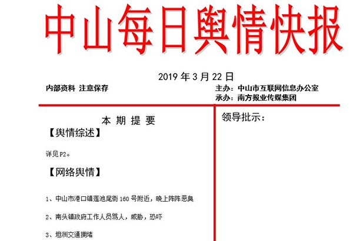
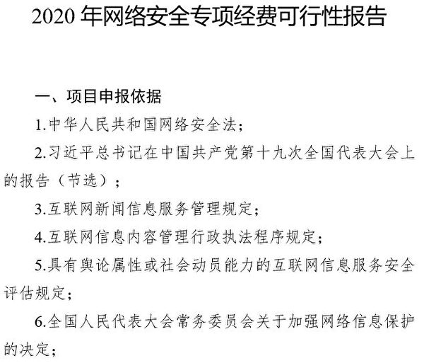
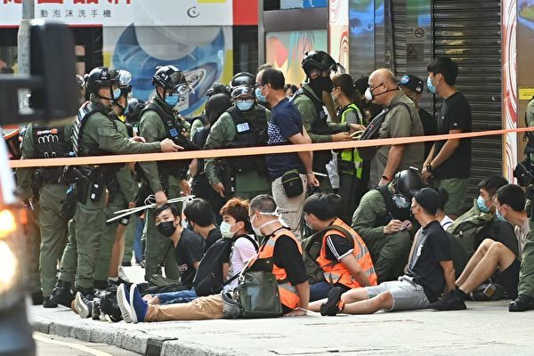
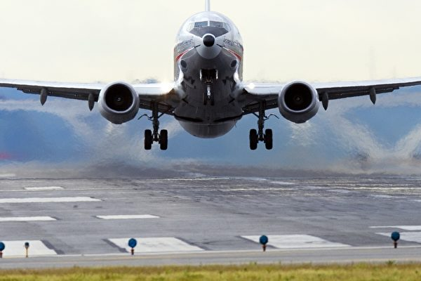
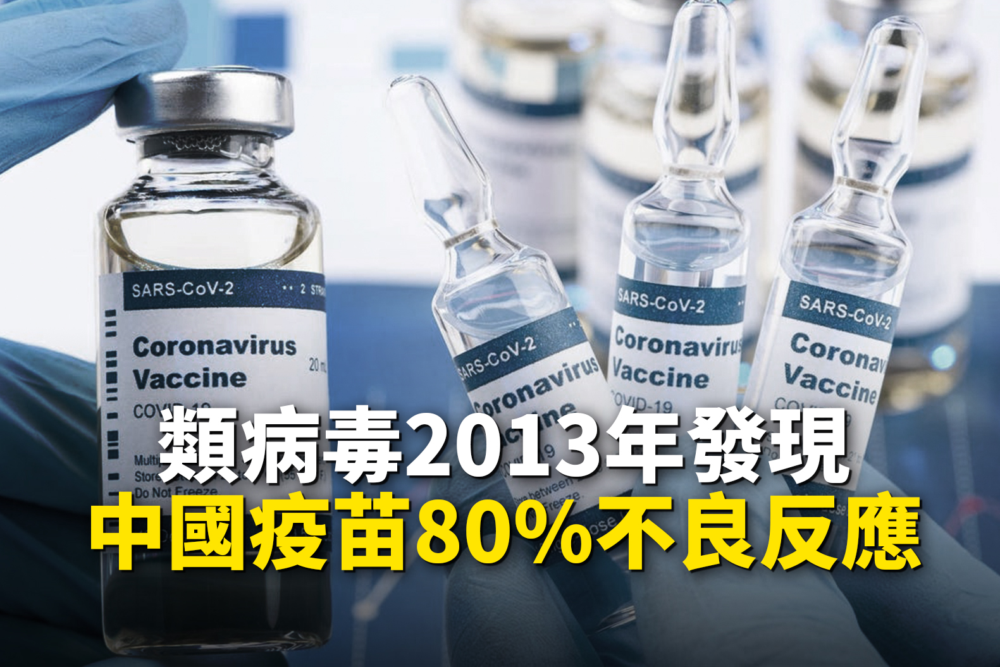
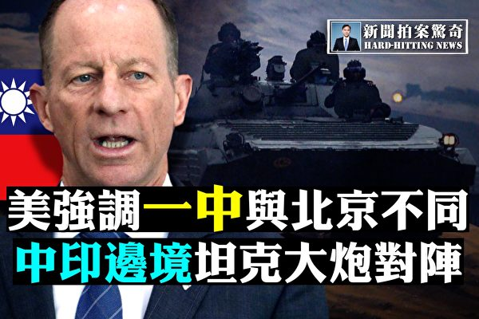
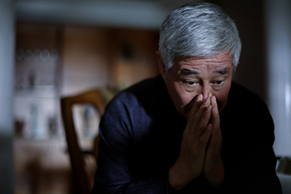

<h3><a target="_blank" href="https://bit.ly/3asSXIA">请多传破网软件，使更多的人了解真相从而得救，这是给自己积福德。 https://bit.ly/3asSXIA </h3></a>

   

     
<h3 align="center"><b>免翻视频  https://bit.ly/3ezRQKo  (请收藏网址 https://git.io/swspip)</b></h3> 

<h3 align="center"><b>复制网址到谷歌或火狐浏览器打开。若出现 “提示” ，請点击“继续”访问即可。</b></h3> 

<h3 align=center><a href="https://github.com/gav01/Heart/blob/master/news1.md">● 看更多大紀元時事 ●</a></h3>

<a href=https://git.io/souye><h6 align="right">回首頁</h6></a>

<a name=top>

<a href =#80>80.【内幕】花钱保政权 中山网信办购五大服务 
<a href =#79>79.《花木兰》再遭炮轰 片尾惊现中共迫害机构 
<a href =#78>78.国防科大学生在美遭诉 未婚妻潜逃时被捕 
<a href =#77>77.【新闻看点】中共外交频出洋相 习扩大开放被讽 
<a href =#76>76.中澳外交对峙5天后 两澳洲记者安全返国 
<a href =#75>75.【时事纵横】总加速师猛踩油门又刹车 哪错乱？ 
<a href =#74>74.王友群：又臭又长3万言 尽显中共无赖脸 
<a href =#73>73.美的被减持32亿 董事长套现近14亿 
<a href =#72>72.港人民力量副主席遭国安抓捕 涂谨申：文字狱 
<a href =#71>71.【新闻看点】中共触底线白宫震惊 习危险来了 
<a href =#70>70.广东增城街道办盗卖集体土地 再偷拆村民房 
<a href =#69>69.贵州一县欠教师薪资近5亿 贪教育经费逾3亿 
<a href =#68>68.乐山大佛洗脚天下乱 刘伯温预言了出路 
<a href =#67>67.500亿加密货币出逃 专家归因中共沉船效应 
<a href =#66>66.川普回应《大西洋》报导是骗局 11官员作证 
<a href =#65>65.【最新疫情9·6】白宫揭中共四大瞒疫行为 
<a href =#64>64.胡平：习近平整顿政法委 架空郭声琨 
<a href =#63>63.中共发布报告否认“种族灭绝” 世维会谴责 
<a href =#62>62.袁斌：习近平的五个“绝不答应”传递何信息？ 
<a href =#61>61.紫外线灯伤百余学生眼睛 学校称误开 
<a href =#60>60.德国青年遭中共驱逐：有些理想不能随便放弃 
<a href =#59>59.回国更难？中共要求赴华乘客提前3天核酸检测 
<a href =#58>58.甘肃院校学生大面积感染诺如病毒 上吐下泻 
<a href =#57>57.十几年如一日 法轮功学员坚守中领馆前讲真相 
<a href =#56>56.美调整对台政策 专家：台湾重回国际舞台x 
<a href =#55>55.马来西亚表明立场：不会遣返维吾尔难民 
<a href =#54>54.【新闻看点】中共少将泄疫苗真相？地下钱庄探秘 
<a href =#53>53.天津死亡赔偿案20年未结 被指案涉武长顺亲属 
<a href =#52>52.内蒙女官员堕楼亡 遗书流出 夫遭警方封口 
<a href =#51>51.中共如何将健康人摧残致疯（6） 
<a href =#50>50.呼市中院院长涉贪判囚8年 曾迫害法轮功 
<a href =#49>49.郭美美出狱后换脸改名 开设新账号重新炫富 
<a href =#48>48.拒绝中共灭绝文化 内蒙古1.8万民众联名抗议 
<a href =#47>47.中印边境冲突不止 传印军连长遭共军枪杀 
<a href =#46>46.【内幕】TikTok算法中隐藏的秘密 
<a href =#45>45.受台风影响 东北狂风骤雨 嫩江现洪水 
<a href =#44>44.川普：中共瞒疫 中国死亡数比任何国家都多 
<a href =#43>43.【拍案惊奇】中印坦克大炮对阵 北京惹恼蒙古国 
<a href =#42>42.田云：“中国人民绝不答应”中共豪赌透恐惧 
<a href =#41>41.维特齐访台成果丰硕 台捷迈向民主合作伙伴 
<a href =#40>40.中印边境再爆冲突 双方增兵屯粮备战 
<a href =#39>39.美司法部高官：中共用WeChat遥控留学生 
<a href =#38>38.中共以清零行动迫害法轮功 洛杉矶华人抗议 
<a href =#37>37.杨威：中共间谍挡住了中国学生留美之路 
<a href =#36>36.大陆网络批售人脸数据 配有对应身份证 
<a href =#35>35.地方政府放任暴乱 川普下令审核联邦拨款 
<a href =#34>34.王赫：是川普对华战略误判 还是左媒要误导？ 
<a href =#33>33.【最新疫情9·3】巨石强森坦承全家染疫 
<a href =#32>32.【一线采访】武汉疫情反复 诊断不敢写病毒 
<a href =#31>31.内蒙古广播电台300员工摁手印 吁保护母语 
<a href =#30>30.中共大使馆向匈牙利议员施压 信件曝光 
<a href =#29>29.【新闻看点】蓬佩奥再扔震撼弹 习遭捷克议员责骂 
<a href =#28>28.黎智英等被抓后 港警又抓27名声援理大者 
<a href =#27>27.美报告揭中共军队战力 不足以全面侵台 
<a href =#26>26.德警告不准威胁欧盟成员 王毅访欧被打脸 
<a href =#25>25.二亿元飞机半价也卖不出 赵本山遭女儿吐槽 
<a href =#24>24.【一线采访】内蒙罢课逃校 当局强令维稳 
<a href =#23>23.蓬佩奥发布会：四方面针对中共 
<a href =#22>22.中印边境冲突地区 印度军官被步兵战车压死 
<a href =#21>21.捷克市长致信王毅：你是无理的粗鲁小丑 
<a href =#20>20.【一线采访】云南蝗灾鼠害 农作物损失惨重 
<a href =#19>19.不愿弃台投共 所罗门最大岛将举办独立公投 
<a href =#18>18.邯郸市委书记高宏志被调查 曾迫害法轮功 
<a href =#17>17.首战即终战？美台官方报告揭中共攻台能力 
<a href =#16>16.山东小麦茎基腐病破1200万亩 粮食安全堪忧 
<a href =#15>15.云南爆发数十年最严重蝗灾 农户不知所措 
<a href =#14>14.美国澄清对台一中政策 与中共一中原则不同 
<a href =#13>13.为什么全世界都在停用抖音、微信？ 
<a href =#12>12.当制裁落地之后…… 
<a href =#11>11.参与迫害法轮功　辽宁逾两千人遭恶报 
<a href =#10>10.【一线采访】安徽庐江泡水40天 灾民绝望 
<a href =#9>9.【欺世大观】汉奸毛泽东：秘密结盟 卖国求生 
<a href =#8>8.楊威：王毅喊話歐洲聯合抗美 恐掀大風暴 
<a href =#7>7.【新闻看点】捷克亲台王毅恐吓 欧洲或掀仿效风 
<a href =#6>6.中共医疗谎言与悲剧——血祸 活摘器官 瘟疫 
<a href =#5>5.广东城管将抱小孩妇女摔倒在地 
<a href =#4>4.“国际强迫失踪日”的省思 
<a href =#3>3.蓬佩奥： 美将截断中共与伊朗的军火交易 
<a href =#2>2.【獨家】網絡也納入中共「網格化」管控 
<a href =#1>1.罪恶的“清零”行动 

<a name=80>
<h1 align="center"><b>【内幕】花钱保政权 中山网信办购五大服务</b></h1>

大纪元近期获得的网信办内部文件，揭示中共一直在花钱购买诸多网络服务，欲死保政权。（法新社）

   
【大纪元2020年09月06日讯】（大纪元记者何坚报导）从抖音（TikTok）到微信（WeChat），越来越多的的中国软件正在被美国等多国政府调查或禁用，肇因之一就是中共利用《网络安全法》等手段，操控中国企业和软件不当搜集数据。大纪元近期获得的中山市网信办内部文件，不但证实了这种指控，还揭示出中共一直在花钱购买诸多网络服务，欲死保政权。

<b>揭秘中山市网信办的“网络安全专项服务”</b>

中共中山市委网信办在《2020年网络安全专项经费可行性报告》中提出，依据《网络安全法》和习近平19大报告等内容，申报购买多项服务。

网信办在报告中称，申报项目是“用于落实《网络安全法》《互联网新闻信息服务管理规定》等法律法规相关要求”；重点是：做好网络舆情监测，做好网络信息专报，建设互联网行政执法取证系统，研究网络安全规划和应急管理，以及做好突发网络舆情应对处置；目标是维护网络意识形态安全，守好意识形态安全“南大门”。

1. “网络信息专报服务：70万元”

中山市市委宣传部购买舆情监测服务的合同文件截图。（大纪元）

该项服务是用于监测网络舆情。网信办文件显示，从2015年起，中山市市委宣传部就与南方报业传媒集团签约，南方舆情平台对涉中山市的各类敏感信息进行分析和梳理，向中山市委提供舆情监测服务。

中山市网信办要求每个工作日都要报送当日舆情专报，每周报送一周舆情专报，月底报送当月舆情分析报告，每季度和年底要报送一次当季舆情分析报告和全年舆情总结分析。

《中山市委每日舆情快报（2019年3月21日）》截图。（大纪元）

   
  例如2019年3月21日的《中山市委每日舆情快报》列举了3项网络舆情：1. 中山市港口镇莲池尾街160号附近，晚上阵阵恶臭；2. 南头镇政府工作人员骂人，威胁，恐吓；3. 坦洲交通拥堵。
  
<b>网信办文件泄露中共强取数据的底细</b>

<b>2. “互联网行政执法取证系统：40万元”</b>

中山市网信办的项目文件对于这项服务着墨不多，仅披露购买的系统是中央网信办和重庆网信办联合重庆华龙艾迪公司开发。

中山市委网信办在《2020年网络安全专项经费可行性报告》中，列出了《网络安全法》和习近平19大报告等申报依据。图为报告截图。（大纪元）

不过，这份文件透露的《网络安全法》、《互联网信息内容管理行政执法程序规定》等立项依据，无意中泄露了中共一个不能公开的秘密——中共治下的任何个人和企业，都有义务向当局“如实提供证据”。

为落实中共《网络安全法》，而于2017年6月1日起施行的《互联网信息内容管理行政执法程序规定》第四章（调查取证）第十八条规定，“向有关单位、个人收集、调取证据时，应当告知其有如实提供证据的义务。”

“被调查对象或者有关人员应当如实回答询问并协助、配合调查，及时提供依法应当保存的互联网信息服务提供者发布的信息、用户发布的信息、日志信息等相关材料，不得阻挠、干扰案件的调查。”

中共2017年5月出台《互联网信息内容管理行政执法程序规定》，要求任何单位、个人“如实提供证据”。（中共中央网信办官网截图）

   
不过，诡异的是，网信办立项的多个法规依据，例如《互联网信息内容电子数据取证工作意见》、《网信办三定方案》，都是不对外公开的“密件”。

时政评论员李林一对此表示，中山市网信办的这些文件证实了，美国政府对中共的指控真实不虚；中共的确会打着“调查取证”的名义，要求中国境内的任何个人、组织配合它，提供各种电子数据。

李林一相信，包括抖音、微信、QQ在内的这些中国程序也不会例外，因为程序开发商受中共管辖或钳制，中国APP获取的所有数据都是被中共“调查取证”的对象。

<b>3. “网络安全和应急管理处置：37万元”</b>

文件还显示，中山市网信办委托第三方开展网络安全检查评估和应急演练，文件列举了包括启明星辰、广州竞远和中山杰特等三方关于网络安全检查服务的报价，拟安排项目经费37万元。

<b>4. “网络安全规划和应急管理研究：5万元”</b>

中山市网信办申报购买的这4项网络安全专项服务，合计152万元。

<b>为防网络攻击 中共购买“网络安全支撑服务”</b>

中山市委网信办签订的2020—2021年《网络安全技术服务合同》显示，中山网信办（简称甲方）出资20万元，委托国家计算机网络与信息安全管理中心广东分中心（简称乙方）提供网络安全支撑服务。

乙方支撑甲方的网络安全监管，包括提供7×24小时网络安全应急响应服务；在中山市重点网络安全事件中提供技术支撑；出具中山市网络安全态势月报，并协助甲方出具《中山市2020年度网络安全态势报告》；重点时期开展流行、高危风险漏洞普查等服务。   
   
   

国家计算机网络与信息安全管理中心广东分中心出具的，2020年第1期《中山市互联网网络安全报告》截图。（大纪元）

例如，乙方在2020年1月16日出具的，2020年第1期《中山市互联网网络安全报告》中指出，据2019年12月监测数据，广东省共有152,207个IP地址的主机被植入木马或僵尸程序，约占全国的11.71%，全国排名第三，其中中山市有14,722个IP地址的主机被植入木马或僵尸程序，居全省第三。

值得一提的是，尽管文件显示中共网信办购买安全服务来防范网络攻击，但据多家国际安全公司的研究报告，许多臭名昭著的黑客组织和网络攻击事件与中共有关，例如黑客世界中曾名噪一时的“APT（先进可持续威胁）”攻击。

从APT1到APT20、APT41，目前已知有多个APT黑客组织隶属中共情报部门；其中的“APT1”，被指为中共解放军总参三部二局（61398部队）。美国网络安全公司“火眼”（FireEye）2019年8月曾发布报告，揭露中共的黑客组织不但替当局刺探情报，同时也利用网攻为个人牟利。

中山市网信出资委托广东端美传媒科技公司建设运营中山市的“七一E空间”党建云平台。图为购买合同截图。（大纪元）

   
  中山市网信办签订的《中山市互联网行业智慧党建云平台建设运营合同书》显示，网信办出资23万元，委托广东端美传媒公司建设运营中山市的“七一E空间”党建云平台。

智慧党建、互联网+党建、或党建云平台等噱头，是中共将共产党的组织活动、渗透进网络空间的举措。

中山市网信办购买的“七一E空间”，通过VR虚拟现实和浸入式互动体验等互联网技术，向党员提供数字党校、线上缴党费等党建服务。
中山“新媒体”影响力年度榜单的由来

近年来网络上出现了一些所谓的新媒体榜单、例如中山市新媒体影响力排行榜，中山市网信办的一份购买合同，揭开了这些新媒体榜单的底细。

中山市网信出资委托中山市网络文化协会举办“第五届中山新媒体影响力年度榜单发布会”。图为购买合同截图。（大纪元）

中山市网信办签订的《“第五届中山新媒体影响力年度榜单发布会”合作协议》显示，网信办出资委托中山市网络文化协会举办第五届中山新媒体影响力年度榜单发布会。

据陆媒报导，2020年6月12日，中山市网络文化协会和人民网舆情数据中心联合主办的第五届中山新媒体影响力年度榜单发布会，评出了中山十大最具影响力政务新媒体、十大镇区新锐政务新媒体、年度十佳正能量短视频等宣传中共的新媒体和短视频。

另据中山网信办文件《中山市网络社会组织情况》，中山市共有包括市网络文化协会在内的4家网络社会组织。网信办称，“4家协会均与业务主管单位密切对接”；且要“加强对我办主管的市网络文化协会的指导”；两家协会已成立党支部，分别有党员7人和6人。
中共网信办采购“中山发布”

中山市网信办委托广东中恒管理咨询公司，公开采购“中山发布”运营服务项目。网信办发布的采购公告显示，中山市网信办出资390万元，购买“中山发布”运营服务。

中山市网信办公开采购“中山发布”运营服务项目。（网络截图）

“中山发布”是中共中山市政府的政务新媒体，包括微博、微信和手机客户端（两微一端）。“中山发布”的账号主体，是中共中山市委网信办。

据中共中央网信办2018年报导，截至2017年12月，全国政务微博突破17万个，政务微信也超过51万个；新媒体已经成为中共宣传的重要窗口；其中，“中山发布”发展迅速，每4个中山人就有1个是“中山发布”的粉丝，影响力居全国政务微信前列。

评论员李林一表示，中共网信部门所做的这些事情，都是源于习近平的讲话精神、或中共的网络法规，习近平在中共19大报告中称要“牢牢掌握意识形态工作领导权”；然而，无论习的讲话，还是那些与法治精神背道而驰的中共法规，目的都只有一个，就是保党、保住中共政权。

<a target="_blank" href=#top><h6 align="right">回上方</h6></a>

<a name=79>
<h1 align="center"><b>《花木兰》再遭炮轰 片尾惊现中共迫害机构</b></h1>

韩国的学生和公民团体呼吁抵制《花木兰》，以支持香港的民主抗议活动。 (Chung Sung-Jun/Getty Images)

   
【大纪元2020年09月08日讯】（大纪元记者陈霆综合报导）迪士尼年度大片《花木兰》（Mulan）播映后争议不断，日前才因女主角刘亦菲曾公开“挺港警”言论，遭台湾网友集体抵制。最近，又有人发现电影片尾感谢名单中，竟出现许多涉及迫害新疆维吾尔族的中共机构，再度引发民主人士的谴责。

斥资2亿美元的真人版《花木兰》（Mulan）原订3月上映，但受病毒大流行影响，迪士尼最终决定放弃在美国、加拿大、纽西兰、澳洲等多国上映，改在线上平台Disney+与防疫成功的台湾影院中播映。

然而，女主角刘亦菲在去年香港反送中运动期间，曾公开在微博转发中共官媒《人民日报》的图片，图中写着“我支持香港警察，你们可以打我了”、“What a shame for HONG KONG”。刘亦菲力挺港警的言论，不仅引起舆论一片哗然，在《花木兰》上映后，民主人士黄之锋、王丹等人也呼吁抵制。

昨日，现居英国的香港作家吴志丽分享了《花木兰》片尾感谢名单的截图，指出该片的拍摄地点，正是大规模迫害维吾尔等少数民族的新疆地区。

<h4 align=center><a href="https://twitter.com/jeannette_ng/status/1302767969466974208?ref_src=twsrc%5Etfw%7Ctwcamp%5Etweetembed%7Ctwterm%5E1302767969466974208%7Ctwgr%5Eshare_3&ref_url=https%3A%2F%2Fwww.epochtimes.com%2Fgb%2F20%2F9%2F8%2Fn12387837.htm">Mulan specifically thank the publicity department of CPC Xinjiang uyghur autonomous region committee in the credits. 

You know, the place where the cultural genocide is happening.

They filmed extensively in Xinjiang, which the subtitles call “Northwest China”(点击右键,另存新档）</a></h4>

感谢名单中不仅包含了新疆的八个政府单位，其中更出现“中国共产党新疆维吾尔自治区委员会宣传部”和“吐鲁番市公安局”等，实际参与维吾尔族“再教育营”的中共单位。

据信，约有100万名以维吾尔族为主的少数民族被关押在中共营运的“再教育营”，他们受到虐待、折磨和思想灌输，以放弃其维吾尔族身份。成千上万的维吾尔人更被送往中国各地的强迫劳动设施中。

德国学者阿德里安·岑茨（Adrian Zenz）的调查指出，中共正在新疆对维吾尔族妇女强制实施绝育计划，仅2019年新疆生育率就下降24%。

澳大利亚战略政策研究所研究员内森·鲁泽（Nathan Ruser）也在推特上表示：“吐鲁番市公安局经营着至少14个非法关押少数民族的拘留设施。”

阿德里安·岑茨在接受《BBC》采访时也表示，吐鲁番市公安局实质负责管理“再教育营”。他批评迪士尼是“在集中营阴影下牟取暴利的国际公司”。

香港民主人士黄之锋发推文，呼吁大众抵制《花木兰》。黄之锋写道：“情况变得越来越糟！现在，当你观看《花木兰》时，不仅代表您对警察暴行和种族迫害视而不见（由于主演的立场），你还可能参与了大规模维吾尔族监禁。”

<h4 align=center><a href="https://twitter.com/joshuawongcf/status/1302795856786137093?ref_src=twsrc%5Etfw%7Ctwcamp%5Etweetembed%7Ctwterm%5E1302795856786137093%7Ctwgr%5Eshare_3&ref_url=https%3A%2F%2Fwww.epochtimes.com%2Fgb%2F20%2F9%2F8%2Fn12387837.htm">It just keeps getting worse! Now, when you watch #Mulan
, not only are you turning a blind eye to police brutality and racial injustice (due to what the lead actors stand for), you're also potentially complicit in the mass incarceration of Muslim Uyghurs. #BoycottMulan(点击右键,另存新档）</a></h4>

事实上，2017年花木兰导演妮基‧卡罗（Niki Caro）在Instagram上发布了在中国勘景的照片，其中一张标注着“亚洲 /乌鲁木齐”的照片，即引起网友反感，并抗议《花木兰》在实施大规模人权迫害的区域拍摄该片。

目前，尚不未知迪士尼与新疆维吾尔自治区党委会宣传部、吐鲁番市公安局有哪些合作，但是《花木兰》在全世界的关注下，已经成为迪士尼影业的一大丑闻。

<a target="_blank" href=#top><h6 align="right">回上方</h6></a>

<a name=78>
<h1 align="center"><b>国防科大学生在美遭诉 未婚妻潜逃时被捕</b></h1>
   <h3 align="center"><b>从袜子中抽出硬盘抛入垃圾桶 中国学者被捕细节曝光</b></h3>

图为美国司法部标志。(Mark Wilson/Getty Images)

   
  【大纪元2020年09月08日讯】（大纪元记者林燕综合报导）中国国防科大学生关磊（Guan Lei，音译）涉嫌破坏证据、妨碍联邦调查局调查于8月在美国被捕。最新消息是，他的未婚妻在同意转为污点证人后出逃，已在机场被抓。

据悉，关磊7月跟联邦调查局面谈后两天，匆忙准备登机返回中国；在机场时，边境官员以他“损害美国利益”拒绝其离境；折回后，他将电脑硬盘损坏后塞入袜子，假装成杂物扔到垃圾箱内。

29岁的关磊从2018年起，持J-1非移民签证在加利福尼亚大学洛杉矶分校学习，研究方向为人工智能。

检方怀疑关磊将敏感的美国软件或技术数据转移回中国，用于开发具有核爆炸性应用的超级计算机。

关的未婚妻杨智慧（Yang Zhihui，音译）在加州大学欧文分校就读计算机科学专业，也是中国留学生。

她之前已同意做关案的污点证人，但她在未通知检方的情况下、试图8月31日登上飞往中国的航班，同日她在机场遭到逮捕。

<b>特工登门后两天 急忙出境</b>

7月17日，联邦调查局特工敲开了关磊的公寓门，并跟其进行面谈。他同意执法人员当场搜索他的笔记本电脑和两部手机，称他没有其它数字存储设备。据悉，他的手机和笔记本电脑最近已经过重新格式化，没有留下以前的数据。

19日，也就是在被联邦调查人员约谈过2天后，他去了洛杉矶机场、试图登上飞往中国的航班。

当时，关磊拒绝联邦人员检查他的电脑；而当联邦人员询问他，是否曾与中共领事馆或大使馆保持联系。关磊回答说，他没有。

海关官员在检查后、拒绝关磊登机，并告诉他：“你离开美国将损害美国的利益”。

在被拒登机折返后，他被看到将人为损坏后的硬盘驱动器扔到其住所附近的垃圾箱中。硬盘已遭到人为的毁坏。

关磊的证词则说，他之所以与联邦调查局进行对话是因为他“没有什么可隐瞒的”，并且他相信，他是因为“中美之间的政治气候”而成为目标。

<b>对FBI隐瞒其跟中领馆的联系</b>

关磊还对FBI调查人员撒谎，说他在美国的两年时间与中共领事馆没有任何联系。

起诉书援引电子邮件通讯记录显示，关磊在6月和7月与中共驻洛杉矶领事馆和华盛顿特区大使馆来回多封电子邮件，其中一封邮件中，关磊对国防大学被列入美国黑名单表示关切，并要求帮助返回中国。

起诉书说，FBI通过搜查令、从Google获得了这些电子邮件。

联邦调查局在过去的一年中将更多注意力放在了中国学者身上，他们发现，中国学者是导致美国研究机密被盗的一个途径。

美国司法部今年夏天起诉了数名具有中共军事背景的研究人员，中共驻美领事馆网站还公开提醒留学生注意电子设备在机场被查，甚至还有中共外交官亲自赶赴各地，警告部分留学生警惕联邦调查局的大筛查，并敦促中共军方人员删除干净电子设备和社交媒体聊天记录。

<b>硬盘塞袜子中 装成垃圾扔掉</b>

在被迫折回一周后，关磊在公寓大楼内来回走动，最后他停在垃圾箱旁边，从袜子内拉出一个物体扔了进去。他的未婚妻杨智慧当时就站在他旁边。

联邦调查局特工后来从垃圾箱中取出了一个小硬盘，该硬盘是跟之前他们搜索的关磊笔记本电脑匹配。

被证实，该硬盘遭到蓄意破坏，盘内的数据已被清除。

<b>关磊研究优化算法 跟军方超级计算机有关</b>

最新的案例跟中共军方正在进行的军事应用研究有关。

起诉书还称，关磊在加州大学洛杉矶分校数学系就读期间，研究“一种优化算法及其在机器学习中的应用”。

关磊在国防科大的教授是中共军方中将卢锡城，卢曾参与开发中共军队的总参谋部、总装备部、空军、军事天气预报和核技术的计算机系统。

起诉书说，怀疑中国国防科大采购美国原产的部件、获取美国的技术、开发具有核爆炸性应用的超级计算机，国防科大因核不扩散条款已被美国商务部列入实体清单（黑名单）。

但他的美国指导教授告诉FBI，他没有收到过关磊行为不当的预警，也不认为，关在UCLA非法访问军事或专有申请。

起诉书中没有提到关磊在加州大学的教授姓名，但加州大学洛杉矶分校数学系教授尹沃涛（Yin Wotao）的个人网页早些时候将关磊列为访问学生。

尹的学校网页说，他正在休假期间。据悉，他跟中国电子商务公司阿里巴巴集团控股公司在美国的一个机构有合作关系。

关磊将于2020年9月17日提审。他被控破坏证据罪名，属于重罪，最高刑期为20年。 

<a target="_blank" href=#top><h6 align="right">回上方</h6></a>

<a name=77>
<h1 align="center"><b>【新闻看点】中共外交频出洋相 习扩大开放被讽</b></h1>

近日，王毅的战狼外交促进了欧盟“更加团结一致对待北京的威胁”，中共还不知收敛，还屡屡对一向温和的加拿大进行威胁。（大纪元合成）

   
 【大纪元2020年09月08日讯】大家好，欢迎关注新闻看点，我是李沐阳。  
 
 【60秒看全球】

欧盟表示 ，计划在本月中旬对31名白俄罗斯高级官员实施经济制裁，以惩罚该国8月9日的选举舞弊。

三星表示，它们已经赢得了美国威尔逊公司一份66亿美元的合同，帮助它们在美国打造5G网络。

海外蒙古人诺民对自由亚洲表示，中共官员警告内蒙古人，反对汉语教育就是反政府和颠覆政权 。

昨天香港人的大游行遭到警方严厉镇压，抓捕近300名香港市民。其中一名12岁购物少女无端遭到警察追捕，被至少3名警察跪压。

印度通讯部长表示，目前苹果已经将8家工厂从中国迁到了印度。

加州人改变了以往庆祝劳工节的聚餐模式，在各地发起花式游行活动，向美国总统川普表达支持。

下面进入今天的话题。现在网络上在广泛流传一种说法，当今中共国是小学生治国。这个说法的源头，可以追溯到毛泽东的秘书李锐那里，他曾经狠批习近平“只有小学程度”。

习是不是真的只有小学文化水平，我没有考证，也没必要考证。但是从中共官员在政治舞台连出洋相来看，中共高层的智商真的普遍不高。

<b>杨洁篪代表三国骂美国</b>

昨天（6日），中共官媒新华社刊登了对中共政治局委员、中共外事办主任杨洁箎在前天（5日）的书面采访。杨洁篪9月1日到4日，刚刚访问了缅甸、西班牙和希腊。

大家注意，是书面采访，并不是电视采访。书面采访就存在文字美化的成分，中共官媒的文字功底用习总的话说，还是比较“精甚（精湛）”的。所以杨洁篪是不是像文字中那么说的，是值得怀疑的。

而且新华社上来就让杨洁篪自我评价出访成果。有没有成果，那得外人的评说才有说服力。但是新华社却让杨洁篪自我评价，这意思就是“你怎么吹都行”。

于是杨洁篪侃侃而谈，自称这次三国行是“深化互信”之旅，也是“拓展合作”之行。他还列出五点，以证明他此言不虚。不过我看过之后，并没看到多少实质内容，倒是口号居多。

文字中表示，杨洁篪表示，他与三国领导人“达成高度共识”。“三国赞同中方主张和理念”，“中国同三国均反对将疫情政治化，对别国污名化”。

文字中还称，“个别大国唯我独尊、强权霸凌，以冷战思维煽动冲突对抗，毒化国际关系”等等。

杨洁篪没有提到任何一个国家，也没有说明“个别大国”指的是哪个国家。但是稍微有点智商的人都清楚，这是在骂美国。

<b>蓬佩奥：中共正在建立附庸国</b>

杨洁篪代表三国骂美国，令人怀疑，因为那三个国家并没有表态，而是杨洁篪自己说的。所以那三个国家是不是像他说的那样，有很大的疑问。

4日，美国国务卿蓬佩奥（Mike Pompeo）在休·休伊特广播节目（The Hugh Hewitt Show）中表示，当今中国，“维吾尔人、藏人甚至蒙古人的基本人权都出现严重恶化”。“中国（中共）在中印边境增派兵力”，表明“它（中共）希望在全球实现霸权统治”。

蓬佩奥指出，中共就是要一些小国、穷国“把北京当作中央王国”，要他们向北京“进贡”，把他们变成“附庸国”。

图为美国务卿蓬佩奥（Mike Pompeo）。（TOM BRENNER/POOL/AFP via Getty Images）

国务卿表示，中共这样做已经“有很长的历史”，“对全世界构成巨大的风险”。目前川普政府“正在每一个方面对中国进行回击”。

蓬佩奥强调，“在各个方面，无论是外交还是经济，美国都在顶回去。我们（美国）不再像过去或者右脸被打转过左脸。我们（美国）将要求中共以我们要求其它所有国家同样的方式来行事”。

在5日的节目中我们说过，中共的一系列行为表现已经震惊了白宫。川普和他的内阁官员们在固守着道德传统，根本不相信中共有这么流氓。

就拿川普来说，他认为同样是一国领导人，我尊重你，你也应该尊重我。领导人之间，特别是一国首脑，怎么可能会欺骗呢？但是川普想不到，可是北京做出来了，而且是一而再、再而三。

川普政府被彻底震惊了，这才开始对中共进行打击。而且美国似乎决心要干掉中共，不再上演“农夫和蛇”。

<b>王毅访欧丢分，战狼咬到铁板</b>

刚才说了，杨洁篪接受书面采访，是因为可以文字美化。不过即使这样，出访欧洲五国的中共外长王毅，也没享受新华社采访这种待遇。

原因很清楚，战狼外交咬到了铁板。不仅没有缓解国际对中共的批评，反而给北京当局添了不少乱，中共与欧洲的外交关系蒙上了一层阴霾。

王毅出访期间，捷克参议长维特齐（Milos Vystrcil）率团对台湾进行了访问。当时王毅就口出恶言，声称让维特齐“为自己的短视行为和政治投机付出沉重代价”。

王毅向来以中共外交部“战狼”形象出现，但是这次它咬到了铁板上。在一向与中共走得比较近的德国，外长马斯（Heiko Maas）面对媒体，直接回呛王毅：“作为欧洲人，我们采取紧密合作的行动”，“威胁的声音不适合这里”。

紧接着，法国、斯洛伐克和其它欧洲国家的代表迅速对马斯的表态进行声援，对维特齐的行动表示支持。

其实王毅的欧洲五国行，本想是拉拢欧洲，但却适得其反，几乎每一站都对王毅有质疑。意大利外长迪玛约（Luigi di Maio）公开发声，表示香港的自治权无可争辩。

此前，在美中角力当中后，欧洲一直试图两头都不得罪，不愿意站队。但是中共对疫情的掩盖导致全球大流行，华为的设备为中共收集情报，中共对台湾、香港和新疆人权的侵犯等等惊醒了欧洲。欧洲发现，自己一直试图“合作”的对象，是一条剧毒无比的蛇。中欧关系开始紧张了。

华府智库彼得森国际研究所欧洲问题专家柯克加德（Jacob Kirkegaard）对美国之音表示，王毅的战狼外交促进了欧盟“更加团结一致对待北京的威胁”，“欧盟将逐步采取更加强硬的路线与中国（中共）对抗”。

<b>“梦”晚舟，中共威胁不断</b>

震惊了美国，惊醒了欧洲，中共还不知收敛，还屡屡对一向温和的加拿大进行威胁。现任中共外交部北美大洋司司长的陆慷9月3日对加拿大《环球时报》表示，美国同111个国家有引渡条约，曾向“数十个”国家提出过引渡孟晚舟的要求，偏偏加拿大政府“成了这唯一的一个”。

从华为首席财务官孟晚舟2018年12月1日被抓，世界各国媒体都在关注事态发展。但是从没有一个媒体报导过陆慷所说的消息，就是“美国向几十个国家提出引渡孟晚舟”。

加拿大前驻华大使赵朴指出，陆慷是“假消息专家”，对他的说法应“保持警惕”。另外，就算别的国家不做，“加拿大依据美加引渡条约拘捕孟晚舟也是合法的”。赵朴认为，陆慷的说法“更像是在赌气”。

时隔21个月，中共还没死心，对孟晚舟念念不忘。而这将近2年中，中共对加拿大施加了重重威胁，拘捕了多名加拿大人进行报复，使加拿大多数人对中共相当反感。

记者追问陆慷，“如果孟晚舟最终被引渡至美国，中方会对加拿大还能报复什么？”陆慷说中方“真不愿意看到发生那样的情况”。威胁的意味相当浓厚。

孟晚舟究竟如何处理，加拿大法庭自会秉公处理。但中共为了救出孟晚舟，几乎动用了全部力量，甚至不惜破坏中加关系，能毁的已经全都毁了。而被美国已经抓捕的中共女军医唐娟，中共一个字都不肯为她辩护。一样为党卖命，两种不同对待。

其实孟晚舟虽然是嫌疑犯，但她身居豪宅、美食美衣、自由出入，加拿大相当人道。而被中共报复抓捕的康明凯和斯帕弗，却连律师都见不到。

从中共的做法看，没有一点理智。或许，这就是中共高层的智商反映。

<b>印度5平民被中共军方掳走</b>

昨天（6日），印度媒体报导，有5名印度青年在中印有争议的边界打猎时，被中共军方带走了。印度内政部次长李继竹（Kiren Rijiju）在个人推特上表示，已经用军事热线向中方查询，正在等待答复。但中共方面是“已读不回”。

据自由亚洲报导，在中印主权争议区，有7名印度少年3日在森林打猎，被中共军队俘获。其中2名少年幸运逃脱，跑回村庄求救。家属在网络上求救寻人的消息，惊动了印方军中高层。

据鹰新闻（Eagle News）推特消息，这5名印度人在印度军队中担任向导及搬运工。这起事件，无疑将使中印关系再度恶化。

图为中印边境驻守的印度士兵。（AFP）

美中关系搞僵了，欧洲得罪了，中加关系毁了，现在又加剧邻居之间兵戎相见的紧张情势。浑身是刺儿的中共，满世界招惹是非，把整个世界都打造成了敌人。这些没头脑的做法，让人不得不怀疑北京当局的智商。

更让人怀疑北京智商的，是连续两天的公开讲话前后矛盾。

<b>五个“绝不答应”VS扩大开放</b>

9月4日，习近平在北京参加了全球服务贸易峰会。他在致词中说，“中国将坚定不移扩大对外开放”。

其实单独听这句话没问题，问题是这句话与前一天的说法矛盾了。

9月3日，习在一个座谈会上严肃地说出了五个“绝不答应”。其中之一是“绝不答应”外来势力改变中国的前进方向、阻挠中国人民创造自己美好生活的努力。

为什么说前后矛盾呢？

大家想想，北京喊的“扩大对外开放”，中共已经喊过很多次了，但每次过后都是依然如故。因为中共不敢真的对外开放，如果真对外开放，那么按照美国的要求，它不仅要开放市场，还要开放网络、金融等等。

别的不说，单单一个开放网络，就可以要了中共的命。中共统治中国的手段就是暴力和谎言，混淆中共与中国人民之间的关系。如果网络开放，中国人民就会知道中共一直在撒谎，就会知道中共根本就代表不了中国人民。当了解真相后，人民必然要进行反抗。

只要人民敢对中共说“不”，那就是中共覆灭的时候到了，所以中共不可能开放网络。

开放金融市场也是一样。中共垄断着国内的所有金融领域，把大小银行都当成它敛财的工具。一旦金融市场开放，外国银行进入，那么中国大陆的银行立刻失去竞争力而渐渐死去。没有了经济支撑，中共政权也会很快完蛋。

所以说，中共绝对不敢真的对外开放。一真正开放，中国的前进方向就真的要改变。在中共统治下的中国，正在被中共带向覆灭的境地。如果开放了，人民真正成为国家的主人后，中国就会走向光明新生。而这是中共最最害怕的，只要人民醒觉了，中共就要完蛋了。

所以前后两天，北京的说法就出现自相矛盾，一边开放，一边阻断外来势力，这不是中共高层的智商有问题吗？

外界指习近平的战狼术受到军中将领的谴责，这是习面对诸多内忧外患之中最大的隐患。图为2020年5月21日中共两会开幕。(Leo RAMIREZ/AFP)

*****
<b>北京改写武汉抗疫事实</b>

中共高层智商有问题，还有一点。武汉疫情人尽皆知，但是中共却希望在国际不信任的大背景中，改变武汉的疫情叙事。

中共官媒新华网在微博中写道，“武汉140万学生复课，美国人惊呆了。在武汉，140万学生复课震撼外媒，多家媒体认为，今天的武汉展现出整个中国已经回归到常态，美媒直言需要向中国借鉴成功经验”。

上周，中共对武汉学生复课大张旗鼓的宣传。宣称“全世界今天没有多少地方人们不戴口罩，并且能够机集会。这证明武汉战胜了病毒，一切正常运转”。

中共的宣传，已经把武汉塑造成了“英雄城市”。微博上流传着一段拍马屁的视频说“2020年，面对突如其来的新冠疫情，我们迎难而上，攻克时艰”等等。

从中共的各种宣传中，你看不到人们曾经经受的痛苦，看不到武汉人民的伤痛，中共已经改写了武汉的抗疫事实。

有网友留言写道：“生生把悲歌写成了赞歌，死去的冤魂可还有人记得？”

另一位网友写道：“弱弱问问，百步亭万人宴，带病演出庆开会，窗台敲盆，日记，这些内容，有么？”

网友提到的日记，大概指的是武汉作家方方写的“方方日记”。“方方日记”记录了封城时期武汉人的点滴故事，真实反映着武汉人的水深火热。但是方方却因为这本日记的出版，遭到了中共文宣的围攻。

被誉为“武汉良心”的作家方方，封城期间撰写的日记连载在3月25日停笔。她最终篇字里行间仍流露对染疫逝者的不舍，面对极左五毛的挑衅，则痛批他们是中国社会的病毒。（大纪元图片）

中共此刻对“胜利”的渲染，让方方也有所感触。她写道：“在媒体上看到的内容，仿佛武汉人过了一个比以往更加盛大的节日，而不是一场灾难。”

她说“那些对武汉人说‘人不传人、可防可控’的专家们，无一人向武汉人道歉，更不见他们忏悔。官方和媒体无一有反思，更无人提追责。不幸而死的人们可怜，活着的我们可悲”。

眼睁睁的事实，中共可以选择性的宣传，掩盖事实真相，把悲情宣扬成喜庆，丧事喜办。在中共的统治下，中国不会缺少这样事。

<b>杀人犯“纸面服刑”15年</b>

4日，大陆媒体披露了这么一件事，杀人犯被判15年有期徒刑，但一天牢也没坐过，并且正式刑满释放了。网友称之为“云服刑”。

这件事就发生在正在被中共强推“双语教学”的内蒙古。1992年，当时17岁的巴图孟和与当时19岁的白永春发生口角，随后巴图孟和用刀捅伤了白永春，白心脏破裂死亡。

1993年，巴图孟和被以故意杀人罪判处有期徒刑15年。但是在判决生效后，巴图孟和就申请保外就医，并直接从看守所回家了，并没有入狱。

2007年5月，巴图孟和拿到了狱方开具的“刑满释放证明书”，随后摇身一变，成了当地的会计，还成了村主任、加入了共产党，随后又成了旗人大代表。

据大陆《半月谈》杂志多方采访核实，揭开了巴图孟和保外就医的真相。法院判决后，巴图孟和以“全身水肿、尿血”为由，前往医院检查。就医后，他的亲属就为他办理保外就医手续，并成为担保人。

多名当事人回忆，办理的手续上，有多名当地时任政法机关主要负责人的签字。就凭着这些手续，巴图孟和连监狱的门都没进过，从看守所直接“重获自由”。

巴图孟和在2007年“在纸上刑满释放”后，立刻活跃了起来。先是在2008年6月到2009年10月，在当地任会计。然后在2009年10月到2017年5月，又成了村主任。因为他被判刑的资料并没有在档案中体现，所以2012年，他又成了旗人大代表。

直到2017年巴图孟和职务犯罪东窗事发，他“纸面服刑”15年的事才引起关注。

杀了人，被判刑15年，一天监狱都不用坐。然后出狱后还仕途顺利，步步高升。如果不是后来小河沟里翻船，很难想像杀人犯会做到中共的哪一级官位。

这种“纸面服刑”的故事，小说作家都不一定想得到。但是它却真实发生了，就发生在中共统治下。

不过虽然现在巴图孟和又犯事了，但是估计不会有什么大的闪失，因为有人在罩着。谁在罩着呢？

内蒙古政法委近日表示，已经连同多个部门组成了工作组进行调查。但是，当年巴图孟和的保外就医手续等关键文件不翼而飞，追责工作难以深入进行。

怎么样？在中共的统治下，只有你想不到，没有它做不到。追责最终不会有什么结果，最多就是扔出一两个替罪羊，平息整个事件。中共不可能一追到底，不可能追到真正的责任人。因为追来追去，官员越追越大，会追到整个的中共政治体制。所有的恶行出现，中共的体制才是毒根。如果不拔除毒根，中国人民永远都是被宰割的对象。

最后要特别提醒一下会员朋友，请您抓紧时间转到我们的优乐客，我们在9月之后， YouTube会员区我们将要停止更新，希望您不要错过时间。

以上就是今天的节目内容，如果您喜欢新闻看点，请别忘记点赞订阅，并分享给您的亲人和朋友。

感谢您的收看，再会。

大纪元《新闻看点》制作组

<a target="_blank" href=#top><h6 align="right">回上方</h6></a>

<a name=76>
<h1 align="center"><b>中澳外交对峙5天后 两澳洲记者安全返国</b></h1>
   <h3 align="center"><b>被救记者：回到真正的法治国家是一种解脱</b></h3>

一名中共哨兵于2020年7月9日站在澳大利亚驻北京大使馆的入口处做出禁止入内的手势。(NICOLAS ASFOURI / AFP)

   
  【大纪元2020年09月08日讯】（大纪元记者王祥综合报导）在收到中共警察的约谈通知后，两名驻华澳大利亚记者迅速进入澳大利亚驻华大使馆、领事馆避难，在历经5天的外交对峙后，两名记者终于逃离中国，安全返国。

澳大利亚外交大臣佩恩（Marise Payne）周二（9月8日）发出的一份声明中说：“澳大利亚政府为在中国的两名澳大利亚记者提供了领事帮助，以协助他们返回家园。”

“我们在北京的大使馆和在上海的总领事馆在与中国（中共）当局接触，以确保他们的健康和回澳。”

据澳大利亚广播公司（ABC）报导，这两名记者分别是澳大利亚广播公司驻北京的记者比尔·比特尔斯（BIll Birtles）和澳大利亚《金融评论》驻上海记者麦克·史密斯（Mike Smith），他们是澳大利亚驻中国大陆的最后一批记者。

据悉，他们在离境前，都分别受到中共国家安全部的质询。ABC的比特尔斯在澳大利亚驻北京大使馆避难了四天，而史密斯则在澳大利亚的上海领事馆避难；同时，澳洲外交官与中共官员进行谈判，最终允许他们两人安全离开中国。

在历经周折、终于在7日离开中国抵达澳洲后，他们表示，回到法治国家是一种解脱。

在他们离开中国前一周，中国出生的澳籍公民成蕾（Cheng Lei）已被中共当局拘留；在被拘前，她是中共国家电视台央视旗下CGTN的英语新闻频道主播。

<b>警察午夜上门 以国家安全为由传唤</b>

这场抢人战始于上周早些时候，当时澳大利亚驻北京的外交官就提醒ABC记者比尔特斯，让他离开中国，澳洲外交事务和贸易部的官员也几乎同时向ABC高管提出了同样的建议。

澳洲外交部也向ABC总裁大卫·安德森（David Anderson）发出警告，敦促ABC组织航班让比特尔斯回到澳大利亚。

ABC原安排旗下记者于上周四（4日）早上启程回国。

但孰料，3日午夜，七名中共警察突然抵达比特尔斯的公寓。当天，他刚跟同事和朋友举行完告别派对。

中共警察告诉他，他被禁止离开中国，他们会第二天再与他联系，安排时间就“国家安全案”开始讯问。

<b>担忧人生安全 进入大使馆避难</b>

比特尔斯马上致电给澳大利亚驻华大使馆，将他从公寓接走。接下来的几天，他一直待在大使馆内，中共官员要求与他面谈。

他最初以担心自己的人身安全为由拒绝与他们交谈。

随后澳大利亚外交人员和中共官员交涉、双方达成协议，如果比特尔斯与他们交谈，那么中方就取消他的旅行禁令；最后比特尔斯周日（6日）在澳大利亚驻中国大使格雷厄姆·弗莱彻（Graham Fletcher）的陪同下接受了中共当局的约谈。

据悉，会议期间，没有任何关于他在中国的报导或行为的提问。

<b>急速回澳 “回到法治国家是一种解脱”</b>

澳洲大使馆官员随后告诉比尔特斯，他的旅行禁令已被撤销。周一（7日）早些时候，领事馆人员陪同他一起从北京飞往上海，再登上飞往悉尼的航班。

另一名记者史密斯的经历也雷同，他工作地点在上海，于是他选择了在澳大利亚驻上海领事馆避难，他也在周一（7日）晚上受到中方的讯问后，选择快速离境。

他们乘坐同一班航班抵达悉尼。飞机落地后，比特尔斯说，这场经历就像是“旋风”，不是特别好的经历。

“在这种情况下不得不离开是非常令人失望的，而回到一个拥有真正法治的国家，这是一种解脱。”他说，“回家真好。”

<b>澳洲将继续关注在华被拘公民</b>

AFR主编斯蒂奇伯里（Michael Stutchbury）和编辑贝利（Paul Bailey）发表声明说：“（中共）针对两名新闻记者——他们在履行正常的报导职责——的行为令人遗憾和不安，这不利于澳大利亚和中国之间的合作关系。

他们表示，感谢澳大利亚外交事务和贸易部和领事官员协助记者安全返回。

外长佩恩在周二的声明还提及：“澳大利亚政府继续向在中国被拘留的澳大利亚公民，包括成蕾提供领事支持。”

至今中共当局仍未提供任何拘押成蕾的理由，澳洲最早的声明说，在“2020年8月14日收到了中国（中共）当局关于她被拘押的正式通知”。

今年7月初，澳洲政府发布新的旅行建议，警告澳大利亚人如前往中国大陆可能会遭遇“肆意逮捕”。

旅行建议中称：“（中国）当局已拘押了一些外国公民，他们被指‘危害国家安全’”，“澳大利亚人也可能面临被肆意拘留的危险。请勿前往中国。”

“如果你已经身在中国，并希望返回澳大利亚，我们建议你尽快通过商业航班（回澳）。” 

<a target="_blank" href=#top><h6 align="right">回上方</h6></a>

<a name=75>
<h1 align="center"><b>【时事纵横】总加速师猛踩油门又刹车 哪错乱？</b></h1>

砸锅中共！王毅欧洲行反让关系更加疏远，欧盟联手抗击；习近平五个绝不答应后又承诺开放，蔡霞：欺骗中国人！（大纪元合成）

   
 【大纪元2020年09月08日讯】中欧视频峰会前中共外长王毅欧洲之行，砸锅中共，欧盟联手抗击。彭博社爆出评论文章，概括中共高官访欧成就：欧洲刚刚宣布从中国（中共）独立。

危机四伏之下，总加速师一脚猛踩油门，五个“绝不答应”话音未落，另一脚又急踩刹车，承诺开放。蔡霞称，习近平政府喊着开放、全球化，其实是“欺骗中国人民”。

在港版“国安法”笼罩的白色恐怖气氛下，香港市民昨天（9月6日）走上街头表态，争取立即重启立法会选举，近300人被捕。  

<b>1. 中欧峰会前 习近平加速疏远欧洲？</b>

中共本想仰仗抓着供应链，牵着各国鼻子走。那知，中共病毒一棒子打醒各国，围殴中共一波接一波。美国国务卿蓬佩奥前脚离开欧洲，中共外长王毅后脚就到。中共的如意算盘打得劈啪作响，一来想探一探美国对欧洲影响力，另一方面为9月14日中欧视频峰会打前站。

不料，王毅在欧洲五国各国备受冷遇，还被一路抗议。更加糟糕的是，他的战狼姿态，不仅触怒了欧洲民众，也让欧洲的政治家们掩盖不住厌恶，王毅欧洲之行不但砸了中共的锅，还促成欧盟联手抗战狼。

更让中共心惊肉跳的是，供应链要出事儿。王毅刚离开欧洲，德国公布了“亚太准则”。9月4日，美台欧日合办“重组供应链”论坛，并声明确保安全不受政治胁迫。上周末，彭博社就爆出评论文章，概括了中共高官访欧成就：欧洲刚刚宣布从中国（中共）独立。

彭博社9月5日发表评论文章称，“随着欧盟在一个越来越美中两极化的世界中航行，它终于看到有必要团结起来，甚至是对付北京。”文章称，“中国外交官们原本在欧洲已经度过了糟糕的一年，但本周他们使情况变得更为糟糕。”中共在加速实现疏远欧洲的壮举中，一骑绝尘。

文章称，习近平在欧洲地区的首要目标是防止欧盟和美国结盟对付北京。他原希望在9月14日与欧盟领导人举行的视频峰会上取得突破。

正因为此次峰会赌注很高。所以，习近平在上周派遣外交部长王毅到五个欧洲国家进行了准备性的“甜言蜜语行动”。事实上，“双方确实进行了对话，但却并不那么甜蜜。”

欧洲比美国更渴望与中共保持贸易往来和开展业务。然而，王毅访欧期间在正式礼仪细节之下受到了前所未有的抵制。在其它四国访问中出现的插曲，与他到访柏林的经历相比，都不值一提。

王毅8月31日，在德国访问时对媒体声称对台访问的捷克参议院议长维特齐（Miloš Vystrčil）将会为此“付出沉重代价”。他还警告称，维特齐的此举使他成为了“14亿中国人民的敌人”。

德国公布“印太准则”，强调经济伙伴关系多样化，减少对单一国家的依赖。 (STEFANIE LOOS/AFP via Getty Images)

   
王毅话音未落就引起了德国外交部长马斯（Heiko Maas）的迅速回应。9月1日，马斯站在王毅边上面对媒体提醒他的访客，“作为欧洲人，我们采取紧密合作的行动”，并要求受到尊重。他强调，“威胁的声音不适合这里”。

与此同时，来自法国、斯洛伐克和其它欧洲国家的代表也迅速对马斯的表态和捷克参议院议长维特齐提出声援和支持。

彭博社评论文章认为，在外交术语如此仪式化的世界中，这一刻不仅标志着新的欧洲语气，而且也标志着新的方向。

掩盖疫情，改变叙事，中共的行事准则清晰地展现在国际社会舞台上。何况还有持续二十多年的迫害法轮功、近年打压香港、迫害新疆维吾尔人、南海争端和台湾问题等，这还不算中共就商业问题的强取方式。

经过多年的谈判后，欧洲对中共就其国有或由国家指导的企业在进入欧盟单一市场时，所采取的扭曲竞争或技术掠夺的多种方式所展现的顽固不让态度感到厌烦，欧方开始限制中方在欧投资。

中共外长王毅前脚刚走，德国政府立刻于9月2日公布外交新策：“印度-太平洋-准则”（Indo-Pazifik-Leitlinien）。德国强调，希望与日本、印度等亚洲国家加强合作，力促欧洲的印太战略。德媒分析，这意味着德国对中共政策的转向。

德国外交部表示，随着印太地区在经济上和政治上重要性的增加，德国必须制定新的地域性准则，即“印太准则”。该准则的目的之一就是使经济伙伴关系多样化，以减少对单一国家的依赖关系，并帮助塑造未来的国际秩序。

德国也向其它欧洲国家发出信号。马斯说，“德国政府正在与我们的欧盟伙伴，特别是法国一起，根据我们的原则和价值观制定针对印度太平洋的欧洲战略。”在欧洲层面上实现多元化。

习近平9月3日刚强硬“代表14亿中国人”对美表示五个“绝不答应”，美国在台协会（AIT）与外交部、经济部，以及欧洲经贸办事处、日本台湾交流协会4日就合办了“重组供应链”论坛，会中发表联合声明，AIT及外贸协会将强化供应链重组及韧性的咨商及合作，特别在资通讯和医疗领域。

论坛发表巩固供应链的联合声明指出，美国在台协会与外贸协会，将强化供应链重组及韧性的咨商及合作；并在理念相近的区域，如印度、东盟（东盟），以及捷克、匈牙利、波兰及斯洛伐克等维斯格勒四国集团，强化供应链的韧性。此举将同时巩固台湾的新南向政策，以及美国的印太战略。

印度通讯部长拉维·香卡·普拉萨德（Ravi Shankar Prasad）表示，苹果已将8间工厂从中国迁至印度，印度将成为支持全球经济的力量。图为印度清奈一名正在消毒的苹果商店店员。 (ARUN SANKAR/AFP via Getty Images)

这是什么个场面呢？中共一厢情愿地以为，世界各国二十多年来，在中国搭建的供应链没有任何国家和地区能够取代，以为可以“挟供应链以令天下”。事实上中国的供应链已被撼动，从中美贸易战以来，美国、日本企业已在逐步撤离中国市场。

当下局势大变，各国要另起炉灶。不同国家、不同地区正在协调配合，重建供应链已经启动，中共玩砸了，却坑了中国老百姓，苦日子快到了。

危机四伏之下，总加速师一脚猛踩油门，五个“绝不答应”话音未落，另一脚又急踩刹车，承诺开放，这是怎样的错乱？

<b>2. 习绝不答应后又承诺开放 蔡霞：欺骗中国人</b>

习近平9月3日在北京人民大会堂强硬地一连说了五个“中国人民绝不答应”，反击美国对中共的围剿。9月4日他在北京的全球服务贸易峰会上致词说，“中国将坚定不移扩大对外开放”，支持组建全球服务贸易联盟，并在北京打造国家服务业的扩大开放综合示范区。

习近平在五个“绝不答应”中，最关键的是：“任何人、任何势力企图把中国共产党和中国人民割裂开来、对立起来，中国人民都绝不答应！”分析认为，习近平提出的五个“绝不答应”正是针对近期美国政要一再对中共及中国人民的切割。

现居美国的中国维权人士陈光诚告诉自由亚洲电台，“我是被新华社确认为中国公民的人，我可以明确地表态：我答应啊！我觉得中国人民应该被世界从中国共产统治中解救出来。任何一个地方的公民脱离共产专制，就脱离了苦难。”

实际上，中国人没有说话的自由。法广在第一时间记录了一些中国网民在微博上就习近平的五个“绝不答应”做出质疑的回应，自由亚洲电台4日查看时，这些评论都已被删除。

被开除党籍的前中共中央党校教授蔡霞告诉自由亚洲电台，“把中共和中国人民区分开，这是西方国家对华战略和对华政策的重大思路变化。习近平特别害怕这个区分，一定要把这个话挡在大陆之外，不让声音传进国内。”

从去年开始，中国经济的三架马车（投资、出口、消费）彻底歇火，国内经济处于半瘫痪状态。如果不对外开放，国内将面临大量的失业没有办法解决。

蔡霞认为，习近平政府喊着开放、全球化，其实是“欺骗中国人民”。事实是，面对中国国内大规模失业的危机，习近平拯救中国经济的唯一选项是“只能开门”。

在美国的人权组织“公民力量”创始人杨建利分析，习近平在此时大声疾呼不要把人民与党分离，还有前一周外交部发言人赵立坚宣称“中国人民就是中国共产党的铜墙铁壁”的说法，证明中共害怕政权的非法性被揭穿。

杨建利说：“现在美国对华政策的决策者非常理解中国共产党是绑架了中国人民，某种意义是绑匪。正因为这原因，中共领导人非常紧张，他一向自诩以‘中国人民’说话，若把（中共、中国人民）两者分开，直接就威胁了政权的安全。”

但杨建利说，中共想继续利用如过去加入世界贸易组织的方式，滥用国际规则尝尽甜头，却“开放而不改革”，即政治封闭、经济单向开放。

“他（中共）会遇到比以前更大的阻力。美国及一些欧洲国家已经非常明确，中国这种与国际社会打交道的方式，不仅只让中共自己得到好处，更重要的是让自由世界的生活方式都受到威胁。美国已经觉醒，欧洲国家也逐渐往这个方向发展。”

他提到，王毅这次欧洲访问的失败，已证明国际形势不同了，中国（中共）持续假开放而不改革，世界各国已经不再天真。

就在人们对中共的“绝不答应”与“坚持对外开放”懵圈时，中共改变中共病毒的叙事，又一次击穿大家的认知底线。

<b>3. 中共改写疫情史 武汉人难忘悲伤</b>

中共病毒蔓延全世界，目前造成近90万人死亡。一向善于把悲剧当作喜剧演绎的中共，再一次刷新了公众的认知底线。上周，中共当局在武汉接待了十几位跨国集团老总，还邀请了外媒记者，大张旗鼓庆祝。活动持续了三天，上星期六（9月5日）结束。

中共官媒新华网微博这样描述：“武汉140万学生复课，美国人惊呆了。在武汉，140万学生复课震撼外媒，多家媒体认为，今天的武汉展现出整个中国已经回归到常态，美媒直言需要向中国借鉴成功经验。”

然而，民间是另外一种表达。方方写到：“在媒体上看到的内容，仿佛武汉人过了一个比以往更加盛大的节日，而不是一场灾难。可能实际上，无数武汉人的内心压抑。那些对武汉人说‘人不传人，可控可防’的专家们无一人向武汉人道歉，更不见他们忏悔。官方和媒体无一有反思，更无人提追责。不幸而死的人们可怜，活着的我们可悲。”

9月2日是纪念死者的中元节，方方说，在这个时候，“隔着屏幕，都能感到武汉的悲伤”。

福克斯新闻报导，外国记者曾应邀报导武汉在经历了几个月的疫情创伤后，为重建经济所做的努力。中共官方信息：“‘英雄城市’已恢复正常并重新营业，其学校和旅游景点重新开放，企业全面运转。”

中共改写武汉病毒叙事，王毅8月28日还在挪威暗示病毒并非源自中国。

中共官媒一面倒，把武汉塑造成英雄城市，出版了记录“英雄事迹”的“武汉抗疫日记”。这种宣传过于喜悦，过于煽情，有意忽略人们经受的痛苦反而激起网民的不满。

有网民留言：“好了伤疤忘了疼，是自欺欺人！厌恶歌颂，要有教训！”也有网民疑惑：“生生地把悲歌写成了赞歌，死去的冤魂可还有人记得？”更有网民质问：“弱弱问问，百步亭万人宴，带病演出庆开会，窗台敲盆，日记，这些内容，有么？”

这句话中的日记应指的是“方方日记”，“方方日记”真实记录了武汉封城时期人们的水深火热，后来这部书在国外要出版的消息传出后，作家本人曾遭到围攻。

<b>4. 港人游行促重启立法会选举 近300人被捕</b>

在港版“国安法”笼罩的白色恐怖气氛下，香港市民昨天（9月6日）走上街头表态，争取立即重启立法会选举。

香港政府以中共病毒疫情为由，将原订于9月6日的立法会选举推迟至少一年，事件引起市民的不满，批评林郑当局实际是害怕驾驭不了选举的结果，因为全民检测比选举活动所带来的染疫风险更高，但林郑当局却积极推动全民检测。

面对一片要求重启立法会选举抗议声，林郑政府以高压手腕回应，6日早上先拘捕本来准备在下午进行“立法会无选举日”“巡回游走九东拉票”活动的人民力量副主席谭得志。

下午出动大批警力在油尖旺一带戒备，大人小孩一律不放过遭截查，期间更有报导指一对小兄妹遭警方粗暴对待，及有市民在拘捕时遭拖行数米，横跨马路。接近下午5时，有消息指，警方在西洋菜南街方向发胡椒球弹，并一度举起蓝旗。接近晚间6时，在豉油街，五十多名记者、义务急救员和市民被查。

9月6日，香港旺角豉油街防暴警察截查大量市民和记者。（宋碧龙／大纪元）

晚上9时25分，西洋菜南街与豉油街交界一批被捕者被带上警车，其间一名男子倒地昏迷。

朗豪坊内大批抗争的市民在不同的楼层高唱《愿荣光归香港》，并高喊“光复香港，时代革命”、“香港独立，唯一出路”等口号，是自港版“国安法”实施后，市民首次在公众场所高呼“光复”；同时，商场内也有市民贴出“天灭中共”标语，商场外有市民大喊“天灭中共”。

截至晚上9时，警方拘捕至少289人，其中270人遭控涉嫌非法集结。“9·6九龙区大游行”要求重启立法会选举的同时，亦表达对港版“国安法”及“健康码”的反对声浪。
5. 港台韩泰活动人士呼吁抵制“花木兰”

耗资2亿美元的美国迪士尼真人版大片“花木兰”两名主角刘亦菲、甄子丹公开表示支持暴力镇压港人抗议的香港警察，遭到香港、台湾、韩国和泰国活动人士呼吁抵制。

7月1日，韩国大学生和青年团体举办记者见面会，支持香港民主抗争，谴责中共强推港版“国安法”，抵制《花木兰》在韩国上映，并要求迪士尼公司向观众道歉。

韩国大学生和青年团体在韩国迪士尼公司前举办记者见面会，抵制《花木兰》在韩国上映。（新唐人截图）

“花木兰”去年开拍期间，刘亦菲转发中共官媒《人民日报》微博，并留言：“我也支持香港警察”，立刻引发网友在推特上发起“抵制木兰”行动。

甄子丹今年6月30日中共强推《港版国安法》当天，在脸书上发表庆祝香港回归的言论，引起普遍反感，抵制声浪再次掀起。

“花木兰”上周末正式放映后，“抵制木兰”行动再度引起人们关注，民主活动人士黄之锋、王丹都发言呼吁抵制。

今年4月，由泰国、台湾和香港三地支持民主运动的年轻族群在互联网上组织的虚拟社群“奶茶联盟”联合呼吁罢看“花木兰”，进行抵制。

许多反对泰国政府并且组织抗议示威的泰国年轻人也加入了呼吁抵制电影“花木兰”的行列。一位泰国网民对美国国家广播公司（NBC）新闻节目说，“加入抵制不仅显示我们与香港支持民主的抗议者团结一心，也是为了表明，不论在哪里，警察暴力行径都是不可接受的。”

《花木兰》原本预计今年3月推出，但受中共病毒疫情影响，这部演员阵容强大的迪士尼大片在全球各地都无法在戏院上映，最后于9月4日在迪士尼影音平台Disney+上架和部分影院上映。

虽然电影目前仍未在大陆上映，但不少大陆影迷已看了盗版，并洗版式狂批电影，现在该片在豆瓣电影只录得4.9分。中国大陆预计在9月11日上映。

《时事纵横》制作组

<a target="_blank" href=#top><h6 align="right">回上方</h6></a>

<a name=74>
<h1 align="center"><b>王友群：又臭又长3万言 尽显中共无赖脸</b></h1>

中共两大宣传机器——中央电视台和人民日报社。（大纪元资料室）

   
  【大纪元2020年09月08日讯】8月25日，中共《人民日报》发表长达三万多字的文章，批判美国国务卿蓬佩奥。这是中共意识形态总管——中共政治局常委王沪宁的又一个“杰作”。

文章列举了蓬佩奥的26句话，每句话的下面有一个结论性的字眼：“错”；然后，针对蓬佩奥的所谓“谎言”，以所谓“事实真相”来驳斥。结果是：错的都是别人，对的都是“老子”。

文章引述蓬佩奥的第一句话是：中国人民不等同于中国共产党，中国共产党最大的谎言是为中国14亿人民代言，中国共产党对中国人民诚实意见的恐惧甚于任何敌人。

蓬佩奥讲的是客观事实。无论是中国历史上，还是世界历史上，没有一个政党像中共这样恨中国，恨中国人民，恨中国传统文化，一次又一次将中国人民置于血雨腥风中。中共杀害的中国人之多，超越古今中外所有暴君。

因为这句话涉及中共执政合法性这个根本问题，所以，中共首先批判的是这句话。关于这个问题，我7月25日在大纪元发表的《中共不代表中国人民的十个理由》，已经讲得很清楚，这里不再重复。

对于人民日报长文对蓬佩奥的另外25句话的批判，我认为，没有必要一一解析，因为中共讲的都是谎言。这里，着重就中共对蓬佩奥第二句话的批判做一些分析。

蓬佩奥说：中国不是自由国家，14亿中国人民在国内受到监控、迫害。中国重复了苏联曾犯的错误，拒绝赋予人民财产权和可预测的法治社会。《人民日报》的长文说，“错”。然后辩称：“中国政府根据中国宪法和法律切实尊重和充分保障本国公民的人权与自由。”事实真相果真是这样吗？

<b>高智晟律师现在哪里 是死是活？</b>

高智晟律师是中国世界上最知名的人权律师，2018年8月13日，在他的陕北老家“被中共失踪”了，至今3年多，下落不明，生死不明。

高智晟被失踪的第611天，他在美国的妻子耿和接受自由亚洲电台采访时说：“（中共）当局不告知家人高智晟到底被关在哪里，也不给家人逮捕证之类的东西，更不让家人去看望他。当地派出所还老踢皮球，一会儿说高智晟被关在榆林，一会儿又说被关在佳县，一会儿又说被关在北京。”

高智晟是一个中国合法公民，一个大活人，一个以法律为武器维护人权的人，一个香港人、台湾人、海外华人高度关注的人，一个世界各国关心中国法治建设的官员、律师、学者等关注的人，一个丈夫、父亲、基督徒，在中共的统治下，仿佛人间蒸发了一样。

高智晟“被失踪”后，他的妻子、女儿、亲朋好友，香港、台湾、美国，以及世界其它国家和地区的各界人士，相关国际组织、非政府组织、民间团体，一再要求中共告知高智晟的下落，至今全无回音。

美国对华援助协会会长傅希秋说，他一直关注高律师的安危。美国国务院的高级官员在跟他的多次会面中，提到他们也一直在向中国（共）政府询问高律师的下落，但是，没有任何结果。

请问：中共是如何“切实尊重和充分保障”高智晟律师的人权和自由的？

高智晟是一个全球瞩目的知名律师。中共无视其宪法、党章“尊重和保障人权”的规定，无视其宪法第三十七条“公民的人身自由不受侵犯”、“禁止非法拘禁和以其他方法非法剥夺或者限制公民的人身自由”的规定，无视联合国《世界人权宣言》第九条“任何人不得加以任意逮捕、拘禁或放逐”的规定，将高智晟律师“失踪了”。

这是什么行为？这是向全世界宣示中共“我是流氓我怕谁”的无耻行为，这是比黑社会还黑的严重犯罪行为，这是挑战国际社会关于人权最基本准则的国家恐怖主义行为。

中共可以让高智晟律师不明不白地“失踪”，就可以让任何一个中国公民不明不白地失踪。这是去年香港爆发有史以来最大规模反送中运动的一个重要原因。香港人不愿意被中共送到中国大陆后“活不见人，死不见尸”。

请问：中共说“切实尊重和充分保障本国公民的人权与自由”是不是谎言？蓬佩奥说中国不是一个自由国家有错吗？

<b>中共对法轮功学员从来没有讲过法律</b>

1999年7月20日中共开始迫害法轮功以来，成千上万、几十万、几百万，甚至更多法轮功学员，被中共以各种形式非法迫害，包括被非法监控、非法限制人身自由、非法开除公职、非法抓进看守所、劳教所、监狱、洗脑班等。

近些年来，不少人权律师在法庭上为法轮功学员做无罪辩护。

2018年12月12日，辽宁省抚顺市清原县法轮功学员丁国柱、杨秀芳、徐俊英、张传文、王海超（丁国柱的妻子）被清原县法院非法庭审。不久，5人被非法判刑：丁国柱3年3个月，王海超3年，张传文1年半，徐俊英1年半，杨秀芳1年零3个月。清原县检察院的公诉人吕欢欢、王宗杨随后提出抗诉。

2019年6月4日，此“抗诉案”在抚顺看守所开庭审理。孔庆良等五位律师为法轮功学员做了无罪辩护。

孔律师说：“我的辩护标题是——为法轮大法不是邪教而辩，为‘真、善、忍’是普世价值而辩，为当事人无罪而辩。”话音一落，全场一片寂静。

紧接着，孔律师从11个方面论述了法轮功不是×教、从9个方面论述了法轮功学员按“真、善、忍”做好人，并告诉街坊邻居也按“真、善、忍”做好人，这没有罪。

尽管5位律师的辩护合情合理合法，法院不仅没有无罪释放5名法轮功学员，相反，除丁国柱、王海超维持原判外，张传文、徐俊英分别被加刑1年半，被判3年，杨秀芳被加刑1年零9个月，被判3年。

也就是说，21年来，中共一直在冒用“法律”名义迫害法轮功，一直在利用“人民法院”破坏法院实施，践踏法轮功学员的人权与自由。

需要特别指出的是，中共对法轮功学员的迫害，还有更邪恶的事，那就是由江泽民亲自下令实施的大规模活摘法轮功学员器官。这是超越人类一切道德和法律底线的严重犯罪行为，被称为“这个星球上前所未有的邪恶”。

请问：中共说“切实尊重和充分保障本国公民的人权与自由”是不是无耻的谎言？中共以此来驳斥蓬佩奥，是不是用弥天大谎掩盖血淋淋的事实真相？

<b>美国最坏 中共为何与之不对抗不冲突？</b>

这篇文章对美国国务卿蓬佩奥极尽攻击、谩骂之能事，用了很多恶毒的词句，诸如“满嘴谎言”、“恶意攻击”、“愚弄民众”、“欺骗世界”，“挑动意识形态对立”，“对历史进程的无知”，“散布‘政治病毒’”，“近乎疯狂地围追堵截中国、毫无底线地造谣污蔑中国、肆无忌惮地干涉中国内政”等。

根据我在美国的观察，蓬佩奥关于中共问题的言论，不是他个人对中共的看法，而是美国川普政府对中共的看法；不是随便张口就来，而且川普政府对美国与中共几十年交往历史进行全面、深入、细致反思的结果；不是所谓“满嘴谎言”，而是每一个观点后面都有大量事实做依据；只不过很多话点到中共的要害，谈到中共的实质，才令中共对他恨之入骨。

中共党文化的一个突出特点是爱用“最”字。这篇文章用了许多“最”。通读这篇文章，中共想传递给14亿中国人民的信息是：美国是全世界最坏的国家，“中共国”是全世界最好的国家。

谈到美国时，文章说：“美在全球范围非常不受欢迎”；“美国在西方国家中贫富分化最为严重”；“美国粗暴打压媒体，限制新闻自由”；美国是“国际秩序最大破坏者和当今世界最大不稳定因素”；“美国是全球最大的‘黑客帝国’”；美国“是当前世界和平稳定的最大威胁”；“美国是全球海上安全的最大破坏性因素”等。

谈到“中共国”时，文章说：中共“始终代表中国最广大人民的根本利益”，“与中国人民鱼水情深、血肉相连”；“中国是第一个在《联合国宪章》上签字的创始会员国”；中共“坚持契约精神和国际法治，有诺必践，有章必循，有约必守”；关于此次大瘟疫，“中国政府在最短时间内采取了最全面、最严格、最彻底的防控措施，把疫情主要控制在了武汉”；“中方对疫情的应对公开透明、迅速且有效，不存在任何隐瞒和延误”。

这里需要澄清一下，在《联合国宪章》上签字的是中华民国代表，联合国创始会员国是中华民国，不是“中共国”。

既然美国最坏，“中共国”最好，中共干脆跟美国断绝外交关系得了。但是，人民日报的文章又说：“（中共）愿意与美不冲突不对抗、相互尊重、合作共赢，构建以协调、合作、稳定为基调的中美关系。”

为何如此自相矛盾？关键在于，中共仍在马克思主义意识形态划定的框框内打转转。美国川普政府对中共的看法已发生根本变化，已确定了“灭共”即从地球上铲除中共的战略。中共现在仍在幻想按它的意识形态塑造中美关系。

中共大骂蓬佩奥，实际上是在骂川普政府，进而言之，是把宝押在2020年美国总统大选民主党候选人拜登当选、川普败选上。被外界认为与中共关系亲近、对中共立场软弱的拜登，是中共“复活”中美关系的意中人。

<b>中共赌拜登胜选  川普胜了会怎么样？</b>

问题在于，拜登会胜选吗？根据我在美国的观察，从共和党全国代表大会和民主党全国代表大会的情况看，从全美各地选民对两位候选人的支持度来看，从2016年美国总统大选的经验来看，从“天灭中共”的历史大势来看，2020年美国总统大选的结果，拜登胜选的可能性不大，川普很可能获胜。

近几年来，中共在内政外交的许多重大问题上全都误判，比如，在台湾问题上，一错，二错，三错，一直错到今天，中共以“一国两制”统一台湾方案破产。

又比如，在中美关系上，也是一错、二错、三错，一直错到今天，两国只差断绝外交关系了。但是，中共丝毫没有认识到自己出了错，还在谩骂美国国务卿蓬佩奥，还在将责任推到川普政府身上。

为什么？还是蓬佩奥说的一针见血，全是“破产了的极权主义意识形态”在作怪。在这个意识形态指导下，中共看世界，只愿看到他想看到的那个世界，而不是真实的世界。

以美国为例。美国是一个有言论自由的国家，有说美国好的，也说美国不好的，中共只会选择性地看说美国不好的，然后，把它拿来作为证明美国最坏的证据。

就“中共国”而言。“中共国”是一个没有言论自由的国家，谁说中共不好，中共就打击谁，以至于“中共国”只剩歌功颂德之声，然后，中共拿这些言论作为证明“中共国”最好的证据。

在这篇长文中，中共关于美国与“中共国”的描述，完全是颠倒黑白，混淆是非，自以为是，自吹自擂的。在用谎言欺骗中国人民的同时，也给自己挖了一个巨大的坑。

一旦川普胜选连任，中共必将自食苦果。 

<a target="_blank" href=#top><h6 align="right">回上方</h6></a>

<a name=73>
<h1 align="center"><b>美的被减持32亿 董事长套现近14亿</b></h1>

图为空调资料照。(Fotolia)

   
  【大纪元2020年09月06日讯】（大纪元记者刘毅报导）9月2日、3日连续两天，大陆电器厂商美的集团被大股东减持32亿元（人民币，下同），其中，美的懂事长一人就减持近14亿元。

据《中国基金报》消息，9月2日，美的集团卖出2000万股，价值13.62亿元，卖出价为68.12元，较当天收盘价折价4.99%；9月3日，卖出2682.26万股，价值18.11亿元，大宗卖出价为67.53元，较当天收盘价折价4.79% 。

据深交所披露的9月2日、9月3日董监高持股变动信息，9月2日美的集团董事长方洪波通过大宗交易卖出2000万股，以卖出价68.12元计，方洪波套现近14亿元。

今年以来，美的股价上涨约21%，以9月4日收盘来看，美的集团的收盘价为68.79元，总市值为4830亿元，已将此前与其市值并驾齐驱的格力电器甩在身后，两者市值相差已达1532亿元。

但是，虽然美的市值在涨，但今年上半年总营收同比下降9.47%，这是2017年以来首次出现同比下滑。同时，美的上半年的归母净利润约139.28亿元，同比下降8.29%。美的半年报净利润上一次出现同比下降是在2011年。

家电产业分析师刘步尘表示：“预计今年剩下的4个月，空调价格将创过去10年新低。”刘步尘判断，接下来空调行业将会出现惨烈价格战。

有网民表示，或许是看到未来业绩会继续下滑，这些大股东赶紧套现，落袋为安。

网民“明月哥哥”也认为：“高管大额套现往往说明对自己的企业没信心。”

网民“Harley Davidson”点出了大陆有钱人的忧虑：“套现去美国花，在国内巨额资金不安全，容易被冻结封查。”

随着大陆股市近两个月不断上涨，上市公司高管套现层出不穷。

据数据服务商Wind数据显示，7月份，A股减持金额达到了约938.5亿元，创下今年以来峰值，并且减持金额比排在第二位的6月（699.1亿元）高出了239亿元。

东方财富Choice统计显示，8月1日至6日，已经有85家A股上市公司公告了重要股东的拟减持计划，另外，还有83家上市公司股东在减持，合计减持市值达到105亿元。

而网易财经9月6日的消息显示，下周（7日～11日），A股将有40只股解禁，按照最新收盘价计算，合计解禁市值663.67亿元。 

<a target="_blank" href=#top><h6 align="right">回上方</h6></a>

<a name=72>
<h1 align="center"><b>港人民力量副主席遭国安抓捕 涂谨申：文字狱</b></h1>

9月6日，香港民主派政党“人民力量”副主席谭得志（图中黄色口罩者）被多名便衣警察撬门闯入后拘捕。（宋碧龙/大纪元）

   
 【大纪元2020年09月06日讯】（大纪元记者萧律生报导）9月6日上午，香港国安处人员以煽动文字罪，将香港民主派政党“人民力量”副主席谭得志抓走。香港立法会议员涂谨申指，警方此举违背《基本法》和国际人权公约保障言论自由的权利，是彻头彻尾的文字狱。

9月6日上午10时许，外号“快必”的香港民主派政党“人民力量”副主席谭得志被多名便衣警察撬门闯入后拘捕。多名便衣是香港国安处人员，他们手持搜查令到谭得志大埔的寓所，以涉嫌发表煽动文字罪将谭拘捕搜查，截走一大堆物品，又在11时50分左右将谭带往大埔警署。

9月6日，香港民主派政党“人民力量”副主席谭得志（图中黄色口罩者）被多名便衣警察撬门闯入后拘捕。（宋碧龙/大纪元）

9月6日，香港民主派政党“人民力量”副主席谭得志被多名便衣警察撬门闯入后拘捕。图为谭得志的家。（宋碧龙/大纪元）

谭得志在其脸书证实此事。谭得志快被警方抓上警车时大喊：“国安处，3月至7月因为言论拉我”。

《苹果日报》称，此次警方未以港版国安法为由拘捕谭得志，但以其言论涉嫌令人憎恨特区政府为由抓捕他，被外界认为，警方可能加控国安法罪名，故而很担忧谭得志境况。

因港版国安法第四节“勾结外国或者境外势力危害国家安全罪”，第29条条文第（五）款，指“通过各种非法方式引发香港特别行政区居民对中央政府或者香港特别行政区政府的憎恨并可能造成严重后果”属违反国安法。根据条例，被定罪可处三年以上10年以下有期徒刑；罪行重大的，处无期徒刑或者10年以上有期徒刑。

对于警方此举，既是律师又是立法会议员的涂谨申表示，警方以《刑事罪行条例》的散布憎恨政府罪名拘捕谭得志，明显违背《基本法》和国际人权公约保障言论自由的权利，是彻头彻尾的以言入罪和文字狱。

涂谨申说，港府近期不断侵犯市民权利，才导致市民不满、甚至憎恨政府；港府不知自我反省施政缺失，反过来严厉打击批评和监察，甚至效法一些专制和极权政府打压异己的手法，只会走向灭亡。

香港民主派政党“人民力量”对警方此举表示，强烈谴责，指警方为求扼杀言论自由，任意操弄法例，打压异己，已到歇斯底里、无所不用其极的疯癫地步。  

<a target="_blank" href=#top><h6 align="right">回上方</h6></a>

<a name=71>
<h1 align="center"><b>【新闻看点】中共触底线白宫震惊 习危险来了</b></h1>

9月3日，中共总书记习近平就中共面临国际上的各种谴责声音和制裁，亲自强调五个“中国人民都绝不答应”。（视频截图）

   
 【大纪元2020年09月06日讯】大家好，欢迎关注新闻看点，我是李沐阳。
 
 【60秒看世界】

五角大楼发言人表示，美国正在考虑是否将中国最大芯片厂商纳入黑名单，但没有提及制裁的原因。另一名官员表示中芯国际与中共的关系已经成为关注重点。

中印两方国防部长在莫斯科参加会议期间进行了会晤，双方同意缓解边境紧张局势。

甘肃兰州西北民族大学昨天通报，8月29日学生返校后，爆发大面积诺如病毒感染，有265名学生出现呕吐腹泻等症状。但有学生反映，感染数字远不止265人。

中共昨天公告，从9月15日开始，从美国赴华航班乘客需提前3天进行核酸检测。

截至到今天上午11点，全球感染中共病毒总数已经逼近2,700万。死亡88万871人。

下面进入今天的话题。节目最开始，说到要清除祸乱中华的那些败类，其实我是有所指的。昨天（4日），中共战狼外交部的华春莹又出面了，她表示习近平谈到的5个“绝不答应”，是对美国一些极端反华势力的最响亮的回答，建议美国国务卿蓬佩奥等美国政客好好去读一读。

华春莹说去“读一读”，因为没看到文字，所以我按照正常人的思维，给写成了“读一读”，用的是读书的“读”。但我真觉得，华春莹在说的时候，她很可能用的是“毒药”的“毒”。因为习近平抛出5个“绝不答应”后，他的真正危险来了。

<b>习称5个“绝不答应”，是事实吗？</b>

我们先来看看这5个“绝不答应”，究竟都是什么东西。

前天（3日），中共在北京举行了“纪念中国人民抗日战争暨纪念世界反法西斯战争胜利75周年座谈会”。习近平在讲话中表示，体现中华民族伟大复兴，必须坚持中国共产党领导、走中国特色社会主义道路、以人民为中心等等，然后提到了所谓的5个“绝不答应”。

大概意思是歪曲中共历史、丑化中共的性质和宗旨；歪曲和改变中共特色道路、否定丑化社会主义成就；把中共与中国人民割裂、对立；改变中国的前进方向、阻挠中国人民创造自己美好生活的努力；破坏中国人民的和平生活和发展权利等等，然后习称“中国人民都绝不答应”。

简单说一下这5个方面。先说中共的历史，我们举个简单例子来说。日本兵侵略中共的时候，中共正是被国民党军队围追堵截的阶段。中共把自己四处逃窜美化成了“二万五千里长征”，还声称是“北上抗日”。

但日本兵在中国东北、华北一带，如果抗日，中共军队应该去这些地方。你跑到陕北去干啥？陕北哪有日本人啊？把这段历史真相呈现出来，就是歪曲历史？究竟是谁在歪曲历史呢？

9月3日，中共总书记习近平就中共面临国际上的各种谴责声音和制裁，亲自强调五个“中国人民都绝不答应”（视频截图）

至于第二个，中共篡政七十多年，事实已经证明，中共特色社会主义道路是邪路、死路，所谓的成就是吹嘘出来的。是不是害死八千多万中国人，也被中共称为成就呢？这么说，是不是意味着中共要沿着中共特色社会主义的邪路继续往地狱里走呢？

第三个就更可笑了。中共不等于中国，不等于中国人民，已经说过很多次了。美国有共和、民主两大党，哪个党也不敢说自己代表全美国人民。中共有什么资格代表中国人民？有网友说，“中国人民没说啊”，“大凡是个人都应该会有正确的认知，动辄绑架14亿国民，作为邪恶极权政党苟延残喘的挡箭牌，实在是卑鄙无耻到极点”。

网友说的真好。大家想一想，中共自称是无产阶级专政，但是中共官员大多是资本家，真正的无产者是普通百姓。中共高喊学习马列，但它并不是真的相信马列，这就是一个骗人的旗号。

中共打着无产阶级的旗号，举着共产党的牌子在空喊。如果把共产党这块牌子拆掉，大家再看看他们究竟是些什么人？就是一群流氓，这样的人怎么可能代表中国人民？

第四、五个“绝不答应”，需要看到一个形势。中共的倒行逆施，已经引起了美国等西方国家的觉醒，正在合力围堵中共。这不是谁有意跟中共过不去，而是中共奉行战狼外交、谋求世界霸主的必然结果。但中共颠倒黑白，倒泼一盆脏水。

这些根本不是中国人民“绝不答应”，分明是中共自己在恐惧之下，要负隅顽抗到底。

<b>喝倒彩和华春莹的居心不良？</b>

这是中共最高领导人习近平第一次做这种表述，央视称“习近平的这五句话，全场响起五次热烈掌声。”然后华春莹就认为这是的“最响亮的回答”。

我先讲个笑话，也是发生在我身边的真事。我以前在大陆的某电视台工作，然后有一次去采访一个当地政府的大会。轮到某位大领导讲话了，这位领导把打印好的讲话稿放在了桌子上，就照着稿子读了起来。

说真心话，这位领导读得挺好，铿锵有力。读着读着，可能是进入了某种状态，然后人们就听到“括弧，读到此处停一停，可能有掌声”。果然，下面的掌声响了起来。但看现场人们的眼神和表情，似乎都有些诡异。

我不知道习在读的时候，是不是也有这句话，“读到此处停一停，可能有掌声”。就是说，掌声说明不了什么问题，因为“叫好”也与“叫倒好”的，“喝彩”也有“喝倒彩”的。谁知道这五次掌声是不是嘲讽呢？

所以我觉得，华春莹说这是“最响亮的回答”，是不是有点“居心不良”呢？因为这所谓的5个“绝不答应”，当习讲出来的时候，已经把他置在了一种危险的境地。而华春莹这么说，不知道是不是出于中共的内斗、高级黑，但这的确有希望把习的危险加重一些的含义。

<b>中共历代党魁重视美中关系</b>

熟悉历史的朋友可能清楚，当年美国总统尼克松访华之后，美中之间关系逐渐正常化。对中共来说，美国敞开了大门，也就相当于世界敞开了大门。

中共非常清楚美国在世界上举足轻重的地位，要想尽快壮大自己的实力，就得依附美国发展。而要做到这点，必须要先与美国搞好关系。

从毛和苏联闹崩了以后，中共更加重视与美国的关系。历代中共党魁都在讨好式地与美国交往，甚至把维持与美国的良好关系当成重大政绩。美中对抗从政治、经济、外交、国防不断扩散，已呈现全面对抗之势，在美中关系彻底改变时刻，此时台湾在国际上正处于新的契机。

大家还记得，中共十八大之前，江泽民快要交权了。但是他非要让时任总统的小布什请他吃烤肉。还必须要去小布什的私人牧场，暂不说老江这家伙丢尽了中国人的脸，就说中共党魁非常看重美中关系。

其实，现任中共党魁习近平最初也是重视美中关系的，在一件事上就有完整的体现。

2016年川普当选了美国总统。在他候任期间的12月2日，与蔡英文通了电话。并在那段时间，川普与多国领导人都通了电话，或者是接受了外国领导人的来访。比如日本首相安倍晋三就主动到美国，与川普进行了会面。

过了一段时间，川普一直不与北京通话，这让北京真是着急。所以情急之下，主动与白宫联系，提出川习会面的请求。

2017年，川习在海湖庄园有了一次长谈。习亲口向川普承诺，100天之内做出某些改变。川普相信了，从那以后，两人建立了良好的私人关系，川普经常说习是“好朋友”，甚至兄弟相称。

就是说，中共的历代党魁都和重视美中关系。

<b>中共触道德底线，白宫震惊愤怒</b>

不过，中共党魁虽然重视美中关系，但并不是真的友好。就像邓小平当初提出“韬光养晦”，实际是暗藏杀机的。韬光养晦的含义就是，等羽翼丰满、有了一定实力，然后实施超越、取代。用老百姓通俗的说法就是：先装孙子，有朝一日当大爷。

习当面向川普做出承诺，但是并没有兑现，使美国的期待一次次落空。随着北京的一次次背信弃义，美国对习的看法逐渐发生了变化。

我们就以川普为例。川普曾经做了几十年生意，身为主流社会人士，他的说话做事都很有绅士风度。无论怎么生气，他也不会突破做人的底线去说去做。

咱么多次说过，中共的坏，超过任何人的想像。只有你想不到，没有它做不到。但是对川普他们来说，他们当时可能是不相信的。因为他觉得中共不会那么坏，所以咱们看到，中共在贸易问题上几次出尔反尔，他仍然希望与中共达成贸易协议。

可是今年发生中共病毒疫情，中共的所作所为，一下震惊了白宫。我只能用“震惊”来描述，因为找不到更合适的词。就是说，白宫官员的思维底线被严重冲击了，他们发现中共真的是这么坏！流氓都不一定会做出来的事，中共做出来了。

被中共反复辱骂的国务卿蓬佩奥也是一样。这些主流社会人士，怎么也想不到，人命关天的大事面前，中共会掩盖真相。不仅掩盖真相，还把美国的医疗物资扫荡一空，让美国爆发疫情后没有使用的。而且向美国泼脏水，诬赖美军传播病毒，还对美国破口大骂等等。

喔，所以这些，白宫官员想都想不到，根本不是人的行为，可中共都做出来了，他们根本接受不了。大家想想，这个时候，川普政府是什么想法？他们是什么心态？所以大家看到，白宫的态度变了，说法一次比一次严重，对习的描述也一次比一次明确。

先是川普在5月14日表示，“我现在完全不想跟他说话”。这个“他”，指的就是习近平，川普不想跟习通话。这个时候，川习的“兄弟情谊”已经恩断义绝了。

然后6月24日，美国国家安全顾问奥布莱恩在凤凰城的公开演讲中表示，习近平“将自己视为约瑟夫‧斯大林的继承人”。他当时表示，今天的中国，是有一个唯一还没有摒弃斯大林的共产党团体统治，就连朝鲜都对斯大林有所取舍。

最重炮是蓬佩奥发出的。7月23日，他在尼克松总统图书馆演讲中说，“习近平总书记是一个破产的极权主义意识形态的真正信仰者”。他指出，相比任何“敌人”，共产党“对中国人民诚实意见的恐惧超过对任何敌人的恐惧”。

他还说习近平的“意识形态决定了他数十年来对中国共产主义全球霸权的渴望。美国不能再忽视我们两国之间政治和意识形态的根本不同了，就像中共从来也没有忽视它们一样”。

然后在9月1日，蓬佩奥又表示，美国将在未来短时间内，宣布一些重大的针对中共的政策。因为在美中关系上，“习近平总书记已经做出选择”。

<b>北京火上浇油加速中共灭亡，习的真正危险来了！</b>

从这一系列的事实和美国官员的说法，可以看出，白宫已经非常生气了。对中南海、对习近平都是非常生气了。震惊交织愤怒，使白宫的态度发生了根本性的改变。

其实，如果是一个思维正常的人，智商不是很低，北京当局在这个时候就应该想一想。采取一切可能的办法，阻止美中关系继续下滑，至少不能再激怒美国。

对习近平而言，这个时候如果再激怒美国，只有坏处，没有一点好处。

但是现在就是天灭中共的时候，它就得继续激怒美国。还是我们经常说的那句话：天要让它灭亡，必先使其疯狂。

那么上天要灭中共，就得安排灭它的条件，中共还得折腾，继续在美国这边火上加油，而且还得浇更大的油，让火烧得更旺、更猛烈。

参与“NY4HK”活动的民众，手持写有“天灭中共”的展版。（林宜君／大纪元）

大家看到了，以往中共破口大骂美国，中共都是放出战狼部的几条战狼和环球时报胡叼盘等等这些家伙来做。不过战狼也好，叼盘也好，都只是伤到表面，对根本的触及并不大。不是有那么句话吗，“树根不动，树梢白摇”吗？

这些人骂美国，虽然也对中共灭亡有推动作用，但战狼和叼盘的力量都有限，白宫可以采取蔑视的态度，不太理会它。就是说，这个火，他们来烧，还不是最旺。

那么为了配合天灭中共的天象，怎么办？就得让能使火势更猛的人出来。只有这样才能更加引起白宫的重视，才能促成美国采用最大的倒共力度。这个人是谁呢？

我真佩服网友的智慧，他们把习称为“总加速师”。现在看来，这个称呼相当准确。他的这5个“绝不答应”，应该会再次起到加速作用，加速中共的解体灭亡速度。

大家想想看，这5个“绝对不答应”，表面上是中共自欺欺人的自我鼓劲。实际上这不是在向美国叫板“要跟美国干到底”吗？

我们能想得到，川普政府的官员会意识不到吗？中共七常委智商低，缺少理性，这几乎是人尽皆知的。但美国官员可不是，川普政府内阁都有很高的学识，智商绝不是小学生的智商。那么他们看到中共叫板后，会当作没事一样吗？

不太可能。看美国政府的怒火燃烧程度，川普政府可能很快就有打击中共的动作，力度会越来越强。

可是中共要跟美国干到底，它用什么干呢？打嘴炮还行，如果嘴炮变成火炮，那中共只有等死的份，这是明摆着的。这也是它逆天叛道的最终下场。

那么大家再想想，中共完蛋了，中共的党魁，也就是习近平会怎么样呢？这不是他的真正危险来了吗？

<b>李嘉诚再抛大陆两处资产，加速逃离？</b>

其实对于中共要完蛋这一点，只要智商正常，都看得出来。而那些智商偏高一些的人，当然早就预见到了这一点。李嘉诚就是其中之一。

昨天（4日），大陆财新网报导，长实集团又传出消息，将出售北京和上海两处物业，总值500亿元人民币。据称融创中国有意接手。

知情人透露，李嘉诚之子李泽钜旗下的长实集团这次出售的资产，包括住宅和商业综合体。分别是北京朝阳区逸翠园二期项目，和上海普陀区高尚领域综合体项目。

李嘉诚和长子李泽钜出席业绩会。（摄影：余钢／大纪元）X

其实从2013年以来，李嘉诚就已经开始大举抛售大陆及香港资产。连续几年，李嘉诚在中国大陆和香港的资产不断抛出，套现超过千亿。而在大举出售资产的同时，李嘉诚在英国却是大笔投资。

大家知道，中共十八大使2012年召开，习近平登上了大位。然后第二年，李嘉诚就开始从中国抛售撤资，这其中真的是偶然吗？

我更相信是纵横商海几十年的李嘉诚，在中共身上看到了什么问题，然后赶紧抽身逃之夭夭。

与李嘉诚相比，成龙的智商有些让人捉急。

<b>成龙北京房产被拍卖，真实原因懂吗？</b>

大陆媒体报导，北京的法院文件显示，成龙在北京的两所豪宅将在月底被拍卖，起拍价超过7,000万人民币。

这两处房产，位于北京二环路东直门大街NAGA上院2号楼1001和1002房。每日经济新闻报导，这两套房一直由成龙和他的家人居住使用，有林凤娇和房祖名在居住期间缴纳的水电煤气等证据。

NAGA上院为御嘉置地开发，追溯至2006年4月，成龙通过旗下公司中泰国际，以总价3,360万元买了两套房产。其中1,300万元是买楼款目，另外2,060万元则是成龙以经纪公司名义，授权参与NAGA上院代言的费用折抵。

但是，不知什么原因，十多年当中，中泰国际公司始终没有办理正常手续。每日经济新闻说是“因为种种理由”，不过没有说理由都是什么。我猜想，是不是成龙觉得自己名声大，可以不用办理这些。因为中共治下，鼻子大是可以压住嘴的。反正就是没有办理手续。

现在这两套房产仍然在御嘉置地名下，但是御嘉置地摊上了债务纠纷。它的房产要被强制执行，而成龙的这两套房子就在查封范围之内。

成龙去年提起诉讼，要求停止强制执行。但法院最终裁定，成龙没有产权，也不能证明是房屋的主人，所以要继续强制执行。

成龙的房产被拍卖，这可是大事。

大家知道，成龙可不是一般艺人，他是中共的政协委员，而且与江泽民的人——宋祖英关系甚密。这样的背景，法院竟然敢拍卖他的房子，这事简单吗？

时事评论员蓝述认为，成龙的房子虽然没有办手续，但是以他的名气和在中共官场的关系，法院应该不敢动他。但是现在动了，很可能涉及到中共的内斗问题。

蓝述表示，成龙房产被拍卖，说明他的后台在中共内斗中已经败下阵来了。因为动成龙的房产，就是在向对方示威，同时也说明成龙在中共这边可能要被抛弃了，房产被拍卖，就是一个先兆。

<b>内蒙古女官员坠楼亡 遗书流出</b>

最后再来说一个事。前不久内蒙古阿拉善盟政府办公室，一名蒙古族女官员苏日娜在住所坠楼去世了。

地方公安局昨天（4日）通报称，现年33岁的苏日娜有抑郁症史，曾有割腕情形，近日先后请病假赴兰州、银川等地就医。

但是自由亚洲报导，苏日娜的丈夫阿拉腾巴图那在微信语音中表示，他的妻子“因为压力大，就跳楼了，但是医院让我说是因为抑郁症，所以跳楼。”

也有蒙古族网民在转述阿拉腾巴图那的说法，说苏日娜的死因是对双语教学改革模式不同意，被上级施加了压力。

据称阿拉腾巴图那已经被当地警方警告，让他撤下网上有关妻子去世的文字和图片信息。

网上有一段对话录音，是阿拉腾巴图那与警方的对话。阿拉腾巴图那说“我发的是事实，我怎么啦，我不能说话吗？她现在是18岁以上。”警方说：“你从网上发布的东西，该撤就撤了。”阿拉腾巴格那说：“我为什么要撤，我发错了吗？”警方恐吓说：“你要负责任的。”阿拉腾巴格那回应说：“那你就抓我嘛，我发错什么了。”

网络还流传着死者苏日娜的一份遗书。遗书中写道：“我们阿拉善的人口少，没法团结起来，我们写的请愿书连旗政府都没过就给压下去了。他们用各种办法施加压力。我们蒙语文工作人员的压力更大。我们就算傻，我们就算懦弱，不要再骂我们了。我们用生命去证明了我们努力过。”

以上就是今天的节目内容，如果您喜欢新闻看点，请别忘记点赞订阅，并分享给您的亲人和朋友。

感谢您的收看，再会。

大纪元《新闻看点》制作组#
 
<a target="_blank" href=#top><h6 align="right">回上方</h6></a>

<a name=70>
<h1 align="center"><b>广东增城街道办盗卖集体土地 再偷拆村民房</b></h1>

广州增城区增江街四丰村，村民房屋被偷拆。（受访者提供）

   
【大纪元2020年09月05日讯】（大纪元记者李熙采访报导）今年四月广州增城区增江街四丰村，因集体土地被街道办盗卖，曾爆发流血冲突事件。今日村民再曝料，他的房宅中午时被偷拆了，果园里的果树也被挖掉了。报警后，街道副书记来到现场，说不关政府的事。   

<b>无人承认强拆村民房屋</b>

四丰村窑吓冚社村民林伟平向大纪元记者曝料，“两天前，街道办又来跟我们谈拆迁的事，因为补偿金额谈不拢，开发商就逼街道办过来将我们的房子强拆，果树挖掉。来了近60人都是开发商的工人，还有保安，我们到了现场要他们离开，他们置之不理。挖机司机还开挖机去撞我叔叔、叔公。”

“挖机被我们用石头打破了玻璃，司机装成受重伤的样子，坐在里面不动，其实他根本没外伤，叫来救护车将他抬走。司机只说是老板叫他来的，老板是谁他不说。

“刚报了警，警察来到现场要街道办的人过来说明，街道办说不关他们的事，人不是他们叫来的。我们要求警察一定弄清楚是谁来强拆的，警察也不管，就只是叫我们去派出所录口供。”

林伟平说，“被强拆的农地有5.8亩，房屋有近600平方米，是我祖父留下来给父亲三兄弟的，所以是三户人家近三十口人共同拥有的。

2018年街道办就来谈拆迁的事，他们只愿意付一百多万元，那么大一片土地和房宅，三户人家共有，一百多万谁都无法接受。

林伟平说：“他们趁今天中午下雨过来强拆，比较不容易被发现。因为我们都不在，恰巧我堂叔路过看见在拆房子，通知我们回来，但是已经来不及了，房子都拆掉了，果树只剩几棵了。”

林伟平的堂叔告诉大纪元记者，“我大概中午12点时发现的，先回家通知家人，12点半我们到达现场，看见机器在挖果树，房子已经被推倒了。我去阻止司机，他不停下反而差点用勾子打到我，还（开动勾机）往我身上撞，（我）差点被压到脚。”

他说，“接着我们就打爆他的勾机窗户，从头到尾都没有碰到那个司机，过程就是这样。”

村民的果树被挖掉。（受访者提供）

   
  <b>以租代卖 强行转账入村民账户</b>

1993至1997年间，广州市增城区增江街四丰村村长陈钦基与三江镇开发公司法定代表人姚荣利私下签定征地协议，以每亩55,000元的价格卖出680多亩地。后又转卖给裕达隆花园。

地方政府以发展观光名义，谎称将集体土地出租给裕达隆花园，然后补偿给村民果树和青苗费用每亩11,000元和7,000元不等。

因村民们不同意出租，街道办就对外出工作的村民进行施压，并将补偿款强行直接转入村民信用社账户上。

1998年村民才发现原来增江街道是以租代卖。村民的留用地、安置费、生活保障费、基耕路等都被私吞了。

林伟平说，“我们这块地没有任何证据证明我们卖了，也没有征收协议，安置、补偿也完全没有。我们去问国土局，回答说我们没有地的，我们调地籍图出来看，他说不知道你们的地在哪里，就这样（我们）被抢劫了。”

多年来，村民维权，投诉、上访都没有结果。

征用土地协议书疑造假疑点。（受访者提供） 

 <a target="_blank" href=#top><h6 align="right">回上方</h6></a>

<a name=69>
<h1 align="center"><b>贵州一县欠教师薪资近5亿 贪教育经费逾3亿</b></h1>

2015年至今，贵州省毕节市大方县拖欠教师工资补贴近5亿，挪用教育专项经费逾3亿，图为资料图。 (Photo by Cancan Chu/Getty Images)

   
 【大纪元2020年09月05日讯】（大纪元记者张北综合报道）2015年至今，贵州省毕节市大方县拖欠教师工资补贴近5亿，挪用教育专项经费逾3亿。当地政府还违规成立融资平台公司，强制教师存款入股、截留贫困生的生活补助。事件曝光后，有网友感慨，“中国岂止这样一个大方县，还有千千万万个（县）存在问题的！”

据中共政府网9月4日通报，大方县从2015年以来拖欠教师绩效工资、第13个月工资、乡镇工作补贴及乡村生活补助共1.8亿元；2019年以来欠缴教师的五险一金约3亿元。

同时，大方县在2018年、2019年擅自挪用教育专项资金约3.4亿元，其中挪用中央直接下达资金超2.6亿元，占被挪用总数的76%，所涉款项包括生均公用经费、校舍改造等基础设施资金、改善办学条件等项目工程资金、薄弱学校改造资金、营养改善计划经费以及其它经费。

此外，大方县委县政府以推进当地供销合作社改革的名义，成立大方县乌蒙供销信用合作商务服务有限公司（简称“乌蒙信合公司”），开展所谓“社员股金”服务业务。公司由大方县财政局控股，无任何金融牌照、不具备开展股金服务资格。

但是，当地教师被县教育科技局强制要求存款入股，并以此作为发放拖欠薪资的前提条件；4.2万多名贫困学生的生活补助也被乌蒙信合公司代发，每名学生遭克扣50元“入社资格股金”，210多万元补助金因此被截留。

虽然事件被通报，但造成事件的主要责任人不详，处理方式没有提及，当局拖延5年才正视此事的原因也未说明。通报最后只表示，贵州省政府“责令大方县认真核查、切实整改”等等。

有网友讽刺说，“五年了，终于发现了，需要表扬你们吗？”“罚酒三杯，三鞠躬表示歉意，你们再揪着不放就是你们自己不识抬举了啊。”

有人说，“现在才调查……能拖欠这么多，上面没有人保护都说不过去……”

“从15年开始到现在5年的时间，我就不信会没人举报，是地方压制了举报，谁举报就解决谁，还是上面有人包庇，隐瞒了这个事，这才是最可怕的事情。”

“地方敢这么做肯定是有原因的，你查出来又能拿我怎么样？”

“我同学好几位是当地乡村教师，他们真的是从2014年同县教育局到县政府相关部门周旋了好多年，搞到今天才出这个结果，这效率啊……”

近年来，各地教师维权讨薪的事件不断。例如，2015年3月，贵州黔西南州望谟县数百名教师追讨2年绩效工资，他们发起罢课活动，上街游行示威，遭大批警察镇压；2018年5月，安徽六安市数百名各区乡村教师在市政府前集会，讨还未发放的绩效工资，要求同工同酬，遭遇大批警察镇压；同年7月，安徽淮北市三区一县逾千名老师聚集在市政府前，要求同工同酬，公平发放一次性绩效工资；同年8月，湖南新化县近百名退休教师，因绩效奖金和福利被拖欠问题到县政府上访。

微博上也有网友反映说，“（贵州）铜仁市松桃县也一样，欠了好多年了，也没人查出来。”

“（山东）枣庄市山亭区的退休教师工资长期拖欠，养老金要退休教师自己全部交齐，不交不给办退休也不给发工资。教师到区里反映，得到的答复是：‘就是没钱给你们，怎么着？我们欠的钱多了，你告我们啊。’地方人民维系生活真的好难。”

“四川省商贸学校欠职工社保多年，投诉到德阳市社保局，经财务稽核作出了补缴处理决定，但四川省商贸学校仍然拖着不补。请问该怎么办才能维权？”

“唉！……这只是报出来的一个县教师人员的工资，其他人员呢？其它的县呢？敢查吗？我就知道我们县，光这几年投资的基础设施项目，政府报告上写的，没仔细算，大概有1000多亿吧，一个县的财政总收入一年也就20来个亿，即便是不吃不喝，够用吗？感觉真是胡球弄！……”

还有人说，“多去小地方查一下吧，中国岂止这样一个大方县，还有千千万万个存在问题的！”  

<a target="_blank" href=#top><h6 align="right">回上方</h6></a>

<a name=68>
   <h4 align="center"><b>天象警世</b></h4>   
<h1 align="center"><b>乐山大佛洗脚天下乱 刘伯温预言了出路</b></h1>
<h4 align="center"><b>作者：荏淑一</b></h4>

乐山大佛佛脚平台被淹约2.5米，洪水淹过大佛脚底。当地民谚：“大佛洗脚天下乱”！看《烧饼歌》预示乱世出路。(STR/AFP) 

   
  四川乐山有座海内外闻名的乐山大佛，从唐代兴建至今已经有超千年的历史。当地有俗语说“大佛要洗脚，乐山睡不着”，又说“大佛洗脚天下乱”。2020年8月18日早上，洪水上涨漫上乐山大佛石台，漫上大佛脚趾，这是1949年以来第一次发生。当地防汛人员早些时堆了好多沙袋阻挡观景台进水，结果挡也挡不住。许多人忧心是不是要发生大灾难呢？乐山弥勒大佛在1949年中共掌政后，曾显灵出现过几次异象奇迹，所以“大佛洗脚天下乱”特别引人注意。 
  
 乐山大佛全名是嘉州凌云寺大弥勒石像，也称凌云大佛、嘉州大佛，座落于乐山市境内岷江东岸凌云山栖霞峰西侧，临岷江和大渡河、青衣江三江汇流处，脚踏三江，背负凌云九峰，远眺峨眉，近瞰乐山，庄严肃穆。凿崖而建的弥勒大佛坐像高达71米，“佛是一座山，山是一座佛”，是世界上最高的石佛像。初建时安厝凌云寺天宁阁内，楼高十三层，后来寺庙多次毁于战火，保护大佛的阁楼也毁损了。

起建人是唐代凌云寺里的海通和尚。山寺下三江汇流这一带，水流直捣山壁，滩泷险恶，常常发生舟随浪翻、人迹无还的惨剧，因而他发了宏誓，要开凿佛像，镇暴浪为安流，来护祐众生。秉着大善一念，海通和尚出外化缘了二十年，筹得一笔造像的经费，终得以在开元初兴建大佛。海通和尚去世后，工程一度停顿，又经过剑南节度使章仇兼琼、西川节度使韦皋捐助俸禄，三人接力前后历时约90年的修造，在贞元十九年（公元803年）乐山大佛终于告成。

<b>乐山大佛闭眼流泪</b>

1949年以后，大佛石像有几次闭眼流泪，展现神迹，见证乐山大佛石像上有着佛的法身。从2001年2～4月乐山大佛修缮的维修项目中可以看到“为解决大佛鼻黑、脸花、泪痕对整个面部进行修缮”这样的记载。乐山大佛流下慈悲的眼泪时，都是中国遭遇人祸大灾难的时候；与此同时，中共一手遮天，以“天灾”的借口遮掩罪过。

（大纪元合成）

   
<b> 第一次── 1962年 三年大饥荒尾声</b>

从1959年—1962年，中共领导下的中国发生了“三年大饥荒”，中共把人祸推给上天，说是“三年自然灾害”。由于中共当局毛泽东领导的“三面红旗”错误政策，把老百姓弄去土法炼钢搞得不能下田，违反人性的人民公社又败坏生产动机，导致在风调雨顺之下，发生了三年大饥荒，饿死三四千万人口。光是四川一地就饿死了近千万人。死亡人数众多，饥饿、患病的人口更多，死者没得下葬，许多死尸草席一裹被扔江中，随水泛流而下，流过大佛座前。就在1962年里，人们看到千年的乐山大佛像，竟然闭上了眼睛流下了眼泪。

当年乐山大佛闭眼流泪的照片，陈列在乐山大佛史迹馆里。（* 2006年改建成乐山大佛博物馆）后来，又重新修凿了大佛的眼睛。

<b>第二次──1963年 文化大革命风暴前夕</b>

紧接着次年，1963年，乐山大佛石像再度闭眼流泪。这一年，三年大饥荒的人祸灾难还未回复，另一波灾祸随之又起。因“三面红旗”政策失败被问责、被扯下头目地位的毛泽东，就在1963年掀起“造神”运动，欲把自己高举到“神”的位置，进行对敌对阵营大反击。这一波运动也酝酿随后的“文化大革命”斗争风暴。

1963年乐山大佛闭眼流泪后，当局害怕，花了四千万人民币清洗大佛，却洗不掉眼角的泪痕。泪痕随同悲悯深刻在佛像上，用人间的办法怎么洗刷也洗不掉。从1966年开始到1976年的十年“文化大革命”整了1亿人，死了2千万人。

<b>第三次──1976年唐山大地震后</b>

乐山大佛石像闭眼流泪，第三次是在1976年的唐山大地震后，这一次当地人纷纷传述大佛不仅闭眼流泪而且面露怒色。大佛的悲怒对应的是唐山大地震中大量死于非命的人。

徐中约《中国近代史》指出唐山大地震的死伤人数，“一份政府的秘密报告统计出655,237人死亡、779,000人受伤”，合计就有143万的伤亡人数，远超过中共官方数字。这么大的伤亡，本来是可以大大降低的，震灾前有防范的青龙县没有一人死于地震可为证。当时事前早已有大量的地震预报送到高层，但是当时中共最高层忙于“反击右倾翻案风”，预报被压制不发布。加上在中共夺权之后，不到三十年间，唐山煤矿城人口从31万急升到100多万，人口多、密度高、环境差；在追求产能之下，中共对建筑防震性不重视，并没有把建筑防震当作一件大事来做，甚至还开倒车，降低防震标准，唐山被中共经济发展政策牺牲了城市安全，埋下大灾祸根。[1] （* 可参阅：《天人感应 北京六月雪对应唐山大地震、陨石雨》）结果导致上世纪世界上最大的地震伤亡。

大佛面露怒色又落泪，应是对这样的权力斗争草菅人命的人祸含悲愤怒吧！又悲悯那些无辜受难的人，因而落泪吧！

<b>大佛洗脚 天下乱寻找希望</b>

2020年8月18日早上“大佛洗脚”，依照当地民谚来说，天下要乱了。回顾2020年以来，中国大陆异象百出：瘟疫、多日并现、蝗灾、冰雹（* 有的形如武汉肺炎冠状病毒）、六月雪、地震、群鱼乱跃、洪水内涝。大洪水一波比一波大，《地母经》所预言的2020年大洪水之灾都一一应验了，灾难未见消停的迹象；看得到的人心败坏的现象比洪水猛兽更凶猛，在中国救人的大法和信仰“真、善、忍”的法轮功学员从1999年7·20以来受到残酷迫害。中国人还有希望吗？希望又在哪里？弥勒大佛有指引吗？

<b>《烧饼歌》预言指出希望之道</b>

明初的大先知刘伯温留下许多人类命运的预言，其中的《烧饼歌》（《帝师问答歌》）中，有一段末法时期生命濒临末劫之时，将得到宇宙大法救度的预言，那是生命得救的希望，和“弥勒”有巧合关联。《烧饼歌》以皇帝与刘伯温问答的方式暗道天机，这里摘取关联的两句：

 帝曰：末后道何人传？ 

解：末法时期谁传大道？

温曰：有诗为证：不相僧来不相道，头戴四两羊绒帽（民间人的穿着装束），真佛不在寺院内，他掌弥勒元头教（* 元头教：万法的源头，一切的根本）。

解：末法时期传大道的不是和尚也不是道士，而是以普通百姓的身份出现，洪传万法的源头、宇宙的根本的大道。他就是释迦牟尼当年预言的未来佛弥勒，然而，真佛不在院内，而是出身在民间。

释迦牟尼的弟子普贤菩萨曾多次提及，在末法时期，弥勒再生转法轮：“未来久远人寿八万岁，当有佛。名弥勒如来。”（《中阿含经．王相应品．说本经》）普贤菩萨所说的“弥勒如来”，若与刘伯温《烧饼歌》揭示的“真佛不在寺院内，他掌弥勒元头教”合在一起思量，末世人类能得救的真相就呼之欲出了。

《烧饼歌》也预言了未来佛洪法“众道会下引进修行”的关键时间“必是老水还了京”时。[2] 老表寿，“老水”即是“寿水”，合成一“涛”字。1992年胡锦涛回到北京进入中央政治局，正是“老水还了京”时！以此时段来寻找中国境内是否传出了什么佛法大道，真的让人眼睛一亮得到印证，那就是1992年5月13日在长春，有李洪志大师传出法轮大法（法轮功）。李大师自此时开始到1994年底在中国各地传功传法教人修炼，大量的中国人喜得大法，走入了大法中修炼；1995年以后也到他国洪法。以“真、善、忍”指导世人修炼的宇宙根本大法——法轮大法在末世中开启了人类返本归真的希望大道。

<b>后语</b>

乐山弥勒大佛历次显灵是给末世之人的神启，先知刘伯温《烧饼歌》预示了乱世中众生的出路──法轮大法。当今法轮大法开启了慈悲救世的神迹，在大瘟疫中只要诚心念诵九字真言“法轮大法好，真善忍好”的众生，就从瘟疫中得到救度（* 点阅：《36例新冠肺炎患者如何死里逃生？》）。佛恩浩荡，千古以来久远的苦心安排，留给当今末世之人得救度的机缘！

注释

[1] “1957年，国务院还曾下令，要求降低新建建筑的抗震标准，原本地震烈度为8度的唐山，被改为6度的不设防区。就此，为经济发展而牺牲城市安全的重大社会隐患深深埋下。”见 王瓒玮：《唐山大地震四十年：反思与“记忆”》，东方历史评论。https://www.jiemian.com/article/769233.html

[2]《烧饼歌》（* 摘录）

帝曰：清朝尽，你说得明白，使后人看。

温曰：不敢尽言，海运未开是大清，开了海运动刀兵，若是运运重开了，必是老水还了京。

帝曰：老水有何么？
温曰：有有有，众道会下引进修行，大变小，老转少，和尚到把佳人要，真可笑来真可笑，女嫁僧人时来到。（*指法轮大法修炼人在常人社会中修炼，不采入庙的宗教形式。）

<h4 align=center><a href="https://www.epochtimes.com/gb/ncid2135.htm">──点阅【天象警世】系列── (点击右键,另存新档）</a></h4>

 

<a target="_blank" href=#top><h6 align="right">回上方</h6></a>

<a name=67>
<h1 align="center"><b>500亿加密货币出逃 专家归因中共沉船效应</b></h1>

研究显示，一年有价值500亿美元的加密货币离开中国，专家认为，是因为中共政权的沉船效应所致。 (Dan Kitwood/Getty Images)

   
  【大纪元2020年09月06日讯】（大纪元记者林岑心采访报导）近日有外媒报导称500亿美元加密货币已经被转移到中国境外。专家认为，中共遏止不了中国加密货币“灰色市场”的运行。同时因为沉船效应，民众会借此外逃资金。
Tether的USDT市值激增的背后

《彭博社》稍早前引述区块链分析机构Chainalysis研究报导称，过去一年间，约有500亿美元的加密货币被转移到中国境外。

报告指，Tether的USDT有高达93%的用户来自东亚地区，同期间，从东亚被转移境外的USDT就超过180亿美元。

USDT又被称为泰达币，是一种将加密货币与法定货币美元挂钩的虚拟货币。 Tether是USDT的发行方。

根据加密货币行情网站CoinMarketCap资料显示，Tether的USDT总市值从今年5月突破百亿美元，来到9月4日的137亿美元，排名第三，仅次于比特币（BTC）和以太币（ETH）。

位于北京的Sino Global Capital于2020年6月提供给外媒《Decrypt》报告指出，USDT市值激增背后，可能和中国投资人大量藉由USDT进行比特币买卖有关。

该文提到，尽管中共官方承认比特币实际上是财产，但却在形式上禁止其交易。任何用人民币交易比特币在技术上并非违法，但会被冻结甚至是关闭其银行账户。

这使得USDT成为中国比特币交易机制中的一环。Sino Capital首席执行官Matthew Graham指，这让场外交易在中国拥有巨大的市场，而USDT正是这种交易流动的关键所在。

OTC又称“场外交易”（或称柜台买卖，Over The Counter），顾名思义指不在集中市场公开交易，而是买卖双方私下约定的交易。

过去一段时间，加密货币场外交易所的报价系统，通常以美元或比特币作为基准，这种趋势在这一两年间发生了变化，市场上开始出现大量的稳定币交易。
中共查“虚拟货币交易场所” 无阻资金外流

近日，大纪元获得一份由安徽省下发的《关于抓紧核查处置虚拟货币交易场所线索的通知》。这份通知显示，2019年11月，安徽各地整治办会同央行，对辖内虚拟货币交易场所进行了摸排。

文件还要求各市对线索进行核实，“相关情况一旦核实，应立即要求有关机构整改退出，打早打小。”
安徽省下发《关于抓紧核查处置虚拟货币交易场所线索的通知》。（知情者提供）

但中共此举显然未能遏制资金通过虚拟货币流出境外。

原宁波工程学院教授、全球自由信息运动创办人张新宇对大纪元表示，他有个朋友居住在加拿大，最近把北京的房子卖了，“我说你怎么把钱转出来的？他说透过比特币。”

他提到，“比特币和其它加密货币，因为是去中心化的特质，共产党管不到，只要有网络在，它就控制不了。”不少中国人持有比特币账户，用人民币买比特币，到海外把比特币卖掉，换成美元，用这种方式把钱转到了海外。

为了打击比特币，中共当局禁止国内银行提供账户进行比特币交易，促使中国投资人绕道境外，也促使场外交易所兴起。

“场外交易在国内肯定是不合法。”大陆财经专家行路（化名）告诉大纪元，如果要在国内建立一个加密货币的交易所，相当是一个金融平台，必须要有国务院批准。

他提到，但过往经验，在中国牵涉到股票、证券、期货等金融商品，都由政府运营，很少让民营机构来经营交易所，“所以，必须借道境外，许多交易平台主体都在国外。”

行路解释，目前官方把比特币等加密货币定义为“虚拟商品”，还不是一个“虚拟货币”，“相当于打游戏时买一个游戏装备、游戏币等，还不是货币的概念，目前还没有具体的法律可管，加密货币在中国，依旧是一个灰色市场。”

高级审计师、美国华盛顿特区“信息与战略研究所”所长李恒青对大纪元说，过去一些中国商人，为了躲避外汇管制，把商品出口到海外，直接在美国换汇、做交易，“但是现在地下钱庄、出口换汇都不好使，抓得很严，动辄还可能入狱。”

原本每人每年有5万元美元的换汇额度，李恒青提到，近几年更加严格，各地小型银行、支行，甚至中行的地区支行，取消了换汇服务。 “必须先换进来多少金额，才能有相应的额度可换，否则就必须到省级银行去换汇，还得通过反复的审核，很多人嫌麻烦，就干脆不换了。”

再加上中共中央银行大量发行人民币，手握大量现金的商人，担心人民币未来会快速贬值，“大家都觉得人民币币值不稳，都希望逃走，怎么办呢？”这些因素促使每天有上亿的美元在中俄边境场外交易所流通，“这和中共目前国内资金外汇管制太严有关。”
专家：沉船效应 资金都在外逃

加密货币虽然去中心化、分散式账本，但因交易所本身缺乏监管存在风险，多国场外交易所无预警倒店、关闭的消息时有所闻，2018年俄罗斯WEX交易所倒闭、价值5亿美元的加密货币凭空消失，背后还涉及俄罗斯情报机构安全局和莫斯科富商洗劫的传闻，令市场大感震惊。

“商人明知有这么大的风险，还是铤而走险，”李恒青认为，这是因为他们意识到把钱放在中国共产党控制的国度里，风险比他们冒险向外逃还大。

李恒青举例，中共当局虽然宣称推动区块链，但实质上并没有看到相关的产业政策，反而是对微信支付、支付宝两项在中国非常流行的移动支付工具下重手。

李恒青指，“中共央行马上把支付宝和维信支付系统全部收走了，即使对外不说，但是这些支付工具的实控者已不是腾讯、阿里巴巴，现在真正控制者是中共央行，全部收走了。”

其次，中共央行今年6月试点“大额现金管理”，个人和企业存款实名制、取款10万元以上要提先预约，“这简直是匪夷所思”。

过去几年所有影子银行、地下钱庄，都被中共严控，“如果不管制，中共政权一天都存在不了，银行早就被挤兑、倒闭了。”

“大家都知道船要沉了，想尽办法要跳船。”他们知道，若跳船不及，像安邦集团吴小晖、万达王健林父子的例子，未来会非常的多。

李恒青认为，“正是因为（中共这艘）船要沉了，想要逃离，有这样愿望的人太多，又没有正常渠道可以逃离，铤而走险，用USDT这种方式把钱转出去。” 

<a target="_blank" href=#top><h6 align="right">回上方</h6></a>

<a name=66>
<h1 align="center"><b>川普回应《大西洋》报导是骗局 11官员作证</b></h1>

美国总统川普（特朗普）在9月4日的白宫新闻简报会上说，目前已有11个现任或前任官员出来证实，《大西洋》（The Atlantic）3日的报导是假新闻。(Brendan Smialowski / AFP)

   
  【大纪元2020年09月06日讯】（大纪元记者林燕综合报导）美国总统川普（特朗普）在周五（9月4日）的白宫新闻简报会上说，目前已有11个现任或前任官员出来证实，《大西洋》（The Atlantic）杂志3日的报导是假的。

在8月两党公布总统提名人后，美国大选的竞选活动正式展开。这则对川普的负面报导正好对应川普的铁杆支持盘——退伍老兵。

“随着选举越来越近，您会听到更多的这些事、完全没有过的事……但是我们有很多目击者，我被告知有11人，这是一个总数。”川普说，“这只是猎巫行动的延续，他们寄望影响选举。”

他说：“没有人有比我更强烈的敬意——对我们的士兵，受伤的士兵，在战争中丧生的士兵的情感。”

川普说：“（报导）这是一个骗局，就像通俄门那样的假档案一样，是骗局，彻头彻尾的骗局。”

《大西洋》的报导完全依赖匿名消息来源，文章称，川普总统曾在2018年访问法国期间，不愿访问一个安葬美军阵亡将士的公墓，“因为他担心自己的头发会变得凌乱”。

文章还称，川普当时在谈话中贬低那些战亡士兵是“失败者”。

<b>川普批评媒体缺少职业操守</b>

川普批评媒体没有进行尽职调查和遵守职业操守。（该杂志）没有人给我打电话说：“您对此有何评论？”没有，他们只是写他们想写的东西，因为他们认为，你不会起诉他们……因为对他们提起诉讼非常非常困难。

“允许某人写这样的东西是可耻的。如您所知，很多时候，所谓的消息来源不是来源；他们是不存在的。有时，消息来源是那些心怀不满的人，所谓的前任雇员。”他说。

川普表示，有很多现场证人可为他作证，报导严重失实。

<b>川普呼吁民众关注政绩</b>

他希望，选民能看到他在任期内做出的成绩以及为他本身遭受的不公对待辩护。

川普说：“从我当选前，我就一直受到调查。在美国历史上，这些人对我的捕风捉影远超过美国历史上的任何一位总统。这是一个耻辱。

“尽管如此，我们在头三年半任期中所做的工作比往届政府都多。在您将所有内容汇总后，发现尽管（有人）玩尽了所有可怕的政治游戏，也无济于事。

“但是美国人民都极其聪明。假档案已经被证明是十足的欺诈行为，还有其它很多事——被证明都是如此。”

白宫发言人凯莉‧麦肯内妮（Kayleigh McEnany）9月4日表示，她在几小时内已收到10个现任和前任官员的声明、可以揭穿《大西洋》报导。其中8人当时都在现场，可以作证。(Brendan Smialowski / AFP)

<b>白宫再宣读两名在场证人的证词</b>

白宫新闻发言人凯莉‧麦肯内妮（Kayleigh McEnany）周五表示，她在几小时内已经收到10个现任和前任官员的声明、可以揭穿《大西洋》的报导。其中8人当时都在现场，可以作证。

最新的声明是参谋长兼顾问德里克‧里昂（Derek Lyons）。

里昂的声明说：“在行程预定后的第二天早上，我和总统待在一起。在旅行被取消后，他对无法亲赴现场感到非常失望。我一直在总统的这届任期内工作。我的职责之一是跟他一起工作，处理他签名后的、写给我们逝去英雄的家人的信。我在白宫的所有时间里，从未听过他对我们的军队发表过任何带贬义的言论。我认为，他对我们军队中勇敢的男人和女人们带着崇高的敬意。”

另一位现场证人是前副参谋长丹‧沃尔什（Dan Walsh）。他告诉白宫发言人：“我可以证明当天的事实：法国发生了恶劣的天气情况，直升机无法安全完成飞行。简单说，无论过去还是现在，总统对我们美军的支持和尊重是毋庸置疑的。”

沃尔什还讲述了他与总统接触的几件事，例如：邀请第二次世界大战的退伍老兵与总统乘坐直升飞机一起飞行，邀请参加过诺曼底登陆的老兵、受伤士兵，尤其是特种作战队，包括击毙恐怖头目本拉登的战士，还有那条英雄狗柯南到椭圆形办公室。

“总统经常接见陆军、海军的家人。在世界大赛时，若他有机会观看美国队比赛，他会带上退伍老兵一起。”沃尔什说。

<b>其它证据也佐证了报导失实</b>

在2018年访法期间，因被迫放弃前往美国公墓的计划，川普当时还在社交媒体上抱怨当天的恶劣天气。

他当时写道：“顺便说一句，当直升机因为能见度几乎为零而无法飞往法国第一个公墓时，我建议开车去。但特勤局说不行，离机场太远了，而且大巴黎已关闭。我第二天在倾盆大雨中在美国公墓发表演讲！但对此却少有报导——假新闻！”

川普周四（9月3日）晚在马里兰州结束集会后告诉随行记者，《大西洋》的故事是“假新闻”。

川普表示，当时虽然天气恶劣，但他已经准备好乘坐车队前往参加仪式。但特勤局以行动困难为由阻止了这次行程。

总统说：“于是我打电话回家，打电话给我妻子。我说，‘我讨厌这样，我来这里是为了参加那个仪式。’第二天我就去了那个地方。我说，‘我感觉糟透了。’这事儿就这样结束了。结果突然之间，有人编造了一个我不想去的可怕故事……还利用我们逝去的英雄造谣。”

第一夫人梅拉妮娅周五（4日）也首次罕见推文谈及此事。她写道：“《大西洋》的故事是不实的。当匿名信息甚于其它来源被信任，甚至无人知道其动机时，这已经成为一个非常危险的时刻。这不是新闻传媒业，而是行动主义。这对我们这个伟大民族的人民是有害的。”

<h4 align=center><a href="https://twitter.com/FLOTUS/status/1302011438647701504?ref_src=twsrc%5Etfw%7Ctwcamp%5Etweetembed%7Ctwterm%5E1302011438647701504%7Ctwgr%5Eshare_3&ref_url=https%3A%2F%2Fwww.epochtimes.com%2Fgb%2F20%2F9%2F5%2Fn12383218.htm">第一夫人梅拉妮娅周五（4日）也首次罕见推文(点击右键,另存新档）</a></h4>

<a target="_blank" href=#top><h6 align="right">回上方</h6></a>

<a name=65>
<h1 align="center"><b>【最新疫情9·6】白宫揭中共四大瞒疫行为</b></h1>

9月4日，白宫国家安全顾问罗伯特·奥布莱恩（Robert O'Brien）在白宫官员新闻简报会上谴责中共在四个方面隐瞒疫情。(Photo by Brendan Smialowski / AFP)

   
   【大纪元2020年09月06日讯】（大纪元记者夏雨、戴芙若、林南、萧律生、颜殊璟综合报导）9月6日全球中共病毒（武汉肺炎）疫情最新情况：

根据约翰‧霍普金斯大学（Johns Hopkins University）的数据，截至北京时间9月5日下午1时，全球确诊感染中共病毒（武汉肺炎）的人数超过2,675万，死亡人数超过87.5万（注：因中共和伊朗隐瞒疫情数据，真实数据比统计的要高）。

美国确诊病例突破620万例，死亡超过18.7万人。美国9月4日录得50,502起新确诊病例，略有增加，以及965人死亡。印度确诊病例超过400万，英国和法国的新病例也持续增加。

9月4日，白宫国家安全顾问罗伯特·奥布莱恩（Robert O’Brien）批评中共在四个方面隐瞒疫情，美国总统川普（特朗普）也表示，中国的死亡人数比美国多，但中共没有报告。

川普政府不加入与国际合作开发和销售中共病毒疫苗的“COVAX”全球疫苗计划，国务卿蓬佩奥表示，美国不想受到世界卫生组织（WHO）等多边组织的限制。

=======================
<b>以下是最新疫情实时更新：
   
印度确诊病例数接近巴西</b>

过去24小时，印度的单日新增中共肺炎确诊病例再破纪录，高达9万633确诊，总确诊数达411万3811例，接近巴西的412万3000例；同时新增1065例死亡病例，累计死亡70,626例。路透社称，预计明日（9月7日），印度的确诊病例数将超过巴西。

据霍普金斯大学（John Hopkins University）最新统计数据显示，印度过去24小时再创自疫情暴发以来全球单一国家每日新增确诊数纪录（注：因中共和伊朗隐瞒疫情数据，真实数据比统计的要高），印度已连续39天日增超5万例。

<b>欧盟统一规定 防疫隔离期降为十天</b>

德国卫生部长斯潘（Jens Spahn）周五（9月4日）在新闻发布会宣布，德国已与欧盟国家达成一致，将来对所有从危险地区返回的旅行者进行为期10天的隔离。

斯潘表示，欧盟国卫生部长共同决定，对于从危险地区入境欧盟国的旅行者，至少要进行10天的防疫隔离。这样德国的隔离时间将从14天减少到10天。

<b>澳大利亚墨尔本封锁再延长两周</b>

澳大利亚维多利亚州9月6日宣布，将其墨尔本的封锁令再延长两周，因为中共肺炎感染率下降的速度比预期的要慢。

墨尔本的封锁令从8月2日起、应于9月13日结束，但州长安德鲁斯（Daniel Andrews）宣布将其延长两周，但对规定作出一些小的改变，即9月28日之后才会有所放松，计划在之后的两个月逐步放宽限制。

宵禁时间将延至晚上9点开始；将设立“社交泡泡”，即独居人士可以指定一位朋友或亲戚来探访他们；两个人或一个家庭可以在户外聚集两个小时；游乐场（playground）将开放。

<b>白宫国安顾问揭中共四大瞒疫行为</b>

周五（9月4日），白宫国家安全顾问罗伯特·奥布莱恩（Robert O’Brien）在白宫官员新闻简报会上谈到中共病毒（冠状病毒）时说，“我们（与中方）有一个第一阶段贸易协议，部分解决了（北京的）一些不公平贸易行径，这原本是朝着正确方向迈出了一大步，但协议一签署，我们就出现了（川普）总统所称的中国瘟疫或COVID疫情。”

奥布莱恩还说，在疫情中，美国遭到了巨大的损失，就是因为“中国人（中共）不与我们在早期分享病毒样本；不让（美国）疾病预防与控制中心的医生提早进入中国调查；不让世界卫生组织的医生去中国调查；不限制从中国到海外的旅行，尤其是到欧洲的旅行，而与此同时它们（中共）却限制在中国境内的旅行”。

美国国务卿蓬佩奥上周在接受“America First”的塞巴斯蒂安·戈尔卡（Sebastian Gorka）采访时表示，川普总统致力于确保中国（中共）对疫情负责，中共病毒已经摧毁了全世界成千上万的生命和数十亿美元的财富，“我们将为此追究中国共产党的责任”。

他还表示，然后更广泛地讲，美国需要认识到必须让北京和美国打交道时，以透明、公平、对等和尊重最重要人权价值观的方式行事。这些价值观长期以来一直是美国所珍视的。

9月4日，川普在白宫新闻会上谴责中共说，看一下中国病毒（中共病毒）带来了什么。看看它们（中共）的所作所为，没有将其（病毒）限制在中国范围之内。它们（中共）应该将病毒限制在中国境内。看看它们对全世界188个国家／地区所做的事。

白宫国家安全顾问罗伯特·奥布莱恩。(Photo by Brendan Smialowski / AFP)

   
<b>川普：中国染疫死亡人数高于美国</b>

9月4日，在白宫新闻发布会上，川普表示，因为中国染疫死亡人数远远高于美国，所以中国（中共）不报告。

“我认为，中国的死亡人数比我们多得多，这只是我的意见。但是它们（中共）没有报告死亡人数或没有准确报告死亡人数。我不想让其它国家感到尴尬，但是我可以告诉你们，还有其它国家的死亡人数远高于美国，但他们没有向我们报告。”川普说。

总统还提到自己和所有人都能和睦相处，包括俄罗斯，但现在，他选择不和中国（中共）和睦相处。

川普说：“我不喜欢关于（中共病毒）大流行，关于中国病毒（中共病毒）的情况，我一点都不喜欢。它们（中共）对这个世界，这个国家，欧洲以及其它地方所做的一切都是可怕的。”

上周，在接受福克斯新闻采访时，川普也表示，中国在这场疫情中失去的人数“比任何其它国家都要多，它们（中共）只是没有报告而已”。

今年3月，中共病毒爆发地湖北武汉允许死者家属到8个殡仪馆领取骨灰。殡仪馆外大排长龙以及骨灰盒成堆的现象，以及陆媒对拉骨灰开车司机的采访，令人越发质疑中共官方报导的死亡数字。当时彭博社、BBC等外媒都报导了对中共官方死亡数据的质疑。

9月4日，在白宫新闻发布会上，川普表示，因为中国染疫死亡人数远远高于美国，所以中国（中共）不报告。 (Photo by Brendan Smialowski / AFP)

<b>数千名圣地亚哥大学生被命令留在宿舍</b>

在圣地亚哥县宣布120新病例和校园有关后，圣地亚哥州立大学周六宣布，住在校内的学生必须留在宿舍。

该大学是加州第三大大学，拥有35,000多名学生，自8月24日秋季学期开始，有2,600名学生住在校园里。

根据圣地亚哥县的统计，自本学期开始以来，该大学共有184病例。

在加州10个人口最多的县中，圣地亚哥是唯一一个病例数量低到足以满足重新开放剧院、博物馆和体育馆，以及恢复室内用餐标准的县。

上周五，县卫生官员警告，该县病例可能上升，但不能完全归因于圣地亚哥州立大学。

<b>加州病毒检测阳性率下降</b>

周六（9月5日），加州报告了4956例新病例，少于14天的平均值5025例。根据该州卫生部门网站信息，美国人口最多的州已确认727,239确诊病例。

Covid-19测试阳性的14天滚动平均值连续第四天下降至4.8%。

加州周六还报告，Covid-19造成153例新死亡，超过14天平均118人死亡，使死亡人数增加到13,643人。

图为2020年8月11日，加利福尼亚州洛杉矶：医护人员在一处中共病毒测试中心进行测试。（Photo by Mario Tama/Getty Images）

<b>德州单日病例增幅0.7% 阳性率略降</b>

德州卫生服务部网站信息显示，该州新病例增幅0.7%，总数至635,315例。根据约翰·霍普金斯大学和彭博社汇编的数据，该增幅与过去一周平均日增长率相符。

德州周六公布的数据还显示，7天阳性测试率在上周五略降至9.6%，而两周前该数据为16.2%。

德州周六报告死亡人数增加了177，总数至13,408。

<b>缅因州一场婚礼导致147人染疫</b>

周六（9月5日），CNN援引美国疾病控制和预防中心当地发言人的话报导，上个月在缅因州的一场婚礼后，导致147人染疫，以及3人死亡。

疾病预防控制中心表示，婚礼上的病例随后扩展到疗养院和监狱。CNN报导说，这场婚礼有65人参加，当时该州法律将室内活动限制为50人。

根据该州卫生和公共服务部的数据，截至周六，缅因州报告了4197例确诊病例和134例与病毒有关的死亡。

<b>罗马千人上街 抗议强制学童戴口罩和接种疫苗</b>

周六（9月5日），约1000人在罗马市中心走上街头，抗议强制学童戴口罩及强制接种疫苗。

意大利境内累计确诊感染逾276,000例。

抗议民众拉起的横幅上面写着“拒绝口罩、拒绝社交距离”、“个人自由不容侵犯”以及“自由万岁”等。

意大利总理孔特（Giuseppe Conte）周六表示，不会实施新的全面封锁，但倘若有必要，只会祭出针对性限制措施。

<b>里根号航母出现疫情</b>

9月4日，美国第七舰队发言人瑞安·莫姆森（Reann Mommsen）向“星条旗”证实，“罗纳德·里根”号航空母舰上有“少量”水手上周中共病毒检测呈阳性。

她在一封电子邮件中说，水手们于8月27日中共病毒测试呈阳性，立即接受医疗救治，且已经离开航母。没有人住院。

莫姆森说：“罗纳德·里根号航空母舰上目前没有测试呈阳性的水手。”

这艘航母自6月以来一直在海上航行，美国海军正在调查染疫的原因。根据海军政策，部署到船上的人员必须接受为期两周的隔离，并在登船之前中共病毒检测必须呈阴性。

“正在开展调查以确定感染源。”莫姆森说，“自从三个多月前部署以来，里根号船员们一直在竭尽全力使感染风险降到最低。”

根据美国海军一份声明，该航母于8月22日至26日对关岛进行了短暂的港口访问，但船上人员不得离开码头和关岛海军基地安全海滩上的指定区域，以防止感染病毒。

里根号航空母舰（USS Ronald Reagan）。(Getty Images)

<b>美国拒与世卫合作研发疫苗 蓬佩奥回应</b>

川普政府上周宣布，不会加入与国际合作开发和销售中共病毒疫苗的“COVAX”全球疫苗计划，因为美国不想受到世界卫生组织（WHO）等多边组织的限制。

国务卿蓬佩奥在上周国务院新闻发布会上回答记者提问时说：“没有一个国家已经或将要像美国那样，坚定地致力于在全球范围内提供疫苗，而不仅仅是在金钱方面。我们在资金、美国人民善良方面使每个国家相形见绌，捐出我们的钱来确保这些疫苗能到处分发。没有哪个国家能与我们相提并论，甚至连接近（美国）的都没有。”

“但这也是当务之急，当我们这样做时，我们需要以一种有效的、非政治的、基于科学的方式去做。我们从世界卫生组织看到的事实是，事实并非如此。”

川普政府上周宣布，不会加入与国际合作开发和销售中共病毒疫苗的“COVAX”全球疫苗计划，因为美国不想受到世界卫生组织（WHO）等多边组织的限制。(MIKE SEGAR/POOL/AFP via Getty Images)

<b>三大原因 促使富人搬离洛杉矶</b>

洛杉矶是一个大都市，好莱坞成功故事的希望和梦想吸引着人们，但现在洛杉矶正迅速成为某些人的噩梦，该市的富人和名人都在寻找搬离的出路。

中共病毒大流行带来的不确定性，不断加剧的无家可归者危机，以及可能旨在帮助应对这种恶化状况的新税收，使该市富人们开始考虑搬家。

房地产专业人士告诉福克斯新闻，曾经富裕的好莱坞山和比弗利山庄一度建立起来的豪华房地产市场正朝郊区转移，因为有钱买主把目光投向洛杉矶城市的外围。由于COVID-19而实施的社交疏离准则，使那些可买得起数百万美元豪宅的富人逃往郊区甚至更远的地方。

好莱坞宣传员、洛杉矶著名的Groundlings Theater and School创始成员切丽·克尔（Cherie Kerr）告诉福克斯新闻，她有演艺圈的朋友选择去了广阔的郊区，而其他人则完全想离开好莱坞，去蒙大拿州、怀俄明州和内华达州等地区定居。

克尔解释说：“他们希望在圣费尔南多谷（San Fernando Valley）的郊区，或者像西湖地区（Westlake）那样更远的地方——更加和平、安全和整洁的地方（居住）。”

“好莱坞和韦斯特伍德（Westwood）这样的地方失去了40年前的魅力。住在其它地区并享受类似便利设施太容易了。”克尔说。

洛杉矶豪华房地产经纪人罗恩·韦恩（Ron Wynn）回应了克尔的观点。他说：“我发现很多像办公室工作人员这样的客户现在上班，例如星期三和星期四在办公室（工作），他们会选择到郊区买房，那里有更多空间，让你物有所值。”

<b>研究：类固醇药物可减少COVID-19患者死亡率</b>

对使用类固醇药物治疗重症COVID-19患者的几项新研究分析发现，这类药物显著减少了患者死亡，为这些药物有效性提供了初步证据。

根据上周发表在《美国医学会杂志》上的分析，在涉及1,700名患者的多项研究中，与未接受类固醇药物治疗的患者相比，许多皮质类固醇（可减轻免疫系统过度活跃的抗炎药）可将COVID-19的死亡人数减少约三分之一。

这项研究的作者分析了2月至6月之间的7项研究结果，这些研究评估了常用药物地塞米松、氢化可的松和甲基强的松龙的使用效果。该研究发现，在重症患者中使用该药物具有相对一致的益处：在678名接受类固醇治疗的重症患者中，有32.7%的人死亡，而接受常规护理或安慰剂的患者有41.5%死亡。

参与分析的科学家和医生说，该结果使人们希望廉价、广泛使用的药物可能成为重症COVID-19的标准治疗方法。

迄今为止，还没有药物被证明可以有效治疗COVID-19患者的早期症状。

护士在圣荷西重症监护病房（ICU）中，护理中共病毒（COVID-19）患者。(Justin Sullivan/Getty Images)

<b>太依赖时尚 美国百货商店遭疫情重创</b>

中共病毒大流行重创美国百货商店，大量百货商店申请破产，包括美国历史最悠久的一些百货店也正在全部清算。

大型连锁店沃尔玛和Target已经赢得购物者；百思买和亚马逊在电子领域占据统治地位；Home Goods和Wayfair之类的公司已经成为家居物品优先购物地；威廉姆斯-索诺玛（Williams-Sonoma）在高端电器和餐具领域占据了一席之地。

时尚似乎是百货商店仅剩的亮点，但现在百货店的时尚优势也不再。

根据美国商务部最新数据，服装销售额正在下降，7月份同比下降约20%，而6月份则下降了25%。在中共病毒大流行期间，服装一直是零售业中受灾最严重的类别之一；当人们不冒险去公共场所时，很少有人要更新衣柜。且由于瘟疫危机，数百万美国人失业，有些人根本无法像以前那样花钱买新衣服。

GlobalData Retail董事总经理尼尔·桑德斯（Neil Saunders）对CNBC表示：“太多的美国百货商店不是真正的百货商店，因为它们是大型时尚商店，对其它产品的支持很小。”

他说，这种模式的弱点现在已经完全暴露出来。

经过近两个世纪的经营，Lord＆Taylor已经宣布将对剩余的38家商店进行清算。同时，竞标者为挽救杰西潘尼（J.C. Penney）破产而进行的谈判陷入僵局。

<b>中共病毒大流行 更多美国人出现忧郁症状</b>

一项新研究显示，在中共病毒大流行期间，报告抑郁症状的美国人数量增加两倍多。

在今年3月31日至4月13日期间进行的全国1400人调查发现，在大流行之前，只有9%受访者报告抑郁症状。大流行病席卷美国后，这一数字便飙升至28%。

尽管有充分证据证明发生大规模创伤事件后会对精神健康产生影响，但JAMA网络开放研究（JAMA Network Open）的主要作者凯瑟琳·埃特曼（Catherine Ettman）告诉《健康日》（HealthDay），研究人员“对抑郁症的高发感到惊讶”。

埃特曼说：“这个比例高于其它大规模创伤（如9月11日和卡特里娜飓风）袭击之后的比率。”

埃特曼进一步解释说，大流行病的结果是恐惧、焦虑和经济后果的综合结果，中共病毒对一线工人和边缘化美国居民造成的负面影响最大。

家庭收入低于20,000美元的人中有47%的人报告忧郁症状，家庭储蓄低于5,000美元的人中有41%的人有抑郁症状。

其它压力源，如失业或家庭成员死亡，也会带来忧郁症状。

一项新研究显示，在中共病毒大流行期间，报告抑郁症状的美国人数量增加两倍多。

<b>中共病毒大流行 推升人寿保险申请量</b>

在中共病毒大流行期间，人寿保险申请量呈上升趋势。根据MIB人寿指数，2020年上半年，人寿保险的申请活动比上年增长1.5%。

该行业组织报告称，迄今为止，44岁以下美国人的申请活动增长了约3.4%，而45至59岁的美国人申请活动增长了0.5%。

保护自己和家人不受财务影响从来都不是一件坏事，但担心感染Covid-19并不是购买人寿保险的决定因素。芭芭拉·金蒂（Barbara Ginty）是获得认证的财务规划师，也是“ Future Rich”播客的主持人，她告诉CNBC：“如果您需要人寿保险，我只会建议您购买人寿保险。”

通常，在购买人寿保险之前要问自己的问题是：如果您过世了，您所爱的人会不会有财务困难？您是否有配偶、伴侣或孩子，靠您的收入生活？您是否和配偶或伴侣合伙购买了房屋？如果你是一名父母，是否和配偶签署了一笔学生贷款，如果您去世，该笔贷款将不会被解除？

金蒂说：“除了失去亲人的悲痛，您不希望亲人经历经济上的痛苦。财务悲剧是可以预防的。”

不管是美国医疗险、美国人寿险，均受到美国法律严格的保护。(Shutterstock)

<h4 align=center><a href="https://www.epochtimes.com/gb/tag/%E6%9C%80%E6%96%B0%E7%96%AB%E6%83%85.html">【最新疫情9·5】请点击这里(点击右键,另存新档）</a></h4>

<a target="_blank" href=#top><h6 align="right">回上方</h6></a>

<a name=64>
<h1 align="center"><b>胡平：习近平整顿政法委 架空郭声琨</b></h1>

自7月上旬以来，习近平又开始整顿政法系统。（Feng Li/Getty Images）

   
  【大纪元2020年09月05日讯】习近平又要搞运动了。自7月上旬以来，当局开始整顿政法系统，若干政法系高官相继落马，官媒连续揭露全国政法系统出现“多地塌方式腐败”。被中共领导人称为“刀把子”的政法系统，正在经历一场“刀刃向内、刮骨疗毒”的内部清洗。人们不禁要问，习近平发起这场运动，究竟想干什么？

以我之见，习近平发起的这场整顿政法委的运动，其目的就是架空政法委书记郭声琨，以便让自己的亲信控制政法委。

和毛泽东、邓小平不一样，习近平原本没有自己的班底；早先主政地方时有一批亲信，只是这些亲信都资历浅，级别低；虽说是“一人得道，鸡犬升天”，但是共产党是讲究论资排辈、循序渐进的。所以，等习近平独掌大权后，仍然不能一下子就把他的亲信都占据要津。因此，习近平上台后立刻成立了一大堆小组，自己亲任小组长，在相当程度上架空了原有的建制系统和部门。但是，这一个个小组毕竟不能处理日常事务，习近平还是不称心，他更希望由自己的亲信直接掌握这些系统或部门。政法系统既是“刀把子”，习近平尤其看重。

2017年11月第十二届全国人大常委会第三十次会议，习近平本想提拔他在福州的旧部王小洪当公安部长，可是王小洪的资历浅，在5年前（2012年）习近平当上总书记时才只是河南省的省长助理；不管习近平上台后怎样大力提拔，要让王小洪一下子就当公安部长还是阻力重重。于是习近平就让王小洪当公安部常务副部长，并明确为正部长级；与此同时，由河北省委书记赵克志出任公安部长。这位赵克志很资深，十八大就是中央委员和贵州省委书记。赵克志年龄偏大，当公安部长时就已经快64岁了。赵克志以前从未做过政法和公安方面的工作，既无这方面的人脉，又无这方面的经验。这个布局明眼人一望即知，部长赵克志只是个摆设，实权在常务副部长、正部级的王小洪手中。

公安部的问题就这样大体解决了，难办的是政法委。习近平一上台就把政法委降了级，过去政法委书记是政治局常委担任的，习近平把它降到政治局委员。这两任政法委书记孟建柱和郭声琨都只是政治局委员。但是习近平自己的亲信无论如何和政治局委员还隔得远。现在习近平安插在政法委的亲信陈一新，十九大刚当上中央候补委员，不但没资格当政法委书记，因为还不是中央委员，就连当政法委副书记的资格都没有。依我看，这就是习近平为什么要发起整顿政法系统这场运动的目的了。

照共产党搞运动的惯例，一旦搞起运动来，原系统、原部门相关人员的职务不一定改变，但实际权力却可能转移了。通过对政法系统内部各种问题的公开揭露，证明政法系统问题严重，作为政法委书记的郭声琨自然难辞其咎，至少也要在内部做检讨，其权威势必大打折扣；而习近平亲信陈一新，虽然只是政法委的秘书长，但此时被任命为中国政法队伍教育整顿试点办公室主任，好比领了尚方宝剑，权势超过了比自己级别更高的官员，包括顶头上司。这样，郭声琨被架空，政法委的实权落在了陈一新这儿。

陈一新说：“这场教育整风运动要以延安整风为样本，打造一支绝对忠诚、绝对纯洁、绝对可靠的公安、检察和法官队伍。”在中共那里，整风运动就是党内清洗的代名词，反腐败也是党内清洗。不过反腐败总是要给被清洗者定罪名、关监狱的，整风运动就不一定了。整风运动也可以是让被清洗者软着陆，只是下台或靠边站。陈一新提到三个绝对（绝对忠诚、绝对纯洁、绝对可靠），更暗示了习近平要用自己人掌握政法委的真正用意。

可以想见，接下来二十大，习近平就会直接让他的亲信主掌政法委和公安部。陈一新现在只是中央候补委员，要他在二十大三级跳成为政治局委员然后当政法委书记，难度较大。因此更可能的安排是，由现在已经是中央委员、公安部常务副部长的王小洪在二十大进政治局，然后出任政法委书记，陈一新则晋升中央委员主掌公安部。这大概就是习近平的如意算盘。只不过现在离二十大还远，变数还多得很。

（转自自由亚洲电台） 

<a target="_blank" href=#top><h6 align="right">回上方</h6></a>

<a name=63>
<h1 align="center"><b>中共发布报告否认“种族灭绝” 世维会谴责</b></h1>

中共新疆再教育营，实行灭绝种族的政策。 (GREG BAKER/AFP via Getty Images)

   
  【大纪元2020年09月05日讯】（大纪元记者骆亚采访报导）日前中共新疆社会科学院下的网站发布了所谓《关于境外炒作新疆人口问题的研究报告》（简称《报告》），声称近年来维吾尔族人口增幅和出生率均高于全疆平均水平，否认外界对其“种族灭绝”的指控。世维会发言人认为，中共用谎言掩盖真相，是为了逃避国际社会谴责与追究。

9月3日新疆发布《报告》批德国华裔学者郑国恩发布的调查报告——《绝育、宫内节育器和强制性计划生育：中共在新疆压制维吾尔族人口出生率的运动》，指责他片面引用数据和个案报导，污蔑新疆存在所谓“强制绝育”问题等。

报告声称，2010至2018年，维吾尔族人口的增幅不仅高于全疆人口的增幅，也高于少数民族人口的增幅。少数民族人口从1,298.59万人上升至1,586.08万人，增加287.49万人，增长22.14%；维吾尔族人口从1,017.15万人上升至1,271.84万人，增加254.69万人，增长25.04%。

报告虽然承认2010至2018年新疆人口出生率和自然增长率有所下降，但称2018年与全国相比，新疆维吾尔族人口的增幅和出生率均远高于同期全疆和汉族人口，并以此否认“种族灭绝”问题。

中共外交部发言人华春莹在被记者追问类似问题时回应称，中共迫害维吾尔人是个伪命题，是反华势力炮制的耸人听闻的话云云，并重复了上述的数据。

世界维吾尔大会发言人迪里夏提向大纪元表示，中共对外掩盖事实的强硬回应，无非是想利用谎言来逃避国际社会针对中共政府对维吾尔人推行这种有计划的灭绝政策的谴责，同时试图逃避法律的追究。

他介绍，中共于1983年3月加入《防止和惩治灭绝种族罪公约》，其中第二条对种族灭绝行为定义为蓄意地全部或局部消灭某一种族、民族、宗教或国民团体，犯有下列行为之一者：

杀害该团体的成员，致使该团体的成员在身体上或精神上遭受严重伤害；

故意使该团体处于某种生活状况下，以毁灭其全部或局部的生命；

强制施行办法，意图防止该团体内成员生育；

强制性地把该群体的儿童转移至另一群体。

他强调，这些类别中的任何一种都构成种族灭绝。“数不胜数的证据表明，中共当局为了消灭维吾尔人而进行的蓄意而有计划的运动完全符合上述所有条件。”

他还表示，中共对维吾尔人推行强制的计划生育，强迫维吾尔人节育，中共的实际目的就是有计划地摧毁维吾尔族人，不愿意接受节育的维吾尔妇女被强行关到再教育集中营。大量被曝光的事实证明中共正在当地推行有计划的种族灭绝。

“中共推行的对维吾尔人系统的迫害政策，在不断爆光的前提下，引起了国际社会的强烈关注和谴责。”他说，“我们强烈要求国际社会针对维吾尔人所承受中共系统性迫害的现状进行调查。”

中共在新疆压制维吾尔族人口出生率的运动的报告中，一组统计数据表明，中共正在实现其预防生育的目标。

2015年至2018年期间，维吾尔族中心地带的人口增长率暴跌了84%。

2017年至2018年之间，新疆一个地区的不育或丧偶妇女比例分别增加了124%和117%。

2018年，中国80%的宫内节育器植入手术都是在新疆进行的，而新疆人口仅占中国人口的1.8% 。只有国家批准才能移除宫内节育器，违者将被判入狱。

截至2019年，喀什的育龄已婚妇女中只有约3%的人生育孩子。

此前媒体也有报导，维吾尔族男子被拘留，妇女被绝育，剩下的维吾尔族儿童中至少有100万已与家人失散，并由中共以国家的名义的“儿童收容所”中抚养。 

<a target="_blank" href=#top><h6 align="right">回上方</h6></a>

<a name=62>
<h1 align="center"><b>袁斌：习近平的五个“绝不答应”传递何信息？</b></h1>

9月3日，中共总书记习近平就中共面临国际上的各种谴责声音和制裁，亲自强调五个“中国人民都绝不答应”（视频截图）

   
【大纪元2020年09月05日讯】9月3日，中共举行“纪念中国人民抗日战争暨世界反法西斯战争胜利75周年”大会。中共总书记习近平在会上讲话，一连说了五个“绝不答应！”官媒央视网拍马屁称：“习近平的这五句话，全场响起五次热烈掌声。”

我不知道在场的人为何鼓掌？他们的掌声究竟是出于真心还是纯属应景，但我知道有句老话叫做听话听音锣鼓听声。从习近平的五个“绝不答应”里，你们听出了什么？我没听出任何自信，更没有任何改弦易辙的迹象，听出的只是中共被逼入绝境后的气急败坏，临近灭亡前的困兽犹斗与垂死挣扎。

那么习近平的五个“绝不答应”究竟又向我们传递了什么信息呢？下面就让我们来做一番具体的分析。

习近平的第一个“绝不答应”是：“任何人任何势力企图歪曲中国共产党的历史、丑化中国共产党的性质和宗旨，中国人民都绝不答应！”

文革后，特别是出现了互联网后，中共为了美化自己所编造的大量谎言纷纷被揭穿，全世界越来越多的人了解了中共祸国殃民的真实历史和邪恶本性，从而极大的动摇了中共极权统治的根基。可惶恐至极的中共却反咬一口，把正义人士曝光中共真实历史与邪恶本性的义举污蔑为“歪曲中国共产党的历史、丑化中国共产党的性质和宗旨”，所谓“绝不答应”无非是表示它不甘心自己的假面具被揭穿，还要继续编造谎言为自己贴金，以此欺骗和忽悠中国人民与世界人民。

习近平的第二个“绝不答应”是：“任何人任何势力企图歪曲和改变中国特色社会主义道路、否定和丑化中国人民建设社会主义的伟大成就，中国人民都绝不答应！”

从1949年中共建政直至现在的70多年历史早已证明，所谓中国特色社会主义道路其实是一条地地道道的邪路与死路，所谓中国人民建设社会主义的伟大成就不过是中共的自吹自擂和意淫。今天，已有越来越多的人认识到了这一切，认识到了只有结束中共的一党专政，彻底否定和抛弃社会主义，实行民主宪政才能救中国。可在历史的大势面前，中共却一意孤行死不悔改。所谓“绝不答应”不就是说它要沿着中国特色社会主义这条邪路和思路一条道走到黑吗？！

习近平的第三个“绝不答应”是：“任何人任何势力企图把中国共产党和中国人民割裂开来、对立起来，中国人民都绝不答应！”

长期以来中共编造的一个最大的谎言就是中国共产党代表了中国人民，这个谎言不但欺骗了中国人民，而且欺骗了世界人民。中共为什么要编造这个谎言？目地就是要绑架中国人民，忽悠国际社会。但时至今日，中共的倒行逆施尤其是其掩盖疫情祸害全世界的恶行，已将自己的真实面目曝光于天下，越来越多的明白人开始将中共与中国人民明确的区分开来，这是对中共的致命一击。中共能甘心吗？当然不能。所谓“绝不答应”，意味着它将继续绑架中国人民，忽悠国际社会，

习近平的第四个和第五个“绝不答应”是：“任何人任何势力企图通过霸凌手段把他们的意志强加给中国、改变中国的前进方向、阻挠中国人民创造自己美好生活的努力，中国人民都绝不答应！”“任何人任何势力企图破坏中国人民的和平生活和发展权利、破坏中国人民同其他国家人民的交流合作、破坏人类和平与发展的崇高事业，中国人民都绝不答应！”

2020年，国际形势发展的一个显着趋势是：随着以美国及其盟友为代表的国际社会的觉醒，眼下中共已陷入全世界正义力量的合围之中，内外交困日末穷途，日子越来越不好过。不过，这并非是因为谁有意跟中共过不去，而完全是它奉行战狼外交，谋求世界霸权的必然结果，可谓咎由自取。但狗急跳墙的中共却颠倒黑白，把国际社会的正义之举抹黑为“把他们的意志强加给中国、改变中国的前进方向、阻挠中国人民创造自己美好生活的努力”“破坏中国人民的和平生活和发展权利、破坏中国人民同其他国家人民的交流合作、破坏人类和平与发展”。什么中国人民“绝不答应？”分明是中共自己在恐吓国际正义力量，表示面对他们的合围，将隅顽抗到底。

一言以蔽之，习近平的五个“绝不答应”充分说明了一点，那就是中共绝不甘心自动退出历史舞台，也绝不会弃恶从善、不再造谣惑众、不再与中国人民为敌、与民主国家作对。奇怪吗？一点也不奇怪！归根结底，这是由中共的邪恶本性所决定的。可以断言，只要中共存在一天，它就会不停的造谣，不停的作恶，直至灭亡。

因此，对目前已成为“落水狗”的中共，国际社会尤其是美国决不能心慈手软，必须痛打这条“落水狗”。早一天消灭中共，世界才能早一天安宁！   

<a target="_blank" href=#top><h6 align="right">回上方</h6></a>

<a name=61>
<h1 align="center"><b>紫外线灯伤百余学生眼睛 学校称误开</b></h1>

【大纪元2020年09月05日讯】近日，江苏杭州余杭区星桥第一小学星乐校区因误开紫外线灯，造成二年级百余名学生眼睛被灼伤。校方称是误开电源。

据澎湃新闻报导，李姓家长称7岁的女儿就读该校，1号下午，家人去接女儿回家后，发现其脸部通红，眼睛里有血丝。经与其他家长了解，得知还有其他的孩子也出现了相同的症状。

李家长带着女儿去医院检查，结果是双眼结膜充血，角膜上皮点片状脱落，诊断为电光性眼炎；另有一些症状严重的学生眼睛肿得厉害并带有血丝，也均去医院治疗。

李家长说，已有近百名家长们联合起来成立了“紫外灯事件维权群”。

群内的家长介绍，二年级每个教室有8盏紫外线消毒灯，此次涉及到3个教室，总计129名学生受到影响。

目前，已有5名家长称孩子被诊断为电光性眼炎，还有家长称孩子的眼睛黄斑区受损。

一些关注此事的网民质疑： 这种特殊设备应该设置成白天断电的状态，（学校）安全意识太差。

网民“于刚医师” 则称， 紫外线会对儿童的角膜产生不同程度的灼伤，轻度的流泪，眼睛红，重度的会造成角膜的大面积损伤。

<a target="_blank" href=#top><h6 align="right">回上方</h6></a>

<a name=60>
<h1 align="center"><b>德国青年遭中共驱逐：有些理想不能随便放弃</b></h1>

【大纪元2020年09月05日讯】两年前，当德国青年穆达伟（David Missal）告诉父母自己被中共当局驱逐时，他们说，听起来像当年的东德。

穆达伟的父亲出生在苏联控制下的东德，幼年时随家人逃往西德。成年后，他有时会去东德看亲戚，但他很少提及那里的事。

不久前，穆达伟在柏林参观了一处前东德关押政治犯的监狱；去年在台湾旅行时，他去了国家人权博物馆——令人压抑和恐惧的长长走廊，一间间监室和审讯室——他觉得这些地方有很多相似之处，让他想起在中国的经历。

“中国现在还是有这样的地方，也有政治犯，也会被酷刑，被关押，”他说。“专制就是有很多共同的方面。”

在他眼中，这些灰暗的监牢却也蕴含着希望。今天的台湾和东德已经不再是那个样子，“有一天中国也不会是这个样子”。

在台北二二八纪念馆里，一条来自中国大陆同龄人的留言令他动容：

“我生活在香港，为今日走在街头的同胞担心害怕，也为同胞捍卫自由而感到骄傲。

二二八的平反走了四十年，这让我深受鼓舞。六四过去三十年了，也许再过十年、二十年，被迫沉默的人们也可以得到慰藉了吧？”

穆达伟是一名德国90后，讲一口流利中文。过去三年里，在北京、香港、德国生活。不论身处何地，中国的人权问题从未离开他的视野。

7月初，当第一名香港男子因触犯港版《国安法》被押上法庭时，穆达伟买了一件印有“光复香港，时代革命”口号的T恤衫。

去年6月，他和上百万港人一道走在“守护香港反送中”大游行的队伍里。他从来没见过那么多人上街游行。

“今日我系香港人，”他在推特上写道。

2018年，在清华大学读新闻系研究生期间，因为拍摄维权律师纪录短片《蔺律师》，穆达伟被武汉警方短暂拘留，后被当局驱逐出境，他的微信账号被封，中共党媒《环球时报》还发表了一篇奚落他的文章。

当年夏天，他被迫中断学业，离开中国。很快，香港大学新闻及传媒研究中心邀请他赴港读书，念新闻系硕士，为期一年。9月，他怀着兴奋和忐忑的心情登上了去香港的飞机。

“当时已经有一些记者或活动者被拒绝入境，所以坐飞机的时候，下飞机之后，过边境，一直很紧张，”一年前从港大毕业的穆达伟从德国通过Skype对美国之音说。“但后来幸好他们还让我过来。”

“一国两制竟然还存在！”顺利入境香港后，他感叹地说。

初到香港，穆达伟觉得那是一个跟中国大陆完全不一样的地方：伫立在港大校园的纪念天安门大屠杀的“国殇之柱”、“六四”纪念馆里那顶被子弹穿过的头盔；校园里放映的香港年轻抗争者纪录片、课堂上百无禁忌的讨论……他觉得这真是一片充满自由的土地。

“虽然这个地方属于中国，但是它可以是自由的。这真的是挺棒的，”他说。

对他而言，这种差异感尤为强烈，毕竟一个月前，他才被中共府驱逐；几个月前，他还在清华大学旁听《马克思主义新闻观》。那时，大家都在看爱国纪录片《厉害了，我的国》。他只看了10分钟就看不下去了。

但是四年前的“雨伞运动”和几个月内发生的一连串事件——民族党被禁止活动、《金融时报》编辑马凯（Victor Mallet）签证被拒——让他很快意识到，香港的自由正在被迅速侵蚀。

他为主张香港独立的年轻抗争者陈家驹拍摄了一部短片，从他的话语和眼神中读出绝望。他也问很多香港人，十年后这座城会变成什么样？没有人知道。

穆达伟没想到，哪里用得了十年，这么快，自由就消失殆尽了。当年他采访的陈家驹目前流亡海外，他是因涉嫌违反港版《国安法》被香港警方以“涉嫌煽动分裂国家”通缉的六名海外人士之一。

穆达伟说，《国安法》通过前，他还一直抱着希望，相信港人会继续游行，继续抗争，但现在，他觉得悲观。

“香港以前让我们看到中国可以成为什么样子，现在这个好的例子没有了，”他说。“真的，我觉得特别可惜，香港现在看上去会变成和大陆其它地方一样。”

如今，穆达伟在重洋之外望着他曾经生活过的城市。他原计划去去台湾读书，却因为新冠疫情（中共病毒疫情）被迫搁置。眼下，他在做有关北京对德国大学渗透的研究，也在网上公开批评德国政府在中国问题上的立场。

“如果香港的自由没有了，如果在新疆100万维吾尔族人被关押……德国政府基上什么都不说，或只会说我们很关心这些问题，” 穆达伟说。

“我觉得都是废话，”他说。

穆达伟说，面对当下局势，德国政府当然应该制裁香港官员，当然应该禁止华为参与建设5G网络。但是德国汽车公司的影响力很大，它们的游说让政府官员缺乏明确立场。

曾经，穆达伟的理想是当一名驻华记者，现在他能为国际特赦这类关注中国人权的组织工作。

直到今天，穆达伟仍然被中国当局禁止入境，无法去北京看望他的朋友。今年中国新年，他在网上写道：“我很想念在北京的时光，同时不后悔任何做的事。有一些理想不能随便放弃，必须继续做人。”

——转自美国之音

责任编辑：林燕#

<a target="_blank" href=#top><h6 align="right">回上方</h6></a>

<a name=59>
<h1 align="center"><b>回国更难？中共要求赴华乘客提前3天核酸检测</b></h1>

9月4日，中共当局发布公告称，美东时间9月15日0时起，从美国赴华乘客提前3天进行核酸检测。图为飞机示意图。(Saul LOEB/AFP)

   
  【大纪元2020年09月05日讯】（大纪元记者洪宁报导）9月4日，中共当局发布公告称，美东时间9月15日0时起，从美国赴华乘客提前3天进行核酸检测。消息一出，引发海外中国公民的担忧，想回国更难了。

中共官媒报导称，这份《关于来华航班乘客凭新冠病毒核酸检测阴性证明登机的公告》是由中国民航局、海关总署、外交部联合发布的。

其中的内容包括：从美国乘飞机赴华的中、外籍乘客，都得在登机前3天进行新冠病毒（中共肺炎）核酸检测，凭检测阴性证明申领带“HS”标识的绿色健康码（适用于中国公民）或健康状况声明书（适用于外国公民）登机。

从美国出发搭乘商业航班经第三国或地区赴华的，需提供最后一段赴华航班登机前3天内有效的核酸检测阴性证明。

还有，从第三国出发，经美国直接中转乘机赴华的，须分别凭中国驻该第三国使领馆复核的在有效期内带“HS”标识的绿色健康码或外国人健康状况声明书登机。

此前3月26日，中共民航局曾发布实施“五个一”措施，要求当时保留中国航线的外国航空公司需要按照“一司一国一线一周一班”的方式运营，导致大量滞留海外的华人无法回国。

特别是留学生群体，有些留学生已经毕业，或签证到期，却因中共的防疫防堵措施，有家不能回。很多留学生多次买票多次取消航班，浪费了很多钱，回国之路遥遥无期。

在意大利留学毕业后工作的张先生，接受大纪元记者采访时曾表示：“中国（共）政府的政策是太一刀切，完全不把我们当人，我们的国籍权都被侵犯了，而且，被一而再再而三地侵犯，这本身是违反宪法的。”

中共驻美使馆此次发出的公告，引发民众不满：“这主要是针对想回国的中国人的，这下想回国更难了。”还有网民说：“限制的大多数是想回家的中国人……”“世界上只有斧头帮变着法不让自己国家的韭菜回国的。”“这个政府不是老百姓选出来的，他不管老百姓死活。”

在中共上下一片“大国担当”的宣传中，被滞留在非洲等地的中国劳工，他们的归国之路似乎遥遥无期。尼日利亚石化项目中的一批中国劳工拉起中英文横幅：“我们是滞留尼日利亚的中国公民，恳请祖国目前通知（回国）”。

加拿大艾伯塔省市议员石青对美国之音说：“作为一个国家，不管情况多么糟糕，都应该把自己的国民接回来，派军舰也好，派飞机也好，任何国家都这么做，自己的国民是自己的责任，你怎么就这样把人丢在外面不管？”“中国一再宣传大国担当，关心自己的国民，但是在这个关键时候，不管不顾。” 

<a target="_blank" href=#top><h6 align="right">回上方</h6></a>

<a name=58>
<h1 align="center"><b>甘肃院校学生大面积感染诺如病毒 上吐下泻</b></h1>

甘肃西北民族大学榆中校区爆发大面积诺如病毒感染，学生排队就医。（视频截图）

   
 【大纪元2020年09月05日讯】甘肃兰州的西北民族大学榆中校区爆发大面积诺如病毒感染。学校通报称有265名学生出现不适症状，但该校学生反应感染的学生数字远不止265人。

近日，甘肃的西北民族大学榆中校区学生反映，8月29日学生到校后，陆续有人出现呕吐腹泻，这几天尤为严重，每天都有很多人去校医室排队就诊，直到深夜，校医忙不过来。  

9月4日，西北民族大学通报，有265名学生出现出现腹泻等症状，“214人已恢复健康”，经调查、取样检测，确定为诺如病毒感染性腹泻等叠加引发。

但疑似该校学生纷纷在社交媒体上反应感染的学生数字远不止265人，质疑通报数字造假。

Long—：“学校校医院每天人都排满了 才265？ 每天那么多人去医院就已有214恢复健康了？”

山行：“远远不止265名！校医院根本就忙不过来！”

花落人—：“到昨天，还有同学上吐下泻去校医院排队两三个小时，怎么就只有256个人了？”

x空–：“不止265名，还有硬撑着没去校医院的。虚到走不到校医院。”

迷雾精–：到现在为止，二百多个人？别的是不配当人吗？”

（截图）

   
该校学生还反应，学校处于封闭管理，学生只能到校内食堂用餐，不能接触外界食物。但仍爆发大面积病毒感染，在网络上声讨声一片。

川泽–：封闭管理后只能吃食堂的，价格涨了还不能保证营养健康，别最后又推卸不是学校的责任？

你的眼—：不是嚷嚷着封校吗？好让食堂大赚一笔吗？你们就作吧，违背人民意志，老天也看不下去！

举步维-丶：封闭着学校。不让出去吃，自己餐厅的饮食却保证不了健康！这是何等可笑！ 先做好饮食安全好吗？

山行：学校为了办校庆也不应该不顾学生安危，本来就是食堂的责任，学校硬说绝对安全，那么在封闭情况下，天天吃食堂的菜还能真菌感染，真是奇了怪了。

不仅如此，还有人反应，同在兰州的兰州理工大学也有不少人拉肚子，得了痢疾住院。

资料显示，诺如病毒传染性很强，主要通过粪口传播，包括摄入污染的食物、水，接触病人排泄物或呕吐物，接触污染的手、物体或用具，摄入呕吐物等产生的气溶胶等。   

<a target="_blank" href=#top><h6 align="right">回上方</h6></a>

<a name=57>
<h1 align="center"><b>十几年如一日 法轮功学员坚守中领馆前讲真相</b></h1>

法轮功学员2020年8月18日上午在纽约中领馆前和平抗议。（李桂秀／大纪元）

   
 【大纪元2020年09月05日讯】（大纪元记者林丹美国纽约报导）纽约法轮功学员在中共驻纽约总领馆前讲真相、抗议中共迫害已经持续了十几年，无论是刮风下雨、烈日当空，还是冰天雪地，寒风刺骨，法轮功学员每天都在这里向过往的行人、前来领馆办事的中国人讲述法轮大法的美好，揭露中共的邪恶，让人们了解真相；在疫情的高峰期，法轮功学员也照样坚守，赢得了民众的钦佩和赞许。

法轮功学员讲真相的地点在曼哈顿12大道与42街中领馆对面的人行道上，街道的另一边是一个游船码头。在疫情发生之前，途经法轮功学员真相点去游船码头观光的游客很多。法轮功学员炼功、讲真相吸引不少游人停下脚步，驻足了解。

在中领馆前讲真相7年时间的法轮功学员黄燕表示，游客看到舒缓的炼功动作、听到美妙的炼功音乐后，很多人会停下脚步认真地观看。法轮功学员向他们讲述大法的神奇和美好、共产党对法轮功学员的迫害，告诉他们法轮功学员站在中领馆前，就是要求中国政府停止迫害法轮功。

法轮功学员在纽约中领馆旁打出停止迫害的横幅。（李桂秀／大纪元）

法轮功学员在纽约中领馆前抗议。（李桂秀／大纪元）

  
   

法轮功学员在纽约中领馆前要求停止迫害，释放被关押的法轮功学员。（李桂秀／大纪元）

   

法轮功学员在纽约中领馆前要求停止迫害，法办江泽民。（李桂秀／大纪元）

  

法轮功学员在纽约中领馆前要求停止迫害，法办江泽民，呼吁民众远离中共。（李桂秀／大纪元）

   

黄燕表示，游客了解到法轮大法后，很多都表现出喜悦与感动。有的表示，回去后一定要认真学炼；有的感动得流泪；有的激动得和她拥抱；有的硬要塞钱给她；有的主动询问，能否为法轮功学员做些什么；有的表示，要把大法介绍给家乡的亲戚朋友；有的当场就在学员身边学炼；有的拍摄法轮功的横幅和学员炼功的场景；有的主动要求与法轮功学员合影留念；有的向学员双手合十行礼。

一次，一位西人中年男士了解了真相后，问黄燕为什么不去中领馆门口讲真相。当她回答说中领馆不让时，这名西人男子快速地跑到领馆门前找到两名警察。只见他激动地说着什么，然后招手示意黄燕过去，表情严肃地告诉她说，警察说，你们今后可以在街边拐角处（离领馆门只有两步之遥），发法轮功传单，讲法轮功真相！

黄燕说，还有一次，一位西人女士看到法轮功学员炼功的情景，当场画了一幅画，赞美他们的动作是优美的，还画了几个戴口罩的医生，表示活摘是残忍的……

一天，黄燕像以往一样给一位西人男士送上资料，他惊讶地跟她说：“我今天做了一个梦，梦见有一人给我资料，你正好给我了。”他十分认真地听完黄燕讲真相，并若有所思地站了好一会才离开。

有一次，黄燕突然被人从后面抱了一下，她一转身，只见一位西人男士，满面笑容，双脚在地上直跺。原来他是一个单腿骑残疾车的人，黄燕给过他真相资料，还给他的残疾车挂上一朵小莲花。如今，他的腿好了，他感恩大法。

在前几个月纽约疫情高峰期间，法轮功学员没有停止在中领馆前讲真相，还是像往常一样早早来到了中领馆前，打起了“真善忍，法轮大法好，停止迫害法轮功”等横幅。游人比以往少了很多，街道空旷、冷清、萧瑟，但舒缓的的炼功音乐和学员们平和的神情筑成了一道独特的风景线，传递了一种超凡而无所畏惧的信息。

空荡荡的街道上，法轮功学员炼功的场景更加引人注目。黄燕说，那段时间发生了一些感人的故事。比如，有好几位意大利游客、英国游客认真地听了真相，接过传单，感激地表示回去一定要好好学炼。还有两位是英国母女，女儿打开她的手机看了大法网站的视频，神情庄重而坚定说，自己对来势凶猛的瘟疫“不害怕了！”还有一位西人男士对在寒风中炼功的学员伸出大拇指，说“good job”。

一天，一位西人女士专门开车从新泽西来到中领馆旁，为的就是想了解如何学习法轮功。黄燕向她介绍后，她非常感动，真诚地表示，回去后一定要好好学炼，临别时还激动地紧紧握住黄燕的手不舍离去。黄燕说，“是大法的威德，是真善忍的纯净，让她在这样特殊的情况下，在这人与人之间避之唯恐不及的情况下，却对我这个普通的大法修炼者充满信任。”◇

责任编辑：陈玟绮  

<a target="_blank" href=#top><h6 align="right">回上方</h6></a>

<a name=56>
<h1 align="center"><b>美调整对台政策 专家：台湾重回国际舞台</b></h1>

2020年9月4日，美国在台协会AIT台北处长郦英杰在台北举办的“重组供应链”论坛上发言。（视频截图）

   
 【大纪元2020年09月05日讯】（大纪元记者易如采访报导）美国正在调整对台政策，拟在政治、军事及经贸等方面提升与台湾的关系。周五，由美台共同举办的“重组供应链”论坛在台登场。专家表示，台湾正在走出被中共打压的历史，重回国际舞台。

台湾媒体9月4日报导，美国在台协会（AIT）与台湾对外贸易发展协会共同举办了“重组供应链：促进理念相近伙伴间之韧性论坛”。美、台、欧、日及捷克五方代表罕见同台。

报导说，论坛发表巩固供应链的联合声明指出，随着武汉肺炎（中共病毒）的疫情和地缘政治不确定性的冲击，美国在台协会与外贸协会将强化供应链重组及韧性的咨商及合作；并在理念相近的区域，如印度、东盟以及捷克、匈牙利、波兰及斯洛伐克等维斯格勒四国集团，强化供应链的韧性。此举将同时巩固台湾的新南向政策及美国的印太战略。

UCLA安德森管理学院经济学家俞伟雄对大纪元表示，美中贸易战升级后，中美关系已由合作转向竞争。今年疫情和“港版国安法”出台后，美国再次做出最重要的战略改变。

“美国觉得以中国为生产的基地非常不安全，这个会议就是要重新做一个relocation，把产品分散，不能所有的（产品）都在中国生产，风险太大。”

台湾政治大学国家发展研究所教授兼所长李酉潭对大纪元表示，美国邀请日本、欧盟、台湾一起参加，这是划时代的创举，是将台湾推向国际舞台非常重要的一步骤，“未来，台湾有无限的可能。”

<b>美国为何加大对台湾的支持</b>

近期，美国在对台政策上做出重大调整，不仅澄清“一中政策”与中共“一中原则”的不同，解密有关对台军售电报，重提对台“六项保证”，还与台湾展开新一轮双边经济对话。

李酉潭也表示，美国战略大调整基于两方面原因。一是中共对香港打压。“美中贸易大战以后，香港反送中的结果尽然是带来中共打压，尤其是制定“港版国安法”，让世界知道，中共极权专制对自由人权的打压无所不用其极。”

此外，中共“以疫谋霸”，“中共病毒武汉疫情爆发以后，中共不只是扩散病毒，而且还要甩锅病毒来源，甚至于还要通过疫情谋取霸权，即控制防疫的相关产品，对外扩张，让大家看到中共极权专制对外扩张的狰狞嘴脸。”

俞伟雄表示，中共的崛起没有变得自由民主，反而对周遭的国家、西太平洋，在政治、军事、国家安全方面造成很大的威胁。美国加大对台湾的支持有3个原因：

首先，台湾是亚洲，甚至是全球数一数二、非常新兴的自由民主国家，跟美国基本理念一致，“而中共是一党独大的专制政权，美国作为自由世界的老大一定选择支持台湾。”

其次，台湾掌握了很多高科技技术，是一个很重要的全球供应中枢，像半导体、电脑、服务器等等都是台湾的公司生产，“可能工厂在大陆，所以，美国还是很担心，想移回台湾或转到其它东南亚国家。”

第三，地缘政治的地理位置，“台湾处在西太平洋第一岛链的中间，随着中共军事力量的强大，在军事上对台湾的安全考虑，美国必须给台湾一个更明确的支持。”

李酉潭表示，由于台湾面对中共一直都处在第一线，美国战略大调整首先就要处理台湾的相关议题。战略大调整包括蓬佩奥去到捷克鼓励他们来访问台湾，包括公布1982年里根总统“六项保证”确认美国反对中共对台湾的主权声索。

“美国现在所做的就是不承认中共对台湾拥有主权，主张台海两岸一定要和平解决争端问题。而实际上，台湾透过民主化后已经于1996年实现了主权在民的自由民主国家，所以中共对台湾主权的声索根本是霸权的嘴脸跟行为。”

李酉潭认为，台湾跟中国目前关系的底线就是李登辉留下来的特殊国与国关系，“台湾未来有可能跟自由民主的中国统一、结盟，组织联邦都有可能，但是台湾坚决反对中共极权专制对台湾的压迫、对台湾的侵略并吞，对台湾的统一。”

台湾上星期已宣布，将取消对美国猪肉和牛肉的进口限制。外界认为，美台之间已朝自由贸易协定迈出一步。

<b>走出被中共打压的历史 重回国际舞台</b>

据报导，论坛声明还指出，未来将增加台湾对内对外举办会议的频率及规模，并扩大讨论范围，拓展理念相近国家及经济体伙伴关系的深度及广度等。

李酉潭表示，台湾下一步一定要加入联合国，跟国际主要自由民主国家建交，“台湾被中共打压，不被当作主权在民的主权国家，这是对台湾很大的伤害，因为拥有国家主权才能够保障每一个人的基本自由民主人权，才有办法对抗极权专制中共对台湾的并吞侵略、才能够维持、保障和平、安全、稳定的台海两岸关系与区域稳定、区域发展。”

中共一直声称对台湾拥有主权，并以此在国际上不断压缩台湾的生存空间。而近期，捷克参议长率团访问台湾。外界猜测，捷克将会是跟台湾建交的第一个欧洲国家，而其它国家也会逐步跟进。

李酉潭说，捷克议长来台湾时表示已经来得太晚，他们早就应该来，“也就是台湾早就不应该被排除在国际体系之外。台湾是面对中共集权、霸权、扩张最重要的一个伙伴之一。”

俞伟雄表示，随着捷克访台，台湾对美国进口猪牛肉的禁运解除等，台湾非常有可能重回国际舞台，“我很乐见这次台湾在国际舞台上有一个提升发展的时空环境。这跟台湾本身的努力也有关系，台湾是今年抗疫最成功的国家之一，争取到国际的知名度和信任，我预估台湾未来在国际社会上参与度会增加。”

台湾正在走出被中共打压的历史，“过去台湾在国际空间是被打压的，现在是让台湾能够有更多的机会。”俞伟雄说。  

<a target="_blank" href=#top><h6 align="right">回上方</h6></a>

<a name=55>
<h1 align="center"><b>马来西亚表明立场：不会遣返维吾尔难民</b></h1>

马来西亚政府表示，不会依照中共的要求，将维吾尔族难民引渡回中国。图为2019年人们聚集在中共驻吉隆坡大使馆前，声援受迫害的维吾尔族。 (MOHD RASFAN/AFP via Getty Images)

   
【大纪元2020年09月05日讯】（大纪元记者陈霆综合报导）马来西亚政府官员表示，不会依照中共的要求，将维吾尔族难民引渡回中国，如果维吾尔难民认为安全受到威胁，将允许他们安全地进入第三国。

据路透社报导，东南亚国家一直是维吾尔难民逃到土耳其时的中转地区。

马来西亚总理府部长莫哈末礼端（Mohd Redzuan Md Yusof）表示，马来西亚虽然尊重其他国家管理内政的权利，但维吾尔族人在中国确实遭受了迫害。

莫哈末礼端的这段声明，发表在回应国会质询时的书面答复中。这也是马来西亚首次表明立场，不会引渡维吾尔难民。

莫哈末礼端在声明中说：“如果有任何维吾尔族难民逃到马来西亚寻求保护，即使中方提出要求，马来西亚也决定不引渡维吾尔族难民。”

“如果他们担心在自己的祖国不会受到保护和公正对待，甚至担心自身安危或可能遭受迫害，将允许他们前往第三国。”莫哈末礼端说。

路透社表示，目前并不清楚这份文件何时上传，中共驻吉隆坡大使馆也没有回应置评请求。

事实上，这不是马来西亚第一次表现对维吾尔难民的同情。在2018年，有11名维吾尔难民从泰国监狱逃出后，来到马来西亚，并遭到马来西亚当局的拘留。

尽管中共要求遣返这11名难民，但马来西亚政府还是将其释放，并送往土耳其。时任马来西亚总理的马哈地·穆罕默德（Mahathir Mohamad）说：“他们在这个国家没有做错任何事情，因此将其释放。”

针对马来西亚政府的声明，马来西亚国际伊斯兰大学的法学教授穆罕默德·纳吉布（Mohammad Naqib Eishan Jan）在《当今大马》（malaysiakini）中撰文指出：“部长的立场符合当代国际法，该法赋予每个主权国家对其领土上的人拥有专属权。”

他补充：“在行使专属权时，国家可以给予难民庇护，为他们提供安全进入第三国的管道，并拒绝将他们引渡到他们担心遭受迫害的原籍国。”

穆罕默德·纳吉布说：“逃离迫害并在其他国家寻求庇护是《世界人权宣言》和其他国际法所承认的一项基本人权。”

他指出：“保护这些难民免遭迫害，是符合正义、人道和国际法精神的行为。”

许多独立调查指出，至少有100万名维吾尔族和其他少数民族穆斯林，被中共非法关押，并从事强迫劳动，甚至以生育计划为由，强制为维族妇女实施绝育手术等。   

<a target="_blank" href=#top><h6 align="right">回上方</h6></a>

<a name=54>
<h1 align="center"><b>【新闻看点】中共少将泄疫苗真相？地下钱庄探秘</b></h1>

（大纪元资料室）

   
 【大纪元2020年09月04日讯】大家好，欢迎关注新闻看点，我是李沐阳。

今天是9月3日，星期四。昨天我们说了新闻看点频道的新计划，今天就不讲太多，大家可以去昨天的节目中看看。另外也请大家帮我们找找茬儿，看看昨天和8月31日的节目中，哪里有暴力画面，还是说触碰了谁的敏感神经。谢谢大家。现在进入60秒看世界。

蓬佩奥昨天表示，中共是美国最大的境外威胁，影响的程度与范围都远远超过俄罗斯。

截至到8月30日，万达等7家院线已经累积亏损超过36亿人民币。

持续几天的内蒙古民众抗议当局强推所谓双语教学，当局拒绝让步，通缉了参与集会的其中9人，并将此次民众抗议内部定性为“受境外势力煽动”。

欧洲博彩交易所昨天表示，川普的人气已经超过了拜登。路透社报导，目前川普的赔率是1:1持平，而拜登的赔率是20赔21.

推特今天声明表示，印度总理莫迪的个人账户遭到黑客入侵。

下面进入今天的话题。我们今天要重点谈一下中国大陆的地下钱庄。这是一个很多人都知道的事情，但是因为它相当神秘，能看懂的人很少，甚至一般人都找不到。即使找到了，也不知道怎么沟通。今天我们就来揭秘大陆地下钱庄。然后会说说美国大选的情况，川（普）拜（登）三场辩论和彭（斯）贺（锦丽）辩论的安排细节已经公布了。

<b>数字币抢劫合法化，推动地下钱庄</b>

今年4月，中共政府说要试点推行数字货币。到了上个月（8月）初，中共四大国有银行中国银行、建设银行、工商银行、农业银行，分别在广东深圳等一些主要城市进行了大规模测试。然后进入8月中旬，中共又要在全国加快推广速度。

对于数字货币，很多的经济学者专家都有各种分析。最终基本得出相同的结论，这是中共割韭菜的终极版。中共试图将人们的钱财全部盘剥，控制人们的行动。说白了，中共就是把抢劫合法化了。

面对中共的“合法”抢劫，人们再想从正规渠道兑换外币，或者向境外转移资产，可能性越来越小了。为了保住不多的钱，很多人又一次想起了地下钱庄。

换句话说，中共推动数字币，也同时推动了地下钱庄。这也是目前人们唯一能想得到的。但是地下钱庄在哪呢？它安全吗？

中国地下钱庄屡禁不止。（大纪元资料室）

<b>地下钱庄在哪？</b>

其实地下钱庄，国内外都有。在国外，一般叫做换汇公司，并不违法。但是中共不允许私下换汇，所以地下钱庄就被催生了。地下钱庄，与黑市差不多，但比一般的黑市规模要大，只是人们看不见。

四五年前，在中国大陆通过地下钱庄换汇，其实并不难。比如2011年时任中共银监会主席刘明康就曾透露，当时有3万亿信贷资金流入民间借贷市场。所谓的“民间借贷市场”，这里面就包括地下钱庄。

近几年中国经济走下坡路，加上贸易战对中国经济的影响，特别是今年瘟疫的重创，中共当局加大了打击地下钱庄的力度。这使得地下钱庄更加隐密，更不易被人找到。

一位自称曾经在花旗银行、星展银行都有工作经历的人，写了一篇文章，正在网络上流传。他讲出了自己亲身与地下钱庄打交道的经历，也写出了一位大老板上当的经历。

中国有句话：不到北京，不知道自己官小；不到广东，不知道自己钱少。地下钱庄，就存在于经济发达地区，特别是东南沿海城市居多。像深圳、珠海、福建等等，都分布着地下钱庄。

去过深圳的朋友可能知道，在连结香港的罗湖区，有很多汇兑型的小店。店内悬挂着正规的本外币兑换经营牌照。表面上看，经营的业务都是合规合法的，没有什么问题。你如果兑换小额港币，他们可能会按照正常的汇率很快兑换给你。

但是如果兑换大额港币，就需要有熟人介绍，然后你会被带到附近的“办事处”。文章表示，所谓的办事处，大多是临时租赁的写字楼，当地人称为“水房”。

说到水房，会使人想到了一个词——“水客”。什么是水客呢？就是那些夹带着外汇现钞、在香港澳门和大陆之间来回闯关的背包客。这种方法比较原始，但当地人很喜欢这种方式。

深圳是这样，香港就更多了。有朋友可能知道，在铜锣湾和尖沙咀一带，银行旁边都有一些小店，公开悬挂着“兑换（EXCHANGE）”这样的牌子。

这些小店也像深圳那边的小店一样，从外观看不出任何问题。似乎可以一眼看到底，就是帮大陆过来的游客换换零钱，赚点差价和手续费。

不过，这些小店其实就是“钱庄”接触业务的一个窗口。数额小的可以立即兑换，如果数额大，是不能一笔完成的。

举个简单例子，如果你要兑换100万美金为例，它不可能一次性完成兑换的。那怎么办呢？要拆分成几笔，分开兑换。比如拆分成10万、20万、30万、40万，甚至更多笔。这样做，是因为双方都担心怕被欺骗，所以要考虑资金到账的时效性和落袋为安的安全感。

假如单笔交易在香港或者在中国大陆同步完成了，那么接头人马上会领着客户到旁边的银行，把钱取出来。然后再回到办事处，进行下一笔交易。

<b>地下钱庄的人联络诡秘</b>

以前在香港的电影电视中，经常看到在一些灯红酒绿的酒吧、舞厅里面，一些人趁着纷繁嘈杂，秘密进行交易。不过文章表示，他在香港很少看到那种场面。

他看到的人，多数都是普通打扮，操着南方口音。时不时夹杂着几句带有香港方言的普通话，向客户吹嘘自己以往的交易如何。

香港市面上有很多人民币找换店，提供人民币汇款和兑换。（吴雪儿／大纪元）

作者在2018年去香港的几次旅行中，无意间接触到了这些人。直到现在，他还保留着其中一位中介和一位所谓“金主”的联系方式。文章表示，这些人的朋友圈很少更新。

我想大家应该能理解，朋友圈很少更新的原因，是因为这些人不可能广交朋友。他们都是在暗地里经营的，都是靠着朋友和熟人介绍。如果朋友圈里面的人太多，如果不慎就会暴露，这样就有危险。所以这些人不会轻易地更新朋友圈。

他们使用的联系工具也比较冷门。我们通常的聊天工具，也就是微信、LINE、Skype、Telegram等等这些常用的软件。但是这些人不使用这些，他们使用Sugram（苏格）。

这种软件的服务器是在澳门，但是你在App store或者手机商城里面根本找不到。如果通过浏览器，或许可以搜到APK文件，但是它会跳转到最后一刻无法安装。

文章指出，这些人之间有着严密的闭环，只能通过他们，在QQ网盘里面保存七天，携带着二维码的图片，然后扫描下载。

不仅如此，你在使用当中还会发现，他们对聊天的消息都设定了“阅后即焚”。就是说，发出的消息在对方阅读后会马上自动消失。最厉害的一点是，连云端都不会存储。假如交易出了问题，你甚至连举证都无处可循。因为你想截图的时候，对方都会收到提醒。作者认为，这就是他们怕黑吃黑，或者是怕被钓鱼。

<b>地下钱庄的交易流程</b>

刚才说了，这些人的朋友圈很少更新，主要是靠着熟人和朋友这种线下介绍，这是他们最多的切入点。这样做，是避免被钓鱼，也就是怕有卧底进来。

当相信来的人没有疑点之后，他们会发过来介绍自己“合规”的交易文件。

其实这是大家都心知肚明的，不可能真正的“合规”。所谓的“合规”文件，就是一个空壳，而且是真是假也没办法查证。

对方会要求先签一份合作协议，而且要求客户保证资金来源的合法性，并且在条款中说明协议“具有法律效力”等等。不过对这些，如果稍加分析就会得出结论，不可能有什么“法律效力”。因为本身地下钱庄就是被打击的，协议怎么可能会有法律效力呢？

签了协议后，然后还要签一份包含双方个人信息的兑换声明。作者说，对方提供的身份都是冒用的。并且在协议中还规定，以第二天某一时点的离岸人民币中间价为准的兑换价格。

毕竟有过两家大银行工作的经验，作者警惕性还是比较高的。到了这一步，作者感觉到这里面的水太深了，所以收住了脚。

大家想想，能经营地下钱庄的人，必须有大量的资金，才可以经营地下钱庄。而这些有钱人可能是什么样的人呢？

去年11月22日，大陆华商网报导了一件事，陕西西安有一个地下钱庄，流水资金量高达380亿元。报导中没有提及这些人的身份，但是可以想见，普通人谁有这样的能力？会有这么多钱吗？

假设是有钱的企业主在经营，但是我们之前说过，在大陆做生意，如果想做大，背后必须要靠着中共或者中共高官。否则，在中国大陆做不了生意。那么这样分析，这个背后是不是有中共高官的色彩呢？非常有可能。

今天上海杨浦区法院的前院长任涌飞受审了，他被指控的罪名就是受贿和纵容黑社会性质组织。就是说，能经营地下钱庄的人，很可能有中共高官的荫蔽，两者相互勾结。

如果把真实信息给了这些人，那种危险性是可想而知的，麻烦少不了。所以说，文章作者还是比较警惕的。

不过，他介绍了一个真实的案例，就发生在他的身边。

<b>真实的上当案例</b>

有一位深圳某科技公司的老总江某，虽然刚刚步入中年，但是身价早就过亿了。在香港有自己的业务，所以需要在国内兑换一些港币。通过朋友介绍，2018年接触到了钱庄的人。

经过一段时间的接触，2019年2月中旬，江某决定要换1000万人民币等值的港币。他和财务分做了6笔，汇率是以1:0.8205为基准。他们先把10万人民币打到了对方账户，随后他确认，对方打来了等值的港币。

有了第一次成功，江某随后又打过去32万人民币，随后收到了39万港币。之后又是连续几笔，最终总额停在了250万人民币。因为公司有急事，他需要马上回去处理，所以约定第二天下午再操作剩余部分。

不过对方表示，希望他在当天就全部完成。但是江某的确有急事，不得不中止了。

倒了第二天的同一时间，他香港中银账户里面的304万港币，被退回了原支付账户。而他昨天汇出的250万人民币，在汇款结束的当时，就被人在内蒙、甘肃等不同的地方快速取走了。

江某在大陆和香港都报了案，不过他的律师提醒，其实他自己已经涉嫌犯下了非法经营罪了。只是案宗在500万以下，他自己没有获利，所以最好是打掉牙往肚里吞，想指望大陆和香港警方合力追回案款，还不如多加加班。

作者在文章最后提醒人们，地下钱庄就像是赌博一样，你在明处，他在暗处。他们是庄家，只要你参与了，必定是输。即使第一笔他不黑你，第一次200他不黑你，但博取了你最重要的信任后，800的时候再去黑你。而当你过了案宗的线，那你就是在刀尖上跳舞了。

*****
<b>美大选辩论细节公布</b>

说过了地下钱庄，我们把目光转到美国。今年总统大选的辩论安排已经敲定了，争取连任的川普将分别在9月29日、10月15日和10月22日，三次舌战挑战的民主党候选人拜登（Joe Biden）。这个期间，10月7日，川普的搭档、副总统彭斯（Mike Pence）与拜登的搭档贺锦丽（Kamala Harris）进行交锋。

（左）2020年8月13日，民主党总统候选人拜登在威尔明顿向记者发表讲话。（右）2018年6月27日，唐纳德‧川普（特朗普）总统在华盛顿白宫南草坪登机前。(Mandel Ngan/AFP via Getty Images)(Samira Bouaou/The Epoch Times)

第一场辩论是安排在俄亥俄州克利夫兰凯斯西储大学（Case Western Reserve University）和克利夫兰医学中心举行。主持人是大家都很熟悉的福克斯新闻频道的克里斯·华莱士（Chris Wallace）。

首场辩论将依据主题分为6个部分，每部分时长大约15分钟。主题由主持人选定，而且至少要提前一周公布。每个部分的前两分钟由候选人回答，剩下的时间则是由主持人掌控，也就是对这个主题进行进一步讨论。

第二场辩论会场改在盐湖城犹他大学，“今日美国”（USA Today）华盛顿分社总编辑佩奇（Susan Page）将主持彭斯与贺锦丽的辩论。与第一场的形式差不多，也是先有2分钟的回答主持人提问时间，然后在剩余时间深入探讨主题。不同的是，这场辩论分为9个部分，每个部分大约10分钟。

第三场辩论安排在了佛罗里达州迈阿密艾德丽安·阿什特表演艺术中心（Adrienne Arsht Center for the Performing Arts），公共事务卫星有线电视网（C-SPAN）的政治编辑斯库利（Steve Scully）担纲主持。

这场辩论的形式有了一些变化，是采用“市民大会”的形式，候选人要回答佛州南部选民提出的问题。2分钟回答问题之后，还有一分钟的进一步讨论时间。

这个辩论比较有意思，因为出席辩论会的选民，都是还没有对候选人进行表态的。说白了，就是中间选民。这对两位候选人现场表现要求更高一些，因为表现好，能够用事实和观点打动选民，就有可能赢得他们的选票。

选民的产生，是在盖洛普资讯公司的弗兰克·纽波特（Dr. Frank Newport）监督筛选出来的。

川普迎战拜登的第四场辩论，也是本次总统大选的最后一场辩论，定在了田纳西州纳什维尔市贝尔蒙特大学。这场辩论的形式，与第一场形式一样，不过主持人换成了全国广播公司今日周末的主播、驻白宫记者韦尔克（Kristen Welker）。

今年的总统大选，从现在的情况来看，受到的关注度明显高于往届。特别是来自中共方面的关注，可能会更高。因为在一定意义上说，川普和拜登谁成为下一届白宫主人，可能在决定着中共的命运。

从目前川普政府透露出的信息来看，如果川普连任，将会继续对中共实施打击。

中国问题专家、总体经济学家吴嘉隆在接受大纪元采访中分析认为，川普很可能在第二任期内解体中共，就像当初（里根）解体苏联一样。

正因如此，中共当然不希望川普连任。所以对美国的这次大选，中共方面的关注度可能超过以往。

如果拜登当选，这是中共求之不得的。因为从私人角度来讲，拜登与习近平私交甚密。而且拜登也曾经说过，如果当选，将会取消川普政府对中国商品施加的关税。

所以，对中共来说，非常希望拜登能够笑到最后。

<b>川普民调领先拜登2个百分点</b>

不过从目前的情况来看，中共的希望很可能要破灭。据“大数据民意调查”规划的“《大纪元时报》全美民意调查”（Epoch Times National Poll）结果显示，在共和党全国代表大会之后的三天时间里，川普已经扭转了拜登之前领先优势。

在共和党大会期间，拜登还领先川普9个百分点，两人是47:38。但是共和党大会结束的3天当中，形势出现了戏剧性的变化，川普以46:44领先了。

这次的民意调查是分两个波次进行的，对可能进行投票的选民进行了调查。第一波次是8月26日到28日，也就是共和党大会期间。第二波是28日到30日，共和党大会刚刚结束的3天。

这两波民调结果综合显示，拜登是以45:41领先，有11%的受访者表示还没有决定。但是，当问他们认为谁会赢得大选时，同样是45:41的人表示，川普会赢。

“大数据民意调查”总经理里奇‧巴里斯（Rich Baris）对此表示：“随着党代会的结束，拜登现在略微领先川普。而随着8月份的结束，拜登正在努力争取保持曾经有的优势，因为选民们把注意力转移到了最近的事件上。”

巴里斯表示，“拜登在老年人中的优势已经下滑，而川普在少数族裔选民中的支持率已经出现了上升，超过了他2016年在少数族裔选票中所占的比例，虽然程度不大，但却具有统计学意义”。

其实，很多人之前都曾经表示，川普暂时落后于拜登的原因，主要是受到了中共病毒的影响。如果没有这个瘟疫，川普连任可能是板上钉钉的事。不过现在随着瘟疫的减弱，川普的民意支持度开始提升了。

距离大选还有整整2个月，相信各个民调机构的民调数字还会接连不断地出现。但不管民调数字如何，结果才是最有说服力的。选民都会把宝贵的一票投给对自己有利的人，如果您的手里有一票，您投给谁呢？

关于大选的问题，在会员区我们还要详谈。因为有左派媒体认为，川普政府是对中共有战略误判，声称俄罗斯的威胁远大于中共。是不是这样呢？欢迎大家加入会员，了解更多内容。

<b>巨石强森全家染疫</b>

说到中共病毒，最近几天，接连传出了多位大牌明星感染的消息。像8月24日被确诊的牙买加短跑名将，被称为“地表最速男”的博尔特（Usain Bolt），还有昨天（2日）传出的巴西著名球星内马尔（Neymar），特别是好莱坞明星巨石强森（Dwayne Johnson），也传出了染疫的消息。

强森在Instagram贴文并且发布影片，告诉他的粉丝，自己一家四口都感染了中共病毒。他在影片中表示，过去2个多星期，他和他的妻子劳伦（Lauren），以及他的2个女儿都被确诊感染了中共病毒有。他说这是“全家人所遇到的最大的挑战”。

强森表示，自己曾受过严重的伤，也有过身无分文的时候，但都比不上这件事带给他的挑战，因为他“现在人生首要之务就是保护家人”。幸好全家人目前状况良好，“已不再有传染性”。

据强森介绍，2个女儿是轻症，就是开始有点喉咙痛，但后来就又恢复了“活蹦乱跳”。而他和劳伦的症状比较严重，但全家都“渡过了这次事件”。

相信大家对强森应该不会陌生，今年48岁的强森，曾经主演过很多的好莱坞大片，像人们熟悉的《蝎子王》、《速度与激情6》和《速度与激情7》等等。上个月，在福布斯公布的今年全球收入最高男演员名单上，强森以8750万美元排在第一位。

有很多网友惊呼，连身体强壮的巨石强森都感染了中共病毒，看来普通人更要注意防护措施了。更多的网友则是期盼强森全家能够闯过劫难，向他送上祝福。

也有网友表示，从强森染病来看，更期待疫苗早点研发成功了。

最新研究发现，最近中共病毒（冠状病毒）的传播速度在加快，变异的病毒传播力可能要高出6倍。目前世界各国都在抢时间研制疫苗，但中共军委允许疫苗跳过常规的3期试验，直接供军人接种，不过接种疫苗的大约80%的士兵出现了不良反应。（大纪元合成）

<b>中共何时开始研发疫苗？</b>

说到疫苗，有一位网友转给我一个在抖音上热传的视频，是中共工程院院士、有少将军衔的首席生化专家陈薇介绍疫苗的情况。我们先请大家自己看一下视频，然后我们再说。

【原声视频】我们研究的重组新冠疫苗，在2月26日我们第一批疫苗在生产线上下线了。也就是我们有了正式的这个疫苗，那一天正好是我的生日。

这段视频是谁拍摄的，我们无从查证。但是画面的左上角显示，抖音号：cctv.com。

这段视频中，陈薇说第一批疫苗在生产线下线的时间是2月26日，那一天正好是我的生日。网上的公开资料的确显示，陈薇少将的出生日期是1966年2月26日。

如果这个视频是真的，那么有一个问题值得探究。大家知道，中共病毒在武汉最初发现的时间，中共官方说是2019年12月底。然后到了1月17日，中共开始增加对外通报的染疫数字。也是从那一天开始，新闻看点就开始了连续几个月的疫情追踪。

1月23日，武汉封城，标志着疫情已经彻底失控。1月26日，也就是大年初二，大陆媒体报导说，具有中共少将军衔的中国工程院院士、军事科学院军事医学研究院研究员陈薇坐镇武汉。

大家可以分析一下，从1月26日到2月26日，刚好是一个月的时间，疫苗就从生产线下线了。这是什么速度啊？

美国从研发到现在，已经几个月过去了，还在进行大规模的试验，疫苗什么时候使用还不知道呢。而陈薇说2月26日大陆的疫苗就下线了，是不是太不可思议了？

另外，我们想知道，陈薇研制疫苗的病毒标本是从哪里来的呢？她经过了几期的临床试验？测试的结果又如何呢？还有，如果研制疫苗需要几个月、甚至更长的时间，她是从什么时候开始研发的呢？难道在武汉发生疫情之前，她就开始研发了吗？如果她不是有提前预知的能力，那又说明了什么呢？这些留给大家思考。

最后要特别提醒一下会员朋友，希望您抓紧时间转到我们的优乐客，我们在9月之后，我们的YouTube会员区将要停止更新了。

以上就是今天的节目内容，如果您喜欢新闻看点，请别忘记点赞订阅，并分享给您的亲人和朋友。

感谢您的收看，再会。

大纪元《新闻看点》制作组

责任编辑：李昊#  

<a target="_blank" href=#top><h6 align="right">回上方</h6></a>

<a name=53>
<h1 align="center"><b>天津死亡赔偿案20年未结 被指案涉武长顺亲属</b></h1>

道路交通事故责任认定书。（受访者提供）

   
 【大纪元2020年09月05日讯】（大纪元记者李熙采访报导）河北少女常录芝在天津发生的一起车祸中死亡，天津西青区法院拖办至今，长达二十年之久，死者仍躺在太平间不得安息，肇事两方却逍遥法外。少女的父亲常守平披露，“因被执行人是大贪官武长顺的亲属。”

二十年来，常守平一直在为这起不能结的死亡赔偿案寻求法律援助。他向大纪元记者表示，“二十年来，我从河北到天津往返数百次，行程数万里，而每次换来的几乎都是今天主管法官不在，明天不上班，院长不接待，庭长不理睬。处处设障碍，出难题，但是我绝不放弃。”

“西青区法院把我当成一个皮球踢来踢去，这种欺骗、玩弄和歧视人现象令人吃惊。精神等诸多方面均遭受了常人没有遭受过的极大痛苦、创伤、打击和损失。”他说。

为跑天津交涉赔偿问题，常守平经历了无数的风风雨雨，由一个四十多岁的壮年变成了现在的病魔缠身的老人。

<b>交通队作弊 司机顶罪</b>

常录芝，女，18岁，河北省泊头市王武镇常乐村人。生前在天津武桂学的理发店学习理发。

1999年12月28日下午6时许，下班时间，武桂学拉着她一起搭乘私家车（津c31601红色华利小客车），因司机程跃志酒后驾驶，逆向行驶过道路中心线，而与对面驶来的一辆大货车相撞，程跃志和武桂学受伤，常录芝当场死亡。

该车祸事件经道路交通事故责任认定，程跃志饮酒后驾驶机动车，会车时未靠右通过，违反了国道路交通管理条例第二十六之饮酒后不准驾驶车辆。第十五条之车辆、行人必须遵守交通标志和交通标线的规定，负事故全部责任。武桂学、常录芝不负事故责任。

程跃志2000年9月27日被刑事拘留，同年10月11日被逮捕，12月21日被天津市西青区检察院提起公诉，后判处有期徒刑一年。

常守平还透露，“当天车主和司机都喝醉了酒，本来车主自己开的车，交通队作弊，认定是司机开车。这都是司机的老婆亲自对我说的。”

<b>民事赔偿判决后八年才执行</b>

因程跃志与武桂学等人一起饮酒，程跃志酒后驾车，其所驾驶的红色华利小客车所有人为武桂学，因此武桂学对事故发生也有责任。于是常守平对程跃志和武桂学提起附带民事诉讼，请求共同赔偿经济损失154,010元（人民币，下同）。

西青区法院于2001年2月23日作出判决，一次性赔偿常守平死亡补偿费、被扶养人生活费、交通费、丧葬费、停尸费、其他费用共计80,583.5元。于判决书生效后一个月内执行。

然而，西青区法院把外地死亡赔偿案超期积压二十年，判决书生效后八年才给执行。此期间，法院已对肇事老板武桂学86平方米的楼房依法进行了查封，执行员却又与武桂学合伙制造假证据。故意支持被执行人把楼房在第二次查封期内改成其兄名字，还向受害人常守平索要3000元饭费。

案件直到2012年初，才勉强先后分多次分批的执行了本金8万元。

“因赔偿案拖延多年不执行，经过咨询相关律师，西青法院在认可中计算出双倍利息再赔偿9.2万元，但至今有名无实，拖而不办，并做出反悔答复，要办只办一半，总之，以种种借口对付我。”他说。

刑事附带民事判决书。（受访者提供）

天津房地产权属登记簿，产权人已更名为武桂生。（受访者提供）

   

<b>案件二十年未结 亡者无法入土为安</b>

常守平表示，“天津法院到现在还是武长顺的余党说了算数。交通队至今不让看尸检报告，律师去也不让看，条件是想看先交3000元。到今天停尸费70余万元，法院不管，互相踢皮球。现在大贪官虽然已经被抓，仍然不能结案，我只想让女儿早日入土为安！”（注：武长顺，天津市政协原副主席、公安局原局长因贪污、受贿等罪于2017年5月27日被判死缓。）

北方天网公民记者王晶表示，“天津西青区法院对一桩外地车祸案敷衍拖办至今，现死者仍躺在太平间不得安息，农家老父无可奈何，充分体现出地方法院保护和‘护犊’的弊端明显存在。”  

<a target="_blank" href=#top><h6 align="right">回上方</h6></a>

<a name=52>
<h1 align="center"><b>内蒙女官员堕楼亡 遗书流出 夫遭警方封口</b></h1>

左图为蒙古族女官员苏日娜学生时期的照片。右图为苏日娜的遗书。（图片来源：自由亚洲电台）

   
 【大纪元2020年09月05日讯】中共强制在内蒙古以汉语取代蒙语授课，风波越演越大。日前，内蒙古阿拉善盟政府办公室一名蒙古族女官员苏日娜在其住所堕楼身亡，网传她的死亡与近期蒙古族人保护蒙古语有关。

9月4日，中共阿拉善盟公安局通报称，在巴彦浩特镇某小区发生一起人员坠楼死亡事件。通报称，现年33岁的苏某某有抑郁症史，曾有割腕情形，近日先后请病假赴兰州、银川等地就医。

不过，据海外自由亚洲电台报导，苏日娜是中共阿拉善盟党委，其丈夫叫阿拉腾巴格那，在阿拉善盟左旗党委工作。阿拉腾巴格那在微信语音留言说：“（妻子）因为压力大，就跳楼了，但是医院让我说是因为抑郁症，所以跳楼。”

就苏日娜的死因，有蒙古族网民转述阿拉腾巴格那说，妻子之死是由于对双语教学改革模式不同意，而上级施加压力。

据说，阿拉腾巴格那接到当地警方警告，要求他撤下发到网上的有关妻子逝世的文字和图片信息。

网上流传一段录音对话，阿拉腾巴格那说：“我发的是事实，我怎么啦，我不能说话吗？她现在是18岁以上。”警方说：“你从网上发布的东西，该撤就撤了。”阿拉腾巴格那说：“我为什么要撤，我发错了吗？”警方恐吓说：“你要负责任的。”阿拉腾巴格那回应说：“那你就抓我嘛，我发错什么了。”

网络还流传着死者一份遗书，苏日娜的遗书写道：“我们阿拉善的人口少，没法团结起来，我们写的请愿书连旗政府都没过就给压下去了。他们用各种办法施加压力。我们蒙语文工作人员的压力更大。我们就算傻，我们就算懦弱，不要再骂我们了。我们用生命去证明了我们努力过。”

苏日娜坠楼身亡是自8月30日上万名蒙古族学生和家长发起集会抗议以来，传出的第四起死亡事件。第一起是通辽市舍伯吐镇蒙古学校一位五年级学生，他得知母亲被武警殴打后，从该校四楼跳下身亡。

内蒙古民众抗议当局强推汉化教学，连日抗争不断，但内蒙官方仍强行落实统编教材使用，要求各级部门落实。

不过，内蒙古民众不惧打压，坚持抗争，有官方电视台、电台的员工连署，表明宁可失去职业也不愿接受“重汉轻蒙”的双语教学。

《洛杉矶时报》9月3日发表驻北京记者苏奕安（Alice Su）在呼和浩特的长篇采访报导，其中提到该报记者在采访呼和浩特市的一间学校时被多名便衣警察包围，之后遭警察扣留4小时，更一度遭到勒喉推搡对待，最后记者被强行驱赶回北京。

要求匿名的内蒙警方消息人士告诉该报，全内蒙自治区安全部队都在超时工作，光是他工作的警局，过去2周每天都抓了几个人，他向记者出示警方的逮捕令，表示每2到3小时就新的逮捕目标指示，通常是参与反汉语教学示威，或者在网路上声援抗争行动的人。

警方进入蒙古族人住家，要他们签署承诺书不出言反对双语计划，民众若不照做，就会被拘捕，在警方资料库中被标记“重点人士”。这名消息人士说，“很吓人”，被抓的包括老人、孕妇、中学生。

不过，这位蒙古族警察拒绝参与镇压行动，他还说，其他许多家里有学龄孩童的蒙古族警察干脆拒绝出勤，“我是蒙古人，我不抓蒙古人”，警方逮捕争取母语权益的人“没有法律基础”。

据南蒙古人权信息中心指，纵然面对政府的压力及警方的恐吓，内蒙有越来越多人参加这次横跨整个自治区的抗争运动。

除了有超过300名当地官媒职员集体连署拒绝引入“双语教学”。另外，南蒙古人权信息中心也上传视频，表示有超过1.6万份请愿书、2,600份学生手写的反对书。  
   
 <a target="_blank" href=#top><h6 align="right">回上方</h6></a>

<a name=51>
<h1 align="center"><b>中共如何将健康人摧残致疯（6）</b></h1>

被中共迫害致疯的法轮功学员：王健（已离世）、杜卫峰、贺碧刚。（大纪元合成图）

   
   【大纪元2020年09月03日讯】（大纪元记者李洁思综合报导）21岁的王健被当地警察绑架、关押，被非法劳教1年；在天津双口劳教所里遭受各种折磨：不给菜吃、不给水喝，被迫喝涮墩布的脏水、被逼抽烟。他被折磨得精神失常，直到离世。

在辽宁朝阳教养院，杜卫峰被用电棍电击四个多小时后，罚站到凌晨12点，接着继续被电击，传出的阵阵惨叫声惊醒了熟睡的人们。不久，他精神崩溃、失常。

在看守所内，贺碧刚拒绝穿囚衣，坚持炼功，写“法轮大法好”等，被警察强行戴脚镣手铐，整整18个昼夜，吃饭、解手都不松开。后来她被劫持到监狱迫害，导致精神失常。

只因为他们信仰“真、善、忍”，中共将他们迫害致疯。

<h4 align=center><a href="https://www.epochtimes.com/gb/20/8/28/n12364056.htm">接上文：中共为何将健康人摧残致疯（5）(点击右键,另存新档）</a></h4>

<b>遭强迫转化 王健被迫害致疯</b>

王健于1979年4月出生，据亲友们形容，他从小就很有佛缘。1997年的一天，18岁的王健正在写作业，听到母亲放李洪志师父（法轮功创始人）的讲法录音，便连声说：“妈妈，我也要学！我也要学！”

王健非常朴实、有礼貌，学业上也不用人操心，顺利地考上了天津市河北工业大学英语系。

王健（明慧网）

   
   1999年7月，中共对法轮功发动残酷迫害，动用国家机器，对法轮功进行诬蔑与造谣。王健想不明白，按照“真、善、忍”做好人到底错在哪里？他几次去北京为法轮功鸣冤。

2000年10月，21岁的王健被当地警察绑架到天津双口劳教所里，期间被强行“转化”（逼迫放弃修炼法轮功）。

他还被几个犯人强行塞到低矮的床铺底下，遭受折磨。犯人在警察的纵容下叫嚣：“当流氓都可以，就是不能炼法轮功。”

中共实施残酷的精神摧残和肉体折磨，超过了王健的承负力，致使他出现精神抑郁症。他的家人花钱、托人帮忙，于2001年5月才把他弄回家，可是他精神已经失常。

即使这样，当地警察还时常上门骚扰，仅2016年一年间，就上门骚扰七次。在恐惧中，王健的病情越来越重，他没能熬到2019年的传统新年，于1月26日含冤离世。

</b>遭电击迫害 杜卫峰精神崩溃</b>

杜卫峰，现年27岁，原为凌源钢铁公司热电厂管工、凌钢实业公司职工。1994年他参加了法轮功学习班，开始修炼法轮功，身体得到了净化，道德得以升华。

被摧残致疯前后的杜卫峰。（明慧网）

杜卫峰四次被非法拘留，两次被非法劳教，两次被开除公职，被朝阳劳动教养院迫害致疯。

2003年“七一”前夕，杜卫峰仅因邮寄两封内装“法轮大法好”卡片的信件，被凌河公安分局金姓指导员绑架。被拘留半个月后，他再次被秘密送至朝阳教养院非法关押。

2004年2月23日，教养院的副院长金玉成下指令，对法轮功学员施行新一轮的转化迫害。杜卫峰被视为重点之一，四大队长戚永顺指使中队长田树山对他施以电刑。惨无人道的田树山将杜卫峰关进教室，断续地电击了一个下午，第二天清晨接着电击。

第二天开饭时，杜卫峰眼含泪花，吃不下饭。中队长田树山逼迫他站起来，在食堂当众戳着他的脑门说：“你想吃就吃，不吃就不吃。”边说边对其进行人格侮辱。

又经过了一天的迫害，杜卫峰的精神崩溃了，失去了神智。次日早饭时，他沿侧梯爬上了教养院大楼四楼楼顶，意欲跳楼，以死抗争，被警察阻止后用绳子接下来。

教养院打着保护杜卫峰的幌子，把他关进了“小号”。他被戴上重盔、手镣脚铐，四肢被水平固定在小号地板上，长达一个月之久。他的父亲仅在争取的五分钟接见时间里，亲眼目睹了儿子遭受的折磨。

在精神与肉体的双重迫害下，杜卫峰现了严重的精神分裂症，被迫害得疯疯癫癫，歇斯底里大叫，震撼了教养院。

2004年3月29日上午，教养院为了推卸罪责，由4个警察将杜卫峰送回家，说他因精神病被放回。杜卫峰当年27岁，回家后，生活在极度恐惧之中，病情恶化。

杜卫峰一家三口都修炼法轮功，父亲两次遭到非法劳教4年，受尽折磨。他母亲在丈夫和儿子遭到劳教迫害后，探视屡遭拒绝，悲愤成疾，无钱医治，2002年含冤离世。

一家人家破人亡，直接经济损失累计达五万元之多。

<b>她被放回时已精神失常 骨瘦如柴</b>

贺碧刚，1965年12月24日出生，初中毕业后在娄底市涟源钢铁集团振兴电器设备厂当电修工。1998年10月开始修炼法轮功，之前她一只耳朵曾经患有神经性耳聋，还患妇科病等，修炼后疾病都消失了。

被摧残致疯前后的贺碧刚。（明慧网）

   

2000年10月份，单位的书记陈金连强逼贺碧刚放弃修炼，她拒绝后被强行退职。

2001年2月28日深夜，贺碧刚被娄底市国保警察绑架，被劫持到娄底市看守所非法关押近两年；2002年12月，被秘密诬判7年，关进长沙女子监狱。

湖南省女子监狱是一座充斥着洗脑谎言与暴力的集中营，所发生的迫害罄竹难书。面对法轮功学员绝食抗议，副监狱长赵兰毫无人性地说：“你们死了就像死了一条狗一样！”

贺碧刚在狱中遭到暴力迫害，因不放弃信仰，遭毒打、吊铐、反铐、背铐、电棒电击、注射毒针。

一次，七八个人把她压在地上给她灌石灰水，同时抓住她的手在诽谤法轮功的诬陷材料上按手印，迫害无所不用其极。

2008年3月3日，她被放回家时，已被迫害得骨瘦如柴、精神失常。到底她在湖南女子监狱里遭到怎样的酷刑折磨，外界不得而知，她的家人只能从她说出的零星词组中，知道一点点她遭受的非人迫害。

<b>中共的邪恶迫害</b>

津双口劳教所的犯人在警察的纵容下迫害王健，叫嚣道：“当流氓都可以，就是不能炼法轮功。”

湖南省女子监狱的副监狱长赵兰对法轮功学员毫无人性地说：“你们死了就像死了一条狗一样！”

修炼“真、善、忍”做好人的人在中共眼里不如流氓、不如狗。

王永航，中国辽宁省大连市维权律师，2007年开始为法轮功学员做无罪辩护，2008年被中国秘密抓捕，非法判刑7年，遭受酷刑折磨。

他写道：“难以计数的法轮功学员的苦难经历，我们不说外人永远都不可能知道。现在即使说了，有人可能也不相信，因为这场迫害的邪恶，已经到了令人难以置信的程度。”

美国德克萨斯州联邦众议员丹尼尔﹒克伦肖（Daniel Crenshaw）在支持法轮功学员的声援信中说：“中国共产党对法轮功犯下了恶性的侵犯人权的行为，我们必须大声疾呼反对这些暴行。”

加拿大埃德蒙顿市保守党国会议员麦克﹒库珀（Michael Cooper）说：“针对和平的法轮大法修炼者，中共实施的罪行有据可查，震惊世界的良知。这些犯罪包括谋杀、酷刑和人体器官摘取等。”

他呼吁加拿大政府实施马格尼茨基制裁，“现在该是政府采取行动的时候了。”

<a target="_blank" href=#top><h6 align="right">回上方</h6></a>

<a name=50>
<h1 align="center"><b>呼市中院院长涉贪判囚8年 曾迫害法轮功</b></h1>

呼和浩特市中级法院前院长董秉惠今年3月落马。（大纪元合成）

   
【大纪元2020年09月04日讯】9月3日，呼和浩特市中院前院长董秉惠因受贿罪、贪污罪，被判处有期徒刑8年。之前董秉惠在担任中共内蒙古包头市政法委副书记期间，曾积极参与迫害法轮功学员，多名法轮功学员遭迫害致死。

现年57岁的董秉惠因犯受贿罪，被判处有期徒刑7年、罚款100万元（人民币，下同）；犯贪污罪，被判处有期徒刑2年、罚款20万元；数罪并罚，最终被判处有期徒刑8年，罚款120万元。

董秉惠被指控，在2013年5月至2019年3月期间，利用担任呼和浩特市中院院长的职务便利，为他人谋利，通过其他公务员，为他人谋利，非法收受他人财物共计超过2200万元。在此期间，董秉惠曾私自出售他任呼伦贝尔市中院院长时配置的公务用车，并把车款160万元据为己有。

董秉惠当庭表示不上诉。

董秉惠，内蒙古奈曼旗人。从2000年10月起，先后任包头市委政法委副书记、综治办主任；2012年2月起，任内蒙古呼伦贝尔市中级法院院长兼市综治办主任；2013年5月起，任内蒙古呼和浩特市中级法院党组书记、代院长；2014年2月起，任内蒙古呼和浩特市中级法院党组书记、院长。

2019年3月22日，董秉惠被调查，同年9月被立案审查调查及被双开，同年11月5日，被以受贿罪、贪污罪起诉。

董秉惠在担任包头市政法委副书记、市综治办主任长达12年期间（2000年至2012年），因积极跟随中共江泽民集团迫害法轮功，被海外明慧网点名。

明慧网2019年9月28日报导，董秉惠积极推行中共迫害法轮功的政策，曾下达迫害指标，操控、指挥公检法司采取跟踪、盯梢、监听、监控等手段对法轮功学员绑架、抄家、关押、恶意起诉、非法判刑。在此期间，包头市有一百多名法轮功学员被迫害，多名法轮功学员遭迫害致死。

原包头铁路客运公司退休职工、法轮功学员刘文丽（女，54岁），2006年6月19日晚，被包头市东河区公安分局和管区派出所警察绑架到包头市看守所迫害，短短十几天就被迫害致死。

包头市铁工校退休教师赵勇（男，63岁），经历多次迫害，2005年4月29日，赵勇在内蒙古呼和浩特第二监狱含冤辞世。

包头市东河区法轮功学员秦克静（女，50岁左右），2002年，被呼和浩特市女子劳教所折磨得奄奄一息，劳教所害怕承担责任，通知家人接回家中。2003年新年期间她含冤离世。

包头市东河区法轮功学员李振江，2006年被包头市青山区法院非法判刑11年，开庭时没有通知其家人到场，也没有通知律师进行辩护。

法轮功学员尚慧英2001年被迫离家出走到亲戚家后不久，被非法判刑5年，关押在内蒙呼和浩特女子监狱。

包头市法轮功学员王威，2005年11月15日去鄂尔多斯市达旗区询问妻子情况时被非法扣押，在达旗看守所被非法关押1个多月后，在当年新年前被达旗公安局送到五原劳教所，非法劳教2年。

此外，还有多人被非法绑架、关押。仅2007年8月3日晚，包头市就有二十多名法轮功学员被绑架。   

<a target="_blank" href=#top><h6 align="right">回上方</h6></a>

<a name=49>
<h1 align="center"><b>郭美美出狱后换脸改名 开设新账号重新炫富</b></h1>

大陆网红郭美美2019年7月出狱时（左）与现在（右）对比照。（郭美May努力努力微博）

【大纪元2020年09月04日讯】（大纪元记者佟亦加综合报导）今年29岁的大陆网红郭美美，九年前凭借“中国红十字会商业总经理”头衔在网上炫富，引发巨大争议，后因涉嫌开赌场及性交易被判刑。出狱后，她重新整容换了一张脸并改名为“郭宸溪”，也开设新账号重返炫富路。

郭美美早前因涉嫌多案被判入监五年，去年7月出狱后再度成为关注焦点。当时，网络疯传她出狱时的一张照片，只见她身形圆润，脸像肿了一圈，从过去的“V”脸变成“U”脸，妆容也较朴素，与入狱前花枝招展的形象判若两人。

出狱一段时间后，郭美美的脸又从“U”形整成了超“V”形、超大眼，与出狱时相比显得大变样。

与此同时，郭美美改名为“郭宸溪”，并开设微博新账号“郭美may努力努力”，除了经常贴出生活日常，并在去年底自拍道歉和忏悔的影片，表示看过关于自己的各种新闻报导，“我从来不会去避讳自己犯下的错误”，还说“盼未来不再走偏”，似乎想洗心革面、重新做人。

但几个月后，网友发现她又开始上传名车、名牌包等，重返炫富路。遭到非议后，她似乎自信满满，表示这就是她真实的生活，“没必要藏着”。

除了炫富，郭美美还炫耀交了新男友，贴出“亲密照”并甜喊“遇见你，是最美的结局”。今年8月，她突然自曝与当红男星黄景瑜有过一段情，控诉对方在她坐牢期间不闻不问，还说握有照片证据。

不过，许多网友认为，郭美美为了蹭热度，为当网红赚钱铺路，毕竟她出狱后，虽然没有以前那么高调，但确实也不是低调做事，经常晒出自己整容的照片，引起网友热议。

没过几天，郭美美又改口，表示收到黄景瑜方的律师函，才意识到事情的严重性，澄清只是认识，没有交往。

“郭美美事件”起于2011年。当年微博刚刚兴起，郭美美以“中国红十字会商业总经理”的身份在微博炫富称，住大别墅，开玛莎拉蒂，兰博基尼，晒名表和拥有十几个爱马仕包等。

当时，“蒲汇塘渔夫”博客文章爆料称，郭美美的“干爹”与“中国红十字总会”关系密切，而郭美美的一众“干爹”中官职最大的是中共政治局前常委刘云山。

郭美美炫富引发舆论质疑“中国红十字会”所获善款的流向。虽然中共官方再三声称“郭美美与红十字会无关”，但“中国红十字会”的信誉已然崩塌，获捐款项从此一落千丈，以至于四川雅安2013年4月21日发生地震时，在第一时间呼吁社会捐款的“中国红十字会”微博，在不到两天里被网友反馈了14多万个“滚”字。

丑闻一箩筐的“中国红十字会”募捐受挫后，警方开始介入调查“郭美美事件”。

2014年，郭美美涉嫌开设赌场罪被捕，当局同时公布，郭美美以每次高达数十万人民币的价钱多次进行性交易，2015年9月被判有期徒刑五年，罚款五万元。在扣除判刑前的羁押时间之后，郭美美服刑满五年，未获一天减刑，一直到2019年7月13日出狱。

不知是否因涉及到“中共病毒”（武汉肺炎）爆发后，“中国红十字会”更加臭名昭著等敏感内容，陆媒“网易娱乐”在发表“郭美美出狱后再出道、换头换名成为网红”的文章后又马上删除。现在点开该网站这篇文章的题目，读者被提示为“您访问的内容不存在或被删除”。

<a target="_blank" href=#top><h6 align="right">回上方</h6></a>
   

<a name=48>  
<h1 align="center"><b>拒绝中共灭绝文化 内蒙古1.8万民众联名抗议</b></h1>

内蒙古爆发大规模的“公民不服从”运动，数万学生和家长发起罢课及抗议集会。（视频截图）

   
 【大纪元2020年09月04日讯】内蒙古民众连日来反抗中共强行在新学年实施汉化教学，引起中共恐慌和镇压，但是内蒙民众不惧打压，反而有更多人参加这次大规模的抗争运动，除了当地两大官方媒体300多人连署外，还有超过1.6万份请愿书和2,600份学生手写的反对书。

内蒙古当局近日要求中小学在新学期使用汉语取代蒙古语教学，引发当地人不满上街抗议，政府内部将抗议定性为“受境外势力煽动”。警方更急不及待要大抓捕，在网上通缉百余人，并公开他们的“大头照”，要他们尽早归案。

但是内蒙古民众不惧打压，坚持抗争，有官方电视台、电台的员工连署，表明宁可失去职业也不愿接受“重汉轻蒙”的双语教学。

港媒《苹果日报》报导，南蒙古人权信息中心指，纵然面对政府的压力及警方的恐吓，内蒙有越来越多人参加这次横跨整个自治区的抗争运动。除了有超过300名当地官媒职员集体连署拒绝引入“双语教学”，另外，南蒙古人权信息中心也上传视频，表示有超过1.6万份请愿书、2,600份学生手写的反对书。

内蒙古教育厅于8月26日发布新政策，要求当地以蒙古语授课的小学自9月1日起改用教育部中小学统编《语文》教材，以及往后2年逐步开始在小学一年级的政治课、历史课改用统编教材以及普通话授课。蒙古族人还发现，新的蒙古学校蒙古语课本删减了关于蒙古族热爱故乡、热爱文化和母语的民族主义诗文片段，并加入了汉字。

事件在当地引发极大争议，内蒙古多个地方连日来举行集会抗议，家长们拒绝送子女上学。网传影片显示，近日在内蒙古通辽扎鲁特旗，有学生家长为表达抗议，拒绝带子女到蒙语学校报到，有家长听说学校将用汉语教学的消息后想把孩子接回家，但学校却不放人。

内蒙古乌拉特中旗向各乡镇发“特急通知”，要求蒙古族公务员必须在9月2日傍晚前带子女去学校报到，3日中午前仍未入学报到将直接开除。

内蒙古通辽市各区的公安局则在网上发“协查通告”，通缉一些被指在学校门外所谓“寻衅滋事”的民众。截止9月3日，涉案人数达到129人。

9月4日，内蒙古巴林左旗公安局发布通报称，该局打击处理了一名“扰乱教学秩序”人员，对其处以行政拘留5日的处罚。

据报导，中共向当地党员发出特急通知，要求各街道的党委书记或领导，要求公职人员9月2日下午5时30分前，把孩子送回学校，否则将会被训诫，9月3日正午前未入学的，将被移送处理，甚至开除。  

<a target="_blank" href=#top><h6 align="right">回上方</h6></a>

<a name=47>
<h1 align="center"><b>中印边境冲突不止 传印军连长遭共军枪杀</b></h1>

资料图 (TAUSEEF MUSTAFA/AFP via Getty Images)

   
【大纪元2020年09月02日讯】中印边境冲突再起并升级。法国传媒报导，印军一名连长在拉达克（Ladakh）北部地区巡逻期间，遭中共军人开枪打死，其部下也受伤。   

据法新社引述流亡印度的藏人的消息报导，印军藏兵一名连长与部下8月30日晚传在边境拉达克（Ladakh）北部地区巡逻期间遇击，遭中共军队射中颈部身亡，其部下则受伤。

另据亲印度西藏流亡政府的英文网媒Tibet Sun报导，被枪杀的这名印军藏兵连长名叫Nyima Tenzin，51岁，来自拉达克首府列城（Leh）附近角兰萨尔（Choglamsar）的藏人众居地，从军33年，与被击伤的24岁部下Tenzin Loden隶属印军特别边防部队（Special Frontier Force）第7营。该营均是由流亡印度的西藏人组成，在印军中，被称为“维卡斯步兵营”（Vikas battalion）。

这是中印在今年6月中旬发生40年来最严重的流血冲突后，两国军队再度传出发生致命冲突。

印度媒体指，中共解放军8月30日越界，闯入班公湖南岸印军实际控制线内，占据一处名为“头盔顶”的山头，并开始进行相关的防御工程。而驻守班公湖附近的印军藏兵曾因阻止共军进行有关工程而与对方爆发肢体冲撞，导致数十名共军受伤，但现场并没有枪击的报告。而当晚，印军的特别边防部队采取反击行动，重夺重要的制高点。

印度国防部8月31日发声明指，中共解放军违反双方经军事及外交渠道达成的共识，采取挑衅军事行动企图改变现状，印军的特别边防部队已即时采取反击行动。中共外交部事后否认指控，西部战区反指印军越界。并称中方已做好应对复杂局面的准备。

另外，印媒报导，拉达克地区的卡鲁（Karu）附近8月30日发生意外。印军准备把一辆步兵战车搬上一辆拖车时，突然遭一辆民用货车撞翻，陆军上尉塔帕（Dikshant Thapa）遭掉下来的步兵战车压中，当场伤重死亡。#

<a target="_blank" href=#top><h6 align="right">回上方</h6></a>

<a name=46>
<h1 align="center"><b>【内幕】TikTok算法中隐藏的秘密</b></h1>
 <h3 align="center"><b>用户视频赞扬中共 就会有高点击</b></h3>  

字节跳动旗下的中国短影音平台抖音的海外版“TikTok”被质疑有窃取个资的风险，将面临被美国企业并购的命运。(Lionel BONAVENTURE/AFP)

   
【大纪元2020年09月03日讯】（大纪元记者古清儿报导）字节跳动旗下的中国短影音平台抖音的海外版“TikTok”被质疑有窃取个资的风险，将面临被美国企业并购的命运。TikTok之所以令全球网民疯狂，就是因为其算法，这些算法根据用户使用偏好向他们推送新视频。

此外，有外媒披露，TikTok用户的视频只要赞扬中共，就会有高点击量，甚至能迅速走红。近期，大纪元获得的中共部分内部文件，也间接佐证TikTok算法中隐藏着秘密。

<b>中共更新技术出口限制 TikTok算法成焦点</b>

8月28日，中共商务部和科技部联合公布修正的《中国禁止出口限制出口技术目录》，政府已扩大了受出口管制的技术目录清单，其中包括与人工智能有关的新规则。

最新技术清单增加了对“基于数据分析的个性化信息推送服务技术”的限制。列入清单意味着企业必须为某些技术的出口，征得更多的政府批准。

中共修改清单内容，被认为是针对正在待价而沽的TikTok的推送算法。

基于国家安全，8月美国总统川普发布行政命令，要求自9月15日开始禁止美国企业和个人与TikTok进行交易，并要求字节跳动在90天内出售TikTok的在美业务。目前美国公司包括微软和沃尔玛都在与字节跳动就收购TikTok进行谈判。

TikTok核心算法是其“秘密武器”，它靠推荐算法吸引数亿用户。

英国《金融时报》报导，TikTok之所以令人上瘾，部分原因就在于这样的推送算法，这些算法根据用户之前的浏览历史向他们推送新视频。

《华尔街日报》引述知情人士透露，TikTok美国业务的出售交易谈判遇到了障碍，问题的关键在于该应用程序的核心算法是否可以包括在交易之内。

根据用户使用偏好推荐信息及凭借算法扩充流量池，字节跳动开发了抖音、今日头条、西瓜视频、火山小视频等数十款应用，同样的模式移植到海外产品上，就成了TikTok、TopBuzz和Vigo Video。

<b>独家：内部文件部分泄“今日头条”算法功能</b>

目前在中国大陆，字节跳动旗下应用程序“今日头条”已吸引大量中共党媒入驻。而今日头条、抖音、TikTok三个软件的算法相近。

近日，大纪元获得的2016年《河南首个市级“头条号”矩阵上线 漯河64家单位集体入驻今日头条》文件提到，由漯河市网信办带领全市各区、委办局等机构首批共64个官方账号组成的“漯河政务发布厅”整体入驻今日头条，开设政务头条号。

据悉，今日头条目前拥有5.5亿下载用户，每天的活跃用户达到6000万，单用户日均使用时长超过76分钟。

上述文件也泄露了部分今日头条的算法功能。文件称，与传统人工编辑方式不同，今日头条通过大数据与算法分发信息，“它不需要发展粉丝，没有发稿限制，遇到重大新闻和突发事件时，可以向特定人群和区域推送，协助政府进行有效的信息传播。”

（大纪元）

<b>TikTok算法中的秘密：用户通过赞扬中共出名</b>

《华尔街日报》9月3日的报导曝出TikTok算法中的部分秘密：赞扬中共，就能获得高点击。

报导举例，今年23岁的Asaday的账号本来只有2,000多个粉丝，但到5月中旬，粉丝数量已飙升至9万多个。原因就是他在四月发了一则13秒的赞扬中共的视频。

“我从来没有在我的页面上看到过任何形式的增长，直到制作了那则带有玩笑意味的视频。”Asaday说。

报导还引述几位用户的话说，他们之所以这么做（赞扬中共），是因为他们认为可以利用这些视频在这款应用上吸引受众。他们以为如果这种视频能取悦中国（中共），TikTok会更广泛地推广他们的内容。另外一些人称，他们只是在拿有关中国的话题开玩笑。

宾夕法尼亚大学（University of Pennsylvania）学生贾娜·普格斯利（Jana Pugsley）称，她产生了尝试这种亲近中共策略的想法。于是，她在视频中称习近平为“我的哥儿们习近平”，并称赞中国共产党“在治理国家方面做得很棒”。她说，她账号下的浏览量在这段视频发布约三天后开始上升。

TikTok官方则自称，视频的表现和用户的粉丝数量没有直接联系——哪怕是零粉丝的新创作者，只要内容被系统认为“足够好”，就可以收获数以百万计的播放量，迅速走红。

时事评论员李林一分析认为，中共突然限制TikTok算法被出售，这是奇怪的举动。现在世界上很多视频软件都在采用类似的算法。现在还不知，是否因TikTok有涉及隐秘宣传中共的算法，而导致了这个技术被限制出售。

<b>TikTok算法揭秘</b>

抖音在中国被称为是“21世纪的鸦片”，抖音海外版TikTok也是一样。一打开TikTok就是默认的推荐页面（#FYP For You Page），你只需浏览几段短视频，通过观看、点赞、评论、分享等给出反馈，不需要关注或是添加好友，TikTok算法就会发挥作用，迅速让用户着迷。

全球下载量最高的TikTok涉隐私争议。一篇题为“对TikTok分析最透彻的文章：张一鸣作茧自缚”的文章，目前在大陆网络上几乎已消失。这篇文章揭开了TikTok算法的部分秘密。

文章说，字节跳动老总张一鸣的头条帝国，成于他精心设计的智能算法，也因为这个智能算法在海外翻船，将来也将败于这个智能算法。因为算法分发在伦理上不符合现代社会，在进化上不利于人类发展。

文章表示，必须时刻关注用户的动态，精准搜集用户信息，这样算法分发才能做到信息内容的精准匹配，才能精准投喂，与用户的癖好形成互动，用户的体验也才会更好。毫无疑问，大量搜集用户信息无疑对用户隐私权构成威胁。

大陆财新网的报导称，TikTok已经对外公开其算法的“秘密”：通过用户的行为（转赞评和关注）以及视频包含的简介、声音、标签等信息为内容进行分类，使推荐贴合用户兴趣。TikTok将这些因素分为强、弱两类指标，比如用户观看视频的时长就是一种强指标；用户终端的设置，例如手机中语言选择、地区和机型就会在推荐系统中权重相对较小。

今年8月，包括美国《华尔街日报》、《福布斯》、英国《卫报》、BBC（英国广播公司）在内的多家主流英文媒体报导，TikTok（抖音海外版）审查中共政治敏感信息，包括法轮功、天安门、西藏、台湾等内容。其中，法轮功信息属TikTok严格审查范畴。   

<a target="_blank" href=#top><h6 align="right">回上方</h6></a>

<a name=45>
<h1 align="center"><b>受台风影响 东北狂风骤雨 嫩江现洪水</b></h1>

大陆东北地区近期刚经历“巴威”台风，又遭遇“莎美克”，狂风骤雨袭击东北，黑龙江省、吉林省的玉米被扑倒在地。（视频截图合成）

   
 【大纪元2020年09月04日讯】（大纪元记者萧律生报导）大陆东北地区近期刚经历“巴威”台风的侵袭，又面临“莎美克”的威胁，而“海神”台风正北上，预计后期会影响到东北。在此之际，松花江的最大支流嫩江出现2020年第1号洪水。有视频显示经历台风之后，黑龙江省、吉林省的玉米被扑倒在地。

综合陆媒报导，目前，2020年第9号台风“美莎克”已经给东北地区带来风雨，第10号台风“海神”也在逐步北上。中央气象台监测显示，“海神”在9月4日早晨由强台风级增强为超强台风级，中心附近最大风力有16级(52米/秒)。

预计，“海神”将以每小时15-20公里的速度向西偏北方向移动，强度逐渐加强，最强可达55-62米/秒，5日开始转向北偏西方向移动，并向日本西南部到韩国南部一带沿海靠近，后期有可能会影响到东北地区。

有专家认为，台风接连影响中国东北地区的情况罕见。之前东北地区已遭受风雨侵袭，所以要警惕叠加效应的不利影响。

随着台风而来的是狂风暴雨，据网传视频显示，东北地区多地出现洪水，大桥被冲毁，在吉林省，台风将居民屋屋顶掀翻，路边大树被成排刮倒。

中共水利部9月4日称，黑龙江松花江最大支流嫩江，其尼尔基水库9月4日2时入库流量达3510立方米每秒，依据洪水编号规定为“嫩江2020年第1号洪水”。

黑龙江省齐齐哈尔市克山县、吉林省长春的农民也受到台风影响而损失惨重，地中的玉米成片成片地倒地。

农民说：“看我这地，完了，彻底完了⋯⋯我家房后面的地全部趴窝，没有一家剩下的。”“一场台风来了之后就这样了。农民苦农民累，农民忙了一春又一夏，最后结果是这样，真心寒啊，全倒了。全倒了，没剩下的。白忙活了壹一年，老百姓真不容易。”

<a target="_blank" href=#top><h6 align="right">回上方</h6></a>

<a name=44>
<h1 align="center"><b>川普：中共瞒疫 中国死亡数比任何国家都多</b></h1>

川普总统表示，中共政府隐瞒病毒死亡人数，中国实际的死亡数字要比官方报告的远远更多。（NICHOLAS KAMM/AFP via Getty Images)

   
  【大纪元2020年09月02日讯】（大纪元记者张婷综合报导）美国总统川普（特朗普）在福克斯新闻节目周二（9月1日）播出的采访中表示，中国的冠状病毒（中共病毒）死亡人数实际上要比北京政府承认的数字多得多，高于任何其它国家。

川普在接受福克斯记者劳拉·英格拉汉姆（Laura Ingraham）采访时说，中国在这场疫情中失去的人数“比任何其它国家都要多，它们（中共）只是没有报告而已”。

根据约翰·霍普金斯大学（Johns Hopkins University）整理的数据，中共报告的死亡人数为4,724人。

今年3月，中共病毒爆发地湖北武汉允许死者家属到8个殡仪馆领取骨灰。殡仪馆外大排长龙以及骨灰盒成堆的现象，以及陆媒对拉骨灰开车司机的采访，令人越发质疑中共官方报导的死亡数字。当时彭博社、BBC等外媒都报导了对中共官方死亡数据的质疑。

川普在福克斯的采访中谈到了中共病毒疫苗和治疗方法。

“我认为，我们很快会有疫苗出炉，”川普说，“我们将有很多疗法。”

他也再次谴责中共对疫情的处理。

川普表示，无论是因为中共领导层的无能，或是因为它们有目的把病毒传出来，反正“中国（中共）把这个病毒传给了我们”。

川普6月17日在接受《华尔街日报》采访时也谈到了类似的看法。他表示，相信中国（中共）可能推动了病毒在国际上传播，以破坏竞争国家的经济。

川普政府多次表示，北京本来可以在疫情爆发初期更迅速行动，在去年12月或今年1月将病毒控制在武汉。但实际上中共没有那么做，对全球隐瞒疫情。

川普在《华日》的采访中表示，北京让病毒传到国外，背后可能隐藏着经济动机。当被问及是否中共的这个动机是扩大经济后果的范围时，川普说：“正确（Correct）。”

针对中共有意向国外传播病毒，川普当时说，这一指控只是源于他的内在感觉。他说，病毒传播到海外也可能是因为北京的无能或错误。

<a target="_blank" href=#top><h6 align="right">回上方</h6></a>

<a name=43>
<h1 align="center"><b>【拍案惊奇】中印坦克大炮对阵 北京惹恼蒙古国</b></h1>

中印班公湖对峙加剧，双方坦克大炮相对，美国表态。（大纪元合成）

   
 【大纪元2020年09月03日讯】大家好，欢迎收看《新闻拍案惊奇》，我是大宇。

美国漫威的超级英雄电影，想必大家都看过。各路英雄豪杰，带着各种超能力、各种装备，在空中飞来飞去打斗，场面激烈。其中有的超级英雄在平常生活中，我们是不知道他的，比如蜘蛛侠，只有穿上一身行头之后，才会在人们惊讶的仰视中大显身手。最近啊，美国洛杉矶国际机场的上空，还真的出现了这么一个现实版“超级英雄”。

<b>【美国班机发现窗外有人飞 赶紧向塔台报导】</b>

8月30日，这是一个普通的星期天，一架编号1997的美航班机掠过洛杉矶国际机场，突然，机上人员向地面塔台汇报，他们看见了一个没有身份标识的“不明飞行人”在前方，这是个男子，身上穿的是那种或许只能在科幻片里才能见到的“飞行套装”，当时他与美航1997班机的平行距离只有约27米。而他们距离地面有多高呢？有大约914米。

其实这个高度，并不是很夸张，一般人玩跳伞的高度，也可能比这高许多。而且，今年2月份，“迪拜飞人”的一名喷气背包飞行者，成功挑战了6,000英尺的高度，大约是1,829米，整整是洛杉矶机场这名喷气背包飞行客的两倍。所以，在当今，半空中见到这种钢铁侠的本身，并不是一件特别神奇的事。

问题在于，洛杉矶国际机场的这个空中飞人突然出现，飞机场和飞机都不知情，这就很危险。要知道，飞机场区域，为了飞行安全，连小小的鸟类都是要驱赶的。  

美国CNN还获得了美航班机当时与塔台的对话录音，班机当时汇报说：我们刚刚经过了一个穿着飞行包的男人，高度跟我们差不多。

根据塔台收集的信息，当时只是在洛杉矶地区发现了这名空中飞人，当地FBI已经介入调查此事。

美国总是不缺这种特异的科技事件，而事实上，美国也正在把许多科技奇想，变成现实，乃至令军队如虎添翼。

<b>【美国太空军刚成立半年 即有2400太空兵将分头部署】</b>

我们知道，美国有五大军种：陆军、海军、空军、海军陆战队以及海岸警卫队。2019年12月20日，美国川普政府宣布正式成立“太空军”，这是美国的第六大军种。正当这则新闻因为纷繁复杂的时事“沉入海底”的时候，9月1日，美军表示，将有2,400名成员在今年秋季从空军转入美国太空军，这是从八千五百多名现役空军的志愿者中挑选出来的。

而美国太空军的首批军人，会在9月15日开始宣誓就职。太空军发言人对外界表示，这2,400名太空军士兵，将部署到全球175个地点服役，其中约一半人，会部署到科罗拉多州的彼得森等三处空军基地，还有加州范登堡空军基地。而另外一半人，会被派往英国、德国、日本等海外地区。

美国太空军目前外界已知的职责，是保护美国太空利益、阻止太空侵略、执行太空任务，任务包括太空中支援飞弹预警和核子指挥等。美国建立太空军，为的是与中俄在军事抗争中，占据太空优势。而这一领域，随着技术的发展，已经是军事大国之间的必争之地。

我们之前节目中跟大家探讨过，一旦发生战争，美军一定是会阻止让战火烧到本土，也会尽最大努力减轻美军士兵的伤亡，要做到这一点，就必须建立不只是比任何敌方强一点点的军事力量，而是令敌方望尘莫及的绝对优势。所以，美军任何积极的发展、调遣，并不一定是因为迫在眉睫的危险，而是要建立绝对压制对方的武力基础。

目前，在与中共渐趋全面的对峙中，美国空军力量也在积极部署。

<b>【美新旧军机导弹齐出 采“迅速打击”策略 随时与中共开战】</b>

路透社报导，为应对共军，美国国防部采用了新旧机型结合以及新旧导弹相结合的战略，目的是扩大武力。经常评论军事问题的作者“沈舟”，就在大纪元网站上发文评论说，最近美军把堪称是“古董”的侦察机U-2派出来侦察共军动态，也很可能已经派出了先进的“RQ-4全球鹰”无人侦察机，只是没有被共军发现，这都说明美军已经进入了高度战备状态。美国国防部长埃斯珀也在8月24日，于《华尔街日报》刊登署名文章《五角大楼准备好对抗中国》，也清楚表明了美军正严阵以待，做好了开战准备。

今年1月下旬以后，美国的B-1B和B-52轰战机，已经在南海、东海和日本海等亚太主要海域，执行了大约20次任务。结合这些飞行任务中，美国军机的迅速部署，军事专家解析说，这些动作传达清楚信号，显示美军能随时从遥远的基地威胁到中共的军舰和地面目标，而不是在中共导弹能够触及的范围里移动美军装备。而B-1B和B-52军机，可以一次性携带大量精密弹药。比如，一架B-1B可以至少携带24枚远程和反舰导弹，其武器酬载量相当于一个军舰战斗群，而且它比军舰移动迅捷许多。美军正在告诉中共，这些空中力量，可以在任何地点，对共军行动快速反应、“迅速打击”。

所谓“知己知彼、百战不殆”。在与共军周旋的同时，美国也在积极掌握共军的行动蓝图。

<b>【中共海军舰艇数量超美国 唐娟保释出变数】</b>

日前美国国防部公布了《中国军力报告》，清晰地列出了中共接下去的军事计划，包括：我们昨天报导中提到的十年内让核武器数量翻倍，还有大幅增加中程导弹数量等。而且目前，中共的军费支出大幅增加，其海军舰艇，从数目上已经超过美国，达到350艘，但其实，这个舰艇数量，共军已经在2019年就超过了美军。

但是回溯到2005年，美军的舰艇总数比共军还多75艘。也就是说，最近15年，中共大力发展海军，扩展军备规模。这些事实证明，中共对外承诺的，只是“防御性”的国防政策，也不过是一纸空文。

与此同时，中共还派除大量间谍潜伏海外，其中一部分就具备中共军方背景。

前段时间曝出的中共军方间谍唐娟，一度匿身在旧金山中领馆，但最终于7月23日走出领馆，由美国联邦调查局抓获，她面临签证欺诈和虚假陈述两项指控，最长可判监10年。对于她的案子，上周传出，一名被媒体称为“神秘C先生”的人，愿意以自己房产做抵押，并缴纳75万美元保释金，保唐娟出来。这项保释在8月28日暂时获得了批准，但是还存在变数，因为检控方提出了异议，因此按规矩，唐娟在异议期间，还要关押至少1个星期。

针对中共使领馆以及外派人员的间谍行为，美国方面也加强了相应的防范措施。

<b>【反击中共“外交窃密” 外交官被美限制活动 孔子学院有望年内全关】</b>

9月2日上午，美国国务卿蓬佩奥针对中共宣布了四方面的举措：

第一，美国国务院将建立机制，限制中共外交官在美国大学的行动，而且所有中共外交官的社交媒体账户，要进行认证；

第二，防止美国的高校受到中共威胁，防止知识产权盗窃，并为防止中共黑金进入校园，要公布和曝光中共相关机构在美国大学的投资；

蓬佩奥并提到，希望在今年年内，关闭美国境内的所有孔子学院。这个披着教育外衣的机构，被认为是中共在美国大学校园输入中共意识形态的注射器，而目前，美国境内还有大约75所孔子学院。

第三，蓬佩奥说完全同意香港的人所担心的，当地正在进行的大规模病毒检测，会涉及中共对人民的监控。

<b>【中印班公湖对峙加剧 双方坦克大炮相对 美国表态】</b>

还有第四，蓬佩奥表示说，希望中印边境的冲突，可以通过对话，和平解决。

他还表示说，从台湾海峡到喜马拉雅、还包括南海，中国共产党一致在采取清晰、密集的行动，霸凌它的邻居。

我们昨天就报导了中印在边境的最新一轮军事冲突，印度方面说是中方越线挑衅，而共军则是发出了截然相反的指控。

这一轮冲突8月29日开始，发生在中印边境的班公湖区域，这里位于西藏和克什米尔交接的地方，属于有争议的军事敏感地带。印度的一支藏族组成的军队，经过这一次持续了几小时的冲突后，控制了班公湖南岸，取得一定胜利。根据《今日印度》9月1日的报导，中印双方现在已经向该地区增派了兵力，包括坦克部队，都被安排到了彼此的射程之内。

目前，印度部队，包括特种边防军，占据当地卡拉顶山，具有地理优势；而共军是在山脚部署了重型和轻型的坦克。为应对紧张局势，印度方面也在附近平原部署了一个坦克团，还配有大炮支援卡拉顶。截至完稿，还没有进一步消息，双方还在对峙之中。

在中共与印度的冲突之外，台海局势也被外界密切关注。

<b>【美“一中”解释不同 对台关系将作“重大调整” 中共抗议】</b>

美国负责亚太事务的助理国务卿史达伟，8月31日出席了美国“传统基金会”的一场研讨会，表示美国会依据《台湾关系法》、美中三个公报，还有日前刚刚解密的美国对台湾“六项保证”，来对台湾政策，做出重大调整，而相关调整都在美国的“一中政策”范围内。但作出调整的原因，一是因为北京对台湾的威胁与日俱增，二是美台关系并不是美国与中共政府之间的“附属关系”。他认为，北京对台湾，一直是外交上孤立、军事上威胁，而美方将协助台湾抵抗共产党的恐吓与边缘化。

特别是，史达伟强调，美国所坚持的“一中政策”跟中共的不同，中共对台湾有所谓主权诉求，而美国对台湾主权没有任何立场。

这很明显，美国要升格跟台湾的外交关系。大家还记得前一段时间美国驻华使馆改标的事件吧，以前的标志会写“中国、北京”这样字眼，而最新的标志只是写：美国驻华使馆，外加一个城市的名字。例如，美国驻华使馆、北京，当时就有网友调侃，如果这样写，台湾是中华民国，美国可以在台湾开大使馆了，因为使馆标志完全可以写成：美国驻华使馆、台北。

不过，目前美国升格与台湾的关系具体表现是，美国将与台湾建立新的双边经济对话，包括半导体、医保、能源、科技等。

对于美国的这些举动，中共外交部发言人华春莹又发出一如既往的威胁：任何人不应低估所谓中国捍卫主权的决心，停止提升美台实质关系，停止跟台湾有任何官方往来。

看完这几句话，大家心里都很明白，华春莹这也只能是喊喊而已，现在的美国，已经完全不会理睬它了。不然，美国何必重申一下，自己所坚持的“一中政策”呢。美国说不对台湾主权有任何立场，就好像说，我不对这个房子属于谁有任何立场，所以我跟A房主的交流，可以完全不必理会B房主的抗议，因为我跟A房主交流，不代表我肯定或否定了其主权，不在B房主要干预的理由之内。所以这一次美国重申“一中政策”，为接下来跟台湾任何外交往来的形式升级，提供了基础。

<b>【中共打压内蒙语言文化 警察“造反” 也惹毛蒙古国】</b>

但是中共今年是各个方面都在“加速”，跟所有邻居搞坏关系，也在“加速”。

本来南部边境线，从东到西都不平稳，可中共偏偏要在这个时候，在内蒙强推课改，降级蒙古语地位，强制性地把汉语作为蒙古人的主修课，这不仅在内蒙引起抗议，把本来不声不响的蒙古国，也给惹毛了。

那内蒙古的蒙古族，跟蒙古国的那些蒙古人，那可是同根同祖的族人，都可以称为是成吉思汗的后裔。在内蒙爆发抗议后，蒙古国的前总理察萨基亚·埃尔贝格道尔吉，发表了一段声明，敦促中共政府，尊重内蒙人民使用母语的权利。他说，没有蒙古语，就没有蒙古族，失去语言就是失去头脑，他说坚决支持蒙古人拯救语言的行动。

而至少在9月1日开始，很多蒙古人就前往首都乌兰巴托的蒙古国外交部，聚集声援在中共治下的蒙古族人，保护母语的行动。这跟香港还不一样，香港背靠的是大海，内蒙直接背靠的是蒙古国，里面生活着千千万万说蒙古语的人。你说，中共在内蒙这么一闹，蒙古国的人，它肯定也是不会消停的。

在内蒙古这一边，蒙古族学生和家长，乃至于各行各业，都群起抗议中共对语言的打压，发起了前所未有的罢课和抗争行动。

内蒙师大附中的学生，在学校操场上集合抗议，举行校内游行示威。类似的行为，在内蒙很多地方可见。也有人传出视频，说是有关内蒙兴安盟的中共警察，打压蒙古族学生的场面。

也有内蒙当地的警察，说是拒绝配合当局逮捕示威者，也在抗议人群中一起参与示威。但是毕竟这些人穿着警服，有鉴于中共经常耍些花招，可能这些人有真心的，但是大家还是小心为好。

我也看到相关的群组信息，内蒙的鄂尔多斯和巴彦淖尔，都传出了电话信号被屏蔽、不能正常通信的情况。也许是当局防备民众串连。

坐在北京的总加速师，成功加速，让中国天南海北越来越多的人成为了“运动员”，反抗运动的“运动员”，帮助当局一起加速，末路狂奔。

<b>【内循环变“双循环”无用 限粮又限油 粮库或会军管】</b>

9月1日下午，习近平在中共中央的会议上，再次强调“双循环”经济，就是一个内循环，一个外循环，相互促进。但是我们早就报导过，中共现在在外部被孤立，外循环根本谈不上，内循环也因为国内民众普遍欠缺购买力，没有本钱啊，所以内循环也很难跑起来。比如在甘肃天水，还有人坚持摆地摊，一眼望去几十个都有了，但是有人问津的却不多。

而大家都注意到了一个细节，当局5月中旬刚提出来的时候，不是说“内循环”吗？怎么变成了“双循环”呢？有经济学专家指出，这是当局觉得“内循环”不好听，所以改用“国民经济循环”，以及“国内国际双循环”重新包装。

经济不行，同时粮食问题也很突出。在9月1日的同一场会议上，习近平又强调“保障粮食安全”，并呼吁要把这放在“突出位置”，要激发“农村内在活力”。这是7月22日以后，习近平至少第三次说粮食安全、粮食危机。

现在大陆国家卫健委还建议人们，每天烹饪油的摄入量，不超过25克，从反对粮食浪费，已经明确到反对食用油浪费的层次。而食用油大多也是粮食制作的，同样反映的是深层粮食问题。

大陆的“国情瞭望智库”2020年第3期的内容，有提到一种可能，就是在非常时期，例如粮荒，也许中共会成立各省的“非常时期粮食管理特别委员会”，由军队临时接管粮仓安保工作，而地方市、县领导，只能配合军方的管理，并且如数交出库存粮食。

<b>【澳华裔主播成蕾北京被捕 外界猜原因 曾对疫情不满】</b>

好了，在今天时事部分的最后，我们再来简单跟进一下澳洲公民，同时也是党媒CGTN的华裔女主播成蕾，在北京被拘捕的案子。澳洲当局正在了解其被捕原因。

9月1日，澳大利亚和英国媒体披露，成蕾曾在今年3月，在中共病毒的疫情高峰期，在脸书转发消息，表现出对北京处理疫情的不满，比如提到李文亮等。但仅因此原因被捕，似乎还缺少说服力。有人分析说，按照中共的行事习惯，这也可能跟澳中关系的恶化有关。

但是，这个人的被拘捕，很可能另有内幕。也许跟中共的内部政治清洗有关，也或许，她向澳洲政府透露了某些情报。目前，大家还在猜测，这背后的真正原因。

<b>～～～新拍互动～～～</b>

现在是“新拍互动”。

观众“ZL”透露，武汉一所私立中学，曾在5月份复课，但存在如下情况：有教职工检测阳性但无症状，私自找医院关系开阴性证明强行上班，由于职位高其他同事知晓情况，却无从阻拦。

也有北京观众“CF”说：公司发通知说，当地管辖派出所，要求员工必须安装反欺诈app，必须安装，而且还会来检查。我绝对怀疑此是监控软件！安装以后估计翻墙看什么都会被知道。建议物理隔离！也就是一个手机安装这个和国内软件，另外一个手机翻墙。

观众“Peter”来信说：日本首相人选，目前候选人有菅、岸田、石破3个人。以现在的党内形势来看，菅绝会当选。

他指的是官房长官菅义伟，日本换首相，也是全球瞩目的大事，时间会验证这位观众的判断。

好，如果您有爆料信息，可以给我们发邮件，我们的节目电邮是：xwpajq@gmail.com。也欢迎订阅和分享《新闻拍案惊奇》的YouTube频道。每一期节目更新，要是您点击了小铃铛，但还是收不到更新通知，那就欢迎您常来我们YouTube频道首页，查看更新状态。那么这期周末版的节目就到这里，感谢您的收看，下期再会！

《新闻拍案惊奇》制作组

<a target="_blank" href=#top><h6 align="right">回上方</h6></a>

<a name=42>
<h1 align="center"><b>田云：“中国人民绝不答应”中共豪赌透恐惧</b></h1>

2020年7月27日，中共警察在美国驻成都总领事馆外。(NOEL CELIS/AFP via Getty Images)

   
【大纪元2020年09月04日讯】9月3日下午，中共举行纪念抗战胜利75年座谈会，习近平在会上发言，五次称“中国人民绝不答应”。中共是在借机自我标榜，企图通过绑架人民来显示自信，却暴露了它的极大恐惧。中共凭什么代表中国人民？

“中国人民绝不答应”之表述最大的漏洞是：中共从未征求过人民的意见，却擅自代替14亿人发声。中共不敢给人民选票，不敢开放网络、媒体，不敢解除党禁，不敢进行问卷调查；它一手遮天，逼迫中国人民和外国政府接受它的所有结论和指令，流氓、霸道得没边儿了。

<b>五个“中国人民绝不答应”凸显中共恐惧</b>

中共的五个“中国人民不答应”，对应着国际新形势下它的极度恐惧。

第一，“任何人任何势力企图歪曲中国共产党的历史、丑化中国共产党的性质和宗旨，中国人民都绝不答应”。此言差矣——假如中共的历史和性质被“歪曲”了，“中国共产党绝对不答应”才合理，中共为何称“中国人民不答应”？理由很简单，中共自知，它是一个信誉扫地、被人厌恶和追查的政党，它的意见无人理会，而14亿中国人民才有力量。所以，“中国人民绝不答应”实际上是中共在反对，在跺脚。

所谓“歪曲”、“丑化”中共历史和性质，乃是近些年来中外学者、政要和媒体对中共的深刻揭露。例如，大纪元系列社论《九评共产党》首次揭示了共产党及中共的邪教本质及反人类、反宇宙的特性，揭露了中共丑陋的起家史和罪恶执政史，指出了抛弃中共、复兴中华的光明前景。这些论述破解了中共的欺世谎言，动摇了中共的统治根基，帮助大批民众认清中共、摆脱邪灵枷锁，意义非常重大。

近期，美国多位政要公开剖析中共对世界的危害，欧盟也阐明其与中共价值观的差异，西方多国参透了中共的本质，中共如何不惊恐？

第二，“任何人任何势力企图歪曲和改变中国特色社会主义道路、否定和丑化中国人民建设社会主义的伟大成就，中国人民都绝不答应”。

近年来，国内要求民主转型的声音不绝于耳，一些学者提出了具体的宪政构想，体制内外都有人提议另外组党，联合党内党外有志于国家建设的精英。这意味着，中共将被踢出政治舞台，中共自然心有不甘。

所谓“社会主义成就”，不过是中国人民被压榨后的物质积累，那根本不是中共的功绩。事实上，无人否定中国人民的努力和智慧；没有中共，中国将走上真正富强和富裕的道路。

第三，“任何人任何势力企图把中国共产党和中国人民割裂开来、对立起来，中国人民都绝不答应”。

中共为何要把中国人民和自己捆绑在一起？中共为何惧怕外界区分中共和中国人民？因为它很清楚，中共依靠欺骗各界民众才夺取了政权，人民是国家的主人。中共若失去了人民，即失去了统治根基，失去了攫取利益的来源，也就失去了对外吹嘘、拉拢和胁迫的筹码，中共将迅速垮台、消失。

今年7月23日，美国国务卿蓬佩奥发表历史性演讲，揭穿了中共声称其代表14亿人民这一大谎言，呼吁世界联合抗共。蓬佩奥还说：“我们还必须与中国人民进行接触，并赋予他们力量，他们是充满活力、热爱自由的人民，与中国共产党完全不同。”

中共恼羞成怒，连番对蓬佩奥进行谩骂。8月25日，喉舌新华社发表3万字长文，“反驳”蓬佩奥对中共的揭露。这正表明，蓬佩奥看穿中共，所言句句是实，正中邪党要害。

中共惧怕的正在发生着。一方面，美国政府已经开始同中国民众接触，这包括通过美国驻华使馆网站发布谴责中共迫害法轮功等信息，会见法轮功学员和异议人士等；另一方面，中共党员、官员、情报人员等体制内人士向美国等国投诚，向海外媒体吐露心声，公开退党和抨击中共，这对中共简直是一声声炸雷，预示着更加汹涌的浪潮。

第四，“任何人任何势力企图通过霸凌手段把他们的意志强加给中国、改变中国的前进方向、阻挠中国人民创造自己美好生活的努力，中国人民都绝不答应”。

第五，“任何人任何势力企图破坏中国人民的和平生活和发展权利、破坏中国人民同其他国家人民的交流合作、破坏人类和平与发展的崇高事业，中国人民都绝不答应”。

没有人阻挠中国人民创造美好的生活，也没有人破坏中国同他国的交流合作。中共胡搅蛮缠，故意把中共遭遇的反制和围堵歪曲为外国对中国和中国人民的敌意。纵观时事：华为被排斥，并非“霸凌”，乃是多个国家维护信息安全、防范中共间谍行径的必要举措；“一带一路”遇挫，乃是多国识破中共扩张野心、维护主权和国家安全的动作；国际社会谴责《港版国安法》，支持香港民众，加强与台湾的合作，乃是维护正义的体现。多国追究中共隐瞒疫情的责任，正是维护人民健康和生命安全的需要。

几十年来，中共利用外国的资金和技术，发展、坐大，却恩将仇报，大肆窃取西方技术，对美国等国实施黑客网攻，在海外部署统战，并展开信息战等多种形式的超限战，企图颠覆自由社会。当中共的图谋败露，遇到抵制时，它就搬出“反华势力”和“伤害中国人民的感情”等说辞，煽动民族主义情绪，把水搅混。

<b>五个“必须坚持”自相矛盾</b>

习近平称：“实现中华民族伟大复兴，必须坚持中国共产党领导，必须坚持走中国特色社会主义道路，必须坚持以人民为中心，必须坚持斗争精神，必须坚定不移走和平发展道路”。

这五个“必须坚持”自相矛盾。中共把党置于国家和人民之上，它的所做所为都是为了党的利益。因此，“坚持中共领导”就不可能“以人民为中心”。

71年来，中共“与天斗”，“与地斗”，“与人斗”，斗得山河变色，8千万中国人丧生。中共大搞政治运动，摧毁传统文化，压制信仰、言论、出版、集会自由，剥夺人民的知情权。党堵住人民的嘴，用枪指着人民的头，自称历史和人民选择了共产党，这样的统治谁人能服，又怎能算数？

中共声称“和平发展”，但是，它却频频进行军事挑衅，最近推出北斗全球导航系统，又向南海发射导弹，都明摆着磨刀霍霍。中共疯狂抓捕香港民主人士和大陆维权人士，而且通缉美国公民和欧洲难民，公然践踏普世价值，完全无视国际法。显然，中共要坚持的道路，通向深重的灾难和深渊。

<b>中共末路豪赌 无力回天</b>

中共看似高调、硬气，其实，它叫喊的“必须坚持”、“绝对忠诚”、“绝不答应”都是虚弱的表现。如今，中共强撑着，想豪赌一把。它赌什么？它不信报应，不甘心被审判，寄希望于美国大选，寄希望于中国人民和世界会再次上当受骗，它便可续命五年、八年，继续掠夺，继续它的“好日子”……

不过，局势变了。当前，中共面对前所未有的“惊涛骇浪”——前所未有的质疑、谴责、抵制和揭露。中共无法逃脱正义的追责和清算。它惊呼：“世界怎么了，我们怎么办？”答案是：世界觉醒了，中共要完蛋。

墙倒众人推。别看中共拥有军队、警察、9千万党员。实际上，中共内部是一盘散沙，识时务者、良心未泯者大有人在。一位网友说得好，中共垮台时，说不定带队反攻的就是党卫军、小粉红呢。

时至今日，中共还在歪曲抗日等历史真相，还在迫害广大民众。中共是阻挡中华民族复兴的最大障碍，它的存在给中国人民带来耻辱。对此流氓和邪恶政权，中国人民与国际社会应合力清除。   

<a target="_blank" href=#top><h6 align="right">回上方</h6></a>

<a name=41>
<h1 align="center"><b>维特齐访台成果丰硕 台捷迈向民主合作伙伴</b></h1>

捷克参议院议长维特齐（右）与捷台商会会长Pavel Diviš（左）共同出席3日在外交部举行的记者会，分享此行交流成果，并感谢台湾的热情接待。（中央社）

   
 【大纪元2020年09月04日讯】（大纪元记者钟元台北报导）中华民国外交部长吴钊燮与捷克共和国参议院议长维特齐（Miloš Vystrčil）9月3日共同举行记者会，立法院长游锡堃及捷克台湾商会会长迪维什（Pavel Diviš）也应邀出席见证捷克访团成果。

吴钊燮表示，维特齐参议长此次率团访台具有历史性意义，开创台捷理念相近伙伴的合作机制，让双方在民主价值、供应链经贸合作及人文交流等领域加强合作，维特齐参议长此行彰显捷克故前总统哈维尔（Václav Havel）为民主自由奋战不懈的精神，面对威权压迫仍不屈服，令人感佩，台湾将持续与捷克友人站在一起，提升台捷合作，以利后疫情时代全球政经情势的稳定发展。

游锡堃致词时也强调，维特齐此次应立法院邀请访台并在立法院发表撼动人心的演说，坚持做对的事以实际行动展现对台湾的支持与友谊，让国际社会看见霸凌赢不到尊重。反之，捷克深厚的民主传统与坚持赢得广泛各界的尊重。

维特齐致词时则归纳此次访台达成三项领域的成果，第一为双边实质关系的发展，包括经贸投资丶科研教育丶医卫防疫等领域，返国后将分别由参议院外交国防暨安全委员会丶卫生暨社会政策委员会丶国家经济／农业暨交通委员会丶教育/科学/文化/人权暨请愿委员会等成员组成专案小组，进行后续追踪并提交行政部门的窗口推动促成。

他说，第二为此行确保捷克主权独立及重视民主自由的价值，来自捷克与欧洲各方许多正面支持及诚挚感谢；第三为提升民主共同价值的合作，并已邀游院长访捷，以利两国国会持续交流合作。捷克台湾商会会长迪维什就经贸部分补充表示，随行36家捷克企业新星也积极与台方寻求未来合作的机会，肯定台湾是捷克进入亚洲的最佳门户，而捷克也可作为台湾开拓欧洲市场的重要基地。

<b>维特齐访台成果丰硕 台捷迈向民主合作伙伴</b>

外交部长吴钊燮（左）与捷克参议院议长维特齐3日在外交部举行联合记者会，吴钊燮致词分享交流成果，立法院长游锡堃（右）与会。（中央社）

维特齐参议长访团在台期间，与中华民国政府高层、企业、民间社群等进行广泛交流，成果丰硕，彰显民主国家间共享的价值与利益，主要包括下列三大面向：

（1）强化民主法制，共同维护自由民主的共享理念

● 双边国会高层互访，维特齐参议长邀请立法院游院长访问捷克。

● 双方国会相关委员会、专业幕僚交流，包括筹组专业文官团交流互访，尤其着重在公共卫生、议程数位化及透明化等议题。

● 台捷媒体交流，推广媒体自由，外交部愿意协助捷克媒体在台湾驻点。

● 强化民主机制，台捷双方就选举经验、网路安全及对抗假讯息交流。

（2）强化台捷供应链经贸合作，聚焦“物联网与人工智慧”丶“绿色经济”丶“新创”及“防疫合作”等领域。

● 持续落实“2020台捷经贸论坛”的成果，包括台捷双边增加投资，尤其聚焦于“物联网与人工智慧”、“绿色经济”及“新创”等3大产业。

● 台湾“国际经济合作协会”将视疫情发展筹组企业团赴捷克进行经贸合作访问。

● “亚洲·硅谷计划执行中心”及“数位时代”与捷方代表签署两项备忘录，强化双方在智慧城市、AIoT产业合作。

● “精密机械研究发展中心（PMC）”与捷台商会签署合作备忘录，强化台捷在智慧机械的专业人才交流、资讯共享，并共创商机。

● 加强台捷金融合作，包括合作金库、输出入银行评估赴捷克设立办事处。

● 持续推展台捷防疫合作声明，强化双方在防疫物资的供应链合作。

● 华航将在疫情稳定后，研议直飞布拉格的客运方案，促进双边观光商务来往。

（3）促进台捷人文科技交流，建构双边民主社群的制度性合作

● 台湾将协助布拉格爱乐（Prague Philharmonia）于明年来台举行巡回演出，相关细节将由其经纪公司规划。
● 双方将研议推动台湾故宫文物赴捷克展出及捷克文物来台展览。

● 促成布拉格化工大学与国立台北科技大学签署姐妹校合作备忘录。

● 促成布拉格科技大学与国立台湾科技大学研议建立双联学位合作计划。

● 促成布拉格化工大学与东海大学签署合作备忘录。

● 促成布拉格化工大学与国立清华大学签署合作备忘录。

● 鼓励台捷学生交流，中华民国政府将协调国内大学增加50名华语文奖学金名额，提供捷克学生来台学习。

● 促成捷克科学院与中央研究院更紧密的学术合作。

● 促成国家实验研究院国家太空中心与捷克科学院签署合作备忘录的意向。

● 持续推动台捷地方政府连结，除续鼓励台北市与布拉格市姊妹市交流外，也推动捷克维索基纳（Vysočina）省与中华民国地方政府交流。

● 强化台捷双方中学教师及学生交流，鼓励双方年轻一代交流。

   
  

外交部长吴钊燮（右2）与捷克参议院议长维特齐（左2） 3日在外交部举行联合记者会，捷克台湾商会会长迪维什（左）与立法院长游锡堃（右）共同出席。（李怡欣／大纪元）

这样多层次、多管道的跨领域合作交流，在台湾与捷克交往的历程中还是项创举，让台捷双边关系进展到全面合作伙伴的新境界。中华民国对维特齐参议长不畏威胁，坚持率领大型访团到台湾，感到敬佩。

维特齐参议长在出发前曾特别表示，他这次访台的目的是延续捷克故前总统哈维尔建立的传统，捍卫自由民主，与民主国家合作，不管他人同意与否。这让令人想起故前总统哈维尔的名言：“极权主义是对当代文明一个巨大的提醒”，而参议长此行彰显故前总统哈维尔为民主自由奋战不懈的精神，面对外部极权压迫仍不屈服。

此次一起访台的各位捷克参议员、捷克布拉格市长贺吉普（Zdeněk Hřib）、大学校长、企业领袖、民主社群及媒体们，都在见证这个时刻，“因为中华民国深刻体会民主自由的可贵，需要我们共同努力维护，我方感谢维特齐参议长及许多捷克友人以具体行动展现对台湾的支持，台湾也将持续与捷克友人站在一起，深化及广化台捷合作”。  

<a target="_blank" href=#top><h6 align="right">回上方</h6></a>

<a name=40>
<h1 align="center"><b>中印边境再爆冲突 双方增兵屯粮备战</b></h1>

2020年9月2日，中印边境，印度军车队在运输物资。(Yawar Nazir/Getty Images)

   
【大纪元2020年09月04日讯】（香港大纪元记者齐先予综合报导）在6月中印边境爆发45年来最大流血冲突之后，8月31日中印再传出军事纠纷，双方互相指责对方士兵越过喜马拉雅边界，其中流亡的西藏人参与印方的抗击，据指取得局部胜利。分析指，印度是受中共病毒侵袭最严重的国家之一，经济下跌也是全球之最。无论是习近平还是莫迪，都有利用战争的胜利来巩固自身权力的需求，中印开战一触即发。

据“信传媒”报导，中印西段边境再爆冲突，双方互相指责对方先越过边境的“实际控制线”（Line of Actual Control，LAC），发起“挑衅军事行动”。

《印度教徒报》8月31日报导称，一名印度国防部消息人士称，大约25名共军穿越了实控线（LAC），被印度军队拦截。该消息人士补充说，还可以看到大约100名共军在实控线对面的黑顶（Black Top）山下。

英国《电讯报》（The Telegraph）引述消息人士的话说，印度一支特种部队与中共军队肉搏3个小时后，共军被击退。消息来源透露，印度军队现在已经击退共军，并占领丘舒尔（Chushul，或译为“楚舒勒”）附近的领土。

但两则报导均没有报导伤亡人数。

<b>推特疯传印军获胜 藏人挥舞“雪山狮子旗”</b>

网友Sorig在推特发文表示，在印度军队服役的藏族特种伞兵部队庆祝这次战役胜利，在拉达克边境高兴地载歌载舞。还附有一段影片，可见藏人挥舞“雪山狮子旗”。该推文被疯传。

<h4 align=center><a href="https://twitter.com/sonamrigzin1/status/1300755840241033216?ref_src=twsrc%5Etfw%7Ctwcamp%5Etweetembed%7Ctwterm%5E1301218130270793729%7Ctwgr%5Eshare_3&ref_url=https%3A%2F%2Fwww.epochtimes.com%2Fgb%2F20%2F9%2F3%2Fn12378965.htm">Special frointer force , The tibetan special paratrooper force serving in Indian army celebrating at it's tone of music of khampa warrior at border of Ladakh with china occupied Tibet.  @Maverick_bharat(点击右键,另存新档）</a></h4>

几十年来，新德里和北京一直在喜马拉雅山西部与拉达克地区边境争执。1962年爆发中印战争，印度战败后，两国都在高寒地区派驻部队，但随后采取一系列措施，确保紧张局势得到控制，包括禁止士兵携带武器的协议。

班公错湖是狭长的水域，位于喜马拉雅山加尔万河谷以南约200公里处，海拔4,350米，大部分湖泊都位于中国大陆的西藏地区，实际控制线（LAC）刚好贯穿班公错湖。

据《今日印度报》的报导，班公错湖地区已经出现了四个新的共军营地，此前在四指（Finger 4）区域只有一个。

<b>冲突背景 印度GDP下降全球最多</b>

FX168财经网的编辑认为，导致两国边境冲突反复爆发的根源是，中印边界并没有正式划定，双方对实际控制线的认知并不相同。

由于对实控线存在分歧，中印双方边境摩擦时有发生。FX168财经网报导说，冲突事件可大可小，其是否成为新闻，取决于当事双方的报导意愿。8月31日当天的中印冲突成为印媒新闻热点。而在同一天，印度公布上季度经济数据，4至6月国内生产总值（GDP）同比大跌23.9%。

从历年印度季度同比增长数据来看，从2014年至2020年3月，印度GDP季度同比增长数据皆为正值，期间最高增幅一度达到季度同比增长9.7%。然而，在2020年4至6月，印度季度增长数据突然暴跌。

<b>中共病毒致病死严重 印度经济停顿</b>

这一切都是因为中共隐瞒疫情而导致的。

近期印度疫情持续恶化，单日新增确诊病例已连续5天在7.5万宗以上，截至9月3日，累计死亡6万7376人，总确诊病例385万3406宗。

西方医学专家认为，印度的疫情已经进入失控阶段，这将给这个拥有13亿人口的国家造成持续的破坏和损失。

印度疫情持续恶化，将给这个拥有13亿人口的国家造成持续的破坏和损失。图为2020年9月3日德里地铁进行消毒。(Prakash SINGH / AFP)

据《日经亚洲评论》报导，印度央行（RBI）在上周发布的报告中指出，印度经济的收缩将持续至今年7至9月；评级机构ICRA则在7月一份报告中表示，由于印度的封锁措施与感染人数上升，预计印度本财年全年GDP将收缩9.5%。

<b>印度在边境屯兵20万 为零下30℃做准备</b>

据《今日印度》网站消息，由于中印边境对峙可能会持续，目前中印边境印军已达20万。由于中印冲突地区气候极端，与外界联通的道路冬季封闭，所以10月之前印度就需要运输和储存约20万吨的物资，够支持部队6个月，届时这些地区的气温可能会下降到摄氏零下30度至零下45度。

文章称，高海拔地区分为两类，部署在海拔3,600米以下需配备极寒服装，超过此高度，则需要配备特殊服装和登山设备。目前，印军有超过35.4万名士兵部署在海拔3,600米的地方，而有超过3.8万人部署在更高海拔地区。

<b>中共已在边境部署导弹和战斗机</b>

相比印度，中方实控线一侧的地理环境要好些，一是处于背风面不会那么寒冷，日照也会更长，二是地势较平坦，无论营房还是补给运输送达都更为便利。

印媒表示，中国在中印边境实际控制线的建筑活动表明，中方已经为冬天做好了准备，并为印度方面可能采取的任何行动做准备。据上个月卫星图像显示，中方大批部队已经在高原地区集结，以及共军可能将装备隐藏在隧道里。

一名专业分析师在推特上发布的新卫星图显示，中国在班公错湖南方约180公里处的噶尔县增加了部署，并且在中、印、尼（尼泊尔）三国边境交界处的玛旁雍措湖岸边建造了（红旗-9）地对空导弹基地，以及其它基础设施。

另外，除了部署千名军人到中印边境实际控制线附近外，中方还拥有数百火炮、坦克和其它机械化装备。印度甚至怀疑共军是否已经启动了S-400防空系统导弹。而中国在新疆和田机场早前已部署歼-20战机。

<b>习近平和莫迪 都有强势外交需求</b>

印度外交部长贾布桑卡（Subrahmanyam Jaishankar）说：“最近中印边界对峙，是1962年后最严重的局势。在45年之后，我们在边界爆发流血冲突。目前两国在LAC部署的部队人数也是史上最多。”印度已在有争议的边界沿线设立全天候军事哨站。

2020年6月15日，在拉达克东部的加尔万河谷、在班公错湖北岸，中印军队开打，这是四十多年来第一宗致命冲突，造成20名印度军人死亡，尽管中国不公布死伤人数，但是印度推测共军死亡人数介乎30至40人之间。

过去三十多年，中印边境相对比较平静，但是自习近平担任中共总书记、印度总理莫迪上任以来，两国领袖都走强势外交政策，导致共军和印度军队在边境多次对峙。

6月冲突后，印度用国葬的方式安葬了殉职士兵，7月初，莫迪突然亲自探访中印边界上的拉达克，以评估当地局势。这次探视代表莫迪对驻扎士兵的支持，也向北京发出强烈的政治信号。

印度总理莫迪（中）7月3日突然前往中印边境拉达克尼姆（Nimu）的军事基地巡视边境部队。(Handout / PIB / AFP)

莫迪在8月15日独立纪念日的致辞说：“无论是谁试图在边境侵犯印度的主权，我们的军队都将作出适当的回应。”他指中国和巴基斯坦都是军事威胁。

莫迪在8月15日独立纪念日的致辞说：“无论是谁试图在边境侵犯印度的主权，我们的军队都作出适当的回应。”(Prakash SINGH / AFP)

而习近平由于在处理疫情、香港和美国关系上出现很多失误，受到海内外以及党内外的强烈谴责。时事评论员王华分析说：“这些谴责可能会动摇习的统治地位，现在的习近平有点类似庐山会议时的毛泽东。为了维持其权力，习可能会发动一场战争，让全国进入战争状态，这样就能用更加严厉的手段管控全国，借此来压制反对习的声音。”

“中共是不敢和美国打仗的，因为实力相差太悬殊，而与印度开战，一方面由于地理环境的限制，战争比较容易控制，想停就能停下来，而不至于最终失控。”

王华认为，另一方面，莫迪也希望与中共打一仗，而且要打胜仗，让饱受病毒折磨的印度百姓能出口恶气，从而令莫迪的威望能够维持下去，而习近平也想打胜仗，“中印爆发局部战争似乎箭在弦上，难以避免了”。   

<a target="_blank" href=#top><h6 align="right">回上方</h6></a>

<a name=39>
<h1 align="center"><b>美司法部高官：中共用WeChat遥控留学生</b></h1>

图为美国司法部国家安全事务助理部长约翰·德默斯（John Demers）。(Zach Gibson/Getty Images)

   
  【大纪元2020年09月04日讯】（大纪元记者林燕综合报导）彭博社周四（9月3日）报导说，微信是中国的万金油应用程序，但其海外版WeChat中“WE”（我们）所指令人生疑；美国司法部资深官员表示，中共利用WeChat遥控留学生。

报导说，对执政的共产党而言，任何令它反感、具有颠覆性或找麻烦的事务都会很快消失掉。

尽管微信和WeChat的母公司腾讯董事会主席兼首席执行官马化腾8月12日在业绩会议上，努力强调“微信”和“WeChat”不一样。

在WeChat诞生初期，它在功能与微信的最大分别就是不能与腾讯通讯软件QQ账户连结起来，只能使用Facebook的插件。

随后，微信在中国国内逐渐发展成为大而全的应用程序，提供游戏中心、新闻咨询以及各种生活缴费等服务。WeChat只发展了其中的部分功能。

但其实两者之间存在千丝万缕的联系，虽然微信和WeChat的名称以及储存数据的服务器不同，但它们都绕不开中共当局的网络审查。

<b>只要跟大陆通信 中共也同样监控海外人</b>

身处美国的六四民主幸存者周锋锁表示，他在微信群聊中发送给他人的图像永远送不到，还有他给中国国内以及海外用户发送的许多消息也送不过去。

他说：“您必须承认一个事实，那就是没有什么办法能与防火墙内的人进行私下通信。”

“您应该假设（跟墙内人的通信）一切都是透明的。”周说。

<b>微信被用于遥控中国留学生效忠</b>

美国总统川普（特朗普）8月6日签署行政令，禁止美国的个人和实体与WeChat的母公司腾讯进行任何交易。该禁令将在45天后生效。

对于川普政府来说，WeChat对美国的国家安全构成威胁。美国司法部国家安全事务助理部长约翰·德默斯（John Demers）近期出席智库战略与国际研究中心（CSIS）的在线活动时说，微信被中共用作一种传讯工具，以确保中国留学人员对它的忠诚度。

他说，微信是“中国共产党与在美国的中国人沟通的一种方式”，中国会通过微信向在美国的中国学生传达一些信息，监管不让他们接触“自由民主或宗教自由等思想”。

“这是中国（中共）政府的目标：派遣中国学生到这获得美国技术教育的所有好处，但同时不让他们受到自由民主或宗教自由等观念的‘污染’。”他说。

<b>中共利用微信进行反美造谣宣传</b>

对海外华人而言，微信通常是该群体主要的信息来源。例如，在去年的澳大利亚联邦大选期间，主要政党领导人加入微信，与澳大利亚华裔选民进行问答互动。

美国过去也出现过少数州或地方政府官员在竞选时，通过微信联络华人选民。

德默斯透露，美国政府一直在盯着微信，也清楚中共在利用微信行动。他警告说，中共政府在利用微信进行反美造谣宣传。

他引用美国国务院全球参与中心发布的假新闻内容——中国新闻网站在微信群中流传的图片和标题用于造谣美国危险。例如，有人在微信群中警告美国华人，7月4日的美国国庆节可能发生恐怖主义威胁。

“他们传达了美国有多危险。不要去那里，不要去了解这个国家。”德默斯说。

<b>中共对敏感的美国个资胃口很大</b>

德默斯说：“中方（中共）对大量敏感个人数据的胃口很大”。

中共过去大量收集美国居民个人数据的例子包括，利用黑客窃取2015年美国政府人事管理办公室和2017年信用报告机构Equifax Inc的数据，据称这两次攻击让中共黑客获得了上亿人的个人资料。美国的总人口数不到3.3亿。

他介绍说，中共收集数据有两个用途，一是完善人工智能工具算法（artificial intelligence tools algorithms），另一个用途则是用于接近目标。

“一旦他们对某人感兴趣，比如一个潜在的拉拢目标或是刚得到政府要职的人，他们可以挖掘这些现有的数据资源来找出这个人的金融生活、健康生活以及他们的婚姻生活是什么样的”，从而“考虑你的弱点可能在哪里，甚至如何最好地接近你。”

德默斯是司法部最高的主管反间谍活动以及“中国倡议小组”负责人。

<b>为什么中国人只有一个微信可用</b>

澳洲智库澳洲战略政策研究所（ASPI）的研究员瑞安（Fergus Ryan）告诉彭博社：“归根结底，这是为什么中国人只有一个应用程序可用的原因。”

“因为中国（中共）的防火墙以及（中共）禁止了世界各地的其它替代选项。这个局面就是中国共产党现在已把所有人都卷入其中。”他说。

作为网络安全专家，瑞安同意，在涉及国家安全时，外国政府应该禁止微信以及TikTok等大量收集海外个人用户数据。

“这是我们需要进行讨论的问题，法规本不该首先考虑应用程序的来源，但现在它应该成为其中的考虑部分。”他说。 

<a target="_blank" href=#top><h6 align="right">回上方</h6></a>

<a name=38>
<h1 align="center"><b>中共以清零行动迫害法轮功 洛杉矶华人抗议</b></h1>

9月3日，一辆挂着“天灭中共 与神同行”的大卡车，在洛杉矶中领馆前绕行。（姜琳达／大纪元）

   
  【大纪元2020年09月04日讯】（大纪元记者姜琳达洛杉矶报导）9月3日（周四），一辆挂着“天灭中共，与神同行”的大卡车，在洛杉矶中领馆前绕行。现场，有近百位洛杉矶法轮功学员打出 “解体中共、结束迫害”等标语，抗议中共的“清零行动”，要求立即释放被非法关押的法轮功学员。
  
  

9月3日，一辆挂着“天灭中共 与神同行”的大卡车，在洛杉矶中领馆前绕行。（姜琳达／大纪元）

近几月，中共政法委在全国范围内对法轮功学员实施的所谓“清零行动”，由大陆各地的政法委、“610”、公安等部门人员执行。这些人以各种名目，到法轮功学员家中敲门，逼迫他们签字放弃修炼，否则威胁要将他们绑架、送洗脑班、送看守所、判刑等。

根据《明慧网》的统计，仅在2020年上半年，中共在大陆238个城市抓捕、骚扰法轮功学员达5,313人，就连七八旬的老人家都未能幸免。其中有39人被迫害致死，过百人被非法判以重刑。

9月3日，近百位洛杉矶法轮功学员在洛中领馆前打出 “解体中共、结束迫害”等标语，抗议中共的 “清零行动” ，要求立即释放被非法关押的法轮功学员。（姜琳达／大纪元）

当天，活动负责人李海伦说，自从1999年开始，中共对法轮功学员的残酷迫害就从来没有停止，“这次的清零行动，中共邪党加剧对法轮功学员的迫害，既显露出它的邪恶本性，更说明了它的末日疯狂。”

“然而自古邪不压正，法轮功如今洪传至世界100多个国家和地区”，她说，“当中共正处在内外交困，四面楚歌的煎熬中，无论其在迫害法轮功问题上表现得如何疯狂，也挽救不了灭亡的命运，只能加速其灭亡的进程早日到来。”

9月3日，近百位洛杉矶法轮功学员在洛中领馆前打出 “解体中共、结束迫害” 等标语，抗议中共的 “清零行动” ，要求立即释放被非法关押的法轮功学员。（姜琳达／大纪元）

近百位洛杉矶法轮功学员在洛中领馆前打出 “法办江泽民” 等标语，抗议中共的 “清零行动” ，要求立即释放被非法关押的法轮功学员。（姜琳达／大纪元）

一辆挂有“法轮大法好 真善忍好”横幅的卡车在洛杉矶中领馆四周绕行。（姜琳达／大纪元）

<b>先生遭中共迫害命危</b>

大连法轮功学员任海飞，于6月26日，被大连市公安局甘井子区分局国保大队和甘井子街派出所警察非法绑架，并抄家抢劫，警察抢走其五十多万现金和价值二十多万元人民币的私人物品。

任海飞的妻子、目前居住在洛杉矶的法轮功学员王晶说：“我先生被绑架后，在派出所遭到暴力殴打，身体极度虚弱，出现心脏衰竭、肾衰竭等状况。律师和我的家人一直被大连甘井子街派出所推诿阻挠，不允许会见我先生。”

洛杉矶法轮功学员王晶呼吁紧急营救先生任海飞。（姜琳达／大纪元）

由于中共仍在活摘法轮功学员器官，王晶很担心他先生的安危。她说，“我先生至今杳无音讯，家人不知道他现在的真实状况，我多次给甘井子街派出所打电话询问我先生的情况，都被推诿。他的生命安危让我焦虑不安。”

她呼吁正义人士伸出援手，关注并营救因为坚持信仰而被中共非法关押迫害的先生，以及其他法轮功修炼者。

<b>家乡法轮功学员遭迫害</b>

来自吉林省辽源市的法轮功学员丁晓霞说，她的家乡一直是被迫害的重灾区。曾经有数百名法轮功学员被劳教、被判刑。

洛杉矶法轮功学员丁晓霞呼吁营救家乡被非法判刑、关押的法轮功学员。（姜琳达／大纪元）

疫情期间，中共对法轮功学员的迫害仍然没有消停，进入7月以来，她说，吉林省辽源市公检法人员也对她家乡的法轮功学员进行“清零行动”。7月7日晚，法轮功学员纪凤霞遭辽源市公安局南康分局警察绑架、非法抄家；法轮功学员岳长有和尹兰华遭到辽源市公安局向阳分局警察绑架。

7月20日，吉林省伊通县法轮功学员张立娟和儿子曹博宇被绑架、抄家，目前仍被关押在辽源市看守所；8月10日，法轮功学员李小娟也遭辽源市公安局国保大队绑架、抄家；8月19日，吉林省辽源市柏林小镇法轮功学员杨淑华被向阳分局带走，目前下落不明，等等。

丁晓霞说：“我认识的法轮功学员项丽杰被非法判刑3年半。张淑芬、孙世铎、吴凤珍也分别被非法判刑1年半、1年、3年半。这只是我家乡几个被迫害的法轮功学员的遭遇。”

她说，如今大陆天灾人祸十分严重，百姓性命都危在旦夕，“但中共不管老百姓的死活，却把精力放在迫害修炼‘真、善、忍’的好人身上，这种倒行逆施的行为，必定遭到天谴。中共不灭，各种天灾就不减。善恶有报是天理，许多参与迫害法轮功的人员都己遭到恶报。”因此，她对还在参与迫害的人说：“迫害法轮功属于群体灭绝罪、反人类罪、酷刑罪，将来是不会逃脱司法调查和追究刑事责任的。”

<b>老师、朋友相继遭中共迫害致死</b>

当天，来自长春的法轮功学员Robert也在活动现场呼吁营救他的邻居——长春法轮功学员李晶。他说，李晶因修炼法轮功，平时谦恭和善、乐于助人。但2000年，被中共绑架、非法劳教1年；2003年再次被绑架、非法劳教2年；2019年，被非法判刑10年，现关押在吉林省女子监狱。

不仅如此，他说：“在我身边还有很多善良的法轮功学员，包括我在吉林大学的老师沈剑利，修炼后工作兢兢业业、认认真真，却被中共迫害致死；我的好朋友梁振兴，被非法判刑19年，在经历了往手指甲里钉大头针、用烧红的螺丝刀往身上烫、长时间毒打、不让睡觉、野蛮灌食、长时间被八根电棍同时电击等，遭受8年的残酷折磨，于2010年被迫害致死，年仅46岁。”

Robert本身也曾因坚持自己的信仰，被非法关押3年，期间多次无故被体检。 他说：“在过去21年间，被中共恶党迫害致死的法轮功学员已超过4,000人。中共反人类恶行，令人神共愤，近日瘟疫、洪水、六月飘雪等异象频现，天灭中共在即。在此，呼吁还有良知的人，拒绝参与迫害法轮功，退出中共。”

李海伦表示，中共自窃取政权以来，杀害无辜的8,000多万中国人，如今还毒害全世界，尤其是中共隐瞒疫情，到今天全球已有超过86万人死于中共病毒，历史已经到了清算围剿中共邪恶的关头。

她说：“虽然迫害还没有结束，但黎明已在眼前。那些曾经参与迫害法轮功的中共官员与警察，赶紧悬崖勒马，自保。愿更多的世人维护正义，选择善良。”◇# 

<a target="_blank" href=#top><h6 align="right">回上方</h6></a>

<a name=37>
<h1 align="center"><b>杨威：中共间谍挡住了中国学生留美之路</b></h1>

美国联邦调查局（FBI）局长雷（Christopher Wray）出席国会听证。 (Getty Images)

【大纪元2020年09月02日讯】近日，美国北德州大学忽然驱逐了15名中共资助的公派访问学者和留学生。国务卿蓬佩奥也透露，正在拟议限制中国留学生的方案。

一连串的中共间谍案，终于让美国大学忍无可忍了，美国政府的相关政策估计不久就会出台，这对拥有美国梦的中国留学生当然是个坏消息。中共间谍正在挡住中国人留学美国之路。

2019年，中国在美留学生近37万人，目前还有多少中国留学生在美国很难说清。因为航班有限，回国机票炒成了天价，美国航空公司要恢复中国业务，却被中共屡次刁难，至今应该仍然很多人回不去中国，回去后还要自费隔离，价码不菲。

同时，也应该有不少留学生想来美国，却因为疫情来不了。874万应届大学毕业生中，真能找到理想工作的恐怕不多，相信不少父母也在考虑送孩子出国寻求另外的出路，美国当然是首选。但如今，很多人的梦想眼看要泡汤了。

中国人留学美国的历史已经不短了。清朝末年，美国认为中国缺乏科学知识，于是接纳了一批又一批的中国留学生，替中国造就了第一批科学人才。美国曾把1900年的庚子赔款退回，帮中国建造学校，包括清华大学、北京大学等12所大学，但能够留学美国，仍然是很多中国学生的梦想，学成后如果能够留在美国生活，就算是圆梦了。

如今，这条梦想之路似乎越来越窄了，全是中共间谍惹的祸。FBI局长说，FBI大约每10个小时就启动一个新的中共间谍案，目前近5000起活跃案件中，中共间谍案几乎占一半。FBI即使再增加人手，也需要确凿证据才能抓人，实际上很多案件的证据并不容易获得，FBI只能眼睁睁看着嫌疑人溜掉，所以中共驻休斯顿领事馆才被关掉，中共驻旧金山领馆吓得赶快放出了唐娟。

在美国各大学、研究机构的中共间谍太多了，美国没有办法，只能考虑限制。即使美国干脆禁止中国留学生的签证，中共还会利用华人社区，继续类似的间谍活动。

这也再次给美国华人社区敲了警钟。中国留学生减少后，大多数应该会疏远中共使领馆，中共再想利用留学生恐怕不容易了，显然会更多依赖亲共社团。这当然逃不过FBI的眼睛，在美国生活的华人真需要警觉了。

美国华裔人口超过500万，可能都是中共想招募的对象。美国大学已经开始限制中国留学生选择某些专业，如果美国华人中再不断曝出间谍案，美国华人的就业很可能也会被限制，某些特殊、敏感行业和高技术领域，华人可能无法进入，那就太糟了。

除了类似的间谍案外，参与渗透美国政界、商界、各类组织，参与中共的大外宣，参与中共组织的各种活动等，都可能成为美国政府和社会关注的焦点，同样可能导致类似的结局。

美国是一个包容度很高的国家，各族裔都能实现美国梦。美国与日本、越南、朝鲜、伊朗等都发生过战争，与前苏联长期冷战，但这些国家的人，仍然大量涌入美国，实现了他们的美国梦。但美国却不会包容敌人、叛国者。

美国华人不但需要更清晰地远离中共政权，还应该主动劝说周围的人，不要参与中共的种种勾当，更应该举报那些继续为中共卖命的人。美国政府正在与中共政权脱钩，美国华人更需要与中共政权脱钩。

还在中国大陆的人，如果还想继续美国梦，不但需要与中共政权脱钩，还应该尽快觉醒，加入推倒中共政权的洪流中。中共政权越早垮台，中国留学生也越早能重圆美国梦，全体中国人也才真正有机会圆梦。

<a target="_blank" href=#top><h6 align="right">回上方</h6></a>

<a name=36>
<h1 align="center"><b>大陆网络批售人脸数据 配有对应身份证</b></h1>

在大陆的淘宝、闲鱼等电商平台，在微信、QQ群中，大陆民众的人脸信息正被公然出售。图为人脸识别技术示意图。(AFP)

   
 【大纪元2020年09月03日讯】（大纪元记者张玉洁综合报导）在大陆的淘宝、闲鱼等电商平台，在微信、QQ群中，大陆民众的人脸信息正被公然出售，并配有对应的身份证等信息，甚至成批出售，引发民众担忧。

综合大陆媒体9月2日消息，一位卖家在微信上传了两套手持身份证的人脸照片截图，并说“五毛一张打包带走，总共两万套，不议价。”

在一些QQ群里，3元人民币就能买到一个用户的详细身份证信息和人脸照片。

业内人士表示，目前大陆人脸数据外泄问题的严重性在于，除了人脸照片，还配有公民的身份证号、银行卡号、手机号码等一系列敏感数据。

匹配了身份信息的照片可以被模拟真人的点头、摇头、眨眼、说话等行为，被实名注册大多数软件，用于办理网贷、诈骗等，被盗用信息的用户终身都有危险。

很多大陆网友对此感到忧虑，“我的支付宝账号瑟瑟发抖”，“有点抗拒互联网大数据了”。

<b>中共人脸监控日益升级 摄像头无处不在</b>

在大陆，人脸识别技术被用在生活的方方面面，近日有民众对大陆媒体表示，现在上班打卡、打开手机、打开电脑、入住酒店、支付费用，甚至上厕所拿卫生纸都要“刷脸”。

人脸识别技术也是中共长期对民众进行监控的手段之一。就在去年10月，大陆几家从事人脸识别业务的大型企业受到美国制裁，制裁原因是这些企业配合中共监控和迫害新疆维吾尔族。位列名单之中的商汤科技、旷视科技，其主要业务之一就是为中共警方庞大的监控系统提供脸部识别服务。

最近，中共利用疫情升级了对民众的人脸监控。路透社8月31日报导，近日大陆多所大学以防疫为由，大量采购摄像头等监控设备，对学生进行人脸辨识、记录行踪等，甚至包括出校门、洗澡、饮食等日常生活。有北京大学学生透露，宿舍里突然发现有几十台摄像机，每层六台。

大陆物流行业强制实行“刷脸取件”，有消费者被他人使用影音照片冒领包裹。中国物流学会特约研究员杨达卿直言，“快递物流行业涉及消费者个人信息和财产，推广使用新技术时应慎之又慎”。

在房地产领域，有业主在卖房的过程中，被要求做人脸识别，随后发现其房产莫名被过户给别人。

近日一个视频被热传。有人在大陆一家酒店的一间客房内，15分钟找到了6个针孔摄像头，随后另一个人在这个房间又找出3个更隐秘的摄像头。

对于中共的这种监控行为，大陆网友表示，“感觉要出大事”，“如何保障我们的隐私更重要，现在动不动就人脸识别”，“细思极恐”。  

<a target="_blank" href=#top><h6 align="right">回上方</h6></a>

<a name=35>
<h1 align="center"><b>地方政府放任暴乱 川普下令审核联邦拨款</b></h1>

图为川普总统日前在白宫召开记者会。（Official White House Photo by Andrea Hanks）

   
【大纪元2020年09月03日讯】（大纪元记者林燕综合报导）美国总统川普（特朗普）周三（9月2日）颁布一项备忘录，要求审查和限制正在发生示威暴力活动的城市——纽约、华盛顿特区、西雅图和波特兰获得的联邦拨款。

这些城市都是民主党执政，川普此举意味着，威胁收回民主党执政的几大城市的运转资金。

川普周三颁布的备忘录题为“审查对部分州和地方政府的联邦经费资助，那些城市允许无政府状态，暴力和破坏”，内容包括：“我的政府将不允许联邦税款资助那些城市——他们允许自我恶化，变成无法治的区域。”

备忘录写道：“为了确保联邦资金不会被浪费或用于直接违反我们政府的承诺——保护生命、自由和财产，联邦政府必须审查这些允许无政府状态、暴力和破坏行为的城市使用联邦资金的权限。确保有效使用联邦拨款，确保纳税人交给联邦政府的经费使用符合美国人民的利益至关重要。”

备忘录特别点名西雅图、波特兰、纽约和华盛顿特区四个区域发生的暴力和破坏问题。“黑人命也是命”运动在这几个城市已从呼吁种族不平等发展为部分暴徒暴力事件，纵火、破坏与抢劫事件频发。

川普政府一直强调“法律与秩序”，并强硬要求当地政府立刻恢复秩序，而司法部也在起诉从事纵火和抢劫犯罪的暴力分子。

备忘录说：“保护美国所有人的生命和财产免遭非法暴力和破坏行为是美国政府的政策和宗旨。没有法律和秩序，民主就无法运转；美国人也不能行使他们的权利，包括和平表达、集会和抗议的权利，（结果是）财产被毁，无辜公民受伤或被杀。

“不幸的是，无政府状态最近困扰着我们一些州和城市。在过去的几个月中，几个州政府和地方政府助长他们辖区内的暴力和破坏活动；他们未进行执法，还剥夺警察部门的权力和显着削减警察经费以及拒绝接受联邦提供的执法援助。

“由于这些州和地方政府的政策，导致在美国的许多城市，如波特兰、西雅图和纽约，持续不断和令人发指的暴行和破坏行为一直没有减弱。”

川普要求在备忘录发布之日起的30天内，白宫行政管理及预算办公室（OMB）主任应向各机构负责人发布有关限制无政府管辖区资格的指导，该机构有权限制或以其它方式约束无政府管辖区接受联邦经费。

外界认为，白宫预算主任很可能会在30天内、宣布禁止向这些无政府状态城市提供联邦拨款。   

<a target="_blank" href=#top><h6 align="right">回上方</h6></a>

<a name=34>
<h1 align="center"><b>王赫：是川普对华战略误判 还是左媒要误导？</b></h1>

5月20日，白宫发布一份报告，详细对中共掠夺性经济政策、军事扩张、虚假宣传和侵犯人权的行为进行揭露和谴责。图为白宫。(Official White House Photo by Andrea Hanks)

   
   【大纪元2020年09月03日讯】这次大选将是美国历史的一个分水岭。对华政策是川普竞选纲领的一大重点、亮点。民主党恰恰相反，夸大俄罗斯淡化中共威胁，以致美国国家情报总监（DNI）拉特克利夫上周通知国会，将不再就总统大选的安全威胁向国会提供面对面简报。他称有议员泄密，且制造虚假叙事，把俄罗斯说成比中共威胁更大。

此际，左派媒体《纽约时报》发表“特朗普政府对中共的战略误判”一文，显然是想要误导美国民众和国际社会对中共的战略判断。
一

该文称川普政府对当代中国/中共的第一个战略误判，是认为接触政策失败，美国没有改变中国，“这一误判是特朗普政府建立新的对华政策的关键”。对此，该文给出四点理由：第一，接触政策已经在中国培育了几代老百姓对言论自由、平等权利和法制等普世价值的基本认可，甚至培育了一支反共力量，尽管他们人数在中国的人口比例中还不是很多；第二，在开放和同西方的接触交流中，中国也建立起了初步的市场规则和机制。第三，40多年的开放，西风东渐，在中国民众特别是中产阶级包括执政党内部，播下了自由民主的种子，并且这个种子已经发芽、生长。第四，对中国这样有着悠久皇权专制历史包袱和超大体量的国家，指望40余年就能让社会制度和政权发生根本性改变，目标本身显得不切实际，或过于急功近利。

这个观点及其论证似是而非。接触政策失败是血淋淋的事实，甚至该文也承认“从现状看，中国没有变成一个西方期待的自由民主国家，而且在习近平治下，离自由民主似乎越来越远”。接触政策失败之核心，不是说接触政策没有给中国民众带来希望和巨大变化，而是说中共利用接触政策来加强了自己的铁腕统治。由此，中共不仅成为中国进一步发展的瓶颈与桎梏，也是美国的最大威胁。

同时，血淋淋的事实还有另外一个方面：就中国国内政治力量对比而言，当前中共已经到了其统治力量最薄弱的时候，中国人民抛弃中共的愿望、决心和能力从来没有如此强烈、强大（可参见笔者“庚子年半大陆主流民意抛弃中共”一文），改变中国的历史性契机再次呈现。

因此，美国对华政策的关键，就是区分中共与中国，协助中国人民解体中共、重建中国，在普世价值的指引下回归国际大家庭。川普政府正是这么做的，断然抛弃了过去四十多年里对中共的幻想，坚决反击中共的渗透和扩张，这是美国和中国的福音。
二

该文称川普政府的第二个误判，是过高估计了中国的实力及对美国的挑战威胁，并给出三点理由：第一，中国庞大体量的“虚胖”成分；第二，因此，中共即使有实力开始挑战美国利益，也缺乏持续性；第三，如果再给10年和平发展，中国GDP赶上美国的可能性不排除，然而更大可能性是，10年里累积的错误有可能在习之后带来非常大的麻烦，甚至在习的统治末期就爆发。

在此，该文显然忽略了（或者故意隐瞒了）中共挑战美国的现实性和疯狂性。第一，虽然中国GDP只有美国的60%-70%，但中美是世界上仅有的两个GDP过10万亿美元的国家，中国的GDP相当于排名其后的第三到第六位这四个国家的总和。仅从GDP数字看，中共已经具备挑战美国的能力，这已超过了冷战期间的美苏经济实力对比和20世纪80年代的日美经济实力对比。

第二，中共不是一个正常的政权，中共政策历来存在非理性的一面，对此要有足够估计。这里仅举一个例子。根据美国弗吉尼亚州CollegeofWilliam&Mary一个研究团队的报告，至2014年年底前的15年间，中共向非洲、亚洲等地区提供的赠款和贷款数额高达3544亿美元，已经非常接近美国（同期美国提供的对外援助数额为3946亿美元）。而历史上，据官方报导，1972年、1973年、1974年的中共对外援助支出占财政支出的比例，竟高达6.7%、7.2%、6.3%，同期国内则经济困难，多少人嗷嗷待哺啊。

关于中共的全球野心及其对美国的威胁，九评编辑部所出巨著《魔鬼在统治我们的世界》第十八章有具体论述，这里就不多说了。
三

该文称川普政府的第三个误判，是中共并非是一个扩张性政权，它的“战狼”外交本质上以进为退。对此，该文给不出理由，只是泛泛而谈：苏联和社会主义集团的崩溃，让中共耿耿于怀，总是担心西方和平演变的下一个目标就是自己，因此要防备；但习近平时代，随着国力增强，认为现在有实力反击西方的和平演变，把本来中共就应得的利益拿回来，这其实是一种“以进为退”的对外策略。也就是将中国的利益边界往外推，用这个利益边界来夯实巩固中共的统治。

这种泛泛而谈，完全是对中共的性质及其历史的错误解读。在本质上，基于共产主义意识形态的进攻性、颠覆性、扩张性，共产政权就是扩张性政权，历史已经一再证明这点。一战的废墟中，苏俄（苏联）来到世上；经过二战，形成了共产主义阵营，最重大的成就是中共成功窃国。毛时代，中共想当第三世界的领袖，要领导世界范围的“农村包围城市”；在邓时代，在讲“韬光养晦”的同时，也讲“有所作为”；到习近平时代，依靠膨胀了的经济实力，大讲“新型大国关系”和“人类命运共同体”，大力军备扩张，大喊战争准备，这可绝不只是该文所称的“舆论宣传泡沫”。中共绝不是卡通片里披着狼皮的羊，看看中共对中国民众的血腥镇压，不就一切都明白了吗？“战狼”外交可是真吃人的。

只要世界上还存在着强大的美国，中共就没有安全感。中共是个“成熟的流氓”，其之伪装和诡计多端，远在苏联和北朝鲜之上，是美国和国际社会最危险的敌人。对中共的任何幻想，都遗患无穷。
四

该文称川普政府最后一个误判，是没有区分地理意义上的民族中国和意识形态意义上的共产中国，对后者裹挟前者认识不清，同时一锅端打击中共。对此，该文给出两点理由：第一，现实中，民族中国和共产中国这两者很难区分甚至没法区分，川普政府的打击手段使它要切割的中国人民成为主要受害者；第二，将中共整体作为打击对象而不是打击其中对美国利益有危害的权势集团，让广大普通党员为党内权贵埋单。因此，“华盛顿对中国打击得越狠，也就把更多的中国人推向中共一边，至少目前看来如此。”

这又似是而非。第一，中共与中国的区分，是实在的、具体的、鲜明的，而非虚拟的、空洞的、模糊的。鉴于中共的“党国一体”和社会控制极端化，中国几乎没有西方意义上的独立运营的私人企业，高科技监控、网格化管理之下的中国民众在国际交往中也很难不受中共控制；因此，川普政府以国家安全名义对私营科技公司和在美上司公司的限制、对中国留学生和访问学者收紧签证，甚至对于微信的制裁，是合理的、必要的、有利的。

受到相关影响的中国企业和民众，应该明辨是非，而不是因为中共的残暴而把矛头指向自由开放的美国。如果一个人不想自救，那谁也救不了你。中国人切记：“爱国主义是无赖最后的避难所（Patriotismisthelastrefugeofascoundrel）”，清除党文化的迷雾，不做“爱国贼”，反共救自己，反共救国家。

第二，中共无可救药，只有解体一条路。内斗是中共与生俱来的一个特征，只有以维系中共统治为前提，无论哪个党内政治派系上台，都是为祸中国，也根本不存在不对美国利益产生危害的权势集团（虽然各政治派系在对美具体政策上或有不同）。广大普通党员要想不为党内权贵埋单，必须迈出自己决定性的一步，与中共切割，因为“雪崩时，没有一片雪花是无辜的”。从某种意义上讲，川普政府的对华战略是“以压促变”，良知尚存的党员，抓住川普政府的这只手吧。

<b>结语：川普政府百尺竿头，更上一步</b>

综上所述，川普政府对华战略判断是走在正确的道路上，根本不存在“误判”问题。川普的现行对华政策，正是在“把中国国内已经处于休眠状态的民主自由力量激活，并吸引更多的中国民众进来”。川普竞选纲领显示，在新的任期里，其对华战略将走得更远。

这里还要指出一点，不能因为中国历史上灿烂的文明与和平的传统，就推论中共的非扩张性。事实上，中共恰恰是中国历史的截断者、中共传统文化的摧毁者、中国人民的迫害者（可参见笔者“评中共窃国七十年”一文）；现在，也是世界和平的危害者，从中共病毒（武汉瘟疫）问题、香港问题、台湾问题上可见一斑。

《九评共产党》的一句经典名言：“谁在什么问题上相信了共产党，就会在什么问题上送掉小命。”值得每个人深思。

<a target="_blank" href=#top><h6 align="right">回上方</h6></a>

<a name=33>
<h1 align="center"><b>【最新疫情9·3】巨石强森坦承全家染疫</b></h1>

好莱坞明星巨石强森（Dwayne Johnson），周三在Instagram视频中坦承，他与家人在数周前确诊现已康复。图为巨石强森与妻子劳伦·哈希安。 (Kevin Winter/Getty Images)

   
【大纪元2020年09月03日讯】（大纪元记者陈霆、张婷、林燕综合报导）9月3日全球中共病毒（武汉肺炎）疫情最新情况：

根据约翰·霍普金斯大学的数据，截至美东时间周三（9月2日）晚上9时28分，全球感染中共病毒（武汉肺炎）的死亡人数超过86万人，确诊病例超过2593万例（注：因中共和伊朗隐瞒疫情数据，真实数据比统计的要高）。

美国有超过611万人感染了中共病毒，超过18.5万人死亡。美国的确诊病例持续增加，面对即将到来的劳动节周末，肯塔基州的州长安迪·贝西尔（Andy Beshear）也敦促民众应保持小规模聚会。

好莱坞明星巨石强森（The Rock，Dwayne Johnson）在Instagram视频中宣布，他与家人约在三周前确诊，但现在已经康复。他表示他们是从“非常亲密的朋友”那里感染了病毒。

而在国际疫情方面，土耳其出现了疫情的第二高峰，土耳其卫生部表示，在过去的24小时内，土耳其报告了1596个新确诊病例，这使土耳其连续第三天记录了1500个以上的新病例。

巴西卫生部周三通报了46934例新确诊病例，另外，也新增了1184例与病毒新死亡案例。据路透社报导，巴西的死亡人数似乎是自5月以来首次减少，这表明该国可能已从长期的感染高峰下降。但里约热内卢联邦大学传染病专家罗伯托·梅德罗尼奥（Roberto Medronho）说：“感染人数仍然很高，我们必须保持警惕。”

=======================
以下是最新疫情实时更新：

<b>巨石强森坦承全家染疫 已在康复中</b>

身为前职业摔角冠军的好莱坞明星巨石强森（The Rock，Dwayne Johnson），周三在Instagram视频中宣布，他与家人的病毒测试结果均呈阳性。

巨石强森：“这是我们一家人不得不经历的，最困难、最具挑战性的事情之一。”

现年48岁的巨石强森，去年与歌手劳伦·哈希安（Lauren Hashian）结婚，他们育有两名女儿，4岁的茉莉（Jasmine）和2岁的蒂娜（Tiana）。

巨石强森表示，他们是从“非常亲密的朋友”那里感染了这种病毒的。

他和家人在“两个半到三个星期前”，就得知了确诊病情，目前全家人已在康复中。这位好莱坞明星说：“我们不再具有传染性，感谢上帝，我们都很健康。”

<b>墨西哥病例数破61万</b>

墨西哥卫生部周三通报了4921例新确诊病例，及575例与该病毒有关的死亡，该国的病例总数达到61万957例，死亡数为6万5816人。

政府表示，实际感染人数可能大大高于确诊病例。

<b>两种类固醇或可降低重症患者死亡率</b>

研究证实，两种类固醇药物可以降低重症患者的死亡率，因此，世卫组织建议医生应将其给予重症患者。

6月，由牛津大学领导的康复实验发现，一种名为“地塞米松”的皮质类固醇，约降低三分之一的死亡率。现在，其他试验的综合结果证实另一种同样便宜且可广泛获得的类固醇“氢化可体松”也可以挽救生命。

根据一份刊登于《美国医学会杂志》针对七项试验的分析性报告，这两种类固醇药物可将这些重症患者的死亡风险降低20%。

布里斯托尔大学医学教授乔纳森·斯特恩是分析研究的作者。他说：“结果在所有试验中都是一致的，且不论年龄或性别都有益处。”

他说：“我们从所有这些试验中得到了一致的信息，氢化可体松的作用似乎与地塞米松的作用一致。”

这些药物已被广泛使用。5月份，大约7%～8%的Covid医院患者正在使用地塞米松，到6月底，大约为55%。

研究者表示，因为类固醇药物是一种抗炎药。在重症病例中，免疫系统可能过度运转，攻击人体自身的组织并引起炎症。适当服用类固醇药物，可以抑制免疫系统。

<b>英国提供5亿英镑 加强快速测试</b>

伦敦卫生部周四表示，英国将投入5亿英镑（合约6.66亿美元）用于病毒的快速测试。

卫生部长麦特·汉考克（Matt Hancock）说，他希望使用更快速、更适用于大规模检测的COVID-19测试方法，进行大规模测试在今年年底之前推出，这些测试对恢复自由至关重要。

这笔资金将用于扩大现有的唾液测试试验和在英格兰南部进行的20分钟快速测试，而在英格兰西北部的索尔福德进行的一项新的社区试验，将评估人群测试的好处。根据该测试定期对人们进行测试不管他们是否有症状，以便在任何病例广泛传播之前，即进行检查。

汉考克说：“快速、准确、易于使用的创新测试，将最大程度地提高测试的影响力和规模，帮助我们回到更正常的生活方式。”

目前，官方的健康服务建议，除了某些职业（例如护理人员），仅针对有症状的公民进行COVID-19测试，可以进行更常规的测试。

如果最近与确诊的患者接触过，必须自我隔离14天，但除非有症状，否则他们不会被告知需要接受测试。

<b>澳大利亚维州再度出现三位数新病例</b>

澳大利亚维多利亚州卫生局周四表示，新确诊病例在四天内，首次增加为三位数，这也挫折了人们对疫情发展的乐观情绪。

维州当局表示，过去24小时内共登录了113起新确诊病例，高于周三的90例。同时，该州又有15人死于中共病毒，目前，澳大利亚已录得超过26000个确诊病例，死亡人数上升到678人。

维州首府墨尔本，澳大利亚第二大城市，处于为期六周禁足令的第五周。当局计划在周日详细说明放宽路边用餐的时间表。

尽管严格的限制，有助于阻止该病毒传播，但限制也对经济造成了严重破坏，周三的官方数据显示澳大利亚已进入了三十年来的首次衰退。

<b>Google助疾病研究 分享Covid-19症状搜索数据</b>

Google将有关Covid-19症状的搜索数据，制作成一个平台，让研究者可以查看全世界、美国、各州和各县的用户，搜寻了哪些相关症状。

Google在周三表示：“我们希望这些数据能使人们更好地了解这种流行病的影响。使用数据库，研究人员可以根据症状相关搜索的流行程度，来开发可视化模型。”

多年来，Google一直在尝试完善算法，以提供基于人们对症状的搜索，来预测疾病活动的方法。该公司过去也曾提供数据，帮助研究人员研究热浪对健康的影响、季节性流感的预测模型以及监测莱姆病的发病率。

<b>巴西近400万人染疫 死亡数开始下降</b>

巴西卫生部周三通报了46,934例新确诊病例，另外，也新增了1184例与病毒新死亡案例。这些新数字使巴西的总病例数，达到399万7865例，死亡人数为12万3780人。

据路透社报导，巴西的死亡人数似乎是自5月以来首次减少，这表明该国可能已从长期的感染高峰下降。

路透社表示，上周平均每日死亡人数降至每天900人以下，为三个半月来最低水平，并低于美国和印度的数据。

伦敦帝国理工学院的研究人员还计算出，在巴西病毒的传播率已低于1，疫情已开始降温。然而，根据之前的数据，感染率此前曾在8月份跌至1以下，但一周后又重新反弹。专家们表示，说现在已经好转还为时过早。

里约热内卢联邦大学传染病专家罗伯托·梅德罗尼奥（Roberto Medronho）说：“与之前的高峰相比，我们正逐渐下降。”

“但是，感染人数仍然很高，我们必须保持警惕，以免再次增长。”梅德罗尼奥说。

洛杉矶允许校方 为最需要的K-12学生提供面授课程

洛杉矶县卫生官员宣布，K-12学校可为最需要亲自学习的学生，恢复有限的面授教学。

卫生官员表示，他们将不会开放小学，但同时它将监控针对有特殊需要的学生，实施新的K-12面授课程计划。

该决定允许具有个别教育计划的K-12学生、英语作为第二语言教学的学生，以及需要评估或特殊校内服务的其他人，从9月14日开始返回校园，进行面对面学习。

洛县卫生官员戴维斯（Muntu Davis）说：“这将使大部分需要亲自学习的孩子重新回到教室里。”

<b>肯塔基州州长敦促人们在劳动节周末保持小型聚会</b>

州长安迪·贝西尔（Andy Beshear）敦促肯塔基州在即将来临的劳动节周末，保持规模较小的聚会，同时，这个周末也将举行2020年肯塔基赛马大赛。

贝西尔说：“我需要保持聚会的规模在10人以下，其中包括肯塔基橡树大赛（Kentucky Oaks）、德比大赛（Kentucky Derby），也包括劳动节周末。”

州长为了以身作则，他宣布今年不会亲自在肯塔基德比大赛上颁发奖杯，而是打算在家观看比赛，并计划预先录制颁奖视频。

<b>土耳其连续三天超过1500例</b>

土耳其卫生部表示，在过去的24小时内，土耳其报告了1596个新确诊病例，这使土耳其连续第三天记录了1500个以上的新病例。

土耳其卫生部长克扎（Fahrettin Koca）警告，现在首都安卡拉比其它任何省份，包括以前的伊斯坦堡热点地区，都有更多病例。虽然伊斯坦布尔和爱琴海地区的确诊病例已经稳定下来，但安纳托利亚中部和土耳其东南部的病例却在激增。

克扎于周三向媒体简报时说：“安卡拉的病例数，是伊斯坦堡的两倍多。”

他补充说，由于婚礼和其他社交聚会上的“粗心大意”，土耳其正面临病毒爆发的第二高峰。

<h4 align=center><a href="https://www.epochtimes.com/gb/tag/%E6%9C%80%E6%96%B0%E7%96%AB%E6%83%85.html">【最新疫情9·2】请点击这里。(点击右键,另存新档）</a></h4>

<a target="_blank" href=#top><h6 align="right">回上方</h6></a>

<a name=32>
<h1 align="center"><b>【一线采访】武汉疫情反复 诊断不敢写病毒</b></h1>

2020年4月4日，一名男子离开湖北武汉市的汉口火车站时进行了体温检查。(HECTOR RETAMAL/AFP via Getty Images)

   
 【大纪元2020年09月01日讯】（大纪元记者张北采访报导）有武汉市民近日反映，武汉疫情出现再次严重的迹象：同济和协和医院传染科门诊外每天几百人排队，有菜市场被关闭，一些小区也恢复了疫情期间的管控措施。但是为了所谓“政治正确”，医院不敢给中共病毒（武汉肺炎）患者出具确诊报告。
 
<b>传染科门诊几百人排队 医院拒确诊</b>

据武汉市卫健委官网数据，除了8月1日和7日共新增4例境外输入病例，武汉市在整个8月不存在本地新增确诊病例。8月15日，武汉玛雅海滩水上乐园还举办了一场据称有3000人参加的水上电音派对，现场人们挤得宛如沙丁鱼罐头，没做任何防疫措施。一切仿佛都恢复到正常生活状态。

然而，武汉市民王远（化名）向大纪元透露，武汉疫情反复严重。现在同济医院和协和医院的传染科门诊（疫情前叫发热门诊）外每天都有几百人在排队，“就在大马路上排队，随时可以照相，看得到。”

但医院却出现不给病人确诊的情况。王远说，当地一位社区医生于8月25日发布一条朋友圈，讨论当天接诊的一个患者。帖文陈述，该患者是一31岁女性，22日起床时感觉呼吸困难，约30分钟后缓解，后每天持续出现同样症状。

24日，她到医院就诊，拍CT显示其双肺多发磨玻璃样影，条片状实变影；心电图显示窦性心动过速，ST-T段改变；但新冠核酸测试阴性，新冠抗体检测双阴性。据初步诊断结果，她或许患病毒性肺炎，不排除新冠肺炎可能性。医生建议三天后复查核酸及抗体，回家进行自我隔离。

这名医生指出，该病例的症状高度符合新冠特征，之所以核酸及抗体检测呈阴性，一是因核酸准确率低，二是抗体可能早期没有出现，也可能患者无症状已超过十余天，而抗体在两周后或已消失。

这名医生写道，“高高在上的屁股不发话，连‘病毒性肺炎’这样的诊断都不敢写在CT报告上。”“两大三甲医院（普爱与协和），均未对患者采取进一步措施，可能是因为疫情响应降低。看完这个患者，情绪低落。”

（受访人提供）

<b>汉口姑嫂树菜场关闭</b>

王远还披露，汉口姑嫂树菜场距离华南海鲜市场直线距离2公里以内，在疫情期间是个重灾区。8月30日，菜场被强行关闭，贴出的通告称要对此处进行装修。

王远说，菜场在官方宣布疫情结束后重新开了几天，后又再次关闭，改在外面搭建临时菜场营业。“结果卖了几个月，昨天（30日）一天之内把那个临时菜场全部拆了。那说明什么问题呢，肯定就是这个疫情反复了，买菜的人接触比较多，所以就不让你们在一起买菜呗。”

他表示，还有一个可能性是武汉正在评文明城市，关闭菜场是为了应付检查。“其实他在外面搭建的临时菜场在一个很偏的地方，哪怕是文明城市检查都不可能找到那个地方去，他把这么偏而且根本就不是主干道上面的一个临时菜场给关闭的话呢，这个肯定就很有意思了，说明有些不得已的东西他没办法说。”

<b>有小区疫情管控变严</b>

此外，王远告诉记者，一些小区对疫情的管控措施已经越来越严，只是不说而已。“半个月前，那个岱山附近，就是武汉的堤角，汉口的最东边，那个地方就已经又恢复到疫情期间的管控：进出必须戴口罩，必须量体温。”他说。

“不管你在哪个药店买这些退烧的药什么的，只要你刷了医保卡，立马社区的就会打电话来找你，你到底为什么（买药），在哪里看的（病）。这个大数据是很厉害的。”

王远认为，“全世界都在不停地爆发（疫情），怎么可能这个地方说完就完了？这个都是为了政治正确。自从习近平到武汉的时候就把方舱关了，关方舱也是为了政治正确关，为了配合表演。”  

<a target="_blank" href=#top><h6 align="right">回上方</h6></a>

<a name=31>
<h1 align="center"><b>内蒙古广播电台300员工摁手印 吁保护母语</b></h1>

2020年9月2日，内蒙古广播电视台三百多位员工签字反对第二类汉语教学。他们在名字上摁上了自己的手印，还围成一个个太阳形状，因为太阳与月亮是蒙古族传统的象征物。（视频截图）

   
 【大纪元2020年09月03日讯】（大纪元记者夏松报导）网传视频显示，2020年9月2日，内蒙古广播电视台三百多位员工签字反对第二类汉语教学。他们在名字上摁上了自己的手印，还围成一个个太阳形状，因为太阳与月亮是蒙古族传统的象征物。

从视频中，可以清楚地看到，习近平要求的“党媒姓党”的牌匾赫然挂在墙上。内蒙古广播电台为中共省一级喉舌机构，直属中共内蒙古自治区党委宣传部领导。

视频传到网上后，网友们纷纷点赞。网友Jane留言说，“有血性的蒙古人！令人敬佩！”网友“哎呀呀”说，“感动，团结”；网友“狮子下山”留言，“墙上还挂着马恩列斯，还写着党媒姓党。这是多大的黑色幽默？”

网友“图百合”留言说：“《签一个太阳》。我不，我拒绝放弃蒙古语言，我会坚持自己。签下了一个圈圈的太阳，在大蒙古的草原上，你认识的，那些智慧的文字蒙古的真热情心肠。今天就不一样，就要大声唱，宣告天下：蒙古人拒绝一个语言汉字的天下，容得下一个蒙古的语言歌唱。”

有分析认为，作为中共喉舌机构的公职人员，不但被中共洗脑，还要帮助中共去洗脑。现在这个群体中的人能集体签字表态，此举的意义及其影响性非同寻常。

8月26日内蒙古教育厅发布文件，从今年秋季起，小学一年级和初中一年级先使用中共教育部统编《语文》教材，用汉语授课，即所谓的“第二类双语教育”，引发强烈反弹，从而爆发的“公民不服从”运动愈演愈烈。

从内蒙古首府城市呼和浩特到东北的大兴安盟、赤峰市、中部乌兰察布盟，都流出学生与家长们罢课及抗议集会的视频。

由于学生拒绝上学，近日传出中共当局要求蒙古族公职人员必须把孩子送到学校，于是出现体制内人士的集体抵制。

有网络评论说，蒙古民族因为保持了自己的语言文化，中共洗脑作用有限，因此强悍、豪放的本色不变。在事关民族文化存亡的关键时刻，蒙古人毫不妥协，大规模抗议活动此起彼伏。  

<a target="_blank" href=#top><h6 align="right">回上方</h6></a>

<a name=30>
<h1 align="center"><b>中共大使馆向匈牙利议员施压 信件曝光</b></h1>

匈牙利国会议员博娜蒂特.丝兹尔（Bernadett Szel）。（英文新唐人电视台视频截图）

【大纪元2020年09月01日讯】（大纪元记者乔琦综合报导）中共驻匈牙利大使馆向一位匈牙利国会议员施压、要求停止支持法轮功的信件，被议员本人曝光。

英文新唐人电视台报导，匈牙利国会议员博娜蒂特‧丝兹尔（Bernadett Szel）表示，她于8月19日收到中共驻匈牙利布达佩斯（Budapest）大使馆的这封信，她说，这是她政治生涯中最为荒诞的时刻。

在信中，中共大使馆表示，强烈反对丝兹尔议员签署一份支持法轮功的联合声明。丝兹尔议员表示，她已将这封信在脸书上予以曝光。

中共驻匈牙利大使馆向一位匈牙利国会议员施压、要求停止支持法轮功的信件，被议员本人曝光。（NTD视频截图）

丝兹尔议员签署的这份支持法轮功的声明，得到全球600多位政要的连署，这份连署声明要求中共立即停止迫害法轮功，停止21年来对法轮功“系统性的残酷”迫害。

此外，大约有30位美国议员单独发表声明，声援法轮功，谴责这场迫害。约有十几位德国议员也单独发表了这样的声明。

法轮功是以“真、善、忍”为原则的佛家身心修炼功法，包括五套舒缓优美的炼功动作。中共国家体育总局于1998年5月在广东省对法轮功进行调查，得出结论：法轮功祛病健身总有效率为97.9%。但是，中共时任总书记江泽民，因妒忌和恐惧法轮功学员人数超过中共党员，于1999年7月20日下令全力镇压。

法轮功唯在中国大陆受到迫害。21年来，国际社会对法轮功的褒奖超过3600项，各类声援不断。

丝兹尔议员说，“一个匈牙利的民选国会议员收到另一个国家大使馆的信，要求她怎么做；告诉她什么是可以签字的，什么是不可以签字的——这是极其不正常的。”

“我们欧洲以及世界上的很多民主国家，相信宗教自由，相信人们不应基于良知的原因而被监禁和迫害。”

<a target="_blank" href=#top><h6 align="right">回上方</h6></a>

<a name=29>
<h1 align="center"><b>【新闻看点】蓬佩奥再扔震撼弹 习遭捷克议员责骂</b></h1>

前天（8月31日）当地政府刚向联邦求助，川普随即向基诺沙派出了国民卫队。上千名国民警卫队和FBI调查员到了那里，迅速平息了暴乱。(大纪元合成)

   
 【大纪元2020年09月03日讯】大家好，欢迎关注新闻看点，我是李沐阳。

节目开始，先说3件事，也是实在不能再拖了。首先沐阳向所有支持我们的观众朋友说声“谢谢”。最近一段时间，我们收到了很多朋友的赞助支持，甚至有许多大陆朋友向我们捐款，并且写了很多感人的话鼓励我们团队。出于安全考量，我不能直接说出他们的姓名，但是很谢谢大家，我们会继续努力。

第二件事是，我们发现最近又陆陆续续被黄标了。有的时候我们申诉，YouTube的回应也挺硬的，说一旦二次确认就不能再改了。但究竟是以什么为标准呢？我们实在找不到。比如有一次说我们有色情画面，我们就开始找，但是从头到尾也找不到。后来怀疑，可能是北戴河的原因。我们在说到中共元老习惯去北戴河一边开会一边度假，然后放了游泳的画面。这次不放了，也给做了模糊处理，但就是不给变绿。

另外，这几天我们还发现，4月13日的影片突然被删掉了，说违反规则。我们去看了一轮影片，也看不出所以然。

总之，就是寄人篱下，怎么都比较困难，说删就删，也不给解释，申诉又无效。所以我们想把九月作为过渡期，希望会员朋友转为加入我们自己的优乐客平台上的会员。大家支持的心意，实际上大部分也是都到了YouTube那了。虽然有点麻烦大家了，但还是希望大家能在九月底以前转到我们自己的平台。这样就不用在受限于YouTube的政策了。谢谢大家。下面还是60秒看世界。

在福克斯采访中，美国总统川普表示，中共病毒在中国造成的死亡人数，实际上要比北京政府承认的数字多得多，高于任何其它国家。

美国教育部最新数据显示，包括耶鲁大学等几所顶级大学没有如实汇报收到国外的赠款与资金，其中许多捐款来自中共方面。

美军日前公布了前不久举行的“环太军演”画面，其中包括多枚反舰导弹击沉靶船的震撼画面。

继上月拘捕黎智英、周庭等人后，港警今天又拘捕27人，都是去年11月港警围攻理大时，在理大一带被捕的人士。

法新社引述流亡藏人的消息，印军一名连长，在8月30日巡逻期间，遭中共军人开枪打死，其部下受伤。

下面进入今天的话题。继瑞典全数关闭孔子学院后，美国在今年年底前也可能全部关闭，国务卿蓬佩奥（Mike Pompeo）昨天（9月1日）作出了这番表示。他同时称，美国还有一系列的反击中共的措施，甚至习近平可能要被制裁。在美国的带领下，欧美国家反制中共的动作也越来越频繁，甚至有捷克议员公开斥骂习近平。

<b>美限制中共外交官行动，或关闭孔子学院</b>

国务卿蓬佩奥今天宣布，限制中共驻美外交官的在美行动。访问美国大学或与地方政府会面之前，需要获得美国政府批准。

蓬佩奥强调，美中外交必须对等。他说，中共使领馆今后在美国开展文化活动，活动规模也会受到限制。

美国这个动作，无疑使美中关系更加恶化，也增添了更多断交的可能。

周三（9月2日）上午10:00，美国国务卿蓬佩奥（Mike Pompeo）举行新闻发布会。（NICHOLAS KAMM/POOL/AFP via Getty Images)

昨天（1日）在福克斯的采访中，主持人问到今年年底美国还会有多少间孔子学院？蓬佩奥回答得很简单，“我希望答案是零”。

他表示，“大家都逐渐理解孔子学院所带来的风险”。中共政府通过孔子学院，在美国大学招募“间谍与合作伙伴”。他指出，包括目前校园内仍然有孔子学院的美国大学，也已经认清了这一点。

根据美国全国学者协会统计，从2014年开始，美国已经有45所大学关闭了孔子学院。但是截至到6月30日，全美国仍然有75所孔子学院，其中包括4所大学计划在今年要关闭的4家孔子学院。

其实孔子学院总部在今年7月份的时候，已经被中共悄悄地改名字了，叫做“教育部中外语言交流合作中心”。改名的原因，大概是孔子学院的名声太臭了，也是因为中共官方色彩太明显。

中共自称设立孔院是普及中国文化知识，增进世界对中国、对中国语言的了解。但是孔院的一切都由中共官方决定，其中有很多中共的禁忌话题。

更主要是，孔子学院是中共在海外搜集情报的秘密据点，间谍问题相当严重。其中比利时一所主要大学VUB关闭校内的孔子学院，就是担忧孔院的间谍问题严重。

在这种大背景下，中共在7月5日把孔子学院总部改名为“中外语言交流合作中心”，对外不再使用“国家汉办”这个名称。

这种做法，实际就是给垃圾换了一个塑料袋。原来的塑料袋破损了，垃圾露出来了，所以需要换一个新塑料袋装这些垃圾。但挂羊头卖狗肉的做法，根本骗不了人。

上个月（8月13日），美国国务院已经把中共软实力渗透的孔子学院，列为了外交使团。助理国务卿史达伟（David R. Stilwell）表示，这样做就是希望美国各大学意识到，孔子学院除了教中文，还在有其它行动。

美国新墨西哥州立大学宣布关闭孔子学院。图为抗议者呼吁美国大学关闭孔子学院。（大纪元资料图片）

<b>蓬佩奥：习近平已作出选择，美国将有更大行动</b>

在昨天（1日）的节目中，蓬佩奥也谈到了中共盗窃美国知识产权、逼迫中国留学生当间谍等问题。

主持人多布斯（Lou Dobbs）问他，中国成百上千的前沿公司通过各种手段，窃取美国的知识产权、技术秘密和军事秘密等，美国将如何回击？

蓬佩奥表示，主持人所列出的几点都是事实，在过去的20年，普通美国工薪阶级家庭总值达到几十亿美元的财富被偷走了，还有数以百万计的工作流失。

国务卿指出，“上届政府拒绝面对这一挑战，不过，川普政府已经在某些领域做到了——我们在电信方面，对华为做到了；我们的工作使华为付出了很大的代价，因为它从我们那里偷窃东西。”

蓬佩奥强调，川普政府“接下来有更大的行动”，因为“习近平总书记已经做出选择”。“他（习近平）在各方面都做了明确表态，无论是扩充军事力量、外交努力、企图通过‘一带一路’建立附庸国等，（中共是）一个在世界范围内争夺霸权的专制政权，（带来）各种不同的挑战。”

他说，“现在，你将看到更广泛的行动。在接下来几天和几周内会有宣布，您将看到美国以一种非常认真的方式应对这一问题，（我们）所做的这一切会让美国经济受益。”

他表示，中共“拒绝表现得像一个正常国家，拒绝在正常商业条件下竞争的方方面面，美国过去已经容忍了几十年”；但“川普总统根本不会允许这种情况继续发生。我们（美国）已经立案，现在是执行和实施总统战略的时候了”。

蓬佩奥透露，未来几天和几个星期里，人们将会看到川普政府在更大层面采取“非常严肃的”行动，包括限制中国学生到美国留学。“您将看到美国以一种非常认真的方式应对这一问题，（我们）所做的这一切会让美国经济受益。”

对于当前美中关系恶化，中共外长王毅上个月抛出了“避免新冷战”的说法。蓬佩奥表示，现在看起来，美中争端与冷战有一些关联。不过他指出，中共对全球带来的挑战与冷战时期的挑战是不同的，现在世界“面对的是中国14亿人口带来的挑战。这也是经济上的挑战”。

蓬佩奥所指的对全球带来的挑战，其中之一就是它与伊朗之间的军火交易。

图为美国国务卿蓬佩奥7月23日在加州发表对中共重磅演讲。（姜琳达／大纪元）

<b>美将截断中伊军火交易，习近平将被制裁？</b>

在西方自由世界结盟，联合围堵中共之际，这个邪恶的轴心国正在试图与另一个邪恶政权伊朗建立25年的战略伙伴关系。

伊朗正在被美国制裁，而中共却要跟它建立战略伙伴关系，这就是“物以类聚，人以群分”。其实这两个邪恶政权的目的，是要把军火交易正常化，被世界严重孤立的两个邪恶政权要抱团取暖。

蓬佩奥前天（31日）对WMAL电台表示，中共在伊朗有一些重要利益，“世界上两个最严重的基本人权侵犯者臭味相投，这个一点都不奇怪”。

他说，“最想向伊朗出售武器的国家之一是中国（中共），它们将因此赚大钱。我坚信中共也将向伊朗购买一些系统。我们必须防止这种情况的发生。”如果中共违反美国的制裁禁令，华盛顿就将迫使中共“承担责任”，“我们（美国）将追究所有人的责任”。

大家注意，蓬佩奥说追究“所有人”的责任，这句话很有深度。这里面会不会包括习近平呢？可能性很大。

现在习近平是中共军委主席，掌握着实实在在的军权。他从胡锦涛手里接过军权后，对军队进行了清洗。把自己的人马安插在了重要位置，都掌握着实权。

这种情况下，如果中共军方与伊朗有军火交易，那就很可能经过了习近平的点头同意。如果这样，美国追究“所有人”的责任，自然也就包括习近平在内。就是说，他也可能要被制裁。从蓬佩奥的话中，是带有这层含义的。

这个戏可就真的热闹了。那个时候，中共不想脱钩也得脱钩，不想断交也得断交了。习近平再到美国几乎不可能了，甚至连参加重要的国际活动也可能会受限。

<b>德外长直怼王毅，欧盟声援维特齐</b>

其实中共参加国际活动也讨不到好，中共外长王毅的欧洲五国行，哪个国家都没给好脸。就连与中共一向走得近的德国，这次王毅也被外长马斯（Heiko Maas）当面呛声。

昨天（1日）在与王毅会面中，马斯表示，德国对《港版国安法》产生的影响仍然有忧虑，香港人应该享有《基本法》规定的权利。他呼吁中共撤回恶法，保障一国两制的实施。

马斯也谈到了新疆维族人的状况，要求中共允许独立联合国观察员代表团进入营地。这个问题，我们后面还要谈，网友爆料来的消息，让人心都要碎了。

马斯还以欧盟轮值主席国外长的身份，拒绝了王毅对捷克参议长维特齐（Milos Vystrci）台湾之行发出的威胁。马斯说在外交政策上，“欧盟团结一致并尊重其伙伴”，“反之亦然”，“威胁恫吓不合适”。

他直接怼王毅，说北京政府“不要动辄摆出威胁的架子”，欧盟国家无法接受。

同一天，欧盟的另一个重量级国家法国也明确表示，欧中关系是建立在互惠尊重的基础上，这是必要条件。法国外交部声明指出，“法国不能接受中国（中共）对欧盟成员国的任何威胁，我们声援捷克共和国。”

德国《商报》表示，中共外长“将自己包装成了和平使者的形象”，不过中共早已丧失了成为战略伙伴的资格，“原本‘以贸易促转变’的策略，如今正在悄悄退场”，现在德国面临的是一个根本问题，“民主还是专制？”

《南德意志报》表示，中共在疫情期间推销极权体制，一方面把自己包装成国际法捍卫者，一方面践踏国际条约，这无法让人容忍。像王毅威胁捷克这样的事，一旦欧洲人无视北京的命令，中共立刻就撕下“友善”的假面具。

文章指出，“通往真正的欧洲团结之路十分漫长，但可以肯定的是，这条道路不会经过北京。”

2020年9月1日，中共外长王毅与德国外长会晤，前香港众志创党主席罗冠聪在柏林参加抗议活动。(TOBIAS SCHWARZ/AFP via Getty Images)

<b>“坏鬼”在这间房间不受欢迎</b>

从欧洲国家甚至欧盟的反应来看，他们对中共了解得很清楚，自由民主永远不会与独裁暴政进行勾兑，这是两条没有交集的路。所以你不难理解，为什么捷克布拉格区市长帕维尔·诺沃特妮（Pavel Novotný）前天（8月31日）会发出公开信，谴责王毅是“无礼的粗鲁小丑”，并要求他向捷克道歉。

这里还有一个有意思的事，昨天（1日），随维特齐正在访问台湾的资深参议员艾胜班兰纳（Lumír Aschenbrenner）在脸书PO文，贴出了旅馆门口的照片。

不过，这位白胡子议员贴出的照片中，贴着一张习近平的头像，上面用正体中文写着几个字：“坏鬼这间房间不受欢迎”。习近平照片下方还挂着五星旗，而那两个五星旗，上面似乎不是五角星。从模糊的照片看上去，很像是中共病毒的样子，相当讽刺。

艾胜班兰纳用捷克语写道：“当你称之为森林时，森林会回响。中国（中共）对我们在台湾之旅的威胁，在我们居住在台湾的酒店门口找到答案。中国国家主席习近平的图片中写道：‘这个坏人在这个房间不受欢迎。’”

*****
<b>中共拆散新疆家庭，实施种族灭绝</b>

前面提到的新疆维族人的状况，我们这里要说一说。

昨天（1日）网友传给我一段视频，是一个很小的孩子哭闹的场面。从容貌上看，这个孩子有着新疆人的特征。

【原声视频】Apa⋯⋯

孩子一直在哭喊的“Apa”，汉语就是“妈妈”的意思。这段视频不长，但是却在瞬间打动人心。

网友在文字中写道，300万维吾尔人被关进了集中营，50万儿童被迫和父母分离，住进了孤儿院。

网友的意思是说，这段视频可能是拍自孤儿院。这个孩子的身后，还有一些儿童围坐在一起。这些孩子，应该都是被中共强行拆散、与父母分离的儿童。中共恶毒的拆散家庭，究竟要干什么呢？

前不久，英国广播公司BBC也公布了一段影片，看上去同样令人心碎。BBC进行了六十多次采访，他们最常听到的一句话就是“我的孩子在哪里？”

现在居住在土耳其的阿卜杜拉曼·土赫提（音译）介绍，他的妻子佩里达三年前（音译）带着孩子们回家探望祖父母，从那以后就再也没有了消息。

今年早些时候，他在网上看到了这个视频。土赫提说，这个孩子就是他的儿子，是三年中第一次见到。但他除了哭，他说“什么也做不了”。

【原声视频】

问：你叫什么名字？
答：我叫阿都拉阿齐兹。

问：你几岁了？
答：我四岁了。

问：祖国的名字叫什么？
答：中华人民共和国。

这个孩子回答得很快，中间没有一点停顿。带过孩子的成年人都知道，如果一个孩子能做到这样，平时要反复地教他，不停地重复问答。

但是大家注意没有，这个新疆的小孩，讲的不是新疆话，而是“汉语”，很标准的“普通话”。这意味着什么呢？中共正在消灭新疆话，正在实施种族灭绝。

昨天（1日）我们节目中提到了中共在内蒙古强推汉语教学的事情，其中一位化名叫阿德玛的呼伦贝尔的市民告诉大纪元：中共从小孩子开始施行统一教材，人们渐渐就会忘记母语。

大家想一想，如果一个民族的母语不存在了，它的文化就会渐渐消失。一个民族之所以能够存在，就是因为有它自己的文化。就像以色列这个国家，犹太人曾经几十年流浪，没有固定的国家。但是它有自己的文化，这个民族就一直存在，最终建立了国家。反过来也是一样，如果一个民族的文化消失了，这个民族也就不存在了。所以说，中共这种做法，就是在实施种族灭绝。

<b>网友来信：蒙古族已不存在了</b>

昨天（1日）说到了中共在内蒙古强推汉语教学的事之后，有一位呼和浩特的蒙古族朋友给我写来了一封信。他说“感谢贵平台，让我等不甘被奴役的草民有了一个表达观点的渠道”。

这位朋友自己介绍，“是一个体制内被领导们呼来喝去的小人物”。他说，“你可以叫我巴特，当然这是化名。不过对于我们蒙古族来说，我们的名字并不重要。因为在中国，所谓少数民族起本族的名字，必须用汉字音译后书写，读音完全不沾边，至于蒙文名字原本的含义，更是荡然无存。”

巴特在信中表示，有不少外地朋友问过他，总听说新疆、西藏有人抗议，为什么内蒙古这么安静？他说答案是“内蒙古是最先、最重点被统战和同化的地区，早就和其它省份没有任何区别了”。

据巴特估计，“整个内蒙古都找不到一个没有汉族亲戚的蒙古家庭。”现在在“内蒙古的汉人数量已达到2000多万，而蒙古人则只有四百多万”。不过这400万的蒙古人当中，学者的研究表明，“至少一百万是汉族改的户口”。

巴特说，中共的这个阴谋有个专门的名称“掺沙子”。有大量的汉族人为了生二胎、高考加分、提干，以及获得中央民族大学等大学的录取名额，主动将自己的户口改成了蒙古族。这些人霸占了本该属于蒙古人的那一点点少得可怜的优惠政策，而真正的蒙古人，很多依然居住在环境恶劣的牧区。

信中介绍，上世纪90年代，针对广东、浙江、福建那些有钱人，专门出现了迁户口、改民族的一条龙服务，收费2～5万元不等。时至今日，在内蒙古一些学校都可以看到奇怪的景象：南方口音的学生，证件上却写着蒙古族。

巴特在信中告诉我，因为教育不平等，造成了收入不平等，所以不少蒙古女人热衷找一个汉人丈夫。造成这种现象的一个原因，就是蒙古人的脊梁已经被打断了。

据一些蒙古族学者调研，1947年到1981年的三十多年中，大约有31万8000名蒙古人在历次政治运动及三年人祸中非正常死亡。

从1967年至七十年代初，官方称有2～5万蒙古族知识分子，受到莫须有的“内人党案”迫害而丧命。不过巴特说，实际数字“永远是个谜”。

这里说明一下，“内人党事件”，全称是内蒙古人民革命党肃清事件。这是在毛泽东发动的文化大革命期间，中共军队将领滕海清在内蒙古也发起了一场大规模的肃反运动。

在中共的授意下，通过刑讯逼供，把上百万人定性为“内蒙古人民革命党”成员，也就是“内人党”。维基百科记载，中共在这场肃反运动中，采取了非常残忍的方式，包括压杠子、老虎凳、吃炉渣、火柱烫、穿指甲、掏肝脏、压油板、拔人河、上吊、打夯、割舌头、割鼻子等等。导致数以万计的人被屠杀，或是被迫害致死，受害者大部分是蒙古族。

巴特在信中表示，遭受了中共这样的迫害，后来蒙古人也就失去了文化的支撑，变成了一群热衷喝酒唱歌跳舞的人。而那些假蒙古人，得到中共的各种好处之后，现在占据着职能部门的各个职位。“他们制定的政策，无一不是把蒙古人往绝路上逼”。

巴特说，“内蒙古最近取消了蒙古语授课，这给外界很大的误导，会以为之前是蒙古语授课。其实，这仅仅是在蒙古族中小学中取消蒙古语授课，在内蒙古，绝大多数中小学都是汉族学校，从没和蒙语有过任何关系”。

巴特介绍，蒙古语授课的学校，除了首府呼和浩特有一些充门面的教学质量尚可，在广大其它地区，蒙古语学校就是差生聚集地的意思。而且很多这些蒙古语学校，每个年级只有一两个班是蒙古语授课，剩下的全是汉语授课，招的学生也基本都是汉族。

信中说，“内蒙古早就没有不会说汉语的蒙古人了，因为不说汉语无法生活。现在能说能写纯正蒙古语的蒙古人比貔貅还罕见”。

巴特指出，最近网络上的那些抗议视频中的慷慨激昂的蒙古人，说的蒙古语中其实夹杂着大量汉语的词汇。“走在内蒙古的大街上，从银行商场到足疗保健，没有人说蒙古语”。

他表示，“用不了多久，没有蒙古人会说蒙古语了”。他说蒙古人和蒙古文化的消亡，只是一二十年内的事。但对他来说，“这个民族在中国已经不存在了”。

<b>暴乱迅速被平息，川普亲往视察</b>

昨天（1日），川普专程去了近日发生暴力冲突的威斯康辛州基诺沙市视察，并参加了一个社区安全圆桌会议。川普谴责了暴力示威，并重申他竞选中强调的“法律与秩序”。

可以看出，川普相当有执行力。因为前天（8月31日）当地政府刚向联邦求助，川普随即向基诺沙派出了国民卫队。上千名国民警卫队和FBI调查员到了那里，迅速平息了暴乱。然后昨天川普就去了现场视察。

川普说，几天前这里还像是地狱，但是现在来这里感到安全，大家可以坐在这里谈话。他向执法人员表示感谢，也感谢当地政府给了警察尊严。

川普表示，要拨款100万美元给基诺沙警队，400万美元支持小商业，2400万美元给威斯康辛司法和执法机构，以帮助雇用更多的警员，逮捕和起诉暴力分子。

同时川普也批评基诺沙的民主党籍市长是个“蠢材”，批评他支持“极端的无政府主义者”。

这件事，又映衬出了民主党的严重失误。到现在，民主党纵容的美国暴乱已经持续了3个月了，这使得民主党的民调在迅速下滑。

民主党本来是想借着制造警察暴力、黑命贵（BLM）等问题，对川普进行打击，影响川普的选情。但是结果弄巧成拙，烧掉了自己的选情。到目前来看，民主党后悔可能都来不及了。

有网友表示，从民主党、共和党的全国代表大会来看，你会发现民主党上台演说的都是元老权贵们，共和党上台演说的是各个阶层的普通人民。“由此可见，一个是代表权贵，一个是代表人民”。“真正的美国是属于人民的，而不是属于权贵的”。

美国大选，在一定意义上说也决定着中共的命运，所以中共想尽办法要进行影响。但中共从不承认。不过美国情报总监暗示，美国已经掌握了中共的犯罪证据。欢迎大家加入我们的会员，了解更多内容。

大纪元《新闻看点》制作组

<a target="_blank" href=#top><h6 align="right">回上方</h6></a>

<a name=28>
<h1 align="center"><b>黎智英等被抓后 港警又抓27名声援理大者</b></h1>

2019年11月18日，尖沙咀漆咸道南漫天催泪弹，空气中尽是二噁英。抗争者团结一致建立防线。（余天佑／大纪元）

   
  【大纪元2020年09月02日讯】（大纪元记者萧律生报导）继上月10日抓捕壹传媒创办人黎智英等10人后，今天（9月2日），港警又拘捕27人。这些人是去年11月警方围攻香港理工大学时，在理大一带被捕的人士。

综合港媒报导，9月2日当天，警方拘捕的27人中有19男8女，年龄从16至37岁不等。其中，25人中，1人是教师、15人是学生，8人未成年，其余的是文员、侍应等，还有2人是警方担保人士。

这些人均被控一项非法集结罪，其中一人涉藏有雷射笔而被加控一项“藏有攻击性武器”罪，此人的案件将于本月9日下午在九龙城裁判法院提堂。

香港警方有组织罪案及三合会调查科（O记）高级警司何振东披露了上述消息，他表示，案中的被捕人士都是2019年11月18日到香港理工大学外声援的，其间与警方发生冲突被警方逮捕。

2019年11月12日，大批防暴警察在未得到校方许可的情况下强行攻入校园执法，包括发射催泪弹、橡胶子弹和布袋弹，出动水炮车等。学生和抗争者为了守护学校而与警方持续对峙。这些学校包括香港中文大学、城市大学、香港大学、香港理工大学等。随后，多间院校宣布停课。

11月12日至14日，最为激烈的要属中文大学，被称为“中大保卫战”。而香港理工大学，11月17日，防暴警察出动两架水炮车、一架装甲车，还首次出动声波炮。警方在现场用水炮车疯狂发射蓝色、白色水剂，又同时疯狂发射催泪弹等，还用装甲车辗压学生或其他抗争者的雨伞。

 

   

   
2019年11月17日，香港抗争者在尖东桥遭到防暴警察两面射击催泪弹。（宋碧龙／大纪元）

   

2019年11月17日，香港抗争者在顺畅道和理大同防暴警察对峙。（宋碧龙／大纪元）

   
   从这天（17日）起，一直到11月28日早上警方进入校园，警方围困理工大学11天。11月18日凌晨，香港理工大学现场，不少市民前来声援学生。市民与警方在佐敦至尖沙咀路段对峙，警方在佐敦道弥敦道交界处不断发射催泪弹。“大战”过后，现场一片狼藉，最终警方采取拘捕行动，拘捕了135人，大部分人事后拒绝警方担保（俗称踢保），只有6人接受担保。

2019年11月18日，尖沙咀漆咸道南漫天催泪弹，空气中尽是二噁英。抗争者团结一致建立防线。（余天佑／大纪元）

2019年11月18日，尖沙咀漆咸道南漫天催泪弹，空气中尽是二噁英。水炮车在漆咸道南。（余天佑／大纪元）

   

   

   

2019年11月18日，尖沙咀漆咸道南，警方狂发催泪弹。（余天佑／大纪元）

<a target="_blank" href=#top><h6 align="right">回上方</h6></a>

<a name=27>
<h1 align="center"><b>美报告揭中共军队战力 不足以全面侵台</b></h1>

美国国防部公布报告，揭露共军虽然有执行各种两栖作战的能力，但仍缺乏全面进犯台湾的能力。图为示意。(GREG BAKER/AFP)

   
  【大纪元2020年09月02日讯】（大纪元记者吴旻洲台湾台北报导）美国国防部2日公布“2020年中共军力报告书”，揭露共军虽然有执行各种两栖作战的能力，但仍缺乏全面进犯台湾的能力；报告还提到共军侵略台湾的作战方式，中华民国国防部作战计划次长叶国辉中将2日强调，国防部的作战计划，会依据敌情来做滚动式修正，以确保国家安全。

长达200页报告书，内容除彻底剖析共军战力，也提到中共军方拟于10年内，将现有200多枚核弹头数量翻倍，并能从陆上、海上及空中发射。鉴于台海军力失衡差距将持续扩大，美方基于《台湾关系法》与六项保证，将持续对台军售，确保台湾自我防卫能力。

<b>美国防部：共军侵台恐有4项作战方式</b>

报告提到，中共未放弃武力犯台，对台的作战方式可能采取海空封锁、有限军力或强制选项、空中与飞弹攻击、入侵台湾等4项行动路线。海空封锁部分，包括切断台湾重要港口，迫使台湾屈服，并伴随大规模飞弹攻击与近海岛屿夺取。

而在有限军力与强制选项方面，中共可能采取有限度的军事行动攻击基础设施，或与各项公开、秘密活动结合，以引发恐慌并降低民众对政府信心；空中与飞弹攻击方面，中共可能以飞弹攻击空军基地、雷达站等台湾空防系统，以削弱台湾防御能力。

至于入侵台湾部分，报告提到，最被注意的是联合岛屿登陆行动，突破或绕开海岸防御，在台湾西岸南北两端建造滩头堡，运送人员与物资并发动攻击。但报告也提到，由于大规模两栖登陆作战是最复杂、困难的军事行动之一，入侵台湾还可能引来国际干预，加上军力消耗与城市巷战的复杂性。即使共军成功登陆台湾，也会面临重大政治与军事风险。

报告提到，共军虽有执行各种两栖作战的能力，但仍缺乏全面进犯台湾的能力。虽包括位于南海的太平岛、东沙岛，甚至金门与马祖等具备更佳防御能力的中型岛屿，中共皆有能力入侵，且可彰显中共军事能力、政治决心等，但也可能带来政治风险并引来国际反弹。

<b>美若未能解决共军 将严重影响国际安全</b>

至于台湾防御能力。报告指出，历史上台湾在两岸冲突中享有军事优势，包括技术优势与岛屿固有的地理优势，但中共致力于推动军事现代化，削弱台湾优势。尽管台湾采取重要步骤弥补日增的军事差距，但台湾仍面临许多国防设备与战备挑战。

报告指出，中国国防预算持续增加，至2019年时已是台湾的15倍，其中大部分集中用来发展以武力统一台湾的能力上。台湾意识到这一差距，致力于发展新概念与不对称作战能力。

报告也强调，中共很可能会在本世纪中叶之前，发展出某些情况下优于美军或其它大国军队的军事实力。若中共达成此目标，且美国未能予以解决，“将对美国的国家利益和基于规则秩序的国际安全产生严重后果”。

<b>台国防部：将依敌情修正作战计划</b>

对此，叶国辉表示，美国“2020年中国军力报告”提到的共军可能侵台行动，都是美方的观点，国军对中共的所有状况都严密监侦。以作战立场而言，若要反制中共，就要对中共的动态十分了解，并针对这些动态，制定相关的应变计划。

他表示，目前国军对中共所有动态都能够掌握，并戮力完成各项作战计划，也会不断依照敌情进行滚动式的修正，以确保国家安全。

<b>攻台难度太高 台湾足以抵挡共军</b>

国策研究院2日举行“中美军事对抗热点与台海安全”座谈会，邀请多位学者、专家参与座谈。中华亚太菁英交流协会秘书长王智盛表示，美国近几个月对中共的军事施压是着重在南海，中共也清楚不能在南海发生冲突，因此“忍辱负重”不断战略收缩，因此近期冲突热点有北移到台海的迹象，预测未来两个月，台海局势会升高。

国策研究院执行长郭育仁说，目前台湾自我军事防御能力其实足以抵挡共军，且台湾高山多、登陆地点少，地形是易守难攻，所以从军事实务上来看，攻台是非常不理性的选项。且台湾西海岸防空、反舰飞弹密度非常高，共军机舰若想接近台湾，反而是共军比较危险。

军事战略学者苏紫云分析，中美虽然冲突升温，但是热战风险很低，但要注意“意外发生”，他以第一次世界大战为例，当时没人认为会有战争，因为欧洲经济相互依赖，但却因为一颗子弹就爆发战争。

<b>美军前推不惧战 共军收缩想和谈</b>

国防大学中共军事事务研究所长马振坤指出，美国自今年初派遣军机、军舰对中国进行“抵近侦查”，并在南海等地举行海空军演，呈现“政治军事化”，等于是“把拳头伸到中共面前”，压制中共在周边军事扩张，这些军事行动虽然无声，但震慑敌心的作用巨大。

相较于共军近期的举动却完全相反，是“军事政治化”。马振坤以《环球时报》总编辑胡锡进为例，虽然经常放话说要开战，甚至中共东部战区发言人8月10日声称要在台海两端军演，但实际说的也是比做的大，近期军演主要都是做近岸实弹射击的训练等，演习地点局限在渤海、东海、南海，并未穿越宫古海峡或巴士海峡进行。

马振坤说，从美国政治军事化、中共军事政治化，可看出美国正在战略前推，而中共却是战略收缩；美军不畏惧军事冲突，且做好冲突准备，但中共却用军事政治化进行操作，在媒体上创造声量，实际军事动作却不断收缩，明显不希望有冲突，希望以谈判解决。

<b>共军想夺东沙岛？ 美不会袖手旁观</b>

对于外传共军有意藉由演习夺取东沙岛，马振坤则说，就军事技术而言，中共要夺取东沙岛并不困难，但夺岛后可能招致国际反弹，过去中共也有意夺取菲律宾的黄岩岛，遭美军明确警告，因为会影响到美军使用菲律宾各基地的进出。

马振坤认为，中共若夺下东沙岛，基本上“美国不会坐视”，因为东沙岛被中共控制，将变成监控巴士海峡与台湾海峡的关键点，对美军进出巴士海峡与台湾海峡不利，所以研判，美国肯定不会袖手旁观。 

<a target="_blank" href=#top><h6 align="right">回上方</h6></a>

<a name=26>
<h1 align="center"><b>德警告不准威胁欧盟成员 王毅访欧被打脸</b></h1>

图为德国外长马斯。(Bernd von Jutrczenka - Pool / Getty Images)

   
  【大纪元2020年09月02日讯】（大纪元记者吴旻洲台湾台北报导）捷克参议院议长维特齐（Miloš Vystrčil）率团访问台湾，引发中共强烈不满，正在访问欧洲的中共外交部长王毅甚至恐吓捷克“将付出代价”，遭欧洲多国谴责中共无礼言论。

对此，民进党立委林俊宪今（2）日表示，中共出访欧洲非但没有赢得掌声，还被欧洲政要连环打脸，留下满街臭名。

德国外长马斯（Heiko Maas）1日与王毅会面后，王毅声称“台湾是中国一部分是国际共识”，并控诉维特齐率团访问台湾的行为是“干预中国内政”。不过，马斯强调，欧洲人尊重国际伙伴，但也希望获得同样的尊重，并直言：“威胁不适合这里”。

德国国会联邦议院外交事务委员会主席罗特根（Norbert Röttgen）则批评，中共外长在访问德国时，竟亲自“出言恐吓另一个欧盟成员国以及议员”，不仅是外交上的冒犯，也是对民主的亵渎，欧盟成员国是承认一个中国政策，但仍有可能访问台湾，因为“台湾不是全球地图上的空白地”，他呼吁欧盟团结保护个别成员国不被中共报复。

对此，林俊宪表示，王毅出访欧洲，却以为自己还在中国，直接对正在访台的捷克访问团叫嚣，惊动欧洲各国，不但当面被德国外长马斯打脸，斯洛伐克总统查普托娃、法国外交部、欧洲议会议员也相继声援捷克，谴责中共无礼的言论，可见中共出访欧洲非但没赢得掌声，反被欧洲政要连环打脸，留下满街臭名。

他表示，中共闹笑话也不是第一次，到现在仍用天朝看世界，用对付台湾那一套对待其它国家，才会因此惹火上身。而欧盟不是省油的灯，岂是中共能轻易冒犯得起，现在付出代价的恐怕不是别人，而是中共自己，王毅还是赶快回去独裁国家，留在欧洲也只是继续丢脸而已。

林俊宪说，捷克议长维特齐在立法院的演说令人动容，无论中共如何放话威胁，仍然坚定挺台，丝毫无所畏惧，让所有人看见一位政治家的风骨，不是威胁利诱能够撼动的。此行不仅象征捷克挺台湾，台湾人也会相挺捷克，共同为民主价值而努力，不向中共粗暴无礼的势力妥协。 

<a target="_blank" href=#top><h6 align="right">回上方</h6></a>

<a name=25>
<h1 align="center"><b>二亿元飞机半价也卖不出 赵本山遭女儿吐槽</b></h1>

赵本山资料照。（大纪元资料室）

   
 【大纪元2020年09月02日讯】（大纪元记者佟亦加综合报导）赵本山抛弃原配后与马丽娟所生的女儿“球球”（赵一涵），日前在直播中聊天称，自己想买豪车未果。有网友提起赵本山此前花2亿（人民币，下同）买私人飞机，“球球”马上吐槽表示，现在全家人都后悔买这架飞机：“养不起了，都想卖了，可那二手的打五折都没人买，老后悔了。”

“球球”在最近的一次直播中不停地吐槽，称早就想卖掉二手飞机了，但现在根本没人买。而要卖掉飞机的原因，是“根本养不起”，因为养私人飞机太费钱，即使不把请空姐、空少和燃油的费用加进去，仅每晚停在专业的停机坪上就得2万元，一月下来费用高达60万元。

2009年，赵本山斥资2亿元购得命名为“本山号”的私人飞机，“刷新了大陆艺人炫富的新纪录”，震惊娱乐圈。陆媒曾报导，何炅当年采访时曾委婉问过赵本山：“你不怕别人觉得你得瑟吗？”

赵本山回答：“其实人得瑟的时候你不得瑟，别人也会觉得你得瑟。何况这些都是自己合法赚来的钱，为什么不可以买飞机呢？”他还解释说，自己买飞机主要有两个原因：“一是觉得好莱坞明星有飞机就很正常，自己也想为国内争口气。”

可是刚买不久，赵本山突发心脏病。当时昏迷后醒来的他，第一时间就问身边人：“我是不是作大了？这飞机能退吗？”因为退订飞机的损失太大，赵本山就放弃了。

不过，该飞机后来成了赵本山巴结同僚、权贵的资本。乘坐“本山号”的不仅有演艺界的宋祖英等人，也有薄熙来等政要。宋祖英是江泽民公认的第一情人，而薄熙来当初被指是江泽民选中的权力继承人。

薄熙来主政重庆期间大搞“唱红打黑”，2011年10月21日，宋祖英到重庆助薄并举办“红歌个人演唱会”。赵本山不但无条件捧场，还派自己的“本山号”接送宋祖英。

2012年3月中共两会期间，刚刚爆发重庆事件的主角薄熙来3月8日突然缺席两会。据大陆天涯社区等网站广传 ，薄熙来为了应对当局对他的调查，曾乘坐赵本山的私人飞机从北京逃回重庆，给习的上台造成极大的阻力。

而赵本山因为与薄熙来政变集团关系密切，无疑触犯习的大忌。2012年薄熙来落马后，网络上曾爆出薄熙来与多位名人之间的利益交换关系，在一份“薄熙来谋反集团参与者名单”中赵本山榜上有名，被许诺将在政变后出任文化部部长。

赵本山被中共江派看上及重用缘于赵本山的小品。赵本山是东北二人转出身，经常在小品中丑化农民、残疾人和弱势群体，其低俗的本事在在2000年央视“春晚”被时任中共党魁的江泽民发现。

据海外中文媒体爆料，也是在2000年秋天，赵本山被江的“军师”、时任中共中央组织部部长曾庆红召见后吩咐，在“春晚”上利用小品污蔑法轮功，曾告知赵：“这是江主席的意思，只许成功不许失败！”

赵本山在2001年“春晚”上表演了诋毁法轮功的小品《卖拐》，助纣为虐，严重毒害民众。从此，赵本山被江系内定为“小品王”，每年必上“春晚”。赵本山2002年表演的《卖车》，2005年表演的《卖担架》，均含沙射影诬蔑法轮功。

中共十八大后，赵本山被中共官媒穷追猛打，丑闻像滚雪球一样越滚越多。当年靠巴结江系人马发大财的赵本山，早已朝不保夕。赵本山早前曾向习当局表态，只要国家需要，身家都可以捐，包括这架给他带来无限风光和丑闻的私人飞机。  

<a target="_blank" href=#top><h6 align="right">回上方</h6></a>

<a name=24>
<h1 align="center"><b>【一线采访】内蒙罢课逃校 当局强令维稳</b></h1>

内蒙察右后旗蒙古族学校一名班主任紧急通知干部子女必须到校上课。（截图）

   
 【大纪元2020年09月01日讯】（大纪元记者顾晓华、凌云采访报导）中共强推汉语教育引发的罢课等“公民不服从”运动持续发酵，陆续有更多学校的学生逃离校园拒绝上课。中共当局急令各地做“思想工作”，并强令在民族学校就读的干部职工子女9月1日必须到校报到。蒙古族民众抵制。

9月1日，内蒙四王子旗教育体育局委员会紧急发文，称根据自治区、市委、旗委统一部署，干部职工子女凡在民族学校就读的，9月1日必须到校报到。凡是不报到的，将面临“严肃纪律处分”。

（知情人士提供）

另有察右后旗蒙古族学校班主任8月31日发布紧急通知给家长，要求公职人员9月1日必须送孩子上学，否则追究相关责任。

（截图）

另有扎鲁特旗林业和草原局委员会9月1日发布通知，要求各党支部迅速对各单位辖区，蒙语授课学生进行全面排查，并将检查结果及时上报。

（知情人士提供）

<b>当局施压单位／村庄领导做“思想工作”</b>

通辽市的一民众对大纪元表示，今天他们没有人上街，孩子都不在学校了，今天就已经有村支书和老师带领旗工作人员挨家挨户做“思想工作”，动员上课。

锡林郭勒盟旗县地区的蒙族中学老师白乙尔（化名）对大纪元记者表示：“目前我们这里幼儿园到高中的蒙语授课学生都没有上课，已经上了的都被家长接回牧区了。目前上面在给各个单位领导施压，要求有孩子的公务员、教师，必须送孩子（到学校上课），并签协议同意改革的文书。 ”

白乙尔称，起初单位领导们也都是尽到通知的义务，没有强迫。但现在当局开始强行要求，“比如说不让我们工作，现在纪委已经开始一个一个叫去做工作了。”

<b>从“假象的幸福”中觉醒</b>

白乙尔对大纪元说，“我们的诉求就是恢复一类双语教育。目前我们不想起大的冲突，因为起冲突，受伤害的只能是我们。打算就是这样，持久战。”

白乙尔感叹，她从来没想过有这么一天，可谓突然改革。“对我的影响就是让我觉醒，我们的民族这么多年，一直安分守己，现在突然被告知要这样的政策，其实一定程度不是坏事，另一个层面来看就是一次让我们醒悟，不要再每天唱歌跳舞喝酒，假象地幸福着，要思考民族存亡了。”

她还表示，学生罢课，但她们作为老师不能罢工，当局要求老师给家长做工作，但是没有人做，因为老师全部支持学生。

白乙尔说，“这次事件不知道结果会怎么样，但是，我们是蒙古人，我们不会害怕，不会低头！”

<b>中共官媒制造“学校开学”假新闻</b>

锡林郭勒盟的一名研究蒙古语的博士生阿娜（化名）接受大纪元采访时说：今天内蒙古电视台报导了新闻说内蒙古各地都开学了，“其实那是假报导，都是演的，没有蒙古族学生，而且这个采访也没有音频。从哪找来的不知道，但是可以肯定不是蒙古族，是不是汉族也不确定。”

阿娜说，锡林郭勒盟是内蒙古保留蒙古族文化最好的地方，今天锡盟的各个旗县的小学、初中、高中除了个别学生，还有幼儿园也延期开学。推迟了一个星期。老师们当然上班了，但是没有学生。

“我们始终保持的态度是不送孩子，不违法。”阿娜说，“总之，我们会不顾一切地努力把自己的语言文字保留住。蒙古文字可是世界上唯一一个竖着写的文字。”

对于这起“不合作运动”，阿娜表示，“我们只是想让学生们按原来的双语教育学习，没有人说不学汉语。现在蒙古族小孩哪个不会说汉语？因为我们就是中国人，我们爱自己的国家，但是我们也需要传承民族语言文字。”

阿娜认为，现在要执行的第二类双语教育，基本上就是汉语授课加授蒙古语，这个跟上英语课有什么区别？但是我们的母语不能当外语来学吧。大多数蒙古族日常生活中都是蒙古语交流。课程没了，语言也就退化了，在这之后谁也都能想到，就是灭亡了。世界上从没有蒙古语了。

官媒造假学校开学。（视频截图）

<b>各地学生罢课、逃校视频广传</b>

与此同时，推特上传出大量内蒙古呼和浩特、乌兰浩特、通辽市、赤峰市、兴安盟等地众多蒙古族学校学生逃出学校，在校内游行抗议的视频，场面壮观。

也有内蒙古赤峰地区的学校派校车去接学生回学校，但是没成功。

<h4 align=center><a href="https://twitter.com/stanleynordic/status/1300692002078625792?ref_src=twsrc%5Etfw%7Ctwcamp%5Etweetembed%7Ctwterm%5E1300692002078625792%7Ctwgr%5E&ref_url=https%3A%2F%2Fwww.epochtimes.com%2Fgb%2F20%2F9%2F1%2Fn12373233.htm">兴安盟，科右中旗一中，警察镇压蒙古族中学生场面(点击右键,另存新档）</a></h4>
<h4 align=center><a href="https://twitter.com/stanleynordic/status/1300692002078625792?ref_src=twsrc%5Etfw%7Ctwcamp%5Etweetembed%7Ctwterm%5E1300692002078625792%7Ctwgr%5E&ref_url=https%3A%2F%2Fwww.epochtimes.com%2Fgb%2F20%2F9%2F1%2Fn12373233.htm">内蒙古兴安盟，科右中旗巴彦呼舒第一中学，蒙古族学生校内抗议，据说来的警察比学生多。(点击右键,另存新档）</a></h4>
<h4 align=center><a href="https://twitter.com/stanleynordic/status/1300692002078625792?ref_src=twsrc%5Etfw%7Ctwcamp%5Etweetembed%7Ctwterm%5E1300692002078625792%7Ctwgr%5E&ref_url=https%3A%2F%2Fwww.epochtimes.com%2Fgb%2F20%2F9%2F1%2Fn12373233.htm">内蒙古通辽市，奈曼旗中学，蒙古族学生抗议，罢课(点击右键,另存新档）</a></h4>

<a target="_blank" href=#top><h6 align="right">回上方</h6></a>

<a name=23>
<h1 align="center"><b>蓬佩奥发布会：四方面针对中共</b></h1>

图为美国务卿蓬佩奥。资料图（Mike Pompeo）。(TOM BRENNER/POOL/AFP via Getty Images)

   
 蓬佩奥举办的记者会有关中国主要谈到四个方面：

蓬佩奥说多年来，中共一直阻碍美国驻华外交官，一系列的不透明系统，不让他们在中国正常执行公务，特别在大学、媒体及社交媒体上。希望美国外交官能够在中国有像中国外交官在美国同样的权利。

1、国务院将建立一个机制，限制中共外交官在美国大学等地的行动；所有中共外交官员在社交媒体的账号要认证，标明代表中共官方。这是为了公平对等。

2、防止美国大学受到中共的威胁，包括自由、人权等方面。很多大学以这种不透明的方式窃取知识产权，为了保证美国大学有干净的资金，采取几个步骤，包括要求公布暴露中共机构在美国大学的投资，特别违反人权及军队胁迫；以及在美国交易所的投资等。

3、中印边境冲突，美国希望双方通过对话解决，北京履行自己的承诺，和平解决。

中共不只是在中印边境，还在香港、台湾、南海等地，霸凌邻居，特别在南海实行中共式的帝国主义侵略，包括非法能源勘察。

4、香港大规模的病毒检测，被质疑中共在大规模监控公民，蓬佩奥表示完全同意，这类似于新疆集中营，是在侵犯维吾尔族的人权，成为镇压新疆人民的工具。

国务院东亚事务官员随后回答记者问时说，中共在中印边境、香港、台湾、南海等地挑事，这是中共在利用疫情爆发所做的一系列事情。

他对媒体记者说，希望你们帮助人民理解，中共做的事情非常恶劣，不平衡也不公正，如中国有多少记者在美国，而美国有多少记者在中国？

<b>美国将很快宣布针对中共政策</b>

蓬佩奥日前向媒体发表讲话引广泛关注，他说，美国将在未来短时间内宣布一些重大的针对中共的政策，因为在美中关系上，“习近平总书记已经做出选择”。

蓬佩奥说，“他（习近平）在各方面都做了明确表态，无论是扩充军事力量、外交努力、企图通过“一带一路”建立附庸国等，（中共是）一个在世界范围内争夺霸权的专制政权，（带来）各种不同的挑战。”

<b>全面关闭孔子学院？新政策将出台</b>

蓬佩奥昨天（1日）接受媒体采访表示，“希望我们能在今年年底之前将它们（孔子学院）全部关闭。”国务院已经明确指定孔子学院是外国使团。“这很重要，因为现在它们受到一系列限制和规则的约束。”

蓬佩奥昨天还说，将在几天或几周内宣布反制中共盗窃技术的新政策。他表示，在过去的20年，普通美国工薪阶级家庭总值达数十亿美元的财富被窃取，还有数以百万计的工作流失。川普政府接下来有更大的行动。

<b>全面禁止中国学生进入美国？</b>

在被问到是否会全面禁止中国学生进入美国，蓬佩奥回答说：“我不知道总统最终将对众多的中国学生做出什么样的决定……他们不是全部都是间谍，但其中许多人受到（中共）监视，他们的家人回去后受到（中共）监视……目的是确保外面的人始终为他们卖命。”

近日，美国北德州大学忽然驱逐了15名中共资助的公派访问学者和留学生。

今年5月，川普发布命令，禁止与中共军方有牵连的中国公民持学生和学者签证进入美国大学攻读研究生或者从事博士后研究。之后，司法院起诉了几位有中共军方背景的美国华人。

<b>阻断中共与伊朗军火交易</b>

此外，蓬佩奥前天（8月31日）在回答记者问，伊朗与中共正在考虑建立25年的战略伙伴关系时说，中共在伊朗有一些重要利益，“世界上两个最严重的基本人权侵犯者臭味相投，这个一点都不奇怪。”

蓬佩奥还说，如果中共违反美国对伊朗的制裁，华盛顿将迫使它“承担责任”。“我们必须防止这种情况发生，世界应该知道，如果中国（中共）违反我们对伊朗实施的制裁，我们将追究所有人的责任。”

伊朗最高领导人阿里·哈梅内伊（Ali Khamenei）昨天指责阿联酋与以色列建立外交关系，蓬佩奥说，世界必须拒绝和谴责哈梅内伊的仇恨意识形态。

<b>指责委内瑞拉扣押美国公司高管</b>

蓬佩奥昨天还呼吁释放6名美国西格石油公司（Citgo Petroleum）的前高管，自2017年11月以来，他们已因腐败指控而被拘留在委内瑞拉。

<b>网络收看方式：</b>

大纪元新闻网：https://www.epochtimes.com/gb/nf1334917.htm

大纪元YouTube直播：https://www.youtube.com/c/djynews

大纪元脸书直播：facebook.com/djy.news

【支持】为真相护航 为沉默发声，就在今天，支持大纪元

https://donate.epochtimes.com

新唐人大纪元《直播节目》制作组  

<a target="_blank" href=#top><h6 align="right">回上方</h6></a>

<a name=22>
<h1 align="center"><b>中印边境冲突地区 印度军官被步兵战车压死</b></h1>

在中印边境驻守的印度士兵 (AFP)

   
【大纪元2020年09月01日讯】中印边境再起冲突，在冲突发生的拉达克地区，印度陆军一名军官在一起事故中被步兵战车（IFV）压中死亡。

综合多家印度媒体报导，印度陆军消息，当地时间8月30日，在中印边境的“拉达克地区”的卡鲁（karu）附近发生意外。军方准备把一辆步兵战车搬上一辆拖车时，突然遭一辆民用货车撞翻，陆军上尉塔帕（Dikshant Thapa）遭掉下来的步兵战车压中，当场伤重死亡。

消息人士说，步兵战车正在装载时，一辆民用卡车撞向了拖车，因此被推翻。

8月末，中印在边境再起冲突。印度军方指控中方在印中的喜马拉雅山区边界采取“挑衅”行动。事发地点靠近6月两军严重流血冲突造成20名印度军人死亡的地点。

印度军方8月31日指出，中共军队于8月29、30两日进行“挑衅军事行动”，试图在拉达克地区班公错湖（Pangong Tso）南岸进入印度管辖地带，不过印度军方已经先发制人，阻挠共军的进犯。

印度国防部8月31日的声明指出，中国（中共）部队“违反（舒缓边境紧张情势的）共识”。“印度部队预先制止中共军队在班公错湖（Pangong Tso Lake）南岸的行动，采取措施强化我方阵地，阻挠中国（中共）单方面改变实地现状的意图。”

针对印度军方指控共军蓄意挑衅进犯，路透社报导，中共外交部发言人赵立坚在记者会上回应时声称，中共军队“从未跨越”中印边界的“实际控制线”（Line of Actual Control）。

中印部队6月15日曾发生流血冲突事件，造成20名印度军人死亡。中方虽承认有人员伤亡，但未提供人数。不过外传有超过40人伤亡。

这次冲突过后，中共与印度军队向这个区域投入数以万计的兵力。双方虽举行军事和外交对谈来舒缓紧张情势，但谈判似已陷入僵局。#   

<a target="_blank" href=#top><h6 align="right">回上方</h6></a>

<a name=21>
<h1 align="center"><b>捷克市长致信王毅：你是无理的粗鲁小丑</b></h1>

捷克参议院议长维特齐（Miloš Vystrčil）（右）30日率团访台，维特齐挥手向现场媒体致意。（林仕杰／大纪元）

   
【大纪元2020年09月01日讯】(大纪元记者徐简综合报导）周一（8月31日），捷克布拉格区市长帕维尔·诺沃特妮（Pavel Novotný）发出一封愤怒的信，以回应中共外交部长王毅发出的威胁。王毅称，正在访问台湾的捷克参议院议长米洛斯·维特齐（Milos Vystrcil）将要“付出沉重的代价”。

听新闻：

当天，布拉格区Reporyje市市长诺沃特尼在他的Facebook页面上贴了一张照片，上面写着一封严厉谴责王毅和中共的公开信，他要求王毅对捷克立刻道歉。

周日，维特齐和89人代表团开始了对台湾的五天访问，他成为有史以来访问该国的最高级别捷克官员。

捷克外交部长佩特里切克（Tomáš Petříček）周一也表达了对王毅语出威胁的强烈不满。他批王毅的措辞“太过分（over the edge）”，要求中共解释并克制。捷克副外长特拉帕（Martin Tlapa）召见了中共驻捷克大使张健敏进行抗议。

诺沃特尼市长在信中写道，“这是你最后一次对捷克共和国张开大嘴，你的行为已经在外交上严重越界，你居然敢威胁我们的参议院主席要‘付出沉重代价’，你这无理的粗鲁小丑！”

诺沃特尼要求中共立刻道歉，“（中共要）为无耻的威胁尽快道歉，当我说尽快，我是说现在！在24小时内将道歉送达捷克外交部长（那里）。”

他还表示，外交部长同意他的观点。他说如果以后王毅再敢威胁捷克这个主权国家的代表，“我会让你为欺负（行为）付出沉重代价，你不会高兴的。”

“醒醒吧，你不会再蔑视我们，不会再这样。”

“你要通过电子邮件将道歉副本发送给我，这样我就可以将其保存在档案中，而原谅你刚才所做的可悲的外交操弄。不要惹我生气。”

假装问候。

帕维尔·诺沃特尼（PavelNovotný）

布拉格-Řeporyje市长

<h4 align=center><a href="https://twitter.com/PavelNovotnak/status/1300396876559155201?ref_src=twsrc%5Etfw%7Ctwcamp%5Etweetembed%7Ctwterm%5E1300396876559155201%7Ctwgr%5E&ref_url=https%3A%2F%2Fwww.epochtimes.com%2Fgb%2F20%2F9%2F1%2Fn12372846.htm">布拉格-Řeporyje市长(点击右键,另存新档）</a></h4>

<a target="_blank" href=#top><h6 align="right">回上方</h6></a>

<a name=20>
<h1 align="center"><b>【一线采访】云南蝗灾鼠害 农作物损失惨重</b></h1>

中国南方今年遭受数十年来最严重灾情。云南农户表示，今年除遭受水灾外，正在遭受的蝗灾和鼠害令农作物几乎没有收成。（视频截图）

   
 【大纪元2020年09月01日讯】（大纪元记者易如采访报导）中国南方今年遭受数十年来最严重灾情。云南农户表示，今年除遭受水灾外，正在遭受的蝗灾和鼠害，令农作物几乎没有收成。

《南华早报》8月30日报导，6月底从老挝迁飞入境云南江城的黄脊竹蝗群迅速北移。截至8月17日，云南省受蝗灾影响的面积已经有11个县、106平方公里，即15.9万亩。

据云南网早前的报导，截至7月10日，蝗灾已影响普洱市、红河州、西双版纳州3州市及江城、宁洱、勐腊、绿春、墨江5县区，发生蝗灾面积达10万亩。也就是说，一个多月来，蝗灾面积再增加了60%。

普洱市墨江县通关镇倪女士8月30日告诉大纪元，一个月前的7月29日，一大群蝗虫迁飞至当地，两三天后飞走。竹子受灾严重，“就是有一群蝗虫迁飞路过（这里），它歇息在竹子树上和条竹叶（棕叶芦）上。其中有一簇竹子（大约二十多棵竹子）上有三千多只蝗虫，那个就像是蝗虫的窝，后来用药把它消灭了，不让它在那里产卵。”

倪女士表示，黄脊竹蝗主要危害的是竹子和棕叶芦，玉米叶也吃，由于当地离老挝边界较远，玉米受蝗虫侵害没那么严重。

“（如果玉米地）每亩达到1万多只就是很严重了，看到都是密密麻麻的一片，吃得叶子都没有，轻度的玉米叶没有了，最严重的，一棵都剩不了，严重的情况会造成玉米没有收成。”李女士说，靠近老挝的普洱市江城县情况比较严重。

倪女士表示，黄脊竹蝗主要危害的是竹子和棕叶芦，玉米叶也吃。（视频截图）

据资料，黄脊竹蝗又称竹蝗，除了危害竹子、棕叶芦和玉米外，还危害水稻、芭蕉等农作物。普洱市江城县一家快递公司的工作人员对大纪元表示，江城县一些地区的稻谷都被蝗虫吃光了。

“（江城县这边，最严重的时候）就是一片过去，能把米穗（稻谷）吃光，它长得像蚂蚱一样，比蚂蚱大五六倍，灰灰的，很多粮食都被吃光了。”

云南网7月31日的报导称，普洱市江城县牛倮河等地，7月中旬蝗虫最多，每天下午4点以后，从老挝迁飞过来的蝗虫群黑压压一片，蝗群的声音像发动机轰鸣，让人毛骨悚然。

<b>遭遇水灾、蝗灾和鼠害 玉米几乎没收成</b>

普洱市江城县康平乡得王女士8月30日告诉大纪元，蝗虫是8月份的时候飞来康平乡的，“有20天了，当时来的时候是一群一群的，它就像那个小鸟一样，飞到村口了，飞了好几十分钟才飞完。天上太阳都遮起来了。”

王女士说，尽管现在政府调动大量人员和农业专家用药消灭蝗虫，蝗虫不像之前那样一群群的，但更难控制了，“现在那个蝗虫分散了很难打，这里一些、那里一些，飞得很快，像鸟一样飞。”

王女士表示，蝗虫造成的灾害很严重，“它什么都吃，玉米啊、竹叶，特别爱吃那个竹叶，竹子的尖、叶子都吃光了，什么都吃得光光的，飞到哪里，那个竹叶，做扫把的叶都吃掉了。严重的地方，苞米的壳都吃掉了，苞米都吃了，好大影响啊。”

王女士说，“严重的地方，苞米的那个壳都吃掉了，那个苞米都吃了，（收成受到）好大影响啊。”（视频截图）

王女士主要种植的农作物有茶叶、玉米和坚果。今年除了遭受蝗灾外，还遇到鼠害，使她种植的作物损失很大，“老鼠也多得很，吃玉米，什么都吃”，“严重的，玉米都没穗了，被吃光一片。”

我们栽的那个坚果都吃完了。我们只种了十多亩玉米，那个玉米要是有五六千斤的话，只能是剩（下）二三千斤（可以）卖，换成钱，会损失几千块，五六千块钱吧。”

王女士表示，今年天灾很多，之前当地靠近河边的农户遭遇了水灾，令种植的农作物损失也很大，“我们村和乡挨着那条河的就遭水灾了，那些玉米一排排（被水）埋去，还有栽的稻谷被淹了，鱼塘水大了就满，水就溢出了，鱼塘的鱼就（跑）出去了。我家的地没有（在）河边，所以没有被水淹。”

遭受这么多的灾情，对于政府会不会给当地的受灾农户补助，王女士表示，目前没有补助，“现在还没有听说有补助，也不知道怎么办。（蝗虫）吃得多了，报上去，他们上面补不补，还不知道呀。”

王女士说，由于当地野象经常出没，不单踩死人，还使一些地方的玉米也没有收成了，“玉米地里的玉米一块块的被野象吃了，一天吃不少，一群群的来，每年都来吃这里田里的玉米，吃得还挺多。象区（有野象出现的区域）的地方今年是没有收成了。”

今年农作物损失太大了，“又是水灾，又是蝗虫，又是老鼠。”  

<a target="_blank" href=#top><h6 align="right">回上方</h6></a>

<a name=19>
<h1 align="center"><b>不愿弃台投共 所罗门最大岛将举办独立公投</b></h1>

所罗门最大的马莱塔（Malaita）岛不满中央政府弃台投共，正打算进行独立公投。图为所国总理索加瓦雷（右）出访台湾，他于2019年9月宣布与台湾断绝36年的邦谊。(SAM YEH/AFP via Getty Images)

   
  【大纪元2020年09月02日讯】（大纪元记者陈霆综合报导）所罗门群岛的最大省份马莱塔岛（Malaita）表示，中央政府去年和台湾断交，改与中共建交，让当地人民无法接受。一年来中央政府不断施压，要求马莱塔岛承认中共，如今该岛正打算进行独立公投，成为自治的共和国。

所罗门群岛位于澳大利亚东海岸以北，是一个具有战略意义的太平洋岛国，位处美国、澳洲和新西兰之间的交通要道，在与台湾断交前，双方拥有长达36年的邦谊。

据路透社报导，马莱塔省约占所国1/4的人口，是所罗门群岛最大的地方政府。去年9月，所国当局不顾民意反对，执意切断与台湾的关系改与中共建交时，马莱塔岛随即发生和平游行，并传出独立声浪。

随后，美澳也准备在马莱塔省西部开发深水港，以抗衡中共在南太平洋的势力扩张。在接受澳洲媒体九号电视台采访时，马莱塔岛省长苏丹尼（Daniel Suidani）也透露，中共曾派人试图用近20万澳元收买他。

苏丹尼在周二（9月1日）晚间发声明表示，所国当局尽管知道马莱塔岛不承认外交关系的变化，但仍持续施加压力，要求该省接受中共。

苏丹尼说：“正好让马莱塔人看清楚，当国家的领导者变得更加独裁时，他们是否还愿意成为这个国家的一分子。”

“自决是人权的核心。无论有多困难和需要多长时间，任何力量都无法永远阻止人们实现这个最终的愿望。”苏丹尼说。

路透社指出，在病毒大流行期间，马莱塔省政府又和中央政府再有冲突。原因是台湾赠送给马莱塔省的医疗物资，遭到中央政府扣押，引爆马莱塔省对中央政府严重不满。

所国中央政府在爆发病毒大流行后，仍允许包机航班将滞留中国的所罗门人民，以及中国开发商载到该国，也引发激烈的争议。 

<a target="_blank" href=#top><h6 align="right">回上方</h6></a>

<a name=18>
<h1 align="center"><b>邯郸市委书记高宏志被调查 曾迫害法轮功</b></h1>

9月2日，中共河北省邯郸市委书记高宏志正被调查。（大纪元合成）

   
  【大纪元2020年09月02日讯】9月2日，中共河北省邯郸市委书记高宏志涉嫌违纪违法，主动投案，正被调查。

现年53岁的高宏志，河北正定人，曾在河北正定师范学校学习，任该校教导处办事员、团委副书记、团委书记，之后任团省委组织部副部长、部长、副书记、党组成员、党组书记、团省委书记。

2006年11月起，高宏志任衡水市委副书记（正厅级）、副市长、代市长；2007年3月至2012年1月任衡水市委副书记，市长；2012年1月起，任邯郸市委副书记，副市长、代市长、市长，2013年2月至今任邯郸市委书记。

高宏志最后公开现身是8月30日下午，高宏志到部分市直单位暗访检查。

河北省纪委监委9月2日发布高宏志被调查消息时，未披露高宏志被调查详细原因。

但高宏志参与迫害法轮功学员的情况，被海外明慧网记录在案，并被海外追查迫害法轮功国际组织追查，对邯郸市法轮功学员王志斌被非法判刑3年负有主要责任。

明慧网2018年7月12日报导，邯郸市市委书记高宏志、邯郸市政法委书记穆伟利、邯郸市610主任李晓蒲、邯郸市公安局长艾文庆等人，仍然执行江泽民的迫害政策，合伙密谋组织、领导和推动邯郸地区迫害法轮功给法轮功学员的家庭造成了难以挽回的精神伤害和经济损失。

报导列举了邯郸四个区——复兴区丛台区、邯山区、峰峰矿区，2016-2018年来法轮功学员被骚扰、被迫害的案例。

其中，2018年5月，河北省邯郸市复兴区两名女法轮功学员侯巧珍（七十七岁）、张培英（四十三岁）被批捕，另三位法轮功学员在邯郸市第十中附近讲真相被抓捕，2017年，孟仵村、西邢台村法轮功学员被骚扰；胜利桥派出所警察骚扰法轮功学员翟文斌、杨志英，去十八中家属院骚扰法轮功学员李玉新；法轮功学员、复兴区铁路中学樊英灿老师被骚扰。

2018年6月，河北省邯郸市丛台区法轮功学员张雪莹被骚扰，光明桥派出所警察骚扰法轮功学员；2017年，永和里居委多次打电话骚扰法轮功学员李文清，法轮功学员田信昌、李雪梅均被骚扰。

此外，邯郸市法轮功学员陈志强、李凤珍、肖同良、王希奎、张为竹、王秀荣、陈素芳、王伏生亦被骚扰。 

<a target="_blank" href=#top><h6 align="right">回上方</h6></a>

<a name=17>
<h1 align="center"><b>首战即终战？美台官方报告揭中共攻台能力</b></h1>

图：美国五角大楼和台湾国防部的报告都认为中共直接武力攻台对其风险极大。图为中华民国海军陆战队在演习。(Photo by Ashley Pon/Getty Images)

   
  【大纪元2020年09月02日讯】美国国防部9月1日发布年度《中国军力报告》，阐述、分析中共军力的新发展，还有在印度太平洋及其他地区所展现的战略野心。报告也特别提到台湾问题，警告说，中共正积极备战，以在针对台湾的、可能发生的大规模战争中，劝阻、威慑，甚至击败第三方干预。但报告指中共直接派兵入侵台湾仍受极大限制，这一点和此前一天台湾方面发布的《中共军力报告书》观点类似。

五角大楼在这份送交国会的《2020中国军力报告》中分析了中共的军事战略与中共军队内部发展。长达200页的报告在谈及台海局势时指出，中共仍未放弃武力犯台，认为可信赖的武力威胁对于维持政治进展与防止台独至关重要。报告并指出，中共可能采取海空封锁、有限军力或强制选项、空中与导弹攻击、入侵台湾4项行动路线。

海空封锁包括切断台湾重要进口，迫使台湾屈服，并伴随大规模导弹攻击与近海岛屿夺取；有限军力与强制选项方面，北京可能采取有限度的军事行动攻击基础设施或与各项公开、秘密活动结合，以引发恐慌并降低民众对政府信心；空中与导弹攻击方面，中共军队可能导弹攻击空军基地、雷达站等台湾空防系统，以削弱台湾防御能力。

在入侵台湾部分，报告指出，其中最被注意的是联合岛屿登陆行动，突破或绕开海岸防御，在台湾西岸南北两端建造滩头堡，运送人员与物资并发动攻击。但报告也指出，大规模两栖登陆作战是最复杂、困难的军事行动之一，入侵台湾的企图还可能引来国际干预，加上军力消耗与城市巷战的复杂性。即使共军成功登陆台湾，也会面临重大政治与军事风险。

报告同时也说明台湾防御能力。报告指出，历史上台湾在两岸冲突中享有军事优势，包括技术优势与岛屿固有的地理优势，但中共推动军事现代化，削弱台湾优势。尽管台湾采取重要步骤弥补日增的军事差距，但台湾仍面临许多国防设备与战备挑战。报告指出，中共国防预算持续增加，至2019年时已是台湾的15倍。

报告并重申美国坚持以台湾关系法与美中三公报为基础的一个中国政策，反对旨在改变现状的片面行动，美方持续支持以双方都能接受的方式、范围与步调和平解决两岸议题。美方也依循台湾关系法持续对台军售，以确保台湾维持足够的自我防卫能力。美国国防部副助理部长施灿德（Chad Sbragia）在报告发布记者会中表示，两岸不平衡持续扩大，若台湾保持不变，将对台湾不利。

其它方面，报告也首次提到中国的核弹头数量目前据估计略超过200枚，包括那些可以装在能够打到美国的弹道导弹上的核弹头。而且随着北京寻求建立自身的陆海空三位一体核打击力量，在接下来的十年里，其核武库的核弹头数量将“至少翻一番”。报告也提到中共正大力增加海军力量，其拥有的军舰数量目前已经超过美国。同时军队也日益成为中共实现对外目标的手段。

台湾：共军无全面犯台能力【大纪元2020年09月02日讯】美国国防部9月1日发布年度《中国军力报告》，阐述、分析中共军力的新发展，还有在印度太平洋及其他地区所展现的战略野心。报告也特别提到台湾问题，警告说，中共正积极备战，以在针对台湾的、可能发生的大规模战争中，劝阻、威慑，甚至击败第三方干预。但报告指中共直接派兵入侵台湾仍受极大限制，这一点和此前一天台湾方面发布的《中共军力报告书》观点类似。

五角大楼在这份送交国会的《2020中国军力报告》中分析了中共的军事战略与中共军队内部发展。长达200页的报告在谈及台海局势时指出，中共仍未放弃武力犯台，认为可信赖的武力威胁对于维持政治进展与防止台独至关重要。报告并指出，中共可能采取海空封锁、有限军力或强制选项、空中与导弹攻击、入侵台湾4项行动路线。

海空封锁包括切断台湾重要进口，迫使台湾屈服，并伴随大规模导弹攻击与近海岛屿夺取；有限军力与强制选项方面，北京可能采取有限度的军事行动攻击基础设施或与各项公开、秘密活动结合，以引发恐慌并降低民众对政府信心；空中与导弹攻击方面，中共军队可能导弹攻击空军基地、雷达站等台湾空防系统，以削弱台湾防御能力。

在入侵台湾部分，报告指出，其中最被注意的是联合岛屿登陆行动，突破或绕开海岸防御，在台湾西岸南北两端建造滩头堡，运送人员与物资并发动攻击。但报告也指出，大规模两栖登陆作战是最复杂、困难的军事行动之一，入侵台湾的企图还可能引来国际干预，加上军力消耗与城市巷战的复杂性。即使共军成功登陆台湾，也会面临重大政治与军事风险。

报告同时也说明台湾防御能力。报告指出，历史上台湾在两岸冲突中享有军事优势，包括技术优势与岛屿固有的地理优势，但中共推动军事现代化，削弱台湾优势。尽管台湾采取重要步骤弥补日增的军事差距，但台湾仍面临许多国防设备与战备挑战。报告指出，中共国防预算持续增加，至2019年时已是台湾的15倍。

报告并重申美国坚持以台湾关系法与美中三公报为基础的一个中国政策，反对旨在改变现状的片面行动，美方持续支持以双方都能接受的方式、范围与步调和平解决两岸议题。美方也依循台湾关系法持续对台军售，以确保台湾维持足够的自我防卫能力。美国国防部副助理部长施灿德（Chad Sbragia）在报告发布记者会中表示，两岸不平衡持续扩大，若台湾保持不变，将对台湾不利。

其它方面，报告也首次提到中国的核弹头数量目前据估计略超过200枚，包括那些可以装在能够打到美国的弹道导弹上的核弹头。而且随着北京寻求建立自身的陆海空三位一体核打击力量，在接下来的十年里，其核武库的核弹头数量将“至少翻一番”。报告也提到中共正大力增加海军力量，其拥有的军舰数量目前已经超过美国。同时军队也日益成为中共实现对外目标的手段。

台湾：共军无全面犯台能力【大纪元2020年09月02日讯】美国国防部9月1日发布年度《中国军力报告》，阐述、分析中共军力的新发展，还有在印度太平洋及其他地区所展现的战略野心。报告也特别提到台湾问题，警告说，中共正积极备战，以在针对台湾的、可能发生的大规模战争中，劝阻、威慑，甚至击败第三方干预。但报告指中共直接派兵入侵台湾仍受极大限制，这一点和此前一天台湾方面发布的《中共军力报告书》观点类似。

五角大楼在这份送交国会的《2020中国军力报告》中分析了中共的军事战略与中共军队内部发展。长达200页的报告在谈及台海局势时指出，中共仍未放弃武力犯台，认为可信赖的武力威胁对于维持政治进展与防止台独至关重要。报告并指出，中共可能采取海空封锁、有限军力或强制选项、空中与导弹攻击、入侵台湾4项行动路线。

海空封锁包括切断台湾重要进口，迫使台湾屈服，并伴随大规模导弹攻击与近海岛屿夺取；有限军力与强制选项方面，北京可能采取有限度的军事行动攻击基础设施或与各项公开、秘密活动结合，以引发恐慌并降低民众对政府信心；空中与导弹攻击方面，中共军队可能导弹攻击空军基地、雷达站等台湾空防系统，以削弱台湾防御能力。

在入侵台湾部分，报告指出，其中最被注意的是联合岛屿登陆行动，突破或绕开海岸防御，在台湾西岸南北两端建造滩头堡，运送人员与物资并发动攻击。但报告也指出，大规模两栖登陆作战是最复杂、困难的军事行动之一，入侵台湾的企图还可能引来国际干预，加上军力消耗与城市巷战的复杂性。即使共军成功登陆台湾，也会面临重大政治与军事风险。

报告同时也说明台湾防御能力。报告指出，历史上台湾在两岸冲突中享有军事优势，包括技术优势与岛屿固有的地理优势，但中共推动军事现代化，削弱台湾优势。尽管台湾采取重要步骤弥补日增的军事差距，但台湾仍面临许多国防设备与战备挑战。报告指出，中共国防预算持续增加，至2019年时已是台湾的15倍。

报告并重申美国坚持以台湾关系法与美中三公报为基础的一个中国政策，反对旨在改变现状的片面行动，美方持续支持以双方都能接受的方式、范围与步调和平解决两岸议题。美方也依循台湾关系法持续对台军售，以确保台湾维持足够的自我防卫能力。美国国防部副助理部长施灿德（Chad Sbragia）在报告发布记者会中表示，两岸不平衡持续扩大，若台湾保持不变，将对台湾不利。

其它方面，报告也首次提到中国的核弹头数量目前据估计略超过200枚，包括那些可以装在能够打到美国的弹道导弹上的核弹头。而且随着北京寻求建立自身的陆海空三位一体核打击力量，在接下来的十年里，其核武库的核弹头数量将“至少翻一番”。报告也提到中共正大力增加海军力量，其拥有的军舰数量目前已经超过美国。同时军队也日益成为中共实现对外目标的手段。

<b>台湾：共军无全面犯台能力</b>

另一方面，在中共近期对台武力施压越来越急迫之际，前总统马英九“首战即终战”的言论备受关注。对此，台湾国防部8月31日公布的《2020年中共军力报告书》提到，共军虽然持续致力强化联合实兵训练，但仍受限于台海天然地理环境，且登陆载具与后勤能力不足，尚未完全具备全面犯台的正规作战能力。

报告指，中共对台可能行动，包括联合军事威慑、联合封锁作战、联合火力打击、联合登岛作战等方式。在“联合登岛”作战项目中，报告则提及，若共军取得制空、制海、制电磁权，瘫痪国军大部分战力后，将统合三军及火箭军展开“三栖登陆”进犯台湾本岛，力求速战速决，盼在外力介入前攻克台湾，形成既定事实，可能行动包含“斩首”、“夺占澎湖”、“全面犯台”。

对共军“联合军事威慑”部分，报告表示，中共在地区从事实兵演练或频密机、舰绕台、战机逾越中线，提高军事活动强度外，并刻意通过媒体、网路发布假新闻，大肆渲染军事演习动态及部队调动等具威慑性讯息，加强运用心理战、媒体战等，迫使台“政、经、军、心”动乱，并吓阻他国势力介入的目的。近期中共频频发布似是而非的美军机台湾起飞等消息，即为例子。◇#

<a target="_blank" href=#top><h6 align="right">回上方</h6></a>

<a name=16>
<h1 align="center"><b>山东小麦茎基腐病破1200万亩 粮食安全堪忧</b></h1>
   
【大纪元2020年09月02日讯】中国大陆粮食危机迫在眉睫之际，山东的小麦茎基腐病危害加重，面积已突破1200万亩。官方称对粮食安全构成严重威胁。

近日山东下发《山东省农业农村厅关于加强小麦茎基腐病治理工作的通知》，通知称，近年，小麦茎基腐病扩展蔓延迅速，危害不断加重，对小麦生产安全构成重大威胁。

通知还称，今年，山东全省发生小麦茎基腐病面积已突破1200万亩，遍布15市123个县（市、区），个别管理粗放重发地块白穗率达30%—50%，已经成为山东省小麦重大病害，对粮食安全构成严重威胁。

小麦茎基腐病主要由假禾谷镰孢菌（Fusarium pseudograminearum)、禾谷镰孢菌 （Fusarium graminearum）等病菌综合侵染引起的真菌病害，该病一旦侵染，小麦分蘖减少，病株矮弱，穗粒数减少，粒重降低，后期易形成枯白穗，减产严重。

今年以来，大陆各种灾难接踵而至，伴随中共病毒（武汉肺炎）疫情的还有鼠疫、蝗灾、洪灾、旱灾等众多灾难，这些灾难重创粮食主产区，致使中国面临巨大的粮食危机。

7月27日，中共当局针对粮食问题开会，要求省长承担各地“粮食安全”的责任，“全面促进粮食安全省长责任制落实”。

中共国务院副总理胡春华在会上称，要“确保国家粮食安全不出现任何闪失”，“无论是主产区还是产销平衡区、主销区，都要确保粮食播种面积和产量只增不减”。

该消息引发民众议论，大陆可能确实已经陷入粮食危机。此前中共要求农民必须种粮，甚至要求农民把果园和鱼塘改种粮食，否则就取消承包权。

中国经济网7月28日报导，中共铁路部门正在开通绿色通道运输粮食，“铁路部门积极落实国家‘北粮南运’战略，加强与粮食和物资储备部门的协同联动。”这也引发网友猜测中共正在大规模屯粮。

习近平多次强调节约粮食“制止浪费”，要求加强立法，强化监管，制止餐饮浪费行为。

同时中共大量进口粮食。中共海关总署7月26日发布数据称，6月份从巴西进口1051万吨大豆，比5月增加18.6%，比去年同期增加91%。

7月份以来中共突然增加进口美国大豆和玉米。美国农业部的数据显示，截至7月16日的一周创下中国进口美国玉米最多纪录，中国进口美国大豆创下2019年3月以来新高纪录。

<a target="_blank" href=#top><h6 align="right">回上方</h6></a>

<a name=15>
<h1 align="center"><b>云南爆发数十年最严重蝗灾 农户不知所措</b></h1>

近日外媒披露，云南等中国南部省份正面临着几十年来最严重的蝗灾，当地农户感到不知无措。(Getty Images)

   
【大纪元2020年09月01日讯】（大纪元记者张玉洁综合报导）中共一直称蝗灾“可防可控”，但近日外媒披露，云南等南部省份正面临着几十年来最严重的蝗灾，当地农户感到不知所措，不知道如何应对，玉米等农作物受灾严重。

《南华早报》报导，黄脊竹蝗群6月份从老挝越境入侵云南省江城，逐渐北移，迅速扩大影响范围。截至8月17日，云南省受蝗灾影响的面积已经有11个县、106平方公里。

目前，被派到农村和森林调查灾情的云南省调查员已经有上万名。但云南当地的调查员表示，要在山地控制移动性很强的蝗群，非常困难，当地农民不知道怎么办。

仅据云南省林业和草原局的消息说，此次蝗灾主要危害竹子、芭蕉、粽叶芦、玉米等植物，截至8月初已有15万多亩农田受损。

而中共官方对蝗灾的说法自相矛盾。

以8月27日的消息为例，云南省林业和草原局称，截至8月26日，云南省黄脊竹蝗现有发生面积已“清零”。但8月26日《昆明日报》的消息说，云南省制定《境外迁入黄脊竹蝗防控技术方案》，要在9月底前有效控制迁入的竹蝗成虫。

云南林业和草原局7月末称，“总体防治成效明显，江城县全域已连续4天未发现蝗虫迁入。”但8月3日昆明本地媒体报导，“黄脊竹蝗已在云南省肆虐起来，目前正遭受黄脊竹蝗侵害的云南玉溪，距昆明仅一百多公里。”

中共一直称此次蝗灾是外来品种，但实际上大陆多地早已爆发本地虫源的蝗灾。与云南相邻的广西省，6月份就爆发本地虫源的蝗灾，最高密度达到每平方米180只；湖南省宁远县、黑龙江和吉林省也在6月份出现高密度的本地蝗虫幼虫。

云南省今年还爆发草地贪夜蛾虫灾，同时还有广东、海南、广西、福建、四川、贵州、江西等省份受灾，虫量和受害面积均比去年大。   
   
<a target="_blank" href=#top><h6 align="right">回上方</h6></a>

<a name=14>
<h1 align="center"><b>美国澄清对台一中政策 与中共一中原则不同</b></h1>

美国海军导弹驱逐舰“马斯廷号”8月18日航行经过台湾海峡。图为资料照。（公有领域）

   
  【大纪元2020年09月02日讯】在中共加紧对台北施压之际，美国正在调整对台政策，同时解密了有关对台军售的电报。美国政府进一步澄清，华盛顿的“一个中国”政策与中共对台的主权声索不同。

据美国之音报导，美国国务院一位高级官员星期一表示，美国最新的举动不是政策的偏离，而是华盛顿对长期执行的“一中”政策进行重大调整的一部分。

美国国务院主管亚太事务的助理国务卿史达伟（David Stilwell）星期一（8月31日）通过视频对美国传统基金会发表讲话时说，“美国长期执行一中政策。这与中共声称对台湾拥有主权的‘一中原则’不同。美国方面对台湾的主权问题不持立场”。

台湾表示，将继续加强防御能力。台湾同时感谢美国对台湾安全的坚定承诺。中共官员在北京敦促美国停止提升与台湾的关系。

美国与台湾正在开始新一轮双边经济对话。台湾上星期宣布计划取消对美国猪肉和牛肉的进口限制。有些专家认为，这次对话是朝美台之间的自由贸易协定迈出的一步。

美国传统基金会亚洲研究中心主任罗曼（Walter Lohman）说：“新的经济与商业对话很了不起。但对话应该被视为是朝自贸协定方向的努力。我们依然需要一个自贸协定。对话是处理议题的渠道，包括劳动力水平、能源供应和供应链安全等问题，这些都不在自贸协定谈判的传统范围以内。”

图为“美国在台协会”8月31日公布的解密电报。（“美国在台协会”官网）

美国同时公布了两套外交通信电报的内容，包括1982年的对台军售以及华盛顿对台湾的“六项保证”。“六项保证”被视为是广为人知的秘密。中共强烈反对美国对台军售。

史达伟说，回顾像这样的历史极为重要，“因为北京有一个习惯要扭曲它，因此我们应该尽可能经常回去查阅那些事实。”

其中一份电报指令表示，美国的首要关切是维持台海和平。电报因此认为，对台军售的数量和质量将完全取决于中共构成的威胁。美国在台协会说，这份备忘录最后指出“这个最终的保证：美国对台军售将会继续”。

根据美国前总统里根领导的政府提出的对台“六项保证”，美国不同意对台军售之前需要与北京磋商，也不同意在台湾主权问题上持任何立场。美国同时保证永远也不会强迫台湾与北京谈判。

专家指出，美国这次尽管不是在对台关系问题上设置新的先例，但利用解密1982年的电报来表达这些保证似乎是新举动。

华盛顿战略与国际研究中心中国实力项目主任葛莱仪（Bonnie Glaser）说，“他们很少公开提到六项保证，所以这是想提升它们的重要性”。

葛莱仪说，“解密这六项保证让美国有机会突出对台湾的承诺，显示台湾是个可靠伙伴”。

华盛顿布鲁金斯学会外交政策研究员何瑞恩（Ryan Haas）说，史达伟比过去“更加清晰地公开”展示了长期政策的内容，但他并没有偏离美国在台海关系政策上的任何要素。

美国一艘驱逐舰星期一穿越了敏感的台湾海峡。北京上星期向南中国海的争议水域发射了导弹。

中华民国国防部证实了美舰的行动。

这艘美国军舰据说是在执行“普通任务”，情况也“正常”。这是美国海军两个星期以来第二次穿越台湾海峡，这被视为在美中紧张关系加剧之际发出的信号。

台湾有2,300万人口，目前是美国第九大贸易伙伴。按出口价值计算，台湾2019年是美国第七大农产品的出口市场，也是美国大豆、玉米、牛肉、大麦、水果、家禽与加工食品的前十大出口市场。

中华民国外交部发表声明说，台湾作为印太地区重要的民主国家，会坚定对抗来自中共的打压与胁迫，矢志捍卫民主、自由与人权的普世价值。台湾也将善尽区域成员的责任，持续强化自我防卫能力，以及与美国和理念相近国家的安全伙伴关系，以确保台海及区域的和平、安定与稳定。

美国认为台湾是亚洲民主政体网络的一部分，称台湾“是一个民主成功的故事和世界上一个良善的力量”。在美国总统川普（特朗普）的领导下，美台之间非正式的关系已经得到改善。

美国1979年将外交承认从台湾转到了中共，但美国总统依法都必须向台湾提供武器，保护台湾。 

<a target="_blank" href=#top><h6 align="right">回上方</h6></a>

<a name=13>
<h1 align="center"><b>为什么全世界都在停用抖音、微信？</b></h1>
   
【明慧网二零二零年八月九日】早晨上班的路上看“今日头条”，到了单位一边工作一边看“微信”，晚上睡觉前看“抖音”两小时，这已经是数不清的大陆年轻人的生存状态。

据公开的资料，“抖音”每日活跃用户是4亿人，“微信”每日活跃用户是10亿人。

在印度宣布停止使用“抖音”等上百种中国软件之后，美国限时“抖音”海外版(TikTok)完成交易，否则禁止使用，而日本、新西兰等国已陆续提出将禁止抖音海外版，在世界范围内清算“抖音”、“微信”已成定局。

有人说了，不过就是一个软件，为何如此大动干戈？

<b>让无数人上瘾的抖音</b>

在大陆有句流行语，“今天，你抖音了吗？”可见其对人们生活的影响之深，而这股风气已波及全球。据市场研究公司SensorTower 4月29日（2020）报告：“抖音和其海外版TikTok”在全球已经被下载了20亿次，高于历史上任何一个应用软件的下载量。其中，在美国使用抖音海外版人数高达1亿人。

这个软件为什么让人如此着迷？

“抖音”与“今日头条”属于同一家公司，其共同特点是：“算法分发”，简单说，通过大数据搜集个人的阅读偏好，然而按照你喜欢的内容，发给你更多同样的内容。

你喜欢什么，就给你什么，而且变着花样来，对于消费者来说，这不是好事吗？当然不是，对于人的身心来说，健康的饮食，需要不同的营养，偏食被世人一致视为恶习；同理，健康的阅读是滋养心灵的精神养分，而只看被灌输的信息，那不就是偏听偏信吗？中国有句话，兼听则明，偏听则暗。

越来越多的人已经知道，抖音的“算法分发”，是在构建“信息茧房”，就是用雷同、单向的信息，编织成了一个茧壳，把一个人包围起来，让人视野越来越狭窄，对于事物的独立判断能力越来越丧失。

美国之音（VOA）表示，TikTok用逗乐子的手法闯入美国社会是有理论根据的，这就是“认知轻松度”。在这种状态下，使用者会毫不怀疑地接受所有被灌输的内容，因为一切看起来都是舒服的，是对的。

问题在于，抖音不仅是“逗乐子”，而是在轻松观看的同时，有选择性地传播有利于中共控制人们思想的信息。

<b>抖音：170家网络警察单位入驻</b>

中共党媒《光明日报》旗下“光明网”2019年9月14日报导：“全国网警巡查执法抖音号矩阵入驻仪式”在京举行。全国省级、地市级公安机关170家网警单位宣布，将以开通专门工作账号的方式集体入驻抖音。

公安部网络安全保卫局副局长张宏业表示：“此次各地网警集体入驻是希望借助‘抖音’的独特优势，提升公安机关网络社会治理能力。”

字节跳动已经有了一万人的内容审查团队，中共仍不放心，又派了170家网络警察单位入驻抖音。除此之外还有各类党政机关、官方媒体、公安、交警、共青团、法院等机构在抖音开设政务账号，监视网民。

TikTok宣告该公司不受任何外国政府（包括中国）的影响，而其母公司“字节跳动”总编缉，党委书记张辅评在不同时间、场合，反复要求，训诫旗下子公司，必须严格执行中共的新闻检查。他们谁说了算？

<b>抖音已成中共信息战的“航空母舰”</b>

《华盛顿邮报》2019年9月15日的报导援引分析说，抖音成为中共全球信息战中，最有效的武器之一。

在今年的武汉肺炎疫情中，中共一直在推脱掩盖疫情责任，这一阶段，抖音传播了大量官媒和民间的短视频，或称“美军带毒到武汉”，或基于其素材和逻辑制作看似“客观、严谨”的分析评论，向民众灌输夸大虚假的信息。其热门视频的点击量常高达数百万。同期，国内外也有诸多澄清和辟谣的分析报导，在抖音却鲜见转发。

抖音视频着力报导美国社会停摆、大量人口失业，还张冠李戴加入非疫情时期的暴力打砸视频来凸显社会动荡；对于美国在疫情防控、经济提振和民生救助等方面的新闻则鲜有报导。

在国际社会证实中共掩盖疫情的事实之后，抖音视频却把国际社会对中共“掩盖疫情”和造假的指责歪曲为对中国抗疫成就的诋毁，将各国对中共的追责渲染为“新八国联军侵华”威胁，激发民众仇外的极端民族主义情绪。

对抖音观众留言分析显示，抖音传播的虚假信息成功欺骗了大多数（超过78%）留言观众，导致他们做出有利中共的价值判断和选择。

研究发现，抖音和TikTok已经成为中共反美宣传的重要平台，中共信息战的“航空母舰”。

<b>最危险的是微信</b>

比起抖音，微信是更为危险的中共舆论武器。据腾讯发布的信息称，中国微信日活跃人群为十亿，几乎就是互联网上的全部华人。

2014年中国的新闻报导提到，中共公安部正式接管微信后台服务器，这意味着微信不再是一个社交工具，而是中共政权机器的一部分。

中共封锁了所有国际社交媒体，大力开发微信新功能，让微信成为中国人唯一社交选择，以致于海外华人只能通过微信与国内亲属联系，无形之中也掉入了中共的舆论包围圈。

又通过双向收费的高昂手机通讯费，把人们逼进了拥有免费通讯功能的微信；当微信被用于商业支付后，人们再也无法摆脱了，最终成了一种生活习惯。而微信的后台坐着中共公安部的警察，他们通过微信，收集着使用者的全部信息，监控着几乎全部中国民众。微信实际上已经成为了中共控制民众的工具。

微信的信息生态，在中共的审查制度下，网上的政治敏感信息确实经常遭到封杀，但是色情内容却十分泛滥。要想上敏感网站需“翻墙”，而上色情网站却不用“翻墙”，到处都是。

微信不仅在国内控制言论，对于国际社会也是同样。多伦多大学安全研究小组“公民实验室”（Citizen Lab）发布的一份报告中，展示了微信如何密切监视在中国大陆以外用户的活动。

美国的微信用户发送美国之音中文网等网址，都会显示“已停止访问该网页”。

公民实验室的研究发现，当在中国境外注册的微信用户之间发送的文件和图像，被发送给中国境内用户时，便会触发审查制度。微信的内容审查分析通常需要几秒钟时间，足以让被禁止的内容暂时消失。

<b>微信是阻拦疫情真相的帮凶</b>

在中国的微信用户看不到国外的真实消息，而微信国外用户却可以看到任何来自中共发布的虚假新闻。

去年12月31日，武汉医生李文亮等8名医生在微信群里发了一条消息，大意是华南海鲜市场确诊了7例SARS，提醒人们注意。中共在删除、封锁这些消息的同时，对李文亮们进行了训诫。

同时，海外微信（WeChat）配合中共，打造出了一个虚假的平静。就在人们默不做声之下，病毒传入了美国，并迅速一发不可收拾。

如果当初海外微信没有配合中共，没有封锁中共病毒的消息，那么更多的人会传出真实资讯，会让人们提早有一些防护措施。而海外微信恰恰没有这样做，它不仅配合中共，而且主动过滤封锁疫情的相关信息。到现在美国因疫情死去近16万人，微信应当承担什么样的罪责呢？

很多从微信看到“大国战疫”的海外华人，不假思索地听信微信的刻意宣传，于是纷纷购买昂贵的机票、回中国大陆避疫！结果呢？很多听任中共牵着鼻子走的中国留学生也马上订票回了国，让中共措手不及，随后，中共又在微信和抖音号召学生不要回国。

西方中国问题观察家称：微信因受中共政府审查及不透明，正从西方社会内部影响政治，如特洛伊木马般对西方构成新威胁。

抖音Tiktok是直接进入主流美国社会的年轻人，而微信的影响主要是国际华人社会，这两个加起来，对于国际社会而言，“共产主义”的魔鬼意识形态已经长驱直入。

海外的九评编辑部出版了《魔鬼在统治着我们的世界》一书。书中指出，“如果说上世纪共产邪灵还只是局部的渗透、侵占世间各个领域，那么时至今日，魔鬼已经在统治着我们的世界，人类世界方方面面都已经被魔鬼侵蚀。媒体对人类的巨大影响被共产邪灵有效地利用来进行洗脑、欺骗、败坏世人道德，使人们在不知不觉中走向变异而不知。”

面对魔鬼，最好的办法就是斩断与它的一切联系，从精神上拒绝它，否定它；从形物上抛弃它，远离它。世界各国应尽快从政治、经济、出版、文化、教育、娱乐等各领域全面去“中共”化，与中共国彻底脱钩，否则养蛊反噬，后果难以想象。中国人则应该赶快找到真相，重获思想自由，同时斩断共产党对自己的洗脑和绑架，那么也许灾难真的到来时，反而会成为自己重获人身自由的时刻。

快快找真相，才能防患于未然。

<a target="_blank" href=#top><h6 align="right">回上方</h6></a>

<a name=12>
<h1 align="center"><b>当制裁落地之后……</b></h1>
   <h3 align="center"><b>——从“纽伦堡审判”到“马格尼茨基法”</b></h3>
   
【明慧网二零二零年九月二日】8月初，美国宣布制裁11名香港和大陆高官后，被制裁者曾不屑一顾。然而时至8月下旬，香港特首林郑月娥在接受大陆官媒采访时表示，被美国制裁后，信用卡不能刷了；同时，有媒体报道，其家人也受到影响，社交网站同时受到限制；香港中资银行暂停被制裁官员开户，其他高官面临同样的处境。

当制裁落地时，被制裁者才知道它的份量。从对外的经济联系、社交平台、子女学业、出境安全等等，都受到了根本的制约。这个被称为“马格尼茨基人权法”到底是怎么回事？该法案的普遍推行对于独裁国家的权贵意味着什么？

<b>对冷战的反思：纽伦堡审判</b>

早在70多年前，二战结束后，国际社会面临着一个全新的课题，即在第一次大战中也未遇到的情况：如何清算大规模的反人类罪行，一些法西斯罪犯声称只是执行上级命令，并非主观意愿参与大屠杀。经过216次开庭，在激烈的争论之后，纽伦堡审判大法官最终以对普世价值的认同结束了争论，“这个世界在法律之外，还有‘良知’这个东西。当法律和良知冲突的时候，良知是最高的行为准则，不是法律。尊重生命，是一个放诸四海皆准的原则。”

纽伦堡国际法庭经过十一月的审讯，参与二战集中营屠杀的超过五千人被控有罪，八百余人被判死刑。这场审判的意义，对于反人类罪行、灭绝性屠杀留下了重要的历史参照。

数十年来，纽伦堡法庭留下的判例，一直在清算着冷战时代的余孽，如直至2019年，二战集中营警卫93岁的布鲁诺·约翰内斯·D.被以“协助帮凶”发起公诉，这个“杀人机器上的螺丝钉”最终难逃法网。

对于二战之后的反人类罪行，国际刑事法庭同样依纽伦堡法庭判例予以裁决，依据普世管辖原则，在2006年，对前南斯拉夫总统米洛舍维奇的发起诉讼；2018年，红色高棉的杀人魔王被押上国际法庭受审。

<b>没有硝烟的战争与普世管辖原则的较量</b>

对于动用武器镇压屠杀民众的萨达姆、米洛舍维奇、红色高棉政权，国际社会依据纽伦堡法庭判例纷纷予以追究。然而，面对没有动用军队、没有使用枪支冷兵器，而且还披上了一层法律外衣的“人权灾难”，国际社会应如何处置？

自1999年7月20日，中共江泽民集团发起了对于法轮功修炼群体的残酷迫害，从一开始江泽民就利用手中的权力勒令司法机关，在没有任何法律依据的前提下，将法轮功学员强行走司法程序判刑。这样的傀儡法律，居然蒙蔽了许多人，许多不明真相的国内外人士，一度认为法轮功触犯了某一个法条。

也正是从这个时候开始，江泽民集团将司法环境带向一个极度扭曲的变异过程，在司法界流传着这样一句话，红头不如黑头，黑头不如笔头，笔头不如口头，简单说就是法律（红头文件）不如司法解释（黑头文件），司法解释不如领导批示（笔头），领导批示不如领导说话（口头）。

对于法轮功学员的迫害，中共表面上都按照法律程序走，实际上却没有可以依据的法条，按照“法无明文不定罪”的原则，在中共的法条下找不到任何可以加罪法轮功学员的依据，中共六一零的电话通知、口头传达，就直接代替了法律，而且不准录音、不准记录、不准外传，外界很难得到六一零传达法庭迫害法轮功的直接证据。

难以想象的酷刑、洗脑班、劳教所、精神病院，在迫害的高峰期，江泽民动了国家财政的四分之一用于打压法轮功。2004年，一位辽宁省的司法厅高级官员曾在马三家劳动教养院解教大会上所说的：“对付法轮功的财政投入已超过了一场战争的经费。”

一场没有硝烟的战争，秘密抓捕、秘密审判、秘密关押，在“世界第二大经济体”、“一片岁月静好”的铁幕之下，是一起又一起惨绝人寰的迫害。

就是在这样荆棘遍布的情形下，法轮功学员以坚韧的意志，不懈地讲清真相、揭露迫害。

2009年11月19日，西班牙国家法庭历经两年多调查，决定按照国际法“普世司法管辖权原则”的法条裁决，对江泽民、罗干、薄熙来、贾庆林、吴官正5名中共官员发出传讯令，要求他们对法轮功学员犯下的“群体灭绝罪”及“酷刑罪”行为进行解释。

“良知是最高的行为准则”，纽伦堡法庭留下的普世原则，顽强地呈现着正义的光芒。

<b>从“纽伦堡审判”到“马格尼茨基人权问责法”</b>

作为冷战时代的国际法则，纽伦堡审判原则主要针对国家、团体以及相关嫌疑人，依据“刑事判决”程序，处罚以逮捕、监禁为目标。

“马格尼茨基人权问责法”，则是冷战结束后，全球经济一体化的产物。有别于冷战时代的“刑事问责”，“马格尼茨基问责法”是史上第一个针对个人违反人权行为的全球制裁法案。

马格尼茨基法案的核心要点是：

禁止以国家或体制之名施暴的有关人员拥有美国签证和资产，并禁止使用美国以及和美国有关的银行系统。

由于世界上没有几个银行敢说自己和美国银行系统无关，所以这个一旦被这个法案列为制裁对象，基本就等于在全世界都无法藏匿和转移资产，再大的银行，也不可能为了几个客户而放弃整个美元业务。

这就是为什么美国制裁中共党官，而香港中资银行紧随其后。彭博资讯（Bloomberg Intelligence）的数据显示，截至2019年底，中共四大银行的美元资金规模为1.1万亿美元。虽然中共官方力挺被美国制裁的11名香港官员，但在香港经营的多家中资银行为了在美国的业务和外汇交易不受影响，却以实际行动来配合美国的制裁令。

《马格尼茨基法案》看起来不过是一个针对特定案件、特定官员的普通法案，但由于其开创了制裁“个人作恶”的先河，具有极大的延展性，在全世界引发了蝴蝶效应。

由于之前没有大面积执行，可能它的威力和影响还不明显。但是真的落实到个人，其带来的震动令行恶之人心惊胆颤。

自1999年以来，迫害“真、善、忍”修炼群体的江泽民集团，走到哪里，就被当地的法轮功学员告到哪里法庭，大多数明白真相的法庭都纷纷开出传票，认定其触犯了“反人类罪行”，然而往往由于外国领导人豁免权等各种情况，使得这些人权恶棍往往能够脱身。

至今中共迫害法轮功已有21年，国际社会对于中共的残酷迫害给予方方面面的声援，但也由于种种原因，迄今为止，江泽民、曾庆红、罗干等迫害法轮功的元凶仍然逍遥法外。他们只要不出国门，就可以在中国大陆为所欲为，其子女、亲属利用他们手中枪杆子、刀把子的权力，大割百姓韭菜，鲸吞国家财产。

2011年新浪微博曾有一则很快被删除的消息透露：美国政府统计，中国部级以上的官员（包含已退位）的儿子辈74.5%拥有美国绿卡或公民身份，孙子辈有美国公民身份的达到91%或以上，如江泽民的孙子江志成等。另据中共中组部2011年的调查，几年来中共高干家属、高干子弟移民海外，包括香港和澳门在内的一共有108万人。这个名单上就包括2008年移民澳大利亚的、原政治局常委曾庆红的儿子曾伟，和去澳洲的原政治局常委贾庆林的两个儿子。

早在2019年8月，中共全国政协委员、财政部财科所原所长、华夏新供给经济学研究院首席经济学家贾康教授转发了一则消息，指2019年4月17日，瑞银公布有100位左右的中国人，在瑞银的存款达到了7.8万亿元人民币。有消息透露，江泽民在瑞士银行有巨额“私房钱”，坊间将江家称为“中国第一贪”，数额以几千亿美元计。

任何一个独裁者以及帮凶，在正义的清算面前，都无法逃脱法网。2011年，中共的老朋友利比亚独裁者卡扎菲，美国和英国分别冻结了其370亿美元和120亿英镑，意大利和荷兰冻结了90亿欧元，加拿大、奥地利、瑞典等冻结了60亿美元，法国冻结10亿美元，瑞士冻结9亿美元。

此外，在2018年7月前后，美国还驱逐了五千多名伊朗高官的子女，同时冻结了他们在美的近1500亿美元银行存款。

世间正气回升，红魔覆灭在即。2020年7月20日，来自欧洲、北美、中东、亚太和拉丁美洲的30个国家606位政要，共同签署了一份联合声明，声援法轮功学员，赞扬法轮功学员二十一年来坚持和平理性、反抗中共暴政的精神，要求中共立即停止迫害。

7月20日，美国国务卿蓬佩奥发表声明，要求中共立即停止对法轮功学员的虐待，对法轮功学员二十一年的迫害已经太长太久，必须停止。

《通告》与“明慧网恶人榜”公布后，恶徒的个人信息和恶行陆续记录在案。美国及其它西方国家“制裁恶人”的行动已在中国引起很大反响，有效震慑了迫害法轮功的恶人。奉劝所有榜上的公检法人员勿存侥幸心理，凡作恶者，早晚都将出现在制裁名单上。中国大陆所有相关人员应引以为戒，对迫害政策不予配合、执行，不要堵死自己和家人日后赴西方国家定居、学习、旅游或经商之路。

俗云：“狡兔死，走狗烹”，被中共利用完后，自己仍要承担苦果。那些仍在参与迫害法轮功学员的中共公检法各级人员，应该赶快停止迫害，保护法轮功学员，收集其他人的犯罪证据，才能忏悔赎罪、将功补过，以免它日伏法，再多悔恨也无益。机缘稍纵即逝，切莫蹉跎贻误。
<a target="_blank" href=#top><h6 align="right">回上方</h6></a>

<a name=11>
<h1 align="center"><b>参与迫害法轮功　辽宁逾两千人遭恶报</b></h1>
   
【明慧网二零二零年九月二日】（明慧网通讯员辽宁报道）辽宁省是追随江泽民迫害法轮功最严重的地区之一，中共活摘法轮功学员器官首度被曝光的沈阳苏家屯法轮功集中营、把女法轮功学员投入男牢房肆意侮辱的马三家教养院和大连的尸体加工厂，都是发生在这个世界上臭名昭著的最邪恶的魔窟里。

然而，这个世界并不是中共的天下，谁在这里为所欲为、无法无天作恶，都在神的监控之下，一笔一笔的债都有详细的记载，到了该偿还的时候就要偿还，这就叫善恶有报。

本文从明慧网中搜集了从一九九九年七月到二零二零年八月，二十一年辽宁省各地各类人员因参与迫害法轮功遭恶报的实例，据不完全统计，全省共有2265人遭恶报，其中312人遭恶报殃及到429个家人。

在辽宁省的十四个城市中，遭恶报人数最多的是锦州市，至少有334人遭到不同程度的恶报。我们知道报应是如影随形的，恶报是伴随着迫害而来，迫害好人越严重的地区，遭到神的惩罚也就越严重。具体到一个人来说，谁参与迫害越积极、越邪恶，遭恶报越惨烈。

迫害初期，在辽宁省一手遮天的薄熙来，不已成狱中囚犯了吗？以活摘法轮功学员器官而获所谓科技奖项的王立军，不早已遭恶报了吗？以及后来的省委书记王珉、政法委书记苏宏章等也遭到了应有的报应。

无论是谁，只要你参与了迫害，至今拒听真相，不悔过、不赎罪、不退党，谁都逃脱不掉天惩的这一关，不是现在，就是将来。因为中共是来毁灭人类的恶魔，谁被它利用，谁就是助纣为虐。

在大量遭恶报的人群中，我们根据其工作性质的不同分为政法委、“610”人员，公检法司人员、党政官员、企事业单位人员、基层人员五大类，其中遭恶报人数最多的公检法司人员，共有908人，占总恶报人数的40%。　其中116人殃及到162个家人。

图1：1999年7月～2020年8月辽宁省各部门参与迫害法轮功而遭恶报人数统计

参与迫害法轮功的人遭恶报的种类也很多，我们大致分为：伤残类、死亡类、重病类、遭查处判刑类、自杀类、精神折磨类、经济损失类，其中遭恶报人数最多的是死亡类，至少790人。

<b>一、辽宁省各市、县遭恶报人数分布情况</b>

图2：1999年7月～2020年8月辽宁省参与迫害法轮功而遭各类恶报人数统计

表1　辽宁省各市遭恶报人数分布情况统计

图3：1999年7月～2020年8月辽宁省各地区参与迫害法轮功而遭恶报人数统计

从图3可见，遭恶报人数最多的是锦州市334人，其它依次是沈阳315人，大连307人，抚顺242人，朝阳、丹东各191人，葫芦岛190人，鞍山115人，本溪90人，锦州69人，铁岭68人，营口51，辽阳47人，省属官员24人，阜新16人，不明地区15人。

<b>二、辽宁省参与迫害法轮功遭恶报部门分类情况</b>

表2　辽宁省参与迫害法轮功遭恶报部门分类情况统计

由表2 可见：以下按遭恶报人数多少依次排列。

公检法司908人，占总数的40%，其中116人殃及到162个家人。

基层人员484人，占总数的21%，其中73人殃及到92个家人。

党政官员464人，占总数的21%，其中62人殃及到94个家人。

企事业单位232人，占总数的10%，其中30人殃及到36个家人。

政法委、“610”177人，占总人数的8%，其中31人殃及到45个家人。

<b>三、参与迫害法轮功人员遭恶报类型的分类情况</b>

由表2 可见：以下按遭恶报人数多少依次排列。

死亡：790人，占总恶报人数的35%。

癌症、重病：475人，占总恶报人数的21%。

被查处：376人，占总恶报人数的17%。

伤残：305人，占总恶报人数的13%。

遭受精神折磨：215人，占总恶报人数的9%。

遭受经济损失：76人，占总恶报人数的4%。

自杀：28人，占总恶报人数的1%。

<b>四、辽宁省各地遭恶报名单及案例

（一）省属官员

省属官员遭恶报共24人，其中3人殃及3个家人

1、政法委、“610”4人，其中1人殃及1个家人</b>

苏宏章，省前政法委书记，被判有期徒刑十四年。

张家成，省政法委副书记，落马入狱。

朱锦（女），省政法委副书记、610头子，殃及儿子遭殃暴病身亡。

<b>2、公检法司11人，其中2人殃及2个家人</b>

李文喜，省公安厅厅长，被“双规”，外甥朱长波死亡，遭受精神煎熬。

薛恒，省公安厅厅长，被免去职务。

王庆国，省公安厅副厅长，胰腺癌死亡。

徐安生，高级法院副院长，出差期间在居住的宾馆房间内自缢身亡。

姚伟，公安厅刑事犯罪案件侦查局原局长，涉嫌严重违纪违法，目前正接受审查。

贺文杰，调到辽宁省公安厅，车祸死亡。

江克平，省监狱管理局三级警监，殃及妻子车祸身亡。

郭建国，省司法厅副厅长兼辽宁省监狱管理局局长，病死狱中。

张朝英，马三家劳教所最早靠迫害法轮功而蹿升的所长，因迫害法轮功卖力，被邪党提拔为辽宁省司法厅副厅长、劳教局局长，患心脏病等多种重病。殃及儿子精神颓废，学习成绩全面下降。

<b>3、党政官员5人</b>

薄熙来，曾任辽宁省长，大连市长，被判无期徒刑。

王珉，曾任省委书记，涉嫌“严重违纪”被带走调查。

陈铁新，省政协副主席，判刑13年9个月。

王阳，省人大常委会副主任，一审获刑十六年半。

郑玉焯，省人大常委会原副主任，破坏选举、受贿案有期徒刑三年零六个月。

<b>4、企事业单位4人</b>

史联文，广播电视台原台长，无期徒刑。

董成，省军区，患胃癌死亡。

王节刚，省地质勘查院书记，得了胃癌。

张立洲，人大环境资源城乡建设委员会原副主任，因受贿罪被判处有期徒刑十年。

<b>（二）各地遭恶报名单及实例</b>

<b>1、鞍山115人</b>

政法委“610” 11人：鞍山11人。

公检法司55人：鞍山38人，海城16人，岫岩1人。

党政官员20人：鞍山17人，海城1人，岫岩2人。

企事业单位9人：鞍山8人，海城1人

基层人员20人：鞍山12人，海城6人，台安1人，岫岩1人。

<b>2、本溪91人</b>

政法委、“610”4人：本溪2人，桓仁2人

公检法司29人：本溪18人，桓仁11人

党政官员28人：本溪5人，桓仁23人

企事业单位9人：本溪8人，桓仁1人

基层人员21人：本溪15人，桓仁6人

<b>3、朝阳　191人</b>

政法委20人：朝阳8人，建平4人，凌源8人。

公检法司72人：北票10人，朝阳22人，建平20人，凌源20人。

党政官员45人：北票2人，朝阳23人，建平3人，喀左1人，凌源16人。

企事业单位14人：北票3人，建平2人，凌源9人。

基层人员40人：北票1人，朝阳11人，建平5人，凌源23人。

<b>4、大连307人</b>

政法委、“610” 44人：大连24 人，瓦房店12人，长海4人，庄河4人。

公检法司110人：大连101人，瓦房店7人，庄河2人。

党政官员48人：大连32人，瓦房店8人，庄河8人。

企事业单位36人：大连34人，瓦房店2人。

基层人员69人：大连51人，瓦房店4人，庄河14人。

<b>5、丹东191人</b>

政法委“610”8人：丹东2人，东港4人，凤城2人。

公检法司63人：丹东5人，东港43人，凤城15人。

党政官员47人：丹东3人，东港22人，凤城21人，宽甸1人。

企事业单位32人：丹东2人，东港17人，凤城13人。

基层人员41人：丹东4人，东港17人，凤城20人。

<b>6、抚顺242人</b>

政法委、“610”16人：抚顺5人，清原6人，新宾5人。

公检法司88人：抚顺38人，清原31人，新宾19人。

党政官员57人：抚顺16人，清原31人，新宾10人。

企事业单位14人：抚顺6人，清原5人，新宾3人。

基层人员67人：抚顺18人，清原19人，新宾30人。

<b>7、阜新16人</b>

政法委、“610” 1人：阜新1人

公检法司13人：阜新13人

党政官员1人：阜新1人

基层人员1人：阜新1人

<b>8、葫芦岛190人</b>

政法委、“610”13人：葫芦岛6人，绥中3人，兴城4人。

公检法司79人：葫芦岛59人，绥中8人，建昌5人，兴城7人。

党政官员37人：葫芦岛21人，绥中1人，建昌7人，兴城8人。

企事业单位7人：葫芦岛5人，兴城2人。

基层人员54人：葫芦岛29人，绥中1人，建昌15人，兴城9人。

<b>9、锦州334人</b>

政法委“610”21人：黑山4人，锦州7人，凌海1人，义县7人，某村2人。

公检法司130人：北宁1人，北镇7人，黑山16人，锦州60人，凌海6人，义县40人

党政官员86人：北宁6人，北镇2人，黑山3人，锦州13人，凌海5人，义县57人

企事业单位27人：黑山7人，锦州13人，凌海1人，义县6人

基层人员70人：北宁3人，北镇4人，黑山3人，锦州32人，凌海5人，义县23人

<b>10、辽阳47人</b>

政法委、“610”8人：辽阳8人。

公检法司20人：灯塔市1人，辽阳19人。

党政官员4人：辽阳4人。

企事业单位2人：辽阳2人。

基层人员13人：灯塔市1人，辽阳12人。

<b>11、沈阳315人</b>

政法委“610 ”16人：法库4人，康平3人，辽中3人，沈阳6人。

公检法司150人：法库12人，康平18人，辽中21人，沈阳99人。

党政官员45人：法库8人，康平6人，辽中7人，沈阳24人。

企事业单位63人：法库2人，康平1人，辽中21人，沈阳39人。

基层人员41人：法库2人，康平10人，辽中9人，沈阳20人。

<b>12、不明地区14人</b>

企事业单位1人

基层人员13人

<b>13、盘锦69人</b>

公检法38人：大洼7人，盘锦27人，盘山4人。

党政官员9人：盘锦8人，盘山1人。

企事业单位7人：盘锦7人。

基层人员15人：大洼1人，盘锦12人，盘山2人。

<b>14、铁岭68人</b>

政法委、“610”7人：昌图1人，开元1人，调兵山2人，铁岭3人。

公检法司27人：昌图7人，调兵山6人，铁岭12人，西丰2人。

党政官员19人：昌图6人，调兵山6人，铁岭7人。

企事业单位5人：昌图3人，调兵山1人，铁岭1人

基层人员10人：昌图7人，铁岭3人。

<b>15、营口51人</b>

政法委、“610” 4人：营口4人

公检法司24人：大石桥4人，盖州8人，营口12人。

党政官员13人：大石桥1人，盖州11人，营口1人。

企事业单位2人：盖州1人，营口1人。

基层人员8人：大石桥2人，盖州2人，营口4人。

实例：

<b>1、辽宁省前政法委书记苏宏章被判有期徒刑十四年</b>

二零一七年五月十九日，中共辽宁省前政法委书记苏宏章被判有期徒刑十四年，这个迫害法轮功的头子遭受的恶报，警醒那些不同级别的官员，对法轮功学员犯下的罪恶，绝不会不了了之。

苏宏章曾跟随中共前头目江泽民迫害法轮功。苏宏章最大的所谓“政绩”就是整好人，迫害善良的法轮功学员。苏宏章任职期间，共有一百多名法轮功学员被迫害致死。其任职抚顺市委副书记期间，抚顺地区法轮功学员陈素兰、邹桂荣、刘玉清等遭残忍迫害，含冤离世；任职沈阳市市委副书记期间，沈阳地区五十多名法轮功学员被迫害致死；任职辽宁省委政法委书记期间，辽宁省六十多名法轮功学员被迫害致死。

<b>2、辽宁省610头子朱锦迫害大法　祸及家人</b>

过去老人说的一句话：父母不做好事，儿女都跟着遭殃。辽宁省610头子朱锦迫害大法，其儿子遭殃暴病身亡。

辽宁省政法委副书记、610头子朱锦，女，是辽宁省610系统利用公、检、法、司参与迫害法轮功的主要责任人，使辽宁省成为全国迫害法轮功最严重的地区之一。对被曝光的臭名昭著的马三家教养院发生的强暴十八名女法轮功学员的事件、法轮功学员高蓉蓉被张士教养院恶警电棍电击毁容最后被虐杀事件、苏家屯地下秘密集中营活体摘取法轮功学员器官然后焚尸灭迹的重大恶性事件，朱锦都有不可推卸的责任。

由于紧跟江氏集团，积极参与迫害大法，朱锦不但害了好人，也害了自己和家人。其子于某在2002年─2003年左右，在海南旅游度假时突发暴病身亡，年仅30岁左右，留下一个刚出世不久的孩子。

<b>3、辽宁省公安厅副厅长王庆国遭恶报死亡</b>

王庆国紧随中共江泽民集团迫害法轮功，二零一四年九月三十日患胰腺癌在痛苦中死去，才四十九岁。二零一三年王庆国主持大连公安工作期间，大连中山区法院原定二零一三年四月十二日非法庭审“大连安锅案”中的十三位法轮功学员，前一天晚上突然通知律师取消开庭。四月十二日早晨，大批警察在中级法院门外疯狂绑架了参加庭审的家属及法轮功学员王瑞萍，王被非法抄家、拘留后，老伴张珍骥因惊吓离世。王庆国是“大连安锅案”的主要策划、指挥者。王庆国因为迫害法轮功罪恶累累被中共重用提升的，可是到头来却一场空。

<b>4、公安局长刘效明遭恶报坠楼身亡</b>

刘效明，一九九九年“七·二零”后，先后任康平、法库县公安局局长，二零零九年八月调任沈阳市公安局指挥中心副主任。二零一零年一月中旬某日，刘效明，从八楼坠下，当场身亡。刘效明任康平县公安局长期间，积极配合中共迫害法轮功，多人被绑架、拘留、劳教、判刑；刘调任法库县公安局局长后，继续参与、施行迫害，在不到三年的任期内，法库县有几十名法轮功学员遭迫害。刘卖力迫害法轮功，结局悲惨。

<b>5、大连市中级法院刑庭副庭长刘晓明遭恶报死亡</b>

刘晓明，曾在大连市中级法院刑庭任副庭长。因非法审判法轮功学员，给法轮功学员非法判刑。在二零零七年四月份，刘晓明突然患败血病，两个月后死亡，只有四十一岁。

<b>6、本溪市桓仁县领导的邪恶命令招致20人车祸死亡</b>

在江泽民迫害法轮功时，辽宁省本溪市桓仁县领导为了表现积极，下令乘大客车出行时，在上车前的人们要骂法轮功是×教，为此有无数百姓被逼迫下犯罪。2007年5月20日在桓仁县的重大车祸，造成20人死亡。

<b>7、原义县红墙子乡头沟村邪党书记王德满被正在行驶的列车当场撞死</b>

王德满，男，四十多岁，多次给恶警带路绑架法轮功学员，诽谤污蔑大法。一次，他酒后骑摩托车过一火车路口，结果被正在行驶的列车撞出很远，当场撞死，此事在本地反响极大。

<b>8、鞍山市康宁医院院长遭恶报死亡</b>

鞍山市康宁医院是一所精神病院，康宁医院院长顾效增和鞍山市交通队支队长邵正杰，互相串通、共同迫害法轮功学员。从迫害开始先后非法关押、折磨多名法轮功学员（房立宏、马洪涛、娄艳等）。顾效增于二零零四年四月二十一日在老挝旅游时遇车祸身亡，年仅四十多岁，就成了江氏流氓集团的陪葬品。鞍山市《千山晚报》二零零四年四月二十五日曾报道此消息。

<b>9、中学美术教师张同兴诽谤法轮功遭雷击身亡</b>

沈阳市苏家屯区官立村六十八中学美术教师张同兴曾组织学生在诽谤法轮功征签活动中签名，且画漫画攻击谩骂。结果二零零三年八月十一日，张同兴在钓鱼时天突降大雨，遭雷击身亡，死者头部有大洞，后脑流血，头发焦糊。

<b>10、抚顺市新宾县刘家村村民霍元海盯梢、构陷法轮功学员遭恶报</b>

抚顺市新宾县刘家村村民霍元海，听信中共对法轮功的谎言诽谤，采取盯梢、构陷等手段，看法轮功学员不在家就进屋翻东西，曾经受恶党奖励过三千元钱。此人作恶殃及家人，霍元海上山砍木头，被油锯把嘴拉了一个大口子，缝了十多针，时隔不久，又得胃出血，花掉了正好三千元钱。而后，他家灾祸不断，儿子出车祸，脚骨折三处，肠子被撞出来了，肝 、脾全部受重伤，多次手术花掉人民币三、四十万元，现在只能坐轮椅。妻子得脑出血，不能说话。

<b>五、结语</b>

时间一秒一秒的过去，善与恶的行为也一点一点的成为历史的记载。看着这些被中共毒害的人，在邪党的欺骗、蛊惑下，无知地参与迫害修炼“真、善、忍”的法轮功学员，使自己遭了恶报。这不是中共把这些追随者害了吗？可是有的人到现在还不清醒，还认不清中共的邪恶本质，甚至有的人还在政法委、“610”的邪恶指挥下在迫害好人的路上一路狂奔，他们真的不知道自己将要面临什么下场，可悲至极呀。

二十一年来，法轮功学员虽然承受着残酷的迫害，但一直在危险中向世人讲述法轮功真相，讲述着中共迫害好人的真相，揭露着中共的邪恶本质，目的就是为了不让全中国的人被邪党的谎言所欺骗。因为天理制约着一切，谁做了坏事，就得偿还。

在此也希望那些还在参与迫害法轮功的人员赶快觉醒，天理报应对每个人都是公平的，希望他们能从同行、同事们遭恶报的案例中，吸取教训，快快醒悟，迷途知返，并利用自己的工作之便，保护法轮功学员，赎回这些年迫害法轮功的罪过，择善而从，退出中共，使自己和家人走向新生
<a target="_blank" href=#top><h6 align="right">回上方</h6></a>

<a name=10>
<h1 align="center"><b>【一线采访】安徽庐江泡水40天 灾民绝望</b></h1>

当局扒堤泄洪，至今已经40天，安徽庐江县同大镇仍然泡在水中。（受访人提供）

   
  【大纪元2020年09月01日讯】（大纪元记者洪宁、凌云报导）今年7月22日，为了保其它地区，安徽庐江县石大圩连河段被扒开，洪水咆哮着冲向周围的村庄，水位迅速涨到8米高。40天过去，当地人表示，现在家里的水位还有2米多深，他们躲在外面无法回家，衣食无着，苦不堪言，“对共产党是死心了”。

庐江县同大镇台创园的男子陈亮（化名）对大纪元记者说，“（迄今）水还没有退，我们家的水大概还有2米多深，1楼还在水里面。还早着呢，政府说是在排呢，什么时候能退去哪知道呢？”

陈亮介绍，当地石大圩和牛广圩两个圩全部都泡在水里，2个乡镇直线距离大约有30公里。石大圩有好几万人口有家难归，都被迫在外面租房。

他在外租房住已经四十多天，政府就发了一袋米一桶油，其它什么都没管，“租房费用啊，什么都没有。”他说。

“我们一开始投亲靠友，但只能住个三五天就搬走了，时间长了，谁家也不行。现在大家都是租房子，再也坚持不了多久了，马上饭都没得吃了。”陈亮说。

陈亮回忆发洪水的头一天晚上，当局让撤离，并没有说要泄洪，什么东西都不让他们搬，临走的时候什么都没有带。

“7月22日早上8点半扑（水）的，我们想把东西搬到门口，当兵的来了说不让搬，直接把人就带走了，什么东西都没有带出来，只带了一身的衣服，连洗换的衣服都没有，出来后，全部都是自己买的。”

陈亮介绍，现在他们租房住的20多平方米的房子，租金每月500多元人民币，并且不断涨价。

“我家里有2个小孩，四个人，一个月所有的费用（包括房租）得二三千元，还得抚养父母、爷爷，老人都搬出来了。”

“你最起码得让老百姓吃饭吧，得给我们个温饱吧。”陈亮说，民众到同大镇政府去反映，镇里都给打发回来了；到县里反映，县里也给推回来了；他们找不到地方为他们说话。

他还表示：“以前哪里有灾有难我们都捐，现在我们有灾，就是有捐款也轮不到我们的，我们老百姓也得不到，都被各级政府和官员贪了。”

<b>石大圩是被扒开泄洪 当局不承认</b>

尤其让陈亮感觉咽不下这口气的是，当初石大圩并非“溃坝”，而是为了保其它地区被人为扒开泄洪的，但当地政府一直不承认，说成是“溃坝”。

陈亮说，当时有说法是上保江苏，下保合肥，如果他们这里不泄洪的话，合肥就要淹掉。但政府应该把老百姓安顿好啊，但现在政府不管不问。

“这口气咽不下去。明明是挖开的，是放的，为什么政府不承认是放的呢，而是讲溃坝呢？为什么？我们做出了这么大的牺牲，难道一个交待都没有吗？”

陈亮表示，他们当地人口几万人，2个乡镇，良田大约有十万亩，主要是种植水稻和养殖业，还有工厂，全完了。

<b>半生积蓄泡汤</b>

除了现时的生存困境，他们的另一个担心是，水退后，房子到底能不能住人？

“我们最担心就是房子，到底能不能住人，因为泡的时间太长了，40多天了。”陈亮说，这是他们大半辈子辛辛苦苦才建的，现在全部泡汤了。但政府连个慰问都没有。

陈亮说，自己住在新渡街道，前几天想办法回家取点儿东西用，可以省点钱不用买，但回家一看惨不忍睹：“什么东西都不能用了，家里面臭得不得了，都不能进去。衣服全部给水淹掉了，什么都不能用了。”

陈亮还有两个实体店，其中一个是建材店，店里的所有东西也全部淹掉了，损失大约四五百万。

“一个月瘦了十几斤，上火，大半辈子都砸在了店里，还有外债、贷款在身上。”陈亮说，“现在老百姓有苦说不出，心都凉的了，真没办法，对共产党是死心了。” 

<a target="_blank" href=#top><h6 align="right">回上方</h6></a>

<a name=9>
<h1 align="center"><b>【欺世大观】汉奸毛泽东：秘密结盟 卖国求生</b></h1>

根据中共自己承认，毛泽东曾多次感谢日军侵华，并放弃战后对日本的巨额战争追偿。节目中将揭开中共邪教与教主毛泽东当年与日本勾结真相。（视频截图） 

   
  【大纪元2020年08月31日讯】各位看官，为了纪念75年前中国人民苦战8年，抗击日本侵略者取得的最大胜利，我们一方面缅怀惨烈牺牲的中华英烈和无辜同胞，另外想以史实掀掉中共自己贴到脸上的金箔，即所谓它才是“领导全民族抗战的中流砥柱”。今天这集，让我们最终揭开中共邪教和教主毛泽东当年与日寇暗通款曲、苟且偷生、掣肘国军的卖国秘闻。

据中共自己承认，毛泽东、周恩来曾至少六次感谢日军侵华，并且还放弃了战后对日本的巨额战争追偿。为严谨起见，本片将中共官宣记载的史实秀给各位看官验证。下面是6+1次感谢日本侵略的记载。

<b>毛泽东、周恩来曾至少六次感谢日军侵华</b>

一、1956年，日军中将远藤三郎受邀访华，受到毛泽东亲切接见。毛对他说：“你们也是我们的先生，我们要感谢你们。真是你们打了这一仗，教育了中国人民，把一盘散沙的中国人民打得团结起来了，所以，我们应该感谢你们。”（大陆经济日报出版社1998年王俊彦著《大外交家周恩来》）

二、1960年6月21日，毛泽东对来访的日本文学代表团与左派作家野间宏等人说：“我同很多日本朋友讲过这段事情，其中一部分人说日本侵略中国不好，我说侵略当然不好，但不能单看这坏的一面，另一面日本帮了我们中国的大忙。假如日本不占领大半个中国，中国人民不会觉醒起来。在这一点上，我们要感谢日本皇军。”（中央文献出版社丶世界知识出版社1995年版《毛泽东外交文选》）

三、1961年1月24日，日本社会党代表团访华、国会议员黑田寿男、浅沼稻次郎等人被老毛接见。毛谈到1956年说的话：“日本的南乡三郎（日中输出入组理事长）见我时，一见面就说：日本侵略了中国，对不住你们。我对他说：我们不这样看，是日本军阀占领了大半个中国，因此教育了中国人民，不然我们……到现在也还在山上，不能到北京来看京戏……所以日本军阀丶垄断资本干了件好事，如果要感谢的话，我宁愿感谢日本军阀。”（《毛泽东文集第八卷》“日本人民斗争的影响是很深远的”）

四、1964年7月9日，毛与参加第二次亚洲经济讨论会的亚、非、澳洲访华代表谈话，再谈到南乡三郎：“有一位日本资本家叫南乡三郎，和我谈过一次话，他说：‘很对不起你们，日本侵略了你们。’我说：‘不，如果没有日本帝国主义发动大规模侵略，霸占了大半个中国，全中国人民就不可能团结起来反对帝国主义，中国共产党也就不可能胜利。’事实上，日本帝国主义当了我们的好教员。第一，它削弱了蒋介石；第二，我们发展了共产党领导的根据地和军队。在抗战前，我们的军队曾达到过三十万，由于我们自己犯了错误，减少到两万多。在八年抗战中间，我们军队发展到了一百二十万人。你看，日本不是帮了我们的大忙？这个忙不是日本共产党帮的，是日本军国主义帮的。因为日本共产党没有侵略我们，而是日本垄断资本和它的军国主义政府侵略我们。”（中央文献出版社丶世界知识出版社一九九四年版《毛泽东外交文选》《从历史来看亚非拉人民斗争的前途》）

五、1964年7月10日，毛泽东在接见日本社会党人士佐佐木更三丶黑田寿男丶细迫兼光时感谢日本侵华。毛说：“我曾经跟日本朋友谈过。他们说，很对不起，日本皇军侵略了中国。我说：不！没有你们皇军侵略大半个中国，中国人民就不能团结起来对付你们，中国共产党就夺取不了政权……”

佐佐木对日军侵华抱歉时，毛说：“没有什么抱歉。日本军国主义给中国带来很大的利益，使中国人民夺取了政权，没有你们的皇军，我们不可能夺取政权。”

毛又说：“我们为什么要感谢日本皇军呢？就是日本皇军来了，我们和日本皇军打，才又和蒋介石合作。二万五千军队，打了八年，我们又发展到一百二十万军队，有一亿人口的根据地。你们说要不要感谢啊？”（1969年《毛泽东思想万岁》原文复刻，（716页版本） p.532—545）

六、1970年12月18日，毛泽东对《西行漫记》作者、美国记者埃德加·斯诺（Edgar Snow）说：“……那些日本人实在好，中国革命没有日本人帮忙是不行的。这个话我跟一个日本人讲过，此人是个资本家，叫作南乡三郎。他总是说：‘对不起，侵略你们了。’我说：不，你们帮了大忙了，日本的军国主义和日本天皇。你们占领大半个中国，中国人民全都起来跟你们作斗争，我们搞了一百万军队，占领了一亿人口的地方，这不都是你们帮的忙吗？”（《毛泽东卷》“与著名美国记者、《西行漫记》作者埃德加·斯诺的谈话”；香港商务印书馆 姜义华编1994年2月第一次出版）

老毛最恶劣和最大的一次感谢对象，是日本首相田中角荣。文革中的1972年9月27日晚，毛与来访的田中角荣会面时，感谢日本皇军侵华。中共官方文件迄今不敢披露毛与田中会谈的详细内容。但从当时专供官员阅读的《参考消息》和《大参考》中有泄露。

流传版本是这样的，田中向毛道歉：“对不起啊，我们发动了侵略战争，使中国受到很大的伤害。”毛则说：“不是对不起啊，你们有功啊，为啥有功呢？因为你们要不是发动侵华战争的话，我们共产党怎么能够强大？我们怎么能够夺权哪？怎么能够把蒋介石打败呀？”“我们如何感谢你们？我们不要你们的战争赔偿！”

好了，作为一个有血性的中国人，被迫重复毛这么多次感谢侵略者的话，差一点我就要吐了，看官，您呢？

<b>毛感谢日军的来龙去脉</b>

下面我们来拆解一下毛泽东感谢日军的来龙去脉。顺带应观众朋友的要求，提一下汪精卫。

真相起自源头。中共建党之初就依附苏联，处处听从指示。东北后来发生中东路事件，中共不仅没有指责苏俄的侵略行为，反而接受了苏俄的五条指示，提出“武装保卫苏联”的口号，并在这一口号下决定发动更大的武装暴动，以便配合苏联对中国的侵略战争“里应外合”。这种对国家和民族利益的出卖和背叛，在中共的历史上并非是独一无二的。抗战期间，中共再次与日军暗地勾结，协助日军攻打国军。

资料显示，中共与日军的勾结始于1941年。那年4月，中国的抗日战争正处于关键时刻，苏联却和日本签订了中立协定，声明“苏联保证尊重满洲国的领土完整和不可侵犯。大日本国保证尊重蒙古人民共和国之独立和主权。”斯大林还命令中共和日本驻华军队总司令冈村宁次、南京汪精卫伪政府联系签约，商谈夹击国民政府和国军的具体步骤和措施。

<b>夹击国民政府和国军 中共遭汪精卫拒绝</b>

接到斯大林命令后，中共保卫部长李克农派人到苏北新四军驻地传达中央指示，命令新四军政委饶漱石、情报部长杨帆和中央宣传部长兼长江局情报部长潘汉年具体执行。当时还接到中共中央的电令。因为事关重大，饶、杨、潘三人不敢冒然行事，当即决定潘汉年还是去延安当面请示毛，并要求中央给予正式文件。1943年潘携带中共中央正式文件返回新四军，开始着手和冈村宁次以及南京汪伪政权谈判缔约。

不久饶、杨、潘到达南京，先去找了汪精卫，却遭到了汪的一口拒绝。深谙共产党邪恶本性的汪精卫说：“在上海、广东、武汉，我和共产党头目们打了好几十年交道了，共产党这个葫芦里所卖的药是何其剧毒，我是很清楚的，无论如何共产党这个贼船，我是不能再上了。何况我之所以脱离重庆走曲线救国的道路，就是为了消灭赤祸，共产党无论走到哪里，就把饥荒、内战、烧杀、愚昧、落后带到哪里。我的左膀右臂陈公博和周佛海两位先生不都是中共十二人成立大会上的成员吗！”

这样看，汪精卫虽然投降了日本人，失了中国人的气节，被骂作大汉奸，但他对共产党的认识，甚至比现在的糊涂人还明白些。话点到为止，谁有兴趣，可以自行google。

<b>直接拜会日军侵华部队总司令冈村宁次</b>

中共代表被汪精卫拒绝后，居然直接去拜会了日军侵华部队总司令冈村宁次。几次谈判后，饶漱石和杨帆返回苏北驻地，留下潘汉年工作组，继续和日军完成谈判缔约的工作。

后来中共建政，毛泽东为了掩盖这段见不得人的历史，首先把高岗以及与其从无瓜葛的华东人民政府主席、上海市委书记、中共中央组织部长饶漱石，打成高饶反党联盟，监禁起来，饶后来被关死在狱中；毛继而又将华东人民政府公安部长、上海市公安局长杨帆和上海市委书记副市长潘汉年打成反革命，内部传达定性为“汉奸”，然后逮捕长期监禁。

莫斯科驻延安的特派员弗拉基米洛夫在其日记中也证实了中共勾结日军的行径。他这样写道：“我无意中看到一份新四军总部的来电。这份总部的报告完全清楚地证实了：中共领导与日本派遣军最高司令部之间，长期保存着联系……电报无疑还表明与日军司令部联系的有关报告，是定期送到延安来的。”因为，“叶剑英告诉了毛泽东，我已经知道了新四军发来的电报内容。中共中央主席跟我解释了很久，说明共产党领导人为什么决定与日本占领军司令部建立联系。”“中共领导人中只有几个人知道此事，毛的一个代理人，可以说一直隶属于南京的冈村宁次大将总部的，什么时候需要，他都可以在日本反间谍机构的严密保护下，畅通无阻地往返于南京与新四军总部之间。”然而，“中共领导人却要做出打日本的样子，欺骗莫斯科。”

中国大陆出版的《南京志史》也披露了一则抗战后期，中共背着国民政府和四万万浴血抗战的同胞，私下里透过秘密渠道，与日本最高军政总部议和。该书披露：1945年6月，设在南京的日本中国派遣军总司令部来了一位神秘人物，此君自报家门：我是新四军联络部长杨帆。卫兵们大惊失色，紧急通报上去，军部的长官连忙出迎，殷勤接待……抗战史上的一篇黑幕故事从此开始。

事情经过是这样的，太平洋战争的爆发，使日本陷于战线过长的困境。在中国战场上也遭遇国军顽强抵抗。为了挽救这种极其被动的局面，冈村宁次向新四军军部发出议和信息……新四军接到后，因事关重大，便由中共华东局请示中央。而延安方面反应奇快，密电答复：可以和日方秘密接触。6月初，日军派出使团，以日王的干儿子、日军总司令部参谋部对中共工作组组长为首，向中共提出局部和平的方案，并建议中共方面派出负责官员前往南京与日军总部首脑直接谈判。经中共中央驰电批复，我们就看到了前面的场面，新四军联络部长杨帆去南京拜会日军。

杨帆到南京的第二天，日本派遣军总司令部副参谋长今井武夫和杨帆开始正式谈判，拿出“局部和平文本草案”，内容是：除双方停止军事行动之外，日方答应让出八个县城，新四军要保持中立，也可以将来和日方合作，共同对付蒋介石的国军和美、英方面……日共双方化敌为友的第一次正式谈判，自然并没有获得实质性的成果，但已经协商好保持秘密接触的级别、方式、地点、时间，为进一步谈判做好了准备。中共这一系列的卖国勾当便是弗拉基米洛夫发现的秘密。

于是，中共一面是人、一面是鬼的丑恶嘴脸再次暴露无遗。难怪这位共产国际的特派员气愤地指责：“毛泽东在侵略者面前向后退缩，却乘中央政府和日军冲突之际为自己渔利。

“在民族遭受灾难、人民备尝艰辛并作出了不可估价牺牲的时刻，在国家受制于法西斯分子的时刻，采取这种策略，岂止是背信弃义而已……什么国际主义政策，跟毛泽东哪能谈得通，连他自己的人民也只不过是他在权力斗争中的工具罢了！千百万人的流血和痛苦，灾难和忧伤，对他来说，只是一种抽象的概念。”

各位看官，汉奸毛泽东的故事讲完了。时至今日，中共哪天忘记过“人民是其权力斗争中的工具”吗？从来没有。为了一己私利，中共做什么都可以不择手段，不是吗？这也就毫不奇怪老毛为什么要三番五次感谢“日本皇军的入侵”了。

《欺世大观》节目制作组 

<a target="_blank" href=#top><h6 align="right">回上方</h6></a>

<a name=8>
<h1 align="center"><b>楊威：王毅喊話歐洲聯合抗美 恐掀大風暴</b></h1>

中共外長王毅出訪歐洲，在挪威公開否認疫情源頭在武漢，為中共病毒肆虐全球推卸責任，遭外界強烈反彈。（大紀元合成圖）

   
   【大紀元2020年08月31日訊】新華社報導，8月30日，正訪問歐洲的王毅在法國國際關係研究院演講，公開向歐洲各國喊話，希望聯合抗美。王毅如此高調的表態，以及中共黨媒在醒目位置的報導，表明中共徹底放棄虛偽的低調放軟，準備與美國對抗到底。這樣的公開表態，加上中共發射東風導彈的動作，預示著美中之間的更大風暴即將來臨。

王毅的歐洲之行，顯然沒有達到目的，不但沒有得到任何國家的承諾，還被屢屢指責香港、新疆、宗教等人權迫害問題。王毅當然十分不甘心，不得不自導自演，在法國國際關係研究院演講。

中共外交部網站上介紹，法國國際關係研究院成立於1979年，胡錦濤曾參觀過該研究院，戴秉國多次與該院院長會面，稱其近年來積極開展對華合作，同中國學術機構保持良好合作關係。2017年6月29日，中共駐法使館與法國國際關係與戰略研究院（IRIS）就共建「一帶一路」巴黎論壇簽署合作協議。王毅找不到發聲的舞台，只能在合作單位表達想法，再出口轉內銷。

<b>面對國際孤立 中共試圖掙扎</b>

演講中，王毅重複了習近平的「百年未有之大變局」理論後，公開喊話說，「願與歐洲共同……反對分裂……反對倒退……反對衝突對抗」，「捍衛多邊主義，共同反對單邊霸淩」，「反對隔絕脫鉤」，「維護全球産業鏈供應鏈穩定」，「中歐應成為推動全球治理的典範……共同反對本國優先……攜手構建人類命運共同體」。

王毅始終沒敢直接提及美國，但針對的恰恰是美國。

美國正在與中共政權脫鉤，歐洲各國當然都看得一清二楚。王毅訪問歐洲各國時，也主動提及此事，但目前沒有看到任何一國對此表態。

歐洲各國當然都會繼續搞好與美國的關係，美國正在軍事上保護歐洲，歐洲也當然最想要美國市場，歐洲與美國的意識形態、社會制度也最接近，又是長期盟友。歐洲各國正在考慮的是，要不要很快加入美國對抗中共的聯盟，以及在多大程度上參與，即使暫時觀望的國家，至少也不會反對。

歐洲各國最棘手的，應該是如何處理與中共政權的關係。美國已經清晰地區分了中共政權與中國人民，並正在與中共政權脫鉤，歐洲各國當然也知道中共政權與中國人民是兩回事，也同樣被中共隱瞞疫情所害，一些國家還在權衡經貿關係，正在確定與中共政權疏遠的具體程度。

歐洲國家不可能與中共政權站在一起對抗美國，這是中共根本看不清楚的，或者說，中共根本不願意相信。但這樣的事實，王毅顯然已經感受到了，歐洲各國思考更多的是，如何重新調整與中共政權的關係。

中共高層多少知道這樣的現實，但仍然不甘心被孤立，王毅絕望之中，只能公開喊話，幻想與歐洲一起撐起所謂的多邊主義，對抗美國。中共病毒到來前，中共政權都不可能做到這一點，瘟疫之後，更是天方夜譚。

<b>中共政權走投無路後的絕望</b>

王毅還說，「一場突如其來的新冠肺炎疫情席捲了全球」，並指責「有甩鍋推責、單邊霸凌的逆流」，「將疫情政治化、標籤化，甚至將特定國家污名化」。

王毅當然知道，瘟疫率先禍害了歐洲，中共還曾甩鍋歐洲、大搞口罩外交、宣傳感謝等，引起了歐洲各國的進一步反感。歐洲也正在調查中共隱瞞疫情、甚至故意散布病毒，當然也會與美國共享各種證據。歐洲希望的理想狀態是，歐盟能夠整體上一起對中共追責。

6月初中共自曝，歐盟取消了原定9月的中歐峰會，習近平、李克強先後與德國總理默克爾、法國總統馬克龍通話，但並未獲得進展，還被質問了香港問題。

6月17日，楊潔篪與美國國務卿蓬佩奧會談無果後，中共無奈再度轉向歐洲，急切地確定了6月22日的視頻峰會。習近平、李克強與歐洲理事會主席查爾斯‧米歇爾（Charles Michel）和歐洲委員會主席烏爾蘇拉‧馮‧德萊恩（Ursula von der Leyen）視頻會話後，雙方在主要問題上沒能取得共識，也沒有發表聯合聲明，歐盟領導層單獨召開了記者會。

歐盟的聲明說，「我們必須認識到，我們對多邊主義的價值觀、政治制度或方法並不相同。我們將以明朗和自信的方式參與進來，堅決捍衛歐盟利益，並堅定我們的價值觀」，「我們專注於四個重要領域。第一個是COVID-19（中共病毒）和經濟後果。第二個是中歐關係。第三個是香港，這是我們人權的重要問題。第四個主題與國際問題有關。」

2個多月前，中共也曾強迫歐洲表態，結果全非所願。時隔2個多月後，中共當然知道，一切問題不會自動消失了。於是王毅說，「中歐應進一步加強團結合作，按下對話合作的『重啟鍵』」。

王毅不得不承認，他的歐洲之行勞而無功，沒能真正重啟中歐高層對話，被訪問的國家只是禮節性地接待、見面而已。王毅感受到了冷遇，不得不自說自話。

<b>中共拉攏的招數再次失靈</b>

王毅歐洲之行，實際沒有什麼能拿得出手的東西。王毅說，「中歐沒有根本利害衝突，合作遠大於競爭，共識遠大於分歧」，「中國始終重視歐盟的地位和作用，始終支持歐洲在國際事務中發揮更大作用」。

這些官話套話根本沒有任何意義，而且王毅說反了，歐盟已經明確提出與中共政權是競爭關係，分歧顯然也更多。中共根本拿不出什麼東西可以支持歐洲，相反，中共實際有求於歐洲。

王毅說，中國「構建以國內大循環為主體、國內國際雙循環相互促進的新發展格局」，「帶動世界共同復甦」。

正在快速失去美國市場的中共，實際也在失去歐洲市場，才不得不提出了內循環，但中共掩蓋不了大量失業，自身都難保，卻奢談帶動世界復甦。歐洲國家也正在回收供應鏈，全球化持續萎縮，中共千方百計地想拉住歐洲。

果然，王毅又說，希望中歐「強化投資夥伴關係」、「數字夥伴關係」，「加強在信息通信技術、人工智能、電子商務、大數據、雲計算等領域合作」。

這些都完全是中共的一廂情願了。美國封鎖了技術，中共只能轉向歐洲去偷竊，但歐洲顯然也提高了警覺，繼續向中國投資更會小心翼翼，歐洲也正在拒絕華為等，中共的算盤只能落空。

王毅還說，「中歐應加強疫苗、藥物、檢測試劑研發和生產合作」。

王毅應該清楚，歐洲不大可能冒風險使用中國的疫苗，所以，王毅沒敢說優先提供疫苗之類的話，疫苗外交對歐洲不管用。同時，王毅可能隱含的意思是，可否有機會獲得歐洲的疫苗技術，美國疫苗技術顯然不可能得到了。中共批准強制注射、試驗的疫苗，王毅應該也知道底細，歐洲疫苗技術可能再次被當作了中共竊取的捷徑，但歐洲至少現在不想透露給中共。

王毅的想法全部落空後，也只能說，「雙方完全可以通過平等對話增進信任，通過互利合作實現共贏，通過建設性溝通妥處分歧」。

王毅訪問歐洲，被各國冷處理，凸顯歐洲也不再信任中共政權，暫時也沒有深入對話的願望，合作就更要觀望了。

<b>中共政權堅持不改變</b>

王毅稱，「中華民族的血液裡，從來沒有侵略的基因」，但又稱「大力倡導人類命運共同體」。

這樣矛盾的話語，可能連王毅自己都覺得邏輯不通。果然王毅又說，「沿著中國特色社會主義道路」，「當然要繼續堅定不移地走下去」。

陷入國際孤立的中共政權，仍然不想做出任何改變，一切虛假的話語，都是為了暫時過關，更妄圖挑動歐洲與中共政權一起對抗美國。王毅這樣的真實表態，歐洲各國當然也會更加警醒。

王毅演講後，還故意安排了提前準備好的提問，「怎樣才能避免中美發生『新冷戰』？」

這樣的問題已經不再是問題，美中對抗正在發生，根本無法避免，只要中共不改變，歐洲很可能也要加入美國對抗中共政權的行列。

王毅的回答更加直白，他說，「世界不應該只由一兩個國家說了算」，「未來應該共同構建習近平主席所倡導的人類命運共同體」。

中共政權從未放棄全球爭霸，即使面對國際孤立，仍然不鬆口。

王毅還說，「中美之間的分歧或者矛盾，不是權力之爭，不是地位之爭，也不是社會制度之爭，而是堅持多邊主義還是單邊主義」。

王毅試圖轉移矛盾，把美中對抗演變成全世界對抗，並直接「歡迎包括法國在內的歐洲各國能為中美關係的緩和發揮建設性作用，樂見歐洲堅持戰略自主」。

王毅的歐洲之行，就是妄圖對美國打歐洲牌，但王毅和中共政權至今沒有明白，歐洲根本不是中共政權手中的牌，歐洲隨時可能成為下一個強有力的對抗者。王毅的公開喊話、對抗式的表態，很可能將加速推動歐中對抗的進程。

當然，走投無路的中共政權看不到這樣的結局，仍然不死心。王毅沒能得逞，楊潔篪馬上又被派出，即將訪問緬甸、西班牙、希臘。可以想見，楊潔篪將重複王毅的境遇。

中共高層一次又一次地從所謂的「不衝突、不對抗」，到一步步實質的全面對抗言行，美中對抗的螺旋正在快速上升。中共顯然已經等不到美國大選之後，中共內部的假和諧已經屢屢露餡，中共高層的危機感仍然在不斷加劇，迫使中共做出種種瘋狂之舉，也將引來更猛烈的對抗風暴。

<a target="_blank" href=#top><h6 align="right">回上方</h6></a>

<a name=7>
<h1 align="center"><b>【新闻看点】捷克亲台王毅恐吓 欧洲或掀仿效风</b></h1>

捷克议长访台，又怼中共头狼，显示出捷克火力很猛。有观察人士认为，虽然捷克总统泽曼（Miloš Zeman）亲共，但捷克主流民意支持维特齐访台。而捷克的行动，很可能引发连锁效应，让中共更头疼。（大纪元合成）

   
 【大纪元2020年09月01日讯】大家好，欢迎关注新闻看点，我是李沐阳。

民主研究所和《星期日快报》月度民调显示，川普的支持率已经升到48%，超过拜登的45%。《联合早报》昨天报导，浙江义乌收到的川普旗帜订单比拜登多20倍。

澳大利亚外长佩恩证实，澳洲华裔女主播成蕾遭北京拘留已经两周。成蕾是第二个在北京被拘留的澳大利亚人，此事件使严重恶化的澳中关系雪上加霜。

CNBC引述知情人消息，TikTok已经选择了竞标者，可能在明天宣布与微软和沃尔玛或者是甲骨文进行交易。不过报导同时指出，交易可能被中共政府拖延。

台湾空军司令部晚间发布新闻稿，驳斥有中共背景的“南海战略态势感知计划画”的消息。指称美国EP-3E侦察机昨天从台湾起飞的消息是假消息。

昨天四川多地再次发生洪水，而四川南充西门坝街一家商铺在昨晚突发大火。目击者表示，着火店铺在一楼，但明火已烧到三四层楼高。

下面进入今天的话题。昨天（30日），捷克参议院议长维特齐（MilošVystrčil）率团抵达台湾，开始了为期6天的访问，可把中共气坏了，中共外长王毅声称让维特齐“付出深重代价”。但捷克外交部长崔捷克（Tomáš Petříček）立刻把中共头狼给怼了回去，批中共“过分”，并且将召见中共大使，要求作出解释。

捷克议长访台，又怼中共头狼，显示出捷克火力很猛。有观察人士认为，虽然捷克总统泽曼（Miloš Zeman）亲共，但捷克主流民意支持维特齐访台。而捷克的行动，很可能引发连锁效应，让中共更头疼。

<b>捷克议长抵台访问，美舰再穿台湾海峡</b>

应台湾立法院长游锡堃的邀请，在捷克宪政体制地位仅次于总统的参议院议长维特齐，率领7名参议员、36家企业代表以及学术、文化界人士等共计89人，昨天上午抵达台湾。

在6天的行程中，他将先后在政治大学与立法院发表演说，并与总统蔡英文、立法院长游锡堃、外交部长吴钊燮和卫福部长陈时中等人会面。此外，他还将参观宏碁、合库银等企业。

临行前，维特齐对媒体表示，台湾之行是延续前总统哈维尔建立的传统，捍卫自由与民主，与民主国家合作。他强调说“不管他人同意与否”，“绝不能当别人的奴隶或仆从”。

就在维特齐访问台湾的同时，美军一艘驱逐舰由北向南航经台湾海峡。台湾国防部今天中午表示，这是美国军舰在执行一般航行任务。根据台方的公开记录，这是美国军舰第9次航经台湾海峡。

美国第七舰队也在脸书表示，班福特号驱逐舰（DDG-65）在海上进行了补给任务。不过PO文没有显示航行的海域位置，也没有提及是不是在台湾海峡。

虽然美方没有什么表示，但在外界看来，班福特号选在维特齐访问台湾之际穿越台湾海峡，其中为维特齐站台的意味相当明显，等于是在公开表态：美国支持捷克与台湾的官方互动。所以对中共发出警告：不要乱动。

但中共的一个特点就是折腾，几十年来一直如此。

捷克参议院议长维特齐（前左）31日下午参访政大，并在创新育成中心发表演说，台湾外交部长吴钊燮（前右）到场迎接，双方以手肘互碰打招呼。（中央社）

<b>王毅恐吓 再绑架中国人民</b>

据中共央视报导，中共外长王毅今天对德国媒体表示，在两岸议题上挑战“一个中国原则”，就是与14亿中国人民为敌。

王毅声称维特齐访问台湾是“公开挑衅”，且背后有反对中国（中共）的势力。他威胁称“中国（中共）政府和中国人民绝不会听之任之、坐视不管，一定要让其为自己的短视行为和政治投机付出深重代价”。

王毅终于露出了战狼部头狼的本色，对捷克国家的二号人物发出威胁。这也让外界再一次看到了对外关系破坏部，看清了王毅是如何一点点搞砸国际关系的。

王毅又一次绑架中国人民，说是维特齐与14亿中国人民为敌。中共能代表中国人民吗？大陆知名作家王朔有一段话，骂得那叫痛快。大家自己看吧。

【图：鱼代表鱼，虾代表虾，乌龟代表是王八，没有我的同意，谁代表我谁死全家。这个世界上，能代表我的，只有我儿子。】

王毅和中共官员们应该好好研究一下王朔的这段话。其实王毅是自找挨骂，他说维特齐挑战“一个中国原则”，可是美国民主党党纲中已经删去了“一个中国”的描述。而共和党籍的川普，执政以来，不断抬升与台湾关系，通过了《台湾旅行法》、《台湾关系法》等。

前不久大规模对台军售，川普内阁成员、卫生部长阿札尔访问台湾，还代表川普与蔡英文会晤等等。这些表现，在外界看来，就差直接声明与台湾建交了。

美国的动作这么多、这么大，也没见中共哪根神经动一下。

所以你可以看到，中共是在见人行事，它只敢对它认为软弱的国家放狠话。不过中共这次是真选错了对象，捷克二号人物既然访问台湾，他会怕中共的威胁吗？

<b>捷克外长回怼 中共大使将被召见</b>

维特齐在台北表示，“我们（捷克）是一个自由的国家，寻求与所有国家保持良好的关系，我相信，无论部长（王毅）的声明如何，将来都是如此。让我再度重申一次，此行绝不是要在政治上与任何人对抗。”

维特齐的这段话，仔细品味，会感觉到这是柔中带刚。他说捷克是自由国家，希望与每一个国家都保持良好的关系，这里面当然包括中华民国。这意思就是说，北京希望与捷克保持良好关系，那就好好相处，如果不想保持良好关系，悉听尊便。而且他说不管声明如何，“将来都是如此”。这就等于是说，你咋呼半天没有用，捷克不会改变。

王毅的威胁，也招来了捷克外交部的回怼。外长崔捷克对记者表示，“这趟行程一定会影响我们和中国（中共）的关系，但我认为这（番言论）已经过头了”。他说将召见中共大使，“希望中国（中共）方面解释清楚”。

不过这里我还是要提醒一下捷克，也提醒维特齐议长，中共真的是什么事都做得出来，必须要十二分的小心。因为维特齐的前任柯佳洛（Jaroslav Kubera）议长就是遭到了中共威胁，之后突然发生“心脏病”猝死。

4月29日，柯佳洛的遗孀薇拉（Vera Kubera）公开指证，中共驻捷克大使张建敏曾把柯佳洛带进一个房间二三十分钟。然后柯佳洛就很紧张也很愤怒，不许薇拉用中共提供的任何餐点饮料。3天后，柯佳洛就出现了“心梗”的病症猝死。

有网友在我们的节目下方留言，说柯佳洛离世，很可能遭到了中共的毒手。网友表示，中共有这样的技术，对人下毒后，却使人表现出心脏病的状况。

捷克参议院议长柯佳洛过世后，捷克媒体2020年4月27日报导，遗孀薇拉（右，Vera Kubera）与女儿温杜菈（左，Vendula Vinšová）接受电视访问，揭露中共大使、捷克总统齐曼各自一封信件，施压恐吓柯佳洛。遗族看过两封信，认为是害死柯佳洛的原因。（截图／捷克电视台168 hodin节目／新唐人亚太电视台提供）

<b>中共胁迫外交失灵 欧洲呛声不断</b>

王毅严词威胁，其实是中共的老套路，试图再次进行胁迫外交。但是显然，在维特齐这里被弹了回去，已经不灵了。

台北唯一一家捷克餐酒馆“捷克公寓”的捷克籍老板皮哈说，维特齐大阵仗访台，大多数捷克人民是支持的。中共的“胁迫外交”无效，而且可能适得其反。

皮哈的判断，与法国媒体的分析不谋而合。《星期日报》指出，王毅的欧洲五国行不仅没有提升中共的舆论支持度，而且“相当失败”。

王毅先是到访意大利，但是意大利总理孔特（Giuseppe Conte）却拒绝与王毅见面，仅仅是通了个电话。要是打电话，在家里打不就完了吗？何必兴师动众到意大利去呢？

到访荷兰，王毅遭到了荷兰外长卜洛克（Stef Blok）的当面警告。卜洛克向来直言快语，他表达了对北京箝制新疆人和香港自由的关切。

在（挪威首都）奥斯陆，王毅想谈北极圈的共同计划，但是最后却转到了因为中共病毒的大流行身上。王毅连着狡辩“病毒并非来自中国”。

到访法国，马克龙赏了王毅一个脸，坐下来谈了一会。会晤后马克龙不发表任何公开声明。与法国外长勒德里昂（Jean-Yves Le Drian）会谈后，勒德里昂根本不开记者会。

报导中指出，马克龙和勒德里昂都多次针对中国人权状况，特别是香港及新疆的处境，表达了法方的严正关切。

报导还特别指出，王毅走到哪里，抗议团体就如影随形。他所到之处，都能看到港人、维族人、藏人和法轮功团体抗议的身影。

明天（9月1日）王毅将前往德国，拜会默克尔（Angela Merkel）。人还没到，德国反对党绿党主席贝尔伯克（Annalena Baerbock）已经发出呼吁，在人权议题上，欧盟必须运用自己的经济力量做为杠杆，“你（中共）不谈人权，我（欧盟）不谈投资”。

还有3位联邦资深议员致信德国外长马斯，指出中共领导人在内政外交“更具有攻击性，已经丧失了值得信赖的伙伴资格”。

说到这里，我们要说一下维特齐为什么要访问台湾。

<b>维特齐缘何访台？中共最大威胁隐现</b>

其实，在人们的印象中，捷克与北京走的是比较近的。为什么出现关系大转变呢？这要从华信能源老板叶简明被抓说起。

捷克原本是希望中共的“一带一路”16+1能给当地带来繁荣。但是事与愿违，却迎来了贪腐。红顶商人叶简明用巨额商业利益拉拢捷克政商，包括贿赂捷克政客、收购鲸吞当地产业等等，对欧洲进行严重渗透。

但是2018年，有江派背景的叶简明锒铛入狱，也使中共对外输出腐败的事被曝光。捷克人民看清了，“一带一路”就是中共对外经济渗透、扩张海外势力的一个载体，同时也在帮中共权贵在海外洗钱。所以捷克对中共的反感越来越强烈。

再加上前议长柯佳洛的不明猝死，更激起了捷克社会反共情绪的怒火。从维特齐跨越中共“一中”红线可以看出，捷克反共的情绪有多大。

淡江大学外交系主任郑钦模表示，这次捷克访台意义重大，背后代表中捷关系的大转变。他认为曾经历共产主义荼毒的捷克，将成为中东欧国家的表率，中东欧无疑将倒向美国民主阵营。主流政商民意也将站在中共的对立面，“亲美反共”。

东吴大学中东研究中心执行长郑得兴表示，捷克这次大阵仗访台，可能会引起欧洲各国的反应，这是对中共最大的威胁。

他认为，中国（中共）不担心捷克，因为捷克对它没有多大的帮助。中共担心的是“这么一搞，后面的人会不会效仿，有没有第二个捷克、第三个捷克？它担心的是后面这个连锁效应”。

<b>与捷克民意为敌的强权，中共没好下场</b>

而游锡堃则指出了另一个问题，与捷克民意为敌的强权，没有一个国家会有好下场。他笑称“中共不妙了”。

游锡堃表示，1618年捷克发生“掷出窗外事件”，然后（神圣）罗马帝国就衰败了；1968年“布拉格之春”不久，苏联就衰弱了；1989年捷克爆发天鹅绒革命，一年后苏联解体了。

基于这些前车之鉴，他认为中共未来的前途不可能乐观。他调侃说，“中共有本事就继续骂吧，吃亏的可能是你自己，而不是捷克。”

*****

<b>8·31太子站周年祭，即使被控也要来祭拜</b>

今天是香港太子站8·31事件一周年纪念日，下午警方在太子站B1出口外拉起了封锁线，禁止市民在这里献花。但是这根本阻挡不了前来纪念的市民。

从下午4点开始，警方明显加强了兵力，旺角警署对面停放着2辆警车，还有多名防暴警察在巡逻。《苹果日报》报导，警方今天的布防很高调，不断驱赶太子站外或旺角警署外的市民，也把现场的记者封锁在隔离线外。

不过这些并没有阻挡前来献花的市民，有市民走到了旺角警署后方，在那里至少放了十多束鲜花。虽然不到半小时，就被警方给清走了，但前来献花的市民仍然络绎不绝。

油尖旺区议员余德宝和林兆彬在现场用纸箱收集市民的献花，没多久，鲜花就放满了多个纸箱。余德宝表示，警方今天的行动明显是针对鲜花，与以往大不相同。他说自己收到消息，国安处今天可能到场监视。他质疑，市民献花，为什么要出动国安处来监视呢？

前来献花的市民Ruby表示，虽然事件已过了一年，但仍然要坚持到这里来，“只是想告诉香港人，我没有忘记任何一个人，没有忘记愤怒”。

Ruby说，最近有12名手足“被送中”，这个事件已经非常严重了。她认为“警方越是阻止我们，我们就越是要记得，更激发大家的愤怒”。她又表示，警方这样的收走花束。她说，8·31真相至今未明，所以即使有风险被指控违反限聚令，也顾不得担心太多，必须坚持前来。

到场献花的陈小姐告诉记者，虽然不清楚当天是否真的有“打死人”，但一定有市民无辜受僇，他们也沉冤未雪。陈小姐表示，希望今天的献花，能够提醒人们毋忘8·31。

网友上传了一段视频，显示一名戴口罩的年轻人手里举着一张纸，上面写着“一息尚存，抗争不止。8·31，打死人”。但网友没有说明，这名男子是身处何地。

图为2019年9月4日晚，香港民众在太子站举行“和理非”活动。图为在太子站外的连侬墙和鲜花。（宋碧龙／大纪元）

<b>警方又举蓝旗</b>

在通菜街与太子道西交界处，有市民在这里高喊针对警方的口号，警方再度举起了蓝旗，口头警告市民离开。随后警方又指称现场人士可能违反了599G（注：《预防及控制疾病(禁止群组聚集)规例》），并且封锁了部分行车线，与市民形成对峙。

晚上8点25分，大批警察沿着通菜街一条后巷跑到花园街，对六七名市民进行截查，其中包括一名男童。

在始创中心外面，警方截查了十多名市民，但随后又全部放行。警方还一度封闭了西洋菜南街，要求市民和记者离开。不过又突然发起冲锋，截查了两女一男，还冲进商场，拉出一名外籍男子进行搜查。

有在西洋菜南街聚集的市民高喊着口号，并摆放了雪糕筒。随后一批防暴警察冲上旺角道天桥，逮捕了身穿黄衣的男子。

早前曾有网民呼吁在今天下午6点半，举行“和你shop”活动。但是6点左右，朗豪坊砵兰街正门都被保安上了锁。多辆警察和数十名警察驻守在商场外面，不断截查市民。

家住旺角的廖先生下班回家，突然被一队防暴警拦截。他说自己每天下班都从这里经过，而且自己又不是穿着黑衫，也不是特别年轻，只是下班从这里路过。他说这些警察身上贴满了徽章，见人就拦截检查，让人无法尊重他们。

<b>多国及地区挺香港，太子站现纽约街头</b>

虽然历经疯狂打压，香港人并没有屈服，仍然在以各种各样的方式进行抗争。不屈的精神，早已感动了世界。

今天晚上6:30到7:30，台湾民众举行了“831台湾挺香港人链活动”。在同一时间，刚刚选出新市长的高雄也举行了人链活动。台湾民众用这样的方式，号召更多的人挺香港，为争取民主自由，与香港抗争者站在同一阵线。

昨天（30日），纽约街头出现了“太子站”，在美国的香港人公开纪念去年在8·31惨案中的死难同胞，吸引了许多人围观并拍照。网传的画面中可以隐约听到被香港当局列为“禁歌”的《愿荣光归香港》。

同样是昨天（30日）下午，加拿大多伦多近1000人在老市政厅前集会、游行，纪念8·31事件，同时呼吁加拿大政府采取实际行动，制裁中共，营救遭受迫害的香港人。

参加集会的人士打出中、英文横幅，“制裁中共、营救手足”、“自由香港”、“为自由抗争”、“中共撒谎，人民死亡”等；也有人举白纸，象征香港及中共政府的白色恐怖；与会人士不时高喊口号，齐唱《愿荣光归香港》，场面相当热烈。

多伦多大学香港反送中关注组代表林同学说，8·31是香港人永远都会记得的日子。他说“国安法威胁、祸害全球，香港人危在旦夕。不能再等了，我们现在就需要避风港。我们已经对加拿大政府不作为的态度感到疲倦，我们需要加拿大政府采取实际移民措施，兑现承诺。”

2020年8月30日下午，多伦多近1,000人在老市政厅前集会、游行，纪念“8·31”事件；呼吁加拿大政府采取实际行动，制裁中共，实施“安全港计划”，营救受迫害的香港人。（伊铃/大纪元）

当天，香港著名歌手郑敬基身着黑白大方格T恤出席集会，他在发言中指着自己的衣服说，中共和香港特区政府是黑白颠倒，用“国安法”打压港人。他呼吁港人继续抗争。

</b>中印再爆冲突 印度退出多国军演</b>

印度方面今天指控，中共军队在周末采取了军事行动，试图改变争议边境的现状，导致双方又出现了新的对峙。

路透社引述印度军方消息人士透露，中共军方试图动员大量部队进入印度区域。不过印度方面已经事先掌握了中共的企图，挫败了中共的行动。不过报导中并没有提到双方是否发生了冲突。

印度陆军发言人安南德（Aman Anand）表示，8月29日和30日晚间，中共士兵违反两国先前在军事及外交斡旋中达成的共识，单方面进行军事挑衅，企图改变现状。

不过中共外交部发言人赵立坚今天表示，中共部队从未越过实控线，中印双方基于实际情况在进行磋商。

实际情况显示，中印双方虽然进行过谈判，但对双方的紧张关系并没有起到改善的作用。

昨天新德里电视台报导，印度国防部已经通知了俄罗斯，不参加今年“高加索-2020”多国军事演习。

报导引述发言人称，应俄方邀请，印度已经参加了多次国际活动。但是因为现在中共病毒疫情带来的行动困难，决定今年不参加这项行动。

不过印度亚洲国际新闻通讯社（ANI）却援引印度国防部消息人士的话称，印度退出多国军演，主要是因为中共军队也参加演习。

一名高级官员前天（29日）表示，“如果我们（印度）的部队参加（中共）解放军士兵也会参加的演习，是不正确的决定。”

<b>川普盛赞安倍及美日关系，菅义伟成首相热门人选</b>

日本首相安倍晋三即将离任，美东时间昨晚（30日）、日本时间今天上午，与美国总统川普通了大约半小时的电话。

通话后，白宫副发言人贾德‧迪尔（Judd Deere）表示，川普总统说安倍首相在工作上很出色，美日关系比以往任何时候都更好。

深夜，川普发了一则推文，表示与安倍进行了“很棒的交谈”。他说，“很快地，安倍晋三将被公认为日本史上最伟大的首相，他与美国的关系是有史以来最好的。他并非寻常之辈。”

安倍的辞职，令人非常意外，也震惊了日本政界。在他表示辞职后，人们就开始分析谁将成为下一任日本首相。民调显示，日本前防卫相石破茂、现任官房长官菅义伟和防卫相河野太郎都是热门人选。

前天（30日），菅义伟已经作出决定，将竞选自民党总裁。因为自民党从1955年建党以来，大部分时间都抱有执政党的地位，而且大部分历届总裁都担任日本首相，所以，如果菅义伟成为自民党总裁，也就几乎等于是下任首相。

目前的竞选还不知结果，但从这几名热门人选以往对中共的态度来判断，不管是谁成为下一任首相，都很可能是一位坚定的“反共”首相。

<b>WTO总干事辞职 8人参与竞选</b>

在美国的一系列指责中，到明年8月才届满的世界贸易组织总干事阿泽维多（Roberto Azevedo），今天正式提出了请辞。

在中共力挺之下，现年62岁的阿泽维多在2013年上任。不过在他执掌世贸的7年来，各方的指责不断。尤其是美国的批评和施压，使当初意气风发的阿泽维多压力巨大。

作为统合调节164个会员之间的世贸组织，经常被指责偏袒中共，让中共长时间钻空子，占世界各国的便宜。在批评的声音中，美国的力度最大，川普一度曾表示，要另建一个类似的组织，替代WTO。

其实也不只美国在抱怨，很多国家都颇有微词，使世贸组织的公信力荡然无存。

阿泽维多卸任，现在有8名候选人已经表示要参与竞选。这8人分别是：

英国前国贸大臣、58岁的福克斯（Liam Fox）；埃及世贸组织资深成员、68岁的马姆杜（Abdel-Hamid Mamdouh）；肯尼亚文化遗产女部长、58岁的阿米娜（Amina C. Mohamed）；尼日利亚前财政女部长、66岁的伊卫拉（Ngozi Okonjo-Iweala）；墨西哥世贸前副总干事、73岁的塞亚德·库里（Jesús Seade Kuri）；沙特阿拉伯（沙乌地）前经济部长、图瓦伊里（Mohammad Maziad Al-Tuwaijri）；摩尔多瓦前外长、37岁的乌里亚诺夫斯契（Tudor Ulianovschi）和韩国贸易部长、53岁的俞明希（Yoo Myung-hee）。

这8人当中谁能够最终当选，估计还要引起一番角力，特别是美中之间的角力。因为美国已经在阿泽维多的身上吸取了教训，不太可能再允许受中共力挺的人就任这一职位。所以最终花落谁家，还要看美中之间谁的腕子更硬。

美国路州、德州刚刚遭受了劳拉的袭击，川普随后亲往协助救灾。这与中共官员形成一个鲜明对比。为什么中共官员不这么做呢？欢迎大家加入我们的会员，了解更多内容。

大纪元《新闻看点》制作组  

<a target="_blank" href=#top><h6 align="right">回上方</h6></a>

<a name=6>
<h1 align="center"><b>中共医疗谎言与悲剧——血祸 活摘器官 瘟疫</b></h1>

台湾国际器官移植关怀协会副理事长的黄士维医师指出，中共的医疗体系和正常的民主社会不同，除了医治病人的一面之外，基本上还是一个由共产党组织领导、为党服务的工具。图为血祸。（翻摄自台湾国际器官移植关怀协会）

   
 【大纪元2020年09月01日讯】2020年可谓多事之秋，中共病毒（武汉肺炎）疫情越演越烈，甚至引发新一波国际冷战。台湾国际器官移植协会官网发表文章指出，以美国为首的自由民主阵营，终于体认到长期以来对中共绥靖政策的无效，发现让中国富起来，并未带来共产极权的质变，反而因为中共肆无忌惮的谎言与渗透，为世界带来无穷祸害。

西方民主国家的觉醒，由这场被世界卫生组织（WHO）定名为COVID-19（中共肺炎）的世纪大瘟疫而起。而祸端的源头，直指中共对中共肺炎疫情的矫饰隐瞒。因此，许多国际媒体，包括《华盛顿邮报》专栏作家乔西‧罗金（Josh Rogin）都直接称武汉肺炎病毒为“中共病毒”（CCP virus）。

长期观察中国医疗问题的台大医院云林分院泌尿部主任，同时也是台湾国际器官移植关怀协会副理事长的黄士维医师指出，中共的医疗体系和正常的民主社会不同，除了医治病人的一面之外，基本上还是一个由共产党组织领导、为党服务的工具。

黄士维表示，随着中国的改革开放，人民财富增加，对医疗的需求提高，医疗保险公司、药厂、生技医材仪器产业，也都关心中国庞大的市场需求。但在利益挂帅的中国医疗市场中，早已隐藏着被刻意忽视的三大医疗悲剧——血祸、活摘器官，以及对疫情的隐瞒。也就是说，中共病毒对世界的危害，早已有迹可循，其祸根早在1980年代（甚至更早）就开始了。此次疫情严重至此，才“终于”唤醒世人正视中共的危害有多深、多广。

以下即为黄士维医师的专访记录：

<b>中国医疗悲剧之一：血祸</b>

从1980年代末到1990年初，中国河南、陕西、山西等省份的贫困农村，兴起了由官方主导的“血浆经济”。当时还有“卖血致富，卖血救国，献血光荣，献血致富”等官方口号，鼓励贫困农民卖血赚钱，行情是农民卖800毫升血，可得到40～80元人民币。

<b>中共官方主导的“血浆经济”</b>

和其它国家捐血（同时抽取血浆和血球）不同，中国的血站是单点采血（血浆采血站），要的是血浆不是血球。血站将血液分离成血浆和血球，把血浆卖给生技厂或药厂。血浆可以提炼昂贵的血液制剂，如白蛋白、免疫球蛋白、凝血因子等，然后把血球打回卖血者体内。可是他们是将同血型的血球混合后再打回人体，而非卖血者自己的血球。血球打回卖血者体内之后，卖血者可以快速复原，因此一星期可以卖血2次，一个月可以卖8次赚取320～640元人民币。而在1980年代，中国的年人均GDP大约才200～300美元（即每月17～25美元，约150人民币左右），对贫困农民来说，“卖血”极具吸引力

<b>无辜农民感染艾滋病</b>

然而，可悲的是，由于血站设备简陋遭受污染加上混合不同卖血者的血，导致无辜的农民大规模感染艾滋病。同时，这些农民不只到血站卖血，也到农村血库卖全血和血球给需要输血的病人，使得农村的血库也遭受艾滋病的污染，需要输血的病人也因此得到艾滋病，高耀洁医师实地接触发现输血比卖血得艾滋病的还要多。

虽然官方刻意掩盖，但由于受感染的病人数量庞大，加上一些有正义感的医师的疾呼，最后在2004年迫使中共政府承认河南有38个村庄、约25,000人因为卖血得艾滋病。但官方同时强调，这些人得到良好的医疗照护，但是否认有人因为输血得到艾滋病。

从此以后，中共的宣传口径就是：“艾滋卖血”的问题得到解决，已经成为历史，问题也被定调了。但真相是如此吗？

<b>“血祸”被中共掩盖甚至美化</b>

根据中国人权人士和医师的统计，艾滋血祸最严重的河南人卖血，是从山西学的，之后传到云南、贵州、四川、广东、广西等地，只要是偏远贫困地区的农村人都在卖血。根据1990年代末的统计，单单河南省因为卖血、输血得艾滋病的患者，就有100～200万人，全中国则至少有500～1,000万的受害者。

艾滋血祸被披露后，中共一方面高调地成立艾滋示范村，宣称给予这些病人生活补偿和免费药物治疗，同时也吸收各国和各界的爱心捐款，欢迎各界想要做“善事”的人到这些艾滋示范村行善。

另一面，对于想要调查真相的医师、人权人士，中共也开始软硬兼施地采取各种手段对付，先施以金钱收买、荣誉拉拢，对不接受者则打压、恐吓、软禁，甚至被送进精神病院、劳教所、监狱，更甚者迫害其家人，使吹哨者家破人亡，例如高耀洁医师、王淑平医师、维权人士胡佳等。

另一方面，官方对于其它卖血、输血导致大量农民得艾滋病的村庄，开始严格封锁、禁止外人进入；中宣部禁止新闻媒体报导卖血、输血得艾滋病的相关讯息（除艾滋示范村之外）；法院则不得受理输血、卖血的艾滋病案件，律师禁止接案；同时加大宣传说，中国的艾滋病病患，主要是透过性和吸毒传播。

中共的政策是，让这些无辜的艾滋病患自生自灭，只要这些人死光了，输血卖血得艾滋病的问题就解决了。

<b>世界卫生组织对血祸的姑息</b>

过程中，所有应该负责的地方官员、黑心血站、药厂，没有人得到惩罚，继续在各地赚取黑心钱。一旦某个地区的艾滋病人增多、血液被药厂嫌弃时，就换下一个村庄。其中最应该负责的前河南省委书记李长春，他不仅没有受到惩戒，甚且一路高升成为国家最高领导成员——政治局常委。

可怜的中国贫困农民，还是不知道农村血库遭到污染，也不知道卖血可能会得艾滋病，艾滋病继续在农村蔓延。这些病患一个个走向死亡，也由于众多是年轻夫妇一起卖血，留下了庞大的艾滋孤儿（父母双亡，但没有被传染）以及艾滋病孤儿（被垂直传染的小孩），这些儿童在屈辱下谋生。想要维权的艾滋病患，以及想要伸张正义、传递真相的人权人士，则是一个个被控告、抓捕。

关于艾滋血祸的相关新闻时间，最后停留在2009年。不是问题解决了，而是被誉为“中国防艾第一人”的高耀洁医师终于被迫离开中国定居纽约，无法再进行任何调查。

那么国际上是什么态度呢？就是在2004年中国承认有38个艾滋村后，各国禁止中国血液制剂的进口，我们看到的是世界卫生组织（WHO）、联合国艾滋病规划署（UNAIDS）对实情视而不见，反而肯定中国的艾滋防疫。中国卖血输血艾滋病患数字因此停留在2004年的25,000多人，和真实的500万～1,000万是巨大的差距。

到今天，在中国还有卖血、输血者得艾滋病吗？2015年中国新闻媒体报导，有四个卖血站被抓，北京三个、南京一个，还有更多地下的卖血站；2019年还爆出上海新兴医药“免疫球蛋白静脉注射剂”验出艾滋病抗体。只要资讯不透明，中国卖血、输血艾滋病的“血祸”，永远都不会停止。

黄士维医师感叹，当我们回顾这段“血祸”历史，反观眼前的武汉肺炎疫情，不难看出：中共的草菅人命、粉饰太平、谎言推诿等伎俩，几乎如出一辙，甚至变本加厉。

<b>中国医疗悲剧之二：活摘器官</b>

时序到了2000年，继“血浆经济”之后，中国的“器官移植产业”突然蓬勃发展，器官移植中心从一百多家成长到2005年的八百多家。
中共的“器官移植经济”

由于中国医院可提供源源不绝的高品质、新鲜的人体器官，到中国接受移植手术的各国病人因此蜂拥而至。不只是外国人，中国本地人的器官移植也大幅成长，医院推出宣传广告鼓励器官移植，中国人的器官移植的价格也大幅下降，例如肾脏移植，在大城市从90年代的12万～15万元人民币，下降到6万～8万元人民币。中国至此成为全世界器官衰竭病人的“救星”。

<b>无辜法轮功学员惨遭活摘器官</b>

2006年前，中共坚称器官来自公民捐献，指称器官来自死刑犯是“反华势力的谣言”。一直到2006年3月，两位吹哨者：来自中国大陆化名皮特的新闻记者与化名安妮的医院工作人员，在美国揭露出天大秘密——这些器官来自遭到活摘器官的法轮功学员。至此，面对外界质疑中共器官来源时，中共首次公开承认器官是来自于刑事死刑犯，但辩驳没有思想犯和政治犯，且坚决否认器官来自于法轮功学员，并拒绝任何独立调查。

事实上，中共认为思想犯和政治犯的威胁，远大于刑事死刑犯。在中国，比起刑事犯，法轮功学员更加悲惨。法院不能受理法轮功学员维权的案件，律师被禁止接受法轮功学员为当事人。新闻媒体禁止报导任何法轮功的正面讯息。相反地，新闻媒体铺天盖地妖魔化法轮功，中伤法轮功为X教，编造接连的毁谤新闻，如天安门自焚伪案、下毒案等等。公安大肆抓捕法轮功学员，也抓捕任何敢在中国声援法轮功的民众、人权人士和律师。对法轮功的迫害是株连九族（同事、家人）。很多法轮功学员为了不牵连家属，成了没有姓名、只有编号的被关押者，最后沦为被活摘器官的受害者。

<b>中共官方刻意隐瞒统计数字</b>

面对各界询问中共有多少死刑犯和器官移植数量，当时中共的说法是，中共的司法统计只有根据各种犯行的统计，没有刑期的统计，所以没有死刑犯数量；而中共的卫生统计只有根据疾病的统计，没有根据手术方式的统计，所以没有器官移植数量。

一直到2010年，中共才首次正式提供器官移植数量的统计，称在高峰期每年大约1万例手术，并宣称中共将改革器官移植体系。长期关注中共活摘器官问题的前加拿大亚太司司长大卫‧乔高（David Kilgour）和人权律师大卫‧麦塔斯（David Matas），根据中共医院器官移植科病床数量、手术房、器官移植团队人力以及各医院网站的统计，估计中共实际器官移植数量高达每年6万～10万例。

2015年，中共宣布“不允许”使用死刑犯器官（不是停止，相关的法令也没有废除），也建立了器官移植捐赠登录系统（但是仍然是黑箱作业，不透明，只公布全国数字，禁止各省、各医院公布器官移植数目），中共也开始高喊输出中国模式的器官移植改革，宣称中国改革成功，只用了2年的时间就超过各国40年都达不到的公民捐赠，2020年将超过美国，成为全球第一。

但是我们看到的却是：中共的器官移植产业获利越来越丰厚，中共的器官取得速度之快，也依然和过去相同（只要能负担费用，一星期就可有器官）。而中国红十字会的捐赠数量说法，和中共医院的器官移植说法互相矛盾，中共的器官捐赠登录系统同样黑箱作业，不可信。器官移植相关讯息被列为机密，禁止医院工作人员透漏。

从2007年后，越来越多讯息显示，中国的器官来源从法轮功学员，逐步扩大到其他的受迫害群体，包括维吾尔族、藏族、地下教会，以及其他遭受迫害的人权团体和遭受欺骗的年轻人，各种器官黑市买卖的新闻也层出不穷。

在国际上，我们再一次看到，世界卫生组织肯定中共的器官移值改革，全盘接受中共的说法，对于所有的质疑置之不理。

<b>中国医疗悲剧之三：瘟疫</b>

“疫情”又是中共另一个国家机密、隐瞒的重点。

<b>2003年萨斯殷鉴不远</b>

2003年中共对于萨斯（SARS）疫情的隐瞒造成了台湾、香港、新加坡、越南、加拿大的社区感染，导致严重的伤亡和经济损失。

当时萨斯在中国的疫情从2002年11月就开始从广东蔓延，中共同样封锁任何疫情讯息，一直到隔年2月份才第一次跟世界卫生组织通报有非典型肺炎病例，同时宣称疫情只局限在广东并已得到控制，而且广东是很安全的。但事实上，这时疫情已经向海外（如香港、台湾）传播，也在全中国蔓延。

<b>中共隐瞒疫情种下恶果</b>

到4月份，香港、台湾、越南、新加坡、加拿大已经遭到萨斯重击时，中共卫生部部长张文康在4月3日还公开称：“北京市只有12例非典（萨斯），死亡3例。中国的非典已得到有效控制。”一直到第一个吹哨人蒋彦永医师透过关系向美国媒体《华尔街日报》与《时代》杂志发布书面声明说：“到4月3号为止，单是被总后勤部指定为收治非典型肺炎的309医院，已经接收了60个感染非典型肺炎的病人住院，其中至少有6人死亡。”世人才看到中共的隐瞒疫情。

但是事后中共卫生部常务副部长高强表示，中国（中共）政府没有隐瞒疫情，只是报导疫情时间有落差。如果我们看最后公布的数字：中国只有5,327个案例，349人死亡，而香港却有1,755人染病，299人死亡，且全中国的案例只有集中在北京和广东，其它省份全是零星的疫情。也就是说，香港一个弹丸之地的死亡人数就几乎等于全中国，这样的数字真的是透明、没有隐瞒吗？

更可悲的是，中共谎报的数字，造成萨斯疫情死伤最惨重的是海外华人，因此没有任何国家或国际组织想要追究或者研究中共的隐瞒疫情。

<b>2019年中共肺炎（COVID-19）</b>

2019年12月，中共网路上已经开始传出武汉有“新型肺炎”的讯息，但是很快的，吹哨人李文亮医师被处分，各种讨论疫情的讯息也被封锁。到2020年1月中旬，中共肺炎已经开始传到海外，但一直到1月23日中共才公开承认武汉疫情严峻，实施封城。在黄历新年期间，中国各地也实施各种形式的软封城（或称“半封城”，指社区封闭式管理）、硬封城（当地陆海空交通要道完全封闭）措施。除了封城措施，我们也看到中共从1月份起在世界各地大量购买防疫物资。

但是伴随这些严厉的防疫措施，令人讶异的是，外界却看到中共“不怎么严重”的疫情数字。截至8月5日，中共确诊数为84,528，死亡案例4,634，和4、5月时几乎没有太大变化。15亿人口只有数万确诊病例和数千死亡病例，而且80%的确诊病例和95%的死亡病例是在湖北武汉，其它省份只有零星死亡案例（和萨斯的统计数字类似）。

世界卫生组织和中共这样的疫情报告，让西方国家和很多医师在初期不免相信，这场疫情就像“新型流行性感冒”一样，只要采取“相对消极防疫措施”就足够了。同时中共也给了一个疫情发展说法：中共疫情会在2月中达到高峰，4月底结束。之后，我们也奇迹地看到，在4月22日当天，中国众多省份（除湖北，武汉外），确诊同时归零，开始复工。

<b>中共再次隐瞒真实疫情数字</b>

然而紧接着，伊朗、意大利、南韩疫情出现，之后欧美国家的疫情也日益严重，大家才恍然大悟，被中共提供的数据骗了。而且当回溯早期欧美病例发现，疫情恐怕早在武汉封城前已经传出去了。

在欧美国家疫情严重时，中共突然成为“救星”，是唯一能够提供大量防疫物资的国家，高调宣传自己防疫成功，制度优越性还加大宣传健康版的一带一路——健康丝绸之路（Silk Road of Health），同时甩锅病毒不是来自中国。

在全球质疑中共数据下，中共国家领导人习近平在世界卫生大会上公开表示中共疫情公开透明，没有隐瞒疫情，而中共也定调疫情只有在初期武汉地方政府有所延误，1月23日之后就完全透明。这样的定调，也代表着世人永远不会知道真相。另外也警告中国人，尤其是医药卫生界人士，不要泄漏任何疫情资讯。但是数字告诉我们，中共不只有病情初期隐瞒，在1月23日更是严重隐瞒数据，欺骗世人。

<b>总结：世人应看清中共真面目</b>

黄士维医师总结道，从中共建政以来，我们看到官方对各种数据的隐瞒导致中国人的死亡，如大跃进时期的亩产万斤粮，导致4,500万人非自然死亡。而改革开放后，中共并没有改变。以中国医药卫生体系而言，所有的统计数据仍然是为政治服务、为党服务，而不是一个透明的体系。经济数据的隐瞒，会导致人民财产的损失，而医疗数据的隐瞒更为严重，将导致人们生命的损失。

隐瞒艾滋病，苦的是中国底层百姓，却让需要血液制剂的病人获益，让药厂赚钱；隐瞒活摘器官，受害的是中国受迫害的法轮功学员与其他被剥夺人权的信仰团体、少数族群，却让医药体系牟利；隐瞒萨斯疫情，最大受害者则是中国百姓和海外华人，只有中共政权获利。但长久以来这些问题，都得不到国际组织和国际社会应有的重视。

然而，中共医疗体系长期担任中共隐瞒资讯、迫害人权的帮凶，似乎也注定之后会有更大的灾难。中共病毒祸延全球不会是最后一次。只要人们在经济利益面前，持续对中共医疗体系的隐瞒和不透明、对中共迫害人权保持冷漠和无知，这样的悲剧势必会再发生，而且将会是人类更大的灾难。

（转载 台湾国际器官移植协会官网）  

<a target="_blank" href=#top><h6 align="right">回上方</h6></a>

<a name=5>
<h1 align="center"><b>广东城管将抱小孩妇女摔倒在地</b></h1>

9月1日，广东清远城管将抱小孩的妇女抱摔在地。（视频截图）

   
【大纪元2020年09月01日讯】9月1日，网传一段视频，广东清远城管将抱着小孩的妇女摔倒在地，引发关注。目前涉事城管已被停职、调查。

视频中，在广东清远某店铺门口，一名身穿蓝色制服的城管，将一名身穿黑衣抱着小孩的妇女摔倒在地上，随后，该妇女起身要与城管搏斗，再次被城管摔倒在地。周围有其他民众围观，但无人上前制止城管。   
   
事后，中共广东省清远市清城区政府新闻办公室官方微博发消息指，9月1日上午8时许，东城街莲发社区发生该起事件。被摔倒在地的妇女已被送往医院，涉事城管已停职并被调查。

网民对此议论纷纷，“无论谁错也不该推到抱孩子的妇女，孩子这样摔了可是一辈子的事。”

“打架的除了城管，还是城管。”“孩子头着地摔下去了，希望小宝宝没事。”

<a target="_blank" href=#top><h6 align="right">回上方</h6></a>

<a name=4>
<h1 align="center"><b>“国际强迫失踪日”的省思</b></h1>

【明慧网二零二零年九月一日】八月三十日是“国际强迫失踪日”（International Day of the Disappeared），是为了被监禁、强迫失踪和绑架受害者所发起的节日。二零一零年底，联合国通过《保护所有人免遭强迫失踪国际公约》，用以保障强迫失踪受害者的司法权益和其家属的知情权利。

长期关注中国人权的读者，对于“被失踪”一词应当不陌生。遗憾的是，任何人在当今的中国大陆，都面临“被失踪”的威胁。例如武汉肺炎（即中共病毒，又名COVID-19）爆发后，不断有人因说出疫情真相，而被中共国保威胁或拘留；多名去现场采访报导的公民记者“被失踪”、遭破门而入的警察绑架。中共控制不住病毒，就控制传播真相的人。

美国福克斯新闻七月十日报导，香港公共卫生学院病毒学和免疫学专业医生闫丽梦受访表示，她冒险逃到美国的目的是告诉人们中共病毒的真相，她相信中共早在公布武汉肺炎之前就已经知道了病毒的存在，如果在中国讲出这些，她可能会被判刑入狱，更可能“被失踪并被谋杀”。

没有亲身经历中共迫害的人，很难想象中共有多么邪恶。中共一直以高压控制信息的流传，让人们生活在恐惧之中，无法也不敢听到真实的情况。去年香港“反送中”运动，从当地抗争者频频“被跳楼”、“被自杀”、“被失踪”，全世界都看清了中共的邪恶本质。“跳楼”、“自杀”、“失踪”怎么被冠上个“被”字呢？个中大有玄机，世人不可不辨。

谈到“被失踪”，特别引人关注的是，自一九九九年以来，中国市场上出现了巨量无法解释来源的器官源。也就是在这一年，中共开始大规模抓捕法轮功学员，江氏集团以洗脑、酷刑、虐杀等手段，逼迫法轮功学员放弃信仰“真善忍”。中国大陆的各监狱、劳教所普遍对法轮功学员进行抽血等异常体检，而学员人数却大量转移消失，即“被失踪”，早已启人疑窦。

二零零六年三月初，中共在苏家屯等至少三十六个集中营活体摘取法轮功学员器官的暴行被海外媒体曝光。虽然各种人权组织与许多国家的议会对此恶行予以谴责，然而国际社会的主流媒体却很少报导，因为中共迫害法轮功从初期的明目张胆，早已转为地下，秘密抓捕关押、非法开庭判刑与酷刑折磨，从表面上不太引人注目，间接迷惑了众多世人。

根据三位独立调查人士戴维·乔高（David Kilgour）、戴维·麦塔斯（David Matas）与伊森·葛特曼（Ethan Gutmann）在二零一六年六月公布的报告，中国每年的器官移植数量约在六至十万之间，远高于中共宣称的每年一万例，这意味着自中共迫害法轮功以来，中国有数量惊人的器官移植，从而导致大量法轮功学员失去生命。

以超速的人体器官为前提的移植旅游，近年来在中国竟成为带来巨大利润的新兴产业。在白色的病房内，隐藏着中共和江氏集团灭绝人性的罪恶。自今年元月起，“追查国际”（追查迫害法轮功国际组织，WOIPFG）持续对涉嫌活摘法轮功学员器官的中国大陆医护人员展开追踪电话调查。证据显示，在武汉肺炎全球疫情未缓的背景下，中共仍然继续活摘法轮功学员的人体器官，从未收敛歇手。各医院的移植业务没停，医生照常手术，包括武汉肺炎的定点医院——重庆医大附属医院，又如安徽医科大学一附院、广西人民医院等皆然。

中共动用整个国家之力来摘取民众身体上的器官，骇人听闻。在其“打死白打、打死算自杀”、“不查身源、直接火化”的迫害政策下，近年中共历来否认活摘器官的指控，声称采用新的自愿捐献制度，取缔了强迫从死囚犯身上摘取器官的做法，企图转移国际上对它活摘暴行的关注。

近年随着法轮功学员坚持不懈地揭露迫害真相，中共污蔑法轮功的弥天谎言逐一被拆穿，它刻意掩盖的满盈万恶也陆续被曝光。活摘法轮功学员器官的罪行，经由国际权威杂志《自然》温迪•罗杰斯（Wendy Rogers）教授与杰弗里·尼斯（Geoffrey Nice）律师、《BMC医学伦理》（BMC Medical Ethics）的学者专家相继认证，及“追查国际”的缜密取证，中共已无法掩盖它残酷迫害法轮功的事实。

中共残酷迫害法轮功、活摘学员器官是泯灭人性与良知的灾难，逾越人类的道德底线，被加拿大著名人权律师戴维·麦塔斯（David Matas）形容为“这个星球上从未有过的邪恶”，严重违反国际人权公约，多年来受到联合国、美国国会、欧洲议会高度关切。随着活摘器官的多项证据在全世界大量曝光，引起了各界的极大震动与关注，已有越来越多国家的国会议员相继对此人神共愤的罪行表示愤慨与谴责。

二零零五年纽约《时代周刊》一篇报导曾评论中共的劳教所是真正的“法外之地”，有着法律管辖不到的特权与黑暗。更多见不得人的滔天罪行，迄今仍隐藏在幽暗的各劳教所、看守所与监狱中。谎言与暴力总是形影不离，国内民众身陷中共铺天盖地撒下的谎言迷雾中，因此难以明了真相。

法轮功学员只是一群遵循“真善忍”的善良好人，不该无辜遭到中共铺天盖地的残酷迫害；人权是普世价值，当代文明社会里，不容许“被失踪”的疑案发生；活摘器官这惨绝人寰的恶行，只能藏身在极权的赤色铁幕里。曾经参与迫害的中共各级官员，包括“六一零办公室”、公安、国保等公检法人员，这批丧心病狂的加害者，未来都将在法律的审判与严惩中，偿还其不可饶恕的罪恶。

自古善恶有报是天理，作恶者都难逃宇宙的铁则制裁。至盼明年的“国际强迫失踪日”来临之前，这场残酷迫害已结束，红魔远离人间，世上不再有“被死亡”、“被失踪”等匪夷所思的怪象。

<a target="_blank" href=#top><h6 align="right">回上方</h6></a>

<a name=3>
<h1 align="center"><b>蓬佩奥： 美将截断中共与伊朗的军火交易</b></h1>

美国国务卿蓬佩奥 (MANDEL NGAN/POOL/AFP via Getty Images)

   
   【大纪元2020年09月01日讯】（大纪元记者徐简综合报导）美国国务卿蓬佩奥（Mike Pompeo）宣布，美国正在计划阻止中共和伊朗之间的武器贸易。

8月31日蓬佩奥接受了WMAL-FM电台Mornings On The Mall节目的采访，他就一系列问题，如中东、伊朗和中共关系、TikTok等进行了解答。

记者问到，伊朗与中共正在考虑建立25年的战略伙伴关系，这将如何改变世界的格局？

蓬佩奥回答，中共在伊朗有一些重要利益，“世界上两个最严重的基本人权侵犯者臭味相投，这个一点都不奇怪。”

“最想向伊朗出售武器的国家之一是中国（中共），它们将因此赚大钱。我坚信中共也将向伊朗购买一些系统。我们必须防止这种情况的发生。”他说。

蓬佩奥继续说，如果中共违反美国对伊朗的制裁，华盛顿将迫使它“承担责任”。“我们必须防止这种情况发生，世界应该知道，如果中国（中共）违反我们对伊朗实施的制裁，我们将追究所有人的责任。”

蓬佩奥表示，他希望尽快重新对伊朗实施国际制裁，这将“缩小中伊之间的交易空间”。

8月2日蓬佩奥在接受福克斯采访时也表示，中共与伊朗之间的4000亿美元、为期25年的贸易协议违反制裁令，美国将同样对“中国共产党及其企业和国有企业”实施制裁。

他说：“不尊重国内自由和煽动国外国家安全问题的政权希望联手不稀奇”，“美国将确保执行我们对伊朗的所有制裁规定，这些对中国共产党及其企业和国有企业都同样适用。”

蓬佩奥同时介绍说，美国将对10月到期的“联合全面行动计划”（JCPOA）核协议进行全面修订。

上个月蓬佩奥通知联合国，美国正在启动联合国安理会决议下的一项机制，将“快速恢复”始于2006年的对伊朗的制裁。那项决议将2015年的伊朗核协议纳入了国际法。

7月31日美国对伊朗实施了新的制裁措施，其中包括扩大对伊朗金属行业的制裁。#

<a target="_blank" href=#top><h6 align="right">回上方</h6></a>

<a name=2>
<h1 align="center"><b>【獨家】網絡也納入中共「網格化」管控</b></h1>

中共正在將網格化升級、延伸至網絡空間，試圖將中國社會從現實到虛擬空間，都打造為一個網格大監獄。圖為北京一處網吧內，警察正在巡邏。(AFP)

   
  【大紀元2020年09月01日訊】（大紀元記者何堅報導）大紀元在近期的系列報導中，揭露了中共假借防疫、加強「網格化」維穩的圖謀。最近獲得的內部文件爆出更多內幕，披露中共不僅在現實中將中國社會打造為一個網格化大監獄；甚至將「網格化」延伸至網絡空間，正在將企業網站和互聯網公司等網絡主體，也圈入中共的網格中。

大紀元最近獲得了中共廣東省中山市各鎮（區）的社會治安綜合治理（綜治）網格化文件，文件披露了，中共正在按地域、升級網格化治理的細節。

<b>網格化+重點人群=中共將所有中國人都圈進網格</b>

文件顯示，中山市政府將綜治網格化管控，按照地域劃分，由各鎮（區）來實施中共從上至下、嚴密部署的網格化維穩措施。

以中山市南頭鎮為例。南頭鎮在表格中註明，已經「制定實施意見或方案」，而且「定格、定人、定職、定流程」、「制定工作機制」，有20萬元專項工作經費；並將網格劃分為1個大網格、6個中網格、72個小網格，配備了專職兼職網格員168人，每個網格都有專人管控。

中共廣東省中山市南頭鎮的《社會治安綜合治理網格化工作表》截圖（大紀元）

上述區域和人員劃分只是網格化管理的基礎配置，中山市《網格化工作表》的「職能」和「信息化建設」細節顯示出，中共正在將網格化維穩模式，與政府的社會治理功能進行捆綁。

例如，中山市要求各鎮（區）上報「納入網格化管理的職能」，從「綜治、公安、流管、安監、食藥監、衛計、工商、國土、住建、消防、城管、人社等」中選填。

同時，中山市通過提升信息化水平，來加強網格化管控的力度。例如南頭鎮不僅自主研發了網格化系統「微治理平台」，還為消防、流管、城管和食藥監等部門的網格員總共配備了111支網格化終端手機。

南頭鎮的《綜治網絡信息表》則顯示，中山市將網格內的出租屋劃分為「放心戶」、「一般戶」和「重點戶」；對網格內的戶籍人口、常住人口和流動人口進行統計，甚至連境外人員的數量都調查得很清楚。

更為恐怖的是，中共專門設置了「特殊人群」或「重點人群」等「黑類」類別。

中共廣東省中山市南頭鎮民安社區居委會《綜治網絡信息表》截圖（大紀元）

吸毒人員、刑滿釋放、社區矯正、精神病患者、愛滋病患者和上訪人員，是目前中共設定的六類特殊人群。

而在50年前的「文革」和更早期，地主、富農、「反革命」、「壞分子」、右派、教師等群體，是當時的「黑類」特殊人群。「黑類」，是文革研究者生造出的名詞，用於形容遭中共打壓和迫害的「政治賤民階層」。

時政評論員李林一認為，這些表格泄露了中共把每個中國人都打上了各種標籤，分門別類的進行「網格化管理」。

值得一提的是，中共如今的網格化管控，不但對成年人貼標籤，就連青少年甚至10歲以下的兒童也不放過，專門設立了「重點青少年」類別，進行維穩管控。

李林一分析說，廣東中山市的內部文件表明，中共正在將社會治理的政府職能、整合進維穩導向的網格中，實質就是將中國社會打造成一個網格大監獄；而將中國人打上標籤，其實就是把所有的中國人都關進不同類別的網格中。

<b>維穩升級 企業網站也被中共圈入網格</b>

中共的「網格化」管理，是按照屬地原則，將城市或鄉村轄區劃分成為單元網格進行管控。

中山市各鎮區上報市網信辦的內部文件披露了中共利用屬地原則，正在將互聯網也納入網格化治理中。

2020年3月30日，中山市港口鎮宣傳辦在回復市網信辦的《關於網站網格化治理工作階段性小結》中稱，收到貴辦下發的《關於進一步推進屬地網站網格化治理工作的通知》後，正在分步驟有序開展網站網格化治理工作。

中山市港口鎮宣傳辦在回復市網信辦的《關於網站網格化治理工作階段性小結》截圖 （大紀元）

港口鎮宣傳辦披露說，2020年2月就「已完成新增待核網站的排查工作」，現在先讓手上已經掌握的企業統一接入至廣東省網絡安全應急響應平台，「下一步，再對照《港口屬地網站數據明細》表，篩選是否還有未接入平台的企業，敦促其儘快接入」。鎮宣傳辦還提供了鎮上企業申請加入廣東省網絡安全應急響應平台的截圖，作為接入佐證。

港口鎮宣傳辦在匯報中稱，「將嚴格貫徹落實網絡意識形態工作的要求」，「加強屬地網站管理和輿論監測」。

中山市神灣鎮宣傳辦上報市網信辦的《進一步做好屬地網站網格化治理工作情況報告》截圖 （大紀元）

神灣鎮宣傳辦在2019年10月10日的《進一步做好屬地網站網格化治理工作情況報告》中稱，堅決守好網絡意識形態安全「南大門」，「切實增強我鎮網站相關工作人員的政治敏銳性，嚴格執行《網絡安全法》有關規定」，並加強輿情監控。

神灣鎮宣傳辦匯報稱，排查出正常運營的網站有46個，問題網站有74個；已要求正常網站的企業負責人及網站管理員認真落實屬地網站網格化治理的要求，並對問題網站進行了關停查處。

評論員李林一認為，中共對網站加強屬地化和網格化管控，目的是為了所謂的網絡意識形態，就是想把現實中的網格化模式照搬到虛擬世界中，利用屬地原則來管住運營網站的人，從而將互聯網也圈入網格中。

<b>中共網格化排查網絡公司「堅決貫徹黨管互聯網」</b>

大紀元還獲得了中山市各鎮區上報市網信辦的，轄區內《互聯網企業基本情況及黨建情況台帳表》。

文件顯示出，今年4月起，中山市網信辦要求各鎮區對互聯網企業的經營和黨建情況進行摸底排查，非公有制互聯網企業需填報企業內的黨員數、高管中黨員數、中層管理者中黨員數，以及是否建立了黨組織和團組織等黨建信息。

中山市黃圃鎮上報市網信辦的，互聯網企業基本情況及黨建情況台帳表（中山市先宏電器有限公司）截圖 （大紀元）

以中山市先宏電器有限公司。該公司填報信息顯示，有員工25人，高管3人，中層管理者2人，黨員數為零，沒有黨組織或團組織。古鎮鎮上報給中山市網信辦的匯總表格顯示，該鎮11家民營互聯網企業共有422名員工，其中有19名黨員。

廣東省網信辦主任黃斌2020年4月16日在中共中央網信辦網站上刊發文章稱，在互聯網企業推進黨建，堅持「聽黨話、跟黨走」。 （網絡截圖）

中共對互聯網公司進行網格化排查的目的，曾被廣東省委宣傳部副部長、省委網信辦主任黃斌一語道破。

2020年4月黃斌在中共中央網信辦網站上刊發文章，點明了互聯網黨建的本質——就是要營造「互聯網企業堅決貫徹黨管互聯網原則」，堅持「聽黨話、跟黨走」。

中共2015年頒布《黨委（黨組）意識形態工作責任制實施辦法》，從黨規上構架起了網絡意識形態工作責任制度；並於2016年出台《網絡安全法》，要求任何個人和組織都必須履行中共定義的網絡安全保護義務，將網絡意識形態鬥爭「法律化」。

李林一表示，近年來，尤其是今年以來，透過貿易戰、香港民主運動和這次的疫情，全世界正在加速認清並拋棄中共；習近平卻逆反時代潮流，不但加強網絡意識形態鬥爭，甚至還想將網格化延伸至網絡空間，其實是想把互聯網牢牢抓在黨的手中，繼續保黨，實現他的「政治安全」。 

<a target="_blank" href=#top><h6 align="right">回上方</h6></a>

<a name=1>
<h1 align="center"><b>罪恶的“清零”行动</b></h1>

【明慧网二零二零年九月一日】近几个月，中共政法委在全国范围内对法轮功学员实施所谓“清零行动”，逼迫没有签字表态的法轮功学员放弃修炼。各地区的政法委、“六一零办公室”、小区与派出所人员为执行该指令，以“攻坚”、“送温暖”、“敲门”、“转化验收”、“给你除名”、“解除”、“调查签字”等各种名目，到法轮功学员家中，对他们“转化”（即放弃修炼），逼迫他们在“三书”（所谓放弃修炼的“保证书”、“悔过书”、“揭批书”）上签字。

前来骚扰的恶人，软硬兼施，起初说“签了字，就网上除名，不再找你了”。如果遭到拒绝就威胁说，“不签字，让你消失就消失”。再不签就绑架、送洗脑班、送看守所、判刑、不给养老金、子孙都受牵连等等；甚至找其子女代签或以家属当人质逼迫法轮功学员签字。

中共迫害法轮功已持续二十一年，残酷镇压从未曾歇手，至今仍不遗余力地对无辜民众加剧迫害。仅在今年上半年，中共警察在28个省、自治区、直辖市的238个城市抓捕、骚扰法轮功学员5313人，即使七、八旬的老人也未能幸免。其中39名法轮功学员遭中共迫害去世，132名学员被非法判刑，庭审100场，批捕66人，构陷到检察院、法院388人。

自一九九九年七月中共迫害法轮功以来，最邪恶的迫害政策就是对法轮功学员进行“转化工作”、“解脱工作”。政法委是中共控制公、检、法、司、国安工作的最高机构，在江泽民迫害法轮功后，成为主要指挥系统，负责中央“六一零”，“转化”成为此黑机关的首要任务。

迫害法轮功的元凶江泽民将辽宁沈阳的马三家教养院定为洗脑试点，作为样板向全国推广，使马三家成为迫害法轮功学员的魔窟。为达到“转化率”，中共在监狱、劳教所、看守所、洗脑班、转化班等使用上百种酷刑手段残酷折磨法轮功学员。如果前述各种手段都达不到“转化”的目的，就把法轮功学员移到所谓“关爱学校”，例如臭名昭著的贵州烂泥沟洗脑班，杨红艳等法轮功学员即在那里被迫害致死。

中共违法弄权，滥用法律，罗织罪名，构陷法轮功学员，非法庭审、关押与判刑，恶行昭彰。即使近年频频以“依法治国”、“依宪治国”与“打黑除恶”为幌子，仍继续执行江氏对法轮功学员“名誉上搞臭、肉体上消灭，经济上截断”的灭绝政策。

“六一零办公室”为了贯彻迫害，非法指挥全国公检法各级人员，恣意实施迫害。政法委、检察院、法院与公安同流合污，非法抓捕、起诉法轮功学员，把善良好人非法判刑送入监狱，至少有四千五百多名法轮功学员被迫害致死，造成无数的人间悲剧。

明慧网曾报导，有位律师在法庭上为法轮功学员做无罪辩护，被法官多次打断和阻止。律师反问：“哪条规定不可做无罪辩护？”法官说：“国务院。”律师依照《律师法》、《刑事诉讼法》的相关规定，驳斥了法官的无理要求。律师指出，当事人是因为信仰法轮功而被抓，没有触犯任何法律，所以我要做的是无罪辩护。法庭内鸦雀无声。

办理法轮功案件的中国各地法官也曾公开说，“对法轮功案，不讲法律”，“你跟我讲法律干什么，我跟你讲政治”。在非法庭审中，公检法人员最初是强词夺理，最后都被律师辩驳得语无伦次、语塞尴尬。律师经常问公检法：“法轮功学员到底触犯了那一条法律，造成了什么社会危害？”相关人员根本无法回答，难置一词。

依法论法，信仰自由、言论自由是中国《宪法》赋予公民的基本权利，《刑法》的原则是“法无明文不定罪”。法轮功学员既没有违法任何法律，警察抓捕法轮功学员就是非法的，属于黑帮绑架行为。

虽然法轮功在中国大陆遭中共长期迫害，但法轮功已弘传全球一百多个国家和地区，国际社会颁发给创始人李洪志先生和法轮功的各类褒奖，超过三千六百项，充分证明了这场迫害是完全错误的，且违反了普世价值。

今年七月，来自欧洲、北美、中东、亚太和拉丁美洲的30个国家606位官员，包括前任和现任部长、参议员、前任和现任国会议员与州议员，共同签署了一份联合声明，表达了对中国大陆法轮功学员持续遭受中共迫害的深切关注，赞扬法轮功学员二十一年来坚持和平理性、反抗中共暴政的精神，谴责中共侵犯人权，要求中共立即停止迫害。

随着真相广传，也有很多公检法人员明白真相后不愿再参与迫害，各地释放法轮功学员的案例越来越多。中共一些官员早已开始“留后路”并私下整理收集文件，以证明自己是被迫执行“六一零办公室”的迫害命令。各地众多的派出所、警察不受理或以各种理由，推脱对法轮功学员的举报并抵制迫害。

苍天为鉴，恶徒难逃。无论罪魁祸首或帮凶从犯，都躲不过人间法律的究责与天理的终极惩治。曾经参与迫害法轮功的中共公检法司各级人员，应尽速幡然悔悟、停止迫害，才能忏悔赎罪、将功补过，以免它日伏法，再多悔恨也无益。机缘稍纵即逝，切莫蹉跎贻误。

<a target="_blank" href=#top><h6 align="right">回上方</h6></a>
