

<h3><a target="_blank" href="https://bit.ly/3asSXIA">请多传破网软件，使更多的人了解真相从而得救，这是给自己积福德。 https://bit.ly/3asSXIA </h3></a>

   

     
<h3 align="center"><b>免翻视频  https://bit.ly/3ezRQKo  (请收藏网址 https://git.io/swspip)</b></h3> 

<h3 align="center"><b>复制网址到谷歌或火狐浏览器打开。若出现 “提示” ，請点击“继续”访问即可。</b></h3> 

<h3 align=center><a href="https://github.com/gav01/Heart/blob/master/news1.md">● 看更多大紀元時事 ●</a></h3>

<a href=https://git.io/souye><h6 align="right">回首頁</h6></a>

<a name=top>

<a href =#16>16.立即行动制止暴力 川普：将为保护你们而战 
<a href =#15>15.柏林人的心声：德国不能与中共为伍 
<a href =#14>14.时隔15年地摊经济再复活 李克强推动？ 
<a href =#13>13.【纪元播报】美国骚乱 川普剑指幕后煽动者 
<a href =#12>12.程晓容：美国骚乱 党媒叫好 中共回避了什么 
<a href =#11>11.【拍案惊奇】美左派骑劫抗议 中共遭重拳有悔？ 
<a href =#10>10.谭德塞转弯大赞美国 世卫私下怨中共瞒疫 
<a href =#9>9.中共红通犯乔建军从瑞典被引渡到美国受审 
<a href =#8>8.【最新疫情6‧1】避歧视 逾200非洲人离华 
<a href =#7>7.李正宽：中共一意孤行毁香港 天灭中共在兑现 
<a href =#6>6.程晓容：中共绑架中国人 强推港版国安法 
<a href =#5>5.千载云：美国总统讲话 “四大招”剑指中共 
<a href =#4>4.中共利用美非裔之死抹黑美国 蓬佩奥回应 
<a href =#3>3.【世事关心】班农：暴政即将崩溃 
<a href =#2>2.成龙挺港版国安法 联署声明惊现死者名字 
<a href =#1>1.微博疯传美国暴动照现中共党旗 造假被拆穿 

<a name=16>
<h1 align="center"><b>立即行动制止暴力 川普：将为保护你们而战</b></h1>

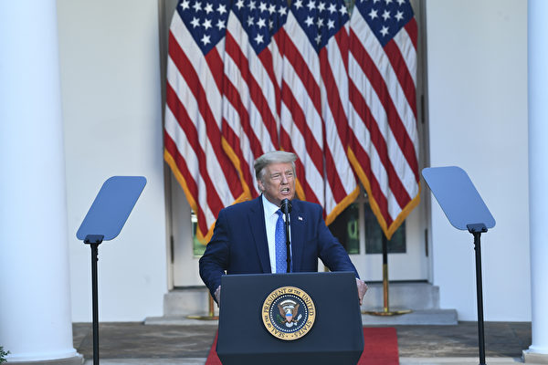

6月1日，川普总统在玫瑰园发表声明说，他正在“立即采取行动”，并“动员所有可用的联邦资源”，以制止骚乱，以及制止在全国范围内的掠夺抢劫行为。 (Brendan Smialowski/AFP)

   
   【大纪元2020年06月02日讯】（大纪元记者夏雨综合报导）美东时间周一（6月1日）傍晚，美国总统川普（特朗普）在白宫玫瑰园发表讲话说，他将立即采取总统行动，动员联邦资源来制止骚乱和抢劫，以“制止暴力，并恢复美国的安全与保障”。

上周，美国明州明尼阿波利斯市一名白人警察办案过程中，非裔男子乔治‧弗洛伊德（George Floyd）身亡，该事件引发全美各地抗议，并引发暴力骚乱和抢劫纵火行为。

川普总统在玫瑰园发表声明说，他正在“立即采取行动”，并“动员所有可用的联邦资源”，以制止骚乱，以及制止在全国范围内的掠夺抢劫行为。

川普说：“我将为保护你们而战。”

川普在讲话中说：“我建议每个州长都要部署足够数量的国民警卫队，以占领街道。”“我们将结束骚乱和无法无天（的局面），我们将在今天结束它。”

川普总统说，他正在援引1807年的法律，动员全国各地的军队，并“迅速解决问题”。他说：“我将部署美国军队，并迅速解决问题。我也正在采取迅速果断的行动，以保护我们的华盛顿特区国会大厦。昨晚在这座城市发生的一切令人耻辱。”

总统说，他还将采取“迅速果断行动”，来保护国家的首都，包括派遣“成千上万的全副武装的士兵，军事人员和执法人员，以制止骚乱，抢劫，故意破坏，攻击和肆意破坏财产。”

他说，市长和州长必须建立“压倒性的执法力量，直到暴力被平息为止”。川普还说，如果各州不派遣国民警卫队，他将部署军队。

他说：“我希望这种恐怖（行动）的组织者能注意到，你将面临严厉的刑事处罚。”

总统补充说：“我们不能让愤怒的暴民淹没和平抗议者的正义呼声。”

“这场暴动的最大受害者是我们最贫穷社区中爱好和平的公民。”川普说。

他还说，（周一）晚上7点，首都宵禁将被“严格执行”。

演讲结束后，总统及其随行人员立即离开白宫，穿过拉斐特广场到达圣约翰主教教堂（St. Johns Episcopal Church），该教堂在前一天晚上在示威活动中起火。

在离开之前，川普说，“现在，我要前往非常特殊的地方，表达我的敬意。”

<a target="_blank" href=#top><h6 align="right">回上方</h6></a>

<a name=15>
<h1 align="center"><b>柏林人的心声：德国不能与中共为伍</b></h1>

三名学生认真听完法轮功学员解释“真、善、忍”的涵义后，先后在征签簿上签了名。（明慧网）

   
  【大纪元2020年06月02日讯】中共病毒造成疫情在全球蔓延，致使德国民众禁足了两个多月之久，近日终于可以三五成群地逛公园、做户外运动，享受自然风光。人们还迎来了德国的圣灵降临日的节假日（Pfingsten，6月1日星期一）。

明慧网报导，柏林法轮功学员从5月30日至6月1日在柏林东部的特雷普托公园（Treptow Park）连续三天举办信息日活动，让人们了解法轮功的美好以及中共对法轮功学员的残酷迫害。

来往行人被他们的活动所吸引，人们驻足观看、拍照，询问和交流，或学炼功法动作。

法轮功于1992年5月开始在中国大陆传出后，成千上万的人走入修炼。人们按照“真、善、忍”的原则要求自己，提高道德水平，增强身体素质，身心受益。1999年中共江泽民邪恶集团却对法轮功发动了延续至今21年的迫害。海外法轮功学员坚持向人们讲真相、开展和平反迫害活动。

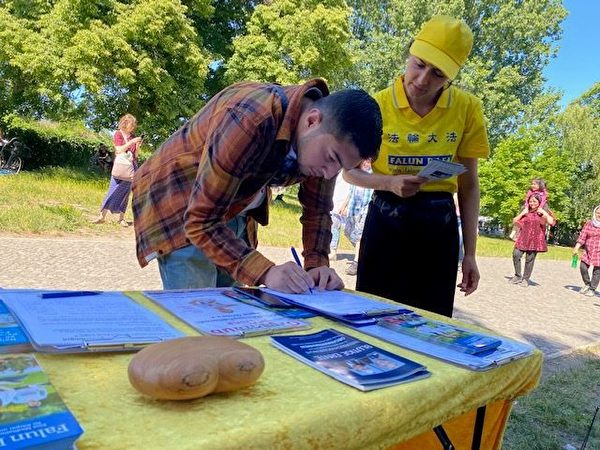

路人签名声援法轮功。（明慧网）

   
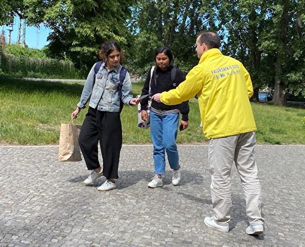

   
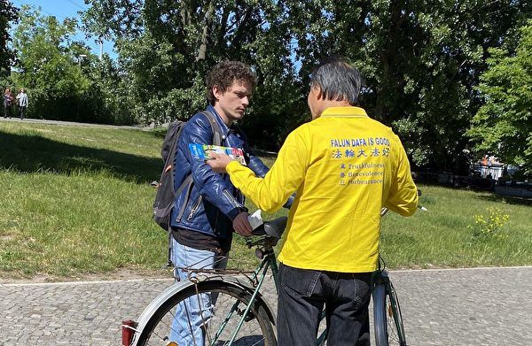

   

   
 <b>  德国更不能与极权为伍</b>

来自柏林的年轻妈妈克里斯汀娜（Christiane）带着女儿和友人经过信息点时，停下来和法轮功学员交流了一会儿后，就马上签了名。她说，她从自己的一位在中国生活的朋友那里已经听说了不少中共极权迫害民众的例子。

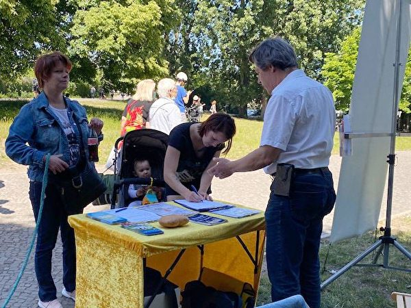

克里斯汀娜正在签字，支持法轮功学员反迫害。（明慧网）

   
   克里斯汀娜介绍说，她是一位助教，在工作中直接与人接触，把人看得非常重要。今天她第一次听说器官活摘的事情，感到很悲伤，因为这些法轮功学员手无寸铁，无法保护自己。她极希望这个状况尽快地改变。

“德国也有很糟糕的历史（指纳粹对犹太人的大屠杀），所以我们更不应该跟中共这样一个极权政府保持密切的联系。”

“德国正因为有这样一个令人悲伤的历史，所以我们不能眼睁睁地看着这样残酷的事情（活摘器官）在世界上发生，德国政府必须得有一个明确的态度。”

<b>“对中共的谴责得更直接一些”</b>

乌利希（Ulrich）是“声援受迫害族群协会”的成员，他签字后表示，自己是“声援受迫害族群协会”的一名成员，曾在电视里多次看过有关中共活摘器官的深度报导和专栏节目，所以能想像得到这样的事情会发生在中国。

“声援受迫害族群协会”成员乌利希在征签簿上签字，反对中共迫害法轮功学员。（明慧网）

   
   他接着说，“在德国有过那样（设立集中营、做人体实验）的历史，所以我能够想像这样的罪恶行径在当今人类社会发生。作为这个世界上的一员，我觉得有义务对此事表示反对。”

“可惜德国政府在两国对话中总是把经济放在人权之前，我希望德国政府能够更直接一些严厉一些批评中共对人权的迫害。”

自由摄影师瑞内（Rene）大约在五年前第一次知道了法轮功。当时他阅读了许多关于法轮功的资料，还几次尝试炼过动作，明显地感觉到身体发热，但感到修炼起来不那么容易，法轮功对学炼之人的道德水准也有要求，他就放下了。

前不久，他又开始寻找能让人修炼提升的功法。5月30日这天他骑车进特雷普托公园时看到法轮功学员的横幅，马上过来和学员交谈。他告诉学员，现在的人太注重外在的东西，而忘记了真正的平和是来自人的内心，并相信“修炼可以让一个人找到真正的自我，不会因外界客观环境的变化而变得不安”。
   
 

自由摄影师Rene五年后再次邂逅法轮功。（明慧网）

  
   
  谈到中共活摘人体器官的话题时，他表示，“我相信这事的确在发生，它绝对不能再继续下去，必须做一些事情制止这种罪行。”他在支持反迫害的征签本上签下名。

在他看来，发生在中国的迫害不是离德国有多远。“你们在这里出现，那这个事情（中共的罪行）就是到了我们的眼前。”“而且你们在这里真的不是为了图什么，跟一些募捐款的团体完全不一样。你们是让别人实实在在地了解事实，做出正确的判断，发出支持的声音，没有别的。”

最后他和法轮功学员握手道别，还说：“今天遇到你们真高兴，我会再来找你们的。”

<b>活摘器官的罪行太糟糕</b>

克劳斯（Klaus）和朋友骑车经过，看见正在炼功的法轮功学员和真相横幅，二话不说，跳下自行车后签了字。他表示在中领馆前好多次见到过法轮功学员在抗议和演示功法的动作。

克劳斯主动签字支持法轮功。（明慧网）

讲到他对中共活摘法轮功学员器官罪行的感受时，他摇着头，表示无法用语言来形容自己的震惊，并连连说“太糟糕了，太糟糕了！”“法轮功学员只是在追求自己精神境界提高，没有对任何人造成伤害。”

三天的活动结束后，许多法轮功学员说：“没想到有那么多人对学炼法轮功有兴趣，相信以后来炼功的人会越来越多。”# 

<a target="_blank" href=#top><h6 align="right">回上方</h6></a>

<a name=14>
<h1 align="center"><b>时隔15年地摊经济再复活 李克强推动？</b></h1>

担心失业造成社会恐慌，被打压15年的“地摊经济”再度被启用，图为武汉一卖煎包的地摊。(HECTOR RETAMAL/AFP via Getty Images)

   
   【大纪元2020年06月01日讯】（大纪元记者凌云报导）连日来，随着国务院总理李克强的两会言论，“地摊经济”成为大陆网络上的一个热词。大陆网友调侃：“美国开启了民营太空经济时代，我们重启了地摊经济。”

李克强在人大记者会上披露，中国有六亿人口月收入只有一千元人民币，立刻引发舆论哗然。他还补充说，“一千元在一个中等城市可能租房都困难，现在又碰到疫情。”

他再度强调把“稳就业、保民生”放在极为重要的位置，并点赞了四川成都开始的“地摊经济”推动了就业。

疫情期间中国经济停摆，之后又面临海外订单消失，严重冲击中小企业和普通民众就业。今年3月份，成都市城管委发布新规，允许居民在居住集中区开辟临时占道摊位、允许临街店铺临时越门经营、允许大型商场临时占道促销、允许流动小贩进行售卖等五大范围允许操作。

之后，上海、甘肃、浙江、江西、河北等城市也相继出台政策，松开了“地摊经济”和“马路经济”。在江西南昌，政府5月26日出台政策，指定了100个街道开放夜间市场。

北京地摊回归。（微博网友）

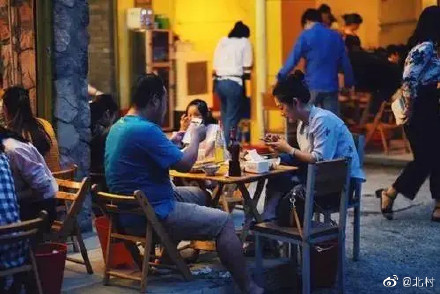

成都地摊夜市。（微博网友）

 

上海地摊。（微博网友）

<b>压力大 官媒带头松绑“地摊经济”</b>

5月27日，中共中央文明办突然宣布新要求，不再将“占道经营、马路市场、流动商贩”列为今年文明城市测评考核内容。

中共党媒，央媒近日也纷纷出声，正面宣传“摆地摊谋生”，称赞“烟火气”，而不是过去的“脏、乱、差”。

中共自2005年开始文明城市测评后，地方政府为了政绩加强打压流动商贩，清理占道经营者也成为一种维稳模式。城管暴力执法，与摊贩发生冲突，进而引发血案的事件屡屡发生。

如今，流动的小商小贩在经历了十五年打压后，又“光明正大”地摆摊买卖了，引发网络吐槽和热议。有网友感叹说，“现在鼓励摆地摊，显然是国内已经穷到一定份上了！”

也有网友留言：“开始鼓励摆地摊，一是说白了盘活市民经济；另一个也说明了真正的冬天要来了吗？单纯的放水已经解决不了问题了。”

也有人称是：“失业恐慌的权宜之计。”并讽刺“不让你开的时候叫脏乱差，影响环境，加深雾霾，要你干的时候就叫有烟火气。”“现在经济不好知道让人家摆地摊了……这时候新闻天天鼓励点赞了，以前城管暴力执法收人家三轮车的时候怎么不报导？”

数月来，中共病毒疫情造成全国经济停摆，很多人数个月没有收入。而随着中共疫情在全球蔓延，中国制造业的外贸订单大量消失，公司裁员现象频现。《财经》近期调查发现，珠三角地区有80%的中小外贸工厂遭遇订单问题，大部分工厂都没事干。

北京的人权活动人士胡佳对自由亚洲电台表示，政府这次决定给予老百姓一些通融，明显是出于社会稳定、政治安全和财政等几方面的考虑。“不让他到街头摆摊养家糊口，把他逼急了以后怎么办？报复社会？还是上街游行？老百姓有了收入，政府也能减轻一部分财政压力。如果不是经济下行和社会动荡的压力，政府不会开这个口子。”

<b>网友大吐槽</b>

不少人吐槽时代的变迁。

微博画家网友“画画的老武”调侃称：打倒四人帮以后，发展地摊经济，我赶上了。活到中年了，又赶上发展地摊经济了…

也有人称：“SpaceX将两名宇航员成功送入太空轨道，马斯克不断创造历史。而我们，至少我，准备勒紧裤腰带过日子，摆地摊去，代写书信糊口！”

就在5月30日下午3:22，美国航空航天局（NASA）首次与民间商业公司SpaceX合作将两名宇航员送上国际太空站。这是人类首次由私企送人飞上太空，开启星际旅行的新时代。

网上因此热传一句话：“美国开启了民营太空经济时代，我们重启了地摊经济。 ”

对于摆地摊是否能解决经济，有些网民表示质疑：“说摆个摊就能赚钱，就能解决就业一样。贫穷的深层次根源不是疫情，是房地产+金融，极限地掏空了消费，极大地抬高了成本。”

还有人对“地摊经济”的叫法表示质疑。作家天佑发文称：“ 这两天，因为成都放开地摊，于是就有专家就开始扯犊子，一本正经地谈什么地摊经济了。看到这些专家的胡说八道，我真是想踢他们。什么地摊经济？咱们谁都别装外宾，不就是就业出现了严重问题，不得不让城市底层有个活路吗？”

“如果地摊真是一种重要的经济形式，为什么这么多年宁可花大钱组建一支魔鬼队伍——城管，也不发展这种经济模式？”作者还呼吁，如果想让底层弱势群体能有碗饭吃，别喊什么地摊经济这种高大上的口号，还不如把城管这个部门取消了。

<a target="_blank" href=#top><h6 align="right">回上方</h6></a>

<a name=13>
<h1 align="center"><b>【纪元播报】美国骚乱 川普剑指幕后煽动者</b></h1>
   <h3 align="center"><b>川普对华讲话 隐含了哪些制裁</b></h3>

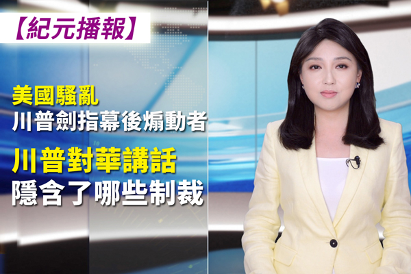

川普对华讲话，隐含了哪些制裁？美国骚乱川普剑指幕后煽动者！（大纪元）

   
  【大纪元2020年06月02日讯】美国狼烟四起，白宫被围，打砸抢频发。和平抗议为何演变成暴力骚乱？川普出手，剑指幕后组织者。

美中对抗全面爆发，川普讲话预示着美国将对中共祭出哪些制裁手段？还有哪些话川普没有明说，它意味着什么？请看纪元播报！

<b>美国骚乱 背后的组织者</b>

首先我们来关注一下美国骚乱的事情。在过去的五个夜晚，明尼阿波利斯市和附近的圣保罗市以及美国各地一些城市的抗议演变为抢劫、纵火和其它暴力活动。

美国非裔男子弗洛伊德（George Floyd）之死所引发的这场抗议，起初是以和平方式进行，之后演变为暴力活动，蔓延多个城市。一些抗议者纵火、砸毁商铺、抢劫便利店和超市等，甚至包括非裔店主也遭到洗劫。

美国总统川普在周日的推特上指责“安提法领导的无政府主义者”煽动了混乱。他说，“其它由民主党管理的城市和州应该看看昨晚明尼阿波利斯激进左翼无政府主义的全面关闭。国民警卫队做得很好，应该在其它州部署国民警卫队，否则就太晚了！”川普还说，美国将指定安提法为恐怖组织。各地暴力抗议中出现的ANTIFA，是一个好战的左翼政治运动，常采取激进手段包括攻击来达到目的。

之前周六川普曾表示，正快速推进弗洛伊德案的侦办，他支持和平抗议，但坚决反对暴力和破坏，不容许暴民借机破坏法治。

在周六（5月30日）晚上，12州州长动员国民警卫队来应对。洛杉矶市长埃里克·加塞蒂（Eric Garcetti）在周六早些时候并不愿意寻求国民警卫队的帮助，但随着抗议在周六的加剧，他也要求州长调动国民警卫队。加塞蒂称，“这不再是一个抗议，”“这是破坏，这是蓄意破坏。”

明尼苏达州州长说，“我们受到攻击”。他承诺要“全力”恢复秩序，并表示已向该州国民警卫队发出“全面动员令”。美国多个受暴力活动影响的市也宣布施行宵禁。

星期六晚，暴力事件还出现在白宫附近的街区内。暴力示威者砸碎了宾夕法尼亚大道1400号街区罗纳德·里根总统基金会和研究所的窗户。在白宫街区内以及乔治城高档社区内的两家银行和数十家其它企业也遭到破坏和抢劫。

白宫历史协会对面的两个餐馆被纵火，但火势不大。附近在建的美国商会大楼的一部分，与海亚当斯酒店相邻的多层脚手架也被纵火点燃。国家大草坪周围的一些建筑也发生了一些破坏事件。

福克斯周日报导，暴乱已经造成企业受损，数百人被捕，数十人受伤，至少3人死亡。

这场暴力活动的导火线是非裔男子弗洛伊德之死。我们来回顾一下案件的本身。这名黑人男子为什么被警察误杀呢。在5月25日，弗洛伊德疑似拿了一张20美元的假钞到一家店里买东西，店员发现是假钞后报警。警方到场后，因为弗洛伊德是有案底的，曾经因重罪被关过5年，现在又使用假钞，当然警察会询问他一些问题，是否吸毒了等等，这些都是很寻常的。

但是他不回答，然后警察要将他塞到警车里面，弗洛伊德因拼命的挣扎，警察将他按倒在地，用膝盖压住了他的脖子这一块，到了8分钟后这个黑人没动静了，不再挣扎，警察发现不对，送到医院后他已经死亡。

涉案的四名警员已被解雇。其中，用膝盖压住弗洛伊德颈部的警员德里克·沙文（Derek Chauvin），被指控犯有三级谋杀罪和二级误杀罪。其他三人正在接受刑事调查。

<b>川普：支持和平抗议 但不容许暴力和破坏</b>

对美国这次的骚乱事件，在中国大陆是宣传炒得沸沸扬扬，很多人是抱一幸灾乐祸的心态，觉得好像中国不怎么样，但你美国也不怎么样。但实质上是有本质区别的。因为美国是支持和平抗议者的权利的，反对的是暴力。

美国国家安全顾问奥布莱恩周日说，和平抗议仍然是美国民主原则的基石，美国不像独裁国家那样，警察经常逮捕甚至是非暴力的反政府示威者。他说：“这就是美国与其它国家不同的地方。”“我们与和平抗议者站在一起。我们希望和平抗议者能够向他们的国家请愿。”

川普总统在5月30日发表讲话说：“我们支持和平抗议者的权利，我们听到他们的请愿。但是，我们现在在城市街道上所看到的事情（指暴力抗议）与正义或和平无关。”

川普总统要求加速调查弗洛伊德的死亡案件。他强调，美国政府不能允许明尼阿波利斯等地的局势进一步陷入无政府状态和混乱之中。

美国司法部长威廉·巴尔（William Barr）表示，目前美国各地的和平抗议被极左团体劫持，以达到另外目的。

他说，美国的伟大之处在于对法治的信守。全美对发生在弗洛伊德身上的事感到愤怒，这是真实而合理的。“我们必须通过州和联邦刑事司法系统的常规程序，对他的死因追责。这个程序还在继续推进。正义将得到伸张。”“不幸的是，在全国许多城市发生的骚乱中，暴力激进分子劫持了和平抗议的声音。

外部激进分子和煽动者团体正在利用局势来达到自己的暴力目的。在许多地方，暴力似乎是由无政府主义和左翼极端组织策划、组织和推动的。最左翼的极端主义团体，使用类似Antifa的战术。其中许多人是从其它州赶来煽动暴力。”

川普说，将宣布极左团体Antifa为恐怖组织。

美国众议院议长佩洛西（Nancy Pelosi）也说，她被告知，在明尼阿波利斯抗议活动中被捕的人中，80%不是当地居民，而是来自明尼苏达州以外的其它地方。

川普已经宣布极左团体Antifa为恐怖组织。

<b>川普中国讲话 说了哪些 没说哪些</b>

我们再来关注近日的热门话题，美国总统川普针对中国的讲话。川普总统5月29日在白宫玫瑰园举行了关于中共问题的重要新闻发布会。川普演说的核心内容有这么几项：

<b>一、美国退出世界卫生组织，不再对世卫注资；

二、保护美国投资人，针对在美上市中国公司的财务诈欺做清查整顿；

三、取消香港的特殊优惠待遇；</b>

美国将不再视香港为中国以外一个独立的地区。这个决定“会影响与香港的所有协议，从引渡到出口管制，几乎没有哪个领域会除外”。美国还将制裁参与破坏香港自由的部分中共和香港官员。

那么，具体对香港会有什么影响呢？

【世事关心】节目的萧茗女士分析，最大的影响有几条：一个港币很可能不能再以联系汇率制和美元无限度直接兑换。这一条川普没有明说。但是，取消香港的特殊贸易地位，很多人认为，就应该包含这个意思。但最终，还要看财政部出台的政策细节。另外，香港的独立关税将被取消。香港的关税将和大陆一样。

另外，香港作为中国大陆权贵集团融资天堂的作用将消失。以前，他们让中国公司在香港上市。这样就能够融到西方，尤其是美国的资本。这些中国公司在中国上市没法融美元的资本。之前西方投资者把在香港股市上市的公司和西方公司是一样看待的。

但是，现在香港变成了中国大陆。当然投资者就不会像以前那样看待这些上市公司了。而且不只是中国在香港上市的公司。所有在香港股市上市的公司，都面临着相同的处境。可以说香港是完全失去了世界金融中心的地位。

<b>四、全面肃清中国人在美国大学和研究机构的间谍行为</b>；

美国将暂停一些特定中国人入境。《纽约时报》之前报导，美国官员说是 与中共军方所属大学有直接关系的中国学生和研究人员，不再给他们签证，并且已经在美国的也有可能被驱逐出境。 这将涉及3000到5000中国公民。

<b>川普总统的中国演说里面没有明说的事

一 中美贸易协议是不是取消；</b>

中美贸易协议是不是取消没直接说，但川普最后说要保护美国的工人和家庭。也就是意味着，在这方面是会有所动作。如果中共报复不采购美国的产品了，川普或许会顺势取消贸易协定，那么撕毁协议的责任就不在他了。虽然估计他现在对这个协议也不报什么希望了，但他也不希望看到市场波动太大。

<b>二 美国会不会直接冻结个人财产；</b>

会不会直接冻结港府和中国高官在美国的个人财产，也没有直说。这个可能他在等待下一个合适的时机。另外，这也是他没有马上把事情升级的一个标志。

川普总统这次对中共的演讲，虽然立场鲜明。但是，没有一竿子打到底。他还是保留了一些回旋的余地，没有马上把事情升级。

<a target="_blank" href=#top><h6 align="right">回上方</h6></a>

<a name=12>
<h1 align="center"><b>程晓容：美国骚乱 党媒叫好 中共回避了什么</b></h1>

2020年6月1日，一些人在美国华盛顿特区抗议。(Photo by Joshua Roberts/Getty Images)

   
 【大纪元2020年06月02日讯】近日，美国非裔男子在警察执法中被致死案引发美国多地民众抗议，激进组织Antifa借机煽动暴乱。中共官媒大肆渲染美国的骚乱场面，抨击美国的民主制度，挑动仇美情绪。许多网友对此表示异议和反感。在疫情带来重创，美国宣布制裁之际，中共企图以此转移视线，报复美国。

中共官媒在相关报导和评论中，故意回避一些重要事实，有意误导民众。

<b>第一，关于案件的处理</b>

5月25日，在明尼苏达州明尼阿波利斯，非洲裔男子乔治·弗洛伊德（George Floyd）在警察执法过程中死亡。26日，四名涉事警察被解职。5月27日，川普总统在推特上发文，谈到联邦调查局和司法部应他的要求正在调查此事，他向弗洛伊德的家人表示慰问，表示“正义将得到伸张”。

5月29日，在办案时曾单膝压在弗洛伊德颈部的警察德里克·肖文（Derek Chauvin）被捕。他被控三级谋杀罪和二级过失杀人罪。

白宫国家安全顾问罗伯特·奥布莱恩（Robert O’Brien）5月31日受访时谈到，当他和总统在空军一号上看到弗洛伊德事件的相关视频后，总统立即发表推文，要求调查，并与司法部长巴尔通了电话，要求他调查真相。

<b>第二，美国民众的抗议权和媒体监督权</b>

弗洛伊德案发生后，明尼苏达等十几个州都有民众上街抗议，在华盛顿特区，示威者站到了白宫外。川普总统和多名政要都表示支持人们的和平诉求。媒体在街头采访拍摄，甚至对骚乱进行直播，文字和视频报导连续不断。

许多大陆网民批评中共剥夺国民的言论自由，禁止公民合理抗议，却刻意放大美国的警察暴力事件。以下三条社媒信息很有代表性：

“官媒引导下，一些人觉得美国很乱。岂不知这恰恰说明美国的人权保障。党国这样死了人，比如民工周秀云，瓜农邓正加，雷洋，徐纯合等，你去乡政府门口抗议试试？更别说去中南海了。”

“我因为p2p（爆雷）去杭州，刚到政府门囗就被驱赶，更别说示威了。一位男的老者拿着一张A4纸上面写着还我血汗钱，直接被带派出所了，从上午一直到下午才放出来，我的三观直接崩了”。

“有粉红在推下说，你总说中国黑暗面，有本事你说说美国暴动，我回复如下：美国暴动，不管是文字、视频、以及每时每刻的过程，你都可以在网上查到。你想看啥不用担心信息被屏蔽，你想说啥不用担心被喝茶。用我说啥？民主社会不是天堂，但是好坏你可监督；独裁社会就是地狱，因为你只能赞美，不能批评。”

5月31日，美国国家安全顾问奥布莱恩接受ABC新闻“This Week”采访，他向中共等利用此事挑衅的政权说：“我们与你们之间的区别是：杀死乔治·弗洛伊德的警员将受到调查，将得到起诉，将会受到公平审判。那些想要走出去参加和平抗议的人们，也被允许向他们的政府寻求补偿。他们不会因为和平抗议而被判入狱。”

<b>第三，激进组织Antifa（安提法）及其背后黑手</b>

近日，美国多个城市的和平抗议演变为暴力破坏，出现了越来越多的纵火和抢劫。美国国家安全顾问奥布莱恩说，Antifa激进分子操纵了暴力行动，他们在各州穿梭，暴力专门针对少数族裔、非裔美国人和西班牙裔地区，烧毁人们赖以生存的商业，总统对此非常气愤。

美国司法部长巴尔5月30日表示，“起初的和平抗议正在被暴力和极端力量所劫持。”5月31日，川普总统在推特上宣布，将把Antifa指定为恐怖组织。

Antifa（“反法西斯”的英语缩写）是起源于上世纪30年代的极左翼政治运动，与共产主义和准马克思主义有关。

德国情报机构，联邦宪法保卫局（BfV）在2016年发表报告指出，“反法”所标榜的“法西斯”往往不是指实际的法西斯主义，而是指代“资本主义”。因此，具有双重含义的“反法西斯”实指“反资本主义制度”。

2017年8月22日，哈佛大学法学教授、自由派作家德萧维奇（Alan Dershowitz）在福克斯电视台的早间新闻里指出，“Antifa”是激进的、反美、反自由市场，是共产主义者，社会主义者，极左组织。他们要阻止人们自由发言。他们使用暴力。

美国哈德逊研究院（Hudson Institute）高级研究员、中国问题首席战略家斯伯丁将军（Robert Spalding）分析认为，美国目前的暴力活动是共产主义势力有组织的暴乱，目的是毁坏美国。他在推文里写道，“他们（的暴乱活动）得到中共、俄国人和其他（反动）人士的支持，这与我们这个国家无关，这与那些想看到美国被摧毁的国家有关。”

<b>别忘了雷洋、周秀云、徐纯合</b>

5月30日，中共外交部发言人华春莹在推特上贴出“I cannot breathe（我不能呼吸）”，向美国挑衅。中共在这一波仇恨宣传中，似乎表现出对美国黑人的深切同情。但是，对于本国受难的同胞，外交部、共青团、央视等喉舌一概选择视而不见。

迄今，高智晟律师、公民记者方斌、陈秋实等人仍被强制失踪，余文生律师、黄琦等正义之士无辜入狱。还有大批中国人因为坚守信仰及合理抗争遭受残酷的迫害。

当中共官媒对美国警察暴力津津乐道时，很多人想起了死在中共警察手里的中国人。

2014年12月13日，在山西打工的河南农妇周秀云因讨薪与警察起冲突，被警察王文军拧断了脖子。该案于2015年5月开庭审理，案件审结后，法院5次延期宣判。家属不满，于2016年7月向太原市公安局申请上街游行抗议，被公安局以“直接危害公共安全或者破坏社会秩序”为由驳回。2016年11月10日，法院宣判，王文军被判处5年徒刑。曾代理该案的程海律师向记者表示，判决过轻，王文军应当是“故意杀人罪”。

2015年5月2日，在黑龙江省庆安火车站，中年男子徐纯合带着八十多岁的老母和三个小孩准备前往大连金州，但是因为他们曾多次上访，车站安检人员不允许其登车。徐纯合之后和执勤民警发生冲突，在打斗过程中被警察当胸开枪击毙。事后官方称警方开枪合法，但民间普遍认为警方涉嫌故意杀人。

代表徐纯合家的谢燕益律师表示，中央电视台公布的视频经过了剪辑，没有显示警察具体是怎么开枪的，却故意把徐纯合描绘成一个道德败坏的人。他说，“即使一个人有问题，也不能说打死他是合法的”，“这是一场由截访和维稳制度造成的悲剧。”

当年，有人问：“警察持警棍殴打徐纯合的镜头央视全部删除，因为啥原因呢？”中国社会科学院农村发展研究所社会问题研究中心主任于建嵘回复：“因为它是中央电视台，党和政府的喉舌。”

2016年5月7日晚，北京市民、中产人士雷洋被昌平公安局便衣警察拘捕，在押解途中非正常死亡。此案引起广泛关注及对警方执法的大规模质疑。外界怀疑，雷洋被扣上了“嫖娼”的罪名，真相不得而知。

雷洋的岳父曾告诉财新记者，5月9日下午，雷洋的同学曾去事发处附件的一处物业申请查看监控视频，物业说监控录像坏了，“而5月9日上午刑侦部门曾去找过物业”。

2016年12月23日，北京市丰台区检察院以“犯罪情节轻微，能够认罪悔罪”为由，决定对五名涉案警务人员作出不起诉决定，舆论大哗。

<b>结语</b>

一周来，在美国发生的动荡涉及警方暴力执法、种族冲突和极左势力发动暴乱等多重复杂因素。中共借此表现出的幸灾乐祸和冷血言论凸显其邪恶用意。中共想通过发生在另一个国家的不幸来愚弄本国人民，掩盖中共暴政的黑暗。

在中共治下，广大民众被剥夺了知情权、表达权、抗议权、信仰权、被辩护权。媒体不是为了报导真相、监督政府而存在，而是一律必须姓党。法院、检察院和公安机关都是维持极权统治的工具，不是维护正义、为民服务。

中共放大美国的社会问题，不是为了美国人民的利益，而是出于它对美国的仇恨。几年来，川普政府公开谴责共产主义和社会主义，勇敢地反制中共渗透，开创了国际抗共的新局面。这对维护中国人权和世间正义都起到重要的推动作用。党媒和“五毛”妄想唱衰美国，反而让更多人看清中共之不义。  

<a target="_blank" href=#top><h6 align="right">回上方</h6></a>

<a name=11>
<h1 align="center"><b>【拍案惊奇】美左派骑劫抗议 中共遭重拳有悔？</b></h1>

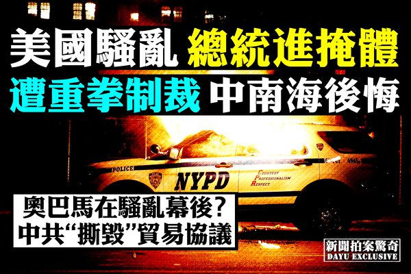

共产国际暴动！中共求生？左派骑劫抗议，美国大骚乱；中共贸易毁约，美追加关税；中南海后悔。（新唐人合成）

   
   【大纪元2020年06月02日讯】大家好，欢迎收看《新闻拍案惊奇》，我是大宇。
   
<b>【引爆全美骚乱 明州弗洛伊德命案怎么回事？】</b>

连日来，美国发生了全国性的骚乱，规模很大，烈度也比较强，上一次这种类似规模和烈度的骚乱，好像还是1992年的洛杉矶骚乱。

这件事被大陆党媒积极跟进报导。警察在香港的暴力场景，在大陆的媒体上避之犹恐不及，而美国突发暴力示威，以至于骚乱，却成了党媒热衷的新闻热图。

事情的导火线是5月25日，美国明尼苏达州的非洲裔男子“乔治·弗洛伊德”，因为被警察以膝盖压颈的方式制伏在地，而导致死亡。

在警察赶到前，现年46岁的非洲裔男子弗洛伊德，刚在几年前，从休斯顿迁居到明州最大城市明尼阿波利斯。他本来有保安的工作，但是因为瘟疫的原因，弗洛伊德失业了。5月25日8点前后，他再次前往常去的一家当地便利店Cup Foods，拿出一张20美元的纸钞买烟，但是店员怀疑这是张假钞，按规矩，店员选择了报警。因为除了假钞，店员描述说，弗洛伊德好像还醉醺醺的。过了大概7分钟，警察就赶到了，随后，弗洛伊德被戴上手铐往警车上拉。

过程并不顺利，几经周折，8点20分前后，警察Derek Chauvin为了制伏弗洛伊德，把他压倒在地后，用膝盖跪到了弗洛伊德的脖子上，持续8分46秒，期间弗洛伊德一直在喊：我没法呼吸，不要杀我。但到了第六分钟之后，这个非洲裔男子就不动了，直到不久后送到医院，宣布死亡。

跪住弗洛伊德脖子的警察Derek Chauvin，在明州警局工作超过18年，今年44岁，事情发生后就被警局开除，并且以三级谋杀罪和二级杀人罪的指控逮捕。按CNN的报导，Derek Chauvin会在本月稍晚的时候出庭。目前，他被关押在明州安保最严密的监狱内。

不过，对警察Derek Chauvin的惩治，并没有换来安宁。

<b>【各地暴力场面令人震惊 总统携家人进入地下掩体】</b>

当天晚上，明尼阿波利斯就发生抗议活动，直到周三，蔓延到美国全国。抗议人群以非洲裔为多，也有一些其他族裔参与。比如在洛杉矶，有推特网友发出一段电视截屏，显示有亚裔面孔的年轻人，也因为参与骚乱而被逮捕。

打的旗号是非常政治正确的Black lives matter，缩写为BLM，就是“黑人性命至关重要”。

除了事发地明尼阿波利斯，从东到西的美国大城市，纽约、华盛顿特区、达拉斯、休斯顿、芝加哥、丹佛、洛杉矶等，都爆发了严重的骚乱。网上流传一张地图，显示了大部分受到骚乱波及的州。不过要强调的是，不是发生骚乱的州全部都处在混乱中，其实受到影响的只是这些州的大城市，绝大多数地区，是中小城镇，根本没受任何影响，大家的生活照旧。

发展到后来，用明州州长的话说，这场骚乱，已经严重偏离了抗议之初为给人争取种族平等权益的初衷。其主流，完全演变成了一场暴力活动。

发生骚乱的标志性事件，是上周四，5月28日晚，弗洛伊德所在的明尼阿波利斯市，其第三区警署被抗议人群占领，建筑被放火焚烧。

随后，我们在全美多个大城市，看到了不同的暴力场面。

有人站在别人的汽车上群魔乱舞，并用飞脚踹坏别人的车窗。

有人追逐奔驰中的卡车，不知是否卡车司机得罪了他们。最后身穿红色衣裳的司机被人群拽下车去群殴。

在纽约市，5月31日，一些参与骚乱的人，移开了曼哈顿街头的工地围栏，取出里面的砖头，举动相当危险。

另外，骚乱的标志之一，就是有人乘火打劫。在某地的耐克运动品专卖店，很多非洲裔冲进店内，抱出各种抢来的商品，大摇大摆地走出店门，可能此刻，他们只恨自己生来只有两条胳臂，不然的话，可以多拿一些出来。

也有人可能没抢到东西，却去抢其他黑人同伴的东西。

特别需要提到的是，5月31日，在美国华盛顿DC白宫外的暴力骚乱，导致美国总统川普和他的妻子梅拉妮亚，还有小儿子巴隆‧川普，一度被特勤局的人员护送到白宫的地下堡垒中，待了差不多不到一个小时的时间，以防止有控制不住的局面。他们应该是担心有幕后势力操纵这些抗议者，不排除他们中会有危险的武器，有冲进白宫威胁总统生命的可能。

<b>【抗议运动遭人骑劫 天下共产一般黑】</b>

美国政府认为，这场危机，背后是有西方共产党背景的极左势力AntiFa组织煽动。这个组织像幽灵一样，近几年在美国比较活跃，经常会搞出一些暴力事件，特别是川普上台之后。

在美国民间的网站上，大家活跃地在讨论，说这个Antifa跟美国金融巨鳄索罗斯，甚至前总统奥巴马有关。

美国的网上有一张照片流传，说FBI的监视录像拍到，奥巴马的女儿玛丽亚‧奥巴马，离开Antifa在巴尔的摩的一场会议。

也有人在网上曝光，有个名叫Olivia的黑衣白人女子，在底特律给参与示威的一些人，一人发了200美元，并提供了一些工具。

6月1日，美国总统川普在个人推特上转发了一则影片，显示一名白人男子，似乎给了身边一些非洲裔人士什么东西，然后积极安排他们的抗议活动。川普在转推的时候说，我们在看着你，无政府主义者。

<b>【美国镇乱不排除出兵 中共也被怀疑从中搅局】</b>

为应对骚乱，美国各州，陆续派出国民警卫队上街应对骚乱。他们全身装备，发射了橡胶子弹和催泪弹，驱赶人群。

也在6月1日，美国总统川普转发了共和党议联邦参议员汤姆‧科顿当天的推文，宣称无政府主义活动、骚乱、抢劫，必须在今晚结束，如果地方的执法者需要支持，那要看看这些Antifa的恐怖分子，在面对101空降师时会怎样。我们对他们的这种破坏，要零容忍。川普在转推时，说这汤姆‧科顿100%正确。

川普在5月31日的推文中就写过：美国将把Antifa组织定为恐怖组织。一旦这样定性，那么美国政府将可能用军队镇压参与Antifa骚乱的人群。

除了Antifa，在美国的骚乱中，还有这样的场面：由美国白人穿着红卫兵的衣服，手举《中国日报》和五星旗，高喊“我们要中国”。也有Antifa组织的成员，拿着象征共产党的镰刀斧头旗。

还有人公开举出血腥的红色共产党党旗。

因此，也有声音怀疑，当前美国的骚乱，是有中共特务在海外搅局的因素，加重美国的暴力抗议。

推特网友刘沙沙发推文分析说：近期中共会把所有渗透进美国的力量调动起来。藏着已经没意义了，决战将至，每个棋子都得起作用。在另一篇推文中，刘沙沙还说：中共这是要“全世界的无产者联合起来”。

<b>【骚乱下 美国再完成载人航空壮举】</b>

在骚乱的大背景下，5月30日，SpaceX的猎鹰9号运载火箭，在佛罗里达州的肯尼迪太空中心点火升空，12分钟后，这艘“龙飞船”，将两名宇航员，送到了距离地表350公里的国际空间站，这是史上第一次，由私人的商业火箭公司，完成送宇航员进空间站的任务，也是美国时隔9年后，美国宇航员再次乘坐自己国家的飞船，进入国际空间站。

因为此前在2011年，美国都是依赖别国运送宇航员，自己并没有在这方面进取，川普政府上台后，改变了这一点，也促成了SpaceX创造这一历史的机会。

当天，川普在火箭升空的现场见证了历史，同时在演说中，他再次强调，要打击正在美国发生的骚乱。

<b>【乱战中美国警察的冲动 别国也有人煽动骚乱】</b>

目前，骚乱已经发展到美国以外的地区，比如英国。5月31日，在伦敦出现大批人群，聚集到了美国驻英国大使馆外。

还有英国人拍到，街上的媒体工作人员，遭到了当地非洲族裔的袭击。

另外，甚至在日本都爆发了串连活动，呼应在美国的抗议。

但是，不排除有理性的抗议人群。例如，在美国首府华盛顿特区，一个身穿黑衣的白人，在路边抠砖，结果被附近的非洲裔抗议者扭送给警察处置。

当然，在骚乱中，也有人拍到，警察在执法时推搡参与暴力活动的人，甚至有不止一次，有警车突然踩下油门，顶撞人群。例如在纽约5月31日的一场骚乱中，就有警车突然缓慢加速，试图驱赶人群。

这不排除，有个别警察被人群激怒，危急情况下，甚至危及到自己生命安全的时候，可能会做出一些比较危险的举动。但是，这与香港警察不同的是，所有这样做的，一定会面临起诉，如果判定确实是警察的问题，也一定会被起诉，特别是在这样一个敏感事件下，发生的情况。

<b>【一个香港小孩的书包 显出美国骚乱与香港抗议之区别？】</b>

但是事实上，美国的这场骚乱，大多数上街抗议的，并不是要为非洲裔争取权利，反而是行为上在继续给自己的人群难堪，包括抢劫、打砸、打人等等。这与香港人为自由和民主的抗争，有本质的不同，没法去比较。

特别在香港，个别抗争者出现暴力行为，可能会被抓捕，甚至定罪，但是无论警察做得多么过分，我们至今没听到有警察在反送中运动中被定罪。

这些香港小孩子们的书包上，写着的质朴标语，就在无声诉说着，香港的故事。

<b>【当前形势下 观众朋友给香港人的寄语和音乐】</b>

上周五，我在节目中说，国安法压境，香港危在旦夕，但是香港人还是没有放弃。但是暂时我们不搞香港寄语的活动了，因为他们更需要实质的帮助，但是有朋友有话说，我还是可以转达，就这样，有些朋友把对香港的寄语发给我了。

我在这分享一些给大家。

一个香港人，自己给自己人送上了一句鼓励的话，他说：CCP可以灭掉一个城市，但人心不死，要做长期抗争的准备，香港人加油。

有大陆人留言说：为大陆推出这样的恶法而羞愧！有良知的人都不会忘记历次灾难面前，港人对大陆同胞的支持。除了台湾，香港是华人世界中仅存的民主希望。民主的旗帜终有一天会在中华大地上高高飘扬！

一位广州观众写信说：我是一个讲粤语的人，9年前，我们的广州人走上街头抗议中共抹杀广东话，现在广州人只会说香港人是废青！怎么几年就这样了，香港人以前怎么帮助广东人，你们忘了吗？

另一位观众说：这本来就是一场不公平的抗争，所以我由衷地敬佩那些为香港民主自由奋斗的个人和团体的勇气以及决心，希望当香港回归自由怀抱的那一天，你们都各自安好。

还有人来信说：只要活着，就有获得自由的机会，所以请珍惜自己的生命，相信反人类的政权一定会灭亡。

一位台湾朋友写道：请珍惜生命，不要让亲人为你流泪，台湾的自由民主之门将永远开启。

还有一位英国王室专属的作曲家，前加拿大外交部危机事务外交专员Christopher Xiao，献出自己两首非常好听的曲目，通过我们的节目，把这个曲子无偿送给香港参与民主自由抗争的人，他说这两首曲子，香港的抗争者都可以用，无偿送给大家。

因为人家是好心，无偿给，但是YouTube不知道，所以如果我在节目中放，万一被系统claim了版权，YouTube可能还要找我麻烦，所以我把这两首曲子上传，放到今天节目的留言区置顶，大家感兴趣的，可以去下载。用的时候，别忘了标上Christopher Xiao的名字，给人家credit。

<b>【美国超60法案制共 中共罢买美国农产品公然毁约】</b>

目前，中共对香港的打压，使自己陷入更被动的国际局面。5月31日，美国国务卿蓬佩奥说，中共比10年前更具侵略性。目前美国国会已经提出了60项制裁中共的法案。英国也有7名前外交大臣，敦促英国政府，领导国际社会谴责中共强推港版国安法。

但是，不知道中共高层是被假情报闭目塞听，还是真的政治智商需要改进。

6月1日，《彭博社》引述匿名人士消息说，中共下令，大陆国企，其实就是党有企业，暂停部分美国农产品的进口。而这些产品，都是贸易协议中要求的。这是中共公然主动撕毁与美国签署的第一阶段贸易协议，美国还没有这样做。很多人分析说，这是中共主动给川普政府送弹药。因为美国政府本身碍于贸易协议的承诺，在贸易上尚未大动干戈，但是中共主动撕毁协议，无异于给美国政府扫清障碍，可以没有任何后顾之忧地制裁中共。

但实际上，有消息说，美国其实已经在5月31日，提高了对中国部分商品的关税，再次加到了25%。

<b>【昏招频出 消息指：中南海有悔意】</b>

香港实业家袁弓夷认为，美国实际上已经是向中共下了战书，他认为，美国势必消灭中共。

而大纪元时报引述中南海知情人的话说，中共高层对美国有关香港国安法的反应，很意外，没想到美国会真的要取消香港的一系列优惠待遇，包括独立关税区。消息称，北京最近两天密集开会，苦于没有对策，他们原以为强行压制香港街头抗争，美国人会感谢他们，因为美国人在香港也有比较大的利益，当然希望香港平静，但是美国真的祭出重拳。

接下来，美中这台大戏怎么唱，我们继续关注。

好，如果您有爆料信，可以息给我们发邮件，我们的节目电邮是：xwpajq@gmail.com。

新唐人《新闻拍案惊奇》制作组

<a target="_blank" href=#top><h6 align="right">回上方</h6></a>

<a name=10>
<h1 align="center"><b>谭德塞转弯大赞美国 世卫私下怨中共瞒疫</b></h1>

世卫总部 (FABRICE COFFRINI / AFP)

【大纪元2020年06月02日讯】（大纪元记者徐简综合报导）美国总统川普（特朗普）宣布终止与世界卫生组织（WHO）的关系、切断金援之后，WHO对美国和中共的态度忽然大转弯。

周一（6月1日）不仅世卫总干事谭德塞大赞美国，该组织还爆出中共隐瞒疫情的猛料，比如在央视开播前15分钟，世卫官员才能拿到相关资讯。并说世卫之所以言不由衷地赞美中共，竟是为了“哄骗（Coax）出更多真实信息”。

<b>谭德塞盛赞美国 希望继续合作</b>

周一（6月1日），世卫总干事谭德塞突然一改常态，表示希望继续与美国合作，谭德塞还盛赞美国的慷慨大方及对全球健康事业做出的贡献，并希望WHO能继续与美国保持合作关系。

世界卫生组织周一在日内瓦举行了视频会议，谭德塞在致词最后发出呼吁，称世卫希望继续与美国合作。

谭德塞称，世界长期以来都受益于与美国政府和人民的大力合作参与，数十年以来，美国对全球健康事业的贡献和慷慨资助，在全世界的公共卫生领域产生了巨大的影响。谭德塞最后说，期待美国对世卫的支持合作能够继续下去。

谭德塞在肺炎疫情期间，在各种场合为中共唱赞歌，甚至为了力挺中共，不惜和美国总统川普大打口水战。最终导致美国总统川普决定跟世卫断交。

<b>“央视播出15分钟前” 世卫才拿到信息</b>

在今年整个1月份，世界卫生组织公开称赞中共对疫情“迅速反应”，反复感谢中共“立即”分享了病毒的基因图谱，并表示中共的透明性“非常令人印象深刻，言语难以企及”。

但是美联社对世卫官员进行大量采访后，却发现了这些赞美背后的黑暗故事，世卫官员自称，由于中共的“重大拖延”，使得他们无法获得足够对抗病毒传播的信息。

CNBC6月2日引用美联社的信息称，录音显示，世卫组织官员之所以公开称赞中共，因为他们想从中共那里“骗取更多信息”。他们在1月6日那一周的会议上抱怨说，中共没有共享足够的数据，导致他们无法评估这种病毒人传人的速度和对世界其它地方的风险，从而浪费了宝贵的时间。

世卫组织中共病毒的技术负责人、美国流行病学家Maria Van Kerkhove在一次内部会议上说：“我们所获得的信息极少。” “（少到）无法做出合适的应对计划。”

世卫组织驻中国最高官员高登‧加利亚（Gauden Galea）也说中共把信息控制得极严，他在另外一个会议上谈到中共官媒——中央电视台时说，世卫得到的待遇是这样的：“在央视开播相关新闻15分钟之间，我们才能得到相关信息。”

美国总统唐纳德‧川普（Donald Trump）最近几周抨击世卫组织，指其与中共勾结来掩盖疫情，上周五他切断了美国和世卫的关系。 而中共声称一直“以最及时的方式”向世卫组织和世界提供资讯。

在美联社提供的信息中，世卫把自己描绘成了一个“陷入困境”的国际机构，尽管其受到中共的重重阻碍，但仍在“试图收集更多真实数据”。而其之所以用美好的词汇描绘中共，因为那或是“一种获取更多（真实）信息的手段”。

川普总统5月18日的公开信列出14条内容，用事实阐述了世卫与中共串通，隐瞒疫情、欺骗世界，以致给全球造成了巨大的损失的种种恶劣行径，比如世卫协助中共隐瞒信息、屏蔽台湾提供的真实资讯、在海外帮中共散布“不会人传人”的假消息，并一直高度赞美中共如何“透明”等。

<a target="_blank" href=#top><h6 align="right">回上方</h6></a>

<a name=9>
<h1 align="center"><b>中共红通犯乔建军从瑞典被引渡到美国受审</b></h1>

美国司法部周一（6月1日）表示，中共前官员乔建军已从瑞典被引渡到美国洛杉矶，乔建军在美国面对洗钱和移民欺诈等指控。（大纪元合成图）

   
  【大纪元2020年06月02日讯】（大纪元记者夏雨综合报导）美国司法部周一（6月1日）表示，中共前官员乔建军已从瑞典被引渡到美国洛杉矶，乔建军在美国面对洗钱和移民欺诈等指控。

根据美国中区联邦地区法院检察官的一份声明，美国当局在刚过去的周末将乔建军拘留，乔建军涉嫌串谋实施移民欺诈、国际性偷运赃物，以及洗钱。

乔建军（又名Feng Li）在美国和中国同时面临指控，他逃出中国已经五年多。美方周一的声明和2018年的起诉书显示，乔建军在1998年至2011年期间涉嫌洗钱数百万美元。据称，乔建军利用这笔资金购买了加州蒙特利公园（Monterey Park）的两处房产。

乔自2013年起居住在瑞典，并于3月开始申请庇护。美国于2015年以洗钱和移民欺诈起诉乔建军。乔建军涉嫌伪造虚假材料，以EB-5投资移民申请获得美国签证。

2017年1月，乔建军的前妻赵世兰在美国洛杉矶联邦法庭承认为了携赃款潜逃美国而且欺骗美方移民官员，其在美的多处房地产将没收充公，估计总价值2,800万美元。美国检方证实，已知其中大部分房产、地产是用乔建军贪污的赃款购买的。

2019年7月9日，瑞典正式拒绝了北京将乔建军引渡回中国的请求。瑞典最高法院当天表示，因为中共的司法和人权状态令人震惊，法庭认为乔建军一旦被送回大陆，很有可能因其政治活动而遭到迫害，这违反了欧洲国家之间签署的《欧洲公约》。

乔建军是中共红通犯，在红通名单中排名第三，曾担任中储粮河南周口直属仓库主任。中共的通告说，乔于2011年11月携款3亿多人民币逃到境外。

瑞典法院去年裁定，虽然乔建军在中国可能犯下了罪，但是鉴于中共恶劣的司法制度，决定不引渡其回中国，“法院已经发现中共的司法制度和人权状况令人震惊，至少不能被瑞典法院接受。”乔的律师里利亚（Henrik Olsson Lilja）当时表示，“瑞典不会引渡（乔建军回中国），中国（中共）不能对这一决定提出上诉。”中国和瑞典两国之间没有签订引渡条约。

乔建军将在本周一下午在洛杉矶被提审。 

<a target="_blank" href=#top><h6 align="right">回上方</h6></a>

<a name=8>
<h1 align="center"><b>【最新疫情6‧1】避歧视 逾200非洲人离华</b></h1>

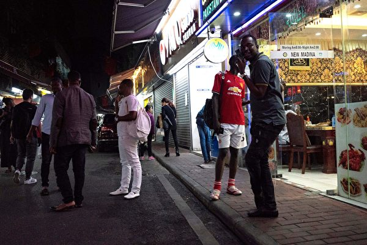

尼日利亚当局5月30日表示，在冠状病毒（中共病毒）大流行和据称歧视非洲人的情况下，尼日利亚当局已从中国疏散了268名国民。图为2018年3月广州中心城区名为“小非洲”的街道上，很多非洲籍人士在此工作、生活。(AFP/Getty Images)

   
   【大纪元2020年06月01日讯】（大纪元记者夏雨、戴芙若、李言、林燕综合报导）6月1日全球中共病毒（武汉肺炎）疫情最新情况：
   
   根据约翰‧霍普金斯大学（Johns Hopkins University）的数据，截至美东时间5月31日晚上8点，全球确诊感染中共病毒（武汉肺炎）的人数超过613万，死亡人数超过37万（注：因中共和伊朗隐瞒疫情数据，真实数据比统计的要高）。

美国确诊病例超过179万例，死亡超过10.4万人。截至美东时间5月31日下午4点，在过去24小时内，美国确诊感染中共病毒病例上升了1.1%，低于过去一周均值，是5月26日以来的最低水平。意大利新增病例持续下降。

欧洲各国疫情减缓，曾经的疫情热点国家和地区逐步放松限制。英国6月1日开始开放一些体育项目和学校。

美国国务卿蓬佩奥周日接受采访再次提到中共在大瘟疫期间，进行虚假宣传转移视线。他说：“今天的中国共产党不同于十年前，它们有意破坏西方理念，西方民主，以及西方价值观，这使美国人处于危险之中。”美国一名退役将军则表示，中共利用瘟疫企图摧毁西方国家经济。

因中共病毒疫情和报导出的种族歧视原因，非洲国家尼日尼亚从中国撤离260多名国民。

=======================
以下是最新疫情实时更新：

<b>美国飓风季开始 今年将大不同</b>

当灾难来袭时，州紧急事务官员会为最坏的情况做准备。但大多数计划都没有包括与大流行碰巧在同一时间的飓风季。这场大流行耗尽了资源，且没有放缓的迹象。

随着飓风季于周一（6月1日）正式开始，佛州和大西洋沿岸的其它州都面临着严峻的现实，几乎正在更改各方面的应对准备。

由于预计会是一个繁忙的飓风季，官员们正在更改对民众的呼吁，从待在家中躲避疫情更改为当被要求疏散时就离家前往庇护所。

迈阿密-戴德县（Miami-Dade County）应急管理部门主任弗兰克·罗拉森（Frank Rollason）说：“我们面临的最大挑战是，当下达疏散令时，人们不会离开。”

“他们会认为，待在家里碰运气，要比身处冠状病毒检测可能呈阳性的人群中更好。如果他们被命令撤离，那么他们待在疏散中心要比待在疏散区的家中更安全。 ”
德新增333例确诊 累计逼近18.2 万

德国公共卫生部门周一（6月1日）表示，在过去24小时内确诊了333例新的感染病例。

据德国疾病控制和预防机构罗伯特·科赫研究所（RKI）说，在此期间新增了11人死亡。

根据RKI的数据，德国至少已有181,815人感染了中共病毒，其中8,511人死亡。

<b>日立计划制定在家工作的标准做法</b>

日本电子巨头日立公司上周宣布，公司将从2021年4月起让在家工作成为新常态。这让日本许多的人感到惊讶。日本是一个以要求严格的工作文化而闻名的国家，在这个国家，“工薪一族”每周工作时间长达80小时。

日立公司表示，它将每月给员工3000日元（28美元）用于购买口罩和消毒剂，同时还将帮助员工支付家具、WiFi和显示器的费用，以改善他们在家工作的环境。

这家科技企业集团的最终目标是让70%的员工（约23,000人）每周远程工作两到三天。

日立制作所在上周二 (5月26 日)发布的新闻稿提到在中共肺炎 (COVID-19) 疫情告一段落后，该公司仍会持续推动在家工作。并说员工在家工作将成为新常态，未来有7 成员工会在家工作。

<b>泰国放宽部分防疫限制</b>

泰国总理巴育（Prayut Chan-o-cha）办公室周一宣布，泰国将从今天开始放宽宽部分与中共病毒有关的限制措施。

新规则包括：

缩短全国的宵禁时间，现在从晚上11点延长到凌晨3点；

学校和教育机构可以重新开放，但这只是为学生返校和举办考试、会议和某些体育活动做准备；

商场、市场和展览馆现在可以营业到晚上9点，但前提是人们要保持社交距离；

允许健身房重新开放，但条件是每次只允许有限的用户进入；

美容诊所和纹身店也可以重新开放；

水疗和按摩院可以重新开放，但不能让人们使用蒸汽浴室或提供面部护理；

体育馆可以开放供练习，但不能开放比赛；

电影院和剧院可以重新开放，最多可容纳200人。音乐会仍然被禁止。

动物园和海洋公园可以重新开放，但不能完全开放。

<b>印度确认8,392起新病例</b>

印度卫生当局说，在过去24小时内，报告有8,392个新的感染中共病毒的患者，这是自病毒大流行开始以来，一天内出现最多的病例数。

之前的一天记录了录得最高病例数为8,380例。

印度现在已确认至少有190,535例感染中共病毒的病例，造成至少有5394人死亡。

马哈拉施特拉邦（Maharashtra）的孟买（Mumbai）、浦那（Pune）和那格浦尔（Nagpur）等城市已记录有67,655例确诊病例，比印度其他任何州的病例都要多。

<b>日本新增33个确诊病例</b>

日本卫生部说，日本周日记录增加了33例新的中共病毒感染病例和1例与病毒有关的死亡病例。

日本全国确诊的总病例数达到17597例和905例死亡病例。这包括钻石公主号游轮相关的712个确诊病例和13个死亡病例。

东京周日记录有5名新患者，这是6天以来东京市首次出现新病例数低于两位数的情况。

日本首都目前正处于重新开放计划的第二步，这意味着允许学校和一些商业设施重新开放。

<b>美国录得19,788个新病例</b>

根据约翰·霍普金斯大学的数据，周日美国确诊了至少有19,788例新病例和600例与病毒有关的死亡病例。

目前全美报告的感染病例总数为1,790,191例，包括至少104,381的死亡病例。

这个总数字包括来自所有50个州、哥伦比亚特区和其他美国领土的病例，以及撤侨的病例。

<b>韩国报告增加35个新病例</b>

韩国卫生当局报告在过去一天内发现了35个感染冠状病毒（中共病毒）新病例，其中超过30例均发生在本地社区。当天还新增1例死亡病例，累计死亡271例。

韩国中央防疫对策本部周一在疫情简报会上通报，韩国新增35例确诊病例，累计确诊病例升至11503例。

韩联社报导说，韩国单日新增病例日前已回落至30例之下，但随着京畿道和仁川市地区的教会发生群聚性感染，令确诊病例再次反弹至30例以上。

在新增35个病例中，其中有33例为社区感染病例，另2例是在入境检疫过程中发现的。

韩国卫生当局指，其中24个病例与宗教团体聚会有关。但卫生部没有具体说明这些病例是来自于某一个团体还是多个团体。

此前韩国是除中国外为亚洲疫情重灾区，其通过广泛检测和联系追踪有效控制病毒在本国传播，令该国确诊病例总数控制在12,000以内，包括271人死亡。

但最近几周韩国当局发现了几个新的群聚性感染。最近的一个出现在首尔附近的城市富川物流中心。当局说，已确诊与该群聚感染有关的病例，目前有数千例被隔离。

而上周末发生与宗教团体聚会有关的病例可能是一个新群体感染的最初迹象

<b>印度将从周一开始重新开放部分地区</b>

作为分阶段重新开放计划的一部分，印度各地多个州和地区周一将开始解除与中共病毒疫情相关的一些封锁措施。

截至今日：
宵禁时间改为：从原来上午7点至晚上7点，改为从清晨5点至晚 上9点；
政府现在将允许各州和联邦领土取消对州与州之间人员和货物往来的限制；
但是，所谓的“隔离区”（中共病毒爆发严重地方）必须在6月30日之前保持封锁状态。

印度重新开放计划的第一阶段被称为“解封1”，实际上要到6月8日才开始进行。在此阶段，礼拜场所、酒店、餐馆、购物中心和其他招待服务可以重新开放。

根据该计划的第二阶段，在与各州和联邦领地协商后，将开放包括学校和学院在内的教育、培训和辅导机构。

除内务部允许外，重新启动旅客的国际航空旅行和恢复地铁铁路服务以及重新开放电影院、健身房、游泳池、娱乐公园、酒吧、体育馆、礼堂及类似场所的日期将在第三阶段决定。

但该计划没有提供第二阶段和第三阶段开始的确切日期。

印度在周日录得有8,380例新确诊病例，这是该国自全球大流行病开始以来在24小时内确诊最多的病例。

根据约翰·霍普金斯大学（Johns Hopkins University）的统计数据，迄今为止，印度已经确认了超过190,000例感染中共病毒的病例和5,400多例与病毒有关的死亡病例。

<b>避疫情和歧视 二百多非洲人撤离中国</b>

4月，中国广州发生的对非洲人的种族主义歧视，引发一些非洲国家罕见的官方抗议活动。尼日利亚当局5月30日表示，在冠状病毒（中共病毒）大流行和据称歧视非洲人的情况下，尼日利亚当局已从中国疏散了268名国民。

土耳其阿纳多卢通讯社（Anadolu Agency）5月31日报导，尼日利亚外交部长杰弗里‧奥涅亚马（Geoffrey Onyeama）周六晚在一系列推文中说，从中国撤离的国民于周六晚到达尼日利亚首都阿布贾（Abuja）的纳南迪‧阿齐基韦国际机场（Nnamdi Azikiwe International Airport）。

奥涅亚马说，在外交部和尼日利亚和平航空公司协调下撤离后，这些经历了艰难时期、从中国撤离的尼日利亚人现在在旅馆安顿下来。

部长指出，根据尼日利亚疾病控制中心和外交部的规定，所有撤离人员将被隔离14天。

根据非洲疾病控制与预防中心的数据，尼日利亚迄今已确诊9,855例中共病毒病例，死亡273例，康复2,865例。

据悉，在中国许多地区，特别是南部城市广州，尼日利亚人和其他非洲人普遍被禁止进入医院和大型购物中心，被迫离开家园和旅馆房间，并在当地面临暴力，一些非洲国民甚至流落街头。

奥涅亚马上个月表示，他已召见中共驻尼日利亚大使，表达政府对在中国遭虐待尼日利亚人的关注，同时呼吁北京进行干预。

英国《卫报》4月27日报导，最近该媒体联系了广州的非洲人说，由于当地担心他们可能是中共病毒的携带者，他们面临歧视和种族主义。

尼日利亚商人纳布武（Frank Nnabugwu）说，自己解除隔离后被禁止返回出租房，只好露宿街头。后来他终于进入一家酒店安身，但是只能通过服务员买饭，“如果他们（食品配送公司）知道是外国人在订购食品，他们就不会来。我们不能进商店买任何东西。”他说。

4月，尼日利亚国会下议院决定调查中国公民及其中企在该西非国家的合法性。

中共一直试图用钱在非洲各国渗透，在中共病毒（俗称武汉病毒、新冠病毒）全球爆发之际，中共利用“病毒外交”，企图在非洲进一步扩张野心，但非裔在中国广州流离失所被虐待事件，使得中共受到非洲多国政府谴责，非洲民众对中共的态度达到最低点。

<b>蓬佩奥：中共利用疫情虚假宣传 以转移视线</b>

周日（5月31日），美国国务卿蓬佩奥在接受福克斯新闻采访时，再次提到中共利用疫情宣传虚假信息，转移视线。

在主持人问道，2015年蓬佩奥谈到中共盗窃知识产权，2012年谈到中共黑客攻击，中共目前有何变化？
蓬佩奥回答说，中国共产党变得更加激进。这个问题已经存在很长时间了，可以肯定追溯到2012年。但是它们变得更具侵略性。

他说：“它们（中共）在进行虚假宣传活动方面变得更加积极，就像我们看到的那样，当冠状病毒（中共病毒）在世界各地传播，它们关闭了自己的省份（湖北），却允许（武汉人）在世界各地旅行时，从而感染了成千上万的人。”

“我们看到中共虚假信息运动是试图转移注意力。”蓬佩奥总结说。

一名研究人员表示，中共政府控制着成千上万的虚假社交媒体账户（或称为机器人账户），向外发布关于中共病毒和其它一些敏感话题的虚假消息，还对香港民主抗议活动发动攻击。

在4月25日至5月3日之间，专门分析社交媒体网站信息运作情况的本杰明·斯特里克（Benjamin Strick）说，他在推特（Twitter）社交平台上发现了一千多个与传播中共虚假信息相关的账户，在脸书（Facebook）上也发现了五十多个不同的页面。他估计，作为中共媒体宣传的一部分，每天有300或400个新的虚假推特账户被注册。

彭博社5月12日报导说，斯特里克最新的研究结果表明，中共加大了与中共病毒相关的虚假信息传播，以开脱自己的罪责，并试图甩锅给他国。

<b>日本幼儿园重启 专家：幼儿戴口罩恐增感染风险</b>

日本放送协会（NHK）报导，受到境内疫情趋缓，日本包括幼儿园等机构，从周一开始恢复正常运作。

日本社群网站上不少人指出，担心幼儿戴口罩容易中暑；也有人建议，如果让幼儿戴专用口罩的话，短则3分钟、最长15分钟就要拿下。

针对网路上关注幼儿戴口罩的各式各样声音，冲绳县立中部医院传染病内科医师高山义浩说，幼儿会在意脸上的口罩，所以戴上口罩反而会增加幼儿自己摸脸的频率，有可能让感染风险升高。

<b>巴西病例总数破50万</b>

在过去24小时内，巴西报告了16,409例新型冠状病毒，使全国总数达到514,849例。

根据巴西卫生部的数据，巴西在过去24小时内还记录了480例新的与中共病毒相关的死亡，使整体死亡人数增加到29,314人。

<b>最近美国经济趋势 预示潜在复苏</b>

尽管在中共病毒大流行期间，美国经济遭受挫折，但跨多个业务部门的最新数据表明情况似乎开始有所好转。

随着各州重新开放进程的推进，越来越多的美国人开始旅行，购买房屋和在餐馆就餐，这表明一些受灾最严重的行业正在开始复兴。

随着消费者恢复以往的习惯，可能表明经济已开始从疫情爆发的灾难性影响中恢复过来。

<b>欧洲疫情热点地区缓解封锁措施</b>

在意大利等一些欧洲国家，中共病毒死亡人数趋于稳定，疫情缓解后，欧盟各国开始逐步缓解封锁措施。

欧盟委员会预计中共病毒令经济下滑7.7%，各国政府面临重开商店、工厂和服务的压力。

英国将于周一（6月1日）在遵循社交疏离准则下，开放一些学校、一些竞技体育项目（包括赛马），以及户外市场和汽车展示厅。

曾是欧洲疫情最严重国家的意大利也在谨慎开放国家，支持取消在罗马和米兰的一些限制措施。

欧洲最大的经济体德国刚刚开始放松限制，计划在严格卫生制度下于10月举行世界最大书展。

从6月15日起，希腊将允许更多国家游客访问该国。

西班牙首相佩德罗‧桑切斯（PedroSánchez）在周日（5月31日）的新闻发布会上表示，在控制中共病毒病例方面，过去几周获得重大成果，但他也说“我们不能放松，该病毒仍存在。 ”

桑切斯表示，紧急状态将延长15天，但从6月8日开始，政府将把放松限制的权力转移给进入第三阶段的地区政府。

一旦西班牙某个地区达到第三阶段，中央政府将只控制交通事务。

挪威和丹麦将允许两国之间的休闲旅行。

<b>美国病例增长1.1% 低于过去一周均值</b>

截至5月31日美东时间下午4点，约翰‧霍普金斯大学和彭博新闻社收集的数据显示，美国病例比前一天同期增加了1.1%，达到178万。全国增幅低于过去一周每日平均增幅1.3%，是5月26日以来的最低水平。死亡人数增加了0.7%，至104,081。

纽约州报告了1,110例新病例，总计370,770例，其中57例新死亡，总计23,905例。该州在5月2日的每日死亡人数为299，在4月初的死亡人数为799。

新泽西州州长菲尔‧墨菲说，新泽西州有868例新病例，共160,445例病例；新增66例死亡，使总数增加到11,698人。

加利福尼亚报告了3,705例新病例，是单日最大增幅，达到110,583例；而新死亡病例连续第三天下降，降至57例，总数为4,213例。

宾夕法尼亚州有511例新病例，全州总数达到71,926例；新死亡18例，总计5,555例。

马里兰州报告了763例新病例，总计52,778例；死亡21例，总计2,411例，州长Larry Hogan表示，阳性病例比率从4月17日的峰值26.9%降至10.9%。

<b>美密歇根大学努力让学生秋季返校</b>

密歇根大学告诉CNBC，该校正在采取措施，在今年秋天将学生带回校园。

校长马克·施利瑟尔（Mark Schlissel）说：“普通学生非常想离开父母家的地下室，然后回到学校。”

施利瑟尔对学生将返校非常“乐观”，他认为学校将能够做到他提出的、基于公共卫生的在校学期。

<b>纽约单日死亡人数降至56</b>

纽约州长安德鲁‧库默（Andrew Cuomo）周日（5月31日）在新闻发布会上说，纽约报告56例新死亡。 这是连续第六天死亡人数低于75。

库默在纽约州首府奥尔巴尼说：“死亡人数的减少是我们州的巨大进步。”“我们经历了地狱，然后又回来，但我们在另一边（指好转的一边）。”

州长表示，4月初的每日死亡人数高达近800人。

<b>埃及5议员中共病毒测试呈阳性</b>

埃及国会周日（5月31日）表示，随着北非国家确诊病例持续增加，五名埃及议员对中共病毒检测呈阳性。

埃及周六报告1367例新病例。

目前，埃及已关闭咖啡馆、体育俱乐部和体育馆，实施夜间宵禁，并规定必须在公共场所戴口罩。

<b>美退役将军：中共武器化病毒 意图摧毁西方经济</b>

美国退役将军、福克斯新闻社高级战略分析师杰克·基恩（Jack Keane）表示，中共将病毒“武器化”，令其在世界范围内传播，以摧毁西方经济。

基恩向主持人福克斯玛莎·麦克卡勒姆（Martha MacCallum）解释说，像许多观察家一样，中共领导人对川普总统在2016年击败希拉里·克林顿（Hillary Clinton），以及随后将中共描述为美国的战略“竞争对手”感到震惊。

根据基恩的说法，北京在过去四年中一直在“适应”这一新常态。

“可以肯定的是，这是在香港，这是中美之间这场对抗的最前沿。他（中共领导人）武器化了COVID-19。”基恩说。

他表示，中共实际上是利用这种疾病在世界范围内传播，因为它认为这种疾病会破坏西方民主国家的经济。

基恩指出，在川普担任美国总统之前，中共企图统治中国-太平洋地区。他说，中共行动是掠夺性的，且没有遭到阻挡，直到川普政府介入。

基恩将军在白宫接受川普总统授予的总统自由勋章。（公有领域）

<b>Costco从下月中旬开始 恢复免费品尝小吃服务</b>

Costco（好市多）计划从下个月开始，恢复传统免费样品品尝服务，但需要进行一些更改。

由于对中共病毒传播的安全性担忧，Costco于3月初在其仓储式卖场暂停受消费者欢迎的样品试吃服务。消费者在社交媒体上表达对免费小吃的怀念。

“今日美国”网站5月30日报导，5月28日，在Costco的季度财报电话会议上，公司官员们表示，他们的目标是6月中旬恢复免费小吃品尝。

Costco首席财务官加兰蒂（Richard Galanti）说：“我们将在6月中旬开始做一些事，缓慢恢复试吃服务。”

加兰蒂说，在Costco商店过道上摆放的食品和非食品样品活动很受消费者欢迎。

<b>研究：10%罹患糖尿病染疫者住院一周内死亡</b>

一项最新研究显示，有10%的感染中共病毒疾病（COVID-19）的糖尿病患者，在住院后一周内死亡。

根据发表在欧洲糖尿病研究协会杂志《糖尿病学》上的研究，五分之一的患者最终被插管，也需要呼吸机。

该研究分析了3月10日至31日之间，法国53家公立和私立医院收治的1317例中共病毒患者。

研究结果还显示，入院的COVID-19糖尿病患者中有65%是男性，所有糖尿病患者的平均年龄为70岁。

研究发现，糖尿病并发症和年龄会增加死亡风险，而肥胖与需要呼吸机以及死亡风险增加相关。

研究人员在一份声明中说，年龄和身体质量指数（Body Mass Index, BMI）和感染中共病毒重症相关。

<b>疫情影响 法国顶级餐厅不得不开始外卖</b>

由于世界各地的餐厅因中共病毒大流行而关闭，法国一些顶级餐馆被迫以他们从未想到的方式来适应现状。

米其林星级餐厅厨房的魔力是人们支付高昂价格就餐的主要原因。不仅是食物美味，如果一家美食餐厅无法提供热情的欢迎、无可挑剔的服务，并设法使食客感到与众不同，那么它可能会失败。

在中共病毒大流行冲击下，为了生存，甚至法国一些顶级厨师都在做不可想像的事情：外卖。

尽管没有白色亚麻桌布，没有完美的服务，没有博学的服务员在餐桌附近徘徊，但顶级厨师和餐厅业主正在努力确保顶级餐点的核心食物仍然存在。

目前尚不清楚法国何时允许餐馆重新开放，以提供店内就餐服务，或者需要遵循何种社交疏离准则。但许多餐馆老板都认为，外卖至少是恢复营业的良好开端，也是巴黎美食家的急需。

<b>更多美国雇员希望在家上班</b>

许多雇员表示，中共病毒大流行期间工作与生活的平衡得到改善，因为他们不必上下班通勤，而且他们都喜欢在家工作。

雇主也不急于让员工很快回到办公室，四分之三的雇员说他们可能会永久性在家工作。 但要提防的是：根据远程工作地点所在地，雇员和雇主都可能面临额外税收负担。

CNBC的达拉·梅尔卡多（Darla Mercado）报导说，对于可能居住在一个州而去另一州工作的人来说，税务变得更加复杂。
大瘟疫后 买卖房子或以视频和视讯方式进行

随着各州放松居家令要求，美国人购房申请再次上升。但是病毒大流行改变了房子的买卖方式，且这种变化不太可能很快消失。

越来越多的视频看房可能已经成为买房日常方式。越来越多的买卖双方不是在法院或办公室会议室开会，而是远程签署文件。

美国国家经纪公司Redfin的首席执行官Glenn Kelman说：“我们为可视化房屋和视讯化签单过程而构建的所有技术，都将变得越来越重要。”

<b>在大瘟疫后 美国将重建</b>

在大瘟疫后，美国将重建，只是美国人不太确定致命病毒大流行的后果是什么样。经济引擎是否需要改变其销售方式？会恢复同样的消费习惯吗？

加利福尼亚州帕洛阿尔托（Palo Alto）的非营利智囊团“未来研究所”执行董事玛丽娜‧戈比斯（Marina Gorbis）说，大流行病所产生的激流力量一直影响着全球历史。

她说：“无论是鼠疫、西班牙流感还是冠状病毒（中共病毒），大流行病既是健康事件，也是导致社会和政治变革的社会事件。”

从缅因州到加州，重建工作已经开始，在大多数地方，人们都同样兴奋和谨慎。

佐治亚州罗斯韦尔（Roswell）的餐馆总经理Mikaela Cupp说：“社区感到很兴奋，这里有一种被压抑的‘我们想摆脱居家的能量’。”

但是在亚特兰大，办公室工作人员丹妮塔‧琼斯（Denita Jones）担心将病毒带回家中，因为很少有同事戴口罩。

她说：“我看到一些人们回到大流病前的行为，就像世界上一切正常，而我们其余的人都在如履薄冰。”

贝恩咨询公司全球咨询公司高级合伙人詹姆斯‧艾伦（James Allen）看到了一种向“基于价值的消费”转变，在这种大流行病中，消费者奖励那些“充当好公民”的企业。

他说，与此同时，白领职业工作方式将结合持久需求的远程工作和偶尔需要的“高接触办公体验”，办公空间可能会萎缩，为城市振兴铺平道路。办公楼将以公寓为核心。
夏威夷5渔夫钓到220磅金枪鱼 捐给抗疫一线人员

一群美国渔夫正在分享爱。

上周，五名渔夫在夏威夷海岸，钓起一条重达220磅的大金枪鱼。《夏威夷新闻》报导，慷慨的渔夫没有把鱼肉留给自己，而是将鱼捐给了瓦胡岛一家医疗中心的一线工人。

夏威夷电视节目执行制片人中本凯（Kyle Nakamoto）表示，当地一名104岁的渔夫最近去世了，但他生前经常和其他人分享自己的渔获物。这5名渔夫受到这个老渔夫精神的启发。
   
<a target="_blank" href=#top><h6 align="right">回上方</h6></a>

<a name=7>
<h1 align="center"><b>李正宽：中共一意孤行毁香港 天灭中共在兑现</b></h1>

示意图：中共强行撕毁撕毁《中英联合声明》，强推“港版国安法”。（大纪元合成）

   
   【大纪元2020年05月31日讯】5月22日，中共在两会上突然放出消息，欲在香港强行推出“港版国安法”，随后，开始大规模抓捕香港民众。此举迅速引发了香港民众和世界各国的反对浪潮。外界普遍认为，中共无视香港《基本法》、强行撕毁《中英联合声明》的做法比2019年的引渡法案更加邪恶。

5月27日，美国国务卿蓬佩奥（Mike Pompeo）宣布香港不再高度自治，川普政府将不再保证香港享有美国所赋予的特殊待遇。

在国际上巨大谴责声浪和制裁压力下，中共仍然一意孤行，于5月28日在中共全国人大会议上强行“表决”通过了“港版国安法”的草案。

中共为什么要冒天下之大不韪，公然毁掉香港的“一国两制”呢？中共这么做的下场将是什么呢？

<b>保经济与保政权，悬崖边上玩平衡</b>

中共执政的唯一“合法性”就是它宣称的中国经济的增长。而中共拉动经济主要靠的就是外贸和外资。据2018年中共商务部的统计，超过70%的外资是从香港进入中国的。因此，香港在国际上的金融地位，是中共维持政权所深为依赖的。中共宣称的“一国两制，50年不变”只不过是为了霸占香港这颗摇钱树，而对国际社会作出的虚假承诺。如果公然践踏香港的“一国两制”，中共就会遭到国际上的制裁，而经济的下滑必然带来执政的危机。

另一方面，作为当今世界上最大的独裁政权，中共最为恐惧的就是民主和自由。特别是香港所享有的民主制度下的言论自由、游行示威和结社自由，都让中共如坐针毡。香港没有网络封锁，港人第一时间可以将中共的丑恶通过媒体和互联网曝光于世；每年的6月4日，港人都会组织大型的纪念“六四”的烛光晚会；香港法轮功学员常年坚持在闹市和景点讲真相、揭露中共活摘器官的反人类罪……，这些都让这个独裁政权如芒在背。

多年来，中共就是在保经济和保政权之间艰难地玩平衡。众所周知，中共利用香港的金融地位攫取利益的同时，一天都没有停止过蚕食香港、摧毁香港的民主和自由。早在2003年，中共就欲在香港强推23条恶法，遭到了港人的强力抵制，50万人走上街头反对恶法，结果中共在巨大的压力下宣布撤回23条恶法。2019年，反送中运动爆发，数百万人次的港人大游行掀起了巨大的反共浪潮，香港这只“下金蛋的母鸡”对中共生命的威胁几乎超过了其给中共带来的利益好处。

去年年底，美国政府祭出重拳，川普正式签署了《香港人权与民主法案》，该法案直接遏制了中共进一步对香港自由和自制的侵蚀。因害怕美国对中共官员实施制裁，担心香港一旦丧失特殊关税待遇，必定导致大陆经济断崖式下跌，严重危及到中共政权，中共略有收敛，暂时消停了一段时间。

<b>中共病毒打破平衡，独裁政权只剩下保命</b>

一场突如其来的瘟疫，让原本已经摇摇欲坠的中共政权更加乱了阵脚。中共造假、甩锅、战狼外交、口罩外交等无耻邪恶行径深深地激怒了全世界，100多个世卫成员国支持针对中共病毒来源进行调查，多个国家正在对中共进行索赔，特别是美中关系急剧恶化。面对国际国内的追责和索赔声浪，中共政权走到了绝境。此时，香港是否享有特殊的金融地位，已经远不及中共的保命来得重要了。

中共推出“港版国安法”，一方面是企图转移国际上对中共病毒追责的视线。另一方面，大陆民众在经历过中共病毒的肆虐后，失去亲人的、丢掉工作的、各方面受重创的，种种不满在内心压抑着，民怨民愤不断发酵。中共通过在香港制造冲突，企图转移大陆民众的愤怒。再者，进入六月之后，香港会迎来多个中共敏感日，“六四”烛光晚会、“六月九日”守护香港反送中大游行一周年、以及随后的“七一”反共大游行，都深深刺痛着这个独裁政权的神经。

中共在此时不惜切段输血动脉、毁掉香港，恰恰反映出了中共断尾求生的末日恐慌。

<b>中共摧毁香港，反被打中七寸</b>

美国勇敢并坚定地与香港站在了一起，为普世价值而战。5月29日，川普总统发表了美中关系的重要讲话，宣布了三项重要决定：美国将撤销香港作为独立关税区所享有的特殊待遇，将制裁直接或间接参与侵蚀香港自治的中共和香港官员；美国正式退出世界卫生组织；美国将暂停一些特定中国人入境，以更好地保护美国一些重要大学的研究。
川普政府祭出的重拳，直接打中了中共的七寸。

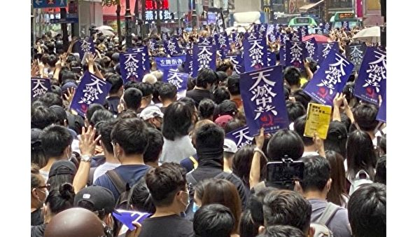

2020年，港人反对“港版国安法”游行中普遍打出了“天灭中共”的标语。(VOA)

香港独立关税地位被取消，中国经济比遭重创，出现大萧条，乃至彻底崩溃。那么在中国国内，中共将丧失最后一点它自己宣称的“执政合法性”，引发民怨的彻底沸腾，政权危在旦夕；而在国际上，中共仅剩的那点用钱买出来的“影响力”将荡然无存，追责和索赔的浪潮会演变成全球灭共的大海啸。

港人呐喊的“天灭中共”正在人间兑现，这场正邪大战在走向最后。

<a target="_blank" href=#top><h6 align="right">回上方</h6></a>

<a name=6>
<h1 align="center"><b>程晓容：中共绑架中国人 强推港版国安法</b></h1>

5月24日，上万香港人走上街头，举行反对“香港版国安法”大游行。(ANTHONY WALLACE/AFP via Getty Images)

   
  【大纪元2020年06月01日讯】近日，中共党媒连续发文撑港版《国安法》，称“这是香港广大民众的根本利益之所在”，“中国人民不吃美国那一套”，“香港是中国的香港，是包括750万香港同胞在内的14亿中国人民的香港。”

日前，加拿大华人微信群里，流出一封“全加华人联会（安大略区）”支持中共在香港实施国安法的信件，日期是5月25日。信中称，“我们海外华人坚决支持……”一位网民不买账，在信上盖字注明：“警告！勿代表我真华裔加拿大人”。

71年来，中共习惯性地以“人民”为招牌，掩盖它的一次次罪行和恶意企图。大陆民众、香港民众以及海外华人，都是中共欺骗的对象和利用的工具。中共绑架人民，玷污真正的爱国情。

<b>中共能代表14亿人民？</b>

5月28日，中共总理李克强在两会记者会上披露，6亿中国人的月收入只有一千元，“1000元在一个中等城市，可能租房都困难”。一位大陆网民痛心地说，这6亿人才是中共的基本盘！

勤劳的中国人民创造了巨大的财富，支撑起了一个制造业大国。中共骗取各阶层人民的信任，夺取政权后，持续地压榨和迫害国民。它知道，只有打着“人民”的旗号，才能继续行骗，才能不断地侵吞民脂民膏，壮大和保全它自己。

2007年9月10日，维权律师腾彪和人权活动家胡佳发表了《奥运前的中国真相》，文中写道：“你们将看到摩天大楼、宽敞的街道、现代化的体育场馆和热情的市民……你们或许不知道，能够看到的这些鲜花、微笑、和谐与繁荣，正是建立在冤屈、泪水、囚禁、酷刑和鲜血的基础之上的。”

“人民”的定义随着中共的需要而变化。所谓的“人民代表”代表的是权贵集团，为党的利益举手、表决。当中共恶行败露，受到外界谴责时，它便以“伤害了14亿人民的感情”来挡箭，煽动民族主义和仇外情绪。

去年“反送中”运动爆发后，许多大陆网民没有听信中共的谎言，在“墙内”援港，他们写下了：“支持香港人民正义抗争”“你们的坚持令人感动！”“香港人会赢，他们不是废青，他们是无私的勇士，没人可以让自由的人下跪”。

“中国人民”包括了谁？是那些住豪宅、开豪车，把财产和全家移到美国去了的官员，还是涌到美国驻华使馆微博、请求川普总统“解放”的网民，到处被截访的访民，饱受打压的维权人士，数千万因坚守信仰而被迫害的法轮功学员，还是毒奶粉、毒疫苗的受害者，还是染疫后被医院拒之门外、凄惨离世的武汉人？千千万万中国人的权利被剥夺，他们的呼声被漠视，中共凭什么代表中国人？

<b>中共能代表香港民众？</b>

港版国安法针对四类所谓罪名：“分裂国家”、“颠覆国家政权”、“组织实施恐怖活动”和“外国和境外势力干预香港特别行政区事务”。中共绕过香港的司法程序，直接立法，而且今后可在香港设国安机构，对抗议人士大打出手。

众所周知，大批大陆的正义之士被以“颠覆国家政权罪”非法抓捕和判刑。中共企图在香港如法炮制，是以维护国安为名，行镇压自由之实。

自去年6月之今，至少2百万香港市民反对中共破坏“一国两制”。从小学生到八旬老者，抗议者来自政治、教育、法律、医疗、航空、宗教、金融等多个领域。他们冒着生命危险，上街抗议。

去年8月18日，12岁的林同学在维园对大纪元记者说，他走出来，是因为他也是香港的一分子：“我不想长大后，因为如果讲了一句话，就马上被人抓走。同时是为了自己和其他小朋友的将来。”

一位大陆网民质问中共：“香港200万市民的游行，你采纳他们的意见了没有？没有就扣港独、暴乱的帽子。”

5月28日，美国国务院东亚和太平洋事务局发表2020年度香港政策法报告。报告写道：“千百万香港人民抗议这些侵犯其人权和基本自由的行为，抗议中国（中共）背叛了自己对香港的承诺。香港政府没有听取他们的不满和寻求民主解决方案，而是部署了催泪瓦斯，并大规模逮捕了包括和平示威者在内的人。”

中共颠倒黑白，它把维护自由的香港人污蔑为“暴徒”，把镇压“反送中”等同于“爱国爱港”。目前，党媒又偷换概念，将美国对中共的制裁称作“制裁香港”。中共清楚，它如果不混淆视听，不打着“爱港”的幌子，它一天都混不下去。事实上，中共才是乱港的主犯和祸根。

<b>中共能代表海外华人？</b>

去年，亚洲、欧洲、北美60多个城市的华人发起了多次声援“反送中”的游行和集会，喊出了“香港加油”，“香港不孤单”的口号。这些震撼人心的场景全部被中共媒体封杀。中共驻外使领馆调动亲共侨团，组织人马唱对台戏，以其反对的声音代表“海外华人”。
2019年9月28日，数千人在伦敦参加了反对中共、争取香港自由的游行。（晏甯／大纪元）

中共长年在海外渗透，侨界和华语传媒是它的主攻方向。绝大多数华语报刊被中共收买或渗透，主动过滤中共要掩盖和不喜欢的新闻。许多华人商会和同乡会沦为中共的政治工具和代理人，例如纽约的美东华人社团联合总会、温州同乡会、福州同乡会、上海同乡会等等。这些团体听命于中共，借“海外华人”的身份为它摇旗呐喊。

另一方面，真正爱国、坚守良知的华人、华人社团、华语媒体却受到中共的打压及亲共团体的骚扰，甚至暴力威胁。

中共对海外华人输出大量洗脑谎言宣传，利用故土情结来搞统战，渲染“祖国”的“强大”。对于大陆的官场腐败、环境污染、法治不公、人权迫害等乱象，亲共媒体却避而不谈，反而指责“外国势力”“干涉内政”。

据大纪元报导，5月22日，纽约《星岛日报》头条新闻是“中国人大常委会出手将订立‘港区国安法’”，其中一版刊登了该报老板何柱国的文章“理所当然”，何高调挺共，撑恶法。这种扬恶抑善、扭曲事实的立场不仅误导广大美国读者，而且还会被中共当作“海外华媒”的消息内销回国，再欺骗国内民众。

<b>识破中共骗局</b>

每一次，当中共陷于被动时，它便搬出“人民”来说事儿，企图将它的谎言正常化、丑行合理化。它只关心它的政权，根本不在乎人民的利益和生死。中共的“我是护旗手”运动，还有“爱国爱港”口号，都是“爱党”的同义词。它要人们维护的，是玩弄人民、随时向人民举起屠刀的一杆旗。

从土改、反右、文革到“六四”，从迫害法轮功到镇压“反送中”，再到隐瞒疫情和强推港版《国安法》，中共的倒行逆施给大陆人民带来了深重的灾难，摧毁了香港的自由与繁荣，也给海外华人带来耻辱和阴影。

中共不等于中国人民。大陆、香港民众以及海外华人都应当识破中共的“人民”骗局，拒绝它的邪恶“代表”。 

<a target="_blank" href=#top><h6 align="right">回上方</h6></a>

<a name=5>
<h1 align="center"><b>千载云：美国总统讲话 “四大招”剑指中共</b></h1>

图为川普（特朗普）周五（5月29日）在白宫发表中国问题讲话。(MANDEL NGAN / AFP)

   
 【大纪元2020年06月01日讯】今天早上，在网上看了川普（特朗普）总统上周五（5月29日）讲话的中文版，所有内容都是针对中共的，如同向中共挥出的四把利剑，包括调查中国在美国的上市公司，封堵在美国的间谍人员，终止和世卫组织的关系，废除香港的特殊地位。
 
<b>（一）终止和世卫组织的关系，让中共和“世卫”玩二人转去</b>

新冠疫情发生后，世卫组织和中共“合作”得很好，刻意隐瞒疫情，致使首发于武汉的疫情扩大，随之传染美国，传染世界，蔓延成国际性灾难，造成不可估量的损失。

这也是世界一些国家要向中共索要巨额赔偿的缘由吧。

川普总统是个性鲜明的人，给你“世卫”改革方案你拒绝，既然“道不同不相为谋”，干脆终止关系，不和你玩了，也玩不起！

美国每年提供给世卫的经费4.5亿美元，中共是4000美元，只是美国经费的10%不到，世卫组织受中共控制，共同隐瞒疫情，造成国际性大灾难。中共的“公关”还是蛮厉害啊，把谭德赛侍侯得那么好，那就让中共和“世卫”玩二人转去吧。

<b>（二）封堵中共间谍人员，保护知识产权和美国安全</b>

大家可能知道，近20年来中共的间谍网撒得特别大，收买和利用各种各样身份的人，如使馆工作人员，“千人计划”高科技人才，孔子学院师生，大学留学生和社区华人……对民主国家，特别是美国、加拿大、澳大利亚、台湾进行渗透，拉帮结派，输出中共意识形态，收集情报，盗取知识产权，行为十分猖獗。这也让一些国家警醒，纷纷拿出了相应的反制措施。

一些中国留学生可能涉及到军事院校和军方关系，为确保美国的重要大学、企业等的经济和军事安全，将禁止相关中国留学生入境美国，切断他们的间谍之路，以免坑害了这些年轻人，确保美国的安全不受侵害。

<b>（三）调查中国在美的上市公司，确保投资人利益</b>

这是在金融方面，特朗普提出针对中共的措施，以防中国企业在美上市受中共暗中操纵，扰乱美国市场，以规范市场行为，保障投资者利益。

当然也有是中国企业的个人行为，这些企业受中共流氓习气薰染，长于弄虚作假，投机取巧，坑害投资人。

正如有的网友说：“曾有外国人说要防范中国的公司，就像防新冠病毒（中共病毒），听到这样的话，心里真不舒服，但又无力反驳。”

大家知道瑞幸咖啡造假事件吧，这家咖啡公司造假几十个亿，骗了美国的监管部门，也骗了全球投资人。

由此特朗普指示美国金融市场工作小组，采取美国的会计和审计标准，审查在美上市的所有中国公司的行为，以保障投资者利益，剪除祸患，平息市场风险。

<b>（四）废除香港的特殊地位，制裁中共作恶官员</b>

这一招主要针对中共在“两会”上决定强推“港版国安法”的。同时川普语言中充满对港人自由和安全的特别关切，并提出对香港未来的美好期待。

当看到美国废除香港的特殊地位后，网友们议论纷纷。有网友感叹道：“建成一个国际金融中心城市多么不易，可毁掉它只要一天！”“得天独厚的优势就这么完了！”“香港的陨落，是整个中华民族的悲剧！”

从本月24日起，因中共拟强推这一恶法又一次激怒港人，引发了大规模的示威游行，而中共依然打压，依然抓捕，毫不手软，连十几岁的中学生也不放过，还发生过一群警察追捕三位女生，将三人抓住后塞进警车的事件。

没有“国安法”，几十年间港人过得不是很安定很平和吗！一下子怎么涌出这么多“暴徒”？是暴政催生的吧！

“港版国安法”，中共家奴吹它是“定海神针”，其实是“镇压利器”，一旦施行，港人再无自由可言，人权将受到极大的侵害，这是港人不能接受的。“一国两制”变成“一国一制”，中共专制集团就是为了严控香港，“什么‘港人治港’，什么‘一国两制’50年不变”的承诺都被雨打风吹去，这种背信弃义的做法当然会激怒港人，并遭到国际社会的谴责和反弹。

恶法执行之日，也是中共屑小们得势之时，贪赃枉法，栽赃陷害，什么伤天害理的事做不出来？利欲小人得志，一个法治的香港、一个自由的香港、一个美丽的香港将不复存在。

废除香港特殊地位，当然还有相生相伴的制裁措施，最有看点的则是制裁中共的相关官员并冻结他们的财产，这一点不仅国内民众欢迎，就连五毛们也无话可说。

废止香港特殊地位这一招，表明特朗普及其代表的美国，对中共一意孤行打压香港并制度化的极度不满，是美国对中共倒行逆施的反制和打击。这把利剑挥向中共，有多大的杀伤力，是伤筋还是动骨，是断手还是封喉，我们试目以待。  

<a target="_blank" href=#top><h6 align="right">回上方</h6></a>

<a name=4>
<h1 align="center"><b>中共利用美非裔之死抹黑美国 蓬佩奥回应</b></h1>

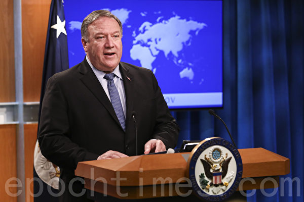

周日（5月31日），美国国务卿蓬佩奥再次提到中共进行虚假信息宣传，目的是转移视线。（Samira Bouaou／大纪元）

【大纪元2020年06月01日讯】（大纪元记者夏雨综合报导）周日（5月31日），美国国务卿蓬佩奥在接受福克斯新闻采访时，再次提到中共进行虚假信息宣传，目的是转移视线。他还对中共利用明州非裔之死，以及美国各地抗议活动，抹黑美国和香港民主运动，进行了回应。

周日，蓬佩奥在福克斯新闻（Fox News）“Sunday Morning Futures”节目上接受玛丽亚‧巴蒂罗莫（Maria Bartiromo）采访。

巴蒂罗莫问道，2015年蓬佩奥谈到中共盗窃知识产权，2012年谈到中共黑客攻击，中共目前有何变化？

蓬佩奥回答说，中国共产党变得更加激进。这个问题已经存在很长时间了，可以肯定追溯到2012年。但是它们变得更具侵略性。

他说：“它们（中共）在进行虚假宣传活动方面变得更加积极，就像我们看到的那样，当冠状病毒（中共病毒）在世界各地传播，它们关闭了自己的省份（湖北），却允许（武汉人）在世界各地旅行时，从而感染了成千上万的人。”

“我们看到中共虚假信息运动是试图转移注意力。”蓬佩奥总结说。

<b>中共抹黑美国和香港民主运动 控制国内言论自由</b>

巴蒂罗莫接着问道，是否中共利用目前的机会，无论是美国的骚乱（因非裔死亡导致的全美多地暴力抗议活动），还是当前世界忙于对抗COVID-19的局面，中共是否以此为契机进行领土扩张？她还提到中印边界冲突，中共在南中国海的军事化等。

蓬佩奥说：“中国共产党在该野心上努力很长时间了。它们肯定会在实地利用机会。但是，你发现的每个问题都存在威胁，威胁已经存在很长时间。第一次，我们有一个（川普）政府准备好回应（中共）说，这是不可接受的，并采取有针对性的、适当的回应，反映出我们保护美国人民免受中国共产党行为（威胁）的认真态度。”

国务卿还表示，针对现在发生的事情（指美国各地抗议事件），它们（中共）正对美国城市发生的事情进行虚假宣传，且将其等同于香港正在发生的事情。但这些完全不同的（事件）。

“我们有法治。我们全国各地都有得体的美国人，他们为所发生的事情感到困扰，他们有机会就此事发表言论。在中国内部，这些（自由言论）都不存在。中国共产党阻止了这种言论自由。结果，这给美国带来的风险是真实的，我们将做出回应。”

<b>针对暴力抗议 美国各级政府反应迅速保护人民</b>

一名非裔男子25日被警员制服期间死亡，明州爆发示威和暴力冲突，并席卷到全美各地。死者是46岁的乔治‧弗洛伊德（George Floyd），有影片显示他趴在地上，被一名白人警员用膝部压颈，难以呼吸。

随后明州开除四名涉事警员，压住弗洛伊德的警员德雷克‧肖文（Derek Chauvin）被控三级谋杀罪，并将于下周一（6月1日）首次出庭。

在周日接受主持人提问前，蓬佩奥就表示：“我首先向受到这次暴动和暴力影响的弗洛伊德先生的家人和所有人民表示我的哀悼。这样不好。这是一个悲剧。警察在那里的行为令人憎恶。”

他说，到目前为止，政府已经采取了非常迅速行动。你已经看到川普总统的讲话，看到司法部长在谈论司法部的工作，以及司法部对调查那里发生的事件，以及当局迅速对这次事件进行回应。

蓬佩奥提到川普的话“这种暴力，抢劫，暴动是不可接受的”。他表示，总统还提供了可能需要的任何联邦援助，包括国防部长埃斯珀与州长的对话；如果有必要，为保护和平示威者，以及受到类似Antifa暴力示威者影响的所有社区的人们提供援助，以保护美国人民。

<b>诽谤美国 占不到便宜</b>

周日，美国国家安全顾问奥布莱恩（Robert O’Brien）在美国广播公司“本周”节目上，列举中国（中共）、俄罗斯、津巴布韦和伊朗等四个国家，这些国家由于弗洛伊德的死和随后的暴力示威活动而抹黑美国，这些抹黑都是在冠状病毒（中共病毒）大流行和及其造成的经济动荡中出现的。

但奥布莱恩说，和平抗议仍然是美国民主原则的基石，美国不像独裁国家那样，警察经常逮捕甚至是非暴力的反政府示威者。

他说：“这就是美国与其它国家不同的地方。”

奥布莱恩说，对美国进行诽谤的其它国家“是不会占到我们便宜的。我们与和平抗议者站在一起。我们希望和平抗议者能够向他们的国家请愿。”

<a target="_blank" href=#top><h6 align="right">回上方</h6></a>

<a name=3>
<h1 align="center"><b>【世事关心】班农：暴政即将崩溃</b></h1>

美国前白宫首席策略长班农（Steve Bannon）。(Sean Gallup/Getty Images)

   
   【大纪元2020年05月30日讯】中共官媒首先攻击了麦克‧蓬佩奥。然后把矛头指向史蒂夫‧班农。据说班农会见了武汉P4实验室一名叛逃的科学家，这与这件事有什么关系吗？

新唐人《世事关心》主持人萧茗（Host/Simone Gao）:“为什么是现在？为什么他们现在针对您？”

史蒂夫·班农（瘟疫作战室主持人）：“我认为他们现在向我放话的原因是，我一直在媒体上发声。”

萧茗（Host/Simone Gao）:“据说班农会见了武汉P4实验室一名叛逃的科学家。这与这件事有什么关系吗？”

史蒂夫‧班农（瘟疫作战室主持人）：“但是，我想告诉你，中共有很多好人对中共隐瞒疫情感到愤怒。并希望成为吹哨人运动的一部分。”

萧茗（Host/Simone Gao）:“您能否多少确认一下是否真有一位从武汉病毒研究所出来的科学家？有这么一个人来了美国？”

史蒂夫·班农（瘟疫作战室主持人）：“我要对你们说，你们到时候会看到的。”

风暴即将到来吗？北京隐瞒了疫情，国际社会的反击力度是否会达到六四屠杀后的水平。在这个紧要关头，我与“瘟疫作战室”的主持人史蒂夫‧班农进行了讨论。

<b>央视为何攻击班农？</b>

萧茗（Host/Simone Gao）:“班农先生，非常感谢您今天和我们在一起。”

史蒂夫·班农（瘟疫作战室主持人）：“谢谢你，萧茗”

萧茗（Host/Simone Gao）:“中央电视台（CCTV）昨天播出了一个对您进行攻击和谩骂的节目，称您为极右派人士。是一个胡言乱语、顽固、没有道德的反华分子。您要回应这些谩骂吗？”

史蒂夫‧班农（瘟疫作战室主持人）：“当然，这表示我们的节目开始起到了作用。我们向中国人民和世界各地人民控诉中国共产党罪行的努力开始起到了作用。

“中国共产党非常紧张。他们担心什么？他们担心世界上的自由人民，将与中国的老百姓携起手来，并让中国共产党对它们所犯下的、引发这一场大瘟疫的罪行负责。”

萧茗（Host/Simone Gao）:“为什么是现在呢？它们为什么现在以您为目标？他们想达到什么目的？”

史蒂夫‧班农（瘟疫作战室主持人）：“我认为它们现在瞄准我的原因，是我一直在媒体上发声，我有一个名为‘瘟疫作战室’的节目，这个节目在美国乃至全世界都有大量观众。记住因为有GTV和郭的新闻，而且当我们在《大纪元时报》做特别节目时，是用中文字幕的，我们穿越防火墙进入VPN，实际上将真相传给了中国人民。

“因此中国共产党非常担心美国人民的觉醒，欧洲人民在觉醒，全世界的人民，特别是中国人民正在觉醒，中国的公民们明白，他们在世界各地拥有兄弟姊妹支持他们争取自由的努力。”

<b>“我一直都受到中共的威胁”</b>

萧茗（Host/Simone Gao）:“中共有对您进行死亡威胁吗？”

史蒂夫·班农（瘟疫作战室主持人）：“我一直都受到中共的威胁。这就是我有保镳的原因之一。我一直都受到来自中共的威胁。我不知道是否是中共官员，但至少他们表示是来自中国大陆的人。中共的威胁我不担心，事实上让我更有力量。因为我知道我们有产生作用，习应该害怕、王岐山应该害怕、共产党它应该害怕。因为它们天数有限。”

萧茗（Host/Simone Gao）:“在中央电视台发表的批判文章的结尾，它提出了一些问题，我来引用一下它们的话，‘美国于2月6日首次有人死于COVIC-19，该人没有中国旅行史，美国到底是什么时候首次发现被感染的患者的？’这就是他们的问题。另一个问题是为什么美国歧视和禁止与疾病作战的人们的声音。最后，加拿大媒体报导说他们的早期病例来自美国而不是中国。美国对此有何解释？它们想做什么？”

史蒂夫‧班农（瘟疫作战室主持人）：“这很容易解释。央视是一个政治宣传部门，它们是中国共产党的喉舌。《环球时报》是个喉舌、《人民日报》是喉舌，所有新闻部门都是喉舌。它们是最凶残的独裁统治的宣传武器，它们就是如此，是世界历史上最嗜杀的独裁政权，它们杀害的中国人比历史上任何其它政权都要多。

包括纳粹在内、包括意大利的法西斯主义者、日本的军国主义政府、苏联、苏维埃，这是一个嗜杀的独裁政权，央视——它们的评论员以及其它所有宣传分支机构的写手都是为宣传服务，因此它们正在努力分散人们的注意力。

<b>想与美国签署贸易协议 中共隐瞒疫情</b>

我们所知道的事实是瘟疫从武汉开始，告诉我们事实的（那个人）是武汉的伟大英雄李医生。最初是在12月的最后一周，他和他的同事告诉我们，武汉发生了人与人之间的传播和社区传播。

中共知道这一点，中共应该懂得，现在中国大陆和香港的实验室内部有很多人在发声，想与吹哨人联系，有些吹哨人正在外界联系并提供详细信息。因此它们的谎言和虚假陈述将被戳穿。我们知道在武汉有人与人之间的传播，在社区传播的事实。

它们在12月的最后一周就知道了这一点，它们之所以隐瞒这些信息，主要是因为它们想在美国签署贸易协议，并且想去达沃斯，因此它们把一切保密，直到农历新年时它们才终于慌了，然后设定了旅行限制，然后（该病毒）显然在武汉爆发，因为它们没有采取适当的措施。

这就是为什么，其中最大的受害者是武汉的可怜的市民们，中共有一切机会尽早制止这种情况。实际上，我们知道英国南安普敦大学告诉我们，如果中共在12月的最后一周采取了负责任的行动，就能避免95%的死亡，95%的痛苦和苦难，95%的对经济的冲击，这机会就摆在习近平、王岐山和它们其它同伙的面前。（所以）世界将追究它们的责任，他们可以随意发脾气，也可以针对史蒂夫‧班农发表任何批评，它们可以针对与我有联系的所有人发表任何评论，它们可以针对世界上自由的声音发表任何评论，例如麦克‧蓬佩奥和其他人。

但这是徒劳的，这事会进入司法程序，它们的资产将被没收、它们的个人财产将被没收、中共的资产将被没收，最终它们将在武汉受到一次纽伦堡式的审判。因为它们给武汉人、湖北人、中国人，乃至世界其它地方的人们造成了一场生物的切尔诺贝利灾难，要有审判，它们将在纽伦堡式的审判中受审。武汉市民将代表人类对中共做出判决。”

萧茗（Host/Simone Gao）:“太好了，我认为令人惊讶的是，当所有这些信息都被披露出来时，它们仍在努力宣扬这种说法，说美国是该病毒的起源，病毒它不是来自中国，而是来自美国。”

史蒂夫‧班农（瘟疫作战室主持人）：“听着萧茗，它们正惊慌失措，它们正在竭尽全力求援。它们明白世界上每个人都知道这是个笑话，它们确实明白，记住所有的情报机构、所有的公共卫生（组织），从世界卫生组织到加拿大国立卫生研究院、英国国家卫生局、澳大利亚国立卫生研究院和美国疾病预防控制中心，大家都在调查，一切都指向武汉，这一切都指向了中共的无能和腐败。

该政权立即采取行动维护自己对人民的控制，这就是为什么当所有事实都被揭示出来时，它们将首先受到中国人民，其次是美国人民，再其次是世界人民的谴责。”

<b>美国会制裁：中共官员在美资产</b>

萧茗（Host/Simone Gao）:“您说过诉讼，我不知道这些诉讼实际上会导致什么结果？我的意思是，中共实际上有可能补偿世界吗？我认为可能性很小，但是您说过，我们可以在美国没收它们的资产，还有别的办法吗？”

史蒂夫·班农（瘟疫作战室主持人）：“你错了，概率很高。首先国会，我们可以快速行动，而且现在呼声最高的办法是可以用JASTA（反恐怖主义赞助者法）来基本上没收中共的资产。就像我们在911后对沙特阿拉伯做的那样，请记住911受害者和沙特王国之间的诉讼案，案值有500亿美元。我们有权剥夺中共的主权豁免权，让州政府对它们进行追责，让个人、让联邦政府追究它们的责任，中共将为此付出数十万亿美元，它们将赔到破产为止。

不仅如此，这是对习近平和王岐山，以及所有其它黑帮分子们的警告。它们在美国、伦敦和整个西欧的所有资产都将被没收，它们不会有任何财富，它们所做的只是从中国人民那里偷的，将偷来的钱换为美元带出国，然后投资于纽约的房地产、洛杉矶的房地产、伦敦西部贝尔格莱维亚的房地产，在肯辛顿，所有这些地方，骑士桥，它们在全世界拥有所有这些房地产，曼哈顿，所有这些都将被没收。

中共隐瞒疫情，世界人民将因此而要求赔偿，坦率地说，世界人民在这里完全是无辜的，坦率地讲，我们要争取的目标之一就是确保武汉和湖北省的人民，让中国公民从中共那里获得适当的赔偿，这将使中共破产，这就是为什么它们抛出这些荒诞的东西。哦，你无法这样做，没有相应的司法体制。它们完了。”

<b>不必让中国经济崩溃 而是要中共崩溃</b>

萧茗（Host/Simone Gao）:“我们知道中美的经济有相当程度的关联，人们担忧的是，如果中国经济崩溃，是否会对美国经济产生重大影响？您对目前的经济有这个担心吗？”

史蒂夫‧班农（瘟疫作战室主持人）：“我们不必让中国的经济崩溃，我们要做的是让中共崩溃。没有哪个人，尤其是我，想让中国经济崩溃。

我们是大力支持中国人民，请记住，中国人民是地球上最体面、最勤劳的人群。当您看到华人来到施行英国普通法的香港，来到施行英国普通法的台湾或新加坡，萧茗特别是来到美国的所有您的华人同胞，他们的事业蓬勃发展、兴旺繁荣，当他们拥有法治，并有机会自由自立的时候，无论在欧洲、伦敦、美国还是香港，他们在世界各地蓬勃发展。

你看，那些华人不仅富足，他们还很幸福。为什么华人不能在中国享有富足、快乐和自由，这不太荒谬了吗？

<b>中共像对待动物一样对待中国人民</b>

这是真正的种族主义，中共是有史以来最大的种族主义组织，它们像对待动物一样对待中国人民，不允许人民自由地获取世上的信息，华人是我见过的最聪明的人群之一，看看所有我认识的在美国、香港和台湾的华人，以及我在中国大陆的所有朋友，中国人在整个世界的发展过程中都非常努力，非常博学，都在紧跟世界的动向。

但是，中共却把中国人民当作动物对待，它们甚至不让人民通过网路与世界互动，它们对待人民像对没启蒙的小孩，总说人民还没做好迎接民主的准备，你猜怎么着？

如果印度、欧洲、美国、墨西哥和巴西都具备实行民主的条件了，依我看，中国也具备实行民主的条件了，中国人民也做好了实践民主的准备，所有的悲剧、所有的痛苦、所有的死亡，所有的破坏都是由中共和习近平、王岐山及其党羽造成的，它们想怎样胡来就可以怎样胡来，它们想说什么就可以随意说，它们可以设法收买西方和在达沃斯开派对的所有“精英”，那也改变不了什么，那也没用。是全世界人民要求赔偿，它们必将面对世界人民，必须为自己的罪行和行为负责。”

萧茗（Host/Simone Gao）:“很高兴您告诉我您对中国人的感觉。我们聊了很多，您对中国人民表示了敬意，能否请您告诉我这就是中共搞不明白的地方，它们诋毁您、骂您恨中国、恨所有中国人，但是事实并不是这样，能否告诉我一些关于您自己的事？比如，您的经历中有关中国的那部分？”

<b>“我从小就对中国人和中国着迷”</b>

史蒂夫·班农（瘟疫作战室主持人）：“那是一派胡言，因为我每天都在播节目，而且有中文字幕，节目会穿过防火墙，所以中国人知道我对他们很有好感。当我加入海军的时候年纪很小，只有十几、二十岁，最向往的是去太平洋舰队服役，那样好去中国。我出生于美国东海岸诺福克这个海军城镇，但我从没有在大西洋舰队服役，一直想去太平洋，我想去太平洋的原因是想去中国，所以我被分去那儿了。”

萧茗（Host/Simone Gao）:“那您为什么想去中国呢？”

史蒂夫·班农（瘟疫作战室主持人）：“我从小就一直对中国人和中国着迷。我读了中国的所有历史，所有关于中国的书，我就是一直对亚洲、对中国感到很亲近。我小时候就仔细学过第二次世界大战、太平洋战争，一直想去第七舰队服役，这是美国一支伟大的舰队，从根本上击败了日本帝国海军，我也对日本人民有好感，所以我就是想接近所有亚洲的文化，但中国最特别。

我生命中一个非常重要的时刻是当年我们的驱逐舰靠近香港，我想是在1977年，我们第一次去香港，然后我上了岸，那真是太神奇了。所以我就是对中国人民充满了好感，感到很亲近，我热爱那里的文化，那里的社会，我一直感到很难过的是中国人民没有自由，当权者给出来的借口总是，他们还没有准备好有自由，他们没有准备好有民主。

我会说他们是我一生中遇到的最好的人之一，他们努力工作，非常重视家庭，是非常体面的人，正如我说的那样，当您看到他们在香港有民主，他们在台湾拥有民主，在新加坡他们有民主，他们在美国和英国拥有民主，而且他们发展的很好，您给中国人民法治，给他们民主，那就没有什么能阻止他们发展，这就是我们今天面临的困境，事关中国人民的自由问题，这就是全部的关键所在。”

<b>中共崩溃 中国经济不会崩溃</b>

萧茗（Host/Simone Gao）:“让我们再回到中共和中国经济。如果中共今天崩溃，您不认为中国经济会因此崩溃吗？”

史蒂夫·班农（瘟疫作战室主持人）：“中国经济绝对不会崩溃，在中国改组并成立新政府的过程中，人们可能会感到不安，像苏联解体后，东欧一些地方经历过的。但是试想一下，如果中国人民自由了，拥有民主和真正的自由，不必再面对防火墙，不必再有社会信用分数，没有人会再像李文亮医生那样，面对威吓签什么悔过书，被迫承认自己是谣言贩子。

当这一切都消失了，那该是多么伟大，经济会略有下降吗？是的，经济可能会下降，转变初始阶段不会事事完美，但是由于中共的暴政以及它们在这次瘟疫大流行中所做所为，中国的经济已经在崩溃了，中国的第一季度很糟糕，第二季度也非常糟糕，工厂没有得到支持，工人也没有安全感。

记住，在中国现在又有一波疫情，但它并没有影响到那帮北京的家伙，因为它们完全处于隔离状态，如果您去五环或六环，您就无法再回到紫禁城周围的区域，那不就是隔离吗？因为那些人要保护自己，它们知道这病毒有多致命。

<b>中国获得自由 将回归盛世</b>

因此这展示了中共领导层的虚伪，中共倒了，中国会经历一段艰难的时期吗？也许会，但是那时中国将回归盛世，因为中国获得了自由，不是吗？民主自由的原则在全世界哪里都适用，如果我们想为整个世界带来和平与繁荣，很简单，现在该让中国人民摆脱独裁统治，西方精英已经从（与独裁政府合作）中赚了钱。

他们（给中共）提供资金，他们（给中共）提供技术，现在该让这些“精英们”承担责任了。他们必须被清除到一边，只有中国人民才能解放自己，但世界各国人民必须团结起来，提供帮助和协助，帮助中国人民实现自由。”

萧茗（Host/Simone Gao）:“互联网上传说，您与来自武汉病毒学研究所的一位高级科学家会面了。您能透露一下吗？”

史蒂夫·班农（瘟疫作战室主持人）：“我不想讨论网上的传闻。但是我告诉你，中国有好多的人对已经发生的事情很愤怒，希望加入爆料者的行列，因此中国大陆的人、香港的人，以及其他知道真相的人已经在联系这些爆料人，有些人真的想把事实和真相公诸于世，让中共不能再就此疫情撒谎，因此中共该是不放心中国人民了。

因为中国人民已经厌倦了中共的谎言，厌倦了中共的残暴，厌倦了中共对待中国人民的方式，中国人民已经受够了、已经厌倦了，他们厌倦了被当作动物对待，他们已经厌倦了做世界上的二等公民。

为什么全世界的人、印度人、中东人、非洲人、欧洲人、墨西哥、巴西、南美、所有的人，美国人、加拿大人都能自由上网，自由地和世界上任何您想联系的人交谈，自由的访问网站、和人交流。

而只有中国人，就像朝鲜人，还有伊朗人也一样，被当作奴隶对待、被当作动物一样对待，他们不能有自由贸易，不能自由的交往，他们就像儿童不能自由地交换信息，但中国人民不是无知的蒙童，中国是一个古老的文明，中国人民是一群高尚的人、好人，是时候让他们重获自由了，鉴于我们在20世纪所经历的这一切，看到中国人民在21 世纪生活在极权专政之下，简直让人出奇愤怒。

如果这次瘟疫流行有什么好结果的话，可能就是中国人民获得自由，大家必须明白，如果你支持中共，那你就是种族主义者，如果你支持中共，那你就是仇外，因为你是在支持地球上最坏的人来压迫14亿中国人民，而你也要承担一份责任，支持该政权的任何人都将被追究责任。毫无疑问，中共这个政权必将崩溃，就像纳粹分子、像墨索里尼、像法西斯主义者、像苏联一样倒下，这些总是要倒台的，下一个要被踢进历史垃圾箱的就是中共。”
西方在帮助中国 中共压制信息

萧茗（Host/Simone Gao）:“我想在问一下，您能以某种方式确认一下是否真的有一个武汉病毒研究所的科学家来了美国？”

史蒂夫·班农（瘟疫作战室主持人）：“到时候你就知道了。但是我可以告诉你中国有很多很多好人对发生的事情感到愤怒。他们对中共压制信息感到愤怒，对中共销毁证据感到愤怒，对中共的所作所为感到愤怒，让他们愤怒的是中共当局任由武汉和武汉的市民被（疫情）摧毁，那里每个人病死的家庭无法哀悼死去的亲人，不能参加每年的扫墓，因为他们都不知道领回来的是不是自己家人的骨灰，而所有这一切都是北京当局强加给你的。我不回应网上流传的话，但我认为随着时间的流逝，你会看到有很多中国人讲出真相。”

萧茗（Host/Simone Gao）:“我们一直在谈中共，但现在我想谈谈美国。您知道美国疾病控中心在中国有一个分支机构，美国国立卫生研究院向武汉病毒研究所捐赠了370万美元，您认为这种合作关系的本质是什么？”

史蒂夫·班农（瘟疫作战室主持人）：“我认为在世界各地、世界卫生组织、生物医学高级研究所和发展管理局、澳大利亚国立卫生研究院，人们一直在试图提供帮助，原因是世界其它国家希望帮助中国人民，这一切都是因为他们认为这种援助将有利于中国人民，对于这个事情我们需要仔细审视。

现在人们正在调查和研究美国的这笔捐款，这笔钱是用来在中国做研究的，这是目前正在进行的全球调查的一部分，你会发现参与的还有世界卫生组织、欧洲、澳大利亚和美国的一些单位，也许还有其它的一些地方，我们会知道的，但结论是所有这些都是为了帮助中国人民，西方人长期以来一直想要了解非典（萨斯）有多严重，并确保他们能够为中国人民提供某种帮助，以确保类似非典的病毒再也不会危害中国人民。”

萧茗（Host/Simone Gao）：“那么据您了解美国的机构，比如疾病控制中心对武汉实验室的情况有多了解？”

史蒂夫·班农（瘟疫作战室主持人）：“我不知道他们是否知道什么，我们需要一段时间才能找到答案。这些捐款基本上被用来支持主要研究人员的研究，无论是来自澳大利亚国家卫生研究院的捐款，还是来自美国国家卫生研究院，或者是来自世界卫生组织的捐款，我想他们可能在香港有一个可参照的实验室来对研究工作进行监督，或者至少是做一些协调工作。

<b>中共隐瞒或销毁病毒信息 海外如何研究</b>

但很明显，所有的调查、所有的研究都将由中国科学家在武汉完成。随着时间的推移我们会看到的，人们提供资金在不同的地点进行研究，这是在全世界都通行的做法。

这就像世界卫生组织、美国国家卫生研究院、澳大利亚、法国和英国的国家卫生研究院，他们在世界各地都有拨款，但那是为了让那些国家的科学家进行他们的实验，这就是为什么我称它为生化版的切尔诺贝利，很明显中共没有进行管控，没有对武汉病毒研究所的两个实验室，P2实验室和P4实验室进行应有的监管，很显然是监管水平不达标。

我们之所以不了解具体情况的其中一个原因是人们甚至不能从武汉病毒研究所获得信息，中共控制着它，我们今天仍然无法进入那里。直到今天，我们仍不知道我们得到的是否是正确的基因组序列，我们仍不知道我们是否拿到了最初的病毒（样本），所有信息都被中共封锁了。还记得1月1日，中共在外界开始调查之前去了海鲜市场，对它进行了消毒和清洗。

他们这样做的原因是，它们想确保外界拿不到任何证据，以防有人能证明这个病毒不可能来自海鲜市场，这就是为什么它们没有把海鲜市场封起来，并确保国际调查顺利进行，以使每个人都能清楚地见证这一过程，而是立即对它进行了消毒和清洗来隐藏它们对罪行，就像它们所有的论文一样，一切都是从提供信息的第一阶段开始的，它们停止了所有这些，它们销毁了信息，这就是它们管理武汉的方式，这就是它们运作武汉实验室和其它实验室的方式。

我认为随着时间的推移人们会发现，它们在那里做的实验是在缺乏监督的情况下做的，这和切尔诺贝利的情况非常相似，还记得切尔诺贝利事件发生的原因吗？原因是他们在反应堆上做了一个实验，他们在训练不足、准备不到位，也没有监督的情况下做的这个实验。这导致了反应堆的熔毁。莫斯科的苏联共产党又是如何应对的，他们首先试图防止任何信息泄露出去，因为它们自知有罪，因为它们没有有效地管理这件事。

同样的事情也发生在武汉，这就是它们为什么恨我的原因，因为我说这是一场生化版的切尔诺贝利事件，它们也明白切尔诺贝利事件是最终导致苏联政权崩溃和被推翻的原因之一，它们知道这将导致今天的北京政权被推翻，但是这将会有一个圆满的结局，这个圆满的结局就是中共的倒台和中国人民迎来自由。”

萧茗（Host/Simone Gao）:“非常感谢您，班农先生。您自己多保重。”

史蒂夫·班农（瘟疫作战室主持人）：“谢谢你，萧茗！非常感谢。谢谢《大纪元》的工作人员。我真的很荣幸能受邀。”

新唐人《世事关心》制作组

<a target="_blank" href=#top><h6 align="right">回上方</h6></a>

<a name=2>
<h1 align="center"><b>成龙挺港版国安法 联署声明惊现死者名字</b></h1>

成龙资料照。（黄宗茂/大纪元）

【大纪元2020年06月01日讯】（大纪元记者佟亦加综合报导）中共强推“港版国安法”，引发许多港人抗议和全球多国反制。不过，5月29日，一份号称包括成龙等2605名文化演艺界人士挺恶法的名单在网络流传。而遭打脸的是，这份“联署声明”中不仅有活人被“替身”签名，而且也有死者的名字惊现其中。

据香港《苹果日报》报导，中共一意孤行，已授权全国人大通过了“港版国安法”草案。这就意味着，“一国两制”已死，香港的自由、民主、法治尽失。不仅许多港人走上街头抗议，而且香港艺术发展局委员填词人周博贤、歌手黄耀明、何韵诗、导演舒琪、作家邓小桦等，联同各艺文团体共逾千人，在网上发起联署声明，并举行记者会，对恶法深表震惊、忧虑和愤怒，强烈反对通过法例。

与此同时，也有人以香港文化演艺界的名义挺“港版国安法”。29日，网络流出一份由成龙、谭咏麟、曾志伟、惠英红、莫华伦、杨受成、向华强、陈小春等2,605名文化演艺界人士以及110个团体发表的共同联署声明，声称“充分理解维护国家安全对香港至关重要，支持全国人大就香港国安立法所作的决定”。

而这份包括成龙的“2,605名”的名单流出后，不仅陆续有名单中的人士表示仅“同名同姓”，而且有网友发现其中惊现死者的名字。因此，该名单被质疑有“严重水分”。

有细心的网民留意到，台湾艺人徐熙媛（大S）的名字也“赫然”出现在名单中，于是有网民质疑：“香港关你台湾人什么事？”对此，大S回复台湾《苹果新闻网》时表示：“同名同姓吧！我目前只全心准备女儿升学事宜。”

前新闻主播张宝华也“榜上有名”，她随即在脸书澄清没参与联署：“呢个世界，撞样都可以，又况系撞名（这个世界，撞脸都可以，何况撞名）！”

时任香港有线电视记者的张宝华，2000年10月在北京的记者会上向中共党魁江泽民直率提问是否“钦点”董建华连任香港特别行政区行政长官，被江以“Too simple, Too naive”（太简单，太幼稚）大发雷霆和斥责。丑态百出的江，给全世界留下了流传至今的“图样图森破”的笑柄。

曾主唱《皇后大道东》的艺人蒋志光5月31日也在脸书表示，他没有声明签署任何文字，“当中同名同姓者，相信另有他人”。

有网友翻查网上资料后发现，“中国香港人民艺术协会会长、书法家”叫蒋志光，不知与联署者是否同一人。

去年去世的香港音乐人陈汝骞被联署。（网络图片）

香港一粤剧界的人士指，支持“港版国安法”联署名单上惊现“陈汝骞”的名字。据悉，陈汝骞是音乐大师，在曲艺圈服务数十载，但去年不幸离世。不少粤剧界人士对此议论纷纷：“人走了怎么签名？”“难道这也是‘同名同姓’！”

5月31日，音乐界另一位人士，钢琴手李巧灵在脸书发表声明澄清，表示自己从未签署任何支持“国安法”的文件，自己也不支持“国安法”，极度怀疑有关联署的真确性。

李巧灵受访时指，在香港音乐界没有其他人与她同名同姓，且在演艺界也未曾听到过，而她并非110个联署团体的其中一位成员，并得悉有其他人“被联署”的情况。

艺人郑敬基强烈质疑撑恶法名单的真伪，他与太太麦晓安（Angie）在其YouTube Channel上与网民讨论时透露，他曾向一好友试探性地求证对方是否“变节”真的去签了名，结果对方笑答，是被“替身”签了名。

一直支持香港民主运动的郑敬基呼吁网友：“如果不知对方是蓝丝还是黄丝，而你又很希望他是黄丝时，你就应该去问他。不要乱猜测，不要事先给他‘定罪’（如果唔知对方系蓝定黄，你好想佢系黄的话，其实你应该去问佢，就唔好喺度估佢，唔好定佢罪先）！”

由于成龙再度毫不意外地代言该项恶法，因此再度引发网民热议：“有一种死亡叫‘成龙代言’。”

今年大年三十，“中共肺炎”已经在中国大陆迅速扩散，疫情万分危急，一日紧似一日。封城后的武汉更是一片惨状，各大医院人满为患，尸体被放到了走廊，医生忙得一刻停不下来。然而，北京城里装点中共门面的央视“春晚”依旧在高调上演。

特别讽刺的是，惯于舔共的成龙在“春晚”上演唱了一首《大侠霍元甲》，其中的歌词“问我国家哪像染病”，招来网友一片骂声：“你的脑子绝对染病了！该隔离了！”“我的国家哪像染病？那是真病！”“只有精神病人才会问别人，我哪里有病？”

此前，成龙代言的产品包括汽车、洗发水、食品等等，不是出问题下架，就是以企业倒闭告终。连成龙禁毒宣传形象大使，其儿子房祖名在20​​14年8月在北京涉毒被抓，他去年刚刚代言的“香港航空”也出现了严重的财务危机。因此坊间流传：“反正成龙挺谁谁死。”

<a target="_blank" href=#top><h6 align="right">回上方</h6></a>

<a name=1>
<h1 align="center"><b>微博疯传美国暴动照现中共党旗 造假被拆穿</b></h1>

大陆新浪微博广传的图片被发现是造假照片。（新浪微博截图）

   
  【大纪元2020年06月01日讯】美国明尼苏达州非裔男子弗洛伊德（George Floyd）死亡，引发多个州接连发生暴动示威，特别是明州已出现打砸抢烧事件。近日大陆网路广传数张照片，显示示威人群中出现中共党旗等，但很快被发现这些照片都是被“移花接木”的造假照片。

大陆新浪微博广传一个帖子称：“2020年5月29日夜，明尼苏达州的德卢斯市宣布起义，成立由一个无产阶级revolution委员会领导的社会主义国家，暂定国名为美利坚社会主义联邦。该委员会号召全美国的人民拿起武器，参加这场起义。并声称资本主义已经走到了它的末日，我们将埋葬他们。据悉，一部分国民警备队已经发生哗变，加入德卢斯政府的民兵组织。而白宫对此尚未做出回应。”

上述帖子中附带几张照片，其中可见一些白人在街头打出中共的“镰刀斧头”党旗，抗议人潮中还可见“水能载舟、亦能覆舟”、“枪杆子里面出政权”等中共标语。

此信息立刻被大陆网民打脸，经查，白人手持中共党旗是发生在2018年10月的奥勒冈州，当地左翼团体安提法（Antifa）成员上街抗议；而抗议人潮中出现中文标语是今年1月间发生在美国维吉尼亚州，数千名抗议者要求当地议会拒绝限制枪支的法令。

另有大陆网军趁机在社交平台上转载与事件无关的图片，或发布“光复美国”等信息，企图煽动民众采取更激烈行动。

台湾媒体报导，大陆网军在社交平台推特（Twitter）及脸书（Facebook）上使用“光复美国”、“StandwithUSA”等字眼，微博亦疯传多张疑似示威图片。但相关图片的原发布人澄清，图片与这次事件无关。

报导说，有台湾学者认为，大陆网军的英文用词和语法较差，不足以操控英文舆论。

<h4 align=center><a href="https://twitter.com/alek000chen/status/1267338530864328706?ref_src=twsrc%5Etfw%7Ctwcamp%5Etweetembed%7Ctwterm%5E1267338530864328706&ref_url=https%3A%2F%2Fwww.epochtimes.com%2Fgb%2F20%2F6%2F1%2Fn12151785.htm">大陆网军在社交平台推特（Twitter）及脸书（Facebook）上使用“光复美国”、“StandwithUSA”等字眼，微博亦疯传多张疑似示威图片。但相关图片的原发布人澄清，图片与这次事件无关(点击右键,另存新档）</a></h4>

美国总统川普（特朗普）5月31日表示，联邦政府将宣布“Antifa”为恐怖组织。这个极左翼组织与共产主义和准马克思主义有关。

川普在另一则推文中对国民警卫队5月30日晚抵达明尼苏达州明尼阿波利斯后的出色表现表示祝贺。“Antifa领导的无政府主义者及其它（激进组织）迅速被（国民警卫队）遏止住。”川普说。

川普还在推特上谴责一些主流媒体“正在尽一切所能煽动仇恨和无政府状态”。

<a target="_blank" href=#top><h6 align="right">回上方</h6></a>
