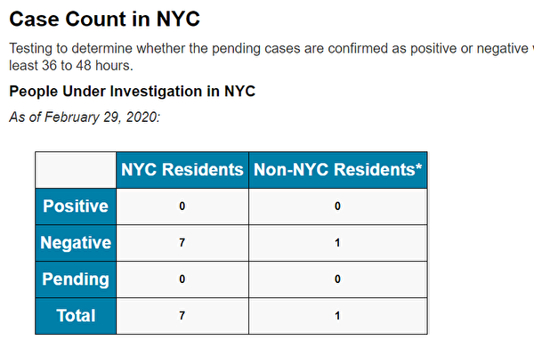

<table>
 <tr>
  <td align="center" width="450"></td>
   <td   width="450"><h3>【希望之声2020年2月18日】在武汉肺炎疫情严峻、中共加强大陆封网之际，希望之声推出专门为中国大陆民众开发的自带翻墙功能手机   APP。据开发人员介绍，此款手机APP适用于安卓操作系统，也就是所有的国产品牌手机、以及三星、LG等非iphone手机。
     

     
   安装后可收听收看希望之声的节目：包括《江峰时刻》、《天亮时分》、《老北京茶馆》及最新时事新闻等精彩内容。不需要使用任何翻墙软件，一步到位获得最新海外资讯，帮您免除翻墙上网的麻烦与风险。欢迎大家下载并传给中国大陆的亲朋好友。
   
   希望之声版权所有，未经希望之声书面允许，不得转载，违者必究。</h3>
     </td></tr></table>
     

<h1 align="center"><b>请收藏网址(新闻视频ip) 随时连上最新即时IP https://git.io/swspip</b></h1>

<h2 align=center><a href="https://github.com/gav01/Heart/blob/master/news1.md">● 大纪元时事 ●</a></h2>

<h2 align="center">直連不必翻牆開花必看精彩視頻http://36.228.33.253</b></h2>

<table>
<tr>
 <td>
 <a href="https://git.io/pamja"> <h3>如何 “ 三退保命 ”</a>，<b>连上面→免翻视频 IP http://36.228.33.253 </b> →点 【三退大潮】--为什么要退党？ 可留言三退或用翻墙软件自己办理三退</h3></td>
</tr> 

<tr>
 <td>
 <a href="https://git.io/pamja"> <h3>如何 “ 三退保命 ”</a>，请点击翻牆网站  https://git.io/opopop  下载 { 翻牆软件 }→找 { 大紀元網站 }  ( http://www.dajiyuan.com ) 三退</h3></td>
</tr>
</table> 

<a href=https://git.io/souye><h6 align="right">回首頁</h6></a>

<a name=top>

<a href =#12>12.【一线采访】为GDP从未停工 武钢成重灾区 
<a href =#11>11.神韵费城20场落幕 精英赞颂中国传统文化 
<a href =#10>10.【拍案惊奇】多国感染人数暴增 北京弃瑞德西韦？ 
<a href =#9>9.武汉肺炎 八个故事揭示中共无能 危及世界 
<a href =#8>8.受疫情冲击 大陆签证龙头“百程旅行”破产 
<a href =#7>7.【直播回放】川普白宫讲话谈新冠疫情发展 
<a href =#6>6.法轮功学员盼中国人知疫情真相保命 
<a href =#5>5.单日新增813例 韩国武汉肺炎升至3150例 
<a href =#4>4.疫情后首份调查报告 中国经济比想像中糟糕 
<a href =#3>3.【独家】辽宁卫健委下令销毁新冠疫情文件 
<a href =#2>2.【新闻看点】禁言放大灾难 逾百学者致信习近平 
<a href =#1>1.纽约市疑似病例全被排除 仍保持无确诊 

<a name=12>
<h1 align="center"><b>【一线采访】为GDP从未停工 武钢成重灾区</b></h1>

日前，武汉青山区病毒感染人数突然暴增，该区居民披露，中共为GDP增长，国企武钢集团一直在加班生产，由于人员的交叉感染，致使青山区成为瘟疫重灾区。图为2016年8月27日武钢工人在移动镕炉中的钢水。(Wang He/Getty Images)

【大纪元2020年03月02日讯】（大纪元记者易如采访报导）新冠肺炎从去年底开始在武汉爆发后，死亡人数不计其数。日前，武汉青山区病毒感染人数突然暴增，该区居民披露，中共为GDP增长，国企武钢公司一直在加班生产，由于人员的交叉感染，致使武钢所属青山区成为疫情重灾区。

“我父母他们还在武汉青山区，最近打电话说，青山区成了重灾区，疫情在当地开始爆发、传开了。”卓辉说。

卓辉（化名）是武汉青山区人，现在在外地从事教育工作。他2月28日对大纪元表示，他已有2年多没有回家乡，武汉新冠肺炎爆发后，他时常与在青山的父母和朋友电话联系，“有的朋友、熟人在重灾区，我平常打电话问他们情况，说那边情况很惨，很早的时候，就是封城的时候，几乎每天至少都要抬一个人出去，所以，死亡人数绝对不是他们（官方）说的那么一点点。”

卓辉说，他从父母处得知，青山区在刚开始的时候情况还比较好，“青山区是工业区，离市中心还有点远，人流（与市区）交往不太频繁，刚开始还不算重灾区，现在突然感染很多，就是这个病毒传开了，潜伏期爆发出来了。”

其实“（病毒）疫情还没爆发出来的时候，武钢职工医院都已经人满为患了”，卓辉说，“现在那更不得了。（各小区）被封闭起来，都不让上街买菜，都是配送。”

“现在有很多（人）在抱怨，送的东西没送到，或价格太高。现在也不知道（小区）要封闭多久，（隔离）14天也不管用，听说潜伏期还不确定有多长，他们（官方）疫情信息不公开，那这个问题就很严重，大家都不知道怎么防范。”卓辉说。

据资料，武汉钢铁有限公司（下称武钢公司）坐落在武汉东郊，是中国最大钢铁央企中国宝武钢铁集团有限公司的重要基地之一。资料还显示，2017年青山区常住人口54万人，而武钢公司就大约有20万武钢退休和在职工及其家属，超过整个武汉市青山区常住人口1/3多。

<b>为了GDP搞生产 青山区成瘟疫重灾区</b>

家住青山区的章杰（化名）2月22日告诉大纪元，青山区成瘟疫重灾区是因为国企武钢公司一直在生产，人员上下班交叉感染，“现在比较严重，这边钢厂从来就没有关停，控制不住。小区单元隔离，但是上班的可以出来，主要是生产人员，假如有人得病了，就把他周围的人都控制起来，所以，死了多少人，只有官方知道。”

2月21日，青山区钢花新村119小区的居民在微博发帖爆料：目前青山区钢花新村119社区新型冠状病毒确诊人数已达47人，密切接触者达40人，死亡人数8人，疫情非常严重，小区的居民都处于高度危险之中。

（网络）

23日晚，有住在118社区的居民跟贴说：我家118也是一样情况，确诊28，疑似9，还有很多密切接触者，死亡5人。

24日晚，又有该社区的居民跟贴说：2月23日，小区确诊49人，死亡9人，较昨日各增长1人。发热数据未知，密接情况未知，社区通告这是街道要求的表格。好多数据成谜了，我更慌了。

（网络）

居民的帖子发出几天都无人问津，2月25日下午2点再有居民表示：我也是119社区的，我们现在基本上都是在自救，社区人根本没有来过。更谈不上武汉市的三天的大普查，社区的人都没看到可见普查的是敷衍了事！现在大家都是怨声载道啊！另一居民表示，他的外公外婆被社区工作人员的不作为耽误，先后离世，“两条人命，不如指令！可怜的武汉百姓啊生命如蝼蚁。”

2月27日，网上传出的另一份青山区钢都花园126社区的情况显示：累计确诊人数已达59人，而且数字还在不断攀升。而在126社区群里有一则通知显示，有确诊病例的武钢职工曾乘坐通勤车上下班。

网路

而据大纪元早前获得的“钢花村”2月9日的疫情通告，包括110社区、111社区、114社区、116社区、117社区、118社区、119社区、120社区、121社区、景胜社区、南苑社区、北苑社区、青翠苑社区共13个社区数据统计，确诊数共计为155人，其中19死亡，疑似病共计为267人，发热共计122人，密切接触者共计430人。而据当地人士表示，这些疫情通告也是被瞒报后的数据统计。

（网路图片）

据资料，青山区的“钢花村”和“钢都花园”是武钢职工的住宅小区，集中住有武钢职工及其家属、退休老人。截止2017年，这两个大社区内住有超过10万人。而通勤车是日常往返于青山各住宅小区与厂区之间的大巴士，46座，密闭不开窗，单程通勤时间普遍在半个小时以上。

大陆媒体《财新网》2月22日报导，目前正在武钢工作的在岗工人有六千余名。工人们反映，平日发放的口罩和消毒水数量不够，“上班就是赌博”，感染隐患让他们忐忑不安，“万一我在工作中被感染，回家是不是害了我全家？”。另外，公司未向基层员工通报过内部确诊人数。

报导说，截至2月14日，钢花新村、钢都花园以及周边的东方雅园、江南春城、八大家花园等每一个社区（街坊）都普遍有25个以上的确诊案例，是本次新冠肺炎的重灾区。自新冠肺炎大规模爆发以来，青山区在武汉市下辖13个市辖区中确诊新冠肺炎人数和死亡率排在前列。不过，2月21日，《长江日报》刊发的武汉新冠肺炎疫情防控指挥部的公告显示，青山区却排名第7位。

疫情期间，不但武钢这样的国企没有停产，近期中共为了保经济搞生产，称疫情“好转”，并下发文件要求各地迅速复工。

武钢职工韩江（化名）2月28日对大纪元表示，中共为了GDP搞生产，相信疫情不会好转，瘟疫还可能会再次爆发。

<a target="_blank" href=#top><h6 align="right">回上方</h6></a>

<a name=11>

3月1日下午，神韵环球艺术团2020年在美国费城玛丽安剧院的最后一场演出再次爆满加座，在当地总共20场的演出也圆满落幕。（新唐人电视台）

 <h1 align="center"><b>神韵费城20场落幕 精英赞颂中国传统文化</b></h1>
 
 【大纪元2020年03月02日讯】（大纪元美国费城记者站报导）3月1日下午，神韵环球艺术团2020年在美国费城玛丽安剧院（Merriam Theater）的最后一场演出再次爆满加座，为今年在当地的20场演出划下完美句点。

神韵自2月12日在费城开演后，票房火热，常常一票难求，20场演出中有17场剧院都是满场，甚至需要临时加座以满足观众的需求。

神韵以舞蹈和音乐展示了辉煌灿烂的中华文化，震撼了费城主流精英，宾州众议员特地褒奖神韵，许多人表示，“神韵以美好的方式影响西方社会”，“感人至深”，“神韵将传统发扬光大”，“希望神韵在中国上演”。

<b>宾州众议员褒奖神韵 盼能在中国上演</b>

2020年3月1日下午，宾州众议员Maria Donatucci向神韵费城主办方－－大费城法轮大法学会颁发宾州众议院的褒奖，并观看神韵演出。（新唐人电视台）

 
 “我喜欢这个演出。非常美丽！我喜欢服饰、天幕背景，还有故事。我真是激动不已，太美了！”宾州众议员Maria Donatucci在费城玛丽安剧院为神韵费城主办方－－大费城法轮大法学会颁发褒奖，表彰神韵艺术团对宾州的艺术贡献，并观看演出。

“我喜欢舞蹈，也喜欢他们将演出与信仰相融合的方式，真的很好！我很高兴能来看这个演出。”Donatucci说。

神韵在全球五大洲150多个城市巡回演出，却不能在中国上演。对此，Donatucci说：“这让我感到悲哀，因为演出是如此美好，深具文化性。他们自己的国家不允许这样美好的演出，这真是令人遗憾。我希望他们在这里能实现他们的理想。”

演出中关于善良人遭迫害的故事让Donatucci内心深受触动，“我对监狱的部分感到非常沮丧，那是如此地压抑和令人不安。但我又很感动，我被舞蹈家的美丽和优雅所感动。”

神韵艺术家把“真、善、忍”的准则融入日常生活和艺术训练中，Donatucci很认同。她说：“我认为他们的舞动充满热忱，就像他们所信仰的那样。想想他们在这场演出中所做的所有不同的事情，真是太神奇了！确实是很美丽！”

神韵歌唱家的演唱也令Donatucci赞赏有加，“太精彩了！我也喜欢在他们演唱时展示给我们看的歌词，非常令人感动，非常富有灵性，非常神圣，太棒了！”

<b>公司副总裁：神韵以美好方式影响西方社会</b>
 

2020年3月1日下午，联合特许经营集团公司（United Franchise Group）的地区副总裁Eric Brewstein欣赏神韵环球艺术团在费城玛丽安剧院的第20场演出。（良克霖／大纪元）

 
 Eric Brewstein是联合特许经营集团公司（United Franchise Group）的地区副总裁。该公司经营许多连锁品牌，在全世界有1400多个加盟商。

“舞蹈、演员的配合、美丽的场景都很棒，很漂亮！”Brewstein欣赏神韵演出后连声赞叹。

“台上一分钟，台下十年功。”Brewstein表示，“艺术家的刻苦训练、奉献和团队合作精神非常具有教育意义。”

Brewstein表示，表现中国传统文化的神韵正以美好的方式影响着西方社会。他说：“我认为能够在海外公开弘扬中国传统历史文化真是太好了。（神韵）以最美丽的方式感染着我们。”

看神韵演出让Brewstein感受到艺术家的神性内涵，“当你静下心来享受演出时，看看演员身上的活力、韵律的节奏和振动，如果你没有感受到神性，没有感受到艺术家的投入，那么你就错过了很多东西。这些都是实实在在的。”

<b>神韵讲述故事尽在不言中 基金会主席感恩</b>
 

2020年3月1日下午，新泽西州的基金会主席Alesia Shute（右）和友人欣赏神韵环球艺术团在费城玛丽安剧院的最后一场演出。（新唐人电视台）

 
 “我明年会再来，一定再来！”新泽西州的基金会主席Alesia Shute观看神韵演出后表示，“他们没有说一句话，就讲述了整个故事”，让她“开心、放松”，带给她难忘的体验。

Shute热衷于慈善事业，她经营的Alesia Shute基金会旨在改善患者在住院期间的舒适性，她在自己的书籍《一切都好》（Everything’s Okay）中讲述了自己儿童时成功战胜癌症的经历。该基金会的捐赠及图书销售利润直接捐赠给费城儿童医院（CHOP）。

“女演员看上去那么美，相当优雅。她们都面带微笑，非常快乐，她们很喜欢自己做的事情。”Shute认为，看神韵演出是一种难得的体验，“演出美丽动人，展现了丰富的文化，我为中国人感到难过，他们无法做我们这里能够做的事情（信仰自由）。”

Shute也非常赞同神韵复兴传统文化的宗旨，“他们绝对应该做这件事情，我们谁都不愿失去自己的文化，他们绝对应该继续做下去。”

<b>信仰故事直触心灵 公司财务高管赞神韵激励人心</b>
 

2020年3月1日下午，医疗信息技术公司IMS Health的财务部高管Jim Ferguson携太太Tracy Ferguson欣赏神韵环球艺术团在费城玛丽安剧院的第二十场演出。（卫泳／大纪元）

 
 “非常激动人心，非常美！”医疗信息技术公司IMS Health的财务部高管Jim Ferguson观看神韵演出后连声赞叹道。

Ferguson说：“独唱很美，神韵歌唱家简直不可思议。整场演出美妙而感人，非常优秀。”“歌词中的信息也很好，让人谦卑，真是好的信息。”

神韵呈现的文化和精神内涵震撼人心，Ferguson感佩地说：“非常感动。比如那个（修炼者）眼睛（复明）的舞剧，真是太……真的触动了我，我很感动！（演出）触动人心，而且非常非常美，舞蹈太美了。”

<b>神韵弘扬传统 强生公司总监赞了不起</b>
 

2020年3月1日下午，《财富》世界五百强之一的强生公司的供应流程总监Eric Watson欣赏神韵环球艺术团在费城玛丽安剧院的第二十场演出。（良克霖／大纪元）

 
 “演出在艺术手法上生动活泼，几乎一气呵成，很多承前启后的内容，都协调得整齐划一。”《财富》全球五百强之一的强生公司（Johnson & Johnson）供应流程总监Eric Watson为神韵精彩绝伦的艺术成就深深折服。

“从美学上来说，演出非常令人愉快，因为她的协调性很好。而且我喜欢背景天幕与演员之间的互动，演员在舞台和屏幕上进出自如，非常酷！”他说。

他赞佩神韵致力于复兴中国传统文化，“从历史的角度看，正如一切事物一样，想要传承那些传统和教训，必须有人承担起发扬光大的责任，我很高兴他们（神韵演员）在这里做这件事。了不起！”

最后Watson表示，神韵带给他意外的喜悦，“非常愉快，其实我自己都感到惊讶，我是如此地喜爱这场演出，超出预期。”

<a target="_blank" href=#top><h6 align="right">回上方</h6></a>

<a name=10>
<h1 align="center"><b>【拍案惊奇】多国感染人数暴增 北京弃瑞德西韦？</b></h1>

3.1网络峻法须知，北京放弃瑞德西韦？（新唐人、大纪元合成）

【大纪元2020年02月29日讯】大家好，欢迎收看《新闻拍案惊奇》，我是大宇。节目一开始，我们先来看一下，新病毒在世界范围内的扩散情况。

<b>全球多个国家暴增感染病例</b>

截至美东时间的2月28日下午，已经有至少56个国家，出现了新病毒的确诊病例。根据美国疾控中心设置的风险级别，最严重的是中国大陆和韩国，风险级别是“避免前往”。其中，韩国确诊人数已经超过2,300人，其中至少13人死亡。

其次是日本931例确诊，8人死亡；意大利888例确诊，21例死亡；伊朗388例确诊，34人死亡。这三个国家，被美国疾控中心列为旅行的“慎重考虑”级别。

但是，伊朗的真实疫情怀疑被当局隐瞒。英国BBC的波斯语频道28日引述伊朗医院内部的知情人消息报导，伊朗已经至少210人因感染新病毒而死，这个数字是官方三十几人的6倍还多。即便是官方公布的数字，伊朗也已经成为中国大陆以外，因感染而死的人数最多的国家。美国情报部门也对路透社说，伊朗政府对病毒的反应能力有限。

此外，香港被美国疾控中心列“小心前往”的风险等级，排在之前5个国家之后。香港已有94人确诊，2人死亡。

前面我们提到的6个国家和地区，中国大陆、韩国、日本、意大利、伊朗、香港，是目前世界上确诊者数目最多的前6个地方。其中排第6的香港的确诊数目是94例，与排第五的伊朗，官方数字388例，相比之下也是少很多。

在香港之后，依次还有新加坡93例，美国68例，法国57例，德国48例，科威特45例，泰国41例，巴林36例，台湾34例，等等。刚说的这几个国家，法国有2例死亡，台湾有1例。

28日出现首例确诊的国家，包括墨西哥和冰岛。

墨西哥是1名此前去过意大利的游客，称为该国首例确诊，也是继巴西之后的拉丁美洲第二例确诊。

冰岛的确诊案例是一名五十多岁男子，刚从意大利返回。

<b>美国防疫有漏洞 紧急补上</b>

在刚才提到的确诊病例比较多的国家中，也有美国。

美国的确诊多数来自日本钻石公主号撤下来的民众，加上其它病例，美国目前确诊总数是68例，没有死亡病例。

按地区来看，加州是最严重的，出现了33例，其次是内布拉斯加州13例，德州10例，华盛顿州5例，伊利诺伊州2例，亚利桑那州、威斯康星州还有麻州各1例。

加州的33个确诊病例中，有24人来自钻石公主号邮轮，有7个人有武汉的旅游史，1人是被配偶传染，还有1例比较受关注，是全美第一例“社区感染”，是一名女性。

这名社区感染者，既没有武汉的旅游史，也没接触过任何确诊病例，所以美国公共卫生局就怀疑，会不会有一名“无症状感染者”，正在不自觉的四处游走，散播病毒呢。

这名女性社区感染者受关注的还有另外一点，就是暴露了美国疾控中心的一个防疫漏洞，幸好已经被及时弥补。

这个漏洞是什么呢？这个女患者，现在住在加州大学戴维斯分校的医学中心。她在住院之初，因为感染源头不明，不符合美国疾控中心对新病毒检测的依据，因此没有进行新病毒的检测，直到住院一个多星期之后，才被确诊。目前这名确诊者症状严重，要插管治疗。

美国疾控中心因为此事，被批评反应僵化。但好在，在这名病人确诊后，美国疾控立刻在2月27日修改了对新病毒患者的检测依据。新的检测依据是：任何住院病人，只要出现发烧和严重的呼吸道病征，虽未能确认感染源头，在排除流感等其它疾病之后，就可以安排进行新病毒的测试。简而言之，前线医生发现疑似，就可以报给疾控中心进行检测。美国疾控中心的主任雷德菲尔德，也在27日的国会听证上，向议员们交代了疾控中心的措施改进。

从本周一，全球有29个国家出现确诊，到本周五，全球至少56个国家有确诊病例，短短5天翻了近一倍。并且在意大利、伊朗、韩国，出现中国大陆以外的大规模爆发。2月28日，世界卫生组织把新病毒瘟疫的风险级别，由之前的“高”，上调到“非常高”，这是一个全球性的风险级别。世卫说，这种调整主要是想让世界各国，提前了解，并做好准备。

世卫健康紧急项目执行主任Michael Ryan博士说：这个星球上的政府要清醒了，准备好，这种病毒可能正在路上，你们需要做好准备。

面对瘟疫，除了提醒防治，世界各国的专家也在研究新病毒的特质，以及研发抑制新病毒的药物。

<b>首例“尸体解剖报告”</b>

日前，中国大陆的《法医学杂志》，刊出了第一例感染新冠病毒死者的“尸体解剖报告”，这篇文章的作者是参与尸体解剖的主要人员之一、湖北省司法鉴定协会会长刘良。

此前，2月16日，大陆完成了第一例新病毒死者尸体解剖，当天又着手进行了第二例，全部在18小时内完成，刘良都参与其中。

报告发现，死者肺部损伤明显，炎性病变主要在左肺，肺部用手触摸，手感质韧，失去肺部原有的海绵感，等等。根据初步结果，报告给出一个共识：新病毒主要会引起深部气道和肺部损伤为特征的炎性反应。

此前我们有报导过，新病毒死者肺部分泌液体多，患者死时形同被水淹，而肺部纤维化没有SARS严重。这份报告重申了这个情况，但提到一点，就是死者从确诊到死亡仅仅15天，病程较短，可能是造成这一现象的原因，所以具体结论还有待更多的尸体检验。

刘良介绍，这种肺部黏液多的情况，需要用稀释或溶解的办法保持气道通畅，单纯用吸氧的办法，可能会起反作用，氧气可能会把黏液推得更深，加重患者缺氧。这种结论推翻了之前，包括钟南山在内的多名专家，在2月9日的一篇论文中的观点，就是把“吸氧”作为主要疗法。

<b>世卫推荐“瑞德西韦” 意大利治愈三人</b>

而对于治疗新病毒，世界卫生组织在中国考察之后，曾在2月24日于北京宣布一个重要的消息，就是：当前治疗新病毒感染者，只有一种药物真正具有疗效，那就是美国出品的“瑞德西韦”。并希望各国在治疗用药上优先取舍。

此前，美国第一例感染者，就是因为在静脉注射了这种药物之后，当天出现明显好转，随后痊愈出院。最近疫情爆发的意大利，该国媒体也在近日报导，罗马有三名患者，在使用瑞德西韦后，实现痊愈。

瑞德西韦本来是美国吉利德公司2013年研发的抗埃博拉药物，之前就发现，这种药物对治疗MERS和SARS有效用，今年拿来治疗新冠病毒，居然也出现奇效。

中国网友根据英文音译，把这个药称为“人民的希望”。因为这款药还处于试验阶段，此前没完成过临床试验。吉利德公司把这种药的成品赠送一些给了中国，2月初在中国就展开了临床试验，但是直到我们发稿时，2月底了，媒体也不见公开的相关报导，没有实质的临床试验进展。

不过，一个有趣的动作是，当世卫推荐瑞德西韦之后，大陆当局一度把世卫专家讲话的英文翻译版中，删除了相应推荐“瑞德西韦”的话，这个细节动作引起了人们的议论。

有一种观点是，根据此前一名武汉一线医生的揭露，至少在当时，对于入院确诊者，当局规定了一套治疗办法，其中把“中药环节”强行施加给每一名感染者，进行治疗。造成一些没有对症症状的患者，肝都吃出了问题。

究其原因，很可能是在防治之初，中共高层强调用中医治疗有关。

一篇源自大陆“国家中医药管理局”的文章显示，1月21日，该局开会，专门传达了习近平的重要指示，因此要研究中医药系统，落实相关的措施。当中提到，要“在国家卫健委同意领导下，坚持中西医结合，推动中医积极主动介入”。中医药管理局还提出了三项具体安排，一是推动形成中西医协同的防控机制，二是组织中医结合临床提出中医药诊疗方案，三是中医药及早介入，中西医结合救治重症和为重症患者。整个安排读下来，就给人一个感觉：先有政策，再有治疗对策。

中医是中国的宝贝，中共在历史上系统清理中国传统文化的时候，把中医的一些精华当成四旧给破了，包括很多现代医学不容易解释但却很有奇效的部分。现在留下的一些皮毛的东西，真正掌握精髓的人，可能很难找到。

如果说平日，恢复中医可以理解。在防治新病毒的这关键的时候，如果合理使用，还可以，但是强推中医疗法，把治理瘟疫政治化，这就难免招惹非议。

同时，对于病毒的传播途径，也有了新的认识。

<b>新病毒在物体表面能存活多久？如何传播？</b>

美国疾控中心27日提出，新病毒通常能在金属铜或钢的表面，存活约2个小时，但在纸板或塑胶上，存活的时间会更长。目前，美国疾控正对此做进一步的研究。

德国的《医院感染杂志》也报导说，科学家进行了22种研究，结果发现，在室温条件下，人类的病毒病原体，可以在塑料表面存活最多9天。不过，这项研究是基于SARS和MERS这种与新病毒一类的“冠状病毒”进行的研究，所以研究结果，只可用来参考。

德国科学家相关的研究结果还包括，冠状病毒在离开人体等宿主之后，在玻璃、木头、纸、铝等材质表面，能够继续存活4到5天，还可能更长。这些材质都是我们日常生活中常见的东西，这意味着，人们要对家庭环境进行及时的清洁，特别是疫区的人们。

此外，大陆浙江大学医学院附属的一个研究团队，2月26日在《医学病毒学杂志》上，发表了一项研究成果。

他们在1月26日到2月9日间，对浙大医学院附属第一医院确诊的30名新病毒感染者的眼泪和结膜分泌物混合物进行研究。最终发现，其中一名感染者的左眼出现结膜炎症状，警告左眼分泌物检测，发现其左眼的病毒检测呈阳性，而右眼却是阴性。

为了确认，他们对这名患者的两只眼睛先后进行了至少三次核酸检测，结果一样。最终这个研究团队得出结论：患者左眼结膜炎与新病毒有关，通过眼部传染新病毒的风险是存在的，呼吸道可能不是新病毒传播的唯一途径。

那么，除了新病毒在人际之间的传播，也会传染给人类饲养的宠物吗？前一天我们看到香港媒体报导，当地知名马主、富豪“周巧儿”确诊感染，她家的宠物狗通过口腔和鼻腔检测后，也发现呈现弱阳性反应，疑似感染。但是根据香港渔护署的最新消息，宠物狗可能只是因为与确诊病人同住，被宠物狗舌头舔的地方可能已经留有病毒，或者确诊病人抱着宠物狗时发生咳嗽，离狗只太近，造成狗沾上病毒，因此病毒只是存在于狗的口鼻处，因为没有在狗的肛门处验到病毒，说明病毒也没进消化系统。

所以香港渔护署当前的评估显示，从周巧儿的狗的口腔鼻腔验出病毒，不代表狗已经被感染或病毒侵入细胞。因为狗目前为止也没出现症状。根据世界动物卫生组织的资料，目前也没有除人类以外的哺乳动物，感染新冠病毒的病例。

<b>钟南山称病毒不一定是发源在中国 引热议</b>

现在对新病毒传播途径的研究，还包括这个病毒的根本来源。2月27日，中国大陆的呼吸病学专家钟南山，在广州的防疫记者会上说，疫情出现在中国，不一定是发源在中国。这一番话立即引来舆论热议，大多数人认为钟南山的这番话不着边际。

2月28日，上海复旦大学附属华山医院感染科主任“张文宏”，在接受中共官媒《中国日报》的采访时，直接了当用“No”，回应了钟南山的观点，他认为新病毒不是最早从外国传入。

张文宏说，中国只有武汉最先出现了这个新的传染病，如果是外面传进中国，应该是中国几个城市同时发病，而不是有时间先后。

钟老的观点引来很多质疑，其权威形象也受损。近日，有人挖出，钟南山自己拥有3家公司，其中一家名为“广州呼研所医药科技有限公司”，而包括钟南山在内的这家公司的高管，相互关联的公司有约90家。

而钟南山的儿子钟帷德，是广州市第一人民医院的教授，主任医师，也是享受大陆国务院特殊津贴的专家。他在最近接受外媒采访时，腰间昂贵的“爱马仕”皮带，成为网友们关注的热点。

说到这，我们能联想到大陆那些有背景的人群，他们即使在防疫这么严重的时期，也能享有特别的照顾。有关前几日武汉女子监狱服刑期满的黄姓女子，即便确诊了也能顺利离开武汉抵达北京，有了最新消息。其实1月23日武汉封城之后，有至少3个刑满出狱的人员，由法院特别向辖区的防疫指挥部申请了通行证，然后再由警车护送有关出狱人员，离开武汉。

能得到这种待遇的，包括那名黄女士，想必背景都不是一般的人。

不过，背景再不一般，那是在国内，在国外可不一定有特殊，比如，俄罗斯。

<b>俄罗斯防疫有效</b>

在本次瘟疫防治中，俄罗斯是比较成功的，至今只有两例确诊，还都是中国游客。他们早早就把新病毒称为对俄罗斯人的生物威胁，而且在2月中旬彻底禁止有中国国籍的人进入。而对于在俄罗斯境内的中国人，他们的遭遇，更是受到了海外媒体的注意。

《美国之音》2月28日报导，俄罗斯是世界上唯一一个，在瘟疫期间，把中国人挡在门外，但允许其他去过中国的外国人入境。

2月19日开始，莫斯科的公交系统，重点检查中国人，官方印制中俄双语表格，要被抓到的中国人填写。有的中国人因为出门倒垃圾，甚至是前往机场的途中，就被警察抓到隔离中心。不过也有中国人说，警察检查时的态度，还是比较客气和蔼的。

俄罗斯政府其实对北京当局也有不满。俄罗斯官方表示，他们得到了能够开发疫苗的新病毒株，但不是中国给的。2月初俄罗斯专家去中国访问，希望拿到第一手资料，但是中方不让俄罗斯人参观医院，也不让他们接触病人，并拒绝提供病毒株，在双方接触的时候，用的都是歌唱两国友谊的空话，这重复了俄罗斯在2003年的遭遇，当年的SARS病毒株，也不是中国给俄罗斯的，俄罗斯要，大陆当局不给，后来俄罗斯从德国和美国那里取得。这些事让俄罗斯对北京当局非常不满。

<b>北京启动互联网在中国局域网的根服务器</b>

节目最后，我们分享一个收到的消息，但我们对这个消息暂时没法独立查证，供观众参考。

大陆一家互联网软件公司的人发出消息说，2月29日开始，大陆当局会启动互联网在中国局域网的根服务器，对国内网络开始实行更严格的禁言，可能会搜索各个群组，查找敢言人士。这可能跟3月1日大陆的《网络信息内容生态治理规定》有关。

这份互联网新规包含了大量的内容，几乎涵盖了共产党不喜欢的所有网络内容和行为，还配套了惩治办法，甚至规定了互联网该宣导什么样的内容。

内容比较多，我们不一一说了，给大家放图片，大家自己看吧。我们举几个例子，例如这项《生态治理规定》的第五条，规定你不是宣传社会主义，就是要宣传讲品味讲格调、促进稳定的内容。

再来看第六条，这主要列举了你不许说的所谓“违法信息”，危害政权的内容首当其冲，但最后一条很有意思，这是一个可以无限加餐的条款，就是你也不能讲“法律、甚至是行政法规禁止的其它内容”，这就给今后政府规定的任何禁言法规，留了后门。

第七条，列举了“不良信息”，其中第三个会很抢眼：不当评述自然灾害、重大事故，也属于不良信息。

这套审查制度还会创造就业，就是专门负责跟进个人用户的注册、账号管理、信息发布审核、跟贴评论审核、版面页面生态管理、网络谣言等内容的专职人员。

还有一个重点，就是这套规定，有一个新的概念，叫做“重点环节”，什么是重点环节呢？大家看图片，也是很长，几乎涵盖了我们日常关注的重要网络内容，当局规定，对大家见到的这些“重点环节”，必须呈现“正能量”。

这一套新规定很长，细谈起来可能要一整期节目专门去讲。它至少是中国大陆，目前为止最严格的内容管理和审查制度。

另外，刚才提到的发出消息的人也提醒，建议2月29日以后，不要在微信号里留钱。因为一旦你成为受控对象，你在微信里的钱，有可能，会被冻结。

好，欢迎您订阅和分享我们的频道，在订阅的时候，不要忘了点击订阅按钮旁的小铃铛图案，在第一时间收到我们新节目上传的通知。也欢迎您加入我们的会员。有推特的朋友，也可以在推特上关注我，我的推特账号是@xwpajq。这期节目就到这里，感谢您的收看，下期再会！

新唐人《新闻拍案惊奇》制作组

<a target="_blank" href=#top><h6 align="right">回上方</h6></a>

<a name=9>
<h1 align="center"><b>武汉肺炎 八个故事揭示中共无能 危及世界</b></h1>

美国著名作家认为，从新型冠状病毒开始传播以来，中共不断变换说法，除了让中国人民付出惨痛生命代价外，也让世界在盲目的猜测中等待瘟疫降临。（图片来源：Feng Li/Getty Images）

 
 【大纪元2020年02月22日讯】（大纪元记者吴馨综合报导）新型冠状病毒疾病（新冠肺炎，武汉肺炎）在中国武汉爆发，并在全球蔓延。在中共处理疫情的过程中充满着谎言和编织的故事。而新冠病毒正在向人们展示相信谎言要付出生命的代价。

美国著名科学作家撰文揭示在武汉肺炎传播时，中共不断编织出的八个故事，正在导致一场危及全球的灾难。

劳里·加勒特（Laurie Garrett）是前美国外交关系委员会全球卫生高级研究员，也是曾获得普利策奖的科学作家。2月15日，《外交政策》（Foreign Policy）网站发表了她撰写的一篇文章。加勒特在文章中认为，从新型冠状病毒开始传播以来，中共不断变换说法，除了让中国人民付出惨痛生命代价外，也让世界在盲目的猜测中等待瘟疫降临。

加勒特指出，新冠状病毒的流行已经到了关键时刻。接下来中共领导人采取的措施对抵抗病毒的效果，以及病毒是否会在国际上传播，成为真正的全球大流行病都会产生影响。虽然世界卫生组织和世界各地科学家起初曾称认为和SARS相比，中共此次信息相对透明，但现在世界看到，中共其实一直在掩盖、说谎和压制，在不断失误的情况下，未能阻止病毒传播，反而煽风点火可能助长疫情。

文章写道，中共正面临着国际的指责和国内的动荡，其政权正面临着自六四以来最大的生存危机。

<b>中共不断编织故事 信任正在减弱</b>

加勒特表示，中共的政治危机正在促使全球关注中共政府所发布的疫情数据可靠性。自12月30日首次公布这一新病毒以来，出于国内政治目的，中共编织了一系列故事，让官方公布的病例和死亡人数与这些故事保持一致。与此同时，国际卫生界、学术统计人员和传染病分析人员，都试图从可疑的中共官方日常统计中，推断出冠状病毒对世界其它地区可能带来的危险程度。

这种故事编织有一条底线，那就是信任。加勒特指出，对中共政府的信任在中国国内似乎正在减弱，并且在世界公共卫生界也在日益瓦解。然而，除非政府和人民之间的信任纽带能够在抗疫的悲痛、混乱、激动和医疗挑战中幸存下来，否则就无法战胜这场瘟疫。中共政府在疏忽大意下破坏了这条纽带，这也许是无法弥补的。

以下是在武汉肺炎爆发以来，中共编织的六个谎言故事。

<b>第一个故事：当地海鲜市场传出病毒 不是非典</b>

在12月上旬至1月19日之间，来自武汉疾控中心的主要故事是，与武汉当地的海鲜市场有关的很少一部分人感染了一种新病毒 ，导致一些人因肺炎住院。不论疾病的起因是什么，该疾病不是非典，或类似非典的疾病。所有发布的数据都非常符合这个故事。于是任何像李文亮医生一样暗示事实的人都受到了压制。

在武汉工作的李文亮医生在12月30日通过社交媒体聊天室告诉同学，他在去年12月收治了貌似非典的病人。几天后，由于所谓的造谣罪，李医生和其他七名医生被带到公安局，被迫签署了一份承认“散播谣言”的文件。几天来，武汉当局一直试图遏制李文亮的声音，即使他因救治病人而感染了这种病毒，并被限制在重症监护病房内时同样如此。2月6日，这位曾经健壮的34岁医师去世，他的离世引发了空前的悲痛和愤怒，民众谴责政府掩盖。

图为华南海鲜批发市场。 (NOEL CELIS / AFP via Getty Images)

<b>第二个故事：病毒不会人传人 疫情得到控制</b>

在除夕正式宣布新病毒后，第二个故事开始流行，该故事为关闭海鲜市场辩护，并称已有效阻止了病毒的传播，因为没有证据表明该病毒可以在人际传播。两个星期内官方病例数几乎没有变化，甚至减少到41例。而中共当局向中国人民传达的信息是：没有什么可担心的，当地警察和卫生官员已经阻止了一场疫情的爆发，工作做得很好。世卫组织接受了这个故事情节。

在这重要的两周中，对海鲜市场的积极控制可能已阻止那里的疫情爆发，然而新冠状病毒至少从12月中旬起就完全独立于海鲜市场而传播。在整个12月和1月初，武汉大约有一半的冠状病毒病例与海鲜市场无关，并且传播规模每周增加一倍。伦敦帝国理工学院的研究人员估计，到1月12日，武汉已有1,723人被感染。

随着国际社会的日益焦虑，中共控制疫情的故事受到怀疑，并且病毒人传人的证据变得不可否认，中共采取了释放信息的措施。

图为美国疾病与预防中心刊出的新型冠状病毒的示意图。（CDC网站）

<b>第三个故事：借鉴SARS应对手法 封城封路</b>

毫不奇怪，中共官方的故事突然有了变化，感染病例和死亡人数的统计也随之出现变化，到1月19日感染病例翻了四倍。新故事不再提及海鲜市场，武汉的领导人互相指责，并将先前的故事和1100万人口的城市大部分地区一道进行封锁。

但是随着中国新年假期的临近，以及对隔离的日益担忧，数以百万计的武汉人弃城而去，去了中国各地的村落和其它城市，许多人不知不觉中就携带了这种病毒。

中共政府借鉴其2003年的SARS剧本，将整个国家置于一系列封锁之下。武汉在物理上被封锁，同时由于持不同意见和批评的声音也将越来越多，所以在虚拟的世界里也被封锁。中共政府不鼓励中国新年旅行，假期在全国范围内延长，以尽量减少病毒在学校和工作场所的传播；在湖北省及周边地区，约有1亿人被鼓励待在自己的公寓和房屋中，以进行自我隔离。

香港大学的病毒学家管轶警告说，封锁策略可能会失败，而且肯定会爆发更大的疫情。他说：“保守估计，此次感染规模是SARS的10倍起跳。”也就是说，将有超过8,000死亡病例。

从科学上讲，封锁策略基于一个关键的假设：只有在病源发烧的情况下，病毒才能从一个人传播到另一个人。因此，中共在全国各地，沿高速公路、在大型建筑物的入口、在所有中转站都建立了体温检查站，甚至是在武汉以外数百英里的城市街道巡逻的警察也可进行体温检查。火车、飞机、公共汽车和高速公路被完全关闭。通过识别中国每一个发烧的人，并将其隔离，该病毒将不再传播，并很快结束疫情。

但是到2月3日，有证据表明，没有发烧，只有轻度感染冠状病毒的人也可以将病毒传播给其他人。一个人可能感染另外两个，甚至四个人。该病毒不仅可以通过咳嗽、唾液或鼻液传播，而且可以通过粪便传染。更糟糕的是，这种轻微症状具有传染性的潜伏期可能会非常长，达到24天。

突然，冠状病毒看起来并不像SARS了，SARS的潜伏期只有三天左右，并且只有发热病人才能感染他人。这种新病毒看起来更像是流感，可以通过握手或共享空间区域从无症状的个人传播到另一个人。但是即使那样，这样的类比还是失败了，因为很少有人会在感染流感后24小时以上毫无症状，更不用说24天了。

网上纷纷传出，中国救护车在大街上频频运尸的画面。图为2月13日的武汉街头。 （Stringer/Getty Images)

 <b>第四个故事：警察国家严控</b>

到1月下旬，武汉成了一个幽灵城镇，几乎看不见人或车辆，全城人口要么已离开这座城市，要么就被隔离在家。然而，该病毒仍在继续招致新的感染者。中共警告，病毒正在全国“加速蔓延”。由于封锁的故事被证明是容易犯错的，而且武汉以外的城市开始经历这种疾病的可怕蔓延，中共又转向了另一个熟悉的剧本：警察国家严控。

一夜之间，体操房、体育场馆、宾馆、大学宿舍、会展中心等大型设施被转化成拥有数千床位的隔离区，里面为上千人提供食品、盥洗用品、普通发烧检测用具。毫无疑问，这些地方不是医院，许多住在这些临时检疫设施中的人抱怨说，这里不提供感染检查，他们只是被集中起来，并被迫与数百名其他潜在感染者共享淋浴和卫生间等设施。

<b>第五个故事：指责美国政府</b>

随着焦虑的加剧，中共还提出了另一个故事：美国政府应该对中国困境负责。1月30日，世界卫生组织宣布该流行病成为国际关注的紧急公共卫生事件的同一天，美国国务卿迈克·蓬佩奥（Mike Pompeo）向美国人发布了旅行忠告，警告美国人不要访问中国。在2月的第一个星期，美国限制了航空公司、机场、中国移民、重返美国的旅客。中共开始指责美国对中国疫情过度反应。

到2月3日，中国全国各地的医院都报告称缺少检测试剂盒，从而大大减少了诊断和病例报告的数量。中共国家卫生委员会的医学专家和高级专家小组成员警告说：“早发现、早诊断、早隔离、早治疗，目前在武汉还做不到，希望全国支持武汉。”

<b>第六个故事：发动“人民战争”</b>

当天，中共中央政治局常委召开会议，提出新的故事：由于管理不善，疫情已失控。现在，中共将领导一场针对该病毒的“人民战争 ”，更加严厉地隔离检疫，并控制谣言。新的官方数据显示，鉴于80%的受害者年龄超过60岁，75%的人身体有其它疾病，而令人好奇的是，很少有儿童感染，而66%是男性，该疫情应该易于控制。

中共呼吁爱国主义，敦促人们查明患病的邻居，并把他们报告给当局。最后至少有一个城镇承诺有偿告发。识别出的人有时被强行从家中带走，并被安置在学校和体育设施中的临时现场医院。当国际专家质疑这种病毒是否可以被阻止时，北京投入了更多资源用于可疑病例的仓储和患者的住院治疗。

但是据报导，到2月5日，武汉殡仪馆和火葬场在处理死者尸体方面存在问题。尽管没有提供任何数据来解决此问题，但武汉的封锁不仅危及冠状病毒感染者的生命，而且危及数千名需要药物治疗和特殊治疗的患者生命，诸如艾滋病毒感染、肾脏疾病，糖尿病和高血压患者。但医院不再欢迎他们，药品用完了，也没有关于他们的数量或死亡数字统计。

在整个湖北，到2月的第一个周末，医院的床、呼吸器、氧气等设备用光了。随着越来越多的城市看到病例数猛增，他们遵循了武汉的封锁和隔离策略。2月14日，中共国家卫生委员会最终承认 COVID-19正在对医务人员造成伤害，称有1,716人在工作中被感染，6人死亡。

武汉肺炎疫情中，口罩等医疗物资被政府控制，老百姓被限购，很难买到口罩。 (Getty Images)

<b>第七个故事：疫情到顶峰 恢复生产</b>

2月9日，官方数字显示新病例报告的速度有所放缓，这种趋势一直持续到2月12日数字激增。在这三天的时间里，又出现了两个新的故事：首先，此次疫情已达到顶峰。其次，是中国该恢复生产、恢复经济的时候了。

但是在全国几乎找不到稳定的地方。中共地方领导人说，在中国受灾最严重的城市之一黄冈，该市每天只能测试900人。一项在全市范围内的搜索确定了13,000名发烧患者。根据中共疾病预防控制中心的数据，全国各地的死亡率各不相同，其中有4%的冠状病毒患者在武汉死亡，而5%的病例在天门证明是致命的。但是人们很难相信这些估计，因为没有人真正知道基数，即多少人被感染了，这或许意味着某些实验室漏检了一半。

2月10日，湖北省两名高级卫生官员落马，理由是该病毒可能使武汉市5%的人口患病。

<b>第八个故事：坚持认为疫情正在逐渐消退</b>

吴尊友（Wu Zunyou）是中国疾病预防控制中心的首席流行病学家，负责最终估算和计算冠状病毒流行病的死亡率。2月13日，他在与《美国医学协会杂志》（Journal of the American Medical Association）主编霍华德·巴赫纳（Howard Bauchner）谈话时维护着中共疫情数字的准确性。他承认诊断试剂短缺，并且可能难以用来确诊，但他坚持认为疫情正在逐渐消退。吴认为，随着更多的感染者进入潜伏期的后期，传播将会减慢，很明显，（按照吴的说法）中共的控制方法确实奏效了。

美国疾病控制与预防中心负责人罗伯特·雷德菲尔德（Robert Redfield）上周对 CNN表示，他远远没有那么乐观。雷德菲尔德说：“目前，我们处于积极的封锁模式中，我们对该病毒了解不多。这种病毒可能会在这个季节，这个年度过后来到我们中间，我认为最终该病毒将找到立足点，并将在我们的社区传播。”

不久前在日内瓦，约400名顶级传染病专家聚集在一起，帮助世卫组织解决围绕该病毒的许多谜团。其中之一是香港大学的梁卓伟（Gabriel Leung）教授，他认为中共的战略不会成功，并担心随着学校的重新开门，以及成千上万的人返回武汉，其它城市封锁，这种病毒可能会再次激增。而且它可能会传播到中国之外，可能会感染世界60%以上的人口。

即使冠状病毒疾病仅杀死了1%的受害者，但70亿人口中60%的人口中有1%的死亡人数也是惊人的（4200万人），这将冠状病毒与人类历史上三大流行病的死亡人数相当，即14世纪的瘟疫、1918年的大流感，以及目前的艾滋病毒。

最后，加勒特指出，不幸的是，中共正在展示所有这一切都可能出错，从而使危机成为一场灾难。中共为世界提供了大量数据，但是它们缺乏可信度，与中共的执政、审查、恐吓和奉承的方法密不可分。在不知道冠状病毒这个敌人真正能造成多大浩劫的情况下，世界其它地区只能进行预测和准备。

本文首发于《真相中国》周刊 2020.2月号/第32期

<a target="_blank" href=#top><h6 align="right">回上方</h6></a>

<a name=8>
<h1 align="center"><b>受疫情冲击 大陆签证龙头“百程旅行”破产</b></h1>

疫情冲击下，大陆有着“签证龙头”之称的百程国际旅游股份有限公司成为业内首家倒下的知名旅游企业。 (AFP via Getty Images)

【大纪元2020年03月01日讯】（大纪元记者周心鉴综合报导）疫情对旅游行业的冲击还在持续，有着“签证龙头”之称的百程国际旅游股份有限公司成为业内首家倒下的知名旅游企业。百程旅行29日宣布，关闭公司启动清算准备。

百程旅游总部设于北京，主要经营出境旅行在线零售、商务旅行服务，并在上海、广州、深圳、成都、沈阳、武汉设立六个分公司。

<b>资金无法维系 宣布关闭清算</b>

综合陆媒报导，百程旅行发布“关于公司决定关闭公司启动清算准备的通知”显示，鉴于新冠病毒疫情的爆发，旅游业受到了前所未有的打击，全行业处于停顿状态。百程也深受其影响，资金不能维持公司继续运转。为此，公司召开了股东大会，管理层做了汇报，股东会决定关闭公司并启动清算准备。

自新冠疫情爆发以来，大陆旅游业受到前所未有的重创，机票、车票、酒店等遭到大量退订，销售量急降。

<b>CEO：旅游需求几乎为零</b>

百程旅行网创始人兼CEO曾松表示，目前公司债务过高，在疫情影响下，旅游消费需求几乎为零，公司已经无法支撑，下一步将优先处理好员工的薪酬问题以及客户的退票问题，积极处理银行债务。

曾松还表示，暂时没有进一步的创业打算，始料未及的疫情对旅游行业产生了严重影响，不能确定下一步是否会有更多中小型旅游业公司支撑不住。

<b>阿里是第二大股东 曾投资过亿</b>

公开信息显示，成立于2000年的百程旅游，2014年3月获得阿里巴巴、宽带资本2,000万美元B轮投资。2015年7月，百程旅游完成由王亚伟旗下的千合资本领投，点睛资本、飞猪资本、博雅资本等投资机构跟投的2亿元融资。

根据百程旅游2018年中报披露的信息，阿里创投仍为公司第二大股东，持股16.47%。

天眼查显示，截至目前，杭州阿里仍为百程旅游股东，且近年百程旅游未发生过股权变更。

还有数据显示，自2015年至2018年上半年，百程旅游净利润均为亏损状态，并于去年7月18日在新三板终止挂牌。

<b>新冠疫情重创旅游业</b>

新冠肺炎疫情对旅游行业的冲击是整体性的。百程旅游启动清算的消息引起旅游行业人士的广泛关注。据了解，作为新型出境旅行服务机构，百程旅游曾同时与七十多家境外旅游局、全球五十多家航空公司、三十多万家境外酒店、五百多家境外合作商建立关系。

北京第二外国语学院教授王兴斌对《北京商报》表示，百程旅游有多年的经营历史，旅行社、出境游、签证等业务在业内也属于大体量级别，却也没能撑过这场行业“寒冬”。

“百程旅游是自旅游业全面停业以来第一家因资金状况停业的历史较久，且体量较大的公司，但也不会是最后一家。同时，百程旅游旗下较为出色的签证业务，也因出境游的停滞而暂停，成为压垮公司资金链的又一因素。”王兴斌说。

近日，中国旅游研究院召开“《中国旅游经济蓝皮书No.12》线上发布会”，公布对2020年旅游经济研判结果。报告称，受新冠肺炎疫情影响，2020年一季度及全年，中国国内旅游人次分别预计减少56%和15.5%，全年预计同比减少9.32亿人次。

<a target="_blank" href=#top><h6 align="right">回上方</h6></a>

<a name=7>
<h1 align="center"><b>【直播回放】川普白宫讲话谈新冠疫情发展</b></h1>

2月29日川普在白宫就新冠疫情发表讲话。 (Photo by Roberto SCHMIDT / AFP)

 
 【大纪元2020年03月01日讯】2月29日周六下午1点半（美东时间），美国总统川普（特朗普）在白宫举行新闻发布会，介绍新冠病毒疫情发展情况。

到目前为止，美国已经发现60多起新型冠状病毒肺炎（也称武汉肺炎）病例，其中4起为社区传播病例。分别是加州2例，俄勒冈州1例，华盛顿州1例。且华盛顿州一名新冠患者死亡，这是美国首例因感染病毒去世的病例。

川普在新闻会上表示，华盛顿州因感染新冠病毒死亡的病患大约50岁左右，属于医学上的高危病患。

川普周六早些时候从他的冠状病毒工作组获得简报后，讨论了最新的新型冠状病毒发展。

这是川普总统本周第二次举行罕见的白宫新闻发布会，并对记者发表讲话，这表明美国政府对这种冠状病毒的重视程度。

<b>彭斯宣布新的旅行限制</b>

美国总统川普任命副总统迈克·彭斯（Mike Pence）领导白宫新冠病毒工作组，应对行动、监测和控制疾病蔓延。彭斯周六上午在白宫战情室会见卫生与人类服务部负责人和疾病控制与预防中心负责人。

彭斯在新闻会上周六宣布了针对新冠病毒传播的新旅行限制，包括对来自伊朗旅行的更多限制。 他说，政府正在扩大现有旅行限制，在过去14天内访问过伊朗的任何外国国民将不允许入境。

彭斯说，美国政府将通过国务院将意大利和韩国旅行咨询意见提高到最高级别4级，建议美国人不要前往这些国家的特定地区。

彭斯说：“我们敦促美国人不要前往意大利和韩国受冠状病毒影响最严重的地区。”

卫生和公共服务部长亚历克斯·阿扎尔（Alex Azar）说，目标是减少受影响最严重地区的往返旅行，以试图控制病毒的传播。

本周二，CDC警告美国公民，新冠病毒在社区中传播不可避免，呼吁大家做好准备。CDC高级官员南希·梅森尼尔（Nancy Messonnier）表示，如果传播变得更加普遍，这可能意味着学校将停课，公司将强制进行远程办公，以及群众集会受限或推迟。

截至周六凌晨，美国共有66例冠状病毒病例，其中包括9名已康复患者和4例“推定”病例，这些病例在当地疾病检测中呈阳性，但有待疾病预防控制中心的确认。

川普白宫讲话谈新冠疫情发展网络收看方式：

大纪元新闻网：https://www.epochtimes.com/gb/nf1334917.htm

<a target="_blank" href=#top><h6 align="right">回上方</h6></a>

<a name=6>
<h1 align="center"><b>法轮功学员盼中国人知疫情真相保命</b></h1>

法轮功教人向善，呼吁制止中共对法轮功的迫害。图为香港法轮功学员2019年12月9日举行国际人权日大游行，高举“普世价值真善忍洪扬世界”巨型横幅。（李逸／大纪元，资料照）

 
【大纪元2020年03月01日讯】（大纪元记者张原彰报导）综合各方消息，武汉肺炎疫情在中国无法得到良好管控，使得许多中国人处在较高的染病风险中。外界观察，中共又想藉由进一步地封网企图隐瞒疫情。有法轮功学员透露，很多中国人正急切地想找到关于疫情的真相，法轮功学员正持续帮助他们，“法轮功学员想救中国人的命。”

武汉肺炎疫情正在中国全境肆虐，许多疫区的中国民众正在遭受生离死别的苦痛。台湾法轮功人权律师团发言人朱婉琪表示，在这危难时期，中国民众得从中共的谎言里觉醒。在疫情爆发初期，很多人过度相信中共的防疫能力而延误治疗，也有很多患者没有得到适当的医疗救治，这让武汉肺炎在中国有较高的致死率。

“在中国，封城不可怕，可怕的是封闭网路。”朱婉琪表示，中共想继续隐瞒疫情，让更多人无法知道疫情真相，这会让人们以为不必防疫，“中共不对民众采取更高的防护，反而是继续隐瞒，这只会造成对全人类的灾害。”

“我觉得现在的中国人，被中共逼迫得没有出路了。”朱婉琪表示，现在的复工是中共为了稳定政权，未来隐瞒疫情的状况只会更严重，中共是想拿中国人的命换取金钱跟时间，“很多人觉得，中共是想跟中国人同归于尽。”

<b>法轮功学员：收到很多来自中国的求救信</b>

朱婉琪透露，很多在海外的法轮功学员近期收到许多来自中国的求救讯息。中国民众想向法轮功学员寻求保命的方法跟管道，“有中国民众反映，当听到法轮功学员所讲的真相时，心中表示非常的感激。”

“很多人知道，法轮功团体能真正戳破中共的谎言。”朱婉琪表示，多年来，全球法轮功学员积极提供管道，让中国人认识中共政权的邪恶本质，“很多中国人非常相信法轮功学员跟法轮功学员办的媒体。”

朱婉琪表示，很多中国人透露，他们现在更清醒地认识了中共政权，知道在疫情爆发时，中共无法保护民众，且中国缺乏病床跟防疫物资，甚至讯息都被封锁，这让他们连自保都没有办法。

<b>法轮功学员：知道真相可度过难关</b>

“法轮功学员想救中国人的命。”朱婉琪说，法轮功学员正在持续告诉中国人关于这场疫情的真相，因为中国人只有知道这些，才可以找到正确的保命方式，尽力保全自己珍惜的事物。

“法轮功学员非常的急切，希望更多中国人知道‘真相是得救的希望’。”朱婉琪表示，“法轮功学员们希望让中华民族可以度过这场瘟疫，让全世界都知道，看待中共政权必须有更高的标准，不能轻易相信他们说的话。”

朱婉琪表示，法轮功学员深切地知道，保持心中的善良会是人们得救的基础。在历史上，很多具有无私无我情操的人们，在绝境中发生奇迹，度过了许多困难。

朱婉琪表示，对于还在参与迫害人权的恶人，法轮功学员希望劝他们回头是岸，“尤其是，中共的领导人应尽速停止对法轮功学员的迫害、释放遭到非法关押的法轮功学员，让他们可以继续讲清真相，协助更多的中国民众度过难关。”◇

<a target="_blank" href=#top><h6 align="right">回上方</h6></a>

<a name=5>
<h1 align="center"><b>单日新增813例 韩国武汉肺炎升至3150例</b></h1>

截至当地时间2月29日上午，韩国迄今共感染2931例武汉肺炎。 (STR/AFP via Getty Images)

【大纪元2020年02月29日讯】（大纪元记者张智综合报导）韩国疾控中心（KCDC）今天（29日）通报该国新冠病毒（COVID-19，又称武汉肺炎）最新疫情，单日新增确诊病例813宗，累计确诊增至3150例。死亡人数增至17人。同日亦出现首个治愈后再次染病的病例。

韩国疾控中心（KCDC）在今天通报说，截至上午9时，新增594例确诊病例，其中大邱市476例、庆尚北道60例。下午再通报新增219个确诊病例，其中大邱市181例、庆尚北道19例。全日共增加813例，再创新高。

韩联社报导，韩国今天亦首次出现治愈的病患再次被确诊感染病毒个案，患者为京畿道始兴市的一名73岁女性。她在本月稍早确诊感染病毒，22日治愈后出院，27日又出现不适症状，28日再次被确诊。

到目前为止，韩国已有17名病毒感染者死亡。最新的一名是77岁男子，他于周二（25日）确诊感染病毒，于周六上午在大邱市北区的庆北大学医院不治身亡。他患有糖尿病和其他潜在疾病。

而在28日大邱市出现3个死亡病例，使当日韩国境内死亡病例增至16例。

报导指，28日新增的第14宗死亡病例是一名70岁女性，27日接受检测回家后，病情突然恶化被送往院后不治身亡，死后被确诊感染新冠病毒。第15例死亡病例为94岁女性，23日确诊后入住大邱医疗院，27日死亡。第16例死亡病例为一名63岁女性，27日死亡后被确诊感染病毒。防疫部门正在调查这些死者的具体死因。

目前韩国确诊患者仍集中在大邱市与庆尚北道，两地累计确诊人数从28日的1988例增至29日上午9时累计的2524例。

<b>新天地教会有3381人出现感染症状</b>

韩国卫生当局今天表示，他们已经对韩国新冠病毒爆发中心的新天地教会成员进行了调查，到目前为止，已检查88%成员，其中约2%的人出现新型冠状病毒的症状。

根据韩国疾控中心（KCDC）的数据，在该国大约有21万名新天地教会信徒当中，有17.1万人回答了有关其健康的问题。

韩国当局说，已收集3,381名教会成员的样本，这些样本显示出感染新冠病毒的症状，仍在等待筛检结果。不过，该调查排除了下落不明的863名成员以及16,000名未成年人。

大邱是韩国第四大城市，拥有250万人口，在当局对新天地教会进行全面调查后确诊病例急剧增加。

目前大邱是韩国新冠病毒爆发的中心，感染者已超过2,000人，占全国病例总数的70%以上。

KCDC还表示，还在努力联系65,000名未注册为新天地教会正式信徒者，他们也具有感染风险。

韩国中央灾难安全对策本部第一总括协调官金刚立在今天的记者会上表示，新天地大邱教会信徒确诊感染新冠病毒的比例极高，预计大邱地区确诊病例今后几日内将会持续增加。

金刚立表示，前往筛查诊所接受检测的大邱市民被确诊感染的比例远远低于新天地教会的信徒。

<a target="_blank" href=#top><h6 align="right">回上方</h6></a>

<a name=4>
<h1 align="center"><b>疫情后首份调查报告 中国经济比想像中糟糕</b></h1>

著名的中国经济分析公司近日公布新冠疫情爆发后的第一份调查报告，分析师认为，中国的情况比媒体报导的还要糟糕。图为2月5日空荡荡的北京街景。(GREG BAKER / AFP)

【大纪元2020年03月01日讯】（大纪元记者吴英综合报导）著名的中国经济分析公司近日公布新冠疫情爆发后的第一份调查报告，分析师认为，中国的情况比媒体报导的还要糟糕。

<b>最可怕的不是短期的经济损失</b>

上个星期，受新冠病毒（COVID-19）疫情影响，全球股市经历2008年金融危机以来最糟糕的一周。美国财经杂志《霸荣》（BARRON’S）2月28日报导，新冠病毒疫情对中国经济的冲击，最可怕的不是短期的经济损失，而是对供应链的长期破坏。

中国汽车制造商和化工厂的关闭数量超过其它行业。相比之下，闲置的科技（IT）工厂虽然较少，不过大多数IT员工还没有回到公司上班。航运和物流公司的停业率也高于全国平均水平。

未来几个月，全球汽车零部件、电子产品和医药供应链将感受到这种严重破坏的连锁反应。然而，市场更应担心的是到目前为止，新冠病毒对经济冲击的实际程度，可能难以估计。

<b>至少三成中国企业仍未复工</b>

“中国褐皮书”（China Beige Book）于2月份完成对1,400多家中国企业的调查，并发布今年第一季度中国经济初步分析报告。

根据该公司的调查，大多数中国企业仍处于部分隔离状态，31%的首席执行官表示他们的公司仍然暂停运营，至于已复工的公司中，32%是让员工在家工作，7%公司的员工在工作地点等待复工。换句话说，仅1/3的中国企业完全复工。

<b>调查七年来首次所有指数“自由落体下降”</b>

值得注意的是，“中国褐皮书”这份最新调查，是七年来首次出现所有数据都呈现负值，收入、利润、订单和生产都是“自由落体下降”。大约40%的公司销售额下降了10%以上，每个主要的经济部门都处于收缩状态。68%的高管将第一季度营收惨状，归罪于新冠病毒。

根据该调查所得的早期数据显示，中国经济正在艰难地起步，这场流行病已重击中国的主要行业，将导致第一季度GDP的收缩，尽管中共官方数据可能永远不会承认这一点。

定期调查数千家中国公司以评估中国商业状况的“中国褐皮书”，所做的经济分析报告被认为是比引述中共官方数据的媒体报导，更详细且接近事实。

<b>“中国褐皮书”首席执行官：中国局势比媒体报导更严重</b>

该分析公司的首席执行官莱兰德·米勒（Leland Miller）在接受美国财经网站市场观察（MarketWatch）访问时说：“（中国）当地的局势比媒体所报导的要严重得多。”

米勒说，“中国褐皮书”于2012年开始搜集中国经济数据，这次调查获得的早期数据是首次见到整体指数都转为负数，几乎所有主要指标都处于收缩状态。

<b>观察中国经济最重要指标：房地产</b>

他认为，观察中国经济最重要的数据是房地产行业，因为这是北京政府最后一道防线。在这种时候，股市及债券市场都令投资人恐惧，拥有大量财富的中国投资人，因中共管制外汇，只能选择比较不可怕的房地产。中共政府向来知道作为家庭财富储备的重要性，这表明他们更加担心中小企业的破产，房地产开发商是最后被允许倒闭的行业。

根据该公司的调查，米勒认为比较正面的数据是工作增长数字仅略为收缩。这意味着虽然中国经济可能面临长期萎缩风险，但企业目前并没有解雇员工，虽然他们支付员工薪水，没有现金流，也没有客户。由于企业还没有裁员，因此中共尚未提出巨额的刺激计划。

<b>中共最担心的事：数百万家中企拖欠债务</b>

米勒认为，对中共当局来说，现在最大的担心是，在没有现金流的情况下，可能会有数百万家公司拖欠债务，那将是“一场灾难”，因为如果中企大规模裁员是中共政权绝对不乐见的事。人们希望看到中共当局采取一些财政和货币政策应对经济困境，中共控制着所有的交易，可以命令银行只向国营实体提供贷款，可以命令这些银行做任何中共想要的事，甚至是根本不允许银行借贷。

<b>专家：中共所有报告都是政治性的</b>

对于投资人如何解读中共的数据或官方报告，米勒说，北京发布的数据或报告，无论是经济报告还是医学报告，都是“政治性的”报告，都不能信以为真。“掌握真相并非易事，而真相通常介于过于乐观的华尔街银行的报告以及金融人士的推文（可能又太危言耸听了）之间。”他说。

<a target="_blank" href=#top><h6 align="right">回上方</h6></a>

<a name=3>
<h1 align="center"><b>【独家】辽宁卫健委下令销毁新冠疫情文件</b></h1>

朝阳市卫健委按照省健委的要求，要求传递新冠肺炎的相关政府工作人员销毁内部材料，并保证不外泄。（知情者提供/大纪元）

【大纪元2020年02月29日讯】（大纪元记者张顿报导）武汉肺炎在全国蔓延，全国感染人数成了中共的一个最大秘密，各地纷纷掩盖疫情真相。日前，大纪元获悉辽宁省卫健委下令要求朝阳市卫健委相关人员销毁新冠肺炎疫情的内部文件。

大纪元获得一份朝阳市卫健委2月23日发给辽宁省卫健委的机密文件，文件说的是朝阳市卫健委按照省卫健委要求，要求朝阳市交通局、凌源市政府办公室、北票市政府办公室、龙城区政府办公室、双塔区政府办公室、喀喇沁左翼蒙古族自治县政府办公室、建平县政府办公室等相关人员，在传递有关新冠肺炎信息时，都已签署《保密承诺书》。

 

辽宁省卫健委要求朝阳市销毁内部文件的接收单位列表。（大纪元）

 

辽宁省卫健委要求朝阳市销毁内部文件的接收单位列表。（大纪元）

 
 文件称，目前，朝阳市交通局、凌源市政府办公室、龙城区政府办公室，已经销毁了相关数据。

文件的附录部分还包括13份签名的《保密承诺书》，承诺书内容都是一样的，只是签署人不同而已。

该承诺书说，对于2月21日发送的保密数据，他们本人承诺：

一，立即销毁保留在电脑、U盘、手机等储存设备里的数据文件，以及拍摄的照片、记录的文字等信息。

二，绝不以任何原因、任何方式复制、使用或向其他人发送上述数据资料。

三，除法律规定的形式外，不得向其它机构和个人泄漏此信息。

如有违反上述内容的，其本人将承担相应的法律责任和一切后果。

 

朝阳市相关政府人员签署有关新冠疫情的保密承诺书。（大纪元）

 
 朝阳市下辖：双塔区、龙城区2个市辖区，北票市、凌源市2个县级市，朝阳县、建平县2个县，喀喇沁左翼蒙古族自治县。

大纪元记者查阅2月21日辽宁省、朝阳市的有关新闻发现，当天辽宁卫健委宣称，2月21日0至24时，辽宁省无新增新冠病毒肺炎（也称，武汉肺炎）确诊病例。官方通报数据显示，朝阳市有6例确诊病例，无死亡病例。

 

遼寧朝陽市衛健委按照省衛健委的要求，匯報銷毀新冠肺炎內部材料的情況。（大紀元）

 
 大紀元記者目前尚未查知遼寧省衛健委要求保密的是何事。但中共掩蓋疫情，向外界通報虛假數據的作法，已被大紀元此前的獨家報導證實。
 
<b>山東省衛健委瞞報確診病例</b>

大紀元近日獲得十多份山東省疾控中心病毒所上報給山東省衛健委疾控處的「全省新型冠狀病毒感染的肺炎檢測信息統計日報表」。該報表顯示，內部上報的「當日檢測標本陽性數」——即確診病例，是官方發布的新增確診病例的數倍，甚至數十倍。

其中的2月20日上報統計表顯示，該省2月19日有49例確診病例，但官方僅僅通報有2例。

2月21日上報統計表顯示，該省2月20日確診273例，但官方通報了202例，其中任城監獄就有200例群集性感染，有高達71例確診病例未通報。

山東每日新增確診病例與公佈數據相差的倍數。（大紀元）

 
 <b>全國少報病例至少10多倍</b>

而該次疫情的重災區武漢，更是一直掩蓋疫情真相，僅官方的數據，就先後矛盾，相差數十倍之多，甚至少報20多倍。

2月17日，中共疾病預防控制中心在《中華流行病學雜誌》刊發的論文顯示，去年12月31日前，武漢和湖北就可能已出現了104名新冠病毒感染者。但武漢市衛健委12月31日首次公開發布通報時稱，目前僅發現27例病例。兩者相差近5倍。

該論文說，全國確診病例1月1日至10日裡增加了653人（其中88.5%在湖北省內）。但武漢市衛健委1月11日通報稱，截至1月10日24時，初步診斷病例僅有41例。兩者之間相差約15倍。

該論文還說，1月11日到20日之間，全國又暴增5,417例（77.6%在湖北省內），達6,174病例 。但中共國家衛健委通報數據是：截至1月20日18時，全國共有217例確診病例（武漢市198例）。全國少報28倍，武漢少報22多倍。

<a target="_blank" href=#top><h6 align="right">回上方</h6></a>

<a name=2>
<h1 align="center"><b>【新闻看点】禁言放大灾难 逾百学者致信习近平</b></h1>

武汉肺炎爆发后，中共当局一直隐瞒疫情，致使疫情迅速蔓延。(HECTOR RETAMAL/AFP via Getty Images)

【大纪元2020年02月29日讯】大家好，欢迎大家关注新闻看点，我是李沐阳。

今天是2月28日，要谈的内容也很多。我们会讲到剃光头、穿纸尿裤的女医护，每天想哭100次的孕产妇，武汉销毁大量的外省捐助食物等等。然后会从央视主持人阿丘被围攻，聊一聊言论自由与新冠肺炎（武汉肺炎，COVID-19）的关系。最后会说到这场疫情给全世界带来的灾难，全球将有52亿人口感染。
全球52亿人将染病？

这场源于中国的新冠肺炎疫情，也让曾为中共站台的世卫组织总干事谭德塞感到了忧心。他在昨天（27日）表示，新冠疫情有可能演变成全球大流行。如果有哪个国家侥幸认为不会受到疫情冲击，将是“致命的错误”。

向媒体介绍最新情况时，谭德塞表示，新冠病毒不管国界、不分种族民族。每个国家都需要做好早期发现病例、隔离患者、追踪接触者、提供高质量的临床护理、防止医院爆发疫情和社区传播的准备。他说现在不是害怕的时候，而是应采取行动预防感染和拯救生命的时候。

哈佛大学流行病专家预测，在一年当中，全球最高可能会有40%～70%的人口感染新冠肺炎。公共卫生学院流行病学教授李毕希奇（Marc Lipsitch）表示，这种病“致命，却又不太致命”，多数患者可能症状轻微或没有症状。

全球人口目前大约是75.2亿，如果按照李毕希奇的预测，那么染病的人口最多可能会超过52亿。

耶鲁大学讲师韩布林（James Hamblin）以“你可能会得冠状病毒”为题，在《大西洋月刊》（The Atlantic）撰文指出，由于许多新冠肺炎确诊病例并没有危及生命，这个现象让疫情特别难以抑制。

<b>阿丘遭围攻，中国舆论“病得不轻”？</b>

面对这场灾难，前央视主持人阿丘（邱孟煌）20日在微博留言，“东亚病夫的牌匾早已踢碎一个多世纪了，我们可不可以说话语调稍温和并带些歉意，不怂也不豪横地把口罩戴起来，向世界鞠个躬，说声‘对不起，给你们添乱了’。”

没想到，阿丘的这个帖子捅了马蜂窝，大陆很多五毛、小粉红对他进行了围攻。有的说，“病毒是天灾，是全人类共同的敌人，谁头上都落锅，只是这一次刚好落到了武汉头上。而武汉以封城的形式替全人类扛了，中国替全人类扛了。”

有的说，“阿丘的言论是很危险的，他在为全球跃跃欲试的排华行为提供道德依据——中国人错了，中国人该死。而阿丘本人作为中国人，却不肯率先自杀向全世界谢罪。”

微博被大量灌水，阿丘只好删除了这条微博。但是围攻并没有停止，有的说，“奴才就是奴才，你叫他站起来他还不乐意”，“西方不放过任何一个机会反华，国内的公知们亦步亦趋闻鸡起舞”等等。

阿丘的这条微博，可能是对中共以“亚洲病夫”伤害中国人的感情为理由，驱逐《华尔街日报》的3名记者发出的。我们说过，《华尔街日报》的那篇文章内容整体是平和的，只是标题似乎犯中共的忌讳。所以中共就以此为理由，驱逐3名记者，实际是当局不想让疫区真相被曝光。

“中国改变”（chinachange.org）网站总编辑曹雅学认为，阿丘因为一条微博遭到围攻，只能表明“中国的言论市场真的是有病，而且病得不轻”。

<b>没有言论自由，灾难被放大</b>

人们可能忘了，正在肆虐的这场疫情，就是因为当局早期打压李文亮等8位医生的相关言论，才使人们都不敢发声。致使疫情扩散，搞得现在人人自危，随时面临着死亡，中国的每个角落都不安全。

李文亮医生最早通过微信，告知了他的同学。他所在的武汉中心医院收治了一批不明原因的肺炎患者，怀疑是受到了一种类似SARS的冠状病毒感染。

其实根据财新网前天披露的消息，这个时候，根据基因检测，已经基本确定是冠状病毒感染。但是李文亮和另外几位医生在微信群里讲出他们的怀疑，却遭到了警方的训诫封嘴。

而且，对李文亮们被打压的事情，央视等主流官方媒体还做了报导，说这8个人“造谣传谣”，强调“武汉没有发生SARS”。一个月后，李文亮本人感染了这种新冠病毒，不幸离世。

反过来想一想，如果李文亮们不被打压，而是允许人们自由表达和传递信息，情况会不会好一些？很可能疫情会在爆发的初期就得到控制，范围不会这么大。

知名汉学家林培瑞（Perry Link）表示，新型冠状病毒之所以能扩散到如此程度，“与中国长期以来面临的言论自由问题有着很大的关联”。“如果这个体制能够容纳更多的言论自由空间，李文亮医生的警告就能传播得更远，官员的瞒报现象也不至于如此严重，获得更多信息的民众就能更早地采取行动，从而减缓疫情扩散”。

其实回过头看看过去几十年，中国因为言论自由受限而遭到大灾难的情况已经发生过多次了，最近的2003年SARS，就是一个典型例子。军医蒋彦永也是因为讲了真话，遭到当局的打压。这些悲惨的经历，应该给人们留下一点记忆，吸取一点教训。

李文亮在去世前，对财新网说过这么一句话，“一个健康的社会，不该只有一种声音”。

林培瑞还驳斥了过早公布疫情可能引发民众恐慌的观点，他对德国之声表示，“在一个信息能够真正自由流动的社会中，民众总是能听到不同的声音，不会轻易恐慌。况且警惕提高的越早，之后疫情防控的就越好。就算迟早要出现恐慌，我宁可早点出现小的恐慌 ，而不是晚点出现大的恐慌”。

（武汉民间）3月1日要发起第二轮自救。在晚8点到8点半，关掉自家的灯，同声喊“抗议”，同声唱“起来，不愿做奴隶的人们”。

武汉人已经明白了没有言论自由的危险，但是代价相当惨重。在沉痛的教训面前，而且仍然面临着危险，您会怎么做呢？

<b>665名中国人联署要言论自由</b>

其实李文亮的离世，已经唤醒了很多人。在他去世不久，至少有两个团体公开倡议，把李文亮离世的日子定为“全民真话日”或者“国家言论自由日”。维权网消息，截止到2月16日签名终止日，共有665人在公开信上签名。

709事件中遭到中共抓捕关押的王宇律师表示，在关系到人生死存亡的时候，很多人虽然害怕，但还是在积极发声行动。

北京清华大学法学院教授劳东燕用“小心翼翼的勇敢和良知”，形容李文亮等医生的行为。她表示，平时畏惧强权，担心说真话遭到整治，所以谨小慎微的保持着沉默，不断地退却，直到退无可退。李医生的死亡让她明白，这是“一个连小心翼翼的良知与勇敢都不允许保留的社会”。

政论家陈破空表示，中国老百姓已经被逼到了生死存亡线上，被逼迫着发出最后的呼声。这在某种意义上，体现了“民不畏死，奈何以死惧之”的心态。

国内民众要求言论自由，因为这是与每个人都息息相关，谁都不可能置身事外。其实国际社会也是一样，也看到了中国人没有言论自由，并不仅是中国人自己的事。

<b>逾百学者致函习近平：还民言论自由</b>

几天前，林培瑞和另两位国际知名学者发起了一场公开联署行动，一位是美国知名汉学家黎安友，另一位是法国蓬多瓦兹大学华人教授张伦。他们就中国言论自由受打压问题，向习近平发出公开信。

信中表示，“言论自由的丧失导致中国预警机制废弃，令新冠病毒如入无人之境，肆意荼毒生灵，造成极其惨烈的次生灾害”。

公开信的矛头直指习近平，信中说“动用国家强制机器压制批评、压制言论自由，有违中国宪法，有损政府和您的尊严”。信中敦促北京当局“吸取李文亮事件教训，立即予以纠正”，“把言论自由还给中国人民”。

林培瑞并不期待习近平本人会看到公开信，他希望公众看到信后，“长远能起到好效果”。他对BBC表示，“西方世界看到病毒心里慌，但实际上应该慌的，是共产党处理信息的制度”。“这个问题比病毒严重得多，可怕得多”。

据了解，这次参与连署的国际著名学者很多，来自亚洲、美洲、欧洲和大洋洲。以前不太喜欢参加这类活动的，这次也站了出来参与联署。还有两位著名的政治家，其中之一是前美国驻华大使洛德。

发起人之一张伦教授向法广表示，这次中国疫情在全世界扩散，向全世界昭示了一个事实：中国的人权状况不仅是关系到中国人，关系到他们每个人的生命财产自由，甚至是呼吸的权利。同时由于这些年中国的全球化，世界的高度整合，越来越介入世界事务。中国的事情处理不好，不仅对中国是灾难，甚至会是全球的和人类的一个灾难。

张伦指出，现在日本、韩国、意大利和伊朗都爆发了非常严重的疫情，就是由于中共的体制，最高领导人决策失误造成了蔓延，才引发了世界性的危机。那么关心中国的人权状况，实际就不仅仅是关心中国，也是关心这个世界，甚至关心到每一个国家，以及这些学者所在国家人们的健康自由和尊严。

<b>女医护的光头、纸尿裤，被骂“缺乏奉献精神”</b>

在这场疫情当中，医护人员付出得很多。尤其是生理期的女性，需要付出的更是人们想不到的。

正在黄冈家中过年的时候，27岁章璺澹（音），接到医院立刻返回医院的通知后，在妈妈的泪水中，回到了医院。面对传染性非常强的病毒，她也像同事一样。不得不习惯被防护服包裹，不得不习惯被汗水浸湿的衣服，也不得不接受没有足够口罩给医护人员使用的事实。

听说防护服可能会因为动作太大而撕裂，她提醒自己做事更加小心翼翼。为了个人卫生和方便，在医院隔离区的30天，章璺澹剪掉了全部头发，变成了别人口中的“帅哥”。这还没什么，难的是生理期到来的时候。

因为武汉封城，只有当局批准的物资才能进入城市。所以对许多女性来说，获得生理期用品变得困难了很多。而章璺澹和她的女同事们要想获得生理期用品，还必须向“上级”寻求帮助，才可能得到卫生巾和棉条。

尴尬的是，章璺澹的上级几乎全都是男性。让女孩子开口向男性上级寻求生理期的帮助，对于中国传统女性来说，这在心理上是一种挑战。而且在寻求帮助时，还会被上级骂“缺乏奉献精神”和纪律。她告诉《纽约时报》，感到自己的精神在“慢慢崩溃”。

志愿者们注意到了这个情况，购买了2000个成人纸尿裤送给医院，专门提供给500名女医护人员。

好，以上就是今天电视节目部分，完整内容，请到新闻看点会员专区观看。我们将会曝光一些武汉的真实内幕，包括剃光头、穿纸尿裤的女医护、每天想哭100次的孕产妇，还有当局为了保证国营和大企业提供的粮食的较高价格，大量销毁外省捐赠的食物等等。

今天的节目就到这样，感谢您的收看，再会。

大纪元《新闻看点》制作组

<a target="_blank" href=#top><h6 align="right">回上方</h6></a>

<a name=1>
<h1 align="center"><b>纽约市疑似病例全被排除 仍保持无确诊</b></h1>

纽约市新冠病毒检测，送检8例，至今无一例阳性。（纽约市卫生局推特）

【大纪元2020年03月01日讯】（大纪元记者施萍纽约报导）2月29日，从美国疾病防控中心CDC传来好消息，最近送检的一个从意大利回来的纽约市民疑似病例的检查结果是阴性。同时纽约卫生局表示，纽约已经被授权在纽约市当地自己进行新冠病毒的化验了。

纽约市卫生局局长巴博特（Oxiris Barbot）29日在推特上公布：CDC确认，纽约市第八例新冠病毒检查结果仍然是阴性；这也是纽约州的第28例被排除的病例。

巴博特在纽约市官网上的视频公报中表示，“我想让大家知道的是，目前纽约市没有确诊的新冠病毒COVID-19的病例。虽然其他国家社区间的人传人感染引起了我们的关注，但是请放心，我们部署了我们所有的工具和措施来保护纽约人的健康。”

她再一次告诉大家几个关键的卫生措施和注意步骤。它们是：经常洗手！每次洗手20秒可避免包括新冠病毒在内的呼吸系统的疾病；另外避免用手来触碰你的脸。

如果你咳嗽或者打喷嚏，请用你的袖子挡住；

如果你有症状或者去过中国以及其他疫情爆发的国家，请待在家里，给你的医生打电话。

“纽约人一定要对新冠病毒小心谨慎，时刻关心新情况，我们会及时通知大家。但是纽约人记住：这件事情我们大家是在一起的。”

在这个结果公布前不久，巴博特还在推特上宣布了另一个好消息，那就是：CDC已经授权纽约市在本地化验新冠病毒了。

“我们高兴地得知，我们代表纽约人的努力要求终于得到了回应，我们在不久之后就可以在纽约市这里检测新冠病毒（COVID-19）了。”她在推特上说，“在这里测验将大大减少我们等待某人是否携带新冠病毒的时间。这是重要的一步，是我们与联邦卫生实验室通力合作的结果。”

从上周四（27日）开始，联邦要求纽约市肯尼迪机场扩大对旅客的监测范围，从原来的中国一个国家扩大到包括伊朗、意大利、日本和南韩等五个国家。

纽约市和纽约州此前一直向联邦争取当地做测验的授权。纽约市长白思豪发表声明祝贺这个好消息。

“这意味着我们将很快，就在这个星期，有能力在几小时内，而不是几天内得到结果。迅速的检测对阻止病毒的传播至关重要，这一进展将帮助专家们更能做好他们的工作来保护纽约人。”

<a target="_blank" href=#top><h6 align="right">回上方</h6></a>

