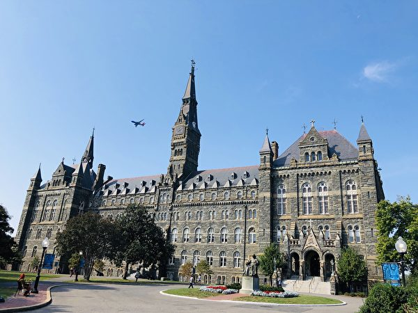

<h3><a target="_blank" href="https://bit.ly/3asSXIA">请多传破网软件，使更多的人了解真相从而得救，这是给自己积福德。 https://bit.ly/3asSXIA </h3></a>

   

     
<h3 align="center"><b>免翻视频  https://bit.ly/3ezRQKo  (请收藏网址 https://git.io/swspip)</b></h3> 

<h3 align="center"><b>复制网址到谷歌或火狐浏览器打开。若出现 “提示” ，請点击“继续”访问即可。</b></h3> 

<h3 align=center><a href="https://github.com/gav01/Heart/blob/master/news1.md">● 看更多大紀元時事 ●</a></h3>

<a href=https://git.io/souye><h6 align="right">回首頁</h6></a>

<a name=top>

<a href="https://github.com/gav01/Heart/blob/master/ls-20-6-1.md"><b>往 1 ~ 141 新闻</b></a> 

<a href =#154>154.北京胁迫设香港“共安法”而非“国安法” 
<a href =#153>153.中印两军黑暗中搏斗6小时 印指挥官坠峡死 
<a href =#152>152.两个家族的不同命运 
<a href =#151>151.【一线采访】遭遇洪灾 广西灾民：政府不作为 
<a href =#150>150.重庆多地成泽国 汽车如纸船般被洪水冲走 
<a href =#149>149.【最新疫情6.17】川普：世卫一直令人失望 
<a href =#148>148.法轮大法在台湾花莲的开传（上） 
<a href =#147>147.恶搞“国歌”遭抖音封杀 留学生无惧中共 
<a href =#146>146.房山学校暂停返校 河北山东至北京班线暂停 
<a href =#145>145.马化腾减持腾讯股票 四天套现42.87亿港元 
<a href =#144>144.朝鲜突然炸毁南北事务所 韩国召开紧急会议 
<a href =#143>143.传中共司法部政治部主任跳楼自杀 
<a href =#142>142.中共长臂伸入美校园 资金渗透内情被曝光 

<a name=154>
<h1 align="center"><b>北京胁迫设香港“共安法”而非“国安法”</b></h1>
 <h3 align="center"><b>中共不等于中国 美国灭共步步逼近 中共与美国在香港激烈较量</b></h3>  
 <h4 align="center"><b>香港大纪元编辑部</b></h4>  

自从中共人大通过港区国安法草议后，蓬佩奥（图）频频就中共的行为发声。(JACQUELYN MARTIN/AFP via Getty Images)

   
   【大纪元2020年06月17日讯】6月16日早上，香港行政长官林郑月娥在出席行政会议前记者会上声称，中央制定“港区国安法”是“合法合宪”不容置疑，并称此做法不应该受到一些外国政府的挑战，外国政府也在维护自己的国家安全，所以也应该接受由中央出手立法。

林郑月娥的说法就是为了国家，立国安法是天经地义的。准确来说，现在中共要在香港订立的其实是“中共安全法”；不是中国出现了危机，而是中共的统治合法性不单止在中国出现危机，而且在国际社会上也出现了危机。

近期尤其是中共病毒疫情在世界发生大流行后，世界多个国家已经声明会向中共追责讨债。而维持世界秩序的“国际警察”美国，无论是总统川普还是国务卿蓬佩奥都多次针对中共发言，除了指其在疫情上不负责任之外，近期更直指中共对西方社会意识形态的威胁，以及渗透美国国内事务。无论是疫情的隐瞒还是中共的野心，美国政府均强调，中国人民是好的，有问题的是中共。

美国是针对中共而来的，中共在全世界搞渗透、偷技术，强推共产主义的意识形态来破坏别人的生活方式，美国是反共，不是反中国。正常的维护国家安全概念是因应国际局势的变化来调整国家安全法；中共是因为感觉党的危机才立法。

在中国的宪法里，共产党是凌驾于国家的。共产党在十八届三中全会上对35年改革开放的总结是“四个坚持”，第一个坚持就是“党的领导”。时任中国共产党中央委员会总书记江泽民讲的“三个代表”，其中一个是中共代表“中国最广大人民的根本利益”。由此可见，中共在宪法上牢牢把中国和中国人民的福祉与党捆绑在一起，偷换概念来愚弄中国人和世界。

对于这种中共等于中国的偷换概念，美国在近期已经清楚表达其理解。5月28日中共人大会议通过港区国安法的草议，进入6月，蓬佩奥频频就中共的行为发声。

6月1日，蓬佩奥发表推文说，中共的军事进展不是虚的，美国的国防部正力所能及去理解这种威胁。他说，川普总统会一直确保美国人受到保护。同一天，蓬佩奥在另一推文发表他在前一天接受福克斯（Fox）新闻采访的内容。他说，从川普上周五（5月29日）的评论反映，现在的中共与10年前已经不一样了，它是要摧毁西方理念、西方民主和西方价值观。中共威胁美国人的安全，无论是在美国的知识产权方面，还是在破坏美国的就业机会，还是南海安全和该区域的商航运作权等多项非法所为。这是美国总统第一次决定要反击，保护美国人。

6月4日，蓬佩奥在白宫接见六四幸存者包括王丹，可以说是给中共一大巴掌。1989年六四屠城后，西方国家希望通过与中共交往过程中改变中共，中共欺骗西方世界，提出了一个条件：要求西方国家不公开批评中共的人权问题。31年后，世界没有改变中共，中共却改变了世界。蓬佩奥在6月4日的举动，说明了美国以行动表明已经看透了中共。

6月6日，蓬佩奥再发表推文谴责中共冷酷地试图利用美国人弗洛伊德（George Floyd）的死来捞取其自身的政治好处。在最好的情况下，北京当局狠推共产主义，在巨大的挑战中，美国镇守自由。

6月10日，针对中共在港区国安法上胁迫汇丰银行“跪低”表态，并进一步在华为5G设备问题上威胁英国，蓬佩奥发推说，美国撑英国反抗中共强制性的欺凌手段，并准备帮助盟友英国建立重要的基础设施。

6月13日，蓬佩奥发推，提到他在6月4日怀着谦卑和荣耀的心情接见了在31年前的六四屠城幸存者，并发表声明指中共下流地企图利用美国本土的处境来强推其政治议题。强调美国和中国并不能相提并论。美国有法治，中国没有。美国有言论自由，中国没有。美国捍卫宗教自由，中国（共）继续其几十年来对信仰之战。中国（共）冷酷的强推共产主义。美国镇守自由。

蓬佩奥在对中共释出连串尖锐的批评和表现强硬的态度后，6月15日，有消息传出，中共派杨洁篪向美国方面提出会面要求，蓬佩奥将于美国时间周三（17日）在夏威夷的美军基地与中国代表团会面。

美国国务院证实此次中美在夏威夷的会面安排。中共外交部发言人赵立坚15日回应说，中美外交渠道保持着沟通，有消息将及时发布。

中共一直利用香港在国际上偷技术、融资，透过香港买国际先进的技术，搞间谍渗透，进行收买、游说。最近在美国服刑期满，被遣返香港的前港官何志平便是一例。中共也利用香港的商人配合在外国获取世界重要的敏感项目，或设立情报站。

李嘉诚早前在以色列投标的海水淡化厂项目，准备在拿到项目后批给中资公司，由于海水淡化厂位置接近当地的重要军事基地，在5月26日公开招标结果前，13日蓬佩奥去了以色列一趟，结果李嘉诚没有拿到海水淡化厂项目。此外，中共的千人计划很多都在香港进行的。

这次强推港区国安法，中共单方面撕毁了《中英联合声明》；违背了《基本法》，就是违反了国际契约，是一种侵略行为。

蓬佩奥是这次美国对付中共的主将，从他的话锋可以知道美国已经定性中共是邪恶集团，这是美国的国家政策。

旧冷战是以苏联为首的共产党阵营，新冷战是以中国共产党为首的共产党阵营。

美国已经清楚表明这次要灭共，不是灭中国。中共现在要为香港立的所谓国安法，其实是“中共国安法”，维护的是中共政权的安全，而不是中国国家的安全。

邓小平、习近平在中共内部多个场合都提到过“香港人可以不喜欢共产党，但要爱国”，港版“国安法”本质上是设立港版“共安法”，中国共产党要在香港这个西方反共最前线来保护中共，为此，北京不惜撕毁《中英联合声明》及“一国二制”国际协议。在当前美国将反共作为国策之际，中美在香港问题上实际触碰的是中共安全问题。

港区国安法是一场冲突；是中国共产党跟以美国为首的自由正义力量的冲突，在香港这个地方展开了。

<a target="_blank" href=#top><h6 align="right">回上方</h6></a>

<a name=153>
<h1 align="center"><b>中印两军黑暗中搏斗6小时 印指挥官坠峡死</b></h1>

在6月15日夜间和16日凌晨，中印两军发生暴力冲突。(Tauseef MUSTAFA / AFP) 

   
   【大纪元2020年06月17日讯】（大纪元记者徐简综合报导）在6月15日夜间和16日凌晨，中印两军在边境的加勒万河谷（Galwan Valley）地区发生暴力冲突，造成了双方人员伤亡。一名印度指挥官被推搡，从狭窄的山脊上坠入峡谷中死亡。

6月6日中印双方军团指挥官在举行的会谈中对达成“和平解决争端”形成共识。但是不到10天，双方爆发了45年来最大的冲突。

<b>黑暗中战斗六小时 印指挥官坠峡而死</b>

印度媒体报导，当时一支印度的巡逻队在一个陡峭地区巡逻，他们认为中共军队已经从那里撤退，但是意外地碰到了一队中共军人。

双方争吵不休，进行了直接的搏斗，遵循数十年来为了避免冲突升级的传统，双方军人都没有配备武器，他们开始用石头、铁棒、木棒和其它临时武器打斗。

战斗中，一名印度指挥官被推搡，他从狭窄的山脊上掉下来，坠入峡谷中死亡。

印度政府消息人士说，印方从大约4公里外的一处哨所召唤了更多的援兵，最终约有600人混战在一起。

冲突发生在星期一晚上至星期二凌晨，双方在近乎完全黑暗的环境中战斗了长达六个小时，其中多数人的伤亡原因是掉下峡谷或撞在山上。

<b>印方开始辨认死者 中共对人员伤亡保持沉默</b>

北京没有公布中方的伤亡数字，印度报章The Time of India报导，从印度政府得到的消息指，冲突中，至少有20名印度军人及43名中方军人死亡。

在双方冲突的第二天，印度新闻媒体就开始确认死亡士兵的名字，并开始对周一晚上的冲突事件进行清晰的描述。

印度3名首先在冲突中丧生的死者分别是部队上校指挥官巴布（B Santosh Babu）和两名士兵帕拉尼（Havildar Palani）、欧吉哈（SepoyOjha）。

印度报章The Indian Express报导，双方经过两次暴力冲突后，已撤离冲突地区 。

中共外交部发言人赵立坚指控这起事件是印度部队“两次越过边境线，挑衅和攻击中方人员”，但印度外交部发言人斯里瓦斯塔瓦（Anurag Srivastava）16日晚发表声明驳斥赵立坚，他说中方“偏离了两国共识，没有尊重在加万谷的实际控制线（LAC）”。

<a target="_blank" href=#top><h6 align="right">回上方</h6></a>

<a name=152>
<h1 align="center"><b>两个家族的不同命运</b></h1>
   
【明慧网二零二零年六月十七日】很多人受无神论的影响相信眼见为实，其实看不见的也未必不存在，下面的故事或许会对你有所启示。

<b>两个家族的不同命运</b>

一百多年前，美国学者AEWinship曾公布一项研究成果：同时代的两个家族的繁衍发展史比较。这两个家族，一家是虔诚的基督教徒爱德华兹（生于1703年）；另一家是著名的无神论者马克﹒ 尤克斯（生于1700年）。开始的时候，无神论的马克﹒ 尤克斯曾经对爱德华兹说过一句话：「你信神，而我永远都不会信！」

200年后，这两个家族的发展情况统计结果如下：

有神论爱德华兹家族：人口总数1394人，其中有：100位大学教授、14位大学校长、70位律师、30位法官、60位医生、60位作家、300位牧师、神学家、3位议员和一位副总统。

无神论马克﹒ 尤克斯家族：人口总数903人，其中有：310名流氓、440人患有性病、130人坐牢13年以上、7名杀人犯、100名酒徒、60名小偷、190名妓女、20名商人，其中有10名是在监狱学会经商的。

两串数字摆在一起，无神论的老祖宗立刻现了原形：原来它带来的不是高尚，不是幸福，而是下流、淫邪、欺盗。

<b>写上「九字真言」之后</b>

明慧网上《真相内容能销毁什物上的邪灵及邪灵因素》一文讲了这么一件事。这位法轮功学员的公公经常说自己眼睛净，什么都能看到。

作者的丈夫喜欢看地图，客厅墙上从来都得挂几幅大地图，每当公公到客厅时，眼睛就盯着墙上的地图，并说些什么「苏联大鼻子」在干什么什么呢，邪灵周某某怎么怎么的，像讲故事似的。然后就拿起他的大拐杖恶狠狠的向地图砸去。边砸嘴边不停的骂，几乎每天都这样。有一次把地图扯下来撕成碎片。过两天，丈夫又买了两张贴上了，公公还是重复的做。

一天，公公又要砸地图，这位法轮功学员忽然灵机一动，拿笔在一张地图上方写上「法轮大法好」，然后她把公公叫出来说：「你看看地图上还有没有了？ 」公公看了看说：「没有了，它们都跑这张上了。」学员又在第二张地图上写上「真善忍好」。公公看了看，冲着地图说：「瞅你那小样儿，还不愿意走呢……」等等一些话。

这位法轮功学员问公公怎么回事，公公边用手比划边说：「有一根绳子把它们都捆在了一起，拽走了。」他比划着绳子有小碗口粗。自从写完「法轮大法好，真善忍好」后，公公再不砸地图了，说明这「九字真言」就能销毁邪恶因素。

这位法轮功学员曾给公公买了一台电视机，公公却说：「快把电视拿走，别放我这屋，我可不看了，那电视尽放毒。」原来，中共邪党的电视真的不能看，电视节目向外放射邪灵因素。

<b>销毁邪党纪念章之后</b>

前不久，明慧网《销毁邪党纪念章明真相父亲得福报》一文写到：父亲今年八十八岁，退休多年，患高血压、心脏病、糖尿病等多种疾病。父亲年轻时就加入中共邪党，受毒害很深。给他讲大法真相，让他念「法轮大法好，真善忍好」，他并不完全相信。

二零一八年春季，父亲从街道的老年办领了几本邪党老年杂志和一个50年邪党党龄纪念章。到了八月十五前后，父亲突然呼吸困难，喘不上气，赶紧送医院抢救，医院诊断很危险。

晚上这位法轮功学员陪床时，让他念「法轮大法好，真善忍好」，劝他把邪党党龄纪念章扔了。有时晚上父亲同意了，上午身体好点就不同意了，认为念的不起作用，住了十多天出院了。回家不到半个月又犯病了，还是一样的症状，一样急，一样危险。再送医院住院，又住院十多天。连续四次，每次都劝他把那个邪党党龄纪念章扔了，晚上同意了，第二天就反悔。

第五次住院，父亲同意把纪念章扔了，对身体怎么好就怎么办。扔掉之后近一年没有再住院。

身体好了，老人控制不住又开始吃水果，引起并发症，二零一九年十一月父亲又住进医院了，而且随时会有生命危险。住了十一天，直到出院父亲都没下过床，体重一百九十多斤，回家上二楼，自己能上吗？但是念着「法轮大法好，真善忍好」，终于爬上楼，进了家门。而且回家后拔掉导尿管，生活很快自理了。

从此，父亲彻底的相信了法轮大法，师父是来救人的。每天诚心的念，睡觉前也念，有时睡觉一翻身嘴里都在念「法轮大法好，真善忍好」，医生说身体随时会有生命危险，半年多了父亲一直正常生活，真的受益太大了。

<b>武汉肺炎真是长眼睛的</b>

神佛看人心，相信与否天壤之别。明慧网上刊登的《看来武汉肺炎真是长眼睛的》一文中讲述了一个鲜明的对比。这位法轮功学员的大外甥媳妇、姑妈的小儿子都患上武汉肺炎，但诚念「九字真言」，几天病情就好转，烧也退了。

可是姑父就没有这么幸运了。过年前，他把中共邪党的所谓十大元帅图带回家里贴上。姑母把它给处理了，他还不愿意。姑母说就是它惹的祸，你刚贴上第二天，小儿子就得武汉肺炎了，还不醒悟、招惹些不好的东西。可是姑父不太相信，还说些不好的话。此后他很快得了武汉肺炎，咳的不得了，住进了医院，几天就去世了。但姑母整天陪着他也没事，因为姑母天天在家念「法轮大法好，真善忍好」。

尊重事实很重要，生命不能用来赌博。共产邪灵带给人们的是仇恨、斗争、谎言，它给人带来的最终结果只有毁灭。共产邪灵败坏道德的最重要方式就是强行推广无神论和进化论。无神论出现时适逢工业革命带来的生产力大发展，加重了人对物质和技术的崇拜和依赖。本着实证科学的理念，人们开始否定神言、神迹，系统地排斥对神的信仰。只要人不再信神，背离神，就会精神空虚、道德败坏，世风日下，最后走向毁灭。只有敬天信神，才是通往天国的回归之路。

<a target="_blank" href=#top><h6 align="right">回上方</h6></a>

<a name=151>
   <h3 align="center"><b>“它是一种变态心理 要摧毁人间一切美好！”</b></h3>
<h1 align="center"><b>【一线采访】遭遇洪灾 广西灾民：政府不作为</b></h1>

桂林阳朔景区遭遇洪涝后的情形。（大纪元合成图）

   
   【大纪元2020年06月17日讯】（大纪元记者骆亚采访报导）近日，大陆南方多省遭遇特大暴雨，汽车在大水漂流，很多房子被冲垮。官方隐瞒受灾情况，无论是洪灾中还是灾后重建，村民表示，唯有靠自己。
   
6月2日以来，广西、广东、贵州、湖南、江西、安徽、浙江、福建等多地遭遇暴雨灾害，在广西阳朔，暴雨致使全县9个乡镇出现洪涝灾害，全县城内涝严重，附近最高点的甲秀桥成为孤岛，停满了躲避洪灾的各种车辆，在暴雨、洪水冲击下半个山坍塌，泥石流导致当地一个邨尽毁。暴雨中，中共兴建的水库有的无法承载水量，有的是当局不通知下游民众直接泄洪，有的小水库则直接在暴雨中坍塌，更加重了当地的灾情。

桂林阳朔景区遭遇洪灾。（受访者提供）

桂林阳朔景区遭遇洪灾。（受访者提供）

 
<b> 半个山坍塌 村庄被毁全部搬迁</b>

广西梧州的吴先生告诉大纪元：“这是当地50年难得一遇的连续狂风暴雨，当地老人说，他们从小到大都没有看到这么大的雨。这样的暴雨天持续了十天，天空一直黑沉沉的都没有亮过。其中一次的暴雨时间长达十多个小时。”

阳朔当地邨民阿牛（化名）也说：“主要是阳朔县城内涝，排水系统很差，阳朔县城内的都被淹了，我们景区这边都房子受损情况还好一些。我们镇半个山的泥石都塌下来了，很多房子都被掩埋了，有一个村遭遇泥石流，基本要搬迁，无法生活了。原来的路现在都开裂了，都不敢再住了。街道平时买菜的地方，那里水位都涨了一米多深，连小桥车的顶都看不到了。”

<b>有老人孩子被冲走 </b>

吴先生介绍，大家都想不通，这次这么大的一个水库泄洪，官方为何不通知？当地的年轻人，五六十岁的人都外出打工去了，所以有些家中就剩下老人和留守儿童。

他说：“这些孤寡老人或家里有儿童的很惨，没有青壮年可以帮助照顾他们。当地被摧毁的房子中，有一家老人和孩子失踪了，也有老人的尸体被冲到下一个邨后，尸体腐烂都发臭了。”

<a target="_blank" href=#top><h6 align="right">回上方</h6></a>

<a name=150>
<h1 align="center"><b>重庆多地成泽国 汽车如纸船般被洪水冲走</b></h1>

进入六月，重庆各区县相继出现大雨、暴雨天气。其中石柱、酉阳县等地区6月14日凌晨出现特大暴雨，中小河流出现超警戒水位洪水，乡镇被淹，水漫街道，汽车如纸船般漂浮水中，居民损失惨重。图为14日的石柱城北区。（视频截图）

   
  【大纪元2020年06月16日讯】（大纪元记者易如采访报导）进入六月，重庆各区县相继出现大雨、暴雨天气。其中石柱、酉阳县等地区6月14日凌晨出现特大暴雨，中小河流出现超警戒水位洪水，乡镇被淹，水漫街道，汽车如纸船般漂浮水中，居民损失惨重。

自6月11日晚起，重庆相继大部分地区出现大雨，部分地区暴雨，局地大暴雨，綦江区藻渡河、巫溪后溪河、秀山酉水河等3条河流出现超保证水位洪水；酉阳龙潭河、小河坝河、酉阳河、董河等河流出现超警戒水位洪水且水位仍在上涨。重庆市水文监测总站于6月12日上午相继发布了洪水橙色和黄色预警。

<b>石柱县城水漫街道 轿车漂浮</b>

6月14日4时30分，重庆石柱县气象局发布“暴雨橙色预警信号”，万朝镇降雨量更达到111.4毫米特大暴雨等级。持续强降雨在当地引发山洪，县城被淹，街道变成“黄河”。

当地快递公司一位女士15日上午告诉大纪元，昨晚（凌晨）下的暴雨使南宾街道桥北路段受灾严重，“桥北那边很严重，那边靠河边，一楼基本被淹没了，昨天那边都不通车，快递无法正常派送，今天水基本退了，正在清理淤泥。”

“下三天多暴雨，加上山洪爆发，河里的水都满满的。唉！”石柱县城一居民对大纪元说。

网上一段视频显示，连日暴雨水位暴涨，石柱部分居民房、店面被河水淹没近1米。许多车辆浸泡在水里，有的汽车像“纸船”一样漂浮在水面然后又被洪水冲走，被冲走的车辆还包括一辆大型水泥罐车。 

视频还显示，位于城区的小学和中学一楼全部被水淹没，拍摄者说，“华夏小学、南宾中学的一层楼都被淹完（淹没）了，涨得好大的水。”“城区部分地区不少居民被困在家里。”

石柱土家族自治县华夏民族小学校的一位教职工告诉大纪元，学校被水淹没的时间是14日凌晨5点到7点之间，暴雨加上山洪，水非常大，“学校建筑、食堂设施、教学设施都受到影响，目前没有人员伤亡，财产损失较大。”

他说，“今天操场的淤泥基本清理了，正在清除房间里的淤泥，至少食堂和教室恢复正常才能开课。”

据悉，该校有1288学生，教职工111人，还有128名幼儿学生。

有当地网民发帖说，6月14日6点左右，朋友圈“炸”了，全是涨水、被困人员、小车冲走等信息，华夏小学片区涨水比较严重，“因为涨水的缘故，小学内的桌椅全部被冲到小学旁居民楼前的大坝，堵住了唯一的一条进出路口。”

华夏小学旁的居民楼（网络图片）

持续的强降雨已使石柱28个乡镇街道居民生活受到不同程度的影响，部分地区停水多日。

网民“马美丽永远美丽”发帖说，住在南滨尚城26楼，连续停水五天，还让不让人活，“天气这么热，孩子才七个月，吃奶洗澡都成问题，一到晚上，哭个不停。楼层低的（上午）五六点来水，我们高层每天都是（中午）两点来，五点停，也没接到停水通知。问物管说是水公司分流小，压力不够上不来！请有关部门解决，毕竟关系民生问题。”

网民“墨姬”说，“双庆场这边也是，停了几天了。”

<b>酉阳县遭大暴雨袭击 灾情严重</b>

重庆酉阳县自11日夜间以来也普降大到暴雨，其中酉阳县龙潭镇官偿村日降雨量达到318.5毫米特大暴雨等级。官方报导说，截至目前，受雨势影响，河水暴涨致河堤垮塌、损毁，大面积农田遭受冲刷。多个乡镇受灾，许多民房进水、道路被淹，灾情严重。

酉阳县毛坝乡宋女士对大纪元说，最近天天下暴雨，下了半个月，“昨晚下一整夜，县城车站都被水淹了，很严重，水深到人的肩膀高。最主要是庄稼玉米等农作物损坏很严重，有些农户的猪都被冲走了。”

一段视频显示，6月13日，重庆酉阳县暴雨致多条河流水位上涨，龙潭古镇一廊桥在洪峰过境时被洪水瞬间冲塌。另外，高速部分路段也出现严重积水情况，交通已被管制。

<a target="_blank" href=#top><h6 align="right">回上方</h6></a>

<a name=149>
<h1 align="center"><b>【最新疫情6.17】川普：世卫一直令人失望</b></h1>

美国总统川普于2020年6月16日在华盛顿特区白宫玫瑰花园举行的新闻发布会上讲话。（Photo by SAUL LOEB / AFP）

   
 【大纪元2020年06月17日讯】（大纪元记者戴芙若、颜殊璟综合报导）6月17日全球中共病毒（武汉肺炎）疫情最新情况：
 
 根据约翰‧霍普金斯大学（Johns Hopkins University）的数据，截至美东时间6月16日晚上8点，全球确诊感染中共病毒（武汉肺炎）的人数超过814万，死亡人数超过44万（注：因中共和伊朗隐瞒疫情数据，真实数据比统计的要高）。美国确诊病例超过213万例，死亡超过11.6万人。

全球中共病毒病例数6月15日已超过800万，其中拉丁美洲感染数飙升。全球感染病例中约25%，即二百多万人在美国。不过，病例增长速度最快的是拉丁美洲，目前已占总病例数的21%。

巴西中共病毒病例数和死亡人数大增，成为除中国外仅次于美国的第二大疫情热点。卫生专家表示，巴西官方统计的死亡病例数已上升至近44,000人，实际数字可能远比显示的数据大。专家称，这个拉美最大的国家缺乏大面积的检测。

川普（特朗普）政府高级官员在周二的电话简报会上说，目前全世界有一百多种中共病毒疫苗正在研发中，美国政府正在从中选出14种，并计划在进一步测试之前将名单缩小到大约7种。在美国政府的支持下，14种候选疫苗中有些已经在临床试验中。

美国商务部周二发布的报告显示，5月份美零售额增长了17.7%，打破经济学专家8%的预测，表明美国经济在各州继续不同阶段的重新开放的同时快速恢复。美联储周一启动了“主街流动资金计划”，帮助中小企业复苏；同时还宣布将开始购买公司债券。股市因此受到提振，美股周二高开高收。

=======================

<b>以下是最新疫情实时更新：

北京疫情延烧 取消近七成商业航班</b>

大陆多家媒体报导称，在过去24小时内，感染中共病毒的病例急增，疫情防控升级，截至上午9时10分，北京已取消该市两大机场的1255个航班。

据报导，北京首都国际机场和北京大兴国际机场近七成航班被取消。

周二，北京将紧急响应级别从3级提升至2级（最高级别为1级）。

北京当地媒体报导称，根据航班管家APP最新资料，北京两大机场取消1255航班，其中包括615架出港航班和进港航班640架。

在过去5天，北京报告共有137人确诊感染病毒。但由于中共一直以来均隐瞒疫情真实情况，外界质疑此数据有水分，染疫人数可能不止这些。

北京疫情延烧，已取消该市两大机场的1255个航班。

<b>秘鲁染疫死亡人数激增 突破7000人</b>

秘鲁卫生部周二表示，该国遭受中共病毒重创，死亡人数已经升到7056人，为拉丁美洲第3高，仅次于巴西和墨西哥。

法新社报导，官员们说，秘鲁确诊病例数现在已超过23.7万例，而秘鲁已在全国范围内封锁了三个月。

秘鲁人口为3,300万，确诊病例数在拉丁美洲位居第二高，仅次于巴西。

不过，该国卫生部长维克多·萨莫拉（Victor Zamora）告诉法新社记者，新病例数量已开始下降。

目前有10,000多名感染病毒患者住院治疗，秘鲁的医疗体系正处于崩溃的边缘。

据报告，秘鲁70%的病例发生在利马（Lima）大都市地区，该地区拥有全国三分之一的人口。

官方数据显示，死亡人数包括200多名在秘鲁人满为患的监狱中染疫的囚犯，至少170名执行宵禁和封锁令的警察，以及50多名医护人员。

<b>纳瓦霍族保留地宣布两个周末57小时霄禁</b>

纳瓦霍族保留地（Navajo Nation）宣布了另一轮周末霄禁，以减少中共病毒传染。

预计第一个周末霄禁将从6月19日星期五开始，到6月22日星期一结束。

第二个霄禁从6月26日星期五开始，到6月29日星期一结束。

纳瓦霍族主席乔纳森·内兹（Jonathan Nez）在新闻发布会上说：“我们必须继续做我们正在做的事情，戴上防护面具，遵守周末霄禁，待在家里，并与其他人保持六英尺的距离。”

“现在不是退缩的时候。我们不要倒下！戴上口罩，进行社交疏导和洗手。”

<b>洪都拉斯总统确诊感染中共病毒</b>

路透社报导，洪都拉斯总统埃尔南德斯（Juan Orlando Hernandez）周二表示，他已被诊断感染了新型冠状病毒（中共病毒），正在接受治疗，并将通过他的助手进行远程工作。

埃尔南德斯在电视讲话中说：“作为国家总统和负责任的公民，我想传递的（信息）是，在周末我开始感到有些不适，今天被诊断出感染了COVID-19。”

他说：“他们建议休息，但我将继续通过我的助手进行远程工作。”并说，他有轻微的症状，并开始接受治疗，现在感觉好多了。

埃尔南德斯的妻子和他的两名助手也被确诊感染了冠状病毒，他们都在接受治疗。

目前洪都拉斯报告有9,656例确诊病例和330例死亡病例。

<b>北京疫情严重 突发应变调升至二级</b>

北京全面大排查。图为2020年6月15日北京玉泉一小区。(NOEL CELIS/AFP via Getty Images)

据中共国家卫健委的通报，北京的紧急响应级别从3级提升至2级，截至6月16日，已指定了27个中度风险区，对进入该地区的人进行温度检查和登记。并令所有小区进行全面实施封闭式管理，各级学校停止到校，中高风险重点地区人员禁止离京。

北京往日拥挤的车站、交通枢纽要道在高峰时也几乎无人，有些站口只能出人不能进人；车站内外、街上，警察、警车明显增多，西二旗车站的小卖部也有警察把守；车站内还出现蹲地不起的老妇人。

从17日起，北京将针对农贸市场、菜市场、餐饮店、单位、食堂等场所全面消毒，其余公共场所也要做好每日消毒与出入体温检测。公园景区等限制人数比例降至30%，部分体育文化场所关闭。

虽然不须停产停工，但鼓励企业开放居家办公或错峰上下班，并下令各级学校停止到校，中小学恢复线上教学。

<b>川普：世卫一直令人失望</b>

美国总统川普于2020年6月16日在华盛顿特区白宫玫瑰花园举行的新闻发布会上讲话。(SAUL LOEB/AFP)

川普总统周一（6月15日）在白宫回答记者提问时说，世卫令人失望，他不会对离开世卫的决定进行重新考虑，除非世卫改过自新。

有记者在问川普，是否会重新考虑先前做出的结束与世卫关系的决定。

“如你们所知，我们（向世卫）支付了4.5亿美元，有些年份支付了将近5亿美元的资金。多年来，我们支付的费用远远超过其它任何国家。但他们（世卫）却一直是中国（中共）的一个傀儡。”川普说。

“因此，我不重新考虑，除非他们改过自新。我不确信他们在这一点上能做到。但有可能，经过多年后，他们可能做到。”他说。

川普再次重申，在这个病毒大流行上，世卫的每一个行为都是错的，包括批评美国对来自中国的人关闭边境。

详情请阅：川普：将不会重新考虑对世卫的决定

<b>彭斯：新病例激增源于大量测试</b>

2020年6月15日，副总统彭斯与川普总统在白宫内阁会议室举行的圆桌会议上发表讲话。(SAUL LOEB/AFP)

美国副总统彭斯（Mike Pence）周一（6月15日）表示，除了少数地方，美国与新冠肺炎（中共病毒）相关的住院率和死亡率大幅下降。一些州的COVID-19（中共病毒引发的疾病）确诊病例数量增加是由于“检测数量大幅增加”造成的。

彭斯在白宫一个圆桌会议上说，加利福尼亚州长加文·纽森（Gavin Newsom）告诉他：“仅在周六（6月13日）一天里，加州就在全州进行了7.8万次测试。”而同时，在加州，他们的住院人数保持不变。

美国疾病控制中心（CDC）的数据显示，在全美国范围内，检测阳性率正在下降。

<b>美墨边境限制将延长至7月21日</b>

圣地亚哥圣西卓（San Ysidro）美墨边境墙入海的部分。墙左边是墨西哥，右边是美国圣地亚哥。（杨婕／大纪元）

根据美国驻墨西哥大使和墨西哥外交部的公告，墨西哥和美国已同意将其共同陆地边界的旅行限制延长至7月21日。

美国驻墨西哥大使克里斯托弗·兰道（Christopher Landau）在推文中指出，“边境地区的公共卫生状况”是扩大限制的原因。 墨西哥外交部表示，在“审查墨西哥和美国爆发Covid-19疫情的进展之后”，决定扩大限制范围。

加拿大总理贾斯汀·特鲁多周二表示，直到7月21日，美国和加拿大的边境也将禁止大部分旅行。

自3月21日以来，美国的两个陆地边界已基本关闭。

<b>美官员：“超速行动”疫苗将部分免费</b>

美国总统川普于2020年5月15日在白宫玫瑰园宣布“超速行动”（Operation Warp Speed），计划希望到2020年底全面生产和分发中共病毒疫苗。

川普政府高级官员在周二的简报会上表示，如果“超速行动”（Operation Warp Speed）Covid-19疫苗获得批准，该疫苗将对弱势人群、需接种的工作人员和任何想要但无力负担的美国人免费。

白宫计划为Covid-19加速疫苗生产，生产疫苗的公司将向美国政府提供疫苗。此举旨在让美国人能负担得起疫苗费用。

“我们将与保险公司同时开展工作，⋯⋯这些保险公司已表示急切希望纳入这种疫苗，即使不是全部，大多数保险公司都纳入了没有Copay的其他Covid相关服务。我们预计他们会将其扩大到疫苗上，”一位高级政府官员在简报中说。

官员们说，“超速行动”还将通过零售药房和医师诊所协助向美国人分发疫苗。

<b>巴西单日新增三万余确诊病例</b>

2020年6月2日，巴西圣保罗，图为Nossa Senhora Aparecida公墓一名挖墓者，那里是中共肺炎死者被埋葬的地方。(MICHAEL DANTAS/AFP via Getty Images)

巴西卫生部周二报告有34,918例新的冠状病毒病例，使该国的病例总数达到923,189例。

巴西最近一次单日病例增幅最大的纪录是5月30日，当时该国报告了33,274例病例。

根据卫生部的数据，巴西在过去24小时内增加了1,282例新的死亡病例，使该国的死亡人数达到45,241人。

<b>研究表明青少年感染率底 学校可重新开放</b>

前白宫卫生政策顾问埃塞基尔·伊曼纽尔（Ezekiel Emanuel）周二表示，一项研究表明，儿童和青少年感染中共病毒的可能性是成年人的一半，这对于寻求重新开放的学校来说是个好消息。

周二，一项发表在《自然医学》杂志上的研究称，估计20岁以下的人感染Covid-19病毒的概率是20岁以上成年人的一半。

CNN报导，伊曼纽尔博士表示：“首先，如果他们受到感染的可能性大大降低，这实际上是个好消息。”

现任宾夕法尼亚大学医学伦理与健康政策系主任的伊曼纽尔补充说，该研究还发现80%的被感染者没有任何症状。

伊曼纽尔说：“这确实意味着他们不太可能有症状，因此可能很难筛选出留在家里的学生，这可能会在学校蔓延。”

“但是，另一方面，鉴于他们的感染率较低，因此感染的频率较低，而且往往无症状，因此，如果感染的话并没有太大的问题，我认为这是个好兆头。我认为，总的来说，人们正在解释这一点，因为我们很可能可以重新开放学校，其中包括很多事情：社会疏离、手部卫生、戴口罩和减少学校（上课人数）的密度，”他说。

<b>乔治敦大学取消2020年秋季出国留学</b>

2019年9月22日，华盛顿特区乔治敦大学（Georgetown University）。图为希利大楼（Healy Hall）。乔治敦大学成立于1789年，是美国最古老的天主教和耶稣会大学。 (Daniel SLIM/AFP)

教务长罗伯·格罗夫斯（Robert Groves）周一发送的一封电子邮件显示，乔治敦大学（Georgetown University）已取消了2020年秋季学期的所有出国留学和国际交流计划。

根据这封电子邮件，该决定适用于所有大学资助的本科生、研究生和专业学生的国际旅行。

“我们的决定是为了维护我们社区的健康和安全，考虑到全球公共卫生状况的动态性质，当前对国际旅行的重大限制以及在不确定的时期内能够适当地支持出国留学的能力 ”，格罗夫斯说。

该大学表示，现在已经决定给学生一些时间来调整他们的秋季计划，但尚未决定是否在秋季为留在乔治敦校园的本科生提供面对面授课的决定。

<b>德州每日新增病例破纪录</b>

德克萨斯州州长格雷格·雅培（Greg Abbott）宣布了德州每日中共病毒病例的新纪录。

他将阳性病例的增加归因于达拉斯附近科林县的辅助生活设施，以及奥斯汀附近海斯县的数字报告延迟。

雅培表示，该州周二增加2,622个病例，超过6月10日的最高纪录2,504例。

在住院率不断提高的同时，雅培对该州的医院容量表示了信心，目前医院可提供14,933张病床。在过去的一周中，住院的中共病毒患者数量已超过2,000人，周二报导的最高记录为2,518人。

他说：“即使有更多的人住院，对我们医院（病床数）的威胁仍是最低的。”

尽管如此，州长还是敦促德州人努力遵循戴口罩、洗手和保持社交距离等措施。

他说：“我们只是想加倍提醒大家，我们在3月和4月、5月份学到的这些东西，仍然必须加以实践，因为Covid-19并未突然神奇地离开德克萨斯州。”

州长还报告说，一些县的30岁以下人群的阳性检测急剧增加，这可能是由于酒吧和阵亡将士纪念日聚会放宽限制所致。雅培说，得克萨斯州酒精饮料委员会本周警告说，酒吧和餐馆必须遵守国家安全协议，否则将被取消卖酒资格。

<b>美股周二大幅高收</b>

美股今天股市高收。图为位于纽约曼哈顿的证券交易所。(JOHANNES EISELE/AFP via Getty Images)

美国股市周二收盘大幅上涨。

美联储经济刺激计划、购买国债，好于预期的经济数据，以及逐步复苏的经济，刺激了股市。

今天股市收盘时的表现是：

道指收高2%，即527点。 该指数自上周三以来首次收于26,000点之上。标准普尔500指数上涨1.9%。纳斯达克综合指数收盘下跌1.8%。
 
<a target="_blank" href=#top><h6 align="right">回上方</h6></a>

<a name=148>
<h1 align="center"><b>法轮大法在台湾花莲的开传（上）</b></h1>
   
   【明慧网二零二零年六月十七日】（明慧记者方慧台湾综合报导）一九九五年十一月底，七十多岁的张普田扛了三个装满法轮大法书籍和资料的麻布袋，从中国大陆贵阳出发到台湾花莲，拜访姐姐一家，他这趟探亲之旅也促成了法轮功在台湾花东纵谷的开传。
   

张震宇至今保留舅舅张普田从贵州扛来装在麻布袋的法轮功书籍以及资料，有《法轮功》录影带、精装版《转法轮》、《法轮功》录音带、炼功音乐、学员修炼心得体会等等（博大出版社提供）。

   
花莲县位于台湾的东部，就像是一只蚕的形状，短短肥肥卧在像蕃薯的台湾岛，是台湾面积最大的县市，境内有太鲁阁国家公园与泰雅族、布农族、阿美族、平埔族等原住民民族，以自然观光资源著名。

<b>贵州老人花莲行</b>

背上麻布袋，张普田搭飞机从贵阳到广东深圳，当通过中国海关时，他担心带着这么多书会不会被海关人员刁难？然而奇怪的是，当检查人员打开他的行囊查看后说：「都是衣服！」就这样，张普田顺利通关，再由香港转机至台湾桃园机场，再搭车走苏花公路来到台湾的东部─ ─花莲，千里跋涉，对年逾古稀的他而言，却甚是轻松。不过一年前的他，却不是如此。   
   
   

当时年过七十却身体更加硬朗的张普田先生与夫人在贵州的居家照片（张震宇提供）。

   
   那时，张普田历经三次脑部开刀，身体久久未能复原。他的外甥张震宇回忆当初的情况说：「那一刻，舅舅差点倒下去！」时隔一年，当张普田再度来台探亲时，他的健朗，还犹如年轻人般充满活力，着实让姐姐全家大为吃惊。

张普田说，炼法轮功之后，不仅以前脑部开刀留下的后遗症完全消失，他也变得身轻体健，而一起跟着炼功的妻子亦是无病一身轻。身心受益的张普田夫妻，因此决定跟着其他贵阳学员跋山涉水、深入山区村庄介绍法轮功。

他们一群六、七十岁的老人，有的背著录音机、有的背资料，有的带干粮、带棉被等等，白天介绍功法，晚上没住宿的地方，就睡在猪圈里，张震宇说：「他们将猪圈打扫得干干净净，然后打地铺。」

张震宇任职自来水公司一个单位主管，令他印象深刻的还有舅舅讲述的一场修炼心得交流会的情况。

那是贵阳地区法轮功学员举办的修炼心得交流会。那天一大早，没有人指挥，学员们一个挨着一个安安静静的排着队等待入场。公安接获通报有人群集结，急忙派人赶赴现场，抵达现场后，发现法轮功学员们很守规矩，公安也只是跟着人群静静的站在旁边。五、六千人鱼贯的走进会场后，自动从阶梯最上方开始入座。交流会开始，大家认真地听着台上一位位学员讲述自己自修炼以来的心得，不同的人，不同的故事，理悟不同的法理，而在场的公安也默默的听着。交流会结束后，大家又安静有秩序的离开；会场内外没有任何垃圾。当天的一切让公安深受感动。后来，很多贵阳公安也加入了修炼的行列。

张普田也提到贵阳当地学员炼法轮功的情况。当时，他和太太每日清晨三点多出门，步行到黔灵山公园赶赴五点的集体晨炼。「为了去炼功点，至少走一个多小时吧，每天持续不断的。」在这个炼功点，每天有几千人集体炼功，而贵州这个「地无三里平，天无三日晴，人无三两银」的地方，炼功点里也很少能让人站得平稳的炼功；下雨时，树上挂满了伞，蔚为奇观。

张震宇说：「我们听他的故事会知道，大法能够改变人心。」而张普田一到台湾就告诉亲人此行的心愿：希望两个多月后离开台湾时，姐姐一家都能炼功。

对张震宇而言，舅舅就是个活见证，七十多岁的老人还能扛着三个沉甸甸的麻布袋，轻松自在的翻山越岭，甚至在舅舅陆续的叙述里，张震宇感受到，「这个功法能让人变成无私，就是为人好。」舅舅的状态感动了张震宇一家。

一九九六年元月，张震宇利用三个晚上，通宵读完舅舅带来的《转法轮》，此前，张震宇接触过不少气功与宗教。「我很仔细的看，很多事情，李老师在书里面一语道破。」

「什么是层层宇宙概念？原来人看到的东西只是表面的分子，分子以下的东西，你看不到，但是存不存在？存在。」由最初感性的相信亲人，答应炼功，到后来变成理性的认识与理解，法轮功在张震宇心中的份量与日俱增。

而张震宇的妻子卢丽卿一向不喜欢「外形动作」，秀丽文静的她这次却很反常的一下子就接受「炼功」这件事。在她初学五套功法时，就奇怪的有种「已经炼过」般的似曾相识；而当一字一句的首次阅读《转法轮》时，她也觉得书里的内容似乎很熟悉，仿佛曾经读过一般。更特别的是，在第一次看教功录影带时，她发现片头出现的佛像，就是若干年前曾在她梦里显现的那尊佛；她这才知道，原来她与李洪志老师早已结缘。

   

张震宇与妻子展示保存完好的舅舅一九九五年从贵州带来的「法轮佛法的特点」横幅。（博大出版社提供）

   
   舅舅回大陆前夕，张震宇一家，包括爸爸、妈妈、自己就读小学的孩子、姐姐、姐夫、还有姐夫的亲戚，一共十五、六人开始炼功。舅舅还特别手制了一幅写有「法轮大法」的横幅，大伙并在这条横幅下集体拍照。张普田回大陆后，郑重其事地将这张照片交给北京研究会正式注册：法轮修炼大法台湾东部地区花莲炼功点。

<b>颜面神经麻痹神奇痊愈</b>

舅舅张普田回大陆之后，张震宇并不清楚如何建立炼功点，只在家各自炼功。虽然如此，他有机会时仍向周遭亲友介绍法轮功。他第一个想到的是同学的妹妹、也是自来水公司的同事吴婉英。

四十多岁的吴婉英，有一个脑性麻痹的小孩。孩子出生时正常，一岁半时因吃花生意外噎着，导致脑性麻痹，「双眼全盲，腿瘫软不能走路，只剩知觉与听觉。」吴婉英说。

面对残缺的孩子，吴婉英的母爱不曾稍减。出生于基督徒世家的她，经常为小孩唱儿歌、讲故事，生活中喂食小孩，帮孩子抽痰、把屎把尿……她都亲力亲为。每天背着孩子上下楼，长期下来，两个膝盖红肿疼痛，医生告诉她，不出几年她就需要换人工关节了。因为长年辛劳，吴婉英又罹患颜面神经麻痹，整张脸朝左边歪斜，口水不自觉的往出流。

这一切看在张震宇的眼里，十分心疼，就跟她说：「婉英，你来炼功吧。」

「是，我要活长一点，身体要弄好一点，才能好好照顾小朋友。」吴婉英心想。

两人就利用午休时间在公司礼堂炼功，这样过了三个月后，吴婉英突然发现膝盖的毛病全消。有一天，在家里的穿衣镜前，她毫无预期的就亲眼目睹了发生在自己身上的奇迹，一股力量将她原本朝左边歪斜的脸往右拽。就这样她的脸庞恢复了正常，颜面神经麻痹神奇痊愈！

还有一回，吴婉英独自在公司的礼堂里炼第二套功法「法轮桩法」时，​​她隐约看到一个高大的男士来到面前，帮她转正身体，并不时的拉动她的手，调整她的炼功动作。这一天，她炼功炼得满身是汗。

事后，吴婉英询问张震宇，但他也不知道帮她调整动作的陌生人是谁。

几个月后，大家轮流传阅的《转法轮》一书终于传到吴婉英手中，当她打开第一页后，不禁大吃一惊，她看到书里老师的法像，就是那位帮她调整动作的人。

又有一次打坐时，她看见自己的身体像一个灌满黑色沙子的沙漏，沙子慢慢的从上往下漏，颜色由黑变白，最后全身变成透明体。而原本只能「单盘」炼功的她，隔天炼功时就能「双盘」了。

尽管出生于基督徒世家，这些难以解释的现象，让吴婉英更加坚定的修炼法轮功。

<b>花莲炼功点上的修炼故事</b>

张普田在广州第五期法轮功学习班上认识了郑文煌夫妇。当张普田一九九五年来台探亲时，即欲前往拜访，张震宇于是带着舅舅探访已搬迁到宜兰的郑文煌伉俪。

那天的谈话，张普田感到台海两岸的生活差距，他说，「在台湾修炼太幸福了，太好了，我在中国大陆炼功，都是要走很远，打坐都是坐在石子上啊！ 」他们彼此鼓励要珍惜机缘。

那时，郑文煌夫妻每天一大早仍从宜兰开车到阳明山的炼功点炼功、教功。

这次的拜访也促成了张震宇与郑文煌间的情谊，后来张震宇经由郑文煌拿到许多炼功带与讲法带，彼此间也不时有修炼上的交流。后来张震宇明白了在外面设炼功点并举办九天班的重要性。一九九八年四月，张震宇在花莲文化中心成立了花莲的第一个炼功点。

一九九八年四月，张震宇在花莲文化中心成立了花莲的第一个炼功点。（张震宇提供）

   
  「那时在文化中心晨炼，大家都有自己的修炼故事。」张震宇自来水公司的另一名同事张丽珠如此说道。

张震宇是张丽珠的单位主管，对气功毫无兴趣的丽珠，即使经常听张震宇说炼功后身体的变化，仍不为所动。直到一天，丈夫杨坤茂兴起想炼法轮功的念头，张丽珠这才想起自己的主管也在炼法轮功。

张震宇知情后问：「你老公学，你要不要一起学？」张丽珠说，如果丈夫是向其他人学，她就不会跟着一起炼了。于是俩人加入了花莲文化中心炼功点。

拥有一张娃娃脸的杨坤茂笑着回忆，当时炼第五套「神通加持法」吃了不少苦，他不仅无法像妻子那样马上就能双盘，连单盘都困难，晚上在家盘腿打坐，痛得忍不住哇哇大哭，连隔壁房间里的爸妈都能听到。但他感受到盘腿后，身体净化的过程，便咬紧牙关坚持下去。

尤其大家一起晨炼时，看到别人意志坚强的忍着疼痛，督促着杨坤茂，同时，彼此间的互相鼓励打气，也增添了大家突破难关的决心。

高中生张顺煌，是一位原住民。快到大学联考的前两天，每天到文化中心准备联考的他，对这群在广场上打坐炼功的人很好奇，第二天跑来问张震宇：「你们是在做什么？」 「我们告诉他在炼法轮功，他就留下来跟我们学功。」

刚开始张顺煌「骨头很硬」，单盘都很困难，盘腿打坐时几乎是左脚踩在右小腿上，左腿很难往下压，每天炼第五套功法时，他都痛得全身发抖、冒汗，可依然都能坚持完成一个小时的打坐。他每天想方设法：用绳子绑双腿、用哑铃压腿……好让自己盘腿能符合标准。忍着剧痛，努力了近一年他还是只能单盘。直到某一天晨炼打坐中途，他惊喜的声音扰动了炼功场的宁静，大家睁开了双眼，只听他说：「啊！我可以双盘了！」第二年他再参加大学联考，他考上了。

一天，一个体型瘦弱的男子来学功，后来他不仅每天都不缺席，而且总是提早二十分钟到，带着扫帚与畚斗先将炼功场四周打扫干净。

大家都不知道他是谁，也没有人多问。直到日后拍摄学员修炼影片时，大家才知道原来他是一间大理石公司的总经理，有一座矿山在凤林与瑞穗之间，还有一座电厂，而那座电厂却在一场台风中被冲毁，损失了二亿。而在公司遭受严重灾害的期间，他依然每天一早到炼功点扫地，然后炼功。「土石流这样冲下来，工厂就没了。」他轻描淡写的说着：「如果今天没有修炼法轮功，不了解人类生命真正的目的，是很难放得下那个得失心的。」

而张震宇退了休的父亲不仅自己炼功，也邀了许多七、八十岁的老人一起炼。祖籍山西的父亲，在家乡拥有不少房产及土地，后来陆续被亲戚占为己有。「爸爸说若没有修炼法轮功，以他的脾气肯定是会回大陆争取到底，可现在他如局外人般谈着这些事情，那土地与房产像是与他没啥关系一样。」张震宇说。

一位远来饭店的厨师，吃喝嫖赌样样来，一天发生车祸，右手撞断了，医生告诉他，他的手已经报废了，从此无法炒菜。「后来听说法轮大法好，就进来修炼了。」他炼了一段时间，有一天在炼第三套功法，本来靠意念想冲灌冲灌时，没想到这天右手竟然可以举起来了。后来他就回到远来饭店当厨师，并当众炒菜给大家看，见证大法的神奇。

七十多岁的吴先生只懂得日文及台语，他学法时是以台语发音，和大家学法一段时间后，吴先生说，既然大家都是读国语，那他也要学国语，从那天开始，他跟大家一个字一个字的学国语，不到一年时间，有一天，他在学法小组告诉卢丽卿说：「我现在可以用国语读整本的《转法轮》。」

目前花莲至少有上千人得法，「因我们没有名册，没有统计过。经过我们亲自面对面教功的约有四百多人。」张震宇说道，「瑞穗的学员说要成立炼功点，我们二话不说，问是在瑞穗国中，还是在国小成立？打算几点钟开始炼功？瑞穗学员说，『我们打算五点半开始』，那我们配合你们的时间。我们凌晨三点半开车出去支援他们。」

（待续） 

<a target="_blank" href=#top><h6 align="right">回上方</h6></a>

<a name=147>
<h1 align="center"><b>恶搞“国歌”遭抖音封杀 留学生无惧中共</b></h1>

周建明因为不满中共镇压港人，恶搞了中共“国歌”，遭抖音海外版TikTok封号。（受访人提供）

   
  【大纪元2020年06月14日讯】（大纪元记者易如、黄惠采访报导）抖音海外版TikTok因安全隐患以及被控受中共操纵而持续受到西方国家关注，大陆留美学生周建明的经历再次印证了对中共强制TikTok等互联网企业按党的意志审查内容的指控。

周建明告诉大纪元记者，他在自己新开的一个TikTok账号上传了一个恶搞中共“国歌”的视频，很快账号就遭TikTok以“视频不遵守社区指南”为由永久删除。

“之前它也没有提醒我要封号，只是提示说我的视频对抖音的社区安全可能有一些危害。然后第二天就把我的号封了，而且是永久封号，我向它申诉，它也不理我。我猜想背后一定是中共的因素。”

周建明表示，“抖音虽是中共搞出的社交平台，但是它在美国运营，就应该遵守美国的法律。”在美国已经对TikTok进行国家安全调查的情况下，它还这样肆无忌惮地打压普通用户的言论自由，让人难以接受。

周建明制作该视频的初衷是为了表达对中共通过《港版国安法》以及《国歌法》的愤怒。可是，在他上传视频后，却收到了很多大陆网民的批评、攻击甚至生命威胁。

“我一点不怕！面对中共没什么好怕的！”他说，这次来美国之前就已经做好了再也不回大陆的打算，就像爱因斯坦当年终身没有回纳粹德国一样，也想效仿他。

<b>险些就读间谍学校</b>

周建明谈到，父母都是党员，非常拥护中共，他从小就因反共跟父母不断争吵。谈生活问题会很融洽，但谈到中共问题就会有争吵。尤其是母亲，竭力维护中共，甚至会因陌生人批评中共而去骂人家。

但如此拥护共产党的母亲为了周建明有一个好的未来，还是允许儿子出国，追求更好的生活。周建明认为，母亲的内心深处其实是很爱他的，但是她的爱也差一点害了他。

周建明提到，18岁高考后，母亲曾哄骗他去上一个间谍学校。“当时把我骗到一个成都政府机构里面，他们给我做各种测试。那时，我一直被蒙在鼓里，我妈也不愿意跟我说到底是怎样一个学校。到了最后一步，叫我说要发誓为共产党效忠。我就问如果我进了学校，还能不能再出国去美国，他们说不行，我就坚决拒绝了，然后回家。”

“回家之后，我妈才跟我说，原来这是为中共搞间谍实验的一个学校，他们是为中共培养间谍的。当时我非常愤怒。我妈明明知道我是非常憎恨中共的。”周建明说，“记忆中，当时这个学校的名字叫‘北京科技大学’。”

<b>十三岁开始反思中共教育禁锢学生思想</b>

周建明表示，自己13岁上初中时就开始意识到学校的教育是非常不对的。

“上初中时，我发现学校的教育完全是在禁止学生的思想自由和打压学生的个性。学校要求所有人都必须要统一思想，试图把一模一样的思想强制复制到每一个学生身上。”

“我个人头脑想什么，这关学校什么事呢？关其他人什么事呢？我想什么是个人自由，任何人强迫我必须想什么、不想什么，都是侵犯我的基本人权！更何况，从物理、生理角度来说，也没有任何人可以控制我的脑细胞该怎样运动，所以这样控制，统一思想的做法也不现实。”

“我非常反感学校打压学生的个性、侵犯人权、且不切实际的教育方针！”

由于非常痛恨中国国内的教育体系，周建明还在网上找到了美国的星条旗，然后把它打印出来，挂在自己家里面。后来，周建明到成都电子科技大学上大学，有人给他介绍了自由门翻墙软件。翻墙之后，更是非常震惊。

通过翻墙，周建明看到很多对中共的负面评价，“还有发生在中国的那么多见不得人的邪恶做法，我当时也非常愤怒。”

<b>出国——回国——再出国</b>

了解中共的邪恶后，周建明更加明确了出国的愿望，并于2011年到美国新墨西哥州立大学留学，2014年获得航空航天工程学士学位，2016年获得机械工程硕士学位。

出国留学后，周建明因为对进化论的质疑，走入了基督教。2017年先后转学到了德州和宾夕法尼亚州的神学院上学。由于教会强调应该尊重自己的政府、并且懂得原谅和爱，以爱来取代恨，这让他对中共的“恨”也逐渐淡化。

“从2011年到2017年，我对中共的仇恨逐渐地减到了很小的程度。”2017年底，周建明回国工作，之后他的心态又发生了转变。

2017年底至2019年8月底，在大陆唯利是图、毫无公平公正的金钱社会里，周建明开始思考，很多问题用爱和原谅是解决不了的，“甚至是无济于事的”。于是，周建明又重新站起来表达自己对中共种种罪行的愤怒和抗议。

“首先，中共将大陆变成了一个民粹主义和民族主义极端强盛的社会。人们为了所谓国家和民族荣誉而毫不犹豫地撒谎、胡说八道、颠倒黑白是非。第二就是中共为了保持谎言控制，即要求所有人必须统一思想，统一服从、不得有主见思考、不得提出任何质疑，不然就是反党、反社会、反人民的批斗对象，这让我感到义愤填膺！”

2018年中共修宪更让他清楚地意识到，大陆已彻底变成了毫无任何法制、草菅人命的独裁专制国家，其后果只会是自取灭亡。

<b>对比中港教育 赞香港年轻人勇敢</b>

周建明说，几乎中共做的所有事情都是错的，包括对天安门大屠杀、大饥荒、镇压香港人等等，都是非人道，违反人权的。

周建明认为，虽然香港已是中国的一部分，但中共仍然应遵守当初的承诺，保持香港自由民主50年不变。但这个《国安法》明显违背当初签订的国际条约，是公然撕毁协议。

这正是周建明想制作这个改编中共“国歌”视频的原因，他认为这是属于个人言论自由。让他没想到的是，虽然人在海外，仍被TikTok封杀，可见在TikTok根本就没有个人言论自由。

他非常赞赏香港年轻人拥有独立思考的能力，非常勇敢、坚定地去追求自由、民主，这是在很多大陆人身上看不到的。“这个差异是中共长期封闭资讯，长期洗脑造成的。”

周建明认为大陆的中国人大多数丧失了独立思考的能力，不愿明辨是非，原因有三：一是教育系统从小洗脑，在中国接受的都是假新闻、扭曲历史、歪曲历史的教育；其次因为网络封锁，人们只能看中共发布的虚假消息；再就是在家庭教育中，多数家长要求小孩绝对服从，而不是让孩子自己去思考，去判断。

<b>天灭中共</b>

针对这次被TikTok永久封号，周建明表示，这些公司因受中共控制，要维持党国的稳定性，容不下海外这些社交平台上对党国有负面评价，叫他们约束打压民主人士的言论自由。

目前，周建明正在看大纪元系列社论《九评共产党》，内容同他的认识非常一致。比如，中共把进化论强加给中国社会，让大陆人，人与人之间相互当成敌人，而不是朋友或同胞。

在周建明看来，现在的大陆，无论是公司还是社会，人们互相之间都是勾心斗角，背后捅人一刀，非常不团结。之所以这样，“就是从小到大进化论的教育，把社会进化论强加给我们，说人是动物，作为动物你们就不应该当朋友，要当敌人看，不要相互帮助，要相互斗争。”他说。

“所以我觉得，中国人现在所经历的苦难包括现在大陆这么多人这么扭曲的思想，完全就是中共一手造成的。”

在采访最后，周建明说，他最想说的一句话就是四个字：“天灭中共！” 

<a target="_blank" href=#top><h6 align="right">回上方</h6></a>

<a name=146>
<h1 align="center"><b>房山学校暂停返校 河北山东至北京班线暂停</b></h1>

北京新发地批发市场疫情扩大。图为新发地客运站6月13日已闭站，长途客运停运。(NOEL CELIS/AFP via Getty Images)

   
  【大纪元2020年06月16日讯】（大纪元记者萧律生综合报导）北京再次爆发中共病毒（武汉肺炎）疫情，已蔓延到9个区。目前房山中风险区所有学校暂停返校，丰台5个公租房项目选房（入住）活动暂停，大兴区图书馆也紧急关闭。上海也发出通告，要求途径高风险地区者一律集中隔离14天；河北、山东等地部分汽车客运站至北京班线暂停。

综合陆媒报导，截止6月16日零时，北京疫情已扩散9区，即丰台区、大兴区、房山区、西城区、海淀区、东城区、门头沟区、朝阳区、石景山区。

大兴区图书馆发出通知，自6月16日起采取紧急闭馆措施，暂停馆内外一切服务。

同一天，中共北京房山区官方消息称，房山区长阳镇已升级为疫情中风险地区，长阳镇的学校、幼儿园暂停返校；初三、高三年级师生，若本班或本宿舍无本人去过或密切接触过新发地批发市场人员，需申请、经学校同意方可在校继续复习备考。

中共丰台区房管局16日发通知，根据丰台区疫情，再加上康润家园、燕保·银地家园属于疫情高风险地区，暂停康润家园、燕保·银地家园、鸿业兴园、南庭新苑、郭庄子家园等5个公租房项目的选房入住活动。

另外，北京市属公园部分室内展示展区自6月16日起关闭。

北京疫情已蔓延至其它省份。大陆多省发布通知，要求居民不要到北京，北京返回者必须隔离、做核酸检测。

6月16日，中共上海市政府办公厅微信公众号称，对所有来自或途经国内疫情高风险地区的来沪返沪人员，一律进行14天集中隔离、2次核酸检测；对所有来自或途经国内疫情中风险地区的来沪返沪人员，一律进行14天严格的社区健康管理、2次核酸检测。

北京市丰台区花乡已被中共官方定为疫情高风险地区。北京市其它10个街乡被列为疫情“中风险地区”，分别是：西城区月坛街道、金融街街道，丰台区西罗园街道、新村街道、太平桥街道、卢沟桥街道，房山区长阳镇，大兴区林校路街道、高米店街道、西红门地区。

陆上交通也受疫情影响。河北唐山滦南汽车客运站、山东日照汽车站、山东东营长途汽车总站、山东诸城汽车总站，自6月16日开始发往北京的客运班车停运。 

<a target="_blank" href=#top><h6 align="right">回上方</h6></a>

<a name=145>
<h1 align="center"><b>马化腾减持腾讯股票 四天套现42.87亿港元</b></h1>

腾讯CEO兼总裁马化腾。图为资料照。 (AFP)

   
  【大纪元2020年06月16日讯】（大纪元记者周慧心综合报导）马化腾从6月9日—12日连续4个交易日减持腾讯股票，套现42.87亿港元。加上今年1月的减持，马化腾年内已套现近63亿港元。而腾讯总裁刘炽平今年也已三度减持套现。

据香港联交所的资料显示，腾讯董事会主席、首席执行官马化腾在4个交易日共卖出964.78万腾讯股票，出售价在433～450.27港元之间，共套现42.87港元。减持完成后，马化腾个人持股从8.53%减少为8.42%。

而今年1月14日—17日连续4个交易日，马化腾亦沽出累计500万股，套现近20亿港元。

与此同时，腾讯总裁刘炽平也在减持股票，今年1月初和4月初分别减持了50万股及60万股，套现1.92亿港元及2.27亿港元。随后刘炽平在5月29日及6月1日再度减持，两个交易日共计减持60万股，套现约2.472亿港元。今年，刘炽平累计套现6.7亿港元。

腾讯发言人表示，马化腾此次减持为个人财务安排。但外界对马化腾近期频频减持腾讯股票议论纷纷：“不傻的都会逃⋯⋯”“知道腾讯要被国际处理了，动作这么快呀？”“减持又能咋滴，这时候还能逃出大陆么？”

除了腾讯之外，京东和华为最近的消息也令人关注。京东董事长兼首席执行官刘强东自6月11日起，连续卸任京东旗下5家公司高层职务。而该集团将于6月18日在香港二次上市。

6月14日，新浪微博认证为“华为前员工李洪元”的微博账号leedeson发出帖文表示，即将退休的老员工透露，华为7月中旬将宣布大变革，可能涉及股权和裁员，据称裁员规模或高达50%，约9万人。该消息发出后被删，但还是引发关注。# 

<a target="_blank" href=#top><h6 align="right">回上方</h6></a>

<a name=144>
<h1 align="center"><b>朝鲜突然炸毁南北事务所 韩国召开紧急会议</b></h1>
   
【大纪元2020年06月16日讯】（大纪元记者安景韩国首尔报导）6月16日，朝鲜炸毁了用于韩朝沟通的南北事务所，韩朝关系再次陷入紧张局面。

统一部16日表示，当日下午2点49分左右，位于朝鲜境内开城工业园区的南北共同联络事务所被炸毁，当时韩国西部战线前方能观测到浓烟。韩媒引述附近居民的话报导说，当时可听到很大的爆炸声，还看到滚滚的浓烟。

青瓦台于当日下午5点立即召开国家安全保障会议（NSC）紧急常任委员会，讨论相关对策。韩国外交部长官康京和和统一部部长金延哲皆出席会议。

爆炸当时，韩国正在召开的第21届国会外交统一委员会第一次会议因金延哲离场被迫中断。

该事务所是韩朝之间在板门店宣言后建立的外交公馆，从建设到运营共投入300多亿韩元，2018年9月投入使用，被誉为韩朝间和解的象征。

爆炸发生前的9日，朝鲜单方面断绝了与韩国的多种通信方式。13日，朝鲜劳动党第一副部长、金正恩胞妹金与正责怪韩国政府应对反朝传单的工作不力，就此发表战略性报复宣言，威胁南北事务所将成为“倒塌成一片废墟的惨景”。

金与正发言后，韩军加强了边境地区以及空中和海上的军事防卫。

韩国执政党共同民主党就此事深表遗憾，韩媒Newsis引用该党首席发言人姜勋植在当天下午的记者会上的发言报导，“这种行为不仅是对南北关系的巨大威胁，也是韩半岛和平的一大障碍。”

姜勋植还表示，将督促韩国政府对朝鲜再次挑衅的可能性做好准备。

第一大在野党未来统合党发言人裴俊英（音）对此表示，“金与正的威胁从口头变成了现实行动，现政府对朝的怀柔政策以失败告终”，并表示，军方和政府应为保护国民安全做好万全的准备。

韩国总统文在寅在爆发前一天“6.15南北共同宣言”二十周年纪念日的视频贺词中表示，“韩朝需展开合作，共同寻找突破口。”统一部部长金炼铁也在纪念活动上表示，韩朝双方应互相尊重认可，铭记和平统一的原则，展开对话与合作。

16日，韩媒引述朝中社的消息说，朝鲜军方宣布将在南北协议解除武装地区（板门店、开城、金刚山一带）重新派遣军队，向韩国散发反动传单，加强对韩军事戒备。#

<a target="_blank" href=#top><h6 align="right">回上方</h6></a>

<a name=143>
<h1 align="center"><b>传中共司法部政治部主任跳楼自杀</b></h1>

网传中共司法部政治部主任冯力军从自己16楼的住所跳楼自杀。（司法部官网截图）

   
   【大纪元2020年06月15日讯】近日，推特上传出消息，中共司法部政治部主任冯力军，从自己16楼的住所跳楼自杀。

人权活动人士杨占青在推特上转发截图照片，内容指冯力军是周三晚/周四凌晨从16楼跳楼自杀，但两个消息来源的时间并不一致。有的写是凌晨1点，也有称是夜里9点钟。官方迄今没有发布相关消息。

（推特）

中共司法部司法部官方网站，部领导一栏，显示冯力军是司法部政治部主任、党组成员。

公开资料显示，冯力军1965年1月出生，陕西蒲城人，曾是中共的中央党校在职研究生，有中央党校研究生学历。曾任陕西省千阳县县委书记，商洛市组织部部长。2009年开始任陕西省委组织部副部长，长达十年之久。中间还曾同时担任省人力资源和社会保障厅厅长、党组书记。短暂出任陕西省政府副省长，2018年3月至今任司法部政治部主任。

值得注意的是，过去几年，冯力军长期任职的陕西发生窝案。2019年1月落马的中共陕西省委前书记赵正永受贿案日前在天津开庭审理，他被指控受贿7.17亿余元。

赵正永落马后，陕西官场有上百人被约谈，余震至今未停。

有企业家向《中国新闻周刊》透露，赵正永的网友圈大约有七十人，“厅级领导、部级领导不在少数，也有少数企业家。”

赵正永2001年6月从家乡安徽调任陕西省委常委、省政法委书记。之后先后任副省长、代省长、省长、省委书记。直到2016年4月，其转任中共人大任闲职。

从时间段看，冯力军同赵正永曾共事多年。

中共司法部的领导“重要活动和讲话”的介绍显示，冯力军最后一场活动停留在2019年5月9日，身为巡视工作领导小组副组长兼办公室主任的冯力军出席了第三轮巡视进驻的动员会。

百度上搜索的公开报导显示，冯力军最后一次现身是今年1月18日至19日，司法部召开全国司法厅（局）长会议。

<a target="_blank" href=#top><h6 align="right">回上方</h6></a>

<a name=142>
<h1 align="center"><b>中共长臂伸入美校园 资金渗透内情被曝光</b></h1>
 <h2 align="center"><b>超过70所接受中共政府资助美国大学 未向教育部披露捐赠</b></h2>  
   

尽管孔子学院表面上旨在提供普通话学习课程、文化节目等，但中国共产党官员公开承认孔子学院是“中国（中共）海外宣传工作的重要组成部分”。（大纪元）

   
   【大纪元2020年06月16日讯】（大纪元记者苏静好综合报导）超过70所接受中共政府资助的美国大学和学术机构没有向教育部披露这些捐赠，美国国会议员和教育监督者对中共渗透美国大学表示担忧。另一方面，美国反对孔子学院的呼声和行动也越来越多。

美国教育部要求所有获得认证的大学披露从外国获得超过25万美元的捐赠信息。但是，根据《华盛顿自由灯塔》6月15日刊登的一篇调查报导，在与中共孔子学院有联系的美国大学和学术机构中，只有30%的学院申报表明接受了北京的捐赠。

《华盛顿自由灯塔》联系了75家未向联邦政府报告外国资金的高等教育机构，只有22所机构做出回应。多数机构表示，由于捐赠低于25万美元门槛，所以没有透露捐款。

全国学者协会（National Association of Scholars）政策主任拉切尔·彼得森（Rachelle Peterson）表示，缺乏问责制是“警报”，25万美元限额的门槛“太高”。

她说，在大学或学院里，尤其是传统上资金较少的人文学科机构，很少的钱就可能会产生很大影响。

<b>中共向美大学注资 在美国审查言论</b>

中共政府已向美国大学捐赠大量金钱，以支持全国一百多个孔子学院，捐赠者包括一些知名中国企业。

美国参议院国土安全和政府事务委员会去年发布报告指出，中共在这个所谓的教育机构“孔子学院”上已花费了近2亿美元。孔子学院的存在是中共长远战略的一部分。

《华盛顿自由灯塔》报导，密歇根大学、马里兰大学和亚特兰大的埃默里大学在2014年至2020年期间共获得3040万美元。该媒体所联系的其它几所著名大学，例如哥伦比亚大学、斯坦福大学和芝加哥大学，都没有回应。

长期以来，美国国会和高等教育监督机构一直表示，孔子学院是北京的一种重要渠道，用来推动共产党宣传，并传播对中共政府有利的中国历史。

参议院报告说：中共通过一系列课程和资金计划几乎渗透到美国教育系统的每一个部门，这些计划将中共的宣传带进美国课堂，旨在对美国的孩子进行灌输。

参议院和联邦调查还发现，中国教师与中共政府签订合同，承诺不会损害中国（中共）的国家利益。这些限制试图输出中共对政治言论的审查，阻止人们讨论潜在的政治敏感话题。

传统基金会高级研究员迈克·冈萨雷斯（Mike Gonzalez）对《华盛顿自由灯塔》说：“中国共产党不需要征得被统治者的同意。” 他表示，中共非常习惯在中国审查言论，它们想通过不同方式在美国做同样的事情，孔子学院是其中一种方式。

<b>美国开始拒绝孔子学院</b>

随着美国各界对中共渗透和孔子学院的了解加深，反对孔子学院的呼声也增加。今年5月，美国民主、共和两党下属的学生组织的领导人近日联名签署公开信，呼吁关闭所有在美国的孔子学院，并抵制中国共产党对美国大学的影响。

这封由非赢利组织“雅典学会”（Athenai Institute）在5月13日发表的公开信说，中国共产党通过在美国高校设立孔子学院等方式，“公然试图在美国和世界各地的大学中胁迫和控制言论，这对学术自由构成了生死存亡的威胁”。公开信呼吁立即永久关闭在美国的所有孔子学院。

这封名为“华盛顿呼吁”（Washington Appeal）的公开信获得了两党学生组织领袖们的支持。

“华盛顿呼吁”的另一位主要发起人、刚刚毕业的大学生迦勒·麦克斯（Caleb Max）强调说，反对孔子学院不是反对中国人民，孔子学院的问题在于它是由中国共产党出资设立的。

孔子学院对美国校园影响力近年来也开始下降，目前孔子学院在美国运营81个课程，而2017年为103个。

<a target="_blank" href=#top><h6 align="right">回上方</h6></a>
