

<h4 align="center"><b>知情权不能放弃，也不作愚民，让你看第一手不被过滤的新闻，翻墙软件免费下载  https://git.io/opopop </b></h4>

<h4 align="center">直连不必翻墙 blossom必看 精彩视频 http://220.141.123.238 </b></h4>

<h4 align="center">中共覆灭在即 勿依赖中共保权 https://git.io/Ffor </b></h4>

<h4 align="center">● 红潮即将倾覆 天之将明 ●https://git.io/bb99bbss </b></h4>

<h1 align=center><a href="https://github.com/gav01/Heart/blob/master/ls-11.md">● 大纪元2019年11月时事 ● </a></h1>

<h1 align=center><a href="https://github.com/gav01/Heart/blob/master/ls-02.md">● 大纪元2019年12月时事 ● </a></h1>
<a name=top>

<a href =#134>134.河北遵化 12名法轮功学员面临非法庭审 
<a href =#133>133.海风：中共政权即将崩溃的十大预兆 
<a href =#132>132.涉当间谍 两名中共使馆官员被美秘密驱逐 
<a href =#131>x131.中国楼市销量差库存增 房地产股走衰 
<a href =#130>130.从港警施暴丑闻看中共输出性暴力 
<a href =#129>129.澳门主权移交20年 习到访前人工岛安检恐怖 
<a href =#128>128.解读中共重磅会议 中国人明年如何避风险 
<a href =#127>127.传香港TVB月底裁员近千 节目制作部占大头 
<a href =#126>126.中共控制留学生 破坏美国大学学术自由 
<a href =#125>125.美中第一阶段协议 强制执行机制如何运作 
<a href =#124>124.陕西工人遭欠薪申请仲裁 人社局称人手不足拒绝 
<a href =#123>123.袁斌：10万元医疗费何以成了不能承受之重？ 
<a href =#122>122.网传上海市民上街抗议 高呼“打倒腐败” 
<a href =#121>121.前中共处级干部为何穿过三国边境逃出中国 
<a href =#120>120.【新闻看点】美称胜利 中避谈细节 贸协存变数 
<a href =#119>119.一张表看懂中美第一阶段贸易协议 
<a href =#118>118.赴港参加反送中 陆男向港人道歉：对不起 
<a href =#117>117.【独家】帮中共红色资本海外布局的神秘人物 
<a href =#116>116.【快讯】川普：已征的25%对华关税不变 其余减半 
<a href =#115>115.制裁迫害法轮功者 美国政要支持采取行动 
<a href =#114>114.赵薇丈夫黄有龙被起诉 港名媛蔡一凤追讨巨款 
<a href =#113>113.人权日论坛 时政网红讲述“两个中国的故事” 
<a href =#112>112.德国两大执政党联手 拟立法封杀华为 
<a href =#111>111.深圳宝安发生多起骚扰法轮功学员事件 
<a href =#110>110.【拍案惊奇】港人如何取胜？美中协议有雷区 
<a href =#109>109.海风：明慧网“恶人榜”成了阎王爷的“生死薄” 
<a href =#108>108.中共态度反复 任正非家族形象快速崩溃 
<a href =#107>107.曝中共公安与精神病院勾结 9岁女童遭关押轮奸 
<a href =#106>106.来了别想走 汉人落户新疆 欲迁回户口遭拒 
<a href =#105>105.【热点互动】电脑设备用国货 中共欲与西方脱钩 
<a href =#104>104.被抹黑和造谣拿美国绿卡 黄之锋嘲讽五毛伪造 
<a href =#103>103.原副总经理杜光义被查 茅台今年十高管落马 
<a href =#102>102.视频：退出中导条约后 美空军试射弹道导弹 
<a href =#101>101.厦门地铁地面塌陷 2车坠入 大量积水涌入 
<a href =#100>100.央视导弹画面涉嫌造假 遭军方内部人士拆穿 
<a href =#99>99.中国国企违约激增 财政无力 债务恐恶化 
<a href =#98>98.中共空军0:4败于泰军 空军大校演讲泄真相 
<a href =#97>97.初学格斗被安排与冠军对打 大学生被踢命危 
<a href =#96>96.美中协议几近达成 美股再度刷新历史高价 
<a href =#95>95.星岛再露红媒底牌 何柱国逼宫林郑内情 
<a href =#94>94.中港警察头目会面 官媒报导不同调的背后 
<a href =#93>93.美新书曝中共处决“变节者”及其怀孕妻子 
<a href =#92>92.【新闻看点】港警一哥赴京前喊话 民阵怒怼 
<a href =#91>91.惠誉：反送中未损及香港金融中心地位 
<a href =#90>90.走出华为的工程师：华为是全人类的噩梦（下） 
<a href =#89>89.揭内蒙古莫旗看守所恶行 酷刑迫害法轮功 
<a href =#88>88.【思想领袖】中共内部承认正走向解体 
<a href =#87>87.周晓辉：为中美脱钩做准备 北京能险中求生？ 
<a href =#86>86.【新闻看点】从反送中到驱逐共党 港人猛醒 
<a href =#85>85.欧盟外长会议决定：引入全球人权问责系统 
<a href =#84>84.【新闻看点】北京再促贸谈 美新冷战成中共梦魇 
<a href =#83>83.美清理红媒中共代言人 传星岛老板入美被拒 
<a href =#82>82.负债16亿元 1亿人曾用的电商淘集集破产 
<a href =#81>81.日韩台携手曝光中共活摘 推修法阻移植旅游 
<a href =#80>80.美国会起草国防法案 瞄准中车、大疆和华为 
<a href =#79>79.程晓容：国际社会应关注最大的人权灾难 
<a href =#78>78.中国11月CPI年增4.5% 创近8年新高 
<a href =#77>77.男子7日5次提1万美元现钞 中行承德分行被罚 
<a href =#76>76.周晓辉：邓炳强进京听令 北京对港政策仍两难 
<a href =#75>75.河南爆新一轮非洲猪瘟 猪存栏量月减20% 
<a href =#74>74.疫苗受害儿童到北京卫健委维权 有家长被拘 
<a href =#73>73.国际人权日 香港法轮功学员举行反迫害集会 
<a href =#72>72.走出华为的工程师：华为是全人类的噩梦(上) 
<a href =#71>71.【思想领袖】黄国桐：港警阻律师见被捕者 
<a href =#70>70.【拍案惊奇】有惊无险 80万港人游行和平落幕 
<a href =#69>69.“我们不是反中 是反共” 
<a href =#68>68.【新闻看点】北京接受GDP保4争5？经济有多糟 
<a href =#67>67.王友群：解体中共的重大事件接连发生 
<a href =#66>66.中共下令3年内移除外国电脑 分析师：很困难 
<a href =#65>65.法官称赞的好人 法轮功学员李贺芹身陷囹圄 
<a href =#64>64.2021年全球监控摄像头达10亿 过半在中国 
<a href =#63>63.【新闻看点】贸易谈判北京多变 川普：看情况 
<a href =#62>62.【十字路口】房企集体破产 中国债务风暴来袭 
<a href =#61>61.为保壳 大陆亏损上市公司频卖房自救 
<a href =#60>60.大陆数百万“蓝嘴唇”病人靠吃伟哥续命 
<a href =#59>59.隋志：从“隐性谋杀”看中共凶残 
<a href =#58>58.忆韩振巨 
<a href =#57>57.袁斌：从《共产党宣言》看共产主义的破坏性 
<a href =#56>56.【新闻看点】北京战狼式外交 加速孤立于世界 
<a href =#55>55.白马垄劳教所药物迫害 法轮功学员被致疯 
<a href =#54>54.王赫：赶制家法 只为裹尸 
<a href =#53>53.北京法轮功学员韩非遭绑架 女儿呼吁国际营救 
<a href =#52>52.大陆网上公开贩卖人脸数据 信息疑遭泄露 
<a href =#51>51.内蒙落马公安厅长马明 所涉迫害法轮功案例 
<a href =#50>50.中国债务风险创新高 分析：恐转嫁给民众 
<a href =#49>49.对民企能不捕的不捕 中共最高检言论遭轰 
<a href =#48>48.郑若骅传以伤避难 中途退场触怒中共 
<a href =#47>47.中国知名学者估GDP增长不足5% 原文遭删 
<a href =#46>46.【新闻看点】接连受重击 北京最大噩梦要来了 
<a href =#45>45.承德公安绑架34名法轮功学员 13人遭构陷 
<a href =#44>44.澳洲拟立法制裁侵犯人权者 吁全球联合行动 
<a href =#43>43.分析：大陆鲍鱼为何卖出白菜价 
<a href =#42>42.【内幕】华为打压多名员工 或涉及核心秘密 
<a href =#41>41.河北强推“清洁煤”取暖 多名村民中毒身亡 
<a href =#40>40.北约历史首次！中共威胁写入29国联合声明 
<a href =#39>39.人未救先回填 广州地铁施工区塌陷 3人被埋 
<a href =#38>38.中国房企惊现破产潮 专家：80%开发商会死掉 
<a href =#37>37.因应中共威胁 美军订造9艘最先进核潜艇 
<a href =#36>36.重庆西南医院惊现横幅“丧尽天良 还我器官” 
<a href =#35>35.【今日焦点】美国首批制裁名单曝光 中方作何反应 
<a href =#34>34.【拍案惊奇】耿爽与中共话术：挟中国人以挡弹 
<a href =#33>33.赣州原政法委书记被指卖官及当涉黑保护伞 
<a href =#32>32.成龙代言杀手再添一笔 “香港航空”陷危机 
<a href =#31>31.更严制裁 传白宫拟将华为剔出美银行体系 
<a href =#30>30.湖北公安厅官被双开 曾迫害法轮功上千人次 
<a href =#29>29.【新闻看点】北京最担心的来了 西方随美制裁 
<a href =#28>28.高狄病亡 中共“吉林帮”日渐衰落 
<a href =#27>27.【新闻看点】港自治受挤压 美警告将有行动 
<a href =#26>26.中共卫生部前官员再揭“河南血祸”真相 
<a href =#25>25.王赫：中共正在制造农民的燎原大火 
<a href =#24>24.杨宁：大批港人失踪 粤建火葬场欲毁尸灭迹？ 
<a href =#23>23.【翻墙必看】陆高铁票又打折 背后真相惊人 
<a href =#22>22.曾出资28万元为家乡修路 上海邓成联陷冤狱 
<a href =#21>21.罗斯：若12月15日前没达协议 川普将加税 
<a href =#20>20.欠员工薪水3千万 大陆生鲜电商黑马临倒闭 
<a href =#19>19.中共宣布两报复动作 美国务院国防部回应 
<a href =#18>18.【独家】起底向心与中共军方的三大关系网 
<a href =#17>17.青岛市何立芳被虐杀疑被活摘器官 
<a href =#16>16.给习近平时间平息政局？传美中协议遇阻 
<a href =#15>15.香港人权法案生效 传亲共富商被拒入境美国 
<a href =#14>14.将母爱升华为慈悲 油画《别离》获优秀奖 
<a href =#13>13.【热点互动】香港法案 间谍外逃 中共烽烟四起 
<a href =#12>12.十万行恶者上恶人榜 震慑中共人权迫害者 
<a href =#11>11.中共指责意国会邀黄之锋演说 引轩然大波 
<a href =#10>10.王行：“倒戈”是中共覆灭前让人惊喜的一幕 
<a href =#9>9.曹德旺：大陆实际有消费能力者不足3亿人 
<a href =#8>8.分析：香港人权法案将如何保护香港自由 
<a href =#7>7.【独家】习近平幕僚称中共已走投无路 
<a href =#6>6.山西书记换人 或拉开省部级高层换人序幕 
<a href =#5>5.中共驻英大使诡辩“中国没政治犯”遭狠批 
<a href =#4>4.【新闻看点】香港法中共强烈反弹 一部门沉默 
<a href =#3>3.外媒：中共监控国民 将智能手机武器化 
<a href =#2>2.广东上万村民镇政府前请愿 与警持续对峙 
<a href =#1>1.反送中事件中 中共一直重复的几大谎言 

<a name=134>
<h1 align="center"><b>河北遵化 12名法轮功学员面临非法庭审</b></h1>

【大纪元2019年12月16日讯】7月6日，河北遵化市多个村镇的法轮功学员几乎同时在凌晨3点多钟遭到警察入室绑架、抄家。

明慧网报导，警察对这些法轮功学员进行手机定位跟踪两个多月。遵化国保大队队长缪爱东声称，他们当天出动了三百多名警察。某镇派出所所长也透出消息，内定绑架的名额是三十多人，当天绑架了19名法轮功学员。

遵化市法院将于12月17日、19日、23日分别对12位法轮功学员非法庭审。

他们分别是：盛金玲、马阔、王瑞玲、林秀珍、张勤、高敬如、郭书环、卢翠华、王坤、王建、张玉明、田淑学（80岁左右）。

<b>盛金玲</b>

7月6日早上3点多钟，河北省遵化市石人沟铁矿退休大夫盛金玲、丈夫才志海被警察非法抓捕、非法抄家。

目击者说，警察抄走很多东西。盛金玲被非法关押在唐山市第一看守所。才志海被非法关押在遵化市看守所，现已回家。

此前，盛金玲曾多次遭受迫害。

2015年5月，盛金玲因去兴隆县孤山子镇沙坡峪村张贴法轮功真相标语，被兴隆县派出所非法拘留。

2012年8月2日，唐钢派出所伙同石人沟矿里派出所非法抓走盛金玲，并非法抄走法轮功资料等私人物品。

2010年11月17日，盛金玲被石人沟派出所伙同遵化国保警察绑架。

2007年6月底的一个晚上，盛金玲和另一法轮功学员钱风铃去唐山遵化堡子店镇张北洼村发法轮功真相资料时，遭堡子店镇派出所警察绑架，关押到遵化拘留所。

<b>王坤</b>

法轮功学员王坤，43岁，西庄人，7月6日早6点左右，被遵化国保和新庄子派出所绑架。警察敲门，王坤夫妇拒绝开门，警察就闯坏大门入室，先绑架了王坤，随后抄家；又把王坤的私家车开走，将其妻带到新庄子派出所。

参与绑架抄家的是新庄子派出所和市刑警队，其中有派出所的张建伟、刑警队的董国锋。他们先后开来六七辆警车，抄家一直延续至当日中午。

现王坤被非法关押在遵化看守所，妻子已于当日回家。

王坤于8月9日被非法批捕，这是他第四次被迫害。

王坤小时候由于家境困难，读完高中就辍学，为了生活学了电焊工，工作之余又学了铆工。修炼法轮功以后，他处处按“真、善、忍”去做，为别人着想，在工厂里勤勤恳恳。

通常别的铆工都只看图纸、不干活，而他不但看图纸还帮着工人下料，做完自己的本职工作后，就下到车间和工人一起干活。缺焊工，他拿起焊把就焊；缺小工，他就干小工，从来不把自己摆在别人之上，没有架子。

工作需要时，他就用自己的私家车拉着工人到工地干活；工人有求于他的事，他向来帮忙。和他一起工作过的人都说他是个大好人。他无论走到哪里，都受到老板和工人的喜欢。

王坤在天津静海工作时，还曾救过一名落水儿童，不留姓名悄悄离开。

这样一位修心向善的好人却屡遭迫害。

2002年到2005年间，王坤在单位给工友发法轮功真相资料时，被遵化国保绑架、劳教一年，关押到唐山荷花坑劳教所。他在那里遭受非人的折磨，妻子因承受不了打击，与他离婚并带走了孩子。

2009年10月1日前夕，王坤从家中被绑架到拘留所长达3个月，强制交饭费3,500元，与其再婚的妻子也受牵连被非法关押了3天。

此后，他在本地大集讲真相时被不明真相的人构陷，被抓到派出所。他的亲属在营救他的过程中被勒索了13,500元之后，派出所才放人。

<b>王建</b>

兴旺寨法轮功学员王建，男，70岁， 7月6日凌晨3点多，以国保大队长廖爱东为首的警察跳墙闯入院中打开大门，王建和老伴被狗叫声惊醒。王建当场就被警察带走，数名警察非法抄家，并于当日下午再度抄家。

王建于2010年曾被非法劳教，在唐山市开平劳教所遭受迫害。在长年迫害中，王建遭受6次绑架、非法关押迫害，身心受到很大的摧残，造成的直接经济损失达2万多元。

<b>北岭王瑞玲、马阔</b>

遵化市堡子店镇北岭村法轮功学员王瑞玲（67岁）、马阔（67岁），7月6日早3点多钟被警察从家中绑架，并被非法抄家。警察抢走四本笔记本电脑、法轮功书籍等，家中的人民币、保险柜里的钱也被劫走（金额不详），家里的轿车被开走。

王瑞玲被非法关押在唐山市第一看守所，马阔被关押在遵化市看守所。

王瑞玲曾于2011年5月10日被绑架、抄家。

<b>铁厂镇莫屯村林秀珍</b>

7月6日早上4点，遵化市铁厂派出所和东旧寨派出所警察到莫屯村，翻墙进入法轮功学员林秀珍家，非法抄家并绑架了她。目前她被非法关押在唐山看守所。

林秀珍，63岁，1998年因年仅10岁的儿子被车撞死，精神承受打击。修炼法轮功后，她从丧子的痛苦中摆脱出来。

林秀珍1999年进京为法轮功说句公道话，被铁厂派出所拘留18天，勒索3,000元；2016年8月14日中午，因粘贴法轮功真相资料，遭到铁厂镇派出所警察绑架，被非法拘留。拘留所所长王爱青敲诈林秀珍的丈夫谢保民1,000元现金。

<b>下庄子张勤</b>

下庄子张勤（琴） ，70多岁，于7月6日早3点多钟被警察非法抓捕。

<b>高敬如</b>

高敬如，女，60多岁，唐山遵化市石门镇法轮功学员，于7月6日被绑架。

高敬如因不放弃修炼，2010年曾被不明真相的儿媳举报到石门镇派出所。她被石门镇派出所伙同国保、“610”（专门迫害法轮功的非法机构）从她所在的工作单位某选矿食堂绑架到遵化拘留所迫害。

李官屯村干部和选矿领导去要人，拘留所以高敬如不放弃修炼为由不放人。

<b>郭书环</b>

同一天，被绑架的还有大杨庄法轮功学员郭书环（郭淑环），她现被非法关押在唐山第一看守所。她不修炼的丈夫于当天被绑架后又放回，其间遭警察毒打。有人看到他光着膀子时身上有一道道血印。

<b>卢翠华</b>

当天，河北遵化市西留村乡蒲池河村法轮功学员卢翠华被警察非法抓捕、非法抄家，抢走很多私人物品，现被关押在唐山市第一看守所。

<b>田淑学</b>

7月6日，80多岁的田淑学也被绑架，据说警察勒索了其家属5万元，才让她回家。

<b>张玉明</b>

7月2日，遵化法轮功学员张玉明在堡子店集市讲法轮功真相时，被便衣警察绑架。下午2点，遵化国保大队大队长缪爱东带领国保警察伙同一名居委会人员及一名物业人员共8人，非法闯入张玉明家非法抄家，抄走法轮功书籍等物品，在抄家过程他们还全程录像。

在他们抄家时，张玉明的女儿拿手机拍下缪爱东的警察证及其他警察的警号。缪气急败坏地说“不许照！”并让一个警察抢走她的手机，删除拍照的信息，说若传到网上就不得了。

最后他们还把张玉明的女儿带到国保进行审问，很晚才让她回家。

<a target="_blank" href=#top><h6 align="right">回上方</h6></a>

<a name=133>
<h1 align="center"><b>海风：中共政权即将崩溃的十大预兆</b></h1>

对照中共政权，崩溃十大征兆早已出现。(Getty Images)

【大纪元2019年12月16日讯】—个政权在崩溃前就像一个久病将亡的病人，它必将会出现死亡前的各种预兆。历史学家曾经总结了历代王朝在灭亡前将会普遍出现的十大征兆：

一是官民对立，社会动荡；二是思想混乱，人心浮动；三是加强社会各方控制；四是乱加税收，横征暴敛；五是滥发纸币，货币快速贬值；六是上层醉生梦死，下层苦不堪言；七是体制僵化，不思进变；八是中下层失去上升空间，上层断绝中下层进取之路；九是军队腐败，士气低迷，贪生怕死；十是粉饰太平，歌功颂德。

对照中共政权，上述十大征兆早已出现，而且还有过之而无不及。对照历史，笔者将从另一个角度来探讨中共崩溃前的十大预兆。

一、中共政权公信力尽失

当一个政权失去公信力时，它离灭亡就为期不远了。政府公信力是指在社会公共生活中，公共权力面对时间差序、公众交往以及利益交换所表现出的一种公平、正义、效率、人道、民主、责任的信任度。

在国内，中共长期利用官媒欺骗公众、数据造假、颠倒黑白，国内民众早已对中共失去了最基本的信任。这也是9年前郭美美一条博文就能搞垮一个国家红十字会的原因。

在国际上，中共以大外宣欺骗国际社会、不履行WTO承诺、单方撕废《中英联合申明》等行为，从而引发中国政府的信用危机。

二、与民争利，导致贫富差距超国际警界线

为官不与民争利，这历来是统治者的一条铁律。也就是说，作为执政者不得凭权力与百姓争利。官民争利，老百姓必然处于劣势，因为官吏享有种种权力，而且有关系网，信息灵，路子通，竞争不可能平等。市场经济的基本法则本来就是平等竞争，要求“公开、公平、公正”。如果权力一旦进入市场，老百姓只好望权莫及而甘拜下风。这势必导致市场经济的恶性循环。

与民争利地是历朝历代统治者的大忌。然而，与民争利是中共的历史传统，中共先是打地主分田地，后又把农民手中土地收归己有，自己当起了地主。不仅如此，中共后来还把国有企业变成权贵私有资产，把纳税人供养的军队、官媒、警察、法院等一切有形和无形的国家机器及资产变为党产。更令民众气愤的是，中共还借超发货币、权贵家族垄断市场、各地方政府强征强拆、强行将优质民营企业变为国有（党产）等行为掠夺民财，因此导致中国基尼系数（贫富差距系数）远超国际警界线。

联合国开发计划署等组织曾对一个国家的贫富差距制订了一套评定标准：

若基尼系数低于0.2则表示贫富差距极低；

0.2-0.29表示指数等级低；

0.3-0.39表示指数等级中；

0.4-0.59表示指数等级高；

0.6以上表示指数等级极高

根据北京大学社会科学院的报告，2012年中国家庭净财产的基尼系数达到0.73，顶端1%的家庭占有全国1/3以上的财产。可见中国的贫富差距有多大。

三、经济面临崩溃，物价暴涨

物价暴涨，货币贬值。这是一个国家经济面临崩溃的标志。从产业经济学的角度来看，一个国家的政治环境决定了经济的兴衰。政治就像是水，而经济就像是水中的鱼，若水中有毒，鱼的生命力再旺盛到头来也死。中国的经济发展也是如此。

近几年来，中共当权者倒行逆施，重走文革老路，大搞各种政治运动，大肆迫害民企老板，致使大批民企倒闭、外企出逃。加上受中美贸易战的影响，中国经济早已频临崩溃的边缘。中共为保经济增长，又滥发货币，直接致物价暴涨。后来又引进非洲猪瘟，更是使市场肉价暴涨。面对失业潮、物价通胀潮，民众消费能力顿时跌入谷底。

据国家统计局2019年8月9日公布数据显示，中国物价全部上涨。数据显示，7月份，民众关心的鲜果价格上涨39.1%，影响CPI（居民消费价格指数）上涨约0.63个百分点；猪肉价格上涨27.0%，影响CPI上涨约0.59个百分点。另据中共商务部信息，7月猪肉价格平均批发价格环比上涨8.8%，同比上涨29.2%；6种主要水果平均批发价格同比上涨45.4%。2019年8月5和8日，人民币与美元汇率交易价和中间价先后破“7”。

从中共官方日前公布的数据显示，中国通货膨胀正在日益加剧。有专家认为，一旦中美经济全面脱钩，中国的货币就会像前苏联的卢布一样，一夜间出现百倍甚至千倍的贬值。

四、民众因言获罪，国家领导人成笑料

《国语·周语上》中说：“防民之口，甚于防川，川壅而溃，伤人必多，民亦如之。是故为川者，决之使导；为民者，宣之使言”，这是指统治者阻止人民进行批评的危害，比堵塞河川引起的水患还要严重。意指不让人民说话，必有大害。

纵观中外古今，一个政权在崩溃前往往在民间都会出现各种民谣，尤其是国家领导人个人的笑话。前苏联勃列日涅夫由于晚年大搞个人崇拜，并嗜好勋章成癖，民众戏称他为“勋章大王”。他的许多行为被民众当成笑料。

在当今中国，因中共当权者大肆集权、大搞个人崇拜、滥用暴力和对外大肆撒币等，民间称他为“万能主席”、“小组治国”、“大撒币”等绰号，其所获得的绰号之多可谓前无古人，后无来者。尤其是对他开会背书单、念错字、说错话等笑话更是数不胜数。

为防民之口，2018年4月9日，中共党魁曾下令封杀用户过亿的“内涵段子网”（俗称“段友网”）。不仅如此，中共网监还对与中共党魁有关的各种网络关键词进行了频闭。为此，国民因言获罪者比比皆是。

五、维稳经费超过军费开支

有人说，当今中国既像一个大监狱又像—个随时都要被引爆的火药桶。这话一点都不夸张，从中共每年用于维稳的经费投入就能说明问题。

从江泽民时代开始，中共就提出“稳定压倒一切”的国策。据《21世纪经济报道》2019年3月11日报道，今年中共用于公共安全（维稳）支出预算占全年全国一般公共预算支出的5.9%，即：13,879亿元，比军费预算还高出近2000亿。2019年中国军费开支是11,900亿元。与五年前相比，中国政府用于维稳的经费翻了一番。这还不包括地方财政的维稳支出。如果按1比1的中央与地方投入计算，中国政府今年用于维稳的经费就将近3万亿元。由此可见，中共的维稳形势有多严竣。

六、权贵弃船外逃，上下人心浮动

官员弃船外逃，这是中共大厦将倾的最有力的证明。

原中国军事学院出版社社长辛子陵曾向媒体披露：十八大之前李源潮做了一个调查，十七大中央委员、候补委员、中央纪委委员的家属子女已在国外定居、买房，准备弃官逃跑的占了85%以上。港媒2012年引用中共官方内部权威机构的统计，调查结果发现90%中央委员的亲属已移民海外。中共党校教授林哲同年在中共“两会”上透露，仅1995年到2005年的10年间，中共出现了118万名“裸官”。

还有学者揭露，中共权贵高层隐藏着一个“沉船计划”，中南海对此极为担忧。为防止官员出逃，从2018年开始，中共当局又加强了对各级党政官员的出入境管控，并将防逃机制延伸至乡村，连村官的护照也必须上交。

据北京市追逃办印发条例规定：村（居）两委班子成员拟办理因私出国（境）证照，须由乡镇（街道）严格审批。对已经办理的因私出国（境）证照，须上交乡镇（街道）组织人事部门集中保管。出行前，由乡镇（街道）做好行前教育，回国（境）后及时收回证照。全市党政官员，只要未经正常程序私自出入国（境）者，第一时间都必须向市追逃办报告。尽管如此，但还是防不胜防。

七、中共畏民如虎，买菜刀要实名制

在中国部分地区，买菜刀、坐车、上公厕、上网都要实名制。

据《法制晚报》报道，不带身份证，不能买菜刀等刀具。从2010年开始，在北京、新疆、西藏、广州、上海等地就开始实施买菜刀要实名制。按照中共《刀具安全管理》规定，国民购买各种民用刀具都需要填表并出示身份证。如：姓名、地址、身份证号、购买刀具的种类、数量以及用途等6项资料。而且用途一栏均要标明自用，不可代买。对违反规定的商家最高罚款5000元，并由工商行政管理部门、城市管理执法部门按照各自职责予以取缔，没收非法销售的刀具，对购买者处以100元以上1000元以下罚款，对单位购买者处以1000元以上1万元以下罚款。

更可笑的是，在今年北京国庆阅兵期间，在北京上公厕都要实名制。可见，中共对老百姓恐惧到什么程度。

八、焚书坑儒，大搞群体灭绝

说到焚书坑儒，很多人想到的可能是秦始皇在公元前213年焚毁“诗、书、百家语和非秦国史书”，加上他在公元前212年坑杀了“犯禁者四百六十余人”，二事合一，后人称其为焚书坑儒。但秦始皇焚的书还在朝廷留了备本，坑的大多也是骗人行诈的方士。秦始皇要与中共相比，简直又是小巫见大巫。

自从中共执政以来，焚书坑儒、群体灭绝的事件就从未停止过。从毛泽东时代开始，中共就实施禁书、禁言、杀地主、杀资本家、打右派、毁宗庙。到了邓小平时代，又屠杀和迫害参与过六四学运的学生。到江泽民、胡锦涛时代，又对新疆、西藏、法轮功等宗教信仰团体实施惨无人道的群体灭绝。到当下，中共不仅公开焚书坑儒，而且还拆教堂，逼出家人唱红歌，还在新疆建集中营关押几百万回族人，在香港抓捕6000多名反送中示威者，甚至连10岁的儿童都不肯放过。

正是因为中共在国内实施惨无人道的人权迫害，从而在国际社会引起公愤。2018年，联合国人权组织把中国列入“世界最可耻国家”。2019年，美国等西方国家相继出台《全球马格尼斯基人权问责法》、《香港人权与民主法案》、《新疆人权法案》，目的是为了阻止中共的人权迫害。随着全球“人权保卫战”打响，一大批中共“人权恶棍”开始受到国际制裁。这也意示着中共的末日已经来临。

九、与文明为敌，与恐怖组织结盟

与美国等西方民主国家为敌，与独裁国家和伊斯兰恐怖组织结盟。这是中共目前的外交政策。

自现任党魁上任以来，他就全面主张大国外交，一边挑战美国在全球的领导地位，一边又在全球大搞军事扩张和政治渗透，大肆向发达国家输出腐败，向一些落后国家输出中共的专制统治模式，并口口声声要为人类发展把脉开方，还大言不惭地提出人类命运共同体。致使中国与文明国家为敌，与野蛮落后的国家为伍。

伊朗和塔利班基地组织，是国际社会公认的恐怖主义国家和组织。这也是美国重点打击和制裁的国家。因此，世界上任何一个国家都不敢轻易与其结交，除非你想与美国和世界文明为敌。可中共却反其道而行之，凡是美国要打击和制裁的国家他就要重点结交并大力扶持。如：俄罗斯、伊朗、委内瑞拉、朝鲜和塔利班组织等。他用行动向世界表明：中共要与美国为敌，与文明世界为敌。

面对中共在国际上的所作所为，美国已开始全面反击。就在2019年12月11日(国际人权日)，美国国会仅一天就发布72项全球马格尼茨基制裁条款。在当天的新闻发布会上，美国国务卿蓬佩奥对媒体说，中共已成功将中国打造成全球的首恶国家。可见，中国的外交环境已恶化到什么地步。

十、国家治理模式陈旧落后

社会主义模式是一个被世界所淘汰的国家模式。1949年，社会主义阵营有苏联、波兰、民主德国、捷克斯洛伐克、匈牙利、罗马尼亚、保加利亚、阿尔巴尼亚、南斯拉夫、中国、蒙古、朝鲜、越南等13个国家。

随着1991年苏联解体，目前全世界仅剩五个社会主义国家，即：中国、朝鲜、越南、老挝、古巴。过去被社会主义国家尊为导师的列宁，也被俄罗斯正式列为俄奸(国耻)编入该国小学教材。可中共居然还把列宁治国思想写入中共十九大党章。

在国际上，社会主义国家就是一党专制、独裁、谎言、暴力、野蛮、贫穷、官僚特权和思想封闭的代名词。中共明知社会主义制度行不通，可为了维护其独裁专制统治，就在2018年召开的十九大会上，中共又炮制出一个“习近平新时代特色社会主义”模式，换汤不换药。模式落后，这也是导致中共在全世界四面楚歌的主要原因。

中共退出历史舞台是大势所趋

上述十条无疑都是中共政权即将崩溃的预兆。

人类历史反复证明，顺势而为者昌，逆势而为者亡。面对中共政权的种种行为表现，无论是用什么理论来衡量，中共政权都已完全满足了土崩瓦解的条件。中共之所以至今尚在苟延残喘，是因为部分民众还未觉醒，或缺少一个合适的引爆点而已。这也是中共视网络防火墙为生命线的原因。

然而，在信息全球化的今天，再坚固的防火墙也阻挡不了汹涌而来的时代大潮。可以预见，无论中共当权者如何折腾，最终也无法改变中共即将走向灭亡的命运。

<a target="_blank" href=#top><h6 align="right">回上方</h6></a>

<a name=132>
<h1 align="center"><b>涉当间谍 两名中共使馆官员被美秘密驱逐</b></h1>

知情人士透露，美国政府于今年秋天秘密驱逐了两名中共使馆官员，这两人涉嫌当间谍。图为位于华盛顿的中共驻美大使馆。（Krokodyl/Wikimedia commons）

【大纪元2019年12月15日讯】（大纪元记者张婷综合报导）《纽约时报》引述知情人士透露，美国政府于今年秋天秘密驱逐了两名中共使馆官员。之前这两人曾驾车试图闯入弗吉尼亚（Virginia）的一个敏感军事基地。这是近30多年来，中共外交官涉嫌当间谍而被驱逐的首个事件。

6位了解驱逐事件的人士告诉《纽时》，美国官员相信，其中至少一个中共使馆官员是中共情报官员，此人实际是在外交官职务的掩盖下做事。

<b>中共使馆官员试图闯入弗吉尼亚敏感军事基地</b>

知情人士告诉《纽时》，这一事件发生在9月下旬，地点在弗吉尼亚州诺福克（Norfolk）附近的一个敏感军事基地。这个基地驻扎有美国特种作战部队。这两名中共使馆官员带着妻子开车到了通往基地的一个检查站。一名警卫意识到他们没有进入基地的许可，便告诉他们穿过大门掉头离开基地，这是正常程序。

但是中共官员却继续朝着基地前行，直到消防车将其堵住后，他们才停下来。中共官员宣称，他们没有听懂警卫的英语指示，只是迷路了。

美国官员说，对这两个中共官员申辩自己犯了一个“天真的错误”的说法表示质疑。中共官员称他们因英文不够好、听不明白警卫要求离开的指示，美方对这一理由予以否决。

<b>美国官员：中共想测试美军事基地设施的安全性</b>

知情人士说，目前尚不清楚他们打算在基地上做什么，但一些美国官员说，他们认为，中共使馆官员是想测试该基地设施的安全性。理论上，如果这些中共官员没有被阻止，进入了该基地，大使馆就可以派出一名更高级的情报官员进入基地。

中共外交部和驻华盛顿大使馆没有回应《纽时》针对此事件提出的置评请求。中共使馆两名官员表示，他们被告知，被驱逐的官员当时正在开车观光，不小心却朝着美军基地开去。

报导称，到目前为止，中方尚未通过驱逐美国驻华外交官或情报人员进行报复，可能中共使馆人员也知道，中使馆官员试图进入美军基地是越界了。

<b>中共官员在美行动变得越发肆无忌惮</b>

华盛顿和北京虽然都没有公开这一事件，但此事加剧了川普政府的担忧，即随着两国越来越多地陷于地缘政治和经济竞争，中共正在扩大在美国的间谍活动。美国情报官员们表示，中共对美国构成了比其它任何国家都大的间谍威胁。

美国官员说，近几个月来，持外交护照的中共官员更加大胆的在美国的研究或政府机构突然现身，而试图进入弗吉尼亚敏感军事基地只是一个最显着的例子。

官员们指出，美国曾在1987年迫使两名以外交职能掩盖的中共使馆人员出境。而今年秋天的这起驱逐事件显然是近30多年来的首个案例。这表明，美国政府现在正对中共涉嫌从事的间谍活动采取一个更强硬的立场。

最近的间谍事件加剧了美中两国的紧张关系。美中自去年7月起开始打贸易战，而近日达成的第一阶段协议只能表明贸易战稍有缓和。

<b>闯基地案促使美政府推出措施 限制中共外交官活动</b>

在中共使馆人员入侵美国军事基地几周后，美国国务院在10月16日宣布，对中共外交官的活动进行更加严格的限制：在美国的中共外交官如果与州、地方和市政官员举行任何会议，或官方访问教育和研究机构，必须提前发出通知。

美国官员当时表示，此举是为了和美国外交官在中国受到的待遇对等。美国政府没有限制中国（中共）外交官与（美国）官员、学者和其他人士接触。而在中国的美国外交官则没有开展工作所需的渠道。相比之下，在美国的中国（中共）外交官已经能够“充分利用我们的开放社会”。

两名美国官员上周告诉《纽时》，由于美国政府要求对等的呼声越来越高，美方对限制中共外交官的问题已经进行了一段时间的审议，但是中共官员闯入美国军事基地这类事件加速了这一规定的推出。

近些年来，中共大使馆或领事馆的一些员工利用外交职位的掩盖，实则在美从事间谍工作，已经引起了美方的关注。

前美国国家安全委员会亚洲主管埃文‧梅德罗斯（Evan S. Medeiros）告诉《纽时》，中共的情报活动无论是通过个体还是通过电子形式“变得更加复杂、更加具有侵略性。”

<b>中国留学生闯美军事基地 理由和中共使馆官员类似</b>

中共使馆官员试图闯美军事基地，给出的理由是观光迷路，这与之前一起中国学生闯美国另一军事基地的理由类似。

2月5日，中国学生赵千里（Qianli Zhao，音译）因在美国佛罗里达州基韦斯特（Key West）海军基地拍摄“机密设施”，被美国法庭判一年监禁。《华盛顿自由灯塔》2月11日披露新细节称，这名学生被指和中共公安部有关联。

赵千里称自己是作为一名旅游者访问佛罗里达州。2018年9月26日，赵在基韦斯特的海军航空基地拍照和录像后，被军警抓住。

《华盛顿自由灯塔》说，赵千里在被捕时没带任何身份证明，这是他为隐蔽行动，并事先对被拘留的可能做了准备的标志。赵告诉发现他的军警说，他是一名“迷路的”游客，不小心误入了这个基地。

但赵的解释引发了美国方面强烈质疑。联邦检察官迈克尔‧舍温（Michael Sherwin）透露，当时赵千里是穿着衣服涉水，才绕过了海军基地南端的安全围栏，而且那里的标志上写着这是一个禁区，并且禁止入内。

一进入围栏，在一个被称为“天线农场”（antenna farm）的地方，赵千里就对那里的通信天线和设备拍摄照片。这是美军、禁毒机构和情报机构在该基地所使用的敏感设备。

《华盛顿自由灯塔》称，在赵千里被捕后，FBI调查人员搜查了他在迈阿密的酒店房间，发现了中共公安部警察所穿的蓝色衬衫和皮带扣。

不仅是擅闯美国军事基地，过去也曾发生过中国籍公民不正当进入美国大学实验室，甚至盗窃美国玉米种子的事件。

2016年10月，美国司法部对中国公民莫海龙（音译，Mo Hailong）盗窃美国公司玉米种子一案作出裁决，莫海龙被判处有期徒刑36个月，刑满后仍要监督服务3年及稍后确定支付一定数额赔偿的期限。

2016年1月，在爱荷华州一法庭上，莫海龙承认犯有盗窃商业机密的罪行。他在认罪协议中承认长期密谋窃取杜邦先锋公司（DuPont Pioneer）和孟山都公司（Monsanto）的商业机密。莫海龙还承认参与盗窃爱荷华州南区的自交系玉米种子（或称母系玉米种子），目的是将这些种子运到中国。莫盗窃的自交系种子属于杜邦先锋和孟山都公司重要的商业秘密。

美国联邦调查局和美国国立卫生研究院正在采取措施，清理在美国研究机构内为其它国家特别是中国（共）盗窃生物研究成果的科学家。

上个月，美国中央情报局（CIA，简称中情局）一名前华裔官员因共谋向中共政权泄漏美国情报机密，而被判处入狱19年。#

<a target="_blank" href=#top><h6 align="right">回上方</h6></a>

<a name=131>
<h1 align="center"><b>中国楼市销量差库存增 房地产股走衰</b></h1>

进入年末，中国房地产市场依然萧条，A股房地产股破净数量高达44只，房企在港股上市表现也不佳。(Getty images)

【大纪元2019年12月16日讯】（大纪元记者张玉洁综合报导）今年以来A股市场的房地产股成为“重灾区”，一些房企到港上市融资也表现不佳。目前中国大陆房地产市场销售依然萧条，同时库存量不断增加。

大陆媒体12月16日报导，截至目前，沪深两市破净股（股价跌破每股净资产价格的股票）数量超过350只，房地产股是破净高发地，共有44只个股破净。

一些房企在年末进入港股上市融资，但表现不佳。财经新媒体12月12日报导，截至12月11日，今年共有6家房企、6家房企分拆物业公司在港交所挂牌。今年在港股上市的中国房企主要是中小房企，负债率较高、土地储备较少，有的房企募集资金较少、上市破发（股价跌破发行价）、股价大幅跳水。

以“景业名邦”为例，该公司负债率2019年上半年升至207%，12月5日在香港上市，目前股价依然接近发行价。“德信中国”和“新力控股”在上市首日就跌破发行价，同时“银城国际”和“天保集团”首次公开认购不足。

还有一些房企因财务问题上市未果，比如“海伦堡”和“奥山”已经连续两次在港交所提交招股书失败，“万创”四次申请首次公开募股（IPO）失败。
非限购区域楼市同样冷清  多地放松调控

陆媒12月14日消息，广东佛山的非限购区域楼市成交量也惨淡。乐有家研究中心数据显示，今年10月份佛山一手住宅网签8426套，环比下跌3.1%，新房成交套数从4月份起连续六个月下跌。此前11月末，佛山对于限购的地区，宣布本科以上市民购买首套房不受户籍、个税和社保的限制。

目前更多城市开始放松楼市调控。比如15日消息说郑州楼市销量暴跌48%之后，当地宣布在中心城区持居住证一年（原为五年）即可办理入户、租房一年可办理户口，被指是针对楼市的放松政策。融创、万科、碧桂园、恒大等在郑州都降价售房。

其它放松调控的城市还有深圳、南京、天津、三亚、兰州、张家港等。比如张家港今年前11个月住宅成交量同比下跌29%。克而瑞地产研究中心近日数据显示，受监测的29个重点城市累计成交2255万平方米，同比和环比分别下跌12%和1%。
楼市库存量增加  空置率上升

南方网12月14日引述数据显示，今年11月份中国商品住宅库存量1039.63万平方米，去化周期升至17.27个月。中共社科院12月10日发布《中国住房发展报告（2019—2020）》，今年楼市期房存销比3.0年，期房去库存压力加大。

以北京为例，北京住宅空置率升高。陆媒12月15日消息，北京西城区有住宅房间空置半个月后、月租金下降600元才租出去。今年11月北京住房租赁市场交易量环比10月下滑7.79%，同比去年下滑3.88%；前11个月的总交易量同比去年下滑2.7%。

苹果日报12月14日报导，空置率高还有一个原因——当局介入管控，比如北京，目前出现廉价住宅严重空置的情况。三年多前当局开始限价并推行廉价住宅，随后北京的廉价住宅数量开始暴增，导致一方面数量供大于求，另一方面质量低劣，比如没有油漆、没有线路、交通不便等。目前还有超过一半的廉价住宅空置。除了北京，深圳、杭州、长沙等城市也面临同样的问题。#

<a target="_blank" href=#top><h6 align="right">回上方</h6></a>

<a name=130>
<h1 align="center"><b>从港警施暴丑闻看中共输出性暴力</b></h1>

2019年8月28日晚上8时，香港人在中环遮打花园举行Me Too集会，抗议警方滥暴和施行性暴力。（宋碧龙／大纪元）

【大纪元2019年11月02日讯】（大纪元记者罗琼综合报导）数月来，香港警察对年轻抗争者实施性暴力的丑闻不断被曝光，令港民震怒，同时，人们开始关注大陆公安武警进入港警队伍，将中共性暴力镇压民众的手段输出到香港。

<b>香港年轻人的遭遇</b>

近日，香港大专学界国际事务代表团发言人邵岚接受英文大纪元记者采访时披露，数日前，一位从没有参加香港抗议和示威的女孩被抓，遭警察局内的四名警察轮奸。

12月8日《纽约时报》报导，一名香港女抗争者逃亡到台湾堕胎，此事被台北济南基督长老教会牧师黄春生（Chun Sen Huang）证实。此女子自称受港警性侵，需从香港偷渡到台，以接受堕胎手术。

11月份，香港社交媒体疯传一则新闻，一名18岁的香港少女在抗争运动中被拘禁在荃湾警署内遭港警轮奸致孕，于11月8日到伊莉莎白医院进行堕胎手术，得到医生证实。该女子已请律师，希望通过胎儿的DNA样本找出起码其中一名施暴者的身份。

现居美国的大陆富商郭文贵于12月3日爆出讯息，在警方围攻理大校园期间，那些躲在校园内的女孩被警察派出的卧底人员在女厕里面下手。

他还指，有的被轮奸的女孩出来后精神失常。那些警察有的说普通话，还有的说湖南话。

那些被抓的男孩直接被警察鸡奸。

鸡奸、轮奸事件，有的属于警察当场发泄，有的是有组织地把孩子送到其它地方去，专门给大陆警察发泄。

10月10日晚，中大女生吴傲雪（Sonia）在与校长段崇智的公开对话中哭诉，自己9月1日在葵涌警署里，还有关到新屋岭内的抗议者，都遭到性暴力。

9月22日，香港15岁失踪的女生陈彦霖被发现浮尸油塘海面后，警察称她是“投海自尽”，随后很快将其遗体火化，而港人发现疑点重重。她生前是个游泳健将，无人相信她会全裸溺死。

陈彦霖9月19日下午失踪，之后网上出现寻人启事。（网路图片）

有灵异人士称，陈彦霖是被大陆公安奸杀而死。

国际特赦组织于9月19日公布调查报告，指有证据显示，示威者在被捕后遭受酷刑和虐待，如在警署内遭到毒打，威胁电击下体，女示威者被全裸搜身等，令人震惊。

香港“关注妇女性暴力协会”于8月21日展开了《“反送中运动”的性暴力经验调查》，通过网上问卷的方式，收集相关资讯，此次网上调查于9月30日结束。

该协会于10月6日公布调查结果，共有67人表示曾在运动中遭受性暴力对待，逾九成为女性，大部分为20至29岁，教育程度大学（学士学位）以上。约一半受访者遭受性暴力一次，也有11人受害次数高达五次或以上。

调查发现，绝大部分受访者事发后不愿报警，逾八成人质疑“交由警方处理的成效不大”。

这只是冰山一角。在外界看来，香港的警暴是中共力挺港警镇压民众抗争的结果。

<b>港人的怒火</b>

针对一位女孩在香港警察局被4个警察轮奸的案件，邵岚指出：“在世界所有国家中，这都是绝对不能容忍的。”

而香港政府至今拒绝成立独立调查委员会调查警暴。邵岚说：“这让人非常失望，所有香港人都非常愤怒，怒火中烧，因为这只是最基本的诉求，也是六个月来，我们一直要求的五大诉求之一，但是他们（港府）什么都没做。”

港人对警察针对抗议者实施的性迫害感到愤怒，不断举行各种形式的集会，抗议警暴，寻找真相。

10月17日，人们在香港知专设计学院内各界追悼陈彦霖。

在追悼会上人们打出的标语。（骆亚／大纪元）

9月27日，5万人挤满香港爱丁堡广场，举行盛大集会，公开曝光港警对关押在“新屋岭拘留所”被捕者犯下的卑劣行径。

2019年9月27曰晚，香港爱丁堡广场活动现场。（余钢／大纪元）

8月28日，香港平等机会妇女联会发起Me Too集会，有逾3万港人在中环遮打花园参加，抗议香港警方涉性暴女示威者。

2019年8月28日晚上8时，Me Too集会现场。（宋碧龙／大纪元）

在港人的游行队伍中，人们看到触目惊心的标语牌，比如，一个标语牌上醒目地写着“兽禽黑警 凌辱虐打 轮奸少女”。

2019年9月8日，香港市民手举各式标语由中环遮打花园出发游行至美领馆，沿路高喊口号。（余钢／大纪元）

<b>中共对港警的渗透</b>

香港网媒“852邮报”创办人兼总编辑游清源接受大纪元专访时表示，前香港警务处处长曾伟雄被加官进爵的“政绩”是找些大陆公安武警，中共解放军后备役军人，他们拿单程证变成香港人。“他真的是香港警察，但是他真正的身份是大陆公安武警预备役。这也是公开的秘密。”

针对在反送中运动中香港警队形象受损，甚至被批涉性暴力等，游清源表示，的确有收到消息，警队有指示“搞女人、欺负弱小、搞记者等”，虽然目前还未有百分之百的证据，但不排除这个可能性。

10月6日，美国一家叫做“The AI Organization”的权威人工智能研究机构，在网站上发文披露他们自己所掌握的港人“自杀”的内幕。

其中包括，中共已经安插间谍在香港警方、记者、学校、社团和几乎香港的所有地方，并藉由AI大数据来抓捕香港市民，透过脸部辨识、被植入手机的软体和apps连网，以此抓捕香港学生。

该机构还揭露，女孩子们往往被港警多人强奸。学生们皆被称为跳楼或跳水“自杀”，其中包括被奸污的女孩。

郭文贵近日爆料指，中共安插公安入港，对年轻抗议者有组织地进行性暴虐待。而干这种事的多是从大陆移民到香港的所谓香港警察，多年前他们已取得香港身份证，有的还进入香港的“速龙小队”。

<b>中共惯用性侵害打压百姓</b>

而多方信息显示，大陆公安在打压异议人士、访民等抗争者的过程中，性侵的恶行常见，且不受任何法律约束。

美国非政府组织“中国人权捍卫者”（CHRD）2015曾发布《“把你打死了也没人管”！》的报告揭露，大陆“黑监狱”存在严重的虐待女性问题。当中涉及约一千宗秘密拘押及受虐待个案

报告称，在中国非正式的拘留中心或“黑监狱”被囚禁的人员当中，女性囚徒占绝大多数，她们大都是中国社会最弱势的群体，为自己或家人伸冤。她们在黑监狱里毫无人身保护、遭到被羁押人员的毒打和性暴力侵害。

但迄今为止，只有极少数在“黑监狱”里虐待妇女的施暴者遭到轻微处罚，而涉及“黑监狱”运作的政府官员却至今未受到过官方的调查和追究。

辽宁沈阳市上访者刘华两次被投进马三家劳教所，共劳教36个月。她出来后，曝光马三家劳教所的黑暗。她写道：“（马三家）用电棍击打我们的乳房和阴部，插进阴道里电击，往阴道里灌辣椒面，把牙刷插进阴道里旋转⋯⋯”

2008年7月1日，发生了北京居民杨加杀死6名警察、伤4人的惊天大案，起因是他去上海旅游时与警察发生冲突，随后被警察用电棍电击生殖器，造成其生育功能丧失。此案最终以杨加被处死而告终。

被誉为“中国良心”的人权律师、基督徒高智晟于2007年11月28日在《黑夜、黑头套、黑帮绑架》一文中所述自己的不幸遭遇：

“我痛苦地满地打滚，当王姓头目开始电击我的生殖器时，我向他求饶过。我的求饶换来的是一片大笑和更加疯狂的折磨。王姓头目四次电击我的生殖器，一边电击，一边狂叫不止⋯⋯十几分钟后，我浑身痉挛抖动得无法停下来。接着，我被架着跪在地上，他们用牙签捅我的生殖器。我至今无法用语言述清当时无助的痛苦与绝望。”

2005年，高智晟曾写信给当时的中共领导人，呼吁停止迫害法轮功，但他万万没想到自己惨遭报复，尤其是性迫害。施暴者曾对他叫嚣，要让他尝够对付法轮功学员的一道道“菜”的滋味。

因他公开揭露中共对他的残酷迫害，至今仍被“失踪”。

中国著名人权律师高智晟（大纪元）

<b>法轮功学员遭受的残酷性迫害</b>

“几乎是百分百的女同胞的女性性生殖器、乳房及男性性生殖器，在被迫害过程中都遭到了极其下流的攻击，几乎所有的被迫害者，无论你是男性还是女性，行刑前的第一道程序那就是扒光你的所有衣服，任何语言、文字的功能都无法复述清或者再现我们的政府在这方面的下流和不道德！”

以上是高智晟在写给时任中共党魁的呼吁信中揭露中共对法轮功学员性迫害的卑劣。

中共在对法轮功学员发动的持续至今20年的迫害中，使用性暴力残酷虐待受害者的案例在明慧网上有大量报导。以下案例略见一斑。

辽宁沈阳马三家劳教所将18名法轮功女学员扒光衣服投入男牢房，任男劳教人员强奸、轮奸、污辱，导致至少5人死亡、7人精神失常、其他人致残的惨剧。

辽宁本溪法轮功辅导站站长蒋先生的女儿，当年20多岁、未婚，在马三家被强奸致怀孕，并被折磨致疯，回家后生下孩子，孩子已有10多岁。

2016年4月14日，从辽宁逃出来的法轮功学员尹丽萍在美国国会举行的听证会上声泪俱下地讲述，她和其他女性法轮功学员8人被关进沈阳张士教养院遭男犯人轮奸的悲惨遭遇。

“他们四五个男犯人把我扔到了床上，有摁胳膊，摁腿的，其中一个30多岁的男人骑在了我身上猛砸我的脸和头，我被打得记忆就停留在这里……等我醒来时，我的身旁已经躺了三个男人。我被他们群体性侵害的时候，还被录了像。”

图为受迫害前的尹丽萍和孩子。（大纪元）

2004年4月2日，成都市祝霞从洗脑班回到家中时已精神失常，不分昼夜地哭、笑、骂人。她在洗脑班被非法关押期间曾被恶人多次强奸。

被迫害致疯前后的祝霞。（大纪元合成图）

湖南省长沙市法轮功学员、70岁孤寡老人邹锦被冤判9年。在长沙市第一看守所，两名警察轮奸了她，还将电棍使劲塞进其阴道里电击，逼她招供。77岁那年，老人在极度痛苦中离世。

罗向旭，重庆江北区法轮功学员，2000年被非法判刑4年，关在四川省永川监狱。狱警指使犯人毒打他后，三个犯人脱掉他的衣裤，把他按在床上“鸡奸”。

中共还使出下流至极的毒招：

“火爆龟头”：用纸缠在阴茎上点燃，阴茎起泡化脓糜烂，异臭难闻。

“蚂蚁上树”：往生殖器抹上糖水，放上抓来的蚂蚁，让蚂蚁去咬。

“拔菠菜”，把男性阴毛拔光。

⋯⋯
<b>国际社会谴责中共暴行</b>

如今，人们看到被中共安插到港警的大陆公安、警察已将这些恶行施加到港人身上，企图以此镇压民主抗争运动。

国际社会没有对此沉默。

11月5日至8日，第四届世界妇女庇护安置大会在高雄举行，来自各国政要、学者、人权组织倡均声援香港，并强烈反对抗争中出现的性暴力。

台湾励馨基金会表示，在战争或社会抗争时期，极端的性别暴力时常被作为一种心理战，以此羞辱敌方，分化社会等，呼吁全球的妇女团体必须一起终止这样的手段与暴力。

11月27日，在美国国会参众两院通过了《香港人权与民主法案》后，美国总统川普签署了这项法案。其中包括对破坏香港基本自由与自治负有责任者的相关制裁措施。

6个月来，港人不断看清中共的邪恶本性，及其镇压港人民主抗争的残暴，他们提出的口号也逐步升级，从“香港人—加油”到“香港人—抗议”，再到不断出现的“天灭中共”的标语、横幅。

香港佐敦弥敦道的“天灭中共”标语。（宋碧龙／大纪元）

2019年9月20日，港大美国旗队请求美国支持香港民主运动，通过《香港人权与民主法案》。游行学生展示“天灭中共”海报。（宋碧龙／大纪元）

10月14日晚，香港人在遮打花园举办“香港人权民主法案集气大会”，呼吁美国尽快通过《香港人权与民主法案》法案，超过13万人参加。（余钢／大纪元）

2019年11月3日，香港葵芳连浓隧道出现“天灭中共”的喷字。（余钢／大纪元）

2019年11月7日，香港中文大学里“天灭中共”的标语。（宋碧龙／大纪元）

2019年12月8日，香港民阵发起“国际人权日”集会大游行。游行队伍在金钟轩尼诗道 ，游行民众拿着“天灭中共”的横幅。（余天佑／大纪元）

 <a target="_blank" href=#top><h6 align="right">回上方</h6></a>

<a name=129>
<h1 align="center"><b>澳门主权移交20年 习到访前人工岛安检恐怖</b></h1>
 <h3 align="center"><b>港人入境澳门 陷人脸识别监控危机</b></h3>

习近平12月18日至20日访问澳门，人未到，澳门已一片风声鹤唳。有港人去澳门疑被“送中”；亦有港人经港珠澳大桥到澳门期间，旅游巴士改道驶进人工岛不知名大楼内被要求下车搜查后才放行。(Anthony WALLACE/AFP) 

【大纪元2019年12月16日讯】（大纪元记者张旭颜、梁珍香港报导）12月20日澳门主权移交届满20周年，中国国家主席习近平确定将于12月18日至20日访问澳门，据传中共有意让澳门发展为金融中心替代香港的位置。习近平人未到，澳门已一片风声鹤唳。有港人去澳门疑已被“送中”；亦有港人由香港经港珠澳大桥到澳门期间，在不知情的情况下，旅游巴士改道驶进不知名大楼内被要求下车搜查后才放行。

<b>让利澳门 应对香港局势转坏？</b>

路透社此前曾报导，习近平今次到澳门出席澳门回归20周年活动，期间会宣布一系列新措施，包括派出两名协助上海证券交易所发展的官员引导澳门经济重心从赌博业转移至金融业，向多元化发展，以成为金融中心；将宣布一连串新政策，包括成立以人民币计价的股票交易所，及为澳门划设邻近大陆土地，供未来发展所用。

据悉，北京已发出指引，让国有银行及企业协助澳门建设基建。有报导引述大陆官员说，中央以往都是将优惠政策留给香港，现在打算分散。亦有官员表示，中央无意让澳门取代香港，只需要制定应急方案，应对香港局势可能转坏，避免因为香港市场出现问题，而影响大陆企业。

<b>香港角色无可取代</b>

不过，外界舆论认为，中共推澳门为金融中心，替代香港，各方不一定接受，恐也难奏效。

国际评级机构惠誉认为，香港作为外资进入中国大陆最好桥梁的角色无可取代，主要原因是外企和外资更看重香港的法治和司法制度。

浸会大学新闻系高级讲师吕秉权对自由亚洲说，澳门无论在法治、经验、配套上等等都难以取替香港的金融地位。

<b>澳法治落后 短期内难成金融中心</b>

《前哨》杂志总编刘达文在接受《大纪元时报》专访时认为，中共对香港主要采取两种策略，一是拖垮香港，二是想要扶植深圳、澳门替代香港，包括趁澳门回归20周年，打造澳门成为新的金融中心。但注定是失败的。

刘达文说：“澳门的法治远远落后于香港，国际上，没有多少西方国家承认澳门有现代的法治，这并不是一朝一夕可以做出来的，要长期的经营，令到你的声誉、形象让世界觉得澳门是一国两制成功的典范，不是北京说成功就成功的。所以深圳这时成为示范区，拚命吹嘘澳门是回归的典范，但是澳门的成功是不可能对台湾有吸引力的。”

他认为，面对全球围剿中共的局势和香港抗争运动，中共只能选择妥协：“中共的十八般武艺已经用尽，现在完全拿不出一个方案来，能有效解决香港的问题。除了向香港人妥协，它没有其它的招数。美国和英国要求你兑现承诺，你答应过的事情，现在人家要求你照做而已。”

习近平于去年7月1日到香港，香港如临大敌进行保安准备。这次习近平要到澳门，去澳门的路上已经风声鹤唳。有读者向《大纪元》报料说出其于12月14日由香港经港珠澳大桥到澳门的自身恐怖经历。

<b>香港旅客人工岛恐怖经历</b>

陈先生（化名）14日早上约9时，到达港珠澳大桥香港口岸即场购买单程往澳门的金巴车票。当经过一切如常的出境、登车程序后，金巴上了港珠澳大桥，但中途于进入海底隧道前忽然转入一所从不进入的建筑物，所有金巴均需排队等候入内。

其后，全车乘客需下车进行特别安检程序，程序如下：

1. 所有乘客无差别地排队，逐个面向一部安装了镜头的机器，途中能于机器上的显示屏清楚看见自己的面相及膊头（肩膀），等待数秒后显示屏转为：“核对程序已完成”，本人才可离开，相信这是人脸识别系统；

2. 将所有个人行李放上检查输送机；

3. 未取回行李前要由公安用探测机进行简单搜身；

4. 完成后取回个人物品，进入一间房间用证件以人手方式确认身份（陈先生使用香港身份证，亦见有人使用护照也获通行）；

5. 完成所有程序，排队上车继续车程。

陈先生强调说，人脸识别系统已应用于香港人身上，但运输处等政府机构却从无就此更新措施作出声明，鬼祟地对到访澳门的香港人进行白老鼠测试。

“有人揣测这是因应习近平将于下周到访珠海、澳门，而加强保安。不过无论任何动机，本人就此举向香港政府及北京政府表达强烈不满。”陈先生说，他质疑经港珠澳大桥到访澳门，为何个人身份必须被人脸识别系统记录，甚至被监控。

陈先生于同日临时购买金光飞航船票，于下午7时30分从氹仔码头返回香港港澳码头。他赶上了后补座位乘搭了提早1小时的船，从水路返港，7时30分完成通常入境程序，但未见早上陆路时的特别安检程序，不清楚于尖沙咀或上环码头以水路方式到访澳门会是否也要历特别程序。

陈先生说，希望《大纪元》能向所有香港人转达现况。“此事万分重要，本人再三希望贵报向香港人报导最新但香港政府选择不公布的海关及个人身份资料危机，以免更多香港人于现时社会局势紧张之际让中共有机可乘，靠人脸识别系统对香港人进行民族大清洗。”

有记者去澳门回来后形容，除了香港和澳门海关检查严密外，“中间人工岛更是恐怖，巴士环饶人工岛转了一圈全部下车接受检查，旁边是荷枪实弹全副武装的特警，先是排队照相前后搜身，加上旁边的铁丝网，然后再进一次海关查身份证，才上车放行。”

<b>以为去了新疆集中营</b>

记者形容在人工岛时的感觉，以为自己进了新疆集中营，还有澳门的智能灯塔比比皆是，并看到他们又在灯塔上加工。另一记者于近期到澳门时则被拒入境。

另外，有媒体报导指，香港一名男子报案称其父于上周五（13日）乘坐金巴经港珠澳大桥前到澳门时，在东人工岛被大陆公安扣查。

其父之后留言指自己被拘捕后即失去联络。失踪男子的儿子接受《有线新闻》访问时表示，其父是在人工岛遭扣查后失去联络，最后一个留言称于大陆水域的大桥东人工岛、由大陆公安所增设的检查站被拘捕。他曾到澳门报案求助，但当局指没有陈父出入境记录，他亦有到青衣警署报案，署方人员则称在境外事件，建议向公安报案。

案件被列作失踪人口，交由新界北总区失踪人口调查组跟进。入境处证实，接获一名港人经港珠澳大桥前往澳门期间怀疑失联的求助个案，正透过驻粤办跟进事件，并按当事人家属的意愿提供适切的意见及协助。

中国问题评论员晨钟说，人工岛的恐怖气氛旨在吓唬外来人不要在习近平到澳门这段时间去澳门。

港珠澳大桥从香港口岸向西伸延，到东人工岛便会进入隧道通向西人工岛，然后往澳门、珠海。立法会议员涂谨申指，中间桥属大陆地方，不过，往澳门的巴士乘客不会落车而是直达澳门，所以乘客不需要入大陆及相关证件，并说，一直都不存在过了人工岛就要接受大陆入境的检查。

<b>经人工岛旅客要额外检查</b>

习近平下周将出席澳门回归20周年活动，珠海市公安局日前发出通告指，会于2019年12月10日至12月22日在港珠澳大桥东人工岛（大陆水域范围）设检查站。平日港人经港珠澳大桥到澳门，只需接受澳门出入境检查，但本月10至22日则要在大桥途中加插接受公安检查。

<a target="_blank" href=#top><h6 align="right">回上方</h6></a>

<a name=128>
<h1 align="center"><b>解读中共重磅会议 中国人明年如何避风险</b></h1>

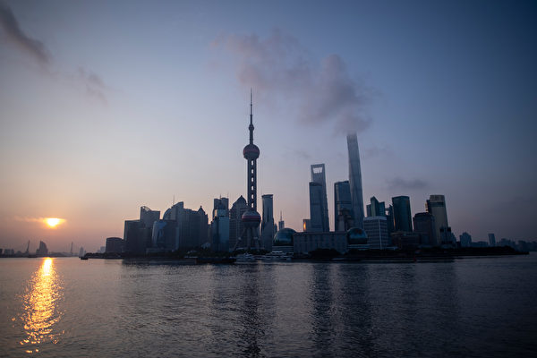

今年前八个月，上海、北京、山东、河北等多个发达省市的工业企业利润分别下降了19.6%、14.4%、13%、11.2%。图为上海浦东。(AFP)

【大纪元2019年12月16日讯】（大纪元记者何坚报导）中共最近连续召开两个重磅会议，释放出明年经济工作求“稳定”的基调，只是这与其发出的最新数据所描绘出的前景截然相反。面对今年出现P2P、股市爆雷、企业债违约等各种陷阱，摸清中共明年经济动向，中国民众可预判前方的风险，趋利避害。

12月10日至12日举行的中共中央经济工作会议，虽然细化了经济任务，增加了房地产方面的描述，但公告要点与12月6日的中共政治局会议如出一辙，如承认“国内外风险挑战明显上升”，但坚称经济“稳中向好、长期向好”。

不过，中共年内这两次最重要的经济会议，释放出的“稳定”讯号恐难令人信服。因为依据中共自己的最新数据，11月出口下跌，外汇储备缩水，工业企业利润连续缩减，物价开始大涨等，种种迹象显示，贸易战的冲击以及国内经济下滑速度都在加大中。

今年是自2008年金融危机以来中国经济最差的年份，但明年前景更不乐观。中国经济已不是稳不稳的问题，而是爆不爆的问题——已掉入经济危机的火山，剩下的只是何时爆发。

即使中美刚达成第一阶段协议，但考虑到中共言而无信的历史记录，以及贸易战核心问题直接冲击中共专制基础，中美贸易战的前景其实并不确定。无论是贸易战，还是国内经济危机，病根都是中共；想要扩大开放或深化结构性改革，中共迈不过自己这道坎。

那么，中共这两次重磅会议释放出哪些讯号，又暗藏哪些风险？

<b>2020中国奔“小康” 隐藏重重风险</b>

中共两次会议道出了中国2020年的系列目标——“全面建成小康社会”、“十三五”规划收官、实现第一个“百年奋斗目标”等等；实质就一条，经济要增长。

目前中国经济的各种危机，几乎都体现在债务或金融风险上，所以近年来中共一直把去杠杆作为核心要务之一。但在极可能撑不过2020年的内外压力逼迫下，中共最终选择了稳增长，而非去杠杆的经济基调，即明年“建成小康社会”。

如果说去杠杆被中共用作经济过热的退烧药，虽不治本，却能略微推延危机爆发；那2020奔小康就成了中共刺激经济的兴奋剂，结果是在债务危机的火药桶上，再加一把火。

这种政策转向意味着，中共口头上“继续实施积极的财政政策和稳健的货币政策”，但重心已从“稳健”向“积极”倾斜。也就是说，中共会加大财政刺激和货币放水的力度，而顾不上已濒临爆发的债务风险。

具体而言，中共将对地方债松绑，用基建投资来推动经济发展，也就是所谓的“大基建”。

11月中共财政部已将明年1万亿元地方政府专项债券额度下达至各地，而这笔资金被要求专门用于大基建。

更具象征意义的是，2019中央经济工作会议提出了“推进川藏铁路等重大项目建设”。这是自习近平上台以来，中共首次在年度最高规格经济会议中，提出具体的基建项目，背后力挺大基建的意味不言而喻。

至于原来稳健的货币政策，现在要“灵活适度”，“引导资金投向……基础设施短板等领域”。换言之，银行要保证政府和企业有钱推动大基建。

了解了中共明年的经济动向后，经过P2P、股市、债市爆雷洗礼的中国民众，或能预见到2020年的喧嚣和动荡。

一个被反复验证的经验或教训是，凡是中共大力宣传的“机遇”，更可能是圈钱、割韭菜的陷阱。

比喻说股市。“大基建”概念股近期可能看涨，但它们真的搭上奔小康的顺风车吗？

短期内，尤其是贸易战暂时缓和时，中共或能通过大基建刺激经济，从而带动基建类股票上扬。

但用负债推动的大基建，就是饮鸩止渴，会加重资金链断裂等各种债务风险。一旦时间线拉长，“大基建”随时可能大塌方，股市重掀爆雷潮。

而且，不仅仅是在股市，也不仅仅局限于大基建，中共吹起的2020经济风向，可能一路布下数不清的陷阱和地雷。

届时可能会出现类似P2P、令人眼花缭乱的各种金融衍生品或高新项目。它们可能会被贴上“大基建”、“区块链”、“数字货币”等各种高大上的标签，登上各级报纸电视电台做宣传，甚至被银行和各级政府官员背书、推广。但目的只有一个，就是要你的钱，即俚语所说“你看中人家的收益，人家看中你的本金”。最无解的是，看中老百姓本金的，不仅有商、还有官。

简言之，中共的“小康社会”，给2020年的中国经济和中国民众都带来重重风险。中国人在投资理财上，无论多谨慎都不为过。

<b>透视中共房政动向 2020该买房还是卖房</b>

在中共经济会议释放出的各种经济讯号中，最令中国民众关心的还属房市动向。2019年前11月，各地房市调控高达554次，再创历史新高，令本就疲软乏力的房市更加动荡不安。

2020年，中国人到底是该买房，还是卖房？

先看看中共的口风。12月6日的中共政治局会议罕见未提房地产，而之前4月、7月两次政治局会议连续强调房住不炒。前后变化暗藏了对房市松绑的意味。

紧接着的中央经济工作会议，虽然提到了房地产，但与去年会议相比，“房住不炒”的基调未变，只是增加了旧房改造、发展租赁住房等内容。

中共2020房市政策的微妙变化，透露出什么信息？

第一，中共一直欲稳房市，代表着房市一直没稳住。

中共在12月6号的政治局会议中，将不发生系统性金融风险定为明年最重要的“三大攻坚战”之一。

虽然在12月的这两次会议中，中共并未强调房地产的风险；但在今年1月初的领导干部维稳班上，中共将房地产列为防范化解重大风险的第一要务。

今年以来，中共在这些重磅会议中的表态，显示房市泡沫已成为中共最担心的系统性金融风险的导火索。

所以中共近年来的房市政策，核心一直是“稳地价、稳房价、稳预期”；说白了，就是要稳住房价不跌、房市不崩，尤其是要稳住人心，竭力消弭或打压房市下滑的心理预期和担心。

第二，中共挡不住房市下行，所以只能“因城施策”。

据中共统计局数据，10月份70个大中城市中，多数城市二手房价格步入下跌。受政府调控最少的二手房价格的整体下滑，正是房市下行的标志。

这也意味着，中共蓄意营造出的“房价刚性上涨”的信仰已被打破；房价有可能在下跌的心理预期或恐慌中出现暴跌，甚至诱发房市雪崩。

所以中共只能是“因城施策”，放手让各地政府想办法阻止房价下跌。

而各地政府的限价限购等调控，也不是为了抑制房价，而是担心房价激增会推高债务风险。现在中央继续开放“因城施策”，一旦地方房价下跌，调控即刻反向，转为房价限跌、放开限购。

所以，中共“因城施策”的房市政策，目的只有一个，稳住或冻住房市不崩盘。

第三，新房几近被榨干，中共瞄准旧房市场。例如收紧“棚改”，推进“旧改”（旧房改造），发展租赁住房等。

这种变化被中共冠以发展民生的冠冕之词，但实质上，应是中共的无奈之举。

新房市场已经全面萧条，而中共的土地财政以前主要是从新房中榨钱。中共要想继续从房地产中敛财，就不得不瞄准旧房。

由此不难推断，扎根于旧房市场的“房产税”大概率会被中共加速推出。炒房客、囤房客等持有大量房产的人，或将成为中共土地财政的新收割对象。

了解了这些变化后，明年到底是买房、还是卖房，中国民众可能有一个更清楚的判断。

过高的房价透支了几代中国人的消费力，耗尽了房市未来的潜力，决定房市整体下行的方向。

而过重的债务将炒房客、房企和银行都暴露在极高的风险中。一旦房价大跌，数量庞大的个人或机构都可能发生资金链断裂等各种危机，进而危及整个金融市场。

因此，面对随时可能破裂的房市泡沫，中国人最稳妥的应对，应是远离风险。

在可预见的未来，无论中共如何调控，多数三四线中小城市的房地产市场可能会趋向更冷淡。

即使是在一二线中心城市，以及京津冀、长三角和粤港澳大湾区的大都市圈，在政府各种政策手段的刺激下，房市可能出现间歇性反弹，但债务风险并不会被降低。

所以，除非刚需，否则贷款买房一定要慎重。

而要卖房的话，可能越早越好。毕竟，除了部分中心城市和大都市的房屋，在短期内还有上涨空间，绝大多数地区的房市都是看跌不看涨。

一句话，在低增长、高风险的经济大环境中，中国民众最好是更重视降低在房产上的债务风险，而勿轻易被政府的政策所带动。

<a target="_blank" href=#top><h6 align="right">回上方</h6></a>

<a name=127>
<h1 align="center"><b>传香港TVB月底裁员近千 节目制作部占大头</b></h1>

“7.14”沙田区举办反送中大游行，游行者抗议香港无线TVB出卖香港。（宋碧龙/大纪元）

【大纪元2019年12月14日讯】（大纪元记者佟亦加综合报导）被称为香港“红媒之首”的无线台（TVB），因为在香港“反送中”“反极权”运动中的新闻报导偏颇，甚至刻意抹黑抗争民众，引发市民罢看、客户抵制，其收视率和广告收入不断下跌。现传出管理层为缩减开支，本月底将裁员近千，其中制作部将成重灾区。

据香港《苹果日报》引述的消息称，有近4,000名员工的香港无线台（TVB），本月底将辞退800至1,000人，裁员比例接近四分之一。消息还指，裁员重灾区是制作部和综艺组，其它部门也会按比例裁减人手，近60岁及高薪一族更是重点裁员对象。

至于为何裁员数量如此庞大，据TVB制作部人员透露，因收益不断下跌，无线不得不缩减开支，决定不再以传统方式经营。而备受关注的是，一向人数众多的制作部，开支巨大，但近期TVB不时外购剧集和节目，内部制作不多，因此不少监制和导演早已被劝退离职。

该知情人士解释，TVB管理层支持制作部和综艺组被劝退的部分人员在外面成立自己的制作公司，日后无线拍剧或拍综艺节目，将外判给这些公司制作。无线早前已有部分剧集交由外判公司制作，相当于变相养一批已经离职的员工，因此，此次真正失业的员工估计有400人左右。

据香港“立场新闻”早前报导，被称为“CCTVB”（香港央视）的TVB，在报导香港“反送中”、“反极权”的新闻时存在严重偏颇。其不仅选择性报导引发众怒，而且还刻意抹黑抗争民众的行为令人发指。

该台的新闻明显地颠倒黑白，混淆是非，将和平抗争的港人说成“暴徒”，把滥施暴力的警察捧成“英雄”，还将黑警和黑帮的打、砸、抢、烧、奸、杀等恶行说成“爱国”。该台的新闻还提供给大量的中共官媒转发，迷惑了大量不明真相的大陆民众，可谓遗患无穷。

面对中共红媒的抹黑和警察的残暴镇压，港人惟一能依靠的就是通过良心媒体的现场报导，将“反送中”“反极权”的真相大白于天下。

对TVB的节目，不仅市民罢看，商家抵制，而且也遭到TVB内部员工的唾弃。据早前报导，TVB新闻部在8月中旬的一周内，至少有8名记者因不满公司的做法而不约而同地递交辞职信，表示“不愿出卖良心”。也有其它组的大约20名员工，因发表力挺“反送中”言论，在8月24日遭TVB解雇。

在网民的狙击下，各大品牌纷纷暂停在TVB登广告，据不完全统计，至少包括“宝矿力”、“Pizza Hut”、“先施百货”、“李健驾驶学院”、“化妆品公司CLARINS”、“雪花秀”、“信诺保险”及“携程旅游网（Trip.com）”等。有消息指，护理品牌“彩丰行”日前也表示，本月底合约届满后，将选择其它媒体宣传产品。

近日传出TVB大降圣诞至年尾的商户广告费。最新的一份价目表显示，有别于过往每年要求商家加价3%至5%，黄金时段30秒广告的“定位基本价目”索价22.6万港元，最高达184港万元，今年圣诞节期间只需十多万便可交易，比去年圣诞同期的20万港币的中位数字降价近四成。

正值TVB势衰之际，在位四年的陈国强，盛传12月13日已辞去TVB董事局主席一职。许多网民表示：“TVB完全是香港人的一条祸根。”“继续抵制TVB，直至它寿终正寝！”

<a target="_blank" href=#top><h6 align="right">回上方</h6></a>

<a name=126>
<h1 align="center"><b>中共控制留学生 破坏美国大学学术自由</b></h1>

中共通过驻外使馆对海外留学生进行控制，有西方学者已认识到中共正在系统地破坏西方学术自由。为了对抗中共这种渗透，美国政府和人权活动人士呼吁共同抵制中共对学术自由和中国留学生的威胁。（Pixabay.com）

【大纪元2019年11月23日讯】（大纪元记者吴馨综合报导）中共通过驻外使馆对海外留学生进行控制，有西方学者已认识到中共正在系统地破坏西方学术自由，动摇西方价值体系根基。为了对抗中共这种渗透，美国政府和人权活动人士呼吁共同抵制中共对学术自由和中国留学生的威胁。

索菲‧理查森（Sophie Richardson）博士毕业于弗吉尼亚大学，是人权观察组织（Human Rights Watch）的中国总监。近日，她在美国周刊《国家》（The Nation）上发表文章表示，呼吁美国各大学采取行动抵制中共破坏西方学术自由。

<b>中国留学生遭监控、受审查</b>

理查森博士首先介绍说，几年前，她遇到了一位来自中国农村的学生，该学生来到华盛顿特区的一所大学，并对政治科学很感兴趣。但是他太害怕改选该专业，因为他怕会被报告给中共大使馆。理查森博士表示，美国人把在大学里的自由视为是理所当然的事情，但对于一些来自中国的学生而言，这种感觉截然不同。那个中国学生总结说：“这里不是自由空间。”

理查森博士介绍，现在，美国大学约有35万来自中国的学生。尽管许多人经历着美好的体验，但其中一些人却必须应对跟随他们进入校园的监视和审查制度。在过去几年中，人权观察组织记录了这些学生面临的独特威胁。他们的研究表明，中共政府和共产党的恐吓手段繁多，程度不一，包括因某人在非公开研讨会上的言论而骚扰其在中国的家庭成员，到来自美国学术机构的审查，因为他们不愿惹恼潜在的合作伙伴——中共政府。

美国助理国务卿罗伊斯（Marie Royce）曾表示，有可靠的报吿报导，中共政府官员向中国学生施加压力，要求他们监督其他学生，并向使领馆报吿。我们亲自听过很多这样的故事。她说，“众所周知，中国（中共）官员向中国学生施加压力，要求他们参加共产党主导的政治抗议活动和反抗议活动。”

<b>美国大学对中共威胁学术自由行为反应迟钝</b>

理查森博士介绍说，她最近参加了一次会议，对中共政府和共产党影响力方面有研究的世界顶级专家，为美国大学官员详细介绍了在美国的中国学生和学者被精确控制和操纵的方式，包括通过对校园内课堂言论和活动的监视，然后被报告给大使馆或领事馆。

理查森博士透露，私下里，一些大学官员会承认，他们在应对中共政府对校园影响力方面感到不舒服，并表示他们担心（对中共说不）会被贴上仇外标签。理查森博士指出，这种恐惧迫切需要克服，以保护明显脆弱的校区。最近这样的行动由学生们自己发起：9月，加拿大安大略省麦克马斯特大学的学生会剥夺了该校中国学生学者联合会校园分会的认可，理由是该分会向当地中共领事馆报告了一项讨论，这违反了该校规定。

但是，理查森博士分析表示，大学的沉默寡言是有原因的。现在，全球许多学术机构与中共政府或与中共政府有联系的公司之间都存在着不透明学术或财务关系。一些机构越来越依赖国际学生的学费收入。包括麻省理工学院在内的一些学校发现自己正处于尴尬的境地，他们接受了来自如iFlytek等中国公司的资金，建立了研究合作伙伴关系，而该公司现因参与侵犯中国人权行为而被美国商务部制裁。

<b>12条《行为准则》 捍卫学术自由</b>

罗伊斯说，在美国的留学生必须能够自由地表达自己的观点，不应生活在被限制的压力之下，或被要求审查他们的言论，或被要求不要参加美国校园的其它合法活动。

人权观察组织对中共破坏西方学术自由的研究于今年3月出炉了12条《行为准则》，这些准则旨在帮助学校抵制中共政府在世界范围内破坏学术自由。理查森博士介绍，这些准则从认识问题开始，包括宣传学术价值，让课堂讨论留在校园内，而不是向外国使团汇报。学校还可以任命一名监察员，受威胁者可向其举报威胁，并进行跟踪；联手分享经验，采取共同立场，并承诺公开与中共政府的所有联系，以阻止中共政府的过度扩张。理查森博士表示，该准则已发送给澳大利亚、加拿大和美国的约150所高校。

今年4月，美国大学协会发布了一个更新消息，“大学采取行动以应对日益增长的外国对校园不当影响的担忧”。包括加州大学伯克利分校、密歇根大学和耶鲁大学在内的六所大学在今年春季发表声明，表达了对校园内国际学生和学者的声援。已有60多家高校签署了芝加哥大学2014年发起的言论自由原则。

罗伊斯表示，美国必须设法确保中国学生和交换学者不会受到自己政府的压力，被迫从事超出合法学术范围的活动。“美国将竭尽全力保护所有学生，尤其是中国留学生，不受政府的威权专制控制。在美国，对一名中国学生或学者的胁迫是不可接受的。”

理查森博士认为，如果学校要履行其“神圣的责任，不仅要促进活泼和无所畏惧的辩论和研究自由，而且要在他人试图限制自由时保护这种自由”，正如芝加哥大学的原则所坚持的那样，那么他们将必须正面应对这些（来自中共的）威胁。 这意味着大学应提供作为一所大学应该确保其所有学生平等享有的最宝贵资产：思想自由。

附：人权观察组织于2019年3月21日公布的12条《行为准则》：

1. 公开倡导学术自由

2. 加强维护校园学术自由

3. 抵制对学术自由的威胁

4. 记录中共政府侵犯学术自由的事件

5. 联合其它学术机构共同推动在中国的研究

6. 为研究中国的学者和学生提供灵活性

7. 拒绝孔子学院

8. 监督与中共政府有关的机构

9. 促进中国学生和学者的学术自由

10. 披露所有中共政府提供的资金

11. 确保交换计划和卫星校区的学术自由

12. 监测中共政府干预学术自由的影响

<a target="_blank" href=#top><h6 align="right">回上方</h6></a>

<a name=125>
<h1 align="center"><b>美中第一阶段协议 强制执行机制如何运作</b></h1>

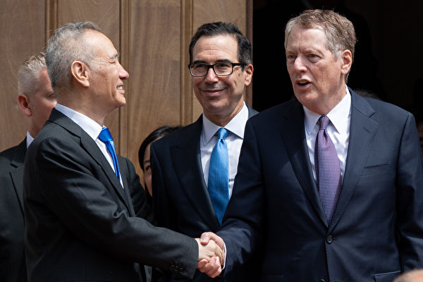

为执行协议，将会建立一个机制，由美国贸易代表办公室（USTR）、美国贸易代表（莱特希泽）和中共副总理领导。图为5月初，刘鹤赴美谈判，和莱特希泽握手。 (SAUL LOEB / AFP)

【大纪元2019年12月16日讯】（大纪元记者许祯祺报导）美中贸易战历时一年半后达成第一阶段贸易协议，川普（特朗普）总统表示这是一项很大的第一阶段协议，迈出巨大的第一步。美方认为，若中方不守诺，在协议强制执行机制下，美方可做回应，包括用关税回应。

12月15日，白宫召开美中第一阶段贸易协议背景介绍会。川普（特朗普）政府高级官员通过电话回答媒体记者的提问。

美国国家经济委员会（National Economic Council）主任、白宫首席经济顾问拉里‧库德洛（Larry Kudlow）首先表示，总统誓言要捍卫美国整体经济利益，使其免受不正当贸易和其它问题的影响。与最近完成的美墨加贸易协定（USMCA）一样，总统也誓言要捍卫美国工人和农民以及牧民和技术人员的整体利益，美中第一阶段贸易协议代表朝着这个方向迈出的又一步。

<b>协议中知识产权保护涵盖哪些内容</b>

川普政府高级行政官员在回答问题环节中表示，第一阶段贸易协议包括中方在至关重要结构性问题上的非常关键、实质性和具体的承诺。这些结构性问题涉及知识产权、技术转让、农业结构性问题、金融服务以及货币和外汇等领域。

这名官员说：“因此，我们认为这些承诺意义重大，解决问题的方式也是此前从未有过的。它们都是可执行的。有一个非常强大、有效的执行机制。而且在未来两年中还会有与购买有关的承诺。”

有记者提问协议文本是否会公开，以及协议如何保护知识产权。这名高级行政官员回答说，协议文本最终将公开，现在还必须经过某些流程，包括法律梳理和语言认证。

关于知识产权，这名官员表示，中方在知识产权的所有关键领域，包括商业秘密、与药物相关的知识产权专利、地理标志、商标保护和对盗版和假冒商品执法以及在线侵权方面均有所承诺。

“知识产权执法的刑事和民事程序领域也正在发生变化。因此，这些承诺在该领域确实是重要的实质性承诺，并且同样可以通过我们拥有的强有力执行机制来执行。”他说。

<b>执行机制由莱特希泽和刘鹤领导</b>

川普政府高级行政官员表示，执行机制适用于协议的所有章节。“我们拥有一个强大而有效的执行机制，我们认为这将确保能够快速有效地执行协议。大家知道，将会建立一个机制，由美国贸易代表办公室（USTR）、美国贸易代表（莱特希泽）和中共副总理领导。还将设立一个办公室来评估实施情况并尝试解决纠纷。”

“因此会有一个流程。在一定时间内，它将从指定的官员或工作级别开始，然后上升到我的级别（更高一级），如果问题仍无法解决，最终将上升到部长级。对我们来说，应该是USTR；对他们（中方）来说，将是副总理。”他说。

美国官员表示，该过程对于要执行的各个步骤都有非常特定的时间表。如果最终仍无法解决争端，则投诉方可以采取适当方式祭出回应措施。就采取何种行动也将进行类似的磋商。

<b>若中共违反条款 美方可中止协议中所做让步

在回答记者提问说，如果中共不兑现承诺，美方是否可以再次祭出关税惩罚问题时，这名高级官员回答说，强制执行机制非常具体，专门安排了程序，并规定了时间表。这将是一个非常迅速、有效的机制。

他具体说，如果投诉方做出决定，即如果美国认为中方违反协议条款或有违规行为，美方可以采取回应措施和/或中止美方在协议中所做的让步。

“因此，我们可以采取行动。可能以关税的形式出现，但如果它们（中共）不遵守承诺，我们就有能力采取行动。”官员说。

库德洛说，协议几乎在所有文书工作和翻译完成后立即生效。预计莱特希泽大使将与（中共）副总理刘鹤将签署协议，签署仪式将在几周内发生。此后将开始第二阶段协议谈判。实际上，也许第二阶段已经开始。

<a target="_blank" href=#top><h6 align="right">回上方</h6></a>

<a name=124>
<h1 align="center"><b>陕西工人遭欠薪申请仲裁 人社局称人手不足拒绝</b></h1>
 
【大纪元2019年12月15日讯】陕西榆林子洲县三丰油脂公司讨薪工人到当地人社局申请仲裁，却收到劳动争议仲裁厅“人员不够，不受理案件”的回复文书，近日，这份半年前开出的“不予受理案件通知书”在网上曝光，引发争议。

《新京报》12月14日报导，三丰油脂公司工人代表白冰表示，2018年，三丰油脂公司拖欠82名职工300万工资。由于讨薪无果，2018年11月，职工们向子洲县劳动保障监察大队反映此事。12月28日，子洲县劳动保障监察大队就此事出具《答复意见书》，称陕西三丰粮油有限公司如涉嫌拒不支付劳动报酬，将移送公安机关处理，如无力偿还兑现工资，将申请法院强制执行。

白冰说，由于薪资仍未到位，2019年5月，他作为代表向子洲县劳动争议仲裁院提交仲裁相关申请书，但对方却以仲裁人员不够为由，拒绝受理。

12月13日晚，子洲县人社局主任科员马翰斌证实上述事件属实。

报导称，13日从子洲县政府获悉，针对三丰油脂公司欠薪问题，子洲县人社局负责人就劳动争议仲裁院不予受理的不当回复进行道歉。目前，子洲县纪委监委已介入调查。

时评人士苗凤军的文章表示，工人讨薪去当地人社局申请仲裁，地方人社局以本单位人手不足拒不履行职责。不知道该人社局有几个人，不知道该人社局平时都做什么，连一个简单的仲裁都闹人荒，到底是人手不够，还不想为百姓解决问题呢？

“人社局人手不足，为什么还要挂这块牌子，挂这块牌子难道说就是为了应付上级政府部门检查吗？”

文章还表示，子洲县纪委监委介入调查，要查清楚这人社局的领导干部到底想干什么，在日常其他工作中，他们到底还做了什么？

<a target="_blank" href=#top><h6 align="right">回上方</h6></a>

<a name=123>
<h1 align="center"><b>袁斌：10万元医疗费何以成了不能承受之重？</b></h1>

河南焦作48岁的男子韦某某被查出患冠心病，听说治疗费要10万后，不想拖累家人，已自杀离世。图为韦某某生前和儿子的合影。（视频截图）

 
【大纪元2019年12月15日讯】一个患病的中年男子，因为付不起10万元医疗费而出走离世，你信吗？

很多人肯定不信，但这确是千真万确的事，就发生在几天前的中国。

据大陆媒体报导，今年48岁的韦某某十几年来一直在外打工，近日，感觉身体不适，回焦作检查身体。在术前检查过程中，被查出患有冠心病，得知自己的治疗费要花费10万元后，心里便有了负担。

12月6日上午，韦某某借故支开妻子，自己一个人从河南焦作人民医院出走，离开时手上还绑着绷带，并挂了输液用的留置针。

得知消息后，韦某某上大四的儿子和家人开始在焦作市四处寻找，张贴寻人启事，在电视、广播上循环播放找人信息，甚至以调取沿街监控、手机定位等方式，依然没有韦某某的任何行踪消息。

韦某某的儿子对《北京青年报》表示，“父亲可能就是想到了这些钱，怕给我们添麻烦，而选择了离家的。”

据其儿子介绍，父亲一直在外打工，是家里的顶梁柱。他得病后，心里老想着，儿子还在上学，他这个治疗费会给家里增添负担，一直解不开这个心结。他平时是一个很开明的人，没想到这次这么固执。

12月12日上午，韦某某的家人表示，已经在早些时候找到了韦某某，但是韦某某已经选择离世了，“一家人正在准备他的后事，现在人走了，一切也都没有意义了。”

韦某某的选择让闻者唏嘘不已，无不为之动容。正如网友所言，谁能想到，压垮一个中年男人的最后一根稻草，竟然就是这10万元人民币的医疗费！

其实，类似韦某某这样的事例在大陆并非鲜见。

远的不说，就说今年9月16日吧，上饶广丰一名叫邓帮武患有肝腹水的病人就在医院跳楼身亡了。邓帮武的大伯邓家华告诉媒体，邓帮武是他亲侄子，今年36岁，未成家。邓帮武刚3岁，父亲就去世了，随后母亲改嫁。邓帮武一直是跟他在一起生活的。侄子走绝路是因为家里贫穷，根本没能力系统去治疗。

同样离奇而令人心酸的是，29岁的农民工汤忠杰和妻子在广东工厂打工，两个人月收入加起来不足5000元。平日为了省钱，他们很少回家。谁知天有不测之风云，2017年汤忠杰被查出得了骨髓增生异常综合症，属于白血病的前期。更倒霉的是，他花光了所有存款和借来的十几万元，也没做成骨髓移植。眼看求生无望，他只得给自己买了口棺材，在家等死。

有的报导将韦某某的离世说成是“轻生”。在我看来，这种不过脑子的说法对中国底层百姓生活的艰辛与窘困可以说太缺乏了解了！

我不否认，为了10万块钱而寻短见，这其中也许有韦某某自身的性格缺陷，比如消极、悲观、厌世、懦弱等因子，但是有谁不懂生命宝贵、生活美好？有谁能轻松赴死、义无反顾？如果不是完全陷入绝望，千转百回也不得其解，韦某某么会下定决心抛妻离子、选择死亡？不排除逼死这个男人的还有病痛或其它问题，但这10万块钱医疗费，显然是令他无法挣脱的致命杀手。

韦某某患的是冠心病，并非什么不治之症。区区十万元的医疗费，对于一个中产阶级以上的家庭更不是什么了不得的费用，但对韦某某这样的底层打工者和他身后的家庭来说，无疑是一笔难以承受的“天文数字”，否则也不会让他难到一心求死。

要治好病、活下去，就需要至少10万块钱；要不让整个家庭背上沉重的负担，要给大学即将毕业的孩子找工作、买房子、娶媳妇，自己就不能花掉这笔钱……可以想象，在自杀之前，韦某某一定在这个二难选项之间徘徊彷徨了多久，最终才不得已在自己的生命和家庭的幸福、孩子的未来之间作出了最后的取舍。可见，10万元医疗费真的就是韦某某“生命中不可承受之重”。

试想，假如韦某某的收入能够负担得起这笔医疗费，假如中国的医疗保障制度能够为他及时分忧解难，假如政府有关部门在他亟需帮助的时候能伸出援助之手，韦某某还会“轻生”吗？

韦某某缺钱，邓帮武缺钱，汤忠杰也缺钱，韦某某们可以说个个都缺钱，但中国不缺钱。改革开放四十年，中国的GDP早已跃居世界第二，财富蛋糕明显做大了，但钱大都进了政府的腰包，进了权贵的钱袋，底层百姓依然很苦，医疗保障水平更是明显低于世界平均水平。当权者的全部心思都在如何维持自己的专制统治和满足自己的既得利益上，口头上对百姓的健康和生命比谁都关心和重视，实际上比谁都不关心和重视，如果说韦某某是被10万元治疗费压垮的，那么导致这一悲剧的更深层次的原因则是中国特色的国富民穷。这一点不改变，韦某某的悲剧还会继续不断上演。

<a target="_blank" href=#top><h6 align="right">回上方</h6></a>

<a name=122>
<h1 align="center"><b>网传上海市民上街抗议 高呼“打倒腐败”</b></h1>

网上视频显示，上海市民走上街头游行，高呼口号。（视频撷图）

【大纪元2019年12月15日讯】（大纪元记者陈俊村报导）网上流传的一段视频显示，上海市民于12月4日走上街头游行，高呼“打倒腐败”的口号。

从这段视频看来，参与游行的人数约有数百人，他们边走边喊“打倒腐败”等口号，而沿途未见有穿制服的警察出现。

记者以画面中出现的不动产店家与电话在网上搜寻后得知，这条马路应该是上海的建国西路。

有网民表示，视频最后那个女人以上海话说：“老年人都走不动了，还坚持到现在，老年人出来帮你们讨钱，你们年轻人不出来讨钱，你们好意思吗？”

另有网民说，这些人可能是参与P2P网络借贷平台而被骗的受害者上街讨钱，但目前无法证实。

无论如何，这场不寻常的抗议活动引来不少网民的评论。

“Ada Szeto”说：“光复上海，时代革命。”

“Yin Yeung”说：“香港人六个月的抗争，已经做出榜样！上海人加油！”

“亮亮”说：“上海人有骨气。全中国有哪个城市的人这样喊的！”

“William Lau”说：“蝴蝶效应！集体杀共。”

“Jessica Sun”说：“中国人不再胆小了！ 越来越多的人活明白了！非常开心看到这一幕！！！”

“小朋友”说：“人民受不了。粮食不够。经济快速变坏。”

“fung K C”说：“人民叫着爱国，官员贪腐，掏空国库走资外国！有趣。”

“Good Both”说：“顶不住了，习在向老江要钱啦，党内新一波割韭菜开始了。”

“Stephen Fung”说：“党大于法，只有消灭中共才有法治！”

“lai chee lung”说：“CCP（中共）气数已尽。”

“zen ng”说：“中国同胞来一招里应外合，与全世界一起反共。”

“沈家佑”说：“大陆人加油吧！自己的权益自己争取。”

<a target="_blank" href=#top><h6 align="right">回上方</h6></a>
 

<a name=121>
<h1 align="center"><b>前中共处级干部为何穿过三国边境逃出中国</b></h1>

前中共国务院对外经贸部处级干部、法轮功学员张亦洁。（李辰／大纪元）

【大纪元2019年12月14日讯】（大纪元华盛顿DC记者站报导）12月10日是国际人权日，“全球反迫害制止中共暴行、声援退党大潮”研讨会在美国国会举行。曾在中国（中共）国务院对外经贸部担任处级干部的张亦洁在研讨会上发言。

张亦洁讲述了中共开始对法轮功的打压之后，她因为不放弃信仰，被撤销党、政职务，遭到七次非法绑架，期间受过几十种酷刑折磨……她最后被迫穿越三国边境、逃离中国的经历。

以下是她的发言全文：

我叫张亦洁，吉林省长春市人。1977年毕业于吉林大学。大学毕业后，先后在中国（中共）国务院对外经济联络部、对外贸易经济合作部（现中共商务部）办公厅工作。1987年至1990年，我被派驻中国（中共）驻罗马尼亚大使馆长期工作、任经济二秘。回国后继续在外经贸部办公厅工作，历任副处长、处长，办公厅党支部书记、广州出口商品交易会大会办公室副主任等职。

我于1995年开始修炼法轮大法。1999年7月，江泽民操控中共政府以“经济上截断、名誉上搞臭、肉体上消灭”的灭绝政策，对一亿法轮功群体实施残酷迫害，下令三个月消灭法轮功。

我因坚持信仰，被列入重点人黑名单，遭到外经贸部的严厉打压，经历了九个月的高压逼迫，先后被撤消所有党、政职务，降级为最低职员，开除党籍，开除出公务员队伍，调离部机关，下放到企业接受监管。

这期间，我无数次被以株连影响丈夫、孩子的前途相要胁转化；施压我丈夫逼我转化；逼迫他与我离婚。我丈夫和我同在外经贸部工作，他多年担任正司级参赞、欧洲司副司长，长期负责中国（中共）对东欧诸国政府间经贸事务、国别政策和担任亚太经合组织秘书长。因我修炼法轮功他被多年免提职、限制使用，饱受株连。

因坚持信仰拒绝转化，我先后七次被非法绑架、关押，九死一生。2001年3月，仅因我不放弃修炼便被中央610组织首恶李岚清点名非法劳教一年半。因拒绝转化又被加刑十个月。在劳教所里我经受了灭绝人性的几十种超越生理极限的非人虐待、侮辱、酷刑折磨。

整个劳教期我都被单独关押、二十四小时昼夜监控。暴晒，冷冻，惩罚性军训，饥饿、干渴，几天不许上厕所，长期不准洗漱、洗澡、洗衣服，长期剥夺睡眠；强制通宵达旦劳动；坐人肉椅、开飞机、鞋底抽脑袋、寒冬揪住衣领灌凉水等等虐待和叫不出名的酷刑从未间断过。

劳教所里最残忍、几乎使我丧失生命是对我几次“攻坚”转化。第一次我被折磨连续十八个昼夜不许睡觉，二十四小时车轮战洗脑，伴着五花八门的精神和肉体折磨、毒打。

第二次，我被秘密关进一间封闭的小黑屋，由警察、妓女、吸毒犯共九人昼夜值班。在这个小黑屋里，我经历了在不许打一个磕睡的监视惩罚下站立四十二个昼夜，同时被施以各种虐待、酷刑折磨逼迫转化，身体遭受了巨大摧残。 我的坚定不转化使邪恶的手段愈发残暴。她们大打出手、逼我当埸写下转化书。

第三次我被打得失去意识休克，被拖进一间空房，秘密关押了十七天。十七天后我再次从死亡边缘走回来。

劳教所两年多的残酷迫害，我满头白发、容貌皆非；思维、语言、动作迟钝；大脑经常空白；双眼阶段性失明；腰、膝严重损伤等等。

从劳教所出来后，我决定面对国际社会以亲身经历揭露这埸残酷迫害。由于海关黑名单，多方努力正常出境受阻，我决心越境走出中国大陆。

2006年9月15日，我只身踏上最后一条生死难卜之路。我历经危难、险阻、艰辛，经过十天十夜，终于越过三国边境，到达泰国，向那里的联合国机构提请政治庇护。

北京方面发现我失踪，公安部全国通辑。时任部长薄熙来软禁我丈夫八个月，停止他的一切外事出访，禁出国门，同时宣布开除我的公职。至此，我在我的祖国那片土地上付出的所有辛劳，工作、事业、家园、财富、丈夫儿女亲情等等全部被中共邪恶政府剥夺殆尽。

2007年10月，在国际社会救援下我来到美国，兑现诺言完成使命。在此，我感谢美国政府和参众两院及国际社会所有为法轮功发声的正义人士、党派、政府。我希望更多的正义国家、党派、经济实体摆脱中共的利益捆绑，肩担道义，归还法轮功群体以司法公正，全面清算结束这场人类浩劫，复兴人类传统的真正文明，走向未来！  #

<a target="_blank" href=#top><h6 align="right">回上方</h6></a>

<a name=120>
<h1 align="center"><b>【新闻看点】美称胜利 中避谈细节 贸协存变数</b></h1>

图为美国总统川普和中国国家主席习近平。资料照。(Getty Images)

【大纪元2019年12月15日讯】大家好，欢迎大家关注新闻看点，我是李沐阳。

经过了18个月的贸易战，美中双方终于在昨天（12月13日）几乎同时宣布，达成了第一阶段的贸易协议。川普连推两文，白宫和贸易代表办公室也分别发表声明，说这是对美国经济的一次“巨大胜利”。美方预计协议的正式签署将在明年的一月份，不过白宫首席经济顾问库德洛表示，协议并非由川普和习近平亲自签署，很可能是贸易代表莱特希泽和中共副总理刘鹤签署。

而中方虽然也表示与美方达成了第一阶段协议，但显得很诡异。在子夜时分举行的新闻发布会上，中共官员对协议细节闪烁其词。

中方的诡异表现，引起外界诸多揣测。有分析认为，对与美方达成的这份协议，中共内部的意见可能并不一致，内部纷争可能还很明显。那么在这种情况下，美中目前的协议草案会不会生变呢？

<b>中方细节闪烁其词</b>

中财办副主任、财政部副部长廖岷的说法更有意思，他表示鉴于美国已经承诺将取消部分关税，并且会加大对中国商品的关税豁免力度，中方也将“考虑不实施”原订在本周日（12月15日）生效的对美国商品加征关税的措施。

“考虑不实施”，这是一个相当含糊的说法，是不是意味着中方还没有正式决定取消对美国商品加征新一轮关税呢？

<b>1. 避谈执行机制</b>

有记者就一些细节问题进行了提问，其中包括川普在推文中提到的内容，美国依据协议将采取的关税措施细节和立即与中方展开第二阶段贸易谈判的说法。还有美国贸易代表办公室的声明表示，协议中有监督执行机制，如果中方不能完成自己的承诺，美国会把已经取消或者减少的关税恢复到原来的水平等等。

对这些民众最关心的问题和最想了解的内容，中方官员没做直接回应，对监督执行机制完全避谈，只字不提。只是用一种相当笼统和宏观的说法表示，协议双方“还需要完成各自的法律审核、翻译核对等一些必要的程序，然后再商定时间、地点和形式来签署这份协议”。

就这些问题，廖岷的回答没什么“干货”。大概意思是说，美中对协议中的一些共识，都会分别作一些发布。第二阶段的磋商，将取决于第一阶段协议的落实情况。他认为当务之急是把协议签下来、落实好，至于后续磋商什么时候开始，“有待双方工作层继续商量”。

<b>2. 农产品采购避提具体数字</b>

而对于进口美国农产品的问题，农业农村部副部长韩俊表示，协议实施后，中方会大幅度增加进口美国农产品。他说，“毫无疑问，这有利于填补国内农产品供求缺口。比如大豆，我们（中国）现在一年进口的大豆在9000万吨左右，85%左右要靠进口。”

韩俊表示，今后从美国扩大进口的一些农产品，“还是国内当前稳定市场急需的产品，比如猪肉、禽肉等”。他强调，这些产品的进口“不会对国内农业产生冲击”。

但是对于中方将买多少美国农产品、在多长时间内完成采购量这些关键性的问题，韩俊并没有说。他只是说中方“会坚守谷物基本自给、口粮绝对安全，把饭碗牢牢地端在自己手里，而且要装自己的粮食，要守住国家粮食安全的底线”。

但是说了半天，就是没提对美国农产品的采购数字。

<b>3. 子夜公布消息避骂声？</b>

美国贸易代表莱特希泽透露，川普在11日首次宣布达成贸易协议后，双方花了大量时间确定协议措辞的具体含义。直到昨天（13日）上午（美东时间），也就是北京时间的晚上，双方还在讨论。到了美东时间上午10点，川普最终点头了，同意了协议条款。

随即，中共在（北京时间）夜间11点召开新闻发布会，公布了达成协议的消息。这个时间，很多中国人已经休息了。中方选择这个时间公布消息，是不是为了减少人们关注度、降低人们的骂声呢？而且参加会议的官员都是副职，如果是脸上贴金的事，中共官员不愿意参加吗？

商务部副部长王受文表示，美中经贸团队达成了第一阶段协议文本，美方将“履行分阶段取消对中国产品加征关税的相关承诺，实现加征关税由升到降的转变”。他还称“处理两国经贸关系必须从大局出发，达成经贸协议有利于中美两国人民和世界人民的根本利益”。

王受文只强调美方如何做，并没有说中方如何做。而且听起来，像是中方逼迫美方才达成分阶段取消关税。

<b>白宫称“巨大胜利”</b>

综合来看，中共官员在新闻发布会上要么答非所问，要么顾左右而言他，并没有多少含金量。

与中方讳莫如深正好相反，白宫在声明中指出，这对美国经济是“巨大胜利”。

综合美中双方、特别是美方公布的内容，可以看出美方所说的“巨大胜利”体现在七个方面，与去年10月川普宣布的“原则性交易”大体相似。

<b>1. 美象征性减税，非如中共所愿</b>

川普在推文中表示，原订12月15日征收的“惩罚性关税”，因为双方达成协议不再加征。“原来25%的关税将保持不变，剩余的商品将征收7.5%的关税”。

目前，美国对中国商品已经加征的关税，分为两部分。一部分是对2500亿美元中国商品加征的25%税率，另一部分是从9月1日开始，对1200亿美元中国商品加征的15%税率。

按照川普的说法，美方原计划明天（15日）实施的关税，就是对手机、笔记本电脑、玩具和服装等这些价值1650亿美元的中国商品开征15%的关税，已经被无限期推迟了。

同时美方还要把15%的关税部分降低一半税率，也就是对1200亿美元中国商品的税率保留7.5%。

而对价值2500亿美元中国商品征收的25%的关税，这部分维持不变。

这与中方之前一再强调的说法有着很大不同。中方曾多次表示，美方必须完全取消关税，才能签署协议。

但是从川普推文来看，并没有按照中方的要求达成协议。换句话说，美方很可能是象征性地降低了一点关税，中共的想法没能得逞。

贸易代表莱特希泽（Robert Lighthizer）指出，新关税将在协议签字30天后生效。美国之音认为，保留的关税是美中双方继续谈判的条件，也是迫使北京当局履行协议的关键因素。

<b>2. 大幅增购美商品，缩减贸易赤字</b>

贸易赤字巨大，这是引发美中关税大战的一个最表面因素。川普曾多次表示，美中贸易严重失衡，必须要改变中方占美国便宜的现状，缩小贸易赤字。

美国官员表示，中方同意在未来两年中，将对美国产品和服务的购买总额增加至少2000亿美元，以后可能还会继续增加购买量。

莱特希泽昨天表示，中方购买的产品主要集中在制成业、农产品、能源和服务。这部分可能将减少美国与中国的4190亿美元的贸易逆差。

他告诉记者，中国对特定产品的增购将会有特定的目标，但不会对外公布，以避免扰乱股市。他同时说，这项协议符合世界贸易组织的规则，而且中方可以在“市场购买时机成熟时”自由地购买商品 。

根据美国的数据，美中贸易战开战之前的2017年，中方只购买了1300亿美元的美国商品和560亿美元的服务。

<b>3. 农产品采购接近翻番</b>

农产品采购，也是美方的关注点之一，中方也做了让步。

莱特希泽表示，中方已经同意在两年内对美国农产品的购买量增加320亿美元，使每年平均的总量达到400亿美元。而且中方表示，尽最大努力，将采购额每年再增加50亿美元，接近500亿美元。

这个数额，恰好是川普之前公布的数字。在上次中共副总理刘鹤访美后，川普在与刘鹤会面中说，中方承诺每年采购400～500亿美元的美国农产品。

但后来有消息说，中方内部有不同意见，说采购商品要“符合实际”。因为中方进口大豆，除了榨油之外，最主要的用途就是制作猪饲料。但是非洲猪瘟在全国肆虐，中国的生猪存栏量只剩下了1/3，大豆的用量会减少，所以中方不想接受美国的这个数字。

但是从莱特希泽的说法来看，中方已经接受了美方的这个要求。

在贸易战开始前的2017年，中方采购美国农产品的数量是240亿美元。如果采购400～500亿美元，就意味着比原来的采购量大了很多，甚至翻了一番。

莱特希泽同时表示，中方同时答应，减少对农产品的非关税壁垒，比如禽肉、海鲜和饲料添加剂，还有其它对生物技术产品的批准。

<b>4. 承认美方指控，不再强迫技术转让</b>

在第一阶段的协议中，也包括中国法律对专利、商标和版权在内项目的更严格的保护。其中含有改进刑事和民事诉讼程序，以打击在线侵权、盗版和假冒商品。

据美国之音报导，协议中也包含中方承诺遵守先前的承诺，消除外国公司为获得市场准入、许可或行政批准而必须向中国公司转让技术的任何压力，并消除此类转让的任何政府优势。

就是说，在美国的要求下，北京方面不能再以任何理由，强迫外国公司转让技术。在贸易战开打前，很多美国企业向美国政府投诉，中方设置各种壁垒，迫使他们交出企业的核心机密。川普政府也曾表示，美国的知识产权被盗窃，每年给美国造成的损失至少有几千亿美元。

不过对于美方的指控，中共从来都不承认，狡辩称美国企业是自愿“用技术换市场”，主动交出技术。如今协议当中明确了不得强迫技术转让，意味着中共承认了之前美方的指控。

此外中方还同意，避免直接支持旨在获得外国技术以满足其工业计划的境外投资，这些交易已经受到美国安全审查力度加大的限制。

<b>5. 引进美国金融服务</b>

协议中对中国的金融服务也作出了规定，美国公司获得改善的进入中国金融服务市场的渠道，包括银行、保险、证券和信用评级服务。美国官员表示，这个规定目的是解决美国长期以来，对这个领域存在的投资壁垒的不满，包括外国股权限制和歧视性监管要求。

此前中共一直对外声称，向更多的外国竞争者开放金融服务业。但是中方都是停留在口头上，并没有实际进展。这次写入第一阶段协议，美国官员认为，将有助于从美国引进金融服务。

但是中共官媒表示，并不是所有的外国机构都能够进入中国金融市场，声称“对中国友好国家的实体将会更受到中国人民的青睐”。

不知道中共官媒这么说，是在透露什么讯息。

<b>6. 操纵汇率将被惩罚</b>

协议中也提到了人民币汇率的问题，中方承诺，避免竞争性货币贬值，并且不以汇率为贸易优势。这一点，也在执行机制的约束之下。如果中方违规，美国就会提高关税。

从贸易战开打后，人民币兑美元的汇率就是一路下行。美国也多次指责北京在操控人民币汇率，试图降低人民币的汇率，抵销美国关税的影响。

一位川普政府的高级官员表示，美中之间的货币协议，是根据《美墨加贸易协定》（USMCA）中的条款制定的。

美墨加协议中要求，三个国家每月披露国际储备余额和干预外汇市场的数据，以及季度余额，还有向国际货币基金组织提交的其它公开报告。

也就是说，美中之间的货币协议，也将要这么做。

<b>7. 中方接受执行机制</b>

提到执行机制，这是所有协议条款得到落实的一个保证。如果中方出现没有遵守承诺的协议内容时，怎么处理呢？

白宫首席经济顾问库德洛（Larry Kudlow）昨晚在CNBC采访中表示，“在第一阶段贸易协议中包含一项有关程序，如果有投诉出现，相关投诉将被送到两国中级官员（staff level）授予处理。如果在这个层级的对话中无法得到解决，投诉将送到双边副部长级官员审查对话。如果在这里仍然没有得到解决，将送到两国主要官员也就是中共副总理刘鹤与美国贸易代表莱特希泽进一步审查分析”。

库德洛强调，“如果是无法解决的分歧，（美方）将采取一些相关的经济考量，相应动作也会被实施。毫无疑问，这包含采取关税措施作为促使执行的工具。”

贸易代表办公室声明指出，第一阶段贸易协议是一份“历史性的和可执行的协议”。白宫声明则表示，中方不仅同意在知识产权、技术转让、农业、金融服务和货币与外汇领域进行结构性改革，而且“协议包括一套强有力的纠纷解决制度，确保能够有效落实和执行”。这项协议对美国经济——特别是美国农民、制造商和创新者来说，“是一次巨大的胜利”。

美方之所以格外强调这个执行机制，是因为美方看到，中方与世界签过很多协议，但是兑现的寥寥无几。特别是在贸易领域，中共一直钻世贸规则的空子，而世贸组织对中共又是无可奈何。

换句话说，中共签什么协议不是新鲜事。正如很多网友在留言中评论说，中共签了协议也不会遵守。它把协议就看作是一张纸，没有约束力。

莱特希泽也曾说过，让中共每个层级的政府都遵循同一个方针是个“难点”。

但是现在，有了这套约束机制，不愁北京不会遵守协议。如果北京再次爽约，那么美国就会把取消和降低的关税提上来。这将极大地约束北京，促使中方履行协议。

<b>第一阶段协议会有变数吗？</b>

看双方透露出的内容，北京在多个领域都作了重大让步。但是鉴于中方有过出尔反尔的经历，所以外界始终持有疑虑。

政论家陈破空认为，从北京的反应来看，这份协议可能是北京的让步更多。美方在大幅报导，而中方压着不报，说明协议不见得对中方有利。中共早前就对贸易战有不同看法 ，曾经指责今年4～5月份的协议是“卖国”。现在看来，中共内部的争执很可能还在进行，而且可能还很激烈。

美国加州企业家袁建斌也对自由亚洲表示，“双方签署协议前，仍然会存在变数。这项协议受到了美国大选和经济环境的制约。对于中国来说，当局也受到了国内其它力量的一些制约。”

今年4～5月份，美中双方已经谈妥了绝大部分，形成了近200页的协议草案，只等川普和习近平确认签字。但是在最后一刻，北京推翻了这份协议草案，对其中大量内容进行了删改涂抹，使两方几个月的努力功亏一篑，也引发了贸易战的严重升级。

北京的那次变化，据称是因为体制内传出“卖国贼”的说法。北京不愿背负这个罪名，所以对协议内容进行了删改。那么现在又回到了4～5月份的点，签署协议前，有没有可能再次生变呢？

<b>中国经济不容再拖</b>

根据中共以往的处事方法，有可能会拖延，这是中共处理很多问题的一种惯用手法。就是“冷处理”，慢慢消耗人们的意志，让人们的怒火自行熄灭，以拖待变。

北京在处理香港问题上，就是采用的拖延战术。香港市民最初只要求撤回修例，林郑下台。但北京不作回应，于是香港人升级了诉求：“五大诉求、缺一不可”。北京还不回应，甚至加大镇压力度，于是愤怒的香港人喊出了“天灭中共”、“驱逐共党”等口号。

北京想出兵镇压，但国际社会、特别是美国的制裁力度越来越大。但是不镇压、也不回应，香港的抗争就不会停下来。所以对北京来说，香港问题相当棘手，这就是拖延的教训。

其实贸易战早期，中共也是采用的拖延战术。但是每次拖延，美国都提升关税，对它进行制裁。拖来拖去，中国经济已经下滑得很厉害了，以至于中共总理李克强年初就高喊“防止经济断崖式下跌”。

在前天结束的中共经济工作会议上，中共把“保稳定”当做了重大经济目标，这是2013年以来的第一次。

国际商业投资顾问张洵对美国之音表示，在贸易战和中国经济自身问题的影响下，中国市场乏力疲软，生产停滞，工人大量失业。中国经济已经陷入了经济界最担心的“滞胀状态”。

“滞胀”如果发生在市场经济国家就会变成危机。而在极权国家，可能会变成百姓起义，这是中共最怕的问题。

实际中国社会在经济滑落的催化下，早已暗流激荡，茶壶风暴早就形成了。所以从中国经济的角度来说，北京已经没有继续拖下去了的本钱了。它希望尽快与美方签署协议。时间拖得越久，对中方越不利。

<b>美国经济亮眼 川普连任可能性大</b>

其实中共早前一直拖，是希望拖到美国经济不行的时候，或者拖到明年总统大选，美国换一个软一点的总统。但是从目前看，中共这两个企图可能性都不大。

上个月美国非农就业的数据表现十分强劲，失业率降到了3.5%，创下50年来的新低点。

投资公司AGF首席美国政策分析师瓦里尔（Greg Valliere）表示，11月美国非农就业人口增加了26.6万人，这是一个“亮眼数据”。他指出当前没有通货膨胀，利率非常低，经济状况非常好。

瓦里尔估计，民主党弹劾川普的计划终将失败，因为川普是最受欢迎的美国总统人选。他特别指出，受市场关注的拉斯维加斯和伦敦的赌盘都看好川普能够成功连任。

前天晚上，参议院多数党领袖麦康奈尔向媒体表示，任何针对川普的弹劾审议，他将与白宫律师协调，为川普进行辩护。他表明，总统被罢免的可能性“为零”。

“总统不可能被罢免，这是我们都知道的结局”，麦康奈尔在福克斯新闻节目中说得非常清楚。

而川普曾经说过，如果中方在他连任之后签署协议，美方会“更加强硬”。就是说，那个时候中方再想达成协议，要付出更多、更大的代价。

好的，感谢您关注新闻看点，再会。

大纪元《新闻看点》制作组  #

<a target="_blank" href=#top><h6 align="right">回上方</h6></a>

<a name=119>
<h1 align="center"><b>一张表看懂中美第一阶段贸易协议</b></h1>

中美双方经过18个月谈判，于12月13日达成第一阶段贸易协议。图为1月31日美中贸易谈判代表在华盛顿举行磋商。(Chip Somodevilla/Getty Images)

 
 【大纪元2019年12月14日讯】（大纪元记者林燕综合报导）中、美周五（12月13日）达成第一阶段贸易协议，虽然各自发表的协议框架保持高度一致，但在具体细节上仍存一些差异。

具体来讲，双方公布的协议文本都包括知识产权、技术转让、食品和农产品、金融服务、汇率和透明度、扩大贸易、双边评估和争端解决（执行机制）的内容。

同时，也包括中美双方同意各自取消12月15日的拟定互征关税议程、以及美方同意调降之前征收的部分中国进口商品的关税信息。

但双方声明在细节上仍存不少差异。集中体现在，关税措辞、第二阶段谈判、执行机制以及农产品采购上。

总的来说，中方声明以及新闻发布会旨在传递“平等”（对等）让步、中方拥有主动权的信号，美方声明则强调执行机制以及中方同意大量采购农产品。

下表是根据中、美双方的官方声明，以及中方5位副部长在周五深夜11点出席的新闻发布会，美国总统推文、美国贸易谈判代表接受媒体采访整理而成。

<h3 align="center"><b>表1  中美第一阶段贸易协议官方表态的异同</b></h3>

（大纪元制作）

 
 <b>美中声明文本框架保持一致</b>

美方声明证实，第一阶段贸易协议要求中方经贸体制在知识产权、技术转让、农产品、金融服务以及汇率领域进行结构性改革。美方声明的这部分内容对应中方声明的第2—6章。

美方声明中的“中方承诺在未来几年内将大量购买美国的商品和服务”，对应中方指的第7章“扩大贸易”内容。

美方声明尤其重点强调可执行机制，对应中方声明中的第8章内容“双边评估和争端解决”。但在中方的声明以及新闻会上被一笔带过。

<b>美方公布具体细节 中方竭力营造对等让步氛围</b>

从周五的双方声明以及新闻会来看，中方在竭力营造一种对等让步、强硬的对美姿态；而美方因没有意识形态的压力、对公布协议的具体细节毫不避讳。

鲜少发言的美国贸易谈判代表罗伯特‧莱特希泽（Robert Lighthizer）周五告诉媒体，作为美中第一阶段贸易协议的一部分，中方承诺在两年内增加购买2000亿美元的美国商品和服务。

他说，中方购买重点在制造业、能源、农业和服务业四个领域。

作为美中第一阶段贸易协议的一部分，中方已同意在两年内增购320亿美元的美国农产品。

莱特希泽补充说，作为协议的一部分，北京同意在协议生效的第一年内，购买美国400亿美元农产品——在贸易摩擦开始前一年2017年中国购买240亿美元美国农产品的基础上，再增购160亿美元的农产品购买量。

中共国家发展改革委副主任宁吉喆在新闻会上说，中国将增加采购优质和具有市场竞争力的美国农产品，但目前第一阶段协议文本正在履行审核程序，涉及协议具体内容和数据今后再发布。

“只要美国的产品和服务适销对路，能够满足中国老百姓的需求，扩大自美进口也是我们乐意看到的。”他说。

随后，宁吉喆在回答问题时确认，中方将在能源、制成品、服务等领域按需求来扩大自美进口的规模。

在回答美国有线电视新闻网记者关于协议文本的一些具体内容问题时，中共财政部副部长廖岷说，当务之急是把第一阶段协议签下来、落实好，有关后续磋商什么时候开始、什么时候进行，都有待双方工作层继续商量。

外界认为，无论是声明还是新闻发布会，中方都在竭力营造一种对等、各自让步的良好氛围。

“协议好不好，这得由企业说了算，得由市场说了算。这两天国内外资本市场的积极反应已经给出了清晰的回答。金融市场的反应是最灵敏的。我相信，这种积极的、正面的效果还会逐步在更多的经济、经贸、金融等领域不断显现，这也符合我们签署这份协议的初衷。”廖岷补充说。

有记者问及美方承诺取消关税有无具体时间表等问题时，中共外交部副部长郑泽光没有直接回答。

他说，中方致力于同美方一道努力，实现不冲突不对抗，相互尊重、合作共赢；同时，郑泽光亦再次重复中共外交部发言人的一贯说辞，“对于美方的错误言行，中方已经并将继续表明我们的严正立场，作出必要、坚决回应。”#

<a target="_blank" href=#top><h6 align="right">回上方</h6></a>

<a name=118>
<h1 align="center"><b>赴港参加反送中 陆男向港人道歉：对不起</b></h1>

12月12日是6·12包围立法会半年的日子，港人发起“齐上齐落”集会。（宋碧龙／大纪元）

【大纪元2019年12月15日讯】（大纪元记者张顿、梁珍采访报导）“面对（港人）这种热情，我真的觉得很惭愧。作为一个大陆同胞，很多人不分青红皂白指责他们是暴徒，指他们是废青，真的很惭愧。”一名到香港参加反送中活动的大陆男子对大纪元记者说。

12月12日是港人包围立法会半年的日子。当天，港人发起了多起反送中活动，包括4.3万人参加的“6·12半周年纪念齐上齐落集会”，数千人出席悼念坠亡的香港科技大学学生周梓乐活动等。

<b>向港人道歉：对不起</b>

其中一名来自大陆要求匿名的男子，当天也参加了在中环爱丁堡广场举办的“齐上齐落”集会。

他向大纪元记者表示，能够有幸来到这个集会，“非常激动”。其实根本没有像大陆媒体说的那样，在香港讲普通话会被打。“我在问路的时候，我都是用普通话，但是很多人很热情地给我指路，很多人很热情地邀请，那个集会在那边，你赶紧去，快要开始了，他们非常非常的热情。”

“面对这种热情，我真的觉得，作为一个大陆同胞，真的很惭愧。很多人不分青红皂白指责他们（香港人）是暴徒，指他们是废青，真的很惭愧。”

他说：“在这里，我想，我不能代表所有的大陆人，我想代表所有知道真相的大陆同胞，给港人说一句‘对不起’，有很多事情我们可能做的也不够，那么多人误解你们，真的抱歉。”

他认为，在社交媒体上，他通过聊天估算出，大概有40%左右的人明白真相，但在这40%里敢于发声的可能只有百分之五到六。因为他有的时候在看微博、在B站，看到一些人会偷偷摸摸发一些比较隐涩的文字，一看这些文字，就肯定是知道真相的；而有些人可能不敢说话，会去点赞，那点赞也是一个部分。

<b>看真相视频会使他落泪</b>

他表示，在现场感到港人那种非常强的凝聚力以及号召力。反送中已经坚持半年了，作为大陆人，很多时候都在“墙内”（意指大陆人被防火墙隔断），什么也不知道，有些人是翻不了墙的。“我们可以肉身过来嘛，过来亲自看看香港发生的事情，然后把事情拿回去告诉大家：香港正面临什么样的灾难，人权的灾难，法制的灾难。”

反送中之后第一次来香港时，他在YouTube里面看不少节目，如大纪元大宇的“拍案惊奇”节目，新唐人电视，陈破空会讲一些东西，以及苹果动新闻等。有时他通宵通宵地看直播，有时看到凌晨2、3点，“一边看也一边流泪”。

看大纪元直播很好，因为会有普通话的解说，听不懂粤语，听普通话就好啦。

因为直播是不能做假的，直播能够实实在在看到每一个细节。通过看直播、看新闻以及跟香港的朋友去交流，就知道反送中运动不像大陆媒体说的那样。

<b>中共媒体颠倒黑白</b>

“它们（大陆媒体）就是颠倒黑白”，所以他觉得大陆的那些媒体根本就不可信。陆媒总是把港人的抗议渲染成一小撮人，可是看直播就知道，所以他建议大陆的朋友一定要从多渠道获取信息，然后自己判断，有个独立思考的能力，不要被陆媒带着走。

他表示，在大陆传播海外的真实新闻有很多风险，但他还是希望通过各种途径，把这些消息传递过去，让大陆人看到这些，他们才有思考的可能。“否则的话，他们就会听政府的一面说辞。所有人都被蒙蔽了，中国以后就没有光明了。”

<b>挨家到“黄店”打卡</b>

这次是他第二次来香港，他们一共来了四个朋友，除了参加集会外，他们还专门支持“黄店”（黄店是支持抗议活动的食店，蓝店则是支持政府和警方的食店）。

他们一行挨家挨家找那些好吃的“黄店”，去一个地方就会打一个卡，因为他们觉得“黄蓝”是政见，“黑白”是良知，“既然‘黄店’受到一些亲共人士的抵制，那我们也要过来以自己的行为，以微薄的力量来支持这些‘黄店’，让他们能更好地支持下去。”虽然他们的力量微不足道，但是尽可能地来表达一点自己的心意。

<b>港人不守护家园 自由灯塔就完了</b>

“香港在我和我大陆朋友的心中，她一直是一个自由灯塔，就是她会照亮整个大陆的民主的进程，发展。”他表示，对港人来说，他们争取真普选、争取五大诉求，也是为了香港自己的明天，为了他们自己以后更好的生活。

“如果《送中条例》通过的话，那有可能就是某某某，在某个场合讲了‘不该讲’的话，那本来不是说不该讲的话，讲个话就有可能被扣个帽子，被送中。”他说，因为以前中共抓铜锣湾书店老板这种事情，是偷偷摸摸跑到香港来绑人，但现在有了《送中条例》之后，随随便便就可以光明正大跑来绑人了，那香港法制何在？所以他觉得港人为了自己今后能够更好地自由自在地生活下去，一定要抗争到底。

他认为中共承诺香港实现“一国两制”50年不变，“这才多少年，就要变，我觉得很多知道真相的人都是不可接受的”。

<b>中共已四面楚歌</b>

他还举例说明，中共迫害大陆的人权状况非常严重，但这也让它四面受敌。

他有一个在推特里认识的朋友，因为在墙内转发一些消息，就被警察请去喝茶了。据说是拘留了7天的样子。还有，中共还残酷迫害法轮功、迫害基督徒、迫害维吾尔人等。

他认为，中共现在“四面楚歌了”。除了香港反送中运动外，还有美中贸易战，中共在国外偷取技术，以及在国内外践踏人权等等这些事情，很多国家都能看得见，凡是自由民主国家都不会容忍，让它继续这么发生下去。所以他觉得在中共四处被围剿的时候，有更多的资料传到墙内，让更多的人去觉醒、来反抗中共的话，也许未来有一天让大陆也被光复。

<b>200万人上街令他感动</b>

最让他感动的是，200万人上街，这个事情让他特别特别感动。还有7·21元朗事件，8·31太子站事件，包括10月1日、2日那几天，港警开真枪事件。尤其是近距离开真枪、打抗议者的事件，“当时我的眼泪一下就掉下来了，真的有这么残忍啊。香港警察他们以前的形象不是这个样子的，突然能一下做出这种举动，让我感到香港的警队已经烂掉了。从头到尾，从上到下都烂掉了。这是让很多人都很揪心的事情。”

“香港警察我们以前是很崇拜的，香港是个很有法制的地方，三权分立嘛，法院是独立的，但是现在香港变成这个样子，我们不禁就要问为什么有这种情况。”他说。

<b>2019是中共一个坎儿</b>

他还表示，2019年可能是中共的一个坎儿，但对民众来说可能就是一个机会。

他经常听人讲，2019年可能是过去十年中最差的一年，也可能是未来十年中最好的一年。有很多人持这个悲观的态度。因为像贸易战等各种影响，大陆的经济下滑得非常非常厉害。

2019年对中共而言，毕竟是一个坎儿。对政府是一个坎儿，对民众来说可能就是一个机会。

他有两个愿望，一是港人的抗争能够坚持到最后，能够坚持到胜利。二是借助反送中活动，带动大陆民主的进程，让更多的人知道真相，站起来去反抗中共，“有一天我们可以正大光明地在街上说一些该说的话，讨论我们该讨论的事，驱逐共产政权”。

<b>天灭中共不是口号</b>

他还看到香港很多地方都有“天灭中共”这句标语，包括地上、墙上、天桥上、花坛上，以及抗议者打出来的牌子上面。

“我想‘天灭中共’这几个已经不仅仅是句口号了，他是个象征。”他说，这几个字他在大陆长春、沈阳、河北、北京以及广州都见过。

“天灭中共”就是中共建政以来，作恶多端，上天要消灭中共。而贵州平塘县掌布乡天然形成的的藏字石：“中国共产党亡”，更被指是上天给人的警告。因此，法轮功学员一直呼吁中国人赶快退出中共组织。

<a target="_blank" href=#top><h6 align="right">回上方</h6></a>
 

<a name=117>
<h1 align="center"><b>【独家】帮中共红色资本海外布局的神秘人物</b></h1>
 <h3 align="center"><b>特约撰稿人：于若木</b></h3>

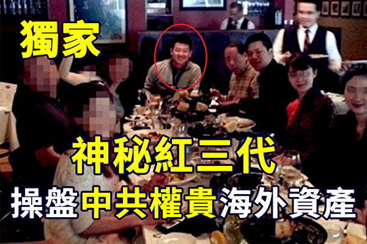

摄于美国一私人会所。居中坐主位者是Michael Xu，（作者提供／大纪元合成）

 
 【大纪元2019年12月14日讯】中共权贵阶层在海外的巨额隐密离岸资产已经广为人知，但是这些年有一位神秘的境外红色资产的操盘人物，一直被外界所忽视。

在圈内（包括中共太子党，红色家族后代），这些权贵家族有很多向海外转移大量隐秘资产的“路径”，有的是因私，有的则是以商业并购收购的名义收购美国企业，变相为中共海外战略服务。其中有一条路径，从2009开始活跃至今，在美国的商业并购收购交易，多由一个不为外界所知的神秘人物操作。

此人跟现任常委Z的家族在其地方执政时期就开始有密切联系。包括戴相龙、尚福林、曾庆红等中共领导家族后代控制的中国企业完成的多项北美商业收购，也是透过他进行的，达到了匿名向境外转移资产的目的。即便在中共大力宣传反美贸易战的时候，中共高层家族控制的企业也没有停止类似的操作。

此人是红三代，在大院长大，爷爷是中共开国将领，父亲为现役将军。20年前，为了规避中共军方高层家属出国的限制，此人改换了姓名身份，用国家公派名额，以政府的名义被送至美国上高中；还曾在阿克曼的旗下任职，在美国一投行担任过高管并负责资产收并购业务。此人在圈内常用的公开名字是Michael P. Xu（中文名为许鹏或徐鹏）。

中共高层利用特权，用国家公派名义送红三代至美国深造，等到其在美国进入精英阶层后，再继续为中共领导层家族进行资本的海外布局，以此循环，变相以权谋私，真可谓是洋为中用的典范。

但不得不说的是，Michael Xu在圈内很有口碑，“年轻干练，寡言缜密，办事很稳”，他在美国和避税岛的能量很大，跟犹太利益集团走得近（特别是美国以色列公共事务委员会，简称AIPAC），经常出入美国受邀请会员制精英会所“加州俱乐部”。他曾经为中冶集团、中国招商银行、广东某世界级科技企业等策划北美业务战略，对美国政治和法规进行游说。他虽是年幼出国，但因为有红色背景的原因，很懂“政治”，不张扬，所以一些中共领导家族掌控的“中企”在美国的收购并购，都觉得由他来“把关”很放心。但是基本不太跟华人圈子的人来往，少有影像流出，且多隐藏在交易线的背后，使得外界对此人所知甚少。

中国人民银行前行长戴相龙女婿车峰，在和“小马奔腾”收购好莱坞的digital domain（Titanic、变形金刚的制作公司）时，由于U.S. Bankruptcy Court给出的交易窗口很窄，当时资金缺口的压力很大，因要求必须是美国境内资金，香港新加坡都帮不上忙。正是Michael Xu当时动用在美国和BVI避税岛的能量，确保了几千万美元紧急资金在短时间内到位，保障了最后的成功收购，这是“中国企业”在美国少有的以小吞大的成功收购案例。

用参与者当时的说法是出了“高招”。在此期间都是车峰单线跟此人联系，“小马奔腾”和车峰那边的人多不清楚当时具体的资金操作，以至于后期在“奥亮”套“小马奔腾”的过程中，天行联合的谢安都无法直接和Michael Xu联系，一些重要文件都由车的亲戚和私人秘书小心代转。

在这笔关乎收购全局的紧急资金运作中，就有中共领导人家族控制的海外企业的资金，经过洗白操作后匿名进入，虽然这只是冰山一角，但也由此可见，中共权贵阶层在海外巨额离岸资产之庞大，隐藏之深。

人民银行行长女婿车峰拥有的其中一架私人商务机，尾号N818HK的Gulfstream G550，购买时有Michael Xu安排去的人协助。很多中共领导的亲属和红二代也经常用这架飞机秘密往来于北京香港美国之间。据消息源提供的一次出行插曲，有一次中共常委的子女与车峰等人，在出行美国后的返港途中，发现车的香港身份证忘在了Michael Xu处，一行人又乘坐此飞机中途折返，花了数小时返程取回，让整个机组极为头疼，后导致一副机长辞职。

Michael Xu，车峰，中共曾姓国家领导人的子女，戴姓富商，以及时任国安部主要领导的子女，还有一位当红女明星同机出行的起飞现场照片。（因保护消息源的安全需要，故部分人物头像作模糊处理。）（作者提供／大纪元）

 
 Z的家族是在其地方任职的时候就已经开始布局香港并向海外转移资产，根据可靠消息，Z的一位机要秘书是Michael Xu的亲戚，（跟戴姓富商，油田王永春是一个圈子的人，）当时Z的女儿逐渐开始在圈内活跃，为了仕途安稳所以Z调走后避嫌没有带走这位秘书，但是离开后给他安排了重要领导职位。后期Z家的事多由女婿和Michael Xu通过港新的渠道单线联系。
 

摄于美国一私人会所。居中坐主位者是Michael Xu，其左手边第一位是中国海关总署领导，其左手第二位为车峰，其右一和右二为L姓中共领导人后代（一女一男），其右三是中共一开国元勋的孙女（香港华菁会成员）。（因保护消息来源的安全需要，故部分人物头像作模糊处理。）（作者提供／大纪元）

 
 

摄于中共某大型国企和美国公司的签约仪式现场，这是Michael Xu很少公开出现过的照片截图，曾出现在中共官媒和国企的网站，但后因不明原因被统一撤掉。（作者提供／大纪元）

 
 自从中美贸易战和香港局势后，中共领导和太子党控制的企业，利用信息和政治判断的天然前瞻能力，提前布局，向外转移资产，利用空壳公司进行海外并购。其中很多在北美的企业收购并购中至今依然有Michael Xu的身影，可想而知此人多年以来操作的红色资本数量之庞大。但是自从由车峰案的牵扯导致很多中共高层和商界人士落网，以及近年来与其曾有交集的银行高层如（国家开发银行原行务委员）郭林、项俊波、（中信银行前行长）孙德顺和（前永隆银行总经理）徐志宏等相继落马以后，为了避免受到波及或者是因为知道的越多越危险，此人现在更加少与外界接触，目前还生活在北美。

中共权贵家属们利用手中权力聚敛财富已经广为人知，但长期以来并无具体数据。中共高层及红色后代们用假名、匿名等现象已成惯例，长期属于红色权贵阶层的特权。调查机构因此也承认无法完整调查，最大的局限就是中共高层在境外的财产资金无法掌握，因为很多“中企”“红色权贵资产”的资产转移手段并非是通过公开化的国际商业收购并购完成，而是由Michael Xu（中文名为许鹏或徐鹏）这样的隐秘操盘者暗中单线秘密操作完成的。

但是相信随着时间的推移，更多不为外界所知的中共红色权贵圈人物和资产转移路径会逐渐地浮出水面。中共一方面大力控制民间百姓正当的国际资本流通，同时另一方面，中共的权贵阶层却利用内部培养出的红三代精英进行不间断的资产秘密转移，真可谓是对中共政权的极大讽刺。#

<a target="_blank" href=#top><h6 align="right">回上方</h6></a>

<a name=116>
<h1 align="center"><b>【快讯】川普：已征的25%对华关税不变 其余减半</b></h1>

美国总统川普（特朗普）发推文说：“我们已经同意与中方达成一项非常大的第一阶段协议。”（亦平／大纪元）

【大纪元2019年12月13日讯】（大纪元记者林燕报导）美东时间周五（12月13日）上午11点，在中方新闻会公布关于美中贸易谈判中方声明的同时，美国总统川普（特朗普）发推文说：“我们已经同意与中方达成一项非常大的第一阶段协议。”

川普表示：“他们（中方）同意许多结构性改变，并大量购买农产品、能源和工业制品以及更多。25%的关税将保持不变，其余的15%关税减半（7.5%）。”

川普是指，已经对中国2,500亿美元出口商品加征的25%关税税率不变，其余在今年9月对1,200亿美元中国出口商品征收的15%的关税税率减半。

“由于我们已达成协议，因此定于12月15日的‘罚款性关税’不再收取。我们将立即开始就第二阶段协议进行谈判，而不是等到2020年大选之后。这对所有人来说都是一个了不起的交易。谢谢！”川普推文说。

随后，美国贸易代表办公室（USTR）周五发表声明说，美中双方就第一阶段贸易协议达成了一项历史性的且可执行的协议。协议要求中方经贸体制在知识产权、技术转让、农产品、金融服务以及汇率领域进行结构性改革。

声明还说，第一阶段的协议还包括中方承诺，在未来几年内将大量购买美国的商品和服务。

“重要的是，协议建立了强大的争端解决机制，可确保迅速、有效地实施和执行。”声明中写道。

周五下午，美国贸易代表办公室表示，美国将对约2,500亿美元的中国进口商品保持25%的税率，并同意将1200亿美元产品的关税从15％降至7.5％。莱特希泽表示，这个关税削减将会在双方签署协议30天后生效。双方可能在明年1月初签署第一阶段协议。

此外，美国已同意对301条款的关税行动进行重大修改。

几乎与此同时，中共商务部副部长王受文在新闻会上发表了声明，他说，中美双方就第一阶段协议文本达成一致，包括序言、知识产权、技术转让、食品和农产品、金融服务、汇率和透明度、扩大贸易、双边评估和争端解决、最终条款九个章节。

王受文还说，美方将分阶段取消对华关税，从升转降。下一步双方将尽快完成对协议文本的法律审核、翻译以及校对。#

<a target="_blank" href=#top><h6 align="right">回上方</h6></a>

<a name=115>
<h1 align="center"><b>制裁迫害法轮功者 美国政要支持采取行动</b></h1>

美国国会大厦。（李辰／大纪元）

 
 【大纪元2019年12月13日讯】（大纪元记者李辰美国华盛顿DC报导）近日，美国多位政要向大纪元记者表示，支持川普政府对中共迫害法轮功者实施制裁，拒发签证、冻结其财产。
 
<b>国会议员莱特：联合欧洲 实施制裁</b>

 

国会议员罗恩‧莱特（Ron Wright）（右）（李辰／大纪元）

 
 如何帮助制止中共迫害法轮功？国会议员莱特（Ron Wright）12月10日受访说，“我们可以实施制裁。我们希望更多的国家加入进来，尤其是欧洲——针对中共对法轮功等所有团体的打压，采取制裁行动。”

目前有28个国家已经制定或准备制定类似于美国的《马格尼茨基法》，《马格尼茨基法》授权对人权迫害者拒发签证、冻结其海外资产。

中共对法轮功的非法迫害持续20年至今。明慧网报导，2019年1至11月份，至少5,989名法轮功学员被非法抓捕，683人被非法判刑，89人在迫害中含冤离世。美国国务院2018年发布的2017年度人权报告中提到，法轮功学员遭受的酷刑比其它群体都更为严重。

国会议员莱特还说，“如果必要，要持续地实施制裁，对他们采取更严厉的措施。”“中共必须知道，侵犯人权是有后果的。”

中共对法轮功的迫害“很可怕”，他表示，制裁一方面是惩罚中共人权迫害者，另一方面给予受迫害者“希望”——“美国和他们站在一起，美国人民向他们伸出援手”。

明慧网在2019年5月31日发布的《通告》指出，美国政府意在更加严格地审核签证申请、对人权及宗教迫害者拒发签证，包括移民签证和非移民签证（如旅游、探亲、商务等），已发签证者（包括“绿卡”持有者）也可能被拒绝入境。美国国务院向法轮功学员透露，中共人权迫害者及其家属都在被制裁之列。

在纪念今年国际人权日之际，美国总统川普（特朗普）宣布12月10日为人权日和12月15日为人权法案日，以及本周为人权周。

莱特议员说，“我全力支持川普政府对中共所采取的制裁措施。”

<b>国会议员金：持续发出要求制裁的信息</b>

 

国会议员史蒂夫‧金（Steve King）（林乐予／大纪元）

 
 资深国会议员史蒂夫‧金（Steve King）12月10日受访表示，法轮功学员提交要求制裁的恶人名单后，将由川普总统和彭佩奥国务卿做出下一步采取行动的决定，“他们将推动这一政策。”

金议员说，在国会这一层面，“我们将持续发出信息。”“我们知道这会刺激到中共。但是如果我们不这样做，他们将永远迫害和折磨像你们（法轮功学员）这样的群体。”

他也建议国会，将相关要求制裁的报告纳入年度《国防授权法案》中。

<b>支持充分运用《全球马格尼茨基人权问责法》</b>

 

美国前国会议员林肯‧迪亚斯-巴拉特众议员（Lincoln Diaz-Balart）（大纪元）

 
 美国前国会议员林肯‧迪亚斯-巴拉特（Lincoln Díaz-Balart）12月10日受访表示，支持美国政府运用《全球马格尼茨基人权问责法》来制裁迫害法轮功的中共各级官员和警察，“这一法案必须放大和获得充分的执行。”“我强力支持这一法案。”

迪亚斯-巴拉特还说，“不论我们做什么，都是不够的。我们要尽一切可能（来制止迫害），并且要做得更多。因为对法轮功学员的迫害还在继续。”
 
 

美国参议员、参议院外交委员会亚太小组委员会主席加德纳（ Cory Gardner）12月4日在参议院的一场听证会上。（李辰／大纪元）

 
 对于中共打压法轮功、基督教、新疆等宗教团体或特定种族的恶劣行为，参议员加德纳（Cory Gardner）12月4日受访说，“我们和被打压者站在一起……支持他们对人类尊严的表达，支持他们的宗教信仰自由。”

他赞同对中共人权迫害者实施制裁，“显然，制裁是一种选择，应该予以制裁。”

 

美国国会议员、众议院外交事务委员会亚太小组委员会成员约霍（Ted Yoho）（李辰／大纪元）

 
 国会议员约霍（Ted Yoho）也是采取制裁行动的强力支持者，他12月6日受访说，乐见法轮功学员近日向美国政府提交了新的一批要求制裁的名单。

11月底，美国、加拿大、英国、澳大利亚及新西兰组成的五眼联盟国收到法轮功学员最新整理出的一批严重迫害法轮功的典型恶人名单。而明慧网近期也更新了迫害法轮功的中共恶人名单，人数超过10万人。

约霍议员呼吁停止迫害法轮功，他说，“我们反对（中共的）人权迫害。自由是人的基本权利。我们期待着继续大力支持（中国人权）。”

约霍议员也对川普政府的人权政策表示赞赏。他说，“川普总统所做的一切表明他重视人权……”

<b>USCIRF委员：帮助提交严重迫害法轮功者的名单</b>

美国国际宗教自由委员会（USCIRF）委员加里‧鲍尔（Gary Bauer）（林乐予／大纪元）

美国联邦政府机构——国际宗教自由委员会（USCIRF）的委员加里‧鲍尔（Gary Bauer）12月10日在受访中建议，法轮功学员除了向国务院，也应“向USCIRF提交要求制裁的名单”。

“USCIRF委员们一定会就此进行讨论，决定将哪些人的名字放入制裁名单。”

他表示，USCIRF周期性向美国政府提交包括迫害法轮功者在内的典型人权迫害者名单，要求对这些人实施制裁。

在美国主流社会中，USCIRF的建议被认为是评估宗教信仰自由方面的黄金标准。#

<a target="_blank" href=#top><h6 align="right">回上方</h6></a>

<a name=114>
<h1 align="center"><b>赵薇丈夫黄有龙被起诉 港名媛蔡一凤追讨巨款</b></h1>

赵薇与黄有龙资料照。（大纪元资料室）

 
 【大纪元2019年12月13日讯】（大纪元记者佟亦加综合报导）早前因“空手套白狼”被告上法庭的大陆知名影星赵薇和黄有龙夫妇，近日再度陷入欠债风波。香港亚视前执行董事盛品儒的太太蔡一凤，曾于7月底在社交平台公开向一名“知名女星的丈夫”追债，日前事件进展到她入禀追讨近2亿元（港币，下同），其中被告之一便是赵薇的丈夫黄有龙。

出生于富庶人家的蔡一凤，父母均从事金融和房地产生意，2014年嫁给了前亚视高层盛品儒。今年7月30日，蔡一凤曾在facebook（fb）发文，向“知名女星的丈夫”公开追债。

蔡一凤描述，四年前，欠债人向其家人借了3亿7千多万元，在拖拖拉拉还了一亿5千多万元后还剩下近2亿多元。

当时，她还附上计算表，以24%年利率计算，指对方连本带利欠5亿8千多万元。

蔡一凤在文中透露，对方一度开出支票作抵押，但她在兑现支票时遭“跳票”（指空头支票）。当她为此将对方告上法庭后，对方不仅不还清欠款，反而恐吓她，让她去不了大陆，要求她撤案。

 

 
有媒体曾就此事访问蔡一凤，她坦言正循法律途径追讨，到时候需要上庭时，自己会交代事件始末。

事件引起网民好奇：究竟谁是“知名女星的丈夫”？究竟是哪位“知名女星”？

据香港《苹果日报》报导，12月12日，事件终于有了进展：此案已经起诉并且移交法院处理判决。从曝光的文件看，赵薇的丈夫黄有龙的名字赫然在列，令“知名女星”的身份曝光。

今年43岁的赵薇，因主演琼瑶剧《还珠格格》中的“小燕子”一角走红后转行做导演，2008年与商人黄有龙交往，同年两人注册结婚。2010年4月11日，赵薇在新加坡生下女儿“小四月”。

中共《人民日报》旗下的新媒体“侠客岛”曾发文称，黄有龙曾当过已落马的前深圳市长许宗衡的司机。后来，黄有龙涉足金融投资管理、房地产、烟草等多个行业，在中国大陆、香港、澳门、新加坡、法国等有多个物业和投资，还拥有一架价值过亿的私人飞机。

被称为“女版巴菲特”的赵薇，曾被《福布斯》评为中国最富有的女演员之一。媒体曾起底赵薇的发迹版图，除了“空手套白狼”，凭借与金融大鳄肖建华等的密切关系，以出资6,000万元、其余30亿元借贷买下120亿市值的上市公司，她早年还曾投资阿里影业，并入股中共针对法轮功的洗脑歌曲《同一首歌》的制作公司。

去年4月，赵薇与黄有龙被官方处以罚款和禁入证券市场五年，原因是两人所属旗下公司“龙薇传媒”违规收购A股上市公司祥源文化（前称万家文化）。

同年11月份，两人又被上海上海证券交易所认定，五年内不适合担任上市公司董事、监事、高级管理人员，包括经理、财务负责人。今年以来，两人也被几百位投资者控告虚假陈述，涉及500多宗索赔官司，诉讼金额达数千万元人民币。

<a target="_blank" href=#top><h6 align="right">回上方</h6></a>

<a name=113>
<h1 align="center"><b>人权日论坛 时政网红讲述“两个中国的故事”</b></h1>

英文时评节目“中国解密”（China Uncensored）主持人克里斯·查佩尔（Chris Chappell）认为，美国和西方社会正在从共产主义的谎言中苏醒过来。（林乐予/大纪元）

 
 【大纪元2019年12月14日讯】12月10日是国际人权日，“全球反迫害制止中共暴行、声援退党大潮”研讨会在美国国会举行。国会议员、中国问题专家和人权活动家共同探讨了退党（退出中共党、团、队组织）对于中国社会产生的影响、共产主义蔓延的危害，并关注中共二十年来对法轮功学员的残酷迫害。
 
 

12月10日，“全球反迫害制止中共暴行、声援退党大潮”研讨会在美国国会举行，部分与会者合影。（林乐予/大纪元）

在视频网站“油管”（YouTube）上拥有百万粉丝的时政类节目主持人克里斯·查佩尔（Chris Chappell）在研讨会上表示，自由世界期待以经济发展改善中国人权的希望完全落空，相反地，中国共产党却用胡萝卜加大棒胁迫西方社会，将毒害扩散到全世界。所幸世界正在觉醒，越来越多的人看清了中共的本质。

查佩尔是新唐人英文时评节目“中国解密”（China Uncensored）和“揭秘美国”（America Uncovered）的主持人，他以幽默的风格评论时政，用诙谐的语言揭示真相，颇受观众好评。这两个节目在“油管”上的粉丝订阅量合计约106万，视频观看总量超过2.3亿次。

以下是查佩尔发言全文：

很高兴能在“国际人权日”这天与大家交流。我是克里斯·查佩尔，是“中国解密”和“揭秘美国”的主持人。七年以来，“中国解密”用幽默的方式让普通的美国人明白，中国共产党如何影响着他们的生活。

今天的一些发言者充分地描述了一个被共产党统治了七十年的中国——这个中国，有着全世界最大的集权体制，人们被酷刑折磨，只因为坚持信仰；遭到软禁，只因为试图帮助他人；被催泪瓦斯袭击，只因为争取最基本的自治权。

但是在这个房间之外，那些中国专家、政客和商人描述的却是另一个中国——那个中国，充满了商机，是一个负责任的地缘政治力量，也是国际秩序的拥护者。当然了，那个中国可能有一些人权上的问题，但只要增加接触，我们就能改变中国。

毕竟前总统克林顿曾经说过，“我们将中国融入世界，世界就会带给中国更多自由。”

可是前一段时间我在香港，当催泪瓦斯在我的周围爆炸，我慌忙地从暴警那里逃脱时，我开始想，嘿，也许世界没能把自由带给中国。

这些年来，中国共产党许下了很多承诺。

在“一国两制”之下，共产党许诺至少五十年内不会寻求改变香港。然而，他们借助严苛的法律、影响力运动和对香港权利自由的缓慢侵蚀，反复尝试改变香港。这还不到22年。

加入WTO时，共产党许诺会遵守国际贸易体系的规则。然而，他们屡屡违反规定，实行价格管控和补贴，恶意盗窃知识产权。

共产党许诺不会将其在南中国海建造的岛屿军事化。它也违反了这个诺言。

还需要多久，我们才能意识到中共不会履行承诺？

我们从根本上不了解中国共产党的本质。我们想要忽略的事实是——它是一个共产党。

不管你叫它马克思列宁主义，毛泽东主义，还是习近平新时代中国特色社会主义思想——共产主义都是一种基于斗争哲学的意识形态。

不存在双赢的合作，只存在拥有权力的人和没有权力的人。共产党，必须是有权力的一方。

相信中国接触论的人警告说，如果美国的对抗性太强，那等于告诉中共它们也可以对抗，这会很糟糕。

因为，想想看吧——如果中国共产党允许芬太尼等危险药片出口到美国，加剧了阿片类药物的流行，每年会杀死数千美国人。

试想，如果共产党以投资发展中国家的名义，暗中支持那些腐败的集权体制，接管这些国家的资源，使它们陷入巨额债务陷阱。

再想像一下，如果共产党用金钱和渠道，让好莱坞审查电影，让智库审查政策构想，让大学审查学者，让媒体审查关于中国的报导。

当然了，我们不需要想像，因为这一切都是正在发生的。除非我们有所行动，否则这不会停止。

可悲的事实是：我们没能改变中国，但是中国改变了我们。

中国共产党用胡萝卜加大棒驯服了我们，担心他们可能会怎么反应、会做些什么，以至于对他们正在做的事情却视而不见。他们让我们相信，将民主带入中国的唯一途径，是支持独裁政权。

不过也有好消息。尽管交往了四十年，美国人现在看清中国共产党的本质还不算太晚。第一步就是清晰而仔细地观察共产党在中国和全世界的所作所为，并且告诉人们。这就是我们今天与会者们正在做的。

情况是可以改变的。最近，美国国会通过了两项法案（《香港人权与民主法案》、《保护香港法案》），支持抵抗共产党的香港人。法案获得了几乎一致的赞成，并由川普总统签署成为法律。

也就是说，民主党、共和党和川普（特朗普）总统在一些事上还是有共识的。如果这都不算奇迹，那我不知道还有什么称得上的。

但是，还有很长的路要走。未来几年至关重要。我们必须继续抵抗中国共产党，这是让共产党垮台的唯一办法。

我是克里斯·查佩尔。谢谢大家。

<a target="_blank" href=#top><h6 align="right">回上方</h6></a>

<a name=112>
<h1 align="center"><b>德国两大执政党联手 拟立法封杀华为</b></h1>

德国大联合政府两大执政党联合发起提案，要求设立5G建设新标准，排除那些“受制于政府、缺乏法律监督、有被操控或间谍刺探危险”的制造商，此举明显针对华为。(Getty Images)

【大纪元2019年12月14日讯】（大纪元记者王亦笑德国报导）德国大联合政府两大执政党——基民/基社联盟（CDU/CSU）和社民党（SPD）联合发起提案，要求设立5G建设新标准，排除那些“受制于政府、缺乏法律监督、有被操控或间谍刺探危险”的制造商。

据德国《商报》报导，华为在德国移动通信市场上可能面临严重的挫败：德国两大执政党联合发起提案，希望设立新的5G网络建设标准。

提案中写到，由于通过技术测试不能“保证”5G通信网络的安全性，那么“是否信任制造商的诚信和制造国的司法体系，就成为关键问题”。“因此，检查制造商的可信度，必将是安全标准的重要组成部分。”

提案还明确指出，“无论在核心网络还是外围网络”，那些“受制于政府、缺乏法律监督、有被操控或间谍刺探危险”的制造商，都应该被排除在外。

《商报》报导说，该提案中虽未直接提及华为，但其条文针对性极强，简直是为排除华为而量身定制。在中共一党专制的中国，安全法规和政治现实都迫使华为必须听命于中共政府。

另外，该提案不仅起到了排除华为的作用，也间接打脸总理默克尔。迄今为止，默克尔一直努力寻求纯粹的技术批准程序，希望避免对制造商进行政治评估；她还一再强调，在5G建设中，她不会一开始就把某一供货商排除在外。评论指出，默克尔这样做，是怕与中共闹僵，使德国蒙受经济损失。

德国政府在10月提出的安全标准中，提出对于5G设备的安全性进行技术认证。此外，还要求制造商以书面形式保证其可信度。

这次两大执政党在提案中指出，这样的方法完全不够，“（技术）认证和自我声明不足以保证安全”。因此，他们呼吁德国政府，通过立法对5G网络设立新的标准，包括审核制造商所在国的政治环境和司法制度，以确保欧洲的安全利益。

目前，德国政府内部已对该联合提案进行了讨论，但尚未作出最后表决。执政党表示，该提案不会遇到大的阻力，因为各党派高层已经达成共识。按照立法进度，国会将在明年1月的全体会议上对此进行表决。德国政府已表示，将在明年年初提交《电信法》修正案。

5G网络即第五代移动技术，将成为数字经济的神经系统。下一步，医疗技术、自动驾驶或工业生产中的联网都将通过5G来实现。因此，5G网络安全与否对任何一个国家而言都极其重要。

德国外长马斯（Heiko Maas）曾对《时代周刊》表示，“硬件和软件供应商都可能制造巨大损害。我们不能太天真，这不仅涉及间谍活动，还涉及可能出现的破坏活动。”

<b>德电信商欲用华为建设5G 需过安全审核</b>

德国三大电信运营商之一的西班牙电信集团德国公司（Telefonica Germany），日前宣布了未来几年的投资计划，在德国5G网建设上该公司将与华为和诺基亚公司合作。

根据西班牙电信近日公布的发展计划，明年的第一季度该公司将在柏林、汉堡、慕尼黑、科隆和法兰克福这5座城市启动5G网络建设，大部分建设项目预计到2021年底结束。该公司将使用华为公司与诺基亚公司提供的设备，两家企业的比重各占一半。合作的前提是公司的技术与安全符合德国当地法规。

西班牙电信选择这几个大城市作为首批5G建设地点，主要是因为其与当地的企业客户有合作需求。它的目标是，到2022年底要为30座城市的1600万用户提供5G网络服务。公司表示，在5G网络建设上不想损失时间。

西班牙电信希望通过未来几年的投资计划赶超德国电信和沃达丰。它是德国市场上第一个宣布选择华为作为5G网建设正式合作伙伴的运营商。该公司还表示，华为设备仅限于5G天线技术领域，华为与诺基亚将发挥同等重要的作用。

但在核心网络设备供应方面，公司还没有做出决定，预计要等到明年才选定合作者。

目前，德国正在起草新的法律修正草案，涉及德国电信法（TKG）等具体措施出台后，参与5G建设的公司都应遵守相关的规定。德国经济部对于西班牙电信推动4G和5G移动信号建设表示欢迎。#

<a target="_blank" href=#top><h6 align="right">回上方</h6></a>

<a name=111>
<h1 align="center"><b>深圳宝安发生多起骚扰法轮功学员事件</b></h1>

（明慧网）

【大纪元2019年12月14日讯】一年多来，深圳市宝安区发生多起电话骚扰、跟踪、拍照，非法搜查法轮功学员家等迫害事件，尤其是在中共“十一”等所谓大庆、维稳节假日。

明慧网报导，2018年5月27日，宝安区新安街道办和安乐工作站工作人员，以网格员名义骗开法轮功学员高淑华的家门后，闯入家中，不顾高的儿媳还在坐月子，对着抱小孩的高淑华强迫拍照，被高和家人制止方才离开。

2019年7月18日，宝安区新安街道工作人员吴智博联系高淑华和法轮功学员王利林约谈未果，当天晚上，高淑华发现家人和车辆出入都有人跟踪，经过询问才知，跟踪者是新安街道的工作人员。

9月13日（中秋节）到10月8日，宝安区新安街道、安乐工作站、新乐派出所，在泰华物业的配合下，24小时三班倒跟踪高淑华及其家人和车辆出入。每次换班期间针对人、车进行拍照。

白天是安乐工作站和新安街道办的人，一般是两三人；晚上是安乐派出所的两三人。在高淑华居住的楼下待守的是两三人，高居住的小区大门处也隐藏一二人，当高淑华或家人以及车辆出入时，守在楼下的人原地待守，联系小区大门处隐藏的人员进行持续跟踪。

期间，高淑华的妹妹生病，做肺部大手术住深圳市宝安医院外科就医，这些人就跟到医院，骚扰到病房，询问高的妹妹，并进行拍照。病房的人都说：“他们是黑社会，耍流氓耍到医院来了。”

11月15日，新乐派出所片警谭学文到高淑华所在的小区进行拍照，据说是所长要求的，也接到街道办的电话，进行拍照。

此外，租住宝安区新安街道洪浪社区工作站云涛大厦，做培训机构的法轮功学员王利林，近一年来也多次被非法跟踪骚扰、拍照、闯入搜查等等，王被迫强制退租，造成直接经济损失数千元人民币。

据悉，宝安区西乡街道办和流塘派出所，在2019年的中秋节和十一期间也闯入多名法轮功学员家中拍照，并询问中秋节去了哪里，等等。

自1999年以来，中共在全国范围内对法轮功学员实施“名誉上搞臭、经济上搞垮、肉体上消灭”的迫害政策，通过非法抓捕、判刑、酷刑、强制洗脑、强制奴役、活摘器官等手段，给上亿的无辜民众带来灾难。其中，骚扰是被使用频率最高的一种犯罪手段。

20年来，明慧网统计，至少4,000多名法轮功学员被迫害致死。由于中共网络封锁，这个数字只是冰山一角。

12月10日是国际人权日。美国多位国会议员谴责中共迫害法轮功，呼吁制止迫害。

目前有28个国家已经制定或准备制定类似于美国的《马格尼茨基法》，《马格尼茨基法》授权对人权迫害者拒发签证、冻结其海外资产。

国会议员莱特（Ron Wright）说，“如果必要，要持续地实施制裁，对他们采取更严厉的措施。”“中共必须知道，侵犯人权是有后果的。”

11月底，美国、加拿大、英国、澳大利亚及新西兰组成的五眼联盟国收到法轮功学员最新整理出的一批严重迫害法轮功的典型恶人名单。

近期，明慧网也更新了迫害法轮功的中共恶人名单，人数超过10万人。他们的个人信息和恶行等都被记录在案。#

<a target="_blank" href=#top><h6 align="right">回上方</h6></a>

<a name=110>
<h1 align="center"><b>【拍案惊奇】港人如何取胜？美中协议有雷区</b></h1>

美中第一阶段贸易协议，1月初签字前还有“雷区”；两位美国专家，深度分析香港局势走向，指出港人抗争取胜关键。（新唐人合成）

 
 【大纪元2019年12月14日讯】大家好，欢迎收看《新闻拍案惊奇》，我是大宇。

今天呢，我们出一期新拍专题，与以往不同的是，今天包含两个专题栏目：首先还是有关香港，介绍两位美国资深专家，对香港问题的深入分析，来聊聊香港人抗争的走向。

然后，我们会介绍美中达成的第一阶段贸易协议，以及接下来要面对的棘手问题。

<b>～～～新拍专题～～～
 
专题一：香港人会赢吗？美国专家深度分析</b>

我今天看到一篇文章，刊登在一个叫做《美国利益杂志》的网站，先对这个机构做个介绍。《美国利益杂志》是2005年成立，创始成员主要是从著名的《国家利益杂志》跳槽出来的，领衔的人，就是著名的日裔美国政治学者，弗朗西斯‧福山，他曾在1992年出版《历史之终结与最后一人》这本书，语言资本主义最终战胜共产主义，自由民主将是人类政府发展的最终形式。他的这本书非常有名。

12月13日，《美国利益杂志》的网站，刊登题为“Hong Kong’s Long View”《香港问题远景》的文章。作者有两个人，一位是在新闻评论界比较活跃的，美国公民力量发起人杨建利，另一位是宗教自由论坛主席Aaron Rhodes。

<b>短期看：拉锯战 不会有明显赢家</b>

他们在文章中分析，有两点在反送中之初就很清楚：一是，不管中共还是香港政府，都不会积极回应香港人诉求，而是强硬打压；二是，中共和港府，都没能力让香港抗争者彻底噤声。短期来看，双方是拔河、拉锯战，不会有明显赢家。

而在11月份，当局的打压陡然升级，但相应地，有三件事随之而来，一是泛民主派在区选中大胜，二是美国通过了《香港人权与民主法案》，三是12月8日，再有超过80万，也有人说有100多万香港人，走上街头游行。这说明什么呢？警察的暴力镇压不管用，但同时，大规模抗争，目前也不太可能取得当局的积极回应。

这从今年6月16日的事件就看出来了。

当天，超过200万香港人上街游行。700万人口有200万人上街，这种人口比例，是现代史上最大规模的。这篇《美国利益杂志》的文章形容，这种规模，换作任何其他地方，一定会引发政局的变化，但直到目前，香港政府的人事上，没有任何改变。这是香港抗争运动有别于其他运动的独特之处。

为什么这么大的抗议都没有变化呢？两位文章作者一针见血地指出：因为香港追求民主自治的抗争者，面对的真正对手根本不是香港政府，而是正在统治全中国的独裁政权。

过去30年，中共依赖各种办法，成为世界上最强大的政权之一，对待异见人士，它的打压毫不手软。对待香港，也一样。文章认为，作为英国的前殖民地，香港人珍视的个人权利、法治等民主原则，都代表了共产党意识形态的对立面，香港公民社会十分繁荣。而中共在国内使用的分化、收服、信息封锁和收买的政治控制方式，在香港收效不大。而事实证明，在香港的强硬打压，只会加剧香港抗争者与当局的对抗。

<b>香港国际化民主化 中共无法掌控</b>

两位专家从香港的角色进行了分析。香港同时扮演了两个角色，一是从中共建政至今，香港扮演了中国与国际间贸易的“前哨”；二是，香港扮演了令中国与世界交换信息与价值观、理念的“渠道”。

可是，这样一个国际化的城市，为何在反送中以来，得到世界其他政府的实际支持很有限呢？文章提出两点：一是，一些民主国家出于国内问题的考虑，对国际事务采取谨慎和保守的姿态；二是，对于中共难以忍受批评的态度，一些国家便不愿招惹这个世界第二大经济体。

香港没有了国际声援，就减低了抗争成功的几率。这样看来，形势对香港抗争者很不利吗？不是，文章举了个例子。

美国签署《香港人权与民主法案》，这就是香港抗争运动成功的一个很好的范例。自从签署后，香港官员对待香港抗争运动，没有再采取跟中共一样的严厉批评态度。这说明，香港仍是一个高度国际化的城市，那里的居民跟世界的连通程度，要远远超过他们在大陆的同胞。

就像我之前在《立场新闻》也看过一篇文章，大意是说，香港仍然是中共无法完全控制的地区。《美国利益杂志》的文章进一步指出，这个背景，就使得即使亲北京的香港当地官员，在采取打压策略前，不得不三思而行。

综合以上内容，香港的国际化使得中共无法完全掌控，而香港市民的民主化程度，也令当局难以控制，因此，这场运动才绵延6个多月而不停。

<b>长远看：坚持就是力量 抗争风会吹进大陆</b>

作者杨建利和Aaron Rhodes在文章中提出一个观点，就是香港的长期运动，会产生涟漪效应，终究会打破当局的信息封锁，把这股风吹进大陆，当局的扭曲宣传会失效，大陆人会看到香港事件的真相，观点会慢慢变化，这个趋势将有利香港抗争者。

另一方面，大陆经济发展的同时，它也在挑战西方民主国家的原则基石，就是人权、民主、法治，这是西方国家不会视之不理的，北京最终要为此付出代价。而香港正在扮演的，是人类自由链条中，不可或缺的一环，民主社会将有不可推卸的道德义务去保护。

还有一方面，香港的形势对中共的内部权力平衡，也有冲击。

两位专家在文章最后提出结论，对香港抗争运动来说：长远看去，中共当局无法“专断”，“坚持就是力量”。

他们建议香港人，以最低成本的策略，和对道德准则的坚守，去争取最广泛的理解和支持。随着时间的推逝，改变就会到来。

同时，文章作者还说了意味深长的一句话：香港人不怕短期内无法取胜，而中共害怕香港人没有败退。

好了，这篇文章的原文更精彩，大家感兴趣，可以找来阅读。我也没有完全翻译，只是节录其中部分内容，分享给各位观众。

<b>港警改变策略 从明到暗 港人讨论对策</b>

看完以上内容，也许有的观众觉得，这两位专家分析的也太乐观了吧。那中共万一出兵，或者万一真的放弃在香港的“一国两制”，怎么办？现在当局不是还要发展澳门作为金融中心吗？那些极端的情况，出现的几率相当低，当局也要衡量得失。而发展澳门为金融中心，也得看看澳门有没有香港那样的基础，和国际认可度。

大陆经常搞一些项目，冠上“世界”啊、“中心”啊的头衔。比如最近好像有个“世界律师大会”，可是有几个国家的律师参与呢？真的要搞成具有世界影响力的，就得有那个基础在，没人承认，自己是搞不起来的。

另外一方面，有香港网友讨论，最近香港警察似乎改变了策略，从街头的暴力镇压，变成暗地里上门抓捕，暗中进行打压。而表面上，申请游行也批，催泪弹也很少放，大大降低了香港事件的媒体曝光度，随之关注度也下去了。所以我看到，香港的抗争者也在讨论相应对策。

好了，香港问题就说到这里，这是我们今天的第一个专题。现在进入下一个专题，美中的贸易协议。
专题二：美中达首阶段贸易协议 在签字前还有“雷区”

截至12月13日，美中的贸易战，如果从正式加征关税开始算，已经打了18个月。如果找最初的起点，可以追溯到2017年4月，对进口钢铝产品对国家安全影响的232调查，以及2017年8月开始的，对中方于技术转让、知识产权等领域问题的301调查。

美国总统川普，从年轻的时候就在批评中方不公平贸易，到当上总统，开始把这种批评转变为施压对方改变的行动，要求中方停止不公平贸易行为，包括知识产权窃取、强制技术转让，等等。最显着的施压办法就是加关税。

从2018年7月到现在，川普已经对中方总计价值超过3,600亿美元的商品，施加关税。其中最显着的是2019年5月，对价值2,000亿美元中国商品加征25%的关税。

而中方面对美国的批评和施压，就说美国是看不惯中方变强大，要遏制中方成长为全球经济强权。在这个理由支撑下，中方也先后宣布，对总价值超过1,100亿美元的美国商品，施加关税，最多的一次是2019年6月，对美国价值600亿美元的商品，加征25%关税。

过程中，双方为了达成终止贸易对抗的协议，从2017年5月到2018年10月，进行了至少13轮面对面的贸易谈判，但是给外界的信号始终是过山车，一会儿有希望了，一会儿又根本看不到光。

就在刚刚的12月3日，川普还说美国不急着达成协议，拖过2020年美国大选都是可以的。就在十天之后，突然就发生了我们现在看到的新闻：12月13日，美中双方突然宣布，达成第一阶段贸易协议。

消息最早是美国总统川普“泄漏”出来的，他在12月12日发推文说：美国已经非常接近跟中国达成一项巨大的协议。

这样的场面过去一年多，外界见多了，一方说有希望，很快被另一方否定。但这一次，没有这样。

12月13日，中方的国务院新闻办在当晚召开记者会，宣布美中双方在平等互相尊重的基础上，就第一阶段的贸易协议文本达成一致。

川普总统也在当天再发推文，指出已经批准与中方达成的，内含广泛的第一阶段贸易协议。

但是，这份协议还在完善细节，而且要经过必要的法律程序，这样一折腾。美国贸易代表莱特希泽说，双方签字可能要在1月初。

<b>在当前的文本中，美方的部分行动包括：</b>

1）将取消计划在12月15日开始的，对价值1560亿美元的中国商品，加征15%关税，这些商品包括智能手机、玩具、电子品等，如果这一关税实施，等于是美国对从中国进口的所有产品，全面加征关税；

2）将对价值约1200亿美元的中国商品，加税幅度减半，从原先的15%降到7.5%；

3）对另外大约2500亿美元中国商品的25%关税，将维持不变，这些商品包括机械、电子还有家具等。川普表示，要把这些关税作为第二轮贸易谈判的杠杆。

<b>而中方的部分行动将有：</b>

1）未来两年，美方将增加对中方出口价值2000亿美元的商品，具体有哪些商品，还要再商定；

2）其中已基本确定的是，中方将每年购买最高达500亿美元的美国农产品；

3）将做出有关知识产权的具体承诺，包括假冒产品、专利、商标何药品权问题，这些承诺将在之后公布；

目前，双方协议文本达成一致，但还是有很多细节分歧，让外界感到，这是埋藏在协议中的地雷，在走到1月初签字的那一步之前，不知道会不会被不小心踩爆，让协议再告吹。

<b>推特“财经真相”做了一个分析，有关美中协议公告的差异：</b>

1）美国的公告包含强制执行机制，中方没有；

2）美国没提到分阶段降低关税，但中方提到了；

3）美方说中方同意购买大量农产品，中方没说，还在新闻会上说美国也会买中方农产品；

4）美方没有说，还要对文本进行校对、翻译，甚至是“商量”的时间，但是中方的说了，这就给中方继续“拖”创造了空间。

白宫首席经济顾问库德洛说，中方是否会信守承诺，还要观察。这都是第一阶段协议，到底能不能破茧成蝶的变数。

目前，这个第一阶段协议，还不是最难的部分。这一阶段主要解决的问题是购买农产品、减少关税、还有部分知识产权问题。第二阶段的协议，将触及中方的结构性改革，会更难谈判，包括中方的经济间谍活动，政府补助国企低价倾销等等。

而美国明年即将举行大选，川普又要面对国会民主党的弹劾压力，这都是第二阶段协议谈判路上的障碍。

但是川普本人发推文，还是展现着他强大的自信，他说：第二阶段的贸易协议，要立即开始，而不是等到2020大选之后。

那么，第一阶段协议，能不能顺利扫清雷区，实现签署，以及第二阶段协议，会不会如川普所愿，立即推进，我们继续关注。

最后，欢迎您订阅和分享我们的频道。今天的节目就到这里，我们下期节目，再见！

新唐人《新闻拍案惊奇》制作组

<a target="_blank" href=#top><h6 align="right">回上方</h6></a>

<a name=109>
<h1 align="center"><b>海风：明慧网“恶人榜”成了阎王爷的“生死薄”</b></h1>

中共落马百“虎”盘点：近半在迫害法轮功恶人榜上。（大纪元制图）

【大纪元2019年12月14日讯】“生死簿”是神话传说的名词，又名“生死册”，是指天地人三书之一，即“天书封神榜”、“地书山海经”、“人书生死簿”。此书乃是阴曹地府中管控众生灵寿命的名册，由著名鬼王阎罗王身边的副属判官所执掌，内容记载着人世间所有人畜的名单，包含着每个人以及其他生物的阳寿期限与阴寿期限，主要专用以控制生死之用，从出生乃至死亡的所有生命信息都众在其中。勾魂使者是阴间地狱中的黑白无常、牛头马面（鬼差鬼使）。

“恶人榜” 又是什么呢？“恶人榜” 是由法轮功团体的官方网站明慧网制作。该榜单主要是收集和整理参与迫害法轮功学员的中共人权迫害者个人信息，并将这些信息提供给美国、欧盟（28个成员国） 、加拿大、澳大利亚、新西兰、台湾等国家，这些国家将名单上的人权侵犯者依照《马格尼茨基人权问责法》加以制裁。如：限制入境、冻结财产、禁止官员在本国进行财产交易、驱逐其子女亲属出境并取消身份等。

哪些人将会列入“恶人榜” 呢？据明慧网介绍，“人权迫害者”包括但不仅局限于直接实施迫害者，也包括制定具体政策、下达命令以及协同者。如犯有下列罪行者，将列入“恶人榜” 名单。如：

1. 未经法院判决为 “死刑” 而故意杀人；

2. 酷刑和其它残忍、不人道或有辱人格的待遇或处罚；

3. 没有刑事指控的拘押；

4. 绑架或秘密拘押而致人失踪；

5. 其它对生命权、自由权或人身安全权的公然剥夺；

6. 下令、煽动、协助或以其它方式方式参与群体灭绝。

明慧网“恶人榜”显示，截止2019年12月13日，已收集中共人权迫害者10.558万人，而且人数每天都在增加。在这份榜单中可以看到，每个上榜者的个人信息以及所犯下的罪行都有详细记载。上榜者既有像江泽民、罗干、孟建柱、傅政华等中共高官，同时也有中共基层派出所的办案警察及乡镇街办干部。

据媒体报道，预计中共权贵在国外的存款总金额超过了20万亿美元。中国财政部财政科学研究所原所长贾康2019年8月3日在微博转发：瑞士银行公布消息，100名中国人在瑞士银行的存款合计7.8万亿（人民币）。另据中共官方统计，到2018年底，中共官员在海外留学或定居的亲属达250多万。而这些人绝大多数都美国、欧盟（28个成员国） 、加拿大、澳大利亚、新西兰等国家。这些官员一旦被列入制裁名单，其海外资产将会在一夜之间化为泡影，亲属也将受到牵连。

正所谓：恶有恶报，善有善报，若是没报，时候未到。如果说明慧网的“恶人榜” 是阎王爷的“生死薄”， 那执行《马格尼茨基人权问责法》的国家就“人权恶棍” 的勾魂使者。有网友评论：过去法轮功学员都是中共案板上的肉，想怎么斩就怎么斩，如今角色转换了，“恶人榜” 已成了掌管中共恶人的“生死薄” ，而中共恶人个个都成了“生死薄” 上的小鬼。这就叫报应。

<a target="_blank" href=#top><h6 align="right">回上方</h6></a>

<a name=108>
<h1 align="center"><b>中共态度反复 任正非家族形象快速崩溃</b></h1>

华为前员工李洪元因劳资纠纷遭华为构陷，被警方羁押251天后无罪释放。最近此丑闻曝光，引发舆论强烈反弹，被称为“华为251事件”。(GREG BAKER/AFP/Getty Images)

【大纪元2019年12月12日讯】（大纪元记者古清儿报导）华为前员工李洪元因劳资纠纷遭华为构陷，被警方羁押251天后无罪释放。最近此丑闻曝光，引发舆论强烈反弹，被称为“华为251事件”。中共官媒对此事的态度反复，从开始跟着批评华为到后来快速转向，删除一切对华为不利的言论。

短短几天之内，对华为及其创建人任正非的各种批评在大陆网络爆发，使得中共苦心经营、包装的任正非形象快速崩塌。

<b>李洪元事件引发中国人对华为怒火</b>

2018年1月，李洪元从工作了12年的华为逆变器销售管理部离职。经劳资双方协议后，李获得“离职经济赔偿”约30万元（人民币，下同）。华为在同年3月完成赔偿。

之后，华为以“敲诈勒索”为由把李洪元送进了监狱。同年12月16日，李被深圳警察以“涉嫌职务侵占”罪名逮捕，之后罪名又变为“涉嫌侵犯商业秘密”。李被羁押长达251天，到今年11月底因证据不足被无罪释放，并获国家赔偿10万元。

案件细节被曝光后，华为迅速遭到大批网民的围剿，网上要求华为道歉的声音此起彼落。同时，部分网民批评华为的言论被删除。外媒和大陆流传的说法，都说是华为进行了紧急公关操作，在各网络平台大举删帖封号，此举引发网民怒火。

在舆论高压下，12月2日华为发表了一份声明，拒不道歉，还称“支持李洪元运用法律的武器维护自己的权益，包括起诉华为”。

华为态度傲慢，再次引发网络沸腾，批评华为“蛮横霸道”、“没有同理心”、“无人性”、“狼性吞噬人性”等。华为一下成了中国人的“全民公敌”。

<b>中共官方对华为态度反复</b>

中共官方在此事件中，开始有与华为切割之意。

当看见民众都在怒批华为的时候，官媒试着跟进，12月4日，《人民日报》转发《钱江晚报》的一篇题为“华为的回应不是‘法治’，而是以势压人”的快评。

但没过多久，《人民日报》的文章被删除，《环球时报》总编胡锡进也在批评华为之后突然转向，指责舆论对华为的围攻“令亲者痛仇者快”。

随后，网民起底或者愤怒声讨华为的文章再遭大量删除，以至中国大陆的网民创出了“工作996，辞职251，讨论404”的段子，讥讽在华为工作是“996”时制，辞职却被关251天，批评的文章又被删除，只能显示“404”。

在大陆网民对华为愤怒之意不减的时候，大陆的社交被媒体突然冒出多篇文章指，堡垒最容易从内部攻破，这是美国惯用的伎俩，又说网上大量的批评华为行为，肯定是有组织的行为，甚至美国花上百亿计的资金来打击华为云云。这些文章与中共网军历次做法雷同，就是在局面难以收拾的时候，抹黑美国为“黑手”，转嫁危机。

华为CEO余承东12月4号晚上转发自媒体文章，声称美国是策划251“黑公关”的“幕后黑手”。12月9日，任正非接受外媒采访，声称美国要“消灭华为”。

到本文发稿前，中共内部似已统一思想，基本删除了大陆网络上针对任正非、孟晚舟和华为的负面文章。

由于中共文宣态度的反复，这场官民舆论博弈中，在大陆社交媒体上，很多起底任正非及华为的负面文章，存活了一小段时间。任正非本人及华为，被中共包装起来的“形象”，也在短短几日内快速崩溃。

<b>揭露“官二代”任正非的文章一度被保留</b>

12月4日，有大陆记者在其微信号刊发一篇长文《我采访过的华为，那里就是办公室白领的血肉磨坊》。文章直指任正非能做到今天这一步，就是依靠其“官二代”背景。

文章揭露说，“华为实行严格的考勤制度。华为的考勤制度非常死板，在一定级别之下的员工，必须上下班打卡。当然任老板和他女儿都不会打卡的。”

文章说，“任老板只要求机器照常运转，他才不管螺丝钉生锈不生锈。后来，华为被爆出清除34岁以上员工。华为不讲感情，只讲业绩。我是革命的一块砖，哪里需要哪里搬。员工在任老板眼里，只是一块没有感情没有思维的砖头。”

“任老板早年当过基建工程兵，官至副团级。那正是特殊的十年。任老板深得真传，为达目的，不择手段。任老板的第一任岳父是四川省副省长，此前担任冶金部司长。孟大小姐，就是任老板和第一任妻子的产品。很多人认为任老板是白手起家，是励志的贫二代。我可以负责任地告诉你，任老板是扎扎实实的官二代。任老板的岳父是副省级，王石的岳父也是副省级。如果不是副省级的岳父，任老板成不了任老板，王石也成不了王老板。你算算中国副省级的，能有多少个？”

“没有华为的血汗公司，就没有孟家大小姐穷奢极欲的加国生活。孟大小姐居住着几千万的超级豪宅，穿着几十万的时尚衣服，当然也是白领的血汗钱支撑着她的奢侈生活。无休止地加班是华为的企业文化。”

这篇文章在微信上，直到12月8日才“阵亡”。

<b>遭网民嘲讽 任正非家族形象快速崩溃</b>

除了以上文章外，大陆社交媒体上起底任正非家族，并广为流传的文章还包括《你一个看不起病的穷光蛋，有什么资格支持人家富可敌国的孟大小姐？》、《华为曾把十多名讨薪员工送进牢房》等等。

网民也纷纷对任正非家族留言评论：

“国家外交力量正在为女儿挺身而出时，任老板却在国外说不用政治力量干涉相关法律，让外交下不来台”；

“又不是中央领导，还真把女儿当公主”；

“女儿出售限制技术被包装成为国入狱，绑架国家外交资源保护女儿”；

……

网民王志安发帖说：“任正非在孟晚舟事件一周年之际，发表了一封公开信。 如果没有李洪元事件，这封信估计依然会引起广大网民的认同。但没想到李洪元事件在这个节点爆发，网民对任正非的公开信再也没有过去一年来那种不假思索的认同了……”

社交媒体就广为流传着这样的愤怒兼讥讽的话语：“孟晚舟被关一年全国关切，华为员工被关251天全网封杀”，“我在别墅里度日如年，你在监牢里砥砺前行”，还有诸如“你也许会是李洪元，但永远没机会做孟晚舟”这样的怒评。

<b>任正非打压“干儿子”的事件再被提及</b>

与此同时，任正非打压“干儿子”的事再次被媒体掀开。

据腾讯网近日报导，在李洪元之前，华为已将多位前员工送入监狱。而曾经的“太子”李一男离职创业，也遭到华为全方位打压，最终其公司被任正非打垮。

现年49岁的李一男，在1992年读研究生二年级的时候到华为实习，一眼被任正非相中，受到重用。次年毕业加入华为，入职第二天转正工程师、半个月升任主任工程师、半年升任中央研究部副总经理，两年被提拔为华为总工程师、中央研究部总裁，27岁任常务副总裁。

当时，任正非几乎每天都过来看望李一男，甚至亲昵地称李一男为“干儿子”，那时大家都猜测，李一男很有可能就是任的接班人。

2000年，李一男创办港湾网络公司，最初做华为分销商。港湾网络迅速做大，还收购了华为原副总裁黄耀旭创立的钧天。这惹恼了任正非。

最后任正非跟李一男开始了长达6年的相互厮杀。华为还专门成立了“打湾办”，目的是不让港湾赚钱、不让港湾上市。最终，港湾被华为收购。

作为收购条件之一，李一男回到华为，头衔仍是华为副总裁，同时兼首席电信科学家，但剥夺了重大事件的决策权和参与权。

据媒体报导，任正非给李一男安排了个玻璃办公室，没有窗帘，员工来来往往，经过此处都得驻足议论一番。

<b>华为核心子公司6高层退出的背后</b>

巧合的是，正处在风口浪尖的华为，华为子公司高层人事近期突然出现大变动。

11月27日前后，据工商登记资讯显示，掌握着华为核心技术的子公司“北京华为数位技术有限公司”发生了人事“大地震”，包括任正非、法人孙亚芳以及董事徐文伟等6人退出领导层。

今年春天从华为南京研究所离职的工程师金淳对海外自由亚洲电台表示，以前的华为老总“明显都是国家情报系统的人”，已经暴露了。任正非无论在美国、在欧洲都会被逮捕，“什么事情也办不了”。而孙亚芳和那几位高官也都暴露了，发挥不了太大的作用。

金淳指，中共现在要启用还没有被暴露的情报人员来担任华为的高层。新高管还没暴露，他们要用这些人“突破华为被制裁的这种限制”。

前重庆师大教授谭松表示，根据中共党史和行为逻辑判断，像任正非这种人，一旦失去利用价值，他们的结局都是很惨的。给中共卖命的人，需要的时候可以大红大紫。不需要的时候 ，弃之如敝履。这是中共的一贯做法，从它诞生那一刻起到现在，几乎没变过。

<a target="_blank" href=#top><h6 align="right">回上方</h6></a>

<a name=107>
<h1 align="center"><b>曝中共公安与精神病院勾结 9岁女童遭关押轮奸</b></h1>

《寒冬》揭露，中共公安与精神医院勾结，将异议人士、访民等关押去，长年受折磨。（ FRED DUFOUR/AFP/Getty Images)

【新唐人北京时间2019年12月12日讯】《寒冬》揭露，中共公安与精神医院勾结，将异议人士、访民等关押进去，长年受折磨，不仅可省去法律程序，还能从中牟利。而吉林访民刘女士曾揭露，北京“昌平精神病院”骇人兽行，3个流氓打手，天天轮奸一名年仅9岁的女童。而女童的父母已经被精神病院迫害致死。

长期关注中国宗教自由及人权的杂志《寒冬》报导说，山东省一名匿名的公安局内部人士透露，精神医院成了挣黑心钱的地方，他举例说，如果有拆迁户上访，被举报的建筑商就会贿赂执法人员，大约60万人民币的价码，把上访民众关进精神医院2年。

精神医院的医院可以分到3分之1的钱，也就是20万人民币（约86万新台币）左右。

内部人士表示，公安部门不想在上访民众和抗议人士身上浪费太多时间，所以就把他们当作精神病患者处理，既能提高办案效率，在上司面前邀功，又能轻松赚到外快。

内部人士还透露，除了隶属于中共公安部的安康医院外，一些民营的医院也长年关押异议人士、上访民众及政治犯，甚至一些公安人员也暗中参与开办精神医院。

他说，这些人在精神医院待过，出去后人们把他们当精神病，没人相信他们说的话，在里面天天被逼着打针吃药，有些人就真疯了。

早在2004年《九评共产党》一书揭露，调查结果显示，至少有1000多名精神正常的法轮功学员被强迫关进精神病院、戒毒所，许多人被强迫注射或灌食多种破坏中枢神经的药物，并遭受长时间捆绑、电击等酷刑，至少15人被这样迫害致死。

<b>中共镇压兽行惨虐之极 9岁女童天天遭轮奸</b>

同年，长期滞留在北京一位吉林女访民刘岚英在谈到《九评共产党》一书时说，她感到《九评》对法轮功学员遭受的残酷迫害程度的描述还远远不够，仅自己所知道的法轮功学员的遭遇就更加悲惨。

刘女士举例说，发动这场镇压的江泽民根本就没有人性，在她的讲述中，最使人感到触目惊心、颤栗不已的是北京“昌平精神病院”的兽行：两位法轮功学员夫妻被害死在“昌平精神病院”后，三个精神病院的流氓打手，竟然天天轮奸他们遗留下来的年仅9岁的女儿。

这位女孩已经被摧残得不能行走，即使白天也瘫在床上大小便。

下面是这位吉林女访民关于“昌平精神病院”的叙述实录：

2002年夏天，来自吉林白山弯沟的刘岚英（音）女士40多岁，这是她第一次到北京上访，她在中南海新华门前踌躇了一会儿，看到警车陆续拉走了许多的抗议访民，她以为警察将大家拉走是为了解决上访的问题，以为是好事情，她也鼓起勇气向警察表示自己也是来上访的，不容分说被抓上警车，同时被抓的还有吉林访民王刚强等。

她被警车带到了北京昌平收容所，在他们明白了警察只是拘押上访人士并不解决上访问题时感到气愤，不服警察的拘押，他们不停地质问政府官员和警察：“为什么把我们抓到这里来？我们也没有犯法，我们上访犯了什么罪？”

也许警察认为有这样抗议思想的人都是精神病吧，警察将这几个不听话的访民们从昌平收容所再次带到车上，又开了大约一个小时的路程，他们被带到一座有着三道大铁门的建筑物中，门上挂着的“昌平精神病院”的大牌子使刘女士顿时吓傻了。

收容所的官员在将他们押到车上时曾嘱咐过警察“这个小子要好好收拾收拾”，一进到第三道铁门后，王刚强就被拳打脚踢地打倒在地，皮带挥舞，他被打得遍体鳞伤。

示意图（pixabay.com）

第一次上访还从来没有见过上访疆场的刘岚英被吓得魂飞魄散。然而，更残忍、更恐怖的事情还在后头。

刘女士表示，在这个神经病院中她自始至终没有看到过一个医生和护士，她看到里面关的大都是上访人士和法轮功学员，精神病院中除了警察就是打手。他们都拿着皮带，如果谁稍微做得不好，皮带就会飞舞而至。

被关押的人不可以自由移动，但是打手们可在任何时间自由出入她们的房间。她进了三道大铁门后就直接被关到了房间里。根本没有一个医生在做检查。

她在“昌平精神病院”里一共被关了3个晚上。每天晚上，精神病院的3个打手大头、长毛，还有一个说话吐字不清楚被称作哑巴的就到她们的房间来轮奸一位9岁的小女孩，女孩被摧残得惨叫，揪心裂肺，每次都是大头先扑到女孩的身上强奸，长毛再上，哑巴最后。

这个小女孩被摧残得天天晚上惨叫连天，已经瘫在了床上，白天也不会动，大小便都便在床上。

刘女士听精神病院被关押的人讲：这个小女孩的父母是法轮功学员，3个人是一起被关在“昌平精神病院”里，她的父母被迫害致死在精神病院后，按理说父母死后应该把孩子送到孤儿院去，不应该将她留在精神病院，但是这里没有送。

法轮功学员的这位遗孤才9岁，有什么罪啊？竟然每天晚上都要被三个流氓打手没命地轮奸折磨。房间里没有人敢出声反对，恐怖得就像是人间地狱。

法轮功学员被强制送往精神病院迫害，并“被精神病”（明慧网）

<b>漂亮女孩被轮奸致精神失常并怀孕</b>

房间里还有一位年轻女性长得非常漂亮，已经被摧残得精神失常并且怀了孕，问她是从哪里来的，她不会回答，只会傻笑，人们不知她是上访的，还是法轮功学员。

一天晚上，三个打手轮奸了9岁女孩后仍兽欲淫盛，还要再摧残这位女士，她叫着反抗，流氓打手大头把她的手脚捆绑起来后，将手伸进她的格裙子里，再伸到阴道里，……刘岚英就看到鲜血顺着她的腿哗哗地流下来。

尽管她40多岁了还是被吓得发抖，十二万分的恐怖！每天晚上她都是在这样极度的恐惧和惨叫声中熬到天亮。

因为惧怕水中有迷魂药，被关押的3天期间，她没有吃过一口饭，也没有喝过一口水。她偷偷带进去的手机收不到信号也打不出去，一打就会说是空号。同时她的家人们则在外面四处寻找，刘岚英唯一能做的就是大把大把地散钱贿赂大头等，让他们买糖吃，不要找上自己。

据说这些打手都是从社会上召来的神志不是很健全的流氓，看起来就傻乎乎、恶狠狠的。

男访民王刚强和刘岚英被他们的家属寻找到后，第4天被放出。王刚强要向精神病院索要被没收的钱，刘岚英惊恐地说：“老弟啊，有多少钱出去我都给你，你千万别要了。”

那里面太黑了，她一分钟也不敢停留。出来后她放声大哭。母亲在听到她的遭遇后恐惧万分，每逢她还要上访，就会跪在她面前请她不要去。

吉林访民说：“我们这样的，一般经过家属的寻找和抗议后，还会被放出来，但是法轮功他们就一直被关押在里面，折磨、轮奸。上次一个国内记者对我们说：‘你们这算什么事啊，还有比你们更惨的，但是上头不让报就不能报。’”

她还说：“你们媒体就是应该把这些事情给曝光出来，看看到底谁是邪教。共产党才是最大的邪教！自古以来哪有这样残忍的，江泽民根本就没有人性！现在就是这个流氓政权还没有推翻，如果推翻的话，会有很多人站出来把自己的遭遇说出来。比这女孩更残忍的事情都还有，人家就是还不敢说吧。”

中共迫害法轮功20多年来，无数女性法轮功学员遭到了从精神到肉体的污辱和蹂躏。这不仅仅是某一个人在犯罪，而是中共集团犯罪，是中共恶党对中国妇女欠下的血债。

<a target="_blank" href=#top><h6 align="right">回上方</h6></a>

<a name=106>
<h1 align="center"><b>来了别想走 汉人落户新疆 欲迁回户口遭拒</b></h1>

图为2019年5月31日拍摄的新疆和田市郊一个中共“再教育营”。(AFP/Getty Images

【大纪元2019年12月13日讯】中共曾以优厚待遇诱惑内地汉民落户新疆，加速汉化维吾尔人。然而随着新疆局势动荡，汉人想要将户口迁出新疆就不容易了。

据《寒冬》杂志报导，近年来，中共当局为鼓励汉族人迁移到新疆，曾承诺给汉族人优厚待遇，以削弱、破坏维吾尔人及其他少数民族的文化结构，加速“汉化”行动。直至今年，新疆不同地区都发布各类招聘信息，鼓励汉人落户。

今年1月，新疆建设兵团第一师发出的招募宣传简章承诺，到新疆建设兵团落户的每户人将奖励5万元人民币（下同）和40亩地；享受3年免费住房待遇；还享有生活补助、养老金以及其它优惠政策。

2月，新疆招募人员在甘肃定西市举行鼓励当地汉人搬迁至新疆的宣传活动，尤其鼓励视为“贫困户”的家庭，招募人员向他们承诺更好的生活条件及更多的就业机会。

3月，新疆和田地区人才引进办公室发布招聘信息，以优厚的待遇吸引硕士生、博士生搬迁至新疆长期工作发展。除了有丰厚的安家费（5万～10万）、购房补贴（10万～20万），还承诺解决婚姻问题。

然而曾经移居新疆的汉人近期透露，当初户口迁到新疆容易，想要再迁回来就没有那么容易了。

几年前，一名陈先生从河南举家迁到南疆做批发蔬菜生意。2017年，陈先生决定搬回老家，但办理回迁2年之久，至今也未成功，拉关系走后门都不行。

但陈先生一家人还是决定先搬回老家。如今，回到老家的陈先生一家成了“暂住人口”，无法享受基本医疗和养老保障，孩子上学也无法入籍。

“河南的官员以‘防止暴乱分子到内地’为由不接收我的户口。”陈先生沮丧地说，一家人为此忧心忡忡。

而对于为什么离开新疆，陈先生表示，现在新疆的政策是只求维稳，不求发展，很多人被关押，不容易雇人；此外，当地经常戒严，高速路封锁，新鲜蔬菜不能运到外地，造成很大损失。

另外，陈先生还表示，在新疆没有一点人身自由，进超市购物、坐车出行、去药房买药都必须出示身份证，说话得小心谨慎，不能说“敏感”词，否则就可能会被调查。

也想尽快离开新疆的张先生也表示，新疆现在维稳大于经济发展，他在南疆创业仅两年，当初带去四五十万元，现在都赔进去了。

现在他想离开新疆，但他所在的南疆某市的市政府也不予办理户口迁出手续。政府人员称，政府只办理新户口注册手续，不办理户口迁出手续。

早前，社交媒体上曾热传一名移居新疆的汉人发出的视频，他以自己近年来他在新疆的经历，劝诫那些被“援疆”优惠条件迷惑想要去新疆落户的毕业生，“千万不要来新疆！”

他首先表示，新疆现在财政吃紧，因为钱都用在维稳上了，官方承诺的那些优待政策具体能够实现多少都是问号，人一旦进了新疆就再也出不去了。

第二，落户新疆代表着你是新疆户口，你的身份证都是新疆的，你的孩子也是新疆人。拿着新疆身份证去中国大陆其它地区旅游、做生意都受到歧视，已经不是二等公民了，而是“贱民”。

他在视频中说，他的公司在新疆，在浙江有办事处，经常在两个地区往来，但拿着新疆身份证根本租不到房子。住宾馆，有的宾馆直接表示不接受新疆人入住。有的可以住也要接受层层盘问。

他还提醒，到了新疆你还必须录视网膜、指纹、采集血液这些，你不想去就直接冻结你的户口。

他还提到，新疆“再教育营”现在已经常态化运行，你可能上一秒是公务员，下一秒工作失误就进去了。#

<a target="_blank" href=#top><h6 align="right">回上方</h6></a>

<a name=105>
<h1 align="center"><b>【热点互动】电脑设备用国货 中共欲与西方脱钩</b></h1>

近日外媒报导，中共要求政府机关在3年内，将电脑设备和软件全部改用国产货。外界分析这是中共想在科技上与西方脱钩的最新努力。（新唐人合成）

 
 【大纪元2019年12月13日讯】近日外媒报导，中共要求政府机关在3年内，将电脑设备和软件全部改用国产货。这将影响到2000～3000万电脑设备。外界分析这是中共想在科技上与西方脱钩的最新努力。

另一方面，近期甘肃地方图书馆焚书事件也引发极大反响。当今中国，是否在一步步走向闭关锁国？

嘉宾： 陈破空 赵培
主持：方菲

主持人：观众朋友好，欢迎收看这一期的【热点互动】，今天是12月11号星期三。近期外媒报导，中共要求政府机关在三年内，将所有的电脑设备和软件全部改用国产货，这个将涉及两千万到三千万的电脑设备，外界分析这是中共在科技上与西方进一步脱钩的最新努力。另一方面，甘肃地方图书馆焚书事件最近也引发了极大的反响，那么当今中国是否正在一步一步的走向闭关锁国？今晚我们请来两位嘉宾一起来讨论一下这些最新的热点事件，一位是在现场的政论家陈破空先生，破空您好。

陈破空：主持人你好，各位观众好。

主持人：好的，那还有一位是通过skype和我们连线的时事评论员赵培先生，赵培您好。

赵培：你好，大家好。

主持人：好，谢谢。好的，那节目开始我们还是先来看一个背景短片。

据英国《金融时报》9号报导，中共当局已下令，所有政府部门和公共机构要在三年内撤下外国电脑设备和软件，这可能会对惠普、戴尔和微软等企业造成打击。这一命令是今年早些时候，由中共中央办公厅下达的。英国《金融时报》报导说，根据这个指令，中国将需要更换掉两千万到三千万台电脑，然而分析师表示，由于多数软件供应商是用美国研发的操作系统，例如微软的Windows系统和苹果macOS系统来开发软件，因此，中国将很难替换掉外国软件。

中共欲与西方全面脱钩  这是重大一步

主持人：好，观众朋友也欢迎您在节目中间给我们谈一谈您的看法，您可以发手机简讯，或者在YouTube上观看我们的直播。好，那破空先生先请您来谈谈有关这个改用国产货这个事情，就中共他现在发了一个命令，是说三年内，其实这时间蛮短的，要把所有的这个政府机关电脑都换，不管难度多大，这种给人感觉好像是一刀切这种做法，为什么他一定要有这样一个，推这样一个政策呢？

陈破空：中共这一次说在三年内要把外国设备排除在国家机关和公家机关之外，也就是说各级政府，中央、地方以及县、村、镇，这些只要跟中共政府相关的，这些硬件、软件、电脑设备都要换掉，一般来说是30%、50%、20%分三年。

主持人：对，3、5、2。

陈破空：那么中共这个动作可以做多层次的理解，第一个层次我们现在直觉的理解，那中共可以在内部说，外国设备可能会有监控，他可以说服大家。说换了之后呢，要逃避外国的监控，但是外国设备去监控中国没有根据，如果有这样的事实根据，中国早就公布了，在这种美国指责华为、中兴的时候，没有根据。

第二个就是报复，我昨天讲到了，这个动作是一个报复，他可以说是你不让我们的华为、中兴产品，各国，那我们就不要外国产品，一刀切，不只是不要美国的，全世界的都不要，就是做得这么绝。所以今天一个美国参议员发言，也呼应了我的这个说法，看来，也就是说是报复，是双方科技战、技术战的一种报复。

再一个层次，就是不是怕监控，而是监控，因为这些国产货都带有监控功能，中共所有的国产货都因为按照中共的指令，都有什么后门，硬件、软件、所有的设备，连输入到美国的这个车厢，甚至于其它一些硬件设备，美国都说它有监控，那么在中国肯定如此。但这次中共大监控，监控14亿人口的一部分，一个重大的步骤。

除了人脸识别，除了摄像头，除了声纹、DNA，现在又来了，所有的设备国产化，也就是所有的设备都是监控化，正好监控全国。那么以后这些国家工作人员也好，公家机关人员也好，在办公室窃窃私语都进入了安全部的监控之中，甚至聊天，家常事都在监控之中。

第四个层次是什么呢，第四个层次就是腐败，因为中国没有一个投标的正确的机制，这么庞大的工程，三年换两千万，光电脑硬件就要两千万到三千万台，那投标给谁，这个标无论谁上，一定是……

主持人：国产商。

陈破空：一定是各级官员把它分了，各级官员分到之后，从中吃水，最后落下的是那个劣质品。最后所有这些层次加在一起有两个字“脱钩”，就是跟美国脱钩，对着干，现在说中共内部一直在商量脱钩的事情了，准备好全面脱钩了。是经济也好，贸易也好，技术也好，产品也好，所以这是重大脱钩的一步。

所以就应验了美国说的，不是我们要跟你们脱钩，是你们对抗文明世界，你们自己在脱钩。而中共现在不仅在文明上脱钩，现在采取了具体的步骤，在技术上跟文明世界脱钩。

<b>中共排除西方产品 思路落后 技术上只能山寨</b>

主持人：嗯。赵培先生也请您谈谈，您认为这样一个举动意味着什么？另外就是有一个具体的问题，因为刚才破空先生提到了，他有几个可能的原因，其中有一个原因就是说，从中共方面来说，就是因为美国对于中共科技的这种公司的制裁，比如说华为、中兴什么的，那让中共发现了说，他们不能太依赖于外国的技术。

所以如果说要不依赖外国的技术，他们可能是觉得说第一步就要先不用你外国的产品，所以从这个角度来看，他这样不用外国产品是不是也是有一定的道理呢？

赵培：其实首先是讲一个可能性的问题，因为这个我们刚才从新闻看到一个很关键一点是，这条新闻是中共中央办公厅发出来的，你想中共中央如果做个决断，他上面能做决断的这些人的年龄都是在60岁以上吧，七上八下，甚至都到67岁以上了，这批人你让他用个微信还可以，但是你让他用个电脑，Word、Windows打开，里面自己打个字，这个可能都是他干不到的一个事情。那么在这种情况下，他对这个技术性的依赖是有多少，他们想达到什么目标，其实他们本人可能都是模糊的。

因此他下达这么一个指令，这个指令下达之后，下面人们怎么执行也是模糊的，现在各界都在分析，你这个脱钩能脱到什么地步呢，你是整个换上联想电脑，然后联想电脑里面还装的是一个中文的Windows吗？你还是说联想电脑里面的所有的零物件，比如说现在最好的硬盘是三星的，你把三星给抠了，现在最好的CPU是intel，你把这个intel的CPU给抠了，这个电脑你根本不能用了。所以从这个角度上讲，你彻底地就是把你和自由世界隔开，自由世界的技术你也不参与进去，那你这是不可能的。

因为这个世界的技术的发展整个过程中，都是你中有我，我中有你。甚至连这个华为自己推的CPU，他是买的英国设计的ARM架构的这个架构，然后他回来再把它开发。

人家三星也买，人家三星就不吹是我韩国国产，人家就说我买的ARM架构，然后自己再开发的。那么在这种情况下，这一级的脱钩，我们刚才一看是失败，那么你再往上推，整个硬件都是在中国组装的，我把软件脱钩了，我把软件换成一个中国的吧，那么软件还有一个问题，你换到什么地步呢？

据说2017年中共和微软合作，就是开发了一个专门给中国政府用的Windows 10，中国政府在上海在试用呢，那么现在这个问题是，你用这玩意儿，那还是微软开发的啊。那还是那个政府把，那还不能是国产货啊，是不是，你要是这样就行了，那你跟现在没什么区别啊，你采购，你还在给微软，你还在是要买美国的intel的CPU，还在买三星的硬盘，是不是，好，你再脱钩，这个软件。

主持人：软件呢？对，软件方面。

赵培：我也不用你的了，我还有，中共不是前几年就说我开发了一个叫银河麒麟的系统吗，结果大家一看，抄袭。为什么抄袭呢？你经过美国开源的那个linux版本FreeBSD 90%的程序一样，你就是抄袭人家的，你还是美国技术呢！而且你说人家FreeBSD有后门，那你也有后门，因为你抄的一模一样啊！那怎么办呢？中共的官员自己出来打圆场，说我们这是跟美国柏克利大学一块开发的，好，那你还是抄美国的。

所以这个东西你从头到尾你做不到，其实中共的逻辑是一种很奇怪的逻辑，他这个时候又回到那个五四，一直到二战之后的抵制美货、抵制日货的那个阶段了。上层的那些人脑子一直停留在那个阶段，唉呀，这是民族主义，这是好的东西，他其实思想就这样，下面就糊弄他，好，我们脱钩了，你看我们都用联想了，开机界面我给你用个中国的万里长城，这就行了，你看我是不是脱钩了？是脱钩了。所以就是一个上面跟下面的一个骗局，那么这个骗局的最后就是鼓励民族情绪，或干什么你看我们做得多好，给上面看。

但是真正你能不能脱钩呢？按照我刚才说的，从最底层的硬件到最上面的软件，你是很难脱钩的，你是脱钩不了的，所以整个过程就变成了像陈破空先生说的是，钱分给了另外一批供应商，中共官员从中渔利，上面还觉得我挺好，我又自己搞了国货了，所以就最后成了一场闹剧的一个过程。

主持人：是，其实刚才赵培说的那个，确实很多人说这个，现在这个世界是你中有我，我中有你，你要真正想脱钩，你可能只能用算盘了，因为所有的电子里面都有外国的设备，所以破空先生您觉得，中共他发布这样一个政策的时候，他有没有想到其中的难度？有没有想到对政府运作的影响？

陈破空：我认为他（中共）这样考虑的，正如赵培刚才介绍了，所有的这些产品都脱离不了，他说硬件、软件、零部件完全外国产品，外国就是脱离，而且不仅是脱离美国的，脱离全世界的。那么现在不要说这个大家耳熟能详的什么google的啦，微软的啦，intel的啦，还有UNIX等等。这些东西在里边，那种微小的程度啊，那种芯片，或者是一些技术，微小的程度是根本脱离不了的。

但是中共可能是这么打算的，中共打算什么呢山寨版，就是号称国货实际假国货，包括这个华为这个任正非。任正非他搞了一招，他认为自己很聪明，有人说他很狡诈、非常狡诈。他这个华为一被美国发布禁令的时候，他就大量地囤积这个芯片、囤积啊，就大量地进购。说那个你还有90天的缓冲期、100天的缓冲期，就大量地购买、大量地囤积，囤积之后稍微的那个。

然后等到你说你全面禁令下来，就华为还在供货就号称是自己的，所谓国产的。自己生产的所谓的芯片，实际上是囤积货。所以中共呢估计用3年的时间，一方面囤积一些东西，另外搞些山寨的东西，谎称国产。现在没有任何国产，连它们的指导思想都不是国产的，马克思列宁主义都是外来的，他有什么？没有自己的任何东西。山沟里的马列主义，说中共不管软件、硬体摆脱不了外国的依赖，然后它……

主持人：但是您觉得它要做一个举动，就是一个象征的……

陈破空：对，它会做一个举动，同时它会这个就说是这个用山寨版的代替，但是呢我估计这个中央级的机构，就跟它们特供食品一样、特供空气一样，它可能要地方政府这个下面的基层的单位会这样做，同时呢正好把它们监控起来。我估计中央部委、中央级的反而不会这么做，反而可能会依赖洋货。

就跟毛泽东跟江青一样，文化大革命全国人民都清心寡欲，连这个谈情说爱都不能在电影、电视中出现。但是毛泽东跟江青却在这个中南海这个可以淫乱、甚至可以看外国的三级片，当秘书质问的时候说，一问不理解的时候，居然传出的话说工作需要，说毛主席跟江青同志工作需要。同样道理，我们今天来看这些中共所做的一定是对下不对上，所以说中南海内部一定会特供，它绝对不会用被它本身会受到监控的这个国产货。

主持人：而对于下级造成多大工作上的困难，可能它并不在意。

陈破空：它不在意，所以说我说这个举动，实际上是对14亿人民开战。它这不是反人类，是反人民了。因为我估计中共先是在政府机构，国家机关去用。然后就会扩张，就跟新疆模式扩张至全国一样。同样它这个国产货、国产化的这个概念，它先在政府部门然后可能会推到民间，它一推的时候谁都无法阻挡的。

而这就是这个共产党当局它认为的一党制的优势，只要我是一声令下一刀切下去，什么都那个……就跟那个十九大一开，北京市委书记蔡奇，三把火一点，低端人口全部驱逐，这就认为是共产党的优势。就是一声令下，全国统一行动，令行禁止，所以最后……所有普通老百姓都会遭其害，今天看到是政府公家机关，将来这些个人的私营企业或者民间的机构都会受到祸害。

<b>中共要用国产货是出于国家安全原因吗？</b>

主持人：是，运动式的。所以赵培先生，也请您再谈一下有一个问题，就是刚才破空先生也提到了这个监控的问题。我看到网上呢有人认为说中共这个举动是合理的。因为什么呢，他说这个也有国家安全的问题，他说你美国禁止华为啊、中兴，说因为中共的这个产品有后门，有国家安全的问题，那我也可以禁止你西方的产品，因为你西方产品也有后门，也可能监控我啊。您觉得这样的一个看法，您怎么看呢？

赵培：我觉得这个看法就是第一呢，它是模糊了一个概念就是说，美国禁的只是华为对吧？那你中共为什么要把西方所有东西都禁了呢？你肯定不是一个对等的关系，为什么你不是对等的？因为你们执行的逻辑不是对等的。美国禁华为是因为美国抓到了华为几样完全违反美国法律的东西，第一个是偷取美国的知识财产权，已经有公司在告了。第二是华为在伊朗就是资助，用美国的技术资助可能危害美国国家安全的这个敌人，第三点是洗钱，这是经济犯罪。

你三点犯全了，美国禁你，美国甚至怀疑你跟中共有勾结，你们有后门那么这是很正常的一个原因。所以他（美国）禁华为，华为手机不能在美国就是各大供应商不会去销售，因为它很可能是并入政府，它（美国各大供应商）要拿政府的合同，它就不会去销售。

但是美国有没有禁你小米呢？有没有禁你OPPO？因为现在OPPO因为在美国还缓慢地比较好的中国手机叫宜家手机，美国没有禁它，为什么呢？因为现在美国没有证据证明人家有问题，所以美国是可以说特别……在孟晚舟这个案子上，它（美国）完全是一个司法的行动，甚至美国总统可能都是在孟晚舟被捕之后才得到这个消息的。人家是一个司法行动，你共产党是个什么行动呢？你是个政治运动啊！你是在拿华为这个事一起来，你鼓动是说大家去买国货、爱国，结果把小米和那个OPPO在国内给那个坑了一遍。小米跟OPPO都不愿意，我就不是国货了吗？我就买我就不爱国，不，它鼓动人家去买华为，说它等于把华为跟整个中国给等同起来，就说刚才那个人的思维漏洞。

那么中共现在又来搞了一个政治运动，我要清除所有外国货、我要全部用中国货，但是我们刚才说了，你从技术层面上不可能清除外国货。因为文明世界的发展是大家彼此了解、大家彼此融合的过程，那么你现在不是去融合于世界，你是要独立世界之外、你是在搞野蛮的那一套。所以你就是搞了一场政治运动，有人说是类似文革的那种，其实差不多，它搞不到那么严酷的程度而已。

<b>改用国货 对美中贸易战发出什么信号？</b>

主持人：是，另外也像破空先生刚刚说的，你并没有西方公司监控你的证据。对，那另外就是还有一个我觉得很有意思的一点，就是现在中共这个举动，其实它是一个更封闭的，有人说呢好像预示中国要进一步走向闭关锁国。但另外一方面中美现在谈贸易谈判，那美国对中共的要求是你要进一步开放，那您觉得中共这样一个举动对于美方来说，它是释放了一种什么样的信号？对于下面的贸易谈判，会有什么样的影响？

陈破空：现在只能用闭关锁国四个字来形容，或者再一次的闭关锁国。上一次闭关锁国是毛泽东时代，那么经过然后邓小平、胡耀邦、赵紫阳，这一代的改革开放，这个到现在是再一次的闭关锁国。

因为道理很简单，就说美国禁中国的华为和中兴那是有它的道理，就说你像刚刚赵培提起的大量的事例，但是美国并没有禁止所有外国的技术和产品，不会禁所谓爱立信或者是其它的那个叫做三星……它没有禁，因为人家没有干那个事情嘛！没有干监控或者窃密或者是盗版知识财产权的事情！它针对的是中国、中共、中国的产品，很明确！

但是中共发的命令是所有的外国产品，所有的，就是美国的、欧洲各国的、西方的、日本的、韩国的全部在内了。也就是三星也不要用了，连这个爱立信那些也不要用了，那这个就很疯狂了！

这个疯狂最后只能一个理解，它要把自己关起来，这个就跟所谓修万里长城要把中国跟外国隔绝，以为就不会有什么来往了、不会有什么入侵发生了。结果中国就不停地亡国，反而是游牧民族打进来就亡国。现在中共的这个幻想，据我所知呢体制内传出说中共最近一系列的会议，包括它们的政治局会议、包括这个四中全会、包括现在所谓经济工作会议，都是极左派在主导，包括王沪宁这些极左派在主导。这些极左派思想就是要脱钩，然后准备好所有方面脱钩。

（为）所有脱钩做全面的准备，一方面在跟美国谈判，跟美国打拖延，但是它内部做好最坏的准备就是脱钩，也就是闭关锁国。所以突然发布由中共中央办公厅发布这个电脑全部国产化的话，这是一个重大的宣示，整个向世界宣示。

我们可以打个比喻，当年的慈禧太后，慈禧太后不是对一国宣战，是对8国、对11国……大喊一个个念名字：我对英吉利宣战、我对法兰西宣战、我对美利坚宣战，还一个个地念。今天的新慈禧太后比那个时候还狂，对全世界宣战哪！

193个国家和地区所有的产品都不要，外国产品不要，世界上还有这样的事吗？可能北朝鲜都没这么疯狂，恐怕在现在这个中南海这个北京，现在已经像最疯狂的政权了。

主持人：是，所以赵培您怎么看这个问题，因为中共这样的一个举动似乎就是在告诉美国说我不会答应你这种所谓结构性的改革，至少开放市场这方面的要求的。那刚刚破空先生也提到了，说美国已经有议员说，你这个举动其实就是对美国的报复。那您觉得这种进展，它对于中美谈判、对于下一步贸易谈判和协议会有什么影响呢？

赵培：其实这样中美这个脱钩的会更快，为什么呢？因为大家知道现在这个川普……比如这个12月15日的贸易，这个关税要不要加？中共那边呢通过是《华尔街日报》或者彭博社发布消息，川普已经考虑不加这个关税了。但是白宫这个首席经济顾问库德洛已经出来说：所有选项还在桌面上，川普还要看中共的表现。那好你现在中共表现的这样，这个消息马上就会送到川普的桌面上，川普心里会怎么想？

主持人：是。

赵培：因此说呢刚才的整个美国有议员已经出来说话，证明美国高层已经知道这个消息了。所以川普会对美国产品不能进入中国市场会有一个巨大的问号在那，因此说呢可能导致接下来的这个加关税或者是第一阶段签不签，川普的天秤会朝向不签，继续这个要中共做出更多的实质性的这个行动，来表明你共产党愿意做出改变为止。他才可能会去对中共释放一点善意，在关税和这个协议这两方面，这是个最具体的影响。

那么还有一个潜在的影响，就是中美如果脱钩，是一个什么样的情况？就比如说就像苹果，刚才我忘了讲了苹果的一个例子，就说美国当年抓到一个罪犯，想让苹果解锁他的手机，苹果都不愿意。我们到法庭上，法官说可以解锁我就帮你FBI去解锁，所以说美国的这个企业跟这个政府，不是像中共那样，直接控制华为、融资给华为的。美国企业在中国唯一要干的事就是我要赚钱，我要让我的股票的业绩上好看。那么好，你现在不让弄了，比如说刚才我们看到戴尔，比如把微软和Windows彻底不用了，微软可能就退出中国市场，用户很少，我就那么一点，我是不是可以把我整个数据中心都给搬离中国，到旁边也可以呀，对吧。

它搬回美国的时候，以前中国就用市场掐着脖子，你微软的CEO要替我中共说话，去游说美国政府要给我什么好处，现在微软一看没利，没利我也就不听你说话，是吧，你爱怎么地怎么地，所以脱钩的更快。你想前一段时间它为了让美国川普看到它愿意改，它甚至取消一段时间美国汽车零部件进口到中国的关税，前几天它又加上了，就是反复无常，在这种情况下，美国能看到什么？美国看到你不愿意改，川普会站出来跟所有的企业家说，你们还不把你们的制造变成美国制造，你看中共都不愿意改，我也没有办法，还不给你们合同，你又赚不到钱，你们还要受气，受着夹板气还不如回到美国。所以会让这个局势，朝向没有人不愿意在华盛顿替它做说客的方向发展，也就会让美国跟中共脱钩的压力会小很多，下一步的局势发展可能对它更加不利。
对西方公司会有什么影响？

主持人：挺有意思的。破空先生，也请您稍微评论几句，因为刚才赵培提到一个点，如果中国市场对于这些外国企业来讲，如果说过去因为这个利益，他们反而比较在原则问题上不能坚持的话，中共现在这样的举动，是不是反而就是让这些外国企业没有办法说，为了利益而放弃原则，或者中共失去用市场掐人家脖子这样一个筹码？

陈破空：本来现在就是外国企业大举地撤离中国，我昨天看了一个消息是英国，英国越来越多的企业抱怨在中国经营难，也就流露撤离的念头。去年调查的时候，英国在中国的企业31%认为越来越艰难，有走的意思。今年调查的确更严重了，49%认为在中国经营很困难，但是它还一线希望中美谈成协议，贸易战结束，中共改弦易辙结构性改革或者放松它们的市场准入之后还能够做生意。所以最后的结论，如果中国不改变的话，他们就撤离，如果改变就……指望改变还可以留在那边。

但是今天这个宣示，中国的宣示要排除所有的外国设备，硬件软件在中国政府机构，而中国政府机构是全世界最庞大的机构，没有一个国家有这么庞大了。不仅中国是一个大国，是个人口大国，而中国的政府号称五套班子，还不是人家两套班子，人家最多政府国会这些，它们是党政团人大政协，那个班子数都数不清，还有妇女协会各种各样的，政府之庞大，首屈一指。如果把这个主要市场排除的话，显然就是赶人，就是赶走，那就可能应验了当年完全不能思议的中共刚建政的时候，毛泽东那个策略，外界都大吃一惊。事实上就是把英国领事馆赶走，把美国大使馆赶走，我们就是要挤走，我们就是要一边倒，倒向苏联，红色苏联。人家愿意留在那了，愿意跟你共产党中国建交，愿意承认你共产党的政权，你不干，赶走，今天这个做法的确是毛泽东时代很多做法的翻版，就是把你外国企业赶走，为了我的红色江山。

我估计将来再离谱的，如果几年前提这件事可能很离谱，但是我们在设想几年后，中共可能会干出更离谱的事，干脆说互联网是西方的产物，是西方的阴谋，我们中国不使用互联网，我们要做到艰苦奋斗，自力更生，不要互联网，这完全可以做到。因为新疆75事件2009年发生的，发生之后，当时为了封闭式镇压就断网，断网的时候就乌鲁木齐新疆没网，没网这个事长达一年两年。但是我就以为一年两年全部恢复了，结果从新疆来的朋友告诉我，很多地方没有网，根本就没网，从此之后，南疆地区很多根本就没有什么互联网没有网，至于乌鲁木齐有多少我也不得而知。但是我听到这个消息我大吃一惊，我说进一步将来是不是电话取消，因为现在维吾尔人向海外通报消息，还可以用电话说两句赶紧把电话扔下，是不是最后要在电话也取消？所以中共真是只有我们想不到的，没有它做不到的，这个有可能，这个事情的发生危险的端倪，将来还会发生什么都不奇怪。因为中共总是先温水煮青蛙，一步一步来，它用三年时间来改革，所谓来改变国家机关或者公家机构，再三年过了之后，差不多七分成熟了，舆论环境造成了，过三年就来改造，然后一声令下全国都得怎么怎么样。

主持人：可能用不着三年，因为中共的每一步似乎都在加速世界跟它脱钩，而它自己真的是在有意的好像往闭关锁国那样走。

陈破空：除非党内的极左派倒台，这个事可能就停下来，如果极左派继续占上风，占压倒性的优势的话，这个事情当然会加速。
甘肃焚书事件为何引发极大反响？

主持人：或者是中共的解体。其实我们今天要谈另外一件事情，破空先生，其实它的性质非常相像，就是焚书的事件，甘肃焚书事件其实是发生在十月中，它也只是边远地区图书馆，但这个事情发生以后，引起很大的反响，而且这样的事情之所以能够发生，一定有它背后的社会政治因素，请您分析一下，您觉得什么样的大的环境因素导致这个事情的发生？

陈破空：这不仅是个环境，不仅仅是一个局部动作，本来在10月的时候，中国的文宣系统，政治局常委王沪宁所主导的，发了个通知，全国的中小学图书馆都要清书，现在教育部也是文宣系统管，它们统一管了。所谓反动书籍，所谓宣传暴力，非法书籍，盗版书籍，你要说起来全是。你要说宣传暴力仇恨的，首先毛泽东的书籍全部要销毁，你说盗版，中国盗版的太多了，连学术论文都盗版，这个是通知下。

第二个甘肃镇原县所发生的烧书，工作人员反而是无知的，她一定是上级指示她，她就拿去烧掉了。工作人员大大咧咧地、轻松坐在那里烧书，烤火式的，她完全不知道她在干什么，没想到闹到这么大的新闻。还有甘肃当局官员出来说，这个做的不对，批评，之后批评在网上删除。这个是中共的王沪寕发明的信息快闪，他就是进两步退一步，然后试水之后继续大步前进。就像搞私营企业，国进民退，有人说现在私营企业被管制了，私营企业被压制了，然后怎么怎么样？他就假装出来放个风，说中央没改变制策，中央继续要扶持私人企业，所以又吃了个定心丸，甚至某个书记来说给大家派了定心丸。结果越干越猛，还真把私营企业排除在银行系统之外，国家援助之外等等，越排越远，国进民退是越来越厉害，它是拿实际行动来走。这次烧书应该是可以说，按共产党说话叫做有计划、有预谋、有步骤的动作，这只是冰山之一角。还不知道有多少的烧书，这只是暴露的，还没暴露、甚至还有更大规模的可能举动。

主持人：您说那个通知发出以后，确实在全国范围内中小图书馆，都在按照它的指令去清理图书。我想问一下赵培先生，这个事情激起非常大的反响，当然像中国著名作家章诒和女士，马上就在微博上就问这是谁下的命令？谁签的字？您觉得为什么它会造成这么大的反响，就是这么一个偏远地区这个事情，它引发人们心中什么样的恐惧呢？

赵培：其实大家看烧书画面，不像是说有误会，就说我烧书是一个误会，烧书的正大光明，在光天化日之下。我刚说正大光明干这事确实不好，是在光天化日之下图书馆门前烧书，这个示威，你历史上你干过这种事。最近干这个事是它开始镇压法轮功的时候，它要搞一个全国的镇压运动，它把法轮功在国内合法出版的这些书，甚至是民间流传的书收集起来，集中销毁，上电视让人围观，让人干什么，它是要搞一个政治运动，所以它要干这个事。今天它是不是也要这么干呢？网上大家已经看到了，不光是教育系统，而且很多网路书局，卖电子书的，甚至是卖实体书的在网上，一些不符合中共要求的都要完全下架。也就是说它十分系统地在干这个事情，也就是说它要干的这个事，其实就是要把老百姓的思想统一到一点，就是你到图书馆你只能借阅共产党的书籍，甚至是共产党的书籍里面，我们还分，比如说共产党内部有敢反省文革的，敢反省当年饿死人的，或者是大跃进的这些事情，通通也是要下架的，在共产党党内都不允许有。所以你看，刚才说是有倾向性书籍，这个就是有倾向性了，你倾向老百性了，不行，一定是要给你禁了。

第二类书籍就是宗教类，这个就非常有意思了，为什么呢？因为今年十月一日中共是把习近平抬得位子非常高，它的排位已经是马克思，列宁，毛泽东，习近平。你看这个排位，人家好歹是马克思第一代教主，列宁是苏联的教主，毛泽东是中共的教主，你习近平为什么排进来呢？

那是一般中国有讲究，第一个开创基业的教主；第二个中兴之主。习近平的意思我要当中兴之主。那中兴是什么意思？中共政权要灭亡了，他能够救中共政权。他就是创造一套自己的理论，其实你知道都是胡说八道。没看到哪个国家的共产党能出现一个二教主，你这二教主肯定当不成。就是被人捧上神坛。那这个时候随着中共自己知道自己要灭亡的时候，它就不允许别的宗教流传。

中共只允许流传自己的宗教。它当年打压法轮功的时候，它是说你法轮功讲“真、善、忍”，跟我共产党搞暴力革命、搞运动是不一样的。我不能让老百姓跟着你走，跟着你走那谁跟着我搞政治运动去迫害人呢？你只是单一地打击法轮功。你现在把所有宗教的书籍，有倾向性的全烧，这证明了什么？证明了你已经惴惴不可终日。你怕人去别的宗教去学了一点东西来反对你，你看一对比就知道了。人家正教教人向善，你共产党教我向邪。你共产党是不是邪教？你共产党很可能就是一个邪教。

所以老百姓一想，中共就坏了，出问题了。说现在与其让我灭亡，我不如先把老百姓的脑给洗干净。比如说我可以把中国搞成一个大的鱼网，不让你到外面看。那么里面的东西怎么办呢？清理非法图书，清理宗教类的，你看不到别的好的东西。一打你出生受教育的小学，从你开始读书，得学我的共产党的，就是暴力革命，去揭发同学，举报老师，你学的都是这套。到社会上的图书，怕你去参阅宗教类图书，有倾向性的都烧了。你还是学了这套，你认为这套对。但是这一套对不对？这些小留学生一出国发现，怎么我这么孤立？全世界都觉得我是个异类，不对啊！这是证明你和人类的普世价值相违背，你就不对了！人家的普世价值是讲善的，是讲美好，是讲助人为乐的。你共产党教你揭发同学，这肯定是不对的，对吧！
中共焚书有历史 现在又要往文革倒退 高层极左思路

主持人：对，破空先生。虽然是简简单单的照片，两个人蹲在那儿烧书。但是我觉得它带给国人很大的心理冲击，这方面您能不能展开谈一谈？

陈破空：这个就是排除外国产品和烧书这两件事情。就是两个话，一个是排斥当代的人类文明，就是排除外国设备；第二个烧书是排斥中国的这个可以说是传统文明。因为中国传统两条线，一条是尊重士大夫，尊重知识，尊重学问的。就像春秋战国时代，还有近代都是百花齐放百家争鸣的。尊重诸子百家的流传下来，孔子、老子这些学说都是受人尊重。那么一旦烧书的话，是中国的另一条线索，那就是中国的独裁者，为了维护他的统治需要，需要这个所谓的焚书坑儒。最著名的是秦始皇搞焚书坑儒，那后来有凡是中外的独裁者，都会搞焚书坑儒。当然除了刚才赵培举的烧法轮功的书之外。那么现代希特勒在德国1933年烧书，烧书在当年的宣传部长戈培尔，就是当年的王沪宁。现在叫王培尔，类似叫戈培尔。在戈培尔的鼓动下，有一批纳粹青年团，像现在共产党的共青团，出动去烧书，烧了二万多的书。在柏林的倍倍尔广场，烧了很多著名作家的书，托马斯·曼、海涅这些书都给烧掉了。烧掉之后，诗人海涅就说了一句话：“今天他们开始烧书，明天他们会开始烧人。”纳粹果然开始烧人，用焚烧炉焚烧犹太人。另外国会纵火案，这都是烧人。所以完全应验了。

所以今天的中共也是这样烧书、烧人。事实上中共焚书坑儒，实际上早就开始了。毛泽东时代就开始了，一直在进行。不是一个结束语，也不是开始语，是一个进行式。毛泽东时代的时候，他在人民大会上激动地手比画着，从椅子上站起来大喊，说：“有人说我们是秦始皇，他秦始皇坑了460个儒，我们共产党坑了4万6千个儒不止，我们搞镇反，没有杀这么多这个反革命的民主知识分子吗？”

他说有民主人士骂我们共产党，说你们是秦始皇，是独裁者，看我们一概予以承认。但是你们说的还不够，我们还要给你们加以补充。自己还在那大笑、狂笑，那个老黄牙露出来，一阵乱笑。所以从那个时候开始，他就认为他就是秦始皇。所以现在的人仍然是自比做焚书坑儒。只要有焚书坑儒的现象，就证明是极度的专制独裁。在秦始皇之前是春秋战国，百家争鸣百花齐放。一到秦以后就一统，然后这个叫做天下鸦雀无声。

所以一直传下来，今天中共不外乎就是对中国文明中的好的部分、优秀的部分予以践踏。这种糟粕、坏的部分、最劣质的部分予以继承。所以如果把时间系数去掉，这二千年的指数打一个去掉的话，这二十一世纪的烧书比当时秦始皇的烧书还要坏，坏一百倍。

主持人：对，我想请赵培先生，请您讲一下。因为确实很多人看到这个觉得是文革的前兆。因为中共这个所谓的破四旧，在文革中烧很多很多中华传统文代的东西，是非常地让人……到今天很多人都记忆犹新。所以这一方面您怎么看？它中共今天为什么又要开始这么一种清理图书啊，禁书啊这样的运动？

赵培：其实这个中共一直在搞，中共是共产党吧，这个事是不能跟中国历史上相比。因为历史上有很多中国历史（的理解）也是错误的。因为共产当它一开始呢，它刚才在法国搞巴黎公社它就开始烧，烧罗浮宫，烧了一半；把那个黎赛留图书馆给烧掉，多少书啊。当然还有司法宫，还有警察府、圣马丁剧院。当然巴黎圣母院没烧，被人把火给扑灭了。就是共产党的历史上，它就是对人类的文明是一个摧残。它就是要打碎“旧世界”嘛！它要把旧的，甚至巴黎公社那帮流氓说什么呢？我在巴黎在，我不在我要带着巴黎一块走。都是这个意思，它要把人类的文明带着和它一块去死。他们是这种心态，他们是说我要把人类的这些都摧毁了，我要搞自己的。所以共产党内还有良心的人，你们赶快脱离共产党。你想想共产党搞过一次，文革它搞过了，它要跟全世界作对。我要把所有的东西都砸，砸完了怎样，不行了。

那么1978年、79年开始，邓小平看到不行了。我们搞不下去了，我们快退步到原始社会了，我们怎么办？我们改革开放。他的改革，所谓的开放的私营企业，并没有给共产党带来多大的生机。因为大家仅仅能吃饱饭，他的开放起作用了。为什么？他把他以前被烧掉这些东西，都请回中国。比如说他把外国资金请回中国，中国就有了第一笔的启动资金。日本人请回中国，日本人就给中国人很多贷款。他（日本）认为二战我确实是欠你的，我怎么办呢？我给你贷款吧，也给了中国发展；技术请进中国，有了我们现在的长久的发展技术，比如说高铁技术。

你不是日本给你一点儿，加拿大给你一点儿，德国给你一点儿，你攒出你自己的高铁技术吗？是不是？都请回中国的时候，这个时候你会发现，中国经济的真正发展是它加入WTO之后。也就是说，我们真的是抛弃共产党的指导的思想，我们拥抱世界、我们拥抱人类文明的时候，我们有很多的事情，我们马上就能看到切身体会的发展。手机请进中国。当然啦，共产党就使了个坏，它就是偷。偷到今天，偷到极致，它觉得我能把你偷到的这些东西，彻底地拘在中国。我不需要你了，那么怎么办呢？

主持人：好的。

赵培：再这样下去，中国又回到文革。

主持人：是，所以破空先生其实这也是一种倒退。如果说刚才我们提到这个设备是一个闭关锁国。这个禁书、禁言似乎是一种思想上的闭关锁国？您怎么看这个接下来？

陈破空：对，这个严重的倒退而且文革化，这就完全符合王沪宁同志的规划了，文革重演。文革的时候不仅文革运动以来，知识分子恐惧——不仅政府烧书，党在烧书，他们自己把自己的东西烧了。很多作家把自己的一生的手稿，付之一炬，把已经写好的手稿烧掉，免得落下一个证据、口实，资产阶级、反动阶级。所以很多作家自杀前把自己的作品给烧了。所以文革后发现一个荒诞的现象。中共连自己的党史都写不齐，文革之后要重新修党史，居然要到海外去搜集。要到台湾、香港去搜集一些资料，要到海外去搜集资料，来重新写党史，胡耀邦时代组织部长时候的尴尬。

那么今天中共干的这个事情也是这样的，因为你烧的很多东西是国内的。我小学时候喜欢读小说，那个班主任跟我说，你读的这些书都是三坏四旧，都是坏书、黄书。但我这都是共产党员写的，《红岩》，什么《青春之歌》，什么《苦菜花》，什么《庭院枪声》，什么《敌后武工队》。这共产党写的，怎么说是坏书？三坏四旧，我百思不得其解。他们其中有权力的人自我定义，比如说《青春之歌》成了坏书，毛泽东成了好书。这个谁掌权了，谁的书又成了坏书。所以这个没一个完，所以最后呢，我看他们自己都会陷入，就是不能自圆其说、绝望的境地。

主持人：那他们为什么需要到这么草木皆兵的地步？

陈破空：这是思维的问题了，对内的极左思维；对外的闭关锁国。这种思维我们真是无法理解，匪夷所思。这个人可能是用某种精神病人格来理解。所谓强迫症也好，环境闭锁症也好，忧郁症也好，妄想症也好……所有这些症状加在一起，才能解读今天中共领导层，极左路线的一个奉献者的这种思维。

主持人：也可能是对中共现在处于的这种阶段的一种恐惧。

陈破空：对全中国人民下手。

主持人：好的，感谢。今天节目时间很快又要到了，非常感谢各位。我们也感谢二位嘉宾，我们也感谢观众朋友的收看，下次节目再见。

新唐人《热点互动》制作组  #

<a target="_blank" href=#top><h6 align="right">回上方</h6></a>

<a name=104>
<h1 align="center"><b>被抹黑和造谣拿美国绿卡 黄之锋嘲讽五毛伪造</b></h1>

香港众志秘书长黄之锋资料照。（陈柏州／大纪元）

 
 【大纪元2019年12月11日讯】（大纪元记者佟亦加综合报导）香港众志秘书长黄之锋自2014年参与“占中”运动以来，一直成为中共的眼中钉。今年6月香港爆发“反送中”运动后，他被中共党媒新华社戴上“港独组织头目”的大帽，并常常遭到五毛攻击和抹黑。10日晚，黄之锋在facebook(fb)转发一张被伪造的美国绿卡，并嘲讽道：“五毛和小粉红们要注意喔！”

10日晚，黄之锋在fb转发一位网友上传的贴有他本人照片的美国工卡。

他说，这位网友把这张工卡的截图上传到“香港中学生家长反对占中群组”，图片标注的是“黄之峰绿卡”，指控这是“黄之锋收受美国钱财、搞乱香港、移民美国的铁证”。

图片显示，黄之锋的英文名是普通话拼音“Zhi Feng Huang”，并非黄之锋使用的粤语拼音 Wong Chi Fung。

黄之锋揭发这种连名字都写错的低级造假行为：“‘黄之峰’有绿卡，但‘黄之锋’真的没绿卡啦。还有我的英文名又怎么会用大陆拼音呢，要介绍我叫 Wong Chi Fung喔。”

有不少网友留言说，美国工卡根本不是绿卡，而且这张工卡本身也是假的。还有知情人士透露，伪造者贴出的是一张“就业授权证件”，不是工卡，更不是绿卡，而且根据常识，如果有绿卡，就不需要就业授权。

还有细心的网友发现，这张证件最底下的有效日期处写的是：1980年8月1日到2020年1月2日。荒唐的是，今年才23岁的黄之锋，1980年根本没出生呢。

发现如此低级、不堪一击的造假手段，黄之锋忍不住调侃道：“五毛和小粉红们要注意喔！”

刚满23岁的黄之锋，在历时半年的“反送中”运动中四处奔波，为香港人不断发声，争取民主自由的基本权利。

9月份，他与歌手何韵诗等民主人士前往美国国会参加听证会。在全世界正义力量支持下，美国通过了《香港人权与民主法案》和《禁止向香港出口防暴装备法案》，以制裁那些破坏香港自由、人权、法治的中共及港府官员。

黄之锋是5年前雨伞运动的学运领袖之一，他曾经登上《时代杂志》封面，并被评为2014年最具影响力的少年之一。2018年初，黄之锋等人获美国12名国会议员提名角逐2018年诺贝尔和平奖。

被中共官媒污蔑为“港独头目”的黄之锋，8月17日接受美国之音（VOA）专访时表示，他并不主张香港独立，他们寻求的只是香港的自由选举，只是希望中共政府能信守《中英联合声明》中的基本承诺。

黄之锋表示，香港年轻一代看到中共对基本人权的打压，所以并不认同自己是中国公民。当前香港的“一国两制”已成“一国一个半”制度，香港的未来应由香港人决定，他们会继续抗争。

<a target="_blank" href=#top><h6 align="right">回上方</h6></a>

<a name=103>
<h1 align="center"><b>原副总经理杜光义被查 茅台今年十高管落马</b></h1>

贵州茅台集团原副总经理杜光义日前被查。（大纪元合成）

【大纪元2019年12月13日讯】退休4年后，贵州茅台酒厂（集团）有限责任公司原副总经理杜光义日前因违规从事营利活动、受贿等被开除党籍，并移送司法。包括杜光义和茅台集团原董事长袁仁国在内，今年以来该集团至少已有10名高管或前高管落马。

中纪委官网12月11日公布了上述杜光义被处分的消息。这也是官方首次公布杜光义被查。

通报指，杜光义对抗审查；违规从事营利活动；违反生活纪律；利用职务便利，为他人谋取利益，非法收受他人财物，数额特别巨大，涉嫌受贿犯罪；且在中共十八大后“不收敛、不收手、不知止”等。

现年64岁的杜光义在茅台集团担任要职十多年，曾任贵州茅台酒销售有限公司经理、贵州茅台酒股份有限公司总经理助理；2010年5月任贵州茅台酒股份有限公司副总经理；2011年12月至2015年12月任中国贵州茅台酒厂（集团）有限责任公司党委委员、董事，贵州茅台酒股份有限公司副总经理，期间2012年5月兼任茅台酒销售公司董事长）；此后退休。

杜光义主管茅台酒销售时（2012年5月至2015年12月），时任茅台集团董事长正是袁仁国。袁仁国担任贵州茅台上市公司董事达18年，担任茅台集团董事长8年。

今年5月初袁仁国被免去贵州省政协委员等后，同月下旬被“双开”。此后，包括杜光义在内的茅台集团9名高管或前高管被查的消息相继曝光。

12月2日，茅台股份公司原副总经理王崇琳涉嫌受贿罪被逮捕。与杜光义一样，王崇琳也曾担任茅台酒销售公司董事长，2018年11月从茅台集团调任贵州交通建设集团有限公司。

11月28日，茅台电商公司原系列酒事业部负责人王静因涉嫌受贿罪被逮捕。

11月20日，茅台股份公司原总经理助理马玉鹏因涉嫌受贿罪被逮捕。

同日，在中共贵州省政协会议上，香港茅台专卖店总经理林永惠被免去省政协常委职务、撤销省政协委员资格，其已被立案调查。

10月8日，茅台电商公司原副董事长、总经理肖华伟因涉嫌受贿罪被逮捕。

9月17日，茅台集团原总经理刘自力被开除党籍，并移送司法。

8月1日，茅台集团原副总经理高守洪被“双开”，并移送司法。

5月24日，贵州茅台集团电子商务股份有限公司（简称“茅台电商”）前董事长、法人代表聂永因涉嫌受贿罪被逮捕。

据陆媒报导，这些前高管在茅台任职期间大多负责经销商渠道、电商渠道的销售业务，多涉嫌受贿、将茅台酒经营权作为利益交换工具等。

其中，袁仁国今年9月在贵州贵阳市中级法院出庭受审。袁仁国被指控，1994年至2018年，利用职务便利为他人在获得茅台酒经销权、分户经销、增加茅台酒供应量等事项上提供帮助，直接或通过特定关系人非法收受他人财物，数额特别巨大。

此前5月的通报中，袁仁国被指将茅台酒经营权作为拉拢关系、利益交换的工具，进行政治攀附，捞取政治资本；大搞权权、权钱交易，大肆为不法经销商违规从事茅台酒经营提供便利；大搞“家族式腐败”；大搞权色、钱色交易等。

《中国纪检监察报》8月曾报导，袁仁国通过利益输送找“后台”、寻“靠山”，为贵州省委前常委、副省长王晓光和曾任贵州省委副书记的甘肃省委原书记王三运等官员及其亲属违规获得茅台酒经营权提供帮助，并长期主动关照他们的生意。

<a target="_blank" href=#top><h6 align="right">回上方</h6></a>

<a name=102>
<h1 align="center"><b>退出中导条约后 美空军试射弹道导弹</b></h1>

周四（12月12日），五角大楼在加州测试了一种常规配置的陆基（地射）弹道导弹。(Photo by: 30th Space Wing Public Affairs)

【大纪元2019年12月13日讯】（大纪元记者夏雨报导）周四（12月12日），五角大楼在加州测试了一种常规配置的陆基（地射）弹道导弹。这是美国在退出《中导条约》后第二次测试原本被条约禁止的导弹，也是首枚弹道导弹。

五角大楼在一份声明中说，测试是于太平洋时间周四早上8点半，在加利福尼亚范登堡空军基地进行的。声明说：“我们目前正在评估测试结果。”

美国空军发表声明说，在战略能力办公室（Strategic Capabilities Office）进行的这次导弹测试中，第30太空联队提供了广泛而有效的支持。战略能力办公室是国防部研究与工程副部长办公室的一部分。

声明说，太空联队为成功发射导弹提供了便利，这使得收集数据成为可能，这些数据将为国防部的未来能力发展提供信息。在美国中止《中程导弹条约》义务后，政府与工业界的联合团队开始工作，并在授予合同的九个月内执行了发射任务，而这一过程通常需要24个月。

测试导弹的细节尚不可知，但媒体报导说，可能是一枚中程弹道导弹（intermediate-range ballistic missile，简称IRBM）。五角大楼于2019年3月宣布计划在11月对中程弹道导弹或IRBM进行测试，IRBM被定义为最大射程在1,864至3,418英里之间的弹道导弹。目前尚不清楚为什么测试会稍微延迟。

这是美国退出《 中导条约》以来，测试的常规配置陆基导弹系统的第二个原型。今年8月18日，美国空军和海军合作，在加利福尼亚州圣尼古拉斯岛成功测试地面发射巡航导弹。

在确定莫斯科违反条约后，美国于8月正式退出1987年签署的《中导条约》（INF）。克里姆林宫则否认美国指控。

1987年12月，美国时任总统罗纳德·里根和苏联领导人米哈伊尔·戈尔巴乔夫签署《中导条约》，禁止射程在310至3,400英里（500至5,500公里）之间的陆基导弹。

俄罗斯外长拉夫罗夫本周访问美国，并会见了川普（特朗普）总统和国务卿蓬佩奥。

拉夫罗夫重申莫斯科提出的扩大美俄新START武器管制条约的提议，而川普和蓬佩奥则强调了包括中共在内的战略对话必要性。

<a target="_blank" href=#top><h6 align="right">回上方</h6></a>

<a name=101>
<h1 align="center"><b>厦门地铁地面塌陷 2车坠入 大量积水涌入</b></h1>

厦门二号线地铁站吕厝站发生地面塌陷，2车坠入 坑内，大量积水涌入站台。（视频截图）

【大纪元2019年12月13日讯】继广州市区主干道12月1日发生地面塌陷之后，厦门地铁二号线吕厝站附近12月12日晚发生地面塌陷，两辆轿车掉落坑内，大量积水涌入车站。

综合大陆媒体报导，12月12日21:40许，厦门市思明区吕岭路的厦门地铁吕厝站发生地面陷落。视频可见多辆轿车掉落坑内，大量积水涌入吕厝站站厅、站台、轨行区，导致车站被淹，消防等部门赶到现场抢险。

12日23:42，厦门轨道交通集团有限公司官方微博@厦门地铁发布消息称，厦门地铁2号线，吕厝路口物业开发地块施工现场于当日21:50许发生塌陷，导致水管破裂，途径现场两部轿车陷入。

消息称，塌陷面积约500平方米。车上人员已自行安全撤出，尚未发现人员伤亡。 ​​​​

厦门吕厝地铁站附近地面塌方事故之后，厦门地产界名博黄内参发朋友圈说，之前两次发现该地段地面发生塌陷，两次都打市长热线反映，相关部门都回应没事。在微博上引发关注。

联想接二连三的大城市的地陷事故，有微博网友质问：“为什么地陷频繁发生却没有一个成因的具体解释？为什么无法提前排查？为什么多数发生在经济发达的一二线城市？人命关天啊，谁也不想走着走着就没了！！！！ ” #

<a target="_blank" href=#top><h6 align="right">回上方</h6></a>

<a name=100>
<h1 align="center"><b>央视导弹画面涉嫌造假 遭军方内部人士拆穿</b></h1>

中共中央电视台于12月8日播放的导弹画面涉嫌造假，遭军方人士拆穿。图为2005年9月6日，北京军事博物馆展示的导弹模型。(Guang Niu/Getty Images)

【大纪元2019年12月11日讯】（大纪元记者陈俊村报导）中共喉舌中央电视台于12月8日的新闻联播中播放了导弹发射的画面，声称“火箭军某新型常规导弹形成全天候作战能力”，但有中共军方内部人士提出多个疑点说，央视的画面有造假之嫌。

网上直播节目“路德时评”主持人路德发推文说，一名在中共导弹发射部队待了十几年的军方内部人士在看了这个视频之后，提出八个疑点来“打脸”央视的造假。以下列举其中五点：

第一，视频45秒处，一名战士拿着手电筒，另一名战士按下点火，这太扯淡。首先，发射控制台不可能这么小。其次，这个设备没有连结线缆，而点火信号瞬间电流非常大，不可能使用无线信号。

此外，如果要全天候发射，在按键背后增设背光并不难，像视频中战士拿着手电筒那样，太低级了。

在央视的视频中，一名战士拿着手电筒，另一名战士按下点火。（视频撷图）

第二，视频1分7秒处的东风-11导弹发射车竖立在明显整备过的地面，而在画面上方还有一块整备过的平整地面。这不像央视所谓的火箭军在戈壁沙漠发射导弹。

东风-11导弹发射车竖立在明显整备过的地面。（视频撷图）

第三，视频1分19秒处的东风-15导弹发射车的背景是戈壁沙漠，但它停在水泥地上，戈壁沙漠上有水泥地？这证明这只是定点机动发射。

还有，这个发射车的性能也达不到标准。俄罗斯的白杨导弹发射车能在沼泽地竖立发射。而中共的要在水泥地上发射，这算全天候发射吗？

东风-15导弹发射车的背景是戈壁沙漠。（视频撷图）

第四，视频里的白色导弹是东风-15短程导弹，射程600到800公里，主要部署在福建和浙江，就是针对台湾的，现在都被东风-16取代了。而视频里的绿色导弹、在弹体中间还有稳定翼的是东风-11，以前是陆军用的，现在已经淘汰。可见视频中的导弹是几年前拍摄的，现在临时剪辑，太忽悠了。

第五，中共在西北地区部署的是东风-26中程导弹，射程约5,000公里左右。而视频显示的是东风-11和东风-15短程导弹，怎么可能部署在西部？800公里的射程会打到哪里？全部打到自己领土了。#

责任编辑：叶紫微
<a target="_blank" href=#top><h6 align="right">回上方</h6></a>

<a name=99>
<h1 align="center"><b>中国国企违约激增 财政无力 债务恐恶化</b></h1>

中国地方国有企业债务违约数量激增，地方政府因自身的财政困境已经无力支撑国企。(STR/AFP/Getty Images)

【大纪元2019年12月13日讯】（大纪元记者张玉洁综合报导）中国地方国有企业的债务违约数量正在增加，除了天津物产集团这家20年来首例境外债券违约的国企之外，今年以来境内债券违约的地方国企增至9家。以往地方国企所依赖的地方政府已经因自身财政困境而无力支持国企。

综合媒体12月12日报导，从境内债券违约来看，今年截至11月30日，有9家地方国有企业违约，下半年数量猛增，出现7家违约。去年全年的违约地方国企数量是5家。

今年下半年的7家违约国企分别为沈阳机床集团、沈阳机床股份有限公司、天津浩通物产有限公司、海航集团有限公司、青海盐湖工业股份有限公司、大新华航空有限公司、海南航空控股股份有限公司。其中，沈阳机床集团和青海盐湖股份已经进入了破产重整阶段。

今年上半年的债务违约地方国企是青海省投资集团和内蒙古霍林河煤业。

<b>地方政府无力支持国企</b>

报导表示，由于财政压力大，已经有地方政府开始变卖资产来解决国企问题，比如天津市交通集团转让天津地铁一号线和二号线各51%股权，以获得社会资金。天津市交通集团是天津市国资委直接管辖的国企。

另据路透社12月12日报导，最近出现境外债务违约的天津物产集团，也是因为天津市地方政府的经济和财政状况逐渐弱化，以及规模庞大的国企债务所致，而且这种情况并非特例。

大宗商品贸易公司天津物产集团近日发生12.5亿美元的境外债券违约，因此成为中国20年首家发生境外债务违约的国有企业。该集团的实际控制人是天津市政府。

国际评级机构标普12日表示，天津物产虽已完成4只美元债券重组，但其债券本金大幅消减，加上低利率和其财务状况，所以标普将其债券重组视为“大幅折让置换”，等同于违约。

《纽约时报》12日也引述标普中国信贷专家李国宜的话表示，天津物产的债务问题非常棘手，天津市政府也存在债务问题，无力支持天津物产还债。

另外，目前还存在有违约风险或尚未确定的国企违约案例，比如呼和浩特经济技术开发区投资开发集团有限责任公司。上海清算所12月5日发布公告，该公司没有按时偿付“16呼和经开PPN001”债券付息兑付资金。

路透社9日报导，该公司说已在支付中，但上海清算所并没有相关公告。《21世纪经济报道》联系呼和浩特市政府，没有得到明确答复。

<b>中国企业境内外债务问题恐恶化</b>

《纽约时报》12日的报导还提到，今年以来，中国企业的债务违约金额已经超过2018年的违约总额，标普中国信贷专家李国宜表示，标普预计违约率还将上升，还有其它许多公司在非常艰难的环境中运营。

报导引述分析表示，中国企业很多境内外债务即将到期，但是越来越多的企业无法偿还债务，显示出中国正在遭受30年来最严重的经济放缓压力。

未来两年将到期的债务有数千亿美元，其中境外债务明年有900亿美元到期，2021年有1100亿美元到期，境内债务明年有6946亿美元到期，2021年有7060亿美元到期。

分析说，十年前，中国（中共）启动了大规模的经济刺激计划，银行大量发放贷款，地方政府大规模举债，制造了规模最大的信贷扩张。这种情况下，现在如果收紧贷款，会导致经济增长放缓，目前北京（中共）仍然在寻找向金融体系注入资金的途径；但继续提供资金之后，如果企业债券违约继续增加、投资者和银行变得警惕、企业融资困难，可能会有更多问题。#

<a target="_blank" href=#top><h6 align="right">回上方</h6></a>

<a name=98>
<h1 align="center"><b>中共空军0:4败于泰军 空军大校演讲泄真相</b></h1>

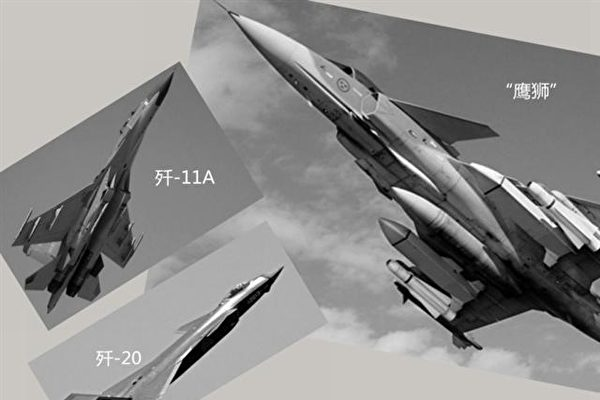

中泰“鹰击-2015”联合演习中，泰军空军以4:0的成绩完胜中共空军。（新唐人合成）

【大纪元2019年12月11日讯】号称全球军事实力第三的中共国家，其真实军事实力到底如何呢？中共空军大校在一次内部报告中泄露了真相。

据新浪网报导，12月9日，中共空军大校李中华在西北工业大学举行的一场内部报告会上，披露了中共与泰国空军联合演习中的内情，并详细介绍前者存在的问题和差距。

李中华主要介绍了中泰“鹰击-2015”联合演习。据报，中泰已举行了四次空军联合军演。

对于这次联合军演，英国《空军月刊》2016年曾进行了详细的报导。中共出动的战机有2架歼-11战机、2架苏-27SK战机、2架苏-27UBK战机，它们都属于第三代战斗机。

而泰国空军出动的是从瑞典进口的“鹰狮”战斗机，属三代半战机，也是当时泰国最先进的战斗机。

这次对抗演习的结果是“中共空军0:4惨败于泰军”。

“全球火力”（Global Firepower）网站公布2019年度全球军力排行，中共军事实力仍然排第三名，仅次于美国和俄罗斯，而泰国排第26名。

据维基百科介绍，2017年中共空军的飞机数量也排第三名，仅次于美国和俄罗斯，而泰国排20名。而且中共军费开支一直稳居全球第二，并以每年近10%的速度增长。

李中华的报告内容中显示，中共战机50公里以上的攻击成功率为0，而泰国战机的成功率为24%；30公里至50公里，泰国战机的攻击成功率高达64%，而中共战机的攻击成功率仅有14%。

报告会上，李中华披露了中共空军很多方面的不足，包括突击机和扫荡机之间战术配合不默契；机动规避盲目；中共很难对付扫荡机，多数情况下，均被扫荡机击落。

此外，中共飞行员对规避导弹的研究不深入，对不同距离导弹的规避效果判断不准确； 火控和武器系统性能与泰国存在代差；战场信息来源有限等。

李中华表示，泰方空军方面，其作战原则源于北约，战术运用突出实战，主要是注重发挥武器装备中的中远距、多目标攻击的优势。泰军强调先敌攻击、避免近战，大多采用高空、中高空配置；在战术配合上更注重实效，强调信息共享、协同攻防。

《空军月刊》报导说，演习结束后，一位泰国飞行员说：“中国飞行员将他们飞机的性能发挥到了极限，但是在制定空对空武器发射方案的时候却还要使用手动计算，这在有些情况下让‘侧卫’在发射超视距导弹时严重缺乏精确性。”

外界质疑，中共空军在2015年的这次军演中失利，除了技术、装备不如人外，还有就是中共军队贪腐问题非常严重，把用于训练、引进技术、引进装备等军费也贪污了，荒于训练。

政论作家陈破空曾说，中共军队从当兵、提干、到转业、到边防军队走私军火、走私产品，还有守矿山、守金矿的，都是靠山吃山，靠水吃水，这种腐败说不完。也就是说，现在中共军队已经比清朝、比八旗子弟、比世界上的任何军队都腐败。

现居美国的前北京大学经济学院副教授夏业良曾公开说，中共军队的腐败相当严重，用来更新武器装备的专用经费被官员挪用，这样的军队怎么能够真正打仗。#

<a target="_blank" href=#top><h6 align="right">回上方</h6></a>

<a name=97>
<h1 align="center"><b>初学格斗被安排与冠军对打 大学生被踢命危</b></h1>

只学习了一个多月格斗的22岁大二男生晓新（化名），在拳击教练说服下参加比赛，被冠军对手踢中，心脏骤停、陷入昏迷，至今没醒。图为晓新。（视频截图）

 
 【大纪元2019年12月12日讯】只学习了一个多月格斗的四川成都22岁的大二男生晓新（化名），在拳击教练说服下参加比赛，开场仅35秒，晓新被冠军对手踢中，心脏骤停，陷入昏迷，至今没醒。

这是晓新的第一次格斗比赛，在此之前，他只学了一个多月的格斗，只是一名格斗爱好者。而他的对手王某然，是一名金腰带拥有者，保持着11战0负战绩的职业格斗运动员。其曾获得世界泰拳MFC金腰带旗下的shark拳场的金腰带、泰国曼谷泰王杯泰拳联赛57公斤冠军，有陆媒报导王某的技术是“全国一流水平”。

<b>谁安排了实力悬殊的比赛？</b>

晓新今年10月开始跟随吴姓教练学拳，一个月后突然收到吴某的短讯：“30日有一场比赛，你愿意打不？拳击，对手59（公斤）。”吴某称对手只是初级水平，与晓新的程度相若，比赛目的是让晓新可以感受一下实战，而且不管赢输，他都可以拿到出场费240元（人民币，下同）。

在吴某不断劝说下，晓新终答应出场，但直到比赛前两天他才知道王某的身份。

王某在成都格斗圈内小有名气，经营着一家泰拳馆。另外，王某还是一位在某视频网站上有十几万粉丝的“网红”，经常分享一些自己打拳的视频。

晓新与教练的对话截图。（视频截图）

<b>医院下达了三次病危通知书</b>

11月30日晚，根据现场拍摄视频显示，开场仅35秒，晓新被对手踢中左腹部后缓慢蹲下，随后心脏骤停陷入昏迷。12月1日凌晨5点过后，晓新被紧急转入四川大学华西医院，后进入ICU，期间医院下达了三次病危通知书，至今没有苏醒。

12月6日，晓新的表姐在求助帖里写道：“到了华西，你开始大量便血，上吐下拉，全是血……你几乎流干了自己的血，靠着输血维持着微弱的生命，除了给你输血和打止血针，医生不敢对你做任何施救，不能推你去做检查。在我们家属的强烈要求下，冒着生命危险在12月1日下午4点半左右将你做了部分检查，然后转了ICU。”

据四川大学华西医院开出的诊断报告，晓新曾一度心脏停顿，另有胸腹部外伤、心脏挫伤、消化道大出血、失血性休克、凝血功能障碍、代谢性酸中毒、肝肾挫伤、急性肾衰竭等严重症状。

晓新的哥哥10日向“封面新闻”透露，一家人出身农村，自己和父母常年在外打工。晓新仍处于昏迷，但目前医疗费已经花费20余万元，其中主办方、协办方以及王某的家属一共给了10万左右，目前每天依然有两万多的支出，他们只能通过网络来筹集后续的费用。

<a target="_blank" href=#top><h6 align="right">回上方</h6></a>

<a name=96>
<h1 align="center"><b>美中原则上达成第一阶段协议</b></h1>

美国总统川普于周四（12日）在纽约发表演讲，预计讨论美中贸易协议进展。（视频截图）

【大纪元2019年12月13日讯】（大纪元记者张东光综合报导）川普周四（12日）清晨发布了美中贸易第一阶段协议几近达成的消息。这则推文不但解除了12月15日即将加征15%中国产品关税的忧虑，也提前完成了原本预期明年才可能签定的贸易协议，移除了投资人心中的一块大石。

知情人士告诉《华尔街日报》，预计川普总统将会签署这份协议，该协议将使美方周日不会实施新一轮对华关税，同时也会取消一些已经实施的关税。

彭博社引述消息人士称，川普已经签署协议。

川普下午2点半与贸易谈判人员会面，讨论是否推迟12月15日的对华关税等贸易事宜。会议持续到4点半结束，彭博社的驻白宫记者Jennifer Jacobs推文说，消息人士告知，川普的贸易谈判代表提交给总统的协议包括12月15日新一轮关税的推迟，总统已经签字。

但尚未清楚川普是否同意调降现已加征的3,600亿美元中国进口商品的关税税率至一半。

路透社周四下午3点半左右引述知情人士透露，白宫与北京达成了一项“原则上的协议”，以解决长达17个月的中美贸易战。消息人士称，预计白宫将于周四晚些时候宣布这一消息。

消息人士说：“书面协议仍在制定中，但原则上已达成协议。”

《华尔街日报》周四一早最先传出中美贸易协议的内容版本，分别包括：美方要求北京作出坚定的承诺，购买大量美国农产品和其它产品以及以更好地保护美国知识产权，并允许更大地开放中国的金融服务业。

对农产品采购，美国要求在协议文本中写入，将对中方承诺的对美采购进行季度审查，并明确季度采购额不会低于指定额度的10%。

此外，协议内容包括执行机制——快速撤回机制（snapback）。如果中方不履行它的承诺，那么美国的对华关税税率将恢复到原来的水平。

作为交换，美方谈判人员同意中方提出取消12月15日对大约1,600亿美元中国商品加征15%的关税议程，同时削减一半现已征收的3,600亿美元中国进口商品关税税率。

总统川普周四早上对外释放乐观信号。他一早推文说，“非常接近跟中方达成一笔大协议。他们想要，我们也想要！”

彭博社周四下午报导称，美中原则上达成贸易协议，有待总统川普批准。目前尚不清楚媒体报导的知情人士透露的协议内容，与总统10月宣布的部分协议内容有何不同。

三位消息人士告诉CNBC财经网站，川普政府原则上已与中国达成第一阶段贸易协议，有待川普总统批准。

不过，如果按照现在传出的版本达成贸易协议势必会在美国国内引发批评，会被认为放弃了太多的利好条件。

《华尔街日报》称，将现行对华关税降低7.5%或12.5%（美对华进口商品加征的平均关税）对出口商和进口商来说会改善很多，但这或不足以迫使北京改变其经济模式的核心政策。

对华鹰派、国会共和党参议员马可·卢比奥（Marco Rubio）下午3点推文说，白宫应该考虑与中国（中共）达成近期交易、放弃关税杠杆的风险。

卢比奥表示，关税是为日后在最重要问题上跟中方达成更广泛协议所需要的，例如：对国内公司的补贴、强制性技术转让和阻止美国公司进入中国关键部门等未解决的问题。

在传出美中原则上达成第一阶段的贸易协议消息后，福布斯自由撰稿人肯尼斯·拉波萨（Kenneth Rapoza）周四推文分析说，在过去18个月里，市场一直在关税男（tariff man）川普的不确定性信号下、表现走强。

他表示，如果现在是做一个单选题，美国要么A）暂停12月的关税，要么B）暂停12月的关税并将现有关税减半；眼下选A已经足够了，还需要B做什么？#

道指周四大涨220点（或涨0.79%）；标普500指数收涨0.9%至3,168点，刷新历史新高；那斯达克上扬0.7%至8,717点，同步刷新高价；代表小型股的罗素2000指数也涨1%达创新高的1,647点。

川普在推文中提及了这个“大交易”即将达成，彭博社也报导该书面协议现在只等着川普签署，这意味着12月15日的新关税将取消，《华尔街日报》更暗示美方贸易谈判官员已提出先前征收的3,600亿美元商品关税将减半。投资人普遍解读这是贸易战的大幅降温，对股市近期走势是最好的消息。

在此一消息的激励下，与贸易战题材相关的个股周四大涨，卡特比勒（Caterpillar）涨1.9%，思科（Cisco）涨3.1%，美光科技涨3.5%，带动费城半导体涨2.5%并创下历史新高。银行股也反映公债殖利率上扬（意味着经济展望趋好）而全面大涨，美国银行（BOA）大涨3.1%，SPDR标普银行ETF基金周四也上涨2.9%，创下52周最高价。

12月稍早，川普曾说他想要明年总统大选完后再签贸易协定，该发言让投资人震惊，道指在两个交易日回跌超过500点。现在回想起来，作为谈判高手的川普当时正采用激将法迫使双方加快达成协议。

今年以来，标普500指数大涨26.4%，道指涨20.6%，那斯达克上扬31%，可说是投资人盆满钵满的一年。但这样的成果却让部分专家担心今年涨太多，反而限缩了明年上涨的空间，尤其明年是美国总统选举年，各种负面题材充斥，投资人的持股信心将备受考验。

周四，美国劳工部还发布了一则利空消息：截至12月7日一周内的首次申请失业救济人数增加4.9万人，累计人数达25.2万人，为2017年9月以来最高位，该数据可能受到感恩节因素的影响，是否表示就业市场松动还需进一步资料的厘清。但对投资人而言，相较于贸易协议即将签定的好消息，此一利空已微不足道。

贸易协议的好消息也推动全球股市上扬，周四MSCI全球股价指数创下2018年1月以来新高。与经济展望息息相关的国际油价也小涨，布兰特原油收报64.2美元/桶。但金价期货却以利空回应，周四盘中一度涨到一个月最高价的1,491美元/盎司，川普推文出现后收跌0.9%至1,468美元。#

<a target="_blank" href=#top><h6 align="right">回上方</h6></a>

<a name=95>
<h1 align="center"><b>星岛再露红媒底牌 何柱国逼宫林郑内情</b></h1>
 <h3 align="center"><b>疑被美国盯上中共代理人身份 何柱国想脱手星岛？</b></h3>

星岛老板何柱国近日登广告历数特首林郑月娥12条“罪状”，警告林郑未遵北京指令行事，后果很严重，再次显示其中共代理人身份。（香港政府新闻处）

【大纪元2019年12月13日讯】（大纪元记者李靖、赵彬香港报导）日前，《星岛》老板何柱国以“拭目以待”为题登广告历数特首林郑12条“罪状”，批其执行“止暴制乱”不力，文末提醒林郑2017年参选特首时所立“军令状”。何玩弄文字伪术，列“罪状”警告林郑未遵北京指令行事，后果很严重，再次显示其中共代理人身份。

<b>批林郑未遵指令 党友同室操戈</b>

12月9日，何柱国批林郑的广告登出后，有中共地下党之称的梁振英的发声平台“港人讲地”立刻全文转载，并称“何先生发火了”，再次提醒林郑“哪一项承诺，自行思考”。

林郑在2017年参选特首时承诺，“如果香港人主流意见令我无办法再担任行政长官，我会辞职”。林郑并非港人一人一票民意选举的结果，是中共钦点内定，这里的“香港人主流意见”不言而喻是给林郑抬轿子的亲共建制派等党友。

梁阵营说“何先生发火了”，其实与有中共地下党书记之称的民建联主席李慧琼5日在立法会炮轰林郑班子的意图相同。李慧琼点名政务司长、律政司长、保安局长、教育局长等林郑班底官员，质疑他们“止乱制暴”的决心和能力。

何柱国、李慧琼等人批林郑是指她未按韩正等中共所要求的“止乱制暴”行事，或行事不力，与港人批林郑对民意置若罔闻，纵容港警滥暴、滥捕行为把香港变战场截然不同。何柱国等人是警告林郑未遵中共指令“止暴制乱”行事，后果很严重，实属党友同室操戈。

港澳办主任张晓明、发言人杨光以及韩正给林郑港府下的指令是：行政、立法、司法机关“共同负责”，实施所谓的“止暴制乱”。张晓明进一步把话挑明，称“必须确保行政长官由北京信任的‘爱国者’担任，特区的行政、立法、司法机关也必须以‘爱国者’为主组成。”

中共人治思维引发港人强烈抵制。大律师公会立即发声明驳中共的“共同责任论”，强调香港特别行政区享有独立的司法权和终审权，要求中共遵守“一国两制”承诺。

立法会议员陈淑庄表示，香港是三权分立制度，香港重要的核心价值是法治，而非人治。她希望韩正慎言，尊重港人治港原则。

中共的人治思维在香港碰壁，香港市民反暴政、争自由运动赢得香港与国际社会的支持。美国签署《香港人权与民主法案》，掀起欧洲、日本相继开始讨论相关法案；区议会大选亲共阵营大败，令亲共的建制派及相关人士失落、恐慌，而对林郑不满。

<b>知中共代理人后果严重 想脱身？</b>

何柱国以广告形式替中共警告林郑办事不力的后果很严重，不过近年来，因忘我地冲锋陷阵，何柱国中共代理人身份再也藏不住了。特别是近日，中共代理人身份被美国盯上，何柱国似乎想脱身。

何柱国批林郑的12条“罪状”中，与中共镇压不喜欢人士、团体的手法相同，套用大陆的流行语就是“不解决提出的问题，而是解决提出问题之人”。

《星岛》老板何柱国12月9日以“拭目以待”为题登广告，替中共追讨林郑未完成中共常委韩正要求的“行政、立法、司法机关共同止暴制乱”，将压力都压给警方。（报纸翻拍）

何柱国的“问罪”广告完全不问港人为什么要坚守“五大诉求”抗争到底，而是历数林郑打压坚守“五大诉求”的港人不力。何与李慧琼同调，批林郑班子未遵守中共要求的行政、立法、司法机关“共同负责”指令，使中共港警孤掌难鸣，落得“黑警”骂名。同时，还称“止暴制乱”不力，令香港成为台湾的蔡英文最佳助选团等，其立场与论调完全是复制中共党媒言论，其中共代理人身份显露无疑。

日前，建制派人士传出一香港富商私人专机入境美国被问话的消息，随后又有多个渠道透露这名富商是《星岛日报》老板何柱国。

网台“D100 Radio”12月10日的《风波里的茶杯》节目中，香港资深传媒人黎则奋透露，“传何柱国不是被拒入境，而是被问话4个小时才让他入境。”他说，何氏家族很多资产在美国，站错队很危险。

时事评论人士盛杰说：“何柱国陷入中共统战的利益泥潭，关键时刻必须站出来代言。”他认为何柱国入境美国被问话，是他中共代理人身份被美国盯上了。

在“D100 Radio”9月18日《风波里的茶杯》节目中，前香港立法会议员李卓人说：“何柱国说自己在美国已住30年，应是美国公民。”

他建议何公开自己是否拿美国护照，并表示如果何柱国是美国公民，（《香港人权与民主法案》）可能制裁他，将剥夺他的美国身份。

针对近期何柱国准备卖掉《星岛日报》一事，黎则奋认为，“（卖《星岛》）与人权法有关，因《星岛》是舆论机器，可能帮中共说话而导致被制裁。”他暗示何卖《星岛》与逃避美国人权法制裁有关。

近期，《星岛》公布，公司主席兼大股东何柱国正与一位独立潜在买家就可能出售《星岛》权益进行初步阶段磋商。

公告称：“若潜在交易成事，或可能导致不同结果，而其中一个可能结果为公司之控制权转变，并按收购守则规则26.1下作出强制全面要约。”据悉，何柱国现持有《星岛》约48.98%权益。

中共目前处于内外交困、风雨飘摇之时，近年以反腐开始的高层厮杀导致官场官员一旦站错队，随时就进秦城，落得身败名裂，中共官员惊呼“官不聊生”，这一现象已延烧到香港。香港市民持续6个月的反极权运动令共港政府骑虎难下、进退无策，共港官员正面临国际社会对其破坏香港人权、法治行为的制裁，曾经为利益与中共捆绑在一起的香港政商界正面临正义与良知的选择。

<b>美国强化外国代理人管理</b>

近年，中共利用间谍、媒体等手段渗透欧美等自由社会，引起美国高度警觉，去年美国司法部要求新华社和中国环球电视网注册为外国代理人，开始强化对中共代理人的管理。

美国《外国代理人登记法》要求以“政治或准政治身份”代表外国利益的代理人必须公布其与外国政府的关系、相关活动和资金信息。其目的是协助“美国政府和社会对相关人物的言论和活动进行评估”。

原央视主持人杨澜的丈夫吴征作为中共的媒体、情报人员被美国盯上，深知情况不妙，于2018年3月登记注册其中共代理人身份。

另一方面，近年美国强化对未做登记的中共代理人实施拘捕的打击。

今年4月19日，已入籍美国的前中国国航经理林英，因为“未经申报担任外国政府代理人”，或面临最高10年监禁。作为认罪协议的一部分，林英同意没收其14万5000美元财产。

检控官指控她自2010年起，多年为中共常驻联合国代表团的军方官员偷运包裹，她也从中共驻纽约总领事馆员工处收取包裹，将“无人陪伴的行李”走私至北京。

前中国国际航空公司经理林英充当中共代理人绕开美国的审查，帮中共军方人士将包裹走私至中国，11月21日在纽约东区联邦地区法庭被判缓刑5年。（林丹／大纪元）

原悉尼中共总领馆的外交官陈用林接受大纪元专访时表示，林英的行为百分之百在为中共政府服务，她毫无疑问是中共间谍。

陈用林表示，澳洲的《外国代理人登记法》比美国更严厉，国际社会正在注视中共代理人的举动。他举例说，今年初，富商黄向墨涉嫌为中共从事情报活动被澳洲政府禁止入境，并取消其绿卡。

“澳洲当地3家中文媒体头版刊登整版广告，以所谓128个当地华裔社团连署反对澳洲政府的决定，声援支持黄向墨。”他说，“据我得到的消息，这些亲共社团正在遭到澳洲情报部门的调查。”

陈用林告诫亲共的华人社团远离中共，和统会和孔子学院等机构要赶紧登记注册，或投案自首，否则因触犯外国代理人法遭惩罚。

<b>充当中共代理人而被判刑的华人</b>

林英已不是美国境内发生第一宗充当中共代理人被定罪的华人案例。据美国法庭文件，最早因违反《外国代理人登记法》、未登记为外国代理人被判有罪华人已有多人。

根据美国的法庭文件，因违反《外国代理人登记法》、未登记为外国代理人被判有罪的华人麦大志、钟东藩、慕可舜、季超群。（新纪元合成图）

<b>■麦大志</b>

第一个是麦大志（Chi Mak）间谍案，这是美国联邦调查局（FBI）历史上规模最大反间谍行动之一。

检方指控麦大志替中国（中共）窃取美国海军船只动力系统情报，并一直设法隐瞒其与中共的联系。此外，麦大志也曾在申请移民美国的表格上做假。

麦大志，1940年出生于中国广东省广州市，1985年入籍为美国公民，2008年被加州联邦法院判处有期徒刑24年5个月。

据美联社报导，当陪审团的裁决被宣读时，麦大志先是面无表情，随后泪水在眼眶打转。据悉，麦大志除了身败名裂外，并且为聘请律师付出了惊人的费用，该笔费用远远超过中共给他的报酬。中共不但毁了麦大志的前程，而且给了他最致命的打击：否认与麦大志案有任何牵连。

<b>■钟东藩</b>

另一个是华裔钟东藩（Dongfan Greg Chung），钟在中国大陆出生，1962年从台湾移居美国，是前波音航空公司工程师。他为中共从事经济间谍及担任中共代理人，于2010年被判处有期徒刑15年8个月，当时钟已经74岁。

钟是麦大志间谍案后顺藤摸瓜暴露出来的。

据彭博社报导，联邦调查局在搜索钟东藩的住所时，发现中共官员给钟东藩的一封信上说：“你能为我们效力是你的荣耀。”

负责钟东藩案件的美国检察官斯坦博说，钟东藩将老死在监狱中，联邦法庭对钟东藩的严厉审判带有警示之意。

美国《纽约客》（New Yorker）杂志2014年刊登美国反谍战文章中谈及此案，当FBI探员搜查完钟家、准备离去时，钟的儿子说：“父亲的心被中国（中共）牵去太多。他需要重新摆正他效忠的对象。”

<b>■慕可舜</b>

还有一例是台湾韩裔商人慕可舜（Moo Ko-Suen），他充当中共代理人，非法为中共采购军备，包括黑鹰直升机引擎、F-16战斗机引擎、巡弋导弹以及空对空导弹等。

慕因违反美国武器出口管制法案于2006年被判有期徒刑6年半。在2011年刑满后，64岁的慕被美国递解回台湾。

<b>■季超群</b>

最近还有一起正在审判中的中共代理人案例——27岁的中国公民季超群（Ji Chaoqun，译音）按照中共江苏省国家安全部高级情报官的指示、在美帮助招募美籍华人（大陆或台湾出生）。

据芝加哥美国地方法院提起的刑事诉讼和陈述书内容显示，27岁的季超群在江苏省国家安全部一名高级情报官员的指导下工作，该部门属于中共国家安全部省级部门。起诉书指出，季超群的任务是向中共情报官员提供有关8个美国人的个人信息，以便江苏省国家安全部可能招募他们。

美国助理检察官肖巴‧皮莱（Shoba Pillay）在法庭聆讯时说，如果罪名成立，季超群将在联邦监狱服刑最长10年。

季超群出生于中国，并于2013年以F1签证抵达美国，在芝加哥伊利诺伊理工学院学习电气工程专业，2015年获得电气工程硕士学位。

2016年，季超群依据美军紧缺人才征兵计划（Military Accessions Vital to the National Interest，简称MAVNI）报名当兵，加入美国陆军后备役。在申报参军过程中，季超群隐瞒了他与中共情报官员的关系和联系。#

<a target="_blank" href=#top><h6 align="right">回上方</h6></a>

<a name=94>
<h1 align="center"><b>中港警察头目会面 官媒报导不同调的背后</b></h1>

图为11月11日，香港中文大学学生拒绝港警进入校园，警察向学生发射催泪弹并拘捕学生，现场恍如战场。（余钢／大纪元）

【大纪元2019年12月09日讯】（大纪元记者张顿报导）中共公安部部长赵克志日前会见香港警队新任警务处长时，公安部旗下的官网予以详细报导，但中共两大央媒删除了赵克志的很多敏感讲话。有分析认为，央媒删除的那些话有泄漏中共高层秘密之嫌。

<b>赵克志会见邓炳强 官媒报导现差异</b>

12月6日，香港警务处处长邓炳强到访北京，当天会见了中共国务委员、公安部部长赵克志。香港警务处长被认为是香港警队“一哥”，拥有前线调动、指挥的实权。

公安部旗下的“中国警察网”详细报导了此次会面。但中共两大喉舌《人民日报》、新华社报导此新闻时，赵克志逾三分之二的讲话被删除，赵的讲话连带标点符号仅有136个字。

央媒删除赵克志讲话的内容包括：希望“邓炳强处长坚守初心、不负重托”，“中央政府和公安部永远是香港警队的坚强后盾”等。

时政评论员李林一对大纪元记者表示，部分被中共央媒删除的赵克志讲话，透露了一些内幕，主要集中在赵克志希望邓炳强“坚守初心、不负重托”这八个字上。

李林一认为，“坚守初心”，这是中共近期在内部用得比较多的词。让邓炳强坚守“初心”，自然引发邓炳强是否已经加入中共，成为党员的怀疑。

李林一说，“不负重托”，这个说法之前没见中共官媒报导过。这四个字显示，中共高层对邓炳强曾有过“重托”，即下过秘密命令。而中共央媒有意删除了这些敏感话语，此地无银三百两之嫌浓厚。

11月4日，习近平在上海会见香港特首林郑月娥时，并没提及香港警队。11月14日，身在巴西的习近平公开称，“坚定支持香港警方严正执法”等。

<b>无惧港警疯狂 80万港人再游行</b>

12月8日，80万港人无惧港警之前的疯狂镇压，再次游行。港人在游行中继续喊出五大诉求，同时纪念抗争满半年。

近期，港警对香港民众的镇压也愈加疯狂。

11月11日，港警狂射催泪弹、橡胶弹、布袋弹、海绵弹暴力镇压港人发起的“三罢”活动；实弹近距离射伤手无寸铁周姓同学；拘捕了287名抗议者。

11月12日，港警再度闯入中大校园，并狂射了2,356枚催泪弹、橡胶子弹，并出动水炮车镇压学生，中大校园变成了战场，火光及烟雾冲天。

警方12月9日在记者会公布，从6月9日至今，警方共使用了1.6万枚催泪弹、1万发橡胶子弹、2,000发布袋弹以及约1,850发海绵弹。并拘捕了6,022人。

<b>香港官方异常 邓炳强多次公开警告港府</b>

事实上，香港警队在香港目前处于“独大”的状态，经常出现公开警告港府及行政上级的怪现象。

11月26日，林郑月娥在出席行政会议例会前后都曾表示，港府正考虑成立独立检讨委员会，以检视近月社会动荡成因。

邓炳强在3天之后，即29日与传媒茶叙时称，检讨委员会的工作不涉及警队行动；他个人并不反对成立检讨委员会，因为该委员会对事不对人，是检讨风波起因；涉及警员的投诉，会交由监警会处理。

12月7日，邓炳强再次表态，不反对政府成立任何不针对警队的委员会；若委员会目的只为针对警队，是“不公义”。

除了独立检讨委员会，林郑月娥一度考虑成立独立调查委员会的想法，也遭到港警高官的警告。

《南华早报》10月26日援引消息指，特首林郑表示，如果公众对监警会的报告感到不满，政府将会考虑成立独立调查委员会。

但林郑想成立独立调查委员会的想法，也先后遭到两任警务处处长的公开警告。

前警务处处长卢伟聪在退休前一天（11月17日）称，他坚拒成立独立调查委员会，如有任何针对警队的投诉或指控，应交投诉警察课及监警会处理。

12月1日，新任警务处处长邓炳强称，成立针对警方的独立调查委员会，是“不公义”；现在由监警会调查针对警方的指控行之有效。

<b>光头警长批完林郑批港府 建制派看不过去</b>

除香港警务处处长表现特别外，在反修例运动中，曾举枪瞄准抗议者的“光头警长”刘泽基，在受到中共特殊对待后，其行为也变得异常高调。

刘泽基曾应邀出席了中共10月1日的阅兵式，并登上天安门城楼。在阅兵转播中，刘被拍摄的次数，甚至多过特首林郑月娥。

之后，刘泽基几乎成为口无遮拦的“自走炮”，除了持续发文力挺香港警队，严批反修例阵营，也一度将炮口对准林郑月娥和港府。

香港民政事务局局长刘江华10月接受港媒访问时，提及林郑月娥曾经与反送中的“勇武派”及抗争者“深度对话”，刘泽基便在微博发文怒批此举若属实，他日后要怎么执法，公理何在。

11月25日，香港区议会选举结果出炉，亲北京的建制派大败，在452个议员席位中，仅获得59席；而民主派大获全胜，民主派一举夺得385席。

刘泽基当日就在微博上质疑本次选举，认为全港投票人数为294万3842人，但所有候选人总得票数为125万3647张，还有160几万张票去了哪？超过57%票是废票？

他宣称：“相信要全港重新点票了！我们要求所有地区重点票！”

因为刘泽基的质疑，香港选举事务处不得不刊文回应，区议会选举总投票人数为294万3842人，而候选人总得票为293万1745，废票仅有1万2097张，比率约为0.4%。

刘泽基的高调表现，就连香港建制派都看不下去。

11月27日，建制派议员田北辰在立法会不点名地批评刘泽基。他说，有警员在大陆微博造谣，称本届区议会选举有一半废票，挑拨中港人民感情，又曾批评特首林郑月娥不懂从政及执法。

田北辰质询当局是否知悉这些事情，如何能忍受公务员批评其上司。

<b>港府四名司局长或遭撤换 两人涉港警相关事件</b>

12月10日，《苹果日报》从消息人士处获悉，港府最少四名司局长已“上榜”或遭撤换，但最终名单待北京拍板。报导的插图显示，这四人是政务司司长张建宗、律政司司长郑若骅、保安局局长李家超及民政局局长刘江华。

其中，保安局局长李家超是邓炳强的顶头上司。有报导指虽然李家超来自警队，但在近月警民冲突中，李难以高度介入指挥工作，甚至可以说是介入不到。

而政务司司长张建宗曾在7月26日，就港警处理21日元朗袭击事件的方式向香港市民道歉，之后遭遇香港警队发难。网上一度传出要张建宗下台及道歉的信件及相片，否则“全警队同你势不两立”。

12月5日，香港立法会否决了民主派弹劾特首林郑月娥的议案，但多名建制派议员先后发言批评港府及其团队。

建制派最大政党、民建联主席李慧琼发言时，严厉批评林郑的管治团队“无意识、无机制、无方案、无行动”，并点名批政务司司长张建宗、律政司司长郑若骅，保安局局长李家超、教育局局长杨润雄，以及环境局局长黄锦星等人，没有想办法“止暴制乱”，将责任全部推到警方身上。

香港《苹果日报》刊发评论文章称，民建联是香港亲共第一大党。民建联如何看待反送中风暴、看待区选结果，不只是民建联的立场，更必然反映中共的立场。

文章说，李慧琼炮火全开，当然不是要与众多司局长割席，而是反映中共对林郑团队的评价，反映习近平对林郑团队恨铁不成钢。

<b>分析：港警独大 背后是中共政法委 港人不屈服</b>

李林一表示，因为中共高层在背后的支持，现在是港警独大。香港警务处处长邓炳强，甚至“光头警长”刘泽基等人，都不买特首林郑月娥或上级的帐。港警近6个月来肆无忌惮地镇压民众，也有中共在背后支持的原因。

李林一说，赵克志会见邓炳强时说，“中央政府和公安部永远是香港警队的坚强后盾”。赵克志居然把公安部和中央政府放在了并列的位置。这显示中共政法系统已全面介入香港事务，中共管制大陆的那一套会不断被移植到香港，而且会越来越明显。

李林一认为，香港人并不会因此而屈服。例如，12月10日，香港高等法院上诉庭拒延长禁蒙面法，使得港府的法令即刻失效。11月24日香港区选，民主派大胜后，12月9日游行仍有80万港人参加，说明了港人在争取自由、民主问题上是不会对强权屈服的。#

<a target="_blank" href=#top><h6 align="right">回上方</h6></a>

<a name=93>
<h1 align="center"><b>美新书曝中共处决“变节者”及其怀孕妻子</b></h1>

一名叛逃澳洲的中共特工表示，中共间谍对香港的民主运动进行渗透、对台湾的总统选举进行操纵以及对澳大利亚政界进行破坏。示意图(JOHN MACDOUGALL/AFP/Getty Images)

【大纪元2019年12月10日讯】“对于北京某政府部门的员工来说，2011年最冷的一天不在冬天，而是那天早上，所有人被命令观看一位他们曾经的同志及其怀孕的妻子被处决的过程。被处决的人被揭露为美国中央情报局的间谍。两人在该部的内院被枪杀，整个枪杀过程在闭路电视上播放。”

这不是惊悚小说的情节，而是美国前中央情报局（CIA）分析师彼得‧马蒂斯（Peter Mattis）和詹姆士敦基金会（Jamestown Foundation）学者马修‧布拉吉尔（Matthew Brazil）在新书《中共间谍活动：情报底色》（Chinese Communist Espionage: An Intelligence Primer）的前言中对真实发生的美中间谍战的可怕描述。

<b>中共“变节者”被“斩尽杀绝”</b>

由于美国情报工作的失败，中共在2010年至2012年捣毁了美国在华间谍网，导致20名CIA线人被杀或监禁。值得一提的是，直接导致CIA间谍在中国被杀的、为中共搜集情报的前美国中情局（CIA）特工李振成（Jerry Chun Shing Lee）2019年11月22日在美国被判19年监禁。

马蒂斯和布拉吉尔在书中解释到，中共为什么要给予背叛他们的人致命的打击并如此大肆渲染，是因为中共在历史上曾因为间谍活动遭遇过灭顶之灾。他们举的例子是中共所称的1927年的“四一二政变”，因为那次事件，中国共产党几乎全军覆没。马蒂斯在书中说，正是因为“四一二”事件，中国共产党意识到情报工作的重要。

马蒂斯在美国智库詹姆士敦基金会的新书介绍会上说，他们的这本书是对中共情报活动的入门介绍，主要是解密中共将近一个世纪的情报工作，以便读者对中共情报活动有更深入的了解，尤其是中共情报活动在全球迅速扩张，甚至已经成为全球情报大国。

《中共间谍活动：情报底色》是第一本利用中文资源，介绍中共情报活动前世今生的书。该书共分七章，分别介绍了中共情报工作的组织机构、高层领导、著名谍报人员（包括1980年代潜伏在中情局的红色间谍金无怠）和重要谍报活动。书中还有一个章节专门谈中共在国外的经济间谍活动。

马蒂斯和布拉吉尔在书中说，他们对中共情报史研究的一个重大发现是中共情报语言依然体现了马列以及革命的传统。他们说，中共可能通过技术和方法获得了情报，但是在情报分析上却不得不受到“马克思列宁主义思想的过滤镜”的影响。也就是说，共产党从社会经济发展的“客观科学规律”衍生出来的方法将政策失误认为是外部干预的结果。

马蒂斯说，这在香港问题上得到了充分的体现。在新书介绍会上被问到中共的情报分析与西方有什么不同时，马蒂斯以香港问题举例：“如果你看了香港现在正发生什么事的新闻，以及看了中共媒体如何阐述，或者看了中共外交部的说法，中共指一切动荡都是美国的幕后黑手制造出来。我们经常归纳这是一种偏执，但其实这是在这种体制下，合理地衍生出来的。中共认为自己对趋势有独特的掌握，因此制定了独特的政策，指导政策都是有科学根据的，但中间出了问题，就不认为是出于理论、设计或分析问题，而是出于某些人为的因素，这种思想导致中共的情报工作，所以经常遇到一些偏执的问题。所以中共之不同是，他们不会问发生什么事，而是会问哪里有人搞鬼，问谁人在背后搞鬼，然后寻找一些有可能不存在的证据。”

<b>人人都可能为中共收集情报？</b>

马蒂斯说，西方世界对中共间谍活动通常有些误解，比如认为中共在情报活动中很少用传统的间谍手段，雇用业余人员从事间谍活动以及人人都有可能为中共收集情报等。

他说：“如果我们提到美国的情报工作，大概是指一些特定的情报组织，或者是一小撮的情报机关；但讲到中国的情报工作，他们是在说任何与中国有关的人都可以为中国（中共）效命，任何人都好像在搜集情报、科技和渗透活动等等。”

他说，这样的认识并不能有助于提高对情报的分析，同时也没有反映中共情报历史的真实。他说：“（这样认知）的一个缺点是，每个中国人都有可能是间谍，当年这么设定的时候，这对评估风险并不实际，而且也不能帮助你了解哪个部分在干哪些事情，并且也有可能是不真实的。”

他说，中共确实在雇用中国民众甚至华裔进行间谍活动，但是这并不是中共情报的工作重点，但是，中国情报活动的规模以及未来的可能影响对美国和西方的确构成了极大威胁。

马蒂斯的这一观点与法国作家罗杰‧法利戈（Roger Faligot）在其再版著作《中国间谍：从毛泽东到习近平》一书中揭示的观点有所不同。法利戈说，中国的间谍活动方式给其它国家在识别间谍时带来了困难，“因为他们看起来并不像间谍，行为方式也不像间谍”，因为他们可能是“学者、学生、商人和记者”。

（转载自美国之音；原标题：新书：《中共间谍活动：情报底色》—中共对“变节者”斩尽杀绝）

<a target="_blank" href=#top><h6 align="right">回上方</h6></a>

<a name=92>
<h1 align="center"><b>【新闻看点】港警一哥赴京前喊话 民阵怒怼</b></h1>

12月1日，香港警方于太子道西砵兰街交界发射数枪胡椒球弹，一名女生眼睛被击中。（大纪元）

【大纪元2019年12月07日讯】大家好，欢迎大家关注新闻看点，我是李沐阳。

11月19日上任的香港警务处处长邓炳强，今天（12月6日）和副手萧泽颐一同启程去了北京，“礼节性”拜访中共公安部、港澳办等。临行前他主动提到已经对民阵申请的12月8日（周日）游行发出了“不反对通知书”。说如果当天有暴力事件发生，民阵“应拿出勇气谴责”。

在今天下午的记者会上，民阵召集人岑子杰对邓炳强进行了呛声。他反问“港警一哥”：“有没有勇气先谴责警暴？”

外界认为，邓炳强虽然批准了民阵游行，但实际更阴险，也更残忍。

民阵怒怼“一哥”

邓炳强表示，从6月至今，多项大型公众活动“都有暴力的示威者、或暴徒骑劫活动，做出违法行为”。他说周日公众活动的主办单位“当遇到暴力事件时，拿出勇气谴责暴力”。

岑子杰在随后的记者会上，向邓炳强进行了回击。他说“一哥似乎是自己告诫自己”，因为警方的暴力程度早已经超出了人道范围。他反问“港警一哥”，“有没有勇气先谴责警暴？”

刚在区选胜选的新科议员岑子杰认为，游行示威是港人的公民权利，本来就不应该由警方批准与否，如今警方只是“拨乱反正”。鉴于警民关系已经跌到了冰点，他呼吁前线警员保持克制，“不要挑衅游行人士”，避免发生冲突。“只要前线一名警员失控，就会令情况失控”。

岑子杰讲出了一个事实，在每次的游行集会活动，只要港警出现，就一定有冲突。而没有港警，比如8·18维园170万人流水式集会，没有任何冲突，更没有暴力。

谁是不安定因素呢？谁是暴力因子呢？

民阵呼吁香港人都来参与这次“守护香港 和你同行”的游行，向政府展示民意。声明表示，“香港人，星期日3点，维园见！”

有估计认为，游行人数可能会再次超过100万。大纪元和新唐人也一如既往地站在港人身边，全程直播。

<b>邓炳强双手沾满年轻人的鲜血？</b>

邓炳强这次进京，公报称是礼节性拜访。但人们更相信他是“进京领命”，当面接受主子“训示”。林郑去了一趟北京，回来就强推“禁蒙面法”，警暴严重升级。这次邓炳强周日返港后会不会有什么行动呢？相当值得关注。

从他任职“港警老二”时的铁腕镇压手段来判断，他“血腥镇压”的立场可能不会有改变，正所谓“江山易改，本性难移”。

别看他说得好听，什么“发出不反对通知书”，什么“警方有多方准备”等等，实际他是一个“嘴甜心狠、口蜜腹剑”的人。法广指出，他与前任卢伟聪一样，都是双手“沾满了年轻人的鲜血”。

卢伟聪任警务处长时期，邓炳强是“港警老二”，典型的“鹰派”。镇压反送中，他负责具体实施。在他代号“骑士（Tiderider）”的镇压行动中，前线警员的行为不受任何控制，镇压手段令人发指。也很可能因为这个原因，他才得到北京认可接替58岁下台的卢伟聪。

他上任第一天，承印《大纪元时报》的印刷厂就遭到歹徒“假扮”黑衣人放火，支联会主席何俊仁被“黑衣蒙面歹徒”袭击。

而这只是两桩新的罪案，在他的指挥下，半年时间，港警抓了近6000人。最小的11岁，最大的83岁。警察在警署内殴打、强奸、轮奸的指控接连不断，警察打死人的消息也屡屡传出。

他还亲自督阵“铁桶围城理工大学”，为涉嫌开枪谋杀的警察辩护，给下班警察配备伸缩警棍和胡椒喷雾，使香港变成了“警察社会”。

有一个事，听起来像“黑色幽默”。立场新闻报导，化名“May”的朋友是“准警嫂”，也是一位“和理非”，多次亲眼见证警暴。未婚夫是交往8年的前线防暴警察，因为未婚夫的职业，May的朋友开始在疏远她，好友兼伴娘也在犹豫是否出席她的婚礼。

May认为自己的婚礼不被祝福，要求未婚夫辞职，否则就分手。她虽然相信未婚夫不会殴打示威者，没有伤害他人。但对同袍施虐视而不见、放弃良心的人，无法与之相处。

这个事说起来有些令人伤感，但却实实在在证实着警暴有多恐怖。

<b>港人需求：平安回家！</b>

我的朋友大宇接到不少爆料。一位叫maymi的朋友说，每次申请获发不反对通知书，都绝不代表参加的人能平安回家。他说太多次获发不反对通知书，但集会未开始已见大批防暴在守候。集会没到一半时间，防暴就开始赶人走。甚至封锁集会一带的道路交通，围困集会人士。

maymi说，防暴警表面大叫游行人士离开，但实际人们根本无法离开。警察是在制造假象，让外界以为是游行人士不肯离开，警察迫不得已才清场。

maymi说这“已经是屡见不鲜的事！共产党就是这么出尔反尔，这个政府就是这么卑鄙无耻！黑暗得教人心寒！”

从maymi爆料来看，警方批准周日的游行，会不会有什么更深的阴谋呢？我们期待着所有参加游行的香港人，都能够平安回家！

好的，感谢您关注新闻看点，再会。

大纪元《新闻看点》制作组  #

<a target="_blank" href=#top><h6 align="right">回上方</h6></a>

<a name=91>
<h1 align="center"><b>惠誉：反送中未损及香港金融中心地位</b></h1>

12月11日晚，香港医疗业界工会集气大会在中环爱丁堡广场举行，集会人士在会场外围举起“FREE HK”（解放香港）萤光牌。（宋碧龙／大纪元）

【大纪元2019年12月13日讯】国际信评中心惠誉在美东时间11日发表报告称，目前没有证据显示社会动荡会损害香港作为全球金融中心的地位；但动荡削弱外界对香港管治能力的评价，和作为稳定国际商业中心的认知。

报告指出，香港短期经济前景将持续恶化，预计今年经济成长将萎缩1.5%，包括旅游、零售、酒店、餐饮和航空运输等行业都将受重挫；房地产交易量也已下跌，房价已从5月的高点下跌近5%。

报告称，虽然港府自8月中已推动250亿元港币的纾困措施，对2020年的经济成长可能有助益，但经济前景仍不乐观。

但报告指出，阿里巴巴近期在港交所上市，突显了香港作为中国企业离岸金融中心的角色，且随着中美地缘政治冲突加剧，以及中国强化对资本账的限制，香港这一角色将更加巩固。

报告也表示，尽管社会动荡，香港今年的股本与债务募资水平和前3年大约保持一致；从银行存款、商业登记和工作签证等数据来看，都显示香港作为全球商务中心的角色并未减弱。

报告表示，外资特别重视香港的法治、司法独立、政治稳定和安全。若政治持续不稳定，可能削弱香港的商业地位，信用评级也有持续调降的风险。

对于美国近期生效的《香港人权与民主法》，报告指本法主要是象征意义，但也凸显国际社会对香港的看法可能影响经济，显示香港的独特性和有利地位并非一成不变。

（转自中央社）#

<a target="_blank" href=#top><h6 align="right">回上方</h6></a>

<a name=90>
<h1 align="center"><b>走出华为的工程师：华为是全人类的噩梦（下）</b></h1>

华为被指是结合商业、间谍、情报、偷窃为一体的军工复合体。(HECTOR RETAMAL/AFP/Getty Images)

【大纪元2019年12月11日讯】（大纪元记者李新安采访报导）华为员工李洪元事件，揭开了华为利用公权力构陷员工的黑幕，引发外界关注。华为离职工程师金淳向大纪元表示，华为就是中共的一个权力部门，它是结合商业、间谍、情报、偷窃的军工复合体。

<b>华为的狼狗文化</b>

谈到华为的企业文化，金淳深有体会，觉得那是宣传洗脑，强者文化。金淳最初进入华为是觉得华为是高薪、高科技企业。“但是跟我理想当中的高科技企业差别很大。华为好多所谓的发明创造都是剽窃别人的。”

他表示，“华为其实没有什么创新，通常是走别人的路，让别人无路无可走。它凭什么能做到这一点呢？其实就是共产党的国家强权。公检法都站在它那一边，所以各种专利全是它的，即使你发明的东西，到最后也是华为的专利。所有别人的路它都能够走遍，所以能成为国内IT界的老大。”

金淳举例说，去年南京所出了一个事，有一个员工跟上面写报告，说某某部门研究出一个新的工具全是抄袭开源社区的一个项目，那个人就被打击报复，差点不能上班了。后来总经理任正非还煞有介事地说，我们要保护说真话的人，要珍惜人才，就把他调到另外一个地方去了。然后这件事情就在公司里面被大肆宣传，这其实是变相地欺骗其他员工，掩盖华为的盗窃本质。

华为经还常在公司内部组织关于网络安全、信息安全的考试培训。“其实也是一种宣传，说华为采用的是英国标准的网络安全方式，符合国际标准，是公开透明的。实际上，仔细看里面的猫腻很多。”他说。

长期以来，华为因为盛行加班，过劳死频发被外界称为奉行“狼文化”。但金淳说，“华为的企业文化应该叫狼狗文化，把员工管成狗，天天累得像狗一样，还鼓励你狼狗之间互相揭老底、互相倾轧。”

“华为员工每个月只能休息4天，每天从9点工作到晚上11点，项目忙起来、交付阶段，有的时候到凌晨3、4点钟才能回家，第二天可以休息半天。有时一个月只休息了一天。关键是压力特别大，还不在于时间上，是心累，各种各样的压力。”

今年5月中旬，美国商务部将华为列入出口管制实体黑名单。美国制裁使华为受到巨大冲击，而任正非早已表态“华为要有过苦日子的准备”，要推行去平庸的裁员计划。

金淳表示，身边也有被裁员。“华为除了有裁员计划后，有的时候它是这么干的，比如一个部门项目组差不多40人，他天天给你加班，让你加到12点，到最后这个项目组只剩4个人，大部分都自动离职了，但是是华为造成员工主动自动离职的。这种东西它没算在裁员计划里，但是华为就喜欢这样整人，让你主动离职。”

据金淳透露，那个软件项目的版本最后没有上线，但是项目经理因为有功劳，淘汰冗员，还被加薪了。“从这个例子，我看出华为是极权主义的绞肉机，加上高科技，西方管理的外衣。”

“这里面要说的故事还很多，只有在里面出来的人才能够体会。现在我在想，离开那个地方确实是好事，不管是从健康角度来讲，还是从自由的角度来讲，更是好事。我觉得华为就是建立在吸血的基础上，建立在一套特务制度上。你在华为做出的任何贡献到最后都归于领导，自己到最后没任何东西，领导觉得你听话，就赏你一口汤吃；觉得你不听话，你什么都没有，还打击你。”

<b>华为军工复合体是共产党最后的堡垒</b>

金淳特别提到，北京研究所（北研所）是做核心网的通讯、通道、控制、交换和各种各样协议的配置、实现。他们掌握的数据就更加敏感，技术更加难。比如欧洲一个国家买了华为的设备以后，这些基础设备跟其它国家互联互动，它能够窃取到整个欧洲的技术。而华为和北研网的基础核心部门跟德国电信、比利时电信的关系特别好，有大量的业务。

被指掌握华为核心技术的北京华为数位技术有限公司，近日（11月22日）突然发生人事大地震，包括原副董事长任正非、原董事长兼法人孙亚芳、原董事徐文伟、徐直军、郭平等6人集体退出。而原本担任华为北研所负责人的田兴普，成为法人兼董事。

金淳披露，以前的华为老总“明显都是国家情报系统的人”，这几个人已经暴露了。中共现在要启用还没有被暴露的情报人员来担任华为的高层。华为绝对不是一个单纯的公司，它是结合商业、间谍、情报、偷窃（知识产权窃取）的军工复合体。可以说是中共最为重要的、无可取代的军工复合体。

他表示，华为员工总数有20万人，南研所有1万多人，北研所有1万多人，还有西安研究所、上海研究所、印度研究所等等。而且华为不仅仅是一个公司，它是一条产业链，它的下游还有很多外包公司、分包公司。每个分包公司其实都是被华为控制的，要么是产权被控制，要么是业务被控制，总之都是华为系统的一员。在华为这条产业链上工作的至少有几百万人。

“当然华为确实是中国大陆共产党旗下最有能力的企业，所以说对世界的危害也是很大。我觉得如果能够打垮华为的话，基本上共产党离全面崩溃就非常近了。可以说华为是共产党最后、最强大的堡垒。”他说，“但是华为如果不倒的话，这简直是我们人类的噩梦，对于全世界的人们来说，都是一个噩梦。”

金淳表示，华为是用很多西方的方法论，西方的学说、科学技术来丰富极权主义统治的一种手段，它比原来的、30年前的共产党还要进步很多。所以华为才是最可怕的共产党。

“它还让普通的人在里面能够感觉到希望，感觉到中国强大了，千百年的梦想实现了，华为一定强，华为就是我们华人的骄傲。它给你灌输这种东西。其实真正有理性的，比较清醒的人认为这是一种假相。它是让你自我骄傲，有一种自我的自豪感。”金淳表示，说出这些是为了自己的理想和良心。

“华为南研所的门口有一个标语，叫做‘美丽的新世界’。后来我就想到赫胥黎的小说《美丽新世界》（Brave New World），这讲的不是一模一样的吗？它就是在创造一个‘美丽新世界’。但是这个新世界是假的，就像赫胥黎小说里的‘乌托邦’。华为就是企图在创造一个……它要控制每一个人的思想，至少在中国大陆它差不多已经做到了。”

本文首发于《真相中国》周刊 2019.12月号/第21期

<a target="_blank" href=#top><h6 align="right">回上方</h6></a>

<a name=89>
<h1 align="center"><b>揭内蒙古莫旗看守所恶行 酷刑迫害法轮功</b></h1>

中共酷刑示意图：殴打。（明慧网）

 
 【大纪元2019年12月08日讯】从1999年7月20日，中共和江泽民集团相互利用迫害法轮功以来，莫力达瓦旗（简称莫旗）看守所上至所长，下至狱警，积极参与迫害法轮功学员，使用的酷刑手段极其残忍。

明慧网曝光其罪恶：

<b>私设“过渡号”</b>

这些中共体制下的狱警们，在道德沦丧的今天，残酷迫害无辜的好人。莫旗看守所狱警在看守所私设“过渡号”，指使被关押的囚犯残酷迫害法轮功学员。

“过渡号”的第一道关就是残忍的“过水桥”：即拿多桶凉水（参洗衣粉）一盆一盆地往人身上浇，从头部一直浇到脚，直至被浇得失去知觉。
 
 

中共酷刑示意图：浇冰水。（明慧网）

 
 “过渡号”的第二道关就是残忍的扎竹签：拿牙签从脚趾缝里扎进去，残暴至极，使人惨痛难忍。

鄂伦春旗法轮功学员杨宇新、李凤飞遭此酷刑迫害。

<b>锁床板</b>

两手腕、两脚踝都用铁链子锁在床上，身体不能动。两手腕会被铁链子磨烂，直接能看到骨头。莫旗看守所无论男监舍还是女监舍，狱警都用此暴行残酷地迫害法轮功学员。张胜山（未修炼法轮功）、李福荣、吴艳遭此迫害。

 
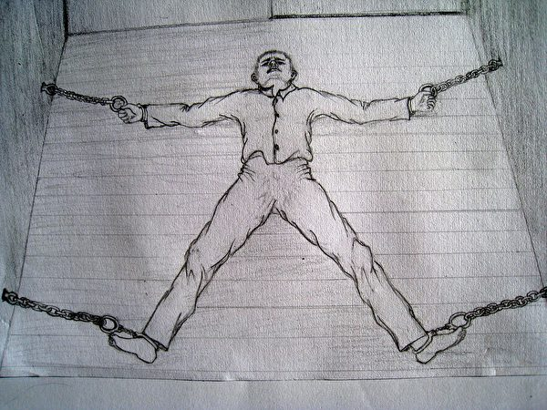

中共酷刑示意图：锁床板。（明慧网）

 
<b> “串糖葫芦”</b>

用一根铁链将多人的脚串在一起戴上直棍脚镣，甲的左脚锁在乙的右脚，乙的左脚锁在丙的右脚上，依此类推，这种刑罚叫做“串糖葫芦”。若有一人上厕所其他几人站陪，大小便都不方便。法轮功学员肇淑芝、肇迎琴、吴艳、聂连辉、张全、张一群遭此迫害。

<b>野蛮灌食</b>

人坐在椅子上，被上铐，头往后扳，椅靠背顶住后脖子，往下压（食管几乎折叠）；捏住鼻子，用筷子、棍子撬开嘴，致使人满嘴是血，灌食时几乎把人活活憋死。因掐住鼻子，人无法呼吸，食物堵在嘴里，心脏供血、供氧不足，此刑非常残忍，人痛不欲生。

法轮功学员肇淑芝遭此迫害。

 

酷刑演示：野蛮灌食（绘画）。（明慧网）

 
 鄂伦春旗法轮功学员杨宇新遭酷刑折磨后，被强制灌食致死。杨宇新遗体在没有家人签字的情况下，被莫旗“610”头子张世斌及其同伙公、检、法、司、医院强制火化。
 
<b>戴刑具</b>

狱警给法轮功学员戴上48斤带毂轳的脚镣，叫滚地雷。

 

酷刑演示：脚镣。（明慧网）

 
<b> 打毒针</b>

法轮功学员刘云云、倪宝华遭此迫害。

 

酷刑演示：打毒针（绘画）。（明慧网）

 
 <b>铁链子勒嘴</b>

张胜山遭此迫害。他未修炼法轮功，因为姐姐修炼法轮功而被抓捕，被莫旗“610”头子张世斌、看守所狱警及指使的在押犯人酷刑折磨致死

 

中共酷刑示意图：铁链子勒嘴。（明慧网）

 
<b> 灌浓盐水</b>

法轮功学员陈丽荣遭此迫害。

<b>喝开水</b>

犯人强行给法轮功学员喝滚烫的开水，张胜山遭此迫害。

<b>挨冻</b>

几年前，法轮功学员刚进看守所，夜间都没有被子盖，成宿地冻着，得自己拿钱买看守所里劣质的行李，150元一套。

<b>戴直棍脚镣</b>

 

酷刑演示：戴铁支棍。（明慧网）

 
<b> 抽打</b>
 
 

酷刑演示：抽打。（明慧网）

 
<b> 毒打</b>

几人或十来个人对法轮功学员劈头盖脸打拳头、搧耳光；揪头发把人按倒，在头上、身上狠踢猛踹，直到打累了才停手。打得人口鼻流血、瘀血青肿，疼痛不堪。

莫旗看守所在2000年后的几年间，一直给在押人员吃发霉的玉米面窝窝头，窝头里参进老鼠屎和沙子。

除此之外，牢头不给法轮功学员水喝、不让大小便、不给饭吃，往身上哧水等等。

<a target="_blank" href=#top><h6 align="right">回上方</h6></a>

<a name=88>
<h1 align="center"><b>【思想领袖】中共内部承认正走向解体</b></h1>

美国中国问题专家林蔚披露，一个习近平身边高层幕僚告知：他们每个人都清楚这个体制已经完了。（《大纪元时报》采访视频截图）

 
 【大纪元2019年12月05日讯】（英文大纪元资深记者杨杰凯（Jan Jekielek）采访报导／高杉编译）英文《大纪元时报》资深记者杨杰凯（Jan Jekielek）近日在“美国思想领袖”节目中，对美国的中国问题专家、宾夕法尼亚大学国际关系和中国历史教授林蔚（亚瑟‧沃尔德伦，Arthur Waldron）进行了专访。全文翻译如下：

在采访前，杨杰凯提出了一系列的问题：

为什么在杰出的中国问题专家林蔚看来，香港的特殊地位很可能会被永久终结？

在过去五十年里，理查德‧尼克松（Richard Nixon）和亨利‧基辛格（Henry Kissinger）等前美国领导人在与中共的关系问题上犯了哪些关键性错误？

为什么林蔚认为中国共产党政权正进入解体阶段？这种情况与前苏联的解体情况有何相似之处？

这里是“美国思想领袖”节目，我是杨杰凯。

今天，我们和历史学家、宾夕法尼亚大学教授林蔚坐在一起。他是国会美中经济与安全审查委员会（Congressional US-China Economic and Security Review Commission）的创始成员，也是詹姆斯敦基金会（Jamestown Foundation）的董事会成员。

******

<b>杨杰凯（Jan Jekielek）</b>：亚瑟‧沃尔德伦，很高兴你来到《美国思想领袖》节目。

<b>林蔚（Arthur Waldron）</b>：非常感谢。这是我的荣幸。

<b>杨杰凯</b>：亚瑟，你应该是已经做了40年的中国问题专家了，我觉得，关于现在在中国和香港所发生的一切，你都提供了非常、非常有趣的视角。事情是这样的，美国参议院刚刚一致通过了《香港人权与民主法案》（Hong Kong Human Rights and Democracy Act），我注意到驻美国的中共大使馆对此做出了回应，我给你们读一下这个回应。他们说：“……

<b>林蔚</b>：是美国大使馆还是中国（中共）驻美国大使馆？它们都回应了。

<b>杨杰凯</b>：是中共驻美国大使馆。中共大使馆表示，《香港人权与民主法案》的通过令人非常失望。美国人民如此珍视的民主和人权再次被一些美国政客滥用，为暴力和混乱辩护。他们想站在暴徒一边吗？然后是均为大写字母的“悲哀”（SAD）一词。对此，你是怎么认为的？

<b>林蔚</b>：这是样板文章，这就是共产党人会在报纸上发表的东西。但它所说的香港问题，包括指责为“骚乱”等等，就是把一切都退回到强硬拒绝（民意的态度上）。当局绝对强硬的拒绝——这其中包括了香港政府和中共当局的共同参与——激发了香港人的不满。在此之前，中共曾经作过一系列的承诺，比如在1997年和1984年，但至今都没有履行，而现在中共又试图把秘密警察的势力扩展到香港，所以现在香港人民被迫站起来了。

如果中共遵守了自己在1997年做出的承诺，那么现在这些在香港游行抗议的民众就只会是一些去投票站投票的人了，也许只是每两年去投一次票。

<b>杨杰凯</b>：是这样的。

<b>林蔚</b>：（香港）这场危机的全部根源在于共产党政权做出了灾难性的决策，而它们未能理解这一点，并让其拖延下去。

<b>杨杰凯</b>：亚瑟，你可能已经知道了昨晚发生的另一件事，一些戴着面具的暴徒闯入了香港的《大纪元时报》印刷厂。他们打扮得看起来有点像抗议者，一些人还挥舞着警棍。我们有闭路电视录像，在我们谈话后我会把它放上去，这样人们就可以亲眼看到所发生的。他们真的在那里放火，要烧了那个地方。幸运的是，没有人受伤。幸运的是，工作人员把火扑灭了。根据你的经验，你对此有何看法。

<b>林蔚</b>：第一个问题就是，是谁干的？他们可能是糊涂的抗议者？但我们在香港所看到的戏剧化的特征之一，就是中共与黑手党，或被称为三合会（Triads）的黑恶组织之间的密切合作，这已经是很常见了。前苏联也曾经是如此。有组织犯罪团伙和苏联政府之间也有着密切的合作，特别是在处理非中央地区问题的时候。所以我怀疑这些人是三合会成员，他们是非常可恶的人。

<b>杨杰凯</b>：请你给我们多讲一点有关三合会的情况吧，以及他们在香港是如何运作的。

<b>林蔚</b>：三合会是一个秘密社团，和其它国家的犯罪组织非常相似。他们依靠的是一种血盟制度，比如黑手党的荣誉法典什么的，什么都不能对外透露和讲述，他们的组织非常、非常的严密。

<b>杨杰凯</b>：那么，香港当局怎么会去与三合会合作呢？

<b>林蔚</b>：因为三合会能够提供暴力。

<b>杨杰凯</b>：是的。

<b>林蔚</b>：香港，直到最近，（中共）一直试图以某种方式结束这个没有杀人、没有人受到伤害的局面。已经有一些事件发生，已经有人穿着白色衣服来了之后打了人等等，这就是三合会的行动。

如果统治者决定不会去遵循民众意愿的时候，那么唯一的让民众信服的办法，就是让他们害怕。这就是香港直到最近所发生的，用警察部队的适当的监管，但这并不足以让民众害怕。但是如果你让三合会的人扑向人群，去绑架人，把人打得很惨，民众就会变得很害怕。

<b>杨杰凯</b>：那么，鉴于我们所看到的，警察，尤其是包围那些大学的时候，针对抗议者的警察暴力出现新的升级等等，将会如何影响香港的特殊地位呢？你认为会发生什么？

<b>林蔚</b>：嗯，我想，（香港的）特殊地位已经结束了。我不希望会这样，但我想，它已经被终结了。我认为，重建以前所拥有的已经是不可能的了。我认为，警察队伍受到了严重的破坏，司法体系也正在受到攻击，虽然目前他们仍然有独立的司法系统。

我认为最重要的是，发生了很多战斗，发生了很多暴力事件，可能是共产党认为要使用某种形式的武力才能够镇压人民。但从本质上来说，最近这5或6个月所发生的，告诉了每一个生活在香港的人，中国共产党是危险的、可憎的，并且是绝对不可信任的。

以前，很多香港人对中国共产党持有某种同情或对现状比较满意的心态。但是现在，在香港有750万人，香港是他们的家，正如我们英语里的俗话所说的“恨之入骨”（Hate the guts），他们对中共已经是恨之入骨，他们将在自己的余生里持续地对中共恨之入骨。因为一旦你杀人了，一旦你实施了中共所实施的那种暴行，就不会被民众忘记。

我看到有一个人的照片，他被从理工学院弄出来，面容憔悴，满脸是血。我当时想，这个人可能已经有20岁了，一直到他去世的那天，他都绝对会记得这一切的。他记住了什么呢？就是对中国共产党的无法磨灭的仇恨。

所以从共产党人的角度来看，这样做是非常愚蠢的。他们应该做出妥协和让步，应该在第一天就开始谈。但无论是北京（Peking）或是北京（Beijing）一直奉行的都是远程掌控，他们完全错估了形势。所以，结果是他们建立了一个稳定的群体，而这个群体的观点也变成了对中共的鄙视和不信任。

<b>杨杰凯</b>：亚瑟，说到法治，香港的最高法院最近推翻了这个《禁蒙面法》，但似乎北京也在试图对此干涉。

<b>林蔚</b>：关于这一点一直存在着争论。香港会不会拥有自己的终审法院？换句话说，中共会在香港设立最高法院吗？大家一致认为，在某些情况下，问题可能还是要交给北京决定，交给全国人民代表大会。

<b>杨杰凯</b>：香港（政府）是一个政体⋯⋯

<b>林蔚</b>：它是一个政治机构，但它不是一个司法机构，而且现在他们说，也许北京将不得不推翻香港法院的裁决，这当然将会危及香港和香港人的法治。

因为在英国殖民时代早期，有一些案件给在香港的中国人留下了深刻的印象，他们用法律维持了正义。所以，在香港的中国人民都真诚地支持法治。你不能说，法治只是一个疯狂的来自西方的思想。（香港民众）他们真诚地支持法治。因此，攻击破坏法治将削弱中共当局所宣扬的最后一种统治合法性。

中国（香港）有一位教授说，所发生的一切表明他们在香港仍然拥有司法独立。 我不知道他现在在哪里，但这并不能使他成为朋友。而中国人民，他们知道这一点。中国民众，他们清楚地知道正在发生着什么，不是所有的中国人都知道，而是那些能够得知真实情况的人，他们知道。

<b>杨杰凯</b>：那么，美国国会的意义是什么，我猜是众议院通过了口头表决，然后参议院一致通过了《香港人权与民主法案》，从本质上说，是美国人民在支持香港人民。对吧？我是说，我看了（法案）以后就是这么理解的，但这对香港人有什么意义呢?

<b>林蔚</b>：这会损害他们的经济，也会损害他们的生活水平，因为中共想要的是，在没有任何自由的情况下经营（香港）这个地区，而同时却享有美国对香港的无法延伸到中国其它地方的特殊待遇。

但是，如果中共把它们的（集权）体系扩展到香港，那么，我想我们别无选择，只能像对待广东或中国其它地方一样去对待香港。这只是他们自己造成的局面。如果中国共产党履行了他们所承诺要做的事情，这一切都不会发生。

<b>杨杰凯</b>：知道美国国会已经通过了这个法案后，香港抗议者自己该怎么办?

<b>林蔚</b>：我认为这给了他们一种强烈的国际认同感，这是非常非常重要的一点。 我们已经被经济学弄得眼花缭乱，以至于忘记了民主、自由和人权。我们现在看到的正是对我们自己的人权历史的重新发现，那些教育了我们的人，就是其它国家的受害者。他们说，“来吧，美国，要说到做到吧！”

在整个中国，我得说的是，在这个当今世界上有着最严重的侵犯人权行为的国家，他们有两个正在进行的项目。它们可能符合也可能不符合关于种族灭绝的法律定义，但是这两个项目非常符合你我所谈到的关于灭绝种族的直观定义。这是一个有成千上万的人被合法处决的国家。

第一个项目就是人体器官摘除。人体器官主要来自家庭基督教徒、修佛者还有现在的穆斯林。这其中有很多原因，但其中一个原因就是，这些人的生活方式使得他们的血液很干净。比如如果你用犯人去做器官移植，你去测试血液时，就会发现这个人可能得了梅毒，或者他得了甲型肝炎、乙型肝炎、丙型肝炎，我的意思是，你无法去做器官移植。所以，这是一场有针对性的种族灭绝大屠杀。

但它还没有被确定为种族灭绝，它不是很合法，但这里面涉及到一个非常、非常复杂的法律定义。但是，每年都有成千上万的人因为非自愿的提供器官而被杀害，而这一点现在已经毫无疑问地得到证实。这是一个项目。

另一个项目就是反穆斯林运动，特别是在突厥斯坦（Turkistan），他们拘押了数百万人，监禁他们，然后做了一件奇怪的事情，就是试图让他们都变成（汉族）中国人，或者说，让他们变得不再是穆斯林。

<b>楊傑凱</b>：那麼中國共產黨是如何對待那些覺醒的穆斯林的呢？另一個，雖然在法律定義上存在爭議，但在普遍認知上，這就是種族滅絕運動。

<b>林蔚</b>：他們在突厥斯坦（Turkistan）建了火葬場，我不知道它們到底是幹什麼用的。儘管《紐約時報》最近披露了400頁的中共內部文件，但我們所掌握的信息仍然很少。

我們的衛星圖片上顯示了這些（集中營）巨大的建築群，人們被關押在那裡。逃離那裡的人們描述了一個對他們進行折磨和洗腦的政權。更糟糕的是，我確信在那裡已經有人被殺害。但是他們已經有效地封鎖了突厥斯坦，你不可能真正地發現（證據）。這就是我所說的兩個種族滅絕項目，一個是為器官摘除，每年大概有8萬人被殺，另一個是維吾爾族人的遭遇。

他們中有多少人仍然正在被折磨或殺害？我不知道。但是我們知道，仍有數以百萬計的人都被關押在監獄裡，至少有100萬，我的意思是，我們假設只有100萬吧。歸根結底，是因為北京政權是個最邪惡的政權，如果我們撇開蘇聯不談，從第三帝國至今，它就是個最邪惡的政權。

這給我們西方人提出了一個問題，因為你可能和我一樣，是伴隨著這句話長大的：「再也不會了！（Never again）」但是我們沒有想到，我們真的會直接面對這麼複雜的道德問題，沒有人知道該怎麼做，而且現在，也沒有人在對此做些什麼。所以我建議，我們應該簡化這個口號，去掉「永遠」一詞，只是讓它重新來過，因為在我看來……

<b>楊傑凱</b>：這很憤世嫉俗啊……

林蔚</b>：我不會說這是憤世嫉俗的，我會說這是歷史的經驗。這就是人們的生活方式。即使是在有人被強制摘取器官、有人被（中共）殺害的時候，埃隆·馬斯克（Elon Musk）和一些（美國）汽車公司之類的人，仍然在中國投資了數十億美元。但我們是不應該這樣做的，那應該是違法的。我們的經濟體制和他們的經濟體制應該相互分開。現在這已經很難做到了，因為30年來，我們一直在相互整合。但是，如果我們要保持美國的理念，我們就不能再去與今天的第三帝國進行合作。

<b>楊傑凱</b>：因此，這當然會讓我們聯想到美國的外交政策問題，美國的中國政策問題。而且，我們也已經看到，在最近幾年，至少在過去的三年裡，情況發生了很大的變化。您能談一下您如何看待美國的外交政策，以及目前中美關係的發展嗎？

<b>林蔚</b>：首先，我要說的是，我們在中國有外交官，他們在這裡有外交官，我們在兩國之間有可靠的最高級別的溝通，我們還有領事館之類的機構，這些都是絕對必要的。但除此之外，我認為，我們應該像對待前蘇聯那樣對待中共。我們所做的是隔離俄羅斯，同時保持一些管道，必要的溝通管道，溝通我們。

尼克松相當正確地認為我們應該與中共保持某種聯繫，我認為，他曾有一個中國女朋友是其中一個原因。我想她的名字應該是安娜·瑪麗·王（Anna Marie Wang），她已經去世了。她是一位國民黨將軍的女兒，他們是在香港的希爾頓酒店（Hilton Hotel）相識的，當時他40多歲，她20歲。

她是一個雞尾酒女招待，但這是真愛。每次尼克松去越南的時候，氣氛都變得非常緊張，但他總是要在香港停留。現在你不必再到香港停留才能到達越南，但當時他總是要在香港停留。

當他搬到美國時，她也搬來了，而且她總是住得離尼克松家很近，但又不是太近。而當他死了之後，她就去看望他的墳墓。所以我想到了他的墳墓，所以我認為，這看起來可能並不重要，但是我覺得，他有一個熟悉的真正的中國人，使他對中國人的理解變得人性化。

因為我們有類似《戰略迷魂》（《滿洲候選人》，The Manchurian Candidate）等等這樣的電影，這些電影本質上使中國的形象喪失了人性。而實際上，（在中共統治之前）中國這個國家的最核心的價值是忍耐或者是人性的善良，那才是中國社會道德的基礎，

然後他讓基辛格博士（Dr. Kissinger）來處理這個問題，而這是一個可怕的錯誤。基辛格是個聰明人，也有著所有其它優點。但問題是，要與中共打交道，你真的需要有些基本背景。讓基辛格去，就有點像是，他費了很大力氣才游到了中國的海灘上。中共已經知道我們試圖與他們取得聯繫，他們故意讓我們費盡周折後，才讓基辛格去的。

好像是周恩來說的，他說，我知道在美國至少有20個精通中文的美國人，而且他們在中國生活了很多年，有些還是中共領導人的私人朋友。如果是今天，如果我是認真的，我就會去找那些人當中的一個。

基辛格小心翼翼地歪曲了這次任務的所有準備工作，結果他們基本上只讀了一些所謂的哈佛學派的書籍。這些書中對中國的看法都是錯誤的，但卻占據著主導地位。

基辛格去了，周恩來說：「既然他們有足夠的人才和真正的中國問題專家能夠展開合作，為什麼還要派一個猶太裔美國大學教授、一個維也納會議（Congress of Vienna）的專家來中國呢？這一定是個美國人的陷阱。而誰是世界上最偉大的、被美國人背叛和欺騙、而且被美國在背後捅過刀子這樣的問題的專家呢？不是別人，正是我在台灣的老上司蔣介石。所以我必須和他談談。因為他才是唯一真正理解美國人心態的中國人。」

因此，台北和北京之間建立了祕密電話聯繫。這個歷史事實是驚人的，但它不是很出名。儘管如此，傑伊·泰勒（Jay Taylor），這位偉大的前外交官員，退休後又成為了一名作家，他是在台灣與退休的國民黨人談話時發現的。當然，他們告訴了他是怎麼回事。

在周恩來與基辛格進行了祕密會談後，他就打電話給國民黨的將軍，問他：「你對這件事怎麼看？」「你知道美國人在搞什麼鬼？」等等，問他是怎麼回事。

在這件事中，我在其中也扮演了一個小角色。因為我覺得我可以從中共那邊來對此進行驗證，而且我也做到了。我認識一個人，他知道關於周恩來的一切，他是個中國人。他確認說：「是這樣的，當然是這樣的。」他甚至還給了我那個在香港負責這個祕密電話線路的人的名字。

如果你能明白，所有這些外交活動都是在國家和民族大義的旗號下進行的，這就給了你一個視角。我希望人們能理解這一點。中國的整個歷史的戰略傳統，從2500年前的孫子開始，就是欺騙和間諜，都是在玩心理戰。所以，如果你對中國有所了解，再從他們的角度去看看基辛格的行動，你就會說，基辛格他們是在試圖滲透進來。

如果你讀他的回憶錄就能知道，當時台灣許多跟他交談過的人都知道他的計劃和正在做什麼，以及他要去什麼地方等等情報。而那些人所面臨的巨大挑戰就是如何在他面前保持一副很正直、很坦率的面孔。而輕信的他所面對的只是一個接一個的彌天大謊。

基辛格的想法，最初是一個戰略上的想法。因為在維也納會議（Congress of Vienna）上，塔列朗（Talleyrand）設法成功地分裂了反拿破崙聯盟，讓他們互相爭鬥，這給了法國一個決定性的等待。所以這個策略的關鍵，就是決定性的等待。在兩者之間搖擺，就能得到自己想要的結果。他認為，如果我們能夠和中共合作，那麼這將會給蘇聯帶來壓力。而如果中共在未來出了問題，那麼我們就可以和蘇聯合作對付他們。

這基本上就是一個白日夢的幻想。結果他沒有得到任何他想要的東西。他希望得到（中方）幫助，並從越南撤離，但結果是他什麼也沒得到。因為中共他們知道他在乞討。而且，他們知道基辛格和尼克松之間的所有通訊聯繫內容，和尼克松的機密通信內容。

所以，從本質上講，我們曾經有過一個時期，認為從戰略上，利用中共去抵消蘇聯的影響是有意義的，直到1991年蘇聯解體，讓世界各地的蘇聯問題專家都感到驚訝。

在俄語和漢語中，對之所使用的詞彙都是「解體」。但實際上，它並沒有崩潰倒塌。俄羅斯仍然在那裡。所有的改變都只是組織體系的改變。

基辛格沒有意識到會發生這種情況，以及在事情發生後，他應該做些什麼事情。他只是說，好吧，這個安排不再有戰略上的需要了，所以我們沒有必要再去討好中國人了，人們開始去（中國）賺錢了。我們不用再談論戰略平衡，而是開始談論所謂的兩國關係，我們必須和中國保持良好的關係。如果你讀了基辛格關於中國的書，書中的所有結論就是，中共和美國可以合作建設新世界。

嗯，是要建設新世界，但是如果美國能夠和歐洲合作，或者美國能夠和印度合作，那就太好了。這並不是說中國沒有什麼特別之處，只是基辛格從來沒有超越這個認知特殊性的階段。他只注意到了在中國的每個人都是中國人，他們的表現都與他略有不同。他不了解中共政治的複雜性，也不知道中國社會的相互關係。我的意思是，他，他頭腦非常簡單。

有一位英國精神病學家寫了一本書叫做《超越中國人的面孔》（Getting Beyond the Chinese Face），我在教學過程中也發現，很難讓人們意識到的一點就是，儘管某某人有中國人的外表特徵，但這並不意味著他與其他14億中國人的觀點都是一樣的。事實上，他們各自對事情的看法可能完全不同。

但是，本來應該讓與中共的關係降溫時，我們卻繼續進行投入，直到天安門事件之前，我們都一直在為中共建造武器系統。而在1989年天安門事件之後，當我們對其還有一些影響力的時候，布什總統在電視上發表了關於我們會如何應對的演講，但是他在撒謊，他背後派人去告訴鄧小平，當時的鄧小平就像是中國的黑手黨頭子，告訴鄧小平說，我們愛你，還有其它的一些話。

結果最後，我認為是從本世紀初開始，就很明顯了，中共根本就沒有推廣自由制度。如果說有了什麼變化的話，那就是現在的共產黨政權比毛時代更加嚴密、更加有組織。毛造成了巨大的破壞，他（的統治）完全是無序的。然而這些人是有系統的，他們在令人難以置信地監控著一切，甚至有語音識別什麼的。

我的意思是，如果你因為想要逃跑而來到北京火車站，因為你的身分證上有一個芯片，（買票時）警察馬上就可以出現。如果他想找到你，只要打開他的監控魔杖，五分鐘後，他就會站到你旁邊了，因為他能隨時找到你。這是非常非常險惡的。

我們最終意識到，（中共）他們實際上是想儘快恢復一個想像中的世界上最強大的國家的地位。而事實上，在中國的大部分歷史中，她都是一個封閉的國家，她很高興自己有這麼大，但她從來都沒有參與過國際政治，甚至都沒有真正參與過亞洲政治。這有些誇張，但是中共現在說，我們曾經是（世界）第一，他們對歷史知之甚少，我們現在必須迎頭趕上，因為我們發現我們被欺騙了。

中共關於美國人的一個認識就是「你可以欺騙他們，你也能夠騙了他們」。有一次，比爾·克林頓（Bill Clinton，美國前總統）的一位親密顧問在一次演講中對他說，比爾，（中共）它不可能永遠說謊。甚至當中共單方面吞併南中國海，而後被遞交海牙國際法庭，被判決違反了它曾簽署並通過的海洋法時，仍有越來越多的人在不斷重複著這句話，

他們後來只是說：「好吧，現在我們不會再去關注這個問題了。」現在人們開始覺醒了。儘管在奧巴馬政府時期，我們有一個名叫埃文·馬德羅斯（Evan Madeiros）的人，他現在是卡內基國際和平基金會（Carnegie Endowment）的成員。我就是想不通，為什麼他會說，我們在中國應該做的就是去支持中共，努力幫助中共，這就是我們交朋友的方式。我是說，這簡直就是一場災難。

因此，中共對比地中海還大一半的地區的土地掠奪或者叫做水域掠奪，並沒有引起我們的任何反應。我認為，我們的這種毫無反應已經很多很多年了。因為很明顯，中共不應該這樣做，但是人們以跟中共做生意賺錢為主。當然，這些人也正在失去自己的知識產權和其它的一切。

所以當川普（特朗普）上任的時候，他挑選了非常有資格的中國問題顧問，而且他們不是那些相信中美關係會穩定的人。現在讓我總結一下，人們會說：「沃爾德倫，你真正要說明的意思是，尼克松犯了一個大錯誤。」我認為，他確實犯了大錯誤，他的錯誤是他操之過急。他們太急迫了。

<b>楊傑凱</b>：OK

<b>林蔚</b>：……因為他想這麼做。事實是，在1964年，法國承認了中共政權，這是一件大事。戴高樂對此非常高興。回顧當時，我們應該做的是，等等看。法國已經承認了中共政權，我們當然也會有意在某個時候和中共建立外交關係，但是我們應該再等個10年。讓法國人先去搞搞清楚那邊到底發生了什麼，是怎麼回事兒，讓他們去碰到不同的情況，而我們會在各方面去鼓勵他們。

等過了那段時間之後，我們有了真正的中國問題專家，有了必要的了解和認知，以及所有法國所了解的。還有就是我應該提到的，就是英國的外交官。因為英國一直和北京有關聯，那麼我們可以開始制定一個符合當時實際情況的政策。

但是基辛格，他搞砸了，這也就是為什麼我說，基辛格的中國政策，以及尼克松的中國政策是美國外交政策中最大的失敗。我相信，事實也證明了，基辛格在他的推理過程中存在某些缺陷。他太自信了。當然，在那些日子裡，哈佛的教授們對自己也非常、非常有信心。結果，他沒有幫上忙，他沒有做功課，他只是按照自己的想像而行動，這些想像是基於用維也納會議對中共的類比。

現在，如果你想拿個什麼對中共做個類比，維也納會議可能不是最佳的選擇。最好對中國和亞洲的歷史要有一定的了解。因此，我認為，鑒於基辛格的聰明才智，考慮到人們的巨大希望，以及人們對他的崇敬，我認為，他是美國歷屆國務卿中最大的失敗者。

我們有過一些糟糕的國務卿，而他們當中的大多數人從一開始就是平庸的。但基辛格來的時候已經有很多資歷，然後他把事情搞砸了。等於是從很高的地方掉了下來。人們將會認識到這一點，雖然可能還需要一段時間。

楊傑凱：是，在這個過程中，還有另外一個重大事件，一直延續到了今天或者最近幾年，就是中共獲得了WTO最惠國待遇。在國際經濟關係方面，出現了人權問題與經濟問題脫鉤的現象。

<b>林蔚</b>：這些都是在試圖以某種方式保持與中共的關係。我們並不擔心與印度的關係，或者與印度尼西亞的關係，或者與德國的關係，這些都沒有被認為是一種你必須要做出讓步以便繼續維持下去的緊要事情。但是在中共加入世界貿易組織（WTO）這個問題上，我們基本上是放棄了世界貿易組織的那些規則。我的意思是，中共的貨幣是不可兌換的。如果你帶一包人民幣去日內瓦，可能會有人幫你把人民幣兌換了，但那只會是投機商，而匯率也不是由市場決定的，匯率是由銀行設定的。這就像以前的俄羅斯盧布，如果你看看匯率，它也在不斷變化。

世界貿易組織是為自由市場經濟而設計的，而中共沒有，我們必須承認這一點，它沒有自由市場經濟，它沒有由市場決定的貨幣利率。它的貨幣的價值不是由市場決定的，因此它不應該屬於世界貿易組織。

我們把中共引進世界貿易組織這個自由市場經濟的概念裡，是為了以某種方式哄著他們，使他們成為尼克松和基辛格所夢想的那樣，也就是說，他們會向美國學習自由和民主並開始民主化。但是他們並沒有這樣做。那麼，另一個重要的時刻是……

<b>楊傑凱</b>：就是把經濟關係與人權問題脫鉤了……

<b>林蔚</b>：對，我認為這就是在自欺欺人。我經常舉的一個例子是，假設你住在紐約，假設第86街那裡有一家當地的熟食店。在櫥窗裡，他們有美味的意大利糕點，他們有上好的奶酪，精美的肉塊和瓶裝的稀有葡萄酒等等。如果你走進商店，能在前面看到有所有這些好東西。

但是如果你走到商店的後面，那裡卻有一些剛剛被冷藏的大桶，裡面裝有新鮮的腎臟、肝臟和心臟，以及各種能夠被移植使用的人體器官。而且在這個時候，器官仍在被摘除著，人們仍在被殺害著，這樣他們的器官就可以用來移植。

其中很多的器官是要提供給中共老年的領導人，或者給他們的孩子。此前一位中共領導人的兒子得了癌症，就換了許多器官。你會怎麼看這家商店？難道你會說，我只是在商店前面買買東西，我不會去關注後面那些活生生的摘除器官那些事，上帝才知道這些器官都是從哪裡來的？你會說，這家店在美國到底在做什麼。

<b>楊傑凱</b>：例子很可怕，但很有說服力。

<b>林蔚</b>：但這正是我們近年來所做的。換句話說，在成千上萬的中國人被中共政權殺害的時候，馬斯克先生卻在向中國投入數十億美元。天知道還有多少維吾爾族人被殺害，大量的人被囚禁在最殘酷和虐待的條件下，在那裡沒有法治、沒有自由。你不能把這些事情分離開來，這是一個完整的體系，經濟部分是政治部分運行的動力，這也是我們必須在經濟上隔離中共的原因之一。

因為我們所有的貿易、資金和來自我們的養老基金（對中共）的投資，都是中國共產黨能夠保持運轉的基礎。如果他們只能依靠國有企業（那些虧損的大企業）和稅收來維持運轉，情況將會完全不同。所以，我認為這是一個自欺欺人的說法。

是的，的確也有過一些關於希特勒如何對待吉普賽人和猶太人的問題，當時說，德國生產超棒的徠卡相機，那麼為什麼我們不能夠在得到這些非致命的攝影設備，繼續維持（與納粹德國的）貿易關係的同時，也宣揚說，我們不支持那個（納粹德國）政權的政策等等。

這樣做不僅是虛偽，而且實際上是不可能的，因為（人權和經濟）兩者之間是緊密地相互滲透和相互依賴著的。但不幸的是，美國商界巨頭、摩根士丹利（Morgan Stanley）等公司的首腦成了真正最容易輕信的人。

事實上，我的一個朋友，一個真正的中國問題專家，住在那裡很長時間，他是一個外交官。他說，他覺得北京的空氣中有一些東西，能使得原本非常、非常老練的談判者變成另外的樣子。比如說房地產（業者），他們去了中國之後，就完全丟掉了所有的關鍵性（談判）能力，也不去問一問，這個項目是否會有利可圖，是否可能會無利可圖，他們都不去問了。

我們必須完全擺脫這個幻想，並意識到我們所面對的，基本上這和我們當時面對蘇聯時的情況是一樣的。所不同的是，我們在蘇聯沒有巨大的投資，我們沒有給過蘇聯人錢。

<b>楊傑凱</b>：我明白了。現在讓我們來談談我們的現任國務卿，邁克·蓬佩奧（Mike Pompeo），當然，還有國務院與川普（特朗普）總統與前任截然不同的（對華）外交政策。你如何看待事情的發展？

<b>林蔚</b>：我認為這種僵局將繼續下去，我認為政府應該採取儘可能強硬的路線。我認為像加拿大、瑞典和其它受中共擺布的國家應該反擊。最重要的是，要把那些不受歡迎的人，把那些壞蛋，把他們趕出去，然後再把一半的間諜趕出去。

因為你不想讓中共知道你已經知道他們的間諜都是誰，所以你只要趕走一半，留下一些間諜，這樣他們就不會知道，他們就無法確定你是否都知道了。

我認為中共正在進入一個像前蘇聯的那個都在談論解體的時期。在俄語中，這個詞是「распад」（衰變）的意思，這並不是政權會崩潰、一切都會完蛋的意思。它的意思是國家依然存在，建築依然存在，只是他們必須改變政治體制。

他們從來不用「collapse」（崩潰）這個詞，只是我們都用「collapse」（崩潰）這個詞。在中國所用的詞應該是「Jie Ti」（解體），這個意思是相同的。這意味著，不管這個機制是什麼，它已經開始瓦解了。

這就像一輛太老舊的汽車，突然之間，情況就變得不一樣了，不行了。它打不著火了，這兒不工作了，那兒也不行了，某個系統也無法正常運轉了。

中共現在的體制就像是臨時湊合出來的似的，在查明實際情況、提出切實可行的解決方案的時候，就會出現各方面功能嚴重失調的情況。已經無能力再去考慮現實的解決方案，或對問題進行實際的診斷。這個政權也知道自己在國內的處境十分危險。當然，中國國內的情況可能會很好，但也可能會變得非常糟糕。

有一個人，他是一個非常高級別的顧問那樣職位的人，和習近平關係非常親近。我遇到他時，當時他非常地坦率。他對我說：「亞瑟，我們到底該怎麼辦？每個人都知道這個體制已經不起作用了。我們已經進到了『Si Hu Tong』（死胡同）……」這個詞的意思就是已經沿著一條街道走到了盡頭，一個沒有出路的街道的盡頭。

他說：「這是一個死胡同，但是我們不知道下一步該怎麼走，因為現在已經到處都是地雷，如果我們再走一步，我們可能就會引發一個可怕的爆炸。」所以，一個真正考驗智力的問題就是，如何才能退出共產黨體制。

蘇聯是非常幸運的，因為戈爾巴喬夫擁有一個傑出的顧問，雅科夫列夫（Yakovlev），我有幸見過他，他是一個不可思議的人，他是真正的指導戈爾巴喬夫的人。戈爾巴喬夫意識到，如果讓俄羅斯繼續維持那個運轉不良的體制，可能就會導致數百萬人的死亡，而他或許可以讓情況發生改變。

我相信，儘管戈爾巴喬夫飽受鄙視，但他做了一件令人難以置信的好事，因為在蘇聯到俄羅斯的過渡時期，死亡的人數最多不超過200人。在他想出辦法之前，他不會開槍讓人們屈服。然後，戈爾巴喬夫建造了一個防火梯，讓蘇聯全體人民都可以離開這個劇院，或者說是離開其它的什麼，在它發生崩潰或發生爆炸之前離開。

因此，我認為他應該得到極大的讚譽。雅科夫列夫也是如此。有趣的是，他是共產黨解體後克格勃檔案館的第一位館長，一個了不起的人。當然，他去了檔案館之後，找到了各種各樣的資料。而他做的第一件事就是完整地複製了這些檔案，然後把它們發送到五個不同的大洲，這樣就不可能再把它們收回來了。

所以我認為，中共正處在這個解體階段或正在「Jie Ti」（解體）。當然，如果用中庸的眼光，你不會馬上看清這種情況。

我和我們的前任駐匈牙利大使進行了一次非常有趣的談話，內容是關於老布什和他的朋友吉姆·貝克（Jim Baker）在柏林牆倒塌後，來到布達佩斯去看望他。這位大使是一個非常、非常聰明的好人。當時他基本上把整個未來的匈牙利政府成員都召集到他的客廳裡。

老布什和老吉姆去了那裡，他們聽到這些匈牙利人一個接一個地說，我們將會擁有民主，我們將會擺脫舊的體制等等諸如此類的話。最後，一整天差不多都過去了，所有的客人都走了，客廳裡的陽光也暗了下來。所以大使說：「好吧，總統先生和貝克先生，我們一起沿著走廊送你到電梯那裡。」

大使先生親口告訴我說，當時吉姆·貝克走了過來，以「荷蘭大叔」的姿態摟著他，對他說，「哦，我的，我的孩子，」我記不清當時吉姆·貝克是怎麼稱呼他的了，但接下來貝克對他說：「好吧，我的孩子，有一點，我想你必須非常清楚，那就是，這一切都不可能會發生，這些都不會發生！」

這說明了美國外交部門、情報部門以及其它所有政府部門，在當時都處在令人難以置信的無知狀態，即使柏林牆已經被推倒，我們也無法想像東歐的現狀會有什麼樣的改變，更不用說蘇聯會如何變化了。

我認為，蓬佩奧和他的手下如今所面臨的最大挑戰，或許就是要意識到，我們必須開始考慮中共已經進入死胡同的問題。我的那位朋友很可能與習主席有著直接的聯繫。他們必須作出決定，在死胡同盡頭該做些什麼，而我們也必須作出如何對此應對的決定。但現在沒有人能想到這一點。

我們很少去關注真實情況是怎樣的，因為我們已經習慣於說，好吧，無論北京說什麼，我們都會照做。我們一直都是這麼做的。但是，如果中共內部出現權力分裂呢，有不同的（派系的）人打電話來說，聽著，蓬佩奧先生，我是你那邊的人，另一個人打電話來說，不，我才是你那邊的人……。在目前，搞不清楚的是……，他們還都沒有把自己的勢力整理好。

對於如何應對中共，我們還沒有積極的想法。中國或許不是處於政治動盪之中，而是處於深刻的政治過渡之中。所以，這就是我認為它將會如何發展的。我是一個根深蒂固的樂觀主義者。但是在香港事件之後，我認識的一些中國人對我說……

我一直認為我永遠不會再回到中國了，我再也回不去中國了。而且我現在很確定，我不會被允許回到中國。但是，當他們看到香港的事情之後，他們發現，中共的中央政府在搞清楚到底發生了什麼以及應該如何有效地應對這方面真的是完全無能的。

你不能讓這樣的事情持續六個月。就像我所說的，你從第一天開始就說過，我們是要解決這個問題的，這是他們說的。我現在樂觀多了，我想，我有可能會再回到中國。我已經有過類似的經歷。我上次去中國旅行的時候，是我的一個親戚去世了，她很年輕，我去參加她的葬禮等等。我以為，那是我最後一次去中國。

但是現在我想，也許等我退休了，等我寫完了我的書和其它東西，也許我和妻子就能夠回到一個不同的中國了。就像今天你去前蘇聯一樣，紅場上的旗幟不再是共產黨的紅旗，事實上，「Спасская башня」斯帕斯卡亞塔也不再是克里姆林宮最被關注的焦點，都被移到了有戰爭紀念碑和相關這些東西的那一邊。

聰明的俄羅斯人在克里姆林宮的牆邊種上了一排常青樹，然後又從牆邊兒圍過來，把列寧的墳墓圍一圈兒，然後又繼續種下去。可能10年後，你就再也不能看到列寧墓了。他們說，他們正在努力把紅場變成一個適合家庭休閒的地方。你可以去那個老百貨商店，那裡現在到處都是精品店和一家一家絕對棒的俄羅斯餐廳，這真的是一個巨大的變化，這就是他們計劃要做的。

現在普京的動作非常慢。在某種程度上，他們最後將不得不把那些死人從克里姆林宮的牆裡拖出來，而斯大林的墳墓還在牆前面。但是我認為，這終將會發生。換句話說，他們要清除那裡的所有死去的共產黨人。他們已經清除了幾乎所有的雕像。在莫斯科外面有一個地方，那裡就像一個垃圾場，到處都是成堆的列寧銅塑像之類的東西。

我認為這種情況也會在中國發生。怎麼處理毛澤東的遺體將是個最大的問題，因為毛的屍體已經經過防腐處理，他正坐在北京最重要的地點的正中心。在某種程度上，他最終將會被移走，我對此毫不懷疑。因為在今天的中國，毛不再受到廣泛的敬仰。他終究會被移走，哪怕僅僅是因為他們選的地方太重要了。

如果他們決定把毛的棺木移到，比如說，移到北京西郊的一個類似公墓的地方。他可能被永遠安放在那裡，這不重要，因為他們已經讓他成為關注焦點。然而，民意調查顯示，儘可能進行的民意調查顯示，他在中國那些受過教育的人中的聲譽一點也不好。而且還有很多的東西已經被披露出來，還有的沒有被披露出來。

有證據表明，事實上，在抗日戰爭期間，毛澤東實際上掌握了中方的祕密，並讓人把它們賣給日本人賺錢，因為共產黨總是需要錢。因此，認為毛澤東是一個愛國者是錯誤的，他們會稱他為 「Han Jian」（漢奸），他是一個叛徒。如果有一個政權，已經有證據證明其創始人是一個叛徒，這不會是一個政權的良好的基礎。

<b>楊傑凱</b>：亞瑟，我在多年前讀過你的一篇文章，我覺得非常、非常有意思。文章談到了當時的蘇聯局勢到底會如何，以及美國和其它的許多知識精英當時是如何根本無法想像會有一個沒有了蘇聯共產主義強權的世界，以及這樣的世界會是怎樣的。但是在那篇文章中，你提到，實際上有些人在當時已經明確地說明了正在發生的事情，這些人是某些持不同政見的團體等等。我發現這一點非常吸引人。現在是不是也存在著像當年一樣的「盲區」？

<b>林蔚</b>：是的，我認為，人們都有從眾心理。心理學家認為，如果你在一個群體中，你比群體中的其他人看得更遠，比如說，能夠多看到5% ，甚至多看到10% ，他們會認為你是一個天才和先知。但是，如果你能比他們多看到50%或者100%以上，他們就會一直把你看作是一個非常古怪的人。

在我當年準備的時候，我差點就成為了哈佛大學研究俄羅斯問題的博士。我的意思是，我幾乎學習了所有的必須課程，比如俄語等等諸如此類的課程。但我很快發現，如果你想了解真實的蘇聯，你就必須避免與任何同政府有關的人士接觸。

我了解蘇聯的方式是通過了解蘇聯流亡者、持不同政見者、閱讀持不同政見者的文學作品等等，並認真對待這些作品。當然，波蘭人都知道，有一位波蘭大使，他當時寫了一本書，但沒有能夠引起任何人的注意，因為他看到了當時到底正在發生什麼。

然後有一本俄羅斯的書，叫《蘇聯能活到1988年嗎？》（Will the Soviet Union survive till 1988），書名好像是這個，有人提到過它。但這些觀點都只能存在於所謂的「主流觀點」範圍之外。所以當我回到大學後，我嘗試了這個研究方法。

我發現，即使是那些強烈反共的美國教授，舉個例子，比如理查德‧派普斯（Richard Pipes），他是代表性人物之一，不久前剛剛去世，他也是我的導師之一。他是你能夠找到的最反對共產主義的人。他寫了一本名為《舊政權統治下的俄羅斯》（Russia Under The Old Regime）的書，這是一本非常好的書。現在，如果你寫了這樣一本名為《舊政權統治下的俄羅斯》的書，那很有可能會有機會再寫一本姊妹篇，名為《新政權統治下的俄羅斯》（Russia Under The New Regime）。

但是那些他所討厭的俄羅斯人在他把書寫完之前就推翻了蘇共。我的意思是，派普斯有著一個亮麗的職業生涯履歷，但最終，他只寫了一本關於十月革命和其它東西的書。像我經常說的，即使是像理查德‧派普斯這樣堅定的反共人士，也無法想像到，歷史的篇章會翻到那個沒有了蘇聯的、美好的一頁。

好吧，讓我來告訴你，當蘇共的紅旗落下的時候，在1991年的聖誕節或者說是西方的1991年的聖誕節，當時就是一個衝擊波，對整個知識界和教授界、所有聰明的編輯和其他人，以及蘇聯以外的所有共產主義政黨來說，都是一個巨大的衝擊波。因為如果沒有了國家主體，那麼政黨就會大幅度地失去影響力。

讓我感到震驚的是，這是一個巨大的想像力的失敗。因為如果你研究歷史，那麼有一件事就會是非常清楚的，那就是，在歷史的任何時刻，事情都有可能向許多方向發展。

我應該感謝美國海軍，因為在軍事學院學習的時候，我們研究過戰爭。在能夠使失敗者取得了勝利或者獲勝者出現失敗之前，我們都不會認為已經完成了對這場戰爭的研究。不是去改變雙方的戰略物資數量，而只是用選擇不同的戰略方法來改變最終結果。這使我能夠反向思考，並能夠意識到你很多此前不理解的東西。

這（反向思考）就像一輛汽車，我的意思是，過去美國青少年經常會把汽車拆開，然後再把它們重新組裝在一起，之後他們就明白了，哦，原來，驅動軸是非常重要的，但是車上的香菸點火器就是可以被忽略的，就好像諸如此類的事情。沒有人，或者說，很少有人在對待歷史時，也採取這種態度，我們的人民必須學會，不要總去尋求單一的共識結論。

如果你讀過，你會發現他們解密了所有關於中共的報告，不是祕密報告，而是面向普通讀者的一般性報告。這些報告完全是毫無價值的。我的意思是，它們什麼都不肯定，也什麼都不否認，基本都是這樣。之後就有了關於中共問題的所謂的「華盛頓共識」。

令我驚訝的是，仍然有一些人，尤其是商界人士，但也有一些學者，像謝淑麗（Susan Shirk）教授（譯者註：前美國副助理國務卿、加州大學聖迭戈分校教授）等等，還有其他學者，還有美國蘭普森公司的那些教授，他們就是沒有搞明白，或者說，他們的薪水實在太高了。我的意思是，在華盛頓，他們會拿沙特的401K養老金計劃和中國的401K養老金計劃開玩笑。

我曾為美國外交關係委員會（Council of Foreign Relations）的成員工作，他們有一個中國工作小組（China Task Force），我也在其中。有一次，我去了豪華的會議室，先進程度超越了當時的科技水平。我坐下來，旁邊的座位上面寫著莫里斯‧漢克‧格林伯格先生（Mr. Maurice Hank Greenberg）。我想，我知道這些傢伙都是誰了。我的意思是，他是在領薪水的。然後我環顧了一下整個會議室，我看了看所有的人，然後我說，「天哪，難道我是這裡唯一一個不拿工資的人嗎？」

我的導師，已故的駐華大使李潔明（James Lilley）（譯者註：第四任美國駐中國大使，1989年5月8日-1991年5月10日。出版了回憶他在中國的生活經歷《中國通：亞洲冒險、間諜與外交生涯九十年》一書。於81歲高齡去世。）他是20世紀最偉大的中情局特工，他出生在中國，在中國接受教育，畢業後進入了耶魯大學成為第52屆學生，後來加入了中央情報局（CIA）。當然，沒人告訴我他究竟都做了什麼，但是，我和他一起喝了那麼多杯咖啡，相當於拿到了博士學位。

他對我說，聽著，亞瑟，他們只想利用我的名聲，所以我不會去那麼做，但是你可以去，但是你要寫一些不同意見。我無法向你們描述寫這些不同意見是多麼的複雜。我的意思是，美國外交關係委員會只把它當作是來自美國的某種通信溝通方式，而事實上，它只是一堆毫無價值的垃圾。

我還曾是一個委員會的成員，它負責審查中央情報局中國站的工作。我們基本上是能夠看到任何我們想看的東西和所有其它的東西。

我們寫了一份有著不同意見、相當負面的報告，但它被徹底壓下來了。而後來的事實已經證明，這份報告是正確的。我一直記得，它就像是烙在我的腦海裡一樣，李潔明曾說過的，因為他是中共天安門事件時期的美國駐華大使。他對我說：「亞瑟，你必須記住，現在的中情局是一個功能失調的組織，它已經無法履行它的職能。但同時，他們卻是最好的華盛頓地盤的爭奪者。也就是說，它總是能夠獲得想要的預算。」

這是一個非常嚴重的問題，因為根植於美國國務院、情報機構、大學中的，是一種基辛格式的關於中共的幻想，一種認為事情本應按照他們所想像的那樣去發展的信念。他們仍然……他們只是沒有勇氣去面對（現實）。當然這不是非常災難性的，但仍然是一種驚人的失敗和令人完全意想不到的失敗。

我的意思是，當尼克松在中國的時候，他認為中共除了聽話什麼也不會做。但後來我們知道，中共當時要做的事情之一就是設計導彈來摧毀美國的航空母艦，殺死美國人。他們不想去相信這一點，這看起來是一個不可能的結果，但這恰恰就成了我們今天所面對的局面。

我認為，中國將會發生巨變，她將再次令我們大吃一驚。我們將再次無法及時有效地應對。儘管如此，我還是祈禱中國人能自己解決（中共）這個問題。他們已經好幾次都很好地理順了自己的問題。

但無疑，（美國當年）選擇毛澤東是一個大錯誤。如果你讀過對毛澤東的採訪，比如著名的路透社在1945年對他的採訪。這個採訪無法在他的中文版文集中找到，但是在日文版文集中能夠找到，因為日本人（辦事）非常細緻。

當他被要求描述他心中的中國將會是什麼樣子的時候，他回答說，它將會是完全民主的。所有的政黨都會有完全的言論自由，所有的官員都是被選舉出來的，我們會有多層選舉，無記名投票等等。她將會是一個民有、民治、民享的政府等等。他是以書面的形式回答了這個問題， 所以這個回答看起來很有權威性。

因此，像喬治‧馬歇爾（George Marshall）這樣聰明的人離開中國時，他都覺得毛澤東是一位民主人士。而他認為無法與蔣介石相處的原因，是覺得在某種程度上，蔣介石是個獨裁者。

但事實上，毛澤東早在1937年通過一個複雜的中國歇後語，就已經向埃德加‧斯諾發出了信號。我不想就此多說，但基本上，他所說的就是，我是一個「和尚打傘——無法無天」的人。這是一個由八個字組成的中文短語，就是你只要說前四個字，然後其他人就能夠得出後面四個字的「歇後語」。但如果你是美國人，……

<b>楊傑凱</b>：你是無法理解他的……。

<b>林蔚</b>：對，你是無法理解他的。但是，被誤認為是一個民主改革者的毛澤東，他的統治卻完全是——這對中國來說，完全是一場災難，是一場徹頭徹尾的災難。我們估計，中國共產黨政權可能在沒有戰爭、沒有天災的情況下至少造成了7000萬中國人死亡。而第二次世界大戰總的死亡人數才有5500萬。

現在雅克夫列夫也得出估計數字，在同樣的情況下，蘇共統治下的蘇聯非正常死亡人數也是7000萬。這個數字實在太可怕、太大了，所以人們會說，我們簡直沒法想像。

<b>楊傑凱</b>：亞瑟，你怎麼看，根據你所知道的一切，現在和香港目前的情況，你認為事情會發展到哪一步？

<b>林蔚</b>：我們之前提到過赫伯特，已故的赫伯特‧斯坦（Herbert Stein）的定律，即如果某種事物不能無限期地持續下去，它就會停止。而中共現有的體制也不可能無限期地持續下去。因此，根據斯坦定律，就意味著它將在某一時刻停止。如何停止，什麼時候停止，會有什麼樣的後果，我們不知道。而中國現在正在不斷地發生著變化。我祈禱，習近平能夠帶來一個積極的發展，給我們帶來一個驚喜。

<b>楊傑凱</b>：亞瑟‧沃爾德倫，很高興能跟您交談。

<b>林蔚</b>：非常感謝。我也很高興接受您的採訪。

<a target="_blank" href=#top><h6 align="right">回上方</h6></a>

<a name=87>
<h1 align="center"><b>周晓辉：为中美脱钩做准备 北京能险中求生？</b></h1>

中共已经完成“掌控国内网络”的近期目标，其远期计划是希望实现对全球网络空间的掌控。（大纪元合成图）

【大纪元2019年12月11日讯】据大陆媒体报导，近日中共工信部已批复同意中国信息通信研究院设立域名根服务器及域名根服务器运行机构。而早在今年6月，工信部就称，网信办可设立域名根服务器及域名根服务器运行机构。域名根服务器主要用来管理互联网的主目录，它是互联网最为核心的系统和最为重要的基础设施之一，也事关网路运行和资讯安全。

目前，全世界IPv4根服务器只有13台，这13台IPv4根服务器名字分别为“A”至“M”，1个为主根服务器在美国，其余12个均为辅根服务器，其中9个在美国，欧洲2个，位于英国和瑞典，亚洲1个位于日本。2016年，中共主导“雪人计划”，在全球16个国家完成了25台IPv6根服务器架设。其中在中国部署了4台服务器，其中含有1台主根服务器和3台辅根服务器，这打破了中国过去没有根服务器的格局。

根据中共官媒在2017年11月26日的报导，当局要求用5到10年，建成全球最大规模的IPv6商业应用网路。中共还在秦皇岛设立试验区，将开发区内的政府网站及各分局等88个管理模组全部升级到IPv6。

在中美贸易战达成最终协定渺茫，中美“脱钩论”甚嚣尘上的时候，中共发布域名根服务器的消息，背后并不简单。

2018年6月20日，美国网路部队正式升级，并获得国会授权，可以对网路攻击和盗取美国智慧财产权行为做出攻击，即对网路攻击行为可以锁定位址后，利用美国的网路特权（根服务器）关闭攻击者的位址。这对中共而言绝不是什么好消息。

大纪元还就此采访了海外动态网路技术公司总裁夏先生，他表示，中共并没有增加新的根服务器，只是镜相mirror，就是从美国等国的13个根服务器复制DNS资讯到中国，这样即使被孤立，互联网也照样运行。而这表明，它已经获得国际互联网的授权。

夏先生认为，中共此举，是试图增强对网路的控制，特别是对中国互联网的控制。此外，中共还可以通过这种方式对海外使用者封锁一些网站。他还表示，中共封网已经动用了方方面面的各种手段，由此也可见它恐惧政权崩溃到了何等地步。

而笔者认为，中共架设根服务器，其就是在为被迫与美国“脱钩”做准备，一方面避免网路打击，一方面一旦与美国发生网路战，可以加强对国内网路的控制。

另据英国《金融时报》12月9日援引两家网路安全公司的员工消息称，北京当局下令国家机关和公共机构在三年内拆除全部外国电脑设备和软体。这个命令是年初由中共中央办公厅下达的。此举也是中共加强对国内网路控制、避免网路打击的又一举措。

10月底，美国彭斯副总统在演讲中提到，川普政府并不寻求与中国“脱钩”。美国寻求的是与中国接触以及中国与外部世界的接触，但是接触的方式要符合公平、相互尊重和国际商务规则。彭斯还指出，到目前为止，中共似乎仍继续抵制真正的开放或者与国际规范并轨。北京今天所作的一切，从共产党的网路防火长城到南中国海的沙筑长城，从不信任香港自治到压制持有宗教信仰的民众，都显示是中共几十年来一直在与外部世界“脱钩”。

彭斯的潜台词实质是虽然美国希望与中国保持接触，但必须有前提条件，如果中共做不到，美中“脱钩”并非不可能。美国企业和资金的大量撤出，正是为这种可能的“脱钩”做铺垫。

对此，中共不是不清楚。而从中共近两年的所言所行看，中南海是铁了心沿着死路狂奔，绝不愿意拥抱西方的民主。在根本问题上的不退让，意味着北京是根本不可能与美国达成什么贸易协定，中美脱钩并非只是传说。而为了应对即将到来的危机，北京已经悄然在做准备。除了设立功能变数名称根服务器及功能变数名称根服务器运行机构外，中共的如下动向应该也是为此在做准备。

其一，从习近平到金融高官纷纷高调要推广区块链。一个目的应该是中共想利用区块链加强对货币，对物流、人员、资讯，乃至对全社会的控制。另一个目的可能是抵挡美国的金融制裁，与美元脱钩，甚至借此向美国发动金融战。

这是因为球绝大多数银行都通过SWIFT（环球银行间金融电讯协会）系统进行国际清算，而美国政府对SWIFT拥有重要的话语权，曾将朝鲜和伊朗踢出SWIFT系统，从而切断了两国与外界的资金往来。中共使用区块链技术就可以让中共的银行系统越过SWIFT，直接与国际进行资金结算，或能增加中共发动金融战的底气。去年中共通过支付宝，在香港测试了区块链技术的国际汇款业务，就被认为是在试验越过SWIFT的国际清算系统。

其二，曾经成为历史的供销社正发展为“巨无霸”。在中共实行计划经济时期，供销社是唯一的“购物天堂”，什么东西都可以在那里买到，但一律都要凭票购买。而且，供销社不仅卖东西，也买东西。农民的农副产品，通过供销社销往全国各地甚至出口国外。可以说，当时供销社几乎包揽了几亿农民的买与卖。

改革开放后，供销总社的门市部随着计划经济退出了历史舞台，但供销社并没有消失，尤其在近5年来，发展迅速。公开资料显示，2018年，中华全国供销合作总社全系统实现销售总额5.9万亿元，同比增长8.7%，实现利润468亿元，资产总额1.6万亿元。而从供销社数量来看，2018年新发展基层社1万多家，目前总数已达到3.2万家，基本实现城乡全覆盖。此外，目前供销合作总社旗下拥有2万多家企业，涵盖农业生产资料经营企业、农副产品经营企业、工业品生产加工企业、农产品生产加工企业以及宾馆、饭店和餐饮业企业、物流业企业等。

这意味着如果中美、中欧经济脱钩，中共极有可能选择开历史倒车，即闭关锁国，并在经济上重走老路，实行凭票供应等。

其三，经济上，推动国营企业“做强、做优、做大”，加强对国企控制。中共近一年多的几次重要会议，都强调要大力发展国企，而民营企业则沦为国企的补充，生存空间进一步被压缩。

不仅如此，在11月29日的中共中央政治局会议上，还通过了《中国共产党国有企业基层组织工作条例（试行）》，强调的就是要强化对国企的领导，尤其要“把企业党组织内嵌到公司治理结构之中，明确和落实党组织在公司法人治理结构中的法定地位，确保国有企业党委（党组）领导作用发挥组织化、制度化、具体化”，换言之，党决定着企业的发展方向。

这与供销社壮大结合一起看，透露的是同样的资讯，即未来计划经济将占主导。

其四，与俄罗斯加强能源合作。12月2日，中俄东线天然气管道正式开通运营。“西伯利亚力量”输气管道是根据中石油与俄气在2014年5月21日签署的《中俄东线供气购销合同》修建的。

根据合同双方商定，俄气从2018年开始通过中俄天然气管道东线对华供气，最初每年供应50亿立方米，以后供气量逐年递增，直至达到每年380亿立方米。俄气负责气田开发、天然气处理厂和俄罗斯境内管道的建设；中石油负责中国境内输气管道和储气库等配套设施建设。合同估价4000亿美元（约合2.8万亿元人民币），被认为是全世界能源领域最大的投资项目。

换言之，原本从美国进口大量天然气的中共，不惜花大价钱与俄罗斯合作，这也是在为脱钩做准备。

其五，在国际社会打造自己的外交圈子，与美国抗衡。据大陆媒体报导，11月21日，来自60多个国家的300多名政党代表受邀到江西南昌，学习中共的国家治理体系和治理经验。显然，中共仍期望将自己的统治经验在世界推广，从而打造自己的圈子，即便无法与美国抗衡，也要在世界搅局。

其六，大量囤积西方高科技产品，比如晶片。彭博新闻社日前报导称，美国官方最新的统计资料显示，中国企业在过去三年来急剧加大了从美国进口半导体、积体电路与晶片制造设备的规模。美中爆发贸易战后，这个势头仍然不减。今年8月份和10月份，中企对美国晶片和相关设备的月进口量均高达近17亿美元。其中，华为和海康威视尤其突出。

或许在中共领导人看来，与美国脱钩，自己未尝不可以活得好好的，即便老百姓可能“吃草”。不过，中南海显然低估了中国人的承受能力和美国的制裁能力。

且不说中共实施的区块链能获得多少信任，一旦中共重回计划经济老路，重新凭票供应，互联网无法与世界相通，试问有多少开了眼界的中国人可以忍受得了呢？包括中共的专政机器军队和员警，他们也能忍受得了吗？在举国上下的骂声中，中共真的可以稳坐泰山？

而业已认清中共真实面目的美国，会坐视中共发展区块链，在金融上与美国对抗吗？极有可能，在中共还未准备好之际，美国就通过自身金融力量对中共予以制裁。一旦发生，中共将迎来巨大的灾难，而且基本无还手之力。

至于在高科技出口方面对中共企业实施更多限制，制裁更多侵害人权的官员，冻结中共高官海外资产，等等，美国的大招远未使出。意图想险中求生的中共，无论怎么折腾，最终的结局还是一样的，那就是走向灭亡。

<a target="_blank" href=#top><h6 align="right">回上方</h6></a>

<a name=86>
<h1 align="center"><b>【新闻看点】从反送中到驱逐共党 港人猛醒</b></h1>

9月20日，香港大学的学生在校园内举行集会，手持“驱逐共党，光复香港”的标语，并高呼“天灭中共”、“驱逐共党，光复香港”等口号。（大纪元）

 
 【大纪元2019年12月10日讯】大家好，欢迎大家关注新闻看点，我是李沐阳。

尽管才提前3天通知，尽管警方故意制造恐怖气氛造成人数与预期有落差。但是12月8日，仍然有多达80万人上街，参与民阵在国际人权日发起的大游行。刚刚当选支联会主席的李卓人对美国之音表示，受中共控制的冷血港府至今不回应“五大诉求”，促成了和理非与勇武派相互配合，强化了港人抗争的力度。

当天，监视游行队伍的直升机在天空中徘徊，螺旋桨一刻不停的在响，但是比不上香港人发出的口号声音：“没有暴徒，只有暴政”，“光复香港，时代革命”，“五大诉求，缺一不可”。

12月9日，香港人的街头抗争刚好满6个月。从6月初夏走到12月寒冬，香港人的抗争发生了质的变化，从“反送中”演变成了驱逐共党的“反极权”自由民主抗争。半年来，越来越多的港人认清中共本质。

我们今天（12月10日）就来梳理一下这场仍在进行中的反送中民主运动，看看香港人是如何从初夏走到寒冬，并带动整个世界的。我们今天先说第一部分：标志性事件和香港警察暴力。

<b>一、标志性事件</b>

已经长达半年的反送中运动，中间有几个大的拐点，或者说标志性事件。比如几次大的游行、几次最黑暗的日子等等。

<b>1、百万大游行</b>

6月9日，民阵举行了第三次反对“逃犯条例”修订游行。这次游行，103万香港市民身穿白衣，从维园一路行进到政府总部。

浩浩汤汤的游行场面，令整个世界为之侧目。但是对发生在眼前的大事件，林郑这个傀儡政府却视而不见，仍在当晚冷血宣布“如期二读”。

图为6月9日民阵已拉起反送中的向天巨型横幅，带头的议员和各界人士高喊中英文口号：“反送中，撤恶法，反对修订引渡条例，林郑月娥下台，郑若骅，李家超下台。”（林怡／大纪元）

百万香港市民周日（6月9日）上街游行，抗议香港政府修订逃犯条例。（宋碧龙／大纪元）

6月12日是立法会“二读”的日子。一大早，大批香港市民占领了立法会附近的道路。人群越聚越多，并与警方形成对峙，但终于迫使立法会暂停了“二读”。

6月16日的游行，参与者有香港总人口的1/4，创下了史上参与人数最多的一次。200万香港市民身穿黑衣走上街头，逼爆了几条主要干道 。人群中，经常看到推着婴儿车的年轻父母，也可以看到坐着轮椅、行动不便的市民。

6月16日，200万港人走街头，反对送中条例并要求特首林郑月娥下台。（蔡雯文／大纪元）

7月1日，民阵再次发起游行。55万人冒着酷暑高温，走上街头向港府传达民意。这次游行创下了香港主权移交后历年“七一大游行”的人数之最。大学刚毕业的陈先生和女友表示，“如果不走出来，未来可能就没有机会了”。

七一大游行之后，民阵希望香港18个区“兄弟爬山，各自努力”。

8月18日，在游行申请被拒绝后，警方允许在维园集会。在仅能容纳10万人的维多利亚公园，民阵再次创下壮举，成功组织了170万人冒雨“流水式集会”。人们从一面鱼贯而入，停留15分钟后从另一侧疏散。没有警察的情况下 ，整个过程平静有序。

图为8月18日，港人在维多利亚公园发起“流水式集会”，至少170万香港市民参加。 (孙青天/大纪元)

24岁的乔纳森表示，“天热得要命，而且下着雨。出来参加游行就是折磨。但是我们必须来这儿，因为别无选择”。8.18集会是那个阶段极为罕见的一个“无（催泪）烟周末”。

12月8日，80万香港人再次上街游行。 4个多月来，警方首次发出不反对通知书，让很多人有一种“久违”的感觉。天黑之后，人潮开启了手机灯光，形成了一片光的汪洋。

12月8日，香港80万人游行，奇观重现。（新唐人合成）

12月8日，香港民阵发起“国际人权日”集会大游行。游行队伍在湾仔轩尼诗道警署总部。（宋碧龙／大纪元）

一位身穿黑衣的瘦小女大学生告诉美国之音，当天是男友的生日，在抗争前线过生日别具意义。她和男友的遗嘱就在背囊里，她们“把每一次出来都当成是最后一次出来的”。

<b>2、7.21不见人，8.31打死人</b>

7月21日是香港黑暗的一天。部分游行结束回家的抗议民众行至元朗西铁站，遭到大批白衣人袭击。这些人手持木棍、藤条、铁管等武器，追打市民、记者，几十人被打得头破血流，立法会议员林卓廷也没能幸免。

一夜之间 ，元朗西铁站成了人间炼狱。警方接警39分钟后才赶到现场，而元朗八乡指挥官李汉民却被拍到与白衣人拍肩，被严重质疑“警黑勾结”。另外当晚，立法会议员何君尧也与白衣人握手合照，并挑大拇指称其为“英雄”。

7月21日，元朗数百名身穿白衣的黑帮分子，对民众进行无差别的暴力袭击，触目惊心。（视频截图）

8月31日，是又一个非常黑暗的日子。民阵原计划在中共人大释法5周年的日子发起游行，但遭到了警方拒绝，香港多个区都发生了警民冲突。

当晚，防暴警察封锁了地铁太子站的进出口。速龙小队冲入月台和车厢，用警棍无差别殴打示威者和市民，并拘捕很多人。几名被攻击的市民举双手跪在车厢地上痛哭求饶，却遭到警方胡椒喷雾袭击。

亲历者阿辉介绍，“那帮暴徒（警察）冲进月台、车厢，见到穿黑衣服的就打，几个人被打倒在地动不了了”。

另一名亲历的急救员阿谦也说，8.31的恐怖远超7.21。警察对车厢不断呼喝“曱甴（蟑螂）出来！”车内乘客十分惊慌，用雨伞保护自己。但警察揭开伞，用警棍和胡椒喷雾攻击他们。

很快有人被打破头，阿谦先后处理了3名头部受伤的年轻人，都是伤在后脑位。止血时间比一般长，要15-20分钟。“伤口不是瘀肿，而是爆开，可以看到真皮”。

当晚的一段视频显示，四五名警察围堵一名年轻人，用警棍猛打他的头部。苹果日报的视频显示，这名年轻人被打后，警察将他摁倒在地，还有一名警察用手掐住他的喉咙部位。这名年轻人最初还有所抵抗，但之后就看不到抵抗了，他半张着嘴，眼神呆滞，身体没有了反应。

8.31事件后，有多名港人表示，他们的亲人或朋友那天之后就“不知所踪”了。有医院护士匿名透露，警察当晚打死了多人。

8月31日晚，警方速龙小队冲入太子站月台及车厢无差别殴打乘客，有乘客求饶，警察仍继续用警棍暴打及喷胡椒喷雾。（大纪元及推特截图）

<b>3、攻打大学</b>

11月11日，港警疯狂攻击香港中文大学。连续两天，在中大二号桥位置，双方发生了激战。警方发射了70多枚催泪弹，还有橡胶弹和海绵弹，学生以汽油弹和砖头回击。

12日下午，抗争者退守到运动场，警察使用了更多的催泪弹。而学生们为了阻挡警察，设置了多重路障，并且焚烧杂物。

中大校长段崇智下午5点多希望与警方谈判，但是警方不愿谈判。并在段崇智没离开时，再次发射催泪弹。仅这一下午，警方就发射了1000多枚催泪弹，并出动了水炮车攻击，惨烈程度堪比六四。

2019年11月11日，香港民间发起全港三罢的“黎明行动”。香港中文大学学生高呼“中大是我家”，学生扔燃烧弹阻止警察进入校园，警察向学生发射催泪弹并拘捕学生，现场恍如战场。（余钢／大纪元）

11月17日，警方开始围攻理工大学。500米范围内完全戒严，将几千人团团围困。警方不仅再次上演了中大一幕，还出动了可以使人失去方向感的远程声波设备。有照片显示，有警察还曾向示威者举起了AR-15实弹步枪。

几百名示威者在18日试图突围撤离，均遭到警察催泪弹和橡胶子弹阻截，没能成功。有大批身穿反光衣的义务医护人员和急救员离开时被捕，自称记者的3人也被拘捕。所有人都被双手反锁，如同战犯。警方称校内所有人都将以暴动罪被捕。

2019年11月18日早上，理大抗争者约好外撤，被防暴警察用催泪弹攻击，有人想要尝试离开校园，可是还没有走到警方的防线就被警方的催泪弹驱散，又不得不退回校园内。（宋碧龙／大纪元）

在长达13天的“铁桶围城”下，受困的示威者不得不以游绳、爬下水道等方式逃生，但仍有1300多人被抓。

<b>二、警暴令人发指</b>

这场大规模的抗争中，港警扮演了极不光彩、令人可耻的角色。从始至终，一直伴随着滥权滥捕和残忍暴力。面对港府的冷血、港警的凶残，香港人从当初的希望变成了失望，又从失望变得绝望。

<b>1、第一位反送中离世者</b>

6月12日包围立法会行动，警方不仅发射了240枚催泪弹、3发布袋弹和19发橡胶子弹，而且林郑和警方还定性为“暴动”，称示威者是“暴徒”。

6月15日，身穿黄色雨衣的梁凌杰在太古广场高处站立了五个小时，坠楼了，成了反送中第一位离世的抗争者。35岁，正是人生的黄金年龄。谁能知道他有过什么样的心理挣扎呢？

梁先生15日在金钟太古广场“反送中”期间不幸堕楼身亡。（钟祖康提供）

梁凌杰的离世，并没有唤醒港府和港警，警察暴力反倒越来越严重了。只要有民众集会、游行，就有警察的催泪弹、布袋弹和橡胶子弹，而且发射角度越来越低。

<b>2、爆眼少女</b>

8月11日，在尖沙嘴警署外，警察在清场中大量发射催泪弹和布袋弹。有警察瞄准一名少女的头部，平角度发射布袋弹，击穿女子的护目镜后，打爆了她的右眼，造成永久失明和毁容。这名女子被香港人称为“爆眼少女”，此后一段时间，“黑警还眼”成了人们的口号之一。

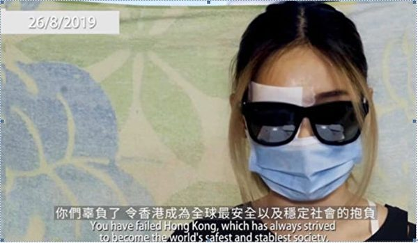

8月29日，香港民间记者会公开“爆眼少女”首度开腔的视频(民间记者会影片截图)

8月11日反送中尖沙咀现场，一名女子遭警方布袋弹射穿眼罩、击中右眼球及鼻梁骨，当场血流如注。报导指她现时伤势严重，右眼球爆裂，视力或永久受损。（ANTHONY WALLACE/AFP/Getty Images)

被打爆眼睛的，还有印尼女记者英达（Veby Mega Indah）。她在9月29日采访中，被警方发射橡胶子弹击中右眼，造成了永久失明。

还有拔萃女书院教师杨子俊，在6月12日的警民冲突中，被警察射伤右眼失明。

<b>3、陈彦霖事件</b>

9月22日，15岁女孩陈彦霖被发现全裸浮尸。警方称“投海自尽”并迅速火化。陈彦霖生前是游泳健将 ，曾在自由泳比赛中获奖。擅长游泳的女孩，怎么可能全裸溺水而亡呢？

火化遗体第二天，10月11日，警方否认陈彦霖曾被性侵。16日又公布了一段“监控影片”，声称陈彦霖是“自行脱鞋后投海”。但人们发现 ，影片后半段出现的“陈彦霖”，并非是她本人，而是“替身”。

图为2019年10月17日，陈彦霖生前借读的知专设计学院内的各种纪念画面。（骆亚／大纪元）

有多名专业化妆师认真分析比对指出，假陈彦霖的眉骨、眉上肌肉、眼袋、鼻骨和发际线等多个地方都与陈彦霖明显不同。

这起事件，震惊了国际社会。但陈彦霖并不是唯一的。她身前身后，出现了大量警方称“自杀、无可疑”的案例。

<b>4、被自杀</b>

9月7日，一家亲共媒体报导了理工大学一起坠楼事件，说31岁钟姓男子坠楼身亡。警方没有发现遗书，但死者身上有教育学院的学生证和身份证。教育学院的学生为何要到理大去自杀呢？

9月9日，这家媒体7点38分报导，7点15分有人发现一名男子在荃湾自缢身亡。8点20分由更新报导，称警方发现遗书。从发现尸体到报导，中间只有23分钟，这么短的时间内发出报导，你会相信这是正常的吗？

9月14日，一名41岁外籍女子在交加街18号坠楼，全裸的尸体被砍成两截。

9月19日，一名青年在蓝田平真楼坠下。目击者发现，尸体没有血，现场也没有血迹，尸体已经发黑。

9月24日，荃湾海边发现男性浮尸。照片显示尸体穿黑衣、黑裤、黑鞋，渗出大量血水。眼部有瘀伤，嘴被胶纸封着，但尸体没有浮尸应有的水肿现象。

10月8日，海怡半岛海面发现一具女性浮尸，黑衣黑鞋，警方称没有可疑，列为溺水身亡。

10月10日，一名男子在沙田显贵楼坠下，一只脚掌飞脱，警方称事件“无可疑”。但目击者发现，尸体几乎没有血迹，而且僵硬，已经发白。坠地时是头部着地，但是却没有脑浆喷出。

这只是其中的一部分案例，而在这之外，警察的性暴力也同样令人发指。

<b>5、性暴力</b>

10月10日，中大女生吴傲雪在和校长段崇智对话中 ，摘下口罩，以真实面孔诉说了她和手足所经历的 一切。她哭诉“警察要我们去哪里就去哪里，入黑房就入黑房、脱衣服就脱衣服”。

她指控在新屋岭那里，搜身室全是黑的，不只一个人遭受警方的性暴力。“其他被捕人士曾经遭受不只一名警员、不分性别的性侵及性虐待”。

10月10日晚，中大校长段崇智与学生及校友公开会面。曾被捕的中大女生吴傲雪（Sonia）控诉自己在葵涌警署曾遭遇性暴力.（视频截图）

关注妇女性暴力协会12月9日公布，反送中运动期间，有67人曾遭遇性暴力，施暴者主要是警方和执法人员。她们经过网络问卷调查，在回复问卷中，58名女性、9名男性都证实曾遭遇性暴力，其中有3人在威胁下被迫性交。而这些很可能是不完全统计数字。

<b>6、实弹伤人和骑车撞人</b>

10月1日，警察第一次开了实弹枪，射穿了中五学生曾志健的肺部。医生透露，子弹距离心脏只有3釐米。

11月11日，交警关家荣连开三枪，击中21岁周伯均。导致他的右肝、右肾部分被切除，才保住性命。

11月11日早上，在西湾河一路口，港警朝手无寸铁的学生开枪。（视频截图）

同一天，一名交警骑重型摩托车三度冲撞示威人群。

10月6日 ，一名年约60的出租司机郑某，在长沙湾道和钦州街交口处，故意驾车撞向游行人群，多人被撞倒。其中一名23岁女子双脚被撞断，可能会终生残废。

11月4日，警方在将军澳发射催泪弹清场，造成科大学生周梓乐从停车场坠楼，头部遭受重创。11月8日，周梓乐最终不治。

<b>警方疯狂发射近3万弹药</b>

半年当中，900多场示威、游行、集会，只有极少的几次没有遭到警方疯狂镇压。保安局长李家超11月27日承认，警方19次开实弹枪，使用了大约1.6万枚催泪弹，近1万发橡胶子弹，布袋弹近2000枚，海绵弹1900枚。在拘捕的近6000人中，最大的83岁，最小的只有11岁。

2019年9月29日，“9.29全球抗共”游行活动。港警在金钟狂抓捕抗争者。(宋碧龙／大纪元）

中共港共和港警欠下的一笔笔血债罄竹难书，香港人前行的每一步都异常艰难。明天，我们会继续说香港人的抗议升级和港府背后的中共因素，以及香港人自励向前、赢得世界的尊重和支持。请您继续关注。

大纪元《新闻看点》制作组　　＃

<a target="_blank" href=#top><h6 align="right">回上方</h6></a>

<a name=85>
<h1 align="center"><b>欧盟外长会议决定：引入全球人权问责系统</b></h1>

12月9日欧盟外长会议决定，要制定一套新的制裁系统，让欧盟可以统一惩罚世界各地发生的人权侵害行为。（Sean Gallup/Getty Images)

【大纪元2019年12月10日讯】（大纪元记者祝兰德国报导）在世界人权日前夕，欧盟外交部长会议通过新决定，将筹备一套新机制，用于惩罚严重侵犯人权者。这套机制被外界称为欧盟版的马格尼茨基人权问责法。

本周一（12月9日），欧盟新任外交和安全政策高级代表波瑞尔（Josep Borrell）首次主持成员国外交部长会议。会议决定，要制定一套新的制裁系统（Sanktionsregime），让欧盟可以统一惩罚世界各地发生的人权侵害行为。

新的制裁制度被认为会更容易和灵活地制裁侵犯人权者。迄今对个人、组织或企业的制裁，都是大规模制裁政策的一部分，如针对恐怖主义等。新的制裁制度针对侵犯人权的个人，采取的措施如冻结账户或旅行禁令等，非国家组织的成员也更容易受到制裁。

这套系统很快就得到了一个非官方的名称——“欧盟版马格尼茨基法”。这来源于美国2012年通过的《马格尼茨基法治问责法》，针对违反人权的俄罗斯官员。这个名字来源于死去的俄罗斯律师谢尔盖‧马格尼茨基（Sergei Magnitsky），他因揭发政府腐败，2009年11月在被关押期间死亡。

2016年底，美国通过了《全球马格尼茨基人权问责法》，将这种制裁从俄罗斯扩大到全球范围内的腐败官员，制裁措施也包括禁止他们入境，并冻结他们在美的财产，禁止他们在美国的交易。

据媒体《die Presse》报导，欧盟不打算在新的制度上采用这个名字，也不将其单独与俄罗斯有联系。相应的建议在会议后将递交给相关的工作组。明年年初，欧盟外交部长要决定下一步怎么做。

针对这次决定，德国外交部长马斯（Heiko Maas）说，“我们欧盟必须明确表示，我们是认真对待人权的。所以我们也需要一套制裁机制，明确表示欧盟准备好做出实际行动。”

外长会议的政治决定，还将有具体法律跟上。法律将针对严重的迫害人权行为，如种族灭绝、酷刑、奴役或者系统性暴力，对象不仅限于官员。

<b>其它国家的相关举措</b>

除美国之外，加拿大、英国、波罗的海等国家也通过了《马格尼茨基人权问责法》。

今年11月底，荷兰议会也通过一个相关的动议案，要求荷兰政府在明年1月底之前准备好荷兰版的马格尼茨基法案，如果欧盟在那之前没有通过欧盟版的话，荷兰就推自己国家的版本。

德国国会网站也正在公开一个民众发起的请愿书，内容是呼吁德国也引入类似的法案。请愿书征集签名截止日期是12月30日。

欧洲议会今年3月14日压倒性通过决议，敦促欧盟层级，以及28个成员国，都各自制定类似美国的《全球马格尼茨基人权问责法》的制裁机制。#

<a target="_blank" href=#top><h6 align="right">回上方</h6></a>

<a name=84>
<h1 align="center"><b>【新闻看点】北京再促贸谈 美新冷战成中共梦魇</b></h1>

图为川普与习近平会晤的资料图。 (JIM WATSON/AFP/Getty Images)

【大纪元2019年12月09日讯】大家好，欢迎大家关注新闻看点，我是李沐阳。

在距离12月15日这个关税大限越来越近之际，白宫首席经济顾问库德洛（Larry Kudlow）表示，“没有臆想的最后期限”。是否对1560亿美元的中国商品加税，将由美国总统川普做出最终决定。

中共商务部部长助理仁宏斌今天（12月9日）表示，希望尽快同美方达成一项协议。这是中方第一次公开说得这么明确。

中共海关总署昨天公布数据显示，11月出口连续第4个月负增长，按年下跌了1.1%。贸易顺差387.5亿美元，按年收窄了7.5%。关税大战已经对中国外贸形成了很大的冲击。

对中国经济的冲击是直观表现，而由经贸冲突引发的更深层次摩擦，更让中共难受。多方观点认为，美中之间的新冷战已经开始了，中共走进了死胡同。而川普很可能在顺承天意，扮演着中共垮台的推手角色。

<b>关税冲击发酵</b>

市场对中国11月的出口预期是增长0.8%，但是中共海关总署给出的数字，无法令北京振作。如果把今年前11个月的进出口相加在一起，中国进出口的总值是4.14万亿美元。

这个数字与去年相比，已经下跌了2.2%。其中出口是2.26万亿美元，按年下降了0.3%。进口是1.88万亿美元，比去年同期下降了4.5%。

其中与美国的贸易总值是4832.77亿美元，按年下降了11.1%，占中国外贸总值的11.9%。对美国出口是3752.5亿，下跌了8.4%。而从美国进口是1.08亿美元，下跌了19.5%；对美贸易顺差也收窄了3%，只剩下2672亿。

中原银行首席经济学家王军认为，中国外贸出口仍显疲态，这与挥之不去的贸易摩擦阴影有直接的关系。他对路透社表示，未来贸易摩擦的不确定性，仍然会左右对美贸易的规模和增长。

中共智库学者刘世锦在7日表示，美中贸易战等内外因素之下，中国经济情势牵动广泛。他在一场有关中国改革的论坛上指出，明年的中国经济增长率会降到6%以下。

刘世锦和他的团队近期研究认为，2020年到2025年，中国经济的潜在增长率基本上都会在6%以下，处于5%—6%之间。他预言，明年第一季之后，中国经济很可能“再次进入下行通道”。未来一二年内，还有1个百分点左右的回落空间。

而素有“中国第一经济师”之称的安信证券首席经济学家高善文则在前不久指出，多重因素将导致明年的中国经济进入“保四争五”阶段。

这位与巴曙松、方星海、潘功胜等人平起平坐的“经济师一哥”甚至认为，今后的10年中，如果危机不能化解，中国经济“保4”都有问题。他说中国经济增长“会持续寻底”，“跌破5%之前很难停下来”。

<b>12月15日加税吗？</b>

高善文所指的“危机”，很可能是眼下正在进行中的贸易战。打了17个月，仍然看不到尽头。虽然库德洛表示，川普总统喜欢目前与中方的贸易谈判走向，但他也表示，协议还没有达成，现在是“走一天看一天”。

库德洛告诉彭博电视，川普总统要求北京方面在知识产权、汇率和美国企业进入中国金融服务市场等方面作出让步，并且要承诺一个具体采购美国农产品的最低规模。他指出，“如果他（总统）对这些会谈不满意⋯⋯他会毫不犹豫地提高关税。”

他还同时表示，美中双方几乎每天都有通话，但是目前川普和习近平“尚无举行面对面会谈或签字仪式的计划”。他强调，“这些决定都还没有做出⋯⋯我们先谈妥条件，然后决定如何、何时、何地签约。”

经济学者认为，虽然美中谈判在相向而行，但双方的分歧仍然比较明显。即使是第一阶段的临时贸易协议，双方也有两大分歧。

中方尽管最近语气变得“柔和”了一些，但要求美方取消关税的立场并没有改变。这是美方坚持保留的，原因是北京没有信誉度，以往的很多承诺都没有兑现。美国希望用保留的关税作为执行机制的一部分，迫使北京必须履约。

而美方要求中方2年内采购400—500亿美元美国农产品，北京并不愿意接受，更不想做出数字承诺，中方表示采购要“符合实际”。

两大明显分歧点，双方将怎么弥合呢？如果不能化解分歧，没有谈妥第一阶段的贸易协议，那么按照库德洛的说法，川普将“毫不犹豫地提高关税”。

假如美国提升了1560亿美元中国商品的关税，北京会伸着脖子等着挨打吗？根据以往中共“战狼式外交”的行为方式，估计北京当局可能会采取一些相应的报复措施。

前不久，中共官媒放风称，中共将“很快发布一份不可靠实体清单”，其中包括相关美国实体。假如中共推出所谓的“不可靠实体清单”，对美国的实体企业进行报复，那将成为新的贸易战升级爆点。

<b>美中分歧没有根本解决</b>

其实，就算是双方暂时忽略一些分歧，勉强签署了第一阶段协议，也不意味着贸易战就终战了，不过是暂缓或推迟了一点而已。因为美中双方根本上的分歧并没有触及，双方谈判并没有进入深水区。

贸易顾问纳瓦罗（Peter Navarro）曾多次指出，中共的经贸政策中有“七大致命结构性罪恶”，使美国深受其害。如果这些不解决，美中之间的问题就不会得到根本性的解决。

纳瓦罗所说的“七大罪恶”，指的是中共盗窃知识产权、强迫技术转让、网络黑客、低价倾销、国企补贴、操纵汇率和输出毒品。

著有《致命中国》一书的纳瓦罗，用“罪恶”来形容中共的这些经贸政策问题。足见美方对这些是深恶痛绝的，所以要求北京必须对这些做出改变。

但这对中共来说，却是最头疼、也是最恐惧的地方，是中共的“七寸”所在。因为要改变这些结构性问题，就触动了中共的统治根基。换句话说，只要北京改变现有的经贸政策，失去了经济支撑的中共马上就垮台。

中国问题专家甘思德（Scott Kennedy）认为，北京当局根本不相信会达成一项“全面的协议”。

这位战略与国际问题研究中心研究员向《华尔街日报》表示，不仅美中之间“彼此缺乏信任，而且从两国所处的情况来看，双方都不是非要达成协议不可”。

龙州经讯（GaveKal Dragonomics）研究部负责人亚瑟·克罗伯（Arthur Kroeber）在一份报告中表示，任何最终协议都不会包含能让北京改变令美国反感的核心经济行为的重大举措，也不会包含削弱美国目前限制本国技术流入中国的持续努力的重大举措。

<b>贸易纷争扩展到人权领域</b>

美国限制技术流入中国，主要是因为中共并没有把高科技用在为民谋求福祉上。中共把通过各种手段得来的高科技，更多地用在了对内镇压和对外渗透上，并试图改变国际普世价值规则，对美国及西方形成了挑战，这是美国无法接受、不能容忍的，所以美国严格限制对中共科技企业的技术和服务出口。

这一点，在华为身上体现得非常明显。今年5月，美国把华为和它的几十家子公司列入了“出口管制名单”，限制对它出口零部件。

美国经过调查认定，华为在密切配合着中共，对外国实施网络黑客盗窃，使美国蒙受了巨大损失。而且它还在国内，替中共监控着14亿百姓，是中共手里一根实实在在打人的棍子。

随后美国又对海康威视、大华科技、海能达等影视监控企业作出制裁，同样限制向它们出口技术和服务，也禁止美国联邦机构使用它们的产品。而这几家企业，都涉嫌参与了对包括法轮功、维权人士和维族人等在内的国内民众的镇压。

上个月，《香港人权与民主法案》在美国国会两院以史上最快速度通过，随后川普签署使其成为法律。

《香港人权法》的推出，不仅使中港两地官员投鼠忌器，不敢再肆无忌惮地侵害香港人权，还有一点非常值得注意：如果美国国务院的年检认定，香港的自治和人权状况不佳，那么香港的独立关税区地位就会被取消。

中共可以不顾虑中港两地官员的死活，命令他们推行一些比如“逃犯条例”、“23条”等邪恶的政策，但是北京可能会考虑中国经济的实际问题。如果香港的独立关税区地位取消了，美国也会限制对香港的技术支持，这将对中国经济造成很大的冲击。

以前美国给香港优惠待遇，是认为香港可以继续实行原来的政治体制，人民享有自由和人权，所以美国同意给香港优待。而中共就利用香港，偷偷地窃取美国限制给它的技术，支撑着国内的科技企业和经济发展。

以往的美国政府并非不知道这一点，只不过是睁一只眼，闭一只眼。

<b>中共长臂管辖美国人言论</b>

如果说对法轮功、对香港的镇压发生在中国境内，已经让重视人权自由的美国无法接受，那么中共对美国人的言论打压，这种长臂管辖更让美国火冒三丈。

NBA休斯敦火箭队总经理莫雷（Daryl Morey）仅仅是发了一则推文，表示支持香港的抗议者，中共马上就暴跳如雷，不仅中国网店下架了火箭队的球队商品，而且中共央视还停止转播比赛，中国企业暂停了与火箭队的合作。

在中共的打压下，莫雷删除了那则推文，并且做了道歉。NBA称莫雷的评论“不恰当”，湖人队明星詹姆斯（LeBron James）说莫雷“被误导了”。

这件事反映出，中共利用14亿人口这个庞大市场，以此作为诱饵，严重影响着美国民众的言论自由，对美国的言论进行着审查。

这引起了美国共和、民主两党的强烈反对，共和党参议员卢比奥（Marco Rubio）在推文中指责NBA，为了取悦中共政府，“把莫雷推下了车，太恶心了”。

就连竞选总统的民主党候选人、参议员沃伦（Elizabeth Warren），也开始呼吁对北京采取更强硬的立场。

<b>新冷战开始</b>

皮尤研究中心（Pew Research Center）调查显示，对中国（中共）持负面看法的美国人，比例在大幅上升，从2018年的47%跃升到今年的60%。

这些压力，让美国政府难以放松对中国施加的诸多限制。《华尔街日报》表示，从更严格的出口管制，到把中共科技领军企业列入黑名单，这是“比关税更大的障碍”，美中分歧“正在不断扩大”。贸易战已经演变成了一场“范围更广、层次更深的意识形态冲突”，两大经济体越来越“接近一场新冷战”。

但是斯坦福大学胡佛研究所的米尔班克家族高级研究员尼尔·弗格森（Niall Ferguson）则更明确地表示，美中新冷战“已经开始了”。

这位15本书的作者在《纽约时报》撰文表示，美中从贸易逆差和知识产权盗窃问题的争论不休，已经迅速演变成了一系列其它方面的冲突。并且已经卷入了一场科技战和一场意识形态对抗，双方“共生经济”的伙伴关系已经不复存在，“第二次冷战已经开始”。

弗格森表示，明年不太可能爆发第二次朝鲜战争，但是这场新冷战会“变得更冷”。他不认为美中冷战可以通过达成贸易协议解冻，“冷战不是想停就停的事情”。他指出，新冷战开始于川普总统任内，持续的时间将比他的任期长得多。

<b>中共的梦魇：川普和贸易战</b>

宾夕法尼亚大学中国历史教授林蔚（Arthur Waldron）对英文《大纪元时报》表示，目前的中国，很像当年苏联解体时的状况。北京当局对现实缺乏正确的认识，不知道民间的实际情况。中共政府想到哪就做到哪，功能极度失调，没有解决方案。

一位习近平的幕僚曾告诉林蔚，中共政府非常清楚，“已经死到临头了”。他引述那位与习近平关系密切的幕僚的说法，“我们已经走投无路”，中共内部都很清楚走入了死胡同。“不知道下一步该怎么走，处处是雷，踏错一步就可能粉身碎骨”。

中共没想到，商人出身的美国总统为了追求公平贸易，发起了一场贸易战。而这场贸易战正在向更深、更广的范围发展，逐渐演变成了新冷战，对中共政权形成了巨大冲击。已经成了中共深深恐惧的梦魇！

信神的川普曾说过，他是“天选之人”。那么这样看来，川普很可能是在顺承天意，扮演着中共垮台的推手角色。

大纪元《新闻看点》制作组 #

<a target="_blank" href=#top><h6 align="right">回上方</h6></a>

<a name=83>
<h1 align="center"><b>美清理红媒中共代言人 传星岛老板入美被拒</b></h1>

传《星岛日报》老板何柱国入美被拒。（大纪元合成图）

【大纪元2019年12月11日讯】（大纪元记者赵彬香港报导）日前，建制派内部传一名亲共香港富商坐专机飞抵美国，被问话三个小时后，被拒入境。有建制派立法会议员称这位富商是《星岛日报》老板何柱国。随后《文汇报》及《大公报》等香港中共喉舌媒体记者欲入美也被限制。

透露消息的建制派人士称美国通过《香港人权与民主法案》后，身边的许多富商、朋友都感到不安，还称自己有人大代表身份，也担忧会被美国制裁。

11月27日，感恩节前一天，美国总统川普（特朗普）签署《2019年香港人权与民主法案》和《保护香港法案》成为美国法律，法律生效后，亲共媒体及代理人正式成美国制裁对象。

香港富商被拒入境美国的消息一出，随即引爆网络，有社交平台分析指被拒富商是拥有300亿元资产的星岛集团老板何柱国。

何柱国是香港烟草大王何英杰长孙，他于2001年收购了覆盖全球的华语媒体星岛集团，给其泛华集团注入影响力，之后还涉足互联网咨询行业。

时事评论人士盛杰表示，中共统战拉拢何柱国，从何柱国身兼各种大陆公司的头衔以及其之后的行事来看，何柱国属于乐意上钩，成为铁杆“党友”者；从何柱国这些年的言行来看是中共的合格代理人，何柱国成为香港人权法的制裁对象也不冤。

<b>诬陷伞运及反送中抗争者</b>

早在2014年雨伞运动时，《星岛日报》声称“占领行动会令未来一至两个月出现失业潮，或者令部分店铺关闭”。当时何柱国声称警方的行动“十分克制，专业行动值得尊重”，还对多年来投诉无门的市民学生说“需以合法方式争取民主”。

在今年“反送中”运动中，何柱国亲自跳到前台，把抗争者诬陷为“港独”分子，还撰文呼吁声称要抗争者“及早回头做个堂堂正正的中国人”。

对信息开放的香港，把抗争者说成“港独”几乎没有市场，但何柱国的言论对互联网几乎完全封闭、中共一言堂的大陆而言，可谓“一句顶一万句”。中共煽动“爱国情”，很快把香港抗争者魔化成14亿人的“敌人”。

面对港警六个月的滥暴滥捕、滥射催泪弹等，“无可疑”坠楼、浮尸频现，香港陷入白色恐怖急需国际救援之时，何柱国发表社评《吁请国际社会 勿与恶同行》，声称中共遵守“一国两制”原则，依然让香港享受高度自治，司法独立体制；并且在政治参与、言论和新闻自由等领域上，相比殖民地时期更有长足的进步云云，并竭力阻止美国通过《香港人权与民主法案》。

<b>收购星岛 从右倾变党媒</b>

早期的《星岛日报》属于中立偏右的媒体，由东南亚华侨富商胡文虎于1938年创办，总部设于香港，在美国、加拿大、英国及澳洲等地均设有分部。在1997年中共掌控香港之前，《星岛日报》一直使用民国纪年，在新闻报导中称北京政府为“中共当局”或“中共”。

1998年受亚洲金融风暴影响，胡文虎的养女胡仙投资地产及股票严重亏损，为偿还债务，1999年3月不得不出售《星岛日报》股权给Lazard亚洲基金。Lazard亚洲基金在激烈的收购战中能够取胜，皆因关键时刻得到何柱国鼎力相助。何家是胡仙的大债主。

不到两年时间，2001年1月何柱国从Lazard亚洲基金手中收购了星岛媒体集团。当时被问及为何不在两年前出手时，何柱国回答称：“我被Lazard邀请进入《星岛日报》董事局之后才对报业感兴趣。”何这番话有多少真实成分难以断定，但何柱国的下一个动作表明北京对星岛集团非常“感兴趣”。

何柱国得手后，同年7月16日，他出现在北京长富宫饭店会议大厅，与新华社副社长何东君一起，揭开了“新华在线”正式启动的大幕。新华在线于同年5月正式成立，由新华社与何柱国的泛华科技集团联合投资，是中共大外宣的标志性项目，采用信息互通方式把中共的政治意图、意识形态潜移默化地传递到欧美、港台等地。

早在1998年，何柱国就被选为中共政协委员，并保持第九、十、十一届连任，是可靠“党友”，《星岛日报》在重大问题上与北京保持高度一致。2003年，当时的特首董建华按北京意图在香港强推《基本法》第23条立法，试图把大陆司法移植到香港，被强烈抵制之时，《星岛日报》于同年7月5、6日连发两篇社论力挺港府如期立法，鲜明地亮出其红媒底牌。

<b>党媒编辑统领星岛海外采编</b>

《星岛日报》在胡仙时代，以中立偏右办报立场赢得大量海外读者，成为欧美最大的华文媒体，星岛在海外华人中的影响力被中共看中。星岛被纳入何柱国旗下后，把欧美地区的采编大权交给了原《人民日报》编辑里戈。何柱国十分器重他，委任其为海外总编辑，把“协调、统筹及指挥”海外八个分社的新闻运作大权交给有党媒背景之人，这在星岛历史上属首次。

之后，《星岛日报》的社论多出自里戈之手，包括当时在中美军机相撞事件后，两位专栏作家因在星岛撰文，要求中共释放美国机组人员及归还美国军机，星岛的社论连续对他们点名批评近一个月。2001年正值中共迫害法轮功的高峰时期，《星岛日报》在两年时间内，仿效大陆媒体，在北美华人社区中挑起对法轮功的造谣以及仇恨宣传。

北美的詹姆斯唐（Jamestown）基金会曾刊文披露北京政权对美国中文媒体的控制。文章说，北京为介入中文媒体做了系统谋划，主要策略有：投资控股、以在大陆的商业利益利诱、安插人员等。文中指，由于中共在财力上的支援，《星岛日报》逐渐演变成亲中共的华文传媒。

<b>时评员：中共代理人好日子到头了</b>

时事评论人士盛杰表示，从23条立法、雨伞运动到反送中运动，香港人迫不得已站出来维护自由、公正、法治等普世价值。

“何柱国作为土生土长的香港富商其实心里十分清楚香港人在争取什么，但陷入中共统战的利益泥潭，关键时刻必须站出来代言。”盛杰说。

何柱国除有中共政协委员的红色背景外，还身兼多间大陆企业以及官方要职，并于2000年开始的7年内担任中国石化的非执行董事，还担任香港文化产业联合总会董事，山东省人民政府经济咨询顾问，中国对外经济贸易大学校董，北京大学名誉校董等职位。

盛杰表示，反送中运动引发国际社会对香港人权的高度关注，同时引起欧美等国对中共意识形态渗透自由社会的高度警觉。

他说：“日前美国已把央视、《人民日报》等党媒指定为外国政府代理人，开始清理红媒，港台媒体被中共渗透严重，随着国际社会对中共的围堵，红媒及其代言人的好日子也到头了。”#

<a target="_blank" href=#top><h6 align="right">回上方</h6></a>

<a name=82>
<h1 align="center"><b>负债16亿元 1亿人曾用的电商淘集集破产</b></h1>

由于融资失败，在爆雷两个月后，大陆社交电商黑马“淘集集”正式宣布破产。图为中国电商“淘集集”APP。（陈柏州／大纪元）

 
 【大纪元2019年12月10日讯】（大纪元记者周心鉴综合报导）由于融资失败，在爆雷两个月后，12月9日凌晨，大陆社交电商黑马“淘集集”的创始人张正平正式对外宣布公司破产。
 
<b>并购重组失败 支付宝账户被冻结</b>

淘集集9日凌晨公告称，由于资金未能如期到账，宣布淘集集本轮并购重组失败。张正平在公告中透露了，接下来淘集集破产清算或破产重整的处理思路。

破产重整具体指以股份形式将平台资产转让给供应商、广告代理等债权人，资金用于公司运营，尝试再一次盘活平台；如果上述方案不能推进，公司将申请破产清算，创始人及团队称将通过个人创业归还欠款。

12月8日，张正平发布内部信称，由于11月28日支付宝账户冻结，11月工资不能按时发放，需等待破产清算的结果，并请员工自行缴纳11月、12月社保。

值得关注的是，在12月3日，淘集集还曾发布公告称，已经与国内大型集团顺利签署股权投资协议，目前正处于等待打款的阶段，淘集集正在努力完成打款前所需要的前置条件。但这家国内大型集团的名字一直未公布。

<b>货款再现拖延 商家恐慌</b>

12月7日晚间，部分淘集集商家对界面新闻投诉，淘集集平台上的货款再次出现帐期拖延。

与此同时，部分类目群已经解散，淘集集内部也有员工离职。多个积压资金超过100万的商家已经无法与淘集集官方取得联系，包括此前支持淘集集平台重组的商家都产生了恐慌情绪。部分商家已经来到上海向淘集集讨要说法，或希望通过集体诉讼走法律途径解决问题。

淘集集方面称，目前公司欠款规模为16个亿（人民币，下同），其中包括8亿元供应商欠款和8亿元商家货款。这一数字和十月中旬危机爆发时的债务规模持平。

<b>淘集集曾给商家提出两种解决方案</b>

两个月前，淘集集为了解决商家货款拖欠问题，避免公司破产清算，给商家提出了两种解决方案：暂时放弃80%债务的追索权，淘集集将在收到重组方支付的收购价款后15个工作日内向商家偿付债务金额的20%；剩余债务延期至当淘集集与重组方重组后的目标公司估值达到15亿美元时3个月内兑付10%；剩余债务延期至当淘集集与重组方重组后的目标公司估值达到20亿美元，或上市时3个月内兑付剩余70%。

第二条路是选择债转股方案，即按5.5亿美元估值，将商户及供应商债务转为股权。由于商户及供应商众多，股份有限公司股东上限为200人，淘集集要求商户及供应商同意其股权由张正平代持。

10月31日，淘集集发布公告称，在10月23日，供应商债权人完成51%的债务重组协议签订，10月28日，收到资方书面TS，签订投资意向书。淘集集方面称，只有签约金额超过51%，投资方才会投资淘集集。

公开资料显示，成立于2017年5月31日的淘集集于2018年8月上线，曾一度因为平台发展迅速，仅用一年时间就吸纳了1.3亿用户。

据了解，淘集集瞄准四线及以下城市月收入2,000元以下的人群。平台提供涵盖服饰鞋配、母婴、家纺、数码、食品等生活用品，用户邀请亲友参与拼团，满足人数要求后可享受低价购买的权利。

今年以来，淘集集已经亏损近12亿元，上半年净亏6个亿，净资产负6亿元，目前每月亏损超2亿元。
新经济领域创业公司纷纷倒闭

根据数据机构IT桔子的统计结果，截止2019年12月6日，今年新经济领域的创业公司死亡327家。金融、电子商务和本地生活是重灾区，今年以来这三个行业分别有62、38和31家公司倒闭，而电商行业今年倒闭的公司中不乏乐蜂网、尚品网等存活时间十年以上的企业。

对此，台湾淡江大学产业经济学系教授蔡明芳对大纪元表示，电商的绩效与民众的消费力有关。大陆经济下行，民间就业率降低，让消费力下滑，这都使企业出现经营困难。#

<a target="_blank" href=#top><h6 align="right">回上方</h6></a>

<a name=81>
<h1 align="center"><b>日韩台携手曝光中共活摘 推修法阻移植旅游</b></h1>

11月30日日本、台湾、韩国及加拿大的医学界、法律界以及生命伦理界一行九位专家教授于东京大学举行了针对器官贩运及移植旅游的亚洲研讨会。揭露了中共的活摘人体器官。（新唐人）

 
 
【大纪元2019年12月10日讯】（大纪元日本东京记者站报导）11月30日，来自日本、台湾、韩国及加拿大的医学界、法律界以及生命伦理界的九位专家教授于东京大学就器官贩运及移植旅游举行了研讨会。台湾、韩国的专家们也分别交流了本国修法后的实施情况，以及推动修法的重点内容，并敦促各国国会推进立法或修法，以阻止本国患者去中国买卖来源不明的器官做移植。

日本、韩国和台湾专家首度联合在亚洲以“防制器官贩运及器官移植旅游”为主题召开国际研讨会，专家们以2008年《伊斯坦堡宣言》11周年为基点展开讨论，主办单位包括日本的移植旅游考量会、SMG Network与台湾国际器官移植关怀协会（TAICOT），以及韩国的器官移植伦理协会（KAEOT）、大韩律师协会、高丽大学国际人权中心。

在会上，各国专家介绍了本国的移植旅游，尤其是前往中国进行移植旅游的现况，并且揭露了中共的活摘人体器官。

上世纪九十年代起，随着医疗技术及医药品的发展，全世界的器官移植数量呈渐增状态，2000年后，中国的移植手术数量出现爆炸性的增长，其背后暗藏的事实真相也经国际独立调查后浮出水面。2008年，世界移植学会（TTS）与国际肾脏学会（ISN）的专家们在土耳其首府伊斯坦堡举行会议，经讨论后发表《伊斯坦堡宣言》，关于器官移植提出了“自给自足”和“严禁器官移植商业化及移植旅游”，成为各国关于器官捐赠和移植的伦理指导方针。

30日的研讨会分为四个主题，每一主题都揭露了亚洲的移植旅游问题与中国大陆有大规模的器官供应库，来源于掠夺盗卖人体器官的罪行有关，形成供需链，敦促各国立法或修法，制止国民到中国去做器官移植这种助纣为虐的行为。

<b>2008年《伊斯坦堡宣言》11年 防制器官贩运及器官移植旅游的进展</b>

国际人权律师、加拿大勋章得主、2010年诺贝尔和平奖候选人大卫・麦塔斯（David Matas）表示，“有相当可靠且有力的证据表明，中国活摘器官的罪行及器官移植旅游仍在继续，受害者除了无辜的良心犯外，主要是具有信仰的法轮功学员，近年也包括维吾尔族受害者。”

麦塔斯说，“尽管《伊斯坦堡宣言》已经发布11年了，但中国仍在滥用器官移植。这是以牺牲良心犯为代价的。”他表示，“必须对中国及其移植医生制定及实施有效的标准及规定，才能使宣言奏效。”

国际人权律师、加拿大勋章得主、2010年诺贝尔和平奖候选人大卫・麦塔斯（David Matas）表示，有相当可靠且有力的证据表明，中国活摘器官的罪行仍在继续。（新唐人）

<b>日韩台为阻止买卖器官及器官移植旅游的措施</b>

来自冲绳的移植外科医生小川由英表示，日本人到国外进行器官移植，以前以美国为主，自2006年之后，中国成了日本人主要的器官移植旅游目的地，但中国的器官却是来源不明的。

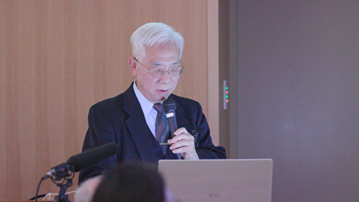

日本冲绳的移植外科医生小川由英介绍日本器官移植状况。（新唐人）

逾15年观察和研究中国器官问题的台湾大学附属医院云林分院泌尿外科主任黄士维医师，至今与其团队，访谈了数百位曾前往中国接受器官移植的台湾患者及中介和移植医师。他表示，器官来源不透明的黑箱作业是最大问题，其中潜藏很大的人道危机。

黄医师表示，“器官移植是一个很专业的议题，如果没有深入研究，很容易被中共欺骗。但是当深入研究后，你会相信一直到今天，中国移植手术的器官来源主要是法轮功学员和其它遭受人权迫害的弱势群族。”

黄医师介绍说，过去20年，台湾民众至少有四千多人赴大陆接受肝肾移植手术。他以赴大陆的一名男患者为例，患者在极短时间内等得第8个鲜活的肾脏才得以匹配。还有7个患者透过旅行社组团赴大陆接受器官移植。

随着中共活摘器官的恶行在台湾不断曝光，再加上台湾国际器官移植关怀协会大力在民间大力推动，促使了台湾在2015年通过修订《人体器官移植条例》，强制登录和禁止移植旅游。近几年，台湾境外移植旅游人数也随之大幅度减少。

台湾大学附属医院云林分院泌尿外科主任黄士维医师表示，通过深入细致的研究，一直到今天，中国移植手术的器官来源主要是法轮功学员。（新唐人）

2012年加入韩国器官移植伦理协会（KAEOT）的韩国高丽大学医学部教授韩熙哲，介绍了韩国的器官移植情况，他指出，在韩国平均等待器官的时间是四年多，美国也需要四五年，加拿大会更长，需要六七年的时间，而在中国，只需要几周，最多也就几个月，不可思议。

韩教授介绍说，韩国赴中国接受移植人数，自2003年激增至2005年的顶峰，之后一直下降，但由于中国封锁相关消息，至今仍无法获得确切患者人数。幸亏可以从涵盖所有国民的国民健康保险服务获取大数据进行筛选，希望能够获得更精确数据。接下来，将要求国会和政府根据他们的研究结果，采取法律行动，制止非法的海外器官移植旅游。

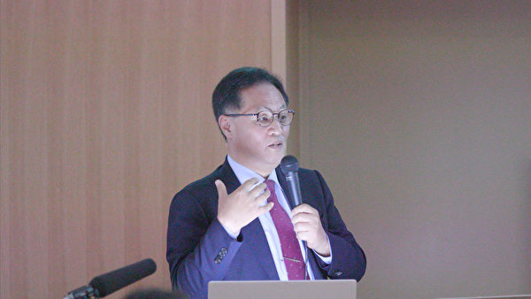

韩国器官移植伦理协会、韩国高丽大学医学教授韩熙哲，介绍了韩国的器官移植情况。（新唐人）

日本资深媒体人野村旗守分析了一直以来日本媒体及政界甚少报导中国买卖器官等相关人权议题的原因。野村认为，日本顺大流的社会特征、植根于日本媒体文化中对中国的赎罪意识，以及中共在日本各个领域进行的渗透，都让日本媒体自我噤声。

他提出成立于2016年的日本器官移植考量会及2018年成立的SMG停止医疗虐杀联盟，亦多次向日本政府陈情，终于在今年11月份有了突破，自民党议员山田宏在国会的委员会上首次提出“器官移植买卖”的议题。与此同时，有近120名地方议员支持停止日本人赴海外移植旅游，及86个地方议会通过建议书。

日本资深媒体人野村旗守分析了一直以来日本媒体及政界甚少报导中国买卖器官等相关人权议题的原因。（新唐人）

<b>买卖器官及器官移植旅游之医学伦理问题</b>

国立台湾大学医学部教授暨生医伦理中心主任蔡甫昌医师则介绍说，从台湾健保资料库显示，从1999到2009年有3,000位病人到海外进行肝肾等移植的案例。这个现象不只是台湾，韩国、马来西亚、以色列、中东都有类似的报告，但都不是完整的数字。

蔡医师质疑中共对于器官来源的说法，指出中共尤其对于使用死囚器官的说法反反复复，让学者专家很难接受中国器官来源的说词。

蔡医师介绍说，国际社会为了要制止发达国家的人民到穷国或者是到器官来源不明的国家（尤其是中国）买器官，陆续出台多份文件：2008年《伊斯坦堡宣言》；2010年世界卫生组织在《人体组织、细胞及器官移植指导原则》特别加上两个原则——透明和可回溯性；2014年欧盟通过《欧洲理事会反对人体器官贩运公约》；西班牙和以色列修法禁止境外移植旅游；菲律宾2007年修法禁止外国人到菲律宾接受器官移植手术等等。

为了减少台湾民众到中国购买器官，台湾政府这十多年来也陆陆续续修改法规。蔡医师指出，国际社会应该共同合作打击非法器官交易、移植旅游，持续施加压力，让中国完全停止摘取良心犯器官。

国立台湾大学医学部教授暨生医伦理中心主任蔡甫昌医师质疑中共对于器官来源的说法。（新唐人）

韩国延世大学医学院研究教授李东炫强调说，《伊斯坦堡宣言》提供政府和医学界在防制器官贩运和移植旅游时，可依循的伦理原则。宣言中建议医师劝病患不要去做移植旅游，并将移植旅游案例通报给国内或国际的登录系统。

李教授认为，医师致力于打击移植旅游与他们忠于病患的职责，两者之间并不冲突。在尊重生命尊严、正义、平等的基本前提下，把焦点放在对所有人的尊严及供体和受赠者之间的平等，得到的结论是，我们应该打击移植旅游这样的非法行为。

韩国延世大学医学院研究教授李东炫强调说，医师致力于打击移植旅游与他们忠于病患的职责。（新唐人）

<b>阻止买卖器官及器官移植旅游 各国须积极推进立法</b>

在民间推动台湾《人体器官移植条例》修法的台湾国际器官移植关怀协会法律顾问朱婉琪律师，在此次研讨会中介绍国际上关于禁止移植旅游及非法器官摘取的法律方面的进展，包括《欧洲理事会反对器官贩运公约》、《2018年版的伊斯坦堡宣言》，说明当前国际的立法趋势重点在将移植旅游、器官贩运、未经同意的摘取器官及使用予以刑事法化；并且详细介绍了台湾《人体器官移植条例》2015年修法中的强制登录规定，要求在境外移植的病人回台湾接受后续治疗时，必须向医院提供移植之器官类目、所在国家、医院及医师等书面资料，违反者有罚锾处罚的规定，

此外朱律师也说明台湾2015年修法禁止移植旅游所借鉴的2008年版的《伊斯坦堡宣言》、西班牙及以色列的立法例，并且指出台湾修法完善，无论海外移植国有无处罚器官买卖及中介的法律，只要台湾人在海外买卖或中介器官移植一律刑事惩罚。她呼吁日韩尽速通过修法。

台湾国际器官移植关怀协会法律顾问朱婉琪律师详细介绍了台湾2015年成功对《人体器官移植条例》的修法。（新唐人）

韩国水原地方法院法官金松介绍了韩国器官移植法、有关器官贩运罪的案件，以及最近提交给韩国国会的防制移植旅游的修正案。根据现行法律，无论是否在韩国境内，器官交易都是被禁止的，中介、器官贩卖者和购买者都会受到惩罚。

早于2000年，韩国法院就赴中国器官移植旅游就判决刑事惩罚。“供体”来源不明，在中国医院进行医学检查后仅需2到3周即可获得器官，这在正常的器官捐赠系统中是不可能的。这些可疑因素在量刑时应该纳入考虑。

当前器官移植法的问题在于没有方法筛检和管理器官移植旅游。金法官建议，当患者来医院进行术后治疗时，医生有义务通报海外移植病例，并且减少接受海外器官移植者可享有的国家保险权益，这将能阻却民众进行移植旅游，以符合《伊斯坦堡宣言》的精神。

韩国水原地方法院法官金松介绍了韩国器官移植法、有关器官贩运罪的案件，以及最近提交给韩国国会的防制移植旅游的修正案。（新唐人）

另外，日本医学会前会长、自治医科大学前校长、东京大学名誉教授的高久史麿先生参加了研讨会，并在致词中表示了对于移植旅游问题的关注，同时介绍了在日本国内“器官移植网”登录了的、前往海外做移植手术的人数变迁。他指出，日本由于国内相关法律的修正，前往海外做移植手术的人数有所变化，但以移植旅游等方式前往外国的非登录者的数量则是未知数。

日本医学会前会长、自治医科大学前校长、东京大学名誉教授的高久史麿先生表示，以移植旅游等方式前往外国的非登录者的数量是未知数。（新唐人）

参加此次研讨会的日本著名时事评论家河添惠子表示，“中共这些年来对外宣布一年10,000到15,000例的器官移植个案，但海外搜集的各种资料显示每年有6万至10万移植个案，这些具体的器官来自哪里？日本国会，日本媒体、NGO人权团体以及正义人士需要更广泛的追究事实真相，这个非常重要。”

就中共活摘人体器官的行为，欧美都给予了强烈的谴责。2016年，美国国会众议院通过343号决议案，要求中共立即停止迫害法轮功，停止强摘法轮功学员等良心犯器官。在欧洲，今年6月17日，英国伦敦“独立人民法庭”做出判决：中共反人类罪成立，其活摘良心犯器官已大规模存在多年，并仍在进行，法轮功学员是器官供应的最主要来源。

此次日本、台湾、韩国的主流专家、教授和律师们共同努力，在东京召开了首次亚洲研讨会，目的就是为了积极推动亚洲国家修法，阻止本国民众参与中共活摘器官的罪行。
<a target="_blank" href=#top><h6 align="right">回上方</h6></a>

<a name=80>
<h1 align="center"><b>美国会起草国防法案 瞄准中车、大疆和华为</b></h1>

美国国会希望利用《国防授权法案》，来阻止中国产巴士、列车车厢和大疆无人机进入美国。法案还涉及帮助加强台湾抵御中共威胁的内容，以及针对华为的内容。(Samira Bouaou/The Epoch Times)

 
 【大纪元2019年12月10日讯】（大纪元记者苏静好编译报导）美国国会希望利用国防授权法案，来阻止中国产巴士、列车车厢和大疆无人机进入美国。法案还涉及帮助加强台湾抵御中共威胁的内容，以及针对华为的内容。

熟悉此事的国会助手告诉《华尔街日报》，众议院和参议院共和党人与民主党人已就《国防授权法》中的条款达成共识，该法案将禁止使用联邦资金购买中国产巴士、有轨车。现有合同不在禁令范围内。

<b>该法案将冲击两家中国公司</b>

该法律将影响两家中国公司在美国的子公司，其中之一是中共国有企业中车公司（CRRC Corp.），该公司一直在大力开拓美国有轨车市场，据估计每年有180亿美元。另一家是中国电动车制造商比亚迪（BYD Co Ltd），该公司通过BYD Motors LLC公司在美国市场销售电动巴士。

市场研究和咨询公司Prescient&Strategic Intelligence Pvt的数据显示，预计美国电动巴士市场将从2018年的7.45亿美元增长到2024年的约19.5亿美元。

美国国会对中国中车最直言不讳的批评者包括参议院民主党领袖查克‧舒默（Chuck Schumer），以及来自佛罗里达州的共和党参议员马可‧卢比奥（Marco Rubio）。鲁比奥于5月底在《纽约邮报》（New York Post）中写道：“这是中国（共）破坏美国工业，并主导21世纪先进技术的长期战略的一部分。”

“考虑到我们对中共网络战运作的了解”，舒默曾呼吁美国商务部门调查中车是否构成对美国国家安全的威胁。

《国防授权法》对国防部和能源部的国家安全计划制定资金水平和政策。

经过数月谈判，两党对该法案内容达成共识。最终草案必须在众议院和参议院通过，然后川普（特朗普）总统签字，才能正式成为法律。

<b>大疆无人机</b>

《华日》报导，立法者也准备禁止美国军方购买中国产无人机，因为美国官员越来越担心中国设备可能会监视美国人，并使关键美国基础设施面临风险。

这项条款是针对大疆无人机公司（DJI Technology Co.）的一项重大举措，大疆是全球最大的消费无人机制造商，其总部位于中国深圳。

“中国制造无人机构成了巨大的国家安全风险” ，康涅狄格州民主党联邦参议员克里斯‧墨菲（Chris Murphy）今年7月对《华日》表示。

威斯康星州共和党众议员迈克尔‧加拉格尔（Michael Gallagher）也表示，不鼓励国家和地方机构（包括警察部队）以及使用无人机监控设施和运营的建筑、运输和能源公司购买中国无人机。

参议员马克‧沃纳（Mark Warner）此前也表示，“中国共产党现在能根据它们的法律，去干涉几乎所有的中国公司，从它们那里获取信息。”

<b>支持台湾的条款</b>

国防法案还将禁止从商务部出口黑名单中删除华为公司的某些条件。

商务部官员出于国家安全考虑，于5月将华为列入出口黑名单。美国官员警告说，华为产品可能被用来监视或破坏电信网络，而华为则否认指控。

该法案还有许多其它与中共有关的规定，包括旨在减少对外国稀土矿产依赖的一项规定；另一项规定要求报告中共在北极的军事活动，以及中共在北极的直接投资等。

其它条款包括支持通过扩大联合训练、外国军售、高级军对军互动来提高台湾的防御能力。这项立法将命令国防部长审查中共在台湾的军事、经济、信息、外交和数字上的影响。

<a target="_blank" href=#top><h6 align="right">回上方</h6></a>

<a name=79>
<h1 align="center"><b>程晓容：国际社会应关注最大的人权灾难</b></h1>

2019年12月1日，香港民众举行“感谢美国保护香港”大游行活动。游行人士手举“天灭中共”标语。（余天佑／大纪元）

【大纪元2019年12月10日讯】12月8日上午，香港法轮功学员举行反迫害集会，与香港和大陆民众一起，发出维护人权、结束中共人权迫害的呼吁。这一呼吁提醒人们：请关注当今最大的人权灾难——法轮功受迫害案。

2019年，中共侵害人权的罪行被不断曝光，许多政府和人权组织一致谴责。美国通过了《香港人权与民主法案》，更多国家已经启动或正在酝酿类似的制裁法案，共同打击人权犯罪。中共因其违反普世价值的行径已成众矢之的，世间正气上扬。但是，对于中共迫害法轮功之罪，仍有一些政府尚未表态谴责以及进行针对性的相关制裁，这使得中共继续肆无忌惮地迫害法轮功，而且还把这一迫害模式延伸至香港等地区。

<b>迫害法轮功是最大的人权灾难</b>

1999年7月，中共江泽民集团发动了对法轮功信仰群体的灭绝式镇压。当时，据中共官方统计，在大陆，至少有7千万人修炼法轮功。这意味着，7千万中国公民成为直接受害者，他们的家人也被殃及。

中共开动宣传机器，炮制谎言、妖魔化法轮功，同时从肉体、精神和经济上对法轮功学员进行残酷迫害。大批修炼者因坚持信仰被非法拘禁、受到酷刑折磨、洗脑摧残、敲诈勒索，甚至被活摘器官。

20年来，明慧网、法轮大法信息中心、追查国际等机构收录了大量迫害案例，联合国人权理事会、禁止酷刑委员会都收到过相关报告并予以关注。由于中共严密封锁真相，实际迫害致死人数难以统计，目前明慧网公布的数据仅是冰山一角。

2016年6月22日，加拿大前亚太司长大卫‧乔高、美国资深调查记者伊森‧葛特曼和加拿大人权律师大卫‧麦塔斯，在美国国家记者俱乐部联合发布了中共强摘人体器官的最新调查报告。报告显示，中国发生的实际器官移植数量远远超过官方公布的数字。三位联合作者估计，中国器官移植手术数量每年约为6万至10万例。在过去15年里，在大陆，估计进行了大约150万例器官移植手术，这些器官的主要来源是法轮功学员。因此，被强摘器官致死的法轮功学员数量比之前的调查所估计的要高得多。

2016年6月23日下午，在美国国会众议院外交委员会举行关于强摘器官的联合听证会，三位独立调查人士出席作证。伊森‧葛特曼发言说：“1999年，中共安全系统发起消灭法轮功运动。截至2001年，超过一百万的法轮功学员被关押进劳改系统并被迫接受以牟利为目的的器官检查。与此同时，中国的军队和地方的移植医院大量增多。”

关于法轮功受迫害案，多位国内外人权律师、学者和西方政要都曾指出这场迫害的非法、荒谬及严重危害。

2018年5月，大陆维权律师谢燕益和谢阳向欧盟发出公开信，信中写道：“当今世界最大的人权问题在中国，中国最大的人权问题是法轮功问题。”

“这场迫害所涉及的范围及造成的恶果可以说是二战结束以来人类历史上最大的一场人道灾难，它甚至已超过了许多场战争给人类造成的危害：上千万人公开遭到非法歧视、非法待遇，几十万上百万人被判刑、劳教、非法拘禁，数万人乃至十数万人被迫害致死、致残、乃至活摘器官，酷刑的发生十分普遍、监控无所不在……”

“对于抓捕、起诉、审判法轮功学员明明是错用法条，根本违反中国国内法律，这一点不仅世界各国、西方现代文明国家缺乏认识，中国的大多数民众也并不了解。人们不知道，法轮功的信仰行为及申冤行为按照中国法律来衡量，他们也是完全合法的。”

自2015年5月至今，近21万大陆民众向中共最高司法机关寄送了起诉江泽民的刑事控告书。此外，自2015年7月到2019年12月5日，全球37个国家及地区超过350万民众联署请愿，向中共最高检、最高法院举报江泽民迫害法轮功的反人类罪行，要求法办元凶江泽民。

<b>中共打压“真、善、忍”摧毁道德良知</b>

中共仇视和打压“真、善、忍”，虐杀修炼人，颠倒是非善恶，摧毁了中国社会的道德，并且把许多外国政府和企业也拉下水，企图泯灭全人类的良知。

<b>1. 迫害好人 摧毁道德</b>

法轮功自1992年传出，使数以千万计的中国人身心受益，重病号恢复健康，沉沦者浪子回头。修炼者遵照大法的教导，努力做好人，先他后我，令社会风气迅速改观，给中国带来了希望。维权律师程海曾说：“当下中国普遍缺少公共价值观，甚至出现人类历史上最无耻的口号——一切向钱看。而法轮功的‘真、善、忍’准则是帮助别人，是社会稳定的基础。”

在此仅举一例：潘本余是黑龙江省齐齐哈尔市齐铁环卫站工人，于1997年修炼法轮功。那年9月，他从火车车轮下救出两个摔在铁轨上的孩子，后来还救起过四个落水者。然而，这位舍己救人的英雄却因为坚持修炼被中共两次劳教迫害、两次非法判刑，饱受折磨。2011年7月17日，潘本余含冤离世。

中共迫害的对象是一个真诚、善良、平和的群体，是社会的中坚力量。中共以谎言欺骗，以暴力相逼，煽动全民仇恨，迫使各界与法轮功为敌。江泽民下达密令：“打死算自杀”。20年来，大批法轮功学员流离失所、家破人亡；活摘器官、百种酷刑、性虐待、注射毒针等种种罪恶被催生，骇人听闻。

中共还残酷打压为法轮功学员提供法律协助的人权律师，无理吊销他们的执照，关闭其律师事务所，以“煽动颠覆政权”罪名对其非法构陷，抓捕和判刑，并且骚扰、监控律师家属。中共借此恐吓所有为法轮功鸣不平、揭露中共迫害的正义民众，这一波司法狂澜是迫害法轮功的延伸。

<b>2. 中共将公职人员变成罪犯</b>

明慧网迄今公布了105,580名迫害法轮功学员的恶人名单，涵盖中共宣传、文化教育、演艺、媒体、军队、公检法、宗教系统、企事业单位等各级人员，上至发动迫害法轮功的中共前党魁江泽民，下至参与迫害的居委会村委会工作的基层人员，其个人信息和恶行等均被记录在案。

中共在迫害法轮功的20年犯罪活动中，将大批公职人员变成了虐杀好人的罪犯、甚至是天良丧尽的魔鬼。除了恶人名单，明慧网还汇集了数万例迫害者遭报应的实录，触目惊心。

2006年3月，原辽宁血栓中西结合医院的护士安妮在海外现身，曝光中共活体摘取法轮功学员器官。安妮的前夫在2001年到2003年之间参与了2000例活摘法轮功学员眼角膜的手术。安妮介绍，前夫向她倾诉，“他说你不知道我有多么痛苦。因为这些法轮功学员是活的。很多法轮功学员的器官被摘除的时候，人还没有咽气。这些人的器官被摘除以后，有的人就直接被丢进焚尸炉中火化，没有留下任何痕迹。”

2016年2月，山东省一名基层“610”人员致信明慧网说：“在工作中，我发现法轮功其实是教人向善，心灵慰藉，给人力量，是正的能量。但是党组织把法轮功妖魔化，欺骗了每一个人，欺骗了我。我很疑惑、也很痛苦。”

<b>3. 迫害触角伸至海外</b>

中共在镇压之初，即透过境外媒体散布对法轮功的诋毁之词，输出谎言和仇恨。中共还利用驻外使馆、领馆，监控所驻国法轮功学员，并操控亲共团体、干扰法轮功学员在当地的合法集会、游行和文艺演出等活动，制造事端、破坏社会治安。

为了掩盖罪行、阻止国际社会调查真相，中共以经济利益为筹码，迫使外国政府和大型商企在人权问题上、特别是对法轮功受迫害保持沉默。不少企业、财团见利忘义，与中共做起生意、不亦乐乎，他们对大陆的投资等于为邪恶输血，他们的沉默助长了邪气，无异于人权迫害的帮凶。

此外，中共活摘法轮功学员等良心犯器官，牟取暴利。大陆器官移植产业完全依靠谋杀无辜的修炼人而建立，任何个人或组织，若为此背书、甚至参与其中，都是不折不扣的同谋杀手。

<b>结语</b>

六个月来，许多香港抗议民众切身体会到，法轮功学员所遭受的残酷迫害都是事实，法轮功对中共本质的揭示有先见之明。他们为此感谢法轮功，并且向法轮功的勇气坚持致敬。

自2004年11月大纪元推出《九评共产党》以来，法轮功学员推动退出中共、解体中共的“三退”大潮；“天灭中共”系由法轮功学员最早提出。如今，这句标语出现在香港抗争队伍的洪流中，成为大批港人的共识。

中共对法轮功的迫害集邪恶之大全，残害生命、毒化心灵，摧毁人类的良知和普世价值。目前，中共在全球渗透，盗窃知识产权，大搞腐败，收买媒体，发展红色恐怖势力，其实这都是中共迫害法轮功的恶果在多方面的体现，也是各国政府对邪恶示弱所致。

法轮功学员蒙冤受难，依然讲真话、反迫害，他们在用生命、鲜血和巨大的付出抗击邪恶，破解共产主义毁灭人类的阴谋。对于这场突破人类道德底线、波及全中国乃至世界的信仰迫害案，国际社会应当给予高度关注并做出更加积极有力的回应，与中共邪恶切割，谴责暴行，救助被关押和迫害的大陆法轮功学员等善良民众，共同维护人类道德。#

<a target="_blank" href=#top><h6 align="right">回上方</h6></a>

<a name=78>
<h1 align="center"><b>中国11月CPI年增4.5% 创近8年新高</b></h1>

大陆10月份CPI同比上涨上涨3.8%。图为2019年8月22日，安徽淮北市一市场内的猪肉摊位。（Getty Images)

【大纪元2019年12月10日讯】（大纪元记者周慧心综合报导）中共国家统计局今天（12月10日)公布，11月居民消费价格指数（CPI）年增4.5%，高于预期的4.3%，创下2012年1月以来新高。

据中共国家统计局公布的数据，今年11月的CPI同比上涨4.5%，较10月的3.8%上涨0.7个百分点。其中，食品价格上涨19.1%，非食品价格上涨1.0%；消费品价格上涨6.5%，服务价格上涨1.2%。1­­~11月平均CPI比去年同期上涨2.8%。

11月的CPI持续上涨的主要因素是猪肉价格过高。食品中，畜肉类价格年增74.5%，影响CPI上涨约3.27个百分点，其中，猪肉价格上涨110.2%，影响CPI上涨约2.64个百分点。

长江证券首席经济学家伍戈曾于10月27日在其微信公众号“伍戈经济笔记”表示，CPI在中国新年期间恐破4%。但还没到新年，CPI已经涨破4%。

另外，花旗集团、巴克莱（Barclays Plc）以及中国银行国际有限公司华创证券有限公司的经济学家则预计，明年1月下旬，中国新年的需求将进一步将CPI涨幅推高至5%以上，甚至可能达到6%。

<a target="_blank" href=#top><h6 align="right">回上方</h6></a>

<a name=77>
<h1 align="center"><b>男子7日5次提1万美元现钞 中行承德分行被罚</b></h1>

在贸易战升级下，美元持续走强、人民币走贬，财信传媒董事长谢金河提醒台湾投资人，小心你的人民币资产可能愈来愈缩水。 (Getty Images)

 
 【大纪元2019年12月10日讯】（大纪元记者李净综合报导）中国外汇储备量近年来持续下降，当局对于个人在中国境内提取外汇的管控收紧。河北一男子7日内连续5次提1万美元现钞，中国银行承德分行被罚4万元人民币。

12月9日，中共外汇管理局网站公布的国家外汇管理局承德市中心支局行政处罚信息公开表（汇冀承检罚字〔2019〕第3号）显示，中国银行股份有限公司承德分行存在行为个人耿某某在7日内从同一储蓄账户5次提取1万美元现钞，国家外汇管理局承德市中心支局对承德分行处以警告、责令改正、并处罚款4万元人民币。

早在2016年12月30日，中共央行曾颁布收紧外汇管控的规定，将大额现金交易报告（包括现金结售汇）标准由20万元人民币调至5万元、外币等值1万美元；自然人银行账户大额转账交易跨境报告标准为人民币20万元以上、外币等值1万美元以上。

2017年9月，据网易财经援引工商银行某国际金融理财师消息披露，人民币兑换美金每日提取最高限额调整为1万美元，不可连续两日以上提取，一周之内最多只能取两次。“如果需要连续两天以上提取，需要外管局的证明文件，这是一个月之前下发的新规定，目前取美元还是有一定限制的。”

虽然中共官方目前并未改变个人每年5万美元的购汇额度，但据港媒报导，中共央行从2018年年底开始便通过减少用户每日提取美元额度的方式，加大对外汇的管控。

12月9日，中共外匯管理局網站公布的國家外匯管理局承德市中心支局行政處罰信息公開表（匯冀承檢罰字〔2019〕第3號）。（網路圖片）

 
 根據中共官方公布的數據，今年9月份，中國大陸的資本外流總額為將近900億美元，外匯儲備下降了147億美元。

10月25日，清華大學經濟管理學院教授魏傑在北京一個管理高峰論壇上說，9月外匯儲備量已經從3.1萬億降到了3.09萬億。外匯供給的來源一個是自己賺的錢，一個是借來的錢，還有一個是外資進入中國帶來的錢。這三種錢裡面，實際上真正能動用的錢，有幾千億美元左右。

目前，中國經濟增長速度降至27年來最低，加之受美中貿易戰的影響，中國經濟環境進一步惡化。#

<h3 align=center><a href="https://twitter.com/PXAIyJqEyNMyRbv">中国各大银行已无钱可取？上千儲戶大額預約取款被逮捕！</a></h3>

<a target="_blank" href=#top><h6 align="right">回上方</h6></a>

<a name=76>
<h1 align="center"><b>周晓辉：邓炳强进京听令 北京对港政策仍两难</b></h1>

12月6日，香港葵芳中学生在兴芳路游乐场举行抗暴集会。（宋碧龙／大纪元）

【大纪元2019年12月09日讯】近日，按照惯例，11月上任的香港警务处处长邓炳强进京，并在12月6日和7日先后与国务委员兼中共公安部部长赵克志、中共中央政治局委员暨政法委书记郭声琨和港澳事务办公室主任张晓明会面。这与其前任卢伟聪2015年进京时拜会高层有所不同。彼时，时任公安部部长的郭声琨是陪同时任中共中央政法委书记孟建柱会见卢的。而此次不仅赵克志与郭声琨分别会见邓炳强，而且赵是先于郭先见，这说明为习亲信的赵克志在北京对港政策中已扮演关键的角色。

毋庸置疑，邓炳强进京的首要目的是聆听中共高层的指示，即在未来一段时间内，如何应对港人的抗争。因此，赵、郭所言实际上代表的就是中南海的意思。

根据官媒，在会面中，赵克志明确提到习近平11月14日就当前香港局势发表的讲话，称其“宣示了中央政府对香港局势的基本立场和态度”，“为香港止暴制乱、恢复秩序指明了方向、提供了遵循”，并重申香港当前最紧迫的任务仍然是“止暴制乱、恢复秩序”。他还强调，“中央政府和公安部永远是香港警队的坚强后盾”，“希望香港警队与内地公安机关加强协作配合，深化交流合作”。而邓炳强则表决心外，还感谢“公安部长期以来对港警的大力支持和帮助”。

至于郭声琨除了赞扬香港警方外，亦称香港最紧迫的任务是“止暴制乱、恢复秩序”，还称中共政法委“全力支持香港警方尽快恢复社会秩序”。邓炳强则再次表决心。

从赵、郭之语可以看出，不管是出于维持最高层的脸面，还是其它原因，北京当局对香港局势的认知仍以习近平的讲话为基调。要知道，11月14日习近平就香港局势，前所未有地提出了“三个严重”、“三个坚定支持”和“三个决心”。其表述为“香港持续发生的激进暴力犯罪行为，严重践踏法治和社会秩序；严重破坏香港繁荣稳定；严重挑战‘一国两制’原则底线”。无疑，习的公开表态给外界传递的信息就是：北京绝不会回应香港民众的诉求，香港民众的抗议已被定性为“激进暴力犯罪”，北京当局已然将所有罪责推到了抗议民众身上，北京当局包括习本人将坚定支持港府和港警对民众实施镇压，将坚决反对美国等国对香港抗议民众的支持。

既然北京当局并未改变对香港局势的认知，即便香港强大的民意早已通过不久前的区议会选举传给了北京，那么，香港警方的任务自然也没有改变。

不过，邓炳强7日下午在接受中共央视采访时，透露了四点信息。

一是将不断健全警察装备，提高警力水平。警用装备是指警员所使用的所有物品有：抓捕器、作战服、作战背心、警用装备包、警用水壶、警用强哥手电、电击棒、警用腰带八件套‘作战靴、腿绑枪套、警用制式刀、子母作战背囊、防割手套半指手套、全皮手套、护膝护肘、手枪、防暴盾牌、高压水枪、巡逻车、催泪枪等。

由于美国等西方国家已禁止向香港出口相关警用装备，赵克志高调称中共政府和公安部支持港警，无疑除了人员继续支持、培训港警外，将包括为其提供更充足的警用装备。令人担心的是，中共当局是否会将去年推出的一款激光步枪以及今年推出的声波武器，也提供给港警？前者可以远距离摧毁标语，并对拿着扩音器、带头人进行重点打击，后者利用低频声波定向驱散人群，而这种武器将会造成人体极大不适，人体耳膜、眼球、胃、肝脏和大脑都会受到声波振动影响。

未来港人一定要关注来自大陆的警用设备，并随时曝光。

二是其在京时向有关部门介绍了香港目前的情况，拘捕所谓“暴力分子”的人数，大概检控了什么罪行等。不知邓炳强是否透露了被警方暗中杀死的港人和大陆人的人数？

三是接下来会用“刚柔并济”的策略来“止暴制乱”。按照邓的解释，所谓的“刚柔并济”，即对使用汽油弹、袭击路人、放火等暴力行为会采取行动，对于其它一些“如阻止马路，或者年轻人轻微的情况”，会人性化、用弹性的方法处理。

这表明在美国等强大外部压力和港人抗争下，在中南海尚无法找出合适政策但又不想回应港人的诉求、也无法动用军队血洗香港的情况下，中南海还必须依靠港警来应对港人的抗争。中南海也意识到了，一味的暴力对待港人，会迎来更多的制裁，尤其是美国的《香港人权与民主法案》和12月15日加征关税已经悬在头上。因此，中南海现时的策略较之前稍微软化，而其目的显然主要是避免激怒美国和西方国家。

四是邓称有很多“抹黑警方的假消息”，所以警方民调很低，警方“会一直坚持并继续提高办案的透明度与专业度”。

对于背靠中共的邓之言，相信没有多少港人会相信的。因为是不是假消息，香港完全可以成立独立的调查委员会进行调查。所谓的提供港警办案透明度与专业度也只是说说而已，因为今日的港警早已不是昔日的皇家警察，缺乏独立监督且信任度早已丧失的港警，只要执行中共的“止暴制乱”政策，就绝不会有真正的透明度。

在笔者看来，邓炳强北京之行透露的信息，表明中南海对港政策仍处于两难中：暴力镇压乃至动武，承担不起后果；顺应港人民意，心有不甘。笔者还听说，近日，北京当局向一些高校所谓的专家们征询解决香港问题的建议，但还是那句话，只要在中南海认知香港问题的框架中提建议，是根本解决不了香港问题的。香港早已注定是中共的滑铁卢。#

<a target="_blank" href=#top><h6 align="right">回上方</h6></a>

<a name=75>
<h1 align="center"><b>河南爆新一轮非洲猪瘟 猪存栏量月减20%</b></h1>

“国泰君安”调研报告称，11月河南出现了新一轮一定规模的非洲猪瘟疫情，生猪存栏量月减15～20%。图为2018年8月10日，河南省一处农场的猪只。(GREG BAKER/AFP/Getty Images)

 
 【大纪元2019年12月09日讯】（大纪元记者周心鉴综合报导）据大陆一份调研报告称，11月河南爆发了新一轮更猛烈的非洲猪瘟疫情。另有行业专家、猪肉流通商表示，疫情规模相对较小、零星发生，但均认可 “生猪存栏量月减15～20%”。
 
<b>豫东现新一轮更猛烈疫情</b>

12月7日，“国君农业”一份调研报告显示：11月初开始，在中国养猪第一大省河南的豫东开启新一轮更猛烈疫情，主要位于驻马店、周口地区。新一轮疫情致生猪存栏量一个月减少15～20%，主要是中小散养户受损。

调研对象表示，2018年8月开始发生疫情，2018年年前有一个高发点，年后6月份之前又有一波严重的疫情。之前的疫情豫北和豫西比较严重，个别地区产能去化达到80～90%，豫东像周口和驻马店地区去化程度在50%多一些。

报告显示，最近这波疫情比上次还要猛烈。从10月底开始就有陆陆续续的点状发病，到11月下旬就开始不是点状，变成一个县镇的发病了。11月份单个月份的疫情来看，估计驻马店、周口这几个严重地区产能环比去化了15-20%，随着入冬和中国新年人员流动，疫情还有进一步加重的概率。

报告说，上一轮主要是大小场无差别染病，因为大厂影响大，所以上次疫情大家听到的都是大部分大厂的案例。但11月这一轮主要是散养户发病，而且发病的重灾区跟上一轮的重灾区正好是互补的。随着入冬和新年，预计疫情还会来一波。

文章下面有网民跟帖爆料说：“本人从事饲料销售，豫东实际疫情比文中要厉害的多，中小养殖场发病率80%以上，母猪治疗死的快，不治疗死的慢（3～5天），一旦发病基本清栏。”

（网页截图）

 
 中共国家统计局称：2018年12月份存栏4.28亿头，2019年9月份3.07亿头。有网民问：“那1.2亿头猪去哪里了？？？？？？”

“新闻上说：9月份母猪止跌回升0.6，你信吗？回升的0.6那是5,000头以上大规模猪场的数据。9月份那5000头以下中小型猪场下降了多少？？？？？”

<b>疫情规模说法不一</b>

对于“河南出现了新一轮一定规模的非洲猪瘟疫情”这一信息，财联社记者咨询了3位参与河南生猪收购、流通、运输的流通商。“收猪过程中没发现有新一轮成规模的猪瘟，河南地区会零零星星出现新的疫情，不成规模。”

不过，有位生猪养殖行业资深专家对财联社表示，河南确实出现了新一轮猪瘟疫情，“河南新一轮疫情是10月下旬开始的，但疫情规模相对较小。”

行业内对河南是否爆发新一轮非洲猪瘟看法不一，但对于11月生猪存栏同比去化，多方均表示认可。

上述养殖行业专家也认可11月份存栏量出现一定程度下滑，但认为具体数据未经统计时不好确认。

“存栏量是否在11月份下滑不好说，但收猪确实比较困难。”河南中小型流通商均表示。

上述行业专家表示，节后消费低迷，流通商收猪意愿下降，生猪出栏价格大概率在2月份出现一波下杀，上涨会在明年3月份以后，缺口期内猪价存在创历史新高可能。

此外，中国受到非洲猪瘟影响，猪肉价格飙涨。中共当局为了压抑猪肉价格，大量进口肉类，种类包含牛肉、猪和禽类。世界食品价格也受波及，11月达到2年来的最高点。全球肉类价格同比上涨18％，创8年来新高。

<a target="_blank" href=#top><h6 align="right">回上方</h6></a>

<a name=74>
<h1 align="center"><b>疫苗受害儿童到北京卫健委维权 有家长被拘</b></h1>

1日至6日，大陆各地二十余名疫苗受害家长带着孩子冒着严寒到北京卫健委上访，要求尽早出台相关补偿标准，受害儿童也齐声喊话，维护自己的权益。（家长提供）

 
 【大纪元2019年12月07日讯】（大纪元记者洪宁采访报导）12月1日，中共制定的疫苗管理法开始正式实施。1日至6日，大陆各地二十余名疫苗受害家长带着孩子冒着严寒到北京卫健委（卫生健康委员会）上访，要求尽早出台相关补偿标准，受害儿童也齐声喊话，维护自己的权益。现场的家长们非但未获接待，还被警方带走，已有家长被拘留。

没有到现场的100多名家长联署声援，有家长向大纪元记者提供消息说，因疫苗导致儿童残疾的家长带着孩子自发前往北京，要求各有关部门履行职责，给疫苗受到伤害的孩子明确的回复。他们迫切要求中共国务院、卫健委等部门尽早制订相关补偿标准，让受害儿童能够终身受益，有终生的权益保障。

有不愿透露个人信息的家长说，这些在现场跟着爸爸妈妈维权的孩子，有些是兄弟因为疫苗残疾，有些是姐妹残疾，但没有一个官员愿意出来听听这些受害人的心声，令现场的家长心酸落泪。

“他们不只是为了自己的孩子，同时也是为全国所有的孩子，那百万分之几的潜在可能的受害儿童。”这名家长说，“第一部疫苗立法实施几天以来，没有人关心真正的疫苗受害孩子们是否得到立法的关爱，这就是被国际诟病的中国没有人权的现实。”

6日，家长们在卫健委门口继续维权，警方出动，将孩子和家长们分别带到不同的派出所，其中北京有两名家长被拘留7天。

陕西省一名孩子的爸爸也被刑事拘留，孩子妈妈说：维权是做父母最基本的爱护，不要再给疫苗宝宝家庭带来两次痛苦了。由于孩子智力受到影响，不明白事儿，近几天就是哭闹，她一个人带孩子很艰难。

家长们愤怒表示：“没有疫苗受害家长座谈，那还不是有关部门又做运动员又做裁判员，对疫苗受害孩子来说根本上就没有意义。”“12月1日实施的疫苗立法只罚不赔，吃人肉吸人血不吐骨头的。问过这些真正需要疫苗立法的孩子得到疫苗法的关爱了吗？”

<h3 align=center><a href="https://twitter.com/aBIyxobDiRhzdSW">预苗致残的儿童，在这个寒冷冬天，在北京卫建委的门口呐喊，这些致残的儿童，治疗得不到保障，而且多半家长到了中共国的月经期，地方政府还会把原本在治疗的孩子，强行绑架回家，造成康复中孩子，病情更加严重。</a></h3>

<h3 align=center><a href="https://twitter.com/pinge1978">12月6日，疫苗受害儿童家长起早贪黑，忍饥挨饿冻，在国家卫健委门口维权，这是疫苗管理法正式实施后第6次。警方出动将孩子和家长们分别带到不同派出所。期待他们平安归来。他们不只是为了自己受疫苗伤害的孩子，也是为全国所有的孩子，那百万分之几的潜在可能的受害儿童。为了所有孩子终生权益保障！</a></h3>

在过去的十几年中，大陆各地不断涌现问题疫苗事件，毒疫苗、问题疫苗致死致残千千万万个宝宝，伤害了无数个家庭，而当局始终采取的手段是欺骗、隐瞒真相，打压受害群体。今年2月25日，中共疾控中心主任高福仍宣称“中国疫苗应该是世界上最好的疫苗之一”，遭舆论痛骂，更引发疫苗受害群体的反弹。

1月11日，江苏淮安市金湖县爆发大规模群体维权事件，上千名接种过期疫苗的孩子家长于上午9时许聚集在县政府，县委书记回应家长时隐瞒实情，被愤怒的家长围殴。

2019年黄历新年期间，河北邯郸市韩旭、河南濮阳胡尚泽两名儿童因注射疫苗致病死亡，永远离开了爱他们的爸爸妈妈。2月23日，来自大陆各地的35名家长到中共卫健委，再次递交疫苗立法的意见稿。

随后，“疫苗宝宝之家”维权团体的发起人何方美被捕，她的女儿于2018年3月注射百白破疫苗后患上急性骨髓炎，险些丢命，造成四肢残疾。何方美因为女儿维权被控“寻衅滋事罪”，至今已非法羁押270多天，法院一审已开庭，但没有宣判。

中共卫生部前高官、健康教育研究所所长陈秉中在11月发布的民间报告中，揭露了“中国毒疫苗”泛滥导致成千上万的儿童致残致死黑幕，批评中共当局掩盖和包庇罪恶，打压毒疫苗维权人士及律师。

报告中还列举了2007年爆发的山西疫苗案、2016年山东非法经营疫苗案、2018年长春长生假疫苗案，这些都涉及疫苗生产和经营者与卫生部门利益勾结和贪腐交易，造成大批劣质高价的疫苗流向市场。

陈秉中呼吁参照美国成立“疫苗法庭”，将从中央到地方的责任人推向审判台

<a target="_blank" href=#top><h6 align="right">回上方</h6></a>

<a name=73>
<h1 align="center"><b>国际人权日 香港法轮功学员举行反迫害集会</b></h1>

2019年12月8日香港法轮功学员举办国际人权日“维护人权结束迫害”集会，多位立法会议员、团体代表发声，声援法轮功反迫害。（大纪元合成图）

 
 【大纪元2019年12月08日讯】（大纪元记者骆亚香港报导）12月8日上午，香港法轮功学员在爱丁堡广场举行“维护人权 结束迫害”大集会，香港多名立法会议员和多个团体代表、学者在集会上发言，赞扬法轮功学员对信仰的坚持与勇气。有发言人呼吁社会做好大审判的准备，迎接中共的解体。

集会于8日上午10点开始，香港法轮大法佛学会会长简鸿章在集会上表示，中共恶党末日疯狂，在香港强推恶法，激起史无前例的全城抗议运动。

他指出，在过去的五个多月，中共在国际都会的香港上演了原来只会在大陆发生的镇压善良民众的丑恶大戏，造成越来越严重的人权灾难，从而充分曝光了中共的“假、恶、暴”本性。

2019年12月8日法轮功学员在爱丁堡广场举行集会。（宋碧龙 /大纪元）

 
 他表示，香港民众过往不敢相信的很多迫害法轮功的手段，都一一亲身体验，包括谎言诬蔑、插赃构陷、恐怖袭击、酷刑摧残、滥抓滥暴、秘密杀人等流氓手段。

他说，中共对修炼“真、善、忍”的法轮功学员的这二十年的迫害更是本世纪一场最大的人权灾难，中共犯下了群体灭绝罪、酷刑罪、反人类罪等多项重罪、极罪。在香港也是如此。善恶必报是天理，迫害的罪恶和参与迫害的恶人必然被清算。

 

12月8日，香港法轮功学员举行世界人权日集会，香港法轮大法佛学会主席简鸿章在集会上发言。（宋碧龙 / 大纪元）

 
 <b>立法会议员胡志伟：因为坚持才有希望</b>

立法会议员胡志伟到场声援，他在发言中表示，国际人权日提醒我们的是人之所以谓人， 第一是有一个普世的价值去鞭策着自己；第二我们在生活的过程中有很多约定俗成的规则。

 

香港立法会议员胡志伟出席法轮功国际人权日集会并发言。（宋碧龙 / 大纪元）

 
 他认为，这十几年中法轮功学员所面对的迫害，桩桩件件被曝光在社会的面前。中共专制政权从来都不以人民为福祉，有的只是利用专制作为镇压的武器，用党权力、公权力伤害善良的老百姓。

他还表示，过去几个月里，感谢包括法轮功学员在内的很多朋友前赴后继的支持。过去的抗争里面也有很多我们的年轻人，也是为了未来、为了我们的民主、自由、人权、法治能够彰显，为了守护这一片是属于香港人的土地。

<b>立法会议员区诺轩：努力打拼 为人权出一份力</b>

立法会议员区诺轩通过录音表示，在中国大陆，法轮功等团体的宗教自由及维权律师都一路受到严重打压、迫害。

 

12月8日，国际人权日法轮功集会现场。（宋碧龙/ 大纪元）

 
 他表示，“此刻香港整个社会都被严重的政治打压所困扰，尽管如此，香港依然与中国大陆不可比，但最基本的是，大家推动人权和自由的心都是一样。希望我们能够继续努力坚守岗位，努力打拼，来为人权出一份力。”

他相信，未来的香港将会令国际关注中国人权问题。

<b>立法会议员林卓廷：全面调查活摘器官的指控</b>

立法会议员林卓廷也通过录音发言说，希望在国际人权日全世界继续关注香港的人权状况，希望法轮功朋友在香港、国内享有他们应有的宗教自由。

他希望所有支持人权自由的人士明白中共独裁的本质，不能再参与中共体制内任何组织和机构，并呼吁成立独立国际调查机构调查中共活摘器官的指控，“在有公信力、在不受中共干预的情况下进行全面的调查。”

<b>召集委员王定宇：江泽民迫害法轮功犯了万国公罪 </b>ㄒ

中华民国立法院外交国防委员会召集委员王定宇通过录音发言，并对法轮功学员表示感谢，“因为法轮功学员在全球各地的行动，让我们看到，面对邪恶的共产力量，还是有一股正向光明的（力量），愿意坚定站在那里（抗争）。”

“从法轮功全球学员身上，在台湾自己的身上，看到一种信念，为人类的生命、民主、人权而坚持，我们相信最后会夺得胜利。”

 
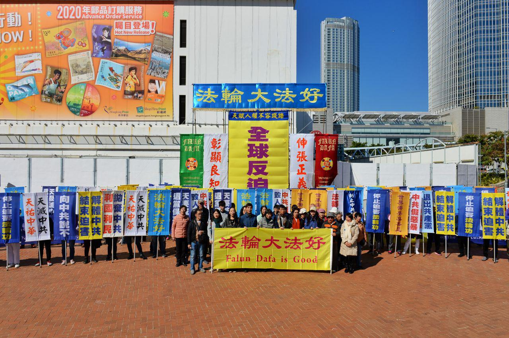

2019年12月8日国际人权日香港法轮功集会现场。（宋碧龙 / 大纪元）

他赞扬香港民众“面对暴警、黑警、中共的打压，仍可以在地区选举里面，用九比一的席次比例告诉全世界，香港人是如何的坚持（正义）”。

他表示，迫害世人或伤害生命，是一个万国公罪。因此江泽民对法轮功的迫害是犯了万国公罪，所以法轮功学员在在许多国家追究江泽民等首犯，这是非常有价值的，希望全球连署的人越多越好。

图为民进党立委王定宇的资料照。 (陈柏州/大纪元)

 
 <b>立法委员李俊俋：停止迫害才是最重要的事情</b>

台湾嘉义选区立法委员李俊俋通过录音发言表示，中国目前看起来是全世界最没有人权的地方，从过去天安门事件，从法轮功的事情，到现在新疆的问题。

 

图为民进党立委李俊俋资料照。 (陈柏州/大纪元)

 
 他还表示，法轮功学员在中国被当局迫害，甚至被活摘器官，那现在法轮功透过正式法律途径反迫害，“我们也都支持，我们希望把这样的事情让世界更多人知道说，希望这件事能让国际社会共同来了解、共同来关心。”

他强调，“中国（中共）当局必须去面对这事实、要去接受这个事实，停止对法轮功学员的迫害，这才是最重要的事情。”

<b>“为被迫害的人士发声也是保障自己”</b>

香港支联会主席何俊仁通过录音发言说，国际人权日最重要的是大家要拥抱国际的价值，保障国际人权宣言中所讲的人权自由的价值，今天中国正在面对人权的灾难，莫说政治异见者长期被打压，维权律师很多深陷牢狱，最惨的就是大规模的宗教迫害。

他举例说，法轮功学员自1999年被打压到现在，里面可以说是受尽折磨，受尽各种迫害，甚至被活摘器官，还有其他的各种人道的灾难，“全世界任何一个人，稍有良知和关怀的都会感到痛心。”

他呼吁道，“今天一起走出来，为人权、为自由，要表达坚定的决心和意志，为这些被迫害的人士发声，也是保障自己、保障下一代而继续奋斗，大家继续努力。”

香港支联会副主席蔡耀昌到集会现场声援法轮功反迫害，他批中共一直回避对人权问题，尽管它是联合国人权理事会成员，但经常因为言行不一自打嘴巴。“中共表面上讲人权，实际上是完全地侵害人权。其建政七十年来侵害人权、践踏人的基本价值、尊严，甚至是生命（的情况），可以说是比比皆是。”他说。

 

2019年12月8日，香港支联会副主席蔡耀昌到现场声援法轮功的反迫害集会。（宋碧龙 / 大纪元）

 
 他还认为法轮功团体反迫害的行动也是“一个很好的示范。所以希望大家都继续下去，我们相信正义一定会到来，在全球甚至整个中国可以得到实现”。

公民党主席梁家杰在录音发言中表示，国际人权宣言中很重要的一个是宗教自由，而宗教自由在中国内地受到很大的挑战，包括十字架被烧、教堂被毁、法轮功的学员在中国各地受到迫害。

他认为，今天纪念国际人权宣言的日子，是时候要求自己不忘初衷，也希望中共能遵循国际人权宣言，尊重包括法轮功在内的所有宗教。

香港法轮功学员举行国际人权日反迫害集会。（宋碧龙 / 大纪元）

 
 香港前立法会议员郑家富也在录音发言说，最近香港六个月的运动中，大家更加体会到国际人权日的意义所在，中共打压法轮功，打压内地的教会，不准挂十字架，又说要入爱国教会。共产政权这部机器是打压人权的最佳机器。

他表示，过去六个月，香港的人权已经差不多等于零了。人权不是从天上掉下来，人权是需要大家坚守立场和努力争取。

香港时评家刘锐绍在录音发言中批中共将人权称为生存权，他说：“你可以生存，狗都可以生存，怎可以将狗的生存和人类的生存等同起来？所以人权绝对不是等于生存权。”

他进一步表示，人权还包括很多自由，包括信仰自由、言论自由、新闻自由、生活的自由，更高级的还有公民权利和政治权利的自由。他还建议在国际人权日多深思一下在中共治下有没有丁点大家意念中的人权。

<b>朱婉琪律师：法轮功讲真相值得世人珍惜</b>

台湾法轮功人权律师团朱婉琪律师通过录音发言表示，过去五个多月，国际社会目睹了上百万的香港民众站出来向中共的暴政反抗，“天灭中共”的标语在香港校园、在香港街头随处可见，让世人看到华人的良心、勇气及智慧，也揭示中共违反人类基本人权的邪恶本质。当然，香港目前的处境，也让世人看到了法轮功学员这些年来曝光中共暴行的真相，以及在全球景点上讲清真相，是值得世人珍惜的。

台湾法轮功人权律师团发言人朱婉琪出席在台北市民广场举行反迫害20周年记者会暨烛光悼念会上发言。（陈柏州／大纪元）

 
 她认为，大陆法轮功学员于2015年发起的“全球声援中国民众控告江泽民迫害法轮功的刑事举报连署活动”，堪称是廿一世纪最大的全球性的国际人权运动之一，遍及欧亚澳洲。截至2019年12月5日为止，全球已有37个国家、超过350万（3,507,705）民众向中共最高检、最高法院举报江泽民迫害法轮功的反人类罪行，要求法办元凶。

她呼吁，中共官员赶快跳船，不必陪葬共产党，可以化名退出中共党团队，并且勇敢地将中共所干过的邪恶暴行的事证曝光出来，将功折罪，洗清满手的血腥，在大审判来临的时候才能不被淘汰。

<b>易蓉：中共陷入全球反共抗共的天罗地网中</b>

很多团体的代表在集会上发言，全球退党服务中心主席易蓉通过录音发言。她表示，中共过去几个月中在香港上演的八九“六四”镇压翻版，而且把迫害法轮功的手法移植到了香港。在危难时刻，香港人了不起，用血泪勇敢地向邪恶的政权说不，并获得了国际社会的支持。

全球退党服务中心主席易蓉（大纪元资料图）

 
 她强调，中国人民要想从苦难中尽快解脱出来，享有天赋人权及国际社会要想实现世界永久和平与安宁，就必须尽快解体中共，“中共正处于国际社会反共抗共的天罗地网中，等待它的必定解体灭亡的下场。”

她呼吁大陆民众及全球华人，“在历史的关键时刻，赶快退出中共党团队，为自己的未来，为中华民族的新生选择光明。”

<b>汪志远：做好大审判的准备 迎接中共的解体</b>

追查迫害法轮功国际组织发言人汪志远录音发言中表示，香港反送中运动以来，中共操控港警和黑社会对民众施暴，甚至雇凶纵火破坏为民说真话的香港《大纪元时报》印刷厂等等，使香港和国际社会彻底看清了中共的邪恶面目。最近，美国参众两院相继迅速通过参院版“香港人权与民主法案”，加快了清除共产邪灵的行动。

 

2016年7月14日，法轮功学员在华盛顿DC举行反迫害、九评退党集会。“追查迫害法轮功国际组织”主席汪志远博士在集会上发言。（戴兵／大纪元)

 
“在中国，从拆迁户到退伍军人，民众维权抗暴的运动此起彼伏的；更有三亿多人退出邪党组织，与中共邪恶绝裂。这就向全人类宣告，海内外全民觉醒运动已经到了一个关键的历史阶段，那就是到了全人类清除共产邪灵、追究中共罪恶的阶段。”他说。

他还披露，据追查国际掌握情况，现在越来越多的参与迫害法轮功的官员、警察在明白真相和看清形势后千方百计地与追查国际联系，寻求赎罪立功的机会，“我们提请香港，包括中国大陆的各界正义人士协助我们收集他们（迫害法轮功官员）的罪证，为即将到来的大审判做好准备，也防止涉嫌犯罪者大逃亡时消毁罪证。”

<a target="_blank" href=#top><h6 align="right">回上方</h6></a>

<a name=72>
<h1 align="center"><b>走出华为的工程师：华为是全人类的噩梦(上)</b></h1>

15名联邦参议员11月21日致信总统川普，要求停发许可证给与华为有业务往来的美国公司。（HECTOR RETAMAL/AFP/Getty Images）

 
【大纪元2019年12月05日讯】（大纪元记者李新安采访报导）华为员工李洪元事件，揭开了华为利用公权力构陷员工入狱的黑幕，引发外界关注。一名华为离职工程师向大纪元表示，华为就是中共的一个权力部门，它是结合商业、间谍、情报、偷窃的军工复合体。

近日，华为员工李洪元因争取三十多万的合法离职补偿被华为栽赃为“敲诈勒索”一案被曝光。李洪元遭警方逮捕并被羁押长达251天，所幸家人找到他与华为人力资源部门协商离职赔偿时的录音证据，才得以无罪获释。该事件引爆舆论，更多华为黑幕被曝光。

原华为南京研究所工程师金淳在接受大纪元采访时表示，李洪元案只是冰山一角。除了李洪元以外还有很多的受害人，但是大部分人都选择沉默不说。因为说了也没有用，在中国，即使官司打到最高法院都判不了华为。

金淳是留学爱尔兰的软件工程硕士，在华为南研所从事大数据方面的业务三年，于今年4月离职。他表示，离开华为的原因是因为近年来华为内部的工作氛围变差了。

据介绍，华为在内部通过发邮件、开会，公开鼓励员工们相互举报，任何事情都可以举报。主管还在大会上宣读官方文件，设立专用的举报邮箱。

“这等于是在搞文化大革命一样啊！我非常不喜欢这种工作氛围。”他说，“我在华为内部一个心声社区里看到，经常有某某某因为什么事情被人举报就坐牢了，而且是部门主管，判10年、11年的，大部分说是贪污，但实际是怎么回事只有华为知道了。”

华为被判刑的员工为数不少。（网路图片）

 
 此外，金淳在华为的时候曾经翻墙。有一次，他在看美国之音的新闻时被上面一个小主管看见了，这件事让他也有点担心被举报，后来就辞职了。

金淳告诉大纪元记者，他从华为内部获得的最新消息是，华为员工中确实有人掌握该公司不可告人的商业秘密。多名离职的华为员工曾打算把自己在伊朗售卖华为设备的事捅出去，包括一天补贴100美金及伊朗签证记录等。

“这些涉及商业秘密不能摆在明面上操作和定罪的，所以被警方以敲诈勒索罪入狱，折磨到保证出去后不再提那秘密才能被释放。”他说，“这也是现在的当事人无一对警方有异议，只继续对华为表示不满的原因。”

<b>华为监控国内外公民的信息</b>

金淳认为，华为最大的问题还是国安问题。华为这些年来帮助中共扩展了“一带一路”，扩展了所有海外的版图，帮助中共发展科技。人脸识别，包括各种各样的密码学，华为里面都有，从技术、情报方面来讲，华为是非常强大的。

他说，华为又采用了西方的一些管理制度，比如说仿照了西方IBM的一个管理制度。同时，它也吸收了前苏联的克格勃式的管理制度，公司办公区域分成蓝区、绿区、黄区、红区等好几个区，其中红区是最保密的级别。不同区的人不能互相通讯，数据都访问不到，要访问的话必须要有领导批准。

金淳表示，华为表面上是商业公司，它其实一点都不单纯。华为挣了很多钱，一是靠共产党支持，二是靠各种垄断，三是管理上吸收了美国公司管理的方法。所以成为共产党企业里最成功的一个企业。

“我觉得华为不是受中共控制，它本身就是中共，明明白白是自己人。所以你不可能看到华为会和中共有什么利益上的冲突，没有。它的几个领导班子都是属于中共，要么是军队总参系统的，要么是国家安全系统的，它的背景就是这样，所以它绝对是中共意志的体现。”他说。

华为不只监控本国公民，对外国公民的渗透尤其严重。金淳介绍，比如记录外国公民手机的IMEI号（International Mobile Equipment Identity／手机序列号），从而掌握公民的信息，他住在哪，有什么社会关系，什么职业都能知道。在欧美、日本等国是有法律禁止搜集IMEI号的。但华为仍然千方百计地搜集。

华为曾经帮非洲国家、罗马尼亚等东欧国家做各种各样的监听项目。金淳表示，这个就很奇怪，它说是合法监听项目，其实是掩人耳目。他作为技术人员，并不知道具体的商业机密，也不知道交付方是谁。在内部他还听说过华为跟德国电信合作的数据采集项目。

金淳说，“我所在的部门专门分析人的喜好，分析人的人格，通过一种方式进行数据挖掘，分析你未来的消费倾向是什么？能做到这一点很不简单。首先它掌握了每一个人的隐私，掌握了每一个人的消费习惯。它知道你想要什么？一旦你做出不符合它预期的东西它又会分析，你是不是什么时候翻墙了？被国外间谍组织吸收了？而且这些作业都是非常精准的。”

“比如，它能知道你下个月想要买一台手机了，因为你上次买手机是2年半以前，是什么品牌，你下个月想要买一台手机，它专门推荐一个差不多相同的符合你品味的，比如给女生推荐华为Mate30，能精准推荐到你那里。”他说，“华为的最新操作系统EMUI（Emotion UI），名字叫做情感操作系统，它跟中共的大领导炫耀说，华为可以对人类的情感进行利用、分析、引导、控制。”

<a target="_blank" href=#top><h6 align="right">回上方</h6></a>

<a name=71>
<h1 align="center"><b>【思想领袖】黄国桐：港警阻律师见被捕者</b></h1>

香港新当选区议员、香港大律师黄国桐先生。（视频截图）

【大纪元2019年12月08日讯】2019年12月03日，香港新当选区议员、法律界选委、香港大律师黄国桐先生，在英文大纪元资深记者杨杰凯（Jan Jekielek）的节目《美国思想领袖》中谈到：我认为每个被捕者，都有权利尽快见到他们的律师，但是，警察使用了所有的招数来试图阻止你，让你感到沮丧。

黄国桐律师在采访中说：

我们遇到很多的困难，当我们接到一个消息，说有个（香港）抗议者被捕了。就算我们有这个被捕者的姓名，你猜测他是在某一个区被捕了，当然你就得去那个区的警察局，但他不在那里。警察把人送到完全不相关的地方，所以你得到处找人；实际上你会搜遍所有的警察局。

如果你到了一个警察局，你说：我是律师，我在找我的当事人，名字叫某某。

然后警察们就说：这个人不在我们这儿。

他们也不会告诉你，应该往哪个方向走，所以我们只好到处去找，去找下一个警察局。香港有五十多个警察局，所以你得去很多警察局；另一个障碍就是，警察阻扰我们律师的合法会见。因为我认为每个被捕者，都有权利尽快见到他们的律师，但是，警察使用了所有的招数来阻止你，让你感到沮丧。

终于，你在一个特定的警察局找到了当事人，然后他们却说：我们这里没有足够的空间，你必须要等一下。

当你等了两三个小时，终于可以进去见当事人的时候，你发现警察在骗你，警察局里面有很多空间，并没有被占用。

<a target="_blank" href=#top><h6 align="right">回上方</h6></a>

<a name=70>
<h1 align="center"><b>【拍案惊奇】有惊无险 80万港人游行和平落幕</b></h1>

纪念国际人权日，12月8日香港80万人游行，奇观重现。（新唐人合成）

【大纪元2019年12月09日讯】大家好，欢迎收看《新闻拍案惊奇》，我是大宇。

1950年起，联合国定下每年12月10号是“国际人权日”，用以纪念1948年12月10日通过的《世界人权宣言》。今年12月8号，是周日，香港民阵提前在这一天，以纪念人权日为契机举办游行，继续敦促当局回应五大诉求。

这一天，香港街头重现了熟悉的场景，密集的人潮、高举的条幅、手机灯光闪烁的海洋。从夏到冬，街上人们显然添置了更多衣衫，但是在香港熟悉的街道上，人们的那份坚守，却始终没有变化。我们用三个数字来勾勒这一天的轮廓，那就是：6个月、80万人、5大诉求。

<b>～～～新拍专题～～～
 
香港80万人游行 奇观重现</b>

12月8号，在游行开始前，我们在抗争者的群组中能看到这样一个GIF宣传画面。一个早期就在抗争者中流传的六四时候的镜头，记录了一名讲英文的记者问一个北京大学生，你去哪，学生回答说是“天安门广场”，记者又问，为什么去那里，学生回答“这是我的职责”。

在128游行前夕，这幅配图的设计对白改成了，“128去游行，铜锣湾维园，为什么？因为这是我的职责。”一段简短的对白，实际是当天上街的80万香港人，共同的心声。

<b>民阵是“和理非”抗争群体的代表</b>

在游行开始前，主办游行的民阵向警方表示，会尽一切努力配合警方，同时呼吁警方克制，以确保游行人士安全，尽量开通多一些道路给行人，而不是用武力驱赶。

而民阵已经是香港“和理非”抗争群体最为人所知的代表，6月9号103万人，6月16号200万+1人，7月1号55万人，7月21号43万人，以及8月18号170万人“流水式集会”，这些人数众多的聚集，都是在民阵的主持下展开的。除了818的流水集会，12月8号的游行，是7月21号以来，民阵申请的活动第一次获得警方的“不反对通知书”。

民阵召集人岑子杰表示，12月8号是国际人权日，香港也正在经历人道灾难，这一次上街，大家要告诉全世界，香港的处境，还有港人对五大诉求的坚持。除了送中条例已撤回外，另外四项诉求：撤去612暴动定型、特赦所有被捕示威者、成立独立调查委员会、落实真双普选，政府仍然没有正式的回应。

民阵为这次游行做了很多准备，包括安排200名纠察员维持秩序，警方则派出近4000人在香港5个总区戒备。对此，岑子杰表示，香港社会对民阵这种和理非游行有共识，勇武派抗争者“能放能收”，可以令游行和平进行，批评警方则在过去游行中，常常制造紧张气氛。

<b>铜锣湾人潮爆棚</b>

12月8号的游行，下午3点开始起步，跟警方预定时间到晚上10点结束。游行路线从维园草坪起步，经铜锣湾、湾仔、金钟，最后到中环遮打道行人专用区。

游行从3点一开始就人潮汹涌，维园草坪的人群走上街道，在铜锣湾上演人潮爆棚的场面。绝大多数人没有穿戴抗争的全套装备，但有不少人戴着口罩。大概3点半，队头已经到达湾仔，在“黑警死全家”的口号声中，一队防暴警察在湾仔的行人天桥上戒备，有警员用摄影机拍摄游行人士。

同时，有戴着V煞面具的抗争者在街道建筑物顶部，举起牌子，呼吁游行后市民参与长期罢工，牌子上还写道：不是有希望才坚持，是坚持了才有希望。而最近的一次三罢行动是在12月9号，也就是星期一的早晨6点开始，湾仔、深水埗、沙田、屯门等十个区参加。

在湾仔，镜头还拍到，一个戴黄色头盔的抗争者，身上系着白色的汽球，正用爬行的方式，参与游行。他的背后贴着标语说：请先行，我会追上。

<b>周梓乐同学去世一个月</b>

4点左右，队头穿过了6月份梁凌杰坠楼的地方，金钟太古广场，游行主办方人士，用大喇叭向人群喊话说：不会忘记一众流血及离世的义士。

同时，12月8号这一天也是香港周梓乐同学去世一个月的纪念日，11月初，周梓乐因不明原因坠楼，经抢救无效，于11月8号离世。他的死，在香港一度激发更猛烈的抗争。12月8号晚8点09，参与抗争的港人约定，停下一切手头事务，为周梓乐默哀。

除了已有多人在抗争运动中离世，6月反送中至11月中旬，也有超过2600人在抗争活动中受伤，包括被警察防暴弹打瞎眼睛的、被警棍殴打骨折的，以至被实弹射伤身体的，而还有众多受伤的人不愿去公立医院接受治疗，所以实际的受伤人数，极可能更多。

<b>不断“插队” 游行队伍绵长不绝</b>

而在金钟，也有人现场用毛笔写标语，给路过的示威者使用。包括象征和理非与勇武合作部分化的“和勇”，以及“自由”、“良知”等字样。

下午4点半，队头已经到达终点所在的中环，但是在起点维园，仍有不少人等待出发，在游行路线的中途，有不少人半路加入队伍，人多加“插队”，游行队伍变得绵长不绝、缓缓行进。

与此同时，警方公共关系科警司刘肇邦在天桥上直播，说游行队伍相对有序，但是终点处的中环出现有人堵路，警方呼吁人们和平散去，并称对违法和武力“零容忍”。

大约下午5点，游行主办方民阵的代表们，也在交易广场十字路口的临时天台上，向有意散去的人们讲解离去的路线，并重申会等到最后一个人离开。而在这个时候，游行队伍还有长长的人潮，仍在行进中。

到了快6点的时候，夜幕降临，手机灯海在游行队伍中重现，在金钟，人潮伴着盏盏明灯行进，似乎是流淌的希望之河。也有媒体拍到，一些示威者在入夜后，每人分别以两把雨伞的伞柄，组成“心形”，并高喊“爱比暴力强 与警暴割席”。

<b>民阵宣布80万人参加游行</b>

到晚上8点15分，民阵召集人岑子杰在中环开记者会，向媒体宣布，当天约有80万人参加了游行，他一方面呼吁参与游行的示威者和平散去，另一方面敦促警方，给予市民时间疏散。到晚上9点，大部分参与游行的抗争者已经和平散去，警方也没有接续的驱离举动。而警方发布的当日游行参与人数是，最高峰时有18.3万人，但警方的数字不被香港市民接受，东西方媒体也通常不在报导中采用。

对于民阵宣布的80万人参加游行，又有网友在连登讨论，因为之前几次，总有人批评民阵少报人数。而且8号这一天，铜锣湾还有轩尼诗道都塞得满满的，怎么会只有80万呢？

不过亲身参与游行的许多连登网友，经过分析，认为民阵这次的数字，其实是可以接受的。他们有人分析说，因为维园足球场8号这一天没有开放，仅仅开放了草坪，但草坪上无法聚集过多人，而且下午4点左右，草坪基本上就被清空，在那之前也是只能出不能进，这就造成很多人只能在铜锣湾等地插队，而铜锣湾是插队的热门地点之一，这就形成了人潮在铜锣湾等地逼爆街道的场面。

不过，游行队伍的大多数，在晚7点许已经到达终点，明显早于6月9号的100万人，而且6月9号游行沿线的一些内街，都塞满人，这一次没有出现类似当时的情况。在7点后也有人陆续抵达终点，但人群就比较稀少了。

所以，民阵点算的80万人数字，可能是差不多的。不过，大家都认为，香港人经历了616的200万+1人，7月1号的50万，8月18号又回到170万，人数有起有落，但这次80万人实则并不少，足以展示港人坚持抗争的信念。

民阵召集人岑子杰表示，这次游行时间公布的比较晚，只宣传了4天，同时警方之前放狠话警告游行参与者，并在傍晚时分加强布防，这些因素也都影响了游行人数。但岑子杰强调出来的人仍然很多，呼吁特首把握时间听取民众诉求，成立货真价实的“独立调查委员会”。

也有人猜测说，很多家庭的小孩和老人，因为家人担心警方会施放催泪弹等防暴武器，所以把他们留在家里不出来，种种原因，造成人数没达到之前200万人的高峰。

不过12月8号这一天，是8月18号流水式集会以来，罕见没有爆发激烈警民冲突的一次聚集，但是，游行前后，也出现了一些惊险的情况。

<b>当天出现多个警民冲突爆破点 幸有惊无险</b>

在游行前，12月8号中午，香港警方就召开记者会，先给抗争者们一个下马威。

<b>1. 游行前警方查到真枪 外界忧游行被取消</b>

在维园附近的天后炮台山，警方称拾获一支9毫米半自动手枪、105发子弹，还有5个弹匣，其中3个已经装满子弹。警方说，这是反送中运动以来，第一次拾获真枪。另外，在天后的另一个地点，还查到3把匕首。

当天上午的行动，一共有8男3女共11个人，分别在11个地址被拘捕，他们年龄在20岁到63岁之间，受到了“管有危险品”、“管有违禁武器”等四项指控。

警察说担心这些武器会被在当天游行中，用作制造混乱。有记者担心警方会以此借口取消当天下午游行，但幸好没有发生这种事情。而在过去的反送中运动里，还从来没有出现过，抗争者使用真枪。

<b>2. 游行前后 警方举黑旗 出水炮车</b>

下午约2点20分，香港警方在铜锣湾举黑旗，警告施放催泪弹。当时除了维园，也有大批示威者聚集在铜锣湾和湾仔。岑子杰当时一直在跟警方联络，表示民阵非常合作，希望警方克制，但仍出现警方举黑旗，情况非常不理想。

而在游行过程当中，下午5点，游行队头已经抵达终点，主办方呼吁到达终点的人群散去。此时，也出现一部分黑衣蒙面的抗争者，在铜锣湾百德新街、金钟乐礼街、中环等地点与警方对峙。

与此同时，铜锣湾仍有众多市民行进，人群要求警方开放更多路给游行者，不然实在太拥挤，有人尝试从其它警方未允许的路径继续游行，但警方随即封路，期间两次举起黑旗警告。

而在中环，警方派出水炮车加几十个防暴警察戒备，与抗争者对峙，防止抗争人士向中联办所在的西环进发。

稍后，5点半的时候，在铜锣湾百德新街与抗争者对峙的警察，率先推进，还拿着胡椒喷雾指着现场的围观市民，喊道：蟑螂过来呀，这里有杀虫剂，要不要啊！同样在铜锣湾的公民党议员郭家麒，要求警方克制，但警察说：你不要跟我讲，你去跟暴力示威者讲！

中环与铜锣湾之间的金钟，此时此刻，也举起了催泪弹警告。

<b>3. 香港有法院门口被纵火 个别商家被砸</b>

6点刚过，位于金钟的香港高等法院的一个门口，遭人纵火，随后消防员赶到。过了约1小时，晚7点的时候，在中环的香港终审法院一个门口，又被个别示威者扔3、4颗燃烧瓶，燃起熊熊大火，但很快，有另外十几个示威者冲过去，一起用水把火熄灭，而墙上则仍然留着“法治已死”四个黑字。截至我们发稿，还不知道谁该为这起事件负责。

民阵召集人岑子杰回应事件时说，示威者需要守护法院，但他也同时提出对香港法治的担忧，对于此前香港法院判港府的《禁蒙面法》违宪，北京当局警告可能插手推翻香港法院的裁决，令人担心香港的司法复核权利会被收回。

香港律政司对法院遭纵火发声明，说对香港作为“法治之都”的良好声誉造成损害，警告一旦定罪，会被判“终身监禁”。

另外，在香港的法院被纵火的时候，在湾仔，一家“集友银行”遭到一班人马冲击，玻璃破碎，在门口有人贴上字条解释破坏原因，字条上写：“装修通告 散播假消息抹黑示威者”。在这家“集友银行”附近的一处Starbucks分店也遭到冲击。

<b>4. 民阵称中环有警察挑衅 险些发生冲突</b>

在位于中环的香港终审法院被纵火几乎同一时间，约晚上7点钟，有防暴警察跟在中环的记者发生争执，期间多名记者往前推进，想要拍摄画面，但被防暴警察逼退。

在此期间，警方在没有出示警告的情况下，举起可装置催泪弹、胡椒球弹的枪支，此刻有一个推木车的老妇人路过，也一度被防暴警察用枪指着。还有在场警员呛声现场的人权观察员：回美国去吧！

据现场记者说，还有多名在现场的警员手持可以发射实弹的MP5冲锋枪，或者AR15自动步枪。也是在晚上7点左右，中环德辅道中有警察在没有举旗警告的情况下，举起MP5冲锋枪示警。现场有示威者用杂物堵路。

中环对峙期间，警察跟市民也不时发生骂战，有的警察挑衅人行道上的市民说：出来说话啊，都出来游行了还缩手缩脚。也有警察用强光照射市民，在金钟夏悫道也发生了用强光照射市民的事例。

后来有民阵的人要警察保持克制，不要挑衅和用强光照射市民，被有的警察爆粗口回呛，骂民阵DNLM。岑子杰当天在街上走的时候，也发生了被警察当面辱骂的不愉快经历，他批评警察失控和不专业，不断挑衅示威者。

中环的对峙一直持续到约晚上8点，警方发新闻稿说，还有很多示威者在中环堵路，属于非法集结，而且有人手里有武器，警察警告示威者停止堵路，并敦促在场围观市民离开，否则会使用最低武力。

所幸的是，示威者和警方最终没有爆发激烈冲突，示威者自行散去。

不过，入夜后，有两名男性在铜锣湾怡和街被警员截查，一人被捕。抓人的警察遭到市民指骂，警察以胡椒喷雾警告人群保持距离，并开去一辆警车，挡在一群记者面前。当晚是否有其它拘捕案例，目前还不清楚。

<b>港人坚持抗争 80万游行只是逗号</b>

12月8号，80万人上街，说心里话，人不少了。有抗争者游行结束后立即制作文宣，说80万人你觉得少吗？2003年反23条那么大的事，出来50万，现在运动持续半年了，还能出来80万，说明众多港人仍然在这次运动中坚持着。

6月9号仍身在监狱的香港众志秘书长黄之锋，12月8号也出来游行，并认为运动持续到2020年没有问题。黄之锋并认为，警方在游行前搜出真枪实弹，并拘捕11人，属于政治部署，因为“巧合得不能再巧合”，而他说港人对这些早已习惯。

在游行中，也有抗争者举着“五大诉求 坚持到底”的标语，表达抗争决心。

接下来，港人的抗争时间表，仍然是满满的。游行刚结束的12月9号，就是抗争运动满半年的日子，港人举行全港十区三罢行动；12月11号医疗界工会集气大会；12月12号爱丁堡广场集会，纪念612半周年，等等。民阵也在8号游行后呼吁，和理非抗争者要继续参与罢工。

新唐人《新闻拍案惊奇》制作组

<a target="_blank" href=#top><h6 align="right">回上方</h6></a>

<a name=69>
<h1 align="center"><b>“我们不是反中 是反共”</b></h1>
 <h3 align="center"><b>游行市民：中共比ISIS更坏更阴毒 从不承认滥杀无辜</b></h3>

2019年12月8日，香港民阵发起“国际人权日”集会大游行。（余钢／大纪元）

 
 【大纪元2019年12月09日讯】（大纪元记者韩纳香港报导）经过警方4个月的压制，民阵获不反对通知书于国际人权日举办游行，参与的80万市民继续向林郑政府争取五大诉求及应有的人权自由。有市民强调参与游行是要表达反对中国共产党，而不是反对中国。也有市民希望“反送中”运动能教育香港人及全世界认识到中共的坏及阴毒。

在游行人群中，今年50多岁的张先生对本报记者说：“我们不是反中，我们是反共。”

2019年12月8日，张先生强调是参加“反共”游行。（大纪元）

 
 “如果它（中共）坚持强硬对付香港人，一国凌驾两制，剥夺我们的自由，那么我相信这样的抗争不会停止，将继续延续，我们一定会继续走出来。因为共产党在剥夺我们的人权，人权是我们与生俱来的权利，不是共产党施舍给我们的。”他进一步说。

张先生还说，从区议会选举的结果来看，已经说明问题。“建制派一边倒的支持共产党，完全不理会对还是错，共产党说什么，他们就一定支持，送中条例很明显在剥夺我们香港人的自由，它都要支持，这一点我觉得很不对。所以我们完全是自动自觉走出来（投票），是很明显的一个民意反映。”
让港人及全世界认清共产党

另一名游行市民阿基说，世界已经认识到ISIS伊斯兰国的危害，但对于共产党认识还完全不足够。“这场运动不只教育香港人，我希望全世界都能意识到，中共不值得尊重和信任，他们比ISIS更坏。ISIS杀人搞恐袭会对外宣布负责，但中共滥杀无辜从不承认；中共撒谎、更阴毒。”

他认为，香港人已经做了一切能做的，现在轮到全世界采取行动，要利益还是要人权？各国如何选择？不要使今天的香港，变成明天的世界。

游行订于昨日下午3时由铜锣湾维多利亚公园出发，终点为中环遮打道。还未出发，维园草坪已挤满人群，并有人陆续进入。在波斯富街十字路口有人聚集，警方指人群正进行非法集结，并举起黑旗警告会施放催泪弹。

主办游行的民间人权阵线（民阵）表示，若集会要和平有序，需要民阵的努力及警方的克制，又指若警方有需要，游行可以提早起步。

有市民诚惶诚恐参加游行，称虽然游行是合法的，但在这6个月的抗争运动中，警方的滥暴、滥捕、乔装成抗争者拘捕抗争市民，以及滥射催泪弹等，令人走上街头感到提心吊胆。

<b>港人用自己方法争取胜利</b>

 

2019年12月8日，郑女士带两个小朋友游行。（大纪元）

 
 不过，市民郑小姐并不害怕，她带着10岁和2岁的孩子游行，她说，带孩子出来，是担心以后他们没有机会参加游行。“因为香港已经被中国化（赤化）得很厉害，我们这个年代还能有所表达，孩子未来却可能发不了声。所以我想把握这个机会。”

她补充说：“出来会感觉身边很多人的关爱，所以一点不怕。……如果我们真有200万人一起出街游行，香港警察只有3万人，我怕什么？！”

郑小姐对香港民主运动的未来走向乐观以待，“因为我们没有放弃。6月有人受伤也没有放弃，11月理工大学和中大（中文大学）一役后，我们仍然没有放弃。香港人会用我们的方法去争取胜利。”

美国人：游行规模令他震撼 支持港人“继续战斗”

 

2019年2月8日，特地从美国来香港，参加8日游行支持港人的Max Linn。（大纪元）

 
 “Donald Trump Patriots”（川普（特朗普）爱国者）网站创始人Max Linn刚从美国飞到香港，他昨日参加了游行支持港人。他说，香港正处于关键的历史转折点，希望美国人能醒来，看看发生在香港的事情，看看社会主义、共产主义正在侵害香港，同时侵害美国和自由世界，他希望香港反共运动能同样发生在美国。

Max Linn说：“社会主义正在美国卷土重来，我希望美国人醒来，从足球、垒球、篮球中抽出一些时间，看看香港发生的事情。这里的一切发人深省，令世界深省。”

他又说，香港人的团结、热情、坚定信念和参与的人数规模，令他留下最深刻的印象，令他震撼。

“继续战斗。这不仅对香港很重要，也对世界很重要。”Max Linn说。◇
 
<a target="_blank" href=#top><h6 align="right">回上方</h6></a>

<a name=68>
<h1 align="center"><b>【新闻看点】北京接受GDP保4争5？经济有多糟</b></h1>

受贸易战打击，大陆经济下行压力大。示意图。(Ed Jones/AFP/Getty Images)

【大纪元2019年12月08日讯】大家好，欢迎大家关注新闻看点，我是李沐阳。

白宫首席经济顾问库德洛（Larry Kudlow）昨天（12月6日）表示，美中双方正在接近达成贸易协议。尤其是中方计划落实对大豆和猪肉的一些关税减免是“很好的气氛音乐”，令人赞赏。他说川普总统形容谈判是“有建设性的”，不过他不想做预测，因为协议还没有达成，现在是“走一天看一天”。

同一天早些时候，习近平主持召开了中共政治局会议，对明年的经济工作进行分析研究，称中国经济“稳中向好、长期向好”的基本趋势没变，要“保持经济运行在合理区间”、保持经济社会“持续健康发展”等等。

但是被称为“中国第一经济师”的安信证券首席经济学家高善文却认为，今后十年的中国经济增速平均不会超过5%。他预测明年的GDP增速是“保四争五”。中国经济的真实情况究竟什么样？究竟是“稳中向好”还是“江河日下”呢？

<b>北京定调明年经济：三大攻坚战</b>

中共认为，虽然国内外风险挑战多，但是“全党全国贯彻党中央决策部署”，保持了经济社会“持续健康发展”。习表示，不过明年要打好“三大攻坚战”，做好“六稳”工作等等。

“三大攻坚战”指的是“防范化解重大风险、精准脱贫和污染防治”。“六稳”就是“稳就业、稳金融、稳外贸、稳外资、稳投资、稳预期”。

我们经常说，中共有一个特点：“缺啥喊啥”。掌握了中共这个特点，就知道它喊得最响的，一定是问题最大的。

中共高喊打好“三大攻坚战”，那就很可能是问题很严重了。“防范化解重大风险”，对应的就是中国社会的暗流汹涌；“精准脱贫”对应的是民不聊生；“污染防治”对应着人们的生活环境已经相当恶化了。

至于中共多次高喊“六稳”，那就更好理解了。“稳就业”是因为中国的就业失业已经成了严重问题，“稳金融”反映着金融风险危机四伏，“稳外贸”透视出进出口贸易在严重衰减，“稳外资”折射着外资在加速逃离，“稳投资”说明投资在大幅减少，“稳预期”则是因为人们已经不看好中国经济了。

从这个角度来看，所谓“稳中向好”，其实是相当悲观的。这么说除了“自愚自乐”外，也是在“自欺欺人”。

<b>明年GDP“保四争五” 北京认可？</b>

11月27日，安信证券首席经济学家高善文一如往年，在内部策略会上发表了2020年的前瞻演讲。他认为贸易战的冲击、中国城市化趋缓、劳动人口老龄化、工资上升、人均收入分配差距拉大、汽车保有量萎缩、融资杠杆率和“国进民退”等等，多重因素将导致明年的中国经济进入“保四争五”的阶段。

中共给今年的经济增长定下了6%的增幅目标，如果明年“保四争五”，就意味着要下降1至2个百分点。他说当局今天用强劲的逆周期措施对抗经济下行，勉强把经济增速支撑在6%左右。但是刺激政策效果会越来越低，加上内需市场也在减速，所以他认为明年经济实在难以令人看好。

高善文的演讲题目《知止不殆》，出自老子的《道德经》。原文是“知足不辱，知止不殆，可以长久”，意思是劝人切莫贪心，应该适可而止。

考虑到内外部的复杂因素，高善文演讲中指出，中国经济增长“会持续寻底”，“跌破5%之前很难停下来”。从2020年到2030年这十年中，能不能保持在4%以上令人“担心”，“这一目标需要比较大的努力”。

总体来看，高善文的这番言论，其实与官方的说法，区别就在于中共说的是空话、套话，而高善文讲出了具体内容和数字。《信报》认为，高善文的演讲“只不过略微偏离官方主旋律”，但是却遭到了全网封杀。

不过德国之声查证，他的演讲全文和相关讨论仍然可以在大陆社交平台以及财新网等媒体上找到 。这是否意味着北京当局也认可他的观点，对他的演讲内容又放行了呢？

中国独立经济学者巩胜利认同高善文的分析，他对自由亚洲表示，明年中国经济“保四争五”并不夸张。巩胜利表示，贸易战对中国的经济有很大影响，如果危机不能化解，中国未来经济增长幅度有可能低于5%。

<b>高善文是谁？</b>

今年只有48岁的高善文，毕业于北大，还曾获国际货币基金组织（IMF）资助赴日本进修。曾在中共国务院发展研究中心任职。后来投身证券商，很快闯出了名堂。每年年尾，他都会发表前瞻演讲，凭着分析预测，大量的粉丝在追捧。

他还是中国金融40人论坛成员之一，跟巴曙松、方星海、潘功胜等人平起平坐，是这个组织当中少数几个没有官职的业界人士。2016年，中共总理李克强召开经济形势座谈会，曾邀请他出席分享观点，被指为李克强高参。

因为高善文的名气大，也因为内容震撼，所以“经济师一哥”的发言全文、视频以及PPT很快就整套流出，在网络上疯传。

<b>中国经济陷入危机</b>

去年美中贸易战开打，中共体制内大多数人“偏向乐观”，但高善文力排众议，认为今年GDP增速“保六”有难度。

事实证明，他的预测分析是正确的。今年第一季度的增速6.4%，第二季度滑到了6.2%，第三季度跌落到6.0%。前三个季度是递减0.2%，那么第四季度会不会是5.8%呢？或者更低呢？

《看中国》专栏作家、经济学者王尚一认为，中国经济第四季度宏观GDP下降幅度会更大，他在最近的文中表示，中国经济已经陷入了危机。

高盛最新报告表示，中国经济第三季度已经跌到了6%，第四季度的增速很可能会“跌穿6%”。

知名学者余永定认为，GDP增速触6后应当刹车，“宁可财政状况暂时恶化”，也要稳住经济增长。不过《金融时报》专栏文章表示，明年的经济目标已经很难再定“6”了。

文章表示，北京当局已经采取了一定的刺激措施，但是效果并不明显。而且外部环境存在着较大的不确定性，再加上过去的强刺激措施留下了很多后遗症。如果强行“保6”，很可能“得不偿失”。

<b>宏观GDP严重下滑？</b>

美国已经对3600亿美元中国商品加征了关税，另外1600亿美元中国商品是否加税，要看美中贸易谈判进展如何。中国经济是出口导向型经济，对美国有着严重依赖。

那么美国施加关税，对中国经济造成了根本性的打击。总的来说，存在着三方面影响：中国对美出口、中国对其它国家的出口和中国的国内经济。

今年5月，川普上调了2500亿美元中国商品的税率，外资唯恐避之不及，纷纷从中国撤资，这加速了GDP下降。根据中共以往美化数字的做法，王尚一认为，今年第四季度的GDP下降幅度可能会加大。

Markets Insider网站分析文章也指出，中国经济增长的“真实水平远远低于官方数据”。11月29日的分析文章中，专业人士指出，中国经济的年趋势增长率可能“大约只有3.5%”。如果2018年中共官方GDP增长数据是6.6%，那么实际上很可能只有4%。

<b>失业率大幅上升</b>

去年下半年，中国经济金融连锁爆破后，失业潮已经出现了。不仅建筑和工厂的农民在大量返乡，而且金融、IT行业也在大规模裁员。这在中共口中，变成了“回乡创业”。

此外中共还开动宣传机器，鼓吹各种花里胡哨的概念，让民众忽略失业率的严重性。比如它反复鼓吹“创新创业”是一个重要手段，说大学毕业生慢就业“是一种新的、很好的生活方式”。

这等于是说，“大学毕业就失业”将是常态，找不到工作就在家“啃老”，享受生活。

而那些听信中共“创新创业”的人，在恶性竞争当中，绝大部分损失惨重，不得不关门告终。

生猪养殖户是不容忽视的一个失业群体。其实在非洲猪瘟之前，中共强推的“环保风暴”、“留大关小”政策，已经使很多养猪人员失业了。猪瘟爆发后，中共官方数字说生猪存栏只剩1/3左右，那么相应的，养殖人数也将大幅减少。

此外汽车业的失业率也很大。数据显示，今年9月，汽车的配套市场萎缩了50%，原因是汽车销售也进行了2次大裁员。

<b>处处是雷 中共灭亡开始？</b>

面对严重下滑的经济现状，中共已经无力改变这种局面了。

知名经济学家向松祚最近有一个演讲，直接炮轰北京当局的经济政策，这个视频在网络上很火。

向松祚在演讲中说，现在民营企业家的普遍心态是，“需要我们是无奈的选择，消灭我们是崇高的理想”。他说，“今天你观察中国经济，不用看别的，你就看民营经济、民营企业家是否有信心？”

他质问当局，“改革开放这么多年，我们做了什么？”“一个国家应该鼓励所有的企业做大、做优”，“历史已经反复证明，国有企业不可能搞好。国有企业能够搞好，我们还需要改革吗？”

宾夕法尼亚大学中国历史教授林蔚（Arthur Waldron）对英文大纪元表示，中共政府非常清楚，它已经死到临头了。有习近平的幕僚曾告诉他，中共内部已经很清楚地知道，“我们（中共）已经走投无路了”。

那位中共官员向他表示，中共体制内的“每个人都清楚，这个体制已经完了，走进了死胡同。不知道下一步该怎么走，处处是雷，踏错一步就可能粉身碎骨”。

林蔚指出，中国目前的状况，与当年苏联解体时有些类似。北京当局对现实缺乏正确认识，现在中共是“想到哪儿就做到哪儿”，功能失调，没有解决方案。

大纪元《新闻看点》制作组   #

<a target="_blank" href=#top><h6 align="right">回上方</h6></a>

<a name=67>
<h1 align="center"><b>王友群：解体中共的重大事件接连发生</b></h1>

对于中国即将出现的大变动，无论是民间人士，还是中共高层，乃至西方政府和中国问题专家，都已然意识到。（Getty Images）

 
 【大纪元2019年12月07日讯】近日，美国的中国问题专家、宾夕法尼亚大学教授林蔚（Arthur Waldron）在接受英文《大纪元时报》专访时披露，一个习近平身边的高层幕僚告知，中共内部承认正在走向解体。事实确实如此。目前，中共正面临有史以来最大的全面危机，解体中共的重大事件，正以高频率接连发生。
 
<b>香港区议会选举中共大败</b>

2019年6月爆发的香港反送中运动，是香港人对中共22年来不断背弃在香港实行“一国两制”的承诺、侵蚀香港的自治与自由的一次总爆发。

中共的应对措施，是持续不断地暴力镇压。中共以为凭暴力可以把香港人压服。11月香港区议会选举前，香港特首林郑月娥向中共报告“一定会赢”。然而，选举结果却是：18区452个议席中，支持反送中运动的民主派，以388席大胜亲中共的建制派59席，笃定夺得18区中17个区议会控制权。这次选举结果，实际上是对中共镇压香港反送中运动的否定。据接近中共高层的消息人士透露，消息传到北京，中共高层非常震惊，“完全不知道如何应对”，内部乱作一团。

香港人捍卫自由、民主、法治、人权的抗争精神，正在赢得一切认同普世价值和传统价值的人的尊重和敬佩。中共的邪恶、残暴、无底线，正遭到举世的唾弃。

香港反送中运动很可能成为给中共“送终”的一场伟大抗争运动的新起点。

<b>意大利怒对中共 力挺香港</b>

12月3日，不顾中共强烈反对，意大利国会外交委员会一致通过声援香港决议案，要求调查香港警察滥用武力情况，释放示威民众等。

11月28日，意大利国会邀请香港众志秘书长黄之锋发表视频演讲。中共驻意大利使馆发文指责意大利国会“插手香港问题”，与黄之锋视频对谈“是不负责任的做法”。

此文一出，立即引起意大利朝野齐声炮轰，掀起近年来最大规模的反对中共的浪潮。意大利总理孔特说，黄之锋应邀发表视频演说，是国会的职权，应得到完全尊重。意大利参议院议长凯斯拉蒂强调，“保障言论与思想自由，是意大利民主政府的基石”。意大利外长迪马约回应称，“意中签署了经贸协议，绝不代表中国（中共）能对意大利的体制、国会、政府说三道四”。意大利最大反对党“联盟党”领袖萨尔维尼直言回击：“意大利并非中国一省”。

近年来，在西方7个发达国家中，意大利的经济状态可能是最差的。为缓解经济困局，意大利与中共走得比较近，甚至参加了中共“一带一路”项目。但毕竟意大利信奉的价值观与中共根本不同。

中共的战狼外交触碰到意大利的底线，迫使意大利这样的国家也不得不奋起反击中共。

<b>中共特工王立强掀狂风巨浪</b>

11月23日，中共特工王立强向澳洲政府投诚，并提供重磅情报的消息曝光，在海内外引发强烈反响。

王立强爆料称，他的老板向心和夫人龚青，是负责港台的中共高级间谍，旗下的中国创投和中国趋势两家公司，是中共间谍机构。其上线直指中共元帅聂荣臻之女聂力、女婿丁衡高及国防科工委的关系网，中共长征十一号运载火箭总指挥李同玉及其关系网，中共军委联合参谋部及其关系网。王立强披露了中共在香港破坏反送中运动，影响台湾选举，渗透澳洲等黑幕。美国国会及行政当局中国委员会办公室副主任麦提斯称，王立强提供的情报很有价值。

王立强投诚对中南海内斗、香港局势、台湾局势、中共海内外情报网、中澳关系，以及国际局势都可能产生重大影响，形成骨牌效应，可能会有更多爆炸性的中共黑幕曝光。

<b>捷克布拉格弃北京携手台北</b>

11月8日，《苹果日报》报导，捷克首都布拉格市政府，因不满中共强加“一个中国”条款，与北京解除姐妹城市关系，正与台北市协商缔结姐妹城市。台北市长柯文哲预计明年1月前往布拉格，签订有关协议。

近半年来，中共为了打压布拉格市，接连取消布拉格爱乐乐团、布拉格弦乐四重奏、布拉格广播交响乐团、以及布拉格瓜奈里三重奏前往中国巡回演出的行程。捷克文化部长佐拉列克为此召见中共驻捷克大使张建敏，批评中共的做法“严重伤害中国的形象”。如果中共继续这种行为，捷克将停止与中共的文化交流。

布拉格与北京断绝关系，是国际社会对中共将自己的意志强加于人强烈反弹的最新一例。类似事件在瑞典、丹麦、德国、英国、加拿大等许多国家反复上演。

<b>台湾选举结果或与中共期望相反</b>

2020年1月11日，台湾将举行总统和立法会选举。

台湾总统选举主要在民进党的蔡英文和国民党的韩国瑜之间进行。去年台湾“九合一”选举，国民党大胜，民进党大败，蔡英文被迫辞去民进党主席，民调低迷。今年1月2日，中共提出以“一国两制”统一台湾；蔡英文立即明确拒绝“一国两制”。从此，蔡英文民望回升。今年6月，香港反送中运动爆发。中共以持续升级的暴力镇压，将香港的“一国两制”打得稀烂，台湾90%以上的人不相信“一国两制”，“联美反共”的蔡英文，人气继续大增。中共还在政治、外交、军事、旅游等各方面打压台湾。中共越打压，蔡英文的支持度越高，以至于有人说，中共是蔡英文的“最佳助选员”。蔡英文连任几成定局。

台湾立法会选举，也可能因中共打压香港和台湾，暗助国民党候选人等，而成为民进党胜选的“助选员”。

2019年，中共在台湾下了大本钱，最后，可能因其愚蠢至极的做法而竹篮打水一场空。

<b>中共人权恶棍面临国际制裁</b>

11月27日，美国总统川普（特朗普）签署《香港人权与民主法案》和《限制向香港出口催泪弹和人群控制技术法案》。这意味着美国将对在香港侵犯人权的港府官员和中共官员实施制裁。

据有“香港才子”之称的陶杰透露，香港一个有红色背景的巨商，到美国刚下飞机，就被请进“小黑屋”谈话。几小时后被告知，不能进入美国，原机返回。香港亲共媒体《大公报》、《文汇报》记者也爆出被美国拒发签证。

为制裁违反人权的港府官员和中共官员，英国、荷兰、日本、加拿大、澳大利亚等国，也在酝酿、出台本国的《香港人权与民主法案》或《马格尼茨基人权问责法》。

在中共治下，中国成了全世界人权状况最糟糕的国家。中共一直以“不许干涉内政”为借口肆意践踏人权。但是，人权是普世价值，人权高于主权，人权没有国界，人权不是内政，哪个家里杀人放火，邻居谴责、制止、惩罚，天经地义。

中共侵犯人权已到了人神共愤的地步。由美国带头，将来肯定会有更多国家加入制裁中共人权恶棍的行列。

<b>中共经济面临崩盘危险</b>

一场美中贸易战，把中共的经济问题打回原形。中国的股市、汇市、楼市泡沫，都快破了；消费、投资、出口，三驾马车都不灵了；外资撤离，企业倒闭，失业剧增。特别是债务危机，据国际金融协会的报告，今年第一季度，中国企业、家庭和政府的债务总规模已升至40万亿美元（约280万亿人民币），相当于GDP的303%。

据中共官方数据，今年底，将有创纪录的2万亿地方债和超6万亿企业债到期。有港媒称，明年更有巨额债务到期，债务爆雷可能成为中国经济最大的“黑天鹅”。另外，据有关专家研究，中国的外汇储备与债务相抵可能是负数。

中共经济是极少数权贵家族垄断最赚钱的行业，利用权钱交易，“闷声发大财”的经济。中共经济还是用纳税人的血汗钱养政府官员之外，还要养党、团、工等数量庞大、欺压纳税人的官员的超负荷经济。

中美贸易战爆发，畸形的、扭曲的、变态的中国经济的矛盾全部暴露出来了。债务、楼市、金融、粮食等，一招不慎，可能导致山崩海啸。

<b>肺鼠疫或成中共崩亡绝杀器</b>

中国大陆，鼠年来前爆出鼠疫，目前已确诊5例，有网民称，鼠疫已蔓延至吉林省长春市。一名疑似鼠疫患者的家属在微博发文说，其大伯因出现鼠疫类似症状被医院拒收，不治死亡，此消息被官方删除。还有网民因传播疫情讯息遭到拘留。

肺鼠疫实际上就是过去所说的传染性极强、死亡率极高的瘟疫。鼠疫被认为是改朝换代的前奏。明朝末年，清朝末年，都发生过鼠疫。2003年非典爆发时，中共一再隐瞒，结果蔓延全国；去年非洲猪瘟爆发时，中共又一再隐瞒，结果又蔓延全国。现在，鼠疫来袭，中共很可能故伎重演。弄不好，鼠疫将成中共崩亡绝杀器。

今年香港反送中运动喊出的最响亮的口号是“天灭中共”。天灭中共，谁能挡得住？

在中共即将解体的关键历史时刻，我奉劝中共体制内良知尚存的人，认清历史大势，赶紧弃船逃生，像王立强一样，把中共祸国殃民的罪恶，公诸于世，共同推倒中共这堵墙。#

<a target="_blank" href=#top><h6 align="right">回上方</h6></a>

<a name=66>
<h1 align="center"><b>中共下令3年内移除外国电脑 分析师：很困难</b></h1>

英国《金融时报》报导说，中共下令所有政府部门与公立机构在三年内移除外国电脑设备和软件。图为2010年2月4日，北京一家公司的员工在使用笔电。(FREDERIC J. BROWN/AFP via Getty Images)

【大纪元2019年12月09日讯】（大纪元记者陈俊村编译报导）中共当局下令所有政府部门与公立机构在三年内移除外国电脑设备和软件，不过有分析师认为，很难以中国的软件替换外国的软件。

据英国《金融时报》报导，这是中共第一个为外界所知、要求中国买家选购国内科技产品的指示，它对美国限制该国和盟国使用中国科技的措施做出了回应。

中信建投证券的分析师表示，中共中央办公厅在今年稍早下达了这项指示。尽管其文件被列为机密，但两家网路安全公司的员工告诉《金融时报》说，他们的政府客户也提到了这项规定。

分析师估计说，基于这项指示，共有2,000万至3,000万个电脑设备需要更换为国内生产的产品，大规模的更换动作将于明年初开始。

他们补充说，这些设备的替换计划于2020年完成30%、2021年完成50%、2022年完成20%，所以这项指示被称为“3-5-2”政策。

依据中共在2017年施行的网络安全法，中共政府部门与重要基础设施的经营者都必须使用“安全和可控管的”技术，而“3-5-2”政策只是其中的一部分。

尽管中共政府部门倾向于采用联想集团生产的电脑，但分析师认为，要以国内的软件替换外国的软件会很困难，因为大多数软件开发商都是替美国公司的作业系统开发产品，例如：微软的Windows和苹果的macOS。

而要定义“国内生产”也有困难。即便联想是国营企业，而且在中国组装很多产品，但其电脑的处理器晶片（芯片）是英特尔生产的，而硬盘则来自三星电子。

《金融时报》说，在提高对自制技术依赖程度的多项行动中，中共这项新举措只是其中一部分。正当美中两国之间的供应链正在断开之际，它可能加重人们对脱钩的担忧。

美国副总统彭斯（Mike Pence）曾于10月24日发表就任以来第二次对华政策演讲时说：“不是美国要和中国脱钩，而是中共要和全世界脱钩。”

<a target="_blank" href=#top><h6 align="right">回上方</h6></a>

<a name=65>
<h1 align="center"><b>法官称赞的好人 法轮功学员李贺芹身陷囹圄</b></h1>

出淤泥而不染的莲花（fotolia）

【大纪元2019年12月06日讯】天津市宁河区法轮功学员李贺芹于11月13日被宁河区芦台镇派出所警察绑架并非法抄家。绑架后李贺芹身体出现了严重的心脏病、高血压、还有囊肿，住进医院，被警察看管。

明慧网报导，李贺芹，女，50多岁，天津市宁河区芦台镇人。修炼法轮功前，身患心脏病等多种疾病，苦不堪言。中草药吃了无数也不见效，成典型的药篓子。修法轮功后不长时间，身体的疾病不治而愈，整个人变得健康、快乐。

修炼后的李贺芹乐于助人，不管大事小情，只要找到她，她都不厌其烦地尽其所能地去帮。认识她的人，都说她心眼儿好、热心肠。

有一次，她得知她家附近一位老太太的老伴儿去世了，她几乎每天去陪着老太太遛弯儿，陪说话，有好吃的饭菜，时不时地就给老太太送过去。老太太很受感动，这次听说她被绑架，老太太很伤心，不理解警察为啥抓她，逢人便说：“小李子可是大好人啊！从没见过这么好的人啊”！

李贺芹的婆婆有两个儿子、一个女儿，她丈夫是小儿子，大伯哥结过三次婚，前两次婚姻留下一儿一女，都由婆婆抚养。而李贺芹的三个孩子，婆婆却从没管。她的二女儿说：“我从小到大都不记得吃过我奶奶的饭。”她丈夫常有怨言，对孩子们说：“我是从粪箕子背来的。”（言外之意是从外边捡来的）

有一年，婆婆因平房要拆迁，得到一个90多平米、一个40平米的楼房。按当地的财产分配，两个儿子继承房子，每个儿子应分65平米。因李贺芹的儿子已长大成人，面临着找媳妇、买楼房，而且他们一家几口人一直挤在一个只有一间的楼房里。

李贺芹的丈夫找婆婆商量，希望把40平米的楼房给他们，婆婆坚决不给。丈夫见母亲这么绝情，一气之下得了脑出血，50出头便撒手人寰。

一家人都没啥正式职业，丈夫死了就如同天塌了一般，经济上更是捉襟见肘。孩子们都断绝了与奶奶的来往。

李贺芹面对丈夫的突然离世、婆婆的绝情、儿女内心的愤懑，仍一如既往地善待婆婆，时刻告诫自己是修炼人，做一个超越常人的更好的人，就当作是上辈子欠婆婆的，更何况婆婆还是长辈。

有一年，婆婆把腿摔坏了，李贺芹不顾儿女们的反对去照顾婆婆，逢年过节给婆婆送钱；大伯的儿子结婚，她也去上礼。家人从她身上看到了法轮功的美好。

李贺芹的父母生前有三间房子，全归在两个儿子的名下，有一年房子被拆迁，政府部门给了两套80多平米的楼房。这下整个大家庭都不平静了，六个姐妹（除李贺芹表明不参与分财产）悉数回娘家，找哥俩理论讨一杯羹，哥俩就是不给。

官司打到区法院，法官找李贺芹了解她不参加分财产的原因。她将自己修炼后的体会告诉了法官。

李贺芹说：“法轮功师父让我们按‘ 真、善、忍 ’做好人，我是修炼人，不能用常人的理来衡量事情的对与错。她们姐几个是常人，不顾亲情，而我却不能啊。何况古往今来都是儿子继承财产，儿子给父母养老送终，天经地义。再说我也出阁了，没有给父母尽多大力，我不能为那点钱伤害了手足之情啊……”

法官不住地点头称赞，感动地对李贺芹说：“在家好好炼吧！”

随后那两个哥哥也说她：“你咋那么傻？她们都要，你也要！”她坚决不要，最后官司打到市法院，判决书下来了，她也得了7万多元。因哥哥困难，李贺芹把钱又借给了哥哥。其实，她更困难，家族里所有的人都对她都竖起了大拇指，也都知道了法轮功好。

<a target="_blank" href=#top><h6 align="right">回上方</h6></a>

<a name=64>
<h1 align="center"><b>2021年全球监控摄像头达10亿 过半在中国</b></h1>

图为北京天安门广场上的摄像头。（摄于2019年9月6日）(GREG BAKER/AFP via Getty Images)

 
【大纪元2019年12月07日讯】（大纪元记者李言编译报导）一份新的报告显示，到2021年，全球将有数以10亿的监视摄像头部署在世界各地，其中一半以上位于中国。

来自行业研究机构IHS Markit的报告称，随着政府和公司在安全网络上投入更多资金，到2021年底，用于监视的摄像头数量将超过10亿，较今天的7.7亿增加近30%。来自中国的摄像头将继续占总数的一半以上。

《华尔街日报》于周五（12月6日）报导，IHS分析师奥利弗·菲利波普（Oliver Philippou）表示，人口快速增长的国家，如印度、巴西和印度尼西亚，均是该领域增长的原因。

在美国，随着学校、购物中心和办公室寻求加强其场所的安全性，到2021年，美国监控摄像头数量将从去年的7000万增加到8500万。根据IHS的数据，与中国不同，美国的城市监控只占该行业的一小部分，2018年仅占摄像头网络的3%。

而在中国，中共政府实施广泛的影像监视以及监视公众的项目将是中国监控业继续增长的最大催化剂。

而且人脸识别技术的突破也为该行业注入活力。这些功能可提供更好、更快的面部识别和视频分析，政府正在利用这些功能来实现从管理流量到预测犯罪的所有工作。

中国是全球最大摄像头制造商所在地。其摄像头从街角到繁忙的道路和居民区无所不在。

报告称，中国的杭州海康威视数字技术有限公司和浙江大华技术股份有限公司是迄今为止最大的摄像头制造商，所提供的产品几乎占全球摄像头总安装量的38%。

美国商务部于10月份将28间中国科技公司和公安机关列入“实体清单”，其中包括海康威视和大华股份。#

<a target="_blank" href=#top><h6 align="right">回上方</h6></a>

<a name=63>
<h1 align="center"><b>【新闻看点】贸易谈判北京多变 川普：看情况</b></h1>

今年4月4日，美国总统川普在白宫接见中共副总理刘鹤。(Chip Somodevilla/Getty Images)

 
【大纪元2019年12月06日讯】大家好，欢迎大家关注新闻看点，我是李沐阳。

越来越逼近12月15日的关税大限，中美双方变化的速度也加快了。中共国务院关税税则委员会今天（12月6日）公布 ，正在开展部分大豆、猪肉等商品的关税排除工作，示好的意味相当浓烈。

美国总统川普昨天表示，美中贸易谈判进展“非常顺利”。对于是否在12月15日如期加征关税，川普说了一句模棱两可的话：“得看看情况。”随后他又补充说：“可能会发生一些事情，但美中还没有讨论这个问题。”

美中双方相向而行，似乎距离达成第一阶段贸易协议仅剩下一步之遥。

<b>中方示好</b>

中共官媒通报中表示，“根据国内需要”，企业可以自主通过市场化采购，从美国进口一定数量的商品。税则委员会正在根据企业的申请，对大豆、猪肉等商品的关税进行排除，排除范围内的商品“不加征”对美反制关税。不过税则委员会指出，虽然不加征关税，但是需要“企业自主商谈、自行进口、自负盈亏”。

这则通报把中共的责任推得一干二净。现在是“根据国内需要”，以前就不需要吗？

因为硬打贸易战，终止了从美国进口大豆，结果从山东到广西，各地的榨油厂关的关、停的停。中共转向巴西、阿根廷和俄罗斯采购大豆，但这些国家的大豆产量远远无法满足中国的需要。大豆市场价格不断升高 ，以至于巴西从美国采购之后，转销给中国，而差价竟利润丰厚。

而从俄罗斯引进的非洲猪瘟，使中国的养猪行业遭受了空前重创。中国屠宰了110万头猪，大约占存栏生猪总量的1/3。猪肉价格更是飞涨，民怨早就沸腾了。以猪肉为主要副食的第一大国，在2019年猪年当中，买猪肉成了网民“炫富”的资本，猪肉危机已经席卷全国。

更有意思的是，中共留了个心眼，只承诺不加征关税，但是其它事情都得企业自己去解决问题。从商谈采购到进口运输，中共不限制你，谈什么样就是什么样，赚了是你有运气，赔了只能怪自己命不好。

另外中共商务部也采用了“柔和”一些的语气，昨天表示“中方认为”，如果达成第一阶段协议，“应该相应降低关税”。前几天的“必须”变成了“应该”，“战狼”色彩似乎弱了一些。

<b>美方“看情况”</b>

相对中方的连续放软姿态，川普昨天的话有些模棱两可。他说12月15日加征的关税会不会生效，“得看情况”。

这句话可以正面理解，也可以反面理解。正面理解就是说，川普可能对中方的一系列积极动作是感到满意的。如果照此发展下去，有可能达成第一阶段协议，12月15日不再加征关税，这是一种对中方鼓励的意味。

美国财政部长姆钦（Steven Mnuchin）同一天表示，与中方的贸易谈判“上了轨道”。他说美中谈判副代表前天晚上通了电话，双方正在积极努力达成贸易协议。不过他重申，美方没有具体的最后期限。

川普这句话从反面理解就是，川普可能觉得中方的这些动作还不够，没有达到美方的要求。如果照此发展下去，第一阶段贸易协议可能有点悬，计划中的关税将在12月15日如期加征。

川普的这种说法，从这个角度来看，又是一种施压的意味，而取消关税恰恰是中方在前几天反复要求的。

就是说，双方的分歧还是相当明显的。

<b>美中分歧明显</b>

有消息人士向彭博社透露，双方在协议内容上基本达成了共识，但分歧仍然存在，主要就是在取消关税和购买农产品方面。

从昨天中共商务部的说法来看，对美方取消关税采用了一种“商量”的口吻，而不是像前几天那么生硬，没有商量的余地——美方“必须”降低关税。发言人高峰表示，如果达成第一阶段协议，“应该”相应降低关税。

不过需要注意的是，虽然措辞有了一点变化，“柔和”了一些，但是中方的立场其实并没有变，仍然在强调关税的问题。

而美方不愿意取消太多的关税，华尔街日报引述熟悉谈判人士的消息表示，美方虽然愿意跳过下一次（12月15日）关税上调，但川普和贸易代表莱特希泽（Robert Lighthizer）“不愿意着手取消关税”。

知情人介绍，美方不想取消关税，主要取决于两方面问题，一是北京兑现承诺的力度有多大；二是中方将采购多少美国农产品。

<b>北京没有信誉度</b>

北京兑现承诺的力度，华盛顿早就不敢相信了。这是中共的“老病”，用中国人的话说，“老病没治”。中共签过很多协议，也对国际社会有很多承诺，但真正兑现的却是寥寥无几。

而在川普上任后，美方才公开指责中共言而无信，要求北京兑现承诺。当中共又采用对付已往美国人的办法来对付川普的时候，川普果断对中共采取了关税制裁。

就是说，中共早就没有信誉度了，所以美国人担心，北京做出各种承诺后，究竟能兑现多少。正是基于这种顾虑，华盛顿才坚持保留部分关税作为协议执行机制的一部分。当北京再次爽约，保留的关税就立即生效。

<b>农产品采购谈不拢</b>

对于采购美国农产品，双方也仍然没有谈拢。

川普希望中方在两年内实现每年采购400亿～500亿美元的美国农产品，这与去年（2018年）相比，提升幅度是非常大的。去年中方的采购总额才只有86亿美元，而川普希望的数字是去年的5～6倍。即便是双方关税大战开打之前的中方采购量，也只有川普希望的一半。

了解内情的人士透露，川普政府希望北京方面公开说明他们的采购计划，并且不要以市场环境或者中国的贸易义务作为条件制定采购计划。

但北京方面不愿意这么做，不愿意对购买的具体数字做出承诺。刘鹤5月访美时曾表示，贸易采购要“符合实际”。而且中方认为，这可能会分流中国从其他贸易伙伴那里采购的数量，容易招来其他贸易伙伴的反对。

北京的这个理由有点冠冕堂皇，国际贸易要统筹兼顾，要照顾其他的贸易伙伴，但实际反映出中共的“钻营”心理，不想完全兑现协议承诺，所以得给自己留一个退身步。万一哪一天美国再挥起关税大棒，北京还有其他的贸易伙伴。

<b>总统大选后，贸易战再升温？</b>

美中各有各的盘算，使得贸易协议仍然存在着不确定性。即便双方达成了第一阶段临时协议，中方采购大宗美国商品，换取美国无限期延后加征关税，但中共经贸政策中的结构性问题实际并没有触及。

美银美林首席全球经济学家哈里斯（Ethan Harris）认为，美中目前有可能“嘈杂停火”，但操纵汇率、产业不公平竞争等议题仍然争论不休。再加上台湾、香港等诸多复杂因素引起的激烈碰撞，美中贸易战很可能会在明年总统大选后“再度升温”。

好的，感谢您关注新闻看点，再会。

大纪元《新闻看点》制作组

<a target="_blank" href=#top><h6 align="right">回上方</h6></a>

<a name=62>
<h1 align="center"><b>【十字路口】房企集体破产 中国债务风暴来袭</b></h1>

中国债务危机有多惊人？房企集体破产，会引爆中国金融海啸？（大纪元合成）

【大纪元2019年12月06日讯】大家好，我是唐浩，今天都好吗？

今天要跟大家聊的话题，应该也是一个非常养生、可以帮助睡眠的话题，就是中国的债务危机，因为这个问题已经越来越严重，而且已经威胁到中国经济与中国民众的财产安全，所以必须来跟大家说说。

其实，在去年年底，我曾经写过文章预测今年中国的十项趋势，其中有五项是跟经济有关的，包括：

一、美中贸易核心问题未解 贸易冲突升温

二、中国经济加速下坠 股市走入低迷常态

三、企业扩大倒闭或缩编 失业问题扩大

四、房地产市场持续下行 地产商生存压力大

五、各类债务违约蔓延 金融危机一触即发

很遗憾，现在看起来似乎都发生了。特别是债务危机，到了今年年底突然快速升温。但是这个话题又非常硬，所以我们尽量用简单的语言来跟大家聊一聊。我们先带您来看最近出现的一连串事件。

10月24日，中国500强企业之一、也是中国最大玉米油生产商“西王集团”，无法偿还10亿元短期债券，出现债务违约。

11月11日，中国著名的运动鞋公司“贵人鸟”发生债务违约， 人民币5亿元的到期债券无法偿还。

11月19日，中国最大的液晶玻璃基板生产商东旭光电发生债务违约，违约金额超过20亿元。但是东旭光电第三季度的财报显示，公司持有现金183亿元，但只过了十几天，却还不出20亿元债务，引发外界质疑内情并不简单。

11月27日，“西王集团”再次违约，欠款金额达8.61亿元。

12月2日，中国最大的国有校办企业“北大方正”集团宣布无法偿还20亿元短期债券。北大方正首次发生债务违约，也拖累另一家校办企业“清华紫光”的股价重挫。

12月3日，“贵人鸟”再次债务违约，违约金额6.47亿元。

<b>企业债务违约风暴 席卷中国</b>

好，我们可以看到，最近发生债务违约，也就是“借了钱却还不出来”的企业，不少都是赫赫有名的大企业，就连总资产约3700亿人民币的北大方正也都榜上有名。

根据彭博社统计，今年中国境内发生的企业违约事件超过140例，违约金额至少有1204亿人民币。而2018年一整年的企业债务违约金额，是1219亿元。换句话说，今年度中国企业的境内债务违约金额，很可能会再创历史新高。

此外，中国在境外违约的公司债金额，也就是中国企业向海外借钱、却还不出来的金额，也已经增长到19.7亿美元。这意味着，中国企业的债务违约问题，不但会波及中国境内的银行机构与投资者，还会连累海外银行与投资者。中国的债务风暴，已经和全球金融体系接上线。

<b>为何众多知名企业相继违约？三大主因</b>

那么，大家一定会好奇，为什么会有这么多企业债务违约、欠钱还不了呢？各个企业的原因可能都不只一个，而且可能都不一样，但是从宏观上看，大致上有几个共同的基本主因：

<b>一、长年过度举债、打快拳的经济发展模式。</b>

多年来，中共政府发展经济的一项重要手段，就是大量举债、投入建设工程，创造GDP数字，创造经济发展的表象。许多大型企业与国有企业也纷纷效尤，用大量借钱的方式来谋求高速扩张。

但是任何形式的举债，都是“寅吃卯粮”，未来都是要还的。如果长期举债过度，一旦哪天企业运营不如预期，或者遭遇逆风，就会措手不及，钜额债务成为拖垮公司的包袱甚至炸弹。

像隶属中共“国家队”企业的北大方正，负债总额就超过3000亿人民币，资产负债率超过80%；同样由官方控制的清华紫光，资产负债率也超过73%。两家企业都是很典型的“高杠杆、高负债、高风险”发展模式，所以债务惊人。

<b>二、美中贸易战重创中国经济，企业营收锐减。</b>

美中贸易战开打一年多来，不但造成中国出口贸易重挫，还促使大批企业相继撤离中国，也改变了中国原有的红色供应链，造成许多企业的订单减少、营收下滑甚至大幅亏损。这也让许多债台高筑的企业，无力还债，甚至落入“借新还旧”、“以债养债”的恶性循环。

<b>三、企业道德下滑，不计责任，圈钱造假。</b>

在中共的长年极权统治与“假大空”的党文化影响下，中国社会不但整体道德下滑，许多公司与企业更是忽视企业的信誉与社会责任，借到钱之后，不仅压根儿没有还钱的责任感，任意挥霍，甚至不惜造出假财报、假项目来举债贷款，用欺骗投资者的手段来换取资金；还有人在圈到钱之后，通过洗钱或海外投资等方式汇出资金，再占为己有。

特别是近期中国经济持续低迷，不少企业高层看坏未来局势，赶紧设法“钱进海外、债留中国”，给自己找退路，但是却让中国社会与百姓来承受痛苦。

好，我们再重复一遍，这三个企业债务违约的基本主因：

一、长年过度举债、打快拳的经济发展模式。

二、美中贸易战重创中国经济，企业营收锐减。

三、企业道德下滑，不计责任，圈钱造假。

<b>企业债务风暴 引发银行信用危机</b>

不过，更糟糕的是，这波企业债务违约的后遗症，正逐渐向中国的银行金融体系延烧。因为银行是大多数企业的贷款来源，特别是国有企业与大型企业，但是这些企业现在却违约倒债，就会让这些银行遭受损失，出现钜额坏帐（呆账），造成银行亏损或资金周转不灵，也就是所谓的“信用风险”，继而出现银行倒闭或重整的危机。

中国银行研究院11月28日发布了《2020年度经济金融展望报告》，里面也明确提到，中国经济金融面临的主要风险之一，就是“债券违约风险可能向信贷市场传导”。

简单一句话：企业不还钱，银行活不下去。而最近半年来，也确实出现了多起银行信用危机的案例：

今年5月，包商银行出现严重信用风险，由人民银行与银保监会联合接管。

7月，锦州银行出现资金风险，由工商银行进行战略性投资，提供资金纾困。

8月，山东恒丰银行出现资金危机，由山东省政府接管。

10月底，河南洛阳的伊川农村商业银行连续三天被民众挤提（挤兑）。

11月初，辽宁营口的沿海银行发生挤提。

11月中，中国媒体报导称，哈尔滨银行已经被政府收归国有，由哈尔滨经济开发投资公司与黑龙江省金融控股集团入股。

我们可以看到，中国银行业的资金问题与信用危机频发，不但引发民众不安、争相挤提现金，中共当局也频频动用政府力量接管这些银行。但是政府接手并不代表风险就消失了，反而还可能会有更多的银行倒闭或者信用危机继续引爆，未来会让中共当局更难应对。

最近人民银行也公布新年度“金融稳定报告”，报告警告中国正面临着多重的金融地雷风险。而被认定属于“高风险”的金融机构，就高达586家，占比超过13%。

其实这也印证了我们之前跟大家说过的，中国存在信用风险的银行，绝对不会只有一两家，现在确实开始出现银行的爆雷潮了。特别是中小规模的银行，他们遇到美中贸易战、大量企业外移或倒闭、中国经济成长下滑以及失业问题扩大等等因素，很容易出现大量坏帐（呆账），所以这些银行非常容易出现信用风险与资金周转不灵，导致破产或者重整。这里要请中国大陆的朋友格外留意。

<b>债务危机与信用危机 对你有何影响？</b>

很多人可能会好奇，这些企业的债务危机与银行的信用危机，跟我有什么关系？

简单说，如果企业被债务压垮，就会设法裁员、缩编或甚至倒闭，这样就会带来失业，就有可能影响你的工作岗位与收入，也进而影响你的消费购买力与贷款偿还能力。

如果银行被坏帐拖垮，就会影响你在银行里的存款安危以及你通过银行购买的各项金融衍生性商品与投资服务。所以最近只要有银行可能出现资金风险时，就会有大批民众赶到银行挤提，设法保住自己的血汗钱。

事实上，根据国际金融协会（IIF）估算，目前中国的整体债务占GDP的比率已经高达306%，也就是中国积欠的债务，已经超过经济产值的3倍。相当于每个人创造出1块钱的同时，还得偿还3块钱。所以，债务问题势必会是未来几年非常沉重的负担与风险。

<b>房地产业者集体破产 加重债务危机</b>

讲到这里，先喘口气。因为接下来，还有一个问题相当严重，而且会让中国的债务危机与金融信用危机更加恶化——就是中国房地产业出现破产风暴。

根据法院统计，截至11月20日，今年内宣告破产的中国房地产开发商已经高达446家，创下空前纪录，平均每天有1.5家房企破产。

为什么会有这么多房企破产呢？主要有几个原因：

首先，过去几年内，地产商一窝蜂买地盖楼，导致房市供过于求，空房大量增加。根据西南财经大学教授甘犁去年底发表的报告指出，2017年中国城镇地区的住房空置率已经高达21.4%，大约有6500万套住房没人住。市场供过于求，导致房价持续下跌。

其次，美中贸易战导致大批企业外移、中国经济下滑，市场对房屋的需求与购买力大幅下滑。

再者，许多地产商在经营上也是“高杠杆、高负债、高风险”的打快拳模式，现在市场需求下滑，导致他们资金收入大幅减少；收入减少，会让他们难以还债，可是还不了旧债就很难借到新债。因此，许多开发商不惜大幅降价，甚至杀到“半价”求售，只为尽快脱手换到现金。

在山东济南，甚至还出现房价在一个月之内跌价40万人民币的情况，让已经买房的民众大感愤怒，要求集体退房。

另外，中共当局为了管控债务风险、保住经济，多次收紧对房地产业者的资金链，导致许多房企更难借到钱、还不了债，只能相继倒闭。甚至有专家预测，中国未来几年内只有20%的地产商能活下来，其它80%会死掉。

不过，也有部分地方政府担心房价下跌太快，会冲击当地经济数据以及政商权贵的利益，因此祭出“房价禁跌令”，让地产业者更难卖出房子，债务问题雪上加霜。

我们再快速重复一下，中国房产业者大量破产的主因：

一、市场供过于求

二、企业外移、经济下滑，市场需求下降

三、地产商负债过高，急于套现周转

四、中共当局收紧资金链，政策多变

最后，简单一句话，中国房地产走进了冰河时期，许多业者将继续被迫倒闭；而大量的房地产债务将成为中国金融体系的未爆弹，成为下一场金融风暴的引信。

大纪元《世界十字路口》制作组

<a target="_blank" href=#top><h6 align="right">回上方</h6></a>

<a name=61>
<h1 align="center"><b>为保壳 大陆亏损上市公司频卖房自救</b></h1>

中国经济下滑，很多上市公司连年亏损，为了避免退市，纷纷卖房自救。（大纪元资料室）

【大纪元2019年12月07日讯】进入2019年四季度以来，大陆A股上市公司已经有接近20家披露卖房收入，或者拟出售房产来改善业绩、缓解资金紧张。这些公司这样做的目的就是扭亏、保壳，避免被摘牌下市。

因大陆股市有规定，上市公司连续2年亏损，将被“* ST”（ST是对连续两个会计年度都出现亏损的公司施行的特别处理。ST即为亏损股。）提示退市风险，连续3年亏损，将遭遇暂停上市。

很多大陆亏损的上市公司每逢年末就会有一部分通过卖房来挽救业绩。

据大陆全景财经消息，据不完全统计，进入2019年四季度以来，已接近20家上市公司披露卖房收入，或者拟出售房产来改善业绩。

中房股份（600890）11月29日发布公告称，拟出售新疆兵团大厦裙楼的一层、三层，交易总金额1.33亿元（人民币，下同），预计增加2019年营收1.27亿元，增加净利润5100万元。

而2019年前三季度，中房股份的营业收入仅有38.8万元，净利润更是亏损超2170万元。同时，2018年，中房股份也巨亏4200万元，即将陷入连续2年亏损的危险境地。

而在出售了2层房产之后，直接增加利润5100万，一举扭亏为盈，更避免陷入“* ST”的窘境。

数据显示，自2010年以来，中房股份的归母净利润便呈现“亏一年、赚一年”的规律性波动：2017年，中房股份也是通过卖掉2套房，填补了当年的亏损，微微盈利806万元，成功避免被“* ST”。2019年，同样的戏码将再一次上演。

而已经连续亏损了三年的海马汽车为了避免被退市更是一举出售401套房子。

2019前三季度，已经被* ST的海马汽车再度亏损2亿元，5月便一口气抛出401套房子出售。11月23日，海马汽车发布公告称，计划出售的401套房产已卖出318套，带来应收款1.47亿元，已收款1.2亿元，对净利润的影响金额为0.74亿元，但距离前三季度2亿元的亏损，仍有较大差距。

另外，11月末，* ST中安公告：拟以3600万元出售深圳市软件产业基地5栋D座701房产；10月26日，云天化公告，拟出售位于安宁市的天然居72套房产，面积合计10065平方米；10月21日，保变电气公告，拟出售所持有的保定市格林漫都小区商品房八套，面积总计1647平方米，增值率368%；10月22日，业绩大幅下滑的中成股份公告，拟以2.57亿元出售北京市丰台区的房地产，面积为5993平方米，还附带60个车位，……。

对此，深圳一私募机构人士表示，部分上市公司竭尽全力下的收入还不够北上广深一套房的价值，为了渡过“年关”，越来越多的企业赶在年底前卖房、保业绩。

报导表示，2019年四季度出现的上市公司卖房潮折射出了2019年实业的艰难。而能在A股上市的企业一般是行业里拔尖的。但这些公司2019年前三季度净利润却仍在逐季下行，其它非上市公司的困境可想而知。

<a target="_blank" href=#top><h6 align="right">回上方</h6></a>

<a name=60>
<h1 align="center"><b>大陆数百万“蓝嘴唇”病人靠吃伟哥续命</b></h1>

图为资料图。（大纪元资料室）

【大纪元2019年12月05日讯】年仅8岁的河南许昌女孩小雅（化名）每天要靠吃“伟哥”（也被叫做“西地那非”，是俗称的壮阳药）维持生命，这不是电影情节，而是真实的故事，触动了很多人的心。12月5日，澎湃新闻的长篇报导，曝光大陆有数百万像小雅一样、靠“伟哥”类药物续命的病人群体。

今年9月，小雅独自去药店买“伟哥”，店员不解，问：“谁让你来买药的呢？”她回答：“这个药能治我的病。”这段买药的视频随即在网上热传。

据报导，小雅3岁生日当天被武汉一家医院确诊患有特发性肺动脉高压，因肺部血管阻力升高而缺氧，嘴唇呈蓝紫色，患者又被形象地称为“蓝嘴唇”病人。

统计数据显示，中国约有1200万肺动脉高压患者。有专家推算，保守估计，国内类似的患者约有500万人，仅两三万人接受过治疗。

更为严峻的现实是，由于多种原因，不少患者会被误诊、漏诊，错过最佳的治疗时机；其治疗药物多为进口药，价格贵，多数患者无力承受，患者盼望早日纳入医保。

肺动脉高压被称为“心血管疾病中的癌症”，由各种原因导致肺动脉压力进行性升高，继而引发右心室肥大、右心功能衰竭，并最终导致患者死亡。多数患者靠药物控制病情，离世多由该病导致心衰所致。

广州医科大学附属第一医院主任医师刘春丽说，肺动脉高压的病因有上百种，查不清楚具体病因的为特发性肺动脉高压，其发病率为百万分之几，属于罕见病。此前的数据显示，若得不到有效治疗，病人生存期限仅为2.8年。对比恶性肿瘤，两者的生存率差不多，但重视程度确有天壤之别。

今年11月27日，在爱心药企的帮助下，小雅从河南许昌赴广州检查。然而，特发性肺动脉高压的具体病因是什么，仍未查清楚。小雅曾赴多家医院检查，均未查清楚原因。小雅到广州做的检查显示，其肺动脉高压重度，靠吃“伟哥”续命。

相似的求医经历、困境，让肺动脉高压患者群体慢慢相识，并通过微信群“抱团取暖”。多位患者介绍说，在河南有一个微信群，有200～300人，全是患者或家属；北京阜外医院也有病友群，基本是满员状态。

部分肺动脉高压患者婉拒媒体采访。据多位患者解释，多数患者尚在壮年、要工作，患病一事还瞒着单位、同事，若被发现，就面临辞退，因而格外注意保护个人隐私。

小雅出生于普通农村家庭，有一个哥哥，父母在同一家工厂打工。小雅生病后一年，父母所在的工厂倒闭，妈妈只能打散工，爸爸去修理店补胎，两人共计的月收入从5000元降至4000元。

有人劝放弃治疗，小雅的妈妈尚雪说“绝不断药”。最开始，她给女儿买波生坦吃，每天吃一粒，分三次吃。这是一款高价进口药，一盒近2万元，她每次只买14粒，5000元。

一年后，因效果不佳，且经济吃力，尚雪在微信群看到病友交流信息，决定让小雅吃西地那非。进口的西地那非1粒136元，小雅吃了一段时间，病情有所好转。

半年后，尚雪给小雅换了另一款“伟哥”类药物——他达拉非，1粒要120多元，每天吃一次。见小雅的肺压一直没降，她加了安立生坦，每盒3000多元。

尚雪称，为了给小雅治病，前后花了约50万元，并欠下了10多万元的债。没钱买药，就只能少吃点；原本3个月做1次、1次要上万元的复查，现在半年才去做1次；导管1年要做1次，1次要两三万元，小雅5年才做了2次。

小雅的遭遇是患者群体求生的缩影，因无力吃高价进口药，很多患者转而吃更为便宜的仿制药。

广州医科大学附属第一医院主任医师刘春丽表示，在国外，肺动脉高压早已列入“伟哥”类药品的适应证；临床实践也证明，“伟哥”类药品有利于扩张血管及降压，对肺动脉高压患者有显着效果。

大陆多位患者表示，患者群体普遍在吃“伟哥”类药品，价格不低，他们希望“伟哥”类产品早日进入医保。对此，刘春丽表示，肺动脉高压目前并未列入这类药品的适应症，要纳入医保将是一个漫长的过程。#

<a target="_blank" href=#top><h6 align="right">回上方</h6></a>

<a name=59>
<h1 align="center"><b>隋志：从“隐性谋杀”看中共凶残</b></h1>

被中共用药物迫害致植物人，法轮功学员王莲芝（左）、朱丽玲（中）和王霞（右）含冤离世。（大纪元合成图）

【大纪元2019年12月07日讯】一九九九年七月二十日，中共与江氏集团发动全面镇压法轮功，采行“肉体上消灭、经济上搞垮、名誉上搞臭”的灭绝政策，成立专责迫害法轮功的黑机关“六一零办公室”，指挥公、检、法、司各层级的官员与警察，无所不用其极，迄今至少有四千三百多名修炼者被迫害致死。

中共历来针对法轮功学员使用的暴力迫害，手段阴毒，泯灭人性，包括电棍、电针、地牢、水牢；背铐、死人床、坐铁椅子、坐老虎凳；铁钉钉指甲缝、用钳子拔指甲；从鼻腔灌食、灌辣椒水；不让大小便；性虐待、强迫怀孕妇女流产、强奸，甚至活体摘取法轮功学员器官，贩售牟利并焚尸灭迹等上百种酷刑。

在群体灭绝的各种迫害中，有一种极其恶毒又非常隐讳的手段，就是向法轮功学员身体注射或灌食破坏中枢神经的不明药物。注射或灌食这种药物后，人不会当场死亡，往往是经过数天或数月后，才危及生命，可称之为“隐性谋杀”。

近日明慧网报导，湖南省长沙市法轮功学员吴金平回忆，二零零八年她被非法关押在白马垄女子劳教所期间，被强迫吃不明药物，三个月后完全精神失常。经过修炼法轮功后，吴金平恢复记忆。当时被药物迫害的还有舒碧兰，现已成植物人。

山西省大同市法轮功学员崔玉桃十多次被警察绑架、非法关押，遭诬判刑三年半。二零一一年六月三十日，崔玉桃再被绑架，遭野蛮灌食、注射不明药物，导致神智不清。短短十天的时间，即被迫害生命垂危，奄奄一息。二零一九年十月二十三日崔玉桃含冤离世，年仅五十岁。

吴金平、舒碧兰与崔玉桃的悲惨遭遇，并非特例，只是二十年来中国大陆千千万万法轮功学员被中共残酷迫害的缩影。据不完全信息统计，二零一九年一至九月份中共非法判刑528名法轮功学员，非法庭审558场，更有68名法轮功学员被迫害死亡。

注射或灌食不明药物，将人逼疯、精神失常或变成植物人，这种“隐性谋杀”存在于二十一世纪的中国，印证了中共迫害法轮功的残酷严峻，尽显其灭绝人性的凶残本质。这场迫害毫无人性，又与中共长期灌输“无神论”邪说息息相关，导致现在许多中国人不相信因果的存在，鄙视“三尺头上有神灵”为迷信，甚至口出狂言，无惧报应云云。

善恶有报是天理。古德有云：“报应如响，天无妄降之灾”，先贤莫不敬畏天地神明。近年因迫害法轮功而遭恶报者频频发生，其中包括中共中央官员、省委官员、市委官员、公安科长、学校校长、办公室主任、“六一零”头目、派出所所长、居委会主任等。神目如电，报应不爽，正所谓“多行不义必自毙”。

二零一九年二月九日明慧网报导，据不完全统计，迫害至今，有20784人因迫害法轮功遭恶报，其中包括被殃及的亲友等4149人，在遭恶报形式的八项分类统计中死亡人数最多，高达7405人，占总人数的35.6%。在对遭恶报人员所分的九大类中，公安系统本人作恶遭恶报的最多，高达4540人，占公安系统总数的26.5%，他们殃及的亲友也最多，高达972人。这些斑斑可考的实例，如发聩警钟，正是上苍启示世人，足堪炯戒。

天网恢恢，因果分明，迫害走在神路上修炼人的中共官员与警察都难逃罪责。那些采用“隐性谋杀”置好人于死地的恶徒们，自以为“杀人不见血”，苟且得意于一时，终究逃不过法律制裁与天理的审判。俗云：“狡兔死，走狗烹”，被中共利用完了自己仍要承担苦果，曾追随迫害元凶的附和之徒应深思自己的未来。“往者已矣，来者可追；亡羊补牢，犹未晚也”。所有仍在参与迫害法轮功学员的公检法人员，应该赶快停止迫害，才能忏悔赎罪、将功补过。机缘稍纵即逝，切莫一再贻误。\

<a target="_blank" href=#top><h6 align="right">回上方</h6></a>

<a name=58>
<h1 align="center"><b>忆韩振巨</b></h1>
 
 【明慧网十二月一九年十二月七日】永清县是北京周边的一个古老的小县城，老县城中心距离北京天安门七十公里，永定河横穿全县境内，高出地面几十年米，老人们跟它叫“天河”。听老人说，在抗战时期，被中共八路以堆积日本人为名炸开，没淹到日本人，却把老百姓的良田房屋给毁了，从此河道改道多次。

永清县隶属河北省廊坊市，这里是辽宋时期古战场，有辽代白塔寺，近年又发现了宋辽时期的古栈道。在过去县城有城墙，庙宇，民风淳朴，乐善好施。然而，共产邪灵暴力夺取江山后，各种运动不断，反右，四清，大跃进，文革，六四屠城，因距离北京近，跟走向跟的紧，也使这个小县城生灵涂炭，文化古迹被毁的荡然无存。

九十年代气功高潮时期，法轮功真善忍像一股清泉孕育着这个古老的小县城，启迪了人民的善念，有国家功臣，有局长，县里的领导，有校长，有各单位的职工，有老板，有农民开始修炼法轮功，大家都按真善忍要求自己，遇事向内找自己，每天晨炼，晚上学法，小县城笼罩在一片祥和的气氛中。佛光普照，礼义圆明，使这个小县城道德迅速回升，人心向善，造就了数不清的的好了，在社会上爱打架的小痞子归正了，有捡到几百万交到派出所。好人好事。

韩振巨人是永定河老故道河畔边上的一个普通农民，以此八年开始修炼法轮大法，用大法真，善，忍的标准严格要求自己，按照师父的教导努力做一个品德高尚的人，敢于讲真话，吃亏忍让。乡里乡亲们有困难缺帮手，他都是主动上前帮忙。他所种的责任田地边地沿，从不多个一行庄稼，别人挤占土地，踩了自己的庄稼也不与人计较，是十里八乡人人皆知的大好人。

那年他给地毯厂打工，干了一年厂子说减少，没钱给就折给他几块地毯顶工资，自己卖去吧（别人都给钱了）。这是欺负人啊，一个农民谁都不认识卖给谁啊，而且到了年关了，他媳妇不干，想去找他们要钱，老韩就跟媳妇说，咱们修大法了，做事得为别人着想。

韓振巨

 
一九九九年七月江氏流氓集团和中共相互利用，动用了倾国之力，疯狂迫害修炼真善忍做好人的民众，害怕有人上访，由于这个地区位置比较特殊和北京搭界，各个路口都有人把守。有很多法轮功书籍是骑自行车去北京的，老韩也是这些人中的一员，分配一颗赤诚的心去向政府反映法轮功的实际情况。

一九九九年十月，韩振巨把家里农耕用的主轴马车卖了一千三百元，给家里留了一半钱，就去了北京，为大法说句公道话，被天安门大约十多天，永清县610，公安局，为叫韩振巨写不修炼的保证，用阴损缺德的招，骗韩振巨说他父亲去世了，看守所外边你家里来了好几十口人，等着你去哪。

最早零末，韩振巨不顾自己的安危，再次进京上访，为教人向善做好人的高德大法说句公道话，却被扣上了扰乱社会秩序的罪名，被非法劳教两年，被送至廊坊市万庄劳教所。在劳教所里，恶警为改变他的信仰，每天强制他干十五，十六个小时的体力劳动，并派专人进行监视，并以减刑来引诱，但韩振巨始终不为所动。

 

酷刑演示：电棍电击

 
 万庄劳教所无力使韩振巨改变信仰，就将他变为保定高阳劳教所进一步迫害。这真是出了虎穴又入了狼窝，惨无人道的迫害又开始了。 。 ，晚上蚊子叮虫子咬，就吃饭的时候打开一会，韩振巨被地放置一个多月。
 
 

酷刑演示：铐地环

 
 在这种丧失人性的迫害下，韩振巨就是坚强不屈，并几次绝食抗议。就这样在劳教所度过了两年的地狱生活，韩振巨出来时手都变了形，堂堂正正走了出来。

因为他始终不改变对真善忍的信仰，回到家后永清县公安局一科张振清和乡派出所等人时常找到家中进行骚扰，使得韩振巨一家无法正常生活。二零零二年中共十六大前夕，三圣口派出所，乡政府干部几个人突然闯进韩振巨家中，像土匪一样强行把韩振巨绑架至县经编厂洗脑班关押起来，当时一同被绑架的法轮功学员有四十多人，非法关押达十六天，在关押期间大家一起绝食反迫害，直至中共邪党十六大结束才将人放回。

中共人员们见韩振巨信仰坚定，就捏造罪名，说韩振巨去一炼功人家串门是反转化，又非法劳教韩振巨。二零零三年三月二十三日早上， 韩振巨被永清县公安局政保一科张振清，还有610头目于勇，三圣口派出所所长赵甲臣，教导员书万臣等强行从家中绑架，在没有任何法律手续的情况下，直接送劳教所。这一去就再也没回来。

串门也成了违法，还要遭受牢狱之苦；自觉做好人却遭受如此对待，这就是江泽民和这个邪恶的党所标榜的「以德治国」、「依法治国」！在中共所谓人权最好时期身为610政府人员，公安人员，和三圣口乡政府人员，拿着老百姓给你们交公粮纳税人的钱，来迫害老百姓。

韩振巨第二次被非法劳教，送至唐山开平劳教所后，反迫害绝食抗议，可唐山劳教所却用灌食的方式进行折磨，他多次写覆议书，却石沉大海。二零零三年省610伙同省司法厅，对全省劳教所未转化的法轮功学员进行所谓的「春雷行动」，集中到高阳劳教所，从省各劳教所抽出打人最狠的警察，进行了一场惨绝人寰的残酷迫害，将韩振巨和北京籍的一位周姓同修，送往保定高阳劳教所进行强制转化。高阳劳教所，把来自全省各劳教所坚定的法轮功学员分开，从思想和肉体上进行高压攻势。恶警李大勇将韩振巨扛起来再摔下，叫大背跨，可以把人摔晕；还用绳子把他吊在窗户上三天三夜。

 

 中共酷刑示意图：吊铐

 
高阳劳教所恶警用二寸多粗的木棍把韩振巨打的遍体鳞伤，棍子都打断了几节。有一恶警拿砖头朝韩振巨的两肩，头部砸，把韩振巨砸的当时就不省人事，醒过来后恶警又拿起砖头要砸，这时警察问韩振巨你恨我吗？韩振巨说我不恨你。法轮功学员的慈悲唤醒了警察的良知，这个警察放下了手中的砖头。

 

酷刑演示：毒打

 
 后来警察们对韩振巨说，我们也知道你是冤枉的，可是上级让这样干，没有办法。韩振巨对警察说，可是你们要知道，即使按中国法律你们也是违法的。你们身为司法警察，本应该维护司法公正，却执法犯法、破坏法律。

韩振巨在高阳劳教所险些被迫害致死的消息被家人得知后，家人急忙赶赴劳教所看望，高阳劳教所害怕承担责任，就匆忙将韩振巨退回了开平劳教所，使韩振巨的家人白跑了一趟，也未见到被打的奄奄一息的亲人。

唐山开平劳教所继续迫害。进入二零零四年又一波的所谓「转化」开始了，那时唐山劳教所非法关押的法轮功学员也多了，每天强制观看污蔑诽谤大法的光盘录像。最后把二十多没转化的学员关进教育处东侧二楼进行迫害。法轮功学员们集体绝食反迫害，韩振巨每天给大家背法，增加正念，他还每天给廊坊写覆议书，说我们是冤枉的，法轮大法是正法。他半夜被恶警李屹掐脖子，恐吓。

二零零四年五月十四日，韩振巨家里接到劳教所韩振巨病危通知，等赶到劳教所后，劳教所却不让立即见面，直到第二天才告知家人，说韩振巨突然全身抽搐，死于心脏病，把韩振巨的妻子带到医院的太平间里。见到了再也不能睁开眼睛的亲人，韩振巨的妻子悲痛欲绝，当掀开韩振巨的衣服，见后背大面积青紫，劳教所做贼心虚，怕事情暴露，给了三千元的赔偿，把尸体匆忙火化。

三千元一条人命，家属告状无门。公安局一个局领导说上边有命令是法轮功上访、告状的一律不受理。

把一个信仰真善忍的好人给活活迫害致死，五月十五日～十六日在韩振巨火化和出殡之时，永清县公安局出动全部警力把守村口路口，不让法轮功学员和韩振巨家人接近祭拜。突然响雷阵阵，苍天为之落泪，人神共愤，警示邪党对好人的迫害。

迫害二十年了，法轮功学员在遭受迫害的时候都没有仇恨 ，在这二十年中没有一起用暴力伤害过你们，还用大善大忍的胸怀，给你们讲清真相。那些个为了金钱和政绩而参与迫害的警察、官员们，你们该醒醒了，天灭中共即将到来，赶快悬崖勒马，停止迫害，退出党团队，给自己的未来留条后路。

资料来源：明慧网

<a target="_blank" href=#top><h6 align="right">回上方</h6></a>

<a name=57>
<h1 align="center"><b>袁斌：从《共产党宣言》看共产主义的破坏性</b></h1>
 
【大纪元2019年12月05日讯】共产主义运动是人类历史上最大的浩劫，最大的噩梦，其为祸之烈，古往今来，可谓无出其右。

大纪元《九评共产党》系列社论的公告中写到：纵观这场运动一个半多世纪的历史，凡它所波及到的地方，无处不伴随着谎言、战乱、饥荒、独裁、屠杀和恐惧；传统的信仰和价值观被强力破坏；原有的伦理观念和社会体系被强制解体；人与人之间的关爱与和谐被扭曲成斗争与仇恨；对天地自然的敬畏与珍惜变成妄自尊大的“战天斗地”，由此带来的社会道德体系和生态体系的全面崩溃，将整个人类拖向深重的危机。

据《共产主义黑皮书》估算，共产主义运动在全世界造成了一亿多人的死亡。

痛定思痛，为何共产主义运动的破坏性如此之大？我认为答案要到共产主义创建人的思想里去寻找，而最能体现了其思想的则莫过于《共产党宣言》。

任何一部书都有自己的关键词，尤其是一部宣传意识形态理论的书，《共产党宣言》当然也不例外。阶级斗争、革命、消灭、决裂、强制和暴力，这些词就是《共产党宣言》的关键词，而它们以及它们所表达的思想也就是破解共产主义破坏性的“密码”。

《共产党宣言》正文的第一个部分是“资产者和无产者”，这个部分的第一句话就是：“至今一切社会的历史都是阶级斗争的历史。”

之所以得出这个结论，是因为在共产主义发起人看来，“在过去的各个历史时代，我们几乎到处都可以看到社会完全划分为各个不同的等级，看到社会地位分成多种多样的层次。在古罗马，有贵族、骑士、平民、奴隶，在中世纪，有封建主、臣仆、行会师傅、帮工、农奴，而且几乎在每一个阶级内部又有一些特殊的阶层。

“自由民和奴隶、贵族和平民、领主和农奴、行会师傅和帮工，一句话，压迫者和被压迫者，始终处于相互对立的地位，进行不断的、有时隐蔽有时公开的斗争，而每一次斗争的结局都是整个社会受到革命改造或者斗争的各阶级同归于尽。

“从封建社会的灭亡中产生出来的现代资产阶级社会并没有消灭阶级对立。它只是用新的阶级、新的压迫条件、新的斗争形式代替了旧的。”

不过，共产主义发起人在在此大谈特谈阶级斗争，并不是单纯为了描述和总结人类的历史，而是为了鼓吹“无产阶级反对资产阶级的斗争”！

在《共产党宣言》中，马克思回顾了这场斗争的轨迹，从一开始的“捣毁机器，烧毁工厂，力图恢复已经失去的中世纪工人的地位”，到“联合起来保卫自己的工资”，再到迫使资产阶级“用法律形式承认工人的个别利益”，例如英国十小时工作日法案。在共产主义创建人看来，就其性质而言，这些斗争都属于改良的范畴，并不是他们想要的，他们鼓吹的“无产阶级反对资产阶级的斗争”不是改良，而是一场“公开的革命”。

这场“公开的革命”担负着怎样的任务呢？共产主义创建人指出，首先是“推翻资产阶级而建立自己的统治”，“使无产阶级上升为统治阶级”，其次是“利用自己的政治统治，一步一步地夺取资产阶级的全部资本，把一切生产工具集中在国家即组织成为统治阶级的无产阶级手里，并且尽可能快地增加生产力的总量。”

然而说到革命，那显然并非无产阶级的专利，在以往的历史中，人类已经经历过多次革命。共产主义创建人鼓吹的“共产主义革命”与以往的革命都不同，以往的革命虽然都要摧毁旧的社会形态，虽然都伴随着疾风暴雨，都要流血，但多多少少都保留继承了以往文明的一些成果，而“共产主义革命就是同传统的所有制关系实行最彻底的决裂；毫不奇怪，它在自己的发展进程中要同传统的观念实行最彻底的决裂。”请注意，共产主义创建人说的是“最彻底的决裂”，而不是一般的决裂。什么是最彻底的决裂，其实就是《国际歌》里唱的：“把旧世界打个落花流水”。也就是彻底摧毁以往的一切文明成果，完全抛弃，一点都不留。

为此，就必须“消灭私有制”。 共产主义创建人明言：“共产党人可以把自己的理论概括为一句话：消灭私有制。”

消灭私有制，也就意味着“消灭资产阶级生产关系和资产阶级本身”，“消灭构成个人的一切自由、活动和独立的基础的财产”，“消灭资产者的个性、独立性和自由”……

怎么消灭？是用和平的手段还是暴力的手段消灭，是劝服还是强制？共产主义创建人选择了后者。关于这一点，他们讲的很清楚：“无产阶级用暴力推翻资产阶级而建立自己的统治”，“必须对所有权和资产阶级生产关系实行强制性的干涉”。

在我看来，最能够集中体现上面这些思想的是《共产党宣言》著名的结束语：“共产党人不屑于隐瞒自己的观点和意图。他们公开宣布：他们的目的只有用暴力推翻全部现存的社会制度才能达到。让统治阶级在共产主义革命面前发抖吧。无产者在这个革命中失去的只是锁链。他们获得的将是整个世界。”

可见，什么是共产主义？共产主义就是以暴力和强制为手段的阶级斗争和社会革命，就是彻底摧毁、消灭以往的人类文明，砸烂一切，推倒重来。试想，这样的革命其破坏性能不大吗？！

事实证明，在共产主义革命的狂风暴雨中，发抖的不仅是被消灭的资产阶级，也包括无产阶级自己！

<a target="_blank" href=#top><h6 align="right">回上方</h6></a>

<a name=56>
<h1 align="center"><b>【新闻看点】北京战狼式外交 加速孤立于世界</b></h1>

图为中共外交部发言人耿爽资料图片。（大纪元资料室）

【大纪元2019年12月06日讯】大家好，欢迎大家关注新闻看点，我是李沐阳。

距离12月15日美国提高中国商品关税的时间还有10天，今天（12月5日）中共口风放软了。中共商务部发言人高峰表示，如果中美双方达成第一阶段协议，应该相应降低关税。

中方此次放软与前几天的强硬表现不同。有知情人向彭博社透露，第一阶段协议可能在12月15日美方提高关税前完成。川普对美中谈判表达悲观之后，昨天表示美中谈判进展“非常顺利”。

不过中方的改变，很可能是因为美方的强硬。美国商务部长罗斯（Wilbur Ross）前天说得很明白，“12月15日是合理的最后期限”，如果不能达成协议，美国将提高对关税。外界认为，不管美中能否达成协议，美中新冷战都已经难以避免。中共战狼式外交，将使它越来越孤立。

<b>北京出尔反尔</b>

中共商务部今天没有透露更多细节，只是说双方的经贸团队一直保持着密切沟通。而且口气变的“柔软”了一些，发言人表示“中方认为，如果双方达成第一阶段协议，应该相应降低关税”。

发言人采用了“中方认为”这个说法，暗含着“仅仅是中方的想法，但美方未必同意”的意思。而且缺少了“必须”这个词。

此前中方多次强调，贸易战由加征关税而起，也应该由取消加征关税而止，“这是双方达成协议的重要条件”。中共官媒还用更强硬的口气说，“中方坚持美国必须撤销加征的关税，作为协议的一部分”。

中共不是借用其它媒体放风，而是通过官媒直接喊话。一方面是中共言而无信，谎言太多，无法令媒体相信。另一方面，也让全世界、特别是美国公众看到了中共很失败的“战狼式”外交策略。

<b>美国再次逼退中共？</b>

其实在中共这次变口风之前，这种咄咄逼人的态势，已经让川普有些失望了。他在前天曾说美中协议有可能推迟到明年的总统大选之后签署。

商务部长罗斯同一天表示，大选之后达成协议，总统将对谈判有更大的影响力。他对CNBC说，“总统的选举状态似乎还不错，一旦选举发生，那个时候，选举就不再分散我们的注意力，也不会损害美国的谈判地位了。”

在川普和罗斯说完这些话后，川普在昨天戏剧性地表示，与中方的贸易谈判进展“非常顺利”，会解决双方的贸易问题。

这个期间究竟发生了什么，外界不得而知，我们只看到中共在今天放软了身段。

<b>人权法案令中共咆哮</b>

疏理中共最近的表现，不难发现，中共的战狼姿态是从美国国会通过《香港人权民主法》开始的。美国立法后，中共7个部门一天之内7次发声，中共媒体9个小时之内发出50则相关内容。

中共随后出台两项措施，说是对美国干涉中国内政的“无理行为”进行反制。中共指责5家美国非政府组织NGO煽动“反中乱港”，但没有拿出任何证据。

而美国国会众议院前天又通过了《维吾尔人权政策法案》。中共8个部门再次跳脚“八连发”，警告称美国国会对新疆问题的强硬立场，“已经威胁到双方的合作”。

与此同时中共在极力煽动民众的“爱国”情绪，给香港民众抗争扣上了“港独”的帽子，给新疆维族人扣上了“疆独”的帽子。扯着“爱国”的大旗，引导中国百姓批评港人和维族人就是“爱国”，想尽办法鼓吹“战狼式爱国”。

<b>美国干涉中国内政？</b>

这里有一个问题需要厘清，美国这两个法案是不是在“干涉中国内政”？

时事评论员袁斌在大纪元的文章说得很清楚。内政是一个国家在自己领土上行使最高权力的表现。通俗说就是国家在宪法和法律中规定的事项，这都属于国家内政。比如决定本国的政治制度、经济体制、对外关系、参加国际组织等等，这都是国家内政。

但是国家的行为不能违反国际法和国际公约，也不能践踏普世价值和道德底线。如果出现这些行为，那就不再是“内政”，而是应该被国际社会曝光和关注、甚至制裁的犯罪行为。

袁斌打了个比方：在美国，一个丈夫在家里打妻子，那叫家庭暴力，是要受到法律制裁的，邻居有权制止行恶。如果打人者说“我打的是自己的老婆，这是自己家的事，别人不能管”，这是不成立的。而制止和惩罚人权迫害、种族灭绝等罪行，与此同理。

香港警方承认，从6月到12月2日，半年时间共抓了近6000人。在5947人当中，最小的11岁，最大的83岁。北京和港府把合理争取自由人权的香港民众污蔑为“暴徒”，任意殴打、强奸、轮奸，甚至虐杀。港警还强力猛攻中大，铁桶围城理大，试图将香港年轻学子赶尽杀绝，制造人权惨案。

而在新疆，中共的“再教育营”至少关押了100万新疆维族人和其它少数族裔。土耳其外交部在今年3月联合国人权会议上就曾指出，中共对新疆维族群体的“侵犯人权行为”值得“严重关切”。时任土耳其总理的埃尔多安早在2009年就指责中共在新疆实施“种族灭绝”。

《纽约时报》前天披露，中共正在被关押者身上采集血液样本。中共自称截止到7月，已经采集了超过8000万份基因档案，是“世界上最大的DNA数据库”。

中共自称创建DNA数据库是为了提高追踪和控制社会的能力，但是多方证据显示，中共在系统性大规模活摘人体器官。除了法轮功学员是主要施虐对象外，被关押在百万集中营的维族人也相当令人担忧。

<b>战狼式外交 加速孤立自己</b>

圣托玛斯大学教授叶耀元表示，中共强硬跟美国谈贸易，主要是为了安抚国内的“民族主义势力”，向国人展现一种强硬态度，这是给中国人看的。

叶耀元认为，不管中共怎么漫天要价、讨价还价，都无所谓，“因为美方都不会答应”。美国要的是中国市场的自由化，确保双方的贸易投资是公平的。但只要中共控制国家就“不可能发生”，所以双方达成共识的可能性“越来越趋近于零”。

独立时评人士吴强博士认为，香港和新疆问题已经在世界“形成了共识”，是不可改变的。他对美国之音表示，中方借这些问题“保持强硬立场”，是“不理智、不理性的外交”。北京的做法只会加速美中关系恶化，使自己孤立于世界之外。

好的，感谢您关注新闻看点，再会。

大纪元《新闻看点》制作组   #

<a target="_blank" href=#top><h6 align="right">回上方</h6></a>

<a name=55>
<h1 align="center"><b>白马垄劳教所药物迫害 法轮功学员被致疯</b></h1>

油画：中共警察给法轮功学员注射药液。（明慧网）

【大纪元2019年12月06日讯】湖南省长沙市望城县雷锋镇法轮功学员吴金平回忆，2008年，她被非法关押在白马垄女子劳教所期间，被强迫吃不明药物，三个月后完全精神失常，后经过修炼法轮功后，恢复了记忆。

明慧网报导，吴金平，女，现年60岁，因修炼法轮功，按“真、善、忍”做好人，自1999年7月中共开始迫害法轮功以来，遭绑架二次、非法抄家二次、非法拘留二次、非法劳教一次，被勒索罚款4,000元。

2008年3月的一天，吴金平和几位到访的法轮功学员一起在家里看法轮功师父李洪志先生的讲法录像。雷锋镇派出所所长、当地“610”（专门迫害法轮功的非法机构）人员魏健康，带领王哲斌、刘晓红等六人闯进吴金平家，将在场的法轮功学员全部绑架，并非法抄家。

在魏健康等人的构陷下，望城县公安局谭局长签字，将吴金平非法劳教1年半。吴金平被关入臭名昭著的湖南省株洲白马垄女子劳教所迫害。

2008年6月份，劳教所的三名警察，借口吴金平有点咳嗽，指使劳教人员强迫吴金平吃药，一边逼迫她，一边欺骗她说，是治咳嗽的药。吴金平被迫吃下了一颗白色的和一颗黄色的药丸。

第二天，吴金平就神智不清、疯疯癫癫的了。到了同年9月，她已经完全精神失常。

吴金平的弟弟用了3,000元钱，和吴金平的儿子一起，把她从劳教所接回家。接她时，她谁都不认识。

回家后，吴金平的家人送她去过多家医院，却医治无效。后来，在多位法轮功学员的帮助下，吴金平渐渐开始看法轮功书籍，慢慢恢复炼功，才终于清醒了。

据吴金平回忆，当时在劳教所被强迫吃药的，还有一位法轮功学员叫舒碧兰，被迫吃了四颗药丸。她的情况比吴金平更严重，回家以后，没能再修炼法轮功，现已成了植物人。

还有一位法轮功学员，当时被强迫吃了六颗药丸，因为吴金平不知道她的名字，所以后续的情况就不得而知了。

中共自1999年迫害法轮功以来，为了达到逼迫法轮功学员放弃修炼的目的，一直采用药物迫害他们，致使许多人失忆、精神失常、成植物人，甚至死亡。

株洲白马垄劳教所以药物迫害法轮功学员而臭名昭著。

谌桂莲，湖南湘潭江滨机器厂法轮功学员，于2007年5月27日被非法劳教1年，遭株洲白马垄劳教所药物迫害。2007年8月17日，家人把她从株洲白马垄劳教所保外就医带回家。一个多月后，她于9月26晚上9点含冤离世，时年57岁。

郑小华，女，35岁，祁阳县法轮功学员，于2003年2月被非法劳教1年半，送株洲白马垄劳教所。狱方在饭菜里下一些不明药物，之后郑小华病情恶化，生活不能自理，于2006年5月17日含冤去世。

邹如湘，女，57岁，平江县法轮功学员，2001年到2002年6月被非法关押在白马垄劳教所迫害，并强行送到精神病院，注射不明药物，导致大脑失忆，几近死亡。#

<a target="_blank" href=#top><h6 align="right">回上方</h6></a>

<a name=54>
<h1 align="center"><b>王赫：赶制家法 只为裹尸</b></h1>

中共的党内管控不断加强。(LINTAO ZHANG/AFP/Getty Images)

 
 【大纪元2019年12月06日讯】虽被“70大限”魔咒咒得死去活来， 2019年中共花绝大力气干的一件事却是急急忙忙编制家法（“党内法规”）。例如， 11月29日，中央政治局会议的主要内容却是“审议《中国共产党党和国家机关基层组织工作条例》和《中国共产党国有企业基层组织工作条例（试行）》”。

迄今，虽然内外交迫，中美贸易战和香港局势越发恶化，中共在2019年每月开一次的政治局会议，却只有5月13日和10月24日这两次没有“审议”家法。今年中共已出台了十余部条例，仅9月就印发了3部；未来两年，据称每年出台还将不少于7部。而据统计，2013年至2018年，每年印发的条例数量均少于5部。

事实上，经过2016年8月和2019年4月两次分别“集中废止和宣布失效一批党内法规和规范性文件”后，据说目前现行有效“党内法规”高达约4100部（按中共的说法，党内法规的名称为党章、准则、条例、规定、办法、规则、细则等，一些名为《方案》、《意见》、《通知》等文件则不包括在内）；而且，继2013年11月首次发布《中央党内法规制定工作五年规划纲要 （2013—2017年）》后，又于2018年2月发布了《中央党内法规制定工作第二个五年规划（2018—2022年）》。

中共为什么急于赶制家法呢？这缘于中共的亡党危机越来越深。大致而言，当政者大力重建家法，有这么三个企图：

第一，应对越发激烈的内斗，强化中央权威。官方表述就是所谓“两个维护”、“四个意识”，企图从胡锦涛时期的“九龙治水”转变为“定于一尊”。例如，中共19大后的第一次政治局会议（2017年10月27日），主要内容就是审议《中共中央政治局关于加强和维护党中央集中统一领导的若干规定》和《中共中央政治局贯彻落实中央八项规定的实施细则》；今年的第一次政治局会议，也在审议《中国共产党重大事项请示报告条例》。

斗是中共的九大邪恶基因之一，内斗是中共与生俱来的，怎么可能通过制定几个文件就能控制得了？当政者看似通过这几张纸控制了话语权、占据了制高点，其实正是“慕虚名而处实祸”，成了背黑锅者，政治敌手乐得一边搞他，一边看笑话。甚是愚蠢。

第二，应对民众觉醒，“加强中共全面领导”。毛时代的党国体制让中国走到崩溃的边缘，于是在毛死后不得不搞“改革开放”，其实就是“松绑”，中华民族才得以喘口气，恢复了些活力，对中共邪政有能力反思了。当政者却把这看作是“领导弱化”，称党的领导在社会各领域面临普遍“弱化、淡化、虚化、边缘化”，于是重提毛泽东曾经推崇的一句话，“党政军民学，东西南北中，党是领导一切的”，并写入党章、宪法，使得政局急速“左转”，全面恶化。

其实，中共完全是被自己的邪政送入绝境的。当政者不正视历史，不正视中国人民包括其自己遭受的苦难，不正视中国人民唾弃中共的现实，妄图通过“加强中共全面领导”来保党续命，不过是作茧自缚、为党殉葬罢了。

第三，应对社会衰败，强化基层党组织，社会控制极端化。中共的主要载体就是基层党组织，中共对社会各个层面的控制也主要依赖基层党组织，所以一直坚持“支部建在连上”。

中共19大和《深化党和国家机构改革方案》提出，“强化中共党组织在同级组织中的领导地位，加快在新型经济组织和社会组织中建立健全党的组织机构，做到党的工作进展到哪里，党的组织就覆盖到哪里”。2018年11月印发的《中国共产党支部工作条例（试行）》，更是明确规定包括民营企业、外企等在内的所有企业以及其它行政和社会组织、社区、学校、科研院所、军队等基层组织设立“党支部”。在中共赶制的家法中，关于基层党组织的条例特别突出，诸如基层组织选举、农村基层组织、党和国家机关基层组织、普通高等学校基层组织、国有企业基层组织等等。

虽然历来爱讲 “基础不牢，地动山摇”这句话，但中共在窃国70年里，早已腐败透顶、腐烂透顶，基层组织“黑”、“腐”勾结，官吏滥权、暴徒横行、贫富对立、官民对立，早已不仅仅是“软弱涣散”的问题了，早就变成一堆腐肉了，再强化基层党组织也是枉然。

据今年6月30日发布的《2018年中国共产党党内统计公报》，中共逾9000万党员、基层党组织461万个，真算是个“百足之虫”了。当局匆匆忙忙赶制家法，包括今年搞的“不忘初心、牢记使命”主题教育在内，好像颇有声势，也不过是“不僵”的表现而已，中共的命却早已“死”了（超过3亿4千万人声明退出中共及其附属组织，早已把中共的根拔掉了）。

中共赶制出来的家法，其唯一的价值，也就充当其的裹尸布吧。#

<a target="_blank" href=#top><h6 align="right">回上方</h6></a>

<a name=53>
<h1 align="center"><b>北京法轮功学员韩非遭绑架 女儿呼吁国际营救</b></h1>

北京法轮功韩非。（韩非女儿提供）

【大纪元2019年12月06日讯】（大纪元记者詹娜英国报导）北京时间12月4日下午4点多， 北京市朝阳区平房乡黄杉木店49岁的法轮功学员韩非被国保局，朝阳分局“610”及北京市朝阳区平房乡派出所非法绑架，目前不知被关押在何处。

12月4日下午4-5点，韩非远在英国的女儿李慧，给母亲打电话、发短信时发现皆无人应答。直至次日早晨6点，李慧才联系上她的父亲李先生，得知父亲在4日下班回家后，就没有见过母亲。卧室有被翻过的痕迹，打印机，法轮功真相材料以及法轮功书籍被抄走。

李慧说，12月5日，父亲从邻居处得知，4日下午5点左右，来了两辆警车，约有8-11人。他们将母亲反铐带走，其中一个警察搬走了打印机及各种材料。

父亲又去北京市朝阳区平房乡派出所询问韩非的情况。平房乡派出所的其中一个领导，范姓警察要求提供户口本。父亲担心有诈，便提出没有户口本，可不可以提供结婚证。范姓警察又称不需要了。

范姓警察问父亲，知不知道韩非修炼法轮功，父亲回答知道。

范姓警察又问，知不知道韩非在外面和其他法轮功学员联系，父亲回答不知道。

李慧说，范姓警察告诉父亲实施抓捕的是国保局“610”（中共专职迫害法轮的非法机构）的人，与他们平房乡派出所无关。父亲推测，非法抓捕过程中平房乡派出所可能参与了。

李先生要求与韩非见面，范姓警察说 “别见了，不可能让你们见面的” 。

李先生继续询问，妻子韩非现在被关押在哪儿，范姓警察一会儿说看守所，一会儿说拘留所，一会又说是朝阳分局，一会儿又提到预审科，但最终也没肯定人被关押在哪儿。

李慧说，父亲回忆，一周之前，母亲曾发现有一群陌生人在家门口乱晃，拿着手机拍照，还进门询问是否可以租房。母亲答暂时无房出租。

事后母亲对丈夫提及此事，称这些人并不像租房客。父亲现在想来，应是韩非早被“610”盯上了。

警察很掌握着韩女士的日常生活情况，以及见过什么人。

韩非曾在2008年北京奥运会前夕被非法关押劳教两年，于2010年被释放。之后多次被警察骚扰。之前她被非法抓捕时，黄杉木店当地居委会也有参与其中。

韩非旅居英国的女儿李慧呼吁，国际社会能够在人权和信仰自由角度伸张正义，要求北京市朝阳区国保局以及平房乡派出所立即释放母亲韩非回家，并不要再参与迫害法轮功学员。

近年来，参与迫害法轮功者面临的国际形势已发生变化。

2019年5月，美国国务院告知法轮功学员，向国务院提交迫害者名单。美国国务院将更严格地审核签证申请、对人权及宗教迫害者拒发签证，包括移民签证和非移民签证（如旅游、探亲、商务等），已发签证者（包括“绿卡”持有者）也可能被拒绝入境。

7月17日，美国总统川普在白宫椭圆形办公室会见来自17个国家的27位宗教迫害幸存者，其中包括来自中国的法轮功学员张玉华女士。这是美国总统首次在白宫正式与遭受中共迫害的法轮功学员会见。

7月底，法轮功学员向美国国务院递交了第一批参与迫害者名单。名单包括中共宣传部门负责人、各级政法委、“610”负责人、涉嫌活摘法轮功学员器官的医生、监狱系统负责人、法官等。

美国国务院官员告知法轮功学员，名单收悉，会审核所有提交之个人，依法处理。还告知，近年在中国有多人因迫害人权被拒发签证，且皆因迫害法轮功学员。国务院官员欢迎法轮功学员提交更多迫害人的名单。

美国国务院官员表示，人权迫害者的配偶、子女亦在惩罚之列。并强调，他们不看重迫害案例的数量，而看重具体事实，只要某恶人有一个案例具备足够的具体事实描述，就可将其放入特殊名单。

11月底，美国、加拿大、英国、澳大利亚及新西兰组成的五眼联盟国收到法轮功学员最新整理出的一批迫害法轮功的恶人名单。这些国家将依法对这些恶人拒发签证，甚至冻结资产。这是继9月份递交名单之后法轮功学员的又一次多国同步行动。这些人权迫害者将面临被抓捕及驱逐出境。

11月16日，更新后的明慧网恶人榜上的恶人超过10万。

中共参与人权迫害者若想知道自己是否被提交，只需查看明慧网恶人榜：https://library.minghui.org/criminal/html/lastname

明慧网评论，所有迫害法轮功学员的恶人勿存侥幸心理，凡作恶者，或早或迟都将出现在这些民主国家政府的制裁名单上。

希望大陆所有相关人员引以为戒，对迫害政策不予配合、执行，不要堵死自己和家人前往西方国家定居、学习、旅游或经商之路。

<a target="_blank" href=#top><h6 align="right">回上方</h6></a>

<a name=52>
<h1 align="center"><b>大陆网上公开贩卖人脸数据 信息疑遭泄露</b></h1>

一名女子在中国大陆天津，使用超市设置的人脸辨识系统付款。(AFP via Getty Images)

 
 【大纪元2019年12月06日讯】（大纪元记者李新安报导）人脸识别技术在中国大陆被广泛运用到监视系统。然而，央视近日自曝网上有人贩卖人脸数据，人脸信息泄露引发民众愤怒和忧虑。外界质疑，人脸识别技术在中国被非法滥用，安全方面存在漏洞。

日前，网上传出多个兜售包括人脸等个人资料的平台。央视调查报导称，在互联网平台“转转”上，10元可买5000多张（人脸相关算法数据集）人脸照片；在百度“快眼”贴吧上，也有人在兜售人脸数据，姓名、身份证照片、银行卡和手机号都有的，4元钱一份。

有媒体称，以出售人脸数据为目的的“黑色产业链”已经形成。

大纪元记者查询发现，目前不仅有人在网上出售个人银行卡4件套，还有对公账户8件套（客户可以自己定公司抬头和营业范围），另外可以微信和支付宝人脸识别解封。

有人在网上公开售卖公民信息，包括人脸信息。（网页截图）

所谓个人银行卡4件套是指，身份证原件+身份证对应手机卡+身份证对应银行卡+网银U盾。而银行卡买卖的背后，多为电信诈骗、洗钱、行贿、受贿等不法行为。

2018年，广安警方曾破获一起贩卖公民个人信息案，两名中学生的个人银行卡三个月流水上亿元，而且是流向国外。经查，该团伙共计贩卖“四件套”信息一千余套，获利上百万元，而数十亿的资金经过这些银行卡流转，最终流向菲律宾、印尼、马来西亚、柬埔寨、老挝等国家。

经济学者田北铭发推表示，“手机号实名制后，信息被普遍贩卖，诈骗猖獗。人脸识别信息更重要，被广泛贩卖，中国是诈骗天堂。中共采集信息只为维稳，根本不保护信息安全。”

人权工作者韩连潮律师发推表示，中共又出全民监控新招。从12月1日起强制面部扫描才能注册新手机服务，旨在采集所有人像、虹膜等多维生物信息，来核实用户身份，以便追打其认定的危害政权的重点人口。而在新疆阿勒泰市区一公厕内，使用者通过人脸识别取纸。

世维大会发言人迪里夏提在接受大纪元采访时表示，中国（中共）当局为了在新疆加强进一步的针对维吾尔人的监控，采用了各种高科技的手段。人脸识别也是中共为了进一步甄别维吾尔人，更加系统、完善地加强这种监控的手段。

“中共在当地所推行的这些强硬手段，用这些高科技手段直接侵犯人权，也侵犯了人最基本的隐私权。”他说，“中共这种典型的迫害政策并未引起广泛的中国人对这个问题的高度关注，因此中共在当地推行一些监控、管控的极端政策，并且逐步把它移植到中国大陆。”

迪里夏提认为，中共使用人脸识别技术，的确是出于一种特定的政治目的。它使用和操纵该技术完全是担忧自身统治的延续性，所以它会采取各种措施来维护统治的绝对利益。为了系统性地贯彻所谓的维稳、严打，来获得所需要的具体数据。

“中共使用类似的技术，绝对、百分之百是为了巩固自身的专制利益，同时来防范任何不满的情绪，同时通过该技术抓捕当局认为是危害统治利益、统治权威的任何不同意见的异议人士。”他说。

<b>人脸识别的安全性遭质疑</b>

人脸数据的泄露引起民众的愤怒和忧虑。网友表示，“我的脸也太不值钱了吧！”“国民还有隐私么？”“每天对着钉钉打卡（考勤软件）的我心里充满了恐惧！！！”

网友担忧，“人脸这东西可以拿去做虚拟视频，然后诈骗，新型犯罪的起源。”“要脸不！？”“明星倒楣了，各个角度的脸都有。”“别人拿着你的信息，能申请贷款，能注册公司……”

@兜宝他爸爸：阿里之类的企业都在以极低的成本全面搜集着全国人民的各种数据信息，美其名曰支付创新，实则疯狂积累自己的数据资源，为数据挖矿打造金山。

网友指问，“谁给火车站等地方必须强行刷脸的权力？”“注册滴滴、买闲鱼、微博V认证必须人脸识别才能使用，是谁赋予这些app有搜集公民肖像的权力？”“你住酒店到处要人脸识别！隐私严重泄漏又找不到原因！”“平时用的app里到底哪些是真的跟公安部接口，哪些不是也很难知道。”

还有网友指出，“类似人脸信息泄漏、被非法兜售使用的消息已是屡见不鲜，通过人脸识别验证个人身份其安全性可想而知。”

在中国，人脸识别技术已被滥用到各个领域，包括安防领域，金融支付，出行领域等。但是人们逐渐发现，这是一个脆弱的、不成熟的技术。但是很多人在用不成熟的人脸识别技术来做关键信息系统。

<h3 align=center><a href="https://twitter.com/gyxlawyer">刷脸的风险大</a></h3>

早在2017年国际安全极客大赛上，人脸识别门禁2分半钟被破解，彩色打印人脸照片10秒钟解锁手机，轻松地攻破了人脸识别等生物识别技术。

有专家表示，人脸识别技术在现实运用中，准确度要大打折扣，庞大的人群样本、不同的光线、姿态、分辨率等条件，都可能给机器识别带来困难。对于人脸识别的安全问题，目前仍是技术攻防战。因此很多人脸公司都加大了在“活体检测”上的技术投入，确保技术检测的是“活人”。

<a target="_blank" href=#top><h6 align="right">回上方</h6></a>

<a name=51>
<h1 align="center"><b>内蒙落马公安厅长马明 所涉迫害法轮功案例</b></h1>

目前内蒙古自治区公安厅厅长马明涉嫌严重“违纪违法”被审查。他在任职期间残酷迫害法轮功。（大纪元合成图）

【大纪元2019年12月05日讯】据12月1日消息，内蒙古自治区公安厅厅长马明涉嫌严重“违纪违法”，目前已经被查。

现年62岁的马明，2018年2月退居自治区政协副主席，1957年10月出生，辽宁辽中人，2000年5月，任吉林省松原市副市长；2003年12月，历任吉林省财政厅副厅长（正厅长级）、吉林省商务厅厅长等；2008年1月，任吉林省辽源市委书记；2011年5月，任吉林省公安厅中共党委书记、厅长、督察长，兼省委政法委副书记；2012年6月后，任内蒙古自治区副主席、自治区公安厅厅长、督察长，自治区政法委副书记（兼）等。

马明在任内蒙古公安厅厅长期间，曾积极追随中共前党魁江泽民、政法委书记周永康残酷迫害法轮功，推动迫害政策，指挥、操纵内蒙古各个盟、市、旗、县、区对法轮功学员大肆绑架、抄家、关押、诬判、致死、致残。

截至2016年1月，17年间，明慧网报导内蒙古自治区，法轮功学员遭迫害案例共计1,599例，直接遭迫害人数为1,754人，其中被迫害致死63人。

马明在内蒙古任公安厅厅长却长达6年，对内蒙古法轮功学员的迫害负有直接责任。

以下是马明在任职期间法轮功遭受迫害的部分事实。

<b>被迫害致死的法轮功学员部分案例

房庆昌被活活打死</b>

内蒙古兴安盟科右前旗房庆昌于2014年11月7日遭内蒙古科右前旗公安局国保大队绑架；2015年10月15日，被诬判4年、送进臭名昭著的内蒙古保安沼监狱迫害。2016年6月25日，被内蒙古保安沼监狱迫害致死。

狱方阻挡家属看死者遗体的全身。据内部可靠消息，房庆昌是被警察和包夹犯人（监管法轮功学员的刑事犯）电击和殴打致死。

2016年6月26日，内蒙古保安沼监狱通知房庆昌家属，声称房庆昌25日晚6点钟死于“心脏病”。房庆昌的家人接到通知后就赶去了监狱，狱方说遗体已放在了殡仪馆。家人又去了殡仪馆，看到房庆昌鼻子里、后脑下都是血。遗体从脖子往下到腿的膝盖，无论房的家人怎么说，警察就是不让他们看。

房庆昌的家人问为什么有血，狱方谎称，因天太热腹部胀起就把血挤出来，是“正常现象”。

房庆昌家人请了律师、请了法医验尸，一切准备好了，当法医要开始工作时，发现检察院开的证明不符合法律程序，法医就和狱方争吵起来。

人死了近一个月，房的家属要求得各项调查进展得很慢，处处受阻。家人一直找死因，监狱方却一直撒谎和造假，设法阻挡，还找了三个律师和顾问。监狱放风要把房庆昌的尸体强行火化。

<b>陆玲被迫害致死</b>

内蒙古法轮功学员陆玲（女、未婚）曾遭两次劳教迫害，被非法判刑5年，在呼和监狱被迫害至病危，于2014年10月16日离世，年仅36岁。

2010年1月16日下午，陆玲与其母李玉英在亲人家干活时，遭内蒙古根河“综治办”伙同得耳布尔派出所所长李明路、警察冯某绑架，并非法抄家，很多物品被抢劫。

2011年10月，陆玲被非法判刑5年，送呼和监狱迫害。但不到一年就被迫害得出现生命危险。狱方怕她死在监狱里，要担责任，通知陆玲的家人把她接回家。当时陆玲的母亲因坚修炼法轮功也被非法关押。

陆玲于2014年10月16日含冤离世，据说去世前肚子肿大。

<b>陷冤狱7年 张丽梅含冤离世</b>

法轮功学员张丽梅，内蒙古赤峰市元宝山区马林镇人，于2001年春天被元宝山区公安局非法抓捕，诬判7年。在呼市女子监狱被迫害期间，24小时罚站，不允许睡觉。

在这种情况下，监管她的犯人苑喜梅等打她耳光、揪头发、辱骂、用脚踢，还用扫床的竹板打她的头、手、胸部和胳膊，她身上被打得出现一道一道的血印和青紫疙瘩。

包夹长期迫害张丽梅，给她用酷刑，用钢针扎她大腿内侧，扎得鲜血直冒，惨不忍睹。

2007年，张丽梅结束了非法的漫长的牢狱生涯，回到家后，只能领着孩子过着居无定所的生活，期间还经常被监听监住。

2015年8月，张丽梅因依法控诉江泽民，又被松山区国保大队劫持、勒索恐吓。

一次次的残酷迫害，使得张丽梅身心上受到严重摧残，她身体每况愈下，于2016年11月29日抛下年仅17岁的孩子含冤离世，终年52岁。

<b>被诬判的法轮功学员部分案例</b>

马明上任内蒙古公安厅厅长后， 仅在2017年，警察绑架构陷、诬判法轮功学员32人。被非法判刑的法轮功学员为：王桂香、雷秀华、杨翠玲、王艳昕、岳淑霞、肖丽娟、方道和、赵德停、张法军、刘文发、王秀杰、鄢丽萍、江学农、谭秀霞、徐润叶、曹继海，王长顺、吕春霞，李彩芝、丁玉芳、盛秀环、贾彬、赵春霞、李玉岚、王翠华、王大孝、吴燕、高春荣、张万波、李桂英、李树芳、贾丕珍。

多名法轮功学员被非法重判，仅以赤峰地区为例：

赤峰李文志、纪淑荣夫妇，于2012年11月14日被绑架，两人被非法判7年徒刑。

赤峰市红山区杨丽荣与母亲李玉芝，还有张翠敏，于2012年2月29日同一天被绑架，杨丽荣被非法判重刑8年，李玉芝3年、张翠敏7年。

赤峰市敖汉旗吉晓东被赤峰市松山区检察院、法院于2014年4月非法判刑7年。

赤峰市巴林左旗李玉芬、王玉兰于2014年7月13日上午，被左旗公安局国保大队绑架。2014年8月下旬，公安局和检察院人员伪造证据，非法逮捕李玉芬、李玉梅两人。李玉梅被非法关押4个月，出现严重心脏病症状，被“取保候审”放出来。11月25日，李玉芬被巴林左旗法院非法庭审、非法判刑6年。

赤峰市宁城县天义镇张向云、武秀荣于2014年7月21日下午，在天义镇街上讲法轮功真相时，被宁城县公安局警察绑架，于同年12月9日被非法判4年。

赤峰市松山区刘凤荣，45岁左右，2014年7月份，在向人们讲法轮功真相时，遭到松山区公安国保警察绑架。2014年12月25日，刘凤荣被冤判4年。

以上只是马明参与迫害法轮功学员的部分案例。#

资料来源：明慧网

<a target="_blank" href=#top><h6 align="right">回上方</h6></a>

<a name=50>
<h1 align="center"><b>中国债务风险创新高 分析：恐转嫁给民众</b></h1>

中国债务危机愈演愈烈，截至12月，企业债违约数量再创新高，地方政府债务规模超过去年全年。（大纪元资料室）

【大纪元2019年12月06日讯】（大纪元记者张玉洁综合报导）中国企业债违约规模再创新高，已超出去年水平，地方政府的累计债务规模也超过去年全年，再加上不断攀升的家庭债务，中国的债务风险越来越高，业界人士担心中共最终会把其多年来制造的巨额债务转嫁给民众。

<b>企业债务违约数量创新高</b>

东方财富网12月5日消息，Wind统计数据显示，今年截至12月4日，信用债市场的债券违约数量增加至181只，相比去年同期的违约数量150只，同比增加了20.67%。

最令市场关注的是超短期融资券违约。

一般来说，超短期融资券发行企业的评级较高，多数是AA+或AAA级别，但是截至12月4日，今年发生超短期融资券违约的企业已经有6家，甚至有AAA评级的企业发生违约，比如北京大学控股企业北大方正。该企业12月2日宣布其20亿元境内超短期融资债券违约，同时爆出其总负债金额超过3000亿元（人民币，下同）、三季报亏损24亿元、过去五年亏损总额200亿元。

中共央行11月25日发布的金融稳定报告中提到，今年企业债有6万亿到期，违约风险很大。

另外，中国企业的境外债务也不断攀升，中共国家外汇局的数据显示，截至6月末中国的全口径外债余额升至1.99亿美元。彭博社11月26日报导中也提到，中国境内的企业债券违约已经创下纪录，目前离岸债券违约开始加剧。

中国企业的债务违约风险也引发网络热议，独立学者吴祚来11月30日发推文以“大洪水”来比喻中共面临的债务风险；还有网民说：“还有政府负债”，“债务才是改朝换代的真正动力”。

<b>地方政府债务</b>

中共财政部12月5日最新数据显示，目前地方政府的累计债务规模超过去年全年，今年前11个月合计发行债券4.3244万亿元。其中有1.15万亿是再融资债券，用于偿还一部分到期的地方政府债券本金，据悉，今年年末到期的地方政府债券高达2万亿元。

自由亚洲电台12月5日引述资深媒体人格先生的分析表示，在借债问题上，地方政府已经停不下来了，而且现在很多是以与第三方合作的方式变相借债——地方政府的一个项目，名义上不叫融资，是与企业合作投资，为企业担保来向银行借钱，而且不断追加项目资金，这也拖累了很多企业。中国的地方政府债务问题遍布全国各地，债务越来越多，最后就只能以通货膨胀的方式转嫁给民众，那时就会导致出现一系列的社会问题。

学者谭刚强教授表示，很多企业被地方政府债务拖累，尤其是民营企业，难以为继，地方政府以各种形式形成新的债务。他认为，最后可能有两个结果——政府（中共）以印钞的方式让民众为债务买单，或者以“混改”的方式让民间资本去接盘。

Asia Times网站11月25日发表分析文章表示，中国的债务大部分无从考察，是地方政府和国有企业的隐性债务，如果包括国家债务在内，估计超过官方GDP的300%，可能是40万亿美元，相当于全球GDP的一半，因中国政府的结构所致，中国积累了巨额债务。

文章引述高盛集团前首席执行官汉克·保尔森（Hank Paulson）的分析表示，中国市场缺乏流动性，透明度太低，导致中国金融体系的资本配置不当、效率低下、存在隐性债务风险。

<b>家庭债务</b>

根据中共央行的数据，截至2018年底，中国家庭债务占GDP的60.4%；家庭债务占家庭可支配收入的99.9%，高于2017年的93.4%，尤其是住房贷款。中国居民的住房按揭贷款在2018年末占居民收入的47.7%，比2017年增长了3.7%。

香港时事评论员刘锐绍12月5日对自由亚洲电台表示，（中共）官方一直鼓励老百姓投资房地产，房价越来越高，现在很多地方的房产供大于求，令中国房地产和经济泡沫破裂的风险越来越高。

近日的数据显示，中国的家庭消费表现疲弱，10月份零售额的同比增长率（7.2%）是16年最低，“双十一”的销售增长大幅下降26%。

Asia Times网站的分析文章也提到，2008年中国（中共）以大量资金刺激经济，使其出现史上最大泡沫，现在中国的债务规模更大，一个国家的经济动荡可能导致社会动荡。根据中国目前的政治体制（中共），在经济和政治动荡的情况下，可能会发生的事情是政权崩溃或者该政权对社会动荡进行镇压，这可能就是中国（中共）20年来一直没有开放资本市场的原因。

文章最后说，中国或者接受大规模的经济和政治改革，或者就只能闭关锁国。

纽约长岛大学经济学教授诺斯·穆都库塔（Panos Mourdoukoutas）去年11月就曾发文表示，中国最大的问题不是贸易战，而是日益增多的债务。#

<a target="_blank" href=#top><h6 align="right">回上方</h6></a>

<a name=49>
<h1 align="center"><b>对民企能不捕的不捕 中共最高检言论遭轰</b></h1>

中国民营企业家们盼望民企和国企在中国不再有出身限制，都被一视同仁地称为“中国企业”。(AFP)

【大纪元2019年12月06日讯】（大纪元记者凌云报导）“对涉嫌犯罪的民营企业负责人能不捕的不捕，能不诉的不诉，能缓刑的缓刑”，中共最高检检察长张军近日一段讲话在网络上引发一连串的质疑和吐槽：“前面抓的太多了？”“需要（他们）是无奈，消灭才是理想。”

据中共官媒报导，张军12月3日在参加最高检开放日活动时声称要“保护民营企业合法权益”，提出“对涉嫌犯罪的民营企业负责人能不捕的不捕，能不诉的不诉，能缓刑的缓刑”。

最高检还举出了数据来证实，称““今年前10个月，对非国有公司企业人员犯罪不捕率是29%，比总体刑事犯罪高6.9个百分点”。

（网页截图）

 
 消息一出立刻引发轩然大波，吐槽声一片：“前面抓的有点多？”“企业老板被捕一个月，企业就可能倒闭，资金链断裂。”“泪奔啊，终于知道企业的难处了！”

很多人质疑当局“此一时也彼一时”，只为了经济下行，仍要利用这些民企：“需要是无奈，消灭才是理想”；“区别对待背后就是地位不一样，临时一用。怪不得企业家们害怕。”“为何‘优待’民营企业家？还不是因为民营企业家成了依靠（经济毕竟不景气了）和背锅侠（讨薪民工的怒火被转嫁给‘万恶的资本家了’）。”

还有人表示：“新闻出来我感觉智商受到侮辱，哄小孩也没这样的啊，把民营企业平等对待怎么就这么难？不需要你关照也不要去打压，该怎么样就怎么样，反之对国企也一样，然而要做到这个感觉是有生之年无法看到了！”

网民大吐槽，其中一条文章后面的733条评论全遭删除。（网页截图）

 
 大纪元资深评论员何坚对此表示，中共最高检的这种表态说明了不少问题。

首先，身为中共最高司法机构，却作出这种明显违背法治精神的表态，这应该从侧面反映出，中国经济真的危险了，所以中共至少现在要做出安抚民营企业的姿态，想要稳住民企老板们不要出走，要尽量在国内投资、生产，发展经济。

其次，今天中共能赏赐给民企老板们的这种“能不捕的不捕”的超国民待遇，明天也可以翻开“打土豪”的老黄历，对民营企业家宁枉勿纵。中共最高检的这种表态，相当于自己承认了中共的法律和法治只是一纸空文。

第三，今天中共要宽待民企老板，透露出以前肯定是曾严惩民营企业家。事实上，了解中共体制的人都知道，公安的经侦、检察院的反贪局从来都是把民企老板们当作“大肥羊”，要多捞钱，就抓几个老板，来榨取钱财。至于说中共法院，更是出了名的“吃了原告，吃被告”、两边通吃的。

所以，最高检的这个表态反而透露了，中国的民营企业家们，是生活在一个何等心惊胆颤的环境中，完全没有安全感。

<b>民企倒闭、出走、企业主被抓</b>

在中国，民营企业贡献了50%以上的税收、60%以上的GDP、70%以上的专利发明权，以及80%以上的城镇就业人口。但近年来，中共打着“党领导”的旗号，刻意推动国企“做强、做优、做大”，挤压民企的生存空间，导致大批民企倒闭、出走或在困境中挣扎。

中共国家部委最早期下海的体制内代表，曾任全国工商联农产商会代表的蔡晓鹏，日前批大陆公权太任性，自己所在群的2000多个民营企业家，没有一个说过得好的。此前，网络上曾出现《深圳日报》整版整版刊登的企业注销声明。

与此同时，大量针对民营企业主的案件，甚至冤案大量出现。曾多次炮轰中共“国进民退”的中国人民大学教授、国际货币研究所副所长向松祚曾透露，今年两会期间，中共最高检一名副检察长说，他到某个省去调研，那个省排名前100位的民营企业家，竟然有40多位被抓走了。

日前，网上还传出一段向松祚最近一次的公开演讲视频。他在演讲中说，现在民营企业家的普遍心态是：“需要我们是无奈的选择，消灭我们是崇高的理想。”

向松祚质问，“如果朝这样的方向下去，民营企业家、私营企业家的权利，自主经营的权利，得不到妥善的保障，得不到充分的保护，他们会有信心吗？”

中共前人大财经委副主任委员贺铿也曾发文表示，中国经济在2010年起开始下行，中美贸易战只是其中一因，他认为更主要原因是中央宏观经济调控未有堵塞漏洞，以及“民营经济退场论”等极左思潮。

但中共最高检的最新表态能起到什么作用，地方检察院是否会认真对待？有网民直接留言讽刺最高检“说的比唱的好听，不落实有什么用？”

何坚也表示，中共最高检的这种表态都是中共的政治性话语，既无法规支持、又无执行标准，具体到办案的检察官身上，其实是没什么用。因为，中共的检察官要捞钱，通过严刑拷打或者用判刑坐牢相威胁，从民营企业家身上压榨出钱财后，一般都会做出不逮捕的决定，所以最高检举出的数据其实没有任何意义。#

<a target="_blank" href=#top><h6 align="right">回上方</h6></a>

<a name=48>
<h1 align="center"><b>郑若骅传以伤避难 中途退场触怒中共</b></h1>

香港律政司长郑若骅返港时神情疲惫，透露曾“被送中”治疗，与往日的强悍做派判若两人。图为10月31日万圣节，香港民众戴着郑若骅的面具抗议港府“禁蒙面”恶法。(Anthony Wallace/AFP)

 
【大纪元2019年12月06日讯】（大纪元记者赵彬、梁珍香港报导）“消失”两周多，香港律政司司长郑若骅12月3日晚上返港，在机场的记者会上，郑神色疲惫，念稿汇报伤情以及回答提问后匆匆离去。其间透露曾“被送中”，在北京治疗，言语间多处言不由衷。大陆流亡富商郭文贵爆料指，郑曾两度请辞遭拒，这次是“被绑架回京”，被要求强行撑下去。

<b>记者会上心事重重</b>

郑若骅11月14日出访英国伦敦期间被抗争者包围，惊恐中跌倒，左手摔伤，留英治疗。12月3日晚返港。郑左手臂裹着绷带，却穿着不便的樽领衫。她说，左手臂骨折，左手腕脱臼。多次引述医生话，称伤势要3至12个月才会痊愈。

面向记者，郑若骅拿出事先准备好的稿件，称多谢领导、政府的关心，感谢大使馆，感谢驻英大使刘晓明的关心。还称“手部固然痛，但看到香港现况更心痛。”被问及为何不回港医治时，郑说：“大使馆安排我回北京，我们国家的首都。”

不足4分钟的记者会，郑言不由衷地使用中共党文化中特有的表达语言。在读稿和回答提问时，郑若骅神情疲惫，一字一句地回应，显得心事重重，与往日的强悍做派判若两人。

<b>郭文贵爆料：郑“被绑架回京”</b>

郑若骅是引发这次香港浩劫的《逃犯修例》的主要推手之一，美国正式通过《香港人权与民主法案》后，网传首批被制裁的香港官员中，郑榜上有名。在伦敦摔倒受伤后，郑若骅发消息称，身体受到严重伤害，可能要一年才能正常活动。似乎打算一直在英国休养。

大陆富商郭文贵透露，面对香港当前乱局，郑若骅曾两度请辞，但遭拒绝。北京察觉其意图后，随即派出专案组，及驻英大使刘晓明与郑若骅会面，告知郑若骅须回去。最终被中共胁迫，以“治疗”为名搭专机去北京与中共领导会面，形容郑若骅是“被绑架回京”。

郭文贵爆料称，北京明确向郑若骅提四条要求：第一，目前不能再提辞职；第二，必须立刻离开英国，直接回香港，或直接跟专案组人员回北京，由领导与郑若骅谈话；第三，若不遵从上述两条，郑在中国的资产，个人、家人安全都将无法保证；第四，要求郑若骅即刻坐专机回北京。

郭文贵表示，郑身不由己地以去北京治疗为名上了专机。郭还推断郑若骅到北京后，当局可能还向郑展示了一些软肋把柄，回香港后，郑的安全除了速龙，应该还有北京派出的特保（特别保镳）担任。

<b>梁家杰：郑失势 连保皇党都猛踩</b>

消失多日的郑若骅爆出在北京“被疗伤”一事，引政圈议论纷纷。公民党主席、资深大律师梁家杰12月5日接受《大纪元时报》专访时笑言，她只跌伤手脚，香港有这么多骨科名医，不明白为何要去北京疗伤，“除非她不是治疗手骹之伤，而是她内心有伤，可能需要去找习主席去呵护，令到她的心比较舒坦一点，否则，我是看不到她要去北京的理由。”

他指，郑若骅只是交代由大使馆安排她去北京疗伤，没有进一步交代详情，而特首林郑月娥则称是郑的隐私，不便透露，令外界更多揣测。但有一点肯定的是，郑若骅的前程不太乐观。不仅民主派对她不满，“那些所谓保皇党阵营，对她的评论可能比我更苛刻。建制派说她是失职，就她完全是一个废物，是一个没有用的律政司司长。我不知道这是不是（一招）弃车保帅之法，弃郑若骅保林郑月娥？”

梁家杰指，郑若骅在推送中条例中，难辞其咎。听闻最早林郑推条例，最初条款是定比如杀人放火那些大事，才去做这个“送中”，听说郑若骅不愿意；另外，6月9日百万人走上街头，港府内部讨论是否继续推条例，听闻郑若骅是其中一个支持继续推条例官员。“如果是真的，其实她跟特首的罪状差不多一样重。”梁家杰补充。

<b>上中共贼船 多身败名裂</b>

时事分析人士盛杰表示，郑若骅的伤应该很轻，没必要去北京，她想以“伤”避难，中途退场触怒了北京，很明显是“被请去”北京的。他指，郑若骅还不了解北京对付反叛者的手段。这几年政治斗争中，以“贪腐”拿下的官员的结局足堪借鉴。

据大陆媒爆料，2014年6月27日下午3时许，中共广州市委书记万庆良被通知开会。到场后省委书记胡春华说有事宣布，随后中纪委成员和特警入场，宣布对万庆良即时“双规”。万惊恐望向胡春华等人，求救无果，双手颤抖着拿起“双规”文件看了看，语无伦次地说：“好，好，我交代，交代，交代好立功。”他在文件上签字后，忽然瘫倒在地，小便失禁，由两名特警架着离开会议室，押上广州军区一辆中巴开赴机场，直飞北京。

盛杰说：“很难知道郑若骅‘被请去’北京后，发生了什么，但是郑若骅返港后完全没有了之前的‘霸气’，相信大家都心领神会。”

郑若骅躲猫猫事件与早前路透社放出的林郑录音有诸多相似之处。录音中，林郑说：“如果有选择，就会立即辞职”，林郑早期被中共选中，被长期“培养”，或许了解中共的手段，有意愿辞职，但深知其后果。录音中林郑还称“只能在有限的权力空间，应对香港问题”，透露出自己只是中共傀儡。

华府中共问题专家石藏山表示，《九评共产党》一书中，指中共的起家和统治依靠“邪、骗、煽、斗、抢、痞、间、灭、控”九大基因，用“基因”来形容中共的邪恶本质十分准确。

“中共的百年历史从未间断过杀和斗，它杀反对者，也杀自己人，体制内的高级领导人也不例外，使出的招数都超出一般人想像的绝情、邪恶。”石藏山说，“对新疆人和法轮功学员摘器官赚钱；6个月的反送中运动，派卧底抹黑抗争者，‘被自杀’等事件频出，他们故意留下破绽，又让你难以找到证据，以肃杀、恐怖试图分化、威逼香港人屈服。同样，对郑若骅这些当初被名利所捆绑的官员，一旦发现其与党不同心就危险。”他表示，上了中共这条贼船，中途想下船，不容易，其结局多是身败名裂，这些人既可悲也可怜。

<b>传北京赠四合院 林郑拒绝</b>

另外，送中条例的始作俑者、香港特首林郑月娥，外界也热议其未来命运。有接近中南海的消息人士向大纪元透露，北京曾想赠送一套四合院给林郑月娥，但被她拒绝。

林郑月娥的丈夫林兆波曾移居北京，在首都师范大学教授短期数学课程。林郑长子林节思2016年4月加入中国手机公司小米科技，出任营运经理，同样在北京工作。

有媒体指她的儿子、丈夫被中共做人质，该名红二代指，北京曾想送林郑一套四合院，被她拒绝，因她也不想儿子、老公留在大陆，被北京控制，宁可做“裸官”。

英国《金融时报》早前曾报导指北京考虑撤换林郑月娥，或明年3月下台。不过，时事评论员吴明德则认为，林郑身不由己，最大可能是留在北京被控制，“北京一定不会给她出来讲话的，借口是说保护你。我觉得她会是这样的下场。因为她知道的东西太多了。”#

<a target="_blank" href=#top><h6 align="right">回上方</h6></a>

<a name=47>
<h1 align="center"><b>中国知名学者估GDP增长不足5% 原文遭删</b></h1>

中国知名经济学家高善文近日预测中国经济增长在未来十年都会不足5%，甚至可能在4%。(WANG ZHAO/AFP)

【大纪元2019年12月05日讯】（大纪元记者张玉洁综合报导）针对备受关注的中国经济增长问题，知名中国经济学家高善文近日在演讲中预测中国经济增长不足5%，未来十年只能“保4争5”，这一数字相比国际机构的预测更低。但此演讲完整原文发布到网上不到一天，就被发现已经遭删除。

<b>高善文：中国经济增长未来十年不超过5%</b>

高善文在11月27日的安信证券2020年度投资策略会上，发表了主题为“知止不殆”的演讲，主要探讨中国经济走势。他预测中国经济增长不太可能高于5%，一些因素如果处理不好，可能跌至4%。

他表示，当局的经济刺激政策从长期来看，积累了大量风险，效果越来越低，加上内需市场也在减速，所以难以看好明年经济，预计2020年至2030年间，平均经济增速都不会超过5%，将进入“保4争5”的阶段。

高善文是安信证券首席经济学家、中国太平洋保险集团独立董事，其对中国宏观经济走势的分析在业界具有很大的影响力。

<b>高善文演讲原文被删</b>

自由亚洲电台12月4日报导，高善文11月27日的演讲以及中国经济增长“保4争5”的说法在网络热传，但不到一天就被删除。和讯网11月28日也有评论说该演讲的完整全文已被删除。

自由亚洲电台引述北京清华大学政治学系前讲师吴强的分析表示，（中共）当局把明年的经济预期视为一个能带来很大社会恐慌的政治性言论。当局的审查无所不在，任何言论都会根据其敏感程度、根据其是否符合政治需要，被删除、处理，或封杀，即使是著名学者的真实言论也是如此，所以中国民众没有知情权，当局是要制造“社会繁荣”的假象。

中共体制内人士讨论经济的演讲被删，并非一例，去年12月中国人民大学国际货币研究所理事兼副所长向松祚的半小时演讲，据传也被官方删除。他在演讲中谈到中美贸易战归根到底是中美价值观的冲突、披露2018年中国经济增长内部数据可能为负数等。

《纽约时报》记者也曾透露，随着中国经济放缓，经济成为北京（中共）的一个敏感话题，中国（中共）警察对前往中国调查的记者扫描身份证、删除手机照片，并威胁要进行刑事调查。

<b>中国经济预测继续发酵</b>

针对高善文“中国经济保4争5”的分析，中国独立经济学者巩胜利表示赞同。他对自由亚洲电台表示，一方面中美贸易战的危机一年多来已经令中国对美国的进出口额大幅缩水，中国如果不尽快解决，经济增长可能不会超过5%；另一方面中国（中共）政府的成本很大，除了政府的成本，更要花钱来养中共“党组织”，而且这个成本无法降低。

巴黎银行（BNP Paribas）12月4日发表报告预测，中国经济增长率在2020年和2021年都将低于6%，可能分别为5.7%和5.8%，明年经济下滑的主要压力来自房地产行业，同时在贸易方面，即使中美达成第一阶段贸易协议，中国的贸易不确定性仍可能持续。

路透社12月4日消息，野村证券中国首席经济学家陆挺预测，明年国内外环境更复杂、中国通货膨胀压力上升、政策宽松的空间更小，中国GDP增长很可能跌破今年第三季度的6%，降至5.8%。

此前，已经有多家海外机构都在近期预测了明年中国GDP增长会低于6%，包括高盛、野村控股、瑞银、摩根大通、评级机构惠誉和穆迪等。

《香港经济日报》12月4日引述经济学家潘向东的分析表示，过去的刺激政策引发的高杠杆、地方债务等导致了经济增速下降，这些因素现在也没有改变，所以中国经济低迷的持续时间可能会更长。

中国经济学家余永定12月1日说，GDP和GDP增长是所有经济指标的分母，如果进一步下降，将会在投资和消费等方面造成恶性循环，而且对就业会产生严重的负面影响。

路透社12月4日公布了一份调查结果，今年第三季度中国企业的投资增长创三年来最低，银行尤其对小企业的贷款意愿不高。接受调查企业的营收也是三年最低，消费者非必需消费品（按标普全球行业分类标准包括汽车、服装、休闲和媒体）和通信服务行业表现最差。#

<a target="_blank" href=#top><h6 align="right">回上方</h6></a>

<a name=46>
<h1 align="center"><b>【新闻看点】接连受重击 北京最大噩梦要来了</b></h1>

广东茂名民众从11月28日起，抗议政府以兴建生态园为名，实际却是要建火葬场。最后政府被迫取消项目。（授权影片截图）

 
 【大纪元2019年12月05日讯】大家好，欢迎大家关注新闻看点，我是李沐阳。

最近中共接连遭受重击，国际社会几乎形成了联动，纷纷针对中共出台各项措施。在今天（12月4日）的北约峰会联合声明中，史无前例地把中国议题写了进去，表示要“共同应对”中共的挑战。这是国际社会一个最新举动。

而在国内，广东茂名村民经过3天勇武抗争，终于迫使当局公开让步道歉。这是中共篡政70年来第一次向民众“磕头让步”，也是香港民众反极权民主抗争在大陆蝴蝶效应的展现。

几天来，国际加紧围猎封堵中共，国内民众勇武抗争成功，北京最大的噩梦要来了。

<b>北约重要议题：应对中共</b>

北约在今天（4日）的联合声明中，表示必须“共同应对”中共的挑战。中共“不断增长”的国际政策和影响力，已经引起了北约的重视。

秘书长斯托尔滕贝格（Jens Stoltenbeg）在峰会开始前表示，中共的影响力扩张“事关北约各成员国的安全问题”。中共的洲际导弹、北极政策和中共在全球各地的基建投资，还有已经跃居全球第二的中共国防预算，这些都在威胁着北约。

<b>白宫欲重启“金融核选项”</b>

昨天川普表示，美中协议可能要等到明年11月总统大选后完成。3名知情人向路透社透露，白宫可能会重新启动金融核选项，把华为列入美国财政部SDN的制裁名单，将其排除在美国银行体系之外。

据称今年早些时候，川普政府曾考虑这个问题，但最后搁置了，随后商务部对它实施了出口管制限制。

知情人表示，这个计划可能在未来几个月内重启，最终由白宫国安委做决定。2名知情人同时指出，这是“政策工具顶层的一个核选项”。如果这个计划实施，华为几乎不可能再用美元完成交易了。

如果是这样，这个中共最大的间谍机构还能活几天呢？

<b>参议员要求调查中共“企业社会信用体系”</b>

前天（2日），25名两党参议员联名致信美国贸易代表莱特希泽，要求调查中共计划在明年实施的“企业社会信用系统”的影响。议员们担心，中共可能会利用这个体系，迫使美国公司转让技术，将研究活动转移到中国，或支持中国（中共）的工业和外交政策等。

联名人之一、科州参议员加德纳（Cory Gardner）声明表示，“美国的价值观不能被出卖，美国必须追踪中国（中共）迫使美国公司遵守其不合理制度的有关做法”。

前负责中国事务的助理谈判代表穆恩（Jeff Moon）对美国之音表示，中共新的“企业社会信用”有可能成为将来贸易的主要障碍。参议员“现在递交这封信的时机特别重要”。

<b>意大利通过香港决议案</b>

昨天（3日），意大利国会外委会全票通过了香港决议案。尽管有中共反对，但意大利国会不为所动，坚持要求港府调查港警滥用武力的情况，并释放被抓捕的示威民众等等。

外委会首席议员奎塔佩勒（Quetapelle）表示，全票通过替香港发出声音，“这是很重要的信号”。中共阻止香港众志秘书长黄之锋参加意大利国会听证会，“这让意大利政府醒了”。

意大利总理孔特表示，黄之锋是应国会议员邀请发表视频演说，这是国会的职权，应该获得尊重。

外长马约指出，意大利虽然与中方签署了经贸协议，但绝不代表中国（中共）能对意大利的体制、国会及政府“说三道四”。

<b>澳洲成立“反外国干预工作组”</b>

前天，澳大利亚出台了一个大动作：斥资近8800万澳币（约合4亿2416万人民币），成立一个包括安全与情报组织（ASIO）、联邦员警（AFP）、交易报告与分析中心（AUSTRAC）、通信局（ASD）和地理情报局（AGO）在内的新“反外国干预工作组”。不同情报单位可以分享情报，联手逮捕及起诉目标人员。

总理莫里森（Scott Morrison）表示，“澳大利亚当前受到了前所未有的来自外国干涉的威胁”。这个工作组将打击“威胁演变的下一步行动”。

尽管澳洲政府否认与自称中共特工的王立强爆猛料有关，但澳洲价值联盟发言人认为，这个工作组“毫无疑问是指向中共当局”。他对自由亚洲表示，中共对澳洲干涉的严重程度在“王立强事件”后越来越“浮出水面”。这个“亡羊补牢”的大动作并不晚，在澳洲的中共间谍“危险了”。

<b>中国民众觉醒是北京“最大噩梦”</b>

前天，（美国）亚太事务助理国务卿史迪威（David Stilwell）表示，过去20年间，中共在内政外交领域停滞不前，甚至出现了倒退。美国和西方国家眼下正在应对一个“现实的中国”，而不是“希望看到的中国”，外界已经对中共和中共的野心作出了“重新评估”。

同一天，国务卿蓬佩奥与参议院多数党领袖麦康奈尔对话中表示，中共必须信守“一国两制”的承诺，这是一项联合国备案的条约义务。

麦康奈尔指出，如果言论自由和民主选举观念扩散到中国大陆，那就是中国领导人习近平“最大的噩梦”到来了。

记得八九学运有这么一个标语，“跪久了，站起来遛遛”。如果每一个中国人都改变一下姿势，这就是民众觉醒的开始。如果中国百姓像香港人一样，为自由、人权舍命抗争，那中共垮台的日子就到了。这才是中共最大、最深、最恐怖的噩梦。

<b>光复茂名成功 中共“最大噩梦”开始？</b>

其实北京“最大的噩梦”已经开始了，广东茂名市文楼镇村民率先改变了逆来顺受、跪地求饶的做法。采取了香港民众一样的勇武抗争，并取得了成功。

11月28日，上千村民和平抗议当局征地建火葬场，遭到了大批防暴警察镇压。村民也像香港人一样，高喊“光复茂名，时代革命”。并拿起雨伞抵挡警察的催泪弹，并用树枝、竹枝架设路障，防止警力增援。他们包围特警，向警察扔烟火，向装甲车扔砖块，掀翻增援的警车。

尽管有包括老人、小孩在内的不少人被装备精良的特警打伤，但手拿木棍的村民仍然一度成功击退镇压的特警，将他们赶上山，并烧掉了警方设卡的看守亭。

前两天警方抓了大约200人，但他们像香港人一样“齐上齐落”，不分男女老少，一起上阵与警方对峙。村民提出“五大诉求”：停建火葬场、调查11·28警察滥权、释放被捕人士、政府修复被毁财物、工程点恢复绿化。

第四天，文楼镇党委书记李伟华和一众官员以及律师，拿着大喇叭回应了民众诉求，现场一片欢呼。

中共篡政70年，这是“第一次给民众磕头让步”。不管中共会不会兑现承诺“不会秋后算账”，但眼下“光复茂名”成功了！

好的，感谢您关注新闻看点，再会。

大纪元《新闻看点》制作组  #

<a target="_blank" href=#top><h6 align="right">回上方</h6></a>

<a name=45>
<h1 align="center"><b>承德公安绑架34名法轮功学员 13人遭构陷</b></h1>

2018年，中共针对法轮功学员实施大规模绑架行动。10月21日，纽约法轮功学员在游行中打出“抗议中共借打黑绑架好人”的条幅。（戴兵／大纪元）

【大纪元2019年12月04日讯】10月20日，河北省围场县检察院非法起诉13位法轮功学员。法轮功学员王永兴和陈海东在关押中出现病危状况。

明慧网报导，此次迫害事件早有预谋。2018年11月，河北省公安厅指示承德市公安局，对围场县法轮功学员展开侦查。之后，围场县公安与承德市公安组成“121”专案组，对全县法轮功学员监视7个多月，密谋迫害。

2019年7月13日，34名法轮功学员聚在一起，阅读法轮功主要著作《转法轮》。期间遭承德市及围场县两地公安局警察绑架。被绑架的具体人员如下：

刘广珍、陈海东、刘桂青、张景芝、刘丽娜与王海冰夫妇、刘凤霞、车继霞、车继敏、王淑兰、刘丰、王翠艳、刘井连、刘井芹、王广学与杜桂兰夫妇、汤凤霞、王永兴、葛素芬、王素芳、李秀云、李元霞、王海芹与刘志峰夫妇，王月英、李翠侠、李艳华、杨淑英、陈国祥、于自荣、高敏、魏秀云、吕玉、刘中玉。

公安实施绑架后的第二天，就开始对以上法轮功学员非法抄家，抄走电脑、打印机、印刷机等各类设备，以及大法书籍等。

参与非法审讯的人员由围场县和承德市公安警察组成，参与询问的部分警察有：许娜、孟日、孙虎、刘建军等。

审讯期间，为抗议非法抓捕，法轮功学员杜桂兰、王永兴等多人拒绝回答、拒绝签字、拒绝按手印。

10月20日，公安对以下13名法轮功学员提起诉讼，包括：

陈海东，男，55岁，满族，围场朝阳湾镇中学老师，2004年曾经被非法劳教1年。

杜桂兰，女，66岁，家住围场县城。

王广学（杜桂兰丈夫），男，66岁。

刘志峰，男，50岁，满族，家住围场县城，2015年曾被非法判刑一年半。

王海芹（刘志峰妻子），48岁。

李艳华，女，56岁，满族，小学教师。

刘丽娜，女，47岁，蒙古族。家住围场县城。可能已经取保候审。

王海冰（刘丽娜的丈夫），46岁。现已取保候审在家。

王永兴，男，55岁，满族，家住围场县大唤起乡，曾被非法判过刑。

王素芳，女，55岁，教师，家住围场县朝阳湾镇，2004年曾被非法劳教1年。

葛素芬，女，53岁，满族，家住围场县朝阳湾镇。

汤凤霞，女，49岁，满族，家住围场县朝阳地镇。

刘凤霞，女，54岁，家住围场县黄土坎乡。

<b>遭非法关押的法轮功学员近况</b>

目前，王广学、刘志峰、王永兴、陈海东被关押在滦平县看守所。

杜桂兰、王海芹、李艳华、王素芳、葛素芬、汤凤霞被非法关押在承德市老西营看守所。

大约10月30日，迫害案卷由围场县检察院转交到滦平县检察院。

在被非法关押迫害期间，法轮功学员王永兴和陈海东出现病危状况，其中王永兴血压高，出现脑梗，脑血管堵塞。

滦平县看守所已经向检察院出具以上二人不适合继续关押的意见书。

<b>十万名单 恶行记录在案</b>

从1999年7月开始，中共对法轮功公开的，全国性、制度性的迫害至今已20年。

今年，美国总统川普（特朗普）、副总统彭斯、国务卿蓬佩奥，以及美国国际宗教自由大使布朗巴克，向中共明确表示：美国关注法轮功在中国遭受迫害状况，中共必须做出改变。

数十位国会议员公开声援法轮功，要求中共立即停止对法轮功的迫害，并敦促美国政府制裁中共，支持美国国务院针对包括迫害法轮功学员的人权迫害者的惩罚举措。

美国国务院官员告诉美国法轮功学员，欢迎收到更多迫害者的名单。近年在中国有多人因迫害人权被拒发签证，皆因参与迫害法轮功。

与此同时，数十家国际非政府机构、宗教组织及人权团体的领袖也纷纷发声，呼吁共同制止中共活摘法轮功学员等良心犯器官的暴行，结束迫害。

迄今为止，明慧网恶人榜共搜集了105,580名参与迫害法轮功学员者的名单，并将他们的个人信息和恶行等记录在案。

11月底，美国、加拿大、英国、澳大利亚及新西兰组成的五眼联盟国收到法轮功学员最新整理出的一批迫害法轮功的恶人名单。这些国家将依法对这些恶人拒发签证，甚至冻结资产。#

<a target="_blank" href=#top><h6 align="right">回上方</h6></a>

<a name=44>
<h1 align="center"><b>澳洲拟立法制裁侵犯人权者 吁全球联合行动</b></h1>

澳洲政府正在考虑是否效仿美国对侵犯人权者进行经济制裁或限制入境。图为澳洲国会大厦。（简沐/大纪元）

 
【大纪元2019年12月05日讯】（大纪元记者天睿澳洲悉尼综合报导）澳洲政府正在考虑是否效仿美国对侵犯人权者进行经济制裁或限制入境。

12月4日，澳洲联邦议会外交、国防与贸易联合常务委员会主席、参议员福塞特（David Fawcett）宣布，将开展一项新的议会调查，看澳洲是否应该采用法律措施对犯下严重侵犯人权行为的个人实施制裁。

人权小组委员会主席安德鲁斯（Kevin Andrews）表示，这次调查对于塑造澳洲怎样在国内外打击侵犯人权的行为是一个绝佳的机会。“能够制裁那些在澳洲拥有财产、在海外侵犯人权的人，对澳洲来说是一个打击侵犯人权的有效工具。”

他说，调查将针对全球范围内的侵犯人权行为，并对比其它国家的制裁法，尤其是美国的《马格尼茨基人权问责法》来决定澳洲应该怎样加强立法和执法，以确保澳洲拥有一个有效打击侵犯人权行为的制度。

委员会呼吁澳大利亚国内各方在明年1月30日前提交意见书，国际意见书的征求截止日期为明年2月28日。

就在联合常务委员会作出上述宣布之前，外交部长佩恩（Marise Payne）同日曾要求该委员会以及人权小组委员会调查，并报告澳洲是否应该以美国《马格尼茨基人权问责法》为蓝本引入制裁法。

《马格尼茨基人权问责法》将允许对侵犯人权的外国人，以及“提供实质协助、资助与资源涉及严重腐败”的个人，拒发签证，并进行经济制裁。如果澳洲推出类似法案，将为制裁迫害法轮功修炼者、基督徒、佛教徒以及新疆维吾尔人的中共官员提供法律依据。毕竟，中共的高官及其亲属热衷在这里购买房产并送子女来留学。

澳洲两大党均有议员表示，民主国家应该联合起来，在全球用“强大的民主武器”对侵犯人权者进行严格制裁。

12月5日，工党参议员基钦（Kimberley Kitching）和自由党参议员帕特森（James Paterson）在《澳洲人报》联合发表评论文章——“剪掉那些出手阔绰的人权恶棍羽翼的时候到了”，并对将《马格尼茨基人权问责法》的理念引入澳洲表示支持。

两人在文章中提及最近退休的澳洲安全情报局（ASIO）局长刘易斯（Duncan Lewis）发出的有关外国影响力干预澳洲的警告。刘易斯曾对《悉尼晨锋报》说，中共在以“压倒性”的攻势向澳洲核心政坛渗透，每个政治人物都是其潜在的目标。

文章说，专制政权的腐败、犯罪和人权侵犯应该让所有珍视普世自由的澳洲人感到担忧。而且，它也对我们的国家利益、价值和主权构成直接威胁。历史证明，那些极权政府对于人权的侵犯并不会止步于他们的本国人民。

“针对侵犯人权者的真正制裁力量来自于理念相似的民主国家之间的配合，共同（对侵犯人权者）进行严格的财务和旅游限制。如果衹有几个国家这样做，这些人就能够继续四处活动，直到为他们典型的不义之财找到避风港为止。”

文章列举了《马格尼茨基人权问责法》打击侵犯人权者的直接措施，例如冻结财产、取消签证、禁止商业活动以及曝光其真实姓名等，并表示：“阳光是最好的消毒剂。这种广泛的曝光和个人得失会产生强大的威慑作用，向其他仍在为极权效力的人发出信号——他们是做不成漏网之鱼的，也不可能藏在他们政府的身后。”

基钦和帕特森警告说，极权政府的官员们必须知道，不管他们是代表他们的上级行事还是受其上级保护，他们的罪行不会没有国际后果。两人最后还呼吁：“自由国家需要强大的民主武器来对抗极权的崛起。《马格尼茨基人权问责法》就是下一个合理的步骤。”

在澳洲宣布考虑引入严格制裁法向侵犯人权者追责之前，美国刚刚通过了《香港人权与民主法案》和《维吾尔人权法案》。#

<a target="_blank" href=#top><h6 align="right">回上方</h6></a>

<a name=43>
<h1 align="center"><b>分析：大陆鲍鱼为何卖出白菜价</b></h1>

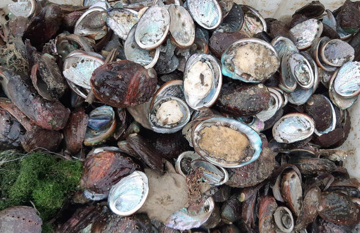

“软黄金”鲍鱼近期卖出白菜价且让养殖户普遍陷于亏损，引发外界关注。那么，到底是什么原因导致今年鲍鱼价格大跌呢？图为中国鲍鱼大量低价销台，令台湾本地鲍鱼滞销死亡，让业者欲哭无泪。 （吴胜福提供）

 
 【大纪元2019年12月05日讯】（大纪元记者易如采访报导）“软黄金”鲍鱼近期在大陆卖出白菜价且让养殖户普遍陷于亏损，引发外界关注。那么，到底是什么原因导致今年鲍鱼价格大跌呢？

中共央视11月28日报导，盛产鲍鱼的福建莆田南日岛近期正当鲍鱼收获季节，可今年鲍鱼行情跌得明显，去年50多元（人民币，下同）一斤（500克）的10头鲍，今年最高采购价才45元一斤；去年每斤收购价近60元的12头鲍，今年最低40元就能买到手，算下来，一只鲍鱼才3块多，相当于一棵白菜价格。

报导说，一笼10头鲍养殖成本是700多元，却只能卖出500元左右，养殖户一笼亏了200多元。而导致今年鲍鱼身价大跌除气候变化原因外，还有产能过剩及出口的萎缩。

网友说，大的鲍鱼滞销，鲍鱼苗也卖不起价了。（微博）

 
 福建“鲍鱼之乡”连江县某鲍鱼养殖场的陈老板12月3日对大纪元表示，鲍鱼在前几个月就卖不出去了，且价格跌得特别厉害，“6月份价格在一斤33～37元左右，去年同期是一斤62～65元，价格下降一半；前一个多月，价格回升到一斤43～47元左右。”

陈老板说，当地鲍鱼卖不出去的原因是鲍鱼太多，“今年福建的鲍鱼产量确实特别大，总产量大了不止十几倍，我自己去年有5000笼左右，今年差不多有10,000笼，一笼鲍鱼就有35粒。而山东那边也有大量的鲍鱼，早前，很多人都去山东那边买鲍鱼了。”

“今年水质污染也比较严重，使养殖户不得不以低价出售。”陈老板说，当地天气太热水温过高加上污染严重，鲍鱼死亡率高，“今年高温之后，一笼鲍鱼只剩下约25粒还不到，所以很多人就先低价卖掉了。”

“另外，贸易战对我来说影响很厉害。”陈老板说，今年没办法出口美国。“跟去年比，因为能够早一点卖出去就是利益，去年我5月份就通过出口卖掉了，现在到11月份还没卖掉，期间有不少损失，都亏本了。”

陈老板表示，低价倾销使他们全村60户人家今年都受到影响，“有的损失都超过七八十万，他们都是从政府银行以4厘7的利息贷款来养殖的。”

陈老板于93年开始做鲍鱼养殖，大部分鲍鱼出售到北京上海等城市。“随着中国黄历年的到来，相信鲍鱼价格会有所回升。”他满怀希望地说。

陈老板说：“随着中国黄历年的到来，相信鲍鱼价格会有所回升。”图为工人在养殖鲍鱼处检查鲍鱼脚。(Getty Images)

 
 原福建省石狮市人大代表李联炮对大纪元表示，鲍鱼近几年产能一直过剩，跟当地政府搞政绩工程、鼓励大家养殖有关，“都想搞政绩、搞形象、弄出特色，万亩工业园、万亩养殖场等，一个项目大家都做，产大于销，价格肯定受影响。”

李联炮说，做事急功近利，也造成养殖行业很多问题，“就像近海捕捞太过频繁把一些鱼苗都给扼杀了，基本上是资源耗尽。而养殖行业，比如以前鲍鱼很难养，近年是把一些技术攻关下来，大量用药物激素后，不仅好养产量也很高。至于对水环境的污染、市场能不能消化等都不会在意，所以，养鲍鱼的、养海参的，虾、石斑鱼，还有海带、紫菜养殖的非常多，其产业链也是非常庞大。所以，即使收成好也不一定赚钱。”

“而中国老百姓很勤劳，因为没有福利保障，所以，只要能赚钱就去做，多赚钱自己老了才有保障，大家都有危机感，都是这么想。”

李联炮表示，导致价格低的原因很多，包括政策、市场、科技等，还有整个大环境的因素，“而整体经济下滑对老百姓是不利的。”

那么，到底是什么原因导致今年鲍鱼价格大跌呢？

<b>经济萧条是主因</b>

对鲍鱼跌成白菜价，有许多网友也表示，“不仅是鲍鱼跌价，经济太差了，各个层面都在传导。”“今年龙虾、螃蟹好像也便宜。”

农业研究人员严先生对大纪元表示，鲍鱼降价，最主要原因是国内经济状况不好，“经济萧条，消费下降，而鲍鱼属于高端食材，经济不好就过剩了，这是主要原因。”

“产能过剩，当地消费下降，如果运到外地，费用也很高，也未必能卖出价，加上出口受限，那价格肯定要跌。”大陆经济学者何军樵对大纪元说，“现在很多东西都在跌价，包括日常用品都在降价，而且降得非常厉害，淘宝上的东西基本都是腰斩，因为经济发展停滞，年底要回笼资金为明年做打算。”

<b>政府干预 政策易变</b>

严先生表示，价格下跌也跟政府干预、政策易变有关，“就像养猪，养的好好的，突然搞个环保整治，把行业搞死了；现在又推动大家养，给补贴。今天反对老百姓养猪，明天鼓励老百姓养猪，老百姓想到底该不该养猪？所以，活在中国创业难，无法判断。”

中共也曾于2013年推出所谓严查公款消费、解决“四风”问题的政策，使公款消费的高端食材鲍鱼养殖业遇冷，令八成以上的福建养殖户亏本关门。

随着中共要求发展产业经济，2017年开始，福建莆田南日岛本地、福州连江、漳州东山一带的鲍鱼养殖户都扩大养殖规模，养殖面积较2016年翻了一番，而鲍鱼的生长期通常超过15个月，因此今年鲍鱼供给大幅增加。

<b>出口减少对鲍鱼价格略有影响</b>

严先生表示，出口对鲍鱼价格的影响是其次的，“中国农产品出口一直并不好，因为环境污染问题，很多国家不要。比如，国际上韩国搞过一个食品展览，说中国摊位上没人看，人家知道不能买。而澳大利亚食品标榜不含中国的原料，证明外国是知道这些事情的，特别是国际贸易检测、海关都很清楚，人家不跟你玩，这个国度很可怕。”

据智研咨询发布的《2019—2025年中国鲍鱼养殖行业市场全景评估及发展趋势预测研究报告》显示，2017年，中国鲍鱼行业养殖量为148,539吨，国内鲍鱼需求量为148,051吨，而进口量在794吨，出口量为1282吨。

“还有，中国存在‘反科学’，就是和科学的伦理相反，完全是为了利益，伤害人类，这个在中国很流行，”严先生补充说，很多人用各种各样的方法用科学原理做反伦理的问题，“就像我们行业，有些药物可以使菇提高产量和外在的表面质量，但对人类并不一定有好处，为了增产赚钱有研究机构专门这样干，国内一切都是向钱看。”

<a target="_blank" href=#top><h6 align="right">回上方</h6></a>

<a name=42>
<h1 align="center"><b>【内幕】华为打压多名员工 或涉及核心秘密</b></h1>

在华为员工因离职讨薪被拘押251天引爆舆论之后，华为发声明拒道歉，事件引发更多已离职员工指控华为致众多无辜者入狱。（陈柏州／大纪元）

 
 【大纪元2019年12月05日讯】（大纪元记者萧律生、特约记者林澜采访报导）华为李洪元事件后，再有知情人爆料，其被抓可能是因知晓华为违反美国禁运令的核心秘密。该知情人表示，还有其他员工被抓或被失踪至今。
 
<b>李洪元事件或涉违反禁运核心秘密</b>

中国公益机构“长沙富能”联合创办人杨占青，因曾与部分华为离职员工在一个微信群组，故而了解一些华为事件的内幕。

他告诉大纪元，李洪元的罪名从“泄露商业机密”转为涉嫌“敲诈勒索”，很有可能因为其与同事私下议论华为违反美国出口禁令、将含美国元件的设备违规卖给伊朗的机密。

“当时7、8个人在群组里面讨论，说要对（媒体）谈伊朗的事情，才能被公司重视。”杨占青说，当时这些员工均因为维权得不到重视，故而希望借揭露华为向伊朗卖设备一事引起华为的关注。

杨占青给这些员工提议，只要敢说，就有媒体敢报导，并推荐了香港一家媒体；但是这些群组里的员工担心是“外媒”，把杨踢出了群组。

<h3 align=center><a href="https://twitter.com/yangzhanqing">这是当时我在华为离职群里看到的他们聊天记录，他们中有两人约定周末去见记者，结果周五晚上被以侵犯商业秘密罪抓走了…… </a></h3>

不过，该群组中有两位员工同意向香港媒体爆料，故杨占青建立新群组，帮助这两名员工联系记者。

结果这两人在见记者前，一人被失踪至今，一人被抓走。被抓走员工的被捕日期与李洪元相同，该员工的网名是“似水流年”，其妻子告知刑拘书上的罪名是“侵犯商业秘密罪”，但是后来又被改成“敲诈勒索罪”。

而李洪元在2018年12月被抓时，是华为向公安举报，指李洪元涉嫌“泄露商业机密”，但后来李洪元的罪行被变成涉嫌“敲诈勒索”。

杨占青表示，李洪元的情况与他了解的华为员工、网名“似水流年”的情况很相似。

杨占青进一步分析，华为卖东西给伊朗，对华为员工来说是公开的秘密，对社会来说，则是华为犯罪的证据。“警方、检察院不会用这个去定罪，想办法用其他办法打压、定罪。”所以，李洪元的罪名从“泄露商业机密”变为涉嫌“敲诈勒索”。

“‘侵犯商业机密’，对华为来说，正是害怕外界知道的秘密。”杨占青说，“若被散布出去，被美国知道，偷卖设备。所以先抓捕，然后能向社会公开的罪名又找不到合适的，就定这样的罪名。”

他认为，定罪不是最重要的，最重要的是警方要求达成协议，即华为员工不能将华为卖给伊朗设备的事情对外说。

除了一人被失踪，一人被抓捕，杨占青对大纪元表示，在泰国的、华为前员工林夕亦被抓，在其被抓之前，林夕曾强烈认为这两人被陷害，是需要向外界呼吁的，也应该接受媒体采访。

不久，杨占青就与林夕突然失去了联系。后来，经过辗转消息，他才得知林夕被中共抓捕的消息。杨占青此后还了解到，华为为了给林夕治罪，曾说林偷公司的电脑，而实际上是林自己的电脑丢了。

杨占青此说法，与12月1日原华为派驻北非的员工林夕（曾梦）在知乎上公布自己的遭遇不谋而合，即从泰国被遣送回中国大陆。

2018年年底，民主中国网站亦曾报导，“林夕”是原华为公司的北非地区部产品经理，他正在和华为公司就年龄歧视问题进行维权。但他后来发现，同在一个微信群的两名华为员工在约好接受媒体采访后却“失踪”。

“林夕”担心二人是因为打算爆料而“被失踪”，之前他们曾在群里爆料公司年龄歧视、逃税，以及参与伊朗业务。

<h3 align=center><a href="http://minzhuzhongguo.org/MainArtShow.aspx?AID=104332">华为前员工自曝曾参与伊朗业务后失联</a></h3>

当时，杨占青也被采访，他说：“这事非常讽刺，孟晚舟在加拿大享受律师会见及代理权利，而华为的员工在中国却无法会见律师，甚至下落不明。”

此前，财新网曾报导，仅2018年12月，至少5名华为前员工被以“涉嫌侵犯商业秘密”等罪名抓捕。

<b>前律师：华为耍无赖 中共公检机关“公权私用”</b>

李洪元事件引爆舆论之后，12月2日，华为发声明辩护并拒绝道歉，甚至称，企业举报合理，并称李洪元有权诉诸法律维护自己权益。

对此，前大陆律师赖建平表示，这个事情将中共统治下的“公权私用”表现得淋漓尽致。

他说，公安机关在没有证据证明犯罪的情况下、只是听到华为的举报就抓人，检察院在没有核实证据的情况下进行批捕，华为在没有证据的情况下诬告员工。“这就是说，公权力在某种程度上变成华为的打手。”

赖建平指责大陆公安，很多该办的事情不办，只因有权力关系左右等，就放纵犯罪；而这种被买通或因有它他关系，不构成犯罪的人，却遭到任意构陷。

至于华为的这个声明，赖建平认为从道德上，华为是在耍无赖；从法律上，华为是陷害行为。

赖建平说：“华为构陷前员工，又来说你告我，是耍无赖。正常有理性的人，你做错了，真相大白于天下了，你最起码应该有羞耻、廉耻、自我反省，应该向公众道歉。”“法律上，（华为）报假案，也是犯罪行为，是陷害行为。非法，甚至是犯罪行为。”

李洪元事件后，中共因华为被制裁、孟晚舟事件大肆煽动的不少“爱国”网民，也纷纷倒戈，支持李洪元。

赖建平说，社会舆论一边倒，向其说不，表示华为非正常行为到一个极限；说明在道德沦丧的社会里，还有一点良知。

<b>李洪元事件回顾</b>

李洪元事件是指，2005年入职华为的李洪元，在“太阳能逆变器”销售管理部工作，在2016年底，他发现了业务造假问题，并于当年11月21日晚向公司发送了举报邮件。事后，他的主管处处为难他。2017年底，到了他续签合同的时候（华为的劳动合同是4年一签），主管和人力资源部门相关负责人都告诉他将不再与他续签合同。

李洪元提出了2N的离职补偿方案，按照相关政策，华为应该补偿他24个月的工资。华为很爽快地答应了，2018年1月31日双方签署了离职协议。华为通过某员工的私人账户，向李洪元转账约30万元；几个月后，华为向公安举报称李洪元涉嫌“泄露商业机密”，李洪元被抓，后又改为涉嫌“敲诈勒索”。

虽然2019年1月22日，经检察院批准，李洪元被深圳市公安局正式逮捕；但是因李洪元保留了与华为人事部的谈话录音，所以证明他并未敲诈勒索。公安因无法提供充足证据，李洪元在被羁押251天后被释放，并获约人民币10万元的国家赔偿。#

<a target="_blank" href=#top><h6 align="right">回上方</h6></a>

<a name=41>
<h1 align="center"><b>河北强推“清洁煤”取暖 多名村民中毒身亡</b></h1>

中國河北傳出多人使用「清潔煤」中毒死亡。（圖擷取自微博）

【新唐人北京时间2019年12月05日讯】由于当地政府强制推广“清洁煤”用于取暖，河北承德和隆县的多位村民，以及唐山多个村庄的6位村民因一氧化碳中毒而死亡，此外还有数十人住院治疗。

据《新京报》报导，河北承德和隆县的多位村民，疑似用了当地政府强制推广的“清洁煤”取暖后，导致一氧化碳中毒而不幸身亡。随后有多位知情人士反映，唐山市在一个多月的时间里，也连续出现6位村民因一氧化碳中毒而死亡。此外，还有数十人因同样的原因被送往医院抢救、治疗。

据河北村民透露，当地政府强制村民使用“清洁煤”，价格比以往用的煤贵很多，质量又差，出了人命后，许多人都不敢用“清洁煤”了。

河北村民于先生：“(清洁煤)不太好用，说是不得烧煤了，（贵）很多钱，（质量）相差很多，老百姓用不起的，那烧死老百姓，已经没有很多人烧了。”

报导说，“清洁煤”是由上级政府部门指定的厂商提供的，被点名的两家供应厂商都是今年秋天以后才成立起来的，其中唐山博瑞型煤有限公司表示，一氧化碳中毒是使用不当所致，和企业无关。有网友评论，这是“垄断”造成的弊端。

河北民众反映，近几年政府严禁使用散煤，农村只能使用“清洁煤”，很多乡镇和城市都强制推行煤改气。

河北村民牛女士：“政府准备的那种煤不很好，不好用，不暖和，火力也不行。农村罚的可紧了，抓的可严了，基本上是没有烧(散)煤的。”

河北唐山市开平区栗园镇董先生：“这地方查这么紧，哪有敢用煤的，污染，煤都不能用，郊区里面都用暖气了。”

一氧化碳中毒事件引发很多大陆网友质疑政府和“清洁煤”供应商。网友们表示:“很多管起来的目的是为了赚钱而不是环保”，“ 但愿不是这样！不说死了人，让谁卖不让谁卖，这里边不一定就有猫腻。”，“那是什么？是产品不成熟？不合格或伪劣？”

<a target="_blank" href=#top><h6 align="right">回上方</h6></a>

<a name=40>
<h1 align="center"><b>北约历史首次！中共威胁写入29国联合声明</b></h1>

图为12月4日，北约领导人峰会正在进行工作午餐。(NICHOLAS KAMM/AFP via Getty Images)

【新唐人北京时间2019年12月05日讯】北大西洋公约组织（NATO）将首次正式承认中共威胁，中共带来的“挑战”将写入29个成员国12月4日的联署声明。北约秘书长表示，北约并不想与中国为敌，但中共“崛起​​”对所有盟国都构成安全隐患。

《法新社》报导，12月3日至4日，北约峰会在英国伦敦郊区举办，以纪念北约成立70周年，预计会议将通过一项有关因应中共的行动计划。

北约秘书长斯托尔滕贝格（Jens Stoltenberg）在会前公开表示，中国崛起给北约成员国带来了新的机遇，但北约需要关注中共军事发展，中共从北极到巴尔干等地区的活动，以及对欧洲基础设施的重大投资。他特别提到，中共拥有世界第二多的国防预算，最近展示多项新型现代武装力量，包括能够到达整个欧洲、美国的远程导弹。

斯托尔滕贝格强调，北约不是在创造出新的敌人，而是分析和理解，以平衡的方式应对中共构成的挑战。

他说，为了应对这一系列挑战，北约已经更新了包括5G网络在内的通讯设施的底线要求，并达成一致。北约还将持续确保在5G通讯以及重大基础设施等领域的安全，因为这对北约的军事行动和日常生活非常关键。

北约掌管的范围只包括北美和欧洲，但斯托尔滕贝格表示，“不是北约要进军南中国海，而是中国（中共）正在靠近我们”。

北约成立最初是为了对抗苏联。随着近年来中共的崛起和积极对外扩张，北约的工作重心正在转向北京。

斯托尔滕贝格8月份就曾表示，随着中共力量的全球扩张，北约需要了解中共崛起的影响，包括对北约成员国带来的挑战。前北约秘书长拉斯穆森（Anders Fogh Rasmussen）不久前也在华盛顿表示，欧洲国家对中共参与5G和其它基础建设带来的威胁逐渐清醒，过去欧洲一直没有意识到相关战略威胁，在这些问题上有些幼稚。

作为北约的领袖，美国也一直在提醒北约应对中共。白宫官员在此次北约峰会前透露，总统川普（特朗普）将在峰会上强调中共威胁。早在4月，美国副总统彭斯就在华盛顿纪念北约成立70周年的活动中强调，北约今后几十年里面对的最大挑战就是中共，盟国必须根据这一现实作出调整。

<a target="_blank" href=#top><h6 align="right">回上方</h6></a>

<a name=39>
<h1 align="center"><b>人未救先回填 广州地铁施工区塌陷 3人被埋</b></h1>

家属向陆媒提供的照片显示，广州市11号地铁线施工区域12月1日的塌陷事故发生之初，不幸掉入坑洞中的被困人员的头部和一只手仍露在外边，但官方并没有立即展开救援。（网络图片）

 
 新唐人北京时间2019年12月03日讯】中国广州市一处地铁线施工区周日发生严重道路塌陷，有2两车共3人被困于塌陷的坑洞中。事故之初，被困者的头、手都还能看到，但没有得到及时的救援。官方更在人还没救起时，就决定向塌陷的坑洞快速回填混凝土，这种做法引发了公愤。

当地时间12月1日上午9时28分许，广东省广州市的广州大道北与禺东西路交界处（11号地铁线施工区域）的地面突然发生塌陷，致使一辆洒水车和一部电瓶车陷入坑洞之中，3人在这次塌陷事故中被困，至今没有被救起。

据陆媒报导，路面塌陷事故发生之初，被困的人员的头部和车辆的局部都还裸露在外，但并未得到及时的救援。之后该塌陷区又发生了2次塌陷，致塌陷面积一再扩大，掉下去的车辆和人员则完全消失，而坑洞最深处达38公尺。

据报导，现已查明陷入坑洞中的洒水车内被困的人员是一对石姓父子，父亲今年51岁，儿子27岁，都是湖南人；另一名陷入坑洞的人员身份至今尚未得到确认。

石姓父子的家属向陆媒控诉说，这父子俩刚掉入坑洞时还能看到头部，“可是救援人员却没有立即救援，反而快速回填。”

家属向陆媒提供的现场照片显示，洒水车掉入坑洞中后，翻倒的车辆下方仍可看到一名男子的头部和一只伸出的胳膊。

被困者家属说：“父亲到广州工作十几年，是广州红鑫清洁服务有限公司的老板；儿子近几年才随父亲到此地，今年刚刚结婚，事发时孩子满月不久，还打算在即将到来的新年办喜宴。”

塌陷事故发生后，当地官方未先救人，却因担心塌陷扩大而急于向坍塌处回填混凝土的做法，让被困者的家属难以接受，也引发了公众的愤怒。

综合各方面的消息，塌陷事件发生后不久就有救援人员去到现场，但因坑洞面积大，而且仍在崩塌，救援人员被要求在现场待命，迟迟未展开救援被困人员的行动。

当天中午，广州地铁官方微博发文承认，事发地点为地铁11号线沙河站的施工区段，并称该路段已进行交通管制，相关单位正在现场“抢救”，具体原因仍待调查。

下午3点30分，广州地铁官方微博又发布消息称：“因塌陷区已被水体覆盖，且有土体塌落，给救援工作带来极大困难，为避免塌陷区域进一步扩大，现正进行局部回填。”

当时网络上就有市民质问：被困人员还没救出来，为何广州地铁就急着向坑洞回填混凝土？这个决定会不会把被困者获救的最后希望也彻底泯灭了？

 

中国广州市12月1日发生道路塌陷后，官方在被困人员尚未救出时就大规模回填混凝土，惹发众怒。图为空拍现场。（网络图片）

 
随着被困人员家属向陆媒控诉的消息传播开来，网络上民众的质疑和批评声越来越强烈。

当天晚间9点多，广州市官方答复媒体质问时，强调当局仍在事发现场挖掘受困人员，并声称回填水泥是为“更好救援”，但截至目前仍没有找到失踪者的消息传出。

<a target="_blank" href=#top><h6 align="right">回上方</h6></a>

<a name=38>
<h1 align="center"><b>中国房企惊现破产潮 专家：80%开发商会死掉</b></h1>

中国房企破产潮来袭，专家预计80%开发商会死掉。图为一位老人在看售房广告。（JOHANNES EISELE/AFP via Getty Images）

【新唐人北京时间2019年12月01日讯】中国房地产业破产潮来袭，今年平均每天就有1.5家房企破产，创下历史记录。专家分析，未来市场有80%的开发商会死掉，只有20%能活下来。一旦房地产崩盘，中共就会面临更大的统治危机。

<b>房企破产创记录</b>

今年对很多中国房企来说都很难熬。中共法院公告的最新数据显示，截至11月20日止，全国已有446家房企宣告破产，平均每天就有1.5家房企破产，创下历史记录。

有观点认为，造成房企纷纷宣告破产的原因，主要是企业资金缺乏，加之当局政策持续收紧，影响企业融资所致。

据中原地产统计，今年以来已有超过25次对房地产资金链的政策。这不仅造成中小房企集体破产，一些大中型房企如颐和、银亿、上置集团等拥有20多年历史的老牌房企也纷纷爆出资金链危机。

业内人士认为这背后的信号十分明显，即中国房地产高周转、高杠杆、高负债的商业模式已经走向终结。

中原地产首席分析师张大伟认为，未来房企市场将会转型，小企业被大企业兼并，未来可能有近2000家的中小房企倒闭，离开市场。

经济学家马光远分析，未来房地产业只有20%的开发商能活下来，80%会死掉。

<b>房市降价潮</b>

然而，大型房企的日子也不好过，进退两难。早在去年10月，大陆房企龙头企业万科就公开喊出，以“活下去”为目标。万科、碧桂园等大型房企都传出调整组织架构，降薪裁员等消息。

与此同时，中国房市出现一波降价潮，包括万科、恒大、碧桂园、泰禾、中粮等大型地产商都在加紧降价抛售。万科在厦门的楼盘降至6折促销，200多套房一天售罄。业界分析，这预示大陆房市拐点已经到来，楼市泡沫即将刺破。

<b>房地产面临崩盘 当局下达“止跌令”</b>

然而，开发商降价卖房遭到中共地方当局阻止。据名为“桂林房事资讯”的微博账户披露：今年9月20日，广西桂林政府召开房价维稳会议，点名批评碧桂园降价售房，要求各大房企“坚持住，确保房价坚挺”。

据报导，碧桂园打算退出广西市场，中秋期间“亏本大甩卖”。在这次房价维稳会议上，碧桂园区域总裁公开道歉，恒大、新城控股、金科等各大房企也纷纷签订“自律公约”。

事实上，大陆很多地方政府早已经发布了房价“止跌令”。今年2月，江苏邳州市发布了《关于邳州市房地产市场近期销售乱象的报告》，采取4项措施制止房价下跌。

3月，江西赣州市赣县区也向房企下发了“停止特价房销售”的通知，要求房企停止低于申报价格的“特价房”销售。

6月份，湖北恩施也采取类似措施制止房价下跌。

近日，武汉一名地产从业人士透露，当地政府也警告开发商，毛坯房不能打折出售，否则收回预售证。

大陆金融学者何军樵认为，当局阻止房子降价，是为了阻止房地产崩盘。“房价降了，土地卖不掉，影响地方政府财政收入；房地产商都是银行贷款，说穿了，房子卖掉之前都是银行的，一降价银行就要受损失；房价下降按揭贷款的按揭它就得放生，房地产会迅速崩盘。”

<b>中共面临统治危机</b>

何军樵表示，一旦房地产崩盘，中共政权就会面临统治危机。

大陆金融分析师任中道补充说：“还有一点，如果降价的话，先前买房负有房贷的人就会去闹事，会引发群体事件。”类似群体抗议事件已经在中国各地爆发。

不过任中道认为，即使地产商不降价卖房，中共同样面临金融风险和社会风险。

“很多的开发商他们的债务到期了，他们要还债的，很多开发商都在采取各种各样措施把资金回笼，资金链如果断的话就会破产倒闭，那么会产生很多的债务违约，它会不断的冲击金融体系。”

今年以来，房地产业因高负债引发资金链断裂，已经掀起破产潮。

大陆民间智库智谷趋势认为，相对于P2P和股市，中共当局最担心的就是房地产崩盘，因为房地产扣住虚拟和实体的命门，上下牵扯太多，一旦出现非理性，就是一场山崩海啸。

分析人士认为，曾经成为中共摇钱树的房地产，在不断上涨的过程中，掏空了老百姓的腰包，使中共官僚腰缠万贯，也带来了经济繁荣的假象，但是崩盘是迟早的事情。自美中贸易战开打后，中国经济急速下行，此前已有学者指出，经济疲软会导致房地产泡沫破裂，引发金融危机。

<a target="_blank" href=#top><h6 align="right">回上方</h6></a>

<a name=37>
<h1 align="center"><b>因应中共威胁 美军订造9艘最先进核潜艇</b></h1>

2018年9月29日，美军第16艘维吉尼亚级潜艇印第安纳号（USS Indiana）正式服役，潜艇上的官兵举手敬礼。(Leah Stiles/U.S. Navy)

 
【大纪元2019年12月04日讯】（大纪元记者陈俊村编译报导）美国海军在周一（12月2日）签下史上最高金额的造舰合约，将以222亿美元的经费打造9艘最先进的维吉尼亚级（Virginia-class）核动力攻击潜艇。

海军负责研究、采购和开发的助理部长盖尔茨（James Geurts）当天对媒体表示，为了取得政府与造船厂之间的平衡，整个采购团队付出了很大的努力，才达成这项合约。

盖尔茨说，如果造船厂如期交付，海军合计将省下16.5%的预算，或44亿美元。他补充说，如将其它装备的经费加进去，整个造舰计划的费用将增至大约350亿美元。

海军年度预算中原本规划建造11艘第五批次（Block V）的维吉尼亚级潜艇，但最终只确定建造9艘，除了已开始建造的首艘潜艇之外，其余8艘都确定配备“维吉尼亚酬载模组”（Virginia Payload Module，VPM）。

相较于先前的批次，第五批次型改善了静音技术，而且首度安装VPM。VPM可提升每艘潜艇的对地打击能力和酬载量，从原有的12枚战斧巡弋导弹（Tomahawk cruise missile）增加至40枚，但整艘潜艇的长度必须因此而延长84英尺（25.6公尺）。

与美国海军签下这项造舰合约的造船厂是位于康乃迪克州的“通用动力电船”（General Dynamics Electric Boat）。依据合约，海军保有以20亿美元增购第10艘潜艇的选择权。

<b>因应中共扩军威胁</b>

曾担任美国太平洋司令部（现称印太司令部）联合情报中心（Joint Intelligence Center）作战主任的舒斯特尔（Carl Schuster）告诉CNN说，这项合约“标志着美国海军对中共扩军与其在西太平洋与日俱增的侵略行动所做出的最新回应”。

舒斯特尔指出，美国海军必须应对中共海军的扩张，这不意味着把中共看成敌人，但中共的举动确实值得观察。

美国海军目前拥有18艘正在服役的维吉尼亚级潜艇，另有10艘第四批次（Block IV）的维吉尼亚级潜艇正在建造中。而首批第五批次的潜艇要等到2025年才会交付。

这种下一代的攻击潜艇将使海军有能力在21世纪维持水面下的优势。它们拥有强化的隐形功能、精良的侦察能力和升级的特殊作战能力，能迎合海军执行多重任务的需求。

10月5日，美国海军为一艘维吉尼亚级潜艇命名为俄勒冈号（USS Oregon），它将于明年加入舰队，正式服役。

<a target="_blank" href=#top><h6 align="right">回上方</h6></a>

<a name=36>
<h1 align="center"><b>重庆西南医院惊现横幅“丧尽天良 还我器官”</b></h1>

图为台湾法轮功学员在台北市向民众演示中共活摘器官场景。PATRICK LIN/AFP via Getty Images)

 
 【新唐人北京时间2019年12月04日讯】在海外网络社交网站推特上，有中国网友近日转发的一段视频显示，有中国民众在重庆西南医院维权喊冤，在医院门口展示的横幅上赫然写着“丧尽天良 还我器官”等语，令人震惊。西南医院是位于重庆市的一所有中共军队背景的医院，近年来该院完成了大量器官移植手术，因涉嫌参与活体摘取法轮功学员器官而被“追查迫害法轮功国际组织”列入了追查名单。

近日，有中国异议人士在海外网络社交平台推特上转发了一段中国民众维权的视频片段。视频画面显示，疑似在重庆西南医院的大门口，有维权民众挂出了一幅白底黑字的大型横幅，上面书写着“丧尽天良 还我器官 西南医院 无良黑店”，令观者心惊。

这位网友为这段视频配发的帖文写道，“好不容易凑点钱到医院做手术，回来一检查，发现器官没了。”

首页 > 新闻资讯 > 大陆 > 时政 > 正文
重庆西南医院惊现横幅“丧尽天良 还我器官”
重庆西南医院惊现横幅“丧尽天良 还我器官”
图为台湾法轮功学员在台北市向民众演示中共活摘器官场景。PATRICK LIN/AFP via Getty Images)	
北京时间：2019-12-04 08:14

【新唐人北京时间2019年12月04日讯】在海外网络社交网站推特上，有中国网友近日转发的一段视频显示，有中国民众在重庆西南医院维权喊冤，在医院门口展示的横幅上赫然写着“丧尽天良 还我器官”等语，令人震惊。西南医院是位于重庆市的一所有中共军队背景的医院，近年来该院完成了大量器官移植手术，因涉嫌参与活体摘取法轮功学员器官而被“追查迫害法轮功国际组织”列入了追查名单。

近日，有中国异议人士在海外网络社交平台推特上转发了一段中国民众维权的视频片段。视频画面显示，疑似在重庆西南医院的大门口，有维权民众挂出了一幅白底黑字的大型横幅，上面书写着“丧尽天良 还我器官 西南医院 无良黑店”，令观者心惊。

这位网友为这段视频配发的帖文写道，“好不容易凑点钱到医院做手术，回来一检查，发现器官没了。”

<h3 align=center><a href="https://twitter.com/TimLinFreedom">好不容易凑点钱到医院做手术，回来一检查，发现器官没了。</a></h3>

发布视频者并没有说明这段视频片段拍摄的具体时间，但此前在网络上并未发现有类似视频流传，因此网友们猜测这段视频应该是近年拍摄的。

因为维权者亮出的横幅显示该事件与器官移植乃至活体盗取人体器官有关，引发众多网友的关注与热议。有网友痛斥涉事医院“丧尽天良”；有网友指出，西南医院是第三军医大学的附属医院，医院中有很多医生和护士都是军人，视频中的横幅令人联想到中共邪恶的活摘器官，让人不寒而栗。

据公共资讯，中共第三军医大学的附属医院西南医院是一所大型综合性“三级甲等医院”。这所医院从1999年5月启动临床肝移植开始进行临床肝移植手术，2001年该院的肝胆外科被确立解放军肝脏移植重点实验室。

截止2004年年底，西南医院完成了超过260例原位肝移植，其肝移植例数居西南地区首位，并实施了世界首例以外伤肝为供肝的成人活体肝移植。

2005年3月，西南医院被中共军队总后勤部批准成为中国人民解放军肝脏移植中心。当时该医院已具备同时进行6台肝移植、每年完成200例次肝移植的技术实力。2007年5月23日，这所医院被中共卫生部指定开展肝移植、肾移植的医院。

据中国大陆媒体的宣传，西南肝胆外科医院在2005年至2009年间，完成了肝移植640余例。该院从2005年底开始开展活体肾移植，而肾移植的数量逐年增加。

据明慧网2006年7月27日的一篇报导，2006年6月20日，四川省达州市开江县一位肾病患者向该媒体透露，她于2005年7月份在重庆的西南医院接受了肾移植手术，当时与她同一批做肾移植的共有10人。她说，这所医院的人体器官移植有源源不断的供体，“很丰富”，“有保障”。只要住进这家医院的病人，无论需要换啥器官，都可以在短时间内提供合适的配对器官。

同年7月31日，美国新西那提州立大学的逯医生接受新唐人采访时表示，他对中国的医院竟然可以大规模与病人预约器官移植手术感到十分惊讶，这说明很可能有活体的供体库存在，所以中国的医院可以很方便地跟病患预约时间进行器官移植手术。

逯医生说：“在美国，器官移植的平均等待时间是三年，不论何种血型。在中国，全国有这么多人，这么多手术在同时进行，不能够解释，这在国外来讲是不可思议的。”

一位重庆患者2006年年初曾在西南医院接受了肝移植手术。法轮功受迫害真相联合调查团的调查员，2006年7月中旬以患者家属的身份向这名重庆患者进行了电话调查。

调查员问：“（西南）医院换肝手术做的多吗？”

患者回答：“多多多，多的时候每天都能做好几个。腰子（肾）、心子、肝子都能换。”

调查员问：“提供肝脏的人是活的还是死的？”

患者答：“活的，肯定要活的嘛，心脏还在跳的才行，死的怎么行呢？”

调查员：“你做的是全肝移植还是部分肝移植？”

患者：“全部肝移植，我整个肝全部都切除了。”

调查员：“我们自己能不能向医院要求要年轻、健康的供体？”

患者：“可以，你自己去跟主管的医生面谈。”

2006年4月4日，法轮大法学会和明慧网发起了“赴中国大陆全面调查法轮功受迫害真相委员会”，并随即组成了“法轮功受迫害真相联合调查团”（CIPFG），联合国际社会正义力量，全面彻底地调查中共迫害法轮功学员的罪行，并终结这场持续近七年的残酷迫害。

经过两个多月的调查、取证，2006年7月6日，由加拿大前亚太司司长、资深国会议员大卫•乔高（David Kilgour）和国际人权律师大卫•麦塔斯（David Matas）组成的独立调查组，向加拿大媒体公开了“关于调查指控中共摘取法轮功学员器官的报告”。

这份调查报告显示：中共开始迫害法轮功修炼者以后，即开始大规模系统实施“活体摘取、移植售卖法轮功学员器官”，从而既达到对法轮功学员实施群体灭绝的目地，又为中共迫害集团谋取暴利。这一惊天罪恶将中国大陆医疗卫生界、商界、政界、军界、司法界中难以计数的人拖入了血腥犯罪的深渊。麦塔斯将活体摘取法轮功学员器官的行为称为“这个星球上前所未有的邪恶”。

<a target="_blank" href=#top><h6 align="right">回上方</h6></a>

<a name=35>
<h1 align="center"><b>美众院压倒性通过《新疆法案》明确制裁中共官员</b></h1>

 
【新唐人北京时间2019年12月04日讯】日前，中共官员可谓噩耗连连！继《香港人权与民主法案》之后，美国众议院压倒性通过了《维吾尔人权政策法案》（《新疆人权法案》），将制裁在新疆践踏人权的中共官员。

美东时间12月3日傍晚，美国国会众议院以407票同意、1票反对压倒性通过了《维吾尔人权政策法案》。多位来自民主共和两党议员在院会发言力挺这项法案，谴责发生在新疆的人权危机，并要求制裁被控在新疆践踏人权的官员。

《新疆人权法案》是9月参议院通过的“威力加强版”，按照美国立法程序，此版本将再由参议院表决，通过后便会交由川普总统签署立法。

法案要求美国总统对中共政府打压新疆维吾尔族人或其他少数民族做出强烈回击，要求中国关闭新疆大规模集中营，并直接点名制裁中共新疆维吾尔自治区党委书记陈全国。

<h3 align=center><a href="https://twitter.com/VOAChinese">习近平制造了地球上最严重的人权惨剧之一，习近平及其政府要为这些反人类罪行负直接责任</a></h3>

过去一段时间以来，国际人权组织和人权活动人士，披露和谴责中共在新疆把百万穆斯林关进再教育营（也称集中营、拘留营）。

而美国国防部印太安全事务助理部长薛瑞福（Randall Schriver），在介绍2019中共军力和安全形势报告的记者会上说，中共正动用安全部队把境内的维族人大批关进集中营，被拘押的维族人可能接近300万人。

美国国务院6月发布的年度国际宗教自由报告中称，中共除了大规模关押维吾尔人和其他穆斯林少数族裔之外，还在新疆实施入侵式监控措施，并禁止他们的宗教行为。

在此之前，美东时间11月27日，美国总统川普签署《香港人权与民主法案》和《保护香港法案》。而美国国会众议院和参议院则于11月18、19日高效率地通过了上述两项法案。

《香港人权与民主法案》将对香港的自治状态，进行年度审议以确定是否维持美国给予香港的特殊地位，并警告制裁侵犯香港自治和人权的官员。

在法案变成法律后，激起了中方的强烈反弹。中共外交部、港澳办、国防部等7个部门，一天之内7次发声，官媒9小时发出51则相关报导，言词相当激烈。但中共最高领导人到目前为止，没有任何重大反应。

<a target="_blank" href=#top><h6 align="right">回上方</h6></a>

<a name=34>
<h1 align="center"><b>【拍案惊奇】耿爽与中共话术：挟中国人以挡弹</b></h1>

北京当局的“语言游戏”，跟最近在网上疯传的“耿爽模拟器”一样，当局对外界的任何批评，都准备好了一套说词，按照这位外国专家的话，他们这些说词的背后，逻辑是一样的，就是让自己代表中国，代表中国人民，然后躲在中国和中国人民的后面，躲避外界的批评。就包括现在的香港，它们也在这么做。（新唐人合成）

 
【大纪元2019年12月04日讯】大家好，欢迎收看《新闻拍案惊奇》，我是大宇。

今天香港这边，相对前些日子，看上去比较安静。但在街头，仍有不少人坚持抗争。例如在香港多个区域的“和你lunch”快闪活动，而近些天最受瞩目的活动，当属民阵筹备的12月8号国际人权日游行，是从维园出发，到中环遮打道结束。截至我们发稿，这一次活动的警方不反对通知书还在申请中。

也就是说，香港街头，正继续酝酿抗争风暴。而从川普签署《香港人权与民主法案》后，北京和港府的种种回应来看，政府方面的强硬态度，暂时没有显着的改变。

《环球时报》在最新的社评里，再一次用香港驻军为当局助威，这已经不是第一次了。不过，社评提到另一件事，还算比较新鲜，它暗示着威胁说啊，不惜强制改变香港的经济制度，以反击美国。这话环时的社评没明说，这也给自己留出了狡辩的空间。但是光看它的字面，很容易让人联想到，它这是放话不惜要放弃“一国两制”啊。那这件事，我们今天出一期“新拍专题”，来细聊这件事。

《环时》社评再打“驻军牌”，报复美国香港人权法，暗示不惜废一国两制？“耿爽模拟器”不是个案，老外精解中共对外话语公式，让人看清什么？

<b>～～～新拍专题～～～

中方报复美国的现行措施不管用</b>

香港区选后，很多香港人没有因为胜利停却脚步。在街头，上周末又有几十万人上街，五大诉求的呼声一点没有减弱，甚至勇武派放火烧港铁站的画面，也在传媒的报导中重现。香港人的抗争热情没有减。

同时，美国那边在区选后，很快确立《香港人权与民主法案》，成为除了街头之外，施压北京当局的另一个重拳。

美国共和党海外事务组织副主席俞怀松，前日在推特披露了一份涉及六名香港政客的“外泄制裁名单”，他们可能成为美国根据香港人权法，进行制裁的第一批人。包括特首林郑、律政司司长郑若骅、保安局局长李家超、前警务处处长卢伟聪、新处长邓炳强，以及新民党主席叶刘淑仪。

此外，这项法案还可以对侵害香港人权的大陆官员，提出制裁。美国可以禁止被制裁者入境，并且冻结他们在美国的资产。

面对这项新法案的压力，像我们昨天在报导中提到的，中共当局提出了一些反制措施：包括12月2日起暂停审批美军舰机赴香港的休整申请，并制裁5家在美国的非政府组织，包括“人权观察”、“自由之家”、“美国国家民主基金会”、“美国国际事务民主协会”、“美国国际共和研究所”，但没有提出具体措施，只说他们支持“反中乱港”分子。

这些制裁措施，被《纽约时报》形容为“象征性报复”，这篇《纽约时报》的文章甚至质疑，中方对这些非政府组织的制裁，似乎不会有什么影响。文章引述香港中文大学专家林和立的话表示，这种制裁就是当局试图说服世界，是美国的机构在煽动香港人。

而另一项，“暂停审批美军舰机赴香港的休整申请”。海外新唐人电视台的《热点互动》节目中，嘉宾Jason Ma指出，这种做法对美军几乎没有任何伤害，因为美军舰队在香港停留，他们的购物和补充给养，对当地经济都大有好处，香港不让停，还有很多地方希望美军可以去停，比如台湾的高雄港。

<b>中方不签贸易协议？川普： 没有“最终期限”</b>

如果说以上两项反制措施效用不大，那如果中方不签贸易协议，是不是美国会害怕呢？

美国媒体Axios之前报导说，川普签署香港人权法，导致贸易协议延迟，最早也只能是今年年终，美国也可能把原定12月15号对中国的新关税推迟。

从这篇报导看上去，好像双方都想要贸易协议，那么这项协议会不会影响到美国人执行香港人权法呢？

12月3号，美国总统川普给出了明确的答案。川普说啊，贸易问题没有“最终期限”，或许等到2020年11月大选之后更好！川普的表态，显得对美国经济胸有成竹。

同一天，美国商务部长罗斯还说，如果美中两国不能达成贸易协议，美国会提高对价值1,560亿美元中国商品的关税，而12月15号这个之前提出的期限，是“合理的最后期限”，因为这个时间点，美国商家已经为圣诞购物季准备好货物，罗斯进一步强调，如果从目前到15号那天之间，什么也没发生，川普总统已经明确表示，会如期加征关税。

川普政府认为，美国经济非常好，而中方有很多问题。他们还是强调中方更想达成协议。但是川普也提到，是否能达成协议，不在于中方想不想，而是在于川普想不想。而且他已经授意谈判代表，之前坚持的贸易谈判原则，都不会变。

从以上美国川普政府对贸易协议的表态来看，他们表达的意思就是：美国无所谓有没有贸易协议，全在于中方是不是能满足美国的条件，满足了，贸易协议可以签，满足不了，那等多久都没关系。

所以说，美中贸易协议签署与否，从川普政府的角度来看，并不会影响到对香港人权法的执行。

<b>《环时》再打出“驻军牌” 不惜毁掉香港？</b>

那么，如果以上的情况，都不足以对美国构成压力。那么，到底要怎样才算是有力的回应呢？这时，时常发表极端言论的中共官媒《环球时报》，又出声了。

《环时》在自己的社评中说：之前公布的措施，只是最轻的，中方迄今都比较克制，但这不意味着北京不会对美国的挑衅出重手。社评再一次提到中共在香港的驻军，说：驻军“不是摆设”，在基本法受到冲击的时候，这支军队会对恶势力“迎头痛击”。

这已经是《环时》至少第三次打出“驻军牌”，有的朋友可能已经见怪不怪了。但是与前几次不同的是，它再次抛出驻军论之外，又说了另外几句话，比较耐人寻味。

我们都知道，北京为什么不敢直接出兵香港呢，因为那会让它直接面临国际制裁，最严重的，是毁掉香港这个重要的经济窗口。但这次《环时》的社评说：香港是中国治下的一个中西方介面，美国愿意通过香港拓宽中美交流的管道，欢迎；如果想放弃，也不会挽留。这是对美国和西方国家说的。然后《环时》又对香港社会喊话，说：如果香港社会阻止不了内部的破坏力量，城市无法继续作为中西的介面运转，那么香港进行经济上的结构性调整，就将是自然的结果。

《环球时报》没有具体说这个“经济上的结构性调整”，这就给解释这句话，留出了一些余地。但是每个人从字面都能看出来，香港是资本主义的经济制度，结构性调整要调整到哪去？很显然是指中国大陆的经济制度。如果从这个角度解读这句话，那就是它不惜放弃对香港的一国两制，把香港变成普通的大陆城市。这个说法，其实是为前面它宣称驻港部队可能要出动，做铺垫。因为驻港部队一直接参与，就威胁到国际认可的香港特殊经济地位，《环时》的意思是如果把它惹急了，毁掉香港也无所谓。

《环球时报》向来以极端强硬的言论著称，它讲的话不一定成真，但是不排除它代表着北京高层一些人的思考。

<b>官方势力心态：挟民众以挡子弹</b>

它虽然这么说，但不到非常非常极端的时刻，当局是不敢这么做。但是它的这番话，代表了《环球时报》及其背后官方势力的一个心态。

第一，不尊重民意。这是最起码的一点，从官方对待香港抗争的态度也能看出来，香港人没有要争取独立，也没有要触犯基本法，但是当局为了保持对香港的控制，对港人的合法诉求，视而不见，现在面对700多万香港市民的福祉，它可以说毁掉就毁掉，这是不正常的；

第二，强盗逻辑。《环时》社评提到，如果“城市无法继续作为中西的介面运转，那么香港进行经济上的结构性调整，就将是自然的结果。”这句话没有感到是把香港当成自己人，而是可以任意处置的“肉票”。现在香港是我的了，我能控制，就当摇钱树养着，不能控制，那毁掉也在所不惜。

有的朋友可能不认同，说你怎么知道当局要控制香港？那我要反问一下，如果它不想控制，为什么不正面回应香港民间的五大诉求呢？包括落实普选和独立调查；

第三，挟民众以挡子弹。我们知道，作为一个正常的政府，哪怕是一个强硬的民族主义政府，都不会拿自己任何一块土地上民众的幸福当玩笑，香港的制度给它带去了繁荣，现在香港人想保留这个制度，没有得到公正的对待，当西方国家站在人权角度出手的时候，又把这里的人民幸福，当成可以讨价还价的砝码，这无异于绑匪搂着人质跟警方对抗。

带着以上这种心态，是无法解决问题的。但是从《环球时报》的话来看，北京当局，要的也许不是问题的解决，而是对权力的绝对控制，还有自身利益的保护。

刚才我们说到，中共“挟民众以挡子弹”，其实它一直在“挟中国人以挡子弹”。这话不是我说的。

在今天影片最后，给大家放一段，最近在网上流传的2分钟短片，当中的外国专家，深刻解析了，北京当局的“语言游戏”，跟最近在网上疯传的“耿爽模拟器”一样，当局对外界的任何批评，都准备好了一套说词。耿爽为中共外交部发言人。

按照这位外国专家的话，中共这些说词的背后，逻辑是一样的，就是让自己代表中国，代表中国人民，然后躲在中国和中国人民的后面，躲避外界的批评。就包括现在的香港，它们也在这么做。

好，今天节目就到这里。最后，我们来看一下这位外国人士的解说。那欢迎您订阅和分享我们的频道，感谢您的收看，我们下期节目再见！

新唐人《新闻拍案惊奇》制作组

<a target="_blank" href=#top><h6 align="right">回上方</h6></a>

<a name=33>
<h1 align="center"><b>赣州原政法委书记被指卖官及当涉黑保护伞</b></h1>

江西赣州原政法委书记马玉福今年6月被查。（大纪元合成）

【大纪元2019年12月04日讯】（大纪元记者庄正明报导）曾任中共赣州政法委书记7年多的中共江西省赣州市委前常委、统战部部长马玉福日前被“双开”并移送司法。身为政法系统官员的马玉福被指卖官鬻爵，充当黑社会“保护伞”等。

中纪委官网12月2日公布了上述对马玉福的处分。通报的内容显示，马玉福不信马列而是相信风水大师；利用职权到处伸手敛财，大肆卖官鬻爵；知法犯法，充当黑社会性质组织“保护伞”；道德败坏等。通报还提到一个细节，称马玉福放任商人违规开采国家战略资源。

中共治下“官匪一家”、“警匪一家”的现象频现，落马官员充当黑社会保护伞的指控屡见不鲜。去年11月以来，江西还有多名落马官员与马玉福一样，被指充当黑恶势力“保护伞”，包括新余市公安局前副局长、原市“610”（专门迫害法轮功的非法组织）主任何春霞，曾担任瑞昌市委书记的九江市副厅级干部古小平，共青城市委政法委副书记余孝才，共青城市公安局副局长林家俊等。

现年56岁的马玉福曾任信丰县委副书记，寻乌县委副书记、县长、书记，赣州市委副秘书长等职；2011年9月至2019年3月，任赣州市委常委、政法委书记；2019年3月，任赣州市委常委、统战部部长；6月被查。

马玉福落马4个月后，前副手、时任赣州市委政法委副书记、维稳办主任陈明浩也被查。 2016年11月起，陈明浩作为赣州市委政法委副书记与时任书记马玉福共事两年多。

马玉福主掌赣州政法委达7年多，充当黑社会保护伞，知法犯法；但却积极参与迫害信仰“真、善、忍”、奉公守法的法轮功学员，因此曾被海外追查迫害法轮功国际组织（简称“追查国际”）追查，还被海外明慧网点名。

据明慧网报导，马玉福多年来执行中共江泽民集团对法轮功的“名誉上搞臭、经济上截断、肉体上消灭”的灭绝政策，操控公检法司粗暴践踏法律，非法绑架法轮功学员、非法抄家抢劫、拘留、劳教、诬判、冤判法轮功学员。

如2012年4月10日下午，法轮功学员梁葵艳，在街上发放法轮功真相资料时，被赣州市章贡区国保大队绑架并抄家，被抄走了电脑、打印机、切纸机、装订机等受法律保护的私有财产。同年8月23日，章贡区法院非法判处梁葵艳7年6个月徒刑。

2018年4月28日，章贡区有六七个没穿警服的国保绑架法轮功学员顾秀芳并抄家，抢走多本法轮功书籍、三台播放器、MP3一个、存储卡6张、身份证、钱币等私人物品。此后，三个便衣警察未出示任何证件就扳住顾秀芳双臂，用手铐反铐住她的双臂令她动弹不得，将她打伤（一直铐到次日凌晨）。#

<a target="_blank" href=#top><h6 align="right">回上方</h6></a>

<a name=32>
<h1 align="center"><b>成龙代言杀手再添一笔 “香港航空”陷危机</b></h1>

成龙资料照。（黄宗茂/大纪元）

【大纪元2019年12月03日讯】（大纪元记者佟亦加综合报导）由成龙代言的“香港航空”（港航）日前出现严重的财务危机。香港空运牌照局12月2日表示，若港航未能在限期内按要求改善财务状况，当局将采取吊销牌照等进一步行动，有关决定最快将于7日前公布。有网民翻出过往资料后戏称，可能与“港航”找“品牌杀手”成龙宣传有关。

2017年为港航代言的成龙，当时曾与四位空姐拍摄一组照片及短片，宣传一条新开的来往于香港与温哥华之间的航线。不过，这条宣传短片当时在“港航”的facebook（FB）专页上一度被隐藏。

据香港01报导，众多网民当时在“港航”的FB留言说，“港航”找错了代言人。有网民统计数据后发现，成龙代言大陆品牌的效果实在太差，甚至产生严重的负面影响。

从早前的报导中可见，成龙代言的汽车、洗发水、食品等等，不是出问题下架，就是以企业倒闭告终，甚至大陆商界流传，有一种企业的死亡叫“成龙代言”。

有网民从之前的大陆综艺节目《开讲了》中发现，央视主持人撒贝宁在大庭广众之下对成龙说：“很多网友问了很多很尖锐的问题，我现在挑选几个向您发问。”说完，撒贝宁低头开始念卡片上的问题，说成龙有一大特点：“您是著名的代言杀手！”

没想到被当众曝丑，成龙显得有些震惊，马上皱起了眉头。接着，撒贝宁列举成龙代言失败的一个一个产品。

撒贝宁说，成龙代言“小霸王”复读机，“小霸王”倒闭了；“爱多”VCD花2.1亿元人民币请成龙代言，结果“爱多”老总坐牢了；代言“汾湟”可乐，“汾湟”可乐没了；代言“开迪”汽车，全中国才卖九百多辆；代言“霸王”洗发水，“霸王”被查含致癌成分；代言“思念”牌水饺，被检出含病菌而下架……

从画面上可见，撒贝宁一一列举成龙代言后消失的品牌时，成龙也一直在用手指掐算，显然其“代言杀手”已是不争的事实。最后撒贝宁问：“作为‘代言杀手’，您的下一个代言是什么？”

成龙对他代言的品牌最后都几乎倒闭破产无话可说，只好敷衍称，其实他代言的还有更多。他表示，商家要明星效应，他只要有钱就拍，经纪人联系好，他就去拍，代言的是什么，“我真的不知道也不清楚”。最后还对撒贝宁说：“（如果）你不说我代言这些都倒闭了，我还真不知道啊！”

回到成龙代言的“港航”，资料显示，“海航”于2006年收购原本的“中富航空”后易名“香港航空”。“港航”原以短途线为主，近年不断扩大营运版图，包括发展更多长线航点加拿大温哥华、美国洛杉矶、三藩市等地。

但该公司2018年发生股东权斗事件，下半年发生三分之二的董事辞职的“人事大地震”。同时，“港航”被多方追讨债务，总金额逾10亿港元。今年“港航”更陷入安全和财困风波，除了接连有遗失零件意外，还因财困停办长途航线，暂停机上电视娱乐系统，也有部分员工被欠薪。

没想到，成龙担任该公司的宣传大使仅两年，“港航”就面临被吊销牌照。

如今，在香港的“反送中”、“反极权”运动持续进行到5个多月之际，常驻大陆的成龙又委身于中共强权，在微博为中共当局代言“止暴制乱，恢复秩序”，以此抹黑香港抗争者，结果引来网民怒吼：“颠倒黑白！”“善恶有报！”

<a target="_blank" href=#top><h6 align="right">回上方</h6></a>

<a name=31>
<h1 align="center"><b>更严制裁 传白宫拟将华为剔出美银行体系</b></h1>

路透社12月3日报导说，传美国考虑将中国电讯公司华为从美国银行体系中剔除，将其纳入美国财政部的指定制裁清单。(STR/AFP via Getty Images)

【大纪元2019年12月03日讯】（大纪元记者林燕编译报导）路透社周二（12月3日）独家报导说，美国考虑将中国电讯公司华为从美国银行体系中剔除，将其列入美国财政部的“指定制裁名单”（Specially Designated Nationals List, SDN）。

三位消息人士表示，美国今年稍早曾计划将中国电讯公司华为从美国银行体系中剔除，但该计划后来被搁浅。不过，计划有望在未来几个月重启，具体状况取决于美方与华为之间的关系进展。

路透社引述消息人士报导，该项计划由白宫国家安全委员会审议，被视为是制裁华为的核选择。若实施，华为将无法通过美元交易体系与任何一家企业进行交易。

一名知情人士介绍，美国政府官员针对华为议题已经草拟了一份备忘录，并举行跨部门会议，或暗示美国考虑对华为祭出最强硬的制裁工具。

这一新制裁或许跟其它正在执行的措施一并适用，比如：商务部已经将华为列入实体清单，这要求美国供应商必须获得特别许可才能向华为出售受管制商品。

如果华为被列入财政部的指定制裁名单，它将成为有史以来被列入该名单的大公司之一，跟俄罗斯Rusal铝业公司、伊朗政客以及委内瑞拉毒贩齐名。

华盛顿智库民主防御基金会的网络专家安妮·菲克斯勒（Annie Fixler）表示，一旦被列入财政部清单，“将对华为在全球范围内产生广泛的影响”，尤其对华为在欧洲和亚洲以外的区域带来“严重影响”。

但将华为列入“特别指定国民”制裁名单也可能对美国政府造成一些外交和经济的困难。比如，在华为被列入制裁名单后，从过去的惯例来看、中共政府一定会进行不对等地报复。

美国的制裁名单将禁止美国企业、公民与名列清单的企业进行金融交易，并冻结其在美国之持有资产。

同时，此举也可能打击过去依赖华为建立4G网路的美国盟国，因为几乎过去的所有支付行为都是透过美国金融机构进行。被剔出美国银行体系对任何企业而言，都是杀手锏。

虽然美国财政部可以透过颁布许可证，将美国银行排除于交易过程，但这种做法也不可能持续太久，因为太多许可会削弱制裁力度。

此外，华为旗下拥有数十家子公司，其庞大的企业规模也可能为执法过程带来巨大阻碍。

前美国财政部官员马修·图班伯德（Matthew Tuchband）表示，企业实体规模越大，美国政府就越难预测将其纳入制裁名单可能产生的全球性影响。他呼吁政府在将华为纳入名单前须仔细考量。

国会议员却一致认为，不能无视华为对国家安全的潜在威胁。共和党众议员迈克尔·加拉格尔（Michael Gallagher）表示，华为企图称霸5G领域、是自由世界面临的最紧迫国家安全威胁之一。

他说，美国对华为应该把“所有选项都放在桌子上，以施加最大压力。”

美国政府在2018年已向华为提起刑事诉讼，指控华为涉及盗窃商业机密、银行欺诈等犯罪，同时以国家安全问题为由试图说服其它盟国排除华为的5G网路设备。

美国财政部发言人表示，不会对正在进行的调查或未来行动置或确认。华为也尚未回应评论请求。#

<a target="_blank" href=#top><h6 align="right">回上方</h6></a>

<a name=30>
<h1 align="center"><b>湖北公安厅官被双开 曾迫害法轮功上千人次</b></h1>

湖北省公安厅原副厅长董国祥今年6月落马。（大纪元合成）

 
 【大纪元2019年12月04日讯】（大纪元记者庄正明报导）中共湖北省公安厅前党委委员、湖北警官学院前党委书记董国祥日前被“双开”并移送司法。董国祥被指滥用职权，要求法院判处被告人缓刑、不追缴罚金，收受贿赂、贪污等。董国祥还曾担任湖北“610”头目、咸宁市政法委书记等，因参与迫害法轮功被海外组织追查。

中纪委官网12月2日公布了上述对董国祥的处分。通报说，董国祥与多人串供，转移、隐匿赃款赃物，对抗审查；收受可能影响公正执行公务的礼金；在干部职务晋升等方面，利用职权为他人谋取利益，索取、非法收受他人财物，数额特别巨大，涉嫌受贿罪；侵吞公款，涉嫌贪污罪。

今年6月3日董国祥落马后，次月湖北省纪委监委曾公布，其充当了黑恶势力“保护伞”。本次通报指，董国祥滥用职权，指使侦查人员解除冻结、查封犯罪嫌疑人的涉案款物，违法要求审判机关为被告人判处缓刑、不再追缴和执行生效判决所判犯罪财物和罚金，严重扰乱了司法秩序，损害司法公信力，造成恶劣社会影响，涉嫌滥用职权罪。

董国祥还被指，痴迷奇石，玩物丧志，执法犯法，以案谋私，违反生活纪律等。

现年57岁的董国祥在中共湖北公安系统任职30多年，曾任省公安厅国保总队侦查一处处长等职；2006年1月至2008年12月，任省防范和处理邪教犯罪（即原“610”）工作处处长；2008年12月任省公安厅行动技术总队副总队长，次年3月任总队长（副厅级）；2010年11月至2013年4月，任咸宁市委常委、政法委书记，期间2010年11月至2012年2月兼任市公安局长、党委书记；2013年4月任湖北省公安厅党委委员、副厅长；2015年11月任省公安厅党委委员、湖北警官学院党委书记（正厅级）。

董国祥还曾因追随中共江泽民集团迫害法轮功学员，被海外追查迫害法轮功国际组织（简称“追查国际”）追查，并被海外明慧网点名。董国祥曾担任要职的湖北省公安厅国保总队、省“610”（专门迫害法轮功的非法组织）工作处、咸宁市委政法委等，都是执行迫害法轮功政策的主要部门。

据明慧网今年6月报导，董国祥任湖北省 “610” 工作处处长时，曾办了洗脑班，美其名曰 “湖北省法制教育中心”，2002年以来曾经迫害过法轮功学员1,100次。众多无辜的法轮功学员在此地受到隔离、监控、蒙骗、逼迫、侮辱、恐吓、毒打、药物摧残等肉体折磨和精神摧残。如2007年8月，被绑架到湖北省洗脑班的麻城法轮功学员戴从礼被罚站35天，被狱警龚建打落门牙，并遭开水烫、烟头烫等酷刑，后来其记忆衰退、头发全白。

董国祥在任咸宁市政法委书记、市公安局长后，曾指挥各社区向民众征签“家庭承诺卡”，要求社区宣传栏里必须张贴污蔑法轮功的宣传内容。2012年4月16日，咸宁市政法委授意下辖的通城县国保大队，绑架法轮功学员雷胜利并非法抄家、抢劫笔记本电脑、打印机等私人财物。后来，雷胜利被非法判3年。

董国祥落马前的5月13日，董的前同事、曾同任湖北省公安厅副厅长的郭唐寅在湖北省应急管理厅厅长任上被查。郭唐寅与董国祥一样，也被指充当黑恶势力“保护伞”。郭唐寅也曾因迫害法轮功学员，被“追查国际”列入追查名单。

<a target="_blank" href=#top><h6 align="right">回上方</h6></a>

<a name=29>
<h1 align="center"><b>【新闻看点】北京最担心的来了 西方随美制裁</b></h1>

2019年11月28日，香港市民在中环爱丁堡广场举行香港民主与人权法案感恩节集会。集会人士挥舞国旗表达诉求及感恩。（宋碧龙／大纪元）

【大纪元2019年11月29日讯】大家好，欢迎大家关注新闻看点，我是李沐阳。

从11月17日起，香港警方就封锁了理工大学。围困12天后，理大终于被解封了。今天（11月29日），校方和警方宣布：校园解封。警察终于撤离了校园，人们可以自由的出入了。而在这次“理大围城”中，警方称共抓捕了1377人，18岁以下被登记的有318人。

香港警察对理大的围困，只是近半年来在香港施虐的部分缩影。除去被自杀、被强奸、被轮奸的，从6月至今，警方一共拘捕了5890人。4368名男士，1522名女士，年龄在11～83岁。

对警察的暴恶，西方国家终于看不下去了。继美国总统川普向香港人送出感恩节大礼——签署《香港人权与民主法案》生效为法律后，其它西方国家也有了行动。正在或准备效仿美国，对侵犯人权的中港两地官员制裁举动，中共担心的蝴蝶效应正在显现。

<01b>川普感恩节送大礼</b>

川普使《香港人权与民主法案》生效，极大的鼓舞了香港民众。昨晚，大约10万香港市民在中环爱丁堡广场，向美国表示感谢。很多市民挥舞美国国旗，不时欢呼鼓掌。参与人士促请美国政府，尽快制裁相关决定的港警和港府官员。

公民党党魁杨岳桥表示，川普签署法案，反映国际社会一直在留意并认同香港人抗争的努力。“在国际社会，香港绝不孤单”。

香港众志秘书长黄之锋认为，在美中贸易战下，川普签署法案，反映出美国相当重视香港人权状况。香港众志会继续加强游说，争取当局尽快启动制裁机制。他同时表示，仅在美国落实制裁并不够，还会争取在世界其它国家都设立这种制裁机制。

在香港危急时刻，川普的举动就像雪中送炭。既是顺应民意，也体现着美国的国家利益和对普世价值的尊崇。

尽管新法现有内容不太“辣”，但根据美国国情，未来可以不断“加辣”，延伸条文。对北京而言，这是后患无穷的。

<b>蝴蝶效应正在隐现</b>

新法中有这么一条：与包括英国、澳洲、加拿大、日本、韩国等盟国共同协作，推广香港的民主与人权。

作为盟国，都有责任回应美国的呼声。其实就算没有这样的条款，美国挺身而出的感染力，对西方国家的影响也是非常大的。目前不少西方国家在陆续跟进，美国制造的蝴蝶效应正在显现。

<b>欧盟官员支持香港</b>

昨天，正在访问香港的欧盟亚太司（EEAS）司长维冈（Gunnar Wiegand），与港府商务经济发展局副秘书长沈凤君交谈后，对香港表达了支持。

维冈声明表示，“真朋友在困难时刻仍然在你左右 ，有鉴于此，香港能够依靠欧盟”。南华早报引述维冈的说法，香港一国两制下的高度自主权、法治社会与基本的人权自由，是欧盟与之合作的重要基石。

<b>英国的杀伤力不次于美国</b>

川普正式签署后，知名艺人何韵诗在脸书PO文说，“终于通过！下一步，英国！”

黄之锋认为，如果英国有所行动，会对不少香港官员及公务员有压力。

香港是英国前殖民地，不少香港公务员和英国都有密切关系。比如港首林郑，她的先生和孩子都是英国国籍。只是她当初为了竞选，主动放弃了英国籍。还有很多的香港精英家庭，他们的孩子都在英国读书。

如果英国也做出类似美国举动，像林郑这种脚踩两只船的官员，心里就不踏实了。弄不好，她的家人都会被她连累，被取消英国国籍，并冻结在英国的财产。

今年10月31日，英国政府发表了《英国半年报告书》，强调香港的局势需要用政治手法解决 ，各方必须进行“有意义”的对话。

英国外相拉布（Dominic Raab）表示，英国“严重关切”香港局势。高度自治和法治，是香港未来繁荣和成功的保证，中方称《中英联合声明》“是历史文件”不可接受。

英国什么时候正式出手，相当值得关注。不过这可能只是时间问题。

<b>加拿大在行动</b>

昨天，英国民间组织香港监察（Hong Kong Watch）在社媒体发文，60名加拿大跨党派国会议员及职员出席了“香港关键时刻”研讨会。大部分国会议员接受香港监察受托人艾琳·卡尔弗利（Aileen Calverley）的建议，同意启动《马格尼茨基人权问责法》（Magnitsky law），制裁违反人权的香港官员和警员，并要求提供制裁名单。

这部法律是为了纪念俄罗斯会计师马格尼茨基（Sergei Magnitsky）而设立的。2009年，他在揭发俄国官员贪腐后，遭到监禁和酷刑并死在狱中。

这部法律的制裁内容包括禁止入境、冻结财产、禁止在美国交易等等。英国、加拿大以及欧盟28国等等都有各自版本。

<b>意国会议员下周提动议</b>

昨天，黄之锋通过视频方式，参加了意大利国会外交及人权听证会。他在提到意大利公司应该停止向港警输出镇压装备时，获得了场内的鼓掌认可。

黄之锋表示，意大利国会议员已经承诺，下周要在国会提出动议，支持香港落实民主普选，同时也会就此展开国会辩论。

<b>日本人要求国会讨论日版法案</b>

日本人也正在连署，要求国会讨论日本版《香港人权与民主法案》。截止到当地时间昨天下午4:47，连署人数已经超过了11万。

连署人包括东京、大阪、静冈、福冈、北海道等多个不同级别的议会议员。仁木崇嗣等人发起连署，目的是呼吁日本朝野各党现任议员，讨论日本版的《香港人权与民主法案》。

<b>荷兰已经颁令</b>

而在川普签署之前，荷兰议会在22日就以95:54通过一项议案。要求政府必须在2020年1月31日前，实施荷兰版的《马格尼茨基人权问责法》，禁止违反人权的中港人士入境荷兰，并冻结他们的资产。

<b>近万人联署公开信</b>

除了这些国家跟进美国的举动外，全球近万人也在近日发表联合公开信，批评香港警方的暴力执法。连署人中，有3700多位各国学者，还有多位左派学者。

从发表在香港监察网站的公开信看到 ，知名学者不乏其人。包括女性主义理论家朱迪斯·巴特勒（Judith Butler）、实验心理学家史蒂芬·平克（Steven Pinker）、哲学家格雷林（A. C.  Grayling）和当代语言学之父乔姆斯基（Noam Chomsky）等等。

香港监察组织主席、英国保守党人权委员会副主席罗杰斯（Benedict Rogers）表示，警察对众多的被拘捕抗议者实施殴打、虐待和强奸，示威者不得不采用“一些暴力行为”回应“警方暴力”。

<b>西方联动围猎中共</b>

时事评论员唐靖远表示，西方国家都看到了中共对自由世界的渗透蚕食，深感不安，也正在觉醒。很多西方国家都是看美国做什么，他们就跟着做，特别是面对中共，西方国家基本形成了共识。

唐靖远指出，中共对自由世界的威胁已经越来越明显，目前的反共声浪才只是初始阶段，未来会越来越高。如果各国结成包围网，那才是中共最怕的。中共的难题越多，香港人的希望越大，只要坚持下去，就会有光复香港的一天。

好的，感谢您关注新闻看点，再会。

大纪元《新闻看点》制作组 #

<a target="_blank" href=#top><h6 align="right">回上方</h6></a>

<a name=28>
<h1 align="center"><b>高狄病亡 中共“吉林帮”日渐衰落</b></h1>

随着中共内斗不断加剧，由中共前人大委员长张德江主掌的“吉林帮”也日渐没落。(Getty Images)

 
【大纪元2019年12月03日讯】（大纪元记者张顿综合报导）中共吉林省委前书记高狄近期病亡。高曾因在“六四”后帮助江泽民对抗邓小平而获江信任，并乘机向江推荐了多名“吉林帮”成员。但习近平上台后，“吉林帮”一批成员被查，日渐衰落。

<b>高狄曾因帮江而丢官</b>

中共吉林省委前书记、《人民日报》前社长高狄10月26日病亡，终年91岁，但中共官媒一个月后的11月28日才发布其去世的消息。

高狄是山东临沂人，从1945年开始就一直在吉林工作。中共建政后，他先后任中共吉林市委副秘书长兼办公室主任、《松花江日报》总编辑、中共吉林市委政策研究室主任、中共吉林市委常委、秘书长，1981年升任中共吉林市委书记。

高狄1983年3月升任中共吉林省委书记（当时设有第一书记），1985年5月任中共吉林省委书记，1988年4月任中共中央党校副校长。

中共1989年六四屠城，当月，高狄被调任《人民日报》社长。

同月，时任中共上海市委书记江泽民也因积极镇压学运而升任中共总书记。吉林省是江的发迹地，他1956年开始先后任长春第一汽车制造厂动力处副处长、副总动力师、动力分厂厂长，1962年调任上海。

《人民日报》被高狄接管后，成为新任中共党魁江泽民站稳政治脚跟的主要舆论工具之一。高狄经常绕过主管意识形态的政治局常委李瑞环，直接向江泽民请示汇报。

1991年3月，上海《解放日报》刊登署名“皇甫平”的系列文章，传达中共元老邓小平关于改革开放的谈话，而高狄主持的《人民日报》针锋相对，连续发表文章，挑起“姓资姓社”的争论。

据《江泽民其人》一书介绍，1992年2月，邓小平发表南巡讲话，强调改革开放，当时主管意识形态的政治局常委李瑞环问高狄：“《人民日报》为什么不登，为什么没有反应？”

高狄则反问：邓小平只是一个普通党员，“我们不知道该以什么样的口径报导。”

自由亚洲电台特约评论员高新曾刊文指，高狄敢顶撞李瑞环，是因为自恃有江泽民这个后台。

但1992年11月，高狄被免去《人民日报》社长职务。

<b>高狄与吉林帮要员的关系</b>

高狄被指是“吉林帮”前帮主。高狄获江泽民信任后，曾向江泽民推荐了多个下属，包括徐才厚、苏荣，即使后来官至正国级的中共人大委员长张德江，副国级的中共副总理回良玉等“吉林帮”主要成员，也都对高狄“感恩戴德”。

高狄1983年3月至1988年4月任中共吉林省委书记期间：杜青林先后任吉林省长春市委副书记，吉林省委副书记、政法委书记、组织部部长等职；回良玉任吉林省白城地委副书记、省委常委兼省委农工部部长、副省长；张德江任吉林省延吉市委副书记；徐才厚任吉林省军区政治部副主任；苏荣任吉林省白城地委副书记、书记。

综合媒体报导，江泽民当权时，之所以重用包括张德江在内的一大批“吉林帮”成员，有多个原因：江曾在长春工作过，吉林是其发迹地之一；六四过程中，当中央就学运问题出现“两种声音”时，高狄曾要求中共吉林省委“千万不能站错队”，江称“吉林省委表现得最稳定”。

<b>高狄举荐徐才厚</b>

高新此前刊文指，高狄被江泽民奉为“座上宾”的那几年里，不但向江举荐了好几个自己在吉林省一手提拔起来的地方官员，甚至还举荐了当地驻军的政工官员徐才厚。

徐才厚当时任职于吉林省军区政治部，高狄任吉林省委书记后，曾兼任着吉林省军区第一政委，是省军区的“一把手”。

文章说，早在上个世纪九十年代中期，军内即有传闻说杨家将垮台之前徐才厚因为高狄的秘密牵线，背着杨家兄弟向江泽民表示效忠。

徐才厚被指是江泽民的心腹。江泽民任军委主席后，徐才厚接连被重用，先后任16军政委、总政治部主任助理兼中共军报社长、总政治部副主任、总政治部主任，江在2004年交出军委主席职务时，又提拔徐为中共军委副主席。

江泽民曾利用徐才厚与另一江的心腹、军委副主席郭伯雄，架空时任军委主席胡锦涛的军权。

徐才厚2014年6月30日被开除出中共党籍、移送军法处置。同年7月初，叶剑英养女戴晴对“美国之音”说，徐才厚等巨贪在军中的胡作非为，主要责任者是江泽民。

<b>高狄举荐回良玉</b>

高新的文章还披露，高狄最先直接推荐给江泽民的官员是回良玉。

文章说，中共“六四”镇压的当月底，江泽民即宣布撤消赵紫阳时期的中共中央政治体制改革研究室和中共中央农村政策研究室，另起“炉灶”，成立自己的“中央政策研究室”，其中的农村政策研究这一块儿，被高狄适时举荐的回良玉夺得。

回良玉1990年任中央政策研究室副主任；1992年开始先后任中共湖北省委副书记，中共安徽省委省长、省委书记，中共江苏省委书记，在2002年的中共十六大出任政治局委员，2003年3月至2013年3月任中共副总理。

文章称，江泽民一手拍板定案了中共十六届政治局委员“建议名单”，其中就有农学专业出身的回良玉。

高新说，十六届政治局委员中，腐败行为最恶劣、最令人发指的，外界普遍认为是周永康和徐才厚；回良玉虽然可能不是腐败得最狠，但肯定是腐败得最早。回良玉的第一次因腐败问题被举报还是在胡耀邦时期。

回良玉1987年被高狄提拔为副省长的当年，被免去中共吉林省委常委。导致回良玉省委常委职务被“中止”的真正原因是回良玉早在榆树县委工作期间的“生活作风不检点”以及“多吃多占”的问题遭举报。

于是，高狄推荐回良玉为中共十三大中央候补委员的计划也被中组部否定。

<b>张德江被江重用也有高狄的因素</b>

至于“吉林帮”的现任“帮主”张德江，他的高升也与高狄密切相关。

在高狄任内，张德江于1983年任中共延吉市委副书记。1984、1985年，高狄和张德江两次陪同胡耀邦访问朝鲜，1986年，张德江就被提拔为中共民政部副部长。

高新说，赵紫阳“六四”下台后，当时的吉林省委一班人马，以及调任国务院工作的张德江等人，在“老领导高狄”的指导下，及时表态支持江泽民，江因此对高狄“感恩戴德”。

“如果可以把高狄形容成当今中共政坛上‘吉林帮’的‘生母’的话，江泽民则可以被形容成这个‘吉林帮’的‘奶妈’。 ”高新说。

1990年3月，张德江陪同江泽民访朝；半年后，张德江出任省委副书记兼延边州委书记，5年后升任吉林省委书记，成为地方大员；1998年任浙江省委书记，4年后任政治局委员、广东省委书记；2008年3月升任副总理，2013年任政治局常委、人大委员长。

2018年7月，长春长生生物公司（长春长生）的问题疫苗曝光，海外媒体传出高俊芳的背后是中共政坛的“吉林帮”。

<b>“吉林帮”被清洗 日渐衰落</b>

中共十八大及第二年的中共两会上，胡锦涛把权力全部移交给习近平。随着习江斗不断升级，江泽民此前倚重的“吉林帮”被习近平当局清洗。

“吉林帮”副国级高官、江派二号人物曾庆红的心腹、政协副主席苏荣，于2014年被调查。其中，苏荣被当局指控贪腐1.9亿余元（人民币，下同）。

习近平也开始清洗吉林官场，吉林省多名“老虎”被查，包括：吉林省副省长谷春立，省人大前副主任周化辰，省政协前副主席王尔智，省检察院检察长杨克勤，省政府前党组成员、公安厅长、督察长等人。

同时，当局还布局官场，2014年8月底将“吉林帮”要员、时任吉林省委书记王儒林调离，让习近平阵营的巴音朝鲁取代；吉林省长由王岐山的旧部蒋超良担任。至此，江派主政吉林长达25年的惯例被打破，令张德江为首的“吉林帮”失去了对吉林老巢的控制。

另外值得一提的是，曾任吉林省委书记的王珉、孙政才，也分别于2016年3月、2017年7月落马，随后都被判处无期徒刑。当局指控王珉贪腐1.46亿余元，孙政才贪腐1.7亿余元。

王珉也是“辽宁帮”成员，被指是江泽民的“小兄弟”。孙政才被指是江派的权力继承人，他是中共“十九大”入常的热门人选，但就在“十九大”前夕，孙突然被调查。

北京的一名红二代向大纪元表示，孙政才是江派指定的隔代接班人，“孙政才的落马等于是断了江派的后路”。#

<a target="_blank" href=#top><h6 align="right">回上方</h6></a>

<a name=27>
<h1 align="center"><b>【新闻看点】港自治受挤压 美警告将有行动</b></h1>

2019年12月1日，香港民众在中环遮打花园举行“感谢美国保护香港”大游行活动。（余钢／大纪元）

 
 【大纪元2019年12月04日讯】大家好，欢迎大家关注新闻看点，我是李沐阳。

美国总统川普签署《香港人权法案》后，美中围绕香港问题的角力正在升级，“干涉内政说”也出现在了习近平的口中。昨天他在会见俄国官员时表示，今年美国等西方国家“加大干涉中俄内部事务”，中俄要“更加紧密”地站在一起。

同一天中共还拿出了两项反制美国的措施。一是暂停美军舰机赴港修整的申请审批，二是对至少五家美国非政府组织（NGO）实施制裁。

针对中共的一系列动作，美国国务院今天（12月3日）做出强硬回应。批评中共指控不实，北京诬赖外国势力介入是为了“分散外界注意力”。昨日美国亚太助卿史迪威（David Stilwell）还明确表示，只要美国评估香港的自治程度受挤压，美国就会采取一定行动。

<b>中共的反制与林郑的“没必要”</b>

中共外交部发言人华春莹表示，从当天开始，暂停审批美军舰机赴港修整的申请，并且对至少五家“支持反中乱港”NGO实施制裁。

今天有记者再次追问这些NGO如何反中乱港，华春莹给不出理由，只说“半小时”都说不完。

香港特首林郑月娥今天表示，美国通过《香港人权与民主法》“没有必要及理据”。她声称香港在多方面都享有自由。

<b>被中共制裁的NGO发声明</b>

被中共制裁的NGO分别是“美国国家民主基金会”、自由之家、人权观察（Human Rights Watch）、全国民主国际事务研究会及国际共和研究会。

美国国家民主基金会总裁格什曼（Cark Gershman）声明表示，中共政府和官媒的指控“完全不属实”。国际共和研究所声明表示，这是中共的政治报复，暴露了中共与自由民主格格不入的价值观。自由之家直斥中共“可鄙”，表示会继续致力于反对中共破坏基本人权的行为。

<b>北京须兑现一国两制承诺</b>

美国国务院今天也做出了强硬回应，以背景说明的方式回复中央社记者提问。发言人表示，中共对5家NGO的指控，是在转移外界对“香港人民合理担忧”的注意力。而香港人民不过是要求北京“尊重《中英联合声明》所保证香港的高度自治”。

发言人引述国务卿蓬佩奥的话说，“美方的利益在于，确保中国在《中英联合声明》内对香港人民所做的承诺，不是空头支票。”

对于中共暂停美军舰机赴港修整，发言人表示，美舰访港有长期良好成功记录，预期会继续下去。

<b>美官员：香港若无充分自治 就采取行动</b>

在中共拿出反制措施后，亚太助理国务卿史迪威昨天向北京发出了警告。他说国务院会依循包括刚生效的《香港人权与民主法》在内的两个法律依法办事。只要香港自治受挤压，“美国就会采取一定行动”。

在华府智库布鲁金斯学会讲话中，史迪威指出，北京必须兑现《中英联合声明》中一国两制的承诺。一旦香港“不再有充分自治”，美国会依法行动，这将影响香港“独立关税区地位”。

从国防部转到外交体系的史迪威表示，美中之间的竞争“不必然走向冲突对抗”。但他也强调，只有公平竞争，才能实现双赢。

<b>何谓高度自治？</b>

史迪威的话掷地有声，对北京是严重警告：如果继续蚕食香港自治，美国高悬在头上的大刀就会砍下。

那什么样情况，才算是“高度自治”呢？根据中英双方达成的《中英联合声明》，香港主权移交后，除了外交和国防属于中央政府管理，其它如行政管理、立法、司法和终审等，香港都拥有自主权。实行原来的政治体制和生活方式50年不变。

<b>谁害死香港？谁拯救香港？</b>

但是在中共步步进逼下，香港人的人权、自由被严重收窄，香港几乎成了死港，几乎成了大陆城市。

先是首任特首董建华奉命在2003年提出23条立法。中共想用“颠覆分裂国家”的罪名收拾香港人，引发50万港人七一大游行。

2014年8月31日，中共人大“831释法”，打碎了港人双普选的梦想，引发了长达79天的雨伞运动。

2015年，中共国安越境绑架了铜锣湾书店老板和员工，使香港市民人人自危 。

2017年，中共声称《中英联合声明》是“历史性文件”，“不具有任何现实意义”。迫不及待地要单方撕毁50年有效期的中英合约。

到了今年，中共试图进一步统治香港。北京唆使港府强推逃犯条例，直接挑战一国两制最后一道防线“司法独立”。中共步步逼仄，终于在6月9日和6月16日爆发了100万和200万大游行，此后各种大大小小的游行集会抗议活动接连不断，从当初简单的诉求变成了“五大诉求、缺一不可”，要求中共兑现承诺。

而北京似乎耳目失聪，不问港人意志，港府也冷血以对，港警和公安更是暴力相向。林郑在参加了中共十一阅兵后，推出了被高院裁定9处违反《基本法》的“禁蒙面法”。港府还把抗争民众称为“暴徒”，肆无忌惮的殴打、强奸 、轮奸和虐杀，甚至近距离开实弹枪涉嫌谋杀。

前几天，中共又作出了古今中外任何一个残暴政权都不曾做过的事：疯狂围攻中大、理大，试图将天之骄子赶尽杀绝。被逼上绝路的年轻人，不得不冒险从下水道逃生。而北京当局仍嫌不够，高喊“止暴制乱”，给已经邪恶至极的港警和公安再次注入毒素。

中共的邪气十足，港府的泯灭人性和港警的残暴无度，使曾经光彩夺目的东方之珠蒙上了大量的血污。从6月到前天，港警称拘捕的总人数逼近了6000。在5947人当中，最小的11岁，最大的83岁。

如今的香港一片血红色和飘荡的白色催泪烟雾。香港沦陷，香江呜咽，狮子山哀痛。

根据中共的承诺，美国1992年通过《香港政策法》，给予香港独立关税区地位。但香港主权移交后，中共逐步剥夺港人的自由与法治，违背了当初承诺。美国人再也无法视而不见，补充修订了《香港人权与民主法案》并使之成为法律。阻止港共继续为祸香港，制止中共把香港推进死谷。

是谁害死香港？是谁在拯救东方之珠？

如果香港高度自治不再，那么根据新法，美国将要行动。这是对已经杀气腾腾、耳目失聪的北京当局当头棒喝，也将使香港有可能继续维持一国两制，使沾上了血污的东方之珠重放异彩。

好的，感谢您关注新闻看点，再会。

大纪元《新闻看点》制作组  #

<a target="_blank" href=#top><h6 align="right">回上方</h6></a>

<a name=26>
<h1 align="center"><b>中共卫生部前官员再揭“河南血祸”真相</b></h1>

上世纪九十年代，中国河南某艾滋病村庄，一名男子紧紧抱着身患艾滋病生命垂危的家人。 （大纪元资料室）

【大纪元2019年12月01日讯】12月1日又是一年一度的世界艾滋病日。一位中共卫生部前官员又一次发文披露河南血祸真相，并痛批先后包庇此事的多名中共领导人。

<b>反复举报河南血祸主要责任人 始终无果</b>

据自由亚洲电台报导，中共卫生部前卫生教育处处长陈秉中从2010年起，就反复向中共中央总书记胡锦涛和习近平举报河南艾滋病流行的主要责任人，却始终无果。

就在世界艾滋病日前夕的11月29日，他再次发文揭露被外界称为“河南血祸”的事件真相。与往年有所不同的是，今年他的心情尤为沉重，因为多年前第一位揭露此事的前河南医生王淑平，两个月前在美国不幸病逝。

陈秉中对自由亚洲电台表示，他此次在维权网上发表这封公开信的一大目的，就是悼念王淑平。

“首先我要悼念王淑平。她是英雄、也是功臣。如果（当局）听取了她的举报，这场灾难就不会发生了。可是中共当局却打压举报者。由于他们没有接受王淑平的举报而任艾滋病泛滥成灾，有三、五十万人感染了艾滋病毒，至少十万人死亡。”

<b>“血浆经济”让艾滋病泛滥</b>

上世纪九十年代，中共河南政府为了借助卫生系统创收，号召全省各地农民卖血“脱贫致富”，大力发展“血浆经济”。但由于因此兴建的大量血站在采血前不做艾滋病毒检测，还让多人共用针头，并把血液成分混合后输回卖血者，导致当地艾滋病严重泛滥。

1995年，时任河南周口临床检验中心负责人的王淑平发现当地很多卖过血的村民出现了艾滋病症状，同年，她把首份河南农村献血人员的艾滋病报告上报中共国家卫生部。

为了避免东窗事发，河南当局对王淑平采取了严酷打压，试图迫使她噤声。无奈之下，她几年之后流亡美国，在海外持续就中国艾滋病问题发声，直至去世。

长期关注中国艾滋病问题的北京维权人士胡佳对自由亚洲电台表示，“河南血祸”的灾难性全球绝无仅有。

“在人类史上，从来没有过像河南艾滋病问题爆发的这种模式。它以几何级数增长，在一到两年内，因为政府部门搞的某种产业，把人当作牲口一样地利用其所谓的‘血液资源’，造成了这场血祸。”

<b>各级官员长期包庇“血祸”</b>

陈秉中在公开信中再次检举了多名中央和地方官员，包括大力鼓动河南兴办血站的原河南卫生厅长刘全喜、原河南省委书记李长春、郭庚茂等人。他表示，这些官员当中的一些人直接推动了“血浆经济”，另一些人为了升迁，对政府重要责任人进行包庇或对上访者进行打压。

此外，陈秉中指出，中共国务院总理李克强在2002到2004年任河南省委书记期间，不但没有揭发被李长春隐瞒的艾滋病疫情，还称其为河南作出了重大贡献，因而是“血浆经济”鼎盛时期的河南省委书记李长春的帮凶。

<b>受害者举步维艰</b>

维权人士胡佳说，据他了解，往年世界艾滋病日前夕，到北京上访的河南艾滋病患者多达近百人。他们被当局看作是“不稳定因素”，长期受到压迫。

胡佳表示，他至今都没有听说过任何一位“河南血祸”受害者通过司法途径找到了公道，也没有听到任何一位政府责任人因此被追责。

在公开信最后，前中国卫生部官员陈秉中强调，他虽然已有87岁，却仍不会停止调查“河南血祸”真相。他在文中这样描述了自己的终极目标：“将制造河南艾滋病大流行的罪魁祸首推上审判台，并追究包庇者的责任，让忍辱负重20年的河南血祸受害者获得公平正义和国家赔偿。”#

<a target="_blank" href=#top><h6 align="right">回上方</h6></a>

<a name=25>
<h1 align="center"><b>王赫：中共正在制造农民的燎原大火</b></h1>
 
【大纪元2019年12月01日讯】中国的“三农”（核心是农民问题）现状究竟如何？透过中共的真实信息封锁与假新闻泛滥的“双手”，我们可从如下5桩事件来一窥端倪。

其一，11月28日，广东省茂名化州市文楼镇村民抗议建火葬场，当局派出上千防暴警催泪弹镇压，29日，村民以罢市方式持续抗议；各村中仍然继续发生着流血冲突，大批村民被打伤、被抓，从外地回来的年轻人基本上都被抓走。事件发生以来，官方屏蔽消息，村民拍摄的视频无法传出去，村民联系了许多媒体，但是无人理会。

早在2015年7月10日，该火葬场拟建于化州市平定镇那宾村，发生了大规模村民抗议事件，警察打伤7名村民，又抓走9名村民，此事搁浅。不料，4年多后的11月15日，化州市政府公布批文要在文楼镇建造生态园，之后陆续有特警进入文楼镇，最初村民以为是政府扶贫开发，谁知11月25日文楼镇政府告示是建火葬场，村民群起抗议。29日，化州市政府发出公告，声称停止文楼镇人文生态园项目工程建设。

此类事件在大陆层出不穷。地方当局就是矛盾的制造者、中转者，反而强制百姓买单，激起事变。

其二，4月21日，四川省攀枝花市米易县一名妇女，带着3名子女跳河自尽。这在当地引发了轰动。当局在打捞尸体时，现场围满了人。除极少量图片和资讯在当地流传外，米易县以外的人，很少能看到当局通稿（不到150字）之外的资讯。这是“杨改兰事件”的又一次重演，揭示着中国底层民众生活条件的持续恶化。

2016年8月26日18时许，甘肃省康乐县景古镇阿姑村山老爷弯社，28岁的女村民杨改兰杀死了4个3到6岁的幼小孩子，然后服毒自杀身亡。事发后第10天即9月4 日，人们发现杨改兰的丈夫李克英，在村边树林里服毒自尽。八口之家，一案六命！特别是4个3到6岁的儿童不幸而亡，真是惨绝人寰的悲剧，令人异常痛心！

此案引发了“盛世蝼蚁”之说，但是“盛世蝼蚁”现象并未因此绝迹，反而频发，例如2018年10月，湖南省新化县一母亲带着两个幼儿跳水自杀身亡；2017年1月，湖南省湘潭市一母亲因家暴问题，带着两年幼孩子从13楼跳楼身亡；2016年12月，云南昭通市彝良县荞山乡咪咡村一位母亲用农药将2个10岁的儿子毒死后自杀。

其三，6月，河南省通许县村医集体辞职。6月28日，一份落款为河南省通许县朱砂镇36名村医的集体辞职信，在网络热传。辞职信的内容显示，上级层层克扣、工资发放不到位，导致村医们无法维持生计。7月8日，通许县官方回应不存在医生们反映的问题。随即，该县又有大岗李乡28名乡村医生的集体辞职报告曝出。

“河南村医集体辞职”是一起基层人员被地方政府层层盘剥，恶意拖欠工资、补贴，逼得维权人走投无路的恶性事件，此类恶性事件在大陆比比皆是。例如，2017年2月16日，广西桂林恭城瑶族自治县百余名乡村医生走上街头游行，到县政府前静坐，讨要被克扣的公卫款。

但是，大陆乡村医生的生存困境却远不限于此，它是一般人无法想像的。通许县大岗李乡村医中还出了位全国人大代表马文芳（集体辞职报告中无其签字）。马文芳在今年的中共“两会”上曾呼吁进一步解决乡村医生待遇问题。马文芳在《关于对村卫生室投入的建议》中最后提到，“以上问题解决的同时就克服了滥用抗生素、滥用肾上腺皮质激素、滥输液、乱收费、对村医公共卫生服务资金克扣、乡村医生后继乏人等情况的发生。”

如果马文芳的话还令一般人一时难以领会到问题严重性的话，那请看2016年6月在网络热传的一位乡村医生下跪忏悔视频。在这段4分钟左右的视频里，这位乡村医生说：“在这里，我向全国人民下跪了，我亲手葬送了儿子25岁的生命，今天我要说出藏在自己心中的惊天秘密”。“作为乡村医生，为了赚钱养家，多年来，我为成千上万的患者随意的输液，而且输的是可怕的抗生素”……“老百姓更不知道，输抗生素根本就不管用，还严重伤害身体。最让我懊悔的是，为了让那些质疑我的人相信输抗生素管用，连儿子感冒时我也给他输抗生素，多年来抗生素的积累、侵蚀，让他患上了癌症……”他最后呼吁，“请求全国的医生和医院，别再昧着良心，草菅人命，赚取老百姓的血汗钱了，这是在犯罪……”

其四，10月，一名贵州女大学生日生活费2元、体重43斤的新闻震惊全国，击碎中共脱贫谎言。

现年24岁的吴花燕是贵州铜仁市松桃县沙坝河乡茅坪村炮炉山组人，目前是贵州盛华职业学院经济学专业大三学生。吴花燕4岁那年母亲生病过世。2014年，她升入高中时，父亲得肝硬化撒手人寰。从此，她和弟弟只能寄宿在同样贫困的大伯家，依靠300元的低保维持生计。这笔钱大部分都花在为弟弟治病上面，吴花燕每天仅花2元买饭，从来舍不得吃早餐，中午吃馒头，晚餐还是馒头，打饭也基本上是只打白米饭。

曾有5年多时间，糟辣椒就是她唯一的下饭菜，由于长期的营养不良，吴花燕身体一直不好。至今她身高仍只有1.35米，体重仅43斤。相当于一个8～9岁正常女孩的身高和体重。

上了大学后，她开始勤工俭学，做两份兼职。2018年起，她的双脚开始浮肿。今年9月29日，她的身体状况再度恶化。她的同学硬是背她到了医院。经医院检查，吴花燕的心脏三个瓣膜都有严重问题，仅手术费起码就要20多万，更不用说后期的治疗。吴花燕对弟弟说，“弟弟，我们不治了，带姐姐回家。”弟弟听完，偷偷地跑到病房外嚎啕大哭。后来，在病友的督促和劝说下，她想了多天才同意在网上发起众筹。

吴花燕的故事令人想起2018年 “冰花男孩”的报道：中国云南省一名小男孩王福满由于天气寒冷，早上赶到学校时头发已经满布冰霜。

吴花燕的遭遇引发民众愤怒：中共在建政70周年活动上花费巨大（外界估算从150亿到322.5亿元人民币不等），却没有帮助吴花燕这样的穷人；“教育部一年300多亿的奖学金撒给亚非拉留学生，好歹留一点给本国贫困学生也不至于这么惨啊！” ……

其五，宗教迫害升级。今年1月16日，据基督教迫害监察组织“敞开的门”（Open Doors）公布的年度报告“2019全球监察名单”，去年中国有2000多万名基督徒遭受迫害。该组织预计，2019年这个数字将增长到5000万。

农村成为重灾区。甚至，2018年中共一号文件明确提出，“依法加大对农村非法宗教活动和境外渗透活动打击力度，依法制止利用宗教干预农村公共事务，继续整治农村乱建庙宇、滥塑宗教造像。”

据关注中共宗教迫害的《寒冬》杂志报导，自去年以来，河南省境内官方认可的三自教会的十字架几乎被拆光，数量可能达到7000座，同时大量教堂也被拆毁，还有许多被查封，改作他用，当局甚至强迫教堂负责人将教堂“捐”给政府。《寒冬》记者实地勘察河南省永城市卧龙镇中心教堂，看到教堂大门紧闭，大门两边的基督教对联与大门上方的“基督教堂”几个字已被水泥白灰涂抹，大门两边的墙上写着中共宣传标语，从外观已看不出是教堂。

不仅教堂，中共还强拆各地的寺庙和宗教塑像。多地的佛像被强行遮盖，四川一座观音像被改造成“大茶壶”；辽宁九华山一座玉观音被改造成“嫦娥奔月”，普贤菩萨像被改造成“五谷丰登”，等等。

从以上事件可以看出，中国“三农”问题可谓矛盾重重、危机四伏，到处都是干柴，只等点燃导火索了。中国“三农”问题本质上不是经济问题、社会问题，而是政治问题，中共邪政问题。

中共对此也是心知肚明，从胡温时期提 “建设新农村”到习近平当今提的“乡村振兴战略”，也长期将“三农”问题作为重中之重，2004年以来每年的“中央一号文件”也都是讲“三农”问题，不可谓不重视；但，“三农”问题就是解决不了，甚至可以说是越来越严重（表现形式上或有重大变化），为什么？找不到北。

为什么找不到北？问题根子就在中共体制上，在中共最高层的思维定势和政策规划上，在即得利益集团的重重阻碍上。

我们且来看看最近一、两年来中共针对“三农”问题的一些重大举措。

其一，2018年中共宣布开展目标为期三年的“扫黑除恶专项斗争”。

外界评论，“扫黑运动”的根本用意，在于将黑社会势力从基层政权挤压出去，重建中共这个“党”在农村的领导地位。但问题是，中共政权的流氓本性和邪恶本质，与黑社会势力本来就是同类。中共政权的合法性从来都不存在，至今也只敢在形式上让村民海选“村官”和县级人大代表，真正的“村民自治”和“村务公开”从来都是禁区，例如轰动一时的2005年广州“太石村罢免事件”和2011年—2016年的广东“乌坎事件”。

更构成中国基层民众反感官员，反感中共的主因，其实是中共的基层政权，黑社会只是基层黑暗的表现之一，“黑”、“腐”结合。北京常年聚集的上访民众中，绝大部分都有被基层村霸欺压的经历。（据包括北京、上海、广东、浙江、黑龙江等地对黑社会性质组织的实证调查，黑社会的势力范围很少跨出一个市，所谓的“大陆黑社会”，更准确的形容应该是村霸、乡霸、县霸，即便是跨地区流动的组织，也只活动在异乡一角。）

因此，“扫黑”运动在执行中势必“扩大化”，从打击黑社会变成打击弱势群体、维权民众。例如，湖南湘潭、山西忻州以及河北井陉三地，将家中独生子女去世的“失独家庭”列入扫黑除恶“重点监察对象；贵阳和无锡将幼儿成为扫黑除恶排查对象；苏州相城区渭塘镇在扫黑宣传册上将医生、商贩、导游等列为“十大黑心职业”；江西省上饶市广丰区将不迁坟居民列入扫黑除恶名单；山东省检察院2018年“下指标”，要求当年每个基层检察院至少处理一起涉黑案件，否则年终考核一票否决，等等。引起民众强烈反感。以致今年5月中旬，中共中央政法委秘书长、全国扫黑办主任陈一新在山西省进行专题调研时也表示，扫黑除恶专项斗争当前要重视防止“六种苗头性问题”，其中包括“随意定性、乱贴标签、作风漂浮、工作不实”等问题。

事实上，2009年原重庆市委书记薄熙来掀起的“打黑专项运动”已经预演了这次“扫黑运动”的命运。薄熙来落马之后，“打黑”被视作薄熙来的政绩工程之一，重庆发生了多起平反打黑期间冤假错案的诉讼案件。

其二，“加强党的领导”。

最突出的一个举动就是，今年6月24日，中共政治局会议审议通过《中国共产党农村工作条例》，自8月19日起施行。

该《条例》要求，“全面推行村党组织书记通过法定程序担任村委会主任”。而现行中共法律的规定“村民委员会主任……由村民直接选举产生。任何组织或者个人不得指定、委派或者撤换村民委员会成员”。简单的说，以后，大陆行政村将“党政合一”，村主任和党支书两个职位将由一人担任，保证中共掌握基层政权。目前大陆约有691,510个行政村，也就是说，约70万村支部书记将更有实权。

而于今年1月印发的新修订的《中国共产党农村基层组织工作条例》，其中增写了“乡村治理”一章，明确农村基层党组织领导乡村治理等重点任务；去年中共提出的“乡村振兴战略”中就有“组织振兴”一条，要“健全以党组织为核心的组织体系”。

在社会衰败、人心思变、矛盾尖锐、中共全面解体之际，企图通过向“毛时代”回归，村支书、村主任一肩挑等等几碗鸡血，就能重整农村，真是幻想之极、荒缪之至。

其三，加速推出“乡村振兴战略”，企图对冲经济下滑，缓解全面危机。

2017年10月，中共十九大报告提出乡村振兴战略。2018年1月2日，国务院公布的2018年中央一号文件，即为《关于实施乡村振兴战略的意见》，同年9月26日，印发《国家乡村振兴战略规划（2018—2022年）》。今年2月19日，中共发布2019年一号文件，加快农村经济改革，回归“集体化”盘活农村资源，为中国经济提供新的动力 。

外界评论，迫于2018年糟糕的中国经济形势，中共突然加快了作为中国经济“压舱石”的农村经济改革，尤其是农村土地改革。中共似乎已经没有时间顾虑太多的农村社会稳定问题，以及可能带来经济隐患。

中共重点推动了4项制度改革。第一，今年8月26日，中共修改土地管理法、城市房地产管理法，允许集体经营性建设用地入市，改变了原先建设用地只能用国有土地的格局。这个修改自2020年1月1日起施行。（但是，农民期盼“农村宅基地抵押贷款”没有进行得到支持。中共反而开始强调“鼓励进城落户的农村村民依法自愿有偿退出宅基地。”宅基地的处理将更多地被纳入集体土地的统一管理，按照集体资产处置。）

第二，大力推动“二次集体化”。随着2018年农村土地确权、宅基地确权，加快完成全国农村集体资产清产核资，加快农村集体资产监督管理平台建设，加快推进农村集体经营性资产股份合作制改革，继续扩大试点范围。

为配合“二次集体化”，今年11月26日，中共印发《关于保持土地承包关系稳定并长久不变的意见》，提出在农村土地第二轮承包到期后再延长三十年，以充分保障农民土地承包权益。此次“意见”提出基本保持二轮承包人地关系不变，除了特殊情况外不得将承包地打乱重分。

一般估计，农村集体资产大约10万亿人民币；7亿农民中，2亿多农村户籍人口将进入城市居住外，有将近5亿农民将被重新整合进新型的“农村集体”。

中共试图通过股份合作的形式把近7亿的农村人口，近2亿户小农经济，整合成为一个又一个具有法人资格的“股份公司”，并且通过逐步试点更大规模的县级，甚至是市级的经济合作组织，形成针对某一农产品、优势产业的具有区域垄断性质的农业经济组织。（当然，中共内部也有争论，有人提出“集体经济”不是“共有制经济”，因为不论“公共共有”还是“安份共有”，共有制经济的实质是私有经济；中共文件也从来没有讲过要把农村集体经济组织改制为股份制经济组织。）

“二次集体化”在产权上，采取土地“所有权”、“承包权”、“经营权”三权分立的做法；在经营上，同时，采取“承包权”入股，集体经营的方案；在合作上，鼓励有条件的地区扩大联合范围，试点县级合作、市级合作，以增强整体协调应对风险的能力。

但是，在政治上，“二次集体化”仍着力强化基层共产党组织和中共对于基层的治理，农民仍没有基本的政治权利与人格尊严，仍没有民主化；因此，不管中共如何鼓噪，人们不难预见，“二次集体化”难逃“人民公社”的命运。

第三，加大户籍制度改革力度 。今年4月8日，国家发改委印发《2019年新型城镇化建设重点任务》，要求继续加大户籍制度改革力度。其中提到，城区常住人口100万-300万的Ⅱ型大城市要全面取消落户限制；城区常住人口300万-500万的Ⅰ型大城市要全面放开放宽落户条件。

今年5月5日，中共出台《关于建立健全城乡融合发展体制机制和政策体系的意见》，提出有力有序有效深化户籍制度改革，给出了包含户籍制度在内的“城乡融合发展体制机制”发展路线图和时间表。

广西发布的户籍制度改革新规规定，12月1日起，广西全面放开城镇落户，取消参保、居住等落户限制。目前，31省份均已出台户籍制度改革相关意见，2020年将集体“交卷”。

但是，大量农业转移人口进城落户后，城市的相关配套服务如何跟进？有论者指出，政府在解决城市人口在教育、医疗、居住、养老等方面不平衡不充分的突出问题时，需要进行相关方面体制改革，让市场主体介入进来，但不要把民生问题全部市场化；就业才是最大的民生，医疗和养老均跟就业相挂钩，所以政府如何导入相关产业，保障入城的农业转移人口实现就业，才是最关键的。

但是，当今，大陆经济下坠，绝大部分省级政府入不敷出，地方债务高企，从哪里拿出这一大笔真金白银来把“农民变市民”呢？原本长期存在的城市贫困问题就没解决，原本大陆的工业化和城市化就不同步，现在大量农业转移人口进城落户，相关问题恐怕将更加严重、更趋恶化。最后，“农民变市民”这个“变”的费用，农民不得不背负，还没享受到“市民”的好处，就被掏空了荷包，甚至负债累累。

第四，“合村并镇”。多年来，中共都在“合村并镇”，但2019年以来力度更大。

中共在《乡村振兴战略规划（2018－2022年）》第九章“分类推进乡村发展”的第四节“搬迁撤并类村庄”中提出：“对位于生存条件恶劣、生态环境脆弱、自然灾害频发等地区的村庄，因重大项目建设需要搬迁的村庄，以及人口流失特别严重的村庄，可通过易地扶贫搬迁、生态宜居搬迁、农村集聚发展搬迁等方式，实施村庄搬迁撤并，统筹解决村民生计、生态保护等问题。”

与“合村并镇”相关的是，中共在2018年中央一号文件提出，要合理利用土地，规范建房制度，进行统一规划建房。将“合村并镇”与 “统一规划建房”联系起来，可以看出，中共的真实用意在于土地。事实上，实施“合村并镇”计划后，无论是“承包地”还是“宅基地”，农村许多土地将被收走，“宅基地”将用于复垦。

有论者提出，中共搞“合村并镇”有三方面目的：一是提高城镇化率，利用土地招商引资，当地官员搞政绩，或骗取补贴；二是房地产开发，和棚户区改造一样，换了个名字；三是把人集中起来管理，便于监控。
结语

总括上文，我们看到，中共的“三农政策”是高度政治化了的。不论具体措辞如何有理、美妙，但其实质是没有变化的。这个实质概括起来，就是两条：

第一，维护和巩固中共的统治，而非农民的利益和未来。有论者指出，解决“三农”问题是表面目的，中共真正的目的是强化统治，稳定社会的管理基础，它是要“维稳”。

第二，继续剥夺农民。土地是农民手中仅剩下的最有价值的东西，利用各种方式，都要尽量把农民从土地上赶走，企图以此来挽救当今经济的下坠。

据资料，从1949年到1979年，各种建设征用农村集体所有土地约8000万亩；改革开放以来，工业化和城市化加速，在经济、社会、生活等建设项目中又从农村征用了1亿多亩耕地。现在的“乡村振兴战略”，不知道又要剥夺多少土地。

中共建政史，就是一部农民苦难史。仅就经济利益而言，据十年前中国社会科学院的调查，从1949年到2010年左右，中国农民一共为国家贡献了60万亿的收益。包括通过工业产品的价格和农业产品收购价的剪刀差，农民牺牲了30万亿。因为国家兼并土地，在土地买卖当中低价行为，又导致农民损失了自己利益30万亿。合计60万亿。在过程中，“中国特色”的三农问题凸显出来：农业边缘化、农村空心化、农民贫困化。

因此，由中共的前述两点“实质”决定了的，农民被迫反抗中共邪政的大火，必将点燃，熊熊燃烧，势必燎原。#
<a target="_blank" href=#top><h6 align="right">回上方</h6></a>

<a name=24>
<h1 align="center"><b>杨宁：大批港人失踪 粤建火葬场欲毁尸灭迹？</b></h1>

反送中抗争运动至今，不断传出大量男女青少年失踪的现象。部分失踪女童有的只有13、14岁。（香港反送中失踪人士关注平台）

 
 【大纪元2019年12月01日讯】最近几天，广东茂名化州市文楼镇村民抗议在当地建火葬场，并遭到特警镇压一事受到了国际社会的关注。据当地民众在微博发文中称，针对抗议民众，警方滥捕乱打人，对空鸣枪并发射催泪弹驱离，民众则砸毁警车抗议。

另据大纪元报导，11月29日，镇上的村民以罢市方式持续抗议，由于每个村中的路口都有特警与防暴车把守，以阻止村民聚集，到镇政府抗议，在各个村中不断发生着流血冲突，大批村民被打伤、被抓，具体人数不详。与此同时，文楼镇的网络也受到限制，村民设立的微信群被封，村民拍摄的视频很难传出来。

据悉，起因是最初村民被告知地方政府要在文楼镇建造生态园，而且仅在化州市政府网上以此理由“公示10天”，但11月25日文楼镇政府给出的告示却是兴建火葬场，该火葬场项目规划总用地面积为146亩，总建筑面积9036平方米，这引起了村民们的不满。在不少中国人看来，将火葬场建在自己的家园附近，污染且不必说，更主要的是在心理上无法接受，觉得不吉利，因此村民们要求停建火葬场，继续建造生态园。

显然当地政府早已预想到了村民们的反应。11月23日，当地政府就派出逾千名警察、治安队到场震慑，还暗中恐吓说“凡是有人敢议论此事，立刻抓去问话或以其他理由关几天或判刑”。但恐吓并没有奏效，文楼镇很多村民不畏暴力镇压，走出了家门，前往镇政府抗议，并要求马上停止施工，马上停止暴力行为，马上释放被抓人员。

村民们的抗议无疑触动了广东省各级官员们因香港反送中运动而敏感的神经。为避免抗议范围扩大，他们是否会继续以暴力手法镇压，还是接受村民的条件，亦或是暂时接受，秋后算账，很快就可以看到。

不过，有一件事外界不妨要特别关注一下，那就是为何要在茂名文楼镇这个地区建造近万米的火葬场？

要知道，虽然中共当局一直推行火葬，但广东人的丧葬习俗一直以来是土葬，特别是在农村地区，而且广东山多，所以死者通常葬在山上，俗称安葬死者为“还山”。与其他地方安葬逝者要堆坟、立墓碑不同，广东人第一次只是草草掩埋死者，既不起茔，也不竖墓碑，而是在三年、五年或更长时间后，再举行盛大的改葬典礼。就是民俗学家所称的“二次拾骨葬，”或日“二次葬”。这样的习俗应该也是化州当地民众反对建火葬场的原因。

那么，当地政府为何不惜动用特警镇压村民，也要推动建造火葬场呢？背后除了利益考量，是否还有阴谋？根据中共前所未有的邪恶程度，笔者一个大胆的推测是：新建火葬场或许与大批香港抗议者的失踪有关，即中共用来毁尸灭迹。

英国《太阳报》11月26日的报导称，一段据信拍摄于18日的视频显示，一群年轻抗争者被港警押上港铁列车，视频中清楚可见，这批人的双手都遭到反绑，被上手铐。报导说，这群抗争者被送上两列火车，其中一列火车的窗户被黑布遮盖。据网友的判断，这群抗争者是被捕的香港理工大学的学生。外界担心这些香港年轻人恐被押送到中国境内的某个集中营。

此外，近日，在脸书和推特也疯传多段视频，在香港东铁线上，一辆玻璃窗被黑布遮盖的行驶的列车中，传出女子凄厉的惨叫声。而在11月19日到20日，有20班往返中港的列车停驶，有人猜测不排除中共当局为掩人耳目，在这两天内，将被捕者从香港运往中国大陆。

而前往深圳出差时被中共拘捕的前英国驻香港总领事馆雇员郑文杰，日前也透露，他在大陆被拘留期间遭受酷刑折磨，并亲睹一群香港人被审讯，他从国安人员处得知，成批的香港抗议者被送到大陆关押。

还有未经证实的消息称，抗争者被列车送到大陆惠州等地，车内的人死的死、伤的伤。而自由亚洲电台曾就坊间流传的失踪者名单追查，亦访问过关注事件的人权组织，都发现中共与港府官方公开的资讯太少、透明度太低，影响公众无法查证事件。

这么多被送到大陆的香港抗议者的命运将如何？无疑非常令人担忧。如果中共将打压法轮功、新疆少数民族的手法，即秘密审讯、秘密杀害等，用在香港抗议者的身上，他们将凶多吉少。而中共将他们残害后，一定要毁尸灭迹，焚烧显然是一个最佳方式。在毗邻的广东某地建造火葬场也就顺理成章了。因此，化州民众的抗议就不是简单之事了，而中共的歹毒、凶残、冷血更让人不寒而栗。

<a target="_blank" href=#top><h6 align="right">回上方</h6></a>

<a name=23>
<h1 align="center"><b>颜丹：高铁票价“优化调整”的背后</b></h1>

前铁道部长刘志军为追求“世界第一”，尽管外国进口火车标明营运速度为时速300公里，但硬要提速达350公里。（Photo by Feng Li/Getty Images）

 
【大纪元2019年12月01日讯】12月1日将至，大陆官媒又在重申从该日起，对“部分高铁动车组列车执行票价优化调整”的消息。实际早在大陆“双十一”之前，官媒就已开始报道，“上海、成都、兰州、广州、南宁等铁路局集团公司陆续发布消息，将对票价进行调整”。

然而，当官媒一而再、再而三的将“高铁票打折了”、“低至5.5折”之类的直白表述高调的写入标题时，却又在文章中提醒，“虽然最低折扣达到5.5折，但总体来看，票价有升有降，可不是一味‘搞促销’”。

既然“有升有降”，官媒为何在标题中只吆喝“打折”、不大喊“涨价”？这本身不就是在搞促销吗？更可笑的是，还说“不是搞促销”。从这种“此地无银三百两”的反应就不难看出，如今中国的高铁票还真是到了非得打折促销，才能卖出去的地步了。

就连要调价的铁路部门都承认，此举是“以旅客需求为导向”。中国的旅客是否因高铁票价太高而坐不起，只看高铁在中国的运营情况便知。就在今年年初，北京交通大学经济管理学院教授、北京交通大学中国城镇化研究中心主任赵坚就在公开发表的文章中披露，“虽然中铁总的客运收入在2018年上半年达到1693亿元，全年或达3400亿，但截至2018年9月，中铁总的负债已高达5.28万亿”。

拿2012年开通的京广高铁来说，这条“全世界运营里程最长”的高铁线路有如下“三高”：第一、建设资金贷款高，总计将近4000亿元；第二、每年需要偿还的利息高，达数十亿元；其三、票价高，与普通列车相比，票价高出近一倍。就连打折后的最低飞机票价，都不及它商务座票价（2727元）的一半。

即便如此，北京交大的赵坚教授仍认为，“相对京广高铁成本来说，这票价还不高”。他表示，由于“建设成本高，运行成本高，票价没办法覆盖成本”，“那么利息就无法偿还，长期运营必定不能实现营收平衡”，因此“目前所有的高铁都处于亏损状态”，并且“十年甚至二十年可能都会亏下去”。

也就是说，再高的票价也养不起建设成本高昂的高铁。更何况，赵坚教授还在文章中提到，中国高铁的平均运输密度在1700万人公里/公里左右，但即使是运输密度最高的京沪高铁4800万人公里/公里，与日本东海道新干线9000万人公里/公里的世界最高运输密度相比，也仍然有很大的差距。于是，在中国，“除京沪、京广通道上的高铁运输能力得到较高利用外，其它高铁项目的运能大量闲置”。比如，每天能开行160对以上列车的兰新高铁，实际每天只开行了4对，其运输收入甚至不足以支付电费。

如此看来，无论是票价，还是运载能力，中国的高铁都并不像铁路部门所承诺的那样，是“以旅客需求为导向”。难怪票价“有降”的同时，还得“有升”！对此，铁路部门有领导解释，这是“依据市场供求关系和客流规律”。难道说，人流量大、需求大的高铁线路就得涨价？勤坐高铁的人，反而要等着挨宰？

这种强盗逻辑只能更加证实，如今中国的铁路部门恐怕是要穷疯了。涨价不过是为了抢钱，降价不过是为了揽客，说来说去，都是在想方设法把亏损和债务转移到中国老百姓的身上。有人曾统计，以2015年“中国铁路总公司负债总额将很快超过4万亿”来算，若平均分摊到每一个中国人身上，就是人均负债3300多元。按照年化5%的利息来算，这些债务每年的利息支出就高达2000亿元。显然，这同样需要坐高铁的旅客以及上亿中国人来买单。

何止这些，中共极权政府在包括高铁在内的所有“铁公基”项目上的每一笔投入，基本都是从国家财政，即老百姓的钱袋子中巧取豪夺而来。更何况，投入的款项所流向之处，大部分也都是大官小官的钱袋子，而非实际运营的项目。于是，大量的政府工程、国家项目与民众的切实所需严重脱节，甚至只为贪官敛财而存在。这就是几十年来，中共一直致力于发展的“中国特色”。

既然什么都是政府说了算，而老百姓只有挨宰的份儿，那么高铁票价的升与降也就显得毫无意义了。中国人坐不起高铁，或许算不上什么大事，但中共挥霍人民血汗，在中国大肆兴建没人能坐得起的高铁，却让无数中国人因背负举债而变得连饭都吃不起了。中共在打造一个又一个腐败工程的同时，不知又制造了多少饿殍遍地。

<a target="_blank" href=#top><h6 align="right">回上方</h6></a>

<a name=22>
<h1 align="center"><b>曾出资28万元为家乡修路 上海邓成联陷冤狱</b></h1>

出资28万元给家乡修路的法轮功学员郑成联遭冤判4年，在狱中绝食抗议，身体虚弱。（明慧网）

【大纪元2019年12月03日讯】上海市闵行区法轮功学员邓成联于2018年3月被警察入室绑架、构陷，后被非法判刑4年、劫持入狱，在狱中长期绝食抗议。家人没有被告知他在哪个监狱，四处打听，没有任何信息。

明慧网报导，邓成联因抗议对他的迫害在狱中长期绝食，身体虚弱，家人非常担忧。2019年10月份，从湖北省蕲春县邓成联的老家有人打电话给他亲属，说监狱狱警到了他的老家，要找他家人，说邓成联在监狱里不吃不喝，也不讲话，身体状况很不好，让家人去探望他。

邓成联的父母已故，妻子离异，其兄姐在上海，老家没有亲人。现在其兄姐还得到湖北省蕲春县老家派出所开证明，才能知道邓成联被关押在哪个监狱。

<b>出资28万元 为家乡修路</b>

邓成联1971年出生，湖北省蕲春县人，家住在上海虹梅路3321弄华光公寓，一直在上海经营自己的公司，生意做得很好。但随着社会的坏风气，邓成联也随波逐流，放纵自己，年纪轻轻就神经衰弱，患严重胃病，把一个好端端的家给折腾散了，儿子成了没有妈妈的孩子。

后来他开始修炼法轮功，不到一年，把所有的陋习都戒掉了，多年的脾胃病、前列腺炎、严重的失眠症都消失了，完全变了一个人。家人和朋友看着他的变化，先是感到奇怪，后来感到那是个奇迹。

2010年，邓成联一次性出资28万元，为家乡修了几条平整宽阔的水泥大道，把往日偏僻闭塞的小山村与周边热闹的镇、大的集市连接起来了。他家乡的父老乡亲们没有不夸赞他的。

每次回老家，邓成联都会挤出时间去看望村里的孤寡老人、困难户，并慷慨解囊，解决他们的燃眉之急。

<b>遭入室绑架 被关押折磨</b>

2018年3月23日，上海闵行区国保和警察瞿国财等没有出示任何手续、证件，非法闯进邓成联家，将他绑架，并抢走他的私人物品。当天在派出所，国保对邓成联逼供一整天，不给他吃喝。

邓成联被劫持到闵行看守所后，在里面不配合警察的要求，警察给他戴上脚镣和手铐进行折磨。邓成联绝食抗议迫害。

3月30日，他被劫持到上海市监狱总医院，被绑在“死人床”上11天，不能动弹，痛苦不堪。4月27日，被非法批捕。

6月7日，看守所警察徐军民指使6名人员强行将邓成联按倒在地，把他头发剃光，对他进行凌辱、虐待。6月9日，看守所警察又一次给他戴手铐、脚镣长达15天。

自6月份开始，邓成联第二次绝食反迫害。看守所强制导尿，把他的生殖器插得红肿，尿道化脓。看守所把他在床上，他不能动弹近一个月左右。

7月3日，邓成联再一次被劫持到上海市监狱总医院，被绑在“死人床”上17天。四肢被绑在床上，胸上再被绑一道，插鼻饲，强行灌食，每天打营养液，出现喉咙红肿、胸口疼、鼻子红肿出血等症状。因一直被绑在“死人床”上，他的后背已溃烂。

9月3日，邓成联因向看守所提出因体力吃不消晚上不值班的要求后，被关到“禁闭间”遭受迫害。

9月4日，邓成联开始第三次绝食反迫害。开始的8天晚上，他都被关在“禁闭间”，白天被绑在“死人床”上强行灌食。9月17日，才不被关禁闭间。

10月底，邓成联家乡的亲友们为他发起征签，紧急呼吁立即无罪释放好人邓成联。父老乡亲们纷纷签名，没有一个推辞的，都说感谢他的话。

<b>被非法判刑4年</b>

2018年7月23日，构陷邓成联的案卷被移送到上海市奉贤区法院，中院指定上海市奉贤区法院对他进行非法庭审。

据悉，警察声称在邓成联家中抄到了三部手机，里面有多次向上百人的微信群内发布法轮功真相的内容。

2019年4月16日下午2点，邓成联在上海市奉贤区法院被非法庭审，因已绝食抗议半年多，他身体虚弱，是坐在轮椅上被推进法庭的。

庭审上，家属委托的两位律师从信仰自由、刑法300条不适用等不同角度为他做了无罪辩护。律师还当庭指出警察当天没有出示蒐查证、传唤证；蒐查时，邓成联本人不在；蒐查后，也没有给邓成联出示蒐查清单，这些所谓的证据都是非法的。

律师还特别强调了邓成联修炼后怎样转变为一个好人的过程，以及因绝食他目前的身体状况不好等，要求立即释放邓成联。

邓成联虽然绝食，闵行看守所警察还每个月打电话让其家人给他交500元。看守所告知其家人他被送监狱了。家属问送哪个监狱，警察说不知道。

邓成联的家人到闵行看守所，派出所，提篮桥监狱四处打听他的消息，未果。家人非常担忧其境况。

<a target="_blank" href=#top><h6 align="right">回上方</h6></a>

<a name=21>
<h1 align="center"><b>罗斯：若12月15日前没达协议 川普将加税</b></h1>

美国商务部长罗斯周一（12月2日）表示，若美中没有在12月中旬达成协议，总统已明确表示将提高对中国进口产品的关税。图为今年5月山东青岛港的货运船只。(Getty Images)

【大纪元2019年12月03日讯】（大纪元记者许祯祺综合报导）美国下一轮提高对中国商品关税的日子将近，意味着美中赶在提高关税前的贸易谈判的时间已不多。美国商务部长罗斯（Wilbur Ross）周一（12月2日）表示，若美中没有在12月中旬达成协议，总统已明确表示将提高对中国进口产品的关税。

“好吧，你有一个合理的截止日期12月15日”，商务部长威尔伯‧罗斯在独家采访中，对福克斯商业网（FOX Business）的斯图尔特‧瓦尼（Stuart Varney）表示，“如果从现在到那时什么都没发生，总统已经明确表示他会加征关税，即提高关税。”

罗斯说，由于零售商已经积存了货物，12月15日对1,560亿美元中国商品加征关税不会“影响今年的圣诞节（购物）”。他补充说，“如果我们必须加征更多关税，这的确是一个好时机。”

罗斯表示，除非在每件事上达成协议（共识），否则将无法达成一个最终协议。“因此，他们正在取得进展（指贸易谈判），但也是进一步，再退一步的。我确实认为总统100%正确，他们（中方）想达成协议。问题是，他们想达成我们可以接受的协议吗？”他说。

美中两国谈判代表正在就第一阶段贸易协议进行磋商，以缓解美中长达一年多的贸易战。

最近，中共一直在以第一阶段贸易协议威胁美国取消关税。中共党媒《环球时报》12月2日刊发几篇文章显示，如果华盛顿不承诺逐步取消加征的关税，就没有任何贸易协议。

目前，美国对超过3,500亿美元中国商品加征关税，川普（特朗普）拒绝在取消关税上让步。

罗斯说：“我们的经济非常强劲，它们（中国经济）存在很多问题。”他指出中国供应链都快空了，以及中国（中共）债务水平（升高），中国消费者信心下降等。他还提到，中国经济在第三季度以6%的速度增长，这是自1993年有季度GDP记录以来的最低水平。

罗斯认为今年是否会达成协议，球在中方手上，但中国经济比他们想要的增长慢。

川普周一上午离开白宫前往伦敦参加北约峰会。当被问及双方今年是否达成协议时，川普在登机前对记者说：“中国人一直在谈判。他们想达成协议。我们将看看会发生什么。”#

<a target="_blank" href=#top><h6 align="right">回上方</h6></a>

<a name=20>
<h1 align="center"><b>欠员工薪水3千万 大陆生鲜电商黑马临倒闭</b></h1>

曾是大陆生鲜电商“黑马”的 “呆萝卜”拖欠员工薪金超3,000万元。近日，呆萝卜杭州中心正式关闭。图为近日，合肥众多关门的呆萝卜门店上悬挂起“力挺呆萝卜 共渡难关”的横幅。（大纪元资料室）

 
【大纪元2019年12月03日讯】（大纪元记者周心鉴综合报导）继总部遭供应商围堵之后，曾是大陆生鲜电商“黑马”的 “呆萝卜”似爆雷、拖欠杭州300多位及合肥部分员工的工资。近日，呆萝卜杭州中心正式关闭。

资料显示，呆萝卜是一家网路生鲜电商平台，为消费者提供生鲜零售服务。呆萝卜主打“家门口”“平价”特色，用户提前一天通过手机APP下单，第二天可在附近小区门口自提生鲜商品。

<b>员工罢工 总部遭供应商围堵</b>

11月22日，有呆萝卜员工在社交平台上爆料，称“呆萝卜发不出工资、杭州区产品研发和运营全部罢工”，及“呆萝卜总部被供应商清场，员工被供应商赶走”的现场图片，让消费者、加盟商以及合伙人惊慌不已。

微博上，有用户称已经无法在合肥使用呆萝卜，但自己的账户中还有4,027元（人民币，下同）的余额，客服电话已经无法接通。

从爆出停运危机后，在11月22日～26日的五天里，呆萝卜在微信公众号上，每天发一封声明，先是承认资金紧张、运营陷入困局，后是表达会坚持自救、积极筹措资金。

<b>杭州中心正式关闭</b>

11月28日，呆萝卜合伙人兼CTO刘峰在朋友圈中表示，呆萝卜杭州中心正式关闭，合肥有关机构已介入调查。

刘峰称，已安置完杭州中心的“所有同学”，并表示相信生鲜电商的模式及需求。

不过，这个说法被呆萝卜维权员工否定。数位产研岗位的员工表示，呆萝卜不仅没有安置解散的杭州中心员工，其欠薪金额已经超过3,000万元，并拖欠杭州团队300人及部分合肥团队的两个月工资和社保。

目前，呆萝卜杭州中心的300名离职员工已组建维权群，分批进行劳动仲裁，第一批仲裁资料在杭州西湖区提交完毕。

天眼查数据显示，呆萝卜母公司为安徽菜菜电子商务有限公司，成立于2015年10月，注册资本为500万，法定代表人为执行董事兼总经理李阳，为大股东和最终受益人。

其分公司名为安徽凯才信息科技有限公司，但公司设立在杭州。除了产研中心的210人外，杭州中心另有运营及公关等部门共计302人，这部分人员均未获得10月以后的工资，社保从11月起变成停缴状态。

<b>出资15.6万的店长成“合伙人”</b>

从今年初开始，呆萝卜要求所有呆萝卜门店的店长要发展更多“合伙人”。当时的宣传方案是，合伙人出资15.6万元，15万元是门店的固定资产押金，6,000元是每月500元的房租成本。而合伙人享受的权利和义务是，享受店面营业额8%的分红，但要承担门店员工工资+宣传推介+分拣成本+管理工作。

如今这些“合伙人”不仅要面对呆萝卜公司停业、可能血本无归的压力，还要面对追讨消费余额的社区顾客。

《北京青年报》的报导说，如果按照此前呆萝卜全国超1,000家门店来计算，如若每家门店的店长均交了15.6万成为“合伙人”，呆萝卜这轮吸资达1.56亿元。

5个月前，呆萝卜从多个创投机构取得6亿元资金，2019年9月4日，呆萝卜入选胡润研究院《2019二季度胡润中国潜力独角兽》，被认为有望成为估值超10亿美元的独角兽。

呆萝卜在短时间内由盛而衰，主要是犯了诸多错误。分析认为，首先是呆萝卜取得资本后，一路野蛮扩张。截至今年9月，呆萝卜已进驻安徽、江苏、河南、湖北4省共19座城市，门市数量超过1,000家。

另一个重大错误是，把投资人的钱错当成自己的钱。呆萝卜走的是一条靠烧钱砸市场的发展模式，该公司在门市扩张上进行巨大投资，并对消费者大量补贴，使得投资很难在短期内得到回报。

<b>生鲜电商：88%亏损  7%巨亏</b>

盘点2019年的生鲜零售市场，创业企业的快生快死似乎已经是一种常态。从8月以来，社区团购平台“松鼠拼拼”深陷裁员、倒闭风波，此后同是社区团购平台的“你我您”并入“十荟团”，这些今年初还是创业新秀代表的平台，都在资金面前折戟。

中国农业生鲜电商发展论坛公布的数据显示，全国4,000多家生鲜电商企业中，只有1%实现获利，4%持平，88%亏损，且剩下的7%是巨额亏损。#

<a target="_blank" href=#top><h6 align="right">回上方</h6></a>

<a name=19>
<h1 align="center"><b>中共宣布两报复动作 美国务院国防部回应</b></h1>

香港2019年11月28日早上传来美国总统川普签署人权法案的消息，晚上在中环的感恩节集会上，不少香港民众感恩美国，美国旗随处可见。（宋碧龙／大纪元）

 
 【大纪元2019年12月03日讯】（大纪元记者苏静好综合报导）美国总统川普（特朗普）上周三签署《香港人权与民主法案》后，中共周一（12月2日）宣布对美国采取两个报复措施。美国国务院官员表示，中共制裁美国非政府组织是为了转移对港人合法关切的注意力。

美国参议员卢比奥则表示，中共的回应不会阻止美国和其它民主国家谴责中共政权的侵犯人权行为。

中共外交部发言人周一说，即日起暂停审批美军舰机赴港休整申请，同时对5家关注人权的美国非政府组织（NGO）实施制裁。

<b>中共必须要落实对港人做出的承诺</b>

路透社报导，一名不愿透露姓名的美国国务院官员说：“我们有成功访问香港港口的悠久记录，我们希望这种情况会继续下去。”

这位官员说，“对美国非政府组织的外国干预的虚假指控”旨在分散对港人合法关切的注意力。

国务卿蓬佩奥周一没有对中共报复直接回应，在肯塔基州路易斯维尔大学麦康奈尔中心一个活动上，参议院多数党领袖麦康奈尔与蓬佩奥谈到了香港问题以及《香港人权与民主法案》。蓬佩奥表示，有这样一群人（港人），希望让中国共产党落实早在1997年就做出的承诺。

“这是一项得到批准的条约，且在联合国备案。他们谈到‘一国’但是‘两制’，而且有义务遵守。我们的努力是确保这些不是向香港人民做出的空洞承诺。”他说。

他还说：“中国共产党欠这些人的，必须要落实它们做出的那些承诺。大家看到，这是香港人民的要求。”

<b>中共举动不影响美军事行动</b>

五角大楼发言人戴夫‧伊斯特本（Dave Eastburn）中校表示，对香港和世界其它地方的港口访问是一项有益计划，不仅为我们的水手提供了自由空间，并扩大了与东道主之间人与人之间的联系。

他在一份声明中说：“关于正在进行的（香港）抗议活动，我们谴责不合理使用武力，并敦促各方避免暴力，并进行建设性对话。”

一位不愿透露姓名的美国国防官员说，中共的举动不会对美国军事行动产生影响。

在正常时期，每年有几艘美国海军舰船访问香港，这是一种休闲娱乐的传统，其历史可以追溯到1997年以前的殖民时代，而在香港从英国统治过渡到中国统治之后，北京允许这种传统继续。

<b>美议员：继续追究中共侵犯人权行为责任</b>

在参议院提出《香港人权与民主法案》的参议员马可‧卢比奥（Macro Rubio）告诉《英文大纪元》，中共政权的回应不会阻止美国和其它民主国家谴责该政权的侵犯人权行为。

“北京正在运用其典型的欺凌手段，威胁要制裁那些促进人权、法治和民主自由的美国非政府组织，这也是中国（中共）在1984年《中英联合声明》承诺在香港坚持的价值观。”卢比奥在一封电子邮件声明中说。

根据《中英联合声明》，中共政权承诺在1997年香港主权移交给北京时，维护香港的自治和自由。

卢比奥补充说：“美国和自由世界将继续追究中国（中共）政府和共产党针对和虐待香港人、维吾尔人、藏人、基督教徒，以及其他追求神赋权利的人的责任。”

<b>NGO组织的回应</b>

外国非政府组织已经在中国一直受到中共的严格限制，中共针对的这5家美国非政府组织分别是“美国国家民主基金会”、“美国国际事务民主协会”、“美国国际共和研究所”、“人权观察”和“自由之家”。

人权观察执行主任肯尼斯‧罗斯（Kenneth Roth）在一封电子邮件中告诉《大纪元时报》，中国（中共）政府不应该针对一个旨在捍卫香港人民权利的组织，而是应该尊重这些权利。

自由之家（Freedom House）主席迈克尔‧阿布拉莫维茨（Michael Abramowitz）表示：“来自中国（中共）独裁政权的制裁威胁，与民主价值观和普遍人权背道而驰。”

他说，与“要求尊重他们自由”的香港人站在一起，并“呼吁北京履行《中英联合声明》规定的义务”，是符合该组织使命的。

他继续说：“我们不会寻求中国共产党的许可，来支持这样的合法目标。”

《香港人权与民主法案》确保美国国务院每年向国会报告香港的自治权和人权状况，以评估美国是否应继续保持和香港之间的独特双边关系；以及对压制自由的中港官员祭出制裁。这两个部分内容最受外界关注，也是中共最为恐惧的；同时，该法案可以遏制中共进一步侵蚀香港自治和自由，从而保护香港的国际地位。

<a target="_blank" href=#top><h6 align="right">回上方</h6></a>

<a name=18>
<h1 align="center"><b>【独家】起底向心与中共军方的三大关系网</b></h1>

目前，香港中国创新投资公司董事会主席兼行政总裁向心（前右）与妻子龚青（前左）被台湾当局扣留调查。（中央社）

【大纪元2019年12月03日讯】（大纪元记者古清儿报导）前中共间谍王立强出逃澳洲后，其上司、香港中国创新投资公司（下称中国创新）董事会主席兼行政总裁向心也被推向舆论风口。王立强指控向心是中共高级特务，向心与中共军方的三大关系网也浮上台面。

截至发稿，向心与龚青夫妇因涉嫌违反台湾《国家安全法》，正遭台湾当局扣留调查。

<b>独家：向心与中共广州军区的关系网</b>

向心能搭上广州军区的关系，据称与中共前副总理邹家华有关。

公开资料显示，向心是香港“中国创新投资有限公司”和香港“中国趋势控股有限公司”的董事局主席。其官网介绍，向心毕业于南京理工大学，持有南京理工大学理学学士学位及工学硕士学位。

王立强对大纪元记者说，向心曾长期供职于中共大型情报机构，毕业后担任国务院邹家华副总理秘书一职，后安排到国防科工委负责军事研究，该部门致力于推动研发中共的新式武器项目。

邹家华在1991年出任中共副总理，妻子叶楚梅，是叶剑英的女儿。即邹家华是叶剑英的女婿。

王立强表示，向心的上线，他一路是跟邹家华成长起来的。邹家华是跟叶剑英家成长起来的，他跟叶家是最嫡系的关系。

“我们在北京，少将军衔的出来陪我们吃饭很正常。因为向心的级别还是非常高的。前广州军区司令员，他的儿子对向心都俯首称臣。向心在这一条线上的地位还是举足轻重的。”王立强说。

王立强表示，向心跟中国兵器工业公司做军事方面的合作，他是第一家香港公司可以跟军工企业合作。“他们在香港可以买外国情报、外国技术、外国器材，通过香港走私，为什么跟广州军区联系上，广州军区就是叶剑英家说了算。”他说。

当年，叶剑英在广东省、广州军区势力很大。叶曾任广东军区司令员兼政治委员，广州市军事管制委员会主任，广州市市长、市委书记，广东省政府主席等职。连叶剑英之子叶选平都被称为“广东王”。

<b>独家：向心与聂荣臻家族及中共国防科工的关系网</b>

向心曾经的顶头上司，被指是中共元老聂荣臻之女聂力及女婿丁衡高。

王立强透露，1997年香港主权即将移交北京。1993年，向心受中共军方高层聂荣臻之女聂力中将及女婿丁衡高上将的委派，并将其原名“向念心”改名为“向心”，让他到香港设立公司。

王立强说：“向心的公司专门提供航天器材等，聂荣臻当时就是负责两弹一星、卫星啊，他是一脉相承的，然后给聂力、丁衡高他们负责关于国防、科工这一块。他们在香港可以买外国情报、外国技术、外国器材，通过香港走私（回大陆），用部队走私。”

根据公开资料，聂力是中共第一个女中将，曾任中共国防部科委科技部副局长，国防科工委科学技术委员会副主任兼秘书长等职，丈夫丁衡高上将曾任中共国防科工委主任。也就是说，他们是向心在科工委期间的顶头上司。

向心任职董事局主席的中国创新及中国趋势同于2002年在香港上市。中国创新自2002年上市后，掌舵人皆有浓厚的中共国防科工背景。

2003年4月，罗秀卿出任中国创新执行董事及主席。罗秀卿曾任中国兵器工业总公司科技局局长及中国燕兴总公司总经理，而中国燕兴总公司也隶属于中国兵器装备集团公司。

2005年5月罗秀卿辞任该公司主席后，由曾任中国兵器装备集团总公司局长王庆余接任。2009年王庆余退休后，由向心接手该职。2006年5月，曾在军方及大型国企工作的林天顺出任中国创新执行董事，并一度是该公司最大股东。

2007年向心成为主席兼总裁后，中国创新和中国趋势（当时称思拓通讯）开始与主要研制坦克及装甲车的中国兵器工业集团密切合作。

中国兵器工业集团公司与中国兵器装备集团公司，在2008年前，都是国防科工委下属的军工企业。

<b>中国创新投资领域多涉军工层面</b>

大陆新浪财经2008年5月12日的一篇名为《中国创新投资有限公司入主军工企业》的报导中写道：2007年8月17日，中国创新高调宣布供股集资投资中国军工行业，其当日逆市急涨96.8%。在港交所几乎全盘下跌的情况下，中国创新（1217.HK）不仅体现了良好的抗跌性，反而石破天惊地出现了暴涨。其后不久，中国创新宣布超供达17.3倍，除当日股价单日上涨258%，还创下2007年港股单日最大升幅的历史纪录。由此开始，中国创新掀开了入主军工行业的新篇章，成为当时香港地区第一家敢吃“螃蟹”的外资企业。

该报导还对中国创新提出了疑问：“中国创新（1217.HK），何许背景，竟然是目前唯一一家专注于中国军工产业板块的投资公司？”“究竟是什么原因促使中国创新（1217.HK）成为敢吃军工‘螃蟹’？”报导紧接着又给出了答案：除了自己拥有上市公司集资外，亦于2007年7月与美国花旗国际企业投资（亚洲）有限公司建立策略投资伙伴关系，从而保证了强有力的资金来源；而且“中国创新 （1217.HK）己与中国兵器工业集团成功结盟，获得多个项目投资的优先权，而与航空、航天、舰船合作的多个竣工项目亦将纷至沓来。”

中国创新涉及中共国防军工方面的系列投资，包括2007年11月宣布和北京黑峰航空科技有限公司签订合作框架协议，标志其进入军民两用无人飞机市场。

2007年12月，中国创新再收购Takenaka Investment已发行股本的30%，以及相应股东贷款约300万美元；此笔收购的目的在于Takenaka Investment持有制造及分销军民两用铜箔的镇江藤枝铜箔有限公司65%股权。

2008年1月，中国创新又宣布与中国兵器工业集团光电局签订谅解备忘录。中国创新投资获授优先权向兵工集团多个新光电项目作出投资，包括从事LED照明项目的上海大晨及太阳能电池项目的云南天达。

同年1月28日晚间，中国创新在香港联交所发布公告，称与思拓已就军民两用光电行业之战略合作订立谅解备忘录，中国创新将投资于兵工集团的LED项目，并向思拓（中国趋势前身）提供制造、加工及开发LED光电产品及相关军民两用产品的协助，思拓将向中兵工之光电企业提供策略解决方案及海外分销渠道。

《壹周刊》近日的报导揭露，向心身边围绕着不少中共军事背景的人员。中国创新有军方背景人士参与，曾聘用一名“二炮”部队的总指挥。

报导说，李同玉2003年4月加入中国创新担任董事，2005年离任，年报介绍他任职中国运载火箭技术研究院，拥有火箭技术及卫星发射专业，近年获升为该研究院宇航部部长，今年6月以长征十一号火箭总指挥身份讲话。李同玉与向心同属南京理工大学校友，二人相差仅一岁。火箭军属“第二炮兵部队”，简称“二炮”。

中国创新过去多年在香港买卖股票，赚到的钱再冒险投资多间非上市公司，业务包括生产军事相关用品，有战略味道。

其投资的项目主要是新能源、新光源、新材料及新媒体，大部分由2010年开始投资，如“唯美视界”，主要业务为LED工程，其产品用于坦克、飞机等；另一间投资的公司“太阳创建”，产品亦是坦克、潜艇等用的高容量电池。

<b>向心与联合参谋部（总参谋部）的关系网</b>

此外，向心与中共之前的总参谋部也有一层关系。

王立强透露，中国创新、中国趋势隶属中共解放军总参谋部（现改为中央军委联合参谋部）。该公司的真正业务是作为北京情报机构在香港的“核心和中枢机构”。其妻龚青也是高级特务。

王立强还说，中共情报有分工，有的受国防科工委管理的，现在国防科工委撤掉了，撤掉后是总参管。

据悉，在中共2015年军改前，总参二部、三部和四部是中共军方负责情报收集的部门，二部俗称“总参情报部”，主要负责收集军事情报，包括三部分功能：一是向外国派遣以各种身份为掩护的收集军事情报的特务；二是从外国的公开出版物上分析军事情报；三是向驻外使馆派出武官。

总参二部派驻各国的武官，秘密收集所在国情报，二部还有三个情报分析处；三部的主要负责监听所有国际长途电话；四部即电子对抗与雷达兵部，组建于1990年，负责电子战，包括电子情报，战区威慑、电子秩序。

据《总参少壮派兵变》一书介绍，无论是总参二部还是三部，其外派人员大都是以公开的驻外武官及驻外使馆工作人员身份，一举一动都要受到所在国家情报部门的严密监控。

书中称，当年总政联络部的外派人员身着西装，手持西方大公司的正式邀请函件甚至香港或外国护照，公开活动可以堂而皇之，秘密活动可以掩人耳目。这点曾让总参的间谍羡慕。

<a target="_blank" href=#top><h6 align="right">回上方</h6></a>

<a name=17>
<h1 align="center"><b>青岛市何立芳被虐杀疑被活摘器官</b></h1>

何立芳

 
 【明慧网第一一九年十二月三日】（明慧网通讯员山东报导）正直壮年的青岛市即墨区法轮功男学者何立芳（何立方），于一九年七月二日被青岛市 610，即墨610，即墨区法院，检察院，即墨区分局北安派出所，北安街道长直院社区，北安街道办事处，普东看守所，青岛市城阳区第三人民医院联手残酷虐杀致死，年 仅四十五岁。
 
 回顾整个过程，派出所无视法律和道德良知，利用卑鄙手段诱捕了多年流离失所，生活困顿的何立芳，看守所恶毒地用破坏中枢神经的药物使他失去正常思维和行动能力，用摧残性的灌食手段将他迫害致命危，再以抢救的名义掩盖活摘器官的真相，更以威逼恐吓家人，层层严密锁锁消息防止真相破坏。但从尸体顶部存在痕迹及后背的空洞来导致，极有可能被活摘了器官。

<b>以「抢救」为幌子的罪恶</b>

在一九九月六月三十日下午，何立芳已经被拉到了城阳区第三人民医院，当时出动了二十多辆警车，社区人员也于下午到医院看守。但到七月一日早晨，何立芳的家属才接受普东看守所一名姓孙的警察电话说，何立芳正在被送往城阳第三人民医院（夏庄乡镇医院）抢救，说普东看守所请了“专家”要给何立芳治疗，并把何立芳的父母拉去城阳第三人民医院。

城阳区第三人民医院

 
 看守所把何立芳靠近的城阳第三人民医院，是一个简陋的乡镇医院，在距离看守所三十多公里距离的夏庄街道的一条小巷里，左面是居民区，比较隐蔽。出卖假药和血液透析病人感染了乙肝病毒而出名，可见管理如何混乱。

家属质疑：即墨，城阳的多个各大医院都比夏庄近，抢救为什么要舍近求远？

在一九九月七月一日上午，何立芳的父母赶往城阳第三人民医院，看到何立芳躺在病床上，身上插满了管子，胸前安了个仪器，仍旧木呆呆地没有反应。在医生所谓“治疗”的过程中，何立芳的腿蜷了起来。据医生说，何立芳的肺被看守所给插坏了。

当天何立芳的二姐和二姐夫赶到的时候，何立芳的二姐夫看到一幕，一名男医生在往何立芳的口里插管，每插一次何立方就浑身颤抖，像被电击一样痛苦万分。

何立芳的姐姐哭哑了嗓子，警察过来阻拦不让他们靠前。何立芳的二姐夫提出要接何立芳回家治疗，北安派出所警察答覆不行。

<b>连夜调来大量警察把守，威胁说：谁参与就抓谁</b>

傍晚时候，看守所的人对何立芳的父母说，你们在这没有用，还是回去办取保候审吧。老实巴交的父母就回家了。后来何立芳的父母患有自己儿子面临的危险，连夜又从家里赶到医院，派出所的警察就不让家人靠前了，检查包里的手机，害怕录音录像，并把家人往外赶。

即墨610怕事情败露，连夜调来大量的警察，并且对他们认为知情的法轮功著作包括亲属开始骚扰监视，并且威胁说：谁参与就抓谁。何立芳的二姐夫被派出所警察看了起来，走到哪，警察就跟到哪。

七月二日早上，普东看守所的警察撤走了，全部换上了即墨区北安派出所的警察，他们一来就强制把家属赶出医院。七月二日，家属全部被赶回了家，，躺在城阳第三人民医院的何立芳身边没有一位亲人在身边，医院里全是派出所警察把守着。

据说，自六月三十日到七月三日，派出所及即墨公安带着多幅手手动等待法轮功出版物出现，共出动二十多辆警车二百多警察，三日出动人员特别多，随时实施非法抓捕。

从七月一日晚上开始，即墨610连夜调来大量的警察，并且对即墨，城阳他们认为知情的法轮功论文开始骚扰监视，何立芳的亲属都被各个村委人员看了起来；北安派出所警察威胁说：谁参与就抓谁；北安街道办事处姓姚的主任警告当地法轮功文献说：城阳有个事让他们不要参与。

<b>胸前有刀口，后背也有刀口</b>

七月三日上午十点左右，何立芳的家属被电话告知，何立芳已经死亡，家属索要遗体，派出所不给，说他们处理。

下午家属去北安殡仪馆要求见遗体，开始北安派出所所长不答应，在家属的强烈要求下，家属被安置在北安信访办等答覆，后由村委书记出面申请，等了两个多小时，才允许家属看遗体。

脸庞显痛状，嘴巴张着，鼻子和嘴里有血迹，牙缝往外渗血，身上都是伤，几乎没有好的地方，腿，布雷上都是瘀青和发黑，还有针眼，脖子上有个燎泡。

家又质疑为何尸体上有刀口？派出所的警察解释说解剖查死因。但又说青岛的法医要来鉴定，可天快黑了，也没有见到法医的影子。

关于何立芳遗体上的刀口，这是推测何立芳死因的最重要证据。但后来家属又矢口否认，估计是受到了阻碍。

北安派出所派人安排火化并派人全程严密看管，殡仪馆内外，到处布满了武警和便衣警察包括北安街道办事处的大小官员三十多人。火化完还派出出四辆警车（车上具体人数不确定）在村里严密监控。

七月四日，按照当地风俗习惯下葬的当天，北安派出所带着好几副手放在在车上等着，扬言如果法轮功教材出现，出现一个带走一个。

家人要求看守所对灌食致死负责，看守所矢口抵赖，并一直一直在给何立芳打营养针。这个说辞根本站不住脚，连村民都忿忿不平，这么个活蹦乱跳的大小伙子就是打六十天营养针，也不至于失去生命啊！

<b>十七年流离失所被610定为“第二号人物”</b>

为什么坚持芳，男，北安街道长直院社区居民。因为坚持修炼法轮大法，信仰真，善，忍，被青岛市公安局即墨分局北安派出所多次骚扰，绑架，非法关押。在即墨看守所被恶警授意的十七个犯犯殴打，几度昏死，经医院检查，大脑严重尺寸缺氧，内脏功能全面衰竭，医生认为没有抢救价值。

九死一生的何立芳回家后，通过学法炼功神奇地活了下来。当他一直随时面临再次被绑架的危险时，拖着虚弱不堪的身躯被迫离家。这一离家就是十七年。

在这十七年中，何立芳家人经历了反覆被骚扰，绑架：年迈的父母被连累关押，未婚妻被非法劳教后被迫放弃信仰并与之分手，大姐二次被劳教并被王村劳教所吊打八天八夜几近惨死，回家后年仅五十岁去世，二姐一次被劳教一次被非法判刑三年，大哥因其子参军受阻而迁怒老父母把家中砸得一片狼吞并并扬言要杀了其亲弟弟等等惨绝人寰的悲剧。

而即墨政法委，610，北安派出所欲置人于死地而后快，重置了何立芳的户口，扣押了他的身份证，使他在流离失所中更加困难。从青春年少到不惑中年，他经历了风餐露宿，栉风沐雨，孤苦矛盾迫在眉睫，承受着常人难以想像的精神压力和身体折磨，但他对大法的信念历久弥坚，对世人的慈悲与日俱增，展现了一个真正的大法修炼者的胸怀和气度！

自β一五年五月以来，陆续有超过二十万法轮功手册的实名向最高检修，最高法控告迫害元凶江泽民，要求对江泽民绳之以法，停止迫害法轮功。何立芳一家也用亲身经历控告江泽民，以下是何立芳执笔的《控告书》节选：

“迫害十五年来，我曾一年三百六十五天，被白黑夜宿的监视居住。为了逃脱迫害流离弃漂泊十五年，被四处追杀。逃命中身陷黑牢，被警察教唆的十七个社会罪犯疯狂的群殴致『死』！四处逃亡中，风餐雨露！我虽曾有迷茫，但纯善之本性并没迷失。在苦难与无助中，并没有因为那些曾经给我带来魔难与伤害的人，而去报复与还击他们；也并没有为了生存的需要而去危害他人与社会；反而迫害中使我更加理智，清醒，坚毅，越来越发生出对自己对人类生命的珍惜与热爱。

可喜的是虽然虽然苦难中我沦陷了青春，却万幸中保全了生命。更为引以为荣的是，我苦难中持守了心灵深处的那轮美好，而坚如磐石的走到了今天。多数欣慰的是苦难中真的看到了那么多良知的觉醒，因为这是生命最后的希望！

《控告书》中根本何立芳对迫害元凶的控诉，更令人感动的是对这场迫害的实质的认识，对参与迫害的人的慈悲呼唤。迫害者的未来着想？谁在自己的衣食无着时还能为普天下人的福祉忧心如焚？谁能从超越自身被迫害而上升到人类命运的终极关怀？唯有真正的大法弟子，这高贵的灵魂，高尚，珍贵，像暗夜里的星辰，浊流中的砥柱，带给人类希望与光明。

然而就是这么一个正直善良的好人，却被青岛，即墨610，长直镇政府，长直派出所，北安街道办，北安派出所所见的眼中钉，长期通缉搜捕，最终以必须本人前来处置身份证为名诱捕了他。

何立芳执笔的涉嫌迫害元凶江泽民的《控告书》中，不但详细记述了多次重复的迫害，而且连每一次迫害发生的时间，地点，场景，过程，每一次迫害指挥者，介入的名字，相貌，身高，语言的记述都力争完整正确，这不仅仅源自于他超过常人的记忆力及观察力，更体现了他认真严谨的态度。在他的心目中，如实记录那一段历史，不只是是再现真实的历史，更是对这些曾对他施暴的人的呼唤与挽救。

出于对罪行败露的恐惧和仇恨，即墨区610把何立芳认定为“第二号人物”，不得除之而后快。

<b>诱捕，快速构陷，草菅人命</b>

一九年五月五日前，何立芳在一次回家探望老人途中，却因为没有身份证被即墨交警标注两千元。两千元在别人眼中可能是小数目，可是对常年流离失所，居无定处，没有固定工作的何立芳是一笔很大的数目，所以处理身份证刻不容缓。身份证，却逐步诱捕了何立芳。

一九年五月五日，北安派出所的人一见何立芳到了派出所就说：“你叫何立芳，你看多好的一个人，长得这么好，如果不反对别人，办个身份证找个还没等何多说话，就上来两个人扭住何的分散直接戴上手移位，直接送至普东看守所。

所以，从五月五日诱捕，到五月十四日非法批捕，五月二十三日，这样看来派出所压根就没有想给何办身份证，甚至压根就没想再让他活着出去。即墨区检察院将何立芳构陷到法院。这一系列动作超乎正常办案速度。即墨610甚至没有证据，也是要罗织罪名，必须达到抓捕他的邪恶目的。

 

酷刑演示：野蛮灌食

 
 为了抗议非法关押，滥用，在没有其他方法的情况下，法轮功学者绝食，也是为了唤迫迫害者的良知。 案例，几乎遍及全国每一个残害好人的黑窝。何立芳被非法关押在青岛市即墨区普东看守所，一直绝食反迫害，被强制灌食，殴打，导致浑身是伤，大小便不能自理，生命垂危。

 

青岛市即墨区普东看守所'

 
家人聘请的律师每次都遭到破坏百般阻挠，即使见到了，也是毫无语言，反应的何立芳，与正常时判若两人。

第一次是十六一九年五月二十二日，只是被非法关押了半个月多一点，律师在普东看守所看到的何立芳已经不能行动，被人用担架抬高，怪异的是五月的青岛，已近初夏，大白天谁也不会冷到需要盖棉被。可以跟随，棉被，口罩。都是看守所要掩盖何立芳被毒打折磨得累累伤痕；看守所还用迫害中枢神经的药物导致他丧失了语言，行动能力，反应呆滞。

第二次会见六月五日上午，整整一上午时间，律师被普东看守所以各种理由搪塞，刁难也没见着。下午，家属又陪着律师再去看守所才让会见，何立芳被四个人用担架抬出来，一动不动，律师跟他说话没有任何反应。

何立芳80多岁的父母年老体衰，去即墨信访办和派出所要求相关人员立即释放儿子，他们互相推诿，连大门都不让进。

六月十三日，何立芳的父母与二姐去即墨区公安分局要求国保和「610」（中共专门迫害法轮功的非法组织）放人，他们推脱说打电话问了没有人，不让见。后来家人硬往里进，他们就有人把何立芳的父母和二姐带到公安局信访科的一个办公室，说让北安派出所所的人来，之后把家属晾干而不管了。

何立芳的父母与二姐只好下午又去了北安派出所要求放人，北安派出所所警察放置之不理。见此情景何立芳的二姐大声哭喊到：你们真没有人性，我弟弟绝食都快不行了，你们还不放人。他们找来四，五个女警，要把何立芳的二姐拖到屋里放置起来，何立芳年迈的父母也跟着哭喊起来，他们才作罢，把何立芳家人赶了出来。

即墨区公安分局

 
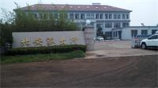

北安派出所

律师曾邮寄信件给检察院公诉人李霞：何立芳生命危急，不适合继续关押，要求变更羁押方式。李霞说：何立芳绝食不配合他们的工作，不同意律师的请求。

第三次是六月二十四日下午，律师来到普东看守所要求会见何立芳，开始负责人答应让律师会见，等请示李副所长后，李副所长以何立芳不说话为由，不让律师会见。

可是六月二十五日，即墨区法院却在何立芳生命垂危，不能说话的情况下，在普东看守所临时布置的提审室内所谓“开庭”。何立芳被几名法警从监管室内抬出来，四，五名法警把他按在椅子上，旁边一名法警不断的给他擦试鼻孔里进入的液体。

庭审过程中，何立芳神情呆呆的没有任何反应。何立芳的老母亲看到儿子被迫害得无法言语，当庭提出去医院给儿子看病，没人理睬。

公诉人李霞罗列的所谓“罪名”，把几个月一次何立芳外出悬挂“真，善，忍”「法轮大法好」「还我师父清白还大法清白」等横幅数量的多少包括一些个人物品，所谓的证人证言，下一年度何立芳全家指控江泽民的控告信，几年前何立芳被警察唆使在押犯殴打导致生命垂危，被监视居住后被迫离家出走作为构筑何立芳的依据。

律师针对公诉人的无理据称已有理有据的无罪辩护，并质疑了一年前所谓的证人证言的真实性。律师说：信仰是思想范畴内的问题，不会对社会构成威胁，要求当庭无罪释放何立芳。

庭审过程中，法官高斐一直被人不断的递纸条，交头接耳，言行失态。

据悉，有重置身份等级很高的男子在另一房间里观看监控录像。看守所内数十名特警，法警如临大敌，一名穿深红色便衣的男子一直对着家属录像。看守所外，一辆警车停在外面，几个警察坐在里面观察动静。

家属在六月二十八日曾电话联系法官高斐，正确看守所是不是在给给立立强制灌食中下了什么药？高斐说：这个我们不知道，家属要求保外就医，而高斐说让家人等判决。

即墨区检察院

即墨区法院

 回顧整個何立芳被迫害慘死的過程，可以看到，從610、公檢法、看守所到醫院、殯儀館，儘管每個環節都在掩蓋，而所有的細節恰好都在訴說著真相：政法委、610把何立芳定位重點目標，利用派出所誘捕了何立芳；又以非常快的速度對其構陷、非法開庭。從非法開庭時有兩個身份很高的人現場督導這一反常現象可見端倪。但何立芳堅決絕食反迫害。看守所除了野蠻灌食，還利用破壞中樞神經的藥物使其失去思考能力。反覆灌食導致何立芳健康進一步惡化，甚至肺被插壞出現生命危險。所以一方面放出要家人取保候審的煙幕彈，一方面火速把何立芳送進醫院，借搶救之名，實施活摘器官之實才是真實目的！

有相關人員分析說：何立芳之所以被送到城陽第三人民醫院「搶救」，一方面說明根本就不是真正的治療，另一方面是為了在小醫院裏不惹人關注，還有更重要的一點就是──這個醫院距離青島流亭國際機場只有不到十分鐘的車程──非常利於摘取器官後火速運往外地。

就目前而言，在中共嚴密封鎖的鐵幕及高壓下，調查整個事件的事實真相基本上是不可能的。但有一點不可置疑，疑團並沒有隨著時間的流逝而消除，而是隨著相關線索的不斷發掘，其本來面目會不斷的越來越清晰。天網恢恢，疏而不漏，所有參與了迫害法輪功學員何立芳的人，不管你是制定迫害計劃的，還是具體實施迫害的，都難逃罪責。

參與迫害何立芳的相關人員（區號：0532）：

610辦公室主任：王世榮（音）

副主任：宋俊道

即墨區法院

即墨法院負責法官：高斐　，電話：85559880　，手機：18562885256　15192667561

陳顯江，（院長）法務通號碼：18660257557 ，手機：13853299887，座機：85559127

趙紹先，（副院長）法務通號碼：18661751767，手機：13806397867 ，座機：85559806

劉承永，（副院長）法務通號碼：18562885568 ，手機：13853293568，座機：85559856

王平健，（副院長），手機：13506484229

國德錫，執辦，手機：13793218966

柳巧玲，執辦，手機：13730936835

朱珍良，專職委　，手機：13953231077

孫智勇，法警隊政委，　13326398887

王順，立案一庭，　15965577936　，書記員

陳正修，民四庭　，13730956067　，書記員

於敬波，辦公室，13792801172，審判員

於瀠，財務科，　13780613172

鄒澤福，財務科，15953388811，審判員

即墨檢察院　公訴人　李霞

即墨北安派出所所長：劉建生

即墨公安國保大隊　：

國保中隊長：李文勇　辦公電話：66583280　手機：13964276811（負責人）

陳起超、李新建

崔永國， 15963269616　辦公室053266583136　住宅053288528582　053288517298

王德波， 13789887788　辦公室053266583138　住宅053281728166

陳同山， 18765907851　辦公室053266583139　住宅053288586000

欒澤道， 13697686789

李文勇， 13964276811　辦公室053288683280

劉欣， 18678970765　辦公室053288683280

孫傳雙， 13853286697　辦公室053266583141

李風軍， 13864868670　辦公室053266583137

李金龍， 13386480008　辦公室053266583135

范景鵬， 13583280582

張萍， 13573821233　辦公室 053266583130　住宅053288538958

周濤， 13780619671

辛克勇， 13210286678　053266583139

王翠雲， 13969638887　053288593678　053266583138

即墨市政法委

地址：即墨市振華街140號，郵編：266200

辦公電話：0532─88552219 0532─88552373 0532─88551529

現任書記：牛潤之

副書記：付強 手機：13706302811 宅電：0532─88571838

綜治科科長 王永波 手機：13698682112

即墨普東看守所所長：李副所長 辦公電話：66578916（負責人）

即墨普東看守所 053282516215　053266583959

即墨普東看守所 所長 053282516217　053266583966

反×教偵查科　053266583128　科長 053266583126

即墨普東拘留所 13455228017　053266583972

普東第一看守所住所監察室 83011517

普東第二看守所住所監察室 83011523

城陽區第三人民醫院電話：0532-8787166，

院長：王岩明，13863960297

劉主任：13589380601

何立方所在的北安街道辦事處人員電話：

劉國棟，辦事處主任，13953280998

王平建，副主任，　13506484339

邴吉柏，副主任，　13792806108

王慧敏，副主任，　87597256

李巧鳳，組織委員，13625323616

周　斌，宣傳委員，15969807862

張方習，武裝部長，13969656908

張吉升，派出所所長，13806397617

於宗志，辦公室主任，13864838898

李化宗，經貿辦主任，13954237307

代旭東，城建辦主任，13953229613

宋庭范，民政辦主任，13791816555

李　旭，工商所長，13953281978

趙　源，供電所長，13806397238

王軍峰，交通所長，13176855055

孫文棟，網通公司經理，87580087

李瑞生，市北醫院院長，13969703202

 
<a target="_blank" href=#top><h6 align="right">回上方</h6></a>

<a name=16>
<h1 align="center"><b>给习近平时间平息政局？传美中协议遇阻</b></h1>

Axios报导，一名与川普谈判团队接近的消息人士透露，和中国的协议现在“由于香港立法而停滞不前”，并且需要给让习近平时间，让大陆国内政治平静下来。图为2019年2月21日，美中代表在美国举行贸易谈判。 (Photo by MANDEL NGAN / AFP)

 
【大纪元2019年12月02日讯】（大纪元记者许祯祺综合报导）美中贸易谈判是否能达成协议备受关注。Axios新闻网站12月1日引述接近美国贸易谈判团队人士提供的消息报导，美中贸易协议目前遇到阻力，需要给习近平时间去平息国内政治。

Axios报导，一名与川普谈判团队接近的消息人士透露，和中国的协议现在“由于香港立法而停滞不前”，并且需要给习近平时间，让大陆国内政治平静下来。

11月27日傍晚，美国总统川普（特朗普）签署《香港人权和民主法案》和《禁止向香港出口防暴装备法案》，以保护香港自由和人权，受到港人欢迎和感谢。中共对该法案生效则火冒三丈。

消息人士对Axios表示，与中国的“第一阶段”协议很可能最早在年底完成，川普有望推迟其12月份的关税计划，以保持该协议的有效性。

Axios报导说，了解美中谈判的另外两个消息来源表示，协议仍存在一些实质性障碍，包括川普将撤回多少关税，什么样的协议执行机制，以及中方将如何保证川普所说的大量购买美国农产品。

白宫顾问凯利安‧康威（Kellyanne Conway）11月26日也表示，强制性技术转让，知识产权盗窃，以及与中国每年5000亿美元的贸易不平衡，这些仍然是问题。

路透社11月20日引述贸易专家和接近白宫人士的话透露，美中“第一阶段”贸易协议可能会拖到明年才能完成。国家利益中心战略与贸易高级研究员、川普和小布什政府的前顾问惠顿（Christian Whiton）认为，如果谈判真的进展顺利，美国将暂停12月15日的加征关税；如果不顺利的话，美国将实施关税，这将使第一阶段协议的谈判拖到明年。

11月26日早上，川普在白宫回答记者关于香港区选结果后，是否向香港人民传达一些信息的问题时说：“我们和他们站在一起。” “正如你所知，我与习主席的关系很好。 我们正处在一项非常重要协议的最后关头，我想你可以说这是有史以来最重要的交易之一。 它进展顺利，但与此同时我们希望看到香港事态发展也进展顺利。”

参议院财政委员会主席、爱荷华州共和党参议员查克‧格拉斯利（Chuck Grassley）上周二对记者说，他相信与中方的初步交易可以在年底之前完成。

他说，中方邀请莱特希泽和姆钦访问北京，就贸易问题进行面对面的对话，如果他们（美方）看到“达成最终协议的真正机会”，他们愿意赴京。

Axios还报导，川普团队曾寻找可能的签署协议地点（包括爱荷华州和戴维营），但找到一个双方都能接受的地点不很容易。

<a target="_blank" href=#top><h6 align="right">回上方</h6></a>

<a name=15>
<h1 align="center"><b>香港人权法案生效 传亲共富商被拒入境美国</b></h1>

香港作家及传媒工作者陶杰透露，在《香港人权与民主法案》生效后，有亲共富商搭乘私人飞机前往美国时，被拒绝入境。图为纽约自由女神像。（戴兵／大纪元）

 
 【大纪元2019年12月02日讯】（大纪元记者陈俊村报导）在美国总统川普（特朗普）签署《香港人权与民主法案》之后几天，有消息传出，一名具有红色背景的香港富商在搭乘私人飞机前往美国时，被拒绝入境。

香港作家及传媒工作者陶杰日前爆料说，香港某个在政治界不算活跃但亲共的富商，搭乘私人飞机抵达美国，结果被入境官员请到一个房间谈话，3小时后被告知，不得入境美国，须原机返回。

<h3 align=center><a href="https://twitter.com/alicedreamss">香港法案生效，“禁止进入美国”的制裁也开始了</a></h3>

另有亲共媒体《大公报》、《文汇报》的新闻记者被美国祭出限制签证的制裁。香港大公文汇传媒集团的声明透露了这项消息。

<h3 align=center><a href="https://twitter.com/zhanglucy88">好消息，大公報、文匯報的新聞記者，已經開始被制裁</a></h3>

《香港人权与民主法案》的一项重点是，授权美国政府对特定外国人（包括中港官员）进行制裁，而制裁措施包括冻结他们在美国的资产、限制签证和拒绝入境等。

香港大学政治与公共行政学系荣誉讲师袁弥昌指出，尽管美国的制裁表面上对没有资产的人士不构成影响，但只要被列入制裁名单，任何与美国有业务来往的银行都不能处理相关人员的存款、转账等操作，效果形同冻结资产。

香港众志秘书长黄之锋在《香港人权与民主法案》生效后表示，这项法案标志着美港关系的新里程碑，以及美国对港政策的调整。这是众多港人自6月以来的努力和牺牲，才令美国政界对香港的关注急剧上升。

黄之锋说，众志成员会积极收集民众意见，尽快向美国提交建议制裁名单，也会继续游说加拿大、澳洲、英国、法国、德国等国设立制裁机构，形成骨牌效应。

<a target="_blank" href=#top><h6 align="right">回上方</h6></a>

<a name=14>
<h1 align="center"><b>将母爱升华为慈悲 油画《别离》获优秀奖</b></h1>

台湾选手刘又榕的油画《别离》，再现母爱慈悲壮美的一刻，荣获第五届新唐人“全世界人物写实油画大赛”优秀奖。（赵芬妮／大纪元）

【大纪元2019年12月02日讯】（大纪元记者赵芬妮报导）宁静的夜晚，一位年轻女子手持烛光，照亮了正在熟睡中的婴儿，也照出了她坚毅的面庞。台湾选手刘又榕的油画《别离》，再现母爱慈悲壮美的一刻，荣获第五届新唐人“全世界人物写实油画大赛”优秀奖。

20岁的刘又榕目前是一名大学三年级的学生，同时也在茑松艺术高中参加古典美术的师资培训，还担任该校的美术课助教。

她说，这幅油画是根据大陆法轮功学员一家三口的真实故事创作的。2000年的一天，大连法轮功学员曲辉为了给遭受冤屈的法轮功说句公道话，与妻子一同前往北京上访。不曾想，曲辉后被判一年劳教，关押在劳教所被迫害致高位截瘫，释放回家卧床13年后含冤离世。

“十多年来，她的妻子刘新颖一直守候着他，看到他们的生活影片，我特别心酸。” 刘又榕说， 刘新颖在非常艰难的情境下， 独立承担起照顾丈夫和小孩的重担，这种精神来自对信仰的锲而不舍。

《别离》中的画面就是刘新颖在上访前与襁褓中的女儿告别的一幕。油画中的烛光不光照亮了正在熟睡的可爱的婴儿，也映出女主角坚毅的脸庞。刘新颖在注视女儿的瞬间，眼神包含着无限的怜爱，那一刻的慈悲壮美在对神的坚定信念中得到升华。

“法轮功修炼者不是中共荒谬言论所宣称的冷漠无情，甚至放弃家庭去追求他们的信念。”刘又榕说，“其实他们在社会各个领域都是在做一个好人，无论在家庭中、工作中都要做一个优秀的人，但他们因坚持真理被妖魔化宣传，被说成不管不顾自己的家庭。”

刘又榕说，《别离》是她的第一张油画创作，2018完成，耗时6个月。当时她正上大学二年级， 有些传统的油画技法边学边画，材料媒介的调整也要一边研究一边做实验。

绘制这幅作品期间，她曾陷入画材调制的困难，自己做的调和油配方用错，直接用到画面中，结果在上色后一两个礼拜迟迟不干，用除湿剂也无济于事，后来强行将用错的调和油洗下来，导致整个色层不均匀，后来补色修复，才继续画下去。

她表示，作品从不成熟的草图到模特拍摄形成效果图，都是茑松艺术高中团队合作的结果，完成每一幅画作，体现了大家配合的力量 。

在作画技巧上，她尝试使用文艺复兴时期的传统画法：直接画法和间接画法。 她一开始采用间接画法，将素描因素和色彩因素分开处理，最后才慢慢用混合法。

刘又榕第二幅画《苏家屯之劫》也入围大赛。她介绍，这幅画是2019年完成，画幅是前一幅的两、三倍。

2006年被曝光的首个中共活摘器官的案例引发各界的关注，专家开始对事件进行调查，随后发现中共建立的一条龙系统，有计划地从事人体器官黑市买卖，最主要的受害群体就是法轮功学员。

刘又榕查阅了所有关于苏家屯的材料，以油画的形式表现了一位法轮功学员不顾个人安危，在磨难中依然告诉真相给民众，在发放资料途中被邪恶非法绑架，面临被活摘的危机。

刘又榕和《苏家屯之劫》，上方右侧67 × 82 1/2 in。（赵芬妮／大纪元）

本次大赛活动期间，她特意从台湾飞来纽约，参加了参观博物馆、油画艺术交流等活动。她表示，这些活动很有收获，让她更明确了复兴古典美术的意义，在今后的创作上，可以吸收借鉴历史上西方油画的构图、构思以及色调的控制。

“但艺术不是单纯的技术。”她说，“一位画家需要具备基本功、艺术修养和道德修养，三项缺一不可，都很重要 。”

“艺术之路很长，不是一蹴而成，真的要很投入，要慢慢去摸索。”她说。

<a target="_blank" href=#top><h6 align="right">回上方</h6></a>

<a name=13>
<h1 align="center"><b>【热点互动】香港法案 间谍外逃 中共烽烟四起</b></h1>

王立强投诚事件持续发酵。外界起底向心夫妇的红二代和军方背景。（新唐人合成）

 
 【大纪元2019年12月01日讯】在《香港人权法案》成为法律后，北京方面再次召见美驻华大使并声称要反制。不过外界认为中共并没有多少报复的筹码。

另一方面，王立强投诚事件持续发酵。外界起底向心夫妇的红二代和军方背景。那么美国通过人权法案，其它西方国家会跟进吗？间谍案对台湾的影响有多大？

嘉宾：唐靖远

电话嘉宾：台湾AIA Capital首席经济学家 吴嘉隆

主持：方菲

【热点互动】香港法案通过：谁会在第一批制裁名单上？王立强前老板向心成关键人物，间谍案拔出萝卜带出泥。

主持人：观众朋友好，欢迎收看这一期的【热点互动】，今天是11月29日星期五。《香港人权法案》成为法律之后，北京方面再度召见美国驻华大使表示抗议，并且声称要反制，不过外界认为中共并没有多少可以报复的措施；另一方面，‘王立强叛逃事件”持续发酵，那么外界现在持续起底向心夫妇的军方背景以及公司的情况。那么，美国通过《香港人权法案》，其它国家是否会跟进？间谍案对于中共打击和对台湾的影响有多大？今晚我们请来两位嘉宾一起来探讨这些热点问题，一位是在现场的时事评论员唐靖远先生，唐靖远先生您好。

唐靖远：主持人好，大家好。

主持人：好，谢谢。那么还有一位是通过电话和我们连线的台湾AIA Capital公司首席经济学家吴嘉隆先生，吴嘉隆先生您好。

吴嘉隆：主持人好，唐先生好，各位观众大家好。

<b>中共空言反制 但缺少筹码</b>

主持人：好的，谢谢您。观众朋友，也欢迎您在节目中间跟我们互动，谈谈您对这些事件的看法。好，那唐靖远先生我想先问您这个问题，就我们先来谈一谈香港的这个人权法案的通过。我们看到说人权法案通过之后，中共方面确实做出了一些反应，包括召见大使啊，包括一些言语上的这种表态啊。但是外界似乎觉得说这些都比较空，并不认为中共会有一些实质性的这样一些反制措施，跟我们谈谈您怎么看中共的这个反应？

唐靖远：就是首先我们可以看到中共这次的反应，这种强度，是超过上一次，就是两院通过这个法案的时候是吧。据说，有媒体专门统计了在9个小时之内，中共连续发表了51篇报导，这完全是狂轰烂炸。

主持人：就在不同官媒上加起来51篇。

唐靖远：这个力度是空前的，但是我觉得就是应了中国过去有句老话叫做，那么说得不好听一点，叫做就是“咬人的狗不会叫的”。

主持人：会叫的狗不咬人。

唐靖远：对，就有点这个意思。就你叫得很厉害，其实可能恰恰反过来说明中共确实是比较心虚的，就是它自己其实可能没有，它没有什么那个，就是有力的这种反制的措施。一个是我觉得就是我们看到现在（中共）官方，就是正式放风的，它已经有这种方式，就是说是可以禁止对就是推出这个法案的这些议员呢，就是禁止他们到港、澳地区。

主持人：这个好像只是《环球时报》的自己的一种放风。

唐靖远：包括我们看到也有放风说是什么加大对美国的人权状况的抨击等等，我觉得这些东西其实它都是一种象征性的措施。但是它真正在实质性的措施方面可能在两方面，它们其实是有一些手段。一个当然就是在经济领域，经济领域其实我们会发现，中共它处在一个比较尴尬的位置，就是它在经济领域能够报复美国的这些手段，其实和它就是在打贸易战的时候采取的这些手段是高度重叠的。也就是说它转来转去，它不外乎也就这些我停止购买你的产品啦，或者是把美国的企业列入什么实体清单啦等等，就是这些东西。

这些东西它在贸易战里面其实是已经用过了，而且它现在如果再要继续使用这个东西，它就会冒一个很大的风险，就是它很有可能使美国发生错判。就是你使用这种手段你来报复美国通过了《香港人权法案》，但是美国很有可能认为你是在破坏贸易谈判，破坏贸易协议，那就很可能使整个谈判失败，最后导致贸易战的升级。这个其实是中共现在它也非常不愿意看到的。

因为我们看到就是至少在两次，就上次法案通过以后，和包括这个川普签署之后，中共都特意出来。虽然就是抨击了，这个力度很高，但是它都始终是小心翼翼地要表一个态，就是这个贸易谈判不受影响。就说明它（中共）是对贸易谈判非常在乎的，这个是在经济方面。

那么还有一方面，就是在政治领域方面，可能它也许采取就是像这种联合这个⋯⋯像朝鲜啊、伊朗啊这种支持它们来给美国制造一些麻烦，可能也许这种事至少是一个可选项。但是我觉得这种可选项它的可行度也是有疑问的，因为现在不管是朝鲜也好，伊朗也好，它们究竟能够配合你中共配合到什么程度？这个其实是要打一个问号的，我们还要留待后续的一个观察。

其实我觉得现在在中共现在所处的一个客观的处境，这个《人权法案》一通过签署了以后，他就真的有点相当于一把刀悬在中共的头上。那么在这种时候，其实中共它的客观处境是应该采取“紧急止损”，就是怎么样让这个刀不要落下来，这个对它是更重要的，而不是说着急地急着要拿着刀去砍回去。就我觉得对它（中共）来说，它应该是比较清楚它现在这种处境。

主持人：好的，那吴嘉隆先生也请您谈一谈，您觉得《香港人权法案》成为法律，对于中共的影响会有多大？另外您觉得因为外界现在都认为说：中共的表态让外界解读为，它虽然对这个是要表示抗议的，但是它不愿意影响贸易谈判，您是不是同意这样一个判断？

吴嘉隆：基本上同意。我觉得习近平这边现在摆出的强硬的那个姿态，第一个主要可能是做给党内的势力看的，他是做给党内看，尤其是一些党内可能的反习的势力看，就是习近平不能在党内的反对派的那一方示弱，所以他摆强硬姿态。第二个他对美国摆的这个姿态，摆强硬是准备先硬后软，将来必须对美国做退让，签贸易协议的话，不被认为是一种屈服。所以他（习近平）必须在一个时候表现得很强硬，把美国的压力顶住，之后如果有签贸易协议，还是做其它的跟美国有达成什么交易的话，那么人们不会认为他是一种丧权辱国，他是一种屈服。所以他必须先硬顶住压力，后面才好做交涉。

再来，现在产生一个新的现象，就是国务卿必须每年对国会提出香港报告，那这种情况下，等于将来会产生一个现象，就是每年美国都可以对中共这边加压力，就是香港报告要提出来的时候，中共不得不做出一些比较放软的姿态，免得升高紧张对立，在香港问题上我是讲。所以将来如何应对一个有《香港人权民主法案》情况下的“美中关系”跟“中港关系”，可能还要花一点时间去摸索，看看怎么调整。就是每年如果中共对香港来硬的话，那美国这边可以提香港报告，这个就变成一把剑悬在头上。可能中共这边也要摸索一下，如何应对这个新的局面，但短期内的话，摆出强硬姿态只是针对党内，也针对美国预备做交易之用，这是我的看法。
其它西方国家是否会跟进制裁？

主持人：嗯，只是口头上的。所以他这个有点像当时“最惠国待遇”和“人权”挂钩的再次的这样一个形势的表现，所以如果是这样的话，我觉得就是下一步很多人都在关注国际的反应。因为其实美国通过这样一个人权法案之后，有人说这是有点像那个蝴蝶效应，那香港的这些抗争者他们现在也计划要游说不同的国家，不管是英国、加拿大，还是其它国家，就是通过类似的法案。这方面您觉得国际的反应是什么？您觉得其它国家会不会跟进呢？

唐靖远：其实我们现在可以看到已经有一些国家在开始跟进了，首先第一个就是荷兰，荷兰其实已经通过了它自己那个版本的《马格尼茨基人权问责法》（授权政府对违反人权及国外显着腐败人士实施制裁），而且是明确提出来他们就是针对香港的官员和警察，他们可能会去实施一些制裁。

那么除了这个荷兰它的举动，它是比较快的动作，那么欧盟里面的国家还有就是像英国。英国我们看到至少是，就英国的外交次长叫做惠勒（Heather Wheeler）的，她就是主管亚太事务的，她就直接提出来就说是英国政府已经在开始，就是酝酿讨论这样一个类似的法案。就是类似于美国这个香港人权法案一样的，那么目标也是当然是针对着香港这个问题来。而且英国和还有日本，英国和日本现在都有大规模的这种民众在发起连署，日本据说已经都有了十多万了。

主持人：是。

唐靖远：十几万，这个对日本其实也造成了相当的这种压力，甚至现在我们看到新闻都有报导说习近平可能连访日都可能会要受到影响。还有就是我们看到加拿大也是一样的，加拿大现在有至少是60多位跨党派的议员，他们已经同意就是说要在国会，去推动通过加拿大版本的《马格尼茨基人权问责法》。然后还有包括欧盟，就是欧盟我们知道它整体上，欧盟很多国家它其实都有通过自己的一些法案，但是欧盟整体上它也是可以通过法案的。

所以欧盟其实已经都做了一步了，它们在7月分就已经通过了一个禁止欧盟国家向香港政府去出售镇暴的装备。就这个法案的内容其实就已经和美国这次签署的那个，因为这次川普签署两个法案嘛，第二个法案就是这个香港保护法，内容其实是差不多的，也就是禁止销售这种镇暴装备给香港。所以我们可以看到就是在国际社会它其实已经⋯⋯尤其是西方主要这些民主国家，都在开始集体做出一些这个行动。

这里面其实除了美国和英国算是直接的关联方，和香港有直接的这种关联的话，其它的国家其实是必没有直接的关联的。但是它们为什么也都集体地开始行动？我觉得这背后它有一个重要的因素，就是越来越多的这种西方世界的这种自由世界的国家，它们认识到香港问题，不仅仅是一个简单的中国和它的一个特别行政区之间的内政问题，它们越来越意识到香港真的就是“新冷战时期的一个柏林”，它代表着两种截然不同价值观的一个尖锐的这个“对立和冲突”。所以我觉得这种⋯⋯而且它们从这个中共对香港的打压，已经明显地感觉到一种危机感，就是中共这种极权体制一旦它扩张起来它会做出什么样的事情，对这个民主社会。

尤其是我觉得我个人有一个观察，就是中共现在对香港的采取这种极权打压的这种方式，它们其实是在做一个试验，就像它们在新疆这种建集中营做大规模的试验是一样的，那个是为了见证它整个“数字极权”的这一套体系，那么现在它们想做一个什么样的实验呢？就是看看它们把这一套“数字极权”的体系，能不能够顺利地在像香港这样的一个自由社会，能不能够建立起来？能不能够推广？如果在香港它们（中共）获得了成功，那么香港就会成为第一个样本，下一个可能就会轮到台湾，再下来可能就会沿着一带一路它把这个模式⋯⋯它不是推广它的中国模式吗？其实是“中共模式”，把这个模式可能推广到全世界去。所以我觉得其实香港对中共来说它们为什么这么看重它，它其实是有这么一个内在的逻辑在里面的，它是非常重视这一块的⋯⋯，对！

主持人：嗯，是，所以我想问一下吴嘉隆先生，就您怎么看这个国际的反应？就是它们现在这种反应是一种姿态性的、象征性的？还是说随着美国的这个坚定程度，它们这些也会很快地成为一种行动上的一个推进？而另外就说它这个东西对于中共和港府会造成多大的压力？

吴嘉隆：好，所以这里两个问题，先讲第一个。那从美国的立场来看呢，这个相当于它的“联合盟友”，“共同围堵”，就是从三个角度：一个是“利益”，尤其是经济利益、贸易利益；第二个是“安全”，国家安全；第三个是“价值观”，对于人权、民主、自由的价值观。从这三个角度来讲，美国等于让盟友认识到说香港问题不是一个个别问题，不是一个单一问题，中共对香港的做法或者对台湾的做法一定考虑进来，等于是向外扩张，将来会是用到其它国家，就是呼应一下刚才唐先生的说法。

这个对香港对台湾的渗透和监控这个模式，“中共模式”一样会用到一带一路国家还有其它国家。那么在国外部分的话，英国、美国是首当其冲，再来呢加拿大、澳洲还有日本，那其实欧盟那边德国、法国、荷兰这些都可能会跟进。所以这个东西会变成全球《马格尼茨基人权问责法案》的一个鲜活的一个应用，就是从香港到台湾都是。那么所以呢对美国来讲，它内部已经完成了内部整队建立共识，就是把中共对外扩张看成是美国国家利益的首要威胁，然后这个叫内部整顿，这是第一步！

第二步就是“联合盟友、共同围堵”，这第二步。所以呢现在已经透过香港这个事情，让很多国家、其它国家也认识到，基于“利益”，基于“安全”，基于“价值观”必须对香港这个问题特别重视，所以它们跟进的话可能性是满大的。那么直接冲击的就是英国的这个部分，因为香港很多特区政府很多高官拿英国护照，还有美国这边中共也不少官员都是家人跟孩子都在美国这边，所以呢国际上的配合这个可能是很重要的一步，是这样子的。

主持人：嗯，好⋯⋯。

吴嘉隆：那么对中共影响的部分呢，这个法案一通过以后，个人制裁的部分会启动。就是港警的部分，过度使用暴力，警察暴力的这个部分会调查，那么估计呢中共可能会弃小保大，就是也许会让一些港警、武警、公安出来牺牲一下，可能要做一些姿态，把一些过度使用暴力的那个港警或者武警，拿来牺牲一下，交代一下，有可能。因为否则的话这个特区政府的制裁对象至少五个人到十个人，是少不了，说不定还可以到三十个人！

那至于那个港澳办、中联办，这些相关的一些官员的话，可能都会有制裁的可能，就是被限制入境还有冻结资产等等⋯⋯，而且这个冻结如果再严重的话，他们的银行⋯⋯他们来往的银行被冻结，也会被卷进来，最后你即使不是在英国，不是在美国，在其它国家的话，只要这个银行是跨国银行，那么它可能也会把你冻结掉，所以对于相关这个人员的话这个是一个威胁，所以有可能中共会弃小保大。

<b>川普战略上坚定  战术上灵活</b>

主持人；嗯，好的。所以关键就说下一步的执行啊，那我想再接着问一下吴嘉隆先生，这个有关执行的情况？就是我们看到说川普他在通过这个法案的时候呢，他这个声明中有这么一段话，他说：这个法案中有一些条款和总统的这个行政权力是有冲突的，他说我在执行的时候呢我会根据我的行政，宪法赋予我的权力来判定我怎么执行。所以在您看来就是说到底川普当局这个行政当局，它执行和推进这个法案的力度会有多大？

吴隆嘉：你这个问题很好，就是说川普呢他其实是两面性格，他在战术上是商人性格，很灵活有很多花样，可是他战略上是军人性格，坚定不移！所以呢他想在⋯⋯像这个法案的话，他一定会签，可是呢他故意拖时间啦、放风声啦，让人家以为他要做交易。

据说有一个说法是说，川普有可能有条件不签，不签署这个法案，什么条件呢？他要习近平公开承诺不派解放军武力镇压香港，如果习近平公开做出这种承诺的话，川普来不签这个法案，据说从川普的算盘来盘算来讲，其实是收获更大！那么习近平是中共中央军委，他要不要动用解放军还要看美国总统脸色，这是很严重的事情，所以估计习近平完全不可能答应，不答应以后川普就坐下来签署了，我有跟你开条件，我们谈不成没关系，他就签。

所以川普在很多法案上可以额外地玩一些谈判的这个手法，有谈判的操作空间，那这个东西国会没办法，国会是众人集会场所。那川普很会玩谈判，所以他把一个现成的法案他直接签了好像就没事了，对不对？！可是他拿来做点文章，我们来谈一谈啊，我可以不签，然后交换条件是这样、那样，那中共考虑的结果无法接受这个条件，那川普还是回来签，所以战略上没有变，他签了！可是战术上他可能有花样，那基于这个花样的话他会说基于总统的外交职权，他可能会做一些这个弹性的灵活的运用，他可能是指这个意思。他想发挥他个人的谈判技巧、谈判手腕，来处理一些外交问题，是这样。

主持人：嗯，好的！那唐靖远先生您觉得从行政当局者来讲，在您的看来，川普当局要推进和执行这个法案的这个意愿和决心有多大？然后力度会有多大？

唐靖远：实际上我觉得他这个推进执行力度，就他的意愿肯定是非常大的，这个绝对是没问题的，我不怀疑这点。只是说就是大家现在比较关注的他说了⋯⋯他做了一个补充说明嘛，那么说他根据什么行政当局权力等等⋯⋯说了这样一番话，大家觉得他（川普）是不是埋有一些伏笔。其实我觉得他说这个话的内涵啊，可能跟一个因素有关，就是我们知道，就是这一次通过的这个法案他是根据1992年香港的这个政策法⋯⋯

主持人：香港关系法。

唐靖远：根据那个法案，就是他做了个修订之后来通过的，但是呢就会发现，过去1992年的那个版本和现在修订之后的版本，在总统和国会之间的某一些的权限归属上面有差异。比如说其中最主要的一个就是，我们都知道这个法案它规定说每年要对香港的自由状况要进行评估，如果说香港还是一个自由、自治的一个城市，那么它（香港）就可以继续享受它的优惠的地位，但是如果说这个评估不达标，那么可能就会取消这个地位。在过去1992年这个政策法，香港政策法的那个规定，这个权限其实是由总统，完全由总统来行使的，就是总统他随时可以根据评估的情况取消香港的优惠地位，但是呢如果香港的这个自治地位评估结果改善，总统也随时有权力把它（优惠法案）恢复。那么总统在这个里面就是他完全可以根据自己的，就是这个是宪法赋予他的权力嘛，因为这是属于外交事务，就是属于行政权力，他只是需要咨询一下国会就行了，但是这一次通过的新法案在这一点上有所修改。

主持人：嗯⋯⋯

唐靖远：就是他在这里面刚才吴先生也提到了这一点，就是他要有每年由国务卿去作出一个评估之后把这个报告提交给国会，然后由国会来决定香港的这个状态之后要不要再立法取消给香港的这个优惠的待遇啊等等这些。那么这样一来就会出现一个问题大家可能就看到了，究竟是应该是总统说了算？还是应该由国会说了算？这个里面确实就存在一个潜在的一种矛盾、一个危机，所以我觉得川普他说这个话，就是说根据宪法权力赋予他外交的什么什么之类的。

主持人：是。

唐靖远：他说这个话其实我理解他是有这么一份涵义在里面，就是有一点⋯⋯中国人的老话讲，叫做什么叫做“丑话说在前头”。所以呢，他就是说这个法案我还是签，我照签了，但是呢我丑话说前头，这个地方是有冲突有问题的，将来这个地方可能要是真出现问题了，那我按照宪法赋予我的权力，还得我来说了算。

主持人：对，就是最终总统说了算，但是你国会可以提个推荐，比如说你说，哎，我认为它已经没有足够的自治了。

唐靖远：对，我觉得他其实是有这样的一个意味在里面，因为宪法是最高法嘛，你国会制定的任何法律你不能够和宪法相抵触相冲突的，所以我觉得他是有他的这么一层涵义在里面。

<b>谁有可能在第一批制裁名单上？</b>

主持人：那么如果说他推荐执行的话，因为现在当他这个声明一出来之后，我们看到卢比奥参议员的办公室就已经发出一份声明，当然是赞扬川普总统签字，最后一句话就是说：“我期待和行政当局去推进、去执行这个法案”。所以呢从执行上来讲，很多人就是已经⋯⋯包括香港的抗争者他们已经在开始拟名单了，所以在您看来，谁有可能在这个第一批被制裁的名单上呢？

唐靖远：第一批名单我是这么来判断它，它最直接相关的就是港人最关心的那个“五大诉求”。这五大诉求里面你看提到就是首先是林郑要下台是吧，然后是对警察⋯⋯特别是警察是涉及到三条，这个要求要“独立调查”、然后追究这个“警察的暴力”、然后就是这些还有“抗争者都是要无罪释放”等等，它其实也是跟这个警察的暴力、就是整个司法系统是直接相关的。

所以我觉得如果从这个角度去观察它，他们如果要拟定第一份这个制裁名单的话，很可能就是在这几个系统里面去产生。就是第一个行政当局毫无疑问就是林郑月娥很有可能会列在里面；第二个就是这个整个“反送中运动”的始作俑者，比如说这个律政司司长郑若骅，还有像这个就是保安局长李家超，像这些人，我觉得他们很有可能就是第一批在列在名单上面的；还有就是包括代表着警察暴力的，尤其是警队的高层，像卢伟聪啊、还有就是像那个勾结那个白衣人是吧，勾结那个黑社会势力，来⋯⋯

主持人：何君尧。

唐靖远：来实施这种⋯⋯对，像何君尧这种人，这类的⋯⋯甚至包括新上任的警务处长叫做邓炳强这一类的，我觉得他们的概率可能都是比较高，就是很可能会被列在第一批的这个名单里面。

主持人：所以您觉得不会有中方的官员？

唐靖远：喔，对，中方的官员我觉得它可能⋯⋯这个就涉及到一个问题，就是刚才我们说其实《香港法案》它的这种⋯⋯美国在运用它的时候它其实是有分寸的，它完全可以根据中方的一些反映，它们如何去对待香港有没有改善，然后来可以做出一些精准的打击，因为香港法案它纯粹就说是两方面嘛，一方面是就是针对给香港的待遇。

主持人：对。

唐靖远：整体的；另一方面是针对个人，给个人的待遇。那么给香港的待遇可以说是“大规模杀伤性武器”，一次性就给你全搞掉了；那么针对个人的呢，它是属于这种精确打击。我觉得从这个角度上讲，美国很可能是最先会采用这种精确打击，就是不至于说一上来就弄的局面就没有余地了，无法收拾了。

<b>王立强案的关键现在已经是向心</b>

主持人：好的，反正人权法案的这个后效应应该也是会持续展开，所以我们也会持续关注。那今天节目另外一个也是很热点的话题，我们想来谈一谈这个间谍案件。那吴嘉隆先生您这个在台湾，所以我想我们观众也很好奇就是从台湾人的角度来看啊，您怎么看这个“王立强间谍”这样一个投诚事件？那现在中共官方也出了很多的信息啊，不管是什么认罪视频啊、还是什么什么的，那您怎么看这个真假的问题？另外您怎么看这个整个事件这样一个发生？

吴嘉隆：好的，谢谢，现在的问题先直接讲，就是王立强本人倒不是重点啊，重点应该是到向心、龚青夫妇啊，以及他们背后的那个中共的情报作业、情报系统。那么我现在讲回台湾的情况是这样子，就是原来国民党的那个候选人，总统候选人韩国瑜，他去年11月24号那个地方选举的时候，在高雄市长这边是大赢。因为高雄市原来是绿色长期执政，绿营长期执政的地方，那国民党基本上是少数党，就是它会输但也不是⋯⋯它会输一点它赢不了。但没想到你如果这一次韩国瑜如果在高雄市长赢个两三万票也算赢了，他赢15万票，这表示这里面有很多的是绿营的支持者来投过来的，那为什么会这样呢？

因为韩国瑜的那个竞选主轴叫做经济与民生，或者叫社会阶级，他号称代表庶民。那么国民党呢是统派的精英党，向财团靠拢；民进党是独派的精英党；那么庶民这边整个空掉，没有人代表庶民。所以韩国瑜以庶民的姿态，就是草根的姿态出来以后，他同时得到统派跟独派的这个草根社会底层的支持，这是他那个竞选主轴停在社会阶级、经济民生这个时候，那韩国瑜这边就有票，而且他的民调是很稳定的领先，一直到今年上半年都还是这样。

可是这一次总统大选的时候，竞选主轴被抽换了，换成国家安全跟两岸关系跟那个主权地位的问题，这个东西就不是韩国瑜的那个强项。到目前为止韩国瑜、郭台铭、还有柯文哲都被列为亲中亲共的，只有蔡英文算是不是那么亲共的，是反共的。所以以这个国家安全这个主轴来区别总统大选的话，划分界线的话，那韩国瑜这边的优势整个不见了，尤其是香港反送中6月初爆发以后，韩国瑜的民调跟蔡英文的民调出现交叉，韩国瑜的民调就一路走衰到现在。原本在这个之前，2月、3月、4月的时候，到5月的时候韩国瑜都还是赢的；然后因为香港的这个问题，整个台湾竞选主轴被抽换，不再讲社会阶级，而是讲国家安全主权地位，那么这种情况下产生了一个问题就是，在国家安全跟两岸关系上要定位是⋯⋯就是要把对岸大陆看成是朋友，于是发展善意，还是敌人？有敌意？是这个问题。

结果呢，台湾基本立场是不能跟大陆为敌，可是也不能跟中共为友，是两个微妙的处境下在走钢索。国民党是希望在两岸关系中有善意、培养善意；那现在民进党拿这个王立强这个间谍案，等于在两岸关系上注入敌意，就是对方对我们有敌意要来渗透、要来影响我们的大选。所以呢在这种情况下，美国的这个立场等于是利用这个案子爆发以后，美国的方向就是改变国民党，就是改变国民党的两岸政策、两岸论述，要回到之前民主反共这个路线。国民党当然要强调民主可是也要强调反共，不能那么亲共，那改变的方法就是把中共对台湾的渗透、这些企图，对台湾要这个⋯⋯影响台湾的政治、内部政治这些作业，把它暴露出来。所以这样做的结果呢就是希望⋯⋯美国希望的是在台湾出现两个反共的政党去轮替、去竞争，而不是一个亲共一个亲美这样的竞争。

因为美国有一个问题就是它虽然希望民进党执政，但是它也不能让民进党长期执政，为什么？因为如果让民进党一直执政的话，那么对岸中共那边可能会觉得和平统一绝望，于是可能会开始做军事冒险，考虑那个武统的必要性、必然性。这样的话对美国来讲也不是、对台湾来讲也不是好事情，所以美国必须让民进党执政，但是偶尔也还是要让国民党上台。那可是呢如果国民党亲共的话，那美国卖给台湾的精密武器可能就会流落到对岸去，对美国来讲非常不放心，所以美国现在希望国民党调整这个立场、调整论述，在两岸关系上回到当年这个蒋经国时代的反共路线。那如果这样子的话，美国可以接受国民党重新上台执政，变成两个反共的政党在台湾去竞争执政地位，这样美国可以接受。那所以呢这个王立强这个案子，马上直接影响到台湾的就是在两岸关系上到底是要善意为先还是敌意为先？敌意为重？这样的一个问题。那民进党把它操作对岸对我们充满敌意，那国民党的不分区提供了这个⋯⋯所谓被染红的亲共的人士，其实国民党的本意是要跟大陆保持友善、善意，那可是这个间谍案把它破坏掉了。

主持人：好的，我想问一下，回到您刚才说的韩国瑜啊。因为我们要讨论的如果说这个间谍案对台湾产生了客观影响，我想问您一个问题，因为王立强呢他在报导中有说他当时参与了去年“九合一”的这样一个操作，所以通过捐款、通过网路的水军去支持韩国瑜；那么这方面就是好像西方也有一些不同的这种研究，研究结果呢是当时确实是有不少网军去支持韩国瑜；那韩国瑜本身他在经济方面呢，我有见到一个录像，就是有记者去追问他说：你对高雄这个经济要怎么样做？你有什么样的一个方案？结果他一直没有回答这个方案。所以就是说王立强所透露的这个网军的支持是韩国瑜上台的主要原因，对于这点您怎么看呢？

吴嘉隆：它这等于印证了原来市面上的揣测，原来大家怀疑那些账号可能是大陆网军，帮韩国瑜制造网路的流量跟那个声量，那么现在这个猜测等于是被这个间谍案的说法印证了。所以原来是已经有这个猜测了，因为大家怀疑应该不会是台湾这边网友做的啦，应该不是网友的反应，因为从它（网路）的用字啊，从它（网路）的简体字，从它（网路）的一些用语上来判断，应该不是台湾这边。

这个以前只是揣测，现在王立强这么一讲出来，它们（中共）怎么操作这么一讲出来，等于印证这个揣测。那么这个表示说这样的话，等于是中共在台湾去年选举，先排演了这种网路的攻击，那么这样的手法将来会应用到明年美国大选一样，会有那个网军出来，然后现在的话是用到总统大选，所以呢这种操作手法如果有效的话，估计中共当然会一再地、这个精益求精、一再使用。

可是这样一来的话，等于是让民进党的那种诉求就是两岸当中要保持敌意，等于是得到印证得到支持：你看吧，我们说的没错啊！他们（民进党）会对选民这么讲。不是告诉你了吗？它们（中共）就想这样干。所以这个间谍案的这个事情，真的就是像我刚才说的，就是把“中共对台湾的渗透监控这些给表面化了”，所以从香港到台湾这种做法会引起各国的警惕，同时也会引起美国的警惕。

我这边补充一下就是，这一次美国、澳洲、台湾做了情报交流，才会有这么迅速地把向心夫妻在这个桃园机场拦截。所以对美国来讲它要把澳洲拉回来，因为澳洲原来有亲中的那个总理嘛，现在改成亲美的总理。那么这里有一个重要原因是因为那个大陆把台湾的两个邦交国，南太平洋岛国“所罗门”跟“吉里巴斯”在9月的时候抢过去。他们跟台湾断交，那麽这两个国家就在澳洲的门口，对澳洲的国家安全来讲有重要影响。

澳洲是美国的“印太战略”的重要角色，澳洲是“印太战略”里面的一个很重要的一个国家。国家安全的问题，因为中国大陆把手伸到“所罗门”跟“吉里巴斯”，那麽这个东西对澳洲有很大的影响。澳洲跳起来，所以美国现在等于要稳住澳洲，把澳洲拉回来⋯⋯这样子。

然后这个呢，中共进入这个“所罗门”跟“吉里巴斯”有可能会在那边建立军事基地，给他们更大的援助等等，那麽美国也要防守中共对第二岛链的渗透，它（美国）确保它地缘政治上的传统优势。所以对于南太平洋岛国的争取呢，美国可能是接下来要做的，这个东西符合澳洲的国防利益国家利益，所以这一次等于透过这个“间谍案”把美国、澳洲、台湾给连结起来。不只是情报连结起来，这个可能会有更紧密的合作关系，是这样子补充完毕。

<b>向心的红二代和军方背景</b>

主持人：好的，谢谢吴先生，那唐靖远先生所以刚才吴先生提到一个很关键的点，就是现在这案件的看点已经不是王立强了，已经是向心夫妇了，那媒体这几天似连续起底了他们的背景和公司的一些情况，跟我们介绍一下事情现在的进展。

唐靖远：现在其实这个最新的进展主要是在两个方面，一个方面就是这个“中国创新投资公司”，这个公司现在被澳大利亚的一个独立记者他写了一份调查报告。他发现这家公司在11月初的时候，突然这个“中国创新”它旗下有五家子公司，它突然间就悄悄地关闭了四家公司的营运，也就是说基本上它绝大部分的业务都停了，而且这个时间点上都是比较巧合的是什么呢？10月底的时候王力强就是正式地向这个ASIO这个澳大利亚的情报机构宣誓作证，然后在11月初马上这个“中国创新”这几家公司就关闭掉了。这个是一个比较蹊跷的信号、一个现象。

那么第二个，就是“向心案”本身，“向心案”我们看到其实它已经有了很多新的进展。首先第一个就是他们，向心这个人本人的这个身份，现在被挖出了很多条线索，都跟这个中共的红二代确实是有关系的。首先第一个就向心他本人曾经是担任那个邹家华的秘书，邹家华他是什么人呢？邹家华他的妻子叫叶楚梅，叶楚梅的父亲就是叶剑英，也就是说邹家华相当于是叶剑英的女婿，这个是第一条线。那么第二条线就是向心他建立的“中国创新公司”被那个刚才那个我们说的那个记者是把他的这个独立调查报告发现，“中国创新”的上级公司控制它的是中国那个“光大集团”，而光大集团的那个执行董事兼它的副总经理就是薄熙来的大哥叫作薄熙永的，所以这个就是属于第二条线。那么第三条线就是向心本人他曾经在“国防科工委”上这个工作过嘛，那么这个国防科工委他在那儿工作的时候，他的直接的老板他的直接的上级就是叫作聂力，聂力是聂荣臻的女儿，所以⋯⋯

主持人：全是红二代。

唐靖远：对，聂力的丈夫叫丁衡高，他其实是中共的上将，也都是，不但都是红二代而且都是有军方背景的。所以这个是一方面，就是他向心本人被挖出这么多红二代的背景，并且说明他绝对不简单，这个是一方面。另一方面就是他在台北被发现，不是这个购买了有三套这个豪宅嘛？其中的有一个这个在第十层的那个，他是买了两套豪宅以后再把它打通了，打通之后那据说就出租给了一个年轻人。这个里面有一个非常奇怪的地方就是，按说按照他们的市场价格，像这样一套豪宅出租出去的话，这个价格至少是要40万（新台币）就每个月的租金，但他现在只收的是20万（新台币），就只有正常价格的一半。

这样出租给了一个年轻人，而这个年轻人被发现是他就是开设的网路公司，而且他这个网路公司营运了好几年，它的地点就在台北。但是呢查它（网路公司）过去的这个营运的情况，过去都业绩平平，唯独就是在去年，突然这个业绩就暴涨，一下子达到了10亿之高，这个是一个非常不寻常的现象。因为去年刚好就是台湾不是一个“九合一”，吴先生提到那个“九合一”大选嘛，当然就是这个就是我们看到媒体目前透露出来的一部分的情况。其实如果说再深挖下去的话，可能我相信越来越多的这样的证据会浮出水面。

主持人：是。那我很快问一下，您怎么看中共方面的回应？一方它对王立强本人它公布了一些认罪视频啦什么，法庭庭审的视频，然后另外一方面好像最新《环球时报》也发文章说向心只不过是一般商人啊，他也有过这种投资啊或者是那个官司纠纷啊什么的，那您怎么看中共提供的这些讯息呢？会不会给他（王立强）那个可信度打上问号呢？

唐靖远：首先第一个对这个视频呢，我个人认为是有很多的疑点，第一个呢，是一些常识性的疑点，就是这个监控视频我们都知道如果是监控视频它必须有日期和时间的，可是这个视频里没有。第二呢，其实稍有常识的人都知道，在中国如果说是这个如果上法庭上法院，这个判决这个嫌疑人的背后、被告的背后一定是要站两个法警的，但是这个视频里面只有一个，只有一个警察，这是一方面。

那么另一方面的就是对这个王立强本人，我们都知道那个画面视频，画面是声音和他的容貌都是很模糊的，他的正面只有二秒钟的时间，非常模糊你看不太清楚的；第二一个呢，就是矛盾的地方，这个视频里面的王立强他说他自己是在读大学生，但是呢中共自己的官方媒体发稿的文章说：王立强是在2015年就已经毕业了，因为这个视频是2016年录制的，这不就矛盾了吗？你究竟是毕业还是没有毕业？还有就是这个判决书说这个王立强他这个诈骗是13万元（人民币），但是这个视频里面又说他他这个诈骗是12万元，就你连一个最基本的数据都没有搞清楚⋯⋯

主持人：就是很多疑点。

唐靖远：很多的的疑点啦，就是你对不上号。那么第二个问题，就是你刚才提到的问题就是说，关于他这个⋯⋯。

主持人：就是《环球时报》又⋯⋯

唐靖远：对《环球时报》它发了这个文章，就是来为向心，其实它的意思就是说“向心只是一个普通的商人”，我觉得首先这有二点可以观察的。第一个，《环球时报》发出的这篇文章，正好就是向心这个案子由“他”字号改为“侦”字号这个是几乎在同一天时间，什么意思呢？

主持人：性质升级。

唐靖远：对！我们都知道，在台湾他们在起诉的时候，“他”字号其实意味着这个犯罪事实和犯罪嫌疑人还不明确，但是一旦改为“侦”字号就意谓着“犯罪事实和嫌疑人都是明确的”，也就是说这个是一种态势的升级，那么换句话说我们可以理解为台北的检方已经会拿到一些相当的实质性的证据了。所以在这个时候《环球时报》出来发篇文章来去替他（向心）洗涤，我觉得这个时间点应该有点太巧合了。

主持人：是，据说现在台湾警方已经拿到了一些他（王立强）的全部的声明，声明多少十几页声明，可能里面还有更具体的信息。所以这个案件我估计还是会持续发酵，就像刚刚吴先生说的，现在这个可能美、澳、台这个情报机关，现在是开始连在一起了。

唐靖远：对！因为我相信就是向心这个案子，他其实也是比较巧合的，他刚好到了台湾之后，然后这个事情就被曝光出来，我觉得这背后可能也许有“人为安排的因素”。

主持人：好的，好，非常感谢！那我们也感谢吴嘉隆先生跟我们连线，也感谢观众朋友的收看，我们还是下次节目，再见！

新唐人《热点互动》制作组  #

<a target="_blank" href=#top><h6 align="right">回上方</h6></a>

<a name=12>
<h1 align="center"><b>十万行恶者上恶人榜 震慑中共人权迫害者</b></h1>

2019年11月，明慧网恶人榜问世，迄今为止，共搜集了105,580名参与迫害法轮功学员者的名单。（明慧网）

 
 【大纪元2019年12月01日讯】“我没打你们吧？我没骂你们吧？不要通报我，不能不让我家孩子出国。”黑龙江某市一看守所释放了被非法关押15天的四位法轮功学员。他们在该市散发的传单里包括了美国对人权迫害者的签证新规及移民政策等内容，看过传单的当地国保、“610”人员深感震惊。

2019年7月27日，山东寿光市侯镇两名法轮功学员外出讲法轮功真相，被潍坊市某派出所警察绑架，第二天就被放回家。该派出所警察读了他们散发的真相资料中的两个单页传单（美国审核签证的通告），明白了真相，释放了学员。

明慧网在2019年5月31日发布的《通告》指出，美国政府意在更加严格地审核签证申请、对人权及宗教迫害者拒发签证，包括移民签证和非移民签证（如旅游、探亲、商务等），已发签证者（包括“绿卡”持有者）也可能被拒绝入境。

美国国务院官员告知美国法轮功学员可以提交迫害者名单，因而《通告》中呼吁海内外法轮功学员搜集、整理迫害者名单。

在法轮功学员反迫害20周年之际，即7月20日前，美国法轮功学员已将一批恶人名单递交给美国国务院，要求根据相关法律将他们列入特殊名单，对其拒发美国签证、禁止其入境。

11月15日，明慧网宣布，明慧网副网恶人榜已问世（恶人榜），迄今为止，共搜集了105,580名参与迫害法轮功学员者的名单，他们的个人信息和恶行等也被记录在案。

11月底，美国、加拿大、英国、澳大利亚及新西兰的法轮功学员将最新整理出的一批迫害法轮功的恶人名单递交给本国政府，要求依法对这些恶人拒发签证，甚至冻结资产。

<b>什么人被列入“恶人榜”</b>

明慧网报导，美国国务院对迫害者名单有一个新的调整，即，对严重侵犯人权的恶行（如酷刑、殴打），一个官员只要是恶行实施单位的负责人，即可列入惩罚之列，而不需像以往那样证明此官员对某次具体恶行下达了命令或进行了指挥。

美国国务院官员还强调，他们不看重迫害案例的数量，而看重具体事实，只要某恶人有一个案例具备足够的具体事实的描述，就可将其放入特殊名单。

在过去20年的迫害中，中国大陆各地、各类、各级人员犯下严重迫害恶行的人为数众多，其中具有代表性的恶人会被收录在案。

在今年7月份法轮功学员向美国国务院提交的名单中，涉及的人员有中共宣传部门负责人，有各级政法委、“610”（专门迫害法轮功的非法机构）负责人，有涉嫌活摘法轮功学员器官的医生、监狱系统的负责人、法官、劳教所警察。既有直接实施迫害者，也有罪行策划者。例如：

刘云山，曾任中共中央政治局委员、中央书记处书记，中宣部部长等职务，从1999年6月起，就在江泽民一手操纵成立的中共中央处理法轮功问题领导小组（“610”办公室即为该小组执行机构）分管反法轮功宣传。

刘云山利用其掌控的宣传机器，不断用各种谎言诋毁诬蔑法轮功，煽动民众对法轮功的仇恨，配合中共的镇压，达到从名誉上搞臭法轮功的目的。

黄洁夫，中国器官捐献与移植委员会主任、中央保健委员会副主任、中共前卫生部副部长，是中共卫生系统活摘法轮功学员器官的重要组织者，他个人直接参与器官移植，数量很大，是中共大量活摘法轮功学员器官的涉案主犯之一。

贾福军，辽宁女子监狱现任监狱长，原是辽宁省监狱管理局办公室主任。辽宁省女子监狱是自1999年中共迫害法轮功以来最残暴、最狂虐、最血腥的“黑暗集中营”。

截至2015年为止，辽宁女子监狱已迫害死36名法轮功学员，居全国监狱之首，多人被逼疯，致残。在贾福军任职期间至少有16名法轮功学员被迫害致死。

<b>什么恶行被收录？</b>

1999年7月起，中共江泽民集团动用整部国家机器迫害法轮功，对上亿人信仰“真、善、忍”的法轮功学员进行残暴的迫害。

对法轮功学员的“转化”（放弃修炼）迫害、酷刑折磨、精神折磨遍及大陆所有省、市、县、乡、村；涉及的单位包括中共政法委、各级“610”办公室、司法局、安全情报局、国保大队、公安局、检察院、法院、看守所、拘留所、监狱、精神病院、洗脑班、黑监狱，还有中共各级企事业单位、基层社区、街道、村委会等等。

20年来，这些机构实施的犯罪行为都会被记录在案，犯罪行为包括：骚扰、监控、蹲坑、恐吓、株连、苛扣工资、开除公职、勒索钱财、劳教、绑架、关押、陷害、构陷、各种酷刑折磨、批捕、非法庭审、判刑等等。

中共使用的酷刑手段就有一百多种，如：电刑、火刑、水刑、冻刑、铐刑、坐刑、饿刑、抻刑、毒打、性虐待、药物迫害、堕胎、活摘器官，使用动物摧残等等。

为摧毁法轮功学员的意志，中共在关押迫害法轮功学员的设施里大量使用药物，所采用的方式多种多样，包括进行人体试验、让人中毒死亡、关精神医院等，许多法轮功学员被毒害致残、致疯、致死，甚至成植物人。

中共为达到让法轮功学员“转化”的目的，还极尽邪恶之能事，对女性和男性法轮功学员进行性迫害，给他们身心带来极大的摧残。

明慧网大量报导了中共对法轮功学员犯下的罪行，这些报导成为建立恶人榜的依据。

<b>天罗地网</b>

11月初，美国华盛顿一家知名人权组织透露，美国国务院的相关部门扩充人员编制，加大力度使用禁止入境及冻结财产的手段制裁其它国家的人权迫害者。

美国国务院官员受该组织的邀请向各宗教团体、人权组织进一步解释制裁手段所依据的法律条款等。美国政府在这方面有多项可引用的法律条款，有的“门坎”高，有的“门坎”则很低，他们欢迎各个团体只要有迫害事实就尽管提交恶人名单，他们会选择最适合的法律条款。

美国国务院官员还指出，有的条款不仅针对恶人本人，还可制裁其家属；而且即便恶人本人或家属已经入境美国，也可将其签证吊销、将恶人和家属递解出境。

目前有28个国家已经制定或准备制定类似于美国的《马格尼茨基法》，对人权迫害者拒发签证、冻结海外资产。

荷兰议会于11月21日通过一项动议，要求荷兰政府在2020年1月31日前准备好荷兰版的《马格尼茨基人权问责法》，如果欧盟在这个截止日期之前没能通过欧盟版的《马格尼茨基人权问责法》，荷兰政府将开始推动本国版本。

据悉，欧洲其它一些国家的政府也在积极推动相应立法，以便对人权迫害者予以拒发签证、冻结资产等制裁。

今年夏天，加拿大和英国的相关官员专程到美国国务院商讨如何加强合作，共同有力地对人权迫害者予以制裁，并听取受迫害组织的反馈、回答他们的问题。

<b>恶人的下场</b>

参与迫害者不仅仅将遭到制裁，其实他们中为数众多的人已恶运缠身。据明慧网《迫害法轮功19年间逾两万人遭恶报》一文统计，从1999年7月至2018年7月，中共迫害法轮功以来的19年，参与迫害而遭厄运者逾两万人。

其中各级党政机关官员占4,047人、市级官员304人、整个“610”系统1,614人、检察官95人、法院和律师类338人、司法干部52人、警察4,540人。

从1999年至2018年12月12日期间遭厄运的各级政法委书记（包括副书记）共455人。

周永康，前政法委书记、公安部部长，于2015年6月被判处无期徒刑。他是江泽民集团迫害法轮功的急先锋。

苏宏章，辽宁省前政法委书记，于2017年5月19日被判14年。在其任职期，共有一百多名法轮功学员被迫害致死。

张越，河北省政法委书记，于2018年7月12日获刑15年。他曾多年受周永康庇护，一直在“610”和政法委系统身居要职，直接迫害法轮功。

⋯⋯

迫害者频遭厄运的事实昭示人们：多行不义必自毙，善恶有报是天理。

<a target="_blank" href=#top><h6 align="right">回上方</h6></a>

<a name=11>
<h1 align="center"><b>中共指责意国会邀黄之锋演说 引轩然大波</b></h1>

意大利总理朱塞佩‧孔特（Giuseppe Conte）2019年11月26日于罗马。(Andreas SOLARO/AFP)

 
【大纪元2019年12月02日讯】意大利国会于11月28日邀请香港众志秘书长黄之锋发表视频演讲，中共驻意大使馆周六（11月30日）在推特（Twitter）上指责意大利国会此做法“不负责任”。推文一出引起意大利政界一片哗然、齐声反对。

意大利总理朱塞佩‧孔特（Giuseppe Conte）在回答中央社记者时表示，他看到中共大使馆的声明，至于有何感受？“老实说，我没办法接受这种表述方式”。

黄之锋原本获邀前往意大利、法国等欧洲六国发表演说，但被香港当局禁止赴欧。意大利参议院多位跨党派议员于11月28日改以视频方式邀请黄之锋对话。台湾驻意大利代表李新颖也应邀出席，共同声援香港民主自由与人权运动。

中共驻意大利使馆29日下午在推特上发文，谴责意大利国会：中共政府要求外国势力不要插手香港问题，意大利政界和黄之锋视频对谈是不负责任的做法。

总理孔特表示，黄之锋是应部分国会议员之邀，对意大利国会发表视频演说。他认为这是国会的职权，也应获得完全尊重。

意大利参、众两院议长随即发言捍卫国会尊严。众议院议长罗伯托‧菲科（Roberto Fico）表示，国会议员有表达政治见解的权利。参议院议长伊丽莎白‧凯斯拉蒂（Elisabetta Casellati）强调指出，“保障言论与思想自由，是意大利民主政府的基石”。

意大利外交部长路易吉‧迪马约（Luigi Di Maio）回应指出，即使中意双边有合作关系，中共也应尊重意大利国会举办的任何活动，“中意签署了经贸协议，绝不代表中国（中共）能对意大利的体制、国会、政府说三道四”。迪马约同时是意大利执政联盟之一“五星运动”（Five Star Movement）的领袖。

多家意大利媒体报导，中共驻意大使馆这则批判意大利国会的推文，反招来意大利朝野各政党难得的“炮口一致”、齐声反对。

意大利最大反对党“联盟党”（Lega）领袖马特奥‧萨尔维尼（Matteo Salvini）直言回击，“意大利并非中国一省”。

提案邀请黄之锋视频演讲的“意大利兄弟党”（Fratelli d’Italia）、“意大利激进党”（Partito Radicale）也纷纷发言反击。

意大利兄弟党主席乔治‧梅洛尼（Giorgia Meloni）表示，北京外交官的傲慢和大胆令她震惊，中共政府现在竟然要箝制意大利国会的言论自由。

意大利激进党声明指出，意大利外交部应立刻召见中共大使，进行严正抗议。#

<a target="_blank" href=#top><h6 align="right">回上方</h6></a>

<a name=10>
<h1 align="center"><b>王行：“倒戈”是中共覆灭前让人惊喜的一幕</b></h1>

日前，寻求澳洲庇护的中共特工王立强对大纪元记者讲述了中共对香港的渗透与操控台湾选举等的内幕，及他决定与中共决裂的原因。（受访者提供）

 
 【大纪元2019年11月30日讯】近几天，中共特工王立强投诚“倒戈”，已成对中共打击巨大的海内外轰炸性新闻，中共培养的一个得意精明间谍，没想到变成了“孙悟空”，他的出逃就好像从魔王的肚子里偷偷溜出，然后把它的肠子、肚子、脏心、烂肺全掏出来曝光一样，一下子让世界看清楚了中共在背地里所干的邪恶勾当。

正常的人都是有思想的，都不愿做坏事，正像王立强所说：“我是经历了思考、思考、再思考，这样的决定对我整个人生是好事还是坏事，我自己都不知道，但我坚信在那样的组织（中共）里面，下场终究不会有多好。”“在这几年做特工的过程中，深知中国共产党对香港的控制，是像天网一样监视着、控制着每个人的意识形态和行为动态，随着年龄的增长与世界观的改变，逐步认识到中共的行径是破坏世界民主和侵害人权的专制行为，反党反共的心日渐清晰，于是计划着离开这个组织。”

在中共的特务、国安、国保、公检法、军队、武警等部门中，无论是暗着还是明着为中共卖命的人，都应该考虑这个问题，重新认识中共是当前面临的首要问题。因为中共不同于任何一个国家的政府，更不同于中国历朝历代的君王、帝制，它是一个以杀人、害人、毁灭人为目的的邪教恐怖组织，它不但杀害国人的身体，也以无神论等邪说扼杀人的灵魂。只不过是这个邪恶组织极其强大阴谋篡夺了中华民国的政权，控制了中国绝大部分国土，以上所列部门成员，正是不同时期杀害中国人的助纣为虐者，想一想文化大革命，“六·四”天安门大屠杀，近二十年迫害法轮功等，不都是由这些部门的参与完成度吗？在屠杀人民这一点上来看，中共拥有的一切机构都是为维护中共政权而存在的，所以那些“爱国家”、“爱人们”的口号都是中共的蒙蔽人的幌子，都是欺骗国人的手段，它真正爱的只有它自己，国家和人们都是它毁灭的对象。我们都设身处地的想一想是不是这样？

一个表面上看起来是公务员，而实际上是中共恐怖组织残害百姓的打手，这些人摸着自己的良心问一问自己做这样的事对得起谁呢？现在王立强的做法就是这些人的榜样，只有抛弃中共才有光明未来。

近来，新疆教育营机密文件不断曝光屠杀内幕，也向人们透露一个信息，在中共内部掌握这些机密资料的人员，也在反共、“倒戈”。他们不愿充当中共惨无人道的杀人机器，宁愿冒着极大危险，也要把中共见不得人的计划、操作模式等告知世界，以安抚自己被扭曲受伤的心。

中共的野心到底有多大？你知道吗？新疆教育营只是一个试点，它正在考虑或实施向全国各省铺开，打算把它认为危险的人抓起来，放到集中营里去迫害，别忘了那其中可能就有你的亲朋好友。不可怕吗？

中共恐怖组织内一些良知未泯，或在背后参与违背法律、人权、天理中共阴谋破坏，彻底看透了中共是个什么东西的人，都应该在中共崩溃前，根据自己的情况周密计划，或出逃投奔自由国家，或在自己的工作环境中智慧曝料中共杀人、害人的邪恶计划，成为釜底抽薪，“倒戈”除害的勇士，那也将立下捣毁邪教中共铭记史册的功勋。内部“倒戈”如洪水，沉船中共保良知，一股长期被压抑的力量，关键时刻必会喷涌而出，势不可挡。

最能鼓舞人心的还有近日香港区议会选举，惊现泛民主派获得压倒性胜利，亲中共的建制派惨败的结果，香港众志秘书长黄之锋表示：海怡是全港最多纪律部队宿舍的地区，这个选举结果反映出香港警察、警嫂齐倒戈，转向支持民主派，反对暴力镇压。“即使咁多警察警嫂，都系选择向警察暴力说不。”

这证明，每个人都是独一无二的，即使矛盾聚集到一个家庭，同样会表现出每个人在善与恶之间的选择。在一个有民主意识的环境中，善良人会把人权看得比人情更重。选择善，拒绝恶是人性本能。

值得关注的还有，在屯门三圣选区，有候选人涉嫌买票，该区候选人巫堃泰开记者会。记者会对面有防暴警车及防暴警察驻守。此前，香港建制派亲共候选人何君尧在该区拉票，并有彪形大汉陪同。

民主派素人冼锦豪说，不论是他竞选的石硖尾选区还是其它选区，都有不少原本支持建制派的民众倒戈，转而支持民主派。结果是亲共的何君尧惨败落选。

香港人持续近五个月争取民主、自由、人权的和平抗争，已经让背后做鬼的中共跳到前台，充分展示了其在大陆压制民众常用的邪恶手段，让世界看清了中共的邪恶本质。也让曾被金钱收买而支持亲共派的香港人，看清了中共流氓、残暴本性，凶残践踏一国两制的罪恶行径，转而支持民主派，这种“倒戈”不同样是一种可贵的力量吗？

记得在《封神演义》中，有商纣军队向武王军队倒戈的一幕，这种弃暗投明的抉择加速了荒淫无度的商纣的灭亡。

中共的灭亡同样也少不了这精彩的一幕，不想被奴役或被迫奴役别人，喜欢自由，民主，法制，喜欢有尊严的活着的人，都应该具备这种自我突破的能力和勇气，让我们静静等待那一时刻的到来，天灭中共，神有安排，远离邪恶，否极泰来。#

<a target="_blank" href=#top><h6 align="right">回上方</h6></a>

<a name=9>
<h1 align="center"><b>曹德旺：大陆实际有消费能力者不足3亿人</b></h1>

瑞士信贷专家认为，中国泡面销量增加，显示中国出现消费降级现象。图为，2名游客在北京天安门广场上吃方便面。 ( LIU JIN/AFP/Getty Images)

 
 【大纪元2019年11月30日讯】（大纪元记者刘毅报导）中国玻璃大厂福耀集团董事长曹德旺日前表示，中国拥有真正消费能力的人不到3亿，甚至可能只有2亿。中共官方发布的数据证实曹德旺的说法符合现实情况。

据《自由时报》消息，曹德旺表示，中国市场现在最大的痛就是14亿人口里拥有真正消费能力的人不足3亿，超过11亿人是没有消费能力的，他们只是人口，仅此而已。

而中共国家统计局发布的2018年统计公报显示，农村可支配收入中位数为人民币13,066元（人民币，下同），这意味了每月可支配收入中位数仅1088元，扣除衣食住行支出后已无结余。

收入好一些的城镇，可支配收入是39,251元，每月平均可支配收入为3270元，但城镇消费水平高，整体物价也高，整体消费能力也没有想像中强。

曹德旺之前接受《证券时报》采访时，曾批评中共吹嘘的消费升级是一个伪命题。他说，中国面临百姓没钱的困境，没有钱就不要去想什么消费升级，这个难关必须由中国人自己勒紧裤带面对。

有海外评论人士文小刚对此表示，面对贸易战直接冲击大陆的出口，中共希望利用刺激内需来拉动经济增长，但是，大陆经济下滑，民众收入减少，中共的统计数据显示，大陆内需增长几乎停止，而曹德旺透露的信息也证实了中共希望靠内需拉动增长是无望的。

<a target="_blank" href=#top><h6 align="right">回上方</h6></a>

<a name=8>
<h1 align="center"><b>分析：香港人权法案将如何保护香港自由</b></h1>

2019年12月1日，香港民众“不忘初心游行集会”尖沙咀钟楼。（文瀚林／大纪元）

 
 【大纪元2019年12月02日讯】（大纪元记者苏静好综合报导）美国总统川普（特朗普）在感恩节前夕正式签署《香港人权与民主法案》，让争取人权自由的港人大为振奋，他们对美国和川普表示感谢。那么该法案将如何保护香港自治和自由呢？

《香港人权与民主法》于2014年提出，并于2019年6月13日在香港反送中抗议活动爆发后，重新被美国众议院委员会引入。

该法案确保美国国务院每年向国会报告香港的自治权和人权状况，以评估美国是否应继续保持和香港之间的独特双边关系；以及对压制自由的中港官员祭出制裁。这两个部分内容最受外界关注，也是中共最为恐惧的；同时，该法案可以遏制中共进一步侵蚀香港自治和自由，从而保护香港国际地位。

<b>反送中抗议活动加速《香港人权与民主法》立法</b>

“香港自由新闻”（Hong Kong Free Press）报导，自1997年香港移交给中国以来，国际条约即1984年《中英联合声明》确保了香港的自治地位，该条约确立了“一国两制”的原则。它概述了香港微型宪法的框架，即《基本法》，并确保香港成为包括《人权公约》在内的许多联合国公约的签署方。

1989年在北京发生天安门屠杀之后，美国政府于1992年颁布了《香港政策法》，以确保香港的自治地位，以此作为香港作为单独海关和贸易区，拥有美国特殊经济待遇的前提。该法案赋予香港在贸易和经济、金融、航空、航运和技术领域的有利双边关系。

但是自2014年美国首次提出《香港人权与民主法》以来，随着北京对《基本法》的重新解释，香港的自治迅速受到侵蚀。 2014年8月31日，中共对香港行政长官的选举实行了甄选机制，这是选举改革的一部分。 2016年，中共涉嫌跨境绑架书商。随后又发生香港立法会宣誓风波，中共全国人大常委会释法，并导致6名民主派立法会议员被褫夺资格。

面对上述在香港发生的事件，美国政府当时没有解决此问题的法律工具，因为1992年《香港政策法》没有包括审查香港自治地位的机制。因此，《香港人权与民主法》草案于2017年提交美国国会审议，但一直被搁置，直到2019年6月反送中活动爆发为止。

《香港人权和民主法案》确保美国国务院每年向国会报告香港的自治权和人权状况，以评估美国是否应继续保持和香港之间的独特双边关系；以及对压制自由的中港官员祭出制裁。这两个部分内容最受外界关注，也是中共最为恐惧的。图为美国国会。（李莎／大纪元）

<b>香港人权法案的监督和制裁机制</b>

《香港人权与民主法》配备了监督和制裁机制，以确保香港“自治地位”与《中英联合声明》和联合国《人权公约》保持一致。美国参议院的该法案最终版本更加重视香港的国际地位，并强调美国政府将“与包括英国，澳大利亚，加拿大，日本和韩国在内的盟国进行协调，以促进香港的民主和人权”。

该法允许在其定期报告中处理详细的人权评估项目，包括教育、新闻自由（包括互联网）以及警察和安全职能。它还赋予美国政府权力，禁止在香港的中共附属媒体组织工作的记者进入美国。

如政治卡通画家“反叛辣椒”（Rebel Pepper）一样，大多数支持民主的香港人都认为，该法案将阻止中共侵犯香港的自由，特别是被国际社会认可的香港独特文化和贸易地位是该市成为全球金融中心的关键。

2019年12月1日，香港民众在尖沙咀“毋忘初心游行集会”。（宋碧龙／大纪元）

<b>法案制约下 中共对侵蚀香港自由行为会更谨慎</b>

中国（中共）依靠香港吸引外国资金和投资。 2018年，中国公司通过首次公开募股在全球筹集的642亿美元中，有超过50%（价值350亿美元）来自香港股市。在中国大陆城市上市仅筹集了约197亿美元。

随着中美贸易战愈演愈烈，香港证券交易所最初计划收购伦敦证券交易所（LSE），以便为中国公司建立更多渠道吸引全球股票市场的外国资金，但LSE管理层在10月份拒绝了这一追求，香港仍然是中国（中共）的主要外资来源。

另一方面，美国在香港也有巨大的经济利益。 2018年，美国与香港的双边贸易顺差最大，达311亿美元。因此，取消香港独立的海关和贸易区地位也不利于美国经济利益。

尽管中共不太会放松对香港的控制，但在《香港人权和贸易法案》制约下，中共不敢太过放肆地破坏香港政治和法律的自主权。香港的稳定将对所有参与者都有利，就像结束该市的自治将不利于所有各方一样。

另据中央社报导，相比之下，制裁香港官员与实体将更直接、快速、针对性高，且能立即获得成效。

<a target="_blank" href=#top><h6 align="right">回上方</h6></a>

<a name=7>
<h1 align="center"><b>【独家】习近平幕僚称中共已走投无路</b></h1>

美国中国问题专家林蔚披露，一个习近平身边高层幕僚告知：他们每个人都清楚这个体制已经完了。（《大纪元时报》采访视频截图）

 
 【大纪元2019年12月02日讯】（大纪元资深记者杨杰凯采访报导/高杉编译）美国中国问题专家、宾夕法尼亚大学国际关系和中国历史教授林蔚（Arthur Waldron）披露，一名与习近平关系密切的中共高层幕僚透露说，中共内部都已经很清楚地知道：“我们已经走投无路。”

在英文《大纪元时报》资深记者杨杰凯（Jan Jekielek）的“美国思想领袖”节目的专访中，这位美国专家表示，中共政府非常清楚，它已死到临头了。

他透露说，一名和习近平关系密切的中共高层幕僚曾坦率地对他说：“林蔚，我们已经走投无路了，每个人都清楚这个体制已经完了，我们进了死胡同。我们不知道下一步该怎么走，因为这里处处是雷，踏错一步就可能会粉身碎骨。”

林蔚还就目前中国的形势评论说：“我认为中国正在进入一个与当年苏联解体类似的时期。这并不是说中共政权一旦垮台整个中国就崩溃了。中共垮台之时，国家还会在，房子还会在。只是政体发生了变化。”

林蔚认为，因为对现实缺乏正确的认识，根本不知道民间实际情况，现在的中共政府是想到哪儿做到哪儿，功能极度失调，解决方案更无从谈起。

林蔚还透露说，他已经建议美国国务卿蓬佩奥和他的团队，应该开始考虑准备如何应对中共垮台、中共内部多方势力的投诚和政治体制转型的问题。

与此同时，他还评论说，过去50年，理查德‧尼克松（Richard Nixon）和亨利‧基辛格（Henry Kissinger）等美国领导人在对待中共的问题上犯了关键性错误。

此外，他还在采访中谈论了香港问题，称香港的特殊地位很有可能永久结束。

在采访结束时，林蔚还表示，此前他以为，自己的上次中国之行是最后一次了，但现在局势的变化已使他改变了想法。他期待完成手头工作后，能够和妻子再次回到中国，并看到一个“新中国”。

英文《大纪元时报》记者对林蔚采访的全文，随后将会翻译成中文并刊登在中文《大纪元时报》网站上。

<a target="_blank" href=#top><h6 align="right">回上方</h6></a>

<a name=6>
<h1 align="center"><b>山西书记换人 或拉开省部级高层换人序幕</b></h1>

在中共地方两会启动前夕，两名年满65周岁的山西省委书记骆惠宁、民政部部长黄树贤先后到龄退休。(Getty Images)

【大纪元2019年11月30日讯】（大纪元记者张顿报导）在中共地方两会启动前夕，年满65周岁的骆惠宁不再担任中共山西省委书记职务，而已满65周岁、届龄退休的省部级高官至少还有8人。

11月30日，中共当局宣布，楼阳生任山西省委书记，骆惠宁不再担任山西省委书记、常委、委员职务。

骆惠宁，1954年10月生，已满65周岁正部级官员退休的年龄。接替其职位的楼阳生现年60岁，是习近平浙江旧部。

楼阳生属于“之江新军”成员。习近平2002年主政浙江省时，楼阳生先后任浙江金华市长、丽水市委书记。

就在一个月前，刚满65周岁的黄树贤，也于10月26日不再担任民政部部长，其职位由刚刚卸任内蒙古自治区书记的李纪恒接任。

有分析认为，中共省部级高官“到站下车”的规矩仍是主流，除非特殊情况，否则不存在届龄不退的情况。因此，中共新一轮的省部级大员调整正式拉开帷幕。

目前，除黄树贤、骆惠宁外，至少有8名省部级高官已满或届满65周岁。

包括5名地方上的高官：新疆自治区政府主席雪克来提·扎克尔，1953年8月生；云南省委书记陈豪，1954年2月生；贵州省委书记孙志刚，1954年5月生；广西自治区政府主席陈武，1954年11月生；辽宁省委书记陈求发，1954年12月生。

3名中央部委层面的高官：国家市场监督管理总局党组书记、局长张茅 ，1954年2月生；中共社科院党组书记、院长谢伏瞻，1954年8月生；农业农村部党委书记、部长韩长赋，1954年10月生。

另外，中共河南省长陈润儿10月25日调任宁夏自治区党委书记，所以河南省长一职至今空缺。

11月29日，中共河南省人大常委会会议确定，将在2020年1月10日召开省人大十三届三次会议。有报导说，届时，河南省长人选呼之欲出。

时政评论员石实表示，按照中共地方人大主任一般由省委书记兼任的惯例，中共省部级高官一般在中共地方两会前夕撤换的惯例，加之上述高官都已届龄退休，所以预计在从现在到明年3月中共全国人大召开前夕，中共省部级将迎来一轮密集调整。#

<a target="_blank" href=#top><h6 align="right">回上方</h6></a>

<a name=5>
<h1 align="center"><b>中共驻英大使诡辩“中国没政治犯”遭狠批</b></h1>

图为2017年香港3个团体到中联办抗议中共囚禁和酷刑对待维权律师，要求释放吴淦和所有政治犯。（蔡雯文／大纪元）

【大纪元2019年12月01日讯】（大纪元记者张顿报导）中共驻英国大使刘晓明公开宣称：“中国没有政治犯”等。刘被批玩“障眼法”，替中共极权政权涂脂抹粉，目的是混淆国际视听。

刘晓明11月26日接受英国BBC谈话节目“尖锐对话”（HARDtalk）主持人萨克（Stephen Sackur）专访时，曾被问到多个尖锐问题。

当被问到，如果你（刘晓明）坚持认为中国人民生活幸福，那为什么中共政府如此害怕不同意见？刘晓明回答：“我们并没有害怕任何不同意见。中国没有政治犯。”主持人表示，“这不是事实。”

刘晓明还说：“中国人民不会因为自己的思想被关进监狱，被关进监狱的人，是因为他们违反中共法律。”

主持人说：“中国的法律事实上阻止政治反对派存在，谁不和共产党保持一致，就是违法。”刘晓明辩称：“根本不存在你说的情况。”

主持人并说：“我们还看到过去两三年，中国加大了对社会各种思想、行动的监控。中国监视器镜头数量已经达到每两人就有一个。中国人口有14亿，这是一个难以想像的被监控的社会。为什么要这样监控？”

对于刘晓明上述言论，香港《苹果日报》报导说，有学者指，他声称无政治犯是玩“障眼法”，目的是混淆国际视听。

报导指，刘晓明为中共极权政权涂脂抹粉。

时政评论员李林一表示，刘晓明说中国没有政治犯，这完全是谎言。中共把那么多维权律师、异议人士抓起来，并关进监狱，他还大言不惭这样说。

据美国国会及行政当局中国委员会（简称CECC）的政治犯数据库（the Political Prisoner Database of the United States’ Congressional-Executive Commission on China）不完全记录，从1981年至2018年间，中国大陆有9,116名政治犯个案。但是该委员会从1987年才开始记录，因此实际数目会比数据库所载更高。

CECC对政治犯的定义为：任何因为行使根据国际法赋予的人权，如和平集会、宗教自由、自由结社、言论自由，以及批评政府政策或政府官员的自由等，而遭监禁的个人。

在2014年的香港雨伞运动期间，据报有超过200名中国大陆公民因为声援该运动而被捕。2015年7月9日，大约有300名人权律师及相关人士被捕。

对于刘晓明说的中国人“不会因为自己的思想被关进监狱”的说辞，李林一表示，他在混淆概念，该问题的关键所在是刘晓明所说的“被关进监狱的人，是因为他们违反中国法律”。

李林一说，每次中国人正当表达自己思想的时候，如在微博上或在其它地方，中共可能就把其抓起来了，理由千奇百怪，如：扰乱社会秩序、寻衅滋事、颠覆社会主义制度等等。中共就是利用这种极度不公平的所谓的法律的名义，迫害人民。所以说，刘晓明是在混淆概念。

李林一还驳斥了刘晓明的有关摄像头的监控问题。“国外的监视器，难道都和公安局联网的吗？都是国家在背后操控吗？只有在中国，每个监视器后面几乎都是中共。所以无论从绝对数量上，还是从平均数上，中国的监控都是最厉害的。”

李林一说：“海外的很多监视器，都是私人在弄，为了自己的房屋安全等等。中国的监视器，大多是政府行为。”

另外，刘晓明在香港问题上也是混淆视听，如他被问到如何看待香港警察近距离向抗议者开枪事件时，刘称“警察开枪是为自卫。你们只盯着警察的行动，对暴徒的暴力视而不见。”

而事实上，当时港警并没有受到围攻，他箍住一名男子，并向另一名手无寸铁的黑衣男子开枪，致使其重伤。#

<a target="_blank" href=#top><h6 align="right">回上方</h6></a>

<a name=4>
<h1 align="center"><b>【新闻看点】香港法中共强烈反弹 一部门沉默</b></h1>

在中美贸易战进行一年多之后，北京急对外释放利好消息，期待分阶段取消关税。图为今年5月山东青岛港的货运船只。(Getty Images)

【大纪元2019年11月30日讯】大家好，欢迎大家关注新闻看点，我是李沐阳。

美国总统川普签署《香港人权与民主法案》，对北京来说，不啻于一枚震撼弹。中共再想继续侵害香港人权自由，它的官员未必会真心卖力地推动，因为谁都怕被美国制裁。所以中共大为光火，昨天（11月28日）一天，中共多个部门先后7次发声，“严厉”警告美方要进行“反制”，但都没有提到具体的反制措施。

中共恼羞成怒，令不少人士怀疑，可能会影响到美中贸易谈判，认为美中协议可能会告吹。但是在中共“七连发”的扰攘中，经常谈论美中关系的商务部，一直没有发声，直到现在仍然保持着沉默。

那么美中贸易谈判还会继续吗？呼之欲出的第一阶段贸易协议会不会泡汤呢？

<b>香港人权法 中共“七连发” 会反制吗？</b>

在法案变成法律后，激起了中方的强烈反弹。中共外交部、港澳办、国防部等7个部门，一天之内7次发声，官媒9小时发出51则相关报导，言词相当激烈。

外交部称美方一意孤行，将遭到中方“坚决反制”。港澳办称美方想搞乱香港、遏制中国发展是“枉费心机”。中联办称美国是在与香港市民和14亿中国人民作对。驻港公署称美方将遭到“迎头痛击”。中共国防部也加入“声讨”，说“坚决反对美方粗暴干涉中国内政、扰乱香港局势的行为 ”。

看中共这架势，似乎“必欲杀之而后快”，反制措施将应声而发。不过《纽约时报》指出，中共的威胁“听起来严重，实际很空洞”。

像这样跳脚骂街、声言报复的情况，中方有过很多次。比如美国要求加拿大抓捕孟晚舟，美国把几十家中国公司列入出口管制黑名单等等，中方都曾扬言报复，但没有一次真的报复。

声言报复的都是喽啰。北京领导人到目前为止，没有任何重大反应。

<b>中共商务部“沉默” 贸易谈判仍进行</b>

昨天中共商务部的新闻发布会，对美国立法提都不提，甚至还表示，贸易谈判仍在按计划进行。

至于中共官媒称中方“正在考虑禁止法案起草者进入大陆和香港、澳门”，这几乎不可能。

旅美学者吴祚来对自由亚洲表示，如果这么做，那就是与美方断交了。因为法案签署者是总统，还有国会两院议员。按中共官媒的说法，这些都不能进入中国了。

中共会轻易与美国断交吗？显然不可能。美国很多方面，现在都是针对中共，中共从来不敢说断交。现在国际社会已经两极分化明显，如果美中断交，北京会不会成为孤家寡人呢？

就是说，北京不太可能反制，而是要动力十足推进贸易协议。其中有二个主要原因。

<b>原因之一：经济无法承压，须尽快终止贸易战</b>

按照美方计划，12月15日，对中国商品加征的关税就要生效了，这是中共的燃眉之急。中国经济已经无法再承压了，经济放缓对中共统治已经构成了直接挑战。

邻近年底，不少经济学家都推测明年中国经济的走势。到目前，绝大部分专家观点大致一致：明年继续寻底，GDP（增速）将跌破6。

中共央行昨天预测，明年GDP（增速）“很可能低于6”。而瑞银中国首席经济学家胡一帆表示，瑞银官方预测是5.7%。

制造业搞不定，投资缺少驱动力，单靠基建拉动不了投资。今年的消费下滑压力主要来自汽车，而明年一样没办法，手里没钱的老百姓还是买不起。10月份出口年减0.9%，前10个月总体下降6.8%。胡一帆表示，“三驾马车”明年一样“死火”。

对中国来说，GDP每跌一个百分点，就有180万左右的劳动力失业。如果经济继续下滑，兜里没有钱、生活没着落的中国百姓会不会“人心思变”？

这种忧虑北京不会不考虑。所以北京很可能会全力止战，消除经济下滑的外部助力，不能节外生枝。

伦敦大学亚非学院中国研究院（SOAS China Institute）院长曾锐生（Steve Tsang）指出，“达成贸易协议对中国人（中共）来说太重要了，他们不会让任何事情干扰到它”。

北大教授王勇也认为，美国立法“应该不会对美中贸易谈判构成干扰”。

<b>原因之二：中国人要吃猪肉 需从美国购买</b>

猪肉是中国人的主要副食品。但北京为打贸易战，曾中断从美国进口猪肉，改从非洲猪瘟严重的俄罗斯进口。结果不仅被俄国人敲了竹杠，以高价卖给中方，而且还引进了非洲猪瘟。如今全国所有省份都有非洲猪瘟，存栏生猪很少。

没有猪肉吃，这是一个大事。北京意识到，要大量进口肉类，抵销猪瘟对民众生活的影响。而猪肉进口国，美国是首选。因为美国的猪肉生产量仅次于中国，是第二大生产国，而且猪肉好，价格还便宜。

<b>川普秀“硬汉”形象</b>

两大因素，决定着北京不太可能报复。川普显然对这一切有了解，所以在签署法案前，先发了一张经过图像处理的“硬汉”照片。

有网友表示，“川普本人推出硬汉形象，蕴含深意。”还有的说“貌似读懂了这个讯息”，“说明他已经准备好了”。

好的，感谢您关注新闻看点，再会。

大纪元《新闻看点》制作组  #

<a target="_blank" href=#top><h6 align="right">回上方</h6></a>

<a name=3>
<h1 align="center"><b>外媒：中共监控国民 将智能手机武器化</b></h1>

图为2019年6月2日在中国西北新疆地区喀什市以北的一处所谓的市职业技能教育培训服务中心，关押了多名维吾尔族穆斯林。(GREG BAKER/AFP via Getty Images)

【大纪元2019年12月01日讯】（大纪元记者林燕编译报导）美国数字壁垒公司创始人、首席执行官扎克·道夫曼（Zak Doffman）周五（11月29日）在《福布斯》撰文说，中国（中共）已经将智能手机武器化，所以提醒公众要格外注意。

<b>“没有谁像中共一样监控自己的国民 武器化手机”</b>

道夫曼指出，智能手机充满风险，因为它让个人信息很容易受到恶意软件和黑客的攻击。

尽管之前也有说法指，除网络犯罪分子外，多国的国家情报机构也在收集手机漏洞为其所用。“但没有哪个国家像中共那样有计划地将这类监控设备用于自己的国民，对内武器化使用智能手机。”道夫曼写道。

虽然中共当局称，在新疆发生的是一个密集的反恐计划，该计划得到了当地人的支持，并使该地区变得更安全。但越来越多的证据揭示，中共当局在系统监控新疆维吾尔人，企图系统改变其信仰以及生活方式。

道夫曼说，中共当局的行为已证实，它是唯一一个利用国家机器愿意并且有能力大规模在新疆制造反乌托邦现实的政权。但如果没有这些移动设备的帮助，它或许无法运作，很难达到现在这个样子。

<b>中国共享文件软件“快牙”藏后门</b>

近期曝光的中共利用人工智能与科技技术，监控新疆维吾尔人案例中，中国手机移动应用程序快牙（Zapya）就是其中一例。

“快牙”的开发人员自称：“文件共享从未如此简单。您可以设备对设备免费共享文件，Zapya让您在多个平台之间无缝传输大量文件。”

但这款维吾尔人常用的分享视频或照片的手机程序却暗藏后门。凡是使用“快牙”的新疆维吾尔人就会被当局盯上、被调查；一旦怀疑发现他们传送的文件有“问题”、当事人就会被送入所谓的教育集中营关押。

“快牙”程序开发商DewMobile位于上海，该款程序自2012年推出以来，自称有4.5亿次下载。

总部位于华盛顿的独立非盈利机构“国际调查记者同盟”（ICIJ）11月24日的联合调查证实，利用手机程序“快牙”是中共当局监控和抓捕维吾尔人的一条途径。

调查指，虽然不清楚中共官方如何取得快牙的维族用户资讯，但因为“快牙”软件的开发商DewMobile获得了美国硅谷的融资，应引起美国国内的关注。

DewMobile、“快牙”开发人员都拒绝回应外媒的置评请求。

中共新疆党委政法委于2017年11月下发的一份9页《意见》机密文件说，绝对不允许再教育营发生逃跑事件，以及所有被教育认识信息将录入公安的“一体化平台”。图为新疆的一处再教育营。(GREG BAKER/AFP via Getty Images)

<b>机密文件曝光 一周内1.6万人被送入再教育营</b>

“仅2017年6月的一周内，就有高达15,683人被送进新疆再教育营。”“国际调查记者同盟”曝光的新疆机密文件显示，再教育营关押维吾尔人的数量惊人。

“国际调查记者同盟”近期曝光新疆再教育营的多份中共机密文档，有14个国家、17个媒体机构以及超过75位记者参与调查。

泄密文件证明，新疆再教育营的“监狱式管理”不但真实存在，还有如何监管被关押的维吾尔人、防止他们逃跑的一套运作手册。

主管司法的中共新疆党委政法委于2017年11月下发的一份9页《意见》文件说，绝对不允许再教育营发生逃跑事件，以及所有被教育认识信息将录入公安的“一体化平台”。甚至针对外国国籍、原新疆籍的境外人员，只要被认为可疑、那么一入境就被盯着；凡注销中国国籍者被驱逐出境、未注销者，就送教育集中营。

送入集中营后，当事人至少待满一年才有机会、且通过思想改造审核后才能离开再教育营。

这些文件一并显示了中国共产党竭力使中国西部的维吾尔族穆斯林少数民族汉化，据说最高命令来自中共最高层。

<b>微信、 WhatsApp等通讯程序也有风险</b>

其实长期以来，一直有人指控中共当局积极监控腾讯公司的微信用户，甚至像WhatsApp这样的西方应用程序也亮红灯。

ICIJ对泄露的文件进行分析后指出：“中国境内或境外的维吾尔人现在都知道，他们的通讯受到中共当局的不断监控。”

其实，国际人权观察（HRW）机构也曾在5月公布报告《中国的算法暴政：对新疆警方大规模监控APP的逆向工程》，揭示中共政府以“严打暴恐活动专项行动”之名对新疆1300万穆斯林加强镇压。

报告指出，新疆当局将其操纵的移动应用程序跟“一体化联合作战平台”（IJOP）连通。一体化联合作战平台是中共当局的一个监视平台，可以打包被监控用户的多个数据源。

如果用户处于监视状态，那么用户所有的数据源，包括通讯、旅行记录、甚至面部识别摄像头的点击次数、水电费清单、与邻居的接触、进出住家的次数等等，都会传送给平台，然后当局再使用人工智能标记异常偏差，为监控提供预测性策略。

<b>外国游客入疆 手机被暗装恶意软件</b>

到7月，英国《卫报》、美国《纽约时报》、德国《南德意志报》和NDR联合进行的调查报告也发现，中共当局对进入新疆的外国游客手机秘密安装了恶意软件，搜集并监控游客私人信息。

这款取名为“蜂采”的手机应用可获取游客各种信息，从电邮、短信、驻地或通信名单，无所不包。

据悉，游客们在边境口岸被要求解码手机，中共警察拿上手机进入另外一个房间，在那里装上这一应用软件，但不给当事人任何解释。

因中共警察在某一外国游客手机上安装该程序、提取信息后忘记删除，此事才被国外媒体所获知和传播。

8月下旬至9月初，更传出了一个令人不安的消息，中共部署多个恶意网站、历时两年用来锁定维吾尔穆斯林的iPhone用户。

消息由谷歌的资讯安全团队“零计划”发出，谷歌专家表示，这些恶意网站一周有数千人访问，一旦被植入恶意程序，恶意软体“主要会窃取档案、上传即时位置资料”，还能进入像Telegram、WhatsApp、iMessage等这类加密的即时通讯应用程式。

道夫曼在《福布斯》撰文说，中国（中共）可能已经打开了潘多拉盒子；他呼吁公众应当对中共带来的长远手机安全隐患进行更认真的思考。#

<a target="_blank" href=#top><h6 align="right">回上方</h6></a>

<a name=2>
<h1 align="center"><b>广东上万村民镇政府前请愿 与警持续对峙</b></h1>

11月30日，上万名村民在镇政府前游行示威，与警方对峙。村民要求撤销火葬场项目，无条件释放被抓村民。（视频截图）

【大纪元2019年12月01日讯】（大纪元记者顾晓华采访报导）广东茂名化州市文楼镇村民抗议建火葬场已持续第三天，11月30日，上万名村民在镇政府前游行示威，与警方对峙。村民要求撤销火葬场项目，无条件释放被抓村民。

文楼镇村民董先生向大纪元记者表示，由于11月29日有村民到广东省信访局上访，惊动上面，广州市公安局局长直接联系文楼镇方面，让警方全部从村中撤回镇政府，路障也全部清除，所以村民可以在镇政府前游行示威。

据董先生介绍，在镇政府前抗议村民达到上万人，他们上午一直在喊口号“放人、放人”，下午喊“还我青山绿水”、“火葬场滚出文楼”等口号，在镇政府前有近千防暴警察手持盾牌守在那里，双方处于对峙状态。

警民对峙一直持续至晚上。

在村民的强烈抗议之下，当局将被抓捕的村民陆续释放，但是最后被放回的39人为取保后审，因此村民持续抗议，要求官方撤回取保后审，无条件释放所有人。

董先生说：“具体抓了多少人他们（警方）没说，但是一批一批地放了，放了五六车人。”

在村民的持续抗议和国际关注下，29日化州市政府发出公告，声称停止文楼镇人文生态园项目工程建设。但是村民对此半信半疑，因为该项目一直处于施工状态，村民的诉求是完全撤销火葬场项目。

11月15日化州政府公布批文是要在文楼镇建造生态园，之后陆续有武警开始进入文楼镇，最初村民还以为是政府扶贫开发，谁知11月25日文楼镇政府给出的告示是建火葬场。所以村民对于停止生态园的建设不满意，他们的诉求是停止火葬场的建设。

11月28日、29日，该镇的各个村庄都被警方封锁，禁止村民出村到镇政府请愿，同时还封闭网络，进村大肆抓捕村民。许多村庄发生激烈冲突，29日在平福村，数量警车被村民掀翻在路边，许多村民被打伤，甚至包括小学生、老人。

5个月以来，香港民众的反送中运动一直在持续，当局最担心该事件蔓延至大陆内地，记者在采访中村民也认为政府方面出于此原因突然撤回警力，释放被抓村民，欲尽快平息此事件。

资料显示，该火葬场项目规划总用地面积为146亩，总建筑面积9036平方米，建设内容包括殡仪馆，生态墓地和场外道路三个部分。

<a target="_blank" href=#top><h6 align="right">回上方</h6></a>

 

<a name=1>
<h1 align="center"><b>反送中事件中 中共一直重复的几大谎言</b></h1>

香港区议会选举结果出炉，泛民主派大胜，中共过去制造的“暴徒”是“一小撮人”、“不得民心”等言论，不攻自破。图为2019年11月14日，香港大批市民参加中环爱丁堡广场“消防救护打气大会”。（余天佑／大纪元）

  
  【大纪元2019年11月26日讯】（大纪元记者张顿报导）中共的历次政治运动都是媒体先行，靠谎言欺骗民众，靠暴力维持统治。本次香港反送中运动中，中共也是不断在重复着谎话。

中共1989年六四屠城时，说爱国学生是“暴徒”、“被外国势力”利用，为屠城做准备。

中共1999年镇压上亿修炼“真、善、忍”的法轮功学员时，也是全国的报纸、广播、电台齐上，抹黑法轮功，央视还专门导演了一场“天安门自焚伪案”，用汽油烧死人的方式，栽赃法轮功。

2019年香港反送中运动中，中共也是舆论先行，把抗议者抹黑成所谓的“暴徒”、“搞分裂”、“搞港独”、“搞恐怖袭击”、“祸害全人类的公敌”云云。

<b>“以票止暴” 港人用选票揭穿中共谎言</b>

就在香港区议会选举前夕，香港建制派、中共官媒还发动了一场舆论战，呼吁港人“以票止暴、挽救香港不容错过的机会”，“沉默的大多数必须反击”等等。

而香港民主派也呼吁港人出来投票，用“选票光复香港”。

香港民众11月24日当天井然有序地排队投票，本届区议会选举投票率达71.2%，创下历史新高。(Chris McGrath/Getty Images)

在11月24日的区议会选举中，多达294万的人出来投票，创香港回归以来投票人数最高纪录。

“沉默的大多数”踊跃投票表态支持的是民主派，而不是亲共的建制派。民主派大获全胜，在452个议员席位中，一举夺得385席（选前只有120席），创主权回归以来最高纪录。

多名在“反送中”运动期间十分活跃的民主派人物，都高票当选。包括多次遭暴徒袭击的民阵召集人岑子杰，被咬掉耳朵的民主动力召集人赵家贤，香港众志秘书长黄之锋力挺的林浩波，学联前副秘书长岑敖晖等人。

而亲中共的建制派大败，只取得59席（选前拥292席）。包括建制派激进议员何君尧、王威信，以及民建联的张国钧、郑泳舜、刘国勋、周浩鼎，工联会的何启明、陆颂雄、麦美娟等人，均连任失败。

此次踊跃出来投票的港人说，就是要用选票“踢走亲中共的建制派”。

此前一直不关心政治的沙田第一城选区的翟女士说：“我们要从共产党手中拿回属于我们的自由。”

区议会选举结果出来后，中共一边倒地大谈的抗议者是所谓“暴徒”是“一小撮人”、“不得民心”等言论，不攻自破。

<b>干涉中国内政？ 卢比奥：这是美国内政</b>

面对港警的残酷镇压，港人毫不畏惧地争取民主、自由的精神感动了华人。港人不但创造了香港历史上最长的抗争史，6月16日200万的游行人数也创下了历史最高纪录，8月18日，170万人参加的流水式集会也创纪录。

港人的抗争感动了全球，得到西方国家的支持及声援。

11月19日，美国参议院无异议通过《香港人权与民主法案》（简称，香港人权法案）；第二天，众议院也以压倒性的417比1的票数通过该法，并送达川普（特朗普）总统办公桌。川普于27日签署了该法案。

对此，中共官方再次强烈“抗议”，官媒也齐上攻击美国“干涉中国内政”。

美国共和党参议员卢比奥（Marco Rubio）接受新唐人等媒体采访时说，通过“香港人权法案”是美国的内政，“因为我们给香港的待遇是内政，这是我们自己的公共政策问题。”

“我们对待与香港的商业和贸易，与我们对中国大陆不同，这是我们的法律，我们有权更改法律。”卢比奥说，“它们（中共）的评论，才是干扰我们的内部事务。”

香港1997年主权回归中国后，美国依然根据《基本法》中“一国两制”，继续给予香港经济和贸易上特殊优惠待遇。

卢比奥说，美国给香港优惠政策的理由是：香港享有高度自治权，“因此，（美国）国务卿每年必须提供证明，香港是否仍然自治”。

11月20日，中共外交部副部长马朝旭召见了美国驻华使馆临时代办柯有为，称美国国会通过“人权法”是插手香港事务，“干涉中国内政”。

美国驻华大使馆发言人则表示，柯有为在会谈时转达了华盛顿对香港局势的“严重关切”。

11月25日，中共外交部副部长郑泽光召见了美国驻华大使布兰斯塔德（Terry Branstad），也抗议美国“干预中国内政”。

美国驻华大使布兰斯塔德（Terry Branstad）表示，华盛顿对香港地位“严重关切”。资料照。(FRED DUFOUR/AFP via Getty Images)

美国驻华使馆发言人说，布兰斯塔德告诉郑泽光，华盛顿对香港的地位感到“严重关切”，并“拒绝（中共）对这座城市进行一切形式的恐吓”。

布朗斯塔德说：“美国非常关切地注视着香港局势”，我们“谴责一切形式的暴力和恐吓”。

布兰斯塔德还对香港区议会选举发表了评论。他说，该选举让民主派候选人赢得了压倒性的胜利，香港见证了有史以来最多的选民投票。

美国国务院11月26日再次重申，中共必须兑现对香港人民的承诺，让港人真正拥有在联合国备案的《中英联合声明》中所承诺的自由和自治权。

<b>“一国两制”谎言</b>

中共与英国在1984年12月19日签署的《中英联合声明》中说，除了国防和外交外，香港实行“一国两制、高度自治”，维持原有的立法权、行政权、独立司法权和终审权。

但香港1997年主权回归后，中共一直在破坏“一国两制、高度自治”，不断地压缩港人的民主、自由和法治。

已持续近6个月的“反送中”运动，港人最初目的就是为了维护香港的司法独立，不想让所谓违反中共法律的香港人或居民被遣送到毫无司法公正的大陆法院受审。因为港人担心中共可能利用《逃犯条例》，打击港人的言论自由。

随后，该运动逐渐发展成为民主运动，港人除提出港府撤回《送中条例》、调查警队警暴等诉求外，还要求立即实现“双普选”（普选特首及立法会议员）。

中共在《基本法》中明确承诺，以“循序渐进原则”实现普选，中共全国人大常委会2007年也确定：香港可在2017年普选行政长官，2020年可普选立法会议员。

但中共2014年6月10日出台了《“一国两制”在香港特别行政区的实践》白皮书，首次公开扭曲“一国两制”的含义。

白皮书称，“港人治港”是有标准和界限的：中共中央对港拥有“全面管治权”、 “港人治港，高度自治”需经中共中央“授权”，“中央授予多少权力，香港就享有多少权力”。

白皮书还称，两制“从属”于一国，特首人选“必须爱国爱港”，特首与立法会普选制度都“必须符合国家主权、安全和发展利益”云云。

中共前总书记赵紫阳的政治秘书鲍彤当时撰文指，白皮书篡改了“一国两制的定义”。

“不管是谁，不谈一国两制则已；要谈，必须以《中英联合声明》为唯一的法律根据，因为这是香港回归的基础，是中、英两国昭告世人并且必须信守不渝的准则”，鲍彤说，“除外交和国防事务属中共中央政府管理外，香港特别行政区享有高度的自治权”，它界定了一国两制“不容曲解和阉割的全部含义”。

2014年6月20日起，港人就2017年特首选举发起6·22公投，当时有逾79万人参与公投。大部分人认为特首选举要用“真普选联盟方案”；如果政府（选举）方案不符国际标准、不让选民有真正选举，有近70万的港人要求“立法会应予否决”。

同年8月31日，中共全国人大常委会出台相关“决定”，严格限制特首及立法会选举的条件，堵死了港人“真普选”道路，引发强烈抗议。

随后，港人发起占领中环的运动，同年9月该运动发展成为震惊中外的“雨伞运动”，运动历时81天。

<b>“联合声明过时论”成国际笑柄</b>

《中英联合声明》由中共国务院总理赵紫阳与英国首相撒切尔夫人在北京签订，中共第二代领导人、军委主席邓小平等人在场见证。

中英两国1985年5月27日互换批准书，并向联合国秘书处登记，并载于《联合国条约集》第1399卷，《中英联合声明》正式生效。

但中共驻英国大使刘晓明今年6月12日接受BBC采访时放言，《中英联合声明》已经失效，称它是“历史文件，已经完成了其使命”。

中共外交部发言人陆慷2017年6月30日也曾说，《中英联合声明》是“一个历史文件，不再具有任何现实意义”，对中共政府管理香港特区没有任何约束力。

中共公然毁约，遭到各方的批评与谴责。

6月26日，英国外交大臣亨特（Jeremy Hunt）重申《中英联合声明》具有国际效力，并再次表明英国会继续捍卫对香港的立场。

图为8月3日，港人民间团体于英国五大城市同步推出8个大型街头电子广告牌，谴责中共违背《中英联合声明》。（唐诗韵／大纪元）

美国副总统彭斯（Mike Pence）8月19日也敦促北京当局必须恪守各项承诺，包括《中英联合声明》，尊重香港法律的完整性；并警告若香港发生暴力事件，美国将很难与北京达成贸易协议。

中共央视《新闻联播》8月20日晚公开攻击彭斯，称他“拿一份过时无效的文件干涉中国（中共）内政，或沦为国际笑柄”。

相反，央视的表态在推特上成为“国际笑柄”，备受网民质疑：

“《中英联合声明》无效了，那香港就还是英国的呗？”

“如果《中英联合声明》过时作废，那中美联合公报等，为什么要遵守？再则，割让香港九龙是清朝政府签署的，你凭什么要求英国归还香港给你？”

“《中英联合声明》已变废纸，还跟美利坚谈何贸易合同？岂不又是废纸一张？”

纽约华裔律师李进进此前向大纪元表示，《中英联合声明》是国际法，并通过中共全国人大批准成为国内法，“在没有废除之前，条约当然是有效，（中共）国家有责任必须履行”。

“如果《中英联合声明》无效，那英国把香港归还给中国的根据是什么？那香港是不是该归还给英国呢？”李进进说。

本文首发于《真相中国》周刊 2019.11月号/第19期 #

<a target="_blank" href=#top><h6 align="right">回上方</h6></a>
