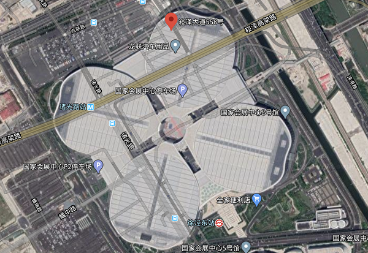

<h3><a target="_blank" href="https://bit.ly/3asSXIA">请多传破网软件，使更多的人了解真相从而得救，这是给自己积福德。 https://bit.ly/3asSXIA </h3></a>

   

     
<h3 align="center"><b>免翻视频 https://bit.ly/2VIs51L  (请收藏网址 https://git.io/swspip)</b></h3> 

<h3 align="center"><b>复制网址到谷歌或火狐浏览器打开。若出现 “提示” ，請点击“继续”访问即可。</b></h3> 

<h3 align=center><a href="https://github.com/gav01/Heart/blob/master/news1.md">● 看更多大紀元時事 ●</a></h3>

<a href=https://git.io/souye><h6 align="right">回首頁</h6></a>

<a name=top>
   
<a href =#29>29.贵州孩子哭喊「我要爸爸妈妈」离世 
<a href =#28>28.高温来袭 河南荥阳郑州多市气温超40℃ 
<a href =#27>27.【一线采访】原材料价暴涨 陆口罩厂经营难 
<a href =#26>26.【翻墙必看】金正恩露面手腕惊现神秘疤痕 
<a href =#25>25.【新闻看点】美连6大动作 美中角力升级 
<a href =#24>24.【拍案惊奇】朝媒报金正恩现身 习家邓家对呛？ 
<a href =#23>23.四川宜宾大桥发生坠落事故 市民：太吓人了 
<a href =#22>22.【一线采访】武汉军运村变方舱 业主抗议 
<a href =#21>21.【内幕】不让公民回国 中共却优待俄国嫌犯 
<a href =#20>20.【瘟疫与中共】西非小国六位内阁部长染疫 
<a href =#19>19.疫期人流少 上海青浦区政府趁机强拆民房 
<a href =#18>18.朱同：中共“表演式”复工复产 
<a href =#17>17.刚卸任两天 张旅集团前董事长坠桥身亡 
<a href =#16>16.脱北韩国议员：99%确定金正恩上周已死 
<a href =#15>15.尼米兹号重返亚太 云峰试射成功 美台连盟抗共 
<a href =#14>14.遭央视连骂三天 蓬佩奥反在中国人气飙升 
<a href =#13>13.冉崇碧为女维权11年 揭中共打压访民真相 
<a href =#12>12.国际做空机构：陆企“跟谁学”40%客户不存在 
<a href =#11>11.英医疗界：中国产呼吸机可致病人于死地 
<a href =#10>10.大陆爆高传染性致死性“虾虹彩病毒”疫情 
<a href =#9>9.为何改变对习近平看法 川普首次详细说明 
<a href =#8>8.【有冇搞错】傅政华四千公安要挟 习近平失平衡 
<a href =#7>7.谢田：官媒“万里投毒”和“建设祖国”的诡谲 
<a href =#6>6.【十字路口】中共暗阻川普连任 蔡政府退订红媒 
<a href =#5>5.【独家】武汉同济医院文件曝活摘罪恶    
<a href =#4>4.【独家】疫情急 牡丹江康安医院或被接管 
<a href =#3>3.中共再祭影视战狼条款 港台艺人或动辄遭索赔   
<a href =#2>2.中共甘肃省长喊话：经济“十万火急” 
<a href =#1>1.【最新疫情5·1】川普：调查疫情爆发原因    
  
  
  
  
  
  
<a name=29>
<h1 align="center"><b>贵州孩子哭喊「我要爸爸妈妈」离世</b></h1>
   
   【明慧网二零二零年五月三日】（明慧网通讯员综合报导）二零零八年三月十一日，在开学第二天，为省钱（学校每份饭要三元），贵州盘水市盘县柏果镇十二岁的徐定国跑回旧学校门口，买了两元钱的食物吃，当晚呕吐、发烧，次日全身长红斑，在「我要爸爸、妈妈！」的呼喊声中凄惨离世。临终前连父母的最后一面也没能见到。
听到噩耗的师生和乡邻无不悲痛，四个兄妹更是哭成了泪人。徐定国的妈妈陈玉梅二零零七年二月被非法抓捕，后被送到贵州中八劳教所劳教；爸爸徐启华于二零零七年九月被贵阳国安特务绑架，后被关押在百花山看守所，遭到法院秘密在贵阳市司法警察医院进行所谓的「开庭审判」，被非法判刑四年。徐定国的大伯徐广道，二零零一年在进京上访时被北京公安毒打而死，留下三个孩子，由徐启华抚养。

徐杏、徐定国、徐定府（左至右）
   
徐圆圆、徐佛莲（左至右）

徐广道的遗孤：徐定府、徐杏、徐佛莲

徐启华的孩子：徐定国、徐圆圆

   
   在徐定国下葬前，贵州女子劳教所仍旧不让其妈妈陈玉梅回家看一眼，贵阳国安特务和市公安恶警及其云岩区检察院、百花山看守所等相关人员同样也不让其父亲徐启华回家看儿子的遗体一眼。

徐定国自幼就在不断的惊吓、恐怖，苦难中挣扎，兄妹俩和三个堂兄妹自幼与爷爷、奶奶相依为命。二零零零年元月，徐定国随爸爸、妈妈等九人进京上访，大伯徐广道被北京公安毒打致死，大伯母迫于恶党株连政策，抛下五岁儿子、三岁及一岁的两个女儿，离家出走。爷爷、奶奶被非法关押，接着爸爸、妈妈被抓，姑父又被绑架劳教；还有随时突然降临的，没完没了的骚扰、监控、抄家、被欺侮。

<b>一、大伯徐广道在北京东城区看守所被打死</b>

贵州许多地方原本贫困，许多被中共恶党迫害的一贫如洗的法轮功学员，出于善良，依法上访，纷纷去北京，想把自己因为修炼大法后身心受益的情况反映给政府，多次从贵州步行到北京上访，数不清走烂了多少双鞋，磨破了多少双脚，饿了拣路边被人丢弃的食物，累了睡在大山上，然而面临他们的却是关押迫害。

二零零零年初，徐广道、徐启华及其亲友十一人（还有两个才五、六岁的孩子）到北京说明法轮大法好，徐广道被北京恶警迫害致死，其余人员身无分文，从北京步行回到家。

徐广道生前照片

   
   据一名知情者在明慧网披露：徐广道因为法轮大法鸣冤，被抓进东城区看守所2筒4所。后因绝食请愿炼功，被多次毒打，扎电针。一次毒打后被犯人抬回，即不能翻身、上便所，并且开始吐血，晚上去世，时间是二零零一年二月。东城看守所为掩盖真相，将同所犯人调出统一口径，并给各所牢头开会，定为病死。有人当时就怀疑，后来听到一牢头说漏了嘴才知道真情：徐广道被打死，凶手为东城看守所政委、郭副所长及另一管教三人。

徐广道、徐启华的父亲进京寻找儿子徐广道，被北京恶警用不明药物毒害，回来后就间断性失忆，意识朦胧、精神恍惚，现出门不知归路，要专人照顾。

迫于共产党的株连迫害，徐广道的妻子抛下五岁儿子、三岁及一岁的两个女儿，离家出走。徐广道三名幼小遗孤由其弟弟一家照顾抚养。

从此徐启华挑起了三个家庭的重担，既要抚养自己的两个小孩和哥哥留下的三个小孩，还要照顾年迈的老人。

<b>二、妈妈陈玉梅被绑架劳教、爸爸徐启华被迫流离失所</b>

对于这样一个承受着巨大痛苦和压力的苦难家庭，中共人员仍然不放过。在二零零七年一月中共恶徒对盘县法轮功学员的抓捕迫害中，徐定国的爸爸徐启华被迫害流离失所，妈妈陈玉梅被绑架劳教。家中五个年幼的孩子只能和年迈的祖父母相依为命。

二零零六年底、二零零七年初，六盘水市副市长叶文帮（音）到盘县柏果镇视察，看到镇内到处都悬挂着真相条幅，非常生气，找到他的叔叔盘县柏果镇东升村村长叶尤柏（音），密谋迫害法轮功学员。

二零零七年元月十日，贵阳国安公安、贵州省「610」的一些恶人突然窜到盘县土城（即柏果镇），与六盘水市、盘县公安、国安、「610」相互勾结，驻扎在柏果大酒店，对当地法轮功学员进行监视、跟踪、布控。元月二十二日晚十一点后，在盘县土城（即柏果镇）、松河、三脚树、月亮田等地，恶警按照预谋，利用蹲坑、跟踪、电话监控等手段，前后非法抓捕法轮功学员30多人（其中还有一个16岁的孩子和一个不修炼的家属）。参与绑架的除省、市610人员外，有盘县公安局副局长黄河松、盘县公安局一科（政保科、国保大队）科长骆金序（音）、柏果镇派出所所长张洪等。陈玉梅于元月二十九日被绑架，徐启华被迫流离失所。徐启华的妹夫谭广万虽未修炼法轮功，也被绑架。

由于家人坚持要人，部份学员被放出。其余人员被非法送往盘县（现为城关镇）公安局洗脑班非法关押迫害，后被非法关押在盘县看守所、红果看守所，他们是陈玉梅、谭广万、肖云会、陈忠秀（音）、蒲恩福、缪强志，陈明赛、王云龙、卜恩福、何芳、胡彩云、唐小云、苗老大、王秀梅、张世芬。

徐定国的妈妈陈玉梅被非法劳教，从看守所劫持到贵州女子劳教所；徐启华的妹夫谭广万原本不是大法修炼者，只因为不配合邪恶，也被非法劳教两年，送贵州中八劳教所五大队。法轮功学员王秀梅被非法劳教一年零九个月，这是她第二次被送劳教迫害。被非法送劳教的人还有：何方三年，肖云惠的档案中写非法劳教两年，实际按两年半执行。被非法判刑的有：蒲恩福、王云龙被非法判刑五年，陈明赛被非法判刑四年，张石芬、廖强志被非法判刑三年。

在贵州农村，只有安「锅盖」才接收到电视，盘县派出所恶警到徐家将线拔掉，使老人、小孩无法看电视。警察还在其住房前安有两个监控器，同时盘县土城派出所恶警雇用徐启华家附近的住户敖成恭、杨龙祥、李学成等监视他家。

<b>三、孩子离世前哭喊「我要爸爸妈妈」</b>

徐家大儿子被迫害致死，二儿子被迫流离失所，二儿媳被劳教迫害，祖孙七口人的生活，仅靠白发苍苍的爷爷和奶奶种点玉米换大米、种点小菜维持，还得供五个孙子上学。

本来就贫寒的家庭还遭受当地政府部门的无理盘剥：徐家种水稻的田，被当地政府强行征用建火车站，原定的微薄的补偿费23000多元被盘县柏果镇东升村政府非法扣压未给。两家的长孙，已转居民人口，应享受国家「低保」，但因家长修炼法轮功而被扣。

徐家五个孩子，常常背着大人偷偷哭泣，尤其是，每当看见同学拉着爸妈的手欢跳时、每当有人问起：你想不想爸妈时，孩子几乎是呼喊着回答：做梦都想、想得不得了！同时，这样苦的环境使孩子们，从小也养成吃苦耐劳、勤俭朴实的性格，也特别懂事，尊老爱幼。

徐定国在学校里，每当看见别的同学无钱买饭吃，就毫不犹豫，把奶奶给的两元饭钱，给同学买饭充饥，情愿自己饿着，有时姑姑给点零花钱，也拿去资助比自己困难的同学。放学后，三步并两步，跑回家，赶快把作业完成，如爷爷奶奶在地里干活未回，就先把饭煮好，然后，背着小箩筐，到菜地里，折回白菜，煮好菜汤，等大人回来吃饭。

这么乖的孩子，二零零八年三月十一日，在开学第二天，因嫌新学校饭贵（每份饭要三元），为省钱，跑回旧学校门口，买了两元钱的食物，食后，当晚呕吐、发烧。次日还硬挺着上学，但已撑不住，全身长红斑；在送往医院途中，在凄惨的喊「我要爸爸、妈妈」的呼喊声中离世，死时全身发黑。

噩耗传出，几个孩子更是哭成了泪人，全家上下，一片惨状。学校师生、乡里乡邻纷纷登门看望、慰问。徐家要求让被非法关押的徐定国的父母回家看一眼儿子的遗体，恶警都不允许，甚至死讯都不让徐启华夫妇知道。

<b>四、爸爸徐启华被绑架、非法判刑四年</b>

徐定国的妈妈被绑架后，爸爸徐启华被迫害流离失所。二零零七年九月下旬，徐启华被贵阳国安怀疑为他人安装「锅盖」而绑架。国安为了邀功，对徐启华和同时被绑架的几个法轮功学员李东洪、贾立安实施了酷刑折磨，猖狂迫害。徐启华被国安折磨不成人样。

徐启华被非法关押在贵阳云岩区百花山看守所。二零零八年三月儿子食物中毒去世，贵阳国安特务和市公安恶警及云岩区检察院、百花山看守所等相关人员也不让徐启华回家看儿子的尸首一眼。中共邪党人员非法构陷徐启华、李东洪、贾立安，所谓的审判时间一度从三月二十八日改成四月一日，后来改期到四月十日。

徐启华的母亲何美仙忍痛撇下不能自理的丈夫及四个需要她照顾的年幼孙子，怀着刚失去12岁孙子的痛苦，赶到省城贵阳，含泪向610办及公检法办案人员，诉说冤情，希望他们尽快把徐启华放回家，全家生计靠他去操劳。

二零零八年四月十日早上十点半至十二点半左右，贵阳市云岩区邪党法院非法审判法轮功学员李东洪、贾立安、徐启华。法轮功学员贾立安已绝食半年，被非法关押在贵阳市司法警察医院，身体被迫害得极其虚弱，他坚决抵制非法审判。贵阳市云岩区法院将法轮功学员李东洪、徐启华秘密转移至贵阳市司法警察医院进行非法开庭审判，不允许家属旁听。

徐启华被非法迫害判刑四年；贾立安被非法迫害判刑七年；李东洪被非法迫害判刑五年。

二零零八年四月二十八日，徐启华、李东洪的家人去贵阳市中级法院要人。中院有关人员躲避推脱，称此事主要是区院主办，说不上几句话就跑掉。

法轮功学员徐启华、李东洪、贾立安被劫持在都匀监狱（位于贵州省黔南布依族苗族自治州首府都匀市内）。都匀监狱对外称「都匀剑江水泥厂」，在监狱长侯立德、监狱政委赵贵平、原教育科科长王华川、恶警钟山等的指使下，监狱恶警和受其指使的犯人一直在凶残的迫害被非法关押的法轮功学员。恶人竟然把对法轮功学员酷刑折磨的手段编成「菜单」，折磨这些修心向善的好人。例如，「夹心饼干」：用双肘猛击被害人的背部，用膝盖顶击其胸口，肘膝同时用；「敲核桃」：手握半拳，遍敲被打人头部；「拔韭菜」 ，就是用手捉住鬓角处的一小绺头发往上提。

<b>五、奶奶何美仙也被绑架、骚扰</b>

徐定国的奶奶何美仙，涉千山万水，赶到省城贵阳诉说冤情，要求释放儿子徐启华。谁知，中共公检法人员不但不放徐启华，还阴毒谋划跟踪、蹲坑、绑架。

二零零八年五月八日，暂住在贵阳二桥菜场附近的何美仙被市公安局和头桥派出所恶警绑架、抄抢。和她同住的习水法轮功学员苏雪莉来省城找工作也被公安疯狂毒打后绑架。八日和九日去看望何美仙老人的法轮功学员，包括宋帮福、李东红的弟弟李洪宇、刘义安等至少八人，都被蹲坑绑架。

据围观百姓说，这个小个子法轮功学员（宋帮福）当场就已经被打的脸都变了形，身上到处是伤。法轮功学员宋帮福乐意助人、心地善良，是大家公认的好小伙。五月初就在四川大地震之前，宋帮福听说贵州省盘县发生了地震，想到何美仙老人一家这些年来被中共恶党已经迫害的家破人亡，为了看望和慰问老人，五月八号傍晚拉着刚刚进的一批新MP4路过二桥，下车前去探望何美仙老人，被蹲坑的恶警季麟、申玉林等人绑架群殴。

宋帮福被头桥派出所恶警和贵阳市公安一处七、八个恶警毒打后拖走，他的皮带被抽出反绑在他的双手上，手上除了皮带还绑了绳子，铐着手铐，手铐深深陷进肉里，流出血来。身材高大的恶警季麟把宋帮福反捆后竟然双脚踩在他的背上蹲着。后来宋帮福的裤子被他们打掉在腿上，公安一边拖着他走一边毒打他。宋高喊着「法轮大法好」，善劝参与迫害的警察不要做恶，恶警不但不听，把他扔上警车后，还在警车上一直毒打。

当时围观的百姓有上百名，有的人指着警察说：「把人都打成这样了还不放过，这么小个个子，手还被他们捆着拖上警车，还不放过、还打。」恶警拿着从宋帮福那里抢来的汽车钥匙，公开在街上叫嚷着：「到处找他（宋帮福）的车，把他的车弄走。」围观的百姓连连摇头：「土匪啊，抢人了！」宋帮福被市公安及市610恶徒昼夜逼供，被折磨得不成样子，之后由市烂泥沟看守所转押到贵阳太慈桥公安医院。大概时间在六月中旬，宋帮福被非法劳教两年。宋帮福全家经历中共几十年历次整人运动，吃尽无数难以想像的苦难。宋帮福的母亲八十多岁了需要人照顾，其哥哥一只手是残废没有养家糊口的能力。此次宋帮福被绑架，给全家带来沉重的打击。

二零一五年十月二十九日下午，盘县柏果派出所张红（音）等三人闯入何美仙家，当天，柏果派出所的人打电话将谬祥志骗至柏果派出所，此前二十八日下午，张红、蒋宁等七人闯入何素芳家。以上人员分别对三名法轮功学员询问，谁叫你们诉江的，你为什么要诉江，谁帮你写的打印的、寄的，遭到拒绝后，又要求抽血、滚指纹，并强迫按放弃法轮功修炼的手印后方离去。。

二零一五年五月以来，中国大陆法轮功学员发起了控告江泽民的大潮，各地法轮功修炼者和家人纷纷把控告元凶江泽民的刑事控告状邮寄给中国最高检察院，要求最高检察院向最高法院对江泽民提出公诉，把这个反人类的首恶绳之以法。法轮功学员控告江泽民，不仅是作为受害者讨还公道，也是在匡扶社会正义，维护所有中国人的做好人的权利。

江泽民迫害以「真善忍」为行为准则的法轮功学员，其实质就是针对每个中国人的迫害，把中华民族推向万劫不复的深渊。众所周知，当今中国社会的假药、假酒、地沟油、有毒添加剂、毒食品、环境的恶化、人与人之间关系紧张、社会各种矛盾激化，这一切问题的根源就是人心。江泽民出于私利故意迫害、诬陷以「真善忍」为准则的法轮功就是有针对性的对人类道德底线的破坏，他打击和毁灭的是整个中国社会的道德良知底线。

从二零一五年五月底到二零一五年十二月三十一日，明慧网已收到逾二十万法轮功学员及家属递交给中国最高检察院、法院的实名诉讼状副本。控告状来自地区涵盖中国大陆所有33个省级行政区；333个地级行政区（地级市、地区、自治州、盟，全国共334个地级行政区）；1948个县级行政区（县、自治县、旗、自治旗、县级市、市辖区、林区、特区）。

法轮功学员和家属只控告江泽民这个无可救药的元凶，而对于追随江泽民迫害法轮功的各级610、公检法人员，法轮功学员认为他们也是被江泽民欺骗和胁迫，也是受害者，法轮功学员不但没有怨恨，还耐心的给他们讲真相，希望他们悔罪改过，弥补罪错，给自己的未来留点福德，不至于被老天爷淘汰。法轮功学员心中没有仇恨，只有善良。

<a target="_blank" href=#top><h6 align="right">回上方</h6></a>
  
  
<a name=28>
<h1 align="center"><b>高温来袭 河南荥阳郑州多市气温超40℃</b></h1>

5月3日，河南郑州、荥阳、孟洲、济源、伊川温度均超过40℃。（河南气象官方微博截图）

   
【大纪元2020年05月03日讯】5月3日，河南郑州发布今年首个高温预警，称3日下午郑州市区最高气温达40℃以上。实际情况显示，不仅郑州高温，河南荥阳、孟洲、济源、伊川亦超过40℃。

5月3日上午10时20分，郑州市气象台发布上述高温红色预警信号。此预警比2019年的6月2日早了一个月，比2018年的7月20日早了两个多月。

3日下午近16时，河南气象官方微博发高温统计图，显示3日15时，河南荥阳市温度高达40.7℃，郑州高达40.5℃，孟洲市高达40.3℃，济源市、洛阳伊川县均为40.1℃，焦作市40℃。

当地网民说：“别说了，快化了。”“热晕。”“我已经热糊了，靠风扇不停的吹，救命。”

还有洛阳市、新乡的网民表示当地温度也已经高达40℃。   

<a target="_blank" href=#top><h6 align="right">回上方</h6></a>
  
  
<a name=27>
<h1 align="center"><b>【一线采访】原材料价暴涨 陆口罩厂经营难</b></h1>

因大陆原材料紧俏和大幅涨价等问题，导致不少厂家运营艰难。图为示意图。（中央社）

【大纪元2020年05月03日讯】（大纪元记者顾晓华、张北采访报导）中共病毒（武汉肺炎）疫情延烧全球，各国对口罩的需求陡增，大量口罩生产厂家也在中国应运而生。虽然出口销路好、利润可观，但是原材料紧俏和大幅涨价等问题，导致不少厂家运营艰难。

李迪（化名）是浙江义乌一家卫生用品股份公司的股东。该公司已成立七八年，拥有数百名员工，原本以生产儿童纸尿裤为主。由于今年口罩行情好，工厂车间又适合生产口罩，公司在二月份申请了执照，投入三千万人民币买了两条生产线，还另招了几十名员工。因为当时政府支持，执照很快在三月份批下来，工厂也开始投入生产。

据李迪介绍，他们生产的口罩大部分出口到海外六国。一般来说，买家先下订单、提供样品，公司再按照订单大小和不同的要求标准报价；谈妥价格签合同后，买家预付50%订金，然后工厂开始生产。截止目前，公司已经分批出口了二千多万片口罩。

李迪说，按照正规渠道每天不停地做收入很可观，公司不但可以在今年收回成本，还能赚钱。他说，“口罩一个钱赚的不多，但是批量大，都是千万千万的下单，这就不一样了，我们现在口罩的利润就是两角三角之间吧。”

此外，公司还有纸尿裤生产线，如果口罩的生意没那么好，员工可以生产纸尿裤。纸尿裤也能赚钱，但是销量没有那么大，利润也赶不上口罩。

<b>熔喷布稀缺 价格畸高</b>

然而，口罩关键原材料熔喷布的极度稀缺导致工厂生产困难。如果买不到熔喷布，工厂只能停产。

李迪表示，正规的熔喷布只有中石化和液化公司能生产，其它公司做的都是假的。但是正规出品的熔喷布都已被有门路的中间商收购，普通渠道根本买不到。“熔喷布不好买，有些供应商，那些二道贩子买了收藏起来了，暗地里卖。”他说，“就是那些跟中石化有关系的人，朋友啊，亲戚啊，只有这些人能拿到货。”

但是，这些人都以高价转卖，且不出具任何交易票据。“你只能当时看这个货可以你就付款，不行你就不会付款，但是你要他们给你开什么收据他们是没有的。”李迪说。

现在，熔喷布暴涨到70万元一吨，公司还要到外面去找才可能找到。“买不到熔喷布就做不了，我们熔喷布不达标是不做的。”李迪说，“熔喷布现在手头有个七百公斤，很紧张。这个也就能生产一天多，能生产一百多万枚口罩。”

<b>无纺布厂家违约涨价 拒不出货</b>

李迪的公司在购买另一个关键原材料——无纺布时也困难重重。经过四处打听，他们找到温州的雨泽科技公司，向其订了17吨无纺布，每吨一万五，签合同后给了三十万元定金。但是出了四吨货后，雨泽就不再发货。

“他说涨价了，要我们加价，不加不给我们货。”李迪说，“一吨涨到三万，涨一半，我们采购不同意，就跟他们谈，但是谈不成。”

由于没有无纺布工厂停工，公司的几十位股东在4月30日南下温州，到雨泽的厂里要货。但是，雨泽不但不给货，还找当地的社会人员阻止他们进厂。“最后我们没办法，我们用车把门给堵死了，他没办法打110报警，派出所过来都处理不下来，协调没协调好。”李迪说，“当地派出所是维护当地，不会在我们这一边。”

最终，当地的市场监管局也被叫到现场，双方以每吨加五千元的价格达成协议。

李迪说，因为没有原材料，工厂经常性停工；虽然政府声称严查高价原材料，但高价现象一直存在。“因为现在的关系网太大了，有些东西管控不了的。”他说。

<b>原材料价高 企业维持不易</b>

据李迪介绍，义乌做口罩的工厂不是很多，成规模的正规企业更少；小规模的、家庭作坊式的很多，但他们没能力购买高价熔喷布，只能用劣质的，因此产品达不到生产许可标准，也不能出口。这些厂家既没有许可证也没有营业执照，它们的口罩都在中国的网上或实体店以较便宜的价格出售。

像他们这样各种证件齐全的正规公司主要负责出口，但是生意也越来越难做。“订单生意现在还是有，但是没有以前那么多了，因为材料都涨，我们这边做不起。”李迪说，“那就只有高价卖，但是订单就很难接，价高了别人接受不了。”

此外，政府管控越来越严，企业办理出口手续不容易，还要每天接受检查。李迪透露，一定要认识政府部门的人，不然办不下资质，非但赚不到钱还要亏钱。“现在外贸、进出口都不好办了，好多小企业都放假了，但是没有全部停产。生意不好的就精减人数，年岁大的或者来晚的就不要了，因为没有事做了。”

李迪表示，办企业也是不容易，要冒很大的风险。他们公司的高管为生产口罩投资三千万，他本人投了几十万，到时候分股利。对于行业前景，他说：“现在是能做多久就做多久，将来怎么样不好说”。

<a target="_blank" href=#top><h6 align="right">回上方</h6></a>
  
  
<a name=26>
<h1 align="center"><b>【翻墙必看】金正恩露面手腕惊现神秘疤痕</b></h1>

根据朝鲜官媒发布5月1日的视频，金正恩的右手腕上出现一个新疤痕，医学专家判断，可能做了心脏手术。图中为金正恩。 (Chung Sung-Jun/Getty Images)

   
   【大纪元2020年05月03日讯】（大纪元记者吴英报导）根据朝鲜官媒发布5月1日的视频，金正恩的右手腕上出现一个新疤痕，医学专家判断，可能做了心脏手术。

金正恩“人间蒸发”20天后，5月1日出席了平安南道顺天市一座新肥料厂的竣工典礼，总部位于首尔的朝鲜新闻网（NK News）5月2日报导说，仔细检查朝中社公布的录像后发现，金正恩右手腕上似乎有一个针头大小的疤痕。

医学专家说，根据那个疤痕大小，看起来金正恩可能接受了“心血管手术”。

 朝鲜新闻进行比对后报导说，金正恩4月11日出席劳动党中央政治局会议时，右手腕并没有这个疤痕。

现年36岁的金正恩4月11日后就未公开露面，即使4月15日太阳节庆祝活动以及4月25日朝鲜创建军队的纪念日等两个重要的活动，金正恩也没有在媒体上露脸。
一位在美国接受过培训的医学专家告诉朝鲜新闻，这个伤痕看起来像是“右动脑穿刺……（这是）常被用来通过冠状动脉置入支架的手术”。

“（疤痕）看起来大约一个星期了，”他补充说，“从照片很难看出来，⋯⋯，这应该不是静脉注射，因为它不会留下这样的伤痕。”

一名韩国外科医师告诉朝鲜新闻，金正恩手臂上的伤痕“看起来更像是与心脏问题相关的医疗程序或检查，所留下来的疤痕”。

美国总统川普（特朗普）5月1日在得知金正恩现身公开场合后表示，他还不想对此发表评论，会在适当的时候对此发表评论。

5月2日，川普发推文说：“我很高兴看到他回来了，很好！”

川普上周被问及有关金正恩去向的问题时表示，他确实知道金正恩的近况，但是“现在不能谈论它，只能祝福他们”。

<h4 align=center><a href="https://twitter.com/alistaircoleman/status/1256560979900616704?ref_src=twsrc%5Etfw%7Ctwcamp%5Etweetembed%7Ctwterm%5E1256560979900616704&ref_url=https%3A%2F%2Fwww.epochtimes.com%2Fgb%2F20%2F5%2F3%2Fn12078979.htm">个伤痕看起来像是“右动脑穿刺……（这是）常被用来通过冠状动脉置入支架的手术”(点击右键,另存新档）</a></h4>

<a target="_blank" href=#top><h6 align="right">回上方</h6></a>
  
  
<a name=25>
<h1 align="center"><b>【新闻看点】美连6大动作 美中角力升级</b></h1>

美近日6大动作指向中共，北京战狼式四处出击输世界？ 图为资料图。(LIU JIN/AFP)

【大纪元2020年05月02日讯】大家好，欢迎关注新闻看点，我是李沐阳。

先说一点金正恩的消息。今天是五一劳动节，金正恩发了一份感谢词。朝鲜官媒《劳动新闻》说，金正恩在感谢词中向朝鲜的多个行业表达感谢。

但是一直到中午，金正恩始终没有露面。这个金胖胖到底是不是还活着呢？如果不露面，光是打这种空响炮，压不住人们的猜测啊……

今天已经美东时间的周五了，中港台的时间已经是周六了。但是我们仍然没有看到朝鲜方面有什么宣布。

再说另一个事。看到这么一段视频，是发生在前几天的事。画面中这位穿红色风衣的姑娘，是一位护士。4月25日，是她的生日。因为要保持社交距离，所以她的朋友们只能用这样的方式来为她庆祝。这里面既有朋友的情谊，也有一份敬意和谢意。

其实，每天晚上7点，在纽约的医院附近都会传出掌声。人们都是用自己选择的方式，发出各种声音，向抢救生命的医护人员表达心中的感谢。

但是在大陆，有这么一个情况，曾经前往湖北支援抗疫的四十多名医护人员，被医院给辞退了。涉事的陕西咸阳妇幼保健院今天作出了回应，说去年11月就已经推出了“优化方案”，只是受疫情影响，才推迟了。

这医院不但不给上一线抗疫的补助，还直接把人给解雇。这桥拆得也太快了吧？

<b>全球感染324万  美考虑对中共制裁</b>

截止到早上6点，全球感染中共病毒的总人数已经高达324万3300多人，死亡23万零56人。这两个数字都不包括中共通报的中国大陆情况。美国仍然是最严重的国家，确诊病例是109万7300多人，死亡63,913人。无论是染病还是死亡数，都远远高于其它国家。

这场疫情发展到这种地步，中共的责任显而易见。而中共趁着疫情扩散的时机，增加地缘政治影响力，已经引起了各国的警觉。特别是中共战狼轮番上阵，又是甩锅又是谩骂，结果招来了美国连番大动作反击。

昨天（4月30日），川普政府匿名官员向《华盛顿邮报》透露，美方正在考虑对中共采取报复措施，让中共对中共病毒疫情的全球大爆发进行赔偿。

这位匿名官员表示，昨天有多个政府机构的高级官员专门为此开会，进行讨论，情报机构的官员也参加了这个会议。

另有4名政府资深官员表示，他们正在寻找惩治或者向中共求偿的方案。他们向《华盛顿邮报》透露了，川普除了责怪北京隐匿疫情之外，与幕僚们也讨论了应对中共施行激进措施的方案。

曾经担任川普政府高阶行政人员的索里尔（George Sorial）也表示，川普和白宫正在检视各种方法。

目前还没有更多关于这个专门会议的消息，但是可以确定的是，美国可能已经决定要出手还击了。

<b>中共跳脚，战狼连出击</b>

美方的追责调查，很可能击中了中共的软肋，反应激烈。

昨天（30日）中共外交部发言人耿爽表示，中方也是病毒受害者，不是病毒同谋。受害者同命相连，应该团结协作。还说“拆别人的台，最终也将拆自己的台”。

表现更激烈的是中共央视，罕见地连续三天批评美国国务卿蓬佩奥，措辞相当严厉，几乎是泼妇骂街。说他散播“政治病毒”、“背负四宗罪”等等，叫骂声在近些年很罕见，甚至已经不是外交战了。
美国六大动作反击

不过中共越像战狼一样出击，遭到的反击越大。总的来说，美国近日六个大动作，对中共的反击是比较明显的。

<b>六大动作之一：取消中共“主权豁免”</b>

前面提到的那位美国匿名官员表示，高级官员们讨论的内容之一，就是剥夺或者限制中共的“主权豁免权（sovereign immunity）”。就这个问题，川普和助手们私下里已经先行进行了一些讨论。目的是方便美国政府或者疫情受害人向中共提起诉讼，要求赔偿。

什么是“主权豁免权”呢？这是美国国会在1976年通过的一项法律，主权国家一般不受另一个主权国家法院的管辖。通俗地说，当外国对中共进行起诉，它如果有“主权豁免权”，那么控方是打不赢官司的。

而如今美国已经就中共的“主权豁免权”问题专门进行讨论，说明川普政府很可能是要进行实质性的对中共追责，必须要对中共进行实质性的报复。

那位匿名官员还透露，美国还有一个选项，就是取消中共持有的美国国债。不过他表示，目前不清楚川普总统是不是支持这样做。

但是取消中共持有的美国国债问题，被白宫首席经济顾问库德洛（Larry Kudlow）否定了。他昨天对路透社表示，白宫并没有考虑消除中共持有的美国国债。他说，“美国债务责任所拥有的充分信任和信誉是神圣不可侵犯的。其它就不用说了。”

<b>六大动作之二：调查病毒源自武毒所？</b>

与商讨是否取消中共“主权豁免权”相比，对病毒来源的调查，时间要稍早一些。目前，美国可能已经掌握了初步的证据，显示病毒来源就是武汉病毒研究所。

昨天（30日）同时传出2个重磅消息，先说第一个。美国国家情报总监办公室发出声明，表示情报界已经取得一个广泛的科学共识：病毒不是人造的，也不是经过基因改造的。

这个声明基本上推翻了此前人们的各种猜测。比如病毒是人工合成的，再比如病毒与中共的生化武器有关等等。

不过声明也表示，情报界还会继续严格审查新的信息和情报，以确定是不是因为武汉某实验室的意外事故引起的。

声明没有直接说武汉病毒研究所，但是也基本可以断定，这里指的就是武毒所。

第二个重磅消息是川普讲出来的。他在回答记者提问时说，他看到了中共病毒与武汉病毒研究所的有关证据。

记者问他，目前有没有看到任何证据让他高度相信武汉病毒研究所是中共病毒的来源。川普的回答简单明了：“有。我看到过。”

然后记者追问究竟看到了什么证据，川普说，“我不能告诉你这点。我不被准许告诉你们这点。”

从情报总监办公室的声明和川普肯定的回答当中，大家已经可以得出一个结论。在美国三大情报部门的调查下，对于病毒来源，美国很可能已经掌握了证据。

其实病毒是不是源自武汉病毒所，法国《世界报》4月25日的长篇调查，与美国情报界的调查结果是相互佐证的。报导中表示，武毒所P4实验室病毒传染中心负责人石正丽在疫情爆发后，陷入了焦虑和害怕中。

文章引述石正丽自己的说法，“好几夜没合眼，反复回想自己的每一项研究，不停问自己病毒是不是从我们那些实验室泄漏的？”她说，“的确使我头脑乱了，闭不上眼睛。”

从石正丽的讲述和担心状况来判断，P4实验室很可能有这种病毒。所以在外界纷纷猜测之下，她才产生压力，担心是实验室泄漏的病毒。

同样是昨天（30日），德国朝野也发出了独立调查病毒源头的呼声，要求向北京施压。《奥格斯堡汇报》在线文章说，执政的基民盟和在野的自民党都认为，调查应该尽快展开，才能找到证据。“中国（中共）如果没什么好隐瞒的，就没有反对的理由”。

<b>六大动作之三：美国军机单月13次现身台海，8月环太平洋军演</b>

今天（1日），记录军事飞行器动态的“飞机守望”（Aircraft Spots）推文披露，美军两架B-1B战略轰炸机从美国南达科他州空军基地起飞后，进行了长达32小时的远航飞行训练，于30日在南海上空进行了飞行。

昨天（4月30日）下午，美军EP-3E侦察机又一次接近台海中线最尾端。这是美国军机在4月份第13次现身台湾外围空域，飞经巴士海峡、菲律宾巴坦群岛以西，随后接近台湾海峡西南方空域，并在外围空域绕飞多次。

军事专家王臻明表示，美军机在台湾西南外海“台湾浅堆”附近以三角形航线徘徊不去。这是“典型的侦搜作业飞行模式”，“摆明了就是监看什么东西”。

他对《自由时报》表示，“台湾浅堆”因为水浅而得名，最近中共军方一直在这里偷偷抽砂。但可能不只盗采这么简单，可能是要抽出一条水道，让潜艇可以伏击台湾的水面舰艇。

如果王臻明分析是对的，那么美国军机在这里飞行，就是在针对中共的企图，进行相应的遏制行动。

另外前天（29日），美国太平洋舰队司令部透露，8月17日到31日，要举行环太平洋军事演习。包括多国联合反潜作战、海上拦截、实弹射击等。各国将评估演训状况，即时调度，保持灵活性。

太平舰队司令阿奎利诺（John Aquilino）说：“在当今这个充满挑战的时代，保护重要的航道并确保通过国际水域时的航行自由，海上部队共同努力比以往更为重要。”

<b>六大动作之四：优先监察中共盗窃知识产权</b>

前天（4月29日），美国贸易代表办公室（USTR）发布了年度“特别301报告”。其中显示，中共被列在10个侵犯知识产权“优先监察国”的第一位。

贸易代表办公室发布“特别301报告”，目的是分析美国在全球的贸易伙伴对知识产权的侵犯情况，同时公布臭名昭著的假冒和盗版市场的审查结果。

报告中指出，中共采取了一系列不公平及有害的行为、政策和做法，强迫美国企业技术转让，或者从美国公司的电脑网络盗窃未经授权的创新技术等等。

报告要求北京进行根本性的结构改革，对知识产权保护措施进行最新修订。履行今年1月签署的协议承诺。

八九学运学生领袖之一周锋锁对自由亚洲表示，中国前几十年的经济奇迹，就是通过开放体系窃取国际社会最优先的知识产权的结果。这就像一个癌症的肌体从健康的肌体拿到营养，但是最后它是要害死健康的肌体。美国这是亡羊补牢了，必须要对等、脱钩、对抗。

<b>六大动作之五：限制敏感技术产品出口</b>

4月28日，美国商务部宣布了一项新规定，限制某些敏感技术产品出口到在中国的终端用户，以防止这些技术被中共武装部队使用。

商务部长罗斯（Wilbur Ross）表示，有些国家有将从美国公司购买的商品用于军事用途的历史，考虑到这一点很重要。

新规定取消了对某些集成电路、电信设备、雷达和高端电脑在内的民用产品的豁免。美国之音引述分析认为，新规定下，美国放宽了对军事用途和采购者的定义，任何可能被军方使用的产品都将受到审查。

美国的这个新规定，无疑对中共的军事成长有很大影响。

同样是28日，看到这样一则推文：“让我向各位介绍，地表最强匿踪航母——辽宁号。”配图是海面上黑烟滚滚，从烟雾的动向来看，可能是有船舰在行进。网友还用特别标准嘲讽：“烧的劈柴吗？”

<b>六大动作之六：香港一些官员将被列入美方黑名单</b>

五一前夕，香港保安局局长李家超对《南华早报》表示，不排除把香港的恐袭风险级别提到最高。他说必要时会封锁高风险地点，使用《联合国（反恐怖主义措施）条例》打击当地的“恐怖分子”。

无庸置疑，李家超口中的“恐怖分子”，指的是香港的和平抗争民众。我们已经看到了港府港警镇压香港人民的残忍暴力，不知道他们还会升级到什么程度。

不过，香港的局势一直在美国的关注范围，国务卿蓬佩奥在两周内两次评论香港的情况。

前天（29日），国务卿蓬佩奥再一次评论了香港的情况。他说任何在香港实施严厉国家安全立法（即《基本法》23条立法）的努力，都不符合北京对一国两制的承诺，也影响美国在香港的利益。他表示，美国要继续监察及加强关注北京增加干预香港的管治。

蓬佩奥的说法，明显表示出中共港府对香港人的打压是有目共睹的。尽管疫情很严重，但是美方的关注度并没有削减。

有消息透露，美国国务院将在5月底公布第一份对香港自治情况的评估报告。此时密集就香港问题发表评论，很明显是在发出警示，警告中共不要轻举妄动。

香港城市大学退休教授郑宇硕对自由亚洲表示，美中之间对抗不断升级，从抗疫已经反映出不同的意识形态之争。而香港也成了双方对抗的一部分战场。

郑宇硕认为，估计国务院的报告措辞会相当强硬。或许美国暂时不会取消香港的独立关税地位，但把一些官员列入到黑名单的可能性很大。

不过我们仍然要向香港同胞们提醒，邪恶越到最后越疯狂，一定要更加小心防范，不要遭到中共港共的毒手。

<b>越是像战狼一样四处出击，越失去世界</b>

时事评论员蓝述表示，中共在疫情期间的表现，已经让世界都看到了它的邪恶。它越折腾，美国的反制力度越大。越是像战狼一样四处出击，它就越失去整个世界。

以上是公共区的节目。如果您喜欢新闻看点，请别忘记订阅和点赞，同时推荐给您的朋友。在会员区要说两个问题，当局在给李文亮评定为烈士后，又向他颁奖了。但是对改变中国社会有帮助吗？然后会说说川习友谊翻船的原因，川普亲自说话了。

大纪元《新闻看点》制作组

<a target="_blank" href=#top><h6 align="right">回上方</h6></a>
  
  
<a name=24>
<h1 align="center"><b>【拍案惊奇】朝媒报金正恩现身 习家邓家对呛？</b></h1>

朝媒报金正恩现身，习家邓家对呛？（新唐人合成）

【大纪元2020年05月02日讯】大家好，欢迎收看《新闻拍案惊奇》，我是大宇。

说来有趣。今天，其实我已经录影完毕，剪辑师正在帮助我剪辑。我还是习惯性打开新闻，看看最新消息，忽然发现一个必须更新的内容，所以赶快录了一段，插在开头。

朝鲜当地时间5月2日，官媒朝中社发消息，说金正恩5月1日出席了平安南道一个化肥厂的竣工仪式，一开始跟前几天有关金正恩的消息一样，没有照片，对于金正恩的生死来讲，不足为凭。

可偏偏在我们今天节目录制后，朝鲜媒体《劳动新闻》补发了一批照片，显示金正恩在现场剪彩，而且特别有一张照片，完整显示金正恩所坐的台子后面的幕板上，贴着2020年5月1日的日期。

就在这批照片发出前不久，外界还有不同版本的消息流传，一会儿金正恩活了，一会儿金正恩又死了。当然，韩国政府方面，一直是说金正恩身体健康。那这批照片，如果没有问题，就印证了韩国政府的情报。只是我们在录制这段内容的时候，相关照片刚刚出来。还有人在怀疑照片的真实性，例如是不是替身啊、是不是旧的照片拿来PS的啊，等等。

我想呢，这方面的疑虑，等稍后一定会有更多权威人士出来指证。也不能怪大家怀疑，因为不少人，看上去也是很权威的消息人士，不断放料说金正恩的死讯，所以他这么突然一出现，难免让大家猜测，会不会是其中有诈。现在尘埃方起，我们继续观察。

那这段插播结束后，就是今天稍早录制的节目了，其中还会提到金正恩生死之谜的问题，那是朝鲜媒体还没有发出照片之前录制的。

好，插播的最新消息，就说到这。

【“习远平”发信撑习 提炼三大关键词】

前一天，我看到一则消息，当时在犹豫讲不讲，所以昨天节目里就没提。因为这封信是在给一个比较有争议的人物说好话。直到今天我看有别的媒体引用，所以我想，那我也在节目中分享一下好了，凑凑热闹，因为我本人对这封信的内容也是存有相当疑虑。

这个人物不是别人，正是习近平。发这个料的人，是推特网友“老灯”，但他自己也说无法辨别信的真伪，只是发出来参考。

这则爆料推文，引用的是自称习近平胞弟“习远平”的一封信。想必一些朋友已经看过内容，我们也没必要全文阅读，只取其中三个关键词。

第一个关键词是“政治局约束”，文中说习近平修改国家主席任期制，是为了摆脱政治局约束，改善政令不出中南海的问题；

第二个关键词是“大左才能大右”，表示习近平是要走极端左翼的路线，以便在中共党内站稳脚，然后再彻底政治改革，包括新闻舆论开放、市县普选，等等，还说自己兄弟两个是中共党内大开明派习仲勋的儿子；

第三个关键词是“高级黑”，说之前一些惹起公议的事，是习近平下面的一些人，对习进行高级黑故意“难堪”，目前对几个政法口几个人的处理，正是一种清算。

我们就提炼这三个关键词，暂且不说第一个关键词“政治局约束”，还有第三个关键词“高级黑”。因为说习近平要摆脱政治局约束、挣脱对他的高级黑，这一定程度是可以理解的，虽然说有时被黑，可能也怪不得别人，比如他在本次疫情初期，就公开说自己“亲自部署、亲自指挥”，主动背锅，政治谋略令人着急啊。

【习近平先大左再大右？实为舍近求远 多此一举】

但是说到第二个关键词“大左才能大右”，这个是最让人疑惑的了。我记得有高人讲过，大意是，如果习近平今天说我们不要中共了，那中国共产党立即解体，一刻都不会存在。

因为呢，这是现在的人心所向，天意所在。可搞“大左”恰恰是逆其道而行之，一味强化中共领导，甚至近些年一直对外渗透、扩张，一带一路、中国制造2025、千人计划啊，这都引起西方国家警觉，如果说“大左”仅仅是为了巩固党内地位，完全不需要做这些吧。

所以习的姿态，给人感觉并不是为了巩固地位在搞“大左”，在外界看来，他更像是在持续维护，甚至强化中共这个体制。在重要的大政方针上，不说远的，就说近的，对台湾的文攻武吓、对香港反送中的处理、在内部对中国人不断强化的大数据监控，等等。

这些事，就算有其它因素的参与，但可都是在他的任内发生的，能不承担责任吗。搞“大左”搞得越久，欠下的债务就会越多，失的人心也就越多，自己也可能被政敌利用内外局势的紧张之机反扑，地位岌岌可危。

所以说，这封信说习要“大左才能大右”，这一点很难让人信服，说轻一点是没看清形势，说重一点，是愚，是逆历史潮流而动，逆天而行。这个逆潮流而动的后果，孙中山早就警告过了。

【“习远平”信中提政改：好戏在后面】

另外，这封信中，虽然替习说好话，提到了所谓“政改”，提到开放舆论、甚至选举，但是却忽略了很重要的一点，正是因为忽略了这一点，所以我严重怀疑这封信是不是这么核心的红二代“习远平”所写的，因为没有提到的这一点很重要。

我们说，只要开放舆论，是不是媒体可以畅所欲言呢？是不是网络防火墙要被推倒呢？那么中共做的那些事，是不是就都公开了，六四镇压、迫害法轮功、镇压少数民族、各种被他们维稳掉的消息，是不是都可以被所有中国人看到，那么中国人还会让这个政权继续存在吗？

如果舆论不开放到这个程度，那还叫开放吗？选举也一样，你不用大陆开放市县选举，先让香港实现真普选，顺水推舟的事，你看中共让不让。对于腐败，我们都听过一句话，叫不反腐亡国、反腐亡党。其实其它的事，开放舆论啊、选举啊，对中共的意义是一样的。

所以，很多海外的分析人士会这样认为：对中共这个体制来说，没有改革，只有下台。

有关这个所谓的习远平的信，我们就聊这些。当然了，这封信中也提到一句，说“好戏在后头”，如果真有这事，那我们也是好奇，想知道今后这好戏，是什么样的戏。

【“邓朴方”致信两会代表问责习 称中共老人被习限制自由】

但是好戏没看到，现在威胁习的信号已经越来越多。网络媒体“新高地”5月1日公开了一封“邓小平”长子邓朴方的一封公开信，早有海外熟悉中共内情的投资人士说，邓家正参与倒习。这封信尚没有被第二方证实，如果是真的，那也许也印证了此前的传闻。

这封新高地发出的邓朴方公开信，是写给定于5月下旬在北京召开的两会代表们。

信中提到，这些代表在这个特殊时期去北京参加两会，是战战兢兢的。邓朴方说，因为身体原因，近10年不怎么过问政事，但如今再没有人出来讲话，今后可能再也没有机会出来说。他在信中提出了15点问题，都更像是反问句，包括：两会代表是维护人民还是某个专权者的权位？中央近年推出“不知敬畏罪”和“妄议罪”，两会代表存在还有什么意义？当权者定于一尊是谁的一尊？本次疫情中央是否隐瞒，谁该负责？中美关系恶化、外资大批撤离、香港动荡、台湾渐行渐远、一带一路无理性投入等，谁该负责？为阻止中共老领导们发出集体动议，中央用军警把大批老领导和现任党政军大员加以“特殊保护”，实为限制自由，这是谁给“他”的权力？

在发出一系列反问后，信的结尾说这些代表，不要为某个当权者负责，不然将成为千古罪人。

这封信中所针锋相对的对象，很明显就是习近平。有人对这封信提出质疑，比如邓朴方作为体制内的人，为何把瘟疫也叫成了“武汉肺炎”等等。但是最近一个多月，有关要向习近平问责的消息不断传出，还有其它一些实例，我们都报导过，这些都显示出，中共高层对习近平的不满，极可能不是空穴来风。

【川普改变对习看法 直指中共造成瘟疫流行】

就连外国都是。美国总统川普啊，以前在公开场合、或自己的推文上，说自己跟习近平是朋友，私交很好。但是现在，口风也变了。

4月30日，川普在白宫回答记者说，因为中共病毒瘟疫，自己对习近平的看法极大地改变。川普的意思是，中共隐瞒瘟疫真实情况的事情，令他极大改变了对习近平的看法。这场瘟疫，川普当天说已经让一百八十多个国家蒙难，美国也在瞬息之间，关停了蒸蒸日上的经济，关闭了国家。

川普认为，实际发生的情况表明，中共要么是选择不去有效遏制疫情，也就是说让中共病毒传播和失控，使瘟疫在世界流行，而要么呢，就是中共没有能力这样做。川普还说：病毒原本可以在中国就被抑制，但是它传出来了。

而川普指责说，当初疫情爆发的时候，中共允许国际航班飞往意大利、飞往别的国家，这都造成了瘟疫在世界范围的传播。

他也点名世界卫生组织，说世卫应该为自己的行为感到“羞耻”，因为它替中共宣传，跟中共沆瀣一气，而且至今还在替自己当初的不作为找借口。

【川普或以万亿新关税索赔 专家：冻结官员财产更具威慑】

如今，川普表示，他已经把对中共在瘟疫问题上的追责，摆到了原本的贸易协议之上，他提到，可能通过征收更多关税来向索赔，大约是一万亿美元。

也有海外时政评论人士唐靖远认为，制裁或者索赔的最好方式，也许是冻结中共官员在美的财产，并将相关人员和家属，列入永远禁止入境的黑名单上。

【川普称看到病毒来自武汉实验室的证据】

目前，各国由于瘟疫而向中共索赔的理据，多是基于中共的隐瞒。而现在中共在造成瘟疫世界流行的另一个，更关键的责任也越来越浮出水面，那就是，病毒的来源，越来越指向于武汉的病毒研究所。

在4月30日答记者问的时候，川普说：自己已经看到了有关证据，只是没有透露详情。

大家还记得，我们上周报导过，有人爆料说，有武汉病毒实验室的高级研究员上周成功出逃到欧洲，说会公开说出自己掌握的信息，只是至今还没有露面。

【传武汉出逃研究员正是石正丽 孙力军协助外逃？】

但是同样在4月30日，推特账号“号角”发消息说：武汉病毒所出逃的研究员，竟是“石正丽”本人，说她携带全家和近千份秘密文件，在驻法国的美国大使馆申请庇护，甚至提到，帮助石正丽出逃的是前些日子落马的公安部副部长孙力军。

这个信息因为极具戏剧性，很多网友，我看留言，是不相信的。也的确有疑点，因为有消息说，孙力军其实3月底4月初就已经被当局控制，更早的时候，就已经在被调查之中，他帮石正丽，按理讲也应该是4月以前的事情，但是上周才传出有研究室人员出逃的事件，这个时间点有点儿对不上。

而且恶贯满盈的孙力军，为什么要做这件事呢？他自己带着材料出逃不好吗。当然了，这个爆料是真是假，只有等到那名研究员，真正公布自己的身份后，答案自然揭晓。如果真是石正丽，那就热闹了。

【美国教育部调查德州大学与武汉病毒所关系】

美国《华尔街日报》并在5月1日报导，美国德州的大学系统，也成为了调查目标之一。美国教育部已经要求，德州大学系统提交与中共方面往来的大量文件。包括华为、中石油、视频软件zoom等二十多家中国大学和企业，其中还包括武汉病毒研究所。

美国教育部想让德州大学提交，有关它与武汉病毒研究所及其研究员石正丽之间的馈赠及合约。这说明很重要的一点是，美国针对武汉病毒研究所及石正丽的调查，是实实在在地在进行中，而且规模不小。

那么，接下来，我们再关注一下金正恩的消息。

【时隔20天金正恩终露面？新政令书写有异常】

当地时间5月2日，朝鲜官媒朝中社报导，已经有大约20天没有露面的金正恩，再次出席了一场活动，是5月1日在朝鲜平安南道出席“顺天磷肥工厂”的竣工仪式。而上一次露面，还是在4月11日的朝鲜劳动党政治局会议上。

最近类似的信息还有，4月30日，《每日朝鲜》引述消息人士的话说，4月29日，在金正恩消失这么久后，朝鲜政府首次发布金正恩亲笔签字的政令，唯独格式和口吻上跟以前不一样。

往往，金正恩每周都至少下发一次政令，这次罕见隔了这么久。而且一般金正恩的政令会包含至少7项具体指示，但这次只有3个，而且说法笼统，说的事也都不新鲜。同时，信的格式没有遵照旧例。

通过以上两个消息看，发布金正恩的消息，可却没有金的身影，还出现了很多与以前不一致的地方。说是辟谣，不如说是像在给外界放风，说金正恩真的出问题了。

【有脱北者仍坚信金正恩已死 金与正崔龙海掌权？】

目前在韩国的脱北者池成浩对媒体表示，99%确定金正恩已经死亡。而金正恩确实接受了心血管手术，手术后一开始不怎么清醒，但后来就挂了。他认为朝鲜领导层内已经相当混乱。

《自由亚洲》的另一篇报导，没有再提金正恩的妹妹金与正与叔叔金平日共同掌权，新的消息是，根据一名消息人士朱立熙的话说，他没有认为金正恩已死，而是一直卧床，他比较倾向于相信金与正掌控大局，但是对金正恩叔叔金平日掌控军权有疑问，因为他并非金正恩身边的政治红人，朱立熙认为，是金正恩身边的另一个二号人物“崔龙海”，更有可能掌控军队，与金与正一起掌握局面。

与此同时，美国军队这边，最近也有一些动作。

【美国B-1B轰炸机从本土直飞南海 在暗示什么？】

美国先进的B-1B隐形轰炸机，曾经为了威慑金正恩政权，出现在朝鲜半岛区域。而如今，也许是为了因应中共近期在南海的活动，4月30日，美军派出两架B-1B隐形轰炸机，从美国南达科他州的一处军事基地起飞，直接飞到另一个半球的南海，最后又返回在美国相同的基地。绕了地球大半圈，前后用时一共32小时。这一方面是为了彰显美国的全球打击能力，另一方面，也是在南海问题上作出的一种回应。

目前，中共因为疫情控制不力而被各方追债，外界担心，中共可能在危机中，采取一些非常手段，因此，最近各国的军事行动，也备受关注。

今天我们暂时跟大家分享这些，下期节目咱们继续聊。

如果您有爆料信息，可以给我们发邮件，我们的节目电邮是：xwpajq@gmail.com。有推特的朋友，也可以在推特上关注我，我的推特账号是@xwpajq。

新唐人《新闻拍案惊奇》制作组

<a target="_blank" href=#top><h6 align="right">回上方</h6></a>
  
  
<a name=23>
<h1 align="center"><b>四川宜宾大桥发生坠落事故 市民：太吓人了</b></h1>

【大纪元2020年05月03日讯】5月2日下午，四川宜宾市，G85渝昆高速叙州区柏溪段跨金沙江大桥下方悬挂的金属附属设施突发坠落事故。有目击者表示，坠落物差点就打到人，太吓人了！据悉，该桥长1712米，目前尚无法确定是否有人员伤亡。

据上传到网上的现场视频显示，金属附属物从宜宾市叙州区柏溪镇江凹口开始，沿金沙江大桥至叙州区普安镇。

现场一名目击者表示：“刚刚我的车子慢一秒都要遭殃。”另一位市民也惊呼：“好吓人哦，差点点就打到人了！”

四川高速川南公司科长万代国向陆媒记者称，垮塌的是“环保径流系统”，这座桥是2018年10月份竣工的，具体情况还在排查中。

5月2日晚，当地政府发布通报称，当天傍晚6点10分，G85银昆高速公路叙州区金沙江特大桥径流排污管道发生垮塌，事件导致叙州区柏溪街道江霞路和赵场街道马小路断道，金沙江封航。

目前，事故仍在处理中，尚无法确定是否有人员伤亡。

此事在网络上引起了民众热议。有民众质疑：“18年竣工，用了2年出问题？”

“才用两年，这又不刮风又不下雨的，大晴天咋就掉了呢？豆腐渣工程吗？”

“莫惊慌，豆腐渣而已。”

“没有大货车经过，没办法甩锅了。”

还有民众问：“环保径流系统是个啥？”有网民答道：“径流收集系统（用于收集桥面污水的管道），麻烦写稿的人别拿专业术语显摆，读者看不懂还是看不懂。”

“说的复杂一点，吃瓜群众看不懂就不骂了！说实话四川这两天出事还挺多！”

<a target="_blank" href=#top><h6 align="right">回上方</h6></a>
  
  
<a name=22>
<h1 align="center"><b>【一线采访】武汉军运村变方舱 业主抗议</b></h1>

5月2日，湖北武汉市保利军运村数百名业主在售楼部打横幅，抗议在未被告知情况下，购买的新房在疫情期间变“方舱”，要求退房。（受访者提供）

   
   【大纪元2020年05月03日讯】（大纪元记者顾晓华采访报导）5月2日，湖北武汉市保利军运村数百名业主在售楼部打横幅，抗议在未被告知情况下，购买的新房在疫情期间变“方舱”，要求退房。现场与警察发生冲突，10人被抓。

去年10月下旬，武汉举行的世界军人运动会（简称军运会）让军运村声名大噪，军运会结束后，运动员居住的房子由武汉保利金夏房地产开发有限公司承接销售，由于军运村位于黄家湖湖岸公园旁，优越的地理位置环境吸引着武汉民众，特别是老年人在这里购房度晚年，虽然价格高达每平方米16,500元，但是购房者趋之若鹜。

但是中共病毒（武汉肺炎）的大爆发，让业主们购房初衷的美梦彻底破灭。

军运村的业主李女士向大纪元记者透露，在疫情封城期间，部分业主通过新闻媒体报导与其它渠道了解到自己购买的楼房距离雷神山医院仅有二三十米，不仅如此，开发商与政府更是征用业主购买的新房设置3000张病床，作为支援武汉外省医务人员以及从方舱医院出院的病人后期隔离点，并且以每天100元的价格租给疫情期间滞留在武汉的外地人。

业主购买的新房设置3000张病床的媒体报导。（网络图片）

“我们当时看重的就是大品牌，又是军运村，但是出现了让人不可思议的结果，首先你建雷神山医院，离居民区只有20米的地方，保利没有告知业主，我们是在新闻上面才知道。”李女士说。

“然后马上没过多久，保利又安置病床，到我们的新房里面，这样所有买房的业主肯定接受不了，而且保利没有任何人出面给我们沟通这件事情。”

业主们知道此事以后不停地给售楼部拨打电话，“我们很早开始想跟保利沟通，包括打给他们的官方，但是电话也打不通，没有任何途径，然后我们自发的就来了。大家也不愿意维权，如果不是（被）逼得太狠。”李女士说。

据李女士介绍，5月2日军运村售楼部前来了200多名业主，他们打横幅，喊口号，同时现场来了四五十名警察，期间发生肢体冲突。

参与维权的业主包括老人、孕妇，以及刚刚做完心脏搭桥手术的病人等。2日天气炎热，许多老年业主在门前站了一上午，支撑不住，想进入售楼部休息，或者上厕所，结果遭到阻拦，进而与警察发生肢体冲突。

李女士说：“抓了十个左右，有一个是被120拉走了，我们也不知道伤势。还有一个老人也被抓走了，有一个刚做完心脏搭桥手术病人也被抓走了，我们很担心他们，希望（他们）尽快被放出来。”

业主维权一直持续至傍晚，但是被抓的业主还未获释。保利方面声称15日以后给予答复。

“我们的诉求目前就是和保利解除签的商品房买卖合同，因为现在疫情的出现，房子旁边建了雷神山医院，我们的健康权和生命权受到威胁，因为我们现在对这个病毒是一种恐慌的状态。”

李女士还向记者表示，一直听说此病毒在11月份还会卷土重来，雷神山医院到时还将会重新启动。

业主们掌握的新房变隔离点的证据。（网络图片）

李女士继续说道：“最主要是保利那边没给一个沟通平台，只有置业顾问不断地催让我们交尾款，然后说要收我们滞纳金（有业主分三期付款）。”

“如果保利按照合同给我们执行，我们觉得对业主有失公平，疫情是不可抗力，很多业主确实因为这个失去了收入来源，我觉得起码应该有个沟通协商的平台，保利就是冷冰冰地来收滞纳金。”

“反正现在武汉的街道和以前不能相比了，现在每个人包括上班的时候，一直戴口罩。当然很多交通工具大家也是一种很恐惧的心理，都不敢坐，很多人上班现在倾向于买电动车，骑自行车，其实大家内心对这个事情还是有恐惧感的。”

目前开发商拒绝承认业主们购买的新房被征用做隔离点，也拒绝提供任何未被征用的证据，但是业主们表示，他们已掌握了新房变隔离点的证据，而且在疫情封城期间，军运村许多房间晚间都亮着灯。

业主们掌握的新房变隔离点的证据。（网络图片）

<a target="_blank" href=#top><h6 align="right">回上方</h6></a>
  

<a name=21>
<h1 align="center"><b>【内幕】不让公民回国 中共却优待俄国嫌犯</b></h1>

“绥芬河市疫情防控指挥部办公室公文处理审批单”4月22日对“黑龙江省政府绥芬河市外事处”的请示审批文件。（大纪元资料室）

   
   【大纪元2020年05月02日讯】（大纪元记者方晓报导）中共病毒（武汉肺炎，新冠病毒）疫情爆发后，中共欺瞒全世界、漠视海内外民众的生命，导致目前全球至少有22万多人感染病毒身亡。近日大纪元获得的中共内部文件显示，中共对俄罗斯犯罪分子却格外优待。与之形成强烈对比的是，在俄华人遭俄方遣返时，中共不但否认这一事实，还不许在俄中国公民回国。
   
<b>黑龙江为俄罗斯嫌疑犯解决食宿 免费做核酸检测</b>

大纪元获得的“黑龙江省政府绥芬河市外事处”4月21日的红头文件显示，该外事处就解决一名俄罗斯籍人员食宿等问题向“绥芬河市疫情防控指挥部”请示：俄籍人员阿尔曼，因涉嫌走私被绥芬河海关缉私局调查，于2019年10月8日被取保候审。今年4月8日解除取保候审。目前暂住中国熟人家中（该人目前因工作原因处于隔离状态）。由于阿尔曼无法回俄国，请求“绥芬河市疫情防控指挥部”解决其食宿问题。

文件内容显示：“黑龙江省政府绥芬河市办事处”已经请示黑龙江省外办，黑龙江省外办答复由当地做好安抚，妥善解决。为此，特请求“绥芬河市疫情防控指挥部”协助解决该名俄罗斯人的食宿问题。另外，为确保安全，建议为其做一次免费核酸检测。

据“绥芬河市疫情防控指挥部办公室公文处理审批单”4月22日对“黑龙江省政府绥芬河市外事处”的请示审批文件显示，绥芬河市市长批示“同意”；分管的副市长对这名俄罗斯嫌犯的核酸检测和食宿问题作出具体批示。

中共黑龙江省政府绥芬河市外事处内部红头文件。（大纪元资料室）

<b>中国人的隔离、核酸检测等费用全部自理</b>

然而中共对“境外人员入境”的中国人则不提供免费核酸测试及隔离期间食宿免费的待遇。

今年3月中共病毒疫情蔓延全球，在中共大外宣的忽悠下，国外一些中国人选择回国。他们回国后首先被集中隔离14天，其中有些人被检测出感染中共病毒，这也被中共称为“境外输入”病例。而回国人员在隔离（观察）期间的食宿等费用全部自理。

3月22日，《黑龙江日报》刊发“入境怎么隔离？费用谁出？黑龙江明确了”的文章，称“所有入境我省人员，其集中隔离医学观察期间所产生的费用自理（含相关医学检查费用）。”

近期，中共官方通报和来自民间的消息都显示，中共肺炎疫情在黑龙江省二次爆发。另有中共官方文件显示，哈市疫情再度爆发并已失控。市民的不安情绪再次扩大。

据中共官媒新华社报导，4月21日召开的黑龙江省政府新闻发布会上，黑龙江卫生健康委医政医管处二级调研员赵昱辉称，“当前，黑龙江省疫情出现一定程度反弹。快速进行核酸检测、早发现风险人群，对于控制疫情意义重大。”赵昱辉还声称，“倡导群众自愿自费进行核酸检测”。

<b>俄罗斯驱逐在俄中国公民</b>

俄罗斯的中共病毒疫情爆发后，俄罗斯对当地的中国人采取了最严厉的“隔离”措施，且不断遣返当地华人。

中共满洲里出入境边防检查站3月31日下发的内部文件显示，自2019年1月1日至2020年3月30日，经全国各口岸出境至俄罗斯的中国籍未归人员超过15万人。这个数字不包括2019年1月1日之前的数字，尤其不包括那些非法进入俄罗斯的中国公民。若算上非法移民，在俄中国公民数量预计将远超15万人。

4月初网上曾流传“大批在俄华人被驱逐出境，未来几天，将有大约150万华人分别从绥芬河、黑河、抚远三个口岸陆续回国”的消息。网上出现多段影片，显示在俄的中国人一车车地返回国。

俄罗斯卫星通讯社4月10日报导称，莫斯科市长索比亚宁（Sergey Sobyanin）表示，数十名中国公民因违反隔离规定而被驱逐出境。

而中共官媒却不报导这种排华事件，国内看不到一点俄罗斯驱逐中国公民事件的相关新闻，在各大社交平台都看不到相关留言。

<b>中共不让在俄中国公民回国</b>

随着俄罗斯疫情不断恶化，俄罗斯排华情况加剧，在俄华人回国是必然选择，然而中共不但切断俄中陆路交通、限飞航线，而且还用各种奖励鼓励举报“偷越边境”的人员，阻止华人回国。

4月13日，中共黑龙江省政府发通知，鼓励民众举报“非法”进入黑龙江省的人员，并称对越境线索一经查实，将给举报人3,000元（人民币）奖励；如边民自行抓获并交由有关部门处置的，一次性奖励5,000元。

俄罗斯的疫情在近期快速恶化，4月中旬从俄入境中国被检测出中共病毒的病例数已超过500例。这些感染者主要是在俄罗斯经商的中国商户。

莫斯科当地的华商对BBC说，很多中国商户聚集居住在莫斯科两个主要市场的旅馆内，一个房间甚至会住七到八个人，这引发了疫情在这个群体间快速流行。

陆媒“八点健闻”4月14日报导，4月10日好不容易返回国的华商说，她离开俄罗斯前所住的友谊宾馆刚刚确诊了两个病例，“目前宾馆封锁了，所有人的护照被收走了，就地隔离14天，住在里面的华商想离开都不行。”

中共驻俄罗斯大使张汉晖承认，截至4月17日，共有300多名华商进行了中共病毒的检测，96人的检测结果呈阳性。

4月17日，张汉晖与在俄华人代表在线交流时，痛批有国人在绥芬河口岸封关后，仍然“闯关”回国导致病毒输入：“他们为了逃脱责任，声称是‘俄罗斯不让我们待了’。这种做法令人不齿！吃着中俄合作的饭，砸了中俄关系的锅，没有道德底线。”

此外，针对引发网民关注的俄罗斯当局大规模驱逐中国人的传言，张汉晖予以否认。

从莫斯科至北京的国航CA910航班，在抵达第一入境点西安咸阳国际机场落地后，航班全部人员需进行海关检疫、核酸检测、隔离等管理措施。近期陕西卫健委不断通报，查出这趟航班上多名中共病毒确诊者。

据财新网报导，4月26日国航CA910航班再次查出多名病例。

中共驻俄罗斯使馆称，中国国际航空公司自5月起对莫斯科-北京航班实施乘客登机前核酸检测证明制度，所有搭乘该公司航班的乘客须出示俄罗斯当地医疗机构出具的72小时内核酸检测阴性证明材料，方可登机。

报导说，一些将在5月份乘坐CA910航班回国的乘客表示，在俄罗斯当地获得核酸阴性报告并不容易。张莉（化名）和同学一起买了5月10日从莫斯科回国的机票，本以为可以顺利回国，但看到大使馆要求核酸检测的通知后，她感到回国“困难重重”。

<a target="_blank" href=#top><h6 align="right">回上方</h6></a>  
  
  
<a name=20>
<h1 align="center"><b>【瘟疫与中共】西非小国六位内阁部长染疫--李明祥</b></h1>

西非只有两千万人口的布吉纳法索目前疫情严重，六位内阁部长染疫。(Adam63/Wikimedia commons)

【大纪元2020年04月23日讯】中共病毒（武汉肺炎）肆虐全球，一个远在西非内陆的“君子之国”也没能摆脱厄运，该国23位内阁成员中已至少有6位内阁部长确诊，这在全球也是独一无二的。

“布吉纳法索”（Burkina Faso）是西非内陆国家，面积27万平方公里，2019年联合国估计其人口为两千万，曾为法国殖民地，官方语言是法语。“Burkina”指“君子”或“正直的人”，“Faso”则是“祖国”的意思。

<b>六位内阁部长染疫</b>

根据Worldometers的最新数据，截至美东时间4月22日中午，布吉纳法索已有609个确诊病例，39人死亡。

据新人道主义新闻社（The New Humanitarian）报导，该国23位内阁成员中已至少有六位内阁部长确诊，其中包括外交部长、商务部长、教育部长、内政部长等重要阁员。而其首例死亡病人证实是萝丝·玛瑞·康波芮（Rose Marie Compaore），她是该国国民议会的副主席。

别看确诊和死亡的绝对数量不多，要知道其总人口也只有两千万，而死亡数量已居南撒哈拉地区首位。虽然大部分确诊病例位于首都瓦加杜古，但已经向其它城市和郊区蔓延开来。

目前在该国的世卫组织官员杰瑞-乔纳斯·姆巴莎（Jerry-Jonas Mbasha）表示，确诊病例只是“冰山一角”。因为该国唯一一个可以测试中共肺炎的实验室位于第二大城市博博迪乌拉索（Bobo-Dioulasso），离首都有5小时车程。这意味着来自全国的疑似病例如果得到确诊，至少需要等待12个小时以上。

<b>即将到来的公共卫生灾难</b>

目前布吉纳法索只有一个500个床位的医院和一个小诊所被指定接纳中共肺炎患者，医院里的呼吸机也屈指可数。该国政府曾想在首都瓦加杜古建立一个新的测试实验室，但发现却找不到有资质的人组装设备。

在过去一年里，伊斯兰圣战组织和其它武装力量几乎每天进行的武装袭击已使得近80万人离开家园，135家健康中心被迫关闭。武装暴动已经极大程度上削弱了卫生保健系统。

联合国难民署4月7日在日内瓦召开的新闻发布会上警告称，布吉纳法索中部地区有几十万难民被迫露天过夜，长期的物质短缺本来就可能导致一场人道主义灾难，而中共肺炎更是加剧了这一危机。

联合国难民署发言人巴布尔·巴拉克（Babar Baloch）表示，难民署已经给5万难民提供了住所，但还有大约35万难民生活在类似沙漠的环境中，急需住所和水。他表示，“我们正在和时间赛跑”。

布吉纳法索本身就缺水严重，而缺水导致对抗中共肺炎的一些基本措施，如洗手和个人清洁卫生，对很多人来说几乎是不可能的。对于5到10人挤在一间帐篷里的难民来说，保持社交距离或隔离也是无法做到的。

当地的国际红十字会负责人劳伦特·索兹（Laurent Saugy）表示，在目前这种情况下，中共肺炎“带来的威胁让人不寒而栗”。

<b>拥抱中共的沉重教训</b>

在“瘟疫与中共”的系列报导中，一个个实例让我们看到，正如大纪元特稿所说，病毒针对共产党而来，“它循着与中共关系密切的国家、城市、组织和个人一路蔓延。”遗憾的是，布吉纳法索也不例外。

2018年5月24日，布吉纳法索宣布与台湾当局“断交”，两天后，其外交部长巴里（现已染疫）在北京与中共外交部长王毅签署恢复外交关系的联合公报，恢复大使级外交关系。

当月双方即建立经贸联委会机制，此后双方贸易快速发展，高层互访不断。2018年9月，总统卡波雷对华进行国事访问并出席中非合作论坛北京峰会。2019年1月，中共国务委员兼外交部长王毅的非洲四国之行中就包括布吉纳法索。2019年4月布方国民议会议长和外交部长又对华进行正式访问。

根据中共驻布大使李健公开发表的文章，2019年7月，中国农业部副部长屈冬玉当选粮农组织总干事时，得到了布吉纳法索的“坚定支持”，所以外交部长王毅说，“从今以后，联合国的国际机构中又多了一位非洲的好朋友”。

2019年联合国人权理事会上，当二十多个西方国家对中国大规模拘押维吾尔人进行公开谴责时，有五十多个国家也集体发表了一份共同声明表示对中共的支持，这五十多个国家除了俄罗斯、委内瑞拉、朝鲜、缅甸、柬埔寨等本身就存在人权问题的国家外，布吉纳法索和埃及、沙特、阿尔及利亚等国家也在其中。

非洲国家绝大多数是发展中国家，这里是中共长期“耕耘”的重点，中共主要以“利诱”的方式，如大量经济援助、援建、投资、贸易等，影响并左右了多数国家。目前非洲中共肺炎确诊数量最多的几个国家，如埃及、南非、摩洛哥、阿尔及利亚等，无一不是与中共有着密切的政治、经贸关系。而非洲唯一一个没有与中共建交的国家斯威士兰（台湾称为“史瓦帝尼”），受中共肺炎的影响却非常轻微，至今只有31例确诊病例，1个死亡病例。

其实，在当今的国际环境下，与中共建交、贸易密切不足为奇，这也不起决定性作用，关键是能否认清中共意识形态背后的邪恶本质、对中共迫害人权的行为采取什么样的态度。

最明显的两个例子是香港与台湾，两地紧邻大陆，贸易往来密切、人员往来频繁，香港3月23日“封关”之前每天都有大量人员从大陆入境。可这两地的确诊数量和死亡数量都非常低，成为全球对抗中共肺炎的典范。现代科学也很难解释这个现象。

为什么会这样？我们曾报导过，香港民众以“反修例”的方式明确地对中共说“不”，台湾则公开支持香港民主，采取民主选举方式，顺民意而远离中共，自然针对中共而来的这个病毒，也就发挥不了大作用了。而远在非洲内陆、仅仅与中共复交还不到两年的布吉纳法索，却带给了人们一个异常沉重的教训。

<a target="_blank" href=#top><h6 align="right">回上方</h6></a>
  
  
<a name=19>
<h1 align="center"><b>疫期人流少 上海青浦区政府趁机强拆民房</b></h1>

4月30日，政府贴出告示的同一天，强拆队进入小区强拆民房。（受访人供图）

   
   【大纪元2020年05月03日讯】（大纪元记者张北采访报导）4月30日，上海青浦区警察和拆迁队将推土机开进位于徐泾镇松泽大道558弄的一小区，小区3号楼随后被轰然推倒。知情人表示，当地政府想征用这块土地已有两年，但碍于周边国际人员流动量大，迟迟无法动手。目前因疫期人少，他们就“抓住了时机”。
   
<b>黄金地段的“钉子户”</b>

2014年12月31日，上海国家会展中心竣工，成为世界最大的会展中心。此后，上海车展（2015年起）和中国国际进口博览会（2018年起）等大型展会均在此举办，国内和国际人员络绎不绝，附近地段的房价也水涨船高。

被强拆的小区就位于会展中心的北面（下图红点处），该小区建于2000年初，有11栋楼，共900多户。陈妮可告诉大纪元，她舅舅住在这个小区里，他们知道当地政府在两年前就想征走这块地重新开发。

（受访人供图）

“因为对面是会展中心，建筑物非常现代，国际人员流动量非常大”，陈妮可说，但因当时没谈拢赔偿价格，业主都不愿意搬迁。于是政府清理了小区的租户和一楼店面的商家，把清空的房子都贴上封条，还砌了好看的围墙把整个小区包围起来。目前，小区里仅住着100来户业主。

据悉，附近的小区都拆得差不多了，只剩这个最关键地段的小区还僵持着不动，成了黄金地段的“钉子户”。

<b>开发商出面 解除房屋买卖协议</b>

陈妮可说，这块地最初批的是工业用地，后来开发商将其建成了底楼商铺、上面住宅的形式，政府也批了，消防等手续齐全。但是这些房子属于小产权房，业主跟开发商签约买的房子，一直没拿到房产证。

于是，政府又绕过业主私下找开发商协议。4月11日，开发商“上海乐联日用品有限公司”突然贴出一张告示，称业主与其就此处建设项目签订的《加盟协议书》“违反法律法规的强制性规定”，因此决定解除协议。业主被要求在2020年5月20日前办理解除协议并腾退房屋，逾期公司视业主自愿放弃屋内设施的所有权，将自行处置房屋。

同时贴出的还有加盟户腾退标准，其中平层每平米退还6,200元，类复式每平米退还9,200元，类门面每平米退还9,200到10,000元不等。

开发商贴出的告示。（受访人供图）

陈妮可表示，她的舅舅咨询律师后得知，中国的产权非常复杂。“小产权房也属于中国产权房的一种，按法律规定单价赔也要赔周边房价的80%左右。 假如周边的均价是5万，80%他要赔4万每平米。”陈妮可说，“现在政府就有点抓住你的小辫子，说这个是小产权房，以前批的是工业用地，没有住宅，他想抓这个小辫子压低你的（赔偿）价格。”

按照律师的分析，只要法律没说无效，业主和开发商签的协议就是合法合规的。“当时你愿意卖，我愿意买，大家签了协议。我付了钱，你收到了钱，这是完成了的，现在没理由你要强买回去，我就得按你出的价格卖。”陈妮可说。

<b>突然强拆  </b>

4月30日，青浦区徐泾镇政府贴出“告知书”，称其已在4月3日和该处土地房屋的权利人，即开发商签订了土地征收补偿协议，并已办理土地房屋移交手续。镇政府可“依法”拆除房屋。

4月30日，青浦区徐泾镇政府贴出“告知书”。（受访人供图）

同一天，强拆队进入小区。“他们来了300—400人，第三方拆迁公司，也有一些警察在那边维持秩序。”陈妮可说，被推倒的3号楼里还住着一户人家，“他就把这个人叫出来，东西帮你搬到一个地方，把这个人强行带到附近一个小屋子里面关起来，然后推土机就进去，屋子就拆掉了。”“当天贴当天拆的，所以大家全都吓到了。”

政府贴出告示的同一天，强拆队进入小区强拆民房。（受访人供图）

陈妮可认为，政府这种做法是为了在精神上打击业主。“他就是这么霸道啊，我觉得他们的战术就是先把你推倒，情感上面很多人都被吓到了，就等于是一种恐吓的手段。他想逼迫业主接受他们的协议。”

至于选在4月30日强拆，陈妮可猜测一方面是因为会展中心在“五一”期间关闭，附近人少，另一方面是受疫情影响，附近国际人员流动变少。“（政府）往年也都不敢，他们抓住这个时机，4月30日就过来推你一栋。”

按照正常程序，政府征地要贴公告，告知被征土地用途和赔偿等相关信息。但是青浦区徐泾镇政府既没有公告，也没有公布其与开发商签订了何种协议。

目前，业主已聘请北京的专业拆迁律师，希望通过法院禁令来阻止政府的进一步强拆行为。

<a target="_blank" href=#top><h6 align="right">回上方</h6></a>
  
  
<a name=18>
<h1 align="center"><b>朱同：中共“表演式”复工复产</b></h1>

官方宣传武汉复工，但实际街上商店多关闭。图为4月11日武汉街道。(Getty Images)

【大纪元2020年05月02日讯】中共各级领导来了几十次，实惠没落地，复产企业还要配合演戏；中国西南某项目现场，中共领导宣布项目启动，机械立马开动起来，可干部前脚走，机械后脚就“马放南山”……近日，中共媒体曝光了一批中共病毒下形式主义新表现，因重面子轻里子的“戏”份过浓，被国内网友戏谑地称为“表演式”形式主义。

从媒体报导来看，“表演式”形式主义可谓形式主义的升级版，不少发生在经济发展领域。参与其中的各类企业、中共各级领导干部不仅要走过场，还要“心甘情愿”当演员，把这场“戏”演得“精彩生动”。花大价钱费大力气，“演”出面子上的虚假繁荣景象，只为博得中共某领导喝彩，而不顾对企业和群众是否有意义。

根据记者报道，特别是疫情发生以来，在不同地方和场合都存在“表演式”形式主义，主要有三种表现形态：

其一，下级演给上级看。工作干得好不好，“表演水平”很关键。在一些地方和干部眼里，虚报复工复产率似乎已成“公开的秘密”。有中共干部坦言，一开始报80%，看到别的地方都报超过90%，担心被批评，索性报接近100%。在“你虚报、我也虚报”的攀比心理作用下，复工复产率正变得“没有最高，只有更高”。

其二，政企“联手”演给公众看。有中共干部反映一个疫后怪现象，有些原来已签约过的招商项目，有关部门会重新组织方案再签一次。有的是省里签了市里签，市里签了县里签，层层签约、人人“演戏”。有的企业不堪其扰，也有的乐此不疲。一位企业负责人说，“我觉得挺好！可以造势，还能多跟领导接触！”细品这句话，道出了“演戏”双方“周瑜打黄盖，一个愿打一个愿挨”的心态，有公众拍手叫好就算大功告成了。

其三，干部演给群众看。有的中共领导表面上“积极”下乡调研，“深入”企业“体察民情”，而且对基层反映的问题，表态时听上去都很好，有的还当面承诺一定要办好，最终企业负责人和群众等来的大多是“空头支票”，到头来在镜头前“说几句”，到处合影“摆拍”留念之后，“竹篮打水一场空”。

“表演式”形式主义的种种场景，是中共的传统之一，是“只关心领导满意却让群众失望的蠢事”。这种形式主义具有很强的传染性，这种“病毒”不断蔓延扩散，一贯影响中共各项政策真正落实。

中共一贯鼓吹“党的领导”，“制度优势”，中共党内教育经常强调“以上率下”，以“关键少数”示范带动“绝大多数”，精心组织谋划、推动落实责任，做到了一贯到底、落实落地。
表面上“伟光正”，实际上在党的领导下坏事做绝，比如活摘器官；比如至今还在迫害法轮功；比如打压香港同胞；比如隐瞒肺炎疫情真相；比如抓捕吹哨人……中共“以上帅下”践踏人权；践踏法律；践踏信仰；抢劫民财；贪污腐败；栽赃陷害；行贿受贿；各种淫乱匪夷所思……

因为中共的隐瞒拖延，中共病毒传播全世界，又一次祸害了全世界人民。目前不少国家索赔中共，证明世界人民已经开始觉醒，认清中共邪恶。在天灭中共的大势之下，中共无论如何自救都是垂死挣扎！

<a target="_blank" href=#top><h6 align="right">回上方</h6></a>
  
  
<a name=17>
<h1 align="center"><b>刚卸任两天 张旅集团前董事长坠桥身亡</b></h1>

【大纪元2020年05月02日讯】5月1日，张家界旅游集团股份有限公司（以下简称张旅集团）前董事长、湖南省张家界市广播电视大学校长戴名清坠桥身亡。

澎湃新闻引述知情人称，事发前几天，戴名清才从张旅集团调至张家界广播电视大学任校长，同样为正处级实职，“目前没有消息显示纪委找他谈过话或进行调查。”

2日，广播电视大学两名工作人员证实，戴名清刚上任，上班才几天，上周调令已送到该校，具体情况将由市委发布。

张家界市委工作人员称，由于事发突然，具体情况待司法部门认定后，再发布通告。

另据《红星新闻》报导，戴名清身边的多位好友说，“之前没有任何征兆，他是在张家界境内的邢大公路堕崖身亡的，我们听到这个消息的时候，也很震惊。”“他的尸体已送到殡仪馆了。”

张家界金山陵园工作人员也证实：“戴名清的尸体是今天（2日）凌晨5点左右送过来的，今天开始摆设灵堂，追悼会具体时间待定。”

2日，张家界集团发布公告，称已于4月29日收到董事长戴名清的书面辞职报告。戴名清“因工作变动原因，申请辞去公司第十届董事会董事长、董事及董事会战略委员会主任、提名委员会委员等职务。”

不过东方财富显示，工商信息还未发生变化，戴名清还是张家界集团的董事长、法人代表。

公开资料显示， 戴名清曾任张家界永定区政法委书记，张家界旅游集团股份有限公司法定代表人、董事长。天眼查数据显示，张旅集团注册资本4亿元人民币，是独家经营湖南张家界景区的上市公司，下设武陵源分公司和四家子公司，属于旅游服务业。

此外，戴名清还曾任张家界市公共资源交易中心党组书记、张家界市物价局党组副书记、副局长、张家界市物价局党组副书记、张家界市委办公室纪检组长等职务。

<a target="_blank" href=#top><h6 align="right">回上方</h6></a>
  
  
<a name=16>
<h1 align="center"><b>脱北韩国议员：99%确定金正恩上周已死</b></h1>

金正恩资料照。（大纪元资料室）

   
  【大纪元2020年05月01日讯】（大纪元记者李言编译报导）最近，朝鲜领导人金正恩的健康及生死问题引发人们更多猜测。一名最近在韩国成为议员的脱北者说，他有“99％”的把握确定金正恩已死。

在本届韩国国会选举中当选议员的脱北者池成镐（Ji Seong-ho）认为，平壤可能会在本周末宣布独裁者去世的消息。而继任者也已选出，可能是金正恩的妹妹金与正（Kim Yo-jong）。

他补充说，朝鲜推迟确认金正恩去世的消息，是因为“正在解决一个棘手的继承问题”。

金正恩自从4月11日参加政治局会议以来，就一直没有在公开场合露面，甚至罕见缺席4月15日金日成诞辰108周年纪念活动，引发各界猜测。

未经证实的说法包括：金正恩在接受心脏手术后已经死亡，处于植物人状态，“重病”或正在康复等等。池成镐表示，他得知金正恩在接受心血管手术后于上周末死亡。金正恩据称于4月12日接受了心血管手术。

池成镐在4月15日的韩国大选中赢得比例制代表席位。这名脱北者对韩联社说：“我就怀疑他在心血管手术后能撑多久。有人告诉我说，金正恩上周末去世。”

“不是100％确定，但我可以说，可能性是99％，朝鲜据信正在努力解决棘手的继位问题。”他说，这个周末可能会宣布接班人，或许是金正恩的妹妹金与正。

不过，池成镐没有透露信息来源，他的说法也无法通过管道进行确认。

<b>金正恩“接班人”仍扑朔迷离</b>

金正恩“失踪”后，韩国政府一直坚称，没有发现朝鲜有任何“异常”迹象。

上周，总部位于美国的朝鲜监测项目“38 North”发表一份报告说，卫星图像显示，金正恩专列停在沿海度假胜地元山的“领袖站”已经一周多，这表明金可能在他位于此地的别墅里。

也有人说，金正恩可能离开平壤，前去避瘟，以免中共病毒（武汉肺炎）上身，因为与他亲近的人染疫。他其实“活得好好的”。

有迹象表明，金正恩近期没有再做出领导决策，朝鲜也已经不再封杀关于他已死的传闻。而且，朝鲜有过延后报丧的先例。

平壤之前仅有的两个领导人——金正恩的祖父金日成（Kim Il-sung）及其父亲金正日（Kim Jong-il）去世后两天，官方媒体才宣布消息。

金正恩32岁的妹妹金与正、65岁的叔叔金平日（Kim Pyong-il，或译金平一）和朝鲜“二号人物”崔龙海（Choe Ryong Hae）被认为有可能在现任领导人去世或失能后继任。

立法智囊团韩国国民议会研究服务局表示，金正恩的妹妹最近在平壤的影响力越来越大。

不过，一些观察家认为，朝鲜精英层拒绝接受金与正继任，因为她是“女性”

现年36岁的金正恩据说有三个孩子，但他们都很小，无法治理国家。# 

<a target="_blank" href=#top><h6 align="right">回上方</h6></a>
  
  
<a name=15>
<h1 align="center"><b>尼米兹号重返亚太 云峰试射成功 美台连盟抗共</b></h1>

美国核动力航母“尼米兹号”（USS Nimitz）于4月27日离开母港，展开整合战力演训后即前往西太平洋地区部署，填补“罗斯福号”等舰队因官兵染疫而出现的战力真空。图为尼米兹级航母（左一），与随行的战斗支援舰和驱逐舰。（US Navy Photo) 

   
   【大纪元2020年04月30日讯】(大纪元记者程木兰报导）美国“尼米兹号”航空母舰强势重返西太平洋，填补“罗斯福号”等舰队因官兵染疫而出现的战力真空。中共“辽宁号”随即撤离太平洋，4月28日穿越宫古海峡驶返东海。台湾“云峰飞弹”试射成功，据信即将量产，射程覆盖中国北上广深和中共特定的军事基地。北京5月下旬召开两会之际，美台也将形成更加巩固的军事同盟。
   
<b>“尼米兹号”前往太平洋地区</b>

据美国海军消息，核动力航空母舰“尼米兹号”（USS Nimitz）于4月27日离开母港华盛顿州基察普（Kitsap）海军基地，展开整合战力演训后，即前往太平洋地区部署。

此前美军因太平洋舰队“罗斯福号”、“雷根号”航母相继传出官兵染疫而在太平洋出现31天的战力真空。此行前尼米兹号官兵已经完成海上防疫隔离。

中共“辽宁号”航空母舰编队趁隙于4月10日航经宫古海峡，穿越“第一岛链”南下西太平洋，之后折入南海，做了多项演训动作，23日又穿出巴士海峡进入西太平洋。

28日，日本防卫省侦测到辽宁号等共6艘船舰，自太平洋通过冲绳本岛与宫古岛之间的海域，朝东海方向返航。这期间，美国一艘“美利坚号”两栖突击舰(USS America)一路跟监。

<b>台湾密集试射各式中程飞弹</b>

与此同时，台湾中山科学研究院(简称中科院)位于屏东的九鹏湾基地密集试射各式中程飞弹，其中最受瞩目的是“云峰巡弋飞弹”，射程可覆盖北京、天津、上海、武汉、重庆、三峡大坝等重要据点。

据报导， 4月12日、13日台湾“镇海火箭系统”实弹演练，最长射程10公里，14日、15日试射“云峰飞弹”，射程1,500公里至2,000公里。这段时间，中共“辽宁号”正穿过宫古海峡绕行台湾东部太平洋海域，进入第一岛链，再经由巴士海峡转入南海从事各项操演。

台湾中科院方对于云峰试射未置评论，只表示4月14日、15日东部外海射击属例行研发测试。中科院亦公布5月14日、15日排定试射“雄二E飞弹”，平均射程1,200公里。

《汉和防务评论》军事杂志总编辑平可夫曾于2018年有关“雄二E”的报导指出，以1,000公里射程计算，包括福建、浙江、上海、广东、江西全境、江苏、广西、湖南、湖北、安徽一部分的战略目标，都在“雄二E”射程内。

<b>台湾云峰飞弹、雄二E飞弹将进入量产</b>

台湾云峰飞弹、雄二E飞弹目前已试射成功，据信都将进入量产阶段。2019年美国相继通过《2020年国防授权法案》、《台北法案》等法律，积极将台湾纳入亚太防卫联盟成员。

台湾智库学者董立文4月28日在政论节目“年代向钱看”中表示，云峰飞弹从李登辉时代开始发展到今天，凭借台湾享有科技岛的声誉早就可以做出来。

根据公开资料，云峰飞弹直径90公分、长度9公尺、3马赫的飞行速度，涂有隐形涂料，飞行高度50公里到70公里，具备长程攻击、精确打击的能力，特点是难测、难抓、难打。

董立文强调，台湾的国家安全战略是确保台海安全。蔡英文总统今年1月接受BBC采访时说道，中共若武力犯台，会付出极大代价。

董举例“雄二E飞弹”攻击距离600公里到1,500公里：以台湾为中心画一个圈周，依过去经验的推断，将威胁到经济发达的长三角和珠三角，这是中国的企业、制造和金融中心。

<b>云峰飞弹“攻击中共战区 瘫痪共军作战节奏”</b>

台湾国防安全研究院资源与产业研究所所长苏紫云向媒体表示，云峰导弹目标“不是杀伤敌人，而是剥夺敌人的作战能力”，主要是攻击敌人机场、港口、指挥中心等重要目标。

而按外界推测云峰射程达1,500公里（预定目标2,000公里），可直攻至中国的中部战区，让中共解放军失去作战节奏。

苏紫云说道，像云峰及其它对地巡航导弹，也是台海战场重要的不对称作战工具。而对台湾威胁最大的是中共空军，攻击目标应是对方空军基地。

<b>尼米兹号舰队8,000官兵完成防疫隔离</b>

美国尼米兹号在太平洋舰队中，虽编制在负责镇守东太平洋（美洲端）的第三舰队之下，但在1996年的3月台海飞弹危机中，尼米兹号曾奉派至台湾海峡巡逻，以宣示美国反对中共动武的立场; 该舰2017年也进入西太平洋朝鲜半岛海域，威慑朝鲜金正恩政权。

美国海军消息指出，此次尼米兹号航舰在内的整个打击群，还包括一艘“提康德罗加级”巡洋舰(Ticonderoga-class cruiser)、三艘“伯克级”驱逐舰（Arleigh Burke class destroyer），加上第17舰载机联队，整个舰队加起来有8,000名官兵之多。4月初已经执行海上隔离，离岸有一个月时间，将染疫的风险降到最低。

尼米兹号航舰预计5月中下旬进入亚太海域。届时台湾有5.20总统就职仪式，蔡英文将发表演讲，北京5月21日、22日则有两会召开。#

<a target="_blank" href=#top><h6 align="right">回上方</h6></a>  

  
<a name=14>
<h1 align="center"><b>遭央视连骂三天 蓬佩奥反在中国人气飙升</b></h1>

中共央视连续三天对美国国务卿蓬佩奥进行泼妇式骂街，遭外界耻笑。大陆坊间大量流出蓬佩奥年轻时优异的学习成绩以及做家务等照片，反倒在大陆人气急升。（微博图片）

   
   【大纪元2020年05月02日讯】（大纪元记者洪宁综合报导）中共央视连续三天对美国国务卿蓬佩奥进行泼妇式骂街，遭外界耻笑。坊间大量流出蓬佩奥年轻时优异的学习成绩以及做家务等照片，蓬佩奥在大陆人气急升。

中共病毒（武汉肺炎）至少去年12月1日就爆发，但中共一直隐瞒疫情，打压传播疫情真相的医生和民众，并宣称疫情“可防可控”、没有“人传人”等虚假信息，致使世界各国疏于防范，导致疫情在全球大流行。

美国国务卿蓬佩奥连续多次批评中共隐瞒疫情。4月29日，蓬佩奥还在接受美国福克斯新闻采访时说，中共现在仍在“继续进行掩饰和迷惑。它们持续向世界发出威胁，而我们要把事实查个水落石出，不仅仅是为了当前（疫情），还是为了将来这种事情不再发生”。

蓬佩奥表示，中国共产党（在疫情上）撒谎，害了中国人，也害了全球。“中国共产党现在有义务向世界说明，这一大流行病如何从中国蔓延到全世界的，对全球性经济造成破坏。”“美国需要追究它们的责任。”

蓬佩奥的话刺痛了中共的心虚之处，中共喉舌央视随即在30日的新闻联播再次点名谩骂蓬佩奥“政治偏见、冷战思维”，“肆意推行单边主义的刁蛮嘴脸和霸权本质”。这是新闻联播连续第四天播发“国际锐评”的评论文章，其中有三篇都直接点名谩骂蓬佩奥，更称其为“人类公敌”。

而大陆民间却流出蓬佩奥年轻时就读西点军校时的照片和西点第一的优异成绩，还有蓬佩奥在家做家务，妻子一旁玩牌的照片，竟成为热门话题。

<h4 align=center><a href="https://twitter.com/Tinaphoto1/status/1255046036176941056?ref_src=twsrc%5Etfw%7Ctwcamp%5Etweetembed%7Ctwterm%5E1255046036176941056&ref_url=https%3A%2F%2Fwww.epochtimes.com%2Fgb%2F20%2F5%2F2%2Fn12077776.htm">蓬佩奥年轻的时候这么帅的，又是爱干家务的好男人，怎么就被央视新闻给说成人类公敌了，这可是个大帽子。(点击右键,另存新档）</a></h4>

尽管有众多五毛跟随者喉舌宣传对蓬佩奥进行谩骂式攻击。但仍有不少网民暗中讽刺中共喉舌的作法，对蓬佩奥表示支持：

北-：蓬佩奥年轻的时候这么帅！

湘–：人类公敌？央视代表全人类了？！

Z刘–：他们有什么资格把一个人定义为“人类公敌”，连定义普通人都不可以，更何况人家还在一个国家政府里任职，唉……很显然他们以为自己可以代表全人类，行使对任何人的定义权，我就想知道他们哪里来的勇气？竟可以狂妄自大到如此的地步！

咖喱–：我语文学的不好，但人民公敌好像慢慢变成了褒义词。

华盛–：世界公害，人民公敌，这个是某些喉舌的自我定位。

波大–：喔，训斥李文亮的平台，现在竟代表了人类和公义。

小小–：彭胖显然很享受洗碗的工作！看看他发自内心的笑容，哪怕远隔千山万水，都能感受得到。

蓬佩奥还得到大陆知识界的声援。

作家刘水对自由亚洲表示，蓬佩奥表现出了一个传统的美国精英清醒的头脑，以及不向独裁政治妥协的原则，因此得到了很多具有思考能力的中国知识分子的认同和声援。

刘先生说，民间传的挖他的背景这些东西，有正常判断力的人，能看得出来，那是很正派的很正直的一个精英人物。

资深教育家杨先生说，大家借机表达自己的意见，并反讽官媒和官员们，本身就是对官方隐瞒新冠疫情（中共病毒）的做法表达不满。他还指出，不少中国人都支持蓬佩奥要求调查疫情起源并追究责任。

艺术家王藏认为，中共官媒之所以对蓬佩奥进行文革大字报模式和朝鲜模式的谩骂，显示蓬佩奥戳到中共的痛处或心虚处；中共官媒的用意是“企图煽动爱国主义、民族主义情绪为（中共）自身站台、推责”。

<a target="_blank" href=#top><h6 align="right">回上方</h6></a>
  
  
<a name=13>
<h1 align="center"><b>冉崇碧为女维权11年 揭中共打压访民真相</b></h1>

冉崇碧被判刑入狱3年半，手持释放证明书。（受访者提供）

【大纪元2020年05月02日讯】（大纪元记者李慧采访报导）重庆云阳县妇女冉崇碧于2008年在广东省东莞市打工时，她4岁的女儿被人强暴，而法院轻判强奸人，令她从此走上艰辛的维权之路。

当年，强奸她女儿的男子覃立原仅被东莞市法院判刑7年，民事赔偿2000元。冉崇碧认为，法院终审判决量刑过轻，11年来不断上访，控诉司法不公、政府腐败滥权。她没有得到公正，反而被当局刑事行政拘留、关押、判刑几十次，还被重庆市云阳县法院以“寻衅滋事罪”判处有期徒刑3年6个月。

多年来，冉崇碧女儿也倍受歧视，基本的受教育的权利被剥夺，痛苦中多次自杀。冉崇碧说：“政府从没关心过我的孩子，只想把我关押，维稳就没事了。”

她说，孩子是无辜的，想到孩子多次自杀，她心痛不已，更令她不放弃为孩子讨公道。

她也十分感谢在她服刑期间，替她照顾女儿的善心维权人士。她说：“他们生活也很困难，但在难中依然伸出援手给予温暖，这是人性的光辉，非常珍贵。”

冉崇碧于2020年3月12日刑满释放后，因生活困难，沦落街头，沿街乞讨。期间在维权人士及亲友的帮助下，才偶有栖身之所。

“我母女如何生活？坐牢时精神被压迫、身心、身体严重被摧残，眼睛也有问题。”3月29日，冉崇碧向盘石政府信访办官员蔡主任反映问题，但蔡不理睬，她只能继续找渠道，维护母女的合法权益。

<b>中共官员打着维稳旗号 其实贪腐涉黑</b>

多年上访，让冉崇碧看尽政府官员贪腐涉黑、官官相护的丑态；自身的不幸，让她看到更多的社会不公。

冉崇碧多年来为女儿上访喊冤。（受访者提供）

“他们（政府官员）真的是欺人太甚。也把赔偿金给贪污了。他们真不是人！”她说，“他们太黑了，利用我们案件的名义，打着维稳的旗号，跟民政部、财政部申请维稳救急款拨款，把钱贪污了，他们饱中私囊，享受这些利益，勾结黑社会打击我们。”“你要投诉他，他就不让你活下去。”

她表示，这些政府官员结合黑社会，将受害上访的民众纷纷判刑，“在中国得不到人身安全， 得不到尊重，享受不到法院的保护， 现在很多人（访的访民）都被判刑了。”

冉崇碧说，现在上访的主要诉求是，“铲除腐败官员的行为，严厉打击黑恶势力，依法维护人民群众的合法权益。”

<b>访民被判刑投监狱 遭酷刑威胁</b>

冉崇碧2017年2月到北京上访，被云阳信访办人员劫持到重庆驻京办，随后被关到黑监狱里，遭到毒打，私人财物被抢劫，最后被送回云阳信访办。

回到云阳的冉崇碧于3月1日找县长反映相关人员滥用职权程序的违法行为，结果被以所谓“寻衅滋事罪”行政拘留15日，关进万州看守所。

冉崇碧说，在拘留期间，她被关在单间禁闭室300多天，“给我戴15斤的脚铐、手铐，（遭遇）酷刑、体罚。禁闭室面积直行两块半砖，床、厕所横行三块半砖。（他们）虐待我，天气特别热，（温度）40℃，不让吹风扇。他意思就是打压你，不叫你吿他们。”

冉崇碧因持续上访，被以“寻衅滋事罪”判刑3年6个月。（受访者提供）

2018年7月5日，冉崇碧接到云阳法院判决，被判刑3年6个月。她上诉到重庆市第二中级法院，法院维持原判。同年10月22日，她被万州看守所送到重庆女子监狱服刑。

“我在监狱里面站几天几夜，（被）戳电棒都戳多少次了。”她说：“他们越打压我，我就要越坚强，坚持到最后，不向恶势力低头。”

她认为，“中共法律就是维护有权有势的人，那些没权没势的弱势群体，他们就把你抓去坐牢，用暴力打压你，惩罚你，迫害你，让你不敢告他们 。”

“我见证到他们许多的谎言、贪污、腐败、暴力，如果我们胆小不揭发的话，我们的人身随时遭到残害，随时被他们弄死。所以，不管他们怎么暴力我们，残害我们， 我们就要用坚强的一口气，坚持下去，坚强地活着走出了监狱，因为我就是他们贪污腐败犯罪的见证。”她说。

<b>政府与黑社会勾结 民众抱团维权坚持下去</b>

多年的上访维权，让冉崇碧结识了很多有类似遭遇的人。4月11日冉崇碧偕同重庆各区县的访民三十多人，在重庆市政府信访办大门口集会，共同表达继续上访的决心。

冉崇碧说：“如果我们不抱团（群体维权）的话，随时会被他们谋杀，把你弄到没人的地方去谋杀。”

4月11日重庆访民三十多人，在重庆市政府信访办大门口誓师合影。（网路图片）

“如果不公开的话，随时都有生命的危险，遭他们的残害，不知道怎么死的。”她说，“这几年走在维权路上，我了解的太多了，政府雇黑社会的人，把访民丢到河里面的、毒打的、下毒的、关黑监狱的，还有儿童被害死的，太多了。”

她告诉记者，“说白了，都是政府造成的，政府没人性，他们打的是政府为人民服务旗号，但其实就是欺骗人民、欺骗群众。”

“他们一直禁止我们抱团，不让我们团结，他们官官相护。不论他们怎么禁止，我们也要告他，我们抱团的目的就是保护自己的人身安全。”她说。

<a target="_blank" href=#top><h6 align="right">回上方</h6></a>
  
  
<a name=12>
<h1 align="center"><b>国际做空机构：陆企“跟谁学”40%客户不存在</b></h1>

图为2010年12月到美国上市的中国企业优酷(Youku)人员，在纽约证交所庆祝IPO拍照留念。(图片摄影 Spencer Platt/Getty Images)

【大纪元2020年05月02日讯】（大纪元记者刘毅报导）北京时间5月1日凌晨，国际知名做空机构香橼发布报告表示，在美国上市的陆企“跟谁学”2019年注册用户中有40%是假的。香橼表示，期待着向美国证券交易委员会提供跟谁学的欺诈证据。

新浪科技的消息说，1日凌晨，香橼发布报告表示，“跟谁学”公司中的一名员工称公司2019注册用户中有40%是假的。同时，“跟谁学”存在多个未披露的关联方，这些关联方用来捏造其财务状况，为刷单提供便利。

腾讯证券的消息也显示，香橼的报告说，“跟谁学”雇佣刷单公司为其刷单，其旗下“跟谁学”和“高途课堂”两个产品上刷单，虚增学生比例为40%，目前受瘟疫影响已停止刷单。香橼有给“跟谁学”刷单公司工作员工的录音为证。

香橼表示，每个人都知道这是一个骗局，而香椽正获得更多信息，以证明它是下一个瑞幸咖啡。

香橼说，期待着向美国证券交易委员会提供“跟谁学”的欺诈证据。

在此之前的4月14日，香橼发布第一份“跟谁学”的做空报告。报告披露，该公司“高达70%的营收是虚构的”，应当暂停“跟谁学”股票交易、并进行调查。

网民“风语者”对此表示：“难怪跟谁学年后到处推广免费5节课，结果是套取学员信息啊。”

网民“smile”认为：“何时大陆的资本市场也引入第三方做空机构，以便真正清理掉欺诈上市、虚假信息、财务造假的垃圾公司及老板！”

近来，在美国上市的大陆公司陆续传出财务造假的消息，有的已经被坐实。

4月2日，瑞幸咖啡承认公司在2019年二季度至四季度期间虚增了22亿人民币的交易额，相关的费用和支出也相应虚增。消息传出后，该公司的财务和经营状况均遭到投资机构质疑。

4月7日，在美国上市的概念股爱奇艺被美国调查机构揭露财务造假欺诈。

随后，中国补习机构好未来教育、跟谁学也曝出造假丑闻。

4月30日，拼多多的一名员工涉嫌收受开域集团一名经理的贿赂，并已经有公安参与调查的消息被媒体披露。

有网民对此表示：“在国内骗习惯了，跑到国际上去骗。”

对于大陆在美国上市公司不断被揭露财务造假，美东时间4月22日，美国证券交易委员会（SEC）主席杰伊‧克莱顿（Jay Clayton）提醒投资者近期在调整仓位时，因为大陆在美国上市的公司信息披露不透明，不要将资金投入在美国上市的中国公司股票。

在克莱顿接受采访的前一天，克莱顿和美国上市公司会计监督委员会（PCAOB）主席William Duhnke III以及SEC首席会计师Sagar Teotia、SEC公司财务部总监William Hinman、SEC投资管理部总监Dalia Blass等多位官员联合署名发布了一份公开声明。

声明提醒投资者：因PCAOB无法检查中国公司审计文件问题导致的高风险问题，中国公司披露不完全或具有误导性的风险很大，并且在投资者受到伤害的情况下，获得追索权的机会将大大减少。

早在2018年12月，SEC和PCAOB就曾发布联合声明，由于法律制度等原因，监管机构在监督美国上市的中概股的财务报告方面面临重大难题。

有业界人士认为，近来不断被揭发的中概股造假事件，会影响大陆公司到美国上市。一旦大陆公司不能在美国上市，等于掐断了大陆公司在美国的融资之路。

<a target="_blank" href=#top><h6 align="right">回上方</h6></a>
  
  
<a name=11>
<h1 align="center"><b>英医疗界：中国产呼吸机可致病人于死地</b></h1>

英国医疗界警告，中国产呼吸机可使病人“遭到重大伤害，包括致死”。图为呼吸机示意图。(JENS SCHLUETER / AFP) 

【大纪元2020年04月30日讯】（大纪元记者徐简综合报导）4月初，饱受国内选民指责的英国内阁大臣们兴奋的宣布，他们从中国购买了300台呼吸机！但是过了一周多，英国医疗界就发出严厉警告，因为这些中国产呼吸机可使病人“遭到重大伤害，包括致死”。

4月4日，英国政府从中国运来了300台呼吸机，在一个军事基地卸货。

然而9天之后，一批英国高级医生和医疗管理人员发出严重警告，他们的城市收到了250台呼吸机，这批呼吸机是由北京谊安（Aeonmed）医疗系统股份有限公司生产的香格里拉510型，该公司是中国领先的手术室、ICU设备研发制造厂商之一。

NBC4月30日报导，一名资深的麻醉和重症监护医生代表伯明翰（英国第二大城，也是英国的重灾区之一）及周边地区的临床医生和高管人员，写了给政府高级官员的这封信。

医生们说，这些机器的供氧系统有问题，无法正常清洗，并且不是欧式设计，使用说明书也很混乱，而且这是救护车上的呼吸机而不是医院中使用的呼吸机。

信中说，“我们认为，如果使用（这些呼吸机）的话，很可能会对患者造成重大伤害，包括致人死亡。”NBC新闻看到的4月13日这封信的内容说，“我们希望停用这些呼吸机，为重症患者更换更好的提供呼吸的设备。”

医生们说，中国产呼吸机的供氧量 “不稳定、不可靠”，其构造质量 “非常基本”。其织物外壳无法正常清洗—-在对抗高传染性病毒时，经常清洗是必不可少的，而且这些呼吸机的氧气连接管 “不符合欧盟规格”。

除了这些对呼吸机质量的严重担忧之外，英国医生还说，他们对这些设备不熟悉，不适合在当前的危机中使用。

最关键的是，这种机器完全是错误的：根据说明书中所述，这台机器是为救护车内的病人而不是医院病床上的病人设计的。医生们说，他们不得不用医院的手推车为该设备搭建了一个临时支架，模仿救护车中的情形。

负责监督NHS和从国外购买呼吸机的英国“卫生和社会关怀部”在给NBC新闻的电子邮件中表示，他们已经得知了医生的反馈，并已向中国制造商提出问题。

但该部门拒绝回答信中的几个详细问题，包括总共买了多少台这个型号的呼吸机，为什么选择这种型号，以及是否事先征求了一线医生的意见等。不过该部门说，目前这些台呼吸机没有投入使用。

<b>中国产品质量堪忧 全球退货</b>

NBC分析说，英国的案例并非个案，随着中共病毒在全球范围内蔓延，从中国采购来的商品让许多国家非常头痛。

自3月以来，许多国家争相购买更多的医疗设备以弥补物资巨大缺口，而这些设备大部分来自中国。但是不少设备出现了质量问题或不适用。

3月下旬，荷兰卫生部发现从中国购买的60万个口罩不符合标准后，荷兰被迫从医生手中召回了从中国购买的60万个口罩。

本月早些时候，芬兰紧急医疗供应机构负责人花了数百万欧元从中国购买口罩，结果发现不合格，负责人被迫辞职。

不仅仅是口罩的问题。西班牙政府表示，它不得不召回并退回来自中国的5万个病毒检测试剂盒，因为它们的准确率只有30%。英国订购了350万个中国产检测试剂盒，但发现没有一个有效，不能广泛使用。英国政府表示正在向供应商寻求退款。#

<a target="_blank" href=#top><h6 align="right">回上方</h6></a>
  
  
<a name=10>
<h1 align="center"><b>大陆爆高传染性致死性“虾虹彩病毒”疫情</b></h1>

中共肺炎（武汉肺炎）正在大陆各地肆虐之时，至少11个沿海省市的养殖场又爆出高致死性甲壳类病毒。（网络图片）

【大纪元2020年05月02日讯】中共肺炎（武汉肺炎）正在大陆各地肆虐之时，至少11个沿海省市的养殖场又爆发高致死性甲壳类病毒疫情。

据《水产前沿杂志》4月12日报导，疫情尤以华南珠三角、汕尾、饶平（广东省潮州市辖县）、福建等地严重，养殖排塘出现连片发病的状况，且发病率高达6成，检测结果都指向与“虾虹彩病毒”高度相关。

当虾感染这种病毒时，会出现偷死、变红、空肠胃、黑脚等症状，死亡率非常高。目前，病毒在大陆主要的虾类养殖地区广泛传播，状况紧急，且没有特效药。

报导称，这种病毒2014年在大陆被发现，国际病毒分类委员会2019年正式将该病毒命名为十足目虹彩病毒１(DIV１)。它是一种高传染性的病毒，不仅杀死虾，还会杀死龙虾和螃蟹等动物。

报导说，从往年疫情监测情况看，广东、浙江、河北等省份流行率较高。从调查情况看，广东珠三角地区影响较为严重。

2017年春季，在湛江、阳江、粤东和福建的漳浦、长乐等地发生过高密度养殖的南美白对虾出现爆发性死亡，怀疑是由“虾虹彩病毒”引起的。

日本《周刊邮报》报导，这种病毒会在几天内扩散到整个养殖池。如果不将附近的池塘一并清除、抽干，病毒传播的速度非常快速。这种病毒目前不会传染人，但仍需严防其突变。

<a target="_blank" href=#top><h6 align="right">回上方</h6></a>
  
  
<a name=9>
<h1 align="center"><b>为何改变对习近平看法 川普首次详细说明</b></h1>

美国总统川普（特朗普，如图）周四（4月30日）在白宫表示，这场疫情极大地改变了他对习近平的看法。(MANDEL NGAN/AFP)

【大纪元2020年05月01日讯】（大纪元记者吴英报导）美国总统川普（特朗普）周四（4月30日）在白宫表示，这场疫情极大地改变了他对习近平的看法。

<b>川普：中共瞒报疫情 极大地改变对习的看法</b>

美东时间周四下午4点，川普在白宫宣布照顾长者的计划，对于记者问及为何现在改变对中国国家主席习近平应对疫情的看法时表示，这场疫情确实改变了他对习近平的看法。

川普说，一月中旬美中签署了第一阶段贸易协议，解决了长期以来的美中贸易逆差问题，中方承诺加购数千亿美国商品，美方则仍维持对2,500亿美元中国商品加征的25%的惩罚性关税，大家都很满意。

“然后，突然之间，（中共）病毒来了，而且发生了令人无法接受的事（意指中共瞒报）⋯⋯这件事极大地改变了我（对习近平）的看法，因为整件事已迥然不同了。”川普说。

“在一个半月或两个月前，我们拥有史上也是全球最强大的经济，接着瞬息之间，我必须关闭我们的经济，必须关闭我们的国家。”他说。

“这件事必须要处理，”川普补充说，“因为我们看到了大量的死亡，令人痛彻心扉的悲伤，前所未见的灾难。另外的184个国家同样承受了巨大的苦难。”

路透社报导，周三（4月29日），一位不愿透露姓名的川普政府高级官员表示，今年3月下旬川普与习近平在通话中基本达成非正式的口水战“休战”共识，现在这个共识似乎已不存在。

<b>川普：中共要么选择不应对疫情 要么没能力</b>

“中国（中共）是一个非常老练的国家，它们（中共）本可以遏制它（疫情），但是它们要么选择不这样做，要么是没能力这么做，”川普说，“总之，它们让它传播了或者失控了。”

他提醒在场的记者，当时北京虽然在国内采取封城措施，禁止国内航线，但是“它们并没有阻止飞机飞往国外”，导致很多人从中国去了意大利等国家，这些国家遭到中共病毒的重击。

“我们非常幸运，因为我在很早的时候，一月份就实施了中国旅行禁令。”川普说。

<b>相对于美中贸易协议 川普：调查中共如何应对疫情更重要</b>

“现在，与习近平达成的贸易协议，相对于中国（中共）如何应对这个病毒的方式，已经是次要的了。”

稍后，川普在回答另一名记者问及是否要习近平负责时说：“我不想这么说，但是可以肯定的是，它（病毒）原本可以（在中国）被遏制，但是它从中国出来了，我希望它们（中共）可以遏制它。”

对于向中共追偿的金额，川普总统表示，他可以做不同的事情，或者做同样的事情，通过加征关税向中共收取更多的钱，大约一万亿美元。

<b>没有人比我更难过 川普：美国明年会更强大</b>

当天，川普还说：“对于所失去的生命，以及那些没有必要的伤害，我不认为有人会比我更难过，也没有人比我更想要将这件事情处理好。”

“没有人比我考虑得更深入，比我花更多的时间在这件事情上，”川普说，“我常在深夜想着，我们国家为何在如此短的时间内遭遇了这些事。”

“我们要让我们的国家重新开放，按部就班地逐步开放我们国家，我相信明年我们国家会更繁荣。”他说。

<b>病毒起源及疫情爆发原因 川普：正在调查</b>

对于中共隐瞒、病毒起源以及疫情为何爆发等问题，川普说：“目前有3到4种说法⋯⋯在不久的将来，我会给各位答案。”

对于中共病毒是否来自武汉病毒研究所，川普说：“我们正在调查它的确切来源以及为何爆发疫情，很多科学家及情报人员正在调查，很快会有答案。”

“到目前为止，我认为中国（中共）正在努力……对我们有些透明，但我们将找出答案，”川普说，“这是一件可怕的事情，无论是它们犯了一个错误，还是从一个错误开始，然后又犯了另一个错误，或者有人故意做某件事。”

<b>川普：世卫应感到羞耻</b>

川普还指出，世卫组织（WHO）应该要为自己的行为“感到羞耻”，因为他们和中共沆瀣一气，像是中共的宣传机构。美国每年对他们供款将近5亿美元，北京每年给他们3,800万美元。

他强调，无论多少（钱）并不是重点，但是当他们犯下可怕的错误，尤其是导致全球数十万人死亡的错误时，他们仍然在找借口。

<a target="_blank" href=#top><h6 align="right">回上方</h6></a>
  
  
<a name=8>
<h1 align="center"><b>【有冇搞错】傅政华四千公安要挟 习近平失平衡--石山</b></h1>

【有冇搞错】4月29日被卸职司法部长，傅政华曾操作四千公安辞职，要挟中央，习近平的政治平衡因此被扭转。（大纪元香港新闻中心）

【大纪元2020年05月01日讯】《有冇搞错》。4月30日。

昨天，就是4月29日，中国13届全国人大常委会第17次会议在北京开会，做出一个决定，任命唐一军为司法部长，原司法部长傅政华满65岁，届龄卸任。

我们前几天，曾经谈过这位傅政华，也简单谈了一下，傅政华过去几年在中国政坛中的一些作用。傅政华曾任北京市公安局长、公安部常务副部长、610办公室主任和司法部长。过去几年，中国很多政治上的问题，其实与这位傅部长关系重大，今天和大家详细说一下其中的事情。

傅政华，1955年出生，文革期间上山下乡，就是知青。推荐上大学，在北京大学一个分校，学了法律，之后1970年，回到北京当公安警察，从基层干警做起，一直升到北京市公安局二处副处长，1998年调到公安部，做到刑侦局副局长，2005年，又调回北京市公安局任党委副书记、副局长。

有人说，傅政华搞刑侦有一套，而且敢吃苦，下手狠，很照顾手下。

2010年，担任北京市公安局党委书记和局长。一上任，就搞了一件大案，查抄了据说有军方背景的北京天上人间夜总会。其实他也在背后支持一些人物，据说北京有的会所，就有他的支撑。

其实香港记者吃过他的苦头。傅政华卷入过一起经济纠纷案件，一个受害者逃到香港，拿了很多证据，还在香港告过傅政华和其他相关人。香港《明报》对这个案子有兴趣，最少有两个记者曾经进行过调查。其中一个记者，后来去北京出差，被公安直接抓走，关在一个黑监狱，扒光衣服，打了三天三夜，直到他写保证不再调查写文章。

另外一个，就是（《明报》前总编辑）刘进图，他在当驻京记者的时候，接触过和这个案子有关的当事人，手上也有不少资料。傅政华曾经带队到香港，想要处理这些事情。

后来刘进图被人斩，是否和这个事情有关系，我不知道。

2012年，北京发生了很多事情，薄熙来3月15日下台，和薄熙来关系极为密切的周永康，成了非常敏感的人物。傅政华在公安部冒升，和周永康的扶植很有关系。3月18日，当时胡锦涛的主要助手、中央办公厅主任令计划的儿子令谷，在北京发生法拉利车祸，令谷死亡，车上两个美女重伤。令计划为了掩盖这个交通事故，通过周永康达成默契。傅政华把周永康给他的一个手令，交给了胡锦涛和温家宝。有消息说，他同时把周永康和薄熙来的许多秘密计划，也告知了胡锦涛。

这件事情，直接导致周永康后来的落马。傅政华因此被胡锦涛重视，还加入了公安部的专案组。

这个专案组，后来主要处理周永康的问题。到了2013年8月，那时习近平已经正式上任了，傅政华以北京市公安局长的职位，兼任公安部副部长。

2013年下半年，中国展开2013年集中打击整治网络违法犯罪专项行动。8月下旬，这场行动变得非常猛烈。这时的著名案件包括秦火火造谣集团一案，薛蛮子因嫖娼被抓案，都是这场行动的一部分。和傅政华新进兼任公安部副部长有关。

2012年7月，傅政华在北京的一个会议上，曾经做出部署，要对网络政治谣言，和所谓攻击党和国家领导人及现行体制的大V，进行严厉打击。

看一下习近平上任之后的一系列作为。首先是中共18大三中全会，推出了改革60条，就是“关于深化推进改革若干重大问题的决定”，提出了很多改革措施，包括经济方面的，也包括社会管理方面的措施，对党内自由派来说，算是好消息。

不过，习近平采取的是左右两边都打击的策略。薄熙来、周永康，和下面一些比较左的政策和相关人物被打击，但右派，也就是自由派也被打击。包括南方报系、北京的《炎黄春秋》等等，都被严厉整肃。

在政法系统上，一方面，中国政法委系统被降级，中央政法委书记不再是政治局常委，各个地方的政法委书记，也不再由地方公安局的首脑出任。但习近平也对社会上的自由派进行严厉压制，比如2015年709事件，数百名维权律师和维权人士被捕，成为中国司法退步的一大事件。

不过，北京为了突显政治清明，展开了一系列的平反冤案行动。

2014年11月，内蒙古高院宣布18年前被判杀人罪成立并已经处决的呼格吉勒图无罪，12月判决给呼格的父母赔偿200万人民币的国家赔偿。

呼格案我想多说几句，呼格是呼和浩特的一个工人，1996年，因为一件奸杀案被抓，很快判死刑，然后处决了。呼格本人一直没有认罪，他的父母也一直为他申冤。关键是，几年后，杀人真凶因另一个案件被抓，呼格的那个案是他做的，而且交代了详细的情况。

按照道理，呼格就应该被平反了吧。但在中国就有这种怪事，公安局不承认。在这个真凶案件的庭审上，还出现了世界奇观，被告人和他的律师拚命证明被告杀了人，而检查方则拚命证明他没有杀人。

这个案其实明白清楚，但拖了18年后，才正式被平反。

冤案当然不止呼格案。2014年8月22日，福建高级法院对“念斌投毒案”作出终审判决，被关押了8年、四次宣判死刑的念斌被宣布无罪。

2015年7月17日，安徽省高院公开宣判，被判杀人罪的张云、张虎、张达发、许文海、吴敬新等五人无罪。

2015年12月，云南省高级人民法院，宣判因投毒罪被判无期徒刑的钱仁凤无罪，当庭释放。

2016年12月2日，最高人民法院第二巡回法庭于对1995年已被执行死刑的聂树斌公开宣判，宣告撤销原审死刑判决，改判无罪。

两年，中国大概平反了十多个重罪案件。大家知道，中国公安办案，基本上是怀疑一个人，抓起来严刑拷打，取得口供之后直接交法院定罪。其它什么证物、证据等等都可以不管的。

因为中国没有司法独立，共产党有一个政法委，管所有和司法有关的事情，包括公检法司。通常，这个政法委的书记，就是公安局的书记，而且常常他是兼任公安局长。所以等于是公安局领导法院，那当然，法院没可能独立审案判案。

这也是习近平上台之初，整顿清理政法委，不让公安局长当政法委书记的原因。他希望借着平反冤假错案，来争取一些民心。

在这个期间，傅政华在公安部主持周永康专案组，当然也就一直在升官。2013年，傅政华当了公安部副部长；15年1月，兼任中共中央政法委员会委员、中央六一零副组长；16年，升了公安部常务副部长。

2016年5月，北京发生了雷洋案件。

简单介绍一下，雷洋是中国人民大学的硕士毕业生，在北京一个环保组织工作。2016年5月7日晚，住在昌平区的雷洋离开家，去机场接一个朋友，半个小时后就死了。他在家附近，被昌平区公安分局东小口派出所的便衣警察抓了，怀疑有嫖娼行为，在拘捕过程中，雷洋逃脱后被再次拘捕，警方的说法，是在押解途中，雷洋犯病死亡。

因为雷洋算是高级知识分子，而且是人大刚毕业的硕士，所以很多他的朋友和同学开始质疑。第二天，这个事件就在网络大爆，引起了舆论的广泛关注。当然，网路舆论的矛头，直接对准了北京的警察。

中国公安的说法，和官方媒体的解释，引起了更多的疑问。其实这个很简单，一个人出去接朋友，十多分钟之后，就嫖娼被抓，原本身体健康的一个年青人，然后就这么死了。

CCTV还找到一个妓女证人，已经被警方抓了，在看守所里面接受采访，指证雷洋接受了服务。附近商店的视频也不见了，警方说的东西变来变去。

很快，习近平对这个案子做了指示，要严查公安局。这个和前面那些，争取民心的措施，是连贯的。

很快，东小口派出所的几个警察被带走调查，包括一个副所长。

几天后，副所长的太太发了一封公开信，为丈夫叫屈，也提出了好几个质疑，包括她丈夫被带走的法律程序上的问题等。这封信很煽情，引起了公安警察内部的轰动。

北京的公安警察，有四千多人联署写信，要辞职不干了。而且据说大部分都是些中层的警官。大家想一下，习近平上台后整顿政法委，公安局办案被纠正，平反，不少警察被追究。所以当时警察的士气受到严重打击。

北京的四千多警官不干了。这对北京治安有什么影响？所有发生在北京的政治阴谋，如果有的话，最早发现蛛丝马迹的，都是这些治安警察。所以要在北京坐稳，北京市公安局是不能不顾的。

北京最高层所以妥协了。整个事件发生了逆转，所有被抓的警察都放回去，不追究刑事责任，只给警告处分，所有为雷洋请愿发文章的，都受到警告。雷洋的妻子，收到了1200万人民币的抚恤金，也就不再出声了。

北京警察集体抗议，这个事件的背后主导，就是傅政华。

傅政华没有被追究，但他在公安部的地位开始下降，不再当中央政法委委员，卸任北京市公安局长，到2018年，转去做司法部长。我们说过，政法系统，公检法司，司法部是实权最小的部门。

但是，雷洋事件却成了中国政治的一个转折点。体制下的既得利益者，对习近平当局抵抗，取得了成效。从此，中共内部的各种势力，都开始用差不多的方法，开始了自己的动作。

原来，习近平既打左，也打右，从这个事件以后，就基本上只打右，不再打左了。

因为左是中共的基础，而右可能威胁到中共。

这种不平衡，一直延续到现在。

现在，傅政华被卸去了司法部长的职务，没有再上一层楼，比如中央政法委什么的，当然是因为这件事，最高层对他不信任了，或者从某种意义上看，也是一种秋后算账，慢慢地报复。

不过，傅政华代表了中共内部很普遍的一种人，现在这些人，正在中国大陆掌握实权。他们多是在文革中形成自己为人处事风格和特点的，所以没有任何底线，没有任何原则，手段残忍，心狠手辣，见风使舵，好的时候八面圆滑，脸皮很厚，但闹翻之后也敢斗敢干，撕破脸六亲不认等等。

说实话，最近五六年，中共内部官员越来越多这种人物，却可能决定了天下大事的走向。尤其是专制体制，没有任何制约，没有任何大家都可以秉持的原则，这种人物常常会特别得势。想一想，可能真的很可怕。

<a target="_blank" href=#top><h6 align="right">回上方</h6></a>
  
  
<a name=7>
<h1 align="center"><b>谢田：官媒“万里投毒”和“建设祖国”的诡谲</b></h1>

中共的宣传用语，“祖国建设你不在、万里投毒你最快”，其实非常阴险，是邪灵本质的体现。图为今年4月13日一名旅客抵达北京的首都国际机场。 （NICOLAS ASFOURI/AFP via Getty Images)。

【大纪元2020年05月01日讯】中共媒体在最近的内外宣传中，用了一个充满恶意、居心叵测的词句，就是“祖国建设你不在、万里投毒你最快。”这个类似打油诗之类的用语，是他们在公开讥笑和嘲讽那些在海外疫情严重之际、返回中国大陆的侨民；说他们在危难之际回国，还带回了瘟疫的病毒，不但不“贡献”于祖国的建设，还造成了新的麻烦，甚至恶意地“投毒”。如果从大众心理、语言文字、宣传鼓动、文化习俗的角度，从利用人们的妒忌心、猜忌心的用心来看这中共的这两句宣传用语，可以发现其用意真是非常的阴险毒辣，充满了小人的得意、邪恶的暗示、和公开的离间，是中共反人类本质的又一体现。

这些回去的人们，一些是在海外有居留权的华裔，他们相信了中共的宣传，认为中国疫情结束、病毒传染得到控制，中国最为“安全”，而海外充满了风险。他们也错误地以为，回去可以得到免费的检测和治疗，而不必在美国支付昂贵的费用。但回去之后，他们发现免费医疗的谎言破灭，还被冷嘲热讽，先被隔离两个星期，住在脏乱的、设施简陋的酒店，还要付高昂的价钱。

最初看到这些蜂拥回国的人群的时候，海外的华裔美国人都不免错愕，不知道发生了什么事，怎么突然间美国机场就挤满了穿着防护服、口罩遮的严严实实的人群？其场景格外的怪异而滑稽。后来人们才发现，其实最终回去的人们，大多数是中国在海外的留学生，从小留学生到大学生、研究生，因为美国学校关闭，不能住学生宿舍，他们也不愿花钱在校外租房住，再加上家人的呼唤，就每人花上3万元人民币的天价，从领事馆买到高价机票、防护服、和口罩，在美国机场上演了这样一出闹剧。当然，中共媒体不会放过这个他们自己制造的机会，机场内惊悚的一幕，成为向中国民众蛊惑宣传的最佳材料！

说“祖国建设你不在、万里投毒你最快”，中共宣传机器在利用这样一个民谣似的、押韵的、有些朗朗上口、也易懂易记的俗语，来一箭双雕，甚至一箭数雕，来丑化海外华人，美化中共统治，分散对中共防疫不力的指控，营造华裔回国揩油的印象，暗示美国是病毒之源，并离间海外华人和大陆民众的关系，从而让中共在人们的猜忌、排斥、妒忌、和防范中，从中渔利、得以塑造自身的形象。

中共试图渲染一种海外华侨是寄生虫、占便宜者、和机会主义者的印象。他们需要华裔和华侨时，盗用孙中山先生的“华侨是革命之母”，经济困顿时引诱华侨回国投资，灾难来临时骗取华侨捐款。在海外游子回归时，他们开始谴责他们“祖国建设你不在”? 许多移居海外的华人，其实在中国大陆都工作了一辈子，所拿到的退休金从3,000元人民币起跳，只折合美元500元，连在美国一般的生活还不够，还必须得到美国政府的支持。他们为中国建设贡献了一辈子，居然到老的时候，要受到这样的指责？没有一个国家的政府，胆敢这样的攻击自己的侨民！

中共说“万里投毒你最快”的时候，言辞间充满了小人式的得意和奸诈。他们除了欺骗中国民众，虚构海外疫情严重、中国一片大好的假象，还为中国的新病例都是“输入型”的谎言进行铺垫。中共的谎言工作者熟谙心理学的暗示，也善于利用市井的言辞、俚语、和习惯用语，作为其宣传、煽动的利器。他们善于利用人们的妒忌心理，让大陆人民觉得这些富有的海外华人如今要分自己的一杯羹，从而排斥他们。中共在成功的离间华侨和大陆人之际，把中共自己塑造成了公正和超然的形象，作为一个具有深度见解和洞察入微的保护者，为自己摇摇欲坠的统治合法性添砖加瓦。

“祖国建设你不在、万里投毒你最快”所暗示的，还有中国社会很好，中共领导人很忙、很辛苦，工作卓有成效，所以中国没有疫情，中国人民很幸福，中共国一片形势大好，而外国到处是水深火热，这样一幅虚假的图景。

清醒的人们，很容易就能看穿中共的欺骗宣传。中共既然声称病毒不是从中国开始，为何又极力阻止世界各国找真相、开始调查？中共不怕真相，为何要勒令销毁检测的样品？美国国务卿蓬佩奥只是坚持要调查武汉瘟疫真相，就引来央视女主播的连番痛骂，在国家媒体上公开称蓬佩奥是“世界人民的公敌”，“病毒的帮凶”？显然，中共“成功的”在利用瘟疫消减的机会，进行反攻倒算，借机反扑，试图摆脱世界的追责和自己的罪责。

善良的人们，真的需要清醒了。武汉瘟疫悄无声息地来，又无声无息地走，给世界留下一片残骸、一片死伤、一片迷茫。人们可能永远不会知道怎样防范，但应该知道这是上天的警告、上苍的惩罚。面对青天，如果人们继续执迷，继续接受红朝的宣传，置警告于不顾，恐怕会招致后祸会更快地到来。#

（谢田博士是美国南卡罗莱纳大学艾肯商学院的讲席教授）

<a target="_blank" href=#top><h6 align="right">回上方</h6></a>
  
  
<a name=6>
<h1 align="center"><b>【十字路口】中共暗阻川普连任 蔡政府退订红媒</b></h1>

阻止川普连任 中共使出哪些暗招？退订中时，蔡政府反击红媒？金正恩密令超诡异。（大纪元合成）

【大纪元2020年05月01日讯】大家好，我是唐浩，今天都好吗？

今天是5月1日，中国的“五一”假期已经开始，我们想提醒中国各地的朋友们，不管您是要外出度假还是在家休息，都别忘了做好个人的健康防护工作。

我们之前不论是在节目里或者是会员直播，都反复强调，中国的疫情并没有“病毒清零”，只是被中共“政治清零”，因此疫情还会卷土重来。

现在，黑龙江、辽宁、内蒙古、北京、广州等地都出现疫情反弹的现象。特别是黑龙江疫情快速反弹蔓延，被认为可能变成“下一个湖北”。

牡丹江市的医院因为疫情严重，也传出可能被中央接管。哈尔滨也频频爆发聚集性感染，已经封闭许多小区与街道，等于是变相封城了。

加上这次疫情，有许多病患是“无症状感染者”，连自己都不知道感染病毒。因此，在五一假期期间，可能会有许多无症状感染者四处走动，提高病毒散播、疫情复发的风险。

所以我们要请中国各地的朋友，务必做好个人的防护工作。

好，今天我们要跟大家聊几个重点话题：

重点一：金正恩发布新命令？四大疑点更引质疑

重点二：阻止川普连任 中共使出哪些暗招？

重点三：蔡英文政府退订《中国时报》 红色媒体拉警报？

马上来看今天的第一个重点。

<b>重点一：金正恩发布新命令？四大疑点更引质疑</b>

金正恩的生死行踪，至今依然成谜，让全世界相当关注。我们也在前天的会员直播里，跟大家分析过金正恩的现况以及未来朝鲜政权有几种可能发展情节。

现在，在我们发稿前的最新消息是，台湾国安局长邱国正透露，根据他们掌握到的情报资料，金正恩确实“有病”，但金正恩目前是否能恢复、是生是死，邱国正没有答复。

值得注意的是，韩国媒体《每日朝鲜》披露，朝鲜当局在4月29日发布了金正恩亲笔签署的新命令，似乎要对外营造金正恩还健在的气氛。

不过，这次发布的新命令，有几个疑点很不寻常：

第一，这次命令发布的新指示太少。以往金正恩每周发布的命令，都会有至少7项具体指示，像4月9日发布的命令，就有10项指示。但这次的命令只有3项。

第二，发布的命令内容太笼统，而且主题不新。这次命令提到的支援平壤综合医院建设、激励军人与百姓活动、要农民及时播种等等，都是老调重弹，内容平淡无奇。

第三，命令并没有依照金正恩过去惯用的格式来书写。以前金正恩用口头交代的命令，会在文件上写下口头命令交付的日期，但这次的命令文件里并没有这项写法。

第四，这次的命令里，没有任何对政府机构提案的回应批示。过去金正恩的命令当中，最重要的就是对各单位的批示，所以这次的命令显得相当异常。

这次朝鲜当局发布的新命令，疑点重重，反而是越描越黑；加上金正恩在过去两周始终没有露面，官媒也没有针对金正恩的种种传言进行反驳。

从这些迹象来看，应该相当符合我们之前的推测：1）金正恩还活着；2）金正恩无法行动；3）金正恩能否康复，或者还能活多久，外界不得而知。那么，金正恩究竟遭遇什么问题呢？

根据自由亚洲电台29日披露，金正恩在日前出现脑血管破裂的现象，紧急送医院抢救，虽然暂时脱离险境，但病情依然严重。消息人士说，金正恩“虽然意识清醒，但言语困难”。

巧的是，曾经在日本外务省，也就是外交部，担任主任分析官的佐藤优，28日在媒体上透露，他从亚洲与中东等地取得的情报显示，金正恩的病况恐怕相当严重，甚至可能已经脑死。这一点，和自由亚洲电台得到的信息，是高度相似的。

此外，美国总统川普在27日也对外表示，他清楚金正恩的情况，并且“希望他一切都好”。川普的语气里，透露出金正恩的情况相当不妙。

如果金正恩真的是因为脑出血而住院，而且病况严重，或许正好可以说明了为什么金正恩迟迟没有现身，朝鲜官媒也不否认驳斥，但各国政府单位又都暗示金正恩还“活着”，而且川普还表达出深切担忧。

所以，金正恩真的可以说是“命悬一线”。只是，他能否康复，或者能活多久，依然是未知数。

不过，朝鲜目前除了政权不稳之外，还面临一个重要危机：饥荒。根据路透社披露，本周朝鲜将派出代表团前往北京，商讨粮食供应与贸易。这表示，朝鲜的粮食供应已经出了问题，要去跟中共讨粮。

在1990年代，朝鲜曾经爆发大规模饥荒，但由于朝鲜封闭、信息不透明，关于饥荒的死亡人数推测，从24万到350万人都有。

即便到近年，朝鲜的粮食危机依然相当严重，甚至还不时传出人民因为饥饿而吃人的可怕事件。

现在，朝鲜不但有政权不稳的问题，还有肺炎疫情的压力，朝鲜的粮食危机恐怕只会更加严重。至于粮食危机会不会动摇朝鲜政权？有待后续观察。

<b>重点二：阻止川普连任 中共使出哪些暗招？</b>

川普日前接受路透社专访时，他公开表示中共方面希望他在年底的总统大选落败。特别是北京在这次疫情的处理上，就是中共“尽其所能”地要让他败选的证据。

为什么北京希望川普败选？川普说，他相信北京希望民主党候选人拜登胜出，这样就可以减少川普在贸易战和其它问题上对中共施加的压力。

事实上，川普此前就已经多次提到，前副总统拜登是中共最属意的“梦想候选人”

尽管中共外交部对外回应表示，中方无意介入美国大选。但事实上，在我来看，中共对这次美国大选的介入已经积极展开，台面上至少已经有三种介选手段：

<b>介选一：疫情战</b>

疫情爆发后，中共虽然向美方回报信息，但是并没有回报正确的疫情实况，也没有提供病毒样本。

中共还通过谭德塞控制世卫，淡化中国疫情，为中共掩护，同时向全球散播错误的疫情资讯，导致美国与世界各国误判局势，防疫失败，让病毒肆虐全球。

美国境内的确诊人数，目前已经突破100万人，并且有超过6万人死亡。

疫情在美国境内造成重大灾情，不但人民伤亡惨重，生活与经济停摆，并造成超过3000万人失业。美国第一季度的经济产值也衰退了4.8%。

大家知道，川普上任以来，最自豪的成就就是改善美国经济。现在，疫情造成美国全面瘫痪，经济下滑，也就等于是打击了川普的连任资本。

<b>介选二：媒体宣传战</b>

美国智库“自由之家”在今年初，曾经发表一份叫做《北京的全球扩音器》报告。报告估计，中共每年约费100亿美元的经费，用来扩大中共党媒在海外各地的影响力。

远的不说，就说近的。中共在美国的大外宣之一《中国日报》（China Daily），花钱在美国主流媒体买版面，或者做夹报，发布宣传中共、批评川普当局的文章。

中共另一个大外宣中国环球电视网（CGTN），除了不断报导“中共正面、美国负面”的消息外，最近还发起了一项特殊的报导工作。

CGTN在推特上发出信息，问美国民众说，“你是否曾经因为没有健康保险，被美国拒绝了武汉肺炎的医疗照护？中国环球电视网北美分台想把你的遭遇告诉世界。请写信给我们。”

你觉得，这是中共党媒热心关切美国民众的生活与健康吗？当然不是。这项征求受访者的举措，实际上就是想利用在这次疫情里感到不满的美国民众，制造攻击美国政府的新闻论述。

这种报导手段，其实是新闻界里心照不宣的“武器”。中共一方面是要借此对美国政府发动舆论攻击、削弱川普的民意基础；另方面，是表面上用假装关心美国人民的姿态，暗中挑拨美国社会的矛盾对立，促使内部分化裂解。

<b>介选三：假信息战</b>

假信息，我们在会员直播里说过，这是中共目前最普遍使用的作战武器。为什么？因为假信息的作战成本最低、风险也最低，同时又可以达到扰乱对手民心士气、混乱对手视听的“心理战”效果。

事实上，在这次疫情里，中共早已经对美国实施假信息战。比方说，中共外交部发言人赵立坚日前在推特上公开宣称，病毒是美军带到武汉，但指控毫无证据，成为目前官方最高级别的假新闻。

此外，3月中，有一则消息通过网络与手机短信在全美各地流传，宣称川普即将封锁全美国，马上引起广泛瞩目。

美国国家安全委员会随即出面澄清，“封锁全美国”是假消息。

稍后，纽约时报引述6位官员的说法披露，这次的“锁国”假消息，背后是中共特务人员参与操作，目的是要制造美国社会的严重恐慌。

让美方官员惊讶的是，中共这次的假信息攻击，还大规模地发送到美国人民的手机上，这和过去侧重在社交媒体散播谣言的作法相当不同。

的确，要针对美国3亿多人民的手机大规模发送短信，如果没有大量资金、或者没有高级的骇客队伍在幕后操作，是做不到。换句话说，这场假信息战背后，必定是有国家级的力量在背后支持。

不过，要强调一点，我们不是要帮川普或谁说话，只是要分析给大家看，中共用哪些手法介入美国大选。不管谁执政，只要中共认为对它不利，一样都会设法介入选举。

而且，中共介选的手段不会只有这三项，还有其它我们暂时无法取得明确证据的手段，比方说对美国政客的政治献金、利诱合作，对华人选民的渗透灌输、引导投票等等。接下来，随着选举的逼近，我们还会看到更多的介选手段。

<b>重点三：蔡英文政府退订《中国时报》 红色媒体拉警报？</b>

根据台湾媒体报导，蔡英文主政的总统府，已经下令退订《中国时报》，而且总统府一口气退订四十几份，惊动了中时的高层。中时的记者多次找总统府高层进行沟通，但最后还无功而返。

大家知道，中国时报的母集团是旺旺中时集团，堪称是台湾最亲近中共的媒体集团，而且与国台办关系非常密切。

而且，旺中集团底下还有一个备受争议的中天新闻台，不但在总统大选期间倾尽全力吹捧亲共候选人，旗下的主持人也屡屡发表亲共言论，引发高度争议。

现在，总统府退订《中国时报》，也让外界关注，中天新闻台即将在年底申请更换电视台执照，会不会有可能也换照失败呢？对于这件事情，我有几点看法。

第一，蔡政府对红色媒体进行反击，相信多少有助于遏制中共对台湾的“红色渗透”，不论是深红媒体、粉红媒体，都可能因此收到警惕，不得不有所收敛。

虽然红色媒体们势必会纷纷出动，盗用“言论自由”、“新闻自由”的旗号来为自己掩饰护航。但是，只要蔡政府能够坚定不动摇，加上民意给予强力支持，甚至民间再次推出“反红媒游行”活动，势必将对中共与红色媒体带来有力的反击与吓阻。

第二，蔡政府选在5月20日就职典礼前退订中时，某种程度也向中共释出“反渗透”信号，借此反击中共对台湾长年的舆论战与假信息战。

虽然目前中共假信息战的火力，已经大量转移到了脸书、LINE、PTT等社交网络平台，但是报纸、电视等传统媒体的平台，还是中共目前对台湾舆论战的主战场，特别是统战50岁以上的中老年族群。

所以，这次的退报行动，甚至如果中天新闻台在年底换照失败，势必重挫中共对台湾的舆论战略。

第三，这次退报行动，如果能持续扩大，将有助于台湾阻挡红色媒体将中共那套“战狼风格”与“霸凌论述”引进台湾社会，阻止未来发生更多的媒体霸凌事件。

比方说，中天某几位主持人不但言论偏颇、态度凶恶，多次引发社会质疑与争议，甚至就连立法委员召开记者会，质疑旺旺集团的产品时，中时的记者霸道地现场踢馆叫嚣。

这些举措不但违反新闻人该有的中立、客观等专业规范与操守，反而让媒体变成了财团底下的政治打手或保镖，为了财团的政商利益而恣意妄为，甚至恐吓人民、恐吓其它不同立场的政治人物。

如果长此放任下去，势必会让中共食髓知味，继续操控红色媒体钻空子，利用台湾的“民主自由来破坏民主自由”，造成台湾内部乌烟瘴气、矛盾对立。

所以，这次总统府的退报行动，可以说是相当有指标性的一次反制中共媒体统战的举措。但能否持续下去，还有待蔡政府与台湾人民的后续努力。

不过，要强调一点，拒买、拒看红色媒体，并不是限制言论自由，反而是保护言论自由不被中共渗透滥用，避免言论自由被霸凌、被变相噤声。

红色媒体被反制之后，下一步，就是红色政客了。

大纪元《世界十字路口》制作组
 
<a target="_blank" href=#top><h6 align="right">回上方</h6></a>
  

<a name=5>
<h1 align="center"><b>【独家】武汉同济医院文件曝活摘罪恶</b></h1>

大纪元最近获得的同济医院内部文件揭示该医院惊人的移植量。（大纪元制图）

   
 【大纪元2020年04月20日讯】（大纪元记者章洪报导）中共肺炎（武汉肺炎，COVID-19）疫情首先在武汉爆发，随后蔓延全球，使武汉成为世界的焦点。大纪元近期获得武汉医院内部文件，显示武汉一直高度涉入中共的活摘器官罪恶。

武汉不但是中共肺炎疫情发源地，同时也是中国器官移植的发源地。2015年中共卫生部原副部长黄洁夫在武汉召开的中国器官移植大会上称，“没有湖北、没有武汉，就没有中国的器官移植。”位于武汉的同济医院在中国器官移植方面一直处于“领先”地位；其肾移植数量是中国第一，肝移植数量是中国第五，心脏移植数量是中国第三。

大纪元最近获得的同济医院内部文件，曝光了该医院惊人的移植量，并衍生出一个疑问——同济医院移植所需的大量器官，来自哪里？

<b>同济医院移植量惊人 可预约“按需移植”</b>

《湖北日报》2019年4月10日报导说，武汉地区的心脏和肾脏移植量在中国领先。其中同济医院平均每天至少有一台移植手术。据同济医院的官网介绍，到目前为止，同济医院累计实施肾脏移植超过6000例，肝脏移植近两千例，心脏移植二百余例，胰肾联合移植近二百例。

图1：大纪元获得的同济医院内部资料：同济医院DCD（心死亡器官捐献）移植连年为大陆第一。（大纪元）

   
大纪元获得的内部文件（图1）显示，同济医院DCD（心死亡器官捐献）肾移植例数在2015年、2016年、2017年连续3年全国第一。

大纪元获得同济医院的另一个内部文件（图2）显示，同济医院的肾移植数量惊人，在2016年成为中国首家肾移植例数突破6000例的移植中心。

其中，2015年、2016年、2017年的肾移植量暴增。2015年肾移植数量接近350例，比前一年增加约100例。2016年肾移植数量达到一个高峰，约460例。

图2：大纪元获得的同济医院内部资料：全国首家肾移植例数突破6000例的移植中心。（大纪元）

同济医院还为器官移植设置了网上预约挂号，显示其有充足的器官供给。

更不可思议的是，“追查国际”组织证实了，同济医院还可以“按需移植”。

2019年12月25日，同济医院肝移植主任魏来教授回应“追查国际”的暗访调查电话时表示，肝移植至少需要六十万元人民币，“所有的问题当面来具体说”。

<b>同济医院移植器官从何而来</b>

同济医院大量移植所需的器官从何而来？

同济医院的内部文件（图2）显示，同济医院的肾脏移植有三类器官来源，其中最主要的是传统来源和捐献。传统来源按中共官方的公开报导，是来自死刑犯。

2006年3月9日和17日，两名证人先后通过《大纪元时报》曝光中国辽宁省沈阳市苏家屯区秘密集中营摘取法轮功学员器官的真相，自此中共活摘器官的罪恶在国际社会被曝光。国际社会也一直要求中共公开移植器官来源。

在国际社会压力下，2014年中共公开承认系统地用死刑犯的器官做移植，而且是在囚犯及家属不知道的情况下；2015年中共宣称公民自愿捐献成为器官移植来源的唯一合法途径。中共前卫生部副部长、移植专家黄洁夫说，没有公民捐献出来，“你怎么藏也藏不住”。

2014年3月11日，黄洁夫在港媒上透露，没有公民捐献出来，你怎么藏也藏不住。（网页截图）

不过，根据中共公开的数据，无论是死刑犯、还是所谓的器官捐献，都填不满同济医院完成的巨大移植手术量。

2015年中共宣布停用死刑犯器官后，武汉仍是移植大户。同济医院内部文件（图3）显示，2014年，DCD肾移植154例，DCD肝移植73例；2015年，DCD肾移植291例，DCD肝移植101例；2016年，DCD肾移植356例，DCD肝移植111例。

图3：大纪元获得的同济医院内部资料：同济医院7年DCD（心死亡）移植例数。（大纪元）

然而，无论是湖北武汉、还是全国，器官自愿捐献（遗体捐献）的数量极其有限。

据《湖北日报》2019年4月10日报导，武汉市每年需要1600具遗体，其中仅同济医院就需要500具，而武汉市每年遗体捐献总共才300具，缺口巨大。中共卫健委显示，2015、2016年全国器官捐献也分别只有2766、4080例。

武汉市每年需要1600具遗体，而武汉市每年遗体捐献总共才300具，缺口巨大。（网页截图）

也就是说，中共公开的资讯就已经证明，包括同济医院在内的中国器官移植行业，所使用的器官绝大多数都不可能是合法的自愿捐献。例如法新社2015年3月曾报导，国际医学界人士质疑并警告，死刑犯的身体部位可能仅仅被重新归类为“捐献”而继续使用。

外界质疑，在同济医院的器官来源中，有多少人被贴上“自愿捐献”的标签而遭杀戮？又有多少“假亲属”移植？

<b>同济医院医生参与活摘器官</b>

“追查国际”负责人汪志远早前在接受大纪元采访时表示，“在我们的调查中，同济医院的医生护士就明确地承认他们用法轮功学员器官，我们有录音证据证明。”

2006年，“追查国际”曾打电话向武汉同济医院器官移植研究所询问能否搞到法轮功学员的供体，对方回复说：“没问题，请来医院面谈。”

2015年10月12日“追查国际”调查员对华中医科大学同济医院心胸外科二病区宫医生进行了电话调查。宫医生承认用过法轮功学员的器官做移植，到监狱、到劳教所取器官，“我们有一个专门的，我们科魏主任，有一个专门的搞这个，以朱教授为首的，知道吧。这都是朱教授在负责。”

宫医生还披露，心脏移植移植有时候一个星期做5台手术，甚至一晚上做2台。

<b>调查录音：华中医科大学同济医院心胸外科二病区宫医生</b>

2017年6月7日武汉同济医院移植科毛医生在回应调查电话时说，“上一年做了一百多例肝移植，四五百肾移植。我们肾移植数量上全国第一。等待时间大概也得要个把月。供体具体其它的方面，我们不了解，这个信息也是保密的。”

在同济医院所在地武汉不断曝出警察“摘你器官”的恐吓。武汉市法轮功学员张苏遭警察威胁道：“公检法是一家，都归政法委管，打死你就像拍死一个苍蝇，明天拉出去枪毙也没有人知道，割下你的器官说你自杀，谁知道？”

据明慧网2019年5月27日报导，2018年12月26日，在武汉洪山区中北路姚家岭站东湖熙园物业，正在上班的法轮功学员张波等六人被数十名公安和特警绑架到余家头派出所。六人被非法审问后，又被迫做体检，除抽走几百毫升血外，还检查了他们的肝、肾、心、肺等功能，甚至做了眼科检查，检查眼角膜。被绑架的学员都是年轻男性，他们通常被视为“优质供体”。

中共对“活摘器官”一直讳莫如深。1999年中共江泽民集团给全国各地的政法委系统下达“打死法轮功学员算自杀”的命令之后，中国器官移植数量急剧上升。

2016年6月，加拿大前亚太国务卿大卫‧乔高（David Kilgour）、资深调查记者伊森‧葛特曼（Ethan Gutmann）和加拿大人权律师大卫‧麦塔斯（David Matas），在美国国家记者俱乐部联合发布中共强摘人体器官的调查报告。报告基于对中国数百家移植医院的调查，发现中国移植行业可以“按需移植”，而且，数百家被调查的中国器官移植机构中，仅几家医院每年完成的移植手术量就超过了中共官方所说的每年1万－1.5万例；过去十年来，器官移植数量惊人，器官最主要来源是法轮功学员。  

欢迎读者爆料：editor@epochtimes.com

<a target="_blank" href=#top><h6 align="right">回上方</h6></a>
  
  
<a name=4>
<h1 align="center"><b>【独家】疫情急 牡丹江康安医院或被接管</b></h1>

近期，大纪元获得的中共内部文件显示，牡丹江市康安医院出现群聚感染，或被接管。（大纪元）

   
 【大纪元2020年04月30日讯】（大纪元记者古清儿报导）近期，大纪元获得的中共内部文件显示，牡丹江市康安医院出现群聚感染，或被接管。与此同时，黑龙江疫情持续加剧，其中哈尔滨的中共肺炎（武汉肺炎）疫情失控，现在的传染链已扩大到至少89人。哈尔滨当地两所大医院发热门诊先后暂停。
 
<b>牡丹江康安医院、红旗医院被接管的背后</b>

近期，大纪元获得的4月15日、19日“黑龙省应对中共肺炎疫情工作领导小组指挥部专题会议纪要（第八次、第九次）”（下称，《纪要》）提到，哈尔滨市出现比较严重的聚集性疫情局部反弹爆发态势，“内防反弹”工作不力，还存在明显漏洞和问题。

其中第九次会议的《纪要》承认，近期该省确诊病例持续上升，面临着“外防输出”的巨大压力和艰巨任务。绥芬河境外输入病例急剧增加；哈尔滨确诊病例呈现聚集性和医院内交叉感染，且疫情扩散快的特点；境外关联性病例存在管理漏洞，个别病例已出现跨省传播。

这次会议的《纪要》提到，要在中共国家卫健委支援绥芬河工作组指导下，研究提出由援鄂医疗队整建制接管牡丹江、绥芬河市定点医院的意见。

这意味着，未来牡丹江市武汉肺炎的定点医院如康安医院等，可能会被接管。

中共黑龙江内部文件提到，哈尔滨市出现比较严重的聚集性疫情局部反弹爆发态势等问题。（大纪元）

这次会议的《纪要》提到，要在中共国家卫健委支援绥芬河工作组指导下，研究提出由援鄂医疗队整建制接管牡丹江、绥芬河市定点医院的意见。（大纪元）

而近期大纪元获得的另一份内部通知也证实了这一点。

这份由中共牡丹江市委员会4月17日下发的《关于成立牡丹江医学院附属红旗医院和牡丹江市康安医院临时党委的通知》，决定成立牡丹江医学院附属红旗医院和牡丹江市康安医院临时党委。

文件显示，牡丹江市康安医院临时党委的成员组成名单:

书记：赵荣国 牡丹江市委常委、政府副市长，市新冠肺炎（武汉肺炎）疫情防控指挥部常务副总指挥

副书记：刘颖 牡丹江市卫健委主任、党组书记

贾富祥 牡丹江市康安医院党委书记、院长

委 员：张泽国 牡丹江市康安医院党委副书记、副院长等。

牡丹江市康安医院是牡丹江本地传染病医院，也是牡丹江武汉肺炎患者定点隔离治疗医院。

中共牡丹江市委员会4月17日下发关于决定成立牡丹江医学院附属红旗医院和牡丹江市康安医院临时党委的通知。（大纪元）

时政评论员李林一表示，从这个临时党委名单可知，牡丹江市康安医院原先就有党委，比如贾富祥，此人现在是临时党委的副书记，但他的头衔还包括康安医院党委书记。现在组建的临时党委实际是让掌控权落在了更大官阶的官员手中，应该是为后续接管、资源调度做铺垫。

在4月17日牡丹江康安医院成立临时党委后的第二天，该院就爆发了确诊病例疫情。

据黑龙江卫健委4月19日通报，65岁的龚某在3月20日至4月5日因肝病在牡丹江康安医院住院治疗，期间一直住单人间，也没出过病房，4月5日转到一家二级医院，其丈夫王某全程陪同。18日，龚某被确诊。之后王某也确诊。

4月23日，与龚某相关的武汉肺炎感染者又增加7例，算上龚某本人，这已是一场涉及14人的院内感染聚集性病例，其中包括两名医护。

牡丹江市卫健委疾控科科长纪树贵在新闻发布会上称，截至4月24日，牡丹江已筛查657人，并对3月20日至4月7日期间康安医院住院患者及陪护156人进行重点筛查，全部实行隔离管控。

蹊跷的是，同样在4月17日成立了临时党委的牡丹江医学院附属红旗医院，至今没有院内感染疫情的公开报导。

4月29日，习近平在中共政治局常委会议上点名黑龙江省，要完善和加强疫情防控工作措施，特别是加强医院感染防控。这是习近平在疫情发生后，首度公开点名黑龙江省要加强防疫。

<b>两次内部会议相隔4天 《纪要》显示中共措施不断升级</b>

从上述只相隔4天举行的第八次、第九次中共内部会议《纪要》显示，由于疫情失控，当地防疫措施不断升级。

两次会议关键点的比较：

第九次会议要求黑龙江全省三级综合医院、传染病专科医院全部建立检测实验室，并进一步扩展到县级医院。第八次会议提到，哈尔滨市要率先鼓励更多人自费做核酸检测；三级综合医院做到应检尽检。

中共黑龙江内部文件提到，哈尔滨市出现比较严重的聚集性疫情局部反弹暴发态势等问题。（大纪元）

从4月20日牡丹江市疫情防控指挥部办公室转发的《关于加快提升全省医疗机构核酸检测能力的通知》及4月23日《牡丹江市政府办公室关于召开全市核酸检测能力建设工作视频会议的通知》也显示了中共内部对此的运作。

（大纪元）

第九次会议要求把防止医院内交叉感染放在首位。研究提出由援鄂医疗队整建制接管牡丹江、绥芬河市定点医院的意见。要腾空定点医院，并标准化改建和验收“红区”、“缓冲区”等。

相比之下，第八次会议仅要求切实做好医院防护，防止院内交叉感染。

为此，牡丹江市疫情防控指挥部办公室在4月20日至少下发了两个文件：转发《开展医疗机构新冠肺炎防控和医疗救治专项督导检查的通知》及转发《加强医疗机构就诊患者新冠肺炎排查持续做好院感防控工作的通知》。

（大纪元）

第九次会议要求对隔离点服务人员实行集中居住或“两点一线”式管理。第八次会议未提及这部分。

第九次会议还要求对入境人员开始长达35天隔离。之前，对入境人员要求的隔离时间只有14天。

第九次会议还要求停运牡丹江至北京航班和列车。第八次会议未提及这部分。

<b>哈尔滨爆院内感染1传89人 黑龙江疫情升温</b>

近日，除了牡丹江之外，哈尔滨的两所医院，医科大学附属第一医院（下称“哈医大一院”）和哈尔滨市第二医院（下称“市二院”），也发生武汉肺炎感染。

4月28日，哈医大一院发布通告称，即日起，该院发热门诊暂时停诊一周，重新开诊时间另行通知。此前的20日，另一家也发生院内聚集感染的市二院已发布了“停诊公告”。这两家医院是哈尔滨最大的两所三甲医院。

87岁老人陈某君被认为是超级传播者，他先后在上述两家医院住院，致使两院同病区多名患者、陪护人员及7名护士1名医生被感染。至今，疫情还在蔓延中。

截至4月27日24时，已至少有89个感染者（68例确诊病例、21例无症状感染者），均为关联病例。此次疫情还“跨省传播”，内蒙古鄂温克、辽宁抚顺、沈阳各确诊1人，患者曾在同时期出入哈医大一院。

<b>内部文件曝哈尔滨疫情失控</b>

近日，大纪元获得一份内部文件。在文件中，中共承认哈尔滨疫情失控。文件还列举哈尔滨市在防疫问题上的四个“重大失误”。

近日大纪元获得的中共内部文件显示哈尔滨疫情失控。（大纪元）

近日大纪元获得的中共内部文件显示哈尔滨疫情失控。（大纪元）

因疫情防控不利，哈尔滨副市长、卫健委主任和多家医院领导近日接连遭受处分；部分市民爆料，医院急诊数千人排队、哈市二次封城；内蒙古根河市，日前全面封闭与黑龙江边界的交通。

大纪元获得的中共内部文件更揭示出，哈尔滨疫情被严重瞒报，仅一个行政区单日检测出的确诊人数，就是中共公布的全市现有确诊病例数的十多倍。  

<a target="_blank" href=#top><h6 align="right">回上方</h6></a>
   

<a name=3>
<h1 align="center"><b>中共再祭影视战狼条款 港台艺人或动辄遭索赔</b></h1>

浙江东阳，横店春秋战国城影视拍摄基地内景。（大纪元资料室）

【大纪元2020年04月29日讯】（大纪元记者佟亦加综合报导）“中共病毒”（武汉肺炎）肆虐全球，经济和生命损失惨重。面对全世界几十个国家的追责和索赔，中共对言论和思想的管控变本加厉，日前传出大陆各大影音平台及影视公司对只要没有表态“爱国”、保证十年“政治正确”的港台艺人就不启用。引发舆论哗然。

香港《苹果日报》日前引述知情人士的消息披露，中共官方已口头通知大陆各大影片平台及影视公司，只要不是无可取替的香港、台湾幕前幕后人员，如果没有表态“爱国”，就尽量不启用。而被启用的港台艺人须作出10年保证不会因政治取向遭大陆官方封杀，如果制作方违约，影片平台有权追讨损失。

北京一间制作公司的高层人士梁小姐受访时透露，“最近我的公司拍好一部网络大电影，送检时因其中一位演员来自香港，电影局就要求我们公司出一份声明，保证这位演员是爱国爱港、不是港独分子。此外，这位香港演员也要写一份声明，即政治立场保证书，才能在大陆发展。”

梁小姐感慨：“坦白地说，官方对启用港台艺人加了如此多的关卡，只会令我们为了省却麻烦，就尽量不找港台艺人拍戏。”

不过，她透露，大陆制作公司对具有一定票房号召力的一线演员，如刘德华、甄子丹、周润发、梁朝伟、古天乐和赵又廷、陈乔恩和霍建华等依然乐于选用。当然，前提是艺人必须保证“政治正确”，就如中共广电总局文件中“战狼条款”：“对党（中共）离心离德的演员坚决不用。”

梁小姐举例说，最近有一间制作公司准备开拍一出古装电视剧，男女主角已确定用国内演员，而当男二号女二号准备启用港台艺人的计划书交到影片平台时，结果签订合约时增加了新条款：制作方在主创人员方面启用了港台艺人或工作人员，须保证他们10年内“政治正确”，不会因此遭大陆官方封杀，如果制作方违约，影片平台有权向制作方索赔。而制作方当然最终“株连”向艺人索赔。

在梁小姐看来，以前影片平台只不过口头警告，制作方已经不敢启用港台艺人，而现在要白纸黑字写在合约上，作出10年保证，她说：“试问一线以下的港台艺人还会有出路吗？不管他们爱不爱国，能不用的我们肯定尽量不用，何必自找麻烦。要我们保证一位艺人10年‘不出事’，怎样保证啊？！”

香港电影工作者总会会长田启文对《苹果日报》表示，“若消息属实，会令部分港台艺人失去工作。”他相信类似的条款，未必是中共官方授意，他怀疑是“有人揣摸上意”。

事实上，大陆网络稍早前流传的一份文件显示：“一、有过污点或造成网络舆论的艺人不得选用；二、港澳台有过不当言论的艺人不得选用；三、外籍艺人不得选用。”

当时，大家关注的焦点放在“限籍令”上，以为文件针对的是在娱乐圈发展的“外籍”艺人。虽然所传文件中并未列出演员的名字，但有“爱国”网民统计出了一份详细的名单，其中包括刘亦菲、吴亦凡、张铁林等在内，“外籍”艺人多达24位。

而当时的背景是，“中共病毒”（武汉肺炎）在中共的掩盖中蔓延到全球，生命与经济损失惨重，中共为了转移被追责的焦点，暗中抛出“病毒是美国投放”的阴谋论在网上流传，给民众洗脑，不断激发中国人“反美”、“反外”的民族主义情绪，甚至煽动民众对外籍演员的仇恨。

中共广电总局不仅针对演艺圈祭出“限薪令”、“限古令”、“限集令”、“限籍令”等重重限制令，而且对支持香港雨伞运动、“反送中”运动以及台湾“太阳花”学运的港台艺人长期进行打压和封杀。

此次中共再祭影视战狼条款，许多网友表示：“有良知的艺人是不会妥协的！”更有香港网友留言：“香港艺人北上这条路越来越难走下去，正好可以戒掉中共这个大病毒！”

<a target="_blank" href=#top><h6 align="right">回上方</h6></a> 
   
 
<a name=2>
<h1 align="center"><b>中共甘肃省长喊话：经济“十万火急”</b></h1>

因为受中共病毒影响，大陆经济陷入停顿，第一季度GDP大幅下降6.8%，这是大陆自1992年有季度GDP资料以来首次出现负值。图为受疫情影响下的中国工厂。(NOEL CELISAFP via Getty Images)

【大纪元2020年04月30日讯】（大纪元记者许梦儿综合报导）中共肺炎（武汉肺炎）疫情对中国经济所造成的冲击的后果已开始浮现。日前，中共甘肃省长唐仁健罕见喊话称，甘肃的经济到了“十万火急刻不容缓”的地步。虽然中共宣传复工复产“形势大好”，但唐仁健的讲话却透露出中国的经济已出现危急状态。

4月27日，唐仁健在甘肃省中小微企业发展推进会上发表讲话。中共官媒以题为“十万火急 刻不容缓，要让他们活下去！”发表。标题中的“他们”指的是当地的中小微企业。
廣告

唐仁健称，一旦中小微企业，还有个体工商户如果撑不过去这次疫情的冲击，出现大面积关门倒闭的现象，那么“皮之不存，毛将焉附”。

中共当局在疫情下力推复工。但唐仁健表示，“很多企业开了门没有客或客很少”，还远没有达到正常的生产经营水平，尤其是规下工业、住宿餐饮、文化旅游等行业疲弱不振，“个别企业甚至命悬一线”。在开工的企业中，52.1%的规下工业企业、62.4%的建筑业企业、54.9%的规下服务业企业在正常生产水平的50%以下，20.2%的规下工业企业、12.5%的限下住宿餐饮企业、18.5%的规下服务业企业预计二季度营业收入下降50%以上，再加上还需要负担税费、房租、社保、工资等各项刚性支出，有不少中小微企业面临着严峻的生存危机。

据预测，今年全省游客人数和收入可能比去年下降20%左右。唐仁健表示，一季度全省市场主体倒闭或关门的并不多，但是大家一点也不要乐观，因为倒闭或关门中间还有很多手续和过程，疫情的影响还远远没有反映出来。

对于中小微企业的生存危机，他表示，“帮助中小微企业渡过难关不是一般之急，而是十万火急”。“目前全省有176.5万户市场主体，这背后的从业人员数以千万计。“如果过不了这个‘坎’，它所带来的风险绝对会是一种‘蝴蝶效应’，引发银行坏帐、群众失业、合同违约那是肯定的，经济大循环的不畅乃至梗阻也是大概率的事情。更严重的是，很可能演化衍生为民生问题，甚至社会政治领域的风险。”

“一些政策效应的预期与企业的实际感受还是有不小的落差，很多企业反映的政策看得见、够不着……造成一些政策‘空转’‘悬置’的现象还是存在的。”

现年58岁的唐仁健于2017年空降甘肃任省长，他调任甘肃前任中财办副主任，曾是前中财办主任刘鹤的副手。

时政评论员李林一表示，在中共肺炎疫情的影响下，经济活动停顿了几个月，导致大陆各行业经济严重受创，目前，各种经济受损后果正在逐渐出现。唐仁健这番话，也道出了中国经济的真实状况，所以他才喊出“十万火急”，应该大陆其它省份的情况也是很糟糕。

最近，大陆一季度经济数据已公布，30省份的GDP均出现同比负增长，尤其广东等外向型大省以及东北等能源和重化工业省份受疫情冲击较大。

中共国家统计局此前公布了今年一季度GDP同比下降6.8%，其中，工业、投资、消费均为负增长。

今年3月，市场分析公司CBB International LLC发布的名为“中国褐皮书”（China Beige Book）的经济调查报告显示，在中共肺炎疫情影响下，中国企业状况比投资人预期的更差。

美国财经媒体巴隆周刊（Barron’s）和市场观察（Market Watch）的报导提到，这场危机最可怕的不是短期经济损失，而是对供应链的长期破坏。其中，中国汽车制造业和化工厂关闭的数量远超过其它行业。

英文大纪元专栏作家詹姆斯‧戈里（James Gorrie）于本月初撰文表示，中国正处于经济的急流当中，大规模的企业破产、失业正在从可能变成现实。经济噩耗频频传来，中共执政的合法性也将面临挑战。

<a target="_blank" href=#top><h6 align="right">回上方</h6></a>

<a name=1>
<h1 align="center"><b>【最新疫情5·1】川普：调查疫情爆发原因</b></h1>

4月30日下午，川普在保护美国老年人记者会上再次提到世界卫生组织。他说：“我认为世界卫生组织应该为其感到羞耻，因为他们就像中国（中共）的公共关系机构一样。”(MANDEL NGAN/AFP)

   
   【大纪元2020年05月01日讯】(大纪元记者夏雨、徐简、戴芙若、李言综合报导）5月1日全球中共病毒（武汉肺炎）疫情最新情况：
   
   根据约翰‧霍普金斯大学（Johns Hopkins University）的数据，截至美东时间4月30日晚上10点，全球确诊感染中共病毒（武汉肺炎）的人数超过320万，死亡人数超过23万（注：因中共和伊朗隐瞒疫情数据，真实数据比统计的要高），美国确诊人数超过100万，死亡人数超过6.3万。周四，纽约医院的病毒患者人数连续第17天下降。

目前美国一些州开始采取行动重新开放经济。美参议院多数党领袖米奇·麦康奈尔（Mitch McConnell）宣布下周重启参议院。

追责中共、让中共赔偿仍是美国政界的讨论话题。川普（特朗普）政府高级官员表示，相关部门正在制定一项长期对华战略以及惩罚中共的方式。4月30日，对于向中共追偿的金额，川普总统表示，他可以做不同的事情，或者做同样的事情，通过加征关税向中共收取更多的钱。

川普还表示，正在调查病毒起源和疫情爆发原因；他再次批评世卫应该对自己的所为、成为中共公关机构感到羞耻。

<b>伦敦希思罗机场扩建至少要推迟两年</b>

因为中共病毒对航空业产生了严重影响，希思罗机场表示，机场的扩建计划（包括第三条跑道）将至少推迟两年，

希思罗首席执行官约翰·霍兰德·凯伊（John Holland-Kaye）在被问及扩建计划时，对《天空新闻》说：“这是我眼中的最后一件事。” 他还说当航班恢复后，机场可能会进行新的健康检查。

该机场表示，由于与瘟疫大流行有关的旅行限制，预计4月份的旅客数量将下降97％。

<b>俄罗斯7,933例确诊 再创新高</b>

根据俄罗斯中共病毒的统计数据，该国周五确诊了7,933例病例，再次刷新单日最大增幅，使得患者总数达到114,431例，死亡1,169例。

前一天，俄罗斯总理米舒斯汀（Mikhail Mishustin）说，自己的病毒的测试呈阳性。米舒斯京提议在他居家隔离期间，由第一副总理别洛乌索夫代为执行总理职责。

<b>英国非洲裔的死亡率比白人高3.7倍</b>

英国财政研究所（IFS）的一项新分析强调，中共病毒对不同种族的攻击性具有“鲜明的不平等”现象。英国非洲裔黑人住院后的死亡率比英国白人高3.7倍。

IFS的研究还发现，除去年龄和地理位置的影响后，孟加拉国人的医院死亡人数是英国白人的两倍，而巴基斯坦的死亡率是英国白人的2.9倍。

<b>英国首相：英国已经过了疫情高峰期</b>

英国首相鲍里斯·约翰逊（Boris Johnson）周四表示，英国已经超过了中共病毒感染的高峰期。 他说，政府将在下周制定一项“路线图”，以放松全国的封锁限制。

<b>马来西亚下周将重新开放大多数企业</b>

马来西亚首相慕尤丁（Muhyiddin Yassin）今天宣布，马来西亚将允许大多数企业在下周一重新营业。

“我们准备执行第三种方法，即以可控和谨慎的方式在全国范围内重新开展经济活动。 因此，政府现在将执行《有条件运动控制令》（CMCO）。”

政府于三月制定了《全国运动控制令》（MCO），禁止马来西亚人出国旅行、社交、宗教和教育聚会等活动。

下周一，夜总会和斋月集市等大多数可能产生近距离接触的企业将保持关闭。 餐馆可以重新营业，但人们必须保持距离。

<b>瑞安航空削减3,000个工作岗位</b>

廉价航空公司瑞安航空（Ryanair）宣布计划削减3,000个工作岗位，在周五发布的市场更新中，该公司表示，预计本季度运营的航班量将不到其预定航班的1％。

该公司说：“瑞安航空现在预计客运需求和价格，如果恢复（至2019年的水平）至少需要两年，也就是直到2022年夏季。”

该航空公司表示，它将很快通知工会有关将于7月开始的重组和失业计划。

<b>美海军对2艘染疫船只的所有船员进行了测试</b>

美国海军已经对“罗斯福号”和“纪德号”(USS Kidd)船上的所有船员进行了中共病毒测试。

美国海军当地时间4月30日通报说，“罗斯福号”航空母舰和“基德号”驱逐舰上新冠病毒感染病例继续增加。根据两艘军舰的全员检测结果，“罗斯福号”上病例升至1,102例，“基德号”上病例升至78例。

目前，“罗斯福号”停靠在关岛，“基德号”停靠在加州圣达戈市的一处美国海军基地。

<b>印度首富宣布放弃薪水 直到疫情缓解</b>

印度首富穆克什·安巴尼（Mukesh Ambani）周四表示，在中共病毒大流行的到缓解之前，他不会拿任何薪水。

在疫情的影响下，穆克什·安巴尼经营的庞大的炼油、制造和电信集团信实工业公司（Reliance Industries）业绩很差，令人沮丧。

截至3月底的三个月，他的公司净利润下滑逾37％至650亿卢比（8.5亿美元）。

<b>澳洲政府将于下周五开会 考虑提前放宽限制措施</b>

澳大利亚总理莫里森（Scott Morrison）在周五新闻发布会上表示，澳大利亚将考虑提前放宽社交限制。莫里森在政府内阁会议后宣布了这一消息。

莫里森表示，政府内阁将于下周五召开会议讨论此事。

“澳大利亚人值得为其做出的努力而提前被获得肯定”，莫里森说，“我们需要重新启动我们的经济，我们需要重新启动我们的社会。”

莫里森还宣布了澳大利亚在处理COVID-19疫情方面取得的成功，目前全澳约1000个病例仍处阳性状态。

根据约翰-霍普金斯大学的数据，目前全澳确诊病例总数为6766人，死亡有93人。

澳洲首席医学官布伦丹·墨菲（Brendan Murphy）教授表示，澳大利亚最近每天的新增病例数保持在20以下。

澳大利亚如何拉平其中共病毒疫情发展曲线的？

在疫情方面，南澳大利亚现在被认为是世界上最安全的地方之一。

这也是澳洲卫生官员在本周发出放宽限制信息的理由，澳大利亚大部分地区开始逐步放宽限制措施过程。

许多澳大利亚人现在发现自己在全球处于如此令人羡慕的地位，仅在一个月前是不可想像的。之有全澳每日感染率已达到三位数。但是从上周五，全澳仅报告了16个新病例，比3月28日的460个新病例的高峰急剧下降。

在澳洲某些州，疫情发展曲线已完全趋于平坦：自本周一以来，昆士兰州没有任何新病例的报告，南澳州超过一个星期没有新的感染病例。

南澳大利亚州首席公共卫生官尼古拉·斯普里耶尔（Nicola Spurrier）在周三的新闻发布会上笑容灿烂地说：“南澳大利亚不再有新病例。这对我们来说是一个里程碑。”

澳洲总理莫里森宣布，澳洲将考虑提前放松社交距离限制。图为澳洲总理莫里森资料照。(DAVID GRAY/AFP via Getty Images)

<b>不需联邦救助 波音公司自筹资金250亿美元</b>

波音公司终究不需要联邦政府救助了。这家陷入困境的飞机制造商周四表示，公司正在通过发行债券筹集250亿美元。波音公司称，这将使其不必再于从联邦政府的《CARES Act》法案中获取巨大的资金支持。

美国立法者在3月份通过了2万亿美元的应对疫情的经济救助计划，其中包括帮助航空公司和其它受中共病毒疫情伤害的企业条款。波音公司有资格通过该法案获得政府贷款。

波音公司在一份声明中说：“我们对今天债券发行的反应感到高兴，这是为我们的业务和我们行业供应链中的17,000家公司保持流动资金而采取的若干步骤之一。”

波音表示，它也不认为在债券发行后将需要在资本市场上筹集更多的资金，而这些债券的发行期限为3年至40年不等。

波音公司为这次遭受疫情重创的企业之一。周三该公司公布了17亿美元的运营亏损，并宣布将通过自愿和非自愿裁员的方式裁掉1.6万个工作岗位。随着中共病毒肆虐全球，该公司受到航空旅行需求的崩溃而损失惨重。

需求的不足促使航空公司取消或推迟了波音公司及其欧洲竞争对手空客公司的新飞机订单。

<b>美国周四录得29,515个新病例</b>

据美国约翰·霍普金斯大学周四报告，当日美国有29,515个新病例和2040个死亡病例。

根据约翰·霍普金斯大学的数据，目前美国已录得至少有1,069,664例中共病毒病例和63,006例与病毒相关的死亡病例。

随着各州开始将“可能（因此病毒）死亡人数”纳入统计范围，包括约翰·霍普金斯大学的数据。这显示统计方法的变化，在接下来的时间里，数字可能会激增。

<b>川普周五前往戴维营 1个多月来首次离开白宫</b>

川普总统周五（5月1日）前往戴维营，这是他一个多月以来第一次离开白宫。

川普周四晚在总统日程中宣布了这次旅行，而川普恢复旅行，是白宫重新开放美国战略的一部分。

川普普在两周前宣布了有关各州重新开放企业和日常生活的准则。总统的“减慢扩散30天”策略将于周四午夜到期。

目前尚不清楚川普在马里兰州戴维营停留多长时间。他最后一次离开白宫是在3月28日，当时他前往弗吉尼亚，送海军舒适号医院船前往纽约。

川普下周将前往亚利桑那州，这是一个至关重要的摇摆州。他计划在那儿访问霍尼韦尔国际公司的一家生产医疗用品工厂，以表示支持抗击中共病毒大流行。
川普周四晚在总统日程中宣布了这次旅行，而川普恢复旅行，是白宫重新开放美国战略的一部分。图为4月30日川普签署美国老年人月公告。(Photo by MANDEL NGAN / AFP)

<b>川普：在调查疫情爆发原因</b>

4月30日下午，川普在保护美国老年人记者会上，对于中共是否在疫情爆发前就知道中共病毒但隐瞒下来，以及病毒起源和疫情为何爆发等问题，川普说：“到目前为止，我认为中方正在努力……对我们有些透明，但我们将找出答案。”

“这是一件可怕的事情。无论它们犯了一个错误，还是从一个错误开始，然后又犯了一个错误，还是有人故意做某件事。”川普说。

川普说：“目前有3到4种说法⋯⋯在不久的将来，我会给各位答案。”

对于中共病毒是否来自武汉病毒研究所，川普说：“我们正在调查它的确切来源以及为何爆发疫情，很多科学家及情报人员正在调查，很快会有答案。”

总统说：“我们应该在不久的将来得到答案，这将在很大程度上决定我对中方的看法。”

中共拒绝了美国的要求，即允许检查人员进入武汉实验室。

美国国家情报局代理局长理查德·格伦内尔（Richard Grenell）周四在一份声明中说，情报界同意广泛的科学共识，即COVID-19病毒不是人为造成的或转基因的。

“情报中心将继续严格审查新的信息和情报，以确定疫情是通过接触受感染动物开始，或是武汉一家实验室的事故造成。”他补充说。

消息人士说，美国川普（特朗普）政府已正式启动调查，探究中共病毒的起源以及爆发原因，以作为向中共究责的基础。

<b>驻韩美军17病患康复</b>

美国国防军发布消息称，有17名与美国驻韩部队有关的中共病毒患者已经康复。其中包括驻韩美军第一个确诊病例及第一个现役军人病例。其他病患还包括平民、承包商和家属。

在保持无症状7天，不服药情况下不发烧，连续两次通过阴性结果测试后，所有17个人均解除隔离，并被医疗人员获准出院。

周三，韩国自2月18日以来首次报告本地病例为零。

周四，该国有1例本地传播病例和8例进口病例。

<b>美国主要航空公司要求乘客搭机戴口罩</b>

美国A4A航空协会（Airlines for America）宣布，美国主要航空公司将开始要求乘客和雇员在整个飞行过程中都戴口罩或面罩。 声明说，包括登机、在飞行上和下飞机这个行程。

该协会代表美国最大航空公司。该协会表示：“在乘飞机旅行时戴上布面罩，只是航空公司在整个危机期间努力保护乘客和员工的方式之一。”

“（航空）承运商全天候工作，使用CDC认可的消毒剂为座舱、机舱和关键接触点（如托盘桌，扶手，安全带，纽扣，通风口，把手和盥洗室）进行消毒。”声明说。

该协会成员包括阿拉斯加航空，美国航空，阿特拉斯航空，达美航空，捷蓝航空，西南航空和联合航空。

<b>美死亡人数超过63,000</b>

截至美东时间周四晚10点，根据约翰·霍普金斯大学（JHU）的数据，在美国至少记录了1,069,534例中共病毒病例，包括63,001例死亡。

周四，JHU报告在美国至少有29,625例新病例和2,035例死亡。

<b>澳大利亚计划如何重启体育活动</b>

路透社援引两名熟悉情况的消息来源报导，由于澳大利亚每日病例减少，澳大利亚政府将在周五开会讨论体育活动如何重新开始。

一名消息人士说：“议程包括体育和其它娱乐活动的原则。”

路透社报导，澳大利亚国家橄榄球联盟表示将在5月28日恢复20轮比赛，但仍需获得政府的许可才能重启。

该国卫生部说，截至当地时间周五上午6点，有16例新病例。澳大利亚共有6762例病例，有92人死亡。

<b>IDC：智能手机出货量同比下降幅度史上最大</b>

国际数据公司（IDC）公布的初步数据显示，2020年前三个月，全球智能手机出货量同比下降11.7%。本季度，手机制造商出货了2.758亿部智能手机。

IDC表示，虽然第一季度的出货量通常会出现“连续（季度环比）下降”，但这是有史以来最大的同比下降。

中国是该季度最大的地区跌幅，出货量同比下降了20.3%。IDC表示：全球对中国智能手机供应链的依赖也引起了重大问题。

研究公司Counterpoint表示，其分析显示，一季度全球智能手机市场同比下降了13%。

<b>疫情破坏供应链 全球蔬果和鲜花面临腐烂</b>

由于封城和行动限制，全球农民正努力解决产品供应过剩的问题。

比利时人被要求吃更多的薯条，因为有超过75万吨马铃薯被扔掉。印度农民正在喂牛草莓，这通常是为游客和冰淇淋生产商准备的。而荷兰的公司正在购买鲜花以送给员工。

专家表示，这是对全球运输和供应链的破坏，导致某些地区出现罕见短缺现象，而另一些地区则出现了供应过剩的现象。

<b>因中共处理疫情不当 “世界正遭受巨大痛苦”</b>

周四在谈到中国共对疫情的回应时，川普说：“世界正遭受巨大痛苦”。

他说：“这（疫情）本来可以控制在起始位置的，我认为可以相对容易控制在其中。”“它们（中共）要么做不到，要么选择不做。”

川普说，“总之，它们（中共）让它（病毒）传播了或者失控了。”

他还说，“现在，与习近平达成的贸易协议，相对于中国（中共）如何应对这个病毒的方式，已经是次要的了。”

<b>川普：世卫像中共公关机构</b>

4月30日下午，川普在保护美国老年人记者会上再次提到世界卫生组织。他说：“我认为世界卫生组织应该为其感到羞耻，因为他们就像中国（中共）的公共关系机构一样。”

“这个国家（美国）每年要付给他们（WHO）近5亿美元，而中国（中共）每年只付给他们3,800万美元。”他说。

川普接着说：“这笔钱是多还是少都没有关系。当人们犯下可怕的错误，尤其是导致世界各地成千上万人死亡的错误时，他们不应该再找借口。”

“我认为世界卫生组织应该为自己感到羞耻。”他说。

<b>澳洲政府支持台湾重返世界卫生组织</b>

澳洲主流媒体引述官方消息指出，澳洲政府支持台湾重返世界卫生组织（WHO），并支持台湾参与WHO的事务。

《悉尼晨驱报》（Sydney Morning Herald）及墨尔本的《世纪报》（The Age）5月1日同时刊登报导，标题为“澳洲支持台湾重返世界卫生组织”（Australia to back Taiwan’s return to the WHO）。

报导指出，澳洲外交暨贸易部（DFAT）一位不具名的发言人在接受访问时表示，澳洲政府支持台湾参与WHO的事务。

发言人指出：“ 冠状病毒疾病（中共肺炎）所带来的挑战，需要一套果断的、涉及全球的应变措施。因此WHO与所有国家的卫生部门之间，必须维持一套紧密运作关系。”

<b>仍有五百多游客滞留马尔代夫</b>

马尔代夫旅游部长阿里·瓦希德（Ali Waheed）告诉CNN，仍有五百多名游客滞留在马尔代夫。

他说，其中约有100人最终被困在机场。 政府正在帮助负担不起继续入住度假村的人们。

<b>意大利患者康复数量创纪录</b>

意大利民事保护局4月30日公布的数据显示，意大利报告Covid-19新患者康复数量创下历史新高。

从该病毒中恢复的人数现在为75,945，创历史新高。 该机构表示，星期三报告了4,693例康复。

意大利还记录了285例新死亡病例，是过去四天中死亡人数增长最低的一天。

<b>美第四阶段刺激计划向各州提供资金？</b>

周四，川普被记者问到是否会支持向各州和各地区提供总计1万亿美元资金，众议院议长佩洛西（Nancy Pelosi）提出了这一数字。川普说，民主党人希望以纾困的形式帮助各州。他还说，是有民主党州长的州提出这个要求。

他表示，碰巧是民主党的州希望联邦资助，加利福尼亚、纽约州、伊利诺伊州，从这三个州开始。共和党的州处于强大状态。“共和党的州运行状态良好。”他说。

川普表示，这件事稍后再看。

佩洛西表示，下一个刺激计划将包括州和地方资金。

4月30日，被记者问到是否会支持向各州和各地区提供总计1万亿美元资金，川普说，民主党人希望以纾困的形式帮助各州。 (MANDEL NGAN / AFP)

<b>美国确诊数量增长变缓</b>

截至美东时间4月30日下午4点，根据约翰·霍普金斯大学和彭博新闻社的数据，美国中共病毒病例比前一天增加了1.2%，达到104万。低于过去一周平均每日3%的增长，以及周三2.7%的增长。

新泽西州州长菲尔·墨菲（Phil Murphy）称，新泽西州周三报告了460例新死亡，单日增长创历史新高。死亡人数总计7,228。

加州报告病例上升5.3%，达到48,917，是新病例单日最大的跃升。加州周四有95人死亡，为8天内最多。住院数量较前一天保持稳定。

根据该州卫生部门的数据，佛罗里达州报告了33,690例病例，比前一天增加了1.5%。死亡人数增加4.1%至1,268。州长罗恩·德桑蒂斯（Ron DeSantis）计划于5月4日开始重新开放。

内布拉斯加州病例日增幅最大，达到9.1%，总数达到3,851例。

<b>美航、达美和美联航将要求乘客戴口罩</b>

美国航空、达美航空和联合航空周四分别表示，将要求乘客搭机时戴上口罩。

达美和美联航这个政策于下周一生效，美国航空将于5月11日那一周生效。

此前，捷蓝航空和边疆航空公司已经发布类似公告。

<b>美国一半的州放宽居家令限制</b>

周四（4月30日），美国有一半的州推进放宽居家令限制，放宽对餐馆、零售和其它企业的限制，以希望恢复遭受中共病毒袭击的商业。

随着经济痛苦的增长达到历史性程度，人们开始采取各种行动，来放松居家令和对工作场所的强制性限制，特别是在中共病毒扩散正在减弱的地区。

两周来第二次，包括武装民兵组织成员在内的数百名抗议者聚集在密西根州兰辛市的州议会大厦前，要求结束州长格蕾琴·惠特默的“留在家中”命令。

<b>FDA以“闪电般”速度审查瑞德西韦</b>

FDA专员史蒂芬·哈恩（Stephen Hahn）4月30日表示，在美国一项重要试验得出令人鼓舞的结果后，美国食品药品监督管理局（FDA）正在以“闪电般的速度”，审查吉利德科学公司（Gilead Sciences Inc.）的Covid-19实验性药物瑞德西韦（Remdesivir）的数据。

彭博社报导，哈恩在接受采访时说：“我们正在与公司合作，强调（审查）速度的必要性，同时了解数据。”

“将有许多因素影响所有监管决策。我们希望查看所有数据，以确保瑞德西韦可使用在正确的患者身上。”他说。

美国国家过敏和传染病研究所所长安东尼·福西（Anthony Fauci）周三分享了早期试验结果，结果表明瑞德西韦在治疗中共肺炎方面具有重要作用。 福西说，平均而言，接受这种药物治疗的患者在11天内康复，而接受安慰剂的患者则在15天内康复。

吉利德科学公司（Gilead Sciences）的抗病毒药物瑞德西韦（Remdesivir，如图）的实验取得了初步进展。(Ulrich Perrey / POOL / AFP)

<b>武汉解封 居民：二次疫情来袭只是时间问题</b>

CNN报导，虽然武汉于4月8日放宽出行限制，但居民和当地企业很快就知道，城市的实际重新开放将非常缓慢。

许多商店仍关闭，餐馆仅允许外卖，即使市民外出时，仍戴着防护装备并试图避开对方。

一些小企业主向CNN表示，他们担心任何政府援助都可能为时已晚，无法挽救他们的小商店和餐馆，导致永远关闭经营。

值得注意的是，健身中心和电影院仍关闭，暂时没有重新开放的计划。

服务业恢复到100%生产率的速度非常缓慢。专家表示，服务业在大多数经济体中占据最大份额。

最糟糕的是，一些当地公民和企业主告CNN，他们认为，第二波中共病毒感染将席卷整个城市，第二次封城，对经济造成另一冲击只是时间问题。

4月8日武汉火车站。(NOEL CELIS/AFP via Getty Images)

<b>美肉类现货或短缺 USDA：肉厂很快复工</b>

过去一周，美国屠宰场处理的牛、猪和绵羊比去年同期少了近一百万，这是一个新低点，专家们表示，这可能会导致一些杂货店“现货”肉类短缺。

普渡大学农业经济学系主任杰森·卢斯克（Jayson Lusk）说：“我不会说食品体系正在崩溃，但至少肉类行业目前处于严重的严峻状况。”

根据《今日美国》和中西部调查报告中心（Midwest Center for Investigative Reporting）的数据，最近几周，中共病毒的爆发导致美国肉类包装设施关闭，在80家工厂中，至少有4,400名工人病倒，导致28家工厂关闭至少一天。

根据美国农业部的数据，上周肉类产量与去年同期相比下降了约25%，本周三的产量比去年同期低了整整42%。

被屠宰的生猪数量减少推动了这一数据下降。该数字周三降至283,000，低于三月中旬的逾500,000。

美国农业部长桑尼·珀杜（Sonny Perdue）周三表示，他预计在川普总统的行政命令下，肉类工厂将在“几天而不是几周”内重新开放，以保持其运转。珀杜预计肉类产量短缺约达20%至30%，在一周至10天内缩小到“10%至15%”。

珀杜在电话采访中说，他希望屠宰场的工人立即开始接受防护装备，并接受中共病毒测试。

<b>Costco计划营业恢复正常 但有个条件</b>

Costco计划将营业恢复到中共病毒大流行前的正常状态，但有个条件：您必须戴口罩。

“今日美国”报导，从5月4日开始，大多数Costco卖场和加油站将恢复正常运营时间，具体时间因地点而异。但是客户和员工都必须戴口罩或面罩。

根据Costco的声明，此要求不适用于2岁以下儿童，或因医疗状况而不能戴口罩或面罩的人。

此外，该公司还更新了60岁以上会员的特殊营业时间。从下周一开始，部分Costco仓库将于周一至周五上午9点至上午10点期间，专门开放给60岁及以上的会员，以及残疾人士。其他客人将不被接纳。

Costco在声明中写道：“不应将口罩或面部遮盖物视为替代社交疏离的手段。”“请在Costco场所继续遵守有关适当距离的规定。”

美国Costco仓储店还对每个会员卡实行两人购物的限制。该政策不适用于El Paso、德克萨斯州和波多黎各的商店。

<b>梅西百货CEO：下周一或开放部分门店</b>

梅西百货公司首席执行官在接受采访时说，梅西百货公司计划在已经取消限制的州重新开设一些商店。

据《华尔街日报》报导，这家零售业巨头计划在下周一开放68家门店，而首席执行官杰夫·吉内特（Jeff Gennette）表示，如果中共病毒传播率下降并且获得政府批准，他预计梅西百货所有门店将在六周内重新开业。

吉内特在接受采访时说：“我们不知道消费者会如何回应。”

报导说，零售商将对购物体验进行几项重大改变，包括美容部门“非接触式”咨询服务，以及更少的试衣间。 还将鼓励购物者保持社交疏离的习惯。

“今日美国”无法获得梅西百货公司的立即置评。

<b>乔治亚州核发临时驾照 暂停路试</b>

在州长取消路试要求之后，直到中共病毒大流行紧急状态解除，乔治亚州的司机将能够在接下来几周内获得临时驾照。

根据临时规则，允许青少年申请驾照者提供父母、监护人或驾驶教练的证词，证明他们已经完成了40个小时路上监督驾驶，从而升级为获得临时驾照。还需要至少一年零一天的干净驾驶记录。

该州驾驶员服务部专员斯宾塞·摩尔（Spencer Moore）告诉WSB-TV，社交疏离准则导致目前无法进行面对面路试， 30,000驾照申请积压；在关闭路试之前，每周平均有5,000名青少年参加路试。

摩尔说，路测的首次通过率通常超过80%。

乔治亚州紧急状态定于5月13日到期，但州长可根据情况延长。

<b>专家：近期不太可能买到消毒剂和消毒湿巾</b>

当中共病毒开始大流行后，消毒湿巾、清洁喷雾剂和其它消毒类商品从商店货架被抢购一空。

CNN报导，可能还需要几个月时间，消费者才能再次在商店中轻松地买到消毒湿巾和喷雾剂等物品。

研究公司尼尔森（Nielsen）数据显示，3月和4月，气溶胶消毒剂销量比去年同期增长了230.5%，多功能清洁剂销量增长了109.1%。

锡拉丘兹大学（Syracuse University）供应链管理教授帕特里克‧彭菲尔德（Patrick Penfield）告诉CNN，他希望美国能够在7月底前，将货架上摆满消毒和清洁产品，同时要注意，到今年夏天，中共病毒病例将减少。

他说，消毒湿巾的问题是“需求延长”。

同时，宾州州立大学供应链研究中心执行主任史蒂夫‧特雷西（Steve Tracey）告诉CNN，我们无法确定何时可以看到这些物品回到货架。

特蕾西在接受CNN采访时说：“这是不可预测的。”“这不是一个‘是否（有货）’的问题，而是一个‘何时（有货）’的问题。很难预测什么时候。”

<b>荷兰郁金香农场给游客的特别信息</b>

每年，各国游客都会来到荷兰，陶醉在明亮多彩的郁金香园中。今年由于中共病毒大流行，使得很多人放弃了旅行计划，今年来荷兰观赏郁金香的游客特别少。

荷兰家庭花卉农场、旅游博客“荷兰水仙”为那些错过观赏郁金香的人发送了一条特别信息。荷兰水仙（Dutchodaffils）在Facebook帖子中写道：“由于Covid-19，旅行计划已更改。你们中的许多人都计划前往荷兰，看看盛开的花田。不幸的是，今年不可能了。你们中的许多人都看不到盛开的花田。”

“本周，荷兰水仙花家庭和荷兰郁金香家庭联手为所有想去荷兰旅行的人创造了一些东西。您可能会想念荷兰，但我们也想念您！”

荷兰水仙在Facebook帖子张贴的图片显示，花田中有“明年见你”的字迹和一颗心。“我们希望这能使您的生活更加美好，并希望明年见到您！真挚的爱！”

 

根据约翰‧霍普金斯大学的数据，荷兰有超过38,000例确诊中共病毒病例。

自病毒爆发以来，旅游业受到重大影响，因为许多国家在这段时间内禁止接纳访问者。结果，许多旅馆和其它与旅游业相关的产业遭受损失。

<a target="_blank" href=#top><h6 align="right">回上方</h6></a>
   
   
   
