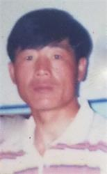
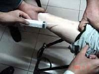

<h4 align="center"><b>知情权不能放弃，也不作愚民，让你看第一手不被过滤的新闻，翻墙软件免费下载  https://git.io/opopop </b></h4>

<h4 align="center">直连不必翻墙 blossom必看 精彩视频 http://36.228.2.212 </b></h4>

<h4 align="center">中共覆灭在即 勿依赖中共保权 https://git.io/Ffor </b></h4>

<h4 align="center">● 红潮即将倾覆 天之将明 ●https://git.io/bb99bbss </b></h4>

<h1 align=center><a href="https://github.com/gav01/Heart/blob/master/ls-11.md">● 大纪元2019年11月时事 ● </a></h1>

<h1 align=center><a href="https://github.com/gav01/Heart/blob/master/ls-12-1.md">● 大纪元2019年12月时事 ● </a></h1>
<a name=top>

<a href =#154>154.薄熙来之子薄瓜瓜 最新行踪曝光 
<a href =#153>153.辉山乳业被强制退市 辽宁首富成“老赖” 
<a href =#152>152.黄之锋周庭林朗彦案再提堂 离港申请被拒 
<a href =#151>151.【新闻看点】习访澳门 管控空前 全城半瘫痪 
<a href =#150>150.河北蠡县三任派出所所长壮年暴死 
<a href =#149>149.粤村民汽油弹攻政府视频曝光 目击者描述现场 
<a href =#148>148.中共监控每个人 深圳人：我们的生命如贱土 
<a href =#147>147.中共“奴工”买卖的罪恶 
<a href =#146>146.原吴小晖旗下成都农商行被收归“国有” 
<a href =#145>145.分析：中国大陆银行挤兑增加 投资者担忧 
<a href =#144>144.陆41上市民企变国企 10多家老板被抓或辞职 
<a href =#143>143.脆弱美中贸易协议凸显中共内部分裂 
<a href =#142>142.二十位法轮功学者被药物毒害致死案例 
<a href =#141>141.习近平见林郑 中共政法委头目罕见参加 
<a href =#140>140.709律师李春富遭边控 质问当局怕什么 
<a href =#139>139.北京建了大量廉价公寓楼 为何多数无人问津 
<a href =#138>138.河南许昌公安局副局长彭杰投案被调查 
<a href =#137>137.爆料：港惩教署精神病院押送大批“犯人” 
<a href =#136>136.两年销售6亿 湖北“神奇水”背后的魔爪 
<a href =#135>135.房市持续繁荣 美国建商信心指数20年最高 
 
<a href="https://github.com/gav01/Heart/blob/master/ls-12-1.md"><b>往1 ~ 134  新闻</b></a> 

<a name=154>
<h1 align="center"><b>薄熙来之子薄瓜瓜 最新行踪曝光</b></h1>

薄熙来儿子薄瓜瓜的行踪备受外界关注。（视频截图）

【大纪元2019年12月17日讯】（大纪元记者周行多伦多编译报导）在公众视野中消失了很久的薄熙来的儿子——薄瓜瓜，正在加拿大鲍尔集团股份有限公司（Power Corporation of Canada，简称 PCC）工作。有人认为，PCC雇用薄瓜瓜是为了保持和中共权贵的关系。

据《环球邮报》报导，PCC拥有遍布全球的金融、运动服、建筑及石油资产业务，是年收入数百亿加元的跨国公司。该公司与薄瓜瓜的关系，在纽约律师数据库中有记载。

PCC的副总裁兼总法律顾问勒梅（Stéphane Lemay）证实了这一点，他在一份声明中说，现年32岁的薄瓜瓜，在总部位于蒙特利尔的PCC，担任业务分析师已有两年半时间，他通过一个实习计划加入该公司。

该消息引起了一些中国精英政治观察家的注意。他们认为，尽管薄熙来家族在中国仍有关系网，但加拿大公司与该家族发展关系还是有潜在风险。

香港中文大学中国精英政治专家林和立教授说，PCC雇用薄瓜瓜，“有点令人吃惊”。薄熙来曾和习近平争夺领导权，“我认为PCC不想树立一个雇用习近平主要敌人之一的儿子的形象”。

薄瓜瓜在PCC工作被认为是显示了中共政治权力的复杂性，尤其是在近年中共高层领导人变动、及去年加中外交风波的背景下。

勒梅称，PCC是40多年前最早进入中国的西方投资者之一，多年来一直与许多中共权贵保持着关系，“包括与薄熙来家族的关系”。

《环球邮报》称，他们尝试采访薄瓜瓜，但没有得到回应。

<b>中共权斗规则</b>

薄熙来已经被投入监狱，但薄家族在中共中仍有影响力。薄熙来的姐姐薄洁莹今年11月因病去世时，根据在中国媒体广泛流传的图片，邓小平和刘少奇的后代去葬礼上送了花圈。

西安交通大学-利物浦大学的学者古德曼（David Goodman）研究中国共产党的历史和政治变革。他对496名中国富翁进行了调查，发现至少有82%人的祖父母是1949年前中共体制中的重要人物。

薄家族也不例外，薄瓜瓜的祖父薄一波1925年加入中国共产党，并担任其第一任财政部长，后来成为中共八大元老之一。

芝加哥大学政治学家杨大利（Dali Yang，音译）说，实际上，薄瓜瓜在其父母遇到麻烦时曾回国探亲，之后还能出国，“这显然是得到中共领导层同意的”。

澳大利亚技术大学（UTS）学者冯崇义（Feng Chongyi）表示，尽管过去一个世纪的中国历史经常看到动荡不安，包括毛泽东发起了多次血腥运动和清洗，但权力仍然在那一帮人手里。

他说，由于薄瓜瓜与红二代及红三代的联系，他仍然有可能在中国拥有强大的人脉，“在这个（中共）国家里，共产党贵族对经济体制的影响举足轻重”。

党史学家和评论家章立凡（Zhang Lifan）说，年轻的薄瓜瓜可能被视为“稀有品”。红二代的特征之一是“即使他们的父亲或祖父之间，有时怀有深仇大恨，但是他们仍然保持着联系”。

<b>PCC长期经营中国市场</b>

1997年，时任PCC公司总裁德斯玛莱（André Desmarais）在北京与薄一波私下会面。德斯玛莱把那次会面称为“特殊优待”。上周，德斯玛莱家族表示，他们将放弃在PCC的行政高管职位，但将保留在董事会的领导权。

同时，PCC公司也与薄熙来建立关系，薄熙来当时在中共体制内就像是一股快速崛起的势力，有机会问鼎中共的最高权力。德斯玛莱的岳父、加拿大前总理克里靖（Jean Chrétien）曾称薄熙来为“老朋友”。当时的加拿大政府认为，建立这种关系很重要。

不过，事实证明，雇用中共精英阶层——太子党的子女，对雇主来说是有风险的。近年来，德意志银行、摩根大通和瑞士信贷，都已向美国当局支付数以百万美元计的和解费，因为他们被指控通过雇用中共官员的亲属来竞争业务，从而违反了腐败法。

<b>薄瓜瓜其人</b>

在薄熙来事件中，薄瓜瓜看起来被网开一面。在其父母被拘留的时候，薄瓜瓜是哈佛大学肯尼迪学校的一名学生，离获得公共政策硕士学位只有不到一个月的时间。

薄瓜瓜还曾在英国贵族学校哈罗公校（Harrow School）学习，后进入牛津大学；2012年在哈佛获得硕士，2016年从哥伦比亚法学院获得法学博士学位。

纽约州的记录显示，薄瓜瓜在2016年通过了纽约州律师考试，并在2017年年中被接纳为纽约律师。该注册文件显示，他工作的公司是PCC，所用的是一个位于多伦多的地址，以及蒙特利尔的电话号码。

<b>薄案核心罪恶仍被掩盖</b>

薄瓜瓜的出现，让薄熙来案件再次受到关注。

2013年9月22日，薄熙来以受贿、贪污、滥用职权罪一审被判无期徒刑，同年10月25日二审裁定维持一审判决。2012年8月20日，薄谷开来以故意杀人罪被判处死刑，缓期执行。

薄熙来夫妇已被处罚，但其参与政变和活摘法轮功学员器官的核心罪恶依然被掩盖。

有报导说，薄熙来夫妇为向江泽民邀功请赏，积极镇压法轮功，把大量法轮功学员关押到辽宁。他们最早开始活摘法轮功学员器官卖钱，并贩卖尸体标本。而英国人海伍德就是由于卷入其中，被薄谷开来灭口。#

<a target="_blank" href=#top><h6 align="right">回上方</h6></a>

<a name=153>
<h1 align="center"><b>辉山乳业被强制退市 辽宁首富成“老赖”</b></h1>

位于沈阳城区的辉山乳业公司。（大纪元资料室）

【大纪元2019年12月19日讯】12月18日晚间，香港交易所发布公告表示，中国辉山乳业控股有限公司除牌程序的第三阶段于2019年11月15日届满前，该公司没有提交任何复牌建议。联交所决定取消该公司股份在联交所的上市地位。业界俗称“强制退市”。

据《中国基金报》12月19日报导，港交所的公告显示，辉山乳业的股票自2017年3月24日起已暂停买卖。2018年3月27日，联交所上市部认为该公司并未符合《上市规则》第13.24条有关拥有足够业务运作或资产的规定，故根据《上市规则》第17项应用指引将该公司置于除牌程序的第一阶段。

联交所分别于2018年9月27日及2019年5月3日将该公司置于除牌程序的第二及第三阶段。在除牌程序的第三阶段于2019年11月15日届满前，该公司并没有提交任何复牌建议。因此，联交所决定取消该公司股份在联交所的上市地位。

辉山乳业是辽宁一家老牌乳企，于2013年在香港上市，在2017年3月24日之前，市值约为400亿港元。

2016年的12月16日和19日，著名的做空机构“浑水”（Muddy Waters Research）接连发布了两篇做空辉山乳业（6863.HK）的报告。

报告显示，辉山乳业最少自2014年以来一直发布不实的财务数据，包括盈利造假、夸大资本开支等，又指其公司主席杨凯有可能挪用公司至少1.5亿元人民币资产，真实数字或更大。

19日，“浑水”又发布了报告的第二部分，称辉山收入造假，这份报告以中共国家税务总局增值税数据为证，显示辉山存在大量欺诈性收入。而且“浑水”使用无人机拍的辉山养牛场的照片，显示养牛场的屋顶都破了。

“浑水”的调查持续了好几个月，共访问了35个牧场、5个生产设施基地和2个完全没有建设迹象的生产基地。

最后，“浑水”在报告的结论中表示：“我们认为这家公司的价值接近于零。”

2017年3月24日，市场消息传出：辉山乳业大股东挪用30亿账上资金投资房地产，资金无法回收，“浑水”沽空报告发布后，各家银行前去审计调查发现，辉山乳业一堆单据造假。

2017年3月24日，辉山乳业（6863）股价在上午突然暴跌近九成，30分钟内，300多亿市值蒸发，创下香港主板一个纪录了。

有网民表示：“靠借债上市做大的公司，破产都是瞬间的事，活下去，靠实力。”

也有网民认为：又一家企业倒在了房地产上，不好好做主业，只想赚快钱。

股价崩盘之后，2017年12月7日，辽宁省盘山县法院公布，辉山乳业董事长杨凯因“有履行能力而拒不履行生效法律文书确定义务”，被列入全国法院失信被执行人名单；即俗称的老赖。

2016年，杨凯以260亿人民币身家，登上了胡润百富榜，排在第66位，也是辽宁首富。#

<a target="_blank" href=#top><h6 align="right">回上方</h6></a>

<a name=152>
<h1 align="center"><b>黄之锋周庭林朗彦案再提堂 离港申请被拒</b></h1>

香港众志秘书长黄之锋（左）、成员周庭（右）。（大纪元合成）

 
 【大纪元2019年12月19日讯】香港众志秘书长黄之锋、主席林朗彦及成员周庭因参加“反送中”运动被控罪，案件今（19日）在东区法院再提堂。案件再押后再讯。3人在明年初离港的保释申请被拒。

控方称已准备好答辩，但辩方指刚收到控方文件，需时审阅，要求押后答辩，案件再押后明年2月13日再讯，期间3人都被准以原有条件继续保释，裁判官拒绝让3人在明年初离港的保释申请。

黄之锋等3人今年6月21日，参与在湾仔警察总部外抗议，而被控“煽惑他人、组织或参与未经批准的集结”等罪。

8月30日，黄之锋和周庭先后被捕。警方亦证实拘捕黄之锋，并称与6月21日在湾仔警察总部外的示威有关。

案件当日中午在东区法院提堂。黄之锋与周庭每人以1万元现金获准保释，每周两次到警署报到，除了法庭批准的日子外不得离港、须守宵禁令及不再进入案发地点。林朗彦也在被告之列，控方称林在没有担保及不知道将会被告的情况下已于8月28日离开香港。

香港众志发表声明，批评警方于8.31前夕通过大规模搜捕抗争者，企图营造寒蝉效应、白色恐怖，众志对此感到非常愤怒。

众志声明还指，这次拘捕显然属于政治操作，以煽惑、组织等较严苛的罪名拘捕被中共点名的“运动领袖”，配合中共舆论，构陷“反送中”运动有“幕后黑手”，而漠视香港几百万民众提出的五大诉求。#

<a target="_blank" href=#top><h6 align="right">回上方</h6></a>

<a name=151>
<h1 align="center"><b>【新闻看点】习访澳门 管控空前 全城半瘫痪</b></h1>

12月18日，习近平到达澳门。图为习准备坐车离开机场，保安人员围在周围。（ANTHONY WALLACE/AFP via Getty Images)

 
 【大纪元2019年12月18日讯】大家好，欢迎大家关注新闻看点，我是李沐阳。

今天（12月18日）下午4点多，习近平和彭丽媛抵达了澳门，并在机场发表了讲话。习称澳门“贯彻一国两制方针”，取得的经验和具有的特色值得总结。

习亲临澳门，对澳门当局来说是一个大事。不仅现任澳门特首崔世安和后天上任的候任特首贺一诚到机场迎接，而且在全程陆续实施了多项特别安保措施，称要“确保万无一失”。

不过澳门当局所采取的“安保措施”，可苦了澳门市民。轻轨停运、航道禁航、加油站不供油、提款机不许提款等等，几乎造成了澳门全城“瘫痪”。澳门人相对平静的生活，因为习的到来被完全打乱了，有网民怒斥“极度扰民”。
 
<b> 习访三天：轻轨停运 海路禁航</b>

习近平到访澳门3天，将参加澳门主权移交20周年大会和特别行政区第五届政府就职典礼。为确保习在澳门三天两夜的绝对安全，中共相关部门和澳门保安当局采取了非常严密的保安措施。

澳门当局宣布，从今天凌晨开始加强安检，治安警与海关将联合检查所有陆路口岸使用关闸的车辆，包括港珠澳大桥、关闸、路氹城和珠澳跨境工业区出入境口岸，并将一直持续到周六（21日）。

就在习飞机降落的3个小时前，刚刚开通还不到一周的轻轨氹仔线全线停运了。虽然习在周五下午离开澳门，但是也要持续到21日（周六）轻轨才恢复正常。

与此同时，澳门海事局也对外公布，18-20日，外港航道、氹仔航道、往内港航道和九澳港航道也将设立临时管制和禁航措施。

喷射飞航表示，按相关部门指示，因应安全检查工作，16-20日期间，来往香港及澳门的航班将作调整。从原来的20-30分钟一班，调整到每30分钟一班。

<b>加油站不供油</b>

昨天有网友在推特上晒出一张加油站的“特别通告”。上面写着“由于12月18、19、20日澳门市面交通将有特别安排，可能会影响油车运作，未能及时补充加油站油缸”。提醒人们提早把油加满，免得未来几天没有燃油可用。

不过澳门经济局表示，石油业商会将在这三天“确保各项燃料供应正常”。但是可能会因为有特别交通安排，业界可能会调整油品运送路线，降低对市民及工商界的影响。

还有网友贴出两张对话截图，其中提到“银行几日提款机不入钱，因为不比（给）保安拎枪”，“18开始，直到他走”。对话还表示，“机场10已经疯（封）了停车场，不比（给）停车”。

网友说的“直到他走”，这个“他”，应该指的就是习近平了。

不过澳门银行公会主席叶兆佳表示，目前银行服务一切正常，柜员机的现钞也供应正常，市民毋须担心。

<b>新竹苑“密不透风”</b>

习近平在澳门停留的2夜，据传将入住新竹苑。据澳门网媒论尽报导，从昨天开始，新竹苑周边已经采取了非常严格的保安措施。除了有警察严格把守外，门前也加装了金属探测器，加强安检措施。

 

12月18日，习近平到达澳门机场。（ANTHONY WALLACE/AFP via Getty Images)

 
 新竹苑附近西湾一带，保安当局早就采取了非常严密的安保措施。新竹苑旁边的休憩区，也被暂时封闭了。

澳门多个区的路边停车位 ，比如美副将大马路、海立方对开等，也都不允许停车。多条巴士路线也改道行驶，部分巴士站的报站显示荧屏也暂停了服务，改换成了警示式口号“庆回归，保安全”。

习的到来，整个澳门都受到了影响，市民的正常生活被严重搅乱了。有网民怒火难抑，斥责习“极度扰民”，也有的说“不如政府宣布放假吧”。

 

12月18日，习近平到达澳门。图为习坐车离开机场，保安人员围着。（ANTHONY WALLACE/AFP via Getty Images)

 
 <b>外部记者重点防范 “危害安全”？</b>

百姓常说“不做亏心事，不怕鬼敲门”。习的出行，竟然需要如此“安保”，到底做了什么，怕成这样？甚至连报导新闻的媒体记者，也成了重点防范对象。

香港电台报导，今早2名记者乘渡轮抵达澳门码头后，被多名便衣边防人员先后截查。二人先后被没收身份证、记者证，并被带到警局，被要求填写个人姓名、父母姓名、联络方式和住址等，并询问入境的目的。

其中一人被拒绝入境，并要求在拒绝入境通知书上签字。通知书写着，有强烈迹象显示，企图入境澳门从事危害公共安全或公共秩序之活动。

不止是香港电台，还有Now新闻台、商业电台、无线电视，甚至连阿里巴巴旗下的南华早报，也有记者被拒绝入境。

一名日本媒体记者上周由香港入境澳门做前期采访，入境检查设备在读取他的身份证明文件时发出了异样，随即被带走查问。与他同船的很多人都必须接受查问，包括越南籍和美英人士，连中国大陆人也要排队一一接受查问。

这名日媒记者最后致电澳门的一名中共人大代表，经过对方说情，才准许他入境。他怀疑当局有一份记者黑名单，因为除了他本人之外，还有一名英文媒体的记者也是通过澳门立法会议员说情才获准放行。

葡萄牙媒体报导，国营广播电台（Rádio e Televisão de Portugal；RTP）2名记者上周两次入境澳门，也都遭到查问。在查扣了直播器材后，才将他们放行。

<b>当地记者受严重威胁</b>

澳门媒体也不例外，甚至遭到了威胁。爱瞒日报前副社长崔子钊昨天向自由亚洲表示，这次澳门政府应对习近平的来访，保安“史无前例”的严密，本地记者都受到非常严重的威胁。

崔子钊曾被人警告“尽量不要到中国大陆”，他推测威胁他的人有可能是大陆人士。另外他的一些记者朋友也有多人被跟踪、威胁，甚至有人在他们家门外徘徊。有的记者家里被人拉掉电闸，有的被威胁“如果这段时间乱报什么、乱说什么，家人都会受到威胁和影响”。

防火防盗防记者，再一次成功上演。香港记者协会今天表示了“极度遗憾”，促请大陆和澳门当局尊重新闻自由，不要肆意限制记者的出入境权利。

声明表示，澳门当局今年多次以不同理由拒绝香港记者入境，令人“极度遗憾”。

<b>社民连被拒登船</b>

与记者相比，社民连连船都没有上去。几名成员今天计划到澳门示威，结果在香港码头就被拒绝登船前往澳门。

社民连梁国雄表示，出境前有香港入境处职员表示，澳门不欢迎他们入境。在拒绝他们登船时，给了他们一封澳门治安警局局长梁文昌写给船务公司的信件。称社民连成员计划在澳门庆典活动进行破坏，要求船务公司拒绝运送他们入境，否则须承担法律责任。

<b>澳门如何成了北京的“乖儿子”？</b>

看澳门一系列做法，与中共统治的大陆越来越相似，几乎成了北京的“乖儿子”。彭博社表示，澳门不同香港，选择了“财富而非民主（chooses Chinese riches over democracy）”

澳门法学社科院教授王建伟表示，澳门在殖民时期实际是“华洋分治”，与香港的情况大不相同。澳门是葡萄牙人管葡萄牙人，华人管华人，而香港，是英国人在励精图治。澳葡管制是比较差的，而中共接手后，又开放博彩业，使人们有了钱。

世界银行数据显示，澳门人均财富仅排在卡塔尔之后，去年人均GDP超过12.2万美元。彭博社表示，澳门成了“听话有好处”的典范。

另一方面，中共为了统治澳门，很早就做足了准备。

资深民主派立法会议员区锦新对美国之音表示，从上世纪60年代，左派亲共团体就全面控制了澳门。当时就有人说，澳门是半个中共统治区了。

香港时事评论员谭自强表示，在澳门主权移交前8年，中共至少派出了12名大陆法律人士前往葡萄牙，学习语言和法律。中共这么做，为的就是解决澳门主权移交时面临的三个问题。一是法律中文化，二是公务员本地化，三是中文称为法定语言。

当初派去葡萄牙的人，后来都成了澳门政府的管理人员。南华早报指出，现任保安司司长黄少泽、检察长叶迅生和前检察长何超明等，都是那一批人。

澳门独立媒体人罗伊对自由亚洲表示，这些人对中共的忠诚度很高，他们是按照中共的要求去管制澳门。中共一方面补充缺少的人才，一方面把自己的人带去澳门，这使得它对澳门的控制非常牢固。

大纪元《新闻看点》制作组

<a target="_blank" href=#top><h6 align="right">回上方</h6></a>

<a name=150>
<h1 align="center"><b>河北蠡县三任派出所所长壮年暴死</b></h1>

自1999到2011年，河北省蠡县的鲍墟乡有三任派出所所长壮年暴死。(fotolia)

【大纪元2019年12月19日讯】自1999到2011年，河北省蠡县的鲍墟乡有三任派出所所长，外加一个副乡长壮年暴死。

明慧网报导，从1999年7月20日中共迫害法轮功开始，鲍墟乡在蠡县的迫害法轮功学员运动中首当其冲。

<b>彭小五，蠡县刘村人，原鲍墟乡派出所副所长</b>

他因积极参与迫害法轮功，绑架法轮功学员，中共给他“荣立”三等功，给予奖金一万元。

2003年5月8日晚十点，彭小五被大车撞死在蠡县永盛大街奔垒德村的十字路口，死时才40岁左右。

<b>齐广平，蠡县鲍墟乡人，时任鲍墟乡派出所所长</b>

村里人说，按理讲本乡本土的，对家乡的人，应该手下留有余地。可他不但没有那样做，还和鲍墟乡副乡长刘建柱，把进京为法轮功鸣冤的法轮功学员绑在乡政府大院里抱着树挨冻。

当时正是三九天，下着大雪，齐广平穿着皮鞋踢打法轮功学员，把学员的眼镜打碎。齐广平还带人到法轮功学员家中没收法轮功书籍。

过后不长时间，齐广平便感身体不适，后死于癌症。

<b>王新斋，50多岁，曾任蠡县公安局纪检副书记、看守所所长、鲍墟乡派出所所长</b>

他唆使警察毒打法轮功学员，并对法轮功学员进行长期超期非法关押。

2002年8月，他因奸污妇女被免去所长职务。

2011年正月初四，王新斋开车和朋友去山东，在高速公路上将护栏撞开，车子滚下，车上四人，只有坐在后座的王新斋一人死亡。

<b>刘建柱，蠡县留史镇大王村人，原蠡县鲍墟乡副乡长</b>

1999年7月以后，他紧跟中共江泽民集团残酷迫害法轮功学员。

2009年6月11日，在蠡县滑村板厂附近的留史道上，刘建柱开的面包车与一辆公共汽车相撞，面包车的方向盘挤压在他的胸部，造成他当场死亡。

当时刘建柱的车上有好几个人，只有他一人死亡。

</b>其他蠡县遭厄运人员事例：

李文彦，男，蠡县城关派出所所长</b>

他打昏一名法轮功女学员，将其衣服扒光，在雪地里冻，使人死去活来。

李文彦还时常闯进法轮功学员家，翻箱倒柜，见钱就装。晚上蹲坑抓人，白天撕真相标语。全乡法轮功学员几乎都遭其毒打和谩骂。

2003年秋，李文彦因欠账被起诉，因殴打河北电台记者，被全省通报，撤销职务。

<b>李国昌，男，蠡县看守所警察</b>

他在寒冬腊月扒光法轮功学员的衣服，逼他们趴在水泥地上冷冻。酒后闯进女监牢进行调戏，无耻去摸一未婚女学员的下身。

2000年冬，李国昌突然瘫痪。

<b>王海发，蠡县城关派出所警察</b>

2001年，王海发领一帮人到法轮功学员崔小先家抄家，抢走私人财物，并用脚踩烂供香，砸烂香炉。

这次抄家不久，王海发的儿子被车轧死。

<b>张五进，男，蠡县留史人，保定市公安局副局长；赵玉锁，男，蠡县人，保定市公安局法制处劳教科科长；张应华，男，司机</b>

2010年8月11日，三人驱车赶赴阜平，要与河北省国保总队人员共谋绑架法轮功学员事宜，车至中途，冲出高速公路，赵玉锁、张应华当场死亡，张五进被甩出车外，多处骨折造成重伤。

人们在怜惜，叹惋这些人的遭遇时，可能会想：他们为什么会有如此厄运。

明慧网评论说，法轮功是佛法修炼，常言道：宁搅千江水，不扰道人心。法轮功学员遵循“真、善、忍”修炼原则行事，不顾自身安危，在大劫来前告诉人们真相，让人们远离灾难，却遭无故迫害。

如不迫害佛法，那些人本可生活得很好，尽到做为儿子、丈夫、父亲的职责，然而不幸的是他们选择助纣为虐。

自古迫害信仰者的人，都不得善终。罗马帝国那么强大，只因迫害基督徒，而遭四次大瘟疫降临，最终导致罗马帝国在世间消失。#

<a target="_blank" href=#top><h6 align="right">回上方</h6></a>

<a name=149>
<h1 align="center"><b>粤村民汽油弹攻政府视频曝光 目击者描述现场</b></h1>

12月16、17日，在距离文楼镇27公里的播扬镇，针对建火葬场再次爆发抗议，警民冲突激烈，村民扔汽油弹攻政府。（视频截图）

【大纪元2019年12月19日讯】（大纪元记者洪宁、顾晓华采访报导）继11月底广东茂名化州市文楼镇上万村民抗议建火葬场之后，12月16、17日，在距离文楼镇27公里的播扬镇再次爆发抗议，警民冲突激烈，村民扔汽油弹攻政府，一位在场村民刘先生向大纪元记者描述了现场情况。

此次事件的导火索仍然是建火葬场，有消息称当地政府以建净化水设施为幌子把火葬场修建在该镇的良山村，而且已经动工，因此引发村民抗议，爆发激烈冲突。

12月16日，村民打横幅游行示威至镇政府，刘先生透露，最高峰时有村民上千人，村民冲入了政府大楼内。

政府官员不是解决问题，而是调动五六百名防暴警察到现场，刘先生表示，一共发生了三次激烈的冲突，事件从16日一直持续至17日下午才平息。最激烈的冲突发生在16日晚上，村民在政府门口欲掀翻消防车，以及用汽油弹丢向政府内是冲突的高峰时期，之后17日中午也爆发冲突，警方施放了催泪弹进行镇压。

刘先生还表示，冲突最主要的原因是警察将进入政府内的村民打出来，暴力驱散村民，他亲眼看见几名防暴警察殴打一名村民，打得村民倒地起不来，还有妇女也被殴打。具体受伤人数不详，但是有传闻一名村民因伤势过重，当地医院不接收，该名村民具体情况不得而知。

警察的暴力激起了村民的愤怒，过程中村民向警察扔砖头、鸡蛋、矿泉水瓶等，在政府门前警察用盾牌排成人墙与村民对峙。当时有村民欲掀翻一辆消防车，之后防暴警察反扑，将村民赶出政府大门外。

最激烈的是村民在政府大门外使用自制汽油弹向政府内扔去，政府院内火光四起，政府门口的保安亭被烧毁，据悉，村民还使用了少量的烟花爆竹进行反击。

事件发生之后，播扬镇政府最终妥协，为平息民愤，发布了一份承诺书，声称不在该镇境内建火葬场。还决定将目前建在良山村茅坡坪的水质净化厂基坑进行回填，回填时良山村的每个自然村可以派出2名村民代表进行监督。

另一位村民表示，“开始的时候（当局）也不透明，不说明是建还是不建，村民担心在文楼没有建成，就移到播扬建，所以就闹。”

也有网民感叹，化州火葬场项目五年间大闹了4次，搞到群众变成惊弓之鸟，政府搞公共建设项目，没有公开听证会，即使说是污水净化厂项目，群众也不相信，什么原因导致到群众不信任相关部门，值得深思！

还有网民说：“现在发布公告说停了，准备填坑，这结果很显然本来就是做火葬场，如果是做水质净化厂，根本不需要停，总能说清楚的。”

当地政府在终止项目的同时，17日，化州市公安局发布通告，要求参与打砸抢的村民尽快自首。

目前许多村民对此事三缄其口，也不敢在网络上传播视频。#

<a target="_blank" href=#top><h6 align="right">回上方</h6></a>

<a name=148>
<h1 align="center"><b>中共监控每个人 深圳人：我们的生命如贱土</b></h1>

美国媒体披露，中共正在将监视14亿人口的能力提高到一个新水平。图为一名男子于2013年10月31日在北京天安门广场检查监视镜头。(Ed Jones/AFP/Getty Images)

【大纪元2019年12月19日讯】（大纪元记者张婷编译报导）美媒称，中共正在将监控近14亿人口的能力提高到令人不安的新水平，中共致力于打造数字极权国家。

《纽约时报》查看的警察和私人数据库显示，中共当局正在将旧有的和最先进的技术（电话扫描仪、脸部识别摄像头、脸部和指纹数据库等）组合成用于威权控制的工具。

报导表示，一旦组合起来并全面投入使用，这些工具就可以协助警察随时掌握街上行人的身份，并了解他们与哪些人见了面，还能辨认哪些人是党员哪些不是。美国和其它国家／地区使用其中一些技术来追踪恐怖分子或贩毒集团，但中共政府想用这些技术来跟踪每个人。

<b>中共的监控技术已经危及个人隐私</b>

在中国，这些技术的推出危及个人隐私。《纽时》发现，中共当局将数百万人的个人数据存储在甚至连基本安全措施保护都没有的服务器上。该报还发现，私人承包商和中间商可以广泛访问中共政府收集的个人数据。

报导说，打造这种监控网还只是刚刚开始，但正在席卷中国各个城市。监视网络由地方警察控制。

就其本身而言，中共的任何新的监控技术都没有超出美国或其它国家的技术能力。但是，这些技术组合在一起，它们可以将中共的间谍活动推上一个新水平，使其摄像头和软件变得更智能、更先进。这也正在加强中共警察的能力。

尽管加强监控表面上的原因是追踪罪犯，但这也让中共警察能够监控中国网民的不满和对香港抗议活动的同情，以及对警察及官员的批评等。而且，这种监控经常瞄准外地工和少数民族等弱势群体。

<b>深圳技术工人：我们的生命贱如尘土</b>

深圳的一名技术工人艾格尼丝·欧阳（Agnes Ouyang）在力求提高人们的隐私意识，但却引起了当局的审查。她说：“每个人的数据都是一条线索。”

“它可以被政府使用，也可以被大公司的老板利用来跟踪我们。我们的生命贱如尘土。”

去年，当欧阳正前往深圳工作时，两名警察指称她擅自穿越马路，需要向他们出示身份证。被她拒绝后，警察便粗暴地抓住她，并用手机拍了她的脸部照片。

片刻之后，他们的面部识别系统就识别了欧阳，并给她发了张罚单。

“这太荒谬了。”欧阳女士说，“道德水准低下的执法人员拥有高科技武器。”

《纽时》表示，高科技监视正在重塑中国人的生活。共产党长期以来一直奉行至高无上的统治，中国缺乏强大的司法体系或其它审查方法来遏制中共政府的越界。

欧阳女士知道会有危险，但还是选择公开投诉。她于晚上11点在微信上发了段她与警察冲突事件的视频。到第二天早上她上班的时候，已经有数万人看到。之后，她的帖子就消失了。在她看到警察以同样的方式对待另一位妇女时，欧阳女士写了第二个帖子。但该帖子只存活了两个小时便消失了。之后，警察打电话给她要求会面。

“我问，你们怎么找到我的？”欧阳说，“他（警察）说，‘对于警察来说，找一个人很容易的。’”

会面后，警察告诉她，她必须闭嘴。她的帖子已经被更高级的官员看到，并让该市警察感到尴尬。

欧阳女士说，这种经历是中国发生威权主义转折的一个标志，她的一些朋友私下里谈论想要出国。她说，她没有离开的计划，但生活在一个到处都是监视和控制的国家，她对自己的未来表示担忧。

“你对此感到不舒服。”欧阳说，“但是，如果你不这样做，那么就不可能有生活。没有出路。”

<b>中国多市效仿郑州 安装先进监控系统</b>

今年4月，警察来到工业城市郑州的一栋公寓区，三天内在公寓区的大门安装了4个摄像头，两个小白盒。该园区里面有一些廉价酒店。

这个监控系统一旦激活后，就可以搜索个人数据。这些盒子是“国际移动用户识别码撷取器”（IMSI catcher），可以收集手机的识别号码。而摄像头则可以记录脸部信息。系统试图将这些数据放在一起，如果相同的脸部信息和手机信息同时同地出现，系统就会更加确信这些信息来自同一个人。

今年4月的仅4天时间，这个盒子就识别了67,000多部手机。摄像头撷取了逾23,000个人脸图像。

根据郑州公安局的一个数据库，这一单一系统只是整个城市监控网络的一部分。后者覆盖了对车牌号、电话号码、脸部识别和社交媒体信息的监控。

其它中国城市也正在效仿郑州。自2017年以来，政府采购文件和官方报告显示，贵州、浙江和河南省的警察已经购买了类似的系统。文件显示，四川省中型城市自贡的警察购买了156套该技术。

在武汉，警方在一份采购文件中说，他们想要这些系统能够“全面收集公共场所所有互联网用户的身份，他们的互联网行为，他们所在地点，他们的动向以及识别他们的手机信息。”

即使对中共警察来说，这种程度的控制也是前所未有的。消息人士表示，改进的技术可以帮助他们与在北京的中共公安部分享信息。

在郑州，警察可以使用软件创建一组人员名单（黑名单）。他们可以为某个人什么时候接近哪个特定地点创建虚拟警报。他们甚至可以获得有关特定人员的每小时或者每天的更新信息。他们可以监控这些人与哪些人见了面，特别是如果两个人都在黑名单上。

郑州公寓楼区的经理梁建正（Liang Jianzheng，音译）表示，11月份，在《纽时》向监控公司询问了该系统后，一组施工人员出现了，并取下了摄像头和小白盒。他们并没有解释为何要这么做。#

<a target="_blank" href=#top><h6 align="right">回上方</h6></a>

<a name=147>
<h1 align="center"><b>中共“奴工”买卖的罪恶</b></h1>

人间地狱“马三家”。（明慧网）

 
 【大纪元2019年12月11日讯】1999年7月，中共江泽民集团对法轮功发动了灭绝人性的迫害，实施“名誉上搞臭、经济上截断、肉体上消灭”的政策。法轮功学员被任意抓捕、非法劳教，被当做奴隶买卖，强迫高强度做奴工，还遭酷刑折磨。

当时中共的670所监狱、310所劳教所（收容人数31万）随之骤然大幅超员。

2001年，中国国务院又批准在全国新建120所大型现代监狱，分别容纳3,000人、5,000人、1万人，并规定在2005年全部竣工。

各地的监狱、劳教所因大量关押法轮功学员，不断获得中共的巨额拨款，改建、扩建了监区。

遍布中国的一千多家监狱、劳教所、看守所的现代奴工，日日夜夜在最恶劣的工作环境中，从事著有损健康甚至危及生命的工作；那些感染了结核病、皮肤病、肝炎、性病等传染病的在押人员得不到有效的隔离与医治，仍被迫继续生产劳作，从儿童玩具到床上用品，从时装到内衣，从化妆棉签到牙签、卫生筷……伪劣、有毒和被病毒污染的奴工产品被销往世界各地，进入千家万户。

<b>迫害与监狱企业的增长</b>

在中共迫害法轮功之前，各地监狱、劳教所普遍资金匮乏，设施破旧不堪，相当一部分濒临破产。即便是中共司法部直辖的沈阳马三家劳动教养院1999年10月以前，连年亏损，连电费都入不敷出。

迫害法轮功开始后，中共向监狱、劳教所注入巨资，以大量关押法轮功学员。

2003年，中共司法部更用监企分离来刺激监狱产业增长，以用巨额利润调动监狱劳教所迫害法轮功的积极性，保障其专政功能。中共全额保障监狱经费，国家作为监狱企业的投资者，全部产权归属监狱，对监狱企业免征企业所得税和土地使用税，并“先征后返”增值税。

监狱企业借此优惠政策，用国家提供的土地、厂房、设施和无偿的奴工，做起了几乎是无本的买卖，吸引了大量的外资合作，成为盈利、出口创汇单位。中共的监狱企业开始高速增长。

河南许昌市和禹州县是中国假发制品最多的地方，这里有64家企业生产假发制品，而河南瑞贝卡在该行业中规模最大。劳教所的廉价劳动力支撑了河南省毛发制品的出口量高速增长。

1995年以前，此类产品年出口仅1,000万美元左右，1996年增至4,525万美元，1999年首次突破1亿美元，而1999年正是江泽民政府开始全面镇压并非法关押法轮功修炼者的一年。

到了2002年前10个月，河南省毛发制品出口额更增至1.3886亿美元，形成产值高达10亿元的大产业，成为了世界上最大的毛发制品生产基地，毛发制品行业实现连续数年均近30%的增长速度，生产的发制品占全世界市场份额的1/4左右。

不过，许昌第三劳教所制造各种假发，出口世界各国，明明是人工制造的假发，总要打上牌子，写上百分之一百的真发。

在中共对法轮功的灭绝政策的驱使下，狱警更以每天20小时以上的超极限奴役和令人发指的酷刑来逼迫法轮功学员放弃信仰，并榨取其血汗。

为缓解加工厂人力的不足，许昌第三劳教所还以每人800元的价格从其它劳教所（如北京遣送站及北京劳教所）“购买”法轮功学员，甚至不断地从各地秘密绑架大批法轮功学员充做奴工，肆无忌惮地榨取他们的血汗。

河南许昌第三劳教所警察沈建伟曾经讲：“三所在前一段已无法维持，就要解散时，绑架来了法轮功学员，以每名2万元的拨款作为“转化经费”（逼迫人放弃修炼）。”

借此机会，三所以其中800万元的拨款建楼房，奖励迫害卖力的警察。现在，三所还以每名800元的价格买法轮功学员，榨取他们的血汗，为劳教所提高产值。在这里，谁要喊一声“法轮大法好”，马上会受到各种酷刑摧残。

因迫害法轮功“有功”，河南省第三劳教所受到中央政法委和“610”（专门迫害法轮功的非法机构）办公室奖赏，还被评为“国家级文明单位”；曾于2003年用酷刑“约束衣”迫害女法轮功学员的郑州十八里河女子劳教所也被司法部表彰，其“转化”残害学员的“先进经验”还在全国劳教系统得以推广。

几年下来，很多监狱、劳教所同时经营不同的生产企业，甚至通过大规模兼并、融资，发展成跨领域、跨地域的大型集团企业。劳改产品也今非昔比，不再限于昔日手工作坊加工的卫生筷、圣诞节饰品之类的小打小闹，而是覆盖汽车、机械、电力、电子、化工、建材、制药、日用品、农、林、牧、矿等各个领域行业。

以监狱企业发达的山东省为例，山东里能集团下辖六个监狱，有7个子公司，覆盖电力、煤炭、水泥、机械、农业、运输等行业，并经营投资、营运、建设等项目，集团资产近百亿，被授予“国家一流电力企业”，被评为山东省百强企业集团，并进入全国大型企业五百强。

2006年山东省的GDP增长率为15.3%，居全国之冠；然而，同样引人注目的是，山东省居民的平均收入却很低，以GDP增长率高达17.4%的济宁市为例（有济宁监狱的多个煤矿企业），该市居民的平均收入却列全省倒数第二。监狱企业对奴工血汗的疯狂榨取和对正常企业和劳工市场的强烈冲击，从中可见一斑。

<b>奥运期间 贩卖法轮功学员疯狂</b>

2008年北京奥运会期间，北京劳教所、调遣处劫持了大批法轮功学员，也是贩卖法轮功学员的最疯狂时期。转卖到外地劳教所迫害往往涉及金钱交易，如“卖”给内蒙古呼和浩特女子劳教所每人800元至1,000元，在那里强制法轮功学员从事繁重的强力奴工劳动。这些学员在外地都遭受非人的迫害和奴役。

法轮功学员华府中使馆前集会，抗议中共以奥运为借口加剧迫害。（明慧网）

 
<b> 被贩卖到辽宁马三家劳教所</b>

2008年至2009年，从北京调遣处和劳教所分五批，秘密押往恶名远扬的辽宁马三家男女劳教所一百多名学员，这些学员每两个人被用手铐铐在一起，有的学员的嘴被胶带封住，关进用布帘严密遮挡门窗的汽车里，被武装押送到马三家，学员到了之后才知道是什么地方。

2008年，从北京转移到马三家劳教所的五六十名法轮功学员。法轮功学员们一下车，便高呼“法轮大法好”，被以刘勇（男）为首的警察用手铐吊起来。

马三家劳教所警察对法轮功学员采用吊铐、上抻床，电棍电击腋下、大腿根内侧、头部等敏感部位，或用手铐把法轮功学员吊起来几天几夜。几乎每个法轮功学员都遭受到酷刑，有许多人受到过严重的迫害。

2008年4月29日，马三家劳教所从北京大兴调遣处买来30名法轮功学员、10名其他劳教人员，每名花1,000元。2008年6月4日，该所从该处又买来60名法轮功学员、10名其他劳教人员。2008年7月14日，再从该地买来40名法轮功学员、10名其他劳教人员。2009年3月28日，第五批从北京买来40名法轮功学员、10名其他劳教人员。

2009年11月19日第六次在北京劳教院女所4队至9队买来13名劳教人员、17名法轮功学员……2010年2月17日，该院女所从辽宁省葫芦岛市看守所以每人花1,000元买来40名女传销人员（全是外省人员），她们没有拘留证、没有劳动教养决定书。

酷刑演示：多根电棍电击。（明慧网）

法轮功学员郑旭军，1996年获中国电力科学研究院硕士学位，同年开始攻读博士，国家电力部科技进步三等奖获得者。

2008年2月，昌平国保大队绑架郑旭军、苏南夫妇到昌平一洗脑班，后送看守所并再次劳教两年半，又经北京劳教人员调遣处“卖”到辽宁省沈阳马三家劳动教养院，夫妻分别关押在男女劳教所。

在马三家劳教所，郑旭军被长期罚站、不让睡觉、奴工劳动、殴打、电击等。一次，他被五六个警察电击一个多小时后，狱警李猛又对他单独用刑。他被电刑后又被罚在大厅面壁站立，除吃饭上厕所时间外，几乎全天站立，午夜12点睡觉，早晨5点起床再站，如此持续一周。

他在三大队两次被警察用电棍电击，每次参与的警察至少七八人。他们把郑旭军双手铐起来，将他整个人踩在地上，四五个警察拿高压电棍电他的头、脖子和其它裸露的部位，每次半个小时以上。

郑旭军的妻子苏南，原解放军总装备部二炮计量站文职干部，被绑架转送到马三家劳教所后，被强制劳动，逼迫看诬蔑法轮功的东西，强制转化。出狱后苏南因身体严重损伤，只能由70多岁的老母亲和老父亲照顾生活。

<b>被贩卖到湖北劳教所</b>

2008年奥运会期间，北京有许多法轮功学员以每人几百元的价格被“卖”到湖北劳教所继续迫害。中共劳教所把被劳教的人员作为奴隶，肆意迫害并强迫他们无偿做繁重的劳役以牟取暴利。在那里强迫劳动，早出晚归，中午只有十几分钟的吃饭时间，高强度、高定额、超时地无偿劳动，完不成定额还会反扣钱。

卢富莲牙齿被撬掉。（明慧网）

卢富莲，北京市延庆区香营村人，53岁。2008年在北京女子劳教所里，卢富莲撕掉劳教票，绝食抗议迫害。她被转到湖北女子劳教所，被绑在“死人床”上20多天。她只要一动，就被打。

期间，卢富莲的脸、身上到处是伤。她坚持炼功，狱警就把她的腿双盘上后，把整个人捆上，嘴里塞上擦地用的脏布，又用胶带缠上，不让她喊“法轮大法好”，从早上5点到下午5点一直被捆着。

狱警王宏芳、汪芹指使吸毒犯用撑子塞在卢富莲嘴里，把嘴撑开，然后大杯大杯地往肚里灌水，灌了大约半小时，卢富莲的肚子被撑得鼓鼓的。灌的时候，她有时喘不过气来，但那些人不管她的死活，只是一个劲地灌。

卢富莲要喊“法轮大法好”，警察们就指使吸毒犯于艳红、周琼等人把她按倒在地，捆上，往嘴里塞进脏布，头上缠上胶带。卢富莲不让她们塞东西，她们就用东西撬她的牙，把两颗门牙给撬掉了（见照片）。她们还把她按倒在地，用脚踩她的腿、脚，使她的腿、脚肿得很厉害，走不了路。

卢富莲用绝食反迫害，她们就给她野蛮灌食，把管子从鼻子插到胃里，故意来回抽，还不让她睡觉、长期罚站来折磨她，甚至24小时站着不让睡觉，一动就打。

吸毒犯于于艳红踢她的腿，她的下身被踢得红一块紫一块，肿得很高。在湖北女子劳教所的一年多的时间里，卢富莲生命垂危、骨瘦如柴，才被提前释放回家。

北京法轮功学员王玉红。（明慧网）

王玉红于2008年7月9日被卖到湖北女子劳教所，不让睡觉，罚站，从早上7点站到晚上12点。

警察和几个保安把她用很多根绳子捆绑在椅子上，再把木塞塞进嘴里，然后用很粗的胶皮管子从鼻孔插进去后，再拔出来，然后再插进去，再拔出来，致使胶皮管子挂满血块；插进去拔出来，几个来回后，再给她灌一大杯脏物。

她被强迫做奴工，从早上7点出工，到晚上9点收工，中午只有十几分钟吃饭的时间，完成不了任务，还要加班加点，不给工资还扣钱。不完成任务就被罚站、打骂，不让买日用品，罚做厕所卫生。在繁重的劳动下，吃不饱，伙食极差：清水煮白菜、清水煮萝卜。#

<b>被贩卖到内蒙古劳教所</b>

在北京各看守所及劳教所被非法关押的部分法轮功学员，被北京团河劳教人员调遣处分期分批地秘密转押到偏远的内蒙古各劳教所——图牧吉劳教所（位于兴安盟扎赉特旗）、呼和浩特女子劳教所、五原劳教所。

那里的警察对这些外省法轮功学员的迫害更加肆无忌惮。五原劳教所自2006年就开始从北京劳教调遣处“购买”劳教人员来维持其存在。

内蒙的劳教所用各种手段迫害法轮功学员，强迫做奴工。针对法轮功学员反迫害拒绝被奴役，冬天警察就强迫他们站在冰天雪地里挨冻，夏天在太阳底下曝晒，从早晨5点罚站到晚上10点。

迫害手段为罚蹲、罚站，还使用吊刑，即用手铐把两只手吊起来，脚离地，或不离地。有很多法轮功学员都遭受过这种酷刑，手铐卡进肉里头；人吊晕了，再被放下来。

北京市房山区法轮功学员刘凤霞，60岁，2008年被绑架到内蒙呼和浩特女子劳教所，每天被迫做工十多个小时，早上6点开始空腹干活，干的活都是有剧毒的。由于没有防毒设施，长期接触有毒物质，大部分人出现中毒现象。

刘凤霞从头到脚红肿、流脓水，被遭强行灌药，造成牙齿松动、吃东西很艰难，仍然被逼迫继续劳动。

她发现碗底有白色小颗粒，就问包夹（监管法轮功学员的刑事犯），包夹犯人说是狱警让放的不明药物。

一年半后，刘凤霞被保外就医，回家后三年多，腿上流脓的地方才好，至今腿上还留有一块块黑黑的痕迹。

北京顺义区法轮功女学员朱进忠于2008年3月28日被警察闯进家中绑架，后被送女子劳教所；因坚守信仰不转化，不久就被押往内蒙古图牧吉劳教所。

在那里朱进忠抵制迫害，不穿囚服、不做操、不劳动、不妥协，遭受多种酷刑折磨。因不穿劳教服，她被警察尹桂娟用手铐铐在床上18天，用电棍电击脸部、脖子和身体；还被其他警察用胶皮棒暴打、脚踢、撕扯头发，又上背铐，嘴贴上胶带，拖到太阳下曝晒，被折磨得惨不忍睹。

她因不做操，被警察和包夹拿皮鞋底打脸，用一根一尺多长的有小指粗细的类似电线的东西抽打，还把她的双手铐吊在双层床上，脚离开地面。她很快就晕过去，醒过来再被吊起来。经过长时间的摧残，原本健康、有160斤体重的她只剩100斤左右，走路很困难。

法轮功学员高连贵，原是北京市某医院退休院长，2006年被劫持到内蒙古五原劳教所，在非法劳教期间，遭强制洗脑、毒打，被迫害得骨瘦如柴、弱不禁风。

警察王东雷以高连贵不服从管教为由，对68岁的老人拳打脚踢，一边打一边高声问在场的所有人：“有没有看到打人的？”众人齐声喊：“没看见！”王东雷哈哈大笑，对躺在地上满脸是血的高连贵说：“你必须转化，要不然‘好日子’在后头呢，听见了吗？没人为你作证。”

随后，王东雷将高连贵关进像地窖一样阴暗潮湿的“禁闭室”，不给送食物和水，不准上厕所，并派了两个包夹折磨他，不让他睡觉。

还有法轮功学员被从北京劳教系统，贩卖到辽宁朝阳西大营子劳教所、山西女子劳教所、河北高阳劳教所等地，劳教所从中获取见不得人的“黑色利益”。

<b>劳教所争抢奴工</b>

山东第一劳教所往往与山东第二劳教所同时出动警用大巴车去购买“奴工”，两个劳教所都想抢回更多的劳教人员，以生产更多的奴工产品。

山东第二劳教所。（明慧网）

山东省有一重要的“买奴”市场，那就是山东的劳教所。山东各地公安局每年都有劳教名额，公安局把名额分配到各派出所。

所谓完成名额任务就是不经过任何司法程序把中共不喜欢的人及轻微犯错的人抓捕并直接“卖”到劳教所，卖奴工的官方的价格是，山东警察每往劳教所送一名“奴工”，劳教所就会给卖方警察800元人民币。这只是“官方”的价格，山东第二劳教所从枣庄、济宁劳教所买“奴工”的价格要高于1,000元。

2012年8月，山东第二劳教所大约有750人，这已远远满足不了劳教所对攫取别人血汗的要求，山东第二劳教所政委解希义2012年上任之后，不断去山东各地公安局去拜访局长等头头，议题只有一个：多多抓人，把他们送到劳教所后，劳教所会给你们很大的好处。

每过两个月，山东第二劳教所就得出动一到两辆能容纳四十多人的警用大巴车，在早上或晚上去山东枣庄劳教所或山东济宁劳教所排队“拉人”。排队的原因是山东第一劳教所往往与山东第二劳教所同时出动警用大巴车去购买“奴工”，买方互相竞争。

山东第二劳教所去枣庄、济宁购买“奴工”时，陪同买人警车的除了带电棍、警棍的看押警察之外，还带有医务人员及财务人员。医务人员主要防止“奴工”半路生急病，财务人员则是携带购买“奴工”的款项。

“奴工”们被集体购买来时，每两人戴一副手铐，有的是甲的右手连乙的左手；有的则被警察用甲的右手连乙的右手，在这种情况下他们走路都得侧着身子走。“奴工”们简单的行李放在警用大巴车的行李箱内，人个个都面黄肌瘦，浑身散发着难闻的气味。

下车后的第一道程序就是搜身，把“违禁物品”搜出来，然后把所有人放到“新收队”——第六大队，随后由早来的劳教人员对部分人实施殴打，叫“开号”。

山东枣庄人李风银（音），44岁，于2011年的大年初一被山东第二劳教第六大队的四个班长活活打死。四个班长分别是魏金福、王仪利、王利平（莒南人）、霍伟（费县人），打手中还有一个叫刘新军的人。

劳教所长郝东贵为掩盖真相，命令山东第二劳教所的医务室尽快给已死亡的李风银输液，又把死后的李风银送进章丘中医院“治疗”，然后命令打人的四个凶手先是装模作样地做“人工呼吸”，然后命令他们写了证明材料，再以李风银因心脏病突发致死为由，付给他不明真相的家属一笔钱，草草了事。

“奴工”们被迫从事奴役性劳动每天长达11到15个小时，没有工资及保险。每月15元的卫生费经常被警察克扣。有些山东省外的人因家属无法照顾，上厕所甚至没有手纸，用从车间捡来的废纸上厕所。

每天给劳教人员的伙食是水煮菜汤，经常是水煮萝卜、土豆、洋葱汤。如果想吃点正常的菜需自己花钱去买（7至15元一份）。

2009年左右，劳教伙房制作了一种被人称之为“薄稀来”的粥，玉米面与水分层且不熟，被法轮功学员指出后，伙房的警察竟说这是按照“司法部标准”熬制的。毋庸置疑，这种一年四季的水煮菜汤也只能称之为“司法部标准萝卜、洋葱猪食汤”。

除此之外，山东第二劳教所还经常不让劳教人员洗澡，说是为了节约用水，还不让劳教人员喝开水，平时的水有七八分开，有许多人喝了这种水之后开始拉肚子。劳教人员上厕所时必须请示，得用如清朝人请安的姿势向值班警察请示，经大队党委同意之后才能上厕所。

山东法轮功学员主要被山东中共人员卖往山东第二劳教所的第七、八大队，特别坚定的法轮功学员则被单独调到其它大队受迫害。

为了完成劳教名额，山东“610”人员则把非法轮功学员的劳教人员以法轮功学员的名义卖到劳教所，据说这样能卖到一个好价钱。

山东邹平雪花啤酒厂人李玉家，约49岁，1999年之前曾接触过法轮功，2000年后改信了一个其它的东西。尽管李玉家已不承认自己是法轮功学员，但他还是在2010年被山东邹平“610”人员以800元的价格冒充法轮功学员卖到山东劳教所的第七大队，被非法劳教3年。

江苏人李广平，原本是一名严重的精神病患者，2008年在同乡的帮助下来山东菏泽打工，因捡到一张法轮功真相的传单，被菏泽“610”人员冒充法轮功学员，以800元的价格卖到山东第二劳教所的第七大队，由别人代写了“三书”（放弃修炼的所谓“认罪书”、“悔过书”、“保证书”），李广平无所谓地按了手印，然后就去找人要烟抽去了。

<b>工资表要签字 一分钱也拿不到</b>

“劳教所每个月让劳教人员在工资表上签字，好像是100元，但是我和其他劳教人员一分钱也拿不到。”2015年，山东省胶南市前地税所所长苑星仁在控告江泽民的诉状中，讲述了他在劳教所的遭遇。

奴工们在监狱里不停地干活儿。（明慧网）

当时64岁的苑星仁，曾担任地方局级干部，后查出患结肠癌，修炼法轮功后，所有的疾病消失了，获得身体的健康。江泽民集团炮制天安门自焚栽赃案之后，苑星仁制作喷板喷写“天安门自焚造假最可耻”的标语，遭警察绑架毒打，被当地公安部门以800元卖到青岛劳教所。

苑星仁在诉江信中写道：“青岛劳教所是人间地狱。集训队的第一个酷刑叫点名。牢头点到我的名字，我无论怎么回答，他都说声音小了。就这样一遍遍地点。我身体两边各站一个打手，用一米长的橡皮棍打我的头部，疼痛难以描述，剧烈时眼珠乱跳。行刑时是当着众犯人公开进行的。

“青岛劳教所的奴工，奴工活是无任何成本的手工活，如，童装就是整理剪去线头，糊纸就是给青岛制药厂糊纸盒、给喜旺食品公司糊纸盒。还有缠变压器线圈、安系铃、做假发、发辫，缝发帘子、捡发渣子。

“劳教所每个月让劳教人员在工资表上签字，好像是100元，但是我和其他劳教人员一分钱也拿不到。这些钱都被青岛劳教所的公安人员变相抢劫私自瓜分了。”

上海市青松女子劳教所三大队与意大利名牌“My Doll”、上海三枪集团公司、上海达芙妮鞋业有限公司、上海海欣集团公司等公司合作。

1992年毕业于上海同济大学企业管理专业的李迎，曾就职于上海一咨询有限公司。2001年10月，因坚持修炼法轮功被非法劳教2年，关押在上海青松女子劳教所。

她在证词中说，三大队自从2002年6月一直到2003年4、5月，一直在加工这些玩具娃娃产品，有些是直接包装出口到意大利，有的是做一些半成品。其中，玩具娃娃是直接运到劳教所来的，都是用大麻袋装的，共有三种规格，大娃娃每个麻袋装100个，最小的娃娃每个麻袋装500个。这些娃娃都堆在劳教所的地上，有些因为天热发霉，但娃娃都被穿上衣服，表面上根本看不出来里面有多脏。

这些直接包装、出口的产品，都有时间要求。劳教人员和被非法关押的法轮功学员每天从早上7点不到开始工作，正常情况是晚上9点收工，但大多数都要工作到11点左右。劳教所定指标是按照10个小时的工作量来计算的，但大多数根本无法完成。

依据明慧网的相关文献，对36家奴工场所（包含监狱、看守所、戒毒所和已经解体的劳教所）奴工每天的“工作”时间统计显示，奴工们每天要被迫遭10～20小时不等的恶劣奴役，当“生产任务繁重”时，奴工们几天几夜不得阁眼。

其中，奴工每天被迫“工作”12～14小时的监狱最多，占统计比率的36.11%；其次是16～18小时，占25%；位列第三的是14～16小时，占19.44%，三个时间段累计占总样本数的80.56%。

湖南男子劳教所整天有18小时以上的奴工劳动，有时因为赶货通宵加班，奴工们就叫“东方红”，意指今天一早上班，第二天太阳出来才能下班。在那里，时常看到人走路时走着走着就昏倒了。

<b>“龙头企业”年指标一亿元</b>

明慧网报导，沈阳第一看守所把在押人员送往监狱时，监狱按每个犯人3,000元人民币的价格付给看守所。

辽宁女子监狱的狱警疯狂地奴役花3,000元一个买来的犯人，不管其身体怎样，都要定指标、定任务，完不成就要受体罚，长时间坐在小塑料板凳上。狱警不说是体罚，而是“坐板”，有的被强迫“撅着”，还有“罚蹲”。

为了赶时间干完活，犯人一天只能吃一顿饭，上一次厕所，水也不敢喝。犯人说：“这不是要活呀，这是要命啊。”有个女犯人，直到咽气死了，还有警察说她是装的。得知她死后，警察惊讶地说：“呀，真死啦？”

辽宁女子监狱。（明慧网）

明慧网报导，辽宁省女子监狱第一监区监区长张晓兵于2018年年前丧命。多年来，她积极参与迫害法轮功学员。张晓兵曾是辽宁省女子监狱一监区监区长、服装厂厂长。

以张晓兵为核心的一监区和张秀丽为主导的七监区是辽宁女子监狱的所谓创造“龙头企业”的监区。她们强迫在押人员做奴工，生产服装产品，出口各国。一监区管理13个分队，每队约五六十人。

2016年张晓兵主管一监区时，年生产指标达到9,000多万元，排行全女子监狱的第一位。2017年，女监给她又定了一亿元的指标，年前没有完成，但已完成了9,000多万元，仍为全监狱的第一。

辽宁省女子监狱服装厂规模很大，有四层楼的生产产房。辽宁女监每一年都会以竞标的形式来管理，上缴巨额的利润，与监狱合作的生产厂家大都是对外出口服装，产品会出口到日本、美国、欧洲、非洲等多个国家。有些合作的厂家是皮包公司，把代理拿来的订单送到监狱去加工，那里常年加工大量的外贸服装。

“在监狱，奴工没有报酬，完不成任务时还要扣分、罚款，直至用铁锥子扎头、用电棍电颈部、用皮鞭打，还被禁止买生活用品、不许洗澡等。”曾被关押在辽宁女监、后逃亡美国的大连法轮功学员王春彦说。

她曾在监狱的三监区（也叫“出口监区”）做奴工，生产出口欧美的服装。为超额完成生产任务，狱警个个紧张，强力迫使在押人员干活。“三监区经常有自杀的，我在那里时就有一个叫陈小丽的，是一个25岁的女孩子，因为经常完不成产值压力很大，过度失望的她于2004年上吊自尽。”

从大连抵美的法轮功学员王春彦展示了她熟识的被迫害致死的法轮功学员的照片。（明慧网）

据明慧网2013年发布的《中共酷刑虐杀法轮功学员调查报告》披露，调查的3,653个被关押迫害致死案例中，就有110人是被超负荷劳役直接致死的，占比3%。监狱、劳教所是名副其实的血汗工厂。

《中共监狱奴工劳动调查报告》显示，中国奴工产品的种类仅近两年披露的就有上百种，覆盖人们的吃、穿、住、行，休闲娱乐、化妆美容、婚宴、祭祀、节庆等。

同时因中国不少企业（包括很多从事出口生产的企业）与劳教所、监狱、看守所注册的“企业”有业务关系，因此大量的奴工产品通过这些公司出口到美国、澳洲、印度、英国、日本、韩国、俄罗斯、德国、非洲、土耳其、意大利、阿拉伯、马来西亚、加拿大、港澳、台湾等30多个国家与地区。

中共用众多的人口和廉价劳动力，来诱惑一些国家的政府和公司漠视正在中国发生的对法轮功“真、善、忍”信仰团体的迫害，甚至助纣为虐，也欺骗不明真相的公司和民众在与之合作或购买奴工产品时，无意中参与了中共践踏人权和迫害正信的罪恶。

在中共对法轮功的灭绝政策的驱使下，监狱、劳教所更企图用超极限的苦役、酷刑来迫害和摧残法轮功学员的身体和意志，以达成逼迫他们背弃“真、善、忍”信仰的目的，同时也最大限度地榨取他们的血汗。

仅从明慧网就可检索出五千多篇发生在几乎遍布全国所有的省、直辖市和自治区的相关案件报导，而这也仅是被揭露出的冰山一角，在中共的血腥封锁和欺骗宣传下，不知还有多少罪恶仍被掩盖和隐藏。

注：中共的劳教所、教养院在2013年解体。

资料来源：明慧网  #

<a target="_blank" href=#top><h6 align="right">回上方</h6></a>

<a name=146>
<h1 align="center"><b>原吴小晖旗下成都农商行被收归“国有”</b></h1>

安邦保险集团股份有限公司原董事长、总经理吴小晖因涉嫌经济犯罪被公诉。（大纪元资料室）

【大纪元2019年12月16日讯】原吴小晖安邦旗下的成都农商行股份转让一事近来有了眉目，成都市兴城投资集团将受让安邦保险集团所持有的35亿股股权。此项交易或将在年底前挂牌公示。兴城投资集团是成都市国资委100%持股的城投平台，即成都农商行将被中共收归“国有”。

安邦集团在2011年以56亿元（人民币，下同）拿下了成都农商行35亿股股份，即持有35%的股权，实现了对成都农商行的并表。此后，安邦通过多个关联公司不断增持成都农商行，仅明面上持股已经超过50%。

在2018年2月安邦被接管之后，2018年12月12日，成都农商行在北京金融资产交易所挂牌转让其35亿股股份，报价168亿元，要求一次性现金交付。

期间，四川省宜宾国资委旗下的五粮液集团和四川省国资、成都市国资联合竞标，要获得成都农商行股权。但是，由于成都市政府有自己的牌照考虑，再加之交易价格未谈妥，此项交易最后终止。

而此次成都农商行被兴城投资集团拿到控股权，显示其被收归“国有”。

财新网的消息显示，成都市兴城投资集团是由成都市国资委100%持股的城投平台，主营业务是城市基础设施建设、土地开发。若该交易达成，意味着成都市重新拿回了对成都农商行的主导权。

在安邦集团被中共接管以后，安邦旗下有超过1万亿的各类资产已经或正在被剥离。

中共银保监会副主席梁涛在今年7月4日称，在银行股权方面，安邦集团也挂牌转让浙商银行股权，底价近70亿元，但目前没有新的接盘方；安邦集团于2019年10月末卖出了招商银行部分股权，套现150亿元；由于民生银行浮亏严重，安邦集团所持有的民生银行股权仍未有处置进展。

不仅仅是安邦旗下银行被甩卖，其它金融体系的银行也逐渐被收归国有，“明天系”曾经控股的潍坊银行、泰安银行、哈尔滨银行，目前已经分别由潍坊市、泰安市及哈尔滨市国资委为第一大股东。

有评论表示，中共逐渐把这些私营企业家的地方银行收归由地方政府控制，显示中共不允许私人控制任何地方的金融命脉，不听命于中共；另外，也显示这些私人控制的银行成了私人的提款机，有很大的亏空，一旦储户挤兑提款，会爆发金融危机并蔓延至大陆其它城市，中共害怕这些中小银行的危机爆发，正在逐渐地把股权回收。之前的包商银行以及锦州银行就是很好的例子。

<a target="_blank" href=#top><h6 align="right">回上方</h6></a>
 

<a name=145>
<h1 align="center"><b>分析：中国大陆银行挤兑增加 投资者担忧</b></h1>

人民币示意图。(STR/AFP via Getty Images)

【大纪元2019年12月19日讯】（大纪元记者Fan Yu报导／孙洐源编译）中国大陆银行业各处的警告信号正在闪烁。

在坏帐激增的背景下，中共央行监管机构正以空前的速度接管或救助银行，同时迫使银行以越来越低的息差增加贷款。这可以使银行继续经营，但这并不是一个可持续的办法。

投资者越来越担心中国大陆金融体系的健康状况，这打击了投资者对中国银行业的信心，也减缓了投资者近期的融资活动。

三个月前出现了三家濒临倒闭由政府接管的中国银行，经过几个月的平静后，11月又发生了两起当地银行的挤兑事件，加剧了大陆金融体系的崩坏。

营口沿海银行是最近一家遭受挤兑的银行。由于担心该银行濒临倒闭，大批储户前往该银行取出存款。据路透社报导，面对排队等待提款的客户，这家位于辽宁省的银行将成捆的人民币纸币堆放在其分行柜台后面，以显示信心。当地政府官员也被派往银行分支机构，以安抚客户并保证银行有足够的流动性。

今年早些时候，内蒙古的包商银行被政府接管，引发了一连串包括恒丰银行和锦州银行在内的政府接管小银行事件。

营口银行不得不加大刺激力度，以吸引其顾客留下来。据路透社报导：“为帮助恢复挤兑事件带来的损失，营口（银行）提高了本已很高的存款利率”。

<b>2019年的数次银行挤兑</b>

在今年早些时候对包商银行令人震惊的救助使银行拆借利率飙升之后，小型银行变得越来越依赖存款客户。这意味着小银行的短期融资变得太昂贵了，银行不得不越来越多地依靠客户存款来筹集资金。

当包商银行在5月被北京监管机构接管时，这是20多年来中共当局对中国大陆金融机构的首次紧急援助。

中国小型银行的财务状况日益令人担忧。小型银行所拥有的金融产品与大银行的同类产品相比显得更为有限，因此不得不通过用提高利率吸引储户的方法来弥补差距。但是，尽管这些措施可以降低银行挤兑概率，但它们会挤压银行的利差并损害其盈利能力，并在未来使银行的财务状况更加疲软。

不良贷款给小型银行带来了另一片乌云。中国银行保险监督管理委员会（China Bank­ing and In­sur­ance Reg­u­la­tory Com­mis­sion）2019年第二季度统计数据显示，不良贷款总额（即拖欠付款的银行贷款）为2.24万亿元人民币（合3,190亿美元）。银行的不良贷款率为1.81%，比上一季度增加0.01%。大多数专家认为，中国银行的实际不良贷款数据可能比官方指标高几个数量级。

中国有成千上万的小额贷款机构，主要为农村地区的个人和小企业服务。尽管它们的系统重要性不如面向大型企业和国有企业的国家级的贷款机构重要，但它们的客户却是平民百姓，如果小银行以更快的速度破产，可能会破坏中共统治下的社会稳定。

<b>邮政储蓄银行的上市令人失望</b>

同时，在上海，自2010年以来中国最大的银行股上市（IPO）吸引了多年来小散户投资者需求。本月初，中国邮政储蓄银行的股票发售需求却异常低迷，这可能是由于陷入困境的银行体系引起了投资者更大的不安。

据《财新》援引证券备案的报告显示，从表面上看，邮政储蓄银行上市筹集人民币330亿元（合46亿美元）是散户超额认购的79倍。

这个数字听起来像是大量需求。但现实情况是，自2015年中国大陆股市崩盘以来，对邮政储蓄银行股票的需求是中国国内股票上市中最低的。

通常，由于投资者的需求和对早期收益的预期，中国大陆的IPO通常被超额认购达数百倍。对邮政储蓄银行IPO的冷淡反应，是投资者对中国银行业投的不信任票，同时也增加了对内地股票估值的担忧。#

<a target="_blank" href=#top><h6 align="right">回上方</h6></a> 
 
 
<a name=144>
<h1 align="center"><b>陆41上市民企变国企 10多家老板被抓或辞职</b></h1>

今年有41家民企的实际控制人变更为国资系，十多家民企实际控制人被抓、多家大型民企的创办人辞职。(AFP/Getty Images)

 
【大纪元2019年12月18日讯】（大纪元记者张玉洁综合报导）今年中国民营企业的生存状况继续恶化，中共“国资系”则以“纾困”为名将私营企业国有化，更大规模地强推“公私合营”，中国民企在这种环境下违约增加、融资困难，生存艰难。

综合中国媒体12月17日报导，今年以来，中国民企在整体业绩下滑、资金紧张的同时，很多民企内部发生重大变化，数十家民企的实际控制人变更为“国资系”，超过十家民企的实际控制人被抓，还有一些大型民企的创办人辞职。

截至12月9日，今年有41家上市公司的实际控制人由个人变更为国资系（中共国务院国有资产监督管理委员会或地方政府），在所有实际控制人变更的上市公司中占比超过23%，总市值近2200亿元（人民币，下同）。

下半年以来，多家大型民企创办人辞职，包括阿里巴巴的马云、腾讯马化腾、百度李彦宏、京东刘强东、顺丰速运的王卫和联想的柳传志。另外，截至12月中旬，今年有至少18名上市公司实际控制人被抓。

对此，有网民表示，“要割大韭菜了！”“二十一世纪的公私合营”，“打土豪，分田地”，“从民企的兴衰可以看出一个国家兴衰。”“国企好贷款啊”。

湖南网络零售商人覃大林12月17日对自由亚洲电台表示，在民间传闻已久的“公私合营”已经公开推行，这是中国政府（中共）不择手段地将民企国有化，进一步控制经济活动、控制资金和员工。国企有“党委”、“党员优先”，这会对员工造成非常直接的冲击。

江苏一名私企员工朱先生对自由亚洲电台表示，根据多年的经验，中国经济环境越差，当局控制得越紧，现在很明显已经是这样了，很多民营企业家担心再来一次“打土豪”。

<b>民企融资受阻   中共以纾困为名收编民企</b>

综合Wind最新数据显示，从2018年1月到2019年11月，中国民企债券市场净融资为-2981亿，说明债券市场从民企抽走了近3000亿元，而同期内，国企债券市场的净融资量是38433亿元。

业内人士表示，民企从银行借不到钱，想发债融资也发不出去。比如东方园林，2018年计划发债10亿元用于偿还债务，但最后只筹集5000万，随后东方园林股价持续大跌，半年蒸发市值近400亿元。今年8月该公司实控人变更为北京朝阳区国资委，随即评级上调、资金到位。

管顾公司与趋势论坛创办人吴介声17日发表分析文章表示，中共从去年股市大跌导致上市公司股权质押爆仓时就开始收购民企股份，以“纾困”为名实则趁火打劫，从中央到地方串联各级金融机构，顺势低价收购民企，掌握经营权。

新浪财经12月17日引述分析表示，民企在中国债券市场是最受鄙视的，同样是AAA评级，城投债和国企债很快发出去，但民企债很难，有的金融机构直接说不要。

《财经》17日引述业内人士的话说，民企的困难比想像的更严重，很多民企面临资金链断裂的问题，这也反映了实体企业经营状况的恶化，很多企业已经出现债务违约，还有很多企业濒临违约。据Wind数据显示，截至12月15日，今年已经有223只债券发生违约，多数是民企，违约金额超过千亿元。

<b>共产民企 是中国经济下行的主因</b></b>

近日有网民评论，“前期给民企加杠杆，现在一刀把杠杆砍了”。新浪财经17日引述分析表示，过去三十年，中国经济依靠投资，企业依靠负债、上市、股权质押融资，已经习惯了这种模式，现在整体经济下滑，再去杠杆收紧融资，民企无法承受资金压力，导致资金链断裂，而民企债务偿还的高峰期是在今年至2021年。

《香港经济日报》17日报导，国际评级机构穆迪首席经济学家马克·詹迪（Mark Zandi）表示，中国企业债务快速增长，已经成为全球经济最大威胁；国际评级机构惠誉在报告中指出，从发行人数量和本金金额上，中国债务违约80%来自私营部门。

中国人民大学经济学者向松祚近日表示，中国民营企业的投资大幅下降是中国经济增长下行的主因。

中国媒体17日数据显示，中国民企对社会经济的贡献大，但真正到手的利润却很少。截至2018年底，民营经济贡献了60%的GDP、超过80%的就业、超过50%的税收。

但是从所得利润来看，今年上半年A股上市公司的2.14万亿元净利润中，金融行业净利润超过1.14万亿元，占比高达54%，其它行业净利润之和仅为1万亿元。而金融行业中，国有四大行的利润超过5500亿元，占金融行业净利润的一半。其它行业的1万亿元净利润中多数被中共国企占有。#

<a target="_blank" href=#top><h6 align="right">回上方</h6></a>
 
 
<a name=143>
<h1 align="center"><b>脆弱美中贸易协议凸显中共内部分裂</b></h1>

近期，美中双方达成了“第一阶段的贸易协议”。但中共大外宣及左派网站都在攻击或看衰这份贸易协议，凸显了中共内部分裂。(AFP)

【大纪元2019年12月19日讯】（大纪元记者古清儿报导）近期，美中双方达成了“第一阶段的贸易协议”。但中共大外宣及左派网站都在攻击或看衰这份贸易协议，凸显了中共内部分裂。

外媒认为，这份协议脆弱的原因之一，是中共历来不遵守承诺。

<b>中共分裂 大外宣看衰美中首阶段贸易协议</b>

12月13日，美中双方达成了第一阶段贸易协议。美方表示，这是美国在经济问题上的一次“巨大胜利”。但中共官方的表态却低调而笼统。

除了12月13日深夜，中共紧急召开5部门联合记者发布会，发布美中首阶段经贸文本达成一致的消息之外，《人民日报》在14日只是在第三版发了两篇短文。一篇是“中方关于中美第一阶段经贸协议的声明”，另一篇是“第一阶段经贸协议有助于缓解中美贸易紧张”的评论。

从官媒各类报导来看，中共对内基本在谈所谓“高质量发展”，对外谈得较多的是“和而不同，和谐共赢”。奇特的是，中共大外宣的媒体对美中贸易协议发出的调子却与官媒调子完全相反。

编辑总部在北京的多维新闻网，14日连发两篇文章“贸易战重构中国农业供应链 中美第一阶段协议面临落实困局”、“特朗普推文暴露软弱实质 中美贸易谈判或成‘泡沫’协议”，看衰美中贸易协议，认为这个协议落实不了。

其中一篇文章提到，表面上双方均表示，针对第一阶段经贸协议文本达成一致，然而，更多的不信任和勉强却溢于言表。中美贸易谈判第一阶段或将仅是一份建立在“泡沫”基础上的短暂共识。

中共宣传系统控制人是江派常委王沪宁。

今年5月初，美中谈判一度由于中共对150页协议草案反悔而破裂，导致美中贸易战升级。

《华尔街日报》曾报导，在5月13日举行的由二十多位中共高层领导人参加的会议上，以支持外国企业参与中国经济闻名的国务院副总理韩正批评了拟议中的中美协议。

时政评论员李林一表示，作为江派王沪宁直接操控的中共大外宣，如此唱衰美中贸易谈判协议，凸显中共内部就此事仍然分裂。中共大外宣的这个做法，和西方媒体公布的江派韩正阻挠美中达成协议的消息相互印证。

<b>莱特希泽的担忧：协议取决于谁在中国做决定</b>

在这一点上，美国政府高层也表达了忧虑。

美国贸易代表罗伯特‧莱特希泽（Robert Lighthizer）12月15日表示，尽管第一阶段协议仍需翻译和文本修订，但协议本身已“彻底完成”。

对于中方会不会遵守协议的承诺，莱特希泽接受CBS节目“Face the Nation”采访时表示，最终整个协议是否会运作起来，将取决于谁在中国做决定。“如果（中共）强硬派做决定，我们将得到一个结果。如果改革者做决定，那么我们将获得另一个结果。”

就在美中首阶段贸易协议达成之际，中共还出现了一个反常的事。

12月9日至13日，中共武警部队、陆军、海军、空军先后举行晋升将官军衔仪式。5天内习共晋升7名上将、16名中将、147名少将。

有分析认为，这是习近平在用军权保美中贸易协议过关，是给那些反对美中签订协议的人看的。习用这种方式，让江派、毛左那些反习势力看清楚，这次是必须要签订协议的，谁阻止，谁倒楣。

<b>中共左派攻击贸易协议 文章未被删除</b>

除了江派之外，大陆左派网站“乌有之乡”也刊文攻击这次的美中贸易协议。

16日，该网发表题为“美国丧心病狂搞中国，中国却与狼共舞”的文章，至今仍可查阅到。

文章称，美中达成协议的消息“不免让人不可思议，也让人目瞪口呆”，“中国与美国达成‘中美第一阶段经贸协议’，无异于与狼共舞，也无异于割肉饲虎。这样的协议达成，尤其让中国老百姓觉得窝囊，窝囊透了。”

文章虽没点名批评，但意有所指，“你们却与美国搞出这么一个协议，你们想让中国人民怎么看你们？是想说你们有骨气有民族气节，还是说你们软弱懦弱窝囊无能？”

文章带着“极左派”文风指，“中美第一阶段经贸协议”，某种意义上，无异于在再一次挽救美国，拯救美国，让美国起死回生，让美国可以继续在世界上称王称霸胡作非为，让美国可以继续有力量同中国人民为敌。

此前，大陆毛左网站也曾给中共副总理刘鹤扣上“投降派”、“汉奸”的帽子。

港媒7月4日报导曾披露，美中经10轮谈判得出的协议草案，在中共内部一度产生激烈争斗。有高官质疑同是政治局委员的刘鹤，何以搞出这个堪称“丧权辱国”、一旦公开肯定会遭全国人民指骂的“卖国条约”，批评刘“政治敏感度不够”。

<b>美中贸易协议脆弱的原因之一：中共以不守承诺著称</b>

根据美国贸易代表办公室（USTR）公布的概要，本次初步协议中还纳入美方要求的争端解决机制，包括各层级官员的定期磋商程序，以公平、迅速的方法解决争议，确保中方履行承诺。

但舆论对未来双方的协议履行情况并不乐观。

法广报导，德国墨卡托中国研究所专家曾林（Max Zenglein）指，中美第一阶段协议的脆弱性来自三重因素：1. 美国总统川普（特朗普）自贸易战以来行为莫测；2. 中共素来以不守承诺著称；3. 目前的局势挥发动荡。

华府国家亚洲研究局（National Bureau of AsianResearch）政治与安全事务资深主任马翊庭（Tiffany Ma）说：“川普总统偏好不可预测的外交政策，让北京无法认同。北京是根据对美国一贯作法的理解，来调整自己作法。”

英国《金融时报》报导则担忧，美国已制定每年向中国销售至少400亿美元农产品的目标。但中共官员尚未证实任何数字，并坚称购买应该基于市场力量且符合世贸组织（WTO）规则。

此外，北京方面在保护美国知识产权和使美国企业不再被迫转让技术这两个问题上的有限让步，仍必须反映到与对待美国投资相关的具体步骤上，而结果可能会令人失望。

国际投行美银美林也持观望态度。

美银美林16日发表报告指，现时断定中美贸易战降级能持续下去仍言之尚早，并预期在美国总统大选前，贸易战休战期间未必能风平浪静，两国贸易和技术方面之战可能在大选后再升级。

报告认为，现时作出中美贸易战降级能一直持续的结论则为时尚早。由目前至签署正式协议期间，法律及行政过程是否都能正确执行、双边贸易会否马上反弹仍有待观察。

<b>分析：未来习近平面临更大的压力</b>

现在中国大陆的社交媒体上，是凡随意评论美中这份协议的文章，大多都被删除。外媒的报导也被删除。真实的贸易协议数据，包括中共的让步究竟有多大，对大多数中国人来说，仍不知情。

根据美国贸易代表署公布的清单，中国今后两年内，至少每年额外买1,000亿美元的美国商品。而美方原拟于12月15日对中国每年约1600亿产品开征的15%关税，实际涉及税金是240亿美元；而将每年价值1200亿美元的中国产品关税税率由15%降至7.5%，实际减少的税金是90亿美元。因此，中共是承诺每年增购1,000亿美元美国货，再加其它诸保护知识产权等承诺，换取了美国减轻金额合共330亿美元（240亿+90亿美元）的关税。

时政评论员李林一认为，未来中共公布协议细节后，这笔账大家都会算。中共自己一直在国内煽动民族主义，以维护其政权。但是，当中国人明白这次协议的真相后，预料未来习近平面对的压力将更大。

<a target="_blank" href=#top><h6 align="right">回上方</h6></a>
 

<a name=142>
<h1 align="center"><b>二十位法轮功学者被药物毒害致死案例</b></h1>

【明慧网第一一九年十二月十七日】（明慧网通讯员大陆综合报导）中共邪党使用药物破坏法轮功的著作，其手段非常阴毒，善良的人们更是无法想像。此处所叙述的二十位法轮功研究被药物毒害致死的案例，是明慧网上曝光的此类案例的一少部分，并且，真正曝光出来的案例也只是中共邪党对法轮功文献实施暴行的冰山一角。

中共酷刑示意图：注射药物

<b>案例一，不到两天，河北保定市荣凤贤被精神病院注射不明药物致死</b>

荣凤贤，女，三十二岁，河北省保定市金庄乡银定庄村人。她诚恳善良，心灵手巧，孝敬双方老人，是个贤妻良母，村里人都说她是个好人。

荣凤贤

二零零一年五月十一日，荣凤贤被绑架到保定市新市区洗脑班，因她坚持真，善，忍的信仰，拒绝“转化”，被单独隔离迫害；十七日下午，身体极度虚弱的荣凤贤送进保定市精神病院，不让家属陪床，并被注射不明药物。第二天荣凤贤就死在医院里。医院说荣凤贤是从床上掉在地上摔倒死的，给了家属七千元钱作为赔金。

<b>案例二，连续九天打毒针，山东淄博市苏刚被摧残致死</b>

苏刚，男，三十二岁，山东省淄博市齐鲁石化公司仪表厂车间电脑工程师，山东大学计算机系本科毕业。苏刚因修炼法轮功，二零零零年五月二十三日被淘汰厂的公安绑架到潍坊昌乐精神病院。昌乐精神病院医务人员每天给苏刚注射大量破坏中枢神经的药物。

中共利用精神病院迫害法轮功出版物

二零零零年五月三十一日晚六点，烯烴廠公安将将苏刚交给其父苏德安时，已是目光呆滞，表情麻木，反应迟钝，肢体僵直，面无血色，身体极度虚弱。苏刚从精神病院出来不到十天，二零零零年六月十日晨死亡。

<b>案例三，山东诸城市马艳芳步行十七天进京请愿，遭绑架在精神病院被虐杀</b>

马艳芳，女，三十三岁，山东省潍坊诸城市大仁和乡星石沟村人，诸城陶瓷厂职工。这些八年开始修炼法轮功。二零零零年四月，马艳芳步行进京为法轮功鸣冤，说明真相，当时身上仅有十元钱。一路上风餐露宿，渴了捧河水喝，饿了里口后来头，晚上累了就睡在路边的地里。后来在万般无奈的情况下，将满头长发剪掉卖了九元钱，就这样历尽艰辛，步行十七天走到北京。

马艳芳

马艳芳绝食抗议，被单位强制放置诸城市精神病院“住院”。医务人员用抗精神病类药强制给她打针吃药。“住院”两个多月后，二零零零年九月，马艳芳被虐杀。

<b>案例四，「610」官员现场观看：山东平度市张付珍被注射毒针在痛苦挣扎中死去</b>

張付珍，女，三十八歲，原山東省平度市現河公園職工。二零零零年十一月份，张付珍进京为法轮功鸣冤遭绑架，被劫回平度市后，她被公安强行扒光衣服，剃光头发，成「大」字形绑在床上；尔后，公安强行给她打了一种不知名的毒针，打完后，张付珍痛苦得就像疯了一样，在床上挣扎着死去。整个过程「610」大小官员都在现场观看。

张付珍

<b>案例五，辽宁沈阳市孙宏艳被注射药物「治疗」摧毁残致死</b>

孙宏艳，女，二十八岁，原辽宁省沈阳市辽中县（现为辽中区）榆陀镇中学教师。一九九九年七月二十日，中共开始疯狂迫害法轮功，孙宏艳曾先后两次进京为法轮功鸣冤，二零零零年七月末被绑架到沈阳龙山教养院。

孙宏艳生前照片

二零零零年七月，被非法关押在龙山教养院的法轮功学者韩天子被警察用电棍电得昏迷不醒，高烧不退，抽烟，大小便失禁。 ，龙山教养院将她们统一用大客车拉到辽宁省监狱管理局医院，进行惨无人道的灌食后，分散关押在沈阳市内各个教养院，法制教育学校，有的同卖淫小姐关在一起。

孙宏艳被关在沈阳大北监狱医院单人的地下室里，她被强行注射药物治疗，没多久，就被摧残的全身瘫痪，大小便失禁。二零零一年三月中旬，不省人事的孙宏艳被人拉着手在已准备好了的诽谤诽谤大法的材料上按了手印才被家人接回。

孙宏艳被家人接回时，已是奄奄一息，全身溃烂。甚至家人精心照料和抢救，但孙宏艳还是于十多天后含冤离世。

<b>案例六，「打针了，打针了……」黑龙江哈尔滨市鞠亚军被注射不明药物致死</b>

鞠亚军，男，三十三岁，黑龙江省哈尔滨市阿城区玉泉镇一普通农民，平日为人忠厚，诚实，是十里八村公认的好人。一九九九年七月二十日，中共开始疯狂迫害法轮功，二零零零年十月十一日，鞠亚军进京为法轮功鸣冤，被劫持回阿城市第二看守非法的押押了两个多月。

鞠亚军遗照

鞠亚军被放回家一个月零两天，又被绑架到阿城市第二看守所非法关押，遵守“飞机式”折磨，就是被强迫两臂向后伸直，腰弯九十度，头向下低，撅着，不能动，稍动一下，就遭狱警毒打。鞠亚军被非法劳教一年，于二零零一年七月五日，被劫持到哈尔滨市万家劳教所集训队。三天三夜，鞠亚军被捆绑在铁椅子上；八天后，又被劫入哈尔滨市长林子劳教所。

鞠亚军抗议被非法劳教而绝食，二零零一年十月二十一日下午，他被抬进长林子监狱卫生院强行灌食，灌食期间，被注射不明药物。晚上九点多钟，鞠亚军被送回后，抬不起头来，张着嘴，大口大口的喘气，不停的用手指着手臂说：“打针了，打针了……”

二零零一年十月二十二日晚，鞠亚军突然意识不清，脖子僵硬，不省人事；二十四日，长林子劳教所一行四人将奄奄一息的鞠亚军拉到玉泉镇政府，全家人不顾一切，想尽办法全力抢救，从阿城市医院连夜转送哈尔滨市医大二院，经三十六小时不停的抢救，无效。二零零一年十月二十六日早四点十八分，鞠亚军离开了人世。

<b>案例七，「我们用的是『最好』的药」重庆荣昌县张方良被注射不明药物致死</b>

张八良，男，四十八岁，原重庆市荣昌县副县长。规律八年初有缘得法，修炼法轮功后，长达二十三年的乙型肝炎，肝硬化不治而愈。在任副县长期间，张方良清正廉洁，他不收红包，在外吃饭自己掏钱，不揩公家油的事迹在荣昌县干部群众中皆有口碑。

张方良

二零零一年十月六日，张方良到重庆市铜梁县开会，利用工作之余，释放法轮功真相资料，遭到绑架，被非法关押在铜梁县看守所迫害。

二零零七年七月三日，家属到铜梁县看守所，在强烈要求下，才看到被非法关押了该多多月的张方良，这时他四肢浮肿，无法避免，行动不便，是由四家属再三要求取保候审，铜梁县政法委副书记刘安学借口不准，让回家等通知。七月八日，家属来到铜梁县政法委等候答覆时，早有预谋的邪恶之徒已将张方良转移到铜梁县医院，给身体已被严重破坏严重的他戴上手植入，并强行注射不明药物。

当家属赶到铜梁县医院时，张方良已神智不清，精神恍惚，不能辨认亲人，连自己的妻子都不认识。看到这种惨状，张方良的妻子质问「610」人员：我的家人出了问题，你们要负责任。刘安学说：你们可以去查处方，我们用的是最好的药。「610」人员急忙拔掉药瓶（药未输完），催促把人接回家。

张方良被接回回，出现严重耳鸣，呼吸困难；当晚十一点，家人急忙将他置于荣昌县医院抢救；第二天早六点，张方良心脏停止了跳动。

张方良被迫害死后，「610」人员造谣说：张方良在家里自杀了。荣昌县国保大队在广顺镇「转化」法轮功文献造谣说：张县长炼法轮功炼死了。

<b>案例八，黑龙江阿城市李洪斌被灌入不明药物致死，劳教所谎称是心脏病突发</b>

李洪斌，男，四十三岁，黑龙江省阿城市法轮功学者。二零零零年十一月三日，李洪斌进京为法轮功鸣冤，遭一伙恶警和便衣的毒打，绑架，被劫回阿零年十二月十九日，民主派出所副所长带一伙恶警和一些身份不明的恶人来到李洪彬家，撬门而入，将他打倒在地，二并，李洪斌再次被绑架到哈尔滨市长林子劳教所，因不放弃信仰，抵抗制迫害，不到半个月被迫害致死。

'

李洪斌遗照

二零零二年七月十七日，李洪斌的家属说：李洪斌已经死亡三天了，死亡时眼睛睁开很大。据和李洪斌被非法关押在一起的法轮功著作说：李洪斌当时在三大队因绝食被关押在小号，被野蛮灌食后腹泻不止，不知道灌的食物中取代了什么不明药物，最后连裤子都没穿上。李洪斌被手銬銬在小号的监狱栏上，半夜两点左右发现人不行了，实际那时候人已经死亡。

李洪斌被迫害致死后，长林子劳教所说谎称是突发突发事件。长林子劳教所把遗体送进万家劳教所医院，安排医务人员插管点滴，制造抢救无效死亡的假相。

<b>案例九，从肛门注入不明有毒药物，北京退休教师张淑珍被残害致死</b>

张淑珍，女，五十一岁，北京市海淀区远大中学退休教师，家住北京市海淀区石佛寺39号，一九九二年开始修炼法轮功。二零零一年因发法轮功发真相资料被警察绑架到清河劳教所。

张淑珍遗照

在劳教所，警察连续几天几夜不让张淑珍睡觉，用电棍电她，揪她头发往上方撞，警察用种种酷刑逼张淑珍供出其他法轮功文献，她一言不发。警察往她门門注入不明藥物不明药物，张淑珍出现高血压腹痛，肚子胀得比孕妇还大。

后来，张淑珍被非法劳教一年六个月，在被送往团河劳教所途中劇烈腹痛。劳教所怕担负责任，让家属接走。二零零二年十月九日晚七时，张淑珍被送往海淀医院，晚九时离开人世。海淀区远大中学一员工证实了张淑珍的死亡时间。

</b>案例十，「这个事情不能讲，我不想担这个责任」四川新都县胡红跃被药物残害致死</b>

胡红跃，女，四十五岁，原四川省成都市新都县油泵油嘴厂职工。二零零二年九月，中共邪党在当时十六大之前，成都市包括区，县公安局都下达公安机构。胡红跃于二零零二年九月二十八日在成都府南河边失踪。二零零二年十一月单位接收公安局通知，称胡红跃已死亡。公安机构只出示了一张胡红跃的照片，對其亲属和单位说是“饿死的”。亲属与单位均不让见遗体，二零零二年十一月十九日被强行火化，

胡红跃

据明慧慧网报导，对于胡红跃死亡案真相，成都市公安局总指挥室接电话的士二零零二年十一月二十三日说：“这个事情不能讲，我不想担这个责任。”

二零零二年九月十月十五日，一位被劫持到成都市青羊区医院迫害的法轮功学員，见证了胡红跃被迫害致死的经过。

“在我进去的第六天，即十月二十一日，看守所又送来两个绝食抗议迫害已久的教材，即新都油泵厂的张亚玲和胡红跃。 儘管邪黨人員不准我們互相說話，我们还是找机会简单交流，了解对方。

她倆是在成都的公交車上被綁架，因不配合，絕食抗爭三十多天，進医院後，她們仍继续絕食抗議。医生每天給她倆輸液因输液，小便多，恶警不给其开脚镣，无法下床解便，胀得难以忍受受时，就尿在床上，护士受谎言蒙蔽，辱骂她俩不讲卫生，恶警对她俩骂着不堪入耳的下流话，还每天拳打脚踢。时间长了，被蒙骗的护士不按规定时间（一周）换床单，她俩就一直睡在又脏，又臭，又湿的床上。但受着这些非人的折磨，她们依然坚持信仰，毫不动摇，令我十分敬佩。

到了十一月初，她俩说话已经不正常，经常重复，反覆的问“发生什么事？怎么会到这里来？”她们慢慢在失去记忆，很明显是医生在用药物残害她们。

就在她俩被迫害的神智不清的情况下，新都派出所不但不接她们出去，反而送来了每人非法劳教一年半的通知书。她俩持有通知书，却已经看不懂内容，更不知是干什么用的。

进医院二十多天，由于药物毒害，胡红跃在痛苦挣扎一夜之后，于十二日上午含冤离世。胡红跃遗体被抬走时，我看到她病床的白色床单上有直径约二十多公分的血迹。」

显然公安说胡红跃是“饿死的”，是恶人掩盖罪证的鬼话。

<b>案例十一，山东蒙阴县张德珍被一剂毒针致死等着的恶警小声说：又结束了一个</b>

张德珍，女，三十八岁，山东省蒙阴县第六中学（旧寨中学）生物教师。一九九七年三月份，她在沂水师范学校检查身体时发现患有乙肝病，四处求治无效，最后在亲戚的引导下修炼了法轮功才恢复痊愈，她因此对法轮功感恩不尽。

大法弟子张德珍

一九九九年七月二十日，中共邪党开始疯狂迫害法轮功后，张德珍曾先后三次进京上访为大法讨公道，遭到包围架，被非法关押。

二零零二年九月十九日，张德珍在蒙阴县岱崮乡又一次被县国保大队恶警绑架，被非法关押在蒙阴县看守所。恶警鲍西同，田列刚等对张德珍绝食抗议，多次被蒙阴县中医院强制灌食捣烂。最后，在「610」主任课延成，看守所长孙克海和中医院长帮凶郭兴宝的密谋下，由看守所狱医王春晓与中医院的医生强行给张德珍注射了不明毒药，将其迫害得奄奄一息。二零零三年一月三十一日（腊月二十九，第二天是中国传统新年）被一剂毒针致死，在一旁等着的恶警小声说：又结束了一个。

酷刑演示：注射不明药物

<b>案例十二，「宁愿让她死在医院或看守所，也不释放」四川成都市蒙潇被药物毒害致死</b>

蒙潇，女，三十七岁，出生在四川省南充市西充县农村，大学本科毕业后，在原成都钢铁厂（现攀成钢）工作。十年九月开始修炼法轮功。修炼前，蒙潇在四川医科大学住院花钱好几千未发病病因。在住院期间，蒙潇得法了，坚决要求出院，学法修炼，病不治自愈。

蒙潇大学时期在北京实习的照片

一九九九年十一月十七日，蒙潇与多名大法弟子在天安门广场打出了「法轮大法，生生不息，长存于世」的横幅。之后，她遭到绑架被非法犯罪，判刑两年。在北京被无数次毒打，体罚，反击，电击，抓头发撞墙，捆绑等酷刑折磨。在法庭上，蒙潇不服非法审判，大声背《法正》，遭到恶警雨点般的拳打脚踢。

二零零零年四月十二日，蒙潇在简阳养马河的四川省女子监狱被非法关押，多次，长期被关禁闭，无数次被狱警，犯人毒打，倒着在楼梯上拖，电击，捆绑，被苏秦背剑式的将手插入从床的斜架上插入在床上，冬天穿单衣在层叠冻，持续几夜被反替换着吊在窗台下……

酷刑演示：背叛（“苏秦背剑”）

冤狱期满不久，蒙潇在单位讲大法真相，发传单，被青白江区团结派出所非法治安预防十五天。二零零二年一月二十一日，蒙潇写的文章《我被迫害的亲身经历》在明慧网上发表以后，引起了中共邪党公安部的注意，四川省下令成都钢铁厂严加看管，因此蒙潇一直被成都钢铁厂软禁。

二零零二年四月二十四日，蒙潇被秘密劫入郫县唐昌镇洗脑班迫害，腰椎，尾椎多处被踢伤，不能重叠。蒙潇被折磨得生命垂危时被工厂接回，关进治安室和工厂医院注射大量破坏中枢神经的药物。几近瘫痪的蒙潇经过两个多月的学法，炼功，没有用药，竟然站了起来。后来蒙潇正念走出，被迫流离失所。

二零零三年十一月十九日，蒙潇在金堂县和平街租住的一民房内被成都市防暴大队和金堂县公安局恶警绑架到金堂县看守所非法关押。看守所恶警多次将她弄到201医院强迫输液并注射有毒药品，所用的全是破坏中枢神经的药品，其中包括两支安定和一支冬眠灵。后来蒙潇对医生讲真相，明白真相的医生拒绝再给她注射有毒药物；劳教所于是就将蒙潇改送金堂县第一医院继续给她注射有毒药物。

酷刑演示：打毒针（注射不明药物）

家属要求公安局放人，成都市「610」办公室答覆说：宁可让她死在医院或看守所，也不释放。二零零四年一月八日至十二日期间，蒙潇在金堂县第一医院被虐杀，布满伤痕的遗体没有通知家属就被立即火化了。

<b>案例十三，“我不想死呀，我要回家……”黑龙江哈尔滨市药剂师张宏被注射不明药物致死</b>

张宏，女，三十一岁，黑龙江省哈尔滨市第四医院药剂师，家住哈尔滨动力区植物园附近，一九九九年七月二十日，中共邪党开始疯狂迫害法轮功后，曾被非法劳教过一次。

张宏

二零零四年五月八日晚，张宏被道外区东风派出所恶警绑架市第二看守所非法关押，后被非法劳教三年。张宏拒绝写“三书”，下午被上大挂（站在地上，双手分别放在两张上铺的床栏杆上）。七月二十三日，恶警将张宏按在木板床上，把她身上绕过过头顶顶部放在床头，用绳子把双脚绑在床尾，强行注射不明药物，张宏大小便失禁。恶警还把她衣服脱光，上身只穿一件小背心，放在风口处吹着。

酷刑演示：打毒针

二零零四年七月二十四日，张宏绝食抗议，七月二十六日被强行灌食，灌的是玉米面糊里加入引起的盐，不给水喝，不让上厕所，脚肿成黑紫色，七月二十九日灌食时，整条毛巾被鲜血染红（恶徒扔在厕所里，被人发现）。

二零零四年七月三十日给她打点滴前，集训队姚姓科长将点滴药瓶用凉水冲。上午八点多钟，张宏喊：「我不想死呀，我要回家，我家在動力區××街××號」。下午，张宏坐在铁椅子上被迫害，头上粘满了一块一块白色的胶布，双手背銬銬在一起。

二零零四年七月三十一日下午一点多钟，由两个男恶警戴口罩领着四个劳教人员用担架把张宏抬走，送往二一一医院。三点二十分家属接收通知，说张宏于当日下午两点因心脏病猝死。

<b>案例十四，黑龙江木兰县常永福被精神病院毒药致死，眼耳鼻口流血</b>

常永福，男，黑龙江省木兰县法轮功學員，二零零四年八月二十一日下午，常永福在家中被木兰县第一派出所警察绑架到臭名昭著的哈尔滨长林子劳教所迫害，遭到劳教所恶警和犯人的多次毒打迫害，导致精神恍惚，劳教所为推卸责任，将其送回木兰县「610」，木兰县「610」为推卸责任，将其先后秘密取代木兰县东兴镇精神病院和哈尔滨市江北普宁精神病院进行药物迫害。

常永福生前照片'常永福去世时鼻子肿大，鼻内，口中有血块，双耳，眼角流血

二零零六年十月，精神病院通知常永福的姐姐将常秘密接回。此时的常永福已被迫害得精神失常，面部鼻子肿大流血，视力衰弱；随后昼夜无眠，乱喊乱叫，双目失明；明白时说精神病院不知用的什么药，全身难受，鼻子，头和眼睛都疼得厉害。

二零零七年一月十八日早晨早上五点多，常永福停止了呻吟和呼吸，死时双耳，眼角流血，鼻内仍积满血块，口中也有血块，年仅四十四岁。
 
 <b>案例十五、「我們有辦法對付她」　河北淶源縣哺乳期婦女曹苑茹被精神病院毒針摧殘致死</b>

曹苑茹，女，河北省淶源縣豐樂村法輪功學員。二零零五年深秋的一天， 曹苑茹身體出現發燒症狀。家人聽信中共邪黨謠言和庸醫指示，將其強行送進保定市精神病醫院。大夫一聽是煉法輪功的，很興奮，說：把病人留下，你們走吧，我們有辦法對付她。

法輪功學員曹苑茹

第二天，曹苑茹被保定市精神病院毒針摧殘致死，屍體全身青紫，鼻孔與嘴角有血跡，血呈烏黑色。家中親人悔恨莫及。曹苑茹被迫害致死時，年僅三十五歲，女兒僅僅四個月。

<b>案例十六、披露中共殘酷暴行，湖北赤壁市劉曉蓮被蓄意謀殺</b>

劉曉蓮，女，家住湖北省赤壁市赤壁鎮八寶刀村。在學法輪功前，她全身是病，在一九五八年中共邪黨搞大煉鋼鐵時，雙眼突然疼痛難忍，半個月痛瞎了右眼。一九九五年修煉法輪功只有半個月，全身病就好了，瞎了三十八年的那隻眼睛神奇復明瞭。劉曉蓮在大法中親身受益，為此她對法輪功無限感激。

劉曉蓮

一九九九年七月二十日，中共邪黨開始瘋狂迫害法輪功，二零零零年十二月，劉曉蓮來到北京為法輪功鳴冤，在天安門廣場遭綁架、毒打，三天後被劫往遼寧省海城市非法關押，受盡折磨；二零零一年一月十七日被赤壁市公安從海城市劫回當地，先後被非法關押在赤壁市第二看守所、第一看守所迫害。

在赤壁市第一看守所裏，劉曉蓮堅持學法、煉功、講真相。惡警們就千方百計的折磨她，逼迫她放棄對「真善忍」的信仰。二零零二年六月二十八日，天下著大雨，赤壁市公安局政保科科長蔡金平及看守所副所長鄧定生、錢玉蘭、女號獄警宋玉珍和兩個犯人，將劉曉蓮劫持到赤壁市醫院，用腳鐐、手銬將她的四肢鎖在病床的四角，給她注射有毒藥物。當天晚上，劉曉蓮老人七竅出血，雙耳像爆炸一樣陣痛，肝、肺、胃好像要從口中吐出來似的，一解手便出來的就都是血塊。惡警們以為她必死無疑了，就將她放回了家。

可劉曉蓮沒有死，還掙扎著爬了起來，到外面去揭露惡人對她的迫害。消息傳到了公安那裏，在她掙扎著爬起來的第二天，又將她綁架走了。

二零零二年十二月六日，赤壁市第一看守所以鄧定生為首的多個惡警，另加四個犯人，共十八人一起殘忍地折磨她。鄧定生想出了一個「五馬分屍」的刑罰。他們叫四個犯人抓住老人的四肢，鄧定生抓住她的頭，這樣五個人就變成了「五匹馬」，五個人各自一起用力猛拉，當時老人的小便處就被撕開了，全身骨骼一連串響，全部脫節。惡徒們就這樣分撕著她，惡警們開始輪班用五十斤重的鐵鏈腳鐐，懸空打劉曉蓮孱弱的身體，幾乎打了一天，巨大的痛苦使她昏死過去。等劉曉蓮甦醒過來，鄧定生就說她的脖子太長了不好看，於是就抓著她的頭用力一塞，劉曉蓮又昏死過去。劉曉蓮還是沒死，鄧定生就用五十斤重的腳鐐鎖了她一個星期。

二零零三年四月二十九日，鄧定生帶著一群惡警毒打劉曉蓮，打得她頭上血肉模糊；四肢、腳骨、手骨、胸骨、腰尾骨全部被打斷了。兇手以為她死了，把她丟到花園的水池邊，可她又頑強的活過來了。失去了理智的兇手們開始用皮鞋踩著她的四肢，死勁地在地上又踩又搓，將她四肢關節全部搓開踩斷，最後，她的手腳上的肉大塊被搓掉踩掉，露出白花花的骨頭，有些骨頭從中間裂斷開，伸到外面……然而，劉曉蓮還是沒有死，又頑強的活了過來。

二零零三年十二月十四日，明慧網刊登文章《永不凋謝的蓮花》，文中真實詳盡地披露了中共施加於劉曉蓮身上的種種醜惡殘暴行徑，其中包括慘絕人寰的「五馬分屍」酷刑，並將挺過九死一生仍然堅貞於道德信仰的劉曉蓮比作了「永不凋謝的蓮花」，這使得中共政權驚恐交加、惱羞成怒，於是撕下所有偽善的嘴臉，開始了對劉曉蓮老人進行喪心病狂的瘋狂報復。

二零零三年十二月二十八日，劉曉蓮第三次被綁架走了。二零零四年一月十日，劉曉蓮被「610」與「國安」人渣從拘留所轉到赤壁市第一看守所，還沒進高牆內，看守所所長鄧定生就當眾邊擊打她的頭邊對她說：「還要給你『五馬分屍』！」

就在這次綁架後，赤壁鎮副鎮委書記周新華找到劉曉蓮的丈夫進行「商量」，說：「永不凋謝的蓮花」這回是「凋謝」定了，如果把她搞死，你打算要我們補償多少安葬費呢？為了讓劉曉蓮「如期凋謝」，中共政權無所不用其極地對劉曉蓮實施了種種喪盡天良的摧殘與謀害。

二零零四年二月十九日，看守所副所長錢玉蘭用大頭皮靴瘋狂的打劉曉蓮的頭部，致使她兩眼流血，雙耳出血，血像自來水一樣從鼻子和口中噴湧而出，打濕了她的全身和監室裏的棉被。長期的非法關押與折磨使劉曉蓮失去了生活自理能力，成天癱倒在監室的通鋪上。看守所的兇手們害怕承擔責任，於二零零四年五月二十九日將劉曉蓮抬回了家。

劉曉蓮被迫害的真相被海外報導，對惡警們是一個極大的震懾，當時一個惡警說：「如果她不死，那就是放出去一顆炸彈。」

二零零六年四月二十六日，劉曉蓮被第四次綁架。這次綁架，並沒有送進拘留所和看守所，而是直接綁架到赤壁市蒲紡精神病醫院。這次的拘禁，目的十分明確，那就是非要置劉曉蓮於死地。

劉曉蓮生前留下了這樣的一段文字：「二零零六年四月二十六日身陷魔窟，三月有餘邪惡傷我命數次、要我配合免遭迫害。我拒絕並回答說：正道絕對不配合邪道。惡醫張主任與赤壁鎮政府、派出所做交易，要赤壁鎮拿六千元錢來殘害我的生命。惡醫張主任及其幫兇使用高壓電擊、電針我四個小時、並指使年輕男精神病號侮辱、打罵、侵犯我。使用毒藥灌食、吊針注射，一天一夜吊注毒藥水十斤，毒害我的生命。這次注射後，我整個身體發黑，與黑人沒甚麼兩樣。這次我被惡人毒昏了兩天兩夜，待我清醒時突然不能說話了，成啞巴了。邪惡看我真啞了，才停止了迫害。」

二零零六年九月一日，劉曉蓮被第五次綁架，再一次被非法關進赤壁市蒲沂精神病醫院摧殘，經常性的被灌食、灌毒藥、電針電擊。歷經兩年多的摧殘，劉曉蓮已全身浮腫，生命奄奄一息。惡徒在確信她只能活二十幾天的情況下，才於二零零八年九月將她放回家。

年近七旬的劉曉蓮被迫害得全身浮腫、奄奄一息

從醫學常識看，劉曉蓮這回的身體狀況比起以往的任何一次都被摧殘的更為徹底。在前幾次拘禁結束時，身上的毛孔還往外滲血、結痂，可這回，就連血也滲不出來了，尿也不排，全身浮腫，透過皮膚看去，那氣色就像全身的肌肉已經被腐蝕成了水一樣。上醫院做彩超時，連醫生也忍不住說，真是太慘不忍睹了，心臟被打移了位，幾個心室全被打得再也合不攏。

二零零八年十月二十六日下午，劉曉蓮含冤離世，終年六十八歲。劉曉蓮剛一去世，赤壁市「610」就電話祝賀：赤壁鎮成功了。

</b>案例十七、「為宮輝身體負責」　天津醫生宮輝被藥物摧殘致死</b>

宮輝，女，五十七歲，原大港油田病退醫生，家住天津市南開區王頂堤附近居民樓區，一九九七年開始修煉法輪功，修煉前多種疾病纏身，修煉幾個月後疾病全無。

宮輝

二零零八年八月十三日晚，宮輝被綁架，在南開公安分局看守所被非法關押一個月零四天，隨後被非法勞教，二零零八年九月十七日被劫入天津大港板橋女子勞教所非法關押。

在勞教所一大隊，惡警張金華唆使下，宮輝被和兩個吸毒犯關在同一個房間，宮輝拒絕背勞教所的「四項」教規，被長期罰站。不知勞教所在水和食物中放了甚麼東西，使宮輝的精神失常、目光呆滯、渾身抖動、不能正常睡覺，一天到晚在房間內抖動著走來走去。在被迫害的神志不清的情況下，讓宮輝寫下「三書」，然後一邊讓她到車間幹活，一邊拉她到各大醫院檢查。

在檢查不出任何病因的情況下，每天強迫宮輝吃大量的精神藥物，使她每天在痛苦和迷糊中度日。一邊給她吃破壞神經的藥物，一邊給她吃麻醉神經的藥物，還美其名曰「為宮輝身體負責」。

有人曾看到在法輪功學員喝的水中有像玻璃絲、纖維之類的亮光似的東西，喝完後舌頭很麻，有點滲血，舌頭象被絲網網住一樣，過一段時間後就四肢麻木，渾身抖動，神志不清，呼吸困難，難以控制。

二零零九年十二月四日，回家僅二十二天，被迫害致精神失常十個多月的宮輝含冤離世。

<b>案例十八、「就按煉法輪功的下藥」　山東棗莊市徐德存在重症監護室被虐殺</b>

徐德存，女，五十二歲，山東省棗莊市市中區法輪功學員。二零零二年四月二十七日，徐德存在家中被綁架到解放北路派出所，第二天早晨走出派出所後，被迫流離失所八年。二零一零年四月三十日，徐德存回家照顧兒子和年邁的婆婆；五月二日又被綁架、非法勞教二年，被劫入濟南女子監獄非法關押。二零一二年出勞教所時感覺渾身無力，疑在食物中被下毒。

二零一三年九月一日，徐德存的身體狀況非常差，被家人送入棗莊市市立醫院。醫院調取醫保信息後，開始不想收留，後來醫生問徐德存的家人：「患者是否有信仰？如果是煉法輪功的，就按煉法輪功的下藥。」

酷刑演示：打毒針（注射不明藥物）

二零一三年九月六日早五點，徐德存被送入重症監護室，在入監護室過程中，徐德存不斷的高喊：「法輪大法好！真善忍好！」一分多鐘後，醫生出來宣布徐德存「腦死亡」。

<b>案例十九、四川米易縣羅江平被雲南省第一監獄打毒針迫害致死</b>

羅江平，男，五十一歲，四川攀枝花市米易縣撒蓮鎮人。一九九六年有幸修煉法輪大法，按照「真善忍」法理不斷提高自己的道德修養，通過修煉五套功法，身輕體健，更樂於助人，誰家有甚麼事都主動幫忙。平陽村一直缺水，特別是旱季更為嚴重，過去，農民為了爭水灌地，吵嘴打架的事經常發生，甚至出現過傷人的事件。一九九六年缺水的季節，包括羅江平在內的法輪功學員主動讓其他農民先放水灌地，從此再也沒有發生為水爭打的事了，此事在當地廣為流傳。

羅江平去世前在家裏的照片

 
一九九九年七月，中一开始疯狂迫害法轮功，二零零二年初，罗江平被非法判刑五年，被劫入四川德阳监狱非法关押。二零一二年一月六日，罗江平到云南省南华县龙川镇村庄讲真相，发真相资料，被龙川镇派出所警察绑架，二零一二年四月被南华县法院非法判刑六个月，二零一二年一月六日一日劫入云南省第一监狱。在云南省第一监狱，由于罗江平拒绝「转换」，遭到戴脚镣手踩，被狱警和犯人脚踢手打，注射不明药物，每天几小时的超负荷劳动，完不成任务不准睡觉，单独关小号等摧残；罗江平被野蛮灌食，嘴里肉被撬烂，下牙全被撬掉，上牙只剩松动的几颗。 上牙只剩鬆動的幾顆。二零一三年十二月二十三日，生命垂危的罗江平被「保外就医」回到四川老家。罗江平回家后，向母亲，亲人和朋友诉说他被监狱打毒针的情况，他左右两臂被打毒针的针眼清晰可见，两臂针眼周围兩公分的范围都呈黑色。五天后，即二零一三年十二月二十八日罗江平含冤离世。

羅江平去世前在家裏的照片

<b>案例二十、黑龍江穆稜市高一喜被注射不明藥物致死，遺體被強行解剖、器官被摘除</b>

高一喜，男，四十五歲，黑龍江省牡丹江穆稜市人。一家人老實厚道，因被病魔折磨，相繼修煉法輪功。在修煉法輪功後絕處逢生，大姐的胃癌好了，母親的舌癌、敗血症等都好了，高一喜患青光眼幾近失明的眼睛康復了，全家人按照真、善、忍標準做好人，每天都沉浸在幸福的喜悅中。

高一喜

一九九九年七月，高一喜的大姐高秀荣坚持「真，善，忍」出于老实巴交的高一喜父亲被吓坏，在极度恐惧中离世；高一喜为躲避警察的骚扰迫害流落到牡丹江。

在一六年四月十九日晚十点多，高一喜与妻子在家中被绑架，四月二十日凌晨五点多被劫入牡丹江市第二看守所非法关押。的方式抗议对他的非法关押，被看守所插胃管强制灌食。

每月一六年四月二十八日上午九点多，高一喜被看守所放置牡丹江公安医院；医院以“重度营养不良”收治，并静脉点滴入用于“治疗”。

最初注射时，高一喜拔掉了注射针头；之后，他被用约束带捆绑在床上，一边一道，腿部一道，右手可以伸手交叉，伸向右斜上方，吊在床头上面的铁高一喜晃动手臂和身体，并不时的用语言表示抗议。通风点滴一直在继续着。

四月二十九日上午，高一喜的老母亲和女儿认识高一喜被替换牡丹江公安医院，急忙赶去，警察却不让家人见。

四月三十日早五点四十分，公安医院宣布高一喜多个器官衰竭并猝死。遗体双目圆打开，眼角有泪痕，头部有淤青，左手往左撇，右手抬高一点往右撇，紧握双拳，手指甲是青紫色的，双腕对准痕迹明显，胸部鼓起，腹部特别瘪，后背往起翘没有贴到床板上，有明显的绳子捆绑的痕迹，右腿小腿处有三个粗大针眼。遗体被强行解剖，器官被摘除。警察几次妄图火化遗体，毁尸灭迹未得逞，就这样一直阻挠家属看高一喜遗体。

<b>結束語</b>

明慧网上，法轮功学者被药物毒害致死的案例还有很多，此处只是明了网上明慧网上的部分迫害案例。实际迫害的惨烈程度远远不止于暴露出来的这些。

中共邪党的历史就是一部残暴的斗争史，就是一部草菅人命的杀人史，没有什么恶行是中共邪党做不出来的。在迫害法轮功著作──这样一群手无寸铁，正直善良的守法公民的 所谓「战斗」中，对法轮功学者信仰真相，善，忍的极端仇视，恐惧和群体灭绝绝种的残酷迫害，令中共邪党的这一特点表现得更加淋漓尽致，也是其邪恶本性在世人面前最后一次 淋漓尽致的展现。

自古善恶有报。不是不报，时辰未到；时辰一到，即刻来报。恶贯满盈的中共邪党必将遭到天罚，而受中共邪党蛊惑参与迫害而犯下大罪的人，也 将面临可悲可怕的下场。
 
<a target="_blank" href=#top><h6 align="right">回上方</h6></a> 
 
 
<a name=141>
<h1 align="center"><b>习近平见林郑 中共政法委头目罕见参加</b></h1>

12月16日，习近平会见香港特首林郑月娥时，中共政法委书记郭声琨（画圈的人）罕见陪同。（视频截图）

【大纪元2019年12月16日讯】（大纪元记者张顿报导）习近平会见来京述职的香港特首时，主管中共公安、武警部队的政法委书记罕见出席。

12月16日，中共国家主席习近平在中南海瀛台会见了来京述职的香港特首林郑月娥。习近平说，今年是香港主权移交以来“局面最为严峻复杂的一年”，他重申港府要“止暴制乱”，支持港府“依法施政”，支持港警“严正执法”等。

据中共官媒通报，参加会见的中方官员有：主管港澳工作的中共副总理韩正、中办主任丁薛祥、外事委办公室主任杨洁篪、政法委书记郭声琨、统战部部长尤权等。

大纪元记者翻查中共领导人历次会见来京述职的历届香港特首的记录后发现，这是中共政法委书记首次陪同中共最高领导人会见香港特首。

2013年至今，习近平每年底会见来京述职的香港特首时，陪同会见的官员一般包括：主管港澳工作的中共政局常委、中办主任、外事委办公室主任、统战部部长，从来没有政法委书记陪同会见。

中共前党魁江泽民、胡锦涛会见来京述职的香港特首时，中共政法委书记也没有陪同会见。

时政评论员石实表示，上述现象显示，中共政法系统已完全参与了香港事务。

港人今年6月9日发动大规模反送中运动以来，已有半年多。尽管由中共支持的港警对抗议者进行残酷镇压——发射了逾4万多枚各式子弹，拘捕了6,000人，打伤了无数抗议者，但港人仍不畏强暴，持续抗争，抗议活动仍没有停止的迹象。

随着港人抗议规模不断扩大，影响越来越大，中共政法系统也不断插手香港事务，不少抗议者“被自杀”、“被跳楼”、“被失踪”等等，中共在大陆“维稳”的手段不断在香港上演。

尤其是7·21元朗黑社会暴力袭击市民事件，被指是大陆警黑勾结的翻版；8·31港警无差别袭击乘客事件，非常类似于大陆武警部队的暴力强拆。

<b>政法委插手港务 港人用选票“光复香港”</b>

石实表示，中共政法系统此前参与处理香港事务还是偷偷摸摸的，现在政法委书记郭声琨陪同习近平一起会见林郑月娥，显示政法委此后就会明目张胆地参与香港事务。

中共政法委书记是主管中共公安部、法院、检察院、司法部等机构的最高头目，政法委书记郭声琨还兼任武装警察部队第一政委、党委第一书记，因此他也是武警部队的最高头目。

12月7日，郭声琨曾在北京会见了到访的香港警务处处长邓炳强。郭声琨宣称港警在反送中运动中“做了大量有效工作”，中共政法委“全力支持香港警方”尽快恢复社会秩序，继续“止暴制乱”。

12月6日，中共公安部部长赵克志会见香港警队“一哥”邓炳强时也宣称，中共政府和公安部永远是“香港警队的坚强后盾”云云。

中共政法系统插手香港事务后，还输出性暴力，不少被抓的港女被警察轮奸，甚至有的抗议男士被警察鸡奸。

但警方这种暴行不但没有吓唬住港人，反而激起了更多港人的抗议，不少此前没有走出来的港人，也走上街头参加反送中活动。

港人还用选票“光复香港”，在11月的区议会选举中，民主派大胜，在452个议员席位中，一举夺得385席（选前只有120席），创主权回归以来最高纪录。

而亲中共的建制派大败，只取得59席（选前拥292席）。此次踊跃出来投票的港人说，就是要用选票“踢走亲中共的建制派”。

<b>港人不畏强暴精神 感动全球</b>

12月8日，80万港人无惧港警此前的疯狂镇压，再次游行。

12月12日，港人发起了多起反送中活动，包括4.3万人参加的“6·12半周年纪念齐上齐落集会”，数千人出席悼念坠亡的香港科技大学学生周梓乐活动等。

12月14日，港人在多地发起“和你写”活动，收集大量手写圣诞卡，为在反送中运动中被捕、被关押、羁留的人士送上圣诞祝福。

12月15日，港人在爱丁堡广场发起“社福罢一起罢 罢工造势”集会，支持年轻人，要求港府回应民众诉求。

港人不畏强暴的精神感动了全球，除美国已通过了《香港人权与民主法案》，旨在制裁那些破坏港人民主、自由、法治的中共及香港官员外，其它西方国家也开始效仿，正在准备出台相应的法案。

同时，大陆人也悄悄地赶赴香港，参加港人的反送中活动，其中一名参加12月12日活动的男子说，希望这次反送中活动，能带动大陆民主的进程，让更多的人知道真相，站起来去反抗中共。

他说：“有一天我们可以正大光明地在街上说一些该说的话，讨论我们该讨论的事，驱逐共产政权”。#

<a target="_blank" href=#top><h6 align="right">回上方</h6></a>
 
 
<a name=140>
<h1 align="center"><b>709律师李春富遭边控 质问当局怕什么</b></h1>

李和平（右）和李春富（左）于2017年回家给母亲做寿期间，曾经去看望江天勇父母。（王峭岭推特）

 
 【大纪元2019年12月17日讯】（大纪元记者李净综合报导）12月16日，大陆维权律师李春富对外发布消息说，他在云南景洪口岸遭到中共警方拦截，被限制出境。

李春富在推特上透露，“2019年12月16日上午12点左右，我乘坐景洪告庄到老挝磨丁的商务班车过境中国磨憨口岸，在过安检后出示护照检查时被带到一边的小房间，对我全身进行检查之后给我上了手铐，箱子也被翻了个底朝天。”

他表示，“问犯了什么罪？告知说我被北京市公安局边控，限制出境。”

李春富是维权律师李和平的弟弟，同时亦是“709”事件被捕律师之一。

<h3 align=center><a href="https://twitter.com/lichunfu">你们到底害怕什么！
2019年12月16日上午12点左右，我乘坐景洪告庄到老挝磨丁的商务班车过境中国磨憨口岸，在过安检后出示护照检查时被带到一边的小房间，对我全身进行检查之后给我上了手铐，箱子也被翻了个底朝天。问犯了什么罪？告知说我被北京市公安局边控，限制出境。
</a></h3>

在发布上述消息之后，李春富在推特上又说，“2015年709期间，被不明不白地羁押了530天，被羁押者折磨得死去活来，妻离子散！合法买的房子被你们要求开发商解除合同，孩子至今不能上学！这些我都忍了，不说，不给社会添乱，希望一切慢慢好起来，但现在你连我这么温和的人都限制出境，你们到底害怕什么？”

2015年8月，李春富被中共警方带走并关押在看守所，2017年1月12日他被释放回家，但释放后的李春富被医院确诊为精神分裂症，他的精神处于极度恐惧之中。据悉，他被羁押期间，警方经常给他喂不明药物。

李春富此次被边控后是否遭到了中共警方进一步迫害，暂时还无法获知，大纪元对此将持续关注。

此外，李春富的哥哥李和平律师与妻子王峭岭，于上月28日上午在河南省郑州北站准备坐车去开封时，被警察两次粗暴拦截刷身份证，警方称李和平是重点人（七类人之一），并让李和平将身份证举到胸前拍照，遭到拒绝。

李和平于2015年7月被抓捕，2017年4月，被天津二中院以所谓“颠覆国家政权罪”判有期徒刑3年、缓刑4年。在被非法关押的669天中，李和平遭受酷刑、长期被强制服用不明药物，身体被严重损伤。

2015年7月9日起，中共公安部在多达23个省份大规模逮捕、传唤、刑事拘留、带走、失联、约谈了至少有320名律师、民间维权人士、上访民众及其亲属。“709”事件后，中共遭到国际社会的强烈谴责。#

<a target="_blank" href=#top><h6 align="right">回上方</h6></a>
 
 
<a name=139>
<h1 align="center"><b>北京建了大量廉价公寓楼 为何多数无人问津</b></h1>

5月北京房价环比下跌4.09%。图为北京一处建筑工地。(WANG ZHAO/AFP/Getty Images)

【大纪元2019年12月15日讯】（大纪元记者高杉编译报导）中共目前仍然无法解决社会福利住房危机。北京虽然也建起了大量的廉价公寓，但大多数公寓却无人问津。

据彭博新闻社（bloomberg）报导，2016年末，北京出台了对近三分之二的公寓实施限价措施，以作为向数百万中产阶级提供廉价住房的计划的一部分。之后，一栋栋的廉价共管公寓开始在北京郊区拔地而起。然而，三年过去了，这些已经建好的，但被购房者评价为狭窄的、质量差、远离任何地方的公寓大部分都仍然空着，无人问津。

北京当局面临的是一个尴尬的现实。在截至2016年9月的近12个月里，国家首都的房价上涨了近30%。

从那以后，在北京政府出售给开发商的土地中，约有60%带有附加条件：这些公寓一旦建成，就不能以超过一定限额的价格出售，70%的住房的单元面积必须小于90平方米（约为网球场的三分之一）。购房者也被禁止在八年内倒卖房产。

在全世界，很少有政府能够拥有权力对房地产开发商制定出如此细致的规则。

从悉尼到新加坡，从柏林到纽约，世界各地的大城市都在努力让人们能够负担得起住房，尤其是对中低收入购房者而言，目前都在尝试一系列补救措施。比如，有政府对海外买家额外征税；实施租金管制或长期冻结租金，以保护租户；遏制房屋价格螺旋上升等等。

相比之下，中共政府手里有着更多的杠杆可以拉动，但这也使得北京所做出的错误判断更加令人不安。

房地产咨询公司中原集团（Centaline Group）驻北京的研究总监张大伟对于廉价住房问题表示: “这些项目销售的速度之慢令所有人都感到震惊。”

2016年下半年，位于北京西部的距离紫禁城（Forbidden City）两小时车程的门头沟区，平均每平方英尺房价几乎是美国新泽西州泽西市（Jersey City）房价的两倍。牛津经济咨询公司（Oxford Economics）将北京列为全球生活成本第三高的大都市。

中共政府官员和开发商都认为，更多的经济适用房——大约便宜20%—— 应该像新出炉的蛋糕一样热卖。

2018年年中，当该计划下的第一批共管公寓开始上市时，一些地产项目业主甚至不屑于布置展示样品房，因为他们认为需求会非常强劲，这些公寓会自动售罄。

最初的确曾出现了一个热潮，但不久，购房者的兴趣就逐渐减少。很多购房者都对廉价房的质量望而却步——有些单元的墙面只是水泥覆盖的“土坯房”，因此购房者只能自己去铺瓷砖和装修，有时甚至还要自己动手铺设电线等。

许多买了房的人目前仍住在北京郊区，而最近的地铁站也在3公里（1.9英里）以外。对于那些依赖公共交通系统的年轻家庭来说，这是一场几乎每天都要面对的艰苦挣扎。

据中国指数控股有限公司（China Index Holdings Ltd.）估计，截至12月中旬，北京已经对外发售了约51,000套住房，其中不到一半，大约46%已经售出。

这使得首都新建住宅市场从供应不足变成了供应过剩。北京房地产咨询公司联合丰收有限公司（United Harvest）研究主管郭毅表示，以前每套公寓至少有两个竞标者，现在每个买家至少能分到两套公寓。

这个问题在其他中心也同样存在。深圳、杭州和长沙也采取了类似的方案来限制公寓最高售价。根据本周早些时候的一份声明，在湖南省省会长沙，房价上限是如此的严格，以至于有一条规定强制开发商的利润不能超过8%。

由于担心遭到开发商的报复，王先生拒绝透露自己的名字。他是一位对廉价住房质量不满的买家。

他透露说，北京瀛海是一个仍在建设中的项目，位于大兴南部地区。这个公寓的窗户都很小，无法让充足的日光进入房间，停车位也有限，隔壁还有一个巨大的变电站。

王先生说：“我一开始也曾觉得自己很幸运，认为我可以用更少的成本改善我的住房条件，”“但有些东西，比如窗户，就总是让我能够感到，它是给穷人住的公共住房。”

为了推销未售出的廉价公寓，折扣开始出现。

在北京的东南部，距离市中心有一个多小时车程的一个小区内，有6个限价公寓项目在一起竞争。其中一个项目的销售主管表示说，开发商一个接一个地开始降价，导致了一场“疯狂的价格战”。他估计，在某些情况下，房价已经下跌了多达10% 。

对于许多开发商来说，这块土地一开始就不便宜。中原地产的张先生说，建筑商不得不压缩建筑成本以弥补损失。据他估计，大约有80%的公司将在该项目上面临亏损。

中国指数控股有限公司（China Index Holdings）研究主管黄宇表示，对于开发商而言，“形势相当严峻。”

彭博社联系的七家住宅建筑商均拒绝对此事发表评论。

北京的市政官员也为此变得焦虑不安。一位要求匿名的中层开发商高管表示，在青龙湖西部的一个项目中，北京当局已经对开发商提出要求，不要再进一步降价。

当然，这个希望让约900万中产阶级居民能负担得起住房的计划也取得了一些成功，毕竟有一些人也住了进去。

在一个寒冷的冬夜，陈先生带着他三岁的儿子在北京瀛海外散步，他兴奋地向小男孩指着一套它已经购买的，但尚未完工的公寓。陈先生会定期从外面检查他所买公寓的楼房建设进展情况。这个公寓同样有着那位王先生所抱怨的所有问题，窗户小，附近还有一个庞大的变电站等等。但陈先生表示对此并不介意。

他说：“我不介意这些小问题，”“如果那是一套没有价格限制的公寓，我永远也买不起。”

<a target="_blank" href=#top><h6 align="right">回上方</h6></a>
 
 
<a name=138>
<h1 align="center"><b>河南许昌公安局副局长彭杰投案被调查</b></h1>

【大纪元2019年12月17日讯】12月17日，官方通报，许昌市公安局党委委员、副局长、正县级侦查员彭杰涉嫌严重违纪违法，已主动投案，目前正接受调查。

彭杰曾任中共武警河南总队周口地区支队司令部参谋、副参谋长、参谋长、副支队长、武警河南总队许昌市支队支队长。

2007年12月至2016年2月，彭杰任许昌市公安局党委委员、纪委书记、公安局副局长兼交通管理支队支队长。

2016年2月起，彭杰任许昌市公安局党委委员、副局长、正县级侦查员。

河南许昌是迫害法轮功学员较为严重的地区之一。而许昌公安局前副局长、与彭杰共事的李寅秋已在早前落马。

今年4月，许昌市公安局副局长、正县级侦察员李寅秋落马；7月，李寅秋被双开。

李寅秋被指搞钱色交易、插手干预案件、索取收受他人财物，数额巨大等。其涉嫌犯罪被审查起诉。

李寅秋从2009年3月至2012年8月，任许昌市公安局党委委员、副局长，2012年8月至今年4月落马时，任许昌市公安局党委委员、副局长、正县级侦察员。

海外明慧网报导，李寅秋追随中共江泽民流氓集团，对法轮功学员大打出手，为自己捞取“政治资本”，助纣为虐，因卖力迫害法轮功，职位迅速攀升。

2009年3月，李寅秋调任许昌市公安局党委委员、副局长后，又加重了对许昌法轮功学员的迫害。

报导说，李寅秋对法轮功学员实施监视跟踪、绑架抄家、罚款拘留、酷刑折磨、劳教、判刑、洗脑班、开除工职、关精神病院等手段，致当地至少有50名法轮功学员被迫害致死；无数法轮功学员被迫害得妻离子散、家破人亡。

另外，河南许昌市公安局前局长翟化夫也是迫害法轮功的恶人。

翟化夫，1998年11月至2005年5月，任河南安阳市公安局局长、党委书记；2005年5月至2014年3月，任许昌市公安局局长、副市长、市委常委，2012年12月兼任许昌市公安局督察长。2014年3月不再担任许昌市公安局局长。

翟化夫在任期间，积极追随中共江泽民流氓集团，利用各级政法委、610、公检法等部门，卖力地指挥部署，打压迫害法轮功，是安阳、许昌两地迫害法轮功的恶首之一，致使众多善良无辜的法轮功学员遭受到被非法抓捕、关押、罚款、关洗脑班、开除工职、劳教、判刑等迫害。

翟化夫因迫害法轮功遭恶报，于2016年10月在癌症的折磨中丧命。#

<a target="_blank" href=#top><h6 align="right">回上方</h6></a>
 
 
<a name=137>
<h1 align="center"><b>爆料：港惩教署精神病院押送大批“犯人”</b></h1>
<h3 align="center"><b>小榄精神病中心外戒严 疑抗争者遭注射“懵仔针” 迫害致死秘密运走</b></h3>

据指，上周小榄精神病院外警方至少两次戒严封路，大量警车押送犯人离开及进入。其中有被封闭得密不透风警车散发极为刺鼻、类似腐肉臭味……图为摄于11月29日扩建中的小榄精神病治疗中心。（图片来源：小榄精神病治疗中心fb）

 
 【大纪元2019年12月17日讯】（大纪元记者叶依帆香港报导）12月16日，有消息人士向《大纪元时报》爆料，指“小榄精神病治疗中心”正在扩建的同时，连日来至少见证两次在附近大规模封路、戒严，同时押送犯人，每次时间长达半个钟头，其中有被封闭得密不透风的警车散发出极为刺鼻、类似腐肉臭味，疑有被拘捕的“反送中”抗争者被送入精神病院注射“懵仔针”（学名：Haloperidol，氟哌啶醇，一种典型抗精神疾病药物），以及有“犯人”在精神病院被弄死后秘密送走。

把反抗市民直接送进精神病院，强逼注射逼迫吃药正是中共惯用手段。

<b>押犯人惩教署车频繁出入</b>

一位不愿透露姓名的消息人士说，“小榄精神病治疗中心”于2018年开始扩建，扩建项目叫做“综合康复服务中心”，“近来无端地香港多了几倍精神病人，近来发现一些不妥当的地方。惩教署有车频繁出入，开始不以为意，但后来发现车里载着的是一些犯人。”

他还说，上周至少两次见到精神病院外警方戒严和封路，之后有大量警车押送犯人离开，以及押解犯人进入精神病院内。

他说：“上周三开始封路，并说有重犯会被押进来（精神病院），因为那里只有一条路，当天我见到有超过20部警方摩托车（电单车）驶入，很大阵仗；还有六部吉普车，我从未见过的吉普车，吉普车里面坐着的防暴警员戴着防毒面具；并有四部冲锋车（警车），中间夹着三架中巴，全部被铁丝网和塑料胶带封住了。当时警方驱赶所有现场人士，不过我刚刚停在红绿灯旁边，不能走动，所以看到全部（过程）。在那里停留了大约半个小时，不知道有多少犯人（从精神病院）被押解出来，当时是下午大约4点钟左右，听封路人士说‘有重犯’。如此大批的重犯，香港哪儿来的这么多重犯呢？”他说，“应该是将犯人从精神病院送走。”

这位消息人士怀疑，大量犯人被送进精神病院有可能是被注射“懵仔针”。他说：“上周五那天又封路，当时是早上9点不到就封路，我们回去就赶我们走，但是一直有听到电话在响，封路都是在押解重犯的了。那几天我很怀疑，那些人被送进精神病院多数都是要被注射懵仔针的，打懵仔针是肯定的了，但是不知道到底打的是什么类型的而已。因为我知道国内对法轮功学员的迫害也是用此同一种手法。”他说，“上周五应该是将犯人送进精神病院。”

<b>密封车传出类似腐肉臭味</b>

这位消息人士非常怀疑有被捕的抗争者在精神病院被迫害致死。他说：“对于那些被送进精神病院的人士是否是学生？我不希望我的感觉是对的，但是我发现有一部车的味道极其刺鼻，非常臭，那部车整个封死了，只露出一个个的非常小的黑色窗户。我形容不了那种味道，但是闻上去很不舒服。”他确认类似腐肉臭味。

有惩教处保安人员向他透露，这两单大规模押解犯人的事件以后陆续还会发生，他怀疑这些所谓犯人是那些参与过“反送中”的学生。“这两天没有看到什么动静，因此去问看更（保安人员），看更说这两天没有看见什么动静，但说随时都会有的。相信近来最大量的犯人就是那些抗争的学生了，那他们并不是些什么重犯，而是政治犯。”他说。

惩教处保安人员向消息人士透露，大规模押解犯人的事件以后陆续还会发生，他怀疑被押送进精神病院的所谓犯人是那些参与过“反送中”的学生。图为11月13日，港岛皇后大道，防暴警察拘捕一批抗争者送上白色旅游巴士，去向不明。（大纪元）

另一个疑点，这位消息人士指，精神病院附近有无处不在、密密麻麻的监控灯柱。“那些监控镜头从山脚上到山顶，那个精神病院就是押解监犯的，不是用来给普通人使用的。”

据悉，位于新界屯门的小榄精神病治疗中心归属香港惩教署（Hong Kong Correctional Services Department），是一所高度设防院所。这位消息人士透露，新扩建的综合康复服务中心最终用途会被作为监狱之用。

香港惩教署小榄精神病治疗中心。（Chong Fat／维基百科）

“精神病院旁边的康复中心可能以后不会叫这个名字，因为里面会有很多的专业人士，不会被叫做监狱，但其实估计会作为监狱之用。小榄精神病院其实是归惩教署管的，如果你上Google不难发现，有些‘送中’（被送往大陆）人士都曾经被送进这里的精神病院，雨伞运动之后都有过，一直都有。”他说。

他提出质疑：“同时这么大规模的犯人送进去（精神病院）后会否‘送中’？另外一个就是很多在警署被强奸、轮奸后精神出现抑郁（女抗争者）会否被送进这里？”

<b>中共用精神病药物迫害法轮功学员</b>

香港艺术家黄国才在其脸书“政府侵吞人权犯法”系列帖文中指出，把反对的民众直接送进精神病院，强逼注射逼吃药物正是中共的恶魔手段，香港现在也出现了，分别是在鬼国每一个捉到上访的“病人”，精神病院可以收20万佣金，不知香港的精神病院有没有回佣收呢？

据自由亚洲电台报导，中国民间机构发布中国“被精神病”2014年度报告，其中提到正常的公民“被精神病”遭打压已成为中共当局惯用的维稳手段。

1999年7月中共江泽民集团对法轮功学员发动毁灭性迫害后，早在迫害初期中共内部文件就称，对法轮功学员“还必须采取药物治疗的方法”、“必要时可用药物介入，采用医药方式和临床实验方针达到科学转化之目的”。

早在2004年，“追查迫害法轮功国际组织”所做的调查显示，从1999年中共镇压法轮功开始到2003年的5年间，就至少有一千多名精神正常的法轮功学员被强迫关进精神病院。

为摧毁法轮功学员的意志，强迫其“转化”（放弃修炼），中共关押迫害法轮功学员的场所不仅对他们大量使用药物，而且还把不“转化”的法轮功学员当成精神病人关进精神病院进行药物“治疗”，逼迫他们“转化”，将他们迫害致残、致疯、致植物人乃至致死。#

<a target="_blank" href=#top><h6 align="right">回上方</h6></a>
 
 
<a name=136>
<h1 align="center"><b>两年销售6亿 湖北“神奇水”背后的魔爪</b></h1>

短短两年，销售额超6亿元人民币的“神奇水”，实际是普通地下水加了盐，幕后推手实为安徽传销组织。（视频截图）

【大纪元2019年12月17日讯】（大纪元记者李心茹综合报导）大陆市面流传一款声称能医百病的“神奇水”，短短两年，销售额超6亿元（人民币，下同）。但“神奇水”实际是普通地下水加了盐，幕后推手实为安徽传销组织。

<b>水加盐的神奇水</b>

《华商报》等媒体报导，这种神奇水叫做SSG生命能量水，每瓶售价高达1,000元，一盒就是1.5万元。产品对外宣传称，这是被地壳运动封存起来的远古海洋水，得到多家中美权威机构的认可，连续喝七天，不仅可以强身健体，而且还可以延长寿命，甚至包治百病。

例如，公司创始人硫酸烧坏了脸，用了这种水，恢复如初；村里放牛娃的红斑狼疮被治好等， 如果再配合公司研发的漂浮舱一起使用，效果更是神奇。

“神奇水”的开采地位于湖北省荆州市松滋县，在厂区内，可以看到“神奇水”被摆放在墙边，地上还有一些结晶物体，地板也特别的湿。当被问道“地上怎么还这么湿？”工作人员称：“它不是湿，这个水它含盐量特别高，全部都是盐。盐水嘛，它含盐量特别大，可以把人漂起来。”

“神奇水其实就是钾含量高的地下水源，就只是盐加水。”中国地质学院观测站工作人员解析说。在广告中，患者能够在漂浮舱浮起来，不是因为神奇水的厉害，只是因为水的密度比较大。

那么，这种水对人体究竟有没有好处呢？该工作人员说，他们主要负责开采里面的锂钾元素，里面确实钾含量非常高，钾矿对植物生长很有帮助。

报导说，治好放牛娃的红斑狼疮以及村里人的重病，都是子虚乌有。

<b>公司人去楼空</b>

自神水谎言被拆穿后，公司实际控制人和部分高管已经卷款跑路，其余9名公司高管以及销售团队负责人也已经被警方采取了刑事强制措施。

在公司注册地安徽合肥，已是人去楼空，贴纸都被撕掉了，隐约还能看见一些痕迹：“给我七天时间，还您青春二十年”。在公司厂房内还有一个体验馆。公司运行期间，每天都有从全国各地赶来的“体验者”进行漂浮疗程。

在房间里面一份漂浮体验告知书，第1条写的就是，本计划体验过程当中均有可能出现不同程度的头晕、恶心。整仓的漂浮液价格是34,200元。漂浮计划基本上是7天，漂浮45分钟。

<b>谁是幕后推手？</b>

据警方提供的资料显示，这款能量水根本没有经过任何食品、药品相关部门的许可，属于典型的三无产品。通过网络拉人头，进行传销。

在传销组织的发展脉络图中，每一层都在发展下线，最多的发展了204级下线，总参与人数超过了六万人。短短两年时间，已经形成了一个规模巨大的传销网络。

相当多的参与者表示，卖水的原因是因为可以获得一定额度的虚拟币。也就是这家公司发行金元：购买15,000元能量水，可以得到15,000元的60%，也就是价值9,000元的金元。购买越多，获得金元的比例也越高。

购买12万的能量水，就可回馈80%金元。按公司宣传说法，一枚金元涨到1万元，就能获利3,200万元。曾参与买卖神奇水的孙姓男子表示，买卖并非为健康，而是用来赚钱。

上述消息引发网民热议：“传销多年来一直在横行，难道监管部门没有责任吗？”

“当地没有市场监管部门吗？”“为什么两年了6亿了才查呢，那么多受害人！”

“不就是虚拟货币传销坑人，高层上级割完韭菜就跑路吗？”

“切记：任何承诺高回报的，所谓‘区块链’‘虚拟币’产品，都是骗局！不要轻信！”

“弄个白开水也行啊……你弄地下水不是在害人吗。” #

<a target="_blank" href=#top><h6 align="right">回上方</h6></a>
 

<a name=135>
<h1 align="center"><b>房市持续繁荣 美国建商信心指数20年最高</b></h1>

随着单户和多户家庭住宅建筑的加速，美国房屋建筑在5月飙升至135万套，达11年来高位，超过专家预期。但房屋建筑许可连续第二个月下降，表明住房市场活动将会保持温和。(Joe Raedle/Getty Images)

 
【大纪元2019年12月17日讯】（大纪元记者张东光综合报导）美国房市周一（16日）传出好消息，全美住房建筑商协会（NAHB）和富国银行编制的住房指数（Housing Market Index ）12月跳增5点至76点，优于彭博社专家预期的70点，创下1999年6月（或超过20年）以来最高点。

就2019年全年来说，该指数增加了20点，创下2012年以来最大增幅。此外，尽管近几个月新屋开工持续改善，营建许可创下2007年10月以来最快速增幅，但供给到市场的数量仍远远低于市场的需求，导致新屋销售连续两个月缔造了12年以来最佳成绩。

该指数超过50点时，表示建商对房市未来展望乐观。由于房市是美国民众财富中最重要的一环，房市的稳定发展将使他们对未来更有安全感。另一方面，年底前房市的稳健发展也有利支撑了美国第四季的整体经济展望。

经济研究咨询机构Pantheon Macroeconomics的首席经济学家谢波德（Ian Shepherdson）表示，12月美国住房指数的跳升，进一步确立了房市是美国整体经济最热的一环。他预期至少未来几个月房市的销售和营建活动都持续增长。

该指数衡量房市潜在买家兴趣12月增加4点达58点，创下1998年以来高位。当前销售情况的指标也增加7点至84点，为1999年以来最高。销售前景则增加1点至79点，也为2018年2月以来最高点。

就地区而言，南部地区的建商信心指数最高，创下2005年6月以来最高；中西部的指数也上升15点，创下2年新高；东北部和西部则双双下滑。

一般认为，美国房市的持续繁荣与美联储今年三次降息、引导房贷利率下滑有关，也与美国就业市场强劲，民众收入稳定增长有关。

在全美拥有14万名营建和室内维修业者会员的住房营建商协会的主席乌加尔德（Greg Ugalde）在声明中表示，建商在今年春天就开始嗅到房市的复苏，主因是现存的房屋供给稀缺、低房贷利率和强劲的劳动市场。

该协会的经济学家迪茨（Robert Dietz）解释说，我们正面临了50年最低的失业率，工资也持续增长，但房市却因为劳工和土地短缺而供给受限，更高的开发成本阻碍了房市的供给。

<a target="_blank" href=#top><h6 align="right">回上方</h6></a>
