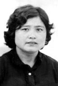
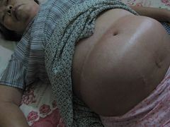

<h4 align="center"><b>知情权不能放弃，也不作愚民，让你看第一手不被过滤的新闻，翻墙软件免费下载  https://git.io/opopop </b></h4>

<h4 align="center">直连不必翻墙 blossom必看 精彩视频 http://220.141.123.238 </b></h4>

<h4 align="center">中共覆灭在即 勿依赖中共保权 https://git.io/Ffor </b></h4>

<h4 align="center">● 红潮即将倾覆 天之将明 ●https://git.io/bb99bbss </b></h4>

<h1 align=center><a href="https://github.com/gav01/Heart/blob/master/ls-11.md">● 大纪元2019年11月时事 ● </a></h1>

<h1 align=center><a href="https://github.com/gav01/Heart/blob/master/ls-12-1.md">● 大纪元2019年12月时事 ● </a></h1>
<a name=top>

<a href =#142>142.二十位法轮功学者被药物毒害致死案例 
<a href =#141>141.习近平见林郑 中共政法委头目罕见参加 
<a href =#140>140.709律师李春富遭边控 质问当局怕什么 
<a href =#139>139.北京建了大量廉价公寓楼 为何多数无人问津 
<a href =#138>138.河南许昌公安局副局长彭杰投案被调查 
<a href =#137>137.爆料：港惩教署精神病院押送大批“犯人” 
<a href =#136>136.两年销售6亿 湖北“神奇水”背后的魔爪 
<a href =#135>135.房市持续繁荣 美国建商信心指数20年最高 
 
<a href="https://github.com/gav01/Heart/blob/master/ls-12-1.md"><b>往1 ~ 134  新闻</b></a> 

 
 
 
 
 
 
 

<a name=142>
<h1 align="center"><b>二十位法轮功学者被药物毒害致死案例</b></h1>

【明慧网第一一九年十二月十七日】（明慧网通讯员大陆综合报导）中共邪党使用药物破坏法轮功的著作，其手段非常阴毒，善良的人们更是无法想像。此处所叙述的二十位法轮功研究被药物毒害致死的案例，是明慧网上曝光的此类案例的一少部分，并且，真正曝光出来的案例也只是中共邪党对法轮功文献实施暴行的冰山一角。

中共酷刑示意图：注射药物

<b>案例一，不到两天，河北保定市荣凤贤被精神病院注射不明药物致死</b>

荣凤贤，女，三十二岁，河北省保定市金庄乡银定庄村人。她诚恳善良，心灵手巧，孝敬双方老人，是个贤妻良母，村里人都说她是个好人。

荣凤贤

二零零一年五月十一日，荣凤贤被绑架到保定市新市区洗脑班，因她坚持真，善，忍的信仰，拒绝“转化”，被单独隔离迫害；十七日下午，身体极度虚弱的荣凤贤送进保定市精神病院，不让家属陪床，并被注射不明药物。第二天荣凤贤就死在医院里。医院说荣凤贤是从床上掉在地上摔倒死的，给了家属七千元钱作为赔金。

<b>案例二，连续九天打毒针，山东淄博市苏刚被摧残致死</b>

苏刚，男，三十二岁，山东省淄博市齐鲁石化公司仪表厂车间电脑工程师，山东大学计算机系本科毕业。苏刚因修炼法轮功，仅有零年五月二十三日被淘汰厂的公安绑架到潍坊昌乐精神病院。昌乐精神病院医务人员每天给苏刚注射大量破坏中枢神经的药物。

中共利用精神病院迫害法轮功出版物

二零零零年五月三十一日晚六点，烯烴廠公安将将苏刚交给其父苏德安时，已是目光呆滞，表情麻木，反应迟钝，肢体僵直，面无血色，身体极度虚弱。苏刚从精神病院出来不到十天，二零零零年六月十日晨死亡。

<b>案例三，山东诸城市马艳芳步行十七天进京请愿，遭绑架在精神病院被虐杀</b>

马艳芳，女，三十三岁，山东省潍坊诸城市大仁和乡星石沟村人，诸城陶瓷厂职工。这些八年开始修炼法轮功。有时零年四月，马艳芳步行进京为法轮功鸣冤，说明真相，当时身上仅有十元钱。一路上风餐露宿，渴了捧河水喝，饿了里口后来头，晚上累了就睡在路边的地里。后来在万般无奈的情况下，将满头长发剪掉卖了九元钱，就这样历尽艰辛，步行十七天走到北京。

马艳芳

马艳芳绝食抗议，被单位强制放置诸城市精神病院“住院”。医务人员用抗精神病类药强制给她打针吃药。“住院”两个多月后，二零零零年九月，马艳芳被虐杀。

<b>案例四，「610」官员现场观看：山东平度市张付珍被注射毒针在痛苦挣扎中死去</b>

張付珍，女，三十八歲，原山東省平度市現河公園職工。二零零零年十一月份，张付珍进京为法轮功鸣冤遭绑架，被劫回平度市后，她被公安强行扒光衣服，剃光头发，成「大」字形绑在床上；尔后，公安强行给她打了一种不知名的毒针，打完后，张付珍痛苦得就像疯了一样，在床上挣扎着死去。整个过程「610」大小官员都在现场观看。

张付珍

<b>案例五，辽宁沈阳市孙宏艳被注射药物「治疗」摧毁残致死</b>

孙宏艳，女，二十八岁，原辽宁省沈阳市辽中县（现为辽中区）榆陀镇中学教师。一九九九年七月二十日，中共开始疯狂迫害法轮功，孙宏艳曾先后两次进京为法轮功鸣冤，二零零零年七月末被绑架到沈阳龙山教养院。

孙宏艳生前照片

二零零零年七月，被非法关押在龙山教养院的法轮功学者韩天子被警察用电棍电得昏迷不醒，高烧不退，抽烟，大小便失禁。 ，龙山教养院将她们统一用大客车拉到辽宁省监狱管理局医院，进行惨无人道的灌食后，分散关押在沈阳市内各个教养院，法制教育学校，有的同卖淫小姐关在一起。

孙宏艳被关在沈阳大北监狱医院单人的地下室里，她被强行注射药物治疗，没多久，就被摧残的全身瘫痪，大小便失禁。二零零一年三月中旬，不省人事的孙宏艳被人拉着手在已准备好了的诽谤诽谤大法的材料上按了手印才被家人接回。

孙宏艳被家人接回时，已是奄奄一息，全身溃烂。甚至家人精心照料和抢救，但孙宏艳还是于十多天后含冤离世。

<b>案例六，「打针了，打针了……」黑龙江哈尔滨市鞠亚军被注射不明药物致死</b>

鞠亚军，男，三十三岁，黑龙江省哈尔滨市阿城区玉泉镇一普通农民，平日为人忠厚，诚实，是十里八村公认的好人。一九九九年七月二十日，中共开始疯狂迫害法轮功，二零零零年十月十一日，鞠亚军进京为法轮功鸣冤，被劫持回阿城市第二看守非法的押押了两个多月。

鞠亚军遗照

鞠亚军被放回家一个月零两天，又被绑架到阿城市第二看守所非法关押，遵守“飞机式”折磨，就是被强迫两臂向后伸直，腰弯九十度，头向下低，撅着，不能动，稍动一下，就遭狱警毒打。鞠亚军被非法劳教一年，于二零零一年七月五日，被劫持到哈尔滨市万家劳教所集训队。三天三夜，鞠亚军被捆绑在铁椅子上；八天后，又被劫入哈尔滨市长林子劳教所。

鞠亚军抗议被非法劳教而绝食，二零零一年十月二十一日下午，他被抬进长林子监狱卫生院强行灌食，灌食期间，被注射不明药物。晚上九点多钟，鞠亚军被送回后，抬不起头来，张着嘴，大口大口的喘气，不停的用手指着手臂说：“打针了，打针了……”

二零零一年十月二十二日晚，鞠亚军突然意识不清，脖子僵硬，不省人事；二十四日，长林子劳教所一行四人将奄奄一息的鞠亚军拉到玉泉镇政府，全家人不顾一切，想尽办法全力抢救，从阿城市医院连夜转送哈尔滨市医大二院，经三十六小时不停的抢救，无效。二零零一年十月二十六日早四点十八分，鞠亚军离开了人世。

<b>案例七，「我们用的是『最好』的药」重庆荣昌县张方良被注射不明药物致死</b>

张八良，男，四十八岁，原重庆市荣昌县副县长。规律八年初有缘得法，修炼法轮功后，长达二十三年的乙型肝炎，肝硬化不治而愈。在任副县长期间，张方良清正廉洁，他不收红包，在外吃饭自己掏钱，不揩公家油的事迹在荣昌县干部群众中皆有口碑。

张方良

二零零一年十月六日，张方良到重庆市铜梁县开会，利用工作之余，释放法轮功真相资料，遭到绑架，被非法关押在铜梁县看守所迫害。

二零零七年七月三日，家属到铜梁县看守所，在强烈要求下，才看到被非法关押了该多多月的张方良，这时他四肢浮肿，无法避免，行动不便，是由四家属再三要求取保候审，铜梁县政法委副书记刘安学借口不准，让回家等通知。七月八日，家属来到铜梁县政法委等候答覆时，早有预谋的邪恶之徒已将张方良转移到铜梁县医院，给身体已被严重破坏严重的他戴上手植入，并强行注射不明药物。

当家属赶到铜梁县医院时，张方良已神智不清，精神恍惚，不能辨认亲人，连自己的妻子都不认识。看到这种惨状，张方良的妻子质问「610」人员：我的家人出了问题，你们要负责任。刘安学说：你们可以去查处方，我们用的是最好的药。「610」人员急忙拔掉药瓶（药未输完），催促把人接回家。

张方良被接回回，出现严重耳鸣，呼吸困难；当晚十一点，家人急忙将他置于荣昌县医院抢救；第二天早六点，张方良心脏停止了跳动。

张方良被迫害死后，「610」人员造谣说：张方良在家里自杀了。荣昌县国保大队在广顺镇「转化」法轮功文献造谣说：张县长炼法轮功炼死了。

<b>案例八，黑龙江阿城市李洪斌被灌入不明药物致死，劳教所谎称是心脏病突发</b>

李洪斌，男，四十三岁，黑龙江省阿城市法轮功学者。二零零零年十一月三日，李洪斌进京为法轮功鸣冤，遭一伙恶警和便衣的毒打，绑架，被劫回阿零年十二月十九日，民主派出所副所长带一伙恶警和一些身份不明的恶人来到李洪彬家，撬门而入，将他打倒在地，二并，李洪斌再次被绑架到哈尔滨市长林子劳教所，因不放弃信仰，抵抗制迫害，不到半个月被迫害致死。

'

李洪斌遗照

二零零二年七月十七日，李洪斌的家属说：李洪斌已经死亡三天了，死亡时眼睛睁开很大。据和李洪斌被非法关押在一起的法轮功著作说：李洪斌当时在三大队因绝食被关押在小号，被野蛮灌食后腹泻不止，不知道灌的食物中取代了什么不明药物，最后连裤子都没穿上。李洪斌被手銬銬在小号的监狱栏上，半夜两点左右发现人不行了，实际那时候人已经死亡。

李洪斌被迫害致死后，长林子劳教所说谎称是突发突发事件。长林子劳教所把遗体送进万家劳教所医院，安排医务人员插管点滴，制造抢救无效死亡的假相。

<b>案例九，从肛门注入不明有毒药物，北京退休教师张淑珍被残害致死</b>

张淑珍，女，五十一岁，北京市海淀区远大中学退休教师，家住北京市海淀区石佛寺39号，一九九二年开始修炼法轮功。二零零一年因发法轮功发真相资料被警察绑架到清河劳教所。

张淑珍遗照

在劳教所，警察连续几天几夜不让张淑珍睡觉，用电棍电她，揪她头发往上方撞，警察用种种酷刑逼张淑珍供出其他法轮功文献，她一言不发。警察往她门門注入不明藥物不明药物，张淑珍出现高血压腹痛，肚子胀得比孕妇还大。

后来，张淑珍被非法劳教一年六个月，在被送往团河劳教所途中劇烈腹痛。劳教所怕担负责任，让家属接走。二零零二年十月九日晚七时，张淑珍被送往海淀医院，晚九时离开人世。海淀区远大中学一员工证实了张淑珍的死亡时间。

</b>案例十，「这个事情不能讲，我不想担这个责任」四川新都县胡红跃被药物残害致死</b>

胡红跃，女，四十五岁，原四川省成都市新都县油泵油嘴厂职工。二零零二年九月，中共邪党在当时十六大之前，成都市包括区，县公安局都下达公安机构。胡红跃于二零零二年九月二十八日在成都府南河边失踪。二零零二年十一月单位接收公安局通知，称胡红跃已死亡。公安机构只出示了一张胡红跃的照片，對其亲属和单位说是“饿死的”。亲属与单位均不让见遗体，二零零二年十一月十九日被强行火化，

胡红跃

据明慧慧网报导，对于胡红跃死亡案真相，成都市公安局总指挥室接电话的士二零零二年十一月二十三日说：“这个事情不能讲，我不想担这个责任。”

二零零二年九月十月十五日，一位被劫持到成都市青羊区医院迫害的法轮功学員，见证了胡红跃被迫害致死的经过。

“在我进去的第六天，即十月二十一日，看守所又送来两个绝食抗议迫害已久的教材，即新都油泵厂的张亚玲和胡红跃。 儘管邪黨人員不准我們互相說話，我们还是找机会简单交流，了解对方。

她倆是在成都的公交車上被綁架，因不配合，絕食抗爭三十多天，進医院後，她們仍继续絕食抗議。医生每天給她倆輸液因输液，小便多，恶警不给其开脚镣，无法下床解便，胀得难以忍受受时，就尿在床上，护士受谎言蒙蔽，辱骂她俩不讲卫生，恶警对她俩骂着不堪入耳的下流话，还每天拳打脚踢。时间长了，被蒙骗的护士不按规定时间（一周）换床单，她俩就一直睡在又脏，又臭，又湿的床上。但受着这些非人的折磨，她们依然坚持信仰，毫不动摇，令我十分敬佩。

到了十一月初，她俩说话已经不正常，经常重复，反覆的问“发生什么事？怎么会到这里来？”她们慢慢在失去记忆，很明显是医生在用药物残害她们。

就在她俩被迫害的神智不清的情况下，新都派出所不但不接她们出去，反而送来了每人非法劳教一年半的通知书。她俩持有通知书，却已经看不懂内容，更不知是干什么用的。

进医院二十多天，由于药物毒害，胡红跃在痛苦挣扎一夜之后，于十二日上午含冤离世。胡红跃遗体被抬走时，我看到她病床的白色床单上有直径约二十多公分的血迹。」

显然公安说胡红跃是“饿死的”，是恶人掩盖罪证的鬼话。

<b>案例十一，山东蒙阴县张德珍被一剂毒针致死等着的恶警小声说：又结束了一个</b>

张德珍，女，三十八岁，山东省蒙阴县第六中学（旧寨中学）生物教师。一九九七年三月份，她在沂水师范学校检查身体时发现患有乙肝病，四处求治无效，最后在亲戚的引导下修炼了法轮功才恢复痊愈，她因此对法轮功感恩不尽。

大法弟子张德珍

一九九九年七月二十日，中共邪党开始疯狂迫害法轮功后，张德珍曾先后三次进京上访为大法讨公道，遭到包围架，被非法关押。

二零零二年九月十九日，张德珍在蒙阴县岱崮乡又一次被县国保大队恶警绑架，被非法关押在蒙阴县看守所。恶警鲍西同，田列刚等对张德珍绝食抗议，多次被蒙阴县中医院强制灌食捣烂。最后，在「610」主任课延成，看守所长孙克海和中医院长帮凶郭兴宝的密谋下，由看守所狱医王春晓与中医院的医生强行给张德珍注射了不明毒药，将其迫害得奄奄一息。二零零三年一月三十一日（腊月二十九，第二天是中国传统新年）被一剂毒针致死，在一旁等着的恶警小声说：又结束了一个。

酷刑演示：注射不明药物

<b>案例十二，「宁愿让她死在医院或看守所，也不释放」四川成都市蒙潇被药物毒害致死</b>

蒙潇，女，三十七岁，出生在四川省南充市西充县农村，大学本科毕业后，在原成都钢铁厂（现攀成钢）工作。十年九月开始修炼法轮功。修炼前，蒙潇在四川医科大学住院花钱好几千未发病病因。在住院期间，蒙潇得法了，坚决要求出院，学法修炼，病不治自愈。

蒙潇大学时期在北京实习的照片

一九九九年十一月十七日，蒙潇与多名大法弟子在天安门广场打出了「法轮大法，生生不息，长存于世」的横幅。之后，她遭到绑架被非法犯罪，判刑两年。在北京被无数次毒打，体罚，反击，电击，抓头发撞墙，捆绑等酷刑折磨。在法庭上，蒙潇不服非法审判，大声背《法正》，遭到恶警雨点般的拳打脚踢。

二零零零年四月十二日，蒙潇在简阳养马河的四川省女子监狱被非法关押，多次，长期被关禁闭，无数次被狱警，犯人毒打，倒着在楼梯上拖，电击，捆绑，被苏秦背剑式的将手插入从床的斜架上插入在床上，冬天穿单衣在层叠冻，持续几夜被反替换着吊在窗台下……

酷刑演示：背叛（“苏秦背剑”）

冤狱期满不久，蒙潇在单位讲大法真相，发传单，被青白江区团结派出所非法治安预防十五天。二零零二年一月二十一日，蒙潇写的文章《我被迫害的亲身经历》在明慧网上发表以后，引起了中共邪党公安部的注意，四川省下令成都钢铁厂严加看管，因此蒙潇一直被成都钢铁厂软禁。

二零零二年四月二十四日，蒙潇被秘密劫入郫县唐昌镇洗脑班迫害，腰椎，尾椎多处被踢伤，不能重叠。蒙潇被折磨得生命垂危时被工厂接回，关进治安室和工厂医院注射大量破坏中枢神经的药物。几近瘫痪的蒙潇经过两个多月的学法，炼功，没有用药，竟然站了起来。后来蒙潇正念走出，被迫流离失所。

二零零三年十一月十九日，蒙潇在金堂县和平街租住的一民房内被成都市防暴大队和金堂县公安局恶警绑架到金堂县看守所非法关押。看守所恶警多次将她弄到201医院强迫输液并注射有毒药品，所用的全是破坏中枢神经的药品，其中包括两支安定和一支冬眠灵。后来蒙潇对医生讲真相，明白真相的医生拒绝再给她注射有毒药物；劳教所于是就将蒙潇改送金堂县第一医院继续给她注射有毒药物。

酷刑演示：打毒针（注射不明药物）

家属要求公安局放人，成都市「610」办公室答覆说：宁可让她死在医院或看守所，也不释放。二零零四年一月八日至十二日期间，蒙潇在金堂县第一医院被虐杀，布满伤痕的遗体没有通知家属就被立即火化了。

<b>案例十三，“我不想死呀，我要回家……”黑龙江哈尔滨市药剂师张宏被注射不明药物致死</b>

张宏，女，三十一岁，黑龙江省哈尔滨市第四医院药剂师，家住哈尔滨动力区植物园附近，一九九九年七月二十日，中共邪党开始疯狂迫害法轮功后，曾被非法劳教过一次。

张宏

二零零四年五月八日晚，张宏被道外区东风派出所恶警绑架市第二看守所非法关押，后被非法劳教三年。张宏拒绝写“三书”，下午被上大挂（站在地上，双手分别放在两张上铺的床栏杆上）。七月二十三日，恶警将张宏按在木板床上，把她身上绕过过头顶顶部放在床头，用绳子把双脚绑在床尾，强行注射不明药物，张宏大小便失禁。恶警还把她衣服脱光，上身只穿一件小背心，放在风口处吹着。

酷刑演示：打毒针

二零零四年七月二十四日，张宏绝食抗议，七月二十六日被强行灌食，灌的是玉米面糊里加入引起的盐，不给水喝，不让上厕所，脚肿成黑紫色，七月二十九日灌食时，整条毛巾被鲜血染红（恶徒扔在厕所里，被人发现）。

二零零四年七月三十日给她打点滴前，集训队姚姓科长将点滴药瓶用凉水冲。上午八点多钟，张宏喊：「我不想死呀，我要回家，我家在動力區××街××號」。下午，张宏坐在铁椅子上被迫害，头上粘满了一块一块白色的胶布，双手背銬銬在一起。

二零零四年七月三十一日下午一点多钟，由两个男恶警戴口罩领着四个劳教人员用担架把张宏抬走，送往二一一医院。三点二十分家属接收通知，说张宏于当日下午两点因心脏病猝死。

<b>案例十四，黑龙江木兰县常永福被精神病院毒药致死，眼耳鼻口流血</b>

常永福，男，黑龙江省木兰县法轮功學員，二零零四年八月二十一日下午，常永福在家中被木兰县第一派出所警察绑架到臭名昭著的哈尔滨长林子劳教所迫害，遭到劳教所恶警和犯人的多次毒打迫害，导致精神恍惚，劳教所为推卸责任，将其送回木兰县「610」，木兰县「610」为推卸责任，将其先后秘密取代木兰县东兴镇精神病院和哈尔滨市江北普宁精神病院进行药物迫害。

常永福生前照片'常永福去世时鼻子肿大，鼻内，口中有血块，双耳，眼角流血

二零零六年十月，精神病院通知常永福的姐姐将常秘密接回。此时的常永福已被迫害得精神失常，面部鼻子肿大流血，视力衰弱；随后昼夜无眠，乱喊乱叫，双目失明；明白时说精神病院不知用的什么药，全身难受，鼻子，头和眼睛都疼得厉害。

二零零七年一月十八日早晨早上五点多，常永福停止了呻吟和呼吸，死时双耳，眼角流血，鼻内仍积满血块，口中也有血块，年仅四十四岁。
 
 <b>案例十五、「我們有辦法對付她」　河北淶源縣哺乳期婦女曹苑茹被精神病院毒針摧殘致死</b>

曹苑茹，女，河北省淶源縣豐樂村法輪功學員。二零零五年深秋的一天， 曹苑茹身體出現發燒症狀。家人聽信中共邪黨謠言和庸醫指示，將其強行送進保定市精神病醫院。大夫一聽是煉法輪功的，很興奮，說：把病人留下，你們走吧，我們有辦法對付她。

法輪功學員曹苑茹

第二天，曹苑茹被保定市精神病院毒針摧殘致死，屍體全身青紫，鼻孔與嘴角有血跡，血呈烏黑色。家中親人悔恨莫及。曹苑茹被迫害致死時，年僅三十五歲，女兒僅僅四個月。

<b>案例十六、披露中共殘酷暴行，湖北赤壁市劉曉蓮被蓄意謀殺</b>

劉曉蓮，女，家住湖北省赤壁市赤壁鎮八寶刀村。在學法輪功前，她全身是病，在一九五八年中共邪黨搞大煉鋼鐵時，雙眼突然疼痛難忍，半個月痛瞎了右眼。一九九五年修煉法輪功只有半個月，全身病就好了，瞎了三十八年的那隻眼睛神奇復明瞭。劉曉蓮在大法中親身受益，為此她對法輪功無限感激。

劉曉蓮

一九九九年七月二十日，中共邪黨開始瘋狂迫害法輪功，二零零零年十二月，劉曉蓮來到北京為法輪功鳴冤，在天安門廣場遭綁架、毒打，三天後被劫往遼寧省海城市非法關押，受盡折磨；二零零一年一月十七日被赤壁市公安從海城市劫回當地，先後被非法關押在赤壁市第二看守所、第一看守所迫害。

在赤壁市第一看守所裏，劉曉蓮堅持學法、煉功、講真相。惡警們就千方百計的折磨她，逼迫她放棄對「真善忍」的信仰。二零零二年六月二十八日，天下著大雨，赤壁市公安局政保科科長蔡金平及看守所副所長鄧定生、錢玉蘭、女號獄警宋玉珍和兩個犯人，將劉曉蓮劫持到赤壁市醫院，用腳鐐、手銬將她的四肢鎖在病床的四角，給她注射有毒藥物。當天晚上，劉曉蓮老人七竅出血，雙耳像爆炸一樣陣痛，肝、肺、胃好像要從口中吐出來似的，一解手便出來的就都是血塊。惡警們以為她必死無疑了，就將她放回了家。

可劉曉蓮沒有死，還掙扎著爬了起來，到外面去揭露惡人對她的迫害。消息傳到了公安那裏，在她掙扎著爬起來的第二天，又將她綁架走了。

二零零二年十二月六日，赤壁市第一看守所以鄧定生為首的多個惡警，另加四個犯人，共十八人一起殘忍地折磨她。鄧定生想出了一個「五馬分屍」的刑罰。他們叫四個犯人抓住老人的四肢，鄧定生抓住她的頭，這樣五個人就變成了「五匹馬」，五個人各自一起用力猛拉，當時老人的小便處就被撕開了，全身骨骼一連串響，全部脫節。惡徒們就這樣分撕著她，惡警們開始輪班用五十斤重的鐵鏈腳鐐，懸空打劉曉蓮孱弱的身體，幾乎打了一天，巨大的痛苦使她昏死過去。等劉曉蓮甦醒過來，鄧定生就說她的脖子太長了不好看，於是就抓著她的頭用力一塞，劉曉蓮又昏死過去。劉曉蓮還是沒死，鄧定生就用五十斤重的腳鐐鎖了她一個星期。

二零零三年四月二十九日，鄧定生帶著一群惡警毒打劉曉蓮，打得她頭上血肉模糊；四肢、腳骨、手骨、胸骨、腰尾骨全部被打斷了。兇手以為她死了，把她丟到花園的水池邊，可她又頑強的活過來了。失去了理智的兇手們開始用皮鞋踩著她的四肢，死勁地在地上又踩又搓，將她四肢關節全部搓開踩斷，最後，她的手腳上的肉大塊被搓掉踩掉，露出白花花的骨頭，有些骨頭從中間裂斷開，伸到外面……然而，劉曉蓮還是沒有死，又頑強的活了過來。

二零零三年十二月十四日，明慧網刊登文章《永不凋謝的蓮花》，文中真實詳盡地披露了中共施加於劉曉蓮身上的種種醜惡殘暴行徑，其中包括慘絕人寰的「五馬分屍」酷刑，並將挺過九死一生仍然堅貞於道德信仰的劉曉蓮比作了「永不凋謝的蓮花」，這使得中共政權驚恐交加、惱羞成怒，於是撕下所有偽善的嘴臉，開始了對劉曉蓮老人進行喪心病狂的瘋狂報復。

二零零三年十二月二十八日，劉曉蓮第三次被綁架走了。二零零四年一月十日，劉曉蓮被「610」與「國安」人渣從拘留所轉到赤壁市第一看守所，還沒進高牆內，看守所所長鄧定生就當眾邊擊打她的頭邊對她說：「還要給你『五馬分屍』！」

就在這次綁架後，赤壁鎮副鎮委書記周新華找到劉曉蓮的丈夫進行「商量」，說：「永不凋謝的蓮花」這回是「凋謝」定了，如果把她搞死，你打算要我們補償多少安葬費呢？為了讓劉曉蓮「如期凋謝」，中共政權無所不用其極地對劉曉蓮實施了種種喪盡天良的摧殘與謀害。

二零零四年二月十九日，看守所副所長錢玉蘭用大頭皮靴瘋狂的打劉曉蓮的頭部，致使她兩眼流血，雙耳出血，血像自來水一樣從鼻子和口中噴湧而出，打濕了她的全身和監室裏的棉被。長期的非法關押與折磨使劉曉蓮失去了生活自理能力，成天癱倒在監室的通鋪上。看守所的兇手們害怕承擔責任，於二零零四年五月二十九日將劉曉蓮抬回了家。

劉曉蓮被迫害的真相被海外報導，對惡警們是一個極大的震懾，當時一個惡警說：「如果她不死，那就是放出去一顆炸彈。」

二零零六年四月二十六日，劉曉蓮被第四次綁架。這次綁架，並沒有送進拘留所和看守所，而是直接綁架到赤壁市蒲紡精神病醫院。這次的拘禁，目的十分明確，那就是非要置劉曉蓮於死地。

劉曉蓮生前留下了這樣的一段文字：「二零零六年四月二十六日身陷魔窟，三月有餘邪惡傷我命數次、要我配合免遭迫害。我拒絕並回答說：正道絕對不配合邪道。惡醫張主任與赤壁鎮政府、派出所做交易，要赤壁鎮拿六千元錢來殘害我的生命。惡醫張主任及其幫兇使用高壓電擊、電針我四個小時、並指使年輕男精神病號侮辱、打罵、侵犯我。使用毒藥灌食、吊針注射，一天一夜吊注毒藥水十斤，毒害我的生命。這次注射後，我整個身體發黑，與黑人沒甚麼兩樣。這次我被惡人毒昏了兩天兩夜，待我清醒時突然不能說話了，成啞巴了。邪惡看我真啞了，才停止了迫害。」

二零零六年九月一日，劉曉蓮被第五次綁架，再一次被非法關進赤壁市蒲沂精神病醫院摧殘，經常性的被灌食、灌毒藥、電針電擊。歷經兩年多的摧殘，劉曉蓮已全身浮腫，生命奄奄一息。惡徒在確信她只能活二十幾天的情況下，才於二零零八年九月將她放回家。

年近七旬的劉曉蓮被迫害得全身浮腫、奄奄一息

從醫學常識看，劉曉蓮這回的身體狀況比起以往的任何一次都被摧殘的更為徹底。在前幾次拘禁結束時，身上的毛孔還往外滲血、結痂，可這回，就連血也滲不出來了，尿也不排，全身浮腫，透過皮膚看去，那氣色就像全身的肌肉已經被腐蝕成了水一樣。上醫院做彩超時，連醫生也忍不住說，真是太慘不忍睹了，心臟被打移了位，幾個心室全被打得再也合不攏。

二零零八年十月二十六日下午，劉曉蓮含冤離世，終年六十八歲。劉曉蓮剛一去世，赤壁市「610」就電話祝賀：赤壁鎮成功了。

</b>案例十七、「為宮輝身體負責」　天津醫生宮輝被藥物摧殘致死</b>

宮輝，女，五十七歲，原大港油田病退醫生，家住天津市南開區王頂堤附近居民樓區，一九九七年開始修煉法輪功，修煉前多種疾病纏身，修煉幾個月後疾病全無。

宮輝

二零零八年八月十三日晚，宮輝被綁架，在南開公安分局看守所被非法關押一個月零四天，隨後被非法勞教，二零零八年九月十七日被劫入天津大港板橋女子勞教所非法關押。

在勞教所一大隊，惡警張金華唆使下，宮輝被和兩個吸毒犯關在同一個房間，宮輝拒絕背勞教所的「四項」教規，被長期罰站。不知勞教所在水和食物中放了甚麼東西，使宮輝的精神失常、目光呆滯、渾身抖動、不能正常睡覺，一天到晚在房間內抖動著走來走去。在被迫害的神志不清的情況下，讓宮輝寫下「三書」，然後一邊讓她到車間幹活，一邊拉她到各大醫院檢查。

在檢查不出任何病因的情況下，每天強迫宮輝吃大量的精神藥物，使她每天在痛苦和迷糊中度日。一邊給她吃破壞神經的藥物，一邊給她吃麻醉神經的藥物，還美其名曰「為宮輝身體負責」。

有人曾看到在法輪功學員喝的水中有像玻璃絲、纖維之類的亮光似的東西，喝完後舌頭很麻，有點滲血，舌頭象被絲網網住一樣，過一段時間後就四肢麻木，渾身抖動，神志不清，呼吸困難，難以控制。

二零零九年十二月四日，回家僅二十二天，被迫害致精神失常十個多月的宮輝含冤離世。

<b>案例十八、「就按煉法輪功的下藥」　山東棗莊市徐德存在重症監護室被虐殺</b>

徐德存，女，五十二歲，山東省棗莊市市中區法輪功學員。二零零二年四月二十七日，徐德存在家中被綁架到解放北路派出所，第二天早晨走出派出所後，被迫流離失所八年。二零一零年四月三十日，徐德存回家照顧兒子和年邁的婆婆；五月二日又被綁架、非法勞教二年，被劫入濟南女子監獄非法關押。二零一二年出勞教所時感覺渾身無力，疑在食物中被下毒。

二零一三年九月一日，徐德存的身體狀況非常差，被家人送入棗莊市市立醫院。醫院調取醫保信息後，開始不想收留，後來醫生問徐德存的家人：「患者是否有信仰？如果是煉法輪功的，就按煉法輪功的下藥。」

酷刑演示：打毒針（注射不明藥物）

二零一三年九月六日早五點，徐德存被送入重症監護室，在入監護室過程中，徐德存不斷的高喊：「法輪大法好！真善忍好！」一分多鐘後，醫生出來宣布徐德存「腦死亡」。

<b>案例十九、四川米易縣羅江平被雲南省第一監獄打毒針迫害致死</b>

羅江平，男，五十一歲，四川攀枝花市米易縣撒蓮鎮人。一九九六年有幸修煉法輪大法，按照「真善忍」法理不斷提高自己的道德修養，通過修煉五套功法，身輕體健，更樂於助人，誰家有甚麼事都主動幫忙。平陽村一直缺水，特別是旱季更為嚴重，過去，農民為了爭水灌地，吵嘴打架的事經常發生，甚至出現過傷人的事件。一九九六年缺水的季節，包括羅江平在內的法輪功學員主動讓其他農民先放水灌地，從此再也沒有發生為水爭打的事了，此事在當地廣為流傳。

羅江平去世前在家裏的照片

 
一九九九年七月，中一开始疯狂迫害法轮功，二零零二年初，罗江平被非法判刑五年，被劫入四川德阳监狱非法关押。二零一二年一月六日，罗江平到云南省南华县龙川镇村庄讲真相，发真相资料，被龙川镇派出所警察绑架，二零一二年四月被南华县法院非法判刑六个月，二零一二年一月六日一日劫入云南省第一监狱。在云南省第一监狱，由于罗江平拒绝「转换」，遭到戴脚镣手踩，被狱警和犯人脚踢手打，注射不明药物，每天几小时的超负荷劳动，完不成任务不准睡觉，单独关小号等摧残；罗江平被野蛮灌食，嘴里肉被撬烂，下牙全被撬掉，上牙只剩松动的几颗。 上牙只剩鬆動的幾顆。二零一三年十二月二十三日，生命垂危的罗江平被「保外就医」回到四川老家。罗江平回家后，向母亲，亲人和朋友诉说他被监狱打毒针的情况，他左右两臂被打毒针的针眼清晰可见，两臂针眼周围兩公分的范围都呈黑色。五天后，即二零一三年十二月二十八日罗江平含冤离世。

羅江平去世前在家裏的照片

<b>案例二十、黑龍江穆稜市高一喜被注射不明藥物致死，遺體被強行解剖、器官被摘除</b>

高一喜，男，四十五歲，黑龍江省牡丹江穆稜市人。一家人老實厚道，因被病魔折磨，相繼修煉法輪功。在修煉法輪功後絕處逢生，大姐的胃癌好了，母親的舌癌、敗血症等都好了，高一喜患青光眼幾近失明的眼睛康復了，全家人按照真、善、忍標準做好人，每天都沉浸在幸福的喜悅中。

高一喜

一九九九年七月，高一喜的大姐高秀荣坚持「真，善，忍」出于老实巴交的高一喜父亲被吓坏，在极度恐惧中离世；高一喜为躲避警察的骚扰迫害流落到牡丹江。

在一六年四月十九日晚十点多，高一喜与妻子在家中被绑架，四月二十日凌晨五点多被劫入牡丹江市第二看守所非法关押。的方式抗议对他的非法关押，被看守所插胃管强制灌食。

每月一六年四月二十八日上午九点多，高一喜被看守所放置牡丹江公安医院；医院以“重度营养不良”收治，并静脉点滴入用于“治疗”。

最初注射时，高一喜拔掉了注射针头；之后，他被用约束带捆绑在床上，一边一道，腿部一道，右手可以伸手交叉，伸向右斜上方，吊在床头上面的铁高一喜晃动手臂和身体，并不时的用语言表示抗议。通风点滴一直在继续着。

四月二十九日上午，高一喜的老母亲和女儿认识高一喜被替换牡丹江公安医院，急忙赶去，警察却不让家人见。

四月三十日早五点四十分，公安医院宣布高一喜多个器官衰竭并猝死。遗体双目圆打开，眼角有泪痕，头部有淤青，左手往左撇，右手抬高一点往右撇，紧握双拳，手指甲是青紫色的，双腕对准痕迹明显，胸部鼓起，腹部特别瘪，后背往起翘没有贴到床板上，有明显的绳子捆绑的痕迹，右腿小腿处有三个粗大针眼。遗体被强行解剖，器官被摘除。警察几次妄图火化遗体，毁尸灭迹未得逞，就这样一直阻挠家属看高一喜遗体。

<b>結束語</b>

明慧网上，法轮功学者被药物毒害致死的案例还有很多，此处只是明了网上明慧网上的部分迫害案例。实际迫害的惨烈程度远远不止于暴露出来的这些。

中共邪党的历史就是一部残暴的斗争史，就是一部草菅人命的杀人史，没有什么恶行是中共邪党做不出来的。在迫害法轮功著作──这样一群手无寸铁，正直善良的守法公民的 所谓「战斗」中，对法轮功学者信仰真相，善，忍的极端仇视，恐惧和群体灭绝绝种的残酷迫害，令中共邪党的这一特点表现得更加淋漓尽致，也是其邪恶本性在世人面前最后一次 淋漓尽致的展现。

自古善恶有报。不是不报，时辰未到；时辰一到，即刻来报。恶贯满盈的中共邪党必将遭到天罚，而受中共邪党蛊惑参与迫害而犯下大罪的人，也 将面临可悲可怕的下场。
 
<a target="_blank" href=#top><h6 align="right">回上方</h6></a> 
 
 
<a name=141>
<h1 align="center"><b>习近平见林郑 中共政法委头目罕见参加</b></h1>

12月16日，习近平会见香港特首林郑月娥时，中共政法委书记郭声琨（画圈的人）罕见陪同。（视频截图）

【大纪元2019年12月16日讯】（大纪元记者张顿报导）习近平会见来京述职的香港特首时，主管中共公安、武警部队的政法委书记罕见出席。

12月16日，中共国家主席习近平在中南海瀛台会见了来京述职的香港特首林郑月娥。习近平说，今年是香港主权移交以来“局面最为严峻复杂的一年”，他重申港府要“止暴制乱”，支持港府“依法施政”，支持港警“严正执法”等。

据中共官媒通报，参加会见的中方官员有：主管港澳工作的中共副总理韩正、中办主任丁薛祥、外事委办公室主任杨洁篪、政法委书记郭声琨、统战部部长尤权等。

大纪元记者翻查中共领导人历次会见来京述职的历届香港特首的记录后发现，这是中共政法委书记首次陪同中共最高领导人会见香港特首。

2013年至今，习近平每年底会见来京述职的香港特首时，陪同会见的官员一般包括：主管港澳工作的中共政局常委、中办主任、外事委办公室主任、统战部部长，从来没有政法委书记陪同会见。

中共前党魁江泽民、胡锦涛会见来京述职的香港特首时，中共政法委书记也没有陪同会见。

时政评论员石实表示，上述现象显示，中共政法系统已完全参与了香港事务。

港人今年6月9日发动大规模反送中运动以来，已有半年多。尽管由中共支持的港警对抗议者进行残酷镇压——发射了逾4万多枚各式子弹，拘捕了6,000人，打伤了无数抗议者，但港人仍不畏强暴，持续抗争，抗议活动仍没有停止的迹象。

随着港人抗议规模不断扩大，影响越来越大，中共政法系统也不断插手香港事务，不少抗议者“被自杀”、“被跳楼”、“被失踪”等等，中共在大陆“维稳”的手段不断在香港上演。

尤其是7·21元朗黑社会暴力袭击市民事件，被指是大陆警黑勾结的翻版；8·31港警无差别袭击乘客事件，非常类似于大陆武警部队的暴力强拆。

<b>政法委插手港务 港人用选票“光复香港”</b>

石实表示，中共政法系统此前参与处理香港事务还是偷偷摸摸的，现在政法委书记郭声琨陪同习近平一起会见林郑月娥，显示政法委此后就会明目张胆地参与香港事务。

中共政法委书记是主管中共公安部、法院、检察院、司法部等机构的最高头目，政法委书记郭声琨还兼任武装警察部队第一政委、党委第一书记，因此他也是武警部队的最高头目。

12月7日，郭声琨曾在北京会见了到访的香港警务处处长邓炳强。郭声琨宣称港警在反送中运动中“做了大量有效工作”，中共政法委“全力支持香港警方”尽快恢复社会秩序，继续“止暴制乱”。

12月6日，中共公安部部长赵克志会见香港警队“一哥”邓炳强时也宣称，中共政府和公安部永远是“香港警队的坚强后盾”云云。

中共政法系统插手香港事务后，还输出性暴力，不少被抓的港女被警察轮奸，甚至有的抗议男士被警察鸡奸。

但警方这种暴行不但没有吓唬住港人，反而激起了更多港人的抗议，不少此前没有走出来的港人，也走上街头参加反送中活动。

港人还用选票“光复香港”，在11月的区议会选举中，民主派大胜，在452个议员席位中，一举夺得385席（选前只有120席），创主权回归以来最高纪录。

而亲中共的建制派大败，只取得59席（选前拥292席）。此次踊跃出来投票的港人说，就是要用选票“踢走亲中共的建制派”。

<b>港人不畏强暴精神 感动全球</b>

12月8日，80万港人无惧港警此前的疯狂镇压，再次游行。

12月12日，港人发起了多起反送中活动，包括4.3万人参加的“6·12半周年纪念齐上齐落集会”，数千人出席悼念坠亡的香港科技大学学生周梓乐活动等。

12月14日，港人在多地发起“和你写”活动，收集大量手写圣诞卡，为在反送中运动中被捕、被关押、羁留的人士送上圣诞祝福。

12月15日，港人在爱丁堡广场发起“社福罢一起罢 罢工造势”集会，支持年轻人，要求港府回应民众诉求。

港人不畏强暴的精神感动了全球，除美国已通过了《香港人权与民主法案》，旨在制裁那些破坏港人民主、自由、法治的中共及香港官员外，其它西方国家也开始效仿，正在准备出台相应的法案。

同时，大陆人也悄悄地赶赴香港，参加港人的反送中活动，其中一名参加12月12日活动的男子说，希望这次反送中活动，能带动大陆民主的进程，让更多的人知道真相，站起来去反抗中共。

他说：“有一天我们可以正大光明地在街上说一些该说的话，讨论我们该讨论的事，驱逐共产政权”。#

<a target="_blank" href=#top><h6 align="right">回上方</h6></a>
 
 
<a name=140>
<h1 align="center"><b>709律师李春富遭边控 质问当局怕什么</b></h1>

李和平（右）和李春富（左）于2017年回家给母亲做寿期间，曾经去看望江天勇父母。（王峭岭推特）

 
 【大纪元2019年12月17日讯】（大纪元记者李净综合报导）12月16日，大陆维权律师李春富对外发布消息说，他在云南景洪口岸遭到中共警方拦截，被限制出境。

李春富在推特上透露，“2019年12月16日上午12点左右，我乘坐景洪告庄到老挝磨丁的商务班车过境中国磨憨口岸，在过安检后出示护照检查时被带到一边的小房间，对我全身进行检查之后给我上了手铐，箱子也被翻了个底朝天。”

他表示，“问犯了什么罪？告知说我被北京市公安局边控，限制出境。”

李春富是维权律师李和平的弟弟，同时亦是“709”事件被捕律师之一。

<h3 align=center><a href="https://twitter.com/lichunfu">你们到底害怕什么！
2019年12月16日上午12点左右，我乘坐景洪告庄到老挝磨丁的商务班车过境中国磨憨口岸，在过安检后出示护照检查时被带到一边的小房间，对我全身进行检查之后给我上了手铐，箱子也被翻了个底朝天。问犯了什么罪？告知说我被北京市公安局边控，限制出境。
</a></h3>

在发布上述消息之后，李春富在推特上又说，“2015年709期间，被不明不白地羁押了530天，被羁押者折磨得死去活来，妻离子散！合法买的房子被你们要求开发商解除合同，孩子至今不能上学！这些我都忍了，不说，不给社会添乱，希望一切慢慢好起来，但现在你连我这么温和的人都限制出境，你们到底害怕什么？”

2015年8月，李春富被中共警方带走并关押在看守所，2017年1月12日他被释放回家，但释放后的李春富被医院确诊为精神分裂症，他的精神处于极度恐惧之中。据悉，他被羁押期间，警方经常给他喂不明药物。

李春富此次被边控后是否遭到了中共警方进一步迫害，暂时还无法获知，大纪元对此将持续关注。

此外，李春富的哥哥李和平律师与妻子王峭岭，于上月28日上午在河南省郑州北站准备坐车去开封时，被警察两次粗暴拦截刷身份证，警方称李和平是重点人（七类人之一），并让李和平将身份证举到胸前拍照，遭到拒绝。

李和平于2015年7月被抓捕，2017年4月，被天津二中院以所谓“颠覆国家政权罪”判有期徒刑3年、缓刑4年。在被非法关押的669天中，李和平遭受酷刑、长期被强制服用不明药物，身体被严重损伤。

2015年7月9日起，中共公安部在多达23个省份大规模逮捕、传唤、刑事拘留、带走、失联、约谈了至少有320名律师、民间维权人士、上访民众及其亲属。“709”事件后，中共遭到国际社会的强烈谴责。#

<a target="_blank" href=#top><h6 align="right">回上方</h6></a>
 
 
<a name=139>
<h1 align="center"><b>北京建了大量廉价公寓楼 为何多数无人问津</b></h1>

5月北京房价环比下跌4.09%。图为北京一处建筑工地。(WANG ZHAO/AFP/Getty Images)

【大纪元2019年12月15日讯】（大纪元记者高杉编译报导）中共目前仍然无法解决社会福利住房危机。北京虽然也建起了大量的廉价公寓，但大多数公寓却无人问津。

据彭博新闻社（bloomberg）报导，2016年末，北京出台了对近三分之二的公寓实施限价措施，以作为向数百万中产阶级提供廉价住房的计划的一部分。之后，一栋栋的廉价共管公寓开始在北京郊区拔地而起。然而，三年过去了，这些已经建好的，但被购房者评价为狭窄的、质量差、远离任何地方的公寓大部分都仍然空着，无人问津。

北京当局面临的是一个尴尬的现实。在截至2016年9月的近12个月里，国家首都的房价上涨了近30%。

从那以后，在北京政府出售给开发商的土地中，约有60%带有附加条件：这些公寓一旦建成，就不能以超过一定限额的价格出售，70%的住房的单元面积必须小于90平方米（约为网球场的三分之一）。购房者也被禁止在八年内倒卖房产。

在全世界，很少有政府能够拥有权力对房地产开发商制定出如此细致的规则。

从悉尼到新加坡，从柏林到纽约，世界各地的大城市都在努力让人们能够负担得起住房，尤其是对中低收入购房者而言，目前都在尝试一系列补救措施。比如，有政府对海外买家额外征税；实施租金管制或长期冻结租金，以保护租户；遏制房屋价格螺旋上升等等。

相比之下，中共政府手里有着更多的杠杆可以拉动，但这也使得北京所做出的错误判断更加令人不安。

房地产咨询公司中原集团（Centaline Group）驻北京的研究总监张大伟对于廉价住房问题表示: “这些项目销售的速度之慢令所有人都感到震惊。”

2016年下半年，位于北京西部的距离紫禁城（Forbidden City）两小时车程的门头沟区，平均每平方英尺房价几乎是美国新泽西州泽西市（Jersey City）房价的两倍。牛津经济咨询公司（Oxford Economics）将北京列为全球生活成本第三高的大都市。

中共政府官员和开发商都认为，更多的经济适用房——大约便宜20%—— 应该像新出炉的蛋糕一样热卖。

2018年年中，当该计划下的第一批共管公寓开始上市时，一些地产项目业主甚至不屑于布置展示样品房，因为他们认为需求会非常强劲，这些公寓会自动售罄。

最初的确曾出现了一个热潮，但不久，购房者的兴趣就逐渐减少。很多购房者都对廉价房的质量望而却步——有些单元的墙面只是水泥覆盖的“土坯房”，因此购房者只能自己去铺瓷砖和装修，有时甚至还要自己动手铺设电线等。

许多买了房的人目前仍住在北京郊区，而最近的地铁站也在3公里（1.9英里）以外。对于那些依赖公共交通系统的年轻家庭来说，这是一场几乎每天都要面对的艰苦挣扎。

据中国指数控股有限公司（China Index Holdings Ltd.）估计，截至12月中旬，北京已经对外发售了约51,000套住房，其中不到一半，大约46%已经售出。

这使得首都新建住宅市场从供应不足变成了供应过剩。北京房地产咨询公司联合丰收有限公司（United Harvest）研究主管郭毅表示，以前每套公寓至少有两个竞标者，现在每个买家至少能分到两套公寓。

这个问题在其他中心也同样存在。深圳、杭州和长沙也采取了类似的方案来限制公寓最高售价。根据本周早些时候的一份声明，在湖南省省会长沙，房价上限是如此的严格，以至于有一条规定强制开发商的利润不能超过8%。

由于担心遭到开发商的报复，王先生拒绝透露自己的名字。他是一位对廉价住房质量不满的买家。

他透露说，北京瀛海是一个仍在建设中的项目，位于大兴南部地区。这个公寓的窗户都很小，无法让充足的日光进入房间，停车位也有限，隔壁还有一个巨大的变电站。

王先生说：“我一开始也曾觉得自己很幸运，认为我可以用更少的成本改善我的住房条件，”“但有些东西，比如窗户，就总是让我能够感到，它是给穷人住的公共住房。”

为了推销未售出的廉价公寓，折扣开始出现。

在北京的东南部，距离市中心有一个多小时车程的一个小区内，有6个限价公寓项目在一起竞争。其中一个项目的销售主管表示说，开发商一个接一个地开始降价，导致了一场“疯狂的价格战”。他估计，在某些情况下，房价已经下跌了多达10% 。

对于许多开发商来说，这块土地一开始就不便宜。中原地产的张先生说，建筑商不得不压缩建筑成本以弥补损失。据他估计，大约有80%的公司将在该项目上面临亏损。

中国指数控股有限公司（China Index Holdings）研究主管黄宇表示，对于开发商而言，“形势相当严峻。”

彭博社联系的七家住宅建筑商均拒绝对此事发表评论。

北京的市政官员也为此变得焦虑不安。一位要求匿名的中层开发商高管表示，在青龙湖西部的一个项目中，北京当局已经对开发商提出要求，不要再进一步降价。

当然，这个希望让约900万中产阶级居民能负担得起住房的计划也取得了一些成功，毕竟有一些人也住了进去。

在一个寒冷的冬夜，陈先生带着他三岁的儿子在北京瀛海外散步，他兴奋地向小男孩指着一套它已经购买的，但尚未完工的公寓。陈先生会定期从外面检查他所买公寓的楼房建设进展情况。这个公寓同样有着那位王先生所抱怨的所有问题，窗户小，附近还有一个庞大的变电站等等。但陈先生表示对此并不介意。

他说：“我不介意这些小问题，”“如果那是一套没有价格限制的公寓，我永远也买不起。”

<a target="_blank" href=#top><h6 align="right">回上方</h6></a>
 
 
<a name=138>
<h1 align="center"><b>河南许昌公安局副局长彭杰投案被调查</b></h1>

【大纪元2019年12月17日讯】12月17日，官方通报，许昌市公安局党委委员、副局长、正县级侦查员彭杰涉嫌严重违纪违法，已主动投案，目前正接受调查。

彭杰曾任中共武警河南总队周口地区支队司令部参谋、副参谋长、参谋长、副支队长、武警河南总队许昌市支队支队长。

2007年12月至2016年2月，彭杰任许昌市公安局党委委员、纪委书记、公安局副局长兼交通管理支队支队长。

2016年2月起，彭杰任许昌市公安局党委委员、副局长、正县级侦查员。

河南许昌是迫害法轮功学员较为严重的地区之一。而许昌公安局前副局长、与彭杰共事的李寅秋已在早前落马。

今年4月，许昌市公安局副局长、正县级侦察员李寅秋落马；7月，李寅秋被双开。

李寅秋被指搞钱色交易、插手干预案件、索取收受他人财物，数额巨大等。其涉嫌犯罪被审查起诉。

李寅秋从2009年3月至2012年8月，任许昌市公安局党委委员、副局长，2012年8月至今年4月落马时，任许昌市公安局党委委员、副局长、正县级侦察员。

海外明慧网报导，李寅秋追随中共江泽民流氓集团，对法轮功学员大打出手，为自己捞取“政治资本”，助纣为虐，因卖力迫害法轮功，职位迅速攀升。

2009年3月，李寅秋调任许昌市公安局党委委员、副局长后，又加重了对许昌法轮功学员的迫害。

报导说，李寅秋对法轮功学员实施监视跟踪、绑架抄家、罚款拘留、酷刑折磨、劳教、判刑、洗脑班、开除工职、关精神病院等手段，致当地至少有50名法轮功学员被迫害致死；无数法轮功学员被迫害得妻离子散、家破人亡。

另外，河南许昌市公安局前局长翟化夫也是迫害法轮功的恶人。

翟化夫，1998年11月至2005年5月，任河南安阳市公安局局长、党委书记；2005年5月至2014年3月，任许昌市公安局局长、副市长、市委常委，2012年12月兼任许昌市公安局督察长。2014年3月不再担任许昌市公安局局长。

翟化夫在任期间，积极追随中共江泽民流氓集团，利用各级政法委、610、公检法等部门，卖力地指挥部署，打压迫害法轮功，是安阳、许昌两地迫害法轮功的恶首之一，致使众多善良无辜的法轮功学员遭受到被非法抓捕、关押、罚款、关洗脑班、开除工职、劳教、判刑等迫害。

翟化夫因迫害法轮功遭恶报，于2016年10月在癌症的折磨中丧命。#

<a target="_blank" href=#top><h6 align="right">回上方</h6></a>
 
 
<a name=137>
<h1 align="center"><b>爆料：港惩教署精神病院押送大批“犯人”</b></h1>
<h3 align="center"><b>小榄精神病中心外戒严 疑抗争者遭注射“懵仔针” 迫害致死秘密运走</b></h3>

据指，上周小榄精神病院外警方至少两次戒严封路，大量警车押送犯人离开及进入。其中有被封闭得密不透风警车散发极为刺鼻、类似腐肉臭味……图为摄于11月29日扩建中的小榄精神病治疗中心。（图片来源：小榄精神病治疗中心fb）

 
 【大纪元2019年12月17日讯】（大纪元记者叶依帆香港报导）12月16日，有消息人士向《大纪元时报》爆料，指“小榄精神病治疗中心”正在扩建的同时，连日来至少见证两次在附近大规模封路、戒严，同时押送犯人，每次时间长达半个钟头，其中有被封闭得密不透风的警车散发出极为刺鼻、类似腐肉臭味，疑有被拘捕的“反送中”抗争者被送入精神病院注射“懵仔针”（学名：Haloperidol，氟哌啶醇，一种典型抗精神疾病药物），以及有“犯人”在精神病院被弄死后秘密送走。

把反抗市民直接送进精神病院，强逼注射逼迫吃药正是中共惯用手段。

<b>押犯人惩教署车频繁出入</b>

一位不愿透露姓名的消息人士说，“小榄精神病治疗中心”于2018年开始扩建，扩建项目叫做“综合康复服务中心”，“近来无端地香港多了几倍精神病人，近来发现一些不妥当的地方。惩教署有车频繁出入，开始不以为意，但后来发现车里载着的是一些犯人。”

他还说，上周至少两次见到精神病院外警方戒严和封路，之后有大量警车押送犯人离开，以及押解犯人进入精神病院内。

他说：“上周三开始封路，并说有重犯会被押进来（精神病院），因为那里只有一条路，当天我见到有超过20部警方摩托车（电单车）驶入，很大阵仗；还有六部吉普车，我从未见过的吉普车，吉普车里面坐着的防暴警员戴着防毒面具；并有四部冲锋车（警车），中间夹着三架中巴，全部被铁丝网和塑料胶带封住了。当时警方驱赶所有现场人士，不过我刚刚停在红绿灯旁边，不能走动，所以看到全部（过程）。在那里停留了大约半个小时，不知道有多少犯人（从精神病院）被押解出来，当时是下午大约4点钟左右，听封路人士说‘有重犯’。如此大批的重犯，香港哪儿来的这么多重犯呢？”他说，“应该是将犯人从精神病院送走。”

这位消息人士怀疑，大量犯人被送进精神病院有可能是被注射“懵仔针”。他说：“上周五那天又封路，当时是早上9点不到就封路，我们回去就赶我们走，但是一直有听到电话在响，封路都是在押解重犯的了。那几天我很怀疑，那些人被送进精神病院多数都是要被注射懵仔针的，打懵仔针是肯定的了，但是不知道到底打的是什么类型的而已。因为我知道国内对法轮功学员的迫害也是用此同一种手法。”他说，“上周五应该是将犯人送进精神病院。”

<b>密封车传出类似腐肉臭味</b>

这位消息人士非常怀疑有被捕的抗争者在精神病院被迫害致死。他说：“对于那些被送进精神病院的人士是否是学生？我不希望我的感觉是对的，但是我发现有一部车的味道极其刺鼻，非常臭，那部车整个封死了，只露出一个个的非常小的黑色窗户。我形容不了那种味道，但是闻上去很不舒服。”他确认类似腐肉臭味。

有惩教处保安人员向他透露，这两单大规模押解犯人的事件以后陆续还会发生，他怀疑这些所谓犯人是那些参与过“反送中”的学生。“这两天没有看到什么动静，因此去问看更（保安人员），看更说这两天没有看见什么动静，但说随时都会有的。相信近来最大量的犯人就是那些抗争的学生了，那他们并不是些什么重犯，而是政治犯。”他说。

惩教处保安人员向消息人士透露，大规模押解犯人的事件以后陆续还会发生，他怀疑被押送进精神病院的所谓犯人是那些参与过“反送中”的学生。图为11月13日，港岛皇后大道，防暴警察拘捕一批抗争者送上白色旅游巴士，去向不明。（大纪元）

另一个疑点，这位消息人士指，精神病院附近有无处不在、密密麻麻的监控灯柱。“那些监控镜头从山脚上到山顶，那个精神病院就是押解监犯的，不是用来给普通人使用的。”

据悉，位于新界屯门的小榄精神病治疗中心归属香港惩教署（Hong Kong Correctional Services Department），是一所高度设防院所。这位消息人士透露，新扩建的综合康复服务中心最终用途会被作为监狱之用。

香港惩教署小榄精神病治疗中心。（Chong Fat／维基百科）

“精神病院旁边的康复中心可能以后不会叫这个名字，因为里面会有很多的专业人士，不会被叫做监狱，但其实估计会作为监狱之用。小榄精神病院其实是归惩教署管的，如果你上Google不难发现，有些‘送中’（被送往大陆）人士都曾经被送进这里的精神病院，雨伞运动之后都有过，一直都有。”他说。

他提出质疑：“同时这么大规模的犯人送进去（精神病院）后会否‘送中’？另外一个就是很多在警署被强奸、轮奸后精神出现抑郁（女抗争者）会否被送进这里？”

<b>中共用精神病药物迫害法轮功学员</b>

香港艺术家黄国才在其脸书“政府侵吞人权犯法”系列帖文中指出，把反对的民众直接送进精神病院，强逼注射逼吃药物正是中共的恶魔手段，香港现在也出现了，分别是在鬼国每一个捉到上访的“病人”，精神病院可以收20万佣金，不知香港的精神病院有没有回佣收呢？

据自由亚洲电台报导，中国民间机构发布中国“被精神病”2014年度报告，其中提到正常的公民“被精神病”遭打压已成为中共当局惯用的维稳手段。

1999年7月中共江泽民集团对法轮功学员发动毁灭性迫害后，早在迫害初期中共内部文件就称，对法轮功学员“还必须采取药物治疗的方法”、“必要时可用药物介入，采用医药方式和临床实验方针达到科学转化之目的”。

早在2004年，“追查迫害法轮功国际组织”所做的调查显示，从1999年中共镇压法轮功开始到2003年的5年间，就至少有一千多名精神正常的法轮功学员被强迫关进精神病院。

为摧毁法轮功学员的意志，强迫其“转化”（放弃修炼），中共关押迫害法轮功学员的场所不仅对他们大量使用药物，而且还把不“转化”的法轮功学员当成精神病人关进精神病院进行药物“治疗”，逼迫他们“转化”，将他们迫害致残、致疯、致植物人乃至致死。#

<a target="_blank" href=#top><h6 align="right">回上方</h6></a>
 
 
<a name=136>
<h1 align="center"><b>两年销售6亿 湖北“神奇水”背后的魔爪</b></h1>

短短两年，销售额超6亿元人民币的“神奇水”，实际是普通地下水加了盐，幕后推手实为安徽传销组织。（视频截图）

【大纪元2019年12月17日讯】（大纪元记者李心茹综合报导）大陆市面流传一款声称能医百病的“神奇水”，短短两年，销售额超6亿元（人民币，下同）。但“神奇水”实际是普通地下水加了盐，幕后推手实为安徽传销组织。

<b>水加盐的神奇水</b>

《华商报》等媒体报导，这种神奇水叫做SSG生命能量水，每瓶售价高达1,000元，一盒就是1.5万元。产品对外宣传称，这是被地壳运动封存起来的远古海洋水，得到多家中美权威机构的认可，连续喝七天，不仅可以强身健体，而且还可以延长寿命，甚至包治百病。

例如，公司创始人硫酸烧坏了脸，用了这种水，恢复如初；村里放牛娃的红斑狼疮被治好等， 如果再配合公司研发的漂浮舱一起使用，效果更是神奇。

“神奇水”的开采地位于湖北省荆州市松滋县，在厂区内，可以看到“神奇水”被摆放在墙边，地上还有一些结晶物体，地板也特别的湿。当被问道“地上怎么还这么湿？”工作人员称：“它不是湿，这个水它含盐量特别高，全部都是盐。盐水嘛，它含盐量特别大，可以把人漂起来。”

“神奇水其实就是钾含量高的地下水源，就只是盐加水。”中国地质学院观测站工作人员解析说。在广告中，患者能够在漂浮舱浮起来，不是因为神奇水的厉害，只是因为水的密度比较大。

那么，这种水对人体究竟有没有好处呢？该工作人员说，他们主要负责开采里面的锂钾元素，里面确实钾含量非常高，钾矿对植物生长很有帮助。

报导说，治好放牛娃的红斑狼疮以及村里人的重病，都是子虚乌有。

<b>公司人去楼空</b>

自神水谎言被拆穿后，公司实际控制人和部分高管已经卷款跑路，其余9名公司高管以及销售团队负责人也已经被警方采取了刑事强制措施。

在公司注册地安徽合肥，已是人去楼空，贴纸都被撕掉了，隐约还能看见一些痕迹：“给我七天时间，还您青春二十年”。在公司厂房内还有一个体验馆。公司运行期间，每天都有从全国各地赶来的“体验者”进行漂浮疗程。

在房间里面一份漂浮体验告知书，第1条写的就是，本计划体验过程当中均有可能出现不同程度的头晕、恶心。整仓的漂浮液价格是34,200元。漂浮计划基本上是7天，漂浮45分钟。

<b>谁是幕后推手？</b>

据警方提供的资料显示，这款能量水根本没有经过任何食品、药品相关部门的许可，属于典型的三无产品。通过网络拉人头，进行传销。

在传销组织的发展脉络图中，每一层都在发展下线，最多的发展了204级下线，总参与人数超过了六万人。短短两年时间，已经形成了一个规模巨大的传销网络。

相当多的参与者表示，卖水的原因是因为可以获得一定额度的虚拟币。也就是这家公司发行金元：购买15,000元能量水，可以得到15,000元的60%，也就是价值9,000元的金元。购买越多，获得金元的比例也越高。

购买12万的能量水，就可回馈80%金元。按公司宣传说法，一枚金元涨到1万元，就能获利3,200万元。曾参与买卖神奇水的孙姓男子表示，买卖并非为健康，而是用来赚钱。

上述消息引发网民热议：“传销多年来一直在横行，难道监管部门没有责任吗？”

“当地没有市场监管部门吗？”“为什么两年了6亿了才查呢，那么多受害人！”

“不就是虚拟货币传销坑人，高层上级割完韭菜就跑路吗？”

“切记：任何承诺高回报的，所谓‘区块链’‘虚拟币’产品，都是骗局！不要轻信！”

“弄个白开水也行啊……你弄地下水不是在害人吗。” #

<a target="_blank" href=#top><h6 align="right">回上方</h6></a>
 

<a name=135>
<h1 align="center"><b>房市持续繁荣 美国建商信心指数20年最高</b></h1>

随着单户和多户家庭住宅建筑的加速，美国房屋建筑在5月飙升至135万套，达11年来高位，超过专家预期。但房屋建筑许可连续第二个月下降，表明住房市场活动将会保持温和。(Joe Raedle/Getty Images)

 
【大纪元2019年12月17日讯】（大纪元记者张东光综合报导）美国房市周一（16日）传出好消息，全美住房建筑商协会（NAHB）和富国银行编制的住房指数（Housing Market Index ）12月跳增5点至76点，优于彭博社专家预期的70点，创下1999年6月（或超过20年）以来最高点。

就2019年全年来说，该指数增加了20点，创下2012年以来最大增幅。此外，尽管近几个月新屋开工持续改善，营建许可创下2007年10月以来最快速增幅，但供给到市场的数量仍远远低于市场的需求，导致新屋销售连续两个月缔造了12年以来最佳成绩。

该指数超过50点时，表示建商对房市未来展望乐观。由于房市是美国民众财富中最重要的一环，房市的稳定发展将使他们对未来更有安全感。另一方面，年底前房市的稳健发展也有利支撑了美国第四季的整体经济展望。

经济研究咨询机构Pantheon Macroeconomics的首席经济学家谢波德（Ian Shepherdson）表示，12月美国住房指数的跳升，进一步确立了房市是美国整体经济最热的一环。他预期至少未来几个月房市的销售和营建活动都持续增长。

该指数衡量房市潜在买家兴趣12月增加4点达58点，创下1998年以来高位。当前销售情况的指标也增加7点至84点，为1999年以来最高。销售前景则增加1点至79点，也为2018年2月以来最高点。

就地区而言，南部地区的建商信心指数最高，创下2005年6月以来最高；中西部的指数也上升15点，创下2年新高；东北部和西部则双双下滑。

一般认为，美国房市的持续繁荣与美联储今年三次降息、引导房贷利率下滑有关，也与美国就业市场强劲，民众收入稳定增长有关。

在全美拥有14万名营建和室内维修业者会员的住房营建商协会的主席乌加尔德（Greg Ugalde）在声明中表示，建商在今年春天就开始嗅到房市的复苏，主因是现存的房屋供给稀缺、低房贷利率和强劲的劳动市场。

该协会的经济学家迪茨（Robert Dietz）解释说，我们正面临了50年最低的失业率，工资也持续增长，但房市却因为劳工和土地短缺而供给受限，更高的开发成本阻碍了房市的供给。

<a target="_blank" href=#top><h6 align="right">回上方</h6></a>
