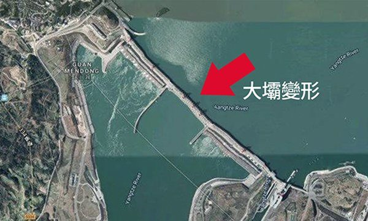
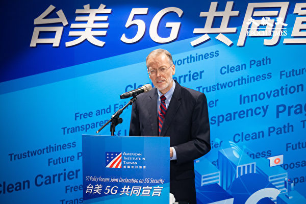

<h3><a target="_blank" href="https://bit.ly/3asSXIA">请多传破网软件，使更多的人了解真相从而得救，这是给自己积福德。 https://bit.ly/3asSXIA </h3></a>

   

     
<h3 align="center"><b>免翻视频  https://bit.ly/3ezRQKo  (请收藏网址 https://git.io/swspip)</b></h3> 

<h3 align="center"><b>复制网址到谷歌或火狐浏览器打开。若出现 “提示” ，請点击“继续”访问即可。</b></h3> 

<h3 align=center><a href="https://github.com/gav01/Heart/blob/master/news1.md">● 看更多大紀元時事 ●</a></h3>

<a href=https://git.io/souye><h6 align="right">回首頁</h6></a>

<a name=top>

<a href="https://github.com/gav01/Heart/blob/master/ls-20-8-1.md"><b>往1 ~ ~ 136新闻</b></a> 
<a href="https://github.com/gav01/Heart/blob/master/ls-20-8-2.md"><b>往137 ~ ~ 266新闻</b></a> 

<a href =#307>307.四川悬崖村“精准扶贫” 村民生活仍维艰 
<a href =#306>306.沈舟：发射东风导弹是中共军事一大败笔 
<a href =#305>305.美认定中化集团等11中企为中共军方企业 
<a href =#304>304.中共称“粮价稳中有涨” 网民：涨得很稳 
<a href =#303>303.偷美研究机密逃回国 中共军方学者机场被抓 
<a href =#302>302.演讲后专访陈光诚：绥靖政策一去不复返 
<a href =#301>301.电科院博士被黑户20年 军人妻子遭酷刑致残 
<a href =#300>300.钟原：中共射导弹亮底牌凸现内部危局 
<a href =#299>299.馆长枪伤 医院：恢复良好已可边换药边开玩笑 
<a href =#298>298.神秘华裔男要出重金保释唐娟 美法官震惊 
<a href =#297>297.山西一饭店坍塌 已致13人身亡 
<a href =#296>296.大陆牛肉价格连涨十周 民众叹：吃点肉真难 
<a href =#295>295.李锐女儿：没有“六四” 三峡工程就不会上马 
<a href =#294>294.奥布莱恩：对抗中共 美以实力求和平策略 
<a href =#293>293.淘宝台湾被认定陆资 罚41万限6个月内撤资 
<a href =#292>292.“破船要沉”中国高端低端人口纷纷逃亡 
<a href =#291>291.中石油亏损300亿 西水股份半年亏270亿 
<a href =#290>290.对抗中共威胁 印度紧急开发印度洋战略岛屿 
<a href =#289>289.TikTok审查法轮功 主流英文媒体曝光 
<a href =#288>288.王毅访欧洲五国受挫 一路遭冷遇与抗议 
<a href =#287>287.【新闻看点】中共南海射导弹 美防长回应习近平 
<a href =#286>286.美第一夫人演讲展示风范 体现同情和感谢 
<a href =#285>285.中国进口晶片3000亿美元 分析：自主路漫长 
<a href =#284>284.台湾馆长陈之汉遭枪击 一男子携枪弹自首 
<a href =#283>283.【薇羽看世间】北戴河习妥协 习胡再度联手？ 
<a href =#282>282.中共向南海发射4枚弹道导弹 五角大楼回应 
<a href =#281>281.【拍案惊奇】习亮剑太早？孟晚舟又“想逃” 
<a href =#280>280.中共若武力犯台 专家：美国会全力支持台湾 
<a href =#279>279.日本首相安倍晋三开记者会 宣布辞职 
<a href =#278>278.哥哥受中共迫害 面临遣返 妹妹求助美国政府 
<a href =#277>277.高价拿地限价销售 大陆房企毛利率大幅下滑 
<a href =#276>x276.美国智库：控制来自中国的毒品（上） 
<a href =#275>275.【一线采访】乌鲁木齐久封小区 居民：会崩溃 
<a href =#274>274.揭秘：驻美中领馆帮中共军方人员掩盖身份 
<a href =#273>273.反对中共南海军事化 美国：制裁仅是开始 
<a href =#272>272.中共疫苗外交涉20亿人 专家建议各国三思 
<a href =#271>271.中共喉舌三万字批判蓬佩奥 反被嘲讽 
<a href =#270>270.李孝利喊“毛”触中国玻璃心 令外国网友咋舌 
<a href =#269>269.前鸡西副市长海外退党 两下属遭株连被捕 
<a href =#268>268.颜丹：“退党证书”的内涵与价值 
<a href =#267>267.安徽一粮站站长逃亡7年落网 被抓时割腕自杀 

<a name=307>
<h1 align="center"><b>四川悬崖村“精准扶贫” 村民生活仍维艰</b></h1>

四川凉山彝族自治州昭觉县的“悬崖村”，因村民出入需要攀爬藤梯（现已变成钢管梯）而出名。（受访者提供）

   
  【大纪元2020年08月28日讯】（大纪元记者顾晓华、方净采访报导）四川凉山彝族自治州昭觉县的“悬崖村”，因村民出入需要攀爬藤梯（现已变成钢管梯）而出名。中共当局实施“精准扶贫”，今年让村民下山搬到县城“扶贫房”，但无配套措施，原本可自给自足的村民，在县城无工作收入，生活困难，为了缴搬迁费，许多人还因此负债。

据大陆媒体报导，5月12日至14日，阿土列尔村84户贫困户陆续搬迁到昭觉县城集中安置点（其中之一）的新家。

过去一直生活在悬崖村、目前因“精准扶贫”而搬迁至哈甘乡哈甘村的青年阿肯莫亚（化名）告诉大纪元记者，他今年也分到扶贫房，“一百平方米，是砖房，一个人25平方米，4个人一百平方米。4个人以上的没有。”

由于搬迁每人需要支付当局2,500元人民币，阿肯莫亚家有6口，“花一万多块钱，对我们来说还是比较大的。”他表示一万块钱都是借的，他拍短视频发到网上，一位内蒙古的粉丝借了钱给他，“一万多块钱我现在都还没有还他。”

他还指出，“精准扶贫好几年了，但是分房子是今年才开始的。”对于整个扶贫的内容，他完全不清楚，“这个扶贫来了多少钱我也不知道，扶贫款被贪污，冒领的事情，我也不知道，反正是盖个房子，让我们交一万块钱。”

阿肯莫亚也不愿去住扶贫房，因为“到县城就是不知道怎么样生活。”他说自己没有念过书，也没有一技之长，找工作很难。“我不敢去，家里老的老，小的小，在农村还可以自给自足。”

四川凉山彝族自治州昭觉县的“悬崖村”，因村民出入需要攀爬藤梯（现已变成钢管梯）而出名。（受访者提供）

<b>祖祖辈辈的家园 生活自给自足</b>

阿肯莫亚指出，悬崖村有两个村，包括昭觉县支尔莫乡阿土列尔村和哈甘乡瓦伍村。他住在邻近的哈甘村，但仍常回悬崖村走亲戚。他说，悬崖村还有七八十户村民，“这边的山是一层一层的，我们生活在半山腰上。”

“祖祖辈辈都生活在这里。靠种地生活，自给自足，有的出去，有的不出去。”他说，养些鸡，养些猪，养些牛，“村里没什么大事的话，一家人够吃够穿的，生病了我们找自己的巫师，或者是自己医。结婚都是听从父母安排。”

悬崖村没有公路，他表示以前都是背着东西上上下下，但不害怕，“因为我们小时候没有钢管路，都在悬崖上面爬的。下雨天也可以走，只是路比较滑，没有害怕过。”前年当地修了钢管路，危险相对减少很多。

今年27岁的阿肯莫亚，7岁就开始放牛。结婚后，有两个孩子，妻子也没有工作，在家看孩子、帮忙种地。他希望多养一些牛羊，多种一些地，“一只羊养一年，能卖个2、3千，我家现在养了11只，将来能卖二万多块钱。”

<b>面子工程拆土房 悬崖村将成旅游区</b>

阿肯莫亚说，悬崖村的房子是泥土盖的，有四、五十年的，也有10几年的，都是老了以后再重新盖，“以前上面是草，后来用木头盖，现在都是用瓦片盖。”

可是现在当局不让盖泥土房了，“现在搞精准扶贫，不允许盖以前的旧房，面子工程，现在都是拆那些土房子，有的拆，有的没拆。没分到房子的没有拆。”

阿肯莫亚还透露，“现在政府准备在那里要建旅游区，有可能把所有村民搬迁。”对于未来如何生活，他表示茫然，“今年还在老家种地，不知道今后怎么办。”

他对政府并不抱希望，“将来生活很困难，政府要给（支助）的话感谢，要不给的话也没办法，自己的生活不能靠政府。”他说，“我对我自己的要求是不欠别人的钱，将来孩子能上学，能够不欠学费，就这样啊！”但现在看来要做到也很难。

<b>瓦伍村民：在县城天天找吃的“过一天算一天”</b>

另一位瓦伍村的村民查列尔(化名)也不喜欢县城，但无法选择，“搬县城我们是不愿意了，政府说搬哪里就搬哪里。”他向大纪元表示，精准扶贫给他的房子，也是4个人一百平方米，搬家一个人要支付2,500元，“一家人一万，我是卖了牛、羊交的扶贫房的款。”

查列尔全家已经住进扶贫房，但他说，“我们在县城工作是非常不好找的，工地上打工一天也就一百块，大部分找不到工作，在那里2待着。由于今年的疫情，也不能出去。现在是过一天算一天，没办法。”

查列尔从出生就一直在瓦伍村生活，从小没读过书，“祖祖辈辈在这里生活五百多年了，平时的生活就是种地，自己种自己吃的。一年的收入不固定，就是靠天吃饭。”如果农作物长得好，就有收入，如果被冰雹打烂了或风吹掉了，就受影响。但至少可以自给自足。

他说，去县城孩子上学方便了，但是挣钱不容易，政府也没有安排补贴，也没有解决就业问题。“我也在打工，一天过一天。再打工也还是不够吃的，我是一天找一天吃的。”他烦恼地说，“在县城还要买菜，现在菜都贵了，在老家地里都有，想做什么都不花钱的。”

他指出，原来村里有八百多人口，现在大部分已经搬走了，山上只有七、八十户没有搬走。至于扶贫的对象，“有些没有分到，有些分到。”他也完全不清楚分配的标准。

他们都向记者表示，悬崖村村民最需要解决的是就业问题。# 

<a target="_blank" href=#top><h6 align="right">回上方</h6></a>

<a name=306>
<h1 align="center"><b>沈舟：发射东风导弹是中共军事一大败笔</b></h1>

美军伯克级神盾驱逐舰USS Mustin （DDG 89）资料图。（PO2 Declan Barnes／美国海军官网提供）

   
  【大纪元2020年08月29日讯】中共向南海发射东风中程导弹，正中美军下怀，成为中共军事应对的一大败笔。中共过早掀开了底牌，暴露了军事实力，更激怒了周边国家。
  
<b>中共军队太早露底牌</b>

高手过招，先是试探，然后逐渐酣斗，关键时刻才会亮出绝招或杀手锏。美中军事对峙，仍然在相互试探阶段，还没有真正交手，中共军队就亮出了杀手锏。

东风中程导弹，几乎是中共唯一具备中远攻击能力的武器，还没开战就急匆匆放了出来。假如美军不在乎，中共军队还能如何应对呢？

美军也确实没在乎。美国国防部发表了声明谴责中共，并重申美方维护南海自由航行的承诺。美军还表示，将继续在《国际法》允许的任何地方飞行、航行和运营。

美军还用实质的动作表示了不在乎。中共南部战区新闻发言人称，8月27日，美军马斯廷号导弹驱逐舰进入了西沙领海。美军几乎立即做出了实质性的回应。

中共在南海填海建立岛礁军事基地后，还依据各岛礁划定了领海范围，引起了各国的极大争议，在南海航行很可能就会驶入了中共划定的领海范围。美军神盾舰应该是故意在中共划定的范围内行驶，完全无视中共自行设定的领海规则。这与美军U-2侦察机进入中共划定的北方战区演习禁飞区如出一辙。

中共发射东风导弹后，美军神盾舰就在西沙海域附近继续航行，中共刚刚亮出的底牌不管用，只能再次抗议，再没有其它办法了。

中共可以继续发射一波东风导弹，如果美军神盾舰继续航行，再怎么办呢？难道直接攻击美军神盾舰？

中共过早亮出底牌，美军却还游刃有余，中共军队忽然就尴尬了。

按照7月份日本防卫厅的白皮书，中共东风-26导弹共72枚，东风-21导弹，共134枚。1枚东风-21就是数千万人民币，1枚东风-26至少上亿人民币。都打完了还有什么呢？岂不更尴尬？

中共本不想出动辽宁号或山东号航母，现在可能不得不出动了，已经没牌可打了。但中共的航母一旦出动，与美军直接对峙，恐怕会更丢人。

<b>暴露了军事实力</b>

美军早就对中共的军力了若指掌，所以才会不在乎。中共的空军、海军一直缩在内海，不敢出来与美军对峙，实力差距太大。中共的火箭军显然是吹嘘过多，但中共一直保密，特别是号称关岛快递的东风-26和号称航母杀手的东风-21，很少向公海试射，外界始终觉得有些神秘。这也就是中共军队可能的神秘底牌，或许可以令美军有所忌惮。

中共此番导弹发射，主动打破了神秘，暴露了真正的实力。中共通过《南华早报》放风，称发射了2枚导弹，很可能也想测试美军的侦察能力。结果，美军说，实际发射了4枚导弹，还派出RC-135侦察机搜集了数据参数。

当然还有可能，中共有2枚导弹没能落入预定目标，所以不想说，那可就丢丑丢大了。

中共还自曝，美军的神盾舰就在导弹下落的西沙海域附近。这表明，美军的卫星、侦察机和神盾舰雷达，掌握了中共导弹从发射到下落的全过程，而且早早就部署了。就是说，中共的导弹发射车一出动，就被美军捕捉到了。台湾军方也称，远距离雷达侦测到了导弹发射的全过程。

搜集到了东风中程导弹的全部参数，美军显然更加胸有成竹了，美军神盾舰、航母都没有闪避，而是继续航行，至少表明美军有把握拦截中共的东风导弹。美军把士兵的生命看得最重要，美军的作战任务，从不拿士兵的生命冒险。

当然，还有另一种情况，中共的东风导弹根本打不到航母，完全是自我吹嘘。中共虽然具备了导弹发射能力，但从未验证过可以打击移动目标。此次发射也一样，并没设置一个移动的靶船，甚至没有一个固定的靶船。依照中共目前的雷达侦察能力，恐怕很难真正跟踪到美军航母，也就难以把航母的准确位置传给北斗卫星，再传递给导弹引导装置。

美军称，导弹落在了海南岛和西沙群岛之间海域。这表明，导弹直接落入了海里，并没有真正的目标，到底算击中了目标，还是只落在了某个区域？没有设置目标，就无法验证是否能击中目标。

即使没有移动目标，至少应该有固定目标，但中共至今没有证实，党媒也没有报导。中共火箭军发射中程导弹，至少需要中央军委批准，或者习近平直接批准。既然批准了发射，为什么不让中国人知道，确实够蹊跷，难道要掩盖什么？

此外，中共号称东风导弹飞行最高速度18马赫，应该只是末端攻击飞行阶段。导弹为接收来自卫星的目标导引信号，必须以较低速度飞行，才能准确获得信号，并调整行进路线。这是攻击固定目标和移动目标的关键不同点。当东风导弹以较低速度飞行时，或者在大气层之外飞行时，恰恰是被拦截的最佳时段，美军神盾舰上的标准3型和标准6型导弹，恰恰是为之而设计的。

更大的可能是，中共根本无法准确掌握美军航母的行踪，也就无法导引东风导弹；即使东风导弹可以获得准确的目标导引，实际并非全程高速飞行，美军仍然可以在导弹低速飞行阶段拦截。这或许是美军根本不在乎的真正原因。

美军航母不断在南海、菲律宾海、台海、东海游弋，应该一直在同时侦察中共东风导弹的机动性，至少证实了东风-21部署在沿海，完全可以出动B-1B轰炸机远距离清除。东风-26应该主要部署在内陆省份，将是美军B-2隐形轰炸机的打击目标。中共的常规武器实力，美军基本摸清了，中共再无秘密可言。

<b>激怒了周边国家</b>

中共向南海发射导弹，应该主要为了回应美军航母频频在南海演习。虽然中共低调的声称，不针对任何国家，实际却惹恼了周边国家。中共假意称可以谈判、共同开发南海，马上就发射了导弹，完全没有谈判的诚意。

菲律宾政府表达的最直接，称需要美军在南海。中共再度失算，本意应该是威慑美军，阻止美军航母继续在南海游弋，结果美军不在乎，南海各国都更坚定的站到了美国一边。

这不仅令人想起了79年前的太平洋战争。当年的日本海军拥有10艘航母，为了实施南进计划、吞并东南亚各国，率先袭击了美军珍珠港，以确保日本在太平洋的海上优势。之后日本也确实占领了东南亚各国，还占领了美国的关岛，但开战8个月后，美国就联合各国展开反攻，最后迫使日本投降。

历史惊人的相似，中共的军事扩张，也从南进计划开始，同样也把美军当作最大的障碍。不同之处在于，美军吸取了教训，不会再让珍珠港事件发生，更彻底放弃了1930年代的绥靖主义，从第一岛链就设置了防线，并及时警醒到中共的军事扩张企图。

中共攻取东南亚根本不可能，目前只能试图争夺南海的控制权，但实力却不够，南海岛礁的军事基地不堪一击。美军的小反攻，将很可能从南海岛礁开始，目前已经得到了东南亚各国的支持，一个小型的太平洋海战，正在被中共重演。

东南亚各国同样吸取了教训，看到中共扩张的企图，很快与美军再次站在了一起，这无疑是各国确保安全的最佳选择。中共向南海发射导弹，无疑加速了各国联盟的进程。

中共目前不敢向东海发射导弹，应该也怕激怒了日本、韩国，那样的话，可就真被包围了。

中共盲目发射东风导弹，实在是一大败笔。中国人、亚洲人、美国人应该期望中共政权尽快倒台，不要重演太平洋战争的悲剧。 

<a target="_blank" href=#top><h6 align="right">回上方</h6></a>

<a name=305>
<h1 align="center"><b>美认定中化集团等11中企为中共军方企业</b></h1>

五角大楼8月28日宣布11家中企为中共军方拥有或控制企业。图为五角大楼。(Getty Images)

   
  【大纪元2020年08月29日讯】（大纪元记者张婷综合报导）川普（特朗普）政府周五（8月28日）指定另外11家中企为中共军方拥有或控制企业，为进一步实施制裁奠定基础。这份由国防部公布的名单包括中化集团和中国建筑巨头“中交建”。

国防部周五在宣布这一名单时表示，该部决定“强调和反击”中华人民共和国（中共）的军民融合发展战略，该战略通过确保中共军方能够接触那些看似民用实体的中国公司、大学和研究项目获得和开发的先进技术和专业知识，来支持中共军队现代化目标。

五角大楼本周五发布的11家由中共军方拥有或控制的公司包括中国长江三峡集团、中化集团、中国东方红卫星股份有限公司和中交建等。

11家公司的具体名单为：

“中国交通建设集团有限公司”（China Communications Construction Company，缩写为CCCC，简称中交建）

中国运载火箭技术研究院（China Academy of Launch Vehicle Technology，缩写为CALT）

中国东方红卫星股份有限公司（China Spacesat）

中国联合网络通信集团有限公司（China United Network Communications Group Co Ltd，简称中国联通）

中国电子信息产业集团有限公司（China Electronics Corporation）

中国化学工程集团公司（China National Chemical Engineering Group Co., Ltd. 缩写为CNCEC，简称中国化学）

中国化工集团公司（China National Chemical Corporation，ChemChina，简称中国化工）

中国中化集团有限公司（Sinochem Group Co Ltd，简称中化集团）

中国建筑集团有限公司（China State Construction Group Co., Ltd.）

中国长江三峡集团有限公司（China Three Gorges Corporation Limited，简称中国三峡集团）

中国核工业建设股份有限公司（China Nuclear Engineering & Construction Corporation，缩写为CNECC）

五角大楼在6月20日发布了第一份名单，指定20家中企为中共军方拥有或控制，这些企业大多数为中共国有企业，覆盖航空、通讯、核电、船舶等领域。这20家中企除了华为和海康威视外，还包括中国移动通信集团和中国电信公司以及中国航空工业公司。

美国1999年《国防授权法》要求国防部制定“共产主义中国军事公司”名单，以确保中共不会利用加入世界贸易组织而获取危害美国及盟国的国防技术，并阐明总统可以对名单上的公司实施制裁，包括封锁这些公司的财产。

据报导，美国政府此前从未制定或公布过这份名单。但华盛顿和北京在技术、贸易和外交政策方面的紧张关系不断加剧之际，五角大楼受到国会两党议员的压力在今年公布两份名单。

<a target="_blank" href=#top><h6 align="right">回上方</h6></a>

<a name=304>
<h1 align="center"><b>中共称“粮价稳中有涨” 网民：涨得很稳</b></h1>

今年中国遭遇洪涝灾害和干旱天气，影响到秋粮的收成，下半年粮食涨价因素有所增加。(ChinaFotoPress/Getty Images) 

   
  【大纪元2020年08月29日讯】（大纪元记者易如采访报导）中国粮食价格近期出现上涨趋势引发民众关注。中共农业农村部官员日前表示，当前粮价稳中有涨，随着秋粮上市，加上粮食库存充裕，粮食市场有望保持稳定。官方言论遭到网民炮轰。分析认为，随着中国外汇储备减少，粮食价格或会持续上涨；也有分析认为，粮食上涨或将引发中国通货膨胀。

中共农业农村部8月26日举行新闻发布会，介绍当前粮食市场运行和生产有关情况。农业农村部市场与信息化司司长唐珂表示，受冠状肺炎（中共病毒）疫情冲击、洪涝灾害影响和国际粮价震荡传导，我国粮食市场运行出现了阶段性波动。总体上看，当前我国粮价稳中有涨。

（推特）

大陆独立评论人士文瑞对大纪元表示，引起粮食涨价主要有两个原因：一是国内歉收，“今年南方水灾、北方干旱引起粮食歉收，国家粮库采购不足，库存粮比较少；而且因为歉收，收购价格上调，所以，肯定要把（粮食）价格提上来。”

另一方面，财政紧张，外汇储备不足，“价格涨也体现了他们的忧虑，现在从外国采购粮食，感觉外汇储备不足，采购粮食心里没底，为解决这个问题，就把粮食价格调高了。”

而粮食价格“稳中有涨”是说，目前有涨，但涨幅不太。“意思就是现在不会涨得很快，因为粮食跟其它物品不同，它会直接影响人的基本生存。如涨太快，会引起消费者的警觉，引起个人囤粮，引起粮食恐慌，甚至社会动荡，所以，一般情况下它会慢慢上涨。除非财政枯竭，外汇储备急剧下降，就可能快速上涨。现在国内不是已经在鼓吹要恢复粮票等供应制度了。”文瑞说。

唐珂还称，粮食短期需求变化不会对粮价产生持续影响，消费者没必要过分焦虑甚至恐慌抢购。警惕一些炒作“粮荒”的舆论，不要盲目跟风囤粮。

文瑞认为，粮食恐慌的根源不在于粮食减产，减产可以去国外采购，“关键问题是没有钱了，就是外汇储备不足，而这个不足是跟美国打贸易战，美国卡紧它美元的来源。所以，没钱了这是一个最重要的因素。”

<h4 align=center><a href="https://twitter.com/SusanHa70016730/status/1296301902297067520?ref_src=twsrc%5Etfw%7Ctwcamp%5Etweetembed%7Ctwterm%5E1296301902297067520%7Ctwgr%5E&ref_url=https%3A%2F%2Fwww.epochtimes.com%2Fgb%2F20%2F8%2F28%2Fn12365363.htm">难怪内循环呢?
难怪提倡节约粮食呢?
原来是没钱进口了(点击右键,另存新档）</a></h4>

<b>秋粮及粮食库存都存在问题 粮价或持续上涨</b>

唐珂在新闻发布会上还称，有三个基本面因素支撑粮价总体保持稳定：一是生产方面，今年夏粮和早稻已获丰收，而今年秋粮面积稳中有增，长势不错；二是粮食库存充裕，目前全国稻谷、小麦库存水平大体相当于城乡居民一年的消费量；三是消费较为平稳。

有网民对此质疑，“既然说大丰收了，咋还涨价？”

文瑞表示，秋粮不可能丰收，“现在收购的是一季稻中稻，中稻是4、5月开始种植，每年8、9月开始收获，但今年正好4、5月开始闹水灾旱灾还有虫灾。”

今年秋粮肯定会歉收，“农民现在的心态也变了，知道种田发不了财，就自己种几亩地留着做口粮，有多余的才卖，今年灾情后，农民惜粮，从农民那里收购的粮食并不多，主要是从大型的农场，尤其是国营农场收购，国营农场有种植任务。”

对于所谓粮食库存充裕，中国独立学者戈壁东对大纪元表示，中共在粮食问题上一直都是谎言，“比如，今年年初的武汉封城开始，当时也是农业部发布说湖北地区的粮食至少可以保证一年，5天后，他们再次发布说能保证半年，过了不久，他们紧急从东北调集3000吨粮食进武汉，改变他前两次所有的发布。其实，它也不是凭空发布，完全是根据它在湖北的存粮的数据来发布这个数据。但实际上最后发现，所有的存粮已经被贪污贪空。这就是这几年中共一查粮库，粮库就起火的秘密所在。”

不少大陆粮食网站分析，因洪涝灾害减产，农民卖粮意愿不高，收购陷入困难。各地政府不仅启动托市价，稻谷上市都高开高走，近期粮价或会继续上涨。

据大陆粮油信息网近期消息称，近期上市的南方早籼稻价格高开高走，主产区江西外发装车价格已达到1.25元/斤以上。零星上市的湖北、四川等地早中稻价格依然是高开，目前米企入市收购价格在1.24元—1.32元/斤不等，且收购积极性非常高涨，新季中晚籼稻将在月底大量上市，终端大米需求量增加，也将间接支撑其大米价格。

此外，上半年受疫情影响，各地方轮换稻谷量增加，年底轮入的也较往年增加，收购主体也将较往年多，市场购销将十分活跃，不排除抢粮的现象再次发生。

而另有分析指，由于担心疫情在年底再次爆发，农户秋粮收购后会再次惜售，这也将为米价上涨提供有力支撑。

<h4 align=center><a href="https://twitter.com/yulin18494807/status/1297377900300247043?ref_src=twsrc%5Etfw%7Ctwcamp%5Etweetembed%7Ctwterm%5E1297377900300247043%7Ctwgr%5E&ref_url=https%3A%2F%2Fwww.epochtimes.com%2Fgb%2F20%2F8%2F28%2Fn12365363.htm">河南周口最大的小麦收购企业无麦可收。不远的未来大陆粮荒是一定会来的，粉蛆们这个该怎么洗？(点击右键,另存新档）</a></h4>

<b>粮食上涨或将引发通货膨胀</b>

唐珂有关“粮价稳中有涨”的言论遭到网民炮轰。有网民说，“能不能整点阳间的词，你们阴间的听不懂。”“说人话就那么难？当老百姓都是傻子？”也有网民说：“涨就涨，弄个稳中有涨。”“什么稳中有涨，明明是涨得很稳。”

还有网民说，“稳中有涨？和楼价一样？一直稳中有涨，然后老百姓就买不起了？“粮价涨一分，其它食品要涨一块。”“各种必需品稳中有涨。”

黑龙江省大豆协会8月6日的信息显示，继猪肉价格从23元/斤涨至32元/斤，鸡蛋价格从3.5元/斤涨至5.8/斤之后，玉米价格从7月26日开始，上涨，一个星期涨幅达100元/吨，最近某些地方的玉米收储挂牌价达到了1.3元/斤。

“粮价稳中有涨” 遭到网民炮轰。（微博）

网民的热议，“说明中国的民众也已经意识到粮食问题的严重性。”戈壁东说，中共农业部官员的讲话传递了一个非常明确的信息，中共已经在为未来的物价飞涨、通货膨胀做一些宣传准备。

戈壁东表示，今年年初疫情发生、大部分城市封城以后，经济已受到严重打击，“市场短缺、资源不足，在此危机下，中共加印6000万亿人民币，在半年前我们就已经预计到了中国的经济危机和非常严重的通货膨胀出现。”

“在这半年中，又出现了大洪水，中共经济实际上岌岌可危，所以目前出现的市场普遍涨价，粮食在收购、运售环节上都全部涨价，实际上就是通货膨胀的一个开始。这不只是粮食的问题，是经济危机与通货膨胀的集中表现，这个收购过程中粮食是最早爆发的一个通涨而已。”

戈壁东说，为解决这个问题，中共在加大力度到国际上收购粮食，“中美关系走到今天，中共继续加大力度在收购美国的大豆，除了要缓和跟美国的关系以外，更多的目的它是想储备一些粮食；虽然它对澳洲挥舞贸易大棒，对大麦加税等，但是它继续大量的购买澳洲的粮食。”

戈壁东还说，目前，中共为抑制歉收带来的粮食短缺及价格上涨，一方面加大陈粮投放。比如稻谷方面，根据国家粮食交易中心的交易公告显示，8月28日共计划投放政策性最低收购价稻谷180万吨，包括早籼稻、中晚籼稻和粳稻各60万吨，投放重点是2017-2019年产稻谷。其中早籼稻集中在江西、湖南两省；中晚籼稻主要集中在安徽、江西、河南、湖北、湖南以及四川六省；粳稻主要集中在安徽、江苏、吉林、黑龙江四省。

另一方面，加大粮食进口，减少出口。据海关最新数据统计，6月份我国进口大米26万吨，环比增加3万吨，增幅13%。1月至6月我国累计进口大米124万吨，同比减少1万吨，减幅0.8%，而减少的原因是受今年年初疫情影响；6月份我国出口大米26万吨，环比减少7万吨，减幅21.2%，1月至6月累计出口大米136万吨，同比减少11万吨，减幅7.5%。

不过，目前中美关系紧张，“中美脱钩让中共最担心的是美元脱钩，它就得不到足够的钱去购买粮食，整个经济很可能就此发生连锁的多米诺骨牌效应的倒塌。”戈壁东说。 

<a target="_blank" href=#top><h6 align="right">回上方</h6></a>

<a name=303>
<h1 align="center"><b>偷美研究机密逃回国 中共军方学者机场被抓</b></h1>

美国司法部新闻稿表示，在弗吉尼亚大学（图）做研究的中共军方研究人员胡海舟（Hu Haizhou，音译）在试图登机飞往中国时被捕。周五，34岁的胡海舟被指控未经授权访问计算机或超出授权从受保护计算机获取信息罪名，以及盗窃商业秘密罪名。（公有领域）

   
 【大纪元2020年08月29日讯】（大纪元记者苏静好综合报导）周五（8月28日），美国联邦调查局（FBI）表示，一名中共军方研究员在机场被美国海关官员拦下，此人试图带着他从美国大学偷来的可用于水下机器人和飞机发动机的先进计算机源代码逃回中国。

美国司法部新闻稿表示，在弗吉尼亚大学（UVA）做研究的中共军方研究人员胡海舟（Hu Haizhou，音译）在试图登机飞往中国时被捕。周五，34岁的胡海舟被指控未经授权访问计算机或超出授权从受保护计算机获取信息罪名，以及盗窃商业秘密罪名。

周五，FBI特工向弗吉尼亚联邦法院提交的、长达11页的文件宣誓书显示，周二，美国海关与边境保护局拦下胡海舟，他是弗吉尼亚大学机械与航天工程系一名研究员，也为一所与中共军方有联系的大学工作。胡海舟当时试图登上从芝加哥奥黑尔国际机场飞往中国青岛的航班。

<b>随身携带专有计算机源代码 企图逃回中国</b>

FBI特工马修·拉德（Matthew Rader）表示，CBP的调查人员对胡海舟进行了询问，并蒐查了他的电子设备，发现他的笔记本电脑存有与UVA研究相关的文件，其中包括“教授1”开发的“受生物启发的研究模拟软件代码”。受生物启发的研究涉及研究自然界中飞行和游水生物的复杂特性，并将其应用在载人飞行或潜水器中，这些技术通常应用在军事领域。

联邦调查局表示，胡海舟“没有合法授权访问这些材料，他承认‘教授1’不希望自己拥有这些材料，如果获悉自己拥有它，‘教授1’会生气”。这名教授在过去17年中一直在开发此类代码，该代码的研发由美国政府的国家科学基金会（NSF）和海军研究办公室赞助。

胡海舟于2019年3月至2019年8月为弗吉尼亚大学的“教授1”工作，该教授告诉调查人员，胡突然离开大学返回中国，且没有和他说再见。

“华盛顿观察家”报导，研究人员在胡海舟的笔记本电脑上发现9,600个由FORTRAN计算机语言编写的源代码文件，这些文件与“受生物启发的学习、研究和建模”有关联。“教授1”说，这些代码被用于与NSF资助的相关模拟研究中。

“教授1”说，他的“核心代码”是“专有的”。

<b>胡海舟在中共重点实验室工作</b>

胡对调查人员说，他还曾在中国北京航空航天大学流体力学中国（中共）重点实验室工作，该实验室得到中共政府特别是中共空军的资助。

特工拉德说，胡在2017年曾在中国大学听过“教授1”关于“空气动力学仿生学”的演讲，并找到“教授1”，获得在美国为“教授1”做研究的机会。

FBI的文件宣誓书说，胡海舟还曾参加过中国哈尔滨大学的水下机器人技术重点实验室工作，他承认，这项工作也是中共军方资助的。

拉德表示，胡海舟交代说，“中国（中共）奖学金委员会指示他每六个月上传一次有关他在UVA所做研究的摘要报告。”胡也告诉调查人员，他正试图将他所有在UVA的研究内容随身带回中国。

调查人员发现，胡已经偷走了55个核心代码文件。“教授1”说，“（55个核心代码文件）是他在过去17年中开发的全部核心代码”。

<b>胡海舟曾多次要求访问核心代码被拒</b>

在接受调查人员问询时，“教授1”表示，这些被盗核心代码是世界上受生物启发的卓越研究模拟软件，其用途包括“水下机器人、潜水器、飞机发动机以及其它海洋和航空应用”。

“教授1”说，他收到许多使用该代码的请求，但没有分享它，因为他希望在进行生物启发的流体力学领域研究中，保持自己以及弗吉尼亚大学独特竞争优势。

FBI宣誓书说，这位教授非常担心被盗核心代码可能被其它实体（包括大学，公司或国家）用于各种商业、政府和军事目的。

“教授1”透露，胡海舟曾多次要求访问核心代码，但他和两名获授权访问的研究生助手都拒绝了胡的要求。这位教授和他的两名助手告诉调查人员，他们没有让胡海舟获得访问权，联邦调查局也没有具体透露胡是如何窃取计算机代码的。

联邦调查局负责调查这起案件调查。美国第一助理检察官丹尼尔·P·巴巴尔（Daniel P. Bubar）和美国助理检察官克里斯托弗·卡瓦诺（Christopher Kavanaugh）正在对胡海舟提起诉讼。

美国司法部最近几周对多名中共军方研究人员提出指控，理由是他们隐瞒与中共军方的联系，并涉嫌通过签证欺诈，获得在美国大学学习和访问的机会。也有许多研究人员因在获得美国政府资助的同时，隐瞒与中共“千人计划”的联系而被捕。  

<a target="_blank" href=#top><h6 align="right">回上方</h6></a>

<a name=302>
<h1 align="center"><b>演讲后专访陈光诚：绥靖政策一去不复返</b></h1>

中国著名盲人维权律师陈光诚8月26日在美国共和党全国代表大会上发言。（视频截图）

   
   【大纪元2020年08月28日讯】（大纪元记者王凯迪、凌云采访报导）中国盲人维权律师陈光诚8月26日在美国共和党全国代表大会上发言，讲述自己在中国的遭遇。他指中共就是人类公敌，不仅恐吓自己的人民，还威胁全世界的福祉。他呼吁其它国家加入美国总统川普的战斗，为我们的未来而战。美国总统川普也在推特上转发了这个短视频。

发言结束后，陈光诚接受了大纪元记者的采访。对于获邀在这次共和党大会上演讲的最大感受，陈光诚表示，美国把对中共政策作为一个主题非常好，美国清楚地认识到了共产专制政权是目前人类最大的威胁这个重点。绥靖政策一去不复返了，美国在全力以赴阻止共产专制邪恶政权在全世界的肆虐，这是一个好的转向。

陈光诚说，中共就是人类公敌，“中共一直在中国实行恐怖治国，它是个恐怖政权，它为了不让人说话，你发一条微信、微博，它都派党卫军找上门威胁，甚至直接把你送到监狱。最近，你看到因为发表言论送到监狱的还少吗？很多人因为接受自由媒体的采访之后就失踪了，到现在为止两三年了，找不着人在哪里。高智晟律师因为人权工作，到现在三年多了找不着。所以说，中共政权就是一个靠恐怖维持它专制统治的政权，它对中国人民的奴役、绑架，对中国人民的迫害有目共睹。”

不仅如此，“中共病毒在全世界肆虐，导致很多人死亡，光美国就有二十多万了，这还不说明问题吗？原来我们全世界都认为中共专政政权的存在可能威胁迫害到中国人民，现在这种心态都改变了，因为事实证明，这种心态是错误的。中共的存在威胁到、所造成的损失绝不止是中国人民，这次中共病毒在美国造成的死亡，（相当于）多少个珍珠港（事件）加起来呀，多少个911加起来呀，这不是人民公敌是什么？”

陈光诚说，中共不断用从中国人民那里抢来的资源，来对全世界的价值、秩序进行破坏，收买专制国家破坏联合国的规矩，在其它国家搞渗透、腐蚀。说它是人类公敌一点不过分。

美国政府觉醒后，正在带领西方社会抵制中共的渗透和破坏，认清中共对世界的威胁。陈光诚呼吁，民主国家就一定要建立民主国际来阻止邪恶、专制政权对人类文明价值的破坏，这是人类未来将往何处去的一个重大的问题。

在共和党大会的演讲中，陈光诚也呼吁：“美国必须利用自由、民主和法治的价值观，集合其它民主政体，共同阻止中共的咄咄逼人。川普总统已经发挥了领导作用，我们需要其它国家加入他的战斗，为我们的未来而战。”

陈光诚对大纪元说，“这个问题不解决好，其它的什么科技、医疗等其它方面的发展都没有意义。比如科技，中共拿来监控人民，面部识别系统、动态识别系统，追踪，这干什么呢？如果人类在这基本问题上都不做好准备，好的东西不被用来做正确的事情，那灾难就会到来。”

陈光诚说，现在国际社会最重要的，就是改变原来的绥靖政策，转向，让全世界原来对共产政权的姑息走入历史。而这些年来，美国善良民众对邪恶中共政权本身的认识有了非常大的改变。

“原来哪，大家就是非常善良，很天真地认为中共这个政权，至少把它看成是一个普通政府。越来越多的人已经认识到，共产专制政权不等于普通的人民政府，它也不是中国人民的代表，它只是绑架中国人民的独裁暴政而已。”

陈光诚认为，这也是促进更多人的觉醒的一个过程。“现在大家都觉得比较好了，实际上，哪个东西能吃呀，牛奶能喝吗？咸鸭蛋能吃吗？现在就没有安全的食物可吃，很多人都不知道怎么死的，有的人死了，连数字都不是。人神共怒，到了它去地狱的时候了。”

陈光诚表示，觉醒的人越来越多，虽然面对中共的暴力很无奈，但心里都越来越明白，这是中国未来变革的基础。

陈光诚说：“中国必然发生变革，人类不可能允许这样的邪恶横行霸道，（如果）大家都能够站在正义一边，良知一边，社会公正、普世价值一边。”

 以下是陈光诚在美国共和党全国代表大会上英语发言的中文全文翻译：

“大家好，我的名字叫陈光诚。抵抗暴政不容易，我知道。当我大声疾呼反对中国的一胎化政策和其它不公正现象时，我被中共迫害、殴打、关进监狱、软禁。2012年4月，我逃了出来，在北京的美国大使馆得到了庇护。我永远感谢美国人民欢迎我和我的家人来到美国，我们现在自由了。中共是人类公敌，它正在恐吓自己的人民，正在威胁世界的福祉。在中国，表达不被中共认可的信念或思想、宗教、民主、人权都可能被监禁。整个国家生活在大规模监控和审查之下。美国必须利用自由、民主和法治的价值观，集合其它民主政体，共同阻止中共的咄咄逼人。川普总统已经发挥了领导作用，我们需要其它国家加入他的战斗，为我们的未来而战。站出来对抗不公平的现象并不容易，我知道，川普总统也知道。但他已经表现出了领导这场斗争的勇气。为了世界，我们需要支持、投票并为川普总统而战。谢谢。 ”

<a target="_blank" href=#top><h6 align="right">回上方</h6></a>

<a name=301>
<h1 align="center"><b>电科院博士被黑户20年 军人妻子遭酷刑致残</b></h1>

法轮功学员苏南。（网路截图）

   
【大纪元2020年08月29日讯】郑旭军本科毕业于福州大学，1996年在国家电力部电力科学研究院获得硕士学位，同年开始攻读博士学位，也是国家电力部科技进步三等奖获得者。

中国电力科学研究院（电科院）位于北京市海淀区东北部的清河镇小营。当法轮功在北京洪传时，这里成立了这一地区最早的炼功点，附近许多单位的人都是在这里开始修炼法轮功。

明慧网报导，当年的博士研究生郑旭军就是该炼功点上一名普通的法轮功学员，他不善言辞，人们经常能在炼功点上看到他。

郑旭军说，走入法轮大法是自己对现代科学理性思考后的必然。

因学习工作出色，1999年1月，郑旭军被公派赴英国利物浦大学从事合作研究。回国后，因为他坚持“真、善、忍”的信仰，被非法开除。电力科学研究院将他的户口迁到一个不存在的所在地，他成了一名黑户，20年来，他一直无法正常生活、工作。

郑旭军妻子苏南，1991年于解放军第二炮兵工程学院本科毕业，后为解放军总装备部二炮计量站文职干部。她为人刚正不阿，对工作认真负责和踏实肯干，多次获部队褒奖。

1999年10月，苏南因修炼法轮功上访被部队非法隔离禁闭5个月。

2000年6月，她被强行转业返回原籍四川。苏南被非法判刑三年，被迫害得全身骨骼变形，右手手指弯曲，双手不能握紧和正常伸直。在北京奥运前又被非法劳教两年半，被劫持到沈阳马三家劳教所，遭到惨无人道的折磨。

<b>户口被迁往虚构地点</b>

1999年“7･20”的时候，郑旭军刚刚从英国利物浦大学从事合作研究回来没几天，魔难就降临，他因为上访、说明法轮功真相，被派出所非法关押。中国电力科学研究院党委要求他放弃对法轮功的信仰被拒绝，他遭到被留校察看的处分。2000年1月被暂停学业。

2000年3月，郑旭军因给外地的一位法轮功学员写信，而遭非法拘留；同年11月因张贴法轮功真相资料被非法关押。电科院拒绝让郑旭军进行博士论文答辩，导致他的论文完成了很久却无法获得博士学位。

2000年底，电科院将郑旭军秘密非法开除。科学研究院保卫科和党委办公室派人从西三旗派出所非法取出他的户口，将其户口非法迁到一个不存在的所在地，将他的户口卡放在中国电力科学研究院保卫科，致使他从此成了一名黑户，被剥夺了一个公民最基本的权利。

电科院的人还在郑旭军的家乡，散布谣言，煽动仇恨，胡说郑旭军是顽固的×教徒，是骨干，是现行反革命，当地中共党徒还专门开了大会，要对郑旭军进行所谓“批判”。

2001年，多名北京市大兴公安人员闯入郑旭军在海淀区三义庙的住处。不仅抢走其电脑、相机、毕业证书，衣物等，更有甚者当他们看到抽屉里的现金时露出贪婪的眼色，无耻地说：“我们是村里来的，可不像城里人那么规矩！”边说边把数千元钱装入自己衣兜里。

郑旭军被关在关押杀人犯等重刑犯的北京公安“七处”，不久又被秘密绑架到所谓的“北京市法制培训中心”。

中共不法人员以毒打、不让睡觉等手段强迫他放弃信仰。他被关在密闭的房间里，厚厚的窗帘挡住外面的阳光，房间里的四盏白炽灯每天24小时亮着，十来个武警、四个警察、四五个劳教人员轮番地给他强制洗脑。

警察声称：“打他是为了让他思考”。武警24小时严密监视不离1米远，以此造成被监控人巨大精神压力，每天其它监室受刑的法轮功学员惨叫声时时传来，令人毛骨悚然。

郑旭军说：“在北京法制培训中心，有一次，一个看守隔壁女法轮功学员的武警，脸色煞白地跑到我的监室里来，他无法忍受看着四五个高大的男警察折磨一个瘦小的女法轮功学员，那个女法轮功学员被毒打时，这个武警吓得浑身哆嗦。”

郑旭军被非法关押在所谓“法制培训中心”半年后，中共没有达到让他放弃修炼的目的，将他非法劳教1年半，送到臭名昭著的团河劳教所。

郑旭军说：“第一次劳教前，警察告诉我，如果电科院同意复学就可以不劳教我，他们找过电科院党委，但电科院党委不同意我复学。”

据见证者说，2002年5月，在北京劳教调遣处遇见了郑旭军时，他的头发和胡子都很长。

郑旭军说：“在团河劳教所的调遣处，有一次，除了班长之外其他人都是法轮功学员，那个班长说，哇！今天我们班除了我，最低学位是硕士，我知道你们都不是盲从者。”

由于电科院将郑旭军的户口变相注销，使他已经无法在社会上正常地生活和工作。他的处境甚至引起了某些警察和610人员的恻隐之心。

西三旗“610”办还曾去电科院，要求他们按户籍管理法律及国家政策规定给郑旭军复学，但被拒绝。

<b>妻子苏南被迫害致全身骨骼变形</b>

1999年4月25日和7月20日，郑旭军的妻子苏南去北京参加和平上访，被单位停职，每天大会小会被批判、关禁闭，被用生存权威胁。单位还将她父母从老家四川叫来做她的“工作”。

1999年10月，苏南再次上访，又被非法关押15天禁闭；11月，她被转到河北省宣化一个仓库招待所，隔离禁闭5个月，单位从外地找来一哲学教授让她放弃修炼。

2000年6月，因不放弃信仰，苏南被强行复员，送回原籍四川。

2000年9月，苏南被清河派出所警察绑架到清河看守所关押。

苏南为抗议非法关押并要求无罪释放，绝食27天，在看守所中，警察让一号长在冬天脱光苏南的衣服，用冷水不停地泼苏南。其间，牢号借打扫卫生的名头，强制绝食十几天的苏南在堆满积雪的风圈中站了一天，当晚苏南脉搏几乎停跳，此后两手遇冷即没有血色。

2001年，苏南被海淀区法院审判长杨晓明非法判刑3年，关进四川省女监。

2002年，苏南由四川省女监转到四川雅安的川西女子监狱（后此监狱搬到四川龙泉驿）。因拒绝认罪，苏南及其他法轮功学员被关小号，遭受酷刑。

在川西女子监狱的一次大会上，张政委（男）、王监区长（女）公开说：“法轮功算个什么，死一个法轮功就像死一条狗，50元（48元）拉出去烧了算你自杀。”

因拒绝戴罪犯标志牌，苏南被关入禁闭室，遭到捆绳酷刑，就是将麻绳浸湿后从手腕一直缠到肩膀，反被到后背一直上提到脖子绑紧，受刑人两臂血液不通，血液直攻心脏，半小时至一小时后昏迷，受刑两小时以上的可能死亡。

王监区长曾用此刑捆死过男犯。受刑的法轮功学员昏迷后，警察就打开绳子，人苏醒后再捆，如此反复，使人生不如死。

苏南还被铐在高于脖子的窗栏上，除3次10分钟上厕所，吃饭开铐外，24小时均不开铐。

后因苏南绝食，每天一次灌食和夜间上厕所开铐两次，其它均不开铐，昼夜站立不能睡觉。11天之后采用背铐，双手从身后铐在窗栏上，上半身向前，向下弯曲，不能直立，头向下无法抬起，十分痛苦。

一直到第15天，苏南身体只有60多斤了，全身衰竭，水肿，经常昏迷，但警察不准叫医生，仍强迫苏南放弃修炼。

2003年9月临释放时，川西女监恶警还不死心，又威胁苏南释放后不让回家，要送洗脑班接着迫害。当时苏南被迫害得严重失忆，全身骨骼变形，停经，牙齿脱落好几颗，右手手指弯曲，双手不能握紧和正常伸直，遇冷时手及脚苍白、剧痛，身体十分虚弱。

苏南回家后，由于身体被摧残得太厉害，一直没有恢复健康，胳膊都不能正常抬起，只能干一些轻活。

<b>北京奥运会期间 夫妻俩遭绑架劳教</b>

2008年3月20日，昌平国保警察伙同西三旗派出所警察，拿电锯要锯开郑旭军夫妇租的海淀区居民宅，郑旭军被迫打开房门。

昌平区国保大队随即对郑旭军的住处进行了仔细搜查，翻遍了每一个细小的角落，并没有搜到任何法轮功的书籍和资料，也没有告密者告发的卫星天线。当时郑旭军在一个公司负责产品开发项目，他的住处也是公司办公处，警察将公司的所有设备和电脑都劫走，将电脑里的科研资料毁坏，造成公司上千万元的损失。

由于要开奥运，上级给各派出所下达了抓人指标，为了完成指标，警察将自己携带的几张法轮功传单、卫星天线诬称是从郑旭军的住处找到的，并在电脑中拷入法轮功资料，还将科研所用的GPS卫星天线和一些电力设备半成品都说成是“法轮功专用设备”，非法没收，借此迫害郑旭军。

2008年5月19日，郑旭军、苏南被非法劳教两年半。

郑旭军说：“昌平的610告诉我，只要我写保证书就可以放我，他们从来没有抓过像我这样高学历的法轮功学员，企图转化我来立功。我不妥协，他们便极力想罗织罪名企图将我判刑，他们将我科研用的GPS卫星接收机非法没收，并造谣说我在开发专门用于法轮功的卫星电视接收机。”

“我在四维公司工作期间，由于工作任务极其繁重，一心都扑在开发新产品上，平时连电视都没有时间看，GPS卫星接收机和卫星电视接收机是风马牛不相及的东西。找不到罪名后就将我非法劳教。这些警察不是办案人员、而是作案人员。”

<b>夫妻俩被劫持到马三家劳教</b>

2008年6月，郑旭军、苏南等几十名法轮功学员被北京劳教所调遣处卖到辽宁省沈阳市马三家劳动教养院男所、女所受迫害。

郑旭军在马三家劳教所遭受种种折磨，其中包括随意殴打。普教李国、孙焦润等说，他们如果不打法轮功学员，警察就要打他们。

2008年8月8日，警察为了强制郑旭军劳动，将他拖入库房殴打几个小时，将直径3公分的木棒打断，致使郑旭军遍体鳞伤。

此外，还有体罚：以面壁站立为主，要求脚跟并拢，脚尖挨墙，不准闭眼，由所谓“坐班员”、“民管员”看着。一般是从早晨6点站到半夜12点，郑旭军被强制罚站一个星期。

郑旭军2013年5月24日给电科院领导的信说：“我在马三家劳教所男所被关押过两年，几乎每个法轮功学员都遭受过酷刑，马三家男所成立专管大队时，专门购置了80万伏的电棍（电击普通劳教人员的电棍是40万伏），我被四五根电棍电击，和我一起被高压电棍电击的一个法轮功学员（名叫孙书忱）被电击得精神失常。”

<b>为什么要修炼法轮功</b>

法轮功学员一到劳教所，警察就要其在放弃修炼法轮功的“三书”上签字，如果不签就是高压电棍和酷刑，直到其在所谓的“三书”上违心签字，然后就下到车间做苦役，上级根据“转化”的名额给警察发奖金。

2013年5月24日，郑旭军给电科院领导的信说：“也有许多老师和同学对我不理解，为什么要修炼法轮功？其实学习法轮功18年了，我还没有见过李洪志先生本人，而李老师的著作《转法轮》已让我震撼不已。《转法轮》的读者不仅有高级知识分子，各个知识阶层、各个社会阶层，而且男女老少都有，东方人西方人都有，白种人黑种人都有。”

“我想任何一个文学家、科学家都写不出这样一本书来。书中道理高深，语言却深入浅出得能让所有的读者明白，就这一点就足以说明李洪志先生的了不起。当然也有些人不理解，最主要的原因是传统文化被彻底破坏了，大陆的知识分子只有知识没有文化，使自己的思维限制在了一个很小的框框当中。”

“在这十多年来，我没有做过违法的事，却被电科院违规开除，甚至越过法律底线将我的户口注销使我成为黑户，有好几个警察说，电科院做得太过分了。”

此后的历届领导上任，郑旭军都通过各种方式表达了他的诉求，但没有任何回音。

他说：“今天我再一次向你们表达我的诉求：恢复我的户口；赔偿这十几年给我带来的一切经济损失。对你们而言这是一次纠正自己错误、选择自己的未来的机会。我没有怨恨，我希望你们能有美好的未来，我不希望历史翻过这一页时，连你们的子孙也要为你们现在的行为而羞愧。”   

<a target="_blank" href=#top><h6 align="right">回上方</h6></a>

<a name=300>
<h1 align="center"><b>钟原：中共射导弹亮底牌凸现内部危局</b></h1>

北戴河会议前后，中共内斗从未停止。(Feng Li/Getty Images)

【大纪元2020年08月28日讯】中共忽然向南海试射东风中程导弹，出乎很多人的意料。更出人意料的是，这类非常适合爱国主义宣传的动作，党媒却保持沉默。中共透过南华早报向外释放了信息，出口转内的宣传，还在延迟中。这就有些怪异了。

中共似乎向美军亮出了底牌，却不想给中国老百姓看，这样的亮牌方式，很蹊跷。综合北戴河会议前后的种种迹象，这更像是针对中共内部的亮牌，也凸显了中共内部的危局。

<b>中共国防部的相反态度</b>

中共国防部的表态也耐人寻味。8月27日，中共国防部新闻发言人吴谦说，“近期，美方加大对华挑衅施压力度，对此我们的态度清晰明确：一是反对，二是不怕。”

为什么要“反对”？中共军队一直把美军当作最大的假想敌，但想攻击美国本土困难太大，奇袭珍珠港也做不到，现在，美军送到了家门口，中共军队却反对与美军一战。这表明，中共军队自知，实力差距太大，一直以来中共军队都在宣传强大而已。

第二个态度，“不怕”？实际内心害怕，才故意说不怕。假如真的不怕，应该说，“坚决击退来犯之敌”。实际上，中共政权十分担心，一旦开战就会垮台。

发言人吴谦还指责美国“妄图制造意外事件和军事冲突”。这可是说了心里话，中共害怕美军先发制人。中共不想打，也不敢打。

发言人吴谦最后还说，“保持理性，停止挑衅”。

中共军队害怕开战，自称理性，又向美军喊话，不要先动手。中共国防部发言人如此认怂，中共却又忽然试射导弹，主动挑衅，自相矛盾。

<b>试射东风导弹有事先计划</b>

中共忽然向南海试射东风中程导弹，只因为一时冲动，为了回应美军U-2侦察机，回应美国国防部长的表态，甚至回应美国的制裁吗？

应该不是。中共事先已经公布了南海演习区域，导弹也确实打到了这个区域。美军同样知道，派出侦察机、神盾舰搜集数据。中共放风打了2枚，美军证实打了4枚，也就是说，中共什么时候打，从哪里打，落到哪里，美军全部掌握。

明知美军可能全程掌握，还把底牌现在就打出来，看起来很不明智。中共本要低调，尽量不要开战，还传出不开第一枪，为什么却主动挑衅呢？

据悉，东风-21造价约1000万美元，东风-26造价约2000万美元，各两枚总计约6000万美元，超过4亿人民币。中共的东风中程导弹数量有限，打一枚就少一枚。美国正在实施严厉的技术封锁，没有高端芯片，中共想继续造，恐怕不容易。

<b>内部危机或是主因</b>

8月27日，中共国防部证实，“青岛东南和旅顺以西附近海空域，南沙岛礁及周边、西沙及其以北附近海空域，组织例行性军事演习。上述演习不针对任何国家”。

中共忽然多地军演，还发射4枚中程导弹，这么大的动作，与避战的本意恰恰相反，难道中共高层忽然不怕死了？要铤而走险？

这不符合中共高层的逻辑，刺激美军更可能招来斩首行动，如此冒险，显然不是为了真正应付外部的美军。特意强调“不针对任何国家”，更可能是中共内部出现了问题。

中共高调试射导弹，却不向老百姓及时宣传，表明只想展示给中共内部的某些人，这些人不用看党媒，自然都能从各种渠道获知。

北戴河会议后，中共内部显然没有达成一致，但争吵激烈到什么程度，却难以证实。从此次导弹试射，联系最近中共高层的种种举动，或者能看出一些端倪。

<b>中共高层的举动不寻常</b>

北戴河会议后，第一个亮相的是王沪宁。8月17日，王沪宁出席了全国青年联合会全体会议的电视电话开幕会。这样的亮相有些不寻常，北戴河会议后，没有安排政治局常委集体亮相，似乎没有达成一致。传言王沪宁受到质疑，他恐怕急于辟谣，表示过关了。

8月17日这一天，李克强也主持了国务院常务会议，但并未亮相，而是视频会议。

8月18日，习近平到安徽考察。洪灾已经2个月了，中共高层一直无人现身，北戴河会议刚一结束，习近平就到了洪灾的省份之一，也不寻常。这表明，中共内部对此产生了较大争议，促使习近平做出变化。

8月19日，习近平继续在安徽考察。但这两天党媒的现场报导十分简单，只有一两句话，根本没有透露习近平说了什么。央视也没有上新闻联播。

之后，新华社进行了补充报导，最后忽然加了一句，“面对自然灾害，‘我们还要继续斗下去’。面对我国发展过程中的风险挑战，我们也要把握发展规律，发扬斗争精神，善于在危机中育新机、于变局中开新局”。

北戴河会议刚开完，还要和谁“继续斗下去”，到底要“斗”什么？

如果只是要和美军斗，直接斗就可以了，没必要说得这么含蓄，这样的信号也不寻常。

<b>更多不寻常</b>

北戴河会议前，习近平曾6示军权，最重要的是7月30日，习近平主持政治局集体学习，主题是强军。当时他说，“强国必须强军，军强才能国安”，“当前和今后一个时期是国防和军队现代化建设的关键时期，要统一思想……开启基本实现国防和军队现代化、进而把我军全面建成世界一流军队的新征程”，“加快发展战略性、前沿性、颠覆性技术，加快实施国防科技和武器装备重大战略工程”，“坚持全党全国一盘棋”。

这些讲话，美军当然都听到了。8月24日，美国国防部长艾斯培发表文章《五角大厦准备好对抗中国（中共）》，恰恰引述了习近平的这些话，称中共要建设世界级军队，提醒美国与盟邦，全球已进入自由开放的国际秩序与中共专制体制之间的竞争时代。

强军的调子，应该在北戴河会议上也产生了争论。8月14日，新华社忽然发文《党对人民军队的绝对领导制度为何动摇不得？》，特殊强调，“兵权贵一、军令归一……最高领导权和指挥权属于党中央……贯彻军委主席负责制，确保一切行动听从党中央、中央军委和习近平主席指挥”，“绝对领导制度，关键是达到‘绝对’的要求……不能打任何折扣，没有丝毫余地可言。所谓‘绝对’，就是……唯一性、彻底性和无条件性，必须是纯粹、彻底、百分百的忠诚，不掺杂任何杂质，没有任何水分……确保全军绝对忠诚、绝对纯洁、绝对可靠”。

文章还一一驳斥了“军队非党化、非政治化和军队国家化”的观点。这篇文章出现的时间点和内容，都十分诡异。

8月20日，习近平继续在安徽考察，并听取军队参与防汛救灾情况汇报，当时大批中层军官参加，阵势很大。习近平除了称赞军队救灾，定调抗灾胜利，也谈到了下半年全军工作，但仅要求“强化忧患意识，坚持底线思维”，完全没有再提“强军”。

北戴河会议后，习近平见到大批军官，却没有用“强军”给大家提气，难道北戴河会议对此争议太大？

<b>内部不同调后被迫亮底牌</b>

8月20日，党媒正准备宣布抗洪胜利，李克强却到了重庆，穿水靴、趟泥水、掰苞米，显示与习近平完全不同调。党媒硬是3天不报导，直到李克强把掰烂苞米的大照片放到国务院网站上，党媒才不得不报导。

8月24日，习近平结束考察，又主持召开经济社会领域专家座谈会，王沪宁、韩正出席，但李克强却没有现身。习近平再次大谈内循环、双循环，绕开李克强，亲自主抓经济。

8月26日，习近平又再次现身，向警察队伍授旗，并致训词要求“对党忠诚”，“始终以党的旗帜为旗帜、以党的方向为方向、以党的意志为意志，坚决听从党中央命令、服从党中央指挥，确保绝对忠诚、绝对纯洁、绝对可靠”。

北戴河会前后，习近平连续现身很不寻常，无端又搞出一个向警察授旗，再次强调“绝对忠诚、绝对纯洁、绝对可靠”。这表明，中共内部的纷争确实不一般，中共内部的不同调，不是个别现象。

接着，8月27日，东风导弹就发射了。

各种迹象表明，北戴河会议导致中共内部争执不下，还涉及了领导权问题。现任的当权者不得不采取一系列动作，试图消除内部的种种不同声音。

发射导弹，向美军挑衅、亮底牌，更可能是故意搞坏美中关系，导致无可挽回的外部局势，强迫内部统一、遵从现任高层领导。

对外亮底牌，实质是对内部亮底牌，借机摆平各方势力，只能跟着现任当权者走到底，别想染指领导权。北戴河会议传出的“三软三硬”并非共识，现任当权者就是要对内斗、对外也斗，到处都硬，照着闭关锁国的路走到底，以强力内部控制手段，确保现任当权者的权力无人可以觊觎。

按照这样的逻辑，试射导弹、抖音起诉、王毅到欧洲大谈美中冷战，也就都能理解了，这都是一脉相承的路数。表面可以向外部低头，但绝不向内部低头；万不得已，故意搞坏外部关系，导致既成事实，令内部无法再争论。一切都是权力之争。

如果中共因为内部纷争而尽快垮台，这无疑是中共垮台的最好方式，也是人们乐见的方式。

<a target="_blank" href=#top><h6 align="right">回上方</h6></a>

<a name=299>
<h1 align="center"><b>馆长枪伤 医院：恢复良好已可边换药边开玩笑</b></h1>

台湾成吉思汗健身俱乐部“馆长”陈之汉8月28日凌晨遭枪击受伤。（陈柏州／大纪元）

   
  【大纪元2020年08月29日讯】台湾网络名人、“馆长”陈之汉8月28日凌晨遭枪击受伤。林口长庚医院表示，陈之汉今天（29日）换药时已经可以边开玩笑，身体恢复良好，有鼓励他先不要太极端要求自己以后还要拿上百公斤重量。

陈之汉28日凌晨2时许在林口仁爱路的健身馆前遭人连开3枪，馆长身中2枪，右臂与右大腿受伤。23岁刘姓男子涉嫌开枪击伤“馆长”，事后带枪与子弹自行到派出所投案。有网友在脸书质疑，“感觉凶手是预谋。枪支这点就已经不单纯。后面可能有其他人。”

台湾成吉思汗健身俱乐部“馆长”“馆长”公开反对中共政权，反红媒破坏台湾民主、支持香港反送中运动。时代力量前立委黄国昌在脸书公布“馆长”的影片并表示，“馆长”遭枪击事件，由于手臂与腿中枪，大多媒体报导只是意在警告。但他看到现场影带，根本就是朝刚上车“馆长”的身体直接连开数枪，只是幸好没有击中要害而已。这个影带，清楚地呈现，朝向身体的这数枪，应非只是警告。

据中央社报导，陈之汉经过林口长庚医院约7个小时的手术治疗，目前状况稳定，院方29日中午召开临时记者会说明陈之汉最新治疗状况。

林口长庚医院骨科外伤医师周应照表示，陈之汉手术后24小时身体恢复顺利，心情平顺，今天早上医护人员帮他换药的过程中，他已经可以一边开玩笑一边换药，研判疼痛感在他可以忍受的范围内，给医病的回馈也很好。

周应照说，陈之汉的肢体伤口状况很好，右大腿比较粉碎骨折的肿胀程度，也如预期中渐渐消肿，“枪伤是大伤”，加上比较多外伤，因此还是先让他在隔离的环境中休养以减少感染风险，目前也没有出现腔室症候群。

周应照说，陈之汉28日在开刀前，有一直追问之后还能不能健身，但今天有告知他，有关极致运动的情况，因为陈之汉受了很大的伤，有鼓励他不要太极端要求自己以后还要拿200、300公斤的重量，先力求生活作息正常。

周应照说，陈之汉有表示愿意用积极的态度复健，希望以后能恢复他的工作正常，“他说身体是他的，他当然要要求自己”，往后几周内，要帮他恢复到伤口完成，以3个月内恢复到生活作息正常，半年内运动、工作正常的方向去走。

至于陈之汉治疗完后是否会有后遗症？周应照说，目前来看可以有条件的不会有，但他右大腿损伤比较大，经过第一次手术的精确治疗，骨头的方位、角度、长度等都达到正常，加上他身体健康，在好好复健之下有机会恢复到相当不错的状况。

周应照也说，毕竟陈之汉平时从事的运动太高阶，目前没有其他病人可以比对他的状况，也希望他成为典范楷模，“我也想知道他之后可以恢复到多好的程度”，这一两天将评估状况，有机会转到普通病房。 

<a target="_blank" href=#top><h6 align="right">回上方</h6></a>

<a name=298>
<h1 align="center"><b>神秘华裔男要出重金保释唐娟 美法官震惊</b></h1>

被美国指控涉嫌签证欺诈的中共女军官唐娟（大纪元）

   
   【大纪元2020年08月28日讯】（大纪元记者徐简综合报导）曾匿藏在中共驻旧金山市总领事馆、有中共军方背景的37岁女研究员唐娟案有了新进展。一名与唐娟素昧平生的华裔男士愿意拿出重金保释她。

彭博社8月28日报导，这个神秘的中国移民“C先生”是一位律师，他表示愿意用价值50万美元的房产做抵押，来为唐娟做担保并安置她。

办理此案的地方法官纽曼（Kendall Newman）对此表示非常震惊，因为“C先生”在本周四之前从未见过唐娟，他们彼此也从没讲过话，现在竟然愿意押上全副身家来为她做担保。

纽曼说，“我要确保他们明白，包括唐医生，如果她逃走，（C 先生）就惨了，就将失去家产。”法官现在表示，如果C先生同意提供相当于75万美元的抵押，他将倾向于同意保释唐娟，法官请C先生慎重考虑，周五告知法院。

目前，37岁的唐娟被关在沙加缅度（Sacramento）的县监狱中。检方认为，如果唐娟获保释出狱，中共政府可能会帮助她逃离。

在周四（27日）的案件审理中，法官驳回检方提出的唐娟参与一项国际间谍活动“重大阴谋”的说法。

唐娟被捕前是加州大学戴维斯分校（UC Davis）研究员，后一度躲入旧金山中领馆，她涉嫌隐瞒军人身份获得美国签证。

唐娟已正式被联邦大陪审团起诉，除了涉嫌签证欺诈，起诉书新增罪名显示，她还涉嫌虚假陈述，即对联邦调查局说谎。

若签证欺诈罪成，她将面临最高长达10年的联邦监狱服刑和25万美元的罚款。如果唐娟还因做出虚假陈述而被定罪，将面临最高5年的监禁和25万美元的罚款。

法庭文件显示，37岁的唐娟是中共空军军医大学国家分子医学转化中心副研究员，职称是副教授，主持过国家级别的癌症治疗研究项目。她否认自己跟中共军队有关系。#

<a target="_blank" href=#top><h6 align="right">回上方</h6></a>

<a name=297>
<h1 align="center"><b>山西一饭店坍塌 已致13人身亡</b></h1>
   
【大纪元2020年08月29日讯】8月29日上午9时40分许，山西临汾市襄汾县陶寺乡陈庄村聚仙饭店宴会厅突然发生坍塌，已致13人身亡，4人重伤。

据陆媒报导，截至下午17时，已救出43人，其中13人遇难，4人重伤。被埋人员信息正在核实中。

什么原因导致的坍塌，报导未有说明。现场视频显示，已坍塌的建筑仍在继续倒塌。

“希望报导塌的原因和具体情况。”不少网民关注此事。

网民“楠楠楠楠帝”说：“给一个老大爷过寿，主人家，婆婆被砸伤了，抢救无效……”

有网民说，既然是过寿，里面遇难的人应该不少，愿平安愿平安。

今年，大陆各地频发坍塌事故，3月份，被指定为中共肺炎（武汉肺炎）隔离点的福建省泉州欣佳快捷酒店突发坍塌事故，至3月11日中午累积死亡人数达28人，还有人失踪。一对2~4岁的姐弟紧紧抱在一起不幸罹难。

8月4日，黑龙江哈尔滨市一个公司仓库楼体坍塌，致9人遇难。

<a target="_blank" href=#top><h6 align="right">回上方</h6></a>

<a name=296>
<h1 align="center"><b>大陆牛肉价格连涨十周 民众叹：吃点肉真难</b></h1>

大陆牛肉价格连续10周上涨。图为牛肉资料照。（Shutterstock）

   
 【大纪元2020年08月29日讯】（大纪元记者刘毅报导）截至今年8月份的第三周，大陆牛肉价格已经连续上涨了10周，平均价格涨至83.66元（人民币，下同）/公斤，有网民感叹：之前猪肉一直在涨，现在牛肉也在涨，但工资不涨，想吃点肉真是太难了。

据大陆官媒报导，中共农业农村部对全国500个县集贸市场的定点监测显示，8月份第3周，大陆牛肉平均价格83.66元/公斤，比前一周上涨0.2%，同比上涨14.4%。

数据显示，自6月份第3周以来，截至8月份第3周，大陆牛肉平均价格已连续10周环比上涨，涨幅为2%。

在批发端，农业农村部“全国农产品批发市场价格信息系统”显示，牛肉批发价格已连续8周环比上涨，从每公斤70.93元上涨到每公斤73.24元。

在北京西城区一家菜市场内，卖牛羊肉的商贩表示：“牛肉价格较上月涨了两元。”“不仅是牛肉价格涨了，前段时间羊肉价格也有所上涨。”

在大陆，夏季并不是牛肉消费的传统旺季，但价格还是在持续上涨。报导在解释牛肉价格上涨的原因时称：首先是产量不足。据中共当局统计局数据，2020年上半年，大陆肉牛出栏1879万头，比上年同期减少39万头，下降2.1%；牛肉产量278万吨，减少10万吨，下降3.4%。

其次是受中共病毒（武汉肺炎）影响，进口减少。中共海关总署进出口食品安全局局长毕克新7月10日在发布会上表示，目前已经暂停了德国、美国、巴西、英国等23家境外肉类生产企业产品的进口。

再有，饲料、基建等养殖成本增加，牛犊、架子牛价格逐年上涨也在一定程度上推高出栏活牛价格，使得终端牛肉价格有所上涨。

对于中共表示因瘟疫影响暂停了牛肉进口，导致牛肉紧缺的说法，海外评论人士文小刚表示，中共这是在撒谎，欺骗大陆民众。因为澳大利亚政府表示要对中共扩散中共病毒追责，中共就减少了澳洲牛肉的进口数量，对澳大利亚进行报复。

8月28日，中共海关总署突然宣布暂停进口昆士兰一家牛肉厂John Dee的牛肉。这是澳洲第五家牛肉厂被禁止对华出口。

而在今年5月份，中共海关以标签有误为理由对澳洲4家牛肉场的产品发布进口禁令，目前这些禁令尚未解禁。

对于未来大陆牛肉价格走势，中国农业科学院农产品加工研究所副研究员司智陟认为：“长期看，受需求旺盛、成本支撑和国外市场供给不稳定影响，国内牛肉价格可能将维持高位。”

对于大陆牛肉、猪肉价格不断上涨，有大陆网民无奈表示：“牛肉价格还算稳定，毕竟现在猪肉都30多元一斤（500克），快赶上牛肉了。”

有网民说：“猪肉还在上涨，现在牛肉价格也涨上来了，想吃点肉怎么这么难呢。”

山东省潍坊市网民“DMtS7NdUEU”说：“我就没吃得起过。”

新疆哈密地区网民“gqMmNEKjjL”感叹：现在大陆“啥不涨价？”  

<a target="_blank" href=#top><h6 align="right">回上方</h6></a>

<a name=295>
<h1 align="center"><b>李锐女儿：没有“六四” 三峡工程就不会上马</b></h1>

今年7月，大陆媒体罕见报导三峡大坝变形等问题。（大纪元制图）

   
  【大纪元2020年08月27日讯】今年夏天，长江流域遭遇数十年不见的严重洪灾，三峡大坝也成为了外界关注的焦点。毛泽东原秘书、中共元老李锐的女儿李南央表示，这个祸国殃民的三峡大坝，之所以能上马，是因为中共在1989年六四期间抓捕了一批反对该工程上马的专家、学者和中共官员。

8月26日，李南央接受法广采访时表示，三峡工程是“中国共产党给中国造成的祸害”，“它根本就没有防洪功能！不是有限的问题”。因为三峡工程论证的时候，没有综合性论证，也就是统一起来的论证，都是各个小组分别论证，各说各的。

“泥沙组论证的时候说，水库是斜的，水流动的力量，可以在汛期放洪的时候，把泥沙冲出去；但是防洪组说水库是平的，如果坝前蓄水到175米，可以达到221.5立方米的蓄洪量……多可笑。”

李南央进一步解释了三峡大坝为什么没有防洪功能。防洪功能是：洪水来之前，水库放水至145米，腾出防洪库容。洪水来的时候，水库可以蓄水到175米，这样就有221.5立方米的防洪库容。这是说三峡水库是一个平面水库。

但实际上运行起来，水库根本不是平的。如果水位在洪水到来的时候蓄水到175米，那么重庆水位就会到221米，就被淹了！今年蓄水到157米的时候，重庆就已经内涝得一塌糊涂了！根本就不敢蓄水防洪。

而且，当时讲得非常清楚，因为长江不是只有上游有洪水，中下游的泗水、汉水、资水等都是有洪水的。今年为什么涝得这么严重，就因为下游也发洪水，上游如果再泄洪，下游根本受不了。当时就说三峡选定的坝址只能挡上游的洪水，对中下游的洪水完全没有作用。

李南央还披露，三峡工程之所以能上马，是因为中共当局在八九六四期间抓捕了一批反对该工程上马的专家、学者和中共官员；同时，时任党魁江泽民也想让工程上马。

三峡工程在毛泽东时期就提出过，但在一些中共官员、学者的反对下，没有上马。在邓小平时期，三峡工程再一次被提起。

李南央说，1989年中共召开全国人大、政协会议期间，《光明日报》记者戴晴在人大会堂旁边的欧美同学会上，带《长江、长江》这本书召开新闻发布会，而且把书放到人大代表们住的旅店的小卖部卖，就形成一种声势。

“在那次会议上，（时任中共副总理）姚依林就说：五年之内不再谈（三峡工程），这是一个长远话题。”李南央说，“那是在1989年六四前几个月，人大、政协会议把它否掉了。”

戴晴是《长江、长江》这本书的主编，但背后有一批支持该书的中共官员，包括李锐，中科院院士周培源、中共和平统一促进会会长孙越崎等人，他们都反对三峡工程上马。

李南央说，周培源、孙越崎等这些人，都是一批政协、人大常委会里顶尖级的官员，他们还是可以同共产党对着说话。《长江、长江》里面还有李锐、也有一批国家计委的高级干部的文章。所以还是起了作用。

但是六四之后，戴晴被抓，这本书就被定性为“为动乱和暴乱作舆论准备”，书中的共产党官员，特别是国家计委的官员，都被谈话。因为戴晴是“动乱分子”，所有参加这本书写作的作者也都成了“动乱分子”。就这样以六四“动乱分子”的口实把这本书禁止，化为纸浆，把这些人一网打尽。

江泽民从1991年开始为三峡工程上马开始吹风。“1991年中国新年，王震等一批人在广东那边开座谈会，说三峡工程一定要上……就上了。所以，如果没有八九六四把反对三峡工程的人等同于动乱分子，就不会有（工程上马），因为当时姚依林说得非常清楚：五年内不谈。”

李南央接着说，“六四之后为什么三峡能够上马，是因为江泽民就任第一把手，他什么都不会”，他想通过“治水”站稳脚跟。

李南央表示，李鹏家族通过该工程“可以腰缠万贯，而当地的官员有了三峡，有的变成了副部级干部；三峡以后又有南水北调，产生一批副部级、部级甚至国级的干部：一批利益集团都扒在三峡上吸血，吸老百姓的血”。 

<a target="_blank" href=#top><h6 align="right">回上方</h6></a>

<a name=294>
<h1 align="center"><b>奥布莱恩：对抗中共 美以实力求和平策略</b></h1>

白宫国安顾问罗伯特·奥布莱恩（Robert O’Brien）周五（8月28日）表示，华府将遵循里根总统“以实力求和平”的模式来应对中共的威胁。 (SAUL LOEB/AFP via Getty Images)

   
 【大纪元2020年08月29日讯】（大纪元记者陈霆编译报导）白宫国安顾问罗伯特·奥布莱恩（Robert O’Brien）周五（8月28日）表示，华府将遵循里根总统“以实力求和平”的模式来应对中共。面对中共日益增加的野心，美国将持续维持强硬的立场，在军事、外交和经济上，全面抵制中共的侵略。

奥布莱恩周五在华府智库大西洋理事会（Atlantic Council）的虚拟会议上，与主持人对谈中提到了中共的威胁。

<b>中共日益增强的侵略性</b>

奥布莱恩说：“这阵子我们看到中国（中共）展现出日益增加野心和侵略性，其中有一些是非常邪恶的。”

奥布莱恩举例，中共以所谓的九段线将巨大的海域视为中国领土，尽管所有邻近国家皆不承认此一主张，但仍持续提高这块水域的军事化。同时，也侵略了印度杀死了二十名印度士兵，镇压了香港的民主，并长期打压台湾，并试图破坏台湾的民主。

奥布莱恩指出：“我们看到了一个极具野心、非常具侵略性的中国，而美国不会从长久坚持的原则中退缩。”

奥布莱恩表示，自从川普总统上任以后，就意识到美国处在大国竞争的局势中，中共正试图改变全球规范与国际规则，制定了新的《国家安全和国防战略》。

他指出，中共从来没有否认其马克思列宁式的本质。

“它们对于人民有完全的掌控权”，奥布莱恩说，“如今它们正在输出这样的控制到香港等地。在香港，它们撕毁了《中英联合声明》。”

<b>美国采取以实力求和平策略</b>

奥布莱恩说，面对中共的威胁，美国必须采取里根总统（Ronald Reagan，又译雷根总统）“以实力求和平”的模式，因此川普总统上任后，即重建了美军的力量。

奥布莱恩也提出，对抗中共不能仅从军事层面着手，必须在军事、外交和经济上，全面抵制中共的侵略。

“我们必须在各个方面与中国抗衡”，他说，“他们在从外交到军事，再到经济等各个方面都在开展工作。”

他强调，美国必须抵制中共习以为常的不公平贸易，并且关注中共对于知识产权的窃盗。

“联邦调查局长克里斯托弗．雷（Christopher Wray），最近提到了中共对美国知识产权和商业机密的盗窃时表明，这是人类历史上最大规模的财富转移。这是一个令人震惊的事实”，奥布莱恩说，“他们每10小时，就会成立一起新的中国商业间谍案，联邦调查局几乎应接不暇。”

<b>确保盟国和伙伴的支持</b>

在对抗中共时，奥布莱恩强调了盟友与伙伴的重要性。

他指出，尽管美国与盟友间的关系并不完美，但中共“真正的盟友很少”，这是美国在各地的重要战略优势。

“我们要确保盟国在捍卫全球、捍卫联盟方面，承担责任并尽其所能”，奥布莱恩说，“我们必须得到盟友的支持。”

奥布莱恩表示，印太地区对美国至关重要。美国认识到印太地区“是世界经济前进的引擎”。他强调说，美国私营部门已在美国的印太合作伙伴中，投资了超过1兆美元，金额是中国和日本总和的两倍。

通过与盟邦的国防和外交伙伴关系，美国将确保印太地区的安全与稳定。

奥布莱恩说，“四方安全通话”（QUAD）正在发挥功用，并将产生巨大力量。他也表示，美国计划在9月和10月，与“四方安全对话”的伙伴印度、澳洲以及日本举行高阶会谈。  

<a target="_blank" href=#top><h6 align="right">回上方</h6></a>

<a name=293>
<h1 align="center"><b>淘宝台湾被认定陆资 罚41万限6个月内撤资</b></h1>

调查发现阿里巴巴可实质控制克雷达，操控其经营方针，故认定其为陆资，罚新台币41万元，并限6个月内撤资或改正。（ LIONEL BONAVENTURE/AFP via Getty Images）

   
【大纪元2020年08月24日讯】（大纪元记者徐翠玲台湾台北报导）关于淘宝台湾涉及陆资疑虑，经济部投审会24日指出，阿里巴巴集团透过英商克雷达分公司间接经营淘宝台湾，且其对克雷达持股比例虽低于30%门槛，但调查发现阿里巴巴可实质控制克雷达，操控其经营方针，故认定其为陆资，罚新台币41万元，并限6个月内撤资或改正。

投审会指出，阿里巴巴集团透过新加坡子公司持有克雷达28.77%股权，虽未逾陆资许可办法的30%持股认定标准，但调查发现，依法令或契约约定，阿里巴巴集团可操控英商克雷达的营运方针，认定对其具有控制能力。已违反《台湾地区与大陆地区人民关系条例》（两岸条例）第73条第1项规定，依同条例第93条之1第1项，处41万元罚锾，并限期6个月内撤资或改正。

投审会提出理由包括，首先，英商克雷达计有三名股东，分为A股及B股二类，阿里巴巴集团为B股唯一股东；董事会三席成员中，阿里巴巴集团亦担任B股唯一一席董事。依据英商克雷达章程，股东会法定出席人数为至少两名，其中应至少有一名持有A股之股东、一名持有B股之股东出席；董事会法定出席人数为两名，其中应至少有一名A股代表董事、一名B股代表董事出席。亦即，如果阿里巴巴集团不出席会议，则股东会、董事会将无法召开，实质上对于英商克雷达股东会或董事会之议案已具备否决之权利。

其次，阿里巴巴集团授权“淘宝”商标、域名及平台IT系统维护及技术支援服务予英商克雷达在台分公司，以供其经营“淘宝台湾”电商平台，英商克雷达在台分公司并应每季支付权利金、技术服务费用予阿里巴巴集团；又“淘宝台湾”网路相关服务器或交据器等设备，机柜申租者为“淘宝香港股份有限公司”；显见其营运高度仰赖阿里巴巴集团的“淘宝”商标、域名及平台IT系统，欠缺独立的经营权力与能力。

第三，依“淘宝台湾”登入之页面显示，会员注册需同意“淘宝台湾用户服务协议及隐私政策”，而该“淘宝台湾用户服务协议及隐私政策”却连结至阿里巴巴集团“淘宝全球平台服务协议及隐私权政策”，台湾会员如同意上开隐私政策，可授权阿里巴巴集团使用用户个人资料、摄影机等权限，且会员交易资料回传至位于中国的阿里巴巴集团服务器中，可能有资安风险。

投审会指出，改正有二种方式，一是淘宝台湾在半年内回复为纯外资，确保没有被陆资实质控制；一是淘宝台湾符合陆资来台投资标准，如停止广告服务及第三方支付等。

对于淘宝台湾被判定是陆资，行政院发言人丁怡铭说，许多中资长期利用转投资方式，规避《台湾地区与大陆地区人民关系条例》，实质进行未经允许的投资项目。如今经济部针对电商平台是否受中资实质控制进行审查，审查后确认违反中华民国法律，并给予处分，政府会持续把关，裁罚违法业者。   

<a target="_blank" href=#top><h6 align="right">回上方</h6></a>

<a name=292>
<h1 align="center"><b>“破船要沉”中国高端低端人口纷纷逃亡</b></h1>

中共政权飘摇，东欧成为中国“低端人口”的最新逃离地。图为东欧黑山共和国一个旅游城市布德瓦。 (SAVO PRELEVIC/AFP via Getty Images)

   
 【大纪元2020年08月27日讯】中共政权风雨飘摇。除了中共官员，富商或中产阶层人士离开中国，就连被中共官员称为“低端人口”的普通平民百姓也纷纷设法离开中国。广东一位居民，一个月前抵达欧洲东南部巴尔干半岛的一个小国。她披露，已有十多人比她早到，未来还有大批人到该国。

孙女士对自由亚洲电台说：“我怕它闭关锁国，国内的经济不好，很多青年人失业，那艘船都漏水了。我不准备回去了，在这里再作打算吧。大陆环境以后不看好，我们两母子反正到哪里都是一样流浪。”

孙女士说，她出境时并不顺利，在广州白云机场海关被审问了很久。“问了我们好多事情，问我们去哪里，为什么要去，去干嘛等，还有一个同伴是四川成都的小伙子，大学毕业两三年，他也是想跑，就一起结伴过来。”

孙女士说，她离开中国之前，准备了两三个月，目前不愿公开所在国的位置。她说不希望这条通道被中国方面切断。

<b>外国生活成本反比中国低</b>

在谈及目前的生活状况时，孙女士说，她此次逃亡共带了一万多欧元，这里生活成本比较低，目前勉强够用。

“现在对我们来说，住宿是开支大头，我是租二楼一个房间，200欧元一个月，吃的食物就很便宜，我们两母子折30元左右人民币一天就可以了，并且吃得不错。牛肉在我们中国60元人民币500克，在这里我买的加工好的牛肉，一磅才折合13元人民币。”

年近50的孙女士说，面对国内恶劣的生活环境，很多人希望离开中国，今年已有十多人抵达这个小国：“应该是在黄历年之后，我知道的有的去西班牙，中产阶级五六百万元以上应该有的，他们去年就办好签证了，就是随时准备跑路。”

孙女士说，稍后会有另外一批国人将抵达她所在的这个小国：“有很多，但是有的人跑不了。起码这里是欧洲国家，她始终是一个有信仰的环境，比大陆好。我觉得自由最重要。平民百姓在中国安分守己也很难安居乐业，所以我带着我的儿子出来。”

<b>“高端人口”往美加西欧 “低端”赴东欧</b>

孙女士形容自己一批平民百姓是“低端人口”。她说在中国，无论有钱没钱的人，都意识到自己早晚会被政府“收割”，出于趋利避害的本能而逃出中国。她说，如今有钱人去五眼联盟国家，中等收入家庭去申根成员国家。

孙女士认识一位在广东佛山经商的老板，开了三家厂，两家被共产党冻结，他转移到香港去的也被冻结。不过，这位刘姓商人放弃剩余的财产，带着家人离开中国，其儿子在西班牙留学。

自由亚洲电台26日曾报导欧盟成员国塞浦路斯，近年成了中国富豪和官员移民的“新天地”。在三年间，塞浦路斯向七十多个国家的申请者发出一千四百本所谓黄金护照，其中超过五百本给了中国富豪或政府官员。不过，申请人须投资至少215万欧元，才可获得塞浦路斯发出的“黄金护照”。

<b>中共收紧对中国公民出境的管制</b>

面临来自国人的出逃潮和资金外流，近年来，中共官方不断收紧对中国公民出境的管制。其中，公务员、事业单位职员、银行职员以及国企管理人员，都被要求上缴护照。去年10月前后，多个地方亦将管控范围扩大到公立学校老师及退休人员。

月前，中共官方又将收缴护照的范围，扩大至村委和居委会。《新京报》8月9日披露，北京市平谷区村干部上缴私人护照，北京市将新增的监察对象全部纳入防逃体系。

据知，涉及的村干部包括各村以及社区居委会党委和村居委会领导班子，在官方的通知中明确显示，除收缴这些官员已有的私人护照外，对还没有办理护照的官员，亦实行更严格的审批和控制。

湖南长沙一位村委成员表示，他们亦在8月初收到通知，已有护照的两委成员，必须全部将护照上缴统一保管。他认为，这是全国统一的部署。

此外，中共当局还严格管制外汇，每年每人换汇上限为5万美元。但据Chainalysis近日的最新研究，过去12个月，约有500亿美元的加密货币资产汇出中国，显示中国有投资者正在规避当局的外汇管制。  

<a target="_blank" href=#top><h6 align="right">回上方</h6></a>

<a name=291>
<h1 align="center"><b>中石油亏损300亿 西水股份半年亏270亿</b></h1>

北京一处中石油的加油站。(FREDERIC J. BROWN/AFP/Getty Images)

   
 【大纪元2020年08月28日讯】（大纪元记者刘毅报导）8月27日，中国石油天然气股份有限公司（中国石油）公布半年业绩显示，营收同比下降22.3%，归母净亏损299.83亿元（人民币，下同），去年同期盈利284.2亿元，同比下降205.5%。

据财新网消息，中国石油的年报显示，二季度亏损较一季度环比略有收窄。一季度，中国石油成品油销售以及炼油业务现大幅亏损，归母净亏损162.3亿元，同比下降258.4%。

上半年，中国石油自由现金流为负263.18亿元，同比大减272.3%。经营活动产生的现金流量净额为790.8亿元，同比减少41.2%。

年报表示，业绩下跌主要是受成品油、天然气销量减少以及油气产品价格下降的影响。

中国石油主要有勘探与生产、炼油与化工、销售、天然气与管道四大业务板块。上半年亏损的是销售板块、炼油与化工板块，分别亏损128.92亿元、105.4亿元。盈利的是勘探与生产板块、天然气与管道板块。

对于中石油亏损近300亿，大陆网民表示不解：“这个绝对可以查出猫腻！！！！中石油的油价是最贵的，还敢说亏损。”

网民“张越兵18952694467” ：“地方加油站都赚钱，（油价）比中石油和石化的价格还便宜一元多一升。”

有网民表示：“中石油负责人应该追责，怎么当的。”网民“yiran0009”表示：“极力建议中纪委牵头好好审计一下中石油。”

另一家亏损近300亿的上市公司是西水股份，而西水股份的市值才102亿。

据《中国基金报》消息，西水股份27日的半年报显示，公司实现营业收入28.13亿元，同比减少54.46%；归属于上市公司股东的净亏损270.899亿元，去年同期则为净利润15.44亿元；归属于上市公司股东的扣除非经常性损益的净亏损271.08亿元，去年同期则为净利润4.55亿元；基本每股亏损24.7834元。

西水股份把业绩大幅下滑归为本期天安财险计提投资资产减值所致。

对于西水亏损近300亿，也同样引发网民热议。

网民“奶牛棒棒糖”表示：“市值100亿，亏损近300亿，这公司是怎么做到的！太厉害了！”

“东京漫雨步”：“西水股份，一家营收百来亿规模的公司，今年上半年营收才28个亿，却亏了270亿，这是怎么亏出来的呢？”

“井氏挚爱团小慈”：“这个事真不可思议！”

网民“梅花樱果”直接表示：“这家企业直接解散好了，老亏要它干嘛！”  

<a target="_blank" href=#top><h6 align="right">回上方</h6></a>

<a name=290>
<h1 align="center"><b>对抗中共威胁 印度紧急开发印度洋战略岛屿</b></h1>

这张航拍于2018年9月22日的照片显示了安达曼-尼科巴群岛（Andaman and Nicobar Islands）的一个岛屿，这是位于孟加拉湾的一个偏远的印度群岛。(HARI KUMAR/AFP via Getty Images)

【大纪元2020年08月28日讯】（大纪元英文记者吴维娜（Venus Upadhayaya）报导／高杉编译）印度最近重新开始关注印度洋上的安达曼-尼科巴群岛（Andaman and Nicobar Islands），它在东西方海上贸易中占据着关键位置，并已拥有一系列的基础设施、经济和国防项目。专家称，这些项目将帮助印度和它的印度-太平洋盟友。

据媒体周二（8月25日）报导，印度正在把岛上的两个简易机场升级为完备的战斗机基地。印度总理莫迪在过去几周还启动了其它的开发项目。

总部位于伦敦的智库“印度之桥”（Bridge India）的顾问成员达塔尼（Pratik Dattani）在一封电子邮件中对《大纪元时报》（The Epoch Times）表示：“安达曼-尼科巴群岛为印度洋提供了关键的出入口。它们守着马六甲海峡，这是连接西太平洋和印度洋的一个关键要塞。”

“通过控制这个（群岛），理论上，印度或美国可以阻止中共通过马六甲海峡，切断中共同中东之间的主要能源通道。”

安达曼-尼科巴群岛是位于马来西亚和印度尼西亚之间的马六甲海峡航道附近的一个由572个岛屿组成的群岛。虽然只有38个岛屿有人居住，但它们占了印度专属经济区的30%。

它们延伸了印度在印度洋上的海上边界的深度，由于它们接近马六甲海峡，使得东西方海上贸易必然通过印度的专属经济区。

位于新德里的智库观察家研究基金会（Observer Research Foundation）研究主任、战略研究项目负责人哈什·潘特（Harsh Pant）在一个聊天平台上对《大纪元时报》表示：“这些岛屿所处的战略位置可以让印度对中共的关键航道虎视眈眈，从而给了印度至关重要的、亟需的影响力。”

战略与国际研究中心（Center for Strategic and International Studies，简称CSIS）指出，全球80%的贸易量和60%的贸易额都是通过海运完成，其中60%需要通过马六甲海峡。

战略与国际研究中心在一份报告中说：“它的水域对中国、台湾、日本和韩国尤其重要，所有这些国家都依赖于与南中国海相连接的，可以说是连接了太平洋和印度洋的马六甲海峡。”

政治分析家、印度中部戈拉克普尔大学（Gorakhpur University）国防研究部（Department of Defense Studies）副教授吉里什·康德·潘迪（Girish Kant Pandey）通过电话告诉《大纪元时报》，中共80%的石油贸易和60%的总贸易都需要通过马六甲海峡，也就是需要通过印度的专属经济区。

潘迪说：“如果中共未来发动攻击，印度及其盟友可以通过在自己的领海阻止其海上贸易的方式，来控制中共的侵略。”他还表示，“卡住马六甲的入口将迫使中共绕更远的路，这将大幅提高货物的价格。”

<b>印度升级关注度</b>

自6月15日印度和中共军队在喜马拉雅山脉边境地区加勒万河谷（Galwan）发生流血冲突以来，印度已经在大陆和海上边界的多个热点地区部署了部队。

该国还重新表现出了对发展安达曼-尼科巴群岛的经济和战略价值的重视。印度媒体8月25日报导，该国正在升级其在安达曼-尼科巴群岛的两个简易机场，以使其可用于军事目的。

一位印度司令官对印度日报《印度斯坦时报》（Hindustan Times）表示：“这两个岛屿将像印度的新航空母舰一样，将海军的影响力扩展到远离大陆的地区。”

达塔尼说，这将有助于印度保障孟加拉湾至马六甲海峡的安全。

他表示：“为了应对中共的一系列大胆举动，这是印度目前的一项紧迫要求，但它需要成为一项连贯、雄心勃勃的海上安全计划的一部分。”

印度媒体还报导称，为了对抗中共，此次升级工作正在紧急进行。中共正在敦促泰国修建一条旨在切割马来半岛的运河，从而创造一条替代马六甲海峡的运河。

8月10日，莫迪启动了一个1429英里（2300公里）的海底光缆（OFC）项目。该项目连接了印度的海滨城市金奈（Chennai）和安达曼-尼科巴群岛的首府布莱尔港（Port Blair）。

“这项工作已经进行了一段时间，将有助于印度本土与群岛之间进行实时通信。而这只是印度需要与四方会议（QUAD）和其它区域合作伙伴共同实施的更大海洋战略的一小部分。QUAD是印度、日本、美国和澳大利亚之间的四边安全对话。

在海底光缆项目启动的前一天，莫迪表示，还有12个安达曼-尼科巴群岛岛屿也被选中，用于扩大“高影响”（High Impact）项目，将这些岛屿转变为海洋经济中心和海上创业的重要场所。

日本已经在扩建布莱尔港的机场，并且正在加速修建一条186英里（300公里）的国家高速公路穿过这些岛屿。

潘特说，过去，由于缺乏关注度，这些岛屿的开发受到了影响。

“尽管它们拥有印度唯一的战区指挥部，但在过去，它们的退化是官僚拖延和军种间竞争的牺牲品。但在中印关系日益恶化的今天，形势变得更加紧迫。”

<b>向友好海军开放岛屿</b>

印度专家表示，这些岛屿可以发展成为印度及其印度-太平洋伙伴的先进军事基地。

潘迪表示：“考虑到安达曼-尼科巴群岛在海洋地理上的战略位置，印度可以将其发展成为未来应急的先进基地。我们已经在那里部署了三军司令部，我们已经与日本、美国和澳大利亚一起参与了马拉巴尔演习（Malabar Exercise）。”

马拉巴尔演习是印度、美国和日本之间的联合海军演习，澳大利亚今年也参加了该演习。

潘迪在解释这些岛屿的战略重要性时说：“中共能够接管太平洋上已经背负沉重负担的14个岛屿，并改变其航运政策。澳大利亚的贸易路线经过这些岛屿，这就是为什么澳大利亚对中共越来越强硬。这也是澳大利亚参加马拉巴尔演习的原因之一。”

在6月26日关于利用安达曼-尼科巴群岛战略潜力的政策简报中，由印度国防部资助的智库——印度国防研究与分析（Institute for Defence Studies and Analyses）的总干事奇诺伊（Sujan R. Chinoy）表示说，印度应该向美国、日本和澳大利亚的友好海军开放这些岛屿。

他说：“说到美国，过去没有一艘美国海军舰艇或飞机获准进入安达曼-尼科巴群岛。这是一个需要纠正的问题，因为印度和美国有全球战略伙伴关系，而美国现在是印度最大的国防合作伙伴。”

潘特说，这些岛屿可能成为印度在印度-太平洋地区投射力量的最重要前哨，但新德里将不得不与志同道合的国家合作。

潘特说：“与美国的高端技术合作将是把安达曼-尼科巴群岛发展成为一个先进的海军前哨的关键，特别是一个可以用来跟踪中共潜艇在印度洋的动向的前哨。”

<a target="_blank" href=#top><h6 align="right">回上方</h6></a>

<a name=289>
<h1 align="center"><b>TikTok审查法轮功 主流英文媒体曝光</b></h1>

8月，川普总统下令，如果字节跳动无法在90天内将TikTok的美国业务出售给美国公司，TikTok将在美国全面禁用，这项命令将于9月15日生效。(Lionel BONAVENTURE / AFP)

   
【大纪元2020年08月28日讯】（大纪元记者乔琦报导）近期，包括美国《华尔街日报》、《福布斯》、英国《卫报》、BBC（英国广播公司）在内的多家主流英文媒体，报导了视频共享应用程序TikTok（抖音海外版），审查中共政治敏感信息，包括法轮功、天安门、西藏、台湾等内容。其中，法轮功属TikTok严格审查范畴。

《华尔街日报》在2020年8月4日，《福布斯》在2020年8月3日，双周杂志《纽约》在2020年8月，英国《每日电讯报》在2020年8月24日，英国杂志《新政治家》在2020年8月14日，英国《独立报》在2020年8月，澳洲《悉尼晨锋报》在2020年8月5日，报导了TikTok审查法轮功等团体的信息。

英国《卫报》，最早在2019年9月25日，后又在2020年7月16日和8月16日做了相关报导。

BBC（英国广播公司）在2019年9月25日，后在2020年1月8日，再次予以报导。

其中，在2019年9月25日的报导中，BBC引述《卫报》的报导说，TikTok“严格审查的对象包括天安门抗议、西藏独立和宗教团体法轮功”。

BBC的这篇报导还说，“有关正面报导在中国被禁止的法轮功团体的信息，被标识为完全违规，而与藏独、台湾和中国的关系以及天安门（事件）的信息，则被标识为‘对己可见’（visible to self）。”

TikTok为何严格审查法轮功信息？TikTok和中共之间是什么关系？

<b>中共是TikTok的后台老板 法轮功是中共网络封锁第一目标</b>

2019年11月5日，美国参议院举行了一场和TikTok相关的听证会上，主持听证会的联邦参议员乔什‧霍利（Josh Hawley）表示，“TikTok的前雇员透露：TikTok的中国母公司，对应用程序中可能出现的内容进行了严格的规定，和中共限制言论的立场保持一致；总部位于北京的公司高层对是否批准视频拥有最终话语权。”

当天出席听证的专家也表示，TikTok受其中国母公司“字节跳动（ByteDance）”的控制，这家中国母公司遵循中共的法律，向北京提供用户的个人数据。

而法轮功，一直是中共网络封锁的第一目标。

2005年．美国哈佛大学法学教授约翰·帕弗雷（John Palfrey）公布的一份调查报告显示，中共对正面报导法轮功的信息的封锁率为100%。

那么，中共为何封锁法轮功信息？中共在惧怕什么呢？

法轮功，是以“真、善、忍”为原则的佛家性命双修功法，祛病健身效果神奇。1999年7月20日，中共时任总书记江泽民，因恐惧法轮功学员人数超过中共党员，下令全力镇压。1999年前的中共公安部内部调查资料显示，法轮功学员人数达7千万至1亿人。

为了迫害法轮功，中共以谎言宣传开路，控制所有媒体舆论，污蔑诽谤，抛出事先制造的所谓“1400例”致死案例，栽赃嫁祸；在迫害难以为继的情况下，中共2001年又炮制出所谓“天安门自焚案”。

“天安门自焚案”的主角刘春玲，被证明是被中共警察现场打死的；另一主角王进东，现场炼功姿势不是法轮功，而央视还先后出现了3个面孔完全不同的王进东。

中共内部人士也指出自焚案是一场设计骗局。中国民主党国内负责人之一林春水曾经向海外透露，公安部一高级官员1月28日向他提供的消息指出：王进东23日自焚，贾春旺22日就知道消息。

他还表示，在中央政法委的会议上，罗干曾经说（大意）：“根据掌握的情况，即使我们王进东不自焚，也会有张进东、李进东等跳出来表演。”

十几年来，“天安门自焚案”一直被国际社会公认是中共制造的一场世纪骗局。

由于惧怕谎言曝光，中共一直钳制网络，阻止人们了解事实真相。

<b>TikTok遭多方抵制</b>

鉴于TikTok应用程序收集美国消费者的大量私人数据，并有传给中共政府的风险，存在潜在的国家安全风险，目前遭到数个国家的抵制。

今年1月，美国国防部禁止在政府配发的移动设备上使用TikTok。美国众议院也于7月跟进。

6月，印度已经在全国范围内，禁止了TikTok。日本也传出禁用TikTok的声浪。

8月，川普总统下令，如果字节跳动无法在90天内将TikTok的美国业务出售给美国公司，TikTok将在美国全面禁用，这项命令将于9月15日生效。

8月27日，TikTok首席执行官凯文·梅耶（Kevin Mayer）宣布辞职。   

<a target="_blank" href=#top><h6 align="right">回上方</h6></a>

<a name=288>
<h1 align="center"><b>王毅访欧洲五国受挫 一路遭冷遇与抗议</b></h1>

8月25日，意大利法轮功学员在外交部大楼外举行抗议中共迫害法轮功活动。（Marco D'Ippolito／大纪元）

   
【大纪元2020年08月28日讯】（大纪元记者徐简综合报导）在中共与欧洲关系空前紧张之际，中共外交部长王毅本周到欧洲五国（意大利、荷兰、挪威、法国、德国）登门游说，力求舒缓紧张的外交关系。但他一路不是遭到当地政府冷遇，就是碰到抗议人群。

王毅的访问是在美国高官频频出访欧洲之后——美国国务卿蓬佩奥（Mike Pompeo）和国家安全顾问奥布赖恩（Robert O’Brien）近期都到访了欧洲，努力建立反对中共的跨大西洋同盟。

目前中共深受国际社会的政治压力，因掩盖和传播疫情、强推《港版国安法》、新疆“集中营”事件、南海武力威胁等行为，引起了民主国家的普遍反感，中欧关系陷入异常紧张状态。

中共期待王毅的这次访问，能加强跟欧洲合作，重建中国的全球供应链，但迄今为止，欧洲大多数媒体和政界却异常关注中共的人权迫害问题。

<b>意大利总理拒见 王毅遭冷遇</b>

王毅首站访问意大利，但是总理孔特（Giuseppe Conte）却没有接见他，只是跟他通了电话。

根据意方声明，孔特和王毅只讨论了Covid-19（中共病毒）疫情、G20会议、香港、欧中关系和两国双边关系。但中共媒体的会议声明中，则没提两人对话中的“香港”问题。

外界评论，中共尤为关心的华为、5G等问题都没有在声明中提到。也就是说，王毅这次访意最期待的重要成果落空。

意大利媒体报导，王毅力劝意大利不要听信美国发起的“新冷战”，而应将重点放在与中共的经济合作上，王毅还试图赞扬意大利对北京的“核心利益和重大问题”表示“理解和支持”。

意大利外交部长迪马约也表示意大利和中国需要建立更紧密的联系，但他也向王毅发出严厉的警告，说中共应尊重香港公民的言论自由，意大利将高度关注港版《国家安全法》的实施。迪马约此次公开表态，实为罕见。

<b>法轮功学员、香港人权活动人士举行抗议活动</b>

当天，在意大利外交部大楼的一侧，有几十名当地法轮功学员举行抗议中共迫害法轮功活动。学员们在祥和的音乐中打坐、炼功，同时悬挂出“停止迫害法轮功”、“法轮大法好”、“停止活摘器官”等横幅。

8月25日，意大利法轮功学员在外交部大楼外举行抗议中共迫害法轮功活动。（Marco D’Ippolito／大纪元）

在外交部另一侧是香港人权活动人士罗冠聪的新闻发布会，他从英国伦敦赶赴罗马进行抗议。来自五个不同党派的18名意大利议员共同签署了致迪马约的公开信，要求迪马约就香港和目前在中国发生的严重侵犯人权事件表明立场。发布会引来大批意大利媒体采访，成为该国关注焦点。

8月25日，香港活动人士罗冠聪在外交部大楼外举行新闻发布会，抗议王毅之行。（Marco D’Ippolito／大纪元）

在新闻发布会上，意大利卢西奥·马兰（Lucio Malan）议员、费德里科·莫里科内（Federico Mollicone）议员，前外交部长朱利奥·特齐·迪·桑塔加塔（Giulio Terzi di Sant’Agata）和激进党的联合国代表劳拉·哈斯（Laura Harth）都发表了讲话，谴责中共侵犯人权的行为，对香港和人类的局势表示声援和关注。

这些议员也多次提到法轮功学员在中共受到的迫害。前外长桑塔加塔表示，要声援受迫害的“民族、宗教和少数族裔，特别是西藏、新疆，以及自1990年代末以来被迫害的一亿法轮功学员”。

罗冠聪呼吁，西方政府与北京打交道时应格外谨慎，他表示：“（中共）这个世界上最强大专制政权，对民主构成威胁，包括使用渗透手段，利用华为等中国企业的影响力等。”

<b>荷兰议员邀请王毅参加外事会议 王毅拒绝</b>

王毅周三抵达荷兰，一些荷兰议员计划“邀请”王毅参加与该国立法机关外交事务委员会的会议，会议上将讨论包括香港和新疆等人权问题，王毅拒绝了这个邀请。

荷兰外长史蒂夫·布洛克（Stef Blok）跟王毅举行了新闻发布会，提到两国要“认真经营双方关系”。

但是联合的新闻发布会后，荷兰政府在声明中详细介绍了布洛克与王毅对人权问题行的讨论细节，特别是关于香港和新疆维吾尔族穆斯林问题的讨论。

“最近（在香港）逮捕了立法者和记者，推迟了立法委员会的选举，这都是非常令人担忧的事态。”布洛克说，荷兰在保持高度自治的同时，高度重视香港的稳定与繁荣。

荷兰是去年第一个发布中国战略文件的欧盟国家。“中国（中共）影响着我们的整个生活”，布洛克在去年五月宣布这一政策时说，“中国（中共）渴望通过赋予其‘中国（中共）特色’来修改国际秩序，这不符合荷兰的利益。”

8月26日上午，很多中国民主人士来到海牙荷兰外交部大楼前的广场上，其中包括民阵荷兰分部、世界维吾尔代表大会荷兰分会，还有其他民主人士，大约有40～50人参加了示威抗议活动。有人举着王炳章的像，及“推翻中共贪腐政权”、“中共贪腐，人民受苦”、“民主自由推翻中共”等牌子，还打出用中英文、荷兰语的“中共病毒”“ccp virus”等标语。

抗议者高喊“王毅滚回去”、“王毅狗奴才”和“打倒共产党”等口号。

<h4 align=center><a href="https://twitter.com/stanleynordic/status/1298597963388923905?ref_src=twsrc%5Etfw%7Ctwcamp%5Etweetembed%7Ctwterm%5E1298597963388923905%7Ctwgr%5E&ref_url=https%3A%2F%2Fwww.epochtimes.com%2Fgb%2F20%2F8%2F27%2Fn12362375.htm">荷兰民运和维吾尔朋友们，在荷兰外交部对面，热烈“欢迎”王毅同志到访。(点击右键,另存新档）</a></h4>

现场也有身穿黄色衣服的法轮功学员，守在外交部大门口，静静地向来往的人们发法轮功真相传单。

荷兰法轮功学员守在外交部大门口，静静地向来往的人们发真相传单。（张华／大纪元）

<b>挪威外长要跟王毅谈中共迫害人权问题</b>

周四王毅到访挪威，与总理厄尔纳·索尔伯格（Erna Solberg）和外交大臣伊内·埃里克森·索雷德（Ine Eriksen Søreide）进行会晤。

鉴于挪威刚刚担任联合国安理会轮值主席国，外界认为，中共可能拉拢挪威来支持“多边主义”。但索雷德说，跟王毅会晤，中共迫害人权的问题也会摆在桌面上。

挪威自由党领导人兼前教育部长特里恩·斯凯格兰德（Trine Skei Grande）将在王毅访问期间，在抗议人权的活动中发言。

王毅抵达挪威之际，正值中共跟北欧国家的关系紧张。瑞典关闭了该国所有的孔子学院，还呼吁对引入香港国安法的中共和香港官员实施制裁。同时，丹麦似乎已经越来越靠近美国，美国在丹麦北极地区的格陵兰岛开设了领事馆，还已在格陵兰岛部署了部队和弹道导弹预警系统。

<b>法国称中共是“体制上的对手” 德议员要政府强硬</b>

法国总统马克龙将在周五与王毅会谈。周三，法国外长勒德里昂在大学发表讲话时称，“中国（中共）既是我们的伙伴，也是竞争者及体制上的对手。”

法国外长强调，我们应从中共那里获得对等的市场开放，勒德里昂提到中共（对外国企业）一直实施许多限制性规定，如“强制性技术转让”和与中资公司“不公平竞争”等。

王毅将在最后一站访问德国，在他来之前，德国多位议员就表示，德国在香港问题上不能向中共让步。自民党联邦议员、人权委员会主席颜森女士（Gyde Jensen，MdB，FDP）发推表示，德国政府必须把香港和新疆问题摆到桌面上。这次会谈在“港版国安法”违反国际法的阴影下举行，在双方会话中不能向中共让步，而是要考虑后果。

德国绿党联邦议员、前环保部长约根·特里汀（Jürgen Trittin，MdB，Grüne）表示，当中共外长王毅环欧洲旅行时，香港民主党议员林卓廷和许智峯被捕。民主选举不是这样运作的。

<a target="_blank" href=#top><h6 align="right">回上方</h6></a>

<a name=287>
<h1 align="center"><b>【新闻看点】中共南海射导弹 美防长回应习近平</b></h1>

美国U2型侦察机能够在两万七千米高空飞行。(Getty Images)

   
  【大纪元2020年08月27日讯】大家好，欢迎关注新闻看点，我是李沐阳。今天是8月26日，星期三。

今天CNBC公布最新民调，川普的民调在迅速提升。其中亚利桑那、佛罗里达等6个摇摆州的选民，对川普的支持率上升了2个百分点，从46%升到了48%。

在捷克参议长维特齐即将访台之际，他得到了欧州议会和美、加、澳等68位国会议员的连署声明力挺。

今天港警再度展开大搜捕，至少16人被抓，其中包括民主派议员许智峯和林卓廷，指称他们涉及去年屯门公园事件。另外在7·21元朗黑夜遭到歹徒袭击的林卓廷，被指控涉及7·21暴动罪。

今晚6点，大陆气象部门发布了今年第一个台风红色预警，预计台风巴威将以30公里的时速向偏北方向移动，27日上午将在辽宁及朝鲜一带沿海登陆，辽宁已经启动了极端天气应急响应。

韩国媒体引述大陆匿名消息，本月11日，朝鲜一艘巡逻艇在本国水域向非法捕鱼的中国渔船开火，造成3名中国渔民死亡。但中共在刻意低调、封锁消息。

下面进入今天的话题。美中关系恶化正在步步升级，从经济延伸到意识形态，如今军事领域的对抗也越来越严重。继昨天（25日）中共称美军侦察机飞入实弹演习区后，今天再指控美军侦察机飞入了南海上空。由于中共军方正在军演，中共称这是“蓄意挑衅”，并在今天向南海发射了2枚中程导弹。

前天（24日），美国国防部长突然撰文，表示自由开放的国际秩序与中共威权体制的全球竞争已经进入新时代，美军“已经准备好了”。

不用说，美中对抗升级了。但会不会真的打呢？

<b>美侦查机连进中共军演禁飞区？中共射中程导弹</b>

《南华早报》报导，中共今天向南海发射了两枚中程导弹，其中东风-26型导弹是从青岛发射的，另一枚东风-21D从浙江发射。中共军方消息人士称，这是向美国发出信号。

稍早些时候，中央社引述“南海战略态势感知”平台发布的讯息，称美军一架RC-135S战略侦察机在上午8点左右，从巴士海峡向西飞入南海。然后又转向西南方向，朝中沙、西沙群岛方向飞去。

长期追踪飞机动态的推特“飞机守望”（Aircraft Spots）发文表示，这架RC-135S侦察机早晨7点左右从日本冲绳空军基地起飞，然后飞往南海。

这样的事情，昨天（25日）也出现了。昨晚，中共国防部在官方微博“国防部发布”贴出一则消息：美军一架U-2高空侦察机当天“擅自闯入”实弹演习禁飞空域。

发言人吴谦称，美军U-2的行为干扰了中方正常的演训活动，违反了中美海空安全行为准则及相关国际惯例，极易引发误解甚至造成海空意外，是“赤裸裸的挑衅行动”。

帖文表示，北京“已向美国提出严正交涉”，中方“要求美方立刻停止此类挑衅行动”，维护本地区和平。不过帖文并没有说明美军U-2侦察机的具体位置，更没有其它细节。

这种事，自然少不了叼盘侠胡锡进，他在《环球时报》英文版发文，称如果美国军机进入中共军事演习区遭到误击，美军只能怪自己。

胡锡进还弄了一个所谓的“匿名专家”，声称美国“军舰沉没，军机坠毁，军人葬身异国，也不该后悔”。报导还配发一架早前U-2侦察机残骸重组后的照片，警告意味浓厚。

<b>美军侦查中共军队实力？</b>

外界分析，如果美军侦察机进入禁飞空域，很可能是中共北部战区辖区。根据中共军方之前宣布的实弹演习情况，8月22至26日在山东青岛至连云港海域演习，8月24至9月30日在渤海海域演习。这两个海域，都被划归在北部战区。

RC-135S侦察机，军事迷称为“千里眼”、“顺风耳”，主要执行长距离追踪弹道导弹任务。这种电子侦察机装有各种类型的感测装备，可以在敌人的弹道导弹发射后，迅速估计发射地点、拦截点和攻击目标等资讯。

U-2高空侦察机，昵称叫“蛟龙夫人”，是美国空军一种单座单发动机的高空侦察机。不管白天还是黑夜，它都可以在21,000米左右的高空进行全天候侦察。维基百科介绍，U-2侦察机的用户除美国空军外，主要是中华民国空军，但其行动归中情局（CIA）管理。

美军连续派出不同的侦察机，显然是要进一步摸清中共军力的情况。在美中全面对抗、甚至擦枪走火随时可能发生的情况下，必须做到知己知彼。
美防长：已经为中共做好了准备

对中共方面的反应，美方回应称，U-2侦察机没有违反任何国际规则和条例。前天（24日），国防部长埃斯珀（Mark Esper）在《华尔街日报》发表署名文章——《五角大楼已经为中国（中共）做好了准备》。

开头就提到了习近平的“八一”讲话。习当时表示，要把军队建成世界一流军事力量。埃斯珀指出，习的话，已经显示出全球竞争进入了新时代。一方是自由和开放的西方国际秩序，一方是中共威权体制。

图为美国国防部长埃斯珀接受媒体采访。(OLIVIER DOULIERY/AFP/Getty Images)

埃斯珀指出，中共军队不像美国军队那样为国家服务，更不为宪法服务，而是为中国共产党服务。

埃斯珀说，一个强大的军队会帮助中共实现其一边倒的国际体系野心，那是一个不利于美国和盟友利益的经济和外交政策的国际体系。他提醒所有寻求繁荣稳定、自由开放秩序的国家，都要小心考虑中共军队提出的“接触、训练和技术交流”，三思而后行。

文章说，中共强调对军队进行思想灌输、现代化和加强控制，显示出中共领导人将军队视为实现其目标的核心。这些目标中最重要的是重塑国际秩序，破坏全球公认的规则，同时使威权主义正常化。

埃斯珀强调，中共的这些行动促使五角大楼必须作出全面回应，“加快调整国防战略”，将军队现代化，并适应以中共作为首要焦点的大国竞争。

为此他提出三大举措。首先要增强美军各方面的能力，无论是在空中、陆地、海洋，还是网络等等，都要具备与中国（中共）较量、威慑中国（中共）、战胜中国（中共）的能力；其次要扩充和巩固盟友网络，以此对中共军队等对手形成不对称的优势；再有要继续丰富全球伙伴的军事能力，以此干扰中国共产党的影响。

埃斯珀最后呼吁，重视自由、人权和法治的国家必须团结起来，对抗中共军队在全球破坏各国主权的侵略行为。

<b>北京的巨大赌博？叼盘狗学乖了？</b>

对美国军方的高度警惕，前主管印太安全事务的助理国务卿薛瑞福（Randall Schriver）认为，这非常重要，因为中共对台湾的威胁在日渐增加。

昨天（25日）在乔治·梅森大学国安研究所网络对谈中，薛瑞福就台海若发生冲突，美国会不会协防台湾问题作出了阐述。

前美国国防部印太安全事务助理部长薛瑞福（Randall Schriver）19日在国防安全研究院发表公开演说。（陈柏州／大纪元）

AXIOS记者贝书颖（Bethany Allen-Ebrahimian）表示，北京方面认为，美国自己政治分歧多，人们已经对在中东和其它地区的战事感到疲乏，所以“不会把自己的子女派出去送死”，更不会为一个小岛而战。而且“习近平似乎已经这么认定”。

对此薛瑞福直接指出，这是一个“巨大的赌博”。他说如果认定美国不会卷入，那么必须问一个问题：为什么美国现在不这么做？过去每一次台海危机，都有美国某种程度涉入，美国甚至派出第七舰队穿过台湾海峡。在台湾离岛发生危机时，美国也曾经对台湾提供支援。1996年还曾派遣两艘航母战斗群到这个地区。

薛瑞福表示，可以回看一下历史，美国是不是会为科威特而战？会不会为韩国而战？那些都不在攸关美国国家安全利益范围内。他强调，美国与台湾有历史性的关系，“如果把所有赌注都放在美国不会涉入那将是非常冒险的赌博”。

大家还记得川普在23日对福克斯新闻说的话吗？川普说，如果中共侵略台湾，中国（中共）“知道我会怎么做”。话不用说得太明，点到为止。北京当局并不傻，完全能听懂川普的意思。

别看中共频繁不断地秀肌肉，而且央视声称有可能在台湾岛上空演习，还称“首战即终战”等等。大家看看，中共的那些演习，包括这次射的两枚导弹，都是在自家门口进行的，不敢跨出大门。在自家耍横，这给谁看呢？

说到这，要跟大家说一个很可笑的事，叼盘狗今天学乖了。说叼盘狗，大家都知道指的是谁啦。胡锡进在今天发了一个怪文，跟昨天警告美国的腔调完全相反。他说“中国人不恨也不反美，历史上美国干坏事最少”，而且“它还对中国做过不少好事”。

网友对胡锡进是一片嘲讽，有的说“一三五胡锡进，二四六胡锡退”，“叼盘狗学乖了”，“老叼这是怎么了？咬完人，这是想干嘛？”

我觉得大陆网友、特别是小粉红们应该仔细想一想了，胡锡进都见风使舵了，大家还有必要为党摇旗呐喊吗？武统台湾，那不过是中共调动民族主义情绪，转嫁危机而采取的一个策略而已。

当然了，也不完全排除中共武力犯台的可能。天灭中共的时候，它怎么疯狂都不奇怪。也许上天让它死得快点，就让它不知死活这么干。

<b>台湾增购军火，有信心确保国家安全</b>

今天，美台双方共同宣布了“5G安全共同宣言”，在台协会（AIT）处长郦英杰（Brent Christensen）表示，台湾是可靠的伙伴。双方可以在自由、公平竞争、透明及法治基础上，善用5G各项服务。

美国在台协会（AIT）处长郦英杰（Brent Christensen）26日出席“台美5G共同宣言”论坛。（陈柏州／大纪元）

23日，郦英杰还与蔡英文一起，参加了金门“八二三炮战”纪念活动。在台协会脸书表示，郦英杰向炮战中“与台湾同袍一同抵御中共、在炮火中英勇殉职”的两位美国军官献花致意。美国之音表示，这个举措被认为是极不寻常的政治动作。

今年八二三战役62周年，美国在台协会（AIT）台北办事处处长郦英杰首度出席，在目前国际局势与两岸变动时刻，AIT此举意义重大。（台湾总统府提供）

昨天（25日），台湾国防部证实，宪兵指挥部又增购了21辆火力强大的CM34 30机炮装步战斗车。

这种战斗车在今年汉光演习中已经亮相，配备了有效射程2000米的MK44链炮，还有高解析度的摄影机、红外线热像仪和雷射测距仪等等，具有全天候作战能力。特别是高精准度的杀伤力，在应对滩岸歼敌、防护卫戍区和反空降作战等方面，有着很好的效果。

此前，台湾刚与美国签订了采购66架最新型F-16V战机协议，将极大地提升台湾国防战力。这个意义也是非比寻常的，说明美台关系是亲密的朋友。因为拥有F-16V战机的国家，都是美国最亲密的盟友。

如果中共武力犯台，先别说美国一定会协防台湾。就说台湾自己的防御能力，中共就讨不到便宜。

一周前，中华民国国防部在脸书发布了一段影片表示，面对中共一次次的挑衅和恫吓，只会让国人看清中共穷兵黩武的本质。但国军并不怕，有信心确保国家的安全。影片中表示，“好战必亡，忘战必危”，国军从不挑衅，但也绝不示弱。

<b>中共要求军人“不开第一枪”</b>

前面就说了，北京当局并不傻，他不仅能听懂美国的意思，也知道自己有几斤几两。还说胡锡进，他学乖的表现不是今天才有，8月17日他就已经在社评中呼吁美中台三方都要“恪守不开第一枪”的原则。

胡叼的这个评论，也曾引起热议。其中署名“余涅2020”在微博表示，《环时》的这篇社评“无非就是跪地求饶罢了”。这等于公开邀请美国干涉中国（中共）内政，第二等于把统一祖国的否决权拱手交给了台湾当局。

大家想想看，胡锡进曾自称，媒体是守在党门口的一条狗。那么胡锡进这么说是他自己的观点吗？如果他是守在党门口的一条狗，他的吠吠，是在执行谁的指令呢？

不开第一枪，是真的忍让，还是出于害怕呢？这个问题很有意思。

图为美国航母。 (Lt. Steve Smith/U.S. Navy via Getty Images)

*****

<b>美国制裁24家中国企业</b>

今天美国又有了一个新的打击中共的动作，美国商务部发出消息，将24家参与在南中国海修建人工岛的中国企业列入制裁名单。

消息表示，因为这24家企业帮助中共军方建设和军事化南中国海人工岛，它们所发挥的作用已经受到国际谴责。现在，把这24家中国公司也拉入黑名单。

美国的动作接连不断，而中共嘴上高喊要实施对等报复，但是只听到中共在喊，却看不到中共的行动。为什么呢？

当然还是怕进一步激怒美国。中共自知被美国制裁，是因为确实做了那么多的坏事，所以只能夹着尾巴舔伤。

<b>川普不会休止，“兄弟”齐心倒共？</b>

昨天（25日），共和党全国代表大会进入第二天。正在出访中东国家的国务卿蓬佩奥在视频发言中说，川普总统揭开了中国共产党掠夺和侵略行为的面纱。他要中共为掩盖“中国病毒”、并将死亡和经济破坏向美国和世界各地扩散承担责任，“川普总统不会休止，直到正义得以伸张”。

蓬佩奥表示，川普确保了那些在美国伪装成外交官的共产党间谍将入狱或者被遣返，中止了与中国（中共）荒谬和不公平的贸易协议，还会将流失到中国的工作机会带回美国。

可以想见，对共和党大会，中共那边肯定会给予高度关注，对蓬佩奥的发言，北京很可能也听到了。就是不知道他们听到蓬佩奥说“川普总统不会休止”这句话是什么感受。

“不会休止”，就意味着还会继续，对中共的打击不会停下来。所以未来的时间，不会太远的时间之内，我们可能看到美国更多对中共的打击动作。而美国的每一个打击动作，都在加速中共的灭亡。

说到这里，突然想说一下川普和习近平之间的缘分。前两年，川普曾经多次对外表示，他和习近平有着很好的私人关系，甚至他说“喜欢”习近平。

这在中国人看来，就是两人比较投缘，能说到一起。中国人是很讲缘分的。我不知道他们两人究竟有什么样的缘分，但是看他们两人的表现，的确可能有着不一般的缘分。

图为2017年11月9日﹐中共领导人习近平在北京人民大会堂举行国宴，欢迎来访的美国总统唐纳德·川普。(Thomas Peter/Getty Images)

很多人把习近平称为“总加速师”，意思是他的很多举措都在加速左转。习的做法可能是出于保党保权，但却不以他的意志为转移，而是加速了中共的灭亡。

而川普曾自称是“天选之人”，他如今更像是总司令，号令美国和盟友在打击中共，也在加速中共的灭亡。

虽然川习两人的做法一正一反，但起到的实际作用却是异曲同工。虽然两人的友谊小船早就翻了，兄弟情谊也已经尽了，但是他们两种力量加速中共的灭亡，却有某种契合，是不是很有意思？

<b>中共500官员和富豪悄悄移民了</b>

其实现在，人们都已经看到了，中共这艘红船正在沉没。所以有心的人，都在给自己找后路，不做中共的陪葬。这里面，包括许多中共体制内的人士和大陆富豪。

半岛电视台有一个独家调查报导，他们从塞浦路斯得到一份文件，其中曝光了包括中共既得利益集团在内、悄悄移民海外的名单，其中不乏中共人大代表和政协委员。

在2017年到20119年件，塞浦路斯向全球70多个国家的各类申请人批准了1400本“黄金护照”，其中500多本是发放给了中国人。

黄金护照，指的是通过购买房地产等形式，在当地投资至少215万欧元，就可以申请到护照。拿着这份护照，就可以自由进出欧盟的另外26个国家，也可以在这些国家工作。得到了这样的护照，就像是手里握着黄金一样，所以称为黄金护照。

半岛电视台公开了8位中国入籍者，其中包括亚洲首富碧桂园的女当家杨惠妍，她的父亲是碧桂园创始人杨国强，而杨国强是中共全国政协委员。

除了杨惠妍，还包括几个省市的人大代表和政协委员，比如成都市人大代表陆文彬（音）、武汉市黄陂区区政协委员陈安林（音）、前浙江金华市政协委员傅正军（音）以及山东滨州市政协委员赵振鹏（音）。还有中共国企华润电力总裁唐勇。

此外，半岛电视台还提供了11名中国申请者的个人资料，没有列出他们的姓名。但也表示，其中包括“一家证券公司的投资银行前负责人”，“电动汽车制造商的主席”和“香港一家制药公司的首席信息官”。

这个消息，应该对那些还跟着中共跑的人是一个惊醒了。我曾多次重复中国那句话，君子不立危墙之下。这500多名中共官员和富豪，未必是什么君子，但是他们也知道，红船要沉了，必须跳船逃生。

那么您呢？

<b>不明种子经台湾转寄，间谍嫁祸？</b>

沉寂了一段时间，不明种子又出现了。近期法国和日本都有民众收到从台湾转寄的中国邮包，里面塑料袋包装着不明种子。但日本方面经过调查表示，可能是中共间谍所为，目的是栽赃嫁祸台湾。

昨天（25日），台湾立委王定宇表示，日本安全单位透露，日本也收到了从台湾转寄出去的不明包裹。邮箱登记的持有人与关系人，与中共间谍嫌疑人有关。

日本茨城县在收到不明包裹后，国安团队迅速进行了调查。日方指出，台湾转寄的包裹是由一个叫“陈惟仁”的人寄出的。

王定宇介绍，名叫“陈惟仁”的男子开设“中华邮政”账号，然后以这个账号身份寄东西。

陈惟仁这个名字，恰好与涉入中共间谍案的国会前助理陈惟仁同名同姓，不知道是不是同一个人。涉入间谍案的陈惟仁，前不久刚刚被地检署起诉，指控他和另外2人违反了“国家安全法”。最后陈惟仁以10万新台币交保。

民进党立委赵天麟指出，国安和检调相关单位应该彻查，看看陈惟仁到底是受谁之命去寄这样的包裹，向他下达命令的人是不是先前传出的中共国安人士“黄冠龙”。

赵天麟指出，“台湾不只是被嫁祸，不存在任何角色地位的一个中继站，他可能就是跟中共国安单位共谋，去执行这样事情的人”。很可能是在进行“一个类似恐怖攻击、寄放有害物质的共犯计划”。

早前我们在报导中就曾指出，这些不明种子是通过“中国邮政”寄出去的。而在接收邮寄包裹之前，当局一定会打开检查的，确定没有问题之后，才会收寄。如果是这样，发现寄送的是违法违禁的种子，当局为什么还会继续寄送呢？

这里面的问题值得深究。值得深究的还有一个问题，就是中共对外出口的基因测试盒。

<b>瑞典3700人误判阳性</b>

昨天（25日），路透社引述瑞典公共卫生局的说法，因为来自中国的一款华大基因新冠肺炎病毒（中共病毒）测试套装有缺陷，导致瑞典有大约3700人被错误地告知感染了中共病毒。

中共病毒测试套装，俗称就叫测试盒。从今年3月开始，华大基因生产的试剂盒从美国得到了紧急使用批准，世界卫生组织在5月，将它列入了紧急使用清单。不过华大基因公司及其两家子公司因为涉及侵犯维吾尔人人权，已经被美国列入了黑名单。

瑞典方面表示，华大基因测试盒，在3月到8月期间用于瑞典民众在家自我检测。结果人们在使用后，有大约3700人被误判感染了中共病毒。

瑞典公共卫生局微生物分部主任卡琳·泰格马克·威塞尔说，“供应商必须调整性能，这是使用这种测试所必须的”。

大家还记得，中国生产的试剂盒在检测病毒方面已经被发现了很多问题，甚至有国家要求退货。

比如今年3月，捷克发现从中国订购的30万个检测盒中，80%不能正常工作。西班牙订购的550万个测试盒，错误率高达70%等等。

那么就不能不让人怀疑了，中国生产的测试盒屡屡被发现问题，为什么还要继续使用呢？难道是别有用心？

欢迎加入会员，了解更多内容。

以上就是今天的节目内容，如果您喜欢新闻看点，请别忘记点赞订阅，并分享给您的亲人和朋友。

感谢您的收看，再会。

大纪元《新闻看点》制作组 

<a target="_blank" href=#top><h6 align="right">回上方</h6></a>

<a name=286>
<h1 align="center"><b>美第一夫人演讲展示风范 体现同情和感谢</b></h1>
   <h3 align="center"><b>梅拉妮娅：诠释母亲、移民、妻子、第一夫人四重角色</b></h3>

图为美国第一夫人梅拉妮娅·川普（Melania Trump）8月25日出席共和党全国大会演讲，全面诠释母亲、移民、妻子、第一夫人四重角色；而且演讲中没有一句攻击民主党的言辞，更是体现了第一夫人的大度和风范。(Alex Wong/Getty Images)

      
 【大纪元2020年08月26日讯】（大纪元记者林燕综合报导）美国第一夫人梅拉妮娅·川普（Melania Trump）周二（8月25日）在共和党全国大会上演讲，全面诠释母亲、移民、妻子、第一夫人四重角色。

在经过2个小时的党派立场发言后，梅拉妮娅的发言充满同情和感谢，呈现第一夫人的责任和智慧；而且演讲中没有一句攻击民主党的言辞，更是体现了大度和风范。

网民点评说，第一夫人的演讲就像剧烈击打运动后的补品一样。

她没有在演讲中提及民主党总统候选人，也没有批评对方的政策纲领。她说，不会攻击“另一方”，因为她拒绝分裂。

以下是梅拉妮娅演讲的内容概括。

<b>母亲篇：担忧科技和媒体对孩子成长的影响</b>

作为母亲，梅拉妮娅谈到父母对社交媒体以及技术弊端的担忧。

“这个现代世界发展得太快。我们的孩子面临的挑战每隔几个月就会变化一次。跟我一样，我知道你们中的许多人都在关注社交媒体的不耻和操纵行为，而且我肯定，你们也像我一样，在寻找如何与您的孩子谈论——技术弊端以及他们应与同龄人保持何种关系——的答案。”她说。

“像这个国家的每位父母一样，我觉得有很多东西要教给我们的儿子。这是作为母亲的责任，但又感到一天中没有足够的时间来做这一切。”梅拉妮娅说，“我时刻提醒自己，我比大多数人幸运，我仍有时间尽我所能、去找寻对他最好的智慧和力量。”

她说：“对各地的母亲和父母来说，你们都是战士。”

<b>移民篇：共产主义国家长大 为追梦到美国</b>

梅拉妮娅谈到她在斯洛文尼亚共产主义国家长大，而到美国追逐自己的时装梦是她的目标。

她说，她在2006年成为美国公民，那是她“一生中最骄傲的时刻之一”，“在美国生活是一种特权，享有自由与机遇”。

她也不忘感谢她的父母：“正是由于你们，我今天才站在这里。”

<b>妻子篇：捍卫丈夫 驳斥假新闻</b>

梅拉妮娅同时也为总统川普说话。她说：“正如你们在过去五年了解到的那样，川普不是传统的政治家。他不会光说话，他要求行动，而要有结果。

“无论是负面的或虚假的媒体头条新闻，还是来自其它方的攻击，唐纳德·川普都不会，也不会失去目标……”

她敦促人们将注意力集中在创造“更好的明天”，远离毒品。她希望，媒体不要聚焦八卦，而要更多地关注美国存在的这些危机。

<b>第一夫人篇：给予同情和安慰</b>

梅拉妮娅对中共病毒（Covid-19）的受害者表示同情和给予安慰。“我对失去亲人的每个人表示最深切的同情。我为生病或受苦的人们祈祷。我知道许多人感到焦虑，还有人感到无助。我想让你知道，你并不孤单。”

她向一线的医护人员致敬。“尽管冒着你们自己和家人的风险，你们还是把我们的国家放在首位，这让我丈夫和我都很感激。”

“唐纳德只有在竭尽所能、照顾到每个人——受这一可怕大流行病影响的每个人之后，他才会休息。”她说。

梅拉妮娅还敦促美国人团结起来，拒绝不文明的举动。

“我敦促人民团结起来：停止打着正义的名号去施暴和抢劫。永远不要根据肤色来判断人。”

“让我们记住我们是一个在神之下的民族，我们需要彼此珍惜。”

她最后呼吁，人们为理想、而不是党派投票，她说，“这会是一场常识性的投票，因为那些是我们所有人都相信的目标和希望”。     

<a target="_blank" href=#top><h6 align="right">回上方</h6></a>

<a name=285>
<h1 align="center"><b>中国进口晶片3000亿美元 分析：自主路漫长</b></h1>

大陆每年进口晶片数额显示对外依赖严重，想要达到晶片自主道路遥远。图为示意图。 (NICOLAS ASFOURI/AFP via Getty Images)

   
  【大纪元2020年08月28日讯】（大纪元记者刘毅报导）中国进口晶片的金额在过去两年都达到了3000亿美元，预计今年的进口金额仍然会达到这一数字，有分析认为，在美国围堵之下，中共想要达到晶片自主之路仍遥遥无期。

中国半导体行业协会副理事长、原清华大学微电子所所长魏少军8月26日透露，2013年以后，中国的晶片进口额超过了2000亿美元。2018年超过3000亿美元，到2019年仍为3000亿美元。

而中国海关数据显示，中国今年上半年集成电路进口额达1546亿美元，同比增长12.2%。

魏少军表示：“如果今年没有任何异常情况发生，它（晶片进口）仍将是3000亿美元或更多。”

大陆每年进口的晶片数额显示，大陆对晶片的依赖程度非常高。但是美国政府8月17日再次升级对华为的管制，规定只要采用美国技术及软件的晶片都需要经过美国政府许可才能出货给华为。

面对美国政府在晶片领域的围堵，中共当局已投入数十亿美元，试图加快大陆晶片产业的发展。中共国务院近日公布《新时期促进集成电路产业和软件产业高质量发展的若干政策》中提及中国晶片自给率要从2019年约三成的水平，在2025年提高到70%。

大陆还从台积电挖走了100多名专业工程师。不过财经评论人士王剑透露，有被挖走的工程师到大陆工厂后发现工作环境非常差，又回到了台湾。

于2017年11月在武汉成立的武汉弘芯半导体制造有限公司，号称总投资人民币1280亿元人民币，但近日官方宣布因“存在较大资金缺口，随时面临资金链断裂导致项目停滞的风险。”该公司原定的购置设备3,560台套，目前仅有三百多台进厂，因设备少，已经到职的四五百名工人无法进行生产线实际练习。有陆媒表示，以目前的状况来看，弘芯规划中的14奈米、7奈米晶片生产线几乎确定无法达成。

海外评论人士文小刚对此表示，现在台积电已经在研究生产3纳米的晶片，目前5纳米晶片是主体，而大陆现在上马生产的主流是14纳米的晶片，差距相当明显，且已经成立的晶片工厂又无法生产。路透社的消息表示，美国正考虑对半导体生产设备和工具祭出新的出口限制，以防生产设备技术为对手国家所用，虽没点名，但矛头直指中国。而且有大陆半导体专业人士表示，受种种技术限制，大陆要自己生产晶片满足需求比登天还难。

文小刚认为，中共要想在2025年晶片自给率达到70%的路还很遥远漫长。 

<a target="_blank" href=#top><h6 align="right">回上方</h6></a>

<a name=284>
<h1 align="center"><b>台湾馆长陈之汉遭枪击 一男子携枪弹自首</b></h1>

台湾网络名人、馆长陈之汉2020年8月28日凌晨3时左右遭到枪击，他随即通过直播记录下自己中弹后的场景。（馆长陈之汉脸书视频截图）

   
【大纪元2020年08月28日讯】（大纪元记者张玉洁综合报导）台湾网络名人、馆长陈之汉8月28日凌晨3时左右遭到枪击，他随即通过直播记录下自己中弹后的场景。案发后有一名男子携枪支向警方自首，但尚未提供任何信息。

枪击案发生在新北林口、陈之汉的健身馆外。陈之汉已被送往医院急救。

警方表示，凶手趁馆长离开健身房时开了三枪，馆长的右上臂和右大腿中弹。

事发后一名大约23岁的男子向警方自首，身上带着一把枪和5颗子弹。但该男子要求等律师到场再接受问话，律师来之前不提供任何资料，也不让警方蒐查他的包裹。

在遭到枪击后，陈之汉立即让助理打开直播。他在直播中表示，如果这次不幸救不回来，“请大家继续传承我的精神，并照顾我的老婆、小孩和妈妈。”

他的助理表示，凶手可能是之前在健身房骚扰馆长的人，但后续情况仍有待警方调查。

短短2小时内，这则Facebook直播的留言人数已过万，网友纷纷为馆长打气。“听到馆长的哎叫声，眼泪瞬间掉下来”，“祝福馆长早日康复”，“希望馆长没有事情能早日康复”。

还有香港网友留言，“馆长加油，我们需要敢言公义者，不能少你一份！我来自香港”，“馆长馆长，香港人为你集气顶住！好人一世平安！馆长撑住”。

馆长陈之汉是台湾知名YouTuber、网络名人，公开反对中共政权，支持民主、支持香港反送中运动。

陈之汉在去年12月曾接受美国之音专访表示，他曾经在一次直播中遭到超过3000中共网军的围攻，但支持自由民主这件事情在他人生当中是非常重要，并直指台湾面临中共的假信息威胁和“红色洗脑”。

陈之汉今年1月接受新唐人节目《世界十字路口》主持人唐浩专访表示，反中共不是反中国人民，是中共一直在洗脑人民，中共对台湾的渗透也非常严重，反共已经成为全世界的潮流。   

<a target="_blank" href=#top><h6 align="right">回上方</h6></a>

<a name=283>
<h1 align="center"><b>【薇羽看世间】北戴河习妥协 习胡再度联手？</b></h1>

北戴河会议上，习近平的对美政策与推行数字货币，遭到了对手的围攻。而北戴河会议之后，胡习有可能再度联手。（大纪元合成）

   
   【大纪元2020年08月26日讯】大家好，这里是《薇羽看世间》，我是陈薇羽。

北戴河会议结束已有八九天，我们一直在观察，会议结束以后，中共高层的活动、中共党媒的宣传，还有中共对美国政策都有些什么样的变化？今天谈这个话题，虽然一些新闻大家都已经了解过了，我们希望来整理一下最近的观察情况，做一些分析。

从很多情况来看，北戴河会议期间，在几方势力争斗中，看起来，习近平失去了“习核心”、习一尊的地位，保住了总书记、国家主席和军委主席这三个头衔。面对曾庆红势力和红二代“倒习”，胡锦涛为首的团派和政治老人主流派保了习近平，为中共政权续命。为什么这么说呢？

我们先看一下中共内部的几个势力集团，以及他们之间的关系变迁。

还在胡温时代，江胡斗就从没停止过。胡锦涛是邓小平指定的隔代接班人。江泽民下台时，只能眼睁睁看着他不中意的人上台执政，在权力交接时，还没一步到位全部交出，保留了军委主席的位置。之后10年，江派人马又搞出一个以政法委系统为主、610办公室为指挥机构的“第二权力中央”，凌驾于法律和其它所有国家机构之上，结果就是，胡温政令不出中南海。

那时候，港媒还报导，胡锦涛遭遇过3次惊心动魄的暗杀，其中有两次差点命丧黄海。暗杀命令都是江泽民下达的，而曾庆红一直是江的军师。

2012年2月，胡锦涛两届任期快结束的时候，发生了王立军事件。重庆时任公安局长王立军出逃美国驻成都领馆，抖出了江泽民、曾庆红、周永康策划政变的阴谋。江曾集团企图在“十八大”让薄熙来接手政法委书记的职位，然后薄熙来利用政法委掌握的公安、武警部队在两年内篡夺习近平的中共最高权力。也就是从这个时候开始，习近平跟胡锦涛、温家宝联手，胡、江斗也转为习、江斗，中南海的博弈至今也没消停。

习近平本身是红二代，在他第一个任期反贪腐苍蝇老虎一起打的时候，得到了红二代的支持，也得到了胡温、朱镕基这些政治大佬的支持。

但是在中共十九大之前，习近平与江泽民、曾庆红一伙达成协议，不再继续往上打“老老虎”，放过江和曾，而江曾支持习当一尊。对于江曾来说，他们要的是平安无事，不要被清算，还能继续闷声发大财，无所谓你要当一尊还是二尊。

但是到今年，无论是曾庆红势力，还是红二代，都想把习近平拉下马。甚至有传言，6月份，红二代搞柔性政变但失败了，曾庆红和习近平暗中更斗得你死我活，江曾派系的两个公安部副部长今年落马，孟建柱据说已经“被住院”，曾庆红的钱袋子——明天系九家金融机构，被习当局高调接管，说明曾和习已经公开撕打了。

在北戴河会上，红二代和曾庆红一伙，都是倒习的势力。为什么发生这样大的变化呢？

我认为，最主要的有两个原因，一是他们怪习近平搞砸了中美关系，直接威胁到他们在海外的资产和财富安全。一旦美国对中共实施金融核弹制裁，不允许中共国使用美元和SWIFT系统，他们与国外千丝万缕的生意关系，怎么办？赚不到钱了。如果美国要对中共把病毒扩散到全球追责，冻结所有中共官员在国外的全部资产，不论是在美国的，还是在瑞士和其它西方国家的，那就意味着这些人的所有海外财富归零。

大家可能记得，就在8月初北戴河会议期间，瑞士银行公布说，有100个中国人在瑞银持有的存款为1.1万亿美元，折合人民币7.8万亿元，平均一个人就拥有780亿元。这还只是在瑞士一家银行。江泽民家族是全中国第一贪，他们家在海外的财富有多少？曾庆红的明天系只是其一小部分财产，他的家族在海外有多少财富？我们根本就想像不到。而这些天量资产现在都面临被冻结，被用来支付疫情赔偿。大家想想，这个时候，江曾势力还会支持习近平吗？早都恨死他了。

第二个原因是习近平搞的数字货币，今年4月份公开在全国5个城市实行封闭式试验，然后要在全国推广。如果习近平要求把纸币人民币在规定时间内，都得转换成数字人民币，那江泽民曾庆红、红二代和那些大大小小的贪官，窝藏在家里的现金就全部变成废纸了，因为不敢拿去换成数字货币呀。

如果习近平再进一步要求，所有的开支转账，都要通过数字人民币钱包来进行，那江魔头、曾庆红，与普通老百姓一样，他们的吃喝行踪，全都一览无余地暴露在习近平的眼皮之下，习近平监控他们，百分百比监控老百姓来得更细密。

你想，江曾一伙，他们向来是要监控别人的，如今要被习近平一伙监控，而且深入到生活细节，哪能受这种气。曾庆红在北戴河会议上，能饶得了习近平吗？

在那期间，《纽约时报》炒冷饭，大篇幅曝光习近平、栗战书和汪洋家族的贪腐行为。显然，这是曾庆红势力所为，被曝光的人都不是江派的。早在胡锦涛时代，江派就开始耗巨资收买外国主流媒体。

习近平能顺利通过北戴河会议，一定有人挺他。那么，在北戴河会议期间，支持习近平的人有哪些呢？要我看，铁杆人物只有一个，就是栗战书。在现任政治局常委中，李克强、汪洋都是团派的人；赵乐际算是比较铁杆的江派人物；王沪宁和韩正也是江派的人，但这两人还擅于见风使舵。

还有就是胡锦涛为首的团派，以及支持胡的政治老人主流派。这些人也不满习近平搞坏中美关系，对习搞的“核心、一尊”很不满，对习要退回到毛时代也不满。但是，如果让习退到二线，那谁上来呢？团派谁能镇住曾庆红势力呢？没有合适的人选。而习近平需要得到胡锦涛的支持，只能妥协，调整对美政策，放弃一尊地位和重回毛时代的幻想，先保住总书记、国家主席和军委主席的位置再说。发展国内经济循环和高科技，同时还要想办法稳定出口，保住共产党政权，也是他们的共识。

红二代的主张会是什么呢？我们从中央党校前教授蔡霞女士最近的言论来看，红二代很可能代表了党内那百分之六七十不认可中共的人，他们主张扔掉中共这个外壳，红二代可能主张由这群人另外组建一个政党，然后与剩下的共产党，展开竞选。这等于是要让当权者主动推进中国的民主进程。

红二代应该还提出了军队国家化，这样才能保证民主进程能顺利进行。但是，红二代这个主张，在北戴河遭到习和胡锦涛联手否决了。8月14日，党媒刊登那篇军队要绝对、唯一、百分百听党指挥的文章，可能就是这种对决之后刊发的，习和胡胜出。

那么在北戴河会议结束后，习近平一定会警告红二代，更不会放过江曾势力。我们也看到了，8月17日，红二代的蔡霞被开除党籍，还被取消退休待遇。

第二天，上海市副市长、公安局长龚道安落马。龚道安被指是孟建柱手下，孟是江派的人。最近两月盛传孟建柱已“病重住院”，但被当局严密监视、限制自由。习近平还会继续清洗党内的江曾势力，由他的亲信、政法委秘书长陈一新主刀，对政法系统搞的类似延安整风的试点，正在整肃政法系统。正如我在前面所说，政法系统一直是江派人马长期控制扩大权势的“刀把子”。

为什么我认为在北戴河会议上是胡锦涛帮了习近平呢。首先因为胡锦涛和习近平有共同的对手，江曾势力。另外我们看到习近平在北戴河会议结束后，就去考察安徽，他在那儿待了四天，并在安徽省府合肥主持召开了推进长三角一体化发展的座谈会，上海市委书记、江苏和浙江省的省委书记，全部到场。从习近平将这个会议放在安徽召开，而不是在上海，可以看出他对安徽的重视，他想要拉上安徽，搭上这班未来经济高增长的区域快车。

安徽除了这次洪灾严重，到底有什么值得习重视的呢？我们知道，安徽是胡锦涛的祖籍地。2013年，胡锦涛退位后，曾高调回到祖籍地安徽绩溪县，而没有回到他出生和成长的江苏泰州。胡锦涛在青海当小官的时候，曾在1978年回家乡江苏泰州，当时他的父亲去世。胡宴请当地父母官，希望为他的父亲平反，但是遭到冷落，当地的县官们都没到场，最后只好变成宴请餐厅的厨师和服务员了。那时，胡的母亲已经去世，但娘家人因为害怕受牵连，不让胡把他父亲安葬在他母亲墓旁。这两件事都深深地伤到了胡锦涛。从那以后，一直到2013年，整整34年，胡锦涛都没有再回泰州。所以，反倒是安徽，在胡锦涛的心中有着更特殊的故土乡情，当然他也会关心家乡的发展了。

况且，在上个月长江、淮河同时发大水的时候，所谓舍小家保大家，结果王家坝拉闸泄洪，导致安徽20万人家园被淹，很多人一下变得一无所有。习近平如果与胡锦涛还站在一边，考察安徽就顺理成章了，也算是一种向胡锦涛示好的表现吧。

有意思的是，安徽还是李克强和汪洋的老家。而在习近平考察安徽团派大佬们的老家时，20日，李克强也飞抵重庆。重庆呢，恰恰是习近平的一个重镇，由他原来挑选的接班人陈敏尔坐镇。这出双簧戏，大概是向江曾派系展示习李和解。

不过，李克强的理念跟习近平还是大不相同的。我们从习李视察的照片就看出区别，李克强还原了他泥腿子的本色，踩着烂泥掰玉米棒，让随行的地方官员挂不住面子。李克强这次重庆之行，和以前最大的不同是，他一反过去只谈小微企业和小商店，这次他还走访了“高大上”的公司企业，包括重庆有名的互联网公司、龙头企业、高科技公司，大谈开发西部地区，承接东部产业链转移，还要与国际竞争。不过，这期间，李克强一个字都没提习近平的“经济内循环”。

倒是习近平在昨天主持召开的经济社会领域专家座谈会上，换了一个新的说法，“要以畅通国民经济循环为主构建新发展格局”，要科技创新提供发展动能，要深化改革，破除深层次体制机制障碍，要以高水平对外开放。

他也提了，要坚持和完善社会主义制度。习近平的这些说法，和16日中共党刊《求是》杂志刊登的他的一篇文章，通篇宣称以马克思主义政治经济学来指导的说法，完全不是一回事了。

至于党媒滞后报导李克强走访重庆，我觉得，一方面是不想让李克强抢了习近平考察安徽的“风头”，另一方面，也可能是要突出党领导一切，等到习走访安徽的全部新闻都报导之后，再来报李克强到重庆，篇幅上也简短很多。

就是说，在胡锦涛的撮合下，习和李达成表面上的和解。在经济工作方面，胡锦涛认可习近平和李克强共同领导。昨天党媒新华网报导胡春华考察河北、山东时，胡春华是这样说的：在“党中央、国务院的部署下”，我们要如何如何做。提到国务院，那就是指李克强了。

当然，现实中，习和李真能和解吗？我相信不会。习近平不过是为保权力，暂时委屈求全罢了。红二代会就此偃旗息鼓吗？很难说。但是对于习近平来说，最大的威胁，仍然是江曾势力。习近平想通过整肃的方式，清洗政法委系统，却不抓捕真正的罪魁祸首江泽民和曾庆红，就会在党内继续失去中下层官员的支持，反倒让曾庆红有空可钻，未来鹿死谁手就不一定了。

我们为什么去分析他们这些内斗呢，因为这也是中共加速灭亡的一个指标。中共灭亡有几方面的助力，一个是外部的，比如美国和全世界对中共的制裁。另一个是来自中国民众，好像这部分力量还比较弱，中国人觉醒的比例还是不高。再有就是中共高层的内斗，就是自相残杀，这个力量不要小看，最后，中共很有可能就是自己将自己困死在利益和权力之争。

《薇羽看世间》节目组

（本视频只代表作者的观点和陈述）

<a target="_blank" href=#top><h6 align="right">回上方</h6></a>

<a name=282>
<h1 align="center"><b>中共向南海发射4枚弹道导弹 五角大楼回应</b></h1>

周三（8月26日），中共向南海发射中程弹道导弹，引发国际关注。周四，美国国防部发表声明谴责中共，并重申美方维护南海自由航行的承诺。图为五角大楼。（法新社）

   
 【大纪元2020年08月28日讯】（大纪元记者夏雨综合报导）周三（8月26日），中共向南海发射中程弹道导弹，引发国际关注。周四，美国国防部发表声明谴责中共，并重申美方维护南海自由航行的承诺。五角大楼表示，中共此举进一步破坏了南中国海的局势。

周三，美国国防官员对媒体表示，在中共军队进行更广泛的军事演习后，中共向南中国海发射四枚中程弹道导弹。这位官员说，这些导弹降落在海南岛和西沙群岛之间海域。

周四，美国国防部确认了中共军队在西沙群岛周围进行军事演习期间，发射多达四枚弹道导弹的报导。国防部表示，该行动违反了中国（中共）2002年作出的“避免使争端复杂化或升级，并影响和平与稳定活动”的承诺。

<b>中共发射导弹 再次违反承诺</b>

美国国防部在一份声明中说：“国防部对中国（中共）最近决定在8月23日至29日期间，在南中国海的西沙群岛周围进行军事演习，并发射弹道导弹，表示关切。”

五角大楼说，在南海有争议领土上进行军事演习，对缓和紧张局势和维持稳定适得其反。中国（中共）的行动，包括导弹试射，进一步破坏了南中国海的局势。这种做法还违反了中国（中共）根据2002年《南海各方行为宣言》（Declaration on the Conduct of Parties in the South China Sea）所作的承诺，即避免进行使争端复杂化或升级，并影响和平与稳定的活动。

声明还质疑中共的动机，因东盟成员国正在和北京展开谈判，讨论南中国海行为准则（Code of Conduct, COC）。

美国坚持认为南中国海地区必须为所有国际船只开放，保持自由通行。美国当局周三宣布对24家中国公司和一些中共官员实施制裁，以惩罚中共在南海军事化行为，并对中共施加更大压力。

“这项军事演习是中国（中共）一连串宣称非法海事主张，有损南中国海东南亚邻国行动中的最新行动。中国（中共）的行动与不将南中国海军事化承诺形成鲜明对比，也与美国对自由、开放的印度太平洋地区愿景形成鲜明对比。”五角大楼声明接着说。

<b>美方将继续监测南中国海局势</b>

五角大楼声明强调，在南中国海地区，所有大小国家都应该享有主权不受胁迫，并能够按照公认国际规则和规范追求经济增长的权利。

声明最后写道，国防部在7月份通知中国（中共），美方将继续监测局势，期望中国（中共）会减少南中国海军事化行为，以及减少对邻国的胁迫。“中国（中共）选择发射弹道导弹来扩大演习活动。我们敦促各方保持克制，不要进行可能威胁航行自由，并加剧南中国海争端的军事活动。”声明说。

中共国防部发言人周三在北京一次通报会上说，中方进行了先前计划的演习，但未提及导弹发射，并说演习“不针对任何国家”。

<b>美国第三舰队司令：海军在南海存在仍然强大</b>

美国海军第三舰队司令官周三表示，已经获知中共向有争议的南中国海发射弹道导弹的报导，他重申美国在该地区的海军存在仍然强大。

副海军上将斯科特‧康恩（Scott Conn）在电话新闻发布会上说：“就导弹发射而言，美国海军今天在包括南中国海在内的印度太平洋地区有38艘船正在航行。”

“而且，我们将继续在国际法允许的任何地方飞行、航行和运营，以显示我们对自由开放印度太平洋的承诺，并使我们的盟友和合作伙伴放心。”康恩说。

环太平洋联合军演正在夏威夷群岛附近海域进行，来自九个国家的海军加入美国，参加这个两年一次的演习。

康恩在回应中共发射中程导弹的问题时说：“我们的部队将持续监视整个地区的演习，包括你提到的中国（中共）的演习。”

他补充说：“我们的海军部队随时做好准备，以应对对整个地区盟国或伙伴的任何威胁。”

康恩还说：“环太平洋演习每两年举行一次。”这个举世闻名的演习是志趣相投国家之间建立信任关系的有效途径。

他说：“我知道（中共）的演习。”“我要说的主要区别之一是，我们有10个国家/地区参加我们的演习。我很确定参加中国（中共）演习的国家数量可能少于两个。”  

<a target="_blank" href=#top><h6 align="right">回上方</h6></a>

<a name=281>
<h1 align="center"><b>【拍案惊奇】习亮剑太早？孟晚舟又“想逃”</b></h1>

替中共行贿被关30个月 何志平狱中听到：中共亮剑太早；孟晚舟又“想逃”未遇阻。（大纪元合成）

   
 【大纪元2020年08月27日讯】大家好，欢迎收看《新闻拍案惊奇》，我是大宇。
【替中共行贿被关30个月 何志平狱中听到：中共亮剑太早】

2017年11月在美国纽约被捕的“何志平”，今年71岁，是董建华时期的香港前民政事务局局长，也曾是中共的全国政协委员。他因为替中国大陆“华信能源”公司争取在非洲利益丰厚的石油生意及其它商机，贿赂乍得总统200万美元，以及乌干达外长库泰萨50万美元，最终在2019年3月25日，被美国纽约南区联邦法院，以国际贪污和洗钱等7项罪名，判处36个月监禁并罚款40万美元。

他的刑期，从2017年11月18日在纽约肯尼迪国际机场被捕，就开始计算，判刑三年，原本要关到2020年的11月18日，但是因为他在狱中表现良好被减刑，只关满刑期的80%即可，因此2020年6月8日，何志平获释，并于6月10日回到香港，之后开始给当地《东方日报》撰写专栏。

8月25日，他发表了一篇文章，叫《亮剑》。

在文中，他介绍了自己的纽约拘留所，度过的30个月刑期中，只有一次有机会上天台放风。原因是每次去天台只有15个人的名额，要预先报名，他争不过年轻的非洲裔，只有一次有一个很有力量的白人囚犯，帮助他报上了名字，交谈中，他发现这个白人非常懂中国的政治，提到2017年秋季，中共党魁习近平在北京的一场中共大会上，发表了三个半小时的演讲，勾画了中共要在全球搞霸权统治的大计，并且坦然说：这就是中共要达到的目标，这就是中共的大计，这就是中共将成为全球霸权大国的方式。

最后，这个白人对他说了一句话：也许你们亮剑早了些，如果你们再韬光养晦多个三五年的话。写到这里，何志平用了一连串省略号，就没再说下去，只说自己在不断琢磨那个白人的那句，“亮剑早了些⋯⋯”

【何志平孟晚舟被抓待遇不同 孟寻出路再被拒】

在被判刑前，何志平多处求情，甚至也向中南海求救，但都没有结果，三次申请保释也都被拒绝，声称“为国家办事”的他，当时被海外媒体形容为“中共弃子”，其遭遇与2018年12月1日在加拿大被捕的华为财长孟晚舟，受到“党”倾力相救的待遇，迥然有别。

而根据最新消息，孟晚舟的律师申请获得加拿大安全情报局（CSIS）的相关文件，以证明逮捕孟晚舟违法，但被法庭拒绝，声称文件中没有孟晚舟想要的东西，现在孟晚舟只好戴着电子脚铐，继续等待把她引渡到美国的第二阶段聆讯，到2021年3月审结了。

刚才我们提到，何志平的专栏文章《亮剑》，暗示说，中共当局急于显示野心，可能是招致今日被美国为首的“国际秩序”围剿的原因之一。

【中共亮剑是趋势必然 受挫最大原因：遇到川普】

实际上，中共亮不亮剑，可能都难逃今日的境况，历史就是这样安排的，也就这样演了出来，出来混，总是要还。就算中共继续韬光养晦，但是他们依靠盗窃外国技术、强迫外国企业技术转让、在全球化大潮下享受着巨额利润分红、对内的人权压迫以及利用领事馆在外国进行间谍渗透活动等等，这些都是中共长年在做的事情。这些事一样会让决心改变原先现状的川普，把中共逼到贸易对垒的谈判桌上。

而世间万物都是相生相克的，当初的韬光养晦，不就是为了有朝一日的“亮剑”吗？中共军队以超限战对抗美国的概念，早在习近平上台以前就提出来了，这是因为中共的意识形态与其它所有国家都不一样，它必须打破美国为首的现存世界秩序，才能保证中共这种社会主义集权式的意识形态，能够不受威胁地稳稳立足，对外施加影响力，是迟早的事。那么到了习近平时代，中共的财富积累到一定程度，就要开始它更具野心的对外主张。

例如一带一路、2025、千人计划、在南海违背承诺建设军事基地、在5G层面与美国竞争世界老大等等，它展示的野心是全方位的，这是中共这种意识形态的政权，为了能够在世界上立足，为了继续生存而必须做的。

现在是习近平当政，如果换了其他人主政，也可能会走上亮剑之路，根本在于共产党的意识形态和生存需要。

而如今亮剑遇到的重重麻烦，也不完全是它亮剑过早的问题，而是从2016年起，“意外地”面对了美国第45任总统川普这样的对手。这不是历史的安排，又是什么呢？如果换做是别人，延续美国原先对待中共的政策，可能中共早已超过美国，成为全球第一大经济体。

【厌倦左派煽动“仇恨” 白女戴MAGA帽挺川】

目前，面对来自美国的强大压力，中共采用了“明修栈道、暗渡陈仓”的办法，说不好听的，但是很形象，就是“装死求和”。

最近这两天，正在进行的共和党全国大会，似乎成了对中共的讨伐大会，几乎每一个嘉宾，都会提到中共，把美国总统川普对中共发动的围剿，烘托成了新一代的美国正义之战，非常符合崇拜英雄的美国人，特别是美国保守派民众的诉求。面对这个场景，恐怕中南海不太好受，可能暗底下会奚落议论民主党，为什么从老人院，请出了垂垂老矣的“拜登”，让北京白等一场。

有的民主党选民，已经撑不下去了，开始转而支持共和党。而在共和党那边，早已指控民主党被极端左派所占据，要在美国搞社会主义。那么共产党能夺权、能够支配人的一个重要杠杆，就是人性中的“愤怒”和“仇恨”，把它无限放大，然后让人失去理智，这些人能够因此而疯狂，因此而热情、因此而迷信假理而欲罢不能。不过，历史的大潮总会冲醒一些人，甚至更多。

一位叫“Judith Rose”的美国白人女性，8月24日在自己推特账号发视频，说自己已经厌倦了美国左派的“愤怒”，她说自己以前都是这样，但是总这样愤怒，对这个不满、对那个不屑，天天是战斗状态，她已经累了，所以她说，自己必须要走出这种“愤怒能量”的控制，去寻找平和，把理性逻辑置于愤怒的情感之上。

随后，她发现，自己在很多地方，在误解现任的美国总统，他提出的“让美国再次伟大”，实际上是“还权于民”以及“揭露腐败”，她还发现不少川普的支持者，人品都很不错。在视频最后，她戴上了象征川普支持者的MAGA帽子。

【闲谈两党选民特点 从绿头发和鼻环说起】

我们能看到，这位女士的鼻子还套着鼻环，头发染得都是绿色。可以相信，她过去就是一个纯的左派，美国左派的特点就是反传统、要改变，追求个性解放，所以什么标新立异来什么，很多人会穿奇装异服，支持一些很奇怪的社会思潮或主张，对他们来说，这不需要什么理由，是对个性的解放就好。

但是世界别的国家有时候不知道，看到世界第一强国，美国的社会在主张什么，别的国家社会也跟着学，但实际上不少是美国左派搞出来的，他们自己，很多人都不知道为什么那么做，反正对他们来说，打破所谓的旧秩序，建立新的秩序，就是刺激的，就是很cool的作法。而保守派的选民，多数是还比较恪守他们信仰的传统宗教，不会胡来，因此穿着打扮上，也都是尽量地符合传统的规矩，按信仰中教导的去做。

而支持共和党的民众，就是以这种保守派的选民为主体。而支持民主党的，一部分是生活在大城市里，一些拥有高知识、高薪水的人物，他们也许自傲地认为，社会的潮流需要他们来改变，他们看不起川普使用农民一样的语言跟选民交谈，喜欢转转文彩，喜欢前几任总统的那种精英风格，是凡川普支持的，他们就要反对，另外，民主党的选民，还有能从民主党那里要什么给什么的非法移民，一些墨西哥裔和非洲裔的人口，以及社会中低阶层的左派人士，就如我们刚才说到的白人女性，可能还有一些民主党的传统选民吧，等等，这些人构成了不少民主党的选民。

当然，共和党的选民构成，也不仅仅是一个“保守派”就能概括的，这些我们有机会再谈。

那么，我们刚刚从美国共和党在美国正面对的形势，引申出来谈得这么多，形势上可以说，对共和党还不错，而共和党对川普对中共强硬政策的拥护和助力，也会让中共睡不好觉。就像美国第一夫人梅拉尼亚，周二晚在共和党大会的演说中，所提到的那样，中共病毒疫情，让美国更加凝聚。

【美军应对中共做好三大准备 商务部再制裁24涉南海中企】

美国国防部长8月24日，在《华尔街日报》发表文章，称《五角大楼已经为中国做好了准备》。在文中他讨论了中共军队的威胁，提出了三大应对措施：第一，美国要建立在海、陆、空、太空以及网络上的所有领域的竞争力、威慑力，并且有能够取胜的武装力量；第二，美国要扩大和加强盟友和合作伙伴的网络；第三，美国需要继续加强“合作伙伴”们的能力。例如向台湾出售军备、提供军事支援，就是这一类。

这个表态非常重要，说明美国为了军事上与中共的对垒，正在做全方位的准备。大家要知道，美军的底线之一，一定是绝不会允许战火烧到本土，所以一旦开战，他们会尽最大努力，把战事控制在敌方区域，并以最快的速度消灭敌方的反击能力。美军目前的这一准备，应该正是为了达到这个目的，所做的一个努力。

简而言之，美军要全面提升自己战力，扩大军事同盟，并武装军事同盟。他是要在世界上建立一个以绝对战争优势构建起的庞然大物，不一定要打，而是用这种准备好的真实战力吓退共军，不战而屈人之兵，以实力求和平，这是川普从里根那继承下来的安国之策。

与此同时，美国国防部要削减跟中共军队的联系，与重视人权和法治、自由的国家团结起来，对抗共军在破坏各国主权的侵略意图。那这些美国要团结的国家，必然有台湾，美军都做好了军事上的准备，看来美台建立更进一步的外交关系，已经不是嘴上说说啦。

8月26日，美国商务部还发出公告，将中共24家企业列入制裁名单，因为它们参与了中共在南海修建人工岛的事情。这是对中共党企，祭出的最新一波制裁，美国的紧箍咒，正在一点一点，变得越来越紧。之前川普选战不是放风了吗，到大选之前，每隔三四天，就要祭出一项打击中共的政策，现在距离大选还有两个多月，更多的，还在后面呢。

【旧金山中领馆碎纸 共军射反航母导弹 党媒三整版骂蓬佩奥】

比如，继休斯顿中领馆被关，纽约中领馆出现碎纸车之后，8月24日，旧金山中领馆也出现了用于销毁文件的“碎纸车”，外界有人就议论，这是不是也在为被美驱逐做准备呢？这一点也反映出，休斯顿中领馆一定关得很突然，美国突然下逐客令，中共猝不及防，连夜烧纸，变成国际笑话，现在啊，提前准备，时刻准备着，不是战斗，是跑。跑回国，可能当局会再给发一个“三等功”。

面对最近被美国压着打，连大声都不敢出的窝囊，中共也有点受不了，也想显显威风，我们举两个例子。

第一件事，《南华早报》8月26日报导，共军在当天早上，于南海发射了两枚导弹，其中一颗是一种反航母导弹，共军放风给《南华早报》说，这是对美国的一个清晰警告。这两枚导弹，一颗是最长射程4000公里的东风26B，从青海省发射，另一颗是最大射程1800公里的东风21D，从浙江省抛出，都是冲着南海发射的，砸没砸到自己的渔民咱们不知道啊，但是报导是说，这两枚导弹射入了共军在南海正在举行军演的海域。

进入8月份，共军先后展开超过10场海上军演，最久的一场要持续到9月30日，是在渤海进行。另外还有黄海、南海等等。台湾军事专家揭仲对《自由亚洲电台》说，近几年，其实共军每到7、8月份都是军演的高峰期，实际是利用这些年度例行军演，传递精心设计的政治讯息，对内对外施压，揭仲并相信，这些军演并非是武力入侵台湾的前序，因为真的要打，一定是涉及中国全境的部队和物资潜运，但目前，揭仲说自己还没有看到这种迹象。而且另一位有台湾专家黄介正也说，中共所声称的在台海“两端”军演，只不是一个在渤海，一个在南海，距离都相当远。

美国之音也采访美国海军分析中心的高级研究员“考夫曼”，考夫曼说，中共现在要解决台湾问题，非但不一定能取胜，而且战败的代价非常高，除了昂贵的经济和人力 成本外，其国际影响力将进一步受挫，一是中共所谓“和平崛起”的真相会暴露无遗，二是习近平的“中国梦”所仰赖的和平国际环境和秩序，将会失去。

美国总统川普在8月23日也表示，若中共入侵台湾，那么中共讲明白他会怎么做。

那么刚才说了中共射飞弹及军演显威风事例一，那么第二件事，就是在8月25日，中共《人民日报》用了三个整版，整整约3万字，专题批评蓬佩奥，分成26个条目逐一反驳蓬佩奥在一个月以前发表的对华政策演说。内容中提到中共防疫有成、人民安居乐业，反批美国疫情严重，人民水深火热。还是那一套词。但是如此规模的反扑相当罕见。

但是硬就硬到底嘛，中共在批蓬佩奥的同时，却不忘同时向美国示好。

【胡锡进说不恨美国 中共外长拒脱钩 罗冠聪门外抗议】

环球时报总编胡锡进，再次显示了他见风使舵的本事，把狠话从地上捡了起来，换成了一番温暖的安抚。

我们还记得7月26日，胡锡进喊中国要更多核武器，让美国保持清醒。但是一个月后的8月26日，却喊“中国人不恨也不反美，历史上美国干坏事最少”，在文中说，别人都说老胡是对美强硬派，但是，我反正不恨。

真是翻脸翻得比脸书都快！鬼话也能说，人话也能讲，养胡编一人，中共值了。

与此同时，正在意大利访问的中共外长王毅，在讲话中一边威胁一边求饶传递心意，希望美国不要跟中共脱钩。而在演说会场外等着他的，就是因为中共港版国安法出台后，而被迫离开香港的抗争人士“罗冠聪”。真是前有债主，后有追兵啊。看到这里，也终于明白了“自作孽不可活”的含义。

中共想在压力下显显威风，但是它到底是在玩什么牌，外界看得很清楚，不会被它的“公关戏”蒙蔽。

实际上，别说美国，中共连朝鲜都不敢得罪。

最近，多个管道的消息说，金正恩处于长期昏迷，他的妹妹金与正实际掌权。要是这样的话，这个金与正可能也不是善类。8月11日，约10艘中国渔船在朝鲜西海岸，属于朝鲜管辖的海域内捕鱼，被朝鲜的巡逻船发现，当场开枪，造成至少3名渔民死亡。但是中共方面鸦雀无声，没有报导，这事还是韩国媒体《每日朝鲜》的报导。

中共为什么不敢得罪朝鲜啊，因为那既是世界上仅剩的屈指可数的共产政权之一，也是中共不是靠能力压服，而是靠各种利益收买的一个唇齿相依的所谓“盟国”，关键时刻还得请朝鲜出山牵制美国呢，可能是出于这个原因，所以中共像侍奉俄罗斯一样，侍奉朝鲜。

另外，也有分析说，朝鲜这一次开枪，是报复今年7月，中国渔船在鸭绿江冲撞朝鲜巡逻船。但报复归报复，直接开枪也太不给北京面子。

而还有报导说，其实在今年6月，也有疑似的类似朝鲜海岸警卫队枪杀中国渔民的案子传出，中共也是压了下去。在他们看来，这不是个事，反正中国人多，量中华之人力，结朝鲜们之欢心哪。

倒是这朝鲜果真是金与正掌权，在6月和本月连续发生枪杀中国渔民的事，她敢这么干，说明应该是十分了解中共外强中干的真实虚弱。她都能看透，别的一些国家领袖，不会还不如一个年轻的独裁政权托管人吧。

【台风巴威横扫中朝 1949年来最强 华春莹言中！】

很快，也许我们节目正播的时候，朝鲜和中共，就要共同面对一件事，就是台风“巴威”的登陆。这个台风是今年第8号，8月26日晚6点，中共中央气象台发布了今年第一个台风红色与预警。

巴威会在8月27日上午，在辽宁省庄河市到朝鲜平安北道一带登陆，风级12到13级，每秒速度将达到33到38米，简直是野兽级的狂风。中共方面自己还说，这是1949年以后，登陆辽宁的最强台风。

而这个巴威所移动的路径，会经过共军正在实弹演习的黄海与渤海，军事演习在此期间也势必受影响。巴威路过的区域，就连在边缘的上海，也起了6至7级的大风。

台风登陆后，将几乎横扫在前两个多月水灾中基本幸免的东北三省，辽东辽北还有吉林中部，将有大暴雨，而辽宁东南部和吉林中部，还有发生山洪的可能性。

不算新疆西藏青海，这个台风一过，今年中原大地的水灾，基本上是不留死角了，主要地区都被大水过了一遍，有的是怒涛冲过去的，有的是大风刮过去的，几乎都没剩下。

中共外交部发言人华春莹几乎成了预言家，她7月15日，说美国如果想兴风作浪，就让暴风雨来得更猛烈些吧！真是惊人的“预言”哪。

【华大基因致瑞典3700人误诊感染 还要进香港检测 港警又抓16人】

还有一件事不知道华春莹要怎么回应，就是中国大陆的“华大基因”生产的试剂盒又传出现错误，造成医疗事故，在瑞典有3700人被误诊为中共病毒阳性。我先替华春莹回答了：帝国主义是亡我之心不死，总要找碴，那是你们不会用，不是产品有问题，欢迎你们来中国“华大基因”交流学习。

说来也巧，9月1日开始，这个华大基因（BGI Genomics），还要去香港参与全民核酸检测，这全民检测本来香港人就排斥，出来这么个掉链子的事，香港人更要反抗了。截至发稿，我还没有听到港府的回应。但是就在前一天，港府还说，市民反对全民检测，是某些专家、医生，抹黑全民检测、抹黑中央造成的。这下不用抹了，它自己就黑了。

而香港政府，现在也在忙着配合国安法抓人。

8月26日，香港警方突然展开大搜捕，抓走了香港民主党立法会议员林卓廷和许智峯等，至少16人，原因是他们涉及去年“7月6日屯门公园事件”和“7.21事件”，有消息说，不排除更多人被逮捕。

7月6日屯门公园，是当天的屯门公园游行结束后，400人聚集屯门警署抗议，林卓廷和许智峯去现场调停；7.21事件，本来香港人是怀疑警方与黑社会在元朗站勾结，无差别殴打市民，去现场帮助市民的林卓廷也遇袭，反而今日因为此事被捕，香港很多人替他们抱不平。

而香港警方却在记者会上说，当日元朗是两派对峙、旗鼓相当，意思是都有错。都有错那另一派也要抓起来啊，但是至今没看到警方类似的大规模拘捕，反而是民主派被抓了这么多人。而握手夸打人黑社会是“英雄”的建制派议员何君尧，却没事。

香港民主抗争者表示，香港当局是指鹿为马，篡改历史，但是永远无法重写历史真相。他们呼吁香港人8月27日一起穿黑衣，表达愤怒。

<b>～～～新拍互动～～～</b>

现在是“新拍互动”。

观众“God Bless USA”在昨天节目下留言，说：川普说过，他们不是针对（付）我, 他们是针对（付）你们, 我只是挡了他们的路。

这里的“他们”，指的是与川普对立的那些势力。

观众“中共是魔鬼党”说：“道不同不相为谋”，冰碳不同炉。中共的一贯宣传是“西方国家走的是邪路”，言下之意中共走的才是康庄大道。既然走邪路的不跟中共国玩了，中共应该庆幸啊，不怕被带坏，怎么又死乞白赖放软身段呢？

还有，观众“楠”提到陈彦霖案，她说：无论陈彦霖的事真相是如何，中共在香港使用大陆军警秘密杀害抗争者的事实不会改变。

说到陈彦霖案，我今天看到一个议论，说前日出庭的陈彦霖妈妈，手上有纹身，与此前陈彦霖在世时，手上有纹身的陈彦霖妈妈，这一个特点是一致的，所以她可能是真的陈彦霖母亲，只不过政治立场与女儿大相径庭，表现在抗争者眼里，也显得有些软弱。不过也有相关人，还是质疑这个陈彦霖妈妈的真实性。但这个不重要了，关键是陈彦霖案子的本身，这个真相需要继续挖掘。

好，感谢所有观众的留言和支持。

如果您有爆料信息，可以给我们发邮件，我们的节目电邮是：xwpajq@gmail.com。也欢迎订阅和分享《新闻拍案惊奇》的YouTube频道。

《新闻拍案惊奇》制作组  

<a target="_blank" href=#top><h6 align="right">回上方</h6></a>

<a name=280>
<h1 align="center"><b>中共若武力犯台 专家：美国会全力支持台湾</b></h1>

图为美国航母。 (Lt. Steve Smith/U.S. Navy via Getty Images)

   
 【大纪元2020年08月28日讯】（大纪元记者骆亚、张顿采访报导）中共近期频繁在周边海域军演，还向南海发射导弹，挑衅美国意味浓厚。而中华民国总统蔡英文公开表示，担忧两会“会擦枪走火”。

中国著名法学家袁红冰表示，如果中共武力犯台，美国会全力支持自由的台湾，包括直接出兵。

<b>美中海上争霸 蔡英文忧“会擦枪走火”</b>

8月17日开始，美国与澳大利亚、日本、法国、加拿大、韩国、菲律宾、新加坡、新西兰、文莱等10国举行为期两周的环太平洋军演。

8月18日，美军与日本在东海进行大规模的联合和双边融合训练演习。美国出动了B-1B、B-2隐形战略轰炸机，F-35、F-18、F-15战机，E-3侦察机等19架军机，日本出动20架军机。

8月18日，美军驱逐舰“马斯廷”号（USS Mustin）在接近中国大陆海岸线的区域穿越台湾海峡，这是美军今年第8度派军舰到台海航行。

与其同时，中共也在南海、东海、台海、广东、浙江、山东、海南岛等周边海域不断军演，有的海域军演时间持续到9月底。

就在军演期间，中共称美国U-2侦察机8月25日闯入其自称的“军队实弹演习禁飞区”，26日中共朝南海发射四枚中程导弹，表达对美军的不满。

8月27日，中华民国总统蔡英文应澳洲智库“澳洲战略政策研究所”（ASPI）邀请，发表视频演说。在书面回答环节，当被问及“两岸发生冲突的可能性”时，蔡英文回应道：“区域军事活动日益增加，我们担心会擦枪走火。”

<b>中共武力犯台 专家：美国会直接出兵</b>

8月27日，中国著名自由主义法学家、政治活动家袁红冰接受大纪元记者采访时表示，“我坚信如果中共武力犯台，美国一定会全力支持自由台湾，包括直接出兵。”

他做出这种判断的原因是，美国会为保卫它自己的根本国家利益，以及自由民主的信念而战。因为自由的台湾，如果一旦被中共所征服，这将损害的是整个人类的自由民主的生活方式，将使美国的国家利益受到严重的挫败，美国将因此而退到第二岛链以外，甚至退到太平洋的西岸，这会严重损害美国的国家利益。

“美国一定会为了击败中共对台湾的征服，而尽全部的国家能力进行决战。”袁红冰说，“这就像当年韩战一样，当年美国出兵朝鲜半岛，也不是为了保护韩国而战，从根本上讲，当时的美国也是为了保卫他自己的国家利益，为了阻止共产党主义在全球的扩张而果断地出兵韩国。”

基于上述的判断，他相信，只要出现了中共武力犯台的状态、情势，美国一定会出兵台海。保卫自由台湾，就是保卫美国的国家利益。

中共海军前中校姚诚近日对新唐人表示，中共打台湾，美国绝对会介入。因为台湾是美国封锁中共的第一岛链的核心，台湾绝对不能丢。台湾一丢以后，日本、韩国整个西太平洋就受到了中共的威胁。

袁红冰表示，目前美国与9大盟国在太平洋军演，就是明确告诉中共，如果你对台海用武力单方面改变台海的形势的话，以美国为首的自由民主的国际力量一定会强力干预。所以现在实际上是一种意志的较量，国际社会的自由民主的力量和中共暴政的集权主义全球扩张的力量，在台海正式进行一个极其激烈的意志博弈。

针对中共军机在台湾上空、军舰在台海的挑衅行为，袁红冰表示，取得了台湾人民的信任蔡英文总统坚守了自己的根本国家利益，她已经发出明确的信号，即她不断地讲、不断地重申，自由的台湾绝不会奴颜婢膝向任何强权投降。

<b>袁红冰：中共军演意在阻止美台关系进一步发展</b>

现已旅居澳洲的袁红冰表示，中共军方在周边四大海域演习，有其战略考量：中共想要通过这一系列的军事演习有两个目的。一是阻止川普总统再次当选连任，希望民主党的拜登上台，这样的话，会软化美国的对中共暴政的政策，以便它们在2021-2022年展开武力犯台的战略。

二是，中共希望用这种方式来吓阻、来阻止美国进一步加强和台湾的关系。如果美国进一步加强和台湾的关系，恢复和台湾的外交关系，这将把中共逼到死角，中共想通过一系列的军事演习来吓阻这种情势的发生。

袁红冰不认可外界传言中共可能在今年秋天会武力犯台的说法。“这种可能性在我看来是没有的。”袁红冰说，中共武力犯台的时间点应该在2021-2022年之间。因为2021年是中共建党百周年，2022年是中共的二十大。

他认为，中共现在搞的这一系列的演习有两个目的。一是阻止川普总统再次当选连任，希望民主党的拜登上台，这样的话，会软化美国的对中共暴政的政策，以便它们在2021-2022年展开武力犯台的战略。

<b>金门炮战62周年 美国在台协会处长首次出席</b>

8月23日，蔡英文赴金门主持“八二三炮战62周年公祭暨追思活动”，美国在台协会（AIT）处长郦英杰也首次赴金门出席追思活动。AIT表示，今日美台的安全合作，其实是建立在多年来切实实践“真朋友，真进展”的历史之上。

袁红冰表示，这显示美国强化了与台湾的关系，很多反对中共极权暴政的力量都对川普总统很尊重，因为他带领美国走出了对中共实行几十年的姑息养奸的绥靖主义政策，就是在这几十年的绥靖政策中，中共才不断地强化了它们的国家能量，以至于对整个国际社会形成一种现实的极权主义扩张的威胁。

八二三炮战，也叫金门炮战。1958年8月23日，中共军方突然对金门进攻，当天一天发射了数万枚炮弹。当天傍晚6时，击中金防部将官餐厅，三名中将副司令当场阵亡殉职。直到10月初，中共军方才放弃封锁金门，改为“单打双不打（逢单日炮击，双日不炮击）”，逐渐减少攻势。

而在1954年9月3日的金门炮战中，美国的两名中校因与与台湾同袍一同抵御中共军队，在猛烈炮火攻击中英勇殉职。

<b>美中台三方关系的走向</b>

袁红冰还向大纪元记者分析了美中台三方关系，及今后的走向问题。

他表示，中共是一个极权国家，它要按照极权主义的政治意志的方式来创造历史，因此发动台海之战是中共极权主义全球扩张的本性所决定的，它一定会要这样做，所以中共是麻烦制造者，它要首先挑起事端。

“所以现在三方要改变现实的就是中共强权，对此国际社会还没有一个很明确的认知。”袁红冰说，它一旦武力犯台，台湾人民一定会奋起反抗，保护自己的自由、民主权利及生活方式，绝对不能向中共暴政屈服。

而美国，绝不会任由中共暴政征服了自由的台湾，那意味着整个人类的自由民主事业的一个历史性的退步，就意味着21世纪将成为中共暴政极权扩张的一个世纪，就意味着整个人类自由民主的生活方式都受到了严重的威胁。

所以美国保卫台湾就是保卫美国自己国家的利益，就是保护美国自己所坚守的政治原则和政治信仰，所以“我认为美国和国际社会中的正义的力量，一定会全力的支持台湾，击败中共暴政”。  

<a target="_blank" href=#top><h6 align="right">回上方</h6></a>

<a name=279>
<h1 align="center"><b>日本首相安倍晋三开记者会 宣布辞职</b></h1>

今早戴着口罩的日本首相安倍晋三，抵达首相办公室。安倍预计将8月28日傍晚举行新闻发布会，说明他的健康状况与辞去首相一职的决定。(KAZUHIRO NOGI/AFP via Getty Images)

   
【大纪元2020年08月28日讯】（大纪元记者陈霆综合报导）日本首相安倍晋三周五（8月28日）下午在记者会上表示，因旧疾恶化，为避免影响国政，他决定将辞去首相一职。

此前，安倍晋三由于健康状况不佳，可能辞职的消息甚嚣尘上。安倍本人于日本当地时间周五下午5时举办记者会，详细说明自己的健康状况。

安倍在记者会一开始，先提日本目前抗疫措施。他说，自从今年1月开始，日本就面对看不见的敌人，他为不幸病逝的人感到哀悼。目前，日本的病毒检测量已提高，一天可检测20万人左右。接下来他提到国家安全与对北韩的政策。直到最后才提到自己的健康状况。

安倍坦承，今年6月体检时，已发现溃疡性大肠炎复发，上个月已出现身体不适，他觉得健康已影响国政，尽管任期只剩下一年，但他必须提早离职，许多想推行的政策无法让国民看到成果，他感到很遗憾，也觉得痛心与难过。

安倍对记者表示，自己是在24日健康检查过后，才做出此决定。安倍说，当前最重要的工作是对付病毒大流行。

安倍强调，他不是打算即刻离职，而是等待自民党选出新的总裁，待接班人产生之后，才会离职。

在此之前，日本媒体即盛传安倍近来忙于应对中共病毒（武汉肺炎）危机，健康状况不堪负荷，导致旧疾复发。

安倍晋三患有溃疡性大肠炎。安倍在2006年首度担任日本首相，当时他年仅52岁，是首位出生于日本战后的年轻首相。不料在就任一年多后，就因为此疾突然辞职。

为了应对病毒大流行与复苏日本经济，安倍近来忙于工作。今年夏季未同往年一样，造访山梨县鸣泽村别墅静养。消息人士指出，安倍近来常向身边人士表示感到疲惫。在媒体的面前，还曾一度出现手扶墙壁和行走缓慢等情况。

根据日本周刊《Flash》报导，安倍在7月6日曾在办公室吐血。虽然日本政府发言人、官房长官菅义伟立刻出面否认，但仍未能化解媒体对安倍健康状况的关注。

这两周，安倍两度进入东京庆应大学医院就诊。

据日媒报导，安倍在17日先是进行了7个半小时的全身检查，24日又进行了3.5小时的回诊。虽然，官方声明中说安倍仅是进行一般性质的健康检查，但由于安倍上次健康检查甫于六月份完成，短时间再次长时间检查，加上出院后连续几天都只上半天班，让外界更加担忧安倍的健康状况。

<b>安倍是日本史上任期最长的首相</b>

2012年12月自民党夺回政权，安倍第二度出任日本首相，构建了由官邸主导的独强体制。包括第一次担任日本首相在内，安倍的总计在任天数，在2019年11月20日超过前首相桂太郎，成为日本史上在任时间最长的首相。

在今年8月24日，安倍连续在任时间达到2799天，超过了安倍晋三的外叔公、1974年诺贝尔和平奖得主佐藤荣作所创下的2798天，跃居历任首位。

此外，安倍晋三也是七国集团（G7）中，任职时间第二长的领导人，仅次于德国总理安格拉·默克尔（Angela Merkel）。

日本政府高层的稳定，或许是安倍晋三长期执政的最大好处之一。从2007年安倍晋三辞任开始，日本政府每年都会更换首相。在2007年至2012年之间，历任首相包括福田康夫、麻生太郎、鸠山由纪夫、菅直人、野田佳彦等人。

<b>辞职消息公布 日股随之重挫</b>

NHK发布了安倍晋三准备辞职的消息后，东京股票市场随之产生震荡，日经盘中一度重挫600多点，跌幅近2.7%。终场跌幅收敛，下跌326点以22882.65点作收，跌幅1.4％。

除了日经，盘中一度上涨1.3%的东证一部指数（TOPIX），在安倍辞职消息传出后，股价指数也应声回跌，跌幅一度达1.6% ，收盘跌幅缩小至0.68%，来到1604.87点。

日圆汇价闻讯升值约0.5%，来到106.10日圆兑一美元，之后微幅回贬至106.32日圆兑一美元。   

<a target="_blank" href=#top><h6 align="right">回上方</h6></a>

<a name=278>
<h1 align="center"><b>哥哥受中共迫害 面临遣返 妹妹求助美国政府</b></h1>

江莉认为，父亲、法轮功学员江锡清是活摘器官罪行的受害者。如今，同样修炼法轮功的哥哥遭中共迫害，面临遣返，她呼吁美国政府给予帮助营救。（网路截图）

   
 【大纪元2020年08月25日讯】（大纪元记者陈天仪报导）父亲的身体从停尸房冰柜里被拉出来时，姐姐触摸了父亲的脸，突然惊呼：“爸爸还没死，还有体温，活的！”此时，试图给父亲做心肺复苏的亲人被一群彪形大汉强行拖出冷冻室，“遗体”被重新推入冰箱。

回忆中的这一幕，对现居纽约的重庆法轮功学员江莉是挥之不去的梦魔。

江莉的父亲江锡清因修炼法轮功，2009年惨遭中共迫害致死，如今，11年过去了，父亲沉冤未雪，江莉又在为修炼法轮功的哥哥江洪斌四处奔波，求助美国政府，呼吁营救。

为逃离中共迫害，2015年，江莉的哥哥辗转到泰国，在当地给大陆游客讲法轮功真相，一年多前被泰国警察非法抓捕，一直被关押在移民监，由于江洪斌拒绝交保释金，他随时都有可能被遣返回中国。

“父亲迫害致死的案例很可能涉及活摘器官。”联想到父亲的悲惨遭遇，江莉不愿再看到哥哥又重新落入中共魔爪，她曾多次找纽约议员寻求帮助，目前又写信给美国总统川普和宗教自由大使萨姆·布朗巴克（Sam Brownback），呼吁他们援助营救。

多年来，中共活摘法轮功学员器官的罪行不断受到国际社会的谴责和指控。重庆市检察院第一分院的处长周柏林曾告诉江莉的家属：“你父亲的整个内脏器官被提取做了标本。”

今年7月20日，法轮功学员反迫害21周年之际，美国政府行政部门采取了系列行动，声援法轮功，要求中共必须停止迫害。

美国国会及行政当局中国委员会（CECC）等联邦政府机构以及35位联邦参众议员，向法轮功学员表达了声援。

美国国务卿蓬佩奥（Mike Pompeo）发表官方声明说：“对法轮功学员持续21年的迫害已历时太久，必须被终止。”

布朗巴克大使也表达了他对法轮功的支持。“我的心和中国的法轮功学员相连。他们已经承受了中共21年的迫害——骚扰、抓捕、监禁和酷刑。我们和他们站在一起。”

“让明年不再是迫害的第22周年，而是法轮功学员的自由的第一年，及每个中国人都可以自由实践信仰。”他说。

美国福克斯新闻（Fox News）2019年10月26日刊登记者Hollie McKay的长篇报道，讲述强摘法轮功学员器官的罪行至今仍在中国发生着。其中包括江莉父亲江锡清的案例。江锡清（前排右一），江洪斌（后排左二）江莉（后排左三）（网路截图）

<b>以下是江莉请求美国政府帮助营救哥哥的信件内容：</b>

尊敬的川普总统和大使萨姆·布朗巴克您们好！

我叫江莉，是一名来自中国的法轮功学员，目前居住在纽约法拉盛第六区。我的哥哥江洪斌在泰国正面临驱逐出境。

我家的所有10个人都修炼法轮功。在过去的21年中，我们受到中国共产党的残酷迫害。

自1999年以来，法轮功修炼者被系统地实施酷刑，大规模监禁，强迫劳动和精神虐待，所有这些都是为了迫使他们放弃信仰。

2009年1月28日，警察打电话给我，说在监狱服刑刚刚一个月的我的父亲江锡清死亡。在多次被问到健康的父亲如何去世后，重庆市检察院负责人在不知道自己的声音被记录下来的情况下提及：“您父亲的器官被制成了医学标本。”

实际上，由于迫害和经济刺激，政治犯（主要是法轮功学员）被“按需”处决，并用于器官移植。

从那时起，我的姐妹、兄弟和我以及其他家庭成员竭尽全力找出父亲被害的详细过程以及器官被摘除的证据。

我的哥哥、法轮功学员江洪斌于2015年3月因中共当局的迫害，逃到泰国。他亲眼目睹我们的父亲被冻在停尸房的冰柜里，触摸身体，却仍有体温的情况。江洪斌已获得难民身份。他的难民身份证号是815-15C00388。

江洪斌以前是重庆市江津区国家税务局的公务员。中共迫害法轮功后，他被非法劳教三年，并在中国多次被送往洗脑中心。

江洪斌逃离中国后，他的妻子邹旭群（今年34岁），及两个孩子（9岁的儿子和13岁的女儿）不断受到警察骚扰，不得不于2015年8月逃到曼谷。

2018年6月9日，江洪斌在大皇宫向中国游客讲解在中国遭受迫害的事实时，被泰国旅游警察逮捕。

2019年5月8日，江洪斌被转移到曼谷移民拘留中心并面临驱逐出境。

中共一直在寻找江洪斌。2019年5月中旬，中国四川省的十多名警察前往邹旭群母亲的家中寻找邹旭群和我的哥哥。他们搜索了两层楼的每个角落。他们还强行检查了邹旭群母亲的手机，并威胁她必须告诉他们夫妻俩在哪里。

2019年6月13日，中国重庆警方前往江洪斌的妹妹（我的姐姐）江平的家中搜查，然后对其进行了恐吓和骚扰。

邹旭群感到非常痛苦和恐惧。她与中国的所有对话均受到监控。她在中国的家人受到警察的监视。她非常担心中共会发现江洪斌在哪里后，中共驻泰国大使馆会通知泰国驱逐他出境。

如您所知，中共在中国对法轮功的迫害一直没有减弱。如果我的哥哥被遣返，他的生命将受到严重威胁，特别是他亲眼目睹了中共强迫摘走我父亲的器官。

在此，我诚恳地请求美国总统川普和大使萨姆·布朗巴克，采取紧急人道援助，了解他的情况，并尽快将我的哥哥及其家人营救到美国。

我和我的家人衷心感谢美国政府。

期待您的回音。

江莉  

<a target="_blank" href=#top><h6 align="right">回上方</h6></a>

<a name=277>
<h1 align="center"><b>高价拿地限价销售 大陆房企毛利率大幅下滑</b></h1>

大陆房企遭遇高价拿地限价销售的困境，债务压力巨大。（大纪元资料图片

   
 【大纪元2020年08月27日讯】（大纪元记者刘毅报导）大陆房企今年上半年的年报显示，房企毛利率同比大幅下滑，显示大陆房企高价拿地的恶果开始显现出来。

据大陆财新网8月26日的消息，40家已经发布半年报的上市房企的数据显示，和去年同期相比，有30家房企的毛利率出现下滑，其中，建发国际集团的毛利润率从2019年上半年的40.62%下滑至21.89%，下滑幅度最大。

不仅是中型房企，大型龙头房企的毛利也出现下滑，碧桂园的毛利率从2019年上半年的27.16%下滑至目前的24.27%。中海地产毛利率亦从2019年上半年的34.89%，下滑至目前的30.59%。

对此，克而瑞首席分析师董浩分析说：“房地产全行业毛利率下滑，原因是现在的结算业绩主要来源于2018年左右的销售货值，彼时销售端受到限价政策影响；而这批货的拿地时间往往是在2017年左右，拿地成本比较高。”

在2016年和2017年，大陆房企认为楼市处于上行阶段，有的房企甚至通过加杠杆大举拿地，当时，“地王”频出，“面粉贵过面包”的情况随处可见。

但从2018年开始，一二线城市频繁出台“限价令”，高价拿的地块开发出的楼盘卖不出高价，因为限价，很多新楼盘和周边的二手房出现了价格倒挂。有的“地王”不仅利润微薄，甚至不得不亏本卖掉。这些项目从入市到交楼后实现项目结转，大多数就体现在2020年的财报中。

中南建设副总经理陈昱含对此表示，房地产行业的红利正在消退。他说：“之前的房地产行业入门门槛较低，只要有地、只要能拿到钱，企业就可以随着房价上涨而做大，并获得较大的利润空间。”而这一现象并不正常，未来将发生变化。

中南建设2020年上半年的毛利率为15.03%，较2019年同期下降了3.07个百分点。

据克而瑞研究中心的数据，在2019年，50家典型上市房企的加权平均毛利率为29.9%，毛利率中位数为28.8%。

而财新网记者统计的40家上市房企中，2020年上半年毛利率超过28.8%的仅15家，多家房企的毛利率下降了3～5个百分点。

新城控股董事长王晓松认为：“未来整个行业都会处于一个中低毛利的状态，会越来越像制造业或者消费业。”而更多中小企业将加速退出市场。

因中共当局害怕资金流入房地产行业造成制造业资金流失，从去年开始就严控房企融资，最近又进一步收紧房地产企业发债规模，借新还旧发债的额度按照70%～90%实行，一投行部门的人士表示，地产债不能按照全额度借新还旧，银行间市场按照拟旧债的85%发行。

同时市场传言说监管层或设置“三道红线”：剔除预收款后的资产负债率大于70%；净负债率大于100%；现金短债比小于1倍，指标“不合格”的房企会被限制融资。据国金证券研究所统计，超过这三道红线的房企不在少数。

评论人士文小刚认为，中共当局这是在强制降低房企的杠杆水平。这对遭受中共病毒（武汉肺炎）打击的楼市再加上房企偿债高峰叠加而至的房企来讲绝不是好消息，今年下半年房企会大概率出现债务违约。

据中房研协的数据，2020年下半年房企境内外融资债券到期规模约为5588亿元（人民币，下同），同比增长58%。6月～12月到期的大陆房企美元债合计204.37亿美元，其中，6月、8月和11月到期的债券数量最多。

按照克而瑞研究中心的报告，有14家房企2020年的到期债务规模超过100亿元。#  

<a target="_blank" href=#top><h6 align="right">回上方</h6></a>

<a name=276>
<h1 align="center"><b>美国智库：控制来自中国的毒品（上）</b></h1>
 <h3 align="center"><b>布鲁金斯学会发布系列报告揭示许多秘密 为省运费 直邮美国的芬太尼更毒</b></h3>  

图为华盛顿特区著名智库布鲁金斯学会（Brookings Institution）大楼外景。（维琪公有领域）

   
  【大纪元2020年08月27日讯】（大纪元记者蔡溶纽约报导）美国已深陷阿片类药物滥用危机，为何占世界人口总数5%的美国人消费了全球80%的阿片类药物？而中国这个化学制剂出口大国，却自称“在控制芬太尼滥用方面走在世界前列”？事情的真相，到底是什么？

华盛顿智库布鲁金斯学会（Brookings Institution）7月22日发布《美国的阿片类药物危机国内和国际层面》系列报告，由研究员Vanda Felbab-Brown所写的《芬太尼和地缘政治：控制来自中国的毒品》，提供了许多详实的数据和美、中两国就打击芬太尼的有限合作，有助于大家了解这场毒品战争的基本图谱。

<b>武汉：芬太尼之都</b>

中国是全球第一大原料药出口国，从原料药产业链剖析，原料药的上游是医药中间体，再往上走是精细化学。报告说，中国各地受政府支持的制药厂加起来有5,000多家，就基本化学品和化学品前体的出口而言全球第一，1,000亿美元的营业额也在全球排第一。

报告说，中国的化学品制造商和分销商加起来有16万至40万家，其中许多是未经合法批准经营的地下工厂，还有一些躲在空壳公司的后面，但大多数都能够生产芬太尼，只不过隐藏在庞大的化学产品生产中。一家私营企业表示，该行业每年创造约1,000亿美元的利润。

报告说，在2019年中国法规发生重大变化前，从东边的河北省到西边的新疆省，到处都有制造芬太尼的广告，在网络搜索中轻易就能找到。例如2017年，有近100家中国公司在总部设于杭州的维库网站（weiku.com）上公开销售芬太尼。

武汉市因毁灭性的病毒而声名狼藉，很多人不知道的是，武汉还有“芬太尼之都”的名号。芬太尼最大的一家出口商在武汉，其经销的芬太尼不仅销往美国，还销往俄罗斯、科威特、瑞典、巴西和其它20个国家/地区。今年7月，美国政府以走私芬太尼和“贩毒”为由分别将中国5名个人和2家公司列入制裁名单，其中一家也在武汉。

<b>为省运费 直邮美国的芬太尼更毒</b>

芬太尼怎么流入美国？报告提供了以下数据：2015年，约有206亿来自中国的包裹经海路、空运及美国邮政服务抵达美国；仅在2017年，通过邮政服务运达的就有近5亿包裹。为了逃避执法，托运人使用一票多件转运（multiple package transfers）、虚假身份、贴错标签等方式，邮寄芬太尼、甚至药丸机。

根据美国缉毒署（DEA）的数据，2016和2017财年，在美国执法部门从国际邮件中查获的芬太尼中，来自中国的占97%。

报告指出，芬太尼的前体药物会被隐藏在合法货物中，从中国运往美国。有时经过数十个中间商和货运代理，或以类似方式到达墨西哥或加拿大，然后被贩运到美国。而为了减轻重量，从中国直接邮寄到美国的非法芬太尼的纯度和效力，往往比从墨西哥贩运的芬太尼大得多。中国的芬太尼非法商人，通常是不起眼的夫妻档，为了省运费要纯度高的芬太尼，而权势强大的墨西哥罪犯集团则为了尽可能增加街头销售量，要纯度低一点的。

报告说，自从芬太尼危机以来，美国政府采取了一系列政策，国内的政策包括设立缉毒署特别任务组和芬太尼分析项目，创建芬太尼数据库，从美国缉获的毒品中收集样本，以便追踪芬太尼到中国的某个地区。但是，目前的数据库还不足以跟踪到中国的特定城市或工厂。对外政策则努力说服中共政府携手打击芬太尼。

<b>美国执法人员不断受挫</b>

在美国的敦促下，中共政府关闭了一些非法在线供应商。例如根据北京自己的报告，2017年关闭了1,700个网站、逮捕2.1万人，缉获了10.8吨管制物质和52吨前体化学物。同年还调查了14万宗毒品案，摧毁317个秘密实验室，完成16.9万个逮捕行动。

但是这些零星的行动还不足以扭转形势。芬太尼易于合成，中国技术员略微更改化学结构，就能生产新的芬太尼化学变体，制造出一种尚未被禁的新型类似药物。美国执法人员不断受挫，难以应对如此规模庞大的制毒行业。

报告说，直到2019年4月，中共政府采取行动把芬太尼的所有变种归为一类，列入受管制药物的名单，而不是在该药物上市后单独将每种新版本加入禁药名单。外界相信当时中共是为了在美中贸易谈判中，向美国示好。

尽管如此，中共能否真的执法？报告指出，中国几个相关部门经常缺乏协调，对抗、推卸责任经常发生。药品检验传统上，设施集中在沿海大城市，而非法生产则存在于较贫穷的农村地区。中国国家食品药品监督管理局（CFDA）只有2,000名检查员，面对数以十万计的生产化学品的设施，每年进行的检查数量仅上百个。执法行动也仍然很有限。到目前为止，中国国家药品监督管理局（NMPA）并未表现出明显加强监控能力。

<b>中共会勤于执法吗？</b>

此外报告指出，“执法通常留给当地政客，他们的政治生涯和政治生存远不是依靠执行法规，而是依靠推进中共政府的经济利益，政府认为创收和创造就业机会对于维护中共的统治和稳定至关重要。”中央的政府官员通常很少了解省以下一级的商业活动，及它们与非法经济的联系。

简言之，报告认为中国的国家级执法往往是选择性的，作为加强中央权力的工具部署，而不是坚持一个一致的法律规则。

在中共宣布对91家制造商和234家分销商进行“严格监管”，警告它们不要出口芬太尼或相关药品，并采取了一些重点行动后，一段时间内芬太尼对美国的出口量的确有所下降。

但报告提出疑问，中国勤于执法的可能性有多大？制造毒品的经济回报仍然很高，公开经营的制造商和分销商可能只是将业务转移到地下，或者在合法工厂的掩护下秘密生产。如今的芬太尼合成方法对技术人员的技能要求很低，非法地下工厂可以通过在市场上买到的（合法的）加工原料进行简单合成，就可以生产大量毒品。

另一个可能性是，中国贸易商将越来越多地转向分子结构不同于芬太尼的合成阿片类药物。例如U-47700和芬太尼的混合物，美国音乐家Prince就因过量服用此类毒品致命。更多报告内容，

请见布鲁金斯学会网站：https://www.brookings.edu/research/fentanyl-and-geopolitics-controlling-opioid-supply-from-china/amp/。

（未完待续）◇# 

<a target="_blank" href=#top><h6 align="right">回上方</h6></a>

<a name=275>
<h1 align="center"><b>【一线采访】乌鲁木齐久封小区 居民：会崩溃</b></h1>

乌鲁木齐锦海巷社区核酸检测点，此前发现确诊病例的苏香台壹号小区位于该社区。（网络图片）

   
【大纪元2020年08月25日讯】（大纪元记者顾晓华、洪宁、张顿采访报导）新疆乌鲁木齐封小区太久，令当地居民憋得慌，有人在楼上开窗户高喊，发泄郁闷的心情。另据当地多名居民反馈，当局让居民每天吃三次一种不知名的药，不吃的会被上报。

<b>居民憋得慌 打开窗户高喊</b>

8月25日，大纪元记者采访了多名乌鲁木齐的居民。乌鲁木齐市苏香台壹号小区王先生表示，他们小区7月17日开始隔离至今，部分居民的情绪表现激动，“前几天晚上有人打开窗户吼一吼”。

8月24日开始，可以陆续下楼活动了，就没有听见有人吼了。

<b>被封得太久 人会崩溃</b>

新疆阿克苏一位女老板赵女士也表示，“确实我也听说过，人在不能出门，自己的房子又比较小的情况下人会崩溃，心理很烦闷的情况确实有的。”

8月24日，赵老板跟一个朋友视频，她的那位朋友说都是不爱出门的人，但都觉得这样被关着很烦。“那天放风的时候，她去看一眼她的父母亲，她都觉得好心酸，毕竟近在咫尺的亲人都看不到。”据她的朋友说。

<b>一些小区可以轮流下楼 一些小区仍被封</b>

王先生表示，当局已经通报中共病毒（武汉肺炎）疫情连续9天清零，但他们小区仍然被隔离。隔离期间，菜都是由社区送到小区，再由志愿者送上门。物业每天中午上门收一次垃圾。

他们住在顶楼，昨天发证的时候，刚好从他们顶楼开始发，他先拿了证，就先下楼了，临时下楼逛了逛。

社区的人25日说，他们小区从25日开始早上8点到晚上12点都可以下楼，一次一个人，但是要等志愿者排好班（下楼是需要有人测量体温的）。

但有另外两名居民表示，新疆地区还没有解封。其所在小区仍然处于封闭，楼门都被封着，不让出门，不让相互说话。都不让出楼，买菜就是社区给配一点点。学校都是封闭的。

<b>当地管控严厉</b>

新疆阿克苏一位女老板赵女士也表示，当地管控得很严，他们厂有一个工人回到住地，就再也回不到厂里，其他的人都在工厂。

另外，赵老板一个在喀什的同学，他女儿在广州读大学，由于上半年没有开学，小孩在家里关得慌，7月18日左右去旅游，正好在乌鲁木齐待了一天。当她回到喀什，在喀什被隔离将近30天，又不能跟父母见面，被关在宾馆里，单是核酸检测都做了两次。

“你说正常的隔离，或者七天，十四天，二十八天为正常的周期。一直到8月24日，才又做了一次核酸检测，女孩才离开飞往广州。”赵老板说。

<b>当局让民众吃不知名的药</b>

王先生还介绍，在隔离期间，他们全家每天要按时吃药和测体温，一天三次。“志愿者上门，测体温，看着把药吃了，拍照。每天按时吃就可以。孩子量减半，至于起不起作用，我们也不清楚。”

“吃药要吃到什么时候结束，暂时没规定日期，反正过一段时间，就有志愿者送药上门。拍照是志愿者拍，也有社区的。”王先生说。

中共当地政府发的连花清瘟胶囊。（网络图片）

另外，多名乌鲁木齐市民也说，他们被要求喝一种药。其中一名市民说，社区通知他们喝这种药，新疆其它地方也喝。“没有药名，大夫只是说可以早期预防感冒的，是中药配成的，提高免疫力，社区上门发的。”

“我也喝了，当时没有说是强迫的，但是不喝的要登记，喝的也要登记。”该市民说。

当地政府发的另一种不明预防药。（网络图片）

另一名男子披露，有人不吃药都被铐起来了，有强逼着吃药，但铐起来喂药的没有。

<b>中共疑借疫情 打压少数民族</b>

多名市民反馈，中共严密封锁新疆，可能不只是当地疫情的问题，还可能涉及到民族矛盾的问题。

王先生表示，新疆形势比较特殊，就算没有疫情，管控也比别的城市要严格一些的。

乌鲁木齐刘女士表示，她觉得可能疫情不至于那么厉害，中共所谓的疫情严重、然后封锁片区，“主要还是从维稳的方面考虑的”。中共以疫情为借口，用封锁、隔离或抓捕的方式，大范围地抓人，抓得更彻底。

“新疆现在是有信息也传不出去，很多人也不敢传，当局封锁得很厉害，当地的很多人都不知道消息。除非他冒着坐牢、家人被抓坐牢的危险，会把消息发出来。”刘女士说，“或者极个别的人，能够脱离中共的局域网，能够用虚拟电话号翻墙出来，能把消息送出来。”

“新疆如果被发现有翻墙软件，马上抓起来，判5年的牢。它们的网络网格化管理非常厉害。曾有一对夫妻俩在异地，只是在微信上聊天，聊到敏感内容，十分钟以后，两口子就分别被两个地方的警察上门抓捕，投入监狱，更不用说敢公开说信息。”

刘女士说，新疆的维稳高压态势太严重了。当局抓人开枪把人打死，甚至都没有任何理由、说明，让你连请律师的机会都没有。甚至把你抓了，所有人都不知道你去哪了，人就失踪了。   

<a target="_blank" href=#top><h6 align="right">回上方</h6></a>

<a name=274>
<h1 align="center"><b>揭秘：驻美中领馆帮中共军方人员掩盖身份</b></h1>

美国休斯顿中领馆在2020年7月24日的关闭照。（大纪元）

   
【大纪元2020年08月26日讯】（大纪元记者林燕综合报导）美国在7月通知中共关闭休斯顿领事馆的同时，还责令中共撤离派驻美国的中共军方研究人员。原因是美方发现中共外交官在美协助开展情报搜集活动，帮助中共军方人员掩盖身份，躲避美方调查，目标是搜集美国大学的前沿科学研究成果。

《华尔街日报》周二（8月25日）报导说，美国亚太助理国务卿戴维·史迪威（David Stilwell）7月下旬告诉中共驻美大使，休斯顿中领馆必须在72小时内关闭；同时，他也向中共传达了一条信息：撤走现在在美国的所有中共军事研究人员。

报导说，令美国怀疑中共的一个原因是，当白宫5月份决定限制中共军事研究人员的赴美签证后，中共外交官的行为非常反常。

当联邦调查局（FBI）开始对一些中方研究人员接触和进行讯问，中共官员便开始将研究人员送出美国，并对他们发出行为指导。美国官员说，外交官与决定回国的学者打交道是不寻常的表现。

根据美国法庭的一份起诉书，到访过中共驻华盛顿大使馆的中方研究人员被告知删除或重置所有的电子设备，因为他们可能会在机场被美国官员问询。

还有一个案子，芝加哥中领馆外交官故意在出行上误导美国国务院。中共外交官曾前往印第安纳州、当面通知一名人工智能在读博士生；中共官员告诉这名学生，美国政府可能会因为他的中共军方背景与他本人联系，他在签证申请中并未透露这一消息。

因为出行距离超出限制，中共外交官通知美国国务院，他们是为学生提供健保用品。结果，中共外交官与该生在公园交谈了45分钟。随后，这名学生销毁文件、删除电子设备，同时删除了之前微信上的所有通讯内容。

川普（特朗普）政府关闭中领馆，其中还有一个原因是，美国认为，这是北京以危害美国国家安全、实现中共军事和技术野心的定向行动。

在一个案例中，旧金山的一名中国生物医学研究员被指控隐瞒其中共军人身份。他告诉联邦调查人员，他受中方主管人员的指令、研究他所在美国实验室的精准布局，以便回国复制。起诉书还说，旧金山中领馆跟他有指定的联系人。

自六月以来，联邦调查局已经对30个城市的约50名中方研究人员进行了问询；他们认为，这些人士归属中共军方。

《华日》报导说，川普5月底的禁止中共军方人士进入美国行政令吓了中共一跳。一位美国官员说，中方马上“开始了争夺战”。中共外交官开始以一种异常的方式行事，并安排中方研究人员迅速离开美国。

就在川普的行政令发出两天后，中共外交官就告诉美国官员，因中共病毒（武汉病毒、新冠病毒）疫情导致出行受限，他们准备包机把中国学生带回国。

美国官员说，他们后来才意识到，中共军事研究人员是这批乘客中的一部分。

根据中共海关8月19日发布的消息，北京海关8月17日在1小时24分钟完成中共驻休斯顿总领事馆全体馆员，共289名人员的入境检疫排查工作。

对比美国驻成都总领事馆，也有二百余名员工，但其中约150人是当地聘请的中国雇员，只有50人左右是美方工作人员。   

<a target="_blank" href=#top><h6 align="right">回上方</h6></a>

<a name=273>
<h1 align="center"><b>反对中共南海军事化 美国：制裁仅是开始</b></h1>

图为菲律宾空军2003年11月的航拍图片，显示在有争议的南沙群岛的美济礁上的中国建筑。(AFP)

   
 【大纪元2020年08月27日讯】（大纪元记者苏静好综合报导）周三（8月26日），美中在南中国海局势升级。美国政府首次因中共在南中国海的军事化行为进行制裁，中共则向南海发射4枚中程导弹。美国国务院官员表示，对数十中国人实施签证限制，且这仅仅是开始。

周三上午，美国把24家参与中共在南中国海建造人工岛，以及把这些岛屿军事化的中国公司列入黑名单，并对一些中国公民实施签证控制。

<b>美国首次以中共南海军事化 制裁中国实体和个人</b>

华盛顿战略与国际研究中心的南中国海专家格雷格·波林（Greg Poling）对路透社说：“这是美国首次对中国实体在南中国海的行为，实施任何形式的经济制裁。”

美国国务院没有透露被限制签证的中国人身份，但国务院一位高级官员告诉记者，“数十个人”（dozens）将受到影响。

美国国务院一名高级官员在周三的电话会议上表示，签证限制只是美国对中共在南中国海填海工程进行惩罚的更多行动的“开端”。 这位官员鼓励其它国家对那些有针对性的人采取类似措施。

国务院高级官员还确认，美方已经查明被制裁的个人及其亲属，但无法公开这些人的姓名。

这名官员说：“正如今天上午我们的声明所述，我们已对中国的个人施加签证限制，其中包括负责或参与南中国海有争议的大规模填海行为、建设（军事）哨所或军事化（人工岛）的国有企业某些高管，或对东南亚声索国进行胁迫、限制他们获取离岸资源的个人。”

国务院表示，签证限制周三上午生效。

<b>美国务院：签证制裁将立即产生影响</b>

在回答记者提问签证制裁的成效时，国务院高级官员表示，对于国际企业来说，能够旅行，包括前往美国，通常是非常重要。“我们显然关注这些（被制裁）实体的活动，并认真开始一个（制裁）过程。”

“从美国对（中共在）南中国海这种恶性活动的制裁来看，在很多方面都是首次，且作为开端，我们当然认为这将直接产生实质性影响，包括对已查明的那些人（被制裁的人）的能力产生影响，这些影响包括出于商务目的和出于其它目的前往美国的旅行。”这名官员说。

国务院官员还鼓励其它相关国家跟进美国制裁，可以考虑采取类似措施。他表示，对中共在南中国海恶性活动的担忧已得到广泛分享，并且越来越广泛地被分享。“我们知道，其它国家显然正在考虑和审查与中国多样化关系及政策，包括商业、学术交流、签证等等。”这名官员说。

国务院们认为签证制裁将立即产生影响，并且随着时间推移会产生越来越大的影响，除非北京开始选择尊重邻国，在南中国海的行为开始考虑其它国家的共同利益，否则制裁将产生长期影响。

商务部一名高级官员在同场电话会议中表示，过去五年，美国对被制裁实体的出口额约500万美元，“许可证要求适用于所有受《出口管理条例》约束的项目，包括硬件、软件、材料、设备和技术。”

另一方面，一位不愿透露姓名的美国国防官员对彭博社说，在中共军队进行更广泛的军事演习后，周三，中中共向南中国海发射四枚中程弹道导弹。这位官员说，这些导弹降落在海南岛和西沙群岛之间海域。

五角大楼正在对导弹类型进行调查。

今年以来，中共在南中国海地区屡屡挑衅，北京政府加大力度在争议地区填海造地、修建军事设备，导致紧张局势升级。  

<a target="_blank" href=#top><h6 align="right">回上方</h6></a>

<a name=272>
<h1 align="center"><b>中共疫苗外交涉20亿人 专家建议各国三思</b></h1>

中共近日展开“疫苗外交”，对多国承诺将优先提供中共病毒疫苗（新冠疫苗）。示意图。(shutterstock)

   
【大纪元2020年08月27日讯】（大纪元特约记者陈汉、林岑心采访报导）中共病毒（武汉肺炎）2020年在全球蔓延，中共原先推动的“口罩外交”未能为其形象加分，近日展开“疫苗外交”，对多国承诺将优先提供中共病毒疫苗（新冠疫苗）。

专家认为，中共不顾一切地推动疫苗外交，目的是为拉拢一些国家。届时劣质品充斥，恐造成二次灾难。

<b>涉约20亿人口 中共展开“疫苗外交”</b>

近日中共宣称，年底前，一款由中共医药集团研发的疫苗将上市。与此同时，中共开始四处打包票，给他国“优先使用”中国产疫苗。

《华尔街日报》8月15日报导，巴基斯坦政府官员表示，中共医药集团已与巴基斯坦卡拉奇大学合作进行疫苗试验，一旦疫苗完成后，将提供覆盖该国五分之一人口的疫苗。巴国人口约2.12亿，亦即将提供4400万剂疫苗。

中共驻阿富汗大使王愚8月中旬接受《阿富汗时报》采访说，中国疫苗研制成功后，将优先考虑向阿富汗提供；王毅18日同摩洛哥外长通话时，也提到疫苗研发完成后，将优先提供给非洲国家使用。

国务院总理李克强24日称，疫苗完成后，将优先向湄公河越南等五国提供使用。湄公河除流经中国，还流经老挝、缅甸、泰国、柬埔寨和越南。

疫苗分配还涉及南海争端。上个月，菲律宾总统杜特尔特在承诺不会让美军重返菲国基地后，向中共提出疫苗的请求，获得中共外交部发言人汪文斌应允，将在疫苗方面“优先考虑菲方需求”。

除上述对公开承诺外，中共的疫苗团队在国外进行三期人体试验，康希诺生物的腺病毒疫苗与沙特合作进行试验；康希诺和沃森生物合作开发疫苗在墨西哥试验；国药集团开发的灭活疫苗在阿联酋、阿根廷、秘鲁、摩洛哥做三期试验；北京科兴生物科技在巴西进行测试等。

这些参与疫苗测试的国家，也都将在疫苗完成后，成为中共疫苗的优先供应之列。

时事评论员李林一分析，这些被列为“优先”提供的国家人口总数，加起来将近20亿人口，若再加上中国，涉及全球约35亿人口。中共一下子也根本生产不出这么多疫苗。究其根本目的，是想拉拢这些国家，在当前美中对峙格局上，让这些国家不要倒向美国等西方阵营。

<b>中共一度实行“口罩外交”国际对其不信任</b>

今年1月北京当局因隐瞒疫情，导致武汉肺炎爆发，祸及全球。3月开始，中共向其它国家输出口罩、测试剂、呼吸器，并要挟被输出国对中共歌功颂德。法国《世界报》曾刊文指出，北京当局夹带着自我宣传的“口罩外交”并不成功，外界对其产生不信任及怀疑。

到了8月，全球疫情仍然十分严峻，包括韩国、意大利、越南等国，近期新增感染人数和死亡人数都在增加。

<b>中国问题专家：外交空前孤立 中共想藉疫苗摆脱困境</b>

普林斯顿中国学社执行主席陈奎德对大纪元表示，中共隐匿疫情，全球追责，当前在外交关系上十分孤立，“中共当前极度孤立的时候，它盘算如果疫苗可以早一点开发出来，可以取得与其它国家在外交上的友好姿态，逐渐摆脱外交困境。”

中共寄望于提供疫苗与他国建立友好关系，有否可能实现呢？陈奎德指出，首先，要看中共能否能率先开发出真正有效的疫苗，这点大家都比较怀疑，质疑它极有可能为了抢市场、抢风头，不按照医学审批程序，生产（外界）有疑虑的疫苗。

近日巴布亚新几内亚断然拒绝多名施打了中共测试用疫苗的中国企业员工入境，陈奎德说，足以看出它即使手上握有疫苗，也未必能说服其它国家使用，是信任度的问题。

<b>医学专家：中共在战略需求下研制的疫苗 恐成为劣质品</b>

前美国陆军研究所病毒学研究员林晓旭博士对大纪元表示，疫苗开发应该是按照严谨的科学和生物制品开发程序进行审批，才能确保安全，“政府一提到战略需要，反而是一个麻烦，这表明政治考量的因素，将远远超过其它的因素。”

林晓旭指出，当中共标举“战略需要”，反而为疫苗的品质质量打上了一个标签，说明这很有可能有劣质品，“为了把政治考量、战略需要放第一位，不惜抄近道、拐弯道，即使是产品质量不过关，也有可能制造假数据。”

他提到，中国疫苗过去几年，毒疫苗、问题疫苗接连不断。2004年江苏假疫苗案、2005年安徽甲肝疫苗事件、2007年山西疫苗近百学生致死致残、2009年大连狂犬问题疫苗、2012年山东潍坊非法疫苗，2018年，中国国药集团旗下武汉生物研制的白百破问题疫苗高达40万支。

一系列疫苗问题显示中共缺少严谨的质量把关和品质监管机制，如今为了政治目的大批量生产，恐将引发严重问题，林晓旭说，“疫苗在大规模生产时，疫苗本身的提成、左剂质量等都是很大的问题，中国并没有特别强的科研基础和工业生产技术做支持，品质本身会有大问题。”

<b>巴新拒接种疫苗者入境 引发外交风波</b>

英国《卫报》报导，48名中国矿工在8月10日接种中共病毒疫苗前往巴布亚新几内亚，巴新防疫指挥官大卫·曼宁（David Manning）指，这些中国员工因接种“未经批准”疫苗，会给当地公卫带来危害，因此下令这架飞机禁入国内。澳洲多家媒体报导，这是中共变相在巴新从事疫苗实验，《澳大利亚人报》更批评中共将国有企业人员当成小白鼠。

多家澳媒大篇幅报导，引发中共官方紧急“辟谣”，中国驻巴纽大使薛冰说，没有在巴新进行新冠疫苗试验，这些人已在中冶瑞木镍钴矿复工。外交部发言人赵立坚说，这些人在“经过科学评估论证、依法审批、本人自愿的前提下，可以展开疫苗的紧急使用。”

林晓旭认为，巴新当局的把关是非常正确的，因为这些疫苗还没有得到严谨的科学评估，但已经用在部队和出国人员身上接种，这些受试员工比小白鼠还不如，没有在三期临床实验的医疗照顾条件下，有违医学伦理。

他认为，巴新防疫官的担忧并非空穴来风，这些员工如果接种的是灭活疫苗，“假使有些病毒没有完全被灭活，特别进行大剂量生产时，这是攸关安全的因素。”“如果没有完全灭活，就像接种了带病毒的疫苗，这些人不仅生命受到戕害，跑到国外，还把病毒也带到国外。”

“我觉得巴新当局应该特别留意这些人，即使他们声称自我隔离了，也应该对其反复检测，确保他们一两周后的检测结果，一旦核酸检测呈阳性，更证明这疫苗完全失败。”林晓旭说。

<b>专家吁涉中共疫苗外交的各国三思</b>

世卫组织8月初的数据显示，目前全球约有165种疫苗处于试验阶段，26种进入临床试验阶段，6种已处于三期临床试验阶段，其中3种来自中国，英国和美国分别有一款，以及一款是德美联合研制。

“英美都在抢进度研发疫苗，其中包括牛津大学主导研发的疫苗也进入第三期实验，但他们不需要参与这种疫苗外交。”林晓旭说。

中共出于自身的需要，绑定一些国家作为他们“优先”提供疫苗的人群，林晓旭建议这些国家还是要三思，“如果中国疫苗生产结果不那么理想，但因为两国已签订合约，甚至有些还预付款了，使得民众不得不使用这些疫苗，一旦疫苗出现问题，将为该国民众带来二次灾难。”

当前，不同的国际组织和西方各国都投入巨额资金研发疫苗，但是科学界还有另一种声音，建议人们应冷静对待疫苗开发，不要把所有希望寄托在疫苗身上。

林晓旭说，很多科学家都将此中共病毒当作是一个“完美病毒”，“不管它在病毒突变上，或是躲避免疫系统的能力，对于人类来说，目前仍是具有相当大的挑战性的，所以，各国研发出来的疫苗，都不一定能达到理想的保护性效果，我觉得人们应该有这样的思想准备。”   

<a target="_blank" href=#top><h6 align="right">回上方</h6></a>

<a name=271>
<h1 align="center"><b>中共喉舌三万字批判蓬佩奥 反被嘲讽</b></h1>

2020年7月23日，美国国务卿蓬佩奥在加州发表对华政策重磅演讲。（姜琳达／大纪元）

   
  【大纪元2020年08月25日讯】（大纪元记者梁义报导）美中关系空前紧张之际，中共在连续多日口径软化，高叫“求和”后，8月25日再度把美国国务卿蓬佩奥当成“标靶”，喉舌媒体用三万字，三个整版反驳蓬佩奥言论，没想到却在评论区翻车，蓬佩奥的讲话反而成为很多大陆网友追捧的对象，直言蓬佩奥讲话“击中了要害！”

这篇25日发表的新华社长文针对蓬佩奥在加州尼克松总统图书馆的演讲进行炮轰，指控他“全盘否定中美关系”，“恶意攻击”中共政治制度，“挑拨中共与中国人民的联系”……并接着摘录了蓬佩奥演讲中的26段话，逐一大篇幅地进行批判。

其中排在第一位的则是蓬佩奥在历次讲话中多次强调过的：“中国人民不等同于中国共产党，中国共产党最大的谎言是为中国14亿人民代言，中国共产党对中国人民诚实意见的恐惧甚于任何敌人。”

其它还包括：“中国不是自由国家，14亿中国人民在国内受到监控、迫害。中国重复了苏联曾犯的错误，拒绝赋予人民财产权和可预测的法治社会。”“中国渴望建立全球霸权，威胁国际条约。”“中国窃取美国的知识产权和商业机密。”“中国人民解放军并不保护中国人民。”

这篇三万字的长文被中共官媒纷纷转发，并登载在中共喉舌媒体《人民日报》25日的报纸上，罕见占用了三个整版，被截图上传到微博上后引发关注和热议。在新华网等官方微博下面，五毛和支持美国的声音互相对垒。在有些自媒体的网页下面，几乎则是清一色的对喉舌党八股言论的讽刺。

有网友说：“三万一千多个字，1分钟念120个字的话，蓬佩奥要被骂258分钟也就是4.3个小时。”

对于中共更罕见用三万字针对一个美国人进行谩骂，不少网友留言：“恼羞成怒！”“这说明击中了要害！”“这待遇，史无前例！”“冲（中）国骂得越凶，说明老美做得越对！”“是呀，总是自说自话。最有力直接的反驳应该用英文。”“我国内宣怎么越来越白头山（注：朝鲜化）了？”

还有人更是大胆留言：“人日 二流媒体！”“人民鈤报，胡说八道”。讽刺：“这份报纸很值得收藏，多年后就如‘美国是纸老虎’和‘亩产一万三千九百斤’一样。”

（微博截图）

也有不少网友讽刺写得太长却没人看：“写了那么多，连我一个热爱祖国并生活了几十年的屁民都没说服。”“全都看完的麻烦报个名，让我们膜拜下呗！”“真费劲，有种赶紧脱钩，小心累吐血了。”“什么鬼外宣……搞的别人和自己人都看不懂也懒得看！”

尽管这篇文章长篇累牍地炮轰蓬佩奥，但蓬佩奥的讲话却“难得”出现在官媒上，引发追捧：“这是了解蓬佩奥到底说啥了的好渠道，还不违法！”“赶紧买一份收藏”，“终于知道人类公敌说啥了，小编可以啊！”“不登报，还不知道人类公敌说了这么多话！”

（微博截图）

也有一些网友假设蓬佩奥万一以后当选了美国总统怎么办。“万一公敌成美国总统，怎么来往？”“人类公敌要是再干四年，这边会疯吗？”“搞不好还能当选2024年的总统”，“怕死了”，“如2024年这个公敌做了他国老大，不知到时这国老大怎么跟公敌解释这份报纸，会不会要全国强制收回？可还记得当年排队迫不及待飞去海湖庄园等待接见的历史？”

更有人贴出蓬佩奥在家下厨做肉丸，和家犬合影的家庭照片表达态度，被网友赞“心灵手巧”、“可爱”。

（微博截图）

在推特上，也引发不少推友热议：“除了蓬佩奥的原文，这篇又臭又长的裹脚布每一个字都是谎言”，“老蓬，真是赚翻了……凡是能上共产党的《日人民报》被专版专骂的，这绝对是对当事人人格的最高褒奖！”

也有人称：“太给力了吧，以后竞选总统的重金筹码啊。”

时评人唐靖远发推文说：“《人民日报》今天发狂痛批‘人类公敌’蓬佩奥，可谓使尽了吃奶力气，火力全开声嘶力竭到几近虚脱。中共建政以来，似乎还没有哪个外国高官单独享受过如此VIP待遇……中共很想表达空前的痛恨，但只会让美国人看到空前的惧怕。原因无它，蓬卿周游列国只做一件事：将中共非法永久化。” 

<a target="_blank" href=#top><h6 align="right">回上方</h6></a>

<a name=270>
<h1 align="center"><b>李孝利喊“毛”触中国玻璃心 令外国网友咋舌</b></h1>

李孝利最近在《玩什么好呢？》中组女团“退货远征队”。（friDay影音提供）

   
 【大纪元2020年08月24日讯】（大纪元记者曾薇心编译报导）韩国人气歌手李孝利在综艺节目《玩什么好呢？》中，在和刘在锡讨论取艺名时，一句“叫‘Mao（毛）’如何呢？”，触动中国网友的“玻璃心”，大批中国网友至李孝利SNS留下攻击性留言，节目组的官方IG也遭中国网友“翻墙来骂人”。

在22日播出的《玩什么好呢？》节目中，扮演制作人“刘知美”的刘在锡与李孝利讨论李孝利在节目限定女团“退货远征队”中的艺名。

刘在锡向李孝利表示“得有个艺名，平时有想要取的艺名吗？”时，李孝利回答：“要不要取个中文名字？可以走向国际化，叫‘마오（Mao／毛）’如何呢？”，此时字幕组打上“不要那样”，两人表示之后再研究一下要取什么艺名。  

然而这集节目播出后，在中国引发热议。中国网友认为“毛”一词是指“毛泽东”，并为此称“李孝利辱华”。众多中国网友不仅在微博等中国网路平台写下恶言，还前往李孝利的微博庆祝生日的动态的留言区写下辱骂与诅咒，并翻墙至李孝利与《玩什么好呢？》节目方的官方IG留下各种辱骂之语。

李孝利的个人官方IG最新一则贴文的留言区，至今日下午已涌入逾25万则留言。这些来自中国人的留言，除了以脏话辱骂李孝利与韩国人，甚至可以看到许多诅咒与侮辱李孝利的家人的言词，不少中国网友为中国人骂人有各种方式感到“自豪”，还说李孝利应该庆幸中国有防火墙，否则会被骂得更惨，各种与正常道德观相悖的用词比比皆是，令外国网友咋舌。

此事在中国引发热议后，在韩国也造成话题。对于中国网友对李孝利与节目组发动恶意攻击，韩国民众于网路留言中表示：“又开始了，动不动就发动网路攻击”、“那些人看《玩什么好呢？》还盗版，看了又发神经。（韩国）这里是民主主义国家耶。”韩国网友对于中国网友为此反过来攻击朝鲜的“世宗大王”也感到可笑。

今日，《玩什么好呢？》制作团队透过官方IG发表声明，表示节目组得知有部分海外观众对于李孝利提到的“Mao”字感到不舒服，虽然节目并没有指称特定人物的意图，但为避免造成更多误解，节目组已在付费服务中修改编辑了该内容，而李孝利的最终决定的名字也并非该名称，节目组未来将更仔细慎重的制作节目，但该公告的留言区仍涌入大量来自中国网友的非理性留言。

然而留言区里，有一位网友以英文写道：“我是中国人，但我并没有因此觉得被冒犯。人们开始指责这个问题时，我感到蛮惊讶的。看到这些（被共产党洗脑的）人变得有点像政治公安，并且称我们这些对这件事不屑一顾的人叫叛国贼（原文为sellouts），真是太有趣了。”这位网友还表示，看到人们在2020年还对这样的事情这么敏感，让他有点难过，希望未来这些人可以不要再这样。

<a target="_blank" href=#top><h6 align="right">回上方</h6></a>
 
 
<a name=269>
<h1 align="center"><b>前鸡西副市长海外退党 两下属遭株连被捕</b></h1>

2012年8月李传良（右三）与田锦霞（右一）于鸡西市市民公园维修、改造现场勘查。（李传良提供）

   
【大纪元2020年08月27日讯】（大纪元记者徐绣惠洛杉矶报导）8月19日接受大纪元专访、忧因言获罪出逃美国的前中国黑龙江省鸡西市副市长李传良，25日晚间得知其国内亲友多人遭中共官员约谈、询问，两位前下属王明秋、田锦霞亦已遭纪律审查、逮捕。

2012年3月李传良（右）在居民供水净水厂改造现场研究勘查。（李传良提供）

2012年李传良（右）在鸡西义乌商品城调研工作。（李传良提供）

 

2012年3月李传良（右）在居民应急供水水源地现场勘查。（李传良提供）

 

李传良说：“这明显就是打击报复，我太了解他们（中共）的办法了。”接受海外各家媒体采访时，李传良曾公开揭露中共官方刻意隐瞒中共病毒（武汉病毒、新冠病毒）疫情，以黑治黑、以腐反腐的真相；此外，他还公开实名宣布退出中国共产党。

近期越来越多中共党员放弃党籍，拒绝与中共捆绑在一起。中共中央党校退休教授蔡霞遭开除党籍、取消退休待遇，接受外媒采访时也曾说：“我很早就想退党。”

李传良表示，王明秋曾任鸡西市第一建筑公司财务科长、鸡西市财政局财务总监、鸡西市保障办公室副主任；田锦霞曾任鸡西市园林处园林处长兼市建设局调研员，由于身患癌症已调至市政协准备病退。这两位女性与已因“发表不当言论”遭逮捕的前鸡西市恒山区委书记孔令宝一样，都曾对中共腐败行为发表“异见”，批评过中共官员。李传良说：“我们都是同样圈子的朋友，她们俩之前也被约谈过，现在中共是直接抓人了。”

王明秋曾获得市劳动模范，田锦霞曾获国家级五一劳动奖章，身为前上司的李传良亦认为她们两人是非常实干的基层下属。李传良表示，王明秋、田锦霞遭逮捕与自己在海外公开揭露中共暴政有关，是明显的“打击报复”。因这两人与李传良有共同的政治观点，且皆曾批评中共僵化、腐败的制度，所以遭纪律审查和监察调查。

李传良认为这也再次证明了中共体制下，中国社会毫无法治可言，“党想抓谁就抓谁，任何与中共意见不同的人都会遭莫须有的罪名逮捕。”

据李传良获中国内部人员提供的讯息，中共也将编织、罗列罪名通缉李传良，目的是要打压、控制中共体制内发表反对声音者。

李传良进一步解释，王明秋是8月24日遭纪律审查，由省监委直接办理，牡丹江市纪委监委发布消息，他质疑：“王明秋是鸡西市副处级干部，为什么省级监委会直接办理一个副处长？还利用另一个辖区去发布？这摆明是为了避免走漏风声，由上头直接指定抓捕。”而田锦霞则是之前就遭鸡西市当地监委纪委纪审抓捕，她也是李传良所在政治言论发表群的成员，曾被中共约谈，当李传良出逃时，就得知田锦霞已被监控和随时有可能被抓捕风险，她于8月20日遭鸡西市纪委监委逮捕。

8月25日，中国共产党新闻网发布《黑龙江省两名干部涉嫌严重违纪违法接受审查调查》消息，将王明秋、田锦霞两人遭逮捕的新闻放在一起报导，李传良认为这代表性质很明确，王明秋、田锦霞二人是百分之百的典型，因同样的原因被审查，此二人都是因反对中共体制，以及李传良在海外受访而遭株连。

李传良说：“逮捕王明秋、田锦霞是中共以不当言论抓捕孔令宝后，又编织罗列罪名打压异己，逮捕发表反对中共言论者的恐怖事件。”尽管李传良国内的亲友亦遭中共官员谈话，中共以冠冕堂皇的话语恐吓、诱骗亲友联系李传良，但他仍不为所动。

李传良说中共官员就是以惯用的手段让人产生恐惧，“你越怕他们，他们越倡狂，我当然要继续坚持。”他表示不会停止在海外发声，会持续揭露中共的暴政与腐败，也呼吁国际社会援救孔令宝与王明秋、田锦霞。   

<a target="_blank" href=#top><h6 align="right">回上方</h6></a>
 

<a name=268>
<h1 align="center"><b>颜丹：“退党证书”的内涵与价值</b></h1>

刚来美国的王志龙（中）在5月16日领到退党证书时非常激动。

【大纪元2020年08月24日讯】“全球退党服务中心”在8月18日这天，推出了“在线办理退党证书”的服务。在每一份“退党证书”上都明确写有：退党者的真实姓名、出生地和出生年、月、日以及“认识到了中共的邪恶本质，声明退出中国‘共产党’、‘共青团’、‘少先队’。特授予退出党（团、队）证书，以示证明”的中英文字样。

简简单单几句话，但其内涵与价值却不同凡响。不知读者是否能一眼看出，上述字数不多的几句正文中，到底哪句话、哪个词才是点睛之笔呢？答案就是“证明”和“认识到了中共的邪恶本质”。

或许，很多人都认为，所谓“退党证书”，不就是证明一下我退出了中共的组织吗？但其实远不止如此。应该说，每一位退党人士都有意、无意的走过了一次摆脱精神奴役、实现灵魂觉醒的心路历程。这份难能可贵的证书足以证明，每个中国人都能实现如下的四大人生转变：

其一、从被迫加入到自由选择

在被中共奴役、胁迫的漫长岁月中，中国人何时有过自己能真正“当家做主”的时候？自由向来是中国人最难以触及的奢侈品。从言论、信仰自由到免于贫困、免于恐惧的自由，除了中共权贵，普通老百姓似乎从未真正拥有过。

就拿加入中共党、团、队这件事来说，有多少中国人是发自内心自愿加入的？年少无知时，孩子们在学校的洗脑宣传下，懵懂的举起小拳头、宣誓“为共产主义事业贡献力量”。他们能知道“共产主义”是个啥？但孩子一天不戴红领巾，就会遭到轻则受批评、重则被打骂、不让进学校等各类处罚。无论入队、入团还是入党，中国人都是在强压、无奈下，被迫做出选择。

然而，人是拥有自由意志的，这才是人。所有渴望自由的人们都希望能有主动选择的机会。而“全球退党服务中心”发起的“三退”，即退出中共党、团、队的呼吁与倡议，就是在给所有戴着镣铐的中国人一次尝试解开镣铐、重获自由的机会。选择需要勇气，却是重获自由的开始。只要迈出了人生这一步，就是冰火两重天，中国人将从被奴役走向自由。

其二、从为了利益到出于良知

或许，仍有中共党员坚持认为，当初加入党组织就是凭着一腔热忱，自觉自愿的，并没有被强制、胁迫。况且，办“入党”手续也很繁琐。曾有统计显示，要加入中国共产党，得经过17个步骤，缺一项都不行。成为党员后，还得一直交党费。不心甘情愿，哪能有这份耐心？

这个问题听起来很有道理。但关键还在于，你心甘情愿入党的真实动机到底是什么。如今在中国，拜佛的人恐怕也只有三分“信”，剩下那七分就是“求”，求升官、求发财、求平安、求儿子。那么，中共党员们真正信中共、信马列、信共产主义的，又有多少呢？有调查显示，很多大学生想“入党”，都只是为了保研、找工作而已。

尽管功利，但这样的“入党”动机却让人信服。中共这个中国最高权力机构，其实就是最大的利益集团，图谋的就是一个“利”字。中国人上行下效，大官大贪、小官小贪，官场如是，社会各领域亦如是。大家似乎都很清楚，跟中共攀上了关系，才有饭吃、有活路、有利可图。而“入党”就是攀上中共的捷径之一。

然而，正如“退党证书”上所言，中共这个利益集团，其本质是邪恶的。这注定了它不可能与普通人，尤其是被它视为草民、贱民的老百姓共享利益。就连中共党员中的大部分人，也无法摆脱“奴”的身份，顶多就是“家奴”而已。需要被牺牲的时候，主子一样不会放过。

中共凭借着卸磨杀驴的看家本事，从未放过任何一个党内人士，包括高官、领导人。搞臭、打倒、虐杀，中共对自己人从不心慈手软。最近有位老党员在退党时说，“共产党比黑社会还黑”。这句话可谓喊出了无数党员们的心声。体制内人士远比体制外的老百姓更了解中共的暗黑与邪恶。

只要“认识到了中共的邪恶”，善良的本性就会让人本能的对它产生排斥。只要良知尚存，选择与中共切割，就不再是难事。人或许会被利益所诱，但同样也会在良知的召唤下，做出正确、正义的选择。两种选择都可让人获益，但出于良知、道义的选择却能让人回归本性，变得磊落、高尚。

其三、从中共的洗脑、蛊惑中醒来

中国人加入中共的党、团、队组织，一直都是在其洗脑、蛊惑下进行的。中共靠谎言治国，最痛恨的就是真话。而中国人长期接受洗脑，会变得是非不分、善恶不明，缺乏常识及独立思考的能力，甚至丧失理性。中国人看似奔忙，却很迷茫。几乎人人都深陷在中共的“丛林法则”中，尔虞我诈、互为近敌，最终得到的多是恶果。

选择“三退”，就是拒绝接受中共的谎言、继续被其洗脑。对中共这个集邪恶之大成的骗子说不，就是中国人实现精神觉醒的第一步。“君子不立于危墙之下”，清醒、明白的世人决不可能与骗子为伍。只要大家都能从蒙蔽的状态中逐渐醒来，中共害人、毁人的毒计就会彻底落败。

其四、拒绝被牺牲，寻求自救之路

中共那段“入党誓词”读起来冠冕堂皇，却如同给人灌下了致命的毒汤。尤其是那句“为党牺牲一切”、“奋斗终身”，等于让党员把自己的人生和性命都交到中共手里。从中共的历史就是一部杀人史来看，“入党”其实跟“送死”并无二致。

这样的比喻若放在“中共病毒”肆虐的当下，就显得更加合理了。今年3月，中共民政部曾公开表示，“全国城乡社区工作者已有53名在疫情防控中因公殉职，其中党员占92.5%”。到5月时，又有一份“因公殉职”名单显示，因染疫而亡的公职人员中，约有67%都是党员。

如今，历史走到了“天灭中共”的关键时刻。中共作恶多端，却有恃无恐。在其看来，9000多万党员及其更多曾加入过其组织的成员都是用来偿债、当牺牲品的。他们当初不是喝下了毒汤、发誓要“为党牺牲一切”吗？这意味着，中共亡了、灭了，也有众多追随者为其殉葬。

正如《病毒针对共产党而来》一文所说，“病毒就是冲着中共而来”；“任何和中共关系密切的国家、城市、组织和个人，都可能成为病毒选择性感染的目标，沦为中共邪党的牺牲品”。

然而，上天有好生之德，神的慈悲始终与威严同在。不想被中共牺牲，就必须走上一条自救之路。我们不必舍近求远，“退党证书”上那句“认识到了中共的邪恶本质”就是希望所在。中共是魔鬼、是邪灵，它直奔着毁灭人类的目的而来，这就是迷中的人们最需要了解的真相之一。

摆脱中共的奴役和挟持，不为其充当牺牲品，正是所有拥有可贵生命的人们应该选择的自救之路。无论从现实的角度出发，还是从精神层面上来考量，“三退”都是中国人的明智之选。远离邪恶、坚守良知和善良，中国人才能重获新生、走向未来。

<a target="_blank" href=#top><h6 align="right">回上方</h6></a>

<a name=267>
<h1 align="center"><b>安徽一粮站站长逃亡7年落网 被抓时割腕自杀</b></h1>

【大纪元2020年08月26日讯】安徽天长市一粮站站长钱劲挪用公款一百多万，还掉自己的欠债，携带数十万现金外逃。逃亡7年后被抓获。被抓时钱劲正割腕自杀。

近日，在逃7年多的职务犯罪嫌疑人、天长市粮油（集团）总公司乔田粮站站长钱劲被抓捕归案。

陆媒报导，2013年6月7日，钱劲携款潜逃，因挪用公款涉嫌职务犯罪；6月9日，被立案侦查，列为网上追逃人员；12月12日，钱劲被开除公职。

1968年5月出生的钱劲，曾入伍，退伍后进入天长市粮食系统工作；2008年1月调任乔田粮站站长。

由于孩子读初中、高中以及读艺术班，且妻子失业，他欠下十多万元债务。他曾和人合伙做生意、独自开饭店，但都亏本。导致钱劲的债务增至四十余万元。

钱劲决定挪用公款。“到了午季，粮站小麦收购款到账后，弄一笔钱，还清债务，远走他乡。”钱劲着手策划外逃方案，将逃匿地点选在曾经去过的湖北应城。2013年4月5日，他前往应城踩点、租房。

2013年6月，钱劲以外购小麦的名义，从粮站出纳会计处打了110万元购粮借条，并顺利地取出现金。他把多年的债务以及在饭店等处的往来费用全部结清，带着剩下的65万元和以前在街上捡到的叫“李登荣”的身份证，于2013年6月7日踏上逃亡路。

一到湖北应城，钱劲掐断与天长市所有人的联系，住进事先租下的房子里，他担心带在身上的现金太多，出租屋不安全，存银行又怕暴露，便以李登荣的名义在当地房产中介用15万元买了一套50平方米的公寓房（没有过户），开始了隐姓埋名的逃亡生活。

钱劲不敢去需要身份证的场所、不敢找工作，更不敢去外地旅游……

钱劲在附近的棋牌室结交了几个朋友，打牌、唱歌、喝酒。几年时间，他和朋友打麻将、玩牌先后输掉近10万元。去年11月底，钱劲骑电瓶车撞倒一人，为不让对方报警，只好私了，赔了近3万元。逃亡的7年间，钱劲一分钱进账都没有，坐吃山空，到被抓获归案时，身上只剩下5.5万元。

今年5月天长市监察委员会及公安局发悬赏公告，称被调查人钱劲现仍在逃。对于提供重要线索的奖励人民币5万元；直接协助抓获钱劲的，奖励人民币10万元。

7月16日10时20分，湖北省应城市某公寓7楼702室，办案人员破门而入，钱劲正割腕自杀，伤口流血……

报导说，钱劲逃亡期间，先后两度自杀。一次是他以为来人抓他，将提前准备好的安眠药吞进腹中，又用菜刀割腕，但被他的朋友及时发现送医。#

<a target="_blank" href=#top><h6 align="right">回上方</h6></a>
