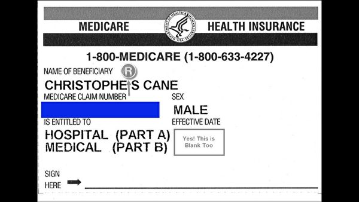
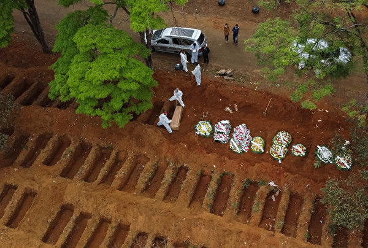
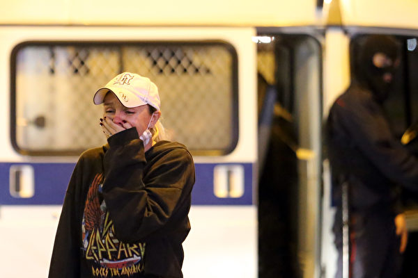
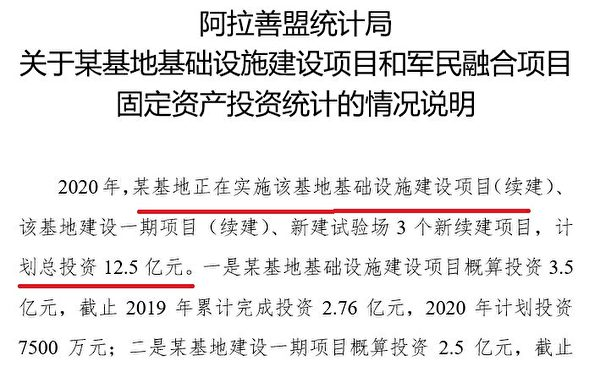
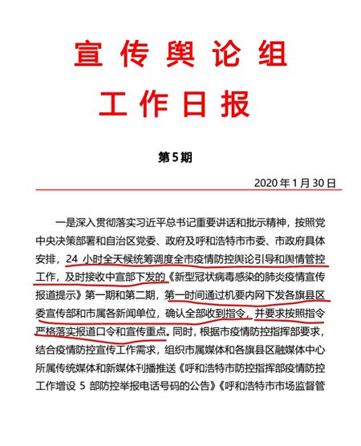

<h3><a target="_blank" href="https://bit.ly/3asSXIA">请多传破网软件，使更多的人了解真相从而得救，这是给自己积福德。 https://bit.ly/3asSXIA </h3></a>

   

     
<h3 align="center"><b>免翻视频  https://bit.ly/3ezRQKo  (请收藏网址 https://git.io/swspip)</b></h3> 

<h3 align="center"><b>复制网址到谷歌或火狐浏览器打开。若出现 “提示” ，請点击“继续”访问即可。</b></h3> 

<h3 align=center><a href="https://github.com/gav01/Heart/blob/master/news1.md">● 看更多大紀元時事 ●</a></h3>

<a href=https://git.io/souye><h6 align="right">回首頁</h6></a>

<a name=top>

<a href="https://github.com/gav01/Heart/blob/master/ls-20-9-1.md"><b>往1 ~ 142 新闻</b></a>  

<a href =#203>203.【最新疫情9.25】国际足球巨星染疫 
<a href =#202>202.华为5G欧洲遇挫 专家：重创中共情报战略 
<a href =#201>201.医者的修炼之道：完全相信大法 
<a href =#200>200.哈尔滨4所学校百余名学生呕吐腹泻 
<a href =#199>199.组图：白俄总统秘密就职 民众抗议遭水炮驱离 
<a href =#198>198.蓬佩奥联大演讲 吁回归传统 捍卫人权 
<a href =#197>197.连续加班维稳 内蒙古39岁警察猝死 
<a href =#196>196.李嘉诚成都公司被禁贷款？ 长实集团回应 
<a href =#195>195.联合国官网称习“殿下”降级身份 掀热议 
<a href =#194>194.助网民翻墙 美USAGM重启网络自由办公室 
<a href =#193>193.【十字路口】重判任志强 习近平内外开战 
<a href =#192>192.美或禁中共党员入境 北京老先生急退党 
<a href =#191>191.藏人揭露：昂旺如何利用警察身份为中共搞渗透 
<a href =#190>190.中共模拟炸关岛视频引关注 川普回应 
<a href =#189>189.【最新疫情9.23】川普：中共让这一切发生 
<a href =#188>188.民众顾虑个资泄露 刷脸支付在大陆难流行 
<a href =#187>187.中共被曝以扶贫为名 强制数十万藏人进训练营 
<a href =#186>186.任志强获刑18年中共官媒噤声 引网民议论 
<a href =#185>185.田云：纽约警察当中共代理人 带来重大警讯 
<a href =#184>184.【独家】内蒙文件泄露中共两大军事机密 
<a href =#183>183.【最新疫情9·17】全球染疫人数突破3千万 
<a href =#182>182.【十字路口】闫丽梦报告敲警钟 习欧洲踢铁板 
<a href =#181>181.第二名出逃者将中共生物武器信息告知美国 
<a href =#180>180.澳搜查中共领事 中共外交部90秒无言以对 
<a href =#179>179.世贸裁决亲北京 川普和莱特希泽强硬回击 
<a href =#178>178.美获关键证据 更多华为高管与伊朗合作 
<a href =#177>177.美起底中共五黑客：隶属APT41组织 
<a href =#176>176.兰州逾三千人感染布鲁氏菌病 官方瞒报 
<a href =#175>175.经济下行叠加瘟疫打击 大陆法拍屋数量巨增 
<a href =#174>174.新研究：中共病毒不只伤肺 还攻击人的大脑 
<a href =#173>173.香港新增九宗中共病毒确诊个案 
<a href =#172>172.疫情有多严重？ 瑞丽建方舱医院引网民质疑 
<a href =#171>171.走私美军突击艇至中国 美华裔军官妻子认罪 
<a href =#170>170.河北高校新生费用突增五千 学生：负担不起 
<a href =#169>169.教师遭欠薪内幕 安徽官员被指贪腐欠债几十亿 
<a href =#168>168.中共与瑞典交恶 建交70周年未互致贺电 
<a href =#167>167.以色列和阿联酋巴林签历史性协议 川普见证 
<a href =#166>166.免职、罚款、停贷、开除 内蒙打压全面升级 
<a href =#165>165.欧中在峰会上交锋 欧盟步步紧逼习近平 
<a href =#164>164.钟原：中共罕见公开针对民营企业统战文件 
<a href =#163>163.【内幕】中共控制疫情舆论手段曝光 
<a href =#162>162.印度可否取代中国 成为澳洲重要贸易伙伴？ 
<a href =#161>161.振华数据蒐台政要个资 马英九宋楚瑜等在列 
<a href =#160>160.【十字路口】监控240万名人 中国内循环能打通？ 
<a href =#159>159.【独家】内蒙文件曝罢课抗议的学生众多 
<a href =#158>158.非法持枪支弹药 广州一区公安局长获刑13年 
<a href =#157>157.云南瑞丽爆食物中毒 酿1死9人病情危重 
<a href =#156>156.中芯大股东负债千亿 中共半导体国企陷危机 
<a href =#155>155.战狼变色狼？刘晓明和华春莹相继出丑 
<a href =#154>154.美议员提案废永久最惠国待遇 剑指中共 
<a href =#153>153.美国友人要跑？ 小米美籍高管要套现70亿 
<a href =#152>152.英国发中国旅游警示 公民可能遭中共任意拘留 
<a href =#151>151.扛不住疫期高成本 花旗集团本周恢复裁员 
<a href =#150>150.杨威：川普脱钩奇招？大使走人 外交降级 
<a href =#149>149.字节跳动和中共关系有多深？报告揭内幕 
<a href =#148>148.微信禁令执行在即 卢比奥促川普再禁QQ 
<a href =#147>147.【新闻看点】习近平变脸示弱 欧中峰会有成果？ 
<a href =#146>146.廖远：山东民兵肆意杀人 世人不能再麻木 
<a href =#145>145.北京多间商家食品不合格 大肠杆菌等超标 
<a href =#144>144.【独家】舆情专报泄十九大内部注意事项 
<a href =#143>143.沈舟：美军B-1B快速回应中共台海挑衅  
 
 
 
 
 
 
 

<a name=203>
<h1 align="center"><b>【最新疫情9.25】国际足球巨星染疫</b></h1>

国际足球巨星兹拉坦·伊布拉希莫维奇（Zlatan Ibrahimovic）染上了中共病毒。(Marco Luzzani/Getty Images)

   
【大纪元2020年09月25日讯】（大纪元记者林南、徐简、戴芙若、林燕综合报导）9月25日全球中共病毒（武汉肺炎）疫情最新情况：  

根据约翰·霍普金斯（Johns Hopkins University）大学的数据，截至美东时间周一（9月24日）晚8时，全球中共病毒病例已突破3,197万大关，至少有97.8万人死亡。其中美国确诊病例超过693万，死亡人数超过20万（注：因中共和伊朗隐瞒疫情数据，真实数据比统计的要高）。

随着疫情蔓延，日本6万人因疫情失业，企业停业增23%；加拿大总理示警，下一波疫情来袭且比第1波严重；印度疫情恶化，总理要求7邦市考虑短暂封锁。

美国强生公司宣布其一剂疫苗已进入试验的第三阶段。美国顶尖传染病专家安东尼·福奇（Anthony Fauci）博士说，今年“很大一部分”美国人将不会接种Covid-19疫苗。美国疾病预防控制中心（CDC）表示，自2020年初以来，成千上万的商务飞行乘客可能已暴露于中共病毒。

一项研究表明，新的COVID-19突变似乎更具传染性，令口罩和社交距离等防范措施不起作用。

=======================

<b>以下是最新疫情实时更新：

印度铁道部部长因中共肺炎去世</b>

据《印度快报》报道，当地时间23日，印度铁道部国务部长苏雷希·安加迪(Suresh Angadi)因中共肺炎去世，终年65岁，他是因这场瘟疫去世的首位印度联盟部长。
安加迪去世后，印度总理莫迪和其他官员参加了追悼，莫迪发推文表示，安加迪是一位敬业的议员和杰出的部长，他的去世令人难过，“ 他的逝世令人难过。 在这个悲伤的时刻，我安慰他的家人和朋友。”

<b>国际巨星、意甲AC米兰球员伊布染疫</b>

9月24日下午，意甲AC米兰俱乐部发布消息称，效力于该队的瑞典前锋兹拉坦·伊布拉希莫维奇（Zlatan Ibrahimovic）染上了中共病毒，目前他正在家中接受隔离，缺席了当晚的欧联杯比赛。

伊布拉希莫维奇是世界著名足球运动员，十届瑞典足球先生得主，足球界传奇巨星之一。除了瑞超马模和英超豪门曼联外，只要他打过的联赛全都拿过该联赛冠军。他在中国也是家喻户晓，被中国球迷称为“伊布”。

<b>香港把英国列为高风险地区 入港须持证明</b>

目前港府把英国纳入防疫极高风险地区，从10月1日起，从英赴港的旅客要有病毒检测呈阴性证明，此外还需要隔离检疫14天。

中央社报导，港府对从极高风险地区赴港的人实施更严格的检测及检疫措施，此前已有10个国家或地区列入名单，包括孟加拉、衣索比亚、印度、印尼、哈萨克、尼泊尔、巴基斯坦、菲律宾、南非及美国。

当前港府规定海外旅客抵港后只接受14天隔离检疫，但来自极高风险地区的人将要接受更严格的防疫措施。

<b>捷克增2913个新病例 为疫情爆发以来第二高纪录</b>

捷克共和国报告，该国周四录得日增的感染中共病毒的病例数上升至2913例，是有病例记录以来的第二高数字。

捷克卫生部的数据显示，在这个拥有1,070万人口的国家，目前感染总人数为58,374人。在夏季放松封锁措施后，最近几周该国感染人数激增。

<b>印度新增86 052例确诊</b>

印度卫生部周五报告，在过去24小时，印度录得86,052例新的感染病例。这令印度累计的感染中共病毒的病例总数激增至582万例。

根据约翰-霍普金斯大学的数据，自8月底以来，印度每天的病例数确认在8万例以上。

印度卫生部周五还表示，在过去24小时，印度新增1141人死于Covid-19相关的疾病，总的死亡人数达到92,290人，这占所有病例的1.6%，死亡率相对比较低。

在全球范围内，印度是中共病毒确诊病例数第二高的国家，仅次于美国。

<b>全球染疫死亡人数突破98万人</b>

在全球冠状病毒死亡人数看起来将在几天内超过100万的时候，里约热内卢在一个世纪以来首次推迟了一年一度的狂欢节游行，因为巴西在这场流行病中仍然很脆弱。

约翰-霍普金斯大学追踪的数据显示，全球死亡人数在周五已超过98万。随着每天确认的死亡人数平均超过5000人，这很有可能在未来几天内死亡人数将会突破100万人。全球感染中共病毒的病例已达到3200万例。

本周早些时候，美国的与中共病毒相关的死亡病例超过了20万例，而确诊病例总数接近700万例。

巴西以13.9万人的死亡人数位居全球第二，确诊病例数位居第三，达460万。巴西取消了通常在2月举行的狂欢节游行，这是100年来首次。里约的桑巴学校联盟LIESA宣布，由于中共病毒的大流行，使得这一传统活动无法安全举行。

<b>巴西里约的狂欢节百年来首次推迟举办</b>

据美联社报导，里约热内卢推迟了一年一度的狂欢节游行，当局周四晚间表示，由于巴西仍容易受到疫情的影响，这一全球盛典活动无法在明年2月份举行。

里约的桑巴舞学校联盟（LIESA）宣布，中共病毒大流行使得无法安全地举行传统的游行，而这些游行是文化的支柱，对许多人来说，也是生活的来源。

里约市政厅尚未宣布有关狂欢节街头派对的决定，这些派对也在全市范围内举行。但其旅游推广机构9月17日发给美联社的一份声明中表示，在没有中共病毒疫苗的情况下，尚不确定何时能恢复大型公共活动。

巴西首例确诊感染的中共病毒的病例是在2月26日，也就是今年狂欢节结束后的一天。随着感染人数的增加，参加华丽的年度游行的桑巴舞学校停止了2021年活动的准备工作。周四的公告消除了不确定性的疑云。而里约市一直是巴西受到大流行病严重打击的城市之一。

<b>Pac-12橄榄球赛将在秋季开打</b>

由于担忧中共病毒疫情，许多体育赛事被取消或推迟。不过太平洋十二大校联盟（Pac-12）联盟周四投票翻转了之前取消新赛季的决定，宣布将在今年秋天进行橄榄球比赛。

本赛季将于11月6日开始，每支球队将举行7会场比赛。Pac-12的冠军赛定于12月18日举行。

同时还宣布男子和女子的篮球比赛可以在11月25日开始，冬季运动将恢复。在Pac-12校园内举行的任何体育比赛都不允许有球迷参加。

对于摔跤、女子体操、男女游泳跳水等冬季运动项目，各大学将根据当地公共卫生官员的指导意见和校园情况决定何时可以开始练习。这些运动项目的最终比赛日程将在稍后公布。全国大学生体育协会（NCAA）将秋季项目的季后赛冠军推迟到春季，将在2021年1月开始进行。在NCAA规则允许的情况下，将在秋季进行备战和练习。

NCAA周四在另一份公告中表示，碗赛赛季可以在12月1日开始。这意味着有可能碗赛和常规赛同时进行。NCAA表示，本赛季每支球队都有资格参加。在往年，通常战绩在500分以上的球队都有资格参加碗赛。

这个决定意味着所有称为“五大联盟”——十大联盟（Big Ten）、十二大联盟（Big 12）、大西洋海岸联盟（ACC）、太平洋十二联盟（Pac-12）和东南联盟（SEC）都将在今年秋天参加橄榄球比赛。

<b>川普签署两个医疗保健行政令</b>

美国总统川普（特朗普）周四（9月24日）在北卡罗来纳州夏洛特签署了两个针对美国人的医疗保健行政命令。

红蓝卡影本，掩盖号码部分。（王姿懿／大纪元）

川普在描述他的“美国第一医疗保健计划”的一部分时说：“根据我的计划，3300万医疗保险（Medicare）受益人将很快收到一封包含200美元的预付卡，可以用来帮助支付处方药。”

川普政府还制定了新的规则，允许美国各州和地区从加拿大进口成本较低的处方药。

川普表示，他预计较早前的行政命令将医疗保险的药品价格限制在其它富裕国家所支付的最低水平上，药品价格将进一步下降。

<b>中共病毒突变 口罩防不住</b>

一项研究表明，新的COVID-19突变似乎更具传染性。专家表示，这可能意味着该病毒有冲破口罩和其它社交距离等防护措施的能力。

据《华盛顿邮报》报导，科学家在周三发表的一篇论文中发现了一种新的病毒株，占德克萨斯州休斯顿地区第二波疫情的99.9%。

这份尚未经过同行评审的论文说，这种被称为D614G突变的菌株的病毒载量更高，这表明它具有更高的传染性。

尽管这种病毒并没有更加致命，但研究人员表示，它似乎更能适应在人类中传播。

美国国家过敏和传染病研究所的病毒学家戴维·莫伦斯（David Morens）表示，研究结果表明该病毒可能会变得更具传染性，并且“可能会影响我们的控制能力。”

他说，这种病毒有可能进化，来抵抗洗手和社交疏离等措施。

莫伦斯说：“戴口罩，洗手，所有这些都是病毒传播或传染的障碍，但是随着病毒的传染性增加，从统计学上讲，它更能绕过这些障碍。”

<b>研究：男性比女性更有可能死于病毒并发症</b>

根据周四发表在《科学》杂志上的两项研究，患者体内机体因感染而引发的先天反应问题，可能解释了大约14%病患出现严重症状和死亡。与女性相比，这些问题在男性中的发生率更高。

两项研究都集中在I型干扰素上，这是17种蛋白质的集合，当人体遇到病毒时就会出现。干扰素在暴露后数小时内产生，并向免疫系统的其余部分发出信号，表明存在入侵者。

一项研究表明，某些人的遗传缺陷阻碍了I型干扰素的反应。该病毒激发了“自身抗体”的产生，这些分子误导地攻击并破坏了I型干扰素，而不是病毒。从而为病毒提供关键时间，来赢得立足点并造成严重破坏。

研究人员在987例严重Covid-19患者中的101例中发现了自身抗体，但在663例轻度或无症状患者中没有发现自身抗体。在1,227名健康对照参与者中，只有4名被发现。

自身抗体主要见于男性：在研究的101位患者中，有95位是男性。

第二项研究分析了659名重症患者和534例轻度或无症状的DNA。研究人员发现，在重症患者中，有3.5%的八个基因存在突变，这些突变阻止了人体产生I型干扰素。

轻度或无症状的患者均无这些突变。

<b>美众院缩小中共病毒救助方案</b>

一位知情人士周四表示，美国众议院民主党人正在准备一个新的、较小的中共病毒救助方案，预计将耗资约2.4万亿美元，以此与川普政府进行对话。

这位知情人士说，该法案将包括加强版的失业保险，向美国人直接寄支票，“工资保护计划”（Paycheck Protection Program）的小企业贷款资金，对航空公司的援助，以及其它条款。为了满足2.4万亿美元这个价格，民主党人将他们先前的提案砍掉了大约1万亿美元。

在上个月的谈判破裂后，众议院议长南希·佩洛西（Nancy Pelosi）一再推动财政部长史蒂芬·姆钦（Steven Mnuchin）和白宫办公厅主任马克·梅多斯（Mark Meadows）将政府的1.3万亿美元报价再提高一万亿美元。

据Politico报导，佩洛西指示民主党委员会主席起草立法案，拟订另一项法案的计划。据媒体报导，众议院可能最快在下周对这项法案进行表决。

<b>印度疫情恶化 7邦市或短暂封锁</b>

中央社报导，印度疫情持续恶化，印度总理莫迪23日晚间与7个疫情最严重的邦市首长举行视讯会议时，要求各省市考虑重新短暂封锁，以观察是否有效遏止疫情传播。

2020年8月9日，印度安拉阿巴德，北方邦教育学士入学考的考生接受体温测量。(SANJAY KANOJIA/AFP via Getty Images)

印度铁路部国务部长安加迪23日晚间因武汉肺炎病逝，成为印度首位染疫身亡的部长；为印度研制核潜舰核子反应炉的资深核能专家巴苏24日也染疫身亡。

印度目前平均每天新增八九万起感染病例，总感染人数逼近600万大关；截至24日下午2时，累计病例达到573万7197例，死亡人数达9万1204人；外界预估印度很快超越美国，成为全球累计武汉肺炎病例最多的国家。

<b>德国外交部长正在隔离</b>

由于一名保镖染疫，德国外交部长海科·马斯（Heiko Maas）（Heiko Maas，SPD）现在正接受隔离。

德国外交部长马斯在国会答询时表示，无法接受中国武力威胁台湾的作法。马斯是近年来针对台湾议题公开表达立场的最高层级德国官员。(Adam Berry/Getty Images)

德国联邦外交部发言人说，周三（9月23日）马斯的第一次测试结果是阴性。

外交部正在检测其他人是否以及在多大程度上受到影响。

联邦外交部发言人说，将尽快与所有可能受到影响的人联系。至于受影响的具体人员名单，外交部没有提供更详细的说明。公共卫生服务部门还将决定，是否有必要采取进一步措施。

<b>巴西Covid-19死亡人数近14万</b>

巴西卫生部周四（9月24日）报告了831例新的Covid-19死亡人数，使该国的死亡人数上升至139,808人。

2020年7月16日，巴西圣保罗，维拉福尔摩沙(Vila Formosa)公墓空拍图。(Alexandre Schneider/Getty Images)

该部还报告了32,817例新的Covid-19病例，使全国总数达到465万7,702例。

据报导，巴西的Covid-19死亡人数是世界第二高，仅次于美国。美国为20万人。

<b>IMF：全球经济前景较6月预测好转</b>

中央社报导，国际货币基金（IMF）发言人周四表示，目前全球经济前景不像6月时那么黯淡，意指下月发布的预测值将调升。

国际货币基金（IMF）发言人9月24日表示，目前全球经济前景不像6月时那么黯淡，意指下月发布的预测值将调升。(AFP/Getty Images)

IMF发言人莱斯（Gerry Rice）说：“近来的数据显示，与6月24日的世界经济展望（World Economic Outlook）更新报告相比，前景可能没有那么悲观。全球经济的某些部分开始有起色。”

不过，莱斯指出，“前景仍然充满挑战”，除了冠状病毒（中共病毒）外，中国以外的新兴市场也面临着“不稳定”局面。

由于COVID-19疫情冲击大于预期，IMF于6月下修2020年全球经济成长率预测，从4月的-3%下修至-4.9%。

IMF预备于10月13日更新世界经济展望报告。

<h4 align=center><a href="https://www.epochtimes.com/gb/tag/%E6%9C%80%E6%96%B0%E7%96%AB%E6%83%85.html">【最新疫情9.24】请点击这里。(点击右键,另存新档）</a></h4>

原文出处：https://www.epochtimes.com/gb/20/9/25/n12428793.htm

<a target="_blank" href=#top><h6 align="right">回上方</h6></a> 
 
 
<a name=202>
<h1 align="center"><b>华为5G欧洲遇挫 专家：重创中共情报战略</b></h1>

欧洲位居美中科技冷战前沿，近半年，华为5G逐渐失去欧洲市场。图为华为英国总部。 (DANIEL LEAL-OLIVAS/AFP via Getty Images)

   
 【大纪元2020年09月25日讯】（大纪元记者林岑心采访报导）美国禁令使华为芯片断供，致使其高端手机业务快速下滑，连同华为欧洲5G设备的商业合同也面临极大考验。在国际封锁之下，专家指，中共布局长达20年的科技情报战略，将因此受到重击。
 
<b>欧盟领导人峰会前 德国国内激辩5G用不用华为</b>

据德媒《世界报》近日报导，联邦政府即将提交“新IT安全法”草案。这个法案一旦通过，将被认为是德国迂回拒绝华为。

根据彭博社9月23日报导，尽管德国国内对于华为的反对声浪高涨，但总理默克尔（Angela Merkel）表明，不会因为某家企业来自特定国家就将其排除。

默克尔的表态，在德国内部引发激烈讨论，而这项争辩，估计将延续到欧盟27国领导人峰会。

欧盟领导人峰会原定24、25日召开，议题包括5G安全、英国脱欧与其它工业战略问题。因为欧洲理事会主席米歇尔（Charles Michel）接触过中共病毒（武汉肺炎）感染者，目前正在自我隔离，会议可能延至10月1、2日举行。

旅德科学家费良勇告诉大纪元，德国在人权上与美国观点比较一致，商务上要完全跟中共脱钩，目前还看不出来这个倾向，但是下一步也很难说。

“欧盟内部正在开会重新检视和中国（中共）的伙伴关系。”他观察到，即使中共单方面说“和欧洲保持、深化战略伙伴关系”，欧洲虽没有公开反驳，却也不再有“伙伴关系”之说。

费良勇说，“一方面是他们看不惯中共打压人权、在香港问题上做得非常糟糕，另一方面，欧洲国家与美国有相同的价值观和社会制度，当美国持续要与中共脱钩时，欧盟很难说，我和中国（中共）继续保持战略伙伴关系。”

他与德国政要私下谈话中发现，习近平上台后的路线，会使中德两国的差异和矛盾更加明显，“说到底，德国很清楚，毕竟它和共产党的价值观不同，原本希望透过经贸往来，让其在人权、社会制度上改善，但是没想到习近平上台后大转弯，现在走向了反面。”

<b>布局欧洲20年 华为2020年遭遇最大败局</b>

今年2月，华为公布全球91个5G商业合同中，欧洲占了47个，欧洲各大电讯商几乎都与华为拥有合同，或已使用华为设备。这项“战果”多是因为这三四年来，欧洲经济低迷，多家电讯设备商面临经济结构及重复并购情势不稳，华为趁势以低价进军市场。据统计，2017至2018年，华为在欧盟游说的花费较前一年增长三成，达280万欧元。

华为在欧洲布局近20年，在2020年疫情全球爆发后发生了重大逆转。美国商务部5月15日对华为禁令再升级，限制使用美国技术的公司向华为供应芯片，促使欧洲各国政府认真考虑，其中，转变最大的是英国政府。

英国首相约翰逊（Boris Johnson）7月推翻了早先允许英国网络使用华为5G技术的决定，表示不希望英国重要的基础设施受制于“潜在敌对国家的供应商”，随后全面禁止华为参与英国5G建设，并规定通信商在2027年内拆卸有关机器设备。

约翰逊在接受BBC访谈时也暗示，排除华为参与5G和中共强行通过“港版国安法”有关，“在香港发生的事情显然违反了《中英联合声明》的文本和精神，这令人无法接受。”

美国华盛顿信息与战略研究所所长李恒青对大纪元说，不可忽视的是，英相约翰逊对华为态度的转变和他本人确诊中共病毒（武汉肺炎）也有关系，“要不是英国首相感染了新冠病毒（中共病毒）的话，可能也不会马上禁掉，当时他还很犹豫。”

在法国方面，法国虽然不会完全禁用华为，但电信商如果采用华为设备需获得授权，限期为3~8年，期满之后不会续签，意在逐步淘汰华为的设备。法国总统马克龙9月15日表示，欧洲不应该在数据安全以及5G领域依赖“任何欧洲之外的力量”。

意大利政府尚未决定是否禁用华为，但最大电信商意大利电信（Telecom Italia）已将华为排除在5G网络的采购之外。意大利电信执行长古比托西（Luigi Guibitosi）此前告诉媒体，如果政府禁止华为，该公司在5G发展业务上“不会有任何问题”。

越来越多国家和地区正在加入美国国务院提倡的“干净网络”行动，包括英国、捷克、波兰、瑞典、爱沙尼亚、罗马尼亚、丹麦和拉脱维亚。希腊已同意使用爱立信，而不是用华为来开发其5G基础设施。

欧洲第4大电信集团、西班牙电信（Telefonica）去年底表示，将大幅减少使用华为公司的设备。 9月16日，西班牙电信与日本乐天电信（Rakuten Mobile）签署一项协议，双方将在开放式虚拟化无线存取网路、开源软体和5G核心技术方面进行合作。

李恒青表示，欧盟几个成员国，都认为高风险5G供应商应该被排除在核心网络建设之外，“大家都注意到华为的5G网络建设会有后门，尤其前一段时间，美国国务卿蓬佩奥连续出访欧洲，劝说欧洲盟国注意‘网络清洁’，不要出现网络后洞，收获颇丰。”

在欧陆各主要国家逐一表态禁用华为的情况下，华为正努力拉拢爱尔兰、冰岛、塞尔维亚等国，宣称已在冰岛完成第一批基站安装，与塞尔维亚合作5G网络与“智慧城市”。

李恒青说，“华为现在想要做出一个样板，因为外界批评它有后门，它要证实没有后门。现在冰岛马上也要开始建设了，等到哪一天个人信息、政府信息走漏时，后悔就来不及了。蓬佩奥早就说过，华为系统被发现设有后门，可以追踪公务员的活动轨迹。”

华为实际上是为了中共情报战略而设立，其内部运作类似苏联的“克格勃”。美国国务卿蓬佩奥推动“干净网络”行动，排除中国技术和产品。

<b>各国不用华为 专家：将重击中共科技情报战略</b>

前华为南京研究所高级工程师金淳对大纪元表示，华为禁令致使5奈米芯片断供后，华为手机可能就不那么高端了，现在华为推出“云手机”，将手机的计算能力放在云上，即放到服务器端，但用户体验会变差，“云手机只能缓解，但不能解决问题。”

在5G基础设备方面，分为核心网和接入网。金淳提到，华为的核心网就是一些云设备、云服务器，华为大部分的计算能力都在云上面，在高端芯片断供下，华为可能藉中共军方无限资金的支持，通过买10块芯片，抵1块芯片的计算能力，用大量芯片来组成服务器端的云，抵消一些断供的影响。

金淳说，但根据摩尔定律，华为迟早在服务器端也会落后，“云手机、云服务器，只能延缓冲击，长期来说，华为的技术能力肯定受到影响。”

随着华为手机、5G基站设备市场同时受挫，外界关注它未来营运还能走多远？

金淳指出，华为本质上不是一家想要赚钱的企业，创办人任正非表面是退役军官，但实际上由中共军方任命，又给予他无限资金支持，有消息指，2004年时，国家开发银行成员、陈云儿子陈元给了华为贷款100亿美金，这笔钱都不用还。

“有了中国共产党无限资金的支持，华为经济上是不可能倒台的。”金淳说，但是从科技政治大战略来考虑，华为如果在科技领域落后，不能与美国、西欧竞争，真正受打击的是中共想要控制世界的野心。

他解释，华为实际上是为了中国共产党的情报战略、统战目的而设立，它奉行的是情报系统的方针——以商养情、以情促商、商情两旺，也就是在商务和情报收集上，两者相互配合，相辅相成。

“中共藉由自己扶植的企业去海外投资，干预并收买海外商人、政界人物，影响当地的选举，这些都是中共情报战略的一部分，包括华为、中兴都是扮演这种角色。”金淳强调，拥有中共军方色彩的华为，不能将其视为普通的企业，“华为在中共内级别非常高，甚至高于一些市委书记，这些书记都要给华为靠边站。”

华为内部的企业文化，类似苏联的情报单位，并且奉行“狼文化”，金淳说，“它的管理是从前苏联情报单位‘克格勃’来的，你可以把它当作科技版的‘克格勃’”包括信息的分级管理、保密方法，对人员的培养、责任制等都奉行这样的原则。

他认为，华为的危害是世界性的，需要世界立场一致地给予封锁，“如果只是美国禁，欧洲不禁，最终还是起不了封杀华为的作用，还会养虎为患，华为会苟延残喘下去。”

李恒青认为，美国一开始对中共进行技术封锁时，欧盟原本希望在两个大国对抗中火中取栗、得到好处，但现在许多国家也发现，欧洲和中共的矛盾其实是不可调和的、深层次、制度性的矛盾，欧洲各国现在开始觉醒。

他表示，一年多下来，美国已经清楚知道，中共控制的企业、政府的软肋在哪里，现在正在大规模进攻，很多国家开始选边站队，不用华为的产品，“华为只能靠中国（中共）政府硬撑，未来还会有很多问题在等着华为，可能接下来几个月就会看到。”  

原文出处：https://www.epochtimes.com/gb/20/9/25/n12429225.htm

<a target="_blank" href=#top><h6 align="right">回上方</h6></a>
 
 
<a name=201>
<h1 align="center"><b>医者的修炼之道：完全相信大法（图）</b></h1>
   
   【明慧网二零二零年九月十九日】（明慧记者沈容采访报导）银白的发丝、从容的姿态，鹤发童颜，笑容可掬，他是已过古稀之年的胡乃文医师，心安理和全写在脸上。胡医师视病人如亲人、医术精湛，许多病人四处寻医后，才在他的诊断下找出真正的病因。多年来，慕名求诊、远道而来的病患纷至沓来，但胡医师却表示他在法轮大法面前，只是个幼儿园的学生，完完全全相信大法，听师父的话。
   

图：胡乃文在不断实修中体悟到修命与修心、道德和健康的直接关系，他表示整个看病的过程就是我修炼的过程。

   
  胡乃文的人生之路在念高中之前仍很模糊，他从没想过未来的有一天会步入杏林。“以前还不知道自己要走哪条路，读高中时分甲乙丙组，我连自己要读哪一组都不清楚，只是随着要好的同学来选择，你读丙组那我就读丙组，慢慢的，也就越读越有兴趣了。”

大学时，胡乃文研读生物学，研究所主修神经科学及内分泌，毕业之后则投入药理学，并被单位派去美国史丹佛研究院（SRI international）从事生命科学领域的研究。他回忆道：“我在美国的研究院里那段时间，常在图书馆里查询当季最新的研究资讯、科学文献，发现中国医学提到了一种治疗方法叫针灸，我是学西方神经科学的，心想神经和针灸一定有所关联。”

回到台湾后，胡乃文开始钻研针灸，并进一步深研中医，从针刺之术到黄帝内经，望闻问切，经络气血，仿佛踏进一个崭新的天地，收获五千年神传文化的奥秘。当他考上中医执照时，胡乃文已届不惑之年。

“其实我自小身体就不好，即便是青壮年最有活力的阶段，也总是脸色蜡黄、空虚乏力，常因心情紧张以致肠胃不好而苦恼。学西方医学时，曾摄取很多营养药剂、健康食品，常常吃也没啥用处。当上中医后，也开始服用中药调理，表面上好像维持得还不错，但我很清楚自己的身体状况是非常差的。”

在中西医皆感无效之下，胡乃文转而接触各门各派的气功，希望借此自我锻炼、提高身体素质。“我就到处去转，四处去看，终于在接近五十岁的时候，听到当时一个气功班上的同学提到了‘法轮功’这个名词。当时人们几乎不知道有法轮功在传，我不断地打听询问，终于在一九九六年时，找到一位学过法轮功的老先生。”

<b>从一个好人做起</b>

一九九七年初，胡乃文上完法轮大法九天学法教功班，十一月，他第一次亲眼见到了李洪志师父。“那一年，师父来台湾三兴国小讲法，我看到师父在那么忙碌嘈杂的环境当中，一直不愠不恼、平静祥和。师父叮嘱我们不管在生活当中、工作当中，都要按照‘真、善、忍’的标准做一个好人，要从好人做起、按照高层次的法修才能修成。”李洪志师父慈悲宽厚、浩然正气的风范一直烙印在胡乃文的心中，自此之后，他便时时刻刻要求自己做一个好人，一个实践“真、善、忍”的修炼人。

渐渐的，他发现自己过去时常犯的毛病不见了，因紧张烦恼、发怒焦虑导致的肠胃宿疾也消失无踪，不仅精神越来越好，智慧更仿佛涌泉般源源不绝，对许多艰涩的医学古籍也有了更深的理解和领悟。

“一直到学了大法之后，我才明白不管是针灸也好，中医也好，都是中华古老文明的智慧结晶，完全领先最尖端的西方医学。而法轮大法则远远超越这一切，不是气功，不是宗教，而是‘修炼’。”“修炼”是人类文明中一个渊源久远、奥妙无穷的领域，法轮大法明白揭示人体、生命及宇宙的深奥法理，更使胡乃文在不断实修中体悟到修命与修心、道德和健康的直接关系。

<b>病由心造　境随心转</b>

胡乃文表示：“在我刚得法没多久，就遇见一位老太太来找我看病，她是一位基督徒，每天都要祷告，我问她祷告忏悔时都说些什么？她说我和上帝讲今天和谁发脾气了，明天又和谁不好了。当时我立刻想到师父讲的一段话：‘有人说：这个忍很难做到，我脾气不好。脾气不好就改嘛，炼功人必须得忍。’[1]”

要想治病，得先治心，抒开心结，再谈病情。“于是，我和那位老太太说，我们讲的忏悔啊，您是不是每天忏了却没有悔呢？忏而不悔，悔而没改，就等于零。没想到老太太把我的话听进去了，流下许多眼泪；下次回来看诊时，包了一个好大的红包，告诉我她回家后改了乱发脾气的坏习惯，竟然让她的病完全好了。这个真实案例让我证实，所有的病如果都能用大法法理来实践衡量，那么人所称之为的‘病’，其实什么也不是了。”

病虽由心造，境也随心转，若能在苦中修去人心、升起正念，也就能从病痛中破茧而出。胡乃文说道：“有一些病情，包括闻之色变的癌症，从中医理论来讲，可能是情绪过度喜、过度怒、过度惊、过度恐造成的，这些喜怒忧思悲恐惊的波动，也都是因为人的名利情放不下，进而牵引万病丛生。所以当和病人谈及病情时，在低层次上我会告诉他们是生活习惯不当、养身方式不对所导致，但若能在高层次上让他们放下内心的欲望和执著，病人的‘病’反而就好了。”

病痛的本身不是问题，面对病痛的心境才是关键，胡乃文也提到自己经历过的“病业关”。他说：“有一天我睡觉醒来时，发现一只手一只脚不能动了，又麻又没有力量。若照医学常识判断，这当然是很不好的状态了。刚开始，我的确很害怕，但我努力清除这些感受，大喊师父救我、师父救我！一阵子过后，这样的状况便消失了。之后再发生同样情况时，我体会到不能让师父操心，就想到师父在法中说：‘欠债要还，所以在修炼的路上可能要发生一些危险的事情。但是出现这类事情的时候，你不会害怕，也不会让你真正的出现危险。’[1]于是便想着没事、没事！这个状况也平安过去了。”

<b>相信大法　就找自己</b>

胡乃文悟到，在严峻的过关中，考验的是修炼人的正信，那些担忧和恐惧是属于常人的却不是修炼人应该有的，无论表面上遇见再不好的情况，第一念一定要想到师父、想到法，而不是想找什么人如医师或爸妈的帮助；提高心性、正念对待，修炼路上信与不信，不得有半点虚假。

“修炼之初，有位年轻人每个星期都要来看我一两次，有一天我严肃的和他说，你身体的状况我用药已没法治了，你最好去学法轮大法。原先，那个年轻人怕冷怕到什么程度呢？怕到连家中的窗户都要用胶带紧紧封起来，但他才上了九天班第二天，竟然会流汗了！之后他的身体完全康复，没有再来诊所看过我。”

“还有一位红斑狼疮的患者，每周一定坐飞机从台南来台北找我，有一次我问他要不要在台北住几天，顺便来上法轮功九天学法教功班，他很快就说好，上完九天班过后，这位病患再也没来找过我了。可是，我也遇过一些病人，放不下固有的宗教及观念，不愿试着相信大法，二十多年来仍在病痛中载浮载沉。”

不同人心反映出不同的状态，不同人心也造成不同的后果，胡乃文表示：“我一直记得师父告诉我们：‘如果第三者看见了他们俩个人之间有矛盾，我说那个第三者都不是偶然让你看见的，连你都要想一想：为什么叫我看见了他们的矛盾？’[2]所以我在看病当中，也是这样来思考的。对方为什么会得这样的病？他有什么放不下的心？我是否也有同样的执著？每天我都这样找自己，一天看五个病人，五个病人心里放不下的东西，都在我脑袋里转过一遍，五十个病人就向内找五十遍，一百个病人就向内找一百遍，我知道这一切都是让我来检讨自己的，整个看病的过程就是我修炼的过程。”

尽管人生过去了大半辈子，但对胡乃文来说，自己仍是单纯相信师父的幼儿园学生，无论遭遇什么都在修炼的路上，不管发生什么都有师父在身边。“我现在的想法很简单，对修炼人来说，每一件事情都是有原因的，遇到了我就把事情做好，遇到了我就把自己修好。”

行医济世三十五载，胡医师除问病看诊之外，也录影直播，写文出书，他以七十五岁的高龄四处巡讲活动，唯一的心愿只有一个。“年轻时接触人群，目的是希望得名求利，但修炼之后那种执著已经没有了，我现在不为名利而来，为众生而来。我所做的任何一件事情，都是希望看到我的人能和大法牵上那根线、结好那份缘，进一步了解‘法轮大法好’！” 

原文出处：http://big5.minghui.org/mh/articles/2020/9/19/%E9%86%AB%E8%80%85%E7%9A%84%E4%BF%AE%E7%85%89%E4%B9%8B%E9%81%93-%E5%AE%8C%E5%85%A8%E7%9B%B8%E4%BF%A1%E5%A4%A7%E6%B3%95%EF%BC%88%E5%9C%96%EF%BC%89-411790.html

<a target="_blank" href=#top><h6 align="right">回上方</h6></a>
 
 
<a name=200>
<h1 align="center"><b>哈尔滨4所学校百余名学生呕吐腹泻</b></h1>

XXX9月22日、23日，黑龙江省哈尔滨市4所学校二百多位学生相继出现呕吐、腹泻等症状。（视频截图合成）

   
【大纪元2020年09月24日讯】9月22日、23日，黑龙江省哈尔滨市4所学校二百多位学生相继出现呕吐、腹泻等症状。家长质疑学校食物有问题。

综合陆媒报导，有学生家长表示，9月22、23日，哈尔滨市呼兰区幸福小学、沈家中学、腰堡一中有多名学生出现呕吐、腹泻等症状。23日上午，该市呼兰区建国小学也有多名学生因身体不适被家长送医。

中共呼兰区委宣传部称，23日10时许，呼兰区幸福小学、建国小学、沈家中学、腰堡一中4所学校的学生相继出现呕吐、腹泻等症状；四十多名症状较明显的学生还在医院就诊，二百多名症状轻微的学生已从医院回家观察。目前4所学校的午餐留样等送至市疾控中心。

呼兰区第一人民医院的医生披露，就医学生除了腹泻、呕吐，也有部分学生肚子疼。

网传视频显示，有家长反映，孩子当天在学校吃饭，吃什么都觉得是酸的，辣白菜吃起来是酸白菜、土豆吃起来嘎吱响，可能都没熟。家长质疑学校食物有问题。

原文出处：https://www.epochtimes.com/gb/20/9/24/n12426037.htm

<a target="_blank" href=#top><h6 align="right">回上方</h6></a>
 
 
<a name=199>
<h1 align="center"><b>组图：白俄总统秘密就职 民众抗议遭水炮驱离</b></h1>

2020年9月23日，白俄罗斯明斯克，总统亚历山大·卢卡申科（Aleksander Lukashenko）出席就职典礼。(BELTA/AFP via Getty Images)

   
  【大纪元2020年09月24日讯】（大纪元记者林紫蓉报导）白俄罗斯总统亚历山大·卢卡申科（Aleksander Lukashenko）自8月9日总统大选之后，争议不断，民众质疑选举过程舞弊，已爆发多次抗议。卢卡申科秘密进行总统就职典礼，9月23日又引发首都明斯克数千名民众上街抗议，防暴警察除了逮捕抗议者之外，也使用水炮车驱离民众。

防暴警察逮捕抗议者，过程中有些民众流血。有些抗议者手持白俄罗斯红白相间的旧国旗或身穿此配色的服饰，还有些抗议者头戴纸制的皇冠头饰表达抗议。警方还出动水炮车，喷射水柱驱散抗议民众。

德国表示，由于白俄罗斯总统大选结果有争议，不具有合法性，因此不承认卢卡申科的总统地位。 

  

020年9月23日，白俄罗斯明斯克，总统亚历山大·卢卡申科（Aleksander Lukashenko）在就职典礼上致辞。(BELTA/AFP via Getty Images)

  
   

2020年9月23日，白俄罗斯明斯克，总统亚历山大·卢卡申科（Aleksander Lukashenko）在就职典礼上签署了一份文件。(SERGEI SHELEG/BELTA/AFP via Getty Images)

   
   

2020年9月23日，白俄罗斯明斯克，总统就职典礼引发民众抗议，防暴警察逮捕一名抗议者。(TUT.BY/AFP via Getty Images)

   
   

2020年9月23日，白俄罗斯明斯克，总统就职典礼引发民众抗议，四位防暴警察将一名抗议者抬走。(TUT.BY/AFP via Getty Images)

   
   

2020年9月23日，白俄罗斯明斯克，总统就职典礼引发民众抗议，防暴警察向抗议者喷洒催泪瓦斯。(TUT.BY/AFP via Getty Images)

   

2020年9月23日，白俄罗斯明斯克，总统就职典礼引发民众抗议，警察将一名抗议者压制在地上。(TUT.BY/AFP via Getty Images)

   
   

2020年9月23日，白俄罗斯明斯克，总统就职典礼引发民众抗议，防暴警察逮捕一名抗议者。(TUT.BY/AFP via Getty Images)

   

2020年9月23日，白俄罗斯明斯克，总统就职典礼引发民众抗议，一名抗议者在警车旁掩面哭泣。(TUT.BY/AFP via Getty Images)

   
   

2020年9月23日，白俄罗斯明斯克，总统就职典礼引发民众抗议，防暴警察逮捕一名抗议者。(TUT.BY/AFP via Getty Images)

   
   

2020年9月23日，白俄罗斯明斯克，总统就职典礼引发民众抗议，一位戴着皇冠造型头饰的妇女正与警察争论。(TUT.BY/AFP via Getty Images)

   

2020年9月23日，白俄罗斯明斯克，总统就职典礼引发民众抗议，警方出动水炮车驱离民众。(TUT.BY/AFP via Getty Images)

   
   

2020年9月23日，白俄罗斯明斯克，总统就职典礼引发民众抗议，警方出动水炮车驱离民众。(TUT.BY/AFP via Getty Images)

   
原文出处：https://www.epochtimes.com/gb/20/9/24/n12426653.htm

<a target="_blank" href=#top><h6 align="right">回上方</h6></a>
 
 
<a name=198>
<h1 align="center"><b>蓬佩奥联大演讲 吁回归传统 捍卫人权</b></h1>

9月23日，美国国务卿蓬佩奥（Mike Pompeo）以视讯方式在联合国大会发表演讲。（美国国务院视频截图）

   
   【大纪元2020年09月24日讯】（大纪元记者李辰报导）9月23日，美国国务卿蓬佩奥（Mike Pompeo）以视讯方式在联合国大会发表演讲，他呼吁人们回归传统道德，捍卫人类不可剥夺的权利，即基本人权。

蓬佩奥在演讲中说，“发生在第二次世界大战期间的恐怖事件明确表明，每个主权国家都有责任保护所有人的尊严。因此，1948年，联合国大会批准了《世界人权宣言》。”

“《世界人权宣言》的第一行写道：‘承认人类家庭所有成员的固有尊严以及平等和不可剥夺的权利是世界自由、正义与和平的基础’。”

“这些话和美国的《独立宣言》呼应，《独立宣言》指出，政府的目的是确保不可剥夺的权利，即所有人的固有权利。”

“今天我们必须捍卫不可剥夺的权利，因为国际人权正处于危机之中。”

“从中国到伊朗再到委内瑞拉的专制政府，正在剥夺我们同胞的基本权利。”

“同时，许多跨国组织迷失了方向，侧重于党派政策偏好，却未能捍卫基本权利。”

“甚至许多善意人士，都主张（与传统）冲突的新型权利。”

“为了维护普遍人权，我们应该将目光投向《世界人权宣言》的制定者，他们确定了一套清晰的原则，这些原则适用于任何时候、任何地方的所有人。他们坚定地捍卫每个人的尊严。”

“因此，我们也应该这样做。”

“为了帮助我们做到这一点，我召集了美国国务院‘不可剥夺权利委员会’。委员会在美国宪法传统中发现了对不可剥夺权利的广泛而深刻的支持。”

“我们希望委员会最近发布的报告将为其它国家和人民带来启发。”

“人们应该回归传统，专注于（传统的）道德、哲学和宗教，以确保所有人的固有权利，这也是《世界人权宣言》的核心权利。”

“这项工作至关重要。我们必须重新认识人权的本质，重拾捍卫人权的勇气。”他说。

原文出处：https://www.epochtimes.com/gb/20/9/24/n12426567.htm

<a target="_blank" href=#top><h6 align="right">回上方</h6></a>
 
 
<a name=197>
   
<h1 align="center"><b>连续加班维稳 内蒙古39岁警察猝死</b></h1>

【大纪元2020年09月24日讯】内蒙古通辽市一名警察因长时间加班，上周在家中猝死，终年39岁。前体制内人士指，当地公安为镇压蒙族人反抗汉化教育，不惜要求警察长时间加班，李贺之死显示出官方的维稳体系也吃紧。

内蒙官媒报导，通辽市公安局经侦支队39岁警察李贺，9月14日在安保维稳一线连续工作17天，当天结束执勤后不久，因劳累过度在家中猝死。报导还称，从8月29日起，通辽市公安机关全面取消请休假，广大公安警察要在维稳第一线。

有自称内蒙的警察在网上留言称，从8月底内蒙爆发蒙族人“保护母语”运动以来，他们每天至少超过12个小时的维稳工作已是常态，所有人都疲惫不堪。

自由亚洲电台报导，该台致电通辽市公安局，试图了解详情，但该机构拒绝就此事置评。

曾担任政法委书记的陈先生表示，估计这名警察猝死与当局镇压蒙族人的反抗有关。他说，李贺是经侦员警，同时也是警方内部的电脑技术人员，当局正严密监视蒙族人的言行，需要工作人员长时间加班。

陈先生指，李贺之死仅仅是维稳体系紧张的一个标志性的案例，其实在常规的维稳中，整个官方的维稳压力和成本都非常高，并已到不堪重负的地步。

他还指，虽然李贺这样的基层员警成了代罪羔羊，但绝大多维稳体系的人并不会因此醒悟。

内蒙官方近日高调地宣传该猝死警察为所谓的英雄，但民众不买账，对这场针对蒙族人的超限维稳的合法性提出了质疑。

8月底，内蒙官方宣布将在新学期开始限制蒙族学校中的蒙语教育，引发蒙族人全面抗议。官方派出大批员警强力维稳，并严密监控蒙族人在网上的动向，同时以取消学生的入学资格镇压学生们的反抗。但官方的维稳力量本身被指捉襟见肘。

原文出处：https://www.epochtimes.com/gb/20/9/24/n12426635.htm

<a target="_blank" href=#top><h6 align="right">回上方</h6></a>
 
 
<a name=196>
<h1 align="center"><b>李嘉诚成都公司被禁贷款？ 长实集团回应</b></h1>

李嘉诚资料图。（Getty images)

   
【大纪元2020年09月24日讯】（大纪元记者刘毅报导）9月23日，四川成都高新区财政金融局发文称禁止辖区内金融公司向和记黄埔地产（成都）有限公司提供新增融资和贷款等。和记黄埔地产公司是香港富豪李嘉诚长江实业集团（简称长实）旗下重要上市公司。

据大陆多家媒体报导，四川成都高新区财政金融局23日向辖区内金融机构下发布《古语禁止和记黄埔地产（成都）有限公司融资、贷款和重大资产重组的函》表示，因和记黄埔地产（成都）有限公司存在捂地、捂盘行为，经研究，禁止向该公司提供新增融资、贷款，禁止向该公司重大资产重组提供帮助。

另据四川在线报导，23日晚间，针对媒体报导成都市高新区财政金融局发函引发关注一事，高新区财政金融局回应称：“近期我局配合区内相关部门正对多个涉及捂盘惜售项目进行查处，包括南城都汇项目。”

而南城都汇正是长实集团的地产项目。

今年7月23日，长实集团发布了成都南城都汇项目的转让公告显示，成都南城都汇项目接盘方为禹洲集团控股有限公司和成都瑞卓置业有限公司，作价约78.47亿元，预期出售事项计及融资安排后，长江实业集团录得约38.11亿元未经审核得益。

所以，李嘉诚已在两个月前从成都撤资，不但卖掉了在成都项目，还把和黄集团在成都的分公司出售了。

据自由亚洲电台报导，长实集团发声明澄清：“和记黄埔地产（成都）有限公司现在并非长江实业集团有限公司之附属公司，亦不由集团控制。”

从2013年开始从，李嘉诚频繁出售长实系在大陆和香港的资产，套现超千亿人民币，包括出售北京盈科中心、上海盛邦国际大厦等；在香港，李嘉诚出售零售屈臣氏超过24%的股权、减持港灯20%股权等。

9月初，长实集团要出售北京和上海的两处物业，总值500亿元人民币，融创中国有意接手。。

对于李嘉诚出售大陆资产，有评论人士表示，李嘉诚幸亏跑得早，如果现在要将资金撤离大陆应该不行了。

自由亚洲电台引述时事评论员萧若元分析，李嘉诚卖大陆的资产，我是绝对赞成的，如果不卖大陆资产，今天应该跑不掉了，好像其他人一样被共产党抢夺了。而卖香港的资产，也证明他是正确的，因为今天香港的情况都有大量的中资，他们都歧视香港地产商。

萧若元表示，李嘉诚现时一边套现大陆及香港的资产，一边投资海外项目，其中英国是他重点投资的地方。去年8月李嘉诚以46亿英镑收购了英国最大酒吧集团和酿酒厂Greene King，又投资英国大型地产项目Convoys Wharf，投资金额约100亿港元。他又在英国投资铁路、通讯、零售等领域，在英国的总资产已达4000亿港元。

评论人士文小刚表示，多年和中共高层打交道，李嘉诚对中共还是比较了解的，知道中共不会容忍私企做大，而且会把香港搞乱，所以提前布局，远离中共。   

原文出处：https://www.epochtimes.com/gb/20/9/24/n12425827.htm

<a target="_blank" href=#top><h6 align="right">回上方</h6></a>
 
 
<a name=195>
<h1 align="center"><b>联合国官网称习“殿下”降级身份 掀热议</b></h1>

联合国官网以“王储的敬称”称呼习近平为“殿下”（His Highness）。（联合国官网截图）

   
 【大纪元2020年09月24日讯】近日，联合国官网以“王储的敬称”称呼习近平为“殿下”（His Highness），而不是一般共和国元首的“阁下”（His Excellency），将习的身份“降级”为“太子”。此事被眼尖的网民发现，引起热议。

9月21日，第75届联合国大会在纽约联合国总部开幕。约170名国家元首和政府首脑就中共病毒（武汉肺炎）疫情、2030年可持续发展议程和其它重大国际问题发表讲话。因疫情关系，大会特别安排播放多国领袖预先录制的讲话。

联合国官网在第75届大会总辩论的日程和议程中，列出发言人士名单及发言的先后次序。对于发言人士，主要使用三种敬称。其中仍保留王室制度或实行君主制国家的国王、王后，会被敬称为“陛下”（His Majesty）；王储的敬称是“殿下”（His Highness）；一般国家元首如总统、总理等，则会被敬称为“阁下”（His Excellency）。而在名单上排在第6顺位发言的习近平却被称为“殿下”。

联合国官网以“王储的敬称”称呼习近平为“殿下”（His Highness）。（联合国官网截图）。

令人感到离奇的是，这份会议日程的中文、英文、法文、俄文、西班牙文及阿拉伯文等语言的版本，对习近平的敬称，全部都是“殿下”（His Highness、Son Altesse、Его Высочество、Su Alteza el），不像其他非实行君主制的国家元首或领袖，包括美国总统川普（Donald J. Trump）、巴西总统博尔索纳罗（Jair Bolsonaro）等，均被敬称为“阁下”（His Excellency）。

直到北京时间9月23日傍晚8时30分左右，联合国官网才把对习近平的称呼改为“阁下”（His Excellency）。

将习近平称呼为“殿下”究竟是联合国秘书处人员的失误，还是有人想故意揶揄习近平，不得而知，不过事件已引起网民热议。

有网民指，殿下是对王储、王族的敬称，对皇帝的敬称应为“陛下”。联合国称习近平为“殿下”，其实已把他“降了一级”。

有香港网民推断，应是最原先的文件出错未被发现，结果导致所有语言版本对习近平的称呼都出错。

在“新品葱”网站，有“翻墙”的大陆网民说：“成了！这是联合国给习主席的劝进？习主席在国际上这么受支持，建议马上改元开国，登基即位正式称帝”，“联合国认证的土皇帝”，“我都不知道是联合国的内鬼是故意反讽还是真的想舔习马屁了”；还有人反讽，殿下是藩王用的，习应该觉得自己是陛下吧。

习近平上台后，除了集党、政、军大权于一身外，还通过修宪取消国家主席任期制，导致外界不少声音认为这是习为他的“帝皇梦”铺路。

今年的联合国大会笼罩在中共病毒疫情肆虐全球及中美关系持续恶化的阴影下。

在联大一般性辩论上，川普在发言时率先提到中共病毒（武汉病毒、新冠病毒）疫情，他谴责中共政府在疫情中连续撒谎，导致二次世界大战以来人类最大的危机，要求中共必须为其行为承担责任。川普还批评世卫被中共控制。

习近平则暗批美国在世界上“搞霸权、霸凌”等，称各国关系和利益只能以制度和规则加以协调，不能谁的拳头大就听谁的。

时政评论员李林一表示，习近平在联合国的发言自相矛盾，在对台湾问题上中共依仗武力说话非常明显，不断派出军机骚扰台湾，中共的作派就是“谁的拳头大就（应该）听谁的”。

李林一还说，习在联合国上突然把这些套到美国头上，虽然中共在这些话前面加了个“各国关系”，但是熟悉国际局势的人看了后，都会觉得讽刺中共自己的意味十足。  
原文出处：https://www.epochtimes.com/gb/20/9/24/n12426287.htm

<a target="_blank" href=#top><h6 align="right">回上方</h6></a>
 
 
<a name=194>
<h1 align="center"><b>助网民翻墙 美USAGM重启网络自由办公室</b></h1>

迈克尔 • 帕克（Michael Pack），“美国全球媒体署”（USAGM）首席执行官。(USAGM)

   
   【大纪元2020年09月24日讯】（大纪元英文记者Bonnie Evans报导/高杉编译）负责监管“美国之音”（Voice of America）和“自由亚洲电台”（Radio Free Asia）等媒体及对外广播机构的“美国全球媒体署”（U.S. Agency for Global Media，简称USAGM）重新启动了其“互联网自由办公室”（Office of Internet Freedom，简称OIF）。“互联网自由办公室”于2016年建立，就之后被该署领导层关闭。

近年来，“美国全球媒体署”下属的“美国之音”等媒体遭到了广泛的批评。尤其是“美国之音”中文部甚至被一些媒体称为是“拿着美国纳税人的钱的中共喉舌”。此前发生的郭文贵爆料直播被中共利用在“美国之音”的关系和影响力中途叫停的事件，使该问题被聚焦在闪光灯下。

此外，“美国全球媒体署”大约从十年前开始，就设立了旨在打破中共防火墙的专项资金。但批评者称，由于以自由亚洲电台（RFA）前台长丽比‧刘（Libby Liu，刘仚）为首的一些人的故意破坏，让这项计划一直没能发挥作用。

掌控自由亚洲电台（RFA）长达14年的丽比‧刘，把“美国全球媒体署”用于突破中共网络封锁的资金分散开来，并企图把“开放技术基金”（Open Technology Fund，简称OTF）分离出来并私有化，使美国政府突破中共网络封锁的项目，多年来没有任何进展。

迈克尔‧派克（Michael Pack）是川普总统提名的“美国全球媒体署”领导人。但他的提名受到了强烈的阻挠，并在参议院被搁置了两年多。今年夏天早些时候，在经受了民主党人和一些从不支持川普的共和党人的一连串的、猛烈的批评之后，终于成为“美国全球媒体署”的掌舵者。

2020年6月4日，帕克被任命为“美国全球媒体署”的首席执行官。

就任之后，他大刀阔斧地对“美国全球媒体署”及下属单位进行了改革，致力于改变包括“美国之音”在内的多个下属媒体多年来一直面临外界质疑的局面。他开除了多位包括前“美国之音”台长班奈特、“自由亚洲电台”台长丽比刘在内的媒体高管。被一些媒体称为是“清理门户”。

前“美国之音”台长班奈特被指责隐瞒了因其家属同中共之间商业往来的利益冲突。

对于重启“互联网自由办公室”的问题，“美国全球媒体署”在8月18日的新闻稿中说，现在迫切需要能够帮助互联网防火墙后面的人们安全访问网络和分享信息的技术。

帕克对此表示：“不同于‘美国全球媒体署’之前的那些认为‘互联网自由办公室’应该靠边站的领导，我认为加强针对互联网防火墙的规避技术是当务之急。阻止民众自由访问互联网信息是一件可怕的事情。这就是为什么我们正在资助一系列的互联网防火墙规避工具。”

在宣布重新启动“互联网自由办公室”的同时，派克还正在着手重新建立对“全球媒体署”的规避技术开发工作的控制。之前，“全球媒体署”曾试图建立一个独立于“全球媒体署”的部门，称为“开放技术基金”（Open Technology Fund，简称OTF）。

在“全球媒体署”内部，围绕规避互联网审查制度的工具和技术的开发，仍有一个核心问题在争论之中，就是关于是使用开源技术还是闭源技术。

自从“互联网自由办公室”作为“自由亚洲电台”的一个项目成立以来，它一直坚定地站在使用开源解决方案的阵营中。

<b>项目的前领导层“我行我素”</b>

“互联网自由办公室”坚决排斥任何闭源的互联网自由工具，这可能是该项目的领导层在去年似乎表现失控的原因之一。

华盛顿政府的记录显示，2019年9月，当时担任“自由亚洲电台”和“互联网自由办公室”项目负责人的丽比•刘，以自己的名义将“开放技术基金”作为一家国内非营利性公司注册。

丽比‧刘是该机构注册文件中“实益所有人”一栏中的“注册人”。

“美国全球媒体署”的高级官员坚持认为，丽比‧刘没有得到该机构或任何政府组织的授权将“互联网自由办公室”分拆成自己拥有的实体。“互联网自由办公室”的全部预算来自“美国全球媒体署”。

此外，据“全球媒体署”的高级官员透露，“互联网自由办公室”还搬出了其在“全球媒体署”总部的负担得起的办公空间，并以纳税人出资的租约搬到了华盛顿市中心一个昂贵的办公区。

此外，据官方称，“互联网自由办公室”甚至没有留下信件转发地址。“全球媒体署”的官员说，他们不得不亲自去寻找“互联网自由办公室”的新办公室地址。

9个月后，帕克上任，他解雇了“全球媒体署”网络和“互联网自由办公室”的负责人，包括丽比‧刘和一些董事会成员。

现在，正在进行中的一项诉讼试图使这些解雇决定变得无效，并解冻对“互联网自由办公室”的拨款。诉讼声称这些拨款被“全球媒体署”的官员扣留。

该诉讼的律师还声称派克没有权力解雇网络主管和“互联网自由办公室”的主管丽比‧刘，但遭到了“全球媒体署”高级官员的反驳。此外，“全球媒体署”的高级官员说，这笔款项不会从“互联网自由办公室”的预算中一直扣留，这笔款项将按照修订后的时间表支付。

现在派克已经着手恢复对该部门的控制。

<b>规避互联网审查制度</b>

互联网审查机制主要是在中共和伊朗等集权统治下运作。

绕过这些审查机制是西方政府机构和非营利组织的共同目标，他们试图通过开放互联网来赋予专制政权下的公民自由浏览网络的权利，但是如何去做的方式经常引起激烈的争论。

争论中的一个主要焦点就是关于，是应该使用开源软件还是使用闭源软件（通常被称为“专有软件” Proprietary）。

据“全球媒体署”透露，在开始，“互联网自由办公室”将资助每一种类型的一个项目。开放源码的Psiphon和思科（Cisco）的闭源专有的ACI都是重启后的“互联网自由办公室”的第一批资助目标。

著名人权专家、兰托斯人权与正义基金会（Lantos Foundation for Human Rights and Justice）主席卡特里娜‧兰托斯‧斯维特（Katrina Lantos Swett）在接受《大纪元时报》独家采访时表示：“兰托斯基金会主张为所有类型的互联网自由工具提供资金，包括防火墙规避工具。”

兰托斯‧斯维特也是美国国际宗教自由委员会（U.S. Commission on International Religious Freedom）的前主席和副主席，并在塔夫茨大学（Tufts University）教授人权和美国外交政策。

“自由门（Freegate）和无界浏览（Ultrasurf）都是大规模防火墙规避工具，过去曾获得美国政府资助，我们很高兴看到未来的奖项能够颁发给那些经过了严格的实地测试和安全审查的技术。”

兰托斯‧斯韦特说：“我们还认为，所有接受了资助的“互联网自由”技术都应该得到持续的全面评估，以确保这些资金被用于最有效、可用的工具的研发。”

“美国全球媒体署”还将“开放技术基金”的实体纳入其资金拨款和监管范围。它和“互联网自由办公室”一样，一直在从事互联网防火墙规避工具的研发。

<b>开源软件vs专有软件</b>

一些专家不同意“互联网自由办公室”此前的对于闭源规避技术的教条式的排斥。

为数字业务提供统一云平台的澳大利亚公司CoreDNA在其官方网站上对该问题评论说：“公众可以免费使用和修改开源软件的原始设计。” “这意味着一个软件可以被世界上任何地方的其他开发人员推断和迭代。”

CoreDNA关于这个主题的博客继续写道，因此，开源软件应该具有一个警告标签。

“尽管一个开放的、面向点对点的网络工具在理论上值得称赞，但它可能会让我们更容易受到流氓开发人员的攻击，这些开发人员会为了自己的利益而破坏网络。因此开源软件需要一个警告标签。”

该公司表示，而闭源专有软件则不需要那个警告标签。专有软件的源代码“不会与公众分享，任何人都无法看到或改变。”

在对《大纪元时报》的进一步评论中，兰托斯‧斯维特说：“互联网自由是人权的下一个前沿”。

原文出处：https://www.epochtimes.com/gb/20/9/23/n12425551.htm

<a target="_blank" href=#top><h6 align="right">回上方</h6></a>

 
<a name=193>
 <h1 align="center"><b>【十字路口】重判任志强 习近平内外开战</b></h1>

中国多地屡现病例 年底疫情再回来？重判任志强18年 习近平内外开战。（大纪元合成）

   
  【大纪元2020年09月23日讯】（2020.9.23）

大家好，我是唐浩，今天都好吗？

今天，我们要跟大家来聊两个话题：

话题一：中国多地屡现病例 年底疫情再回来？

话题二：重判任志强18年 习近平内外开战

马上来看第一个话题。

<b>话题一：中国多地屡现病例 年底疫情再回来？</b>

中共在9月8日才刚大张旗鼓地召开“抗疫表彰大会”，对外宣称中共战胜了疫情，党又取得了重要胜利。但实际上，并非如此。

云南疫情最近急速升温，瑞丽市从14日开始实施封城；到了19日，云南省宣布全省“全面进入战时状态”，并强化边境管控。而南京、河南、天津、上海等地也陆续传出新的确诊案例。

陕西的西安外国语大学以及安徽的合肥工业大学也传出，因为校方顾虑疫情而对学生进行封闭式管理，生活条件恶劣，物价上涨，导致学生强烈不满，集体喊楼抗议。

更值得注意的是，尽管中共宣称战胜了疫情，但是获颁“共和国勋章”的专家钟南山，18日在一场论坛上表示，今年冬天到明年春天之间，疫情可能会继续存在或发展。而另一位专家张文宏也表示，中国出现第二波疫情是必然的，他还强调，“80%的人是无症状的，这是非常恐怖的”。

请大家注意这些线索：第一，中国许多地区再次公开通报疫情，虽然都推说是境外移入，但根据此前中共当局下令隐瞒疫情、掩盖真相的经验来看，各地确实可能疫情复燃；或者是疫情根本没有结束过，只是被官方的“抗疫胜利”、“复工复产”的主旋律给“政治清零”了，也就是被官方掩盖了。

巧的是，美国众议院外交委员会21日发表肺炎疫情报告，指控中共涉嫌隐瞒病毒威胁，而世卫组织也没有阻止中共的不当行为。

川普也说，他对习近平掩盖疫情相当生气，他更在联合国大会演讲上指控中共隐瞒疫情，要求联合国追究中共的责任。简单说，国际社会已经看穿中共，不断揭露中共掩盖疫情的真相，所以在中国境内的朋友更要谨慎提防。

第二个线索，各地学校虽然复学上课，但却依然严格地封闭学生的生活行动，这反映出，学校方面与政府可能知道各地依然有疫情案例，但是又不得不配合高层的政策进行开学、复工，所以下令对学生进行小区式的封闭式管理。

第三个线索，是在疫情期间知名度最高的两位专家钟南山与张文宏，不约而同地释出口风，暗示疫情即将再出现新高峰。当然，呼吸道疾病与肺炎在冬天的发病率确实会比较高，但是这次两名专家异口同声地预告疫情又要回来了，而且最少要做一年的打算。这些信号，确实不一般。

大家知道，中共为了掩盖这次疫情真相，不但严格审查、控制媒体及网络言论，还下令各医院与医疗体系严密封口。所以，这些能经常出现在媒体前的专家，他们什么话能说、什么不能说，都跟党的指令有关。

换句话说，在中共体制底下，经常在媒体上露面的专家往往不是独立超然的科学研究者或真相探索者，而是配合共产党进行维稳的“舆论引导者”与“政令宣传者”。

所以，这次两名专家都公开说“疫情会回来”，“至少做好一年准备”，而且还受到中国媒体广泛报导，没被封杀，很可能意味着，中共发现最近各地病例越来越多，越来越难掩盖，越来越难推说都是“境外移入”了。

换句话说，中共开始进行舆论铺垫工作，一方面是要让人民建立心理准备，当局准备释出更多的疫情实况，可能要再次实施严厉的社会控制与封城措施；另方面，也是要引导人民把疫情复发的理由，归因到是“冬季”和“气候”的因素。

再说透一点，中共知道疫情开始激增了、可能要瞒不住了，所以就在“党宣布抗疫胜利”之后，赶紧通过科学家的口，有计划地铺垫舆论、引导舆论，为疫情的复发以及中共的掩盖疫情来解套卸责。

因此，可以预见，在十月的“国庆月”过后，官方应该会一步步释放出更多的各地疫情案例，迎来专家所谓的“第二波疫情”。所以，我们要请中国的朋友以及最近想去中国的朋友们，务必多加留意疫情信息、做好防疫准备。

<b>话题二：重判任志强18年 习近平内外开战</b>

知名的中共“红二代”地产商人任志强，9月22日被北京法院判处18年徒刑，罪名是贪污罪、受贿罪、挪用公款罪以及国有公司人员滥用职权罪，并且罚款420万人民币。消息传出后，引发海内外哗然。

由于任志强的身份特殊，与习近平同样是红二代出身，但却罕见地被重判18年，这项判决也因此被普遍质疑是“政治迫害”的成分居多。

为什么习近平要对任志强出重手？第一个主因，显然是任志强曾经多次公开批评习近平。任志强向来有“任大炮”的称号，今年三月，他曾经署名写文章，批评习是“剥光衣服坚持当皇帝的小丑”、“谁不让我当皇帝，就让你灭亡”。

第二个主因，是任志强的身份背景与人脉实力太过雄厚。任志强不但是红二代，在中共权贵集团里拥有许多太子党、红二代朋友；任志强也是地产富豪，在商界的实力与人脉相当广；同时，任志强也是中国知名的公共知识分子，在社会上、在中上阶层里具有相当强大的号召力与影响力。

对于中共领导人来说，这样的人，如果能收编在旗下，会有利于自己的权力稳定；但如果这样的人跟自己背道而驰，那就会成为非常具有动员力与战斗力的政治敌人，因此必须除之而后快，也从而让年近70岁的任志强身陷囹圄。

事实上，这起案件除了再次反映出北京当局对党内反对意见的不容忍，并且升级压制之外，我认为背后还透露了三个重要的政治讯号：

<b>讯号一：中共内斗高度激烈 却又力图掩盖</b>

从今年初以来，有多封疑似是红二代、官二代的公开信在网络上流传，公开批评习近平的执政缺失，还呼吁召开紧急会议“讨论习近平的去留”。

虽然这些公开信是谁写的不得而知，但从文章内容的细节以及文章能够在网络上广为流传，显然是具有一定力量或者后台强大的人员或集团才能做到。加上任志强是公开署名批评当权者，自然成为头号箭靶。

因此，任志强的判决，可以看出中共高层内部派系斗争相当激烈，已经让当局无法再只靠舆论劝导或口头警告来摆平，因此开始动用国家机器的法律战，以法律名义展开另一场残酷的内部斗争，杀鸡儆猴。

除了任志强外，前中共党校教授蔡霞日前也因为批评中共是“政治僵尸”、习近平是“黑帮老大”而被开除党籍，蔡霞也是任志强的朋友。因此，两人被公开处理，等于是习近平对党内其它派系祭出的一记狠手与警告。

不过值得注意的是，这次任志强的判决里并没有被“剥夺政治权利”，四项罪名都是经济罪名。这里头有两个玄机：第一，当权者不希望案件的政治意味太浓，不希望被看穿是政治斗争的打压，因此故意选择经济罪名来判刑。

第二，当权者试图把这起案件对外定性为经济贪腐案件，也是为了试图掩盖中共目前内斗凶恶，试图粉饰太平，不希望被国内普通人民以及海外国家看穿，不希望被外界看破中共政权内部的矛盾分裂与风雨飘摇。

否则，中国人民可能会因为中共内部分裂而蠢蠢欲动，希望推倒中共；而且欧美国家可能也会因为中共内部分裂，而加大力度对北京施压、围困北京，希望迫使中共走向解体。因此，北京当局设法淡化这起案件的政治味。

<b>讯号二：压不住红二代反习 北京祭出生命威胁宣战</b>

任志强今年69岁，被判刑18年，如果全部服刑期满，就将近90岁了；即便因为红二代身份而只服刑一半，出狱也都快要80岁。换句话说，这项判决几乎是要让任志强进得去，出不来。当权者等于是用“生命威胁”向红二代宣战。

因为自从习上任以来，通过打贪反腐来进行权力斗争，得罪了许多中共权贵家族与红二代、官二代们。再加上执政上的屡屡误判与错误决策，加深许多红二代不满，引起他们的反弹。

像近日就传出，另一名红二代马晓力，因为反对北京当局在内蒙古强推汉语教学、打压蒙古文化，从而发表连署公开信批评习。所以，习近平在党内遭受的阻力越来越大，挑战越来越多，从而决定祭出生命威胁的重武器，向红二代宣战与警告。

<b>讯号三：中共党魁权力基础不稳 实施恐怖维稳</b>

从今年初到现在的政治局势，可以看出当权者的权力基础越来越不稳定，批评声浪越来越高。特别是当权者越来越左倾的政治路线，越来越像毛泽东，这让许多受过“文革”迫害的红二代家族，相当难受与反感。

因此，原本应该支持他的红二代哥儿们，现在与他越来越疏远，也使得习近平的执政基础越来越分崩离析，甚至这些红二代还反过来成为反对习的主要派系之一。

换句话说，在党内，原本反习的力量可能是以被习扫荡的贪官、江泽民派系以及其他受到习近平军事改革冲击的军中人马，但现在许多红二代、官二代也纷纷加入战局，成为习的敌人，让北京政权风雨飘摇。

所以，习才会开始升级维稳手段，祭出足以威胁生命的重刑重罚来反制对手，与红二代们撕破脸，用恐怖维稳方式来打这一场“中南海权斗殊死战”。

好，看到这里，可以想见，接下来中共党魁一定会对更多的反对者进行更严厉的打压与惩戒。不过，我认为，当中共党魁的权力斗争越升级、维稳手段越剧烈，就会让他的政权越脆弱、越危险。怎么说呢？简单说，四个字，“内外开战”。

首先，是“内战”。习近平在党内向大批对手展开你死我活的生死博奕，不但会激化中共内部的派系矛盾与肃杀之气，而且会让习核心在党内越来越孤立；再加上他重用王沪宁等人，不断地误判局势，不断地冒险左倾，结果就让支持他的人员基础越来越薄弱。

其次，是“外战”。过去两年来，习近平与美国川普政府不但关系全面闹僵，甚至已经走向公开分裂、全面冲撞的地步。

9月21日，习近平在联合国成立75周年峰会上讲话时，不点名地批评美国说，“任何国家都没有包揽国际事务、主宰他国命运、垄断发展优势的权力，更不能在世界上我行我素，搞霸权、霸凌、霸道”，“不能谁拳头大就听谁的”。

习近平等于是公开对川普叫骂，宣称中共被美国霸凌。不过，有意思的是，他批评美国的这些话，不正好都是中共对世界其它国家的作风吗？中共其实有一个特点，非常知道自己干的事情有多坏，只是他们敢厚脸皮地不承认，并且把这些坏事拿去指责别人。

也因此，川普也在受访时公开表示，他提到习近平就很生气，川普还在22日的联合国大会演讲上火力全开，12次点名中方进行批评，并且呼吁联合国要追究中共掩盖疫情的责任。

换句话说，中共“外战”的首要对手，就是美国。不过，中共还在南海问题与越南、菲律宾、马来西亚等东盟国家发生冲突；还与印度有着边境武装冲突，随时有开战的可能。

再加上日前王毅出访欧洲，因为试图霸凌捷克而遭到欧洲各国围剿、抵制等等，因此中共目前的“外战”对手，已经遍布全球。北京当局不但会在党内遭到孤立，在国际社会也同样会被孤立、边缘化。

不仅如此，北京当局还要面对国内的疫情复发、经济低迷、粮食短缺等等潜在危机，种种的内外开战、内外交迫，只会让北京当局越来越摇摇欲坠、越来越脆弱。

因此，接下来可以推测，北京当局可能会继续做几件事：

一、对党内升级斗争，清洗对手，加强集中权力。

   
二、对国内升级社会维稳，严控舆论，打压异见。

   
三、增强兵力动员，对外用来备战，对内用来权斗。

   
四、对台湾升级武力挑衅，对美国以拖待变。

   
五、收紧国内经济，走向“内循环”为主的封闭经济。

面对内外交逼的高度压力，这些行动将是中共党魁用来稳住政权、守住权力的最后自救手段。但这些手段，结果一样只是枉然。

好，我们再重复一次，任志强的判决案背后，透露了几项重要的政治信号：

讯号一：中共内斗高度激烈 却又力图掩盖
讯号二：压不住红二代反习 北京祭出生命威胁宣战
讯号三：中共党魁权力基础不稳 实施恐怖维稳

大纪元《世界十字路口》制作组 

原文出处：https://www.epochtimes.com/gb/20/9/23/n12423361.htm

<a target="_blank" href=#top><h6 align="right">回上方</h6></a>
 
 
<a name=192>
<h1 align="center"><b>美或禁中共党员入境 北京老先生急退党</b></h1>

至今，超过3.6亿中国人声明退出中共党、团、队组织。（大纪元）

   
  【大纪元2020年09月23日讯】（大纪元记者王奕然采访报导）马来西亚法轮功学员、退党义工夏女士向大纪元记者透露，一位北京老先生近日主动要求退党和办理退党证书，她表示，国际局势和天象变化正在推动中国民众退出中共。

美媒近日披露，川普（特朗普）政府正在起草一份行政令，将可能全面禁止中共党员及其家属赴美旅行，此外也将限制中共军方人员和国营企业主管入境。

夏女士9月20日受访表示，她感到大陆民众现在“对于天象变化的关注程度比以前更高了 ”。她举了9月18日她给北京一位老先生拨打电话劝他退党的例子。

一接起电话， 老先生说：“你是法轮功吧？”

夏女士：“对呀。”

“哎呀， 我就要找你们呢！”

“好呀。”

“我文化大革命入过的党，怎么退呀？”

“就是给你做一个申请哪，表明你跟那个组织没有关系了。”

“我现在就是要找你们帮我办啊， 那你可不可以给我那个证书？”

“办了后，就有证书啊。”

“我儿子在美国，我要是以后去美国探亲，是不是得要一个证书？”

“先生， 你拿那个证书入境美国可能是一个凭证，表明你和共产党没有关系了，可能会给你带来些便利⋯⋯”

“那你就帮我办吧。”

夏女士当场给他起了化名“尚德”退党，“愿你做一个高尚的、有道德的人，众神会保佑你。”

“好，好，好。”

第二天，老先生又主动联系她，表示希望尽快获得退党证书；第三天，老先生获得证书，如愿以偿。

夏女士介绍，这位北京老先生主动要求办理退党证书，是因为他知道了美国可能计划禁止共产党员入境的消息。

<b>一名中共党员持旅游签证入境美国被拒</b>

美国洛杉矶法律工作者郑存柱爆料，一名中共党员持旅游签证于9月17日入境美国时，在底特律机场海关被拒绝入境、被吊销签证并被遣返，而且他移民美国的申请也因为其共产党员的身份被移民局拒绝。他在广州美领馆面签时，被问到是否是共产党员的问题。

<b>如何退党</b>

9月18日，全球退党服务中心主席易蓉表示，众多事实表明美国正全面地加大力度清理共产党因素，该案例显示美国根据《移民与国籍法》在禁止共产党员移民美国上动真格的，这对共产党员是一声很响的警钟。

她说，美国移民法把共产党视为极权组织、恐怖组织对待，事实上，共产党就是魔教、国家恐怖主义集团，共产党垮台在即，审判和清算很快就要到来，曾经加入过的人应赶紧退出，与其划清界线，没有时间可以再浪费，机会不要再错失；全球退党中心颁发的《退党证书》可作为一个权威的证明。

今年8月18日起，“全球退党服务中心”开始提供在线退党服务。办理者在大纪元退党网站（或退党中心网站）声明三退后，便可获得退党电子证书。每份证书带有独特的编号，作为官方识别之用。

退党的方式有：

1. 退党义工帮助退党。

2.上网：请登录“全球退党中心网站”（tuidang.org）或大纪元退党网站（tuidang.epochtimes.com）。

3. 拨打热线：全球退党服务中心电话：001-718-888-9552；热线电话：001-702-873-1734。

4. 发送电子邮件：tuidang@epochtimes.com

5. 在线办理《退党（团队）证书》网站：https://www.tuidang.org。

详情请浏览：tuidang.org，“退党中心教你如何退党”影片：https://youtu.be/zhreJzRoNCM。

（大纪元记者马颖慧对本文有贡献。） 

原文出处：https://www.epochtimes.com/gb/20/9/22/n12423250.htm

<a target="_blank" href=#top><h6 align="right">回上方</h6></a>
 
 
<a name=191>
<h1 align="center"><b>藏人揭露：昂旺如何利用警察身份为中共搞渗透</b></h1>
   <h3 align="center"><b>昂旺惯以藏人和NYPD警员双重身份对藏人团体示好 实际效力于中领馆</b></h3>

纽约市警察局111分局藏族警察昂旺（大纪元资料图片）

   
  【大纪元2020年09月23日讯】（大纪元记者林宜君纽约报导）美国纽约市皇后区111分局华裔社区联络官昂旺（Baimadajie Angwang）因涉嫌为中共领事馆搜集纽约藏人活动的信息，周一（21日）在其长岛家中被捕。周二（22日）下午，“纽约州和新泽西州西藏协会”成员接受采访，曝光了昂旺作为“中共代理人”积极接触藏人社区、热情协助藏人，实际却大搞渗透活动的行为。

“纽约州和新泽西州西藏协会”（Tibetan Community of New York and New Jersey）的前英文秘书大溪（Tashi Chomphel）接受采访时表示，协会在去年2月29日打算筹办西藏新年庆祝活动，约莫在活动开始前的一个月，昂旺第一次现身协会。

大溪说，昂旺当时对协会表示，他是西藏人又是纽约警察局的警员，可以帮助西藏团体，并表示想认识协会的主要成员。当昂旺知道“纽约州和新泽西州西藏协会”要筹办西藏新年庆祝活动时，他主动表示愿意帮忙邀请纽约警察局跟纽约市消防局。协会不疑有他，接受了昂旺的帮忙，陆续与昂旺有两三次会面，一起讨论活动和纽约警察局的邀请名单。

大溪指出，昂旺当时坚持协会一定要寄邀请函给他，没有邀请函他就不出席。昂旺身为纽约警察局的警察却做“中共代理人”的事件曝光后，Tashi Chomphel回忆起当时的情形，认为这可能是因为昂旺想要具体物证，好向纽约警察局或中共领事馆证明他有办法联系西藏团体。

大溪说，昂旺在去年2月29日上午，带着小孩和妻子出席协会举办的西藏新年庆祝活动。但是后来有协会成员发现，昂旺在当天下午也带着妻子现身中共领事馆举办的中国新年联欢会。当时，“纽约州和新泽西州西藏协会”成员觉得奇怪：为何一个说要帮助西藏人的藏人，会去中共领事馆参加活动？协会成员感觉昂旺在背后玩把戏，也感觉昂旺是在替中共领事馆工作，而非想服务于藏人团体。

大溪说，昂旺在西藏新年庆祝活动后，还是尝试联系协会的主席和其他主要成员，但是所有协会成员都拒绝与昂旺联络。后来，昂旺就不再与“纽约州和新泽西州西藏协会”联系。

但是，这位在纽约警察局工作的中共代理人，并没有停止渗透藏人社群。

大溪表示，今年的西藏新年期间，“纽约州和新泽西州西藏协会”一位成员受邀至纽约藏人服务中心（NY Tibetan Service Center）参加庆祝活动，发现昂旺也在现场，成员于是知道了，昂旺在用同样的方式渗透其它藏人团体。

大溪说，昂旺曾经跟“纽约州和新泽西州西藏协会”的几位主要成员说，西藏团体最好不要参与政治活动。

去年2月底，大溪记得昂旺突然出现在“纽约州和新泽西州西藏协会”，他与昂旺便在前门随意聊天。那时，昂旺对他说：“如果我是你，我不会在这里挂西藏旗，这样就没办法从法拉盛的商人那里拿到更多赞助，因为这违背中共的政策（agenda）。”

大溪认为，昂旺知道协会需要资金运作，所以故意这么说，借此利诱协会按照中共想要的政策走。然而，“纽约州和新泽西州西藏协会”从来都没想从昂旺说的群体那里得到金援，因此大溪并没有把这事放在心上，但是听到昂旺那样讲，他当时觉得非常沮丧和伤心。◇# 

原文出处：https://www.epochtimes.com/gb/20/9/23/n12423105.htm

<a target="_blank" href=#top><h6 align="right">回上方</h6></a>
 
 
<a name=190>
<h1 align="center"><b>中共模拟炸关岛视频引关注 川普回应</b></h1>

中共空军制作的宣传H-6轰炸机的“强大影片”却被发现是拼接自好莱坞大片的“赝品”。（视频截图）

   
【大纪元2020年09月23日讯】（大纪元记者徐简综合报导）中共发布的极具挑衅性的模拟“轰炸关岛”视频，虽然后来被证实是剪接自好莱坞大片造假而紧急删除，但还是引起国际关注。美国总统川普（特朗普）和中共外交部都对此做出回应。

上周六，中共空军在官方微博上发出了最新视频，内容为被官媒吹嘘为“战神”的战略轰炸机“轰-6K”模拟轰炸美军关岛基地。这个讯息极具挑衅性，因而引起了外界的高度关注。

9月21日川普接受“福斯与朋友”专访，主持人基尔梅德（Brian Kilmeade）提到这个视频，询问总统如何应对来自中共的威胁。

川普回答说，“这个嘛，我现在不会告诉你（美国如何应对），它们（中共）现在知道它们碰到大麻烦了。如果他们继续玩下去，那他们就会遇到一些大麻烦。”

在这次采访中，川普还罕见地公开把矛头对准中共总书记习近平，“每次说到疫情，我就对他非常生气。他们本来可以轻易把疫情控制下来，却没做到，让许多国家承受惨痛后果。”

而中共外交部面对路透记者提问的视频情况，则是一问三不知。发言人汪文斌：“我不了解你说的有关情况，请你向有关主管部门询问。”

中共空军制作的宣传H-6轰炸机的“强大影片”，让外界一度以为局势升级而紧张，却被发现是拼接自好莱坞大片的“赝品”，这又让很多网民哑然失笑。

该影片名为“战争之神H-6K继续进攻！”，由“中共空军政治工作部宣传文化中心”精心制作，内容为炫耀中共空军的中程及远程H-6轰炸机。

然而，眼尖的中国网民很快发现了影片中的明显漏洞，原来视频中的爆炸性飞弹连续片段，竟来自三部好莱坞大片的剪接，那就是“变形金刚2：复仇之战”（Transformers: Revenge of the Fallen）、“绝地任务”(The Rock）及“危机倒数”（The Hurt Locker）。

被中国网民炮轰和海外媒体曝光后，“空军在线”悄悄将这个视频下架，就连央视也急删该影片。   

原文出处：https://www.epochtimes.com/gb/20/9/23/n12424290.htm

<a target="_blank" href=#top><h6 align="right">回上方</h6></a>
 
 
<a name=189>
<h1 align="center"><b>【最新疫情9.23】川普：中共让这一切发生</b></h1>

2020年9月22日，美国总统川普离开白宫前往宾夕法尼亚州匹兹堡参加竞选集会时向新闻界发表讲话。(SAUL LOEB/AFP)

   
 【大纪元2020年09月23日讯】（大纪元记者戴芙若、李言、颜殊璟综合报导）9月23日全球中共病毒（武汉肺炎）疫情最新情况：
 
 根据约翰·霍普金斯（Johns Hopkins University）大学的数据，截至美东时间周一（9月21日）晚8时，全球中共病毒病例已突破3,145万大关，至少有96.7万人死亡（注：因中共和伊朗隐瞒疫情数据，真实数据比统计的要高）。

周二，中共病毒的蔓延在美国造成的死亡人数超过了20万。美国上周的死亡人数在连续下降四周后上升了5%。美国每10,000名居民中就有6人死于该病毒，是发达国家中发病率最高的国家之一。巴西死于该病毒的总体死亡人数紧随美国之后，超过137,000。在过去一周中，印度的每日死亡率是全球最高的，目前的总死亡人数已接近100,000人。

受到大流行打击的航空公司敦促各国政府采用替代性的旅行限制方案，包括在登机前测试取代到达后的隔离措施。

美国总统川普周二在联合国大会录像发言上称，“必须使中国（中共）对它们与冠状病毒（中共病毒）大流行有关的行为负责”。“中国（中共）政府和实际上由中国（中共）控制的世界卫生组织错误地宣布没有人与人之间传播的证据。”“后来，他们还错误地说没有症状的人不会传播这种疾病。联合国必须对中国（中共）的行为负责。”

=======================

<b>以下是最新疫情实时更新：

法国新增上万例确诊</b>

法国周二（22日）报告了10,008例新增病例，与上周录得的数据一致，但低于上周六的高点13,498例。

CNN本周报导说，在法国的一个主要城市，医院重症监护室的床位快要用光了。

<b>英国日增4,926例确诊 5月7日来最高纪录</b>

根据英国政府统计，该国周二（22日）在24小时内录得4,926例新增病例，创下是自5月7日以来的单日最高纪录。

英国首相约翰逊（Boris Johnson）周二宣布对英格兰实行更严格的限制，包括实行口罩强制令、在当地时间晚上10点关闭酒馆和餐馆。他说，这些限制措施可能持续6个月。

<b>强生公司候选疫苗在美启动第3期试验</b>

强生公司（Johnson & Johnson）的候选疫苗周三（23日）在美国开始第3期试验。这种使用人腺病毒制成的单剂量疫苗的试验将在美国和其它国家及地区近215个地点招募多达6万名成年参与者。

这款候选疫苗由强生公司的子公司杨森制药公司（Janssen Pharmaceutical Companies）开发。

强生公司首席科学官保罗·斯多弗（Paul Stoffels）周二接受记者电话采访时说，第3期试验将立即开始，首批参与者将在周三接种疫苗。

该疫苗在美国和比利时进行的第一期和第2期试验的初步结果表明，这款疫苗可激发免疫反应，并且足够安全，可用于大规模试验。

<b>上千人发起集体诉讼 控告奥地利隐瞒滑雪胜地疫情</b>

多国的上千民众已提起一项集体诉讼，控告奥地利政府今年3月为赚钱故意淡化该国著名滑雪度假村爆发的疫情，没有采取足够措施来保护他们在前往滑雪时免受感染。

奥地利消费者保护协会（VSV）在其网站上发布声明说，该机构已向维也纳的公共检察官办公室提交了对事实的第一份描述，供其调查时使用。

根据多份报告，有1000多人说他们正在参加这项诉讼。

据英国《独立报》报导，今年3月7日，奥地利蒂罗尔州（Tyrol ）小镇伊施格尔（Ischgl）的滑雪场有1间酒吧老板确诊，成为当地首名染疫患者，但当局拖了快一周才宣布封城，在封城前仍照常迎接大批游客，等到宣布封城，有多达数万游客在数小时内出逃。

这项集体诉讼旨在证明，奥地利及蒂罗尔州的当局在3月13日实行隔离检疫以前，并没有关闭度假村或警告滑雪者病毒正在传播，没有采取足够措施来保护游客免受感染。

蒂罗尔州在给CNN的一份声明中说，人们“可以自由地在一个立宪国家向法院提起诉讼”，该州“对重新评估过去几个月内所有事态发展拥有可能最大的兴趣”。

不过，该声明继续说，大流行使“全世界许多国家和地区……处于仅几个月前还难以想像的特殊情况下”，并补充说，该州正在“与司法机构”和一个专家委员会密切合作，该委员会负责调查小镇伊施格尔（Ischgl）的病毒危机管理。

这项集体诉讼也是为了证明，3月13日对伊施格尔及其周边地区突然发布的隔离检疫令，得以让病毒在欧洲蔓延。

伊施格尔及其附近的村庄每年冬季都会吸引约50万名游客，过去几年中，还包括一些名人和政治人物。

<b>美新增逾3.9万例确诊</b>

根据约翰·霍普金斯大学的统计，美国周二录得39,334例新增病例，至此，病例总数已达至少6,896,274。

美国周二还录得921例新增死亡病例，使死亡总数达到200,807。

这些总数包括所有50个州、哥伦比亚特区和美国其它地区的病例，以及撤侨病例。

<b>以色列新增近7千例确诊 再创单日新高</b>

以色列周二（22日）报告了6,861例新增病例，刷新了上周创下的5,523例的单日最高纪录。

以色列政府正考虑在第二次全面封锁期间实行更严格的限制措施，包括对祈祷和抗议进行限制、缩减公共和私人部门的工作。

以色列上周五实行了封锁措施，试图遏制全国病例数的日益上升，但批评人士说，这些限制存在太多漏洞和例外情况，无法充分遏制病毒的传播。

<b>英国皇家芭蕾舞团宣布10月复演 将有百名舞蹈者参演</b>

自中共病毒大流行爆发后，全球各国均停止各类文艺演出。英国皇家芭蕾舞团宣布下个月全团将复出，进行世界最大规模的舞蹈表演，尽管这将需要保持社交距离。

据英国《卫报》报导，从伦敦考文特花园（Covent Garden）停演了7个月之后，该公司透露了其雄心勃勃的“复出”细节，计划将于10月9日举行庆祝演出，届时将有100名舞蹈演员和一支管弦乐队现场伴奏，向全球进行直播。

据英国皇家芭蕾舞团团长凯文·奥黑尔（Kevin O’Hare）表示，已经选择了适合远距离舞蹈的作品，但如果没有二重奏或双人舞的亲密感，就不会有同样的效果。

“从情感上来说，回归的感觉非同一般，”奥黑尔告诉《卫报》，“我们必须登上舞台。作为一家演出公司在舞台上表演至关重要，对我们来说没有什么比这更重要的……作为一个演员在那里。人们对此感到相当激动，迫切希望它发生。

自从3月演出《天鹅湖》之后，芭蕾舞团还没有在科文特花园演出过。

奥黑尔说：“那是刻在我脑海中的一天，即使政府没有宣布（它），我们都知道这将是最后一场演出。观众也知道这一点，他们都站着欢呼，好像不想让我们离开一样。这真是非同寻常。”

演员们都停演而休假，在7月复工之前，他们尽最大努力保持创意和体能。奥黑尔说，但是这也太奇怪了，因为他们绝不会有这么长的时间休假。“没有一个芭蕾舞演员会有空档年份或任何休息时间。你从一所职业学校开始，然后进入一家公司，然后它是一个不断的漩涡，真的。”

奥海尔说，自从他们回来后，每天的课程和排练都被分成了几个小组，并戴上口罩 。“每个人都清理自己的杠铃，做完运动就离开。就好像他们要去怀特罗斯（Waitrose）一样。我们发现了一些我们从来不知道的事情，比如我们工作室的空气运转方式，而且我们一直都在配备清洁工。”

报导说，这个演出将是两个半小时的晚会，将通过Vimeo播放，每户16英镑，并将提供30天下载观看。

英国王家芭蕾舞团的西班牙芭蕾舞演员塔玛拉·罗霍（Tamara Rojo）于2006年10月25日在伦敦皇家歌剧院举行的《睡美人》彩排中扮演奥罗拉公主。（Photo by JOHN D MCHUGH / AFP）

<b>边境限制重挫澳洲航空业 民众转向国内旅游</b>

由于中共病毒大流行，各国政府以旅行限制和关闭边境等措施因应，重挫旅游业和航空业。澳洲维州此前爆发二波疫情，导致各州再次关闭各自边境。有知名分析师警告，如果澳大利亚各州边境不尽快开放，航空业可能会失去95%的岗位。

中共肺炎疫情给澳洲航空业和旅游业造成的经济打击，联邦政府将免收各航空公司的各项费用并免除行业税，总计价值超过7.15亿澳元。（大纪元合成图）

据澳广报导，在疫情爆发前，澳航（Qantas）和维珍澳大利亚航空公司（Virgin Australia）有约4万名员工，而目前两家公司均以其5%的规模运营。

航空经济学家托尼·韦伯（Tony Webber）预计如果这种情况持续到2021年，该产业员工人数将减少到2000人以下。

另外，由于国际旅行受到限制，被迫放弃海外度假计划的澳洲人正转向国内旅行，到内陆和丛林地区探险、度假。

但SGS Economics的经济学家特里·劳奈利（Terry Rawnely）认为这种趋势只是“暂时性反弹”，不太可能弥补没有国际游客所带来的损失。

不过，由于近期澳洲病例持续下降，目前澳大利亚一些州部分开放州与州之间边界。

昆州将允许新州北部边境的额外15.2万人入境。与此同时，从周三午夜起，南澳州也将取消对新州旅客的限制，入境南澳的新州旅客将无需隔离。

从本周五（9月25日）起，昆州对新州的边境限制可能会进一步放宽。10月1日起，新州额外41个邮编地区的居民将能够申请入境昆州的许可证。

此前为澳洲二波疫情热点的维州周三通报，在过去24小时新增15例确诊和5例死亡。而新州当日新增5例确诊。至此，全澳累计总感染病例数达26,963例，死亡人数达859人。

<b>德国新增1769例确诊</b>

德国疾控中心罗伯特-科赫传染病研究所周三数据显示，德国增加了1,769例确诊感染中共病毒的病例，令该国总的病例数达到275,927例。

统计数据还显示，当日报告增加了13人死亡，使总的死亡人数达到9409人。

德国的确诊病例在6月至7月间降至500例以下之后，最近几周新增病例一直保持在1500例以上。

<b>日本考虑放宽限制 允许更多外国人入境</b>

据《朝日新闻》周三报导，日本正在考虑最快允许更多的外国人从下个月开始进入日本长期停留，同时对游客保留Covid-19入境限制措施。

为了防止中共病毒的传播，日本采取了世界上最严格的旅行限制，即使是永久居民也不能在没有事先许可的情况下再次入境。

日本政府在7月底放宽了对7个国家的学生和商务人士的部分限制。

《朝日新闻》援引多名政府消息人士的话说，根据最新的放宽建议，日本将允许停留时间超过3个月的人，如学生和医疗工作者等从任何国家入境。

报导说，每天入境人数将被限制在1000人。

与受灾较重的国家相比，日本至今仍能将中共病毒感染和死亡人数控制在较低水平，目前累计感染人数为80,731人，死亡人数为1,532人。

截至22日晚上9时，日本的国内感染者确认新增331人和死亡增加5人。东京都确认的感染者为88人，连续2日低于100人。

<b>墨西哥染疫死亡人数接近7.5万人</b>

根据墨西哥卫生部的最新数据，墨西哥周二报告其感染中共病毒的总病例数已上升到705,263例，而死亡总人数达到了74,348人。

墨西哥卫生部周二报告，该国新增4,683个确诊病例和651人死亡。但由于测试较少，该国真实感染人数可能比统计数字高得多。

<b>川普：勿忘中共让这一切发生</b>

2020年9月22日，美国总统川普离开白宫前往宾夕法尼亚州匹兹堡参加竞选集会时向新闻界发表讲话。(SAUL LOEB/AFP)

川普总统今天再次强调，勿忘是中共让这一切发生。

2020年9月22日，美国总统川普在离开白宫前往宾夕法尼亚州匹兹堡参加竞选集会时，被记者问及美国的中共病毒死亡人数达到200,000人时，川普指责中共，并表示如果他不采取行动死亡人数可能会更糟。

“我认为，如果我们做得不好不正确，将有200万人死亡。如果看看其它方案，可能有两百五十万人左右死亡，数字可能会更大，”川普周二离开白宫之前告诉记者。“你们看到了我在联合国的讲话，中国（中共）应该在他们的边境阻止它。它们绝不应该让这种情况传播到全世界，这是一件可怕的事情。”

川普继续说，如果他不关闭这个国家，可能会有超过300万人死亡。

“这是一件可怕的事情。永远不应该发生。中国（中共）让这种事情发生了，请记住这一点。”川普补充道。

<b>英相：我们需要新的限制 但经济仍可继续发展</b>

英国首相鲍里斯·约翰逊（Boris Johnson）周二表示，他必须采取行动以阻止COVID-19的传播，但尽管有新的限制措施，英国经济仍可继续发展。(Leon Neal/Getty Images)

英国首相鲍里斯·约翰逊（Boris Johnson）周二表示，他必须采取行动以阻止COVID-19的传播，但尽管有新的限制措施，英国经济仍可继续发展。

约翰逊在一份电视声明中说：“我们必须立即采取行动⋯⋯这样，我们可以使人们继续工作，我们可以保持商店和学校开张，并在我们共同努力抑制病毒的同时，保持我们的国家向前发展。”

约翰逊周二早些时候向议会提出了新规，并敦促人们遵守这些规定。

<b>研究：大学开放每天可新增3,000案例</b>

一项新的研究表明，在最近的几周里，美国近几天重新开放高校校园进行面对面授课，可能会导致最近几周每天增加3,000新病例。

北卡罗来纳大学格林斯伯勒分校、印第安纳大学分校、华盛顿大学和戴维森学院的研究人员说，这一发现使人们对在COVID-19大流行期间面对面授课的实用性提出质疑，这对大学和学院计划在2020年春季学期进行培训非常重要。

调查结果尚待同行评审，尚未在线发表。

为了跟踪COVID-19案例并研究其对重返校园的大学生的影响，该小组使用了同意共享信息的手机用户数据库中的位置数据。该信息是从7月15日到9月13日搜集的。

他们还研究了在大学重新开放和学生抵达前后，有校园的县的COVID-19感染率。

研究人员指出，在大学重新开放进行面对面教学的县中，尤其是在校园内外，来自COVID-19发病率较高地区的学生尤其如此。

该研究的共同作者来自印第安纳大学公共卫生学院安娜·班托（Ana Bento）说：“由于大学重新开放了面对面的教学，我们每天可以预测到1000至5,000个病例，而我们的最佳估计约为每天3,219个病例。”

该研究小组还指出，除非在校园内进行测试而不管症状如何，否则可能不会发现无症状病例，并且该研究未考虑个别大学采取的措施。

<b>迪士尼呼吁加州允许其重新开放</b>

美国迪士尼乐园9月将缩短佛罗里达州主题乐园的营运时间。

迪斯尼公司周二敦促加利福尼亚官员允许其重新开放迪斯尼乐园主题公园，该公园已关闭了六个月。

经过当地政府的批准，迪斯尼已经重新开放了其在巴黎和佛罗里达州的公园，但游客人数、面罩要求和其它预防COVID-19感染的措施均受到限制。香港迪士尼乐园将于周五重新开放。

迪士尼乐园的官员在周二为记者举行的视频简报中说，他们的保护措施很成功，在顾客调查中得到客人的高度评价。该视频包括在各个公园中的家人和雇员戴着口罩的镜头，保持乘车距离，并说他们感到安全并乐在其中。

迪士尼公园，体验和产品主席乔什·达马罗（Josh D’Amaro）敦促加利福尼亚官员提供“公平合理的准则”，以允许加利福尼亚州阿纳海姆市的迪士尼乐园重新开放。

“从今天的讨论中您可以看到，我们已经准备好了，”达马罗说。 “而且更重要的是，时间到了。”

该州目前将迪斯尼乐园所在的奥兰治县的中共病毒水平列为“实质性”第二高类别。

达马罗敦促州官员考虑保持迪士尼乐园关闭的经济影响。该度假村开业时为该地区提供了近80,000个工作岗位。

他说：“我们等待的时间越长，对奥兰治县和成千上万依赖我们就业的人的影响就越大。”

他补充说：“有了正确的指导方针和我们多年的运营经验，我相信我们可以重新启动并使人们重回工作岗位。”

<b>新病例激增 加拿大处于“十字路口”</b>

卫生官员周一警告说，加拿大的COVID-19感染激增，如果人们不采取严格的预防措施，有可能上升到超过第一波大流行时期的水平。

公共卫生机构在一份声明中说：“加拿大正处在十字路口，减少联系率的个人行动将决定我们的道路。”

根据该机构概述的最坏情况，到10月2日，每天的病例可能增加1000例以上，总病例将达到155,795例，死亡人数达到9300人。周一，加拿大报告了145,415例总病例和9,228例死亡。

总理特鲁多将于下午6:30在罕见的晚间全国广播中露面。总理办公室在周三（格林尼治标准时间22:30）谈论“与COVID-19作战的紧迫性，我们面临第二波病毒”。

加拿大首席公共卫生官谭咏诗（Theresa Tam）博士概述了从现在到2022年1月中共病毒传播的三种情况，最有利的情况是现在略有上升，然后到明年“缓慢燃烧”。

她说：“如果不加以控制，该病毒将飙升到一个非常尖锐而激烈的高峰……（可能）使我们的卫生系统不堪重负，并对我们的社会和经济系统产生重大影响。”

谭咏诗说，即使在增强检测和追踪能力下，人们也必须采取预防措施，否则病例可能“远远”超过春季高峰。

谭咏诗说，这一增长与最初的增长不同，因为年轻人不在传播范围之内，但她警告说，最终“这将波及到高风险人群中”。

<b>美国卫生署设定10月16日为各州提交疫苗计划的截止日期</b>

图为美国疾病控制与预防中心（Centers for Disease Control and Prevention，缩写为CDC）位于亚特兰大的总部。（公有领域）

据美国疾病控制和预防中心（CDC）周二规定，各州提交分配COVID-19疫苗的计划的截止日期为10月16日。

疾病预防控制中心国家免疫与呼吸疾病中心主任南希·梅森尼尔博士在被小组成员问及各州如何在10月的截止日期之前制定出分配计划时，表示目标是准备“在（疫苗批准的）第一天我们就可以开始分发疫苗了”。

根据该机构网站上发布的会议介绍，预计疫苗分发将分阶段进行，医护人员、必需工人、患有高危疾病的人以及65岁以上的成年人可能在第一阶段接种。

除了辉瑞和Moderna，阿斯利康（AstraZeneca Plc）也有在最后测试阶段的疫苗。

<b>威斯康星州宣布新紧急状态</b>

威斯康星州州长托尼·埃弗斯（Tony Evers）宣布了一项新的公共卫生紧急状态，并将口罩令延长至11月。

埃弗斯说，面对面的社交聚会导致18到24岁的人群激增，他恳求秋季学期返回大学的学生戴口罩，不要进酒吧。

州长在一份声明中说：“我们看到全州的病例数量惊人地增加，尤其是在校园内。”

埃弗斯先前的口罩令是他于7月下旬发布的第二次公共卫生紧急事件的一部分，原定于周一到期，并受到保守派团体的质疑，该团体辩称民主党人的州长在使用紧急权力时违反了州法律。

根据路透社的统计，在过去的两周中，威斯康星州的中共病毒病例增幅是全国最高的。

<h4 align=center><a href="https://www.epochtimes.com/gb/20/9/22/n12420967.htm">【最新疫情9.22】请点击这里。(点击右键,另存新档）</a></h4>

原文出处：https://www.epochtimes.com/gb/20/9/22/n12423207.htm

<a target="_blank" href=#top><h6 align="right">回上方</h6></a>
 
 
<a name=188>
<h1 align="center"><b>民众顾虑个资泄露 刷脸支付在大陆难流行</b></h1>

示意图（大纪元资料室）

   
【大纪元2020年09月22日讯】（大纪元记者方晓综合报导）2019年以来，大陆刷脸支付迅速升温，但使用率偏低。蚂蚁集团（Ant Group Co.）曾积极推广刷脸支付，但民众担心安全隐患问题，使得这种支付技术难以流行起来。

蚂蚁金服是大陆行业内最早布局人脸识别技术的公司之一。2015年，蚂蚁集团旗下的支付宝率先将人脸识别技术应用于用户实名认证、找回密码、支付风险校验等。

2018年12月，支付宝宣布推出全新的刷脸支付产品——“蜻蜓”；2019年3月，微信刷脸支付设备“青蛙”跟进上线。2019年4月17日，支付宝宣布推出“蜻蜓”第二代，主要基于线下消费场景。

2019年4月，支付宝网络称，将斥资最多人民币30亿元，通过商户补贴和购物者返现来促进这类机器的使用。蚂蚁集团希望这一支付方式能鼓励人们更多地在餐厅、便利店和超市消费。

近日，据《华尔街日报》报导，分析师表示，这种支付技术基本上没能流行起来，因为一些消费者发现注册过程繁琐，并担心自己的头像和信息会被如何使用。

去年10月一项对中国大陆6千多人进行的调查发现，近80%的受访者担心因使用人脸识别技术而导致个人信息泄露。据南都个人信息保护研究中心的数据，还有57%的受访者担心被追踪。约41%的受访者愿意刷脸付款，另有39%的人表示不愿意。

许多支付宝用户已经习惯了用手机扫描二维码进行支付。国际数据公司（IDC）中国副研究主管Yanxia Lu说：“也许面部识别作为一种支付工具会节省一些时间，但二维码对大多数消费者来说已经足够方便了。”此外，中共病毒（武汉肺炎）疫情大流行迫使许多商店关闭，并导致更多的人戴口罩，这也阻碍了这项技术的广泛应用。

人脸识别设备在中国各地的城市里很常见。人们在进入居民区和写字楼之前，为了验证身份经常必须进行面部扫描。

据支付宝用户说，绑定过程一直是个绊脚石。使用者需要打开支付宝应用激活刷脸支付功能，在零售商的设备前拍下头像，然后输入手机号或手机收到的实时验证码来验证身份。人们有时不得不在其他零售商处重复这个过程，才能在多个场所使用刷脸功能。

Li Yufeng是上海超市连锁店BK24的收银员。她表示，每10个顾客中，约有2名通过刷脸支付。

大陆证券时报曾报导，一个不可回避的问题是，大众担忧的安全隐患问题是刷脸支付必须迈过去的“一道坎”。从市场应用上来看，二维码支付仍然是主流，真正愿意用刷脸支付的用户，仍不占大多数。

在北京某超市，自助结账柜台的刷脸支付鲜有人问津，很多用户确实会选择自助结账柜台结账，但支付方式却依然会选择二维码支付。“我觉得（刷脸支付）不安全，二维码方便”，有用户这样说。

有受访者认为，“刷脸支付的安全隐患除了来自于假人脸欺诈及人脸数据的采集和泄露问题，假人脸欺诈将会直接导致消费者的钱财被远程盗刷，人脸数据泄露影响的问题就更加严重，一旦被犯罪分子获取并加以利用，后果将不堪设想。”

中共官媒“中国之声”也曾报导称，2019年以来，刷脸支付在各大商店、餐馆逐渐铺设。消费者和商家发现，这一设备利用率较低，体验也没有二维码支付好，还存在个人信息泄露的风险。

一名消费者直言，“麻烦、不安全，人家直接一扫你的脸，你就被支付出去了，所以你这个脸就天天走在路上，这不就是一个行走的密码吗？”

也有消费者说，“用过刷脸支付，但还是用二维码比较多。相比指纹来说，它面部的一个抓取会没有技术门槛，所以感觉不是很安全。”

北京一家数据科技公司的总裁指，刷脸支付相较于二维码，优势在于去掉了手机这一介质，但介质的缺失，也意味着人脸信息的泄露变得更加容易。#

原文出处：https://www.epochtimes.com/gb/20/9/22/n12421565.htm

<a target="_blank" href=#top><h6 align="right">回上方</h6></a>
 
 
<a name=187>
<h1 align="center"><b>中共被曝以扶贫为名 强制数十万藏人进训练营</b></h1>

德国学者阿德里安‧岑茨（Adrian Zenz）9月22日公布的有关中国藏族的最新调查资料显示，藏族人正遭受着类似新疆维族人的迫害。图为一名藏族妇女，摄于2013年。(DALE de la REY/AFP via Getty Images)

   
【大纪元2020年09月22日讯】（大纪元记者陈霆综合报导）揭露中共对新疆维族人迫害的德国学者阿德里安‧岑茨（Adrian Zenz）周二（9月22日）公布的有关中国藏族的最新调查资料显示，藏族人正遭受着类似新疆维族人的迫害。

该报告指出，中共正大规模地将藏族农牧民送入严格管理的“军旅式”培训中心，将其训练为廉价劳动力。仅2020年前七个月，当局以“扶贫”、“援藏”为名，已征集了超过50万名农村劳动力，约占当地人口的15%。

报告指，这项劳动力转移政策旨在改造农牧民的“落后思想”，增强其“爱国意识”，并培训“工作纪律”、法律和汉语。西藏昌都市的例子表明，该培训计划是武装警察部队监管，且根据中共官方发布的训练照片，藏族学员都需穿着军装。

调查指出，中共在扶贫报告里直言不讳地说，国家必须“停止养活懒惰者”。职业培训过程中“严格军事化管理”，加强了藏人们“薄弱的工作纪律”，并改变了他们的“落后思想”。这一过程也要求“冲淡宗教的负面影响”。

<b>以扶贫为名 数十万藏人加入劳动力转移计划</b>

报告表示，这项劳动力转移计划早在2005年即开始，当时西藏自治区就为拉萨的农牧民制定了一项小规模的“农村剩余劳动力培训和就业计划”。接着在“十一五计划”（2006～2010年）中规定，此类培训和劳动力转移项目将在整个西藏自治区进行。

2012年昌都地区发起了“农牧区富余劳动力转移就业军旅式培训”。昌都项目在“十三五计划”（2016～2020年）中正式建立，目标是在此期间培训65,000名工人。

2016年，昌都建立了45个相关的职业培训基地。从2016年开始，西藏自治区山南地区也实现了“半军事化管理”的职业培训计划。几个不同的消息来源表明，昌都的军事化训练管理工作是由中共武装警察演习中士进行的。

“这种严厉的计划与新疆建立的强制职业培训和劳动力转移体系，有着令人不安的密切相似之处”，报告中写道。

在报告发表之后，路透社随即公布了自行调查结果。路透社表示，在比对了一百多份中共官媒的报导、西藏政府部门政策文件以及2016至2020年间发布的采购要求之后，调查结果证实了阿德里安‧岑茨的报告。

岑茨在报告中表示，根据西藏自治区政府8月份公布的数据。在2020年的前七个月中，有超过54万名农村劳动力加入该计划，到7月即完成了其年度目标的90.5%。其中，有49,900人转移到了西藏自治区的其它地区，有3,109人转移到了中国的其它地区。

<b>利用双联户等社会控制机制 强制藏人加入</b>

报告作者表示，尽管中共声称该计划是自愿参与，但总体证据表明，该系统中存在着许多强制性因素。

首先，中共官方称该计划是以“订单定向式”、“以需定培”方式管理，亦即由国家订出劳动力需求目标，决定需“培训”多少学员。

报告指出，2011年出任西藏自治区党委书记的陈全国，在西藏建构了“双联户”系统，并借此执行劳动力转移计划。

“双联户”以5户或10户划分一个联户单位，对民众进行所谓的“网格化管理”。事实上，这是一种欧威尔式社会制度（Orwellian social system），鼓励西藏人向当局举报联户成员的违规行为，用以“维稳防控”。

报告的作者指出，该系统是“一种侵入性的社会控制机制”，因此强制要素在招聘过程中起着重要作用。

<b>以成立合作社为由 强制农牧民交出土地与畜群</b>

此外，另一个特别令人不安的方面是，当局藉由该计划，要求当地农牧民交出他们的土地和畜群，以成立农牧合作社。在“一乡一社”、“一村一合”的口号下，原本拥有土地与畜群的藏人，仅能换得合作社的“股份”，接着，藏人们只得被合作社雇用，或“自愿”参加劳动力转移计划。

作者表示，这一计划切断了藏族人与传统生计基础的长期联系，并存在明显的强制和思想灌输迹象。#  

原文出处：https://www.epochtimes.com/gb/20/9/22/n12421819.htm

<a target="_blank" href=#top><h6 align="right">回上方</h6></a>
 
 
<a name=186>
<h1 align="center"><b>任志强获刑18年中共官媒噤声 引网民议论</b></h1>

图为大陆著名房地产商任志强2018年4月在成都的资料照。（大纪元资料室）

【大纪元2020年09月22日讯】（大纪元记者萧律生报导）9月22日，北京华远集团前董事长任志强遭重判18年的消息发出后，不仅中共喉舌媒体未报导此事，发此消息的法院微博上看不到留言，连网民转发此消息都会被删除。这等情况引发网民在海外推特平台上议论纷纷。

9月22日上午11时9分，中共北京市第二中级法院官方微博公布，任志强因“贪污、受贿、挪用公款”等被重判18年。不过，外界普遍认为，任志强被判刑是因言获罪，因不点名地批评习近平是“剥光了衣服也要坚持当皇帝的小丑”、批评中共当局防疫不力等而被治罪。

任志强被判刑消息发出不久，大纪元记者发现，截止发稿，中共喉舌央视新闻、《人民日报》、新华社、《环球时报》均未报导，其官方微博也没有发布相关消息。

至于中共北京市第二中级法院的官方微博通报此事的帖文下方留言区、转发区均变成无法查看，《人民日报》海外版“侠客岛”官方微博转发词条消息的帖文下转发区也是无法查看，陆媒《看看新闻》转发此消息的微博留言区也是无法查看。

中共北京市第二中级法院，其官方微博此帖文下的留言区、转发区均变成无法查看。（微博截图合成）
   
   

人民日报海外版侠客岛官方微博转发词条消息的贴文下转发区也是“不可视”，陆媒《看看新闻》转发此消息的微博其留言区“不可视”。（微博截图合成）

《北京日报》官方微博转发此消息后，微博留言也不允许查看。（微博截图）

还有微博认证是媒体人、头条文章作者的“菉葭苍苍”转发此消息直接被删除。

微博“菉葭苍苍”转发任志强被重判的消息直接被删除。（网络截图）

   
不过，在陆媒转发区，有些留言残存下来。

“在中国没有人因言获罪？”“不让评论。”“不能说的新闻事件。”“历史会给出评价，大炮是条汉子，普通人还是闭嘴，莫谈国是。”

“为什么所有相关微博不让评论，不显示评论，转发数量大多显示为0？”“评论区只有数量，木（没）有内容。”“哎，一声叹息，还不让评论。”“为什么关于任的案件的新闻都不能评论，他不是被陷害的吗，十八年，跟无期有什么差别？”

任志强被重判一事，在海外推特平台上引发网民热议。

“共产党连任志强的儿子秘书都抓了，不就是为了威胁任志强，强迫他认罪吗？全世界谁不知道中国的公检法就是共产党的狗，共产党想怎么玩就怎么玩。只要共产党需要，他们能让一头狗熊承认自己是小白兔还强奸了鲸鱼。”“任志强是通过不上诉来表达不承认法庭的合法性！”

“无耻之尤！到了21世纪20年代，中国（中共）还大兴文字狱，逆世界历史潮流而动，令人沮丧令人悲哀令人愤怒！无论经济发展有多好，只要人民有言论恐惧，这个社会和国家就不会令人尊敬，全世界进步国家就有讨厌你、恐惧你、甚至讨伐你的理由。一切挂在嘴上的美好梦想，都会被因言获罪的残酷现实撕碎撕掉！”

“我们都知道任志强犯了什么罪，他们也知道我们知道任志强犯了什么罪，但是最后通告还是用了一个他们知道不成立我们也知道不成立的罪名。大家都无话可说。”

“任志强被判十八年，他因言获罪，惹来大祸，但变天之日已不遥远，任先生挺住。”“现在对他未必是坏事，一方面关不了那么久，更重要的是彻底和中共切割了。祈求他能挺过这几个月。”

“它们判任志强18年，任志强肯定不会坐牢这么久，因为它们的政权绝对不可能维持这么久。”

对于不少五毛到推特上带评论风向，有网民骂道：“全世界都知道就是因为批评了习近平，任志强才锒铛入狱。就连共产党自己都承认就是因为那篇扒光了衣服也要当皇帝的文章，才抓捕任志强的。我就奇怪，（五毛）网评员们不会真以为自己能带好节奏、骗到别人吧？”

原文出处：https://www.epochtimes.com/gb/20/9/22/n12421431.htm

<a target="_blank" href=#top><h6 align="right">回上方</h6></a>
 

<a name=185>
<h1 align="center"><b>田云：纽约警察当中共代理人 带来重大警讯</b></h1>

图为美国司法部标志。(Mark Wilson/Getty Images)

   
  【大纪元2020年09月22日讯】9月21日，纽约市警察白马达杰·昂旺（Baimadajie Angwang）被捕，他被指控充当中共的非法代理人，在候审期间不得保释，将面临最高达55年的监禁。

昂旺现年33岁，出生于中国西藏自治区，他以文化交流签证来到美国，后获得政治庇护，继而成为美国公民。他申请庇护的一个理由是曾因藏人身份遭到逮捕和酷刑。他被捕前的职务是皇后区社区联络官。

根据美国司法部纽约东区检察官办公室公布的联邦刑事指控书，至少从2014年开始，昂旺按照中共驻纽约领事馆官员的指示和控制行事，具体内容包括：报告纽约大都会区中国公民的活动；发现并评估纽约及其它地区藏人社区内潜在的情报资源；邀请中领馆官员参与纽约警局（New York City Police Department，缩写为NYPD）的活动，以帮助其与NYPD高层接触。

与昂旺联系的第二名官员据信属于中共统战部的中国西藏文化发展与保护协会，昂旺称其为“老板”和“大哥”。在2018年6月至2020年3月间，昂旺向其打电话、发短信至少55次。

昂旺还是美国陆军后备役的士官，拥有“机密”级的安全许可。指控书称，昂旺在填写有关安全审查表格时，没有报告他与中领馆官员的联系，也没有汇报他与在中国境内、且与军方有关的家人之间的密切联系。

昂旺案件涉及中共对纽约警局、美国军方的渗透和窃密，涉及中共对美国华人、藏人社区及华语媒体的监控，显示出中共对美国统战和渗透的严重程度，也从侧面证实了中共对法轮功的人权迫害仍在继续。

<b>一、中共对纽约警察局的渗透有多深？</b>

昂旺为中共领馆做内线，起码有6年之久。由点及面，人们自然会提问：中共对整个纽约警局的渗透有多严重，多少情况仍不为人知？

公开资料显示，近年来，中共积极拉拢纽约警察局，双方多有互动。例一，2015年12月16日《侨报》报导，中共驻纽约总领馆与纽约市警察局联合举办新年联欢，时任警察局长布莱顿带领约百余名警员参加活动，时任中共驻纽约总领事章启月向布莱顿等高官以及“对中美合作做出突出贡献”的警方人员颁发感谢状和纪念徽章。

例二，2019年2月26日，中共外交部官网刊文，介绍纽约至孝笃亲公所于2月24日在曼哈顿唐人街举办联欢晚会，当晚到场的有中共驻纽约总领事黄屏、数位纽约州议员、市议员，还有纽约警察局第五分局局长吴铭恒等人。

例三，2016至2018年，“美中公共事务协会”（America China Public Affairs Institute）连续三年为NYPD举办“警民合作”午餐会。每一次，纽约警察局局长等警局高官及中共驻纽约总领事均有到场。

“美中公共事务协会”是名义上的教育组织，该协会会长兼执行总裁滕绍骏（Fred Teng）的另一角色是中美交流基金会（香港）驻美国资深代表。根据美国国会美中经济与安全审查委员会（USCC）于2018年8月24日发布的“中国（中共）的海外统战工作”报告，由香港第一任特首董建华创立的“中美交流基金会”被认定为中共在海外负责统战工作。

中共触角伸向纽约警察局，是为了“警民合作”、维护治安、保护华人吗？

2008年5月17日，在纽约法拉盛和平集会的法轮功学员遭到数百至逾千人围攻，密集的谩骂持续了二十多天，期间还发生了暴力攻击，震惊当地华人。“追查国际”披露，此事由时任中共驻纽约总领事彭克玉指挥，多个“同乡会”花钱招募人马参与。在那次事件中，天津女移民李华红冒了出来，她从此开始在法拉盛持续污蔑法轮功。

在接下来的数年里，李华红曾因谩骂和袭击法轮功学员被纽约警方多次逮捕，但却从未受到严厉惩罚，仍然十分嚣张。《纽约邮报》报导，2012年1月21日，中共政法委的一名官员特别到纽约向李华红颁发“敢斗奖”。

外界有理由怀疑，李华红之所以逍遥法外，很可能得到警局人士撑腰，而那背后的授意来自何方，则是显而易见的。

<b>二、中领馆官员谈法轮功与新唐人 透何信息？</b>

2019年11月14日前后，昂旺致电中领馆二号官员，谈到警局想让他接受新唐人电视台（NTDTV）“晓天访谈”的采访，他特地请示。

根据起诉书披露的双方的对话内容，中领馆官员称：“NTDTV，那不是法轮功的一部分吗？”“我绝对认为你不应该去（接受采访）”，“这个⋯⋯代价太高。”“因为NTD（新唐人），是完全被中国（中共）禁止的。”“他们的人都在我们的名单上。”“将来如果你回国，这会对你有巨大影响。”

此官员建议昂旺以“利益冲突”为由谢绝采访，“比如说，你的妻子与中国有联系，你的家人也在中国，中国（中共）对法轮功异常严厉，嗯，你知道的。”

以上信息说明什么？第一，中共迫害法轮功乃是千真万确。第二，领馆官员称“对法轮功非常严厉”，回国会受到“巨大影响”，表明中共对法轮功打压的严酷程度。

第三，“他们的人都在我们的名单上”，显示出中共对海外媒体和异见人士的监控乃是无所不在。这些对话令人不寒而栗。

第四，迫害法轮功已延伸到了海外，美国官员包括警察都可能因为法轮功问题而面临中共的压力。

昂旺表示，他很害怕，他不打算接受新唐人的采访，而《中国日报》采访就没问题。这不正说明《中国日报》的党媒属性？无论你在国内还是海外，跟党走，党就会给你名、利；否则，你就会被“严厉”对待，这就是中共统治的魔影威慑。

<b>三、中领馆在美国的土地上干什么？</b>

7月21日，美国政府下令关闭中共驻休斯顿总领事馆，指其为“间谍和盗窃中心”。大批网民拍手叫好，更有人呼吁美国政府严查中共驻旧金山、芝加哥、纽约等领馆，干脆将它们统统关闭。

中共以驻外领馆为基地，打着“爱国”、“交流”的帽子，拉拢领区内的所驻国政要、官员和商界精英，监控领区的中国公民、华人侨民、藏人等族群，并且扶植亲共社团、操控留学生，为中共提供情报、摇旗呐喊。

近年来，中共加大海外统战力度，通过欺骗、利诱、威逼，软硬兼施，目的是拉拢所有人，为党服务，代价则是破坏所驻国的情报、信息安全等多种利益。

昂旺间谍案提醒美国等民主国家：中共领馆在自由的土地上搞什么勾当？

<b>四、中共代理人对美国的危害</b>

目前，美国政府正在加紧行动，严查中共官方和军方背景的在美科技人员，已经抓捕了多名中共间谍。另一方面，美方将多个中共驻美官媒及“孔子学院美国中心”列为“外国使团”，严加防范，亦是明智的对策。美国还需更加彻底地反制中共渗透，以维护国家安全，保障各界民众的权利和自由。

昂旺当年利用美国的善意得到了庇护，却帮中共监控美国公民和居民，还为“老板”出谋划策，着实不堪。他将面对漫长的刑期，得不偿失，后悔晚矣。昂旺的案例当令其他中共代理人惊醒、迷途知返。 
原文出处：https://www.epochtimes.com/gb/20/9/22/n12421360.htm

<a target="_blank" href=#top><h6 align="right">回上方</h6></a>

 
<a name=184>
 <h3 align="center"><b>内蒙战略计划曝光（上）</b></h3>  
<h1 align="center"><b>【独家】内蒙文件泄露中共两大军事机密</b></h1>
 

大纪元近期获得的内蒙古内部文件，泄露了不少中共军事机密。图为1996年中共在福建演习地对空导弹。(CNS/AFP/Getty Images)

   
  【大纪元2020年09月20日讯】（大纪元记者何坚报导）从新疆荒芜的戈壁到内蒙广袤的草原，中国人烟稀少的边疆地区一直是中共测试各种武器的试验场。大纪元近期获得的内蒙古内部文件，不但披露了未来五年中共测试常规武器的重大项目，甚至泄露了不少中共军事机密。
  
<b>独家：内蒙文件泄中共两大军事机密</b>

大纪元最近获得了中共内蒙古阿拉善盟发展和改革委员会的部分文件，文件披露了中共在内蒙古的部分军工项目的状况，无意中泄露了中共的两大军事机密。

阿拉善盟位于内蒙古自治区最西端，总面积27万平方公里，是内蒙古面积最大、人口最少的地级市，对中共而言，国防地位重要。自上世纪50年代开始，中共在阿拉善盟陆续建成了东风航天城、空军基地、051基地等军事和火箭军基地，并从这里发射了中共的第一颗原子弹、第一枚洲际导弹、第一颗人造卫星、第一艘无人飞船和第一艘载人飞船。

第一个军事机密，是阿拉善盟发改委在2020年5月上报国家发改委的文件中，泄露了中共常规武器测试中心的情报。

阿拉善盟在文件中建议，“将国家常规武器装备综合试验验证中心项目列入国家‘十四五’规划”。

2020年5月，内蒙古阿拉善盟发改委上报的《建议纳入国家“十四五”规划重大工程项目》文件截图。（大纪元）

文件中提到的“国家常规武器装备综合试验验证中心项目”，是指中国兵器工业试验测试研究院阿拉善分院承担的重点项目。

中国兵器工业试验测试研究院，隶属中国兵器工业集团公司，位于陕西省华阴市，始建于1965年，军工代号为051基地，是中共国防科技工业唯一的陆上常规武器试验基地。

根据公开资料，该院除了西安试验测试技术研究中心之外，现有华阴近程武器试验区、内蒙阿拉善远程武器试验区和青海格尔木高原试验区这3个试验基地。

阿拉善盟发改委的上报文件披露说，051基地阿拉善分院“已建成了中远程发射阵地、防空反导阵地、高能毁伤试验场”。

2020年5月，内蒙古阿拉善盟发改委上报的《建议纳入国家“十四五”规划重大工程项目》文件截图。（大纪元）

该文件泄露了阿拉善试验场在中共常规武器测试中的重要地位。文件称，国家常规武器装备综合试验验证中心项目“任务量占该院全部任务的60%以上，2016年至2019年以来共接待武器装备测试人员60万人次”。

也就是说，中共的常规武器陆上试验，大部分都是在051基地阿拉善试验区中进行，每年有数十万人次前往阿拉善试验区测试武器。

第二个军事机密，是中共超音速武器的秘密。该文件暴露了中共高超声速武器研发和航天科技的一个关键情报。

阿拉善盟发改委文件泄露中共航天、超音速武器研发的核心设备——火箭橇的关键情报。图为文件截图。（大纪元）

阿拉善盟发改委在文件中提到，“火箭橇试验场”已经建设了值勤警戒区、装备保障区、指挥控制区、总装调试区、直升机及无人机区、发射测试区、装备储存区、部队演训区、静爆试验区、及相关水电陆讯等配套设施；“在现有16km高精度试验滑轨的基础上，补充建设高超声速火箭橇专用滑轨、磁悬浮加电磁助推新型火箭橇滑轨、径向大过载模拟火箭橇滑轨等一批新型专用滑轨设施”。

阿拉善盟文件中的这些陈述，透露了中共武器研发的一些重要资讯。

火箭橇（滑轨），是一种大型地面动态模拟试验设备，是超音速飞行器试验中的核心设备，全球仅有美、英、俄、法、中等5个国家拥有这种重要航空试验设备。

2020年央视CCTV采访位于湖北襄阳市，中共的第一条火箭橇滑轨。（视频截图）

位于湖北襄阳市（原襄樊市）的中国航空研究院610所（中国航空救生研究所），1993年建成中共的第一条火箭橇滑轨；滑轨全长3公里，2011年延长至6公里。

依据陆媒公开报导，由于高超音速地面试验需要更长的滑轨，中共于2013年8月在“内蒙古某地”建成了长达9公里的火箭橇滑轨，试验速度可达4倍音速（马赫）；其后该滑轨计划延长至16公里，并于2017年后启动延伸工程。

虽然中共从未公开承认9公里的火箭橇位于何地，但阿拉善盟发改委在上报文件中称“加强火箭橇试验技术开发和应用推广”、“打造中国火箭橇试验中心”，并提及“现有16km高精度试验滑轨”。

这些表述都证明，中共最长的火箭橇滑轨就位于051基地阿拉善试验区。

阿拉善盟时任盟委副书记、盟长赵文亮（2019年因腐败罪名落马），在阿拉善盟2018年政府工作报告中也曾提到，要“推进中国兵器工业试验测试研究院051基地阿拉善试验区火箭撬延伸和国防科技产业园一期项目建设”。

该政府工作报告从侧面证实了，中共的主力火箭橇滑轨就隐藏在阿拉善试验区，而且2018年还在推进（16公里）火箭撬延伸工程。

事实上，有中国民间军事爱好者在网络上透露了过未经证实的中共火箭橇的部分资讯。例如某军事博主曾披露，兵器工业试验测试研究院（051基地）在华阴近程武器试验区和阿拉善远程武器试验区都有火箭橇，后者长达9公里，该博主称之为051远程火箭橇。

中国大陆某军事博主披露未经证实的中共火箭橇的部分资讯。（网络截图）

值得一提的是，内部文件虽然证实了，051基地阿拉善试验区的火箭橇有16公里，可能是全球最长的火箭橇，但也披露了中共“装备试验鉴定总体水平不高”的短板。

以051基地正在打造的“中国火箭橇试验中心”为例，中共建成了全球最长的火箭橇，却无法开出最快的速度。

依据该军事微博透露的资讯，中共航空研究院610所评估称，阿拉善试验区火箭橇的品质性能都优于美国新墨西哥州霍洛曼空军基地的霍洛曼高速测试滑轨（缩写HHSTT）。然而，HHSTT试验速度早在上世纪60年代就突破了6马赫，并多次超过8马赫。中共051远程火箭橇的试验速度却一直未超过4马赫。

另外，截至目前，中共并未公开披露阿拉善试验区火箭橇的技术资讯，也没公布阿拉善试验区（16公里）火箭橇延伸工程是否如期完工。

<b>阿拉善武器试验区申报350亿元财政拨款</b>

阿拉善盟发改委建议将“国家常规武器综合试验验证中心”，纳入中共“十四五”规划重大项目，列为“军民融合的国防科技工程”，“概算总投资230亿元”，由中央财政拨款。

建设内容包括外场综合试验条件、火箭橇试验条件、内场仿真试验条件及综合保障条件建设。地点在巴彦浩特镇、吉兰泰镇。

项目一期工程预计2021年10月份开工建设，2022年6月份建成，预计新增建设用地143,346亩。预计“十四五”期间投入69亿元，每年计划完成投资13.8亿元。“十四五”以后投资161亿元。

除了建议将常规武器验证中心纳入中央“十四五”项目外，阿拉善盟还将该试验区的“国家智能综合试验场”项目，申报纳入内蒙古自治区的“十四五”重大规划中。

“国家智能综合试验场”建设内容包括，试验环境、基础设施、测试测量及技术保障条件建设。预计2021年开工，概算总投资120亿元，同样由中央财政拨款。

</>独家：统计文件泄露中共军费隐藏的秘密</b>

长期以来，美国等民主国家指责中共实际军费开支远超公开预算，但中共一直予以否认。大纪元今次获得的内蒙文件证实了美国的指控，即中共军费的确不透明，隐藏了许多秘密开支。

阿拉善盟统计局2020年6月9日的内部文件《关于某基地基础设施建设项目和军民融合项目固定资产投资统计的情况说明》，不但透露了“某基地”军民融合项目（实际就是051基地阿拉善试验区）的固定资产投资情况；还披露了，中共统计制度明确规定，统计内容“不含军工、国防、人防项目”。

阿拉善盟统计局2020年6月9日文件，《关于某基地基础设施建设项目和军民融合项目固定资产投资统计的情况说明》截图。（大纪元）

阿拉善盟统计局在文件中披露，2020年“该基地建设一期项目（续建）、新建试验场3个新续建项目，计划总投资12.5亿元”；但“上述项目均系国防、军工且涉密项目”，因此“按照统计制度规定”，除了其中的道路工程投资概算1900万元、实际完成1914万元已纳入统计外，“其它建设项目均未能纳入固定资产投资统计”。

因此，在阿拉善试验区的军工项目上，中共实际投入的资金（12.5亿）是公开经费（0.19亿）的66倍。

阿拉善盟统计局的文件还披露了更多涉及中共军费的秘密。

阿拉善盟统计局2020年6月9日文件，《关于某基地基础设施建设项目和军民融合项目固定资产投资统计的情况说明》截图。（大纪元）

统计局在文件中解释说，固定资产投资项目需“先入库再报数”，但国防军工等项目因为涉密，无法入库，也就没法报数。

统计局还披露说，涉密项目是“由国防科工委完成内部招标，要求只能在某基地涉密网络内运行，不允许在外网（互联网）运行”。

另据中共财政部数据，2020年中共国防预算支出为12,680亿元人民币。

国际战略研究中心（CSIS）分析了2010—2019年中共提交联合国的军费开支报告后发现，装备费如今成了中共国防预算中的最大支出，在2017年军费中比重超过41%。CSIS还指，中共军费数据默认包含了军事基建费用。

从上述中共官方数据和公开研究可知，中共对阿拉善武器试验区计划投资的12.5亿元中，仅有1900万元（实际完成1914万元）基建费用会被纳入统计，进入中共公开的12,680亿元国防预算中。

时政评论员李林一分析说，阿拉善盟统计文件泄露的中共机密，例如中共将外网内网分开、不允许统计国防军工项目等等，就是为了隐藏中共真正的军费开支；而类似051基地这样的项目和开支不知会有多少，因此中共真实的军费一定远超公开的国防预算。

<b>内蒙发展中共“军民融合”的背后</b>

《阿拉善盟2018年政府工作报告》提出发展“军民融合”，称“中央对军民融合工作高度重视”。

中共内蒙古阿拉善盟《2018年政府工作报告》截图。（网络截图）

阿拉善盟在2018年工作报告中提出主要抓好几项工作：“一是推进二〇基地国际航天发射和科技创新区建设”；“二是推进中国兵器工业试验测试研究院051基地阿拉善试验区火箭撬延伸和国防科技产业园一期项目建设”；“三是力争启动续建临近空间飞行器基地建设”。

该报告提到的“二〇基地”，就是酒泉卫星发射中心，又称解放军第二十试验训练基地（解放军63600部队）。而“临近空间飞行器基地”，则是指位于阿拉善盟巴彦浩特镇的内蒙古飞艇制造基地。

无论二〇基地、051基地或飞艇基地，中共推进的这些军民融合项目，实际都是侧重军事目的，主要都是不予公开的涉密项目。

美国国防部今年9月1日最新发布的《2020中共军力报告》全面曝光了中共的军事野心。五角大楼指，中共利用军民融合策略不当获取新技术，来发展其军事实力。五角大楼还揭露，中共不但动用大量资源支持军事科技的研发，同时向私人公司、大学和省政府施压与军队合作发展先进技术。

李林一表示，内蒙古发展“军民融合”的思路，尤其是在卫星、火箭撬等科技上的投入，证明中共的确是打着军民融合的幌子，竭力获取先进军事能力。 

原文出处：https://www.epochtimes.com/gb/20/9/16/n12406415.htm

<a target="_blank" href=#top><h6 align="right">回上方</h6></a>
 

<a name=183>
<h1 align="center"><b>【最新疫情9·17】全球染疫人数突破3千万</b></h1>

大纪元网站显示的数字，截至2020年9月17日，全球中共病毒病例超过3千万。（网站截图）

   
【大纪元2020年09月17日讯】（大纪元记者陈霆、张婷、颜殊璟、戴芙若、李言综合报导）9月17日全球中共病毒（武汉肺炎）疫情最新情况：

根据约翰·霍普金斯大学的数据，截至美东时间周三（9月16日）晚上9时28分，全球感染中共病毒（武汉肺炎）的死亡人数超过93.9万人，确诊病例近2975万例（注：因中共和伊朗隐瞒疫情数据，真实数据比统计的要高）。而美国有近663万人感染了中共病毒，超过19.6万人死亡。

纽约市市长白思豪（Bill de Blasio）向媒体透露，他计划让包括他本人在内的办公室所有人休假一周，以弥补大流行造成的预算短缺。休假将在今年10月至明年3月交错进行，以免影响市政。

另外，虽然新西兰的疫情控制相对稳定，但新西兰统计局表示，应对疫情的封锁措施影响了经济活动，新西兰第二季的国内生产总值（GDP）下降了12.2%，是自1987年以来的最大季度降幅。

疫情流行也对世界体坛造成重大影响。国际足联周三表示，疫情已导致全球足球损失110亿美元。国际足联中共病毒指导委员会主席奥利·雷恩（Olli Rehn）说，有超过150个足球协会，向国际足联的紧急救济基金寻求财务支持。

=======================

<b>以下是最新疫情实时更新：
   
美逾197,000人死于中共病毒。</b>

根据约翰·霍普金斯大学的病例统计，美国至少有6,650,570例中共病毒病例，至少197,244人死于该病毒。

周四截至目前，约翰·霍普金斯大学已报告20,519例新病例，其中481例死亡。

总数包括来自所有50个州、哥伦比亚特区和其他美国领土的病例，以及撤侨病例。

<b>川普周四宣布130亿美元的农业援助</b>

2020年9月17日，美国总统川普在华盛顿特区国家档案馆举行的白宫美国历史会议上发表讲话。（Photo by SAUL LOEB / AFP）

路透社报导，据知情人士透露，美国总统川普将于周四晚在威斯康星州举行的一次竞选集会上宣布向农民提供约130亿美元的新一轮援助。

川普在4月宣布了一项190亿美元的救济计划，以帮助美国农民应对中共病毒的影响，其中包括向生产商直接支付160亿美元以及大量购买肉类、奶制品、蔬菜和其他产品。

目前尚不清楚哪些农民将从新一轮的援助中受益。

最近几周，中国对美国玉米和大豆的需求一直不减，由於潜在的粮食供应缺口，中国正在进口更多的肉。

今夏美国中西部地区的出口销售旺盛，加上极端的天气和干旱蔓延，使大豆价格升至两年来的最高水平。

威斯康星州的奶业和农业部门受到白宫的贸易政策和COVID-19大流行的严重打击。

威斯康星州是总统大选的关键州。川普2016年在威斯康星州以不满1％的票数击败民主党人希拉里·克林顿，这是自1984年以来，该州第一次在总统选举中投票支持共和党。

<b>美参议员罗恩·约翰逊自我隔离</b>

图为5月2日，“应对中共当前危险委员会”（Committee on the Present Danger: China，简称CPDC）在华盛顿DC举办研讨会，聚焦中共在全球发动超限战。联邦参议员罗恩·约翰逊（Ron Johnson）在研讨会上发言。（林乐予/大纪元）

威斯康星州的参议员罗恩·约翰逊（Ron Johnson）今天起将自我隔离，他今天获知在周一（9月14日）接触的人士中有人对中共病毒检测呈阳性。他的助手说，约翰逊将在9月29日之前进行自我隔离。

约翰逊本来计划今天跟川普总统一起去威斯康辛州，现在取消行程。

他的办公室说他测试阴性，没有任何症状。

<b>疫情期间如何管理心理健康</b>

中共肺炎的疫情扩散对人们心理健康造成的影响越来越明显。

几个月来，中共病毒大流行对心理健康造成持续的伤害。如何在此期间管理心理健康，专家们给出了一些建议。

路透社报导，在#AskReuters推特聊天系列的部分，召集了一群专家来分享他们的技巧，以应对孤立、照顾等等。

以下是部分重点。

隔离如何影响心理健康？在封锁期间我们如何寻找社区的策略有哪些？

“在大流行之前，我们已经处于精神健康危机中，大流行只会使这一情况更加紧急。疾病控制中心8月份的一项调查发现，超过40％的成年人报告患有精神健康挑战，包括焦虑和抑郁。”

—阿里安娜·赫芬顿（Arianna Huffington），《赫芬顿邮报》创始人兼Thrive Global首席执行官

“物理隔离并不意味着社会隔离。保持联系比以往任何时候都重要。散步、享受大自然、出席户外聚会。”

—密歇根大学医学院首席卫生官普瑞提·马拉尼（Preeti Malani）

商业领导者应该了解COVID-19对员工有何影响，无论他们是在远程工作还是在现场工作？可以采取哪些措施解决该问题？

<b>CDC预测美国死亡人数10月10日将达218,000</b>

美国疾病控制与预防中心（CDC）最近更新了对旅行者的隔离指南，取消了从国际旅行或中共病毒病例高发地区返回家中须隔离14天的建议。图为美国疾病控制与预防中心（Centers for Disease Control and Prevention，缩写为CDC）位于亚特兰大的总部。（公有领域）

美国疾病控制与预防中心（CDC）周四发布的整体预报预测，到10月10日，美国将有207,000至218,000人死于中共病毒。

与某些个别模型不同，CDC的总体预测仅提供未来几周的预测。之前的整体预报于9月10日发布，预计到10月3日将有217,000例死亡。

根据约翰·霍普金斯大学（Johns Hopkins University）汇编的数据，在美国，目前至少有197,244人死于Covid-19。

<b>全球染疫人数突破3千万</b>

根据大纪元网站显示的数字，周四（9月17日）全球中共病毒病例超过3千万，这场大流行没有任何放缓的迹象。

路透社报道，最近几天，全球每日新增病例数达到创纪录的水平。尽管北美和南美合计仍占全球病例近一半，但印度已经成为最新的疫情中心。（注：中共被指隐瞒疫情，实际数字未知。）

随着开发和销售疫苗的国际竞赛不断升温，染疫死亡人数已接近95万。

大大超过每年流感相关死亡65万人的上限。每年死于流感的人数为29万~65万。

印度本周成为世界上第二个记录病例超过500万例的国家，仅次于美国的。周四，该国单日新增病例创下纪录，将近98,000例。

自8月中旬以来，这个为世界第二人口大国的南亚国家每天报告的新增病例超过美国，占全球已知同类病例16％以上。

全球病例从2500万增至当前的突破3000万，用了18天时间。作为对比，从2000万增至2500万花了20天时间；从1500万增加到2000万花了19天时间。

<b> 众议院议员质疑对柯达内部审查结果</b>
   
CNBC报道，众议院议员周四对柯达一个特别委员会委托进行的内部审查的结果提出质疑。该审查没有发现该公司高管在与联邦政府达成的终止7.65亿美元的交易中有违规行为。这一交易导致该公司股价飙升。

柯达特别委员会聘请的华盛顿特区律师事务所Akin Gump Strauss Hauer＆Feld在一份报告中表示，柯达首席执行官吉姆·康坦扎（Jim Continenza）所做的交易没有违反公司政策或证券法。但是，调查人员确实注意到“该过程中存在一些缺陷”。

中共病毒危机特设小组委员会主席、南卡民主党众议员詹姆斯·克莱本（James Clyburn）；金融服务委员会主席、加利福尼亚州民主党众议员麦斯汀·沃特斯（Maxine Waters）；监督与改革委员会主席、纽约州民主党众议员卡罗琳·马洛尼（Carolyn Maloney）则表示，他们的委员会将继续调查该合同。

他们在一份联合声明中说：“尽管柯达缺乏在该领域的经验，但川普政府努力为该公司提供7.65亿美元的贷款来生产制药原料，柯达律师的这份报告引发的问题多于其提供的答案。”“请明确一点：此报告不代表任何监管机构的调查结果；这是由柯达聘请的一家律师事务所生成的报告。”

<b>纽约市尝试加快返还病毒测试结果</b>
   

2020年9月14日，指示牌引导人们前往位于纽约市布鲁克林区的中共病毒测试现场。（Spencer Platt/Getty Images）

   

纽约市长白思豪（Bill de Blasio）宣布启动“大流行响应实验室”（也称为PRL）。该实验室将致力于加快纽约市健康机构和医院的中共病毒测试返还率。

该实验室将致力于在24至48小时内处理测试，到11月每天将处理大约20,000个测试。

该新闻稿说：“随着全国各地测试需求的增长，作为纽约市整体测试策略的一部分，PRL将专注为纽约市提供服务，利用现有能力提供更快结果。”

它补充说：“根据新指标，纽约市已大大缩短COVID-19（中共病毒）测试的周转时间，超过80％的测试结果在72小时或更短的时间内返回。”

这个新实验室还将创造150个新的就业机会。

<b>川普有望支持更大救助计划</b>

图为美国白宫幕僚长马克·梅多斯（Mark Meadows）（中）。（Alex Wong/Getty Images）

据报道，唐纳德·川普（特朗普）总统鼓励共和党人增加对中共病毒的救助支出。白宫幕僚长马克·梅多斯（Mark Meadows）告诉CNBC，他现在对达成交易的可能性更为乐观。

众议院跨党派“问题解决党团”（House Problem Solvers Caucus）于周二发布一项救助计划，但被民主党领导人拒绝。

众议院议长、加州民主党议员南希·佩洛西（Nancy Pelosi）和参议院少数党领袖、同样是民主党议员的查默·舒默（Chuck Schumer）周三在纽约发表声明说，川普的推文让他们受到“鼓励”。

梅多斯说，他并不完全支持众议院的两党法案，但称其为“经过认真考虑的想法”，并希望在“一周至十天之内”完成达成协议。

<b>纽约市学校推迟面对面学习</b>

纽约市长白思豪（Bill de Blasio）周四宣布，他将推迟在纽约市学校学生的面对面学习。图为2020年9月3日，纽约市容闳学校的校长爱丽丝·霍姆（Alice Hom，左）和助理校长梅利莎·赫尔曼（Melissa Helman，右）在走廊里讨论2020/2021学年里如何正确放置社交疏离标志。（Photo by Michael Loccisano/Getty Images）

纽约市长白思豪（Bill de Blasio）周四宣布，他将推迟在纽约市8至12年级的面对面学习到10月1日，这是在工会和家长的压力下指定的计划，他们担心人员短缺和其它问题。K-5和K-8学校的开学时间将推迟一周。

市长说，并不是所有选择面对面学习的公立学校学生都能如期在周一开始面对面学习，而是说纽约市现在将采取分阶段的方法将孩子们带回学校教室。

3-K、学前班和75区为特殊需求学生提供服务的学生将按计划在周一（9月21日）开始面对面学习。K-5和K-8学校的学生将面对面学习日期推迟到9月29日，而初中和高中学生的面对面学习日期推迟到10月1日。

面对面学习延迟的学生将于周一开始进行线上课程。

<b>美航空公司恳请白宫避免即将来临的裁员</b>

2020年9月17日，美航空业高管在白宫会见了白宫办公厅主任马克·梅多斯。图为美国航空董事长兼首席执行官道格·帕克（中），达美航空首席执行官埃德·巴斯蒂安（左一）、联合首席执行官斯科特·柯比（左二）、夏威夷总统兼首席执行官彼得·英格拉姆（左三）、西南航空董事长和首席执行官加里·凯利（右三）、美洲航空公司总裁兼首席执行官尼古拉斯·卡利奥（右二）、和阿拉斯加总裁兼首席执行官布拉德·提尔登（右一），在白宫举行了有关向航空公司提供经济援助的会议之后，向媒体发表讲话。（Photo by SAUL LOEB / AFP）

白宫办公厅主任马克·梅多斯（Mark Meadows）周四会见了主要的航空公司首席执行官，因为航空业准备在两周内裁员数千人，并敦促议员接受两党国会组织提议并得到川普总统支持的1.5万亿美元中共病毒援助计划。

梅多斯对记者说，如果众议院议长佩洛西愿意提出一项法案，以支持航空公司的工作人员并防止裁员，川普总统将予以支持，并指出即将于10月1日即将y有数千人被裁员。

美国航空首席执行官道格·帕克（Doug Parker）表示，航空公司也将与佩洛西合作。

梅多斯说，政府已经审查了行政令方案，所有这些方案都不理想。

航空公司没有提出新的提议，但再次提出了帮助避免航空公司裁员的理由，这是通过广泛的最高病毒救济法案的一个很好的理由。

在与梅多斯会面之后，帕克表示，数千名航空公司员工将被解雇是“不公平的”。“我们只是在这里恳求所有相关人员，争取在10月1日之前获得季度计划。”

西南航空首席执行官加里·凯利（Gary Kelly）表示，最初的薪金支持计划时间“没有走得足够远，不够长。”

美国航空表示，计划在没有其它政府援助的情况下终止向15个小社区的服务。

到本月底，当中共病毒首次开始在世界范围内传播时，获得航空公司250亿美元的联邦薪资援助将到期。

<b>英格兰东北部逾150万人受到严格限制</b>

2020年9月16日，英国卫生部长马特·汉考克（Matt Hancock）离开伦敦市中心唐宁街10号。（Photo by Tolga AKMEN / AFP）

英国卫生大臣马特·汉考克（Matt Hancock）周四宣布，由于Covid-19感染率“呈上升趋势”，英格兰东北部已受到严格限制。

这些措施将适用于七个地区，包括纽卡斯尔、桑德兰和达勒姆市等地区，将影响超过150万人。

限制包括禁止家庭以外的社交活动，以及所有酒吧、酒馆、饭店和休闲中心晚上10点必须关闭。

餐饮场所仅允许提供餐桌服务。

该措施自当地时间周五凌晨开始生效。随着冬天的临近，汉考克强调必须对这种病毒采取“立即行动”。

约翰·霍普金斯大学（Johns Hopkins University）称，英格兰共报告了326,425例。

<b>梅多斯今天会见美航空公司首席执行官</b>

图为白宫办公室主任马克‧梅多斯（Mark Meadows）。（Charlotte Cuthbertson/大纪元）

白宫办公厅主任马克·梅多斯（Mark Meadows）将于周四会见美国主要航空公司的首席执行官，因为航空业将在两周内裁员数千人。他敦促国会接受1.5万亿美元中共病毒援助计划。

“我今天要与航空公司首席执行官会面。我们有成千上万的人将被解雇，”他在接受福克斯新闻采访时说。“所以，如果没有别的事情，让我们把此项计划在国会投票并通过。因为希望我们所有人都知道，在目前的特殊时间解雇航空公司工作人员不是我们应该做的事情。”

两名了解此事的航空公司官员说，此次会议定于周四上午举行，由航空公司的主要游说组织美国航空组织（Airlines for America），该组织包括美国航空、联合航空和西南航空。

航空公司不打算提出新的提议，但将再次证明，帮助避免航空公司裁员是通过广泛的中共病毒救济法案的一个很好的理由。

到本月底，已收到250亿美元的联邦薪资援助航空公司，这笔资金将到期。

国会还为航空公司预留了250亿美元的政府贷款，但许多公司选择不利用该资金来源。

美国航空等公司现在要求延长六个月的联邦援助资金时间，与此同时，他们与员工进行谈判，以最大程度地减少预计在没有另一轮援助的情况下裁员的人数。

在过去的六个月中，中共病毒大流行促使许多人躲避飞机场，因此航空旅行骤降。由于收入大幅下降，航空公司不得不向联邦政府寻求帮助以挽救工作职位。

<b>美国计划生产数亿美元的廉价快速测试设备</b>

图为2020年3月30日，在白宫玫瑰园举行的每日中共病毒简报会上，展示了雅培实验室开发的新COVID-19测试套件。（Photo by Win McNamee/Getty Images）

美国制造商正在急剧增加廉价、快速的COVID-19测试的产量，目标是到年底时每月增加1亿个，这将使学校和工作场所大大扩展测试范围。

路透社报导，制造业和政府消息人士称，到十月底可能会批准超过六种抗原测试。最近几个月，美国监管机构已授权雅培、Becton Dickinson＆Co、Quidel Corp和LumiraDX生产抗原测试设备。

这些消息人士说，如果新授权测试的计划生产与先前批准的诊断程序相结合，到年底，美国每月的总体测试能力将超过2亿个。

根据路透社的分析（包括公司共享的专有数据），最近批准的四项抗原测试的制造商每个月的产能约为4000万，但预计到年底将翻一番。

与目前主导美国测试的100美元以上分子诊断方法必须送往实验室且通常需要几天时间才能得出结果不同，抗原测试的成本低至5美元。它们可以在任何地方执行，并在数分钟内产生结果。

专家说，这为在学校和企业中甚至对无症状人群进行定期测试提供了可能，这是遏制未来疫情爆发的重要工具。

<b>上周美国人申请首次失业救济不足百万 持续下降</b>

劳工部周四报导，上周又有860,000美国人在季节性调整后申请了首次失业救济，持续下降。

连续申请失业救济人数为连续至少两周申请失业救济的工人，为1,260万，比上周大幅下降。

<b>德制药商：正大幅提高疫苗生产能力</b>

德国制药商生物技术公司（BioNTech）周四（17日）宣布，公司正在大幅度提高其对一款候选疫苗的生产能力。

该公司正在与美国辉瑞公司（Pfizer）合作研发一款候选疫苗。

生物科技公司共同创始人兼执行长萨恩（Ugur Sahin）近日告诉CNN，该公司和辉瑞公司相信，这款疫苗会在10月中旬以前准备就绪，只待监管部门批准。

德国生物科技公司（BioNTech）位于美因茨市（Mainz）的总部。(Thomas Lohnes/Getty Images)

他还表示，他认为这款疫苗“近乎完美”，他们相信“有了一款安全的产品”，此疫苗“将能够显示出功效”。

<b>英格兰东北部将实行严格限制 影响逾150万人</b>

英国卫生大臣马特·汉考克（Matt Hancock）周四（17日）宣布，中共病毒感染率在“令人担忧地上升”，英格兰东北部将实行严格的防疫限制措施。

这些措施将适用于7个地区，包括纽卡斯尔市（Newcastle）、桑德兰市（Sunderlan）、达勒姆市（Durham），将影响超过150万人。

这些限制措施包括：禁止在家庭以外进行社交聚会，以及要求所有酒吧、酒馆、餐馆和休闲中心必须在晚上10点关闭。

餐饮场所仅获准提供餐桌服务。

这些措施将从当地时间周五凌晨起生效。随着冬季的临近，汉考克强调需要对病毒采取“立即的行动”。

根据约翰·霍普金斯大学（Johns Hopkins University）的统计，迄今英格兰总共报告了326,425例病例。

<b>世卫警告：病毒传播率惊人 欧洲疫情非常严重</b>

世界卫生组织（WHO）周四（17日）警告说，随着全欧洲中共病毒“惊人传播率”的飙升，欧洲正出现“非常严重的情况”。

世卫组织欧洲区域主任汉斯·克鲁格（Hans Kluge）周四在记者会上说：“现在每周的（新增）病例数，已经超过3月份大流行在欧洲首次达到高峰时所报告的（新增）病例数。”

“上周，该地区的单周统计数据已超过30万名患者。”

9月2日，在西班牙首都马德里一所中学内的临时检测点，教师们排队接受中共病毒检测。

克鲁格补充说，过去两周内，超过半数的欧洲国家报告，新增病例数上升了10％以上。

“其中有7个国家在同一时期新​​报告的病例增加了两倍以上，”他说。

克鲁格还表示：“9月份的病例数对我们所有人来说，应当成为一个警钟。”

“尽管这些数字反映了更为广泛的检测，但也显示出这整个地区惊人的传播率。”

<b>父母将染疫孩子送往学校 近30学生被迫隔离</b>

据美国麻萨诸塞州阿特尔伯勒公立学校（ Attleboro Public Schools）和该市市长说，一对父母明知他们的孩子对中共病毒呈阳性反应，却仍将其送往一所学校，促使近30名学生被迫隔离。

阿特尔伯勒高中校长大卫·索耶（David Sawyer）在周二晚发给家庭的一封信中说，周一一名对中共病毒呈阳性反应的学生来上课，但第二天学校才被告知其诊断结果。

索耶说，已经通知与这名感染者有过密切联系的28名学生，并要求他们隔离14天。

<b>澳洲录得近三个月来最低病例数 部分地区有望放宽限制</b>

澳大利亚录得近三个月来COVID-19感染病例的单日最低增幅，这促使人们希望部分地区的限制措施将得到放松。

澳大利亚当局表示，周四全澳共有33个新病例，为6月24日以来单日病例数最低增幅。

澳大利亚的COVID-19疫情中心的维多利亚州占大部分新增病例。该州报告，在过去24小时内，有28人被确诊感染病毒，8人死亡。

墨尔本14天平均日增病例数降至50例以下达49.6例，满足了解封路线图第二步的要求。

路透社报导，维多利亚州州长安德鲁斯（Daniel Andrews）在墨尔本对记者说：“这是一个梦幻般的结果，是对每一个维州人的辛勤工作、牺牲和贡献的肯定，我想对你们说声谢谢。”

维州的结果将提振人们的希望，即墨尔本的居民在经过六个多星期的严格封锁后，很快将获得更多的自由。

维州乡镇地区疫情限制将于周四午夜起大幅放宽，乡镇地区企业已着手准备重新开放。

墨尔本空无一人的商场。（Darrian Traynor/Getty Images）

<b>美国周三新增36782例确诊</b>

根据约翰-霍普金斯大学的数据，美国周三录得有36,782个新的Covid-19感染者和977例与该病毒相关的死亡病例。

目前美国至少有6,630,891例确诊病例，包括196,802例死亡病例。

这个总数包括来自所有50个州、哥伦比亚特区和其他美国领土的病例，以及撤侨的病例。

<b>印度新增97894例确诊 创全球单日最大增幅</b>

印度卫生部周四报告，在过去24小时，印度增加了97,894个新病例。这是自疫情爆发以来，全球一日内新增病例的最大跃升。

印度卫生部的数据显示，目前印度的感染中共病毒的病例总数为5,118,253例。

该部周四还报告有1132例新的与该病毒相关的死亡病例，使印度累计的死亡人数达到83,198人。

在印度的总病例中，有100多万是活跃病例，但卫生部表示，这还不到总感染病例的五分之一，而且康复病例和活跃病例之间的差距越来越大。

在印度，轻度和中度症状的患者在症状出现10天后，如果符合一定的条件，就被认为不再是活跃性的。不需要进行检测，以确认他们不再感染病毒。严重患者只有在一次中共病毒检测阴性后才能出院。

印度医学研究委员会的数据显示，印度一直在加大检测力度，已经进行了6000多万次检测。

最新数据显示，印度已经超过巴西，成为全球中共病毒确诊病例数量第二高的国家。

<b>巴尔：呼吁封锁是美国史上除奴隶制外“对公民自由最大的侵犯”</b>

美国司法部长威廉·巴尔（William Barr）周三表示，因中共病毒大流行而要求全国封锁的呼声就像“软禁”一样，是美国历史上几乎无人能及的对公民权利的侵犯。

在向希尔斯代尔学院（Hillsdale College）的观众发表讲话时，活动主持人要求巴尔解释“在Covid-19疫情期间禁止教会聚会的宪法上相关规定”。

这个问题让巴尔进行了长达4分钟的回答，他说，各州州长正利用行政权力扼杀公民和企业回去工作。利用其行政权力扼杀公民和企业复工。

巴尔说：“你知道，实行全国封锁，待在家里‘居家令’，就像软禁。除了奴隶制，这是一种不同的限制，这是美国历史上对公民自由的最大侵犯。”巴尔的回答在人群中引来一阵掌声。

“大多数州长都做了官僚们经常做的事情，这就是他们……违背常识，”巴尔补充道，“他们把自由的公民视为不能对自己和他人负责的的婴儿。”

“我们必须给商人一个机会，告诉他们有什么规则，大家知道口罩，这个月有哪些口罩规则 ，……然后让他们尝试使其业务适应这一点，你将有创造力，人们至少将有尝试谋生的自由，”巴尔补充道。

图为美国司法部长比尔·巴尔（Bill Barr）。（Chip Somodevilla/Getty Images）

<b>市府预算不足 纽约市长：全员休假一周</b>

纽约市市长白思豪（Bill de Blasio）表示，包括他本人在内，市长办公室所有人必须休假一周，以弥补大流行造成的预算短缺。

白思豪对记者说，疫情爆发使纽约市损失了90亿美元，并使该市的年度预算削减了70亿美元。

市长说，休假仅能节省约100万美元，但当他继续与市政雇员工会进行协商时，是一个有用的标志。白思豪表示，自己会在一周的休假期间无薪工作。

他告诉记者：“这不是轻易做出的决定。”

“这样做对他们和他们的家人来说是痛苦的，但在这个历史性的时刻，这样做是正确的。”白思豪说。

白思豪表示，因为休假与其它撙节措施，市长办公室预算将比去年减少12%。休假将在今年10月至明年3月交错进行，以免影响市政。

白思豪警告，如果无法节省的足够的资金，他可能不得不解雇22,000名市政雇员。

<b>川普证实白宫一名工作人员确诊</b>

川普总统证实了先前的报导，称白宫有一名工作人员的病毒检测呈阳性。然而，该病例仅是单一事件，并未造成群聚感染。

“我今天早上听说这件事。”川普在周三的白宫新闻发布会上说。川普补充说，他在昨晚第一次听说可能有人确诊，并在第一时间就提高了警觉。可能感染的人，都没有接触到他。

新闻秘书凯莉·麦肯纳尼（Kayleigh McEnany）说，只有一个人的测试呈阳性。

麦肯纳尼说表示，这并没有影响到昨晚在费城举行的总统市政厅活动，媒体也没有出现在这个人附近。

<b>起亚汽车工会：八名工人感染 首尔附近工厂全面停工</b>

起亚汽车商标。 (MONEY SHARMA/AFP via Getty Images)

起亚汽车（KIA）工会代表说，起亚汽车从周三开始，已暂停首尔附近所有工厂的生产，因为其八名工人的病毒测试结果呈阳性。

该工厂生产起亚的Carnival SUV及其Rio小型汽车等。起亚汽车并未对媒体发表评论。

<b>新西兰第二季GDP下降12.2% 创史上最大衰退</b>

新西兰统计局今天表示，应对疫情的封锁措施影响了经济活动，新西兰第二季的国内生产总值（GDP）下降了12.2%，是自1987年以来的最大季度降幅。

国民账户（National accounts）高级经理保罗·帕斯科（Paul Pascoe）说：“季度GDP下降12.2%，是新西兰历史上最大的降幅。”

经济衰退的原因显而易见，在今年4月份，新西兰全国实施了严厉的封锁，直到5月初，封锁令几乎让每个人都待在家里，有许多企业因此倒闭。

帕斯科说：“零售、住宿、饭店和运输等行业的产量大幅下降，因为它们直接受到国际旅行禁令和全国范围严格封锁的影响。”

家庭支出也下降了超过12%。

部分经济学家预测，新西兰将会快速反弹。西太平洋银行高级经济学家迈克尔·戈登说：“我们预计6月季度GDP创纪录的下滑，将随之带来9月季度创纪录的增长。”

即将在10月17日面临大选的总理贾辛达·阿登（Jacinda Ardern）政府表示，成功在本地抑制该病毒可能有助于恢复经济前景。

<b>泛美卫生官员：拉丁美洲开放时间过早</b>

泛美卫生组织（PAHO）主任卡里萨·埃蒂安（Carissa Etienne）博士周三表示，在疫情仍需要采取重大干预措施之际，拉丁美洲已开始恢复正常的社会和公共生活。

埃蒂安在泛美卫生组织的线上会议中说，过去两周，哥伦比亚与委内瑞拉接壤的边境地区确诊病例增加了十倍。

她警告，墨西哥部分地区的死亡率正在攀升，厄瓜多尔、哥斯达黎加和玻利维亚的死亡率也有类似趋势，阿根廷地区也出现了类似的趋势。

尽管全世界都在争相开发预防和治愈Covid-19的新工具，但大规模生产安全有效的疫苗，还需要很长的时间。

埃蒂安表示，过早开放会使该病毒具有更大的传播空间，并使人群面临更大的风险。

根据路透社的统计，拉丁美洲已记录了约840万例中共病毒病例，超过31.4万例死亡，这两个数字均是世界上所有地区最高的。

<b>巴西新增近千例死亡 36820人确诊</b>

巴西卫生部周三通报了987起新的死亡病例，以及36,820人确诊。

迄今为止，该国共报告了441万9083起确诊病例，其中至少有13万4106人病故。

根据约翰·霍普金斯大学（Johns Hopkins University）的统计，就例病数而言，巴西是全世界受灾第三严重的国家，仅次于印度和美国。就死亡人数而言，巴西名列第二。

长期以来，巴西的病例和死亡数一直处于高水平，除了政府应对不当之外，还有几个原因。其一，巴西人口众多，大约有2.15亿人口，居世界第五，幅员仅比美国略小一些。因此，病毒首先在东南部和北部地区传播，等到这些地区的疫情缓解之后，中西部和南部地区又开始快速传播。

周三，巴西代理卫生部长爱德华多·帕祖埃洛（Eduardo Pazuello）将军，经过总统博尔索纳罗（Jair Bolsonaro）正式任命为疫情爆发期间的第三位卫生部长。帕祖埃洛（Pazuello），在4月就任卫生部长之前，并没有卫生工作的经验，此事引起了国际媒体的多方批评。

<b>国际足联估计疫情使全球足球损失110亿美元</b>

国际足联表示，疫情使全球足球损失110亿美元。足球员在疫情期间只能进行闭门比赛。图为效力于玻利瓦尔俱乐部的前锋马科斯·瑞克尔姆（Marcos Riquelme），在进球后与其他队员拥抱。（DAVID MERCADO/AFP via Getty Images）

国际足联周三表示，由于疫情导致的停赛、禁止观众入场以及转播权收入损失等，将使全球足球损失110亿美元。

国际足联中共病毒指导委员会主席奥利·雷恩（Olli Rehn）说，病毒大流行已经导致超过150个足球协会向国际足联的紧急救济基金寻求财务支持。

奥利·雷恩本身也是芬兰政治人物、芬兰央行行长。他说：“（损失）数目庞大，涵盖了整个足球经济，包括所有青年学院的比赛。”

“这也将在明年及往后的时间里，持续带来影响。”奥利·雷恩说，因此他们将不会为Covid-19救助基金设定申请的时间限制。

雷恩也一再强调，当务之急是确保国际足联提供的资金“被用于正确的目的”。

“足球界中不能容许贪腐”，他说，“良好的管理是Covid-19救助基金的核心。”

世界粮食计划署：急性粮食危机正在加倍

公卫专家长期以来一直警告，病毒大流行可能会使世界的饥饿危机恶化。世界粮食计划署助理执行主任瓦莱丽·瓜尼里（Valerie Guarnieri）说，现在看来，面临粮食危机的人数已增加了一倍。

“去年，根据所有评估和所有预测，我们预计今年处于严重粮食不安全（food insecurity）的人数将为1.35亿”，瓜尼里说，“由于病毒大流行，我们现在预计该数字将为2.7亿人。”

她说，世界粮食计划署正在扩大努力，解决饥饿人口的问题。

由欧盟、联合国农粮组织和世界粮食计划署周二发布了一份报告，详细说明了病毒大流行如何加剧脆弱国家的严重饥饿问题。

<b>伊利诺伊州州长延长驱逐禁令</b>

伊利诺伊州州长普利茨克（J.B. Pritzker）表示，考量到病毒大流行的对人们的财务影响，他决定将伊利诺伊州的驱逐暂停时间再延长30天。

普利兹克在周三记者会上表示，他将继续议会领导人合作，倡导更多的联邦援助，以帮助人们留在家中。

“超过10万名伊利诺伊州的房客和房主申请了我们的援助计划。但是我们只有足够的资金来支持其中的4万人。我们的计划是美国最大的大流行住房稳定计划。因此，我将暂停驱逐令再延长30天。”他说。

州长说，在过去的两周中，该州几乎每个地区的阳性率都稳定或下降。

他说，伊利诺伊州公共卫生部将在接下来继续监测阳性率，如果这种趋势持续三天，将宣布伊利诺伊州进入恢复计划的第四阶段。

<b>美CDC主任：需要6至9个月为公众接种疫苗</b>

罗伯特·雷德菲尔德（Robert Redfield）博士周三表示，即使今天允许疫苗上市，也需要六到九个月的时间，才能使足够的人产生免疫力。

雷德菲尔德说：“我认为我们必须假设，如果我们今天发布了一种疫苗，大概需要9个月，6到9个月的时间，才能使美国公众获得疫苗接种。”

他表示，要让够多的人拥有抵抗力，将需要六到九个月的时间。在这段时间内，人们应持续维持防疫措施，如：社交疏远、戴口罩和避免拥挤的人群。

<h4 align=center><a href="https://www.epochtimes.com/gb/tag/%E6%9C%80%E6%96%B0%E7%96%AB%E6%83%85.html">【最新疫情9·16】请点击这里。(点击右键,另存新档）</a></h4>

<a target="_blank" href=#top><h6 align="right">回上方</h6></a>
 
 
<a name=182>
<h1 align="center"><b>【十字路口】闫丽梦报告敲警钟 习欧洲踢铁板</b></h1>

闫丽梦报告，敲响哪些警钟？中共火箭飞越台湾，两岸导弹大战？中欧峰会谈崩，欧洲加入反共联盟？（大纪元合成）

   
   【大纪元2020年09月16日讯】大家好，我是唐浩，今天都好吗？

今天我们要跟大家来聊三个话题：

话题一：闫丽梦病毒报告出炉 敲响哪些警钟？

话题二：中共火箭飞越台湾 释放什么信号？

话题三：中欧峰会谈崩 欧洲点燃反共火苗

马上来看第一个话题。

<b>话题一：闫丽梦病毒报告出炉 敲响哪些警钟？</b>

流亡美国的中国病毒专家闫丽梦，在9月14日建立她个人的推特账号，并且公布了她承诺的第一份病毒研究报告，引发高度瞩目。

不过，仅仅一天，闫丽梦的推特账户不但遭到封锁关闭，闫丽梦发表论文的预印本网站“泽诺多”（Zenodo），也随即遭到黑客攻击。

这篇论文的内容，学术专业程度很高，有大量的专业术语，除非是病毒学业内人士，否则一般人应该很难看懂。很抱歉，我也一样，因为我不是病毒学专业嘛，所以在读的时候，难免有一种很像在读英文版《古文观止》的感觉。

所以，我也请教一些朋友，大致了解了这篇研究的重点，不过由于论文长达26页，专业术语非常多，相关的论证也很复杂，我们专业能力也有限，所以请容我们不在这里一一细说。有兴趣的朋友，可以直接去阅读这篇论文。

不过，用最简单的方式来说，这篇论文在论证指出SARS-CoV-2病毒，也就是所谓的“新冠病毒”或者我们说的“中共病毒”，闫丽梦团队主张这个病毒的源头并不是自然进化而来，很可能是经过中共军方实验室的复杂改造。

闫丽梦团队指出，中共病毒的来源，很可能是从蝙蝠身上发现的两种冠状病毒“ZC45”以及“ZXC21”，经过人工的介入，改造而成，并不是大自然的产物。论文里还提出了好几项病毒结构的细节比对，来佐证这个论点，但因为非常专业，很难轻易解释，我们就不多谈了。

好，虽然闫丽梦团队还没有通过实际的实验室研究，来验证他们主张的“人工改造病毒”说法是否能够成立。但是，他们通过多项现有的研究与证据，来论证这项“假说”，也就是假设性学说，我认为，还是有一定的警钟作用。

首先，这篇论文挑战了中共官方与主流学界观点，提出了“人工介入病毒”的假说。大家知道，从疫情爆发之后，全世界都在关切病毒究竟是从哪来的？是纯天然的，还是人工介入的？直到现在仍没有定论。

为什么病毒是“天然的”或“人工的”很重要？因为这会牵涉到对中共追究责任的问题，会牵涉到中共是不是在改造病毒、制造生物武器的问题。不过直到目前，学界仍然是以病毒“非人造”的说法，位居主流。

现在，闫丽梦团队提出了不同的观点，有助于人们从另一个角度探索病毒的来源，从不同的角度探索疫情的真相。

其次，这篇论文也再次警醒各国，中共官方的说法并不可信，各国要深入追查病毒的真实起源，还原这场祸害全世界的疫情真相。特别是中共在疫情爆发初期，就千方百计地掩盖真相，直到现在仍在处处说谎，这背后显然有着中共“不能说的秘密”。

因此，全世界应该要求中共配合专业的、透明的科学调查，让各国科学家一同联手找出病毒的真实起源与疫情的扩散真相，让全人类可以留下深刻教训、引以为鉴，同时也告慰罹难者的在天之灵。

再来，这篇研究也对全世界敲了一记警钟：就是中共军方一直在对病毒进行实验。当然，做实验研究病毒是无可厚非的，只是中共军方究竟是在研发疫苗呢，还是研发生物武器？这两者可是天壤之别。

研发疫苗，可以救助人命；研发武器，可以夺取人命。中共的病毒研究，究竟是想要保护人类、造福全世界？还是要毒害人类、威胁全世界？这一点，非常值得深入调查与关注。

另外，还有一点很关键，这篇论文也再次警醒全世界，要留意中共运用各种或明或暗的力量，掩盖病毒真相、混淆视听，甚至是改写历史事实。

这篇论文指出，此前学界发表的冠状病毒论文当中，有几篇内容高度可疑，可能有“捏造成分与欺骗嫌疑”，可能是要向科学界隐藏中共病毒的真实身份。说白了，闫丽梦质疑，疑似有人操纵学术界的力量，为中共在疫情责任上洗白。

有趣的是，著名的权威医学期刊《柳叶刀》（The Lancet），曾经刊登数篇论文，指出病毒的真相与中共官方的说法有所矛盾，比方说病毒来源不是只有华南海鲜市场、中共隐瞒疫情等等。

然而，后来中共党媒找来《柳叶刀》总编辑进行采访报导，宣说中国科学家“果断、负责”，“中共政府及时向全世界发出警告”等等；后来又说西方掀起反华潮，还说“美国攻击中国是要改写历史”等等。

大家想想，一个权威的科学期刊的总编辑，为什么突然跳出来不谈科学，而是针对疫情发动政治性、煽动性的言论攻击？而且他的言论方向以及攻击对象，都是迎合中共的政治需求与主旋律。他不担心他的言论，会让外界质疑这份权威期刊的客观与公正吗？这背后，恐怕水很深。

而且，闫丽梦的推特才成立一天，就被封锁关闭，刊登这篇论文的网站又遭到不明的网络攻击。这些手法，不都是中共惯用的“暗黑手段”吗？推特方面是否也配合中共，封锁不利言论呢？

这些疑点，都一再提醒我们，不能低估中共为了掩盖疫情真相、避免国际究责，可能会使出的种种明暗力量与手段。

<b>话题二：中共火箭飞越台湾 释放什么信号？</b>

9月15日，中共发布消息声称，在海上成功发射长征11号火箭，将9颗人造卫星送上太空。中国的军事自媒体“China航天”还声称，这次火箭从台湾上空飞过，疑似对台湾进行挑衅。

看到这个消息，加上中共日前才向南海试射两枚东风导弹，而共军最近又军演不断、对台湾文攻武吓，还声称未来三天都要发射火箭，因此，可能有些人会担心，中共是不是有可能会趁机发射导弹攻击台湾？

这个问题，我想说说我的观点。我认为，中共这次发射火箭，其实有三个主要目的：

<b>目的一：升级武吓套路 对台湾扩大心理战</b>

对台湾文攻武吓，是中共的老套路，向来没有停过。这次中共宣称火箭飞越台湾上空，很显然是要借机恐吓台湾人民，制造人们对中共武力犯台的恐惧，同时营造中共军力强大的假象，达成深化对台心理战、扰乱军心民心的战略目标。

特别是最近美方与台湾关系持续升温，不但卫生部长阿札尔到台访问，国务院次卿克拉奇（Keith J. Krach）也即将在9月17日访问台湾。所以，中共在这个时间点上频频制造军事恐吓，宣泄不满情绪，并不让人意外。

如果中共真的想要武力犯台，就不需要每天动用党媒与网媒，大肆宣传军事演习、发射火箭的消息，直接攻击就完事了，何必先警告对手呢？对不对？

所以中共这一连串大张旗鼓的军演预告与发射火箭，本质上是一连串的心理战，再搭配台湾内部的亲共媒体与红色政客的恐吓言论，加上网络言论的操控，达成“里应外合、恐吓台湾、攻心至上”的效应。

<b>目的二：对美台宣示火箭与导弹实力</b>

长征11号高调飞过台湾上空，其实，说真的，如果中共方面不说，相信绝大多数台湾人也不会注意到有火箭飞过头上，因为可能根本看不到。换句话说，中共的高调宣传，是有目的的，要向美国与台湾宣示共军的火箭与导弹实力。

特别是台湾的中山科学研究院正在密集进行火炮与导弹的测试，而且最大弹道高度是“无限高”，这意味着台湾军方要测试先进的天弓三型导弹或战术弹道导弹，让中共方面一度相当紧张。

因此，中共在这时候也跟着宣布密集发射火箭，显然也是对台湾展现火箭与导弹实力，同时也想恐吓美方，中共具有火箭力量，不要靠近台海。

不过，大家可别忘记，日前中共向南海发射两枚号称“航母杀手”的东风导弹，后来被美方揭露中共其实发射了四枚，等于有两枚导弹失了踪，让中共相当尴尬。

此外，中共今年多次发射长程火箭，包括“吉林一号”、“快舟11号”、“长征七号”、“长征三号”等等，都相继失败。所以，中共的火箭与导弹实力，恐怕还相当不稳定。

所以我们也由衷希望，中共的火箭不要再飞越台湾或者其它国家上空，免得突然掉下来，造成当地人民的伤亡或损失。
目的三：削弱台湾对美国信任 分化美台同盟

我们多次讲过，目前美中关系是过去40年最差，而美台关系是40年来最好，而且尽管台海关系紧张，但美国助理国务卿史达伟15日也再次重申，美方一直关切台海局势，并强调“美国一直都在”。这个局势，也对中共并吞台湾带来阻碍。

因此，中共近期频繁军事演习、发动文宣恐吓、还发射火箭掠过台湾上空，目的就是要营造中共准备对台湾动武的恐怖气氛，宣称台湾与美国交往密切，是要“以疫谋独”，所以中共要武力反制。

再加上亲共政客在台湾内部散布，与美国亲近、与中共疏远会“把台湾推到战争边缘”、“要亲近中共才有和平”等等，借此混淆视听，目的都是一样，要用恐吓来动摇台湾社会对美国的信任，分化美台同盟关系，从而削弱美国对台湾的支援与协防，才能有利于中共一举攻下台湾。

大家记得《伊索寓言》里有个“狼与羊群”的故事吗？大意是说，有只狼想要吃掉羊群，但是因为有狗在看护羊群，所以狼不能得逞。所以，狼就决定派个使者、或者代理人吧，去拜访羊群，说狗才是他们彼此之间的敌人，如果能把狗赶走的话，狼与羊群之间就能和平相处了。

结果，吃草吃成草包的羊群，真的把狗赶了出去，最后可想而知，狼就轻而易举地入侵，把羊群都吃光了。现在中共在台湾玩的把戏，不就跟这个故事一模一样吗？

所以，中共虽然有武力犯台的野心，但目前的实力与局势，让它不太敢动手。只要有美方在，就是中共的最大顾忌，而且美军也确实在等中共“开第一枪”之后，来个全力反击。所以美中台之间，形成一种高度紧张、却又高度平衡的微妙局势。

好，我们重复一次，中共发射火箭飞越台湾，有三个主要目的：

目的一：升级武吓套路 对台湾扩大心理战

目的二：对美台宣示火箭与导弹实力

目的三：削弱台湾对美国信任 分化美台同盟

我们也再讲一次结论：美中台之间不排除会发生小规模冲突，但是发生大战的概率非常低；而且即便中共真的武力犯台，也没办法拿下台湾，甚至还可能会弄巧成拙，搞垮了北京政权。

<b>话题三：中欧峰会谈崩 欧洲点燃反共火苗</b>

中共外交部长王毅日前出访欧洲，在欧洲踢了个大铁板，惨败而归，现在，众所瞩目的中欧峰会也在14日晚上落幕。结果差不多少，尽管换成习近平亲自出马，结果也是踢了铁板。

中欧峰会通过视频会议举行，由习近平与欧洲三巨头会谈，包括了欧盟轮值主席国德国的总理默克尔、欧盟委员会主席冯德莱恩（Ursula von der Leyen）以及欧洲理事会主席米歇尔（Charles Michel）。

原本双方预计要谈今年底签署已经协商七年多的投资协议，但最后中欧双方在公平贸易、中国人权等问题上出现分歧，最后双方没有达成太多共识，会后也没发表联合声明。

在会议上，欧盟方面也公开对香港国安法、新疆和西藏等人权问题表达关切，习近平却回应说“不接受人权教师爷”，双方陷入僵局。

欧洲理事会主席米歇尔在会后记者会上说，欧盟不会继续被中共利用，他强调“欧盟不再做他人的竞技场”，“欧盟要求更加公平的贸易关系，更加平衡的欧中关系，这意味着双方必须对等、公平地竞争”。

好，看到这里，这次的中欧峰会结果，可以说是带给人一点意外的惊喜，但这个惊喜并不算太大。惊喜什么呢？惊喜的是，过去对中共一向软弱的欧洲，这次在中欧峰会上公开挑战了中共对欧洲的长年不平等交往，这一点可以说是稍微跟上了川普政府率领的“反共”步伐。

其次，欧盟直接向中共党魁公开质疑中国人权问题，等于是当面扯下中共的画皮假面具；欧盟又表达对香港、新疆、西藏等人权问题的关切，体现了欧洲重视普世价值的传统。

此外，欧盟公开表态“不再做他人的竞技场”，意思是什么呢？意思是欧洲不要再当被中共利诱分化、用来对抗美国的角力舞台。不希望中共在美中关系不好时，就来拉拢利诱；一旦美中关系平稳，就对欧洲颐指气使。

欧盟这次的公开表态，某种程度来说，可以或多或少凝聚欧盟国家的“反共”共识与勇气，这个局势，可能会促使更多欧洲国家愿意彼此抱团，抵挡中共的利诱威逼。

不过，值得注意的是，刚刚说到“惊喜不太大”，是因为欧盟反击中共的力度，还没有像美国、澳洲那么强劲，欧盟还是站在商业合作的角度来衡量欧中关系，还没有像美国或澳洲那样，是站在捍卫价值观、捍卫国家主权的角度上，向中共反击。

所以，欧洲目前的反共火苗，虽然在王毅访欧以及中欧峰会后开始点燃了，但是这个火苗能够烧多久、烧多旺？还需要观察。

特别是德国总理默克尔，最近面对中共的表现相当软弱，她在峰会上提到中国人权问题的时间只有短短10秒钟。10秒钟，估计中共党魁打个呵欠就过去了。

而且默克尔在意的重点是，未来能够卖出更多的德国葡萄酒和啤酒，而不是在意中共的极权统治。所以，默克尔最近的表现，反倒像个汲汲营营的商人，远远不像是胸怀理想、兼善天下的政治家，难怪会遭到德国朝野批评了。

所以，接下来对于欧洲，我们有几个重点要观察：

‧欧盟这波“反共潮”能否继续坚持，甚至扩大？

‧中共会不会祭出更优渥的利益条件，交换欧洲妥协？

‧中共会不会策动意大利、希腊等亲北京国家，分化欧盟？

‧中共会不会利诱拉拢英国？英国会如何表态？

‧美欧关系是否能改善？能否形成反共联盟？

其实，从欧洲的国家安全与长远利益来说，只有欧盟各国紧密合作、不向中共妥协，才能为欧洲争取最佳利益，主权安全也才有保障。一旦各国被中共暗中收买、离间分化，最后搞垮欧盟体制，到时候欧洲国家势必会被中共各个击破，沦为“人类命运共同体”底下的囚奴。

大纪元《世界十字路口》制作组

<a target="_blank" href=#top><h6 align="right">回上方</h6></a>

 
 
<a name=181>
<h1 align="center"><b>第二名出逃者将中共生物武器信息告知美国</b></h1>

图为病毒示意图。（Pixabay）

   
 【大纪元2020年09月17日讯】（大纪元记者徐简综合报导）据知情人士透露，一名中共军人出逃后，告知美国情报机构中共秘密生物武器的计划。  
 
 9月17日，美国《华盛顿时报》发表了“第二名出逃者将中共生物武器信息告知美国”的文章。据消息人士透露，这名出逃者逃出中国后前往欧洲，在欧洲受到欧洲国家安全部门的保护。

这名中共军方出逃者认为，中共特工已经渗透到美国政府，因此他对与中情局和其它西方间谍机构的合作持谨慎态度。尽管如此，他还是提供了一些有关中共生物武器计划的信息，交给美国政府。

美国国务院在最近一份军备合规报告中，揭示了中共秘密生物武器项目的新细节。

“中国（中共）军事医疗机构研发病毒，美国很担心。因为这样的研发具有潜在的双重用途，有可能作为生物（武器）。”报告说，“中国（中共）是否按照（生物武器）公约第二条的要求，消除了生物战计划，美国目前没有看到足够的证据”。

近日，逃亡美国的香港病毒学家闫丽梦发表的第一篇研究中共病毒（武汉肺炎）的论文认为，中共政府“有意制造并释放”Covid-19病毒，中共（新冠）病毒源头很可能不是自然进化，而是经过中共军方实验室复杂改造而来的。

闫丽梦团队指出，中共病毒的来源，很可能是从蝙蝠身上发现的两种冠状病毒“ZC45”以及“ZXC21”，经过人工的介入改造而成。她的结论在全世界引起轰动。#

<a target="_blank" href=#top><h6 align="right">回上方</h6></a>

 
 
<a name=180>
<h1 align="center"><b>澳搜查中共领事 中共外交部90秒无言以对</b></h1>

澳洲警方获取了数名中共高级外交官的通信，并在搜查令中指明了中共驻悉尼领事孙彦涛。(Getty Images)

   
 【大纪元2020年09月17日讯】（大纪元记者张洁综合报导）澳广（ABC）近日披露澳大利亚警方获取了数名中共高级外交官的通信记录，澳洲当局也对中共驻悉尼领事孙彦涛发出搜查令。这一系列事件让中共怒火中烧。

9月16日，当外媒记者问到这一问题时，中共外交部发言人汪文斌竟然保持沉默长达90秒，之后才用“无中生有、恶意污蔑”等指责澳大利亚。

澳广用“90秒的沉默：领事被查 中共愤怒”为题，报导了整个事件的来龙去脉。

周二，澳大利亚联邦警察调查中共驻悉尼领事馆，与新南威尔士州某位议员的政策顾问张智森（John Zhisen Zhang）。他们涉嫌密谋渗透工党，蓄意影响选民。澳洲搜查令中还指明了中共驻悉尼领事孙彦涛，他目前负责管理悉尼的澳大利亚华人网络。

周三在中共外交部例会上，当记者问到，澳大利亚联邦警察截获中方驻澳外交官同澳议员顾问的通讯记录，后者牵扯到一起“外国影响力”的调查案件。中方能否证实？对此有何评论？

汪文斌瞠目结舌90秒后，说道，中共对此“强烈不满和坚决反对”，指称“澳大利亚有些人热衷于通过抹黑攻击中国（中共）来煽动反华情绪、博取眼球，毒化中澳关系氛围，已经到了无所不用其极的地步。”

孙彦涛是谁？为何让中共如此恼羞成怒？根据澳广报导，孙彦涛此前被中共国务院侨务办公室调任至中共驻悉尼领事馆。而国务院侨务办公室现已被“中共中央统一战线工作部（UFWD）”所接管。

而被澳大利亚拦截信件的张智森又是何许人呢？现年62岁的张智森自2018年以来受雇于新南威尔士州上议院工党议员肖克特·莫索曼（Shaoquett Moselmane），担任其高级政策顾问。

张智森对自己与驻堪培拉大使馆和悉尼领事馆之间的密切关系毫不掩饰，并在媒体文章中高调宣传自己与澳大利亚政治精英的关系。

澳洲警方今年1月份在悉尼机场对张智森的电脑和手机进行搜查，6月份对他的家、公司和新南威尔士州议会进行搜查，发现他的电脑和手机包含与中共外交和领事官员及其一些家庭成员的长期往来电子邮件、短信信息和通话记录。

目前，张智森正在高等法庭挑战警方搜查令的合法性。他声称自己的联系人是拥有豁免权的外交官，澳洲当局无权查阅。

但澳洲国防专家表示，情报机构依法搜查本国公民的电脑手机合情合理。近几个月来，澳中关系陷入自1989后最严重的危机。#  

<a target="_blank" href=#top><h6 align="right">回上方</h6></a>

 
<a name=179>
<h1 align="center"><b>世贸裁决亲北京 川普和莱特希泽强硬回击</b></h1>

周二（9月15日），美国贸易代表罗伯特·莱特希泽（Robert Lighthizer）驳斥世界贸易组织（WTO）一份小组报告，并肯定川普总统所说世贸无法制止中共有害行为的说法。 (Riccardo Savi/Getty Images for Concordia Summit)

   
 【大纪元2020年09月16日讯】（大纪元记者许祯祺报导）周二（9月15日），美国贸易代表罗伯特·莱特希泽（Robert Lighthizer）驳斥世界贸易组织（WTO）一份小组报告，并肯定了川普总统所说的世贸无法制止中共有害行为的说法。

2018年，为了反制中共盗窃美国知识产权以及强制美国公司技术转让，川普政府对超过2000亿美元中国商品加征关税。在世贸周二出台的小组报告中，由三名世贸组织仲裁员组成的小组裁定美国对华关税不符合WTO规则。

该裁定没有义务要求美国取消关税。

莱特希泽大使说：“该小组报告证实了川普（特朗普）政府四年来一直在说：世贸组织完全不足以制止中国（中共）的有害技术性做法。”

美国总统川普在白宫回答记者提问时也表示必须对世贸组织有所作为，因为它们让中国（中共）为所欲为。

他继续说：“我们将对此进行研究，但我不是WTO的拥护者。”

<b>莱特希泽：世贸未能对中共不公贸易行为采取措施</b>

美国贸易代表表示：“尽管（WTO）专家组没有对美国提交的有关中国（中共）盗窃知识产权的大量证据提出异议，但其裁决表明，世贸组织没有对这种（中共）不当行为提供任何补救措施。”

莱特希泽说，美国必须被允许针对（中共）不正当贸易行为进行自卫，川普政府将不允许中国（中共）利用WTO，占美国工人、企业、农民和牧场主的便宜。

他还提到美中第一阶段贸易协议，“重要的是要注意，该（WTO）报告对美中之间历史性第一阶段协议没有任何影响，该协议包括中方为防止美国技术被盗所做出的新的、可强制执行的承诺。”莱特希泽说。

<b>301报告例举大量中共不公贸易行为的证据</b>

美国公司长期以来一直抱怨与中共政府不公平贸易行为，对美国商业和创新造成损害。

美国贸易代表办公室（USTR）在2018年发布301调查报告，该报告记录了中共如何从事不公平的强迫技术转让行为，例如利用其外国所有权和行政要求勒索美国知识产权，以及中共支持对美国实体的商业网络盗窃行为。

美国的301报告引用了数百个来源和数千个证据，包括来自政府、企业、商业协会、智囊团和研究人员等的报告。这些证据显示中共不公平贸易做法和采取的其它行动，每年给美国创新者、工人和企业造成数十亿美元的损失。

美国贸易代表办公室为反制中共不公贸易行为采取了行动，对数千亿美元中国进口商品加征关税，最终促成今年年初美中达成历史性的《美利坚合众国与中华人民共和国之间的经济贸易协定》（“第一阶段协定”）。

川普总统对中国商品加征关税的做法，是根据美国1974年《贸易法》第301条，该法案条例允许白宫针对其认为的“不合理或歧视性，负担沉重或限制美国贸易的对外贸易政策”采取行为。

<b>WTO小组裁决 或推动川普对世贸采取行动</b>

世贸的裁决没有法律约束力，但可能会加深世贸组织与川普政府之间的紧张关系。川普在任职期间曾多次批评国际贸易仲裁员，并多次表示要将美国从该组织中撤离。

川普周二还表示：“我现在可以告诉你。也许他们（WTO）帮了我们大忙。”

美国贸易代表办公室前官员玛格丽特·塞库塔（Margaret Cekuta）表示，WTO的这一决定可能有助于推动川普决定退出世界贸易组织，或支持美国改革这个已有25年历史贸易机构的论点。

“这使（川普）政府有弹药可以说世贸组织已经过时了。如果他们不能裁定知识产权，那么他们在整个经济中的地位将如何？”塞库塔说，他现在是国会顾问游说公司的负责人。

<a target="_blank" href=#top><h6 align="right">回上方</h6></a>
 

<a name=178>
<h1 align="center"><b>美获关键证据 更多华为高管与伊朗合作</b></h1>

图为示意图。（大纪元合成）

   
 【大纪元2020年09月17日讯】（大纪元记者高杉编译报导）一家在香港注册、此前毫不起眼的公司，可能成为美国调查华为公司及其首席财务官孟晚舟案件的主要突破点之一。

据路透社（Reuters）独家报导，美国方面指控电信设备制造巨头华为公司在2007年至2014年间，利用这家在香港注册的公司运作，以期逃避美国对伊朗的经济制裁。华为方面则表示，它已在2007年出售了这家公司，并否认自己有任何不当行为。

但现在，据路透社获得的证据显示，事情并非如此。新的文件证据揭露了华为和这家名为“Skycom Tech Co Ltd”（星通技术有限公司）的公司之间多年以来在巴西的密切联系。这个此前从未被披露的消息，可能会成为美国起诉华为及孟晚舟——华为公司首席财务官和华为创始人的女儿——的案件提供支持。

据透露，该香港公司向巴西圣保罗政府提交的公司记录显示，在2007年华为出售该公司的股份之后的五年里，华为仍然和Skycom公司一直保持着紧密联系。

在巴西和香港均有存档的公司文件显示，直到2007年底，另外两名华为高管也都与Skycom有着密切的关系。胡厚崑（Ken Hu）和郭平（Guo Ping）目前都是华为的副董事长，并轮流担任该公司的董事长。现在是由郭平担任轮值董事长。

华为与Skycom公司的关系是备受瞩目的美国调查华为案件的核心。美国的一份起诉书指控华为控制了Skycom公司，并利用它违反美国的制裁规定，使伊朗获得了美国禁运的计算机设备。

华为和孟晚舟则坚称，尽管华为曾经拥有Skycom公司，但该公司后来实际上成为了一个与其保持了一定距离的商业合作伙伴。然而，在最近一份与此案有关的法庭文件中，孟晚舟的律师承认，华为“对Skycom有一定程度的控制权”。

路透社最新披露的信息支持了美国方面的说法，证明华为对Skycom的控制远比美国检察官所指出的还要大。公司文件记录显示，有另外两名华为高管管理着一家拥有Skycom的公司——而不仅仅是孟晚舟，这个唯一一名被美国检察官点名的华为高管。记录还显示，华为对Skycom的控制还延伸到了巴西，而不仅仅是在伊朗，并且一直持续到被美国方面指控违反伊朗制裁规定期间。

华为拒绝对该消息发表评论。

到目前为止，只有Skycom公司在伊朗的商业活动受到了公众的关注。但是，在圣保罗提交的公司记录显示，2002年至2012年期间，Skycom在巴西也有一些鲜为人知的业务。

美国政府在华为及孟晚舟刑事案件中提交的文件称，华为所谓的出售了Skycom公司100%股权的做法，本质上是一笔虚假交易。实际上，华为继续控制着Skycom公司，称其为“一家非官方子公司”。  

<a target="_blank" href=#top><h6 align="right">回上方</h6></a> 
 

<a name=177>
<h1 align="center"><b>美起底中共五黑客：隶属APT41组织</b></h1>

美国联邦调查局和司法部公布的中共黑客组织APT41的五名成员。（FBI网站截图）

   
   【大纪元2020年09月17日讯】（大纪元记者林燕综合报导）美国司法部周三（9月16日）指控隶属代号APT 41的中共黑客组织的5名中国籍成员以及2名马来西亚籍外应。他们被指控攻击包括美国在内的一百多家公司及实体。

这五名被控的中共黑客分别是：钱川（QIAN Chuan）、蒋立志（JIANG Lizhi）、付强（FU Qiang）、张浩然（ZHANG Haoran）和谭戴林（TAN Dailin）。

司法部公开了前三名黑客的部分身份证信息、他们都为成都市肆零肆网络科技有限公司工作，其客户包括中共警察部门、军队和军工企业。

钱川是这家公司的总裁，蒋立志是技术副总裁，而付强是大数据开发经理。张浩然和谭戴林是老黑客，他们也卷入了其他三人的网络犯罪项目。

<b>中共公安为黑客提供保护</b>

根据司法部周三公布的起诉书上，中共黑客自己说，因为有公安保护才能做事。

蒋立志，绰号“黑狐”（Blackfox），从2007年开始，就参与专业的计算机黑客活动。

2007—2011年，他为另一家中国公司工作，该公司在2008年至2010年间刊登的广告就自称成立了“攻击性黑客组织”、为“政府机构”服务。这家公司也同时雇用了与蒋合作的其他黑客——张浩然和谭戴林。

蒋立志在2012年11月与另一位黑客讨论时，自诩从事计算机黑客犯罪是“他的老本行”。他说，他一直在使用钓鱼网站和鱼叉式钓鱼电子邮件，并且正在寻求提高与Linux操作系统有关的计算机黑客技能。

蒋跟中共警察系统的关系在另一次对话中更为突出。2012年6月，蒋跟另一名黑客网络聊天时，对方输入“-0-a”字符，意思是说，他对中国国内的公安（Gong an，谐音，指中共警察）感兴趣。

蒋马上劝他的同伴，不要“再碰国内的东西”。

他的同伴表示同意，并回复说，如果他在国内犯事，“甚至走不出四川省”。

蒋也自诩说，他自己是“保持低调的典范”，并称他与“公安”的关系非常铁。

这两名黑客都同意，蒋与中共警察部门的工作关系为他提供了保护，因为也只有与中共国家安全部有这种关系才能提供这种保护，“除非有大事发生”。

钱川，绰号“巨飑”（Squall），他是成都肆零肆公司的总裁，更直接参与中共政府项目的开发。他曾在2010年为成都国家保密局开发软件——“计算机涉密信息安全清理工具”。

而付强，绰号“StandNY”，作为公司的大数据开发经理，从2008年开始，就一直与蒋立志密切合作，包括负责多家互联网和视频游戏相关的业务。在加入肆零肆之前，付强自称，其是熟练的程序员和开发人员，具有开发搜索应用程序的专业知识，曾参与中共当局的监视、搜索应用程序——“互联网情绪”研发。

另两名黑客张浩然和谭戴林多年来一直参与对美的复杂网络黑客活动，他们有时自行行动，有时跟他人协作。这两人最早在2014年12月就被美国起诉，当时他们入侵美国的游戏机公司、并非法访问数据库，并以欺诈方式获取跟游戏相关的数字产品。

司法部周三公布的起诉是，这两人与成都肆零肆公司的员工合作，从事非法网络活动。

<b>美起诉5名中共黑客多项罪名</b>

根据美国司法部的起诉书，包括钱川、蒋立志和付强在内的肆零肆公司员工进行的“进攻性”网络操作，三人被控密谋实施针对全球计算机网络的入侵犯罪。

本案有超过100个全球受害者，包括公司，组织，以及美国和世界各国人士，地区覆盖韩国、日本、印度、台湾、香港、马来西亚、越南、印度、巴基斯坦、澳大利亚，英国、智利、印度尼西亚，新加坡和泰国。

受害者分布范围包括：软件开发、计算机制造商、电信提供商、社交媒体公司、视频游戏公司、非营利组织，大学和智库。此外，印度、越南以及英国的政府网络以及亲民主的政治家和香港活动人士也被中共黑客侵入。

起诉书指，肆零肆的员工和高管共谋实施了这些计算机入侵计划，他们通过欺诈手段侵入计算机，并在受保护的计算机上安装恶意软件，借此从美国境内获得信息。

被肆零肆入侵的包括电子通信账户（例如，电子邮件账户）、社交媒体账户、计算机服务器、域名，计算机软件等。

钱川、蒋立志和付强被指控9项罪名，包括敲诈勒索共谋、共谋违反CFAA（《计算机欺诈和滥用法》）、实质性违反CFAA、访问设备欺诈（access device fraud）、身份盗窃、严重身份盗窃和洗钱。

起诉书另指控张浩然和谭戴林参与了“计算机黑客共谋”，瞄准高科技公司和类似组织。

他们俩被指控25项罪名，包括共谋、电信欺诈、严重身份盗窃、洗钱以及违反CFAA。

<a target="_blank" href=#top><h6 align="right">回上方</h6></a> 
 
 
<a name=176>
<h1 align="center"><b>兰州逾三千人感染布鲁氏菌病 官方瞒报</b></h1>

2019年，甘肃兰州一家药厂发生布鲁氏菌泄露持续近一个月。图为示意图。(Getty Images)

   
  【大纪元2020年09月15日讯】（大纪元记者方晓报导）去年，甘肃兰州一家药厂发生布鲁氏菌泄露持续近一个月，令兰州笼罩在布鲁氏菌病（简称布病）传染病阴影之下。官方当时通报的感染人数仅为204，此后再无后续通报。大陆财新的最新报导指，当地感染者人数十数倍于此。

2019年7月24日至8月20日，中牧股份兰州生物药厂在兽用布菌疫苗生产过程中发生布鲁氏菌泄漏，导致位于下风向的兰州兽医研究所（简称兰州兽研所）人体吸入或黏膜接触产生抗体阳性（被布鲁氏菌感染）。

当地官方直到2019年12月26日才轻描淡写地通报上述事件，并称共有203名抗体阳性人员及1名出现临床症状的抗体阳性人员。

但据财新杂志最新报导，当地抗体检测后累计发现的感染者已十数倍于此。截至2020年2月底，兰州对附近2万市民进行的检测结果显示，初筛布菌抗体阳性的感染者约5000人，后甘肃省卫健疾控部门确认阳性感染者超过三千人。

但是，官方在最初的通报后，并没有持续公布后续信息，此次传染病感染人数依然定格在二百多人。

9月15日，陆媒的文章质疑，既然今年2月底已经复核确认感染者超过三千人，为何没有公开披露？当地究竟想隐瞒什么？为什么会出现长达一个月的病菌泄露？药厂的安防设施为何没能及时发现并预警？具体多大范围、多少人受到传染？

而且这三千多名受害者，也缺乏进一步的处置措施，众多已经出现明显症状的居民，在病痛折磨中并不知道该怎么办。

再者，肇事企业除了厂长、分管生产的副厂长等8名责任人给党纪和行政处分外，未见有人承担法律责任。

每日经济新闻曾报导，距离泄露工厂四百多米的中国农业科学院兰州兽研所的多位学生和职工感染了布病，从11月底～12月初，该所多人隐性感染布病，即血清学检查呈阳性。

报导说，当时，兰州兽研所增加了大门外安保力量，每一位进出人员都会被询问，并被要求出示证件。在家属区和研究生宿舍，不少人也讳莫如深，多称“不清楚”“不知道”。

当时，来自兰州兽研所员工张丽（化名）在单位发生布病的事情后，情绪一度很糟糕，甚至担心家中婴儿的身体状况差也与此有关。

但是很多感染者非但得不到一个“说法”，甚至就连检查结果也被集体拿走，根本到不了自己手里。

据报导，布病是不死人的病，但可以折磨人。布病一旦治疗不及时转为慢性，病变不可逆，由此可能导致下半生失去劳动、运动、生育的能力、全身无力且关节肌肉疼痛，也可能长期处于发烧状态，患者大都不能再从事重体力工作，严重丧失劳动能力，整日病歪歪、懒洋洋，甚至导致残疾，俗称“懒汉病”。

对于慢性布病患者而言，就像是捆绑在躯体上的一道无形枷锁，一旦套上，寸步难行。“倒楣，却又没有办法，”一位执业兽医师说道。

据披露，布病是历史上感染科研人员频率最高的人畜共患病之一，也是畜牧业工作人群常见的职业病。 

<a target="_blank" href=#top><h6 align="right">回上方</h6></a>  
 
 
<a name=175>
<h1 align="center"><b>经济下行叠加瘟疫打击 大陆法拍屋数量巨增</b></h1>

受经济下滑影响，大陆法拍屋数量剧增。(Getty Images)

【大纪元2020年09月17日讯】新冠（注：中共病毒）疫情在中国的第一波高峰似乎已经过去，但疫情给中国经济民生带来的阴影还在不断叠加。近日有消息显示，因为经济受重创，无法支付房贷而被银行收回的房产数量今年陡增。在房市分外重要的中国经济中，这种趋势将会产生什么样的影响？

收入锐减、房贷断供、住宅法拍等等带着惊恐情绪的字句，从今年初新冠疫情刚起时，就不时在一些城市居民的嘴边掠过，在他们的社媒账号上此起彼伏。

到如今，这一切已经不再只是谈资或个别案例，而已经成为整个中国经济、尤其是房市无法回避的现实。

<b>炒房者与断供者</b>

所谓“法拍屋”，一般是指屋主无法或故意不向银行支付房贷，而被银行交由法院强制拍卖以抵还贷款的房屋。

截止9月16日为止，在中国最大的房产拍卖网站“阿里拍卖网”上，标注为拍卖/变卖的住宅用房为125万多套，商业用房也有47万多套。在规模稍小的京东拍卖网上，进入司法拍卖的住宅用房也有14万多套。

这种现象并不是最近才引起关注。今年6月初，《文汇报》已经报道，阿里平台上的法拍房（住宅和商业）数量从2019年底的50万套，到2020年6月已经骤然上升到116万套。报道还预计，到今年年底，这个数字将超过150万套。

香港《南华早报》在近日的报道中则指出，广东省会广州市是法拍屋的重灾区。阿里拍卖网上显示的最新数据是，广州住房拍卖有13万多套。

对于法拍屋数量陡增的现象，财经类媒体“第一财经”今年7月份曾以深圳为样本进行过调查。他们的报道认为，多数被拍卖的房产不是由于断供，而是由于债务纠纷，在经济大势不好的情况下，中小企业主拿房子抵债。

但本台记者先后查询过广东三位不同行业的受访者，他们知道身边不少因为经济困难而断供房贷的例子，只是外界很少报道。

一位不愿具名的深圳炒房客告诉本台，深圳和广州都属于房贷断供的重灾区，他身边就有好些朋友支付房贷出现了困难。“我知道的，资金紧张找我借钱的人就有好几个。今天还有一个朋友说信用卡刷爆了，让我借两万给他，说一年到一年半偿还。”

与这些情况吻合的是，今年3月、4月的疫情高峰期，中国《新京报》、《21世纪经济报道》等媒体就多次警告，房贷逾期率大幅提升。

深圳的这位炒房客还介绍说，逾期无法支付房贷的有很多是炒房者。深圳炒房现象很严重，引领全国；很多人即使在深圳买不起房，也会去珠江三角洲的其他地方，包括东莞、惠州和中山等地去买房炒房。突然袭来的疫情使经济停摆，资金链断裂，这些炒房客支付房贷就会出现很大的问题。

<b>并非仅仅是因为疫情</b>

对于这一波法拍屋大量上市，外界多认为，疫情造成的经济困难是主要原因。但从历史数据看，法拍屋数量陡增是近三年的现象。

据《文汇报》的报道，阿里平台2017年末拍卖的房产（住宅和商业）总数为九千套，2018年末这数字增长到两万套，2019年底则陡升至五十万套。

前北京大学经济学教授、自由至上主义学者夏业良认为，大量出现法拍房有近几年中国经济下行的背景：“企业家把很多钱都放到房地产，然后在实业中又没挣到钱，然后银行债务到期，还不出来，这个时候就会出现法拍屋的现象。”

他指出，这种现象在中小企业主身上比较多。前述提及的“第一财经”的调查，也部分证实了夏业良的分析。

另一方面，在中国特有的房市背景下，断供现象一直是威胁房地产业的因素。中国房价经过连续十多年的高速增长，在2019年出现了一波明显的降幅。根据2019年底中国国家统计局的数据，全国70个大中城市中，有50%的城市二手房出现了下跌，尤其是三、四线城市房价下跌明显。

按照房市的规律，房价短时间内下跌，有可能使得房产的现值比银行贷款还要少时，房产变成负资产，很多人宁愿选择断供弃房，这就可能引发“断供潮”。

2019年网上曾盛传不少城市出现了断供潮，但并没有确实的报道。有一篇文章《2019中国房贷断供潮被隐瞒》，目前在网上只能找到标题，而内容已经被删除。但从阿里平台的消息看，五十万套法拍屋的数量，说明的确在一定范围内集体出现了断供的现象。

<b>断供、法拍的不良信号</b>

因为断供等因素造成法拍房大量出现，夏业良认为，这对中国经济是非常不好的信号：“现在，房市和股市都不好，再加上实业也明显不好，那么，投资者、企业家和消费者，这三者的信心都会受到严重影响。”

但在另一方面，外界却普遍认为，中国的房产价格还会维持高位。

中国社会科学院生态文明研究所与社会科学文献出版社今年7月联合发布的《房地产蓝皮书：中国房地产发展报告No.17（2020）》指出，由于城市人口增加、危旧房改造等多重因素，3年内中国房市的价格不会明显下跌。

同时，有房地产业从业人员匿名告诉本台，由于房地产业对中国经济的核心支撑作用，牵连的产业和利益集团太广，中国政府也不会轻易让房产价格下跌。

但高企的房价迫使老百姓用高杠杆去借贷买房，在经济下行的情况下，被迫断供和走向法拍的现象恐怕会有增无减。

转自自由亚洲电台

<a target="_blank" href=#top><h6 align="right">回上方</h6></a> 
 
 
<a name=174>
<h1 align="center"><b>新研究：中共病毒不只伤肺 还攻击人的大脑</b></h1>

最新的研究表明，中共病毒（COVID-19,新冠病毒）不仅仅攻击人的肺部和呼吸道，也可以攻击人的大脑。(Shutterstock)

   
 【大纪元2020年09月15日讯】（大纪元记者王兰多伦多报导）最新的研究表明，中共病毒（COVID-19，新冠病毒）不仅仅攻击人的肺部和呼吸道，也可以攻击人的大脑。

根据官方估计，中共病毒已经杀死了全球超过90万人。在疫苗大规模使用之前，这一数字将不断上升。研究人员遵循病毒对人体造成的破坏路径已经能够分析大量数据。现在已经非常清楚的是，严重急性呼吸综合症冠状病毒2（SARS-CoV-2，中共病毒）不仅仅伤害人的肺和呼吸道。

据英国《每日快报》报导，实际上，中共病毒除了干扰皮肤和肠道外，似乎也影响大脑。

感染病毒症状研究应用程序的数据显示，染疫患者经常出现神智不清、急性意识模糊和迷失方向。

迄今为止，导致这些脑部疾病的原因尚不清楚，但是新的研究确实加深了我们对病毒的理解。

这项研究已经发布到预印本数据库bioRxiv中，但尚未在同行评审的期刊上发表。

这些发现仍然阐明了中共病毒与大脑关系的理解。

关键的发现是，导致COVID-19的病毒有时会侵害脑细胞，SARS-CoV-2可以直接感染被称为神经元的脑细胞。

耶鲁大学免疫学家伊瓦萨基（Akiko Iwasaki）通过电子邮件说：“我们正在积极研究更多的患者组织，以便能够发现这种脑部感染的发生频率……以及哪些症状与脑部哪些区域的感染有关。”

研究人员在报告中指出，科学家们仍在试图首先弄清楚该病毒是如何进入大脑的，以及是否可以将其排除在大脑之外。

为了查看SARS-CoV-2是否能闯入脑细胞，研究人员检查了三名死于COVID-19的患者的尸体解剖组织。

他们还对感染了COVID-19的小鼠和类器官进行了实验，类器官是在实验室培养皿中生长的类似大脑组织3D结构的细胞群。

科罗拉多大学医学院神经学和眼科教授玛丽亚·内格尔博士说：“这项研究是首次使用三种模型对SARS-CoV-2 脑感染进行了广泛的分析。”

研究小组在类器官中发现，病毒可以通过ACE2受体进入神经元，ACE2受体是细胞表面的一种蛋白质，病毒利用这种蛋白质进入细胞并引发感染。

然后，他们使用电子显微镜观察被感染的细胞。

他们可以看到中共病毒颗粒在细胞内“萌芽”，表明该病毒“劫持”了神经元的内部机制，以建立自身的新拷贝。

此外，哈佛大学健康学院指出，有些染疫者的胃肠道也出现症状，如食欲不振，恶心，呕吐，腹泻，腹痛。

《哈佛健康杂志》中说：引起 COVID-19的病毒已经在粪便中发现，所以每次上厕所后要洗手并定期对浴室用具进行消毒非常重要。

<b>COVID-19的主要症状是什么？</b>

根据英国国家医疗服务体系（NHS），感染病毒的主要症状是：

<b>高温</b>——摸胸部或背部时感觉很热（无需测量温度）；

<b>持续咳嗽</b>——一个多小时内不停的咳嗽，或者24小时内出现三次或更多的咳嗽发作（如果您通常都会咳嗽，则可能比平时更糟）；

<b>嗅觉或味觉丧失或改变</b>——已经注意到自己无法闻到或尝到任何东西，或者闻到或尝到的东西与正常情况不同。

卫生机构解释说：“大多数感染病毒患者至少出现一种上述症状。”  

<a target="_blank" href=#top><h6 align="right">回上方</h6></a> 
 

<a name=173>
<h1 align="center"><b>香港新增九宗中共病毒确诊个案</b></h1>

【大纪元2020年09月17日讯】（大纪元记者张家熙香港报导）卫生防护中心公布，截至16日零时零分，本港新增9宗中共病毒（武汉肺炎）个案，当中5宗为本地个案，累计4,985宗个案。

新增个案涉及3男6女，年龄介乎10至72岁。5宗与本地个案，均有流行病学关连，其中一名于石硖尾邨美贤楼的45岁男子属大围交通城群组。

屯门五邑邹振猷学校有一名10岁的小六生确诊，校方指，卫生防护中心判断，确诊学生于上周六感染，由于他最后一次回校是上周五，因此中心界定教职员及学生并非密切接触者。学校已要求全校教职员在本周内检测，曾回校上网课的学生须做检测，或自我隔离14天。校方又表示，原订六年级昨日开始复课的安排暂停，校方已咨询教育局，局方认为，学校可如期于下周三安排一、五及六年级复课。

4宗输入个案，患者分别由法国、美国、印度和菲律宾到港。

医管局公布，截至昨日上午9时，过去24小时共有17名确诊病人出院，累计有4,663名确诊或疑似病人康复出院。有183名确诊病人分别于18间公立医院及社区治疗设施留医，其中16人危殆，8人情况严重，其余159人情况稳定。◇

香港政府周二表示，在为期两周的全市大规模中共病毒测试中对178万人进行了检查，结果发现了38例新病例。

卫生官员在9月1日至9月14日之间香港178万人进行了测试。

食物和卫生局局长陈肇始周二表示，在社区测试计划中，有42人检测出阳性，但有5人是在此次测试启动前的已知病例。

据公务员事务局局长聂德权称，香港在大规模测试计划上花费了6,800万美元，其中4,700万美元用于医疗和测试支持人员。

香港周二报告了零例本地传播病例、四例进口病例。

卫生防护中心指出，香港目前已确诊中共病毒病例4,976例，死亡101人。

<a target="_blank" href=#top><h6 align="right">回上方</h6></a> 
 
 
<a name=172>
<h1 align="center"><b>疫情有多严重？ 瑞丽建方舱医院引网民质疑</b></h1>

云南省瑞丽市民众接受核酸检测。（受访人提供）

   
【大纪元2020年09月17日讯】云南瑞丽近日爆发中共病毒（武汉肺炎）疫情，已宣布封城。网传视频显示，瑞丽火速修建了上千个床位的方舱医院，引起网民质疑。

中缅交界的云南省瑞丽市有21万居民，自9月13日当地出现2例确诊病例后，瑞丽已对确诊病例的居住小区实施封闭管理。9月14日瑞丽市紧急宣布封城，无特殊情况不得进出瑞丽市城区，时间暂定一周。官方称进入“防疫战时状态”。

当地官媒称，9月14日，瑞丽市方舱医院已经建成。

网传视频显示，瑞丽火速修建上千个床位的方舱医院。

据此前报导，云南瑞丽9月14日晚间宣布封城时，大理州抽调二百多名医护人员，连夜赶赴瑞丽支援。

不少网民质疑：官方仅通报2个确诊病例，需要这么大动干戈，建上千个床位的方舱医院吗？如果只有2人确诊，为什么需要调派这么多医护人员？

还有网民嘲讽：建方舱医院真是超神速！是不是还没有任何确诊病例，就已经开始建方舱医院了？

更有网民担忧地表示，“方舱医院都出来了，肯定没好事！”“到底多严重？千万别瞒了！”“再这样骗下去只会让全世界都更惨！”

另外，瑞丽市防疫指挥部在9月16日下午的新闻发布会上称，当地开展全员核酸检测。当地原有2间核酸检测实验室，官方紧急增加数量至12间，检验设备从2套追加到54套，以及采购30万份检测物资，将每日可完成的检测数量从2500件提升至25万件。

瑞丽一中的学生王强16日对大纪元表示，15晚凌晨2、3点的时候，各个社区工作人员到各家敲门，说全部要做核酸检测，整个瑞丽市都是灯火通明的，就是个个都在敲门，大家都非常紧张。所有学校关校停课了，所有的学校也都封了。

王强说，能进入瑞丽的地方全部封了，所有的边境上的路径也都有军人、民兵来把守；高速路上那边有武警站岗。市内公共场所基本都关了，核酸检测还在进行。

中共病毒目前持续肆虐全球，感染和死亡人数仍在攀升，而中共一直在掩盖疫情，且在9月8日举行全国抗击中共病毒疫情表彰大会。这场戏刚上演过，云南瑞丽、江苏南京、河南等均出现确诊病例，云南瑞丽进入封城模式，所有学校关校停课。#   

<a target="_blank" href=#top><h6 align="right">回上方</h6></a>
 

<a name=171>
<h1 align="center"><b>走私美军突击艇至中国 美华裔军官妻子认罪</b></h1>

美国司法部表示，佛州华裔女子杨洋（Yang Yang，音译）因涉嫌将美国军用海上突击艇和发动机走私至中国，被定罪，将面临15年有期徒刑。图为美国突击艇示意图。(U.S. Marine Corps photo by Cpl. Josue Marquez)

   
 【大纪元2020年09月17日讯】（大纪元记者陈霆综合报导）美国司法部表示，居住在佛罗里达州杰克逊维尔市的一名34岁的女子杨洋（Yang Yang，音译）因涉嫌将美国军用海上突击艇和发动机走私至中国，被定罪，将面临15年有期徒刑。

认罪协议显示，杨洋受聘于上海微风科技有限公司（Shanghai Breeze Technology Co. Ltd），该公司总部位于上海。自2016年以来，杨洋就一直替上海微风科技工作。这间中企每个月会向杨洋成立的一家名为BQ Tree LLC的公司汇入5000美元的酬金，截至案发已汇了共205,000美元。

在中国的同谋者的指导下，杨洋试图从美国制造商处订购7艘军用橡胶突击艇，这些突击艇配备了可使用汽油、柴油或喷气燃料的多燃料军用发动机。

这些突击艇可从水下潜水艇下水，或由飞机降落到海上后进行操作。中国还没有同类的发动机技术。当美国制造商建议杨洋购买较低价的汽油发动机时，她坚持要选购军用多燃料发动机。

杨洋的中国同事告诉她，美国制造商较可能向香港企业出售设备。为了诱使制造商出售该敏感设备，杨洋讹称她的客户是香港联视微科技有限公司（United Vision Limited）。

美国司法部表示，谎称购买设备的公司和设备使用地点，并在商务部自动出口系统中提交虚假信息，让杨洋触犯了联邦法律。

与杨洋共谋犯案的郑艳（Zheng Yan，音译）上月已经认罪。郑艳现年28岁，本是上海微风科技有限公司的一名雇员，她已承认与杨洋共谋提出虚假的出口资讯。

杨洋的丈夫范扬（Fan Yang，音译）本是杰克逊维尔的一名海军中尉，在此案中同样被列为被告，他与上海微风科技有限公司董事长葛松涛（Ge Songtao，译音）的审讯预定于明年展开。

起诉书指，在杨洋与美国船舰制造商联络时，范扬向她提供了协助。此外，葛松涛于美国旅行期间，范扬和杨洋也非法向葛松涛提供了手枪。

范扬是出生于中国的美国公民，他受过海军飞行军官的训练，并通过了最高机密的安全检查。案发以前，他曾被分配到杰克逊维尔海军航空站，负责P-8反潜飞机上的武器和战术。#  

<a target="_blank" href=#top><h6 align="right">回上方</h6></a> 
 
 
<a name=170>
<h1 align="center"><b>河北高校新生费用突增五千 学生：负担不起</b></h1>

因疫情严重，北京大中小学都没有开学，学校大门紧闭，校门口都贴出告示，开学时间另行通知，所有学生在家上网课。（大纪元）

   
 【大纪元2020年09月14日讯】（大纪元记者洪泰综合报导）近日，河北外国语学院大幅度调整了新招新生入学费用，总计上涨五千多元（人民币，下同）。有学生表示，中低收入家庭真的是负担不起。校方在质疑声中则以疫情导致物价上涨作为回应。

据大陆媒体报导，该校在7月份给新生寄送了一份入学须知，新生按要求缴纳了相关费用。但临开学时，学校又发布新的入学须知，要求新生按新规缴纳费用。除了专科生之外，本科新生的费用也大幅上涨。

对比前后入学须知，专科新生学费没有变化，但住宿费由每年600元上涨到1000元，上涨66.7%；教材资料费（预收三年）由2610元变成3500元，上涨34.1%；在其它代收费一栏中，由2900元提升到了7015元，上涨1.4倍多。总计每名新生需要多缴纳费用五千多元。

许多新生对此表示不满。有新生表示，“学校之前已经发了一份通知，临近开学又通知涨价，学校这么做是不是不太合理？而且现在上涨后的费用很高，对普通家庭来说负担还是很重的。”

在微博上，一名新生认为，学校收取的7015元其它代收费中包含了枕头、床单、脸盆、马扎、暖壶、行李袋等用品，并非学习必须品，应该由学生自行选择是否购买，不应该强制要求缴费。

据报导，本科新生的费用更高。今年本科新生的学费和住宿费较去年分别增长5000元和400元，教材资料费（四年预收）涨到5000元，其它代收费高达8295元，比专科生多出1280元。

“全部加在一起，一入学就要交差不多40000块钱，对于家境好的家庭来说没什么，但中低收入家庭真的是负担不起。”一名本科新生说。

在质疑声中，该校招生办回应称，由于疫情影响物价上涨，又增加了一些新的收费项目，学校调整了所有专科和本科收费标准。

<b>安徽文达信息工程学院被学生投诉诈骗</b>

另据报导，安徽文达信息工程学院网上公示，2020 年专升本学费报名和考试的时候学费是14000元，录取分数线出来后竟然变成18000元。有学生感觉受了欺骗，于是有关单位投诉该校“诈骗招生”。

有部分学生向校方相关人员核实，校方负责人直接说：“如果觉得收费高，可以选择不上。”

安徽省市场监管部门回应称，民办高校自主定价，报省主管部门备案；学校自主定价的收费标准要公示，并按公示标准执行；学校如不执行教育收费政策，可投诉。目前，相关部门已要求该校按照招生简章公布价格收费。

安徽文达信息工程学院属于民办高校，法人为谢春贵。报导指，安徽文达信息工程学院涉及多起民间借贷，被法院列为失信被执行人。该校法人谢春贵连续10次被法院下达限制消费令。  

<a target="_blank" href=#top><h6 align="right">回上方</h6></a>
 
 
<a name=169>
<h1 align="center"><b>教师遭欠薪内幕 安徽官员被指贪腐欠债几十亿</b></h1>

【大纪元2020年09月17日讯】近期，大陆多省发生拖欠老师工资和津贴的问题。安徽淮南市潘集区教育局工作人员表示，拖欠工资的一大原因是曾经的书记及区长腐败，导致该区欠下几十亿元（人民币，下同）的外债。

据澎湃新闻报导，安徽淮南市潘集区教育局工作人员说，拖欠工资，一方面因为疫情影响无法及时筹钱，另一方面财政压力大，经济下行，而且由于历史原因，曾经的书记和区长腐败，他们在任的时候，该区大约欠下几十亿人民币的外债，所以保工资、保运转压力都比较大。

该工作人员说，教育局已发放今年九月份以前的教师绩效工资、艰苦津贴、住房公积金，至于自2018年起拖欠教师的目标考核奖，目前教育局正在筹钱，预计本月底能发放。

8月26日，有网民向安徽省委书记留言，从2018年至今，区政府拖欠教师目标考核奖、艰苦津贴，拖欠教师绩效工资一年、住房公积金4个月。对此，9月11日，中共淮南市委办公室回复称，该区正在筹措资金，筹集完毕就予以发放。

前述教育局工作人员未披露贪腐书记、区长的名字，不过大纪元记者搜寻发现，2015年11月，潘集区区委副书记、区长潘奇志涉嫌受贿、贪污一案开审。潘奇志被指控受贿、贪污总金额为315万余元，其中侵吞公款40万元。

除了安徽省，河南省台前县，辽宁省沈阳市康平县、营口市盖州市、鞍山市岫岩县，以及贵州省毕节市大方县都传出拖欠老师薪金情况。

<a target="_blank" href=#top><h6 align="right">回上方</h6></a>
 
 
<a name=168>
<h1 align="center"><b>中共与瑞典交恶 建交70周年未互致贺电</b></h1>

【大纪元2020年09月16日讯】（大纪元记者方晓报导）今年中共与多国建交70周年。日前，习近平分别同瑞士联邦主席及列支敦士登摄政王储互致贺电。而与中共建交70周年的瑞典和丹麦却未与习互致贺电。首个与中共建交并长期与其友好的瑞典，近年来与中共的关系不断恶化。

瑞典于1950年1月14日宣布承认中共政权，当年5月9日与中共建交，是首个与北京建交的西方国家。丹麦于1950年1月9日承认中共政权，同年5月11日同中共建交，是首个与北京建交的北约国家。1950年还有包括瑞士和列支敦士登在内的一些国家与中共建交。

日前，习近平分别同瑞士联邦主席及列支敦士登摄政王储互致贺电，庆中共与两国建交70周年。

据港媒《明报》的文章指，在今年与中共建交70周年的国家中，瑞典和丹麦的元首未与习近平互致贺电。

文章说，按中共惯例，在建交逢整数十年的当天，中共当局会与邦交国元首互致贺电，即使这是门面工夫，并无太大实质意义。但是，即使是今年中印边界两军对峙、剑拔弩张之际，习近平与印度总统4月还互致建交70周年贺电，5月与瑞典、丹麦两国元首却互不理睬，可见两国与中共的关系冷淡到何种程度。

曾经中共和瑞典关系长期友好。直到中共当局逮捕瑞典籍的香港铜锣湾书店前股东桂民海，中瑞关系陷低潮，双方开始交恶。

2018年，大陆游客瑞典所谓“受辱”事件发生后，中共驻瑞大使桂从友大肆炒作，并对瑞典传媒的言论及瑞典警察严辞批评，招致瑞典政府和舆论的不满。

2019年，瑞典笔会（Svenska PEN）向桂民海颁奖，更触动中共神经，桂从友叫嚷瑞典政府应取消颁奖仪式。

近年来，中共采取的“战狼”外交手段引起西方警觉，不少国家相继采取措施与中共保持距离。瑞典也不例外，已全面关闭所有孔子学院。

今年7月20日法轮功学员反迫害21周年之际，26位瑞典政要（24位国会议员，2位省市议员）联合发表声明，声援法轮功，谴责中共残酷迫害法轮功。

中共驻瑞典大使则向多位声援法轮功的瑞典政要发邮件，进行恐吓和威胁，被瑞典政要抵制和曝光。政要表示，中共的恐吓和威胁反而让他们更加支持法轮功学员反迫害，并感到支持中国人权的紧迫。

因中共隐瞒，导致中共病毒（武汉肺炎）疫情在全球大流行以来，丹麦与中共发生龃龉。

今年1月27日，丹麦《日德兰邮报》刊出一幅漫画，将中共国旗上的五星，改成5颗冠状病毒。当中共大使馆要求报社道歉时，丹麦女首相弗雷泽里克森表示，言论自由和讽刺漫画是丹麦的传统，毋须向其道歉。

<a target="_blank" href=#top><h6 align="right">回上方</h6></a>
 
 
<a name=167>
<h1 align="center"><b>以色列和阿联酋巴林签历史性协议 川普见证</b></h1>

2020年9月15日，川普总统作为见证人，巴林外长（左一）、以色列总理（左二）、阿联酋外长（右一）签署和平协议。(SAUL LOEB/AFP)

   
 【大纪元2020年09月15日讯】（大纪元记者张婷综合报导）周二（9月15日），川普（特朗普）总统在白宫迎接以色列、巴林和阿拉伯联合酋长国（阿联酋）代表，并亲自见证以色列分别与巴林和阿联酋签署关系正常化协议。此举标志着中东和平实现历史性突破。

美国第一夫人梅拉尼娅、副总统彭斯、国务卿蓬佩奥等人也参加了协议的签署仪式。

川普总统在仪式讲话中，对以色列、巴林和阿联酋表示祝贺。

<b>一个新中东的开始</b>

“我们今天下午在这里改变了历史的进程。在经历了数十年的分裂和冲突之后，我们见证一个新中东的开始，”川普在签署仪式上说，这将创造“一个和平与繁荣时代”。

川普还赞扬这三个国家领导人的巨大勇气，共同推动不同信仰和背景的人们，未来能在和平与繁荣中共同生活。

川普说，这些协议将成为“整个地区全面和平的基础”。

2020年9月15日，川普总统在白宫主持以色列和巴林及阿联酋和平协议签署仪式。(SAUL LOEB/AFP)

以色列总理内塔尼亚胡在讲话中，感谢川普总统在促成这些协议中的斡旋作用，并感谢巴林和阿联酋的合作，扩大地区和平范围。

内塔尼亚胡表示，这预示着犹太人和其它民族之间，将迎来一道和平的新曙光。他称，川普总统为以色列和巴勒斯坦之间的和平带来了一个“现实的”机会。“这在几年前是不可想像的。”他补充道。

“中东和平的历史性一天。”川普在推文上写道，“我欢迎以色列、阿拉伯联合酋长国和巴林王国的领导人来到白宫，签署这些无人认为可能的里程碑式协议。更多的国家会跟随！”

<h4 align=center><a href="https://twitter.com/realDonaldTrump/status/1305900664971763712?ref_src=twsrc%5Etfw%7Ctwcamp%5Etweetembed%7Ctwterm%5E1305900664971763712%7Ctwgr%5Eshare_3&ref_url=https%3A%2F%2Fwww.epochtimes.com%2Fgb%2F20%2F9%2F15%2Fn12405717.htm">川普在推文(点击右键,另存新档）</a></h4>

这些协议被合称为《亚伯拉罕协议》（Abraham Accords）。协议的签署将使得以色列与巴林和阿联酋全面实现关系正常化，涉及各个领域，从空中旅行到设立大使馆。

2020年9月15日，巴林外长（左一）、以色列总理（左二）、川普总统和阿联酋外长（右一）参加和平协议签署。(SAUL LOEB/AFP)

以色列和阿联酋在川普总统的斡旋下达成协议，两国8月13日宣布同意关系正常化，将建立全面外交关系。这一外交举动重塑了从巴勒斯坦问题到与伊朗关系的中东秩序。

9月11日，川普再次宣布推动中东和平的好消息。他说，巴林将与以色列也达成历史性关系正常化协议。川普与巴林和以色列领导人当天发表联合声明说，“这是中东实现进一步和平的历史性突破。在这两个充满活力的社会与发达经济体之间建立直接对话和联系，将继续促使中东发生积极转变，并增强该地区稳定、安全和繁荣。”

阿联酋外长周二在与川普会面时说，“这只是一个明确的信息，即美国和阿联酋之间应该做更多的事情。”

川普表示，将会有更多国家加入，与以色列实现关系正常化。他相信，巴勒斯坦最终也会跟随。

“我们正在与巴勒斯坦进行对话。”川普说。

“你们将会在中东拥有和平。”川普周二说，包括伊朗在内的国家“实际上已经到了一个他们将想要达成协议的地步。他们不会对外说。但他们想达成协议”。

“我真的认为，伊朗想要达协议。”川普说，“我想让伊朗成为一个伟大的国家。”

中东阿拉伯世界与以色列之间的直接军事政治对抗已经持续数载。但以色列与阿联酋和巴林关系正常化，极大改善了以色列在中东长期紧张的地缘政治环境。

1979年，以色列与埃及签署和平协议；1994年，以色列和约旦签署和平协议。而本次由川普牵头促成的签字仪式，将是1994年以来，相同区域震撼中东的最新一局。

<b>协议签署对改变中东格局具有重要意义</b>

白宫高级顾问贾里德·库什纳（Jared Kushner）上周五（9月11日）表示，以色列花了72年时间才达成了头两个和平协议，而在过去29天内就又有两个和平协议，这是该地区正在发生变化的迹象。“我们正在看到一个新中东的开始，”他说，（川普）总统已经真正确保了盟友和合作伙伴为实现中东和平而努力。

英国BBC称，这些协议的签署将改变中东格局。

这些协议的重要性表现在四方面：

1. 海湾国家会看到更多贸易机会；阿联酋已经发布命令，取消了对以色列的抵制。这项命令使阿联酋与以色列得以展开贸易与商务往来。两国官员表示，他们正在寻求在国防、医药、农业、旅游和技术领域的合作；

2. 以色列减少被区域孤立。以色列的实力最终使阿拉伯国家意识到，他们唯一的选择就是承认以色利的存在，并与以色列建立经贸关系。川普总统周二说：“我认为，以色列不再被孤立了。”

3. 有利于川普对伊朗的“最大施压”政策。如果海湾的阿拉伯国家可以公开而非秘密处理与以色列的关系，那么，反伊朗的“美国之友”联盟应该合作得更顺利；

4. 伊朗有新的战略麻烦。这些协议遭到伊朗的谴责。以色列、阿联酋和巴林都将伊朗视为地区敌对势力。BBC分析认为，新达成的协议让伊朗承受更大压力。川普的制裁已引发伊朗真正的经济痛苦。现在他们也有战略上的麻烦。以色列的本国空军基地距离伊朗很远，但阿联酋的空军基地就在海湾水域对面。如果重新谈对伊朗核基地发动空袭的话，这非常重要。以色列、美国、巴林和阿联酋有一堆新选择。伊朗发现他们的机动空间已减少。

以色列总理内塔尼亚胡周二在白宫称赞美以两国关系，并说伊朗感到了压力。

美国国务卿蓬佩奥周二表示，影响中东和平的因素不是以色列和巴勒斯坦之间的紧张关系，而是伊朗威胁。  

<a target="_blank" href=#top><h6 align="right">回上方</h6></a>
 
 
<a name=166>
<h1 align="center"><b>免职、罚款、停贷、开除 内蒙打压全面升级</b></h1>

中共在蒙族学校强推汉语教学激起蒙古族“罢课”为主的全民反抗运动。中共不断祭出多重手段逼迫学生回校上课。(Getty Images)

   
  【大纪元2020年09月14日讯】（大纪元记者梁义综合报导）中共在蒙族学校强推汉语教学激起蒙古族“罢课”为主的全民反抗运动。中共不断祭出多重手段逼迫学生回校上课，同时全面升级对蒙古从官员、老师、家长到学生、牧民的打压。

旅美民权活动人士韩连潮14日在推特转发一份落款为“阿巴嘎旗国家通用教材相关工作指挥部”的文件，限期三天必须送蒙族孩子到校，否则对基层官员问责；对校长老师取消晋升；对学生家长用法律惩罚；对学生取消学籍；对牧民停止贷款；对低保户残疾人取消低保、停发残疾补贴。

文件显示，蒙古当局要求从9月14日起至9月16日，各苏木镇党委、政府组织辖区学生按时到校报导，周一（14日）下午5点到校率达70%；周二要求90%；周三要求100%。当局将会对所有学校学生到校上课率排名，对到校率最低的苏木镇官员进行末位淘汰，对该苏木镇党政领导班子集体问责。

内蒙阿巴嘎旗当局发布紧急通知，祭出多重打压手段。（推特）

文件还称，“全旗国家通用教材”相关工作指挥部将对所有学校的各个年级各个班级进行到校率排名，年级中到校率最低的班级班主任及任课教师取消三年评优和职称晋级，到校率最高的班主任及任课教师给予资金奖励。

文件还提到，如果不是在9年义务教育范围内（高中）学生，不按时到校可以取消学籍，视同辍学。义务教育阶段未按时到校划为疑似辍学，并追究法定监护人法律责任。

上述文章还称，各旗直相关单位负责统计本单位的临时聘用人员，包括人社局、卫健委、林草局、农科局、公检法机关等，这些临时聘用人员必须在9月14日送子女上学，否则就被解聘。

此外，银行方面对不送子女上学的客户停止续贷；民政局对子女不上学的低保家庭取消低保；财政局停发边民补贴；残联停发残疾人补贴。

<b>拒送孩子回校，监护人被罚款 停发补助</b>

内蒙其它地区当局也有类似对当地民众的打压和恐吓。

内蒙古自治区锡林郭勒盟旗下的西乌珠穆沁旗、阿巴嘎旗、苏尼特右旗、通辽市库伦旗、赤峰市克什克腾旗等地，13日发布“公检法司教”5机关联合公告。

公告威胁，适龄儿童、少年的父母或其他监护人，若未按规定送子女或者其他被监护人就学接受义务教育，旗政府或教育部门将对家长及其他监护人给予“批评教育”，责令限期改正；经教育仍拒不送孩子就学，将处以“人民币500元以上、5000元以下”罚款，并依法追究有关责任。

中共内蒙“公检法司教”5机关联合公告，对拒绝送孩子入校的家长进行罚款。（推特）

在巴林右旗的大板镇，当地的大板一中透过微信发布紧急通知，要求该校学生在13日中午12时前回校报到，否则将会全部开除学籍。

巴林右旗之前曾要求公务员和事业单位员工，必须将子女送校上课，否则停职停薪，并启动开除程序。

科右中旗则指，如果学校有九成学生回校，可以获5至8万元奖励，相反校长则要暂停职务，改为专责带学生回校上课，当地的地方党委书记便要做书面检讨，涉及学生不足的班别，老师也会被减薪。学生三天内须全部返校，不送子女上学的家庭停发低保补贴、停办贷款。

<b>利诱学生回校上课</b>

还有学校用利诱方式，称如果能让同学回来上课，奖励人民币200元。

据《苹果日报》报导，共青团翁牛特旗委员会想到用“一拖一”方式让蒙古族孩子回校上课。该会发出的通知指，当地2间中学及6间小学的在校学生，如果可在14日下午3时前，用电话联络未回学校的同学回校，拉到一人就获200元的“大礼包”，可选择兑换电话费或伙食费，通告更称“可重复获奖，多带多得，奖品累积，不设上限”。

通知又称，如果一个班级的回校率达95%或以上，可获由该旗的教育局、团委颁发“优秀班集体”证书。

<b>两名村官被免职</b>

一系列打压和威胁之下，近日，内蒙东部的东乌珠穆沁旗两名村官因拒绝送子女上学被免职。

内蒙东乌珠穆沁旗官方微信公众号13日通告，指该旗道特淖尔镇免去八音图嘎查（“嘎查”即行政村）党支部书记嘎日玛职务，停止检查嘎查长（村长）巴图吉日嘎拉并建议免去其嘎查长职务。

通告称，两人不仅不带头执行上级党委、政府决策部署，拒绝按时送子女回校上学，还拒不参加党委会议。

据自由亚洲电台报导，截止目前，已有数百名蒙族官员、公务员因不配合当局政策被捕、被辞职。还有校长及公务员忍受不住压力，被逼自杀。

9月4日，阿拉善盟一名蒙古族公务员苏日娜也以死抗争，坠楼身亡。

9月13日，有网友披露，二连浩特蒙古族中学校长乌兰，当天下午在家中自杀。网路消息指，乌兰是因为不肯取消罢课学生的学籍，被迫辞职并自杀。

中共在内蒙推行汉语教育以来，引发蒙古族民众的强烈反弹。本月稍早，网上传出曾在内蒙古当过知青的红二代们，连署发出公开信，声援内蒙古民众抗争。公开信对当局在内蒙古强推汉语教学提出严厉批评，建议相关部门尽快收回引起混乱的文件指令，停止暴力镇压。

现居美国纽约、《北京之春》杂志主编胡平撰文表示，这封由红二代马晓力领衔的致“党中央并习近平总书记”的联名公开信，经查证属实。 

<a target="_blank" href=#top><h6 align="right">回上方</h6></a>
 
 
<a name=165>
<h1 align="center"><b>欧中在峰会上交锋 欧盟步步紧逼习近平</b></h1>

图为9月14日，欧盟领导人在与习近平召开欧中峰会后，召开记者会。(Photo by YVES HERMAN / POOL / AFP)

   
 【大纪元2020年09月15日讯】（大纪元记者张婷综合报导）欧盟官员和中共国家主席习近平周一（9月14日）召开欧中峰会。会议以视讯方式进行。会上，欧盟以贸易、《港版国安法》、人权、中共病毒和南中国海等议题，步步紧逼习近平做出改进。

欧盟领导人在峰会后召开记者会说，此次峰会涉及的议题包括气候变化、经济和贸易问题、香港和人权、COVID-19和经济恢复以及南中国海问题。

在峰会期间，欧盟领导人告诉习近平，要开放中国市场，尊重少数民族权利，并停止对香港的打压。

<b>米歇尔：欧盟不会再被占便宜</b>

欧盟领导人周一在峰会上告诉习近平，欧盟将不会再被占便宜，并要求中方与欧盟建立一个更公平的贸易关系。

欧洲理事会主席夏尔·米歇尔（Charles Michel）在与习近平进行视频峰会后对记者说，欧洲需要成为一个（游戏）参与者，而不是一个被人玩弄的场所。米歇尔指的是，欧盟越来越意识到中共没有履行其参与公平和自由贸易的承诺。

他说，“今天的会议代表着与中方建立更加平衡的关系方面又向前迈进了一步。”

“我们想要得到更加公平、更加平衡的（欧中）关系，这也意味着（创造）互惠和公平的竞争环境。”他说。

“我们（向习近平）明确了我们的立场。哪些方面我们同意，哪些方面我们不同意。真正的分歧是存在的，但我们不会去掩盖……在那些棘手问题上，我们（向习近平）传达了一个明确而团结的欧洲信息，那就是，我们希望与中方建立一种基于互惠、责任和基本公平的关系。”米歇尔说。

<b>默克尔：向习施压 推动欧中投资协议</b>

德国总理默克尔周一加入欧盟委员会主席乌尔苏拉·冯德莱恩（Ursula von der Leyen）和欧洲理事会主席米歇尔，向北京发出了强硬的对话信息。

欧盟是中国最大的贸易伙伴，每天双边贸易额超过10亿欧元。中国是欧盟仅次于美国的第二大贸易伙伴。

默克尔表示，欧盟领导人周一告诉习近平，加速谈判以敲定中欧投资协议。她补充说与中方的竞争必须公平。

默克尔在峰会后对记者说：“我们（对中方）施加了压力，以使投资协议取得进展。”

“总的来说，与中方的合作必须基于一定的原则：互惠，公平竞争。我们有不同的社会制度，尽管我们致力于多边主义，但必须以规则为基础。”默克尔说。

<b>冯德莱恩：中方需要推动解决两个问题</b>

欧盟委员会主席冯德莱恩在峰会后召开的新闻会上说，与中方的峰会是“坦承的，开放的”，她强调仍然有很多工作要做，尤其是在对电信、IT和卫生方面的市场准入。

“我们的投资者在这些关键领域面临着太多的壁垒。”冯德莱恩说，这是一个要中国（中共）“重新平衡不对称”的问题，“也是开放我们各自市场的问题”。

她说，市场准入和可持续发展问题尚待解决，“我们需要中方向前推动这两个问题，如果我们要实现在年底前完成谈判的共同目标”。

“换句话说，中方必须要说服我们，达成投资协议是值得的。”冯德莱恩说。

<b>欧盟向习提出香港和人权问题</b>

米歇尔称赞这次峰会是“为与中方建立更平衡的关系又向前迈进了一步”，但也强调，欧盟利用这次机会向中方提出了对《港版国安法》的“严重关切”。

米歇尔说，“北京对香港实施的国安法持续引起欧盟的严重关切。欧盟和我们的成员国以一个明确的声音做出了回应。香港的民主声音应该得到倾听，权利应该得到保护，自治应该得到维护。我们呼吁中国（中共）遵守对香港人和国际社会的承诺。”

米歇尔还说，在峰会期间，欧盟“重申了我们对中国（中共）对待新疆和西藏少数民族、人权维护者和记者的关注”。

“我们要求允许独立观察员进入新疆，我们呼吁（中方）释放被任意拘留的瑞典公民桂民海和两名加拿大公民。”他补充说。

“我们同意在今年晚些时候在北京举行的人权对话上详细讨论这些问题，我们希望这次对话还将包括对西藏的实地访问。”

“我们呼吁中国（中共）不要在南中国海采取单边行动，尊重国际法，避免事态升级。”

<b>欧盟明确提出中共产能过剩必须解决</b>

冯德莱恩表示，欧盟向习近平再次提到了中国的产能过剩问题，“这对我们来说是一个严重问题，无论是钢铁、铝等传统行业，还是高科技行业。遗憾的是，到目前为止，还没有具体的推进措施。因此，这需要改变，我们也非常明确地提出了这一问题。”

在中共病毒议题上，欧盟在峰会上强调国际合作的重要性，敦促中方给予配合。欧盟说，不仅开发疫苗重要，而且找出病毒起源也很重要。

习近平没有参加新闻会，双方也没有发布峰会的联合声明。

中共官媒在报道这次峰会时说，习近平向欧盟领导人表示，中方不接受人权“教师爷”，欧盟应解决好自身存在的人权问题。报道只字未提欧盟领导人在贸易对等、人权、网络安全和南中国海问题上具体表达的深切关注。

<b>欧盟受越来越多的压力 敦促其对中共强硬</b>

欧盟日前受到越来越大的压力，要求其对中共更加强硬。德国大报《法兰克福汇报》（Frankfurter Allgemeine Zeitung）在欧中峰会召开前夕发文称，欧洲轻声批评中国（中共）的年代已结束，最近对北京的风向有所改变，鉴于中国（中共）愈来愈封闭和强势，欧洲的立场也应该强硬起来。

《法兰克福汇报》分析，北京的宣传机器视西方为敌人，极力排挤西方的影响，并惩罚违背中国（中共）利益的外国企业，不怕用人质外交对付其它国家。鉴于中国（中共）如此强势，欧洲的立场也应该强硬，不排除像美国一样对中国（中共）实施制裁。  

<a target="_blank" href=#top><h6 align="right">回上方</h6></a>

<a name=164>
<h1 align="center"><b>钟原：中共罕见公开针对民营企业统战文件</b></h1>

1955年中国掀起一场大规模的公私合营运动。1955年11月23日上海市私营永安股份有限公司实行公私合营。如今中国私营企业仍然是中共的统战对象。（资料图片）

   
   【大纪元2020年09月16日讯】9月15日，党媒新华社在网站醒目位置报导，中共中央办公厅印发了《关于加强新时代民营经济统战工作的意见》。中共罕见公开了针对民营企业统战的文件，曝光了民营企业在中共政权统治下的真实处境。
   
<b>民营企业被中共视为风险</b>

文件称习近平为核心提出了“民营经济统战工作”的“新思想”，同时称，“民营经济规模不断扩大、风险挑战明显增多，民营经济人士的价值观念和利益诉求日趋多样，民营经济统战工作面临新形势新任务”。

中共政权公开把民营企业视为“风险挑战”，恐怕出乎很多人的意料，但这确实是中共政权十分担心的。民营企业、私有化经济的增加，中共惧怕可能最终成为和平演变，时刻在提防。

9月11日，李克强刚刚召开了针对中小微企业的“放管服”改革电视电话会议，点出中共官场“只要权力不要责任”的痼疾，强调“改革开放是大势所趋”，要求“减少人为干预，压缩自由裁量空间”。4天后，中共中央办公厅就发布关于民营企业的统战文件，不惜公开曝光，也要“纠正”李克强的说法。

民营企业的老板们，看了这两套不同的剧本，应该是五味杂陈，这已经不是企业能否正常经营的问题了，而是涉及民营企业的最终命运。

文件称，“加强民营经济统战工作是实现党对民营经济领导的重要方式”，“毫不动摇巩固和发展公有制经济”。

民营企业最终的归属已经明了，企业家最终的奋斗、苦心经营，却只能依附中共政权的领导，企业到底归谁呢？企业家本人地位何在？

<b>民营企业家被视为潜在敌人</b>

文件还称，“民营经济人士作为我们自己人”，是“长期执政必须团结和依靠的重要力量”。

什么样的企业家才真正算“自己人”呢？文件设定了标准，“坚定‘四个自信’、做到‘两个维护’，坚定不移听党话、跟党走”。

那些不能符合标准的企业家，命运也就可想而知了，多年来，这类“不跟党走”的、从小到大的民营企业家，悲惨的例子不胜枚举。

文件还称，“教育引导民营经济人士……在政治立场、政治方向、政治原则、政治道路上同党中央保持高度一致，始终做政治上的明白人”。

这更像教训党内官员，要求在内斗中选边站的话语，却用在了民营企业家身上。大多数不能成为“自己人”的民营企业家，当然就成了中共执政的风险，也是中共政权要“斗争”对象。

文革之后，这类话语更多用在中共内部，很少直接用在老百姓身上，如今，文革的味道又出来了。难道中共高层真以为一路向左，就能保住政权？

<b>统战模式曝光</b>

中共统战洗脑的面积也很大，文件称，“统战工作要面向所有民营企业和民营经济人士，工作对象主要包括民营企业主要出资人、实际控制人，民营企业中持有股份的主要经营者，民营投资机构自然人大股东，以民营企业和民营经济人士为主体的工商领域社会团体主要负责人，相关社会服务机构主要负责人，民营中介机构主要合伙人，在内地投资的港澳工商界人士，有代表性的个体工商户”。

文件还称，要“建立民营经济代表人士数据库”。被“斗争”对象当然要一一掌握，这是中共政权最擅长的。

文件还称，“加强民营企业党建工作”，“引导民营经济人士不断增进……政治认同、思想认同、情感认同”，把“符合党员条件的民营经济代表人士及时吸收到党内来”。

也就是说，企业家只有入党，才能真正成为中共的“自己人”，民营企业也就变成了中共的企业。

中共党员即将成为美国和西方各国制裁的对象，党员身份可能得不到签证，不能留学、移民，很多华人正在主动退党，还希望得到退党证书作为依据，绝大多数民营企业家应该不会愿意再要党员这个麻烦的身份。

<b>统战工作者彻底露馅</b>

文件称，“工商联及所属商会是民营经济统战工作的重要组织依托”，“坚持政治建会”、“引导民营企业加入商会”，“未经社团登记注册的企业家相关组织不得从事社团活动”。

企业家只能参加中共的统战组织，不能自己建立商会，这本不算什么新鲜事，但中共党媒公开宣布出来，让这些商会中的统战工作者情何以堪。那么，中共政权如何控制这些商会呢？

文件称，“通过政府购买服务等方式，支持帮助商会”。

中共党媒公开讲出这样的大实话，确实令人有些诧异，看来这份文件公布的背后因素，实在不简单。这等于把中共统战的主要模式彻底揭露了，在中国大陆、港澳台如此，在海外华人社区同样如此，那些所谓的社团领袖、组织者们，确认了都是中共支付薪水的统战工作者。

即使中共自己不说，大多数人其实也心照不宣。中共忽然公开抛出这样的内部统战工作文件，表明中共内部政策已经完全不同调，中共高层深感自身权力受到威胁、核心地位受到挑战，不得不公开了这样的内部文件，试图为民营企业的政策定调、统一说法。

无论是中国大陆、港澳台的华人，还是海外华人，了解这份文件后，应该就彻底明白了。中共政权实际把党员以外的人，都当作潜在的敌人，所以才会对美国区分中共政权和中国人民异常敏感，才连称“不答应”，这恰恰戳了中共政权的真正痛处，周围全是敌人，岂能不怕？

无论是民营企业家，还是普通老百姓，实际都不是中共的“自己人”。所有人都该清醒清醒了，那些还在被中共拉拢加入共产党组织的人，应该赶快远离那些中共的统战者；大多数的老百姓，更要离中共越远越好，沾上了绝对没有好果子吃；不幸已经被蒙骗入党的人，机不可失，赶快退出还来得及，再晚可就难说了。

<a target="_blank" href=#top><h6 align="right">回上方</h6></a>

<a name=163>
<h1 align="center"><b>【内幕】中共控制疫情舆论手段曝光</b></h1>

中共隐瞒中共病毒（武汉肺炎）疫情，给全球带来了巨大灾难。图为资料照。(Hector RETAMAL/AFP)

   
【大纪元2020年09月16日讯】（大纪元记者古清儿报导）中共隐瞒中共病毒（武汉肺炎）疫情，给全球带来了巨大灾难。近日，大纪元获得大量的中共内部文件，曝光了当局在疫情爆发期间控制舆论的各种手段。如内蒙古专门为疫情成立了宣传舆论组。

<b>独家：内蒙专门为疫情成立宣传舆论组</b>

大纪元获得1月26日内蒙古《新型冠状病毒感染肺炎（中共肺炎）疫情防控宣传舆论工作方案》的内部文件显示，自治区党委宣传部成立全区疫情防控宣传舆论组，盟市、旗县（区市）、乡镇苏木、嘎查村社区成立宣传舆论组，自治区、盟市、旗县（区市）新闻单位成立宣传报道组。

这个宣传舆论组由自治区党委常委、宣传部部长白玉刚任组长，宣传部常务副部长周纯杰任副组长，成员由宣传部、网信办、外办、教育厅、科技厅、工信厅、交通厅、卫健委、广电局、海关、铁路、民航、内蒙古日报社、实践杂志社、内蒙古广播电视台、内蒙古新华报业中心负责人组成。

宣传舆论组下设办公室，办公室自1月26日起运行。其工作重点包括对接协调、统筹调度、舆情管控及信息发布等。

其工作要求包括提高政治站位、把握“时度效”、严守宣传纪律等。其中严守宣传纪律提到，“对涉及国家安全、国家秘密以及其他不宜公开报道的事故，一律不作公开报道，可通过内参形式反映。做好宣传指令保密工作。”

（大纪元）

<b>独家：呼和浩特控制疫情舆论的手段曝光</b>

大纪元获得的呼和浩特（1至60期）的《宣传舆论组工作日报》，曝光了当地政府在疫情期间控制舆论的手段。以下只节选了部分内容。

中共呼和浩特疫情防控工作指挥部宣传舆论组1月30日印发的第5期《工作日报》提到，1月29日，24小时全天候统筹调度全市疫情防控舆论引导和舆情管控工作，及时接收中宣部下发的“有关疫情宣传报道提示”第一期和第二期，第一时间通过机要内网下发各旗县区委宣传部和市属各新闻单位，确认全部收到指令，并要求按照指令严格落实报道口令和宣传重点。

（大纪元）

同时，市属媒体和各旗县区融媒体中心所属传统媒体和新媒体刊播推送多份有关疫情重点稿件。1月29日11:00至30日11:00，市委网信办共监测互联网信息34218条，其中涉及疫情的信息18503条。

1月31日印发的第6期《工作日报》称，1月30日，接收中共中宣部下发的“有关疫情宣传报道提示”第三期，第一时间下发至各旗县区委宣传部和市属各新闻单位，并要求按照指令严格落实报道口令和宣传重点。

《工作日报》提到，其中涉及疫情的信息15,847条。经筛选和分析研判，以舆情报告形式报市领导重点舆情18条，其中上报《疫情专报》2期，其余舆情均已上报卫健委、公安局等部门进行相应处置。

同时向自治区上报并清理属地平台传播“湖北返乡人员名单和无助于疫情防控工作的个人隐私信息”16条，申请关停“篡改官方发布的肺炎疫情通报标题”微信公众号武川吃喝玩乐平台，其它敏感有害信息均报自治区网信办申请封堵管控。

2月3日印发的第9期《工作日报》称，2月2日，累计清理属地平台传播“湖北返乡人员名单和无助于疫情防控工作的个人隐私信息”等违规信息22条，关停了在疫情期间篡改标题、“煽动造谣”微信公众号1家，其他敏感有害信息均报自治区党委网信办申请封堵管控。

3月23日印发的第58期《工作日报》称，22日，针对网传关闭食堂的74号文件，“精心做好”舆论引导，文件发出后，第一时间联系了新浪、腾讯、网易等重点商业网站，要求加强管控。向敕勒川知事、呼和浩特每日最新闻等自媒体约稿，以第三方发声方式，推出了《@呼市人，明天开始到店用餐，约起》等稿件。

3月25日印发的第60期《工作日报》称，1月26日成立宣传舆论组以来累计发稿66,112篇（条）。3月24日11:00至3月25日11:00，共监测互联网信息28,776条，其中涉及疫情的信息12,898条，上报重点舆情10条。

<b>独家：阿拉善盟疫情舆论控制经验的内部交流曝光</b>

3月6日，内蒙古阿拉善盟委员会宣传部《关于对疫情防控期间全盟舆情信息工作不足之处及对策建议的报告》的内部文件，也曝光了阿拉善盟疫情期间舆论控制的手段。

报告称，主要采取“一保障、两利用、三发挥、四联动”的措施。其中“两利用”是指利用互联网搜索引擎和利用网信、公安等部门的专业手段，加大力度搜集网络舆情。

同时，要求舆情信息员在百度、360、搜狗等搜索工具中，通过时间、地点、事件、当事人等众多参数的关键字搜索，快速获取网上相关报道或评论。网信办、公安局网安支队通过设置有关的关键字词，可以获取各类网络舆情。

（大纪元）

在管控方面中提到，对制作发布“阿盟疫情防控最新动态”微信小程序并转载疫情信息的“小驼峰网络”微信公众号负责人进行约谈和限期整改。

报告称，该宣传部不仅要求搜集网络舆情信息，还要求各旗区、盟直11类意识形态网格员每日报告社会舆情信息。网信部门24小时不间断监看网络舆情，并进行跟踪。要求网格员广泛收集敏感舆情，要求举办舆情信息员培训班等。

就在近期，有数万内蒙古人发起大规模抗议示威活动，反对中共在当地强推汉语教学。大纪元获得的中共内部文件显示，当地政府成立了十多个微信工作群进行信息轰炸，要求各地宣传有关教改的政策。

（大纪元）

从9月8日《呼和浩特市推送统编教材使用新媒体产品情况》的文件显示，截至8日，全市共推送28条新媒体产品到各乡镇、街道办事处、及各社区、村等基层工作群，其它截图等待后续反馈。

XXX

（大纪元）

从长达近两万字的《瘟疫下中共宣传指令的时间线》的内部文件看出，各地政府部门、媒体都必须执行中共宣传部门的统一指令。对各类新闻如何报导、各类事件如何处理都有详细的禁令。如若报导，均以权威部门发声为准。比如湖北省武汉市出现的不明原因肺炎疫情、中美贸易战、台湾选举等话题。

（大纪元）

德国之声曾援引大赦国际的中国研究员潘嘉伟的话说，中共政府一如往常地打压言论自由，目的就是确保其处理疫情不当的消息不会流传到网络上，因而影响到其政权的正当性。   

<a target="_blank" href=#top><h6 align="right">回上方</h6></a>

<a name=162>
<h1 align="center"><b>印度可否取代中国 成为澳洲重要贸易伙伴？</b></h1>

澳洲当局正努力摆脱对中国过度的贸易依赖，积极开展与印度等国的贸易关系。图为悉尼伯塔尼港（Port Botany）港区的集装箱。 (GREG WOOD/AFP via Getty Images)

   
【大纪元2020年09月16日讯】（大纪元记者陈霆综合报导）澳大利亚与中共之间的紧张关系，升高到前所未有的程度。中澳之间不对等的贸易依赖，也成为澳洲当局需要积极处理的问题。

如今，随着中共瞒疫导致全球蒙受无比的损失，加上中共不断在国际间挑起纷争，各国积极与中共脱钩的局势已相当清晰。如今，澳洲已把眼光转向另一个新崛起的亚洲大国——印度，希望摆脱对中国的过度依赖。

<b>澳大利亚对中国的依赖程度有多高</b>

在中共病毒（武汉肺炎）疫情爆发后，澳大利亚呼吁对病毒起源进行调查，此举踩到了中共的痛脚，北京因此出台了一些贸易限制和旅游警告，让澳洲经济过度依赖中国的问题，再度浮上台面。

根据澳大利亚外交贸易部（DFAT）发布之《2020年贸易和投资概览》，在2018—2019财年中，中国是澳洲最大的贸易伙伴，双向贸易额高达2350亿美元，占去了澳洲全年双向贸易总额的26.4%。这个数字不仅排名首位，更是第二贸易伙伴日本（885亿美元）的两倍有余。

若单看出口额，中国的占比更高。在2018—2019财年，澳洲对中国出口超过1530亿美元，占比达32.6%。

在不断增长的对华贸易下，澳洲经历了连续28年的经济增长，这是全球已开发国家难以望其项背的历史纪录。然而，这也让澳洲在对中国依赖的泥淖中越陷越深。

大量的贸易往来并不是澳洲最大的问题。更重要的是，澳洲依赖中国的程度，远大于中国依赖澳洲。

据BBC报导，对澳洲来说，中国是最重要的贸易伙伴。但中国对澳洲的出口量，仅占中国出口贸易总量大约3%。因此，面对中共的贸易限制时，澳洲无法像美国那样对中国采取对等的贸易战。

除了进出口额，中国赴澳的留学生人数、移民人数也长年居冠，也带动了澳大利亚的房地市场等。

为了应对过度依赖中国的危机，澳洲把眼光转向了正在崛起的亚洲巨人“印度”。澳洲当局正努力摆脱对中国过度的贸易依赖，积极开展与印度等国的贸易关系。

<b>印度是新崛起的亚洲巨人</b>

印度是快速增长的亚洲经济体，不论在人口数与消费力上都正快速增长。

据世界银行的数据，在2019年的普查中，中国的人口以13.98亿人排名第一，印度以13.66亿人排名第二，两国的人口数仅相差约3200万。估计数年内印度就将取代中国，成为世界第一大人口国。一些经济学者更指出，中共当局的普查数据存在许多明显矛盾之处，很可能有浮报人口数之嫌。

快速增长的人口，不仅为印度带来了大量的劳动力与消费能力，印度赴澳洲的留学生与移民数量也节节攀升。

据彭博社报导，教育相关服务是澳洲服务业增长最快的重要市场。2019年，来自印度的新生人数同比去年增长32%，印度也已正式超过中国，成为向澳洲净移民的最大来源，其侨民人数仅次于中国与英国。

为加深合作与双边关系，澳洲总理莫里森（Scott Morrison）于6月与印度总理莫迪（Narendra Modi）举行了线上视频峰会。两人签署了九项协议，并升级为全面战略伙伴关系。预计在科学研究、网络、基础设施、贸易、教育、物流、国防科学和印太海事问题等一系列协议加以合作。

据《澳洲矿产杂志》报导，澳洲矿业与资源部长皮特（Keith Pitt）说，在印澳协议之下，澳大利亚可能将成为印度最大的钴和锆石供应国，其它矿产如：锑、锂、稀土和钽，也能出口印度。

“印度为澳大利亚的关键矿产提供越来越多的出口机会，尤其当印度希望建立国防、太空相关的制造业之际。”皮特说。

“其它印度政府的政策，例如：印度制造计划、2030年汽车全电动化计划等，预计将增加印度对关键矿物的需求。”他说。

“我们可向印度提供教育、医疗保健服务，在科学和科技方面也具有合作潜力。”葛瑞菲斯大学（Griffith University）国际关系教授伊恩·霍尔（Ian Hall）接受彭博社采访时说。

“印度不断壮大的中产阶级的消费市场，比商品更重要。”伊恩·霍尔说。

<b>降低对中国依赖 需推动多元具战略意义的市场</b>

尽管有观察人士表示，对澳洲来说，短期内没有任何一个国家能取代中国的贸易量，但是，澳洲正在推动数个规模较小，但具潜力与战略意义的市场。

除了印度之外，莫里森去年也曾到访越南，积极向当地推销澳洲的生态旅游和大学，媒体特别指出，这是澳洲总理25年来首次到访越南。

今年9月初，澳洲、日本、印度为了对抗中共在贸易中的主导地位，三国的贸易部长就“强化印太地区供应链”举行线上会议。联合声明指出，三国的代表们已敦促各自的官员们，迅速敲定细节，以期顺利在今年内产出计划。

同时，美国副国务卿史蒂芬·比根（Stephen Biegun）表示，现存的美印澳日的“四方安全对话”（QUAD，又称美日印澳四方同盟）属于非正式战略论坛，仅定期举行峰会及联合军演，未来可升级更实质的多边联盟，在经贸领域增加合作。未来更可邀请韩国、越南和新西兰等国家加入。

9月12日，澳洲外交次长孙芳安（Frances Adamson）接受《澳洲人报》采访时，公开表示澳洲政府永远不会容忍北京对澳洲的干涉与挑战。

“无论挑战来自哪里，澳大利亚都应该，澳大利亚都必须，澳大利亚都会捍卫自己的利益，如果我们不这么做，我们将会面临越来越糟的局面。”孙芳安说，“那些我们视为理所当然的机构：我们的议会、民主、法律制度、言论自由和结社自由，都确确实实受到了威胁。”   

<a target="_blank" href=#top><h6 align="right">回上方</h6></a>

<a name=161>
<h1 align="center"><b>振华数据蒐台政要个资 马英九宋楚瑜等在列</b></h1>

外媒报导，与中共情报系统有关的深圳振华数据公司集全球重要人士个资，台湾名单内包含马英九（左）、宋楚瑜（右）等政要及科技业老板。 (AFP/Getty Images)

   
【大纪元2020年09月16日讯】与中共军队及情报系统有关联的广东省深圳市“振华资料公司”，标榜自己利用遍布全球的二十个“收集点”，建立超过240万笔的“海外重要人士资料库”。自由亚洲电台报导，台湾名单首次曝光，包含马英九、宋楚瑜等台湾政要、科技业老板及其家人都在资料库中。

据中国深圳振华资料资讯公司（Zhenhua Data）泄漏的资料显示，这家与中共军队及安全情报系统有关连的中国公司，建立了约240万“全球有影响力人士”（OKIDB）的个人资料库。

<b>台湾名单首次曝光 马英九、宋楚瑜、吴钊燮上榜</b>

自由亚洲电台取得相关资料疏理后发现，有至少2,900名台籍人士在资料库内，中华民国前总统马英九、亲民党主席宋楚瑜、外交部长吴钊燮、台积电董事长张忠谋的夫人张淑芬、国安局副局长胡木源、李登辉孙女李坤仪、前国安局长杨国强等人，他们的基本个人资料包括家庭位址、生日、电子邮箱、婚姻状况、照片、社交媒体账号、最新法庭档与犯罪记录，都记录在资料库内。

台湾民主实验室执行长吴明轩说，这是这几年很重要的一个证据，这些可能是中共在利用的、各个不同层面资讯作战的整合，是一个直接的证据。

<b>沈伯洋：资料库相对小 更像是“统战”工作情报搜集</b>

长期研究中共资讯战的台北大学犯罪学研究所助理教授沈伯洋表示，在他看来，这份资料库最有意义的三点分别是如何对这些“重要人物”进行人格分析、如何进行“重要性排序”、以及如何情搜布建“交友网路”。

鉴于台湾的资料库相对小、且锁定的人物鲜少异见人士，沈泊洋认为这与“统战”工作更有关，接案的振华公司也可能是非常周边的接案单位。

沈伯洋说，240万笔资料以全世界来讲（用来作资讯战操作）太少了。如果是台湾240万可能都嫌少，它比较像是重要人物的社会网路图，我会觉得或许跟国安、公安系统的关联更小，会跟统战、共军关系比较大一点。

一位在美国的资安专家审查相关资料后说，这份资料库由于大量依赖公开信息的搜集，“情报品质有限”。不过，“振华资料库的曝光有助于外界认知中共及周边组织正在合作建构中国境内以外的个人情资资料库，让更多人知道中共在情报活动上的积极度和威胁性。”

上述人士因议题敏感以匿名受访。他说，以资安人员来看，更感兴趣的是中国公司如何搜集10%～20%非公开的资讯，以及如何将企业搜集的资料与情报部门连接创建资料库。

<b>240万人的资料如何泄漏？</b>

资料库由中国境内人士在今年初泄露给驻越南的美国学者克里斯·鲍尔丁（Chris Balding），鲍尔丁原在北京大学汇丰商学院教课近十年，因批评中国学术及言论审查于2018年遭解聘。

鲍尔丁说，近几年他在追踪华为相关的中国科技监控议题，已看过几次相关资料库，但直到今年初才拿到这份完整资料。他找了Internet 2.0创办人波特（Robert Potter）一起复原并疏理资料，最终下载并重建了约10%的完整资料库，估计约有1TB的文本。

鲍尔丁订于9月14日发表研究报告，却在发表前收到安全警告，紧急返美。鲍尔丁说，有两个不同的政府工作人员建议我，当这个报告出来的时候，不要在越南。他是非常喜欢越南的，但他被告知中共特工在越南很活跃，他可能有人身安全风险。

鲍尔丁的报告仅五页，以分析资料从何而来、可能如何被利用为主。他把资料库再分享给美国、澳洲、英国、印度、日本等几个不同国家的媒体，由当地记者追踪详细的“上榜”名单。

在恢复的24万份记录中，有约5.2万条涉及美国人，此外还涉及3.5万名澳大利亚人、1万名印度人、9,700名英国人、5,000名加拿大人、2,900名台湾人、2,100名印尼人和1,400名马来西亚人。

<b>哪些资料被搜集？ 又如何被应用？</b>

鲍尔丁的研究估计，这些资料有八成至九成都来自公开资料，比如个人在社交媒体脸书、推特、Linkedin、Instagram上的足迹，但也有非公开信息如银行账号、工作申请记录和心理分析档案等。

正在研究中国人工智慧及科技监控相关议题的美国维吉尼亚大学传媒教授孔安怡（Aynne Kokas）说，这类资料搜集最常被使用在三个方面，第一是训练军用或商用的人工智慧算法，第二是资讯战，第三则是锁定特定人员作情报工作。

自由亚洲电台在两千多笔台湾的资料库中发现，大多详细记录个人最新的法庭记录，比如走私、贪腐、收贿等各种细节。鲍尔丁说，他们在其它国家也发现这个特性。

鲍尔丁说：“第一点是我们发现他们在搜集各国组织犯罪者的资料，第二是像你说的法庭档。我们只能猜测，他们要列出可能可以影响一个人的方方面面，除了要有完整的个资背景、还要了解他们的脆弱性，特别在金钱及法律问题上，这都能成为中共潜在影响（渗透）的工具。”

孔安怡还提到，这次中国企业监控资料泄漏对于美国正在进行的中国软体禁令辩论也有影响。孔安怡：“以现在围绕抖音TikTok禁令的辩论来说，很多人不知道为什么这些短视频怎么会影响国家安全。大家没有意识到中国政府其实可以用很简单的个人讯息，结合多个平台资料去造出一个更复杂的情报资讯。”

<b>振华跟中共官方有什么联系？</b>

鲍尔丁强调，目前没有中共政府直接控制振华资料库的证据。不过，振华公司网站及微信公号有大量证据显示，振华与中共政府及共军有合作。

公开记录显示，振华公司成立于2017年，由一位名叫王雪峰的前IBM工程师持有多数股权，目前在深圳的一个科技孵化器和北京西北部的一个办公园区内运营，投保员工数为十七人。

振华已将公司网站及微信公号“99所”撤下。但浏览相关文章发现，振华把自己行销成与中共国安系统及共军关联紧密的公司，他们探讨的话题包括如何运用监控军人的社媒活动来预测军事活动、“混合战”、“基因战”，以及如何利用西方社交媒体平台搜集公开信息。

鲍尔丁说，很多人或许会拿美国公司也在搜集资料来作比较，但不同之处在于中共政府对于民营企业的控制能力，“资料一到了中国，是完全没有隐私可言的”。

“我们放出报告及资料库的原因更是希望大众知道这类的（中国搜集海外个人资料）行为正在发生。开放的自由民主国家的个人和机构，应该要更加意识到，中国共产党和国家安全情报单位正在进行的不对称资讯战和对海外人士隐私权的侵犯。”鲍尔丁说。   

<a target="_blank" href=#top><h6 align="right">回上方</h6></a>

<a name=160>
<h1 align="center"><b>【十字路口】监控240万名人 中国内循环能打通？</b></h1>

监控全世界 中国企业窃取240万人隐私；中国经济“内循环”能打通吗？（大纪元合成）

   
 【大纪元2020年09月15日讯】大家好，我是唐浩，今天都好吗？

今天我们要跟大家来聊两个话题：

话题一：监控全世界 中国企业窃取240万人隐私

话题二：中国经济“内循环”能打通吗？

首先来看第一个话题。

<b>话题一：监控全世界 中国企业窃取240万人隐私</b>

9月14日，国际媒体不约而同揭露一起大事件，一家位于深圳的“振华数据”公司，被披露涉嫌秘密为中共军方搜集了全球超过240万人的个人数据，各国富豪、政要、军事将领、宗教领袖，甚至黑帮罪犯等，都成为中共锁定的对象。

振华数据被指控为中共军方提供一套“海外关键信息资料库”，该公司通过推特、脸书、领英、Instagram以及抖音等社交网站与软件，窃取特定对象的个人数据与动态，并汇整出这名目标人物的人际关系网络，甚至还可以对目标人物的周边亲友进行监控。

甚至这些目标人物的个人健康报告、法庭诉讼记录、心理评估报告等高度隐密的私人信息，也都出现在这套资料库里。

消息传出后，各国媒体纷纷追踪披露，振华数据的资料库里，到底掌握了哪些政要名人的个人数据。目前已知，包括英国女王、印度总理莫迪、澳洲总理莫里森等政要都榜上有名，而且还涵盖了许多军官、外交官、学者、记者与企业高层等，范围涵盖方方面面。

好，看到这里，这个事件的相关细节还有非常多，我们就不在这里重复了，大家可以自己去找相关报导来看。我们要带大家来看，这起事件背后的深层信息。

首先，是这家公司的背景相当可疑。“振华数据”成立于2018年下半年，可以说相当年轻，一家年轻的公司，居然能在短短一两年内，建立起涵盖全球政要名人的数据库，而且还在世界各国成立至少20个海外信息处理中心，背后如果没有国家力量的支持，基本上不可能做到。

而且这家公司的主要客户是以中国共产党、中共中央政府以及中共军方为主，显然与中共和军方的关系相当密切，这一点也与华为相当神似。

华为创始人任正非当年也是从军方出身，成立华为后，一开始靠着大量的政府单位订单，并且与军方密切合作，从而快速发迹成长，最后成为全球数一数二网络设备巨兽。只是我们还不清楚，“振华数据”是不是中共参考华为模式，刻意成立、扶植的大数据公司。

另外，这家公司的名字“振华”，应该是指“振兴中华”的意思，而该公司网站上也表明，他们研究大数据的情报战略，目标就是要“成就中华民族的伟大复兴”，正好呼应中共党魁的主旋律口号，因此这家公司的政治性相当强，应该与中共脱不了关系。

不过，就当消息被媒体曝光之后，该公司网站立刻关闭下架，对媒体的询问一律不回应，显然是中共与当事人心虚有鬼。

所以，应该可以说，“振华数据”是中共军方通过民间企业的身份来包装的一支网军部队，或者是中共将网军业务外包到民企底下，借此降低外界的戒心，也更隐晦地对境外网络发动攻击窃密。

那么，我们要再追问，中共通过“振华数据”搜集全球240万人的数据，到底有什么目的呢？我认为，这是一套有系统的“对外入侵”程序，大致有三个步骤：

<b>第一步：监控追踪全世界重要人物。</b>

特务与间谍手段，是中共建党百年来最擅长的手段，中共要监控世界政要名人的动态行踪，了解他们的生活爱好，试图找出他们有哪些道德瑕疵或者人性弱点，从而研拟一套有针对性的统战收编战略。

比方说，以前台湾有一些退休军官，偏爱酒色财气，中共就针对他们安排“金钱陷阱”或“美人计”，渐渐吸收他们成为中共间谍。

<b>第二步：统战、收买各国重要人物，建立支配各国势力。</b>

中共在了解这些政要名人的习惯、爱好或者瑕疵、弱点之后，就会通过各种手段进行统战、收买，一步步在海外各国建立起能够影响当地、支配当地政策倾向的势力。

澳洲，就是中共这类统战手段的重灾区。澳洲学者汉密尔顿（Clive Hamilton）曾经出版了一本书《无声的入侵》，全面揭露中共对澳洲的侵略手法，指控中共要将澳大利亚变成“傀儡国家”。

澳洲战略政策研究所（ASPI）今年6月也才发表报告，揭露中共通过校园、媒体、华人社团等渠道，渗透澳洲社会。中共还通过华人富商黄向墨，利用政治捐款的手段渗透政治圈，推动一连串有利于北京的“友善”声音。

中共就是要将这套“澳洲模式”，继续扩大实施到全世界。

<b>第三步，影响外国政策，逐渐操控各国。</b>

当中共在各国逐渐收编、拉拢到足够的政治势力后，就会暗中施加各种压力，影响各国的政治风向与决策，促使各国对北京友善，从而一步步达成，中共影响、操控各国政商界的目的。

如果长此让中共这样成功地渗透下去，中共就会真的逐渐取得支配国际社会的权力，一旦当国际社会都无法逃脱中共的控制或影响，那么中共党魁念兹在兹的“人类命运共同体”就会真的出现了。因为全人类的命运，都将共同被控制在中共的手里了。

此外，还有一点也很重要，就是这套大数据对海外渗透入侵的模式，有助于中共窃取政商情报、技术与军事机密，甚至还可能影响外国军队的作战布局。

比方说，有一名美国海军的校级军官，就被振华公司特别标记说，“此人有很大机会被拔擢为核动力航空母舰的舰长”。

为什么振华公司要锁定这些人、为什么要做这些特殊标记？如果这些人真的成为中共海外渗透、统战或甚至暗杀的对象，那会对其他国家带来什么影响？

换句话说，中共正在通过大数据与网络科技，对全球各国发起“无声侵略”，这是中共没有道德底线的“超限战”的另一种体现。最终的目的，就是要实现中共“称霸全球”、支配“人类命运共同体”，也就是支配你我以及全世界。

好，在了解振华数据公司和中共这套“大数据入侵”的战术后，还有几件事值得我们加强警惕：

首先就是，中共确实具有称霸全球的野心，而且对世界各国与全球人民构成威胁。尽管中共口口声声说“没有称霸的野心”、“永不扩张”，但事实却一再对中共自己打脸。

党魁说“中国人没有侵略基因”，没错，中国人没有，但是中共有。不然，为什么要花这么多金钱、力气去全世界到处渗透、盗取个人数据，做成二百多万人的资料库？如果把这些金钱拿来帮助月收入不到1000人民币的6亿中国人，那会多好？

其次，对于华为、抖音以及各种来自中国的科技产品与企业，都必须谨慎存疑。由于中共体制对中国企业的控制与渗透相当严重，很难保证中国产品没有网络安全隐忧。像小米摄像头也传出隐私外泄的问题。所以千万要谨慎。

还有，尽管中共党魁一直打着民族主义的旗帜，高喊“中华民族复兴”、“中国梦”的口号。但是，我们必须强调，中共只是假“中华民族”之名，推进侵略世界、称霸全球的帝国主义野心，不但没有传统文化的“和为贵”，就连“礼义廉耻，国之四维”都没有。

各位想想看，中共整天披着“中国”与“中国人”的外衣，对世界各国谩骂挑衅、潜伏攻击，这样子，外国对中国人的印象能好吗？那么，中共是在“爱中国”，还是“害中国”？

说白了，中共并不是为了中国人或中华民族而努力奋斗，只是为了中共的权力扩张与权位稳固而卖命争斗。所以，我们一定要清醒地认识：中国不等于中共，中国人不等于中共人。

<b>话题二：中国经济“内循环”能打通吗？</b>

最近中共党魁一再高喊中国经济要“内循环”，后来因为“内循环”听起来太敏感了，有一种要走向“闭关锁国”的味道，所以后来党魁又改口说是“国内大循环为主体、国内国际双循环相互促进”，还创了个新词“新发展格局”，来描述这个内循环为主体的经济。

也有不少朋友来问我，中共所谓的“内循环”到底能不能成？真的“循环”得了吗？所以我们今天就尽量用浅白的方式，来跟大家聊聊我的看法。

首先，我们先弄清楚经济上的“循环”是什么意思。大家知道，一般来说，企业要先投资建设工厂，才能制造商品，也就是先有“投资”，再有“生产”，然后有了“商品”。

商品出来之后，就要有民众去购买、有市场去消化这些商品，这就是所谓的“消费”。商品经过消费之后，创造出的收入，就会回到企业手里，然后促使企业继续投入生产，再卖到市场去消费，这样就形成了一个良性循环，就是“投资、生产、消费”的模式能够稳定运转下去。

好，我们现在来说个简单的故事，概略地回顾一下中国的经济发展。

在2008年金融海啸以前，中国基本上可以说是“双循环”模式：中资与外资在中国投资生产，生产的大量商品，出口到海外市场，赚取外汇，回流国内，形成国际的“外循环”。其它商品则是在中国自己消费吸收，形成“内循环”。所以当时是国内与国际双循环。

特别是那时候，因为投资与出口贸易很旺盛，所以在中国创造了大量的就业机会，让更多人有了收入，也就让更多人愿意花钱，也因此拉高了中国人民的消费力量。

但是，2008年全球遭遇金融海啸后，许多企业关闭了或者停摆了，海外市场的消费力瞬间减弱，许多境外资金也纷纷流回到母国去还债或避险，来自海外的投资也一下子减少了许多。因此，中国的“国际外循环”，也几乎停摆了。

所以，那时候中共推出了“四万亿计划”，也就是俗称的“四万亿救市”，由中共政府举债，投入大量的工程建设，包括修建铁路、公路、基础建设等等，也就是俗称的“铁公基”。

换句话说，等于是由政府出钱来扮演投资者，推动工程建设，创造大量就业机会，来撑住就业市场，从而让人们维持着收入，也勉强维持着消费与经济发展。不过，这种政府救市的政策路线，本质上是“寅吃卯粮”，结果就导致中央到地方政府都债台高筑，到现在都还不清。

后来，随着中国工资逐渐上涨，对企业来说，中国的劳动成本越来越高，已经不再适合劳力密集产业或者低端制造业的大量生产，因此产业开始外移到东南亚、印度等等劳动力更便宜的地区。中国的就业机会开始逐渐减少。

特别是在美中贸易战开打之后，大量的出口企业为了避免美方的高关税，纷纷加速撤离中国，同时也不少企业选择关闭，造成中国失业率攀升。所以，北京当局就开始高喊“六保”、“六稳”，而且首先都是强调“保就业”、“稳就业”。

不过，今年遇上武汉肺炎爆发，造成大量企业倒闭、裁员或者发不出工资，而外资外企也加速撤离，让中国就业市场更是雪上加霜。加上疫情肆虐全球，国际消费市场严重萎缩，也严重冲击中国的出口贸易经济。

因此，许多就业报告都不约而同警告，今年中国要防范规模性失业潮，甚至失业人口可能会多达两亿人。

好，看到这里，我们简要地回顾一下中国过去十几年来的经济发展路线，可以看到，中国经济从过去的“国内国际双循环”，或者“双引擎”，渐渐地失去了“国际引擎”，所以现在中共当局只能依靠唯一的“国内引擎”来撑经济，所以不断高喊“内循环”。

不过，这个内循环引擎可不可靠、能不能循环，得要由“国内消费”来决定。但是，目前看起来，我认为，内循环的消费经济恐怕很不乐观，这有几个原因：

<b>原因一：失业率攀高 人民所得减少</b>

大家知道，消费能不能活络的关键，在于人民有没有钱。当整个大环境相当不景气，许多人失去工作或者被减薪，人们的收入大幅减少，可以支配的所得也就自然跟着减少。简单说，人民手上钱少了、或者没有钱，怎么叫他们花钱呢？

中国的失业率，向来是官方最高机密，官方对外公布的数字也一向不可信。日前曾有研究报告推算出，中国将有7000万人失业，失业率高达20%，结果这份报告立即被屏蔽，分析师也立刻被撤职。让人不禁好奇，是不是这个数据太接近实际失业情况了？

另外，加上今年中国有874万学生从高校毕业，比去年多出40万人，让今年的就业市场更加严峻，一方面是许多刚毕业的年轻人很难找到工作；另方面，是许多资历深、工资高的劳工，必须得和这些工资低的新手抢工作。

因此，可以预见，今年中国的失业潮势必难以避免，而且还会出现明显的工资下跌现象。失业与收入减少，会让民众手里缺钱或者没钱，也就没有力气消费。

<b>原因二：经济前景不乐观 消费意愿与需求下降</b>

消费除了要靠人民有没有钱之外，还要看人民愿不愿意花钱。目前中国整体大环境不佳，贸易战何时能结束还是问号；加上疫情的影响，第一季度的社会消费品零售，就比去年同期下降了19%。

而毕马威（KPMG）最新报告也指出，今年第二季度中国的消费需求依然偏弱。再加上许多青年人身上还扛着房贷压力以及养孩子、照顾父母的压力，所以估计今年中国人民的消费会趋向保守谨慎，尽量把钱留在手里。

<b>原因三：中共体制不可信 外企一去难返</b>

事实上，中共体制可能才是影响中国经济持续下走、难回繁华的关键主因。

大家想想，贸易战怎么发生的？不就是中共对美国的长年不公平贸易、不正当窃取技术与知识产权，造成美方严重损失，所以川普决定出手反击吗？

另外，中国过去几十年虽然经济高速发展，但是却是建立在不道德的竞争之上，也就是通过中共极权统治下的“低人权”与“低工资”，来创造中国的“竞争力”，吸引追逐低成本的企业进驻投资。说白一点，过去中国的经济发展，是建立在中共对人民劳动力的剥削之上。

再加上中共政府缺乏诚信，缺乏透明的政治与法治，也因此许多外资、外企都吃过亏，失去信心。因此，这些企业一旦离开中国后，恐怕就很难再回来投资。这会让中国的长期就业市场持续下行，影响人民的收入与消费能力，内循环也就难以乐观了。

好，我们总结一下，中共高喊经济“内循环”很难乐观，有三个主因：

原因一：失业率攀高 人民所得减少

原因二：经济前景不乐观 消费意愿与需求下降

原因三：中共体制不可信 外企一去难返

<h4 align=center><a href="https://www.epochtimes.com/gb/tag/%e4%b8%96%e7%95%8c%e5%8d%81%e5%ad%97%e8%b7%af%e5%8f%a3.html">大纪元《世界十字路口》制作组(点击右键,另存新档）</a></h4>

<a target="_blank" href=#top><h6 align="right">回上方</h6></a>

<a name=159>
<h1 align="center"><b>【独家】内蒙文件曝罢课抗议的学生众多</b></h1>

内蒙古当局宣布当地蒙语授课学校改采汉语教学后，当地爆发大规模的“公民不服从”运动，数万学生和家长发起罢课及抗议集会。（视频截图）

   
  【大纪元2020年09月14日讯】（大纪元记者古清儿报导）近期，有数万内蒙古人发起大规模抗议示威活动，反对中共在当地强推汉语教学。大纪元获得多份中共内部文件显示，虽然当局做了各种“思想工作”，仍有大批学生参加罢课活动，反抗中共暴政。
  
<b>独家：乌力吉木仁苏木大批学生不入学</b>

自8月21日起，内蒙通辽市乌拉特中旗、库伦旗和鄂尔多斯市、呼和浩特市等多地的学生和家长们，发起规模浩大的示威抗议行动。

8月31日内蒙当局紧急发文，要求各地做“思想工作”，强令在民族学校就读的干部职工子女9月1日必须到校报到。凡是不报到的，将被“追责处分”。并要求各地全面排查学生报到情况，并将检查结果及时上报。

近日，大纪元获得的《乌力吉木仁苏木双语工作日报告》显示，截止9月5日，该校有79名学生报到，167名未报到。

另一份《乌力吉木仁苏木双语工作日报告》显示，截止9月6日，74名学生已报到，172名未报到。

乌力吉木仁苏木学校位于扎鲁特旗西南部，是一所蒙汉兼通小学，总共有246名学生。

从上述两天的报告对比可见，虽然当局强推汉语教学，但是入学的学生却在减少。

（大纪元）

与此同时，内蒙当局采取了各项严密措施，监控当地民众。

报告称，8月24日旗教育领域重点工作推进会结束后，苏木部署了“当前重点工作任务”；成立了双语工作推进领导小组；苏木各嘎查村帮扶责任人及苏木政府全体干部走访入户排查；对重点人、上访老户和群体，“继续严密看守防控”。

不过，当地民众发起抵制不服从运动，内蒙古许多学校和教室空无一人，家长们拒绝送孩子去学校，以此来表达抗议。

锡林郭勒盟的巴日娜（化名）对大纪元表示：“大家私下都定好了，孩子们都不去上课，（这种抗议方式）更有力，更有效，挺理智的。”

锡林郭勒盟旗县地区的蒙族中学老师白乙尔（化名）曾对大纪元记者表示：“我们这里幼儿园到高中的蒙语授课学生都没有上课，已经上了的都被家长接回牧区了。目前上面在给各个单位领导施压，要求有孩子的公务员、教师，必须送孩子（到学校上课），并签协议同意改革的文书。 ”

“这次事件不知道结果会怎么样，但是，我们是蒙古人，我们不会害怕，不会低头！”白乙尔说。

<b>独家：前德门苏木镇学生在校率为23%</b>

大纪元获得的9月9日《前德门苏木镇场教改工作日报告》显示，前德门苏木学生在校率仅为23%。

报告列举，前德门苏木民族学生总数为151人，已上学学生人数为34人，未上学学生人数为117人，在校率为23%。

而前德门苏木政府已经加强对公职人员、农牧民的言论管控。

9月9日前德门苏木政府的《关于推进教育改革工作日报告》称，“苏木纪委强化监督执纪问责力度，加强对党员干部教师的监督、监管和管控工作，对党员干部的不正当言论和参与反对教育领域重点工作的进行严肃问责。”“苏木派出所对农牧民群众的不正当言论或反对教育领域重点工作的进行严厉打击。”

（大纪元）

同时还制定了各项控制措施：一是做好政策宣传工作。如嘎查包点领导组织工作队和村干部，与学校班主任老师组成一对一入户宣传组。

二是做好舆情管控。苏木派出所15名工作人员，分别对8个嘎查微信群、6个学校家长微信群、1个教师工作群进行管控。

三是全力做好重点时间和重点人员的管控工作。

<b>独家：当局对道老杜苏木9天工作全白费</b>

大纪元获得的9月2日至10日《道老杜苏木关于教育领域重点工作落实情况汇报》显示，当地政府做了9天民众的“思想工作”，但归校的学生仍无改变。

截止2日下午3:00，苏木辖区2所学校应报到学生226名，实际报到学生71名，病假11名，未报到学生141名，已报到学生未到学校3名。

《情况汇报》显示，从2日至10日的统计数字都一样。也就是说，当局做了9天的“思想工作”都白费。

（大纪元）

《情况汇报》提到，从9月1日至10日，由苏木包联领导、工作队协同旗直包联各嘎查领导，全部驻村入户，排查本地区学校未报到的学生家庭和在旗直蒙小、蒙二中未报到的学生家庭，要求家长尽快送学生上学。

《情况汇报》称，学校实行校长包联班级、班主任包联本班学生及家长制度，确保学校正常开学；防止班级之间、学校之间、旗内之间、旗外之间形成串联；防止学生罢课或扰乱课堂教学秩序的事件发生。

<b>独家：中共巴雅尔图胡硕学校内部文件承认学生报到率不高</b>

大纪元获得的9月5日《巴镇教育领域改革工作日报告》承认，学生报到率不高。

报告称，组织包联工作组继续入户宣传教改政策，为还未报到学生家长做好“思想工作”。同时，安排公安力量，“对4名重点人员进行24小时监控”。

报告还称，要求学校各班主任与未报到学生家长联系，进一步加强对各嘎查微信群的监控，出现舆情及时上报。

（大纪元）

9月6日的《巴镇教育领域改革工作日报告》提到，部分家长迟迟不送学生上学。

报告称，入户宣传，组成旗+镇+村+学校教师一对一，多对一的方式，旗镇干部解读教改政策。学校班主任利用入户宣传、电话聊天等方式，确保让家长把孩子送到学校。同时，进一步加大网络与情监测。 

<a target="_blank" href=#top><h6 align="right">回上方</h6></a>

<a name=158>
<h1 align="center"><b>非法持枪支弹药 广州一区公安局长获刑13年</b></h1>

近期，中共广州公安局萝岗区分局前分局长魏待征因犯受贿罪、徇私枉法罪、非法持有枪支弹药罪，被判处有期徒刑13年。（大纪元合成）

   
  【大纪元2020年09月15日讯】近期，中共广州公安局萝岗区分局前分局长魏待征因犯受贿罪、徇私枉法罪、非法持有枪支弹药罪，被判处有期徒刑13年。

9月15日，中国裁判文书网公布了《魏待征受贿罪一案刑事一审判决书》，判决书显示魏待征上述罪行及判决情况。

魏待征被指控，2002年至2015年期间，利用职务便利，多次非法收受他人财物共计人民币829万余元；其中，2012年至2013年期间，魏待征为汕头市某实业公司提供帮助，收受该公司一经理40万元现金，并要求该经理为他装修别墅，装修费为97万元，共计137万元；魏待征还在广州市公安局萝岗区分局受贿，为多名警察在职务晋升、岗位调整等方面提供帮助，收受共计122万余元和价值4.7万元的“欧米茄”牌手表一块。

魏还被指控受他人请托，在2008年底，犯罪嫌疑人、东莞市某能源公司经理吴某被抓获后，指使时任萝岗区公安分局法制室主任郭某对嫌疑人采取取保候审措施、不予刑事追究。

此外，2019年3月，魏待征将其持有的3支以火药为动力发射枪弹的制式枪支及351发制式枪弹，交由傅某放在广州某科技公司的办公室地址保管。而这3支枪他都有使用过。

今年64岁的魏待征是河北石家庄人，但长期在广州任职。1978年至2009年，魏待征主要在广州市公安局任职，曾任该市警察、广州市公安局十处副科长、科长、副处长、正处级侦察员、广州市公安局总指挥室主任、正处级调研员、党总支书记、指挥中心副主任、主任；2009年6月至2015年7月任广州市萝岗开发区党工委委员、公安分局党委书记、分局长。2017年1月，魏待征退休；2019年5月，退休两年多以后被查。

魏待征还因为在广州市萝岗开发区任职区委常委、区公安分局局长期间，参与迫害法轮功学员，被海外“追查迫害法轮功国际组织”追查，也多次被明慧网曝光其迫害法轮功的罪行。# 

<a target="_blank" href=#top><h6 align="right">回上方</h6></a>

<a name=157>
<h1 align="center"><b>云南瑞丽爆食物中毒 酿1死9人病情危重</b></h1>

【大纪元2020年09月15日讯】近日，云南瑞丽市发生一起集体食物中毒事件，导致1死13伤，其中9人危重。

9月15日，中共云南省德宏傣族景颇族自治州政府通报称，9月13日19时，德宏州瑞丽市圆享餐饮公司14名职员进食后，出现腹痛、呕吐、腹泻、脸麻等症状。经初步调查，这些职员疑因食用草乌导致中毒。

截至9月14日18时10分，1人因抢救无效死亡，9人病情危重，4人病情平稳。

据云南省疾控中心专家介绍，含乌头碱类植物如草乌、附子等均含乌头类生物碱，对心脏毒性大，用量过大可导致心肌麻痹而死亡，普通加工方法难以破坏其毒性。云南民间常在秋冬季节煮食草乌、附子，容易导致中毒，或误饮其泡酒而引发中毒；对乌头碱急性中毒、目前尚缺乏可靠的解毒药，只能立即采取简易催吐方式，然后送医抢救。

据悉，该类药材已被列入《医疗用毒性药品管理办法》管理，严禁任何单位和个人加工、出售、食用。

云南瑞丽市近日处于疫情一级戒备状态。原因是，近期一名从缅甸偷渡回云南省瑞丽市的女性确诊感染中共肺炎（武汉肺炎），她的随行保姆也感染病毒。

9月12日，瑞丽市疫情防控工作指挥部发布《关于对奥星世纪（一期）小区实施隔离封闭管理的通告》和《关于对奥星世纪（二期）小区实施居家隔离管理的通告》，一期小区将被封闭管理，与之仅隔一条巷子的（二期）小区住户自行居家隔离。

奥星世纪二期小区的业主赵亮（化名）曾向大纪元透露说，截止9月14日，一期和二期小区已有七八百人做了核酸检测；瑞丽市很多人去医院检测，医院人满为患，核酸检测盒都已用完。

【大纪元2020年09月15日讯】中共抗疫表彰大会刚过，9月14日，云南省瑞丽市就宣布封城，云南边境进入战时状态，全民被要求做核酸检测。从缅甸偷渡入境云南的确诊病例杨佐某（女）进入云南后的活动轨迹公布。

9月14日，中共云南省疫情防控工作电视电话会议要求，云南8个边境州（市）、25个边境县（市）立即进入防疫战时状态；瑞丽市立即进行全员核酸检测。

同日，云南省瑞丽市疫情防控新闻发布会上宣布，14日22时起，瑞丽市暂定封城一周，无特殊情况不得进出瑞丽市城区；全市城区人员居家隔离。

当天发布会上还披露了偷渡入境的缅甸籍女子杨佐某活动轨迹。

32岁的杨佐某常住缅甸曼德勒省曼德勒市。9月3日，杨佐某丈夫驾车将杨佐某、3个孩子、2名保姆送至缅甸南坎，随后，丈夫返回缅甸木姐，杨佐某则跟孩子、保姆偷渡入境云南。于3日下午2时左右，杨佐某等人到达姐姐杨贵某位于瑞丽市奥星世纪小区的家中。

杨佐某到达瑞丽市之后到处走动：9月3日~12日间，曾2次单独走路到弄恩菜市场买菜；9月6日下午3时28分，与姐姐杨贵某滴滴打车到彩云城买自行车，晚间6时48分，又滴滴打车到弄莫湖公园散步；9月7日下午3时24分，杨佐某与两个女儿、杨贵某4人到瑞丽市台北长堤西餐厅用餐，于下午5时6分离开，当天几人还到住在另一位姐姐杨双某于是雅居乐的家；9月9日晚间7时50分，杨佐某与杨贵某滴滴打车到瑞丽市多伦多健身房健身；9月10日，杨佐某自感嗅觉和味觉不敏感，在杨贵某的陪同下当日上午8时52分滴滴打车至景成医院做核酸检测，之后又到大菜街买菜，11时40分到达杨贵某家中后再无外出。

9月12日，杨佐某检查结果为阳性。而杨佐某的保姆、16岁的依某（女，缅甸籍）9月3日，同杨佐某到达奥星世纪小区杨贵某家之后再无外出。

在此案例前，9月8日，中共当局才举行抗疫表彰大会。对此，有网民讽刺说：“9月8日，总加速师才举行了全国抗疫表彰大会。这样做不就等于是揭穿了皇帝的新装。你们这些人还想不想活了？”“刚开完表彰庆祝大会，钟叫兽信心满满洋洋得意。云南瑞丽、江苏南京、河南等都出现病例！这次又是境外输入背锅吗？各位小心谨慎。”

<a target="_blank" href=#top><h6 align="right">回上方</h6></a>

<a name=156>
<h1 align="center"><b>中芯大股东负债千亿 中共半导体国企陷危机</b></h1>

近日，紫光集团的多只美元债连日大跌，其债务规模超过千亿，有数百亿在一年内到期，而该集团正处于亏损加剧的状况。图为芯片示意图。(Tomohiro Ohsumi/Bloomberg via Getty Images)

   
  【大纪元2020年09月13日讯】（大纪元记者张玉洁综合报导）中共紫光集团是大陆最大的集成电路企业，也是中芯国际的第三大股东。近日，紫光集团的多只美元债连日大跌，其债务规模超过千亿，有数百亿在一年内到期，而该集团正处于亏损加剧的状况。

紫光集团2018年发行、2021年到期的10.5亿美元规模的美元债连跌14个交易日，每1美元面值的交易价一度从8月19日的高点88.90美分，下跌至9月10日的68.07美分，跌幅高达23.43%。

另两只分别与2023年和2028年到期的美元债交易价，本月一度出现30%左右的跌幅。

近日市场有消息说，紫光集团债权银行已经计划成立“债委会”，随后紫光集团紧急“辟谣”。尽管“辟谣”后美元债9月11日微涨，但其负债规模和偿债压力都持续攀升的现状，仍令市场对其债务危机表示担忧。

在债券方面，紫光集团在大陆境内共有17只存量债券，规模高达224亿元（人民币，下同），今年年末是偿债高峰期。

在有息负债方面，截至今年6月末，紫光集团的短期借款和长期借款分别为327亿元和478亿元，分别比去年年末增加51亿元和100亿元。

而今年上半年紫光亏损程度加剧，亏损金额增至33.8亿元。截至6月末，紫光的有息债务总额超过1,500亿元，其中超过800亿元在一年内到期。

另外，紫光集团9月初宣布将转让旗下紫光股份公司的股权。彭博行业研究信用分析师Dan Wang表示，紫光股份公司是紫光集团比较核心的上市公司，持有很多核心资产，尽管会回笼资金大约10亿美元，但长期来看未来可处置的资产将变少。

今年以来，中共多次喊出半导体行业要实现自主，比如称要在2025年实现芯片70%自主生产，但现实情况是半导体企业节节败退。

紫光集团旗下共有6家上市公司，除了计划出售股权的紫光股份公司，还包括中芯国际，紫光集团是中芯国际的第三大股东。就在上周，美国国防部建议商务部将中芯国际列入贸易黑名单，中芯国际与中共军方关系密切。

另外，紫光集团旗下的子公司长江存储，是大陆最大的记忆体芯片制造商，其副总裁郑久利近日承认，该公司的芯片制造设备80%依赖美日，很难找到替代方法。

紫光集团的另一家子公司紫光存储，早在今年3月份就传出解散，所有员工的简历将统一被发给长江存储，没被选中的人就将失业，但没提到赔偿问题。

近日，大陆千亿半导体项目武汉弘芯，曝出资金链断裂。武汉弘芯被称为拥有大陆唯一一台7纳米芯片光刻机的企业，但因资金问题已经被抵押，该项目已于去年12月份停工，拖欠供货商货款、拖欠工人工资。# 

<a target="_blank" href=#top><h6 align="right">回上方</h6></a>

<a name=155>
<h1 align="center"><b>战狼变色狼？刘晓明和华春莹相继出丑</b></h1>

中共外交部发言人华春莹。（大纪元资料室）

   
   【大纪元2020年09月15日讯】（大纪元记者徐简综合报导）近日中共外交部好似倒了霉运，连连遭遇尴尬，不是点赞了淫秽推文令世界耻笑，就是发表逻辑不通的言论被认为是“台独分子”。

12名涉嫌潜逃台湾的港人被拘留事件，引发美中两国舌战。中共外交部发言人华春莹因称港人是“分裂分子”，而被再次抓包，“想去台湾就是分裂中国，那华春莹是不是希望台湾独立啊？”网友议论纷纷。

9月13日，深圳市公安局首次证实12名港人涉嫌“偷越国家边境犯罪”被刑事拘留。港府特首林郑月娥原表示港府会为被捕公民提供帮助，但又反悔称“特区政府不会干预其它司法管辖区的执法行动”。

上周六（9月12日），美国国务院发言人奥塔格斯（Morgan Ortagus）在推特上写道：“合法的政府不需要把他们（公民）围挡起来，阻止他们的公民离开。香港12名民主活动人士被捕就是香港人权现状进一步恶化的又一例证。广东地方当局应该确保合规的司法程序。”

对此，第二天（9月13日）中共外交部发言人华春莹在推特回应：“这12人是因为在海上非法越界而被逮捕。他们并不是民主活动人士，而是企图将香港从中国分裂出去。”

<h4 align=center><a href="https://twitter.com/SpokespersonCHN/status/1304989967509151744?ref_src=twsrc%5Etfw%7Ctwcamp%5Etweetembed%7Ctwterm%5E1304989967509151744%7Ctwgr%5Eshare_3&ref_url=https%3A%2F%2Fwww.epochtimes.com%2Fgb%2F20%2F9%2F14%2Fn12403222.htm">“这12人是因为在海上非法越界而被逮捕....(点击右键,另存新档）</a></h4>

网友说，为何香港人想去台湾就成了“分裂中国”？华春莹这种中共干部缺乏逻辑训练，还要在Twitter上丢人现眼。按华春莹的说法，中共承认台湾是外国；既然如此，中共为何又整天反台独？

也有网友说：中共就没打算和世界讲逻辑，也没有打算讲道理。但是世界各国却总是尝试和中共讲逻辑讲道理。

最近中共“战狼”频频在国际上出乖露丑，上周三，中共驻英国大使刘晓明点赞色情视频，引发国际风波，英国大使馆称是黑客所为，要求推特进行严查。

但9月13日刘晓明却再点赞一条要求中共为“武汉病毒”认罪的推特留言。有网友调侃，刘晓明“这是要叛逃的节奏”。

而中共外交部发言人赵立坚继爆出“日本女优门”后，其推特官方账号近日再被发现关注了色情网站和欧洲AV女优，引发外界关注和嘲讽。丑闻曝光后，赵立坚在推特上取消了对上述色情账号的关注。
    ㄒ
<a target="_blank" href=#top><h6 align="right">回上方</h6></a>
 
 
<a name=154>
<h1 align="center"><b>美议员提案废永久最惠国待遇 剑指中共</b></h1>

美国阿肯色州共和党参议员汤姆‧科顿（Tom Cotton）。(SAUL LOEB/AFP)

   
 【大纪元2020年09月15日讯】（大纪元记者徐简综合报导）周一（9月14日），美国共和党参议员汤姆‧科顿（Tom Cotton）宣布，他将在本周提出一项法案，要求废除其它国家的“永久性最惠国待遇”的贸易地位，而改为每年重新评估，剑指中共。

周一科顿接受了《福克斯与朋友》（Fox＆Friends）的采访，批评了美国授予中共的永久最惠国待遇，并表示他将于本周提出法案，要求总统和国会每年重新评估这一地位。

科顿借此抨击了民主党总统候选人拜登（Joe Biden），因为他把给予中共最惠国待遇视为自己的“政绩”之一。2000年，美国授予中共永久最惠国待遇。这一地位使华盛顿和北京之间的贸易关系正常化，并消除了两国之间的一系列贸易壁垒，使得中共迅速被“喂肥”。

科顿在采访中说：“本周是乔‧拜登投票给予中国（中共）永久最惠国待遇20周年。在过去的20年里，这个决定加速了美国制造业工作岗位的流失。”

根据科顿提出的新立法，如果中共像今年那样“向西太平洋的（美军）舰艇发射导弹”或镇压香港，“那么我们可以说，我们每年不会续签最惠国待遇。”他还说，中共的最惠国待遇“加剧了美国制造业工作的流失”。

上周拜登在接受CNN采访的时候，再次为这个政策辩护，当被问到拜登当时对中共的政策是否过于幼稚时，他回答，“不，在那个背景下，我们希望中国发展，我们不希望与中国开战，……中国稳定符合我们的利益。”

科顿屡次表达了反对拜登对中共的绥靖立场，他并在3月的《国家评论》上发表文章，批评拜登支持给中共的最惠国待遇。

他在文章中写到，在上个世纪90年代，美国国会就是否给予中共最惠国贸易地位和世界贸易组织（WTO）成员资格，展开激烈辩论，很多国会议员表示反对，但拜登力挺中共。2000年，拜登投票批准了与中共的永久正常贸易关系，这为中共在一年后成为WTO成员开辟了道路。

“例如，只要对最惠国待遇施加限制，比如将人权或劳动条件作为条件，拜登便会否决这些措施，并游说其他参议员支持北京”，科顿表示，“不幸的是，中国（中共）和拜登成功了，美国工人仍在遭受苦难。”#  

<a target="_blank" href=#top><h6 align="right">回上方</h6></a>
 
 
<a name=153>
<h1 align="center"><b>美国友人要跑？ 小米美籍高管要套现70亿</b></h1>

大陆小米集团副董事长、美籍华人林斌寻求出售价值人民币约70亿元股票，引发网民热议。图为中国小米手机。（VIVEK PRAKASH/AFP via Getty Images）

   
  【大纪元2020年09月15日讯】据港交所文件显示，大陆小米集团副董事长、美籍华人林斌寻求出售3.5亿股股票，价值人民币约70亿元，有网民表示，这是美国友人要逃跑啊。

据大陆市界9月15日报导，林斌寻求出售3.5亿股股票，价格为每股22.55港元~22.85港元。照此计算，林斌此番套现金额可达78.925亿~79.975亿港元，约合70亿人民币。

报导表示，套现完成后，林斌将有5年禁售期。

而在去年8月，小米二季度财报发布后，林斌曾连续三日共计出售达4130.34万股小米股票，累计套现约3.7亿港元。

据悉，林斌的国籍为美国。此外，他还是一位百亿富豪，仅2020年就曾三度登上各类知名富豪榜单。

林彬减持套现的消息传出后，引发网民热议。

有网民说：“这位美国友人要跑路了。”

也有网民对林彬减持表示不满，“上次林斌套现，小米股票萎了大半年。”“还套现，就是这家伙，可坑死我了”

但更多的网民表示理解。有网民表示，林彬“当初加入小米把微软和谷歌大部分股票全卖了，套现一点很正常。”

“白天不懂夜的黑”说：“合法减持，有什么好说的，又不是违法。”

“不爱游泳的鱼”表示：“这位林总的财产几乎全都在小米股票上，几百亿，套现了几十亿很正常吧，鸡蛋不能全放在一个篮子上。” 

<a target="_blank" href=#top><h6 align="right">回上方</h6></a>
 
 
<a name=152>
<h1 align="center"><b>英国发中国旅游警示 公民可能遭中共任意拘留</b></h1>

英国外交部9月15日更新中国的旅游建议，警告英国公民说，可能面临中共任意拘留的风险。图为英国外交大臣多米尼克‧拉布（Dominic Raab）。(Jack Taylor/Getty Images)

   
【大纪元2020年09月15日讯】（大纪元记者陈霆综合报导）英国外交部周二（9月15日）在网站上更新了对中国的旅游建议，警告打算前往中国的英国公民，可能面临遭中共任意拘留的风险。

英国外交部在最新旅游建议中说：“在某些情况下，中国当局会以‘危害国家安全’为由拘留外国人。”

建议中补充说：“对国家安全的解释很广泛，您可能被拘留而无意违法。包含英国国民在内，在当地有被任意拘留的风险。”

英国驻北京大使馆发言人表示，本次旅游警示的更新“清楚、真实地反映了最近的事件”，但英国对中国的警示等级仍维持不变。

路透社指出，中共近期以国家安全为由拘留多名外国公民，他们分别来自加拿大、澳洲、日本及美国，当中多人至今仍未获释。

最近一个引人注目的案例，是在中国环球电视网（CGTN）工作的澳洲籍主播成蕾，中共声称她从事了“危害中国国家安全的犯罪活动”，该事件导致澳洲记者全数撤出中国，也让原本已相当紧张的澳中关系雪上加霜。

除了英国外，美国国务院14日在更新中国大陆及香港的旅游警示级别时，也特别警告说，在中国大陆及香港可能面临中共任意执法和被禁止出境的风险，建议美国人“重新考虑”（Reconsider Travel）前往该地的旅行。#   

<a target="_blank" href=#top><h6 align="right">回上方</h6></a>
 

<a name=151>
<h1 align="center"><b>扛不住疫期高成本 花旗集团本周恢复裁员</b></h1>

花旗集团周一（14日）宣布恢复裁员，加入富国银行（Wells Fargo）等竞争对手缩减人力的计划。(Justin Sullivan/Getty Images)

   
  【大纪元2020年09月15日讯】（大纪元记者谢佳宣编译报导）花旗集团（Citigroup Inc.）本周将开始恢复裁员，加入其它竞争对手，如富国银行（Wells Fargo）缩减人员的行列，结束履行在疫情期间暂停裁员的承诺。

彭博社报导，花旗集团周一（14日）在声明中表示，受此次裁员影响的不到该行1%的全球员工，并称，鉴于近期的招聘活动情况，整体的雇员总数可能不会下降。花旗集团今年已雇用超过2.6万名新员工，其中超过三分之一的工作岗位在美国，截至第二季度末，该集团约有20.4万名雇员。

花旗集团表示，“哪怕是裁减一个同事的职位，都是个非常困难的决定，尤其是在这些充满挑战的时期。我们将尽最大努力支持每一个人，包括协助申请公司其它部门的职缺，或提供遣散费方案。”

今年年初，美国多家银行集体承诺暂停裁员，但随着疫情的持续蔓延，经济衰退，许多公司都在努力削减成本，造成银行信贷成本增加、压缩到收入增长，使多家银行最近又相继恢复裁员计划。

花旗集团财务长马克·梅森（Mark Mason）周一表示，持续的低利率和消费者支出放缓，已经让公司营收承受压力，该行希望本季度的支出能够持平或略微上升。

梅森表示，他们今年花费了大约10亿美元来改善基础设施和管理能力。该银行将通过减少房地产的投资计划，以及将部分员工转移到成本较低的城市和办事处，来抵消这些投资成本。 

<a target="_blank" href=#top><h6 align="right">回上方</h6></a> 
 

<a name=150>
<h1 align="center"><b>杨威：川普脱钩奇招？大使走人 外交降级</b></h1>

9月14日，美国驻华大使泰里·布兰斯塔德（Terry Branstad）宣布即将卸任。中共面临最尴尬的一场美中交锋，没有了大使的美中关系，会走向断交吗？(NICOLAS ASFOURI/AFP/Getty Images) 

   
  【大纪元2020年09月15日讯】9月14日，美国驻华大使泰里·布兰斯塔德（Terry Branstad）宣布，下个月初他将卸任大使一职。美国驻华大使卸任，正在成为美中外交的一个历史性事件，轰动性远超7月份美国要求关闭中共驻休斯顿领馆。

中共面临最尴尬的一场美中交锋，若中共也召回驻美大使崔天凯，没有了大使的美中关系，会走向断交吗？

<b>一切发生得太突然</b>

布兰斯塔德的声明中表达了他的荣幸和自豪，也赞扬了“在中国遇到了非常多了不起的人”。

美国国务卿蓬佩奥（Mike Pompeo）高度评价“布兰斯塔德大使为重新平衡美中关系所做的贡献将会在未来数十年间对美国在亚太的外交政策产生持久、积极的影响”。

布兰斯塔德确认得到了美国总统川普的首肯，据悉，10月离开北京后，他将返回爱荷华州帮川普和共和党助选。

9月14日当天，中共外交部召开例行记者会，发言人汪文斌称，“注意到美方发布的有关推文，但现时尚未收到布兰斯塔德卸任的通知”。

9月9日，中共喉舌《人民日报》曾拒绝刊登布兰斯塔德的文章“基于对等重置关系”。9月10日，中共外交部发言人赵立坚称，“美方希望发表文章是假，设局栽赃是真”。

9月11日，美国驻华大使馆官方微博转发了蓬佩奥关于中共“虚伪宣传系统”的文章，很快被中共删除。当天，中共外交部还宣布，对等限制美国在华外交官，回应9月3日美国国务院对中共外交官的最新对等限制。

中共外交部应该根本没有想到，美国早有下一步，美国驻华大使宣布卸任，美中关系直接降级了。

<b>中共如何应对陷两难</b>

按照外交礼节，外国大使离任，中共外交部应该欢送，双方都客套、感谢、期待一番。但此次美国驻华大使卸任，中共外交部还要不要欢送呢？

此等大事，无疑会上交给中共最高领导人决策。

迅速的礼节性回应最容易，必然就需要表达感谢之意，但中共恐怕难以感谢美国驻华大使，他的离去意味着美国可能不再派驻新的大使，至少数月之内不大可能。

美国在北京没有了大使，这样的外交关系，中共真会感谢吗？

也许中共外交部可以继续等美国的正式通知，争取多一点时间研究对策和回应的方式，无论怎么回应，看起来都是相当犯难的。

中共党媒可以再来一篇长文，“别了，布兰斯塔德”，之后又如何呢？

假如中共恼羞成怒，召回驻美大使崔天凯，恐怕正中美国下怀。如果中共默不作声，全世界就会看笑话，中共自诩的大国外交，也就彻底坍塌了。

无论如何，美国与中共政权脱钩的进程中，再次设定了一个里程碑。

几个月来，美国不再承认中共政权的迹象早已显露，中共最高领导人、中共外交部、中共党媒等，一再声称“不答应”。如今，美国大使卸任，中共如何“不答应”呢？

是否还有下一步

<b>川普的外交，应该让全世界都惊呆了。</b>

不少媒体说，川普很懂经济，但不懂外交。如今，川普的外交哲学，几乎颠覆了所有外交家的理论。拜登指责川普破坏了外交关系，但川普却撮合了中东和解的历史性突破，还获得了诺贝尔和平奖的提名，目前正在努力撮合阿富汗和平谈判。川普也巩固并拓展与亚洲盟友的关系。

还有媒体说，川普是“战争狂人”，但川普却避免了与朝鲜的战争，避免了与伊朗的战争，并全力从中东纷乱的战争中脱身。

似乎没有人真正了解川普，也无法预测川普的下一步，这无疑成了川普外交的最大战略优势。

川普应该不会急着任命一位新的驻华大使，目前美国驻华使团副团长傅德恩（Robert W. Forden）应该暂时代理一切事务。美中关系，暂时变成副大使级别，或者更低一下，代办级别。

副团长傅德恩应该很擅长类似工作，他1981～1983年在沈阳和北京的大学教授英文；1995～1998年和2007～2011年任美国驻北京大使馆经济官员；2002～2005年任美国在台协会高雄分处处长；2005～2007年任美国国务院中国与蒙古事务办公室副主任和政治组组长；2015～2018年任美国在台协会（AIT）副处长；他也曾在美国驻特拉维夫大使馆和美国驻河内大使馆任职。

相信他丰富的经历能够完成各项副大使级或代办级的职责。

至于是否会逐步削减驻华领事馆和外交人员，显然将由川普和蓬佩奥决定，美国驻香港外交官的宿舍楼已经售出了。

美中正在走向断交的可能性越来越大，这当然是中共政权最难受的。中共害怕失去与美国的外交关系，最揪心的，自然是中共政权无法再获得美国政府的承认，一旦开了这样的先例，其它国家是否也会跟进呢？

<b>美国驻华大使布兰斯塔德的不凡经历</b>

泰里·布兰斯塔德（Terry Branstad）是美国历史上任职最长的州长，任期总计8169天。他生于1946年，是一名美国共和党政治家，1973年～1979年，他在爱荷华州众议院任职三届；1979～1983年担任爱荷华州副州长；1983～1999年担任爱荷华州第39任州长；从政坛退休后，2003年～2009年任得梅因大学校长；2010年，他再次竞选，成为爱荷华州第42任州长；2014年连任；2015年12月，成为美国历史上任期最长的州长。

布兰斯塔德在36岁就当选州长，成为爱荷华州历史上最年轻的州长。爱荷华州的失业率从布兰斯塔德上任时的8.5%降至1999年卸任时的历史最低水平2.5%。

布什担任总统期间，任命布兰斯塔德为总统特殊教育卓越委员会主席，2003年布兰斯塔德又担任全国青少年健康积极行动咨询委员会（PATH）的成员，以及美国注册会计师协会的公共会员等。

年轻的布兰斯塔德1969年在爱荷华大学获得政治学文学士学位，1974年在德雷克大学法学院获得法学博士学位。大学毕业后，他被征召入伍，1969～1971年在布拉格堡的第503军事警察大队担任军事警察，因优异表现被授予陆军表彰勋章。

习近平一直称布兰斯塔德是“老朋友”。1985年，时任河北省正定县委书记的习近平，率领农业代表团访问了爱荷华州；2012年，成为中共接班人的习近平再度访问爱荷华州；布兰斯塔德也曾数次访问中国。

2016年12月，布兰斯塔德接受美国总统川普提名，成为美国驻华大使，2017年5月得到确认并宣誓就职。

2018年，美中贸易战开打，中共喉舌《中国日报》英文版，在爱荷华州的第一大报《得梅因纪事报》刊登了四个全版广告，称川普“愚蠢”。布兰斯塔德随后在《得梅因纪事报》回应，“中国（中共）政府利用美国珍惜的自由言论的传统搞宣传，令美国的工人、农场主和企业深受其害”，“（和美国）相反，北京的书报亭却在限制谈论中国经济困难形势的反对声音，也看不到真实反映（与中共）不同意见的任何面貌”。

2019年5月，布兰斯塔德访问了西藏自治区。

2020年9月9日，中共喉舌《人民日报》拒绝刊登布兰斯塔德的文章“基于对等重置关系”。

2020年9月14日，布兰斯塔德宣布卸任美国驻华大使，成为美中关系走向一个新恶化螺旋的标志。 

<a target="_blank" href=#top><h6 align="right">回上方</h6></a> 
 
 
<a name=149>
<h1 align="center"><b>字节跳动和中共关系有多深？报告揭内幕</b></h1>

因国家安全疑虑，美国总统川普（特朗普）要求中国公司字节跳动（ByteDance）出售TikTok在美国业务。美方认为，字节跳动无法摆脱中共的控制，使用TikTok的美国人个人信息有被提交给中共的风险。(NOEL CELIS/AFP via Getty Images)

   
   【大纪元2020年09月14日讯】（大纪元记者苏静好综合报导）因国家安全疑虑，美国总统川普（特朗普）要求中国公司字节跳动（ByteDance）出售TikTok在美国业务。美方认为，字节跳动无法摆脱中共的控制，使用TikTok的美国人个人信息有被提交给中共的风险。

9月8日，澳大利亚战略政策研究所发布一份题为“TikTok和微信：策划和控制全球信息流”的报告，介绍TikTok如何采取在中共防火墙内所用的监控手法，越来越多地在美国和其它地区进行内容审查，对海外言论自由带来挑战，以及字节跳动和中共的密切关系。

以下根据这份报告，介绍字节跳动和中共之间的深层关系。

<b>字节跳动公司成立党委 举办效忠中共活动</b>

报告写道，中共（CCP）的价值观是字节跳动涵盖跨平台内容控制的思维方式的核心。该公司建立CCP分支机构便体现了这一点。 字节跳动最早在2014年10月成立党支部，后来于2017年4月成立党委，下设公共事务党支部、技术支持党支部和合规运营部小组党支部。

中共《宪法》清楚概述其党在私营企业内部建立党支部的期望，称其为“下级党组织”。从2001年开始，要求雇用至少三名中共党员的私人实体必须在公司结构中建立党组织，并“坚决执行上级党组织的决定”。

报告说，特别是大型互联网公司以在公司内建立党委而闻名。此举使基本上没有政治色彩的互联网公司能够表现出对中共的忠诚，表现出它们为党的政治使命服务。字节跳动当然也不例外。

报告举例说，2018年6月，字节跳动党委与中共中央党校联合举办主题党日活动，字节跳动（党员）员工面对党旗，举起右手，握紧拳头，重申作为党员的保证”，并誓言永不背叛党。

在字节跳动党委组织改革开放40周年现场视频中，中共党员对习近平讲话进行反思，从互联网从业者角度分享党的意识形态。一名员工说：“作为党员和互联网行业从业者，我们应该从自己做起，将改革精神融入我们的日常工作和学习中，并成为永远不会生锈的‘螺丝钉’。”

<b>字节跳动利用技术和人才 帮助中共宣传</b>

报告说，字节跳动还采用了互联网公司独有的宣传和意识形态方法。在2018年全国宣传和思想工作会议之后，字节跳动党委组织了该主题课程。在这些课程中，该公司副总裁张富平（zhang fuping，音译）强调，作为一家互联网公司，字节跳动应该利用其在技术和人才方面的优势，积极传播正能量，很好地讲述中国的故事，并尽最大努力促进互联网帮助社会发展。

报告写道，字节跳动利用领先互联网公司的独特地位来改进宣传和思想工作，显示该公司如何利用其平台来证明其对中共的忠诚，同时还可以对叙述（言论）进行塑造。福建省委宣传部部长访问福建的字节跳动工厂时，便体现了这一点。该部长在访问期间告诉字节跳动，他希望该公司利用其在新媒体和新技术中的优势，来进一步传播和诠释“习近平思想”。字节跳动已经利用其平台（尤其是抖音）来帮助各省、地区和城市传播中共的宣传。

位于华盛顿的“保卫民主联盟”（Alliance for Securing Democracy）中国问题分析师马特‧施拉德（Matt Schrader）曾对《华盛顿邮报》说：“你不能在抖音上张贴任何违反官方政党路线的东西，并期望它能长期存在。”

<b>字节跳动总部有中共警察网络安全团队</b>

字节跳动和中共的联系还扩展到与执法部门的合作。报告援引《华尔街日报》的报导，与所有主要的中国科技公司一样，位于北京的字节跳动总部也拥有一支中共警察网络安全团队。这种安排使员工无需进行适当程序，即可交出用户数据和其它敏感信息。

美国智囊“彼得森国际经济研究所” （Peterson Institute for International Economics） 今年1月发表署名文章说，TikTok在国外越发受欢迎，其服务器上也将存储更多外国人的用户信息，可中国（中共）的法律却允许中国（中共）政府向中国企业索要用户信息，所以一旦TikTok把这些外国服务器上的信息传回中国并交给中共政府，就会对西方造成安全威胁。作者并在文章最后强烈呼吁欧美国家必须重视TikTok，以及这种中国网络科技企业带来的新“安全隐患”。

<a target="_blank" href=#top><h6 align="right">回上方</h6></a>
 
 
<a name=148>
<h1 align="center"><b>微信禁令执行在即 卢比奥促川普再禁QQ</b></h1>

周一（9月14日），资深参议员、参议院情报委员会代理主席卢比奥（图）致信川普，敦促总统将另一款中国移动应用QQ加入微信禁令中。(Getty Images)

   
 【大纪元2020年09月15日讯】（大纪元记者苏静好报导）美国总统川普（特朗普）8月初签发行政令，将于9月20日开始在美国禁止微信。周一（9月14日），资深参议员、参议院情报委员会代理主席卢比奥致信川普，敦促总统将另一款中国移动应用QQ加入微信禁令中。

QQ也是一种即时短信通讯应用程序。

佛州参议员卢比奥（Marco Rubio）写道：“由于腾讯的首席执行官马化腾是中国（中共）国家立法机关、全国人民代表大会成员，因此中国（中共）政府和共产党与这种高风险软件（指QQ）之间的联系再明显不过。”

卢比奥在信中说，本届政府已正确识别了高风险中国电信硬件和软件对美国国家和经济安全的危害，并采取大胆行动来应对这些威胁。其中一套措施是2020年8月6日发布的与移动应用TikTok和微信相关的一对总统行政命令。

“我（现在）写信要求（总统）将中国移动应用程序QQ添加到‘解决微信带来威胁的行政命令’中。”他写道。

卢比奥表示，QQ是社交媒体和消息传递移动应用程序，与微信同样由中国公司腾讯控股有限公司拥有。

“随着行政令的45天截止日期临近，美国QQ的下载量已大大增加。去年5月，来自多伦多大学公民实验室研究人员发表了一份报告，发现腾讯在其应用程序中监视并审查私人信息传递。”他说。

他表示，这两款应用程序隶属于同一家公司，且具有相似功能，突显它们所构成的共同威胁，包括数据隐私风险，以及在中国（中共）政府和共产党指导下的间谍和审查制度。“因此，我敦促您在解决微信带来威胁的行政命令中添加QQ。”

卢比奥在8月一篇评论文章中表示，他将“提出法案，以建立一个标准框架，在允许高风险、来自国外的应用程序在美国电信网络和设备上运行之前，必须满足一些标准。”

此外，卢比奥对川普总统发布反制TikTok和微信所构成国家安全威胁的行政令表示欢迎。

去年10月，卢比奥也是第一批警告TikTok构成国安危险的国会议员，他要求财政部长史蒂文·姆钦（Steven Mnuchin）让美国外国投资委员会（CFIUS）对TikTok母公司字节跳动收购Musical.ly，并将其和TikTok合并的案件，进行国安全面审查。

目前，CFIUS的审查仍在进行中。  

<a target="_blank" href=#top><h6 align="right">回上方</h6></a>
 
 
<a name=147>
<h1 align="center"><b>【新闻看点】习近平变脸示弱 欧中峰会有成果？</b></h1>

9月14日，欧洲理事会主席米歇尔、欧盟执委会主席冯德莱恩和德国总理默克尔与习近平在视频中进行了交谈。（大纪元合成）

   
   【大纪元2020年09月15日讯】大家好，欢迎关注新闻看点，我是李沐阳。

曾在北京大学任教授的美国学者鲍尔丁披露，深圳振华公司在为中共军方和情报部门采集世界各地240万人的个人资料，包括国家领导人、军事官员、企业家和艺术家。

中澳关系加剧恶化，中共频频采取报复，但对澳洲铁矿石却不敢动手。彭博社认为，铁矿石是澳洲对华外交的“核选项”。

美国财长姆钦表示，已经收到了甲骨文竞标收购TikTok美国业务的提案。

美国太空总署和英国南极勘查局最新研究发现，有末日冰川之称的南极思韦茨冰川快速融化，是因为冰层基底有2摄氏度的暖流不断冲刷。

德国政府表示，瑞典和法国实验室均已独立证实，克里姆林宫反对派阿列克谢·纳瓦尼遭到了苏联制神经毒剂毒害。

川剧中有一个绝活——变脸。表演者需要经过无数次的练习，才可以瞬间变化脸谱。没想到，现任北京领导人习近平也有这一手，把川剧中的绝活——变脸表演得惟妙惟肖。

这是跟大家开玩笑，这里要说的是，中共被国际围堵、中共四面楚歌之下，习近平承认了技不如人并受制于人。而之前习近平曾说“要练好内功”和“自力更生”之类的强硬表态。这种变化，今天的中欧峰会有成果？

<b>习近平承认关键技术受制于人</b>

上周五（11日），习近平主持召开了科学家座谈会。他在会上强调，要加速解决制约中国科技创新发展的一些关键问题，实现“从0到1的突破”。

习近平列出了不少问题，农业方面，很多种子大量依赖外国，农产品种植和加工技术相对落后；工业方面一些关键技术受制于人，部分关键元器件、零部件和原材料依赖进口；能源资源方面，油气勘探开发、新能源技术发展不足，石油对外依存度达到70%以上；生物医药、医疗设备等领域科技发展滞后等等。

习近平对科学家指出这些问题，是因为美国对中共采取了多方面的制裁行动。尤其对中共的科技龙头华为、中兴、字节跳动和腾讯等进行制裁，相当于掐住了中共的脖子。10天前，路透社引述美国国防部的独家消息，中国最大的芯片企业中芯国际也可能被美国制裁。

这一系列的制裁，使北京当局意识到了所面临的国际困局。所以在早前提出经济“内循环”后，现在不得不承认关键技术受制于人。

<b>美国如何掐住中共脖子？</b>

美国是怎么掐住中共脖子的呢？网友发给我一段视频，视频中的人物不知道是谁，但是他自称是“航天出来的军工”。他说了一段话，应该说讲出了问题的实质。

【原声视频：我们改革开放到今天最弱的一关，我告诉大家是什么，最关键的软件。我是航天出来的军工，这个东西太可怕了，你们大家根本不知道。比如说，所有的工业制造任何行业有一个软件，你们缺不了叫CAD或CAE。就这个东西，全是外国人的，没它建模，您啥都干不了，都是美国人的软件。】

在7月16日的第20届中欧峰会上，中共再次试图拉拢欧盟一同抵制美国遭到拒绝。(Photo credit should read DANIEL ROLAND/AFP/Getty Images)

【我们在做卫星发射做很多用的建模，也使的是这个软件。设计这100%的软件几乎绝大部分都在谁手里把控？美国人手里。只是人家现在还没说不让你使。如果人家说不让你使了，那知识产权的问题，中国可能面临越来越孤立。你要盗版被发现，越来越孤立。最后怎么样，说不让你使了，你就没法用了。

因为这个东西投资时间长、费力，就跟Windows做平台，安卓做平台，苹果做平台一样，投资时间长，费钱、费力还不讨好，还不挣钱。中国有没有人愿意干这事？没有。国家想干，没人才，内部的组织管理构架不允许。民营企业想干，没钱，没可能。还有人说我们生产芯片，我们的芯片的技术，什么光刻录机在国外垄断。哎呀，我们的软件在国外垄断，人家不给我们软件，我们什么硬件都有也没戏，到今天也如此。】

我不知道这位先生是在什么场合发表的这个演讲。但他说的问题，恰好是根本上的问题，也是习近平不得不承认的现实问题，美国人在掐着中共的脖子，捏着中共的命门。

出于生存的本能，中共自然不会闭眼等死。中共希望能争取到此前摇摆不定的欧盟，企图中欧联手对付美国。

<b>中欧峰会登场，中共的最后希望？</b>

因为疫情的影响，欧洲理事会主席米歇尔（Charles Michel）、欧盟执委会主席冯德莱恩（Ursula von der Leyen）和德国总理默克尔（Angela Merkel）与习近平在视频中进行了交谈。

9月14日，欧洲理事会主席米歇尔、欧盟执委会主席冯德莱恩和德国总理默克尔与习近平在视频中进行了交谈。（Sandra Steins – Pool/Getty Images)

双方具体谈了什么，到我们截稿时间，还没有看到相关的消息。不过外界估计，双方的话题可能会围绕贸易、投资等多个方面进行协商。

争取到欧盟，这应该是中共最后的一线希望了。以往的欧盟，出于自身经济利益的考量，经常在美中之间摇摆。中国巨大的市场，对欧盟来说有着很大的诱惑力，所以欧盟不希望得罪中共。

但是法广表示，此刻的欧盟内部，正在发生着“微妙而深刻”的变化，中欧双方在香港、台湾和新疆等问题上的分歧越来越深。

所以这次的中欧峰会，能不能继续推动持续了7年之久的投资保护谈判、加深双边关系，外界并不看好。德国外交部直言，双方的投资协议谈判不会有突破。

<b>欧盟车头国谴责中共</b>

德国总理默克尔以往的作法，相对而言是比较亲共的。但是前不久，中共外长王毅访德期间，因为他威胁要捷克参议长维特齐“付出代价”，德国外长马斯与王毅发生了正面对抗。

而就在这次视频峰会前夕，德国外交部国务秘书安南（Niels Annen）对北京提出了异常严厉的批评。批评中共侵犯人权“令人震惊”，中国“出现了一系列不容忽视的发展”。

安南认为“中国（中共）仍然必须做出深远的让步”。他特别指出，华为等中共技术集团不能成为5G网络供应商。

欧中峰会在即，双方是否能达成实质性协议成为关键。图为欧盟委员会主席冯·德莱恩（Von der Leyen）。 (FRANCOIS WALSCHAERTS/POOL/AFP via Getty Images)

德国社民盟党团发言人尼尔斯·施密德（Niels Schmid）直言，从生意的角度与北京交往的方式已经过时了。法广引述德国人的说法，德国不仅要明确针对华为的政策，而且要对北京在人权问题上，尤其是北京镇压维族人的问题上施加强大压力。

德国现在正是欧盟轮值主席国，又是欧盟的车头国之一，德国的态度有着很大的影响力。

此外，另一个欧盟车头国法国，过去三年对中共侵犯人权的行为一直保持着沉默。但是在这次中欧视频峰会前，法国已经转变了态度，谴责中共的声音异常强烈。

昨天（13日），法国经济部长勒梅尔（Bruno Le Maire）表示，欧盟必须对中共采取“明确的姿态”。他在《世界报》的采访中指出，“欧盟必须捍卫自己的价值观。如果忘却了自己的价值观，就会一无所获。”

前不久（6日），法国总统马克龙更是在王毅访问法国期间，直接谈到了中共对人权的侵犯问题。他表示，新疆发生的集中营大规模关押、失踪、强迫劳动、强迫绝育，破坏维族人文化遗产尤其是宗教遗产，对民众的监督以及系统性镇压等等，这些是“不可接受的”，对中共的这些行为予以“最强烈的谴责”。

欧洲的价值观，最主要就是人权自由，而这却是中欧之间的最大分歧点。在不可忽视的重大问题面前，法德两国已经表现出了强硬，今天的欧盟已经不是昨天的欧盟了。所以可以想见，这次的中欧峰会，很可能会让北京碰一鼻子灰，乘兴而来、败兴而归。

北京遭遇这样的尴尬，实在怨不得别人，主要是因为中共的战狼外交和内部的高级黑造成的。

<b>战狼外交碰壁</b>

9月9日，东盟外长会议结束了，美国国务卿蓬佩奥和王毅都出席了这次峰会，也都做了发言。但是，两人所受到的待遇却极为不同。

东盟轮值主席国越南的总理阮春福在开幕式致辞表示，“包括南海在内的地区，形势出现很多变化，对和平与稳定造成影响”。

王毅在后来的会议发言中声称，美国是“南海军事化的最大推手”。

王毅发言的第二天，蓬佩奥对中共在南海的攻击性行动表达了担忧。他发言指出，东盟“不要和那些霸凌东盟国家的中国（中共）国企做生意，也不要让中共践踏本国和人民”。

在随后的外长会议上，越南外长范平明说，“我们欢迎美国来到南海帮助东盟国家，为维护区域和平、稳定与发展做出建设性贡献和迅速的反应”。

这是王毅又一次被直接打脸。此前他在8月份的欧洲五国行，同样是接连碰壁，各国政要都关注中共迫害人权问题。

作为中共外长，代表着北京最高当局，他的四处碰壁，已经折射出北京在国际上的真实处境，以及恶化的形象。

<b>中共内部的高级黑</b>

走到与世界为敌这一步，习近平作为中共党魁，自然要负很大责任。但也不能忽视了那些自我壮胆的急先锋，这些人在中共“战狼”精神鼓舞下，似乎要把火烧得更旺。

倒甩飞盘的胡锡进，算得上是一个代表性的人物。比如中印边境紧张，他却宣称中共军队可以“放手一战”。他说“印度想和平共处，我们欢迎；想一来一去博弈，我们的工具和能力都比它强；如果想用战争方式做摊牌，解放军一定能够让印军遭受比1962年更惨痛的失败。”

网民很有意思，说“胡司令，您这是在向总司令下令了。”

中共进行实战演习，胡锡进又表示，“有能力在几小时内发动全面攻击并占领台湾岛”。他还在微博上放言，“中国（中共）必须是一个敢战的国家”。

看到这么一幅漫画，几乎反映着中共的真实情况。中共“统一台湾”的钻天猴下面，习的脚与钻天猴是拴在一起的。但这时候胡锡进给习送来了火种，把习急得是满头大汗。

另外大家还记得胡锡进在5月份曾声言，要中共把核弹头数量扩增到1000枚，扩增东风导弹100枚。随后又一个大陆的网络大V，觉得胡锡进说的还不够。这个叫赵盛烨的人扬言，如果美国敢与中国抗衡，就引爆核武器毁灭掉全人类。

中共从来不缺这种人，还有一个中共御用学者金灿荣，他甚至说十年后只有两个国家，一个叫中国，一个是外国。“所谓双赢，就是中国赢两次，所谓合作，就是合计把美国做掉”。

中共退役少将罗援声称，美中一旦发生冲突，就炸沉美国两个航母，炸死他一万人，看美国怕不怕。

说高级黑，绝不能落下中共新派战狼赵立坚。他的“美军播毒论”，成功引燃了美国压抑已久的怒火。

还有一个很好笑的例子。台湾国民党前立法院院长王金平，最近准备去大陆参加海峡论坛。其实在两岸关系十分紧张之际，王金平要去大陆，已经在台湾内部引起了很大的争议。恰在这个时候，中共央视出面了，说这是“上门求和”。

前立法院长、国民党立委王金平。（陈柏州／大纪元）

这让国民党非常没面子，于是马上抗议，要求道歉，否则不去参会。于是中共马上出面，称两岸是一家人，应增信释疑等等。

但是国民党今天仍然宣布，不以政党形式参加海峡论坛。国民党给央视回了一个大大的嘴巴。

可以想见，自身提倡战狼外交，再有这么多煽风点火的妄想派，时不时来一个高级黑，给北京帮倒忙，甚至可能是有意挖坑，出习近平的洋相，北京的国际关系可能好吗？在诸多不利的背景下，这次的中欧峰会会有什么成果呢？

*****

<b>美驻华大使下月卸任</b>

说北京的国际关系不好，还有一个让北京尴尬的事。今天美国驻华大使馆证实，大使布兰斯塔德将在下月初卸任。

国务卿蓬佩奥今天也是连发多条推文，感谢布兰斯塔德任职驻华大使期间的贡献。蓬佩奥透露，白宫委任他任驻华大使，是因为他与中国长期有往来，可以很好地代表华盛顿，在美中这个最重要的关系中捍卫美国的利益和理念。

蓬佩奥点出了问题的实质，因为布兰斯塔德在接任驻华大使之前，是爱荷华州州长。在位六任，是美国历史上任期最长的州长。这说明布兰斯塔德的施政是深得人心的。

蓬佩奥没有说明布兰斯塔德卸任的原因，但我们或许可以做一些解读。大家知道，布兰斯塔德与习近平之间，有着一段渊源。

在布兰斯塔德任州长期间的1985年，时任中共河北省正定县委书记的习近平，曾经带领考察团到访爱荷华。布兰斯塔德热情接待了习近平一行，两人也因此结下了良好的私人关系。

图（左）为美国驻华大使特里·布兰斯塔德（Terry Branstad）资料照。（NICOLAS ASFOURI / AFP）

2012年，在习近平成为中共最高领导人之前，他以中共国家副主席的身份再次到访爱荷华，受到了布兰斯塔德的晚宴招待，又加深了两人之间的关系。

有这个关系，白宫任命了布兰斯塔德作为驻华大使。白宫的用意，当然是希望布兰斯塔德能够更加拉近美中关系。

但是事实上，因为北京当局在经济贸易上的不公平政策，特别是对新疆、西藏、台湾、香港和法轮功，还有现在对内蒙古的人权打压，布兰斯塔德曾多次发文。指出北京当局的错误行为，希望善意的批评能够唤回习当局。

作为故交老友，布兰斯塔德不愿意看着老朋友越滑越远，不愿意眼睁睁看着习走上不归路，所以经常有一些善意点醒。这也是作为朋友，应尽的义务和责任。

不过事实证明，布兰斯塔德的多次努力都没有收到理想的效果。中共依然在实施着不公平的贸易政策，依然在镇压法轮功，依然在关押新疆维族人和西藏人，依然对台湾武力威胁，依然对香港步步进逼，现在又要消灭内蒙古语言文化等等。

大家想想，布兰斯塔德看到自己的努力已经成空，北京当局已经拉不回来的时候，他会怎么做呢？我觉得这个时候布兰斯塔德可能会觉得，再待下去也没什么意思了，还不如一走了之，眼不见，心不烦。

估计美国会派来一位新任驻华大使。但是可以想见，不会再有布兰斯塔德这样的特殊关系了。所以我觉得，美中外交关系已经被实质性降级了。

<b>菅义伟将任日本首相，安倍路线将延续</b>

经过选举，日本自民党总裁人选已经确定，日本内阁官房长官菅义伟拿到七成票数。估计日本国会将在后天（16日）进行指名选举，如果不出意外，菅义伟将被选为新首相。如果是这样，他将是日本的第99任首相。

现年71岁的菅义伟，出生在日本秋田县一个草莓农户，是家中长子。高中毕业后来到东京，曾在纸箱厂打工赚取学费，后来考入法政大学。

毕业后，他先是进入了民间企业工作。后来以议员秘书的身份，开始了政治生涯，所以日本媒体称他为“平民政治家”。

在担任官房长官期间，菅义伟以谨慎和危机管理力出众著称。官房长官除了辅助首相之外，也是政府的最高发言人。

在选举自民党总裁之前，他向媒体表示，未来将以日美同盟为核心，着眼于国际大局，与其它国家建立广泛而稳定的关系。

也就是说，菅义伟将延续安倍晋三的外交路线，“俯瞰地球仪”，提升日本在国际社会的分量。菅义伟表示，他会以自己的作风施展外交，并听取外务省的报告，与外务大臣商量，会以政府整体的立场施展外交，也会向安倍取经。

日本朝日电视台在评论节目中表示，在美国与中共关系对立加剧之际，台湾与美国关系密切，美台也可能签署自由贸易协定，所以日本对中共政策应该思考好好运用台湾这张牌。

朝日电视台的评论，其实是符合菅义伟在担任官房长官期间的外交理念。台湾希望日本协助加入“跨太平洋伙伴全面进步协定”和世界卫生大会等，菅义伟都表达了日本政府支持台湾的立场。

中华民国前总统李登辉去世的第三天，菅义伟还以日本政府发言人的身份，对李登辉的巨大贡献予以肯定。他表示，李登辉不仅增进了日台友好关系，而且让自由、民主、基本人权和法治等普世价值深深扎根台湾。

从菅义伟以往的诸多表现来判断，他如果就任日本首相，很可能会一如既往地走亲美、友台的路线。那么这对中共来说，意味着什么呢？

有这么个事，去年，安倍晋三有意邀请习近平以国宾身份访问日本，时间计划是在今年的春天。但是因为中共病毒疫情，使这个计划被无限期搁置了。

有记者问菅义伟，是否欢迎习近平来访，他没有正面回答。他表示“日本当务之急是防疫”，有关习近平访日一事，目前不是进行具体磋商的阶段。

<b>近90万人连署“逮捕、起诉文在寅”</b>

与菅义伟人气高涨相比，韩国总统文在寅有些尴尬了。因为他对朝鲜和中共的态度过于软弱，韩国民众已经表现出了极度不满。

最近，已经有将近90万人在美国白宫请愿网站发起连署，要求“美国政府逮捕、起诉文在寅”。这已经成了白宫请愿网站上连署人数最多的请愿事项。

2018年3月30日，杨洁篪在韩国首尔与文在寅握手。(Kim Min-Hee-Pool/Getty Images)

连署中表示，美国起诉和逮捕文在寅的重要性，远超过起诉和逮捕委内瑞拉总统马杜罗。连署内容指出，文在寅“通过非法篡夺韩国政权，并危害美韩同盟安全”、“私通朝鲜、中国（中共），以及操纵着西方国家的‘影子国家’，永久危害了印太地区的安全”。

中共病毒传入韩国后，韩国很快成了重灾区，韩国民众深深陷入疫情恐惧之中，进而把这种恐惧，转化为对文在寅的不满。

现在韩国国内，批评文在寅抗疫不力、要求对他进行弹劾的声浪很高。主要因为他没有在第一时间限制中国人入境，而且在韩国口罩等防护物资紧缺之际，还主动向中方捐赠。

有一名韩国“右转（Turn Right）”组织成员，自爆曾经是中共的网军。他在网络上曝光，中共曾经介入韩国的总统大选，帮助文在寅上位。当文在寅成为韩国总统后，也利用手中的权力，开始向中共进行回报。

这个人还在文章中表示，中共在韩国的1000多名网军中，大约15%是韩国人。其他都是中国的朝鲜族人，大多数是在韩国留学的学生。

文章指出，文在寅的当选，事实上是中共让他当选的，所以文在寅必须付出代价。而在韩国的许多土木工程，以及各种有利可图的生意，都有大陆企业参与。因为文在寅“只能任由中共摆布。如果他想摆脱的那一刻，中共就立刻会让民主党跌落谷底，甚至会暗杀他”。

我们经常说，谁与中共走得近，谁就不会得好。尤其是在这次疫情当中，我们更是看到了一个明显的特征，与中共关系密切的国家、机构、组织等等，疫情都比较严重。大家如果有兴趣，可以去看看我们之前推出的“病毒有眼睛”系列，一共14集。

<b>保释唐娟的神秘人</b>

最后再说一下唐娟的情况。在上周四（9月10日），唐娟已经从沙加缅度监狱获得了保释，目前暂时留在一名“神秘”律师的寓所。不过联邦官员正在试图将她还押，因为担心她可能会潜逃。

之所以说这名律师神秘，是因为他从未与唐娟见过面，两人根本不认识。但是他却用自己价值75万美元的房产做担保，将37岁的唐娟保释了出来。

现在，这名神秘律师的身份已经被曝光了。他的名字是史蒂芬·崔（Steven Cui），是旧金山湾区的一命华裔民事律师。他说这么做的原因是为了证实美国司法的合理性。

批准唐娟保释的地方法官肯德尔·纽曼（Kendall J. Newman）要求唐娟在崔律师的家里隔离14天，以预防中共病毒的传播。而且在之后的时间当中，没有经过预审员的许可，她也不能离开崔家。

另外纽曼还命令唐娟，只有在本案律师在场的情况下，她才可以通过电话或者视频，与中领馆的官员通话。

不过即使如此，助理检察官海科·科波拉（Heiko Coppola）仍不放心，担心唐娟会就此脱逃。所以科波拉要求另一名法官推翻纽曼的命令，把唐娟重新送回监狱。

科波拉表示，“由于（唐娟和崔律师）之间没有关系，如果唐娟逃离美国，对她来说绝对不会有什么损失。而崔先生及其家人就要承担唐娟逃跑的全部风险。”科波拉写道，“美中没有引渡条约，所以，如果唐娟逃走，她不太可能再回来。”

美国官员称，联邦调查局（FBI）特工已经发现足够证据，表明她与中共空军和中共有联系，而她在申请签证时隐瞒了这一点。

在今天的会员区，我们要谈谈中共总理李克强近期的反常表现，他为何要与习对着干和批评“只要权力不要责任”的背后。欢迎大家到会员区，了解更多内容。

以上就是今天的节目内容，如果您喜欢新闻看点，请别忘记点赞订阅，并分享给您的亲人和朋友。感谢您的收看，再会。

大纪元《新闻看点》制作组

<a target="_blank" href=#top><h6 align="right">回上方</h6></a>
 
 
<a name=146>
<h1 align="center"><b>廖远：山东民兵肆意杀人 世人不能再麻木</b></h1>

海外法轮功学员悼念在大陆被中共迫害致死的法轮功修炼者。（明慧网）

   
【大纪元2020年09月14日讯】一则克服重重困难传出的消息，令人震惊，令人难以置信！

受害者是山东省蓬莱市龙山店镇大张家村法轮功女学员李玲。2020年6月28日上午，李玲带着真相资料回家，被人恶意构陷、举报，大张家村村书记响得茂带领五、六个民兵到李玲家将其绑架。李玲拒不配合，遭村民兵于得水、于得胜二人暴力毒打。

后来，李玲被带到邻村——响吕村，被关在山上的一间空房子里，李玲绝食反抗。房外有一大块石头，有一次，李玲被一脚踹倒，重重摔倒在石头上。李玲还曾被强迫长时间在室外淋雨。一名看守李玲的老年人心生怜悯的说，这妇女何苦遭这罪呢？

半个月后，7月13日，李玲被送到响吕村私人诊所“救治”时，被发现已经死亡。凶手把李玲遗体送回家，强迫其家人当天火化。李玲家属被迫服从。

亲友给李玲换衣服时看到，李玲两眼突出，看起来很可怕，牙齿被打落，嘴巴被打裂，前身左肋下部有伤，浑身青紫，惨不忍睹！

出殡当日，凶手于得水、于得胜又到李玲家，盘问、阻止参加出殡的亲友：来干什么的？朋友反问他们：人都死了，你们还要干什么？你们是干什么的？二凶手竟谎称是亲戚。

还有不幸的事。在李玲被绑架期间，其丈夫林得胜服毒自尽，丈夫死后，李玲曾被带回家给丈夫找衣服出殡，之后又被带走。至于李玲丈夫自尽的具体原因、背后的悲伤故事，目前尚不得而知，因为中共一直严密封锁资讯。

仅仅半个月时间，一对夫妻相继含冤离世！

这是明慧网9月9日报导的消息《山东学员李玲被村支书带民兵毒打致死》。

<b>民兵肆意杀害法轮功学员</b>

李玲被杀害了，甚至没有经过表面的司法程序，也没有经过司法部门。李玲死前曾遭受了毒打、残酷虐待，但这并不是偷偷摸摸干的，而是在光天化日下进行的！真的无法无天！

中共的村党支部书记和几个民兵，连七品芝麻官也算不上，但他们却被授权拘禁李玲。李玲丈夫去世后，他们带着李玲回家，又当着其家人的面把李玲带走，甚至没告诉关押李玲的地址。

李玲死后，凶手不仅逍遥法外，还飞扬跋扈去李玲家威胁其家人必须当天火化。中国人讲“死者为大”，但是，出殡当日，凶手也毫无畏罪感，竟然还去李玲家盘问、阻止参加出殡的亲友。可以推断，凶手肆意虐杀李玲，肯定是受中共上级指使，他们才敢这样有恃无恐，而且习以为常。

这太让人恶心了，太让人毛骨悚然了！

西方社会讲“天赋人权”，人的生命权、自由权和追求幸福的权利被认为是上天赋予的、不可剥夺的权力。只要这个人不是罪大恶极、罪不容诛，任何国家、组织和个人都无权杀害一个生命。

中华传统文化认为“人命关天”，从古到今，历朝历代都不能随便杀人，杀人者都得见官偿命。皇帝虽然拥有至高无上的权力，也不能乱杀无辜。

但是，如今，中共连最基层的农村村党支部书记和民兵，也被中共授权肆意杀害法轮功学员！赤裸裸的邪恶！

<b>中共迫害法轮功罪恶滔天</b>

李玲被肆意杀害并不是个案，早在二十年前，中共就如此行恶。

也是在山东。 2000年2月17日，山东潍坊退休职工陈子秀因去北京为法轮功讲真相，在潍坊火车站她被非法劫持，后来被拘禁在潍城城关街道办事处强制转化。在4天时间里，她受到流氓暴徒的毒打、折磨，21日早上被活活打死，年仅59岁。

《华尔街日报》记者Ian Johnson在题为“一个中国城市如何为掌控法轮大法而诉诸邪恶暴力”的报导讲述了陈子秀被迫害的遭遇，“潍坊的官员告诉陈女士，中央告诉他们，为了铲除法轮功，‘怎么都不过分’。”

见一叶而知秋，窥一斑而见全豹。我们由此可想像，中共迫害法轮功的邪恶程度。

或许是因为中共的行径太穷凶极恶，远远超出了人们的想像，有人不敢相信。这里再举两例。

2001年1月23日下午，那天是中国皇历大年除夕，天安门广场“突发”五人自焚事件。事发仅 2 小时，中共官媒新华社就向全世界发出英语新闻，声称“自焚者是五名法轮功学员”。但后来的调查证实，所谓的自焚事件实际是中共政府一手导演的一场闹剧。那五人是被政府诱骗、去冒充法轮功学员自焚，目的是为了栽赃法轮功，结果其中一人被当场打死，另一个11岁的小女孩后来被灭口。中共政府的卑鄙、残忍手段如此！

更有甚者，中共长期系统的活体摘除法轮功学员器官倒卖牟利，令人发指。 2006年7月，加拿大人权律师大卫•麦塔斯与加拿大前资深国会议员大卫•乔高首次发布《血淋淋的器官摘取:关于指控中共摘取法轮功学员器官的调查报告》，该报告以18种证据证明，中共活体摘取法轮功学员器官是真实存在的，并称之为“这个星球从没有过的邪恶”。

<b>中共罪恶滔天！</b>

隋朝末年，李密在讨伐暴君隋炀帝的檄文中，宣布隋炀帝有十大罪状，“罄南山之竹，书罪未穷”；今天，中共迫害法轮功，其罪恶早已令隋炀帝望尘莫及，罄南山之竹，尚不足书其万一。

<b>世人不能再麻木不仁</b>

李玲因携带真相资料而被绑架，最后被杀害。有人不解，为什么中共如此害怕真相？

我们知道，共产邪灵反人性、逆天理，本性邪恶。中共是共产邪灵在人间的代表，中共的暴政，杀害了八千多万无辜的中国人，欠下累累血债。但中共一直谎言欺骗中国人，宣传中国共产党是伟大、光荣、正确的党。法轮功学员讲述法轮功的美好，揭露共产党的邪恶，这对中共来说，无异于大难临头。所以中共疯狂迫害法轮功学员讲真相。

<b>更多的人常常问，为什么法轮功学员要坚持讲真相？</b>

法轮功是一种佛家修炼大法，教人按照真实忍做好人，提升道德境界。修炼人经过一段时间的修炼后，对人生、对生命、对宇宙会有更多的了悟。法轮功学员知道，共产党是宇宙的极恶势力，自古邪不胜正，中共即将被天惩。法轮功学员修善，有一颗慈悲心，所以他们热心的告诉世人中共的邪恶本质，希望更多人远离中共，都有一个好的未来，而不要做中共的殉葬品。

法轮功学员同时希望世人不要被中共的谎言毒害，了解法轮功的美好。因为一个人如果听信了谎言，对伟大的佛法抱着一颗仇恨的心，或其它不好的心，这个人是注定没有未来的。

法轮功学员讲真相不是为了他们自己，完全是为了别人，为了救人！

二十多年来，中共一直在肆意杀戮法轮功学员；二十多年来，法轮功学员也一直在恐怖严酷的环境下，冒着生命危险，坚持向世人讲真相、救人！换一个角度看，这也体现了法轮功学员那颗大善大忍的心，和崇高的精神境界！很多明白真相的人也因此感慨：法轮大法好！

<b>慈悲与威严同在！</b>

在法轮功学员这样宏大的慈悲下，如果有人还执迷不悟，还坚持为中共站台，等待他的恐怕是可怕的结局！世人不能再麻木不仁！   

<a target="_blank" href=#top><h6 align="right">回上方</h6></a>
 
 
<a name=145>
<h1 align="center"><b>北京多间商家食品不合格 大肠杆菌等超标</b></h1>

【大纪元2020年09月14日讯】近日，北京多个商家、餐厅使用的食品、餐具被检验出大肠菌群、镉等含量，不符合食品安全国家标准。

北京市2020年食品安全监督抽检的食品，包括粮食加工品、调味品、冷冻饮品、蛋制品、豆制品、食糖等11类食品885批次样品，其中不合格样品12批次。

不合格的食品有：

1.标称芜湖加瑞食品有限公司生产，北京市大兴区星城团结巷菜市场丁广辉豆制品店经营的五香豆干，大肠菌群不符合食品安全国家标准。食品及餐饮具中检出大肠菌群，提示被肠道致病菌污染的可能性较大。

2.北京瑞达鸿铭商贸有限公司经营的皮皮虾，镉不符合食品安全国家标准。镉属于重金属污染物指标。

3.北京维广艳龙商贸有限公司经营的芹菜，甲拌磷不符合食品安全国家标准。甲拌磷是一种有机磷类广谱、内吸杀虫剂、杀螨剂，对害虫具有触杀、胃毒、熏蒸作用，属高毒农药。

4.北京市昌平区蜀园饭庄经营的青江鱼，五氯酚酸钠不符合国家相关规定。五氯酚酸钠属于有机氯农药，可用作除草剂和杀菌剂，易溶于水，容易进入水和土壤中，经环境累积，进入饲料用植物中，通过食物链进入动物内。

5.北京迎宾大鸭梨酒店管理有限公司经营的黄豆芽，6-苄基腺嘌呤不符合国家相关规定。6-苄基腺嘌呤（6-BA）是植物生长调节剂。

6.北京祥烁盛鑫商贸中心经营的武昌鱼，地西泮不符合食品安全国家标准。地西泮又名安定，为镇静剂类药物，主要用于焦虑、镇静催眠，还可用于抗癫痫和抗惊厥。

7.标称北京樱桃泉矿泉水厂生产经营的一品香山矿泉水，铜绿假单胞菌不符合食品安全国家标准。铜绿假单胞菌是一种条件致病菌，易在潮湿的环境存活，对于抵抗力较弱的人群存在健康风险。

8.北京太极上品餐饮管理有限公司使用的小碗，大肠菌群不符合食品安全国家标准。

9.北京京怀物美商贸有限公司经营的河鲈鱼，恩诺沙星不符合食品安全国家标准。恩诺沙星，又名恩氟奎林羧酸，属于氟喹诺酮类药物，是一种化学合成的广谱抑菌剂，用于治疗动物的皮肤感染、呼吸道感染等，是动物专属用药。

10.北京美美啊林家常菜馆经营的韭菜，腐霉利不符合食品安全国家标准。

11.标称北京糖业烟酒集团有限公司食糖经营分公司生产，北京甜明旭升商贸有限公司经营的精制绵白糖，经检验发现，总糖分、还原糖分均不符合产品明示标准。

12.熙山小厨（北京）餐饮有限公司经营的老醋蛰头，铝的残留量不符合食品安全国家标准。硫酸铝钾（又名钾明矾），硫酸铝铵（又名铵明矾）是食品加工中常用的膨松剂和稳定剂，使用后产生铝残留。

在中共统治下，中国大陆的食品不安全是众所周知的事实。仅去年12月份，大陆就先后曝出多种食品中含有致癌物质。比如，大陆农贸市场上的活乌鱼被曝含有禁用物质孔雀石绿，孔雀石绿对人体有致癌、致畸、致突变等伤害。

在网络上很流行的网红“减肥咖啡”，含有西布曲明、酚酞等，有消费者饮用后出现头昏、心慌、失眠等症状。据悉，这些物质能导致心率加快、血压升高、精神恍惚，严重时可导致中风甚至死亡，而且致癌。

广东省去年年中曾发生饭店食物中毒事件，1人抢救无效死亡，多人身体不适，症状均为嘴唇和指甲发绀，恶心发呕，肢体麻木。

去年还发生成都七中实验学校小学部食堂食材变质的丑闻，引发国际关注。有家长表示学生长期拉肚子、便血。

<a target="_blank" href=#top><h6 align="right">回上方</h6></a>
 
 
<a name=144>
<h1 align="center"><b>【独家】舆情专报泄十九大内部注意事项</b></h1>
  <h3 align="center"><b>揭秘中共多个“研判专报” 目的是以维稳为主</b></h3> 

中共为了维护所谓的“稳定”，其制定了一系列网络审查系统，对民众的监控不断升级。图为示意图。(Getty Images)

   
 【大纪元2020年09月14日讯】（大纪元记者古清儿报导）中共为了维护所谓的“稳定”，其制定了一系列网络审查系统，对民众的监控不断升级。近日，大纪元获得中共多个“舆情研判专报”。该专报用于监测网络舆情，搜集各类数据，目的是以“维稳”为主。

以下几个“舆情研判专报”，是由南方日报报业集团旗下的南方舆情数据研究院（下称南方舆情）制作的《南方舆情专报》。南方舆情的买家以中共党政机关为主。

<b>中共花钱购买《南方舆情专报》</b>

据中共官媒介绍，南方舆情“积极参与”广东大数据交易中心建设，还以“工情大数据服务平台”项目及“省人大代表履职大数据”项目建设为基础。

大纪元获得的《2020年网络安全专项经费可行性报告》称，此项目由中山市委网信办成立专门领导小组，具体工作由市委网信办网络舆情和应急管理科承担，与市公安局、市政务服务数据管理局等单位合作。

该报告附上了2019年4月中山市委宣传部（乙方）与广东南方报业传媒集团新媒体有限公司（甲方）签订的《南方舆情信息服务协议》，从2019年1月1日至2019年12月31日，乙方为甲方定制舆情信息服务系统。

该协议有关预算安排的内容显示，乙方为甲方提供的“南方舆情”信息服务，合作费用为70万元。该协议内容在《南方舆情定制服务套餐》(中山市委)显示，有信息报送（即时预警、每日与情简报、重大事件动态监测、与情专报）和处置建议两大类别。

（大纪元）

   
<b>独家：舆情专报泄十九大内部注意事项</b>

中共十九大于2017年10月18日在北京举行。

2017年10月16日南方舆情制作了主题为“十九大”期间的舆情分析。该文件罗列了中共十九大前全国及广东的舆情热点，并收集了以往政治、经济等热点新闻进行分析，为参与十九大的广东代表提供“建议”。

该内部文件泄露了参会时候的内部注意事项，如这些代表要注意的日常生活习惯，以免被外媒拍到吸烟、打哈欠、挖鼻孔等图片；不要穿着“辨识度太高”的名牌服装或配饰。此外接受临时采访要了解媒体背景、“言论要与中央保持一致”等。

文件提到对“敏感问题要有所准备、避免沉默应对”，此建议以已落马的甘肃省委书记王三运为例，当时王面对媒体的接连提问，他都拒答。

当时的背景是：在2016年的中共两会上，甘肃代表团是媒体围堵的目标之一，原因是“武威抓记者”事件。3月7日是甘肃团开放日，面对多家媒体多名记者多次直接的提问，王三运始终沉默拒答。

（大纪元）

<b>独家：中共内部分析一个流感报导引发的“舆情”</b>

2017年8月10日，南方舆情制作的“流感疫情舆情专报”，里面分析了一个流感报导，从而引发了“舆情”。

这份内部文件提到，2017年8月5日，财新网等多家内地媒体以“香港流感已造成307人死亡 人数超SARS”。8月7日、8日，广东省卫计委连续发布通报及疾控专家释疑。

文件称，在8月7日广东省卫计委发布流感疫情通报后，舆情呈明显上升趋势，8月8日通报经媒体大量报导、转载，各地市也相继发布通报，舆情形成传播高峰。

（大纪元）

这个舆情形成后，中共官方做了不少疫情的“维稳”报导，如《今年广东流感发病高峰期已过 发病数正逐步下降》等。

专报对微博走势进行了分析。文件提到，从8月1日到10日，共监测到相关微博1279条，微博热议顶峰出现在8月7日。

同时，专报还提出对疫情应对的“维稳建议”，其中一点称，“一旦出现谣言，必须主动出击及时澄清。可根据危害程度利用官方微信（微博）、媒体、召开新闻发布会的形式，抑制负面舆论的扩散，引导市民正确认知。一旦出现紧急的疫情，还应对内部人员、医护人员的进行培训，避免因个人发表的不专业、不准确的言论引发次生舆情。”

中共官方在处理负面舆论的手法，也用在李文亮的事件上。

曾率先发布中共肺炎信息而遭当局“训诫”的武汉医生李文亮，因染疫于2月6日去世。据统计，截至6日晚间11时16分，有关“李文亮医生去世”在微博热搜榜获得超过两千万次搜索量、5.4亿点阅率以及73万的讨论。网络上的反弹让中共始料未及，当局迅速进行管控。

7日，网上传出一份为中共当局提供大数据网情分析的沃民高科沃德网情研究院制作的“重大网情专报”。报告内容分析了李文亮成为网络热点的起步时间，以及李文亮去世后网络信息急剧升温的过程。

中共舆情分析报告。（网络图片）

时事评论员唐靖远曾表示，中共当局可以根据大数据，建立起民众档案，一方面掌握民众的思想倾向、行动安排，提前将民众自发活动扼杀在萌芽状态；另一方面，通过网络封锁和控制，有针对性地引导舆论，对民众进行很精确的洗脑，达到对社会每个成员进行全方位统治的目的。

<b>独家：“善心汇”网络传销舆情分析报告透露中共的恐惧</b>

2017年，北京爆发近年来最大规模的抗议示威。当年7月，被中共公安部定性为非法传销组织的深圳“善心汇”文化传播有限公司、法定代表人张天明等人被警方拘捕。

7月24日，有6万名“善心汇”投资人担忧血本无归在北京各大机关前抗议抗议，此事件震动中南海。“善心汇”以“扶贫济困、均富共生”作招徕，据称全国有共600万名会员。

近日，大纪元获得2017年8月4日南方舆情制作的《“善心汇”网络传销舆情分析报告(专呈中山市）》。该报告承认，各地善心汇投资者连日上京聚众集会。

报告称，“善心汇”涉及人数庞大，投资者有“强烈维权”意识。同时报告还污蔑由于境外媒体解读，存在“意识形态风险”，舆情高峰值出现在7月28日。

同时，南方舆情还给中共建议对付传销的办法。报告称，应特别加强对此类舆情信息的监控、建立反网络传销联盟、利用大数据和科技手段打击等建议。

（大纪元）

  

<a target="_blank" href=#top><h6 align="right">回上方</h6></a>
 

<a name=143>
<h1 align="center"><b>沈舟：美军B-1B快速回应中共台海挑衅</b></h1>

2020年9月10日，从美国本土出发的B-1B轰炸机在关岛安德森空军基地降落。（Staff Sgt. Nicolas Z. Erwin／美国空军）

   
  【大纪元2020年09月13日讯】9月10日，中共再度选择升级台海局势，以掩盖在中印边境的失利和被迫退缩。据悉，在最近的冲突中，中共军队可能失掉了3个高峰哨所，但中共国防部长魏凤和、外交部长王毅相继在莫斯科与印度国防部长、外长会面，呼吁双方军队全线脱离、控制负面信息。
  
<b>遮掩中印冲突 中共挑衅台海</b>

中印双方都已经在边境布下重兵，大批战机前置部署，印度军机正在中印边境执行每小时1架次的高强度巡逻任务。中共军队发言人声称不会失去一寸领土，但实际被迫约束部队不要报复。尽管中共声称抓捕了数名伪装成猎人的印度情报人员，但难辨真伪。总体上，中共党媒几乎不报导中印边界冲突的事实，更不敢承认丢失了阵地。

中共军队实际不信任本地的藏人，不敢招募适应高原作战的藏族士兵，而是从各地平原地区调派部队进入高原，结果难以适应高原环境。从网络视频观察，有的士兵一训练就倒下了，不得不赶快吸氧，有的站时间长了就站不稳，真正作战显然不能胜任。中共军队常驻西藏的只有2个山地合成旅和1个特战旅，印度军队却有10个常备山地师，印度的补给线更容易维持，中共漫长的山地补给却难以为继，这也是1962年中共军队获胜却迅速后撤的原因之一。

目前，中共面临十分窘迫的周边环境，自然不敢轻易开战，中共唯一能转移视线的地方，就是台海。于是9月9日、10日，中共军机连续骚扰台海。台湾军方披露，中共苏-30、歼-10、运-8等多型主、辅战机，配合各型船舰，多批次、多艘次进入台湾防空识别区内西南海空域，距离台湾最近约90海里。台湾军方认为“是挑衅行为”，派出战机驱离，呼吁“北京当局节制”，希望“共军不要再当麻烦的制造者”。台湾也声明“中共政府正为区域投入极端不稳定的因素，国际社会应该共同正视这项形成中的侵略性力量。”

中共的台湾牌当然是打给美国看，王毅在与东盟的会议中刚刚再次失利，越南是今年东盟外长会议的轮值国，越南外长直言，邀请、欢迎美军来到南海。中共只能对美国再打台湾牌。

<b>美军的迅速回应</b>

美军当然要牢牢守住第一岛链，面对中共在台海的骚扰，美军迅速应对。美国时间9月10日，美军第28轰炸联队第34远征轰炸机中队的4架B-1B轰炸机，从美国本土南达科他州埃尔斯沃思空军基地起飞，直接抵达了西太平洋，其中2架B-1B飞临日本海，与日本战斗机联合演训，之后，4架B-1B全部进驻关岛安德森空军基地。

美军指挥官说，“轰炸机特遣部队的部署是动态部署战略的一部分，展示了我们对印度太平洋地区安全与稳定的坚定承诺，同时也展示了我们随时随地提供战斗力的能力。”

美军在关岛已经驻扎4架B-1B轰炸机，并在7月、8月多次在东海、南海演练，目前的阵容加倍。轰炸机从美国本土直飞日本海的动作，实际在警告中共，一旦中共军队在台海挑起冲突，美军B-1B将直接攻击中共东海军事基地，自然就包括青岛的航母、潜艇基地，还可能包括东风-21导弹基地。

每架B-1B可携带24枚战区外空对面巡航导弹（AGM-158B JASSM），射程超过1000公里。如果美军出动4架B-1B到东海，可在中共防空导弹射程外，实施96枚远距离导弹攻击；另外4架B-1B可以选择支援台海，攻击中共舰队和登陆集结地点。

9月11日，澳大利亚、日本、韩国和美国海军的舰艇编队航行，在关岛附近海域演习。（日本海上自卫队官方图片）

<b>美军的其它部署</b>

B-1B轰炸机从关岛出发，数小时即可抵达战区发起攻击。此外，附近游弋的美军神盾舰、攻击型潜艇，都可以立即发射战斧巡航导弹，直接攻击中共军事基地和登陆集结地点，战斧巡航导弹最大射程可达2500公里，很快会瘫痪中共的登陆行动。美军神盾舰的鱼叉导弹、标准6型导弹，和攻击型潜艇的Mark 48重型鱼雷，都可以直接攻击中共的舰队。

一旦中共在台海挑起战端，美军的第一反应将十分迅速，反击将不局限在台海，而是全方位地攻击中共沿海军事基地和导弹基地。美军部署在印度洋迭戈加西亚岛的B-2隐形轰炸机，很可能也会秘密轰炸中共的内陆东风导弹基地。美军在日本基地的大批战机也可以配合F-35隐形战机，大批出动空袭，8月份刚刚演练过。

9月12日，澳大利亚、日本、韩国和美国海军第7舰队在关岛海域联合演习。美军航母舰队1～2天内即可驰援台海，发起更大规模的反击。

美军刚刚宣布，将于9月14日至25日在关岛和马里亚纳群岛靶场附近，进行英勇盾（Valiant Shield）演习，包括里根号航母（CVN 76）、美利坚号两栖攻击舰（LHA 6）、新奥尔良号两栖舰（LPD 18），德国城号（USS Germantown，也译为日耳曼敦号）两栖舰（LSD 42）和多艘神盾舰等。

中共一直威胁攻台作战，还称首战即终战。假如中共真敢在台海挑起冲突的话，首战即终战很可能发生在中共军队身上，美军将发起全面反击，一场新的太平洋战争将很快结束。一旦中共军队迅速被瘫痪，中共政权的结局也就可想而知了。

中共在台海虚张声势，更大可能是内部转移矛盾的统治需要，也是中共内斗激烈的另类反映。 

<a target="_blank" href=#top><h6 align="right">回上方</h6></a>
