

<h1 align="center"><b>请收藏网址(新闻视频ip) 随时连上最新即时IP https://git.io/swspip</b></h1>

<h2 align=center><a href="https://github.com/gav01/Heart/blob/master/news1.md">● 大纪元时事 ●</a></h2>

<h2 align="center">直連不必翻牆開花必看精彩視頻http://220.141.123.251</b></h2>

<table>
<tr>
 <td>
 <a href="https://git.io/pamja"> <h3>如何 “ 三退保命 ”</a>，<b>连上面→免翻视频 IP http://220.141.123.251 </b> →点 【三退大潮】--为什么要退党？ 可留言三退或用翻墙软件自己办理三退</h3></td>
</tr> 

<tr>
 <td>
 <a href="https://git.io/pamja"> <h3>如何 “ 三退保命 ”</a>，请点击翻牆网站  https://git.io/opopop  下载 { 翻牆软件 }→找 { 大紀元網站 }  ( http://www.dajiyuan.com ) 三退</h3></td>
</tr>
</table> 

<a href=https://git.io/souye><h6 align="right">回首頁</h6></a>

<a name=top>

<a href="https://github.com/gav01/Heart/blob/master/ls-20-1-1.md"><b>往1~131新闻</b></a> 

<a href =#186>186.捐赠者指医疗物资被红会切断 官员也抢夺物资 
<a href =#185>185.最新研究四大发现 曝中共隐瞒武汉肺炎疫情 
<a href =#184>184.湖北等地现成群乌鸦满天飞 北京涌出越冬蚊 
<a href =#183>183.美包机周三从武汉撤侨 医护人员随行 
<a href =#182>182.武汉肺炎疫情升级 传美将限制往来中国航班 
<a href =#181>181.各省自保 武汉市长甩锅中央 中国巨变将至 
<a href =#180>180.网民爆料肺炎疫情真相震惊社会 中共急封口 
<a href =#179>179.公检法司系统法轮功学员祝李洪志师父过年好 
<a href =#178>178.55国海外法轮功学员敬祝李洪志师父过年好 
<a href =#177>177.观神韵迎新年 14次艾美奖获奖女主播盛赞 
<a href =#176>176.李克强首开应对疫情领导小组会 泄多个秘密 
<a href =#175>175.首宗中共高官死于新型肺炎 曾统领武汉宗教界 
<a href =#174>174.【更新】全国确诊肺炎2078例56死 京沪等停省运 
<a href =#173>173.不怕瘟疫的人 
<a href =#172>172.神韵震人心 医师：让世界变得更美好 
<a href =#171>171.【思想领袖】刘慧卿：中共如何渗透香港社会 
<a href =#170>170.中美协议后 川普政府将打击网络假冒商品 
<a href =#169>169.打坐有利于减压健身 乔治亚大学生称赞法轮功 
<a href =#168>168.何坚：生化危机？武汉封城的动机推演 
<a href =#167>167.武汉女疑染冠状病毒 土耳其医疗专机送返中国 
<a href =#166>166.王友群：牢记历史教训 不要替中共挡枪子 
<a href =#165>165.武汉版“小汤山”医院比邻水源地 遭谴责 
<a href =#164>164.湖北党报记者吁武汉“一把手”下台 遭处理 
<a href =#163>163.【新闻看点】武汉肺炎失控 医护人员绝望痛哭 
<a href =#162>162.135名武汉旅客抵菲 官员下令：送回去 
<a href =#161>161.神韵传递拯救人类的信息 顾问为之感动 
<a href =#160>160.武汉肺炎疫情严重 湖北宣布15城市封城 
<a href =#159>159.台湾谴责中共借武汉肺炎进行政治操作 
<a href =#158>158.【更新】全国确诊肺炎885例死26人 湖北封多市 
<a href =#157>157.武汉肺炎急速蔓延 专家：“毒王”或已出现 
<a href =#156>156.武汉封城令引发恐慌 大批民众逃亡 
<a href =#155>155.中共大使向德企集资无果 形象工程告吹 
<a href =#154>154.辽宁女子监狱李文博迫害法轮功学员的恶行 
<a href =#153>153.【持续更新】武汉肺炎速扩20省市 全球303宗 
<a href =#152>152.中国武汉肺炎确诊病例超200例 包括孕妇 
<a href =#151>151.武汉肺炎爆发 中共瞒不住 三易其口 
<a href =#150>150.程晓容：习近平要遏制武汉疫情 病毒源头何在 
<a href =#149>149.组图：大陆网民晒猪肉炫富 让人捧腹 
<a href =#148>148.太贵怕被偷？农民背着猪耕田 笑翻网络 
<a href =#147>147.全球22城市撑香港 港警腰斩15万人集会 
<a href =#146>146.【思想领袖】陈日君：港府只是一个傀儡 
<a href =#145>145.感谢农民支持 川普：将促中方执行贸易协议 
<a href =#144>144.开豪车入故宫惹议 “露小宝”自称是红三代 
<a href =#143>143.看守所不给看病吃药 上海89岁老人绝食抗议 
<a href =#142>142.119“天下制裁”集会 港民：全球围堵中共 
<a href =#141>141.【武汉肺炎 | 持续更新】武汉肺炎蔓延！突然增加136病例 增1死亡 
<a href =#140>140.武汉新冠状病毒再增死亡病例 网民冒险爆料 
<a href =#139>139.中共监控学校 数千学生人脸识别数据遭泄漏 
<a href =#138>138.【新闻看点】6因素 北京接受川普惩罚性关税 
<a href =#137>137.【思想领袖】金里奇：美国曾误判中共这个最大威胁 
<a href =#136>136.【拍案惊奇】救吴花燕钱无踪 港警贴连侬被捕 
<a href =#135>135.习近平两次避见川普的内幕 
<a href =#134>134.新年集体炼功交流 法轮功修炼者遍及俄罗斯 
<a href =#133>133.中共官员变换护照身份 逃避人权法案制裁 
<a href =#132>132.上海两会 访民到举报点投递材料 多人被抓 
  
  
  
  
  
  
  
<a name=186>
<h1 align="center"><b>捐赠者指医疗物资被红会切断 官员也抢夺物资</b></h1>

2020年1月25日，武汉医务人员全副武装运送新型冠状病毒病人。(Photo by HECTOR RETAMAL/AFP via Getty Images)

 
 【大纪元2020年01月27日讯】（大纪元记者关山综合报导）大陆爆发新型冠状肺炎，中国大陆上演一幕现代版官场现形记。就在各地爱心人士出钱出力，积极支援疫区人民的当口，武汉红十字会则切断民间资助途径。中共官员也跟一线医务人员抢夺防护物资。

网友阿佐在微博披露说，1月26日，武汉红会切断了所有民间资助途径，所有物资统一调配。民间资助是把捐赠物资自发送到一线，绕过层层审批，效率高。但是现在当局已经全面禁止了。

（截图）

 
 有人在微信群发消息说：“我们医院今天一批物资，是个人捐赠给我们医院的。被红十字会强行带警察抢走了。”
 
 

（截图）

 
 “刘贻牧师”在推特贴文称，民间有网友捐赠了300套防护服，但武汉红十字会却要求捐赠者支付捐赠物资6%-8%的“服务费”，否则拒收！支付这笔服务费的是第一批派去支援武汉的上海医疗团队。
 
 

（“刘贻牧师”推特截图）

 
 这位网友还称，“还有大批N95口罩积压在武汉红十字会，因为捐赠者物量巨大，无经济能力支付6-8%手续费，所以武汉红十字会不把口罩发给医院。”他举报后均无下文。

中共官媒新华网1月26日的报导显示，民政部要求慈善组织，志愿组织暂时不要进去湖北，所捐赠款物由湖北省红十字会，武汉红十字会，湖北慈善总会等官方机构接收。

（截图）

 
 新华网1月26日的另一篇报导显示，中国红十字会累计接受捐赠款物2.74亿，已向武汉等疫情严重地区调拨价值1245万的物资和1000万现金。但外界不明白，为什么医疗物资大量紧缺，生死攸关之际，红十字会只发放了一个零头，另外2.5亿的现金和物资仍未发放。
 
 

(截图)

 
 据悉，中国红十字会收受6%以上的服务费已经是惯例，早在四川汶川大地震时也曾发生，因而饱受诟病。
 
 

四川汶川大地震时，中国红十字会曾因收受巨额的管理费而饱受诟病。（截图）

 
 随着疫情告急，1月24日，湖北省8家医院相继发出公告，向社会各界征集捐赠防护物资：包括护目镜、医用口罩、防护服、手术衣、防冲击眼罩、防护面罩等。但是，近日网上不断传出消息说，许多民间捐赠物资被官方阻挡。

大陆时评作家王亚军（网名王歪嘴）24日下午一点从上海通过德邦物流刚给武汉捐赠了四千多箱的口罩、护目镜，但下午4点半就接到来自湖北国安的威胁，对方让他闭嘴。“如果不想在拘留所或某些地方过年的话，你就应该闭嘴。”

在武汉肺炎爆发之后，从1月20日开始，王亚军写了六七篇文章披露真实疫情。湖北国安人员在电话里警告他说，已经将他的文章记录在案了，并说，“武汉的事不关你事，疫情也不关你事，官方媒体都没有报导，轮不到你来报导。”

爱心人士和民间团体自发的支援灾区人民，为何反遭打压？其实中共历来不遗余力的打击民间组织和公民团体。2016年4月28日，中共通过一项法律，严厉限制成千上万非政府组织（NGO）的工作。

《华盛顿邮报》社论说，这部法律发出的信息是明确的。大多数公民社会团体都会向弱势群体伸出援助之手，并常常站起来反对官僚和政府。在这部法律下，如果一个NGO变得太激进或令当局不高兴，它可能很快将面临公安部的制裁。公安部的职责就是保卫共产党的统治。社论说，全世界所有的独裁政权都害怕民众起义，并怀疑NGO将播下反抗的种子。

<b>官场现形记新版：口罩让领导先用</b>

令人讽刺的是，中共官员一方面禁止民间资助，一方面却跟一线医务人员抢夺防护物资。

网友端木异1月26日在微博发文说，他和朋友赶在交警都没搞清楚机动车禁行令要不要实施的混乱节骨眼上，抢着把物资送到了医院。结果后来听说，物品被领导拿去用了，医生没收到。

（截图）

 
 网友Nemo在微博上披露，在口罩紧缺的情况下，医院行政人员跟临床一线人员争夺资源。“有医务科的人在（微信）群里闹，为何不给他们多发点拿给家人用。群里发来领导视察图片，经常是一群戴着N95的院领导来视察一群戴着普通医用口罩的（医护人员）。”
 
 

一群戴着N95的院领导来视察一群戴着普通医用口罩的（医护人员）。（网络截图）

 
 网友“在人潮中拥抱你”在微博披露说，在某医院医护人员缺少口罩和防护镜的情况下，院办拒绝接受民间物资，非要等红十字会的物资。然后爱心人士直接将援助物资送到科室主任手里了。同时，院方也从红十字会拉回来一批物资。结果一看，红十字会发来的大部分都是不能用的。反而民间捐赠的物资都是符合标准的。这时，领导反过来向科室索要口罩了。
 
<a target="_blank" href=#top><h6 align="right">回上方</h6></a>
  
 
<a name=185>
<h1 align="center"><b>最新研究四大发现 曝中共隐瞒武汉肺炎疫情</b></h1>

一份最新研究报告显示，中共官员去年底公开武汉肺炎疫情时，隐瞒了某些数据，导致错失防止疫情扩大的黄金时机。图为2020年大年初一北京街头的行人。（Kevin Frayer/Getty Images）

 
【大纪元2020年01月28日讯】（大纪元记者吴英编译报导）一份最新研究报告显示，中共官员去年底公开武汉肺炎疫情时，隐瞒了某些数据，导致错失防止疫情扩大的黄金时机。

1月24日，《柳叶刀》（The Lancet）医学期刊发表的一篇最新研究，为科学家对武汉病毒何以迅速蔓延的疑问找到了答案：武汉冠状病毒在人与人之间传播的时间，比中共官员公布的时间至少提早了好几个星期。

中共官员去年12月31日向世卫组织（WHO）首次公开不知名武汉肺炎病例时，说明了数件事情：大多数患者都曾去过武汉市华南海鲜批发市场；最早的病例是在12月12日出现；没有“明确证据”显示人与人之间的传播（意味着当时只有动物传播到人体）。

中共发布的这些消息，让全球卫生专家较为安心，尽管不知名病毒令人担忧，但“幸好”早期发现，可能“不会传播得很远”，“广大群众还没有面临严重疫情爆发的风险”。

然而，自上周以来，中国网民透过各种方式传出来的视频，使外界怀疑中国大陆真正的确诊及死亡病例数，恐怕远大于中共官方数据。

英国帝国理工学院公共卫生专家尼尔・弗格森（Neil Ferguson）教授推测，可能已经有10万人感染了武汉肺炎。另一方面，英国及美国四位传染病生物学家依模型推估，预计在2月4日前武汉病毒传染人口将超过25万人。

种种迹象显示，中共最早提供的信息是错误的。

《柳叶刀》期刊的一份最新研究报告或许帮助外界找到了答案。报告的作者中国研究人员以及在武汉工作的医生，分析了最早被确诊为武汉新型冠状病毒（2019-nCoV）的前41例患者的临床图表、护理记录、实验室和胸部X光等检验结果，以及他们的生活作息。

分析发现了许多与中共公布信息有所不同的结论，其中一个最受瞩目的结论是：第一起病例甚至与武汉华南海鲜批发市场完全无关。

第一例患者于去年12月1日出现，第41例患者是在今年1月1日出现，中共在去年12月31日向WHO报告新型冠状病毒。

<b>最新研究报告揭中共提供错误数据</b>

以下是该最新研究报告得出结论对照中共官方信息的四大落差。

<b>1）超过三分之一的早期病例与华南市场无关</b>

该研究发现，早期41位患者中有27位曾去过华南海鲜市场，这意味着超过三分之一的患者没有去过华南市场。

<b>2）首位病例没有去过华南市场</b>

值得注意的是，第一位病患在12月1日确诊，比武汉市卫生部门所说的出现首例的时间（12月12日）还早了近两个星期。

该研究还报告说：“第一个病人和后来的病人之间，没有发现流行病学上的任何关联。”这意味着，这名首例病患不仅没去过华南海鲜市场，也和其他早期病人间没有任何接触，那么这名患者是如何得病的？

乔治敦大学医学中心（Georgetown University Medical Center）传染病医生兼副教授丹尼尔・露西（Daniel Lucey）告诉VOX，这意味着武汉新型冠状病毒很可能早在去年10月就出现了。此外，他推测人们可能在食物供应链中的多个地方，接触带有新型冠状病毒的动物。

<b>3）推测1月2日就出现人传人</b>

根据研究人员的分析，武汉第一个死于新型冠状病毒感染的患者频繁地去过华南市场，在出现症状（咳嗽及发烧）后7天送医，确诊后5天，他的太太也出现症状。

研究人员认为这是最早出现人传人的直接证据，分析报告并未说明这对夫妻发病的确切时间，但根据研究调查期间推测，可能在1月2日就出现人传人。

《柳叶刀》医学期刊1月24日发布的第二份研究报告说，1月10日在深圳的一个家庭出现武汉肺炎病例，其中五名成员近期去过武汉并感染了该病毒，另一名从未去过武汉的亲戚也染病。值得注意的是，这些人都没有去过华南市场。

中共当局称1月20日首度出现人传人的病例，但是以上两个人传人病例的时间，比中共官方发布的时间还要早两个星期。

<b>4）早期重度病例非长者比例占五成</b>

中共当局早期在发布数据时，一直强调病情严重或死亡的病人都是老年人或者健康不好的人。

然而，根据该最新研究，41例早期病例中，大多数年龄低于64岁，被送去加护病房的病患，50%的年纪在25至49岁之间。此外，这些患者中只有三分之一（13例）在染病前有潜在疾病（underlying illnesses）。

<b>到底怎么回事？</b>

多位专家告诉VOX，最新研究发现结果和中共数据有落差的原因有三。

<b>中共官员可能没有搜集所有数据</b>

伦敦卫生与热带医学学院（London School of Hygiene and Tropical Medicine）教授、曾参与SARS防疫工作的戴维・海曼（David Heymann）指出，可能原因或许是中共官员没有搜集所有数据。

疾病控制和预防中心前主任汤姆・弗里登（Tom Frieden）则认为中共提供错误数据的原因，或许是处于疫情爆发早期的“战争迷雾”中。

<b>中共僵化官僚主义</b>

乔治敦大学全球健康科学与安全中心（Global Health Science and Security at Georgetown University）研究员亚历山德拉・费兰（Alexandra Phelan）认为，中共僵化的官僚机构导致延迟发布信息。

她说，中共内部复杂的上报系统还可能阻碍低阶官员报告信息，尤其是政治敏感信息，因此，“尽管中共内部订定法律、规则或指导方针要求如何分享信息，但是相关数据通常不会上报到中央。”

<b>SARS重演 中共掩盖实情</b>

2002年到2003年爆发SARS疫情，主要原因是中共隐瞒实情，导致疫情一发不可收拾。

全球战略实验室（Global Strategy Lab）主任、约克大学（York University）全球卫生教授史蒂芬・霍夫曼（Steven Hoffman）说，柳叶刀期刊的报告与中共官方早期数据不同，这一事实确实引起了人们对中共信息可信度的“极大关注”。

“如果中国（中共）故意隐瞒信息，不仅危及公共健康，而且也违反《国际卫生条例》（International Health Regulations）。”

值得注意的是，霍夫曼指出在1月20日中国国家主席习近平就疫情首次发表公开声明后，几天之内，中共公布的病例数就翻了一番，而且一直在急速增加。

霍夫曼表示，人们总是担心：如果一开始就没有揭露事实，那么以后就再也无法知道了。

如果这种病毒继续以令人惊异的速度传播，那么中共是否一而再地故意提供错误数据，将演变成更加紧急的国际事件。

乔治敦大学的露西教授说：“在疫情初期了解真实情况是至关重要的，可以帮助我们了解该病毒的致命性和传播性。”#

<a target="_blank" href=#top><h6 align="right">回上方</h6></a> 
  
  
<a name=184>
<h1 align="center"><b>湖北等地现成群乌鸦满天飞 北京涌出越冬蚊</b></h1>

湖北等地出现成群成群的乌鸦。图为湖北汉川。（视频截图）

 
 【大纪元2020年01月28日讯】（大纪元记者萧律生报导）武汉肺炎疫情迅速扩展之际，湖北多地、河南，甚至包括天津都出现成群乌鸦满天飞的异象。另外，北京网民在海淀区蓟门桥下发现密密麻麻的大蚊子。网民表示，这是不祥的预兆。

1月28日，网络上传出多个视频，显示在湖北宜昌、荆州、汉川，河南焦作均出现大批乌鸦从天上飞过，同时伴随“哇哇哇”的声音，成群结队，黑压压一片，几乎要把天空遮住。

当地市民惊呼：我的天呀，这是天生异象啊！

有网民表示27日在河南濮阳见到过此情境，另有天津网民表示，天津也有这种现象。

还有的网民说：“最近好多城市都出现这种情况。”“北京海淀区某个地方一个月以前也出现过，当时我正好在那里，从我头顶飞过去的，少说也有几千只。”“确实反常，早在去年十月，在京站前附近的一些街道旁的树上，也有很多的乌鸦怪叫着⋯⋯”

还有网民披露一个月前湖北就有这种异象。说：“我妈说一个月多前湖北天有异象，很多很多乌鸦聚集飞把天空都遮住了，大家还在乱猜是不是要地震了，结果⋯⋯”

有网民怀疑是因为乌鸦闻到了尸体的臭味。“死尸腐肉才可以吸引很多乌鸦。”“乌鸦是食腐动物。”“证明某处某地有（腐）尸露野。”

“刚看到一个荆州（乌鸦满天飞）的，又来一个宜昌，这是嗅到死气了吗？”

“在历史上乌鸦一直是不祥之兆，尤其对朝廷来说，民间也是很抵触。”“我们老家也有这种说法，而且似乎每次死人之前，都看到了乌鸦在叫。”

另有网民认为这是改朝换代的讯息。

“古代中国改朝换代的时候都是乌鸦满天飞。”“湖北宜昌，乌鸦满天飞是啥预兆， 给中国共产党送葬的队伍在做演戏呢。”

还有网民担心乌鸦会将瘟疫传播更广。“封城封路，杀菌喷药，食物不足，动物本能迁徙！”

除了乌鸦，有网民在北京海淀区拍摄到大蚊子聚集的场景。

视频中，网民称，2020年1月25日大年初一，北京海淀区蓟门桥北三环西北角下桥位置，出现密密麻麻的大蚊子，之前从来没有见过这种现象，太反常了。

<h3 align=center><a href="https://twitter.com/Raymond999USA/status/1221656878150815744?ref_src=twsrc%5Etfw%7Ctwcamp%5Etweetembed%7Ctwterm%5E1221656878150815744&ref_url=https%3A%2F%2Fwww.epochtimes.com%2Fgb%2F20%2F1%2F28%2Fn11826900.htm">时间2020年初一，坐标北京海淀区
越冬的"蚊子"? 没有听清楚，不确定。意味什么呢？(点击右键,另存新档）</a></h3>

<a target="_blank" href=#top><h6 align="right">回上方</h6></a>
  
  
<a name=183>
<h1 align="center"><b>美包机周三从武汉撤侨 医护人员随行</b></h1>

武汉肺炎在全球蔓延，多国机场都在“安检”。(ROSLAN RAHMAN/AFP)

 
 【大纪元2020年01月28日讯】（大纪元记者夏雨综合报导）美国包机将于周三（1月29日）起飞，将把美驻武汉总领事馆的工作人员、家属和一些美国公民接回美国，包机将前往加州安大略市（ontario）。

美国国务院官员发表声明说：“国务院为在武汉工作的美国政府人员准备了包机。在有空位的情况下，美国公民将有偿获得座位，（包机）于中国标准时间周三上午从武汉天河国际机场飞往加州安大略”。

安大略位于洛杉矶以东约一小时车程。

<b>包机乘客将至少接受2次健康筛查</b>

《华尔街日报》报导，根据国务院和已获得包机座位的美国公民的消息，预计一架美国包机将于周二抵达武汉已经关闭的机场，并迅速飞回美国，运送230名左右的美国外交官及其家人和“数量非常有限”的美国公民返国。这次飞行的主要目的是在外交活动暂时关闭期间，疏散美国驻武汉领事馆工作人员。

国务院发言人周一表示，所有乘客在出发前都会进行症状筛查。阿拉斯加首席医疗官安妮·辛克（Anne Zink）说，包机在安克雷奇（Anchorage）加油停靠期间，乘客将登上对公众不开放的航站楼，并接受另一次健康检查。

辛克说，飞机上将配备医护人员。她说，如果乘客在武汉和安克雷奇之间出现症状，卫生官员将根据具体情况采取措施。她并补充说，安克雷奇医院已经准备好治疗任何生病的乘客。

国务院发言人拒绝确认航班抵美后是否对乘客进行隔离。发言人说：“我们已经就物流和预期检查程序与潜在乘客保持联系。”

加州公共卫生部代表没有回应《华日》有关包机抵达计划的置评请求。

<b>在武汉的美国人讲述经历</b>

《华日》报导，来自佛蒙特州35岁的普里西拉·迪基（Priscilla Dickie）和8岁女儿都有包机座位，但她不确定如何前往约20英里外的武汉天河机场，目前武汉几乎所有的交通都已关闭。

她说：“我已经确认了座位，但交通是个问题。”迪基女士说她周日在路上只看到一辆汽车。

一些美国人前往武汉和家人过年，上周从加州圣荷西回武汉的38岁律师、美国公民荣硕（Rong Shuo，音译）说：“我晚上10点睡觉时，一切都很正常。我是凌晨5点起床的，当时这座城市处于封城状态。”

她说，当局突然宣布全市封锁。

路易斯安纳州的威尔逊先生正在武汉尽力保护家人安全。当他出门时，他戴着手套，身穿一件防雨外套和裤子，戴着口罩。他尽量少碰东西，只买用塑料包裹的食物。回家时，他用抗菌肥皂擦拭所有东西，将口罩丢进垃圾桶。

日本、蒙古和法国等许多其它国家也在考虑撤侨。澳大利亚已经确定约400名公民申请帮助离开湖北，但是澳大利亚在武汉没有领事馆，可能使情况变得更加复杂。印度外交官员也在讨论如何从武汉撤离其公民。

<a target="_blank" href=#top><h6 align="right">回上方</h6></a>
  
  
<a name=182>
<h1 align="center"><b>武汉肺炎疫情升级 传美将限制往来中国航班</b></h1>

中国武汉肺炎疫情升级，消息人士周二说，由于新型冠状病毒造成的死亡人数不断激增，白宫正在考虑采取限制往来中国航班措施。(YONHAP / AFP)

 
【大纪元2020年01月29日讯】中国武汉肺炎疫情升级，消息人士周二说，由于新型冠状病毒造成的死亡人数不断激增，白宫正在考虑采取限制往来中国航班措施。

CNBC引述知情人士的话报导说，白宫周一（1月27日）召开了高级官员会议，讨论应对武汉肺炎疫情的紧急措施，包括考虑采取中国旅行最高级别警告及其它限制举措，可能影响美国进出中国的航班以及全美的机场。

知情人士说，白宫尚未做出最终决定。卫生和公共服务部计划在周二（1月28日）稍晚举行新闻发布会。

美国疾管中心（CDC）及国务院周一（1月27日）分别提高中国旅行警告级别，CDC提高到最严重级别（第三级）“避免非必要的旅行”，国务院则将中国旅行警告由第二级升到第三级，建议计划到中国旅行的民众“三思而后行”。

武汉新型冠状病毒疫情严峻，周二包括台湾、日本、德国等多个国家传出本土病例。

目前总计在至少16个国家和地区（中国除外）出现确诊病例，包括泰国、日本、韩国、越南、美国、加拿大、法国、台湾、香港、澳门、新加坡、尼泊尔、马来西亚、澳大利亚、斯里兰卡、柬埔寨，德国等，至少60多名病患。

包括德国在内的许多国家，法国、日本、西班牙、美国、俄罗斯、荷兰、缅甸、加拿大、英国等，正在努力地从武汉撤离侨民。#

<a target="_blank" href=#top><h6 align="right">回上方</h6></a>
  
  
<a name=181>
<h1 align="center"><b>各省自保 武汉市长甩锅中央 中国巨变将至</b></h1>

武汉爆发的肺炎疫情急速扩散，中国民众人人自危，并出现“群雄割据”或“各省自保”的画面。图为1月27日北京火车站前警察戴上防护口罩荷枪站岗。(NICOLAS ASFOURI / AFP)

 
 【大纪元2020年01月28日讯】（大纪元记者林哲香港报导）在武汉爆发的肺炎疫情急速扩散，感染及死亡人数越来越多，令民众人人自危。中共在1月23日采取了封城措施，先是封武汉城，然后，封城的范围波及全湖北省。与此同时，很多乡镇的百姓自发堵路，中国大陆出现“群雄割据”或“各省自保”的画面，不准外地车辆与人员进入。

27日，武汉市长接受央视采访，就隐匿疫情的责任罕见甩锅中央，他透露背后原因是中央不授权。

武汉肺炎来势汹汹，成为一只挑战中共政权的黑天鹅，大陆社会似乎慢慢进入黎明前最后的黑暗，统治中国大半世纪的西方幽灵中国共产党正面临解体的命运。
“群雄割据”画面曝光

在肺炎疫情蔓延、人人自危的中国大陆，河南、湖南封了与湖北交界的公路，陕西、江西也封了湖北出口的路；汕头先是宣布禁止外来车辆进入，后又取消了封城的决定；就连北京、天津，也中断了与外地的交通。

甚至有居民自发性在居住的社区、村落道路上站岗。他们手持关刀、模型机枪的画面曝光后，让网友不禁惊呼：“这是群雄割据？”

大陆民众为防止新型冠状病毒传播进入家乡，在村庄干道上站岗。（图取自新浪军事）

 

有的村落甚至搬出古董火炮阻吓外来人士携入病毒。（图取自新浪军事）

《新浪军事》27日在微博发出多张照片，照片显示中国多个村庄、社区的民众，因忧心武汉病毒从外地输入、感染乡亲，分别在联外干道张贴“非本村人员禁止入内”、“劝返点”告示。与此同时，他们还手持关刀、长矛、模型机枪站岗，甚至摆出古董火炮，警告生人切勿靠近。

<b>各省自保 中国在巨变前</b>

香港著名作家颜纯钩在《立场新闻》发表一篇《各省自保，中国在巨变前夜！》的文章。他指出，各省对湖北疫情的最新决策，一个显着的特点都是为了自保。武汉封城，是禁止自己的人外出，那是保护别省的措施；其它省份对湖北的封禁，却是为求自保不惜与湖北分割。

他亦指出，最极端的是汕头，甚至准备对外来的车辆一概封禁，将所有不是汕头居民者，都视为可能的传染源。若全国各大城市都照此办理，那全中国就成了地方割据的状态。

颜纯钩评论说，这种对湖北包围式的封锁，显示整个湖北省都已经沦陷，否则封了武汉已经足够。因为封锁范围扩大，对当地的生活和经济都会产生深远的破坏，除非事非得已，否则不会轻易采取这种极端的措施。

他指出，“如果这是中央的统一部署，那证明问题已相当严重；如果不是，那更糟糕，那证明中央对地方已部分失控，政令不出中南海”。

颜纯钩认为，这样的生活会很艰难，各地乡镇的百姓自发堵路的情况若普遍起来，将导致大面积的交通割裂，使行政区碎片化。一县之内，不同乡镇之间互不往来，外地人即是可疑病人，正常的社会生活就难以为继，彼此以邻为壑，都没有安全感。

他亦指出，事件继续恶化，像汕头那样自己决定对外封城的一定会陆续出现。不管怎么说，地方政府都以保境安民为首要任务，地方防疫失控，地方官对上对下都无法交代。在这种恶劣的情况下，中央说什么都不可能一言九鼎了，因为地方官会将中央的指令视为中央对地方问题的失察。中央焦头烂额顾不上地方，地方为求自保，等不及中央指令，自己作主救急是无可厚非的事。

颜纯钩亦引用古语“将在外君命有所不受”，他解释说将军在外打仗，可以无视皇帝的意旨，因为山高皇帝远，皇上日理万机，怎么管得过来亿万人的事？地方官照皇上的圣旨办事，把事情办坏了，皇帝一样会追责；相反的，地方官不听皇帝的话，把事情办好了，皇帝也没有理由追责，可能还要给予奖赏。

<b>武汉市长罕见甩锅中央</b>

27日，武汉市长周先旺在接受央视采访时，就隐匿疫情大爆实话，称是因为之前没有获授权。他并称，如果因为新型肺炎的控制工作，武汉市委书记马国强和他都愿意“革职以谢天下”。

针对外界批评武汉疫情信息隐瞒，周先旺改用了“披露不及时”的说法。他透露背后的原因：不是隐匿疫情，而是中央不授权。

武汉市长透露，已经有500多万人逃离，市内只剩900万人。图为1月28日一艘船只行经武汉。(Hector RETAMAL / AFP)

 
 <h3 align=center><a href="https://twitter.com/alicedreamss/status/1221836244532903937?ref_src=twsrc%5Etfw%7Ctwcamp%5Etweetembed%7Ctwterm%5E1221836244532903937&ref_url=https%3A%2F%2Fwww.epochtimes.com%2Fgb%2F20%2F1%2F28%2Fn11828021.htm">【武汉市长 披露内情：1月20日前，中共中央不让披露疫情】(点击右键,另存新档）</a></h3>
 
 周先旺表示，在1月20日国务院召开常务会议，定调将武汉肺炎定为乙类传染病，并进行甲类传染病的管理后，地方政府才得到授权，能够更“主动”地执行各种措施。

《北京之春》荣誉主编胡平对自由亚洲电台表示，周先旺在这场关键的直播上，是中国地方官员首次披露关于疫情讯息为何迟迟没有公开的“实话”。

胡平认为，中共中央本来或许预料把地方官员推到镜头前背锅，还全程直播让在家积怨已久的老百姓留言抒发怒火，但没想到周先旺这句话成了央视直播级别的“甩锅”。

胡平说：“按照传染病防治法，应该由国务院来决定公不公布。可是这件事太大，要请示党中央，党中央没有同意，也就是习近平没有同意。现在外界都在责怪地方官员，地方官员当然觉得很冤枉。”

法广此前报导认为，诸多观察人士都认为，虽然湖北地方官员逃不掉重大责任，但是北京也无法卸掉自己的责任。鉴于中共的政治体制，地方上所有重大事情都得层层上报，上报到党中央国务院，其实就是上报到中共中央政治局常委会。到了常委会，也就只有习近平说话才算数。湖北省委可以向社会隐瞒真情，但不会向习近平瞒报，那样后果会很严重。但是，习近平没有说话，下面无法动作。

政论作家，时局分析人士陈破空也认为，隐瞒是从上而下的，在中国，实际上是中央政府直接垄断信息。虽然说是透明公开，但只能由中央政府发布，由当局发布，民间和其它机构都不得发布，甚至地方政府都不能做主。

<b>肺炎数据疑严重造假</b>

武汉肺炎疫情短短半个月内几乎扩散全球。然而截至1月28日，中共官方公布的确诊病例仅数千例。一些分析人士认为，肺炎确诊人数脱离现实，其原因在于官方掌控，真实的数据可能更恐怖。

中央社引述独立财经评论人士网名“财经冷眼”25日的分析说，中共官方公布的确诊及死亡人数与1,100万人口的武汉为此封城不成比例。

评论引述公开实名揭露感染人数的湖北航天医院医师胡电波的话说，汇总后统计发烧人群为10万人，这一数字呼应协和医院一名医生与海外学者的评估。

中共国家卫生健康委员会主任马晓伟26日承认，病毒传播力似乎有所增强，疫情已进入“较严峻”时期，坦言疫情快速传播，为当局控制疫情的工作带来挑战与压力。

一些英美专家预计，肺炎病毒感染人数，在2月4日之前，仅在武汉一地，将超过25万，而且病毒将在北上广等超大型城市出现爆发。

而世界卫生组织专家顾问、美国哈佛大学公共卫生专家费格丁说，这一病毒疫情爆发的严重程度是“热核级别的瘟疫”，我们正面对着史上最毒的病毒疫情。

新西兰媒体Newshub也引述科学家预料，2月4日之前，会有13万2000至27万3000个感染病例。

多个武汉医护人员24日录制视频告诉家人：医生估计大概有9万、10万已经感染，而且病毒已发生变异，传染概率呈爆发性。

香港及中国研究人员24日在医学期刊《刺针》（Lancet）分别刊出2019新型冠状病毒性肺炎的最新研究称，该疫情罹患率高达83%、潜伏期3至6日，致死率15%。预计中国一周内将爆发大批个案。

美国媒体Business Insider则披露，美国约翰．霍普金斯大学健康安全中心的科学家埃里克．托纳（Eric Toner）设计的虚拟冠状病毒，比2003年的SARS更致命，该病毒将能够在18个月的时间内导致全球6500万人死亡。

<b>“反送中”精神延烧武汉</b>

在香港的反送中运动中，曾出现香港市民相约晚上10点打开窗户，集体怒吼“光复香港，时代革命”或者“香港加油”、“香港人加油”的口号，成为反送中运动中一道独特的抗争风景。

武汉封城后，署名Rachel Cheung的推友发视频称，“武汉微信公众号和微博上流传的视频喊着‘武汉，加油！’……还有人到处发信息，要求人们每天晚上8点开始，都来加入这一活动。”

画面上是武汉高楼耸立的住宅小区，只见小区很多房间黑着灯，大概近一半的房间是人去楼空。武汉市长周先旺曾透露，“目前已有500多万人离开武汉，但还有900万人留在城里”。

视频上突然传出一个男子的声音：“武汉，加油！”接着是人们呼和的声音，“武汉，加油！”，“加油，武汉！”里面还有小孩的声音。

在其它地方也出现相同场景，人们在群组相约在晚上8点打开窗户，向窗外喊武汉加油。

在大陆，还有人效仿香港的“反送中”运动在微博上提出“五大诉求”，即“隔离疫区、罢免渎职官员、完全收治疑似病患、禁绝野生动物交易、成立独立调查委员会”。不少人都在附和支持，“五大诉求，缺一不可”、“光复武汉，时代革命”。

从武汉延烧到世界各地的疫情，俨然让香港民众的“反送中”精神延烧到了大陆。

香港财经分析员廖仕明分析认为，武汉肺炎将会令萎靡不振的中国经济更加雪上加霜，令摇摇欲坠的中共政权彻底坍塌，如今人们开始自发地唱国际歌，呼唤“起来！不愿做奴隶的人们！”这才是中共最害怕的。

<b>黎明前最后的黑暗 天灭中共在即</b>

武汉肺炎逐渐威胁全世界人民的生命，这只挑战中共政权的黑天鹅，或成为“天灭中共”在中国大陆的开端，人民觉醒与反共革命在全国各地遍地开花，中共政权解体在即。

在波澜壮阔的香港逆权运动中，“天灭中共”成了香港人呐喊的最流行的口号之一，中共在全香港甚至全世界人们的面前暴露其邪恶的本质。随后台湾人用选票拒绝了香港人用血泪亲验的“一国两制”，选择民主与自由。

香港人虽承受了深重的苦难，但同时成为了抗共的前沿，为未来人类的历史留下光辉的一笔。中港命运息息相关，若自由民主能在中国大陆开花结果，实现国人失落了百年的自由梦，香港也能有一个享有普世价值的未来。

<a target="_blank" href=#top><h6 align="right">回上方</h6></a>
  

<a name=180>
<h1 align="center"><b>网民爆料肺炎疫情真相震惊社会 中共急封口</b></h1>

1月25日，武汉一家医院。（HECTOR RETAMAL/AFP via Getty Images)

 
 【大纪元2020年01月27日讯】（大纪元记者凌云报导）武汉肺炎爆发至今，危重病人家人的哭诉连绵不绝，医生护士出于良心持续公布真实疫情，让不断撒谎的中共当局颜面尽失。中共于26日开始新一轮严厉的封口。

据中共官媒新华网报导，微信安全中心25日发布《关于新型冠状病毒肺炎相关谣言专项治理的公告》。

公告称“各类‘网传’、‘听说’类谣言信息不断刺激着大家的恐慌情绪”，威胁发布“虚假消息”、严重扰乱社会秩序的，将被处3年以下有期徒刑、拘役或者管制，造成严重后果的，处3年以上7年以下有期徒刑。

微信称已经引进专业第三方辟谣机构，对平台中的“谣言”进行辟谣；并对“违规”的信息内容进行删除处理，不限于对账号或对账号功能进行限期或永久封禁处理。

微信的公告同网上传出的一份网信办通知不谋而合。通知称，从1月26日起，所有群组不得转发任何没有官方证实关于新型肺炎的内容。凡是转发未证实的（消息），网监部门提取到（被网监部门发现），造成“恶劣影响”的一律拘留。

网传网监部门通知。（网络图片）

 
 另有一份疑似来自公安的公告显示：从即日起，公安，网警对所有微信群“联合执法”，所有群组开始执行“群规”，除了管理员统一安排发布官方公告和信息之外，任何人不允许发布涉及疫情的任何信息和图片，散步“谣言”，转发“不实”信息。要坚决刹住“疫情谣言肆虐”的势头，只能相信新华社人民日报，国家卫健委等官方媒体。违者移交公安部门处理。
 
 

网传中共政府部门通知。（网络图片）

 
 26日，独立作家“姜立军（力钧）”在推特发推，称自己的微信号被“永久封停”，原因是“在朋友圈发布敦促湖北及武汉主要领导引咎辞职下台谢罪”，以及“发了几个关注武汉肺炎的贴”。

自武汉肺炎爆发以来，武汉当局一边“辟谣”，一边抓人，导致疫情失控，酿成全国乃至国际灾难。现在有关大量病人生死的紧急时刻仍要压制舆论，有网友怒斥：“官方垄断信息就是这次武汉肺炎成为大规模人祸的根源，还要继续无耻地封口，不怕遭受更大的报应吗？”
中共“辟谣”医院三死尸 遭网民大骂

同时由于当局掩盖疫情，掩盖当地医疗困境， 网上的不满和倾诉井喷。大量重症病患的家属在微博哭诉和求助，大量医护人员斥责当局隐瞒疫情和现状，并将更多真相通过微信群等社交媒体传播到社会，得以让外界看到那边第一手的现场一幕。

于是中共又上演疫情爆发时的一幕：辟谣和抓人。

近日一段影片在网路上疯传，画面中可以看到，患者塞爆医院的走廊等待救援，画面显示，三个人（或尸体）躺在地上，用白布蒙着。拍摄者说“三具尸体已经躺在这边一个上午了，到现在都没有人来处理，甚至就连医师、护士、病患都在这种环境下工作”。

医护人员透露三人死于医院走廊，长时间无人处理。（网络图）

 
 影片由微博账号“魔女小稀”发布不久后就遭删除，之后被其他人上传到 IG 及 Twitter 分享，引发外界高度关注。但不久“共青团中央”在微博“辟谣”，指经查证这段影片并非事实。

但遭一名知情民众气愤的大骂:“辟你下X的谣！，你他X才是谣！我的好朋友就在这个医院，她在急诊，除夕工作到凌晨三点！她在一线！她比谁都清楚地上到底是遗体还是活人！一线医护人员绝望到不行，这他妈是在求救！”

（网络图）

 
 武汉第五医院医护人员也指医院三具尸体长时间无人处理。
 
 

（网路图）

 
 网上还热传武汉一家医院医师情绪失控大声斥骂的视频，激动不断大吼，“你们把那一个个都搞走！躺在地上那个（尸体）拉走！”

辟谣的同时就是抓人。

1月25日星期六，中共官方媒体报道说，天津市的奚某某（女，29岁）于2020年1月24日11时至14时期间，在微信朋友圈内“编造”涉及新型冠状病毒感染肺炎人数的“不实”言论，遭行政拘留。 

1月24日，湖南长沙县公安局“依法对周某裁决行政拘留处罚”，理由是周某在前一天“造谣”说该县一小区有4名确诊病例，但实际为1人。然而，该小区物业管理公司随后发布公告明确宣布，该小区发现4例核实的冠状病毒肺炎病例。

青岛市公安局22日发布通报说，“青岛四人编造涉新型冠状病毒肺炎被处理 一人被刑拘。”报导说，其中三人被处以行政拘留七日，五日的行政处罚。但报导没有说明这些人究竟编造或传播了什么谣言。

许多中国公众抱怨说，假如当局在第一时间不是把主要精力用于封口、对公众封锁消息而是向公众发出警报，本可以避免如此之多的人在不知情的情况下前往武汉而中招。

<a target="_blank" href=#top><h6 align="right">回上方</h6></a>  
  
  
<a name=179>
<h1 align="center"><b>公检法司系统法轮功学员祝李洪志师父过年好</b></h1>

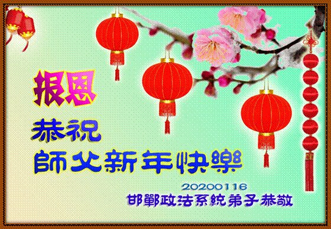

中国政府机关、公检法司系统的法轮功学员恭祝李洪志师父新年快乐。（明慧网）
 
 【大纪元2020年01月26日讯】在新年佳节到来之时，中国大陆政府机关和公检法司系统的法轮功学员恭祝李洪志师父中国新年好，感谢师父的慈悲救度，并表示要真正实修自己，以报答浩荡师恩。

自中共1999年7月迫害法轮功以来，在这些系统里工作的法轮功学员遭受了严重的迫害。他们遭绑架及非法关押、判刑，遭受酷刑折磨，被迫害致残、致伤、致死。

辽宁凤城法轮功学员冷冬梅原为国家公务员、镇政府妇联主任，曾多次被中共非法劳教、判刑，总计13年，于2018年2月25日晚含冤离世。

生前曾任四川省乐山市农业局干部的法轮功学员张卓，于2002年6月7日下午5点被当地派出所警察非法抓捕，次日就死在派出所，死前遭到暴力袭击。

曾是辽宁省大连市开发区检察院国家一级检察官刘慧君因修炼法轮功，被非法关押在看守所、劳教所，遭酷刑折磨，其右眼视网膜脱落，几近失明。

他们的遭遇只是这些领域里的法轮功学员所遭受迫害的冰山一角。然而，这些法轮功学员仍坚定信念，义无返顾。

福建政府机关的法轮功学员说：“‘朝闻道，夕可死’。今生能修大法，明白生命的真正意义，无比荣幸！”

北京司法系统的法轮功学员写到：“我们能成为一名大法弟子是我们的荣耀，是师父的佛恩浩荡。”“弟子们一定会一如既往坚定地走下去，此生为正法而存在，无悔！”

河北省政府系統大法弟子恭祝師尊新年好！

遼寧省公安系統大法弟子恭祝師尊新年好！
 

大陸公安系統全體大法弟子恭祝師尊新年好！
 

黑龍江省司法部門一大法弟子恭祝師尊新年好！
 

南京公安系統大法弟子恭祝偉大的師尊新年好！
 

山東招遠一退休警察大法弟子恭祝師尊過年好！

這位警察寫到，每逢佳節倍思親，有許多話要對師父說，在新年裡一定要走好修煉的路，「以實際行動報師恩」。
 

北京市司法系統夫妻大法弟子攜全家敬祝師尊庚子年新年好！

聽明慧《神傳文化》節目有感

西來幽靈虐神州，億萬枯骨億萬囚。
紅樓夢醒紅樓墜，天降霧霾地污流。
眾生長泣苦無淚，正念正信心中留。
師尊慈悲傳大法，真相除惡眾生救，
翹首盼望創世主，蕩盡妖邪正宇宙。
北京市司法系統一學法小組全體大法弟子恭祝師尊過年好！

這個學法（集體學習法輪功著作）小組的法輪功學員寫到：「回首往事，在這20多年的修煉中，我們有過彷徨、有過失落、摔過跟斗、犯過錯誤，但是我們走過來了。我們信師信法的心沒有變，我們堅修大法的心沒有變。

「我們能成為一名大法弟子是我們的榮耀，是師父的佛恩浩蕩。20多年的修煉道路無怨無悔，這條路無論還有多遠，還有多長，弟子們一定會一如既往堅定的走下去，此生為正法而存在，無悔！」
 

<h3 align=center><a href="https://www.epochtimes.com/b5/20/1/26/n11822723.htm">中國大陸政府機關和公檢法司系統的法輪功學員恭祝李洪志師父中國新年好(点击右键,另存新档）</a></h3>
<h3 align=center><a href="https://www.epochtimes.com/gb/20/1/26/n11822726.htm">中国军队系统法轮功学员遥拜恩师过年好(点击右键,另存新档）</a></h3>
<h3 align=center><a href="https://www.epochtimes.com/gb/20/1/26/n11822717.htm">英国、法国、德国、荷兰、奥地利、瑞士法轮功学员恭祝李洪志大师过年好(点击右键,另存新档）</a></h3>
<h3 align=center><a href="https://www.epochtimes.com/gb/20/1/26/n11822683.htm">台湾、香港、澳门法轮功学员恭祝李洪志大师新年好(点击右键,另存新档）</a></h3>

<a target="_blank" href=#top><h6 align="right">回上方</h6></a>
  
  
<a name=178>
<h1 align="center"><b>55国海外法轮功学员敬祝李洪志师父过年好</b></h1>

在，韩国首尔地区法轮功学员恭祝李洪志师尊过年好。（全景林）

 
 【大纪元2020年01月13日讯】在中国传统新年，55国海外法轮功学员恭祝法轮功创始人李洪志师父新年快乐，并表达无限的感恩，以及要精进实修、兑现誓约，让更多众生得救的心愿。

法轮功（法轮大法）洪传于世28年，福泽五湖四海，使各族裔修炼者道德回升、身体健康，深受裨益。他们中有的曾是重病患者、生活迷茫者、在社会的大染缸中随波逐流者，还有痛苦的探寻者等等，宇宙大法“真、善、忍”拯救了无数的生命，使他们重获新生，走上返本归真的大道。

在中共血雨腥风20年的迫害中，这些修炼者们坚定信念，不畏强暴，揭露邪恶，让被谎言毒害的世人明白真相，让世界充满光明和希望。

每逢新春佳节来临之时，正是海外法轮功学员感恩大法之时。他们怀着无比崇敬的心情感谢李洪志师父的无量慈悲。

正如一位越南裔法轮功学员所说：“恭祝师父新年快乐。我不知道如何表达心中的感恩，谢谢您为我和如此众多的法轮功学员们所做的一切，感谢您在我们需要帮助的时候就在我们身边。”

<b>纽约</b>

2020年1月12日，纽约部分法轮功学员逾600人齐聚法拉盛，给李洪志师父拜年。他们通过文艺演出，表达对修炼机缘的珍惜，洪传大法、让更多民众明白真相的心愿，以及对李洪志师父的感恩。

 

纽约法轮功学员向法轮功创始人拜贺新年。（张学慧／大纪元）

 
 1月18日，来自美国、加拿大的演艺人员在纽约上州的“新世纪影视基地”欢聚一堂，举办庆祝中国新年的联欢晚会，给李洪志先生拜年。
 
 

新世纪影视基地法轮功学员给李洪志师父拜年。（明慧网）

 
 来自中国云南的郑雪菲在小时候的记忆里，妈妈永远都是体弱多病的样子。那时妈妈同时患有胆囊炎、胃炎等二十多种病，还患上了抑郁症，曾尝试过自杀。1998年，修炼后妈妈的身体得到了奇迹般地好转。

2014年底，她刚从上海戏剧学院表演系毕业，从事演员职业，在社交中让她看到了很多逾越她道德底线的事情，她对未来感到失望。那时她想起了妈妈给她的那本法轮功的著作《转法轮》，阅读后明白了生命的意义，也走入了修炼。通过修炼她“纯真善良、内心光明，给人以希望”。

纽约天国乐团部分法轮功学员恭祝师父过年好！

纽约腰鼓队全体大法弟子恭祝师尊新年快乐！
 

纽约旗队大法弟子恭祝师尊新年快乐！
 

美国纽约法拉盛图书馆真相点全体大法弟子恭祝师尊新年快乐！
 
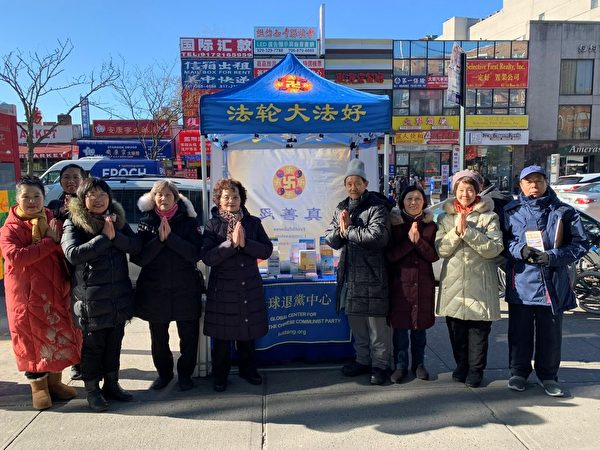

纽约大纪元媒体集团全体大法弟子恭祝师尊过年好！
 

《大纪元时报》纽约版新闻组全体大法弟子恭祝师父过年好！
 

纽约天国乐团大法弟子恭祝师父过年好！
 

纽约中城飞天大学工程部全体大法弟子给师尊拜年！
 

在华尔街景点讲真相的大法弟子给师尊拜年！

旧金山湾区全体大法弟子给师父拜年！
 

美国华盛顿州西雅图大法弟子恭祝师尊过年好！

美国首都华盛顿DC全体大法弟子恭祝师尊过年好！
 

北加州全体大法弟子恭祝师尊新年好！
 

美国拉斯维加斯全体大法弟子恭祝师尊新年好！

 

美国凤凰城大法弟子恭祝师尊过年好！
 

美国圣荷西越南裔大法弟子恭祝师尊过年好！
 

美国德克萨斯州大达拉斯地区大法弟子恭祝师尊新年快乐！

美国大费城地区全体大法弟子恭祝师尊新年快乐！
 

美国新泽西全体大法弟子恭祝师尊新年好！
 

美国大芝加哥地区全体大法弟子恭祝师尊过年好！
 

美国俄亥俄州大法弟子恭祝师尊新年快乐！
 

美国密苏里州全体大法弟子恭祝师尊新年快乐！
 

美国明尼苏达州全体大法弟子恭祝师父过年好！
 

美国德克萨斯州全体大法弟子恭祝师尊新年快乐！

师恩颂
寒梅飘香迎新春
弟子合十拜师尊
师恩浩荡遍大穹
天地同颂师尊恩
 
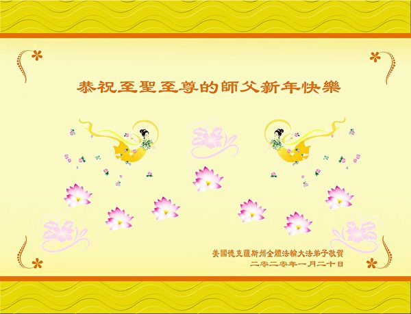

美国休士顿全体大法弟子恭祝师父新年快乐！
 

美国田纳西州全体大法弟子恭祝师尊过年好！
 

美国犹他州全体大法弟子恭祝师父过年好！
 

美国圣地亚哥全体大法弟子恭祝师尊新年快乐！
 

美国密西根州全体大法弟子恭祝师尊新年好！
 

美国新英格兰地区全体大法弟子恭祝师尊新年好！
 

美国罗德岛州全体大法弟子向伟大的师尊问候新年好！
 

感激师尊无量慈悲苦度！恭祝师尊新年快乐！美国罗德岛州全体大法弟子敬上！

归

不知前路有多远
弟子随师志弥坚
惊涛骇浪法指航
携手同归新天园
美国爱荷华州全体大法弟子恭祝师父过年好！

清莲
出淤不染尘中莲
冰清玉洁映谪仙
何须暴恶乱风雨
法涤修炼越九天

美国佛罗里达州全体大法弟子恭祝师父新年好！
 

美国北卡罗来纳州全体大法弟子恭祝师尊过年好！
 

美国肯塔基州全体大法弟子恭祝师尊新年好！

美国宾州匹兹堡全体大法弟子向师尊问候新年好！师父辛苦了！

新的一年又来到，
众生在把真相找。
师尊叮咛在心间。
修己救人放在前，
神韵迎来大圆满，
弟子惟愿师尊笑。
美国南卡罗莱纳州全体大法弟子恭祝师尊新年快乐！

万千相守苦，
只为大法驻。
静心三件事，
不负此生路。
新年亦不停，
忙碌救人度。
洪恩浩荡间，
涕感师尊助。
 

希望之声媒体集团恭祝师尊新年快乐！
 

退党网站全体大法弟子恭祝师尊新年快乐！
 

海外网络讲真相项目组大法弟子恭祝师尊新年好！

海外真相组全体大法弟子恭祝师尊过年好！
 
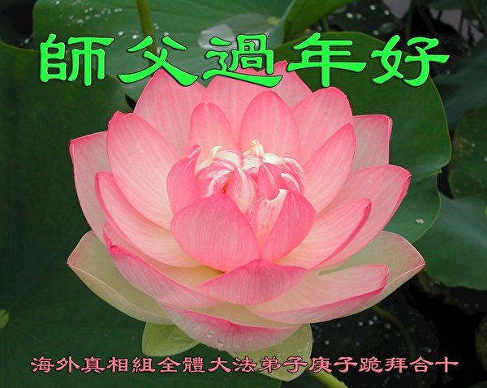

全球RTC平台全体大法弟子恭祝师尊过年好！
 

全球电话组营救平台全体大法弟子拜贺师父过年好！
 

巴西大法弟子恭祝师父新年好！
 

 
<b>渥太华</b>

2020年中国新年前夕，全体加拿大渥太华法轮功学员给李洪志师父拜年。
 

 
<b>多伦多</b>

1月17日，加拿大多伦多法轮功学员在每周集体学法（学习法轮功著作）的大堂里给师父拜年，恭祝师父新年快乐！
 

加拿大多伦多器乐学法小组大法弟子恭祝师尊新年快乐！
 

加拿大温哥华大法弟子给师父拜年！
 

加拿大蒙特利尔大法弟子给师尊拜年！
 

加拿大埃德蒙顿大法弟子恭祝师父过年好！
 

加拿大温莎市全体大法弟子恭祝师尊新年好！
 

加拿大维多利亚全体大法弟子恭祝师尊新年快乐！
 

 
<b>澳大利亚</b>

2020庚子鼠年临近，澳大利亚昆州最北部海滨城市凯恩斯及周边地区的几位西人法轮功学员给李洪志师父拜年。
 

朱莉-安（Julie-Anne）曾是一名职业运动员，今年59岁，从2002年开始修炼法轮功。

她曾经是一名长跑运动员，获得过女子墨尔本马拉松比赛的第23名。但她一直在寻找其它的东西，后来得到了一张介绍法轮大法的传单，就开始修炼。那时她病得非常严重，但炼功仅仅一个月就恢复了健康，

她很快明白了，法轮功不仅仅是祛病健身。她说：“师尊在讲法中解答了我的所有疑问，谢谢师尊带我回归真正的家园。谢谢您教我做一个善良的人，我愿意把法轮大法分享给所有我力所能及的有缘人。 ”

<b>墨尔本</b>

中国新年来临，澳洲墨尔本部分学法小组和景点讲真相的法轮功学员恭祝师尊新年快乐。
 

2020年中国新年前夕，澳大利亚墨尔本部分越南裔法轮功学员怀着感恩之心恭祝师父新年快乐！
 

墨尔本部分越南裔法轮功学员和家人穿着节日盛装给师父拜年。（明慧网）
 

留学生巴德·阮（Bard Nguyen）在澳洲留学，期间多次听闻法轮功，后来到当地炼功点去炼功，渐渐走上了修炼之路。他很快感到他的健康状况改善了许多，他的性情也变好了：去除了负面思维，去掉了容易生气的毛病。
他说：“恭祝师父新年快乐。我不知道如何表达心中的感恩，谢谢您为我和如此众多的法轮功学员们所做的一切，感谢您在我们需要帮助的时候就在我们身边，即使是像我这样犯了很多错误的人。师尊，非常感激您！”
澳大利亚墨尔本全体大法弟子恭祝师尊新年快乐！

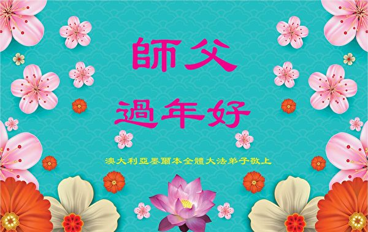

澳大利亚悉尼大法弟子恭祝师父新年快乐！

 

澳大利亚悉尼明慧学校全体师生恭祝师尊过年好！
 

<h3 align=center><a href="https://www.epochtimes.com/gb/20/1/13/n11790768.htm">55国海外法轮功学员敬祝李洪志师父过年好(点击右键,另存新档）</a></h3>

<a target="_blank" href=#top><h6 align="right">回上方</h6></a>
  

<a name=177>
 

1日25日大年初一，神韵环球艺术团在圣地亚哥市政剧场（San Diego Civic Theatre）举行了两场演出。场内气氛热烈，掌声不断。图为当天晚上演出的剧场内景。（季媛/大纪元）

 
<h1 align="center"><b>观神韵迎新年 14次艾美奖获奖女主播盛赞</b></h1>

 【大纪元2020年01月26日讯】（大纪元美国圣地亚哥记者站）1月25日周六，神韵环球艺术团在圣地亚哥市中心的市政剧院（San Diego Civic Theatre）举行了一天两场演出，很多人盛装前来。

从天国圣境到皇帝宫殿，从蒙古草原到江南庭院，从远古的传说到当代的故事，中华文化博大的精神内涵栩栩如生地呈现在观众面前。观众赞叹神韵不仅带来视觉美，也富含内涵美，带给人思考

当天正好是中国新年大年初一，美国三大商业广播电视公司之一CBS圣地亚哥台KFMB-TV的名主播、14次艾美奖得主Marcella Lee带着家人，以看神韵的方式，庆祝中国新年。她盛赞神韵，并表示看神韵是开启新年的最好方式。

<b>“开启新年的最好方式” CBS艾美奖主播盛赞神韵</b>

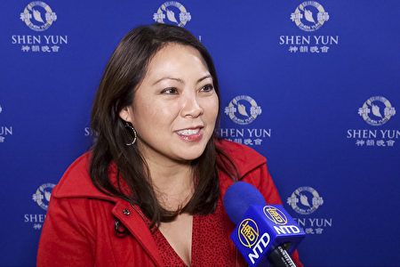

1月25日晚，美国三大商业广播电视公司之一CBS圣地亚哥台KFMB-TV的名主播、14次艾美奖得主Marcella Lee带着家人以神韵的方式度过中国新年大年初一夜。当晚神韵环球艺术团在圣地亚哥市政剧院举行了第三场演出。Marcella Lee对演出的方方面面赞不绝口。（新唐人电视台）

 
 Marcella Lee对神韵演出的方方面面赞不绝口。“演出气势恢宏！让人感觉如梦如幻，优美动人。他们的动作，他们的灵活性，还有优雅都是我从未见过的！这的的确确是令人叹为观止的演出。”

Lee对神韵展示的精神内涵非常有共鸣，“我们都会想到我们在地球上的生命有最后的终结，演出中展现了天堂与神仙的美好，让人感到生命不仅限于地球。我真的相信，在这个地球上的生命结束之后还有来生。”

“看神韵就象是我们全家进行了一次穿越时空的旅行，重新生活在古代的中国。古老的宫殿与历史，在我的孩子们面前鲜活再现，让他们感受可以追溯数千年之久的中国历史，这对我来说，也是一次非常独特的经历。这是我和家人开启中国新年的最好方式！”

<b>神韵展现普世价值 首席财务官体验中国文化</b>
 

1月25日晚，神韵环球艺术团在圣地亚哥市政剧院（San Diego Civic Theatre）进行了第三场演出。圣地亚哥一家航天科技公司首席财务官（CFO）Chuck Huizinga先生观看了演出。 （杨婕／大纪元）

 
 圣地亚哥一家航天科技公司的首席财务官（CFO）Chuck Huizinga说，从演出中能看到普世价值，“比如善、恶的对比，以及在面对黑暗和逆境时，能够坚持、不放弃所追求的正确的事，等等。”

虽然历经苦难，但是最终“神从天国下来，最后的结局是美好的。”

“在很多文化中都有这样的关于神的概念，这个概念是普世的、相通的，”Huizinga先生说。

“这让人心怀希望，即使在最坏的处境中，最后还是会有好的事情出现，节目让人思考。”

<b>神韵完美演出 房地产公司老板赞精准无瑕</b>
 

1月25日下午，神韵环球艺术团在圣地亚哥 圣地亚哥市政剧场（San Diego Civic Theatre）进行了在当地的第二场演出。房地产公司老板Sharon Wittmayer和孙女观看了演出（姜丽／大纪元）

 
 “神韵演出真是太完美了，不可能有比其更棒的了，真是精准无瑕。”房地产公司老板Sharon Wittmayer 赞叹不已。当天她带着孙女一同观看演出。

她说，观看神韵演出对孩子来说是一次学习的好机会，不仅能学到真正传统的文化，还能了解到真相。因此，她尤为感谢神韵在世界舞台传递正面信息，“神韵传递了希望的信息，艺术家希望带观众重回良善之地，从创世主那里寻回良善。”

<b>精神内涵是神韵主线 医疗经销商感到共鸣</b>
 

1月25日晚，神韵环球艺术团在圣地亚哥市政剧院（San Diego Civic Theatre）进行了第三场演出。骨科医疗用品经销商Tom Syage和太太Cynthia Syage观看了演出。（杨婕／大纪元）

 
骨科医疗用品经销商Tom Syage和太太Cynthia Syage充满喜悦地赞叹神韵的美，并表示，神韵展现的精神内涵，是这个演出的主线，激励他们今后要加强与神的联系。

“神韵演出表现的神性内涵，是贯穿整个演出的主线，是超出所以其他方面的主要元素，”Syage先生说，“我非常喜欢，因为我能与之感到共鸣。”

他进一步解释自己的感受：“演出让人们有一个对整个世界的全面观点，解释了我们这个凡人世界与天国的联系。”

Syage先生并表示，看神韵“最大的收获就是，回去以后要加强自己与神的联系。”

<a target="_blank" href=#top><h6 align="right">回上方</h6></a>  
  
  
<a name=176>
<h1 align="center"><b>李克强首开应对疫情领导小组会 泄多个秘密</b></h1>

1月26日，李克强主持召开首次应对疫情工作领导小组会议。（视频截图）

【大纪元2020年01月26日讯】（大纪元记者张顿报导）中共当局成立的应对新型肺炎疫情工作领导小组成员曝光，李克强任组长，王沪宁任副组长，四名政治局委员以及中共公安部部长等人任组员，但中共政法委书记郭声琨并没有入围名单。

武汉肺炎爆发后，因为中共隐瞒疫情，导致病毒迅速蔓延。截至1月26日20:20，中共官方仅称，全国确诊2,067例武汉肺炎病例，死亡56例，疑似2,684例。

1月25日，中共国家主席习近平主持召开政治局常委会会议，决定成立中央应对新型冠状病毒感染肺炎（简称，武汉肺炎）疫情工作领导小组。

1月26日，中共总理李克强召开武汉肺炎疫情工作领导小组会议。中共央视的报导显示，政治局常委李克强任该小组组长，政治局常委王沪宁任副组长，小组成员丁薛祥、孙春兰、黄坤明、蔡奇、王毅、肖捷、赵克志出席了会议。

会议要求，各地要成立应对疫情工作领导小组，“党政主要负责人要亲自挂帅”；及时“公开透明”的疫情防控信息，对“缓报、瞒报、漏报的要严肃追责”等。

时政评论员石实表示，北京当局召开首次应对疫情工作领导小组会，至少泄漏了三个秘密。

首先，中共当局说将对“缓报、瞒报、漏报的要严肃追责”，这等于说中共官方存在该现象，不然他们也不会提这个问题了。

武汉肺炎去年底爆发后，中共一直封锁消息，抓捕了数10多名传播疫情者，并发布官方假消息，包括疫情“可防可控可治”、不存在“人传人”云云；同时，当局也没有采取防控措施；中共的种种行为，不仅错失了防控的最佳时机，而且还令外界大意，导致疫情迅速蔓延。

目前，大陆境内，除西藏外，全国其它省市区全部沦陷，香港、澳门，以及台湾、美国、加拿大、法国、澳大利亚、日本、韩国、马来西亚、新加坡、越南、尼泊尔、泰国等国家和地区都有确诊病例。

其次，中共当局虽然要求及时公开“透明”的防控信息，但是从疫情工作领导小组的成员组成可以清楚地看出，中共根本就没有想要让疫情信息“公开透明”。

“因为该小组副组长由主管文宣系统的政治局常委王沪宁担任，中宣部部长、政治局委员黄坤明任小组成员，”石实说，这些都显示，中共当局在防疫工作期间，仍然要继续加强对媒体及自由言论的控制，不然也不会让王、黄担任该小组要职。

第三，该小组成员名单，泄漏北京当局派系问题严重。

石实表示，该小组成员名单中，三名政治局委员丁薛祥、黄坤明、蔡奇，都是习近平的旧部和亲信；国务院秘书长肖捷是李克强的“大内总管”；公安部部长赵克志先后得到胡锦涛、习近平的重用，而主管公安部的政法委书记郭声琨却没有进入名单，显示当局对郭不信任。

赵克志曾先后任胡锦涛主政过的贵州省省长、省委书记，并在习近平任内调任河北省委书记。中共十九大后，时任河北省委书记赵克志调任公安部党委书记、部长，主掌了中共的“刀把子”，结束了江派长期把持公安部的局面。

而郭声琨被指是江派要员。他与江派“二号人物”曾庆红是老乡，都是江西人；郭还被指是曾庆红的表外甥，郭妻子的祖母是曾庆红母亲邓六金的亲妹妹。

在中共十八大上，曾涉嫌政变的周永康主掌的政法委被降级，政法委书记没有进入政治局常委，政法系统随后被大面积清洗，包括周永康在内的多名高官落马，尽管周永康之后的两任政法委书记孟建柱、郭声琨都是江派人马，但他们的权力已大大缩水。

<a target="_blank" href=#top><h6 align="right">回上方</h6></a>
  
  
<a name=175>
<h1 align="center"><b>首宗中共高官死于新型肺炎 曾统领武汉宗教界</b></h1>

中共武汉市民族宗教事务委员会前主任王献良因感染新型冠状病毒，抢救无效去世。图为北京火车站的防疫人员。（Photo by Kevin Frayer/Getty Images）

 
 【大纪元2020年01月27日讯】（大纪元记者李净综合报导）日前，中共武汉市民族宗教事务委员会前主任王献良因感染新型冠状病毒肺炎，抢救无效去世。这是已知的第一位感染新型冠状病毒去世的中共官员。此前湖北省商务厅副厅长黄谋宏曾被确认感染此型肺炎。

据财新网报导，多个信源显示，武汉市民族宗教事务委员会正局级官员王献良，因感染新型冠状病毒肺炎，抢救无效，于2020年1月26日下午18:00时，在武汉市中心医院（北区）去世。

王献良今年62岁，湖北监利人，曾任武汉市民政局副局长。2012年，王献良被任命为武汉市民宗委主任。此后五年间他一直担任该职。

据报导，2016年1月，王献良等官员拜访中国佛教协会，受到中国佛教协会会长释学诚的接待（释学诚因性侵丑闻已下台）。同年8月，王献良等官员到武汉归元寺调研。9月，王献良被免去了武汉市委统战部副部长（兼）、中共武汉市民宗委党组书记职务。

2017年，王献良等官员因单位涉腐败问题被问责。但去职武汉市民宗委主任后，王献良仍在武汉市民宗委任职。

<b>湖北省商务厅副厅长黄谋宏感染病毒</b>

另一名被确诊感染新型冠状病毒的中共官员、湖北省商务厅副厅长黄谋宏，目前正在医院接受治疗。湖北省疾控中心及湖北省商务厅工作人员正在排查近期与黄谋宏密切接触者。

据澎湃新闻报导，湖北省商务厅工作人员称，黄谋宏此前就出现了感冒的症状，后来情况越来越严重，“站都站不住了”，做了检查后才确诊。

<b>卫健委专家王广发染病毒 曾会见香港高官</b>

1月21日，中共国家卫健委专家组成员王广发感染新型冠状病毒肺炎，被隔离治疗。就在王广发感染病毒的前几日，香港食物及卫生局长徐德义、卫生防护中心传染病处主任张竹君和医管局总感染控制主任赖伟文赴武汉考察时曾与王广发开会。

随后几日，与其相关的香港高官的健康状况出现异常。20日，徐德义、张竹君与特首林郑月娥、陈肇始、医管局主席范鸿龄等人开会时，徐德义和张竹君亦未戴口罩。21日，在出席行政会议前，未戴口罩的署理特首张建宗在记者会上多次咳嗽，并要喝水，一度忍咳至变声，他咳嗽时有掩口。22日，食卫局局长陈肇始见记者时，亦多次咳嗽，未戴口罩，最后只以手和手上的纸张掩口。

根据官方数据，截至北京时间1月27日03时，全国新型冠状病毒感染的肺炎病例确诊2094例，其中湖北省1059例。

<h3 align=center><a href="https://twitter.com/dY6u2H5TkppCIq6">中国政府，杀人政权！</a></h3>

假如我能有幸活下来，不会再关注什么狗屁的民族复兴，也不会再关注什么狗屁的几带几路，更不会关注什么国土大几寸小几寸的台湾独不独统不统。从今天开始，那套宏大叙事的狗屁玩意都给我滚远点，一个在危机时刻让我自生自灭的政府和国家，我实在是爱不起！——一名已确诊感染武汉肺炎的武汉市民 

<a target="_blank" href=#top><h6 align="right">回上方</h6></a>
  
 
<a name=174>
<h1 align="center"><b>【更新】全国确诊肺炎2078例56死 京沪等停省运</b></h1>

武汉肺炎疫情（2019新型冠状病毒肺炎）重点事件时间表。(STR/AFP via Getty Images)

【大纪元讯】中国武汉去年12月爆发不明肺炎，今年1月8日确定为新型冠状病毒，世界卫生组织13日将此病毒定名为“2019新型冠状病毒”（2019-nCoV）。

目前，武汉肺炎疫情已在中国失控蔓延。

计划前往中国武汉及其它疫区的民众，应避免出入市场、医院等公共场所及人多的地方，也不要接触野生和禽畜类动物，禽肉及蛋类要熟食，同时做好个人防护措施：以肥皂勤洗手、戴口罩。

本文将持续更新每日重点事件。
1月26日：全国确诊2078例，死亡56例。7省市暂停省级客运。多名武汉人网上求助。

● 全国确诊2078例，死亡56例

截至1月26日晚23时，官方公布：全国确诊2078例，其中武汉628例；死亡56例，湖北52例（武汉45例）、河南1例、上海1例，黑龙江1例、河北1例。治愈42例。

港澳台确诊15例。香港6例，澳门5例，台湾4例。

大陆几乎所有省市区都升级警戒。目前只剩下无确诊病例的西藏，尚未将警戒提升到一级响应。

● 许多武汉民众在网上吐露疫情、呼吁帮助

近日，许多武汉民众、医护人员等上网发声，表示在武汉肺炎爆发后，大批医护人员感染、物资严重短缺、缺少床位，病人无法被确诊，很多家人看着亲人慢慢死去，家人也纷纷被感染，得不到任何救助，罹患武汉肺炎以外疾病的患者更没有医疗资源，呼吁外界帮助。

<h3 align=center><a href="https://www.epochtimes.com/gb/20/1/26/n11821613.htm">（详情点阅1）(点击右键,另存新档）</a></h3>
<h3 align=center><a href="https://www.epochtimes.com/gb/20/1/26/n11821688.htm">（详情点阅2）(点击右键,另存新档）</a></h3>

亦有武汉市民在当局宣布封城后，抢购高铁票、飞机票、自驾逃出，但成功出逃后的武汉人，面临各地拒绝接收、围堵阻截和警车抓捕。

<h3 align=center><a href="https://www.epochtimes.com/gb/20/1/26/n11821729.htm">（详情点阅）(点击右键,另存新档）</a></h3>

● 广东汕头宣布封城后收回，北京上海等7省市暂停省级客运

广东汕头市肺炎疫情防控指挥部26日上午公布，汕头从27日0时起“封城”，禁止车辆、船只、人员进入汕头市。成为湖北以外首个个宣布封城的南方城市。而当日下午广东汕头市收回“封城”通告。

<h3 align=center><a href="https://www.epochtimes.com/gb/20/1/26/n11821947.htm">（详情点阅）(点击右键,另存新档）</a></h3>

中国北京、天津、上海、河北、西安、山东、海南均采取暂停所有省际长途客运及旅游包车业务。

<h3 align=center><a href="https://www.epochtimes.com/gb/20/1/26/n11823016.htm">（详情点阅）(点击右键,另存新档）</a></h3>

● 加拿大确诊首例，海外共确诊36例

加拿大安大略省宣布，多伦多出现加国首例新型冠状病毒肺炎病例。患者是一名现年50岁男子，于1月22日从中国武汉返回加拿大。

<h3 align=center><a href="https://www.epochtimes.com/gb/20/1/25/n11821533.htm">（详情点阅）(点击右键,另存新档）</a></h3>

目前海外确诊36例。泰国7例，澳大利亚、马来西亚、日本、新加坡各4例；法国、韩国、美国各3例；越南2例；尼泊尔、加拿大各1例。

在美国政府宣布将派包机接回在武汉的美国外交官和美国公民后，日本周日也宣布，将从武汉接回所有希望回国的日本公民。

● 英美专家：若现有防疫措施不变，10日后武汉患者或逾25万人

1月23日公布的、由英美学者共同展开研究的报告《2019新冠状病毒：流行病学参数的早期估计和疫情预估》显示，现时中共政府通报的病者数字，是实际个案的5.1%；如果现有的防疫措施不变，10日后（2月4日）武汉患者有可能增至逾25万人。

<h3 align=center><a href="https://www.epochtimes.com/gb/20/1/25/n11821246.htm">(点击右键,另存新档）（详情点阅）</a></h3>

<b>1月25日：全国仅西藏无确诊、湖北接近“封省”、欧洲澳洲首现确诊</b>

● 青海首现确诊，全国仅西藏无确诊，多省市区启动公共卫生事件I级响应

1月25日，青海确诊首例新型肺炎病例。

香港将新型冠状病毒感染疫情应变级别提升至最高级，无限期暂停往来武汉的航班和高铁。

中国大陆旅行社协会最新宣布，全国旅行社团队游全部暂停。

● 全国确诊1469例，死亡42例

据官媒报导，目前全国确诊1469例，死亡42例。其中湖北40例、黑龙江1例、河北1例。出现首例医生死亡，为湖北省62岁耳鼻喉科医生梁武东。

海南、新疆、河南、黑龙江、甘肃、陕西、青海、吉林、内蒙古启动突发公共卫生事件I级应急响应。

● 26日起，北京市所有省际道路客运全部停运 

北京市交通部门透露，26日起北京市道路省际客运全部停运。首都机场八条省际巴士线路也暂停运营。（点阅详情）
<h3 align=center><a href="https://www.epochtimes.com/gb/20/1/25/n11820745.htm">(点击右键,另存新档）（点阅详情）</a></h3>

● 湖北接近“封省”

目前，湖北省除了襄阳市及神农架林区外，其余城市均已“封城”。

武汉市公布，自2020年1月26日0时开始，中心城区区域施行机动车禁行管理。

● 欧洲、澳大利亚首现确诊病例

1月24日，欧洲国家首现确诊案例，法国卫生部宣布发现了3例武汉肺炎感染者。其中一名病患是48岁男子，在返回法国途中曾经过武汉，另两名在巴黎住院的病患，近日也曾去过中国。

<h3 align=center><a href="https://www.epochtimes.com/gb/20/1/24/n11819091.htm">(点击右键,另存新档）（点阅详情）</a></h3>

1月25日，马来西亚卫生部宣布，境内出现3起武汉肺炎确诊病例。分别是65岁的中国女性，以及她2岁和11岁的孙子。65岁女性患者的丈夫是日前在新加坡确诊的66岁武汉男性居民。

同日，澳大利亚首次出现武汉肺炎确诊病例。在墨尔本确认出现首例武汉肺炎患者的数个小时后，悉尼出现3例确诊病例。确诊的4人中有3人来自武汉，1人来自深圳。（点阅详情）<h3 align=center><a href="https://git.io/waaa">(点击右键,另存新档）下面的分析。</a></h3>

目前，韩国、日本、台湾、泰国、新加坡、越南、尼泊尔、美国、法国、澳大利亚都出现确诊病例。

● 美国安排包机从武汉撤离本国公民

《华尔街日报》引述消息人士的话说，美国政府近日与中共外交部和其它政府机关协商后，获得同意以包机方式撤离在武汉的外交官以及美国公民和家属。

美国疾病预防控制中心（CDC）发言人克里斯汀·诺德伦德（Kristen Nordlund）告诉CNN，“美国国务院负责所有美国公民的安全，以及规划美国公民有序地撤出武汉。疾控中心已知道此事，并正在参与相关计划的协调工作。”

<h3 align=center><a href="https://www.epochtimes.com/gb/20/1/25/n11821144.htm">(点击右键,另存新档）（点阅详情）</a></h3>

1月24日：全国仅西藏未传疫情、死亡26例、湖北15市封城、多省市启动公卫事件1级响应

● 全国仅西藏未传疫情、死亡26例

1月24日，青海也出现疑似病例，全国仅剩西藏未传出疫情。

截至目前，根据全国通报，共确诊新型冠状病毒肺炎903例。其中武汉确诊495例。

共计死亡26例，其中湖北24例，河北1例、黑龙江1例。其中，最年轻的死亡病例为湖北一位36岁患者，因发热和乏力入院，23日心跳骤停死亡。

● 湖北等7个省市区启动公卫事件1级响应

大陆湖北、北京、上海、广东、湖南、浙江、天津、安徽、重庆、江西、辽宁、云南13省市先后启动重大突发公共卫生事件Ⅰ级响应。

在中国，根据性质、危害程度、涉及范围，突发公共卫生事件划分为特别重大（Ⅰ级）、重大（Ⅱ级）、较大（Ⅲ级）和一般（Ⅳ级）4级。Ⅰ级响应是发生特别重大突发公共卫生事件，省指挥部根据国务院的决策部署和统一指挥，组织协调本行政区域内紧急处置工作。

● 湖北15市封城

湖北共有15个城市区公共交通停运，包括：武汉、鄂州、仙桃、枝江、潜江、黄冈、赤壁、荆门、咸宁、黄石（含大冶市、阳新县）、当阳、恩施、孝感、宜昌、荆州。（点阅详情）<h3 align=center><a href="https://git.io/waaa">(点击右键,另存新档）下面的分析。</a></h3>

● 尼泊尔首现确诊、欧洲国家首现疑似病例

目前，台湾、泰国、新加坡、越南、韩国、日本、美国、尼泊尔都出现确诊病例。英国、意大利、芬兰、菲律宾出现疑似病例。

尼泊尔出现确诊首例，为一名在中国求学、近日返国的学生。

台湾确诊病例新增2例。一例是50多岁武汉台商；一例是50多岁来自武汉来台旅游团的中国女性。

<h3 align=center><a href="https://www.epochtimes.com/gb/20/1/24/n11818509.htm">(点击右键,另存新档）（点阅详情） </a></h3>

台湾交通部观光局宣布，即日起全台旅行社暂停出团到大陆旅游。

日本发现第2例新型冠状病毒肺炎确诊病例，为从武汉来旅行的男子。

美国发现第2例新型冠状病毒肺炎确诊病例，为从武汉回来的美国女性。

<h3 align=center><a href="https://www.epochtimes.com/gb/20/1/24/n11818690.htm">(点击右键,另存新档）（点阅详情）</a></h3>

韩国发现第2例新型冠状病毒肺炎确诊病例，为在武汉上班的韩国籍男性。

欧洲国家包括英国、意大利、芬兰首现疑似病例。

1月23日：全国仅剩青海、西藏未传出疫情，8市“封城”、第2代病例出现

● 中国全国沦陷，仅剩青海、西藏未传出疫情

1月23日，中国黑龙江、吉林、甘肃、陕西、新疆首现武汉肺炎确诊病例。内蒙古首现疑似病例。

截至目前，中国仅剩青海、西藏未传出疫情。

河北确认1例新型冠状病毒感染病例死亡。

● 中国8个城市“封城”处理 

1月23日凌晨，“武汉市新型冠状病毒感染的肺炎疫情防控指挥部”发布通告称，“自2020年1月23日10时起，全市城市公交、地铁、轮渡、长途客运暂停运营；无特殊原因，市民不要离开武汉，机场、火车站离汉通道暂时关闭。恢复时间另行通告。”

<h3 align=center><a href="https://www.epochtimes.com/gb/20/1/23/n11815794.htm">(点击右键,另存新档）（点阅详情）</a></h3>

傍晚，湖北省另外7个城市，鄂州、黄冈、赤壁、枝江、仙桃、利川及潜江，亦陆续宣布开始停运陆面交通。

目前，中国已有8个城市“封城”处理。

● 武汉肺炎出现“第2代病例”  预估2月疫情高发

中国疾控中心原副主任杨功焕透露，从武汉旅行史的确诊病例显示，新型冠状病毒已出现第2代病例，且数量仍在增加，预估2月可能是疫情爆发的高峰期。

第2代病例，就是从没去过武汉的人通过人传人染病。如果第2代病例增加，代表其它地方也可能疫情爆发。

世卫一个委员会的主席戴维‧海曼（David Heymann）亦宣布：“我们现在正在看到第2代和第3代传播。”

<h3 align=center><a href="https://www.epochtimes.com/gb/20/1/23/n11816436.htm">(点击右键,另存新档）（点阅详情）</a></h3>

香港大学新发病毒性疾病学讲座教授管轶近日实地考察后表示，武汉肺炎感染规模至少是2003年SARS的“10倍起跳”。他直言，“我经历过这么多，从没有感到害怕过，大部分可控制，但这次我怕了。”

<h3 align=center><a href="https://www.epochtimes.com/gb/20/1/23/n11815634.htm">(点击右键,另存新档）（点阅详情）</a></h3>

● 新加坡、越南确诊首例武汉肺炎感染

23日晚上，新加坡卫生部确认，新加坡首现武汉肺炎确诊病例，患者是66岁男子。

越南卫生部表示，越南首现2例新型冠状病毒确诊病例，患者是来自武汉的一对中国父子。

目前，7个国家，包括泰国、日本、越南、韩国、美国、新加坡出现确诊病例；另2个国家墨西哥、菲律宾现疑似病例。

● 美国使用机器人治疗第一例感染病患

美国首例武汉肺炎病人的主治医师、传染病科主任乔治‧迪亚兹（George Diaz）表示，他们使用机器人来治疗第一例美国境内确诊的武汉肺炎患者，以此避免病毒传染给医护和其它病患。患者目前状况良好，有望在不久的将来出院。

<h3 align=center><a href="https://www.epochtimes.com/gb/20/1/23/n11816401.htm">（点阅详情）(点击右键,另存新档）</a></h3>

<a target="_blank" href=#top><h6 align="right">回上方</h6></a> 
  
  
<a name=173>
<h1 align="center"><b>不怕瘟疫的人</b></h1>
 
【明慧网第二届一年一月二十五日】〔中国沈阳来稿〕近日，我经历了一场与无名疾病对决的较量，结果我赢了。事情是这样的：第二天下午，我去沈阳市某大型超市购物，没想到人山人海的，原来新年这两天商品打五折。但既然来了我还是买一点东西，并安心的排队等着交款。

当天傍晚开始咳嗽，第二天就发烧，不想吃東西。我沒在乎。不曾想症状越来越严重：发烧让我躺在床上起不来，好像内脏都肿了，呼吸困难，咳得很厉害好像要吐血了，全身的骨头都痛，头也痛，还有麻木的感觉，盖着厚厚的棉被还感觉冷！

尽管这样，我一点没有害怕，因为我心里装了救命的法宝：念“法轮大法好，真善忍好！”坚持念，烧了四天，不烧了，只是咳嗽。甚至没力气，像心衰弱的感觉，我还是出门了，也没告诉亲人们，怕他们担心啊。历时两星期，我彻底好了。

当亲人们知道我是诚心敬念“法轮大法好，真善忍好”而平安无事时，胃不舒服的老人相信了，也开始认真念“法轮大法好，真善忍好”了。

是呀，自从我明白法轮功真相，并退出中共的团，队组织后，再也不怕什么疾病，瘟疫，灾难了，因为我知道了无数的人因敬念“法轮大法好，真善忍好”而绝处逢生，知道了法轮功来到世间是来救人的。

其实不只是我，所有把「法轮大法好，真善忍好」记在心里的百姓们，都会不害怕瘟疫，也不会害怕灾难，因为与神佛站在一起的人，都会得到神佛的保护，都会拥有美好的未来。

<a target="_blank" href=#top><h6 align="right">回上方</h6></a>
  

<a name=172>
<h1 align="center"><b>神韵震人心 医师：让世界变得更美好</b></h1>
 
【大纪元2020年01月24日讯】（大纪元记者陈樱华日本福冈报导）神韵纽约艺术团1月23日在日本福冈太阳宫音乐厅（Fukuoka Sunpalace Hotel & Hall）进行最后一场演出，吸引当地不少各业界经营者前来观看。

小川康一郎是位医师，首次观看神韵演出。他表示，去年6月在网路上看到神韵演出的消息，感觉非常好，就马上买票了，“在节目册中看到出场的演员都具顶尖水准，真是汇集了超级优秀的人才，令人超级感动的。”

对历史很感兴趣的小川康一郎，专精世界史和中国史。他说，通过观赏神韵“好像重温了一遍中国史，徜徉其中自在无穷。”

关于神韵音乐，由于他的座位在前排，能更近距离聆听音乐家们的清朗乐音，甚至能听到小提琴演奏家用手指扣琴弦的声音，“今天能欣赏到如此优美的现场演奏，真是太棒了！”

谈到印象最深刻的节目，小川述说着，有一个年轻人在中国的监狱里被挖去双眼的节目，呈现出器官买卖的事，这让他难以置信，这样的事情竟然还在中国发生，“中国的老百姓都是好人，是中共政权为了权力和金钱干的，坏事都是那些人做的。希望中国人能有好办法结束中共政权，成为一个很好的国家。”

“真希望全世界的人们都能了解真实的中国的情况，盼通过这个美丽的秀，让我们的世界变得更美好。”小川说，如果神韵能够在中国上演，“那应该是中国共产党灭亡的时候了，现在，世界形势已经在朝着这个方向发展着。”

<a target="_blank" href=#top><h6 align="right">回上方</h6></a>  

<a name=171>
<h1 align="center"><b>【思想领袖】刘慧卿：中共如何渗透香港社会</b></h1>

《美国思想领袖》节目专访香港民主党前主席刘慧卿。（大纪元制图）

【大纪元2020年01月21日讯】在香港铁娘子刘慧卿眼中，香港是如何受困于中共的权斗？ 过去三十年，中共政权是怎样渗透香港社会的？由于西方民主国家没有勇于面对共产中国，它们怎样损害了自身利益，又怎样导致香港紧张局势和暴力的升级？刘慧卿认为香港接下来应该怎么办？

这里是大纪元的《美国思想领袖》节目，我是杨杰凯。这一集，我们专访香港民主党前主席刘慧卿，她在1991年成为首位经地区直选产生的女性立法会议员。

刘慧卿也是“中国维权律师关注组”的现任副主席，奔波世界各地，推动香港民主。刘慧卿女士，很高兴能邀请到您来我们节目，感谢您。Emily，我们刚才在节目开始前聊到，大家称您为香港铁娘子，您曾经是一名记者，实际上在若干年前，您曾经对原版“铁娘子”提问；在专访开始之前，请稍微谈一谈这件事吧。
质疑撒切尔签署《中英联合声明》

<b>刘慧卿</b>：好的，那是在1984年12月，在中英两国政府就香港的未来签署了《中英联合声明》之后。英国首相撒切尔夫人和当时的中共总理赵紫阳签署了联合声明，然后她前往香港，在早上8点举行了新闻发布会，宣布此事；那时我是《远东经济评论》驻香港记者，所以我问了铁娘子一个问题。

我问道，“首相，两天前，您与中国签署了一项协议，答应将五百多万人交给一个共产独裁政权。那在道义上讲得通吗？还是说在国际政治中，道德的最高形式确实是本国的利益吗？”当然，她是有备而来的，她说，“你是什么意思？英国为香港尽了最大的努力。我们为你们做了一切可以做的。香港每个人都对这项协议感到满意。每个人都开心。而你也许是唯一的例外。”

<b>杨杰凯</b>：真的？

<b>刘慧卿</b>：如果你读过乔治‧欧威尔的《一九八四》那部小说，你会发觉书中把“唯一的例外”定义为精神错乱。好吧，就是为了证明撒切尔错了，几年后，在1991年我参选而且高票当选为立法局议员。撒切尔错了。但我知道英国有自己的考量因素，但我认为那是个非常不光彩的退场；我的意思是，他们以非常不体面的方式离开了香港。

<b>杨杰凯</b>：对。您在立法会（立法局）连任了七期议员，这着实令人惊叹。

<b>刘慧卿</b>：哈哈哈，朋友，这话听起来像是我已经100岁了。别担心，我是。

<b>杨杰凯</b>：从您当年向撒切尔夫人提问到今天港人走上街头，您有着了不起的历史观点。您是否可以从这个角度谈谈。我记得，实际上在《联合声明》之前，您就是最早提出选举问题以及当选方式问题的人士之一。那么，从您的历史视角来看，事情是如何演变至今天的？

<b>刘慧卿</b>：首先，1984年，或者说在《中英联合声明》时期，我在伦敦的“伦敦经济学院”读书，我在香港和伦敦均报导了关于联合声明的消息，另外我也报导了行政会面见首相的事宜。在此期间，不同于其它殖民地，香港不曾有过独立运动，不曾有自决的要求；我想是因为多数港人都接受他们是中国人这一事实。对呀。而且香港是中国的国土，因此若是香港要归还中国，民众在某种程度上接受了这一点，但他们真的很怕中国共产党。

然后邓小平，他是强人，他理解这一心态。不过他有生之年没有看到交接。但在谈判中他非常强硬，他说：“是的，香港将在1997年交还给中国。但不要害怕，因为共产党不会来管香港，为什么？因为你们会有‘一国两制’，一个用于大陆，一个用于香港。” 实际上，“一国两制”原本是针对台湾提出来的，但台湾不要。因此从1997到2047的50年，你们有你们的资本主义制度，你们的自由、法治、人身安全。这就是邓小平讲的，这些在《中英联合声明》和《基本法》里均有。

<b>主权移交 香港人需要有条后路</b>

那些不接受、不喜欢“一国两制”的香港人开始移民等等。因为英国人没有给予我们英国国籍，那是我一直在为港人争取的。1989年天安门大屠杀后，大家非常恐惧，那时英国提出了“英国国籍甄选计划”，非常侮辱人。然后他们提供给五万个家庭公民身份，这相当于二十五万人。这些是有钱人和受过良好教育的人，他们得到了公民身份，但他们不必前往英国。他们把身份放在兜里，以备情况不妙时用。

<b>杨杰凯</b>：以防万一，对吧？

<b>刘慧卿</b>：是的。香港人需要的就是有条后路。所以到了1997年，没暴动，什么也没有发生。在交接后头几年情况还行；北京守信了。他们信任特首董建华，因此2003年前，他们一直保持低调。当董建华开始想要提出国安条例的《基本法》第二十三条立法时，当时的保安局局长叶刘淑仪非常强势，她说：“你们必须相信我，一切都会没事的。”

如此挑衅，而这么做的代价是，至少有五十多万人走上了街头。即便如此，董建华像林郑月娥一样，也没有撤回法案。但以田北俊为首的自由党，他们说“哦，也许不行”，他们在立法会有八席，他们退出了；因此该法案得不到足够的支持，不得不终止。

因此2003年之后，中共政府变得非常谨慎。谁都会如此。因为一个平静之地突然间为什么会有这么多人示威？董建华怎么回事？他完全不中用。因此他们开始派许多人到这儿，打报告给北京。当然，两年后，（杨：你是说间谍吗？）无论他们叫什么吧。他们有他们做事的习惯，因为他们的权力结构不同，他们的聼命系统不同。他们派了不同的人来搜集信息（对）。

因此中共政府开始反悔，他们发现不能放任香港不管，他们想要进来，是因为他们挑选的人没用，不行。那麽多人走上街头抗议。因此从2003年起，他们就开始加强控制，然后越收越紧。

<b>林郑月娥是千古罪人</b>

<b>杨杰凯</b>：很有意思。这件事的发酵一直蔓延到了今天。在2003年至少有50万人走上街头时，他们真的措手不及。（刘：是的）然后当200万人现在走上街头时，他们似乎再次措手不及。您是这样看的吗？

<b>刘慧卿</b>：正是这样。这次的情况真的很可怕。但我猜林郑月娥认为，6月9日当一百万人游行时，她立即发表声明说一切照常，他们将在几天后继续投票… （杨：不可思议）是呀。亲北京的政党、民建联、工联会、叶刘淑仪、汤家骅，所有这些人都支持。

我认为林郑月娥的想法是：“这算什么？什么都不是。”自从她当上香港特首，她安然渡过一系列危机，例如取消候选人资格、取消补选名额参选人的资格、以及在九龙中心地带设置海关的“一地两检”，大家称其违反《基本法》。

那么经历了所有这些事情，发生了什么呢？我认为（抗议人群）不足五万，可能少于一万。因此她认为：“我都扛过来了”。她一定以为自己无所不能。所以她认为这个引渡条例微不足道，是在填补漏洞。她在新闻发布会上一直告诉大家说：“相信我，这没事，没有错，让我们通过该法案。若是通过了该法案，你会知道法案是没问题的。”

所以这就是我们说的傲慢自大、太自信。当然，是亲北京者给了她这种自信：“干下去！我们在立法会有足够的选票，让我们通过立法。”她也很固执。她真的以为这对香港有利，并得到亲北京傀儡们的支持。所以我们才有了这场灾难，香港历史上灾难性的最大的危机。我以前讲过，我再讲一遍，林郑月娥是千古罪人。我不知道她为什么还没有下台。

内地一些人在质疑：“为什么会这样？”在大陆各个省份、各地城市，当那里的政府官员、党的官员犯错时，怎么办？他们马上会被换下来，也许把他们调到别的地方工作，但他们会走人。然而香港的乱局已经那麽多月了，她还在。习近平是怎么回事？

我在加拿大的时候，我讲，杜鲁道总理的脑袋瓜需要检查一下。我觉得习近平的脑袋瓜也需要检查一下。为什么还把她留在台上？对士气影响太糟了，甚至是内地下马的那些官员。他们会觉得：“我怎么就下台了，这个女人在造成香港史上最大的乱局之后却还在台上？”拖累了经济，让大家忧虑，老百姓逃走、人们在街头抗争、催泪弹，这一切让香港六个月以来一直是世界焦点。而她竟然还在台上。所有支持她的人，民建联、工联会、叶刘淑仪、汤家骅，也都还在台上。好在11月的区议会选举带来了海啸般的逆转。

他们许多人被赶下了台，但问题仍然没有解决。我仍然继续告诉国际媒体，情况非常糟糕，因为林郑月娥拒绝回应大家的要求。
区议会选举 林郑失去中间民众支持

<b>杨杰凯</b>：有趣的是，我们提到了区议会选举，北京和亲北京阵营似乎仍然期望，香港民众会说些话来支持他们，那是我的感觉。您有同感吗？

<b>刘慧卿</b>：是呀，因为他们认为香港有着沉默的大多数，其中许多人是站在他们那边的，所以他们讲你等着瞧；我让他们投票，他们会出来为我们投票。实际上你看看选举结果，许多亲北京候选人失去了他们的席位；但实际上，他们得票数量却有增加，但那样是不够的，因为其他人的得票比他们更多；因为我们有71%的投票率，这也是史无前例，这么多人出来投票。是的，他们是沉默的大多数，他们从未投过票。确实有一些投票者不支持亲民主阵营，但是他们对林郑月娥很生气，他们讲“我去投票了，是抗议性投票，因为你表现太差了，而你还留在这儿不走”，他们愤怒极了。

这些人不是传统上的亲民主派支持者。因此林郑他们也失去了中间民众的支持。我们都知道，大多数选举，是由中间民众决定结果的。因为两边是死忠支持者，单靠他们要胜选是不够的；但是那些中间选民会摇摆，有时候这边、有时候那边，而且中间选民很多时候不去投票，但这一次他们去投票了。

而这次也有许多新登记的选民。他们登记还是因为他们非常生气，他们其中有许多是年轻人。当然，我认为没有太多年轻人投票支持林郑那边。 因此他们讲，“你看看选票，这六四分，亲民主的占60%，亲北京的占40%，这也对。”

是的。因此并不是说他们的选票完全崩盘了，不是的，但只是还不够。除此之外，你知道这种“简单多数制”，只要是票数一够，就选上了；若是按比例代表制，他们会得到更多席位。然而这是区议会选举，用“简单多数制”决定。但明年，我们会选举立法会议员，那不是真的比例代表制，那是“多席单票”。 因此也许他们到时候会取得一些席位。

<b>杨杰凯</b>：是呀，有一位议员通过分解来说明其运作方式，很奥妙、很复杂。

<b>刘慧卿</b>：我知道若是现在我和你一起上街，我们随便问20个路人，我肯定所有20个人都不能够告诉你选举制度是怎么回事；它太复杂了。太荒谬了。
香港经济受重创

<b>杨杰凯</b>：在我看来，这些抗议活动已经造成了毁灭性的经济影响；这是我们采访中还没涉及到的。您可否谈谈。

<b>刘慧卿</b>：是的，我认为这真的很糟糕，很可悲。我知道有些抗争者，他们想要达到那样的结果。那就是为什么他们去了机场并且做了各种各样的事情，他们想让经济崩溃，向政府施压；这我能理解。但我以为很多香港人都依赖着经济，他们需要工作；因此我们必须权衡这些事情。即使你去机场或其它地方抗争，我支持非暴力方式的抗议活动。我一生参加过许多抗议活动，我从不支持暴力。我被警察逮捕过三、四次，虽然没有起诉我。因此如果他们要那样做，而他们有他们的支持者；但那确实会摧毁香港，因为经济确实在一路下滑。

我们真的想看到香港经济深陷维多利亚港的海底吗？许多餐馆关门了，许多店铺歇业了，有人预测还会有更多铺子歇业。也许有一千多家餐馆会倒闭。店铺、业界、商界都在说他们要倒闭了。因为没人愿意花钱，大家没心情。地铁连续几个月在傍晚就早早收工停驶，大家不敢在晚上外出。即使你开车，你不知道什么时候道路封锁了，你可能回不了家。游客不来了，访客不来了。许多会议、展览、音乐会、活动项目都被取消了，这将对经济生活有着巨大影响，许多小旅社、旅馆和酒店都关门了，因为没有生意。所以我认为政府应该看到这个。

而他们在做什么？他们说我们有太多盈余，或我们会拨钱给你，你不必付电费、关税、你可以延迟缴税。那有什么帮助呢？ 我要停业了，我不付电费，我不付水费。我要怎样支付房租？我要怎样支付员工薪水？行不通的，我要停业倒闭了。你为什么不能回应老百姓的需求而让大家真的冷静下来？ 你说不行，即使你回应了他们的需求，激进的抗议者也不会冷静下来。我不知道他们是否会冷静下来，如他们常说的，我不代表他们。他们讲无领导、无平台、什么都没有，但我认为许多人都希望情况平息下来。政府得走出第一步。你讲五个诉求，他们怎样能够马上满足所有五个诉求？

如果他们能满足所有五个诉求，那当然很棒。他们只答应了一个诉求——撤回法案。但如果你设立一个真正的独立调查委员会，调查事情的起因。为什么林郑月娥犯下了香港史上最大的错误？为什么她周围的人支持她，促使她那样做呢？中联办是如何插手的？为什么我们不能调查呢？当然，警方讲“我们不想成为目标。” 调查不只是针对警察，例如哪个警察用警棍打人脑袋，我不认为调查范围会那麽窄。当然，要调查警务处处长、保安局以及律政司司长，过去几个月他们像昏睡过去一样无所作为。因此我认为我们需要一个真正独立的调查委员会。

我认为有些人会说让我们冷静下来，有些人可能说我不接受。没关系。但接下来会有多少人继续走上街头？我认为那些希望事态能有进展的人，他们会留在家里。当然，其他人会继续抗议。但当他们在街上，转过身看看，他们后面的人不多了，不像我们现在看到的抗议活动了。因此我们必须找到一个办法向前走。实际上，许多亲北京的政界人士都支持这一调查。几个星期前，立法会财务委员会主席陈健波先生在无线电广播讲话，说他支持调查。

他说有关调查最重要的是其范围，受权调查的范围有多宽或多窄，你要调查什么？他说“立法会的两个阵营应该共同商讨。” 亲民主、亲北京的立法委员们一起协商，拿出个调查范围提案交给林郑月娥。我认为这提议非常好，就应该是那样。但我们目前有任何进展吗？毫无进展。为什么？有人会说是林郑月娥的顽固，有人会说是北京。

<b>杨杰凯</b>：Emily，您提到您被逮捕过三、四次，您必须应付警方及相关情形。显然警方这次的做法和以往有别。和我谈过话的每个人都这样告诉我。就您所知道的，也许这也是独立调查可以真正深入的方向，警方行为怎么会有如此明显的改变？
警方行为震惊香港，震惊全世界

<b>刘慧卿</b>：我认为警方的行为震惊了香港，震惊了全世界。因为不久前，因为我们有不同的受纪律约束的部门，包括警察、消防、监狱、廉政公署等等。民意调查的一贯结果是，警察总是排名第一。

<b>杨杰凯</b>：第一是指正面肯定他们？

<b>刘慧卿</b>：在公众的视野里，他们在所有相关部门里名列第一。那么，它怎么突然沉到谷底？实际上，没人知道他们为什么变得如此暴力。有些人指控他们与三合会分子合作或串通。没人知道为什么。所以你是对的，所有这些指控都必须调查。当然，我认为警方高层肯定不愿意，他们不想被调查，但是应该调查。当然，也有各种流言，大陆派来的武警渗透香港警方。这我不清楚。也许这就是为什么他们不希望进行调查，因为所有这些事情会暴露出解放军或武警或其它方面的参与。

所以我的答案是我不知道。有些人认为他们被下了药之类的。谁知道呢，因为他们是这么暴力，这样殴打人。是他们的暴力让事情变了样，因为起初只是个法案，民众和平地游行，然后发生冲突，然后警察殴打越来越多，打催泪弹或橡皮子弹，事情就搞成现在这么大了。所以必须进行调查，而我没有答案。

<b>杨杰凯</b>：难以想像，若是没有调查，这件事情如何能够过去。甚至有报导说，香港警察曾经去过新疆接受训练。所以现在有很多种不同的说法。您认为调查会发生吗？

<b>刘慧卿</b>：我希望吧。我认为在这个问题上，尤其是香港的精英阶层，他们让我们失望了。因为有两种人，是香港政府和北京会听取意见的。普通群众不算在内。即便你有两百万人，他们也不在乎。他们在乎的是富人、生意人、还有国际社会、外国政府。你知道，当他们决定撤回法案时，

中联办在西区开会，让所有政协委员和全国人大代表都去了，有400多人，会议上告诉大家法案不要了，我们必须支持香港特首，其中一位是港区人大代表常委即谭耀宗先生，他出来对媒体说，“这法案没有错，但是现在已经撤回草案或暂缓修订。”你知道为什么？ 因为中联办王主任说，在过去几天里，外国政府发出了67项声明。他们算得非常精确，67个，不是60个或70个。所以那对他们很重要。

<b>杨杰凯</b>：显示了他们在乎。

<b>刘慧卿</b>：不是67枚炸弹，是67项声明。所以他们当然在乎。然后几个月前，商界人士都站出来要求成立调查委员会，但随后他们停止了。我认为他们受到了北京的叱责，因为北京和香港政府要他们听话守规矩。北京不想设立调查委员会，所以不希望有钱人出来支持这件事而施压，这些有钱人还能有钱多久不好说，所以他们什么都不敢说。我认为他们是无耻的。有人会讲，“哦，Emily，虽然他们在这里有很多生意，但他们有更多生意在中国大陆。”

所以他们吓到了，也许是的，他们不想像国泰航空那样，但太糟糕了。我还记得末代总督彭定康在1997年离开香港时，他讲过香港将来的问题，香港会毁在香港人的手上。是这些人，当他们看到香港将灭亡，香港在燃烧，他们不出来帮忙，他们只是听从北京命令。
香港将永远处于共产党内部权斗中

<b>杨杰凯</b>：精彩！您知道，在过去一星期我们《美国思想领袖》节目访问了很多人，谈论有关北京或中共插手干预香港的方方面面，就像您刚才描述的那样。有一点相对较少人关注，但我们《大纪元》报导得较多的是党内习近平和江泽民派系争斗的事，不仅在大陆斗争，也在香港斗争。您也根据香港的大背景谈论过这个问题。您能否谈一谈？我希望让观众更多了解一点这个情况。

<b>刘慧卿</b>：是的。当事件刚刚爆发时，我们有过几次大型示威活动。我和金融界的一些朋友开会谈话，他们说：这太糟糕了。香港处在江泽民与习近平的权力斗争当中。为什么？因为，当林郑月娥提议颁布法案时，北京说好，我们当然支持，北京长期以来一直支持引渡。但22年来，香港政府一直拒绝引渡，因此北京一直办不到。这次林郑再次提出法案，北京当然支持。北京觉得：我们有300名逃犯隐藏在香港，我们要把他们弄回来。他们其中有些人住在四季酒店，他们不仅人来到了香港，他们还带来了以亿计算的巨额财富，他们里面很多人是江泽民的朋友和支持者。

这些人控制了这里许多公司。因此他们跟自己的员工们讲：他们现在的目标是我们，在下次抗议活动时，你们所有人都出去抗议，因为这是合法的。而我们捐钱给抗议者，因为抗议者当然需要资金购买横幅一类的东西。与此同时，他们许多人逃走了，因为他们不知道这法案多快会通过。法案一旦通过，他们可能被捉拿回去。之后当然该法案就被取消了。我听说他们又回来了。然后四季酒店又住满了。

所以从某种意义上说，我们理解，香港将永远处于共产党内部权斗之中，因为我们在这个位置，非常好用，他们许多支持者也在这里。他们称香港为亚洲的瑞士，对的，他们喜欢这里。

但我们也夹在中美之间的斗争当中。所以当福克斯新闻采访我时，我实际上在采访前问过他们，我说，川普总统真的看你们的新闻吗？是的，他每个钟头都在看我们的新闻。然后在采访中，记者问我：刘女士，川普总统提到了香港。香港夹在中美贸易战之间，您怎么看待？ 您怎么看待川普总统？我说，你读过那本叫做《让川普做自己》（Let Trump be Trump）的书吗？

如果每个美国人都谈论香港，我会非常高兴，那是我想要的。如果总统谈论香港，太好了！国会议员、生意人谈论香港。太好了！但我知道，在美国说了算的不仅是总统，还有美国国会，还有庞大的商业团体和公民社会。所以如果他们都谈论香港，或者想要帮助我们，那超级棒！

而且有些人真的很喜欢川普总统，因为他们认为川普比较其他人更能够以有效方式对习主席施压。但在香港，我们要的是什么？我告诉过我们的美国朋友和其他各地朋友，我们不是在争取独立，别让中共政府误导你们。他们用这种抹黑策略，称香港的分裂主义者在为独立而战。也许有极少数人想要搞独立，但绝大多数人只是希望中共遵守其承诺，即《中英联合声明》里的承诺以及一国两制政策下的《基本法》承诺。也就是说北京应该让港人治港。

北京负责的应该是外交事务和国防，将香港内政交给香港人。但为什么现在香港人，特别是年轻人现在如此激动、如此焦虑、如此惊惧，因为北京在全方面的干预我们的事务。我们不是在争取独立。我们大多数人都不支持暴力，我们希望暴力降级，我们希望情况平息。但要做到这样，政府必须回应民众的诉求，设立一个独立调查委员会是很合理的要求。这在香港我们做过很多次了，那为什么现在不能做呢？

<b>中共最近是如何干涉香港的</b>

<b>杨杰凯</b>：您能讲解一下中共最近是怎样干涉香港的吗？我不知道您是否可以简短地讲解，因为这是个大题目。

<b>刘慧卿</b>：我认为中共政府感觉到他们不得不严格控制香港。他们甚至在97年之前就在渗透香港了，有几十年了。他们的党员渗透到政府、大学、企业界和专业领域。

<b>杨杰凯</b>：我想还有媒体。

<b>刘慧卿</b>：是的，媒体，还有娱乐界，还有教会，无所不包。因此他们将地下党成员卧底在各处，有些永远不会透露自己身份，但他们仍然在活动着。但这些年来，他们派过来的人越来越多，无论是暗地的还是公开的，派来渗透，或者是协助他们更严格控制香港和媒体。对他们而言，媒体至关重要，因此他们控制着媒体的负责人。许多媒体人实际上并不想做新闻，他们想赚钱，他们有生意，或者他们想在大陆得个头衔，所以中共政府给予他们想要的那些东西，他们则回报中共政府想要的，即自我审查，控制他们的记者。

所以到处都是中共在控制，中共喜欢搞同乡会，因为大家来自不同的省份嘛。所以把这些人组织起来，然后带他们到中国大陆参观，让关系更紧密，可以说到处都有他们的协会、团体。但妙的是区议会选举，他们失去了许多席位，他们还有约40％，但其余的60%是他们无法控制的。这是香港民众的绝妙之处。香港人习惯于表达自己的观点。他们不喜欢别人把想法强加于他们身上。

<b>杨杰凯</b>：太厉害了。这是我第一次来香港，通过在抗议人群中与人对话，我非常清楚地看到这是一个高度自由、高度思想自由的社会。我想民众要的是自决，应该是这个词吧。目睹这点着实令我感到不可思议。

<b>刘慧卿</b>：但并非是独立意义上的“自决”。

<b>杨杰凯</b>：对。是指自我决定，是由我自己来决定…

<b>刘慧卿</b>：⋯⋯我的人生。

<b>杨杰凯</b>：是的，谢谢您澄清。您最近也去过加拿大和英国，主要是和那里的领导人谈香港问题。从您谈话中，显然您对美国国会通过了《香港人权与民主法案》以及其它国家的66条表述感到满意。您对英国和加拿大政府说了些什么？

<b>刘慧卿</b>：我7月去了英国，然后11月去了加拿大。我是应加拿大《哈利法斯国际安全论坛》之邀请，于11月在哈利法斯讲话的。今年他们关注的问题之一，就像刚结束的北约峰会一样，他们关注的焦点都是中国。由于香港问题一直是新闻焦点，因此他们邀请我从香港角度谈谈这个问题。我告诉加拿大人，我们所有人都必须出声捍卫国际核心价值，这不仅是香港的事。这也是国际社会的事，包括民主、人权、法治、司法独立、人身安全等所有这些。而我们香港现在如此恐惧，因为我们感到我们就要失去这些了。而讽刺的是，香港并不是民主社会。

众所周知，林郑月娥是由一个1200人组成的委员会选出来的，但是我们多年来在这里享有的自由、法治、人身安全的程度远远高于大家在所谓的民主国家所享有的。无论在亚洲的什么地方，菲律宾、泰国、缅甸… 名单很长，他们有选举，但他们的人民不像香港人那样自由和安全。 所以我说我们要的是中共信守诺言，这样我们香港人就可以继续享有自由、安全、法治、司法独立以及发展成民主社会。这就是我给他们的信息。而加拿大人因为他们有两名公民被中共关押，在逮捕了华为负责人的女儿之后；所以加拿大人很胆怯，他们讲：我们有两个人质在那里。然后当我在哈利法斯时，当地以龙虾而著名。当地政府说：我们只想卖龙虾给中国，我们不懂政治。

我说，你让我想起了台湾总统选举的国民党候选人韩国瑜，因为他来香港时讲，我只是想卖水果，我不懂一国两制。我对那些加拿大人说，你们怎么能这样呢？还有你们的总理杜鲁道，我说：拜托请有些骨气、有点种，不仅仅是为我们讲话，还要为你们本国民众而发声，因为这些价值也是你们同样珍视的。很多加拿大人说：哦，谢谢刘女士，是的，我们的人民和我们的政府很软弱，是的，我们当然应该发声。你们这么害怕中共，他们这回逮捕了两个大卫，如果下个月他们逮捕了两个贝瑞，然后逮捕两个约翰？怎么办？什么时候算完？

<b>港府应设立独立调查委员会</b>

我跟他们说的是：不是说你们一定非要制裁中共；当然，如果发生严重暴行，我们应该考虑一切措施。但是现在，对中共非常合理的一个诉求是“对等待遇”。对吧。加拿大是自由民主国家，中国人可以去加拿大，他们可以去那里读书、考察、做研究、做生意，做各种新闻报导，畅通无阻，对吧？

但你去中国，很多事情你无法接触到。我问他们：为什么你们要忍受它？为什么？为了钱呀。当人们这么财迷心窍的时候，你能怎么办呢？有时你们卸任后的政客为了钱，去为中共工作，成为中共的顾问。他们把加拿大的招数教给了中共。因此有时候，也许问题不在中国。

而在于你们自己。你们怎样应对你们的政客？你们怎样应对你们的商业公司？如果他们如此热衷于金钱，以至于他们愿意抛弃我们所有人珍视的这些价值观？我们要怎么办？是的，我们当然应该和中共对话。但中共在笑我们，因为中共知道你们的商人和政客都如此财迷心窍。

因此，我们首先必须看看我们自己。总之我是这样对他们讲的。我对所有外国人都是这样讲的。他们说：哇，刘女士，天哪，你讲了我们不敢讲的话。我说：对的，宝贝，因为我无所求。

我在2016年离开立法会后，我没有任何受薪工作，没人给我任何工作，有人说大学应该请你去教书或讲课吧？我说没有。没有人聘用我。而我不在乎，就是这样。如果你告诉他们：你不在乎钱、不在乎名。他们怎么能收买得了你？但如果你热衷于那些事情，着迷于情色，他们就有办法收买你。

<b>杨杰凯</b>：共产党非常善于利用贪婪和这各种…

<b>刘慧卿</b>：不仅仅是共产党，亲爱的，其他政府也这样做。他们都有自己的一个名单，如果他们议会或国会成员拒绝按他们希望的方式投票，他们就会拿出那些人的把柄，问他们：你想断送自己的前程吗？不想的话就最好以我们想要的方式投票。所以他们不少地方像是黑手党。不要骗自己啦。

<b>杨杰凯</b>：Emily, 您有什么方案可以成功解决香港问题？我们已经讨论了一些解决香港问题和局势的因素。

<b>刘慧卿</b>：如同我说过的，政府会听有钱有势的人讲话。因此我认为这里的有钱有势者必须站出来。我不是要你去推翻共产党，是要你告诉政府：瞧，经济衰退了。这个情形必须停止、这种动乱局势必须停止。

政府应该设立独立调查委员会，让立法会的两党坐下来共同协商制订独立调查的范围，然后提交给特首，然后进入下一个阶段。为什么这话不能说呢？几个月来大家都在说这话。这些权贵应该站出来说话的。但是他们害怕，因为他们害怕北京会惩罚他们。非常可悲。我认为，如果我们香港人无论贫富，我们凝聚成一股声音，北京必定会听。

<b>林郑把香港沦落成一个绝望城市</b>

但那就是北京所害怕的。这就是为什么北京试图造成立法会各党派的四分五裂，防止他们现在或将来团结起来对抗北京。北京最喜欢玩这种把戏：分而治之。因此即使在他们自己的阵营里，他们也希望有不同派系总是互相斗争。否则，如果他们团结一致，北京就要听他们的了。因此我希望这些人为香港着想，他们必须做些事，我们不能任动乱就这么下去。动乱可能还要再持续六个月。那句话怎么说的：“就像那枚假便士一样”，不想看到的事总会反复出现。

为什么？ 因为有些抗议者说，我反正一无所有，我没有可以期待的未来。昨天，甚至有一位我们大学的教授对我说：我看不到任何未来。那不可怕吗？香港成什么样了？林郑月娥把香港沦落成为一个绝望的城市。

<b>杨杰凯</b>：您认为北京会满足这五个诉求吗？

v刘慧卿</b>：全部一次满足吗？当然不会。但我认为有的人说话他们是愿意听的。我不行，我甚至不能去那里。但是那些人应该跟北京对话，设立调查委员会符合中国的利益。他们可以找合适的人选、双方都接受的人担任委员会成员，他们可以制定大多数人接受的调查范围。我认为，仅管大湾地区很有发展，中国还是需要香港的，特别是金融行业，因为我们有法治。天知道北京需要多少年才能有法治，因为他们是不允许中国建立真正的法治的。

<b>杨杰凯</b>：对。

<b>刘慧卿</b>：所以他们需要我们，我认为他们并不想刻意的去摧毁香港。

<b>杨杰凯</b>：刘慧卿，很高兴您接受采访。感谢您。

<a target="_blank" href=#top><h6 align="right">回上方</h6></a>

<a name=170>
<h1 align="center"><b>中美协议后 川普政府将打击网络假冒商品</b></h1>

中美协议后，川普政府将打击网络假冒商品。图为一名女士在北京一家贩卖仿冒物品的商店选购盗版CD及VCD。(AFP/Getty Imges)

【大纪元2020年01月25日讯】（大纪元记者吴英编译报导）中美签署协议后，美国川普（特朗普）政府将采取行动打击互联网假冒商品，警示电子商务平台和仓储经营者，如果不协助遏止假货，将受到更严格的审查和处罚。

《华尔街日报》1月23日报导，美国国土安全部将于近期发布报告，概述其即将采取打击网络仿冒商品的行动和长期目标，并邀请电子商务业者参与打击假冒产品的行动。美国官员们认为这些假冒产品不仅破坏美国的技术和制造业，同时也伤害了零售商及消费者。

川普政府正试图向电子商务巨头施加压力，其中包括亚马逊公司（该公司在其平台上出售更多的第三方商品）、金融公司、物流服务，以及其它能够帮助遏制假货和盗版商品蔓延的公司。

根据《华日》事先取得的国土安全部报告，执法部门将立即调查网络上的假冒及盗版案件，并“寻求所有可加以利用的执法机构，对这些实体追究民事罚款和其它惩罚。”

此外，国安部呼吁制定新法律，“明确允许政府对从事假冒商品交易的第三方市场和其他中间人施加禁令处罚。”

白宫贸易顾问彼得·纳瓦罗（Peter Navarro）说，“这并不是针对任何一个电子商务平台，而是剑指有关电子商务的游戏规则，这些规则打击实体零售商、欺骗消费者、惩罚劳工，以及剥夺知识产权持有者的权利。”

根据该报告说，未来海关执法人员将把美国国内的仓库和配送中心（例如亚马逊等运营的仓库）视为是销售给消费者前的“最终收货人”，从而赋予官员权力对中心内的货物进行检查。

美国官员将与此类仓库及配送中心分享有关假冒商品的信息，并要求他们放弃与销毁任何违规商品。

美国当局未来也将试图检查在墨西哥和加拿大的配送中心，因为这些中心规避美国贸易法，将大批货物化整为零，分成小包裹后运往美国。通常包裹物品价值低于800美元，就无需缴纳关税和填报海关文书。

美国和其它政府的官员表示，随着在线购物的盛行，假冒商品问题日益严重。去年夏天，美国海关官员检查20,861批通过国际邮件及快递运送的货物，近14%违反了规定，其中约5%是假冒货物。

另外，根据美国国土安全部的数据，在美国边境发现的侵权商品件数，从2000年的3,244件，增长到2018年的33,810件。

《华日》去年报导说，亚马逊允许第三方卖家在有限的监督下，在其平台上销售危险产品。知情人士称，川普政府正在考虑将亚马逊的一些海外业务，列入臭名昭彰的全球假冒产品市场。

华盛顿与北京本月签署的中美初步贸易协议，要求北京采取措施打击假冒者、增加训练有素的人员、加强查缉以出口市场为主的盗版商品、销毁假冒商品，以及与美国在仿冒药品方面进行合作。

“在（协议生效后）的六个月中，我们预计来自中国的假冒和其它违禁品的比率将迅速且戏剧性地减少”，纳瓦罗说，“如果没有显着减少，美方将采取该协议执行机制的行动。”

如果北京违约，有可能引发双方进入争端解决程序，最终导致美国提高关税。#

<a target="_blank" href=#top><h6 align="right">回上方</h6></a>

<a name=169>
<h1 align="center"><b>打坐有利于减压健身 乔治亚大学生称赞法轮功</b></h1>
 
【大纪元2020年01月25日讯】（大纪元记者王琼雅典报导）1月22日（星期三），乔治亚大学（UGA）法轮功俱乐部第五次参加大学的学生社团迎新招募活动。许多学生来到法轮功俱乐部的展台，希望能够更多的了解法轮功，并希望能通过修炼法轮功得到精神上的压力缓解，这将有助于提高学习效率。

乔州大学法轮功俱乐部会长张先生说：“今天这个活动很好，这是一个让所有学校社团得到展示的机会，同时招募更多的成员。今天有很多学生前来了解法轮功，并留下自己的联系方式，希望能够对法轮功有更多的了解。”

张先生还谈到，修炼法轮功对学习的帮助很大，“这里的学生，无论是本科生、研究生，还是博士生，大家都很忙，很累。修炼法轮功能够帮人强身健体，让人保持一个旺盛的精力，同时还可以帮助调节人的情绪。据我所知，有的同学平时精神状态与情绪就不太好，所以学习效率会受影响，这不是人的智商问题，而是当人无法集中精力时，自然学习效率就低；如果我们有更好的精神状态，学习效率自然就会得到提高。”

Tulsi Patel 是会计专业的大三学生，她说：“从我小时候起，我的家人就一直对静坐很感兴趣。最近，我也开始尝试不同的静坐，我觉得静坐能让我变得平静。”她还说：“了解法轮功能让我对一种不同的静坐有更多的了解。”

Vivek Ramchandani是信息管理专业的大二学生，他说：“我的妈妈总是对佛家信仰感兴趣。”他接着说：“希望了解法轮功能让我大脑获得平静。”他还说，大学生活很有压力，“既要学习，还要打工，同时还要维护朋友之间的关系，所有这一切都让人感到压力很大。”

现在读大二的法轮功年轻学员Chloe第二次来到乔治亚大学介绍法轮功，她说：“法轮功俱乐部是一个很好的社团，因为修炼法轮功能帮助人保持充沛的精力。”她还说：“我是从2017年11月开始修炼法轮功的，修炼法轮功使我身心获得健康，所以自己倍感幸运。每当我感到压力时，我就会告诉自己顺其自然。修炼使我不像钻牛角尖似的死读书，现在我变得更自信，因为我明白要按照真、善、忍做一个好人，那么当我遵照这样的原则为人处世时，我就更愿意与人交往，不再感到怯生。”

<a target="_blank" href=#top><h6 align="right">回上方</h6></a>

<a name=168>
<h1 align="center"><b>何坚：生化危机？武汉封城的动机推演</b></h1>

武汉肺炎爆发，让人们忧心忡忡。(Kevin Frayer/Getty Images)

【大纪元2020年01月25日讯】（大纪元记者何坚报导）一座逾千万人的大都市，“新萨斯”发源地——武汉，封城了。中共最新的封城举措，不但震惊了世界，更将千万名武汉居民推入致命的恐慌中。电影生化危机正在现实中上演，中共封城之举，透射出惊悚杀机。

1月23日，当地时间上午10时前，数十万名武汉人生死逃亡、试图在封城前逃离这座城市。更多人只能滞留家中，面对着出门无路、衣食无依的困境。

最致命的是，全面封城，意味着将逾千万未染病的武汉民众逼入了可能被交叉感染的绝境。武汉附近的黄冈、鄂州等十多个城市随之也陆续封城，更加重了武汉人、中国人，乃至全世界的焦虑和恐慌。

归因于中共“成功”的信息封锁和高压维稳，尽管武汉肺炎（新萨斯）疫情早在去年12月之前就已爆发，但在封城之前，绝大多数武汉人仍被维稳宣传蒙在鼓里，疫情最严重的武汉反而成为民众反应最“稳定”的城市。即使是在1月19日习近平就武汉肺炎表态后，武汉市仍是一片“安定祥和”。

不过，一夜之间，半夜突袭的封城令给了中国人、尤其是武汉市民当头一棒：原来中国人（武汉人）早已坠入深渊，被隔离，被放弃，成为中共维稳政策的牺牲品。

这并非危言耸听：武汉封城，背后杀机重重。

<b>武汉封城背后的疑问</b>

尽管封锁疫区的确有利于防控瘟疫扩散，但这显然不适用于隐瞒疫情长达两个月的武汉。

所以，世界卫生组织驻中国代表加利亚（Gauden Galea）在对封城之举表示惊讶的同时，也指出“我们此时不能说这项措施会不会奏效”。加利亚还告诉美联社，如果死亡病例继续偏低，确诊病例数字本身并不表明疫情严重。

世卫专家对武汉疫区严重性的看法或许代表了国际社会的主流观点，但却面临一个根本缺陷，那就是，这一次的武汉肺炎与17年前的萨斯（SARS，中共谬称为“非典”）一样，疫情真相都被中共政权隐瞒和掩盖，无论是死亡人数还是确诊病例，外界都无法获得可信的数据。

实际上，世卫专家的话，其实是从侧面点出了中共封城的疑点和矛盾：因为按照中共数据，目前武汉肺炎致死病例并不高、而是相当低，那中共为何突然采取封城这种极端激进的举动？

武汉肺炎在中国大陆的确诊病例和死亡人数，都是随着中共最高层的发话而出现跳跃性增长。即使如此，用中共发布的数据与当年的萨斯疫情进行对比，也不难发现，至少，截至目前，如今的武汉肺炎扩散力度超过了当年的萨斯（非典）。

再加上武汉突然封城，武汉染病家庭在社媒上的呼救声虽被封杀依旧不绝于耳，以及越来越多的武汉医疗现状的视频被曝光。这些事实都证明，武汉肺炎瘟疫已然爆发，烈度更甚当年的萨斯病（SARS）。

既然瘟疫已爆发，武汉封城的举措，为何会震惊全球？

因为全城封锁对于防控疫情的效果，并不会比“检疫隔离（quarantine）”好多少，反而后患无穷，会产生交叉感染、病毒加速变异、社会恐慌等显而易见的负面效果。因此近代以来，人类社会从未发生过封锁全城来防控瘟疫的先例。尽管网络上迅速传出近代有封城先例的流言，但以往其实都只是隔离检疫而已，并非封城。

然而，中共这么做了。

武汉封城后，中共党媒曾称，是“非典”功臣钟南山提的建议。不过，钟南山在电视上说的是，没有特殊情况不要去武汉，以及隔离检疫。而目前外媒报导的医学专家们的意见，一般都认为这种限制措施会令健康人群面临更大的感染风险。

那么，谁做出了武汉封城这种决定？

这里基本可以排除，武汉封城是由当地政府做出的决策。尤其是军队武警已进驻武汉、协助封城，而中共地方政府并无调动军队的权限。

也就是说，武汉封城，只能是中共高层特意做出的决策。

将逾千万未染病的健康人群，围堵在一个高传染性的致死瘟疫发源城市中，而无视民众极度恐慌，以及交叉感染、病毒变异等等必然后果。武汉封城这种疯狂的举措，已经远远超出了隔离检疫、防控疫情的需要。

由此带来一个必然的疑问：中共为何这么做？为何敢这么做？

<b>武汉封城可能性一：不了解病毒而极端“维稳”</b>

明知不可为而为之，必有其不得不为的缘由或利益。武汉封城的背后，很可能隐藏了更多更深的秘密。

而在一个信息被封锁、政府公信力全无的社会中，公众有权力通过合理质疑来分辨真相，尤其是面对瘟疫这种人命关天的灾祸。下面综合了网络上的各种信息，大体归纳出，武汉封城背后的两种可能性。

第一个可能，就是中共不了解、也没时间进一步了解疫情，而选择封城这种最激进的手段来进行维稳。

其目的，大概是展示出中共控制疫情的手段和决心，降低外界的担忧，以免本来就低迷不振的中国经济再受冲击。

17年前的萨斯（非典），由于中共隐瞒疫情得以扩大，重创了中国和世界经济，从而令国际社会对于中共治下的瘟疫充满了警惕，甚至惶恐。

如今中共在武汉肺炎上重演隐瞒加维稳的老套路，但现在疫情瞒不下去，一旦武汉肺炎在国际上被升级为当年萨斯（非典）级别的大事件，中国的贸易、旅游，经济、技术和文化交流，以及市场信心都将遭受重创。

摇摇欲坠的中共政权，并无信心和底气承受再一次的萨斯（SARS）冲击波。因此，高压维稳，表现出前所未有的决心和手段来控制疫情扩散，就可能是中共权衡后的一种选择。

支持这种可能性的最大理由，莫过于1月23日，世界卫生组织在连开两天会议后，最终做出了不将武汉肺炎定调为“国际关注公卫紧急事件”（PHEIC）的决定。世卫组织在中共武汉封城后，曾表示此举将“减少”武汉肺炎病毒扩散风险。

不过，这种可能性同时带来两个根本矛盾或致命缺陷，那就是，中共凭什么可以牺牲千万民众的健康或生命；以及中共凭什么判定武汉封城的利，一定大于弊。

截至目前，海内外医学界尚未能对防治武汉肺炎病毒得出较明确的意见。唯一明确的，是此次疫情由新型冠状病毒2019-nCoV引发；而2019-nCoV病毒，与浙江省舟山的蝙蝠的冠状病毒基因最相似，且“与SARS冠状病毒在结合受体途径上很相似”。因此这次武汉肺炎，有时也被称为“新萨斯（非典）”。

但仅仅与SARS（非典）病毒相似的结论，并不具备支撑中共做出武汉封城决定的分量。

2019-nCoV病毒的来源、致病力、变异性，以及传染机制等，目前都尚未明确。而短期内，科学家们也不可能研制出防治疫苗。

那么封城后，在医疗资源明显严重不足的背景下，武汉市内逾千万的健康人群，会不会因为交叉感染和病毒加速变异，而面临更大的被感染的可能性？

即便中共牺牲掉逾千万的武汉市民的生命健康和安全，有可能抑制住新萨斯病毒在武汉以外的扩散。但中共又凭什么确保武汉不会出现传染性更强的、更新型的冠状病毒，一旦解除封锁、世界不会面临更棘手的疫情？

事实上，中共自己已向世卫组织报告了，武汉已经出现第四代病例，武汉之外出现了第二代病例。这本身就意味着新萨斯病毒正在武汉市内快速传播，这种代际传播越多，病毒的变异和致病力就会变得越强，疫情也会更严重。

这些显而易见的后果，中共不可能不知道。

所以，如果中共的决定是基于这种可能性，那武汉封城只能证明它为了政权稳定而无视中国人生命的反人类本质，以及专制政权的短视和愚蠢。因为，中共在未能更多了解2019-nCoV病毒的情形下，就将逾千万民众推入新萨斯的大火坑，很可能用中国人的生命催生出更强力的病毒，最终导致疫情彻底失控，进而加速政权的崩溃。

但在目前，借助于武汉封城，中共正在操控五毛水军，试图挑动民众斗民众，将疫情扩散的责任，以及中国人恐慌、愤怒的发泄对象，都转嫁到武汉市民头上；而让武汉之外的中国人忽视了，新萨斯瘟疫的真正祸首不是病毒、更不是受害的武汉人。武汉肺炎，其实是政府维稳和隐瞒疫情催生出的人祸。

<b>武汉封城可能性二：中共了解病毒而孤注一掷</b>

说到武汉肺炎是中共炮制的人祸，这个说法可能并未夸大，因为武汉封城的背后还存在着另一种可能性。

那就是，如果中共并非不了解新萨斯，而是远比外界科学家对新萨斯病毒了解得更多呢？

截至目前，中共除了突兀地宣布全面封城外，并未对被围困的武汉市民的基本生活，做出任何有效的安排，也未说明封城的期限。

这种不确定性除了给武汉市民带来极大恐慌、反映出中共草菅人命外，也泄露出一个最大的疑点或可能性，即中共冒天下之大不韪、也要全面封城，会不会是中共清楚新萨斯病毒短期内根本就无法控制？又或者，中共清楚这种新病毒只会昙花一现，疫情高峰远比外界预测要来得更迅速、更短暂？

换言之，全面封锁逾千万人的大都市，会不会是中共在了解新萨斯病毒特性的基础上，所作出的对其统治最有利的选择？

比如说，如果中共了解，这种新病毒短期内传染性强、致死率高，但变异性其实并不强，而且高峰期很快就会过去。那么中共很可能会判定，牺牲武汉不会令疫情失控，而是损失最小的选项。

然而这种可能性所包含的前提是，中共了解新萨斯病毒，或者说，这种新型病毒与中共有关。

这种可能性，听起来似乎匪夷所思，但也并非空穴来风，而是源自对2019-nCoV病毒来源的推断。

目前中共官方的说法，是2019-nCoV病毒源自武汉市华南海鲜市场的野生动物，但中共并未说明是哪一种动物，以及这一推断的依据。外界的科学家们对此也尚未有更多发现。

不过，互联网上却出现了一种另类观点，那就是武汉肺炎病毒很可能出自中共军方的生化武器，可能与中共在武汉的生物安全实验室有关。

图为武汉病毒研究所（生物安全实验室）展示的萨斯病毒模型。（网络截图）

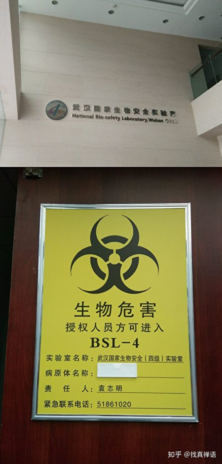

图为武汉病毒研究所的P4生物安全实验室的入门告示。（网络截图）

整理互联网上的科普信息可知，新萨斯病毒（武汉新型冠状病毒）基因组中、与致病力或传染性相关的蛋白包括S蛋白（spike protein）和E蛋白（envelope protein）。冠状病毒通过S蛋白受体结合区的基因重组或突变，可以实现其从野生动物到人类的宿主范围“跳跃”并导致高死亡率；而E蛋白则与病毒致病力和易受感染的宿主类型相关。

1月11日，香港的传染病学教授袁国勇告诉财新网，根据病毒基因图谱比较发现，与武汉肺炎病毒最接近的，是浙江舟山蝙蝠类SARS冠状病毒。

尽管大陆和香港的部分专家认为，现有证据尚不能直接推出“舟山蝙蝠就是新型冠状病毒的传染源”，但有海外网民利用分析生物信息的BLAST等工具，发现武汉肺炎病毒的E蛋白与舟山蝙蝠病毒具有100%相似度。

当然，这些证据并不能证明武汉肺炎病毒源自舟山蝙蝠病毒或其变种，但至少揭示出一种可能性。

而网络上有网民爆料，称舟山蝙蝠病毒是中共军方研究所改造过的人造病毒，新型冠状病毒与之有关；之所以在武汉爆发，是因为中共最高级的病毒研究所在武汉，可能是武汉病毒所泄露的病毒。当然，这种说法在中共统治下，无法获得证实。

虽然新型冠状病毒或舟山蝙蝠病毒是不是中共的生化病毒，外界无从得知。但有一点是得到证实的：那就是，中共的武汉病毒研究所（生物安全实验室），的确对萨斯（SARS）病毒有着深刻研究。

1月23日，曾经发现SARS宿主的中科院武汉病毒研究所石正丽团队发布研究，称武汉新型冠状病毒2019-nCoV的序列，与一种蝙蝠中的冠状病毒序列一致性高达96%，也就是说，引发武汉新型冠状病毒的宿主可能仍然是蝙蝠。石正丽是武汉国家生物安全实验室副主任、生物安全三级（P3）实验室主任。石正丽团队曾证实蝙蝠是SARS冠状病毒的自然宿主。

P是英文protection防卫和防护的缩写。根据传染病原的传染性和危害性，国际上将生物安全实验室分为P1、P2、P3和P4四个生物安全等级。等级越高，就能研究具有更大传染性和危害性的病原。P4实验室是专用于烈性传染病研究与利用的大型装置，也是人类迄今为止能建造的生物安全防护等级最高的实验室。

武汉病毒研究所的武汉国家生物安全（四级）实验室（武汉P4实验室），是亚洲第一个正式投入运行的P4实验室。2003年萨斯瘟疫爆发后，中共得到法国援助，在武汉建成了第一个P4实验室。

但据陆媒报导，中共在这一次的武汉肺炎疫情中，并未启用武汉P4实验室。

据陆媒公开报导，对萨斯病毒的研究都是在P3实验室中进行；在2003年9月至2004年4月期间，全球爆出的4次萨斯疫情（新加坡、台湾、广东省、北京／安徽）中，有3次与实验室病毒泄露有关。其中，2003年底，中共卫生部还专门对全国的P3实验室进行了安全督察，但这并未能防止2004年位于北京的、中国疾病预防控制中心病毒病预防控制所发生萨斯病毒泄露。

综合陆媒有关病毒实验室和（新）萨斯病毒相关报导后，不难看出其中矛盾之处：武汉P4实验室是因为萨斯病毒才争取到外援而建成，但在明面上，却没被用于萨斯及本次新萨斯病毒的研究。而中共的P3实验室，尽管过去发生过萨斯病毒泄露，但依然被用于萨斯病毒的科研。

中共病毒实验室的这种矛盾之处，也为“武汉肺炎病毒源自中共军方生化病毒泄露”的传言，埋下了伏笔。

尽管拥有P4实验室的中科院武汉病毒研究所、是否兼具中共军方背景，这一点难以考证，但它作为亚洲最大的病毒保藏库，理论上具备替中共进行生化武器研究的可能性。

也就是说，武汉封城的第二种可能性，目前难以被证实，但的确存在。

另外，如果真的是第二种可能性，那么短期内武汉市内的疫情可能会极其酷烈，但对中共而言，疫情或不会长久，可能数周后就消退。

不过，无论如何，对于武汉和武汉之外的中国人而言，灾难人祸已经降临；但不要放弃希望，寻觅真相，守住心中的善良，抓紧自救，脱离中共及其带来的劫难，希望和曙光就在前方。#

<a target="_blank" href=#top><h6 align="right">回上方</h6></a>

<a name=167>
<h1 align="center"><b>武汉女疑染冠状病毒 土耳其医疗专机送返中国</b></h1>

武汉肺炎正在全球范围内蔓延。图为2020年1月24日在苏格兰爱丁堡的中国游客。(Jeff J Mitchell/Getty Images)

 
 【大纪元2020年01月25日讯】土耳其卫生部长法赫丁·科卡（Fahrettin Koca）证实，此前一名出现疑似新型冠状病毒感染症状前去求诊的中国妇女来自武汉，已派医疗专机送回中国。机场未发现武汉肺炎疑似案例。

《发言人报》（Sozcu）网站周五（1月24日）报导，日前造成土耳其一家医院封锁急诊室事件的是来土耳其观光的一对夫妇。科卡证实，他们来自中国武汉，今天上午已用医疗专机送回中国。卫生部长表示，两人的检体上午已送检验，结果尚未出炉。

土耳其《国民日报》（Milliyet）网站23日报导，一名出现流感症状的中国妇女当天上午赴伊斯坦堡布尤切克梅奇区（Buyukcekmece）一家医院求诊时，院方立即采取防疫措施封锁诊区，并为急诊部所有医护人员发放了口罩。经检查后，院方用救护车将这名妇女送出院区、进行隔离。

《晨报》（Sabah）网站今天报导，科卡说：“我们观察36小时后，已用医疗专机将病患送回中国。”他强调，当局已采取所有预防措施，尤其是在机场。

安纳杜鲁新闻社（Anadolu Agency）英语网站快讯报导，科卡表示，这名妇女出现疑似武汉肺炎症状，在她要求下将她送回中国。这种引发“武汉肺炎”的病毒已经被世界卫生组织命名为“2019新型冠状病毒，2019-nCOv”。

中央社报导，科卡于22日宣布，在机场设置红外线热影像仪进行筛检，如果有来自中国的疑似案例抵达土耳其，会以专用救护车送到指定医院进行隔离。

科卡指出，截至目前，“没有出现疑似案例”、“没有发生会让土国民众惊慌的情况”。#

<a target="_blank" href=#top><h6 align="right">回上方</h6></a>

<a name=166>
<h1 align="center"><b>王友群：牢记历史教训 不要替中共挡枪子</b></h1>

武汉医护人员告诉家人：医生估计大概有十万病例，千万不要相信政府，得靠自己。(Kevin Frayer/Getty Images)

【大纪元2020年01月25日讯】最近，“武汉肺炎”爆发，武汉市已经封城，进入“战时状态”。继武汉之后，湖北18个县市相继封城。除西藏外，大陆30个省区市，包括香港、澳门在内，全部“沦陷”。武汉肺炎还在向国外扩散。

“武汉肺炎”立即让人联想到2003年的“非典”。

当年那场蔓延全国乃至世界的“非典”，是一场天灾，更是一场人祸。当“非典”发生后，中共不是立即以公开透明的方式让公众知情，进行紧急防治，而是不断隐瞒真相，欺骗全世界。疫情不断扩散，后果非常严重。

“非典”发生至今已经16年多了，中共不仅没有汲取教训，相反，继续重复“高压”与“欺骗”的套路。

1月1日，武汉警方抓了8个向全世界发出“武汉肺炎”警报的市民，之后，一再欺骗说，没发现人传人，没发现医护人员被传染，可防、可控、可治等，其结果是，失去了将疫情控制在最低限度的20天黄金时期。

一个国内的朋友发来消息说：“北京也已经快速沦陷，地坛医院460张床位全满，其它医院还有”。
对中共发布的数据，这位朋友认为全是假的，并称“这次病毒是非典百倍，我都没当回事，现在北京全部封锁消息，医护紧急会议通知”，“这次是空气传播，速度相当快”。

1月21日，一位网友在推特上发文说：“别去！2003年非典时，我勇敢冲在医护第一线。今天，我告诫你：别去！因为：1.这些年我常生怪病（各种免疫力缺乏病症）；2.当年值勤功勋全被上级顶名取代了（他们当时都躲开了）；3.重复犯造同样错，只因当官的从未曾身临险境，自然不会感痛身受，危险永远推给下边人！”

在这次“武汉肺炎”疫情蔓延中，医护人员面对的压力非常大。患者只能求助医生，医生也应尽最大努力挽救患者的生命。

但是，需要特别提醒医护人员的是，中共只讲党性，不讲人性。

为了“党的利益”，中共会提出各种不符合科学规范和医学伦理的要求，搞什么“火线入党”。中共官员自己怕的要死，甚至不敢亲临一线慰问医护人员，却鼓动医护人员“一不怕苦，二不怕死”，争当什么“英雄”、“模范”、“典型”等。

历史的教训反复告诫中国人：中共是没有道德底线和法律底线的。为达目的，不择手段，是中共的一贯做法。医护人员本着良知，恪尽职守，能多救人，尽量多救人。

超出这个范围，被中共的谎言忽悠，替中共挡枪子，就没有任何必要了。

1949年中共夺取政权前，不断以建设一个富强、民主、文明的新中国的“伟大目标”，诱惑许多人替中共出生入死。1949年中共当政后，在历次政治运动中，这些上当受骗的人，都成了中共整肃的对象。

著名教育家黄炎培，在中共最艰难时，替中共做宣传，为中共做了大量的事。

但是，1957年毛泽东发动反右运动后，黄炎培一家出了7个右派一个反革命：三子黄万里被打成清华大学的大右派，之后，四子黄大能、五子黄必信、长女黄路、四女黄素回及其曾是中共地下党员的丈夫陈锵、二女黄小同之长子，都被打成“右派分子”，黄小同还因笃信基督被内定为反革命。黄必信和妻子余启运被逼自杀，14岁的女儿黄可清失踪后“人间蒸发”。

黄炎培在文革爆发前就去世了。如果黄炎培活到文革，必定在劫难逃。黄炎培夫人姚维钧在文革中成了他的替罪羊，遭到毒打与侮辱，1968年1月20日自杀身亡。

著名实业家卢作孚创办的民生公司，到1949年时，已是中国最大的民营企业集团。当时，抱着一颗“建设新中国”的拳拳之心，拒绝去台湾，拒绝去美国，选择投奔中共。刚开始中共给了他不少虚名。但是，从1950年开始，中共发动的“镇反”、“三反”、“五反”等运动，一步一步把他逼入绝境。1952年2月8日，卢作孚被迫自杀。

纵观中共近百年的历史，前28年是不择手段夺权，后70年是不择手段维护统治权。

中共从来就没有把中国人当人看过。需要你时，骗你上前线没商量；不需要你时，立即把你当垃圾一样抛弃。

如今，中共已大祸临头。“天灭中共”不只是一个口号，正在变成每个人都看得见的现实。

作为医治“武汉肺炎”的医护人员，最重要的是认清中共的邪恶本质，不上中共的当，不要盲目听从中共的冷血号召，不要做无谓的牺牲。在尽量多救人的同时，一定要保护好自己。

<a target="_blank" href=#top><h6 align="right">回上方</h6></a>

<a name=165>
<h1 align="center"><b>武汉版“小汤山”医院比邻水源地 遭谴责</b></h1>

武汉版“小汤山”医院已开建，但该医院距离知音湖仅有数米之遥。（网页截图）

 
 【大纪元2020年01月25日讯】防治“新型冠状病毒”疫情的武汉版“小汤山”医院，已经开工建设，但该工程因选址在武汉水源地之一的蔡甸知音湖，引起当地居民的恐慌。

1月23日晚10时许，中共当局仿照2003年4月建设小汤山医疗点，开始建设用于为收治新型冠状病毒肺炎患者的“火神山医院”，并计划于2月3日建成。

据中共官媒报导，医院建筑面积2.5万平方米，可容纳1,000张床位，由中建三局牵头，武汉建工、武汉市政、汉阳市政等3家企业共同参与建设。

但医院刚刚开建后，24日，网上就传出一片谴责声。因为火神山医院紧邻知音湖，而知音湖是武汉市饮用水水源地之一。

网民痛批，把重疫医院建在此处，“整个湖北官方都应该换掉”，并认为官方在舆论压力下，可能更换地址。

有网民还传出，火神山医院因位于知音湖水源地，地势低，没有污水管道，当局将重新选址。

但大陆《中国新闻周刊》、经济观察网等媒体记者从承建方处获悉，该消息系“谣传”。承建方没有收到换址通知，医院正在继续建设中。

一名负责医院建设的知情人士透露，规划设计单位在选址时已注意到知音湖水源地、武汉职工疗养院等问题，并向中建三局、武汉建工、武汉市政、汉阳市政等建设方和设计单位提出换址建议，但由于时间非常紧迫，“如果实在不能换址，就要做好污水治理防控措施。”

但外界质疑，如果当局不改换该医院地址，一旦这种无药医治的新型冠状病毒污染了水系，后果不堪设想。#

<a target="_blank" href=#top><h6 align="right">回上方</h6></a>

<a name=164>
<h1 align="center"><b>湖北党报记者吁武汉“一把手”下台 遭处理</b></h1>

《湖北日报》记者张欧亚呼吁武汉当局“换帅”事件引发舆论关注。（网路图片）

 
 【大纪元2020年01月25日讯】（大纪元记者李净报导）对于武汉肺炎疫情肆虐，大陆舆论指责中共当局应对迟缓。中共湖北省委机关报《湖北日报》高级记者张欧亚24日发表言论说，武汉市政府应立即换帅，当日其单位致函武汉市委市政府道歉，称张欧亚的言论给各级领导“添了堵”。

1月24日上午，《湖北日报》记者张欧亚发布一条微博，呼吁“武汉必须当即立断换帅了”（换掉武汉市委书记或市长）。

他还说，“和很多人一样，我也曾认为，临时换不熟悉领导，不利于工作的展开，但据当前日益严重并继续扩大的异常严峻的形势，当前的台上者不具这样的领导指挥力！”“为了武汉，希望立即换帅！！！ ”

公开资料显示，张欧亚，湖北十堰市人。曾先后在《十堰晚报》、《十堰日报》、《楚天金报》任职，也担任过《楚天都市报》深度报道部主任。他曾多次报导中国重大热点事件，并多次获奖。

对此，有大陆观察人士认为，湖北党报记者喊话武汉换帅，这是有风险的，可能会遭受批评甚至丢掉饭碗。但是张欧亚还是喊出来了，这意味着什么？这证明身处武汉一线的人，实在是看不下去了！

《湖北日报》记者张欧亚呼吁武汉当局“换帅”事件引发舆论关注。（网络图片）

 
 当日，中共《湖北日报》传媒集团委员会立即致函武汉市委市政府道歉、检讨。据《湖北日报》传媒集团在“关于集团员工在个人微博上发表错误言论的情况说明和致歉”的道歉信中称，“今天上午，我集团员工张欧亚在其个人微博上发表错误言论，给当前防控工作添了乱，给各级领导添了堵。”深表歉意。

道歉信还解释称，张欧亚为农村新闻中心记者。他在个人微博上的认证为“楚天都市报新闻部主任”，是他以前在《楚天都市报》工作时的身份。

《湖北日报》传媒集团在信中作出承诺，要求“所有员工个人微博、微信等自媒体和朋友圈一律不得刊发、转发不良信息和未经媒体报道、核实的信息，只能传播正能量，汇成众志成城的大合唱。”

此时，正处于风口浪尖上的武汉“一把手”，是现任武汉市委书记马国强，他同时也是湖北省委副书记、中共第十九届中央委员会候补委员，达到这个官位被认为是到了仕途的关键期。此外，武汉市现任市长是周先旺，他曾任湖北省副省长。

对于上述事件，前大陆律师李庄在微博表示：“我看这位记者的建议没问题，严重支持！出现疫情不可怕，弄成现在这个样子，该市领导难辞其咎？ ​​​​”

网民“橘猫是猫咪”认为：“医院乱成这样，医生护士连饭都吃不上，能力太差，赶紧下课！”

“大清铁拳”说：“巿长必须下台、抓8名公布疫情警察必须查处渎职滥权一查到底！8名公布疫情人士立功受奖！不能顺我者昌、逆我者嫖娼！”

最令舆论愤怒的是，自武汉新型冠状病毒感染的肺炎开始蔓延后，根据中共新华社发布的消息，武汉市公安局1月1日通报称，8人因散布关于“武汉病毒性肺炎”的信息被警方处理。

报导还提到，武汉市卫健委通报称，“调查未发现明显人传人现象，未发现医务人员感染。”

目前，武汉肺炎迅速蔓延，感染人数猛增。据官方数据，截至1月25日04时，中国新型冠状病毒感染的肺炎病例确诊903例。不过外界认为，中共操控确诊权，实际感染人数比中共官方公布的数字多出很多。
 
 <h3 align=center><a href="https://twitter.com/ttingxiao/status/1220370090366885889?ref_src=twsrc%5Etfw%7Ctwcamp%5Etweetembed%7Ctwterm%5E1220370090366885889&ref_url=https%3A%2F%2Fwww.epochtimes.com%2Fgb%2F20%2F1%2F24%2Fn11819273.htm">武汉匿名医生22日向《新唐人》透露，死亡人数远大于官报数字，目前每天医院门诊大排长龙，挂号要隔天才看的上，很多人得了肺炎，因为医院爆满，没有收治，让病人回家隔离，这些病人都没有确诊的，不少人死亡也不会报导出来。</a></h3>
 
<a target="_blank" href=#top><h6 align="right">回上方</h6></a>
  
  
<a name=163>
<h1 align="center"><b>【新闻看点】武汉肺炎失控 医护人员绝望痛哭</b></h1>

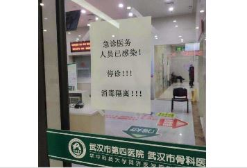

1月24日，武汉封城第二天，传出视频和微信，有医生被感染而停诊，也有医护人员哭诉快崩溃了：医生估计大概有十万病人，千万不要相信政府，得靠自己！（网络图片）

 
 【大纪元2020年01月25日讯】大家过年好，感谢大家在年三十继续关注新闻看点。

本来是阖家团圆、欢乐日子，但已经失控的武汉肺炎让人坐卧不安。目前只有西藏、吉林的疑似病例等待确诊，其余中国省市全部沦陷。四大直辖市、广东、湖南、浙江、安徽、四川、江西、云南和疫情重灾区湖北，这12个省市都启动了重大突发公共卫生事件最高级别Ⅰ级响应。

截止今天（1月24日）下午2点40分，全国确诊885例，死亡26例。继武汉、黄冈等8个城市封城后，今天赤壁、荆州等7个城市也封了，整个湖北18个市县停运公共交通。有视频显示，公路被挖掘机挖断，阻止人员流动。

有医院现场照片显示，大量患者彻夜排长龙等待住院，有的排队几个小时后医院不收治，还有的患者向医生下跪求救。另有视频显示，有的人突然倒了下去。

被近代规模最大的封城震惊的几千万市民，迅速抢购各种商品，造成医护物资急缺，食品价格几十倍上涨。而正当人民在死亡线挣扎的时候，中共7大巨头和湖北当局照旧歌舞升平，引发民众愤慨。有网民表示，第二个辛亥革命要爆发了。

<b>体制造成“缺乏行动”，局势失控</b>

瘟疫当头，北京罕见地关闭了故宫，上海、武汉等地也纷纷关闭庙宇和迪士尼等场所。

有从武汉飞抵巴黎的旅客向法新社描述，“他们前脚上了飞机，军队就赶到了”。封城后一片死寂，有网络视频显示，挖掘机正挖断公路，以阻止人员流动。

据财新网引述内部消息，武汉正在加紧建一座新医院，要求6天内建成。法新社也引述武汉官员说法，一座1000个床位的医院要在2月3日竣工。

采取这些措施，对防止疫情扩散当然是好事。但如果当初没有隐瞒疫情，何至于发展到现在这样呢？

美国智库外交关系委员会全球卫生高级研究员黄严忠指出，地方政府处理疫情的透明度“堪忧”，就像当年应对SARS一样“不及格”。

有中共官员对《华尔街日报》表示，习近平决心避免重蹈SARS覆辙。但也有人私下表示，当局“自上而下的领导风格，让较低层官员对自行采取果断行动较为审慎”。

战略与国际研究中心中国问题专家裘德·布兰切特（Jude Blanchette）表示，习近平的领导风格让官僚体系内充斥着“观望”态度，导致“应对缓慢迟疑”。

一位微博用户表示，如果能够提早采取措施，根本不需要封城。现在武汉等被封闭，表明局势已经失控了。

<b>患者下跪求救</b>

现在微信、微博或网络视频都有讯息，显示许多发烧患者到医院求诊，却被拒之门外。

赵女士向自由亚洲提供了一份信息，是身在美国的武汉人群组。其中一人说，他住在汉阳国博的姐姐感染了病毒，姐夫的母亲是重症，但几家医院都不收治，把人逼得向医生下跪求救。最终老人被收治，但他姐姐不能住院。

“赫莲娜”在微博表示，她父亲8日开始发烧，在协和医院治疗无效。10日要求住院缺床位，只能回家等着。后来转到新华医院，告知先打针观察3天，但昨晚出现呼吸困难，却没有医院收治，也不排查隔离，就任其发展。

一名武汉人告诉《三联周刊》，他父亲染病后，在汉口医院、第七医院、武昌医院之间来回奔波。各处都爆满，住不上院，尽管医生也承认病情很严重、需要住院。22日去汉口医院，前面有几百人在排长龙。中途去了一家非定点医院，拍片子显示双肺全感染。

折返汉口医院，医生说必须住院，但没有床位。急转武昌医院，急诊室里却看不到医生，人们都在大厅等着。有几辆急救车送来患者，有医生说不让再送了，“顾不上来了”。

再转到第七医院，已是晚上21:20，医院门口已经排了40多个人。半小时时间，又来了100多人。

一位武汉市民说，武汉发热门诊医生严重不足，初诊极其困难。他去过同济医院，只有一个发热门诊，一名医生看诊。第一天他排了六个小时，没排上，晚上九点回去了。第二天很早去了，一直排到下午一点。他说中间看到几十个病人，“排不到后回去了”。

我们昨天说过，这种情况可能是移动病毒，会继续扩散疫情。

<b>有人突然倒下</b>

武汉市民方斌向美国之音证实，他家附近的汉口医院每天都人满为患。“真实的患病人数没法统计，很多人还没有确诊就匆匆死了。”“有的本来身体就不好，得了病扛着，走在路上就倒了。”

昨天网上有不少惊悚的画面，有病人在医院或在路边倒在了地上，但这些视频不断被删除。真想不到，这个时候他们还有心情删帖。

其中一个视频显示，在医院等待就诊的病人突然倒在地上。马上有身穿防护服的医护人员过来，给搀扶了起来。也有倒在街头的，被防疫人员送上了救护车。从车牌判断，事发地是武汉。

有知情人表示，他所在小区内，有人直接倒在地上，而另一个小区出现了5例。

有人在微博表示，“有些人走路的时候，直接就倒在地上了，看到这个我是真的怕了！”

“阿桢想要环游世界”留言说，“原以为微信上流传的照片和视频已经够惊悚了，去了趟医院才发现，现实比视频恐怖得多。上百号夹杂在急症大厅，量体温的、挂号的、看病的、打针的，各种咳嗽声在耳边源源不断，一个个手上拽着的验血单上，诊断处写着‘肺部感染’。

“急救室门口一群人搀扶着哭到走不动路的阿姨，诊断室门口排队排到倒在地上的老奶奶，以及声称自己就没出过门，但是CT单上有着肺炎感染迹象的年轻小伙，真的太恐怖了⋯⋯”

金融业者刘先生告诉自由亚洲，人们排队五六个小时，也只是查体温、照CT。症状不明显的都让回家“自我隔离”，“那种实实在在的恐惧只有在当地才能感受到”。

<b>医护人员“拿命上班”情绪崩溃</b>

面对接连不断的病患，一线医护人员非常辛苦，也最危险。有医护人员在微信群里哭诉，实际情况可怕的多，估计“有十万病人”，告诫亲人全靠自救。

视频中显示，武汉医护人员在放声大哭。有的医生在微信中说，“我们已经顶不住了”，病人跪求救救他们，而所有的防护用具都用光了⋯⋯

还有视频显示，一家医院的患者排了长长的队伍。身穿防护服的医务人员在大声维持秩序，喝令人们“不要说话”，“到门口排好队”。

我朋友曾铮说，她朋友的同学在协和医院当护士，给家人写了一封信。信中说所在科室有人感染回家隔离了，她被抽签去支援。信中说这“是拿命上班”，但医院不让辞职，不让外出武汉，给软禁了。信中还说“很多医务人员感染，不给确诊，全都只能疑似。因为一旦确诊，就是免费治疗，要上报国家。”

网上正热传协和医院护士长给亲人的录音，说一个医疗部门都“中招”了，提醒亲人“重中之重地认识这个问题”。说这个病毒“最少持续三个月”，各大医院全部“人满为患”，“非常严峻”。

录音披露，这种病毒没药可治，得了病只能隔离。能挺过去就挺过了，挺不过去，肺部会“烂成黑洞”，烧成器官衰竭死亡。

一位向“新闻看点”爆料的网友很担心：“医务人员超负荷工作，使得太多不应该成为病患的人成为病人，这是群体性大败局的危险性开端”。

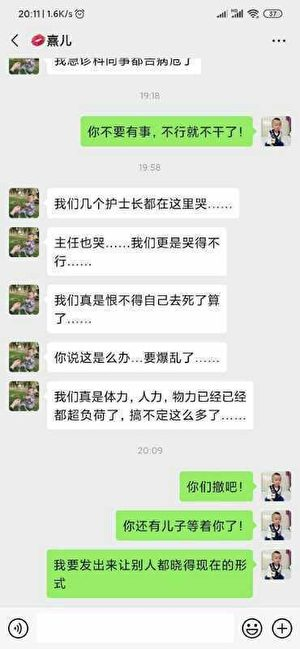

医疗资源急缺 医护：千万不要相信政府，自救！

病患和医护人员紧张，一般市民也紧张。封城令一下，逃走的毕竟是少数。武汉马上出现了“疯抢”场面，医护用品成了最先疯抢的目标。

小罗表示，意识到疫情严重性后，人们都想大量买口罩和其它防护物品，但是晚了。大部分东西都买不到，民生用品和食品几乎销售一空。

有超市员工证实，口罩、消毒液严重缺货。“口罩涨了10倍，平时十几块钱一包，现在差不多要70～80元，甚至100多一包。即使这样，也断货了。”

低保户张毅很发愁，家里只剩一个口罩了。但当局要求在公共场所必须戴口罩，这怎么出门呢？即使出了门，也买不到口罩了。他对美国之音说，“这个国家完全乱套了。官员们只对上负责，不对下负责，我们都是韭菜。”

财新记者发出了“前线记者求援”，因为快递停顿，武汉三位同事防护服、医用酒精、消毒水严重不足，呼吁“武汉市拥有相关物资的组织或个人可以捐献（九套防护服）”。《中国青年报》和《红星》各有三名记者也都没有防护服。

面对物资疯抢，当局先发布“第二号通告”，声称物资储备充足，无需抢购囤积。但几分钟后，发了“第三号通报”，说湖北红十字会公开接受抗击疫情的医用耗材和防护用品等。

湖北省中医院、武汉大学中南医院等8家医院也公告，医用物资最多撑3～4天，现在面向社会征集防护物资。声称“合乎国家卫生标准”的各种医护物品都需要。

大家想一下，医疗机构向社会募捐，记者找不到防护用品，一般市民会什么样？

有护士哭诉：医药系统崩溃了，领导都不在了。千万不要相信政府，自救！

<b>物价涨得离谱</b>

食品、日用品也是疯抢目标，很多超市出现“人叠人”、大排长龙的状况。一些本来廉价的蔬菜，一夜之间涨了几十倍。

网络图片显示，1公斤新鲜蒜苗要价92.16元人民币，0.5公斤茼蒿54.6元，1.8公斤番茄52.2元，0.6公斤荷兰豆44.6元。

有市民告诉美国之音，他看到“一棵白菜30多元，原来才两块多”。有摊主表示，市场明天就关门了，什么时候开门要等通知。

而另一位网友在昨天节目留言区表示，他看到一棵白菜已经90多元了。

刘先生告诉自由亚洲，私家车在抢着加油，超市的价格涨得很离谱，而且现在超市已经搬走了所有的东西。他说现在“只能走一步看一步了”。

另一位刘先生对经济观察网表示，市中心市民早就抢购了，菜价翻了几倍。现在封城，物价再高也得抢购，因为现在超市和小卖部是“唯一采购途径”。

<b>全国担忧，北京歌舞升平</b>

重大瘟疫侵袭，全国哀鸿遍野，悲鸣一片。但《人民日报》头版头条却是“中央领导同志看望老同志”。其它几条也都是关于习近平，与德国、法国总统通电话，访问云南、听阿佤人唱歌等等。

央视下午播出了习近平、李克强等七大巨头的团拜场面，还看了文艺表演。习讲话中高谈“小康社会即将变成现实”，但就是没有武汉内容，一句对武汉人慰问都没有。

湖北省委书记蒋超良、省长王晓东21日双双出席了团拜会。而参加演出的演员，有些是带病带伤，在为“官老爷们”演出。

报导说，“大家戴着层层口罩，克服肺炎恐慌。男演员易汉章长途奔波、感冒在身，候场时全身发冷；女演员们克服感冒鼻塞、身体不适等多重困难，带病带伤完美演出。”

当下瘟疫泛滥、百姓处在生死边缘，全世界都在着急。而中共官员竟然有心情莺歌燕舞，好像没事一样，令人叹为观止。可以想见，他们的心里根本没有百姓，他们所说的“心里装着百姓疾苦”，完全是骗人的。

<b>占星师：湖北或被切断互联网</b>

身在比利时的一位占星师给我发消息说，她占星看到，今明（24日、25日）两天，湖北可能被切断互联网。

这个消息我半信半疑，如果封网，那就让武汉等这些城市彻底变成死城，事关几千万人的生命。但看中共的邪劲，又让我有几分相信。因为在中共体制内，人性都可能被党性扼杀，从而做出疯狂举动。这一点，非常值得关注。

有网民表示：“全球主流媒体都非常关注中国新型冠状病毒疫情，做了大量报导，唯有中共党媒，故意淡化这一世界级疫情。这就是中共的‘治国理政’模式，P民的死活不是什么大事，上千万被封锁在疫区里不影响‘大局’。”

有气愤的网民编了一副对联对北京当局嘲讽：平民情怀，视百姓为蝼蚁；贵族气质，变人民为跪族。横批是“请看人民日报”。这副对联背后是有背景的，前不久，党媒曾吹捧习近平“既有平民情怀，兼有贵族气质”。

加拿大学者温相表示，中共采用的无非都是老套路。“赞美党和政府及时出手控制疫情，紧密团结在党和政府的周围，全民抗击疫情。”“最终归功于党和政府领导14亿人民全面战胜疫情，取得圆满的收官。”

<b>武汉人用生命为官方失策买单</b>

不过也有网民表示，中共封城，让人们用生命为官方失策买单，“如果处理不当，武汉有可能发生第二次辛亥革命”。

1911年的辛亥革命，推倒了大清王朝，建立了中华民国。那么如果这次再爆发辛亥革命，那就一定是推翻中共政权。

**********

最后，我要向朋友们表示一下感谢。特别是昨天，一位朋友向新闻看点捐赠了$1000。说实话，这是新闻看点目前所收到的最大的一笔数额，令我相当感动。出于安全，我不能说他的姓名。

其实，还有很多朋友，一直在用各种方式支持新闻看点，支持李沐阳。有直接捐款的，有寄送礼物的，还有其它的不同方式。正是因为大家的支持，新闻看点才一直坚定不移地向前走着。

在这个辞旧迎新的时刻，沐阳代表新闻看点的所有工作人员，谢谢大家！祝每一位朋友新年吉祥，幸福平安。

好的，感谢您关注新闻看点，再会。

大纪元《新闻看点》制作组   #

<a target="_blank" href=#top><h6 align="right">回上方</h6></a>
  
 
<a name=162>
<h1 align="center"><b>135名武汉旅客抵菲 官员下令：送回去</b></h1>

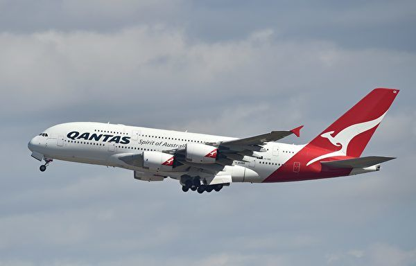

飞机，示意图。 (PETER PARKS/AFP/Getty Images)

  
  【大纪元2020年01月24日讯】武汉肺炎蔓延之际，菲律宾宣布无限期停飞武汉往返班机，但已有135名来自武汉的旅客23日抵达菲律宾。菲国民航官员今天说，会用4班飞机把他们送回去。

中央社引ABS-CBN新闻网报导，菲律宾昨天宣布停飞往返武汉班机，但这135名旅客在此之前已抵达卡利波（Kalibo）国际机场。

 菲律宾民航委员会（CAB）法律部门主管萨莫迪欧（Wyrlou Samodio）表示，菲律宾皇家航空和菲律宾泛太平洋航空将用4班飞机把这些旅客送回武汉。

卡利波机场是进出菲国观光胜地长滩岛（Boracay）主要门户，而中国是菲律宾第2大旅客来源国，去年1到10月，有149万9524人次中国旅客造访菲律宾；2018年有125万5258人次中国旅客抵菲。

萨莫迪欧接受DZMM电台访问时说：“他们必须回去，因为他们在这里只是观光客。”

他并未说明这135名旅客回中国的航班时间。

菲律宾每日询问报（Philippine Daily Inquirer）报导，菲律宾卫生部次长杜明戈（Eric Domingo）说，今天起，中国抵菲航班旅客都会被要求填写健康申报表，旅客必须揭露曾造访地点、健康状况等个人资讯。

菲律宾民航委员会执行长阿西亚（Carmelo Arcilla）说，他们已下令航空公司依循标准作业程序监控可能感染2019新型冠状病毒（2019-nCoV）的旅客，空服员也被要求密切观察出现病征的旅客。

菲律宾交通部长杜加德（Arthur Tugade）要求相关部门因应过年预计将涌入菲国的旅客，采取一切必要措施防堵新型冠状病毒扩散。

<a target="_blank" href=#top><h6 align="right">回上方</h6></a> 
  
 
<a name=161>
  

2020年1月23日晚，税务顾问Paolo Cevasco和女友Rossana Marino于热那亚卡洛·费利切剧院（GENOVA Teatro Carlo Felice）观看神韵。（张妮／大纪元）

<h1 align="center"><b>神韵传递拯救人类的信息 顾问为之感动</b></h1>

【大纪元2020年01月24日讯】（大纪元记者张妮意大利热那亚报导）对于意大利热那亚市的两位顾问来说，1月23日美国神韵巡回艺术团在卡洛·费利切剧院（GENOVA Teatro Carlo Felice）的第二场演出让他们接受到新信息。他们发现，他们不仅在神韵演出中看到了自己民族文化的影子，更重要的是得到了一个重要启示，那就是这个演出传递着“保护这个星球与拯救人类”的信息。

Paolo Cevasco是一家公司的税务顾问，女友Rossana Marino是劳工顾问，俩人看完神韵演出后展开了热烈的讨论。

Cevasco称赞，神韵的演员出类拔萃，演出非常独特，美不胜收。他表示，“舞蹈演员非常好，真的棒极了，他们的脸庞都非常美丽！”

“舞台设计非常与众不同，背景上的自然风光，美不胜收。动态天幕也独具特色，引人入胜。服装更是色彩夺目。”

让他惊讶的是他在演出中看到了自己民族的文化。他表示，“我感到演出中包含很多意大利传统舞蹈的影子。非常精彩，我非常喜爱。”

Cevasco说，他在以前没有意识到两种文化的相似之处，神韵的演出让他改变了观念，原来东西方的信仰与文化有很多共同之处。

同时，演出中表现当代中国现状的舞剧让Cevasco认识了共产党的社会是什么样子的。“我们今晚了解了一个和我以前认识不一样的中国，以及在中共体制下的人民是如何生活的。”他说。

Marino说，她看出神韵艺术家为演出付出了大量的心血，演出中的精神内涵让她大开眼界，并为之深深感动。她表示，“信仰这部分是与灵性相联系的，这在东方艺术中比西方更常见，这个感受震动了我，非常美好，一个无比美好的印象。”

Marino说，她从演出中接到了一个强烈的信息，“那是一个保护这个星球，拯救人类的信息。”

最后俩人都表示，他们不仅要自己再来看神韵，还要告诉所有的亲朋好友都来看。

<a target="_blank" href=#top><h6 align="right">回上方</h6></a> 
  
  
<a name=160>
<h1 align="center"><b>武汉肺炎疫情严重 湖北宣布15城市封城</b></h1>

为防范武汉肺炎蔓延，至23日夜间，湖北已有8城市封城。图为武汉理工大学。（大纪元）

  
  【大纪元2020年01月24日讯】（大纪元记者萧律生报导）武汉肺炎蔓延迅速，中共官方统计显示，全中国仅剩青海、西藏未传出疫情。继疫情爆发地武汉23日宣布封城，黄冈市、鄂州市、赤壁市等14个城市也相继宣布封城。

截至目前，中国仅剩青海、西藏未传出疫情，确诊病例达885例，死亡26例。

截止北京时间1月24日14时起，湖北省15个城市“封城”，包括：武汉、鄂州、仙桃、枝江、潜江、黄冈、赤壁、荆门、咸宁、黄石（含大冶市、阳新县）、当阳、恩施、孝感、宜昌、荆州。

荆州通报：1月24日12时起，荆州火车站离荆州通道暂时关闭；1月24日17:00前，市区所有公交车、道路客运班线车、旅游包车、农村客运车辆、渡口渡船暂时关闭停运。恢复时间另行通告。

宜昌通报：1月24日日14时起，宜昌市区城市公交、县市城际公交、道路客运、旅游及包车客运、水路客运、渡运暂停运营，出租车和网约车严禁出城区。

截止北京时间1月24日12时，湖北共有13个城市“封城”，区域公共交通停运，分别是武汉、鄂州、仙桃、枝江、潜江、黄冈、赤壁、荆门、咸宁、黄石（含大冶市、阳新县）、当阳、恩施、孝感。

湖北省肺炎疫情防控指挥部最新通告：全省旅行社从即日（24日）起暂停经营活动，不再组团收客；已经组团的一律取消或延期。省内大专院校、中小学、幼儿园推迟开学时间。省内党政机关、企事业单位、驻军及武警部队所属人员出差取消。各地招商引资活动一律暂停。省内进出武汉的客运航班、旅客列车、客运汽车、客轮一律暂时停运。

截至北京时间24日早间，湖北省已宣布10个城市“封城”处理，分别为武汉、鄂州、黄冈、赤壁、枝江、仙桃、潜江、咸宁、黄石、恩施。

武汉市24日中午公告，将自25日凌晨0时起关闭连接武昌和汉口的过江隧道，并在三环（环线快速公路）内的过江桥梁实施体温监测管控。取消时间另行通告。

为防范武汉肺炎蔓延，至23日夜间，湖北已有8城市封城。图为前往汉口北的武汉地铁一号交通线的列车上空空荡荡。（大纪元）

BBC称，这是中国防疫史上罕见的举措，无疑显示了疫情的严峻危险程度。

具体封城情况是：武汉市自23日上午10时起，全市公车、地铁、轮渡、长途客运暂停运营，市民不要离开市区；黄冈市23日晚上12时起，市区公车、长途客运暂停运营，城铁站、火车站离开黄冈市区通道暂时关闭，市民不要离开市区；鄂州市自23日11时20分起，铁路、车站通道暂时关闭，恢复时间另行通知。自2020年1月24日0时起，赤壁市城市公交、农村客运、省县级客运暂停运营，恢复时间另行通告。

据荆楚网报导，湖北仙桃、枝江、潜江、咸宁、黄石、恩施亦陆续宣布关闭火车站等公共运输系统，发出停运通知。

中共黄冈市政府官网的“湖北黄冈新型冠状病毒肺炎防控工作指挥部通告”显示，黄冈市区所有电影院、网路咖啡和室内公共文化、旅游及娱乐场所暂停营业；黄冈市黄州区中心市场实行休市管理。恢复时间另行通告。

该通告还说，即日起，在黄冈市区所有进出城道口，对过往车辆及人员实施疫情排查防控，“不漏一人一车”。对进入黄冈的交通工具所搭载的动物进行检查。

此外，23日晚间，湖北省教育厅宣布，今年春季湖北省中小学开学确定延期，具体何时开学有待后续公布。#

<a target="_blank" href=#top><h6 align="right">回上方</h6></a>
  
  
<a name=159>
<h1 align="center"><b>台湾谴责中共借武汉肺炎进行政治操作</b></h1>

武汉肺炎的阴影笼罩全球。（Anthony Kwan/Getty Images）

【大纪元2020年01月24日讯】台湾政府谴责北京藉由武汉肺炎疫情进行政治操作，宣扬其“一个中国原则”，并在疫情扩大时没有“据实”与台湾分享信息的“恶劣行径”。有专家说，这让人们看清楚北京“是一个什么样的政府”。

据美国之音报导，自从这个新型冠状病毒肺炎的疫情爆发后，台湾已经确诊一名病例，不过在世卫组织1月22日举行的紧急会议中，台湾没有获邀与其它有确诊病例的成员国一起参加会议。

中共外交部发言人耿爽在22日的例行记者会上表示，“没有人比中国中央政府更关心台湾同胞的健康福祉。”他还对台湾参与国际组织的问题表示，这“必须在一个中国原则下，通过两岸协商作出合情合理安排”。

耿爽的说法引来台湾政府的不满、遗憾与谴责。中华民国外交部发言人欧江安23日说，中共外交部在武汉肺炎疫情“急剧升高且持续向外扩散”之际，不仅没有和台湾“据实分享疫情情资”，还“以中央政府自居，进行政治操作”，贬损中华民国的国家主权及地位，“中华民国台湾外交部对中共类此恶劣行径深表遗憾，并予以谴责。”

欧江安还说，中共政府无权就台湾参与世卫组织提出任何“矮化”台湾地位的安排，“只有台湾的民选政府能代表台湾2,300万人民以及守护台湾人民的健康人权。”她呼吁世卫组织秉持医卫专业考量、屏除政治偏见邀请台湾参与WHO体系防疫相关会议、机制与活动。

美国布鲁金斯学会东亚研究中心资深研究员卜睿哲(Richard Bush)说，新型冠状病毒的处理让中共处境尴尬，不过北京的政治操作对台湾或许“不是一件坏事。”

卜睿哲说：“它们自然让北京处于困难地位，因为他们必须选择‘一中原则’以及他们要如何定义它，这代表说，他们的观点是排除台湾，但与此同时他们看起来却非常残酷而且不人道。不过那倒不是一件坏事。它实际上让人们看清楚，它是一个什么样的政府，而且台湾可以寻求其他方式得到他们关于这个病毒所需的实质协助。”

对于中共为何在两岸交流中断的情况下却同意让台湾派专家到武汉实地访查，曾任美国在台协会主席的卜睿哲认为，这是北京要以其条件来表达关心的做法。

他说：“他们表现出一些关怀，他们在说他们要以他们的条件来这么做。他们是中共政府，你们是中国的一部分。他们给你们许可到武汉来。不过他们也可以做的另一件事，如果他们真的想要帮助却又能不违背他们的原则，就是允许台海两岸的医生协会彼此沟通，那会是民间沟通，但它可以解决问题。如果他们仅仅只想这么做，那也很好。重要的是务实协助。而那看来会符合他们的政治原则。”

根据中华民国卫生福利部网站发布的信息，去年12月31日因武汉出现肺炎病例，卫服部即向中共疾病控制中心和世界卫生组织确认疫情信息，武汉市健康委员会曾提供当天已发布的、有27例肺炎的信息，随后台湾即启动边境检疫应变措施。

1月6日，中华民国卫生福利部疾病管制署向中共国家卫生健康委员会发出信函，请求依据《两岸医药卫生合作协议》，同意让台湾派专家到武汉实地访查以了解新型冠状病毒疫情。

1月11日傍晚在获得中方同意后，疾管署派出两名专家在第二天晚间抵达武汉，并在中共政府安排下与香港、澳门专家到医院了解病人临床表现。

台湾的专家在返台后举行记者会指出，在与武汉市卫生健康委员会开会时，中方已明确定调病毒有“人传人”的能力。

<a target="_blank" href=#top><h6 align="right">回上方</h6></a>
  
  
<a name=158>
<h1 align="center"><b>【更新】全国确诊肺炎885例死26人 湖北封多市</b></h1>

武汉肺炎疫情（2019新型冠状病毒肺炎）重点事件时间表。(STR/AFP via Getty Images)

  
  【大纪元讯】中国武汉去年12月爆发不明肺炎，今年1月8日确定为新型冠状病毒，世界卫生组织13日将此病毒定名为“2019新型冠状病毒”（2019-nCoV）。

目前，武汉肺炎疫情已在中国失控蔓延。

计划前往中国武汉及其它疫区的民众，应避免出入市场、医院等公共场所及人多的地方，也不要接触野生和禽畜类动物，禽肉及蛋类要熟食，同时做好个人防护措施：以肥皂勤洗手、戴口罩。

本文将持续更新每日重点事件。

1月24日：截至24日下午2时40分，中国确诊885例，死亡26例。

1月24日：截至24日上午8时，中国确诊830例，死亡25例。

●新增：1月23日0-24时，27个省市区报告确诊病例259例，死亡患者8例。治愈出院6例。

●累计：截至1月23日24时，国家卫健委收到29个省（区、市）报告新型冠状病毒感染的肺炎确诊病例830例，其中重症177例，死亡25例，其中湖北省24例、河北省1例。已治愈出院34例。20个省市区累计报告疑似病例1072例。

●港澳台地区：通报确诊病例5例，其中香港特别行政区2例，澳门特别行政区2例，台湾地区1例。

●国外通报：确诊病例9例，其中泰国3例（2例已治愈），日本1例（已治愈），韩国1例，美国1例，越南2例，新加坡1例。

目前追踪到密切接触者9507人，已解除医学观察1087人，尚有8420人正在接受医学观察。

1月23日：全国仅剩青海、西藏未传出疫情，8市“封城”、第2代病例出现

● 中国全国沦陷，仅剩青海、西藏未传出疫情

1月23日，中国黑龙江、吉林、甘肃、陕西、新疆首现武汉肺炎确诊病例。内蒙古首现疑似病例。

截至目前，中国仅剩青海、西藏未传出疫情。

河北确认1例新型冠状病毒感染病例死亡。

● 中国8个城市“封城”处理 

1月23日凌晨，“武汉市新型冠状病毒感染的肺炎疫情防控指挥部”发布通告称，“自2020年1月23日10时起，全市城市公交、地铁、轮渡、长途客运暂停运营；无特殊原因，市民不要离开武汉，机场、火车站离汉通道暂时关闭。恢复时间另行通告。”

傍晚，湖北省另外7个城市，鄂州、黄冈、赤壁、枝江、仙桃、利川及潜江，亦陆续宣布开始停运陆面交通。

目前，中国已有8个城市“封城”处理。

● 武汉肺炎出现“第2代病例”  预估2月疫情高发

中国疾控中心原副主任杨功焕透露，从武汉旅行史的确诊病例显示，新型冠状病毒已出现第2代病例，且数量仍在增加，预估2月可能是疫情爆发的高峰期。

第2代病例，就是从没去过武汉的人通过人传人染病。如果第2代病例增加，代表其它地方也可能疫情爆发。

世卫一个委员会的主席戴维‧海曼（David Heymann）亦宣布：“我们现在正在看到第2代和第3代传播。”（点阅详情）

香港大学新发病毒性疾病学讲座教授管轶近日实地考察后表示，武汉肺炎感染规模至少是2003年SARS的“10倍起跳”。他直言，“我经历过这么多，从没有感到害怕过，大部分可控制，但这次我怕了。”

● 新加坡、越南确诊首例武汉肺炎感染

23日晚上，新加坡卫生部确认，新加坡首现武汉肺炎确诊病例，患者是66岁男子。

越南卫生部表示，越南首现2例新型冠状病毒确诊病例，患者是来自武汉的一对中国父子。

目前，7个国家，包括泰国、日本、越南、韩国、美国、新加坡出现确诊病例；另2个国家墨西哥、菲律宾现疑似病例。

● 美国使用机器人治疗第一例感染病患

美国首例武汉肺炎病人的主治医师、传染病科主任乔治‧迪亚兹（George Diaz）表示，他们使用机器人来治疗第一例美国境内确诊的武汉肺炎患者，以此避免病毒传染给医护和其它病患。患者目前状况良好，有望在不久的将来出院。

1月22日汇总：河北等12省市区首现确诊病例、湖北已17人死；全国548例、全球556例

死亡：

湖北省政府召开新闻发布会，截至周三（1月22日）晚8时，该省累计报告新型冠状病毒感染病例444例，并有17人死亡。
首次出现：

河北、江苏、山西、宁夏、福建、贵州、香港、安徽、澳门首现首例确诊病例；广西、辽宁首次2例确诊病例；海南首次4例确诊病例。

国家卫生健康委确认，江苏、河北首现新型冠状病毒感染的肺炎确诊病例。

全国总计548例确诊。

海外确诊：

泰国4例、日本1例、韩国1例、台湾1例、美国1例，累计8例。全球累计病例556宗。

1月22日，墨西哥总统安德烈斯·曼努埃尔·洛佩兹·奥夫拉多尔（Andres Manuel Lopez Obrador）表示，该国再现一例疑似武汉肺炎患者，目前正在观察中。

1月22日晚间更新：香港、安徽、山西、宁夏、福建、贵州首现确诊病例

1月22日晚间，重庆卫健委消息，重庆市新增1例确诊病例，累计6例，新增13例疑似病例；中共央视新闻消息，22日山西省现首例确诊病例；宁夏卫健委官网消息，22日宁夏现首例确诊病例；广西卫健委官方微博“健康八桂”消息，22日广西首现两例确诊病例，新增1例疑似病例；河南卫健委官方微博消息，截至22日18时，河南省新增输入性新型冠状病毒感染的肺炎确诊病例4例。

1月22日晚间6时许，福建省福州市卫健委消息称，福建省现首例确诊病例；湖南省卫健委消息，1月22日，新增3例确诊病例，患者均为怀化市鹤城区人，累计4例。

人民日报微博消息，22日，贵州现首例确诊病例；截止22日16时，四川新增3例，累计确诊病例5例，其中成都2例、绵阳2例、广安1例，疑似病例2例（均在成都）。

22日傍晚，港媒披露，香港确诊首宗病例，患者乘高铁抵港，在伊利沙伯医院隔离治疗，正等待第二次覆检。

安徽卫健委官网消息，1月22日16时，安徽省现首例确诊病例，疑似病例累计4例（合肥市3例、六安市1例）。

1月22日下午更新：湖北增105例、海南首现确诊、山西首现疑例、全国454例、全球462例

22日下午，中共国家卫健委通报，截至1月21日24时，累计报告新型冠状病毒感染的肺炎确诊病例440例：北京10例、天津2例、上海9例、浙江5例、江西2例、山东1例、河南1例、湖北375例（新增105例）、湖南1例、广东26例、重庆5例、四川省2例、云南省1例。其中重症102例，死亡9例（均来自湖北省，但未披露是否是武汉）。

除湖北省外，累计报告疑似病例37例：山西1例、吉林1例、黑龙江1例、上海10例、浙江10例、安徽3例、广东1例、广西2例、海南1例、四川5例、贵州1例和宁夏1例。

确诊病例外加：澳门1例；天津市卫健委消息，截至1月22日12时，新增2例，累计4例；辽宁卫健委消息，截至1月22日14时，首次确诊2例病例；浙江卫健委消息，截至1月22日12时，新增5例，累计10例；中共海南省新型肺炎疫情防控工作通报会上披露，22日，海南首次确诊4例。

疑似病例外加：安徽六安市卫健委消息，1月22日凌晨，发现1例疑似病例。

此外，武汉卫健委官方无法打开，但未见官方微博等地方发布“网站无法登陆”消息，目前无法得知疫情爆发地武汉新增情况。

中共央视新闻称，泰国副总理兼卫生部长阿努霆披露，截至目前，泰国共发现4例确诊病例，其中3人是中国籍，1人是泰国籍；两位中国籍已回国。

1月22日上午更新：湖北省增至9死、蔓延24省市区、澳门首现确诊

北京时间1月22日上午10时，中共国务院新闻办举行新闻发布会表示，截至1月21日24时，国家卫健委共收到累计报告新型冠状病毒感染的肺炎确诊病例为440例，死亡病例累计9例，新增3例。新增死亡全部为湖北病例。

澳门卫生局指，澳门确诊首宗新型冠状病毒肺炎，为前来旅游的武汉52岁女子。

据《人民日报》肺炎疫情最新汇总，截至1月21日23时，全国共确诊新型冠状病毒肺炎318例。湖北270例，北京10例，广东17例，上海6例，浙江5例，天津2例，河南1例，重庆5例，四川1例，山东1例。

另外，21日，四川省卫健委称确诊第2例病例，云南省确诊首例病例；江西省确诊2例病例；湖南省确诊首例病例。

香港、广西、辽宁大连、贵州贵阳、安徽合肥、宁夏、海南、吉林、黑龙江牡丹江市均发现疑似病例。

此外，1月21日，江苏刘先生（化名）告诉大纪元记者，他的家人在苏州市第一人民医院工作，该医院接收的一名男性肺炎病患已于1月19日死亡；江苏南通出现2例新型肺炎，在南通大学附属医院治疗；江苏启东出现1例，在启东市第一人民医院治疗。

但中共官方尚未通报江苏省出现疫情。

1月22日3时更新：美国现首宗武汉肺炎

北京时间1月22日凌晨3时，美国疾病防控中心（CDC）召开媒体电话会议公布，美国出现首宗武汉肺炎病例。

病例出现在华盛顿州斯诺霍米什县（Snohomish），是一名从武汉返美的美国男性。这名男子到美国时没有明显症状，出现症状后与医护人员联络并确诊。

1月21日：武汉新增至6死、疫情蔓延至20省市区、台湾首现；全球313宗

● 全球累计313宗、死亡6例、疫情蔓延至20省市区 

根据《人民日报》通报，截至21日晚上21时：中国大陆累计308人感染新型冠状病毒。6人死亡，全部是武汉患者。

确诊感染的省市区中，湖北270例，北京5例，广东14例，上海6例，浙江5例，天津2例，河南1例，重庆5例。

除这些省市区之外，四川、云南、广西、山东、宁夏、吉林、安徽、江西、海南、贵州、香港都有疑似病例。辽宁省大连市卫生健康局21日消息指，1月17日，大连市出现1例疑似病例。

目前，共8个省市区有确诊案例，共20省市区有确诊或疑似案例。

继泰国2例、日本1例、南韩1例，台湾亦出现首宗确诊个案，全球累计病例313宗。

● 武汉6例死亡

武汉市市长周先旺1月21日下午接受央视记者专访表示，截至1月21日凌晨零时，武汉市累计报告新型冠状病毒感染肺炎病例258例，死亡6例，治愈出院25例。钟南山下午表明，当地对从武汉出去的人要进行严格检测。一旦发现有发烧等症状，禁止出武汉。

武汉卫健委21日凌晨公告，15名医护感染。

● 台湾1人确诊

中央流行疫情指挥中心今晚宣布，一名台湾女性从武汉搭飞机返台时，主动通报有发烧、咳嗽、呼吸急促等症状，并确诊武汉肺炎，直接就医，于医院负压隔离病房治疗中。

● 美国机构开始研发疫苗

据CNN报导，美国研究机构正努力针对武汉新型肺炎病毒研发疫苗。美国国家卫生研究院（NIH）辖下的国立过敏与传染病研究院（National Institute of Allergy and Infectious Diseases）主任佛奇（Anthony Fauci）表示，疫苗可能要好几个月才会展开第一阶段临床试验，一年多之后才能取得疫苗。

1月20日：武汉增136病例及1死、3省市首现确诊病例、病毒确认人传人

● 武汉病例猛增并蔓延至北京、广东、上海，死亡增1例

武汉卫健委20日凌晨宣布，连续两日新增136宗感染病例，增1宗死亡病例。

截至1月20日18时，中共卫生部门公布境内累计报告新型冠状病毒感染肺炎病例224例，其中确诊病例217例（武汉198例、北京5例、广东14例）；疑似病例7例（四川2例、云南1例、上海2例、广西1例、山东1例）。

上海市官方微博随后称，该市也发现了首例确诊病例。

浙江省卫健委也表示，浙江出现5例疑似案例。

● 病毒“确定可以人传人”1人感染14名医护

1月20日晚间，中共国家卫健委高级别专家组组长钟南山在央视节目中明确表示，根据目前资料，新型冠状病毒肺炎“确定可以人传人”。他举例，在广东有2个病例，本人没去过武汉，但家人去了武汉后，该病例染上新型冠状病毒肺炎。

他还首度表示医护人员已遭感染，其中有1个病人就感染了14名医护人员。

● 韩国出现首宗确诊病例

1月20日，韩国公布出现首宗武汉肺炎确诊病例，患者是一名从武汉来韩的中国女子。

武汉肺炎疫情（2019新型冠状病毒肺炎）重点事件时间表。点此看大图。（大纪元制图）

1月19日：中共官方公布1日内新增17病例

● 武汉官方发布：新增武汉肺炎病例17例

1月19日凌晨，武汉卫健委发布通告，指在17日24小时内新增肺炎病例17例，其中重症3例。此前病人治愈出院4例。
1月18日：英国权威机构推测实际感染者逾1700人

● 英国权威机构研究报告推测：实际感染者逾1700人

中共官方数据显示，目前武汉感染者共45例。英国伦敦帝国学院MRC全球传染病分析中心（MRC Centre for Global Infectious Disease Analysis）推测，实际疫情恐怕更严重。并表示，经模型分析推估，截至1月12日，当地感染武汉肺炎者可能为1723人。

研究者之一、英国伦敦帝国学院传染病学家佛格森（Neil Ferguson）表示，“就武汉已经输出3名病例到其他国家来看，当地病例可能比已通报数字多更多。”他还指出，如今应认真思考人传人可能性。

台湾疾管署也表示，英国研究报告所提出的数据有参考价值。

● 美国提升防疫措施

美国对武汉肺炎防疫程度提升。疾控中心1月17日宣布，即日起在纽约、洛杉矶及三藩巿的3个主要机场采取防疫措施，检查从武汉抵美的旅客是否有发烧等症状。
1月17日：泰国现第2宗病例、网传多名医护人员感染

● 泰国出现第2宗武汉肺炎病例

泰国1月17日发现第2宗武汉新型冠状病毒肺炎病例，一名由武汉搭飞机到泰国的74岁中国女子在入境时被发现发烧38度，现正在当地医院隔离治疗。随着黄历新年假期即将到来，泰国当局加强对中国旅客的检疫措施。

13日，泰国出现武汉新型冠状病毒肺炎的首例，从武汉飞抵曼谷的61岁中国妇女被确诊，称未到过武汉华南海鲜市场。

● 网传多名医护被感染 院方封锁消息

网上传出疑似医生给他人的留言称：“新型肺炎医生真不是不想报，是不敢报”，表示主任下通知，让医生不要乱说，情况“真的比通报的严重很多，我们医院就有好几个医护人员都中招了”。（点阅详情）

另有网友发帖称，武汉一些三甲医院多名医护人员已感染，情况严重，金银潭医院不是不收，而是已经人满为患。消息尚无法独立核实。

● 港台各有怀疑个案　

香港医管局表示，17日共接收4名怀疑个案，均到访过武汉，出现发烧、呼吸道感染或肺炎症状。从去年底至今，香港已有81宗怀疑个案，但暂未有人确诊为新型冠状病毒肺炎。

台湾目前则有4名疑似肺炎病患，在病毒检验中有3人初筛是阴性。

1月16日：大陆武汉肺炎现第2例死亡、日本现首宗病例、网友吐露疫情或更严重

● 武汉肺炎现第2例死亡病例

武汉卫健委1月16日发布通告指出，69岁熊姓男子去年12月31日发病，1月4日病情加重转入武汉市金银潭医院救治，1月15日00:45抢救无效死亡。入院时有严重心肌炎、肾功能异常、多脏器功能受损严重、胸部CT提示肺纤维病灶及胸水、胸膜增厚等症状，考虑有肺结核、胸膜结核疾病。

外界发现，和上一则肺炎死亡通报不同的是，这则通报未提及死者和武汉华南海鲜市场的关联。

16日通报还指出，武汉市累计新型冠状病毒感染肺炎41例，已治愈出院12例，在治重症5例，死亡2例。密切接触者763人中，有119人尚在接受医学观察。

● 日本出现首例武汉肺炎病例

日本政府1月16日证实，一名家住神奈川县、曾前往武汉的30岁中国籍男性肺炎患者，检验出武汉新型冠状病毒阳性反应。该名男子未到过武汉华南海鲜市场，1月3日发烧，6日回到日本入院治疗，15日已康复出院。

● 中共疑隐瞒疫情 武汉网友指发烧患者“多到躺地上”

1月16日，武汉网友“树先生sss”在微博讲述自己一家三人感染新型冠状病毒肺炎的遭遇。他表示，父亲到武汉同济医院治疗，医院里全是发烧患者，“人多到躺在走廊的地上”，医生让父亲回家隔离，“说没有办法办理住院，没有床位”。（点阅详情）

父亲回家后，开始出现气喘、无法呼吸且一直发烧，几经周折送至金银潭医院，院方看情况严重，最后接收患者。网友和母亲也已发烧3天，检查显示双肺感染，打针都不见好转，并附上自己的检查单和输液药的单据。他写道：“感觉很无助，不知道在哪里能去治疗，给金银潭医院打电话，告知医院没有门诊部，无法打针治疗。”

最后，因帖子遭到举报，“树先生sss”出于担忧而删文。但他仍表示，“发的所有东西没有夸大，都是实事求是，起初发微博就是想提醒大家。”

由于日本、泰国已有确诊病例，疾情显然正往外扩散，但中国只有武汉公布疫情，外界质疑中共当局再度隐瞒消息。有中国网友表示：“新型爱国肺炎病毒，只出国不出省。”

● 新加坡再有疑似病例 都到过武汉

新加坡卫生部1月16日接获通报，一名69岁新加坡男子到武汉旅游后感染肺炎，尽管没去过华南海鲜市场，但已被隔离治疗，以确定是否为新型冠状病毒肺炎。

1月4日，新加坡已通报首起疑似病例，一名曾前往武汉旅行的3岁中国女童疑感染不明肺炎，已隔离治疗。女童同样未到过华南海鲜市场。

● 德国开发出武汉肺炎检测剂 可短时间筛检

《美联社》1月16日报导，德国柏林夏里特医学院病毒研究所的研究人员开发出武汉新型冠状病毒的第一款诊断检测剂，可在“极短时间内”确认患者是否感染，有助控制疫情。

● 德专家指武汉肺炎病毒和SARS“是同一种病毒”

柏林病毒研究专家德罗斯滕（Christian Drosten）指出，武汉新型冠状病毒与2003年的SARS病毒“是同一种病毒，只是形态不一”，差异在于病毒附着人体细胞的蛋白质不同。

● 台湾专家完成武汉肺炎疫情查访

台湾专家完成中国武汉肺炎疫情查访，回台后于1月16日召开记者会表示，在41例病例中，7成有海鲜市场暴露史，另有3成没到过海鲜市场，感染来源有待厘清。

除了官方已公布的夫妻染病案例，另有一家父子与侄子三人同时中标的家庭集聚感染案例，但官方未通报。

经临床初判，有潜在疾病、肥胖者是重症高风险群。因主要感染源不明，疾管署已提升武汉旅游警示。

1月15日：武汉肺炎病毒可能“有限度人传人”

● 1公尺内接触逾10分钟染病风险高

武汉卫健委15日证实肺炎疫情出现首宗家庭聚集性传染，不能排除有限人传人的可能。案例为先生在华南海鲜市场工作，但太太没去过且发病时间在先生的5天后。

台湾疾管署防疫医师洪敏南指出，这案例透露了武汉肺炎“有可能在家庭内发生传染”，有限度人传人很难推翻。“有限度人传人”指1公尺内亲密接触逾10分钟，家人、照顾病人的医护人员风险较高，日常生活接触比较不容易传染。

● 越南发现2起疑似病例

越南卫生部表示，2名来自武汉的旅客于1月14日在岘港国际机场（Da Nang）入境越南时，检测出有发烧症状，已隔离观察治疗并采样送检。孩童病患确诊是飞机温度变化引起体温升高，已停止观察。成人病患没有发现肺部相关疾病，但仍在等待检验结果。

1月11日：大陆现首宗死亡病例

● 武汉现首宗死亡病例 患者生前常去华南海鲜市场购物

武汉政府1月11日通报指出，武汉肺炎出现首例死亡病例。死者为61岁男性，因呼吸衰竭、重症肺炎入院，同时患有腹部肿瘤及慢性肝病，于9日晚间抢救无效死亡。该患者常年在武汉市华南海鲜市场采购货物。

● 肺炎病毒与蝙蝠冠状病毒相似度最高

中国1月11日公布武汉新型冠状病毒基因定序，台湾疾管署经比对后发现，新型冠状病毒和蝙蝠冠状病毒相似度达87%，和SARS相似度约79%，和中东呼吸症候群冠状病毒感染症（MERS）相似度约52.5%，该数据代表从蝙蝠传染出来的概率较高，但实际感染源仍未知。

1月10日：春运开始 火车站无合理防疫措施

● 春运开始 火车站无合理防疫措施

有“世界最大人口移动”之称的中国春运1月10日正式开始，中共官方估计期间全国旅客发送量将达30亿人次。距离武汉疫情爆发地华南海鲜市场不足1公里的汉口火车站被发现毫无防疫措施。北京、广州的火车站也未做任何防疫措施。大部分旅客也都没有任何防疫装备，连口罩都未戴。（点阅详情）

前中国大陆医院内科医师、中国问题专家唐靖远向《大纪元》表示，春运会使传染病扩散的风险大增。而且武汉肺炎的“潜伏期”未知，很可能有人已感染，只是处於潜伏期未发病，担心可能出现“地域跳跃式传染”。

12月31日：网路传言出现后 中共官方首度承认武汉肺炎疫情

● 网路“传言”后 武汉当局证实不明肺炎疫情

去年12月30日，一份武汉政府内部红头文件《关于做好不明原因肺炎救治工作的紧急通知》的照片在网路被曝光。消息扩散后，引发网民恐慌。

迫于舆论压力，武汉卫健委12月31日首次发布通报，证实发生不明肺炎，且是从华南海鲜市场传出。通报内容显示疫情从12月初开始，但民众却过了近一个月才从网络“传言”得知，倒逼官方证实。

有陆媒到华南海鲜市场实地走访发现，该市场有几家卖野味的摊贩，现场有遗弃的兔子头及动物内脏。

武汉公安当局在1月1日通报抓捕8名“散布、转发谣言”的人，称他们“造成不良社会影响”，引来中国网友不满。

2003年SARS从广东爆发，但因中共政府一直没有真实发布相关讯息、禁止媒体报导，并封杀网路上所有关于疫情的“谣言”，最后造成疫情失控。网友担心，这次武汉的不明肺炎，中共当局将重蹈覆辙。

<a target="_blank" href=#top><h6 align="right">回上方</h6></a>
  
   
<a name=157>
<h1 align="center"><b>武汉肺炎急速蔓延 专家：“毒王”或已出现</b></h1>

资料图。(GettyImage)

【大纪元2020年01月21日讯】武汉肺炎疫情在大陆急速扩散，武汉市已有15名医务人员感染新型冠状病毒。香港大学公共卫生学院副教授朱华晨表示，有医护人员中招可视为“毒王”或已出现。

武汉市卫健委21日凌晨通报称，武汉共有15名医务人员被确诊为新型冠状病毒感染的肺炎病例。

香港东网报导，朱华晨指出，武汉日前有多名医护人员受感染，超级传播者（俗称“毒王”）可能已出现，但未能排除是否医护间互传。倘出现家庭聚集性病例、医院感染或社区爆发，要高度怀疑人传人可能性。

世界卫生组织21日表示，目前有证据表明武汉的新型冠状病毒肺炎会“有限度人传人”，亦可能持续人传人。

对于疫情是否有持续人传人的迹象，朱华晨表示，有限度人传人是指病毒传一、二代就断，不会继续传开；相反，不断有人被传染就是持续人传人，目前未见有明显呈级数增长的病毒传播链条。若作为“二代感染者”的医护人员再感染其他人，则要关注持续人传人的可能性。

“人传人”是指人类在接触患者的体液后被感染，持续人传人则意味着病毒在人群中大范围传播，而现时有证据表明存在有限人传人的情况。

近日，武汉新型冠状病毒感染肺炎疫情急速蔓延，大陆各地卫生部门公布的病例数量呈爆发式增长。

官方最新通报称，疫情已扩散至中国大陆16个省市区。湖北省确诊病例已升至270例，全国确诊总共291例，北京市5例、广东省14例、上海市2例。武汉死亡病例增至6例。

1月20日晚间，中共国家卫健委高级别专家组组长钟南山在记者会上明确表示，目前可以肯定，此次新型冠状病毒感染的肺炎存在人传人的现象，并且有一个病人就感染了14名医护人员。

钟南山还警告，武汉肺炎刚刚开始，“处于爬坡阶段”，且在局部发展中是“比较快的”。而出现医务人员感染和人传人感染的情况，“是非常重要的标志”。预估中国新年期间武汉肺炎“得病人数还会有增加”。#

<a target="_blank" href=#top><h6 align="right">回上方</h6></a>
 
 
<a name=156>
<h1 align="center"><b>武汉封城令引发恐慌 大批民众逃亡</b></h1>

1月23日凌晨2点，武汉市发布通告，将于早上10时封城，目前大批民众赶在10时死线前赶往机场，图为排队的人群。（视频截图）

【大纪元2020年01月23日讯】（大纪元记者古清儿综合报导）湖北武汉市新型冠状病毒肺炎疫情失控，确诊病例持续攀升。1月23日凌晨2点，武汉市发布通告，将于早上10时封城，目前大批民众赶在10时死线前逃出危城。

1月23日，武汉市新型冠状病毒感染的肺炎疫情防控指挥部发布通告称，自2020年1月23日10时起，武汉全市城市公交、地铁、轮渡、长途客运暂停运营；无特殊原因，市民不要离开武汉，机场、火车站离汉通道暂时关闭。

武汉除了升级“封城”举措，还下令在全市公共场合市民必须戴口罩，违者查办。

因为是在凌晨发布此消息的，当地市民只能在八个小时内离开武汉。当地开始爆发逃亡潮，大批民众涌往高铁站、汽车站，出城公路也大排车龙，赶在10时死线之前逃出去。

大陆独立作家思文在推特发帖说，“感谢上帝，飞机马上起飞，在封城前逃离武汉，一夜惊魂，带着外婆和岳父母，经历从所未有的紧张，远胜前年海祭时逃难，天佑武汉城中的亲人朋友！政腐，深夜发布封城消息，无耻，混蛋，去死！”

“只要能出武汉就行，买到去哪里的火车票都行。”多名等待购票的人告诉财新网记者。

一位刘姓男子在武汉工作多年，他原计划1月23日下午回京山老家过年。“昨晚早睡了，但心里总不踏实，半夜突然醒来，恰好看到封城令，立即做出决定提前回家。再不走就走不了。”他说，回家和亲人待在一起是最重要的。

从北京来的一位张姓男子表示，他是1月20日上午从北京坐高铁到武汉来探望朋友，本来打算在武汉多玩几天，订了一周的宾馆。当天晚上在宾馆看到钟南山等专家在电视上接受采访，披露武汉肺炎已经出现人传人和医务人员感染，突然觉得气氛紧张起来。

“我觉得有点不对劲，到武汉两天，朋友没见着，哪都没去，就在宾馆看电视和刷手机信息。”张先生说，他今天凌晨两点看到武汉封城令，立即五分钟之内收拾好行李，就急匆匆往汉口火车站来，“我就是一个游客，我不能困在武汉，必须连夜出去”。

《苹果日报》报导，涌往武汉高铁站“走难”的民众越来越多，个个神色慌张，很多都是拖着行李箱，似是远行般，当中以年轻人及中年人居多。由于打印高铁票的自动售票机全部显示“维修”，大批民众塞爆售票处购买车票或询查改车票日期，现场出现一阵混乱。另有网民拍到，出城公路出现长长车龙。

家住南京的武汉籍老妇称：“当时我都睡觉了，女儿打电话来告诉我这个消息（封城），衣服都没时间收拾就出门，我就马上坐车到高铁站。”她也抱怨地表示：“我在南京住了多年，今年回武汉过年，屁股都没坐暖了就要走。”

家乡在甘肃陇南的女生说：“还好当时还没睡觉，看到新闻的推送，于是马上叫滴滴车到高铁站来。本来可以上网买票，但是网上已经买不了，加上在站内买票，心里踏实。”她只想尽快离开武汉，打算先坐高铁去郑州，再往家乡出发。

一名的士司机表示，有去机场的女乘客发现航班已经取消，于是乘车到一百多公里外的潜江市。“我当然不去了，去了回不来怎么办？”对于政府煞有介事地封城，他直言“也不用什么观察了，即使跟我一样的老百姓，也觉得里面有问题。很不寻常。”

<h3 align=center><a href="https://twitter.com/RFA_Chinese/status/1220156932452827138?ref_src=twsrc%5Etfw%7Ctwcamp%5Etweetembed%7Ctwterm%5E1220156932452827138&ref_url=https%3A%2F%2Fwww.epochtimes.com%2Fgb%2F20%2F1%2F23%2Fn11814611.htm">【武汉进出高速公路口被公安封锁】</a></h3>

有网民在推特发帖说：“武汉封城，几乎可以肯定，武汉政府对新型肺炎已经失去了控制，根本原因就是武汉市政府甚至湖北省政府在长达一个月的时间内隐瞒真相！这些狗官视天下人性命如鸿毛，欺上瞒下，错过了封闭病源的最佳时机，造成现在武汉疫病防控崩溃，全国陆续出现感染者。CCP开始末路狂奔！ ”

有陆媒记者走访了市内的天河国际机场，发现自凌晨4时开始，到达机场出境大堂的车辆及民众逐渐增多；到了上午，几乎所有航空公司柜位挤满了办理登机手续的民众，更出现百米长的人龙。

《新京报》报导，住在江汉区的李丽和丈夫还在睡梦中，被身在广州儿子的一通电话叫醒，“他说武汉马上要封城，让我们马上起床去机场。”原本两人搭乘23日下午的航班，现在儿子给他们重新订了两张上午9点的机票。

一名武汉本地的女性乘客说，她看到新闻后，立刻赶往了机场，想将原定11点飞往北京的航班改签至10点前的任意航班，没想到票已售空。“只要能离开这里，随便买哪里的票都行。”

此外，中共铁路部门决定：自1月21日起至1月24日24:00止，在车站、12306网站等各渠道，已购买武汉出发或到达的各次列车火车票的旅客，自愿改变出行需退票的，铁路部门均不收取退票手续费，购买乘意险的一同办理。同时，长三角铁路实行24小时防疫值班，车站列车均配备测温设备。

截至1月22日24时，中共国家卫健委收到国内25个省（区、市）累计报告新型冠状病毒感染的肺炎确诊病例571例，其中重症95例，死亡17例（均来自湖北省）。

多名当地重要医院的医生告诉财新记者，他们估计此次疫情的感染者人数最终有可能超过6000人。

<a target="_blank" href=#top><h6 align="right">回上方</h6></a>
 
 
<a name=155>
<h1 align="center"><b>中共大使向德企集资无果 形象工程告吹</b></h1>

2019年9月9日晚，黄之锋与德国外长马斯（Heiko Maas）在柏林国会顶楼的庆典活动上交谈，引起中共强烈不满，此后德中关系迅速降温。(MICHAEL KAPPELER/AFP/Getty Images)

  
  【大纪元2020年01月21日讯】（大纪元记者王亦笑德国报导）德国国家电视台日前爆料，两任中共驻德国大使曾先后游说德国达克斯上市企业，请他们出资建立新媒体“中国报导”，让德国人多听正面报导中共的声音，以便改善中共形象。该项目因融资困难日前已停止运作。

德国国家电视一台在1月15日晚间播出的深度报导节目中描绘道：2019年2月28日，是中共驻柏林大使史明德任职七年后的最后一个工作日。即将回北京之际，他在办公室写了最后一封信，寄给德国的大型基金会和达克斯（Dax）上市企业。内容被要求严格保密，因为这涉及到一个有风险的项目。

**中共前大使向德国企业写信 为形象工程拉赞助

“多年来，我一直努力使德国人对中国（中共）有更好的了解。”史明德写道，“但是，我今天必须诚实地承认，到目前为止，我还没有取得足够成功。”

实际上，鉴于中共迫害民众；对中国民众的严密监控和间谍活动；以及北京越来越多的专制腐败领导等，德国舆论对于中共的批评声音越来越多。

“但现在我看到了一个有前途的项目，可以解决这一困境。”史明德提出，“一个崭新的中国信息门户网站。”

他推荐了完成该项目的两个得力人选：沃尔夫冈‧希恩（Wolfgang Hirn），当时是《经理人》杂志的编辑；乔治‧布鲁姆（Georg Blume），常年为《时代》和《明镜》撰写中国报导的自由记者。在德国媒体圈内这两人被视为“中国通”。

在2019年初的一次晚宴上，布鲁姆和希恩对史明德提出了他们的计划。他们希望以“中国报导”（Chinareporter）为名称，建立“德国华人社区的主要媒体”，计划的年度预算是25万欧元。

史明德在信中继续写道，“我相信他们可以长远影响中国（中共）在德国的形象。”因此，史明德要求德国各大企业为这一项目提供“可持续的资金”支持。

“我希望这个项目能在夏天启动。”史明德给出了确切的时间，并且还在信中附上了两页纸的项目草案。

**新任大使继续跟进讨钱

柏林墨卡托（Mercator）中国研究所副所长霍塔里（Mikko Huotari）说，“北京领导人热衷于塑造中国（中共）在世界上的形象，并扩大影响力的渠道。”

例如，在最近的几个月里，中国国家电视台在伦敦建立了欧洲总部，招募了约100名记者。但是他们还没能建立一个由当地企业资助的中国门户网站。显然，这成了史明德继任者吴恳的任务。

2019年12月4日，在中共系统地拘捕维吾尔穆斯林的消息被媒体曝光几天后，新任中共驻德大使吴恳向德国企业发出了第二封信，语气更加明确和紧迫，“鉴于德国媒体对中国（中共）一边倒的报导，传达中国（中共）全面、更好的形象越来越紧迫”，该项目需要资金支持。

通常这类“乞讨”信件是不会影响企业CEO的，在总裁看到信件之前，秘书已经友好地回绝了。但这封来自中共大使的信，会被另眼相待吗？毕竟西门子在中国有110亿欧元的销售额，大众在中国出售40%的汽车，巴斯夫正在中国南部建设一座新工厂，投资额为100亿美元。

在收到吴恳的信件后，德国工商界召开了危机会议进行协商，还与柏林的政府代表进行磋商。国际形势的大背景是：在过去几个月中，德中关系冷却了很多。自德国外交部长马斯（Heiko Maas）去年9月会见香港民主斗士黄之锋（Joshua Wong）之后，北京政府一直感到很焦躁。最重要的是，关于华为的争议始终不断。

美国警告其盟国不要使用中国网络设备供应商提供的技术来建设5G网络，因为不能排除中共的间谍和破坏活动。但是，中共政府正不遗余力地推动华为参与其中。

去年12月中旬，吴恳在一次讨论会上用中国市场来公开威胁：“如果德国最终做出决定，把华为排除在德国市场之外，后果将是可预见的，中国（中共）政府绝不会袖手旁观。”他还强调，“2018年，德国汽车制造商在中国销售了700万辆汽车，占中国汽车销售总额的四分之一”。

**“中国报导”项目已停止运作

不过，前后两位中共驻德大使的努力似乎没有什么成效。两名当事记者布鲁姆和希恩已经证实“中国报导”项目确有其事，但因融资太困难，并且“可能引起一些误解”，目前该项目已停止运作。根据项目草案，“中国报导”将以公益组织的形式注册，类似于德美大西洋之桥协会（Atlantik-Brücke e.V.）。

目前，《经理人》杂志和《明镜》均表示，他们是通过媒体报导才得知“中国报导”项目的。《时代》则表示，布鲁姆在媒体问询的前一天向报社告知了此事。三家媒体都表示，将对此展开内部调查。

根据德国媒体的调查，收到中共大使信件的德国基金会和企业中，没有任何一家表示会为“中国报导”项目提供资金。但是，信件的曝光着实让德国人震惊，中共不遗余力地试图影响德国舆论，甚至向德国企业索要资金。目前为止，中共大使馆拒绝对此置评。

<a target="_blank" href=#top><h6 align="right">回上方</h6></a>
 
 
<a name=154>
<h1 align="center"><b>辽宁女子监狱李文博迫害法轮功学员的恶行</b></h1>
  
  【大纪元2020年01月21日讯】辽宁女子监狱是迫害法轮功学员的黑窝。朝阳市法轮功学员王艳秋于2017年末被非法关押在这里，在四监区被队长李文博及其被指使的犯人迫害。

明慧网报导，王艳秋被非法关押在朝阳市看守所时，副所长刘晓慧的威逼、引诱和恐吓（采取冷冻和殴打的手段）她，逼迫她背监规、打报告词（如：我是某某犯人，因犯什么罪……）等。

2017年年末，王艳秋被非法关押到了辽宁女子监狱四监区四小队，遭受大队长张延彤、队长李文博的迫害。

2018年3月初，恶人逼迫王艳秋“转化”（放弃修炼）。3月5日晚上约7点左右，在大队长张延彤、队长李文博和犯人执行员蒋芳的指使下，4-105监舍的以于永薪、于闪 、张鑫鑫为首的五六名犯人对王艳秋大打出手，然后，再把她拽到晾衣间继续暴打她。

中共酷刑示意图：殴打、撞头。（明慧网）

  
  2018年4月27日、28日，王艳秋因为不打报告词，李文博指使犯人于闪、张鑫鑫在装皮箱的库房和晾衣间里暴打王艳秋，扇她嘴巴，把她的左脸打出很多血点，把她的腿踢得一块一块青紫，又强迫她在监舍的电视机旁蹲着，因为那里是窗户底下，监控照不到。

每天从做完劳工奴役后一直到晚上10点、星期天从早上7点到晚上10点共15个小时，犯人都强迫王艳秋在那里蹲着。犯人于永薪一边打她嘴巴、拧她耳朵、踩她的手，一边逼迫她打报告词，但没得逞。

犯人张丽萍把王艳秋的床垫扔到地上，王艳秋睡了两天凉板床。犯人邱立芹打她、骂她，并往她的脸上吐唾沫。对她的罚蹲迫害持续了两个多月。此外，在狱警的纵容下，在很热的6、7月份的夏天，犯人还不让她洗漱、洗衣服，持续了大约45天到50天。

李文博还体罚监舍的所有犯人，以此来给王艳秋施加压力，比如，让犯人穿劳改服坐板（坐在板凳上），每天从劳工奴役后到晚上10点、星期天从早上7点一直到晚上10点，全天强迫她们坐板。这种体罚持续了两个多月。

李文博为了给王艳秋施加压力，运用共产党的斗争哲学，鼓动“群众斗群众”，挑起犯人们对王艳秋的仇恨，达到迫害王艳秋的目的。果然，全屋的人都骂王艳秋，脏话不堪入耳。打人凶手于永薪、于闪、张鑫鑫等人却得到李文博的赞赏。

在被迫害的半年多时间里，王艳秋度日如年，但最终还是挺过来了。

为了达到“转化”法轮功学员的目的，李文博不惜一切手段，利用犯人对法轮功学员进行肉体和精神上的虐待、进行人格侮辱，犯下诸多罪行。#

<a target="_blank" href=#top><h6 align="right">回上方</h6></a>
 
 
<a name=153>
<h1 align="center"><b>【持续更新】武汉肺炎速扩20省市 全球303宗</b></h1>

武汉肺炎疫情（2019新型冠状病毒肺炎）重点事件时间表。(STR/AFP via Getty Images)

  
  【大纪元讯】（1月21日北京时间20时更新）中国武汉去年12月爆发不明肺炎，今年1月8日确定为新型冠状病毒，世界卫生组织13日将此病毒定名为“2019新型冠状病毒”（2019—nCoV）。

目前，武汉肺炎疫情已向其它省市迅速蔓延。

美国疾管署、加拿大公共卫生局、台湾疾管署等皆发出提醒，计划前往中国武汉及邻近区域的民众，应避免出入传统市场、医院等公共场所，也不要接触野生和禽畜类动物，禽肉及蛋类要熟食，同时做好个人防护措施：以肥皂勤洗手、戴口罩。

本文将持续更新关于武汉肺炎疫情的最新进展。
1月21日：武汉新增至6死、疫情蔓延至20省市区、台湾首现；全球303宗

● **全球累计303宗

截至21日晚上8时：中国累计298人感染新型冠状病毒。6人死亡，全部是武汉患者。

继泰国2例、日本1例、南韩1例，台湾亦出现首宗确诊个案，全球累计病例303宗。

● **武汉6例死亡

武汉市市长周先旺1月21日下午接受央视记者专访表示，截至1月21日凌晨零时，武汉市累计报告新型冠状病毒感染肺炎病例258例，死亡6例，治愈出院25例。钟南山下午表明，当地对从武汉出去的人要进行严格检测。一旦发现有发烧等症状，禁止出武汉。

武汉卫健委21日凌晨公告，15名医护感染。

● **疫情蔓延至20省市 

目前综合大陆官方消息，新增四个省市出现确诊病例（分别为天津、辽宁、重庆、河南），新增六个省市出现疑似病例（分别为宁夏、吉林、安徽、江西、海南、贵州），香港疑似病例106宗。

目前，共13省市区有确诊案例，共20省市区有确诊或疑似案例。

辽宁省大连市卫生健康局消息指，1月17日，大连市出现1例疑似病例。

天津市卫健委证实，当地确诊两宗武汉肺炎病例。

国家卫健委晚上证实，重庆市巫山县确诊一例。

国家卫健委确认，河南省郑州市出现首宗输入性病例。

● **台湾1人确诊

中央流行疫情指挥中心今晚宣布，一名台湾女性从武汉搭飞机返台时，主动通报有发烧、咳嗽、呼吸急促等症状，并确诊武汉肺炎，直接就医，于医院负压隔离病房治疗中。
1月20日：武汉增136病例及1死、3省市首现确诊病例、病毒确认人传人

● **武汉病例猛增并蔓延至北京、广东、上海，死亡增1例

武汉卫健委20日凌晨宣布，连续两日新增136宗感染病例，增1宗死亡病例。

截至1月20日18时，中共卫生部门公布境内累计报告新型冠状病毒感染肺炎病例224例，其中确诊病例217例（武汉198例、北京5例、广东14例）；疑似病例7例（四川2例、云南1例、上海2例、广西1例、山东1例）。

上海市官方微博随后称，该市也发现了首例确诊病例。

浙江省卫健委也表示，浙江出现5例疑似案例。

● **病毒“确定可以人传人”1人感染14名医护

1月20日晚间，中共国家卫健委高级别专家组组长钟南山在央视节目中明确表示，根据目前资料，新型冠状病毒肺炎“确定可以人传人”。他举例，在广东有2个病例，本人没去过武汉，但家人去了武汉后，该病例染上新型冠状病毒肺炎。

他还首度表示医护人员已遭感染，其中有1个病人就感染了14名医护人员。

● **韩国出现首宗确诊病例

1月20日，韩国公布出现首宗武汉肺炎确诊病例，患者是一名从武汉来韩的中国女子。

1月19日：中共官方公布1日内新增17病例

● **武汉官方发布：新增武汉肺炎病例17例

1月19日凌晨，武汉卫健委发布通告，指在17日24小时内新增肺炎病例17例，其中重症3例。此前病人治愈出院4例。
1月18日：英国权威机构推测实际感染者逾1700人

● **英国权威机构研究报告推测：实际感染者逾1700人

中共官方数据显示，目前武汉感染者共45例。英国伦敦帝国学院MRC全球传染病分析中心（MRC Centre for Global Infectious Disease Analysis）推测，实际疫情恐怕更严重。并表示，经模型分析推估，截至1月12日，当地感染武汉肺炎者可能为1723人。

研究者之一、英国伦敦帝国学院传染病学家佛格森（Neil Ferguson）表示，“就武汉已经输出3名病例到其他国家来看，当地病例可能比已通报数字多更多。”他还指出，如今应认真思考人传人可能性。

台湾疾管署也表示，英国研究报告所提出的数据有参考价值。

● **美国提升防疫措施

美国对武汉肺炎防疫程度提升。疾控中心1月17日宣布，即日起在纽约、洛杉矶及三藩巿的3个主要机场采取防疫措施，检查从武汉抵美的旅客是否有发烧等症状。
1月17日：泰国现第2宗病例、网传多名医护人员感染

● **泰国出现第2宗武汉肺炎病例

泰国1月17日发现第2宗武汉新型冠状病毒肺炎病例，一名由武汉搭飞机到泰国的74岁中国女子在入境时被发现发烧38度，现正在当地医院隔离治疗。随着农历新年假期即将到来，泰国当局加强对中国旅客的检疫措施。

13日，泰国出现武汉新型冠状病毒肺炎的首例，从武汉飞抵曼谷的61岁中国妇女被确诊，称未到过武汉华南海鲜市场。

● **网传多名医护被感染 院方封锁消息

网上传出疑似医生给他人的留言称：“新型肺炎医生真不是不想报，是不敢报”，表示主任下通知，让医生不要乱说，情况“真的比通报的严重很多，我们医院就有好几个医护人员都中招了”。（点阅详情）

另有网友发帖称，武汉一些三甲医院多名医护人员已感染，情况严重，金银潭医院不是不收，而是已经人满为患。消息尚无法独立核实。

● **港台各有怀疑个案　

香港医管局表示，17日共接收4名怀疑个案，均到访过武汉，出现发烧、呼吸道感染或肺炎症状。从去年底至今，香港已有81宗怀疑个案，但暂未有人确诊为新型冠状病毒肺炎。

台湾目前则有4名疑似肺炎病患，在病毒检验中有3人初筛是阴性。
1月16日：大陆武汉肺炎现第2例死亡、日本现首宗病例、网友吐露疫情或更严重

● **武汉肺炎现第2例死亡病例

武汉卫健委1月16日发布通告指出，69岁熊姓男子去年12月31日发病，1月4日病情加重转入武汉市金银潭医院救治，1月15日00:45抢救无效死亡。入院时有严重心肌炎、肾功能异常、多脏器功能受损严重、胸部CT提示肺纤维病灶及胸水、胸膜增厚等症状，考虑有肺结核、胸膜结核疾病。

外界发现，和上一则肺炎死亡通报不同的是，这则通报未提及死者和武汉华南海鲜市场的关联。

16日通报还指出，武汉市累计新型冠状病毒感染肺炎41例，已治愈出院12例，在治重症5例，死亡2例。密切接触者763人中，有119人尚在接受医学观察。

● **日本出现首例武汉肺炎病例

日本政府1月16日证实，一名家住神奈川县、曾前往武汉的30岁中国籍男性肺炎患者，检验出武汉新型冠状病毒阳性反应。该名男子未到过武汉华南海鲜市场，1月3日发烧，6日回到日本入院治疗，15日已康复出院。

● **中共疑隐瞒疫情 武汉网友指发烧患者“多到躺地上”

1月16日，武汉网友“树先生sss”在微博讲述自己一家三人感染新型冠状病毒肺炎的遭遇。他表示，父亲到武汉同济医院治疗，医院里全是发烧患者，“人多到躺在走廊的地上”，医生让父亲回家隔离，“说没有办法办理住院，没有床位”。（点阅详情）

父亲回家后，开始出现气喘、无法呼吸且一直发烧，几经周折送至金银潭医院，院方看情况严重，最后接收患者。网友和母亲也已发烧3天，检查显示双肺感染，打针都不见好转，并附上自己的检查单和输液药的单据。他写道：“感觉很无助，不知道在哪里能去治疗，给金银潭医院打电话，告知医院没有门诊部，无法打针治疗。”

最后，因帖子遭到举报，“树先生sss”出于担忧而删文。但他仍表示，“发的所有东西没有夸大，都是实事求是，起初发微博就是想提醒大家。”

由于日本、泰国已有确诊病例，疾情显然正往外扩散，但中国只有武汉公布疫情，外界质疑中共当局再度隐瞒消息。有中国网友表示：“新型爱国肺炎病毒，只出国不出省。”

● **新加坡再有疑似病例 都到过武汉

新加坡卫生部1月16日接获通报，一名69岁新加坡男子到武汉旅游后感染肺炎，尽管没去过华南海鲜市场，但已被隔离治疗，以确定是否为新型冠状病毒肺炎。

1月4日，新加坡已通报首起疑似病例，一名曾前往武汉旅行的3岁中国女童疑感染不明肺炎，已隔离治疗。女童同样未到过华南海鲜市场。

● **德国开发出武汉肺炎检测剂 可短时间筛检

《美联社》1月16日报导，德国柏林夏里特医学院病毒研究所的研究人员开发出武汉新型冠状病毒的第一款诊断检测剂，可在“极短时间内”确认患者是否感染，有助控制疫情。

● **德专家指武汉肺炎病毒和SARS“是同一种病毒”

柏林病毒研究专家德罗斯滕（Christian Drosten）指出，武汉新型冠状病毒与2003年的SARS病毒“是同一种病毒，只是形态不一”，差异在于病毒附着人体细胞的蛋白质不同。

**台湾专家完成武汉肺炎疫情查访

台湾专家完成中国武汉肺炎疫情查访，回台后于1月16日召开记者会表示，在41例病例中，7成有海鲜市场暴露史，另有3成没到过海鲜市场，感染来源有待厘清。

除了官方已公布的夫妻染病案例，另有一家父子与侄子三人同时中标的家庭集聚感染案例，但官方未通报。

经临床初判，有潜在疾病、肥胖者是重症高风险群。因主要感染源不明，疾管署已提升武汉旅游警示。
1月15日：武汉肺炎病毒可能“有限度人传人”

**1公尺内接触逾10分钟染病风险高

武汉卫健委15日证实肺炎疫情出现首宗家庭聚集性传染，不能排除有限人传人的可能。案例为先生在华南海鲜市场工作，但太太没去过且发病时间在先生的5天后。（点阅详情）

台湾疾管署防疫医师洪敏南指出，这案例透露了武汉肺炎“有可能在家庭内发生传染”，有限度人传人很难推翻。“有限度人传人”指1公尺内亲密接触逾10分钟，家人、照顾病人的医护人员风险较高，日常生活接触比较不容易传染。

● **越南发现2起疑似病例

越南卫生部表示，2名来自武汉的旅客于1月14日在岘港国际机场（Da Nang）入境越南时，检测出有发烧症状，已隔离观察治疗并采样送检。孩童病患确诊是飞机温度变化引起体温升高，已停止观察。成人病患没有发现肺部相关疾病，但仍在等待检验结果。
1月11日：大陆现首宗死亡病例

● **武汉现首宗死亡病例 患者生前常去华南海鲜市场购物

武汉政府1月11日通报指出，武汉肺炎出现首例死亡病例。死者为61岁男性，因呼吸衰竭、重症肺炎入院，同时患有腹部肿瘤及慢性肝病，于9日晚间抢救无效死亡。该患者常年在武汉市华南海鲜市场采购货物。（点阅详情）

● **肺炎病毒与蝙蝠冠状病毒相似度最高

中国1月11日公布武汉新型冠状病毒基因定序，台湾疾管署经比对后发现，新型冠状病毒和蝙蝠冠状病毒相似度达87%，和SARS相似度约79%，和中东呼吸症候群冠状病毒感染症（MERS）相似度约52.5%，该数据代表从蝙蝠传染出来的概率较高，但实际感染源仍未知。
1月10日：春运开始 火车站无合理防疫措施

● **春运开始 火车站无合理防疫措施

有“世界最大人口移动”之称的中国春运1月10日正式开始，中共官方估计期间全国旅客发送量将达30亿人次。距离武汉疫情爆发地华南海鲜市场不足1公里的汉口火车站被发现毫无防疫措施。北京、广州的火车站也未做任何防疫措施。大部分旅客也都没有任何防疫装备，连口罩都未戴。（点阅详情）

前中国大陆医院内科医师、中国问题专家唐靖远向《大纪元》表示，春运会使传染病扩散的风险大增。而且武汉肺炎的“潜伏期”未知，很可能有人已感染，只是处於潜伏期未发病，担心可能出现“地域跳跃式传染”。
12月31日：网路传言出现后 中共官方首度承认武汉肺炎疫情

● **网路“传言”后 武汉当局证实不明肺炎疫情

去年12月30日，一份武汉政府内部红头文件《关于做好不明原因肺炎救治工作的紧急通知》的照片在网路被曝光。消息扩散后，引发网民恐慌。

迫于舆论压力，武汉卫健委12月31日首次发布通报，证实发生不明肺炎，且是从华南海鲜市场传出。通报内容显示疫情从12月初开始，但民众却过了近一个月才从网络“传言”得知，倒逼官方证实。（点阅详情）

有陆媒到华南海鲜市场实地走访发现，该市场有几家卖野味的摊贩，现场有遗弃的兔子头及动物内脏。

武汉公安当局在1月1日通报抓捕8名“散布、转发谣言”的人，称他们“造成不良社会影响”，引来中国网友不满。

2003年SARS从广东爆发，但因中共政府一直没有真实发布相关讯息、禁止媒体报导，并封杀网路上所有关于疫情的“谣言”，最后造成疫情失控。网友担心，这次武汉的不明肺炎，中共当局将重蹈覆辙。

<a target="_blank" href=#top><h6 align="right">回上方</h6></a>
 
 
<a name=152>
<h1 align="center"><b>中国武汉肺炎确诊病例超200例 包括孕妇</b></h1>

1月18日，武汉金银潭医院。(Photo by STR/AFP via Getty Images)

【大纪元2020年01月21日讯】（大纪元记者萧律生报导）武汉新型冠状病毒感染的肺炎（俗称武汉肺炎）疫情不断扩散，中共官方通报确诊病例超过200例，疑似病例共15例。另有消息指，北京5例确诊病例中有一位是孕妇。在澳洲则首次出现1例疑似病例。

1月21日中午，广西壮族自治区卫健委消息，1月19日，北海市发现1例疑似新型冠状病毒肺炎病例。这名患者是来自武汉的游客，当时出现发烧等症状，目前已在定点医院隔离治疗。患者的检验结果正按确认程序复核。

香港明报21日称，消息人士指，1月20日北京确诊的5例病例中包括一名孕妇。医院已建议她堕胎，准备进入隔离医院服药治疗。

1月21日，澳大利亚广播公司ABC中文披露，昆士兰州卫生部表示，一名最近从中国武汉返回澳大利亚布里斯班的男子正接受检测，等待确认是否感染新型冠状病毒肺炎。

截至1月21日凌晨，中共官方公布境内累计报告新型冠状病毒感染肺炎确诊病例219例，包括武汉198例（其中包括15名医护人员，及死亡4例）；北京确诊5例；广东（包括深圳、珠海、湛江、惠州）共确诊14例；上海确诊2例。

另外，中国大陆疑似病例共15例：包括武汉医护人员1例，上海4例，四川（成都、广安）2例，云南1例，广西（北海）1例，山东（青岛）1例，浙江（温州、舟山、台州、杭州）5例。

此外，海外已确诊的病例4例：日本1例，泰国2例，韩国1例。香港、台湾及海外疑似病例共118例：台湾4例，香港106例，新加坡5例，越南2例，澳洲1例。

<a target="_blank" href=#top><h6 align="right">回上方</h6></a>
 
 
<a name=151>
<h1 align="center"><b>武汉肺炎爆发 中共瞒不住 三易其口</b></h1>

武汉卫健委1月20日凌晨宣布连续两日新增136例感染病例，新增一例死亡病例。图为武汉金银潭医院。(STR/AFP via Getty Images)

  
【大纪元2020年01月21日讯】（大纪元记者古清儿报导）湖北省武汉新型冠状病毒肺炎疫情迅速扩散，北京、广东等多省也出现确诊病例。过去一段时间，对于病毒是否会人传人的问题，中共官方回应一直含糊，并多次改口。直到1月20日晚，中共官方才承认武汉肺炎疫情人传人，并且感染病例通报剧增，引发民众恐慌。

<b>一、1月10日 中共称没有明显人传人的证据</b>

武汉华南海鲜市场从去年12月起爆发不明原因肺炎。今年1月9日，由中共官方判定这是一种新型冠状病毒。此次新病毒，与引发致命的SARS及中东呼吸症候群（MERS）疫情的祸首属同一家族；随后，世界卫生组织将此病毒命名为2019新型冠状病毒（2019-nCoV）。

专家认为，针对一种新发病原体的特效药物和疫苗研发可能需要数年。

就在外界质疑武汉肺炎可能会人传人时，中共当局却还一直称，这种病毒不存在人传人的状况。

1月10日，中新社采访到曾参与过SARS救治的呼吸领域专家王海龙医生。王海龙称，目前武汉所有患者无死亡病例，未发现明确的人传人证据，未发现医务人员感染，民众不必过于担忧。

1月11日，中共官媒《人民日报》报导，中共国家医疗专家组专家、北京大学第一医院呼吸和危重症医学科主任医师王广发称，目前来看该病毒的“致病性较弱”，病患病情和整体疫情处于“可控状态”。

<b>二、世卫改口 紧跟中共说法</b>

1月14日，世界卫生组织（WHO）警告，引发武汉肺炎的2019新型冠状病毒出现了“有限度”人传人情况，主要是家人间的小规模群聚感染，但疫情有可能扩大蔓延。世卫组织已提供世界各地的医院防疫指导方针，包括在医疗机构的“超级扩散”（super-spreading）状况，以防疫情扩散。

不过，在消息报导后不久，世卫又引述中共官方说法“澄清”，没有明确证据显示新型冠状病毒会人传人。世卫透过电邮回复《苹果日报》称，根据中共官方初步调查，没有明确证据显示新型冠状病毒会人传人，也没有证据证明可以有限度人传人。

<b>三、1月15日 中共又称不排除有限人传人</b>

但在1月15日凌晨，武汉卫健委虽继续称目前肺炎疫情尚未发现明确人传人证据，但又说“不能排除有限人传人可能，以及持续人传人风险较低。”

1月17日，世卫组织传染病建模合作中心（WHO Collaborating Centre for Infectious Disease Modelling）、英国帝国理工学院MRC全球传染病分析中心（MRC Centre for Global Infectious Disease Analysis）发表报告指，他们推断，武汉潜在新型冠状病毒感染患者可能超过1723人，数量远大于当前通报的病例数量。

研究者之一、英国伦敦帝国学院传染病学家佛格森（Neil Ferguson）表示，“就武汉已经输出3名病例到其它国家来看，当地病例可能比已通报数字多得多。”他还指，现在应认真考虑人传人可能性。

直到20日以前，中共官媒报导的说法仍是，卫生部门认定，目前尚未发现明确的人传人证据，“不能排除有限人传人的可能，但持续人传人的风险较低”。

由于疫情快速蔓延，到目前在中国境外，泰国、日本、韩国及台湾分别有2例、1例、1例、1例确诊病例，新加坡、越南、韩国、日本，台湾等共9国有通报病例。台湾前后共通报15名病例，13例已排除、2例在确诊中。

到目前为止，在中国境外发现的四个病例中，这些病人不是来自武汉，就是访问过武汉。因此，国外专家及媒体认为，2019新型冠状病毒的“社区感染”风险已大幅增加。

<b>四、1月20日 中共再称一个病人感染了14医护人员</b>

直到1月20日，武汉肺炎疫情病例剧增。

截至1月20日下午18时，大陆累计报告新型冠状病毒感染的肺炎病例224例，其中确诊病例217例（武汉市198例，北京市5例，广东省14例）；疑似病例7例（四川省2例，云南省1例，上海市2例，广西1例，山东省1例）。

武汉在18、19日确诊病例急遽增加136例。北京和深圳是在20日首次发布确认有武汉新型肺炎病例。21日，上海新增一宗确诊病例。

21日凌晨，武汉市卫健委通报，武汉市共有15名医务人员确诊为新型冠状病毒感染的肺炎病例，另有1名为疑似病例。16例患者中，危重症1例。

1月21日下午，中共国家卫生健康委的消息指，截至1月20日24时，共收到4省（区、市）累计报告新型冠状病毒感染肺炎确诊病例291例。其中，湖北省270例、北京市5例、广东省14例、上海市2例。

大陆财新网报导，自从2019年12月31日“不明原因肺炎”由武汉卫健委公开披露以来，病毒是否人传人的答案一直模糊。最早是“没有明显人传人的证据”，而后当境外病例出现，武汉等方面又表示“不排除有限人传人”，“持续人传人风险很低”等说法在不同场合反复被强调。

到1月20日感染者急剧增加136人的武汉市最新通报中，“有限人传人”、“持续人传人风险低”等说法终于不见了。但究竟有没有人传人？官方并无明确信息。直到学者纷纷质疑最初的结论。

1月20日晚间，中共国家卫健委高级别专家组组长钟南山在记者会上亲口证实，根据目前的资料，新型冠状病毒肺炎是肯定的可以人传人，在广东有2个病例，没去过武汉，但家人去了武汉后染上了新型冠状病毒肺炎，现在可以说，肯定的，有人传人现象。

钟南山预估，中国新年期间，估计得病的人数还会有增加，要防止传播，防止出现超级传播者。

钟南山也首度证实围绕一个新型冠状病毒肺炎病人的护理方面，就有14个医务人员感染。

有网民表示，“回头看，历史总是惊人的相似，与当初隐瞒萨斯的情景一样，瞒不住了，才开始放消息！”

1月20日，北京大学医学部免疫学教授王月丹接受《新京报》采访时表示，近期出现确诊病例陡然增加情况，说明这种新型冠状病毒已经不属于有限传染阶段，“此前武汉卫健委通报中提到人传人没有明显证据，后来说有限传染，现在突然出现136名确诊病例。再说有限传染可能很难解释，所以说人传人的可能性还是非常大。”

随着疫情迅速扩大，习近平和李克强也首度发话。习近平称，要求遏止疫情持续扩大。李克强也要求各部门和地方单位，全力以赴做好防疫工作。

目前正时中国新年返乡潮期间，外界担忧感染人数会急剧上升。

<a target="_blank" href=#top><h6 align="right">回上方</h6></a>
  

<a name=150>
<h1 align="center"><b>程晓容：习近平要遏制武汉疫情 病毒源头何在</b></h1>

武汉肺炎疫情（2019新型冠状病毒肺炎）重点事件时间表。（大纪元制图）

  
  【大纪元2020年01月21日讯】目前，武汉肺炎扩散情况引发国际高度关注。据1月21日凌晨大陆官方消息，中国境内确认病例为219个，另有5省出现疑似病例，武汉市已有15名医务人员被确诊感染。此外，海外的日本、泰国和韩国共确诊4例。大陆传染病专家钟南山1月20日晚通过媒体表示，这种由新型冠状病毒引起的肺炎，已确认存在人传人感染。

1月20日，中共党媒报导，习近平要求遏制疫情蔓延，李克强也做出了相关批示。同日，中共外交部发言人在回答有关武汉肺炎的提问时，强调当局“高度重视”，态度“严肃认真专业”。

然而，1月19日，武汉市疾病预防控制中心主任、主任医师李刚对陆媒声称，疫情是“可防可控的”，这一说法也在中共国家卫生健康委员会卫生应急办公室的最新公告中被确认。

时隔一天，为何官方调门急转，病例数字突然攀升？而且罕见的是，习李两人都下达了指示。这表明：武汉肺炎快速传播，形势严峻。春运在即，前景难料，官方压不住了。这样一来，此前外界的怀疑得到验证：疫情在中国的扩散绝非官方公布的轻描淡写。

<b>中共为“维稳”延误疫情防控</b>

武汉肺炎自去年12月爆发，中共的处理方法引发外界质疑。首例病症出现后几周内，中共官方公布的病例不多，显示病情似乎发展不快，直到1月19日，都未通报武汉市以外的确诊或疑似病例。大陆网友因而讥讽：“只出国不出省，这是个爱国病毒。”

反观境外，多国多地的监控和防治更为积极。香港、新加坡、日本、韩国、泰国、美国、加拿大等都有相关动作，包括发布源于武汉的肺炎患者消息、提请公众注意、在机场检测等。

一位不具名的广东省卫生官员证实，当局要求所有医生都遵循耗时的“三步确认协议”，否则不可公开宣布确诊病例。1月12日，中共才将基因组序列提交给世界卫生组织，然后用两天的时间生成诊断检测试剂盒、再分发给各地的公共卫生机构。

1月17日，世卫组织传染病建模合作中心（WHO Collaborating Centre for Infectious Disease Modelling）、帝国理工学院MRC全球传染病分析中心（MRC Centre for Global Infectious Disease Analysis）发表报告，推断武汉市可能发生的病例数量为1,723例。而这一数字与中共官方发布的数据差之千里。

笔者有位好友定居海外，其家人在深圳，父亲还是位名医，却对武汉肺炎知之甚少。好友在朋友圈愤然说：“中国封锁消息。真是害人啊！”
 
<b>草菅人命 中共是毒源</b>

从去年年末起，网络上对疫情讨论持续不断。今年1月1日，武汉市公安局宣布，8人在未经核实的情况下“散布、转发谣言”，已被公安机关传唤，但却未说明“谣言”的内容。

当时，有微博大V留言：“汶川地震时抓散布不实信息的人，北京非典时抓散布不实信息的人，武汉肺炎又抓散布不实信息的人，天灾人祸的时候你们首先想到的永远不会是调查真相和原因、做好救治防范，你们永远最先做的永远都是抓人和控制舆论，能要点脸吗？”

自古以来，敬畏天地的中国人都相信，灾害和异象乃是上苍对人世的警告。当地震、洪水、虫害或瘟疫发生，皇帝经常会发出“罪己诏”，要求自己和大臣自省己过。这是“天人合一”、重德行善等传统理念的体现，也是明君治国之道。国泰民安的根本保障在于维护道德，背离了传统价值观，灾祸不招自来。

如今，猪瘟不去，冠状病毒又来。鼠疫、洪水、旱情、地震、鱼类灭绝等等都是不容忽视的信号。不解决祸乱的源头，就无法遏制包括疫情在内的各种乱象。

回看历史，中共向来蔑视天地、践踏生命——战天斗地，发动整人杀人运动，“一胎化”残害妇女儿童30年，疯狂迫害法轮功、仇视“真、善、忍”，打压为民请命的正义律师，镇压群体抗争。假药、假货、毒食品、毒用具泛滥。

夺走8千万生灵后还自诩“伟光正”的党，对毒奶粉、毒疫苗惨案视若无睹的党，制造无数冤案、暴力镇压残忍无情的党，怎么可能真正在乎普通百姓的健康安危？

中共是最大的谣言制造者，是一台绞杀真相和良善的机器。即使党内某些领导人或官员或存对人民的体恤，但是，这样的善念不容于党性，终将归零。换个角度来看，如果执政者以捍卫党的领导和路线为前提，也就等于固守党的邪恶本性、流氓逻辑和犯罪道路，那么，所谓法治和为人民谋幸福，都是空话和谎话。

一位网友说得好：“得立马抛弃邪党，得停止恶政暴政，得放下那张臭脸真正去想百姓的死活……问题是官老爷们会这样做吗？当局会这样做吗？这么多年了，牢狱酷刑只增不减，活摘器官仍在继续，不遭报应才是没天理了！作为个体的人，避免灾祸唯一的出路就是抓紧时间，赶紧退出中共邪党的一切组织，这样才能自救。”

中共用人血馒头垒起了红色权贵家族的奢华帝国，它就是最危险的病毒。中共造孽太多，绝无出路，相信中共的人，将贻误生机。#

<a target="_blank" href=#top><h6 align="right">回上方</h6></a>  
  
  
<a name=149>
<h1 align="center"><b>组图：大陆网民晒猪肉炫富 让人捧腹</b></h1>

大陆网友录视频调侃猪肉价格。（视频截图）

  
  
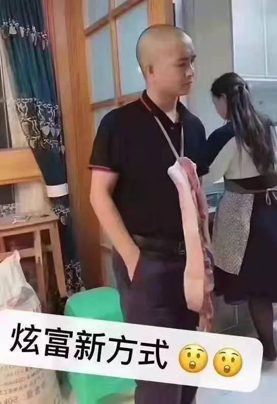

（网络图片）

  
  

（视频截图）

  
  

（网络图片）

  

（网络图片）

  
<a target="_blank" href=#top><h6 align="right">回上方</h6></a>
  
  
<a name=148>
<h1 align="center"><b>太贵怕被偷？农民背着猪耕田 笑翻网络</b></h1>

一个农民干脆背着一只猪犁地，让许多网友笑翻。（视频截图）

  
  【大纪元2020年01月20日讯】中国猪肉价格飙涨，又衍生出一些意想不到的问题。农民外出劳作，家里的猪万一被偷可不是小事，一个农民干脆背着自己的猪犁地，让许多网友笑翻。

流亡美国的辽宁省异议人士宁先华日前在推特上传一段视频，显示一个农民正在拿锄头耕田，身上却背了一头肥大的猪。

视频显示，猪被用绳子紧紧系在这位农民的背上，一副懒洋洋的样子，悠然自得。农民一边挥舞着锄头，嘴里还唠叨着“太贵了”，“不放心”。

<h3 align=center><a href="https://twitter.com/ningxianhua">大送朝的农民，把家里最值钱的东西随身携带......</a></h3>

宁先华调侃说：“大送（宋，有嘲讽意味）朝的农民，把家里最值钱的东西随身携带….”。

影片一出引发网友讨论，有网友留言指出“背500斤干活不歇脚，又一个超人”、“这图片一定让世界刮目相看”、“谁说中国人没有幽默感？ ”“厉害国处处都在创新，人骑猪不是新闻，猪骑人却是创新，且是天朝独一份！”“猪：做梦也想不到，俺也有今天这地位。”

但也有人质疑视频是摆拍恶搞。

不过随着猪肉价飙升，猪的地位同之前大为不同，各种搞笑片段不断。早前推特上还传出一段视频，显示多人紧急推出一个看似医用的移动床，上面躺的不是人，而是一只猪。据解说介绍：“猪生病了，医生们多紧张”。

<h3 align=center><a href="https://twitter.com/h1300062810">猪在中国，地位明显超越了普通人，猪生病了，医生们多紧张。这特么是副国级待遇!</a></h3>

网上早前还传出一段大陆某地会议现场的图片，大标语是“ 得母猪者得天下，有母猪就有希望！”

（网路图片）

  
<a target="_blank" href=#top><h6 align="right">回上方</h6></a>
  
  
<a name=147>
  <h3 align="center"><b>全球22城市撑香港 港警腰斩15万人集会</b></h3>
<h1 align="center"><b>港警再放弹 中共挑衅世界 料掀国际制裁潮</b></h1>

1月19日参与香港“天下制裁”集会的群众逼爆遮打花园。（宋碧龙／大纪元）

  
  【大纪元2020年01月20日讯】（大纪元记者梁珍香港报导）1月19日，全球11个国家22个城市的香港人发起“天下制裁”大游行，促各国政府尽快实施制裁，惩罚违反人权的香港和中共官员。19日在香港，已获不反对通知书的“天下制裁”集会于下午3时在遮打花园举行。不过，集会期间警方借故挑衅、提早腰斩。之后，大批防暴警察更在驱散民众前后狂放催泪弹，抓捕参加集会的市民。集会申请人刘颕匡在宣布集会有15万人参与后，更被警方以“煽动群众情绪”等名义拘捕。有时事评论员批评，警方滥捕滥暴，只会激起国际上更大的愤怒和制裁，加速中共解体。
  
  

1月19日“天下制裁”集会期间，中环遮打道和平公园挤满人潮。（宋碧龙／大纪元）

  
 <b> 滥查市民和记者 便衣警察遭殴打</b>

民间集会团队在中环举办“天下制裁”游行，早前遭警方反对，故大会决定以流水式方式举行集会。虽然集会的不反对通知书至晚上10时，但警方在3时集会举行前已部署大量防暴警察，在多处截查市民和记者，挑衅民众。

集会在遮打花园举行，早在下午一时多，一名身穿黑衣的男子，就被先行到场、全副武装的数十名防暴警察无故截查，15分钟后才放行。另在中环爱丁堡广场，原本举行古董车展等其它活动，也有大批防暴警察到场，至少3名年轻的黑衣女士被截查，之后被放行。

另外，集会开始前，水炮车及锐武装甲车已在金钟高等法院外驻守，二时多，一名立场新闻记者赶去采访时，两度遭警方盘查。其中一名蒙面的防暴警察，刻意阻碍记者手机拍摄，更将记者身份证推向镜头前。之后警员涉嫌抢夺记者手机，并毁坏手机萤幕。

  

2020年1月19日，香港“天下制裁”集会开始前，水炮车及锐武装甲车已在金钟高等法院外驻守。(余钢／大纪元）

  
  集会下午3时开始后，来参加集会的民众塞爆了遮打花园以及附近的皇后像广场、遮打道一带。下午4时左右，有防暴警察突然在德辅道中制伏一名男子，一度引起民众的鼓噪；下午四时多，一名无佩戴委任证的便衣警察，突然走入遮打花园，要求主办单位腰斩集会，因一度拒绝出示委任证而被集会人士围殴，之后被护送离开。几乎同一时间警察在遮打花园外放催泪弹，驱散抗争者并至少带走一名抗争者。

约下午4时半，集会主办单位不得不宣布终止集会，呼吁市民向金钟方向散去。之后，防暴警察冲入集会现场，驱赶市民，并迅速在遮打花园、雪厂街等处施放催泪弹，参加集会的大批市民在极短时间内被迫紧急疏散，有未配戴防护装置的市民被迫吸入催泪烟。警方在毕打街一带、铜锣湾等处，共抓捕数十名抗争者。

  

1月19日速龙队在遮打道预备清场。（宋碧龙／大纪元）

  

1月19日，防暴警察在德辅道中与金钟道交界处连续发射多枚催泪弹。(PHILIP FONG/AFP via Getty Images)

1月19日，警察在中环毕打街拘捕抗争者。（余钢／大纪元）

  
 <b>15万人集会 发起人被带走</b>

至晚上七时多，集会发起人刘颕匡在湾仔的记者会上表示，共有15万人参加集会，如果非警方腰斩集会，相信出席人数会更多。

他亦指，当时有便衣警察要求他腰斩集会，但没有出示委任证，引起在场人士不满，其后才快速展示委任证，但当时情况已难以控制。他认为警方需为19日的冲突负责。

在会见传媒后，刘颕匡即被警方以“煽动群众情绪，令遮打花园逼爆，违反集会不反对通知书”名义带走。

1月19日，香港“天下制裁”集会团队发言人刘颕匡上台发言。（宋碧龙／大纪元）

  
  <b>桑普：港警滥捕只会惹国际反弹</b>

对于港警施放催泪弹腰斩集会，同时抓捕刘颖匡以及数十名抗争者等，19日在集会上首位获邀发言的时事评论员桑普表示愤怒，“现在香港警察已经跟中共公安没什么太大的分别了。现在是拿着枪，拿着武器，来对待手无寸铁的市民。

1月19日，香港知名时事评论员桑普在香港“天下制裁”集会上台发言。（大纪元视频截图）

  
  他表示，从几个月前，香港警察的手法，已经是专门对付和理非的，“希望是用震慑的方法来威吓所有参与和平理性集会的人士。”特别是新任中联办主任骆惠宁上台后，政策是越来越狠。“针对所有那些和理非的集会，先做一个批准，批准之后，用一种威吓、围捕的方式，来对待有关的抗争人士，希望和理非的人以后不敢出来，达成震慑的效果，就是他一切做事的目的。”

比如今次集会原本到晚上10时，但到四时多已经被腰斩了。虽然腰斩的表面原因是有警员被“私了”，但实质上造成更大的混乱，“你要抓有关的人，你就抓有关的人，而不是说把所有的人集会的权利剥夺掉。这逼出的情况是，大家遍地开花，就让各人去做事，可能是游行，可能是集会。但是，因为香港人是爱好和平的，所以基本上到现在，没有人造成很大的扰乱，反而最大的扰乱是警察。”

参加集会的时事评论员谭得志（艺名快必），也批评警方的做法是害怕游行的巨大民意，改为只批集会，呼吁市民要更加聪明的采用“流水式集会”，比如走去维园看花市等等。

<b>“外国势力论”加快中共解体</b>

另外，在集会进行期间，香港政府发言人发声明回应集会，对有人要求外国政府干涉香港事务及实施制裁感到“极度遗憾”，重申外国不应干预港府内部事务。

声明又提到，政府明白市民对普选的诉求。要落实这个目标，社会必须清楚理解，经普选产生的行政长官不单要向香港特别行政区负责，亦要由中央人民政府任命，需要向中央人民政府负责，这是一国两制下不能忽略的宪制秩序。

桑普认为，在国际同步关注香港的同时，香港警方却以滥捕滥暴、腰斩游行的方式，回应民众和国际诉求，是非常愚蠢的举动，相信反而会掀起更大的制裁潮。“中共中联办跟香港警察一起做这个事情，只会激发各国更加关注香港的问题，而且会效仿美国《香港人权民主法》，制裁香港破坏民主、自由、法治的一些官员，还有黑警，还有他们的家属。”

他预料此举也会进一步加速中共政权的解体，“他们（国际社会）会介入，而不会坐视不理。因为全世界很怕这个暴政输出锐实力，会通达到每一个政府和国家里面，那现在中共要破灭的时候，全球会有共识去从国际外交层面去推进，比如透过伊朗问题等，美国要和欧盟、日本、五眼同盟形成联盟的时候，我觉得这个对于中共的倒台，是有致命性的、关键性的作用。”

  

1月19日，香港“天下制裁”集会现场的“天灭中共”标语。（宋碧龙／大纪元）

  
 <b> 张崑阳：今年将形成国际制裁潮</b>

香港大专事务国际代表团前发言人张崑阳，19日向大纪元表示，预计2020年是一个很特别的一年。去年港人史无前例的抗争运动，已将香港推向一个史无前例的国际高度。

香港大专事务国际代表团前发言人张崑阳认为，2020年将有越来越多的国家仿效美国的《香港人权与民主法案》，通过相似的法例以制裁香港和中共的高官和警察。（梁珍／大纪元）

  
  他指，“随着在11月底，美国已经正式通过了《香港人权与民主法案》，到2020年，今年就正式制裁这一帮高官和警察；同一时间，除了美国，越来越多的国家都会仿效美国关心香港的人权、民主议题，未来也都会用一些相似的法例，制裁一些卖港的人士、官员。”

比如新任警察署署长邓炳强以及前任曾伟雄等，都被香港学界列入向美国推荐的制裁名单中。张崑阳称：“邓炳强是一个很强硬的警务处处长，他完全是不知廉耻的。他竟然可以很理直气壮的在之前的一些区议会上，说他自己没有做错，所以我们看到他的官威很大。但是为什么邓炳强的官威可以这么大，背后就是因为有林郑或者以北京为首的一批人撑腰，所以我们都是要剑指中共，剑指北京政府，我们是不能够再允许香港的警察、这批人再去与中共结谋的。”

他强调，透过今次抗争，未来港人会更加觉醒，“只要他们一天是这样的去残害香港的人权、漠视香港的民意，他们都需要小心。因为我们香港人是一定会反抗到底，同一时间我们香港人这次觉醒的一点就是，我们懂得用国际牌去制衡中国（中共）。”
纽约集会游行声援制裁

此外，纽约周日（19日）中午12时（即香港时间20日凌晨）于曼哈顿Astor Place Cube集合，并游行至时代广场。1月8日，美国国会及行政当局中国委员会（简称CECC）公布2019年年度报告，批评中共进一步打压香港人权。

据悉，CECC主席麦高文（Jim McGovern）及联合主席鲁比奥（Marco Rubio）已承诺，将向美国国务院提交官员制裁名单。位于华盛顿的香港民主委员会（HKDC）理事会成员杨锦霞引述麦高文的话说，在落实制裁前，他希望香港人能够坚持争取“五大诉求”。
郑文杰参加伦敦“天下制裁”集会

19日在伦敦当地时间下午1时也有“天下制裁”集会。现场的集会人士高喊“停止华为（Stop Huawei）”、“没有人权就没有交易（No human rights, no trade deal）”、“关闭集中营（Close concentration camp）”等口号

前英国驻港领事馆职员郑文杰参加19日伦敦“天下制裁”集会，呼吁各国政府特别是英国政府要考虑现在在香港发生的人道灾难危机，不应该售卖武器给一个威权的政体。（唐诗韵／大纪元）

  
 前英国驻港领事馆职员郑文杰也有参与集会，对于香港的“天下制裁”集会被腰斩，他说，“一个已经申请不反对通知书的情况下都腰斩，其实就是要和和理非说，出来游行集会也要面对那种恐慌。对警察的做法是失望的，警方有责任让市民可以享有他们的合法权利，希望政府在这方面有足够的容忍度，游行召集人也被带走是非常不公平的。”

他又说，“更重要的是去了解为什么有那么多市民，禁之不绝的还是要出来集会，是否真的觉得自己手上持有各种武器，和合法暴力就可以令香港市民噤声？这只是程序和手段，但最重要的是，香港警察要知道，他们是应该保护市民的，而不是维护这个威权政府，应在这关键的时刻站在市民的一面。”

至于国际社会可以就香港情况多做什么，他说，英国政府早先已经禁止控制群众的工具出口到香港。而最近又有传闻指警察考虑添置电枪，他呼吁各国政府特别是英国政府要考虑现在在香港发生的人道灾难危机，“他们不应该售卖这些武器给一个威权的政体，用来镇压人民。”他呼吁英国政府停止售卖任何武器给香港警方。

<a target="_blank" href=#top><h6 align="right">回上方</h6></a>

<a name=146>
<h1 align="center"><b>【思想领袖】陈日君：港府只是一个傀儡</b></h1>

曾任香港第六任主教的天主教樞機主教陳日君接受了英文《大紀元時報》的《美國思想領袖》（American Thought Leader）節目主持人楊傑凱（Jan Jekielek）的專訪。（視頻截圖／大紀元時報）

【大纪元2020年01月02日讯】（英文大纪元资深记者杨杰凯采访报导／高杉编译）英文《大纪元时报》《美国思想领袖》（American Thought Leader）节目主持人杨杰凯（Jan Jekielek）于2019年12月对曾任香港第六任主教的天主教枢机主教陈日君进行了专访。

<b>陈日君</b>：……所以，如果现在他们剥夺了所有人的自由，那么我们将会变得和中国（大陆）的任何城市一样。我们都知道那里发生了什么。也许他们现在已经达到了某种程度的繁荣，也许现在许多人已经脱离了贫困，但是整个国家的精神层面都向下沉沦了，绝对是“奴隶制”了。我们都知道天主教教会所受到的迫害是如何愈演愈烈的。

作为老一辈的一员，现年87岁的陈日君（Joseph Zen）如何看待香港的抗议活动，以及领导抗议活动的香港年轻人？为什么陈枢机将香港的情况描述成是一场战争？在陈主教看来，梵蒂冈在面对中共这个共产主义政权时，做出了多么糟糕的选择？……

这里是《美国思想领袖》节目，我是杨杰凯（Jan Jekielek）。今天，我们请到了曾任香港第六任主教的天主教枢机主教陈日君。他可以说是人权、政治和宗教自由的代言人，也是公认对中共迫害天主教以及中共与梵蒂冈之间暧昧关系，最直言不讳的批评者。

 下面请看这个专访的全文：

<b>杨杰凯</b>：陈主教，真的很高兴能够邀请您来到《美国思想领袖》节目。

<b>陈日君</b>：我的荣幸。

<b>杨杰凯</b>：陈主教，自从香港发生反对《引渡法案》的抗议活动以来，已经过了大约半年。最近举行的选举，泛民主派获得了压倒性的胜利。你能否跟我们谈一谈香港现今的情况？

<b>陈日君</b>：好，我想整个事件要追溯到（香港）主权回归中国的最初阶段，当时我们得到了一国两制、高度自治的承诺。但是慢慢地，他们试图缩小这个自主权。举例来说，他们起草了一个非常严厉的法案试图推翻之前的承诺。

<b>杨杰凯</b>：是的。

<b>陈日君</b>：他们承诺民主，但是他们又对自己的承诺食言了。因为根据《基本法》，我们在2007年、2008年就可以享有民主，再迟也不会迟多久。好吧，尽管如此，之后他们还是推迟了很多次。所以在某个特定的时刻，我们有了这个“和平占领中环”事件。后来学生们接手了这件事，整个的事情，他们非常真诚、非常勇敢、但经验不足……

<b>杨杰凯</b>：OK。

<b>陈日君</b>：我认为有一点错了，当局其实有一个非常简单的方法可以智取这些学生。在香港，我们一般都是爱好和平的人，所以在占中抗议活动失败之后，很多人被送上了法庭，被宣判有罪、被判刑，被关进监狱。我们都很平静地接受了这个事实，认为这就是代价，我们认为，我们必须为公民抗命付出代价。

<b>杨杰凯</b>：OK。

<b>陈日君</b>：但是，民众对当局的愤怒是存在的，我们能够平息它吗？那么之后，这个所谓的《引渡法案》……不幸的是，我们这里有非常好的律师，他们向我们解释了这个法案的危险性。于是一切又重新开始了。

现在你们已经知道（都发生什么）了，由于民众和平的天性，所以我们就用游行的方式来表达我们的诉求。其实在占中之后的三月，（抗议）人数已经下降的非常少了。但突然之间又有了动力，很短的时间，游行人数就达到了一百万。

不幸的是，香港行政长官对民众的抗议非常反感，她回应说，我们将继续推动这个新法案。这是非常、非常错误的。因为我们已经用一个和平的集会来表达民众的担忧，而她却下定决心继续推动下去。

然后，事情变化很快。无论是占中抗议还是那次大游行，年轻人都觉得和平手段根本不够……

<b>杨杰凯</b>：OK。

<b>陈日君</b>：民众认为他们必须做些不同的事情。于是，他们包围了立法委员会的大楼，希望能够阻止立法委员在6月12日举行的会议通过这个法案，对吧？所以，我们必须感谢这些年轻人。

<b>杨杰凯</b>：对。

<b>陈日君</b>：但是一点一滴地，又出现了更进一步的，我们可以说，嘿，来个更有力的行动吧，于是他们闯入了立法委员会的会议厅，还做了一些破坏。

但是你可以看到，他们已经知道要更克制些，甚至在蓄意破坏的时候，他们是有选择性地行动。他们还告诉别人要尊重这些，尊重那些。但是，这也是（当局的）一种陷阱……

<b>杨杰凯</b>：我明白了。

<b>陈日君</b>：因为员警就在大楼里面看着，所以他们是故意让这些人能够闯进来，然后看着这些人离开。之后在七月一日，抗议人士又去了立法会大楼抗议。在那里他们也做了一些事，并在特区的区徽上涂鸦，这是一种具象征意义的行动。那么回头看，抗议人士没有做任何伤害人身的事情。

<b>杨杰凯</b>：OK。

<b>陈日君</b>：但是我们可以看到，员警一次一次地在升级暴力。他们使用了催泪瓦斯，刚开始他们只用胡椒喷雾，但后来他们使用催泪瓦斯就像用非常普通的手段防范民众一样。之后就是大规模的民众集会，我指的是那个百万人大游行，一个星期之后规模超过了两百万人。

<b>杨杰凯</b>：对。

<b>陈日君</b>：而且（这些抗议集会）总是很平和的。所以就连香港行政长官都说，我们令全世界都感到钦佩，因为我们可以如此和平地举行这样大规模的集会。但问题是，他们不去倾听我们的（诉求）。

<b>杨杰凯</b>：OK。

<b>陈日君</b>：那么接下来就导致了长期的抵抗。在这些人真正开始使用一些暴力的时候，我就说过，我个人一开始的感觉就对这样的运作系统很警觉，因为这些年轻人说，我们不想要讲台，不想要领导……

<b>杨杰凯</b>：我明白。

<b>陈日君</b>：……没有领导层，没有重新组织之类的，但这是不行的。因为你是处在一场战争之中，你必须去和一个强大的政权战斗，而我们是很弱的个人，所以你需要组织起来，需要领导者，需要相互合作，需要一个能联合所有人的联盟。

不管怎么说，那些所谓的老年人都很欣赏他们（年轻人）的所作所为，但也非常担心。所以每个人都可以看到，既然他们（年轻人）发挥了领导作用，那么我们就跟随他们好了。他们到这儿、到那儿，那我们所有的人都出来支持他们。

你知道在中秋节的时候，他们呼吁去狮子岩，我就跟着他们到了那里。你知道，我已经87岁了，也爬上去了。所以我觉得，他们需要人们的赞赏和支持。但是有些人有些担心，因为现在，你可以看到，随着警方的暴力在升级，他们也相应采取了一些更加危险的行动。

以前他们最多是扔砖头，但你知道，员警都有非常坚固的盾牌，所以他们从来没有伤过任何员警。他们说，他们也放火，但这放的是什么样的火呢？他们只是收集一些垃圾，然后在路中间点燃，这是一种象征性行动或可能只是阻碍交通，但绝不会去伤害人民。但是在最后，他们也把这个汽油瓶扔到建筑物里面，这就更危险了，对那些在附近的人来说就是更危险的了。

所以我们有些担心，但我觉得，这些年轻人认为这是必要的，因为在面对员警如此令人难以置信的暴力时，我们甚至可以将员警的行为称为是残暴，我想，我不需要去具体描述所有那些可怕的事情了吧……

<b>杨杰凯</b>：是的，当然。

<b>陈日君</b>：你看那些可怕的事情。所以我认为，民众是理智的，人民是明智的。他们知道哪里是对的，哪里是错的。所以我认为，这次选举释放了一个非常明确的信号，那就是我们站在人民的一边，而当局是错误的。

<b>杨杰凯</b>：那么，陈主教，你把当前的情况看作是一场战争。

<b>陈日君</b>：哦，是的。

<b>杨杰凯</b>：这场战争的对手是谁？战争的双方都是谁？

<b>陈日君</b>：是的。这是一场战争，因为我们所面对的是一个极权国家——中共。所以不是仅仅面对香港政府，香港政府可能只是一个傀儡，也许他们拥有一些自由的空间，但是我不觉得他们利用了这个空间。

非常悲哀，有时它是在服从，而有时，它是在猜测中央政权的意图，或者有的时候，它走得比中央政权真正的愿望还更进一步。而它的方向非常明确，就是要完全控制人民，让人民成为奴隶。所以，他们不想给予（香港）真正的民主，甚至想利用这个《引渡法案》剥夺人民的言论自由。这是很可怕的，因为作为人，我们希望有尊严地生活，我们希望能够自由地表达我们的思想。

所以我们香港，绝不可能通过暴力赢得战争，我们没有办法。你知道，甚至我们的食物、我们的饮用水都依赖中国大陆。但这是一场战争，因为他们是如此独断。

我们担忧是因为我们距离“50年不变”的约定还有一半的时间。所以，如果现在，他们就已经剥夺了所有的自由，那么剩下的时间里还会有些什么吗？我们将会变得和中国的其它城市一样。我们都知道那里发生了什么。也许他们现在已经达到了某种程度的繁荣。也许现在许多人已经脱离了贫困，但是整个国家的精神层面都向下沉沦了，绝对是“奴隶制”了。我们都知道天主教教会所受到的迫害是如何愈演愈烈的。

<b>杨杰凯</b>：对的。你能不能告诉我们一些关于天主教教会和其他信仰人士在中国的真实情况，以及你对香港的担心。

<b>陈日君</b>：是的，你说得对，我们不能真正地与中国大陆切分开来，所以我们总是关心在中国所发生的事情。曾有一段时间，我们可以为他们提供帮助，但现在出现越来越多的限制。而且最不幸的是，梵蒂冈长期以来一直采取了错误的策略。

事实上，我们有教宗约翰‧保罗二世，他本人来自波兰，所以他知道得很清楚，他知道所谓的美国（对华）政策是失败的。接着是教宗本笃十六世，他有一段时间住在极权统治的纳粹和共产主义的东德。教宗本笃十六世也非常清楚地表明了他对这种政策的看法，这（共产主义）是失败的，他说得很清楚。

但现在是教宗方济各继任。而教宗方济各来自不同的环境。虽然南美洲也有某种独裁，但那是右翼的独裁。在这些国家，共产党员被当成了好人，因为他们受到了政府的迫害，他们真的是站在穷人的一边。所以我想，教宗方济各可能是对这些共产党员有些同情。

但是他肯定也知道其它的共产党政权，当这些共产党员掌权了之后，他们就变得不同了，是吧？

但是后来，帕罗林被召回了。因为在教宗本笃十六世最后一段日子里，他被派走了，由于他（与中共）定的协议草案无法签署，他也不能再继续作为谈判代表了。所以，给了他一个新的职位，他被派往委内瑞拉担任圣座驻委内瑞拉大使。

（译者注：彼得罗‧帕罗林枢机（伯多禄‧帕罗林，Pietro Parolin），1955年1月17日出生，意大利籍，自2013年10月15日担任罗马教廷圣座国务枢机卿。2007年，时任大主教的帕罗林枢机领导了梵蒂冈与北京的谈判。包括香港教区荣休主教陈日君在内的许多人强烈批评他对中共政权妥协。陈日君表示，所谓同中共的“和解”可能会导致1200万中国天主教徒实际上被置于共产党控制的“牢笼”之中。他指责教会官员“出卖”了中国天主教徒，并警告：“一个被政权奴役的教会并不是真正的天主教会。”）

然后教宗方济各又把他召回了，几乎所有人都为此鼓掌欢迎，因为帕罗林确实是一个有能力的外交家。但当他被摆到那个高位的时候，我才看到他的真实面目，他是如此的傲慢、自大和无礼。

后来有一天我真的感到很震惊，因为当我谈到在共产党统治时期东欧的一些信仰英雄们时，他形容他们是“麻烦制造者”……

<b>杨杰凯</b>：真的？！

<b>陈日君</b>：……他称他们为“角斗士”。他说，那些人总是要去反对政府，他们不会出现在政治舞台上什么的。所以我写信给他，我说：“哎，你这到底是在说谁呢？”他没有提到他们，没有提到具体的名字。所以我说：“你们有没有想过，这些人，他们都是信仰的英雄。你怎么能说出这样的话？你必须去道歉。”他回复了，并没有对此否认，而只是说：“哦，如果我说的话让任何人不高兴，那么对不起。”我说：“不，不用，你不用对我说对不起。”

所以从那天起，我就觉得，如果他不能尊重那些信仰英雄，那么这就意味着他不尊重信仰。但是后来教宗方济各允许他继续这个（对华谈判）项目，于是他们在不可能的情况下继续推动这个专案。他们一路走下去。当然，教宗方济各负最终责任，但他可能并不真正了解实际情况。但帕罗林知道所有实际情况。这么多年来，他一定知道得很清楚。所以我很怀疑他所说的我们是一条心，他的目的不是为了推动信仰，因为就只有三个步骤，先是秘密协议，接着让驱逐教会主教合法化，然后是去年（2018年）六月的文件，也就是在六月底，他们鼓励人们加入（中共组织的所谓）教会，加入官方教会，这在客观上讲，就是分裂，真是令人难以置信，难以置信的。

<b>杨杰凯</b>：这个官方教会是由共产党管理的？那些在中国的教堂，都要由共产党管理，对吗？

<b>陈日君</b>：是的。这真的是不可思议。我写了那么多信，教宗从来没有回复我。那时候，我都无法确定他是否收到了我的信。所以在去年（2018年）一月和十月，我去了罗马，然后亲手把信交到圣父的手中，告诉他说：“圣父，我来到这里，只是想要把我的信交给你，以确保你拿到了信。”他没有说：“哦，我收到你的那些来信了。”而是说：“哦，谢谢你。谢谢你。”所以，也许他从来都没有收到过我的信。

今年（2019年）在这份新文件出现之后，我第二天立刻去了罗马，提出了我的反对意见，我要求在教宗在场下同帕罗林就此进行讨论。但很明显，他们拒绝了。他们邀请我吃晚饭，但我却没有机会谈论这个问题。

现在已经过去五个月了。教宗当时只是说：我会调查此事。然后在这五个月里，就没有任何消息了。所以这令人很伤感，很遗憾。

再回到今天的香港，每个人都注意到了，梵蒂冈和教宗方济各这么多年来，从来没有说过任何批评中共的话，从来没有说过任何这样的话，只有赞美。教宗可能有自己的意图，比如以此取悦北京，以便能够进行对话。但现在你看，帕罗林已经减少了对话，他可能也取消了这个委员会，还把梵蒂冈高层负责人中唯一的华人韩大辉派走了，把他派到希腊去了。所以说起这些事情真的是令人感到很伤感。

但是我说这些，并不是反对教宗，因为每次我见到他时，他都对我很和蔼。但在这些问题上，他一直让帕罗林牵着走。

当教宗从日本回罗马的路上，我非常担心他会怎么说。我认为他做得非常聪明。人们问他关于香港所发生的事情时，你知道他怎么说的？你注意到他的回答了吗？

<b>杨杰凯</b>：我没注意到，跟我说说吧。

<b>陈日君</b>：他说：“哦，这其实不是孤立的群体，世界上有很多地方都有这样的失调。我不是掌握了所有的相关资讯，所以……”，所以他什么也没说。

<b>杨杰凯</b>：转移话题了。

<b>陈日君</b>：这是非常明智的，因为在这么久的沉默之后，对于我们在香港的教会来说，如果他说了什么取悦北京政府的话，这将是非常危险的，也是有害的。但他什么也没说。这很好。

<b>杨杰凯</b>：陈主教，最近美国国会几乎一致通过了《香港人权与民主法案》（Hong Kong Human Rights And Democracy Act），以及另一项限制向员警出售可用于监管民众相关商品的法案，事实上，就在几个小时前，（川普）总统签署了这项法案，使之成为了法律。你认为这对香港会有什么影响？

<b>陈日君</b>：说来我们还需要别人的帮助是很伤感的。他们（港府）不愿意听我们的诉求，还说我们依靠外国势力。不是，我们正在做我们自己的工作，但是现在，我们觉得，我们也需要全世界的支援，因为共产党不懂得讲道理，他们只懂得权力，这令人感到很伤感。

幸运的是，美国人民非常尊重人权和民主、自由，美国两党在对华政策上团结一致，他们所代表的是人民。所以幸运的是，我们得到了一些帮助，我们希望欧洲人也能来帮助我们，这真的一场战争。我们不确定这种外来的帮助是否会有效，我不知道。但我们必须试一试。

<b>杨杰凯</b>：OK。实际上你正在用你组织的“612人道主义救援基金”（12 June Humanitarian Relief Fund）做一些非常重要的工作。你能简单地告诉我们关于这个基金的情况以及它在做什么吗？还有它的效果？

<b>陈日君</b>：好的。在此之前，我们为之前所发生的事情设立了两个基金，为了保卫这片土地的一些小插曲，包含之后占中抗议人士被告上了法庭。但是，当这场对抗在6月12日开始时，我们已经可以预见这将是一场大战。所以，我们几乎叫停了那两个基金，因为它们已经运作得非常好了，我们就把它们集中、联合起来了，为了这个目的建立了这个新的基金。民众是如此的慷慨，现在我们有大约八千万港元。

<b>杨杰凯</b>：Ok。

<b>陈日君</b>：但你知道现在有多少人被送上法庭了吗？所有这些法庭诉讼都要由律师经手，我们需要为此支付巨额的资金。在现阶段，主要的还是支付医疗，有许多人受伤了。还有……

<b>杨杰凯</b>：是为那些抗议者支付？

<b>陈日君</b>：对，是支援抗议者的，我们称之为“612人道主义救援基金”。在医疗方面，还有当他们获准保释时，我们也都要为他们支付费用。然后，也因为这个，他们可能失去了工作和其它东西，我们也在为他们提供帮助。虽然这些钱不是很多，但是我们还是提供了一些帮助。

同时我们可以预见的是，当法庭诉讼开始的时候，我们必须支付大笔的费用。但民众都非常慷慨，我们也非常努力地工作，这就是我们所做的了。

我们是五个受托人。我们每周开一次长会，每次时间都会超过三个小时。因为有很多事情要处理。因为我们的钱不够，所以我们必须明智地去使用。钱没有那么多，无法给每个人，无法给每一个来问的人。但同时，还要做到慷慨大方。

<b>杨杰凯</b>：所以，陈主教，现在我们有了这个具有里程碑意义的选举，香港亲民主的民众取得了非常、非常大的胜利。事情看起来平静了一些，你认为接下来会发生什么呢？

<b>陈日君</b>：在赢得这场胜利之后，我在报纸上读到了很多东西，很多的建议，我觉得我们真的需要做些什么，因为我们得到了人民明确的授权。以前他们说那个民意调查不一定可靠，那么好吧，现在这个时候就都非常清楚了。

<b>杨杰凯</b>：对。

<b>陈日君</b>：所以，现在最大的问题是员警。他们可以随心所欲地……他们受到了当地政府的鼓励，中联办、甚至习近平本人也给予了鼓励。所以他们、他们真的是……我们都不认识我们自己的员警了。我不知道究竟发生了什么，也许是在占中运动以后的这段时间里，也许甚至在招募的时候，也许他们只挑选了那些被我们称为“蓝丝带”的人（当员警）？也许，也许他们甚至从中国大陆请来了安保人员？我不知道。

<b>杨杰凯</b>：OK。

<b>陈日君</b>：我不知道。但他们就像野兽捕食一样对待那些手无寸铁的民众，这真的很可怕。如果他们不能解决这个问题，就没有出路，没有出路。这非常危险。他们破坏了我们的员警的名声。现在人们已经不信任员警了。

而且，我认为这是一个……我无法找到另一个词来说它，但这些法庭案件真的就是很愚蠢的，浪费了很多钱、很多时间。他们也在玷污我们的法庭的名声。

很明显，政府在利用法庭来达到他们的目的，这是一个政治问题。那些法官们怎么能够……，有些法官还说：“哦，好吧，我们不管政治，只要他做了什么违法的事情……”，但是我不这样认为，即使是暴力的行为也不能不考虑原因就判决。除了这个原因之外，以前为什么他们很少发生这种暴力行为。同时，现在他们也很少处理员警的暴力行为，发生了那么多的事情，甚至是很可疑的死亡事件。

所以我认为，这两个是真正的问题。一直以来，香港行政长官都拒绝成立一个独立的调查委员会，但这是绝对必要的。否则，他们就摧毁了这座城市最宝贵的两样东西：员警和法治。我很遗憾地说。

<b>杨杰凯</b>：陈主教，我们的采访马上就要结束了，您还有什么要说的吗？

<b>陈日君</b>：讲出所有这些话让人感到很伤感，因为我觉得我有资格说出我所讲的这些话，因为我认为，他们不能说我不是一个爱国者，不能说我不爱国。

<b>杨杰凯</b>：对。

<b>陈日君</b>：因为你知道，从1989到1996，过去七年的时间，我每年在中国待六个月。

<b>杨杰凯</b>：OK。

<b>陈日君</b>：在官方教会的神学院教书，所以我和他们合作。那些年真的很幸运，神学院里到处都是神学院的学生。所以我非常喜欢（那段时光）。也因为我是在天安门广场事件之后进入中国（大陆）的，当所有人都离开中国的时候，我去了中国，所以他们很感激。他们对我很好。因此，我可以非常自由地教授天主教教理，没有任何问题。

但现在的情况已经大不相同了，不但大不相同，而且糟透了。而最近更可怕的是，以前有些人可能会来这里看我，但现在没有人来了。最后一次，他们跟我约好了，但后来说，哦，从现在开始，拿不到许可了。

<b>杨杰凯</b>：我明白了。

<b>陈日君</b>：由于罗马教廷的这种态度，中共政权正在做他们要做的任何事情。所以他们去见那些地下家庭教会的人士，说现在是教宗要你们出来。

<b>杨杰凯</b>：我明白了。

<b>陈日君</b>：地下教会的人回答说，没有，教宗从来没有这样说过。但他们回答说：说过，我们知道他说过。如果你不出来加入我们，我们就取缔你们的教会。因为在此之前，中共政权默许了地下家庭教会的存在，到处都是地下教会。但现在，他们取缔了这些地下教会，那所有人都必须依赖他们的教会，官方的教会。

如果你私下里聚会礼拜，那么你就会受到惩罚。你可以自己去祈祷，但不能够叫信徒来参加你的弥撒。因此，普通的信众就被剥夺了共同进行圣礼的机会。所以我告诉他们，不要与当局对抗。没有必要那样做，你只是平静地（看着）他们拿走一切。他们拿走教堂，那让他们拿走教堂罢了。如果你不能进行集体弥撒，也不要担心，因为恩典可以来到你的家里而不被亵渎。你可以放弃任何东西，但你不能放弃信仰，你甚至可以放弃恩典，但你不能放弃信仰。

<b>杨杰凯</b>：陈主教，谢谢，非常感谢。

<b>陈日君</b>：谢谢你能来。#◇  

<a target="_blank" href=#top><h6 align="right">回上方</h6></a>

  
<a name=145>
<h1 align="center"><b>感谢农民支持 川普：将促中方执行贸易协议</b></h1>

1月19日，川普表示，与中国签署的初步贸易协议将为农民带来福音，并感谢农民的坚持，此前因中共针对农民的报复性关税，他两次不得不向美国农民发放补助。(Nicholas Kamm / AFP)

  
  【大纪元2020年01月20日讯】（大纪元记者许祯祺综合报导）周日（1月19日），美国总统川普（特朗普）感谢农民在美中贸易战中对他的支持，并表示，他将大力推动第一阶段贸易协议，以确保中方执行协议。

川普周日在奥斯丁举行的美国农业局联合会大会上讲话时表示：“我们做到了。”他提起他的竞选承诺包括改善美国与其它国家的贸易关系。

上周美中签署第一阶段贸易协议，且参议院通过美墨加贸易协定（USMCA）。
美中贸易战持续18个月 美国农民仍支持川普

川普说，他上周三与中国签署的初步贸易协议将为农民带来福音，他并感谢农民的坚持。此前因中共针对农民的报复性关税，他两次不得不向美国农民发放补助。

他说：“你们一直在战斗。” “你们一直和我在一起。你们甚至从未想过放弃。（最终）我们完成了（目标）。”

中共的报复性关税让美国农民失去了这个曾经最大的农产品出口市场，2017年美国农产品对华出口的市价为120亿美元，但是在贸易战中很多农民的大豆堆积如山，一年内的储存量就增加了108%，并且价格跌至10年低点。

去年8月6日，普渡大学商业农业中心的最新“生产者调查”显示，7月份创纪录的78%的农民表示，他们相信贸易战将最终使美国农业受益。根据同时进行的Farm Pulse调查显示，农民对川普的支持率为79%。

截至去年12月，川普政府已向受中方关税影响的农民提供了约280亿美元。

伊利诺伊州农民埃文‧胡尔蒂娜（Evan Hultine）曾对CNN说：“政府补助确实表明，他们理解贸易战给美国农民和农村经济带来了压力。”

他补充说：“我们知道，中共需要为其不正当贸易策略和不公平做法承担责任，我们已经坚持了一年半了。”
中方是否兑现承诺是未来关注焦点

第一阶段贸易协议签署后，外界关注中方是否能兑现包括购买美国商品在内的各项承诺。川普告诉农民，他将大力推动贸易协议，以确保中方执行该协议。

他表示，自己认为这将会奏效，中方也将努力证明签署的协议是一个好的协议。

他说：“它（第一阶段协议）比我预期的更大。”川普还表示，他不得不多次离开谈判桌才能完成协议，每次他都被中方召回（继续谈判）。

1月15日，川普在白宫与中方签署了初步贸易协议，该协议中，北京承诺今年和明年将增购2000亿美元美国商品和服务，包括工业品、能源产品和农产品。

协议文本显示，中方将增购320亿美元农产品，第一年125亿，第二年195亿；农产品有6个细项，包括油籽、肉品、縠物、棉花、其它农产品、海鲜。

川普周日表示：“我们将出售你们见过的最优质产品。”

上周，参议院以压倒性多数投票通过替代1994年《北美自由贸易协定》的《美国-墨西哥-加拿大协定（USMCA）》。众议院在去年12月通过了USMCA。

川普周日表示，他从欧洲达沃斯论坛返回后，就签署USMCA。
第二阶段协议针对中共国家补贴和网络入侵

棘手的贸易问题未在初步协议中解决，美方表示，包括中共国家补贴等议题将在第二阶段谈判中讨论。与此同时，美方保留对3600亿美元中国商品的关税，作为进一步谈判的筹码。

白宫贸易顾问彼得‧纳瓦罗（Peter Navarro）1月16日对CNBC表示，川普政府希望在与中方进行“第二阶段”贸易谈判方面取得进展，以解决美国在第一阶段未能达成的需求。

纳瓦罗在“ Squawk Box”上说，美国要努力让中共停止对国有企业提供补贴，中共还需要停止“网络入侵”。

他补充说：“中国（中共）政府官员继续入侵美国企业，并窃取商业秘密真是太疯狂了，” “这对我们的业务非常有害。”

纳瓦罗说，中方还需要遏制非法芬太尼流入美国，芬太尼每年杀死超过5万美国人。

在美中签署第一阶段协议前，白宫首席经济顾问拉里‧库德洛表示：“第二阶段（谈判）将很大程度上取决于第一阶段（协议）的执行情况。”

他说，如果第一阶段协议以“最少的”争端执行，“这将使进入第二阶段（谈判）及以后阶段更加容易”。

其他民主党总统候选人批评川普不稳定的谈判策略，但他们也普遍支持对中共采取更强硬立场。

<a target="_blank" href=#top><h6 align="right">回上方</h6></a> 
  

<a name=144>
<h1 align="center"><b>开豪车入故宫惹议 “露小宝”自称是红三代</b></h1>

日前，一组“露小宝开豪车进故宫”的照片引发轩然大波。（网络截图）

【大纪元2020年01月18日讯】日前，一组“露小宝开豪车进故宫”的照片引发轩然大波。据悉，其中一名女子叫高露，是中共元老何长工的孙媳妇。

1月17日14时56分，网民“露小宝LL”在新浪微博发帖称，“赶着周一闭馆，躲开人流，去故宫撒欢儿～”。并配以两名女子与一辆车牌号以京A8开头的奔驰G500黑色越野车以故宫博物院太和门广场为背景拍摄的照片。

其中三张图片上背景为一辆黑色奔驰车，出镜的两位女士均着便服，没有佩戴任何故宫工作人员证件。

“露小宝LL”微博认证名为“中国国际航空公司乘务员”。对此，国航回应称，其确实是国航的乘务员。不过，这个人2018年就离职了。

因故宫数年前就已禁车入宫，该名网友此举引发热议，并迅速登上微博热搜。

1月17日20时51分，故宫博物院官方微博随即发布消息称此事件属实，并向公众致歉。但未公开说明“露小宝LL”是何时从何门开车进入故宫的，同时也未提开车进入故宫理由，是谁同意放行的。

一名故宫工作人员向陆媒表示，游客不能开车进故宫，西华门是供员工和公务使用的通道。女子拍照位置，车辆可穿行但不能停。

香港《星岛日报》报导，“露小宝LL”据知真名高露，是中共元老何长工的孙媳妇，前国家旅游局长何光炜的儿媳。

有网民查询到“露小宝LL”在2017年7月27日发布了一条微博。微博内容为：“即将迎来（中共）建军90周年的日子，令人振奋的电影《建国大业》也要如期而至。特别要说一句……我们作为何长工的后代，……我作为何家的孙媳妇，何刚（何长工之孙）的夫人，第一时间关注着这部电影”。

事件发酵后，“露小宝LL”一夜删光所有微博。（网络图片）

何长工自1949年后，曾先后任中共重工业部代部长、地质部副部长兼党组书记、军方军政大学副校长、军事学院副院长、第五届全国政协副主席等职。

事件发酵后，“露小宝LL”一夜删光所有微博，其社交平台照片多为自拍照，曾晒豪车、名牌包……

有网民表示，“真给何长工蒙羞，一个孙媳妇得瑟成这样。”“果然红色权贵啊。”“京A80开头的，国管局的车；京A81开头的，中办的车；京A82是北京市委的，京A88是钓鱼台的车。”

<a target="_blank" href=#top><h6 align="right">回上方</h6></a>  
  

<a name=143>
<h1 align="center"><b>看守所不给看病吃药 上海89岁老人绝食抗议</b></h1>

上海89岁老人刘淑珍看守所绝食抗议，坚决没违法犯罪，拒绝办理取保候审。（新唐人视频截图）

【大纪元2020年01月20日讯】（大纪元记者李熙采访报导）上海89岁老人刘淑珍在两会期间向上海市政府递交维权材料时被绑架刑拘，她身患多种疾病却得不到医疗救治，昨天（19日）她在看守所中开始绝食抗议，并拒绝律师的取保候审提议。

刘淑珍的女儿崔福芳表示，“今天律师去会见老母亲，但是老太太开始绝食了，抗议看守所不给她看病吃药。律师要帮她申请取保候审，但她说自己没有犯罪犯法，坚决地拒绝了。”

上海两会于14日召开，此前地方警察和街道部曾上门告诫刘淑珍不要出门。

15日下午，刘淑珍在搭地铁前往市政府设的举报点递交材料途中被绑架，后被以“寻衅滋事罪”送进浦东新区看守所拘留。

但是家属一直没收到拘留通知书，18日崔福芳再次（第四次）向浦东周家渡街道派出所要刘淑珍拘留通知书，警察（警号062507）告知16日已经用挂号信寄出。

崔福芳说，“警察说寄到上南路75弄5支弄15号，我问这个位址还有吗？这个地址早在15年前强迁时就没了。”

“16日我去看守所给老太太存钱和衣物，看守所说一定要有拘留通知书。我说他们不给，看守所说他们执法了还怕什么事，去问他们拿到手。”崔福芳说。

<b>89岁残疾老人带着手铐会见律师</b>

19日下午，律师杨绍刚到浦东新区看守所会见刘淑珍。89岁的残疾老人刘淑珍带着手铐走进会见室。

刘淑珍15日深夜被送进浦东新区看守所，关押在304室，与55人拥挤在一间牢房，晚上睡觉时无法翻身。

刘淑珍告诉律师，被关押在304室，与55人拥挤在一间牢房，晚上睡觉时无法翻身。（受访者提供）

律师问：“你好吗？”刘淑珍回答：“我今天开始绝食了。”

律师问：“为什么绝食？”于是刘淑珍向律师陈述了她被抓被关押的过程：

“我这么大年纪了，我的私有财产被政府强迁了，至今没有归还。上海开两会我去递交投诉状，还没有到两会会场就被人高马大的男人抢了我的材料，还被押上大巴车。派出所警察接我回派出所，就拉我去医院检查，我不肯检查身体。我有医保卡，我要看病，我要求的科目他们却不检查。

“警察强制拉我上车，说转一圈就回庆春旅馆（刘淑珍的暂居处），我坚持不上车。他们人多我没有办法啊，带着手铐就进了看守所，什么证件（拘留证等）也没有。

“1月17日承办警察沈志勤（警号014526）来提审一次，我又带手铐，我一辈子没有带过手铐，这次带了一次又一次。

“我现在主要的是看病吃药，要女儿明天千万要送过来，甲亢病药和其它胃药，在这里血压在170（mmHg）左右给吃一粒药，胃药给吃一粒（在家一餐吃三粒）。我抗议警察不给我看病吃药，所以今天我开始绝食了。”

律师劝说：“你是信上帝的，千万保护好自己。有身体才能要回自己的财产。听我的。”

律师提出来要帮老太太办申请理取保候审。刘淑珍说：“坚决不同意取保侯审，我没有犯罪犯法，犯罪的是他们而不是我，请家人放心。”

<b>群众关注 高龄老人维权被关押</b>

上海人权捍卫者冯正虎一直相当关注刘淑珍的冤案，他表示，“生命脆弱，但耄耋老人为了坚守做人的尊严，为了维护公民权利，宁死不屈。”“上海浦东新区周家渡街道的官员，用一个89岁残疾老人来杀鸡儆猴，难道非要把老人逼死，就能维稳成功？就没有人敢上访了吗？”

冯正虎表示，他没有律师证无法进看守所当面劝慰刘淑珍老人，他说：“刘淑珍老人是一位虔诚的基督教徒，但愿上帝保佑她不绝食，平安回家。”

刘淑珍老人的遭遇在维权圈引起了广大维权人士的关注声援，访民王荣荣表示：“89岁老人的美丽家园15年前被政府部门强拆，如今她上无片瓦，下无寸地，15年来上访吃尽苦头。

“上海大都市建设，政府部门累积了大量问题，政府不肯纠错，市委又高高在上，导致积案大幅年年增加，在纠错无望下，冤民找监督政府的人大有错吗？

“两会年年开，可两会及两会代表会深入民众倾听申诉人的申诉吗？没有！难怪刘淑珍老人及众多申诉人前往两会要倾诉她们的冤情。

“今天，我们的政府不仅不伸出双手为老人家道歉并作出赔偿，相反把一个极度高龄老人家送到看守所养老，于心何忍！”

<a target="_blank" href=#top><h6 align="right">回上方</h6></a>  
  
 
<a name=142>
<h1 align="center"><b>119“天下制裁”集会 港民：全球围堵中共</b></h1>

1月19日，“天下制裁集会”在中环遮打花园及遮打道举行。市民参加天下制裁集会，但集会临时被腰斩，有市民和外籍人士被警察驱赶要求离开，亦有市民被捕。（余钢／大纪元）

【大纪元2020年01月20日讯】（大纪元记者梁珍香港报导）“我们不会被吓怕的。因为我们集会游行的权利是天赋的，而不是法律或者党赐予的。既然如此，我们会一直用我们的勇气和能力，既保护自己，也去参加这些集会和游行，所以这个不会变。”知名时事评论员桑普说。

2020年1月19日，香港民间发起“天下制裁”流水式集会，继续抗争，并呼吁其它国家跟随美国一道，制裁侵犯人权的香港及中共的官员。由于“天下制裁”流水式集会路线遭警方反对，被迫从原来的“中环游行至铜锣湾”改成“遮打花园及遮打道行人专用区集会”。但是此次集会中途却被警方腰斩，防暴警察不仅在中环抓捕民众，还发射催泪弹。甚至在下午4时半后，防暴警察冲入集会现场，驱赶市民，又截查市民、记者、议员等。

<b>桑普：中共将破灭，全球有这个共识</b>

1月19日，香港知名时事评论员桑普。（大纪元视频截图）

在皇后像广场集会上，香港知名时事评论员桑普在接受大纪元记者采访时说：“我觉得从前几个月开始，香港警察的手法，已经是专门对付‘和理非’的。那它希望是用震慑的方式来威吓所有参与和理集会的人士。今天的集会我第一个发言，我发言完毕后有别人发言。我觉得不到3、4个人都已经被腰斩了。”

桑普表示，原定的时间到今天批准到晚上10点钟，但他（警方）腰斩的原因是非常奇怪。毫无疑问，这个腰斩的原因并不是因为有一个大规模的冲击行为，或者违法乱纪的问题，只是因为一个警员，便衣的警察，就被私了了，现在讲是这样。那么警方要抓有关的人，就抓有关的人吧，而不能把所有人集会的权利都剥夺掉。

桑普认为，这逼出的情况是，大家遍地开花，就让各人去做事，那可能是游行，可能是集会。但是，“因为香港人是爱好和平的，所以基本上到现在，没有人造成很大的扰乱，反而最大的扰乱是警察。”那他的目的是把那些人吓坏，那这个只能说，共产党，从中联办的主任骆惠宁上任以来，他的政策是越来越狠。简单来讲，是针对所有那些和理非的集会，先做一个批准，批准之后，就是用一种威吓，围捕的方式，来对待有关的示威人士，希望和理非的人以后不敢出来，达成震慑的效果，这就是他一切做事的目的。

桑普还谈到，这种双方的矛盾，会持续一段相当长的时间，“甚至在我们过年之后好几个月都会有这样的状况。现在看到美中贸易战，签订了第一阶段协议后，套了一个绞锁在中共的脖子上。如果说有更强烈的制裁措施出现的话，我觉得中共才有可能对香港放手。”

“那关键是香港人现在要不要坚持下去，我觉得答案是肯定的。所以，这种矛盾、冲突、摩擦会长期化，未来几个月，我相信都会有这个局面出现。”他说，“那直到什么时候改变呢？可能要到中共崩溃时。”

当日除了香港举行集会之外，全球12个国家、22个城市同步举行声援香港的活动，正当全球关注香港的时候，警方用这种方式腰斩游行，对此桑普说：“现在警察做这样的事情是很愚蠢的，中共、中联办跟香港警察一起做这个事情，只会激发各个国家，他们的政治和公民社会，更加关注香港的问题。”久久不散，而且会效彷美国《香港人权民主法》，立法，之后执法，来制裁香港有问题的官员，破坏民主、自由、法治、自治的一些官员，还有黑警，还有他们的家属。“我觉得这种情况会普遍化，我相信欧盟、英国已经有在推动这个苗头。”

桑普还表示，这一次警察这么暴力地腰斩这个游行集会，只会让国际社会多一个理由，多一个事证，证明香港的一国两制已经名存实亡了。他们会介入，而不会坐视不理，因为全世界现在的目光是关注在集权中国，并且是以中共为首这一个集权、暴政的本身要覆灭的问题，很怕这个暴政输出锐实力，会通达到每一个政府和国家的机构里面，“现在要把住中共破灭时候，那我相信，全球有这个共识。”

那问题是怎么样去做呢，要看这个国际外交的关系，尤其伊朗这个事情，能不能作为一个突破口。因为如果美国能就伊朗这个事情，推动伊朗民主化，而且更重要的，是要和欧盟、日本、五眼同盟形成一个隐形的联盟，或者显性联盟的时候。桑普说，“我觉得这个对于中共的倒台，是有致命性的，关键性的作用。”

<b>谭得志：天灭中共也就是打倒共产党，它死定了</b>

香港泛民主派政治人物、电台节目主持谭得志。（梁珍／大纪元）

香港泛民主派政治人物、电台节目主持谭得志在接受采访时说：“现在就是全球围堵中共，整个趋势就是这样的，它该死的，我们看它何时倒台。希望共产党在我们有生之年，是全面倒台，玩完，可否这样说？（民众鼓掌）。你看，那些市民多热烈？”

记者问他教人如何踢保，什么是踢保？谭得志解释道：踢保（保释）就是，如果那些警察要你每个月回去续保，去报到。“我们就拒绝保释。你够料（有足够的资料）就带我上法庭。所有，现在抓了八千、九千人，只有几百人被告。所有人都要踢保，他一日不将你带上法庭，你都要踢保，自由身，等警察去做事，我们不用配合他，就是这样。”

他认为，成功踢保？够胆量就行。同时，那些警察会提醒你，不能踢保。什么不能踢保？“这是我们的权利，当你知道自己的人权是什么，当你知道自己的人权在那里，现在我们帮了几百人踢保，全部都成。全部都不被警察抓，因为他根本就没证据抓你，那些警察是乱抓人而已。所以我们一定要踢保。踢保，这就是用脑的，对不对。”

谭得志还讲到自己的例子，“一个月回去就踢保了。比如我今天被人抓，48小时之后我就担保，一个月我就回去续保。一个月我回去的时候，我就跟警局的人说，我不会再续保了，我要踢保。他就说，没有踢保的。什么没有踢保？那你现在带我上法庭吧。跟着那警官就说，好吧，那你踢保吧。走吧，把保释金给回我，就这样。一定行的，一定能赢了那些警察的。所有警察都是乱抓人的。”

当被问到踢过几次，有限制吗？谭得志回答，没有限制的。“我的儿子踢保踢了5、6、7次了。是的，香港这份自由的，这些全部踢保，一定要，全部人都是动脑子抗争。那些警察会出来马路上，没人害怕的，不用管他们。我们一会这样走过去，走去维园花市。我们不是游行，我们是各自走去维园花市，不犯法的。”

对于警察中有良心的人，谭得志建议，有良心的那些警察就要出来。首先辞了这份工作，然后出来告诉大家，警队里面，有几个是大陆公安，有几个是武警，推了多少人下海，推了多少人下楼。有良心的警察，现在就马上要出来。

最后谭得志说：“最重要的是：打倒共产党！打倒共产党！⋯⋯”（周围的）民众跟着一齐说：“打倒共产党！我要真普选！公民提名！我要真普选！” “天灭中共也就是打倒共产党，它死定了。继续喊口号……”

<a target="_blank" href=#top><h6 align="right">回上方</h6></a> 
  
  
<a name=141>
<h1 align="center"><b>【武汉肺炎 | 持续更新】武汉肺炎蔓延！突然增加136病例 增1死亡</b></h1>

  
武汉肺炎疫情（2019新型冠状病毒肺炎）重点事件时间表。(STR/AFP via Getty Images)

  
  【大纪元讯】（2020/1/20更新）中国武汉去年12月爆发不明肺炎，今年1月8日确定为新型冠状病毒，世界卫生组织13日将此病毒定名为“2019新型冠状病毒”（2019—nCoV）。

目前疫情不断扩散，据中共官方20日公布数据，武汉肺炎连续两日增136病例、死亡1例，北京、深圳都出现确诊病例。

美国疾管署、加拿大公共卫生局、台湾疾管署等皆发出提醒，计划前往中国武汉及邻近区域的民众，应避免出入传统市场、医院等公共场所，也不要接触野生和禽畜类动物，禽肉及蛋类要熟食，同时做好个人防护措施：以肥皂勤洗手、戴口罩。

本文将持续更新关于武汉肺炎疫情的最新进展。

1月20日：武汉新增136病例、死亡1例，北京、深圳现确诊病例

武汉卫健委20日凌晨宣布，连续两日新增136例感染病例，增1例死亡病例。

与此同时，据北京及广东省卫健委，北京大兴区也确诊2例病例，深圳出现1例武汉肺炎病例。

另据多名网友表示，实际死亡人数远多于目前公布数字。一位网友发帖说，自己的母亲死于武汉肺炎，当天同样情形在武汉汉口殡仪馆下葬的有三家，但三家死者都不在官方公布的病例名单中。还有一名疑似来自呼吸科发热诊室的医护人员透露，呼吸科一天死了几个人，但不让诊断是否是新的冠状病毒。以上消息大纪元无法独立核实。

武汉肺炎疫情（2019新型冠状病毒肺炎）重点事件时间表。点此看大图。（大纪元制图）

1月19日：中共官方公布1日内新增17病例

<b>● 武汉官方发布：新增武汉肺炎病例17例</b>

1月19日凌晨，武汉卫健委发布通告，指在17日24小时内新增肺炎病例17例，其中重症3例。此前病人治愈出院4例。\

1月18日：英国权威机构推测实际感染者逾1700人

<b>● 英国权威机构研究报告推测：实际感染者逾1700人</b>

中共官方数据显示，目前武汉感染者共45例。英国伦敦帝国学院MRC全球传染病分析中心（MRC Centre for Global Infectious Disease Analysis）推测，实际疫情恐怕更严重。并表示，经模型分析推估，截至1月12日，当地感染武汉肺炎者可能为1723人。

研究者之一、英国伦敦帝国学院传染病学家佛格森（Neil Ferguson）表示，“就武汉已经输出3名病例到其他国家来看，当地病例可能比已通报数字多更多。”他还指出，如今应认真思考人传人可能性。

台湾疾管署也表示，英国研究报告所提出的数据有参考价值。

<b>● 美国提升防疫措施</b>

美国对武汉肺炎防疫程度提升。疾控中心1月17日宣布，即日起在纽约、洛杉矶及三藩巿的3个主要机场采取防疫措施，检查从武汉抵美的旅客是否有发烧等症状。
1月17日：泰国现第2宗病例、网传多名医护人员感染

<b>● 泰国出现第2宗武汉肺炎病例</b>

泰国1月17日发现第2宗武汉新型冠状病毒肺炎病例，一名由武汉搭飞机到泰国的74岁中国女子在入境时被发现发烧38度，现正在当地医院隔离治疗。随着农历新年假期即将到来，泰国当局加强对中国旅客的检疫措施。

13日，泰国出现武汉新型冠状病毒肺炎的首例，从武汉飞抵曼谷的61岁中国妇女被确诊，称未到过武汉华南海鲜市场。

<b>● 网传多名医护被感染 院方封锁消息</b>

网上传出疑似医生给他人的留言称：“新型肺炎医生真不是不想报，是不敢报”，表示主任下通知，让医生不要乱说，情况“真的比通报的严重很多，我们医院就有好几个医护人员都中招了”。（点阅详情）

另有网友发帖称，武汉一些三甲医院多名医护人员已感染，情况严重，金银潭医院不是不收，而是已经人满为患。消息尚无法独立核实。

<b>● 港台各有怀疑个案　</b>

香港医管局表示，17日共接收4名怀疑个案，均到访过武汉，出现发烧、呼吸道感染或肺炎症状。从去年底至今，香港已有81宗怀疑个案，但暂未有人确诊为新型冠状病毒肺炎。

台湾目前则有4名疑似肺炎病患，在病毒检验中有3人初筛是阴性。

1月16日：大陆武汉肺炎现第2例死亡、日本现首宗病例、网友吐露疫情或更严重

<b>● 武汉肺炎现第2例死亡病例</b>

武汉卫健委1月16日发布通告指出，69岁熊姓男子去年12月31日发病，1月4日病情加重转入武汉市金银潭医院救治，1月15日00:45抢救无效死亡。入院时有严重心肌炎、肾功能异常、多脏器功能受损严重、胸部CT提示肺纤维病灶及胸水、胸膜增厚等症状，考虑有肺结核、胸膜结核疾病。

外界发现，和上一则肺炎死亡通报不同的是，这则通报未提及死者和武汉华南海鲜市场的关联。

16日通报还指出，武汉市累计新型冠状病毒感染肺炎41例，已治愈出院12例，在治重症5例，死亡2例。密切接触者763人中，有119人尚在接受医学观察。

<b>● 日本出现首例武汉肺炎病例</b>

日本政府1月16日证实，一名家住神奈川县、曾前往武汉的30岁中国籍男性肺炎患者，检验出武汉新型冠状病毒阳性反应。该名男子未到过武汉华南海鲜市场，1月3日发烧，6日回到日本入院治疗，15日已康复出院。

<b>● 中共疑隐瞒疫情 武汉网友指发烧患者“多到躺地上”</b>

1月16日，武汉网友“树先生sss”在微博讲述自己一家三人感染新型冠状病毒肺炎的遭遇。他表示，父亲到武汉同济医院治疗，医院里全是发烧患者，“人多到躺在走廊的地上”，医生让父亲回家隔离，“说没有办法办理住院，没有床位”。（点阅详情）

父亲回家后，开始出现气喘、无法呼吸且一直发烧，几经周折送至金银潭医院，院方看情况严重，最后接收患者。网友和母亲也已发烧3天，检查显示双肺感染，打针都不见好转，并附上自己的检查单和输液药的单据。他写道：“感觉很无助，不知道在哪里能去治疗，给金银潭医院打电话，告知医院没有门诊部，无法打针治疗。”

最后，因帖子遭到举报，“树先生sss”出于担忧而删文。但他仍表示，“发的所有东西没有夸大，都是实事求是，起初发微博就是想提醒大家。”

由于日本、泰国已有确诊病例，疾情显然正往外扩散，但中国只有武汉公布疫情，外界质疑中共当局再度隐瞒消息。有中国网友表示：“新型爱国肺炎病毒，只出国不出省。”

<b>● 新加坡再有疑似病例 都到过武汉</b>

新加坡卫生部1月16日接获通报，一名69岁新加坡男子到武汉旅游后感染肺炎，尽管没去过华南海鲜市场，但已被隔离治疗，以确定是否为新型冠状病毒肺炎。

1月4日，新加坡已通报首起疑似病例，一名曾前往武汉旅行的3岁中国女童疑感染不明肺炎，已隔离治疗。女童同样未到过华南海鲜市场。

<b>● 德国开发出武汉肺炎检测剂 可短时间筛检</b>

《美联社》1月16日报导，德国柏林夏里特医学院病毒研究所的研究人员开发出武汉新型冠状病毒的第一款诊断检测剂，可在“极短时间内”确认患者是否感染，有助控制疫情。

<b>● 德专家指武汉肺炎病毒和SARS“是同一种病毒”</b>

柏林病毒研究专家德罗斯滕（Christian Drosten）指出，武汉新型冠状病毒与2003年的SARS病毒“是同一种病毒，只是形态不一”，差异在于病毒附着人体细胞的蛋白质不同。

<b>● 台湾专家完成武汉肺炎疫情查访</b>

台湾专家完成中国武汉肺炎疫情查访，回台后于1月16日召开记者会表示，在41例病例中，7成有海鲜市场暴露史，另有3成没到过海鲜市场，感染来源有待厘清。

除了官方已公布的夫妻染病案例，另有一家父子与侄子三人同时中标的家庭集聚感染案例，但官方未通报。

经临床初判，有潜在疾病、肥胖者是重症高风险群。因主要感染源不明，疾管署已提升武汉旅游警示。
1月15日：武汉肺炎病毒可能“有限度人传人”

<b>● 1公尺内接触逾10分钟染病风险高</b>

武汉卫健委15日证实肺炎疫情出现首宗家庭聚集性传染，不能排除有限人传人的可能。案例为先生在华南海鲜市场工作，但太太没去过且发病时间在先生的5天后。（点阅详情）

台湾疾管署防疫医师洪敏南指出，这案例透露了武汉肺炎“有可能在家庭内发生传染”，有限度人传人很难推翻。“有限度人传人”指1公尺内亲密接触逾10分钟，家人、照顾病人的医护人员风险较高，日常生活接触比较不容易传染。

<b>● 越南发现2起疑似病例</b>

越南卫生部表示，2名来自武汉的旅客于1月14日在岘港国际机场（Da Nang）入境越南时，检测出有发烧症状，已隔离观察治疗并采样送检。孩童病患确诊是飞机温度变化引起体温升高，已停止观察。成人病患没有发现肺部相关疾病，但仍在等待检验结果。

1月11日：大陆现首宗死亡病例

<b>● 武汉现首宗死亡病例 患者生前常去华南海鲜市场购物</b>

武汉政府1月11日通报指出，武汉肺炎出现首例死亡病例。死者为61岁男性，因呼吸衰竭、重症肺炎入院，同时患有腹部肿瘤及慢性肝病，于9日晚间抢救无效死亡。该患者常年在武汉市华南海鲜市场采购货物。

<b>● 肺炎病毒与蝙蝠冠状病毒相似度最高</b>

中国1月11日公布武汉新型冠状病毒基因定序，台湾疾管署经比对后发现，新型冠状病毒和蝙蝠冠状病毒相似度达87%，和SARS相似度约79%，和中东呼吸症候群冠状病毒感染症（MERS）相似度约52.5%，该数据代表从蝙蝠传染出来的概率较高，但实际感染源仍未知。
1月10日：春运开始 火车站无合理防疫措施

<b>● 春运开始 火车站无合理防疫措施</b>

有“世界最大人口移动”之称的中国春运1月10日正式开始，中共官方估计期间全国旅客发送量将达30亿人次。距离武汉疫情爆发地华南海鲜市场不足1公里的汉口火车站被发现毫无防疫措施。北京、广州的火车站也未做任何防疫措施。大部分旅客也都没有任何防疫装备，连口罩都未戴。（点阅详情）

前中国大陆医院内科医师、中国问题专家唐靖远向《大纪元》表示，春运会使传染病扩散的风险大增。而且武汉肺炎的“潜伏期”未知，很可能有人已感染，只是处於潜伏期未发病，担心可能出现“地域跳跃式传染”。

12月31日：网路传言出现后 中共官方首度承认武汉肺炎疫情

<b>● 网路“传言”后 武汉当局证实不明肺炎疫情</b>

去年12月30日，一份武汉政府内部红头文件《关于做好不明原因肺炎救治工作的紧急通知》的照片在网路被曝光。消息扩散后，引发网民恐慌。

迫于舆论压力，武汉卫健委12月31日首次发布通报，证实发生不明肺炎，且是从华南海鲜市场传出。通报内容显示疫情从12月初开始，但民众却过了近一个月才从网络“传言”得知，倒逼官方证实。

有陆媒到华南海鲜市场实地走访发现，该市场有几家卖野味的摊贩，现场有遗弃的兔子头及动物内脏。

武汉公安当局在1月1日通报抓捕8名“散布、转发谣言”的人，称他们“造成不良社会影响”，引来中国网友不满。

2003年SARS从广东爆发，但因中共政府一直没有真实发布相关讯息、禁止媒体报导，并封杀网路上所有关于疫情的“谣言”，最后造成疫情失控。网友担心，这次武汉的不明肺炎，中共当局将重蹈覆辙。

<a target="_blank" href=#top><h6 align="right">回上方</h6></a>
  
  
<a name=140>
<h1 align="center"><b>武汉新冠状病毒再增死亡病例 网民冒险爆料</b></h1>

港媒引述武汉知情人士的话透露，当地各大小医院已提高至最高防疫级别戒备。图为武汉一家医院。 (NOEL CELIS/AFP via Getty Images)

  
  【大纪元2020年01月17日讯】（大纪元记者凌云报导）在泰国、日本相继出现武汉新型冠状病毒感染确诊病例后，武汉16日深夜宣布新增一例死亡病例，但无新增病例。不过网民则怀疑当局隐瞒疫情。有武汉网民爆料，自己父亲患病毒性肺炎，几经周折才送至金银潭医院，但自己和母亲也患上同样的症状，消息很快被删除。

武汉卫健委16日深夜公布，该市新增一例新型冠状病毒感染死亡病例。死者熊某某，男，69岁，2019年12月31日发病，2020年1月4日病情加重，转入武汉市金银潭医院救治，入院时患有严重心肌炎、肾功能异常、多脏器功能受损严重，于1月15日00:45因抢救无效死亡。

但通知称，该市1月15日当天并无新增新型冠状病毒感染的肺炎病例。截至目前，该累计报告新型冠状病毒感染的肺炎病例在41例，已治愈出院12例，在治重症5例，死亡2例，其余患者病情稳定。

<b>武汉网友：父亲先染病 母子被传染</b>

尽管中共官方的通报仍维持在41名疫情感染者，不过武汉网友爆料，自己父亲患病毒性肺炎，几经周折才送至金银潭医院，但自己和母亲近日也患上同样的症状，消息很快被删除。

1月16日，武汉网友“树先生sss”在微博上讲述了自己一家三人感染病毒性肺炎的经过：其父亲1月9日出现不适、发烧、低热不退，去武汉新华医院治疗，拍CT（电脑断层扫描，Computed Tomography简称），查血、查病毒，显示肺部有阴影，治疗3天仍无好转，转到武汉同济医院治疗。

帖文称，“（同济）医院设有专门的发热门诊，进到医院全是发热病人，人多到躺在走廊的地上。（父亲）在同济医院所有的检查都做了，打了两天针，医生居然说回家隔离，说没有办法办理住院，没有床位。”

但这名网友称，自己父亲回家之后，开始出现气喘，无法呼吸，一直持续发烧，几经周折送至金银潭医院，院方看情况严重，最后接收患者。
  
  

（微博截图）

  
  但这名网友称自己和母亲，已经发热三天，做了CT，显示双肺感染，并附上了自己的检查单。
  
  

（微博截图）

  
  网友称，“打了两天针仍不见好转，感觉很无助，不知道在哪里能去治疗，给金银潭医院打电话，告知医院没有门诊部，无法打针治疗。”他表示：有必要把情况说出来，并为自己的言论负责。
  
  

（微博截图）

  
  但随后，这条帖子遭到另一名微博账户举报，“树先生sss”出于担忧而删文。但他明确表示，“发的所有东西没有夸大，都是实事求是，起初发微博就是想提醒大家。”
  
  

（微博截图）

  
  

（微博截图）

  
  “树先生sss”之后发了自己输液药的单据，汇报其状态是依然发热，38.2度，伴有呼吸困难，但目前其微博账户的所有内容都被清空。
  
  

（微博图片）

  
  此外，也有一名网友邓**在微博上发文称，朋友的亲戚逛了一天商场，感染上“冠状病毒肺炎”，被送至金银潭医院。其老公和儿子去送饭也感染了。现在一家三口都靠呼吸机支撑。但上述消息无法证实。
  
  

（微博截图）

 
 另有武汉大学医院工作人员在微博透露：“我们医院已经有好几例了，已经严密隔离起来了，很恐怖，据说80%是非典（SARS）。”

 

（微博截图）

  
  另有同济医院工作人员家属表示，“坐标武汉，家人在同济工作。但也不敢多说。尽量别去公众场所，尤其医院。”

另有居住在外地的武汉人表示，“我是武汉的，在外地，我家人都是，（如）截图里她们说的是真的，发展态势不乐观！”

<b>只出国不出省，“爱国病毒”？</b>

在大陆严密控制国内最新疫情消息的同时，疫情不断向海外扩散，目前日本、泰国都出现确诊病例，越南也发现两例疑似病例。

日本卫生部门1月16日早在其官网发布通报称，发现一例新型冠状病毒感染确诊病例。这是日本首次发现新型冠状病毒感染确诊病例。患者为中国籍，1月6日从武汉返回日本，同一天前往医院。男子自称没有去过华南海鲜批发市场。

世界卫生组织13日和14日先后通报泰国发现首宗确诊感染武汉新型冠状病毒的病例，患者是一名61岁的中国籍女游客，这是首例在中国以外地区发现感染病例。病例报告显示，患者曾定期去武汉当地的一个生鲜市场，但没有去过华南海鲜市场。

越南卫生部表示，岘港机场14日发现2宗“武汉肺炎”疑似病例。两人来自中国武汉市，已被安排隔离。

尽管国外不断有扩散的消息出现，但大陆除武汉外其它省市都没有公布疫情，引发网友质疑当局隐瞒，“新型爱国肺炎病毒，只出国不出省”，“是个政治性强的爱国病毒”。

以下内容，为安全因素，隐去网民真用户名。

先……：冠状病例都去国外了，国内除武汉外其它省份均无，还捂着压着，自欺欺人。

僵……：我也觉得很奇怪，这个病毒只出国吗？国内除了武汉都有没有吗？武汉如果只有几十个人得了，这得多小的概率，一个去了泰国，一个回了日本……感觉还是不要隐藏数据的吧，有一说一。

  

（微博截图）

  

（微博截图）

  
  为……：病毒都传染到泰国和日本去了，大陆上却不传染，没事了，这病毒是爱国者还是侵略者？

w……：深深不相信官方报导，这么严重，但每天病人数量并不增加。

……：难道只有武汉有？国内的其它城市都没有吗？

吴……：打脸！昨天卫生部门刚说基本不会人传人！难道这名日本人去南华海鲜市场了吗？基本不可能吧！ 我们总是这样自己打自己脸！

沐……：泰国一发现，立马承认有限人传人，也就是之前已经发现夫妻传染案例压着一直没报……

总部位于香港的中国人权民运信息中心表示，泰国和日本只有数百人近期去过武汉就已有两人确诊，而与湖北接壤的6个省份总人口高达4亿，不只数百万人去过武汉，但至今除了武汉外，其它大陆地区没有报告任何疫情，这明显是当局在故意隐瞒。

中国以及世界卫生组织（WHO）目前判定，该病毒属于新型冠状病毒，它与此前爆发的萨斯（SARS，即“非典”）和中东呼吸综合征（MERS）属于同一个病毒家族。曼谷出现中国境外首例患者后，WHO在15日表示，中国大陆武汉市2019新型冠状病毒肺炎疫情，有“有限度”人传人情况，世卫还示警疫情恐扩散。

香港《信报》1月15日引述武汉知情人士的话透露，当地各大小医院已提高至最高防疫级别戒备，前线医护人员配备N95口罩，部分医院的急症室发烧病人求诊处，医护人员更穿上从头到脚的连体防护服。
  
  <a target="_blank" href=#top><h6 align="right">回上方</h6></a>
  
  
<a name=139>
<h1 align="center"><b>中共监控学校 数千学生人脸识别数据遭泄漏</b></h1>

一名研究人员发现，一个包括数千名儿童信息的中国人脸识别数据库存储在互联网上，却没有任何保护措施。图为人脸识别技术示意图。(AFP)

  
  【大纪元2020年01月18日讯】（大纪元记者苏静好综合报导）一名研究人员发现，一个包括数千名儿童信息的中国人脸识别数据库存储在互联网上，却没有任何保护措施。这个消息再次引发外界对中共学校监控和网络安全问题的关注。

《华尔街日报》1月17日报导，据荷兰非营利组织GDI基金会研究员维克多‧葛弗斯（Victor Gevers）表示，该数据库连接到标有“Safe School Shield”的监视系统，包括人脸识别信息和个人位置数据。

在中国，个人数据遭泄漏后经常在黑市上出售，而这种疏忽可能会使未成年人处于危险之中。

葛弗斯说，数据库涵盖四川西南部及甘肃省的23所学校和公司的个人数据。在这20所学校中，约有一半位在藏族和其它少数民族人口众多的地区。四川省教育厅未回复《华日》的置评请求。

“该数据库是开放的，可公开搜索，使其成为犯罪集团的主要目标，” 葛弗斯说。

<b>数据库个资含学生父母姓名和手机号码</b>

葛弗斯表示，他已向阿里巴巴集团控股有限公司发送了有关该数据库的警告电子邮件，该数据库托管在该公司提供的云服务上。葛弗斯也在社交媒体上报告了他的发现。他说，该数据库身份不明的管理员随后保护了这些信息。

葛弗斯说，数据库中的130万条信息似乎是在10天时间内收集的。他说，自去年12月中旬以来，该数据库已在网络安全研究人员和开发人员中流行的搜索引擎上可见。他补充说，网络攻击者可以创建一个管理账户，即使该数据库受保护后，这个管理账户也仍拥有访问权限。

一名知情人士透露，葛弗斯说他无法找到负责该数据库的管理员，该数据库由第三方托管在阿里巴巴服务器上。

根据《华尔街日报》的研究，在最新发现的GDI数据库相关大约二十多个实体中，有20所是位于中国西南四川省的学校，其余的是在四川和甘肃省的公司。

葛弗斯与《华尔街日报》分享的截图显示，数据库中收集的一个画面由穿制服的学生高清身份照片组成，这些学生身着绿色制服，站在绿色背景下，并在他们面前举着自己的名字。研究人员说，该数据库还收集了学生的位置信息，以及父母姓名和手机号码。

在学校中使用面部识别和其它类型监控技术，已成为外界对中国隐私问题的关注点。去年 9月，位于南京的中国药科大学在教室试点安装人脸识别系统，除了能自动识别学生的出勤情况外，还能够对学生课堂听讲情况进行全程监控。该校此举在社交媒体上引发批评，网民炮轰学校变态，并纷纷建议把“人脸识别”安装到中共各级政府部门。

<b>大陆多个不安全监视数据库被曝光</b>

随着中共政府和公司采用人脸识别技术，并应用在从机场安全到移动支付的所有领域，市民对中共监控在中国各地扩散的担忧日益增加。

葛弗斯及其团队表示，他们已经发现几个位于中国的不安全监视数据库。

去年2月13日至14日，葛弗斯在推特上连发多条消息，称其发现中国深圳一家面部识别公司SenseNets存在数据泄露，数百万人的重要个资，包括身份证ID、住址、生日等在网上被全部公开，可供任何人访问，甚至编辑。

据《卫报》报导，葛弗斯去年3月9日在推特发布消息说，位于大陆的一个开放式数据库包含了一百八十多万女性的个人信息，其中包括电话号码、年龄、教育程度、地址、身份证号码、婚姻状况和是否具有生育能力等等。

<a target="_blank" href=#top><h6 align="right">回上方</h6></a>
  
 
<a name=138>
<h1 align="center"><b>【新闻看点】6因素 北京接受川普惩罚性关税</b></h1>

2020年1月15日，美国总统川普与中共副总理刘鹤在华盛顿签署中美第一阶段经贸协定，为近两年的中美贸易战暂时划下句点。（白宫Flicker）

【大纪元2020年01月18日讯】大家好，欢迎大家关注新闻看点，我是李沐阳。

对世界经济造成影响的美中贸易战，随着川普（特朗普）和刘鹤签署第一阶段贸易协议，暂时缓和了一些。

在长达96页的协议当中，有82处“中国应该”（China shall）做什么，而“美国应该”（USA shall）出现不到5次。对两方的要求和约束，几乎是一面倒，而且还有“美国说了算”的执行机制。这样一份协议，不少华人说是“城下之盟”。

令人不解的是，中方曾多次高喊“贸易战由加征关税而起，也应由取消加征关税而止”。中共官媒《环球时报》前不久还对外宣称，中方坚持将取消关税作为“第一阶段协议”的一部分。

面对中方取消关税的强烈要求，美方并没有为之所动，仍然保留3700亿美元商品从7.5%到25%不等的关税。

而中方为何最终改变主意，硬生生吞下“惩罚性关税”？其实这里有6大因素，迫使北京必须接受，其中中方自身的因素占了5个。

<b>第一大因素：经济不给力</b>

今天（1月17日）中共统计局公布了经济数据，去年的经济增速是6.1%。创近30年来最低。《纽约时报》指出，中国经济仍然面临着一些最大的挑战。

中共官媒也开始释放信号，声称“今年经济增长目标不必拘泥于6%”。而经济学家们一直在降低自己的增长预期。德国商业银行高级经济学家周浩对《纽约时报》表示，今年将降到5.8%。

中原银行首席经济学家王军认为，中国经济有一定的下行压力，需求不足将持续相当长的时间。他认为经济增速最可能是5.8%～6%。

标准普尔的预估最低，认为会降到5.7%。

中国褐皮书首席执行官利兰‧米勒（Leland Miller）指出，中国经济“看不到‘活力’，这个令人担忧”。

缺乏“活力”，或许可以从中国电力部门得到一些证实。一名国家电网匿名高级职员对《金融时报》表示，全国27家省级电力公司中，去年至少有10家亏损。国家电网正在迎接未来5年最糟糕的情况，他们预计到2024年，中国经济增长率会降到4%。

中国经济的真实状况，北京不可能完全不知情。贸易战打的就是经济实力，但中国经济不给力。如果再拖延下去，或者川普再提高关税，中国经济很可能撑不住了。

北京似乎意识到，如果经济崩溃，中共政权还能生存吗？

<b>第二大因素：美中经济正在“脱钩”</b>

贸易战打了一年多，美中关系也发生了变化。去年7月15日，川普曾公开表示与习近平的关系“不再那么亲密了”。川普的说法，反映着美中关系受到了影响。直接的表现就是两国经济渐行渐远，甚至滑向了“脱钩”。

大量外企持续撤离中国，仅仅是美国企业就有二百多家。如果只是劳动密集型的低端产业撤离中国，也不足为怪，因为中国正在调整产业转型。

但问题是，像甲骨文这样的大科技公司也要离开中国。去年5月，甲骨文表示要关闭中国的研发部门，裁员一千多人。甲骨文要撤离，很可能反映中国的转型偏离了轨道，甚至转型失败。

如果贸易战不断升级，中国外汇储备就会相应减少，外企的盈利空间也会越来越小。赚不到钱，还要被加征高关税，留在中国还有什么意义？撤离中国的速度在加快。

一旦外企都撤走了，美国又找到了替代国市场，那就是美中经济“脱钩”的时候。

而中国是出口导向型经济，美国是第一大外贸出口国。如果经济“脱钩”，中国经济很可能被腰斩。

安信证券首席经济学家高善文2018年7月31日就警告：如果国家这次走错路，美中关系处理不好，对30岁以下的年轻人来说，这辈子可以洗洗睡了。意思就是没什么指望了。

所以在签署协议后，刘鹤说了一句：“中美协议有效地阻止了中美脱钩的倾向。”

<b>第三大因素：争取时间</b>

这次签协议，央视进行了直播，《人民日报》也配发了评论。但它们都“漏”掉了一点，就是川普关于第二阶段谈判的部分。

川普昨天推文说，“我们（美国）正处于第二阶段（谈判）初始的有利位置”。他15日签过协议后表示，“第二阶段将很快开始”，并说“很快”访问中国。

中共官媒为什么“漏”掉这部分内容呢？因为这是真正的关键部分。无论网络盗窃、政府补贴还是国企改革，都相当敏感。

去年4月底5月初北京毁约，就是因为这些问题。美国要求中方修改六十多部有问题的法律法规，杜绝网络盗窃行为，不许对国企补贴等等。

北京如果真这么做，就涉及到了中国经济体制。中共是“政经一体”，改变经济体制，政治体制也得变。通过暴力和谎言得来的政权，中共当然不会主动放弃。

但如果不改变贸易政策，面临着美国加税。川普在签字仪式上说得非常清楚，“关税是美国在谈判桌上的牌”。

怎么办？中方提出了分阶段谈判。先谈美方关注而中方也能接受的，就是第一阶段协议内容。就这个协议，北京也一拖再拖。如果不是美方明暗两线施压，不知道拖到什么时候。

《华尔街日报》消息说，中共驻美大使崔天凯去年12月找到了川普女婿库什纳（Jared Kushner），了解川普的想法。库什纳告诉崔天凯，如果不解决分歧，川普将在12月15日加征新关税。他建议中方“不要考虑降低关税的问题，想想如果无法达成协议会发生什么”。

于是中方表示愿意达成协议，可以大量买美国货，也接受大部分关税。这起码暂时避开了撼动中共政权的几个关键项。

北京可能有盘算：期盼川普11月大选落败。万一换上不懂经济、好对付的民主党人，对个人施以利益诱惑，可能不用修改法律了。但这有点悬，因为川普连任的可能性相当高。

但不管怎么样，签署第一阶段协议，已经争得了一些时间。但可以想见，第一阶段谈得都这么难，第二阶段深水会容易吗？

<b>第四大因素：缓解内部压力</b>

在一年多的贸易战当中，媒体经常报导中共内部、特别是体制内的有识之士对北京的批评声音。指责北京“误判”，造成中国经济下滑。也有中共利益集团在利益受损后，多有不满言词。

1月6日，《世界日报》援引中南海的消息，称习近平举步维艰、进退两难。因为身边只有一帮专事逢迎的庸才，具有实际执政能力的团派大员心灰意懒，出工不出力，造成中共内政外交昏招叠出。

文章还引述习身边随从的话说，“习近平早已没了几年前的豪情壮志。”

去年12月15日，习近平访问澳门期间，《世界日报》也刊文。说中共高层包括习本人，对下一届接班人进行了内定，以防不测。

讨论最高层“意外”，这是大忌。这两件事的发生，合理的解释是，习的反对派希望他发生意外。换句话说，这很可能是习的对立面在利用曾力挺薄熙来的《世界日报》放风。除了警告习，还试图在中共政坛和国内制造并加剧混乱。

去年5月，李克强曾和王沪宁在官媒对阵。李克强在国务院就业会议上要求，把失业人员留在当地，防止出现“大规模返乡潮”。而就在同一时间，王沪宁主管的《人民日报》发文“走，回乡创业去！”直接跟李克强对着干。

当月，很多人手机上收到消息“中美贸易战停火！止战！”很多商业网站都跟着推送这个消息。但新华社随后就“辟谣”，说是2018年5月20日的旧闻。

这些明显的表征，透视着中共内部的分裂。两派、甚至多派系的势力在拉扯着北京当局，每一方都在向习近平或明或暗地施加着压力。

时事评论员秦鹏认为，对中国共产党来说，“改革亡党，不改革亡国”，这是两难的抉择。现在与美国达成第一阶段协议，可以堵住一部分人的嘴。而这部分协议内容又对中共政权的冲击不太大，也堵住了另一部分人的嘴。一定意义上来说，为北京当局缓解了一些内部压力。

<b>第五大因素：港台民心尽失</b>

16日台北市信民两岸研究协会公布了一份总统大选后的民调，评出了对选举影响最大的5件事。排在第一位的就是香港反送中，高达26.7%的民众坦承，因为北京暴力处理香港问题而改变了支持对象。

很多人都关注了台湾的总统大选，民意很清晰，一千九百多万选民，蔡英文得到了817万票，57.13%的得票率。

其实说起来，蔡英文应该算是反败为胜。而扭转她颓势的一个关键因素，就是北京的“助攻”。它不仅打压台湾，挖角邦交国，而且对香港反送中的处理，更让台湾人看到了一国两制的虚伪。

从去年11月香港区议会选举泛民主派大胜，到台湾总统大选蔡英文以创纪录的高票连任，事实已经证明，北京的港台政策全盘皆输了，已经完全失去了港台民心。

北京不仅误判美国引发贸易战，而且误判港台民意。所实施的一系列政策和做法，已经把香港、台湾推得越来越远。别说自由民主的台湾，就连主权在中共手里的香港，也已经人心背弃。

再加上美国对台湾、对香港的支持，让北京顾虑很大。

去年美国通过了《台湾旅行法》、《台北法案》和《国防授权法》，事实上已经大幅提升了美台之间的官方联系。

而对香港，美国就香港人权立法，川普和其他美国官员都反复强调，在密切关注着香港问题。去年11月26日，川普表示美中贸易协议不会对等，必须对美方更有利。同时他指出，“希望看到香港问题好好解决（go well）”。

在联大演讲中他还说，“中国（中共）如何选择处理（香港）局势，将在很大程度上说明其在未来世界中扮演的角色。我们希望习（近平）主席成为一位伟大的领导人。”

北京担心，如果美国在贸易谈判中打出这两张人权牌，中方会更难受，所以使劲讨好川普，希望减轻一些压力。

<b>第六大因素：美国不相信中共</b>

这一点，相信北京也很清楚。川普在签字仪式上解释了为什么要维持对华关税。他说“我不能丢掉手里的牌”，如果把所有关税都撤销了，美国也就无牌可打了。要想全部撤销关税，只有等第二阶段谈判完成了，才有可能撤销。

这已经很明白了，就是提防北京再次变卦。美国保留大部分关税，让中方时时感觉到疼痛，这样才不太可能毁约。

这也是关税得以大部分保留的一个最关键的问题。不管你说得多么天花乱坠，但是你有不光彩的案底。说白了就一句话：美国不相信中共，必须给你戴上“紧箍咒”。

时事评论员蓝述表示，接受惩罚性关税，纯粹是北京的无奈之举。因为中共政权已经危机四伏，从国内帮派打斗、中国经济疲软，到港台渐行渐远、民心尽失，再到国际社会对中共的施压围堵，中共政权随时都有崩溃的可能。为了保住政权，北京只能硬生生地吞下惩罚性的关税。

不过蓝述指出，中共实施暴政几十年，已经是天怒人怨，天灭中共成了人们的共识。不论北京当局怎么保政权，最终都是徒劳。因为中共解体，已经是历史必然。

好的，感谢您关注新闻看点，再会。

大纪元《新闻看点》制作组  #

<a target="_blank" href=#top><h6 align="right">回上方</h6></a> 
  
  
<a name=137>
<h1 align="center"><b>【思想领袖】金里奇：美国曾误判中共这个最大威胁</b></h1>

金里奇专访：美国曾误判中共这个最大威胁。（大纪元制图）

  
【大纪元2019年11月04日讯】英文《大纪元时报》资深记者扬‧耶凯利克（Jan Jekielek）在2019年10月份采访了美国重量级政治人物、共和党人、曾在1995年至1999年间担任美国会众议院议长的纽特·金里奇（Newt Gingrich）。采访的全文翻译如下：

为什么前众议院议长纽特·金里奇说，共产党统治下的中国是美国最大的威胁？

在过去的几十年里，美国领导人在对待中共的问题上犯了什么样的错误？这对中共政权的崛起起到了哪些作用？中国是不是共产党国家有什么关系呢？

副总统彭斯表示支持香港示威者和台湾的自由具有什么样的意义呢？

这里是“美国思想领袖”（American Thought Leaders）节目，我是扬‧耶凯利克。

今天，我们与作家、历史学家、前美国众议院议长纽特·金里奇坐在一起，讨论他的新书《川普对抗中共：面对美国最大的威胁》（Trump vs. China：Facing America’s Greatest Threat）。

<b>耶凯利克</b>：纽特·金里奇议长，欢迎你来到“美国思想领袖”节目。

<b>金里奇</b>：谢谢，很高兴能来到这里。

<b>耶凯利克</b>：很幸运今天能跟你交谈。副总统（彭斯）刚刚发表了颇具影响的关于中国（中共）的第二次演讲……我希望能聊一聊他所提到的一些事情。实际上，他提到了你已经在《川普对抗中共：美国面对的最大威胁》一书中谈过的很多问题。

彭斯所提到的其中一件事情，就是近年来美国体制内的人是如何卷入到共产党中国的崛起中去的。你也在自己的书中说过：“很显然，作为（美国）政治体制中的一些人……你们对中国（中共）究竟是怎么回事的认识都是错误的。”副总统也说，（美国）政治体制中的很多人基本上都扮演了一个不光彩的角色，在中共的崛起中成为了同谋。我想听听你是怎样想的。

<b>金里奇</b>：我认为我们（关于中共的）很多的看法其实都是不准确或是错误的。我们此前以为，如果中国（中共）转向了开放市场，他们的政治制度也会走向开放。我们曾以为，如果他们的总收入提高了，他们就会成为西方概念中的正常（政权）。我们极大地低估了秘密警察的能量和共产党的能力。我认为，这样看来，我们只是自我感觉良好地一厢情愿地描绘了一幅关于中国（中共）的图画，但它却不是真实的中国（中共）。

<b>耶凯利克</b>：我明白了。是不是说，美国的一些政治与经济精英都主动参与（帮助中共崛起）了？

<b>金里奇</b>：我认为这是毫无疑问的，包括美国的学术界和商界，尤其是金融界的很多人都参与其中了，他们都从与中共的暧昧友好中获得了私利。我觉得，你能找到一长串的商业领袖名单，他们都从中国赚了几十亿美元。出于在财政和心理方面的既得利益，他们会继续尽可能地去描绘那个关于中共的最“美丽”的图画。

<b>耶凯利克</b>：按你所说——我想副总统在演讲中也提到了——即使在三年前，美国对中国（中共）的看法和描述也是同现在的非常不同。

<b>金里奇</b>：是的……发生了改变的一部分原因是因为川普（特朗普），但是更多的原因在于中国领导人习近平，以及中共监控技术的发展。突然间人们发现：“哇，这样的场景和未来真像是奥威尔（George Orwell）的《1984》里所描述的。”

无论是那个旨在追踪你所有所作所为的社会信用评分，还是他们可以随意让任何人失踪的高压统治政策——从大街上把人抓走，连其家人都不知情，也不会通知律师，他们就那样消失了。过后可能会有一个他们自己的录像，“承认”他们自己“有罪”。然后他们可能又突然被释放了。

人们知道中共的这类事情越多，就越会意识到这不仅仅是新疆集中营里的上百万人的问题；不仅是藏传佛教徒的问题——他们的民族文化和文明被中共有计划地破坏着；不仅是法轮功修炼者的问题——这是一个习炼气功的团体，但他们庞大的人数吓到了中共，这是当代社会最引人关注的事件之一。而当所有这些事情凑到一起之后，突然之间，大约在三四年之前，人们开始意识到，原来中共在方方面面的行为都是不可被接受的。于是，对中共政权统治模式的真正排斥就开始了。

<b>耶凯利克</b>：你在书中花了很多篇幅谈论了中国的人权现状。我认为在克林顿政府之前，人权问题是和经济问题相联系着的。但从克林顿时代开始，两者就脱钩了。

<b>金里奇</b>：嗯，（人权和经济脱钩）一部分是从老布什时代就开始了。老布什是第一个……真正的中共代言人，他认为他对他们（中共）的体制有独特的理解。在六四天安门屠杀之后，他非常反对（对中共）实施制裁，他非常重视和中共政府维持良好关系，比对人权的重视要多得多。

我个人有一次为此跟他发生了激烈的辩论，因为我在天安门屠杀事件后，是支持（对中共）实施制裁的。我认为，应该对他们（中共）发出这样一个信号，告诉他们有些事情是不可被接受的，这对全世界都非常重要。屠杀自己国家的公民就是这些（不可被接受的做法）之一。

这是一场真正的战斗。但是很多（美国）精英人士却在致力于维护与中共的经济和金融关系。除了这个，还有一些其它的具体例子，比如彭博社，它之前曾报导了许多中共治下的腐败。后来突然就被中共警告，所有彭博社驻华机构都将被调查并驱逐。彭博社从商业角度考虑后，选择了向中共叩头。就在昨晚，我还跟一位记者在一起，他是（从彭博社）辞职的人之一，因为他们对彭博社（向中共）出卖新闻自由和人权的做法感到非常愤怒。

<b>耶凯利克</b>：在书中，你讲述了自己学习围棋的经历，我认为这非常有趣，因为我觉得这是认识和学习中国人思维方式的好方法，而且你把这种思维方式与你所提到的一些中共在全球的行动所造成的威胁相联系起来。例如，中共的南海战略，当然，还有“一带一路”。你能稍微说一下吗？ 我觉得这挺有意思。

<b>金里奇</b>：在一定程度上，我是被亨利·基辛格（Henry Kissinger）的关于中国（中共）的书中的一个章节所吸引。而他也是被一位美国陆军中校关于围棋和中共战略的论点所吸引。这位中校在军事学院（War College）写了一篇论文，说两者之间有很多相似之处。

围棋是日本人发明的一种游戏（译者按：在西方，很多人都认为围棋是日本人发明的），中国人在很久很久以前就开始使用它了——几千年前。它与国际象棋截然不同。在国际象棋中，你的最终目的是要抓住国王，然后就互相厮杀，交换棋子。从某种意义上说，国际象棋是一种血腥的游戏。而玩围棋这种游戏，你的真正目标不是你的对手，你的真正目标是获得更多领地。通常情况下，如果你能找到不用与对手战斗就能获得领土的方法，你当然就会去走那条路。

有一天晚上，我们邀请到了位于阿灵顿（Arlington）的国家围棋学院（National Go Institute）的人。我们喝了一些啤酒，吃了一些披萨，他们花了好几个小时教我们一些关于围棋的基本概念。

围棋能教会你的是，首先，在走每一步时，都必须要分析整个盘面上的形势，永远不要只盯着看一样东西。其次，它还能教会你，总是去有意识地思考，你如何才能在占领领土方面提高优势。所以我认为，你可以通过中共对南海的争夺，来真正看到围棋（理念）对中共领导层的影响，他们以一种非常平静、有条不紊的方式逐渐扩大着他们的影响力，并逐渐建立起他们的力量。围棋真的是一个非常有趣、非常强有力的游戏。

<b>耶凯利克</b>：在中共所有正在展开的行动中，都有这种具有着悠久传统的中国思想的元素，但是你在书中特别提到了中国仍然是一个由共产党统治的列宁主义国家，它实际上并不是政府，而且，你花费了很大篇幅去解释这一点。我觉得这非常重要，希望你能说说为什么。

<b>金里奇</b>：首先，我要说的是，你必须将有着五千年传统文化和历史的中国，与基本上以列宁和斯大林主义为基础的中共政权区分开来看。二十世纪20年代早期的中国共产党人曾在寻找一个成功的革命典范，而他们能找到的最成功的革命案例就是俄国革命，所以他们积极地去研究它。实际上，邓小平，中国共产党的创始人之一，当时就曾去了莫斯科，花了一年的时间在列宁大学学习如何管理一个极权主义体系。之后他们建立了一个非常强大的极权模式，非常斯大林主义的（统治）模式。

最初的中国共产党的核心集团确实非常崇拜斯大林，他被看作是他们的榜样。他们中的大多数人都阅读了斯大林在十月革命期间的历史。这部历史长达700页，他们很珍惜这本书，并且会反复阅读。它能教会你如何进行连续的革命，并不断地改造事物。

有一种非常非常简单的方式能够把这个（将中国和中共区分开来的）问题说清楚：我一直想让（美国）政府和新闻媒体首先把习近平称为“中国共产党总书记”。中国共产党有九千万党员，相比之下，川普总统获得了6300万张选票。所以，实际上，中共的成员比川普的总票数还要多。其次，应称习近平为中央军事委员会主席，该委员会负责领导和监督中共的军队。

请记住，中共的军队——是党的一个下属部门，而不是政府的，这一点非常重要。第三，在他最不重要的工作中，他才是中国国家主席。

当你明白了这一点，你就会开始意识到，这实际上是一个拥有和掌控国家政府的共产主义政权，而不是一个拥有共产主义制度的国家政府。所以，当你每次和他们谈判或交谈时，你都是在和那些顶层的铁杆列宁主义者交谈，他们绝对、完全、深信中央集权的独裁统治。

<b>耶凯利克</b>：共产党是凌驾于一切之上的……

<b>金里奇</b>：共产党认为，它们是中国存在的理由，Raison d’etre（法语：存在的理由）。它们永远不会做出任何可能会牺牲党的利益去帮助中国这个国家的决定。因为它认为，共产党才是中国的重心，就像在斯大林和列宁时期一样。直到赫鲁晓夫时代，你才能发现有些人背离并忘记了俄国革命的真正目的。

<b>耶凯利克</b>：在这本书中，你描述了美国应该如何应对中国共产党政权威胁的一些方法。你提到，你认为共产党不会自己在短期内自动消亡，但如果假设共产党确实垮台了，这会改变我们与中国接触的方式吗？

<b>金里奇</b>：首先，如果它垮台了，你可能会看到一时的混乱。中国有过这样的周期，他们偶尔会进入非常剧烈动荡的时期。19世纪中叶的太平天国起义可能夺走了7500万人的生命。在某种程度上，文化大革命是中国陷入那种混乱状态的另一种倒退，也是北京领导层如此小心翼翼地不让党垮台的原因之一，因为他们已经看到了。他们知道那是什么感觉。从这个意义上来讲，如果说，你能挥动一根魔杖，而且明天早上你就能看到一个非共产主义的中国，那我认为，我们与中国之间就不会存在任何重大的分歧。我认为，你能够进行谈判贸易，你能够谈判外交政策，但中国不会对我们构成威胁，中国将成为一个有着伟大历史的迷人的国家，人们都会改变对中国的看法。

但是现在，你所面对的是一个由9000万党员组成的一个组织系统——共产党——他们正在统治着14亿中国人民。中国人非常清楚地意识到，他们真的想要重建在中国五千年历史中曾有过的那段历史：“中国——中央王国”。他们想再次处于世界的中心，想让世界的其它国家向他们进贡，不是因为他们像威廉德国（Wilhelmine Germany）那样的具有侵略性，甚至像前苏联那样对抗，而是因为在他们的历史记忆中，这是他们应得的，事情本该如此。事实就是如此。记住，一直到1800年之前，中国都是世界上最繁荣，最复杂的社会。所以从他们的角度来看，他们已经经历了百年的屈辱，现在他们准备再次成为世界的中央王国。他们更多地将该目标视为世界秩序的自然轮回，而不是将之视为侵略行为。

<b>耶凯利克</b>：不幸的是，中国人民现在是在这个马克思列宁主义政党的统治之下。

<b>金里奇</b>：是的，我会说，其中马克思已变成很小的一部分，马克思主义已经逐渐消失了。但是，列宁主义作为共产党极权组织的模式，成为了他们非常有效的制度。

<b>耶凯利克</b>：让我们回到共产党掌权的现实，再回到人权问题，你会主张重新将经济问题和人权问题挂钩吗？

<b>金里奇</b>：当然。我认为我们需要针对中共政权制定一个具有长期目标的宏伟战略：第一，控制中国共产党向世界扩张的能力；第二，帮助中国人民走向自由。从长远来看，我们非常希望能够看到一个非共产主义的中国。

<b>耶凯利克</b>：当然。这是一个非常宽泛的问题，因为，实际上，我认为你的这本书在探索中共对美国——不仅仅是对美国，而且是对全世界——的实际威胁方面做了一个令人难以置信的工作。如果概括地讲，你会如何描述中共的这种威胁？

<b>金里奇</b>：中国共产党专制政权的崛起和发展会带来两个核心威胁。首先是技术的兴起，这使得他们能够走到别的独裁者面前说：“我们很乐意确保你们能够继续实施极权统治，因为我们可以为你们提供各种监控摄像机、人工智能、识别和跟踪设备，这样你们就能真正控制你们的人民。”……你可以把它想像成一个拥有资本主义的先进技术的共产独裁政权。他们给那些独裁者提供了一个机会，让他们能够拥有一种新的统治模式，一种可以替代西方自由和开放社会的统治模式。

其次，我认为共产党政权还有一个真正的核心目标，一个真正的愿望，那就是走向世界，让全世界都服从共产党的统治。如果你看看最近的北京与美国国家篮球协会（NBA）之争，就能看到这个共产党政权如何利用一条推特压迫一个自由国家的篮球协会，并给他们施加了巨大的压力。

还有一个我比较最喜欢的例子就是小熊维尼。就是有人取笑习近平，说他是中国的小熊维尼。于是（中共）他们就查禁了小熊维尼。什么样的独裁政权会去禁止小熊维尼呢？这也在告诉你，共产党政权统治的偏执狂程度，而这正是中共极权体制的核心。

<b>耶凯利克</b>：（彭斯）副总统所提到的事情之一就是指出美国代表着台湾和香港人民的自由。你能谈谈这件事的重要性吗？

<b>金里奇</b>：我认为这实际上是一个非常重要的演讲。首先，它向中国共产党发出了一个信号：我们将积极反对中共的任何跨越台湾海峡、征服台湾人民的尝试。台湾人民是一个独立的民族，他们是自由的，他们的社会是繁荣的，他们努力工作，只要他们不宣布成为一个独立的主权国家即可。

很明显，从1972年尼克松和基辛格与周恩来和毛泽东的会谈开始，我们就已经接受了台湾是中国的一个省，是中国的一部分，但台湾不能被迫成为北京独裁政权的一部分。我认为，我们正在提醒他们，我们不会容忍对台湾的攻击，这一信号非常、非常重要。

关于第二点，我认为，站在香港民众一边的立场……对我来说，这是非常正确的。因为如果按照中共当年在天安门广场事件中的做法，他们早就已经冲进（香港）杀人了。出于各种各样的原因，其中很多我还不是很明白，他们一直非常谨慎小心地（没有这样做）。所以局势正在以你现在无法理解的方式演变，当然你也无法对此做出预测。

<b>耶凯利克</b>：你描述了美国需要针对中共的威胁问题，进行全国性的讨论和制定全国性的战略。基于川普总统最近的决策和行动，美国似乎正在削弱自己在世界上的角色——我不知道你是否会称之为“世界警察”的角色——并越来越多地要求其它盟国为自己国家的防务做出更多的贡献。但是中共正通过“一带一路”，通过华为公司在世界上所有这些地方进行侵蚀，这实际上是一个全球性的问题，这样说对不对？

<b>金里奇</b>：当然对。但是如果你真的去观察一下（川普）总统，你会发现，他并没有在谈论孤立主义。他所说的是，在没有取得胜利的策略的时候让美国的年轻男女去履行“世界警察”的职责，只会让我们付出生命和金钱的代价，却不会有任何结果。

川普实际上已经建立了自里根以来最强大的美国军事力量。而他的目标是：首先关注中共，其次是俄罗斯，第三是伊朗，第四是朝鲜。因此，在他心目中，其它事情都是次要问题，他不想在其它那些问题上浪费美国的军事力量。

此外，也许因为他是一个商人，他对如何利用制裁和经济来传递信号，而不是仅仅使用武力，有着更敏锐的认识。他的部分论点是：如果可能的话，使用银行账户比使用一个年轻的美国公民的生命要好得多。

<b>耶凯利克</b>：金里奇议长，很高兴能跟你交谈。

<b>金里奇</b>：谢谢。我很高兴和你一起交谈。

观看视频：https://www.youtube.com/watch?v=9T5YRopkMKo     #  

<a target="_blank" href=#top><h6 align="right">回上方</h6></a>
  
  
<a name=136>
<h1 align="center"><b>【拍案惊奇】救吴花燕钱无踪 港警贴连侬被捕</b></h1>

贵州吴花燕去世，善款遭扣，富女子紫禁城开车炫照，仍无人被法办；香港防暴警被捕！香港反送中首次，火速遭停职。（新唐人合成）

  
  【大纪元2020年01月18日讯】大家好，欢迎收看《新闻拍案惊奇》，我是大宇。

我以前看过香港大导演吴宇森的一段专访。他说了一个自己的经历。在美国做导演，他发现有的美国演员比较较真。比如吴宇森在跟大牌明星尼古拉斯凯奇合作的时候，凯奇演的是一个英雄，在英雄与妻子重逢的时候，吴宇森让凯奇掉几滴眼泪，这时争论来了，凯奇认为，英雄怎么可以掉眼泪？可能在美国人眼中，英雄都是那种打败大反派之后，一个辉煌的亮相，然后光荣地站在众人眼前为整个影片划上句点。

但是凯奇很配合，照做了，这个场面后来成了影片中的经典一幕。吴导自己总结说，中国人演员，情感会比较丰富，可以哭可以笑，而且角色是复杂的，你是坏人，可你同时可能又是个好人。反之亦然。

比如一个盗贼，他同时可以是一个人见人怕的江洋大盗，可另外一方面，他可能又是一个对父母百依百顺的孝子；一名警察，他可以是行侠仗义为民除害的英雄，可是在世态炎凉下，他又可能变成一个比强盗还可怕的恶人。

在香港人眼中，反送中以来，警察普遍扮演了一个不光彩的角色。本来象征意义不好的黑色，倒成了要求依法自治、争取自由的抗争者的主题色，而寓意美好的白色，在去年7月21日之后，却给香港人留下了一个恐怖的印象。

可见，外在的色彩根本不是辨别好坏是非的依据，内在的选择，才能定义一个人，要被摆放到从正到负的光谱的哪一边。
香港反送中首现防暴警被捕！因贴连侬墙

香港当地时间1月17日凌晨1点，发生了一件这样的事。在屯门龙门路，一些市民前往港铁屯门站附近，去制作反送中抗议形式之一的“连侬墙”，不少资料贴图，是嘲讽港府官员的，包括警务处处长邓炳强。突然，有警察接到街坊报案，凌晨3点抵达，3点45搜身，4点15分，现场拘捕了5男3女共8个人。

屯门区议员李家伟在现场，接受了《苹果日报》的采访。李家伟说，没看到警察在现场搜到什么工具，也不知道警察为什么截查他们。

后来“港人讲地”传出消息说，警方是以涉嫌“藏有工具可作非法用途”的名义，拘捕了这些人，而警察搜出的东西，就是海报、手套、电钻，还有钱。警方后来公开的拘捕指控是：“涉嫌管有物品意图摧毁或损坏财产”。

其中一名被捕男子，事后发现竟是一名现役的防暴警察，当时他是下班的状态，他的女朋友也同时被捕。镇压反送中的“防暴警察”和象征反送中的“连侬墙”，让人不敢相信是可以摆到一起的两个词。

这名防暴警察姓黄，31岁，已经供职6年多，目前还在服役，原来在青山警署军装巡逻小队，反送中后被调到防暴大队第二梯队。巧的是，这一次他被押到青山警署关押。

这是反送中运动以来，第一次有现役警察因为参与运动被公开逮捕，警方表示非常重视警队人员操守，任何人违法必定严正处理。已经很快决定将这名防暴警察停职。多么正义啊！简直让观众想送给他们一个牌匾“罪恶克星”。

但是，香港人是不是这样看呢？

立法会泛民主派议员郭家麒指出，贴连侬墙是警察个人的政治态度的展现，而就因为与警队的政治气候不一样，就被以轻罪拘捕，郭家麒质疑现在的警队是“容不下相反意见”。

而且，警察搜出的那些工具，都是贴连侬墙的用具，警方提出了“管有物品意图摧毁或损坏财产”的罪名，是不合理拘捕。
被捕警被称为“白警” 遭双标待遇

相比之下，此前发生的警察以实弹开枪致人重伤，也有警察被拍到骑着摩托车冲击示威者等等，这些警察滥暴、以至于滥捕的情况，却得不到符合民意的处置。这种“双重标准”，很多香港网友对此表示不满，把被捕的防暴警察称为“白警”，与猛烈打压反送中的“黑警”相对。

同时，还体现着“双重标准”的是，香港高等法院早已下令，禁止披露警员及家属个人资料。但网上有自称警察的人，很快公开了被捕警察的全名、编号、照片等等。而警方只是说“有需要时作跟进调查”来回应。

对参与贴反送中的防暴警察，警队根本不讲什么同袍情谊，说停职就停职，那就更别提抗争者了。

香港《立场新闻》1月17号做了一篇精彩的总结性报导，反送中到现在7个多月，警方的打压对象，不仅仅针对“勇武”，也开始转向“和理非”。

<b>和理非也成暴徒频被打压 1.19游行被拒</b>

文章提到警队佐级协会主席林志伟观点，林大人觉得，“和理非”也是“暴徒”，配不上“和平”、“理性”的词汇。也是，谁有拳头谁就有骂人贴标签的底气。就像文革的时候，你知识分子也是“臭老九”，无论你有多少轰动学界的论文，地位都不如“心是红的”的地痞无赖。事过境迁，但这话，还是挺着刺耳。

因为“和理非”也是暴徒，所以打压也就是正常的咯。《立场新闻》列举了几桩和理非越来越受打压的例子。

首先是游行活动频频受阻。去年11月中旬以后，虽然警方对游行的限制略有放松，但香港市民对申请还是没有信心，因为不像反送中以前那样容易得到批准。

1月1日元旦大游行，因为“一小撮暴徒”的破坏，游行中途被警方喊停，更要求民阵半小时内疏散百万之众；近日申请的1月19日“港共受刑，天下制裁”大游行，警方以严重威胁公共安全为由直接拒绝，只批准了集会。

如果说以上例子不够说明问题，那么在今年元旦游行的时候，警察在sogo外拘押上百人，围观人群中，有人朝警察大叫“放人”，警察不满，当即抓走两名男子。

也是在元旦游行时，立法会议员许智峯一度站在防暴警察面前，呼吁冷静，防暴两次撤下立法会议员的眼罩，近距离喷胡椒喷雾，可许智峯没有任何冲击动作，让看到画面的人瞠目结舌。

以上，实在只是冰山一角，各位观众看到的，肯定要比我上面举的例子，还多！

<b>监警会报告列警暴罪名 突决定无限期延迟公布</b>

本来，香港的警察暴力问题有机会被正视。1月13日，有香港媒体曝光了监警会部分第一阶段报告，虽不是独立调查，却也罗列了多项警察在反送中期间的罪行，例如欠缺停止武力的指引、前线指挥混乱等，甚至建议成立“独立调查委员会”。监警会主席梁定邦也在1月13日说，2月初会提交报告。

但是1月16日，香港特首林郑月娥高调宣称香港没有“警暴”，当晚，监警会就突发声明，说高等法院批出了一项审视监警会工作权力的司法复核，所以，报告要等相关裁决结果后再决定何时公布报告。但香港司法复核官司耗日持久，监警会的报告变得遥遥无期。

<b>香港民怨沸腾 特首再提“年轻人”是祸首</b>

监警会报告不见，独立调查委员会当局更是避之如避虎，香港人要的公道，何时才能得到呢？

没关系，香港特首林郑月娥，在这样的大背景下，1月16日，特首林郑在立法会面对质问时说出：要维护一国之本，尊重两制差异，有足够理由相信，“一国两制”有机会行稳致远，2047后都不会改变。但同时警告，要是“两制”消失，是年轻人一手造成。

林郑好像比原来讲话更有底气！也是，在那样的体制下，不狠就没有政治前途，她可能不会有被捕防暴警察的那种勇气。

想以“江洋大盗的身份扮孝子”，在香港当前的政治压力下，可能要被当成异类。

<b>香港“白警”被迅速制裁 消费吴花燕与紫禁城开车</b>

今天要简述的另一件事，很多观众朋友已经听说过，就是大陆贵州女孩“吴花燕”的故事。

父母双亡的女大学生吴花燕，为了照顾患有精神病的弟弟，连续5年只吃辣椒拌饭，造成严重营养不良，最终于今年年1月13日因抢救无效离世，去世时的体重只有区区21.5公斤，身高只有135厘米，可是她已经24岁了。我们从照片上，也能看到，她身材矮小，体貌萎缩，仅从外观上看，就知道她身体健康状况有严重问题。

吴花燕最早是在去年10月份，得到了广泛关注。

当时的报导显示，吴花燕和弟弟，只能得到来自叔叔婶婶的救济款，也只有每月300元人民币而已，刨去给弟弟治病的钱，她只剩下每天两元人民币的饭钱。

2019年10月，她到医院检查，发现已经患有了上心源性水肿、肾源性水肿等多种疾病，要动手术，可是天天吃辣椒拌饭的吴花燕，怎么拿得起这个钱呢？很多普通中国人，都还是很善良的，在看到媒体报导后，很多人解囊相助。

在收到捐款后，吴花燕还很郑重地用了几天时间写感谢信，在镜头前向大众读了出来，又变成了当局宣传“感动中国”的一个好例子。

在为吴花燕捐款的过程中，一家在“中华少年儿童慈善救助基金会”旗下的“9958儿童紧急救助中心”，在吴家不知情的情况下，以吴花燕名义筹得100万元人民币，但是最后到吴花燕手上的，却只有2万元。

今年1月13日，根据公开的媒体报导，吴花燕因为体重过轻，无法立即进行心脏瓣膜手术而离世。这家“9958儿童紧急救助中心”在质问下，解释说，是因为当地政府告诉他们不要再筹款，又因为吴花燕病情反复，所以这笔钱要等到手术和后期再用。那我们有问题了，那这钱，为什么要压在你们手里呢？

与9958类似的，还有某个抖音账号，以吴花燕名义筹款45万，还说善款会尽快打给本人，但是吴花燕的姐姐却说：根本没收到这笔钱。

而截至目前，同在“一国”，对9958和那个抖音账号的调查乃至制裁，远没有对那个在香港贴连侬墙的警察来得快！这，是不是另一种，“一国两制”呢？

最近类似的事件，还有开奔驰车进北京紫禁城拍照，享受了外国总统级来宾都没有的待遇， 而且毫无顾忌把照片放到网上炫耀。这些，与警察贴连侬墙相比，到底谁，该更被谴责呢？

<b>～～～新拍互动～～～</b>

下面我们进入“新拍互动”环节。因为这个版块有快一个月没出了，之前超多的观众留言，我绝大多数都看了，很多都回复了，您的声音我们都听到了，无论是表扬的，批评的。但今天因为一期节目没法都阅读，我们就分享最近几期节目一些观众的留言。

在1月11日，台湾大选的这期节目，有大陆观众羡慕，要是他们手里也有选票多好啊，但也有观众语出惊人。

观众“假博士”留言说：如果中国有民主选举，中国一定分裂成很多个国家，比如，新疆国，西藏国，内蒙古国，云贵川渝国等等。在中国没有谁希望国家四分五裂。

这个说法其实早已有之了。我还在想怎么回复这位观众，我看下面已经有别的观众留言跟进。

观众pop pop说：你的假设太假 。说句上帝视角的话“如果民主就分裂，那就让她分裂吧！民主也会增强向心力，消弭矛盾！高压的统治统一是不持续不稳定的”。

Suven fuzzy说：民主国家最重要的是遵守宪法，不是想干嘛就干嘛，你这种人就是被党媒洗脑把民主体制妖魔化，共产党的宪法里也有公民选举权，还有集会结社自由，新闻言论自由等权利，但是中国不是宪政体制，党的意志凌驾于宪法，共产党把宪法赋予公民的权利都给剥夺了，一个政府连自己国家的宪法都能随意违背？

观众Wing Shan说：他们宁愿拣假的统一，也不要人性基本的自由！

还有一位叫KAM FAI的观众说：人必自侮然后人侮之。一个独裁政权，永远是夸自己有多伟大，要求人民团结在自己周围，外面就一堆豺狼，没有它，你们全部死定！朋友，少点看新闻联播，多点翻墙，增加点正确世界观，因为中华民族有你也有我。

我再补一句，多看点《新闻拍案惊奇》。

在这一期节目里，一位大陆观众的留言，很让我们感动。当时我们节目刚刚开启首播通知，大概还有20多分钟才播出。

大陆观众Gregory Winter当时就留言说：我在中国半夜三更爬起来静坐，只为等待22分钟后大宇《拍案惊奇》节目的开播。

感谢Gregory！

我们之前播出的另一期节目，香港油塘坠楼案，当时跳楼前一刻，人从窗口出现的时候就被人拍到，视频上传立刻在网上炸开锅，大家纷纷议论，这个坠楼的人，是不是坠楼前就已经死了，被人扔下来。后来还有媒体报导，说拍到这则视频的是当时邻近住户的一名菲律宾女佣。有传言说，在视频传开后，这名菲佣被警察登门逮捕，那不真就成了大陆了吗？但后来香港警方又辟谣说，没有这回事！

观众Chong Mc说：真系奇怪！
第一：不是那个地方住客又怎会这么容易走到入去呢？
第二：正常人自杀都会取易舍难，居然选择气窗去跳楼？
第三：这么多地方不选择自杀，非要去纪律部队宿舍的气窗跳楼自杀？
第四：居然公布无可疑，大佬一个非居民走入黎从气窗跳楼自杀，一句无可疑就叫向公众交代咗啦？！你们已经没有什么民望，越讲无可疑只会令公众更多猜疑。更加认为是你们推死者下楼。

观众Trista说：纪律部队宿舍只有纪律部队人员才能出入，听讲话上次开枪交通警一家住在此处，所以每日都有警车值勤，何来有外来人可以入到？加上保卫森严何来有外边慨因入来自杀！

Chi Ming说：楼下24小时有防暴警察守护，外人不可能随便进去。

及川孝说：不用说，监控器肯定又坏了！

ChengYing说：跳楼自杀的人会选择落地前不会撞到障碍物的地点，这很重要，因为落地前撞到多次障碍物反而减缓落地的力量。

大家的分析都很有价值。说到这还要讲一下，因为一开始办会员区的时候，是想把这类有敏感画面的节目，放到会员区去。大家可以看到，我们在报导的时候一点也没有遮盖，拍摄的坠楼视频放大引用，比较敏感，所以当时播出不久我们就把这则视频放到会员区了，那里不会被YouTube找麻烦，但就像昨天说的。以后我们尽量避开或隐蔽这种敏感画面，这种报导尽力让大家都能持续地、公开地看到。

观众ko lolo留言说：大宇加油！香港人很快撑不住会全被灭声！请努力发挥你的影响力！将真相传开去！

最近国际大事发生特别多，香港的反送中运动还在持续，只是声势比之前沉默了一点。但是我现在，每天看新闻还是最先看香港。在当今世代，香港扮演了一个很特殊的角色，这是世界其它地区无法取代的。

在1月15日，我们报导了美中第一阶段贸易协议的签署。节目最后，我提到了，美国有主流媒体质疑川普政府，是不是要在跟中共交涉的时候，多关注一下人权问题。

那么有一位观众叫“万物有灵且美”，他留言说：大哥，川普也是个现实的人，提中国的人权问题？中国人自己都不关心。你能替一个不关心自己问题的人关心他的问题，只会让那个人恼羞成怒，提这些东西纯粹就是废纸一张。美国能做到的只能是助攻，怎么可以直接帮中国人拿人头呢？就比如香港人反送中运动，持续这么久让全世界看到香港人的民意和执著，美国才好打出助攻神速出台《香港人权与民主法案》，确保中共不会出兵香港，一唱一和才是有用的啊！一群死猪无动于衷，你单方面着急有用嘛？你提这个他反而反过来咬你。

川普是不是现实的人，我们不好下结论。但是这位观众的留言，却真的点出了一个只能惹人叹气的残酷的事实。只好引用美国副总统彭斯在演说里经常提到的一句话：人见眼前，天见久远。历史的演变，不会因为人的麻木而休止。

也有观众跟贴，乐观表示：人权暂时不用提，按这么做了，财政收入会骤减，维稳费用就少了，人权问题会更容易浮现出水面，到时候结合香港问题一起提出人权问题更加有效，人权和后面的结构性改革挂钩才有逻辑性，先管住ccp的钱袋子，这个策略很正常，一步一步来，下药太猛老百姓才会遭殃。

还有一个观众W也跟贴，他在贸易协议这期节目里，又提了一句无关的话题，就是伊朗空袭美国，问我说伊拉克要驱逐美军，我怎么没有提民主人权？

这位W我是经常见，在留言区经常贴笑脸，发酸问，喝倒彩。伊拉克驱逐美军，那个国会只有一部分亲伊朗的议员投票，还有很多人弃权，表决撤军的决议没有任何约束力，就是喊一声而已，只有伊拉克看守总理正式向美军提出声明才算有点效力。另一个角度，这也是伊拉克作为主权政府，面对美国伊朗可能在伊拉克土地上开战的一种被迫表态。

另外，美军进驻伊拉克是两国协议，不是强行进驻，跟某个强国的“债务外交”不是一回事。我希望这位观众W，认真看过节目再留言哈。

新唐人《新闻拍案惊奇》制作组

<a target="_blank" href=#top><h6 align="right">回上方</h6></a>
  
  
<a name=135>
<h1 align="center"><b>习近平两次避见川普的内幕</b></h1>

2020年1月15日，美国总统川普（特朗普）与中共副总理刘鹤在华盛顿签署中美第一阶段经贸协议，为近两年的中美贸易战暂时划下句点。 (SAUL LOEB / AFP)

  
【大纪元2020年01月17日讯】（大纪元记者张顿报导）持续近两年的美中贸易战，终于在1月15日暂时告一段落。但与川普签署协议的不是习近平，而是中共副总理刘鹤，双方官级严重不对等。而此前，川普曾多次提及，他与习近平本人将签署第一阶段贸易协定，那么习为什么要逃避“川习会”？

<b>美中签首阶段贸易协议 现多个罕见现象</b>

1月15日，美国总统川普（特朗普）与中共副总理刘鹤在白宫签署第一阶段贸易协议，标志着双方近两年的贸易战暂告一段落。但美中签约仪式前后，出现了多个罕见现象。

在中共央视报导这场签字仪式中，当对中共持鹰派立场的美国副总统彭斯（Mike Pence）讲话时，央视实时转播的同步口译突然中断；中共官媒在签字仪式逾8小时后，于第二天早上10时30分才公开文本；相较川普要求第二阶段协议谈判立即展开，中共官媒对此只字未提。刘鹤对第二阶段谈判表态与川普完全不同。

除了美中双方签约官员等级不对称外，双方出席签字仪式的官员阵容也不对称，达到52:10。

美方官员包括川普总统、彭斯副总统、美驻华大使布兰斯塔德、财长姆钦、商务部长罗斯、贸易代表莱特希泽、白宫首席经济顾问库德洛和强硬的对华鹰派纳瓦罗、川普女儿伊万卡和女婿库什纳等20人，以及32位来自各州的参议员、众议员和州长等人。

而中方官员只有副国级的副总理刘鹤，及9名部级官员：商务部长钟山，中共驻美大使崔天凯，央行行长易纲，发改委副主席宁吉哲，财政部副部长廖岷等。

在这个签字仪式上，习近平哪里去了？

此前，川普曾多次说，他和习近平将出席签字仪式。

美中双方一度预计去年11月16日至17日在智利举行的APEC峰会期间签署协议，但由于智利爆发大规模抗议，主办方宣布取消峰会，川习会因此取消。

12月24日，川普在白宫再次提到，他将很快和习近平签署第一阶段协议。

但中方对习近平将出席签字仪式一直保持低调。去年12月25日，中共外交部发言人耿爽在例行记者会上，只是说双方正在密切沟通，但并没有说习与川普签字之事。

<b>中共被迫签约的内幕</b>

去年APEC峰会取消后，美中谈判曾一度陷入僵局。去年5月初，中共曾反悔已达成90%以上共识的文本协议，导致美中贸易战升级。

《华尔街日报》1月14日援引知情人士的话披露，为了解川普的想法，中共驻美大使崔天凯去年与川普女婿库什纳进行了交谈。崔天凯对库什纳称，中方认为美国提议的削减关税的幅度不够。

但库什纳回应说，是时候解决分歧了，否则川普准备在12月15日对中国智能电话、儿童玩具等约1,560亿美元进口商品开征新关税。

库什纳还建议中方：“不要考虑降低关税的问题，想想如果无法达成协议，会发生什么。”

在听取了库什纳的建议后，中共表示愿意达成协议，前提是美方将9月份对约1,200亿美元中国商品关税税率，从15%降至7.5%，而不是美方提出的10%。该建议被美方采纳。

12月12日，川普发推说，美中双方非常接近达成一项大协议，“他们想要协议，我们也想要。”

当天晚些时候，多家外媒披露，美中原则上达成第一阶段贸易协议。

《香港经济日报》1月15日披露，川普的极限施压出乎中方意料，北京迅即做出应对，北京时间12月13日深夜11时罕见由6名副部长举行了一场新闻发布会，阐明双方即将达成协议的中方立场，以避免失去话语权陷入被动。

美东时间12月13日早10:25，川普宣布美中已达成第一阶段贸易协议，更指双方将立即开展第二阶段谈判。

时政评论员李林一表示，习近平不参与签约，可能是出于两方面的考量。一是，中方在贸易协议上做出很多让步，是被迫签约，这可能会引发中共内外的反弹。

二是，刘鹤签约，习自己不来，中共也为自己未来撕毁协议留下了后手。

<b>第一阶段贸易协议中方让步更多</b>

美中这次签署的第一阶段协议，一边倒地对美国有利，中方做出很多让步。

在美方未解除对约3,700亿美元中国商品的关税前提下，中共还承诺两年内将增购2,000亿美元的商品；不强制美国公司转让技术；保护和执行知识产权；不进行竞争性货币贬值；消除贸易和投资壁垒，增加美国公司进入中国金融服务市场的机会等。

从文本措辞也可以看得出来。这次的协议全文有82处“中国应……”，平均每页一处，而相对的“美国应……”只出现了三处，完全不对等。虽然在文本措辞上，中共在“中国应……”之前，通常会冠以“为更好满足中国消费者日益增长的XXX需求”的表述，但在协议文本上中共显然是被动的一方。

美国之音引述美国智库彼得森国际经济研究所（PIIE）高级研究员查德·布朗的观点说，从措辞来看，确实是中国需要改进的很多，特别是在知识产权保护部分，“第一章是讲知识产权保护的。如果你看过文本，其中大多数是单方面的。中国同意做这个，那个。”

白宫前首席策略师班农1月15日对CNBC表示，川普在美中贸易战中采取强硬立场获得了好的结果，他将其形容为“打垮了中国共产党”。

<b>智利APEC峰会取消后 习不与川普见面的内幕</b>

在此之前，有媒体披露了习近平在2019年APEC峰会取消后已开始避见川普。

去年智利APEC峰会取消后，由于预定“川习会”流产，去年11月1日，刘鹤与美方代表莱特希泽、姆钦通了电话，讨论“未来的谈判安排”。

香港《南华早报》1月11日援引一名知情人士的话透露，川习会“确实没有B计划”，一个直接的选择是在习近平的巴西之行中寻找中途停留地，让习近平与川普会见。

“听说中共官员盯着一幅世界地图看了数小时，试图找到理想的中途停留点”，知情人士说，以便让习近平与川普会见，但习近平拒绝了前往巴西或回国的途中，与川普会晤的提议。

《华盛顿邮报》当时援引一名消息人士的话说，双方还提及阿拉斯加、夏威夷和澳门等会晤地点，但川普不愿承诺降低现有关税，这让北京方面觉得这份协议“不平衡”，让习近平难以签署。

除签约地点、关税问题外，双方在其它方面的分歧也很大，如川普11月28日签署了《香港人权与民主法案》等，给双方签署贸易协定带来很大冲击。

川普12月3日曾对记者说，“最好等到（美国）大选之后与中方达成协议”，签协议“没有最后期限”。

而那时美国将在12月15日对中国另外1,560亿美元进口商品加征15%的关税。由于加征关税的最后期限很快来临，因此出现了崔天凯向川普女婿打探消息的一幕，最终迫使中共接受第一阶段的协议。#

<a target="_blank" href=#top><h6 align="right">回上方</h6></a>
  
  
<a name=134>
<h1 align="center"><b>新年集体炼功交流 法轮功修炼者遍及俄罗斯</b></h1>

2020年1月新年假期期间，俄罗斯法轮功学员在顿河畔罗斯托夫市（Rostov-on-Don），集体炼功。（明慧网）

  
  【大纪元2020年01月17日讯】在2020年1月新年假期期间，俄罗斯各地的法轮功学员分别组织了集体学法（学习法轮功著作）和炼功活动。俄罗斯修炼法轮功的民众遍布全国，来自各个阶层和不同年龄段，他们都在修炼中身心受益。

据明慧网报导，在来参加学法炼功的法轮功学员中，有母亲带着女儿们的，有一家祖孙三代一起的，有年轻的夫妇，也有刚刚开始修炼就获得了身体的健康和心灵的快乐的新学员。

<b>在卡马河畔切尔尼市（Naberezhnye Chelny）</b>

在卡马河畔切尔尼市（Naberezhnye Chelny），法轮功学员集体炼功。（明慧网）

  
在卡马河畔切尔尼市，法轮功学员第一次举办冬季集体学法炼功活动，包括附近的伊热夫斯克市、喀山市、阿尔梅季耶夫斯克市等地的法轮功学员都聚集在一起。

来自喀山市的阿尔苏‧胡萨伊诺娃（Alsu Khusainova）带着女儿一同前来，并交流了她修炼法轮功后发生的变化。

阿尔苏‧胡萨伊诺娃（Alsu Khusainova）带着女儿一同来参加集体学法炼功。（明慧网）

她说她修炼法轮功还不到一年，但她的家庭关系已经发生了变化。以前她一直抱怨她母亲把东西摆得到处都是，也不喜欢厨房里做完饭后变得很脏。修炼后，她和母亲的冲突逐渐消失了。她母亲也开始修炼法轮功，并开始收拾家里。她自己不再特别纠结这些事情了。

她还说，以前因为工作上的不愉快和麻烦，她会向孩子发火，现在她和孩子的关系变得融洽了。“我不是在遏止自己，而是不再对女儿产生负面的情绪了”。

“修炼法轮大法后每天都是全新的，我知道我身上在发生着什么，对我来说现在是我一生中最美好的时光。”她说，即使出现某种麻烦，她也会以完全不同的方式去看待它。

今年16岁的伊丽莎白‧谢尔盖耶娃（Elizaveta Sergeeva）修炼法轮功2年了。她表示，修炼对她有很大的帮助，“多亏了修炼，我摆脱了对朋友的妒嫉，我曾羡慕她是一个更有创造力的人。在自己的心平静下来之后，我逐渐开始明白她的才能是天生的，虽然我不能做到那样，但是我有其它的能力”。

伊丽莎白‧谢尔盖耶娃（Elizaveta Sergeeva） 在卡马河畔切尔尼市。（明慧网）

伊丽莎白说她以前对自己的弟弟很暴躁，希望他像一个成年人一样听从自己，像她一样去对待一切。现在，她和弟弟聊天时，变得有耐心了。

“我很喜欢炼五套功法，炼功后，我能感到力量和平静，一天能做更多的事情，并且不会像以前一样很快就感到累了。”

<b>在圣彼得堡市（St. Petersburg）</b>

法轮功学员在圣彼得堡市（St. Petersburg）集体炼功。（明慧网）

1月5日至7日，法轮功学员在圣彼得堡举行了为期三天的冬季集体学法。妮娜‧尼古拉耶夫娜‧克里莫娃（Nina Nikolaevna Klimova）带着女儿、孙女和孙子一起前来参加活动。

她说，之前全家人刚刚从汽车旅行回来，她的母亲、女儿和女婿都注意到了她比以前更能忍耐了。要是在以前她会不断地向司机提出一些建议，心不能平静下来。现在她努力按照法轮功的“真、善、忍”法理改善自己的性格，她变得更关心自己的丈夫了。

妮娜‧尼古拉耶夫娜‧克里莫娃（右）和女儿及孙女、孙子。（明慧网）

  
  妮娜说，18年前，她患有许多疾病，包括脊神经根炎、营养管肌张力障碍、胃溃疡，她觉得自己好像白活了一样，性格变得越来越糟。修炼法轮功后，这些疾病都消失了，她的性格改变了。妮娜认为自己精神和身体康复的诀窍是，她从法轮功中学到了无私地对待别人。

妮娜的女儿克塞尼亚（Ksenia）也修炼法轮功，她有两个孩子。她表示，通过修炼，在教育两个孩子和与丈夫的关系上，能够更平静、智慧地对待了。

克塞尼亚说：“如果像我以前那样的话，我可能无法保持住我的家庭。如今，在冲突中，我会寻找自己的原因，而不去抱怨丈夫和子女。孩子们也修炼，变得更能专心学习，可以完成更多的事情，却很少疲倦。当他们的性格按照大法的原则发展时，孩子的视野扩大了，对互联网的依赖就减少了。”

克塞尼亚的女儿亚娜（Yana）说，自己在学习中以及对待兄弟姐妹和同龄人的关系上，知道了要按照“真、善、忍”原则去做，不要以牙还牙。她的音乐老师说她在学习演奏长笛方面取得了成功。

塔基亚娜﹒萨拉赫（Tatyana Salakhi）是六个孩子的母亲，她带两个女儿从莫斯科赶到圣彼得堡参加了集体学法。她说，10年前她怀孕时，身体状况不是很好，那时她的堂姐建议她修炼法轮功。

  

从莫斯科来的塔基亚娜‧萨拉赫（Tatyana Salakhi）和女儿艾尔维拉（Elvira）及索非亚（Sofia）到圣彼得堡参加集体学法炼功。（明慧网）

  
  修炼后，塔基亚娜感觉好些了，并成功地分娩，但是女儿的肾脏不是很健康。三个月后，本该动手术的女儿，她的肾脏奇迹般地变健康了。

她说，法轮功书中的法理帮助她如何与丈夫的亲属们和睦相处。即使她与公公发生矛盾，她也总是第一个道歉。她丈夫不修炼，但是对法轮功很认同，也看到孩子们的身体健康，以及妻子与孩子之间的和睦关系。

塔基亚娜还给她丈夫讲述法轮功学员的修炼经历，他受到这些例子的启发，也开始思考自己的行为。

“在这样（集体学法的）的环境中，孩子们可以学到很多东西。我希望孩子们知道如何忍耐，如何分辨善与恶、真理与谎言，有自己的道德准则。”

<b>在顿河畔罗斯托夫市（Rostov-on-Don）</b>

  

法轮功学员在顿河畔罗斯托夫市（Rostov-on-Don）集体炼功。（明慧网）

  
  法轮功学员在顿河畔罗斯托夫（Rostov-on-Don）市也组织了集体学法炼功。克拉斯诺达尔（Krasnodar）、皮雅提哥斯克（Pyatigorsk）、塔甘罗格（Taganrog）等地的法轮功学员也赶来参加了此次学法交流会。

来自顿河畔罗斯托夫市的阿柳娜‧波德洛兹纳亚（Alyona Podloznaya）和谢尔盖‧图马森（Sergey Tumasyan）是对年轻的夫妇，他们交流了自己修炼法轮功后受益的体验。

阿柳娜‧波德洛兹纳亚（Alyona Podloznaya）和谢尔盖‧图马森（Sergey Tumasyan）（明慧网）

 
  
  阿柳娜说，4年前，她在纽约很幸运地认识了法轮功。她是一名模特，因职业的关系经常到处走。有一次，她的邻居，纽约名模Pooja Mor向她介绍了法轮功并演示动作。

“第一次，我就感到了能量的上涌，并直觉地意识到这就是我一直在寻找的东西。我从小就纳闷：‘我们为什么要来到这个世界上？生活的意义和目的是什么？然后我们要去哪里？’这些问题总是潜藏在我的心灵中。”

她说，在日常生活中，她曾经常为名誉、奖励和别人的认同而奋斗，造成了她心里上的焦虑和空虚。开始修炼法轮功后，她获得了内心的平静和真正的知识，也使她的生活祥和起来。

谢尔盖交流到，法轮功帮助每个人了解自己，即使在家庭生活中很小的矛盾中，修炼人也要首先看自己，就会迅速解决问题。

谢尔盖是一名职业足球运动员，他说修炼对他很有帮助，特别是在控制情绪上，他的内心变得越来越好，外在的生活也变得顺利起来。

“我们第一次参加冬季的集体学法。难以描述与来自不同城市的法轮功学员会面的快乐，这三天的集体炼功和心得交流让我受益匪浅。”

他说，学员们的个人修炼经历也给他留下了深刻的印象，给他印象最深的是在家庭中的修炼。他认为，有时候，最亲爱的人会对自己说一些不想听的话，他们的举止可能会给自己带来痛苦。“但是，如果从慈悲的角度看待一切，那么一切就奇迹般地解决了，而且又恢复了和睦。毕竟，慈悲的强大力量使我们与亲人或者其他人相处时变得更加幸福和明智。”

<b>在乌兰乌德市（Ulan-Ude）和车里雅宾斯克市（Chelyabinsk）</b>

法轮功学员在乌兰乌德市（Ulan-Ude）学法后集体合影。（明慧网）

 
  
  西伯利亚和远东地区的法轮功学员在乌兰乌德市（Ulan-Ude）举行了集体学法交流会。他们来自伊尔库茨克（Irkutsk）、克拉斯诺亚尔斯克（Krasnoyarsk）、切雷姆霍沃（Cheremkhovo）、安加尔斯克（Angarsk）和梅日杜列琴斯克（Mezhdurechensk）等地。
  
  

法轮功学员在车里雅宾斯克市（Chelyabinsk）学法后集体合影。（明慧网）

  
  在车里雅宾斯克市，当地和周边地区的法轮功学员聚集在一起学法炼功。
  
  <a target="_blank" href=#top><h6 align="right">回上方</h6></a>
  
  
<a name=133>
<h1 align="center"><b>中共官员变换护照身份 逃避人权法案制裁</b></h1>

2020年1月1日，香港“元旦大游行”中的“彻查警黑 追究警暴”标语。（文瀚林／大纪元）

【大纪元2020年01月13日讯】（大纪元记者李新安报导）香港反送中运动以来，黑警大行其道，香港人被自杀、性侵等案例不断发生，引发民愤。知情人士向大纪元透露，据可靠消息，很多坏事都是中共派出大陆公安干的。

暂时不方便公开姓名的Y先生日前告诉大纪元，为了打压香港民主运动，大陆派了很多警察到香港，北京派了500多人过去。所谓“黑警”就是大陆派过去的，每个地方都派了一定人数。

Y先生的朋友是中共的公安人员，是有一定级别的官员（领导），他因此得以获悉第一手资料。“按道理大陆公安是不能过来香港（执法）的，公安身份是不能过来的。但是他们还有另外一套身份、另外一套护照。”他说，“很多人在大陆有两套户口，只要有关系就能拿到。这次肯定是官方统一做的。”

据了解，大陆公安在香港的任务主要有三个：一个是把参与香港活动的大陆人士抓回去；一个是参与制造混乱；一个是镇压。

“中共当时的策略就是，希望香港越乱越好，因为香港乱了之后，当局就可以找借口抓人。有的人是制造混乱，有的人是抓人、打人。一方面制造恐怖气氛，一方面找借口可以镇压。”他说。

但Y先生的朋友没有透露香港方面如何接洽、大陆公安混入警队的细节。

直到美国的香港人权法案生效之后，一批大陆公安才回到大陆。主要是香港方面让他们回去，因为香港警察忌惮人权法案，香港的警务人员或者官员，他们不可能有两套身份。

同时，香港警察被禁止出境。“852邮报”创办人游清源去年10月曾在自媒节目中披露，北京下令暂时不准香港警队高层出境。
香港人权法案需防中共钻空子

自去年6月份香港反送中运动以来，警方滥抓滥捕、手段残忍，黑警蒙面执法，没有警号，不出示委任证，有的张嘴说一口普通话。去年8月，香港警务处处长邓炳强曾在记者会上承认，警方会“乔装不同的人物”，以便“获取情报”。而港府一直拒绝成立独立调查委员会，调查警察暴行。

Y先生认为，香港大量的被失踪、被自杀案件，是大陆的公安干的。

中共当局大肆镇压，抹黑香港人是暴徒，抓捕了数千名香港市民和学生，甚至不惜攻打香港中文、理工等大学校园，引发国际社会的强烈谴责。

2019年11月27日，美国《香港人权与民主法案》正式生效，该法案被认为对中共迫害人权构成威慑。法案规定，打压香港基本自由者，有可能被冻结在美国的资产或拒绝入境。被制裁者名单包括那些参与把个别人士引渡到中国大陆被监控、掳走、扣留、虐待或被迫认罪的人。

目前人权法主要对行使过度武力的部门，例如军人或警察，香港已传第一批黑名单有香港警务署长在内。此外，日本及韩国等国家也有望修订法律，不准香港警察入境。

Y先生认为，因为中共官员可以变换身份，所以人权法案对大陆的高官及家属作用不大，对警务人员更没有作用。警察办两套身份很简单的，换身份也是很简单的。所以香港人权法案对他们来说是基本无效的，只能制裁很少的高官。

“很难想像一个到香港参加过镇压的人，转眼之间又到了美国。堂而皇之的该干啥干啥。有的人到美国旅游，并购置了相关财产。”他说，“针对中共迫害人权者，应该定位到他所有的东西，包括家人的。仅限制他不到美国是不够的。他们有2本护照，资产都在家人名下、亲戚朋友名下。”

Y先生分析，能到美国来的警察，恐怕还有第三套身份，因为大陆公安身份不能用，香港警察身份也不能用。

“如果他来过美国了，你可能留有他的指纹。只要他没来过，换一套身份，你一点办法都没有。”Y先生认为，美国人和香港人要跟中共作斗争，包括人权法案的制定，要防止中共钻空子，要有熟悉国内情况的人参与。

Y先生表示，中共对香港问题的处理特别凶（严厉）。自己早期因为发表关于香港问题的观点，受到中共特务的威胁。“大陆公安说，如果发表香港问题的言论，回到大陆会被以‘反恐’的名义定罪。”

他表示，中共其实就是最大的恐怖组织。国内的政治环境越来越差，不得人心。有些警察实际上也不愿意（为中共卖命），所以很多人看得非常清楚，能出来就早出来。

<a target="_blank" href=#top><h6 align="right">回上方</h6></a>
  
  
<a name=132>
<h1 align="center"><b>上海两会 访民到举报点投递材料 多人被抓</b></h1>

上海两会，访民到市政府设的举报站递交材料，被警察抓上大巴车后拉到府村路救助站分流。（受访者提供）

【大纪元2020年01月16日讯】（大纪元记者李熙采访报导）上海两会于14日召开，许多访民到市政府设立的接收举报控告投诉材料点投递材料时被抓。警方在会场附近备有大巴车，访民被抓后统一送至府村路救助站再向各地分流。

<b>警方在举报点抓人</b>

15日下午2点多钟，静安区的孙洪琴到市政府设的举报点递交材料时被抓，警察把她带上停在附近的大巴车。接着车子开至地铁8号线4号出口附近的一个路口，她看见两个壮汉架着刘淑珍老人上车，老人不断的反复说：“抢我的东西不还。”

车上的人都被送进上海市府村路500号的救助站等待分流，其中有13个属于重点治安稳控对象被一一叫出去另外关在一个间房，等候着被传唤到各地方派出所询问做笔录。

孙洪琴被接到静安区芷江西路派出后，就和待押的犯罪嫌疑人关在一起，后又被带到审讯室锁在审讯椅上，警察说：“我们先向你宣读告知书…”。

接着开始做讯问笔录。孙洪琴对警方的讯问不予正面回答，她怒斥警方违反办案程序，并要求警方出具传唤证告知其涉嫌什么违法犯罪案件。警察不理会她的话继续讯问，最后笔录没做成，警方用警车将她送回家。

<b>89岁老人被关看守所</b>

89岁的刘淑珍被周家渡街道派出所接走，一直到晚上11点被以“寻衅滋事罪”送进浦东新区看守所拘留。

刘淑珍的女儿崔福芳知道母亲去了举报站，晚上打电话给母亲没人接，又打电话给母亲居住的庆春旅馆柜台询问，工作人员告知老太太还没回去。于是崔福芳就打电话去派出所询问，果然母亲被抓了。

崔福芳问值班警察：“你们要把她怎样？”警察回答：“我们会依法行政的。”

崔福芳问：“怎么依法行政？”警察回答：“送到看守所去。”

崔福芳问：“罪名呢？”警察回答：“罪名不知道。”

午夜12点，崔福芳打出租车到了派出所，问值班警察：“我妈呢？”
值班警察：“去看守所转一圈，她这么大年纪看守所不会收她的，你还是回庆春旅馆等她。”

等到凌晨1点半，妈妈还是没回来，崔福芳又打电话去派出所问，值班警察要她到派出所把刘淑珍的东西领回去。到了派出所她问：“怎么回事？”警察说要问承办警察。

崔福芳说，“今天（16日）早上，承办警察电话中告诉我是‘寻衅滋事’，我说我家老太太怎么寻衅滋事了？她去讨要自己的财产怎么变寻衅滋事了！”

“你为什么说寻衅滋事，你有同步录音录像吗？你要举证给我的，要讲道理的。89岁的老人被关进看守所，他们要把老太太弄死掉，我是不会放过他们的。”崔福芳说。

记者拨打看守所电话，问接听工作人员：“看守所收监法定年龄是几岁？”她回答：“不清楚，要看具体情况。这事我不知道，你问承办警察。”

记者拨打承办警察沈志勤手机，一名女性接听后没说话便挂断电话，再打就不接电话了。

目前，崔福芳正在找律师进去会见刘淑珍。

访民滕佳说：“89岁老人讨要公道交材料却被打压、被关押，不帮助老人解决问题还要进一步欺压老人，这么邪恶的黑恶流氓行为还有人性吗？”

访民任迺俊说：“把 89岁的老人给刑拘，太恐怖了！这样下去还有底线吗？耄耋老人风烛残年能做什么坏事需要关看守所？这个行为太嚣张跋扈，鱼肉人民了！”

中间白头发老者为89岁的刘淑珍。（受访者提供）

<b>警察两会会场附近抓访民</b>

16日下午，访民“LHM”发出消息说：“我们一行7人在世博园区（两会会场）被押在车里，不知道送到哪？”

同日，嘉定区蔡银婉的妹妹蔡文君也发出消息，“请关注！蔡银婉现被关在封浜警局，刚刚我已打电话到封浜警局，告知（蔡银婉）被刑拘三天，罪名‘寻衅滋事’。”

蔡银婉房宅被强迁十年得不到解决，今天她去上海两会附近举报点递交材料时被警察绑架，关进了府村路救助站，后被接到当地派出所。目前情况不明。

<a target="_blank" href=#top><h6 align="right">回上方</h6></a>

