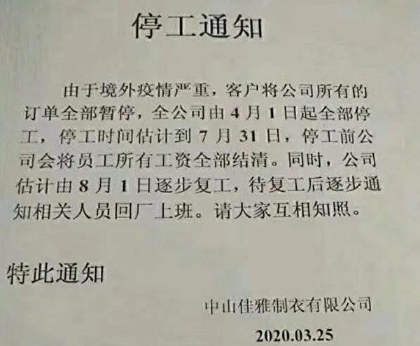
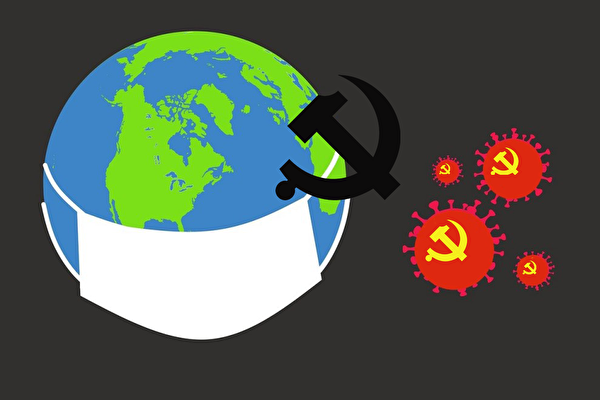
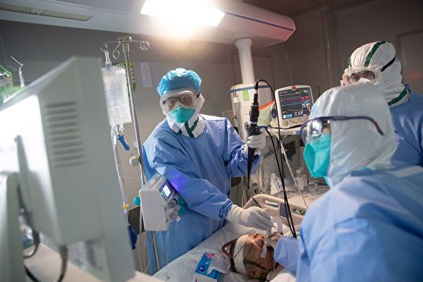
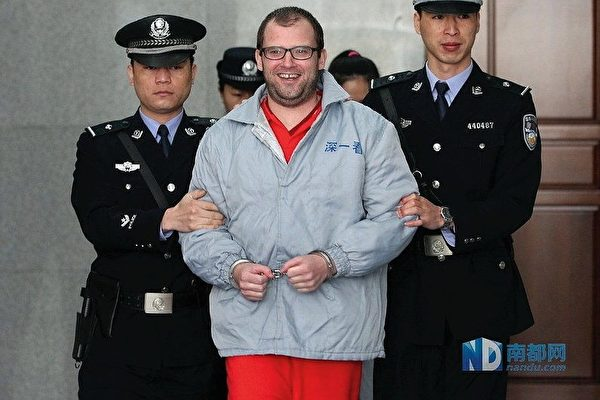
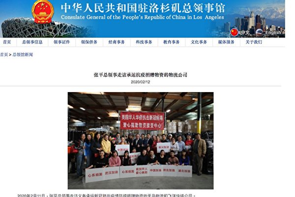

<table>
 <tr>
  <td align="center" width="450"></td>
   <td   width="450"><h3>【希望之声2020年2月18日】在武汉肺炎疫情严峻、中共加强大陆封网之际，希望之声推出专门为中国大陆民众开发的自带翻墙功能手机   APP。据开发人员介绍，此款手机APP适用于安卓操作系统，也就是所有的国产品牌手机、以及三星、LG等非iphone手机。
     

     
   安装后可收听收看希望之声的节目：包括《江峰时刻》、《天亮时分》、《老北京茶馆》及最新时事新闻等精彩内容。不需要使用任何翻墙软件，一步到位获得最新海外资讯，帮您免除翻墙上网的麻烦与风险。欢迎大家下载并传给中国大陆的亲朋好友。
   
   希望之声版权所有，未经希望之声书面允许，不得转载，违者必究。</h3>
     </td></tr></table>
     

     
<h1 align="center"><b>免翻看视频 (请收藏网址)，随时连即时最新IP https://git.io/swspip</b></h1>
<h1 align="center"><b>复制（网址或 IP 数字 ）到浏览器打开。若出现   “提示” ，請点击“继续”访问即可。</b></h1>

<h2 align=center><a href="https://github.com/gav01/Heart/blob/master/news1.md">● 大纪元时事 ●</a></h2>

<h2 align="center">直連不必翻牆開花必看精彩視頻http://61.228.181.67/310</b></h2>

<table>
<tr>
 <td>
 <a href="https://git.io/pamja"> <h3>如何 “ 三退保命 ”</a>，<b>连上面→免翻视频 IP http://61.228.181.67/310 </b> →点 【三退大潮】--为什么要退党？ 可留言三退或用翻墙软件自己办理三退</h3></td>
</tr> 
<tr>
 <td>
 <a href="https://git.io/pamja"> <h3>如何 “ 三退保命 ”</a>，请点击翻牆网站  https://git.io/opopop  下载 { 翻牆软件 }→找 { 大紀元網站 }  ( http://www.dajiyuan.com ) 三退</h3></td>
</tr>
<tr>
<td>
 <h3 align=center><a href="https://www.ntdtv.com/gb/2020/03/26/a102808561.html">最新翻墙软件 突破封锁访问大纪元新唐人(点击右键,另存新档）</a></h3></td>
</tr>
</table>

<a href=https://git.io/souye><h6 align="right">回首頁</h6></a>

<a name=top>
 
 
 
 
 
 
 
 
 <a href =#91>91.【明慧特稿】瘟疫有眼退党脱险 
<a href =#90>90.【明慧特稿】撒旦的梦想 
<a href =#89>89.【明慧特稿】错爱  
<a href =#88>88.中领馆给美国州议长发私信求表扬 被骂脑残  
<a href =#87>87.国际追责中共 党媒罕见预警被指倒打一耙 
<a href =#86>86.周晓辉：川普不再掩饰愤怒 美中或出大事 
<a href =#85>85.【全球疫情直击】武汉小区仍管控 死者家属吿当局 
<a href =#84>84.传千名黑人感染 官称4确诊 民间疑当局掩盖 
<a href =#83>83.扛过多次危机扛不过疫情 义乌商城空荡荡 
<a href =#82>82.方方日记将在欧美出版 方方再发声怼胡锡进 
<a href =#81>81.大陆企业停工通知刷爆网络 刚复工又放假 
<a href =#80>80.【疫情透视】 中共病毒为何重创沙特王室 
<a href =#79>79.【一线采访】持续现新病例 武汉解封后仍严管 
<a href =#78>78.河北沧州地震 居民下楼避难 北京天津有震感 
<a href =#77>77.洪微：反击中共 川普即将掀开新的一章 
<a href =#76>76.两次被押出湖北 雷神山工人曝受歧视经历 
<a href =#75>75.美议员要谭德塞下台呼声不断 称他和中共同谋 
<a href =#74>74.袁国勇：中共病毒瘟疫不可能在7月前消除 
<a href =#73>73.省长坐镇火化还有体温的她——遭中共残害的家庭 
<a href =#72>72.【一线采访】武汉解封 异见人士揭媒体虚假宣传 
<a href =#71>71.买一送二？ 山东男子连续隔离3次共1.5个月 
<a href =#70>70.武汉母子被虐杀 一家五口遭迫害（上） 
<a href =#69>69.【拍案惊奇】北京连发地震是人为？山东罕见雪 
<a href =#68>68.批世卫偏袒中共 美议员要谭德塞到国会作证 
<a href =#67>67.中共长征三号乙火箭发射失败 爆炸视频曝光 
<a href =#66>66.内蒙古倒查20年涉煤腐败 一月内9官员被查 
<a href =#65>65.【独家】哈市610年收入20万 小金库千万 
<a href =#64>64.传中共首艘075两栖攻击舰失火 浓烟冲天 
<a href =#63>63.外债2万亿美元 中共靠举债填补外汇收入 
<a href =#62>62.中共内外交困 前人大教授：王沪宁把习吹晕了 
<a href =#61>61.杨宁：北京防疫常态化 疫情何时结束难说 
<a href =#60>60.【一线采访】面临破产 武汉150餐馆向政府请愿 
<a href =#59>59.如何处理任志强 专家：习近平当局倍感棘手 
<a href =#58>58.塞尔维亚总统吻五星旗后 儿子确诊患肺炎 
<a href =#57>57.【靖远快评】冰岛病例藏信息 疫情将改变世界 
<a href =#56>56.中国电信存安全风险 美或撤销其运营许可 
<a href =#55>55.【内幕】刀笔齐握 政法委领导网军搞宣传 
<a href =#54>54.【一线采访】黑龙江疫情延烧 绥芬河人恐慌 
<a href =#53>53.记者白宫被呛 凤凰卫视的背景引热议 
<a href =#52>52.田云：王全璋被隔离 中共利用疫情侵犯人权 
<a href =#51>51.任志强被调查 传需向中南海交代 
<a href =#50>50.遭到国际社会抨击 谭德塞羞恼成怒指责台湾 
<a href =#49>49.【独家】武汉黄陂区内部文件泄抗疫秘密 
<a href =#48>48.两个现代人从地府带回来的信息 
<a href =#47>47.【现场视频】刚解封 武汉汉华社区再被封闭 
<a href =#46>46.【拍案惊奇】美疫情严峻 G7向中共索赔3万多亿？ 
<a href =#45>45.纳瓦罗：有一个数字会让所有美国人都震惊 
<a href =#44>44.中共全球搜刮后 抗疫物资都去哪了 
<a href =#43>43.川普质疑世卫：为何拿美国钱 却围着中共转 
<a href =#42>42.【新闻看点】疫情难缓解 北京战狼风向转？ 
<a href =#41>41.【一線採訪】趁解封趕緊走 武漢數萬人出城 
<a href =#40>40.3M态度逆转 川普：每月额外供美5550万N95 
<a href =#39>39.【最新疫情4.7】伊朗指责中共数据误导他国 
<a href =#38>38.“谁敢戴在脸上？” 代理商揭大陆口罩黑幕 
<a href =#37>37.【最新疫情4.6】伊朗确诊数超6万 中东最高 
<a href =#36>36.中共发消费券 民众：没钱不能用 想拿不容易 
<a href =#35>35.“404”与劣质品 中共是世界的麻烦制造者 
<a href =#34>34.湖北汉中大批商户聚集维权 挑头人遭拘留 
<a href =#33>33.【拍案惊奇】中共为粮荒辟谣 海南现女版李文亮 
<a href =#32>32.【英国疫情4.5】英智库要求中共赔偿巨款 
<a href =#31>31.【独家】大疫下仍迫害 610两机构揭秘 
<a href =#30>30.【疫情透视】纽约向中共“输血”知多少 
<a href =#29>29.民众无助 街头烧尸 中共病毒重创厄瓜多尔 
<a href =#28>28.【一线采访】中共改抗疫补贴标准 医护愤怒 
<a href =#27>27.台湾捐千万口罩 意国会议员拍短片说谢谢 
<a href =#26>26.包钢集团高层前腐后继 前党委副书记落马 
<a href =#25>25.中国多地现抢米潮 当局“辟谣”难掩窘境 
<a href =#24>24.疫情减缓？ 武汉突宣布继续强化封闭管理 
<a href =#23>23.大陆多省现抢米潮 或与中共内部文件有关 
<a href =#22>22.武汉“裸官”蔡莉全家猛料被曝光 
<a href =#20>20.杭州IT男猥亵多名女子 称压力大寻求刺激 
<a href =#19>19.大陆出口面临二次下滑 专家：二季度降30% 
<a href =#18>18.多部门联手 白宫正式反击中共舆论战 
<a href =#17>17.【微電影】希望的聲音 
<a href =#16>16.【一线采访】方舱出院转康复站 护工爆内情 
<a href =#15>15.“我是证据”德国富商从中共地狱中幸存（下） 
<a href =#14>14.【内幕】大疫下搜刮各国 中共和领馆操纵 
<a href =#13>13.反驳WHO声明 台湾外交部：违背三大事实 
<a href =#12>12.4天内 北京顺义区同一地连发2起地震 
<a href =#11>11.对比中美对外捐款 中共并不慷慨 有据为证 
<a href =#10>10.中共病毒攻破梵蒂冈 教宗：感到恐惧和迷失 
<a href =#9>9.中国学者携带活病毒瓶进出美国海关 
<a href =#8>8.前凤凰网记者揭中共如何操纵疫情舆论 
<a href =#7>7.【疫情最前线】官掩疫情 进入不信任时代 
<a href =#6>6.中共抗疫外交失败 外销劣质医疗品遭退货 
<a href =#5>5.大陆中小企业内外交困 中共将巨资投向基建 
<a href =#4>4.至清：2020年中国粮食面临天灾人祸 
<a href =#3>3.河南等多地无症状感染者成传播者 民众恐慌 
<a href =#2>2.脸书全球推出新工具 助社区邻里抗疫互助 
<a href =#1>1.外媒：未来科技界新趋势是“非中国制造” 

<a name=91>
<h1 align="center"><b>【明慧特稿】瘟疫有眼退党脱险</b></h1>

【明慧网二零二零年四月十三日】武汉肺炎（中共病毒）自去年十二月爆发后，疫情蔓延全球200多个国家，目前已有超过190多万人感染，将近12万人死亡。从死亡数据的统计与分析发现，中共病毒目标性极强，瞄准的不是人的免疫力，而是个人与中共的关系、各国与中共的关系。
明慧网三月二十七日报导，网络上传出一份中共某单位内部统计的二月份死亡名单，显示该单位染疫死者当中，中共党员的比例竟高达88%。死者的年龄分布，50岁以下的中青年占总人数的将近一半（其中30-49岁的占了39.7%），并非中共官方报导的老年人居多。由此观之，中共病毒好像并不针对人的年龄，而是瞄准与恶魔签约的人。

无独有偶，另一份在网络广泛流传的死亡名单显示，死于中共病毒的300多人当中，党员有200多人，也是占了大多数。如果再考虑每100个中国人中大约只有6至7个党员，党员和群众的基数严重不对等，更明显看出：中共病毒具有超强的定向，能锁定共产党员。

从数据分析与归纳发现，武汉肺炎向世界扩散的路径，总是依循着与中共关系密切的国家、城市、组织和个人一路攀沿。在这场瘟疫中染疾或不幸丧生的个人，很多是共产党员；而疫情最严重的几个国家，过去数年明显都是亲共者，没有例外，凸显瘟疫有眼，选择性极强─ ─直指各国与中共的关系，以及个人与中共的关系。

从现实情况看，导致「武汉肺炎」的新型冠状病毒，的确在以毒攻毒，以中共之道还治其身。且看病毒借用的三个中共特性：

（1）隐匿性：中共数十年来，不断渗透西方世界，频频偷取高科技以壮大其经济，或隐居幕后，推出各式代理人遂行它蚕食鲸吞之计。新型冠状病毒则用了潜伏期长的方式，即感染者在出现症状之前，病毒已经潜伏人体内长达两星期甚至更久；

（2）迷惑性：中共夺取政权后，以政党为包装，却专门钻自由社会的空子，假借言论自由来散播它「无神论」的唯物邪说，鱼目混珠，让世人真假莫辨。新冠病毒也用了这个手法，它与一般感冒或流行性感染的症状极为类似，初期不易察觉，许多罹病者失去戒心；

（3）狡猾性：中共擅长化实为虚，包藏祸心，以宣传与造假掩盖真相，前述「一带一路」施行多年后曾让许多国家大呼上当，即为实例。新冠病毒也「用其人之道、还治其人之身」。采检体时，即使前两次呈阴性，有可能第三次才呈阳性，甚至患者出院后「复阳」，增加治疗上许多不确定感；

当然，中共的邪恶不仅仅表现在以上三点。武汉肺炎爆发后，隐瞒疫情导致病毒扩散；它不专注控制疫情，却一再搞自欺欺人。疫情蔓延世界后，中共推卸责任并栽赃它国，以劣质产品输出它国，用医疗物资胁迫它国。制造舆论战，在网络、国内掀起又一波反美高潮，不讲道德底线，无所不用其极。

简言之，听说「天灭中共」一词已经有几年了。上天之手无影无形，但天要让其亡，中共哪有德能抵挡？这场历史大戏已经进入最后一幕，我们每个人的结局如何，全看我们自己的选择。

既然中共病毒是长眼睛的，瞄准中共党员和与中共契合者而来，那么要想不被该病毒选中，首先就得与中共脱离干系。虽然很多中国人加入少先队、共青团或共产党，并不是真心诚意，但无论出于主动或被动，只要是参加过共产党的组织，就曾在血旗下宣誓「自愿献身」于邪党，灵魂被烙上了邪党的标记，从标记辨别你就是党的人。所以声明退出中共及相关组织就是救赎自身的灵魂，使生命远离罪恶（包括瘟疫），免受牵连。

武汉肺炎肆虐百日以来，世人已经越来越看清：中共是魔鬼，更是全人类的公敌。当今医学界企盼研发疫苗，以躲过病毒之害。但拯救生灵的灵丹妙药，其实只在一念之间。

很多中国人的亲身经历验证了：只要退出中共相关组织，收回「卖身契」，就能逢凶化吉。平安走过劫难是世人的共同心愿，能否得到上苍护佑而免于瘟疫灾厄，只在那关键的一念──继续与中共用灵魂做交易，还是三退赎身？

<a target="_blank" href=#top><h6 align="right">回上方</h6></a>

<a name=90>
<h1 align="center"><b>【明慧特稿】撒旦的梦想</b></h1>
 
 【明慧网二零二零年四月十三日】有一定文化基础的人都知道，「撒旦」不是形容词，更不是虚构。大疫当前，全球死亡人数可比战争，而中国大陆却一片幸灾乐祸，满目鸵鸟。下面的故事，是根据新近从大陆流出的一段中共文宣写成的。各位看官可以根据自己的实际经验，认识一下现实中的撒旦。
微信群。撒旦抛出中国人熟悉的党表情，宣布道，「病毒是美军去年输入武汉军运会的，但是在中国共产党的领导下，我们已经抗疫成功，现在全球只有中国最安全，美国就要完蛋了。」

举国党民不知真情，手执微信，一片欢呼。

也难怪，众人聪明智慧、一片真诚，谁都热爱自己的民族和国家。只是，每天看党媒电视灌输、手不离被党全权控制的微信，常年从党的菜单中选食党给的残羹剩饭，因此早已忘记了「中共不是中国，中共是西来幽灵」，年轻一点的更是从未体验过独立思考。

党民中有人仰望领袖，兴奋地问：「我主，我们成为世界第一是不是指日可待？」 「美国、欧洲是不是马上要完蛋了？」「 是不是要趁机武装统一台湾？」

也有思考型的人提出：「中国该不该帮美国？」

撒旦党魁的助手于是开示道，「美国的疫情在加深，孤军奋战，直至拖塌，有可能的结果是，各州宣布独立、转而寻求中国的救助。美国将重现二十九年前苏联崩溃的一幕。」

撒旦党发言人补充道：「这意味着，作为公共货币的美元，有可能加盖各州印记变成州币，比如纽约刀、加州刀等。世界各国将运回储存在纽约金库的黄金。美国陆军、空军将分解为各州的军队，美国海军也将解散，成为太平洋、大西洋沿岸各州的海军，其十艘航空母舰将被中国海军收购，换取抗疫物资。」

撒旦党观察了一下，看微信族中的民族情绪是否达到预定温度，然后接着说：「甚至，有些州申请加入中国，变成『中华社会主义共和国联盟』的一个加盟共和国。而在『中华社会主义共和国联盟』的领导下，世界将不会再有战争和瘟疫，人类重回和平。」

闻听此言，希特勒从坟墓中惊醒：「我从未上过一天军校，可我拿下了整个欧洲。」「我来到世界不是为了使人们更强，而是去利用他们的短处。」

马克思的幽灵闻讯赶来，「你是想说，『士兵不要思想，有领袖替他们思想』吗？」「我只知道我自己不是马克思主义者。」[1]

列宁的幽灵凑过来提醒，「小声点，别让党民们听见，他们不知道真相。书上不是这么写的。」

马克思的幽灵低声对自己的继承人教训道，「书是我的奴隶，应该服从我的意志，供我使用。」[2]

的确如此，对马克思及其信徒们来说，不但书是奴隶，真相和真理也都是奴隶。

注﹕
[1]《马克思恩格斯全集》第22卷第81页
[2] 2000年5月出版的《马克思传》，第246页

<a target="_blank" href=#top><h6 align="right">回上方</h6></a>

<a name=89>
<h1 align="center"><b>【明慧特稿】错爱</b></h1>
 
【明慧网二零二零年四月十四日】错爱，这里指的不是「承蒙错爱」的意思。而是指糊涂的爱、错误的爱。

<b>把爱教唆成恨</b>

爱是人类的通感、也是人类最为永恒的情感之一。爱与恨两种情怀应有着天然不同的感受与道义上的区分。

武汉作家方方的封城日记4月8日在美国出版了，大陆一批包括《环球时报》在内的所谓爱国者们却对方方发起了猛烈的攻击，台湾中央社近日报导，方方本人谈及此事时说：温和却引发仇恨，让人害怕。

方方在武汉封城期间用日记形式记录下了她自己和武汉人的真实命运，在武汉疫情异常严重期间、中共严密封锁疫情真相的背景下，将武汉人的悲惨、医护人员的苦难和中共官僚体制的荒诞与罪责真实的展现给外界，并在记述中提出向中共官员问责。方方日记曾在那不堪回首的苦难日子里成为全世界关注与关爱武汉人民的一管小小的望远镜头，但也因此方方受到了中共方方面面的压制。

但方方坦言：都是真实的，没有谎言。在日记即将海外出版之际，方方说：「今天还看到有人要组队来武汉杀我的资讯，我是没有办法应对的。但是，我很想知道他们的后台到底是什么人。」

前央视主持人崔永元对中共的无耻进行了揭露，「我曾有幸一周之内被150多家官方媒体围殴。除官方媒体外，上述系列分三个梯队。第一梯队是地痞流氓，只要有钱，什么都干。……大部份文人也都束手无策。你和它做任何解释都无意义，你选择和它对骂，你输了：『你终于变成了你讨厌的那种人』。还有一类是『网上所说的垃圾人』：『如果选择和垃圾人开战，必须想明白两点，一是只有开战没有停战，它们会一辈子粘上你。你愿意吗？你做好准备了吗？你做任何事情它们都会掺和进来，搅局和拆台，让你永世不得安宁。二是必须降低身段和格调，使用污言秽语，这是这个战场通用的武器。』」

掩盖真相后，爱就会被灌输和教唆成恨。为了消灭真相，这样的恨会被中共描述成高尚的「爱国」情操。

<b>爱不应为恨背书，中共不等于中国</b>

文化是一个民族与国别最本质的身份认证。中国文化源远流长，儒释道神传文化五千年交相辉映。中共来了，将无神论马恩列斯毛斗争学说强行灌输给了中国人。中共根本代表不了中国，也根本不是中国。

传统文化中，无论是为人还是立国，都讲道义二字。人可以经常改变对事物的看法，但却不能总是变换处世的原则。中共恰恰相反，反覆无常，爱与恨之间转瞬即变。中共煽动国人仇美，很多人把恨美国当作是爱国最高境界。殊不知，中共曾将美国奉为救世主。

中共窃政前的1943年和1944年，连续两年的美国独立日7月4日，中共在《新华日报》上发表社论​​，倾力歌颂民主制度的美国。强调「从年幼的时候起，我们就觉得美国是个特别可亲的国家。我们相信，这该不单因为她没有强占过中国的土地，她也没对中国发动过侵略性的战争」。

「中国人感谢着『美麦』，感谢着『庚款』，感谢抗战以来的一切一切的寄赠与援助」、「但，我们坚信，太平洋是不会阻隔我们人民与人民间的交谊的。在患难中，我们的心向往着西方……」社论结尾高呼：「七月四日万岁!民主的美国万岁!」只要能达到欺骗人心的目的，祭起民主大旗不算什么，当时真的就有很多爱国青年勇赴延安。1949年后的民国大师们当时也相信了中共的花言巧语，留在了大陆，后来的命运和去台湾的名流就无法相比了，胡适和他的儿子胡思杜就是典型的例子。

中共窃政后仅三年，为帮助金日成侵略韩国，在朝鲜战场上和以美军为首的联合国部队开战，同时把侵略战争描绘成一场「抗美援朝、保家卫国」的正义战争。救世主的美国突然变成了「邪恶的美帝国主义。」

1950年10月，中共发布《中共中央关于时事宣传的指示》：「坚决消灭亲美的反动思想和恐美的错误心理，普遍养成对美帝国主义的仇视鄙视蔑视的态度。」

在农村，农民对美国本没有什么概念，中共深知农民仇恨日本人，就引导农民由仇日仇蒋到仇美。欺骗农民说美帝国主义在朝鲜实行日本式的「新三光政策」，「天下帝国主义都吃人」，宣传美帝「正在走着日本的老路」，最后引导为一切苦难与罪恶「元凶祸主仍是当前的大敌美帝国主义」。

当时《文汇报》上的一首诗歌，与其说是诗，不如说是狂吠：「是谁欠我们的旧账未清，又加上一笔新的血债？……是谁？是谁？是谁？ ──是美帝国主义侵略者！美国鬼！美国鬼！美国鬼！谁喝朝鲜人的血？谁喝中国人的血？谁喝世界人民的血？谁喝美国人自己的血？是谁？是谁？是谁？──是美帝国主义侵略者！」

在大规模的反覆高压洗脑中，「美帝」自然成为了「邪恶」的化身，中共的侵略变成了号召民众同仇敌忾的正义之举了。整个朝鲜战争近百万中国人成了中共的炮灰。

这个制造仇恨和挑起斗争的手法中共一直运用到今天，为了使欺骗更加专业化、精致化和更具迷惑性，中共创造了一个生猛的词汇叫「反华势力」。

民族主义情绪根源不是爱，说到底是一种恨、被中共欺骗了的变异的错爱。共产主义价值观里没有爱，只有恨和伪善。

爱不应成为恨的背书。试想，倘若一个人爱他的妻子，就一定要恨隔壁的良家妇女，要爱他的父母，就一定要诋毁天下人的爸爸妈妈，这样的爱，还能称之为爱吗？恨美国、恨日本、恨西方民主社会就真的是爱国吗？爱自己就必须建立在恨别人的基础上吗？不是说人类只有一个家园吗？到底谁在撕裂世界？

<b>中共假货买不来真爱</b>

俗话说，强扭的瓜不甜，爱和被爱都应是自愿的。中共近期乘全球疫情高涨之际，高调向西方运送劣质的防疫物资，撒「爱」卖萌，同时借机在国内民众面前展示强国形像，没想到遭到国际社会一致退货，同时国际社会对中共疫情处理拖延、隐瞒以及假数字造成的疫情全球流行，纷纷提出追责。对此，中共又欺骗国人说，世界仇恨中国。

果真是这样吗？世界为什么「仇恨」中国？是仇恨中国还是厌恶中共？

自由亚洲广播电台4月12日刊登《欧洲国家纷纷指责中国抗疫产品不合格》指出，「英国从中国进口的350万份新冠病毒测试试剂盒质量低劣。本周英国《每日邮报》又报导，英国卫生部近日声称，这批试剂盒测试结果都不准确，并呼吁中国方面退款。」「最早是捷克和西班牙从中国进口的病毒试剂盒合格率只有20%-30%」。「荷兰政府三月底回收了来自中国的60万份口罩，因为其过滤效果不足。斯洛文尼亚政府又宣布中国的上百万试剂盒测试结果不准确，应该直接扔掉。爱尔兰政府上周向中国下达了最后通牒，指出他们从中国进口的价值近两亿的个人防护用品，其中有20%无法使用。」

这条消息至少告诉我们几个真相：1）中共是向各国卖防疫物资，而不是无偿支援；2）中共向诸多国家卖的是假货劣货；3）各国根据平等交易原则要求退货。国人在淘宝上买到假货还要退货呢，何况是在国际疫情危机严重时期的医疗物资出现伪劣产品？退假货是消费者维护主张自己权益的合法行为，跟仇恨无涉。

再简单说说关于国际追责问题。信息流通其实很接近于商品流通，人们都知道货比三家，被垄断的信息其质量保真度到底如何？中共疫情信息的不透明和唯官方排他性的封锁垄断性信息源，让世界倍感质疑。

4月9日，《纽约时报》报导，「近日来，外国领导人，甚至是像伊朗这样的（跟中国）友好国家的领导人，对中国通报的感染病例和死亡人数均提出了质疑。」

中共在今年1月份的疫情初期，从先前的声称「可防可控」到1月23日突然封城，之后，美国政府组成了13人阵容的世界一流病毒学医学专家团队欲赴中国支援武汉，并计划对病毒取样研究，但多次遭到中共拒绝，当时的WHO专家组也遭到中共拒绝，2月份，中共勉强同意WHO入境，到达武汉根本就不让进入疫情点。1月23日前，500万人从武汉逃离，几十万人出境。中共后期的疫情防控工作中，每日公布的数字根本不符合流行病学扩散规律。由于这些所造成的对国际社会的困扰和全球防控的难度，中共难道不应该对此负责任吗？

假如你是某个工业园区中众多企业中的一个企业主，比邻业主的厂房突然着火了，眼看火势越来越大，周围的业主都要急着去帮他救火，赶紧把里面的工人救出来，并查找起火点，也报警了，那着火的业主却一概拒绝别人进到他的厂子里，消防警察来了，也不让进。直到大火把周围的厂子全烧着了。你说人们该不该找不找那人追责？那人不但不承认自己有责任，还对着公众和自己的工人说：火是从我家厂房烧起来的，但火是张三放的、李四放的、王五放的。火到底是谁放的？先前拒绝一流的消防专业人员去救火，原因何在？

中共目前撑着国内疫情减缓的实际，到国际社会扮演消防警长的角色，理所当然会引起世界反感。《纽约时报》报导：「欧洲的一名高级外交官警告，中国对欧洲大陆的援助是为其地缘政治野心打幌子，而巴西的一名官员则暗示，这场大流行病是中国『主宰世界』计划的一部份。」

<b>爱呼唤尊严、拒绝欺骗</b>

4月4日清明节，中共作秀举办了全国哀悼仪式。有网友形容，中共的哀悼是黄鼠狼给鸡致哀。回溯历史，中共在建政后的历次政治运动中的死亡人数一直都是保密数字。土改杀地主、镇反运动、三年大饥荒、文革、六四天安门广场、迫害法轮功，在大陆，了解这些运动中的死亡数字会被中共视为别有用心什或是反动行为。2003年SARS、2008年汶川地震、如今的武汉肺炎，死亡数字仍然是迷。

3月23日，武汉当局通知疫情中死亡的患者家属去领骨灰盒。在社交媒体推特上，有人上传了武昌殡仪馆面前长长的队伍，视频配音说，领取队伍周围布满了便衣和社区工作人员，只要有人一抬手机就马上有人上来制止。武汉8家殡仪馆，每家每天发放500个骨灰盒，中共通知说发到清明节，即12天，12天×8×500=48000人，这只是一个简单的推算，实际死亡数字无从知晓，而中共公布的死亡数字只有3000多。那45000人，不知中共该计入何种类别的统计口径。或许，中共那里早已准备好了若干套应对不同场合的统计模式。

面对世界公开疫情数字时，必须对死亡数字进行爱国式瘦身处理。那45000人，连个数字都不是。

4月4日，美国之音中文网推特账号上发布了一段题为「『儿子，爸爸不想死……』一把骨灰：武汉监视下的安葬与逝者的尊严」的视频，视频文字显示：「眼看就到清明了，张军还没去领父亲的骨灰。张军的父亲2月1日死于新冠肺炎。他告诉美国之音， 武汉市有规定，新冠肺炎去世的家属，要单位或社区『全程陪同』才能领到亲人的骨灰，领到后必须立即下葬。感觉全程在监视我，所以我拒绝了。他说，这么做是为了维护父亲最后的尊严。」

张军在视频中说：「整个过程让我很心不甘情不愿，这是一个政治任务，我说了这不是一个正常的下葬流程。是为了完成维稳任务。」另外，张军还在视频里披露，3月31日，他所在的一个武汉肺炎死者家属群的群主被公安传唤，公安强行拿走群主手机，强行把群解散。张军本人5次被公安电话骚扰，面对视屏镜头，张军平静而又悲愤地说：「其实，我的想法很简单，我就是想拿到我父亲的核酸检测报告，到底是阴性还是阳性，难道他连个数字都不是？我打电话到医院去问，医院说，人死了，你还要什么结果？」

视频中，另一位逝者家属披露他本人三次被公安打电话骚扰，开口就问你妈妈是哪个单位的，家属说：「我妈妈已经去世了。」公安问：「你是哪个单位的。 」家属气愤地说：「我们自己不能下葬吗？为什么要通过你们（社区）？对这些生命没有一点告慰，没有一点点同情心。」「已经这样了，凭什么你们公安局还要给我打电话？给我打三次电话，每一次没有一点点亲切感。我们犯了什么错误，要你们公安的来镇压我们？……我不管你的数字真假，最起码，你（中共）对他们的家人要有一点活下去的勇气……到现在，我有时候还为我妈妈大哭一场，为我们这个城市大哭一场……」

<b>远离中共才能拥有健康和爱</b>

3月19日，美国《华盛顿邮报》专栏作家乔希﹒ 罗今（Josh Rogin）发表文章称，要把中国人民和中共区分开来。文章表示，中国医生、研究人员和记者冒着生命危险，甚至面对死亡对抗病毒和警告世界。中国人也是中共严厉措施的受害者。文章最后说道：「让我们称病毒为『中共病毒（CCP virus）』。这样更准确，只会让那些该拥有这一称号的人感到不悦。」

起于2019年末的这场全球流行疫情发展至今，中共在调查病毒起源、疫情瞒报、暴力维稳等诸多方面的做法都饱受国内外诟病，且给本国与世界各国都带来了不可估量的损失，翻开中共过往的极权史，沾满人们鲜血的事件写满了史册。中共治下的百年来，人祸催生的自然灾害，自然灾害中的官祸、党祸屡屡刷新人类的有史记录。然而在民不聊生的中共治下，讲真话变成了「犯罪行为」，丧事喜办、歌功颂德已然成为制度性常态。

无论从此次疫情的问责角度还是从中共一贯的邪恶角度，中共病毒的称谓并非恶意栽赃，恰恰是准确与合乎逻辑的命名，彰显道义。

俄罗斯《生命与安全》杂志2003年第3期刊登了一篇《SARS──远远不仅是病毒》的文章。作者是俄罗斯社会生态学国际研究院学者固班诺夫﹒ BB，他在文章中提出了一个经过系列试验和实践得出的，独特的科学结论：「病毒实际上是一种载有精神道德方面信息的生物，而只有它的一小部份才是我们了解的生物的方面，所以现代的医学只是在试图治疗病毒生物的一面，而不是清除病毒的根本。」

作者指出：任何疾病都是患者在精神道德方面溃败的结果，其次才是患者机体外壳的​​损伤。如果人的机体和精神道德都是健康的，总是发出正的「有形体」，那么病毒来到的时候，就会被粉碎掉，从而使人能够保持健康。但总是发出不正的「思维有形体」的人，即使只是有病毒携带者从他身边走过，或是只是注意到了他，就可以通过他的不正的大脑辐射，从而产生对病毒的「偶然捕获」。

作者谈到：「人的大脑在活动时可以产生一个『有形体』，而这个思维有形体却有正与不正的善恶之分。」

武汉疫情发展至今，人们发现了此次病毒感染的一种独特路径，中招者多为亲共的国家、地区与个人。比如美国纽约州为亲共的华尔街金融大鳄的聚集地，伊朗是中共的小兄弟，意大利为中共一带一路在欧洲的首个国家；世界著名男高音多明戈曾经和中共前党魁情人宋祖英同演出，英国首相强森引导脱欧后的英国走向亲中路线……而离中共国最近且出入境往来频繁的香港、台湾却在此次疫情中表现了出乎意外的佳绩，人们不难发现，香港青年在反送中运动中多次打出「天灭中共」的横幅标语，而台湾大选民众更是用选票否决了与中共纠缠不清的韩国瑜。

疾病正在改变历史，现实中的人类往往过于偏信自我与外在的力量，这或许恰恰是人类的短板与迷失之处。

认清中共，远离中共，人类将会懂得正确的爱与光明、健康。

<a target="_blank" href=#top><h6 align="right">回上方</h6></a>

<a name=88>
<h1 align="center"><b>中领馆给美国州议长发私信求表扬 被骂脑残</b></h1>

3月26日，美国威斯康星州参议院议长罗格‧罗斯（Roger Roth）提出了声援中国人民、坚决反击中共的决议案。图为罗斯和家人在一起。（来源：罗斯个人网站）

 
 【大纪元2020年04月13日讯】（大纪元记者徐简综合报导）美国威斯康星州参议院议长罗格‧罗斯（Roger Roth）碰到了一件奇怪的事情，芝加哥的中共领事馆向他发出私信，要求他提出赞扬中共抗疫的决议案，罗斯斥其“脑残”，并反其道而行之，提出了声援中国人民、坚决反击中共的决议案。
 
<b>中领馆要求提案表扬中共 罗斯回信：脑残</b>

maciverinstitute 4月2日报导，芝加哥的中国领事馆两次联系罗斯，请求罗斯在美国议会提出表扬中共抗击肺炎的“决议案”，领事馆还殷勤地已经帮助写好了这份“决议案”，只待罗斯在议会中提出。

2月26日，当罗斯收到中共驻芝加哥总领事赵建的夫人吴婷发来的第一个邮件时，他看到该邮件来自一个hotmail账户，还以为是恶作剧，没有搭理。

3月10日他收到第二封邮件的时候，罗斯让工作人员去调查，结果确认邮件属实，而且他们被告知中共外交官通常使用私人邮件联系公务，因为这样“速度更快”。

“总领事馆想知道，威斯康星州参议院是否可以考虑通过一项表达对中国人民的声援的决议，为中国人民抗击疾病提供巨大的道义支持。我们已经起草了一份决议草案，仅供您参考。” 吴婷写道。

中领馆写好的决议内容包括：中国（中共）的行动对于全球抗击流行病“至关重要”，采取了“空前而严谨”的措施，包括“武汉封城、几天之内建起方舱医院”等，这些措施“有效地遏制了病毒向中国和世界其它地区的传播。”

wisconsinexaminer 4月10日报导，罗斯说：“收到这个邮件，我快气疯了，因为那时COVID-19（中共病毒）正在加速蔓延，我们正在开始了解真相。”“我给他们的回复只有一个词，我说：脑残（nuts）。”

<b>威州决议案：支援中国人民 谴责中共罪行</b>

“然后几天后，我说我们将要提出一项决议，但并不是中共政府想要的决议。我们要说出能够揭示谎言的真相，我相信中共正在世界各地讲述这种谎言，这就是我们为什么提出了这个决议案。”罗斯说。

罗斯立刻起草了LRB-5983决议案并在3月26日提交，他坚决谴责中国共产党（CCP）在全球范围内爆发武汉肺炎时的隐瞒和谎言。

罗斯的决议案首先写道：“认清中国共产党在武汉冠状病毒（中共病毒）问题上故意的、有目的性地误导了世界，我们坚决跟中国人民站在一起，谴责中国共产党的所为。”

决议案接着描述了中共是一种压迫性政权、在过去的70年中一直绑架中国人民当作人质。他对“中国人民”和“共产主义政权”进行了仔细的区分。

“中国人民是伟大的人民，是人类历史上最伟大的文明之一的继承人。”罗斯说。

该决议还谴责了中共对西藏、新疆地区人民的压迫，及一胎化政策下的亿万胎儿被堕胎、活摘器官、迫害信仰等各种罪行。

决议案还说，据估计“如果中共政府以更有效、透明和负责任的方式采取行动，全球范围内的95%的病毒病例可能会被遏制”，罗斯写道。

这个决议案显示了他对中领馆邮件的愤怒程度，他在其中用了粗体、斜体来突出“由中国领事馆撰写”的内容。决议案指出邮件中的“宣传和虚假信息”——例如“中国（中共）一直透明、迅速地与WHO和国际社会共享该病毒的关键信息，从而为其它国家创造了机会之窗，帮助其它国家即时作出应对”。

那份中领馆的决议还想通过州参议院来鼓励美国政府与世界卫生组织（WHO）合作，“共同对抗病毒的传播”。而美国朝野现在批评世界卫生组织（WHO）帮助中共散布谎言，并为他们的“伪成绩”进行称赞。

威斯康星州参议院将通过自己的决议声援中国公民，并采取“必要”的国家行动，以“制止由中国共产党传播的错误信息的传播。”预计州参议院将在未来几周内通过这项反对中国共产党的决议案。#

<a target="_blank" href=#top><h6 align="right">回上方</h6></a>

<a name=87>
<h1 align="center"><b>国际追责中共 党媒罕见预警被指倒打一耙</b></h1>

中共掩盖感染中共病毒人数，祸害全球。图为美国纽约布碌崙医务人员在医院外搬运尸体。 (Stephanie Keith/Getty Images)

【大纪元2020年04月12日讯】（大纪元记者张顿、骆亚报导）中共病毒（武汉肺炎）全球泛滥后，西方国家纷纷追究中共隐瞒疫情造成的人员与财产的损失。中共官媒则把西方社会对中共的行动扭曲为“对中国的仇恨”、归结为所谓的“民族主义、民粹主义”，被大陆律师斥为“倒打一耙”。

中共肺炎最迟在去年12月1日爆发后，中共当局不但隐瞒疫情、打压传播疫情真相的医生和民众，而且还宣称疫情“可防可控”、没有“人传人”等虚假消息，令国际社会疏于防范，导致病毒在全球肆虐。

截至目前，全球已有逾175万人确诊感染了病毒，逾10万人死亡，这还不包括中共、伊朗等国家隐瞒的数字。同时，疫情也令全球经济活动几乎全部停摆。

在国际社会空前的追责中共的声浪中，中共官媒《环球时报》4月6日发文，称中共病毒引发的危机很可能刚刚开个头，接下来还会遇到更多、更严峻的挑战。甚至警告中国（中共）有可能成为美国等西方国家的“头号标靶”。文章把国际对中共的愤怒转移成“民族问题”。

而习近平4月8日也在中共政治局常委会上罕见强调，“要坚持底线思维，做好较长时间应对外部环境变化的思想准备和工作准备。”

时政评论员石实表示，中共官媒及习近平的话表明，中共当局已意识到因其隐瞒疫情给全球带来的巨大灾难，以及全球对其进行追责的问题；中共将面临着全世界的起诉和巨额索赔。

石实表示，中共是造成这次人类大灾难的真正凶手，如果它没有隐瞒疫情，信息公开、透明，国际社会就会做好准备，疫情不至于扩大到武汉之外的全国，乃至全球。即使疫情在中国全面爆发后，中共仍在掩盖感染人数及死亡人数，导致其它国家不能真正认识该病毒传播的凶猛程度及杀伤力。

不方便署名的北京律师对大纪元记者表示，中共知道这一次西方不一定会轻易放过它，比如说会索赔、制裁等等，所以官媒及中共当局强调做好长期应对外部环境变化的准备。

目前，包括美国、英国、澳大利亚、印度等多个国家的组织和个人已提起诉讼，要求中共赔偿因隐瞒疫情而造成的损失。

律师说，随着西方的觉醒，欧美国家下一步肯定会对中共采取一定的措施。《环球时报》以预言式地说将来西方可能对中共采取措施，是做贼心虚的表现。

律师指，《环球时报》把西方社会对中共的追讨行动扭曲为“西方对中国的仇恨”、归结为所谓的“民族主义、民粹主义”，实际上是“倒打一耙”。真正的民族主义、民粹主义，就是中国共产党掀起的，它煽动、愚昧中国人，去反对美国、反对普世价值，让民众去仇恨西方。越是底层的人越仇恨西方，无论是农村的还是城里面。

大陆独立媒体评论员吴特接受大纪元记者访问时指出，《环球时报》这篇社论的误区是，第一，忽略这次疫情爆发的原因是中共初期隐瞒、瞒报；第二，疫情全球爆发后，把责任推给外国政府；第三，混淆中共和中国，把中共的命运和中国绑架。

<a target="_blank" href=#top><h6 align="right">回上方</h6></a>

<a name=86>
<h1 align="center"><b>周晓辉：川普不再掩饰愤怒 美中或出大事</b></h1>

美国总统川普警告，他将好好检视WHO的所作所为，不排除切断美国提供给WHO的资金。 （白宫Flicker）

【大纪元2020年04月13日讯】因中共对疫情的刻意隐瞒，中共病毒（武汉肺炎）已经在全世界迅速蔓延，迄今已造成近二百万人感染，逾十万人死亡的恶果。作为受害国之一的美国，截至当地时间4月11日，确诊人数超过五十万，死亡超过两万多。这样的情况让民选美国总统川普（特朗普）也甚为恼怒。

4月7日，川普公开对世卫提出了批评，称该组织“搞砸了”全球的防疫工作，还围着中共的政策转，他并警告要考虑切断世卫组织的资金。8日，在世卫总干事谭德塞强势回应和威胁后，川普再批谭德塞是贼喊捉贼，因为把问题政治化的正是他本人，并明确点出其和世卫“以中国（中共）为中心”，“他们称‘一切安好，没有人传人的现象，（让各国）保持边界开放’”。

如果说这是川普借批世卫来表达对中共的不满，那么4月10日，川普在简报会上，针对有记者问美国是否会要求中共政府为其所作所为进行经济赔偿时，川普用词罕有的犀利、直接和强硬，且富有感情色彩，似乎此时的他已不愿意再掩饰对中共的愤怒。

川普的回答是：“从来没有人像我一样对中国（中共）如此强硬，注意我用的是‘强硬’这个词。你应该知道，我们的财政部收到了中国支付给我们的几十亿上百亿美元，这是因为我与中国达成的交易的结果……我坚信中共和世卫组织提前知道瘟疫的爆发，但是它们不想告诉全世界。我们会彻查这件事，并且把真相报导出来。我们对这件事非常生气，但我想晚点儿再收拾世卫。我们一直在和中国保持联系，一直有对话。我们向北京表达了我们的愤怒，我们对这件事非常非常非常愤怒！”

因为无以伦比的愤怒，所以川普通过上述言辞在告诉北京，除了在贸易协议上继续保持强硬姿态外，对于中共导致的疫情和巨大的人员死亡，美国也绝不会听之任之，而是会在将来公布调查结果，并由中共承担罪责。美国也知晓世卫就是中共的帮凶，所以要先解决中共的问题。中南海听到川普这样的潜台词，是不是寒意顿生？

也是在10日的简报会上，针对记者就习近平与已被美国政府通缉的委内瑞拉的马杜罗通话并表示将给予财政支持，是否影响美国的政策时，川普再一次毫不掩饰地直接回答道：“我没有与中国国家主席习近平谈过委内瑞拉这一方面的问题。如果真的发生那样的事（意指习近平支持马杜罗），我们不会高兴。好吧？ 我不高兴。”

川普不再掩饰对北京的强硬态度和愤怒，与此前其在言辞中还稍微对北京、对习近平留些脸面，已有了明显的不同。川普言辞的转变除了是美国朝野上下因为疫情而更加认清中共并坚定反共使然外，也是美国在未来大动作的预兆。

正如中外很多分析家所言，只要中共存在一天，中美关系就再也回不到十年、二十年乃至三十年前，而且会越来越糟糕。因为美国川普政府已经清醒地认识到，不择手段主宰全球的中共的存在就是对美国和世界最大的威胁。

4月8日，美国国务卿蓬佩奥关于专制政权和民主政权在处理危机时的不同的讲话，就是对美中根本差异的一个注脚。他说：专制政权处理危机，更具有侵略性，更多地剥夺人们的权利，撒更多的谎。他们表面上宣称解决了危机，但是实际上对本国人民危害无穷，置全世界于危机之中。而民主政权所做的就是今天在美国正在做的，他们让人们安全地回家，他们变得非常慷慨，他们共享资源，他们协助整个世界抗击疫情……民主才是危机时期的答案，而不是要朝着专制的方向发展，而且恰恰相反，危机有可能使专制走向民主。

无疑，疫情让美国人再一次清晰地看到了美中之间在意识形态、普世价值上的不同所带来的不同后果，看清了中共实行超限战背后的邪恶。中共病毒也让美国人意识到新的“911”或者“珍珠港”事件已经发生，美国能做的就是打赢这场不带硝烟的战争。为此，美国开始全面准备。

再看北京。在自身意图称霸世界的诡计被识破，在美国等西方国家施行的软硬威胁一再受挫，在将病毒甩锅美国并未成功后，四面楚歌、走投无路的中共高层仍不想顺应历史大势，改弦更张，仍旧想通过保住中共政权从而保住手中权力，因此选择了绑架14亿中国人，与美欧继续对抗的做法，中共当局近日抓捕敢言的地产大亨任志强和再次力挺马杜罗就是例证。

美中的选择预示着不久的将来，美中间将非常有可能发生影响全球的大事。这些大事可以因应在如下几个方面：

首先，在追责中共隐瞒疫情和病毒来源方面，美国将百分之百地追责。目前世界多国追责中共的声音络绎不绝，包括川普总统在内的美国多位政要亦早已明确：中共必须承担责任。按照美国官方的说法，包括病毒来源，现在相关机构和部门正在彻查，一旦彻查完成，美国一定会公布相关证据的，届时无论中共承不承认，都需要为因病毒死去的美国人承担罪责，并进行赔偿。

美国参议员科顿4月10日在福克斯新闻网发表题为“冠状病毒——如何让中国共产党为COVID-19大流行付出代价”的文章，提出了追责中共的八大策略，其中包括五大战略和三个做法。

五大战略是：不理会中共颠倒黑白的指控；调查掩盖疫情的中共官员并予以制裁；限制中共宣传机构（如中共官媒及孔子学院）在美国境内散布错误信息；将中共驻华盛顿大使馆所在街道的名称，改为诸如李文亮医生等举报人的姓名，让中共使馆工作人员每天上班时都要面对遭中共迫害的受害者；必须确保疫情历史详细记录了有关“中国（中共）病毒”大流行的事实，以及确保中共将为其渎职行为付出代价。

三个做法是：将中共在联合国等国际机构以及技术标准制定机构的地位降级；美国应在世界贸易组织（WTO）控告中共，以及取消美国授予中共的特殊贸易待遇；削减中共对世卫的影响。

此外，美国已有多人起诉中共政府要求进行赔偿。至于如何赔偿，美国政界也有人建议可以从如下方面获取：中共购买的美元外债、中共在海外隐匿的资产以及要求中共返还美国购买的民国债券。

没有人否认，美国一旦切实推行上述举措，将带给中共、中共高官怎样的打击，而美国的示范效应也将在全世界发酵。

其次，美中脱钩已箭在弦上，而首当其冲的是经贸脱钩。虽然过去几十年形成的产业链很难在短期内改变，但川普这几年来的推动美国制造业回归已经初见效果。在不久前美国国务院催促并暗示“所有在华美国人尽快回美，否则有永远都无法回来的可能”后，近日，美国白宫经济委员和主任库德洛在接受福克斯新闻一档节目采访时，明确表示，一种可能吸引美国企业从中国回流的政策是美国官方为美国企业离开中国的成本费用买单。

让美国人离开中国，让美国企业离开中国，这是美国在为美中脱钩实打实地做准备，避免届时美国人和美企成为人质。而失去美国经济助力的中共，是根本救不了现在已经奄奄一息的国内经济的。

第三，在香港问题上，基于香港已被中共染红，丧失了独立的司法、新闻等自由，美国如果推动《香港人权与民主法案》，取消香港自贸区地位，制裁香港和中共涉港高级官员，那对中共又是一记重击，中共再无法依靠香港进行转口贸易和金融欺诈。

第四，在台海问题上，如果走投无路的中共想通过挑起一场对台战争，转移视线，那么台湾将不仅面临美国的军事保护，也将迎来世界在多个方面的重击，这只能加速中共的灭亡。

上述不论是哪一方面出事，都会对中共造成不同程度的打击，甚至在不经意间引发中共的解体，而这或许也是美国的最终目标。4月9日，美国白宫前策略师就在福克斯新闻直指中共“是黑帮，是杀人集团”，“它们手上沾满了人类的鲜血”，“中国、美国和世界人民必审判中共的罪行”，“在美国政坛，其它都是噪音，只有（灭）中共是主题！”毫无疑问，中国人和世界都在期待着没有中共那一天的早日到来！#

<a target="_blank" href=#top><h6 align="right">回上方</h6></a>

<a name=85>
<h1 align="center"><b>【全球疫情直击】武汉小区仍管控 死者家属吿当局</b></h1>

中共肺炎的源头武汉，日前终于解除严厉的封城政策，不少市民第一时间就逃离。但是，当地的疫情情况仍不能忽视。目前有多位死者家属寻求法律援助，要求彻查中共瞒报造成的损失，为疫情中过世的亲人讨个说法。（视频截图）

 
 【大纪元2020年04月12日讯】欢迎走进“新闻第一现场”，“中共肺炎病毒，全球疫情情况。”我是陈晓天。中共病毒持续肆虐全球。截至周六，中国大陆以外，确诊人数超过162万，死亡超过10万人。美国疫情趋向平缓，不过防疫措施扔不可放松。
 
 如何将中共病毒的感染降到最低，并能快速发现，自己是否接触感染者？谷歌和苹果，正在联手开发“中共病毒接触者”的手机追踪软件。

不过，美国总统川普表示，会密切关注这项新技术，同时提出，这可能涉及自由和个人隐私的问题。

中共肺炎疫情扩散全球，造成百万人染病。台湾去年12月31号，就通报世卫组织，中国武汉出现类似SARS的病例。WHO现在却声称，台湾在信件中没有明确告知有“人传人”迹象。台湾中央疫情指挥中心指挥官陈时中，周六公布电邮内容，清楚写着武汉病患正接受隔离治疗。陈时中强调，隔离就意谓著有传染疑虑，批评WHO是“内行人说外行话”。

<b>武汉疫情仍未解 死者家属吿中共当局</b>

中共肺炎的源头武汉，日前终于解除严厉的封城政策，不少市民第一时间就逃离。但是，当地的疫情仍不能忽视。目前有多位死者家属寻求法律援助，要求彻查中共瞒报造成的损失，为疫情中过世的亲人讨个说法。

在封城76天后，4月8号，中共肺炎的起始地湖北武汉市解除了离汉离鄂通道管控措施。

因害怕政策再有变化，很多人选择连夜离开，有大量车辆从零点起就在高速收费站排队。

武汉铁路当局按照车票预售情形，预计当天有5.5万人搭乘火车离开武汉，其中约四成前往珠江三角洲地区。

天河机场也同步恢复商业客运航班正常运行。

外界估计当天约有6.5万人以不同方式离开武汉。

不少网友反映，绿码、核酸、复工证明什么都不检查，可以直接出省。 但北京已经要求从武汉返京的人员在离汉前和进京后进行双重核酸检测，而且每天限定进京一千人。此外浙江、河南、广东、湖南等省份都表示，要对来自武汉的人员进行核酸检测。

不过当地民众表示，武汉并不是真正意义上的“解封”，针对各居民小区的管制还在持续中。

无症状感染者是武汉解封最大的悬念。已经有多项研究指出，虽然这些人的症状不明显，但是传播病毒的能力并不弱。

有武汉市民向自由亚洲电台透露，当地最近撤销了很多原先被认定为“无疫情小区”的居民区，再度实施封闭式管理。

就在解封前夕，武汉大学中南医院呼吸与危重症医学科首席专家杨炯，曾对党媒《人民日报》旗下的《健康时报》警告，近3天的普查数据显示，武汉的无症状感染者约有一两万，要谨慎对应。不过这篇报导已被《健康时报》下架。

不仅武汉有问题，广州这边也传出疫情严重。

广州三元里琼瑶台村是黑人聚居地，目前被“封村”，紧急入户排查。虽然当局辟谣说，是为了“采取临时紧急的小区严格围闭管理”。不过也有消息指出，当地准备开建方舱医院。

中共疫情爆发以来，武汉死亡惨重，许多人家破人亡，但疫情中的真实死亡数据仍被中共掩盖着。

武汉市民丁先生65岁的母亲身体硬朗，1月20号发病，2月8号已经去世，始终没能确诊。

丁先生认为，如果政府在疫情爆发20天前，把真相告诉大家，人们都有防护措施，相信可以挽救几万人的生命。但是疫情爆发至今，没人承担责任，他还因为诉说家里的遭遇，多次被警察传唤。

武汉市民 丁先生：“我认为这是一场彻头彻尾的屠杀，到现在为止，凶手还在逍遥法外，你说我接受得了吗？卫健委的那些官员，武汉市的官员，公安局那些官员他们没责任吗？三四万个家庭，还有的家庭是全灭，他们不能这样冤死吧，对不对？”

丁先生谴责当局罔顾民众的生命，他已经寻求法律援助，希望追究到具体的责任人，因为母亲不能这样被冤死。

武汉市民张勇（化名）60岁的母亲也在这场疫情中离世，发病到去世大概15天。他表示，由于政府隐匿疫情，才酿成这巨难，这不是天灾而是人祸，活着的人都要向政府索赔。

张勇说，武汉的死亡人数无法估计，政府的数据绝对不可信。当时封城半个月，他带母亲去医院看病时，死人多得都来不及拖走。医生告诉他，武汉当时将近40万人感染，整个武汉如同人间地狱。

目前，由海内外二十多名中国律师组成的中共肺炎索赔法律顾问团已正式成立，律师团免费为染疫死难者家庭提供法律援助，包括制定索赔方案，和政府达成和解协议，或者起诉。

律师团发起人之一、维权律师陈建刚说，无论是从财产上、自由上甚至被中共滥用权力延误救治而过世的，还有太多因封门死在家里的，都应该向政府索赔。

陈建刚：“中共政府的责任是非常明确的，既然咱们不提病毒的来源，仅仅就中共隐瞒疫情、隐瞒真相，控制有关疫情的言论，就比如惩罚说真相的李文亮医生，这是确凿无疑的证据，它阻碍了世界得到准确的信息，以采取相应的防范疫情的措施。”

陈建刚表示，中共病毒大规模的蔓延，给全世界造成巨大经济财产和人员的损失，不管是在国内还是在国际上，要求中共赔偿都是合情合理的，而且这也有国际法的依据。

<b>陈时中公布电邮 打脸WHO“内行人说外行话”</b>

中共肺炎疫情扩散全球，造成百万人染病。而台湾早在去年12月31号，就通报世卫组织（WHO），告知中国武汉出现了类似SARS的病例。不过WHO现在却声称，台湾在信件中，并没有明确告知有人传人迹象。中央疫情指挥中心指挥官陈时中，就在今天（11日）公布当时的电邮内容，白纸黑字写着武汉当地病患正在接受隔离治疗。陈时中强调，隔离就意谓著有传染疑虑，批评WHO是内行人说外行话。

中央流行疫情指挥中心指挥官 陈时中：“WHO说实话就是，比较贴切讲就是，内行人说外行话。如果说隔离治疗，这样子的警讯，这样不是警讯，那我要问什么情况才叫做警讯？”

陈时中罕见语气严厉，因为WHO宣称台湾并没有警告肺炎会人传人。陈时中拿出去年底发给WHO的英文邮件，内文告知，在中国武汉发生至少七例非典型肺炎，当局宣称不是SARS，而病患正在接受隔离治疗。里头虽然没明写人传人的字句，不过隔离就代表疾病有传染力，陈时中说只要有公卫、医疗背景的都清楚。也反问，究竟是中共隐匿，还是WHO失职。

中央流行疫情指挥中心指挥官 陈时中：“不是会员国的台湾，都已经告诉WHO了，那我要问一个问题，那会员国的中国，有没有跟WHO讲？那如果没有讲，那我要说，这不是隐瞒那什么叫做隐瞒？那如果有讲呢？那WHO这不是失职，那什么叫做失职？”

在疫情不透明情况下，台湾仅凭媒体报导，还早一步通知WHO。如今WHO遭国际问责防疫疏失，却又拿台湾当借口，遭到陈时中打脸。

中央流行疫情指挥中心指挥官 陈时中：“所以我还是要诚恳地呼吁，WHO对这事情，要坦诚以对，积极来处理后续相关的事情，不要转移焦点，也不要一错再错。”

对于WHO不实言论，台湾外交部表示，将透过友邦与友好国家传递事实，而台湾驻日内瓦代表处，也会积极与WHO联系。

<b>中共拉拢非洲掌控WHO 前驻非医师揭密</b>

世卫秘书长谭德塞日前声称，台湾对他进行人身攻击。对此，前驻非洲医师、台湾世卫外交协会常任理事卢道扬，与谭德塞有数面之缘。卢道扬以亲身经历，指中共当局与非洲关系密切，已布局许久。

台北医院儿科顾问医师 卢道扬：“优先考量全球民众的健康，而非政治。至此，请您向我的国家、国人道歉，我想并不为过，但可能您的惭愧与专业不足已经使您盲目，使您无法说出。”

世界卫生组织（WHO）秘书长谭德塞，9日在记者会上，指控台湾对他进行超过3个月的人身攻击。曾任卫生署驻非代表（马拉威、史瓦济兰）、台湾驻马拉威医疗团小儿科主治医师兼代理团长的卢道扬认为，谭德塞的这番言论，已违反身为国际公卫人员的职业道德与初衷。

台北医院儿科顾问医师 卢道扬：“他的意思我可以感受到的就是，台湾我不要你，你不要在里面，你很麻烦，那样子的运作，把我们抹黑了，接下来他可以更轻松地说，反正我不理他嘛，你们不值得我去理会，不把我们当成公卫人，在看待，那这个是我绝对不能接受的。”

自中共肺炎爆发以来，谭德塞过度亲中共的言论，导致疫情失控，引发各国不满。卢道扬指出，谭德塞与中共当局的往来，已布局许久。他举例，2006年在衣索匹亚首都举行的非洲区域会议，时任伊索匹亚卫生部长的谭德塞，负责引荐时任香港卫生署署长，也是世界卫生组织总干事候选人陈冯富珍。

台北医院儿科顾问医师 卢道扬：“整个非洲大陆的卫生部长，跟一级官员通通在场，那我们的集会我可以跟你说是在他们的总统招待所的大厅。跟着她，肩并肩站在一起，然后引荐这些人。”

瑞士媒体《新苏黎世报》曾指出，为了强化在世界卫生组织（WHO）的影响力，中共领导人直接向32位执行委员拉票，希望以经济合作，交换支持陈冯富珍当选世卫总干事，甚至有第二届连任买票传闻。之后，世界卫生组织（WHO）改为大会秘密投票，谭德塞当选后，即访问北京，获得2000万美元捐款。

台北医院儿科顾问医师 卢道扬：“所以这关系是从那时候，我们就可以看到，很密切，中共政府当然在衣索比亚（埃塞俄比亚）做的投资非常的大，因为它是非盟的首都。它的投资大到，让别的国家吓一跳，因为捐赠了整个的会议室，捐赠了整个的非盟的运作，当然后来就有丑闻出现了，因为整个办公室都是，麦克风，网路都被窃听光光。”

感谢收看“新闻第一现场”，“中共肺炎病毒，全球疫情情况。”别忘了，订阅我们的频道，打开小铃铛，获取更新。也欢迎在twitter里，搜索“陈晓天”，关注主播，关注更多最新资讯。好，祝大家健康、平安，下次节目再见！

新唐人《全球疫情直击》制作组

<a target="_blank" href=#top><h6 align="right">回上方</h6></a>

<a name=84>
<h1 align="center"><b>传千名黑人感染 官称4确诊 民间疑当局掩盖</b></h1>

广东省广州市三元里瑶台村因疫情封锁了。（视频截图

 
 【大纪元2020年04月12日讯】（大纪元记者骆亚报导）近日网络流传广州三元里千名黑人感染中共病毒（武汉肺炎），有企业在内部披露后，发现信息外泄遭陆媒追问后澄清，但民间认为无风不起浪。广州市三元里瑶台村也因疫情被封锁了。

今天（12日）官方疫情公布会上承认黑人聚集地三元里一美食店因提供堂吃，店主及家人朋友4人确诊，网友批政府为掩盖政策失误而甩锅，同时质疑官方公布11日仅4名确诊病例。

<b>广州企业内部发通知有千名黑人染疫</b>

4月11日傍晚，广州市诺兰精细化工有限公司的一份《通知》在网上流传，通知称，“接最新防疫通报：昨日（10日）白云区三元里、越秀区矿泉街，对非洲籍人员核酸检测，有一千多人为阳性，在实施隔离工作中，大量的非洲籍人员逃离，请各位家人相互转吿，做好防范措施，如发现有非洲籍人员，立即告知村委会。”

公告还说，4月12日放假期间，请住宿家人们进去工厂一定要自行消毒、测量体温，登记！

该通知很快从墙内社交媒体传到墙外的社交媒体，并引起全网的关注。

<b>公司澄清 民间回应无风不起浪</b>

广州企业内部通知称有一千多名黑人染疫，在陆媒追问下发澄清公告，网友表示无风不起浪。（网络图片合成）

今天，也就是通知发出后的次日12日，有大陆官媒称通过与该公司法人确认，这是乱传的，并附上该公司的“澄清公告”称，“今天（11日）中午11点17分由本公司发布的关于相关疫情通知，未经证实属于不实信息，并未经审核把关就发到工厂员工内部群，对可能造成的外泄预测不足，对可能造成的不良影响负有责任。”

同天广州市卫健委发布疫情通报称，4月11日0时至24时，广州市报告新增确诊病例4例，均为境外输入（入境口岸排查发现）。

就官方公布的疫情数据，民间并不相信。各媒体在微博转发该公司澄清公告下，网友直接呛声。有金融市场职业交易员表示，无风不起浪；黑龙江网友表示同感，“还真的是这家公司发的，不是P的图，那这就有意思了，毕竟无风不起浪啊。”

有网友批广州政府说，“ 好无公信力，谎话连篇，继续隐瞒吧！事实就是每天都有新确诊病例。”

还有网友表示，“是不是谣言我不知道，但明明有很多搜索记录，微博却很长时间搜不到这个关键字，被刻意屏蔽了，我就认为是真的。”

甚至有网友建议，“这么多黑人早晚要出问题，不如趁这个机会长痛不如短痛。”

<b>网民批政府政策失误</b>

同天，广州疫情防控新闻通气会通报“广州一美食店隐瞒客人堂食多人确诊”，3月23日广州排查出一例境外输入病例，后又排查出三名境外输入病例。先有其中一名确诊病例称曾在一美食店叫外卖，当时调查时，店主称只负责外卖，没有堂吃。后又有一确诊病例称和朋友曾在该店内用餐。流调人员认为店主有隐瞒，再次赴现场调查，该美食店店主、员工及家人、店主的一名朋友全部感染。

就官方的通报，有网友公开批评表示，“这是拿美食店老板当挡箭牌呢，这事根源并不是美食店老板隐瞒堂食，而是广州市政府仅要求入境人员自己居家隔离，而且社区不严控，导致尼日利亚籍入境人员到处跑，传染了老板娘，然后老板娘传染给了女儿和朋友的儿子。明是广州市政府政策失误，推到老板娘身上算什么。”

这家美食店名为“美妙美食点（Emma Food）”，通过手机美食搜索可知，这是位于三元里的一家西餐店，地铁2号线三元里站D出口步行730米，广院西路103号附近。并且还是三元里美食热门榜第一名。目前显示暂无营业时间。4月7日还有食客在上面进行评论。

而数天前民间就传出消息，当地一家餐馆有黑人感染中共病毒并传染给中国人，引发恐慌，瑶台片区从4号晚开始采取“小区严格封闭管理”。

官方这次正式公布后，很多人表示恐惧，毕竟不知道有多少人在这家店叫过外卖或堂吃过，有学生表示那开学会不会再度推迟。有网友质问说：“就广州现在这样你真的好意思让5月份开学？让学生回去玩命呢？”

网友老郑质问广州当局说，这是说出来的，没说出来的怎么算？棠下荷光路这有个游戏公司的人因为黑人被感染的，我就没看有新闻说，城中村人多密集没来过的根本想像不到，真扩散了就很难说有多少人感染了。

民间批广州政府政治失误甩锅给美食店。（网络截图大纪元合成）

新浪实名认证的律师也表示，请广州有关机关做个男人，担起该负的责任，而不是甩锅，把责任推给一个小老百姓。

律师认为有三点原因，1、是海关让外籍人士入境，是社区及疾控中心没有做好检测和隔离措施，而不是小老百姓，没有前两者的一再失误，哪里会有传播？

2、既然政府已经允许堂食，美食店虽然承诺只外卖，但即使搞了堂食也符合政府的规定，自然没有任何错。

3、若非政府有关部门一错再错，美食店店主岂能被感染？可以说，美食店的老板本身还是受害者，完全有权向有关部门索赔，却没想到失职者倒打一耙，真是笑话！

<b>被确诊的黑人每天带不同的女人回家</b>

另外，4月9日广州御景湾5栋发现一个黑人是无症状感染者，全栋业主被居家隔离。业主群透露这个被确诊的黑人每天带不同的女人回家，和黑人回家有亲密接触者都还没有找到。

三元里有很多服装、鞋帽、皮具及小商品批发市场，聚集了许多非洲商人，以及黑人非法移民。此前传出大量非裔人士感染中共病毒，4月8号，三元里清查非裔人士，不少非裔居民被房东赶出，酒店拒绝入住，被迫流落街头，成为防疫和安全隐患。

12日的广州市举行疫情发布会上，广州市市长温国辉在通报中还介绍，截至4月10日统计，广州在住外国人共30,768人，因为疫情的影响，还有5万多外国人还没有回来，其中现居住广州的非洲国家外籍人员4,553人。官方还称，因为语言等的因素，这批人执行疫情管理比较困难。#

<a target="_blank" href=#top><h6 align="right">回上方</h6></a>

<a name=83>
<h1 align="center"><b>扛过多次危机扛不过疫情 义乌商城空荡荡</b></h1>

义乌国际商贸城曾被称为“全球最大的小商品批发市场”，火爆景象今已不再。（视频截图）

 
 【大纪元2020年04月13日讯】（大纪元记者李净综合报导）曾经历几次经济危机皆“硬扛”过来的义乌国际商贸城的商家们，如今面对中共病毒（武汉肺炎）疫情的冲击再也扛不住了。这座曾被称为“全球最大的小商品批发市场”，目前已出现严重危机。

浙江义乌国际商贸城3楼，铺主郭老板戴着口罩，独坐在大通道旁“黄金位置”的店铺里，门口贴着“马踏飞燕”旅游标志和一张火红A4纸打印的“店面出租”。

《新京报》4月10日报导，这家手机配件外贸批发店，疫情暴发后，店主退租了。“熬不住，免他三个月租金都不干”，郭老板把自己的手机号打印在红色纸上，等待下一个租客，但无人问津。

义乌国际商贸城创建于1982年，拥有七万多个店铺，曾被世界银行等权威机构称为“全球最大的小商品批发市场”。目前因为疫情在全球蔓延，义乌国际商贸城曾经日客流量超过20万人次的热闹景象不再。

施总曾是义乌国际商贸城的常客，带着美国客户在商城选购商品占用了他十几年外贸工作的大部分时间。由于疫情暴发，客户不能来中国，他已经数月没去商城。

4月9日中午，他想去商城边常光顾的咖啡厅坐坐，发现那里暂停营业。他同时也收到了客户发来的信息，美国商店关门，人们居家禁足，之前的商品都积压了，4月份不会再有订单。

义乌国际商贸城内，卖小家电的胡老板一直关注着国外的疫情，疫情导致多国口岸关闭，胡老板的货物积压在仓库，众多的季节性商品使胡老板更迫切地希望国外能加强控制疫情的力度。“电风扇要是拖几个月，到货就冬天了，谁还会接收。”

资料显示，义乌国际商贸城的发展商和管理者为义乌商城集团，系国有控股企业。该公司曾连续两年被全球竞争力组织评为“中国上市公司竞争100强”第二名。

根据当地人士消息，国际商贸城一区二区市场于2月18日开市，提前了3天，物流市场提前5天开市。开市第3天，除了商贸城中心街区的部分商户营业外，其它街区的大部分商户均未营业。

为了复工救市，义乌商城集团自3月16日起引进101名“有播”平台主播进驻国际商贸城一区，试图通过“网络+直播”模式，推动义乌市场发展。但效果不尽人意。

毗邻义乌国际商贸城的义乌港，为该地区的外贸商品提供一站式通关服务，这令义乌成为浙江省唯一的陆港城市。

近日，据网上流传的视频显示，曾经车水马龙的义乌港，如今现场空空荡荡，只剩下少部分货物和货车。

拍摄者说：“这是义乌最大的物流仓库，义乌港，看看，外贸的世界末日，看，没有人，多安静，以前车都进不来。”

经常往返于义乌、东阳、横店做工艺品的企业管理者陆先生此前对大纪元表示，义乌几年前的数据显示就已经开始萧条了，“小商品市场货柜的出口量，2015年跟2013年相比已经少了近60%，主要原因是整个经济形势不好，持续下行，还有当局的一些决策，包括与美国打贸易战。”

目前，中国大陆经济遭受疫情重创。中共当局为促经济保政权，近期强制各地复工复产却收效甚微。除了不少企业相继发生聚集性疫情事件之外，各地亦相继出现了“民工荒”、“订单荒”现象。

4月10日，中共商务部部长助理任鸿斌在发布会上表示，今年以来，中国外贸发展面临多年来未有的严峻挑战。根据海关统计，1～2月份，中国出口下降15.9%。

任鸿斌说，从近期商务部对重点省市、各进出口商会和重点企业的摸底调研情况来看，外贸企业普遍面临在手订单取消或延期、新订单签约困难、物流运输不畅等诸多问题。

此前，据中国海关统计，以美元计价，1月至2月贸易逆差70.9亿美元，这是2018年4月以来的首次贸易逆差。

<a target="_blank" href=#top><h6 align="right">回上方</h6></a>

<a name=82>
<h1 align="center"><b>方方日记将在欧美出版 方方再发声怼胡锡进</b></h1>

家住武汉的中国作家方方。（网络图片）

 
 【大纪元2020年04月12日讯】（大纪元记者方晓报导）大陆作家方方在武汉封城期间撰写的日记8月将在美国出版，消息传出后，中共喉舌《环球时报》刊文攻击方方，许多五毛粉红也跟进攻击方方。方方作出回应。并呛声胡锡进“你以为你是谁？”

1月23日，武汉因为中共病毒（武汉肺炎，新冠病毒）大爆发而封城，身处当地的湖北省作家协会主席方方从1月25日起，以日记的方式在网上发表了60篇自己的心情和见闻、关注感染者及其家人的遭遇，以及对政府一些做法的批评，文章在社交媒体上引起极大的反响。

4月8日，官方宣称，武汉解封。而方方的《武汉日记》被翻译成英文和德文，分别由美国哈珀克林斯出版社（Harper Collins）和德国霍夫曼坎普出版社（Hoffmann und Campe）发行，电子版预计在6月上市，目前已在网上开始预售。消息一出立即在网上引起热议。有五毛及粉红们认为这是“给反华势力递子弹”，甚至更有人骂她“卖国”。

4月11日，方方接受“学人Scholar”采访，以对话体的形式发声，介绍了日记的英文、德文版的联系、授权、翻译和出版过程；回应了“约稿”疑虑，以及引发争议的封面标题和文案。关于日记为何在海外先出版，方方表示：书要8月出版，目前只是预售。

原本国内也有十几家出版社想出版这些日记，但是方方说，少数极左人士不断叫骂，“目前所有国内出版社都不敢出了”。

她决定，无论是中英文版，都会把这本书的所有稿费捐出来，帮助一些应该帮助的人。白睿文和版权代理人也都表示会捐出一些来帮助武汉人，“不要把人们都想像成坏人。不要觉得在国外出书就是卖国。这种想法很幼稚”。

她说，这样温和的记录都不能包容，都要引发这么多人的仇恨，这会让无数人感到害怕，“有没有想过，为什么那么多人支援我？因为我的言论尺度，是一般人们都会有的言论尺度，如果连我都不能容，人人都会害怕”，她并指“现在网路上几乎跟文革时差不多了”。

方方质疑：“我写日记以来，一波一波地被攻击，你们怎么没有任何觉得奇怪的想法？而是顺着攻击我的路数走？”

方方日记有不少内容描述了武汉人在封城之下的悲情遭遇、官僚体系的蛮干，方方要求要有官员为疫情负责。

中共官媒《环球时报》英文版8日引述“观察者”称，方方的日记“偏颇而且只暴露武汉的阴暗面……”

《环球时报》总编胡锡进也发文攻击方方，称方方日记在国内产生的回响是中国内部的一件事，“有当时的场景和逻辑”。然而这部日记在今天和之后拿到美国和西方去扩散，就是另一回事了，“它不会是一般的纪实文学交流，它一定会被国际政治捕捉到”。

围绕方方的讨论近日还上了微博热搜。方方4月8日在微博写道：“我现在说什么都被叫骂。真是领教了网络暴力。极左势力实在厉害，而且强大！真的是像病毒一样一圈一圈地感染人。不知道哪天会感染到我自己的身边。整个阵式像极了我小时候经历过的文革。让人好想的是：时代毕竟进步了，这种文革只在网络空间进行着，只在少数人中。或许这也是让我心里还对这个世界始终存有希望的原因吧。”

有很多网民支持方方。

4月10日，方方在微博针对胡锡进的言论写道：一个真正的写作者，不会认同胡锡进居高临下的恩赐式的包容。你以为你是谁？

<a target="_blank" href=#top><h6 align="right">回上方</h6></a>

<a name=81>
<h1 align="center"><b>大陆企业停工通知刷爆网络 刚复工又放假</b></h1>

4月份以来，很多“企业停工通知”在网络曝光，老板员工同时失业，复工之日遥遥无期。（微博截图）

 
 【大纪元2020年04月12日讯】（大纪元记者张玉洁综合报导）中共隐瞒疫情导致全球大流行，随即令大陆企业失去订单。近日，很多企业的“停工通知”在网络曝光，均从3月末至4月初开始再次停工，复工之日遥遥无期。

宁波一家针织面料有限公司从3月31日开始放假5个月，并写明“鼓励员工外出另找工作”。

广东中山佳雅制衣有限公司在通知中说，订单全部暂停，公司从4月1日开始全部停工，估计停工至7月31日，到时“逐步通知相关人员回厂上班”。

最近，大陆很多企业员工“被放假”，社交媒体上有网友留言说，“每天一睁眼，房贷、车贷、房租、水电等一连串的数字就在脑袋里打转，让人焦头烂额。还有些坚持不住的企业，已经关门停业，老板都卷铺盖回家了。”

广州光华鞋业有限公司的通知中除了4月1日开始停工停产的消息之外，其它事宜均另行通知，包括停工期间员工薪资、具体复工时间等，都未说明。

浙江三益鞋业有限公司停止一切招聘活动，“老员工请假的一律继续请假，另行通知上班时间”，“取消夫妻房补贴，取消老员工带新员工奖励”。

除了制造业，服务业也是倒闭重灾区。大商集团位于河南郑州的金博大店，3月下旬一度称“对疫情下店铺的发展很有信心”，但十几天后的3月31日早上突然通知员工停业，之前员工没有得到任何消息，很多供货商前来要求偿还货款。

还有民众留言说，连房产汽车这种公认利润高的行业都岌岌可危，谁又比谁好呢？

大陆媒体《时代周报》报导，现在就连销售额排名前30、前20，甚至前10名的房企都在裁员、降薪。一位前10强房企工作的前员工说，她在3月末的一天被主管约谈，涉及工作表现和公司现状，她明白这是裁员的潜台词。

另一位房企员工说，今年的目标就是活下去，一位同事上午被约谈，下午就离开，“如果在这家公司被裁，别的企业也不一定要。”他说道。

一位在“龙头房企”就职的员工说，他所在的区域已经被合并，几乎没有新开的项目，项目工程师、项目工程负责人都有被裁掉的。

汽车方面，大陆汽车第一季度销量创下史上最大降幅，同比下降42.4%。一家本田4S店的员工说，3月上旬开工以来，上门购车的客户较少，与去年同期相比下降了50%左右。本田、丰田等5家日本车企3月份在大陆的销量同比去年减少40%。

<a target="_blank" href=#top><h6 align="right">回上方</h6></a>

<a name=80>
<h1 align="center"><b>【疫情透视】 中共病毒为何重创沙特王室</b></h1>

沙特国王萨勒曼（King Salman）（右）和王储穆罕默德·本·萨勒曼（Mohammad bin Salman）。（摄于2019年12月10日）(Fayez Nureldine/AFP)

【大纪元2020年04月12日讯】（大纪元记者王谨综合报导）中共病毒（武汉肺炎）攻入沙特阿拉伯王室，150名王室成员染病。媒体报导，萨勒曼国王的侄子费萨尔·本·本达尔亲王（Prince Faisal bin Bandar bin Abdulaziz Al Saud），正在接受重症监护。

中共病毒为何重创沙特王室？大纪元特稿指出，病毒针对共产党而来，“它循着与中共关系密切的国家、城市、组织和个人一路蔓延。”

本文梳理沙特和中共之间的关系，以作警示。

<b>中共病毒疫情 沙特为中共站台</b>

2月3日，中共驻沙特大使馆发布了一条新闻，题为《沙特外交大臣费萨尔亲王：沙特在防控疫情方面同中国（中共）站在一起》。

沙特外交大臣费萨尔·本·法汉·本·阿卜杜拉亲王的这一立场，实为中共站台。

2月份，中国大陆传出中共肺炎病例不断增加，而武汉市多家殡仪馆一天24小时不眠不休地运作。外界质疑中共严重掩盖确诊和死亡病例。而大陆网传一截图显示，2月1日，腾讯的即时新闻透露，中共肺炎造成中国的具体感染人数154,023人，死亡人数24,589人。有人说，这是腾讯不小心泄露的秘密。

而在一个多月后，沙特国王萨勒曼也为中共站台。

3月27日，中共新华网也发布一条新闻，题为《习近平同沙特国王萨勒曼通电话》。报导称，沙特国王萨勒曼赞赏中共“成功”控制（新冠病毒）中共病毒肺炎疫情，并称“沙中是‘患难’之交”。

沙特和中共的“交情”，由来已久。

沙特是世界产油大国，也是全球第一大石油出口国。中国，则是世界上最大的石油进口国，70%需依赖进口。彼此各取己需。

鉴于石油是重要的能源和安全战略物资，沙特独特的石油地位，被中共视为其战略考量的重中之重。

<b>沙特和中共建立全面战略伙伴关系</b>

2016年1月，习近平访问沙特。期间，沙特和中共宣布，建立全面战略伙伴关系。

中共官媒新华社报导称，习访沙期间，双方同意加强发展战略对接，在共同推进“丝绸之路经济带和21世纪海上丝绸之路”建设的框架内深入合作，加强在铁路、港口、电站、通信、航天等多个领域的合作。

“丝绸之路经济带和21世纪海上丝绸之路”，简称“一带一路”。中共媒体称，沙特是中共在中东推行“一带一路”的关键性支点国家。

中共一再声称“一带一路”纯属经济项目，但国际社会普遍认为，中共利用“一带一路”，逐渐控制沿线国家的经济和政治命脉，实现其在地缘政治、军事等方面的野心，以此重塑全球秩序。

2017年3月，沙特国王萨勒曼访华。与中共签下价值650亿美元的协议大单。据称，这份协议含35个项目，覆盖能源和航天等不同领域。

2017年3月16日，沙特方面宣布，与中国航天科技集团公司签署了一项涉及生产无人机的合营公司协议。英媒报导，此协议是沙特国王访华期间达成的若干协议之一。

2018年10月，中共为沙特发射两颗卫星。这两颗卫星是沙特研制的低轨遥感卫星，设计寿命为5年。

2019年2月，沙特穆罕默德王储在结束访问印度和巴基斯坦后，抵达北京，展开两天访华之旅。

穆罕默德王储访华期间，中共国家发展改革委国际合作中心与沙特投资总局在北京举办了“中国-沙特投资合作论坛”。

据《中国经济导报》报导，论坛上，沙特能工矿部部长法利赫表示，沙特“2030愿景”与中共“一带一路”倡议高度契合，有广阔的合作空间。

2019年11月，中共与沙特举行联合海军演习。

<b>参与“一带一路”项目</b>

沙特并未和中共签署“一带一路”协议，但是参与了其中的一些项目。略举例如下：

2019年2月14日，中国能源建设集团西北电力建设工程有限公司，中标沙特阿拉伯道路监控施工项目。项目建设内容主要包括首都利雅得范围内6600多个监控点和145个小型基站的建设。

2019年2月22日，沙中签署《中华人民共和国国家发展和改革委员会和沙特阿拉伯王国能源、工业和矿产资源部关于共同推动产能与投资合作重点项目（第二轮）的谅解备忘录》。

2019年2月25日，中国石油集团工程技术研究院有限公司与沙特阿美国家石油公司科研合作项目“智能化钻井技术研究与应用”正式签订合同，3月1日实施。

2019年2月，沙特阿拉伯国家住房公司（NHC）和中国建筑工程总公司（CSCEC）签署了一项6.667亿美元的协议，在沙特首都利雅得建造5,000多套住房。

2019年4月28日，中国港湾中东区域管理中心，中标并签约沙特布盖格东部路桥项目。

<b>沙特和中共华为合作 接入5G</b>

沙特王室此次感染中共病毒的费萨尔·本·本达尔亲王，也是沙特利雅得省的省长。利雅得，不仅是利雅得省的省府，也是沙特的首都。

《纽约时报》报导，利雅得是华为在中东最大据点。

沙特于2018年和中共军方背景的电信巨头华为签署合同。外界担忧，华为设备存在“后门”漏洞设置，从而允许中共监视他国信息，钳制国家安全和经济等命脉。

2018年，沙特电信（Saudi Telecom Company, STC）首次和华为合作，首次接入5G网络。

2019年1月，华为在沙特首都利雅得开设门店。

2019年2月，沙特电信与华为签署了“Aspiration项目”合同，其中包含端到端无线网络现代化以及5G网络的建设。

2019年10月，沙特三大电信运营商之一的Zain Group 宣布，利用华为5G网络在沙特全国范围推出5G服务和方案。

据称，这张网络由2000个站点组成，覆盖沙特20多个城市, 涉及金融、ICT、农业、旅游、娱乐、汽车、医疗、教育和公共部门等领域。

Zain还表示，沙特的5G网络，是其第二张5G网络，今年6月，其在科威特也采用华为设备开通了网络。
开设孔子学院

中共新华网报导，2019年，沙特的吉达大学设立孔子学院。

孔子学院被认为是中共在海外拓展软实力，甚至是搜集情报的机构。

2019年3月27日，美国国会参议院发布调查报告指出，美国学校的孔子学院是受中共严格控制的宣传机构，应将其关闭或整改。

至2019年7月，美国至少有13所大学已关闭孔子学院。德国、法国、瑞典、加拿大也先后有大学停止与孔子学院的合作。

<b>拒绝中共 远离瘟疫</b>

如中共新华社在其新闻稿中所说，“沙中是‘患难’之交”，沙特在中共病毒疫情之中，一再为其站台，而如今，中共病毒重创沙特王室，令人深思。

日前，英国下议院外交委员会主席汤姆·图根哈特（Tom Tugendhat）在《每日邮报》（Daily Mail）撰文说：“冠状病毒（中共病毒）疫情揭示了我们当中许多人、多年来一直都了解的事实——我们在经济上对中国（中共）的依赖和向中国（中共）政府磕头是要付出很大代价的。”

大纪元特稿指出，错信了中共，就可能将自己以及无数国民都推入深渊；脱离中共、拒绝中共，就能远离灾厄、不受瘟疫侵害。＃

<a target="_blank" href=#top><h6 align="right">回上方</h6></a>

<a name=79>
<h1 align="center"><b>【一线采访】持续现新病例 武汉解封后仍严管</b></h1>

中共为复工复产日前解除了对武汉的封城禁令。但当地的居民表示，由于无症状感染者不断出现且被确诊，目前仍封闭小区严防死守。图为2020年4月9日，湖北武汉，戴着口罩的人从武汉市金银潭医院的窗户向外张望。(NOEL CELIS/AFP via Getty Images)

【大纪元2020年04月13日讯】（大纪元记者易如采访报导）中共为复工复产日前解除了对武汉的封城禁令。然而，当地的居民表示，由于中共肺炎（武汉肺炎）无症状感染者不断出现且被确诊，目前仍封闭小区严防死守。

4月8日，为了复工复产，中共当局解除了对武汉的封城禁令。然而，当地不少小区却继续传出新增病例。

10日，网上传出一份武汉市汉阳区江大园社区居委会的情况说明，江汉大学联投金色港湾小区发现一名阳性无症状感染者。随即，该小区被暂停“无疫情小区”的认定，居民每户一人外出购物通行证被取消，小区即日起“仍按原方式实施卡口封闭式管理，加强小区风控力度”。

（推特）

“到9日为止，我们小区已有三例（无症状感染者）了。”武汉硚口区长丰街道某社区的高先生10日对大纪元说，三例都是确诊的，其中两例是6日发现的，一例是解封当天发现的。

高先生表示，武汉解封主要是针对要离开武汉、离开湖北省外出打工的人，所以原本就在武汉的民众的生活没变化，“小区照封不误，小区的物管人员叫大家都待在家里，都别出门，即使外出，进出门都要量体温、刷健康码，证明你健康了，才能进来、才能出去（小区），武汉市小区没有解封。”

由于该小区出现无症状感染者，高先生表示，3月底申报的无疫情小区已被取消，“我们小区（现在）就取消了，（官方宣布）取消的几十个无疫情小区（其实）全部都是有确诊的。”

据报导，武汉因出现无症状感染者等原因，已被取消或暂停“无疫”命名的小区有70多个、社区有87个、村（大队）2个、街道（乡镇）11个。中共官媒《人民日报》主管的《健康时报》4月6日称，武汉可能有1万至2万名无症状感染者。目前这篇报导已被删除。

武汉市青山区的蒋先生11日也对大纪元表示，他所在的小区仍然实行封闭措施，因为害怕病人传染，普通医院已不对外开放，他去医院开药都没开成。

“小区还是封着，上公共汽车还要扫码，去医院开药也要扫码，而且一般的医院不开放，除了重病的，一般的病不让进去（看），普通得病的就是打120要求必须看病，或找社区联系，或找熟人医生才能进去。”

<b>中共为稳定政权嫁祸美国</b>

中共一边采用不检测、拒收病人、“复阳”病人不上报、无症状感染者不列入确诊病例、瞒报、半夜偷偷处理尸体等手法掩盖疫情，所谓的严防死守，一边把中共肺炎宣称是输入性肺炎，混淆是非。

现在中共官方甩锅，称病毒是从美国传染进来的，蒋先生说，“现在武汉很多老百姓就相信了。”“（因为）它把什么消息都封锁死了，就这样宣传，就像以前江泽民说法轮功是X教一样，还搞个天安门自焚，从地方报纸到中央电视台都是一个声音，老百姓也看不到真的假的，也没有反对它的报纸，一点真相都没有，老百姓就相信它，谎言说一千遍就成了真理。”

至于中共为什么要把矛头指向美国，蒋先生表示，现在经济不好，疫情爆发，百姓怨声载道，中共就煽动仇美，转移视线，“每次发生经济矛盾、内部矛盾，就宣扬爱国，爱国爱党嘛，（煽动）仇恨美国、仇恨日本，转移视线，稳定它的统治，这是它的老套路了。”

<b>当局只管严控 任百姓自生自灭</b>

做保安的蒋先生说，现在小区封死后东西很难买，蔬菜的价格也挺贵。而武汉复工的基本是大企业、国有企业，私人企业很多没有复工，餐馆也有很多没开，“（打零工的）很难找到工作，我大姐是跟小企业、私人老板签合同的，现在在家休假（没开工），两三个月没拿工资了，吃老底，现在是我给她钱用。”

高先生表示，疫情爆发后，绝大多数打工的人都失业了，现在没工作的人很多，都要找工作，现在工厂不招工，公司也不招人。而他去年12月底从外地回到武汉，已经有好几个月没有收入了。

“想挣钱啦，不让你出去，像关黑牢，后来又要你在家自行隔离，简单地说就是自生自灭。隔离的时候，有警察、有政府、有社区都来管，社区叫我们配合政府，我拿命配合政府。民以食为天，我要吃饭，要生活却没人管，没钱吃什么？（现在）首要任务要挣钱活命。”高先生说。

高先生悲伤地说，他现在已经50多岁了，是冠心病和高血压的重症患者，没有低保、没有社保、没有收入，看病买药都得自己掏钱，疫情下没有人要招他去工作，（封闭）七十多天，政府也不管，也不发钱，也不发物资，他现在打算在小区里讨饭或卖点东西，也要坚强地活下去。“就在小区里面拼了命也得挣点钱吃饭养命，现在是自己养命。”#

<a target="_blank" href=#top><h6 align="right">回上方</h6></a>

<a name=78>
<h1 align="center"><b>河北沧州地震 居民下楼避难 北京天津有震感</b></h1>

【大纪元2020年04月13日讯】4月13日下午，河北沧州市任丘市发生3.2级地震，居民表示，震感强烈，纷纷下楼避难。北京和天津均有震感。

据中国地震台网正式测定：4月13日13时17分在河北沧州市任丘市（北纬38.77度，东经116.18度）发生3.2级地震，震源深度8千米。

河北省地震局发布消息说，震中位于任丘市中华路街道东北7公里、于村乡南7公里、议论堡乡北7公里。震中附近有明显震感。

《新京报》报导，当地居民徐先生说，当时正在喝茶，茶壶里的水都晃悠，震感明显。

《沧州晚报》官方微博表示，当地居民感到震感强烈，纷纷下楼避难。

“河北长城网”的消息说，任丘当地市民反馈，这次地震晃动人体是可以明显感受到的。

另据中国地震台网速报消息，河北任丘发生3.2级地震，当地震感强烈，北京、天津等地亦有震感报告。

近期北京也接连发生地震，分别发生于3月29日、4月1日和4月9日。

有网民表示担心，北京在半个月内发生三次地震，是否有原因，总感觉是在预警。#

<a target="_blank" href=#top><h6 align="right">回上方</h6></a>

<a name=77>
<h1 align="center"><b>洪微：反击中共 川普即将掀开新的一章</b></h1>

美国总统川普警告，他将好好检视WHO的所作所为，不排除切断美国提供给WHO的资金。 (白宫Flicker)

 
 【大纪元2020年04月12日讯】4月6日，川普当众揭穿了凤凰卫视“记者”，并表示正在紧盯贸易协议的执行，毫无松口之意。面对这位“记者”逼宫川普与中共合作，川普说，“几个月后会让你知道”。

川普正忙于美国防疫，当然暂时不想被其它事项牵扯精力。但是，4月7日，中共驻美大使崔天凯，又在《纽约时报》上发文章，再度逼川普与中共合作，称“作为世界最大的两个经济体，中美应该引领……共享……联手……推动完善全球卫生治理。”并继续推销“人类命运共同体”，颇有要与美国平起平坐之意。

崔天凯根本没有明确承认甩锅美国的错误，反而说“对那些企图煽动种族主义和歧视仇外、把别国或别的种族当成替罪羊的愚蠢言行说不”，直接对川普进行人身侮辱。多次直接反击中共的美国国务卿蓬佩奥，也被侮辱，4月6日，党媒央视直接称蓬佩奥是“史上最差国务卿之一”。

面对中共拙劣的攻势，川普不想再等几个月之后。4月9日，川普立即展开反击。

<b>猛力抨击世界卫生组织</b>

4月9日的白宫疫情记者会上，川普直接指出，世卫组织帮中共隐瞒疫情，导致全世界瘟疫爆发，美国和世界各国深受其害。美国承担了世卫组织22%的经费，每年支付约5亿美元，中共每年仅支付约4千万美元，世卫组织却以中共为中心，为中共服务，不可接受，不公平。

随后，川普表示，停止向世卫组织提供经费。川普这第一击，只等谭德塞的反弹。果然，谭德塞激烈反应，应该再次听从了中共主子的主意，足足花了3分钟向台湾撒气，称台湾人在网上辱骂他，拒绝承认自己有错。之后，中共又指使五毛，假冒台湾人道歉，因帖文使用简体字露馅。台湾防疫成功，让中共妒忌的眼红。

假如谭德塞识时务，正确的做法，应当低头认错，表示工作失误，可能还有回旋余地。但是，美国算准了，谭德塞的中共主子，绝不会让谭德塞退却，一定会继续玩弄他做挡箭牌。美国的第二步早准备好了。

4月10日的记者会，川普表示，先断掉世卫组织经费，下周再讨论如何处置。川普开始了提前布局疫情追责。中国有句俗话，打狗还得看主人。川普打的正是中共的一条狗，选择世卫组织作为反击中共的突破口，不但时机恰当，还名正言顺。

最妙的是，川普追责世界卫生组织，等于率先举起了追责中共的大旗，擂响了战鼓，世界各国必然乐意跟随，对中共追责、索赔的联盟将迅速形成。中共则进退两难，如果直接出面阻止，等于不打自招；中共不出面，又眼看着各国联合起来，世卫组织要先栽了，就没有了遮羞布，各国就会联合向中共追责、索赔。

<b>川普反击中共新的一章</b>

4月10日的白宫疫情记者会，乐观情绪明显，数据显示，美国疫情即将到达高峰，最新模型估算的死亡人数降至数万人，美国看到了曙光，话题更多转向了何时恢复正常的经济运作。

重压下的川普，总算松了一口气。人们忽然发现，3个月前的川普又回来了，他再次火力四射，对准中共直接扫射。

谈完世卫组织WHO，川普接着就谈到了中共加入WTO后，通过不公平贸易，谋取了巨大利益，美国则损失惨重，白白向中共输送了巨额财富，重建了中国，美中贸易逆差每年5000亿美元，却从来没有谈过一个协议。WTO也同样不公平。

川普还谈到，贸易战之后，中共刻意打击了美国农民，但美国用额外的关税收入，补贴了农民。川普还强调，2500亿美元的中国进口商品，仍然是25%的关税，这一章还没有过去，但美中贸易逆差已经大幅下降。

川普也首次表示，新的一章就要开始了，只要一个聪明的人站在美国总统这个位置上，如何对待中共，就会做得很好。

媒体记者一下看出了风向，马上提问川普，要不要计算损失，向中共进行索赔。川普表示，他自己应该是对待中共最强硬一个人，他会向中共表达，美国不高兴。

过去的3个月，先是1月份签署了贸易协议，2月份中国疫情严重，3月后，美国的疫情又起，这期间，川普没有再多谈如何反击中共的下一步。现在，美国疫情出现转机，恢复经济运作成为关键话题，川普迅速宣告，反击中共新的一章要开始了。

<b>彻底清除中共应成为川普的目标</b>

川普在记者会上意味深长的说，过去的100年里，美国从未遭到如此重击。目前，美国确诊中共病毒感染人数超过50万，死亡超过1.8万人，经济基本停摆。和平时期，遭受如此大的损失，美国人不可能不了了之。当年的911，美国损失2977人的生命，马上掀起了反恐战争。1941年的珍珠港事件，美国损失2402人的生命，随即向日本宣战，彻底击败了日本，最后迫使日本投降，占领了日本本土。

此次瘟疫对美国的打击，远远超过了911和珍珠港事件，中共先隐瞒疫情，之后又甩锅美国，现在还直接挑衅川普，逼美国合作、平起平坐。川普曾在他的畅销书《交易的艺术》中写道，“如果有人对我态度恶劣，或者不公平，甚至想利用我，我的原则就是：有力反击。”

美中第一阶段贸易协议签署后，川普没有急于开启第二阶段谈判。一方面，第一阶段协议的执行尚未落实，另一方面，川普反击中共，西方盟友仅表示了道义支持，并未有实质行动，川普仍然在单打独斗。即使在美国内部，尽管越来越多的人认清了中共，但还有不少商人，从中国撤出供应链迟缓、犹豫，民主党控制的众议院，也不断掣肘川普。川普需要确保连任，才能更加放开手脚，更大规模的反击中共。

然而，一场瘟疫，彻底改变了态势。

美国和全世界的疫情严重，中共是罪魁祸首，美国人、全世界人都不会放过中共，反共大联盟将很快形成。

同样因为疫情，全世界看到了世界工厂的高风险，在中国的供应链正在加速外移。世界经济停摆，中国出口订单消失，美中贸易赤字大幅缩减，中共掌控的外汇直线下降，川普贸易战的目标，正在提前实现。开启反击中共的新阶段，条件已经形成。

摆脱了众议院弹劾的川普，在瘟疫中，全面展现了战时总统的才能，每天的疫情记者会，收视率很高，比其它任何川普的竞选活动效果都更好，川普的支持率稳步提升，民主党又羡慕又妒忌。川普威望再度提升，连任把握更大，可以集中精力、放手反击中共。

相反，中共在这场瘟疫中的表现，可谓丑态百出，导致内外交困，中共政权其实已经摇摇欲坠，中共困兽犹斗，还企图用口罩外交拉拢世界各国，更不自量力的挑衅川普，反击、清除中共正当时。川普刚刚表示，反击中共，新的一章就要开始了。

川普应该能逐渐明白，中共病毒是冲着共产党来的，就是来清除中共的。事实也表明了，过去凡是与中共走近的国家、地区、个人，在这场瘟疫中，都无一幸免。在这个关键的历史时刻，凡是站出来远离中共、孤立中共、打击中共、清除中共的国家和个人，都是在顺应天意。

川普也曾说，他是天选之人。上天选他做什么？就是彻底清除中共，这就是历史的潮流与安排。如果川普能尽快明白这一点，就应该更猛烈的重击中共，上天也将帮助川普、帮助美国，更快的走出这场瘟疫、恢复元气。

如果川普还能带动更多国家的政府尽早清醒，一起加入清除中共的联盟，上天也将帮助这些国家早些走出瘟疫。世界各国的醒悟，还将带动全体中国人的醒悟，共同早日清除中共，中国人最终也会走出这场灾难，重获新生。

<a target="_blank" href=#top><h6 align="right">回上方</h6></a>

<a name=76>
<h1 align="center"><b>两次被押出湖北 雷神山工人曝受歧视经历</b></h1>
 
 【大纪元2020年04月12日讯】（大纪元记者文朴、顾晓华采访报导）中共病毒（武汉肺炎）爆发后，各地的工人纷纷赶赴武汉帮建医院，但医院建成后，他们一些人不但只拿很少的工资，而且还像犯人似的被押送出湖北，到地方遭遇歧视，很难再找到工作。
 
<b>雷神山工人两次被押送出湖北</b>

微博用户名为“用户5963934469”，是帮建武汉雷神山医院的工人。4月11日他在微博上爆料，4月8日他们一行六人被分到不同的车上，其中一个工友是回四川的。他们被以“押送形式”送出湖北省，送到了湖南界好远。“后面他们还不放心，让发路上的视频，定位，非让共享位置，明显就是远程监控。”

“当时觉得很恼火，把我们当犯人一样押送到湖南，之前的人他们从来没有这样过。赤裸裸的威胁，结果我们很恼火，一定要讨个公道，问个明白。”他说。

到了湖南以后，他们临时吃了一顿饭，然后晚上又返回湖北，直接到了省政府。到了省政府以后，旁边门卫让他们去信访办，并打好了招呼，让他们去那里投诉。

去了以后没多久，中建三局的人和领导就来了，说让他们回公司隔离点解决，回去了中午吃了饭，把他们晾在外面两三个小时不理。快下午两点，还有几个人在那边监视他们，上厕所都跟着。后面等不下去了，他们想去项目部那里问，但遭到拒绝，有人还跑过来拦，随后双方发生争执。

随后，中建三局的人还叫了一些人，共一、二十个人把他们围住，不让他们动，蹲着不准起来，渴了没水喝，也不让出去买水，不让上厕所，还问要干嘛。

9日那天，他们在外面从下午两点到晚上十一点一直被围着，下午晒了好几个小时，也不给他们饭吃，他们要出去弄点饭也不让。然后工友坐在一根管子上，没水喝，也没吃饭，体力不支，一下子往后一倒，把手划破了，流了好多血，也不让出去买药和包扎。

把他们当犯人一样押在那里，他们打报警电话也没人管，也不来。后来让他们进了办公室，办公室有好多人，他们五个人不得不听从摆布，删除了他们之前用手机拍的照片，包括雷神山照片、他们干活的照片、之前隔离时工人和保安发生矛盾打架的视频等。

最后，还让他们写保证书，出去以后不再提雷神山的事情，不再提那天晚上的事情，还按了手印，拍了照片，而且连夜又一次把他们送出湖北和武汉。

<b>雷神山工人连个证明都拿不到</b>

该工人说，中建三局承诺的东西没有做到，说话不算数，“我们提出的诉求他们也不解决”；“我们只是想要一个公道，要一份证明工人参建的证书和证明，包括上面给的多少钱一天，而劳务公司和负责人又给我们多少钱一天，现在我们五个人”。

中建三局总经理陈卫国3月28日接受中共央视采访时曾称，2020年1月起，从全国各地来武汉的工人有3万余人，帮建火神山、雷神山医院。他还称，这些工人是“英雄”，并且会为他们每个人做一张“荣誉证书”，“证明他曾经奉献过，曾经在这里拼搏过”。

他说：“如果哪天听不到我们的消息了，那就是我们在外面饿死了，或者遭到某种黑恶势力的迫害，想想这两天经历，想想被人威逼和在现场被一二十人围起来的感觉，没人能体会我们的感受。”

<b>雷神山工人无地方可住</b>

4月11日，该工人又发微博说，他们一行人目前找不到住的地方，没人接受，进不去，宾馆更是去不了，被别人赶，被排斥，要被拉去隔离，只能待在外面公园和草坪。这两天天气很冷，他们又困，两天两夜没好好休息了，并发出两张工人在公园台阶上睡觉的照片。

<b>雷神山工人被层层盘剥</b>

4月12日，该工人又发微博说，他们的具体诉求就是想把工资拿回来一些，因为建医院一天才拿500块，后来才知道别人一天拿2500元，大家对这劳务外包制度无可奈何，现在只想追回来一些补贴，但被三局无情镇压。

他还透露，他们没有合同，都是临时过来建医院的，前后上万工人施工，七天换一批，加班加点，包括开工之时和尾期工程，合同只有中建三局和劳务公司签订，他们有的就是唯一一张走的时候的留观证明。他们之前也问过，三局之前也告知是没有合同，发工资都是现金，一层发给一层，到工人这里可能就经过三手，或者四手了。每天也没有签字，从上往下只有他们知道工价是多少钱一天，有一些东西也是口头上的。

据报，参与兴建雷神山的工程款遭利益集团3到4层盘剥后，不少工人每天只拿到500到800元，工人维权但又遭到保安和警察殴打。

<b>雷神山工人回地方遭歧视</b>

为此，大纪元记者曾试图联系爆料的工人，但未能如愿。后来，记者采访到一位曾参建雷神山医院的工人黄先生，他确证确实有人的工资被克扣。

黄先生来自贵州，当时正在深圳干活，他们一行十人今年2月中旬被邀请去武汉。去了之后，白天工作八个小时，晚上差不多天天都加班。

“我们上了七八天，我们去的时候差不多是收尾的时候。工资每个人不一样，有一些小工头谈好的，每个人价钱不一样。我上了七、八天，一天1000块钱，晚上加班差不多1600左右。上七、八天能挣一万多，虽然工资高也是挺危险的，下面全是病人。”黄先生说。

黄先生披露他也曾被“穿小鞋”。他们曾跟小老板吵了一架，随后他们十个人去被隔离时，到了隔离点指挥部不让进去，说不认识他们。

“应该是小老板给打的招呼，他们说不认识我们；然后那警察也不管我们，还是最后我们打电话给三局公司，给我们搞定的。”他说。

尽管黄先生一行还比较顺利，但他们还是在武汉被多隔离了十多天。他们被邀请的时候说，被告知离开前隔离十五天，但是十五天到的时候又走不了，政府不给批文件，所以总共在那里呆了三十多天。

回深圳后，他们一行又被隔离了十四天。到深圳后，如果自己一个人租的房子，就让你居家隔离，给你上个封条。如果没有租房子的就在酒店。

黄先生说：“社区的居民都不知道我们住在这里，只有社区的人知道。”

黄先生还披露，从武汉过来的受到歧视。“我们几个目前还没有工作，这边有规定不能歧视武汉过来的人，”黄先生说，“但我们在这边找工作，人家问在哪里干活，我们说在武汉，人家就说不要。”

<a target="_blank" href=#top><h6 align="right">回上方</h6></a>

<a name=75>
<h1 align="center"><b>美议员要谭德塞下台呼声不断 称他和中共同谋</b></h1>

4月10日，参议院财政委员会主席、资深共和党参议员格拉斯利致函谭德塞（图），针对世卫组织在疫情的处理以及世卫组织与中国（中共）之间的关系提出质疑。。(FABRICE COFFRINI/AFP)

【大纪元2020年04月12日讯】近日来，美国国会共和党议员接连对世界卫生组织（WHO）提出尖锐批评。众议院外交委员会共和党领袖直言，世卫组织是中共政府在隐瞒新冠病毒（中共病毒）疫情早期信息方面的“同谋”。与此同时，议员要求世卫组织总干事谭德塞（Tedros Adhanom Ghebreyesus）辞职下台的呼声不断。

4月10日，来自德克萨斯州的众议院外委会首席共和议员麦克尔·麦考尔（Rep. Michael McCaul）加入了连日来多位国会共和党人的行列，呼吁世界卫生组织总干事谭德塞辞职下台，称他与中国共产党同流合污。

美国之音报导，麦考尔4月10日在接受美国福克斯电视台访问时说，“有件事要说清楚，这里发生了人类史上最糟糕的掩盖活动。”“中国共产党所进行的掩盖活动，导致了我们所见过最严重的大流行病之一。”

他还说，“世界卫生组织没有保护世界免于这场大流行病的侵袭，我认为他们是中国共产党的同谋。”

同一天，众议院监督和政府改革委员会共和党众议员海斯（Rep. Jody Hice,）也在接受美国电视新闻节目访谈中表示，谭德塞应该下台。

“国会中已经有其他成员呼吁他辞职，我不认为这个呼吁在这个时候有任何的不妥。”来自乔治亚州的共和党众议员海斯说。

“你看看，中国（中共）做了什么，世卫组织又做了什么，他们告诉全世界没有人传人的事情发生。”

<b>“谭德塞必须要承担责任”</b>

原为埃塞俄比亚外交部长的谭德塞2017年5月23日在世界卫生大会上当选成为世界卫生组织总干事，并于2017年7月1日上任，开始其长达五年的任期。

谭德塞是首次出任世界卫生组织总干事的非洲人，也是世卫组织首次没有医生资历的总干事。

4月8日，谭德塞回应美国总统川普对世卫组织拿美国钱却以中国（中共）为中心的批评。

“请不要将病毒政治化，”谭德塞说，“如果不想有更多的裹尸袋，就不要政治化。”

当天晚些时候，川普总统反驳说：“看看他们跟中国（中共）的关系，他居然说政治化，我简直不能相信。中国（中共）花了4千2百万。我们花了4亿5千万。而一切似乎都是照中国（中共）的方式。这是不对的。对我们是不公平的。而且说实话，对世界是不公平的。”

在周五（4月10日）的白宫每日疫情记者会上，川普再次说，美国给世卫组织的资金是中国（中共）的十倍，而世卫组织却完全以中国（中共）为中心。

麦考尔指责说，谭德塞作为世卫组织领袖，却在早期呼应了中国（中共）有关病毒没有发生人传人情况的谎言。

麦考尔说道，“谭德塞必须要承担责任。他们没有做好他们的工作，他们和中国（中共）在这个掩盖行动中的每一步都是串通一气的，这不是世界卫生组织应该运作的方式。”

他还补充说，世卫组织需要进行全面检视和调查。

麦考尔在上个月底致函美国国务院，敦促国务卿蓬佩奥考虑采取更多行动，包括与其他民主国家一同对北京当局掩盖疫情的行为展开多边调查。

<b>要求谭德塞到美国国会听证</b>

4月9日，参议院外交关系多边机构小组委员会主席的共和党议员托德・杨恩（Sen. Todd Young,）致函世界卫生组织总干事谭德塞，要求他出席听证会，就外界的疑虑作出解释。

杨恩在声明中对世卫组织面对全球疫情所扮演的角色深表怀疑，并担心中共在该组织中的影响力已经产生压倒性和危险的后果。

他在声明中说，“作为世卫组织最大的资助者，美国纳税人有权知道世卫组织对疫情反应的事实，如此一来，世界才能从错误当中学习,”

与不少美国议员一样，杨恩也批评世卫组织排除台湾的做法。他说：“台湾多次试图警告新冠病毒具有高传染性，但世卫组织却没有接受相关告知。”

<b>共和党领袖致函谭德塞提六大质问</b>

对世界卫生组织表现不满的还有参议院财政委员会主席、资深共和党参议员格拉斯利（Sen. Chuck Grassley）。

4月10日，格拉斯利致函谭德塞，针对世卫组织在疫情的处理以及世卫组织与中国（中共）之间的关系提出质疑。

“不幸的是，有充分的理由对世卫组织在中国疫情爆发早期迹象的反应提出质疑。在面对来自中国（中共）最初误导性的公开信息之下，世卫组织缺乏独立的分析和建议，导致几个国家在失去时机后急忙应对，”格拉斯利在声明中说。

格拉斯利在写给谭德塞的信中提出，世卫组织是否根据独立核实信息行动、宣布新冠病毒（中共病毒）为全球大流行前有过讨论、2019年底是否接获任何有关疑似大规模肺炎爆发的通知、台湾与中国在政府及卫生体系皆不同，为何将台湾数据纳入中国、世卫是否将会把台湾数据与中国分开计算，以及世卫是否计划将台湾纳入全球疫情警报和反应网络（GOARN）等六大疑问。​

格拉斯利还提到，美国为世界卫生组织最大的捐赠国，在2019年一年的就提供了超过4亿美元的资金。格拉斯利说，美国国会有责任和义务监督对国际组织的捐款，并确保美国人民的利益和福祉。

<b>共和党领袖警告要砍掉给世卫的预算</b>

联合国旗下的世界卫生组织1948年成立，目前共有194个成员，其经费来源主要包括两大类：会员国评定会费和自愿捐款。会员国评定会费按照该国的财富和人口状况计算，评定会费占规划预算的百分比逐年下降，近几年占比甚至低于世卫组织资金总额的五分之一，其它通过自愿捐款筹集。以2018-19世卫组织双年度预算金额来看，各成员国的评定会费仅占资金来源17%，其它83%来自于国家或组织的捐赠。

美国为世卫组织最大资金来源，根据2018-19世卫组织双年度预算，美国占世卫总资金来源的14.67%，中共则占0.21%，排名总收入来源第49名。在美国之后，世卫组织2018-19年最大资金提供者分别为比尔及梅琳达·盖茨基金会、全球疫苗免疫联盟（GAVI）以及英国。

美国同时也是成员国评定会费中单一占比最高国家，为22%；中共则为7.9%。

众议院监督与政府改革委员会成员海斯议员说，“我们监管着流向世卫组织的纳税人的5亿美元资金，我们必须展开全面的调查。”“我认为我们必须撤回资金，直到调查结束为止。”

美国国会参议院司法委员会主席、共和党重量级参议员林赛·格雷厄姆（Sen. Lindsey Graham, R-SC）稍早在川普总统宣布将考虑取消提供给世卫组织的资金后直言，他不会再让本届国会审预算时拨款给世卫组织。

“我将减轻总统的负担，下一项拨款法案将不会有任何资金给世界卫生组织，”作为拨款委员会国际援助小组主席的格雷厄姆说，“我负责的拨款小组委员会，不会为世卫组织在目前的领导下提供资金，他们一直以来欺骗，动作缓慢，而且他们一直是中国（中共）的辩护者。”

格雷厄姆说，“我不认为世卫组织在目前的领导层下是美国的一个好投资。在他们改变行为和更换新领导层之前，我认为撤回资金符合美国的最佳利益。”

<a target="_blank" href=#top><h6 align="right">回上方</h6></a>

<a name=74>
<h1 align="center"><b>袁国勇：中共病毒瘟疫不可能在7月前消除</b></h1>

2020年4月10日，西班牙巴塞罗那，医护人员在进入的Del Mar野战医院前，换上个人防护用品（PPE）的衣服。(David Ramos/Getty Images)

【大纪元2020年04月12日讯】港大医学院及玛丽研究团队公布研究成果表明，中共病毒（武汉肺炎，新冠病毒）能在人体肺部制造的病毒量比萨斯（Sars）高约3倍。且难以围堵的是，有的病人没有病征却能繁殖大量病毒。港大教授袁国勇断言，瘟疫绝不可能在7月份之前消除。

据港媒《苹果日报》报导，港大医学院及玛丽研究团队研究已于医学期刊《临床传染病期刊》发表。团队取得须切除部分肺组织的重症病人同意，将已切除的部分肺组织再切成多个细份，分别植入萨斯及中共病毒，比较同一病人感染这两种病毒的反应。

由于肺组织“一离开身体就会烂”，培养液只能保存48小时，因此实验只能测验出48小时的结果。日前团队展示其中4名病人肺部组织的实验结果，发现48小时内，中共病毒数量比萨斯多3倍以上。

袁国勇得出结论，中共病毒不可能如萨斯般，只通过将病人及其密切接触者完全隔离，6个月就可以“结束”，他预计中共病毒疫情7月前都无法停止。他呼吁香港人继续保持社交距离等。

<a target="_blank" href=#top><h6 align="right">回上方</h6></a>

<a name=73>
<h1 align="center"><b>省长坐镇火化还有体温的她——遭中共残害的家庭</b></h1>

法轮功学员李梅（明慧网）

【大纪元2020年04月12日讯】老人再也控制不了内心的痛苦，向他们质问道：“为什么李梅的身体还是热的！活生生的人你们不抢救，却把她送到殡仪馆来，你们良心何在？”可这群丧心病狂的人不但不惭愧，还暗暗窃笑。

李梅的父亲喊道：“如果你们还有一点点正义感！还认为自己的血在流的话，你们都可以来摸一摸是不是热的。”几十个人却没有一个人来摸一下，都纷纷躲开。老人向天呐喊：“你们和当年日本人杀中国人、强奸中国妇女时在旁边看热闹的中国人有何区别！”

李梅那年刚满28岁，于2001年2月1日被劳教所迫害致死，公安通知家属说跳楼“自杀”。2月1日下午家属被通知去探视尸体时，发现在“死亡”十多个小时后尸体还有余温。

李梅被火化时，大批公安守住火葬场不许任何人进入，各级政府向家属施压不准对外泄露“机密”。据内部人士介绍，安徽省副省长王昭耀（2007年因受贿罪被判死缓）、安徽公安厅厅长、安徽司法厅厅长、劳教局局长、省市610办公室的负责人坐镇殡仪馆，均强调一定要火化。

<b>一次次的上访被迫害</b>

李梅，安徽省合肥市人，1996年开始修炼法轮功，懂得了做人标准就是“真善忍”，明白了人为什么生老病死，做人的目的就是返本归真。通过修炼原先体弱气喘等毛病都不治而愈，脸上绽开阳光般灿烂的笑容，性格也开朗了。

李梅用自己的亲身言行来证实法轮大法给她带来的变化。在单位里，打水、扫地、干杂活等都不是她的本职工作，她也干的快快乐乐，主动要求拿厂里最少的奖金。在厂要有人下岗时，她主动下岗，把岗位让给别人。处处都体现出为他人着想，人们都说：“这姑娘现在变得这么好！”

自1999年7月中共江泽民政府迫害法轮功后，李梅一次又一次的到北京上访，要用那颗纯洁的心向政府表明法轮大法学员是善良的，用自己的亲身经历证明法轮功是好的、正的，政府这样对待法轮大法是不对的。

1999年11月，李梅与同修一行五人到北京中央信访办反映法轮功真实情况，谁知警察连听几句真话的胆量都没有，非法把他们抓了起来。她祥和地问：“我来讲真话错在哪里？”回答她的是毒打和手铐。李梅还是微笑着向打她的恶警劝善，告诉他们法轮大法是正法。

李梅从北京被警察抓回来后，被非法关押15天。释放后，她只吃了一顿午饭，下午又步行踏上去北京的路。她始终怀着一个善良的愿望：真的假不了，一定要尽快向政府讲清事实真相，还师父和大法清白。走了两天，脚虽然痛，她仍然坚持连夜赶路。在铁路边，碰上两个妇女，问她这么晚了，一个女孩家为什么赶夜路？她如实讲出心里话。好心的大嫂劝她住下，第二天再走。她凌晨三点就起了床，留下她身上唯一的值钱物——毛裤，作为给房东的饭钱和住宿费，又悄悄上路了。两位妇女醒来，感动得立即骑车追上她，问明她的住址、电话，又立刻给她姐姐挂电话。姐姐李军接回了她说：“要上北京咱们一起走，总比你身无分文一个人好。”

几天后，除父亲看家外，全家五口都相继去了北京。但是她们一家善良的愿望，慈母无私的期盼、幼儿纯真的童心，都被中共当局欺凌、亵渎，被劫持回当地，被非法关押在合肥看守所15天，释放后又被送进所谓的“学习班”直至中国新年。

2000年4月李梅因在外炼功，再次被非法关押15天。从拘留所放回家的第二天，李梅踏上她的第四次去北京上访之路，在蚌埠定做真相条幅时，被不分善恶的店主诬告，被非法关押十几天，然后又转至合肥轮胎厂“学习班”强制洗脑。绝食9天后，李梅被直接送到安徽女子劳教所。

<b>省长坐镇强行火化还有体温的她</b>

在劳教所里面，李梅遭受种种肉体和精神上的折磨。她坚持炼功，恶警给她戴上手铐铐在床上，全身叮满了蚊子，犯人都不忍看下去，给她悄悄点上蚊香。她不背所规，被双手反铐在双层的床上，只能双脚尖着地。警察不仅自己辱骂她，还怂恿犯人对她进行精神折磨，不准她和别人交谈，孤立她。

李梅在劳教所的大多数的日子都在严管之中，每天24小时都有2个犯人形影不离的监视她，晚上12点以后才可以睡觉，吃饭最迟最少。白天，逼着她干脏活累活，还用各种残忍、卑鄙的手段强逼她骂师父，写所谓不炼功的“保证书”，不写就不准家人探视。

2001年大年初三，李梅的妈妈、姐姐冒着大雪去看她，但劳教所却不准接见。家人和管教科的王科长进行交涉，女警编出各种理由不让探监。李梅的家人问：“你们三番五次不准见面，到底是什么原因？有什么理由？”“今天不是探监日吗？家人不是有探监权吗？李梅是个非常纯洁的姑娘，在厂里面主动将岗位让给他人，这样的好人为什么要关而且还不让探监。”

姐姐质问他们：每月两次探视是法定的，你们为什么执法犯法？只有一个解释：李梅受到了你们的迫害、折磨，你们怕我们看到你们践踏人权的罪行！恶警恼羞成怒：“你别在这里讲人权！这里没有人权可讲；也不要跟我讲善恶，我分不清。告诉你，李梅正在被严管，整天有两个人看着，谁也不许见。”李梅的家人无奈地含泪而去。

2001年中国新年初七的那一天，李梅的父亲被单位从老家连夜接回，告诉李梅父亲李梅快不行了。李梅的父亲要求见女儿，但单位要求其一切听从领导的安排。而李梅的母亲不知去向（后在105医院见到）。下午，李梅的家人才被拉到解放军105医院急诊科。据医生介绍，李梅已经大脑萎缩，内脏器官功能衰竭，只剩下微弱的心跳。

家人见李梅时，警察设置重重阻挡，严密控制，只准一个一个进去探望，还被要求换衣服。看的时候，李梅的家人每个人的两只手都被架着，只许远远的看。连医生见到如此的“严密措施”都感到十分惊讶。李梅的家人只看到李梅脸浮肿，七窍流血，脖子被白纱布缠着，脖子以下被被子盖住。看完后，李梅的家人被带到单位招待所，不准回家，在抗议后才准回家。

初九下午，省市610办公室（专门迫害法轮功的机构）、政法委、公安局、劳教所、街道的一大群人把李梅的家人叫去，说李梅在105医院。家人上了公安的车去看女儿，车却开到了殡仪馆。这时才告诉家人说李梅“跳楼自杀”，马上火化。妈妈质问：“你们不是严管吗？整天有人看着，怎么能跳楼呢？”

家人感到从头到尾都是骗局，就向政法委、公安局、管教所、街道等几十人要求对死因要有详细的说明，法医鉴定。这些人反而要李梅的家人遵守：不准拍照、摄像、录音，骨灰要放在劳教所里。不然要强行火化，不让家人见面。李梅家人为了见李梅最后一面，被迫答应，但坚持要把骨灰带回家。

王昭耀亲自指挥公安厅长用几十部警车强行封锁了殡仪馆，连亲属进门都要严厉盘问。（网络截图）

当时，由安徽省副省长王昭耀亲自指挥公安厅长用几十部警车强行封锁了殡仪馆，连亲属进门都要严厉盘问。据说，李梅是早晨6：05分去世的，到了晚上9：00姐姐买来衣服给她换时，遗体已经在数九寒冬里停放了15个小时，但是一摸身体，还热乎乎的，像睡熟了一样。姐姐惊呼：“人还没死，身上还热，怎么能火化？！”

亲属们上前去摸，果然还有体温，悲愤地问公安：“难道现在连活人也火化吗！你们自己摸摸。”女警一脸不信的神情，把手伸过一摸，突然像触电一样缩了回去，惊恐得声音都发颤了：“真是热的！”说着，都躲进一间屋里不出来了。

姐姐和亲属抓紧这个空当仔细察看李梅的遗体，终于发现下巴有一道两寸多长的裂口，缝伤口的线还没拆呢，已经干巴了；肚子上有好几个烟头大的点。在场的人都流下泪来，有的泣不成声。哭泣声中，忽然有人低沉地喊着：“天理昭昭！天理昭昭！……”

李梅当时穿的衣服非常单薄。初九仍然是寒风凛冽，从早上六点到傍晚六点近12个小时，怎么可能还有体温呢？难道李梅没去世就被带到殡仪馆？！李梅的父亲再也控制不了内心的痛苦，向他们质问道：“为什么李梅的身体还是热的！活生生的人你们不抢救，却把她送到殡仪馆来，你们良心何在？”可这群中共官员、警察们不但不惭愧，还暗暗窃笑。

李梅的父亲呐喊到：“如果你们还有一点点正义感！还认为自己的血在流的话，你们都可以来摸一摸是不是热的。”可当时几十个人却没有一个人来摸一下，都纷纷躲开，只留下还有体温的李梅和她的家人。老人向天呐喊到：“你们和当年日本人杀中国人、强奸中国妇女时在旁边看热闹的中国人有何区别！”老人流出了悲愤的泪水。这时才有两个人来摸了下李梅的身体，说李梅的身体真有体温。

李梅的家人只草草的看了李梅一眼，就被警察强行送回家。

<b>姐姐被杀人灭口</b>

一个心地纯洁、身体健康的女孩就这样被迫害致死了。为什么不让家人探监？为什么“死后”十几小时后还有体温？为什么从头到尾都对李梅家人欺骗？为什么要匆匆火化？据内部人士介绍，王昭耀副省长、安徽公安厅厅长、安徽司法厅厅长、劳教局局长、省市610办公室的负责人坐镇殡仪馆，他们想掩盖什么？又在指挥什么？

李梅的姐姐李军回家后头一件事，就是将妹妹李梅被抓遭迫害致死的事实、亲属在殡仪馆查看伤口、伤痕的真相以及李梅身上留下被折磨致死的铁证，全部都记录下来，向全世界披露中共江泽民集团残酷迫害法轮功的罪行。

中共邪恶之徒都慌了手脚，做贼心虚，怕亲属把看到的真相讲出去，于是把罪恶之手伸向李军一家，但是扑了个空。李军和丈夫吴星（合肥市电视台新闻工作者）为免被迫害，已经抢先一步离家出走来到上海，并且很快找到了一份工作住了下来。

APEC会议在上海召开了，中共从来“防民之口甚于防川”，这回更是全力防范老百姓，生怕在各国首脑面前揭了它的老底，于是亲自指挥，反复拉网，挨户清查，人人过筛，恨不得把上海变成一座空城。李军夫妇没有退缩，想抓紧这难得的机会多做讲法轮功真相的事，结果在一次讲真相活动中双双被恶警抓捕，分别关进了监狱。

不久传来消息，说是李军肝炎病重住院。接触过李军的人，特别是她的亲人，都很清楚：李军非常健康，根本没有任何病。离开合肥时，李军脸色红润，充满活力。为什么到上海不久，就突然得了“肝炎”，并且“病重住院”呢？

还没等亲人看她，又传来消息，已把“病危”的李军转到合肥传染病医院。亲人们好不容易见到她，已经是奄奄一息了。李军于2001年12月初含冤去世。

到底是什么“病”能这么快夺取李军坚强而健康的生命？人们心里明白：李军和妹妹一样，也是被中共江泽民一伙邪恶之徒灭口死的。她在狱中受到何等的摧残和折磨，不得而知。

<b>《合肥晚报》蛊惑人心的宣传</b>

2002年2月8日《合肥晚报》第四版“特别报导”栏以整版的篇幅污蔑大法。这整版共四篇的污蔑文章就是针对被迫害致死的合肥市法轮功学员李军、李梅、张朵云，企图粉刷蘸满了无辜者鲜血的合肥市不法官员的所谓“政治声誉”。还声称，“她（李梅）在劳教所受到管教干部的关心，因而感到劳教所生活太好了，要找苦吃。”

如此荒唐的辩白，其漏洞是稍有头脑的人都可以看出来的。试问世上有哪一家中国监狱能生活得“太好了”以至于被关押者不得不良心不安地自找苦吃？如果劳教所真是如你们所说“太好了”，你们怎么不让你们的母亲妻女进去享受舒服的生活呢？中国有那么多下岗工人、贫困农民，他们为什么不冲进劳教所“享受享受”？

报纸上还大谈对李军“抢救”，却不顾一个基本的事实，报导说“其父称，李军的肝一直不好，练功前长期服中药，”还有“10月2日，两人被抓获，同日被警方刑事拘留；10月6日，李军感到身体不适，”李军炼功后显然身体健康，到离开人间近四年没有吃药，还天天不辞劳苦洪法讲真相，并且“1999年12月，她携带两岁的儿子与妹妹李梅一起进京”，如果有肝病她早就累倒了，她知道是大法给予了她健康的身体。所以她不能让邪恶蒙骗世人，她不能让冤死的妹妹受到邪恶的诬蔑，必须揭露邪恶。可是在上海被关押仅4天时间就身体不适，11月3日上海警方出于所谓的“人道主义”将她转送合肥。

一个多月的时间，上海的警察使用了什么残忍的手段，使得李军旧病复发？除了野蛮迫害，在关押期间得不到炼功至少是一个原因。一个充满活力的、脸色红润的李军为什么一到上海的牢里就“感到身体不适”了以至“肝坏死”呢？仅仅一个多月就于12月4日早晨6时20分因“医治”无效而“病故”？

对其父亲的表现，作为一个常人，全家都被关起来了，他想到要保全抚养外孙，想到这么多的医药费，受到的威胁、恫吓在所难免，心中能不怕吗？当年邓小平不也一再认错、悔过、保证“永不翻案”吗？据知情人了解，李的父亲怕单位不给赡养费，还提出李军的丧事不能像李梅那样。为了堵住他的嘴，就有了下文“李军所在的单位还按照一般职工病故的有关政策规定办理了李军的丧葬费、儿子的抚养费等手续，市长郭万清还亲自批示解决了李军的住院治疗费48716.66元。”以及不像李梅那样而是办了个“俭朴而隆重”的丧事。如今合肥到处都是下岗人员，道路常常被封堵，真是有劳市长亲自“关心”此案了！

报导还反咬一口说：“李家仅一年内痛失两个女儿，老伴和女婿不但没有警醒，相反，两人还在憨厚的老汉伤口上撒了一把盐。”意思是说：短短一年内，整死了你一家俩口人，老太和女婿怎么还坚持信仰，难道你们不怕死吗？这是何等野蛮的逻辑！

从这整版的诽谤报导中，可以看到了以下铁的事实（以下引号内为原文）：

李梅、李军的父亲李家鼎是“合肥市恒通机械有限责任公司的退休干部”。“回忆往事，对李家鼎来说是痛苦的。他哽咽着说道，两个女儿小的时候特别听话，技校毕业后，两人先后被分配在恒通公司工作；女儿们都非常善良，孝顺父母，工作也认认真真，后李军调入东市粮食分局工作，家里到处充满着欢乐。1996年上半年，李家鼎的妻子、合肥行知学校音乐教师邱家珍修炼上了‘法轮功’，两个女儿在母亲的潜移默化下，于1998年开始修炼。”

“原本一个好好的家庭，”“如今变得家破人亡：只有李家鼎，每天带着5岁的外孙，苦苦度日。”当时李军的母亲与丈夫吴星仍然被中共当局非法关押。吴星大约二零零四年至二零零五年到北京上访，从此失踪。据原瑶海区和平路派出所所长王光选和周姓警察说：吴星在北京死了。

为什么台湾和西方社会那么多人修炼法轮功没有“家破人亡”？为什么“家破人亡”都发生在中国大陆？为什么中国老百姓只是合法上访、向世人讲述真相就要“家破人亡”？难道行使中国宪法赋予的上访权利、信仰自由、言论自由就得“家破人亡”？这是怎么一个可怕的社会？

文章来源：明慧网

<a target="_blank" href=#top><h6 align="right">回上方</h6></a>

<a name=72>
<h1 align="center"><b>【一线采访】武汉解封 异见人士揭媒体虚假宣传</b></h1>

官方宣传武汉复工，但实际街上商店多关闭。图为4月11日武汉街道。(Getty Images)

【大纪元2020年04月12日讯】（大纪元记者洪宁、林岑心采访报导）武汉“解封”后，自武汉封城以来滞留当地的异见人士张展连续三日前往车站、商店街、科技园区等多地观察，她对大纪元表示，离开武汉的人像逃难一样，而当地居民因为关了两个多月，没钱消费了，“哪有欣喜可言，媒体还在做虚假宣传。”她说。

她说：“现在电视上有武汉恢复正常生活、商场购物的宣传，但我没有看到。武汉人现在大部分人都还在封禁的状态下，还说武汉开始复工，但比例可能连十分之一都达不到，商店即使开门，也没有人流量。”

她更担心大量湖北人受到歧视找不到工作，可能经济陷入绝境：“现在外地许多人都是极其排斥湖北人，哪怕核酸检测阴性，也坚决不要湖北人。这对原本就因为疫情带来巨大牺牲的湖北人来说，更是雪上加霜。”她认为，政府应给所有湖北人现金补贴，同时取消湖北人进京禁令，减少全国对湖北的歧视。

<b>昔日科技城 受疫情冲击难以复原</b>

解封的第一天（8日），张展先前往汉口火车站，遇到许多要搭车离开武汉的人，大部分是农民工，她说，完全感受不到这些旅客“有网络上流传的自由的欣喜，是一种逃难的感觉，逃难，只是摆脱一种痛苦的方：“比起瘟疫来说，更害怕的是没有一丁点的自由，严格管控的生存环境，更让人觉得痛苦。我在火车站遇到来这边工作的四川人表示，即使这边工资高，也不久留了。”

解封的第二天（9日），她再到商业区，看到武汉的主要商业街道人流稀稀落落，她说：“关了两个多月，大家都没钱了，还消费什么。”

晚上来到了武昌车站，遇到一位外地来武汉找工作的人，找了一天没找着，说光谷软体园区都还关着，他要回去长沙找工作，至少那边厂都开了，也有在招人。他担心若留在武汉多吃几顿饭的话，恐怕连回去的车钱都不够。

解封的第三天（10日），张展到光谷软体园区去看看。这个科技园区原本是一座有22万人口的中型城市，受到疫情冲击，即使解封，园区依然冷清，邻近多所学校尚未复课。

张展询问了园区的工作人员，“上班的公司多吗？” 园区人员说：“不多啊。”“有到正常上班的十分之一吗？”人员摇摇手说“不到。”

还有园区的驻守人员提到，园区已经正常上班了，但只有接到通知的员工才来：“现在是分批，从500人、700人，慢慢增加。”另一位驻守人员也说，园区现在人不多，估计是因为武汉继续管制小区，小孩都还在家上网课，能上班的人也就少了。

<b>不敢大规模排查染疫者 忧真相曝光</b>

在解封前两天，当局出台武汉继续严管小区，透露出中共病毒（武汉肺炎）疫情仍不明朗。武汉大学一位医学专家提出警告，从最近普查数据来看，武汉的无症状感染者占0.15%-0.3%左右，亦即有一两万的无症状感染者。

不少民众质疑，既然担心这么多潜藏的感染者，为什么不进行全面性地排查呢？张展认为，当地官员并非没能力做排查，而是担忧排查后的真相。

她说：“政府官员的眼睛里是上级意志，而最高领导人的眼里是为了继续执政，而不断补充的国内幻想（如清零等），这些只有掩盖和造假才能完成。如果排查大规模的人数曝光，会引起公愤，这会影响到他们认为的‘政治安全’。”

她指出：“这不是能力的问题，是官员‘唯权是利’的价值观问题；是对上帝没有敬畏的问题，是品德问题。”

所以，外界看到当局一方面庆贺解封，一方面又严控小区，张展说：“我理解为多目标冲突。”一方面湖北和武汉必须向中央交代这么久的“战疫成效”，另一方面这病毒客观上无法通过单一行政管控实现真正控制；信息的流动和武汉人的自由，也令地方政府感到恐惧，“面对现实，是令官员不能接受的。”

<b>党的基因不改 国际社会不再相信中共</b>

中共病毒爆发以来，已经蔓延至全球190多个国家。日前中国外交部发言人赵立坚把病毒的起源甩给美国和美军，张展认为：“甩锅美国是担心国内民众追究官员责任，因为已经造成国内数万亿经济损失和数万条人命，没有人愿意为自己的行为承担刑事责任。但这是必须的。”

此外，中国驻美大使崔天凯则呼吁中美合作抗疫，甚至透过凤凰卫视女记者在白宫记者会上向川普喊话，这同样也是基于现实，张展说：“呼吁中美合作抗疫，我理解还是基于现实，中国（中共）过去的发展和执政的合法性，都仰赖于美国的支持，而在现在和未来，国内矛盾严重激化的情况下，中国（中共）对美国的依存度将有增无减。”

“但这只是一种空想，因为中国（中共）一开始从隐瞒疫情，到现在的虚假宣传等等，这些极端自私和不负责任的做法，都令世人震惊。”从美国近期对中共的回应，显示已对其失去信任。

<a target="_blank" href=#top><h6 align="right">回上方</h6></a>

<a name=71>
<h1 align="center"><b>买一送二？ 山东男子连续隔离3次共1.5个月</b></h1>

山东一名男子自2月初起被连续隔离3次。图为2020年2月3日，湖北武汉的检疫人员在进行消毒。(STR/AFP via Getty Images)

 
 【大纪元2020年04月11日讯】（大纪元记者陈俊村报导）受中共肺炎（武汉肺炎）疫情影响，大陆山东省一名男子在居家隔离一次后，接着又连续隔离两次，总计大约一个半月之久。有网民戏称，他是“买一送二”。

这名住在山东省济宁市的年轻男子通过视频分享了自己接连三次被隔离的特殊经历，而这段视频现在已经在网上走红。

该名男子表示，他于2月6日从菲律宾回国，当时还没封路，疫情也还没那么严重。他从2月8日开始隔离，老老实实地在家里待了14天。

在隔离期过了之后，他想外出溜达溜达。不料一出大门口，正好碰上刚从韩国回来的邻居，后面还有防疫站的人跟着。于是，他的隔离期又被加了14天。他心想，这14天应该很快就会过去，反正躺在家里也没事做。

他说，眼看隔离期要结束了，结果他的亲哥哥从新加坡回来，这下子他的隔离期又被加了14天。

就这样，这一隔离就是将近50天过去了，他什么事也没做。而这一连串的巧合让他自己都忍不住笑了。

这名男子笑谈隔离史的视频引起网民的评论。有人说，自己隔离10天就快疯了，但看到他的遭遇就感到庆幸；也有人说：“每次见面赠送14天假期”；还有人说：“多回来几个国外邻居，你这一年就过去了。”

<a target="_blank" href=#top><h6 align="right">回上方</h6></a>

<a name=70>
<h1 align="center"><b>武汉母子被虐杀 一家五口遭迫害（上）</b></h1>

武汉李莹秀（右图）一家五口人因修炼法轮功遭受迫害。2001年4月，她和儿子彭敏（左图）相继被中共当局虐杀。（明慧网）

 
 【大纪元2020年04月10日讯】在中共对法轮功的灭绝人性的迫害中，武汉彭惟圣一家五口人因坚持修炼法轮功先后多次被绑架、非法抄家、拘禁、洗脑、劳教和判刑迫害，其中两人被迫害致死，一人被迫害致精神失常。

在中共迫害法轮功的二十多年里，成千上万的法轮功学员被非法关押在洗脑班、拘留所、看守所、劳教所与监狱中，惨遭酷刑折磨与精神摧残，甚至遭受活摘器官的暴行。

据明慧网消息，无数家庭被摧残得支离破碎，有的甚至一家失去多位亲人，孩子失去父母、妻子失去丈夫、老人失去子女。许多法轮功学员的家里经常是几个人被同时关押迫害、非法劳教、判刑等等，以致老人无人赡养，小孩无人照顾。

时至今日，残酷的迫害依然在持续发生。

（左图从左至右）彭敏（小儿）、彭惟圣（丈夫）、彭亮（大儿）、李莹秀、彭燕（女儿）；（中图）武昌螃蟹甲紫金村90号，李莹秀的家门；（右图）被中共虐杀的彭敏。（明慧网）

湖北省武汉市武昌区螃蟹甲紫金村彭家是个极普通的五口之家，两个儿子、一个闺女。父亲彭惟圣、母亲李莹秀是当年的“知青”，二十多年来在新疆的苦寒之地辛苦劳作，带着一身病痛回到武汉，靠修自行车维持生活。小儿子彭敏曾自己去武汉大学业余学习工商管理，后来在一家私营物流公司做负责人。

1997年，在一次偶然的情况下，彭惟圣得到一本《转法轮》，全家人都开始修炼法轮功（也称法轮大法），每天早上去炼功点炼功，每天晚上到那儿读法轮功著作《转法轮》；回到家，一家五口还齐聚一堂，互相分享、交流在修炼上的体会，如：是如何按照“真、善、忍”要求自己的；是如何为他人着想的；在遇到矛盾时又是如何向内找提高心性和过关的……

母亲李莹秀心地善良、言语不多，在新疆曾一直患有支气管哮喘、寒痨病，一咳嗽就咳得腰弯下去，每每脸憋得通红，严重时会晕倒在地；炼法轮功后不久，病症全无，像换了一个人似的，能正常生活了。

李莹秀做事有耐心，待人随和，对谁都很好，尽力地关心照顾每一个人。“记得那时家里是平房，邻居们居高临下，经常为了自己的方便从二楼把脏水往我家房顶上泼，垃圾往房顶上倒，使得院子里经常遍地脏水、垃圾。母亲总是默默地打扫干净，毫无怨言。”女儿彭燕回忆说。

大儿子彭亮修炼法轮功后，身心健康、道德高尚。他忠厚、善良，能吃苦耐劳，做事认真负责，不计个人得失，吃多大的亏都一笑了之，事事为别人着想。他曾经为一住在七楼的住户做外墙防水，施工者只用绳子挂在七楼外施工，将外墙整整一面墙重新上水泥再做防水，其工程可想有多大。做完后，住户却不给钱，说是要试水，下上几场大雨不渗水后再给钱。

彭亮没和他多说什么就答应了；两个多月后，去找他要工钱时，那人又说雨不够大，还没试好，试好再给。其实，这期间是下了好几场大雨的。彭亮什么也没说，从此以后再也没去找他要工钱了。

<b>一家五口人的遭遇</b>

在中共对法轮功的迫害中，彭家五人因坚持修炼法轮功先后多次被绑架、非法抄家、拘禁、强制洗脑，被劳教和判刑迫害，其中两人被迫害致死，一人被迫害致精神失常。

小儿子彭敏于2001年1月9日在武汉市武昌区青菱看守所被警察指使犯人毒打，致使四肢和脊椎粉碎性骨折，全身瘫痪，在武汉市第七医院去世，年仅27岁。

22天后，母亲李莹秀又被市、区“610办公室”关进洗脑班毒打致死。随后中共央视“焦点访谈”还颠倒黑白、编造谎言，反诬彭敏是“拒医身亡”，李莹秀是“突发脑溢血死亡”。

父亲彭惟圣因依法上访、不放弃信仰，先后被绑架五次、关押洗脑八次、非法劳教两次，并在武汉市何湾劳教所第二次非法劳教期间被迫害致精神失常。

2001年7月，原湖北省公安厅副厅长赵志飞访美期间，因对彭敏和李莹秀被迫害致死负有直接领导责任而被告上法庭。省市“610”为了推脱罪责，掩盖罪行，指使武汉女子监狱不惜一切代价“转化”（逼迫放弃修炼）彭燕。

彭燕当时被劫持在武汉市第一看守所，期间两次被强迫睡“死人床”，共长达39天；被非法判刑3年入狱后，又惨遭各种残酷折磨和摧残。

大儿子彭亮多次遭绑架，三次被迫害得生命垂危。2001年底，被绑架迫害后，送到同济医院才抢救过来；2002年，被劫持到杨园洗脑班期间，差点被折磨死；2008年，在何湾劳教所，被迫害得奄奄一息。

2010年12月13日凌晨，彭亮再次被蹲坑的警察绑架；2011年六月中旬，被非法判刑3年。在非法庭审之前，当局再次绑架为营救他奔走于各有关部门的妹妹彭燕。

<b>彭敏被迫害致瘫</b>

1999年7月，中共开始迫害法轮功后，作为在法轮功中身心受益的人，彭家五人与千百万法轮功学员一样，为了向人们讲明“法轮大法好”的真相，于1999年10月依法到北京上访。父亲彭惟圣因二次进京上访，被非法劳教1年半，关在武汉市何湾劳教所二大队；母亲李莹秀因到北京上访于丈夫同时期被非法关进看守所。

2000年2月底3月初，彭亮被非法关押在武汉市武昌区青菱红霞洗脑班（即后来的杨园洗脑班）；彭敏遭绑架，被警察作为“骨干人物”关进武汉青菱看守所；彭燕被非法关进武汉市第一看守所。被非法抓捕前，彭敏对妹妹彭燕叮嘱说：“你一定要记着，以后无论在哪对谁都要好，因为人和人之间的缘分是很有限的。”

在青菱看守所，彭敏坚守“真、善、忍”信仰，因为炼功不知被毒打过多少次。牢霸在所长熊继华和狱警的直接指使下，变着法子残酷折磨他。如：

“放礼炮”：犯人双手抱着他的头，使劲用力地撞墙，撞得要像放礼炮一样响。彭敏当时被撞得头痛昏，后脑勺被撞肿、撞出血泡。

“五雷轰顶”：犯人用拳头照顶门心用力击打五下，每下都要发出“轰”的声音。

“定心脚”：犯人用脚照他的胸部用力踢七下，照背部用力踢八下，这就叫“前七后八定心脚”。

看守所所长熊继华还亲自指使一群犯人经常对他拳打脚踢，往死里暴打，全然不顾他的死活。

中共酷刑示意图：毒打。（明慧网）

在狱警朱汉东的指使下，十五六个犯人多次把彭敏按在木板床上，用布鞋的塑料鞋底猛烈击打其臀部，后来犯人害怕打死人才停止殴打。

在2000年8月、9月期间，彭敏的臀部中央和左腿长了两个直径13至15釐米的脓包。看守所不但不给予相应的治疗，反而暗示犯人借机“教训”他。十几个犯人将他按倒在木板床上，轮流挤压他身上的脓包，致使他剧痛难忍，全身痛得抽搐不已。连续近一月，晚上他无法入睡，只能蜷缩在门边。

2001年1月9日，彭敏再次遭受狱警与十几个犯人整整一天的毒打与谩骂后，四肢和脊椎第五块骨头粉碎性骨折、颈椎压缩骨折。人整个散了架，当时就昏死过去了，被送进三医院抢救后醒来，但已全身瘫痪。

母亲李莹秀得知该消息后，将彭敏接回家。彭敏坚持修炼，正当他的精神和身体稍有起色之时，市公安局防暴大队派来三十余个警察强行把他绑架至武汉市第七医院进行所谓的“治疗”。

到第七医院之后，警察协同市“610”特派员将彭敏隔离至该医院住院部二楼骨外科尽头的一间小屋内，外面用屏风挡住；并强迫其母和兄弟彭亮不得离开那里，名为看护，实为隔离软禁，以免走漏风声；同时将武昌中南街派出所的警察安插在隔壁的房间内24小时监视，以防他们同外界接触。

在医院期间，院方在“610”办公室及市公安局的指使下，对彭敏的家人宣称，彭敏要想出院，除非等他死后，他一天不死就一天不能出院！这时的彭敏头部以下的身体已经完全失去知觉，其背部因在看守所受的迫害而溃烂了一个大洞。

<b>母子双亡 央视造谣</b>

2001年3月9日，中央电视台焦点访谈摄制组与武汉电视台的人来到医院，对彭敏及其家人进行“采访”。这时医院的态度来了一个180度的大转弯，面对摄制镜头，一边帮彭敏上药，一边帮他翻身，好让他正面面对镜头；还对采访人员说，他们用最好的医生、最先进的设备、最见成效的药对彭敏进行治疗。

彭敏及其家人当即就揭穿了院方的弥天大谎，彭敏还详细叙说了其受伤瘫痪的经过，他反复强调受伤瘫痪不是因为炼功造成的，是被恶人迫害所致！

然而，中央电视台的采访人员却置之不理，一再问一些套话、空话，进行遮掩。他们问彭敏的母亲：“你儿子搞成这样，你后不后悔？”

2001年4月5日上午，年仅17岁的彭敏被强行注射了不知名的药，致使于当天深夜即6日1点多被害死。

他的遗体立即被转移，家人立即被隔离。遗体在当日上午10时左右就被秘密火化。其间，其父彭惟圣被从劳教所带出来，看了最后一眼儿子的遗体，随后又被投进何湾劳教所；妹妹彭燕当时在牢中，很久一段时间里对彭敏的死讯一无所知。

彭敏被害死后，中共武汉市、区“610办公室”以及武昌公安分局国保大队就将彭亮及其母亲李莹秀关进武昌区青菱红霞洗脑班，单独看守、强制“转化”。

李莹秀痛失爱子，几日未进食，又吃不进洗脑班的带辣椒的菜，再加上盖的单薄，出现了发烧症状，被四个警察架去医院。

当天回来后，李莹秀将针头拔掉，说自己已好，却被4个警钟一阵暴打，强行架走。李莹秀当即责问，说要记下恶人的罪行，随即被警察将脑袋打破，到医院后不治而亡。

2001年4月29日，李莹秀在儿子彭敏去世22天以后，也在同一家医院离世，年仅52岁。

彭惟圣从何湾劳教所戴着手铐去七医院看了妻子的遗体，发现她的头发已剃光，头部有创面，鼻子和口中有瘀血，衣服上也有血迹。他悲愤地质问在场的公安和医务人员：“她到底是怎么死的？！”

在场的医生称，李莹秀是因脑溢血导致死亡的，脑袋上的血迹是由于解剖时做脑穿刺时留下的。但彭惟圣知道李莹秀根本没有与脑溢血有关的病史，在其一再追问下，在场的公安无意中透露：她的死是因为彭敏死后她讲的话太多了。

彭惟圣本应在2001年4月28日冤期满后出狱，但因不放弃法轮功，被延期6个月；6个月满后，仍不被释放，再延期3个月。2002年1月，他直接被转到武汉市武昌区余家头江堤旁的武汉市武昌区“610”洗脑班，那里的领导公开宣布：“不妥协，无限期关押”。

随后彭惟圣被转至看守所，又转至洗脑班；从洗脑班走脱，辗转到新疆。武昌公安分局费了大量人力物力将其绑架回汉，之后他一直被关在洗脑班。

中共中央电视台“焦点访谈”却在2001年10月上旬的中美人权对话期间播出节目，指责彭亮对在美国访问的湖北省公安厅副厅长赵志飞的起诉，反诬其弟彭敏是“拒医身亡”，其母则因“突发脑溢血死亡”，同时亦称母子都为“殉葬死亡”。

彭燕后来回忆说：“小哥（彭敏）为人稳重、待人诚恳，那常挂在脸上的、且从内心自然流露出的笑容，极具亲和力，认识他的人都非常喜欢他。”

“小哥是一个坚强的人，有韧性、能吃苦。就在小哥18岁时，他真的离家去寻找能指引他修行的地方。回来后，他告诉我们，这2年他去了很多地方。路上没有钱了，他就给别人打工，还在小煤矿干过。在一次事故中，他不顾自己的安危还救出了六个矿工。”

“母亲被害死后，和小哥一样，遗体还未冷，便被恶警们匆匆火化。我的亲人，两个善良无辜的生命就这样被害死了。恶警没有通知我，竟连最后一面都不许我见。就在母亲被迫害死的当天中午，武昌区检察院给我送来起诉书，竟说‘你没地方待，给你换个地方待’。半个月开庭、半个月下判决，我被非法判刑3年，在武汉女子监狱受尽酷刑折磨。”

（待续）

资料来源：明慧网

<a target="_blank" href=#top><h6 align="right">回上方</h6></a>

<a name=69>
<h1 align="center"><b>【拍案惊奇】北京连发地震是人为？山东罕见雪</b></h1>

北京连传地震是人为？山东罕见大雪。（新唐人合成）

【大纪元2020年04月10日讯】大家好，欢迎收看《新闻拍案惊奇》，我是大宇。

【美国警告断金援 谭得塞：不想增尸袋就别搞政治】

最近，在疫情持续蔓延的同时，对瘟疫的问责声音也越来越多，除了对中共的问责，越来越多的问责声，指向了似乎成了中共“维稳组织”的世界卫生组织。而且世卫秘书长谭得塞谭书记的回应，也将中共外交部撂狠话，以及人家声东我声西的话术，模仿得是炉火纯青。

也许是美国威胁断掉对世卫的金援，刺激到了谭书记，4月8日的世卫新闻发布会上，当记者提到，美国总统川普批评世卫把疫情“搞砸了”，谭书记的回应居然句句带火，倾述种种委屈后，撂下狠话：如果不想再增加尸袋，就不要把病毒危机政治化。

完全是顾左右而言他，我们想请问谭书记，你是否反思过，世卫做过哪些事，让外界发出这么多不满呢？

【证据！世卫多次贻误抗疫时机】

2019年12月31日，台湾疾管局首次向世卫警告，病毒有人传人迹象，同日台湾开始登机检疫。但直到1月14日，世卫的回应是：中共党聚初步调查，没发现人传人明确证据。

2020年1月21日，中共官方已经定调人传人，世卫才改口说，病毒“可能持续人传人”，同时还对中共的透明度大加赞赏，并淡化疫情严重性。

1月28日前后，在瘟疫严重到武汉封城的时候，世卫仍拒绝宣布疫情是“国际关注公共卫生紧急事件”，1月28日访问北京还当面夸奖中共抗疫的努力，直到1月30日，才正式宣布“公卫紧急事件”，同时承认“错估疫情”。既然一再承认错估疫情，要不要引咎辞职呢？

此外，2月3日，世卫甚至迎合北京胃口，要求世界不要对中国限制旅行。

等等这些事例，都是川普口中的世卫在疫情上犯了很多错误、唯中共马首是瞻的实实在在的证据。

【谭得塞指台湾种族歧视 台政府抗议】

可是谭书记虽然撂狠话反击，却不敢直接回怼美国总统川普，他需要找一个攻击他的责任方，于是，几乎从来不会从他口中说出的“台湾”二字，这一次终于脱口而出，甚至指控台湾对他“种族歧视”。

谭书记声泪俱下的陈情，这是典型的中共外交部的套路，人家说你的问题，你跟人家倾诉委屈，人家说你犯错误，你说人家耍流氓。

但谭得塞的回应显然起了反效果。第二天，4月9日，台湾外交部回应谭得塞，称这是莫须有指控。

4月9日，台湾中华民国总统蔡英文也对此发表声明，向谭得塞表达强烈抗议，还说邀请谭得塞访问台湾，感受一下台湾人民在遭受歧视和孤立中，如何继续贡献国际社会。

在英国读书的台湾留学生林薇，也录制视频，向谭得塞喊话。

【英国呼吁另建“世卫” 美国要建世卫问责制】

英国也加入了对世卫的不信任行列，4月7日，英国下议院外交委员会发表报告，建议成立“二十国集团公共卫生组织”，将发达经济体的科学人员聚集在一期，在开放平台上分享准确数据，而参与者必须是透明和诚实的成员。这等于是要忽略世卫组织，另起炉灶。

而来自美国的最新消息是，美国副总统彭斯表示，会对世卫提出问责机制。

但是大家也不要太模糊了焦点，把批评的火力集中到世卫去，世卫顶多也只是扮演了傀儡的角色，这样的傀儡很多，我们最大的注意力还是要集中到操作傀儡的那双黑手上。

中共利用“口罩外交”，试图在灾难期间，赚取国际影响力。但是目前的结果是弄巧成拙，其它国家屡屡发现大陆生产的医疗设备不合格。芬兰从中国购买了200万支口罩，经检查发现全不合格。而英国方面，又在强烈抗议中国生产的病毒检测盒和其它医疗设备的质量问题。

【英国首相好转 全国封锁或将延长】

目前，全球确诊人数已经超过150万，至少九万多人死亡。

英国首相约翰逊感染病毒后，本周病情一度转重，但是4月9日的消息显示，他已经从医院集中治疗病房出来，转到了其它病房，显示病情好转，院方也说，约翰逊已处于早期的康复阶段。这对很多关注他的人来说，显然是一个好消息。

目前，英国政府宣称，该国的瘟疫还没有到达顶峰，说要解除全国封锁，为时尚早。3月23日起英国开始实施封锁，原定三个星期，目前当局还在讨论是否延期。

而与英国隔海相望的法国，死亡人数已经增加到12,210人，累计确诊超过8万6000人，而实际感染人数，法国一个医生公会说，可能在全国会达到160万人。

【美国死者数将低于预期 预计5月重启经济】

在美国，确诊人数超过45万7000人。美国国立卫生院下属的国立过敏与传染病研究院所长福西医生表示，根据最新数据，美国的死亡人数，将低于此前预估的10万到20万人。美国疾控主任雷德菲尔德（Robert Redfield）也发表了类似的观点。美国财长姆钦表示，美国经济活动有望在5月份重启，而白宫经济顾问库德洛也在4月7日指出，美国可能在4到8周后，恢复经济活动。

在美国纽约州已有超过15万9000人确诊。在纽约州，病毒死者连续三天创新高，最近一天的数字是799人死亡。纽约州长再次强调，虽然死亡人数上升，但是入院人数和确诊人数开始放缓，因此对纽约州疫情持谨慎乐观的态度。他并呼吁纽约人，继续保持限制社交距离等措施，提醒民众不要松懈。

【纽约老虎确诊 印度猴子也疑被感染死】

说到纽约，前几天纽约布朗士动物园的老虎确诊，成为全球很多人关注的话题。但是最近，又有消息传出，说印度猴子可能有感染病毒的。

4月8日，《每日星报》报导，印度桑巴哈尔地区的帕万萨村，连续两天人们发现14只猴子的尸体，它们有发烧迹象，兽医们怀疑是感染病毒而死。现在正在等官方尸检报告，如果证实，那将证明此种病毒已经具备强烈的跨物种传播的可怕能力。

【朝鲜零确诊 脱北者：SARS时就零 但每天死人】

好了，那继续谈瘟疫在世界上的情况。至今，世界上还有一个国度，仍然延续着零确诊的神话，而且还是毗邻中国的边境。这个国家就是朝鲜。

香港《苹果日报》4月9日报导，曾在朝鲜担任医生的崔政训，2011年脱北逃到韩国。他说：2003年SARS的时候朝鲜就一直是零确诊，但实际上每天都有人死去。他坦言不相信朝鲜目前会是零确诊。

他透露，朝鲜医疗条件很差，医院每天只有3小时供水供电，医生医治时间必须赶在这个时间内，很多医疗设备还停留在金日成时期，甚至纱布都缺乏。而朝鲜消息很封闭，人民对病毒的症状，可能并不能与一般的感冒、流感或肺炎加以区分。而真正要去医院看病，医院还要看这个人的政治成分和家庭背景。

【俄遣返大量华人 牡丹江设隔离区 绥芬河建方舱】

另一个中国的邻居俄罗斯，既没有像朝鲜那样，对疫情真实状况讳莫如深，也没有像别的国家，对华裔移民那样客气。

最近我们也有报导，俄罗斯在与中国交界的地方，用大巴车一批一批将华裔移民运入中国境内。大陆的网络上有消息指，送回中国人的口岸包括绥芬河、黑河、抚远。

4月7日，俄罗斯滨海边疆区政府宣布，要把境内边疆地区隔离的330名中国人，经绥芬河口岸遣返。但是当天，中共官方宣布临时关闭绥芬河口岸，随后新华社又宣称关闭中俄两国陆路全部口岸。中共官媒借此辟谣说，因为口岸关闭，俄罗斯遣返华人消息不实。但官方倒是有一个解释，就是说部分人员违反当地隔离规定。

但是，早有莫斯科华裔医生向本节目证实，俄罗斯是使用系统清查的方式，对华裔人员进行有关疫情的监控，还动用街头监控镜头这种大数据技术。但是中共不知是不敢得罪俄罗斯，还是维护自己的脸面，对这些事情并没有关注。

而黑龙江卫健委7日公布消息，4月6日当地有20例新增确诊，都是从俄罗斯“返回”的华裔，而中共对这方面数据一直很保守，能报出20例，说明真实数字可能更高。有当地消息说，黑龙江牡丹江已经划出隔离区，用私家宾馆隔离从俄遣返的华人。

此外，黑龙江绥芬河市也宣布，4月8日起当地小区进行封闭管理。而且《新京报》报导，绥芬河抢建方舱医院，预计4月11日正式启用。说是截至4月7日一天，黑龙江从俄罗斯入境的确诊人数已达25例。

以上消息存在两个需要探求的重点：第一，是不是官方宣布4月7日关闭与俄罗斯的口岸后，还有不少中国人从俄罗斯那边送回去；第二，当地确诊人数到底增加了多少，需要建立方舱医院。

【大量华人 从越南缅甸入境云南广西】

这是在中国东北的情况，在中国的大西南地区，据说也有不人从陆路入境。因为大陆航空口岸管得比较严格，所以不少人，选择从陆地口岸入境。有人给我们爆料说，仅从越南和缅甸入境的海外华人，就有很多，近日，从广西入境的一天就有十多万人。当然这个消息还需要进一步查证。但是从当地传出的消息看，起码这个，有人从云广边境入境的消息，可信度还是很高的。

【广州开始当街抓黑人 传不让租房住旅馆】

近日，大陆网友传消息说，居住约30万非洲裔的广州三元里，已有非洲裔感染，当中个别区域，如瑶台4月4日晚开始被封闭。不少非洲裔在这里经营服装鞋帽等小商品，此外也有非洲裔的非法移民。目前，至少瑶台的相关店铺已经暂停营业。而三元里当地居民说，有非洲人感染后，在一间餐馆又传染给了中国人，引发人们担忧。

有消息说，4月8日开始，广州三元里开始清查非洲裔人士，甚至说开始不允许非洲人租房，酒店也无法入住，造成他们流落街头。

我们从当地传出的画面中能看到，有非洲裔人士当街被抓，不知道是什么具体原因，据说是违反隔离规定。

除了广州，在广东佛山的黄岐街道也传出消息说，当地小区说，近日广州要展开清查黑人大行动，要严防非洲裔进入黄岐区域，并指出此前已有几名黑人进入黄岐医院病确诊。

【武汉解封滞留者出逃 当地人逛商场要过“几关”】

目前，武汉解封，严格讲是部分解封。有消息人士向我们透露，4月8日解封首日，离开的人不少是外地去武汉后，封城时被封在里面的人，真正的武汉人，还有至少一部分人仍在所在小区或家中隔离。

我们看到，有一些武汉市民现在的确可以出去逛街了，但是与以往不同的是，进入商场多了几个步骤。

比如在武汉最好的商场之一“群光广场”，4月8日正式营业。人们进入广场，首先自己要戴好口罩。然后，排队去酒精消毒机前面，先对全身进行一次消毒，才能进入商场。消毒时，人站在一个红色机器前，机器喷出气雾状的消毒物质，然后人才进去。

也有戴口罩的商场保安，在查看进门人员的手机信息，不知是不是在核对健康码。据说进入商场还要测体温。

从画面来看，商场里的人不算多，但也没有很冷清。

【武汉有商户抗议求退租 当地再有封路和人员倒地】

不过武汉有些地区的商户，也因为疫情期间没有营业收入，要求商场方面把瘟疫期间的房租退还。例如武汉光谷步行街，就有商户趁解封的时机举牌抗议，要求退租。

对武汉人来说，起码一些人出行不再受限，从某种意义上来说，可能是好事。但是这其中潜藏的危机，也足够让人担心。

例如，在解封后的武汉火车站，又传出画面显示有人倒在地上。

而武汉江汉路，4月9日晚间又出现封路的场景，让人疑虑这背后的原因。

【武汉有居民楼只剩半数人口 办理后事都被全程监控】

武汉很多人，见证了瘟疫的残酷。一名署名为“天马”的网友举例说，武汉有一个社区的1栋楼里，46户中21户有人死去，一共52人因病毒去世。

汉口殡仪馆的工作人员刘宁说：好多区办后事的，不是直系亲属，而是旁系，因为有的一个家庭好多人都染疫去世。甚至还有社区工作人员带着7、8岁小孩去办亲人后事，因为大人都离世了，那小孩以后的生活怎么办呢？所以我们期望，武汉以及更多观众朋友，一定要保护好自己。

说到这，我突然想起来今天看到的一个画面。在中国大陆，一些地方学生也复课了，但是疫情还未过去，学生们一起吃饭，要是有交叉感染怎么办？没关系，不知道是哪间学校想了这么个招术，学生一趟一趟隔着，隔一趟等，隔一趟吃，也不知道这样是不是真的有效，但是起码可以知道，等着吃饭的那一半孩子，一定都在咽口水就对了。

好，话说回来，而且在武汉，当局对这些死难者家庭的处理，并不是很妥善，更不要说关怀。化名PL的人说，自己从领骨灰到下葬的全过程，很不正常，感觉像是一个政治任务，公安一直对他和其他死者家属跟进，甚至直接打电话或解散聊天群组，一直出于维稳目的进行监控。

【甘肃银行遭挤兑内幕 中国经济困境想方设法割韭菜】

而在目前，疫情对大陆粮食和经济的继续影响，也引发人们的高度关注。

有甘肃的朋友跟我们爆料说，我们前一天报导的甘肃银行外，人们排队领取现金的情况，有小道消息说，原因是当地前省委书记王三运，强行让甘肃银行给一家企业贷款四百亿，后来王三运被抓，这个企业据说也还不上钱，加上甘肃银行最近股价暴跌，人们以为银行要凉了，就赶紧都跑去取钱。当然这个解释仅供参考。

一段大陆传出的某单位内部会议讲话录音，道出了目前大陆一些企业面临的真实困境。

还有观众给我们爆料说，他早年入团，现在已经30多岁，早已进入社会有了工作，其实已经不在意这个团员关系很多年。但是近日突然收到上级有关团员的统计表格，他怀疑是，又要向他们这些“高龄”团员，征收团费，割他们这些老团员的韭菜。可见缺钱缺到什么程度。

【北京近期三次地震在同一处 有人挖地下工事？】

在疫情和疫情引发的次生灾害之外，其实今年以来，大陆也频发奇特天象。我们之前做了不少相关的报导。但有的天象，不像是自然发生的，倒让一些人怀疑会不会有人为的因素造成。

北京顺义区双峰街道附近，过去10天左右，已经发生了连续三次地震，震源深度6公里，震级只有不到2级。按理讲，如果只有1次，没人会在意，但是短短时间内已经发生了三次这样的事情，就开始引起人们的关注。

最近第一次地震是3月29日下午，震级1.7级；而后是4月1日早上，震级1.8；最近是4月9日早上，震级1.3。震源深度都在6至7公里，而且位置几乎在同一处，都是顺义双峰街道附近。

有北京市民给我们发信询问，问到底是怎么回事，甚至提问说，会不会是跟地下水有关，抑或是有人在地下挖“末日避难所”吗？这么准确的地震位置和相差并不多的震级，的确会让人怀疑，是否地下人工作业造成。如果有消息人士有相关的信息，欢迎给我们写信。

【山东罕见4月雪 果农粮农担心收成】

另外，山东在4月份下雪极其罕见，但是我们在今天收到不少画面，显示在4月9日，烟台、潍坊、青州一带，很多地方下起了鹅毛大雪，在这春暖花开的时节，似乎是回到冬季。

在青州以南的山东临朐，田野和村庄的屋顶，都被皑皑白雪覆盖。在画面中，我们还能看到盛开的春花，被白雪覆盖。而临朐正式盛产山东樱桃的地方，不知道大雪对当地樱桃的收成，会不会也有影响。

山东蓬莱气象局的人员表示，这个现象很不寻常。此外，当天山东全省普遍降温，济南、无影山、清河等地还下起了冰雹。山东当地的农民和果农，担心农作物会因此受影响。

【任志强案或蔡奇经手 结果要让中南海满意】

节目最后，再关注一下任志强的消息。4月7日，北京市纪检监察网首次公开发通告，证实华远集团董事长任志强，涉严重违纪违法，被北京市“西城区纪委区监委”调查。香港《苹果日报》报导说，这是北京市委书记蔡奇4月6日的拍板决定，而且提到，之所以交给西城区的纪委区监委调查，是蔡奇也不想把事情搞大，提到该案能对中南海交代得过去就行。

目前外界分析，对任志强，按党纪处分是最好的结果，如果再差一点，可能要被判刑。而任志强作为大陆地产商，想被抓住一些经济上的小把柄，对他判刑，恐怕也并不是难事。而BBC的报导说，任志强的儿子，目前也一并被带走调查，纪委检查组几周前已经进驻华远集团调查。

好，如果您有爆料信息，可以给我们发邮件，我们的节目电邮是：xwpajq@gmail.com。有推特的朋友，也可以在推特上关注我，我的推特账号是@xwpajq。

新唐人《新闻拍案惊奇》制作组

<a target="_blank" href=#top><h6 align="right">回上方</h6></a>

<a name=68>
<h1 align="center"><b>批世卫偏袒中共 美议员要谭德塞到国会作证</b></h1>

负责监督美国参与世卫的共和党参议员杨恩致函谭德塞（图），要求他出席美国国会听证会，回答世卫应对中共病毒大流行遭质疑的问题。 (FABRICE COFFRINI/AFP via Getty Images)

【大纪元2020年04月10日讯】（大纪元记者苏静好综合报导）世界卫生组织（WHO）总干事谭德塞因在中共病毒瘟疫问题上屡屡偏袒中共，引发美国政府和国会广泛批评。负责监督美国参与世卫的共和党参议员杨恩致函谭德塞，要求他出席美国国会听证会，回答世卫应对中共病毒大流行遭质疑的问题。

最近几天，世卫总干事谭德塞面临川普（特朗普）总统、白宫官员和参议院共和党人的强烈批评，美国政界表示，谭德塞领导的世卫没有充分审查中共对疫情的反应，并偏袒中共。

印第安纳州参议员特德‧杨恩（Todd Young）是对世界卫生组织（WHO）拥有管辖权的美国参议院多边机构对外关系小组委员会主席，基于世卫在全球对中共病毒应对中的作用，杨恩4月9日发推说，对世卫在应对这次病毒大流行的角色，以及中国（中共）对该组织影响力带来的危险性深表担忧。

因为这种担忧，杨恩呼吁谭德塞出席他领导的小组委员会听证会，以便让美国国会议员听取世界卫生组织对中共病毒的反应。

<b>批评世卫接受并放大中共疫情谎言</b>

在4月8日给谭德塞的信中，杨恩批评世界卫生组织称赞中国（中共）对冠状病毒（中共病毒）的最初反应，并对世卫称赞中共政府提供的疫情数据表示不满。

他在信中写道，从最早的阶段开始，中国（中共）政府领导人就试图向国际观察员及本国人民隐瞒这种疾病的真相。针对这种混淆信息，您的组织选择不谴责，且没有推动对中国疫情进行更多的调查，而是赞美中国（中共）。

杨恩举例说，WHO于1月14日发推表示，根据中国（中共）当局初步调查，并无证据显示该病毒会人传人。

“根据当时可获得确诊病例的数据，以及纽约和米兰等城市的经验表明，这是中国（中共）政府的公然谎言。不幸的是，它（谎言）已被WHO接受并放大。现在非常清楚的是，除了中国（中共）以外，其它国家都在积极应对这种新型冠状病毒（中共病毒）的真正危险。台湾一再努力向世卫组织通报COVID-19的高度可传播性，并屡遭拒绝。”杨恩写道。

<b>批评世卫为中共阻碍世界了解疫情真相</b>

杨恩继续写道，最后，世界卫生组织发现有关中国COVID-19病例数量和性质的真实性、可验证数据工作都存在严重缺陷，这继续影响着全球抗击该病的斗争。 世界各地的国家公共卫生系统都在全天候工作，以更好地了解COVID-19。 如果能准确获取早期阶段数据，将对各国有极大的帮助。

杨恩写道：“中国（中共）政府的系统性失败，是被我们情报界证实的一项失败，无法准确报告病例数，这正在损害我们对COVID-19（中共病毒引发的肺炎）流行病学的认识。”

“世卫组织没有公开而有力地与这种障碍（中共制造的障碍）作斗争，反而提供了协助。”他写道。

杨恩表示，从中国获得的有限的信息都与中共政府的说法背道而驰，但你（谭德塞）还是赞扬中共政府在回应中保持透明。

<b>美国纳税人应了解世卫对COVID-19反应的真相</b>

他写道，对中共政府对国际组织领导人施加的巨大压力表示担忧。“作为世界卫生组织预算的最大单一捐助国，美国纳税人应该了解世卫组织对COVID-19作出反应的真相，以便世界可以从错误中汲取教训。”

杨恩在信中呼吁谭德塞出席参议院外交关系多边机构小组委员会的听证会，就未来美国联邦如何向世卫组织提供资金问题进行听证。

杨恩在接受“政治”网站采访时说，鉴于美国是世卫最大捐助国，他对将谭德塞带到委员会表示乐观。

他还在采访中表示，“在各个方面，我不仅对世界卫生组织的响应能力和表现感到印象深刻，而且感到不满。”

世卫组织没有立即回应“政治”置评请求。

周二和周三，川普总统持续指责世卫“非常以中国（中共）为中心”，并批评世卫在对这一流行病的最初反应中全部搞砸。

川普还表示考虑暂停对世卫的金援，这一想法获得包括资深参议员格雷厄姆等多名共和党参议员的支持。

<a target="_blank" href=#top><h6 align="right">回上方</h6></a>

<a name=67>
<h1 align="center"><b>中共长征三号乙火箭发射失败 爆炸视频曝光</b></h1>

4月9日，中共在四川省西昌卫星发射中心，使用长征三号乙火箭发射失败。（视频截图）

 
 【大纪元2020年04月10日讯】4月9日晚间7点46分，中共在四川省西昌卫星发射中心，使用长征三号乙火箭运送卫星升空，但在升空后不久就爆炸坠落，此次发射失败。

随后，大陆微博认证的军事视频自媒体账号“China航天”上传了多段卫星发射时的影片。其中一个视频显示，火箭升空到约50秒后，在高空处出现一团团的烟雾，就看到燃烧中的残骸缓缓坠落。

发文者当时可能还不知道火箭发射失败，在帖文中写道“预祝任务取得圆满成功”。

当晚23:18分，“China航天”又发了一个发射失败的视频，并发帖说，长征三号乙火箭第三级/PALAPA-N1卫星再入烧毁视频，拍摄于关岛或塞班岛。这视频看的我心里拔凉拔凉的。

4月9日，中共在四川省西昌卫星发射中心，使用长征三号乙火箭发射失败。（视频截图）

 
 当晚，中共官媒新华社报导，4月9日19时46分，在西昌卫星发射中心用长征三号乙运载火箭发射印度尼西亚PALAPA-N1卫星，火箭一、二级飞行正常，三级工作异常，根据测量数据监视判断，火箭三级及卫星残骸已坠落，卫星发射失利。目前正全面调查事故原因。

“China航天”表示，“等不来奇迹了，今年第2次发射失败。金牌火箭失手了。”

有网民跟帖说，“这失败的频率有点多了，那就是人出问题了。”“真讽刺，这两年失败了多少次，每次失败新闻上各种再接再厉，然后没见任何人担责，然后继续射失。尸位素餐四个字送给你们航天系统。”“最近到底怎么回事啊，真是疫情原因导致工作压力大，加上发射任务重？这发射都有阴影了，今年还有这么多次呢？“人才流失严重，还有体制问题。”

<b>近年来 中共长征火箭发射频频失败</b>

今年3月16日21时34分，中共海南文昌航天发射场进行长征七号改中型运载火箭首次飞行任务。结果，火箭飞行出现异常，发射任务失败。

2019年12月27日晚，中共长征五号运载火箭进行第三次发射，中共官方首度公开2017年第二次发射失败的影片。长征五号先后在2016年、2017年和2019年执行发射任务，前2次均失败，第3次发射才成功。
2017年6月19日0时11分，中共长征三号乙运载火箭在西昌卫星发射中心发射失败。火箭三级工作异常，卫星未能进入预定轨道。

2016年12月28日，中共长征二号丁火箭在太原卫星发射中心发射“高景一号”01/02 卫星，结果两颗主卫星未能进入预定轨道，发射失败 ，火箭残骸坠落河南境内。

<b>专家：无美国晶片失败率急升</b>

台湾的国家政策研究基金会副研究员、军事专家李正修周五（10日）对自由亚洲电台表示，由于中国的火剪发展，都是依赖美国的晶片的，中美贸易战爆发后，美国限制出口晶片到中国，因而影响了中国军事技术方面的发展，导致中国发射火箭的失败率急升。

李正修说，这些晶片的技术，还是以美国最为前端。中国要自己研发晶片，其质量与美国一样，现时很难做到，因为在中国的科技未够成熟下，是很难发展出有质数的晶片，所以中国东风系列核导弹发射暂时是不会成功的，如果中国再不断尝试发射火箭等这些军事武器，会造成严重的后果。

<a target="_blank" href=#top><h6 align="right">回上方</h6></a>

<a name=66>
<h1 align="center"><b>内蒙古倒查20年涉煤腐败 一月内9官员被查</b></h1>

【大纪元2020年04月11日讯】（大纪元记者许梦儿综合报导）4月10日，中共内蒙古巴彦淖尔市副市长郭刚被宣布调查。近期，内蒙古至少有9名官员因涉“倒查20年涉煤腐败”被查。

陆媒披露，4月9日，郭刚被带走调查。郭刚最后一次亮相是今年3月9日，出席该市的疫情防控会议。

公开资料显示， 2002年5月，郭刚被中共商务部借调派驻蒙古国使馆经商处工作5年，任三等秘书，两年后升为二等秘书。自2007年5月起，郭刚先后任二连浩特市市长助理、市委常委、统战部部长、副市长；内蒙古自治区党委对外宣传办公室副主任、内蒙古自治区商务厅副厅长、口岸办主任等职；2017年9月起任巴彦淖尔市委常委、副市长。

在郭刚之前，巴彦淖尔市有多名高官被查。

2008年2月至2010年5月任巴彦淖尔市委书记的王素毅，后升任内蒙古自治区党委常委、统战部部长，2013年6月被查。2014年7月17日，被判处无期徒刑，2017年8月22日，王素毅减为有期徒刑20年1个月。

2011年11月至2016年9月任巴彦淖尔市委书记的何永林，于2016年9月被查。

2019年5月22日被调查的内蒙古自治区科学技术协会副巡视员邱进宝，曾在2013年12月至2017年10月担任巴彦淖尔市副市长。

2017年3月，时任巴彦淖尔市副市长贺福宝被查。

今年2月28日，内蒙古提出“倒查20年涉煤腐败”的反腐风暴，追查从2000年以来中共党政和国有企业官员违规显名或隐名投资入股煤矿，官商勾结、索贿行贿、为不法矿主充当“护卫伞”等问题。

此前已落马的内蒙古官员云光中、白向群、邢云、云公民等腐败案件，均涉煤炭资源领域违规违法问题。

从3月11日至4月10日，包括郭刚在内，至少有9名官员被查。包括内蒙古霍林河煤业集团原总法律顾问李永先，呼和浩特市政府原副市长赛青克；通辽市委常委、统战部部长曹文敏被查；内蒙古能源发电投资集团有限公司党委书记、董事长薛升旗；锡林郭勒盟政协副主席张志军；内蒙古贸促会原副会长张和平被查；鄂尔多斯市人大常委会原副主任刘桂花，包头钢铁（集团）有限责任公司党委原副书记孟志泉。

大陆上游新闻报导，3月23日落马的张志军曾担任锡林郭勒盟煤炭局局长一职，与中共十九大后内蒙古落马“首虎”白向群同期任职。因此，张志军的落马，也在内蒙古煤炭领域引起波澜。

报导引述知情人士表示，白向群的落马与煤炭有着千丝万缕的联系，而张志军也难逃“煤炭”魔圈。2018年1月至3月期间，张志军虽然已调任锡林郭勒盟政协副主席，但仍兼任煤炭局局长一职。他与煤炭商人接触频繁，已成为当地政商界公开的秘密。

内蒙古是江派前常委刘云山的发迹地，刘曾在内蒙任职二十多年，建立了庞大的关系网。此前有消息指，其家族“在内蒙掌控了相当多矿产资源的所有权，包括煤矿、钼矿等等”。

<a target="_blank" href=#top><h6 align="right">回上方</h6></a>

<a name=65>
 <h4 align="center"><b>中共迫害法轮功内幕 系列独家报导之四</b></h4>
<h1 align="center"><b>【独家】哈市610年收入20万 小金库千万</b></h1>

2018年3月，中央防范和处理Ｘ教问题领导小组及其办公室（“610”办公室）被撤销。但地方“610”办公室并没有消失，而是继续20年来的秘密迫害。（大纪元合成图）

 
 【大纪元2020年04月08日讯】（大纪元记者何坚报导）大纪元最近获得中共“610”内部文件，曝光了哈尔滨610人员的工资和奖金、津贴细节。数据显示，中共给“610”人员开出比当地人均收入高出十多倍工资，掀开了中共动用国家财政资源迫害法轮功黑幕的冰山一角。
 
 “610”领导小组（（也称“处理法轮功问题领导小组”，后改名为“中共中央防范和处理X教问题领导小组”）是在前中共党魁江泽民的直接命令下，于1999年6月10日成立的专职镇压法轮功的机构，该小组下设中央“610”办公室，在中共国务院政务系统内挂牌为“防范和处理邪教问题办公室（防范办）”。

尽管中共中央级别的“防范办”（“610”办公室），已于2018年3月被裁并；但大纪元获得的政府文件及网络公开信息皆显示，中央以下的省市县级别的“610办公室”依然存续，并滥用公帑，继续迫害包括法轮功学员在内的有信仰人士。

“610”的经费由财政直接拨款。绝大多数中共地方政府都将“610”列为“涉密单位”，并不公开其预算收支。

不过，大纪元近期获得黑龙江哈尔滨市“610”办公室的工资和预算文件，揭示出在贫困的中国东北地区，“610”人员拿到的工资和奖金津贴，是当地人均收入的7倍~14倍。

<b>哈尔滨“610”薪资有多高</b>

哈尔滨“610”内部文件显示，市“610办公室”2018年的事业单位编制有14人，其中2人在6月份退休，所以当年拿到全年薪资的有12人。

哈尔滨“610”办公室2018年的工资和津贴、奖金统计表。报表显示，哈尔滨“610”人均年收入高达20万元左右，而黑龙江省人均年收入仅为1.4万元~2.9万元。（大纪元）

 
 根据哈尔滨“610办公室”填报的2018年《机关（参公）单位工资现行津贴补贴情况统计表》和《2018年度年终一次性奖金发放审批名册》可知，2018年，哈尔滨“610”办公室人员每月的薪资收入（含津贴补贴）合计为19.9万元，另有年终奖12.4万元。
 
 

哈尔滨“610”办公室2018年的年终一次性奖金发放审批名册（大纪元）

 
 由此可知，2018年哈尔滨市“610办公室”全年薪资收入合计251.2万元，人均年收入近20万元。而根据黑龙江省政府2018年统计公报可知，当年黑龙江全省城镇居民人均可支配收入2.9万元，农村居民人均收入1.4万元。

也就是说，哈尔滨“610办公室”2018年的人均薪资收入，约是全省城镇居民人均收入的7倍，是农村居民人均收入的14倍。

即便是在中共的公务员编制内，“610”人员的薪资都远超同僚。

在中共体制下，公务员的薪资=基本工资+津贴+补贴+奖金。2018年中国大陆网民总结了各省公务员平均薪资，其中，哈尔滨市公务员的平均薪资约为月薪5,700元、换算为年薪6.8万元。而当年哈尔滨市“610”人均年薪资近20万元，几乎是哈尔滨公务员平均薪资的3倍。

<b>大理“610”人均收入是当地民众的8倍~24.5倍</b>

“610”人员薪资水平远超中国民众人均收入，在中共体制下并非哈尔滨一地的特例，而是普遍现象。

例如，据中共云南省大理州州委“610办公室”的2018年度部门决算公开报告（点击可查看原文），大理州的州委“610办公室”2018年人员编制为6人，当年收入（财政拨款）241.37万元，支出237.04万元。

其中，2018年州委610的人员经费支出（相当于含补贴的薪资收入）为166.7万元，即人均收入27.8万元。而2018年大理州的城镇居民人均收入3.4万元，农村居民人均收入1.1万元。

事实上，当年大理州全州一般公共预算收入（财政收入）96亿元，一般公共预算支出（财政支出）366亿元，财政收支缺口高达270亿元。

也就是说，主要靠全国其它地区纳税人缴税来维持政权的大理州党委，给“610”人员开出的薪资，是当地城镇居民人均收入的8倍，是农村居民收入的24.5倍。

<b>哈尔滨“610”小金库藏金逾千万</b>

哈尔滨是黑龙江省会，黑龙江作为中国东三省之一，也是中共行政区域中最贫困的省份之一。即便省会哈尔滨市，在财政上也是严重入不敷出，2014年全市实现财政收入423.5亿元、财政支出740.1亿元。

哈尔滨“610办公室”提交审核的2014年《帐表平衡试算表》，报表显示，当年末哈尔滨610财政应返还额度高达1,253万元（大纪元）

然而，大纪元获得的哈尔滨市“610办公室”（防范办）提交黑龙江省审计厅审核的《帐表平衡试算表》揭示，2014年哈尔滨市“防范办”的财政应返还额度高达1,253万元。

财政应返还额度，是中共财政系统中的一个会计科目，用于核算实行国库集中支付的事业单位、应收财政返还的资金额度。简单点说，财政应返还额度就是中共行政事业单位收到财政拨款后没有用完的资金。

这意味着，在2014年哈尔滨市实际财政收支缺口高达316.6亿元的背景下，仅十余人编制的哈尔滨市“610”，居然独占资金余额高达1,253万元的财政“小金库”。换言之，哈尔滨“610”人均占有尚未用完的财政拨款逾百万元。

大纪元记者尚未获得哈尔滨“610”2018年的财政数据，不过基于中共维稳支出规律，哈尔滨“610”2018年获得的财政拨款应是只增不减。

<b>曝光哈尔滨“610”的架构和人员</b>

大纪元获得的文件还曝光了哈尔滨“610办公室”的架构和人员名单。

哈尔滨“610办公室”（防范办）的架构分为三层，下设四个处。

第一层是防范办主任，由政法委副书记兼任。第二层是“610办公室”副主任，是具体分管领导。第三层是“610办公室”秘书处处长，负责组织、干部、人事部门。

现任哈尔滨“610”办公室主任、哈尔滨政法委副书记刘英辉，2015年5月任职；之前担任哈尔滨市道外区区委常委、政法委书记。刘英辉因迫害法轮功学员，而被“追查迫害法轮功国际组织”发布追查通告18次。

现任哈尔滨“610”办公室副主任门长青，2015年9月任职，因迫害法轮功而被“追查国际”发布追查通告4次。

现任哈尔滨“610”办公室秘书处处长李忠孝，2011年2月任职；之前担任哈尔滨市教育转化学校副校长，对法轮功学员实施强制洗脑。

哈尔滨“610办公室”《办公楼办公用房门牌和房间号统计表》（大纪元）

 
 哈尔滨“610”办公室下设4个处室，分别是秘书处、涉外斗争工作处、综合调研处和协调指导处。具体成员包括：秘书处主任科员姜海涛、王琳，秘书处技师郭祥，综合调研处副处长（协调指导处负责人）郭凤生，协调指导处副处长吴晓春，协调指导处主任科员秦玺政，综合调研处处长于青、综合调研处调研员于圣波，涉外斗争工作处主任科员张立剑。

值得一提的是，“610”加班加点地迫害中国民众，还可以得到中共奖励的额外奖金。

哈尔滨“610办公室”2018年填报的《关事业单位执行带薪年休假情况汇总表》（大纪元）

据哈尔滨“610”办公室2018年填报的《关事业单位执行带薪年休假情况汇总表》，该机构14个成员中，2018年有7人分别加班10天~15天，总共获得加班奖金（应休未休年休假补贴）89,024元，单人每天加班补贴高达730元~1,083元不等。

大纪元曝光的这些“610”财政内幕揭露出，中共为了打压、迫害中国人，浪费了本应用于中国人福祉的巨大财富。

而明慧网的最新报导显示，在中共的指使和资金支持下，“610”至今仍在唆使、操纵、协调公检法司各部门迫害中国大陆的法轮功学员。例如2019年，哈尔滨市至少5位法轮功学员被迫害致死，至少68人被非法判刑，可统计到的非法罚款至少78.1万元。

据“追查国际”披露，“610”挂靠中共党务系统，是一个不具任何法律依据的超级机构，能够调集中共所有资源，类似于纳粹德国的“盖世太保”。“610”从成立、组织结构、隶属关系、运作和经费的各个方面都打破了中共和中国政府的现有构架，并有超出中国现有宪法和法律的权力和任意使用的资源。

另据明慧网报导，辽宁省司法厅高级官员2004年曾在马三家劳教所的解教大会上说：“对付法轮功的财政投入已超过了一场战争的经费。”中共江泽民集团迫害法轮功最高峰时期（1999年～2002年）消耗的财政资源，高达国民生产总值的1/4。

编注：大纪元近期将发表系列独家报导、揭露中共610迫害法轮功的内幕，欢迎更多读者爆料：editor@epochtimes.com

<a target="_blank" href=#top><h6 align="right">回上方</h6></a>

<a name=64>
<h1 align="center"><b>传中共首艘075两栖攻击舰失火 浓烟冲天</b></h1>

4月11日上午，网络传出中共军方首艘075型两栖攻击舰突然发生火灾。（网络图片）

 
 【大纪元2020年04月11日讯】4月11日上午，网络传出中共军方首艘075型两栖攻击舰突然发生火灾。从上传网络的图片看到，现场浓烟冲天，该舰船尾被烧得焦黑。不过到目前，尚未看到中共官媒报导上述消息。

香港01报导说，建造中的075型两栖攻击舰4月11日在上海沪东中华造船厂发生火灾。这艘着火的075舰于2019年9月25日正式下水，其舰长250米，至今仍在舾装中。此次大火，恐怕会延迟该舰的交付时间。

当天上午，百度贴吧“航空母舰吧”、新浪微博、推特均有网友上传075型两栖攻击舰起火的照片和视频，从图片上看到，该舰从船中央至尾部均冒出滚滚的浓烟，大火熄灭后，还可以看到船尾被烧得焦黑。

4月11日上午，网络传出中共军方首艘075型两栖攻击舰突然发生火灾。（网络图片）

 

4月11日上午，网络传出中共军方首艘075型两栖攻击舰突然发生火灾。（网络图片）

 

4月11日上午，网络传出中共军方首艘075型两栖攻击舰突然发生火灾。（网络图片）

 
 推特网友“@Leetasizan”表示，疑似是舣装中的（中共）解放军海军075型两栖突击舰在沪东中华造船厂起火，火势似乎有点严重。从另一角度看，其机库及井型甲板内部完全焦黑，这似乎就是火源。
 
<h4 align=center><a href="https://twitter.com/Leetasizan/status/1248853902839050240?ref_src=twsrc%5Etfw%7Ctwcamp%5Etweetembed%7Ctwterm%5E1248853902839050240&ref_url=https%3A%2F%2Fwww.epochtimes.com%2Fgb%2F20%2F4%2F11%2Fn12022547.htm">疑似是艤裝中的解放軍海軍075型兩棲突擊艦在滬東中華造船廠起火，火勢似乎有點嚴重。從另一角度看，其機庫及井型甲板內部完全焦黑，這似乎就是火源。(点击右键,另存新档）</a></h4>

大陆新浪微博网友“鼎盛DDX”今天中午13:50分发帖说，刚打听了一下，早上7点多起火，半小时后扑灭，上班的大部队还没到岗，所以无人伤亡，初步勘察损失不大，估计至少延宕工期一个月。

4月11日上午，网络传出中共军方首艘075型两栖攻击舰突然发生火灾。（网络图片）

 
 网友“大号土拨鼠”问，上班前起火 那是什么事原因起火的呢？应该设备都没开吧。“鼎盛DDX”回复说，没见透露，过段时间应该有消息。

网上一段视频显示，075舰的尾部出现明显的大火，烟柱也随风飘得很远。

据悉，075型两栖攻击舰是由“沪东中华造船厂”建造，是中共海军出现的最新一型舰种。据称，该舰预计可以停放15～25架直升机。

有专家称，075舰是为台海作战准备。不过，中华民国国防部部长严德发曾表示，“我们不会让它过来。”

据国家利益（National Interest）网站去年9月报导，两栖攻击舰结合了直升机航母和船坞登陆舰的功能，可以部署登陆艇、气垫船、直升机和垂直／短距离起降的战机，也可以运送几百名士兵或海军陆战队队员。

报导说，由于中共没有可以垂直／短距离起降的战机，它目前不会把075型两栖攻击舰当航母来使用。但这艘战舰可能会被派往南海执行任务。

该网站引述美国国防部所发表的2019年中共军力年度报告说：“中共在两栖船舰战力的投资显示，它有发展远征作战能力的意图。”

依据这份报告，即便拥有比较大型的两栖攻击舰队，中共仍难以在传统的入侵战争中击败台湾。

<a target="_blank" href=#top><h6 align="right">回上方</h6></a>

<a name=63>
<h1 align="center"><b>外债2万亿美元 中共靠举债填补外汇收入</b></h1>

中共现在主要依靠发行外债和对外开放债券市场，来弥补外汇收入的减损，以期维持国际收支平衡，因为中国对外贸易情况越来越不乐观。（Getty Images)

 
 【大纪元2020年04月09日讯】（大纪元记者程木兰报导）根据分析，现在中共主要依靠发行外债和对外开放债券市场，来弥补外汇收入的减损，以期维持国际收支平衡，因为中国对外贸易情况越来越不乐观。

中共官方最新数据显示，中国外汇储备为3.06万亿美元，外债余额达2.06万亿美元，占了外汇储备的三分之二强。而今明两年是偿债高峰期，业界预料，中国债务负担沉重，违约案件将随之攀升。

据官方报告，截至今年3月末，中国外汇储备为30,606亿美元，较上月减少460.85亿美元，为40个月以来最大单月跌幅。

<b>外债总规模达2万亿美元 占外汇储备三分之二</b>

另据外汇管理局日前发布的统计数据，截至2019年12月底，中国所有外债余额达20,573亿美元，同期外汇储备为31,079亿美元。由此算来，中国对外债务占了外汇储备的66.2%。

其中一年内到期的短期外债占外汇储备的38.8%，达1.2万亿美元（84,084亿人民币），这部分外债流动快，规模大，风险亦高。超过一年期的中长期外债约8,520亿美元(59,435亿人民币)。

以币种结构看，人民币因国际化程度低，中国本币外债占所有外债约35%，占比较小，外币债占比65%。外币债中又以美元债为主，达83%，欧元债占8%，港币债5%，日圆债2%。

中国债务结构中，美元债对中共至关重要，是北京获得外汇最关键渠道之一。因美元是中共政府发行货币最关键的依据和保证金，是维持汇率稳定最重要的工具，更是维持海外大外宣、大洒币外交的本钱。

日本大和证券2019年年中曾估算，如果计算官方未列入的项目，中国的外债可能高达3万亿至3.5万亿美元。

<b>大举发行外债 以填补外汇收入减损</b>

2015年起，由于中国贸易带进的外汇开始下降，中共当局为引进更多外汇，即开放企业发行中长期外债，其中房企外债最引人关注。短短四年间，中国中长期外债占比所有外债比例由20%翻倍至40%以上。自2019年第四季起，这些外债陆续进入偿还峰期。

野村报告指出，自去年第四季起的未来一年，中国平均每季有407亿美元债务到期，又认为在今年第2季，为还债的季度高峰期。

据渣打银行，2019年首11个月期间民营企业债券违约率接近4%，较2017年的0.8%大幅上升。如果今年违约率持平，中共肺炎(武汉肺炎、COVID-19肺炎)疫情没对经济造成影响，仍随时会发生2,000亿人民币的违约案件。

<b>对外开放债市 藉国际金融项目吸收外汇</b>

依中共外管局的报表，中国外债大致分“货币与存款”、“贸易信贷与预付款”、“债务证券”和“贷款债务”四大类。

2019年列入的外债中，外国公民在中国经商投资而存在中国银行里的“货币与存款”萎缩13%，“贸易信贷与预付款”萎缩7%。这两项与外贸相关的外债均大幅滑落，显然是受中美贸易战、外资撤离的冲击。

另外两项中国自身向国际举债的“债务证券”大增24%、向外国“贷款”增加11%。其中“债务证券”自2017年以后稳步增长，现在属于增长率最高、存量最大的外债。2019年底“债务证券”余额达3.69万亿人民币（5,293亿美金），外债占比25.5%;“贷款”余额3.18万亿人民币，占比22%.

国内财经人士分析，中国的外债增长主要在于“债务证券”类，因为中国贸易收入大幅缩窄，北京当局于是加快对外开放境内人民币债和证券。

2019年4月，中国债券加入了美国彭博“巴克莱债券指数”，2020年2月28日纳入“摩根大通全球新兴市场政府债券指数”。中共政府冀望利用金融项的外汇流入来平衡贸易方面的外汇收入减少，以维持国际收支账目平衡。

<b>进入偿债高峰期 债务风暴来袭?</b>

国际金融协会(IIF)去年7月表示，中国债务总规模增至国内生产毛额(GDP)的303%。中国2018年GDP总值90万亿人民币。以此推算，中国债务总额超过270万亿元。如上文所述，今年到期的短期外债就有8.4万亿人民币。

另有统计显示，截至今年4月1日，中资美元债市场存量债券3,461支，未偿还规模9,652亿美元，其中房地产和金融企业发行债券存量超过一半，其它产业占约45%左右。

截至3月20日，中资投资级和高收益（即高报酬、高风险）美元债收益率分别为3.39%和16.73%，后者高出前者4倍之多；利差分别为278基点和1,591基点。票券收益率与票券价格本身成反比。从高收益板块看目前利差可见投资者极度悲观，预期违约风险陡增，

今年年初两个月内中资美元债违约就已经预示出危机苗头，违约的是官方青海省投资集团和天津物产集团两家国企。

中国面临的外债问题除了快速增加、短期债务占比高（约60%）之外，如今又进入偿债高峰期，而且随着对外贸易持续恶化，国内外资存款减少，再遇上中共肺炎疫情，经济活动迟缓，中国债务负担只会愈发沉重。#

<a target="_blank" href=#top><h6 align="right">回上方</h6></a>

<a name=62>
<h1 align="center"><b>中共内外交困 前人大教授：王沪宁把习吹晕了</b></h1>

图为王沪宁。 (WANG ZHAO/AFP/Getty Images)

【大纪元2020年04月09日讯】（大纪元记者骆亚、张顿采访报导）武汉肺炎（中共病毒）全球蔓延后，中共文宣系统又把“丧事当喜事办”，大肆鼓吹当局的抗疫“能力”并把病毒来源甩锅给国外。有中国人民大学教授表示，王沪宁、栗战书把习近平吹晕了。

4月8日，中国人民大学前政治学系主任冷杰甫教授接受大纪元记者采访时表示，王沪宁给习近平出了好多馊主意，还宣传《大国战役》、“习近平时代”等等，把习近平吹晕了。

3月初中共文宣系统大力宣传的《大国战役》在一片骂声中刚下架，随后文宣系统的广电总局又组织投拍抗疫剧《在一起》，但被中国网民怒斥：“中共吃人血馒头！”

中共病毒去年爆发后，中共不但隐瞒疫情，而且还谎称疫情“可防可控”、没有“人传人”等虚假信息，致使疫情在全球泛滥。中国疫情稍有缓解后，中共文宣系统又高调宣称中共现党魁习近平的“卓越领导力”，鼓吹什么社会主义的“先进性”云云，并把相关内容写入《大国战役》一书，准备大力推广，但遭到民众的普遍抵制。

“我看习近平倒楣，就是倒楣在王沪宁身上”，冷杰甫教授说，“把习近平抬得高高的”，“什么新时代、习近平时代，习近平上台才几年，那个时代是什么时代？时代，那不是一般的概念啊，那是个很重大的概念。又有动荡的事情出现，你什么工作也没做，什么成绩也没有，你是哪个时代？！”

冷教授说，“王沪宁尽出馊主意，他原来写的江泽民的三个代表，那也是胡扯蛋。说是理论创新，那是什么理论创新？那是抄袭来的。”

“那个胡锦涛搞的什么科学发展观，那个也是胡说八道。这些人，你科学发展，怎么西藏修铁路啊，那是科学发展观吗？那违反科学嘛。高山是不能动的，你动了还修铁路，这个破坏性很大了，你什么科学发展观？”

<b>栗战书吹捧习近平</b>

冷教授说，还有栗战书也不恰当地吹捧习近平。“他们（王沪宁、栗战书）二个人抬轿子，把习近平抬得高高的，习近平也想借此当领袖。那么呢，去年8月25日《人民日报》发专栏文章，人民领袖爱人民，这不是瞎吹吗？那不是害习近平嘛、对习近平没有好处嘛。”

2019年8月19日，习近平到甘肃考察。随后，《人民日报》刊文宣称“人民的领袖人民爱，人民的领袖爱人民”，同时宣称民众欢呼“万岁”。简直让人们以为又来到了文革时期。

而早在2018年3月，栗战书出任中共全国人大委员长，在当年的人大会议闭幕当天，栗战书宣称习近平是“党的核心、军队统帅、人民领袖，是新时代中国特色社会主义国家掌舵者、人民的领路人。”

<b>中共可能被国际社会索赔</b>

对于中共文宣系统与中共外交部相互配合，企图把病毒的来源甩锅给美国、意大利等国的问题，冷教授认为，现在“谁都别瞎嚷就等着吧”，现在国际社会集中力量控制病毒，还无暇管病毒来源和疫情怎么扩大的问题。疫情结束后，责任该谁负，那你拦不住的。

他表示，“病毒本身并不可怕，控制住就可以了”，“关键问题是这个病毒是怎么扩散出去的，这是个严重的问题”。

有多家媒体披露，疫情在中国新年前爆发后，中共当局为了维稳、不破坏新年气氛，拒绝批准疫情参照当年SARS防治方案。

冷教授质问：“中国（中共）政府为了维稳、稳定压倒一切，那个一切包括什么？包括人命？为了稳定这个可以死人？为了稳定，（疫情）扩散你也不管它，你还为了稳定？稳定高于人命，稳定比人命还重要，这一点是说不清楚的。将来你说的清楚说不清楚，都会拿到联合国的国际法庭来审判吧，调查研究解决这个问题。”

冷教授认为，现在病毒已经扩散到约二百个国家，全世界都沦陷了，都被害了，这个责任可非同小可。各个国家觉得这个病是中国传去的，叫“武汉病毒”，印度、美国、欧盟都要向中共索赔。

“所以国际舆论对中国（中共）当局来说是很不利，这个就看将来怎么索赔了，这或者是相当严重的，也可能将来就是这么个结果，我估计这个不好办了。”冷教授说。

<b>各界呼吁当局下台 冷杰甫：关键在群众</b>

随着疫情的发展，大陆各界也纷纷要求向北京当局问责，呼吁其下台，如中国知名民主活动和法律人士许志永的公开信，直接呼吁习近平“让位”。

同时，中共红二代任志强也批评中共当局隐瞒疫情，暗讽习近平是“想当皇帝的小丑”等等。

3月21日，中共红二代、现香港阳光卫视董事长陈平转发了一封“关于立即召开紧急政治局扩大会议的建议”信，信中建议中共高层召开政治局扩大会议，商讨习近平的去留问题。

冷杰甫教授表示，陈平转发的建议信没有用，因为中共党内没有这个机制。想要召开政治局扩大会议，习近平不同意，那不就完了嘛。因为他是主席、总书记，他不同意就开不了，他也下不了台了。

“关键还是看群众，要群众起来说话，那才行，群众起不来，那也不行。”冷杰甫教授说。

<a target="_blank" href=#top><h6 align="right">回上方</h6></a>

<a name=61>
<h1 align="center"><b>杨宁：北京防疫常态化 疫情何时结束难说</b></h1>

3月9日上午，北京顺义社区，监控工作人员比出入居民还多。（大纪元）

【大纪元2020年04月09日讯】4月5日，北京市召开疫情防控新闻发布会。发布会上，中共北京市委宣传部副部长徐和建表示，“当前北京疫情防控形势依然严峻复杂，不可掉以轻心。在全球疫情不断加速蔓延的态势下，作为国际交往中心的北京，疫情防控在短期内完全结束是不可能的，很有可能较长时期处于疫情防控状态。要适应疫情防控常态化，继续外防输入、内防反弹，严防死守、精准防治。”

显然，北京高度防范的不仅仅是来自海外的进京人员。4月8日，武汉解封。当日，北京官方称，目前经统计有1.1万余名滞留武汉北京人员拟返京。按照北京的规定，返京方式采用铁路(主要为高铁)和公路(自驾)方式，全程闭环管理。每日进京控制在1,000人以内，8日，有866人从武汉返京。

据悉，上述返京人员在返京前7日必须进行核酸检测，结果呈阴性的方可购票或拿到进京证明，才能进入社区。抵京后，在京有固定居所的，要严格实行居家观察14天；无固定居所或不具备居家条件的，由所在区安排集中观察14天，费用自理。观察期满前，还要再进行核酸检测，结果呈阴性的，可以解除观察。

北京如此严防，其背后传递的是对疫情防控的忧虑。4月6日，大陆微信公众号finxhb发表了一篇文章，题目是“北京防疫常态化，意味着什么”。

文章称，防疫常态化，简单的说，就是没有头的意思。有人评论道，北京唯一的防控措施就是“都别来”。看看武汉人进京的待遇，就知所言不虚。

文章指出，北京防疫常态化政策，意味着北京疫情形势依然严峻复杂。至于严峻复杂到什么程度，官方也没有挑明，同样没有明说的是究竟是内部反弹压力大还是外部输入压力大。而这也意味着疫情短期内不可能结束，需要较长时间，而到底是多长时间，没有人确切知道。有的说下半年，有的说秋冬季节还有反复，还有的说会持续1-2年，更有分析认为，将与人类共生。不过，作为金标杆的是小学生开学。

文章还提到了北京防疫常态化的八大影响，即对两会、企业、公共设施、个人、中高考、心理、房地产、财政等的影响，具体如下：

1. 两会还开不开？什么时候开？如何开？

2. 企业怎么办？是直接关门还是如何活命，这成了摆在企业面前的核心难题。

3. 公共场合公共设施，餐饮、影院、娱乐等等行业，将迎来生死考验。

4. 个人财务能力受到挑战，那些有还贷压力在私企业工作的人，怎么办？

5. 北京中考高考怎么办？小升初还择校吗？

6. 女士口红化妆品滞销。

7. 人们是继续宅在家里还是怎么办？有些人的心理是不是需要干预？

8. 房地产市场会如何表现，北京财政压力呢？

此外，作者还提到北京居民在日常中遇到的问题，比如搬家、修缮水电煤气等该怎么办。

应该说，作者提到的这些影响一针见血，而且不只有北京才需要面临这样的问题，全国各地，特别是诸多大城市也都面临着这些难题，尤其是涉及到民生问题。如果企业关门，大量人员失业，越来越多的人无法维持基本生活，届时该怎么办？很显然，中共当局正面临着巨大的挑战。

那么，防疫常态化的北京如何解决这些问题呢？从目前看，似乎并没有什么好办法，因为如果允许更多企业开工，学校复课，允许公共场所开放，北京当局是无法控制那些无症状感染者在人群中的传播的，而这很可能导致疫情的再一次大爆发。

在笔者看来，北京当局的担忧背后或许是北京真正的疫情并非如中共官方公布的数据那样，不仅确诊人数、死亡病例、新增加案例低于真实数字，而且其严重性也非外人可以想像，尤其案例涉及到中央和北京地方官员。此前曝光的月坛西街中央部委大院多人感染后，就再没有了下文，他们中有多少人死亡了呢？

因此，北京推出的防疫常态化政策不可等闲视之，至于疫情何时好转，那就看中共两会何时召开。如果中南海单纯出于政治、冒着风险需要召开两会，那很可能两会会成为更多中共高官走向不归路的起点。#

<a target="_blank" href=#top><h6 align="right">回上方</h6></a>

<a name=60>
<h1 align="center"><b>【一线采访】面临破产 武汉150餐馆向政府请愿</b></h1>

4 月1日，两位武汉市民坐在一家空荡荡的餐馆外面。(Photo by Getty Images)

【大纪元2020年04月05日讯】（大纪元记者顾晓华、江枫采访报导）4月3日，武汉150家餐馆老板赴武汉市政府，递交联名信，要求政府帮助中小型餐饮企业。在中共病毒（武汉肺炎）爆发之前，由于多种因素的叠加，2019年武汉餐饮业已经举步维艰。年末突如其来的瘟疫又雪上加霜。

这封联名信说，4月8日，武汉即将解除离汉通道，各行业将陆续复产。但是武汉服务业，特别是餐饮业的复市将遭遇巨大阻力。

武汉餐饮业2019年流传一句话说：“2019年可能是过去十年最差的一年，但却是未来十年最好的一年”。在疫情发生之前，由于美中贸易战、猪瘟、中共宏观经济政策调整等多种因素，武汉餐饮业已经陷入低谷。95%的中小型餐饮企业处于亏本或微亏临界状态。

而在年末，中共病毒疫情呼啸而至，餐饮业首当其冲。中国烹饪协会报告显示，仅过年假期七天内，全国餐饮业就蒙受了5000亿左右损失。93%的餐饮企业选择关店，78%的餐饮企业营业损失达到100%。

作为疫情中心的武汉餐饮业损失尤其惨重。武汉餐饮企业，在食材储备满仓的情况下，按政府要求100%停止营业，全额退还定金。仅55万桌年夜饭，一天就损失10亿元营业收入。

但是据武汉一烤肉连锁店的负责人李先生说，政府并未派人出来接他们的请愿信，也未给出任何答复。

这家烤肉店在武汉拥有15家门店。到目前为止，亏了差不多一千万元。

李先生告诉大纪元：“因为员工的工资在开，这几个月没有一分收入，还再给员工补贴。店里要缴房租，包括一些寝室，员工得住嘛，咱们也得管员工的住啊。到目前为止差不多损失一千万。”

该店是1月22日停业的。李先生说：“疫情一开始比较严重我们立马就停业……到目前为止，武汉还没解封，要到4月8日才解封。”

即使解封，餐馆也不一定恢复营业。李先生说：“肯定没有客人要到食堂来吃饭，至于外卖咱们做烤肉，说实话，烤肉本身不适合做外卖。”

武汉一家酒楼老板刘女士说，“外卖基本上都几十块钱，你去送来送去，说实话美团赚一部分钱，你根本就没有利益呀。”而且居民现在都呆在家里。“自己在家做饭嘛，基本上都不会点什么外卖了。”

租金和薪资的压力，也让餐馆不敢复工。“暂时咱们没办法复工，因为目前我们只要一复工，商场就要催缴租金，员工要催发工资，因为我们目前为止没有钱。”

刘女士的酒楼拥有两家分店。过年前，他们按照政府要求取消年夜饭订单。

“全部东西都放到冰箱，现在已经两三个月了。两个多月以后还是不能开张。如果开张的话，员工的工资啊、房租啊（承受不了）。” 刘女士说，工资、房租加起来要十几万。

刘女士还透露，去年在疫情发生之前，生意就一直不太好，而且这跟军运会有关。“去年本来军运会开以后我们就生意不太好，就是说不让吃这个那个嘛。一直以来生意都不太好，所以半年一直都没什么生意。”

武汉市当局将军运会视为一项政绩工程。一个例子是，武汉市中心医院急诊科主任艾芬在12月30日拿到一份不明肺炎病人的病毒检测报告，报告上有SARS冠状病毒字样。她将这份报告传给同学做对比验证，该报告随后传遍武汉医生圈。

1月2日，医院纪委和监察室找艾芬谈话，给她安的罪名是“你视武汉军运会后城建成果于不顾；你是影响武汉安定团结的罪人；你是破坏武汉向前发展的元凶。”

中共为了维护军运会之类的城建成果，不惜掩盖冠状病毒疫情，导致瘟疫蔓延全球。

尽管武汉当局声称4月8日解封，但是实际上疫情并未解除。

刘女士说：“八号就是在武汉停留时间太长的人，（可以）到外地区去，但真正的小区里面还是不让出去的。因为武汉又发现了一些本土的例子是无症状嘛。”

餐饮企业联名信对武汉市政府提出的诉求包括：由市政府出面跟房东盟调，免除疫情期间和复市启动期房租；银行向餐饮企业落实贷款；政府向每名上岗员工提供2000元补贴。

烤肉店的李先生说，如果政府不提供支持，整个武汉至少有几百个企业都会破产。“我说的只是餐饮行业，应该是有几百家企业会关门，接近有一，二万家门店会面临这问题，同时真要走到这一步，失业人员估计会达到九十万失业人员。”

联名信说，武汉中小餐饮企业有8万余家，事关近百万人的生计。

李先生说，餐饮业人员陷入生存绝境：“咱们这些平民老百姓要吃饭，饭都快吃不上了，咱们面临的车贷房贷和这些信用卡，咱们都没办法去还。”

酒楼老板刘女士说，改行做其他生意也不现实。“现在改什么行啊，因为你的投入都在店子啊，你装修这个那个的，你怎么可能再有资金可投入呢？”◇

<a target="_blank" href=#top><h6 align="right">回上方</h6></a>

<a name=59>
<h1 align="center"><b>如何处理任志强 专家：习近平当局倍感棘手</b></h1>

任志强因发表反习文章“被失踪”。图为任志强资料图片。（大纪元资料室）

 
【大纪元2020年04月09日讯】（大纪元记者骆亚、张顿采访报导）任志强因批评中共被调查后，中国问题政论家胡平认为，如何处理中共红二代、地产大佬任志强，令中共当局左右为难。而前中国人大教授冷杰甫披露，包括王岐山、温家宝、李瑞环等人都替任说话。

4月7日，中共北京纪检通告称，北京市华远集团原党委副书记、董事长任志强，因涉嫌“严重违纪违法”，目前正接受北京市西城区纪委区监委调查。

这是任志强3月12日失联后，中共当局首次公开他已经被抓、被调查。任志强被抓与他3月初刊文批中共当局隐瞒疫情，暗讽习近平“想当皇帝的小丑”等有关。

《北京之春》杂志前荣誉主编、中国问题政论家胡平和中国人民大学前政治学系主任冷杰甫教授接受大纪元记者采访，对当局抓捕任志强以及当局如何处理他进行了解读。

<b>胡平：如何处理任志强 令习近平感到很棘手</b>

胡平表示，如何处理任志强，对习近平当局来说还是比较棘手的。当局处理得轻不行，处理得太重也不行。因为任志强身份特殊，拥有红二代、地产商的双重身份。他写的针对习近平的那篇文章，也代表着他背后有很强的势力在支持他。

胡平说，当局如果处理得太轻，压不住，因为当局知道很多人对现状不满，任志强无非是个代言人。而且任志强发的那个文章，话都说得非常重，比起许章润、许志永的话还更有过之。任志强指名道姓批习近平，“所以习近平不能处理得太轻”。

“但处理得太重也有一个问题，毕竟任志强还是一个红二代，也是一个颇有身份的企业家，而他的声音正好在他们那个群体中是有影响力的，”他说，“尤其是那些红二代，他们认为这个政权还是他们的，所以对他们的人不能像对普通老百姓那么随意处置。”

“如果处置得太重，那么会引起他们的不满，增加他们对最高当局的不满，所以处理重了也有这个问题。” 胡平说。

<b>人大教授：王岐山等六名高层替任说话</b>

冷杰甫教授披露，任志强批习近平批得太厉害，所以习近平要惩办他。但王岐山与任志强关系密切，而且温家宝、李瑞环等中共五名历任高层也替任说话，所以当局应该重新处理这问题。如果处理太重的话会有副作用，应该放他出来。

冷杰甫表示，西城区纪委调查任志强，也不过了解一下就完了。他也退休了，判他也没多大意思。而且还有王岐山及其他五名高层替他说话，西城区纪委把这个事当成圆场也就算了。

<b>当局公布任志强案时机背后有玄机</b>

任志强3月12日失联后，不久外界就传出他被北京纪委抓捕、调查，同时被抓的还有他的儿子。

胡平表示，当局选择现在才公布调查任志强的消息，是因为现在的形势对习近平有利。

他说，一是中国国内的疫情出现了一定程度的缓解，中共党内好像是比以前稳定一些了。二是，国外的疫情严重，那么这样一来好像中共的压力就小了，习近平的压力也就小了。三是，现在公布调查任志强，引起各方面的反弹应该会小一点，不同意见的人恐怕这个时候就不太敢发声。现在公布对当局比较有利，对反对派不太有利，所以当局才这么做的。

他认为，如果在任志强被抓时就公布消息，那时中共内部问责中共当局的呼声比较高；同时国际上都在谴责中共当局，中共当局压力很大。如果当时公布调查任志强的消息，对中共当局非常不利。

<b>红二代转发商议习的去留信件并非空穴来风</b>

3月21日，中共红二代、现香港阳光卫视董事长陈平转发了一封“关于立即召开紧急政治局扩大会议的建议”信。信中建议中共高层召开政治局扩大会议，商讨习近平是否合适再继续担任中共党魁的职务。建议讨论中共当局现在在国际上四面树敌、恶化了中美关系、向非洲等落后国家大撒币、对台湾关系、香港问题，以及中共的政治、经济政策等诸多问题。

胡平表示，这封建议信并非空穴来风，这显示在红二代、体制内、企业家这个群体中，有很多人是支持对中共当局问责的，但现在又牵扯体制问题，它没有正常的程序使人们能够去对最高领导人问责，把他换下来，没有这个程序。

他认为，要换下最高领导人，只能采取一些非常的方式，而非常方式当然就得冒这种险，而习近平当局把握着军权、安保。所以在这种情况下，那就得看有没有人去这么做。如果没有什么人这么去做，尽管大家都非常不满，那么只能继续维持现状。

冷杰甫也认为，陈平转发的建议信没有用，因为中共党内没有这个机制。想要召开政治局扩大会议，习近平不同意，那不就完了嘛。因为他是主席、总书记，他不同意就开不了，他也下不了台了。

<a target="_blank" href=#top><h6 align="right">回上方</h6></a>

<a name=58>
<h1 align="center"><b>塞尔维亚总统吻五星旗后 儿子确诊患肺炎</b></h1>

塞尔维亚的总统武契奇（Aleksandar Vucic）的大儿子，不幸感染了中共肺炎。(OLIVER BUNIC/AFP via Getty Images)

【大纪元2020年04月09日讯】（大纪元记者徐简综合报导）塞尔维亚的总统武契奇（Aleksandar Vucic）在接受中共“援助”的医疗设备时，曾一度激动的亲吻中共五星旗，但是两周之后他亲口告诉外界，自己的长子也染上了中共肺炎（武汉肺炎，新冠状肺炎），已经住院医治。

由于中共隐瞒疫情导致中共病毒在全球大爆发后，中共又到处进行“疫情外交”，企图打造救人英雄的形象。

根据大纪元特稿，病毒针对共产党而来。疫情在全球的蔓延势态表明，很多个人、国家因为靠近中共而招致噩运。

塞尔维亚近日接受了中共的“援助”，但当地的疫情仍在蔓延。4月8日该国卫生部公布，单日暴增219人确诊，总统武契奇也证实，自己22岁长子达尼洛（Danilo Vucic）也不幸染疫，目前在医院治疗。

4月8日，总统武契奇在Instagram公布了儿子确诊的消息，他说“我的长子感染了病毒并出现临床症状，已经被送入专门医院接受治疗。儿子，你会赢的！”达尼洛是总统第一次婚姻的儿子，他还有另外一个儿子和女儿。

3月22日，中共援助塞尔维亚的医疗团队便抵达，当时总统武契奇亲自到现场迎接，还激动亲吻五星旗；该国还也在中方专家的建议下，仿照大陆的“方舱医院”，把首都贝尔格勒会展中心改建为临时医院，用于收治患者。

在这一系列的措施下，塞尔维亚的疫情显然仍没有控制住。4月8日，该国新增加219例确诊，使确诊的病患总数升至2,666例，死亡人数攀升至65人，且多名医护人员感染。#

<a target="_blank" href=#top><h6 align="right">回上方</h6></a>

<a name=57>
<h1 align="center"><b>【靖远快评】冰岛病例藏信息 疫情将改变世界</b></h1>

2020年4月8日，湖北武汉，武汉天河机场内准备搭机的民众全副武装。(HECTOR RETAMAL/AFP via Getty Images)

 
 【大纪元2020年04月09日讯】观众朋友大家好，今天是4月7号星期二，欢迎大家关注我们的节目。在上一期节目中，我们重点讨论了中国大陆爆发新一波疫情的可能性，原因是这个病毒实在是有太多远超一般人想像的能力，而且不少都是历史上从来没有过的。这一期接着上次的话题先把这部分讨论完整。

首先，我们为什么说大陆爆发新一波高峰只是时间问题，其主要原因，除了上次跟大家讨论到的病毒的低死亡率、高传染率以及大量无症状感染者的存在之外，还有几个重量级的病毒特征，决定了当前的防疫模式具有极大局限性，也注定了这次瘟疫爆发不会就这么简单完事。

如果没有神迹、奇迹的出现，这个病毒将淘汰掉很多很多人，当前种种防疫措施的常态化重复化，将是板上钉钉无可避免的。

<b>中共病毒大概率成为人畜共患病毒</b>

我们先尽量简洁明了和大家继续讨论一下这几个病毒特征，然后再讨论我们将面临一个什么样的局面。

中共病毒当前最大的一个问题，是两条新闻曝出来的消息。一条是纽约布朗克斯动物园发现4只老虎和3只非洲狮子出现干咳症状，工作人员对症状最严重的一只4岁大的雌性马来虎实施麻醉后进行了检测，结果确诊其感染了中共病毒。而感染的途径被认为很可能是一个照顾它们的管理员传染的，这个管理员是一个无症状感染者。

另一条消息来自中国大陆，最近堪称风云人物的武汉病毒所石正丽团队在武汉收集了中共病毒爆发后的102份猫血清样本和爆发前的39份猫血清样本。检测发现，爆发后收集的102份猫血清中有15份（14.7%）对中共病毒的受体结合域呈阳性。

此前在3月初还有一条消息，当时没怎么引起关注，就是香港确诊患者周巧儿的宠物犬，经香港渔农自然护理署两次病毒测试，发现其口腔及鼻腔样本呈弱阳性反应。

这几条消息合并一起说明了什么呢？第一，这证实了中共病毒可以直接从人传染给猫科动物和犬科动物。第二，这证实了中共病毒具有非常强大的跨物种感染能力，因为我们现在都知道，中共病毒感染人体的通道就是通过结合细胞中的ACE2受体，这个受体在很多动物中也有，但老虎体内的ACE2受体和狗体内的ACE2受体，和人类差异是比较大的。

所以，这几条消息没有被明确说出来的潜台词就是：中共病毒很大概率将演变成为人畜共患的病毒，这意味着人类将会长时间、甚至可以说永久与这个病毒共存。

尽管官方发布这些新闻的时候都强调，说目前只能证实人可以传染给动物，还没有证据证明这些猫啊狗啊可以传染给人。但不要忘了，还在2月份的时候，世界卫生组织就曾经公开结论说，没有证据显示猫、狗等陪伴型动物或宠物会感染中共病毒。

所以，专家现在说没有证据显示这些动物可以传染给人，其实这句话也可以用另一种方式来表述，就是同样没有证据能证明，猫狗这些动物不会将病毒传染给人。

<b>冰岛发现约40种病毒变体</b>

第二大问题，是来自冰岛的一项研究。这条新闻可能很多人都早就看到过了，但不一定明白这背后的意义所在。

根据冰岛国家广播公司网站：冰岛德科德基因公司的主管卡里向媒体宣布，该公司对冰岛中共肺炎检测中发现了大约40种中共病毒变体，通过基因测序发现有一人同时感染了两种病毒变体。而且其中一种是带有某种特定变异的病毒，另一种是没有这种变异的病毒，而这个人感染的其他人都只感染了带有特定变异的病毒。

然后这个卡里说了一句话，他说：“这可能只是巧合，但也可能意味着带有特定变异的病毒比没有变异的病毒更致命，我们现在不能确定是哪种情况。”

卡里是非常专业的人员，他这样说当然是有原因的。他这话其实等于说出来两种可能性，一种是这个人同时感染了两种亚型的病毒，其中带有特定变异的病毒可能更加致命，而且这病毒非常聪明，可以挑选这种更危险的亚型去传染他人。而另一种可能性他只说了一半，说这可能只是巧合。

这话什么意思呢？其实意思就是这个人在感染中共病毒后，病毒在他体内发生了某种特异性突变，变成了致命性和传染性更高的病毒，而这总非常低概率的例子刚好被他们检测到了。

这就不是一件小事。因为这个例子很可能证明了病毒正在不断向高级演化，而造成的第一个结果就是，当前疫苗的研发很可能武功尽废。

我们都知道，疫苗的开发至少需要一年到一年半左右的时间，而病毒从武汉1月中下旬集中爆发到现在，还不到3个月的时间，就已经出现显着变异而且可以同时感染人体。等到今年底明年初疫苗出来的时候，还能够对多少人有实际的效果，这就是一个巨大的问号。

<b>人体内很可能出现ADE效应</b>

此外，冰岛这个病例还有一个巨大的风险，就是这个人体内很可能出现了ADE效应，也叫做“抗体依赖增强效应”。

按照比较正式的定义，这个ADE效应是指，特异性抗体是针对病毒表面蛋白加以阻止抑制，来使病毒失去感染细胞的能力，就像酸碱中和一样。然而在有些情况下，抗体在病毒感染过程中却会发挥相反的作用：它们协助病毒进入靶细胞，提高感染率，这一现象就是抗体依赖性增强作用。

我们举个例子，大家就容易明白这段比较绕口的描述意味着什么。比如说，如果一个人感染了A病毒治疗痊愈，或者注射了针对A病毒研发的疫苗，体内就有了A型抗体。

但这种A型抗体对B病毒丝毫无效，而且其不但没有抵抗作用，反而还会倒过来增强B型病毒的毒性，充当B型病毒的帮凶，让B型病毒绕过人体免疫系统感染更多细胞，这会导致病毒的感染力和致死力呈现数十倍甚至上百倍的增加。

也就是说，B病毒不但不怕A抗体，而且具有把A抗体收编成自己的小兵，从而具备更强大的攻城略地的能力。这个病毒的智能化，就可以达到这种程度。那很多人可能就会想，当人类千辛万苦再次研发出针对B病毒的疫苗的时候，病毒有没有可能已经演化出C病毒、D病毒？从理论上说，这是完全可能的，因为流感病毒就是这样。

所以很多人每年打流感疫苗，其真实效果很有限，原因就在这里。当然，往好的一面预期，病毒也有可能在多次变异后成为毒力更弱亚型，真的成为像现在的流感一样的疾病，但在正常情况下，那要在经历了一次空前的大流行大淘汰之后才会发生。

这就是冰岛这个病例背后蕴含的意义所在。

刚才花了不少时间和大家讨论这个病毒的特征，就是想说明一个问题，我们如何能够清醒认识到自身的真实处境有多么艰难。

<b>中共“百年变局”破产</b>

我们都知道，中共官方从去年初就不断在重复一个词：百年变局。当然，中共说这话的本意，是幻想中共获得了百年难遇的机会，有可能弯道超车碾压美国成为世界老大，然后实现千秋万载一统江湖的中国梦。

但其实走到今天我们会发现，真正意义的百年变局，甚至可以说千年变局，已经开始发生，而绝大多数人还没有完全意识到，这个变局的含义，可能是彻底改变人类现在的生活。

什么意思呢，我们看到当前海内外主流舆论，尤其是中国大陆的舆论，基本都是一个声音，告诉你现在是防疫的非常时期，只要咬咬牙，挺过这段时间，生活将照旧进行，经济将很快恢复，人们会报复性地消费，党将带领全国人民继续奔小康等等。

但是，有没有人冷静想过，如果过去大家习以为常的一切，都已经不可能再回来了，或者至少在相当长一段时间之内回不来了，我们的生活，整个社会的存在形态将发生永久的改变了，你该怎么办？

<b>疫情爆发永久改变世界</b>

我们知道，很多人在盼着疫情尽快过去，然后人们可以正常恢复工作去努力弥补损失，然后一切都恢复正常，马照跑，舞照跳。那么多买了高价机票赶回中国躲避瘟疫的人也都在等着这一波爆发结束后，可以回到各个国家，继续自己的留学生涯或旅居海外的生活。

但一个非常现实而又严峻的可能是，这一切很有可能都不会再发生，不会再继续了。因为这场波及全世界的大爆发，已经在很大程度上永久改变了世界。断航、封城、居家令这些极端的抗疫方式，将极可能在相当长时间内反复出现，成为一种常态。疫情滞留地区人们的生活都将退缩到只满足于生存基本需求的底线。

这个改变首先冲击到的就是中国社会。

为什么这么说呢？因为中国不仅仅是疫情反复出现，一直处于活跃状态，更关键的是，中共当局所有的防疫措施，都建立在一个重要前提之上，就是成功控制疫情，没有第二次爆发。或者换句话说，中共当局所有的防疫措施，仍然是在重复上次非典（SARS）防治的模式，他们也仍然是在把这次爆发当作一次放大版的非典爆发来对待。

中共的非典模式是什么，其实说到底，就是不惜一切代价的灭绝式封闭、大型集中收治、外加数据造假维稳。

这是一场豪赌，也是一个致命的错误。

<b>中共病毒具备至少3大特征</b>

为什么，因为这系列手段对非典也许有效，但中共病毒完全是另一回事。仅仅就我们现在对这个病毒非常有限的了解，中共病毒已经具备了至少3大利器来突破这种非典模式：1）无症状感染可以达到史无前例的隐形传播；2）全能的传播途径和对人体全系统的攻击能力，它可以通过空气、触摸、饮食、甚至母婴传；它可以攻击人体所有重要脏器而任何药物都不可能在所有脏器中达到相同的药物浓度；3）多重变异导致病毒长期潜伏，也就是病毒流感化、乙肝化。最后，还有尚未得到进一步证实但可能性很大的多重跨物种感染能力。

我们上次节目讨论过一个观点，就是新一波爆发的到来只是时间早晚问题。如果这一天真的到来，那么有一点可能性是非常大的，就是会呈现多中心集中爆发，会有多个武汉的出现。

因为现在有大批无症状感染者在自由流动。按照《南华早报》披露取得的政府内部文件说法，早在2月份的时候无症状感染者已经有4.3万之多。那个时候官方对这样的数量级可以完全避而不提，但现在官方已经顾不得面子受损也不得不开始公布无症状感染者数据，说明了什么？我想对中共惯性操作稍有了解的朋友，都不难明白这些动作背后的真实含义是什么。

也就是说，中共的数据造假，其实是导致疫情扩散无法控制的最主要助推器，这是体制痼疾，根本无药可医。

<b>武汉封城76天 超病毒潜伏期5倍</b>

此外，我们都知道，武汉实施了堪称有史以来最严厉的封城措施，其时间跨度长达76天，超过了5倍病毒潜伏期，几乎把隔离措施做到了极端，但疫情仍然只是得到了缓解而没有被控制，这本身就是其效果有限的证据。

还有，武汉封城湖北封省，中共官方一直在大力渲染动用了举国之力进行支援，动用了军方几乎所有型号的运输设备，其中包括首次在非军事行动中使用的运-20这样的“大国重器”，美国如何胆寒了，日本如何吓尿了等等。

这些比较低级红的内容不重要，重要的是这些宣传其实释放了一个关键点信息，就是中共的确是差不多以举国之力在支援武汉和湖北，其力度相当于一次中型战争动员。

那么接下来的问题是，如果新一波爆发真的出现多个武汉这样的情况，当局能够有多少人力物力来支撑同时爆发的几场战争动员？

<b>武汉模式不可复制 当局无法承受</b>

所以，在我看来，武汉模式的确是不可复制的，如果真的出现新一波爆发，当局几乎不可能再把多个城市或省份都重演一遍武汉模式，这是当局无法承受的重负。

所以，当局唯一可行之道，唯一可抄的作业，就是美国这样的模式，因为美国是唯一一个国家规模足够大，而且全境爆发大流行，纽约这个局部也经历了武汉那样的火山喷发式感染的过程，而且又没有使用一刀切式强制封闭的国家。

如果美国能够最终控制住疫情，这个模式可以说对未来的中国是最有参考价值的模板。

但这就必然带来一个巨大的问题，美国模式，是和美国的社会制度密不可分的。美国的快速检测、家庭隔离治疗和非强制性的居家令，是和美国各州、各医疗系统和民间组织相当大的自由权以及整个社会的整体契约精神相辅相成的。

中共敢这么放手吗？就像美国无法抄中共的作业一样，中共恐怕也很难抄美国的作业。

<b>中共体制还能撑多久？</b>

所以，这场瘟疫将成为中共巨大的政治负担，巨大的经济负担以及巨大的国际关系负担。

更何况，中共还面临着国际社会集体追责与国内经济遭受二次打击的巨大压力。所以，对所有人来说，中共体制还能撑多久，就是一个非常非常重要的，需要我们关注的问题，因为这个问题直接、间接地涉及到几乎所有人。

好了，由于时间关系，我们暂时没法讨论更多，我现在能够给予朋友们的一点建议，就是一句话：做好长期防疫准备，远离中共。因为这个庞然大物一旦倒塌，和它的距离越近的人，处境将是越危险的。

以后我们会进一步来讨论中国的局势，今天我们就暂时聊到这里，谢谢大家。

新唐人《热点互动》制作组

<a target="_blank" href=#top><h6 align="right">回上方</h6></a>

<a name=56>
<h1 align="center"><b>中国电信存安全风险 美或撤销其运营许可</b></h1>

周四（4月9日），美国司法部等六个联邦机构建议，联邦通信委员会（FCC）撤销中国电信美洲公司在美国市场的运营许可。(Photo by STR/AFP)

【大纪元2020年04月10日讯】（大纪元记者吴英编译报导）周四（4月9日），美国司法部等六个联邦机构建议，联邦通信委员会（FCC）撤销中国电信（美洲）公司（China Telecom (Americas) Corporation，简称CTA）在美国市场的运营许可。

中国电信（美洲）公司是一家中共国营电信公司在美国的子公司。去年，两名美国参议员要求FCC审查中国电信和中国联通（China Unicom）在美国运营的批准。FCC去年5月一致投票否决了中国移动有限公司（China Mobile Ltd，亦是中共国营电信公司）在美国提供服务的权利，理由是中共可能会借此对美国政府进行间谍活动。

根据司法部的公告，国土安全部、国防部、国务院、商务部和美国贸易代表办公室等机构一致认为，中国电信在美国的运营涉及重大且不可接受的国家安全和执法风险，原因包括：

1. 自2007年以来不断发展的国家安全环境，以及对中国（中共）在针对美国恶意网络活动中作用的认识的增强；

2. 中国电信容易受到中共政府的利用、影响和控制；

3. 中国电信向美国政府当局提供关于其在何处存储美国记录的不正确陈述，引发了有关谁可以访问这些记录的疑问；

4. 中国电信关于其网络安全实践的公开陈述不准确，并因而引发了有关中国电信是否遵守联邦和州网络安全与隐私法的问题；

5. 中国电信在美国运营的性质，为中共提供了进行恶意网络活动的机会，从而导致经济间谍活动以及美国通信的中断和错误路由。

上述某些情况与中国电信未遵守2007年保证书（2007 Letter of Assurance）有关，该保证书是FCC授权中国电信的基础。司法部相关单位调查后发现了存在这些合规问题。

美国参议院民主党领袖查尔斯‧舒默（Charles Schumer）和共和党参议员汤姆‧科顿（Tom Cotton）认为，中国电信和中国联通“可以使用我们的电话线、光纤、网络和卫星，并因此使得中共得以获得美国居民、企业、政府之间的通信内容”。

周三，FCC同意谷歌使用部分美亚海底电信电缆。谷歌同意仅在美国和台湾之间经营8000英里太平洋轻型电缆网络系统的一部分，不包括香港。谷歌和脸书支付了这段电信电缆的建设费用，但美国监管机构此前阻止其使用这段电缆。

周三，司法部说，相关机构认为“美国与香港之间的直接电缆连接存在很大的风险，严重危害美国的国家安全和执法利益。”

<a target="_blank" href=#top><h6 align="right">回上方</h6></a>

<a name=55>
<h1 align="center"><b>【内幕】刀笔齐握 政法委领导网军搞宣传</b></h1>

方正县政法网军工作总结。（大纪元）

 
 【大纪元2020年04月09日讯】（大纪元记者张顿报导）中共病毒（武汉肺炎）全球扩散期间，中共网军在国内外社交媒体上非常活跃，四处攻击，混淆视听。大纪元日前获得中共地方政法委系统的内部文件，揭示了中共网军以政法系统专业团队和乡镇地方队伍组成的“正规军”为骨干，然后再由“正规军”去发展和收买网络评论员等“五毛党”，用他们来“引导舆论”。
 
<b>中共发动大外宣 大量招募网军</b>

截至4月9日，全球逾149万人确诊感染了中共病毒（武汉肺炎），逾8.8万人死亡，而这些数字还不包括中共、伊朗隐瞒的。

随着疫情不断恶化，欧美、澳洲甚至印度等国家的政要都公开要求对中共隐瞒疫情而造成的经济损失和人员伤亡追责。与此同时，中共网军也非常活跃，不断抛出阴谋论，以及制造虚假消息，发起大规模“贼喊捉贼”的大外宣，企图为中共洗白。

4月5日，独立经济学者“财经冷眼”在推特上发帖披露，中共正在招募年轻人组建网络部队，根据中共给31个省（市、区）以及中直机关、国家机关、中央企业、新疆兵团等8个机构团委下达的任务，中共拟在高校系统招募400万网络志愿者，在其它单位招623万网络志愿者。

<b>中共地方网军的运作规则解密</b>

近日，大纪元获得中共哈尔滨市方正县的四份内部文件，包括：《方正县政法网军队伍建设准则》、《方正县网军专业团队》、《方正县网军地方团队》、《方正县政法网军（2019年度）工作总结》，以及方正县培训网军的现场照片。

上述四份文件显示，在中共哈尔滨市政法委的领导下，方正县委政法委2019年成立了网军队伍。网军队伍包括由政法委下辖的县公安局、检察院、法院、司法局相关工作人员组成的“专业队伍”，乡镇、网格员等相关工作人员组成的“地方队伍”。

为了引导“网络舆论评论”工作，该县还成立了县公安局、检察院、法院、司法局四个“网评工作领导小组”，每个小组都设一名组长、一到两名副组长及两名组员。

但从《方正县网军专业团队》的文件看，该县的“网军专业团队”的主要力量是县公安局，因为只有县公安局网评工作领导小组下面还包括27名各单位负责人，这些单位有：治安大队、国保大队、网安大队、法制大队、刑侦大队、经侦大队、巡特警大队、交警大队、各地派出所等。

《方正县网军地方团队》的文件则列举了地方网军名单336人。

文件还显示，网评工作领导小组的主要任务是：定期按照网络热点内容，对网络评论员（网评员）进行系统的培训；让网评员掌握“群众语言”、“官方语言”；在典型案例上，让网评员在微信、微博、新闻跟帖、论坛上进行“正面宣传和舆论引导”；对于有争议的“话题”，组织网评员在自己的阵地如博客、论坛、贴吧上转载，加大宣传范围等等。

《方正县政法网军工作总结》显示，中共利用网评员引导舆论方向。（大纪元）

文件还披露，“必须调动网评员的积极性”，从“物质和政治两方面进行奖励或鼓励”，对写网评有突出成绩的网评员进行奖励，以此提高网评的数量。

《方正县政法网军队伍建设准则》的文件显示，中共利用网评员。（大纪元）

上述文件揭示了中共地方网军的运作模式：地方政法委负责牵头，网军专业队伍主要由中共公安组成，以及地方队伍；再由这些“正规军”培养出“统一口径”的“网络评论员”，然后这些网评员再配合中共文宣系统去执行相应的任务。

除此之外，中共早在2013年就有二百多万个“网络舆情分析师”。北京《新京报》2013年10月初曾披露，这些分析师分布在党政宣传部门、门户网站、商业公司等机构里。他们专职从事互联网信息监测、舆情态势分析、舆论环境研究等工作，将其整理成报告，然后递交给决策者。

据自由亚洲电台2018年9月10日的报导，中共的网络部队庞大，总人数已经达到千万规模。包括归属各级公安部门的网络警察、“网络舆情分析师”也就是“网络特工”以及归属各级“网信办”国家公务员编制的网络内容审查员等。而这还不包括中共拥有的为数更为庞大的“五毛党”成员。

尽管目前外界还不能知晓中共“五毛党”到底有多少，但“财经冷眼”4月5日发出的帖图显示，中共准备或正在招募的“网络志愿者”，就是典型的“五毛党”，人数高达1000万。

网曝中共在各地招募的网络志愿者人数名单高达1000万。（网络图片）

<b>中共政法委网军的运作模式</b>

那么中共中央、省政法委的网军又是如何运作的呢？

中共中央政法委自2018年9月开始建立网军，分级建设、分级负责。

中共中央政法委秘书长陈一新在2018年9月4日召开的政法网络新媒体建设工作会议上强调，此次会议的目的是“动员各方力量做大做强做响政法网络新媒体”，“掌握政法领域意识形态的话语权主导权”。会议还提出，“安排专项经费，为政法新媒体建设运营提供必要的工作条件和环境”。

陈一新表示，政法人员被额外赋予“笔杆子”的责任，是“主动为党分忧”。不过外界批评，政法委扩权，刀把子笔杆子一起抓，是中国进一步向文革倒退。也有评论说，政法委抢了宣传部的活。

中共中央政法委是中共中央的直属机构之一，领导和管理全国公检法司等政法机关的工作，俗称“刀把子”。秘书长陈一新是习近平担任浙江省委书记时的省委副秘书长、省委政策研究室主任，是习近平的旧部。

2019年4月29日，中共中央政法委召开所谓的“政法网宣铁军建设视频会议”。会议显示，中共中央政法委网军的建设和管理原则是：分级建设，“全网存在、分级负责、区域协作”。

会议还显示，中共中央政法委将尽快建成四支队伍，包括：直属团队、专业团队、地方团队、网红团队。

直属团队，由中共中央政法委组建，直属中共中央政法委；专业团队，由中共中央政法各系统（即公、检、法、司）组建本系统，由政法各单位负责；地方团队，是由省级政法委牵头组建，并由其负责；网红团队，是由中共收买的一批“网红大V”，当局引导他们主动传播所谓的“正能量”。

<b>中共对外网军在推特上制造假新闻影响舆论</b>

中共肺炎（武汉肺炎）爆发后，中共一直隐瞒疫情，传播疫情“可防可控”、没有“人传人”等虚假讯息，让外界疏于防范，导致疫情迅速泛滥。疫情蔓延后，中共网军也开始活跃，台湾法务部调查局3月曾公布，七成假讯息来自于中共网军。

台湾中央社4月6日报导指，仔细对照这些假讯息的内容可以发现，多数内容于2月底至3月间在推特上涌现，且有配合中共大外宣的迹象。

报导指，自3月起，推特上出现多个仿照美国自由亚洲电台的账号，例如“自由东北电台”、“自由徐州电台”等，发布内容大多为“病毒可能源自美国”等言论，并且宣传中共的防疫成效。

中共当局4月4日举行“哀悼疫情中去世的国人”活动时，这些账号也配合转换为黑白图片。中央社指，这些账号与中方的关系不言而喻。

报导还指，网上近期还流出中共网信办下发的一份“网评员内部资料”，这份资料显示，中共正发动网军制造耸人听闻的假新闻，抨击美国、台湾的防疫工作，煽动“病毒源自美国”等讯息，混淆民众视听，引导“利中风向”的舆论。

中共外交部发言人赵立坚3月12日也曾连发5条推特，声称是美国军人把中共病毒带到了武汉，还宣称“美国欠我们一个解释”云云。同时，中共外交官也频频在推特上发帖替中共政府做“公关宣传”。

美国智库“挽救民主联盟”的中国问题分析师马一鸣（Matt Schrader）指，中共过去几年就开始把“大外宣”战场转移至社群媒体。中共近期在政策失效需要推卸责任时，开始运用假讯息的策略来达成该目的。#

<a target="_blank" href=#top><h6 align="right">回上方</h6></a>

<a name=54>
<h1 align="center"><b>【一线采访】黑龙江疫情延烧 绥芬河人恐慌</b></h1>

近期，有愈来愈多的中共肺炎华人感染者从俄罗斯进入黑龙江省中俄边境的绥芬河口岸。绥芬河市所有小区从8日一早实行封闭管理。当地居民表示已有些恐慌。图为在俄罗斯的数十名中国公民回国。（视频截图）

 
 【大纪元2020年04月10日讯】（大纪元记者易如采访报导）黑龙江省疫情延烧。该省各地继续出现新增中共肺炎（武汉肺炎）病例，而且愈来愈多的华人感染者从俄罗斯涌入位于黑龙江省中俄边境的绥芬河口岸。官方目前已关闭所有中俄陆路边境口岸。而绥芬河市所有小区从8日一早实行封闭管理。当地居民表示已有些恐慌。

中共黑龙江省卫健委网站消息，2020年4月8日0～24时，黑龙江省省内无新增确诊病例，省内新增疑似病例1例（哈尔滨市）。当日发热门诊诊疗人数1051人。而从4月5日至8日，省内现无症状感染者2例（哈尔滨市五常市1例、七台河市勃利县1例）。

然而，4月7日，哈尔滨市道里区安固街某社区基层工作人员在小区群里发布重要通知，今天早上新闻，“我们哈尔滨今天早上发现4例无症状感染者”，“大家赶快把信息发到居民群里”，“无症状感染者更吓人”，“没事别出来，在家待着。”“老年人不要再在院里聚集。”

哈尔滨市民俞先生9日对大纪元说，前几天哈尔滨确实新出现4例病例，“（官方）说是从外面输入的病例，但即便是本土的（现在）也都说是境外输入，（因为）说本土的就等于是疫情没有控制住，而境外输入正好是个借口。”

哈尔滨市民邓女士9日告诉大纪元，“我们这边疫情还是挺严重，五常就有新的病例。”“现在小区也没有解封，出门必须戴口罩，进小区要扫健康码，如果没有码，要进行登记，内容包括身份证号、姓名及详细住址，还有测体温。出小区也有时间限制，早上6点到晚上10点。”

邓女士说，一星期前她所在的小区就有发现感染者，“有两起，进来（小区）测体温的时候（发现的）。一个是黄码（隔离了），红码的是一个年轻小伙子，当时他很愤怒就把墙上测二维码的东西砸了，然后就跑了，最后结果不知道怎么样，详细的情况不敢问，否则怀疑你不相信政府。我感到资讯不透明。”

俞先生表示，现在整个黑龙江疫情还是很严重，“齐齐哈尔也发生了好几起病例，之前有个敬老院发生二十多起病例，（官方）只报了十几起病例，当地一直隐瞒，都不报真实的。”

“哈尔滨周边的城市，齐齐哈尔、佳木斯等地到底有多少病例？牡丹江和绥芬河（现在）又实行小区戒严了，疫情有没有真正控制住，谁也不知道。现在很多省又开始严控了，我感觉是没有控制住，情况不容乐观。”俞先生说。

邓女士说，“绥芬河、牡丹江那边现在都成了隔离区了，牡丹江有的居民都比较恐慌。”（相关报导：【现场视频】牡丹江迈典宾馆 入境人员隔离区）
绥芬河市民：当然有些恐慌

大陆媒体9日报导，中俄边境小城黑龙江绥芬河市近日面临中共肺炎疫情压力，愈来愈多的华人感染者从俄罗斯涌入绥芬河口岸，当地于4月9日中午开始对部分路段、车辆实施交通管制。

而前一天（8日），该地所有小区自早上6时起实行封闭管理，严守小区大门、楼道单元门和居民家门，进出小区人员按“通行证登记+扫码+测温+戴口罩”管理。

绥芬河市民俞先生8日下午告诉大纪元，当地各小区已经封锁了，“限制出入，每三天只能派一个人外出购物，买些（生活必需的）东西。所有上班的人要向社区和单位开证明才能出入。”

而进到绥芬河的中国人都被隔离了，“绥芬河地方太小，没有太大的隔离点，有的人都集中到体育场了，还有各大宾馆。”但是俞先生表示，其实回来是更不安全，“（如果）你本身没有携带病毒，（但）回来过程中你不知道谁有被传染过，一旦集中在一个群体当中很容易被传染得病。”

绥芬河市民杨先生8日下午对大纪元说，现在小区居民每天要申报健康码，之前有查出从俄罗斯来的病例，“前几天俄罗斯的一个货车司机到绥芬河来送货，然后他被确诊了，他接触的27个人昨天都去隔离了。”

绥芬河市民李先生10日中午对大纪元表示，由于入境的发病率比较高，居民已有些恐慌，“现在小区基本都是封闭的，都不出门，当然有些恐慌，如果持续入境人数比较多的话，就要恐慌。现在这几天暂时对俄的关口是闭关了，具体什么时候开不知道。”

李先生说，绥芬河正常开关每天会有几百人过来（中国），“大部分都是对俄罗斯做生意的人。目前还有中国人滞留在口岸。”

<h4 align=center><a href="https://twitter.com/stanleynordic/status/1248000351346843651?ref_src=twsrc%5Etfw%7Ctwcamp%5Etweetembed%7Ctwterm%5E1248000351346843651&ref_url=https%3A%2F%2Fwww.epochtimes.com%2Fgb%2F20%2F4%2F10%2Fn12019283.htm">首个把百万国民拒之门外的国家：绥芬河输入病例骤增过百，为避免出现第二个武汉，中共关闭所有中俄口岸。百万急于回国的中国人，等于被母国变相驱逐。俄罗斯也赶他们回国。遭遇两国驱逐，夹缝中这些人处境会很糟糕。中共或会给俄国赔一大笔款，求人家允许百万人滞留。看看普京如何再赚一笔。(点击右键,另存新档）</a></h4>

中共官方称，由于俄方早前已停飞到黑龙江的国际航班，令目前通过陆路口岸入境的人数激增，而目前中俄陆路边境口岸客运通道也已全部暂时关闭。

而官方最新消息，绥芬河市人民医院已经全面停诊，黑龙江其它地方约四百名医护正前往支援，可提供600多张病床的方舱医院预计于明天（11日）启用。

<h4 align=center><a href="https://twitter.com/stanleynordic/status/1248288122158428160?ref_src=twsrc%5Etfw%7Ctwcamp%5Etweetembed%7Ctwterm%5E1248288122158428160&ref_url=https%3A%2F%2Fwww.epochtimes.com%2Fgb%2F20%2F4%2F10%2Fn12019283.htm">绥芬河方舱医院，一座楼房，可安装600床位，11日开舱迎“客”。目前大量国人被堵在境外，也可能有偷渡回国的。但中共驻俄大使仅承认在俄华人为16万人，大量赴俄务工者不在数字里。(点击右键,另存新档）</a></h4>

<a target="_blank" href=#top><h6 align="right">回上方</h6></a>

<a name=53>
<h1 align="center"><b>记者白宫被呛 凤凰卫视的背景引热议</b></h1>

4月6日，美国总统川普在白宫新闻发布会上在回答记者提问。(Getty Images)

 
 【大纪元2020年04月08日讯】（大纪元记者李净报导）在白宫新闻发布会上，凤凰卫视记者在向美国总统川普（特朗普）就中美关系提问时，反被接连追问是否具有中共官媒背景，此事迅速成为舆论热点。同时，有“凤凰卫视前员工”披露一份内部通知，指证该传媒是中共大外宣机构。

4月6日，在白宫每日疫情简报会上，凤凰卫视驻华盛顿记者王又又，向川普提出关于华为和阿里巴巴等中企向美国输送医疗物资的问题，以及有关中共驻美大使崔天凯呼吁中美合作抗疫的事宜。

此时，川普反问道：你好像是在发表声明，而不是在提问题。

川普没有直接回应该记者的问题，而是提到美中之间签署的贸易协议，该记者似乎一定要从川普那里得到满意的答案，她打断川普讲话并再次追问美方是否和中方合作。

川普反问：你在为谁工作？中国（政府）吗？你是哪个媒体的？

记者：我在香港凤凰卫视工作。

川普：这是什么媒体？中国的吗？

记者：我的公司在香港。

川普：中国国有企业吗？

记者：不是，是私人公司。

川普说：“好，几个月后，我会告诉你一个很好的答案，我想看看它们（中共）在做什么，因为现在是它们帮助我们的时候了。”

他接着说：“所以，我会让你知道，但是你知道很多年来中国（中共）在占我们的便宜。”

<h4 align=center><a href="https://twitter.com/pEkzgoXMvXPPPgB/status/1247332846122852353?ref_src=twsrc%5Etfw%7Ctwcamp%5Etweetembed%7Ctwterm%5E1247332846122852353&ref_url=https%3A%2F%2Fwww.epochtimes.com%2Fgb%2F20%2F4%2F7%2Fn12012190.htm">最新！川普总统4月6日新闻发布会，被凤凰卫视美女记者挖坑(点击右键,另存新档）</a></h4>

川普呛声凤凰卫视记者的视频片断很快在海内外的社交平台上热传。

在大陆微博上，美籍华人学者“克里斯托夫-金”评论说，游览了美国圈和华人圈大量评论，以及多名美国政界媒界重量级人物对凤凰卫视背景的强烈指控，几乎清一色负面反应。凤凰卫视可能因此事件在美国待不下去了，即使待下去也不可能再参与高层次记者会。

还有网民评论说：凤凰卫视记者在川普面前抖机灵，提的问题如官方媒体，习惯性地长篇大论为己方唱赞歌，被当场质疑媒体背景，偷鸡不成，反在全世界丢人现眼。 ​当然，老川不可能不清楚凤凰卫视的背景。

在推特上，有网民批评凤凰卫视记者否认为中国工作，“为中国工作怎么了？凤凰卫视所在地是在香港，就不是中国了？遮遮掩掩到底是为了什么？”

<b>凤凰卫视被曝接受中共军方指令</b>

一位自称是凤凰卫视香港总部前员工、署名“公子沈”的时事评论人士在推特上披露，“我用实际材料证明了凤凰卫视不是所谓在香港的私营媒体，其实是由中共管控的大外宣。”

这位评论人士还公布了一份由凤凰卫视总编室下发的关于“凰凰衡视资讯台2012-2013年期间内部通知”。

该通知部分内容显示，“军方高层要求：对于外电报导：国防部长梁光烈在印度访问期间，乘坐印方飞机后，给予机组人员一些费用以表感谢一事，被外媒和网络过分渲染炒作了。凤凰对此事不引述，不报导，不评论。

“刚接到有关部门通知：内地抗议日本的示威活动目前可以报导，但所有打，砸，抢，冲撞警察的画面不要拍摄，不要使用。

“接重要通知：美国大选的评论（含观察），记者报导时，主播提问时，发表评论时，只谈美国大选本身的，就事论事，可谈中美关系，但不把美国大选与中共18大做关联！不把美国总统选举与中共高层换届相关联。此要求适用与标题。

“Ricky：各位，有关十八大的讨论仍要谨慎：政治局委员以下的官员不评论，七常委可说，但要突出习（习近平），中共反腐倡廉可多讲！

“Ricky：各位，有关日媒体指中国（中共）曾认可钓鱼岛属琉球一事，不再报！”

（图片转自“公子沈”推特）

 
<b> 凤凰卫视的中共背景</b>

总部设在香港的凤凰卫视是美国第二大中文有线频道，凤凰新媒体总部位于北京，包括凤凰网、凤凰新闻客户端、凤凰视频。

刘长乐是凤凰卫视董事局主席兼行政总裁，他于1951年出生，19岁参军，1983年毕业于北京广播学院，被分配到中央人民广播电台任军事记者，历任编辑、新闻评论员及编辑部主任。其在央广工作期间一直是解放军编制。根据刘长乐本人接受《华盛顿邮报》采访时的说法，他在80年代后期在军内有相当于上校的军衔。

《新世纪》网站主编张伟国接受大纪元采访时表示，凤凰卫视被媒体界同仁公认为中共重金在香港豢养的统战喉舌。他说：“为了达到宣传的效果，完成主子的任务，凤凰卫视在平时的报导口径方面，表现出比大陆媒体要开放和自由的样子，在新闻技巧运作方面越来越精致化，以迷惑观众，而且以香港电视台的名义出现，所以会误导观众认为其客观。但是却在关键时刻配合中共的指令，讲出中共需要的观点，为中共抢夺话语权奠定基础，具有更大的杀伤力。”

<a target="_blank" href=#top><h6 align="right">回上方</h6></a>

<a name=52>
<h1 align="center"><b>田云：王全璋被隔离 中共利用疫情侵犯人权</b></h1>

4月5日出狱的中国维权律师王全璋，被当局强制送往山东济南章丘圣井花苑小区的一处房屋内“隔离”。李文足气愤指：这比坐牢还孤独。（推特图片）

【大纪元2020年04月09日讯】4月5日，大陆维权律师王权璋出狱。历经近五年的非法关押，这位“709”案最后一名被判刑者仍未获得真正的自由，也不被允许与妻儿团聚。当局以防疫为理由，将王全璋强制送往山东济南章丘圣井花苑小区的一处房屋内“隔离”。政府人员在其楼道及小区内设监控点，还没收了王全璋与家人联系的手机。

王全璋的妻子李文足气愤地说：“如果病毒需要隔离，连通信权也要被剥夺吗？”

中共给出的防疫借口，冠冕堂皇，但实质上，当局继续着对王全璋及家人的迫害，这既违反法制，更背离人性。

王全璋是一位受人尊敬和称赞的维权律师，代理过大量敏感案件。2015年8月3日，在“709”大抓捕期间，他与外界失去联系。8月5日，王全璋被北京警方以“寻衅滋事”、“煽动颠覆国家政权”两罪指定监视居住，被秘密羁押超过1200天，期间家属及律师均不得与其会面。2019年1月，中共以“颠覆国家政权”罪判处王全璋律师4年6个月徒刑，剥夺政治权利5年。

王全璋律师曾为许多法轮功学员辩护，这是中共迫害他的最主要原因。1999年7月，中共前党魁江泽民发动迫害法轮功，对数千万信仰“真、善、忍”的民众实施灭绝式镇压，制造了人类历史上最大的人权灾难，涉及酷刑、活摘器官等惊天罪恶。因此，中共竭力掩盖法轮功受迫害的真相，“法轮功”成了中共政局的最敏感话题。

李文足在受访时曾谈到，“全璋有一次为法轮功学员辩护时，他说一句话，那个法警就打他一巴掌，问他还说不说，他还说，就又一巴掌，最后，我听那个律师跟我讲，他被搧了一百多个巴掌，一百多巴掌啊”。

几年前，一位当事人提醒王全璋注意保护自己，王全璋回应说，“我不怕被他们关（押），如果我的被关（押）有助于案件的往前推动，是值得的，就得更多的人站出来和他们碰撞！”

2018年6月29日，中共司法部长傅政华在出席记者会后，被多家媒体问及王全璋律师与外界长期失去联系一事。傅政华说：“中国是法治社会，任何人的自由，任何人的权利都是要依法来处置”。

法国国际广播电台曾在报导中对王全璋案评论说：“这种非法手段唯中国才有，在全世界的法制国家中找不到第二例。”

今年4月4日，在王全璋出狱前一天，709律师之妻王峭岭、原珊珊等人发出了“就王全璋回家致司法部、公安部的公开信”。

信中写道：“我们是中国警察口中‘举世瞩目大案’709 案的家属。自 2015 年 7 月 9 日，我们的家人被失踪，被酷刑，等到他们归来时，已经是被折磨得面目全非。”

“这些律师吹了哨，也被‘训诫’— 在‘破坏法治’病毒的肆虐中，被失踪了，被判刑了。他们曾用职业生涯的代价辩护过的嫌疑人或许洗脱了罪名，但是他们自己被扣上了重罪，失去了工作，失去了人身自由。这其中，就有王全璋。”“我们的心在滴血。想起被残酷折磨的家人，悲从中来。”

公开信认为，让王全璋去济南隔离的理由太牵强，“王全璋的妻儿，都在北京生活，要隔离，回北京隔离是最合情合理的。王全璋不是湖北籍，完全符合回京条件。而且，在官方鼓励各地纷纷复工的同时，按照北京、山东的相关规定，王全璋符合回京自行隔离的条件，是合法的，但官方却设置障碍不让他一家人团聚。”

写信人质问：这是司法部“要惩罚他吗？要报复他吗？”

问得没错。中共已经摧残了他的身心，摧毁了他的事业，还在剥夺他和家人的权利。

王全璋律师出狱前夕，4月1日，中共常驻联合国日内瓦办事处的公使蒋瑞被任命为联合国人权理事会的协商小组成员，他将在任命至少17名人权调查员，以及审查言论自由、酷刑、法外处决和强迫失踪等议题上发挥影响。

4月6日，美国国会参议院7名议员联署致信联合国秘书长安东尼奥·古特雷斯，反对任命蒋端出任联合国人权理事会职务。

联署信呼吁所有成员国严厉谴责中共的人权侵害行径，信中结合当前的疫情指出：“通过恐吓最初的医疗救护人员、屏蔽网络信息，以及威胁任何敢于讲出真相的民众，中国共产党当局实施了最严重的人权侵犯行为：让这种全新且危险的病毒在不加制止的情况下，向全球不知情人群中进行扩散。直至目前，中国仍在隐藏感染和死亡人数，并持续迫使其批评者噤声或进行恐吓。”

在疫情肆虐的背景下来看王全璋案，更可见中共政权的黑暗与流氓无底线。中共打压所有坚守良知、追寻真相的正直的中国人，70年作恶不停。它迫害善良无辜的法轮功学员，迫害为民请命、维护法律公正的律师群体，也迫害说真话的记者、医生、公知、访民和网民。中共犯下滔天罪行，还在高喊“依法治国”、“人类命运共同体”。这个流氓政权的无耻超出正常人的想像，是社会的公害。

<a target="_blank" href=#top><h6 align="right">回上方</h6></a>

<a name=51>
<h1 align="center"><b>任志强被调查 传需向中南海交代</b></h1>

任志强因批中共当局隐瞒疫情等原因被抓后，他成为外界关注的对象。（网络图片）

【大纪元2020年04月08日讯】日前，中国地产商任志强遭到中共当局调查。有消息说，任志强案由北京市委书记蔡奇拍板决定，只需向中南海交代得过去就行。

4月7日晚，中共北京纪检监察网发布通告称，北京市华远集团原党委副书记、董事长任志强涉嫌“严重违纪违法”，目前正接受北京市西城区纪委区监委调查。

香港《苹果日报》报导引述消息人士的话说，此时公开处理任的问题，是蔡奇4月6日拍板，同时还决定对查建国等人有关要求追究武汉疫情责任的公开信立案调查。

消息还透露，任志强案将交由北京西城区纪委监办理，说明蔡奇也不想把事情闹大，只要对中南海交代得过去就行。

对于任志强案未来的处理，消息指，党纪处分是一定有的，最严重的处分甚至开除党籍，移送法办，届时走司法程序的话，就要判刑，因此，最好的安排应是党纪处分，然后释放任志强，要他以后闭嘴，再不发表类似的言论。

今年3月初，一篇署名“任志强”、题为“剥光了衣服也要坚持当皇帝的小丑”的文章在网上热传，矛头指向习近平。文章批评中共当局在中共肺炎（武汉肺炎）疫情发生后隐瞒信息，致使疫情大爆发。

随后任志强消失近一个月。此次中共通告没有说明任志强因何事被查，也未提到任的文章。

据BBC报导，多名了解情况的人士透露，目前任志强的儿子也被带走调查，纪委调查组数周前已进驻华远集团调查。

任志强失踪后，网络曾流传大陆富豪马云等50名民企老总联名上书习近平，向北京当局提出九大诉求，并要求释放任志强。

对于任志强被调查，“财经真相”在推特发帖说，任志强被调查，任去年就传出软禁状态，出北京都很难，直到最近海外民运接连炒作任志强事件，从这可以看出北京内部斗争已经出结果了，接下来应该会更热闹，耐心等待吧！

时政评论员唐靖远发帖说，任志强被调查，是一个标志：1、党内所有希望回到邓小平路线给中共续命的幻想彻底破灭；2、体制内外一大批政商人士企图促使中共走上改良道路的努力彻底失败；3、红二代敢有异议者，“免死铁券”一律作废。4、所有人静待末日列车狂奔到底解体。

现年69岁的任志强人称“任大炮”，也是中共“太子党”，其父任泉生曾担任中共商业部副部长，他曾多次直言不讳地批评中共。

2016年2月19日，任志强曾发文批判“央视姓党”、“媒体有了姓，人民就被抛弃到被遗忘的角落了”，引起轩然大波。据报导，任志强后来虽有王岐山替他解围，同年5月，他被留党查看一年处分。

<a target="_blank" href=#top><h6 align="right">回上方</h6></a>

<a name=50>
<h1 align="center"><b>遭到国际社会抨击 谭德塞羞恼成怒指责台湾</b></h1>
<h3 align="center"><b>台湾外交部发严正声明 要求谭德塞立即更正及道歉</b></h3> 
 

WHO总干事谭德塞（如图）4月8日再为北京喉舌，美参议员指其信誉尽失，各界应检讨WHO领导层。(Fabrice COFFRINI / AFP)

 
 【大纪元2020年04月09日讯】（大纪元记者吴英报导）世界卫生组织（WHO）总干事谭德塞8日在记者会上突然连番提起台湾数次，指责台湾对其进行“人身攻击”。谭德塞猛批台湾，似忘了一件事。

世界卫生组织（WHO）总干事谭德塞（Tedros Adhanom Ghebreyesus）8日在新闻发布会上，针对记者问及美国总统川普（特朗普）前一天抨击WHO把疫情“搞砸了”一事，发表长篇大论，威胁各国领导人说：“如果不想再增加尸袋，就不要把冠状病毒（中共病毒）危机政治化”。

谭德塞在回答时一度公开指责台湾政府及外交部“发动这场袭击”，过去3个月对他进行人身攻击，并说：“我不在乎”。

川普总统7日抨击WHO领导层“以中国（中共）马首是瞻”，并称该组织在应对中共病毒大流行疫情方面“搞砸所有事”，包括它的预测和声明都是错误的。

<b>台湾外交部发严正声明</b>

对谭德塞指责台湾对其人身攻击，台湾外交部9日指这是莫须有的指控，并表示强烈遗憾与抗议。

外交部强调，台湾是成熟及高素养的先进民主国家，绝无鼓动国人针对谭德塞进行人身攻击的情事，更不可能发表任何种族歧视的言论。

声明说，对于谭德塞受歧视言论攻击，台湾感到遗憾；台湾民众遭国际卫生体系政治严重歧视，因此感同身受、谴责任 何形式的歧视与不公。

外交部指出，WHO及谭德塞作为最重要国际医卫组织及其领导者，针对疫情采取的因应措施，本应接受全球公民理性监督。

然而，谭德塞未经查证，无端对台湾不实指控，对台湾的政府及人民造成严重伤害，此诬蔑行为 极不负责，台湾政府要求谭德塞立即更正其毫无依据的指控、立即澄清，并向台湾道歉。

外交部表示，身为WHO最高负责人，谭德塞本应广纳各方参与，才能达到“唯有团结才有力量”的目标。 然而，谭德塞不仅将台湾排除在外 ，甚至未经查证即对台湾抹黑造谣。

台湾再度呼吁谭德塞扬弃政治偏见，回归中立与专业立场，邀请台湾完整参与对抗武汉肺炎疫情的所有会议及机制，并恢复邀请台湾以观察员身份出席世界卫生大会，以保障台湾及全球人民的健康福祉。

<b>台湾外交官：从未对谭德塞施以人身攻击</b>

对于谭德塞的“指责”，台湾驻欧盟代表曾厚仁在接受中央社访问时表示，这完全是谭德塞凭空捏造的恶意指控。

曾厚仁说，外长吴钊燮无论在社群媒体或正式新闻稿上，从未针对谭德塞做过任何人身攻击，台湾政府也从未对他发动过言论攻势。

“谭德塞所言毫无根据，是凭空捏造的恶意指控，不值得国际重视。”他说。

台湾驻日内瓦办事处强调，对于谭德塞在记者会中做出不实指控甚为遗憾。驻瓦处先前即向WHO秘书处明确表达，此一指控纯属无稽，台湾作为一民主政体，参与WHO获广泛支持，台湾政府不会也无需对他个人进行人身攻击。

<b>台湾网民：谭德塞在骂中共？</b>

自认委屈的谭德塞，在WHO的新闻发布会突然公开提起中共敏感词“台湾”数次，引起台湾网民的热烈讨论。有网民说，这更证明他没有能力，只会推卸责任。

还有网民说，台湾不是联合国会员，基于中共的一中原则，谭德塞这样是在“辱骂中国（中共）？还是变相支持台湾独立？”。

有网民写道：“他不是讲China Taiwan吗，我怀疑他是台独分子”、“好笑的是，他承认一中，却骂台湾，这是变相承认台湾是一个国家啊”、“这时候我们又不属于中国了？”、“根本是在宣传台湾是一个国家”。

有网民说：“真心觉得这段期间，台湾是有史以来曝光度最高的。”有人反讽说：“光他在国际上公开支持台独的勇气就值得钦佩。”

<b>WHO高官避谈台湾</b>

世卫组织（WHO）总干事谭德塞的助手加拿大医生布鲁斯・艾尔沃德（Bruce Aylward）博士3月份接受香港电台（RTHK）记者Yvonne（唐若韫）的视频采访，回答有关中共病毒（武汉肺炎）全球大流行的问题时装聋避谈台湾。

外交部长吴钊燮3月28日在外交部推特官网发推文说：“哇！在世卫组织竟然连‘台湾’这个词都不能说吗？”

“在应对大流行时，WHO，你应该将政治摆在一边”，吴钊燮继续写道，“WHO，给你一个参考资讯，迄今为止，来自40多个国家/地区的450多条新闻积极地报导了台湾应对COVID-19的努力，这些报导都不会将我们误认为是中国（中共）的一部分。台湾能帮助。”

<a target="_blank" href=#top><h6 align="right">回上方</h6></a>

<a name=49>
<h1 align="center"><b>【独家】武汉黄陂区内部文件泄抗疫秘密</b></h1>

大纪元获得的武汉黄陂区卫健局文件表明，在中共坚称“中共病毒”不会人传人之前，已要求医院为面对大量被感染病患做准备。图为武汉市黄陂区人民医院发热门诊设立的预诊分诊。（大纪元）

 
 【大纪元2020年04月06日讯】（大纪元记者何坚报导）中共肺炎（武汉肺炎，COVID-19）疫情在全球愈演愈烈，给世界带来越来越大的冲击。尽管中共继续数据造假、试图隐瞒疫情，并向海外散布假新闻以推卸责任，不过大纪元最近获得的武汉市黄陂区卫健局的文件，泄露了中共任由民众和医务人员感染病毒的“抗疫”真相。
黄陂区卫健局报表泄露中共秘密

大纪元获得的，武汉市黄陂区疫情防控指挥部的内部文件显示，黄陂区卫健局上报的、1月29日至2月12日《0—24时新型冠状病毒感染的肺炎确诊病例信息日报表》中，主要只统计了黄陂区人民医院和黄陂区中医医院这两家医院的中共肺炎病例信息。

黄陂区卫健局报表泄露中共秘密

大纪元获得的，武汉市黄陂区疫情防控指挥部的内部文件显示，黄陂区卫健局上报的、1月29日至2月12日《0—24时新型冠状病毒感染的肺炎确诊病例信息日报表》中，主要只统计了黄陂区人民医院和黄陂区中医医院这两家医院的中共肺炎病例信息。

武汉市黄陂区卫健局1月30日上报的《0—24时新型冠状病毒感染的肺炎确诊病例信息日报表》（大纪元）

 
 而且，武汉市的“确诊病例信息日报表”，还注明了几个细思极恐的备注。

备注一规定，“各区负责汇总统计辖区内各级医疗机构中收治的新冠肺炎确诊病例情况，确诊病例需与传染病网络直报系统中的数据一致”。

备注三规定，“定点医院当日新入院人数仅统计26家定点诊疗医院”。

尽管从2月6日起，黄陂区卫健局上报的表格项目发生变化，不再统计“定点医院当日新入院人数”这个项目，但黄陂区卫健局2月6日后的报表显示，“在院治疗总数”这个项目，依然是只统计被政府指定的定点医院。在黄陂区，当时的定点医院就是黄陂区人民医院和黄陂区中医医院这两家。

结合备注三的规定，武汉市黄陂区的“确诊病例信息日报表”显示出武汉当局，在统计中共肺炎重症和危重病患数据时，只计算能够住进定点诊疗医院的病人。

这意味着，如果没有权力、没有关系，也没有运气住进中共指定的定点医院内的中共肺炎患者，无论病情有多严重，都只能困在家里或者在小医院中煎熬着，等待病情加重、甚至死亡。

事实上，3月14日黄陂区疫情防控指挥部上报的《黄陂区核实新冠肺炎死亡病例信息的报告》，也印证了这个事实。

3月14日上报的《黄陂区核实新冠肺炎死亡病例信息的报告》。（大纪元）

 
 在该报表第一页截图中，逾30例确诊死亡病例中，就有8例是由黄陂区的街道卫生院上报死亡。在中共的医疗体系中，卫生院并无条件收治中共肺炎病患；病人如果不是在医院中死亡、则需要居住地的卫生院出具死亡证明。也就是说，黄陂区这8名病故的中共肺炎确诊病患，是死在家中。

再结合武汉市《确诊病例信息日报表》备注一“数据一致”的规定，不难得出这个结论：如果中共肺炎病患没有被中共指定医疗机构接收，或者，如果中国大陆的医疗机构不得不与党保持“一致”，那会有多少感染病例被中共瞒报，得不到救治；甚至，病逝者死得不明不白，死亡都得被扣上其它病因。
区卫健局文件证明 中共隐瞒真相 任由中国人被感染

尽管武汉市政府在中共湖北当局两会结束前一直宣传说，中共病毒（武汉肺炎）不会“人传人”，但大纪元获得黄陂区的内部文件表明，中共是说一套做一套。

2020年1月12日，武汉黄陂区卫健局上报的“医疗机构预诊分诊工作日报汇总表”（见下图）显示出，当时武汉黄陂区政府已经要求辖区内的医院，不但必须将发热病人的情况按日上报，同时各医院还须上报预诊分诊的设置情况、以及每日接诊病人的情况。

武汉黄陂区卫健局上报的医疗机构预诊分诊工作日报汇总表。（大纪元）

反映出，至少在1月12日之前，中共就已经知道中共肺炎的重大风险，却秘而不宣，任由毫不知情的中国民众被病毒感染。

而根据武汉市民和医务人员在网上的爆料可知，中共虽然要求医院有所准备，但同样向医务人员隐瞒了病毒真相，结果导致大批医务人员被感染。

<b>区卫健局文件揭示 医护人员受感染情况严重</b>

武汉市黄陂区卫健局统计的、关于医务人员发热感染的情况，从侧面证明了，中共封锁疫情真相对一线的医生护士们造成了多大的伤害。

根据大纪元获得的、武汉市黄陂区卫健局2月4日至9日期间上报的《医疗机构发热患者统计汇总24小时日报表》可知，在黄陂区人民医院和黄陂区中医医院这两家定点医院内，发热门诊、重症监护病房、感染科、呼吸内科等可能接触中共病毒的医务人员，仅在有数据可查的5天中，就有16人出现发热症状，而同期新增加的肺炎住院病人总共也只有103例。武汉市黄陂区卫健局统计医务人员发热情况的报表，注明了“本表格数据为内部工作资料，不得外泄”。

（武汉市黄陂区定点医院医务人员感染中共病毒的部分情况 数据源自黄陂区卫健局报表）

 
虽然报表并未说明发热医务人员中有多少确诊感染中共病毒，也未说明发热医务人员是否住院治疗，但依然可以从发热医务人员与新增住院肺炎病患的人数对比中，看出医务人员受感染的严重程度。

由于大纪元本次获得的文件并不全，所以暂不清楚武汉黄陂区定点医院中的医护人员，被中共病毒感染的全面信息。但黄陂区卫健局在1月27日填报的《全市医务人员疑似感染情况统计表》显示，1月27日之前黄陂区两家定点医院，至少已有两名医护人员确诊感染中共病毒，另有41名医护人员疑似感染。

值得一提的是，在中共湖北当局的“两会”于1月17日结束前，中共一直坚称中共病毒不会“人传人”。

而在1月初，中共武汉警方宣布传唤并查处了包括武汉市中心医院医生李文亮在内的8名散布中共肺炎“谣言”的医生。李文亮跟众多武汉一线医护人员一样，因为中共封锁病毒真相、而未能获得足够的防护，导致在工作中被感染，并于2月7日突然死亡。

<a target="_blank" href=#top><h6 align="right">回上方</h6></a>

<a name=48>
<h1 align="center"><b>两个现代人从地府带回来的信息＿文／刘晓</b></h1>

不管人是否承认，神佛、天堂、地狱、轮回都是客观的存在，在现代也不乏这样的故事。(DANIEL REINHARDT/AFP/Getty Images)

 
 这个世界上到底有没有神佛？有没有天堂、地狱？有没有轮回？在中共无神论的长期灌输下，很多中国人的答案是否定的。然而，不管人是否承认，神佛、天堂、地狱、轮回都是客观的存在。而且几千年来的中国古籍、民间传说中也多有记载，就连现代也不乏这样的故事。
唐山大地震幸存者见到地府

1976年7月，唐山发生了震惊中外的大地震。地震造成了至少60万人死亡。1987年，天津市安定医院两位教授随机找了唐山大地震100位幸存者，进行濒死体验调查，收回有效调查数据81例。在这些幸存者的回忆中，一个28岁的银行职员王某描述道：

“当时我正在熟睡中，只听见一声巨响，感觉到一块天花板砸下来压在我的胸部，我挣扎着试图拔出身体，可是怎么也动不了，想喊，却不管用多大的劲也喊不出来。这时朦胧之中进入了另外一个世界，只见眼前出现了一个穿长袍马褂的男人。他一瘸一拐地走到我面前，虽然离得很近，但相貌却怎么也看不清楚，面部模糊一片。他带着我走进一个深不可测的黑洞，我眼前一片漆黑，只觉得身体在不由自主地跟他走。行至黑洞的尽头，我才发现眼前是一个金碧辉煌的地下宫殿。那个男人进里面报告。片刻功夫，我听见里面有人说：‘生死簿上没他的名字，先让他回去吧！’此时，我一睁眼，发现自己早已躺在医院的病床上，医生、护士们正在紧张地给我做抢救呢。”

显然，他看到的正是阴曹地府，而他之所以能从地府还阳，是因为他还没有到寿，不该死于这场大地震。这无疑在告诉人们“生死有命”并非虚言，一个人的生死时间早已定好。

 

唐山大地震前后，北京居民露宿街头。(AFP/Getty Images)

 
 阴间小鬼拿错魂 谢老爹告诫世人要行善

湖北省应城市的郎君镇上有一位出生在1925年的姓谢的老人，他经常向人讲述他年轻时亲身经历的死而复活的奇事。

那是在1964年，他才39岁。一天他突然心脏停止了跳动，家人以为他死去了，就打算将其安葬。他的母亲感觉儿子手掌心还有热气，就拖延着时间。第三天，他醒了过来，讲述了他在地府中的见闻。

原来谢老爹是被阴间的小鬼勾走了，并被带到了一座城池。进城后，又被带到一座公堂，堂上坐着一个冥官，旁边是冥吏。

冥官先问其姓名和籍贯，谢爹爹答道：“我叫谢某某，应城人。”听说是应城人，冥官让冥吏翻看生死簿后，呼道：“抓错了，抓错了！”

此时，谢老爹看见身旁有一个书生模样的人在告状，说自己挑了一担行李进城，途中经过一块田地时，请了一个红脸大汉当挑夫，哪知红脸大汉在经过一片丛林时，见四下无人，起了贪财之心，一扁担将自己打死了。书生说谢老爹不是凶手。

一会儿，小鬼又抓来一个红脸大汉，此人是湖北省天门市月亮湾人，也叫谢某某，与谢老爹同名同姓并且同年同月同日生，所以小鬼抓错了，而红脸大汉才是杀害书生的凶手。红脸大汉表示认罪，冥官就判他立即下油锅。马上，小鬼们就将红脸大汉扔进沸腾的油锅中，其情形惨不忍睹。

红脸大汉表示认罪，冥官就判他立即下油锅。图为宋 陆忠渊《五七阎罗大王图》。（公有领域）

趁此机会，谢老爹溜出大堂，在城里转了一圈。他发现阴间的每一个人都有一块牌子，上面写明生前所作所为。做了好事的，生活还不错；做了恶事的则为偿还罪业受尽苦刑。他还发现一面很大的墙，上面按阳间的省、市等地方写明每一个人的死亡时间，谢老爹记住了表弟火旺和一个叫义仁的邻居的死亡时间。

不一会儿，小鬼找到他将他送回了人间。几天后，谢老爹特地到天门市月亮湾，一打听果然有一个和他同名同姓并且同年同月同日生的人，几天前得急病死了，而谢老爹的表弟和邻居死亡的时间也在后来都兑现了。

从地府回来后，谢老爹反复告诫后人，不可作恶，要多行善事，善恶到头终有报！别看眼前没有什么，那边都记着呢！的确如此。

看了这两个发生在距离我们并不遥远的时间的真实故事，世人还要相信中共灌输的无神论吗？还不相信因果报应是真实存在的吗？@*#

参考资料：

《中国首次濒死调查》，1993年《大众医学》第5期
明慧网 2007年9月
 
<a target="_blank" href=#top><h6 align="right">回上方</h6></a>

<a name=47>
<h1 align="center"><b>刚解封 武汉汉华社区再被封闭</b></h1>

武汉汉华社区再次被封闭起来，红袖标要求民众回屋去。（视频截图合成）

 
 【大纪元2020年04月08日讯】今天（4月8日）武汉解封，然而当地网民称，武汉汉华社区又发现有感染者，随即社区再次被封闭起来。

，汉华社区门口被封，戴红袖标的人要求人们转回家，不要出来了。

视频拍摄者说：“我们汉华已经封了。只能进不能出，上面通知了。”

红袖标要求前来到门口的市民回去：“转去，转去。不能出去了。”

市民说：“我拿快递。”

红袖标说：“拿快递做啥。”

<a target="_blank" href=#top><h6 align="right">回上方</h6></a>

<a name=46>
<h1 align="center"><b>【拍案惊奇】美疫情严峻 G7向中共索赔3万多亿？</b></h1>

图为去年七国集团峰会（G7）在法国落幕，七国领导人支持在1984年《中英联合声明》中规定的香港自治权，同时呼吁各方保持冷静。(Ian LANGSDON/POOL/AFP)

 
 【大纪元2020年04月07日讯】<b>美疫情严峻 英相进重症房</b>

截至美东时间4月6日，全球已经有超过130万人确诊，超过7万人死亡。

在美国，确诊人数超过36万2千，死亡一万多人。纽约州仍是美国瘟疫最严重的地方，有超过13万人确诊，六万七千多人在纽约市，其次是新泽西州，接近4万例。美国卫生部门的官员说，本周，美国的纽约市、底特律还有新奥尔良等，这些疫情最严重的城市，将出现感染高峰，所以这一周是最严峻时刻。

那么进入了严峻时刻，同时也意味着将会有转机出现。前美国食品药品监督管理局局长斯科特·戈特利，4月6日对美国媒体CNBC说：美国西北部地区和纽约的情况正在好转，而美国南部和东部地区，可能疫情正在升温，而他也说，本周将是艰难的一周。

因为现在美国很多州，也在鼓励市民不要出门，留在家中。但是我听说一个有意思的事，就是有个别地方，实施了更严格的措施，就是“宵禁”，但也都是建议的，并不是十分强制地执行。很多人会自觉遵守政府的指引意见。

在英国，55岁的首相约翰逊，由于持续出现病症，所以在4月5日傍晚，转入医院治疗，到了周一下午，病情转差，后来转入了医院的深切治疗部。有英国媒体说约翰逊使用了呼吸机，但是根据我们掌握的消息，约翰逊的发言人说这是假消息，约翰逊还没有上呼吸机，这是我们截至发稿时的情况。目前，英国的首相事务由英国外交大臣代理。

与中国接壤的俄罗斯，最近有一些人传出画面，显示在俄罗斯边境，很多在俄罗斯的中国人被送回中国境内，转发视频的人用“排华”来形容这一场面，有的推特网友说，俄罗斯境内有大约150万华人等待被送回中国，这个消息还需要核实。

但是中国边境确实很多俄罗斯华人被送返，奇怪的是中国大陆媒体好像并没有广泛报导，如果（俄罗斯）换作是美国，这将被宣传成美国的又一个罪状，可能真会扣上排华的帽子。

<b>很多国家要求中共赔偿巨额损失</b>

目前，面对中共瞒报疫情，很多国家已经开始采取措施，要求中共赔偿巨额损失。比如英国一个智库，叫“亨利·杰克逊社会”算了一笔账，各国要求中共赔偿的额度，有可能达到3.46万亿美元，而且这只是G7工业国7个国家的索赔数字。

美国前司法部长塞申斯录制一段视频，在网上很多人转载，他说中共在防治瘟疫上，严重渎职，涉嫌瞒报，而且谋杀吹哨人，封杀揭露真相的人的消息，是人类历史上罕见的，他说中共逃不了制裁。

武汉的瘟疫仍然很严重，当地有年轻大学生透露，当地封锁还是很严格，没有特别理由，任何人都不能出门。

因为无症患者被发现的越来越多，中共新华社4月6日报导，武汉市有70个小区，因为出现了无症感染者，被取消了“无疫小区”的资格认可。如果获得“无疫小区”，小区能得到更为宽松的管理，例如每户每天可以派出一个人，凭通行证在“无疫小区”范围内购物，每次外出2小时以内。

<b>武汉情况比完全封闭时还危险</b>

有武汉人在群中发语音聊天，引述援助湖北的上海医护的消息说：武汉当地的情况比完全封闭的时候还危险，建议“一定不要乘坐公交和地铁”，因为目前每天都有确诊的病人，有的人身上，甚至出现了两种病毒，可能是包括变异后的病毒种类。

但是情况这么严重，当局为什么不报呢，原来她说中共认为这病毒“在可控范围之内”，所以全都不报，也正因如此，很多人会缺少警觉。实际上，无症的人很多，是因为复工复产要体检，才被检查出来。而且她说，目前治疗要自费，家里没钱的不去治，在外面如果也不注意，就又是扩散的一个机会。总之，发语音的人说，形势还是很严峻。武汉有的医院目前仍然是人手不够，医生上班时间很长很疲惫。

还有人发出爆料信息，说武汉金银潭医院有的科室，又变成像以前没有空床的状态，整个医院运作很紧张。而实际上，全国很多地区已经出现新增确诊病例，中共内部掌握的数据是，最近每天增长都在2500人左右，只是进行所谓的保密，诊断书上会写“病毒性肺炎”，或者是“呼吸道感染”，有其它疾病的，就写成了其它疾病。

现在中共的政策，据说是要力保北上广深，例如在上海，大陆的鱼跃和迈瑞集团，已经向上海发货几千台呼吸机。

<b>北京的养老院传死了很多人</b>

而也有北京的朋友给我发消息说，最近两个月，北京的养老院其实疫死了很多人，其中有一家就死了近30人。有的北京人晚上要送家人去医院，结果说没病床了，需要租120急救车的担架床，一小时200元，还是有不少人租。

还有广州，有大约30万非洲裔居住的三元里，当地一个叫“瑶台”的地方，有消息说，所有商店停业14天，而且对当地社区进行了围闭，它用那种红色的橡胶墙壁，把社区围住。

原因之一可能是，广州电视台宿舍的一个保安员，4月3日确诊，他的妻子，属于密切接触者，在瑶台一家餐厅做服务员，那家餐厅的老板，4月2日也被确诊。但是可能还涉及其他的确诊病例。另外的原因，不知道是不是跟当地非洲裔社区有关，网上有这么传的，但是需要确认。

纽约市布朗士动物园，4岁马来西亚老虎也被确诊，美国农业部说，这是首次有老虎对病毒有反应，是被动物园的一个无症状的工人所传染，在这间动物园，与确诊马来西亚老虎接触的另外六只老虎，也出现了症状，这个测试是美国农业部在爱荷华州的兽医实验室进行的。

<b>中国半年内，可能出现粮食紧张</b>

有中共官员背景的人给我们写信说，中国半年内，可能会出现粮食紧张，所以他建议大家，可以适当存一些粮食。说到这，我知道有一种现象，有的家庭，没有很多人口，但是屯了很多很多粮食，这就造成，后来有需要的人去商店，就买不到了。这样有两种简单办法，一个是适量买，考虑后来人；再一个呢，买多了，过后看看身边人啊，或者知道哪些人急需，可以匀一些给他们。

在江西高安，有消息说，当地政府强制要求种两季水稻。在河南省，周口地区的周边县城，4月6日早晨当地人给麦子打农药，发现小麦已经部分干旱，部分地域的小麦开始卷叶子，土地也显得很干，如果再有半个月都不下雨，当地人说麦子可能会撑不住。解决粮食紧张，这都是必须要解决的问题。

西安有朋友给我写信说，他在国企工作，企业不明说裁员，但是又不能正常运作，三天打鱼两天晒网，去做的人，工资也不高。但是你要是说，这样的话我不去上班了，那么就会被算作是主动离职，这样的话，如果厂子宣告破产，那么你是得不到有关福利的。如果是辞职，就更什么都没有了。处在一个这样很尴尬的状态。

新唐人《新闻拍案惊奇》制作组
 
<a target="_blank" href=#top><h6 align="right">回上方</h6></a>

<a name=45>
<h1 align="center"><b>纳瓦罗：有一个数字会让所有美国人都震惊</b></h1>
 <h3 align="center"><b>以对美通报为例 新华社的疫情纪事经不起事实核查</b></h3>

图为美国总统川普2018年3月在白宫罗斯福厅发表讲话，陪同的有财政部长姆钦、商务部长罗斯、美国贸易代表莱特希泽和白宫贸易顾问纳瓦罗。(Chip Somodevilla/Getty Images)

 
 【大纪元2020年04月07日讯】（大纪元记者林燕综合报导）美国白宫制造业和贸易顾问彼得·纳瓦罗（Peter Navarro）周一（4月6日）表示，有一个数字会让所有美国人震惊——中国在1月24日到2月底之间从全球买回22亿个口罩。此数字相当于中共一个月囤积了中国半年产的口罩。

“在那段时间里，中国（中共）基本上一直在试图囤积个人防护用品市场中的商品，包括大规模的从世界其它国家购买大量手套、护目镜和口罩。”纳瓦罗周一接受福克斯电视台采访时说。

“当全世界对病毒的危险性还处于沉睡状态时，中国（中共）海关数据中的一个统计数字——我想每个美国人都会感到大吃一惊——中国在1月24日到2月底之间买了22亿个口罩。”当纳瓦罗告诉福克斯三位主持人这一事实后，三位主持人听完后都面露吃惊的表情。

“我们知道中国（中共）早在12月中旬就知道了病毒，我们是在5到6周后才知道。”纳瓦罗说。“他们向世界其它国家隐瞒了（疫情）危险，甚至（让）中国公民在全世界范围内携带病毒飞来飞去。从数据上看，这是个很严重的事情。”

他补充说：“如果这些统计数字是在讲述一个故事——中国（中共）知道危险性而不告诉世界其它国家的、它并走出来囤积世界市场上的个人防护用品。我认为这是一个重要的议题，至少在这一切结束之后，我们需要就此进行讨论，因为这是一个严肃的问题。”

因为中共隐瞒疫情、导致全球一同遭遇疫情冲击，目前已有多国国内民众表示要向中共追责。

无独有偶，中共官方通讯社新华网周一公布的一份新冠肺炎（中共肺炎）疫情纪事，企图再次用半真半假的所谓“官方陈述”诱骗外界。
新华社的疫情纪事经不起事实核查

以下列举关键的时间点，以中共所谓的对美通报疫情为例，通过对比美方以及中共官方报告、还原事实真相。

12月底，湖北省武汉市疾控中心监测发现不明原因肺炎病例。

事实：12月25日：中国国内媒体报导，武汉市第五医院消化内科吕小红主任证实，武汉市两家医院的医护人员疑似感染不明原因的病毒性肺炎，并被隔离，其中还有呼吸科的医护人员。这是人传人的有力证据。

1月3日，中方开始定期向美方通报疫情信息和防控举措。

事实：中方通报美方内容，可参考中方官方文件。同日，武汉市卫生健康委在官网发布《武汉市卫生健康委员会关于不明原因的病毒性肺炎情况通报》，指出初步调查还没有明确的证据表明，存在人与人之间传播，也没有医务人员感染。而美方证实，同日接到中方同行电话，中方称，中国可能发现了一种新的冠状病毒。

1月22日，中共国家卫生健康委收到美方通报，美国国内发现首例确诊病例。

事实：美国疾病与健康控制中心（CDC）主任罗伯特·雷德菲尔德（Robert Redfield）表示，中共在1月份前三、四周不仅看到病毒人传人、且实际上更具传染性，但中方一直没有更正之前误导美国的说法。

1月27日，中共国家卫生健康委主任马晓伟应约与美国卫生与公众服务部部长阿扎通话，就当前新型冠状病毒感染的肺炎疫情防控工作进行交流。

1月30日，中共国家卫生健康委通过官方渠道告知美方，欢迎美国加入世界卫生组织联合专家组。美方当天即回复表示感谢。

事实：直到2月8日，美国传染病专家都在等待北京批准进入中国。

2月2日，中共国家卫生健康委主任马晓伟致函美国卫生与公众服务部部长阿扎，就双方卫生和疫情防控合作再次交换意见。

事实：根据中共海关总署2月3日发布的数据显示，1月24日至2月2日中国共进口疫情防控物资2.4亿件，价值8.1亿元人民币，其中口罩2.2亿只。

2月7日，中国国家主席习近平与美国总统川普（特朗普）通电话。中共官媒新华社报导称，川普在电话中表示，美国全力支持中国抗击疫情，愿派遣专家前往中国，并以其它各种方式向中方提供援助。

2月8日，中美两国卫生部门负责人再次就美方专家参加中国—世界卫生组织联合专家考察组的安排进行沟通。

事实：在中、美领导人通话后，中共才放行让美国CDC专家进入中国。

据中共海关总署的数据，2月3日至2月29日，中国海关共验放疫情防控物资22.2亿件，价值人民币74亿元。其中口罩18亿只。

根据中共官方资料，中国是口罩生产第一大国，2019年生产超过45亿只，占全球产量一半。

换句话说，从1月24日至2月29日，因为中国国内口罩需求暴增，中共当局反过来向外大举收购口罩；加上旅居海外的中国侨民也在当地疯狂扫货寄回中国国内，相当于收回中国年产口罩量的45%。）

3月27日，中国国家主席习近平同美国总统川普通电话。

3月28日凌晨，川普发推文称，他与习近平进行了一次“非常愉快”的通话；指双方详细讨论了肆虐全球的“冠状病毒”（中共病毒）疫情，双方正在“紧密合作”、而且“非常尊重对方”。

川普在4月6日的白宫疫情简报会上透露，他在电话中询问中方有无按中美第一阶段贸易协议购买美国的农产品，答案是交易才刚开始。

川普表示，“让我们看看（中共对）该交易是否兑现。”

美国智库哈德逊研究所中国战略主任、川普政府的外部中国贸易政策顾问白邦瑞（Michael Pillsbury）4月1日接受福克斯电视台节目采访时表示，川普总统对习近平主席使用的是委婉语，他没说“你是个骗子”。

白邦瑞认为，在前任总统将美国变得非常依赖中国后，川普正在试图获得最大的收益——跟习近平保持亲密联系、保证中方执行之前达成的贸易协议。

白邦瑞说：“如果他们继续欺骗，那么我们将不得不把疫情和贸易协定行骗加到一起。我想，届时您会看到非常不同的唐纳德·川普，他会愤怒。”

<a target="_blank" href=#top><h6 align="right">回上方</h6></a>

<a name=44>
<h1 align="center"><b>中共全球搜刮后 抗疫物资都去哪了</b></h1>

自年初武汉爆发中共肺炎时起，中共就对各国抗疫物资发起洗劫式抢购，几乎是掏空了很多国家的“家底”。然而，直到2月末，湖北一些地方依然物资紧缺。图为武汉医护人员在重症加护病房中准备设备。(STR/AFP via Getty Images)

 
 【大纪元2020年04月05日讯】（大纪元记者史轩之综合报导）自年初中共病毒（俗称武汉肺炎）在武汉爆发时起，中共就通过央企、海外中企等对各国抗疫物资发起洗劫式抢购，几乎是掏空了很多国家的“家底”。然而，这依然无法满足中国抗疫一线的需求。直到2月末，湖北一些地方依然物资奇缺。疑问接踵而至：中共从全球搜刮来的防疫物资究竟去了哪里？处于疫情中心的武汉和湖北又被分配了多少？
 
<b>数据显示 进口虽多 湖北所得却很少</b>

从大陆媒体的报导及官方公布的信息中，大纪元记者发现，中国抗疫一线的医疗物资主要来自国内企业的生产、一些企业的“出口转内销”、海外的大宗采购（包括央企、海外中企等的采购），而这一切都在中共政府的主导下进行。

自1月疫情爆发的初期，中共即发起海量的全球性采购。然而，到1月底，甚至2月中下旬，作为抗疫前线最紧缺物资的医用防护服，在武汉和湖北一直都很紧缺。事实上，直到2月中旬，湖北省仍主要依靠正在艰难恢复的国内产能。

据中新网1月27日报导，当时湖北省每天需要10万件医用防护服，而全国可以生产防护服的企业仅40家，总产能为每天3万件。但受中国新年的影响，每天产能仅1.3万件。

工信部称，还有一部分“出口转内销”的生产商，产能为每天约5万件，但从出口地区的标准转换为中国标准许可，还需要一些时间。

1月20日，国家卫健委牵头成立了应对疫情联防联控工作机制，工信部在其中被设为医疗物资保障组组长单位，负责物资的统一调配。

<b>一、2月初至2月中旬数据的对比</b>

据中国海关总署公布的数据，1月24日至2月2日，共进口防疫物资2.4亿件，其中防护服252.9万件。同时，工信部的数据显示，截至2月2日，向湖北累计发放医用防护服15.45万件，这些均由国内被征用的企业生产。

而据湖北省防控指挥部公布的数据，截至2月3日12时，累计接收社会捐赠的医用防护服共有21.87万件。

可见，海外物资长达9天的进口后，工信部分配给湖北的防护服数量还不到一个零头。即便加上社会捐赠的21.87万件，与进口的252.9万件相比，差距依然很大。

而据大陆第一财经1月29日报导，当时，在距武汉不远、疫情严重的黄冈市，物资短缺非常严重，一些医务人员不得不穿雨衣当防护服，用垃圾袋当鞋套。

2月3日至9日，工信部调配给湖北的数量大幅上升至28.7万。但同期湖北省获得的防护服总量与海关总署公布的进口数据相比，差距依然惊人。

据澎湃新闻2月10日报导，湖北多地医疗物资仍然“告急”，如孝感市、黄冈市、随州市等，而医用防护服即为紧缺物资之一。

据海关总署统计，1月24日至2月11日，全国海关共验放防控物资8.7亿件入境，其中防护服达741万件，口罩达7.3亿只。

但2月11日，湖北卫健委的官方微信公众号“健康湖北”发文称，武汉一线医护物资仍然告急。在此文中，武汉同济、协和、中南等二十多家医院再度发出求助信息，求助物资即包括医用防护服、防护口罩等。

<b>二、2月中旬至下旬数据的对比</b>

2月13日，工信部消费品工业司副司长曹学军也称，最紧缺的仍是医用防护服。

而工信部2月20日才公布数据称，截至19日，已累计向湖北运抵医用防护服151.2万件。但这些均来自国内企业的生产。

另据新华网报导，湖北省防控指挥部2月18日通报，截至17日12时，该省累计接收社会捐赠的医用防护服68.88万套，医用（外科）等口罩类2450.3万个。

尽管此时湖北获得的医用防护服总量比起2月初有了大幅增长，但与进口的741万件相比，差距仍然悬殊。而据湖北省防控指挥部公布的信息，医用防护服、防护口罩等仍是最急需的物资。

央广网报导，据海关总署统计，1月24日至2月24日，全国海关共验放防控物资20.2亿件入境，其中防护服1862万件，口罩16.3亿只。

据工信部公布的信息，截至2月24日，协调运到湖北的医用防护服已达257.9万件。

工信部党组于《求是》杂志撰文称，截至2月25日，医疗物资保障组累计向湖北省供应医用防护服达到283.64万件。

尽管工信部发放给湖北的医用防护服有了更大幅的增长，但同期湖北获得的防护服总量与海关总署公布的进口数据相比，差距更加悬殊。

虽然工信部称湖北一线医护人员所需的重点医疗物资此时已基本得到保障，但据央广网3月2日报导，江苏弘阳集团通过侨商华人集团在澳洲采购的1万套医用防护服，于1日运抵湖北，支援孝感、鄂州、汉阳等地的抗疫工作。报导引述华人集团董事局主席邝远平的话说，孝感防疫一线的医疗物资依然十分短缺。

<b>进口物资大多去向成谜</b>

人们不禁要问：进口的大批抗疫物资都去了哪里呢？

据中国海关总署公布的数据，1月24日至2月11日验放入境的8.7亿件抗疫物资中，仅17.8%属于捐赠物资，其余82.2%均以一般贸易方式入境。而官方要求，所有捐赠物资都必须通过红十字会。这表明，进口的抗疫物资大多都未进入红十字会等的统计名录，而是进入了政府采购的“信息黑洞”，去向成谜。

知情人士向端传媒透露，民间组织更倾向于点对点的捐助，指明受捐助的医院，办理定向捐赠手续，过程虽冗杂，但“有迹可循，有证可查”；官方的大笔采购则归联防联控机制进行全国统一调配，而“调配机制公开程度还很不够”。

大纪元记者访问了工信部网站，在“工信数据——统计分析数据”的网页中，并未见到任何与抗疫物资有关的统计。

工信部网站“工信数据——统计分析数据”的网页中，并未见到任何与抗疫物资有关的统计。（中共工信部网页截图）

 
人们只能不时从官媒的零星报导中，看到关于工信部调配抗疫物资的统计数据。

梳理数笔的海外大额采购后，端传媒发现，大部分抗疫物资在入境后，去向就再无迹可寻，但指出，可以明确的是，中共在垄断疫情信息的同时，也几乎垄断了物资。

<b>多数进口物资的可能去向
一、扣押、囤积甚至倒卖？</b>

大陆《每日经济新闻》2月1日报导说，发现武汉市红十字会一个数百平米的仓库里堆集了不少物资，有医院人士久等却迟迟领不到物资，4日又报导说，一边是武汉一线医院物资紧缺，一边却是武汉市红十字会库存积压现象严重。

武汉市红会分发物资不公的问题也被媒体曝光。有报导说，2月1日，一名驾驶政府车辆的男子被发现从该红会的仓库中搬走一箱3M口罩，在众人的质问下才供出是“给领导的”口罩，引发网民极度不满。网民起底车主，发现该车辆属于武汉市政府办公厅。

“黑历史”重重的红会，在疫情不断升级之际，再度因工作不力而饱受诟病。

在舆论的压力下，2月4日，湖北省红十字会3名领导被问责，副会长被免职。同日，武汉3名官员因市防疫应急物资储备仓库违规发放口罩被问责，武汉统计局副局长被免职。

另据《新京报》2月13日报导，广州市纪委监委通报，1月28日至2月6日，广州市疾控中心副主任医师陈建东因与社会人员黄某某共同倒卖口罩谋利而被查处。

2月13日，身在纽约的中国资深公益人士杨占青，在美国之音《时事大家谈》节目的采访中表示，虽然偶尔会有体制内的纠错或者说个别这样的案例被媒体曝光，进入公众视线，看起来像个案，但其实并非个案，因为中共官员贪腐是个普遍现象，中国缺乏公众监督的渠道，政府根本不透明，能曝出来的才是个案。

远在大洋彼岸的美国华人，也发现当地疑似有倒卖捐华物资的现象。大纪元3月31日的报导说，南加华裔反映，当下在多个微信群中，有人在卖无包装、无检测标准、无生产日期的散装口罩，而卖家中就包括早前曾呼吁民众募捐的南加某地的华美协会。

当初，很多人都将钱捐给了该协会，让它统一购买物资，再通过天马物流运回大陆。而该协会购买的口罩被曝光质量极差。协会领导层在群里说，目前所卖的部分口罩是从大陆购买的。

3月23日，有人在微信上晒出一个对话截图，显示了一批贴着“中国加油”的口罩、防护服在美国开卖的帖子，这批物资是由洛杉矶和华盛顿州的湖南同乡会早前捐赠给中国的。但同乡会对此表示否认。

<b>二、输出国门，用于“口罩外交”？</b>

近期，随着疫情在全球扩散，多国亟需抗疫物资之际，中共又突然来个转身，四处输出医疗物资，大玩“口罩外交”，但却遭遇巨大尴尬。多个国家抱怨，来自中国的口罩和病毒快速测试试剂质量不合标准，从而接连引发退货潮。

中共此举的动机也引发欧洲媒体、官员及专家们的广泛质疑，被认为是别有用心。

法国《世界报》等外媒以及欧盟官员把中共的“口罩外交”形容为有图谋的“慷慨政治”，批评中共是为了争夺地缘政治影响力，有乘人之危之嫌。法国官员告诫中共勿将疫情援助用于政治“作秀”。

外界质疑，当初中共从全球搜刮来的抗疫物资，如今是否又被其用于这种政治图谋？中共是否早已胸有成竹地策划好了这一切？

中共当局宣称已经控制住了疫情。这似乎可以为中共输出医疗物资提供合理解释。然而，中共公布的疫情数字再度引发外界的严重质疑。

尽管目前美国疫情非常严重，但香港独立评论人吴俊伟向大纪元表示，中美两国的疫情无任何可比性，原因在于美国所有案例都会在第一时间公开，而中共的所有数字都严重造假。事实上，中国的实际疫情严重程度，很可能是美国的几十倍。

<a target="_blank" href=#top><h6 align="right">回上方</h6></a>

<a name=43>
<h1 align="center"><b>川普质疑世卫：为何拿美国钱 却围着中共转</b></h1>

图为1月28日世卫组织总干事谭德赛在北京受到中国领导人习近平的接见。(Naohiko Hatta - Pool/Getty Images)

 
 【大纪元2020年04月07日讯】（大纪元记者林燕综合报导）美国总统川普（特朗普）周二（4月7日）推文表示，世界卫生组织（WHO）拿美国大笔资金，但却为中共说话；并且质问，为何世卫总是给大家错误建议。

美国总统川普在推特发文说：“世卫真是搞砸了。过去，大笔的钱都是美国捐给它的，现在却围着中国（中共）转。”

“我们要好好琢磨一下（世卫）。”川普继续写道，“幸亏，我一开始就拒绝了他们的提议，没对中国开放边境。为何他们要给我们错误建议？”

 美国是世卫的最大单一捐助国，每年捐款金额接近1.16亿美元。美国还自愿向世卫每年增加约1亿至4亿美元用于特定项目，2017年的这种特定项目捐款总额超过4亿美元。

对WHO的捐赠，美国是中共的10倍。（大纪元制图）

 
这意味着美国每年向世卫捐款总额超过5亿美元，占该组织年度预算的四分之一。世卫组织2016年和2017年的总预算超过40亿美元。

</b>美国务院发言人 世卫漠视疫情早期预警</b>

美国国务院发言人摩根·奥塔格斯（Morgan Ortagus）在3月22日推文反驳中共外交部发言人华春莹时，就附上英国《金融时报》的文章，题为“台湾指控世卫漠视对冠状病毒（中共病毒）的早期预警”（Taiwan says WHO failed to act on coronavirus transmission warning）。

该文采访台湾副总统陈建仁（传染病专家，2003年萨斯期间担任台湾卫生署署长）以及台湾卫生官员后发现，台湾早在去年12月底即警告世卫有关中共病毒（武汉肺炎）具有人传人风险，但这项示警世卫却没有告知其它国家。

报导还指出，世卫与中国（中共）的关系在过去就曾遭批评；当中共地方官员被指从一开始就隐匿疫情，世卫却仍对北京处理疫情的措施充满溢美之词。

报导还透露，世卫带团访问中国的加拿大流行病学家艾沃德（Bruce Aylward）说，世卫和中方针对考察报告内容“来回多次”讨论更改。

他表示，中共卫生官员不想形容病原为“危险”（dangerous），认为这个术语是用来指死亡率较高的疾病。

艾沃德还表示，中共卫生官员也拒绝在报告提到如何避免发生“第二波”（second wave）疫情的形容，因此双方妥协，改用“激增”（a surge）或“再起”（resurgence）来形容。

美国参、众两院3月下旬同时提出一项类似决议，敦促世卫组织总干事谭德塞（Tedros Adhanom Ghebreyesus）不要不切实际地表扬中共政府应对冠状病毒（中共病毒）的措施。

目前，已有多名国会议员呼吁谭德塞下台。

<b>日本副首相：世卫应改名叫中卫</b>

日本副首相、财务大臣麻生太郎3月26日公开表示，因为谭德塞说中国武汉没有病毒，要是世卫早点预警，各国也能早点应对；他还说，这是目前多国民众高喊世界卫生织织改名为中国（中共）卫生组织的原因。

麻生太郎还提及谭德塞的前任总干事是中共推举的人士——陈冯富珍。他说，陈在任时也是搞得怨声载道。陈冯富珍是香港卫生署前署长，就职世卫总干事后，世卫每年平均的出游开支远远超过投在公共卫生项目上的经费支出。

《日经亚洲评论》早在2月就刊登评论文章呼吁，不要让中共开始主导联合国机构。

文章指出，世卫直到1月30日才宣布冠状病毒爆发是全球卫生紧急事件，外界质疑联合国机构的拖拉反应是因为担心宣布紧急状态会损害中国（中共）的国际地位。

而在当天的新闻发布会上，谭德塞不但没有批评中共拖延瞒报疫情，反而大赞中方对疫情的反应“前所未有”；几天后，谭更批评其它国家采取措施禁止飞往中国的航班以及限制中国人入境，并称这些国家是“不必要地干涉国际旅行和贸易”。

《日经评论》指出，谭德塞是埃塞俄比亚的官员，埃塞俄比亚位于东非、是中国经济援助的主要接受国。而中国国家主席习近平的妻子彭丽媛多年来一直担任世卫组织结核病和艾滋病亲善大使。

“虽然目前尚不清楚这些因素在多大程度上影响了谭德塞的判断，但谭的评论暗示了重要全球机构面临的一个危险：中国（中共）为其自身的利益，正在利用其充足的政治和经济影响力重塑重要的联合国机构。”文章写道。

<b>盘点谭德塞跟北京的关系</b>

2017年8月，刚刚履任WHO总干事的谭德塞访问北京，旋即中共政府就与WHO签署了一项谅解备忘录，额外自愿捐款两千万美元。

世卫在本次武汉病毒（中共病毒）疫情中严重偏袒中共的表现已经遭致各国的诸多批评。如：迟迟不肯宣布新冠病毒（中共病毒）为公共卫生紧急事件（PHEIC），导致疫情世界蔓延。

谭德塞因担心中国经济与国际形象受影响、延误8天，才最终在美国等的压力下宣布新冠病毒（中共病毒）为公共卫生紧急事件；因谭德赛的拖延导致全球失去了防疫的最佳时间点。

而谭德塞在宣布公共卫生紧急事件后，多次公开努力表扬中共当局的防疫措施正确得力。如在2月14日至16日德国举行的第56届慕尼黑安全会议（MSC）上，谭德塞以WHO总干事身份发言（“新冠疫情和埃博拉疫情背景下的全球卫生安全”）。

他说：“中国（中共）为此付出了巨大代价，为世界防控疫情赢得了时间”，“各方必须抓住疫情应对的‘机会之窗’，加强准备工作，防止疾病进一步传播……”

谭德塞的发言力图反转中共在疫情中角色——将中共从祸害世界的病毒发源地变成为他国人民生命安全做出慷慨牺牲的抗疫第一国，引发深陷病毒侵害的各国反感。

<a target="_blank" href=#top><h6 align="right">回上方</h6></a>

<a name=42>
<h1 align="center"><b>【新闻看点】疫情难缓解 北京战狼风向转？</b></h1>

大陆疫情难缓解，中共口罩外交又频频触礁，被指质量低劣。图为示意图。 (HECTOR RETAMAL/AFP via Getty Images)

【大纪元2020年04月08日讯】大家好，欢迎关注新闻看点，我是李沐阳。

截止到今天（4月7日）早上6点，全球感染中共病毒（新冠肺炎、武汉肺炎、COVID-19）的人数已经达到了一百三十六万一千多人，死亡75,989人。其中前天入院治疗的英国首相约翰逊（Boris Johnson），昨天被送入了重症监护室（ICU）进行深切治疗，目前由外相兰韬文代理他的职务。民主国家是这样，那么极权国家如果出现这种情况，谁可以接过职务呢？

相比较各国通报的数字，中共通报的数字每天只有微微变动，而且当局把新增患者全部归咎到境外输入上。与此同时，北京努力塑造一种援助大国形象，频频向外输出各种医疗物资。但是中国商品实在不争气，卖给西方国家的商品太多的残次品，屡屡被曝光有问题。

消失了31天后，中共外交部战狼发言人赵立坚露面，不过口气变了。

<b>死亡高峰周</b>

在全球范围内，感染中共病毒的数字依然居高不下，而且仍然处于上升趋势。3天前刚刚突破100万，3天后已经超出了三十六万多，直奔140万。较比前一天，昨天新增感染病例及死亡病例仍大增。

美国的疫情仍然是最严重的，确诊病例368,498人，死亡超过了11,000例。

昨天（6日），白宫应对中共病毒工作组成员布雷特‧吉罗尔海军上将（Admiral Brett Giroir）对美国广播公司（ABC）表示，本周是入院的高峰期，ICU高峰期，也是死亡高峰期。

美国将近三分之一的死亡病例是发生在纽约。州长库默（Andrew Cuomo）表示，有初步迹象显示，纽约州的疫情正在“趋于平缓”。但是他也警告人们不要放松警惕，不要过于乐观。

川普（特朗普）昨天推文，“曙光就在隧道尽头！”

伦敦帝国理工学院尼尔‧弗格森教授估计，英国的疫情可能会在7天～10天内进入平台期。

英国首相约翰逊昨天下午出现了病情恶化，被转入了重症监护室。唐宁街表示，目前由外交大臣兰韬文代行首相职责。

约翰逊的状况，让许多人感到震惊。如果论医疗条件，作为一国首相，他应该享受最好的医疗照护，但是约翰逊的病情仍然在恶化。有英国媒体报导，约翰逊已经使用了氧气机，但目前意识仍然清醒。

就是说，这个病毒不分长幼尊卑，谁都有可能被病毒感染。这就不能不思考一个问题，如果习近平发生意外，谁会接替他的职位呢？《香港经济日报》预见到了这个问题。

<b>约翰逊职务被代理 若习不能履职会啥样？</b>

英国是自由民主国家，约翰逊可以指定外交大臣兰韬文代理职务。但是极权的共产国家，如果党政首长出现染病，会怎么办呢？

先说国家主席一职，按照宪法规定，这个职务是由全国人大选举产生。如果国家主席缺位，将由副主席继任。现任副主席是王岐山。

如果正副主席同时缺位，将由全国人大补选。补选前，由人大委员长暂代主席职位。现任中共人大委员长栗战书。

但中共一党独裁，党政军三权一身。这就出现一个问题，中共总书记没有副职，中共党章没有这一项，也没有规定总书记的代理事宜。

不过有两个先例可以参考，一个是时任中共政治局常委的王明，在向忠发被捕后代了总书记一职；另一个是时任国务院总理赵紫阳，在胡耀邦辞职后代理总书记。

但是中共内部争权夺利非常严重，谁上谁下争得很厉害。因为谁上台，会影响很大，直接影响各派系利益纷争，甚至会威胁到身家性命。

就是说按宪法规定和先例是这样，但可能到时候会出现变化。如果中共树倒猢狲散，各派系趁势揭竿而起，各自为政，很可能出现另外的局面。

因为现在疫情仍很严重，所以香港媒体做出了这样的分析。事实上，大陆疫情也的确让人不放心。

<b>武汉解封，解谁的封？</b>

昨天（6日），武汉大学中南医院的专家杨炯表示，从近期普查资料看，武汉无症状感染者占0.15%到0.3%，也就是大约1万～2万人。就是说，武汉仍然疫情很危险。

当地居民披露，当局已经将武昌、洪山等发现疫情的小区从“无疫情小区”名单中撤掉了。武汉居民王树理对自由亚洲表示，“现在无症状患者抬头，全武汉市都大为震动。很多地方越来越紧，近来社区都要刷健康码，证件查得很严厉。”

不过，即使这样，武汉明天也要解封了。再有几个小时，从当地时间0点开始，封禁了76天的武汉将恢复对外交通。

武汉市委书记王忠林表示，武汉解除封禁，对全国疫情防控大局“具有标志性意义”。不过他也表示，解除封禁也给武汉的疫情防控整体工作带来了新的考验。

王忠林表示，管控措施解除，绝不意味疫情防控工作的放松。在做好公共场所防控和多个部门的“无缝衔接”同时，继续强化小区的封闭管理，“居民非必要出行尽量不出门，加强对重点人群的排查工作”。对进出小区的人员仍然要“严格落实身份必问、信息必录、体温必测、口罩必戴”的要求。

各级各类学校继续延期开学，具体开学时间，经评估后确定。

说了半天，这个“解封”跟之前没有什么太大区别。说白了，武汉解封，真正解封的并不是普通市民，普通市民的出入还是要受到限制的。

武汉解封，其实解的是出入湖北武汉的封。就是说，在外围解除对武汉的封锁，但实际武汉市区并没有放松。很可能还是有很多戴红袖章、穿红马夹的人，驻守在各个小区出入口。

网友表示，“红马夹依旧做它们的团购生意，红袖章还是要专区跑腿费。想出去，还是该贿赂谁就贿赂谁，否则就开打，然后110、派出所。”

用民间一句俏皮话来说，武汉的这种解封就是在坟头烧报纸——糊弄糊弄事。

这也反映着一个问题，就是疫情并没有像当局公布的数字那么好看，武汉当局不敢掉以轻心。

<b>广州黑人区起“疫”</b>

如果单从数字上看，中国的疫情已经趋于非常平缓。连续多天，新增确诊病例都是两位数，甚至是个位数。而且死亡数字基本上是不动的。

但是中国的疫情真的像数字一样令人乐观吗？昨天（6日）网友发来一张新华社客户端的截图，上面显示北京市政府新闻发言人称，“北京很有可能较长时期处于疫情防控状态”。

仅从字面理解，可以看出北京的疫情情况并不轻松。北京是防控措施最严格的，甚至不允许湖北人进京，连到湖北出差的人都不允许回北京。这个措施在反映着一个情况，全国各地、特别是湖北的疫情可能仍然很严重。

昨天另有两位网友爆料，广州三元里小区疫情加重了。群组对话截图中显示，当地新闻已经播了，三元里瑶台地区“一级紧急响应”，“很可能一口气超过美国”。

三元里，是广州一处黑人密集居住的地方，包括一些非洲商人和黑人非法移民。网友说“那边可能要建方舱”，有几十万黑人“全部中招”，大概30万黑人。网友特别指出，上星期在广州咬护士的那个黑人就是三元里那边的。

网友还称，“军警都过去了，全部挨家挨户排查。”目前军医院开始在中医药学院清空操场和宿舍，遣返学生。将整个大学所有的房间都腾出来，随时准备建方舱医院。

大陆媒体第一财经也证实，瑶台片区确实已经执行“严格围闭管理”。当地街道办官员表示，什么时候结束“要看疫情发展情况再做调整”。

网友指出，30万（病患），流出去几百人的话，广东都保不住。

其实像三元里这样的情况，全国已有不少了。只是地方当局为保住“三零”光环，都在压着。只要没到不可收拾，他们就不会说出真实情况，而且还会给外界塑造虚假形象。

<b>中共口罩外交 国际不买账</b>

巴西教育部长温特劳布（Abraham Weintraub）日前推文表示，全球大流行的病毒源头是中国，这波疫情将帮助中共“主宰世界”，他说中共有一个“统治全球的计划”。另外他在接受采访中，指责中共处理疫情方式的同时，还批评中国医疗制造商赚取暴利。

前两天中共的“铁磁”巴基斯坦买了一部分（中国产）口罩，但巴基斯坦发现，口罩是由胸罩改制的。愤怒的巴基斯坦电视主持人惊呼“我们被骗了”，“巴铁”也不铁了。

之前中共向意大利运送了大批的医疗物资，中共媒体称是对意大利的“援助”。既然是“援助”，很多人认为是无偿的。但意大利澄清，大部分是花钱买的。

再看这个视频，从中国买的防护服。接连试了几件，刚一上身，就飘落一地。这是防护服吗？网友说，“中共国制造的防护服‘够飘逸的’。”网友还说，“中国制造的东西品质真的不是很好，但是肺炎这品质真的很优异。”

列举这些部分事实，是要说中共真的有可能做出这种趁火打劫的事情。隐瞒疫情，让病毒扩散到全世界，然后再以“援助大国”的形象，趁机扩大影响力。

有网友说，中共使用的是“苦肉计”。先让病毒在国内扩散，让一部分老百姓作为代价。然后出口到全世界，让人们误以为“都是受害者”。但从中共高层的情况来看，很可能中共早有解药。当病毒肆虐全球的时候，它再装成狼外婆。

<b>战狼变调，北京转风向？</b>

今天（7日）有一个值得注意的地方，消失了31天后，中共外交部战狼发言人赵立坚终于真人露面了。

在例行记者会上，他回应了日本记者的病毒源头问题。称这是“科学问题”，需要听取科学专业的意见。他表示在推特上的内容，是对美国政客“污名化中国”的反应。还称大疫当前，美中应该一道“相向而行”，加强合作。

对赵战狼的这套解释，相信大家都会呵呵了。分明是他先向美国甩锅，造谣美军传播病毒，现在反过来说美国“污名化中国”。不过中共撒谎向来不打草稿，张嘴就来的。

而他说病毒源头是“科学问题”，要听取专业意见的说法，早前中共驻美大使崔天凯也曾说过。赵战狼这么说，明显是变调了。

前天（5日）崔天凯又发声了，他在《纽约时报》撰文说，“在最困难的时候，世界各地的朋友给了我们慰藉和帮助，其中很多是美国人，很多是纽约人。”“我始终坚信，我和无数人喜爱的纽约能挺得住、熬过去”，“相信这一天很快会到来”。

崔天凯这篇“有人情味”的文章，与中共战狼部频繁批评美国的声音相比，更是给人一种时空错乱的感觉。这究竟是怎么回事呢？

时事评论员唐靖远分析，中共最近的表现，已经让世界都看到了它的虚伪和丑陋。北京先是故意让病毒扩散，等到病毒肆虐全球、各国自顾不暇的时候，它再把自己伪装成援助国。这么做的目的是让国际对它产生好感，进而借助输出医疗物资，扩大自己的影响力，争取更多的话语权。它向美国强硬甩锅，其实也是它计划中的一步。但是真的假不了，假的真不了。中共伪装得再好，还是露出了狐狸尾巴。

唐靖远指出，中共的伪善，不仅被西方各国看透，纷纷对它斥责。就连它的一些“朋友”，包括伊朗、巴基斯塔、巴西等等也都公开指责它，这是北京完全没有料到的。现在整个世界几乎形成了一个反共联盟，都在反对中共的口罩外交、抗疫外交。这种情况下，北京可能意识到了这是又一次策略失误。战狼改口，很可能是北京要调整风向了。

以上是今天的电视节目部分。在今天的会员区，跟大家说一下，被病毒逼迫在家的次生灾害。然后会分享一位大陆从事导游的女生来信，她讲述了自己的一些遭遇。感谢您的收看，再会。

大纪元《新闻看点》制作组

<a target="_blank" href=#top><h6 align="right">回上方</h6></a>

<a name=41>
<h1 align="center"><b>【一線採訪】趁解封趕緊走 武漢數萬人出城</b></h1>

武漢解封，等待上火車的乘客。(Getty Images)

【大紀元2020年04月08日訊】（大紀元記者顧曉華，凌雲採訪報導）1月23日凌晨，武漢市突然發布封城通告，不少人趕在封城前大逃亡。武漢封城76天後，終於解封，被困兩個多月的人再次蜂擁而出。人們唯恐政策突變，令出城成泡影。

4月8日0時，武漢75個離漢卡點統一撤除，離開武漢的通道解封。很多武漢高速收費站在解除管控前，已有大量車輛排隊等候。住在武漢江漢區花樓社區、準備回江蘇無錫上班的陳先生是其中一位。

<b>「趁今天晚上趕緊走」</b>

「趁今天晚上趕緊走。誰知道明天會不會有別的政策。」陳先生對大紀元記者表示，「因為最近又有人感染了，所以都急著出去，別到時候又封了，各個地方的政策都不一樣。」

「當時封城（1月23日）之前我老闆讓我走，他聽到風聲了嘛，然後我沒走，結果天天被他罵。要走就趕緊走，已經好多人都出去了。」陳先生後悔當時沒有快速行動。

陳先生說，自己什麼都沒做（核酸檢測、健康碼等），儘管到了那邊可能會再面臨隔離，但也管不了那麼多了，「我公司那邊很早就跟我說了，只要我能出去，那邊什麼都能幫我搞定的。」

現場視頻顯示，關卡被撤後，被憋了兩個多月的武漢人鳴著笛通過出城收費站。

有武漢網友留言：「被快關瘋了的武漢人，在零點到來之際都鳴著笛通過出城高速公路收費站，每一個人都彷彿訴說著自己內心的委屈與苦楚。這種感覺只有關在城裡面的人才能真切地感受到。」

<b>內蒙女子：提前一個小時到高速口</b>

已經出武漢城的劉女士一家三口要回內蒙自己的家，接受採訪時，她已經到了河南信陽了。

父母在漢陽區的劉女士說，她在十一點提前一個小時就趕到了高速口，出城時她準備了綠碼，但並沒有掃。在路卡等候的時候，看到後面排著幾百輛車。

她通過抖音朋友圈知道武漢西高速路口出的車還要多，比她們這邊還要多。「現在高速上車很多，路卡那有幾百輛車。」

據估計，將有約十萬人在解封後的兩日內離開武漢。其中4月8日就有5.5萬餘名旅客乘坐火車離漢，前往珠三角地區等地。廣州白雲區、深圳、中山東區、韶關、湛江等地要求武漢返粵人員提供最近的核酸檢測結果。
武漢解封，等待上火車的民眾。(Getty Images)

劉女士之所以一早行動，也是擔心政策有變，「現在政策不知道怎麼變，現在變成這樣能出來，能走趕緊走。一天一個政策，一天一個變化，還要是再關有點接受不了了。」

「明天會不會（變）嚴不清楚，因為我們被關了將近八十天了，迫切想回家，所以我們選了當天凌晨出來走。」她說。

劉女士說，他們到武漢之後第二天就說這個病厲害了，從此一直關在家裡，關了七十多天，除了在小區買菜，都沒有出門，只有前兩天做核酸檢測，出了一趟門。

劉女士說，回內蒙老家必須要核酸檢測，有核酸檢測的結果回去才可以居家隔離（不必到集中隔離點）。「回家隔離我也挺高興的，好歹能回自己家。」

社交媒體上，不少網友反映，出武漢市什麼都不檢查，直接出省。綠碼、核酸、復工證明都不用，一路通。但到了目的地要不要隔離，又是一回事，具體怎麼樣，還不清楚。

<b>解封有隱憂</b>

中共當局隱瞞疫情、打壓知情的醫生，導致延誤最佳的防治機會，最終這場疫情蔓延到全球，成為二戰以來最大的國際災難，而武漢人更是這場災難的受害者，至今他們的苦難仍被中共以一片「形勢大好」的官宣掩蓋。

1月23日，當局被迫對武漢市進行封城，無以計數的感染病人無法確診，找不到床位，有的自殺，有的跳橋，有的在家隔離卻傳染全家人；留下一幕幕的人間慘劇，一個個家破人亡、妻離子散的故事。如55歲的湖北電影製片廠導演常凱一家四口，因中共肺炎（武漢肺炎）20天內相繼去世。

此外，儘管海外華人掃光國際社會的醫療物資寄回國內，但很多捐贈物資躺在紅十字會的倉庫中睡覺再被轉賣，同時武漢各大醫院的醫護人員卻因沒有足夠的醫療物資，數千名醫護被感染，數十人死亡。

儘管武漢已經出城解封，但武漢市內的感染病例仍不斷出現，外界估計，武漢仍有數萬名具傳染性的無症狀感染者。就在近日，70個「無疫情小區」被撤牌或暫停認證，讓人們擔憂什麼時候這場疫情才能真正過去。

<a target="_blank" href=#top><h6 align="right">回上方</h6></a>

<a name=40>
<h1 align="center"><b>3M态度逆转 川普：每月额外供美5550万N95</b></h1>

4月6日，川普在白宫每日疫情新闻发布会上说，3M公司每月将制造5550万枚口罩，总共生产1.666亿枚口罩。图为美国医疗企业3M位于明尼苏达州的总部大楼。（KAREN BLEIER/AFP via Getty Images）

【大纪元2020年04月07日讯】（大纪元记者苏静好综合报导）周一（4月6日），美国总统川普（特朗普）宣布与3M公司达成协议，在未来几个月内，每月向美国输送额外的5550万枚N95口罩，主要供应给美国医护人员。

川普在白宫每日疫情新闻发布会上说，3M公司每月将制造5550万枚（N95）口罩，总共生产1.666亿枚口罩。总统称这是“非常友好的协议”。

<b>输美绝大多数口罩将来自3M中国工厂</b>

“由于我根据《国防生产法》采取的行动，我今天可以宣布，我们已经达成一项协议，与3M达成非常友好的协议，每月额外交付5550万枚高质量口罩。”川普在新闻发布会上说。

他说：“多数情况下，这将是我们一线医护人员的需要。”

CNN报导，一位高级政府官员说，政府决定使用《国防生产法》是改变双方谈判轨迹的关键。

根据该协议，3M将在未来三个月内每月从其海外工厂向美国再运送5550万枚口罩，这将有助于减缓医务人员个人防护设备的短缺问题。

这位官员说，绝大多数口罩将来自3M的中国工厂。

<b>美国政府和3M交锋始末</b>

4月2日，白宫发布总统令，指示代理国土安全部部长查德•沃尔夫（Chad Wolf）运用《国防生产法》授予的所有权力，从3M公司及其任何子公司或分支机构，购买其认为合适数量的N95口罩”。

川普总统同日在白宫抗疫小组简报会上说，他要求3M公司为美国生产口罩，“希望他们做应该要做的事”。

川普同日深夜再发推文说：“在看到3M公司对他们的口罩做了什么后，今天我们重击了该公司。”

“政府内的许多官员都对3M公司的所作所为感到极为震惊，它将为此付出巨大代价。”他写道。

3M公司4月3日一早发出声明说，川普政府要求公司停止将在美国生产的N95口罩出口到加拿大和拉丁美洲市场。该公司威胁说，它有人道主义责任、并警告川普政府的命令对美国不利。

但美国联邦紧急事务管理局（FEMA）官员3日接受福克斯电视台“塔克•卡尔森今夜秀”节目采访时证实，3M虽自称在美国的工厂已加大产量、却不肯多售给美国政府。

在被问到为何推迟美国政府订单、接外国政府订单，3M表示，因为外国政府用更多钱购买；当美国官员提出，我们也出那么多钱购买，3M仍拒绝出售口罩给美国政府。

这令川普政府相当不满。白宫制造业和贸易顾问彼得•纳瓦罗（Peter Navarro）指责3M“表现得像一个极权国家”公司，指其公共关系部门“自视其是国务院”。

“在总统川普的抗疫战争中，我一直在跟数百名前线的首席执行官打交道。”纳瓦罗告诉福克斯“塔克•卡尔森今夜秀”（Tucker Carlson Tonight）节目，“3M啥都没做、就是装，（你）无法从3M处获取任何数据。 ”

纳瓦罗表示，美国公司是应该继续出口商品，但对3M而言，它必须停止“抱怨和说谎”、应代表美国人民的利益工作。

<b>启动《国防生产法》是关键</b>

医护人员的口罩供不应求，这是受灾严重医院的主要需求之一。

川普周一在白宫新闻会上还说，他当天与3M公司首席执行官迈克•罗曼（Mike Roman）进行了交谈，感谢他达成协议。

川普说，和3M纠纷获得愉快结局，“现在，我们为与3M达成协议感到非常自豪。”

“The Hill”报导，一位美国官员说，川普援引《国防生产法》后，该公司高管的态度“彻底改变”。

这位官员说：“这是一种新的关系。”“他们意识到我们不是在随便说说。”

3M公司除了生产办公室及个人用品外，亦包括医学界公认符合国际标准的N95防护口罩。在中共病毒（武汉肺炎）大流行期间，各国都面临N95口罩短缺情形。

3M公司虽然于1902年在明尼苏达州北部成立，但是其生产N95口罩的最大工厂之一位于中国上海。中共政权在疫情期间不准3M公司将在大陆生产的口罩回销到美国。

美国知名脱口秀主持人杰拉尔多·里维拉（Geraldo Rivera）4月3日在《福克斯与朋友》（Fox & Friends）节目中表示，在中共病毒大流行期间，3M公司是中共绑架美国公司的“经典范例”。

里维拉认为，中共如此控制3M公司“实在太过分了，这是一个丑闻”，川普总统必须对3M公司说：“你们必须在美国立足，必须抵抗（中共的要求），你的中国房东应让你把这些口罩销往自己的国家。”

川普总统连任竞选团队的资深法律顾问詹娜・埃利斯（Jenna Ellis）4月5日告诉《纽约邮报》，中共此举相当于是刑法上的“谋杀”，川普政府正在研究针对中共的行为，诉诸法律行动的可行性。

<a target="_blank" href=#top><h6 align="right">回上方</h6></a>

<a name=39>
<h1 align="center"><b>【最新疫情4.7】伊朗指责中共数据误导他国</b></h1>

伊朗卫生部发言人批评中共的疫情数据不准确，称中共公布的数据导致其他国家低估了中共病毒（武汉肺炎）的严重性。图为2020年3月21日，伊朗工人正在德黑兰西北部的一购物中心内建立了一个临时医院。(Photo by - / AFP)

 
 截至4月6日，全球逾180个国家/地区遭到中共病毒（武汉肺炎）袭击，确诊人数超过133万，死亡人数超过7.3万（注：因中共和伊朗隐瞒疫情数据，真实数据比统计的要高）。

欧洲方面，西班牙及意大利确诊病例均超过13万例，意大利确诊128,948例，德国逾10万例。英国首相约翰逊（Boris Johnson）5日住院，6日被送进重症室。

约翰‧霍普金斯大学（Johns Hopkins University）数据显示，截至6日晚上7点，美国已确诊中共病毒病例超过36.2万，死亡人数破万，其中纽约州死亡人数逾4700。

纽约州州长5日表示，该州单日死亡人数首次出现下降。6日，该州死亡人数持平，仅比5日略增5人。

=======================
以下是最新疫情实时更新：

<b>德官员：因护理中心疫情爆发 死亡数恐续升</b>

<b>德国官员周二（7日）警告，由于护理中心和生活辅助设施中疫情的爆发，该国死于中共病毒的人数预计会继续上升。</b>

<b>疫情蔓延 纽约市警局12人死</b>

随着中共病毒疫情的蔓延，纽约市警察局至今已有12人死亡，近20%穿制服的成员告假。

据纽约市警察局每日发布的中共病毒报告，该警察局辅警拉蒙·罗曼（Ramon Roman）上周日（4月5日）死于与中共病毒相关的并发症。他是该警局第12名染疫死亡的成员。

纽约市警察局穿制服的人员中，有将近20％已经生病请假。

该市是中共病毒疫情的高发区，确诊病例已经超过68,000例，死亡2700人。

根据该报告，6日，纽约市警察局有6,974名穿制服的人员生病请假，占该警察局穿制服人员的19.3％。而3月28日，这一数字仅为12％。

纽约市警察局说，目前，有1,935名穿制服的成员和293名文职成员病毒检测呈阳性。

<b>日本正式宣布进入紧急状态</b>

日本首相安倍晋三（Shinzo Abe）7日（周二）在工作会议上正式宣布，该国进入为期一个月的紧急状态。

紧急状态将从7日起一直持续到5月6日，将在包括东京在内的7个受病毒袭击的县实施。

随着日本的确诊病例日益攀升，安倍晋三6日宣布，他将在7日作出这一宣布。

在紧急状态下，“基本经济活动”仍将继续进行，公共交通仍保持运行，超市也依然开放。当局敦促人们待在家中，若非必要，不要外出。

<b>英首相吸氧协助呼吸 但未用呼吸机</b>

英国首相约翰逊资料照。(Pippa FOWLES / 10 Downing Street / AFP)

英国首相约翰逊因中共肺炎病情恶化被送入重症监护室后，内阁大臣迈克尔·戈夫（Michael Gove）周二（4月7日）表示, 约翰逊目前靠氧气来协助呼吸, 但没有使用呼吸机.

戈夫对英国LBC电台表示：“他没有使用呼吸机。首相已经依靠氧气来协助呼吸。”
       
“当然，他正受到密切监督。让他待在重症监护室里，这样如果需要进一步的支持，那就近在手边。”

唐宁街发言人说，约翰逊在病情“恶化”后，于周一晚被送入重症监护病房，并补充说，他已经叫外交大臣多米尼克·拉布 (Dominic Raab)在必要时代理他的职务。

约翰逊在一周多以前被诊断感染了中共病毒。因持续出现中共肺炎症状，他最初于上周日住进医院。

他在周一午餐时间发推文说，他已经按照医生的建议接受“例行检测”，而且“精神良好”。

<b>关岛的祖母焦急地等待着航母上孙子的测试结果</b>

关岛居民萨宾·查瓜拉夫（Sabine Chargualaf）一直在为她的孙子（美国海军水手）所在的军舰本周到访关岛港口而兴奋不已。

查瓜拉夫的孙子，20岁的布兰登·约翰·弗朗西斯（Brandon John Francisco）上次随军舰在2月份停靠关岛港口时，曾带着他的一些战友到查尔古拉夫家。这一次为了让他们尝尝岛上的各种食物，查尔瓜拉夫和她的丈夫准备了肉类、鱼类和章鱼等。

然而，西奥多-罗斯福号航空母舰上近期传出有水兵感染了冠状病毒（中共病毒）。目前舰上已经有170多例感染病例。

弗朗西斯已经接受了病毒检测，正在等待结果。查瓜拉夫说，全家人都在焦急地等待着（检测结果）消息。

“我最初（听到消息惊讶）想着，‘我的天啊! ’布兰登。我希望大家都没事。这是我最关心的问题，”她告诉CNN。

同时，弗朗西斯也一直在尽力与家人保持联系，但这很具挑战性；他还在船上，那里的网络很不稳定，在检测结果出来之前，他不能到岸上的隔离酒店。

在他们等待的时候，查瓜拉夫想告诉她的孙子和船上的水手们：“你们在我心中，我爱你们，即使我不认识他们，他们是我孙子的船友和战友，我也爱你们。这深深地印在了我的心中。”

<b>瑞士一天内新增552个确诊病例</b>

瑞士中共肺炎疫情持续上升，周一报告有552例新的感染病毒的病例。这比周日的822个病例有所下降。

根据瑞士联邦公共卫生局的数据，全国总确诊数至少已达21,652例，死亡人数为584人。

该卫生局表示，瑞士的人口约为850万，这意味着每10万居民中约有252例病例。

<b>数十名员工病毒检测呈阳性 爱荷华州的泰森食品暂停生产</b>

世界上最大的家禽、牛肉和猪肉生产商之一的泰森食品公司（Tyson Foods）正暂停其在爱荷华州的一家猪肉厂运作，因为该厂有超过二十多名员工对冠状病毒检测呈阳性反应。

泰森食品公司在一份声明中说，该工厂位于哥伦布章克申市（Columbus Junction ）。

公司首席执行官诺埃尔-怀特（Noel White）说，停工是“出于谨慎的考虑”，公司受到了“ 不同程度的影响”。

“为了尽量减少对我们整体生产的影响，我们正在将原定运往哥伦布章克申的牲畜供应转移到该地区的其他一些猪肉工厂，”怀特在声明中说。

声明还表示，公司正在对当地所有的工人在进入工厂设施前进行体温测量，增加了深度清洁，正在努力确保工人戴有防护面罩，并实施了穿防护罩的临时保护措施。

<b>世界各国领导人向英相约翰逊送上祝福</b>

随着英国首相鲍里斯-约翰逊因冠状病毒入住重症监护病房后，世界各国领导人纷纷通过社交媒体祝福他。

约翰逊的办公室表示，约翰逊3月27日病毒检测呈阳性反应后，他在自我隔离后的中共肺炎症状持续。此后病情加重，5日被送往医院。在6日下午他的病情恶化后被送到重症监护室。

日本首相安倍晋三在推特上发文表示：“我亲爱的朋友，鲍里斯-约翰逊，在此困难时刻，日本人民与英国人民站在一起。”

<h4 align=center><a href="https://twitter.com/AbeShinzo/status/1247363307582832640?ref_src=twsrc%5Etfw%7Ctwcamp%5Etweetembed%7Ctwterm%5E1247363307582832640&ref_url=https%3A%2F%2Fwww.epochtimes.com%2Fgb%2F20%2F4%2F6%2Fn12009114.htm">日本首相安倍晋三在推特上发文(点击右键,另存新档）</a></h4>

美国总统川普表示，他希望约翰逊将从病毒中恢复过来。“我想向我的一个好朋友和我们国家的朋友鲍里斯·约翰逊首相表达的良好祝愿”。

<h4 align=center><a href="https://twitter.com/WhiteHouse/status/1246951174009491462?ref_src=twsrc%5Etfw%7Ctwcamp%5Etweetembed%7Ctwterm%5E1246951174009491462&ref_url=https%3A%2F%2Fwww.epochtimes.com%2Fgb%2F20%2F4%2F6%2Fn12009114.htm">“我想向我的一个好朋友和我们国家的朋友鲍里斯·约翰逊首相表达的良好祝愿”。(点击右键,另存新档）</a></h4>

印度总理莫迪（Narendra Modi）也在推特上向约翰逊送上了祝福。“坚持住，鲍里斯-约翰逊总理! 希望很快就能看到你健康的出院”。

<h4 align=center><a href="https://twitter.com/narendramodi/status/1247219267717586947?ref_src=twsrc%5Etfw%7Ctwcamp%5Etweetembed%7Ctwterm%5E1247219267717586947&ref_url=https%3A%2F%2Fwww.epochtimes.com%2Fgb%2F20%2F4%2F6%2Fn12009114.htm">“坚持住，鲍里斯-约翰逊总理! 希望很快就能看到你健康的出院”(点击右键,另存新档）</a></h4>

<b>韩国连续第二日确诊新病例少于50个</b>

韩国报告了47个新的病例。这是该国连续第二日出现新的确诊感染中共病毒的患者少于50人。
在这些新的病例中，13例来自该国疫情严重的大邱市，10例来自京畿道，4例来自首尔，其余的病例来自全国其他地区。

根据约翰-霍普金斯大学的数据，韩国目前已有10331例确诊病例和192人死亡。

<b>日本新增252例确诊 首相将宣布全国紧急状态</b>

日本卫生部表示，日本单日报告了252例新确诊病例和有7人因感染冠状病毒（中共病毒）而死亡。

在这些新增病例中，约有83例来自首都东京。

目前日本总的确诊病例数达到4,618例。其中，712例病例来自2月份停靠在隔离区的钻石公主号游轮。全国死亡人数已达91人，其中11人来自钻石公主号游轮病例。

基于疫情持续升温，日本首相安倍晋三周一表示，将于周二宣布全国进入紧急状态。

安倍将在周二晚些时候的新闻发布会上作进一步解释。他还说，日本的紧急状态与西方国家有所不同，将持续一个月左右。

他说，基本的经济活动，如公共交通和超市等将继续运营。

<b>乌拉圭确认澳洲游轮至少有81人染疫</b>

乌拉圭外交部表示，目前停靠在南美国家近海的澳大利亚游轮Greg Mortimer号邮轮上有 “大量（冠状病毒）病例检测结果呈阳性”。

该船运营商周二早些时候宣布，船上至少有81名乘客和船员的病毒检测结果呈阳性。

乌拉圭外交部的一份声明说，船上的6名乘客需要特别的护理，并被转送到该国首都蒙得维迪亚（Montevideo）医疗中心接受治疗。“其余的乘客和船员已被归类为无症状或有轻微症状，”该声明说。

该国外交部还表示，除非能够组织人道主义救援，否则乘客将无法下船。

这艘游轮上原本载有128名乘客和83名船员。船上超过120名乘客和工作人员接受了Covid-19的检测。其中约45人的检测结果为阴性，另外90人的检测结果预计将在未来12至24小时内出炉。

<b>新西兰卫生部长海滩之行 违反居家令被降职</b>

新西兰卫生部长大卫-克拉克（David Clark）因外出行海滩，违反了全国范围内的封锁规定而被降职。

“昨天（6日）晚上，卫生部长告知我，他在封锁期间去海滩行，并提出辞职。”新西兰总理雅辛达-阿登（Jacinda Ardern）今天（7日）在一份声明中说。

“在正常情况下，我会解雇卫生部长。他的行为是错误的，没有任何理由可解释的。但现在，我的首要任务是我们共同抗击Covid-19。我们不能让卫生部门或我们的应对措施受到较大干扰。出于这个原因，也仅出于这个原因，将保留克拉克所担任的角色，”声明说。

克拉克不会被解雇，但将被降职处理，免去其兼任的财政部副部长职务，并被降至内阁的底层级。

新西兰在3月26日起实施全国封锁，所有人被要求等在家中，如无购买生活必需品等必要理由，不可外出。

但克拉克却违反了此禁令，与家人进行海滩之行。

克拉克发表声明说，在封锁的第一个周末，他曾开车带着家人去海滩散步。

“此行显然违反了封锁规定，即留在当地，不驾车前往娱乐场所，”他说，这次出行明显是违反了规定。“当我们要求新西兰人做出历史性的牺牲时候，我却让我的团队失望了。我的行为很愚蠢，我也理解为什么大家对我很生气。”

<b>伊朗指责中共数据误导他国</b>

据伊朗前线网（ifpnews）的报导，伊朗卫生部发言人批评中共的疫情数据不准确，称中共公布的数据导致其他国家低估了中共病毒（武汉肺炎）的严重性。

伊朗卫生部发言人卡亚努什・贾汉普尔（Kianoush Jahanpour）表示，中共提交的疫情统计数字是在“开玩笑”，造成全世界许多人认为，中共病毒引起的疾病像流感，而且死亡率很低。

他指出，“如果它们（中共）说，已经在两个月内遏制该流行病，我们就必须三思而行了。”

贾汉普尔质疑中共数据的言论在社交媒体上引起了争议，后来他发表推文说：“科学问题不能也不应与政治混为一谈”。

医生出身的贾汉普尔继续写道：“根据中国（中共）研究人员提供的流行病学信息和报告，全世界所有学术中心都认为新型冠状病毒（中共病毒）的危险性比A型流感低。”

“现在证明这个想法是错误的，我们要更加相信自己的研究。”他说。

<b>底特律一家医疗机构受关注</b>

在底特律亨利・福特医疗系统（Henry Ford Health System）的600多名员工中共病毒检测结果呈阳性反应之后，密歇根州另一个医疗系统预计在本周稍晚的病例数也会达到高峰。

“我们处理得很好，我们绝对是尽了最大努力。” 底特律法明顿希尔斯郊区博蒙特健康中心急救和创伤中心（emergency and trauma center chairman at Beaumont Health）主席桑福德・维德博士（Sanford Vieder）4月6日对CNBC新闻说。

“每个人都在超时工作，我们当然担心我们的员工，这是一场马拉松。”

维德表示，他们的医疗系统拥有大量的个人防护设备，并且找到了对N95口罩进行消毒的方法，尽管工作人员担心供应问题。

维德说，许多人康复后就回家，但人们关心的是死亡人数，这当然是极其悲惨的，但是很多人康复后回家。

<b>智利8日起强制民众在搭交通工具时戴口罩</b>

智利公共卫生部副部长宝拉・达扎（Paula Daza）6日宣布，所有乘坐公共和私人交通工具的旅行者都必须强制使用口罩，以对抗中共病毒的传播。

该措施将于当地时间4月8日上午生效。适用该措施的公交工具包括火车、公共汽车、地铁和出租车。

卫生部长Jaime Mañalich呼吁民众开始用T恤和围巾等自制口罩。

<b>北卡卫生官员：若4月底停止社交疏离 该州或有75万人感染</b>

北卡罗来纳州卫生官员说，如果在4月底停止社交疏离措施，6月时，该州可能有75万州居民感染中共病毒。

北卡罗来纳州卫生部部长曼迪・科恩（Mandy Cohen）6日说，目前在该州实施的社交疏离政策将有助于降低医疗保健系统超载的可能性。根据建模预测结果，该州若在4月底前停止社交疏离，那么在5月之前，该州ICU床位和急诊服务超载的概率超过50%。

另一方面，如果未取消社交疏离，则可减少感染人数50万，降至25万例。

科恩说，北卡罗来纳州目前有2870例病例，其中33人死亡。

<b>洛杉矶所有居民都可申请中共病毒检测</b>

洛杉矶市市长埃里克・加塞蒂（Eric Garcetti）6日说所有1000万居民都有资格申请中共病毒测试，不会受到任何限制。

此前，当地居民必须年满65岁，具有潜在的疾病或免疫系统不佳，才能被检测。

<b>哥伦比亚延长隔离令到4月26日</b>

哥伦比亚总统伊万·杜克（IvánDuque）宣布将隔离令延长至4月26日。

杜克在推文中说，为减缓中共病毒的传播而采取的措施“是积极的，我们面临的挑战是继续挽救生命。”

该强制性隔离命令于3月25日生效，最初排定至4月13日结束。

白宫健康顾问：世界永远不可能再回到“正常状态”

白宫健康顾问安东尼・福西（Anthony Fauci）说，世界可能永远不会再回到中共病毒爆发前的所谓的“正常状态”。

“我们将逐渐转成能够发挥作用的社会，但是，在中共病毒威胁仍将存在的情况下，绝对不会再回到过去。”他说。

“当我们说恢复正常时，意味着的是与我们现在正在经历的截然不同的事，因为现在我们处于非常紧张的缓解状态。”

<b>埃及现单日最高确诊数 以色列7日开始四天封锁</b>

埃及6日新增确诊病例149例，是该国自2月份确认首次感染病例以来的单日最高病例数。

以色列将从4月7日开始进入为期四天的全国封锁，以试图阻止犹太逾越节期间的爆发。

<b>丹麦：如果情况稳定  将在15日开放日托及小学</b>

丹麦总理6日表示，如果中共病毒确诊病例和死亡人数保持稳定，丹麦将从4月15日开始为一年级至五年级的儿童重新开放日托和学校。

<b>川普：10种治疗剂正在进行积极试验</b>

川普总统在回答有关疫苗及治疗的问题时说：“隧道尽头有巨大的光芒。”

“目前，有10种不同的治疗剂正在积极试验中，有些正在取得令人难以置信的成功。但是他们必须经历一个过程，这是FDA的要求，但将是一个快速的过程。”

他说，另外15种可能的治疗方法正在进行临床试验，事情正在迅速发展。

<b>研究：孕妇染疫者症状比例与普通人相似</b>

一项新研究表明，与普通人群相比，感染的孕妇似乎不会更容易发展成严重症状，将病毒传染给婴儿的概率似乎也不高。

这项研究6日发表在《美国妇产科学杂志》上，分析纽约43名孕妇的数据，这些孕妇在3月13日至27日的两周内的病毒检测呈阳性反应。

在该研究中，有37名妇女出现轻度症状，4人发展成较严重的症状，另外2人则是“严重疾病”。这个比例与一般人的严重程度类似。

通常染疫者，大约80%是轻症，15%发展为严重病例，5%为危重病例。

<b>白宫协调员建议：缩减购物次数 一家庭派一人去采购</b>

白宫抗疫工作小组协调员黛博拉・伯克斯（Deborah Birx）说，尽管她10个月大的外孙上个周末发烧105华氏度，但是她并未去探望，因为这场疫情的关系。

伯克斯6日在白宫简报会上敦促在高危险地区的人们，尽可能地待在家里。

“我是医生，但是我没有去看外孙”，伯克斯说，“所以，我向女儿解释如何听小外孙的肺，如何听婴儿的肺。”

在一旁的川普问她：“你没有去那里？”

“我没有去，因为你们俩个。”伯克斯离着站在附近的川普总统和彭斯副总统。

“我的意思是，不能让国家领导人承担那样的风险。”伯克斯说。

她没有建议在高风险地区的人不要去杂货店，但是她建议可以减少购物行程，并且每个家庭只派一名成员去采购。

<b>华盛顿州：学校持续关闭到本学年结束</b>

华盛顿州州长杰伊・因斯利（Jay Inslee）6日宣布，该州在本学年结束前都不会开放学校。

因斯利于3月17日关闭了公立和私立的K-12学校，并暂定于4月24日开放。

“对于家庭来说，我知道很难在家里为孩子找到新知识，但是，我们必须将社区的健康与安全放在首位。”因斯利说。

<b>洛杉矶县请居民本周不要出门采购</b>

洛杉矶县卫生官员敦促居民本周不要去杂货店购物，原因是中共病毒确诊病例数继续上升。

洛杉矶县公共卫生部主任芭芭拉・费雷尔（Barbara Ferrer）博士6日说：“如果家中有足够的用品，那么本周请不要去购物。”

她建议，居民可以使用药物和食品杂货递送服务。

“在接下来的几个星期中，我们将看到更多病例。重要的是，我们要继续做，我们知道这将会起作用。”她补充说。

<b>记者问中共想与美国合作抗疫 川普不回应</b>

一名香港凤凰台记者一直追问有关中共驻美大使崔天凯5日推文呼吁中美合作抗疫事。

川普总统不回应，仅提美中贸易协议。后该香港记者再追问。

川普仍不回答，并问她所属的媒体公司，以及她的媒体公司是否受中共控制。该记者回答说没有后，川普说：“好，几个月后，我会告诉你一个很好的答案，我想看看它们（中共）在做什么，因为现在是它们帮助我们的时候了。好的，现在是让中国（中共）帮助我们的时候了，希望它们能为我们提供帮助。如果它们不这样做，那也没关系。”

接下来，川普谈到美中签署的第一阶段贸易协议，是以极大的诚意和精神签署的，“现在是时候让我们的农民受益，我们的制造商也将从中受益，我们将看看该交易是否兑现。”

“我认为习主席他会兑现与我们达成的交易，⋯⋯实际上我刚才打电话询问情况，它们是否按预期购买了我们的农产品”，川普说，他得到的答案是交易才刚开始，“所以，我会让你知道，但是你知道很多年来中国（中共）在占我们的便宜。”

“现在人们处于这个情况，中国（中共）想得以摆脱责任，它永远不会发生，我们将看看会发生什么。”川普说。

<b>川普祝福英国首相 彭斯2次检测呈阴性</b>

美国总统川普（特朗普）6日在白宫抗疫小组简报会上说，他和几家制药公司已经联系了英国首相约翰逊在伦敦的医生，看是否可以提供帮助。

“我也想向我的好朋友约翰逊致以最最诚挚的祝愿，听到他不久前被送进重症监护室，我们感到非常难过。”川普说。

另外，记者问是否要和彭斯副总统保持距离，以维持美国政府运作，川普说：“不需要。”

彭斯说，6日又做了第二次检测，结果是阴性反应。

<b>3M将每月提供川普政府5,500万个N95口罩</b>

美国总统川普宣布，在援引《国防生产法》后，已与3M公司达成协议，3M同意每月向美国额外供应5,500万个N95口罩。

一名政府高级官员表示，根据该协议，3M公司将在未来三个月内每月从其海外工厂向美国额外运送5,500万个口罩，这将有助于缓解美国医护人员的个人防护用品短缺。该官员说，绝大多数口罩将来自3M公司的中国工厂。

一位高级行政官员表示，川普政府决定使用《国防生产法》是改变双方谈判轨迹、迫使3M公司出手的关键。

<b>确诊病例数放缓 美国三大股指6日涨幅都超过7%</b>

由于美国中共病毒确诊病例数似乎在放缓，6日美股反弹。

6日收盘时，道琼斯工业平均指数上涨1,627点，涨幅超过7.73%，标普500指数上扬175点（7.03%），纳斯达克综合指数上涨540点，（7.33%）。

<a target="_blank" href=#top><h6 align="right">回上方</h6></a>

<a name=38>
<h1 align="center"><b>“谁敢戴在脸上？” 代理商揭大陆口罩黑幕</b></h1>

中国大陆口罩厂工人用口罩擦鞋，引爆海内外舆论愤怒。（视频截图）

【大纪元2020年04月07日讯】（大纪元记者方晓综合报导）中共肺炎（武汉肺炎）疫情肆虐全世界，目前感染人数已破百万，口罩成了民众基本防疫工具，现在全球“一罩难求”。而中国出口的口罩屡屡被曝质量问题，大陆口罩代理商揭露口罩生产的多种乱象，包括无资格证书的工厂一哄而上生产口罩，市面上60%口罩工厂完全没有无菌车间，质疑这样的口罩“谁敢戴在脸上？”

<b>六成口罩厂没有无菌车间 资格证可用钱买 质疑“谁敢用”</b>

日前，大陆科技媒体旗下的“Tech星球”刊出采访口罩出口中间商陈国华（化名）的报导，陈国华披露了大陆口罩生产的多种乱象。

陈国华说，市面上的口罩厂太乱了，60%的工厂完全没有所谓的无菌车间，大部分工厂买个口罩机就干起来了。

“我去过一次口罩生产车间，根本没法看，里面全是灰尘不说，车间工人既不戴口罩，也不戴手套，直接用手整理口罩。这样生产出来的口罩谁敢用，谁敢戴在脸上？”他说。

陈国华透露，现在工厂资格证书也都是花钱买的，有些甚至不用买，口罩厂之间互相挂靠。比如A工厂有各类许可证，B工厂什么都没有，那B工厂生产的口罩挂到A工厂，通过A工厂走货就行了。

中共肺炎疫情去年12月初从湖北武汉爆发，之后在大陆全面蔓延，大陆随即出现“口罩荒”。据BBC中文网2月报导，为弥补缺口，中共政府开始征用民营口罩厂，并鼓励企业转产口罩。

陆媒“三言财经”引述商业数据网站“天眼查”的数据报导，从1月23日武汉封城起至3月11日，大陆共注册成立了5489家生产口罩的企业。

在中共政府强制各地复工后，最为火热的生产业就是“口罩制造”。“天眼查”专业版数据显示，截至3月22日，经营范围含“口罩、呼吸防护”的企业数共有52,411间。在这5万多家企业中，又有17,013间的经营范围包含进出口。

陈国华说，我做了十多年的跨境电商生意，之前从来没接触过口罩，海外疫情爆发后，大批客户来问我们卖不卖口罩，这才开始做起口罩出口的生意。

他称，国内很多小口罩厂都是服装厂、机电厂临时改装的，相关设备、技术也达不到标准。

“原先美国疾控中心（CDC）放开了口罩标准，宣布符合中国标准的KN95等型号口罩，可以作为N95口罩的替代品。得知这个消息后，我们就一直在做KN95口罩的生意，基本上一周能卖十几万个口罩。可是3月28日美国FDA（食品药品监督管理局）突然宣布符合中国生产标准的口罩没用。”他说。

陈国华表示，也就是说，之前他找到的KN95口罩生产线全部作废。现在口罩生产厂家需要重新找符合美国NIOSH（美国国家职业安全卫生研究所）认证的N95口罩。原先欧洲也允许输入符合中国标准的民用口罩，现在也不行了，一定要符合欧洲FFP系列标准的口罩，才能进入欧洲，总体上口罩出口的标准越来越高了。

<b>口罩工厂男子拿口罩擦鞋 “中国制造”公开被打脸</b>

近日，大陆一名疑似口罩工厂的员工用大把口罩擦自己鞋子的影片在海内外社交平台疯传，引发众怒。

有推特网民留言道，这些人变态，现在正处于全球危机下！难怪不少国家将那些有缺陷的防护用品、病毒测试剂等统统退货！

“连基本的卫生标准都不执行，谁还敢用你的产品？”“太可怕了！”“每当我想购买任何中国制造的东西时，我都会记住这一点。”“禁止再有‘中国制造’产品进入我国！”“中国制造业应该被结束，他们唯一发明的东西是疾病。”

外界认为，中国产口罩不但劣质，还在生产过程中被工人拿来擦鞋子污染，已经是商业道德操守的问题。令“中国制造”公开遭打脸。

<b>中共“抗疫外交”遇退货潮 被指外销劣质医疗物资</b>

中共将疫情“出口”到全世界，令全球二百多个国家深陷灾难。中共则企图借机展开“抗疫外交”，向欧洲、亚洲多国输出医疗物资，但中国制物资屡遭质疑，近期接连出现退货潮。

荷兰卫生部3月28日发表声明，3月21日收到130万片中国制口罩，标明“KN95”等级，声称防护级别达欧盟FFP2，规格接近N95口罩，但当局经两次测试，发现口罩未能紧贴脸部及过滤病毒功能不合格；首批60万片口罩已分发到各地医院供医护使用，当局下令全数召回。

有当地医护人员称，收到口罩时已觉不妥，无法正常贴合，因此没有使用。荷兰卡沙利那医院（Catharina Hospital）发言人指，这批劣质口罩并非单一个案，“市面上还有有很多‘垃圾’，有人利用目前的危机获利”。

除了口罩，中国制的快速测试试剂也是伪劣产品。菲律宾、西班牙、捷克、土耳其、马来西亚等多个国家，均指中国制病毒快速测试试剂错误率超高，准确率不足4成。

4月2日，澳洲又曝出从中国进口的口罩及防护衣品质低劣，总市价约120万澳元的物资无法作为对抗疫情使用。

仅中共海关总署4月5日的最新数据显示，自3月31日以来，非清单企业生产或无医疗器械产品注册证书的医疗物资1120.5万件被查获，其中包括口罩994.1万个，防护服15.5万套，新冠病毒检测试剂108.5万份，红外测温仪2.4万件。

<a target="_blank" href=#top><h6 align="right">回上方</h6></a>

<a name=37>
<h1 align="center"><b>【最新疫情4.6】伊朗确诊数超6万 中东最高</b></h1>

川普总统4月5日表示，美国有160万人接受了冠状病毒检测，并获得了结果，这是远远超过任何一个国家所能做到的。(Eric BARADAT/AFP)

 
 【大纪元2020年04月06日讯】（大纪元记者夏雨、徐简、张婷、李言、林燕综合报导）4月6日全球中共病毒（武汉肺炎）疫情最新情况：
 
 截至4月5日，全球确诊感染中共病毒（武汉肺炎）的人数超过127万，死亡人数超过6.9万（注：因中共和伊朗隐瞒疫情数据，真实数据比统计的要高）。欧洲方面，西班牙确诊131,646例，意大利确诊128,948例，德国有100,123病例，法国病例数达93,773例。英国首相鲍里斯‧约翰逊（Boris Johnson）因持续表现出中共病毒症状，于周日被送往医院接受预防性检查。

约翰‧霍普金斯大学（Johns Hopkins University）数据显示，截至周日晚上8点半，美国已确诊中共病毒病例超过33.7万，死亡人数超过9,600。好消息是纽约州长周日表示，该州单日死亡人数首次出现下降。新泽西州的死亡人数也有所下降。

美国医务总监杰罗姆‧亚当斯（Jerome Adams）4月5日接受福克斯新闻采访时表示，即将到来的一周对大多数美国人来说将是“最艰难和最悲伤的”一周。他把即将到来的疫情严峻时期描述为是“珍珠港时刻”和“9.11时刻”。川普（特朗普）总统在4月5日的疫情简报会上表示，会在隧道尽头看到曙光。

=======================
以下是最新疫情实时更新：

伊朗确诊数超6万 中东最高

伊朗卫生部发言人贾汉普尔（Kianush Jahanpoor）6日（周一）在国家电视台宣布，在过去24小时内，伊朗新增2,274例确诊病例，累计达到60,500例。

他还确认，又有136例与中共病毒相关的死亡，使死亡总数达到3,739人。

在中东，伊朗报告的确诊数和死亡数最高。

复活节后 奥地利商家将逐渐营业

奥地利总理塞巴斯蒂安·库尔茨（Sebastian Kurz）6日（周一）表示，复活节后，奥地利商家将逐渐重新营业。

他在新闻发布会上说，自4月14日起，小型商店、手工店铺和园艺店将重新营业。

所有商店、购物中心和美发店将从5月1日起营业，而餐厅和酒店最早将在5月中旬逐步营业。

他说，到6月底，才会举行大型活动。

在5月中旬之前，都将在家进行教育，有关学校教育的决定将在4月底做出。

他补充说，在必要的地方必须坚持“保持社会距离”和戴口罩。

根据约翰·霍普金斯大学（Johns Hopkins University）的统计，奥地利已有12,000多个确诊病例。至少有200人死亡。

西班牙：各国政府在争夺医疗用品

西班牙外交大臣冈萨雷斯·拉雅（Arancha Gonzalez Laya）表示，为应对这场瘟疫，各国政府正就医疗用品展开“争夺”。

拉雅在接受班牙电视台Antena 3采访时说：“人们正为对抗冠状病毒而争夺（医疗）产品。”她解释说，该国正在寻找替代生产商，因为主要的全球供应商无法满足需求。

她说：“中国市场非常复杂，因为需求远大于供应。”

她还表示，西班牙正在优先考虑签订“独家”供应合同，同时也会鼓励本地公司生产某些设备，而不是从国外购买。

布莱尔：英限制措施造成巨大经济损失

英国前首相布莱尔（Tony Blair）6日（周一）表示，英国“保持社会距离”的规定和政府强制关闭部分企业对经济造成了“巨大”损失，最终可能影响英国医疗保健系统的运作能力。

布莱尔6日在接受BBC电台采访时说：“我对这种封闭持续，每周造成的经济损失感到害怕。如果持续很长时间，那么经济损失不只会影响经济本身，也会影响有效运行医疗保健系统的能力。”

布莱尔说，减少这种限制的唯一真正方法，就是大大增加正在进行的冠状病毒检测数量。

他说：“如果我现在正在处理这种情况，我会让一名高级部长来负责检测，而不做别的。”他补充说，该部长需要得到商务和技术专家的支持，以便就如何将检测率提高到工业规模提供建议。

他表示：“除非你能够大规模、迅速地检测，否则我看不到如何摆脱这种封闭。”

川普赞英女王为“伟大的女性”

英国女王伊丽莎白二世5日（周日）罕见发表电视讲话后，美国总统川普在推特上盛赞女王是“伟大的女性”。

<h4 align=center><a href="https://twitter.com/realDonaldTrump/status/1246835910706171910?ref_src=twsrc%5Etfw%7Ctwcamp%5Etweetembed%7Ctwterm%5E1246835910706171910&ref_url=https%3A%2F%2Fwww.epochtimes.com%2Fgb%2F20%2F4%2F5%2Fn12005501.htm">美国总统川普在推特上盛赞女王是“伟大的女性”(点击右键,另存新档）</a></h4>

面对疫情的加剧，女王5日在电视讲话中，安抚英国民众，并呼吁团结一致抗疫。

女王通常只在她每年的圣诞节致词，或新议会就职时向公众发表讲话。

<b>瑞士新增确诊病例822例 累计21,100例</b>

据瑞士联邦卫生办公室（Swiss Federal Office for Health）说，瑞士周日又报告了822例确诊病例，全国累计确诊21,100例。

至少有559人已死于中共病毒。

瑞士当局说，每10万居民中就有246例确诊病例。

该卫生当局网站上的一份声明说，瑞士现在是欧洲发病率最高的国家之一（246/100,000）。

<b>爱尔兰总理重新注册医生 参与本国抗疫</b>

据爱尔兰国家广播公司（RTE）报导，爱尔兰总理利奥·瓦拉德卡尔（Leo Varadkar）已经重新注册为一名医疗系统注册医生。他将在大流行病期间每周工作一个班次，以帮助本国医护人员对抗这场疫情。

瓦拉德卡尔从政之前，曾当过七年的医生。他在2013年离开了医疗行业。

报导说，他在3月重新注册成为一名医生，该国卫生服务行政部门(Health Service Executive，HSE)向他安排了每周值班一次。他将透过电话为病患问诊，以腾出医务人员从事一线工作。

<b>日本新增378个确诊病例</b>

日本卫生部宣布，截至周日结束，日本全国新增病例达378例，另有3人死亡。

全国病例总数已升至4366例，其中712例来自钻石公主号游轮。

全国已有约84人死于该病，其中11人与邮轮有关。

<b>驻日美军司令官宣布基地进入公卫紧急状态</b>

驻日美军部队指挥官周一在一份声明中说，由于东京附近地区的中共病毒（冠状病毒）病例不断上升，基地司令官宣布对关东平原地区实施公共卫生紧急状态。

这项命令将持续到5月5日，允许指挥官有权对在美军基地内生活和工作的人员强制要求其遵守健康保护措施。

USFJ指挥官凯文-施耐德中将说：“保护与驻日美军有关的每个人的健康和安全是我的首要任务，”他并补充说，该命令将涵盖该地区所有的陆军、海军、空军和海军陆战队的设施。

“在这样的时刻，我再怎么强调个人责任的重要性都不为过。阻止COVID-19的扩散需要整个团队——服务人员、平民、家属和我们的日本伙伴的共同努力，”他补充道。

<b>格莱美奖得主克里斯托夫称染疫是人生中最严重的一场疾病</b>

歌手兼作词人克里斯托夫·克罗斯（Christopher Cross）日前在社交媒体上透露，他的中共病毒（冠状病毒）检测呈阳性。并称感染该病毒“可能是我经历过的最严重的疾病”。

克里斯托夫以他的格莱美奖获奖作品《帆船》（Sailing）和《亚瑟的主题》（Arthur’s Theme）而闻名。他说，让人们认识到该病毒的危险性很重要。

他敦促其粉丝们自我隔离，经常洗手，避免触摸脸部，以阻止病毒传播。

<b>泰国最新报告有超过2200例确诊</b>

根据泰国公共卫生部的报告，泰国周一报告了51个新病例，全国累计确诊总数达到2220例。

另有3人死亡，全国死亡人数达到26人。

周一报告的新病例数量比周日报告的102例大幅下降。

曼谷及其周边地区感染病例数最高，而热门旅游胜地普吉岛的感染病例数位居第二。

<b>曼城足球俱乐部不会裁员</b>

曼城足球俱乐部向CNN体育节目证实，该俱乐部不打算通过英国的“冠状病毒工作保留计划 ”来解雇非球员的员工。

曼城是第一家承诺不解雇员工的英超俱乐部（也就是强制停薪留职）。

<b>印度确诊病例超过4,000例</b>

印度卫生和家庭福利部周一（6日）宣布，该国共有4067人对中共病毒（新型冠状病毒）检测呈阳性反应，并有109人因感染该病毒而死亡。

上周，亚洲最大的贫民窟之一，孟买贫民窟证实了首个冠状病毒死亡病例。印度高阶医生警告说，印度必须准备好面对来势“凶猛”病例（增长）。

<b>韩国新病例有47宗 降至逾六周以来最低</b>

韩国正将其社交疏离等限行令再延长两周至4月19日，因为该国新发冠状病毒病例数降至逾六周以来最低。

韩国疾病控制和预防中心（KCDC）周一通报称，该国报告的新增病例为47例，这是自2月18日以来首次确诊病例降至50例以下。

截至周一，韩国已报告10284例确诊病例，186例死亡。

不过，韩国卫生部副部长金根立表示，仅从这一数字来看，“现在判断疫情是否有下降趋势还为时过早”，并指出，周末的检测量也有所下降。

韩国首相钟锡堃上周六宣布，所有宗教场所、室内健身房以及酒吧、卡拉OK房等娱乐设施将再关闭两周。

他说，每天新的感染病例的数量需要保持在50例以下，政府才会考虑结束社交疏离等限制。

<b>美国最新疫情：周日25,544例确诊 至少1,147死亡病例</b>

根据约翰-霍普金斯大学的统计，美国至少有337,620例冠状病毒病例，至少9,643人死于中共病毒。

截至周日，美国报告至少有25,544例新病例和至少有1147人死亡。

周日的病例和死亡总数低于周六报告的数字，周六报告的新病例和死亡人数为34,123例，为美国迄今最高，为34,123例，死亡人数为1344人。

整个周末死亡病例情况：3日死亡人数为1,169人，4日为1,344人和5日为1,147人。

数据包括来自所有50个州、哥伦比亚特区和其它美国领土的病例，以及所有海外返国的病例。而怀俄明州是唯一一个没有报告死亡病例的州份。

<b>悉尼在复活节长周末关闭更多的海滩</b>

悉尼将关闭更多的海滩直到复活节后。这是因为此前人们忽视社交疏离的防疫规则，在周末聚集一起在海滩上享受日光浴和在大海上戏水。

据悉尼北部海滩委员会(Northern Beaches Council)称，从周二开始将关闭五个海滩，直到复活节长周末之后。

这些海滩包括Dee Why Beach、Manly、Shelly Beach、North Steyne和Queenscliff。

在作出任何重新开放的决定之前，将于4月14日对关闭的情况进行审查。

新南威尔士州卫生当局表示，曼利（Manly）和迪威尔斯（Dee Why）海滩已成为Covid-19的社区传播的热点。

尽管政府下令在冠状病毒大流行期间禁止聚集，但仍有大量人群涌向了悉尼邦迪海滩冲浪、享受日光浴及戏水。因此当局在3月21日暂时关闭邦迪海滩。 （PETER PARKS / AFP via Getty Images）

<b>英国女王罕见发表国民讲话 呼吁团结</b>

女王伊丽莎白二世周日（5日）罕见在电视上发表讲话，安抚英国民众，并呼吁团结一致抗疫。

“我们一起应对这种疾病，我想向你们保证，如果我们保持团结和坚定，那么我们将战胜它，”女王说，“我希望在未来的日子里，每个人都能为自己如何应对这一挑战而感到自豪。”

在英女王讲话发表之际，英国当局警告人们留在家中，而在英国首相约翰逊在连日来出现的中共肺炎症状后，周日被送往医院接受检查。约翰逊在3月27日接受了病毒检测，结果呈阳性。

女王这样向全国人民发表讲话的情况极为罕见。她通常只在每年圣诞节上在电视上发布致辞和新议会成立时才会向全国发表讲话。

在历史上，女王只进行过几次此类紧急国民讲话，一次是在第二次世界大战期间，她在周日的演讲中也提到了这一点。 “这让我想起了1940年，我在妹妹的帮助下进行的第一次广播，”女王说，“那时，我们还是孩子，在温莎这里向那些为了自己的安全而被疏散出家门、被送走的孩子们发表讲话，”她说，“今天，许多人又一次感受到了与亲人分离的痛苦。”

93岁的女王最后再次呼吁团结说：“我们会成功的。”

<b>新加坡爆群体感染 单日确诊跳跃式增长</b>

新加坡卫生部在一份声明中说，新加坡在24小时内有120例新增确诊病例。这是自中共病毒（冠状病毒）在该国爆发以来，最大单日感染病例数。

在新增的感染者中，有116例为最近没有旅行史的本地感染病例。

声明说，其中有50个病例与群体感染有关，而其余66个病例的接触者追踪工作正在进行中。

周日，新加坡卫生部发布的另一则通知称，由于报告的病例数量持续上升，新加坡已封锁了两间外籍劳工宿舍。

这两间宿舍——S11宿舍@ Punggol 和Westlite Toh Guan宿舍，已被宣布为隔离区。外籍工人在14天内禁止在各区间移动或上班，但在此期间将可继续领取工资。

S11宿舍@Punggol有13,000名常驻工人，而Westlite Toh Guan有6800工人。

<b>印度铁路列车全面暂停运营 167年来首次</b>

印度总理纳伦德拉•莫迪（Narendra Modi）于3月25日下令全国实行封锁，印度铁路公司（Indian Railways ）采取前所未有举动，将全国各地旅客列车停驶至4月14日。

这是167年以来，亚洲最古老铁路网第一次被暂停使用。

随着病毒的传播，印度铁路已决定将多达20,000辆旧火车车厢改造成隔离病房，供患者使用。

印度铁路公司是世界第四大铁路运营商，也是印度最大的雇主，在全国还经营着125家医院，因此拥有将车厢改建成移动病房的专业知识。

尽管印度的医院系统还没有被病患淹没，但如果中共病毒患者的人数开始增加，经过重新设计的火车车厢可以缓解部分压力。

<b>美航大幅消减纽约地区航班</b>

美国航空周日将飞往纽约地区的航班削减了90%以上，这是大幅减少对纽约地区航班的最新一家航空公司，该地区现已成为中共病毒的热点。

“随着纽约市及周边地区冠状病毒（中共病毒）病例的持续增加，以及疾病控制和预防中心针对该地区旅行的指南，飞往纽约地区的航班需求正在迅速消失。” 美国航空运营高级副总裁戴维•西摩（David Seymour）在给员工的备忘录中写道。

美航表示，从4月9日至5月6日，美国航空将每日运营从纽约肯尼迪国际机场、拉瓜迪亚机场以及新泽西州纽瓦克机场出发的13班航班，远低于2019年4月所有这三个机场平均每日271班航班。

纽约地区的机场通常是美国最繁忙的机场。

<b>川普：如果我认为重要 我会戴口罩</b>

川普总统周日在白宫简报会上表示，如果他“认为这很重要”，他将戴上口罩。川普在简报会上被问到第一夫人梅拉尼娅几天来一直在推特上鼓励美国人戴口罩的事宜。

川普说：“她喜欢戴它（口罩）的建议，很多人都喜欢。”

“我通常不戴，你想让我现在戴一个（口罩），来回答你的问题吗？我想那有点尴尬。”他说。

川普接着说：“如果我认为这（戴口罩）很重要，我会戴上它。”

当被问及他在纽约的家人是否会开始戴口罩，以及是否鼓励他们戴口罩时，川普回答说，如果家人戴，“不会感到惊讶” 。

安东尼•福西（Anthony Fauci）被问及为什么不戴口罩时，他说，周六对冠状病毒（中共）检测呈阴性。

福西说：“戴口罩的主要原因是为了保护您免受感染。”“昨天我测试了，是阴性的。”

川普总统补充说：“很好的回答。”

<b>美确诊病例超33万 超9,600人死亡</b>

根据约翰•霍普金斯大学的统计，美国至少有337,274例中共病毒病例。

在美国，至少有9,633人死于中共病毒。

截至周日，美国报告至少25,029例新病例，至少1,137例新死亡。

整个周末：

星期五：美国报告1169例新死亡。

星期六：1,344

星期日：1,137

数据包括来自所有50个州、哥伦比亚特区和其它美国领土的病例，以及所有海外返国的病例。

怀俄明州是唯一未报告中共病毒死亡的州。

4月4日，卫生工作者将患者运送到纽约市西奈山医院。(Photo by Spencer Platt/Getty Images)

<b>彭斯宣布在底特律医院进行羟氯奎宁试验</b>

美国副总统迈克•彭斯周日宣布，将在密歇根州底特律的亨利•福特医院，对3,000名中共病毒患者进行“羟氯奎宁”（Hydroxychloroquine）试用，其结果将在正式研究中进行追踪。

彭斯补充说，他们准备充分，以便“视情况”为底特律地区的医生诊所和药房提供羟氯奎宁。

白宫疫情工作组负责供应链后勤的海军少将约翰•波洛奇克（John Polowczyk）说，政府正在努力将数百万剂羟氯奎宁投放到中共病毒病例越来越多的地区。

美国国家过敏和传染病研究所所长安东尼•福西在周六的白宫简报会上说，目前没有关于该药是否可用于治疗中共病毒的“权威信息”。

当前没有美国食品和药物管理局批准的可预防Covid-19产品。

美国副总统迈克•彭斯4月5日宣布，将在密歇根州底特律的亨利•福特医院，对3,000名中共病毒患者进行“羟氯奎宁”（Hydroxychloroquine）试用。(Photo by Eric BARADAT / AFP)

<b>阿肯色州60万人仍可上班</b>

阿肯色州是美国少数几个尚未下达“待在家里“命令的州之一，不过该州所有酒吧、餐馆和学校都已关闭。

州长阿萨•哈钦森（Asa Hutchinson）对NBC新闻的“会见新闻界”节目说，他所在的州在“击败和减缓冠状病毒（中共病毒）的传播”方面，比其它实行居家防疫政策的州都成功。

“明天，60万阿肯色人仍会上班。 因此，传达以下信息更为重要：进行社交疏离，不要超过10人的聚会，带上口罩。 我将遵循这些指示。”哈钦森补充说。

<b>CDC发布自制布口罩的说明</b>

美国疾病控制与预防中心（CDC）已经发布说明和视觉教程，以帮助美国人使用常见的家用材料制作布面罩。

CDC最近发布一项指南，建议“在难以维持社会隔离措施的公共场所，尤其是在以社区为基础的大量传播地区，使用布质面罩”。

根据CDC的说法，布面罩可以用织物、T恤衫、头巾和咖啡过滤材料制成，以减慢病毒的传播速度，特别是可以预防那些无症状且能够传播病毒给他人的感染者。

CDC建议，任何自制的布面罩都应包括多层织物，且可固定在耳朵上，并对呼吸没有妨碍。该指南还建议对自制面罩用洗衣机清晰，并且不要让2岁以下的孩子戴它们。

<b>美国退伍军人事务部向多个州平民开放病床</b>

美国退伍军人事务部部长罗伯特•威尔基（Robert Wilkie）表示，退伍军人事务部将在多个州的医院向平民开放约1500张病床，以减轻平民医院的负担。

威尔基说：“在这些紧急情况下，我们提供了从联邦政府和各州、地方之间的桥梁。”

威尔基说，退伍军人事务部将开设约100张病床，分别在纽约大都市地区的布鲁克林、曼哈顿，以及新泽西州的东奥兰治市（East Orange）。

他表示，在路易斯安那州，可使用该部在什里夫波特（Shreveport）的医疗中心。

威尔基说，在密歇根州，在安娜堡（Ann Arbor）和底特律都将提供医院病床。

<b>2名员工死亡 沃尔玛加强清洁工作</b>

芝加哥地区两名沃尔玛员工死于中共病毒，促使沃尔玛在大流行之后采取额外安全措施。

沃尔玛周日在一份声明中说，这两名员工在商店里的时间不到一周。 目前尚不清楚员工感染病毒多长时间了，也不清楚是否在工作中感染病毒。

沃尔玛还表示，正在改变有死亡病例后的卫生方式，包括雇用第三方公司对商店的高触感表面进行清洁和消毒。

沃尔玛(Joe Raedle/Getty Images)

<b>川普：我们在隧道尽头看到光明</b>

美国总统川普在周日晚的白宫疫情新闻发布会上，对政府的中共病毒大流行应对举措表示乐观。

“我们会看到隧道尽头的光明。事情正在发生，事情正在发生。我们开始看到隧道尽头的曙光，希望在不久的将来，我们将为这项工作感到自豪，我们都做到了。”川普说。

美国国家过敏和传染病研究所所长、白宫冠状病毒（中共病毒）特别工作组成员安东尼‧福西在周日早上的一次采访中说，政府正在努力控制病毒传播。

<b>川普：美国有160万人接受测试并收到结果</b>

川普总统周日表示，美国有160万人接受了冠状病毒（中共病毒）检测，并获得了检测结果，这是远远超过任何一个国家所能做到的。

他还说，雅培实验室将每周进行1200次新的15分钟病毒测试。雅培的测试已于3月27日获得美国食品药品监督管理局（FDA）的批准。

美国总统川普在周日晚的白宫疫情新闻发布会上，对政府的中共病毒大流行应对举措表示乐观。 (Photo by Eric BARADAT/AFP)

<b>意大利记录两周以来最低死亡率</b>

意大利民防部周日表示，意大利已创下24小时以来最低的死亡率，有525人死亡。

在意大利，共有15,877人死于Covid-19。危重病患者人数有所下降，医院重症监护病房报告病人减少了17名。

周日，意大利总共诊断出2,972例新病例，人数再次下降。

从病毒中恢复过来的人为21,815人，增加了819人。现在，意大利有将近13万例中共病毒病例。

意大利现在已经全国封锁将近四个星期。

<b>英国首相或在医院过夜</b>

唐宁街消息人士周日告诉美国有线电视新闻网，英国首相鲍里斯‧约翰逊预计将在医院过夜。

唐宁街发表声明表示，约翰逊周日晚上被送往医院，这是“预防步骤”，因为“首相在测试该病毒呈阳性十天后，仍然持续存在病毒感染症状。”

约翰逊在3月27日被诊断出感染病毒。

美国总统川普在周日晚上的白宫疫情健保会上祝约翰逊一切顺利。

川普说：“我想向总理鲍里斯‧约翰逊表达我们国家的良好愿望，鲍里斯‧约翰逊自己正在与病毒进行斗争。”

“所有美国人都为他祈祷。他是我的朋友。”川普说。

美国总统川普在周日晚上的白宫疫情健保会上祝约翰逊一切顺利。图为美国总统唐纳德·川普（特朗普）（Donald Trump）（右）与英国首相鲍里斯·约翰逊（Boris Johnson）。摄于2019年12月4日。(CHRISTIAN HARTMANN/POOL/AFP)

<b>美政府对游轮乘客实施新航空旅行限制</b>

CNN报导，针对到达美国的游轮乘客和船员，美国国土安全部和疾病控制与预防中心开始限制他们登上国内商业航班。

该限制甚至适用于没有症状的人，且需要对游轮乘客和船员进行14天隔离。

消息人士称，虽然官员们正在研究新举措，但尚未定稿。

这些新限制很可能是游轮公司与政府之间的协议，要求遵守这些协议才能同意这些船在特定港口停靠。

这位官员说，可能会有一系列例外情况和特例。

美国海岸警卫队周六说，在美国港口和附近水域有114艘游轮，载着93,000人。

至尊公主号海上漂浮了几天后，终于抵达旧金山湾，于2020年3月9日停靠在奥克兰港。（Photo by Josh Edelson / AFP）

<b>纽约地铁系统有22员工死于中共病毒</b>

纽约大都会运输局（MTA）发言人亚伦‧多诺万（Aaron Donovan）表示，至少有22名纽约市地铁员工因感染中共病毒死于并发症。

多诺万周日表示，在大约74,000名员工中，有1,092名经测试呈阳性。

多诺万说，目前有5,430名MTA员工正在家中隔离，其中包括1,092名经测试呈阳性的成员。

<b>西班牙疫情有所缓解</b>

西班牙卫生部周日公布，新增674起死亡病例，累计达1万2418例，相当于过去24小时增加5.7%。最新数字已较2日创下的单日新增950例死亡减少许多，增速也由近日的30%骤降。

西班牙还公布，境内新增6023起中共肺炎确诊病例，累计达13万759例。过去24小时通报的感染人数增加4.8%，增速由10天前的14%和1日的8.2%明显放缓。

不过，西班牙死于武汉肺炎人数仍高居全球第二，仅次于意大利。

<b>日媒：日本将宣布紧急状态</b>

据读卖新闻报导，日本首相安倍晋三将在周一（6日）向公众宣布，他有意宣布进入紧急状态。

除东京地区外，紧急状态还可能适用于大阪府和兵库县。

<b>苹果公司开始设计防护面罩</b>

苹果公司首席执行官蒂姆‧库克在推特上说，苹果公司正在为医务人员设计面罩，并已通过其全球供应链单独采购了超过2000万个口罩。

该公司的设计、工艺、包装和运营团队正在与供应商合作，以制造和运输防护罩。上周，第一批货物被送到加利福尼亚州圣克拉拉的一家医院。

他说，这些防护罩是完全可调节的，并且在两分钟内即可组装完毕。他补充说，苹果计划本周出货超过一百万，此后每周再出货一百万。

苹果公司首席执行官蒂姆‧库克在推特上说，苹果公司正在为医务人员设计面罩，并已通过其全球供应链单独采购了超过2000万个口罩。 (VIVEK PRAKASH/AFP via Getty Images)

<b>加拿大单日死亡258人 上升20%</b>

加拿大官员在4月5日说，在加拿大，死于中共病毒感染的人数一天之内增长了20%以上，达到258人。

该国公共卫生机构说，被诊断出感染中共病毒的人数增加了近12%，达到14,426人。 周六则有214例死亡和12,924例确诊。

<b>爱尔兰总理兼职医生参加抗疫</b>

据《爱尔兰时报》报导，经过培训的爱尔兰总理莱奥‧瓦拉德卡（Leo Varadkar）在离开医学领域从事政治活动七年后，已重新注册为医学专业人士。

该报说，瓦拉德卡每周一次通过电话，帮助那些担心自己可能已感染该病毒的人进行评估。

爱尔兰周日报告21例新死亡病例和390例新病例，使全国的总病例数接近5,000。

<b>新泽西州死亡人数下降</b>

新泽西州是美国病例数第二高的州，周日，该州死亡率有所下降。

该州还报告了3,381例新病例，总数为37,505例。死亡总数为917人。

<b>每天2分钟 被困在家纽约人感谢前线人员</b>

对于处于封锁状态的纽约市来说，两分钟的欢笑是对奋战在一线人的感谢。

CNBC报导，整日里，纽约人都会听到救护车警报器的尖叫声，以及不断看到负面头条新闻，尽管如此，纽约市每天都有一个打破每天单调状态的时刻，并形成新常态。

每天晚上7点，纽约人会打开窗户，或者走上阳台或屋顶，发出两分钟的各种声音。他们尖叫，鼓掌，发出砰砰作响的声音，或者演奏音乐……但最重要的是，他们感谢所有每天冒着生命危险的前线员工。

报导说，这是一个激动人心且充满力量的时刻，看到并感到纽约人团结在一起，彼此保证将渡过这一难关。在这一刻，那些感到无能为力的人可以向所有医疗保健工作者、送货司机、杂货店工作人员，以及每天在那里的所有其他人表示感谢。

CNBC记者Adam Jeffrey表示，我和我的孩子们期待这两分钟，因为没有负面的头条新闻，没有警报声。只有纽约人团结在一起。

对于处于封锁状态的纽约市来说，两分钟的欢笑是对奋战在一线人的感谢。 (Misha Friedman/Getty Images)

<b>伊利诺伊州正接近疫情高峰</b>

伊利诺伊州州长普利兹克（J.B. Pritzker）表示，该州正在迅速接近COVID-19病例的高峰。

普利兹克在CNN“State of the Union”节目中表示，这取决于可信的模型，高峰可能在4月下半月到来。 因此，距离峰顶只有不到两周的时间。

根据约翰‧霍普金斯大学的数据，伊利诺伊州的确诊病例超过10,000例。 普利兹克补充说，该州需要更多呼吸机，可能多达4,000台，并希望联邦政府提供帮助。

他说，到目前为止，该州已收到450台。 “我们正在全球各地寻找呼吸机。”

<b>库默：纽约州死亡、住院人数下降</b>

州长安德鲁‧库默（Andrew Cuomo）周日表示，近几天纽约州的死亡、住院和重症监护病房的人数略有下降。

他说，现在判断是否达到疫情曲线的“顶点”还为时过早。他还说，可能已经达到一个平稳期，可能持续一段未知时期。

自中共病毒危机爆发以来，纽约州的死亡人数超过4,000人，几乎占美国死亡人数的一半。库默说，在纽约市的雅各布‧贾维茨会议中心（Jacob K. Javits Convention Center）设置的2500张病床，将为医院提供至关重要的安全阀。

他说：“该系统（医疗系统）全面超负荷。”

自中共病毒危机爆发以来，纽约州的死亡人数超过4,000，几乎占美国死亡人数的一半。(Photo by Stephanie Keith/Getty Images)

<b>美传染病顶级专家担心未来中共病毒卷土重来</b>

美国国家过敏和传染病研究所所长、白宫冠状病毒（中共病毒）特别工作组成员安东尼‧福西（Anthony Fauci）周日对哥伦比亚广播公司的“面对国家”节目表示：“除非我们在全球范围内加以控制，否则，（中共病毒）有可能会具有季节性特点。”

为了防止这种情况的发生，福西说，研究和开发治疗方法至关重要。

他说：“我们需要做好准备，因为不可能从地球上彻底根除它（病毒），所以当我们进入下一个季节时，我们可能会看到复发的开始。”

<b>游轮上11人死亡 澳大利亚展开刑事调查</b>

上个月，红宝石公主号游轮在悉尼停靠，乘客获准下船，此举在澳大利亚造成了最密集的一次中共病毒感染。澳大利亚警方开始对此事展开刑事调查。

3月19日，红宝石公主号游轮停靠在悉尼时，当局曾允许2700名乘客和船员下船，并因此受到批评。目前有11名乘客死亡，这艘船仍留在澳大利亚水域。

澳大利亚当局已确认船上有342例COVID-19病例，这些乘客或者在船上感染病毒，或者上船前就已经被感染。

<b>纽约时尚界开始生产口罩</b>

总部位于纽约的时装设计师品牌克里斯蒂安‧西里亚诺（Christian Siriano）和纳伊‧姆汗（Naeem Khan），以及服装公司Rag和Bone和Eileen Fisher，已开始制造抵御冠状病毒（中共病毒）口罩。

他们正在响应纽约州州长呼吁企业在COVID-19疫情爆发期间，为前线为医护人员提供个人防护设备的号召。

联邦政府现在建议每个人去公共场合都戴口罩，而不是仅限于生病的人。

<a target="_blank" href=#top><h6 align="right">回上方</h6></a>

<a name=36>
<h1 align="center"><b>中共发消费券 民众：没钱不能用 想拿不容易</b></h1>

截至4月4日，已经有南京、杭州、宁波等30多个城市开始发放，但民众反馈乱象很多。图为示意图。　 (Paula Bronstein/Getty Images )

 
 【大纪元2020年04月06日讯】（大纪元记者张玉洁综合报导）在世界各国纷纷发钱纾困之时，中共开始发放消费券。截至4月4日，已经有南京、杭州、宁波等30多个城市开始发放，但民众反馈乱象很多。
 
<b> 没钱无法用消费券</b>

有大陆民众表示，这些消费券需要有钱才能用，“我们这些受疫情影响但又没什么钱消费的人，领了也没用！建议直接发现金！”。

中共发放的消费券，只是在消费满一定额度的情况下使用。比如，山东青岛4月4日发放的消费券，规定商超便利券满20元（人民币，下同）可使用一张面值10元消费券；餐饮券满50元可用20元消费券；百货券满800元可用100元消费券。

河南郑州4月3日发放的消费券，购物满28元可使用5元，满38元可使用10元，满78元可使用20元。

有民众反映，“一家店送我一张10元的消费券，本来很高兴，却发现这家店最便宜的东西要600元”。

推特上有网友留言说，这个套路就是最便宜的都要100块，他拿20或者30的根本没商品，你只能补差价买，或者商户会提高商品的单价，这点消费券就是割韭菜的饵料。

<b>想拿消费券不容易</b>

不仅只能花钱使用消费券，大陆很多地区的消费券更是以摇号、抽奖、先来先得的方式才能获取，有民众感慨，“大陆老百姓只能毫无尊严的拿消费券。”

比如四川德阳市抽奖领取每张面值50元的消费券，抽中的用户“必须在消费券到账10日内到指定的300多家餐饮商户实体消费，并使用翼支付APP结账，过期作废且无法追回。”

江西消费券需要摇号获得，有效期为1个月。郑州普惠型消费券4月3日发放，使用期限截止到4月15日。南京是网上摇号获取；深圳市罗湖区消费券有效期7天，不得转让。

还有网友吐槽，“我到指定店家消费时，店家居然不收消费券”“规定5月初要用完，但能用的店都是平常不会去的小店”。“我们这180线小城市不配（领）”“我们这里只发给公务员，但老师没有”。

<b>欧美日韩都向个人发钱 失业有补贴</b>

尽管世界各国已经因中共病毒大萧条，但政府此时首先救济民众。美国总统川普近日签署了2万亿美元救济计划，对个人来说，年收入低于75,000美元的美国居民将获得1,200美元补贴，每个未成年子女可获得额外500美元的补贴。

因疫情失业的美国居民，在原有的失业保险基础上，每人每周再补贴600美元，最长可连续领取4个月，自雇人士、自由职业者也被包括在内。

英国政府近日宣布，政府将为因疫情无法工作的雇员支付80%的工资，每月最多可达2500英镑。

日本官员4月5日表示，现金补贴以收入减少一定程度为条件，每户发放30万日元（2700美元）；如果疫情长期化，将进一步予以补贴。另外，每名儿童补贴1万日元。

韩国计划4月份落实现金补贴计划，以4口之家为例，将获得100万韩元（大约808美元），受惠人数大约有3600万人。

<a target="_blank" href=#top><h6 align="right">回上方</h6></a>

<a name=35>
<h1 align="center"><b>“404”与劣质品 中共是世界的麻烦制造者</b></h1>

示意图：中共病毒（武汉肺炎）正在全球大流行。这场由中共的人祸导致的世界大灾难，也正在催生全球反共大潮。（明慧网）

 
 【大纪元2020年04月06日讯】（大纪元记者张玉洁综合报导）中共隐瞒疫情导致中共病毒（武汉肺炎）夺走大量中国民众的生命，也让全球陷入危机并深受“中国制造”产品的愚弄。分析人士表示，应该认清中共的真面目，中共是世界的麻烦制造者。

台北大学法律研究所政治学者柯嘉斯4月5日发表分析文章表示，身为“武汉肺炎”（中共病毒）的始作俑者，中国（中共）一点反省能力都没有，却正以更大量的红色资金进入世界各地，利用大外宣来洗白自己在国际上的污名。

过去，世界各国天真的认为中共参与国际就会成为世界的一份子，但中共的意图和真面目是“野心勃勃，而且毫无人权法治观”，从经济到人民的健康，都是其为了达成政治目的的手段。

中共争论是“武汉肺炎”还是“新冠肺炎”，又制造“病毒是美军带到中国”、“中国（中共）帮助全世界”、“中国（中共）是抗疫英雄”等假讯息，这只能说明中共是世界的麻烦制造者。

<b>4月4日清明节 大陆民众不忘“404”</b>

香港作家葛隽4月5日发表文章表示，北京当局“4月4日清明节全国悼念死难者”，但人们不禁问：我们哀悼的是哪些死者呢？截至目前全中国一共有多少位亡灵呢？在疫情全球延烧，武汉尚未完全解封的情况下，连死亡数字究竟有多少也不清不楚，更没有具体的性别和真实的人名。

就在此时，大陆民众想到的是“404”（“404 not found”，网页被删除）——因中共网络封锁而酿成的这场世纪灾祸。中国网民批评：“如果没有404，就不会有四月四的降半旗，也不会有全世界的封锁隔离、人道惨剧和经济危机。”

<b>受中共病毒入侵致瘫痪 多国再次受愚弄</b>

中共隐瞒疫情令180多个国家因中共病毒全面瘫痪，中共的劣质防护设备又导致多国二次受害。目前已有尼泊尔、西班牙、荷兰、捷克、土耳其、菲律宾等国发现，来自中国的检测试剂盒或者口罩等防护装备存在严重质量问题，相继退货、弃用，或拒绝再进口。

4月5日消息，中共向巴基斯坦提供的N95医用口罩，经巴基斯坦方面核查发现是用胸罩制成，与中共所承诺的“优质口罩”完全不同。

巴基斯坦媒体、医护人员怒斥，“中国（中共）骗了我们”。网友表示，“他们（中共）怎么一直送很烂的东西给别人”“如果中国（中共）称巴基斯坦是他们的朋友却还这样做，那想想他对其他国家会做什么”。据悉，巴基斯坦已有超过2800人感染。

爱尔兰的卫生服务部长里德（Paul Reid）4月3日表示，一些来自中国的防疫设备未达标，如果不合适，就不会发放给医护人员。

随即，国际知名的爱尔兰拳手麦克雷格（Conor McGregor）发推文公开批评来自中国的防护用品，表示“太可怕了”，这是“不人道的行为”。他呼吁“我们需要爱尔兰本国生产的设备，至少需要西方国家制造的产品。”截至目前，爱尔兰确诊病例已经超过4600人。

<h4 align=center><a href="https://twitter.com/TheNotoriousMMA/status/1246136172046422019?ref_src=twsrc%5Etfw%7Ctwcamp%5Etweetembed%7Ctwterm%5E1246136172046422019&ref_url=https%3A%2F%2Fwww.epochtimes.com%2Fgb%2F20%2F4%2F5%2Fn12005341.htm">“太可怕了”，这是“不人道的行为”(点击右键,另存新档）</a></h4>

美国食品药品监督管理局（FDA）已于3月28日，从认可名单中删除了中国产KN95、KP95等口罩的生产标准。

<a target="_blank" href=#top><h6 align="right">回上方</h6></a>

<a name=34>
<h1 align="center"><b>湖北汉中大批商户聚集维权 挑头人遭拘留</b></h1>

近期广州十三行租户抗议现场。（视频截图）

 
【大纪元2020年04月06日讯】中共肺炎疫情重创中国经济，受影响较大的包括批发零售业。大陆各地持续发生商户上街维权要求减租的情况。湖北汉川市一商贸城中，近日有大批商户在商贸城营销中心门前维权。但是带头维权的商户遭警方传唤、行政拘留。

3月31日，有网民曝料，汉川市欧亚达商贸城的5名商户要求商贸城减租无果 ，便联系大批商户和他们的家属到商贸城营销中心门前拉横幅、喊口号，要求对方减租。

4月6日，湖北汉川警方发通报称，汉川市欧亚达商贸城商户的聚集是“非法聚集”，警方4月3日已将5名“为首组织、煽动挑头”的商户传唤审查，对其中47岁的荣姓女子、41岁的栾姓男子和33岁的王姓男子予以行政拘留的处罚。

中共病毒疫情大爆发期间，封城隔离令中国经济停摆，批发零售业受到沉重打击，商户生意亏损，又得不到政府的任何救助。

大陆各地在复工后，持续有商户要求免租、减租。3月初，深圳、广州服装批发城的商户先后大规模上街抗议，要求减租，当局派出大批保安警察戒备。深圳有一名女子在抗议中被抓。但是，各地类似的维权行动一直未断。

3月31日上午，湖南株洲服装批发市场的商户在商场门口聚集要求“减租半年”，未得到回应，当日下午数百商户到市政府门口集会，高喊“淞北市场，维权减租”的口号，之后遭到警察驱赶。

据当地媒体报导，株洲已有多家商场为商户减免租金。#

<a target="_blank" href=#top><h6 align="right">回上方</h6></a>

<a name=33>
<h1 align="center"><b>【拍案惊奇】中共为粮荒辟谣 海南现女版李文亮</b></h1>

2020年4月4日，北京亚运村地区的超市，都是抢购粮食的人。（大纪元）

【大纪元2020年04月04日讯】大家好，欢迎收看《新闻拍案惊奇》，我是大宇。

<b>【中共频为“粮荒”辟谣 海南现女版李文亮】</b>

近期，中国多地出现抢粮潮，在海外的华人，有的地方也在跟风屯粮，怕之后出现粮食危机。中国大陆除了内地的粮食种植，因为虫害和瘟疫影响，可能要面临减产，其实另一个比较大的危机，是来自其它国家限制粮食出口。例如，中国周边的越南、吉尔吉斯斯坦、哈萨克斯坦、俄罗斯等国，都出台粮食出口的措施，保障本国粮食供应。国际市场一些粮食供应价格，也出现波动。

一旦越来越多的国家，在当前这个非常时期，限制粮食出口，那么对中国大陆来讲，可能是一个巨大的隐患。

不过，面对各地民众为粮荒做准备的行动，大陆国家粮食储备局，还有湖北、安徽、重庆等地的粮食储备局等，纷纷辟谣，说粮油供应充足，呼吁人们不要屯粮，说个别几个国家限制出口，对中国供应基本没影响。

最近几天，大家还经常转载一个视频，画面显示，海南岛的一名女子，被当地公安抓去，原因仅仅是她在微信里，提醒亲友储存粮食，说“大陆的米不进海南岛了”。不管米进不进岛，海南作为中国“神圣不可分割”的一部分，一旦大陆产生粮荒，那海南肯定要一体均沾。

可是仅仅对亲友这样一个善意提醒，她居然被公安抓起来，罪名是“造谣扰乱公众秩序”，公安在审讯时，对着因恐惧而哭泣的女子说：中国无论大灾大难，缺过米吗，缺过吃的给你们吗？

海南女子的遭遇，让人想起了瘟疫初期，提醒身边人谨防瘟疫的武汉医生“李文亮”。

<b>【三年饥荒阴影在 袁隆平：不进口不够吃】</b>

然而，这名公安显然缺少一些常识，中国大陆1959到1961年间，发生了三年大饥荒，有数据显示是饿死了中国人4500万。当时官方有没有辟谣我们不知道了，但是大陆官方的记载说，那三年是“自然灾害”，但是翻查公开的史实，我们就会知道，那三年大陆是风调雨顺，所谓自然灾害，是大跃进和人民公社化这种政治运动，造成的实实在在的“人祸”。而且人们在那三年间饿肚子的时候，中共还出口粮食去救济非洲的小兄弟。

那么如今，中国是不是真的像官方辟谣的那样，离开了其它国家的粮食进口，也能活呢？

有的朋友，翻出了被大陆称为“水稻之父”袁隆平2019年7月接受官媒央视《面对面》节目的采访。袁老当时是这么说的：中国差不多14亿人口，粮食是不够吃的，要进口一部分，比如大豆，每年要进口七八千万吨，如果人家不卖给你，就麻烦了，要饿肚子了，这是大问题。

世界上有一些比较大型的粮食出口国，可能面对其它国家的粮食限制出口，受到的冲击会比较小。但是，中国大陆实际上严重依赖国外粮食进口，有数据显示，还是世界上最大的粮食进口国，2018年进口额是1371亿美元。

<b>【美国现锁国信号 粮食出口会受影响吗？】</b>

可是，世界上最大的粮食出口国美国，其国务院在4月2日发出通告，敦促海外的美国公民尽快回美国，还指出了一项非常醒目的措施：所有交通可能很快都不能运作。

大家看到消息后都在猜测，往小了想，为了防止瘟疫扩散，美国可能将旅行禁令扩展至全球，所有进出美国的交通将暂停；往大了想，美国会不会就此闭关锁国一段时间，那么美国的粮食出口，是不是也会受到影响呢？

刚才讲海南女子遭遇的时候呢，我们说到了中国历史上的三年大饥荒时，提到当时中共还在给非洲国家支援粮食。如今也是啊，3月23日，中共市场监督局说，发放500吨大米，从江苏连云港运往非洲。

按正常逻辑，即便中国有足够储备粮，这个时候也应该相当精细地打算，就像一、两个月前，中共有计划地在全球搜刮口罩等医疗物资，疯狂运回国内，目前只有天知道，中共为什么有这先见之明，早在瘟疫爆发之初，就积极屯处医疗物资。如果像他们当初，官方提供给美国、提供给的数据，瘟疫不至于那么严重，不该如此大动干戈。我们往好了想，是未雨绸缪，多做准备。

但是，相同的，联合国都警告，因为瘟疫，世界性的粮食紧张，近在眼前，再加上越来越多国家已经或可能，对粮食出口进行限制。可这会儿中共却对外继续送粮食、对内辟谣稳民心，全然没有了当初抢口罩的孜孜殷勤。

如果你总想着中共是“为人民服务”，你就永远理解不了它的政策，但是稍微换一个角度，就可以理解了，这个“为人民服务”的口号，可以改为“为魔鬼服务”，这样很多政策，就变得顺理成章。

之前全球买口罩，实际上，很可能是他们已经知道了瘟疫的严重性，对外报假数据，借机生财，同时把这些作为之后挟“口罩”以令世界的战略物资，而这种隐瞒造成了中国乃至世界的更大危机，这难道不是“为魔鬼服务”吗？那么现在针对粮食紧张，对内辟谣对外输送，在完全不担心中国多死一些人的情况下，为了“大国自信”和“续权续命”，铤而走险，这难道不是“为魔鬼服务”吗？

有人说，大宇你这话是不是观点太强了？我觉得，我们都在尽力还原事情真相，我们在努力还原事情的本来面目，所以我觉得不应理解为表达立场。

<b>【CIA指中共数据严重失实 纽时：当局自己都无准确数字】</b>

说中共报假数据，很多人不会怀疑了，《纽约时报》4月3日更引用美国中央情报局的调查，指出“中国官方疫情数据严重失实”。而且就像所有真正经历了瘟疫风暴的国家一样，中国大陆一定也知道病毒的威力、瘟疫的严重，但是《纽约时报》指出，因为“武汉和中国其它地方的中层官僚一直在感染率、检测和死亡计数方面隐瞒实情，担心如果报告的数字太高，会受到惩罚、丢乌纱帽，或者更糟”等等因素，使得中共自己都不知道最准确的病例数目。

这是有可能的，但是他们一定有比对外公布、更“接近于”真实情况的内部数据。

<b>【中共12月就知人传人 传湖北省死人72万】</b>

但是《纽约时报》没有透露中央情报局指控中共数据严重瞒报的详情，但是推特网友“一剑飘尘06”，却引述了一段爆料指出，在美国情报部门给总统川普的一些调查结果包括：中共早在12月26日内部就确认人传人，但是1月3日通报给美国仍然没有提“人传人”。

此外，爆料还说，武汉1月23日封城时中国大陆已经感染了16,257人，死亡672人，是当时官方数据30倍。这与此前英国科学家呈报给英国政府的数据，也比较吻合，他们说真实数据是官方公布的15到40倍。

那我还看到一个爆料，没有证实真实性，只供参考，说中共主管意识形态和宣传的政治常委王沪宁，跟湖北省委开会，王沪宁问到底死了多少人，民政局的负责人回答，截至3月30日，湖北省因为瘟疫死了721,703人。仅仅湖北一个省。有网友打趣说，72万将成为敏感词。比起官方公布的数据，您更倾向于相信哪一个呢？

<b>【美国将军谈公开公布时机 北京承认疫情未过去】</b>

这场灾难的，更加真实的原貌，什么时候可以见天日，我想引用一下美国斯伯丁将军的一段描述。

（***插入：斯伯丁）

4月3日，“路透社”报导，美国共和党联邦参议员汤姆·柯顿（Tom Cotton）和约什·霍利（Josh Hawley），共同起草一项议案，内容是对瞒报瘟疫的外国官员进行制裁。具体内容有：如果有外国官员，对诸如当前瘟疫这种情况的事情进行“故意隐瞒或扭曲”，美国政府可以对相应官员取消签证、冻结在美财产等。汤姆·柯顿并在另一份声明中说：中共隐瞒疫情真相，把一个地区健康问题，变成了一场全球灾难。

对于目前中国大陆疫情的实际情况，我也想借用北京市政府副秘书长陈蓓近日说的话，来提醒一下大家，注意安全。

（***插入：北京承认疫情远未过去）

<b>【疫情下中共优待庇护非洲裔 护士被咬脸不追究】</b>

那么刚才呢，我们提到了中国援助非洲的事，那么结合最近发生的一些时事，我们可以简单聊聊，为什么中共对非洲裔人士，这么好！

最近都发生了哪些事呢？在广州，一名中国护士在给非洲尼日利亚一个人做病毒检测时，这个人很抗拒，结果咬了这个护士的脸，所在医院的领导结果让护士不要声张、不要扩散；

最近，山东青岛三名非洲裔人士插队，他们理直气壮，因为是当局允许他们插队，后来当局也是要低调处理此事；

还有在北京一个小区，一名非洲裔人士确诊，结果仍然随意出行，无人敢制止；

这都是与疫情有关的，此前还有对非洲裔留学生，中国大陆一些高校推行“一伴三”的学伴制，比如三名中国女生陪读一名非洲学生，而且跟学绩表现挂钩，美其名曰帮助留学生。

我们说这些，大家可不要对非洲裔人士另眼看待，那就剑走偏锋了，我接触过很多非洲裔，人都很好很实在，我愿意与他们交朋友。我们要追寻，问题的根本在哪里。

<b>【计划生育致老龄化 移民填空青睐非洲裔】</b>

作者曾节明2019年9月发表了一篇文章，就论述了这个问题。

问题的核心，一定程度要算到“计划生育”身上。2015年，新华社指出，中国劳动力连续三年暴减，虽然计划生育这个中共特色的官僚系统，有很多既得利益者反对，但是当局见势不妙，不得不开放二胎。

但是之后的2017年，出生率不增反减，继续比2015年减少63万，人口自然增长率下降到5.32%，是全球倒数第一。

为什么呢，一个浅层原因就是，很多年轻人生那么多也养不起了，大陆养孩子成本也很高。大陆社科院警告，人口老龄化和低生育率，将引发经济衰退乃至社会动乱，这时，计划生育这项策略，受到越来越大的挑战。

但是突然，作者曾节明说，大陆发改委2019年重申“计划生育”不能变，人口老龄化怎么办呢？移民解决。那什么时候动“计划生育”呢，除非是中国总人口降到七、八亿的时候，才是调整人口战略的时候。

<b>【中共青睐非洲裔移民 两大原因】</b>

首先说说为什么不能废计生，因为那是中共前几代老领导定下的策略，前些年吹嘘了那么久，而且执行中又造成了很多人间惨剧，一旦废除，将成为人们索赔的一个契机，而且这一点点松动，就可能造成进一步清算共产党历史错误的潮流，任何事都是如此，所以中共宁愿将错就错。一方面坚持制造老龄化的“计划生育”，一方面想别的办法，比如移民，缓解压力。

那么说到移民了，可以面向全球嘛，但是事实上，我们从种种证据来看，大陆似乎对非洲裔情有独钟，为什么呢？

首先，非洲人不会像欧美人那样，有很强的民主意识型态；其次，非洲人体质好，是块干活的料。

因此，北京当时还推出新政，大力吸引非洲裔留学生。大陆教育部还给予非洲裔留学生超国民待遇，人均奖金每年8、9万，还有异性陪读，入籍还有绿灯开，哇，简直比对中国人还好。

但实际上，中共对非洲裔兄弟姐妹的期待，跟对待中国人的期待一样：不要有自由理想、不要有人权诉求，政治上越愚昧越好，给你口饭、给你个地方睡觉，为求生存而生存，免得“温饱思民主”，让中南海烦心。它不想让中国公民力量变得强大。以上这些都是作者曾节明的观点，不是原话，但是我表达了他的大意。作者还讽刺性地提出了一个中共的座右铭：汉人强，党国亡。

<b>【中共沉船计划要搞乱中国 移民或是方式之一】</b>

那么，大家看到了，美国白人最近几年在思考一个问题，拉丁语裔的人口可能会超过美国原有的白人人口，使美国文化面貌发生改变。其实，中国就没有这样的担心吗？作者在文章最后，提到了中共高层的另一个秘密计划，就是“沉船计划”。

用曾节明的话解释，就是中共高层做了一个筹备，掏空和搬空中国，同时搞乱中国，等到政权维持不下去的那一天，这能让中国产生的新政权站不住脚，同时特权集团可以拿着巨额资产躲到海外，然后伺机回中国复辟。

作者将引入移民，作为搞乱中国的一个方式，但是当然现在说，可能还有一点点早。但是这个“沉船计划”，有很多人提起过。

顺便可以提到，就是可能没有参与“沉船计划”的低阶层官员，也都给自己留了退路。2019年5月，就有一份报导显示，中共内部调查，有85%以上的中共高层，随时准备弃官走人，都给自己留好了后路。就剩下那些小粉红天天爱党呢，他们都不知道，很多研究人士看来啊，党只是在榨取你们的剩余价值，随时弃你们而去。

不过好像这个“沉船计划”是2016年11月，北京学者陈永苗在香港媒体上透露的。

<b>【4月3日往北京车辆掉头 为军车让路】</b>

4月3日这一天，我们看到很多人发出一段视频，说是前往北京的车辆，一度在路上被要求全部掉头，就让大批装载士兵的大巴车，进入北京。有人拍视频说，巴士里坐的都是当兵的。我们不知道发生了什么，但是不少网友在关注，在这个非常时期，这些景象，很容易会让人议论，而且是在北京这样一个敏感的地方。
（进京方向全部掉头/北京市很多军车）

刚才引申谈了很多，现在继续关注疫情。

<b>【纽约市尸袋成排 厄瓜多尔当街焚尸】</b>

中共病毒瘟疫在世界上的蔓延，已经造成了一幕幕惨剧。截至发稿，美国已经是超过27万人感染，7,000多人死亡，纽约州一个地方，确诊数字已经突破10万，其中纽约市57,000多人，死亡1500多人。

美国一名记者分享了一张在纽约的照片，一台尸体冷藏车里，整整摆放了两排尸体。场面既伤感，又可怕。

而在南美国家厄瓜多尔，虽然确诊相对不多，目前是3000多例，死亡超过140人。但是不知道该国是否存在瞒报，数据很可能比实际低了太多，其最大城市瓜亚基尔的应急部队负责人豪尔赫·沃特表示，最近他们每天要收捡超过150具尸体，太平间摆满了，更多尸体放到街边，甚至留在住处，等待被收集。在这个城市，我们看到有画面显示，无助的市民把尸体扔到大街上，甚至有人当街焚烧尸体。《华盛顿邮报》4月3日报导描述说：尸体遍地堆积。

<b>【聘政府人员加强言控 武汉半夜救护不按时解封】</b>

这个瘟疫这么恐怖，已经不是一般的传染病的感觉，分分钟有宗教、信仰中所描述的“大淘汰”的感觉。这是病毒传到国外了，大家才见识，当时的武汉不也差不多是这样吗，但是因为瞒报，我们不知道真实的那些严重的情况，还有画面，被屏蔽了多少。

我们看到消息，大陆现在还在加强舆论控制，写信的人说，好像是本身的网络管理员不够了，现在发报名表给政府工作人员，鼓励报名参与网评员的工作，也就是我们俗称的“五毛”。

而原本要在4月8日全面解封的武汉，可能形势严峻，4月3日突发通知，“要求各区继续强化封闭管理，并加强对重点人群的排查工作”，也就是小区封闭，会继续。

这显然是说，武汉的疫情隐患，还不容小视。有数据显示，武汉市4月1日通报无症患者35例，4月2日有51人。而武汉当地人最近两天拍摄的视频显示，在武汉江汉区，某个政府机关的家属院，晚上还有救护车去抬人，工作人员穿着隔离服，而且一个晚上先后去了两次。我们无法确知，他们抬的是什么患者，是死是活，但是这个时期，很有可能是病毒的感染者。

<b>【当局变相延期关押王全璋 “瑞幸咖啡”伪造22亿销售额】</b>

节目最后，关注一下王全璋律师。原定4月5日获释得到自由，但是当局又以疫情为借口，要把王全璋从临沂监狱拉到济南，隔离14天，再交给家属。王全璋的妻子李文足苦等先生回家，结果还是不能如期相见。而14天后，公安又要以什么借口延期看守，都不好说。目前，香港“中国维权律师关注组”等11个国家人权组织，呼吁中共当局还709律师王全璋自由。

另外还有一件事，就是中国的“瑞幸咖啡”，本来今天想谈一下，但是刚才篇幅太多了，就不详细说了。这个跟疫情没有直接的关系。事件简单说就是，“瑞幸咖啡”被发现伪造了22亿元人民币的销售额，不仅它自己在美国上市的股票狂跌，而因为此时正值美国政府阻止缺乏透明度的大陆公司在美国上市，因此“瑞幸咖啡”可能成为在美上市中国公司数据造假的范本，引发骨牌效应，“海通国际”指出瑞幸可能要让所有中概股陪葬，也让日后中国企业到美国集资受阻。同时，“瑞幸”也因为数据造假欺骗，被美国投资者追讨赔偿。

好，如果您有爆料信息，可以给我们发邮件，我们的节目电邮是：xwpajq@gmail.com。有推特的朋友，也可以在推特上关注我，我的推特账号是@xwpajq。

最后，欢迎您订阅和分享我们的频道，在订阅的时候，不要忘了点击订阅按钮旁的小铃铛图案，在第一时间收到我们新节目上传的通知。也欢迎您加入我们的会员。这期节目就到这里，感谢您的收看，下期再会！

新唐人《新闻拍案惊奇》制作组

<a target="_blank" href=#top><h6 align="right">回上方</h6></a>

<a name=32>
<h1 align="center"><b>【英国疫情4.5】英智库要求中共赔偿巨款</b></h1>

以英国副首相达米安·格林（Damien Green）为首的保守党议员，要求重审英中关系。(Dan Kitwood/Getty Images)

 
 【大纪元2020年04月06日讯】（大纪元记者张北综合报导）截至英国当地时间4月5日早上9时，英国共195,524人接受了中共病毒（武汉肺炎）检测，其中47,806人确诊；截止4日下午5时，共4,934人染疫身亡。

跨党派智库要求中共就瞒报疫情造成的损失向英国赔偿3,510亿镑；全国每天病毒检测数量过一万；卫生大臣警告民众不要聚集到户外晒太阳，否则将实施更严厉禁足令；苏格兰首席医务官违反自己建议的避免外出政策，被警方正式警告。

<h4 align=center><a href="https://www.epochtimes.com/gb/20/4/4/n12003551.htm">【英国昨日疫情】请点击(点击右键,另存新档）</a></h4>

<b>应智库要求中共赔偿3,510亿镑</b>

日前，以前副首相达米安·格林（Damien Green）为首的保守党议员要求重审英中关系，该呼声日益高涨。

周六（4日），跨党派智库“亨利·杰克逊协会（Henry Jackson Society）”发文，指中国（中共）应该向英国支付3,510亿镑赔偿金，也应该向其它七国集团（G7）成员国支付钜额赔偿，以弥补因其瞒报疫情给各国造成的损失。

<h4 align=center><a href="https://twitter.com/HJS_Org/status/1246546025134907392?ref_src=twsrc%5Etfw%7Ctwcamp%5Etweetembed%7Ctwterm%5E1246546025134907392&ref_url=https%3A%2F%2Fwww.epochtimes.com%2Fgb%2F20%2F4%2F5%2Fn12005686.htm">跨党派智库“亨利·杰克逊协会（Henry Jackson Society）”发文，指中国（中共）应该向英国支付3,510亿镑赔偿金，也应该向其它七国集团（G7）成员国支付钜额赔偿，以弥补因其瞒报疫情给各国造成的损失。(点击右键,另存新档）</a></h4>

</b>日病毒檢測人數過萬</b>

根據衛生部公佈的數據，截止週日（5日）早上9時，有12,334人在過去24小時裡接受了病毒檢測。此前一天的檢測人數不到1萬，再之前連續兩天的檢測人數也超過1萬。

週四（2日），衛生大臣漢考克（Matt Hancock）定下目標，計劃在4月底把每日檢測次數從1萬提升到10萬。這包括在英格蘭公共衛生部和NHS的實驗室進行拭子檢測；運用包括大學和私營企業在內的商業合作夥伴；以及引入抗體血液檢測。

<b>衛生大臣警告民眾遵守禁令 否則執行更嚴厲措施</b>

本週末英國多地天氣大好，很多民眾「冒險」走出家門，到公園綠地曬日光浴。衛生大臣漢考克警告說，如果太多人無視社交疏離規則，政府將徹底阻止人們外出運動。

漢考克明確表示，根據目前的規定，在公園裡躺著或者坐著都是不允許的。如果民眾不聽勸阻，政府可能會實施類似法國和意大利等國的更嚴禁令。

週六，倫敦南部的蘭貝斯（Lambeth）區政府在推特宣佈，由於當天有3,000多人到當地的布羅克韋爾公園（Brockwell park）曬太陽， 所以不得不在週日關閉公園。

<b>唐寧街10號新聞簡報會要點</b>

衛生大臣漢考克表示，醫院裡目前氧氣供給充足，民眾無需擔心；

政府並不想收緊戶外運動相關政策，只要求民眾必須遵守現行規定；

病毒會通過各種方式傳播，病毒攜帶者也存在不確定性，因此目前減少傳播的唯一辦法是保持社會距離；

還不清楚那些感染後康復的人在多大程度上會傳播病毒。有科學預測顯示，這個人群的病毒傳播能力低，免疫力較高，但是還沒有定論；

副首席醫務官哈里斯（Jenny Harries）表示，為確保臨床醫生安全，醫護人員的保護措施等級已被重審；

目前還不清楚中共肺炎會如何影響人的免疫力，世界各地不同的干預措施會造成區域性的數據差異。

<b>NHS的醫護防護裝備短缺</b>

英國醫生協會（The Doctors』 Association UK）主席帕瑪（Rinesh Parmar）表示，他對一線NHS醫護人員防護裝備的「極度短缺」表示擔憂。

帕瑪對「天空新聞（Sky News）」說，一些醫生向協會反映，他們不得不重複使用一次性口罩；還有些醫生在醫治中共肺炎患者時一直憋氣，因為不確定穿戴的裝備是否真能有效的隔離病毒。

他還提到，一些醫生自身沒出現感染症狀、但和有症狀的人住在一起。當他們嘗試去醫護人員專門病毒檢測點檢測時，卻被告知名字不在名單上，無法給予檢測。

<b>蘇格蘭首席醫務官違反禁足令被警告</b>

蘇格蘭首席醫務官考德伍德（Catherine Calderwood）告訴民眾不要外出，但是週六卻被拍到和家人在第二住處附近散步，離她在愛丁堡的主要住處約45英里。警方因此對她發出正式警告。

在蘇格蘭政府週日的每日疫情簡報會上，考德伍德承認自己在上週末也去過第二住處。她目前面臨著巨大的辭職壓力。

蘇格蘭首席大臣斯特金（Nicola Sturgeon）對考德伍德給予個人支持，並堅持要求她留在崗位上，繼續在疫期為政府提供專業建議。

但是，考德伍德將不再出席每日簡報會，以她為主角、呼籲民眾待在家中的廣告宣傳也會被撤下。

<h4 align=center><a href="https://twitter.com/BBCNews/status/1246800480791146496?ref_src=twsrc%5Etfw%7Ctwcamp%5Etweetembed%7Ctwterm%5E1246800480791146496&ref_url=https%3A%2F%2Fwww.epochtimes.com%2Fb5%2F20%2F4%2F5%2Fn12005686.htm">"She was wrong and she knows that"(点击右键,另存新档）</a></h4>

<a target="_blank" href=#top><h6 align="right">回上方</h6></a>

<a name=31>
<h1 align="center"><b>【独家】大疫下仍迫害 610两机构揭秘</b></h1>

日前，大纪元获得“哈尔滨市教育转化学校”的法人证书，从里面内容，就可以看出这个学校是一个什么性质的学校。（大纪元）

 【大纪元2020年04月03日讯】（大纪元记者古清儿报导）近期，大纪元获得多份中共内部文件显示，在中共防范办（中央610办公室）管辖下的哈尔滨市教育转化学校和哈尔滨反X教研究会两个机构，其工作性质是执行“610”的命令迫害法轮功，并为迫害找理论依据。

在中共病毒（武汉肺炎）疫情致全球大流行期间，类似上述的各类机构按“610”的指令，仍在加紧迫害法轮功。

<b>在疫情期间 中共各部门迫害法轮功学员</b>

中共防范办前身为中共中央处理法轮功问题领导小组办公室（又称610办公室），成立于1999年6月10日，于2018年3月被习近平当局裁并，职能并入中共公安部。在大陆，各省、市、县，甚至乡（镇）、街道居委会都设立了由专人负责的“610”分支机构。这些机构具体实施当地对法轮功的迫害。大纪元获悉的中共内部文件显示，2019年中共公函仍称呼“610办”。

在中共肺炎疫情爆发后，大陆各地封城、封区、封村，民众在为自身安危担忧的时候，“610”指挥其下辖的各类机构，继续加紧迫害法轮功。

如“610”下辖的“中共反X教协会”和中共法学会，在疫情期间，密集举办迫害法轮功的专题培训班。在去年12月份，陕西西安、内蒙古巴彦淖尔市、四川省泸州市等省市反X教协会均举办了专题培训班。今年2月11日，广东省反X教协会还发起所谓《万众一心反X教 众志成城抗疫情》的倡议书。

3月，内蒙古克一河林业局和内蒙古包头市固阳县反X教协会举行系列反X教宣传活动，要求民众警惕“法轮功”等，报导标题还称，“抗击疫情期间防范X教不松懈”。

另据海外明慧网4月2日报导，3月份以来，湖南省岳阳市法轮功学员方月娥、付芳桂、黄菊秀、郭丹霞等10位法轮功学员被非法绑架、入室骚扰和非法关押。

3月中旬，河北省怀安县政府在怀安县柴沟堡镇“天河雅居”小区和“第四屯”村成立了迫害法轮功学员的“洗脑班”，该县多名法轮功学员被骚扰，大法书籍被抢劫。

<b>哈尔滨市“教育转化学校”的法人证书透露内情</b>

中共“610”下辖的各类机构花样繁多，名称各式各样。日前，大纪元获得“哈尔滨市教育转化学校”的法人证书，其内容显示该学校是即是“610”下辖机构之一。

“哈尔滨市教育转化学校”的法人证书。（大纪元）

证书内容显示，该校的办学宗旨是，对全市未转化的所谓“法轮功痴迷者”进行帮教转化工作；巩固帮教成果，对已转化“法轮功”练习者的接茬帮教工作进行示范指导；对全市从事教育转化工作人员进行工作培训，对各区、县（市）教育转化学校的帮教培训工作进行示范指导；开展帮教转化工作课题研究和经验交流。

证书颁发的时间是2015年3月31日，有效期至2020年3月31日。

大纪元获得的另一份“教育转化学校：机关事业单位工作人员2017年度年终一次性奖金发放审批名册”的内部文件。文件显示该校有3人的编制属于机关事业单位，他们分别是主任是孙鹏、副主任裴汉、科员张荣巍。

教育转化学校奖金发放名单。（大纪元）

从“哈尔滨市政法教育学校工作人员卡片”的内部文件看到，孙鹏的工作经历是：2005年4月至2009年6月，哈尔滨市教育转化学校科员；2009年6月至2011年7月，哈尔滨市教育转化学校办公室副主任；2011年7月至2019年6月，哈尔滨市教育转化学校办公室主任；2019年6月至2019年9月，哈尔滨市政法教育学校代理副校长。孙鹏因迫害法轮功学员曾被追查迫害法轮功国际组织点名追查。

哈尔滨市政法教育学校工作人员孙鹏内部资料。（大纪元）

哈尔滨“教育转化学校”直属中共哈尔滨市委防范和处理X教问题领导小组办公室（哈尔滨市“610”办公室，防范办），其办学宗旨是“转化”。“转化”，就是强迫法轮功学员放弃信仰。“转化”命令来自中央610，并层层作为任务下达，“转化率”被定为省一级司法厅的一类目标，“社区内‘法轮功’练习者转化率达100%”甚至成为地方文明社区达标的标准。

中共对法轮功的迫害，全部围绕着“洗脑转化”这一核心。“转化”是中共官方专用的一种说法，国际上多称为“洗脑”。

<b>中共“洗脑班”的罪恶</b>

上述的哈尔滨“教育转化学校”是属于“洗脑班”性质，大陆各省市都有类似的“洗脑”机构。

如，河北唐山丰润县小八里的唐山市法轮功转化学校，后改名为唐山法制教育学校；大连市在司法局一单位后院成立的“621强制教育转化中心”；新疆自治区乌鲁木齐市教育转化学习班；大连西岗区思想教育学校和教育转化学习班；首钢法制教育学习班……

中共各类“洗脑班”是在中共的迫害政策引导下，各地“610”办公室牵头组建的。从中央到地方，各级机构或单位，处处可见。这些组织为了达到掩人耳目目的，拥有各种名称，比如教育转化学校、法制学习班、法制培训班、法制培训中心、法制教育基地、戒毒中心、矫正中心等等。

“洗脑班”一直是迫害法轮功的主要犯罪黑窝和集中营之一。把法轮功学员绑架来时，几乎都没办任何手续，没经过任何法定程序，没出示任何公文，也没有经过任何合理的解释。形式上与黑社会绑架没什么区别；而被关进洗脑班后，被关押的时间没任何限制。

“洗脑班”首要任务就是“转化”，方式包括逼迫法轮功学员看诬陷法轮功的新闻、逼写保证书、酷刑加身、讹诈钱财、株连家人等。

“转化”的主要手段是暴力，包括酷刑、性侵害、精神病药物……法轮功学员被折磨致残、致死、致精神失常的案件时有发生。

此外，“洗脑班”趁机敲诈勒索高额罚款。根据统计，“洗脑班”强行向每名法轮功学员“责任单位”收所谓的“教育费”，平均高达每月9452元（人民币，下同），每月“陪教费”高达4800至6000元。

在劳教制度取消后，很多省市开始大规模增设“洗脑班”，“洗脑班”变成了另类劳教所。

<b>曝光哈尔滨反X教研究会议纪要</b>

与此同时，大纪元获得“关于筹备成立哈尔滨市反X教研究会的申请”的内部文件。其内容显示该机构也是“610”下辖机构之一。

内部文件显示，哈尔滨市610申请成立所谓的反邪教研究会。（大纪元）

 

（大纪元）

文件显示，该研究会申请的原因称，该市同“法轮功”等的斗争必然是长期的。同时，该市“法轮功”学员活跃。因此，单靠党委和政府机构已不能满足“斗争需要”，急需成立一个研究机构。

同时，哈尔滨市反X教研究会章程显示，该会是由反X教界、社科界、法律界以及其它反X教组织的人员组成的社会团体。该研究会接受业务主管单位中共哈尔滨市防范办（哈尔滨610办公室）和民政局的管理。

该会议记录显示，开会时间是2015年8月5日，主题是选举该研究会的领导成员和审核章程。会议主持人为刘英辉。出席人员为戴伟光、李忠孝、徐立峰、于青、李嘉滨、于圣波、郭凤生。

哈尔滨市反X教研究会章程。（大纪元）

该研究会主要业务范围的内容显示，该会通过举办反X教讲座、展览、文艺演出，编发宣传资料，利用媒体等形式，向社会大众污蔑和抵毁“法轮功”；同时开展各种形式的理论研讨活动，向市委、市政府及有关部门提出相应的对策和建议。

该研究会专职工作人员的工资和保险、福利待遇，参照国家对事业单位的有关规定执行。

该研究会的全体人员签名图片显示，人员有李嘉滨、徐立峰、郭凤生、李忠孝、于青、于圣波。

哈尔滨市反X教研究会章程。（大纪元）

大纪元获得的另一个哈尔滨市的“610办人员信息表”显示，该610办公室有11人，分别是主任刘英辉，秘书处处长李忠孝，秘书处主任科员姜海涛、王琳，秘书处技师郭祥，综合调研处副处长（协调指导处负责人）郭凤生，协调指导处副处长吴晓春，协调指导处主任科员秦玺政，综合调研处处长于青、综合调研处调研员于圣波，涉外斗争工作处主任科员张立剑。

哈尔滨市的“610办人员信息表”。（大纪元）

对比这些内部文件还可以看到这些任职人员与中共防范办、转化学校的相互关系。例如李嘉滨既是哈尔滨市教育转化学校法定代表人，又是哈尔滨市反X教研究会的会长，此前还是哈尔滨市“610”办公室主任。

哈尔滨610办公室秘书处处长李忠孝、综合调研处处长于青，综合调研处副处长（协调指导处负责人）郭凤生、综合调研处调研员于圣波等多人同时也是哈尔滨市反X教研究会成员。

哈尔滨市前“610办公室”主任刘英辉则主持了决定该反X教研究会领导成员和章程的会议。从“追查国际”通告看到，刘英辉任哈尔滨政法委副书记、“610办公室”主任期间，从2011年4月7日到2019年5月26日，至少有18个追查通告提到刘英辉，他是涉嫌迫害法轮功的主要责任人之一。

哈尔滨市反X教研究会与中共系列“反×教协会”性质类似，通过政府及其媒体的参与，用其成员的身份，向社会发布和解释中共当局镇压法轮功的理由，制造反法轮功的理论，并直接参与包括转化法轮功修炼者在内的各种迫害活动。

时政评论员李林一表示，以上中共内部文件可以看到，反X教研究会、教育转化学校都是魔鬼般的组织，它们在迫害法轮功方面会执行政法委、“610”的政策。

<a target="_blank" href=#top><h6 align="right">回上方</h6></a>

<a name=30>
<h1 align="center"><b>【疫情透视】纽约向中共“输血”知多少</b></h1>

纽约华尔街（Getty Image)

【大纪元2020年04月02日讯】（大纪元记者王谨综合报导）中共掩盖疫情，导致中共病毒（武汉肺炎）在世界蔓延，确诊、死亡人数不断飙升。至截稿，美国的中共肺炎确诊人数超过31万，其中，纽约州至今已达11万4千多例。

大纪元在特稿《病毒针对共产党而来》中指出，中共病毒有迹可循，其扩散趋势循着与中共关系密切的国家、城市、组织和个人一路蔓延。

那么，纽约为何成为美国中共肺炎的重灾区？

纽约是世界著名的金融和商业中心。纽约的华尔街、药业巨头和中共之间的关系如何？他们向中共“输血”知多少？

<b>华尔街输血 养大了中共</b>

白宫前首席战略师班农（Stephen Bannon）在接受CNBC采访时说，“中国共产党的整个运作以及他们在中国的运作，都是华尔街赞助的。” “华尔街是其投资者关系部（investor relations department）。” “美国的企业，今天是中国共产党的游说长臂。”

美国国会下属机构“美中经济与安全审查委员会（USCC）”发布的一份资料显示，截至2019年2月25日，在美国三大证券交易所 ，纽约证交所、纳斯达克和美国证券交易所 ，挂牌交易的中国公司有156家，市值达1.2万亿美元。

“美中经济与安全审查委员会（USCC）”发布的资料截图。（USCC）

这份资料还显示，这些在美挂牌上市的中国公司中，阿里巴巴的市值达4586亿美元，其主要投资机构包括：总部位于纽约的高盛、摩根大通、摩根士丹利、花旗集团等著名美国大银行。

中石油的市值达1236亿美元，其主要投资机构包括：总部位于纽约的黑岩集团、摩根大通、花旗集团和高盛等。黑岩集团是美国规模最大的上市投资管理集团之一；中石油是中共直属国有企业。

中石化的市值达1046亿美元，其主要投资机构包括摩根大通。中石化，也是中共国有企业。

毋庸讳言，中国公司在美国市场获得的这些资金，都落入了中共或者这些公司的腰包。

那么，如果让在美上市的中国公司退市，割肉的除了中方，显然还包括华尔街的金融大鳄。

<b>华尔街金融大鳄投资上市中国公司 获利多少？</b>

美国华尔街的投资基金向在美上市的中国公司的投资额，超过数千亿美元。

彭博社在2017年11月底的统计数据显示，在华尔街的215个大型基金中，有三分之一的基金买入阿里巴巴的股票。

2019年10月，BBC根据路孚特（Refinitiv）和CNN提供的数据制表显示，华尔街著名的基金公司——“黑岩（Blackrock）”持有中国阿里巴巴的股票约90亿美元，持中国百度的股票近10亿美元，持中国腾讯控股的股票也达数千万美元。

2019年10月，BBC基于路孚特（Refinitiv）和CNN提供的数据的制表。（BBC）

仅黑岩、普信（T. Rowe Price Associates）、先锋集团（Vanguard Group），这三家基金在中国公司的投资总市值超过400亿美元。

另外两大投资基金，道富环球（State Street Global Advisors US )和景顺顾问（Invesco Advisers Inc.）持有的中国公司股票市值，共约150亿美元。

投资的回报率多少？

2019年，华盛顿州投资委员会发布的一项数据显示，2017年至2018年，其投资于华平投资中国基金的内部收益率达24%，而该基金2018年私募股权组合的回报仅为15.3%。

对于投资阿里巴巴，大陆媒体曾报导，其回报率一度以倍数计算。

中共对美国资本市场的渗透程度到底如何？

2019年年底，里根总统的经济金融战略师罗宾逊（Roger Robinson）接受新唐人记者萧茗采访时表示，“我估计是上市资本或者股票的规模有1.9万亿美元，另有高达1万亿美元的债券。”

而据彭博社报导，彭博资讯（Bloomberg Intelligence）的分析师弗朗西斯·陈（Francis Chan）和黄若琳（Sharnie Wong）估计，除非出现重大的经济放缓或道路改变，否则在2030年以前，外国银行和证券公司在中国的年利润可能会达到90亿美元左右。

中国有句古话，“有钱能使鬼推磨”。面对巨额利益的诱惑，华尔街会不会为中共在华盛顿发出声音？

<b>华尔街游说白宫 阻拦将中国列为“货币操纵国”</b>

事实上，一些顶尖的华尔街高管多年来都在充当中共的说客。

除了游说美国前总统克林顿，让中共加入世界贸易组织（WTO），华尔街还游说白宫，反对将中国列入为“操控货币国家”。

《纽约时报》报导，2001年上任总统的小布什，以及2009年上任的奥巴马，都曾经考虑要将中国列入为“货币操纵国家”。但华尔街一直反对，两任总统最终都没有实施有关政策。

华尔街为何阻拦将中国列入为“货币操纵国”？

新唐人电视台《世事关心》栏目主持人萧茗表示，“如果美国把中国列为货币操纵国，并且获得了国际货币基金组织的支持，很多事情做起来就更容易了，比如，美国还可以禁止美国的基金去买中国公司在香港大量发行的美元债务。”

美国媒体一度报导，华尔街以其在美国的政治影响力影响美国对华政策，比如插手美中贸易谈判；华尔街高层还曾执掌美国财政部。

不仅仅是华尔街，美国很多高科技企业，包括制药巨头，也不断地向中共输血。

<b>纽约州大制药企业投资中国</b>

在这次中共病毒危机中，中共一度威胁可能停止对美的关键药品核心成分以及医疗产品的出口。川普政府因此寻求减少美国对中国医疗产品的依赖，呼吁制药公司迁回美国。

但是，美国大型药厂的游说组织致信给总统川普（特朗普），反对白宫正在推动的“购买美国货”行政令。美国白宫贸易与产业顾问彼得·纳瓦罗（Peter Navarro）批评美国大制药公司（Big Pharma）不愿将生产迁回美国。

纳瓦罗提到的制药企业游说机构PhRMA，至少包括两家总部位于纽约的著名制药企业，他们是Pfizer（辉瑞公司）和Bristol-Myers Squibb（百时美施贵宝，又称必治妥施贵宝）。

这两家著名药业几十年来向中国投资，获利巨大。

辉瑞位列《财富》世界500强，是全球最大的生物制药公司，向华投资近15亿美元，在华设有3家先进的生产设施，并在上海和武汉分别建有研发中心。辉瑞在中国有约11000多名员工，业务覆盖了全国300余个城市，在华利益可观。

百时美施贵宝（Bristol-Myers Squibb），也是《财富》世界500强和著名跨国生物制药公司。在药物方面，百时美施贵宝以心血管药物、抗癌药物、中枢神经药物最有名，也研发、生产了用于器官移植的抗排斥药物(Nulojix)。该抗排斥药在2011年获得美国FDA的审批通过。

<b>与魔鬼共舞 将美国引向何方？</b>

众所周知，中共是世界上侵犯人权最严重的国家。向中共输血，无疑也在为中共的罪恶输血。

2020年3月11日，美国国务院发布《2019年国别人权报告》，报告提到一所澳大利亚国立大学研究中国器官捐赠官方统计数据后发现：“非常有说服力的证据显示，中共的数据是伪造的。”

2019年6月，调查中共强摘器官的国际独立“人民法庭”（简称独立法庭）在伦敦举行听证会后做出裁决，判定中共多年来大规模强摘法轮功学员等良心犯器官。

美国国务院引述英国独立法庭的报告说：“直接和间接的证据显示，中国境内存在强制摘取器官的事情”，并且提到“等待（器官）的时间非常短”。

2006年7月6日，加拿大著名人权律师大卫·麦塔斯（David Matas）和前亚太司司长大卫·乔高（David Kilgour）公布了他们的独立调查报告, 报告证实中共强摘法轮功学员器官，将之称为“这个星球上前所未有的罪恶”。

2019年6月，白宫前首席战略师班农在“应对中共当前危险委员会”（CPDC）的新闻会上谴责，华尔街等西方精英在明知中共侵犯人权和宗教自由的情况下，与中共共舞；他说，是华尔街等资本“促成了这个控制着中国的‘弗兰肯斯坦的怪物’——中共”。

2019年11月，CPDC再次举行新闻会表示，在美国资本市场融资的中国公司，包括中兴、海康威视等等，不仅威胁美国国家安全，并且侵犯中国人权。

里根总统的前经济金融战略师罗宾逊（Roger Robinson），在这个新闻会上表示，“美国正站在十字路口。”

他警告，中共在美国市场的融资行为“现在就必须停止，被规范和提出申诉。否则，这对美国的后果是毁灭性的。”

<a target="_blank" href=#top><h6 align="right">回上方</h6></a>

<a name=29>
<h1 align="center"><b>民众无助 街头烧尸 中共病毒重创厄瓜多尔</b></h1>

图为2020年4月3日，在厄瓜多尔最大城市瓜亚基尔（Guayaquil）的一家诊所外，警察看过尸体后说，需要等三天、才能有人力来拉走。(STR/Marcos Pin/AFP via Getty Images)

 
 【大纪元2020年04月04日讯】（大纪元记者林燕综合报导）新冠病毒（中共病毒）肆虐南美洲国家厄瓜多尔，其最大城市瓜亚基尔（Guayaquil）的大街上就能见到被丢弃的尸体；因尸体已经多得无人收，有些人不得不在大街上烧掉亲人的尸体。

美国《华盛顿邮报》周五（4月3日）报导瓜亚基尔的疫情说：“尸体遍地堆积，有的被遗弃在繁忙的医院内，有的已经在住处腐烂；有的时候，甚至就是包上塑料和纸板后扔弃在大街上。”

网上传出的一段疫情视频中，一名自称加布里埃拉·奥雷拉纳（Gabriela Orellana）的女子，恳求政府从家中收走丈夫的尸体。她说，她被隔离、而丈夫的尸体就躺在楼上，但是官员们却坚称他们已经运走尸体。

“如果您看到这段视频，总统先生，请告诉我，他们（收尸体的官员）在哪里？……他们告诉我，他们要来，这是谎话。”奥雷拉纳边说边哭，“我只想请求您的帮助，让我丈夫有尊严地死去。请不要把他丢在这里、扔在地上。”

这个拥有超过200万人的港口城市正面临如何应对日益严重的中共病毒大流行的冲击。随着疫情蔓延到拉丁美洲，瓜亚基尔已成为主要的爆发点，其确诊病例数比该国大多数地区都多。

根据美国约翰·霍普金斯大学的统计，瓜亚基尔官方报告了该市及周边地区的确诊病例超过1300例、死亡人数60例。不过，这个数据比现实可能低太多。

因为该市应急部队负责人豪尔赫·沃特（Jorge Wated）告诉该国最大的报纸《宇宙报》（El Universo），他们每天要收捡超过150具尸体；在太平间全部放满后，更多的尸体被留在人行道和住处等待排队被收集。

<b>“每天都在恶化 他们在大街上烧尸”</b>

迭戈·迪亚兹·钱巴（Diego Diaz Chamba）告诉美国西班牙语报纸《迈阿密先驱报》，他花了五天时间埋葬79岁的母亲。

他的母亲中风后送医被医院拒绝接收；她的儿子们试图购买氧气罐来维持她的生命，但随后难以承受高昂的费用，最终她因心脏骤停而死。

“（疫情）每天都在恶化”，钱巴说，“我们看到他们在大街上烧尸。没有人去房子里收尸……唯一的选项就是将亲人留在街上或医院（如果他们死在那里、尸体才会被人收走）。”

他说，救护车需要几天才能到，殡仪馆无人应答，普通家庭几乎没有任何选择；要为死于新冠病毒（中共病毒）的亲人安排葬礼，那么他们必须在墓地外排长队。

美国西语裔记者玛丽亚·莱昂诺尔·印加（María Leonor Inca）4月1日推文说，当地人必须等待长达72个小时甚至更长的时间，才能等到当局收走留在房屋中的尸体；有的死者已经感染病毒，但没有经过测试。

“瓜亚基尔此刻笼罩在巨大的灰云下。”她写道。

<b> 市长感染病毒 质问医疗体系到底怎么了</b>
 
瓜亚基尓的市长辛西娅·维特里（Cynthia Viteri）的冠状病毒（中共病毒）检测结果也呈阳性。

她周二（3月31日）在社交媒体上传的一段视频中说，本周将在医院周围放置四辆大型冷藏拖车，作为临时停尸房。

同时，该市正在制定一个新的墓地计划，且将挪用1000万美元庆祝基金用于购买5万个快速测试盒和60个呼吸机。

“我们的医疗体系到底发生了什么？”维特里在上周的一个脸书（Facebook）视频中说，“他们没有把死人带出房子。他们把尸体留在人行道上、倒在医院门口。”

她说，瓜亚基尔医院人满为患，现在医院已经上锁，甚至有的人好不容易等到医护人员递给他们氧气瓶，却在那一瞬间突然死掉。

<b>厄瓜多尔跟中共经济往来密切</b>

厄瓜多尔对疫情反应迟钝，已迫使该国的卫生部长上个月辞职。

厄瓜多尔报告的感染和死亡人数比拉丁美洲的任何一个国家都多。据当地媒体报导，最近几天接受测试的人群中有一半以上呈阳性。

《洛杉矶时报》报导说，厄瓜多尔的首例确诊病患是一名70岁的女性、从意大利返回瓜亚基尔附近地区，于2月29日确诊。

确诊两周后，厄瓜多尔总统列宁·莫雷诺（Lenín Moreno，2017年上任）下令对国内和国际旅行实行严格限制。但是瓜亚基尔已变成了一个传播病毒的温床。

厄瓜多尔是唯一一个与中共互免签证的南美洲国家。前些年，随着中共在拉丁美洲经济影响力的增长，几乎完全依靠石油出口的厄瓜多尔跟中共走得越来越近。

2015年1月，前任厄瓜多尔总统拉斐尔·科雷亚·德尔加多访华，中厄建立战略伙伴关系。2016年，中国国家主席习近平访问厄瓜多尔。中共海军舰艇曾三次到访瓜亚基尔港。

<a target="_blank" href=#top><h6 align="right">回上方</h6></a>

<a name=28>
<h1 align="center"><b>【一线采访】中共改抗疫补贴标准 医护愤怒</b></h1>

中国爆发中共病毒（武汉肺炎）开始，中共曾承诺给予参加抗疫的医务等人员抗疫补贴，不过，日前中共修改此补贴标准，引发各地医护等人员的愤怒，纷纷在社交媒体上表达不满。图为一名医务人员在湖北省武汉的一个检疫区内采集病毒样本。(Photo by STR/AFP via Getty Images)

 
 【大纪元2020年04月02日讯】（大纪元记者易如采访报导）在中共病毒（武汉肺炎）疫情爆发期间，中共曾承诺给予参加抗疫的医务等人员抗疫补贴，不过，日前中共却修改此补贴标准，令各地医护人员愤怒，他们纷纷在社交媒体上表达不满。有抗疫一线基层人员表示，大部分人没有收到防疫补贴，甚至连应得的加班费也没拿到。

3月27日晚间，因中共官方收紧并修改抗疫补贴标准，许多地区收回补助或不发补助，引起参加抗疫的各地医务人员的不满，他们纷纷在微博上发帖表达不满。据网友披露，不满的帖子数量“多到截不完”。

一名武汉一线医生在28日的帖子中讲到，年前上班到现在，初期连饭都吃不上，之前说给补助但至今没有兑现，每个月只发了基本工资，“上有老下有小，房贷需要还，怎么活。”

湖北三甲医院的一名助理护士（非正式员工）发帖说，从年三十封路到2月初，接触重症病人16天，在重症一线，从来没有请假，现在卫健委认定助理护士不纳入补助范围，“心态崩了，不知咋办。”“国家有难，医院有难，我肯定义不容辞，结果医院过河拆桥。”

（微博截图）

有县级医院的人员发帖说，在疫情接近清零的时期，曾上报新增确诊病例到市里被压下来了，因为压力太大出现了猝死的医护。补助金额也是因为只算接触确诊病例的天数，所以只有两天的钱，护士接触病人时间更长，但是补助更少，“廉价劳动力”。

一家惠州医院的检验科人员反映，接收检测疑似病例的各类样本，因为普通病人检测减少，导致收入减少，但是结束后因为修改补助规定只能拿到600元。

一名江西医护人员28日晒出的工资单在微博上被热转3万次。该医护自述在感染区工作了两个月，医院不仅没有发放本月抗疫补助，还收回了此前发放的4200元防疫补助。扣除社会保险费后，最终到手的工资只有412元。同一医院的其他医务还提到他们是公立医院却没有五险一金。

（微博截图）

1月底，中共财政部和国家卫健委就联合下发通知，要求对参与抗疫的医务人员和防疫人员发放每天200元至300元临时补贴。各省市随后也出台补贴政策。不过，3月初，陕西安康一家医院被曝光该院领导及行政人员申领的补助金甚至高于援鄂一线医疗队人员。

3月8日，国家卫健委回应抗疫补贴发放标准时，“一刀切”的规定发放补贴对象是“与确诊或疑似病例直接接触”的一线人员，且领取补贴的时长，则按直接接触确诊或疑似病例的天数计算。中共国务院12日要求各地“不得扩大泛化一线医务人员范围”。

<b>“只是希望可以拿到加班费”</b>

对中共修改防疫补贴标准，网友“蟹蟹蟹蟹蟹又是那个蟹”说：“一线人员不只是医护，放射技师、网格员、民警、医院清洁员、医疗垃圾焚烧人员、火葬场人员这些工作都是高风险的。”

（微博）

参与疫情防控的一位武汉基层人员30日对大纪元表示，作为一名合同工，她从初三工作至今都没有休息过，有时候她的工作还需要去收治“密切接触与疑似”的隔离发热病人，可到现在没有一分钱补助，甚至加班费都没有拿到。

“我在武汉，现在武汉发补助的文件只有说给一线医护人员和社区，剩下不在文件里的其他防疫人员都没有发。并不是说需要跟他们一样的待遇补助，他们很辛苦，不代表我们没有做事，我们也不求很多，说我们不在补助的单位内那我们也不敢奢望，只是希望可以拿到加班费，军运会时也是加班费到现在也没有给，补休也是一直忙没有时间可以休。”

她说，其实，防疫人员都很苦很累，“很早之前问过小区门卫大爷他们有没有补助，他们说没人给他们发，吃的是清水煮速食面，白天陪着干部守，干部们下班了他们还是接着守，有人三点就出去上班了。”

这位基层人员认为，官方的做法让人很寒心，“奖惩机制不明确，到岗上班和不到岗上班的工资是一样的，虽然受疫情影响的，按合同法是可以全部支付工资的，可是让一直在疫情防控工作的我们觉得很寒心。”

“我不是圣人，在抗疫路上也会怕死，怕感染，怕连累家人，只希望付出可以有回报，只想要得到应该得到的。”她说。

<b>官方过河拆桥引发网民强烈不满</b>

中共取消补贴的做法在网络引发强烈不满。医护网友说，“过河拆桥的说辞，真的无法形容。”“我是武汉的护士，上个月的收入本来就比平常少了好几千，加上没有补助，让我这个本就贫穷的家庭雪上加霜。”另有网友说，“在这样的瘟疫之中还在削减医护的应得的补贴。”

而一位母亲是医生的网友说，之前非典的时候说得多好，各种夸白衣天使，后面还不是医闹频发，需要他们的时候白衣天使，特别伟大，用完还不是这样。还有医护网友说，“主流社会一边打着感情牌，一边拚命剥削。”

网友@naked-dugong说，“劳动不分贵贱，你倒是提高底层劳动者的待遇啊？天天嘴上嚷嚷平等，手里天天制造不平等。”

（微博）

网络医疗平台“丁香园”两周前针对1900名医护人员的调查显示，超过八成受访者尚未收到抗疫补助。另外，由于疫情期间多数医院暂停其它门诊，导致医院效益不佳。医护人员不仅领不到加班费和补助，也没有效益奖金，只能靠微薄的基本工资过活。

四川职业药剂师张先生3月31日对大纪元表示，官方这次调整补助，说明两个问题。“显示了整个大陆医疗财政的捉襟见肘以及疫情导致的各个地方财政其实是相当吃紧的，再此背景下必然要减免开支，克扣一些本应发放的开支。”

张先生说，台湾、韩国和美国的财政分配中，医疗财政支出在25%左右，占财政总收入的1/4，而中国大陆长期以来对医疗的财政支出只有5%-6%左右，且长期维持在这个水平，“这就造成这次疫情当中公共医疗的预算及疾病防控的巨大漏洞和破口，也是整个中国医患矛盾的突出和大量的医护人员根本不想再从事医疗行业。”

“其实教师行业，乃至一些基层的公安对自己职业的荣誉感和收入水平也都是极大不满意的。”

他接着说，第二，整个大陆的财富分配机制并不在于你劳动了多少，有多高的技术，而在于你有没有参与进入这个分配体系，“并不是按劳来分配所得，而是按照行政级别进行计划和等级的分配，这样，有可能在市场化程度高的领域可能会好点，但在市场化程度比较低的医疗领域、教育领域，这样的国富民穷，官发财的现象是非常突出的。”

“在中国，一线的医生待遇并不好，与他的劳动付出是不相称的。”张先生说。

<a target="_blank" href=#top><h6 align="right">回上方</h6></a>

<a name=27>
<h1 align="center"><b>台湾捐千万口罩 意国会议员拍短片说谢谢</b></h1>

中华民国捐千万口罩援外，台湾目前口罩每日生产量突破1,300万片。（中央社）

【大纪元2020年04月03日讯】（大纪元记者钟元综合报导）中共病毒（俗称武汉肺炎）蔓延全球，中华民国捐1千万口罩援外，对此，意大利国会议员拍摄短片感谢台湾。

中华民国总统蔡英文4月1日表示，政府基于人道考量，将捐赠1,000万片（美国200万、欧洲700万、友邦100万个）口罩支援疫情严重国家的医疗人员。

<b>意国会议员影片说谢谢 台湾虽远感受近在身边</b>

中华民国外交部在脸书粉丝团表示，几天前外交部举行台湾、意大利防疫物资捐赠仪式，透过梵蒂冈使馆及台湾天主教团体协助，由意大利驻台代表纪大为 (Davide Giglio)代表接受，将装满护目镜、医疗防护帽、防护面罩、气管导管及抽痰包等防疫物资的货柜送往意大利，以支援当地的最前线医护防疫人员。

外交部指出，台湾在这波武汉肺炎（中共肺炎）疫情防疫表现相对杰出，国际上开始认识并研究台湾模式，也越来越多国家体会到MIT不仅货真价实，来自台湾的爱与祝福更是全地球当前最需要的一股良善力量。

外交部脸书贴出意大利议员们自拍的感谢短片。意大利众议员帕贾诺（Alessandro Pagano）表示感谢台湾人民；国会友台协会主席、参议员马兰（Lucio Malan）说，这几天意大利将收到自台湾的医疗用品与物资，用以对抗新冠病毒（中共病毒）疫情。

纪大为表示，感谢外交部举办这场捐赠仪式，这些物资攸关许多人民生死命运，台湾的义举、台湾天主教会的响应值得赞许，会把这些物资送到迫切需要的人手中。台意民间友好协会会长札凯拉（Marco Zacchera）向台湾人民表达最诚挚谢意，台湾虽离意大利很远，却令人感受近在身边，感谢台湾天主教会协助，也感谢每个捐赠的人。

<b> 意媒：台湾成功抗疫值得被借镜 WHO却关上沟通大门</b>

据中央社报导，意大利大报“晚邮报”（Corriere della Sera）表示，台湾距离中国东海岸仅100多公里，原本应是受到2019冠状病毒（中共）冲击最严重的地方。台湾迄今仅有300多个确诊案例，台湾的成功抗疫经验值得被借镜。但在日内瓦的WHO关上沟通大门，拒绝倾听或分享台湾经验。

晚邮报指出，3月28日香港媒体采访WHO助理总干事艾沃德（Bruce Aylward），问到台湾问题时，一向健谈的艾沃德忽然沉默，说听不清楚对方问题，香港记者追问台湾是否应被纳入WHO？艾沃德仅回答“我们已谈过中国（中共）”，就把电话挂断了。

意大利网路大报“意大利商业报”（Affari Italiani）报导，台湾捐给国外的1,000万片口罩当中，有50万片将分送到意大利。

报导指出，由教廷驻华代办佳安道（Arnaldo Catalan）蒙席代表捐赠的第一批医疗物资已经运抵意大利米兰，包括4,000副护目镜、106副防护面罩、390支呼吸器导管、1,020个呼吸器套件等。这些物资主要是透过辅仁大学医学院等台湾多家天主教医院体系募集的。

针对中共日前专机运送大量医疗物资至意大利，有意国媒体质疑，中共寒冬送暖是“假新闻”，千台呼吸器与上万口罩都是意国花钱，只是商业交易。

意大利前通讯部长加斯帕里（Maurizio Gasparri）日前指出，“中共没有送我们任何东西，那些到这里的物资都是我们付钱的，中共是地球上最糟糕的一个国家，他们以不正当的竞争手段，让其他国家陷入经济危机，也是塑料污染和碳排放最严重的国家，是没有在武汉肺炎疫情传染上道出真相的国家。”

<b>意大利疫情告急 意籍神父求救 台湾人捐款相助</b>

据中央社报导，目前在宜兰罗东圣母医院服务的吕若瑟神父，已来台半世纪，他见到自己的意大利家乡也受武汉肺炎（中共肺炎）疫情严重影响，既心痛又着急，日前对外界写了一封信，希望大家一起帮忙，救救他的另一个故乡。

吕若瑟2日以视讯方式，与天主教灵医会总会联系，进一步了解意大利的家乡情况。他是在1940年生于威尼斯附近的一个村庄。

吕若瑟接受联访时说，目前意大利的公家医疗院所比较可以获得医疗资源，但当地私人医疗院所就比较缺乏口罩、呼吸器、隔离衣与药物等防疫物资，且需求急迫，但目前台湾灵医会方面，并没有管道可取得或购买到防疫物资协助意大利。

“幸运的是，我们陆续收到台湾的善款，愿意一起为我们意大利老家的不幸，无私付出”，吕若瑟下午在圣母医院耶稣圣心堂哽咽祈祷，祈求在意大利因疫情去世的神父或民众可以安息之外，也感谢许多台湾善心人士的协助。

“我们已经捐款，汇到天主教灵医会募款中心指定账户了”、“我们想要将自己目前可以领用的口罩配额，捐给您们，让神父可以寄到意大利”。经吕若瑟对外告急家乡疫情后，除有驻教廷大使李世明冒险驾车送物资到当地养老院救急，许多台湾人近日也以捐款方式，将善款汇到天主教灵医会募款中心，希望协助意大利，展现自救也不忘救人的国际精神。

天主教灵医会募款中心表示，这两天陆续收到多笔来自台湾的捐款，指名要赠给意大利灵医会，单笔金额最高20万元（新台币，以下同），总计已收到共约200万元善款。因近日台湾无法私下以金钱购买防疫物资，在15日截止接受善款后，将与意大利灵医会或台湾公部门讨论，希望能用最迅速方式，从意大利或从台湾将善款化为实际的医疗或防疫物资，急送到意大利最需要的灾区。

吕若瑟神父1965年来台奉献，先后在澎湖、宜兰创办启智中心，照顾千名台湾身障儿童。早已自认是台湾人的吕若瑟能说流利中文、台语，讲话还带着“宜兰腔”，他在2017年因“有殊勋于中华民国”，获政府颁赠中华民国身份证。

<b>台湾捐口罩国际感谢 驻德国代表谢志伟：眼泪掉下来</b>

驻德国代表谢志伟2日在脸书贴文“台湾能帮忙，世卫不能等！”他说，基于人道考量、防疫合作、回馈感恩、理念相同等因素，蔡英文总统亲自宣布：台湾捐助向来友我的欧盟德法、意及英国、瑞士共十个灾情较严重的国家共七百万片口罩后，他一整天就不断地接到朋友、国会议员致谢及感动之意。

谢志伟表示，德国各大电视媒体也都报导，有的甚至跑马灯都跑个不停。脸书、推特上的留言除了感谢以外，也对台湾被排除在世卫组织之外感到不能接受，甚至愤怒且同时鼓励台湾别放弃、要争气！“一瞬间，仿佛台湾人数十年来忍受的委屈与奋斗的勇气都被看到了。而我，眼泪却先不争气地流了下来。”最后，在文末他强调：“我台湾，我骄傲！”

<a target="_blank" href=#top><h6 align="right">回上方</h6></a>

<a name=26>
<h1 align="center"><b>包钢集团高层前腐后继 前党委副书记落马</b></h1>

【大纪元2020年04月03日讯】4月3日，中共官方消息称，包头钢铁（集团）有限责任公司（简称：包钢集团）党委前副书记孟志泉涉嫌严重“违纪违法”被调查。孟志泉已退休一年多。作为中共内蒙古政府控股的国有企业，包钢集团的腐败窝案近年来大爆发，多名前高官纷纷落马。

孟志泉是陕西咸阳人，曾任包头钢铁集团党委副书记、包头钢铁稀土（集团）高科技股份有限公司（简称，包钢稀土集团）董事长。

孟志泉1982年8月开始在包钢公司炼钢厂工作，此后不断升职。他于2002年8月起先后任包钢集团总经理助理兼炼钢厂厂长、包钢集团副总经理、包钢稀土（集团）党委副书记、总经理、副董事长、包钢集团董事、包钢稀土集团副董事长。

孟志泉于2014年1月起任包钢集团党委副书记、包钢稀土集团高董事长，直到2018年11月退休。

包钢集团是内蒙古政府控股的国有企业，拥有“包钢股份”和“包钢稀土”两个上市公司，是中国大陆重要的钢铁工业基地、最大的稀土工业基地和最大的钢轨生产基地。

国企腐败一直被视为中共制度性腐败的一个缩影。近年来，包钢集团腐败窝案爆发，多名包钢集团前高官接连落马。

2017年3月，在包钢任职三十多年，曾任包钢集团董事长、党委书记的周秉利被采取强制措施。

周秉利落马后，牵出了前任董事长（2007年5月至2010年5月）、时任内蒙古经信委前副主任崔臣，他于2018年7月被调查。崔臣与周秉利有多年的交集。

2018年10月，崔臣被开除中共党籍、取消退休待遇，并移送司法。崔臣被指控，将国有企业经营活动作为攫取私利的工具，搞在位施恩、退休回报的“期权腐败”，退休后索取、收受贿赂；其家庭财产和支出明显超过其合法收入，且数额特别巨大，不能说明来源。

2019年2月，崔臣被以涉嫌受贿、巨额财产来源不明罪起诉。

2019年8月，周秉利被“双开”。官方通报称，周秉利用职务上的便利，为他人谋取利益，收受他人财物，违规处理公务，给国有企业造成重大损失。周以犯受贿罪和国有公司、企业人员滥用职权罪，被判处有期徒刑11年。

<a target="_blank" href=#top><h6 align="right">回上方</h6></a>

<a name=25>
<h1 align="center"><b>中国多地现抢米潮 当局“辟谣”难掩窘境</b></h1>

中国大陆湖北鄂州、重庆、山东、甘肃等多省均爆发抢米潮。（视频截图）

 
 【大纪元2020年04月02日讯】（大纪元记者凌云、晓华报导）近日随着中国周边多个国家先后宣布禁止粮食出口，中国大陆的湖北黄冈、宜昌、鄂州等地区，以及重庆、山东、甘肃等多省均爆发抢米潮。当局紧急“辟谣”称“库存充足”，不过舆论认为，中国的粮食危机问题已经迫在眉睫。

近日，湖北省黄冈、宜昌、鄂州等地均出现恐慌性抢购粮油食品的风潮。一段视频显示，在鄂州一家米油面店，遭民众哄抢后，当局制止无效，命令所有的粮油店都关门停售。

 随后，鄂州、黄冈等地紧急发布“紧急辟谣”，强调该市的粮油“库存充足”，呼吁民众“千万不要跟风抢购粮油”。

居住在鄂州市内的李先生向记者证实，前两天当地确实出现了抢粮现象，后来被政府制止。海南一个女子因发布了这个消息被抓。不过大纪元查证，海南女子因提醒朋友买米被抓，是发生在1月份，并非这起事件。

除了湖北，重庆市民中也都流传着粮食要短缺的消息，互相提醒由于受疫情影响很多国家粮食不出口了，为防万一要多屯一些。

 北碚复兴镇街道的张女士家是大家庭，有十口人，听说此事后赶紧去熟悉的米商那里屯了300斤大米。并且重庆出现“超市大米都被抢光”的视频。

重庆当局4月1日紧急辟谣称，“总体上来看，重庆的粮油生产正常、储备充足……”

另外，山东潍坊市昌邑市陈姓民众向记者透露，他们市里也出现抢米潮，抢得都没有了，与她同住的婆婆不得已回了老家（周边县城）买米，因为老家还没有人听说缺粮的消息（因此没有出现抢购潮）。

抢购米面的现象也出现在甘肃省临夏自治州。网传视频显示，3月28日前后，有部分市民扎堆前去超市、粮油店购买米面粮油。

随后兰州亦出现市民抢购米面现象，并且蔓延到了平凉市。一位兰州市民黄女士称，“我自己就屯了两袋米、两袋面、两桶油和五包盐。”

3月29日，临夏自治州网信办微信公众号“临夏发布”则紧急刊发文件称，当地米面油市场备货充足，价格平稳，广大市民应理性购买，不必刻意囤积。

针对多地爆发抢米面潮，中共官媒纷纷引述国家粮油信息中心高级经济师王辽卫的说法“辟谣”称，中国实现了“谷物基本自给、口粮绝对安全”，粮食供求“总体宽松，完全能满足人民群众日常消费需求”。

但实际情况又是怎样呢？

随着中共肺炎疫情快速蔓延，越南政府已经宣布从3月24日零点开始，各种大米产品禁止以任何形式出口。越南是仅次于印度和泰国的世界第三大大米出口国，也是中国最大的大米进口国。

2012年，中国大米进口量超越尼日利亚，成为全球最大的大米进口国，占全球大米进口总量的比重超过10%，越南、泰国、巴基斯坦为中国三大大米进口国。

除了越南禁止大米出口外，世界第二大稻米出口国泰国当前虽并未明确限制大米出口，不过之前传出相关消息，这两个国家大米的价格，仅在一个月内就上涨了10%。

中国的第三大大米进口国巴基斯坦和世界第一大大米出口国印度都遭遇蝗虫灾，预计将严重影响印巴两国今年的粮食产量。

除了大米，中国小麦进口国之一的哈萨克斯坦，已禁止小麦、红萝卜、糖、马铃薯、荞麦和洋葱等产品出口；吉尔吉斯斯坦也禁止6个月内出口11种商品，主要都是粮食与食品。塞尔维亚则已停止葵花籽油等货品出口。

各种通知敦促农民种粮。（网络图片）

事实上，中国早已感受到危机。日前，中共接连出台多种政策，比如山东要求农民把地里种的树砍掉，重新种植粮食。有产粮省份发出通知，明确只要是水田的耕地都要种植水稻，已经种植了其它作物的，比如花生、玉米、蔬菜的，全部铲掉，翻耕种植水稻。也有通知要村民一年必须栽种两季水稻，并将对抛荒农田者追究责任。舆论认为，中国的粮食危机问题已经迫在眉睫。

<a target="_blank" href=#top><h6 align="right">回上方</h6></a>

<a name=24>
<h1 align="center"><b>疫情减缓？ 武汉突宣布继续强化封闭管理</b></h1>

4月3日，武汉政府突然发出继续强化小区封闭管理的通知，要求居民非必要尽量不出门，并加强对重点人群的排查工作。这显示武汉的实际疫情仍然严峻。(AFP/Getty Images)

 
 【大纪元2020年04月03日讯】（大纪元记者周慧心综合报导）近期，中共宣称国内疫情减缓，中共病毒（武汉肺炎）发源地武汉市的确诊数字也持续多天归零。但武汉政府今天（4月3）突然发出通知，要求各区要继续强化封闭管理，并加强对重点人群的排查工作。

武汉市中共肺炎（武汉肺炎）疫情防控指挥部4月3日发布通知称，各区要继续强化封闭管理，“对进出小区人员严格落实身份必问、信息必录、体温必测、口罩必戴的要求，引导居民非必要出行尽量不出门，坚决切断传染源、阻隔传播途径。”

由于中共掩盖疫情真相，致使病毒蔓延至全世界，中共公布的数据也引发广泛质疑。近期仍不时有武汉民众、医生披露当地有新增病例的信息。亦有多家媒体披露，中共官方采用不检测、拒收病人、“复阳”病人不上报、无症状感染者不列入确诊病例等手法掩盖疫情。

大纪元最近获得的武汉市卫健委3月14日的核酸检测文件显示，当日全市核酸检验总样本数1万6,320个；其中，检测样本阳性数373个，而核酸检测首次阳性数有91个。

“中共病毒”当日核酸检测样本阳性数，包含部分住院病患重新检测的样本，所以首次阳性数才是新增加的确诊病例，代表3月14日新增确诊91例。而在3月14日至16日，中共发布的官方疫情数据中，武汉市新增确诊病例分别为4例、4例、1例。也就是说，在3月14日起的三天内，中共发布的武汉单日新增病例最多只有4例。

事实上，各地政府并不相信湖北确诊归零的宣传。3月25日，湖北解除封城，但是该省许多在外地工作的居民发现根本无法离开湖北，因为其它地方当局拒绝解除对湖北居民的旅行限制。

3月27日，江西省九江市警察和湖北黄梅市警察打混战，起因是九江方面加大力度在长江大桥设置封口，不让湖北人进入九江。

而在浙江杭州，湖北人需要出示雇佣信、雇主复工证明和居委会欢迎信，才能被允许进入。

<a target="_blank" href=#top><h6 align="right">回上方</h6></a>

<a name=23>
<h1 align="center"><b>大陆多省现抢米潮 或与中共内部文件有关</b></h1>

近期，大陆多省出现民众抢粮的现象。（网络图片）

 
 【大纪元2020年04月03日讯】近期，大陆多省出现民众抢粮的现象。为何会出现这种现象呢？外传跟网上流传的一份中共地方政府的“内部文件”有关系。

中共病毒（武汉肺炎）全球大流行，影响全球经济，外界忧物资短缺及出现粮食危机等风险。

随着中国周边多个国家先后宣布禁止粮食出口，湖北黄冈、宜昌、鄂州等地区，以及重庆、山东、甘肃等多省均爆发抢米潮。中共当局虽然紧急“辟谣”称“库存充足”，但民众不理睬，照样抢购。

出现抢米潮现象，据说与网络传出一份甘肃省临夏州委办公室下发的文件有关，该文件要求党员“全力储备”日常物资与粮食。

这份由甘肃省临夏州委办公室于3月28日发布的文件显示，3月17日，临夏州委召开专题会议，就粮食安全工作进行专题安排部署。要求州委州政府和各县市面对应急需求，全力储备群众日常生活物资。

文件称，州委州政府和各县市要“通过多种渠道千方百计调运储备粮食、牛羊肉、油盐等各类生活物资”，整合州县两级储备库容，再追加原粮（小麦）、面粉进行储备。同时加大食盐、食用油、蔬菜、蛋奶等生活必需品调运力度。

文件同时要求“引导动员群众自觉存粮，确保每户储备3至6个月粮食，以备不时之需”。安排财政和各级工会组织，提前下拨福利费，各单位购买米、面、油等食物分发给干部、职工，确保每个家庭储备三个月以上的生活物资。

大陆《新京报》报导，中国人民大学经济学院院长刘守英表示，在多个国家封国封城的背景下，部分粮食供应链暂时中断，作为应急物资的粮食和食品最容易引起恐慌，而恐慌本身会加剧粮食的囤积，也容易带来资本市场的炒作。

随着中共肺炎疫情快速蔓延，越南宣布自3月24日起将禁止出口大米；吉尔吉斯也宣布禁止6个月内出口11种商品，其中包括粮食；哈萨克禁止出口小麦、红萝卜等农产品等。塞尔维亚则已停止葵花籽油等货品出口。

<a target="_blank" href=#top><h6 align="right">回上方</h6></a>

<a name=22>
<h1 align="center"><b>武汉“裸官”蔡莉全家猛料被曝光</b></h1>

武汉中心医院党委书记蔡莉被指要为该医院多名医护人员的死亡负责。（网络图片）

 
 【大纪元2020年04月01日讯】（编者按：武汉中心医院李文亮等多名医生先后染疫去世，数百医护感染，国内多家媒体的调查报导显示，党委书记蔡莉等医院高层对此有直接责任。然而官方对李文亮的去世调查对此丝毫未提，引发公愤。党委书记蔡莉一家人不断遭人肉。香港独立维权媒体胡评社最新发布了对蔡莉一家的调查报导。以下是全文。）

导语：“裸官”蔡莉书记双手沾满医护之血，于3月11日被揭发并引起海内外公愤，却依然毫发无损。再扒扒3口之家见不得光的隐形财富。

<b>“刽子手”蔡莉</b>

百年不遇的疫情正蹂躏全世界，李文亮医生之死激起了全中国人民追查真相的海啸般呼声，随着《南方周末》3月11日《四人殉职，四人濒危——武汉中心医院“至暗时刻”》发表，双手沾满上百人鲜血的武汉中心医院党委书记蔡莉等在3月中旬浮出水面。

长期身处武汉卫生系统的处级干部，曾任武汉市卫计委组织人事处处长，2017年起任武汉市中心医院党委书记。从《南周》的报导中可知，为典型的不懂技术而外行瞎指挥内行的官僚。

在此次疫情中，武汉中心医院包括党委书记蔡莉、院长彭义香、以及纪委书记李蜜等严苛压制医护人员预警，并迫使他们没有防护地暴露在巨量病毒下，并导致该院300多医护人员感染、4人死亡，4人仅靠仪器维持生命。

即使在数百医护人员感染、多人死亡之后，武汉中心医院的院长和书记，从疫情出现后长达3个月的时间里，都没有去现场看望倒在防疫一线的员工。直到3月8日，该院的负责人在厚厚防护服的包裹下，才去隔离病房看了那些倒在防疫一线的医护人员。

<b>炫富女刘畅</b>

外界也得知其女儿刘畅，曾在加拿大读本科和硕士研究生，出手阔绰，热衷奢侈包包和化妆品，现担任武汉的江汉大学法语教师，高调炫富多有惊扰同事。该女曾多次扬言，除了她妈妈都已经移民加拿大。该女的微博号曾大晒名牌包包，在《南周》报导后账号关闭。

知情人眼中的刘畅。（网络）

曾有武汉本地媒体发表了一篇《天啊！突击了武汉女人的包后，发现里面居然有……》，里面就有刘畅的大量奢侈品。

（网络截图）

刘畅被指在加拿大留学的大学均不知名，而且全为自费，并有猜测指刘畅能进入江汉大学任教，有利益输送。在2017连续两三年有参加法语教学比赛，估计其应该是2016年进入江汉大学任教。

（胡评社）

隐形巨富刘爱国

进而有坊间知情人士报料称，蔡莉丈夫为武汉数一数二的医疗器械商，可能存在夫妻勾结，利益输送，拥有大量财产。随着胡评社（www.hupingshe.com）深入调查，发现湖北鑫烨医药原董事长、现任监事的刘爱国多方面特征相符。

湖北鑫烨医药注册信息。（胡评社）

论规模，数一数二的药企几乎100%为官方背景，武汉市和湖北省药监局分别控制的湖北鑫烨医药有限公司和湖北康欣医药有限公司符合这一条件，而湖北鑫烨有高达140名员工，高出后者。而且，历史高管中有刘姓的则仅有湖北鑫烨的刘爱国。

作为知名企业家，此刘爱国十分低调，公开报导的个人照片，仅能在2016年7月13日的药品捐助中出现。而这一低调，自然也符合裸官家庭保住政治地位之需要。

刘爱国（前左）

刘爱国自2016年5月就从湖北鑫烨撤资，疑似挂名董事长交给了其刘姓亲戚刘维，仅保留明面上的无股权的监事和法定代表人身份。但在2016年7月13日和2020年2月2日的公开捐赠报导中，刘爱国均以武汉市汉阳区政协常委、湖北鑫烨医药公司董事长公开亮相。

湖北鑫烨自2004年注册成立，此前有隶属于武汉市药监局背景。2013年，刘以湖北鑫烨名义与9名自然人股东合伙注册了武汉市汉阳区鑫业小额贷款有限公司，注册资本1个亿。而到了2015年11月17日，刘又注册了武汉东方鑫地置业有限公司。刘以众人皆知的高暴利医药业起家，又追赶时髦进军火热的小贷、地产业。

而在武汉医药业中，当同业的无背景民企医药公司各种无声消逝时，刘的鑫烨公司近乎披着“黄马褂”，多次被武汉市政府评优评先。到了2019年7月2日，刘的鑫烨公司被超级医药央企中国医药集团下的国药控股湖北公司“收编”，双方合资成立了国药控股鑫烨（湖北）医药有限公司，国药控股占51%而湖北鑫烨则占49%，国药派出董事长，而刘爱国则担任总经理，刘氏独占湖北医药江湖地位可谓更稳固。

（胡评社）

但在2020年1月起的武汉新冠肺炎大疫情捐助中，刘爱国出面捐赠却仅以湖北鑫烨董事长名义，丝毫不见国药控股鑫烨湖北这一新公司的面孔，合并后的新公司裂痕有多深，可见一斑。

但可悲的是，事实清晰的情况下，3月19日，吹哨人李文亮在死后40天后才迟迟迎来国家监委的调查结论，引起海内外愤怒的重大责任人蔡莉却依然毛发无损。更可悲的是，截止3月30日，另一吹哨人——急诊科医生艾芬被曝失踪数日，而报料媒体则是澳大利亚知名电视台“60 Minutes”栏目。接下来，“被失踪”的将会是《南方周末》记者么？

（截图）

（转载：香港独立维权媒体胡评社）

<a target="_blank" href=#top><h6 align="right">回上方</h6></a>

<a name=21>
<h1 align="center"><b>【财经话题】大疫后的五个变与三个不变--金谷道</b></h1>

联邦卫生部公布的最新报告显示，到目前为止，咳嗽是在澳洲出现的中共肺炎确诊病例中最常见的症状，发烧症状次之。图为中共病毒影像。(NIAID flickr；NIAID-RML, CC BY 2.0)

 
 【大纪元2020年04月01日讯】在金融市场，中共制造的这个武汉病毒太厉害了，让今年第一季美股三大指数全数跌落熊市，道指下跌23.2%，创下1987年第四季以来最差单季表现，标普500和纳斯达克指数分别下挫20%和14.18%，也是2008年第四季以来最差数字。

每个人都想知道这场疫情什么时候结束，有些人更想知道疫情结束之后经济会呈现什么面貌？是会呈现V型、L型还是W型的反弹？对经济学家和投资人来说，他们最想知道这场疫情改变了人们什么习惯，未来的金融市场将出现什么变化？

笔者认为这次武汉肺炎惨剧结束之后，全球至少出现五个主要的改变。第一个改变是供应链的调整。过去很长时间全球企业过度依赖中国制造，这波疫情正好让企业主重新思考鸡蛋不能放进同一篮子的道理。这个供应体系的调整，将在疫情结束后快速进行，填补了川普去年发动美中贸易战的未竟之功。

第二个改变是厂商的存货政策。很长一段时间，源自日本丰田生产管理的即时化生产技术（JIT）成了全球各大企业存货管理的主流。但这一次的疫情让很多人反思：即时生产的低库存策略存在着供应链断链的风险，尤其是汽车产业未来的库存策略可能进行部分调整。此外，全球的产业专业分工这次也出现了问题，让许多国家缺乏民生物资工业，在防疫期间成为严重的缺口，也是未来必须正视的课题。

第三个改变是消费者的购物习惯。疫情的爆发让许多过去人群聚集的商店业绩大幅滑落，但线上的电子商务却持续蓬勃发展。线上购物龙头厂商亚马逊今年第一季股价逆势上涨5.5%，远优于实体通路龙头沃尔玛的下挫4%，已说明一切。即使疫情结束之后，人们心中对于疫情的阴影短期间却难以抹去，线上购物的倾向会持续强化。

第四个改变是人们倾向认为居家比外出旅游安全。疫情结束之后，旅游业或许出现大幅复苏，但会有为数不少过去喜欢外出的人选择多留在家里，他们会增加居家方面的开销，减少外出的花费，也就是“宅经济”将盛行一段时间，相关的企业商机仍可在疫情结束后持续畅旺。

第五个改变是各国政府和人民对于中共的态度。疫情爆发之前，部分民主国家的政府还会被中共的金钱外交所迷惑，对华为5G的立场与美国大唱反调。这一次的疫情势必让他们彻底认清中共的真实面目——中共治下的中国制造是票房毒药，向其靠拢的各国政党将被该国选民唾弃。

除了上述五个改变之外，笔者认为还有三个现象是不会改变的。第一个不变的是资本市场的韧性。如同美国亿万富豪库班（Mark Cuban）所说的，美国的资本市场让许多人白手起家，是创业家精神的重要支柱。换言之，在这场疫情结束之后，长期支撑美国经济的资本市场仍然会屹立不摇，这个市场将持续让更多的美国人一圆他们白手起家的“美国梦”。

第二个不变的是股市的涨跌。许多投资人在这场疫情中的表现，似乎认定已经世界末日了，他们将手上可以变现的任何资产不计价抛售，导致3月出现了史上最惨烈的金融市场崩盘。即使下跌到此，还是很多人认为许多股票将会消失，仍然坚持放空。

但诚如CNBC财经节目主持人克莱默（Jim Cramer）所说，此时放空的人是低估了科技的进步，低估了病毒解药和疫苗迟早问世的力量。笔者认为，只要世界没有毁灭，股市会跌就会涨，长期仍是偏多的格局，经过空头的洗礼之后反而投资踏实。

第三个不变的是各国政府政策的利多将不断放送。在民主国家，任何执政者都不可能放任疫情让民众长期失业、股市长期崩挫，他们在选票和执政良心的压力下必然对这场疫病展开一场殊死的奋战。美国联邦政府纾困的2万亿美元，美联储的零利率和无上限的量化宽松，都在告诉世人：美国政府将倾尽全力维护美国人的生命和财产安全。

美国这种史上绝无仅有的作多动作也被全球各国仿效。面对疫情，全球各国正同步祭出史上最厉害的激励措施。疫情结束之后，这些政策利多不会立刻消失，但却会出现强劲的后效应。如果把这场疫情当作一场人类对于病毒的战争，不难想见二战以后全球经济的长时间复苏也会再度重现。

<a target="_blank" href=#top><h6 align="right">回上方</h6></a>

<a name=20>
<h1 align="center"><b>杭州IT男猥亵多名女子 称压力大寻求刺激</b></h1>
 
 【大纪元2020年04月02日讯】3月19日晚，浙江省杭州市萧山区江南之星小区里，一名女子突然被一名陌生男子从身后抱住。女子随后开始挣扎，三四秒钟后男子转身跑开。经查，该男子从事IT工作，是小区的租客，其之前还向别的女子下过手。其声称，因工作压力较大，做这种事是为了寻求刺激。

据大陆媒体报导，3月19日晚7时许，萧山江南之星小区，一名年轻女子边打手机边往小区里走，丝毫未察觉她身后有一名鬼鬼祟祟、戴着口罩的男子跟着。

该男子尾随女子到了一辆车边，突然加速小跑，从后面抱住她。女子被吓到，愣了片刻后用力挣脱。男子一看无法得手，于是往另一个方向逃跑。

陆媒报导称，事发地点并不偏僻也不昏暗，距离保安岗亭不到30米，路灯也较亮，事发时甚至还有电动车从男子面前经过。

此事很快在小区的业主群里传开，业主们都觉得很吃惊。

警方通过监控发现，在进入小区前，该男子还曾向别的女子下过手。当晚7点8分，即猥亵上述女子之前，其在小区边上的一家商铺门口同样先尾随了一名女子，再一把将她抱住，但这次其并未戴口罩。

经过一个多小时搜查，嫌疑人徐某被找到。据悉，徐某系安徽人，35岁，是租住在江南之星小区的租客，从事IT行业，在杭州生活已有好几年，这个月才搬到该小区。

据徐某交代，因工作压力较大，他做这种事是为了寻求刺激。

目前，徐某被行政拘留，其房东已和其解除租约，此案仍在进一步调查中。

<a target="_blank" href=#top><h6 align="right">回上方</h6></a>

<a name=19>
<h1 align="center"><b>大陆出口面临二次下滑 专家：二季度降30%</b></h1>

有经济师认为，大陆将面临第二轮出口下滑。(Mark Ralston/AFP/Getty Images)

【大纪元2020年04月02日讯】（大纪元记者刘毅报导）中共病毒（武汉肺炎）肆虐全球，重创世界经济。有经济师表示，由于外部需求下降，大陆出口面临第二次下滑，今年第二季度大陆的出口将会下降30%。

3月30日，中共官方公布的今年前两个月中国贸易出口同比下降15.9%。由于中共掩盖疫情致使中共病毒在世界蔓延，目前西方发达国家遭受瘟疫重击。据美国之音引述路透社报导，有出口商和行业分析师警告说，全球对中国制造的产品需求量大幅度下滑大势已定。

路透社引用市场研究公司IHS马基特公司副总裁拉胡尔·卡普尔（Rahul Kappor）的分析说：“我们估计，今后几个季度贸易增长所受到的近期冲击的严重程度可能是空前的。各经济体陷入停滞，外部需求因主要经济体全面实施隔离措施而面临崩溃”。

有出口商担心，出口商品数量可能会在今后几个月再次出现更大规模的下滑。而中国作为出口大国，世界各国的瘟疫肯定会对其出口造成冲击。

近来，大陆很多外贸加工厂已经接到了外贸订单被取消或者延后的通知，工人因此面临无工可做的窘境。

伦敦凯投资本公司的高级中国经济师朱利安·埃文斯-普里查德（Julian Evans-Pritchard）认为，出口滑坡问题将会持续一年左右。普里查德预计，第二季度中国的出口萎缩的幅度将会高达30%。

中欧国际工商学院经济学和金融学教授许小年在3月26日晚在中欧校友总会上的演讲中表示，欧美瘟疫一天不结束，中国出口企业就没有订单，衰退已是不可避免。

一旦中国出口出现大幅下滑恐将造成大陆工人失业。

野村证券中国首席经济学家陆挺及野村证券中国经济学家王竞3月26日联合发文表示，如果今年第2季度大陆出口较去年同期跌幅扩大至30%，将造成大陆约1800万人失业。

而企业关门会造成大陆企业违约增加，银行坏帐也会相应加大。

国际评级机构惠誉预计中资银行的资产质量会恶化，其程度取决于疫情持续时间，坏帐率可能从去年6月底1.5%上升至3.5%左右。至去年底，中国银行业坏帐率为1.86%。

国际评级机构标准普尔2月20日发表的报告认为，疫情经济的打击将使大陆银行业坏帐可能增加7.7万亿元人民币至10.1万亿元人民币。

<a target="_blank" href=#top><h6 align="right">回上方</h6></a>

<a name=18>
<h1 align="center"><b>多部门联手 白宫正式反击中共舆论战</b></h1>
 <h4 align="center"><b>习近平向川普承诺 遏止虚假信息</b></h4>

美国国务院发言人奥塔格斯（左）3月31日表示，全球作战中心（GEC）将全力应对外国的虚假信息战。图为2020年2月25日奥塔格斯与国务卿蓬佩奥在国务院新闻发布会上。(Alex Wong / Getty Images)

 
 【大纪元2020年04月02日讯】（大纪元记者吴芮芮美国华府报导）在3月31日的华盛顿DC大西洋理事会（The Atlantic Council）视频研讨会上，美国国务院发言人摩根·奥塔格斯（Morgan Ortagus）说：“我们决定了不会对虚假信息坐视不理，特别是来自中共官员的。过去我们让全球作战中心（Global Engagement Center，简称GEC）和其它组织在网络上对付虚假信息。现在国务卿和我协调努力，直面虚假信息。总统也这么做了。”美国白宫、国务院和国防部已联手反击中共虚假信息。

奥塔格斯还透露，中共国家主席习近平上周向美国总统川普承诺，将遏制虚假信息传播。她表示，习近平是否会履行承诺还有待观察，但至少短期内中共官员没有再重复美国把病毒带到中国大陆的“阴谋论”。

<b>将反恐中心调整为虚假信息战中心</b>

据奥塔格斯介绍，全球作战中心（GEC）成立的初衷是反恐。近年在特使和协调人加布里埃尔（Lea Gabrielle）领导下，已重新调整团队，目前正全力应对外国的虚假信息战。

GEC成立了三个新团队，分别负责来自俄罗斯、中国大陆及伊朗的虚假信息。她说，GEC从今年1月就观察到中共的信息战行动，且在近几周进入新模式，就是由中共高阶官员直接参与中共病毒阴谋论的散播，美国高阶官员也因此首次走向台面迎战。

“我认为，每当中共官员散布谣言时，国务院、国家安全机构和行政部门的其他成员都会回应。应对虚假信息的最佳方法是真实的好消息。我们常常忘记，美国人民仍然是世界上最慷慨的一个群体。”

“就美国对世卫和联合国儿童基金会这两个在全球应对COVID-19第一线的组织捐款而言，2019年美国给世卫的捐款额为4亿美元。中国是4,400万美元。美国向联合国儿童基金会的2019年捐款是7亿美元，而中国为1,600万美元。上周，我们宣布国务院已承诺2.74亿美元，在全球范围内抗击这一（疫情）大流行。”奥塔格斯说。

据美国《华盛顿邮报》报导，3月，白宫副国家安全顾问博明（Matthew Pottinger）领导了一个独立的跨部门团队，专门负责对抗中共病毒的恶意宣传，以及来自中共的虚假信息。

此次领导跨部门团队对抗中共虚假信息的白宫副国家安全顾问博明（Matthew Pottinger，中）在SARS爆发期间是《华尔街日报》驻华记者，“非常熟悉中国政府的撒谎和迷惑模式”。图为2017年11月10日，博明随川普团队在越南出席亚太经合会。(JIM WATSON/AFP/Getty Images)

通过他们的官方推特（Twitter）账户、记者做背景情况介绍、以及与国务院全球作战中心（GEC）合作，该团队一直在反击中共改写中共病毒（冠状病毒）大流行的历史及传播该病毒起源于美国的阴谋论。

博明曾在萨斯（SARS）病毒流行期间，以《华尔街日报》记者身份在中国生活工作。报导表示，“他见证了中国政府如何对应内部危机”及“非常熟悉中国政府的撒谎和迷惑模式”。

<b>美国防部网站设辟谣网页</b>

美国国防部正式在其网站上开辟了一个名为“病毒：谣言管控”（Coronavirus: Rumor Control）的网页。谣言管控网页共列出了20个“谜团”，其中包括中共称美国军人把新冠病毒带到中国大陆的说法。

一篇回应文章中援引美国国防部长埃斯珀（Mark T. Esper）的话说：“不对，（中共的指称）完全是荒谬的。要知道，如果中国政府早些时候能更加透明的话，我们说的是去年秋天晚些时候，至少在12月，我们所有的人，世界上所有的国家就能做好准备，起源于中国的病毒就能在中国得到遏制，并避免传播到全世界。但是，中国政府还有人出来做了这样的声明，这是彻底的可笑和不负责任。”

据美国之音报导，国防部发言人法拉赫（Alyssa Farah）3月25日在一次简介会上表示，在危机时刻，重要的是做到透明，并且遏阻不实说法。在美国希望全球的美国盟友或对手能同心协力保持透明度之际，国防部会毫不犹豫地遏阻不实信息。

<b>蓬佩奥：美国已做好准备 迎战疫情假消息</b>

美国国务卿蓬佩奥（Mike Pompeo）3月30日再次指出，需要抗击针对疫情的假信息。他还敦促各国，应透明地共享病例以及死亡人数等重要数据。

蓬佩奥周一（30日）在与来自亚洲及涉亚洲报导的记者电话圆桌会议上，再次批评中国、伊朗和俄罗斯在散布疫情假信息。他说：“我们看到，假信息不仅是来自伊朗和俄罗斯，也来自中国，还有其它国家。”

蓬佩奥表示，这些假消息是这些政权不仅在病毒起源问题上“想规避责任，以及试图在全世界混淆视听”，而且在各国如何抗击病毒，以及哪些国家真正在全世界提供援助的问题上混淆视听。

他表示，美国政府已经做好准备，迎战各种虚假信息。

中国大陆境内不允许个人使用海外社交媒体推特和脸书（FB），但中共政府机构以及党媒，却都在海外社媒上拥有官方账号。而且最新的多个研究都证实，中共的这些官方账号还拥有大量僵尸粉丝。

蓬佩奥发出警告说，要小心中国大陆目前的确诊病例数字的准确性，以及核实中共政府援助各国的虚假宣传。他说：“需要确保透明度，确保有清楚的数据库，确保确诊病例如实通报，确保发向世界各地的（援助）货物是高品质能够使用的，并确保我们在世界各地能精确追踪这些体系。”

近期，中共出口到某些欧洲国家的病毒测试剂盒和口罩等物资，先后被发现有严重的品质问题。

<b>美国2月初援助中国近18吨物资</b>

奥塔格斯在研讨会上还表示，追究中共在这场疫情的责任是防止下一场瘟疫在全球大流行的底线。她说，中共病毒不是第一次全球大流行，也不会是最后一次。“这就是为什么对我们来说，不是一个对中共的责备游戏（blame game）。相反，我们做对了什么？我们做错了什么？中共告诉了世界什么？他们没有告诉世界什么？我们以后还会面临（瘟疫）大流行。这就是为什么我们必须获得这些答案的底线。”

她透露，美国在抗疫方面与中国进行了合作。早在2月初，美国已向中国提供了近18吨援助物资、医疗用品和设备。这些是由美国好心的个人、信仰团体和非政府组织捐赠的。国务院促成了这一善举。

她强调：“当美国，不只是美国政府，也包括美国公司、信仰团体等帮助抗疫时，这样做是出于慷慨的精神。援助的背后没有恶意。在我们看到竞争对手（中共）宣传他们对世界的援助和贡献时，我们将继续强调这一点。”

蓬佩奥2月7日深夜发出的推文说，美国已经向中国运送了17.8吨的医疗物资，包括口罩、医疗工作服、医用纱布、呼吸机以及其它重要医用物资。“这些美国机构捐赠的个人防护设备和其它医疗用品可以帮助挽救中国人民的生命，并保护他们免受冠状病毒的侵害。”推文附上医疗物品抵达中国国内的视频。

<h4 align=center><a href="https://twitter.com/SecPompeo/status/1225836989393534976?ref_src=twsrc%5Etfw%7Ctwcamp%5Etweetembed%7Ctwterm%5E1225836989393534976&ref_url=https%3A%2F%2Fwww.epochtimes.com%2Fgb%2F20%2F4%2F1%2Fn11996230.htm">美国2月初援助中国近18吨物资(点击右键,另存新档）</a></h4>

<a target="_blank" href=#top><h6 align="right">回上方</h6></a>

<a name=17>
<h1 align="center"><b>【微電影】希望的聲音</b></h1>
 
 本片讲述了武汉同胞真实的灾难生活及如何获得生存的希望，灾难与新生的匠心之作。
免翻牆觀看連結, 随机选用，往国内发。点击的人，就可以直接看到影片！

https://is.gd/QhjO3y

https://is.gd/1Fn5x8

https://is.gd/aDQsXV

https://is.gd/aI9Ml1

https://is.gd/zYCiHi

 
<a target="_blank" href=#top><h6 align="right">回上方</h6></a>

<a name=16>
<h1 align="center"><b>【一线采访】方舱出院转康复站 护工爆内情</b></h1>

武汉方舱医院出院的患者转至康复驿站隔离，站内护工爆复发内情。（受访者提供）

【大纪元2020年03月30日讯】（大纪元记者顾晓华、方净采访报导）武汉方舱医院关闭后，中共当局宣称从方舱医院出来的病人已治愈，确诊者骤降，推动解封复工。但据各方消息，患者出院后复发的病例不断增加。

在武汉康复驿站担任护工的王先生27日向大纪元证实，他工作的点就有许多复发的，“目前我们这有6个复阳的，封在11楼。”

他表示，“这边康复医院是2月15号启动的，都是之前从方舱医院出来的。方舱是属于轻症患者，都是检查出阴性之后，就说明他已经康复了，康复了之后就送我们康复驿站进行一个医学观察，因为他也有复阳的情况。”

“一开始复阳，就立马送到医院。目前是看他本人的生理状态，有些复阳了，但是那个人也不发烧，就暂时安置在单独的一个楼层，11层楼，然后把8、9、10层楼全部给控制。”

他指出他服务的康复驿站就有不少人复发，“前期有5、6个人，现在据我所知有8个人左右，一共有十几个人连小孩（都有）复发的。”

他也坦承护工身心压力大，“第一，风险肯定有，因为我们这边也有很多复阳的；第二个，每天确确实实是很累，身体上累，心里也累，每天衣服汗湿了四、五次，真的，特别辛苦！”虽然父母也反对，但他表示，在这里至少能解决吃住问题，“至少有一个收入。”

<b>还有许多未康复者</b>

王先生表示，他服务的康复驿站是属于武汉经济技术开发区，“只要是武汉经济技术开发区户籍的人员，他康复之后，才能在我们这里隔离，就相当于每个区管每个区康复的人，我们这个区，据我所知还有一二百人还没有康复吧，就是没治好的。”

“至今（进来）走了有五六百人了，目前还有100多人。每天都在进，每天大概进十几个人。康复的得在这待14天才能回家。”

他表示，他这个康复驿站，是东风（东风汽车集团）以前的一个宿舍改造的。“比方舱医院好一点吧，毕竟这里是一人一间房。”

“目前有37个护工，之前最高峰有46个。共有两栋楼，3号楼最高峰住满的情况下有300多人，1号楼住满的话有170多个人。最高峰一共有470多个病人。37个人要照顾这400多个人。”

他提到，上班是两班制，每个班要上24个小时，然后休息24个小时。“从早上6点半开始上班，一直上到晚上的11点多钟下班，然后留两个人值夜班。每班18个人。”

“最主要的职责就是把一天的4餐饭送到看护患者的手里。其次就是做清洁，比如说康复的病人走了，把他房间的所有东西清到专用的垃圾袋里去。除此之外，其它杂七杂八的事，都是我们在做。”至于政府的工作人员，“他们肯定是没有体力活的，他们主要是后勤啊，统筹啊，指挥啊。”

他表示去隔离点送餐的时候，大家都全副武装，“特别热！衣服、口罩全身都湿透的，而且为了安全，规定上去一趟回来，必须要洗个澡。第一怕你感冒；第二怕你残留一些病毒。特别麻烦。”

康复医站也有护士和医生，“14天观察期满了，医生护士会进行两次核酸检测，还做一次CT 。”他说，护士都来自当地一些社区医院，就是轮换的，“保安啊，护工啊，这里的开发区的一些下层干部啊，都住在这里，不让出去的。”

<b>复发者已有10多位 还要防范隔离者自杀</b>

据王先生所知，院内至今已有十几个人复发，“小孩复发的才十几岁吧。目前有6个复阳的，封在11楼。”王先生表示，他曾经去11层楼送餐，尽管防护措施做得非常严密，手套带两层，口罩戴三层，但仍然心里发慌，“打怵，这个说的实话，还是有点慌。”

至于一般在隔离点的患者，护工也要理解他们的心理压力，“毕竟他在这么封闭的环境里隔离这么多天，情绪上有点波动也是很正常的，有些脾气特别古怪，我们也挺理解。”

他提到，还有些患者因家属去世，有厌世倾向，“印象特别深的，一个70多岁老人，之前我每天给他送餐，他每次都非常客气，都说辛苦了，有一天，医生让我送安眠药给这个老人家吃，还说必须看着他当着面吃。”

后来他问医生，才知道这个老人家的老伴因为染疫去世了，每天都睡不着，“每天都以泪洗面，精神状态不是很好，因为怕他把安眠药都积攒起来自杀，所以要他当面吃。”他表示，“还有个50多岁，男的，亲人去逝，想跳楼，一个星期前的事。”

<b>工作负荷大 但解决了吃住问题</b>

王先生表示，武汉十几天前开始小部分的复工，他是透过腾飞劳务公司中介找到这个护工工作，“80%的人基本上都是通过劳务公司。因为劳务公司可以有这个资源，可以迅速给你搞到好多人。”

“3月1号当时签的合同是900块钱一天，然后到了3月17号的时候工资就变动了，降成了600块钱一天。”他说，第一批25号来的，干了很久工资都没发，后来有人打电话咨询，公司才把这批护工的工资给结了。

“我听说，这个钱是政府给劳务公司的，政府还在做程序，所以这个钱还没有。听说还是劳务公司先垫付的一部分钱。”他表示，从1号工作到现在，只给了他4000元。“一开始这个钱我也挺担心的。”但想到，来这里有吃有住，比起武汉很多人，至少还有一个收入。

目前进来住的人已逐渐减少，王先生估计康复驿站会开到4月底，可能过不了几天会裁人。他表示还想做到最后，“但人家不一定会要我。人家都干的特别好，也没偷懒的人。”因为现在想求工作的人太多了。＃

<a target="_blank" href=#top><h6 align="right">回上方</h6></a>

<a name=15>
<h1 align="center"><b>“我是证据”德国富商从中共地狱中幸存（中）（下）</b></h1>

2020年3月14日，罗贝尔特．罗特先生（Robert Rother，右）在德国波恩国际人权协会（IGFM）年会上发言并回答问题。（黄芩／大纪元）

 
 【大纪元2020年04月01日讯】（大纪元记者黄芩、莫凌德国波恩采访报导）镜头里的罗贝尔特·罗特先生（Robert Rother）显得轻松平和，他在波恩召开的国际人权组织（IGFM）年会上发言与接受采访过程中，谈起在中共东莞监狱的遭遇，看上去也很平和。当笔者开始阅读他的新书《龙年——七年零七个月，我是如何在中国监狱幸存的》时，才惊觉，要有怎样的毅力和强大的内心信仰才能将此书完成。在他平和轻松的外表下，谁会轻易察觉那九死一生的经历、支离破碎的心和无数咽入肚中的愤怒与泪水。

3月14日，大纪元记者在德国波恩对罗特先生进行专访，以下是根据采访内容以及《龙年》一书部分内容整理成的。

《龙年》一书插图，罗贝尔特·罗特（Robert Rother）2013年走出深圳法庭，一直保持灿烂的笑容，借此表示整个审判就是一场闹剧。（Edel Books出版社提供）

【大纪元2020年03月29日讯】（大纪元记者黄芩、莫凌德国波恩采访报导）镜头里的罗贝尔特·罗特先生显得轻松平和，他在波恩召开的国际人权组织（IGFM）年会上发言与接受采访过程中，谈起在中共东莞监狱的遭遇，看上去也很平和。

当笔者开始阅读他的新书《龙年——七年零七个月，我是如何在中国监狱幸存的》时，才惊觉，要有怎样的毅力和强大的内心信仰才能将此书完成。在他平和轻松的外表下，谁会轻易察觉那九死一生的经历、支离破碎的心和无数咽入肚中的愤怒与泪水。
3月14日，大纪元记者在德国波恩对罗特先生进行专访，以下是根据采访内容以及《龙年》一书部分内容整理成的。

<b>警察、检察官和法官同乘一条船</b>

在被非法关押了三年多之后，罗贝尔特·罗特（Robert Rother）终于可以走上法庭。第一次庭审时，罗特终于见到了他的合伙人、前女友安吉丽娜，她苍白着脸，眼睛盯着地面，不跟他对视。他们双方律师都为他们进行无罪辩护。

罗特在书中写道，像我一样，安吉丽娜一再重申她的清白。审判过程中没有听到一个证人的证词，判决完全基于警方漏洞百出的调查结果。

当我的辩护律师对警方的调查提出怀疑和质问时，主审法官正义凛然似地大声咆哮，让厅里听审的人都吓得抖了一下。（他称）这是对警方及检察官工作能力的“污蔑”，他不能允许。

“我的律师杨谦武（Qianwu Yang，音译）要求法庭展示被警方没收​​的我的笔记本电脑的内容。（法庭）借口令人惊骇，例如调查人员尚未对苹果电脑设备进行评估，因为他们没有苹果电脑充电器。所有这些都很荒诞。最后法庭检查完所有电子邮件后得出结论，邮箱中没有我与据称受到合同欺诈的证人之间的联系。”

尽管如此，法庭还是以“严重诈骗合同”罪判了罗特8年徒刑。“8年，该死的漫长时间”他在书中写道，“但是安吉丽娜要怎么说呢，她被判了终身囚禁。”

罗特对记者表示，幸亏安吉丽娜没有出卖他，也因为他是德国人，获刑8年，身为同一案件中的中国人安吉丽娜要被终身囚禁。

“在中国要判你刑很容易，因为有中国的‘法律’，甭管你是加拿大人、美国人、哥伦比亚人还是哪国人，在那儿判你刑绝对‘合理’。”罗特说，“如果他们想判你的刑，总能找出点什么理由来。”

说到中国法律与德国的不同之处，罗特说：“根本无法进行比较，中国没有法律。警察，检察官和法官都坐在同一条船上。”

<b>德国法律教授：在中国几乎没有无罪释放的</b>

在《龙年》书中有张图片，被警察押送走出法庭的罗特笑容灿烂，令人不解。读过书之后才明白，罗特在100多名记者面前始终抱持着这种笑脸，他在用形体语言传递这样一种讯息：整个审判过程就是一场滑稽闹剧。“除了信仰之外，还有一样东西他们不能夺走，就是我的高傲。”

第二天，很多报纸刊登了这张图片，“人们也许会觉得我是个疯子，他们看不出我刚因为‘严重的合同欺诈’被判了8年徒刑。”罗特写道。

在书中罗特写道，2018年罗特被释放回到德国后，他在研究中国法律时，找到一篇2017年初德国之声（DW）对科隆大学中国法律文化教授比约恩·阿尔（Björn Ahl）的采访。中国（中共）最高法院院长建议不要效仿三权分立和独立司法机构的原则，他要求所有法官“坚决与三权分立、宪政民主和具有西方特色的独立司法机构保持距离”。

书中还写道，阿尔教授讲述很多中国律师呼吁，刑事判决应更多以庭审为依据。教授提到，“到目前为止，辩护律师实际上没有能力为被告辩护，判刑主要根据警察记录和其它文件来决定。（要辩护）很难，因为中国拥有强大的警察机关，这个系统的影响力非常大，用法律来制约他们绝非易事。在刑事诉讼中，定罪率远远超过99%。几乎没有无罪释放的。要在中国进行公正刑事审判，还需要很长时间。”

“我意识到，我在审判前拘留期间犯的最大错误是：没有贿赂任何人。”罗特写道。

<b>重新审视内心 人真的可以找到神</b>

当谈到罗特先生是如何在中国坚持度过这漫长岁月，精神上没有被打垮，他说主要有两个方面。

“首先，我希望能讲述自己还有监狱中的朋友们的经历，能让全世界了解中国的真实情况。在监狱我跟各种不同文化背景的人打交道，从他们身上学到了很多，彼此间进行非常深刻的交流。”罗特介绍说他被判刑8年还说是短的，别人还很羡慕。因为他们中很多人都被判无期或死刑。“我得安全地活着出去，才能讲述他们的故事。”

“第二是信仰。在监牢我已经阅读了所有有关道教、佛教的经文，还有《圣经》等方面的书籍。”罗特说，“我对人类价值观的看法改变了。”提到自己最大的改变，罗特说，“看世界的角度不同了，一切都不再一样，真的找到了神。”

“人能非常清楚了解到，有一种更高的力量存在，引导并教导着我们，带领我们走上正路。”他说，“这是一种来自内心的生机，我由着祂引导。当人处于困境，例如监狱中时，就会深切体悟到这点，这种力量就在身边。”

在书中罗特写道，所有的一切都是神赐予的礼物。在被关押的最初，他曾经历了怨恨，心中充满愤怒，“我们每天都要忍受着不断的虐待和屈辱。（狱警）强迫你玩他们的悲惨游戏（强迫洗脑，侮辱人格、挑拨囚犯之间的关系），对此你无能为力。我们必须忍受他们的再教育措施，他们本身是全世界最厚颜无耻的罪犯。”

很多人自弃自暴，慢慢变得疯狂，像没有灵魂的生物被操控。罗特不想过这样的生活，仇恨会让他变得没有人性。

他开始反思，“为什么过去金钱、虚荣和荣耀，对我来说比世界上什么都重要？”他还反思自己，为什么那时要不惜一切代价引人注目，那些轻浮的举止、奢侈的生涯为什么没让他感到难堪。“我真愚蠢。我在追求财富时，没注意到已经丧失了慈爱、道德、正义和尊重，变得如此冷漠。我花了几个月的时间才看明白这点。”

罗特在书中描述了自己转变的过程，认为所有这一切纯粹是来自神的礼物。信仰将他从崩溃边缘拉了回来，成为仅剩的唯一所有。“甚至监狱里无所不能的国家权力也无法夺走我的信仰——神和我自己的信仰，因此我维护了自己的尊严。”

“在监狱中，不同种族人们都在祈祷，他们说除非杀了我们，非则就不会停止祈祷。”罗特说中国（中共）政府和警察都有些害怕，“他们意识到，如果人有宗教信仰，会获得超强力量。因为信仰是控制和操控的障碍，这也是为什么维吾尔人要被消除的原因，法轮功学员也一样。”

<b>进口奴工产品伤害人的尊严 违背德国基本法</b>

判刑之后，罗特松了一口气，以为就要离开被扣押的地狱了。到了东莞监狱他才明白，原来拘留所只是通往地狱的前厅。罗特在书中这么描述。

在东莞监狱，每天9小时、每周7天的奴工，在监狱生产各种产品。罗特告诉记者，“那时我们主要生产高频变压器，为一家美国公司进行批量生产，并将它们销往世界各地。”他说，“我们还生产带有德国车徽标的模型车，还为一家大型美国公司的行李箱制作转锁，还制作了各种语言的圣诞贺卡和新年贺卡。”

罗特告诉记者他们在东莞监狱里的作息时间：

7:00～12:00 干活，然后午餐和午睡；14:00～18:00 干活，然后晚餐；19:00～21:00接受洗脑，观看《新闻联播》，听警察告诉你任何故事，或者必须看一些电影和有关共产中国的宣传，例如“一带一路”等项目。我们被告知这些都很好，因为……。人不能独立思考，否则就剥夺你的一切。

如果表达了自己的想法会带来什么后果呢？罗特说，“他们通常会给你找麻烦。例如让你跟不喜欢的人在一起住，或挪到厕所旁边住，直到你闭上嘴。对你的朋友说你的坏话，让他们疏远你。他们有各种方法给你制造麻烦。”

强制劳动每月可挣22元人民币（按当时兑换率少于三欧元）。“如果没有这笔钱，就不能额外的购买食物和打电话。”罗特告诉记者，如果有人因为生病不能干活，等待他的可能是惩罚，不让打电话，不让购买食品，要面壁而坐，不能参加娱乐活动，甚至被电击，或是罚坐带尖的铁椅子。

“受到过这种惩罚的人身体损伤很大，无法正常行动，人就像没有生命的移动体。”罗特说，中共警察经常使用这种惩罚，带尖的铁椅子随处都是，人人都能够看见。当有人坐在上面被惩罚时，更多的是为了震慑其他人。

至于说在德国，如果不关注中国人权，只考虑从中国购买廉价商品，是否也是对德国人造成伤害。“当然”，罗特表示，“我们在德国有《基本法》，第一条中说‘人的尊严不可侵犯’，德国人有责任在世界范围内实施这条法律。如果我们真的代表我们国家的话，就应该遵守我们自己的法律。必须认为人的尊严不可侵犯。”

“如果我们现在从条件非常恶劣的奴役劳动中进口商品，将违反自己的法律。”罗特表示，“当人被用酷刑威胁去劳动，你无法说这种行为是有尊严的。这是我们现行政治中的错误，我们必须从自身认识到这一点。”

“德国是有法律的。”他说，“而我们是否能遵守，这里有很多东西需要关注和改变。”

<b>下巴歪斜的死囚</b>

“医务室后边的小屋令人不寒而栗，那些被判处死刑的人正在等待死亡。据我所知，他们一直被绑在床上，我猜他们都服用了镇静剂。我怀疑他们不知道哪天对他们执行死刑。”罗特在书中写道。

“人们可在清晨透过塑料窗看到死囚穿过走廊（赴刑场），我注意到他们的下巴歪斜得不自然，我觉得是脱臼了。在监狱中，据说刽子手会这样做，使死囚们不会发出尖叫。他们看起来像恐怖电影中的僵尸，令人毛骨悚然和心碎。”

“大约每周三回，令人毛骨悚然的队伍就会从我眼前路过，有时三个人，有时只有一个人。每次下巴都倾斜，看上去都是中国人的样子。这场景令我无法忘却。”

“让囚犯的下巴脱臼有意义吗？”回到德国之后，罗特询问了国际人权协会（IGFM），他们给了罗特很详细的答复。

虽然迄今为止国际人权协会尚未从中国（中共）官方消息得到任何执行死刑的药物证据，但可以推测，囚犯在处决之前确实被封口了。显然，使用的不像手术用的麻醉剂，而是镇静剂，花费明显更少。简单的注射就足以使人失去行动。与麻醉相反，人在镇静期间不需要人工呼吸器。用外行的话来说，病人并没有像麻醉下那样完全失去知觉，在这种状态下可减少疼痛或难以感觉疼痛。

“致命的注射一针就足够了，被处决者已作为器官捐献者躺在解剖台上。多年来，国际人权协会一直谴责中国（中共）‘有组织地盗取器官’，他们认为每年有几千甚至几万个可疑案件。国际人权协会提到维吾尔族、藏族、基督教徒以及法轮功学员是主要的受害者。”罗特写道。

<b>2770天炼狱 终于获得自由</b>

在被关押了七年零七个月之后，罗特被提前五个月释放了。一是因母亲为他缴了巨额罚款，二是他在监狱工作中完成指标，每个月可以得到一个积分，这些积分可减免一些刑期。

罗特先生在书的第一章用了整章篇幅，详细描述了获释那天的种种场景。2018年12月19日，在被关押了2770天之后，他终于能够获得自由了。

早上5:30分，如东莞监狱中的每一天那样开始了，早餐过后，7:00大家列队到工厂干活，一刻钟后，罗特到了干活儿的地方，他必须将该死的电线绕成卷，那是为美国一家公司加工的变压器。罗特全然不知自己几点钟能获得释放。大约不到9点钟，看守来了，给罗特一些要填写的表格，还给他护照，还有2000元人民币。

这是罗特过去一年的工资加上家里给的一点钱。在最后几个月中，监狱里发给他每个月400至700元人民币，而不是通常的22元。罗特先生告诉记者：“他们知道我要被释放了，所有的施压已经没意义了，他们想对犯人释放些‘善意’，以便犯人不会投诉他们。”

“自由会造成呕吐感。我设想过各种感觉，从未想到过这种结果。”罗特在书中描述到。在等待办理各种手续要离开东莞监狱时，他突然感到内脏翻腾难受，一直想呕吐。

“走到工厂100米外的另一端，是我一生中最艰难的路程。”罗特写道，“一分钟内我从所有朋友的身边路过。忍住不断的呕吐感，我将自己拖到出口处。看着朋友们的眼睛，我不敢停下来。那天头一次我感到激动，好像朋友们在向我挥手或鼓掌、甚至起立欢呼的感觉，实际上在工作时间这些都是禁止的。我努力忍住眼泪。来自哥伦比亚、奈及利亚（尼日利亚）、贝南（贝宁）、巴勒斯坦、泰国、越南和加拿大的人用一种所有人都理解的通用语言（眼神）说再见！我不知所措。”

“工厂的门在我身后关上，我再也见不到这些人了。”

警察带罗特到广州机场，他们到安检时已经11:30分，飞机12点出发。经过一番周折，警察移交了他的所有判决文件的副本，海关和边检照无数照片后，终于把他放行了。飞机上升了，罗特望着下面的中国大地，在心里说，再见，中国，再也不要见了！飞机在莫斯科降落，从那里罗特转机飞往汉堡，最终回到了德国。

<b>中共为了能圆了它的谎 可以信口胡说</b>

回到德国，他开始着手写书，虽然回忆监狱地狱般的生活非常痛苦，但他还是完成了《龙年》的写作，2020年3月6日，这本书终于问世。他在前言中写道：“我的往事就是证据”，他希望人们能够通过这部书，从中了解学到一些东西，哪怕只能改变一小点也好。

从中共的深圳第三拘留所和东莞监狱的地狱中幸存下来的罗特，对中共的本质了解得相当透彻，说到中共试图将中共病毒（武汉肺炎）的起因转嫁给其它国家，罗特先生对记者表示，“就我对中共的了解，只要能保住它的面子，它会编造任何故事，为了能圆它的谎言，可以信口胡说。”

罗特说，“在监狱里，我们从不了解事情的真相和真实走向。我们仅仅知道他们对你撒了某些谎，让事情能继续运转下去。人们可能不会相信，不知道他们是为了宣传自己更高大的形象而进行捏造。”

<b>有关中共病毒 我们无法相信中共的数字</b>

2020年3月9日，罗特先生在接受德国西南广播公司（SWR1）采访时被问及关于新冠病毒（中共病毒）时表示，他跟中国的一些朋友还有往来，有的朋友目前还在监狱，太太们在外面，太太们通过电话得知，监狱的情况非常糟糕，有人也得了新冠病毒（中共肺炎），情况很危险。

当主持人问罗特，李文亮的死让一些中国人发出了不同声音，他是否认为这对中国人权和新闻自由来说是个机会。罗特表示，“您认为那里的人会改变吗？很难。中国政府（中共）可能会用血腥的手段来对付这些人（敢于发出不同声音的人）。”

“我们看到武汉的事情是怎么样的，他们‘控制’了病毒，也‘控制’了那里的人。谁不听话，就把他除掉。”罗特表示，“人们所看到的可能只是冰山一角。人们很害怕，谁也不知道那里发生了什么事。我们无法相信中共的数字，我从未见过中共给出真正的数字，在监狱里没有，在经济界也没见到。”

<b>一带一路看上去诱人 但是怎样的代价</b>

当本报记者问罗特先生是否知道中共一带一路项目时，他几乎哭笑不得。因为在东莞监狱，他们每天都要坐在小板凳上两个小时被洗脑，听《新闻联播》、警察的训诫，灌输共产主义，还有花很长时间讲一带一路之类的中共项目。

德国有很多政治家，包括总理默克尔在内都在为中共一带一路唱赞歌，对此罗特的看法是，中共的确是希望通过这个项目来束缚很多国家，在贫穷的国家进行基础设施项目，先不用付款，但要欠中共的债，当他们不能偿还的时候，就只能归属于中共了。中共向他们承诺很多资金，“我们为您建设”，很明显这对中共经济有好处，因为这些项目必须由中国公司承担。

罗特认为，中共挑选出一些国家，使他们陷入依赖中共的陷阱而无法脱离困境，人们低估了这一点。一带一路看起来很诱人——我们会提供这个或那个给你，但你却要付出怎样的代价！“中国（中共）是不会提供免费午餐的。”

在接受德国西南广播公司（SWR1）采访的时候，提到德国政府对使用华为5G的态度时，罗特曾用“轻率”一词来形容德国政府的决定，理由是什么呢？

罗特表示，“华为说我们签署合同，保证不进行间谍活动。从我自身遭遇来看，可以说在中国无论是印在纸上的还是签了名的纸张，都没有任何价值。合同在中国没有口碑。如果合同具有合法性，我在中国就永远不会被逮捕。”

“根据我自己的经验，我知道这不是事实。无论华为保证什么，都只是在作秀，为求得这份合同，他们什么都可以说。”他这么认为。

<b>德国政治家太天真 要用华为5G不可思议</b>

很多德国政治家在跟中共会谈时，对中国的人权问题只在私下里讲，对此，罗特表示，“老实说，我看到这件事背后的天真。”

“作为政治家的目光去看中国，大多数人是为了经济游说，许多与中共有业务往来的公司自然希望维持良好关系，以便能继续扩大业务和赚更多的钱。”现在中国人和中国人也是不同的。罗特说自己遇到过很多友好和优秀的中国人，他们做正当的生意、有很好的工厂和企业，可以与他们毫无问题地做生意。

“但是人们得了解，政府在背后有什么政治目的，有些东西你将无法为之承担责任。例如监狱中的强制劳工等事情。”罗特说。

从中共地狱中幸存回到德国的罗特，是否认为德国政治家对中国现实真正了解呢？

“他们完全不了解。他们不知道中国发生了什么，他们有其它的担忧，他们对中国的经济、大公司如何在中国做生意更感兴趣，因为那样他们能从中得到更多的政治献金和选举经费。很显然在德国，政治家在这方面做得太少。看待中共政策，他们简单幼稚。”

“我不确定他们是否有意为之，但从现在的政治局势来看，我无法认同，是有些不对劲儿了。”罗特表示。

对于默克尔政府坚持要使用华为5G，罗特表示，“简直不可思议。我真的不知道该说些什么了，默克尔女士对此太轻率了。默克尔女士应该明白这点，她在东德长大，她在哈佛演讲中谈到自由非常重要这一事实。”“好吧，她的演讲很出色，但她真正实施的政治和这些完全不相符。她为什么要说这些？不可思议。”

<b>出卖价值观和法律 无法长久</b>

至于说，德国现在有很多人认为柏林墙已经倒塌30年了，共产主义对世界已构不成威胁，就这点而言，罗特认为，“人们要当心了。看看中国（中共）在非洲做了什么，如何投资，‘一带一路’在非洲传播有多广，情况已经很严重了。”

“我并非指我们不应该跟中国做生意，不允许跟中国做生意，不是那样的。人们当然可以跟中国做生意，我在中国遇到过很多好人，问题是要把中国人和政府（中共）区分开。”罗特说，“对德国也一样，我们如何生产、如何生活，是有一定价值观的，当我们跟中共做生意、进口产品时，必须在同等价值水平上和法律条件下进行。”

“我们不能在没有尊严的条件下在中国生产产品，仅仅为了廉价产品，就逼迫人们从事这类生产，欧盟和整个西方世界都应该禁止这类事情。”罗特表示。

“我相信，只有在发生新的重大经济危机的情况下，中国的情况才能真正改变。”罗特说，“比如目前的冠状病毒（中共肺炎），许多工厂状况变得非常严峻，当人们失业、工厂必须关闭时，很多事情我们都不了解，武汉发生了什么？只能推测。我知道监狱里一些情况。可那里发生了什么，从来没有公开过。”

“作为德国企业家，我应该真心问自己一个问题，生产超级便宜的货物有意义吗？最终伤害的只会是作为企业家的自己。如果事后真相被揭穿，那我的名声就毁了。作为企业家，我们必须有更明确的价值观。”

“如果我们出卖自己，出卖自己的价值观和法律，它是不能长久的。因为你出卖了自己的荣誉和尊严。如果失去了尊严，那你是谁？那真的就什么也不是了。”

<b>抛开恐惧 摆脱束缚</b>

罗特先生在中国生活过15年，遇到过很多善良人，热情好客。他希望有朝一日，“中国人可以摆脱束缚，真正实现自我。因为只有摆脱恐惧，生活才能真正发挥创造力，成为真正的自己。”

“中共仅仅是利用恐惧来控制人们。在监狱中我们曾经历过，由于害怕遵守规定，但永远无法以这种方式获得自由。”罗特说，“要想让生活充实，只有抛开恐惧。如果你可以生活无惧。因为当我知道我要说些什么的时候，我的家人会受到威胁，或者我自己会受到威胁，那我永远都不会获得自由。”

罗特在书中写道，他时常思念安吉丽娜，和她一起度过的那些随心所欲的岁月。“我现在知道什么是真正的财富。保证不是两辆法拉利和豪华手表。真正的财富在于仁爱以及为人处事无愧于心。”

“我的往事就是证据！”这也是罗特先生无论如何也要完成这本书的目的，推动他的是一种愿望，让人们从中能看清一些事实，学有所获，哪怕能稍微改变一点都是好的。

想了解罗尔贝特·罗特（Robert Rother）更多信息，可访问他的网站 https://robertrother.com ，或阅读他的书《龙年（Drachenjahre）》，ISBN：978－3-8419-0699-1，在书中描述他了在中国的经历。

<a target="_blank" href=#top><h6 align="right">回上方</h6></a>

<a name=14>
<h1 align="center"><b>【内幕】大疫下搜刮各国 中共和领馆操纵</b></h1>

2月11日，中共驻洛杉矶总领事张平走访承运捐赠物资的公司，了解接收和运送等情况，显示中领馆参与推动了华人及侨团抢购外国医疗品的浪潮。（中共驻洛杉矶总领事馆网页截图）

 
 【大纪元2020年03月29日讯】（大纪元记者史轩之综合报导）澳洲媒体披露，早在年初中共肺炎（俗称武汉肺炎）于武汉爆发之初，中资企业就受命于中共，在全球洗劫式抢购医疗用品，运回中国。据大陆官媒报导，中共央企、海外华人社团及商会也同步参与，在全球掀起了巨大的采购浪潮。而种种迹象表明，这是由中共政府主导、中领馆在海外配合实施。如今，在疫情日益加重之际，很多国家都面临抗疫物资短缺甚至枯竭。
 
<b>中企奉命疯狂搜购澳洲医疗物资</b>

据澳洲媒体披露，年初中共病毒肆虐武汉时，受中共当局支持的全球房地产巨头绿地集团（Greenland Group）就接到指令，让员工暂停正常工作，在全球大量采购医疗用品，运回中国。

1月31日，中共官媒新华网在报导中引用绿地集团总裁的话说，“按照中央和上海市委市政府要求，绿地将进一步做好全球防疫物资采购，满足国内市场需求。”

该报导还称，绿地集团“发挥国际商贸特长优势，发动全球资源进行直采，在加拿大、土耳其、澳大利亚”大规模采购医疗物资。截至1月31日，绿地累计在海外采购了300万只防护口罩、70万件医用防护服和50万双医用手套。

澳洲媒体“seniorsnews.com.au”3月26日报导说，尽管大宗采购和运输是合法的，但大批运往中国的物品包括对澳洲公民和医疗专业人员来说都是短缺的物品。

报导还说，绿地集团在澳大利亚及其运营的其它国家，买光了300万个外科口罩、50万双手套以及大量的消毒剂和湿巾。该报导说绿地集团暗地里“洗劫”了这些用品，并直呼“澳洲口罩资源因为中国而枯竭了”。

《悉尼先驱晨报》（The Sydney Morning Herald）也报导说，绿地集团抢先一步，将澳洲对抗这种病毒的设备抢购一空。

绿地集团澳洲总经理罗晓华（Sherwood Luo）2月份曾在脸书和微信上高调炫耀称：“绿地澳洲在行动。第二批非接触式额头体温计将很快空运到中国！”

绿地集团于1992年在上海成立，由上海市政府掌控大部分股份，2013年进驻悉尼和墨尔本，目前在9个国家的100多个城市经营大型房地产项目。

绿地集团董事长、总裁张玉良被中国大陆媒体称为“红顶商人”。根据百度百科的公开信息，身为中共党员的张玉良曾任上海市嘉定区江桥镇党委委员、副书记，他时常挂在嘴边上的话就是：“做政府想做的事”。

继绿地集团之后，又一家在悉尼扫购医疗用品的房地产公司Risland引起了澳媒的关注。该公司曾用名碧桂园（Country Garden），其母公司碧桂园控股是中国最大的房地产开发公司之一。

《悉尼先驱晨报》引述Risland在LinkedIn发布的消息说，2月24日，该公司运送医疗物资的专机由悉尼抵达武汉，机上有90吨医用物资，包括10万件防护服和90万双手套。

该报还说，这些中资公司在澳洲大量扫货运往中国，可能是导致澳洲医疗物资紧缺的原因之一。

中资公司大肆采购时，澳洲确诊者只有寥寥数人，而如今已超过4,560人，政府不得不下令取消所有非紧急手术来节省医疗资源。

<b>华人及侨团在澳大举采购</b>

据大陆新浪财经报导，在澳大利亚杰出华商协会、澳大利亚楚商联合会组织下，当地一些华商企业、华人华侨以及澳洲本地企业共同采购了大批医用和生活物资。

据中共中央统战部官方微信公号“统战新语”2月14日发布的独家消息，澳洲华人集团爱心基金捐赠的20万只口罩，以及当地湖北人购买的几万只口罩已指定捐往湖北定点医院和政府防疫指挥部等单位。

据中国侨网（chinaqw.com）2月20日报导，2月18日，澳大利亚湖北同乡会定向捐赠的1万套符合国际标准的医用及民用防护服交付给武汉市防疫指挥部。据悉，这些防护服是该同乡会向湖北捐赠的第三批物资中的一部分，其余物资已定向定点捐赠到位。该批物资共包括37,000余套符合国际标准的医用及民用防护服、20万双医用橡胶手套和1万公斤消毒液，总价值600余万元人民币。

报导称，澳大利亚湖北同乡会此前已向武汉捐赠了两批医疗防护物资，价值50万澳元；该团体向湖北捐赠的第四批物资也将于近期搭乘包机从悉尼直抵武汉。

报导还称，身在澳洲的中国侨商联合会副会长、海外湖北社团合作联盟执行主席、华人集团董事局主席邝远平，主要负责包机行动的发起和策划。他还联络海外湖北社团筹集医疗物资，用包机运回中国，分300批次送到湖北各地。

<b>美国防疫品被蒐刮殆尽</b>

在这场蒐刮医疗品的狂潮中，作为超级大国的美国也未能幸免。

据“统战新语”发布的信息，武汉大学纽约校友会于1月23日在互联网上发起众筹。校友会工作人员说，短短几天，就收到超过6,500名华侨华人的捐款，共计近70万美金。校友会紧急启动在美国的采购，“一边采购一边往国内送，能采购多少就送多少。”

据中新网报导，1月29日下2时50分，通过菜鸟联合全球物流企业开通的“免费向武汉运输救援物资绿色通道”，武汉大学纽约校友会、美国美东华人社团联合总会等机构捐赠的近7,000个口罩、800套防护服和1,800套护目镜，被运抵武汉，交由当地医疗机构使用。

“统战新语”称，美华总商会、美国亚裔社团联合总会、美国湖北同乡会等美东侨团、华校机构，在短时间内就募集了400多万美元，并购买了大批口罩、护目镜和防护服寄回湖北。

据中新网1月29日的报导，当时，美国还有多个华侨华人团体和医师医药行业协会发起募捐并购买了医疗物资，也将通过菜鸟搭建的国际绿色通道运回中国；此外，上百万套救援防护物资正经菜鸟绿色通道，从美国、日本、澳洲和西班牙等国运抵中国。

据大陆长江网报导，1月31日，由在美华人组成的志愿者团队“武汉加油行动”（Wuhan United）通过与美国非政府组织国际直接援助组织（Direct Relief）合作，将该组织捐助的一批应急医疗物资从旧金山空运至武汉，其中包括20万只医用外科口罩、2.75万双医用手套以及4,000件防护服，总共重达2.5吨。据悉，“武汉加油行动”的发起者是旧金山湾区的华科北加州校友会和武大北加州校友会。

“统战新语”2月27日发布信息称，美国内华达华人协会送往湖北的首批物资——6万6000只医用手套、2万只口罩已抵达黄石市中心医院和孝感市红十字会。

当时，在号称有百万华人的南加州，许多社团都展开了寄口罩回国的行动。南加州各大超市、药店的口罩被抢购一空，亚马逊网站也开始脱销。

如今，美国感染中共病毒的人数已超过18万人，超过了世界上任何一个国家公布的数字（中国的真实数字被掩盖）。继意大利人之后，现在轮到美国人感叹“口罩都去了哪里”了。

《纽约时报》报导，根据3月27日发布的一项调查，美国近200个城市的官员表示，他们迫切需要口罩、呼吸机和其它应急设备。

连纽约市最大且设施最完备的医院西奈山医院，也传出医疗防护装备严重不足，医护人员有时不得不重复使用口罩。网上还疯传一张该院护理师穿垃圾袋当防护服的照片。该院一护理师近日就因感染武汉肺炎而离世。

<b>加拿大医疗品被华人社团买空</b>

在本身就不制造医疗用品、储备有限的加拿大，华人华侨及侨团从中国爆发疫情开始，就拚命组织购买各种医疗物资运回中国。

据“统战新语”发布的消息，据不完全统计，截至1月27日，温哥华领区各侨团累计募款逾150万元人民币，捐助防护物资价值达数十万元人民币；加拿大华联会已通过顺丰速递，将10万只口罩运抵武汉、黄冈和荆州等地。

“统战新语”称，1月24日，加拿大湖北同乡会、湖北商会以及多所武汉高校加拿大校友会等，共同发起为湖北和武汉筹款筹物活动。截至1月31日，共收到捐款近60万元人民币，捐赠的口罩200多万个、消毒液1万多瓶。

微信公众号“都市加西追踪”2月18日称，加拿大医疗用品即将被华人社团买空。

据自由亚洲电台3月25日报导，如今，加拿大感染中共肺炎的人数不断攀升，各大医院却出现资源荒，口罩、手套和防护服等都极其缺乏。很多医院都告知院内医护人员，每天只能配给一个口罩，在更换照顾不同患者间不要更换口罩。

<b>其它多国防疫品也被买空</b>

在疫情惨重的意大利，口罩、护目镜等医疗物资也早被中国人抢购一空，目前出现了口罩荒。

据大陆虎嗅网3月9日一篇报导说，在1月初疫情爆发时，意大利华侨就积极捐款捐物，“把当地能买到的口罩一扫而空”。“还有一个华人，一下子买空了米兰一家药店10年的口罩库存，这件事情最后还上了新闻。”

澳门行政长官贺一诚2月份曾说，葡萄牙也被买光了，没口罩了。

日本经济新闻网2月4日报导说，日本国内的口罩和杀菌用品严重缺货，药妆店等的货架已售空。

有大陆社交媒体用户建议“中国人不要再去抢购日本的口罩了”，说这样“会造成当地民众的不便和不安”。

大陆江苏网2月2日的报导称，整个肯尼亚的40万个口罩几乎都被当地华人团体买光，并送回中国。大陆社交网络上有批评指，中国不该买光医疗本就落后地区的医疗物资，这会对当地造成不必要的伤害。

从各国社交网络的反馈来看，中国也已买空英国、泰国、韩国等多国的口罩。

<b>华人及侨团抢购疑为中共操控</b>

来自中国侨联（隶属中共全国政协）的信息显示，据不完全统计，截至1月31日，美国、德国和澳大利亚等10余国的30多家侨团侨社捐赠了价值人民币2,000余万元的资金和物资，捐赠口罩54万9280个、防护服6万8525套、护目镜4,036个。

中国经济网报导，据全国工商联不完全统计，截至2月17日，共有183家境外异地商会或海外华商商会捐款，总计2032.78万余元，还捐赠并协助筹集了1021.68余万个口罩、96.42余万副医用手套、13.49万余套医疗防护服、4980余副护目镜、500余吨消毒液。

据中国海关官方统计，1月24日到2月29日，海外华人在一个月内就给中国寄去20.2亿只口罩，2,538万件防护服。

可见华人及侨团的行动力和购买力着实令人吃惊。而值得注意的是，发动华人采购和募捐的，往往就是同乡会、校友会和商会这类侨团。

畅销书《无声入侵: 中国在澳大利亚的影响力》（Silent Invasion: China’s Influence in Australia）的作者、澳大利亚查尔斯特大学教授汉密尔顿（Clive Hamilton），在揭露中共利用统战渗透西方时曾警告，中共通过其统战部、宣传部操控海外留学生以及华人同乡会、校友会、商会、华人专业科学协会、文化承传团体、友协等，进行对外干预。

还有评论指出，“同乡会”组织正是中共试图控制海外华裔的主要渠道之一。

<b>中共官方主导大资本对全球的蒐刮</b>

公开信息显示，在中国国内生产力严重不足、复工难的情况下，有官方背景的大资本，也在中共政府支持下高调登场，成为一大要角。

据新华社1月31日的报导，负责防控物资调拨的工信部称，将全力推动生产企业复工复产，同时鼓励推动企业扩大国际采购，以满足国内需求。

2月初，中共国务院新闻办公室和工信部官方微信公众号“工信微报”发布信息称，为弥补国内紧缺物资产能的缺口，它们组织了国际专项采购，还有许多企业通过国际采购和捐赠等多种形式，从多国采购了大批紧缺医疗物资；同时，工信部会同卫健委、药监局等部门，加速国外标准与中国标准的衔接和互认工作，使符合欧盟、美国、日本等标准的出口产品能在中国的一些领域中使用。

2月3日,一份由中共国务院流到《华尔街日报》的文件也指出，为确保物资储备足够应对疫情，中共政府要不遗余力地吸收所有的库存，买下所有的口罩和防护服。

据大陆媒体报导，早在1月25日，中国最大电商平台阿里巴巴便宣布设立10亿人民币的医疗物资海外采购专项基金，并宣布免费承接跨境运输。

新华社报导称，1月31日，由腾讯和复星集团共同从英国、日本采购的4.5万件防护服抵达武汉。复星称，截至1月29日，其已采购33万个口罩和27万件防护服。

2月5日，《人民日报》海外版报导称，截至2月2日10时，国药集团、中国铁建、中国能建、华润集团等央企已从海外采购口罩 627.09万只、防护服18.45万件、手套51.1万副、医疗物资2吨，手术服、护目镜、防护面罩等31.2万件；自海外运输口罩137.03万个，防护服27.1万件，医用物资约134.38吨，手术服等4000件。

报导还称，2月1日上午，通用技术集团中国医药健康产业公司自韩国采购的112万只医用口罩运达北京，清点完后，被送往武汉。

大陆官媒也不遗余力地为这些企业作宣传，“全球买买买”、“全球抢购国企之责”、“海外运输生死速递”之类的新闻标题屡见不鲜。

<b>中共使领馆海外配合操作</b>

诸多信息显示，中共使领馆也在海外配合，对这波全球抢购潮推波助澜。

1月26日，中共驻洛杉矶总领事馆在其网站上发布了有关防疫用品捐赠渠道的公告。

1月26日，中共驻洛杉矶总领事馆在其网站上发布了有关防疫用品捐赠渠道的公告，点明急需捐哪些防疫物资，强调“暂不接受与疫情防控无关的物资”，同时公布了受赠主体的联系信息，并说明如何办理通关手续等。1月28日，中共驻旧金山总领事馆发布了同样的信息。

1月28日，中共驻旧金山总领事馆发布了同样的信息。

1月31日，中共驻洛杉矶总领馆在其网站上，发布从美国免费运送捐赠物资的渠道。通知称，该领馆在前期公布捐赠渠道后，主动和飞洋快递、天马物流、顺丰速运及相关航空公司进行了“协商沟通”，有关企业表示，愿意为“为抗击疫情做贡献”。

1月31日，中共驻洛杉矶总领馆在其网站上，发布从美国免费运送捐赠物资的渠道。

2月11日，驻洛杉矶总领事馆发布图文报道称，张平总领事走访了承运疫情防控捐赠物资的天马物流和飞洋快递公司，慰问工作人员，了解接收和运送等情况，听取有关意见。

2月11日，中共驻洛杉矶总领事张平走访承运捐赠物资的公司，了解接收和运送等情况，显示中领馆参与推动了华人及侨团抢购外国医疗品的浪潮。

2月14日，驻洛杉矶总领事馆又发布了《关于民间捐赠物资的最新提示》，将中国医疗物资需求及捐赠物资运送的信息作了更新，并给捐赠人选择和采购物资提供“建议”。该通知还提到，自该领馆1月31日公布有关运送渠道的信息以来，飞洋快递、天马物流等物流公司已接收了来自该馆领区以及全美各地捐赠的约30吨医疗物资，这些物资已陆续运回国内。

2月14日，中共驻洛杉矶总领事馆又发布了《关于民间捐赠物资的最新提示》。

中共驻日本大使馆2月4日也在其网站上就海外物资捐赠发布了类似的说明。

驻英国大使馆2月1日在其网站上称，该使馆举行了抗击疫情侨学界捐赠仪式，大使刘晓明会见侨学界代表并接受了捐赠，并称捐款捐物总额近50万英镑。

中共驻英国大使馆2月1日在其网站上称，该使馆举行了抗击疫情侨学界捐赠仪式，大使刘晓明会见侨学界代表并接受了捐赠。

此外，驻西班牙大使馆1月28日也在其网站上称，“全力支持旅西侨学界开展募捐援助国内抗击疫情”。

据推特账号“老灯”3月22日转发推友爆料说：中共在1月底派遣大量国安出国采购口罩，这种盗空他国防疫资源的行为非常阴险，直接导致其它疫区国疫情恶化，是一种战略性的隐形战争行为。也就是说，中国人买光各国口罩，是中共在背后操控的结果。＃

<a target="_blank" href=#top><h6 align="right">回上方</h6></a>

<a name=13>
<h1 align="center"><b>反驳WHO声明 台湾外交部：违背三大事实</b></h1>

3月29日，世卫组织（WHO）发表声明称其关注台湾抗疫进展。隔天，台湾外交部反驳，WHO的声明与事实不符。图为台湾外交部长吴钊燮。 （李怡欣／大纪元）

 
 【大纪元2020年03月31日讯】（大纪元记者吴英报导）3月29日，世卫组织（WHO）罕见地发表声明说，其关注台湾抗疫进展。隔天，台湾外交部反驳，WHO的声明与事实不符。

近日全球各界对WHO的批评声浪越来越高，称其一昧地讨好中共，几已沦为“中共的卫生组织”（CHO），并且拒绝台湾加入该组织。

3月29日，WHO罕见地发布声明说，其正在与包括台湾公卫专家在内的所有卫生当局密切合作，对抗这场全球大流行疫情。

“台湾的确诊病例数占总人口数的比例相对较低，将继续密切关注台湾的疫情发展”，WHO的声明说，“正在汲取包括台湾卫生当局在内的全球各个区域的经验，以在全球分享最佳做法。”

对于WHO的声明，中华民国外交部于3月30日发布新闻稿，吁请WHO秉持中立专业立场，协助台湾“完整参与WHO，并做出贡献”。

<b>台湾外交部：WHO声明与事实不符</b>

台湾外交部在新闻稿中指出，WHO的声明有以下三个与事实不符之处，并严正吁请WHO秘书处继续检讨，并改善其基于政治考量而施加于台湾的一些不合理限制。

<b>一、WHO并未分享台湾经验</b>

台湾在WHO国际卫生条例（IHR）架构下的联系窗口，多是单向提供资讯，WHO从未将这些资讯与全球分享。

以这次疫情为例，台湾从一开始就将所有案例资讯以及防疫与边境检疫措施等，在第一时间通报WHO窗口，但是WHO秘书处却从未将这些资料放在“事件信息网站”（Event Information Site，简称EIS），也从未登载在WHO每天更新的“疫情报告”（Situation Report）中。

<b>二、WHO误导外界其与台湾合作</b>

台湾参加不属于WHO的“全球流行病与公共卫生防疫网络”（TEPHINET），直到现在，仍无法参加WHO所属的“全球疫情警报及反应网络”（GOARN）。

因此，台湾只能从TEPHINET间接得到非即时的GOARN资讯，这并不代表台湾参加了GOARN。WHO声称此为WHO与台湾的合作管道，是误导外界的说词。

<b>三、WHO拒绝台湾专家参加相关会议</b>

台湾外交部说，今年2月WHO在日内瓦举办“全球研究及创新论坛”，仅允许台湾派两名专家在线参加，不容许到日内瓦出席会议。

另外，自2009年至2019年，台湾曾向WHO申请参与187场技术性会议，仅受邀参加其中的57场，被拒率高达70%。显见即便是技术性会议，WHO秘书仍基于政治考量，限制台湾的参与。

<b>WHO助理总干事装聋作词 台外长发推文反击</b>

WHO助理总干事艾尔沃德（Bruce Aylward）日前在接受香港媒体访问时，装聋拒谈台湾问题，外交部长吴钊燮28日在外交部推特官网发推文说：“哇！在世卫组织竟然连‘台湾’这个词都不能说吗？”

“在应对大流行时，WHO，你应该将政治摆在一边”，吴钊燮继续写道，“WHO，给你一个参考资讯，迄今为止，来自40多个国家／地区的450多条新闻积极地报导了台湾应对COVID-19的努力，这些报导都不会将我们误认为是中国（中共）的一部分。台湾可提供帮助。”

<h4 align=center><a href="https://twitter.com/hashtag/TaiwanCanHelp?src=hash&ref_src=twsrc%5Etfw%7Ctwcamp%5Etweetembed%7Ctwterm%5E1244076656353935361&ref_url=https%3A%2F%2Fwww.epochtimes.com%2Fgb%2F20%2F3%2F30%2Fn11989637.htm">吴钊燮继续写道，“WHO，给你一个参考资讯，迄今为止，来自40多个国家／地区的450多条新闻积极地报导了台湾应对COVID-19的努力，这些报导都不会将我们误认为是中国（中共）的一部分。台湾可提供帮助。”(点击右键,另存新档）</a></h4>

日前香港电台（RTHK）记者唐若韫28日访问WHO助理总干事艾尔沃德（Bruce Aylward），问及WHO是否考虑台湾的会员资格，艾尔沃德不作声。几秒钟后，记者说：“哈啰”，他回答说听不到声音。

香港电台记者再重复提问后，艾尔沃德要求跳过这个问题。这名记者再追问时，连线突然中断。记者再次接通连线，并请他评论台湾抗疫表现。艾尔沃德回应时只字不提台湾，仅表示，已经谈过中国的状况，随即主动结束这次访问。

<a target="_blank" href=#top><h6 align="right">回上方</h6></a>

<a name=12>
<h1 align="center"><b>4天内 北京顺义区同一地连发2起地震</b></h1>

4月1日，北京市顺义区双丰街道附近发生1.8级地震。（谷歌地图）

【大纪元2020年04月01日讯】北京市地震台网消息，4月1日早上9时46分，北京顺义区双丰街道附近（北纬40.17度，东经116.62度）发生1.8级地震，震源深度7千米。

此地三天前也发生地震。

3月29日下午4时09分，北京市顺义区双丰街道附近（北纬40.16度，东经116.62度）发生1.7级地震，震源深度6公里。

这两次地震，北京市地震局官方均称由于震级未达到2.0级，系统未自动推送；因网民留言有震感，才公布。

除了上述两次地震，2020年来，北京也已发生两次地震：1月9日上午，北京房山区发生3.2级别地震；3月5日下午，北京昌平区发生2.1级地震。

<a target="_blank" href=#top><h6 align="right">回上方</h6></a>

<a name=11>
<h1 align="center"><b>对比中美对外捐款 中共并不慷慨 有据为证</b></h1>

中共近期大搞“慷慨外交”，然而，根据美国国务院的资料，中共对国际社会的贡献度与美国相比，只是“小巫”。图为美国国务卿蓬佩奥。(Andrew Harnik / POOL / AFP)

 
 【大纪元2020年04月01日讯】（大纪元记者吴英报导）中共近期大搞“慷慨外交”，然而，根据美国国务院的资料，中共对国际社会的贡献度与美国相比，不可同日而语。

美国国务卿蓬佩奥周二（3月31日）在新闻发布会上表示，华盛顿是联合国和数十个国际组织在危机应对和人道主义行动中，最慷慨和最可靠的贡献者，除了金钱和实物的捐助外，还提供专门知识与技术，对于目前各国打击COVID-19（中共病毒引发的疾病）是不可或缺的赞助。

美国国务院周二公告，美、中对部分国际组织的贡献。

<b>对WHO的捐助：美国是中共的10倍</b>

自1948年成立以来，美国一直是世卫组织（WHO）最大的支持者。2019年，美国向该组织的捐款超过4亿美元，几乎是中共捐款（4,400万美元）的10倍。

公告说，WHO目前正在协调全球应对中共病毒大流行疾病，在全球149个国家／地区开展工作，没有美国的支持，WHO不可能做到。

<b>对UNICEF的捐助：美国是中共的44倍</b>

联合国儿童基金会（United Nations Children’s Fund，简称UNICEF）是在这次疫情中，率先向中国人民提供援助的组织之一。例如，1月29日，UNICEF运送了6吨护理人员所需要的呼吸面罩和防护服到上海，随后分送到武汉。

没有美国的支持，UNICEF不可能完成这项工作。2019年，美国对UNICEF的捐款超过7亿美元，而中共仅捐了1,600万美元。

UNICEF在全球数十个国家／地区开展应急行动，提供关键的医疗用品、扩大水及卫生设施与服务，并提供预防病毒传播的方法及教育训练。

<b>对UNHCR的捐助：美国是中共的895倍</b>

2019年，美国向联合国难民署（UNHCR）捐款近17亿美元，中共仅出资190万美元。这清楚表明美国关心全球各地的遭受苦难的民众。

<b>对WFP的捐助：美国是中共的112倍</b>

世界粮食计划署（WFP）已向74个国家发送了85批货物，包括140万份个人保护设备，以协助这些国家应对中共病毒疫情。

2019年，美国是WFP的最大捐助国，赞助金额占其80亿美元经费的42%，为第二大捐助国的4倍。中共仅捐助3,000万美元。

<a target="_blank" href=#top><h6 align="right">回上方</h6></a>

<a name=10>
<h1 align="center"><b>中共病毒攻破梵蒂冈 教宗：感到恐惧和迷失</b></h1>
 <h4 align="center"><b>绥靖中共 梵蒂冈感染率近1% 高于意大利全国均数</b></h4>

教宗方济各3月27日在梵蒂冈圣彼得广场为结束中共病毒的传染做特别祷告时说，最近几周，仿佛黑夜降临。黑暗笼罩着我们的生活……我们感到恐惧和迷失。（YARA NARDI / POOL / AFP）

 
 【大纪元2020年04月01日讯】（大纪元记者李思璐综合报导）3月30日星期一，梵蒂冈宣布红衣（枢机）主教安吉洛·德·多纳提斯（Angelo De Donatis）被确认感染了中共病毒。66岁的多纳提斯主教是罗马教区主教，他是梵蒂冈至今已被确珍的7名中共病毒感染者中，最高级别的神职人员。
 
 

66岁的罗马教区红衣主教安吉洛·德·多纳提斯（Angelo De Donatis，右）是梵蒂冈至今感染中共病毒的最高级别神职人员。(FILIPPO MONTEFORTE/AFP via Getty Images)

截至3月31日，意大利全国确诊感染中共病毒总人数已达10万5,792人，占6059万总人口的0.17%；死亡数字已经破万，达到1万2428，疾病死亡率11.75%。位于罗马城内的城中之国梵蒂冈，共有830名常驻人员，出现7人感染中共病毒，感染率0.84%，已远远高于意大利全国的平均数字。

梵蒂冈近年来与中共签了绥靖协议。2019年持续半年多的香港反送中运动被认为是对全世界良心的考验，梵蒂冈选择沉默。梵蒂冈还为中共活摘器官罪行洗白，更留污名。

罗马天主教教宗方济各（Pope Francis）在最近一次公开活动中有意躲避信众的握手和亲吻，受到热议。3月27日星期五晚，教宗主持一个只有他一个人参加的、为结束中共病毒肆虐的特别祈祷降福仪式，他在祈祷时说“我们感到恐惧和迷失”。

中共病毒的爆发地——武汉，对教宗和梵蒂冈的红衣主教们不是陌生的地方。60多年前，宣导无神论的中共与梵蒂冈的关系就是在武汉开始决裂的。60年后，当梵蒂冈和北京的关系变得越来越亲密的时候，武汉已经不像当年教宗庇护十二世所坚持的天主教圣统时那样重要了。

<b>教宗：我们感到恐惧和迷失</b>

3月27日晚上，教宗方济各一个人站在超过六个足球场大的圣彼得广场上祈祷：“最近几周，仿佛黑夜降临。我们的广场、街道和城市一片漆黑，黑暗笼罩着我们的生活，使一切悄然无声，四处荒凉而空荡。黑夜所经之处，万事俱休：空气中嗅到、举止间警觉到、眼神里诉说着这一切。”教宗接着说，“我们变得恐惧又迷惘。如同《福音》里的门徒那样，出人意料之外的狂风暴雨突如其来，令我们措手不及。我们意识到大家同在一艘船上……”

3月27日教宗方济各抵达圣彼得广场做只有一个人的祈祷，他表示：我们感到恐惧和迷失。(Handout / VATICAN MEDIA / AFP)

意大利是中共病毒的全球重灾区。而国际社会对教宗身体的关注，在3月初已是个敏感话题了。当时他在一次公开活动中出现咳嗽和流鼻涕症状，被外界怀疑是感染了中共病毒。梵蒂冈否认了这个猜疑，声明教宗只是感冒。

其后不到一周时间，梵蒂冈发言人宣布在梵蒂冈城发现第一宗感染案例。梵蒂冈随后进行了全面消毒，并取消了一些公众活动以及4月份复活节所有的公开活动。

《纽约时报》3月27日在一篇题为“We Find Ourselves Afraid. The Pope Confronts Coronavirus”的报导中提到，住在梵蒂冈城内的246名居民中，除了100名年轻的瑞士卫队成员外，剩下的人包括教宗、一些年长的红衣主教、工作人员及其家庭成员，这个结构很像脆弱的养老院，病毒一旦传开，对老人是致命的打击。

据America网新闻报导，那位被送到医院治疗的病人是梵蒂冈内一名主教。尽管他和教宗没有直接接触，因均住在Santa Marta公寓，也存在着传播的风险。

《纽约时报》的文章透露，Santa Marta共有130间公寓，即使各个公寓都是独立的单元，但走廊、电梯和餐厅这些地方都是公众场所。自从出现感染的病例后，年老的红衣主教们都尽可能待在房间里，减少外出。

85岁的红衣主教、梵蒂冈城的名誉主席乔万尼·拉约洛（Giovanni Lajolo）承认，像他这个年龄的老人是病毒袭击的“第一人选”，并戏谑道，对梵蒂冈的老人来说，“更安静的地方就是墓地了”。

尽管教宗每天还继续跟一些红衣主教见面，但他的办公室内准备了很多洗手消毒液，并且教宗也不再去大家一起用餐的地方吃饭。

病毒挡不住天主教信众们对他的尊敬和仰慕，但教宗在最近一次公开活动中有意躲避信众的握手和亲吻，受到热议。路透社播出的这段视频可清晰地看出教宗对握手和被教徒亲吻戒指有所顾忌：他把伸向信徒的手多次很快抽回。

教宗方济各在3月25日接见信众时，被注意到有意躲避信众的握手和亲吻。（网络截图）

 
教宗3月27日祈福仪式的视频，通过网络传递给全世界超过1.2亿的天主教信徒，包括与死神挣扎的意大利国民，他们90%信奉天主教。

当天，意大利的死亡数字达到793人，是疫情在意大利传播一个月以来最高的一天。中共病毒侵入了他们的身体，夺走了他们的生命。盼望死后灵魂回归天国的信徒们极为重视神父在葬礼上的祷告，不幸的是，这最后的期盼也被政府的禁令粉碎了。教宗的祈祷传到信徒那里，带来安慰。

《纽约时报》3月16日的一篇文章报导了在意大利北部伦巴第（Lombardy）的贝加莫（Bergamo）省，棺材已经堆满了墓地和教堂。一位85岁的老人伦佐·卡罗·特斯塔（Renzo Carlo Testa）去世后，棺材在墓地里停放了5天还未被安葬。他的妻子和孩子甚至都不能给他举办一个传统的葬礼，因为意大利政府已经把葬礼的宗教仪式列为非法集会。

2020年3月26日，意大利处于封城时期。塞里特（Seriate）的圣朱塞佩（San Giuseppe）教堂里存放着感染中共病毒死亡者的棺材，等待被军车运走。神父站在其中一棺材旁祷告。(PIERO CRUCIATTI/AFP via Getty Images)

传统的由数百人参加的天主教葬礼仪式，变成了只有神父和几个家人参加的简短程序。因担心死后尸体也会传染病毒，有的家人甚至不得不放弃跟亲人做最后告别。伦佐·卡罗·特斯塔老人最后也是孤独地走了，他结发50年的妻子和孩子们也因为感染了病毒在被隔离中。

<b>梵蒂冈曾与中共在武汉决裂</b>

教宗方济各在1月份中共病毒爆发之后，曾经多次为中国和全球受病毒感染死去和患病的民众以及他们的家人祈祷，但他从来没有提到过武汉，即使在1月份下旬当中共病毒刚刚在武汉爆发之时。

1月26日星期日，教宗在圣彼得广场的祈福会上，面对成千上万聚集在圣彼得广场的信众赞赏中共为遏制病毒传播做出“巨大承诺”。

武汉这个城市对罗马教廷并不陌生，因梵蒂冈和中共关系就是从这里开始决裂。1958年3月，在中共武汉市委监督下，天主教的汉口总教区和武昌主教区分别选出了董光清和袁文华两位总主教和主教，但罗马教廷拒绝承认被中共控制的“爱国”天主教教会认可的两位主教，要求祝圣者和被祝圣者自科绝罚，即开除教籍之罚。

1958年，梵蒂冈拒绝承认由中共武汉市委监督汉口教区选出的总主教董光清（图），梵中关系因而决裂。（Wcam-bot/Wikimedia commons）

尽管梵蒂冈在中共建政后还抱着能够允许罗马教廷继续任命主教的希望，但武汉的自选自圣事件之后，双方关系正式决裂。梵蒂冈随后把驻中国公使转移到台湾去，之后设立了大使，与台湾建立正式外交关系。

无论是归属了中共三自教会还是地下家庭教会的天主教徒们在中共60年代的四清运动、文化大革命中都没能逃过中共的迫害，即使中共认可的主教们，也被关进监狱。

80年代开始，中共为了美化国际形象，开始恢复所谓宗教自由，并开始与梵蒂冈接触互动，但双方就主教任命权的分歧一直存在。梵蒂冈坚持的由教宗任命和中共控制的“天主教爱国教会”的任命之间的矛盾，在教宗方济各2013年3月继位后，发生了变化。

现任教宗方济各是罗马教廷从公元六世纪以来首位非欧洲出生的教宗。出生于阿根廷意大利裔的方济各是在2013年3月，本笃十六世因病退位后继任的。

BBC中文网2016年2月发表的一篇报导说，教宗2016年在中国新年到来之际，对中国发表的一个赞扬性讲话令梵蒂冈观察家惊讶，称之为“现实主义政治走向极端的一个例证”。

教宗在这个讲话中赞扬中国的“伟大文化”和“无穷尽的智慧”，并表示世界无需对中国日益增长的权力感到担忧，同时避谈人权以及中国限制天主教徒自由等话题。

在谈到中共建政后残酷的近代政治运动史时，他几乎照搬了中共惯用的逻辑，说人们“有时会犯错误或者后退。有时会走上错误的道路，需要重新回到正确轨道”。

BBC的文章还提到，在教宗发表上述讲话之前，中共曾在2016年1月份派了一个代表团访问梵蒂冈。

<b>梵蒂冈与中共签绥靖协议</b>

在1958年因武汉自选自圣事件而导致关系决裂的60年后，梵蒂冈于2018年9月宣布与中共就主教任命权签署临时协议。梵蒂冈和中共都没有公开这份协议的内容，但协议签署后教宗承认了此前教廷一直拒绝承认的，由中共天主教爱国教会任命的7名主教。

香港退休前枢机主教陈日君痛批梵蒂冈与中共签订的绥靖协议，对中共人权迫害噤声。(ANTHONY WALLACE/AFP via Getty Images)

香港退休枢机主教陈日君痛批梵蒂冈与中共签定“主教任命协议”是彻底“向中共投降”，并将其比作当年梵蒂冈与纳粹德国的“梵德协定”。当时纳粹在签订协议后立刻就反悔。陈日君指责梵蒂冈不应为签订协议，对中共人权迫害噤声。

陈日君担心多年来一直忠诚于梵蒂冈的中国地下教会的天主教徒，该协议会让他们被迫加入中共的官方教会。他在2016年接受BBC记者采访时表示，“教宗对共产党并不了解”，“（地下教会）这么多年，就是因为知道地上的是不能接受的，所以他们在地下，现在过了这么多年了，要强迫他们进地上的教会，参加爱国会，这是很残忍的事。”

一位中国地下教会的信徒在接受自由亚洲电台采访中表示，教宗作为罗马天主教的代表，应该代表正义，与中共签协议的本身就是对天主教的背叛。

教宗方济各在多个场合表达出访中国的愿望，被认为是梵蒂冈急于和中共建立外交关系。2020年1月，在教宗公开称赞中共遏制中共肺炎付出巨大努力后，梵蒂冈外长保罗·加拉格尔大主教（Archbishop Paul Gallagher）在德国慕尼黑国际安全会议上与中共外长王毅见面。

2018年BBC中文网发表的一篇题为“中梵达成主教任命临时协议的背后盘算”的观点文章认为：梵蒂冈跟中共协议的考量之一是为了与基督教抢夺宗教市场。这篇文章分析，中国未来基督教信徒可能会呈现井喷式增长，梵蒂冈必须在这个前景到来之前，抢先进入中国市场，而为了进入中国的宗教市场，就必须和中共搞好关系。

2019年持续了半年多的香港反送中运动，被认为是对全世界良心的考验。梵蒂冈选择了沉默。陈日君主教去年12月6日在《华盛顿邮报》上发表文章，题为“梵蒂冈对香港沉默的背后原因是什么？”陈日君指出，香港年轻人经历了数月的被殴打、羞辱、逮捕和被起诉，而梵蒂冈面对这些香港人的痛楚，却对北京连一点微词都没有。

持续半年多的2019年香港反送中运动中大量的年轻被殴打、羞辱、逮捕和被起诉，梵蒂冈对中共暴行一直沉默。(ISAAC LAWRENCE / AFP via Getty Images)

陈日君提到自己去年6月份曾经飞到罗马，当面向教宗陈情，当时教宗表示要调查一下，但五个月后也没有等到梵蒂冈的任何声明。

他认为，教宗任命的教廷国务卿彼得罗·帕罗林（Pietro Parolin）枢机主教为了给自己建立政治遗产，早就开始有目的地把梵蒂冈的中国教务委员会悄悄给解散了。

他谴责梵蒂冈为向中共示好，居然在2019年发表了一个“教牧指南”，鼓励信徒加入被中共控制的中国天主教爱国教会。

<b>为中共活摘器官罪行洗白留污名</b>

2018年9月，梵蒂冈在宣布与中共签订“主教任命临时协议”时表示，协议是与中共长期谈判的结果。为达成协议，梵蒂冈对中共的妥协并不限于对人权迫害的沉默，而且是为中共活摘法轮功学员器官这一空前罪恶的国家罪行进行洗白和背书。

2017年2月，追查迫害法轮功国际组织（简称“追查国际”）公开发表了《追查国际给罗马教皇的一封信》，信中指出梵蒂冈宗座科学院（Pontifical Academy of Sciences）即将举办的“反对器官贩卖峰会”，邀请严重涉嫌参与大陆活体摘取器官的外科医生黄洁夫和王海波作为嘉宾发言，是为中共活摘器官罪行洗白。

而主持这个峰会的哈佛大学教授弗朗西斯·德尔莫尼科（Francis Delmonico）曾担任器官移植学会的主席，是中共的亲密朋友。

黄洁夫是中共前卫生部副部长、肝肾移植专家。“追查国际”对黄洁夫的调查发现，黄洁夫自述2012年他一个人完成了500余宗肝移植手术。

自从2006年中共活摘和贩卖法轮功学员器官的罪恶在国际社会被曝光后，中共为了掩盖罪恶多次改变器官来源的说法。从2015，中共开始对外使用统一的版本，那就是已经停止使用囚犯的器官，改为公民自愿捐献。

为欺骗国际，中共首先动用它在器官移植界的权威机构——世界器官移植学会TTS（The Transplant Society）里的力量为自己洗白。截至2016年，TTS前后三任主席都和中国的大学保持亲密的合作关系。

2016年在香港举办的TTS第26届年会，还为黄洁夫和一众涉嫌犯罪的中国医生设置了专场。中共在香港的喉舌《文汇报》在一篇相关报导中称，“此次大会开设中国器官移植专场，表明中国器官移植界真正被国际器官移植协会所接纳。”

2016年8月18日，被中共渗透的世界器官移植学会在香港的学术年会上为中共的活摘器官罪行洗白，黄洁夫在会议现场多次躲避记者提问。（余钢／大纪元）

这种为中共洗白的做法只有在中共能够控制的地方才能进行。TTS当年的年度会议本来早已定在泰国开，但在会议前几个月被TTS以泰国政局不稳定为由，改在中共更有把握控制的香港。

时间过去不到半年，当传来黄洁夫要到梵蒂冈做同样表演时，国际社会不得不审视梵蒂冈和中共在做何种交易。

黄洁夫从梵蒂冈返回后不久，在凤凰卫视接受采访时透露了很多内幕。黄洁夫在采访中披露的实情包括：宗座科学院长对他的邀请受到了澳洲、美国等多个国家共12名医学伦理学专家的抵制，这些专家联名给教宗写信，要求教宗停止让梵蒂冈变成为中共活摘器官罪恶洗白的场所。

黄洁夫用自豪的语气描述了教宗和宗座科学院院长索隆多主教（Marcelo Sanchez Sorondo）对他的支持。他透露说，在得知12名专家上书教宗之后，他也给教宗写了一封信。虽然没有得到教宗的回复，但后来发现教宗把他的信复印并分发给了所有与会者。

黄洁夫多次提到了与教宗同属阿根廷籍的宗座科学院院长索隆多主教。他表示自己跟索隆多主教达成了一种默契，后者表示欢迎黄到梵蒂冈，同时也盼望被邀请到中国。

索隆多主教的愿望当年8月就实现了。他从中国回来后，在接受“梵蒂冈内部通讯”采访时对中共大加赞美；教廷内部的反对声音认为，这种拍中共马屁的行径，将招致世人对教会的耻笑。

与教宗同属阿根廷籍的宗座科学院院长索隆多主教（Marcelo Sanchez Sorondo）2018年访问中国后发表赞美中共的言论，被批评为拍中共马屁，会招致世人对教会的耻笑。图为索隆多主教2013年资料照。(Ernesto Ruscio/Getty Images)

天主教亚洲新闻社社长贝纳德神父撰文表示，索隆多没有看见那个官方不向他展示的中国，“天真”得如同“爱丽丝梦游奇境”。

推动意大利在2016年11月通过禁止非法买卖人体器官的法律规定（No . 2937）的参议员毛里齐奥·罗曼尼（Maurizio Romani），在接受大纪元采访时认为，神圣之地梵蒂冈给中共洗白罪恶的做法让历史蒙羞。他说，“一个曾在中国推动强摘器官的人（黄洁夫），不是政治罪犯就是宗教罪犯；邀请这样的人到梵蒂冈来，使我们的历史蒙羞；我宁愿希望这是罗马宗座科学院的疏忽。”

意大利参议员毛里齐奥·罗曼尼（Maurizio Romani）推动了意大利在2016年11月通过禁止非法买卖人体器官的法律规定，他表示，神圣之地梵蒂冈给中共洗白罪恶的做法，让历史蒙羞。（大纪元资料室）

<a target="_blank" href=#top><h6 align="right">回上方</h6></a>

<a name=9>
<h1 align="center"><b>中国学者携带活病毒瓶进出美国海关</b></h1>

图为中国武汉的一处实验室2月6日检测病患采样中是否含有新冠病毒（中共病毒）。(STR/AFP via Getty Images)

【大纪元2020年04月01日讯】（大纪元记者林燕编译报导）2018年11月下旬，美国海关和边境保护局在底特律机场拦住了一名准备入境的中国生物学家，特工在他的随身行李箱中发现三个标有“抗体”的小瓶。

这名中国生物学家说，他在中国的一名同事要求他将瓶子交给一家美国研究所的一个研究人员。但是在检查小瓶后，海关人员却得出了一个令人震惊的结论。

雅虎新闻周一（3月30日）引用获得的一份联邦调查局（FBI）的战略情报机密文档说：“对瓶身上的文字以及指定接收方的检查令调查人员相信瓶内装的材料可能是活的中东呼吸综合征（MERS）和严重急性呼吸综合征（SARS）（病毒）样本。”

这份报告由FBI大规模杀伤性武器局（WMDD）的化学和生物情报部门撰写，没有披露携带这些样本的中国科学家名字，也未提供美国的预定接受者信息。但FBI给出的结论是，这起事件以及另外两个案例都是给美国的预警。

报告说：“大规模毁灭性武器局对随身携带和/或托运行李中含未经申报和未经证明的生物材料运到美国的外国科研人员进行的评估（结果）是，这几乎肯定是对美国的一种生物安全风险。”

“大规模杀伤性武器局是基于直接访问的外联报告做出的这一评估、具有很高的可信度。”报告写道。

<b>FBI查获多起中国学者携带生物样本出入境案</b>

这份机密报告发布的时间在世界卫生组织获知武汉出现不明肺炎病例两个多月前，同时报告也是FBI对中共干预美国科研活动进行调查的内容之一。报告中引述的三个案例均涉及中国公民。

对疑似SARS和MERS样本瓶，情报报告引用了另一个机密档案（上标“FISA”），意味着该文件中包含根据《外国情报监视法》收集到的信息。报告中提到的另一个案例疑与流感毒株有关，还有一例疑是大肠杆菌。

联邦调查局没有确切说明这三个案例可能会带来什么样的生物安全风险。悉尼新南威尔士大学全球生物安全教授雷娜·麦肯泰尔（Raina MacIntyre）表示，联邦调查局担心生物样本的双重用途，将被用于生物恐怖主义。

她说，如果报告中引用的非法样本是准备带入美国的，那么可以合理预计，贩运可能是双向的。

“如果这是单行线，那就还会有另一条。您如果假设没有其它情况，或许太天真。”她补充说。

前川普（特朗普政府）国家安全委员会旗下负责中国问题的罗伯特·斯伯丁（Robert Spalding）将军说，携带生物样品的中国国民对美国构成“威胁”，但也“很可能只是携带者……而不是知情人”，所以很难确定样本被带入的意图。

他认为，“有些可能是故意的，以测试我们识别和拦截的能力；也有些可能是机会主义者。”

<b>美生物专家：不排除武汉病毒从实验室泄露</b>

FBI的报告提到了生物安全（通常是指故意滥用诸如生物恐怖主义等病原体），同时也提到了涉及生物实验室安全（涉及事故泄露）。联邦调查局拒绝对此报告发表评论。

美国对中国生物安全的担忧由来已久。例如，2003年萨斯（SARS）爆发后，跟着在中国发生了几起实验室事故引起的感染事件，其中包括八个是由于中国病毒学研究所处理不当而导致的病例。

对这一源于中国武汉的病毒，美国总统川普一度称新冠病毒为“中国病毒”（中共病毒），而中共外交部却不断对内对外推销“美国军方”阴谋论，声称病毒起源于美国武器实验室。

美国罗格斯大学化学生物学教授理查德·埃布赖特（Richard Ebright）说：“没有理由怀疑（武汉病毒）它是实验室结构；因为它没有任何经过精心设计的预期修改。”

但是，埃布赖特也表示，这并未排除病毒传播可能是因为中国的生物安全性差。

他指出，中国实验室，包括武汉的实验室是收集这些野生动物病毒的。

“因此，这种病毒进入人体，也有可能是由于实验室工作人员在进行现场采集、意外感染病毒，或者是由于实验室工作人员在实验室中对样品进行标识时发生的事故。”埃布赖特说。

不过，联邦调查局的重点没有在武汉病毒上，他们的着眼点是中共的生物安全，这一直是美国政府密切关注的中共参与生物科学活动观察的一部分。美国司法部最近几起引人注目的案例涉及敏感技术出口，以及一些与中共政府有联系的知名人士。

<b>美几十年帮助中国发展生物研究 疫情或成新转折点</b>

外界对中共当局违反生物安全预防措施的担忧长期存在，目前的新冠病毒（中共病毒）大流行更可能加剧北京和华盛顿之间的紧张关系。自从疫情爆发以来，美中关系——从贸易到间谍活动——的摩擦已经加剧。

奥巴马政府时期的国防部副部长安德鲁·韦伯（Andrew Weber）表示，近年来，美国跟中共在生物科学领域的关系日益恶化。韦伯曾负责奥巴马政府制定核、化学和生物防御计划。

“自从SARS之后，当中国（中共）需要技术帮助时，它就与（美国疾控中心）保持密切的关系。”韦伯现在担任战略风险委员会的高级研究员。“但近年来，他们就收紧了，使国际合作更加困难。”

外交关系委员会高级研究员黄彦中也表示，随着美中关系恶化，黄认为双方在生物研究方面的合作将变得更加困难，甚至可能反转过去数十年的合作。

他说：“我经常争辩说，美国与中国的接触在公共卫生领域是最成功的。”这种合作甚至在1989年天安门广场抗议之后的一直延续至今。

但是，现在随着两国之间敌对行动的加剧，这些关系将面临挫折，尤其是中共当局在本次疫情期间不断掩盖以及误导美国同行、延误美国2个月时间应对。

“你可以说，卫生是无国界的，尤其是当两个国家都面临这些共同挑战时。这是他们大多数时候密切合作时（说的话）。”他说。“（但）事实并非如此。”◇

<a target="_blank" href=#top><h6 align="right">回上方</h6></a>

<a name=8>
<h1 align="center"><b>前凤凰网记者揭中共如何操纵疫情舆论</b></h1>

旅居加拿大的前凤凰网记者张真瑜表示，从疫情开始一直到现在，中共对舆论的一系列动作，并不是为当时的情况准备，而是做了长久的预案，为事件的进一步恶化做的整体预案。（张真瑜提供）

【大纪元2020年03月24日讯】（大纪元记者伊铃多伦多报导）正当中共肺炎持续蔓延全球之际，大陆官方却宣称疫情“清零”。与此同时，中共媒体不断刊登海外多个国家疫情告急的各类文宣，并向海外华人频频挥舞橄榄枝：国外危险，中国更安全，导致许多留学生、华人移民不惜买高额机票回中国。

这种诡异的新闻到底是怎么产生的？旅居加拿大的前凤凰网记者张真瑜表示，从疫情开始一直到现在，中共对舆论的一系列动作，并不是为当时的情况准备，而是做了长久的预案，为事件的进一步恶化做的整体预案。

张真瑜最近从大陆获得的内部信息，进一步证实他的推测和分析。

<b>300人记者团的秘密</b>

中共肺炎（武汉肺炎）开始时，中共就向疫区派出一个300人的记者团。这些记者到底做了什么？

张真瑜从大陆多方获得内部信息称：记者团有严格的规定及纪律约束。首先强调：不能报导任何负面新闻。报导原则遵循两社一报（新华社、中新社和人民日报）的评论员文章或通稿。

由于信息提供人士处于安全考虑，不方便提供文件，只有口述内容。具体内容综合如下：

第一，这次去武汉报导的300人记者团，国内重要的媒体都有派人参加。以某报社为例，人员选择直接让地方站的人去，而不是让要闻部的人去，也就是不让很专业的人去。他们对外称记者团，对内自称宣传队。他们的任务只负责宣传，不是为了去报导。

第二，中宣部下达禁令，团队成员必须对自己的身份严格保密；不能私自脱团，不能擅自进行违规性报导。报导规定，以维稳的那一套为主。疫情以新华社、中新社及《人民日报》的口径统一报导，且发稿之前要做好审核。

第三，对报导行踪严格保密，不能向其它媒体透露；特别严防外媒渗透，严防所有信息通向外媒；任何国内媒体，尤其是这300人记者团，不能透露任何消息给国外媒体；包括香港媒体，不管是否亲共，都不能透露。
网管办下发禁令，大致内容如下

第一，淡化武汉疫情的焦点，以正面报导为主，不能有任何负面新闻，突出武汉复工，即武汉正常化。

第二，疫情必须是零增长，不能给社会带来恐慌。

第三，增加国外的报导，来替换国内的疫情报导。如意大利、加拿大、美国这些灾区疫情蔓延的报导。也就是转移视线，把报导引向海外，彰显海外没做好，中国做的特别好，以凸显社会主义制度的优越性。

第四，实施预警：一旦有相关的评论、文章、视频，立刻删除，并作为报备，加强战斗值班。

第五，除了军队媒体和少数媒体可以离开之外，300人记者团成员必须等疫情结束，即武汉城市解封之后，才能回到原单位。

张真瑜透露，消息提供人士特别强调，这次特别严厉，大家很小心。去武汉之前，记者团成员已得到警告：如果有谁违反规定，出了问题直接提升到国家安全层面，由国安负责。到时找麻烦的人就不是警察，而直接是国安。记者团成员自身也明白，他们的手机很可能被监视，他们什么都不能说，也不敢说，连家人都不能多说。

<b>记者团记者形同人质</b>

张真瑜说，组成300人记者团，就是把人集中起来，这是中共宣传机构常用的手法，每当国内有某重大事件发生，中宣部会组织把人员集中起来，名义上是去某某地方采风，其实是去旅游。主要是为了方便控制和管理。

比如，中宣部从某家媒体抽调一个人，那其他人就不能再去，这家媒体的报导就受到限制。另一方面，组成记者团，其实就是盯梢，以软硬兼施的方式，让记者顺着他们预先的安排来走。尽管日程安排挺满，但采访的内容都是事先规定好的。

“所谓的记者团，其实就是给每个记者脖子上套一根绳子：我让你叫，你就叫；我让你往哪去，你就往哪去。”张真瑜说，“吃住一起，行动一致。而且相互监视，其实就是一个囚徒困境。想让你报导什么就报导什么，想让你怎么报导就怎么报导。在报导之前主管部门发出的通稿，甚至连照片都得用他们筛过的。”

张真瑜说，在国内，媒体想要保护记者，如果报导超出中共的规定，作为记者检讨一下就行了，其余的事由媒体公司去解决。现在把记者集中起来，如果有记者写了出格的东西，处分起来很直接，原单位没办法给他/她开脱，连逃都逃脱不了。虽然不会直接送监狱，但会让当事人方方面面受到损害。

“在过去，我们一遇到类似这种情况就跑了。但是现在在武汉那种地方，想跑都跑不了。说白了，在这个团里，记者就成了人质。” 张真瑜说。

<b>中共从头至尾操控舆情</b>

武汉爆发中共病毒之后，开始是隐瞒，打压“吹哨人”李文亮。直到疫情失控，瞒不住了，中共又开始造假，然后强制封城。中共无论采取的手段及出发点，都深深地刺痛了老百姓的心。当时网络上已经有人表达愤怒，包括一些官方媒体人。尤其是公民记者陈秋实和方斌做实地采访报导，引起了中共的注意，于是就派出了300人的所谓专业记者团。

张真瑜说，中共派出记者团，绝不是表面这么简单，而是有背后的预案。主要目的有两个：一个是不遗余力地把造成瘟疫的责任推掉；另一个是利用这次瘟疫来为它歌功颂德。不管战胜瘟疫的是医务工作者，还是来自外国的援助，所有的功劳都是归结于“党”的正确领导。这是中共操控媒体的一种常用手段。

张真瑜说，中共有一个奇怪的处理新闻方案，一旦有大事发生，比如发生在武汉这种瘟疫，当地媒体基本上要禁声，这是他们维稳的一种极端化的表现。媒体的声音只有粉饰太平，没有真实的声音。

中共媒体制度是制、播分离的，记者只负责采写新闻，发不发由上面决定。主要是为了有突发事件时方便管制。张真瑜说，疫情当初，大陆媒体对火神山医院及其它新建的医院的报导，选题由政府定。当时《新京报》的报导稍有出格，即受到严厉警告。

“中共体制决定，它不是解决问题，而是解决提出问题的这些人。所谓解决问题，就是控制舆情。”张真瑜说。

3月8日，中共国务院举行记者会，表彰新华社记者廖君，称她是“疫情防控一线的巾帼奋斗者”与“逆行而上的女记者”。疫情发生以来，她写了200篇报导，还写了90篇内参。

写文章是一个创作性的过程，不是一个流水线。 “写文章可以很快，可是要准备哪些材料，其实要花很长的时间。 可以想像，她背后到底有多少人在做这种没有营养的文章？” 张真瑜说， “中共几大喉舌媒体驻各地的分社，其实就是一个行政机关，这个时候是真正显示他们的价值的时候，为什么那个记者能得奖，而不能给陈秋实一个奖？”

<b>忽悠海外华人回国 进一步甩锅</b>

张真瑜分析，这次武汉瘟疫（中共肺炎）可以看出，中共首先粉饰太平，打压异见的声音，然后再把责任推给西方。然后又把手伸到国外，操控统战部及外交部做一些表面工作，给外国提供援助、进驻医疗队。其真正目的是占据话语权，不至于让全世界的舆论全方位的打压；同时，通过外媒来证实国内的宣传：我多么英明，我的牺牲如何之大。

张真瑜认为，中共最邪恶的在于，有计划地、不断地渲染美国、日本、意大利这些发达国家的灾情如何严重，如何不可控，给全世界华人造成谎言：其实国内已经控制好了。然后忽悠留学生、拿绿卡的移民返回中国。一旦疫情再度爆发，就推到这些回国人员的身上。其实这是它（中共）再次甩锅。

<a target="_blank" href=#top><h6 align="right">回上方</h6></a>

<a name=7>
<h1 align="center"><b>【疫情最前线】官掩疫情 进入不信任时代</b></h1>

香港“黄店”光荣冰室半小时内遭警两次扫场；“绿码”湖北人被确诊，北京率先封堵湖北人，中国进入全民信任危机；荷兰召回60万大陆产劣质口罩；英政府要清算中共，危及华为。（大纪元《疫情最前线》制作组）

 
 【大纪元2020年03月31日讯】（大纪元香港记者站报导）港府针对食肆公布6项规定刚上路，3月29日支持反送中抗争者的“黄店”光荣冰室半小时内遭警察两次“扫场”检查；湖北武汉再现确诊案例，持有可通行“绿码”的湖北人29日被确诊，北京率先封堵湖北人，中国进入全民信任危机；荷兰卫生部门28日宣布召回60万个中国制造的劣质口罩；英政府要清算中共，危及华为5G交易。

今天是3月31日，星期一。欢迎大家来到《疫情最前线》，我是Zac。

<b>黄店半小时内遭警两次扫场</b>

因应中共肺炎疫情日趋严重，香港政府针对食肆公布6项规定，要求台间要有1.5米距离，每台不得多于4个人等。“黄店”光荣冰室29日晚上在Facebook表示，有警员一天多次巡查其分店。

据网媒PSHK报导指，当时光荣冰室内的食客寥寥可数，每台人数亦不多过3人，餐桌间距符合法例。警员一轮查问及记录资料后才离开。不过，30分钟内警员又再回来巡查第二次。

光荣冰室表明不会害怕。有网民质疑政府借机打压“黄店”：“PoPo真是闲得无事做”，有人则建议警方“去蓝店check下啦。大把无按法规保持1.5米啦”。

另外，一名驻守西九龙总区机动部队（PTU）的31岁男警，30日初步确诊中共肺炎，如最终确诊，将成为香港第三名警务人员感染个案。

据悉，该男警发烧，体温达38℃，肺部更出现纤维化；与该警员驻守同一小队的约40名警务人员已即时停止与市民接触的工作。

据秘鲁传媒报导，一名滞留在当地的港人确诊中共肺炎死亡。

报导指，死者是一名64岁香港男子，与妻子到达库斯科时无任何病征，并在3月16日起按规例进行自我隔离，但延至当地星期五不治。

港府发言人说，目前入境处共接获86名滞留秘鲁的港人求助，包括30多名旅行团成员。港府正与中国大使馆及航空公司跟进，尽力安排机位。

<b>袁国勇：香港本地恐2,000感染</b>

香港中共肺炎确诊个案突破600宗。港大微生物学系讲座教授袁国勇承认，香港未有快速切断从外地输入的传播链，相信不少患者留在社区；最新由外地返港的确诊个案已约200宗。他表示：“随时有2,000宗本地个案出现”。

他直言，现时香港疫情非常严重：“有一点开始进入失控的状态……如果我们再做不好的话，我们会变成意大利北部那样，这是完全不能想像的。”

<b>日本染疫人数跳升 东京或封城</b>

近日，中共病毒在日本蔓延的情势也出现突升，东京新增确诊案例倍增。25日至29日，短短4天，东京的新增确诊人数增加259人。其中104人传播途径不明。为防止疫情扩散，东京上周宣布周末临时禁足，东京街头出现少有的“空城”光景。

最近在网上流传“4月1日东京封城”传闻。日本首相安倍晋三表示“将在危机最后关头做决断”，目前日本政府正在做封城的准备。

日本的经济、政治以“一极化”著称，极端地集中在东京都附近地区，东京每天流动人口达300万，东京封城，或将重创日本经济。

<b>“烂透”！大陆网军改志村健死因“台湾肺炎”</b>

有“阿笨干爹”之称的日本喜剧泰斗志村健，29日晚因中共肺炎骤逝，享年70岁。亦成为日本首位感染中共肺炎死亡的艺人。

志村健是许多民众的回忆，在他的死讯传出后，网友们纷纷表示哀悼并惋惜，维基百科也更新志村健死亡的消息，不过却在网路上引发一场病毒名称编辑之战。

在维基百科志村健的个人页面当中，出现了多达百次的编辑纪录。志村健死因被一度篡改成“台湾肺炎”，虽然现在已被改回“2019冠状病毒”，但也引起网友热烈讨论。

在社群媒体有近20万人追踪的粉丝团“只是堵蓝”就发文痛批，志村健殒落之时，恶劣的中共网军在忙着四处窜改资讯，把志村健的死，从“中国武汉肺炎”改成“台湾肺炎”。

有网友直斥：“一直想把自己的过错推给别人……一下美国一下意大利现在是台湾……下一个会是谁呢？……有功抢邀有过狂推……真的是烂透了的中共。”

日本网民对志村健之死也感到悲痛，大部分都将矛头指向隐瞒疫情导致病毒扩散全球的中共，有日本网民留言：“如果当初中共及时通报，志村健可能不会死，我讨厌隐瞒资讯的中国政府和WHO！”

<b>湖北武汉多地确诊 继续造假被打脸</b>

近日，大陆中共病毒发源地武汉，官方公布是持续的零确诊及零疑似病例，甚至全国范围基本断绝本地病例，所有新增病例大都是境外输入。

但是，28日武汉市洪山区和平街盛世花园社区张贴的告示却明确指出，有2人确诊中共肺炎，一个是在柴林花园，第三栋楼，已经入院，另一个是铁机馨苑，位于该小区的第十三栋楼，也已经入院。

告示还称，上述病患具体楼层与房号属于患者个人隐私，不便公布。请大家做好自我防护，尽量减少出门。

<b>武汉再有小区四人被拖走 整栋楼被封</b>

武汉的一位民众在推特上披露，28日白天，武汉汉阳造纸厂有个小区一家四口被拖走了，说是复阳导致的感染，他们居住的整栋楼也被封。

网友“万晴”表示，28日武汉地铁开始恢复营运了，但不知“是福是祸”。

他披露，自己有亲戚此前一直响应号召在家待着，后来去复工没几天就呼吸困难，被下了病危通知书。但医院的诊断：“不是中共肺炎。”

他说：“医生都没有要任何家属去看，但如果不是那啥（中共肺炎），都病危了，为什么不让进去看呢？”“果真是零疫情城市。”

<b>持“绿码”湖北人确诊 现信任危机</b>

另一方面，中国各地也出现所谓绿码者病发事件。3月25日，湖北正式解封，只要持“绿码”即可获准进入其它地区。然而，甘肃29日传出新增2例确诊，其中1个个案，正是持有可通行“绿码”的湖北人。

据悉，被确诊人士3月22日自行驾车返回兰州，28日CT结果显示肺部呈玻璃状，被列为疑似病例；29日确诊。

<b>湖北省的健康码，因此深受质疑。</b>

“健康码”是由中国腾讯跟阿里巴巴研发，当局可透过手机监控人民的行踪。并判定用户有无被感染的风险。

但不少网友表示，“绿码根本没啥用，都是自说自话罢了。”“感觉这个健康码并不保险。”

由于可信性低，这也引发了大陆各省的激烈冲突。上周末，湖北与江西两省警方大打出手，也是因为健康码引发的不信任危机。北京则率先采取对湖北人的严厉封堵措施，湖北人入京困难，连过境亦不被许可。

<b>上海关闭陆家嘴“三高”观光厅</b>

信任危机之下，湖北的解封无法让中国人相信当局宣称的疫情“得到控制”。

上海《新民晚报》消息，上海的东方明珠、上海中心及金茂大厦三大高楼观光厅，自3月30日起再次关闭，上海海洋水族馆也发布了闭园公告。

国家电影局于27日晚间下发通知，要求各地所有影院暂不复业，已复业的立即停止营业，而江苏省也传出关闭网吧和娱乐演出场所的消息。

海外舆论界便普遍认为，这是中国大陆疫情复燃的征兆。

<b>劣质口罩与试剂盒 再重创中共国际形象</b>

不信任也输出到海外，导致中共的“疫情外交”遭受重创。

荷兰卫生部门28日宣布，召回60万个中国制造的口罩，因为它们不符合质量标准。

荷兰公共媒体《NOS》报导，荷兰上周从中国进口的这批口罩共有130万个，具有KN95证书（中国认证标准，和N95防护性一样）。然而这批口罩在检查过程中发现不符合标准，因此立即停止分发给医院并且展开回收。

除劣质口罩外，中国制造的快速检测试剂盒也频频曝出丑闻，准确率仅有20%～30%左右。

3月27日，土耳其官员告诉独立媒体中东之眼（Middle East Eye），中国生产的用于快速检测中共病毒的试剂盒，其正确率仅为30%～35%，土耳其政府已经放弃采用。

3月25日，西班牙方面指出，从中国购买的550万份快速试剂盒准确率过低，正确率只有30%，决定退货。

3月18日，捷克卫生官员帕夫拉·斯维奇诺瓦表示，捷克从中国购买的15万试剂盒，错误率竟高达80%，以至于要将全数样本做更深入的检查。

不过，深圳市政府日前向香港的社福机构送赠了50万个儿童口罩，29日起分批将口罩派发给有需要的孩童。

此前，香港教育局向应届中学文凭试考生提供50万个口罩，但网上有不少考生投诉获发的口罩质料薄至透明、不能防水、有黄色污点等，担心不能防御中共肺炎。港府其后回应称该批口罩分别来自中国大陆和俄罗斯。

<b>英内阁要清算中国掩盖导致灾难 或解约华为</b>

近日，英国感染中共病毒的患者激增，王子、首相和部长也不能幸免。

据《星期日邮报》（The Mail on Sunday）报导称，英国首相约翰逊（Boris Johnson）的内阁官员对中共政权大为恼火，指责中共传播虚假信息，伪造患者数量，据悉这可能导致约翰逊放弃跟中资华为的5G交易。

报导指出，英国政府愤怒的内容包括：“中共隐瞒和掩盖中国病人的真实数据，据英国的科学界和医疗界专家估计，中国真实的病人数字是目前中共自称数字的15倍到40倍。截至今天，中共仅公布了8万1千多案例，还有最近令人瞠目结舌的‘归零’报告。”

其次，英国官员认为，中共正在通过向其它欧洲国家提供所谓的“援助”，来扩大其国际影响力。

另外，中共近日企图把传播病毒的责任推卸给美国，英国首相府对于这种甩锅的做法也感到“极为愤怒”。

约翰逊曾在给华为“开绿灯”的问题上一意孤行，激怒了英国的主要盟友美国，也让很多保守党内的议员非常气愤。

《每日邮报》援引一位内阁大臣的话说：“我们不仅允许华为这样的公司进入我们的经济，而且还成为我们基础设施的关键部分。”

更有英国官员表示，疫情过后一定要对中共进行清算，并说如果中共一意孤行，中共政权将会沦为国际上的“恶棍国家”。

<a target="_blank" href=#top><h6 align="right">回上方</h6></a>

<a name=6>
<h1 align="center"><b>中共抗疫外交失败 外销劣质医疗品遭退货</b></h1>

北京去年底隐匿武汉爆发疫情，将病毒散播到全球。现又疑向全球出口不良医疗用品，进一步残害他国民众生命。图为检测中共病毒的试剂盒。(Photo by INA FASSBENDER / AFP)

【大纪元2020年03月31日讯】（大纪元记者吴英综合报导）北京在去年底隐匿武汉爆发中共病毒（武汉肺炎）疫情，没有采取的适当公卫措施，将病毒散播到全球。现在又疑向全球出口不良医疗用品，进一步残害他国民众生命。

近期，欧洲部分国家斥资向中国公司购买抗疫医疗用品，但却发现不良率高达七成以上，紧急召回及退货。

<b>荷兰：中国产口罩品质差 全部召回</b>

3月21日，荷兰政府收到中国产制的60万个口罩，并陆续分发给在第一线的医护人员。然而，一个星期后，荷兰卫生部3月28日宣布其已召回这批自中国进口的口罩，因为它们无法贴近脸部，而且内部的过滤物件，虽然有质量证明，但是无法正常工作。

声明说：“已立即停止其余口罩的分发工作，并决定不使用这批口罩。”

<b>西班牙：中国产检测套件不良率逾七成</b>

西班牙政府订购中国公司生产的病毒检测套件，也遇到了类似的问题。

西班牙斥资4.67亿美元购买中国产医疗用品，包括950台呼吸器、550万检测套件、1100万个手套以及超过5亿个口罩。

上周，在收到这些医疗用品后没几天，西班牙政府说，快速检查9000个检测套件后，发现它们的准确率只有30%，远低于预期的80%。

3月26日，西班牙卫生部长萨尔瓦多・伊拉（Salvador Illa）表示，由于收到中国产的检测试剂盒“缺乏足够的敏感性”，无法确认感染患者，将予以退货。

《华盛顿时报》（Washington Times）报导，为淡化丑闻，西班牙原本声称仅8,000个检测套件有缺陷，后来这个数字增加到58,000，然后是640,000，最后才说，实际数量是五百多万个。

生产该批检测套件的深圳生物技术有限公司（Shenzhen Bioeasy Technology）在一份声明中说，不准确的结果可能是由于未能正确收集样本，或者没有正确使用试剂盒造成的。

美国之音英文版报导，一位参加西班牙电视频道La Sexta谈话节目的专家说：“首先，他们（中共）向我们散播病毒，然后又向我们出售了防疫用品，并且欺骗了我们。”

西班牙驻中国大使馆事后发推文说，该公司没有获得官方的销售许可。不过，即使该公司不在中共官员所谓的合法销售名单上，中共仍难辞其咎，因为它未在国内做好品质把关工作，任由非法公司将不良商品，出口到正遭受其所散播的中共病毒严重打击的国家。

<b>捷克：中国产检测套件80%不合格</b>

3月23日，捷克媒体透露，该国购买了中共吹捧的快速检测试剂盒，但没想到其中80%的检测结果是错误的，迫使捷克医护人员不得不继续依赖常规实验室进行检测。

3月18日，中共再次自我打造“支援”外国的慷慨形象，称共产党政权捐赠了15万个便携式、快速的肺炎测试剂给捷克共和国。但是据Expats.cz报导，捷克卫生部实际上支付了约1400万克朗（54.6万美元）购买了10万个测试剂盒，之后该国内政部又支付了5万克朗。

<b>土耳其：中国产检测套件部分不够准确</b>

土耳其遭遇和西班牙同样的问题，自中国公司购入的某些检测套件不够准确。

德国之声（DW）报导，土耳其卫生部长科贾27日指出，中国产检测套件准确率仅30%到35%，不能使用。土耳其官员没有透露向中国公司购买的数量。
马来西亚：改用韩国货

马来西亚卫生官员日前表示，由于有西班牙前车之鉴，计划购买韩国的试剂盒。

<b>菲律宾：中共赠检测套件准确率仅四成</b>

菲律宾卫生部副部长维赫利（Maria Rosario Vergeire）于28日在记者会上表示，中共捐赠的10万个检测试剂盒，准确率仅四成，无法使用。

<b>中共居心叵测 散毒后想赚黑心钱</b>

专家抨击北京居心叵测，先是散播中共病毒，制造了这场百年未见的大流行病，现在又为了建立其国际形象，在未做好品质管的情况下，将大量不良医疗用品出口到多个国家。

欧盟外交和安全政策高级代表何塞普・博雷利（Josep Borrell）3月23日表示，这场瘟疫所带来的危机虽然不是战争，却像“战争”。

现在出现了“地缘政治因素，包括通过宣传和‘慷慨政治’企图提升影响力的战斗”，博雷利说，“我们需要以事实为武器，捍卫欧洲免受诽谤者的侵害。”

外交事务专家章家敦（Gordon Chang）告诉福克斯新闻，中共此举是在“制造毒药”后，又兜售所谓的“解药”。

<a target="_blank" href=#top><h6 align="right">回上方</h6></a>

<a name=5>
<h1 align="center"><b>大陆中小企业内外交困 中共将巨资投向基建</b></h1>

受中共病毒牵连，大陆中小企业内外交困，而此时中共拿出数十万亿资金投向基建项目，而非将此巨资援助企业。(STR/AFP via Getty Images)

 
【大纪元2020年04月01日讯】（大纪元记者张玉洁综合报导）中共隐瞒疫情导致“中共病毒”（武汉肺炎）全球大流行，大陆中小企业受牵连，面临内需下滑、订单大减的双重打击，陷于内外交困中。而此时中共拿出数十万亿资金投向基建项目，而非将此巨资援助企业。

针对中小企业资金困境，中共当局3月31日称，增加中小银行再贷款再贴现的额度等。据悉，该款项为1万亿人民币。而最近中共的基建投资大约为44万亿人民币。

中欧国际工商学院经济学和金融学教授许小年3月31日发表分析文章直言，有钱为什么不直接给企业和老百姓，而去搞短期不见效益的基建项目，这些项目拉动不了需求和就业。

另据路透社近日报导，考虑到中小企业的还贷风险，大陆中小银行并不愿意向其提供资金，大陆的中小企业在融资方面长期处于劣势。

综合媒体3月31日报导，疫情爆发后，大陆很多涉及外贸的行业订单大减。以食品业为例，很多国家开始限制进口大陆的食品和农产品，包括日本、韩国、印尼、俄罗斯、印度、土耳其等。

比如大陆最大的鸡肉制成品出口商之一“圣农食品”，其日本客户没有继续确认新产品订单。该公司2月和3月的外贸订单减少了15%，预计4月和5月的订单将下降40%至50%。

公司想“出口转内销”，但大陆餐饮业大量关闭，境内订单也一度下滑30%。

大陆最大的苹果出口商“山东佳农诚信”2月份订单减少三分之一，3月份订单损失了四分之三。马来西亚、新加坡、印尼等主要出口市场陷入停摆，尼泊尔停止了进出口许可，科威特停止进口大陆水果。

其它行业也面临同样境况。深圳一家服装行业老板表示，从2月份开始没接到一个海外和境内订单，原来的海外客户没有了消息，服装批发的季节性很强，接下来几个月都是淡季，很多企业已经准备关店。

浙江义乌市从事外贸业务的商家众多，以欧美市场为主，但现在义乌市供应商4月末之后的订单全部被取消。

广东东莞40%的出口额来自欧美市场，目前已经有外贸企业老板跑路，还有些企业暂停生产和招工。

数据显示，今年前两个月，大陆的工业产出下降13.5%，消费品下降25%。许小年表示，第一季度负增长是定局，估计第二季度也是负增长，衰退周期一定超过2008年金融危机。

<a target="_blank" href=#top><h6 align="right">回上方</h6></a>

<a name=4>
<h1 align="center"><b>至清：2020年中国粮食面临天灾人祸</b></h1>

2020年中国或面临粮食危机。图为北京一市场摊贩展示她出售的大米。(AFP Photo)

 
 【大纪元2020年03月31日讯】近日，中国主要大米进口国之一越南突然宣布暂停大米出口。越南常年大米出口700万吨左右，大体占世界贸易量的15%。2019年中国大米进口255万吨，2019年进口越南大米48万吨。中国从越南和泰国、巴基斯坦进口的大米大约占进口总量的70%以上。

除此之外，目前中国的主要谷物进口国俄罗斯已经禁止去壳谷物出口；中国小麦进口国之一哈萨克已禁止小麦、红萝卜、糖、马铃薯、荞麦和洋葱等产品出口；而塞尔维亚则已停止葵花籽油等货品出口。预计美国也有可能因为灾情的关系，从力推农产品出口改为限制农产品出口。

迹象显示，2020年，中国有可能成为受“大米荒”冲击最大的一个国家。目前民间人心惶惶，超市抢购粮食的镜头比比皆是。

然而，近日中共国家粮食和物资储备局官员说：“大国粮仓”库存充足。官方说从2014年到2019年，中国粮食总产量连续5年稳定在6.5亿吨以上。水稻、小麦、玉米三大谷物自给率保持在98%以上。

储备局下发文件要求“产区保持3个月，销区保持6个月，产销平衡区保持4个半月”的市场供应量。国储局官员说地方粮食储备全部到位。

然而真的是这样吗？

中国是粮食进口大国，2015年～2019年每年要进口1.2亿吨粮食，也就是15%的粮食要进口。从结构上看，大豆对外依存度更是超过80%，中国是全球最大的大豆进口国，年度进口量占全球总量的60%左右。

2019年，我国小麦进口配额量为963.6万吨，玉米720万吨。

而目前，随着上述多个中国主要粮食进口国纷纷限制粮食的出口。中国粮食问题在2020年将会遭遇更大的问题。

除了各国开始限制出口之外，中国粮食面临的问题包括：

一、疫情影响中国农业播种。有些地方的标语已经打出了这样的口号：今年的粮食，就像现在的口罩。

二、关于粮食储备问题。这几年督察组一下去，地方很多粮库失火，因为仓里的粮已被官员卖空了，粮食战略储备形同虚设。

三、天灾频繁。受气候影响，沙漠蝗虫肆虐十多个国家。它们由非洲出发一路向东直逼中国。28日有报导称，此次蝗群令人恐惧，约4千亿只，犹如186艘重10万吨的航空母舰在头上飞过。所过之处寸草不留，将是又一重大危机。

近日中共出台很多政策，比如山东要求农民把地里种的树砍掉，重新种植粮食。而其它的产粮省份发出通知，明确只要是水田的耕地都要种植水稻，已经种植了其它作物的，比如花生、玉米、蔬菜的，全部铲掉，翻耕种植水稻。以上可以看出，中国今年的粮食生产形势非常严峻。

近日，中共各地纷纷出台政策催促多种粮。（网络图）

四、在外交上，为了推卸责任，四处散布武汉肺炎来自于美国等其它国家。在国际上搞战狼外交四处出击。一旦粮灾来临，恐怕对中国不利。

五、中共大撒粮。中共当局近日却对外慷慨“撒粮”，出口500吨大米到非洲，而完全不顾国内粮食紧缺的危险。

这不禁让人想到了1958到1962年的中国大饥荒，三年饿死的人数保守估计在3000万人。但中共政府在三年中仍然大量进行粮食输出和对外援助。据最新解密的外交部档案记载， 周恩来在1965年5月10日接见阿尔巴尼亚客人时表示截至去年，建政14年来，对外援助金额达人民币108亿元，而已经使用的援助金额中，又以1960年至1964年的5年中最为集中。又如， 1960年4月，外交部决定以政府名义，无偿赠几内亚大米1万吨、支援阿尔巴尼亚1.5万吨小麦，援助刚果5000吨至1万吨小麦和大米，1961年8月，援助老挝15吨稻种。

古巴的切·格瓦拉1960年11月访华，中国给了6000万美元的“贷款”，周恩来特别告诉格瓦拉，这钱“可以经过谈判不还”。1961年1月，中国和苏联分裂，中国希望阿尔巴尼亚帮忙骂苏联的赫鲁晓夫，给了五亿卢布，还用外汇从加拿大买小麦送给阿尔巴尼亚。

中共体制内学者这些年一直就粮食问题不断向中共政府进言，比如守住红线，稳定耕地面积，推动农业科技进步，加大对农业的补贴力度，降低农业生产资料价格、政府加大对农业科技的投入、加大对农村金融的支持等。但是实际上中共政府却在不断地蚕食耕地，对房地产严重依赖的地方政府不断地收缴农民的耕地，税收、科技投入等方面更是无所作为。

中国的粮食危机是人祸大于天灾。

<a target="_blank" href=#top><h6 align="right">回上方</h6></a>

<a name=3>
<h1 align="center"><b>河南等多地无症状感染者成传播者 民众恐慌</b> </h1>

河南等多地无症状感染者频繁出现并引发传播，引起民众高度恐慌。舆论呼吁中共公开无症状人群数量。（Kevin Frayer/Getty Images）

 
 【大纪元2020年03月30日讯】（大纪元记者李心茹综合报导）暗箭难防！河南等多地无症状感染者频繁出现并引发传播，引起民众高度恐慌。而大陆无症状感染者不算官方认定的确诊病例，舆论呼吁中共公开无症状人群数量。
 
<b>无症状感染者成“传播者”</b>

“中共病毒”（武汉肺炎）疫情肆虐全球。过去三天，河南、甘肃、湖北及广东连续出现”病原”来自武汉及本地的无症状感染者。

例如，3月29日，中共河南省卫健委通报一例漯河市本地确诊病例，该病例曾接触过河南平顶山市被诊断为无症状感染者的病例；甘肃兰州发现来自湖北，持有健康二维码“绿码”患者，将病毒传染给当地人。

还有此前的3月23日，武汉全市新增确诊一例为省人民医院（本部）医生。这位医生曾接诊一名无症状感染者。

无症状传播者第一次出现在大众视野，是1月27日和28日，河南安阳《安阳日报》披露当地出现一组家庭聚集发病群组：一名在武汉居住的女士1月10日回到家乡安阳后，两周内未表现出被感染的症状，她的父母和另外三个家人均无武汉旅行史，却相继发病并确诊感染新冠病毒。

但官方的统计方法是“无症状的，不作为确证病例”。也就是说，复阳患者及无症状患者近日求医不被官方确诊，但是，越来越多的研究表明，这些无症状患者是隐形传染源。

<b>无症状感染者规模多大？</b>

中共病毒无症状感染者人群的数量有多大？世界顶尖学术期刊《自然》（Nature) 在3月20日发表的文章称，无症状和轻症患者比例可能高达60%，将无症状感染群体推到了风口浪尖。

中共官媒《中国新闻周刊》近日报导，华中科技大学公共卫生学院以邬堂春为首的研究者在国际医学预印本medRxiv网站发布的论文称，武汉有59%的感染者，因为无症状或症状轻微而没有被发现。

“要高度重视无症状感染者。”3月26日，中共国务院总理李克强在主持中央应对当前疫情工作领导小组会议时说。 3月30日，李克强再次强调：突出做好无症状感染者防控。

3月27日，上海疫情医疗救治专家组组长、复旦大学附属华山医院感染科主任张文宏分析，当前最大风险就是无症状感染者，“有病人从头到尾无症状，但病毒血清阳性会延续3个星期”，“我们发现无症状的病人越来越多”，因此，“快速诊断是极为重要的，否则意味着大量的病人会滞留在社区，造成社区的爆发。”

<b>民众担心“暗箭难防” 引发恐慌</b>

近期，大陆多地曝出的此类病例让民众担心疫情防控中的“暗箭难防”，引发高度恐慌。

关注无症状感染者传播疫情的湖北居民冯建斌周一（3月30日）接受自由亚洲电台采访时表示:“所谓的无症状感染者也是他们（官方）的一些定义，他们把检测的标准（门槛）无上限的提高，然后（说）没有确诊病例，主要是为了掩盖真实的东西（疫情数据）。前天（28日）晚上，荆门市也发生过一起。”

冯建斌说，湖北荆门的一名患者，早在1月17日就已经感染。只因生活在一个资讯不透明的时代，当局用感染人数下降去引导民众复工：“他是1月17日到过武汉，并在武汉住过两天。是1月17日感染，到今天已经两个多月了（刚发现），好恐怖啊。”

有网民表示：“无症状感染者最可怕！”“无症状这个真的很吓人，防不胜防啊！”

“现在重点是无症状感染者的人数及行动轨迹信息要透明化。”

“不能理解为什么不算病例，而且不通报。”“公布无症状的！！”

<b>舆论呼吁中共公开无症状人群数</b>

除了网民呼吁当局公布无症状人群数，财新网周日（29日）晚间也发表评论，敦促统计者公开无症状感染者的人数。

与很多国家不同，中国在病例报告中无症状感染者不计入确诊病例，在网络直报中分门别类、单独上报，且不对外公布。当无症状感染者出现症状时才会进一步订正为确诊病例。

这与世界卫生组织的定义也有差别。其发布的《人感染 2019 新型冠状病毒引起的 2019 冠状病毒病的全球监测》临时指导文件中，无论有无临床体征和症状，经实验室确诊感染新冠病毒（中共病毒）就是确诊病例。

评论表示，可以肯定，国内已发生多起无症状感染者导致的传播病例。但规模和传播趋势并不对外披露，反而引发舆论的忧虑甚至恐慌……甚至有声音认为，这一漏洞可为地方政府瞒报数据提供便利，将确诊病例“偷换”成无症状感染者上报，避免对外披露。

评论呼吁：无症状感染者人群数字有必要及时尽快公开，并作出充分的调查研究，提高公众认知和警觉。＃

<a target="_blank" href=#top><h6 align="right">回上方</h6></a>

<a name=2>
<h1 align="center"><b>脸书全球推出新工具 助社区邻里抗疫互助</b></h1>

3月18日受中共病毒疫情影响，纽约一家被迫关闭的商店。(Victor J. Blue/Getty Images)

 
 【大纪元2020年04月01日讯】（大纪元记者梁砚报导）脸书即将推出一款新应用程序，帮助社区居民在中共病毒（武汉肺炎）疫情期间自助和互助，与在美国广泛使用的“邻舍”（Nextdoor）应用软件非常类似。

受疫情影响，全球各地的商家和店铺绝大多数处于关闭状态。脸书公司周二（3月31日）宣布，这款应用程序叫“社区帮助”（Community Help），可帮助方圆50英里内的居民联络和彼此帮助。若有人需要帮助去超市取回网购的商品，可以利用该软件在社区群内讲一下；其他人看到，如果可以帮助，也讲一下，然后去帮助拿取和送达给对方。

人们也可以利用这个软件，提供捐款或其它资金上的帮助。

目前美国社区中正在广泛使用的Nextdoor软件，具有相同功效，为同一个社区内的居民，搭建自助和互助平台，特别在疫情期间，可以彼此支持。除了帮助邻舍递送商品、捐款，有人还将卫生纸、消毒液等商品拿出来分享。

Nextdoor软件的手机页面截图。（梁砚/大纪元）

脸书表示，在看到人们在疫情中的这项需求后，决定推出“社区帮助”软件，并计划在未来几周内为美国、加拿大、英国、法国和澳大利亚市场推出。脸书说，基于他们在全球的20亿用户，希望新软件能为疫情中的各国民众和彼此帮助，带来方便。

<a target="_blank" href=#top><h6 align="right">回上方</h6></a>
 

<a name=1>
<h1 align="center"><b>外媒：未来科技界新趋势是“非中国制造”</b></h1>

在美中贸易战和中共肺炎大流行的新形势下，无论中国大陆吸引力如何，全球电子制造商都在积极寻求供应链的多样化，并减少对某个国家的依赖。(STR / AFP)

 
 【大纪元2020年04月01日讯】（大纪元记者吴畏编译报导）三年前，在中国制造小型电子产品是理所当然。在贸易战和中共病毒（武汉肺炎）肆虐的时代，全世界生产链的布局已经发生根本性变化。美国媒体报导说，未来科技界的新趋势是：非中国制造。

据彭博社报导，在新形势下，无论吸引力如何，全球电子制造商都在积极寻求供应链的多样化，并减少对某个国家的依赖。

自从30年前，负责组装世界上大多数小型电子产品的台湾制造商开始向中国大陆转移以来，这些制造商从来没有如此焦虑过，全球小型电子产品的产业面临着巨大冲击。

去年美中贸易战上下起伏、几经周折，而贸易格局在逐渐改变。现在，中共肺炎瘟疫的大爆发加速了新贸易格局的形成，甚至商业界人士在公开讨论产业链的转移和重组。

如今，台湾高技术公司高管们正在讨论如何选择中国大陆以外的最佳制造地点。他们喜欢越南。台湾是家，但又被认为太贵了，这主要是由于台湾工资水平相对较高。

在利润发布电话会议上，分析师越来越多地询问公司如何转移生产地点，以避免美国对中国产品实施的关税。在川普出任总统之初，高管们回避了这个他们不想刺激北京的问题。但是最近，他们公开讨论从中国转移出走的细节，现在看来这个趋势是不可避免的。躲避风险，人人都希望不被落下。

苹果手机（iPhone）组装商纬创资通公司董事长林宪铭（Simon Lin）上周甚至大胆地告诉分析师，到2021年，他的公司在中国境外的产能将达到50%。在刚刚过去的七天里，另外两家台湾组装商也宣布了进一步提高中国境外的生产能力的消息。

中共肺炎瘟疫正在加快此类行动。总部位于台北的以赛亚研究公司（Isaiah Research）首席执行官曾锐贤（Eric Tseng）表示，一些公司一直推迟对供应链转移的决定，等待着华盛顿与北京贸易争端找出解决方案。 “但是新冠病毒（中共病毒）会危害人们的生命。现在，许多公司加快了撤离（大陆）速度。”

转移供应链并非易事，苹果公司表示，由中共肺炎所带来的困扰，尚无迅速撤出中国的打算。 2月下旬，首席执行官蒂姆·库克（Tim Cook）表示：“我们正在谈论一些细节的调整，而不是某种策略性的改变。”

尽管如此，富士康去年仍开始在印度生产旧款iPhone，此举似乎预示着苹果对增强其在仅次于中国的全球最大智能手机市场（印度）的兴趣日益浓厚。无论他们选择印度、越南还是其它任何国家，电子制造商从中国大陆逐步移出已渐渐明朗化。

<a target="_blank" href=#top><h6 align="right">回上方</h6></a>
 
 
 
 
 
 
 
