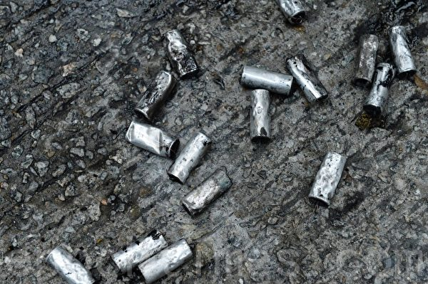
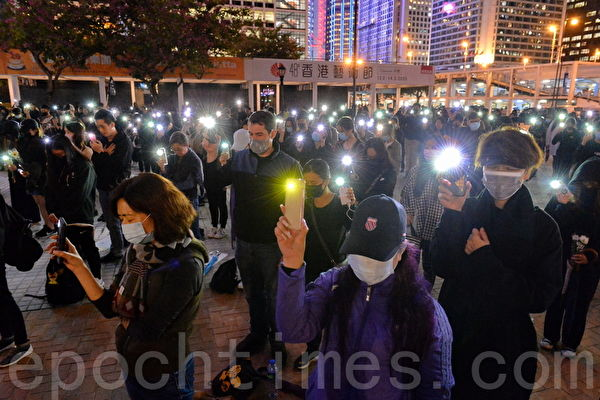
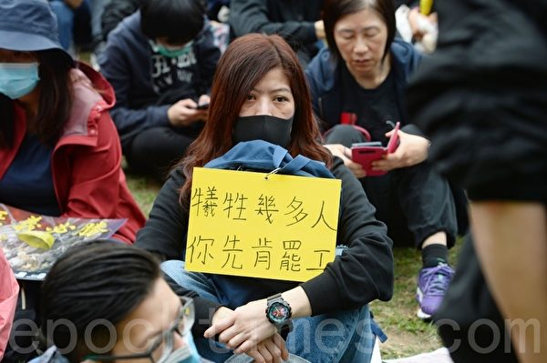

<h1 align="center"><b>请收藏网址(新闻视频ip) 随时连上最新即时IP https://git.io/swspip</b></h1>
<h2 align="center">直连不必翻墙 blossom必看 精彩视频 http://36.227.97.62 </b></h2>

<h4 align="center"><b>知情权不能放弃，也不作愚民，让你看第一手不被过滤的新闻，翻墙软件免费下载  https://git.io/opopop </b></h4>

<h4 align="center"><b>自由门7.70版使用封包过滤技术，增强突破封锁能力。首次运行时，如果以前版本没有安装过，会有提示安装封包过滤器。这是一次性安装，不会影响用户网络，不需要卸载。</b></h4>
<h3 align=center><a href="http://dongtaiwang.com/loc/software/fg/770/fg770p.exe">专业版exe:自由门7.70版</a></h3>
<h3 align=center><a href="http://dongtaiwang.com/loc/software/fg/770/fg770p.zip">专业版zip:自由门7.70版</a></h3>

<h4 align="center">中共覆灭在即 勿依赖中共保权 https://git.io/Ffor </b></h4>

<h4 align="center">● 红潮即将倾覆 天之将明 ●https://git.io/bb99bbss </b></h4>

<h3 align=center><a href="https://github.com/gav01/Heart/blob/master/news1.md">● 大纪元时事 ●</a></h3>

<a name=top>

<a href =#59>59.美军52架F-35战机“大象漫步” 声势浩大 
<a href =#58>58.【揭秘】中共如何利用捷克首富打造形象 
<a href =#57>57.冯仑被退休：退休金8千 广场舞大妈都看不起 
<a href =#56>56.高速收费新系统启动 路费暴涨 民怨四起 
<a href =#55>55.德国《人权问责法》请愿案成功递达 
<a href =#54>54.三正部级高官被批“两面人” 他们干了啥？ 
<a href =#53>53.深圳高楼背后的血泪：湖南工人失去了肺 
<a href =#52>52.安徽合肥三位医护人员经历的残酷迫害 
<a href =#51>51.中东紧张局势升级 法英德首脑促伊朗克制 
<a href =#50>50.苏州十全街发生大面积塌陷 店铺已搬空 
<a href =#49>49.【内幕】谍影重重 中共利用赴美游客窃密 
<a href =#48>48.组图：港人多区快闪 高喊“天灭中共” 
<a href =#47>47.习近平谈中共领导人更替 接班人制再引关注 
<a href =#46>46.大陆又一平台爆雷 涉资千亿 近二百万人受害 
<a href =#45>45.港中联办主任遭撤换 新任骆惠宁有三大特点 
<a href =#44>44.川普击毙伊朗二号人物 对中共释何种信号 
<a href =#43>43.阴霾袭华北黄淮汾渭 69城发重污染预警 
<a href =#42>42.“中国淡水鱼之王”长江白鲟被宣告灭绝 
<a href =#41>41.杭州政府要求全民储粮 被指转嫁粮食危机 
<a href =#40>40.中共长臂深入美校园 中国学生面临红色恐怖 
<a href =#39>39.川普为何下令击毙伊朗将军 五角大楼发声明 
<a href =#38>38.英国掀神韵热 天南海北观众齐聚利物浦 
<a href =#37>37.2020年中国十个科技品牌在海外恐碰壁 
<a href =#36>36.揭大量在美中国留学生遭假公司雇佣 
<a href =#35>35.【新闻看点】教唆港警使阴招？北京陷两难 
<a href =#34>34.严重侵犯人权 古巴国防部长及家人遭美国制裁 
<a href =#33>33.“这是神的恩典” 神韵英国利物浦首场爆满 
<a href =#32>32.中共警察强制中小学男生抽血 建DNA数据库 
<a href =#31>31.【新闻看点】危机来了？官称过紧日子及防暴动 
<a href =#30>30.新年谢师恩 德国法轮功学员谈修大法美好 
<a href =#29>29.陈破空：四大难题无解 恐压垮习近平自身 
<a href =#28>28.家被强拆父母冤死 男子出狱报复致1死2伤 
<a href =#27>27.禁中共黑客盗窃 纳入美中第二阶段贸易谈判 
<a href =#26>26.穿越非洲抵美 山东维权人士万里大逃亡 
<a href =#25>25.周晓辉：习发贺词 2020说新年快乐有些沉重 
<a href =#24>24.山东偷排污水管深埋入海口 污染令人震惊 
<a href =#23>23.【新闻看点】“你被裁了”成热词 中国现失业潮 
<a href =#22>22.7.21警黑勾结 中共鼓励港警流氓化 
<a href =#21>21.神韵传递伟大信息 旧金山精英找到心灵净土 
<a href =#20>20.惧人数破200万纪录 港警腰斩游行毁承诺 
<a href =#19>19.颜丹：中国“暴力伤医”为何异于全球 
<a href =#18>18.大陆火车票抢票软件赛黄牛党 收费藏猫腻 
<a href =#17>17.武汉肺炎疫情 8人发帖遭传唤 引发网络不满 
<a href =#16>16.举债支撑 中共央行降准放水8000亿 
<a href =#15>15.【思想领袖】专访邵岚：港警接令刺激抗议者 
<a href =#14>14.港人游行 警放射催泪弹并出动水炮车装甲车 
<a href =#13>13.谢师恩 大陆法轮功学员祝李大师新年好 
<a href =#12>12.組圖：12.30愛丁堡廣場追悼反送中義士 
<a href =#11>11.林郑 港警 何君尧入选“年度可耻人物”三甲 
<a href =#10>10.程晓容：惧《反渗透法》中共偷换焦点渲染恐怖 
<a href =#9>9.组图：103万港人元旦大游行 街头人山人海 
<a href =#8>8.爆发不明肺炎疫情 武汉海鲜批发市场休市 
<a href =#7>7.山西老板遗书曝光 控诉滴滴黑车垄断 
<a href =#6>6.中共尽失人心 反习势力与保习派激战 
<a href =#5>5.白宫：若朝鲜试射远程导弹 美将采取行动 
<a href =#4>4.中共外交辞令出尽丑 “耿爽模拟器”被下架 
<a href =#3>3.偷带癌症研究材料出境 中国学生在美被控罪 
<a href =#2>2.【新闻看点】欧盟趋强硬 华为：2020生存第一 
<a href =#1>1.香港法轮功学员集会 恭祝李洪志先生新年快乐 

<a name=59>
<h1 align="center"><b>美军52架F-35战机“大象漫步” 声势浩大</b></h1>

2020年1月6日，美国希尔空军基地的52架F-35战机进行“大象漫步”。(R. Nial Bradshaw/U.S. Air Force)

  
  【大纪元2020年01月07日讯】（大纪元记者陈俊村编译报导）美国空军的52架F-35战机在周一（1月6日）进行“大象漫步”（elephant walk）的演练，随即依序密集起飞，以展现其坚实的战力。

犹他州希尔空军基地（Hill Air Force Base）在一份声明中指出，隶属第388战机联队（388th Fighter Wing）和419战机联队（419th Fighter Wing）的52架F-35A战机，成功地进行了这项战力演练。

该声明说，这项演练不但展现“他们部署大量F-35A战力的能力”，也能检视该联队对于人员所担负的责任、飞机世代交替、地面任务、飞行任务与作战能力的准备状态。

<h3 align=center><a href="https://twitter.com/419fw">“大象漫步”演练</a></h3>

在“大象漫步”演练中，这52架F-35A战机在跑道上排成整齐的队形，并以最小的间距首尾相连滑行，以便在最短时间起飞最多架战机。

随后，它们一架接一架地起飞。轰隆隆的引擎声持续不断，响彻云霄。

希尔空军基地表示，来自不同中队的战机同时起飞构成多种挑战，也让联队能评估维修专业人员、飞行员和指挥控制团队的能力。

该基地说，这项演练已经规划了几个月，它是事先安排的正常训练任务之一，并非对目前的任何时事所做的回应。

作为空军中拥有可作战F-35A战机的少数单位，该基地的联队必须随时准备让任何数量的战机起飞，以支援国防任务。而从去年开始，该基地的F-35A战机也持续部署在中东等地区，以支援其作战任务。

该基地在2015年10月接收第一架具有作战能力的F-35A战机，迄今已有78架，目前每天执行30至60次单机出击任务。而从第一架抵达开始，该基地已经完成17,500次单机出击任务，其飞行时数超过33,000小时。

去年8月，该基地在接收一架刚出厂的F-35A战机后不到5个小时，就让它执行单机出击任务，创下让新机上线的最快速纪录。

<a target="_blank" href=#top><h6 align="right">回上方</h6></a>

<a name=58>
<h1 align="center"><b>【揭秘】中共如何利用捷克首富打造形象</b></h1>

图为捷克民众在2018年庆祝“布拉格之春”50周年纪念活动，亲中共立场的捷克总统泽曼（Milos Zeman）没有出席。(Sean Gallup/Getty Images)

【大纪元2020年01月07日讯】（大纪元记者林燕综合报导）英国《卫报》周日（1月5日）报导说，捷克亿万富豪疑出于自身商业利益，资助公关公司为中国（中共）买形象；与此同时，捷克安全部门表示，中共对捷克构成的威胁远甚于他国。

富豪为中共在捷克买影响力的新闻已经发酵多日。上月捷克媒体《简明新闻》网站（Aktualne.cz）报导，捷克境内存在一个所谓的精英网——“专家、新闻工作者和政治领导人网络”，旨在通过公开辩论传播亲北京的观点，从而“影响捷克社会”。

随后，几位捷克国会议员呼吁，要求成立议会调查委员会调查该网络。

那么捷克富豪为何要打造亲北京的精英网？背后有何内幕。

一直关注中国人权的捷克活动人士、时评人奥帕夫斯基（Milan Opavský）告诉自由亚洲电台，近些年来，中共在东欧国家以“一带一路”扩张和渗透，输出极权意识；中共当局也利用经济利益，让捷克的公司成为政治掮客，替中共做事。

<b>组建精英网 打造美化中共的舆论</b>

《简明新闻》报导指，捷克首富彼得‧凯尔纳（Petr Kellner）名下的个人信贷公司捷信（Home Credit）于2019年4月资助一家名为“C＆B声誉管理”的媒体公关机构，开展活动以期改善中国（中共）在捷克的形象。

这家机构在6月份成立了一个亲北京的智库Sinoskop，由这一智库的负责人定期接受捷克媒体采访。

这家媒体公关机构归托马斯‧吉尔萨（Tomas Jirsa）所有。从去年1月，吉尔萨开始掌管捷克主要的网站Info.cz。随后，该网站发表好几篇有利于中国（中共）的文章，文章内容近似于广告，由捷信付费刊登。

几名反对这种广告文的记者相继离开该网站，其中一名记者在捷克公共电视台上公开表示，网站Info.cz“发表的批评中国（中共）的内容越来越少，并与一个敢于批评北京的重要智库（Sinopsis）中止合作。”

捷信则称，他们通过公关公司“是想让人听到不同的观点，增加平衡讨论”。捷信从2007年开始，在中国大陆开展金融消费业务。

被Info.cz中止合作关系的智库Sinopsis，其负责人、中国政策专家马丁‧哈拉（Martin Hala）反驳说，捷信雇用公关公司的底线应该是为它自己的商业利益服务，但决不该用来“推销源自中国以及中共的说辞”。

智库Sinopsis在网站上刊文批评捷信与中共的关系后，它马上收到捷信的“停止及保留权利”法律警告；信中指责Sinopsis“误导或进行不正确的陈述”，除非道歉，否则可能对该智库提起诉讼。

<b>为一带一路等中资项目铺路</b>

专家说，捷克《简明新闻》调查揭示的境内宣传中国（中共）的外国影响力活动，突显了中国（中共）通过其雄心勃勃的“一带一路”计划进入前中欧和东欧国家的积极尝试。“一带一路”计划被认为能为这些国家基础设施项目提供资金。

这些美化中共、替其宣传的第一步就是正常化“中国”，不把中共治下的中国当成专制国家，而是当作一个跟其它国家无差别的形象来展示。

“第一个目标就是美化中国（中共）形象，不将其标榜为专制统治，而是将中国定位是一个开放、愿意改革的国家。而我认为，那是一个不准确的（中国）形象。”哈拉补充说。

分析人士指出，捷克共和国比大多数其它欧洲国家对中国（中共）都更为开放。近年来，中国能源公司CEFC收购了捷克啤酒厂、电视台和Slavia Prague足球俱乐部，华为以及中兴也希望进入捷克的未来5G网络。

现任捷克总统米洛什‧泽曼（Milos Zeman）已数次前往中国，而中国国家领导人习近平也在2016年首次对布拉格进行国事访问。

就 “一带一路”框架而言，中国（中共）多年来一直对中欧感兴趣，而捷克共和国则是一片肥沃而复杂的地方。

研究员雅各布‧詹达（Jacob Janda）说，捷克总统泽曼一直希望将自己的国家“转变成通向欧洲的门户”，在这一点上，“当地经济精英与中国共产党有着共同的利益”。

去年11月，还有捷克媒体披露，中共驻捷克大使馆在布拉格查理大学（Charles University）资助一项介绍“一带一路”项目的课程，甚至花钱请该课程的学生到中国旅行，因而被外界批评为宣传活动。

与此同时，捷信作为查尔斯大学的赞助商，提出大学必须签署一份协议的条件，声明大学不能损害捷信在全球的利益，包括让中国（中共）政府不高兴。此消息遭到学生、教工、舆论批评后，捷信最终撤销了对查理大学的5万英镑捐赠。

<b>布拉格取消与北京的姐妹市 中捷关系降温</b>

但是在政商界希望升温中捷关系时，捷克民间却对这些中国（中共）试图影响捷克的努力产生了强烈的抵制。

例如，布拉格的自由党市长兹德涅克‧贺瑞普（Zdeněk Hřib）在去年10月宣布解除和北京的姐妹市关系。

习近平早在2016年访问捷克时，与当时任职的布拉格市长克尔娜乔娃（Adriana Krnáčová）协定与北京缔结为姐妹市，协定条约中包含承认“一个中国原则”，以及“台湾是中国不可分割的领土”，但去年新市长贺瑞普上任后立即表示，要取消一中条款。

在布拉格迟迟等不到中方回应后，市议会推进提案，获得通过，正式解除与北京姐妹市的关系。北京随后也取消了布拉格爱乐乐团的对华访问计划，作为报复。

2019年，捷克总理安德烈‧巴比什（Andrej Babiš）还根据政府网络安全机构的建议，宣布禁止政府使用华为手机，这也引发了中共当局的抗议。

虽然总统泽曼事后却谴责巴比什，指安全服务部门在“泼污”；但捷克情报部门仍坚持在同年11月底的报告中，正式将中国（中共）在捷克的影响活动视为对捷克国家安全的“威胁”。这从一个层面表明，捷克政府在认真对待来自中国（中共）的威胁。

捷克情报局警告说，中国（中共）对捷克造成的国家安全影响，甚至超过俄罗斯政府的干预。

“BIS主要发现中国（中共）情报人员的活动在增加，并将后者视为对捷克构成安全问题。”报告中写道，“这些活动可以准确地被描述为：在捷克公民中寻找、联系潜在的合作者和代言人。”

<b>捷信的中国生意也不好做 害怕早晚被殃及</b>

专家认为，除非捷信允诺在捷克媒体和政治圈中发送有利中国（中共）的报导，否则中共不会给其这样难得的好处。

2010年，捷信消费金融成为中国首批的4家获准开业的消费金融公司，也是迄今为止国内唯一一家外商独资消费金融公司。（消费金融就是资金放贷，利差是主要营业收入。）

2018年，捷信消费金融以1.79亿欧元（约合人民币13.98亿元）的净利润稳坐24家中国已开业消费金融公司的头把交椅，将招联金融、中银金融等银行系公司甩在身后。

2019年7月15日，捷信集团向港交所递交招股书。

“派富集团（PPF Group NV，捷信母公司）在中国处于非常微妙的政治地位，因为能否在当地开展业务完全取决于当地监管机构，”Sinopsis智库负责人哈拉说。

他透露，派富集团的捷信从2007年在华开展业务，当时北京给出的市场准入条件就是，除非两国关系得到改善。于是，集团雇用说客，扭转捷克国内的反共立场，并安排和陪同总统泽曼2014年访华。

但从2019年开始，在中捷关系骤然降温的大背景下，这些在华的捷克企业开始难受。

中共官方媒体开始对捷信在华信贷业务提出公开批评，而捷信在中共法庭上的多起追讨债务诉讼也相继败诉。

这加剧了外界猜测，捷信开始担心其中国业务的未来前程。捷信董事会成员卡威尓（Mel Carvill）去年2月接受Seznam电视台采访时说，公司“在中国状况良好”，还没有看到“面临任何威胁的迹象”，不过他也警告说，如果两国外交关系恶化，“总有遭受殃及的可能性”。

卡威尓称，虽然公司从未在中国成为攻击对象，但“如果我说假使两国关系破裂一切都会安然无恙的话，我想你也会觉得我很傻”。

他还指出，捷信也在向有“未来成长巨大动力”的印度市场以及东南亚市场转移。

<b>捷克富豪的媒体版图导向何方？</b>

近期，派富集团以16.2亿英镑从AT＆T手中收购了中欧媒体企业（CME），该公司包括捷克共和国最受欢迎的商业电视台Nova，以及邻国的电视频道。

此外，它在匈牙利、保加利亚、斯洛伐克、塞尔维亚和黑山也拥有电信资产。虽然派富称，它遵守所在国的所有法律，同时旗下的媒体节目不会受到政治干扰，但仍有人对此持怀疑态度。

捷克政治分析家兼人权活动家彼得‧库蒂列克（Petr Kutilek）说：“派富为达成这笔交易才说，他们永远不会介入政治。但从捷信的业务来看，您实际上已看到他们正在干预政治。”

智库负责人哈拉表示，这些在华有生意的捷克企业担忧的是，一旦他们不遵从中共指示，“要付出什么代价”。

派富集团创始人凯尔纳，1964年出生，22岁（1986年）毕业于布拉格经济大学生产与经济学院，27岁（1991年）成立了一只投资基金PPF，于90年代中期入股捷克最大保险机构，将一家低效率的国有企业转变成能持续经营的私营公司，由此发家。

1989年在捷克斯洛伐克共产党垮台之后，捷克进行大规模国有资产私有化，凯尔纳就是在这一过程中积累了巨额财富。

凯尔纳的派富集团已横跨保险、消费金融、银行、电信、房地产、生物技术等多个领域。截止2018年底，派富集团资产超过450亿欧元，捷克国家银行甚至将其列为具有系统重要性的金融机构。

而凯尔纳也是捷克，甚至东欧十六国的首富。#

<a target="_blank" href=#top><h6 align="right">回上方</h6></a>

<a name=57>
<h1 align="center"><b>冯仑被退休：退休金8千 广场舞大妈都看不起</b></h1>

冯仑称自己被退休，每月退休工资仅8千，引发热议。图为2018年4月25日，冯仑在阿拉善SEE四川项目中心成立大会上。（大纪元资料室）

  
  【大纪元2020年01月06日讯】（大纪元记者梁义综合报导）近日，万通集团创始人冯仑的一段视频在推特上引发热议。冯仑指自己被迫退休，但每月退休工资仅8千元，让跳广场舞的老太太都看不起。

在“2019冯仑风马牛年终秀”上，万通集团创始人冯仑表示自己已到60岁，一天有一个组织告诉他，“你必须来办手续，你退休了！”

冯仑纳闷，“我一个民营企业，怎么被退休呢？”并且是：“他强迫你退休，非得退！”

冯仑说，自己一想，退了也行，也许有人给发工资，就好奇地问给多少钱呢？被告知一个月退休工资8千块钱。

<h3 align=center><a href="https://twitter.com/wuwenhang">员工举报中共厅级官员生活淫乱，被以寻衅滋事罪获刑4年！😂现在上访人员申诉也是犯法了，直接抓起来！</a></h3>

他一看这个数，挺头痛，因为这个数，都不足以让他在广场舞群里抬头来。因为广场上跳舞的大妈最爱问老头的一件事就是，退休金多少钱？

“我如果要去跳广场舞，人家老太太问，‘老头，退休工资多少钱呢？’。我说8千元。老太太立马就走。因为她们能看上的，退休金起码得过一万元。”

视频在推特上引发热议，有评论称，“现在中共以国家的名义共产，明抢！”

另据大陆媒体报导，冯仑还谈到当下的经济比较冷，提到“今年，比起未来十年，是最好的一年”，“如果说去年钱变少了，今年钱就变没了”。

冯仑还调侃不少民企的人被关进去，“去年，有时在吃饭的时候，会有人说某一个哥们找不着了。干吗了呢？成为‘两院院士’，进了‘法院’或者进了‘医院’，找不着了。今年，说是学习完，吃饭的时候，又回来了。大家都挺高兴……在学习期间，很多平时见不到的名人都见到了，特别是P2P的专家，见得挺多。而且，原来还有一些哥们要约，没约着，最后到这儿见着了，特高兴。然后还时不时地讨论一些业务，最后发现，讨论得最多的业务是风险控制。”

资料显示，冯仑，1982年毕业于西北大学，获经济学学士学位。1984年毕业于中央党校，获法学硕士学位。毕业后先后在中央党校、中宣部、国家体改委、武汉市经委和海南省委任职。

1991年冯仑创建万通集团，1993创建万通地产，并且是中国民生银行的创业董事。万通集团在几年内总资产增长逾30亿元人民币。

1999年与深圳万科的王石等联合发起并成立了中国首家房地产策略联盟机构——中城房网。2001年，冯仑获得“十大最具人气企业家”称号，在地产界其“地产思想家”的称呼广为人知。

冯仑曾劝诫私营企业家要“听党的话，按政府的要求办”，但也直言不讳的批评政府滥发货币刺激GDP增长，推高了房价，以致出现社会公平问题。冯仑也曾批评“国进民退”破坏正常的市场经济发育环境；以及政府随意改变公共政策，导致丧失信用。

近年来，经济不断下行，去年9月马云“被退休”后，紧接着大陆一系列科技大佬纷纷卸任重要职务，包括百度公司创始人李彦宏、腾讯公司董事会主席马化腾、京东集团董事局主席刘强东等。顺丰控股董事长王卫，也于近期卸任顺丰商贸公司董事长；联想控股董事长柳传志去年12月18日宣布退休计划。
<a target="_blank" href=#top><h6 align="right">回上方</h6></a>

<a name=56>
<h1 align="center"><b>高速收费新系统启动 路费暴涨 民怨四起</b></h1>

今年1月1日中共统一启用ETC（电子不停车收费系统）之后，大量网民发现高速公路通行费上涨，质疑中共强推ETC的背后另有目的。图为一辆车经过高速路收费站时显示的应缴费用。（网络图片）

  
  【大纪元2020年01月06日讯】（大纪元记者张玉洁综合报导）今年1月1日中共统一启用ETC（电子不停车收费系统）之后，大量网民发现高速公路通行费暴涨。民众质疑中共强推ETC的背后另有目的。

中共1月1日统一启用ETC之后，29个联网省份的487个高速公路省界收费站全部取消。

随后，大陆高速公路通行费上涨，成为2020年新年伊始最受关注的话题之一。有网民发现，大车小车的高速费都大幅上涨，货车出现20%甚至60%的涨幅，有一些地方的ETC通道不再显示费用。网民质疑中共强推ETC的真正目的是为了多收费和监控。

有网民表示：“以九五折来吸引车主们上ETC，然后大幅提高收费标准。同时汽车上装了ETC设备后将更好地被监控，就是我们现在看到的效果。”

还有网民说，“搜了一下，原来是真的，偷偷摸摸。从大货车到小轿车。对此只能说一句：2020年从高速费涨价开始。​”“2020听说，从高速费调整到一切刚刚开始……交通部拈指尖，就能制造一场2020中国经济灾难。 ​”

有分析表示，高速公路通行费涨价与老百姓的生活息息相关，接下来就是物流货运成本上涨，而物流成本提高会引发物价全面上涨，所有的涨价都将分摊在商品中，包括粮食、蔬菜，以及生活日用品。

<b>官方惯用“系统出问题”  民众：民心丧失</b>

一位货车司机1月4日从（湖北）胡集镇上高速，（湖南湘西）吉首收费站下高速，全程550公里，收费3870元。事后有大陆媒体称是系统出现问题。

近日关于ETC实行之后出现的乱象，比如堵车等，官方也多用“系统出问题”的说法来解释，但民众不买单，表示“别有问题就找系统，系统冤不冤啊。”，“民间对涨价反应剧烈，领导赶紧出来说是系统错误，这种把戏其实挺常见的。接下来就会有各种涨价，为什么，还债高峰期到了。”
  
  

  
上述评论所提到的中共债务问题，彭博数据近日显示，2020年中共地方政府有2万亿债券到期，是历年来最高的年份，有网民估算，这笔金额是再建14个香港国际机场的费用。

有网民感慨：“突然好像明白了为什么强推etc……方便涨价啊。我见到了，民心一点点丧失的过程。怪不得老百姓不相信那些好事，因为他们经历的这些好事结果都是其它的……周围的朋友全部都是这个反馈。”

一位河北的物流卡车司机表示，他从四川自贡上高速，在河北衡水冀州西下了高速，全程1650公里，计费器显示7002元高速费，相当于每公里4.2元，当时这位司机愣住了，随后经过“讲价”实际支付4201元。
  
  

  
除了上述货车司机，私家小车车主近日也表示高速费用普遍上涨。有网民说，“五座小车都涨价了，原来15元现在17元，同样路段高速费比油费还高。”

“我昨天开五座私家车从思南到贵阳原收费180元，昨天收费205元，两收费站相距约250公里，每一公里收费超0.8元了，不知是怎么回事，不是说高速要降吗？”

还有网民表示：“这两天上高速ETC就不显示费用，你稀里糊涂就被扣款了。”
  
  

<a target="_blank" href=#top><h6 align="right">回上方</h6></a>

<a name=55>
<h1 align="center"><b>德国《人权问责法》请愿案成功递达</b></h1>

图为德国国会大楼。(TOBIAS SCHWARZ/AFP via Getty Images)

【大纪元2020年01月07日讯】（大纪元记者余平德国报导）德国敦促国会通过《马格尼茨基人权问责法》的网上请愿活动成功结束。据请愿发起人介绍，在去年12月30日期限内，至少有7.5万至8万民众签名，支持这项提议，远远超过德国国会规定的5万签名的最低人数。

去年10月，德国工程师格鲁奥（Ralf Gronau）向国会请愿委员会发起第99914号请愿，标题为“针对在中国实施的残酷侵犯人权的行为，敦促在德国引入《全球马格尼茨基人权问责法》”。

请愿活动到去年年底结束时，仅在线签名的人数就已经突破6.2万。在德国很多城市，例如汉堡、慕尼黑、柏林、法兰克福、斯图加特、波恩、杜塞尔多夫等等，还有志愿者在街上寻求民众签名支持。格鲁奥表示，对这部分签名没有最后统计，他估计至少在1万以上，因此这项请愿活动得到了至少7.5万民众的支持。

这项请愿活动也得到德国政治家的支持，例如德国国会议员尼森（Ulli Nissen）就呼吁民众签名支持。尼森女士于去年12月在其发表的通讯（Newsletter）中写道：“请支持这个要求（德国国会）接受《全球马格尼茨基人权问责法》的请愿。通过该法案，人权迫害者的资产会被冻结，迫害者会被禁止入境德国。这涉及到全球范围内的犯罪分子，尤其是中共的犯罪分子。”

她还写道，“我们收到了很多有关中共残忍迫害无辜者的信息，只因为他们的信仰不同。已经有令人震惊的线索和证据表明，法轮功学员的器官在违背他们意愿的情况下遭到强行摘取，成千上万的维吾尔族人被关进再改造营。”

美国于2015年12月通过了《全球马格尼茨基人权问责法》。该法案授权美国政府对违反人权的人及国外贪腐分子实施制裁，例如拒发签证、冻结其在美国的财产等。2016年12月，该法案成为法令。

目前，加拿大、英国、爱沙尼亚、立陶宛和拉脱维亚也有类似法律。欧洲议会于2019年3月通过了一项决议，呼吁欧盟及其成员国通过类似《马格尼茨基法案》的法律。德国尚未通过类似法案。

中共对人权的破害和践踏、对香港抗议民众的暴行、对新疆维族人的迫害等已经越来越受到全世界的关注。在中国还有数以百万计的民众被非法关押、遭受酷刑，甚至殴打致死或被摘取器官，尤其是法轮功修炼者、基督徒、维吾尔人、藏人、异见人士等。

请愿发起人格鲁奥表示，希望把中共践踏人权的恶行曝光出来，让更多的民众知道，目的是制止中共继续行恶。他表示，预计本周就将收到请愿委员会的信函，他将为公开听证会做准备。

根据规定，如果在规定时间里向议会提交的请愿书达到5万以上的签名，由28名议员组成的请愿委员会原则上必须就此举行公开听证会，并且邀请请愿发起人参加。#

<a target="_blank" href=#top><h6 align="right">回上方</h6></a>

<a name=54>
<h1 align="center"><b>三正部级高官被批“两面人” 他们干了啥？</b></h1>

陕西省委前书记赵正永等42名高官被批是“两面人”。（大纪元合成图）

  
  【大纪元2020年01月06日讯】（大纪元记者张顿报导）2019年，中共42名中管干部被立案审查调查，他们都被指是“两面人”，其中三名正部级高官赵正永、秦光荣、孟宏伟被点名批评。

1月4日，中共陕西省委前书记赵正永，赵的“大管家”、陕西省副省长陈国强被立案审查调查。

中纪委批赵正永是典型的“两面人”、“两面派”，大搞特权，培植个人势力，搞团团伙伙；批陈国强“不忠诚不老实”，大搞政治攀附和人身依附，对抗组织审查等。

1月5日，中纪委官网刊发的《坚决清除两面人、两面派》文章说，2019年中央纪委国家监委立案审查调查的中管干部，无一例外都存在“七个有之”和“两面人”问题。

而2019年1至11月，有42名中管干部被立案审查调查。中管干部，是指在中组部备案、由中共中央任命的干部。中管干部，一般为副部级以上官员。

文章点名批赵正永是典型的“两面人”、“两面派”，点名批中共云南省委前书记秦光荣“公开发表与全面从严治党要求相违背的言论”，点名批中共前公安部副部长孟宏伟“拒不执行党中央决定”。

那么这三名正部级的高官，到底干了些啥呢？
赵正永对当局“阳奉阴违”

赵正永2010年6月任陕西省代省长，2011年1月升任省长，2012年12月至2016年3月任省委书记。

就在赵任省委书记期间，习近平从2014年5月至2016年2月，四次就“秦岭违建”案做出批示，但陕西省高层一直“阳奉阴违”，“企图蒙混过关”。

赵正永被调任中共人大后，习近平又连续就“秦岭违建”案做出批示，并派出以中纪委副书记徐令义为组长的督导组，秦岭违规建别墅问题才得以解决。

赵正永2019年1月15日被调查，成为2019年落马的首名正部级高官。

当局批他拒不落实“两个维护”的政治责任，对中央决策部署“阳奉阴违、敷衍塞责、应付了事”，多次“欺骗”组织，对抗审查，是典型的“两面人”、“两面派”；大搞特权活动，培植个人势力，搞团团伙伙，纵容亲属肆意插手干部选拔任用工作，严重破坏选人用人制度。
孟宏伟拒不执行当局决定

孟宏伟2018年10月被查，2019年3月被“双开”、提起公诉，2019年6月20日被一审，检方指控其受贿1,446万余元（人民币）。

当局指控他“对抗组织，拒不执行党中央决定”，“公权私用，滥权妄为”，“纵容其妻利用其职权搞特殊、谋私利”等。

时政评论员石实此前对《大纪元》表示，还兼任国际刑警组织主席的孟宏伟，被查的根本原因，是因为他“对抗组织”、拒不执行当局决定，这与当局要求官员“维护习核心”背道而驰。

孟宏伟被指是江派周永康的人马。他曾长期在中共公安部工作，周永康2003年任公安部部长，第二年，孟宏伟就被提拔为副部长、党委委员，并兼任国际刑警组织中共国家中心局局长，成为周的重要副手。
秦光荣曾叫板中南海

秦光荣2019年5月9日“主动投案”，9月26日被立案审查调查、起诉，11月25日被提起公诉。

当局指控他对当局“不忠诚不老实，做两面人”；“公开发表与全面从严治党要求相违背的言论”，干预和插手矿产资源转让；与不法私营企业主沆瀣一气，大肆敛财等。

秦光荣也被指是江派周永康、薄熙来的人马，被指曾给周家输送大量利益。

在当今中共官员几乎人人都贪腐的情况下，外界普遍认为，秦光荣被查的主要原因也是政治原因：与当局唱反调，“做两面人”。

秦光荣的唱反调主要表现在：

重庆事件2012年2月6日爆发，时任政治局委员薄熙来、政治局常委周永康、江泽民、曾庆红正在密谋进行的政变计划随即曝光。

但同年2月8日至9日 ，政变主角、重庆市委书记薄熙来高调到云南“考察”时，时任云南省委书记秦光荣率本地官员一路陪同，并在海埂公园一起投喂了海鸥。

秦光荣也曾积极投靠薄熙来，并高调称“把云南打造成支持薄书记的坚实基地”。

但就在2012年3月，薄熙来被免职，第二年，薄被判处无期徒刑。

2014年7月29日，中共前政治局常委、政法委书记周永康被立案审查。第二天，秦光荣在省委中心学习会议上讲话时称，官员“不能因为一点自身利益就举报；自身清白干实事的也不要怕被举报”，并称“云南100封举报信，可能6封是实的”。

秦光荣的言论当时引发舆论大哗，被认为与王岐山主掌的中纪委鼓励官员举报对着干，与前一天刚刚拿下周永康的习近平叫板。

秦发表该言论不到3个月，就于2014年10月14日被免去云南省委书记，随后调任中共人大闲职。#

<a target="_blank" href=#top><h6 align="right">回上方</h6></a>

<a name=53>
<h1 align="center"><b>深圳高楼背后的血泪：湖南工人失去了肺</b></h1>

中共官员们经常把深圳称为中国通往世界的窗口，但浇筑高楼大厦地基时，对工人的肺造成永久性伤害。(NICOLAS ASFOURI/AFP via Getty Images) 

【大纪元2019年12月23日讯】（大纪元记者吴馨综合报导）当他们浇筑高楼大厦的地基时，花岗岩粉尘也渗入了他们的胸膛。十多年后他们的双肺变得僵硬，他们会因呼吸困难气绝而终，没人关心他们的求救，而中国尘肺病人还在增加。

施家曦（Gerry Shih）毕业于斯坦福大学，是美国《华盛顿邮报》的驻中国记者，曾是美联社驻北京的记者，负责报导中国新闻。近日，美国《华盛顿邮报》发表了他从湖南耒阳采访的报导，文章讲述了多个尘肺病人的故事，以及他们上访无果的社会现实。

<b>徐春林：这里本应亲人满堂</b>

中共在1980年批准深圳成为经济特区时，深圳的人口仅为三万。在几十年内，农田变成了苹果手机的工厂、亚洲第四大证券交易所和超富豪的高楼大厦。深圳的经济产值从1980年的400万美元猛增到2018年的3,400亿美元，中共官员们经常把深圳称为中国通往世界的窗口。

对于三十年前的徐春林来说，深圳是走出穷困湖南耒阳市的一条出路。但他怎么也没想到有一天他会想在这里的立交桥上往下跳。

1989年，年仅21岁的徐春林与他的四个兄弟一起来到深圳冒险，他们在这里的建筑工地工作。他回忆说，他当时带着5000元人民币（约合现在的710美元）回家过年，立即将它们全部换成了大米，超过3300磅（约1500公斤）的大米堆成了粮仓，这样他的家人就可以不再挨饿。

四年后，徐春林开始做中间人，他将村民介绍给深圳的分包商，分包商在工地预留了一半的工作给湖南人。慢慢地，徐春林成了一个相对富裕的人，住在一栋带华丽铜门的三层楼房里。他在接受施家曦采访时说：“村里的每个人都想认识我，因为我有工作。而深圳的每个老板都想认识我，因为我有人。”

徐春林所说的工作有一个专业的名称：孔桩爆破井下风钻作业，就是用手提钻钻炮眼，然后装上炸药炸出桩孔，有时深度达150英尺（约45米）。然后，他们将钢筋水泥倒入桩孔中，成为高楼大厦的支柱。

但是，徐春林并不知道，当钻头钻进花岗岩层中时，二氧化硅粉尘一旦吸入肺腑就具有不可逆转的危害。在过去的十年中，湖南有100多名前劳工死于尘肺病，这是一种无法治愈的疾病，因吸入的尘埃微粒导致肺部产生疤痕和硬化。

徐春林在深圳矿区工作的四个兄弟已经去世，他自己也被诊断患有晚期尘肺病。徐春林指着他空荡荡的房子说，如果他从未接触过风钻工作，这里将会住满了他的兄弟、侄女和侄子们。

在深圳建筑林立的背后，许多建筑工人的健康产生不可逆转的危害。徐春林的四个兄弟已经去世，他自己也被诊断患有晚期尘肺病。示意图。(WANG ZHAO/AFP via Getty Images)

  
  <b>桑植县的悲剧：重蹈覆辙</b>

陡峭的砂岩峡谷遍布桑植县，这是湖南省的一个贫困县，这里几乎没有工业，甚至没有农业。但是带有仿欧式栏杆的多层房屋沿道而建。记者施家曦认为，这是当地人在深圳等城市打工后的回报，也是用人命为代价建立的。

“每个人都会盖一栋大房子，然后没人住在里面。”前钻工谷中平（音译：Gu Zhongping）在开车时说。他并指出，在一栋房子里，一名前深圳钻工正在死亡或已经死亡。

村民们表示，自2009年以来，桑植县已有超过26名前钻工死于尘肺病，他们说死亡人数正在增加，另有约100名重病患者。尽管没有官方数字，但在网上找到的湖南市级文件支持了村民的主张。2017年的健康检查显示，有290名村民患有尘肺病，其中大部分在桑植。

2013年，《新京报》报导，在耒阳农民工逐渐退出深圳风钻行业后，桑植县的农民工开始接手。资料显示，自2004年后，张家界（桑植县所属市）在深圳做风钻工的民工约有300人。

桑植县芙蓉桥乡的谷龙国自2006年到深圳做风钻工，2013年接受《新京报》采访时表示对打风钻的危险有一定了解，并说：“（耒阳）导子乡的现在，极可能是我们的未来。”

既然如此，他为什么还要做风钻工呢？谷龙国表示，家贫龄大，风钻工是他能找到的最好的工作了。他说，现在戴的口罩比以前要厚，有海绵垫，吸收的灰尘比以前少了很多。

<b>尘肺病：2300万壮丁或为此付出生命</b>

刚开始，吸入岩石沙灰和微小矿物晶体的工人不会立即感觉到症状，但是在几个月，甚至几十年的时间里沉积下来的颗粒却会对肺造成毁灭性的破坏。一旦患上尘肺病，走路，甚至说话，都变得困难，平躺会造成窒息的感觉，因此大多数患者在小型氧气机旁睡觉。在后期，他们会遭受剧烈喘息，体重急剧下降，经常感冒和发烧。肺炎和肺结核很容易致命，肺部迟早会停止运转。

在发达国家，与工作有关的肺部疾病一直保持稳定或下降，因为煤矿开采等工作的减少和安全标准的提高。但在中国，尘肺病人却正在增加。

根据中共国家卫生委的数据，2018年，约有87.3万名中国工人患有尘肺病，高于2000年的约55.9万名。北京一家非营利组织“大爱清尘”估计，真实的患者人数要高得多，可能约为600万人。

正在研究这场危机的中共官员表示，中国有2300万工人有患上这种疾病的危险。卫生部门和研究人员估计，这远远超过印度的1150万高风险工人，美国的200万和欧洲的170万。

中国有近3亿农民工就业于合法的灰色地带，缺乏合同的保障。图为湖南农村的一名工人。(AFP/AFP via Getty Images)

  
  <b>湖南的悲剧谁之过？</b>

中共于1978年12月18日开始推行实施改革开放，40年后的今天，中国社会正面临着因追求现代化而积累的各方难题。

农民从农村来到城市寻找工作，近3亿农民工就业于合法的灰色地带。中共国家统计局的数据显示，尽管2008年颁布了一项法律要求所有雇主提供书面合同，但2016年只有35%的农民工与雇主签订书面合同，这一数字还正在下降。大爱清尘2014年的全国调查发现，患有这种疾病的工人中只有7%签署了合同。

康奈尔大学（Cornell University）工业和劳工关系学院国际项目主任、中国劳工专家埃里·弗莱德曼（Eli Friedman）表示，中国的建筑业是一个因工死亡占所有行业因工死亡人数四分之一的行业，也是靠包工头非正式雇用工人的行业。他说，中共的劳工系统“将风险降至最低。”

香港中文大学职业健康研究中心主任谢立亚（Shelly Tse）教授说，由于尘肺病的潜伏性，深圳的工人受到了进一步的伤害。

谢教授说：“当工人在10年后感觉到逐渐恶化时，他们已无法确定自己患上这种疾病时所服务的公司了。公司也可能已经破产了。”

<b>维权过程中发生警民冲突 风钻工被逼跳桥</b>

徐春林看着他村庄的死亡人数激增至70多个，6人因病自杀。像曹家这样的当地氏族遭到了破坏，他们埋葬了在深圳患上尘肺病的三个兄弟。

他说：“我们必须做点什么。人们需要生存。”

湖南工人维权抗议，图为湖南的一名尘肺病患者，他曾是一名建筑工人，摄于2013年。(Ed Jones/AFP via Getty Images)

  
  在湖南的桑植县和汨罗市，生病的工人开始被动员起来，将他们的诉求带到深圳。

2018年11月上旬，他们数百人占领了深圳的一栋政府大楼，之后警察用警棍和胡椒喷雾将他们驱散，进一步令他们虚弱的肺部受创。

根据四名抗议者、维权人士和新闻报导的说法，就在与警察发生冲突期间，被警察逼上立交桥、逼向角落的工人们威胁集体跳向八车道的深圳高速公路自杀。

徐春林表示，他当时已准备为此而死。

但他后来表示，他感到要对这些钻工们负责，因为他是1990年代率先将乡亲们带到深圳的湖南人之一。

徐春林说，站在那个立交桥上，他向他们大吼，不要靠近栏杆，不要疯狂，保持镇定，改日再战。

谈判于第二天早晨11点开始。几周后，宣布了一项协议：深圳将为尘肺病患者支付17,000至35,000美元，并支付医疗费用。但问题并没有完全解决。

密歇根大学（University of Michigan）政治学家玛丽·加拉格尔（Mary Gallagher）表示，在缺乏健全法院的情况下，中共通常以这种方式解决劳资纠纷。农村请愿者组织群众，反复示威；官员们希望通过一次性付款来安抚他们。她说：“但是他们从不承认系统性的失败。”

<b>徐春林继续上访：只为良心</b>

湖南请愿人与当局之间的冲突仍在继续。请愿者说，数十名希望返回深圳或北京谋求更多补偿的工人被一再拦截，并至少有一次被警察粗暴对待。

受灾地区的村庄已受到密切监视。在前往桑植县的一次采访途中，《华盛顿邮报》的一名记者被便衣警察包围，被迫离开该省。当局还骚扰了在另一次采访中受访的村民。

对于桑植县抗议领袖来说，这场争端没有解决。他坐在一间农舍，策划着他去深圳或北京的第13或14趟上访之旅。他担心官方报复，并在匿名的情况下发言。

他说：“这个社会不存在正义。它拥有的荣耀、财富和摩天大楼建在我们的脊梁上。”

在湖南风景如画的山谷中，现年51岁的徐春林说，多年来随着村民们一个接一个生病，一些家庭来恳求帮助，另一些家庭则诅咒他在深圳为钻工找到工作。

在过去的两年中，他花了12,000美元在深圳为抗议者提供食宿。他在微信上为全国尘肺病上访者家庭提供建议。他探望耒阳的寡妇，因为他们的丈夫曾经跟随他南下工作。他还在上访。

他说，他想要的只是政府对这种疾病的公开数据信息，而不是金钱。

“这是良心。”

本文首发于《真相中国》周刊 2019.12月号/第24期 #

<a target="_blank" href=#top><h6 align="right">回上方</h6></a>

<a name=52>
<h1 align="center"><b>安徽合肥三位医护人员经历的残酷迫害</b></h1>

2013年2月2日，74岁的安徽省合肥工业大学退休校医蒋翠萍在中共没完没了的骚扰、恐吓、抄家和绑架中离世。（明慧网） 

  
  【大纪元2019年12月28日讯】在中共对法轮功持续20年的迫害中，不计其数的法轮功学员因为不放弃修炼，惨遭中共的迫害，身心受到巨大的伤害，甚至失去生命。本文所讲述的安徽省合肥地区三位修炼法轮功的医护人员的遭遇，只是无数的法轮功学员被迫害事实的冰山一角。
  
<b>合肥工业大学退休校医蒋翠萍在迫害中离世</b>

蒋翠萍，女，74岁，安徽省合肥工业大学退休校医，1993年开始修炼法轮功，身心受益。她按照法轮功“真、善、忍”的标准要求自己，处处为别人着想、默默地付出。
  

蒋翠萍（明慧网）

  
  1999年7月20日，中共开始疯狂迫害法轮功后，蒋翠萍在中共没完没了的骚扰、恐吓、抄家、绑架中，于2013年2月2日离开人世。以下是她生前遭受的种种迫害。

1999年12月5日，蒋翠萍进京为法轮功鸣冤遭绑架，被非法拘留后，又被劫入洗脑班非法关押了10天。

2007年9月28日晚，蒋翠萍在家中被庐阳区国保大队、刑警队、街道等一帮人绑架。

2008年5月21日晚，蒋翠萍被合肥市庐阳区国保大队、芙蓉派出所、工大保卫处二十多人绑架。

2012年7月23日，蒋翠萍在合肥工业大学北区菜市场给两个卖瓜的农民讲法轮功真相时，突遭庐阳区国保大队绑架、抄家，当晚12点20分被单位接送回家。

同年8月，庐阳区“610”（专门迫害法轮功的非法机构）、安庆路派出所和合肥工业大学保卫处以“上门关心”为名骚扰蒋翠萍。

9月下旬，蒋翠萍的家中突然闯进几个彪形大汉，他们自称是安庆路派出所的，进门就问，蒋翠萍家是否是做法轮功真相的资料点，因为有电脑和有打印机。

中共警察不由分说，大声吼叫，把蒋翠萍连拖带拽抬下楼，塞进警车里，劫持到了安庆路派出所。一部分警察看守着蒋翠萍并审问她，另一部分警察开车到她家抄家，把家翻了个底朝天，将所有法轮功书籍一扫而光。当天深夜，她儿子才把她接回家中。

在中共的恐怖高压下，蒋翠萍忧心忡忡，提心吊胆。同年10月份，她去医院检查，查出患有肺癌。

2012年11月22日，又有一批警察突然闯进蒋翠萍家，自称是包河区“610”配合合工大南区校保卫处的警察，一伙十多人，还口口声声地说：“你不用怕，这次来不抄你的家，只请你跟我们走一趟。”

蒋翠萍说：“我哪也不去，这是我的家。”警察们恼羞成怒，一拥而上，把她强行抬下楼，塞进警车里，直接送进合肥市“610”办的洗脑班。

在中共不法人员没完没了的迫害中、恐吓高压中，蒋翠萍旧病复发，于2013年2月2日凌晨4时，离开人世，终年74岁。

<b>屡遭酷刑的合肥医生汤菊章失踪</b>

2019年10月28日，合肥医生汤菊章被中共当局强制失踪，至12月底，关于汤菊章的情况还是音讯全无。

2015年6月14日，汤菊章向最高检察院控告元凶江泽民。

明慧网报导她遭迫害的部分事实：

2003年12月，合肥康泰医院人员将她弄到合钢招待所办的洗脑班。她拒绝写所谓“四书”，被单位停职处理，后开除公职。

2004年4月至2010年6月，她先后被非法关押在宿州监狱、合肥市第一看守所、第二看守所、女子劳教所，期间受尽折磨和凌辱，使她的身体、精神受到严重伤害。

2010年6月，她最后一次走出劳教所后，失去家庭、没有工作，三次工作均因是法轮功学员的身份而失去。

2004年4月，她将法轮功光盘分发给家乡人看，被巢湖市公安局警察关进巢湖看守所，后被非法劳教3年。

在宿州监狱，一开始她被关进五分监区，在那里她遭受过吊、铐、电棍、关禁闭室等迫害，以及遭受服刑犯的殴打和辱骂。

2005年下半年，她被转到老残队、关在阴暗的储藏室强行“转化”（放弃修炼）。看守所瞒着她在给她的食物里下不明药物。

2008年3月，她去火车站看一位朋友，在站外给一位病恹恹的老者一张法轮功真相护身，不料这老人向站内警察举报她。她被绑架到合肥第一看守所、非法劳教1年。

一进合肥女子劳教所二大队，她就被关禁闭。狱警唆使劳教人员对她进行折磨：她们用挑水的绳子和布带将她吊起，四肢向四个方向拉；她绝食抗议，她们就用野蛮灌食手段折磨她，撕她嘴角的肉，一天反复多次给她灌食。见她不妥协，又给她穿上“约束服”，五花大绑。

  

中共酷刑演示图：约束衣。（明慧网）

2009年5月，她在下班路上给一名学生讲法轮功真相时，被稻香楼派出所警察劫持到合肥第二看守所关押，后又将她劫持到合肥女子劳教所非法劳教1年。

期间，她遭到酷刑“约束服”的摧残，恶徒们给她头上缠上胶带，捂住嘴巴，早上将她从监舍拖到车间，晚上从车间拖到监舍，上下四五层楼，拖上拖下，她的头被她们倒着、顺着地拖过，拖了一个多月。

2014年5月，她被蜀山区国保大队关进合肥清风苑宾馆洗脑，多人对她威逼、恐吓。为了摆脱这没完没了的纠缠，她不得已离家出走，流落他乡。

<b>多次遭抄家抢劫 八旬老中医周正伦损失惨重</b>

周正伦 ，男，80多岁，合肥肥西县小庙乡法轮功学员，出身中医世家，行医60多年，曾治愈了很多疑难杂症，是当地非常有名望的老医生。1999年7月20日之后，只因坚持修法轮功，老人多次被警察绑架、抄家，一度被迫流离失所、孤苦无依。

2002年10月5日，肥西县公安局警察在没有出示任何证件的情况下，对老人进行非法抄家。警察抄走大量的电器和法轮功书籍，以及现金3,000多元。

因为抄到了现金，警察们去镇上大吃大喝，留下一人看守老人。后来天色渐黑，老人趁看守不注意成功逃脱。

警察们饭后回来发现老人已经不知去向，就出动几十个警察闯入附近老人女儿家的旅馆，砸掉三间客房门，再次抢走现金3,000多元。他们没抓到老人，就把老人不修炼的女儿抓到公安局逼审。

周正伦老人得知后，被迫开始长达近5年流离失所的生活。那时老人已经76岁高龄。

2007年9月28日，肥西警察查到老人在合肥市的租房处，再次前去非法抄家。这一次，他们抢走法轮功书籍，以及老人多年行医的积蓄、用作养老的43,600多元现金。

因老人独身在外，无亲无故，被押送到肥西县小庙乡家里软禁监控，但结案后警察并未把这笔钱归还给老人，将这笔钱当“保证金”继续扣押。

2009年7月17日，警察再一次对老人抄家，当时有八九个警察闯进老人家中，一人问话、其他人在家中到处乱搜乱翻，抢走他们看中的东西。

老人要求他们出示蒐查证件，警察们说“警服就是证件”。老人要打110电话报警，抢东西的警察说：“我们开来的警车就是110。”在几次的抄家迫害中，肥西县国保大队队长宣以文均在现场。

<a target="_blank" href=#top><h6 align="right">回上方</h6></a>

<a name=51>
<h1 align="center"><b>中东紧张局势升级 法英德首脑促伊朗克制</b></h1>
  <h3 align="center"><b>马克龙致电川普：力挺盟友</b></h3>

周日（1月5日），法国总统马克龙致电川普总统，表达力挺盟国之意。(LUDOVIC MARIN/AFP via Getty Images)

【大纪元2020年01月06日讯】（大纪元记者吴英综合报导）近日美国与伊朗紧张局势升级，周日（1月5日），德国、法国和英国领导人发表联合声明，呼吁德黑兰克制。法国总统马克龙致电川普总统，表达力挺盟国之意。

德国总理默克尔（Angela Merkel）、法国总统马克龙（Emmanuel Macron）和英国首相鲍里斯・约翰逊（Boris Johnson）5日在一份联合声明呼吁伊朗克制，并“取消所有不符合2015年伊朗核协议的措施”。

他们在声明中说，现在至关重要的是“降温”，并呼吁所有参与其中的国家展现“最大的克制和责任”，同时保证将继续寻求减缓紧张局势和确保中东稳定的方法。

2015年，伊朗与联合国安理会五个常任理事国（英国、法国、中国、俄罗斯和美国——加上德国达成《全面联合行动计划》（Joint Comprehensive Plan of Action，JCPOA，简称伊朗核协议）。德黑兰同意限制浓缩铀的生产，以换取联合国及美国等国家解除对其实施的经济制裁措施。

美国总统川普（特朗普）认为伊朗核协议并未真正遏止伊朗的野心，于2018年5月退出该协议，并恢复对伊朗的经济制裁，美国与德黑兰的冲突升级，伊朗逐渐放弃对该协议中的关键承诺。

美军于伊拉克当地时间1月3日击毙伊朗军头索莱马尼（Qassim Soleimani）之后，伊朗领导人扬言报复。

周日，伊朗国家电视台援引总统哈桑・鲁哈尼（Hassan Rouhani）政府的声明说，伊朗不会遵守伊朗核协议对铀浓缩燃料、铀浓缩储存规模以及研发活动的限制。同一天，伊拉克国会通过一项决议，督促政府终结外国在伊拉克的驻军。

法英德三国领导人在联合声明中，呼吁各方不要采取危及对抗伊斯兰恐怖组织（IS jihadists）的措施，“在这种情况下，维持（反IS）联盟非常重要。我们呼吁伊拉克当局继续向联盟提供必要的支持。”

美国2014年应伊拉克政府要求，开始派兵到巴格达协助打击IS。目前有数千名美国士兵在伊拉克。

<b>马克龙充分支持川普</b>

周日，马克龙办公室在一份声明中说，马克龙与川普总统通话，表达了法国对盟国的声援，并表示伊朗必须避免采取“破坏稳定”的行动。

“鉴于最近伊拉克和该地区的紧张局势升级，以及最近几周针对在伊拉克联盟的袭击，总统强调他对盟友的充分支持。”该声明说。

“他还对索莱马尼将军领导下的圣城部队，采取的破坏稳定的活动表示关切，并强调伊朗有必要……避免采取任何有可能导致局势升级和破坏该地区稳定的措施。”

<a target="_blank" href=#top><h6 align="right">回上方</h6></a>

<a name=50>
<h1 align="center"><b>苏州十全街发生大面积塌陷 店铺已搬空</b></h1>

苏州著名的十全街发生地面塌陷。（网络截图）

  
  【大纪元2020年01月06日讯】1月4日下午，苏州知名的十全街突然发生大面积地面塌陷。

综合大陆媒体报导，目击者称，塌陷发生在下午4、5点钟，只听到很闷的“轰轰”两声，出来一看，看到那个亭子呼呼地变矮（下陷）了。周围的店铺都已经搬空。

当地秦先生也对媒体透露，位于姑苏区十全街苏州饭店北侧的公交站台发生塌陷，凉亭整体下沉，地砖部分开裂塌陷，沿河部分商户墙壁开裂。

当地人猜测，地面塌陷应与河道清淤有关。目前，现场已设置隔离带，有人员巡视。

有网友表示：“苏州全市就是个大工地，到处挖地铁，挖路，众多公交改道或取消，严重影响市民生活。 ”

十全街是苏州城区东南部的一条街道，已有千年以上的历史，宋代起名为“十泉街”，因街上有十口井而得名。清代为纪念“十全老人”乾隆帝而更名为“十全街”。

苏州著名的古典园林网师园就位于十全街上，附近曾是苏州的宾馆酒店最集中的地段，包括南林饭店、苏州饭店、南园宾馆等。旧街坊改造后，十全街两侧为新建的古典风格建筑，集中了餐饮业、茶楼酒吧和各式工艺品商店。

地面塌陷现场。（网络图）

  

地面塌陷现场。（网络图）

  
<a target="_blank" href=#top><h6 align="right">回上方</h6></a>

<a name=49>
<h1 align="center"><b>【内幕】谍影重重 中共利用赴美游客窃密</b></h1>

美国联邦调查局（FBI）局长克里斯托弗•雷（Christopher Wray）2019年夏天也表示，中共通过情报部门、国有企业、表面上的私营公司、研究生和研究人员收集情报，各种各样的演员都代表中共工作。(Win McNamee/Getty Images)

  
【大纪元2020年01月06日讯】（大纪元记者许祯祺综合报导）2019年6月28日，中国公民李青山（Qingshan Li，音译）乘坐飞机降落在南加州，他持旅游签证赴美，原定于10天后返国，但最终他在美国被逮捕和控罪。

据“石英”（Quartz）网站1月5日报导，李青山抵美后的第二天，便租车开到圣地亚哥地区的一个仓库。在那里，他和一个身份不明的人碰头，此人在美国法庭文件中被称为“AB”，李事先已经安排向此人购买几件敏感军事装备。

李青山的案子以前没有被媒体曝光。“石英”获得的联邦起诉文件显示，此案是中国平民被指控代表北京从事间谍活动的最新案件之一。专家表示，虽然李被美国当局逮捕，但他代表了中共对美国国家安全的直接威胁，且这种威胁正在不断增加。

美国联邦调查局（FBI）局长克里斯托弗‧雷（Christopher Wray）2019年夏天也表示，中共通过情报部门、国有企业、表面上的私营公司、研究生和研究人员收集情报，各种各样的演员都代表中共工作。

<b>赴美中国游客为中共军方当间谍</b>

“石英”报导说，李青山案件所涉及的商品包括Harris Falcon III AN/PRC 152A宽带联网收音机，这是美国国防物品，并受国际武器贩运条例约束，如果没有获得国务院签发的特别许可，不允许出口。

指控文件显示，李同意向AB支付5万人民币（约合7,200美元），且他知道AB已因涉嫌与出口有关犯罪而接受调查；李并相信因为AB被美国执法部门盯上，急于将这款收音机脱手。

李告诉AB，他计划驾车将Harris Falcon III AN收音机运到墨西哥的蒂华纳（距圣地亚哥约30分钟车程），然后从那里运回中国。据报导，李认为该路径将帮助他避开美国出口管制审查。他支付给AB首付款600美元，然后将设备放进手提包。

从法庭记录看无法确定AB是否在与美国当局合作，或美方在监视AB的谈话过程中发现线索。在李和AB完成交易后，FBI特工立即拦下李。FBI发现，李还有第二个Harris Falcon III AN收音机、几根天线、一个数字存储卡，以及北岛海军航空站的地图。北岛海军航空站是附近的美国军事基地，也是两艘航空母舰的母港。

FBI关于此案的书面证词显示，李青山在接受讯问时，承认一名中共军方（PLA）官员联络他，要求他获得这款收音机线。李告诉特工，这名中共军官给了他一份清单，其中包括这款收音机。

专家说，中共极有可能对他们在全球所有地区的伙伴全面部署间谍，不管你是德国人、英国人、日本人还是台湾人。(China Photos/Getty Images)

李在被捕后不到两周被联邦大陪审团起诉，并于9月认罪，罪名是企图非法出口国防物品。这项指控可能会被处以100万美元罚款和20年监禁。目前李青山仍被拘留，等待2月7日的宣判前听证会。

李的律师乔纳森‧拉佩尔（Jonathan Rapel）和负责该案的美国助理检察官亚历山德拉‧福斯特（Alexandra Foster）均拒绝评论李的案件。

美国国家反情报和安全中心（National Counterintelligence and Security Center）主任威廉‧伊万尼纳（William R. Evanina）警告说，中共间谍活动甚至比俄罗斯或伊朗更持久，覆盖范围广，操作技术种类繁多。

伊万尼纳说，（中共）非传统情报收集工作已显着增加。他说：“他们派遣工程师、商人、学生来进行相同类型的收集、招聘、信息选择（工作）……大规模的……”

俄罗斯联邦安全局（FSB）前反情报官诺伊曼（Janosh Neumann）说，中国（中共）情报部门实际上拥有无限的财务资源，可以自由使用这些财富。FSB在冷战结束时取代了克格勃。

美国在创新和先进技术方面处于领先地位，是外国情报、科学和技术间谍活动的全球首要目标。

诺伊曼于2008年逃到美国，他将李青山案描述为中共间谍运作方式的“经典范例”，它利用大量看起来可亲的平民作为自由“特工”以及私人公司来促进其地缘政治目标。

他表示，中共的标准方案是派遣如李青山这样的代理人，从事走私技术设备或走私那些禁止从美国出口的技术，为了执行这些操作，中共会同时使用多个代理，以增加成功机会。

李青山涉案文件没有提供有关他背景的任何细节，但毋庸置疑他是一名平民特工。

<b>中共致力于非法获取美方受出口管制军事技术</b>

尼古拉斯‧埃夫蒂米德斯（Nicholas Eftimiades）曾在中央情报局、国防情报局和国务院外交安全局担任多年的高级官员。他表示，李青山自称供职于中共军方情报部门，该部门的任务是获取军事机密和相关外国技术，主要是非法获得那些出口受限制的军事和两用技术。

埃夫蒂米德斯是研究中共间谍方面的重要专家，他对“石英”说，李青山受命于中共军方的首要任务是“非常有针对性的搜集（情报）行动”。他说，像李这样的人的目的是在美国当局发现前进出美国，并搞定任务。

针对李的案子，他说，是因为AB已经被美方锁定，所以李青山自己走进“陷阱”。

他说，李青山案并非中共首次尝试窃取Harris Falcon III收音机，他指出三名中共特工在2009年因出售早期型号的这款收音机而被起诉。当时版本是民用级别。

中共窃取外国军事技术机密的一种方式是对外国产品进行逆向工程。“石英”报导，如果中共成功获得军用级Harris Falcon III收音机，可能会直接威胁战场上的美军。

美国前海军陆战队坦克司令丹‧格拉齐尔（Dan Grazier）在伊拉克和阿富汗出差时经常使用这款收音机。他告诉“石英”，“这是美军地面使用的一种手持式设备。”“我的坦克部门有前进空中管制员（Forward Air Controllers），他使用这种无线电设备与飞机通话，以指导近距离空中支援任务。因此，这是一个重要系统。当然，我们不希望落入潜在对手手中。”

美国在全美50州都展开跟中共有关的经济间谍调查。(shutterstock)

<b>中共间谍方式是“全社会型”的</b>

“石英”报导，埃夫蒂米德斯认为李青山从事间谍活动的草率行为，说明他属于中共官方情报界外部招募的资产。如果李是专职间谍，其行事和通讯会更加隐秘。但埃夫蒂米德斯也说，“李的行动显然是由（中共）国家资助的”。

他指出，李明告诉联邦调查局，自己正在接受PLA的命令，符合中共从事间谍活动是“全社会型”推测。

FBI前中国分析师保罗‧摩尔（Paul Moore）在2018年《纽约时报》专栏文章中写道，中共这种间谍方式被称为“千粒沙”法（thousand grains of sand）。

摩尔说，中共派出一千名游客，每人被分配收集一粒沙。当这些游客回来时，中共最终将比其他人得到更多沙子。

自2017年以来，美国司法部已至少发现十几宗中共代理人和间谍进行网络和经济间谍活动的案件。

詹姆斯‧奥尔森（James Olson）是中情局秘密服务的老将，也是前反间谍主任。奥尔森曾指出，中共“一直善于从事间谍活动”。

他说：“如果我要重新开始我的中情局职业生涯，我会尝试进入我们的中国项目，学习中文，成为反中共情报专家……我们今天在美国反间谍中的首要任务，也是未来的首要任务，必须停止或者大幅减少中共的间谍活动。”

美前国防情报局（DIA）官员克里斯‧西蒙斯（Chris Simmons）说：“在任何一天，全世界有两百到三百万人从事间谍活动。”他估计活跃的两百万至三百万名间谍中，大约一半为中共政府工作。

在去年10月在华盛顿头条（WTOP）电台国家安全通讯员J.J.格林（J.J. Green）的一篇报导中，威廉‧伊万尼纳（William Evanina）认为，中共间谍威胁是前所未有的。

“从美国窃取商业机密和知识产权，没有哪个国家比中共构成更大的威胁”，伊万尼纳说，“美国每年因中共盗窃知识产权而损失约3,000亿至5,000亿美元。这相当于美国每个四口之家每年损失4,000至6,000美元。”

他也认为中共间谍活动是“全社会”型的。“虽然没有人反对一个国家参与公平竞争以在世界市场上取得进步，但中共政府的策略绝非公平。它正利用各种各样的技术和人员在美国各行各业掠夺技术和创新。” 伊万尼纳说。

埃夫蒂米德斯对“石英”说，对于美方反间谍行动来说，首先联邦政府必须比现在更紧密开始与工业界建立伙伴关系。其次，美国需要加强知识产权法律和《外国代理人注册法》（FARA），该法要求任何代表外国政府行事的人都必须在司法部注册并披露其隶属关系。

2019年8月28日，澳洲安全情报局（ASIO）给新州厅长手下的幕僚长，做了关于外国政治影响力危险性的简报；并警告他们，任何来接触他们的中国代表团体，其中都有中共的情报人员。在9月4日的告别演说中，澳洲安全情报组织负责人邓肯‧刘易斯（Duncan Lewis）警告说，外国的干涉和间谍活动共同构成了前所未有的“生存威胁”。

刘易斯表示，外国的干涉和间谍活动胜过澳大利亚以及西方伙伴所面临的其它威胁，他说：“我认为，目前，间谍和外来干扰问题是迄今为止最严重的问题。”

<a target="_blank" href=#top><h6 align="right">回上方</h6></a>

<a name=48>
<h1 align="center"><b>组图：港人多区快闪 高喊“天灭中共”</b></h1>

1月6日中午，香港有网民继续发起在多区“和你Lunch”活动。图为铜锣湾情况。(ISAAC LAWRENCE/AFP via Getty Images)

  
  【大纪元2020年01月06日讯】1月6日中午，香港网民继续发起在多区“和你Lunch”活动，继续要求港府回应五大诉求。

中午1时左右，在湾仔税务大楼、铜锣湾时代广场，大批市民集合，他们分别沿着轩尼诗道、庄士敦道等道路步行。市民手举自制标语，伸出五个手指代表五大诉求，他们高喊“光复香港 时代革命”“五大诉求 缺一不可”“天灭中共”“驱逐共党 光复香港”“解散警队 刻不容缓”“没有暴徒 只有暴政”等口号。

现场，一度有多位戴口罩的学生手持文宣、合唱《愿荣光归香港》。

此外，葵涌九龙贸易中心对面，也有数十位抗议者聚集静坐，呼吁“坚守我们的公义”，“不要忘记初衷”。现场有警车及防暴警察戒备。

  

1月6日中午，香港有网民继续发起在多区“和你Lunch”活动。图为铜锣湾情况。(ISAAC LAWRENCE/AFP via Getty Images)

  

1月6日中午，香港有网民继续发起在多区“和你Lunch”活动。图为铜锣湾情况。(ISAAC LAWRENCE/AFP via Getty Images)

  

1月6日中午，香港有网民继续发起在多区“和你Lunch”活动。图为铜锣湾情况。(ISAAC LAWRENCE/AFP via Getty Images)

  

1月6日中午，香港有网民继续发起在多区“和你Lunch”活动。图为铜锣湾情况。(ISAAC LAWRENCE/AFP via Getty Images)

  

1月6日中午，香港有网民继续发起在多区“和你Lunch”活动。图为铜锣湾情况。(ISAAC LAWRENCE/AFP via Getty Images)

  

1月6日中午，香港有网民继续发起在多区“和你Lunch”活动。图为铜锣湾情况。(ISAAC LAWRENCE/AFP via Getty Images)

  
<a target="_blank" href=#top><h6 align="right">回上方</h6></a>

<a name=47>
<h1 align="center"><b>习近平谈中共领导人更替 接班人制再引关注</b></h1>

中共最高领导人接班人一直是外界关注的焦点，也是中共权斗的风向标。(Getty Images)

【大纪元2020年01月05日讯】（大纪元记者张顿报导）近期，习近平本人谈到中共“国家领导层”的更替问题，立即引发关注。因为中共接班人一直是外界关注的焦点，也是中共权斗的风向标。

1月1日，中共党刊《求是》刊发习近平去年10月31日在中共十九届四中全会闭幕当天的讲话，全文7,100多字，其中有关中共最高领导层的更替引起外界的注意。

习近平说，他在2014年的中共全国人大成立60周年上说过：“评价一个国家政治制度是不是民主的、有效的，主要看国家领导层能否依法有序更替”等。

习近平还提到邓小平1980年在“党和国家领导制度的改革”中的相关讲话。

中共“国家领导层”的更替，一直是外界关注的焦点。中共十九届四中全会前，就有不少海外中文媒体传，中共当局在本次会议上会确定习近平的接班人，甚至传出中共将增补两名政治局常委，作为下任中共领导人人选，但最后这些传言都不了了之。

法广1月4日刊发评论文章说， 众所周知，邓小平的“党和国家领导制度的改革”，是为废除中共领导人终身制、实行干部退休制度之作，中共后来有了事实上的国家领导人退休制度，比如中共总书记任期两届，每届五年。

但习近平当局在2018年初迅速废除了“国家主席”只能连任两届的限制，为其继续连任铺路。

文章认为，从逻辑上讲，中共“国家领导层”应该包括习近平本人，但因为“习近平思想”已写入中共宪法，而且在所有的党政会议上都要重申维护“习核心”。在这种情况下，包括中共总理在内的所有高官都在“有序更替”范围内，而习本人则不在其中。

文章说，习近平2014年讲这句话的时候，人们自然会想到就是最高领导人任期两届，每届五年；但自从习近平废除了国家主席任期制后，就不一定包含任期最多两届的意思，只要做到“有序”就足够了。

中共掌控的大陆，是当今世界上最大专制极权的国家，其最高领导人的接班人一直备受外界关注。

在毛泽东时期，毛曾先后指定刘少奇、林彪为接班人，但因为权力斗争，他们都被毛斗死。最后，毛在快离世前仓促确定华国锋为接班人，但华国锋掌权不几年，就被邓小平等中共元老斗下台。

邓小平掌权后，也先后罢黜了自己确定的中共总书记胡耀邦、赵紫阳，江泽民虽然逃过了被罢黜的命运，但邓还是隔代指定胡锦涛为江的“接班人”。

邓小平死后，江泽民独揽大权，到2002年该下台时，江利用“军事政变”的形式强行留任两年军委主席。

胡锦涛2004年接任军委主席时，两名军委副主席郭伯雄、徐才厚都是江的心腹，军中布满江派人马；而在中共9名政治局常委中，江派常委占了7人，只剩胡锦涛、温家宝光杆司令，就连胡的“大内总管”、中办主任令计划都与江派同流合污。

习近平被确定为胡锦涛的接班人时，据悉，江派当时本来选择薄熙来为胡的接班人，但遭到中共高层的竭力反对；而胡锦涛当时想让李克强接班；最后，中共高层才确定被各方都接受的习近平。

但就在习近平将要在中共十八大上台前，重庆事件爆发，江派企图通过政变的形式让薄熙来接替习近平的计划曝光。随后，政变主角薄熙来、周永康先后落马，参与政变的令计划、郭伯雄、徐才厚也相继落马。

时政评论员夏小强曾刊文说，文化大革命之后，从表面上看，中共似乎顺利完成了几次权力交接。但是，权力交接的背后，都是激烈血腥的残酷政治斗争。

夏小强表示，从根本上讲，中共从来没有形成过一个稳定有序的权力交接模式，权力的承袭和接替，主要由政治斗争和清洗完成。#

<a target="_blank" href=#top><h6 align="right">回上方</h6></a>

<a name=46>
<h1 align="center"><b>大陆又一平台爆雷 涉资千亿 近二百万人受害XX</b></h1>

大陆金融诈骗时有发生，当局推脱了事。图为来自四川、重庆、江苏、浙江、上海、黑龙江、辽宁、广东等地的受害者聚集在广州市维权。（受访者提供）

  
【大纪元2020年01月06日讯】近来，大陆普顿PTFX外汇平台崩盘的消息，震动了整个外汇圈。据悉，该平台涉案资金近千亿人民币，近200万投资者受害。

据中国基金报1月4日报导，12月19日当晚PTFX平台突然“数据异常”，所有户头“资金亏空”，网站会员后台出现乱码，无法登入。该平台于次日发出公告称，“数据遭到黑客袭击”，开始耍起了“拖字诀”，极力撇清关系。

微博有大V曝料，PTFX普顿外汇资金盘崩盘跑路 ，会员无法接受事实选择自杀。有投资者投资50万（人民币，下同）亏了45万。

据报导，普顿PTFX外汇平台从2016年开始运行到案发，该平台光是注册会员就达175.9万人，其中缴纳会费的活跃会员172.1万人，涉及大陆31个省、自治区、直辖市，主要集中在福建、山东、浙江、河北、江苏和四川等地，涉案金额总计1000多亿元。

据PTFX官网介绍，PTFX是印尼十大券商之一的pruton公司旗下新成立的一个品牌，2017年引进中国，是正规的外汇投资理财平台。

该平台给投资者提供了两种收益方式，其中一种是静态收益，投资人只负责出钱就可以，每个月什么都不干就能够稳赚10%到30%。

PTFX平台上共有5个操盘手，所有在PTFX外汇入资金的投资者需要选择由哪一个操盘手替自己操作资金炒外汇，最低从1000美元起。5个操盘手是否真实存在，情况不详，投资人也没有机会接触到操盘手，只是群管理员经常在群组发布几个操盘手每天的收益情况，投资人通过平台账户了解是否盈利。

据报导引述经纪人的话说，也就是说，会员投入资金之后，绑定操盘手，每天看看账户数字上涨即可，外汇市场的波动因素，杠杆倍数等等都不需要知道。并且初期投资时，单单盈利，能迅速赢得众多金融投资者的欢心。

此前，有媒体记者深入调查发现，会员在PTFX普顿外汇的所有资金全部分流至国内的多家私人公司的账户，而非对外宣传的印尼BCA银行，包括厦门拓善达商贸有限公司、厦门杨林峰装饰设计有限公司、南昌一站物流有限公司、三明市益森贸易有限公司、广州仁佳信息科技有限公司等。

该平台早在2017年就被马来西亚央行列为警示黑名单。而该平台利用了信息的不对称性，在大陆大肆“行骗”。

另外，这个平台还有一个更加重要的赚钱方式，那就是拉人头。投资人负责出钱出力，拉人头发展下线。

有业内人士介绍，PTFX外汇平台表面上是通过炒外汇赚钱，实际上是通过传销式的拉人头赚钱，盘面的外汇交易数据只是掩人耳目，作为拉人入金的背书。通过控制投资人的收益来保证盘面资金稳定，只要不断有新人入场，拿后面进场的投资人的钱作为收益分享给前面的投资人，没有发生大规模挤兑，平台就能够保持长久运作。

据金融专家称：“外汇保证金交易一般通过‘伪平台’和所谓的‘真平台’操作，这两种平台都是借用‘互联网+外汇’的概念，伪装成正规合法的交易平台，设下‘骗局’来迷惑、侵吞投资者的资金，其实质涉嫌诈骗犯罪。”

专家表示，平台操作实际上只是把炒外汇当幌子，涉嫌传销才是真的。

有网民留言表示，出事了才说是诈骗、传销，一百多万人被骗，政府监管是干什么的，背后肯定有官商勾结。

也有网民表示，为什么这种诈骗总是出现在中国？

<a target="_blank" href=#top><h6 align="right">回上方</h6></a>

<a name=45>
<h1 align="center"><b>港中联办主任遭撤换 新任骆惠宁有三大特点</b></h1>

2019年7月21日，香港民阵发起的反送中游行，晚间有示威者聚集中联办，并在其四周涂鸦。（余钢／大纪元）

【大纪元2020年01月04日讯】（大纪元记者张顿报导）在反送中运动进行得如火如荼之际，香港中联办主任被撤换，刚刚退居二线的骆惠宁接替王志民，出任中联办主任。

1月4日，中共国务院任命骆惠宁为中央政府驻香港特别行政区联络办公室（中联办）主任，王志民不再担任中联办主任。

大纪元记者发现，新任香港中联办主任骆惠宁有三大特点：

<b>一，无中联办工作经验</b>

香港主权1997年回归中国后，中共政府2000年1月18日正式将新华通讯社香港分社更名为香港中联办，随后姜恩柱、高祀仁、彭清华、张晓明、王志民5人先后担任过中联办主任，他们在任职前都有在中联办工作的经历。但唯独新任中联办主任骆惠宁，从来没有在中联办的工作经历。

<b>二，已超出65岁退休年龄</b>

1954年10月出生的骆惠宁，去年11月30日已满正部级官员65周岁退休的年龄，不再担任山西省委书记，同年12月28日被安排出任中共全国人大财经会副主任。

<b>三，曾替当局“救火”</b>

中共十八大后，山西省官场曾出现塌方式的腐败，先后有7名省部级高官落马。

2016年6月30日，时任青海省委书记骆惠宁被调任山西省委书记。随后山西官场基本恢复平静，直到2019年3月才有另一名副部级官员、省人大副主任张茂才落马。

外界认为，在当局反腐、“打虎”运动中，山西政坛出现大崩盘，而骆惠宁当时调任山西省委书记，是替当局“救火”。

<b>退居二线的骆惠宁罕见任中联办主任</b>

时政评论员石实对大纪元记者表示，从没有中联办工作经验、已经退居二线的骆惠宁，突然出任正部级的中联办主任，实属罕见。

石实表示，在港人反送中运动中，当局安排骆惠宁出任中联办主任，不仅显示中共高层基本无人可用，而且可能是中共各派斗争的产物。

骆惠宁被指是江派回良玉的人马，曾任回良玉的“大秘”。骆惠宁曾在安徽工作33年之久，回良玉1994年调任安徽代省长，1995年升为省长，同年骆惠宁任省政府副秘书长、办公厅主任，随后任省政府秘书长；回良玉1998年至1999年任省委书记时，骆惠宁被调任安徽省巢湖地委书记。

石实表示，香港一直由江派把持，而与江派回良玉关系密切、且曾替习近平当局在山西官场“救火”的骆惠宁，现在出任中联办主任，应该是得到了中共各派的认可。

“但骆惠宁只充当一个过渡性的角色，”石实说，最晚可能会在2022年换届时被撤换。

资深时政评论员李林一对大纪元记者表示，王志民是江派二号人物曾庆红的人，被撤下去有多重因素，本身没做好，还有内斗的因素。

他说，北京当局把无港澳工作经验的骆惠宁调任港澳系统，就是要打破曾庆红把持的港澳系统，对曾庆红的港澳系统未来的清算慢慢开始了。

<b>撤换中联办主任有先兆</b>

其实，中共当局撤换中联办主任早已有先兆。早在去年8月，反送中运动进行到2个多月之际，在港红二代向《大纪元》披露，习近平对中联办、港澳办不满，他们可能会被追责。

该红二代表示，习近平作为中共领导人，周围还有很多他的对手、前中共总书记江泽民势力的人，在向北京传递假情报，令其政令不出中南海。

去年10月，接近中南海的消息人士再次向《大纪元》透露，中联办主任王志民、港澳办主任张晓明将面临被清算。其中，中联办主任王志民最快将在四中全会后“被撤换”。

消息指，香港建制派也透过各自渠道，密集地向习当局反映讯息，其中中联办、港澳办两办被指插手香港事务、“误导中央”，接到的投诉最多。

去年11月，路透社独家报导，知情人士说，中共高层为了处理香港动荡局面，已在香港边境建立一个危机指挥中心，并正在考虑撤换中联办主任王志民。

报导说，香港抗议活动已经持续5个多月，近几个月来，中共高层领导人一直在深圳郊区一栋别墅中处理来自香港的问题，绕过运作二十年的中联办。

两名知情人士说，北京对中联办处理香港危机不满意，这表明北京方面正在考虑替换王志民的主任职务。

“中联办一直与香港的富人和大陆精英有联系，使自己与港人隔绝，”一名中方官员说， “这需要改变。”#

<a target="_blank" href=#top><h6 align="right">回上方</h6></a>

<a name=44>
<h1 align="center"><b>川普击毙伊朗二号人物 对中共释何种信号</b></h1>

1月3日美军空袭后，巴格达机场一辆被击中着火的车子。(IRAQI MILITARY / AFP)

  
  【大纪元2020年01月05日讯】（英文大纪元记者Cathy He报导／吴英编译）美军击毙伊朗将军卡西姆・索莱马尼（Qasem Soleimani），中国问题专家说，美国此举向伊朗的主要盟友北京政权发出强烈信号。

本次事件清楚地传达了华盛顿将采取果断行动对付“行为不良者”，包括伊朗最重要的经济及军事伙伴——中国共产党。

《中国（中共）即将崩溃》（The Coming Collapse of China）作者章家敦（Gordon Chang）在电子邮件中告诉《英文大纪元》：“坏人会从我们对抗其他坏蛋的方式中发现线索。我们对其中一个坏角色的坚决回应，会使其他坏人退缩。”

伊拉克时间周五（1月3日）凌晨，伊朗将领卡西姆・索莱马尼（Qassim Suleimani）抵达伊拉克巴格达国际机场，在机场货运区下飞机，准备与伊朗支持的伊拉克民兵组织“人民动员”（PMF）副指挥官阿布‧马赫迪‧穆罕迪斯（Abu Mahdi al-Muhandis）乘车离开机场，未料遭遇美军空袭而被炸死。

本次袭击之时，正值美中在将近18个月谈判后，准备签署第一阶段贸易协议，以期部分解决中共长期以来不公贸易行为之际。

62岁的索莱马尼是伊朗革命卫队负责海外事务的将领，是仅次于该国最高领导人哈梅内伊（Ayatollah Ali Khamenei）的第二号人物。

在索莱马尼被炸死后，伊朗发誓要报复。

美国国务卿蓬佩奥（Mike Pompeo）表示，本次攻击的目的是阻止可能危及中东地区美国人性命的“迫在眉睫的袭击”。

美国总统川普（特朗普）周五在佛罗里达州告诉记者，这次袭击是为了“阻止战争，而不是发动战争”，无意寻求伊朗政权的更迭。

“但是，伊朗政权在该地区的侵略，包括利用代理战士破坏其邻国的稳定，这必须被终结，而且必须现在就结束。”川普总统说。

美国与伊朗的外交紧张关系已持续数十年之久，在川普政府退出2015年伊朗核协议后，两国冲突加剧。索莱马尼之死，令紧张局势升级。

<b>中共与伊朗的关系</b>

迈阿密大学（University of Miami）政治学教授朱诺・特费尔・德雷尔（June Teufel Dreyer）在一封电子邮件中告诉《英文大纪元》，作为伊朗的盟友，中国（中共）政权必须支持德黑兰反对美国。

1月3日，中共外交部发言人耿爽敦促美国“保持冷静克制，避免紧张局势进一步升级”，并补充说，“应维持中东海湾地区的稳定与和平”。

中国是伊朗的最大贸易伙伴，也是美国去年5月对伊朗石油实施制裁前的最大原油购买国。分析人士说，北京仍持续进口伊朗原油。

美国政府去年9月制裁中国实体和个人，理由是它们明知故犯，违反伊朗制裁令，从伊朗输出石油。

“中国（中共）需要石油以及与反美的国家建立伙伴关系，伊朗是满足这两项需求的最佳选择。”德雷尔说。

美国空军退役准将、华盛顿智库哈德森研究所（Hudson Institute）高级研究员罗伯特・斯伯丁（Robert Spalding）告诉《英文大纪元》，北京利用与伊朗以及朝鲜等国的关系，迫使美国分散注意力而无法专注应对中共威胁。

“因此，这是（中共）破坏国际秩序整体方案的一部分，……策划逼迫美国必须面对挑衅行动，因为这最终将削弱美国的力量。”斯伯丁说。

另外，斯伯丁指出，北京运用这种方法的前提是，不会影响石油价格。他补充说：“在一定程度上，伊朗及其支持的恐怖组织可以给美国带来麻烦，对中国（中共）有利。”

中共政权长期以来向伊朗提供武器，包括战斗机、地对空导弹系统、反舰导弹和攻击潜艇。根据美国国防情报局2019年的报告，联合国对伊朗的武器禁运将于2020年10月解除，而伊朗已经在评估和讨论从俄罗斯和中国（中共）购买军事硬件。

章家敦说：“中国（中共）一向支持伊朗，妖魔化美国和西方国家，包括通过直接和代理人的方式，向伊朗提供技术、设备和材料，以帮助德黑兰的核武器计划。”

去年访问中国四次的伊朗外交部长穆罕默德・贾瓦德・扎里夫（Mohammad Javad Zarif），12月31日在北京与中共外长王毅会晤，加强他们的亲密关系。中共外交部发言人当天表示，北京希望与德黑兰加深实践合作以及推动全面战略伙伴关系。

去年12月，中共、伊朗、俄罗斯在阿曼湾进行了联合海军演习。

对于美军这次空袭行动，专家说，中共除了发表声明外，不太可能采取具体行动。

“川普打击了它（中共）的其中一个伙伴，（中共）对此无能为力”，章家敦说，“因此，如同当今的情况，美国总统已经拿下了一个中国（中共）资产，习近平必须意识到他现在对此是无能为力的。”

前白宫经济官员威廉姆斯（Clete Willems）此前告诉CNBC新闻，中美贸易战暂时休战，北京没有义务为了捍卫伊朗而放弃与美国达成的第一阶段协议。#

<a target="_blank" href=#top><h6 align="right">回上方</h6></a>

<a name=43>
<h1 align="center"><b>阴霾袭华北黄淮汾渭 69城发重污染预警</b></h1>

大陆多地遭新年首轮“霾伏”，69个市启动重污染预警。图为去年12月7日，人们在阴霾笼罩的山东菏泽曹县街头骑行。（大纪元资料室）

  
  【大纪元2020年01月05日讯】大陆多地遭新年首轮“霾伏”，2日至3日，出现大范围PM2.5（细颗粒物）污染。4日至6日，重污染范围继续扩大至华北黄淮汾渭平原等地，69个城市启动重污染预警。

2日晚间起，辽宁中部、关中地区率先出现PM2.5小时浓度重度污染；3日，污染范围扩大，东至山东半岛、西至陕西关中地区、南至河南、北至辽宁和内蒙古中部，四川盆地和新疆西北部也出现污染，总体程度为中到重度，首要污染物为PM2.5。

截至1月3日17时，全国337个地级及以上城市中，68个城市PM2.5小时浓度达重度污染，10个城市PM2.5小时浓度达严重污染，PM2.5小时浓度峰值为每立方米365微克。

京津冀及周边地区、汾渭平原、东北地区中，53个城市启动橙色预警，16个城市启动黄色预警。

  

大陆多地遭新年首轮“霾伏”，69个市启动重污染预警。图为网民上传的1月4日的西安阴霾天。（微博图片）

  
  4日白天，华北中南部、黄淮、江淮东部、汾渭平原、东北地区中南部、内蒙古中部等地有轻至中度阴霾，其中河北南部、山东中西部、河南、山西南部、陕西关中、苏皖北部等地有重度阴霾。
  
<h3 align=center><a href="https://twitter.com/oOo0oO0OooO0oO">我不敢发照片，但是。。。</a></h3>

中国环境监测总站预计，4日至6日，扩散条件不利，京津冀及周边地区中南部、山东西部和河南北部将出现重度及以上污染。

<b>1月北方大气污染扩散 气象条件整体偏差</b>

据中共生态环境部官方微信消息，近期中国气象局国家气候中心与生态环境部中国环境监测总站联合开展了2020年1月大气污染扩散气象条件预测会商。结果显示，预计1月份，京津冀和汾渭平原地区大气污染扩散条件整体偏差。

预计2020年1月，欧亚中高纬大气环流以纬向型为主，冷空气势力较弱，京津冀和汾渭平原地区大气污染扩散条件整体偏差。月内阶段性变化特征明显，中旬冷空气活动较强，大气污染扩散条件较好；上旬和下旬冷空气活动较弱，整体扩散条件较差。

京津冀及周边地区气温较常年同期偏高1～2℃，降水量较常年同期偏多20～50%。汾渭平原气温较常年同期偏高0.5～1℃，降水量较常年同期偏多10～20%。与过去两年相比，京津冀、汾渭平原地区污染物扩散条件与2019年1月接近，较2018年1月偏差。上述地区中国新年期间污染发生的可能性较大。#
<a target="_blank" href=#top><h6 align="right">回上方</h6></a>

<a name=42>
<h1 align="center"><b>“中国淡水鱼之王”长江白鲟被宣告灭绝</b></h1>

武汉一群渔夫捉住一只珍稀鱼类中华鲟（STR/AFP/Getty Images，2004 年8月1 日）

  
【大纪元2020年01月03日讯】一份研究报告披露，有“中国淡水鱼之王”之称的长江白鲟（Psephurus gladius）已灭绝。

日前在国际学术期刊《整体环境科学》（Science of The Total Environment）上，来自中国水产科学研究院长江水产研究所的一篇论文说，中国特有的物种长江白鲟在2005-2010年时已经功能性灭绝，最近13年来都没有发现野生白鲟的活动踪迹了。

该论文的预校样（pre-proof）于2019年12月23日在线发布。其通讯作者、中国水产科学研究院长江水产研究所首席科学家、研究员危起伟对陆媒介绍，2019年9月中旬，国际组织IUCN（世界自然保护联盟）在上海组织了专家组评估，评估结果为，中国特有物种、国家一级重点保护动物长江白鲟灭绝（extinct）。

危起伟参加了那次评估会。“大家尊重IUCN的评估模型和专家，但这一结果让人心情沉重。”他说。这一结果正在上报IUCN办公室，随后将在IUCN红色名录（《世界自然保护联盟濒危物种红色名录》）中正式更新和公布。

IUCN官方微博1月3日发布消息称，目前正在开展的亚欧鲟鱼类全面评估最终结果尚未发布，预计将在今年6月正式发布评估结果及相应的级别调整。

对此，危起伟回应澎湃新闻称，“是没有正式公布，但评估已经完成了。公布与否，不影响其科学结论。”

继白鱀豚和长江鲥鱼后，长江白鲟是第三种被宣布功能性灭绝的长江流域特有物种。

长江白鲟是国家一级保护动物，属于匙吻鲟科鱼类。长江白鲟，体型硕大，成鱼可长达七八米，游速迅疾，被称为“水中老虎”“中国淡水鱼之王”，它也是世界十种最大的淡水鱼之一。它和长江中华鲟一样，是距今已有一亿五千万年的中生代白垩纪残存下来的极少数古代鱼类之一。

2009年，IUCN对长江白鲟物种濒危等级的评估结果是“极危”。

IUCN专家说，目前没有包括影像学等在内的任何证据证明白鲟还存在。如果人们再拍到或捕捉到任何一个长江白鲟个体，IUCN将重新考虑调整其物种濒危等级。

自2003年至今，科研人员没有再发现过白鲟，也没有其人工养殖个体存留。

长江白鲟灭绝的消息被披露后，1月2日，中共农业农村部官网被迫宣布实施长江十年禁渔计划，2020年1月1日0时起长江流域禁止生产性捕捞。

对此，网民们纷纷留言表示，“几分钱的电费没见过，长江流域的物种是实实在在的灭了不少。”“违背自然，就会被自然惩罚，今天的白鲟只是个开始。”

“导致这种大型鱼类的灭绝的最重要原因是栖息环境变化，水电站大坝。”

“人为的灭绝！”

专家表示，长江珍稀鱼类濒临灭绝，是因为长江生态系统崩溃所致。

原长江流域水资源保护局局长翁立达等表示，长江除了葛洲坝水利枢纽和三峡工程，长江上游和主要支流的水电开发梯级开发和规划也大规模启动。这些目前已建、在建和规划中待建的密密麻麻的各级水电站，将长江上游层层拦腰斩断。

专家表示，长江流速、水温、河势、泥沙等等条件的变化从整体上改变了水生生态系统的功能和结构，改变了鱼类的栖生环境，包括产卵场的丧失、鱼卵孵化环境的改变、以及水温、流速和氧气的急剧变化，这些变化使原来土生土长的鱼类种群数量下降、甚至灭种。

陆媒2013年报导，据统计数据：长江已知物种1,778种，其中鱼类378种，长江特有鱼类为142种，20多种鱼类被列入中国濒危动物红皮书。长江的国家一级保护水生野生动物数量在大陆淡水一级水生野生动物保护名录中占2/3。

报导说，长江“四大家鱼”青鱼、草鱼、鲢鱼、鳙鱼等产卵量只有原来的3%，“长江三鲜”之一的刀鱼，可能步上鲥鱼与河豚的后尘，在“5年内消失”。

长江作为华夏大地的第一大河流，养育了一半以上的中国人。自从三峡大坝开建以来，长江中下游连年出现反常气候，地震、大旱、水灾等灾难接踵而至。数百万“三无移民”——无田种、无工作、无前途造成巨大社会危机，水质污染、水库诱发地震、水位上涨引发滑坡崩坍、水库淹没区扩大、限制长江航运、历史古迹消失、珍稀动植物死亡等，引发很多生态灾难。

在三峡大坝拟议修建之初，著名水利专家、清华大学教授黄万里痛陈三峡工程的危害，先后三次致书时任中共党魁江泽民，指出根本不可修建这一祸国殃民的工程。但江泽民仍强推三峡工程。

<a target="_blank" href=#top><h6 align="right">回上方</h6></a>

<a name=41>
<h1 align="center"><b>杭州政府要求全民储粮 被指转嫁粮食危机</b></h1>

中共财政部12月6日公布，将对部分美国进口大豆和猪肉进行关税豁免。(Scott Olson/Getty Images)

  
  【大纪元2020年01月04日讯】（大纪元记者李新安采访报导）中美贸易战被指加重了中国的粮食危机。近日，网上流出杭州市余杭区政府部门号召屯粮的通知，引发外界猜测。专家认为，中国农业衰退，过度依赖世界粮食市场，一旦出现天灾人祸容易引发粮荒。

一份杭州市余杭区粮食安全工作协调小组办公室的倡议书显示，杭州市余杭区商务局（余杭区粮食和物资储备局）以“社会储粮，粮安余杭”为主题向余杭市民发出通知。

网传杭州余杭区政府号召全民储粮，引发猜测。（网路图片）

  
  文件称，余杭是粮食销区，产不足需，粮食市场易受自然灾害、突发事件等影响发生波动。故号召家庭储粮，“广大城镇居民家庭争取存粮10天以上，人均约7斤以上；农户存粮20天以上，稻谷等原粮3个月以上”。

同时，号召社会储粮，全民参与，并减少粮食损失和浪费。全区党政机关、企业单位、学校和粮食企业都要参与社会储粮。“粮食企业要执行必要库存量制度，伙食单位保持10天以上消费量库存。”

网友纷纷表示，“才全民小康，又要储粮。这是什么信号？”“号召储存粮食，准备过苦日子。”“地主家的余粮不多了。”“要打仗了？”“啥意思，粮食未来都跟不上了？每年500亿农产品不打算买喽？”

有网友向杭州余杭区政府新闻办公室官方微博求证，“号召市民家中储粮，这可是真的？”目前官方未对此做出回应。

记者查询发现，“大力推进全社会储粮”最早出现在杭政函〔2015〕175号官方文件中，到了2019年7月，“社会化储粮”项目已经成为浙江省粮食和物资储备局的专项资金项目。而2018年初，浙江温州还是全省社会化储粮唯一试点地市。

浙江政府网站显示，近年来该省迅速推进社会化储粮。（网路截图）

  
 <b> “粮食依赖进口 恐现粮荒”</b>

自由经济学家夏业良在接受大纪元采访时表示，中国的粮食问题由来已久。中国广大的农村、特别是偏远农村基本还是落后的耕种方式，种植成本越来越高，农民种粮越种越穷，大量的农田抛荒。中国的农业本身还是计划指导下的农业，不是那种自由竞争的农业。

夏业良说，比如政府要求他们种什么就种什么，但是农产品在经济学里有一个蛛网模型，就是市场缺什么要求他们种什么，等到他们真的去种，下一个周期发现又供过于求了。

“中国长期实行粮食统购统销政策，很多年份都出现过农民‘卖粮难’，当丰收的时候又发现政府不收那么多粮食了，到处找人卖不掉，放了二三年的粮食就只能喂牲口了。所以农民就不愿意种粮了，也没有多少余粮。”他说，“当年朱镕基去检查粮库的时候，就发现很多地方连夜从外地运粮到粮库。很多粮库是空的，根本就没有足够的储备粮。”

夏业良认为，中国的产业政策和基本制度就是一个非国民待遇的问题，农民不是真正享受完整公民待遇的公民，农民是被歧视的。而中国这么庞大的人口，如果完全依赖于外部市场的话，是很可怕的。

他表示，中国这些年来进口粮食的数量是相当庞大的。如果不从美国买的话，从世界其它国家去买，对于中国来说是比较麻烦的事，非常分散，交易成本反而会增高。有些国家是从美国买了粮食以后再转卖给中国，比如说巴西。

“现实情况就是如果中国不向美国和几个产粮大国购买粮食的话，就会出现粮荒，是非常恐怖的事情。假设贸易谈判有一天真的谈不下去，双方真的是要脱钩的话，到时候就是非常大的一个粮食恐慌。”他说。

<b>中国粮食自给率低 基层储粮被转嫁危机</b>

中国社会民主党主席刘因全在接受大纪元采访时表示，地方政府号召屯粮叫基层、农民个人想办法存下一部分粮食，万一出现意外，一二个月能够度过，减轻国家粮食空虚的负担，把危机和风险转嫁在下层来。

“我认为中共高层有了一种危机感，也知道粮库里的存粮是远没有办法供应的。万一出现天灾人祸，或者是出现了战争，海外的粮食进不来，自己的粮库又是空的。这种时候就可能出现粮荒，老百姓吃不上饭就会造反，这是自然的。”他说。

刘因全指出，中共实行宏观的计划经济，国家收了税投到那些重要城市去，不投资农业、农村去，农业缺乏资金，自然就衰退了。中共实行“剪刀差”的倾斜政策，对农民一直盘剥得比较厉害。所以农民基本上处于越来越衰落的情况，农村也都空心化了。

“美国的粮价完全是市场调节的。美国的农业很发达，从来没有闹饥荒，粮食、食品太充裕了，二战的时候也没有饿死过人。”他说，“像中国，第一是政府人为地轻视农业、糟蹋农业；第二中国确实人口比较多，土地制度又不好。所谓集体所有制，分地时农民的土地不是整块的，而是分散的，人为地造成效率低下。”

中共国家统计局在2018年12月公布的数据显示，2018年中国粮食总产量为13,158亿斤，比2017年减少了74亿斤。而根据2017年的数据，中国的粮食自给率已经降到了82.3%左右（已经低于世界安全标准的90%）。

夏业良表示，中国这么大的人口，如果自给自足的粮食供给份额达不到70%以上，那还是有风险的。他估测，中国现在的粮食自给率远远达不到70%，大量地依赖进口。

刘因全认为，中国的粮食不可能自给自足，官方公布的数据有水分。“因为种粮食没有收入，现在农村空心化，很多土地都荒芜了，大量的青壮年到城市里谋生去了。在这种情况下18亿亩红线的说法没有意义，是在自欺欺人，过分吹口哨。”

“我相信中国自给率、国产的供给率连一半都到不了。你到城市里的超市看一下，到粮店里看一下，绝大部分粮食都是海外进口的，从美国、东南亚、泰国进口的。中国国产的粮食，第一数量很少，第二质量比较差。”他说。

贸易战压力下，中国经济持续下行。中共当局去年8月曾下发通知，要求各级政府勒紧腰带，做好过苦日子的准备。

刘因全说，“中共历史上爆发过多次粮食危机。毛时代大饥荒，不拿饿死人当回事，人们饿死也不造反；邓时代大量从美国进口，所以也就没有危机；现在又要讲政治、又要跟美国对着干，搞贸易战，国内的老百姓也觉醒了，你再叫他饿死，不造反也不可能了。在这种情况下，它的危机就会爆发。”#

<a target="_blank" href=#top><h6 align="right">回上方</h6></a>

<a name=40>
<h1 align="center"><b>中共长臂深入美校园 中国学生面临红色恐怖</b></h1>

中共长臂深入美国校园，华盛顿担心中共借此窃取知识产权。并导致中国学生及学者在美国校园面临“新的红色恐怖”。图为在美国的中国留学生。（蔡溶／大纪元）

  
【大纪元2020年01月05日讯】（大纪元记者吴英编译报导）中共长臂深入美国校园，华盛顿担心中共借此窃取知识产权，导致中国学生及学者在美国校园面临“新的红色恐怖”。

<b>不受中共支配 中国学生在美国校园寻自保之道</b>

《经济学人》（Economist）在1月2日发行的最新一期期刊，发表《美国校园的新红色恐怖》（The new red scare on American campuses）一文。文章提到，去年秋天，两名中国留学生亚历克斯（Alex，化名）和维克多（Victor，化名）到纽约哥伦比亚法学院聆听香港民主运动人士黄之锋（Joshua Wong）的演讲。他们选择坐在后方的位置，脸上戴着蓝色口罩。

他们告诉《经济学人》，戴上蓝色口罩有双重目的，其一是声援香港人追求民主自由的努力，并与礼堂内另一群所谓“爱国分子”的中国人有所区别；另一个则是隐藏身份，因为中共政府有可能透过各种方式扫描听众并进行人脸识别。

亚历克斯和维克多与中国同学在一起时避免谈论敏感话题，并且与哥伦比亚大学的CSSA（中国学生学者联谊会）保持距离。

“在中国，我听到了很多关于学生打教授小报告的事，只因为他们的课堂上提到了（1989年的）天安门（和平抗议活动）。”维克多说，“这些中国学生在中国大陆这样做，在国外也会这样做。”

近几年中共长臂伸入美国校园，华盛顿认为，部分受中共利用的中国学生和研究人员在美国盗窃大量的知识产权。中共方面则担心像亚历克斯和维克多这样的中国公民，正在美国吸收“危险的”民主理想。

<b>中共利诱下 美中学术合作计划变质</b>

根据最新可得的统计资料，过去十年，在美国的中国留学生人数增长了276%。近几年，全美大学外国籍留学生人数超过100万，其中三分之一来自中国大陆，位居首位。纽约哥伦比亚大学拥有近1.2万名国际学生，其中50%来自中国大陆。2018年，中国研究生获得全美大学科学和工程博士学位的人数，为全美科学工程博士总人数的13%。

随着中国留学生涌入美国，中美间的学术交流越来越频繁，两国研究人员的合作计划数量高于其它国家和地区。不过，这样的合作计划并不全然是单纯的学术交流。

越来越多的中国公司给美国大学提供研究资金，包括有关“中国制造2025”重点产业领域的研究，例如麻省理工学院（MIT）与香港公司商汤科技（SenseTime）的合作计划，该公司为中共公安提供面部识别技术，以及普林斯顿（Princeton）大学和罗格斯（Rutgers）大学与从事语音识别业务的中国公司科大讯飞（iFlytek）建立研究合作关系。

这样的合作模式令美国政府越来越担心中共的间谍活动。自2011年以来，全美所有涉及经济间谍活动的起诉案件，90%以上与中共有关。美国司法部将“中国制造2025”称为中共的“（知识产权）盗窃路线图”。

<b>中共利用中国科学家和学生收集情资</b>

在过去的两年中，川普（特朗普）政府对美国校园中的中国人的审查日益严格，包括在美国的华裔学生和研究人员。

2018年，联邦调查局（FBI）局长克里斯托弗·雷（Christopher Wray）在参议院情报委员会作证说，美中研究人员进行的大量合作令人担忧，中国（中共）对“美国整个社会构成威胁”，吁请“美国整个社会做出回应”。

他指出，这些中国科学家和学生是情报工作所谓的“非传统的信息收集者”，所进行的间谍工作“深入且多样，范围甚广，令人厌恶”。

过去两年，FBI在全美的56个办事处的官员，接触了数百名甚至数千名与中国有关系的学生、研究人员和教授（包括华裔及华裔美国人），以确定他们是否可能是中共的代理人，为中共工作。

除了“中国制造2025”，中共几年前实施的“千人计划”，积极招募国际人才（主要是华裔美国人），支付报酬吸引美国研究人员提供研究成果，或者在中国建立“影子实验室”。

美国国立卫生研究院（NIH）、能源部及其它机构，敦促学术机构等调查接受联邦补助款的研究人员，是否与北京政府有关系。NIH说，已确定180名研究人员尚未披露接受中国机构的补助。

2019年4月，德州著名的安德森癌症中心开除三名华裔科学家，称他们和中国（中共）分享重要研究成果和数据。2019年5月，埃默里大学（Emory University）解雇两位华裔教授，原因是隐瞒接受中共资金以及与中国研究机构合作的事实。

去年12月9日，中国学生郑凿松（Zaosong Zheng，音译）在波士顿洛根国际机场准备搭机返回北京时被捕。波士顿的联邦法官12月底裁定，郑在袜子中藏了若干瓶研究样本，试图走私回中国。

去年10月，麻省理工学院的合作伙伴人工智能公司“商汤科技”和“科大讯飞”，因涉嫌协助中共迫害少数民族而美国政府列入黑名单。

为了防堵中共侵害美国知识产权，除了调查中国学生和研究人员，美国政府还着手研究提高（有情报搜集嫌疑的）中国学生及学者入境门槛的方法，以及如何更容易地驱逐他们。

2018年，川普政府部分官员主张收紧中国留学生的签证，收回对某些理工领域（如航空和机器人技术）外国研究生的五年期签证，仅批准可续签的一年期签证。国土安全部还简化了决定外国学生签证过期的程序。

在美国国会议员的关注及呼吁下，2018年以来，全美至少15所大学关闭了由中共资助的孔子学院。联邦政府颁布新规定，禁止国防部资助与中共合作开设孔子学院的大学。

<b>中共长臂 使中国学生及学者受害</b>

中国学生及研究学者为何在美国受到“特别关注”，这不能全然归因于川普政府。

过去几年，中国境内也发生了变化，中共的野心和威权主义都变得更加明目张胆。中共近几年采取更严厉的镇压手段，迫害中国公民、宗教信仰者及少数民族。特别是近期对香港的和平抗议活动采取强硬立场，使西方国家对其开放后会选择自由民主之路的幻想，完全破灭。

中共长臂伸入美国大学校园，也使人们改变了想法，不再天真地认为中国学生会将民主自由的思想带回中国，而是认识到有些中国人在海外依然“效忠”中共。

一些中国观察家以澳大利亚的例子说明这种情况着实令人担忧。多年来，澳大利亚官员一直在警告中共在该国（包括在澳洲大学校园）的影响力。今年7月，昆士兰大学（University of Queensland）学生举行活动声援香港和平抗议者。不料，一些中国留学生猛烈抨击这些学生。事后，中共驻布里斯班总领事徐杰（Xu Jie）公开赞扬他们的“爱国行为”。

北京多半通过“中国学生学者联谊会”（Chinese Students and Scholars Associations，简称CSSA）传达它对某些事情的指导。该协会遍及美国150多所学校。

2019年，印第安纳州普渡大学（Purdue University）的CSSA，要求行政人员取消中国盲人律师陈光诚的演讲，但没有成功。在陈光诚演讲时（现场有警察维护秩序），CSSA发表声明称此类演讲事件，“引起中国学生激烈争议和不满”。

部分中国留学生经常避免在其他中国学生面前讨论敏感的话题。一所常春藤联盟大学的教授说，在一些学生提出要求，以化名提交涉及人权的书面报告后，他现在开始向所有学生提供了这种选项。#  

<a target="_blank" href=#top><h6 align="right">回上方</h6></a>

<a name=39>
<h1 align="center"><b>川普为何下令击毙伊朗将军 五角大楼发声明</b></h1>

五角大楼发表声明说，在川普总统的指导下，美军采取了果断的防御行动，通过击毙美国指定的外国恐怖主义组织伊朗革命卫队圣城部队负责人卡塞姆・索莱马尼（Qasem Soleimani）的方法，保护美国派驻在国外的人员。 示意图。(MANDEL NGAN/AFP/Getty Images) 

  
  【大纪元2020年01月03日讯】（大纪元记者吴英综合报导）美东时间周四晚间，五角大楼证实，川普（特朗普）总统下令以无人机空袭伊拉克巴格达国际机场。这起攻击造成7人死亡，包括伊朗将军卡西姆・索莱马尼（Qassim Soleimani）以及其他军事官员。

伊拉克当地时间周五（1月3日）凌晨，巴格达国际机场被至少三枚火箭弹射中后起火。伊拉克电视台和三名伊拉克官员证实，伊朗伊斯兰革命卫队圣城部队（Islamic Revolutionary Guard Corps–Quds Forces）的头目索莱马尼在这起空袭中丧生。

火箭弹袭击还同时击毙了伊朗支持的伊拉克民兵组织“人民动员”（PMF）副指挥官阿布・马赫迪・穆罕迪斯（Abu Mahdi al-Muhandis）。

美国五角大楼在美东时间周四晚上发表声明，全文摘译如下：

在川普总统的指导下，美军采取了果断的防御行动，通过击毙美国指定的外国恐怖主义组织伊朗革命卫队圣城部队负责人卡塞姆・索莱马尼（Qasem Soleimani），保护美国派驻在国外的人员。

索莱马尼将军正在积极制定计划，意图袭击在伊拉克和整个该地区的美国外交官和军人。索莱马尼将军和他的圣城部队应对数百名美国和盟军成员的死亡以及数千人的受伤负责。在过去的几个月中，他策划了对伊拉克联合基地的袭击——包括去年12月27日的袭击——最终导致更多美国和伊拉克人员丧生和受伤。索莱马尼将军还批准了本周对美国驻巴格达大使馆的袭击。

美国这次空袭的目的是阻止伊朗未来的进攻计划。美国将继续采取一切必要行动，以保护我们的人民和我们在世界各地的利益。

美国国务卿迈克・蓬佩奥（Mike Pompeo）认为索莱马尼是军事策划者，与伊斯兰国领导人阿布・巴克尔・巴格达迪（Abu Bakr al-Baghdadi）同样危险。

美东时间周四晚上9点40分左右，川普总统在其推特平台上传美国国旗，没有任何留言。

<h3 align=center><a href="https://twitter.com/realDonaldTrump">川普总统分析</a></h3>

在五角大楼声明之后，美国参议院外交关系委员会发表声明说，“索莱马尼应为数百名美国人的死亡负责⋯⋯。正如先前对伊朗政府的警告，他们不应将我们对他们先前袭击的合理克制视为是软弱。”

参议员林赛・格雷厄姆（Lindsey Graham）连发数则推文感谢川普总统保护美国人的生命，并称：“川普总统和美军的这一行动是对索莱马尼将军及其代理人策划的伊朗侵略的直接回应。”

“如果伊朗继续攻击美国及其盟国，他们将付出最重的代价，其中包括炼油厂被摧毁。”他写道：“伊朗政府：如果你想继续从事石油业务，就不要攻击美国和我们的盟友，并且不要再充当世界上最大的支持恐怖主义的国家。”

美东时间周四（1月2日）下午，美防长马克・埃斯珀（Mark Esper）在新闻发布会上表示，有迹象显示，伊朗或其支持的部队可能正在计划另一次攻击；他并警告说，“游戏规则已改变”，美国可能必须采取“先发制人的行动，以保护美国人的生命”。

“游戏规则已经改变，我们准备采取必要措施保卫我们的人员、我们的利益以及在该地区的合作伙伴。”他说。

在当天的新闻发布会上，参谋长联席会议主席马克·米尔利（Mark Milley）说，至少从去年10月开始，伊朗支持的什叶派民兵组织“真主党旅”（Kataib Hezbollah）一直在用火箭弹攻击美国人，造成伤亡。

去年12月27日，伊拉克北部大城基尔库克（Kirkuk）附近的美军基地遭到“真主党旅”的火箭弹袭击，导致一名美国承包商丧生、4名美军受伤。

12月29日，美国总统川普下令美军出动F-15战机，轰炸位于伊拉克与叙利亚境内的5个“真主党旅”军事据点。

31日，美国驻巴格达大使馆遭到支持伊朗的伊拉克示威者攻击，随后美国派750名空降部队到伊拉克。美国官员告诉路透社，未来几天可能会再派遣3,000名士兵。#

<a target="_blank" href=#top><h6 align="right">回上方</h6></a>

<a name=38>

2020年1月4日，神韵国际艺术图在英国利物浦帝国剧院连演两场，每一场都爆满。（罗元／大纪元）

  <h1 align="center"><b>英国掀神韵热 天南海北观众齐聚利物浦</b></h1>
  
  【大纪元2020年01月05日讯】（大纪元记者麦蕾、肖悯英国利物浦报导）威尔士、苏格兰、爱尔兰、湖区、英格兰中部、南部等英国各地城市的居民，忽然从英国的四面八方奔向英格兰西部港口城市利物浦，这是为什么呢？

2019年1月4日晚，神韵国际艺术团在英国利物浦帝国剧院（Liverpool Empire Theatre）连演两场，每一场都爆满。

精彩绝伦的舞蹈，灵动精美的天幕，悦耳动听的音乐，发人深省的内涵，组合成史诗般壮丽的诗篇，令观众叹为观止。

  

2020年1月4日，来自英国全国各地的观众派起长龙般的队伍，来观看神韵演出。（罗元／大纪元）

  
  <b>威尔士公司总裁一家七口震撼于神韵艺术</b>
  

2020年1月4日下午，英国北威尔士公司总裁Alison Maunder女士和先生Timithy Maunder在利物浦帝国剧院观看神韵演出。（麦蕾／大纪元）

  
  “服饰真是绚丽夺目，舞蹈美妙绝伦，编舞设计非常好。绝对令人震撼，演出真是太精湛了，我真是享受其中。”北威尔士公司总裁Alison Maunder喜悦地说。

Alison Maunder一家七口专程从北威尔士Chester驱车前往利物浦观看神韵演出，他们都称赞演出果然不同凡响，难得一见。

“演出的艺术表现充满戏剧张力，我们能够轻松地欣赏和理解这台优美的演出。演出充满优雅、戏剧性和艺术性，艺术水准极高。”

当得知神韵艺术家是一群以“真、善、忍”为原则的修炼人时，Maunder赞佩地说：“他们很了不起。”她表示，“我能够感受到他们（神韵演员）怀有热情，非常专注。”

<b>驱车8小时追神韵 苏格兰经理赞赏回归传统</b>

  
2020年1月4日，英国一家公司的健康与安全经理John Watson带父亲观看神韵演出。（麦蕾／大纪元）

  
  为了准时看到神韵1月4日在利物浦的午场演出，英国一家公司的健康与安全经理John Watson自1月3日即便启程赶路了。

Watson住在苏格兰东北部阿伯丁（Aberdeen）市，这几乎是英国版图上的最北部。他提前一天出发，赶了6个小时的路程到了父亲Robert Watson的住所，又开了2个小时带父亲到剧院，如期观看了神韵演出。父子俩为他们能够观赏到回归中国古老传统文化的神韵演出“非常高兴”。

神韵在过去的13年里，为复兴中国传统文化而走向世界各地的大舞台，Watson对此极为赞赏，“这让我们能够看到不同文化的传统来源，是一件美好的事情。”

他的父亲也说：“（中国）古老的传统遗失了，我相信中国在历史上拥有十分辉煌的文化。”

<b>从伦敦追到利物浦 英国NHS高级主管叹服</b>

2020年1月4日，英国国民保健署（NHS）的高级主管Kashmir Sidhu女士与先生远道从伦敦赶到利物浦观赏神韵演出。（麦蕾／大纪元）

  
  Kashmir Sidhu女士是英国国民保健署（NHS）的高级主管，她和丈夫Jugjeet Sidhu居住在伦敦附近，由于时间安排之故，他们无法在伦敦观看演出，因而不畏辛苦地旅行了300多公里赶到利物浦观赏。

Sidhu太太表示，演出最令她感动的是女高音的歌唱。她说：“我的眼泪在眼睛里打转。这首歌真的是太好了，真的真的非常令人感动，歌词非常打动我的心。”

Sidhu先生说，舞蹈家轻快敏捷的舞蹈动作令他深受吸引。“看起来是如此优雅，又非常敏捷，非常柔和，又很有力量。”

Sidhu太太表示，演出具有深刻的内涵，“节目背后蕴涵着很多哲理，非常具有神性内涵，而他们的呈现方式也非常感人。”

<b>英国湖区公司总裁：创世主转动法轮 治愈人类伤痛</b>
  

2020年1月4日，公司总裁David Harrison先生和太太观看了神韵在利物浦的晚场演出。（麦蕾／大纪元）

  
  David Harrison先生是一位公司总裁，同时也拥有好几个其它产业。他和太太Lisa Harrison特别从英国北部的湖区到利物浦看演出。

Harrison称赞演出发人深省，并反复强调最后一个节目。他说，看到创世主转动法轮，感受到那是对人心的抚慰与疗愈，而且是当下人们最需要的希望。

“最后一个场景透露出一种被救赎的信息，每个人都从中获得疗愈，这是我从最后一个节目中看到的。人们被救治并恢复健康，看起来是一种拯救和救赎，我喜欢这一个节目，我认为这是人们当下最需要获得的信息和希望。”Harrison说。

演出的最后场景显示了创世主转动法轮，看起来就像一个光芒万丈的金轮。他说：“我实际上非常喜欢那个场景，看起来是一种穿透或者旋转的力量，从内到外的穿透。我本人留意到了这一点。”他并且询问有关法轮大法的信息，表示回去要“试一试”。

约克郡也有很多观众纷纷前往利物浦观看神韵，他们有的从Selby，有的从约克，有的从Pontefract，有的从Doncaster或Leeds等城市赶来，不少观众当天赶回，也有人在利物浦停留一天。

<b>慕名观神韵 约克郡多市观众赶赴利物浦</b>

2020年1月4日下午，北约克郡医生Peter Whitehead夫妇和朋友Monica Celis（右）一起观看了神韵演出。（麦蕾／大纪元）

 
 北约克郡医生Peter Whitehead先生和担任护士的妻子Kate O’ Donoghue-Whitehead一同观看演出后赞不绝口，他们认为修炼“真善忍”的神韵艺术家发散慈悲，光彩照人。
 
  

2020年1月4日晚，英国医师Muhammad El-ghazawy和女伴Hannam Hussein在利物浦帝国剧院观赏神韵演出。（麦蕾／大纪元）

  
  Muhammad El-ghazawy医生专程从Leeds市赶赴利物浦观看演出。“壮丽辉煌”，他称赞地说：“演出服饰、色彩、音乐，还有背景动态天幕，真是美妙而又非凡的融合。实在太棒了，真了不起。”
  
<b>神韵舞蹈壮观 公司总监致上崇高敬意</b>
  

2020年1月4日下午，公司总监Matthew Stead及家人在利物浦帝国剧院观看神韵演出。（肖悯／大纪元）

  
  “我要对中国古典舞及其悠久的历史表示崇高的敬意。”在英国的一家德国公司总监Matthew Stead有感而发地说。Stead带一家四口观赏演出。

演出大幕一开，就立即吸引了Stead，“很震撼，因为有那么多明艳的色彩，瞬间跃然眼前！”

他对舞蹈家的高超技艺也是赞不绝口，“舞姿卓绝，鼓舞人心！行云流水般，令人难以置信。”“可以看得出来他们在训练上花了无数时间，真的不同凡响。”

“这绝对不会是我们最后一次看神韵。”“我要祝贺艺术家，他们的专业精神和奉献精神，让演出如此完美无瑕。”他说。

<a target="_blank" href=#top><h6 align="right">回上方</h6></a>

<a name=37>
<h1 align="center"><b>2020年中国十个科技品牌在海外恐碰壁</b></h1>

2019年即将过去。这一年发生了一系列国际大事，令中国品牌的国际地位随之下降及失去信任。(STR/AFP via Getty Images)

【大纪元2019年12月31日讯】（大纪元记者古清儿报导）2019年即将过去。这一年发生了一系列国际大事，令中国品牌的国际地位下降及失去信任。如华为、旷视、商汤等科技公司引发的安全隐忧，全球对中国品牌的印象变差。大纪元在此为您盘点2020年在海外市场形势不妙的十个中国品牌。

<b>一、华为</b>

2019年12月初，华为副董事长兼财务总监孟晚舟在加拿大被捕。2019年1月美国司法部正式起诉华为及孟晚舟；5月华为被列入美国商务部的黑名单。8月，商务部将另外46家华为分支机构（包括十多个重点研究设施）添加到黑名单。

随着华为各种丑闻被曝光，其作为中国知名品牌的地位也急剧下降。

2019年4月，根据美国传播行销公司爱德曼（Edelman）的最新调查，由于华为引发的安全隐忧，全球对中国品牌的印象变得更差，平均信任程度仅为40%。

该公司总裁兼执行长的爱德曼（Richard Edelman）引述公司3月公布“爱德曼信任晴雨表”调查所得的数据，指出华为因素已使全球对中国品牌的信任程度进一步下滑5或6个百分点。

华为的神秘背景一直被美国关注。华为因其安全问题及其中共军方的背景，遭到西方许多国家的围剿。

虽然华为创始人任正非自称，华为的发展不依赖政府援助，不过他的说法几乎很少人相信。

《华尔街日报》2019年12月25日报导，中共政府支持华为的各项补贴，包括补助、信用贷款、税收减免和其它形式的财务援助，金额多达750亿美元。分析师及电信业者表示，获得庞大政府补贴的华为，以低价掠夺海外市场，价格大约比竞争对手低30%。

文章说，中共早在25年前就开始补贴华为，提供税收减免优惠。华为能够迅速扩展全球业务，引发外界对其与中共关系的疑虑。美国川普（特朗普）政府担心，华为有可能答应北京的要求，提供该公司设备收集到的网络数据。

美国智囊机构的一份最新报告显示，华为是中国AI监控技术出口的市场领先者，已将该技术销往至少50个国家，其中许多国家的人权记录令人沮丧。

<b>二、微信</b>

在中国，微信（WeChat ）被用作即时通讯应用、社交媒体平台、新闻渠道和支付平台，它的所有者是中国最大的科技公司腾讯。近年来，微信对海内外用户的监控，备受诟病。

知名学者和中国问题专家韩连潮在美国《国会山》曾撰文指，中共利用腾讯公司为其打造的社媒平台“微信”，监控全球11亿用户，其中包括近400万海外用户，使微信沦为中共审查、控制和迫害中国人的工具。

荷兰互联网研究人员称，每天在中国境内外进行的数百万次微信对话都会被标记、收集并存储在与中共公安机关相关的数据库中。

2019年3月，有美国网民在白宫请愿网站发起请愿，要求腾讯立即停止对美国用户的非法隐私监控。请愿书表示，最近几个月来，北美大量微信用户的账号被监控和封锁。这一做法侵犯了北美用户的权利，腾讯应当立即停止监控行为。最后并表示，如果腾讯做不到这一点，就请立即退出美国市场。

<b>三、海康威视</b>

浙江海康威视（Hikvision）2001年在中共公安部扶植下成立，中共政府持有该公司42%的股份，海康威视也是全球最大的视频监控设备制造商。

海康威视在全球出售其监控设备，其使用AI技术，能够进行大规模的面部识别。海康威视的产品和解决方案应用在150多个国家和地区。

海康威视为中共的公安、监狱、劳教系统提供监控设备，业务包括影像分析、智慧监控系统、大数据中心、无人机侦察等等，规模庞大。

2013年，海康威视曾获得中共所谓“全国公安系统警用装备十佳品牌”。

美国是海康威视的主要销售市场。海康威视的设备被安装在美国的一些敏感地区，包括军事基地和政府设施，引发担忧。

2019年8月，美国国会通过《2019国防授权法案》，规定联邦政府机构不得采购或使用“受控的通信设备或服务”，其中涉及海康威视的产品。

10月，海康威视公司被列入美国商务部的出口许可证黑名单。

<b>四、大疆无人机</b>

全球最大的消费无人机制造商大疆创新（DJI）因“存在数据风险问题”，自2017年底以来，大疆已成为美国政府审查的重点。

据估计，美国大约70%的无人机由大疆提供。

2017年，美国陆军停止使用中国大陆制造商大疆生产的无人机及其相关产品。美国国防部2018年出于网络安全考虑，禁止军方使用中国制造或组装的无人机。

2019年10月30日，美国内政部宣布，该部门的无人机机队原则上停止工作，等到该部门对中国无人机潜在的安全风险进行评估。

外界担心，中国制造的无人机可能会秘密窃取数据，并将数据直接或间接传递给中共情报机构。

<b>五、抖音海外版 TikTok</b>

近年来，抖音海外版TikTok在美国流行，引发美国议员对其国安风险的关注。

TikTok是短视频应用抖音（Douyin）的海外版，母公司为字节跳动。TikTok在美国青少年中非常受欢迎。

数据公司Sensor Tower的资料显示，TikTok在全球和美国分别有近15亿次和1.22亿次下载量。

2019年1月，美国重要智库、彼得森国际经济研究所（Peterson Institute for International Economics）公布研究报告显示，抖音会搜集用户的数据并传回总部，可能成为西方国家的安全隐患，很可能导致像“华为一样的问题”。

报告以美国年轻军人为例，指出不少美国年轻军人都会穿着美军军服用抖音上传自己的健身短片，当中不少拍摄地点都在美国军事设施内，引发安全隐忧。

TikTok在美国的扩张引发国会议员的担忧。三名参议员要求川普（特朗普）政府对该应用程式构成的潜在国家安全和隐私威胁进行审查。

<b>六、中车公司</b>

2019年12月，美国国会的两党议员就“2020 年度国防授权法案”的文本内容达成协议，一旦通过法案，将禁止使用联邦资金购买中国的巴士和有轨列车。

这项法案将影响两家中企在美国的子公司。一个是中共国企中车公司（CRRC，下称中车），另一家是中国电动车制造商比亚迪（BYD）。两者在美国相关产业占有广泛市场。

中车是全球最大的火车制造商。根据牛津经济学院（Oxford Economics）2019年6月的一份报告，中车在美国城市的铁路合同总价值为27亿美元。

美媒报导，中车曾以“超低竞价”拿到波士顿、芝加哥、洛杉矶的捷运轨道车辆的采购合同，为这些城市地铁和通勤铁路生产轨道车辆。中车的美国子公司在美每年营业额据报为180亿美元。

报导说，中车竞标波士顿车辆招标项目时，出价低于主要竞争对手22%，轻松拿到订单，对手被挤出市场。支持这项采购禁令的团体说，2008年中车进入澳大利亚后的10年间，四家澳大利亚同类公司消失，成为美国前车之鉴。

2019年6月，《金融时报》发表文章指，来自美国两党政界领袖指责中车利用其与中共的联系，在美不公平竞争，并成为中共间谍活动的潜在工具。

<b>七、比亚迪</b>

比亚迪于2014年在美国加州设厂，该公司通过BYD Motors LLC公司在美国市场销售电动巴士。

市场研究和咨询公司Prescient&Strategic Intelligence Pvt的数据显示，预计美国电动巴士市场将从2018年的7.45亿美元增长到2024年的约19.5亿美元。

推动参议院议案的人士表示，该公司从中共政府提供的大量补贴中受益，通过利用中共提供的补贴制造汽车和美国提供的补贴销售汽车，比亚迪可以“两方获利（double-dip）”。

<b>八、商汤科技</b>

2019年10月，美国商务部把28家中国实体列入出口管制黑名单。

被列入黑名单的实体包括20个中共公安单位和视频监控公司海康威视等8家高科技企业。其中有三家被称为“AI独角兽”商汤科技（估值为45亿美元）、依图科技（估值23.65亿美元）、旷视科技（估值10亿美元）。

总部位于香港的商汤科技被视为是全球最具价值的AI初创企业，该公司与华为公司合作推出了脸部识别软件。

旷视、商汤、依图都是人脸辨识的重要参与者，属于中共官方确定的AI领域“领头羊”企业。同时，它们向中共警方庞大的监控系统提供脸部识别服务。

如涵盖数亿监控摄像头的中共公安部“天网”工程，其人脸辨识系统就来自商汤科技。

商汤科技还和一些地方公安局有直接合作，包括帮江苏省连云港市公安局设立“天眼”项目，进行所谓“AI+新警务”建设；和深圳市达成“AI+新警务战略合作关系。此外，商汤科技还和多家中国公司成立合资公司，从事与警方安防有关的业务。

商汤科技也为新疆警方提供技术支持。2017年11月，商汤科技与新疆数据分析和监控技术的主要供应商立昂技术股份有限公司联手，成立了一家“智能警务”公司——汤立科技。

<b>九、旷视科技</b>

旷视科技则是中国最早进入安防领域的AI企业之一，多年来为中共公安系统研发了一系列智能安防产品及解决方案。其开发的旷视（Face++）人脸识别系统科精确定位面部关键部位，除了为阿里巴巴的“刷脸支付”提供服务外，基于旷视（Face++）的智能安防解决方案也被集成到中共公安的视频监控系统和警务终端之中。

旷视科技的人脸识别技术也被广泛使用在新疆地区。2017年，乌鲁木齐新城网景信息技术公司和旷视科技达成合作，成为旷视系列产品的新疆区域金牌代理商。

旷视科技的股东包括上海一家投资公司渤海华美（BHR）。BHR是旷视科技人脸识别系统旷视（Face ++）的重要投资人之一。而BHR是拜登之子亨特‧拜登（Hunter Biden）和中国企业联手成立的，亨特也是BHR董事会成员。

<b>十、依图科技</b>

依图科技成立于2012年，其开发的蜻蜓眼系统2015年获得中共“公安部科技进步奖”。同年，其与阿里云合作搭建“贵州公安交警大数据实时作战云平台”。招商银行将“依图人脸识别技术”推广到全国1500家网点；浦发银行“人像识别平台及直销银行远程开户视频认证建设项目”投产，实现VTM和手机银行的人脸身份认证。

2016年，依图科技搭建覆盖十八亿人的全球人像系统，并为海关总署及中国边检提供人像比对系统。2017年，再度融资成功，在美国国家标准与技术研究院主办的人脸识别测试中获得冠军。

2018年，依图科技与永州联合建成国内领先的“市、县、所三级联动”城市级人像大数据平台。10月10日，与华为合作，发布了面向安平市场的智能警务云解决方案。

<a target="_blank" href=#top><h6 align="right">回上方</h6></a>

<a name=36>
<h1 align="center"><b>揭大量在美中国留学生遭假公司雇佣</b></h1>

图为在美外国留学生。(Spencer Platt/Getty Images)

【大纪元2020年01月04日讯】（大纪元记者高杉编译报导）一项调查显示，有成千上万持学生签证的在美外国留学生可能获得了假公司的“实习雇佣”。F-1签证的OPT实习项目允许外国学生毕业后留在美国工作，虽然大多数人都能够合法地使用这个机会，但是最近的调查揭露了大量存在的欺诈行为。

据美国全国广播公司财经频导（CNBC）报导，美国全国广播公司新闻频道（NBC news）和美国全国广播公司湾区电视台（NBC Bay Area）共同进行的一项调查显示，一个允许国际学生毕业后留在美国公司工作的联邦签证项目，似乎被提供虚假就业证明的假公司所利用了。

F-1签证计划包括一个OPT选项，允许学生在获得专业学位后留在美国获得实际工作经验。许多学生、学校和雇主都能合法地使用这个机会。但最近的一项联邦起诉案件揭露了存在大量欺诈的可能性。一名中国公民被告在法庭文件中承认，她为近2700名学生提供了虚假的雇佣证明。

<b>“它帮助极大”</b>

要了解 F-1学生签证计划，就得看看它如何运作才会是很有帮助的。

法瓦兹‧阿尔萨蒂（Fawaz Alshatti）是科威特公民，他来美国学习后，留下来做建筑工程师。

现在他在密苏里州堪萨斯城 “TK 建筑事务所”（TK Architects）工作，他说：“我决定在美国获得更多的经验和工作。”

这家公司专门从事娱乐方面项目，帮助设计电影院、保龄球馆、餐馆和酒吧的系统。

他说：“这给了我一个很好的机会，能够与这个国家的人们一起工作，并在不同的工作环境中获得这样的经验。”

在获得 F-1学生签证后，他以国际学生的身份合法进入美国。毕业后，他申请了签证的“选择性实习训练”项目，或称 OPT项目。它允许国际学生获得学位后在美国工作12-36个月。

他的雇主说这个F-1签证项目的价值无法估量。

经营“TK 建筑事务所”的杰克‧莫福莱托（Jack Muffoletto）对此也表示：“在语言（和）文化方面，拥有国际员工对我们有很大的好处，”“这帮助非常大。”

<b>麻烦的征兆</b>

尽管 OPT选择性实习训练项目受到一些雇主和大学的热烈好评，但NBC新闻频道（NBC News）和 KNTV-NBC 的湾区电视台联合进行的一项联合调查发现，政府列出的OPT实习项目最佳雇主名单上的一些公司，似乎是非法的。

在这份由美国国土安全部学生和交换访问者计划（Student and Exchange Visitor Program – SEVP）制定并对外公布的最佳雇主名单中，包括了一些外界熟悉的名称：亚马逊，谷歌，微软等。

但同时，还有一家不是很有名的由中国公民注册的公司：“Findream，LLC。”

事实上，Findream 的创始人，一位姓黄的华裔女士，已经在伊利诺伊州联邦法院被指控犯有刑事欺诈罪。

根据法庭文件，Findream公司被指控“通过OPT程序”为来自中国的F-1签证持有者寻求工作就业机会而提供“虚假确认（证明）”。

美国联邦调查局（FBI）一名特工提供的一份宣誓书中称，与Findream公司有关的一个网站将OPT工作实习机会描述为“假装的工作”。该网站称，如果提交的文件“准备充分”，“看上去就会很真实”，美国政府“就会认为你的身份是合法的”。

FBI查访了该公司公开的位于在芝加哥的办公室地址，发现那个地址是假的。根据法庭文件透露，这是一家“皮包公司”。

在12月20日的认罪听证会上，中国公民黄女士改变了自己的认罪方式，承认了一项共谋签证欺诈的罪名。

法庭记录显示，黄女士还同意代表案件中的两家共同被告—— Findream有限责任公司和 Sinocontech有限责任公司——认罪。

黄女士承认她和/或她的同谋者提供了政府表格，并谎称这些中国留学生受雇于这两家公司。

认罪协议指出，在2013年至2019年期间，“被告虚假欺诈性地声称”为近2700名持有F-1签证的中国留学生受雇于Findream或sinotech提供了假证明，黄女士和这两家公司从客户那里获得了约150万美元的报酬，“创造了至少80万美元的利润或收益”。

黄女士将面临最高5年的监禁和最高25万美元的罚款。她将于3月20日被宣判。

和许多其它学校一样，堪萨斯大学也被 Findream公司愚弄了。在获悉该案的联邦起诉书后，该大学已经发现，有七名留学生将Findream LLC列为雇主。

堪萨斯大学官员查尔斯‧班卡特（Charles Bankart）表示，此前看上去似乎一切都是合法的，学校“不可能”对此进行监管。

他说：“你可以看看文件，一切都在那里，”“所有必需的文件都有提供。学生们也表现得很有诚意。这是一个注册公司……这不是学生的错，这不是大学的错，这也不是政府的错，那是个骗子。”

此外，该调查还发现了其它一些为留学生提供实习工作雇佣证明的虚假公司。#

<a target="_blank" href=#top><h6 align="right">回上方</h6></a>

<a name=35>
<h1 align="center"><b>【新闻看点】教唆港警使阴招？北京陷两难</b></h1>

2019年11月17日晚，香港理大硝烟弥漫，数百人被港警包围。（宋碧龙／大纪元）

【大纪元2020年01月03日讯】大家好，欢迎大家关注新闻看点，我是李沐阳。

元旦大游行在遭到警方腰斩的情况下，参加人数仍然有103万之多。香港同胞万众一心、齐上齐落，真的非常令人感动。很多网友都表示，香港人是中华民族的希望，还有的把他们比作光复中华的火种。

昨天（1月2日）民阵召集人岑子杰在记者会上再次谴责警方，要求游行人群半小时内解散是绝不可能的事。同时指出，警方在没有提前警示的情况下施放催泪弹。前一天民阵还发出声明，引述目击者的话，质疑搞破坏的蒙面人并非示威者。搞破坏的蒙面人在遭到市民上前质问后快速离开，途中向警方表示是“自己人”。

越来越多的迹象表明，香港警察为了实施镇压，正在频频使用阴招，他们的行为无愧于“2019年度可耻人物”排名第二和“魔警”的称号。不过香港警察的所作所为，却在折射着北京当局的骑虎难下、左右为难。

<b>邓炳强草菅人命？</b>

民阵举办游行前，已经得到了警方发出的不反对通知书，市民被允许在当天下午3点到晚上10点游行。但是下午5:30，警方突然以有人打砸银行等为由，强行要求民阵6点之前解散游行集会，否则召集人等将面临刑事罪名。限时30分钟清场，导致各区都出现了紧张局势。

在昨天的记者会上，民阵以“最严厉的谴责”，谴责邓炳强滥用不反对通知书的权力中止游行，以及“草菅人命的疏散安排”。民阵召集人岑子杰指出“训练有素的警方由元朗警署到元朗西铁站都要39分钟”，超过百万的市民怎么可能在半小时内疏散呢？

岑子杰强调，在大游行的途中，民阵一直在“尽量配合警方”，并派出立法会议员和纠察维持秩序。但下午4点左右，在湾仔轩尼诗道，警方没有任何警示就施放催泪弹，当时有不少老弱长者参加游行。

警方1日抓了420人，但随后有1/3的人被无条件释放。岑子杰批评，这正是警方“赤裸裸的滥捕”。而且警方在入夜后，用包围战术拘捕市民，在铜锣湾街道上截查一百多名市民，要求他们蹲在地上几个小时，用非常“侮辱的方式折腾市民”。

民主党议员许智峯被警方扯下眼罩，警察两次用胡椒喷雾直射他的眼睛，这些做法让人无法接受。

<b>破坏者是不是便衣警察？</b>

岑子杰也提到了游行中的破坏者，人们纷纷猜测其是“便衣警察”的说法。岑子杰表示，他本人虽然没有证据证明是谁干的，但他指出，有关破坏者“不愿意与在场人士沟通”，这与他在近半年当中接触的前线勇武人士有所不同，非常可疑。虽然“和理非”与勇武派策略和理念有所不同，但双方仍然可以寻求共识和对话。

不过香港警务处长邓炳强承认有乔装警员，但他否认便衣警察搞破坏。他声称乔装警不会挑起事端，也不会做违法行为。警方称有人制造假消息抹黑警队。

我们姑且不评论，让事实来说话。现今这个自媒体相当普及的时代，到处都是真相视频，这个是最打脸的。

<b>破坏者是警察“自己人”？</b>

第一起破坏发生在湾仔杜老志道中国人寿总行前，这个过程被人拍了下来。

游行开始不久，有两名蒙面男子打爆了中人寿的店铺玻璃，地上满是玻璃碎片。随即有市民上前问他们是不是乔装警员，这两人听到人们的询问，有一些惊恐，随后就要逃掉。

目击者指，两名蒙面男子逃向了骆克道有防暴警察驻守的方向。两名“蒙面鬼”向防暴警察大叫“自己人”，十多名驻守的防暴警听到后，没对他们采取任何动作，就站在那里，放他们逃跑了。

“自己人”透露出两个讯息，一个是他们并非示威民众，而是警察。另一个，和“自己人”相对的是“敌人”，换句话说，他们把香港市民当成敌人看待。

<b>“是不是黑警？”两人奔向警察</b>

当天下午4点左右，在轩尼诗道附近，有一男一女试图破坏店铺。香港城市大学学生会的“城市广播”报导，有示威者上前问他们是不是“手足”，这两人没有回应，而且面露难色。自从“反送中”到现在，香港的抗议民众都是以“手足”相称。

随后人们又追问：“你们是不是黑警？”这两人马上也向驻守的防暴警察方向逃跑。从去年6月到现在，香港警察已经抓捕了7000人左右，滥抓滥捕现象非常严重。而这两个人竟然跑向防暴警察，他们为什么不怕抓？

网上有爆料，这两个“蒙面鬼”是驻港戒严部队的便衣。其中的“女鬼”逃跑时，被其他抗争者扯下了背包，掉出2个装有灰色不明液体的瓶子，人们猜测可能是“汽油弹”。

<b>港警乔装示威者搞破坏频曝光</b>

其实近七个月来，港警多次被曝光乔装成示威者的模样，做出各种破坏行动，甚至使用暴力。比如2019年9月21日，在元朗街道上，一名黑衣人向警车投掷汽油弹。香港电台拍摄的画面显示，这名黑衣人的脖子后方有闪光灯闪烁，与警方的“敌我辨识装置”极为类似。

再比如8月18日170万人在维园流水式集会，里面也有警察的“黑衣鬼”。自由亚洲的官方推特视频显示，当晚一批示威者装扮的人士进入警察总部大门，有的背背包，有的拿雨伞，还有人戴着口罩和面具。

还有8月11日，不少装扮成示威者的警察帮助警队抓人。有市民目击，3名黑衣人先是在示威者中挑起殴斗，但是警队冲过来抓人时，他们俩出示荧光棒，也大喊“自己人”。

我们所列举的这些，仅仅是其中的一小部分，还有很多事例。这些足以证明，香港警察正在使用阴阳两手，镇压香港民众。

<b>港警阴阳两手</b>

元旦当天，警方要求103万人（保守数字，多方估计实际人数远远超出这个数字）短时间内散去，向没来得及离开的人群发射催泪弹，并且围攻在SOGO和希慎广场对面躲避催泪弹的市民。

香港社会工作者总会在“立场新闻”上撰文指出，尽管市民配合警方的要求撤离，但是警方却不断以花椒喷雾和警棍指向记者、救护、社工和市民，要求行人路上的人群往后退。而另一边的防暴警察也在同时驱散人群，使大量市民“被围困”。

民阵也斥责警方对密集人群施放催泪弹，不顾人群因为躲避化学武器而可能引发人踩人意外，是“极度冷血行为”。

社工总会质疑，警方这么做，究竟是有心，还是无意？究竟是“胡乱布阵”，还是“胡乱驱散”？

而另有港媒引述消息说，港警在元旦当天改变了以往“对峙—驱散人群—再对峙”的做法，采取的是“主动快速围捕”。

<b>北京陷两难</b>

港警改变策略，采用阴阳手，从中可以看出北京当局的两难。其实最初阶段，如果北京兑现承诺，允许香港人进行双普选，根本不会发生后来的许多事情。但是北京失信于香港人，而且不断制造恐怖，造成事态一步步发展扩大，到现在已经骑虎难下了。

从以往中共的动作来看，并非不想出兵镇压。中共早就在深圳部署了大量兵力，如果不是美国总统川普出面发声，香港可能早就重演“六四”了。而且美国已经针对香港人权状况立法，假如事件继续升级，那么中共、港共官员甚至中共政治局以上的官员都可能被制裁。

另外北京也不希望香港国际金融中心的地位遭到打击，因为香港股市、债市和整个银行系统对中国大陆的输血很厉害。香港被打烂了，中国大陆也会受到非常严重的影响。

这些原因让北京不敢轻举妄动。但北京并没有死心，更没有因此让步。在这种情况下，港警的招数变了。

时事评论员秦鹏表示，港警说一套、做一套这种阴阳两手，其实在反映着它幕后主子的困境，在应对香港的问题上左右两难。

秦鹏指出，北京打又不敢打，担心被美国制裁，放手又舍不得，因为北京有权力和统治欲，更害怕香港的民主抗争传到大陆。如果引发大陆民众的抗暴潮，很可能推倒中共政权。

就在不能明打也不能放手的情况下，秦鹏说，北京才唆使港警使用中共的传家手段——这种见不得人的阴招。从中可以看出，北京给自己挖了一个坑，已经黔驴技穷了。

好的，感谢您关注新闻看点，再会。

大纪元《新闻看点》制作组

<a target="_blank" href=#top><h6 align="right">回上方</h6></a>

<a name=34>
<h1 align="center"><b>严重侵犯人权 古巴国防部长及家人遭美国制裁</b></h1>

美国国务院日前宣布，对涉嫌侵犯人权的古巴国防部长实施制裁，禁止他及其直系亲属进入美国。图为美国国务院。（Samira Bouaou／大纪元）

  
  【大纪元2020年01月04日讯】美国国务院日前宣布，对涉嫌侵犯人权的古巴国防部长实施制裁，禁止他及其直系亲属进入美国。

美国国务卿蓬佩奥（Mike Pompeo）周四（1月2日）在政府官网上发表声明说，古巴革命武装部队（MINFAR）部长（国防部长）弗里亚斯（Leopoldo Cintra Frias）严重侵犯人权，并支持委内瑞拉总统马杜罗（Nicolas Maduro）的独裁政权。

声明说，国务院根据相关法律宣布，将弗里亚斯及其两名子女黛博拉·辛特拉·冈萨雷斯（Deborah Cintra Gonzalez）和利奥波多·辛特拉·冈萨雷斯（Leopoldo Cintra Gonzalez）列入黑名单，禁止他们入境美国。这是美国制裁哈瓦那政府支持马杜罗的最新行动。

声明说，作为国防部长的弗里亚斯，对古巴在委内瑞拉支持前马杜罗政权的暴行负有责任。 古巴革命武装部队与马杜罗的军方及情报官员一起在委内瑞拉涉及严重侵犯人权和暴虐行为，包括对反马杜罗的委内瑞拉人民施加酷刑，或以残忍、非人道及侮辱方式对待或处罚。

<h3 align=center><a href="https://twitter.com/SecPompeo">美国国务卿蓬佩奥（Mike Pompeo）</a></h3>

蓬佩奥说：“通过迫使委内瑞拉人民屈服来破坏委内瑞拉的民主，这是古巴革命武装部队和古巴政权的目标。”

目前全球有包括美国在内等50多个国家，承认委内瑞拉反对派领袖瓜伊多（Guaido）为合法临时总统，但古巴、俄罗斯与中共则继续支持马杜罗掌权。

<a target="_blank" href=#top><h6 align="right">回上方</h6></a>

<a name=33>

2020年1月3日晚，美国神韵国际艺术团在英国利物浦帝国剧院（Liverpool Empire Theatre）展开了今年在当地的第一场演出，现场爆满。（罗元／大纪元）

  <h1 align="center"><b>“这是神的恩典” 神韵英国利物浦首场爆满</b></h1>
  
  【大纪元2020年01月04日讯】（大纪元记者麦蕾、肖悯英国利物浦报导）2020年1月3日晚，美国神韵国际艺术团在英国利物浦帝国剧院（Liverpool Empire Theatre）展开了今年在当地的第一场演出，现场爆满。

深厚博大的中国神传文明在西方的舞台上光彩四射，古老的中华道德、敬天信神的传统风貌让纯普的英格兰北部观众深深赞佩，演出结束时现场气氛非常热烈，很多人脸上洋溢着激动之色。

有的观众说，从来没见过帝国剧院像今天这样排着如此之长的入场队伍，“这是神的恩典。”

曾当过古典舞职业演员的英国女士Jackie Summers被神韵之美震撼落泪，“舞蹈演员都出类拔萃，远远超出我所学习和了解的古典舞，他们经过了扎实的传统训练，但水平又远远超出了传统训练，他们完全代表着舞蹈的超凡境界。”

<b>两家农场主观神韵 大赞技艺超群 道德高尚</b>

  

2020年1月3日，农场主 Green（左二）夫妇跟Harrison夫妇一起于利物浦帝国剧院（Liverpool Empire Theatre）观看神韵演出。（麦蕾／大纪元）

  
  约克郡的农场主Green夫妇跟Harrison夫妇观看神韵演出后赞叹，演员的技艺超群实属罕见。Matthew Green是农业公司的董事总经理，他的连襟David Harrison是约克郡另一家农场公司的老板。

Green夫妇同声称赞，演出“壮美优雅，非常壮观！”Harrison表示，第一次观赏中国古典舞，“对舞蹈的各种动作印象非常深刻，演员的技艺实力和他们的平衡感真是非凡。”

观看完演出，Green表示，感受到神韵节目道德高尚的精神内涵，让人积极向上，而且演员从舞台上散发出“非常正的能量”。Harrison也表示，演出令人体会到中国传统文化“与神性的联系”，这和英国人的信仰文化价值有共同的地方。

<b>英国主教夫妇观神韵：跟中国神传文化共鸣</b>

  

2020年1月3日晚，英国地区主教Andrew Golba和太太在利物浦帝国剧院观看神韵国际艺术团在当地的第一场演出。（麦蕾／大纪元）

  
  来自英格兰北部的主教Andrew Golba和同是主教的太太Grace Golba赞叹神传文明的瑰丽。 “演出非常赏心悦目， 色彩缤纷绚丽，非常振奋人心。”

Golba说，在演出中看到了“自己跟中国文化的神性相连”。Golba从神韵故事中发现了中西方文化中微妙的文化联系。他认为，西方宗教中谈到的智者，其实来自于中国。

神韵女歌唱家的歌词让 Golba感到震撼，他表示世界需要走回传统， 不要相信无神论和进化论，因为“它们就是毒药”，“没有证据来证明进化论是正确的，那都是邪说。”

Andrew Golba是英国Doncaster地区的主教，也是Harvest Fields Distribution Limited的董事总经理。 他的业务涉及英国、罗马尼亚，卢旺达，美国和欧洲其他国家。

<b>神韵给人超凡脱俗的视觉 创意总监获取灵感</b>

  

2020年1月3日晚，利物浦一家网络营销公司的创意总监Steve Smith先生跟家人观看了神韵演出。（麦蕾／大纪元）

  
  Steve Smith在利物浦一家网络营销公司里担任创意总监，他称赞演出视觉呈现卓越不凡，并从出神入化的天幕设计中获得设计灵感。“演出的视觉效果、舞台背景、动态天幕都卓越不凡，非常出色。”

二胡演奏更是令他感到惊艳，“这是我第一次看二胡演奏，这种乐器如何与其它乐器合奏十分吸引我。我聆听时感受到心灵上跟这种庭院的联系。”

演出的神性内涵也令Smith印象深刻。“这是一个具备灵性内涵的演出。在视觉上令人感觉到创世主和神都一一呈现，非常好！”

<b>神韵令人陶醉 舞蹈公司老板看到高尚内涵</b>

2020年1月3日，共同拥有一家舞蹈和健身公司的Lane夫妇观看了神韵在利物浦的演出。（麦蕾/大纪元）

  
  Louise Lane女士来源于一个专业舞蹈家庭，她和丈夫Darren Lane在欧洲阅秀无数，见识过很多一流的舞蹈演出。

然而Lane夫妇观看神韵后，才发觉各种艺术门类和舞蹈或多或少的受到了古老的中国古典舞的影响。“我们从中学习到，这一切都来源于中国古典舞。”Lane先生说。

Louise说，“他们配合得非常好，手臂造型和所有的细节都非常美！非常美，真是美不胜收！演出的艺术性真是超凡脱俗。”

“这是一个非常具有神性的演出。”Lane表示，“我们是信神的，能够理解演出呈现的内涵。”“这一切是无法打压下去的，因为这毕竟有古老的来源。”

<b>印度艺术基金会经理：这是神的恩典</b>

2020年1月3日，慈善机构经理Helen Kelly（左）和投资公司总裁Tony Webster（右）在利物浦帝国剧院观看神韵。（肖悯／大纪元）

  
  Helen Kelly是英国最大印度艺术发展基金会的客户经理，她和朋友一同观看神韵后，不断称赞。Kelly说：“舞蹈家技艺卓绝，如此地美丽而奇妙。”

神韵艺术家是“真、善、忍”信仰的实践者，演出中由内而外表达出纯善纯美的信息，Kelly说：“这是绝对的，毫无疑问。从他们面部表情的流露、舞动的方式（都能看出）。”

回想起大幕拉开的印象，Kelly脱口而出：“是色彩！”朋友说：“那位圣人（身后光芒）的颜色真是令人惊叹，如此明亮，让人觉得好像自己都变亮了。”“太壮观了！”

当看到中国当局仍在残酷迫害善良人的信仰，Kelly说：“我认为这样的事情仍在中国发生真是令人沮丧，希望（迫害）会有所改变。”最后Kelly表示，看神韵对自己的工作也有所启发，她说：“这是（神的）恩典。”

<b>如临仙境 震撼强烈 大陆留学生赞叹神韵</b>

“（大幕一拉开）就感觉一下子看到仙境，好像自己就在天上，和他们一起跳舞。”刚来英国4个月、在英国读市场专业研究生的应女士赞叹道，“就看着看着好像就愣神了，就完全融入到这个表演中了。”

当看到舞台上神佛大显时，她的感受是“真的非常震撼”。“结尾那一幕和开头应该是呼应的，对吧？最终这些神仙还是回归到天上。我就觉得非常感动。”

谈到关于反映中国现实社会的节目，应女士说：“我觉得很多故事深刻的抨击了中国社会的现状，作为中国人，我看懂了。神韵把一些很复杂的故事用一些很让人理解的一种方式表达出来。我觉得这个是很难做的。”

应女士最后表示，会将观看韵演出的感受告诉国内的朋友家人，她还说作为中国人，神韵让她感到非常地骄傲，“我希望神韵不管是在英国还是在全世界，都发展得越来越好。”

<a target="_blank" href=#top><h6 align="right">回上方</h6></a>

<a name=32>
<h1 align="center"><b>中共警察强制中小学男生抽血 建DNA数据库</b></h1>

中共正在设立全球最大的DNA数据库。中共企图把个体DNA信息与实时监控工具相结合，建立一个无孔不入的数字化集权国家。(VCG/VCG via Getty Images)

【大纪元2020年01月04日讯】（大纪元记者古清儿综合报导）中共正在设立全球最大的DNA数据库，此举引发争议。近期，在未通知家长的情况下，广西多个城市强行抽取中小学男生的血液样本，引起家长忧虑。

长期关注中国人权问题的杂志《寒冬》1月3日报导，广西省贵港市、桂林市、岑溪市、河池市等多地民众在去年11月以来向该杂志反映，当地警方在未通知监护人的情况下，统一采集中小学男生的血液。

“抽血的事情不应该是医生做吗？为什么是警察做？”一位小学生家长说，“这么多学校的学生被抽血，政府采取大规模的行动也没有给家长下达任何的通知或书面沟通，这让我们很没有安全感。”

贵港市、桂林市至少17所学校的男生被警方以“将来犯罪了”、“发放新身份证”、“检查他们是否吸毒”等理由采集血液。

一名老师告诉《寒冬》，“抽血是政府要求的，是全国统一下发的文件，说抽血是为执法部门好找罪犯。人逃到哪里，警方都能追查到。”

此说法引起家长质疑。“如果是为了防拐卖、走失，为什么只查男孩不查女孩？难道女孩就不会失踪吗？真奇怪！”一位家长说。

由于校方遮遮掩掩的回应及勉强的解释，更令家长担忧，他们担心孩子的DNA数据恐会被纳入器官配对的资料库，甚至被强摘器官。

此外，大陆各省都有类似情况发生。如江西省抚州市崇仁县公安局去年11月下发文件，要求教体局配合公安局采集当地所有中小学校男生信息，对当地十所中小学的男生统一抽血。

中共江西省抚州市崇仁县公安局去年11月下发文件，要求教体局配合公安局采集当地所有中小学校男生信息。（来源：《寒冬》截图）

  

中共江西省抚州市崇仁县公安局去年11月下发文件，要求教体局配合公安局采集当地所有中小学校男生信息。（来源：《寒冬》截图）

去年10月陆媒报导，10月10日，陕西省汉中市南郑区汉山派出所警察和法医一行来到汉山街道办白家湾小学，对该校男学生进行DNA血液样本信息采集，为学生个人建立DNA信息数据库。

去年10月，陕西省汉中市南郑区汉山街道办白家湾小学男生被抽血采样。（网络截图）

据报导，在大陆许多地方，中共警方还以“免费体检”、“检查是否吸毒”等各种理由对男性成年公民进行血液采集。

去年，不少地方的大陆民众反映，中共派出所人员入村、入户、入校进行DNA数据采集工作。其中网上上传的一份来自桂林市桂青派出所9月20日发出的通知显示，称为按照“上级部门统一部署”，该所将于2019年9月20日至12月31日到辖区居民小区，对户籍在该所辖区的男性居民进行血样采集。采集有集中采集、入户采集两种方式。并称目的是“为完成公安基础信息工作”，“提升人口管理的精细化，可控化程度”。

《华尔街日报》此前报导，中共警方计划在2020年前，将全国DNA数据库加倍扩展到1亿笔纪录。为达成这个目标，他们每年需要搜集的记录，几乎跟美国20年来建立的全国数据库一样多。

报导指中共大规模的样本采集也遭到质疑。典型案例是2013年在中国东部工业城市滨州，警方采集3,500名学生的信息引起了公愤，连官方媒体也加入了批评行列，一份报纸发表社论说，不能仅仅因为警察想要破获每一个案件，就可以追踪这么多无辜的人。

中共警方收集标本的许多方式在美国是不被允许的。报导说，在美国，监管部门限制执法人员只能收集因为系列犯罪而被捕的人员的DNA样本（在有些州，只能收集被定罪人员的DNA样本），除非警方获得法庭手令或本人同意。

此外，英国、葡萄牙和科威特等考虑建立所有公民DNA数据库的其它国家，在公众的反对下已经放弃。

另据“中国法庭科学DNA数据库”（THE FORENSIC DNA DATABASE IN CHINA）一文披露，2003年，中共公安机关DNA数据库建设立入“金盾工程”（一期）二类重点项目中；2005年5月，中共公安部金盾办向全国公安机关下发了“全国公安机关DNA数据库建设任务书”，要求全国公安机关DNA数据库系统实行部、省级、地市级三级管理结构。

按照中共法律，公安机关收集DNA样本只限于侦办具体刑事案件所需。《刑事诉讼法》第130条规定，在刑事侦查过程中，为了“确定被害人、犯罪嫌疑人的某些特征、伤害情况或者生理状态，可以对人身进行检查，可以提取指纹资讯，采集血液、尿液等生物样本。犯罪嫌疑人如果拒绝检查，侦办人员认为必要的时候，可以强制检查。”

外界分析，中共多地政府目前对几乎所有男性进行DNA采集的做法明显违背了这条法律。

2019年3月24日，曾在斯坦福大学研究人类生物学的人口研究所主席史蒂文‧W‧莫舍尔（Steven W. Mosher）先生在英文大纪元上撰文揭露，中共正在全球通过生物基因公司收集建立人类基因库，并可能将此武器化，小范围内可打击重要敏感人物及其家族，而更大范围内可摧毁人种。

<a target="_blank" href=#top><h6 align="right">回上方</h6></a>

<a name=31>
<h1 align="center"><b>【新闻看点】危机来了？官称过紧日子及防暴动</b></h1>

中共官员日前称，要过紧日子了，可是很多农村地区的人民一直在过苦日子。(China Photos/Getty Images )

【大纪元2019年12月29日讯】大家好，欢迎大家关注新闻看点，我是李沐阳。

看到网上的一个黑色幽默：还有几天就进入小康社会了，趁着我还没有被消失，来看看大家，算是告个别。这个黑色幽默，是根据中共所说的一个目标演绎来的。中共在十八大曾夸下海口，说到2020年将消灭贫困县，所有贫穷人口实现脱贫。

眼看着2020年就要到了，算上今天（12月28日），总计还有4天时间。那么中国的经济状况怎么样了呢？在昨天（12月27日）结束的全国财政工作会议上，要求明年把握好“以收定支、量力而行”的原则。中共财政部长刘昆呼吁，要树立“过紧日子”的思想。

一系列的迹象显示，2020年消灭贫困县、所有贫穷人口实现脱贫仅仅是个“梦”。圣诞节前夕，中共国务院还发文要求各地区“第一时间处置因规模性失业引发的群体性突发事件”。2020年中共的危机要来了？

<b>2020“过紧日子”？</b>

一连两天在北京召开的财政工作会议要求，对2020年的财政工作，要着重把握做好“以收定支、量力而行”的原则。对明年的财政工作要“提质增效”，注重“结构调整”，从“质”和“量”两方面发力。

刘昆在会上表示，减税降费是2020年的“头等大事”，通过“减税、降费政策缓冲贸易战压力”。不过他认为，这也造成“政府财政短收”，只能通过“节省非急需支出”等方式实现平衡。

他呼吁，牢固树立“过紧日子”思想，还要求抓好“三保”工作。“三保”，指的是保工资、保运转、保民生。

当天中共财政部网站在新闻稿表示，对于“一般性支出要大力压减，不必要的项目指出要坚决取消，新增项目支出要从严控制，原则上不开新的支出口子”。

财政部门的说法，与实现脱贫显然有着天壤之别。

<b>中国经济告急？</b>

从中共大呼小叫“过紧日子”可以看出，中共的财政状况可能已经非常吃紧了，兜里没钱了。财政吃紧的原因有中国经济自身的羸弱因素，也有贸易战带来的影响。内外因素叠加，加速了中国经济的恶化。

马云12月21日曾说，他一天接到过5个借钱电话。他的朋友圈中，一个星期当中有10个要卖房筹资。马云的圈子是这个境况，别人什么样呢？马云自己都说，“浙商都过不去，其它商家肯定也过不去。”而且马云补充了一句话，“也许这只是不容易的开始。”

近日，有26位全球经济学家对明年的中国经济增速做出了预测。《日经新闻》报导，专家们预测明年中国GDP增速是5.6%～6.1%，平均值是5.9%。这些外国专家们认为，明年中国经济的增长率将出现1990年以来首度“破6”的情况。

野村证券首席经济学家陆挺表示，“中国的下滑周期尚未结束”，经济成长被地方政府财政恶化、低线（三线以下）城市信贷收缩，以及制造业投资疲软等拖累。

曾被中共总理李克强邀请分享观点、素有“中国第一经济师”之称的高善文认为，今后十年的平均经济增速不会超过5%。这位安信证券首席经济学家在11月27日演讲中指出，明年中国经济会进入“保四争五”阶段。

高善文的预测比国外的经济学家更悲观，用中共的说法这是“唱衰”。但是有一个奇怪现象，他的演讲内容，最初遭到了全网封杀。不过随后又能在大陆一些网站上找到，似乎是被放行了，是不是他的观点被北京接受了呢？

尽管第四季度GDP增速还没有公布，但从整体来看，下行仍然明显。按照前三个季度以0.2%递减的趋势来看，第四季度会如何呢？

高盛前不久指出，中国经济第三季度已经跌到了6%，第四季度很可能会“跌穿6%”。

体制内知名学者余永定的呼吁也很值得注意，他认为GDP增速在“触6”后应当刹车，“宁可财政状况暂时恶化”，也要稳住经济增长。

就是说，国内外的专家都不太看好第四季度的经济增长。

<b>失业潮汹涌？</b>

如果按照26位外国经济学家的预估中值，明年的经济增速是5.9%，那就意味着2020年的经济增长，比2019年估算的经济增速6.25%低了0.35个百分点。中共给2019年设定的经济增长目标是6%～6.5%，且估算是6.25%。

这意味什么呢？自由亚洲引述专家的观点表示，中国GDP每下降一个百分点，就会造成100到200万人失业。

那么下降0.35个百分点，意味着至少有35万到70万人失业。需要指出的是，这个失业数字，是在2019年基础上增加的，而且相对保守。

如果按照高善文“保四争五”的说法来计算，明年比今年要低1.25个百分点，甚至更多一些。以此来计算，明年的失业人数至少会有250万以上。

那么2019年工人失业状况如何呢？

中共人力保障部的数字，第三季度末的全国城镇登记失业率是3.61%。这个数字，只比美国现在的失业率3.5%高了0.11个百分点。

美国的3.5%失业率是50年来的最低点，反证着美国是充分就业状态。那么照此推理，按照中共3.61%这个数字来判断，中国即便不是充分就业，应该也不会太差。或者说，中国工人的就业情况应该还是不错的。

但实际早在今年年初，日本媒体报导，美中贸易战当时已经造成了500多万家中国企业倒闭，有高达1000万人失业。现在一年过去了，又有多少工厂倒闭？多少外企撤离？多少工人失业呢？

其实从去年下半年开始，中国经济产业链出现破裂后，失业潮就已经出现了。大量的建筑和工厂工人失业，农民被迫返乡。中共2018年11月的公布的数据，有高达740万的农民返回家乡。这些返乡农民实际就是失业，但中共美其名曰“回乡创业”。

就连曾被看作一向稳定的金融、IT行业也在大规模裁员，曾经的“金饭碗”已经被打破了。今年5月，世界软件巨头甲骨文裁员近千人，美国在华规模最大的伟创力，通知4万名员工放假。

另外特别提醒大家注意，中共说的“登记失业率”是3.61%。就是说，失业以后在中共那里登记在册的，才可能被统计进去，不包括没有登记的。没登记的，即使失业也不算失业。

原南京师范大学副教授郭泉表示，中共的“登记失业率”和“调查失业率”是难以令人相信的，这个中共特色的“调查失业率”并不是真实的失业率。

他用了一个简单的算法，中国真实的失业人数=公开的城镇登记失业人数+城市隐藏性失业人数+农村失业人士。最后他推算出的实际失业率大概是在25.48%，也就是说，不到4个人当中，就有一个人失业。

<b>恐爆发大规模暴动？</b>

究竟有多少人失业，中共始终没有公布过，也不可能公布，这对中共来说可能是个秘密。但是从中共的近期动作来看，失业人口很可能已经相当大。

圣诞节前夕，中共国务院发出了一份《关于进一步做好稳就业工作的意见》，要求进一步做好稳就业的工作。其中规定打算裁员的企业，必须提前30天向工会或者全体职工说明相关情况，并完善突发事件的处理机制。

在李克强签批的这份文件中，重点强调采用6项措施，防范爆发“规模性失业潮”，全力防范化解“规模性失业”的风险。

文件要求各地区要“第一时间处置因规模性失业引发的群体性突发事件，防止矛盾激化和事态扩大”。

河北学者郭浩对自由亚洲表示，就算没有美中之间的贸易摩擦，中国经济增长也到了瓶颈阶段。他指出，“中国经济在不断下滑，贸易战加剧了这种趋势。很多企业经营非常困难，有的直接倒闭。失业者不断增加，就业压力不断增大。失业者越多，维稳就越困难。中共依然用老套路，想行政干预，也就是所谓的保就业。但是靠发文件的方式保就业，是保不了的”。

从中共的措辞当中也不难看出，中国的经济形势已经相当紧迫，规模性失业成了中共最大的隐忧之一。中共担心，没钱又没有工作的人们一旦出现问题，很可能会酿成大事件，甚至暴动。

如果出现蝴蝶效应，全国所有的失业人口都站起来说话，那么这种大面积的群体性事件就是飞出的又一只黑天鹅。

湖南法律界学者范鲁湘认为，种种原因导致大量的企业裁员，“有些企业本身就难以存活下去，失业潮是必然的。现在中共这个《意见》文件反映了失业潮已经出现，人们在失去工作后，各种不满越来越多，必然会导致群体事件”。

<b>北京心病多</b>

仅仅是一个内部经济问题，已经把中共搞得焦头烂额。在经济危机之下，大规模失业的工人成了中共一个新的麻烦，又添了一块大心病。

但中共的心病不止是防止工人暴动，香港问题已经让中共的头疼了半年多了。尽管中共一再逼迫港府升级暴力，港警一再升级武力镇压这场民主抗争，但是暴力威胁压不倒一城。抗争了半年之后，香港人仍然一如既往地要求北京兑现承诺，无畏无惧、百折不挠。

而大搞强人政治的北京，始终不肯向香港人让步。但在美国的威慑之下，中共也不敢直接动武，美国已经针对侵犯香港人权立法。面子大国在香港人的抗争和美国人的制裁之下，上不来也下不去，就卡在中间，死要面子活受罪。

此外还有新疆、西藏、台湾等等诸多问题，都是中共的心病。折腾来折腾去，中共在内部已经是危机重重。而在外部，中共同样四处树敌，国际反共阵营越来越庞大。

一场贸易逆差引起的美中贸易战，本来可以通过“好朋友”之间的和平商量解决，偏要率先发起关税制裁美国。打了一年多后，虽然近期双方都在唱好第一阶段协议，但是到目前还没有签署。

即使签署也不意味着贸易战结束，双方还没有触及到实质性的问题，谈判仍是在浅水区。中共经贸政策的结构性问题一旦触及，那才是大戏开始的时候。多方认为，一旦进入谈判深水区，贸易战很可能将重燃战火。

就目前来说，贸易战已经扩展到了科技、间谍、军事等等多个领域。日本、加拿大、澳大利亚和欧盟28国，以及北大西洋公约组织等等，都在用不同方式，加入到反中共阵营。

<b>人心尽失 习近平面临多方挑战</b>

北京当局对国际国内事务的误判和处理不当，已经令习近平相当被动。在海外，围绕习的正反舆论激战很明显。

26日，一名化工业网友在知乎发问：“如何彻底清洗细颈瓶”，随后知乎被指责“违反互联网相关法律法规”。原因是问题中的“细颈瓶”和“习近平”谐音，而且前面有“清洗”二字。

19日，“中改研究”等大陆微信号纷纷转载一篇关于邓小平废除“干部领导职务终身制”的文章，影射习的修宪。这篇文章却没有被中共网警删除，令人奇怪。

16日，亲共学者、东亚研究所所长郑永年在香港演讲，指出中共政治体制的最大问题是“决策权太过集中于中央”。他说过分强调“中央集权”于“顶层设计”，地方无法制定出符合当地实际情况的政策。

15日，亲共的《世界日报》援引中共内部消息说，“习的任期并不一定会超过中共规定的两届”；中共高层连同习本人，已经对下一届接班人进行了内定。

文章还指出，由于中共内外交困不断加深，习思想和执政路线“在中共内部更加引起反弹和质疑，习在党内的威望也不断下降”。

时事评论员李林一表示，中共党内的改革派已经对习的所谓改革失去了信心，而以江泽民为首的贪腐派更是对习虎视眈眈，盼着他早点下台。照这么走下去，“明年习近平处境更加艰难”。

换句话说，北京现在是两头都不讨好，已经人心尽失了。

<b>中共已走入死胡同</b>

前两天看了诸葛高参在大纪元发表的又一篇力作《2019年终，只剩一人在假睡》，感觉说得非常有道理。从现在的结果来看，北京是走了智障到家的臭棋，把自己搞乱了。没看清路，也没看懂人心，都是自己惹的祸，还没法问责，如今左右为难、骑虎难下。

文中说北京当局的“脱贫也是个臆想，还拍脑门定个目标时间点：2020。初一看这日子，我就差点笑岔气了。现在看，还剩几天，中国人民统统都小康喽。随便哪国人到墙国走走，都知道这就是个梦话，黄粱梦呓。”

不久前，美国著名的中国问题专家林蔚对英文大纪元透露，有一位和习近平关系密切的幕僚，曾坦率地告诉他，中共体制内的人都知道“已经走投无路了”。

林蔚引述那位习近平幕僚的话说，“每个人都清楚这个体制已经完了，我们（中共）进了死胡同，不知道下一步该怎么走，处处是雷，踏错一步就可能粉身碎骨。”

好的，感谢您关注新闻看点，再会。

大纪元《新闻看点》制作组  #

<a target="_blank" href=#top><h6 align="right">回上方</h6></a>

<a name=30>
<h1 align="center"><b>新年谢师恩 德国法轮功学员谈修大法美好</b></h1>

2019年12月29日，德国和瑞士德语区的大法弟子聚集在德国首都柏林，恭贺李洪志大师新年好！（明慧网）

【大纪元2020年01月02日讯】在新年即将到来之际，2019年12月29日，德国和瑞士德语区的大法弟子聚集在德国首都柏林，恭贺他们的师尊李洪志先生新年好！ 

<b>从好斗变温柔 大法改变一切</b>

图书管理员施瓦茨女士（Bettina Schwarz）从小对生命的意义就有很多疑问，因为好奇总想知道更多，可是没有人能够回答这些问题。她总觉得除了工作和挣钱之外，人还应该有更多的事要做。

她说：“很多这类问题我在大法中得到了答案。也明白了自己来到世上的意义。现在我也能更好地理解我的生命和处境的关联，以及为什么会这样的原因。现在我能更好的处理这些事，也能在遇到困境时把心放下，因为我知道了为什么会发生的原因。修大法之后，我非常幸运和一位同修结了婚，在婚姻生活中能认识到自己的弱点，并能归正它。”

德国法轮功学员施瓦茨女士（Bettina Schwarz）（明慧网）

  
  修大法之前，施瓦茨总是很孤独，独往独来，脾气不好，好争斗。过去很长时间以来她的身体状况不佳无法继续从事工作，也造成经济上的困难。修炼之后，她明白了，“这不应该是女人扮演的角色。女人应该是温柔、柔和与融洽的。当然我肯定还有改进的空间，可是我想我已经改好了很多。家人和周围的人都能感觉到这种变化，我变得平稳、平和与安静了，正如前不久刚刚听到的那样，从内向外散发着光芒。”

施瓦茨非常感激李洪志师父给她新生，“自从修炼后我获得了第二次机会，大法改变了我的一切。大法是圆容的，这我在各方面都经历过了。”

<b>感谢师父给世界带来大法</b>

德国学员工程师伊利亚（Ilya），当他十四五岁时，就经常想，长大后去挣钱、结婚、拥有家庭，之后老死，然后呢？如果人生就这样结束了，他觉得毫无意义。他希望能找到比这些更多的人生意义。因为伊利亚出生在前苏联共产国家，没有宗教信仰。他说：“那时我有个愿望，希望知道人生结束之后会发生什么事情。”

  

伊利亚（Ilya）一家都修炼法轮功。（明慧网）

  
  之后，伊利亚全家去了美国。大约在1999年前后，他对精神层面的东西很感兴趣，读了很多这方面的书，也尝试了各种方法，“但我都觉得写得很肤浅，无法找到合适自己的。”

伊利亚找了很久，最后，一位同事给他介绍了大法。“他本人并不修炼大法。他跟我说，你如果真想拥有能量的话，那你得试试法轮大法。”

伊利亚开始看《转法轮》，因为他是从书的中间部分开始读，看不懂什么意思，并觉得这不适合他。后来朋友跟伊利亚重复了之前跟他说过的话。“然后我试着从头开始读《转法轮》，我完全无法释手，我很快读完了这本书，觉得非常好。”

当时，伊利亚不认识法轮功学员，不知道应该炼功，也不知道没见过师父也可以修炼。

2002年，伊利亚带着《转法轮》来到德国，开始重读这本书，明白了没见过师父也可以修炼。“我开始自修。我的人生被改变了，我觉得很幸运，非常健康，总是能感受到很多的能量。但在大学生活压力大，很紧张，我没有接着读书，我感到很忧郁，回到美国后，我想起了那时每天读《转法轮》的经历，每天都那么快活和幸福，充满了能量。”

2003年，伊利亚又重新开始读《转法轮》，“每天都读，萦绕我的黑色物质消失了，抑郁症也消失了，每天都很快乐。”

伊利亚从网上学会了炼功，但很多动作都是错的。有意思的是头一次炼功，他就感到“充满能量”。之后，他又到德国读硕士，然后找到了慕尼黑的炼功点，开始真正修炼法轮功。

“后来，我认识了我的太太玛利亚，我们有了孩子，一切都那么顺利。我的人生发生了很好的转变。我对师父充满了感激，他给世界带来了这样的修炼大法，我感激师父挽救了我和其他人。”

伊利亚想对于不了解法轮功的中国大陆民众说几句心里话，“我以前也在共产国家生活过，我知道这个极权国家掌控人们的一切。我希望人们能够看到事物的两方面，进行对比，而不是单方面相信中共的谎言。”他说，“法轮大法非常好，人们遵循‘真、善、忍’的原则，就会成为非常好的人，这是最好的准则。作为一个西方人，我也遵循‘真、善、忍’准则。这是放之四海而皆准的。”

来自德国中部地区的学员约阿辛·杜驰（Joachim Dötsch）在红十字会任职，修炼法轮功将近十年。

杜驰说：“我觉得大法好是因为大法总能唤起我自身好的一面，并不断失去不好的特性。当去掉不好的东西时，自己总能看清楚那些不好的心，知道应该怎么去做。大法总能帮我继续修炼，并把这种能量传播给其他人。”

杜驰说，“直到去年我才清楚地意识到，来到尘世之前，我就已经决定了要转生到德国了。”他觉得自己能在德国助师救度众生非常重要，“我已经意识到，作为大法弟子来说，我的责任就是救度众生。”

最后他说：“我希望能够亲口跟师父道谢，可惜还没见过师父。通过每天阅读师父的法，让我改变了那么多。我也感激师父能让我得法，用人类的语言无法表达出这些。”

<b>“师父给我指明道路”</b>

阮越黄（Nguyen Viet Hoang）修炼法轮功六年了，18岁时他从越南来到德国，开始了大学生涯。由于经济上的压力，他花了十年才完成了学业。“在这十年当中，我迷失了方向，我不明白为什么我要在这里，社会上到处都有很多大型的活动，我都去尝试了，可对我来说非常无聊。”

阮越黄一直在寻找一种修炼方法，但没有办法找到一条真正修炼的路，他知道修炼是生命的目标。找来找去，有人告诉他要去学气功，可以得到健康身体，还可以修行。于是他开始去寻找气功。

  

越南裔德国法轮功学员阮越黄（明慧网）

“幸运的是，我一下子就找到《转法轮》这本书。”阮越黄读了这本书，书中回答了他人生中所有的问题，解答的非常深刻，“我马上明白了，这正是我要找的。”

阮越黄开始把《转法轮》读完，并阅读了法轮功师父其它所有的经文，他阅读了很多心得交流体会。“我体会到了师父的慈悲，他保护着每一个学员。”阮读到关于法轮功师父在中国四处去讲法和教功的事迹，“这让我很感动”。

“我找到了人生的目标，我的生活整个发生了巨变。过去我总去寻欢作乐，这让我的生活很混乱，内心不安，我的争斗心也很强。”阮说，“学了《转法轮》之后，我变好了很多，看事物都用积极的眼光，尽管我的工作很艰难，我能集中精力把工作做好。我非常感谢师父，因为师父给我指明了道路，我花了十年的时间，终于找到了大法。为此我心怀感激。”

<b>读《转法轮》三周内抑郁症消失</b>

达尼拉·达斯卡路（Daniela Dascalu）从2016年开始走进法轮功修炼的队伍。

  

达尼拉·达斯卡路（Daniela Dascalu）（明慧网）

  
  “我开始读《转法轮》，三周内，我的抑郁症消失了。在我一生中，一直努力改善自己的思维习惯，花了很多时间有了一点进步，然后经常又回到自己习惯的行为上。”达尼拉说，“通过法轮大法，短时间内我改善了自己的心灵和性格，从大法中领悟到的能在内心深处持久保存。我能为他人着想，散发着善良、理解和冷静，并间接地积极影响我周围的人。”

“在许多方面我成为孩子们的榜样，他们能够接受并将其融入生活。我们为孩子们树立榜样，这对社会很重要，是未来的基础。我对师父带给我们人类的教诲表示崇敬和由衷的感谢。”

文章来源：明慧网

<a target="_blank" href=#top><h6 align="right">回上方</h6></a>

<a name=29>
<h1 align="center"><b>陈破空：四大难题无解 恐压垮习近平自身</b></h1>

政论家陈破空主讲“四大难题无解 恐压垮习近平自身”。（黄小堂／大纪元）

  
  【大纪元2020年01月01日讯】（大纪元记者黄小堂美国纽约报导）“大纪元新唐人媒体集团”12月21日举办“决战2020 时事论坛”，政论家陈破空以“四大难题无解 恐压垮习近平自身”为题，分析对中国时局的观察。

陈破空表示，习近平上任七年最显着的特点，就是中共内政外交连年挫败，陷入内外交攻、内外交困，“共产党这样的一党专政集团，通常它们无法解决问题，只会制造问题，所以习近平上任以来更不例外”。

他归结习近平面临四大难题：（1）经济大滑坡；（2）美中关系翻覆；（3）香港大抗争；（4）新疆集中营。

<b>难题之一：经济大滑坡，不可逆转的衰落</b>

陈破空表示，毛泽东说让中国站起来、邓小平说让中国富起来、习近平说让中国强起来。实际上，毛让中国人民跪下去了，那样的铁血、一党专制可说是旷古未有的；邓小平让中国少数人富起来，也就是官商勾结、权钱交易，腐败泛滥；而习实际是让中国经济弱下去，就算跟胡温时代相比，经济都是往下降。

如果经济基础都不保，还谈什么强起来呢？陈破空指出，“所有的强硬姿势，都只不过是纸老虎的一个外壳”。

当经济失去支撑的时候，中共以经济增长为它政权的一个支柱，那么中共的极权统治的支柱也在动摇之中，甚至于习近平的权力也在瓦解之中，因为他没有政绩去说服中国老百姓和党内的党员和官员。

<b>难题之二：美中关系翻转，进入制度对决</b>

近日媒体报导，川普和习近平通了电话，双方态度非常积极要签贸易协议（最新情况：川普表示1月15日，美中将在白宫举行第一阶段贸易协议签署仪式）。为什么签这个协议？陈破空指出，因为这对习来说是一个救命稻草，在所有危机之中，他要抓住一个浮木——这就是美中贸易协议。

很多专家对贸易协议进行很多解读，谁是赢家输家。陈破空表示，中国媒体没有报导协议的实质本身是什么，只象征地提了一下美国对中国加征的关税由升到降的这个过程，这是为中共找台阶下。这个协议有九个部分，要解决七大部分，这些都是中共制造出来的问题，而美国要求中共解决。

“综观这些问题，没有一件是美国制造出来的，比如说知识产权、技术转让，汇率操纵、服务业、金融业，双边争端和解决机制等”，陈破空说，这个协议的实质意义是什么？他认为是“中国制造的问题，美国要求解决；美方提出要求，中方必须去执行；美方要监督，中方不能背信。这就是协议的全部含义。

尽管第一阶段的协议是阶段性，但是中方必须停止盗版知识产权、必须开放市场、停止强制技术转让；中方必须扩大进口贸易，以平衡双方贸易逆差；中方必须停止操纵汇率，停止搞低价倾销；必须有监督机制，强制中方执行，而不是强制美方执行。

陈破空表示，其实大部分的商品关税都还在，因此贸易战还未停止。继续到什么时候？继续到中方执行协议为止，否则贸易战会继续。

<b>难题之三：香港大抗争</b>

陈破空表示，为什么叫做香港大抗争，而不叫香港反送中？因为香港问题远远超出了反送中，已经是全民抗争，是持续了六个月的抗争，现在还没有结束。他说，“现在香港出现了和缓的局势，不是中共镇压或香港人民放弃抗争出现的和缓”。一个重大的指标是香港区议会选举，民主派取得压倒性的胜利，这是香港人民压力和怒气的一个宣泄和释放，在这种情况下，香港的抗争有所缓和。

他认为，事实上香港人民取得了三大胜利：（1）港府被迫撤回恶法《送中条例》；（2）区议会选举，代表香港民众的议员大胜；（3）美国国会通过《香港人权与民主法案》，而这些起源是习近平对香港局势的误判。

<b>难题之四：新疆集中营</b>

陈破空说，新疆集中营的丑闻曝光于全世界，近日欧洲议会发表决议案，对涉及新疆人权迫害的中共官员实施制裁，不准进入欧洲国家并冻结在欧洲的资产，这是继美国之后，欧盟采取的强硬动作。陈破空表示，“这是21世纪纳粹集中营的翻版，对习近平的历史定位是相当灰暗。”
习近平实际错失良机

陈破空表示，习近平在头五年的选择性反腐，得到民间支持，但没想到后来习近平却背离了他的初衷，将政权带向往左走，往文革方向走。在习达到权力顶峰的时候，更发动修宪，取消任期制，这一举就应验了古代哲学：“福兮祸所伏”。当习达到权利顶峰，结果实质的权力却遭到重创，不仅失去民心，更是失去党心和官心，所以习近平最大的问题是党内。

<b>结论：四大难题无解 恐祸及习近平自身</b>

陈破空表示，尽管中国有14亿人口，尽管中共党员有9,000万，但没有人出来代替习近平受过。这个美中贸易协议，就是警察和小偷的关系，警察制定规则，小偷必须去执行，如果去执行了，可以减轻处罚，或者是取消处罚，如果没有执行的话，加重处罚。

中共陷入内外交攻、内外交困，陈破空指出，“所有这一切没有人为习近平挡风挡枪，如果他没有任何的改弦易辙，不具备一个政治家的灵活性，只能退不能进、只能左不能右的话，那等待他的历史定位和等待他的命运是非常清楚，那就是覆灭。”◇ #

<a target="_blank" href=#top><h6 align="right">回上方</h6></a>

<a name=28>
<h1 align="center"><b>家被强拆父母冤死 男子出狱报复致1死2伤</b></h1>

1月1日，曾因强拆上访坐牢的彭在林，出狱之后将村支书女儿以及当年的拆迁者2人杀伤，凶手自杀。图为自杀现场（视频截图）

【大纪元2020年01月03日讯】（大纪元记者顾晓华采访报导）新年首日，江苏仪征市刘集镇发生一起罕见命案。凶手彭在林的家曾遭强拆，父母因此去世，自己更因上访被判入狱3年。出狱之后，他杀死了村支书26岁的女儿以及杀伤当年的2名拆迁者后，触电自杀。

据当地警方通报消息称， 1月1日18时53分至57分，仪征市刘集镇街道荣芸烟酒店和联盟组花木场发生一起故意伤害致人死亡案件，其中1人死亡、2人受伤。据中共党媒人民网报导，死者系曾经担任当地村干部的杨某某的女儿。

1月2日上午9时许，警方发现嫌疑人在刘集镇刘集村自杀身亡。

一位当地村民向大纪元记者透露，彭在林自杀的地方为该村的供电房，他是触摸高压电线自杀。

这位村民还透露，彭在林的家在2013年被强拆，政府人员瓜分了他家的20余万元现金，彭在林上访遭当地政府拦截，并遭到黑社会的恐吓。他的父母也因强拆事件先后去世。据说他的儿子在住院（具体原因不知）。

另一位当地村民则发帖称，被杀的年轻女子为村支书杨恩荣的女儿，是名研究生，刚从外面上学回来。杨恩荣强行把他家房子拆了，还弄去坐了三年牢，坐牢的时候就说了，出来要把他们杀了。

一位民众在微博发帖，“拆了人家的房，还判了人家三年，逼死了人家的爹妈，还毒打了人家，还让人家倒赔钱，老兄一举让这个村书记绝后，堪称雷霆一击，可惜的是没有手刃村书记这个恶魔，祝老兄一路走好。”

该事件在网络上疯传的同时，还传出一份彭在林妻子周建梅当年发出的一份紧急报案求助信，信中称，缪春英（彭在林母亲）因上访被村干部逼死，彭在林因挂牌喊冤被判刑三年，最后周建梅还留下了自己的联系方式，记者多次拔打此电话都无人接听。

求助信中披露的彭在林的身份证号码，与警方因此命案通报彭在林的身份证号一致。

据悉，彭在林一家于1996年在自家前后的10亩用地，创办了养猪场、花木基地、饲料加工厂、水产养殖场、鸽子养殖场。

2013年春，当地政府雇用黑社会威胁彭在林一家拆迁，欲将他们家的黄金地段卖给开发商，他们一家不愿意。

结果一批黑社会人员冲砸他们家，暴力拆迁中彭在林遭遇毒打，他的父亲在拆迁过程中因摔倒地而死。

彭在林一家之后通过法律手段状告政府的同时，不停地上访。2015年8月，周建梅与婆婆缪春英进京上访，婆婆被截访人员从火车站候车室扔出门外，送入医院，当年冬天去世。

据大陆媒体报导，2015年，彭在林曾因财产损害赔偿纠纷起诉仪征市刘集镇镇政府。但被以“不属于法院受理民事诉讼的范围”为由驳回。

2016年3月，彭在林拿着父母的遗像到政府及法院门口举牌喊冤，被以扰乱社会公共场所秩序为名判刑三年，彭在林在看守所期间还遭遇毒打。

彭在林的报复行为在网络上引起热议，有网友认为是义举，有网友则表示不能伤及无辜，但是无不感叹现在的社会是“以恶制恶的丛林社会”。

<a target="_blank" href=#top><h6 align="right">回上方</h6></a>

<a name=27>
<h1 align="center"><b>禁中共黑客盗窃 纳入美中第二阶段贸易谈判</b></h1>

图为2018年12月20日，美国司法部宣布，对两名中共国安部黑客组织成员提起诉讼。这两名中国公民被指入侵全球云服务商，盗窃多家商业企业的知识产权和机密信息。(NICHOLAS KAMM / AFP)

  
  【大纪元2020年01月03日讯】（大纪元记者林燕综合报导）中美贸易战历时1年多，有望在1月15日签署第一阶段贸易协议，同时尽快开启第二阶段贸易协议的谈判。禁止中共黑客网攻的话题将留到下一阶段解决。

美国白宫贸易与产业政策顾问彼特·纳瓦罗（Peter Navarro）2019年12月30日介绍说，美中第一阶段贸易协议包括有关知识产权的细节、有关强制技术转让的“良好开端”内容，以及有关汇率操纵的“一些不错的条例”。

对照纳瓦罗在去年8月接受福克斯新闻采访时，具体列举的中共贸易“七宗罪”以及美国贸易代表办公室（USTR）12月公布的第一阶段贸易协议声明，尚未涉及网络盗窃——禁止中共侵入美国计算机、并窃取商业机密的内容。这些内容有望放到第二阶段的贸易协议中一并谈判。

<b>中共黑客为何热衷网络盗窃 “里面有钱啊”</b>

美国国家安全局（National Security Agency）的网络安全部负责人安妮·纽伯格（Anne Neuberger）曾说过：“你们听过那个老笑话，为什么要抢银行？”“因为里面有钱呀。”

意思是中共当局为何热衷网络盗窃，因为窃取的信息具有商业价值和经济意义。

全球多家安全公司追踪中共军方背景的黑客组织APT10已逾十年，这些黑客侵入政府、工程公司、航空公司和电信网络。这个黑客组织仍有很多内容未被揭示，不过美国检方已指控其部分参与者为中共国家安全部工作，是其承包商。

“美国一直在密切监控中国（中共）的网络活动，有证据表明，中国（中共）在继续其十多年来的政策和实践，即利用网络入侵来攻击美国企业、并获取敏感的商业信息和商业机密。”USTR在2018年3月发表的中共窃取美国知识产权的301调查报告中写道。

2018年11月，USTR发布“301条款”的调查更新报告，更是直接点名中共黑客组织APT10窃取外国公司的知识产权和敏感商业信息。

USTR报告说，美国国土安全部（DHS）持续监控APT10黑客组织所获得的信息表明，中共网络盗窃事件的发生率正在上升。作为中共的一个网络间谍组织，APT10对一些全球主要的云服务商，也包括一些美国公司发动一系列攻击。

报告披露，APT10黑客组织锁定中共一三五规划（即《第十三个五年规划》，2016—2020年）科技政策中强调发展的行业，目的是为推进中共创新目标提供有价值的信息。

国司法部2018年12月对中共黑客APT10成员发起的起诉书显示，两名被告分别名叫朱华（Zhu Hua，左）和张士龙（Zhang Shilong，右），他们属于“高级长期威胁10”（Advanced Persistent Threat 10， 简称“APT10”）黑客集团的成员，与中共天津国家安全厅合作。(FBI)

  
<b>中共毁约 美国政府联手企业反击黑客</b>

美国前总统奥巴马曾在2015年跟访美的中国国家主席习近平签署“网络武器协议”（cyber arms agreement）。双方同意根据这项规定，遵守联合国制定的网络行为规范，其中包括同意不向对方实施网络渗透以获取商业机密和知识产权。

当时，美国媒体就不看好这个协议，认为中方从来都不会遵守网络协议，更不会轻易停止网攻。

果不其然，美国情报官员证实，在协议生效后的很短一段时期内，北京的确减少了对美国的网络攻击和渗透，但很快又恢复了这些行为。2017年和2018年他们再度卷土重来。

2018年12月，经12国联手调查、由美国司法部带头起诉中共黑客组织APT10的两名成员。该组织被指接受中国（中共）政府的命令和指挥，至少从45家美国科技公司和政府机构窃取信息。

而第一次真正的反击行动于2017年初启动。《华尔街日报》近日报导说，反击中共黑客APT10的队伍不断扩大，包括数家安全公司、被感染的云服务公司和几十家受害企业。

从2006年左右或之前，直到2018年，APT10一直没有停止对多国云服务公司（网络托管服务提供商，MSP）的入侵以及盗窃活动。

美国政府内部和外部调查人员都表示，许多遭到侵入的大型云服务公司刚开始一直试图阻止客户了解这些公司网络内部发生了什么，并拒绝跟政府共享信息。

据几位知情人士透露，这些云服务公司的抵制令美国国土安全部的官员懊恼不已，使得官员们设法修改联邦合同，以便迫使这些公司配合未来的调查。

随后，在西方政府施压后，这些云服务公司变得更为配合，并展开反击。 首先，调查人员在受害企业的系统中植入虚假的日历项，让中共黑客误以为技术管理人员将在某个周末外出办事、诱使黑客相信，该公司尚未怀疑有不妥之处，黑客也未被公司发现。

之后，调查人员在中共黑客经常活动的时间段外展开迅速行动，立刻切断黑客的进入渠道，关闭遭到入侵的账户并隔离被感染的服务器。

但是这种猫抓老鼠的游戏耗时耗力。因为网络本身的庞大空间、加上黑客更加狡猾地藏匿和隐身，让防御方的操作难度变得更大。

《华尔街日报》的最新一项调查发现，APT10造成的“攻击比之前所知的要大得多”。其范围远远超出起诉书中列出的14家未具名公司，涉及至少12家云提供商，包括加拿大最大云公司之一CGI集团（CGI Group Inc.）、芬兰主要信息技术服务公司Tieto Oyj和美国IBM公司。

最令人震惊的是，黑客目前是否还留在这些公司网络内部是一个悬而未决的问题。《华尔街日报》查阅了网络安全公司Security Scorecard提供的数据，发现在今年4月到11月中旬期间，仍有数以千计的IP地址在向APT10的网络反馈信息。

图为2018年12月20日，美国司法部宣布，对两名中共国安部黑客组织成员提起诉讼。这两名中国公民被指入侵全球云服务商，盗窃多家商业企业的知识产权和机密信息。(NICHOLAS KAMM / AFP)

  
 <b>川普政府将黑客纳入第二阶段贸易协议中谈</b>

不管如何，川普政府已经认识到这一问题的严重性。总统川普2018年9月已签署首个国家网络安全战略。此战略列出了四大支柱，42个优先行动，并授予美国多个部门更大的权限，主动出击清除中共等境外势力的网络威胁。

新网络安全战略指出，中国（中共）、俄罗斯、伊朗和朝鲜等躲在主权概念的背后，同时通过从事有害的经济间谍活动和恶意网络活动来肆意违反其它国家的法律，对世界各地的个人，商业和非商业利益以及政府造成了重大的经济破坏和伤害。

同时，川普政府也在推动执行反制网络威胁，包括制裁恶意网络行为者，对恶意行动进行公开处理，起诉网络罪犯，新战略还要求点出更多的网络犯罪分子的名字和其背后的操作国家，极大地提高了威慑力。

在竞选总统之前、竞选总统期间和就任总统之后，川普就反复指责中共在贸易问题上占尽美国的便宜，严重损害了美国利益。为了纠正这种局面，他在2018年上半年开始对北京发起301调查并加征关税，他的一个主题就是“对等”。

川普总统12月31日说，可能在1月15日签署第一阶段协议。此外，他还说：“我认为更重要的是，我们将开始谈判第二阶段的协议。我认为，第二阶段就可能完成（整个谈判）。”

那么在未来启动的第二阶段贸易谈判中，无疑将触及使美企和其它外企在中国市场处于不利地位的中国经济结构性问题、跨境数据流通问题以及中共利用黑客盗窃美国知识产权的问题。#

<a target="_blank" href=#top><h6 align="right">回上方</h6></a>

<a name=26>
<h1 align="center"><b>穿越非洲抵美 山东维权人士万里大逃亡</b></h1>

界立健的护照被中共使领馆抢走，靠一本旅行证辗转来到美国。（受访者提供）

【大纪元2020年01月02日讯】（大纪元记者李新安采访报导）2020年的平安夜，山东维权人士界立健历时一年来到美国。他在国内因为维权和民主活动，多次被拘留并被关进精神病院，被迫经非洲逃到美国。不想中共一路追踪，他的护照被骗，人在巴西险被绑架，上演了一场万里大逃亡。

界立健是山东高唐人，父亲是一个老实巴交的农民。在界立健幼年3、4岁时，父亲因邻里纠纷被村支部书记安插罪名判刑2年，父亲坐牢后，母亲不堪挑衅离家出走。他是奶奶带大的，读书时老师也不管，初中就辍学了。

界立健记事后，才听父亲慢慢说起往事。他心里有了一个想法，“（中共地方政府）为什么这么坏？！到头来为什么会是这个结果？搞得一个很温暖的家庭破散。”

长大后，界立健对政治慢慢有了一些了解，想通过上访把父亲的冤案推翻。上访期间，他更深地体会到中共体制的邪恶和惨无人道。

因为上访维权，他在山东被拘留三次，并被关进精神病院。2005年7月份第一次被拘留时，他还没有成年。

2007年10月份，界立健在十一“国殇日”去上访，被关进济南市淮阴区康宁医院。护工把他的衣服全部脱掉，换上病号服。也不听他的申诉，几个护工给他上约束带绑在床上，手脚呈大字形，啪啪打他耳光，把他绑了2天。警告他再反抗就给他打针、上电刑。

界立健回忆，旁边很多痴痴傻傻的病号，也有上访被关进去的。一个女孩可能是精神病患者，看到来了新病人有些兴奋，就在那唱歌，男护工很高大，一巴掌把她打到地上，女孩哇哇哭，男护工连跺带踹，最后打得女孩直咬手指头……

界立健在精神病院待了二十几天，每天被强制吃药。饭里边都拌好药了，一吃苦苦的，吃完还要发两个药片。服完药就想睡觉，晕晕的。病房里一股尿骚味，卫生环境很差。

<b>在香港抗议被录像识别</b>

出来后，为了生计，界立健去了广东。上访中他接触了很多访民和维权律师，在广州、深圳开始参与民主活动，举牌要求官员公示财产，恢复中国民主，实现宪政中国。因为深圳靠近香港，他经常持港澳通行证去香港，参加纪念六四的活动，香港支联会声援大陆的活动。

2017年7·1大游行期间，界立健在中联办打横幅抗议，和中方人员发生言语冲突，因为他说普通话被录像。此后，他的家人被频繁骚扰，当地政府要求他回原籍。8月，他被广东政府遣送回去，拘留一个月。

在高唐县看守所，他被戴上脚铐，吊在铁窗上半个多月。等放下来时人已经不会走路了。警察挑动狱友说他是汉奸，指使犯人羞辱他、用鞋底殴打他。看守所伙食极差，早上一碗米粒清汤，中午一个馒头一片老咸菜。界立健一个月瘦了十多斤。

<b>再被关入精神病院</b>

2018年初，界立健又回到广州，租房子一刷身份证（在黑名单）没人租给他，工作也不好找。他因为在广东举牌被八次拘留、两次刑拘，还有两次被关进罗湖区的深圳市康宁医院。

第一次在精神病院待了10天，第二次待了两个多月，父亲和地方政府人员一起接他回去。回家休养了两个多月，感觉人废掉了，每天精神恍惚，特别萎靡。

深圳市康宁医院级别较高，病人很多。界立健在这里直接被打针、吃药。打针时就感觉特别难受，不知道是什么针。在里面敢反抗或者说一个他们不喜欢的字，护工冲过来就打。

“我这还算好，那些真有病的精神病患者，每天都被当动物一样虐待。尤其凌晨的时候，护工值班无聊，就拿疾病人士虐待，堵上嘴，下蹲，学恐龙跑……他们抽的烟头、吐的痰在茶杯里，让病人喝掉它……”他说，“男护工以虐待病人产生一种优越感，实行暴力管制。”

据介绍，医院前面是诊疗室，后面是病患区，过三道铁栏才能进入。病患区打人一般还能听见，里面有个房间专门是做电疗的，可能是一种隔音状态，很多人进去以后，直接拖着出来的。听病人描述有个帽子套在头上，直接通电。

<b>逃离中国</b>

2018年年底，界立健在深圳中级法院声援两位维权律师，举牌时与法警发生冲突，有两个人被刑拘，四人被治安拘留。

“当地政府告诉我赶紧回去，不然就网上追逃。家人说当地国保、公安往家里跑得很频发，事情不像之前那么简单了。”界立健不敢刷身份证了，把它泡在水里。

界立健开始想办法离开中国。有人建议他去泰国，但他不敢坐航空；想从新疆去巴基斯坦，但是有人劝他千万别去新疆，三步一岗，五步一卡，一查信息立马报告地方政府了；从东北出境，没有俄罗斯签证；去老挝、缅甸？共匪渗透很严重。

界立健最后决定去西藏，没敢坐大巴、火车和飞机，一路靠搭车走，十几天才到达西藏。在拉萨的外环路上，大货车把他放下来，他没有去市区，继续找藏民搭车，去尼泊尔方向，下一步想去印度达拉萨拉，因为那边有几位民主人士。

界立健从拉萨走了一个礼拜才到了出境口岸。他被查出曾被拘留过，在办公室被翻了全部的行李，看到他的游客攻略，才被拍照、盖章放行了。

在尼泊尔他没敢停留，而是去了迪拜。因为只能找落地签国家，就又去了非洲埃塞俄比亚，在埃塞待了5天。出埃塞的时候，找开餐馆的中国人换钱，听说在南非有船从南美来北美。

“非洲很乱。当时走一步看一步，我没有退路了，只能往前走，只要不落在共匪爪牙手里，往前走虽然是艰难，退的话可能连命都消失了。”界立健说。

界立健继续往肯尼亚方向走，陆地是贯通的，为了经济上省钱，也怕航空系统与大陆联网。到肯尼亚时，他发现不知道中共通过什么信息渠道（后来想到可能是微信），已经知道他人在非洲了。

“在肯尼亚换钱时，有人告诉我，小伙子你是不是山东的？大使馆正找你呢，发现你要报告大使馆，你赶紧去吧，微信群都传开了，大使馆发了个协查公告。”界立健一听就是一个激灵，“不行还得走！”

他从肯尼亚到乌干达、卢旺达、坦桑尼亚，一个国家一个国家地走，听说在坦桑尼亚可以办南非签证。

<b>護照被騙險被遣返</b>

界立健自己去了南非大使館，因為他是遊客身分不予辦理。後來他看到附近有個中國旅行社，對方稱可以辦，給複印了護照，並要求他留下護照。他有些警覺，要回了護照。一會兒又來了一個人說他正好去南非大使館，當天下午就能搞定。

此人直到晚上7點才回來，讓他第二天再來，被追問才說出實情，「你是不是在國內有些事情沒解決啊？你的護照已經在坦桑尼亞中國大使館手裡了。領事說了，這個護照不可能還給你。你沒有別的選擇，現在只能是回去。」

界立健知道被騙了。他想走，幾個人把辦公室的門給關了。來了一輛車，讓他去旅店拿上行李，把他帶到一個國企單位，一進去7、8個保安拿著槍。

第二天，使領館來了一個姓沈的領事，要安排他回國，給他拍照，並連上微信讓他跟家人視頻通話。他一看視頻，地方政府、派出所的、縣裡、省裡外事辦人員全在他家裡了。縣外事辦主任勸他回去，擔保他回去沒事，說一直在和外交領事司和大使館溝通他的事情。

「中間聽他們聊天說我的機票已經定好了，幾點到北京，中間還轉機一下埃塞俄比亞。」界立健一聽「轉機」二字心裡一動。第三天上午，大使館人員把他送上埃塞俄比亞航空飛機，將他的證件交給了機長。

界立健在飛機上一直在想怎麼辦。他心想，能不能逃出魔鬼手爪就在此一舉了。工作人員一直坐在身邊看著他，下飛機的時候，工作人員開始疏散人群，站在門口等他下飛機，他要去衛生間，但不能鎖門。他抓起洗手液喝下去了。

工作人員發現後馬上拿對講機，機場急救人員把他帶下飛機。他感覺慢慢開始難受，肚子絞痛，被送去醫院洗胃。「這次不拼下，就掉入魔鬼手爪了，只能這樣了！」

神志清醒後，界立健述說自己的遭遇，借用手機翻譯，講共產黨獨裁，父親和他多次被關押，對方聽著直點頭。不到一天，他又被送回機場。機場地勤把他交給辦公室一名官員。界立健這次直接用谷歌翻譯，官員英語很好，看了一直說OK。

這名官員打了一個電話，把界立健的證件要過來了。支付200美金後，界立健拿回了自己的證件，這才發現，護照被大使館沒收作廢後，被換成了一張旅行證。

也許是因禍得福，就是這個旅行證，一路過邊檢、批簽證。界立健給記者出示的旅行證顯示，裡面密密麻麻的簽證頁，他獲得了很多國家的簽證。

<b>獲得美簽</b>

界立健又回到埃塞。他走脫時正好有個時間差，是本應在機場轉機的時間。因為帶的美金不多，他用微信帳戶跟中國人兌換本地錢。這時，又有人告訴他，「你！小伙子，大使館又找你了。」

界立健說，當時是過年前後。因為非洲很多國家共匪滲透很嚴重，遣返一個人很容易。他如果繼續走，前面是蘇丹、埃及，只能從東非往東非南部走。

第二次落地埃塞後，他還是走同樣的路線，又去了肯尼亞。這次他向美領館尋求政治庇護，但是因為按規定在海外是不能受理的，去了兩次沒結果。

他繼續往馬拉維、津巴布韋走，然後是博茨瓦納、納米比亞，每到一個國家，他都會到使館尋求政治庇護。最後朋友建議不要再提這個事情了，「你又不是什麼大人物」。建議他直接按旅遊走，還比較簡單點。由於他所持證件不是護照，一路沒少給小費。

2019年8月，界立健在旅途申請美國旅遊簽證，3天後面試通過了。

<b>在巴西險被中方人員綁架</b>

雖然獲了美簽，入關也是個麻煩事。界立健又去了巴西、阿根廷。朋友建議他多轉幾個國家，讓人家明白這是有效證件。早前巴西簽證很順利，護照被扣後，因為有原始記錄，在肯尼亞補了巴西簽證。

在巴西落地時，他被關了8個多小時，審查旅行證。出境後才了解到，原因是之前有一些福建人、廣東人在智利和委內瑞拉辦過假的巴西簽證，所以嚴查中國人。

「我就擔心他們如果聯繫中國大使館把我弄回去，也是特別危險，後來在巴西又發生了一件事情。」界立健說，「在巴西，中共官方已經知道我獲取了美簽，差一點綁架我。對我手段很粗暴，恨不能馬上把我弄回去。」

在里約熱內盧，他到唐人街的中國小店裡換錢，得知當地微信群裡已經散發了他的照片。突然，十幾個人（中方人員加一些本地人）開著商務車上來抓他，對方想用器械把他打暈，他被打得頭破血流（有視頻），把他往車上拽。

界立健知道只要上車就完了，殊死反抗，拚命喊叫。巴西當地人還不錯，看到很多人拉一個東方人，路人嘩就圍上來了。中方人員一看不妙，上車就走了。當地人幫他上藥水，大家了解情況後一起罵中共大使館。

「巴西這個地方挺親共的，經常做巴西大豆的外貿交易，做為南美洲的大國，被中共滲透很嚴重。」界立健說，「我真的很感謝巴西本地人，他們如果不上來的話，我已經沒什麼力氣了，肯定會被拽上車。」

界立健從巴西陸地去阿根廷（需要辦簽證）、智利（南美很多國家有美簽可以免簽）、玻利維亞、秘魯、厄瓜多爾，最後到了哥倫比亞，從哥倫比亞飛到美國。

在邁阿密轉機時界立健又被送進小黑屋，對方指出這不是中國護照，他回答這是大使館頒發的、上面有簽證。對方查看了酒店名單和行程單，關了2個多小時後被放行了。

界立健說，「這條路能走通，冥冥之中有安排。」

「當時如果不給我入境、給我遣返，我死也不會回去。」他說，「共匪的手段我已經接觸了很多次了，每一次都是那麼歹毒、邪惡。這一次我進去的話可能會像香港這些學生事件一樣，成為它下一個冤魂。我明白只有一息尚存，才有一個鬥爭的權利。」

「共匪不瓦解，我們這個國家將繼續被馬列共匪子孫奴役、殘害，使大中國每天發生這種生離死別，慘痛和悲慘的事件不斷重演。」

<b>早年退黨 擺脫中共</b>

界立健2014、2015年開始翻牆看世界，經常看大紀元的媒體評論和報導。在沒翻牆之前，老訪民就跟他說：你知道天安門這個事嗎？你知道文化大革命這個事嗎？已經敘述了很多，他心裡大概有了輪廓。

老訪民曾抗美援朝，獲過三等功。他告訴界立健，「千萬別信共產黨，今日利用完你，把你當夜壺踢開。如果你哪怕有一個字不滿，它就直接把你砸得粉碎。即使立下汗馬功勞，在它眼裡沒有利用價值，你連一口痰都不如，千萬別信共產黨！」

界立健接觸這樣的實例很多。「我在非洲走的時候我就想，（監獄）裡面那些人士我比他們好多了，他們是身體受到限制，精神受到摧殘，思想受到剝削和侮辱。我在非洲幾次差點走不下去，2次得瘧疾。」

瘧疾通過蚊蟲叮咬傳播，如果不及時治療的話有生命危險。尤其腦瘧最恐怖，瘧源蟲侵蝕神經和血管。界立健高燒打擺子，走路晃悠，關節疼痛，前面還有意識，後面就直接燒糊塗了。

2019年1月份，在烏干達，界立健有一次燒到40多度。為了趕時間在路上攔車，來到了一個村子，司機說自己到家了，就不往前走了。界立健往前繼續走，行走加勞累過度，不知不覺就暈過去了。

「醒過來是一個在非洲打井的東北大哥救了我。」他說，「很幸運，黑人知道附近有個中國人，他騎著自行車就跑去了，東北大哥開著皮卡就來了。在非洲，中國老百姓遇到中國人很親切，把我拉到大城市治療。」

休息了5天後，界立健又接著走了。一路風餐露宿，走哪睡哪。非洲人很簡單，很熱情，他在大地方可以找警察局安身，小地方就借宿在民宅。

12月24號平安夜，界立健終於入境好萊塢國際機場，25號聖誕節轉機到紐約。他早年在香港聲明退黨，在尖沙咀旺角見到過法輪功學員，感覺修煉人很平和，有一種舒服感。沒想到在紐約街頭又看到大法弟子和退黨中心。

「這一路雖然比較坎坷，但是說走下來了，我覺得也是很好，努力的人都不會說運氣太差。」界立健說，「共匪已經窮途末路了，只是個倒計時問題了。」#

<a target="_blank" href=#top><h6 align="right">回上方</h6></a>

<a name=25>
<h1 align="center"><b>周晓辉：习发贺词 2020说新年快乐有些沉重</b></h1>

目前已有三亿四千九百多万中国民众选择退出中共，这标志着退党大潮正在为中华民族带来新生的曙光。（戴兵／大纪元）

【大纪元2020年01月01日讯】2019年走过，2020年走来。在这个辞旧迎新的日子里，人们彼此见面时都毫不吝啬地送上一句“新年快乐”，希望在新的一年中顺顺利利，快快乐乐，平平安安，而最后一天晚上的狂欢也是少不了的。只是祝福终归是祝福，在2020年大陆中国，上至国家、中南海高层，下至普通百姓，真的能做到顺利、快乐、平安吗？

12月31日，中共最高党魁习近平再度发表了新年贺词。贺词的基调就是积极、乐观，重点讲述了2019年的所谓“成就”，而对所遇到的问题、困境完全避而不谈，只是用“历史长河奔腾不息，有风平浪静，也有波涛汹涌。我们不惧风雨，也不畏险阻”来带过。不过，贺词中对2020年的期望值明显不高，除了强调脱贫，要继续共建“一带一路”，“推动构建人类命运共同体”外，再无其他目标。这似乎说明中共高层对2020年的到来，心怀忐忑， 也并不确定会迎来怎样的“波涛汹涌”。

对于中南海高层而言，2019年压在头顶的三大难题仍未解决。2020年1月首当其冲的就是是否要签署12月达成的中美第一阶段贸易协议。虽然从目前中美双方释放的信息看，北京表达了签署的意愿，甚至表达了由川普和习近平签署的想法，但基于中共以往不守诚信的黑历史，基于中共高层迄今并无迹象改弦更张，基于第一阶段协议中包含中方一向反对的美方单独的执行机制，协议能否签署仍存在变数。

而北京也深知，再度反悔将注定迎来川普的猛烈打击，中共所面临的危局很可能最终导致自身被彻底压垮，因此不管内心是否愿意，北京极大的可能是不得不选择签署协议，但在随后的执行过程中，最好的选择是顺应历史大势，遵守协议，彻底推动结构性变革，并进而解体中共。而最坏的选择是继续上演“拖”的戏码，能拖多久就拖多久，继续戏弄美国。不过，对此，美国政府也早有预案，中共最终垮台的下场也没有两样，只是时间再被延续。

而中美第一阶段贸易协议能否签署，也决定了让中共头疼的第二大经济问题能否缓解。2019年伴随着中美贸易战，以出口为导向的经济也出现了大问题：经济下滑严重，绝大多数地方政府资不抵债，大量外资撤离，投资减少，资金外流严重，进出口锐减，几百万家民企关门，知名民营企业家如马云、马化腾、刘强东等为自保选择离场，失业率持续攀高，物价飞涨，消费降低，到处是一片萧条的景象……中共一再强调的“六个稳”没有一个能稳住。

面对着这样的困境，中南海高层2019年不断出台各项政策，包括安抚民营企业，减税等，但一年走过，效果明显有限。近日，中共财政部长、商务部长先后在公开场合强调要过“紧日子”，凸显了中国经济的进一步恶化。2020年如果不从结构上进行根本上的改变，而继续靠投资“铁公基”，中国经济难以走向好转。

日前，旅居美国的学者程晓农指出，中国经济增长的三驾马车“出口、投资和消费”全都跑残，2020年，中国经济将进入全面衰退，经济下行看不到底，根本原因就是中共的专制统治。

在扭转经济方面束手无策的中共，在香港问题上同样陷入困境。无疑，在香港巨大的民意面前，北京仍不愿履行“一国两制”的承诺，但囿于美国和西方国家的警告，以及担心经济受影响，暂时放弃了军队介入，但却仍想通过港警有限度的暴力打压、抓捕、经济分化，将香港的民主彻底摧毁。近期发生在香港的港警施暴事件就表明了这一倾向。但可以肯定的是，只要港人有捍卫自由民主的决心，中共的任何阴谋都将以失败告终。

除了对上述三大问题忧心忡忡外，中南海还有很多忧心的问题，比如台湾大选，饱受诟病的新疆、西藏人权问题，南海问题，以及西方正在构筑的反共联盟等。而很快就要到来的台湾大选，因为中共的强力助攻，使台湾人清醒地意识到了中共的危害，而为其选中的候选人韩国瑜落选的概率非常大。若蔡英文当选，将是对中共的又一个巨大打击。

2020年，中南海将没有一天安生、舒坦的日子。自然，快乐、顺利也离他们非常遥远。

或许，有的人会说，天塌下来，有高个儿的顶着，那么多事，也轮不着咱老百姓操心，我们只要岁月静好就行。可是，真的有人可以岁月静好？你或许很有钱，也有一份安稳的工作和幸福的家庭，吃喝不愁，还可以四处旅游，甚至有可能躲过不知所在的猪瘟，但你唯一躲不过的是看不见、摸不着的瘟疫，以及无法提早预知的地震等天灾。

前一阵儿，北京、内蒙突然出现的鼠疫疫情，在中共一贯掩盖的做法下，突然销声匿迹了，但这是否预示着鼠年将迎来更大的疫情？近日湖北出现的疑似SARS病例又预示着什么？还有12月此起彼伏的地震，也无法不让人联想到1976年文革结束前后，发生在中国大地上的一系列大地震。历史难道不会重演？

其实，历史上的多个预言，都昭告了中共覆亡的日子，而2002年彰显天意的贵州天然藏字石的六个大字“中国共产党亡”，更是在警告世人，天灭中共已定，一定要远离中共。历史上的多个预言和圣人之语，亦揭示了在一段时间内，将发生令人恐怖的灾祸，无数人将无法走过这一劫难，而他们都是替中共效力和追随中共之人。

历史和现实都在昭示着，2020年将是一个多事之秋，将有不少大事发生。当这样的日子到来，谁还能岁月静好？谁还能真正享有顺利、平安、快乐？因此，2020，说“新年快乐”内心实在有些沉重，惟愿有缘人能够找到真相，明白可以保平安之法。

<a target="_blank" href=#top><h6 align="right">回上方</h6></a>

<a name=24>
<h1 align="center"><b>山东偷排污水管深埋入海口 污染令人震惊</b></h1>

龙口市的排污管道偷排污水被曝光，污染状况令人震惊。（视频截图）

  
  【大纪元2020年01月01日讯】（大纪元记者李净报导）近日，有大陆网民拍摄视频，披露山东省龙口市的排污管道深埋于入海口处偷排污水，污染状况令人震惊。

这位拍摄者在视频中说，山东龙口滨海大道附近的入海口处，海水退潮后沙滩裸露，有黑色的污水流入大海。

拍摄者还提到，排出的污水甚至是黑色的，有一股刺鼻的味道。在排污口附近，有一个黑色管道通向更深处的海中。这只是冰山一角。

山东龙口偷排污水的视频被曝光后，受到网民的广泛关注。日前，当地官方的回应也证实了此视频的真实性。

据《新京报》报导，12月30日晚，龙口市委宣传部称，视频中的上游管道已完全封闭，下游管道全部拆除。

<h3 align=center><a href="https://twitter.com/jingkehanqin">山东龙口滨海大道入海口，污染触目惊心！</a></h3>

有不少大陆网民纷纷留言：“那里的空气里还经常散发着刺鼻的气味，周围有大量的居民区，小学、中学、幼儿园。打电话反映过多次，回复说周围没有违规的排放企业。现在气味还是时不时地飘逸着。”

“山东是化工大省，谁要是说哪个工业园区没有非法排污，我都不信。前年夏天去乳山玩，海里游泳，上岸时发现一个直径三四十厘米粗的大管子正在咕咕地排污水，当时心里那个……”

“环保部门只会抓谁家的烟囱烧柴火冒烟、谁家烧煤、哪个馒头铺冒水蒸气，这么大工程排污让人家怎么处理？人家也很为难啊！毕竟给钱了。”

“掩耳盗铃，自欺欺人，天道好轮回，试问苍天饶过谁？做这些缺德事儿的，忒缺德。”

早在2015年官方发布的《2014年北海区海洋环境公报》显示，渤海沿岸直排排污口携带大量悬浮颗粒物、营养盐、重金属入海，海洋生态环境压力不断加大。

《瞭望》于2016年报导偷排现象，在天津、辽宁、河北、山东等环渤海“三省一市”均有偷排企业，入海河流频现“黑水”、“红河”。报导说，每年排入渤海的污染物达70多万吨，占全国入海污染物总量的47.7%。

对于龙口偷排污水的这段视频，在推特上有不少网民也纷纷留言：“10年前我考察过整个长江流域，从重庆长寿县开始到上海崇明入海口几乎所有化工企业都是污水直排，各沿江地区环保局形同虚设，给钱就行。大部分上海人喝的是长江水，我认识的上海朋友中已经有30多人死于癌症，还有6个同学也死于癌症，死亡年龄为40～60之间。”

“海岸变黑岸，绿水变臭水，官员企业勾结，无人敢查，金钱是原罪。唐朝、宋朝、清朝灭了，国破山河在，海水空气也没有一点污染。如今国在，山挖空，河水、海水、空气全部污染了，人类都无法生存了。”

“共产党是中国和世界的毒瘤！”#

<a target="_blank" href=#top><h6 align="right">回上方</h6></a>

<a name=23>
<h1 align="center"><b>【新闻看点】“你被裁了”成热词 中国现失业潮</b></h1>

中国经济下滑，失业人数大幅增加。资料图（Getty Images）

  
  【大纪元2020年01月02日讯】大家好，欢迎大家关注新闻看点，我是李沐阳。

2019年的最后一天，中共领导人习近平在新年贺词中表示，中国人均GDP“将迈上1万美元的台阶”。不过第二天（2020/01/01），中共央行宣布，从1月6日开始，下调金融机构存款准备金率0.5个百分点。央行负责人称这次降准是“全面降准”，释放长期资金约8千多亿人民币。

学者认为央行大规模降准，主要原因就是中国经济形势不好。

前几天，大陆媒体新周刊评选出了2019年度的汉字，南北的“南”，用这个字来概括去年自己的强烈感受。网友在这里使用的是同音字，演绎出了网络调侃语“我太南了”。美国之音表示，“失业无疑是中国人年底的人们话题”，“你被裁了吗？”成了网络热词。

<b>“你被裁了吗？”</b>

37岁的黄先生是一家建筑公司前项目经理，就在习近平声称人均GDP“将迈上1万美元的台阶”时，他正在讨要1万多人民币的失业补偿金。

黄先生告诉美国之音，中国缺乏可靠的就业和裁员数据，但他所在的建筑行业，“失业率高达60%”。“到处都是没有工作的人，很多人都在啃老”。人们不得不在失业中迎新年。

其实在过去几年中，因为经济下行，中国不少的工厂和建筑工地都陆续停工了。可是到了2019年，在贸易战的催化作用下，这股寒流已经波及到了白领和中产阶级。

“你被裁了”成了网络热词，整个互联网上哀鸿遍野。

有网友说“昨天公司倒闭了。年底了不好找工作，待在出租房里不敢回家，不想让父母担心”。有的说“2019最后一个月里我失业了，老板卷款跑路，工资没发，因为合同并没有解除，所以想领失业金也不可能，去劳动仲裁制给你一个字：等！”有的说“2019就像坐过山车一样，毕业、就业、失业、再就业、再失业⋯⋯不到半年的时间里，已经换了两个工作，至今一事无成”。

还有一位网友说，“中西部二线城市，中高档小区，却不说就业情况，小区里捡垃圾的人越来越多。是业主捡垃圾，不是职业回收的，从起初的6、7个发展到20多”。

从百度指数的数据可以看出，去年搜索“找工作”的人数，远远超过过去8年来的平均值。在2019年4、5月，找工作的人数突破了50万次。

<b>究竟多少人失业？</b>

前不久中共总理李克强签发文件，要求做好“稳就业”工作，防止“规模性失业”引发“群体性事件”。

事实上，北京当局已经强调过多次“稳就业”。特别是12月以来，中共就围绕“稳就业”这个重大民生问题，密集召开了几次会议。法新社表示，“稳就业”已经成了北京的“重中之重”。

旅美经济学者秦鹏分析，中国经济的三驾马车失灵，整个就业受到打击。他对自由亚洲表示，有统计说2019年上半年失业人口就有500万。而全年的情况是加速恶化的，他保守估计至少有1,500万人失业。至于2020年，他认为失业还会加速，估计将有2,000万人失业是比较合理的推算。

不过去年12月，中共公布了对31个大城市不包括农民工的城镇失业率调查情况，失业率是4.7%，比去年同期下降了0.2%。

原北大教授夏业良表示，中共官方的失业率通常有一个固定数字。90年代固定发布是3.5%，2000年开始，基本固定在4%左右，现在是4.5%。根据这个基准点做一点“微调”，所以现在官方的失业率仍是4.7%。

根据20年的经验数据，夏业良认为，“真实”失业率至少在8%-10%。根据中共公布的4亿3千多万城镇就业人口计算，他认为全国的失业人口“保守估计”是5,000万。

而原南京师范大学副教授郭泉认为，真实失业人数=登记失业人数+隐藏性失业人数+农村失业人数。经过推算，他得出结论，实际失业率可能是25.48%左右。

如果按照郭泉的失业率计算，失业人口还要远远大于夏业良推算出的数字。

<b>“中国梦”是“幻梦”？</b>

在经济下行的压力下，降低人力成本已经成了企业自保的首选。而一些科技企业巨头被爆出的粗暴裁员、甚至因为劳动纠纷而坐牢的消息，更反衬出中国经济寒冬的凛冽。

2019年11月23日，一名负责游戏策划的网易员工撰文《网易裁员，让保安把身患绝症的我赶出公司，我在网易亲身经历的噩梦》。文章披露，从2014年入职网易，在身患绝症的情况下，被公司逼迫、监视、威胁，甚至被保安赶出公司。

在年终新年贺词中，华为表示，需要裁减一部分经理级行政人员。早前华为还声言，“要放弃一部分平庸的员工”，以减少人员成本。

华为和网易这样的高科技公司尚且如此，其它行业的困境也就可想而知了。这种糟糕状况下，北京要在今年全面实现小康社会，似乎非常遥远。

秦鹏指出，人均GDP一万美元，对绝大多数中国人来说根本不可能。就算这个数字是真的，按照联合国的标准来算，中国的贫穷人口应该是超过2.23亿。这种情况下“说消灭贫穷人口、全面建成小康社会，实际就是骗局”。

旅美经济学家何清涟对美国之音指出，“中国失业率非常严重”。尽管北京把国家形势描绘的一片大好，还用时髦的“硬核力量”形容民众的爱国热情。但去年的对外投资额比2018年下降了50%左右，外汇储备在急剧减少。更重要的是，大量的外企撤离，中国世界工厂的地位已经不再了。同时出口严重萎缩，国内消费不振。

何清涟认为，北京在2012年提出的“中国梦”，已经成了“无源之水”，现在看来，只是一场“幻梦”。

好的，感谢您关注新闻看点，再会。#

大纪元《新闻看点》制作组

<a target="_blank" href=#top><h6 align="right">回上方</h6></a>

<a name=22>
<h1 align="center"><b>7.21警黑勾结 中共鼓励港警流氓化</b></h1>

香港民阵2020年1月1日大游行，遭警方腰斩；乔装警被指参与打砸；陆媒曝港警试用航拍机追踪抓人。（新唐人合成）

【大纪元2020年01月03日讯】（大纪元记者张顿综合报导）一名从警6年的港警披露，7.21元朗袭击事件发生后，港警高层不派警员到场，而一些同事看到袭击事件后拍手欢呼。他质疑警队可能与黑社会勾结，故意不派出警力，让黑社会“教训”港人，从而达到恐吓港人的目的。

滥权、滥暴的港警，还得到中共当局的公开支持。港警的所谓“执法行为”也越来越流氓化，不但假扮抗议者从中捣乱、抓捕抗议者，而且还佩戴一模一样的“行动呼号”卡号，让人识别不了身份。

<b>辞职警曝7.21元朗事件真相</b>

一位从警6年的阿辉（化名）不愿意再与警队同流合污，愤然辞职。他向《苹果日报》12月28日披露，7.21元朗袭击事件当天，部分同事在电视直播中看到白衣人无差别地在西铁站打人，“他们拍手欢呼，觉得自己不能出手打示威者，有黑社会或者围村人士去帮手教训示威者，他们觉得开心”。

阿辉说，事发当天他在港岛区当值，还有不少机动部队在政府总部、警察总部和礼宾府当值，而当天冲突主要集中在西环。最令他失望的是，警队高层都决定不调派空闲梯队过去元朗，“是讲不过去”。

阿辉指，警队高层很明显放纵黑社会（白衣人）去袭击抗议者，借此凸显警队的重要性；纵使要牺牲无辜市民的安危亦在所不惜。

他披露，警队内部还有一个黑社会的小分队。警队内部称机动部队为“TIER 1（第一梯队）”，曾任机动部队的为“TIER 2”，年资较深或初入职的警员则被归类为“TIER 3”，“佢哋（部分警员）直头叫班黑社会做“TIER 14”，因为佢哋（他们黑社会）某程度系14K，内部有个戏称叫TIER 14”。

他直言警队在反送中前几个月还声言要反黑社会，但反黑反了几个月后，警察反到与黑社会勾肩搭背，“有倾（谈）有讲，系唔（是不）合理！”

7月21日晚9时许，一群白衣凶徒在香港元朗一带手持棍棒无差别地袭击抗议者、市民、甚至记者，其中包括老人、孕妇和孩子，造成至少45人受伤。袭击持续近2个小时，但港警迟迟未到，港人质疑港警与黑社会相互勾结。

袭击事件后，有媒体拍到姗姗来迟的警察把胳膊搭在白衣人的头部，“护送他们离去”，警方事后还表示“未有见到任何人士持有攻击性武器”，给市民留下警黑勾结的印象。

阿辉说，自己辞职的最主要原因是，7.21袭击事件令他“心灰意冷”。

阿辉以为7.21袭击事件已经崩坏至极，但8.31太子站警察无差别暴打乘客事件、10.1用实弹射向抗议者，以及后来包围中大和理大，他直言警员滥权滥捕情况更加严重。

10月1日，港警向反送中抗议民众疯狂开枪，警方承认发射6发实弹，一中学生胸部中枪，舆论哗然。反送中运动以来，港警已拘捕6,000多人，但被检控的人数不足两成。

阿辉指，港警滥捕是为了恐吓和理非抗议者，“想做阻吓作用”，让他们少出来。

<b>中共与港黑社会勾结有前科</b>

坊间一直称中共是全球最大的黑社会。中共起家时，就网罗了大批地痞无赖、土匪、强盗入伙。如中共当年上井冈山时，招来山大王袁文才、王佐等人；国共内战时，中共再与国统区的黑帮勾结；现在，中共利用黑社会“维稳”。

在香港回归前，中共也早与黑社会勾结。中共第二代领导人邓小平，在中英谈判期间曾多次表示“黑社会并不都黑，爱国的还是很多”；时任公安部部长陶驷驹也多次公开发表“黑社会爱国论”。

据英国最新解密的一批档案显示，英方听到中方“黑社会爱国论”后，内部反响相当大，最大忧虑是香港1997年回归后，会对社会治安造成不安。因为这意味黑社会与中共过从甚密，日后黑帮可驾驭公安部门官员、获他们撑腰。

中共新华社香港分社前常务秘书长黄文放，也曾在1997年5月的公开论坛上透露，北京早在1984年签署中英联合声明前就与三合会达成“协定”，只要三合会对香港的繁荣稳定不构成威胁，中共会容许他们继续赚钱。

香港《苹果日报》2020年1月1日援引多伦多大学政治系助理教授王惠玲（Lynette H. Ong）的话指，中共经常动用黑社会这类第三方暴力去打击抗议者与请愿者，逼他们放弃抗争，从而维持高压管治。当这套在大陆随处可见的维稳模式日渐搬到香港，抗争之路无疑更加凶险。

<b>习近平二次点名支持港警</b>

港人的五大诉求中的一项诉求就是，要求成立独立调查委员会，调查警队滥权滥暴问题。但港府和中共当局不但不回应港人的诉求，而且还一直力挺港警“严正执法”。其中，仅习近平就至少二次公开点名支持港警。

11月4日，习近平在上海会见香港特首林郑月娥时说，林郑带领的特区政府“恪尽职守，努力稳控局面”；要求其“止暴制乱”。

11月14日，习近平在巴西出席金砖国家领导人会晤时公开称，坚定支持港府“依法施政”，坚定支持香港警方“严正执法”等。这是习近平首次公开支持备受外界诟病的港警。

12月16日，林郑月娥向习近平述职时，习近平再次公开称支持林郑带领的特区政府“依法施政”，坚定支持香港警方“严正执法”等。

自反送中以来，港警除拘捕了逾6,000人外，发射了逾四万枚各式子弹；数千人被打伤，多人的眼睛被打瞎。现在，港人抗议活动中，经常出现“解散警队，刻不容缓”的口号和标语。

得到中共当局支持的港警，更是疯狂镇压、滥捕。仅从林郑月娥11月6日向中共政治局常委、港澳小组组长韩正汇报到11月18日，短短的12天内，港警就拘捕了近1,500名抗议者。

期间，港警还先后攻入香港中文大学、理工大学，把校园变成了硝烟弥漫的战场。

仅在中大，港警在11月12日一天内，狂射多达2,356枚各式弹药；而围攻理工大的时间更是长达16天，期间理工大校园内火光冲天。

另外，备受外界诟病的中共政法委也深度介入港务。习近平在上海、北京会见林郑时，中共公安部部长赵克志、中共政法委书记郭声琨也在场。

香港警队“新一哥”邓炳强12月6日、7日到访北京时，先后会见了赵克志、郭声琨。郭声琨宣称，中共政法委“全力支持香港警方”继续“止暴制乱”；赵克志宣称，中共“公安部永远是香港警队的坚强后盾”等。

对于坊间不断传中共公安乔装成速龙小队成员，对港人进行镇压的问题，辞职的港警阿辉对此无法确认。但他向《苹果日报》披露了一个细节：警察执勤完毕返回警署后，大家都会除下面罩休息或互相打招呼，但有一批速龙小队成员，即使天气炎热，也从来不除下面罩，只会入房间休息。

<b>便衣行动呼号相同 港警越来越流氓化</b>

港警除涉嫌勾结黑社会，无差别暴打乘客等行为外，他们还常常扮演成抗议者，夹在人群中伺机抓捕抗议者，有些便衣甚至佩戴一模一样的“行动呼号”卡号，令人识别不了其身份，港警越来越流氓化。

12月26日，港警在大埔超级城拘捕4人时，一度制服蒙面的便衣警察。

第二天，警察公共关系科高级警司江永祥回应称，因为当天收到线报有人将在商场“搞事”及捣乱，故派便衣警察在商场作“埋伏拘捕行动”，但当警方派人拘捕时，由于没有沟通好，一名便衣警员被截查。

另外，港媒26日还发现4名便衣警察在海港城执勤时，使用一模一样的“行动呼号”卡片。“行动呼号”是港警为了保护警员及家属私隐，10月中旬推出与警员编号一样，独一无二、可识别警员身份的一种编号，行动时可替代警员编号。

12月27日，港警行动部高级警司汪威逊承认，是有警察在使用行动呼号上出问题。

港警这种利用便衣、使用同一“行动呼号”的做法越来越受到谴责，即使警队内部人士也对此提出批评。

阿辉对《苹果日报》说，每名身穿制服的警员，膊头位置均须展示警员编号，便衣警察亦须展示委任证，但大部分警员为防被起底，故意折起膊头的编号，或将委任证反转摆放等。

他指出，这些所作所为全获警队高层默许，所有辨认身份的方法都没有，警察更加肆无忌惮地使用武力。

<b>港警使用武力 七成不合规</b>

《华盛顿邮报》12月24日刊发《香港警方处理示威活动时屡次违反指引，未曾面对后果》文章，文章一开头就是港警暴力殴打抗议者的诸多动画场面。

该报邀请9名国际专家，对65宗港警使用武力的案件进行检视，发现多达70%的个案违反相关指引和标准，仅8%的个案符合，其它个案因无足够资料难下定论。

对9月29日印尼女记者Veby Mega Indah疑被橡胶弹射中右眼的案例，专家质疑港警看似任意开枪，其实可能是非法。因为机动部队训练手册明确指出，橡胶弹应该向身体中央位置发射，应避免射击头、胸、关节等重要部位。

对10月20日港警用水炮车向清真寺发射蓝色水剂的问题，专家强调，警方当时违反使用水炮车的原则，属非法使用武力。

当天，警方用水炮车驱散人群，蓝色水剂直射尖沙嘴清真寺正门，站在人行道的普通市民都被射中，包括印度协会前主席毛汉褚简宁。

对于港警11月11日近距离实弹开枪致21岁的男子一度危殆的案例，专家们认为：该警员使用武力过于主观；不合理使用武力，显示该警员无法控制自己的情绪。

<a target="_blank" href=#top><h6 align="right">回上方</h6></a>

<a name=21>

2019年12月31日，神韵环球艺术团在旧金山歌剧院进行了第二场演出。（周元融／大纪元）

  <h1 align="center"><b>神韵传递伟大信息 旧金山精英找到心灵净土</b></h1>
【大纪元2020年01月01日讯】（大纪元美国旧金山记者站报导）2019年12月31日下午，美国神韵环球艺术团在旧金山歌剧院（War Memorial Opera House）进行了第二场演出。旧金山湾区远近而来的各界精英，齐聚旧金山歌剧院亲身领略古老文明的再现，褒赏臻于完美的艺术境界。

神韵感动了多少人的心，人们看了又看，口耳相传，交口称赞。神韵演出传递了伟大的信息，唤回了人们的神性。在当今的世界，传统的价值观尤为可贵。

<b>地产投资老板：观神韵可以找到心灵净土</b>

2019年12月31日下午，地产投资公司老板Arthur G.和太太Maureen一起观看了神韵环球艺术团在旧金山的第二场演出。（于丽丽／大纪元）

 
  
  地产投资公司老板Arthur G赞美“神韵演出有抚慰心灵的能量”，他说，“新的一年从看神韵开始，真是太美好了！”

Arthur表示，他们看过神韵广告，非常吸引他们。Arthur说，“我知道神韵色彩绚丽，但看了现场演出之后，我更惊叹她极高的艺术性和吸引力。高难度的舞蹈技巧与艺术性完美结合，让我大开眼界。还有精美华丽的服饰，引人入胜的动态天幕。”

Arthur认为，演出中有佛道两家思想的展现，“她体现了与自然融为一体，天人合一的理念，宁静平和。即使你周围的环境纷繁嘈杂，你也能集中精力，化繁为简，找回真正的自己。与别人和大自然沟通，返璞归真。”

“这不像一些嘈杂喧闹的美国艺术，让人心烦意乱，看神韵让人感到平静祥和。”Arthur接着说道，“新的一年从看神韵开始，真是一个好开端。”

Arthur表示，神韵展现了中国的传统文化，“不管你是欣赏舞蹈，女演员的典雅，男演员的阳刚，还是感受艺术境界或是欣赏传统音乐，你都应该来看神韵。在这里可以找到心灵的净土。”

<b>副总监：神韵传递伟大信息</b>
 

2019年12月31日下午，国际咨询公司副总监Ignacio Aguirre和太太Cintia Calevoso一起观看神韵环球艺术团在加州旧金山歌剧院的第二场演出。（林家维／大纪元）

  
  公司副总监Ignacio Aguirre说，“演出很成功，传递了伟大的信息，唤回我们的神性。观赏时，我曾一度眼睛湿润，充满了喜悦的泪水。我被故事情节深深地触动。”

太太Cintia Calevoso表示，“演出以无比美丽的方式提醒我们，每个人都有能力成为光明的使者。这个演出光华万千，充满艺术美感。也提醒我们每个人培养美德的重要性。”

Calevoso表示，“我很欣赏晚会的精神内涵。 我们是神转生世上，记住这一点很重要。 有时候很容易遗忘，但是记得我们来到世上是有更伟大的使命，这很重要。”

<b>心理学家接连两天观看神韵</b>
  

2019年12月31日下午，心理学家Annette Mears带义女观看了神韵在旧金山的第二场演出。（于丽丽／大纪元）

  
  这是心理学家Annette Mears第三次观看神韵演出，去年她就看了神韵演出，今年又连看了两场。她表示，12月30日观看了神韵在旧金山的第一场演出后，感到深深受到触动，演出让她看到的是绝对美丽而且美好的东西。今天特地带义女来看，她希望喜欢跳舞的义女，也能看到神韵演出。

Mears认为，神韵舞蹈的编舞很棒。“舞蹈的技巧，舞蹈连贯性，还有服装，真是不可思议。”舞蹈所传达的故事，也让Mears非常喜欢。“非常感人，她触动了我的心，这让我感觉非常的美好。”她说。

她说：“这是一场一定要来看的演出。非常令人振奋，非常感人。”
大陆人心情激动：我要连看三场

刚从中国大陆来美半年多的迟小姐说，“太美了，这在中国大陆是看不到的。”“对于这些编排节目的人、这些演员，我都特别感动，很激动的心情，所以我要连看三场。如果有时间我还想看。”

“因坚持信仰而受迫害的故事，对我来说感受最强烈，因为在中国时我不了解情况，到这里以后我才了解。这么好的一件事情（信仰），他们（中共）为什么要这么迫害？这是没有理由的。”她说，“看到那个节目，我的眼睛就像有一层曚一样，就想掉眼泪，挺难受的。法轮大法这么美好的一件事情，他们怎么能这么迫害呢？”

“这个节目排得这么好，我是很有福气能够看到这个节目。”对于神韵把中国传统文化介绍给全世界，迟小姐说：“我感到特别自豪，特别感动。那些故事情节特别有趣味，又好看，又容易让人理解。我旁边都是西人，他们都热烈鼓掌，我感到很骄傲。”

神韵更多信息请见：
www.shenyun.com

https://www.youtube.com/user/ShenYunTV

https://www.facebook.com/ShenYunPerformingArts

https://twitter.com/shenyun

https://youtu.be/CHBoExmSC4U

<a target="_blank" href=#top><h6 align="right">回上方</h6></a>

<a name=20>
<h1 align="center"><b>惧人数破200万纪录 港警腰斩游行毁承诺</b></h1>

一位名为“金水”网民在其脸书发图，帖文指看完图片就知道为什么警方要叫停元旦游行。意即香港政府担心游行人数破200万甚至更多人。（宋碧龙／大纪元）

  
  【大纪元2020年01月01日讯】（大纪元记者骆亚、赵若水香港报导）2020元旦，民间人权阵线下午2时组织大游行，当游行的龙头抵达中环遮打花园时，龙尾的维园还有很多人等待起步，一路上都是密密麻麻的游行者。民阵估计傍晚的游行人数已经超过100万，如果活动持续晚上10时突破200万不成问题。但下午5时半之际，民阵紧急宣布：警方已经中止这场游行集会，并要求在晚上6时15分之前全部散去。
  
 

元旦游行队伍中的标语。（宋碧龙 / 大纪元）

 
  
  民阵谴责警方单方面撕毁不反对通知书的承诺，批评警察的做法充分显示政府“旨暴制乱”，无意回应市民诉求，严重侵犯市民参与和平集会的权利，并警告港府，尊重浩荡民意，落实五大诉求，缺一不可，否则香港人绝对不会放弃，社会亦因为警暴不会回复平静。
  
<b>1月1日民阵发起元旦大游行，获警方发出不反对通知书。</b>

<b>两便衣大叫“自己人” 警方任其离开</b>

下午4时半后，修顿球场对出，位于轩尼诗道卢押道交界的汇丰银行爆发警民冲突，汇丰银行疑遭破坏，涉案的两蒙面人遇到防暴警察时大喊“自己人”后，防暴警察任其逃之夭夭。

民阵随后发文表示：“10分钟前，湾仔有银行被两名蒙面人爆玻璃破坏。有目击者称，有市民上前质问实施破坏行为的蒙面人身份，蒙面人立即神色紧张逃走，行经防暴警察行列时大叫‘自己人!’防暴警听罢即停下，没有执法，两名蒙面人逃去无踪。目击者质疑蒙面人并非抗争者。”

警方一度与游行的围观市民发生冲突，并在毫无预警下投掷催泪弹后，导致人群四处逃离。警方借此宣布中止游行。再两面夹击维园出发的游行市民，并对滞留铜锣湾的抗争者施以催泪弹等武器驱散，甚至水炮车、装甲车现场待命。

 

民间记者会将半年多香港人的抗争经历做成标语展示给游行市民看。（余刚 / 大纪元）

 
  
  有民众表示，打碎汇丰玻璃后，大批便衣和防暴警察隔了很长时间才到。途经的游行市民不满警方在汇丰银行银行前抓捕抗争者，高喊口号痛斥警方，场面混乱。冲突期间，有大批防暴警察到场增援，手持防暴枪戒备，有警员施放胡椒喷雾，更有一名港台摄影师镜头“中椒”。
  
<b>警察无预警施放两枚催泪弹</b>

有身穿黑衣的便衣警员制伏多人，将他们按在地上拖行，之后带走。警方在无预警下施放至少两枚催泪弹，落入人群中，有长者受催泪烟影响不适，需要义务急务人员协助洗眼。

其后，游行人士被警方赶至轩尼诗道西行线，警方占领东行线并一度举红旗。市民不满游行路线被霸占，尝试同警方理论。但警方就将一名试图理论的市民推到行人路上，扬言“不要同我理论”，并指游行人士只可继续使用西行线游行。

至下午5时半，虽然维园仍塞满大批等待出发游行的市民。然而，民阵召集人岑子杰表示收到警方通知，要求民阵宣布立即解散游行。

民阵副召集人陈皓桓说，警方通知，由于有人破坏汇丰分行，民阵迫于无奈要疏散由维园到中环的游行人士。他表示，因为是警方要求，如不解散，民阵须要负上刑责。他说，警方要求民阵在30分钟内解散所有市民，呼吁游行市民循最近的交通方法离开。

随后，民阵对警方强行终止了民阵的游行及集会予以强烈谴责，指疏散群众是按不反对通知书要求迫于无奈的做法，民阵绝对不同意警方腰斩的决定，警方相关言论是充满谎言、误导及分化香港人。

<b>民众离场时遭警察围捕</b>

民阵指出，警察于卢押道的拘捕行动引发警民对峙，当时场面渐变温和，防暴警察及后亦准备撤退，却随即向人群投掷2枚催泪弹，激化矛盾。此外，警方亦同时威逼游行腰斩，更要求民阵30分钟内疏散迫爆港岛的数十万市民，大批防暴警察更在地铁站及各疏散路线截查、挑衅市民，成围捕之势。

有网民更在社交平台上发文宣指，警方在5点35分取消不反对通知书后，即有警察于5点45分在天桥上向地下的群众发射胡椒球枪。

警方其后又否认有便衣卧底破坏湾仔的汇丰银行，称警员没有作出违法行为，有关案件已交由湾仔刑事调查队接手调查。

 

港警以有人破坏汇丰分行为由，腰斩1月1日的游行。（余钢／大纪元）

  
 <b> 2人欲破坏店铺 遭追问后逃离</b>

下午3时53分左右，轩尼斯道上有一对男女试图破坏店铺，其他的抗争者问他们“你们是手足吗？”他们一言未发，并且面露难色，抗争者再追问：“你们是黑警？”他们随即逃离，向防暴警察方向逃走。

其中一位在逃跑时留下了一个书包，包中有一支不明性质的灰色液体。另外游行现场，人们还发现游行队伍中有戴黑口罩、耳朵戴有特别装置的人。

<b>铜锣湾记者集体被查证件</b>

下午5时半，民阵宣布接到警方的通知，紧急中止游行集会，并要求在晚上6时15分之前全部散去。一场获得警方批准的“不反对通知书”的大游行就这样突然被警方戛然而止。

民阵其后估计下午至少有103万人参加游行，如果警方不中止的话，应该超过200万人游行。

而在维园等待出发的游行参与者刚离开维园就遭警方的两面夹击，群众如惊弓之鸟向四处逃离，也有一些抗争者留下来保护其他人。另外，部分市民在新年游行宣布结束后，留守铜锣湾。警方不仅在铜锣湾施放催泪弹，还出动了水炮车。

警察于铜锣湾Sogo设立封锁线扣查近百市民、急救员和记者。（余刚 / 大纪元）

  
 

1号水炮车到铜锣湾。（宋碧龙 / 大纪元）

 
  
  连铜锣湾上的所有媒体记者，也被警方要求一字排查身份证。而且所有的记者这时不准现场拍摄。

本报还获悉，在红隧、西隧、屯门车站等多地，警方截公交车检查。

  

元旦大游行被逮捕的抗争者集中在一起，最后再送上白大巴离开。（宋碧龙 / 大纪元）

防暴警察在湾仔轩尼诗道施放催泪弹清场。（宋碧龙 / 大纪元）

  
  
  一位名为“金水”网民在其脸书发图，帖文指看完图片就知道为什么警方要叫停游行。意即政府担心游行人数破200万甚至更多人。
游行前假海报流出

12月30日，民阵召开新闻会，就元旦游行海报“勿忘承诺、并肩同行”被改成暴力版“毋忘报仇、全民装修”进行澄清。

警方还警告称，如果不澄清的话将有法律后果。民阵发言人当时表示，如果有人违法，警方就应该自己去调查，拘捕相关的人士。指警方传来的海报并非民阵出的；民阵的宣传海报已经在民阵的脸书、推特上，其它的跟我们没有关系。

民阵次日在脸书上还质疑这张假海报来源并声明，在警队转发这张海报予民阵前，民阵从未于各网络平台发现相关的修改海报。

在民阵记者会澄清后隔天，12月31日警方记者会上称“欢迎民阵与暴力割席”，民阵对此重申：一定会与警察的暴力割席。

<b>民阵谴警视人命如草芥 人权团体发声明斥腰斩游行违法</b>

1月1日晚上，民阵再发表书面声明，谴责邓炳强滥用不反对通知书的权力中止游行，批评警方的疏散安排是草菅人命。

对于在游行过程中发生的警暴问题，民阵指出：“今日民阵的游行在下午5时30分接获警方的通知，因应游行路线上的情况，强行中止我们今日的游行，并且只给予短短半小时予民阵疏离过百万游行人士，并且在过程中基本上完全没有协助市民离开，反而是在湾仔及中环各区以包抄战术对待和平游行人士，是视人命如草芥。”

另外，民阵谴责：“警队在游行队伍中间，对密集人群施放催泪弹，不顾人群因为躲避化学武器而可能引致的人踩人意外，是极度冷血行为。”民阵表示，将继续就1日晚遭受警暴的被捕人士提供人道支援。

民权观察亦发表声明谴责警方滥用管制游行集会的权力。民权观察指出，市民参与和平游行集会及示威的权利受《公民权利及政治权利国际公约》和《基本法》所保障。根据国际人权法及终审法院的案例，警方有正面责任协助游行集会和平及有序地进行。

民权观察表示：“联合国及欧洲人权法庭都曾指出，在一个整体和平的游行集会，如有一小撮人在游行集会中作出不和平或暴力的行为，警方有责任制止有关行为，但不应以此作为解散整个和平集会的原因。任何干预集会自由的措施必须具有合法目的及合乎比例。”

民权观察认为：“警方今日终止游行集会的决定是不合法及侵犯市民参与和平游行集会、表达意见的权利。警方限制市民参与和平游行集会，只会进一步激化社会冲突。”

<b>首次有观察员被捕</b>

另外，民权观察3名人权观察员在崇光百货对开被警方防线围困，等候数小时后被警方拘捕。民权观察在发声明表示，这是组织自2018年成立观察员团队以来，首次有观察员被捕。民权观察强烈谴责警方滥捕观察员。

香港人权监察1日晚也发表声明指，大量市民参与1日元旦游行，希望以此表达意见，但人权监察观察员留意到，警方剑拔弩张，挑起争执。游行未开始已在港九多处无差别及未有提供理据地截查市民，又威吓游行人士，更向游行队伍投掷催泪弹，其后下令腰斩游行，决定不合理。

而且腰斩后只给予短暂时间让群众疏散，造成恐慌、混乱；期间亦有警员主动挑衅示威者，然后又使用武力，并指警方1月1日的行为是将个人的违法行为用连坐式的做法，要全部和平合法的人去承担，违反一人做事一人当的基本法治和执法常理，更是向示威集会自由的直接宣战。#

<a target="_blank" href=#top><h6 align="right">回上方</h6></a>

<a name=19>
<h1 align="center"><b>颜丹：中国“暴力伤医”为何异于全球</b></h1>

中国大陆医暴事件层出不穷。图为2017年10月15日，一名男子持刀将吉林四平市中心医院消化科主任朱立甯捅至重伤，还挟持一名护士到办公室，随后嫌犯被抓。（合成图片）

【大纪元2020年01月02日讯】多年来，“暴力伤医”事件在中国屡见不鲜。时至今日，仍在频繁上演。然而，面对几日前发生在北京民航总医院的杀医事件，中共党媒却淡定的总结道，“暴力伤医”其实“是一个全球性的痛点”。

这是微信公众号“央视新闻”在撰文分析英国、美国、印度、韩国以及俄罗斯这五国的暴力伤医事件之后，所得出的结论。假如情况属实，就不难让人发现，中国的情况与这五国乃至世界各国都存在着明显而巨大的差异。

首先，最明显的，就是程度不同。上述国家所发生的，基本都是“伤医”，轻则“言语攻击”，重则“身体攻击”，也并未提到有医生死亡的数据和讯息。然而在中国，却已达到“杀医”惨案时有发生的地步了。尤其在医院，医生与病患及其家属之间动辄就会出现“不是你死，就是我亡”的局面。

对此，有博主披露，三年前，广东省人民医院口腔科医生陈仲伟遇袭去世后，就有医生在某医学社交平台上发言，称“在门诊，我的背后绝对不能有人”。医生对患者的恐惧竟然到了如此地步，这能是全球性的问题？

另有数据显示，“在2005年至2015年期间，超过84%的中国医学毕业生最终不会当医生”。中共有官媒还撰文力证“培养一个医生有多难”。也就是说，那些“过五关斩六将”才获得医师资格的学生，普遍都不愿从医。

在谈到原因时，官媒的文章指出，“一方面是各种形式的语言暴力甚至是身体伤害，一方面还有难以承受的工作强度”。因此，在当下中国，被杀或猝死的医生已经越来越多了。

当医生约等于玩命，换谁也不想当医生了。用脚趾头想想，豁出命来当医生，也显然不可能成为全球性的问题。

其次，更大的差别的是，上述五国的医生一旦有难，政府会立即采取各项应急措施。比如在英国，政府“要求医疗机构加强员工在处理暴力事件时的预警训练”，且“对医疗服务人员施暴的最高刑罚也从6个月增加到一年”。又比如在美国，“医院必须配备金属探测器和武装警卫，人们进入医院前需要先通过安检”；“截至2016年，美国已有约38个州政府通过专门立法以保障医护人员的正当权利”。

与各国不同的是，中国有关部门却显得无比淡定。在亲眼目睹、亲耳听闻了无数次杀医事件之后，终于在过去一年的最后几天表决通过了所谓的“基本医疗卫生与健康促进法”，规定“威胁、危害医疗卫生人员人身安全，将入刑”。但对于如何让医生避免被捅、被杀，政府和医院似乎都并未采取行之有效的措施。否则，何以会有医生提醒同仁“背后绝对不能有人”？可见，对中国这些医生来说，要防止被杀，只能靠自己。

然而，患者攻击、甚至杀死医生，医生就真的防不胜防吗？实际上，只要分析一下患者伤医、杀医的动机，就不难发现，医生的遭遇很多时候，都只是因果再现。患者求医问药，不仅不存在杀医的动机，甚至为了健康，还会对医生言听计从。假如不是因为医生谋财害命在先，又有谁会对医生动杀机呢？

中共党媒的文章说，英国“伤医事件激增”是因为“医务人员数量不足、患者等待时间过长以及医院财政不足”；而韩国“对治疗结果不满意”是“最常见原因”，其次是“等待时间长”和“费用高”。

在这些被提到的原因中，惟有“对治疗结果不满意”以及“费用高”能让人对中国患者杀医的动机产生一丝联想。但即便如此，中国的情况也有所不同。

就拿北京民航总医院的这次杀医事件来说，有评论人士指出，“患者亲属和医生之间最大的争执是：孙某氏来急诊部时，情况是比较稳定的，是医生用药后状态才急转直下”；“据亲属说，医生使用了一种叫醒脑康的中药注射液”。

然而，这种注射液“至今不被国际医学界认可，被认为是假药”；“鉴于中药注射液静脉给药的巨大风险与疗效的不确定性，且多年来频繁发生不良反应甚至死人”，有专家多年前就曾呐喊，“中药注射液谋财不要害命”。

北京民航总医院的医生给人注射能致死的假药，甚至让患者在“20天中，花费了4万元”，这还不叫“谋财害命”？更重要的是，中国医生谋财害命，却往往不用担责。归根结底在于，他们能得到医院以及医疗部门、甚至是司法的庇护。面对不公的遭遇，患者及其家属会想到杀医生、报私仇，其实并不在意料之外。

不难看出，中国患者所承受的“治疗结果”以及“费用”都不一般。最厉害的结果是被治死，最高的费用可让人因病返贫、倾家荡产。患者若没钱，连医院的大门都进不了。中国之所以普遍存在这种残忍而悲凉的现象，决不仅是因为医生惟利是图、无良无德，更关键的原因还在于中共拿医疗当买卖。在整个医疗过程中，医生已沦为商贩，而中共则是幕后大佬。领导问医生要效益，医生自然要问病患要救命钱。为了敛财，中国的医生普遍不怕害人性命。

然而，让医生谋财害命，却是中共的决策。只要中共敢谋财害命，中国任何领域都可能出现不同程度的被谋财害命事件。在中共歹毒的决策之下，中国早已是人人互为劲敌，互相戕害。换言之，每个中国人都已成为受害者。

有人指出，中共是全人类的敌人。伤医、杀医事件若有一天遍布全球，那必定与中共脱不了干系，因为毁灭全人类正是中共的终极目的。对于世界各国而言，只有远离中共，才能免遭横祸。

<a target="_blank" href=#top><h6 align="right">回上方</h6></a>

<a name=18>
<h1 align="center"><b>大陆火车票抢票软件赛黄牛党 收费藏猫腻</b></h1>

近年来，加速包已成为出行APP的标配，宣称花几十块钱可以提升抢票成功率。（视频截图）

【大纪元2020年01月02日讯】“到底哪款应用能帮我抢到票？”这是每年过年“回乡潮”来袭时的必考题，但无论哪款软件，最终都要在12306购票系统排队，加速包只是提高了抢票成功的概率，并不能保证一定抢到票。

据陆媒报导，目前，抢票软件依然是不少人在“回乡潮”期间购买火车票的选择。据不完全统计，目前大陆市面上正在运营的近60家抢票软件都推出了有偿抢票服务，或要求分享转发链接，以提高曝光度。

抢票工具也未必让人省心，付费加速包就是其中绕不过的关键一环。近年来，加速包已成为出行APP的标配，宣称花几十块钱可以提升抢票成功率。

以飞猪APP为例，抢票速度分为低速、快速、高速和光速。其中，低速抢票为免费，而快速、高速和光速分别收费20元、40元及60元，网络通道分别加速50兆、200兆、800兆。

《法制日报》报导说，近日针对100名大学生进行的调查显示，至少60%的人使用过“抢票加速包”抢票。有50%的人认为，抢票加速与黄牛倒票本质上差异不大。

<b>默认勾选 隐蔽收费</b>

加速包另一个被乘客诟病的问题是隐蔽收费。张奕之在购买天津到北京的票时，在票源充足的情况下，软件默认勾选了10元“优选服务”（其中包含10元加速包和优惠券）。如果直接在抢票界面选择目的地，软件还会默认勾选20元加速包，只有手动将加速条拉到“低速”才能取消。

“虽然早有耳闻，但付款时还是没避开，付款时点了醒目的高速抢票按钮，之后才发现左侧还有个低速抢票的灰色按钮，那个才是免费的。”买票时中招的张奕之对多花了钱很不满。

<b>没有余票 抢也没用</b>

熟悉互联网票务的计算机工程师向先生表示，抢票软件就是用机器的高频查询来模拟真人下单，让用抢票软件的人更快获取到余票。

“机器向12306发起高频购票请求，这给服务器带来巨大负担，12月23日12306的一度崩溃可能就是流量过大造成的。”向先生说，“12306服务器端也在对这种行为进行封堵，个人观察，软件抢票效果越来越不明显了。”

12306工作人员表示，无论从哪个平台购票，都要通过12306出票，且通过第三方平台购票出现问题时，12306并不负责。

北京一律师事务所的律师周兆成表示，抢票软件收取的费用到底属于车票加价还是服务加价存在争议。目前有关部门尚未对抢票软件行业有明确规定，抢票软件在法律上仍处于灰色地带。

对此，网民议论纷纷：“12306和黄牛没啥区别，把一趟车的车票几乎全部截取给各大APP，然后别人逼不得已只能去APP花高价买。”

“政府应该管管，12306不是有猫腻，怎么车票会秒没？”

“以前可能花50找票贩子就能买到你想要的票，现在你花50给那些APP不见得就能买到，而且可能价格比以前的票贩子花的更多，各种套路。”

“只要铁路内部人员不参与倒票。黄牛党就无法生存，还有什么黄牛党。铁路人每年个个都是赚的撑得不行。请问黄牛手里为什么能拿到票。他们有印票权吗？”

“12306网上购票比黄牛都黑，不停地让买加速包，支持严查，我都升到VIP了还是没订到票。”

“这种变相黄牛让人很反感，最好是罚款几百亿，直接让想赚黑心钱的人死翘翘，12306你对得起老百姓吗？有票就有票，没票就没票。搞什么鬼名堂，老是想不劳而获。”#

<a target="_blank" href=#top><h6 align="right">回上方</h6></a>

<a name=17>
<h1 align="center"><b>武汉肺炎疫情 8人发帖遭传唤 引发网络不满</b></h1>

网爆不明肺炎是SARS。（网络图）

【大纪元2020年01月01日讯】湖北武汉爆发不明肺炎疫情，并传言是SARS，人心慌慌。当局紧急“辟谣”抓人，引发网民不满。有网民表示：“当年非典（SARS）时期也是这样，开头几个月捂盖子、删帖子，还官方辟谣，可结果呢……”

海鲜批发市场近日传出27宗不明原因肺炎，其中7个病例严重。1月1日，华南海鲜市场宣布休市整治。

武汉市公安局下午透过官方微博“平安武汉”通报，8人在未经核实的情况下“散布、转发谣言”，“造成不良社会影响”，已被公安机关传唤处理。

早前，网路盛传多张武汉当地医护人员聊天室截图，有人称确定不是流感，还有人称武汉市第二医院后湖院区已有病例确诊为SARS冠状病毒，病人已被隔离，请大家注意，务必做好防护。

微博上许多网友呼吁官方尽速公布真相，有网友提醒说，2003年SARS爆发时，就是因为很多人不知道所以没有预防，导致疫情蔓延，希望官方能记取教训。

未想到当局迅速抓人，但通报并未提及“谣言”的具体内容，也未公布相关处罚内容。

大陆网民不满政府控制言论，评论批当局不及时公布消息，“不公布官方消息，也不许讨论小道消息。老百姓除了闭嘴，还能做什么？”、“民众传谣还不是（因）官方一天了都没有说法，这也怪大家吗？我说话的权利没有，连知道真相，恐慌自救的权利还没有吗？”

“网上已经传的沸沸扬扬上了热搜后政府才发声，为什么不能第一时间告诉市民发生了什么，要注意什么，采取了什么措施……这样自然没人会传了，传的原因是大家不知情！””

不少人对比03年萨斯爆发时中共的应对，也曾经“辟谣”，封杀消息：“当年非典（SARS）时期也是这样，开头几个月捂盖子、删帖子，还官方辟谣，可结果呢……”、“非典疫情那时候国家及地区瞒报疫情数量，后来疫情蔓延，国际社会都看不下去了。”“03年当时捂着消息挂了好几百，撤了多少人呀？几百人是多少家庭，还有好多医护人员。”、

也有人讽刺当局：“治不了（肺炎）……还治不了你们？” “只说8人造谣传唤，行！造谣的内容呢？图片也行……捂着被子执法什么行为？这是执法透明？”“抓的倒是挺快啊！”

还有微博大V留言：“汶川地震时抓散布不实信息的人，北京非典时抓散布不实信息的人，武汉肺炎又抓散布不实信息的人，天灾人祸的时候你们首先想到的永远不会是调查真相和原因、做好救治防范，你们永远最先做的永远都是抓人和控制舆论，能要点脸吗？”

武汉市出现多宗不明肺炎疫情，令人忧虑萨斯再现，香港、台湾亦紧盯事态。其中香港特区政府表示，会加强出入境口岸健康监察。

香港大学李嘉诚医学院微生物学专家袁国勇指，1997年出现禽流感，以及2003年爆发非典型肺炎“沙士”，死亡率由10%至最高50%。他续指，在是次武汉市个案中，有25%属严重个案，情况与当年的禽流感及非典型肺炎案例有相似地方。

他认为，新的疫情可能是类似禽流感或非典型肺炎的新发性传染病，有必要将所有防御措施提升。

台湾卫福部疾管署长周志浩31日傍晚宣布，即日起针对武汉直航桃园、松山、高雄3机场入境班机，每周共12班次进行登机检疫，希望将疫情阻绝于境外。#

<a target="_blank" href=#top><h6 align="right">回上方</h6></a>

<a name=16>
<h1 align="center"><b>举债支撑 中共央行降准放水8000亿</b></h1>

1月6日下调金融机构存款准备金率0.5个百分点，放水8000亿人民币，被指继续依靠举债来支持日益下滑的经济。（大纪元资料室）

【大纪元2020年01月01日讯】（大纪元记者张玉洁综合报导）中共央行宣布将于1月6日下调金融机构存款准备金率0.5个百分点，预期释放8,000亿元（人民币，下同）。分析人士预计，经济放缓下，中共地方政府发债的速度和规模都将上升，贷款规模会扩大，但银行钱紧，短期很可能会继续“放水”。

中共央行1月1日宣布将全面降准， 1月6日下调金融机构存款准备金率0.5个百分点，不含财务公司、金融租赁公司和汽车金融公司，预期释放8,000亿元。

中共央行在公告中称“不搞大水漫灌”，但分析认为，此次降准之后可能会继续放水，一方面地方政府发债将加快加量，另一方面是要增加银行贷款的资金来源。

路透社1月1日报导，粤开证券首席经济学家李奇霖分析，地方债的发行速度可能比过去更快，发行规模可能更高，相应就会需要更多的贷款，央行投放中长期的流动性是应对地方债和中长期信贷。

华尔街日报12月27日分析，中共地方政府过去依赖土地销售，但随着经济放缓，土地缩水，加上基础设施收益不够还债，地方政府需要找到融资的方法。

数据显示，2019年中共地方政府已经加快了发债速度，前11个月共发行4.3万亿人民币债券，创下新高，截至11月末的地方政府债务余额为21.33万亿元。地方政府外债余额超过2万亿美元，短期外债占43%。

李奇霖表示，目前银行体系流动性的缺口至少2.5万亿元，现在降准0.5个百分点释放的8,000亿仍然有很大差距。他预计1月份央行将继续用公开市场操作和MLF的形式来投放流动性。

大陆银行业2019年资金日益紧张，一方面要承接地方政府债务，另一方面今年超过1400亿的企业债违约金额创下新高，很多银行甚至高息吸引普通储户存款。

在地方政府债务中，四年以内到期的债务占比大约50%，意味着未来四年是地方政府还债的高峰期。中共央行官员近日针对地方债发出警告，今年发生了城投债（地方政府融资平台为主体的债务）违约，可能会出现违约连锁反应。

民生银行研究院研究员王静文预计，1月份LPR也将相应下调，去年9月降准之后LPR利率在9月和10月先后出现下调。东方金诚首席宏观分析师王青预计，今年央行可能还会再有一到两次降准。#

<a target="_blank" href=#top><h6 align="right">回上方</h6></a>

<a name=15>
<h1 align="center"><b>【思想领袖】专访邵岚：港警接令刺激抗议者</b></h1>

香港大专学界国际事务代表团发言人邵岚与主持人杨杰凯合影。（大纪元）

【大纪元2019年12月17日讯】香港学生活动家邵岚近日接受了英文《大纪元时报》资深记者杨杰凯（Jan Jekielek）的“美国思想领袖”节目的专访。以下是专访内容。

我是杨杰凯（Jan Jekielek）。在本期节目中，我们将与香港城市大学学生会署理外务副会长、学生活动家邵岚坐在一起，她还是香港大专学界国际事务代表团（HKIAD）发言人，该代表团是全港11所大学学生会的联盟。

我们永远不能低估，中国共产党为了维护面子、控制整个国家，从而压制各种民主运动的决心。我一直认为，他们非常害怕人权保护自由民主，甚至革命等思想，害怕这些传入中国。因为这肯定会引起震动，中共非常非常担忧，因为这肯定会导致中国大陆发生大规模抗议和示威活动。

为什么香港学生活动家邵岚（Joey Sue）相信，没有一个领导者，香港抗议活动会变得更强大？为什么她认为，香港警察是在有意刺激抗议者，使抗议活动暴力升级？为什么香港的状况与中国内地的侵犯人权行为密不可分？中共又是如何在香港打造监控体系的？

<b>呼吁港人关注《逃犯条例》</b>

杨杰凯：邵岚，能邀请你做客美国思想领袖，太好了！那么，邵岚，首先，你现在20岁了，你在香港本地做了很多相当了不起的工作，不仅是在香港，在国际也是。你告诉我，10日你还要在华盛顿参加中国人权状况听证会。这让人惊讶，你实际上是在全世界到处呼吁。

邵岚：是的。

杨杰凯：在香港，你正在参与民主抗议活动，并深度参与了香港的学生会和学生团体。告诉我，你20岁的年龄，你是如何参与到其中的？

邵岚：好吧，我一直对香港正在发生的政治问题和社会问题非常感兴趣。今年5月，我知道《逃犯条例》将会成为香港的一个非常非常重大的事件。那时我还不是学生会负责人。因此，我就在自己就读的大学里成立了关注小组，开始开展各种工作来推动这一问题，希望人们对《逃犯条例》有更多了解。我当时在车站设点，向人们分发小册子，在社区宣传，我还在整个学校里张贴海报，在社交媒体上发帖。然后在6月份，我决定担任一个更重要的角色，我担任了我们学校学生会的副会长，我相信通过这一职务，我可以为民主运动做出更多贡献。

杨杰凯：因此，你实际上是在5月份，也就是在抗议爆发之前，你就对《逃犯条例》的威胁，进行了很多这样的宣传。因此，你实际上在提醒香港人注意《逃犯条例》的现实威胁中，扮演了一个相当重要的角色。

邵岚：嗯！当时香港政府已经出台了《逃犯条例》，但是没有引起多少人的注意。但是在5月份，香港有很多岁数很小的、许多十几岁的青少年意识到，这将成为一个非常非常大的问题，威胁到香港的核心价值，威胁到香港法治，威胁到我们独立的司法系统。

所以当时，我的一群同学和朋友，还有一些大学生甚至是中学生，他们已在努力推动，提高人们在这个问题上的认识。我相信，这就是为什么《逃犯条例》越来越受到关注的原因。然后在6月就爆发了抗议活动。

杨杰凯：非常了不起！你知道，你成为学生会副会长，你开始作为学生代表而工作。然后，你知道，你又往前迈出了一步，建立了一个将所有学生会连接起来的组织，对吗？

<b>争取国际支持</b>

邵岚：是。是在7月底，很多香港大学的学生决定，我们必须开始对外做宣传工作，将国际社会志同道合之士联合起来。他们意识到反对《逃犯条例》的抗议活动，将会成为一个国际问题，而不仅仅是中国内部的问题。因为我们相信，香港是一个非常非常重要的国际金融中心，在国际社会中发挥着重要的作用。因此，我们相信，通过建立学生代表团并与国际社会建立联系，我们可以做更多的事情。

杨杰凯：那么，什么使你认为，香港对世界其它地区如此重要？香港发生的事情对世界其它地区都如此重要？

邵岚：首先，长期以来，香港一直是一个非常重要的经济中心，在金融领域发挥着举足轻重的作用，例如超过70％的对华外国投资都要通过香港，所以我们相信，香港一直是全球非常非常不可替代的经济中心。

让香港地位非常独特和重要的另外一个因素是，香港实际上是一个相当复杂的文化中心，香港中西文化融合得非常好，世界上任何一个城市都无法取代它，香港是全球最多样化的城市。我们相信这里独特的文化，使香港成为一个非常非常特别的地方。

众所周知，香港实际上有很多国际非营利组织，有很多跨国公司的总部。我们相信它是无法替代的，你无法做到，你无法在中国其它城市找到替代，也无法在全球其它城市找到替代。对于西方世界来说，把普世价值观念，诸如自由、民主甚至是保护人权的观念等，通过香港传入中国，实际上是非常重要的。因此，我相信这就是香港如此重要的原因。

<b>没有领导人的民主运动</b>

杨杰凯：你正在做这项工作，你非常直言不讳，非常坦率。你是否担心这会把你置于危险之中？

邵岚：老实说，我很担心。但是我认为有一点值得庆幸，我们都知道这是一场没有领导人的民主运动，实际上没有人扮演领导角色或充当领导小组成员。因此，中国共产党实际上很难找到一个领导人。因此，我认为这实际上也在保护自己。

但是自从6月份我担任学生会副会长以来，我还是收到了很多恐吓信和恐吓信息。而且，香港白衣人团伙越来越多地袭击民主活动家，袭击学生会领导人，所以我非常担心，但是每当我想到前线的手足，他们比我承担更大的风险时，我觉得这没什么大不了的。

杨杰凯：你知道，无领导者运动的想法，很吸引人。这与2014年大不相同，在2014年，有像黄之锋（Joshua）这样的非常关键的人物，香港抗议运动如何做到不需要领导者的，它是如何运作的？

邵岚：我必须要说，作为一个香港人，我很自豪，因为香港人非常聪明。2014年雨伞运动后，我们做了很多改进。我们意识到，一旦我们有一个领导者或领导团队，那么香港政府或中共，就很容易将目标瞄准领导者，通过打击领导者，来打垮整个抗议运动。

所以这次我们没有任何领导者，我们都是自发地组织在一起，自发地抗议。一般来说，当我们有了一个想法后，我们就把它发布到网上，等有了足够多的响应者，我们就进一步组织集会和抗议活动。我们没有领导整个运动、或所有抗议和集会活动的那种领导人。所以在香港，你可以看到很多主题不同的抗议和集会，我觉得这是抗议活动能够持续下去的一个非常重要的因素。实际上，我们是在利用自己的创造力和智慧，来进行这场抗争运动。这实际上是非常成功的，引起了国际社会的注意。

<b>港府是中共操纵的傀儡</b>

杨杰凯：你刚才提到中国共产党，实际上你一直在直言不讳批评中国共产党，你能为我们总结一下，中国共产党在扮演什么角色吗？

邵岚：说实话，非常明显，香港政府实际上是中国共产党操纵的傀儡，我们认为香港政府其实什么都不是。我的意思是，当你为香港的人权和民主而战时，你必须对抗中国共产党，因为你知道，实际上是它们（中共）发布所有命令，实际上是它们在规划香港的未来。

所以，我相信，这种情况也正在维吾尔人、西藏人身上发生，他们直接受到镇压，直接受到了中国共产党的威胁。因此，我认为对于我们来说，认识并清楚地认识到，我们所反对的敌人是中国共产党，而不是香港政府本身，这一点非常重要。

因为我们都知道，如果香港政府没有得到中国共产党的许可，将无法做出任何重大决定，例如，实现普选等。

<b>港警接令故意激怒抗议者 升级暴力</b>

杨杰凯：你认为香港警察为什么会变成这样？你知道，我实际上去过前线，在那里（比如在大学）呆过一小段时间。很明显，警察非常气势汹汹，想吓唬抗议者，你认为，为什么警察变成这个样子？

邵岚：我相信有几个原因，我相信第一个原因是，香港警察肯定接到某种的命令，故意激怒前线抗议者，这样他们就能使双方暴力升级，给国际社会造成一种不好的印象，那么香港人可能会失去国际社会的支持。我相信这是他们的一个目标，因此，他们故意使暴力升级，动用越来越多的武器打压抗议者，甚至他们还冲入大学校园。

另一个原因可能是，现在的香港警察与英国移交主权之前相比，已经面目皆非，整个香港警察体系确实有问题，他们的整个训练计划，其核心不再是保护香港市民，而是打压我们以达到他们的目的。所以我相信实际上有几个原因导致我们对警察部队的暴力升级。

杨杰凯：实际上，针对你的批评之一是，你知道，基本上你没有谴责学生方面的暴力行为。我想给你一个机会解释一下。

<b>警察使用暴力在先 抗议者自我防御</b>

邵岚：我认为，对于我们所有人来说，最重要的事情就是要明白，为什么学生或者前线抗议者会升级武力对抗警察。我们必须知道，正是因为警察不断地使暴力升级。他们发射催泪弹、橡皮子弹。他们甚至开着水炮车，向大学校园发射实弹。

我的意思是，在这种情况下，我们实际上是出于自我防御，我们必须保护我们自己以及我们的前线手足。你会看到，抗议者所使用的武力水平和警察使用的武装，根本无法相比。当他们发射实弹射击时，他们有枪支，他们有催泪弹，他们有胡椒喷剂。但是你看抗议者有什么呢？他们的盾牌是用床垫做的，是用桌子或椅子做的。你可以看到，暴力水平永远不会相等。

所以，我的意思是，如果警察没有使用暴力在先，没有一个抗议者会有意伤害任何一个警察。我的意思是，这全都出于自我防御。我相信国际社会非常在乎抗议冲突期间相当暴力的场景，但我们必须深入探究，了解造成暴力升级的原因到底是什么？所以我认为，我们都必须在谴责抗议期间的暴力冲突之前，先了解一下原因。

杨杰凯：你谈到你在前线的手足，你也曾在那里，你也遭遇到了催泪弹。请告诉我你在那儿的经历。

邵岚：实际上，我第一次遇到催泪弹，是在6月12日。我的意思是，每个人都没有准备好应对催泪弹。因为我们知道，在2014年，只有在那些最紧急的情况下，警察才会动用催泪弹。我们实际上没有想到，在6月12日甚至会使用催泪弹那种武器。没人会配备非常专业的口罩或护目镜。

那天，我周围的所有抗议者都朝着没有催泪弹的相反方向跑，每个人都非常非常紧张，非常恐慌，因为我们大多数人都没有应对催泪弹的经验，我们不知道该怎么办。

但是现在，无论抗议者到大街上游行，无论我们参加集会和示威，我们都装备精良，而令我感到伤感的是，我看到我们实际上已经从戴着最简陋的口罩，转变为如此专业的口罩和护目镜，这实际上表明，警察对抗议者的暴力水平正在以非常迅速的方式提高。

我们也看到催泪弹是来自中国过期了的催泪弹，许多来源证明它们实际上是有毒的。我看到我们的手足和我自己，站在第一线，实在令人非常难过，因为我们从未想到香港有一天会成为战场，在那里，几乎每周都会有催泪弹和橡皮子弹，在整个城市上空飞来飞去。

<b>几个朋友都是性或性别暴力的受害者</b>

杨杰凯：众所周知，自区选以来，局势似乎有所缓和。人们一直在告诉我的一件事情，而且我确实几周前看到这种场景，尤其是在大学里，有一些关于性暴力的指控，你了解这些情况吗？

邵岚：是的，我知道这种事情。我的几个朋友，其实都是性或性别暴力的受害者，警察对女性抗议者、甚至男性抗议者口头上的性骚扰，实际上是很普遍的。他们一直骂女抗议者为“臭马子”，实际上他们对我们的称呼，非常非常的粗暴下流。

杨杰凯：我听到（抗议者）被（警察）叫做“蟑螂”的。

邵岚：对，抗议者实际上在语言上和身体上，遭受到警察的双重羞辱。在一些案例中，女抗议者在警察局或拘留所内被性骚扰。几天前有一个案例，一个从未参加任何抗议和示威的女孩，被抓进警察局，警察局内的4名警察轮奸了她。

在世界所有国家中，这都是绝对不能容忍的。但是香港政府，没有采取任何措施调查这类案件，他们不愿意成立任何独立调查委员会，调查过去6个月中，警察对抗议者的性侵以及性别侵害案件，这让人非常失望，所有香港人都非常愤怒，怒火中烧，因为这只是最基本的诉求，也是6个月来，我们一直要求的五大诉求之一，但是他们（港府）什么都没做。

杨杰凯：大概这是你10日在听证会上谈论的话题之一。

邵岚：是。

（待续）#
<a target="_blank" href=#top><h6 align="right">回上方</h6></a>

<a name=14>
<h1 align="center"><b>港人游行 警放射催泪弹并出动水炮车装甲车</b></h1>

1月1日，港人元旦游行中，防暴警察出动水炮车、装甲车。（宋碧龙／大纪元）

  
  【大纪元2020年01月01日讯】1月1日，港人举行元旦游行，此游行获得警方发不反对通知书。然而晚间，警方不仅发射催泪弹，要求游行人士离开现场，还出动水炮车驱赶市民。在尖沙咀，多位抗议者被抓捕。

防暴警察约在下午5时后，在湾仔轩尼诗道修顿球场的汇丰银行分行外、在近卢押道发射催泪弹。

5时半，游行主办方民阵表示，收到警方通知，要求民阵立即解散游行和集会。

约6时半，水炮车由警察总部出发，前往骆克道与分域街交界处戒备，并一直向铜锣湾方向推进。

晚间7时半，水炮车前进到中环德辅道中、环球大厦外面。警方在推进期间，多次喝骂在场的记者，不让记者靠近，要求记者离开警方防线。随后，水炮车在德辅道中射水，装甲车亦在场戒备。

现场约有近百防暴警察，一手拿枪，一手拿胡椒喷雾。

7时半后，防暴警察在尖沙咀抓捕多位抗议者。防暴警察在中环终审法院附近至少抓捕三人。

1月1日，港人元旦游行中，防暴警察出动水炮车、装甲车。（大纪元视频截图）

  

1月1日，港人元旦游行中，防暴警察出动水炮车、装甲车。（大纪元视频截图）

  

2020年1月1日，香港元旦由民阵举办“元旦大游行”。铜锣湾鹅颈桥，警方放催泪弹。（宋碧龙／大纪元）

  

2020年1月1日，香港元旦由民阵举办“元旦大游行”。轩尼诗道有大量防暴警察。（宋碧龙／大纪元）

  

2020年1月1日，香港元旦由民阵举办“元旦大游行”。1号水炮车到达铜锣湾。（宋碧龙／大纪元）

  

2020年1月1日，香港元旦由民阵举办“元旦大游行”。防暴警察在湾仔轩尼诗道清场。（宋碧龙／大纪元）

  

1月1日，港人元旦游行中，防暴警察发射催泪弹。(ISAAC LAWRENCE/AFP via Getty Images)

2020年1月1日，香港民间人权阵线（民阵）举办“元旦大游行”，以“毋忘承诺 并肩同行”为主题。图为湾仔催泪弹壳。（宋碧龙／大纪元）

  

2020年1月1日，香港民间人权阵线（民阵）举办“元旦大游行”，以“毋忘承诺 并肩同行”为主题。图为大型标语。（宋碧龙／大纪元）

  

2020年1月1日，香港民间人权阵线（民阵）举办“元旦大游行”，以“毋忘承诺 并肩同行”为主题。图为交通银行外的标语。（宋碧龙／大纪元）

  

2020年1月1日，香港民间人权阵线（民阵）举办“元旦大游行”，以“毋忘承诺 并肩同行”为主题。图为市民游行中的各式标语。（宋碧龙／大纪元）

 

2020年1月1日，香港民间人权阵线（民阵）举办“元旦大游行”，以“毋忘承诺 并肩同行”为主题。图为市民游行中的各式标语。游行至轩尼诗道。（宋碧龙／大纪元）

  
<a target="_blank" href=#top><h6 align="right">回上方</h6></a>

<a name=13>
<h1 align="center"><b>谢师恩 大陆法轮功学员祝李大师新年好</b></h1>

在2020年来临之际，来自中国30个省、直辖市和自治区的近50个行业的法轮功学员恭祝李洪志大师新年快乐。（明慧网）

  
  【大纪元2020年01月01日讯】2020年新年前夕，来自中国30个省、直辖市和自治区的近50个行业的法轮功学员给李洪志师父拜年，敬谢师恩，立志勇猛精进、功成圆满。

“沐浴在这佛恩浩荡中深感师尊的伟大与慈悲，我的感激之情真的无以言表。”一位修炼法轮功的新学员写道。

“珍惜师尊用巨大承受延续来的每一天，不负重托、不辱使命，惟愿师尊笑！”一位老年法轮功修炼者说。

他们表达了成千上万的法轮功学员的心声。

1992年李洪志大师在中国传出法轮功（法轮大法），福泽神州大地，亿万修炼者沐浴在“真、善、忍”的洪恩之中，从苦难中、从迷茫中解脱出来，走上返本归真的大道。

他们是这样一群人，来自于各个领域、各个社会阶层、各个年龄段，被宇宙大法所启迪，获得健康的身体、道德水平的提升，做有利于家庭、社会的好人，带动整个社会道德回升。

他们敢于直面人生、不畏强暴，哪怕付出生命，在巨难中依然坚守信念、捍卫真理、慈悲众生。

这一切归功于大法，他们深深地感谢李洪志师父的浩荡洪恩。

下面选自明慧网发表的大陆法轮功学员的部分贺词贺卡。
感恩

湖北省荆州市公安县一乡村法轮功学员写到，她丈夫患骨髓炎，多年来在全国几大医院历经多次重大手术而得以保命。今年他开始正式修炼法轮功，现在已能走路，还能帮着做饭，红光满面。

“丈夫历经生死大劫闯过巨难，让弟子拥有完整的家，弟子全家无法用语言表达对师尊的无尽感恩。”

她说，在近三年的巨难中，她虽辛苦打工支撑这个家，但没有倒下，“只因为有师父、有大法！”

来自辽宁省沈阳市的一位新学员写道：“幸运的我赶上了这万古机缘，得到了大法，沐浴在这佛恩浩荡中深感师尊的伟大与慈悲，我的感激之情真的无以言表。”

 

 
河北省秦皇岛大法弟子在贺词中说：有多少以前的药罐子通过修大法变成了身体健康、精力充沛的人；有多少以前因中共的教育道德败坏、自私自利的人，通过修大法变成了一个道德高尚、“无私无我，先他后我”的人。

“我们感谢师尊传给我们这万古不遇的宇宙高德大法，使我们的生命有了更深远的意义，在新年到来之际，我们大法弟子跪拜师尊：恭祝师尊元旦快乐！”

  

  
北京昌平被非法关押的法轮功学员尽管身陷囹圄，在新年来临之际念念不忘李大师的恩德：
浊水白莲洁，严冬寒梅香。
弟子正信坚，唯念师恩长。

  

  
北京的一位小弟子说，他出生后是修炼大法的奶奶把他带大的。他刚出生就被医院的医生判了“死刑”。奶奶说：“上苍有好生之德，大法师父不让杀生，相信大法师父能救你。”

就是这样，奶奶把他抱回家，每天给他读《转法轮》（法轮功主要著作）。他这样一个心脏不全、大脑积水、各种器官没长成的人们眼中的弃婴，竟奇迹般地活了下来，并顺利长大了。

他说，他身体健康，长得很帅，学习很好，不玩手机，从来不会打架骂人，“因为我是大法小弟子，是法轮大法的师父救了我！”

  

  
山东省潍坊市一位青年弟子从小跟随父母修炼，他写到，在这风雨20年里，曾因追求常人的生活迷失过方向而在修炼中掉过队；曾因亲眼看见父母亲人被迫害而害怕；曾因为自己的执著而走过许多弯路，经历了太多普通孩子不曾有的魔难。

“叩谢师尊的慈悲，没有放弃我们这些不争气的弟子，对我们时时刻刻地看护、点化，在这想对师父说：师父，我们回来了！您辛苦了！”

  

  
圆满随师还

大陆法轮功修炼者在新年来临之际，除了感谢李大师之外，同时还表达了要精进实修，及随师还、报师恩的心愿。

河南周口全体老年大法弟子赋诗一首，表达“圆满随师还”的决心。

转眼又一年，苍宇换新颜。
弟子苦为乐，福音天下传。
千家长梦醒，万户结圣缘。
丑角妖戏尽，众生满法船。
惟愿师尊笑，奔波不记年。
慈悲救众生，圆满随师还！

广东省深圳大法弟子表达“救度众生了真愿”的心声：
法徒精进正法成
无私无我正念行
救度众生了真愿
法缘亲缘心自明
净心学法思路阔
天体宇宙在心庭
大法内涵无言表
开天辟地新宇成
邪恶除尽机缘到
师徒相见在中原

河北唐山教育系统大法弟子的愿望：“助师正法真相展”、“唤醒世人不被骗”。

创世主来天地间
五洲四海结圣缘
东土西方栽金莲
大法弟子亿万千
助师正法真相展
中共魔鬼真面目
唤醒世人不被骗
全球围剿无处钻
等死等判坐针毡
江山复明人随愿
元旦将至盼师还
普天同迎庆新年

  

  
黑龙江省佳木斯市桦川县一大法弟子说，自己要记住李洪志师父说的话：“修炼如初，圆满必成”（《2013年大纽约地区法会讲法》）。遇事无条件向内找，时时用大法指导自己的言行，精进实修，以苦为乐，不被世间的乱象所迷惑。

“用我整个的身心去同化大法，不负师恩，不辱使命，圆满随师还！”

  

  
重庆市江北区一大法弟子说，自己感谢师尊给予弟子修炼的机缘，倍感幸福和万分珍惜。

“在修炼路上，弟子只走师尊安排的路，稳健地走好每一步，不给修炼留下遗憾。珍惜师尊用巨大的承受延续来的每一天，不负重托、不辱使命，惟愿师尊笑！”

  

  
广东省深圳市一大法弟子十分感谢师尊的慈悲救度：“弟子谨记师尊的谆谆教诲，‘ 难忍能忍，难行能行’（《转法轮》），修得无执无为，企盼早日返回最初家园。”

  

  
北京市朝阳区一老年大法弟子写道，“一定努力实修不负师恩，兑现誓约，完成使命，救度更多众生，让师父多一点欣慰、少一点操劳！”

  

  
山东潍坊有一个大家庭四代16口人，分布在世界4个国家、7个城市，在不同国家、不同省市、不同环境中同修一部大法。

他们写到，他们知道在这人类历史上从未有过的伟大而辉煌的时刻，大法弟子肩负的责任有多么重大！

“我们走过了20年惊心动魄、风雨兼程的助师正法路，没有师父的慈悲保护，就没有弟子的今天！”

“请师父放心，不管路有多长、路有多么艰险，我们找到了，我们得到了，珍惜这万古机缘，一修到底，跟师父回家！”

<b>各行业各地区大法弟子恭祝李大师新年快乐
北京新闻界全体大法弟子祝师父元旦快乐！</b>

  

  
<b>河北省秦皇岛市天然气行业全体大法弟子恭祝师父2020元旦新年快乐！</b>

  

  
<b>陕西省新闻、高教、政法、卫生系统大法弟子恭祝伟大师尊新年快乐！</b>

  

  
<b>河南省平顶山市教育系统全体弟子恭祝慈悲伟大的师尊新年快乐！</b>

  

  
<b>中国银行广东省分行全体法轮大法弟子恭祝师尊新年快乐！</b>

  

  
  <b>河北邯郸纺织系统全体大法弟子恭祝慈悲伟大的师尊新年快乐！</b>

  

  
<b>江苏文卫系统全体大法弟子恭祝慈悲伟大的师尊元旦快乐！</b>

  

  
<b>广东省高校全体法轮大法弟子恭祝师尊新年好！</b>

  

  
<b>陕西省西安市交通大学全体大法弟子恭祝师尊新年快乐！</b>
  
  

  
<b>上海市金山区全体大法弟子恭贺慈悲伟大的师尊元旦快乐！</b>

  

  
<b>青海省格尔木市全体大法弟子祝师父新年快乐！</b>

  

  
<b>云南西双版纳州勐海县全体大法弟子恭祝师父新年好！</b>

  

  
 <b> 福建省福州三个学法点大法弟子拜谢师恩！</b>
  
  

  
<b>四川南充全体青年大法弟子恭贺慈悲伟大的师尊新年快乐！</b>
  

<b>江苏省南京钢铁联合有限公司全体大法弟子恭祝师尊新年快乐！</b>

  

<a target="_blank" href=#top><h6 align="right">回上方</h6></a>

<a name=12>
<h1 align="center"><b>組圖：12.30愛丁堡廣場追悼反送中義士</b></h1>

2019年12月30日，市民在中環愛丁堡廣場舉行「痛心疾首」追悼會，悼念自6月「反送中」運動以來逝世的示威者。逾百名參與活動的市民在會場聚集點燈悼念，部分人戴上口罩並穿上黑衣。（宋碧龍／大紀元）

  
  【大紀元2020年01月01日訊】（大紀元記者王玫心綜合報導）2019年12月30日，港人在中環愛丁堡廣場舉行「痛心疾首追悼會」，悼念自去年2019年6月「反送中」運動以來去世的抗爭者。

集會現場除了嘉賓致詞，民眾也寫心意卡、折紙鶴、獻花，並打開手機燈為離世者默哀，並在地上擺放「光復香港，時代革命」「和平市民坦蕩蕩，黑警真槍亂棍來奪命」「對抗極權我們不怕，只因有著彼此」等橫幅、標語表達訴求。

2019年12月30日，市民在中環愛丁堡廣場舉行「痛心疾首」追悼會，悼念自6月「反送中」運動以來逝世的示威者。逾百名參與活動的市民在會場聚集點燈悼念，部分人戴上口罩並穿上黑衣。（宋碧龍／大紀元）

  

2019年12月30日，市民在中環愛丁堡廣場舉行「痛心疾首」追悼會，悼念自6月「反送中」運動以來逝世的示威者。逾百名參與活動的市民在會場聚集點燈悼念，部分人戴上口罩並穿上黑衣。（宋碧龍／大紀元）

  

2019年12月30日，市民在中環愛丁堡廣場舉行「痛心疾首」追悼會，悼念自6月「反送中」運動以來逝世的示威者。逾百名參與活動的市民在會場聚集點燈悼念，部分人戴上口罩並穿上黑衣。（宋碧龍／大紀元）

  

2019年12月30日，市民在中環愛丁堡廣場舉行「痛心疾首」追悼會，悼念自6月「反送中」運動以來逝世的示威者。逾百名參與活動的市民在會場聚集點燈悼念，部分人戴上口罩並穿上黑衣。（宋碧龍／大紀元）

2019年12月30日，市民在中環愛丁堡廣場舉行「痛心疾首」追悼會，悼念自6月「反送中」運動以來逝世的示威者。圖中是現場民眾將印有「光復香港，時代革命」的橫幅放置在會場附近。（宋碧龍／大紀元）

  

2019年12月30日，市民在中環愛丁堡廣場舉行「痛心疾首」追悼會，悼念自6月「反送中」運動以來逝世的示威者。圖中是民眾將標語「和平市民坦蕩蕩，黑警真槍亂棍來奪命」擺放在地上。（宋碧龍／大紀元）

2019年12月30日，市民在中環愛丁堡廣場舉行「痛心疾首」追悼會，悼念自6月「反送中」運動以來逝世的示威者。圖中是民眾將標語「對抗極權我們不怕，只因有著彼此」擺放在地上。（宋碧龍／大紀元）

  
  

2019年12月30日，市民在中環愛丁堡廣場舉行「痛心疾首」追悼會，悼念自6月「反送中」運動以來逝世的示威者。圖中是民眾所寫的心意卡。（宋碧龍／大紀元）

  

2019年12月30日，市民在中環愛丁堡廣場舉行「痛心疾首」追悼會，悼念自6月「反送中」運動以來逝世的示威者。圖中是民眾所寫的心意卡。（宋碧龍／大紀元）

2019年12月30日，市民在中環愛丁堡廣場舉行「痛心疾首」追悼會，悼念自6月「反送中」運動以來逝世的示威者。圖中是民眾所折的祈願紙鶴。（宋碧龍／大紀元）

  

<a target="_blank" href=#top><h6 align="right">回上方</h6></a>

<a name=11>
<h1 align="center"><b>林郑 港警 何君尧入选“年度可耻人物”三甲</b></h1>

2019年11月2日，爱丁堡广场的声援香港活动遭警方驱散。在中环，大批警力戒备中。（骆亚／大纪元）

【大纪元2020年01月01日讯】（大纪元记者骆亚报导）新年来临之际，香港民间记者以“我们的2019年度回顾”为题发起全民投票，投票结果显示，特首林郑月娥、香港警察及立法会议员何君尧入选“年度可耻人物”三甲。

2019年12月30日晚上9点截止的年度回顾调查，收到4万2千多份回应，31日公布的结果中，“年度可耻人物”一项，林郑的得票率高达82%；其次是香港警察，得票率为68%；何君尧得票率为50%。

民间记者会认为，这三人正好是官警黑合作的代表人物，投票结果反映警队及制度的崩坏令市民深恶痛绝。

民间记者会还认为，7.21元朗恐袭事件作为十大重要事件之首，作为幕后推手的警队刻意制造“无警时分”，令港人痛心受惊，警队登上“年度可耻人物”排名三甲可谓“实至名归”。

林郑资料图。（郭威利／大纪元）

  
  而7.21当晚与白衣人握手的何君尧更是煽动暴力、鼓动群众斗群众，与魔警一样摒弃了生而为人的基本道德。

何君尧两周前（2019年12月11日）在立法会上遭到泛民立法会议员郭家麒的动议谴责，质疑7.21元朗事件中，何行为不检及违反《基本法》第104条所规定的誓言。毛孟静动议谴责认为，何君尧早前在会议上对女性议员作出性骚扰言论，有违议员应有的品行，令立法会蒙羞。

包括建制派在内，立法会上无人提出反对，因此谴责何君尧的议案交付调查委员会处理。

民间记者会还表示，民众擦亮眼睛，将挑起香港这场社会动乱的元凶林郑月娥评为本年度香港最可耻人物，她一再漠视民意、漠视一切反对的声音，甚至漠视支持她的建制派的意见。

  

2019年11月24日，香港举行区议会选举。图为屯门乐翠投票站前，何君尧由多名戴墨镜的彪形大汉陪同。最终在区议会选举中惨败。（余天佑／大纪元）

  
  有市民回应，每日看到这个荒谬的政府同黑警的所作所为，“真是很恶心。”

香港这场反送中运动中，警方施放的催泪弹数量达到了举世震惊的地步，警方自己公布的数字为：半年超过1.6万枚催泪弹、1万发橡胶子弹、2千多发布袋弹、1万8千发海绵弹。

民记举办是次2019大事回顾，希望可以带香港人回到反送中抗争的第一天，忆起七个月以来香港人一同度过的每一个无眠之夜。并希望，“踏入新一年，我们带着2019的悲痛之情，反思过去，2020继续不忘抗争，直至光复香港。”#

<a target="_blank" href=#top><h6 align="right">回上方</h6></a>

<a name=10>
<h1 align="center"><b>程晓容：惧《反渗透法》中共偷换焦点渲染恐怖</b></h1>

台湾立法院会12月31日三读通过《反渗透法》，（陈柏州／大纪元）

【大纪元2020年01月01日讯】12月31日，台湾立法院会三读通过《反渗透法》，在台海两岸引发震荡。支持者表示欣慰，中共国台办和官媒进行抨击。立法院长敲槌后不久，进驻北京核心地段、背景遭质疑的台湾新媒体《大师链》急发声明，宣布将“暂时放弃台湾市场，结束台湾业务”。显然，《反渗透法》的效力立竿见影。

《反渗透法》明定，任何人不得接受渗透来源指示、委托或资助，捐赠政治献金、违法从事竞选活动，也不得就涉国安、国防、外交、两岸事务进行游说。违者最重处5年徒刑，得并科新台币1千万元以下罚金。

台湾绿党12月31日公布的民调显示，48.6%的民众支持《反渗透法》，反对者占19.7%，5.3%受访者无明确意见，还有26.3%的人不知道有此事。

<b>《反渗透法》之背景——中共全球渗透 危及台湾民主</b>

《反渗透法》剑指中共，有人说，这或许象征台湾步入抗共的2020年。立法院有此举措，与当前的国际背景和台湾事务紧密相连。

近年来，中共在全球范围全方位、多领域的渗透已经引起诸多国家的警觉，其干涉加拿大、澳洲、新西兰内政以及企图干预美国总统大选等图谋见诸报端。众目共睹，中共的手段包括经济合作、金钱收买、间谍窃密、媒体宣传、网络攻击等方式，借此输出共产主义意识形态，企图破坏自由社会的政治体制和道德文化根基，其危害正在逐渐显现，在有些地区的情况是触目惊心。美国等国政府已把中共列为最大威胁或主要威胁之一。

2018年12月10日，澳大利亚总检察长办公室宣布正式实行《外国影响力透明度计划法案》，中共显然是严防对象。今年12月2日，澳洲总理莫里森宣布，将拨款8800万元，新建隶属于澳洲情报组织（ASIO）之下的“高级别情报特别工作组”，以更好地应对外国间谍等形式的干预。

再看台湾。一水之隔，中共对台渗透经过了多年的部署和运作，通过商业经营、收买媒体、拉拢政商和宗教人物、利用黑帮等方式分化内部以期颠覆。去年9月，“共产庙”碧云禅寺被拆除一事被广泛报导，红色势力暗藏庙宇的现象引起关注。

今年8月9日，路透社在一篇文章中确认，中共当局付钱给至少5家台湾媒体集团，以换取各式平面刊物与一家电视频道的新闻报导。

9月29日，香港歌手何韵诗在台北参加活动时被中华统一促进党高层胡志伟等人泼红漆，令公众震惊。当时有政治人物慨叹，何韵诗在香港都未遇袭，而此事竟在台湾发生。早前即有媒体爆料，中共一年付给“统促党”头目张安乐500万人民币、竹联帮3,000万人民币，鼓动其在台滋事。

11月，中共前特工王立强披露了中共对香港、台湾和澳洲渗透的一些内幕，包括干预台湾2020大选。他提供的信息得到了台湾情报单位的严肃对待。

12月30日大纪元报导，据旅游业知情人士透露，12月中旬，台湾某旅游协会带领多位旅行社负责人前往大陆，与“国台办”洽商恢复陆客来台事宜。中共方面对台湾业者提出三点要求，均涉及2020大选，包括第一，若民进党胜选，将持续停办陆客赴台自由行，但可考虑在过年期间推动陆客赴高雄旅游；第二，虽然考虑尽速恢复陆人赴台旅游，但前提必须是国民党执政；第三，若韩国瑜赢得总统选举，将于过年后先开放部分陆团与自由行，到国民党执政的县市，再逐步增加团次与人数。政治大学国家发展研究所教授李酉潭表示，此事正表明了《反渗透法》的必要性。

几十年来，中共持续对台湾威胁和渗透，自上世纪70年代末起，中共因“改革开放”之需对台“示好”，吸引了大批台商赴大陆投资，令中国经济获益不少。即使如此，中共的文攻武吓从未放松，一直以“分裂祖国”掩盖中共暴政之不得人心。因此，反中共渗透，是守护台湾自由民主的迫切而重要的措施。

<b>中共偷换焦点 渲染恐怖</b>

蔡英文在《反渗透法》通过后，在脸书上强调：“反渗透法是反渗透，不是反交流！”

中共国台办发言人曾于12月25日在记者会上声称，《反渗透法》一旦通过，凡是与民进党立场不同的政党、团体、人士，敢于批评民进党的媒体，来大陆就学就业的台胞，参加两岸交流合作的人士，都有可能被“莫须有”地扣帽子、打闷棍，遭到随意调查、罚款，甚至是判刑坐牢。发言人还用了制造“恐怖”、“禁限两岸交流交往”、“捞取选举私利”、“损害台湾同胞利益”等字眼。

中共故意漏掉“反渗透”之核心，把《反渗透法》形容为党派的整人工具，企图让台湾民众心生恐惧和反感。其实，众人皆知，“扣帽子”、“打闷棍”、以“莫须有”罪名陷害良善，正是中共最擅长的伎俩。况且，反渗透与两岸交流无碍，怎会损害台胞的利益？最有意思的是，如果该法果真如中共形容的那样“恐怖”，会损害台湾人的利益，民进党怎可凭此在选举中获利呢？反过来讲，如果此法可以为民进党拉高选情，不正说明台湾民众对反渗透的认同吗？

日前，《人民日报》海外版旗下账号“侠客岛”发表反《反渗透法》的评论，标题内含“五月天可能被起诉？”，该文抛开了法案规定的治罪前提，无限度地夸大了该法的适用对象，认为身在内地的台商、台生、台属，甚至赴大陆观光的500万台湾游客都面临触法入罪的可能，还把这一观点说成是“岛内舆论”。

事实是，中共眼见蔡英文的民意支持度一路高涨，又恼又忧。此时《反渗透法》若得通过，中共的处境将更加不利，不仅它准备实施的渗透计划将受阻，而且那些正在进行的渗透工作也将面临严查。

<b>何人惧怕《反渗透法》？</b>

目前，《反渗透法》在台湾引起了一些质疑和忧虑。例如，国民党总统候选人韩国瑜对媒体表示，《反渗透法》若过，140万台商，以及“五月天”、吴宝春可能都会被起诉，每个人脖子都绑炸弹。

其实，这种担忧是不必要的，因为《反渗透法》明文规定了调查和制裁对象的标准。只要没有在渗透来源的指示、委托或资助下捐献政治献金或从事违法的竞选活动，无需担心。商人、艺人、面包师、游客，都可以堂堂正正地与大陆往来，内心无鬼，有何所惧？

真正感到害怕的是中共和它的代理人。12月31日，统促党总裁张安乐等人在立法院外抗议《反渗透法》，张自称“我就是中共同路人”，还说：“谁在帮中国建设、谁在让中国过好日子，我就是他同路人”。

张安乐的“统促党”原名“保卫中华大同盟”，于2004年5月在广州成立，分明受中共领导和资助。他在台湾持续作乱，引起公愤。张安乐故意抬出“中国”以美化中共和自己，却说错了事实。因为中共祸国殃民，让国家陷入几无间断的政治斗争和高压恐怖，让人民过不好日子。张安乐高调承认与之同路，恰好证明了他是何货色。

还有个别宗教界人士认为，台当局不该为意识形态给民众造成恐慌。台湾与大陆有着深厚的历史渊源，台湾庙里的神像，“哪尊不是源自大陆？”

不过，在经济交往过程中不要忘了中共的本质。正是在神佛造像的发源地，中共砸毁了无数尊神佛塑像和庙宇。中共信奉无神论，以消灭宗教信仰、消灭人类为最终目的，它是破坏传统文化、压制信仰自由的罪魁祸首。近年来，中共迫害法轮功、迫害基督徒等人权罪行也被深度曝光。中共的倒行逆施威胁着中国、台湾和世界。
结语

台湾创造了经济发展和民主建设的奇迹，除了台湾自身民众的努力，也得益于中华传统文化。而中共仇视传统，破坏道德，变异民族文化，它的意识形态与台湾的成功根基水火不容。

在2019年的最后一天，《反渗透法》通过，将防范暴政、守护台湾的议题带入新年。围绕此法的争议，外界不难看清台湾土地上的红色阴影。#

<a target="_blank" href=#top><h6 align="right">回上方</h6></a>

<a name=9>
<h1 align="center"><b>组图：103万港人元旦大游行 街头人山人海</b></h1>

2020年1月1日，香港民间人权阵线（民阵）举办“元旦大游行”，以“毋忘承诺 并肩同行”为主题，由维多利亚公园步行至遮打道行人专用区。（宋碧龙／大纪元）

  
 【大纪元2020年01月01日讯】2020年新年首日，即元旦，香港民阵发起元旦大游行，要求港府回应民众的五大诉求。游行队伍经过警察总部时高喊“成立独立调查委员会”、“五大诉求，缺一不可”等口号。防暴警察在警总对面天桥上戒备。民阵指，今日的游行人数，超过6月9日的103万人。

游行起点是维多利亚公园，步行至遮打道行人专用区。游行时间从下午2时到晚上10时。游行队伍高喊：“光复香港 时代革命”“五大诉求，缺一不可”“解散警队 刻不容缓”等口号，并伸出五个手指表达“五大诉求”，有的拿着“天灭中共”的标语。

此次游行途中，有不同的组织和工会摆设街站，呼吁市民尝试寻求合适的工会加入。有港人认为，加入工会是团结力量的表现。

主办方民阵表示，迎接2020年，有太多工作需要努力：纵然区议会取得意外战果，社区战线仍须打稳；黄色经济圈与工会战线，要在各行各业被打压下匍匐前行；街头行动一旦松懈，或被政府视为秋后算账的时机。

  

2020年1月1日，香港民间人权阵线（民阵）举办“元旦大游行”。图为参加游行人士手举“五大诉求 坚持到底”。（宋碧龙／大纪元）

   

2020年1月1日，香港民间人权阵线（民阵）举办“元旦大游行”。图为参加游行人士举手表达“五大诉求”“正义必胜” 。（宋碧龙／大纪元）

  

2020年1月1日，香港民间人权阵线（民阵）举办“元旦大游行”。（宋碧龙／大纪元）

  

2020年1月1日，香港民间人权阵线（民阵）举办“元旦大游行”。（宋碧龙／大纪元）

  

2020年1月1日，香港民间人权阵线（民阵）举办“元旦大游行”。图为参加游行人士手举“天灭中共”展板及美国国旗。（宋碧龙／大纪元）

  

2020年1月1日，香港民间人权阵线（民阵）举办“元旦大游行”。图为参加游行人士手举“天灭中共”展板及美国国旗。（宋碧龙／大纪元）

  

2020年1月1日，香港民间人权阵线（民阵）举办“元旦大游行”。（宋碧龙／大纪元）

  

2020年1月1日，香港民间人权阵线（民阵）举办“元旦大游行”。图为参加游行人士手举美国国旗。（宋碧龙／大纪元）

2020年1月1日，香港民间人权阵线（民阵）举办“元旦大游行”。图为参加游行人士手举美国国旗。（宋碧龙／大纪元）

 

2020年1月1日，香港民间人权阵线（民阵）举办“元旦大游行”。图为参加游行人士手举美国国旗。（宋碧龙／大纪元）

  

2020年1月1日，香港民间人权阵线（民阵）举办“元旦大游行”。图为参加游行人士手举“独立调查委员会 还我公义与真相”“警队大话连篇”展板。（宋碧龙／大纪元）

  

2020年1月1日，香港民间人权阵线（民阵）举办“元旦大游行”。图为参加游行人士手举“独立调查委员会 还我公义与真相”“警队大话连篇”展板。（宋碧龙／大纪元）

  

2020年1月1日，香港民间人权阵线（民阵）举办“元旦大游行”。图为参加游行人士手举“牺牲几多人，你先肯罢工”展板。（宋碧龙／大纪元）

  

2020年1月1日，香港民间人权阵线（民阵）举办“元旦大游行”，下午2点在维园大草坪集合。（宋碧龙／大纪元）

  

2020年1月1日，香港民间人权阵线（民阵）举办“元旦大游行”，下午2点在维园集合。图为民阵召集人岑子杰。（宋碧龙／大纪元）

  

2020年1月1日，香港民间人权阵线（民阵）举办“元旦大游行”，下午2时在维园集合。不到2点，铜锣湾已见参与游行的大批市民，“天灭中共”标语大受欢迎。（余钢／大纪元）

2020年1月1日，香港民间人权阵线（民阵）举办“元旦大游行”，下午2时在维园集合。不到两点，铜锣湾已见参与游行的大批市民，“天灭中共”标语大受欢迎。（余钢／大纪元）

 
  

2020年1月1日，香港民间人权阵线（民阵）举办“元旦大游行”，下午2时在维园集合。不到2点，铜锣湾已见参与游行的大批市民。图为外藉人士手举“遵守联合声明”展板。（余钢／大纪元）

  

2020年1月1日，香港民间人权阵线（民阵）举办“元旦大游行”，下午2时在维园集合。不到2点，铜锣湾已见参与游行的大批市民，“天灭中共”标语大受欢迎。（余钢／大纪元）

    
  

2020年1月1日，香港民间人权阵线（民阵）举办“元旦大游行”。（余钢／大纪元）

  
 

2020年1月1日，香港民间人权阵线（民阵）举办“元旦大游行”，下午2时在维园集合。不到2点，铜锣湾已见参与游行的大批市民，“天灭中共”标语大受欢迎。（余钢／大纪元）

   

2020年1月1日，香港民间人权阵线（民阵）举办“元旦大游行”。(PHILIP FONG/AFP via Getty Images)

    
 

2020年1月1日，香港民间人权阵线（民阵）举办“元旦大游行”。图为市民头戴玻璃纤维佩佩蛙（PEPE）及连登猪面具参与游行。(PHILIP FONG/AFP via Getty Images)

   
 

2020年1月1日，香港民间人权阵线（民阵）举办“元旦大游行”。图为市民头戴玻璃纤维佩佩蛙（PEPE）及连登猪面具参与游行。(ISAAC LAWRENCE/AFP via Getty Images)

     
 

2020年1月1日，香港民间人权阵线（民阵）举办“元旦大游行”。(ISAAC LAWRENCE/AFP via Getty Images)

     
 

2020年1月1日，香港民间人权阵线（民阵）举办“元旦大游行”。(PHILIP FONG/AFP via Getty Images)

     

2020年1月1日，香港民间人权阵线（民阵）举办“元旦大游行”。(PHILIP FONG/AFP via Getty Images)

    
    
 <a target="_blank" href=#top><h6 align="right">回上方</h6></a>

<a name=8>
<h1 align="center"><b>爆发不明肺炎疫情 武汉海鲜批发市场休市</b></h1>
  
【大纪元2020年01月01日讯】日前，湖北武汉市华南海鲜批发市场爆发集体感染不明肺炎疫情，引起民众恐慌。今天（1月1日），华南海鲜市场宣布休市整治。

日前中共官方证实，去年12月以来，武汉市发现病毒性肺炎病例27例，均诊断为病毒性肺炎／肺部感染，其中7例病情危重。此次肺炎病例大部分为华南海鲜批发市场的商户。

华南海鲜市场成立于2005年，位于武汉市江汉区，距离汉口火车站只有1.3公里。

今天，武汉市江汉区市场监督管理局、武汉市江汉区卫生健康局发出公告称，对华南海鲜批发市场实行休市整治，开市时间另行通知。

《新京报》报导，华南海鲜市场门口聚集了大量市场商户老板，商户仍可进出，但不能营业，一位商贩表示，她是刚刚看到通知后才知道要休市的。

“早晨5点多贴的通知。”1月1日上午，一位负责值守的监管人员表示，商户事前并不知情，“商户老板很多都提前进货了。”

有陆媒记者前往海鲜市场发现，所有商户正在忙着关门前的整理，将一箱一箱的货物搬运到货车上。有身着城管、食品监督管理局和工商制服的人员在现场执勤。海鲜城各个出入口已被封闭，另有身着白色防护服装的工作人员在现场采样。

去年12月31日下午，《楚天都市报》记者来到华南海鲜市场走访发现，卖野味的店铺已关闭，有遗弃的兔子头及动物内脏散落在市场西区六街角落。

附近一摊位店主大爷称，六街有几家卖野味的，有野鸡、蛇等很多品种，“你来晚了，（都）关门了。”在附近街区，记者还发现了一些摊位附近有闲置的铁笼。

武汉大学医学部一位研究病毒的专家说，纯粹海鲜市场肺炎病原体非常少见。一般能够造成肺炎的，比如说2003年的SARS病原体，“都是在野生动物当中会多一些。”

香港大学感染及传染病中心总监何柏良今天接受一个电台节目访问时表示，武汉短时间内有27宗确诊个案，当中7宗属严重个案，比例相当之高，而多宗病例与街市有关，令人担心病人会否曾经接触过动物，特别是野生动物。

何柏良表示，武汉的爆发已出现一段时间，当地应做了基本验测也找不到致病源，故属于SARS冠状病毒的概率较低，较大可能是新型传染病引致组群爆发。现时不能断定武汉爆发的疫情会不会出现人传人的情况。#
<a target="_blank" href=#top><h6 align="right">回上方</h6></a>

<a name=7>
<h1 align="center"><b>山西老板遗书曝光 控诉滴滴黑车垄断</b></h1>

山西“好车容易”公司老板在遗书中控诉滴滴出行以黑车垄断市场，令正常牌照车辆面临困境。(STR/AFP/Getty Images)

【大纪元2020年01月02日讯】（大纪元记者张玉洁综合报导）山西“好车容易”公司老板因公司陷入困境服药轻生，他在遗书中控诉黑车泛滥，滴滴出行（下称“滴滴”）以黑车垄断，令正常牌照车辆无法进入市场。

山西好车容易汽车销售服务有限公司（简称“好车容易”）老板闫宝才12月26日服药轻生，所幸抢救后脱离生命危险。他的遗书随后曝光，其中控诉滴滴存在大量黑车，并可以以此垄断市场。

闫宝才曾与滴滴在山西晋中市合作网约车业务，但发现滴滴未取得当地许可，随后被滴滴解约。他申请与滴滴在太原市合作，第一次被答复“材料上报”，然后再无音信，经多次联系后，最终被以“运力过剩”为由拒绝。

但闫宝才发现，滴滴内部存在大量黑车并以此垄断市场，而合法车却无法进入市场。公司被滴滴拒绝合作后，大量司机退租，令其陷入经营困境。

<b>遗书曝光：滴滴用黑车垄断市场  我用生命捍卫尊严</b>

自杀事件发生后，闫宝才的遗书曝光。他在遗书中说：“我不明白为什么按照政府要求办理的合规车辆，滴滴公司不接纳，满大街的黑车随便可以跑滴滴。”

“利用大量非法营运的车辆垄断市场，然后再给合法网约车设置不可逾越的障碍，以运力过剩为理由，拒绝合法运力公司合作，不让这些合法车辆使用滴滴平台，等于给这些合法车辆判了死刑，也等于给这些合法车辆的主人判了死刑。”

“我是一只蚂蚁，撼动不了滴滴这头大象，但是我也是一个有尊严的合法公民”，“我要为所有司机师傅们维权，我要用我的血洗刷我的耻辱和愤怒。”他在遗书中说。

<b>“好车容易”经理：滴滴占80%市场份额  太原黑车是合法车的两倍</b>

“好车容易”的经理表示，与滴滴合作失败后，“好车容易”与首汽约车太原分公司合作，但由于滴滴占有80%的市场份额，如果无法进入滴滴平台，司机就等于失去了重要的接单平台。

2019年7月，滴滴的网约车开放平台并入小桔租车平台，同时滴滴先后宣布与比亚迪、长安汽车、北汽新能源等厂商合作。

经理表示，太原市取得“网络预约出租车运输证”的车辆大约有1万辆，但太原市的所有平台上，尤其是滴滴平台上保守估计有3万多辆营运网约车。这意味着太原市非法营运的车辆至少是合法车辆的两倍以上，多数不符合网约车的要求。这种情况令合法司机的付出与回报不成比例。

在网约车发展初期，滴滴依赖传统运营商填补运力不足，但现在，传统运营商与滴滴签约需要一定的资源关系和大笔费用。

闫宝才与滴滴在晋中的合作就曾花费一大笔费用，但双方签约合作后，闫宝才公司的司机发现，滴滴在晋中并没有网络预约出租车经营许可证，有的司机因此被罚款一万元，去年8月份滴滴提出解约。

闫宝才自杀事件发生4天后，滴滴旗下网约车平台“小桔车服”12月30日回应称，“因为管理流程不完善，对接过程中婉拒了合作意向，但没有清晰的告知正式流程”，“目前已经暂停了接受新增‘以租代购’形式的车辆在平台上出租。”

滴滴出行成立于2012年，隶属于北京小桔科技有限公司，成立六年累计亏损390亿元人民币，仅2018年就亏损了109亿元人民币。#

<a target="_blank" href=#top><h6 align="right">回上方</h6></a>

<a name=6>
<h1 align="center"><b>中共尽失人心 反习势力与保习派激战</b></h1>

中共内外交困之际，中共高层内斗也更加激烈，各派通过媒体就习近平的权力问题不断放风。(Getty Images)

【大纪元2019年12月25日讯】（大纪元记者张顿综合报导）中共内外交困之际，中共各派围绕习近平是否将连任等问题展开激战。习成为各派保护和攻击的中心，中共各种不利的消息也都推给了习，习将如何面对这些困局？

<b>习四度与林郑握手 人心尽失</b>

12月20日，习近平主持澳门新政府就职典礼之后，离去时，特意停步回头，与香港特首林郑月娥握手。

自港人反修例运动半年多以来，习近平与林郑至少四度握手。前三次公开握手，分别发生在12月19日、12月16日及11月4日。

在上述三次会见中，习近平三度表态支持林郑，二次点名支持港警，这些举动让中共和习在香港和世界上尽失民心。

据香港民意研究所20日发表的报告，林郑月娥民望平均只有19.6分，56%港人给予其0分评价。该所12月6日的报告显示，香港警方的民望只有35.3分，40%港人给予0分评价。

目前，在国内经济、国际外交、美中关系等问题上，中共均处于前所未有的被动地位。世界各国对中共也越来越反感。

<b>外媒披露修例的幕后黑手 影射意味浓厚</b>

更令习近平被动的是，中共官员向外媒披露，修订香港《逃犯条例》的真正推手是中共中纪委，而不是港府。

路透社12月20日援引两名中共官员的话指，中纪委2017年向负责香港事务的中共官员提出引渡的迫切需要，中纪委希望有一种比在香港绑架“逃犯”，更不具政治破坏力的方法。

2017年1月，中共在香港跨境抓捕中共权贵白手套、明天系创办人肖建华，舆论哗然。之前还发生了中共绑架铜锣湾书店员工事件。

路透社的报导，直接将矛头指向了现任中纪委书记赵乐际。因为习近平在中共内是“核心”，赵乐际只是习的党内副手，多方分析都认为，这个报导实际把矛头指向了习近平。

<b>反习势力与保习派激战</b>

在海外，对习近平的正负舆论激战明显。

海外亲共中文媒体《世界日报》12月15日援引中共内部信息说，“习的任期并不一定会超过中共规定的两届”；中共高层连同习近平本人已对下一届接班人进行了内定。

文章称，由于中共当局目前面临的内外交困不断加深，习近平思想及其执政路线，“在中共内部更加引起反弹和质疑，习在党内的威望也不断下降”。

时政评论员李林一对大纪元记者说，这个明显是中共其它派系在放风。习近平2018年才修宪，取消中共对国家主席两届任期的限制，如果他不延任，他何必费力去修宪，引发那么大的震动，“所以亲共媒体的这个消息显示，中共内部有人对习不满，故意在海外放风”。

与此同时，帮习说话的舆论也在海外流传。

亲习的中共军事学院出版社前社长、大校辛子陵，近期在港媒发文，力挺习近平。

辛子陵认为，时至今日，连个官员公示财产都做不到，习近平“对这个党绝望了”。按照少数服从多数的议事规则，解决不了他们的问题，还随时有被他们“解决”的可能。

辛子陵还提及，习近平执政7年下来，认识到共产党变成了“老虎党”之后，已不能依靠中共官员挽救中共“大厦将倾”的命运。在剩余的三年任期，习近平将摆脱“老虎党”的羁绊，丢掉共产党的历史包袱，重新建党，重组干部队伍等。

但辛子陵的说法，难以得到外界的认可。

同时，10月28日至31日召开的中共十九届四中全会通过的《决定》，要求“坚持和完善中国特色社会主义制度”，并设立了到2035年基本实现“推进国家治理体系和治理能力现代化”。

外界认为，这些都是习本人思路的公开：即至少到2035年前，中共这种政治体制都不会大变。

<b>人心尽失 海内外言论均指向习</b>

12月19日，“中改研究”等大陆微信号纷纷转载一篇文章《温家宝的燃情岁月》，再提中共前领导人邓小平等人废除“干部领导职务终身制”的过程。

文章提及，邓小平、陈云等重新主持中共中央工作后，1980年2月29日通过的中共十一届五中全会公报中，明确提出要废除“干部领导职务终身制”。并且将这一要求写入中共党章。同时，他们在各种场合一再强调，“加强对年轻干部的提拔、培养”。

在这个敏感时期，此类影射习近平修宪的文章，却并没被中共文宣删除。

同时，海外的亲共学者也公开发表言论，批评中共当局决策过度集中的弊病。

12月16日，新加坡亲共学者、国立大学东亚研究所所长郑永年教授，在香港发表主题演讲时，提到中共的政治治理体制，最大问题是“决策权太过集中于中央”，有时会导致无法科学决策。

他说，过分强调“中央集权”与“顶层设计”，地方无法制定出符合当地实际情况的政策，地方官员的空间被缩小。

中共官媒“中新网”报导上述新闻时，删除了上面的内容，仅仅点到郑永年提到中国的制度在不同时期呈现出“不同特点”。

<b>专家：2020年习面临更多挑战</b>

知名中国政经专家、美国加州克雷蒙特麦肯纳学院教授裴敏欣12月17日发文，列举了中共在美中贸易战、香港反修例运动、大规模监禁少数民族、台湾等问题上遭受的挫折。

他指出造成这些挫折的原因是：“随着习近平将政治权力集中到自己手里，决策过程发生了变化。那些希望影响政策的人，想方设法挑选迎合习近平口味的信息。同样，习在政治局常委会的同僚，因为害怕被认为不忠诚，也不愿意直陈可能与他的观点相矛盾的信息。他们知道，提出替代方案可能被视为直接挑战习近平的权威。”

裴敏欣的结论是，由于独断独行的决策机制不太可能改变，在未来几个月，习将受到更多挑战的打击。2020年可能是习最糟糕的一年。

时事评论员李林一表示，在中共党内，改革派已对习近平的所谓改革失去信心；而以江泽民为首的贪腐派，对其虎视眈眈，盼他早下台，也根本不信任习。

李林一认为，从目前来看，维持中共不倒，成本变得越来越高。如果还想继续这么做，“明年习近平处境更加艰难”。#

<a target="_blank" href=#top><h6 align="right">回上方</h6></a>

<a name=5>
<h1 align="center"><b>白宫：若朝鲜试射远程导弹 美将采取行动</b></h1>

白宫国家安全顾问罗伯特‧奥布赖恩（Robert O'Brien）周日（12月29日）表示，如果朝鲜试射远程导弹或进行核试验，美国将采取适当行动。(SAUL LOEB/AFP)

  
【大纪元2019年12月30日讯】（大纪元记者夏雨综合报导）白宫国家安全顾问罗伯特‧奥布赖恩（Robert O’Brien）周日（12月29日）表示，如果朝鲜试射远程导弹或进行核试验，美国将感到非常失望，并会采取适当行动。他还表示，金正恩可能已经重新考虑了他的“圣诞礼物”。

奥布赖恩周日在接受美国广播公司“本周”（This Week）采访时说，华府有许多“工具包中的工具”（tools in its tool kit）可以应对任何此类导弹测试。

他还说：“我们暂不做判断，但是在这些情况下，美国将一如既往采取行动。”“如果金正恩采用这种方法，我们将非常失望，我们将表现出这种失望。”

<b>金正恩或已重新考虑“圣诞礼物”</b>

朝鲜要求美国政府在年底最后期限来临之前，就朝鲜核武计划问题提出一个新的倡议计划，以消除双方分歧。朝鲜说，如果美国未能满足平壤的期待，（美国）就可能得到一份不希望的“圣诞礼物”。

美国军事指挥官表示，朝鲜的“圣诞礼物”可能是试射远程导弹。

针对朝鲜对美国发出的威胁，奥布赖恩说，美国仍然是世界上领先的军事大国，拥有巨大的经济实力。他说：“我们可以承受很大的压力。”

这名白宫国安顾问说，“多年来，共和党和民主党多个政府曾对这种情况进行了处理，但没有成功。”“川普总统采取了不同的方法，进行个人外交。取得了一些成功。”

“所以也许他（金正恩）会重新考虑这一点（圣诞礼物）。”奥布莱恩补充说， “但是我们将不得不拭目以待。我们将对其进行密切监视。当然，这种情况令我们感到担忧。”

总统川普上周表示，美国准备应对朝鲜方面的任何“圣诞礼物”。

<b>时间将证明川普总统的方法是否行得通</b>

奥布赖恩说，美国和朝鲜拥有开放的沟通渠道，但他没有透露详情，也拒绝回答美朝最近是否进行接触。他说，华府希望金正恩履行其使朝鲜半岛无核化的承诺。

他说，时间将证明川普总统的方法是否行得通。

奥布赖恩说，总统没有在这件非常危险的、非常令人担忧的事上存在幻想。“他（总统）到那里时很危险，他试图缓解紧张局势，使金正恩真正履行自己的承诺。”

金正恩周六召开执政党会议，在他设置的年底最后期限来临之前讨论重要议题。朝中社没有提供本次会议的进一步详情，只说会议将继续进行。#

<a target="_blank" href=#top><h6 align="right">回上方</h6></a>

<a name=4>
<h1 align="center"><b>中共外交辞令出尽丑 “耿爽模拟器”被下架</b></h1>

中共外交部发言人耿爽资料图片。（大纪元资料室）

【大纪元2019年12月31日讯】中国外交部发言人耿爽的对外发言被外界认为千篇一律、套话连篇，以至于有网友根据一款“耿爽模拟器”便可获得他的外交辞令内容。不过，网友今日发现，该模拟器已被下架。

中共外交部一向被外界嘲讽为“口炮部”，但其外交辞令套话连篇、千篇一律。发言人耿爽长期以来不是“强烈谴责”、就是“坚决反对”国际干涉所谓中共内政。

有中国网友将耿爽发言摘录下来，透过“GitHub公司”软体原始码代管服务平台，对其进行简单随机组合，进而编写出“耿爽模拟器”。只要输入“想谴责的国家／对象”及事件，便可以模拟出耿爽在外交部记者会上的问答形式样板。而且与外交部发言人的讲话如出一辙。

不过，有网友今日（12月30日）发现，该模拟器已被从原始网页中移除。

该模拟器从11月下旬发布以来，在网上引发热烈讨论。不少网友称其为“废话生成器”，很多网友嘲讽说，“根本就是本人回答”、“耿爽要付钱买下版权了”。

网友表示，周一，香港“连登论坛”、台湾“PTT”、“巴哈姆特”，推特以及脸书上的备用连结都已经失效。

网友们纷纷留言，表达他们对这款模拟器的“念念不忘”：“专业的废话训练”、“小粉红崩溃”、“第一次见识到废话可以讲这么多”，还有网友表示，中共发言人“就是个背稿机”。

“耿爽模拟器”发布后，有网友进行各种恶搞实测，例如输入“网友”和“制作耿爽模拟器”，提问“对于网友制作耿爽模拟器，中方对此有何回应？”就听“耿爽”再一次“表明立场”，谴责网友“挑拨怂恿”，要求停止“干涉中国内政”，简直与中共外交部发言人无二。#

<a target="_blank" href=#top><h6 align="right">回上方</h6></a>

<a name=3>
<h1 align="center"><b>偷带癌症研究材料出境 中国学生在美被控罪</b></h1>

一名中国学生涉嫌从美国“贝斯以色列女执事医疗中心”偷生物样本，并企图走私回中国。图为“贝斯以色列女执事医疗中心”。(Tim Pierce/Wikimedia commons)

【大纪元2020年01月01日讯】（大纪元记者张婷综合报导）中国学生郑凿松（Zaosong Zheng，音译）12月9日在波士顿一个国际机场准备搭机返回北京时被捕。波士顿的联邦法官周一裁定，郑在袜子中藏了若干瓶研究样本，试图走私回中国。一法官说，郑凿松与中共政府有关系，有潜逃风险。

据《波士顿环球报》报导，29岁的中国医疗学生郑凿松是一名癌症研究员。去年获得了哈佛大学的签证赞助，到美国的“贝斯以色列女执事医疗中心”（Beth Israel Deaconess Medical Cente）学习。

周一（12月30日），波士顿一名联邦法官裁定，证据表明郑凿松试图走私美国实验室的研究样本。郑将若干瓶研究样本藏在了行李箱中的一只袜子内，并打算乘坐飞机回北京。

报导称，郑被指控从他所在的“贝斯以色列女执事医疗中心”实验室偷走一些生物样本，作为中国（共）长期以来从美国高校获取知识产权行动的一部分。

“贝斯以色列女执事医疗中心”是一所位于波士顿的国际知名的医疗中心，是哈佛医学院主要的教学医院。它的前身是“贝斯以色列医院”和“新英格兰女执事医院”，1996年两所医院合并。

联邦调查局（FBI）特工卡拉‧史派斯（Kara Spice）向法庭所呈交的一份书面证词在12月19日对外公开。在证词中，史派斯使用“贝斯以色列医院”来替代“贝斯以色列女执事医疗中心”（以下简称贝斯以色列）。

证词称，12月9日，郑凿松在波士顿洛根国际机场（Logan International Airport）打算乘坐海南航空482航班飞回北京。海关人员在郑的行李箱中发现了21小瓶未知棕色液体。这些小瓶被藏在一只袜子里面。

FBI特工凭借经验和培训断定，这些小瓶装的是生物样品，且并未申报，也没有被恰当包装，不适合在商业飞机上运输。

郑最初否认携带任何生物标本，但在海关继续盘问后，他最后供认，他从“贝斯以色列”的研究实验室偷走了8小瓶液体，并没有其他人知道他的行为。他说，他还根据一个名叫陶章（Zhang Tao，音译）的研究复制了11瓶液体。

<b>轩尼诗法官：郑与中共政府有关系 有潜逃风险</b>

周一，郑正穿着狱服出庭。在法庭上，联邦地区法院的法官戴维‧轩尼诗（David H. Hennessy）表示，郑获得中共政府提供的奖学金，并有潜逃风险，他与中共政府的关系将会使他更容易离开这个国家。轩尼诗批准了联邦检察官的请求，将郑拘留直到审判。

郑凿松在波士顿洛根国际机场被抓后，“贝斯以色列”解雇了郑。他被指控制造虚假陈述。哈佛大学的官员周一表示，郑的教育交换签证已被撤销。

“郑被指定到‘贝斯以色列’（做研究）并非偶然；他故意从‘贝斯以色列’收集知识产权，很可能是代表中国（共）政府。”FBI特工史派斯在一份法庭证词中说。

史派斯还指出，中国公民到美国来有这种行为是可以预料的。他们一回国便可得到奖励。

<b>郑有可能面临更多项指控</b>

美国政府正在等待郑凿松藏在袜子内21瓶液体的测试结果。如果证实是从“贝斯以色列”实验室偷走的样本，郑可面临更多项指控。根据法庭文件，曾与郑在一个实验室工作的前室友告诉美国政府，这些小瓶内装有癌细胞。

轩尼诗法官表示，被告的行为反映出其严重违背了对“贝斯以色列”和哈佛大学忠诚。

“贝斯以色列”周一表示，正与美国政府的调查进行充分合作。

“贝斯以色列”女发言人詹妮弗‧克里兹（Jennifer Kritz）说：“我们为我们的研究项目的广度和深度感到自豪。”

“任何损害研究的尝试都会破坏我们教职员工为提高患者护理水平所做的辛勤工作。” 克里兹说。

根据FBI特工的证词，郑承认，他打算把这些液体带到他在中山大学孙逸仙纪念医院实验室进行进一步分析。

“郑表示，他打算一回国，立即前往他在中国的实验室，开始使用偷来的液体进行他的研究。郑还解释说，如果他的研究结果以任何方式成功了，他打算以自己的名字发表论文。”FBI证词说。

<b>FBI：郑和另一中国研究院合作走私生物样本</b>

12月9日在洛根国际机场，海关人员除了在郑的行李中发现了不明液体外，还发现了一台属于另一名研究员的手提电脑。该研究员和郑都在“贝斯以色列”的一个实验室，该研究员已经回到了中国。郑说，他之所以带着这台笔记本电脑，是因为这名研究员的行李放不下了。但FBI官员指称，郑和这个中国研究员一起合作，走私这些样本回国。

“贝斯以色列”的官员拒绝评论他们实验室中的其他中国研究人员是否在医院不知情的情况下拿走了研究和材料，也拒绝评论该机构是否更改了任何安全措施。

<b>郑凿松被抓释放何种信号？</b>

《波士顿环球报》称，郑的被抓捕反映了过去一年，美国政府对涉嫌从事间谍活动和科学盗窃的中国学者和研究人员进行了更广泛的打击。在波士顿地区的医院和学校学习的其他外国研究人员也曾在洛根机场被拦截下来。

根据波士顿新闻网站“Universal Hub”的报导，波士顿另一所著名医院“布莱根妇女医院”（Brigham and Women’s Hospital）首席学术官保罗‧安德森（Paul Anderson）在给该院的一封内部电子邮件中写到，12月早些时候，来自合作伙伴医院系统的三名外国研究员在波士顿洛根机场因没有申报藏在行李箱中的材料而被拦下。安德森表示，政府“打算推行严格的执法议程”。

安德森还指出，基于该医院与FBI的对话得知，洛根机场有大约18起拦截事件，涉事人员的签证被没收并被取消。

据Universal Hub报导，在许多情况下，研究人员将生物材料藏在维生素瓶、拖鞋和袜子中。

“布莱根妇女医院”发言人马克‧墨菲（Mark Murphy）在一份备忘录中说：“该医院重申了运输生物和其它研究材料的监管要求和机构要求。”

FBI以及为美国大学的卫生和科学研究提供资金的美国联邦机构已经警告说，几十年来依靠全球研究合作而蓬勃发展的美国开放式高等教育系统，正在被外国政府所利用。

美国国立卫生研究院（NIH）和FBI正在调查180起涉嫌盗窃由美国政府资助的生物医学研究的个案。这些案例主要涉及华裔或华裔美籍研究人员，涵盖美国71个主要医学中心和研究机构。

<a target="_blank" href=#top><h6 align="right">回上方</h6></a>

<a name=2>
<h1 align="center"><b>【新闻看点】欧盟趋强硬 华为：2020生存第一</b></h1>

图为华为Logo。(GREG BAKER/AFP/Getty Images)

【大纪元2019年12月31日讯】大家好，欢迎大家关注新闻看点，我是李沐阳。

几个月前，华为欧盟首席代表刘康（Abraham Liu）开始了在布鲁塞尔的台面下运作，试图巩固华为在欧洲这个海外最大市场的地位。据法媒报导，华为在欧盟的游说费用高达280万欧元（约合2185.76万人民币），已经成了游说欧盟花费最多的企业之一。

不过即使这样，欧盟执委会主席冯德莱恩（Ursula von der Leyen）日前仍然表示，无法接受欧洲企业和民众资讯被盗窃的风险。

按照中共十八大的部署，中国大陆明天就进入“小康社会”了。如果谁再说自己没钱，那就是拖后腿了。可是偏偏在这个节骨眼上，党妈最“器重”的孩子——华为今天（12月31日）传出了泄气消息。

华为轮值董事长徐直军表示，2019年业绩不佳，2020年的“首要任务是生存”，并且可能要辞退部分行政人员。

各种迹象显示，在世界各国围堵封杀之下，华为的日子越来越难了。

<b>华为：生存是首要任务 或裁减10%高管</b>

在即将跨入2020年之际，徐直军31日发布了一份新年致词。在这份2,000字的致词中表示，估计2019年的销售收入会达到8,500亿人民币（1210亿美元）。虽然比去年增长了18%，但是远远低于预期的1,250亿美元。

致词中表示，2020年，2019年上半年的快速增长和下半年的市场惯性都不存在了，明年会是艰难的一年。

徐直军并不讳言：2020年“生存将是我们的（华为）的首要任务”。美国政府的针对华为的政策是“战略性和长期的”，对华为的“生存和繁荣”已经构成了挑战。

他说，为此华为可能会裁减10%的经理级员工，有的后勤部门可能会合并或者缩小规模，员工也可能调派到其它部门。

<b>欧盟立场趋强硬</b>

华为意识到生存危机，除了美国在继续围堵封杀之外，可能与它第二大市场的欧盟，其态度开始变强硬也有一些关系。华为估计，它在海外市场的手机销售将会衰退40%。

昨天（30日)，法国世界报（Die Welt）刊登了对冯德莱恩的专访。她表示中方在谈判时“非常有自信”，不过欧盟在人权或网络安全等领域会“保持强硬”。

28日，德国明镜周刊（Der Spiegel）也刊登了对冯德莱恩的专访。这位12月初才就任的欧洲执委会主席表示，欧盟无意限制个别企业，而是打算建立普遍的标准 。其中一个标准就是，这些敏感科技的厂商“独立、而且不能被政府强迫传送资讯”。

冯德莱恩表示，近期将会向会员国提出建议，欧盟没有办法接受中国（中共）的情报法，使欧洲企业和民众的资讯有被窃取的风险。

此前，欧洲各国对是不是采用华为设备举棋不定，都在观望权衡。因为华为有中共举国体制支撑，设备价格比其它商家便宜1/3左右，这是一个相当有诱惑力的数字。但是美国不止一次指出，华为设备有“后门”，威胁国家安全。

欧盟执委会主席的态度，显示出欧洲对华为的立场变得强硬了。这可能意味着华为在欧洲的钜资游说，不会有什么效果。

<b>华为钜资游说无效</b>

其实，华为一直不断游说欧洲，不惜斥钜资，大打银弹牌。世界报报导，仅2017-2018年，华为在欧洲的游说花费就增长了30%，达到280万欧元，成了为捍卫利益而在欧盟花费最多的企业之一。

欧盟首席代表刘康在欧盟总部所在地布鲁塞尔，频频向欧洲议会议员示好，希望尽力占有一席之地。又是出版研究报告，又是举办圆桌论坛、研讨会和5G巴士等等。

为了改善在法国的形象，华为找到了法国最具影响力的公关游说与顾问公司Boury, Tallon & Associés等，同时动用政治人脉，试图敲开法国部会的大门。此外华为还对巴黎歌剧院、各种文化体育活动进行赞助，提供大学研究奖学金和创投基金等等。华为为了讨得各国政府信任，不惜血本。

华为高管梁华稍早前对法新社表示，2020年将在欧洲投资400亿美元，设立5G零件工厂。

但冯德莱恩的表态，意味着华为的这些努力可能要白费。因为不只是美国不断提醒欧盟，华为涉及到国家安全问题，而且华为给人的印象也非常不好，它的黑幕被越揭越多。

<b>华为内部爆黑幕</b>

前不久，华为前员工李洪元因为离职赔偿问题，被华为构陷而遭受牢狱之灾251天。而华为却傲慢地表示，“支持李洪元运用法律武器维护自己的权益，包括起诉华为”，大有挑衅意味。

李洪元“251事件”引爆了公众愤怒，不断有网友曝光华为的更多黑幕丑闻。但是却全都被删帖，网络上干干净净。有的因为转载“工作996、离职251、维权404”，结果QQ被冻结了。

随后一名叫“白离”的华为离职员工也讲述了离职遭遇。在华为干了十几年后，突然被华为劝退。按劳动法提出赔偿，华为不答应。随后就把他的工作一点点的剥离，逼着主动走人。“白离”表示，经过和其他被劝退的员工交流发现，这种卑劣的手法是华为统一培训过的手段。

其实在李洪元之前，华为另一个员工曾梦也因为离职赔偿被拘押了90天。

华为不放过离职员工，连报导真相的记者也不放过。有一位和李洪元关在同一个看守所的科技媒体记者，只是因为报导了Mate 20 Pro绿屏问题，结果被关了252天，与李洪元在看守所还认识。

这位记者感叹：在华为被大力追捧的氛围下 ，媒体记者怕是干不下去了。

<b>网友：从今拒买华为</b>

华为的丑闻越曝越多，起底任正非家族的文章也在大量出现。包括“你一个看不起病的穷光蛋，有什么资格支持人家富可敌国的孟大小姐？”“华为曾把十多名讨薪员工送进牢房”等等。

有网友跟帖说，“孟晚舟被关一年全国关切，华为员工被关251天全网封杀”。也有的说“我在别墅里度日如年，你在监牢里砥砺前行”，还有“你也许会是李洪元，但永远没机会做孟晚舟”等等。

华为的狼性文化和对员工的不人道引发的舆论狂潮之下，华为和任正非家族的形象已经轰然崩塌。可以想见，人们还会使用华为设备吗？

有网友表示“从今天起，不再使用华为手机”，也有说“从今拒买华为任何产品”，还有的说“从来不买华为的产品，因为垃圾”等等。

海内外市场都在衰退，拒绝华为已经成了潮流。或许不久的将来，人们就会见证华为盛极而衰、最终败亡的过程。

好的，感谢您关注新闻看点，再会。

大纪元《新闻看点》制作组 #

<a target="_blank" href=#top><h6 align="right">回上方</h6></a>

<a name=1>
<h1 align="center"><b>香港法轮功学员集会 恭祝李洪志先生新年快乐</b></h1>

2020年1月1日，香港法轮功学员恭祝师父新年好。（宋碧龙／大纪元）

【大纪元2020年01月01日讯】（大纪元记者黄晓翔香港报导）告别2019年，迈入2020年的第一天，香港法轮功学员1月1日早上在中环爱丁堡广场举行盛大的集会，恭祝法轮功创始人李洪志先生新年快乐，并向世人展现法轮大法的美好。

2020年1月1日，香港法轮功学员以炼功的形式，恭祝师父新年好。（余钢／大纪元）

   

2020年1月1日，香港法轮功学员恭祝师父新年好。（余钢／大纪元）

  

2020年1月1日，香港法轮功学员以炼功的形式，恭祝师父新年好。（余钢／大纪元）

  

2020年1月1日，香港法轮功学员腰鼓队以打腰鼓的方式，恭祝师父新年好。（宋碧龙／大纪元）

  

2020年1月1日，香港法轮功学员以炼功的形式，恭祝师父新年好。（宋碧龙／大纪元）

  
  集会开始，腰鼓队作舞蹈及击鼓表演，之后法轮功学员集体恭祝法轮功创始人李洪志先生新年快乐。集会在众人合唱多首大法弟子创作的歌曲后结束。

香港法轮功学员朱太表示，参与今次集会觉得非常感慨，因为自己已经修炼法轮功二十二年。她在修炼前身体很差，心脏有病、怕晒太阳，也不能久站，“现在已经成为一个健康的人了，能弹、能走、能跑。”她也提到自己在修炼后心性的提高：“以前我就是一个自私的人，脾气也不是那么好，现在成为一个宽容的、一个能够体谅别人的人。”

  

2020年1月1日，香港法轮功学员恭祝师父新年好。图为法轮功学员朱太。（黄晓翔／大纪元）

  
  朱太说，自己原来以绘画为业，来香港后一心只想赚钱，曾以为不可能再画画了，但现在又重拾画笔。她感谢大法开启她的智慧：“有‘真、善、忍’嘛，心静了，画的画比以前更好了……因为我是画比较传统的中国画，我觉得师父给我开智开慧，希望把传统的中华文明、五千年文明的艺术带给社会。”

她表示以往很多人误会法轮功学员，现在很多人都明白了，“‘真、善、忍’是世界的普世价值，做个好人、身体好的好人，多好啊。”她非常感谢李洪志师父的慈悲救度，希望全世界的人都来了解法轮功。

从事金融业工作的黄小姐表示，自己修炼法轮功已经二十年，身心受益。她在十年前曾患上乳癌，医生亦束手无策，“我修炼之后，对于譬如人生里遇到很多不同的事情，包括人生的挫折、身体的不适，我都能明白原因是什么。对于这些难关我看得很淡，也很放松。很神奇的，我的身体现在完全康复了。”

黄小姐说，以往家人对自己修炼法轮功不太理解，自从癌症康复后，家人都转为支持。她表示在修炼前和家人相处不好，但由于修炼后身体上及人生观的改变，现在和家人关系融洽，她也更能理解别人的想法和感受。

她表示香港人以往对法轮功在大陆被打压感受并不深刻，“但在过去半年之内，现在我身边的朋友、我的同事都走过来跟我说，他们对中共打压信仰、打压自由、打压香港人的信念……他们更加理解法轮功（学员）当时为何要走出来讲被迫害的真相。”她举例说，有些同事以前不曾想过中共会做出“活摘器官”这种没有人性的事，但现在他们知道了中共灭绝人性的思维和手法。

香港法轮功学员春微表示，在讲解法轮功真相及如何受迫害的摊位（真相点）上，用心看展板的香港和大陆的年青人多了，也多了一些明白真相的中、青年人，他们说“加油”，希望法轮功学员坚持下去。

  

2020年1月1日，香港法轮功学员恭祝师父新年好。图为法轮功学员春微。（黄晓翔／大纪元）

  
<a target="_blank" href=#top><h6 align="right">回上方</h6></a>

原文出处：網址
