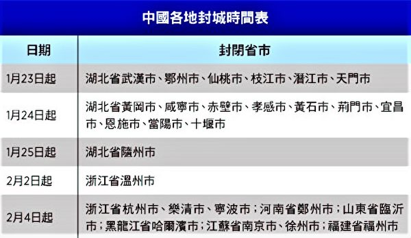
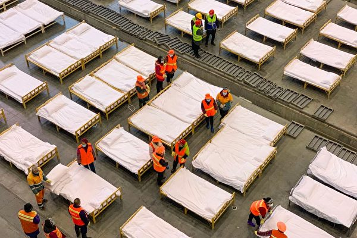
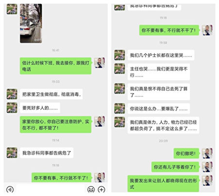

<h1 align="center"><b>请收藏网址(新闻视频ip) 随时连上最新即时IP https://git.io/swspip</b></h1>

<h2 align=center><a href="https://github.com/gav01/Heart/blob/master/news1.md">● 大纪元时事 ●</a></h2>

<h2 align="center">直連不必翻牆開花必看精彩視頻http://36.227.96.182</b></h2>

<table>
<tr>
 <td>
 <a href="https://git.io/pamja"> <h3>如何 “ 三退保命 ”</a>，<b>连上面→免翻视频 IP http://36.227.96.182 </b> →点 【三退大潮】--为什么要退党？ 可留言三退或用翻墙软件自己办理三退</h3></td>
</tr> 

<tr>
 <td>
 <a href="https://git.io/pamja"> <h3>如何 “ 三退保命 ”</a>，请点击翻牆网站  https://git.io/opopop  下载 { 翻牆软件 }→找 { 大紀元網站 }  ( http://www.dajiyuan.com ) 三退</h3></td>
</tr>
</table> 

<a href=https://git.io/souye><h6 align="right">回首頁</h6></a>

<a name=top>

<a href =#52>52.美司法部长警告：中共野心是想拥有世界 
<a href =#51>51.【一线采访】方舱医院条件恶劣 患者情绪失控 
<a href =#50>50.【独家】武汉医院人员：已经写好了遗书 
<a href =#49>49.【历史上的瘟疫】被瘟疫摧毁的强大雅典 
<a href =#48>48.中共严控肺炎疫情舆论 6天抓325人 
<a href =#47>47.专访刘细良：武汉肺炎是对中共致命一击 
<a href =#46>46.【新闻看点】四大疑点 武汉病毒所卷入风暴眼 
<a href =#45>45.专访刘细良：新冠状病毒不及共产党的病毒 
<a href =#44>44.【拍案惊奇】武汉瘟疫次生灾害 瑞德西韦贵吗 
<a href =#43>43.病毒攻入北京大院 红二代先用美特效药 
<a href =#42>42.神韵了不起 州政府顾问：哥伦布所有人都感谢 
<a href =#41>41.林郑限官员戴口罩惹议 黄秋生：如下染病令 
<a href =#40>40.程晓容：疫情延烧 武汉副书记承认了什么 
<a href =#39>39.消息：中共或推迟召开全国人大会议 
<a href =#38>38.武汉P4实验室疑为毒源 王延轶所长上位疑云 
<a href =#37>37.【更新】疫情致三十多市封城 武汉方舱如集中营 
<a href =#36>36.袁斌：中共防控疫情不力 防控舆情却很卖力 
<a href =#35>35.向真：中共迫害无辜民众 医生沦为刽子手 
<a href =#34>34.黄天辰：回国后返德 上海妈教小孩撒谎的背后 
<a href =#33>33.疫情消息管控再升级 更多微信号遭永久封号 
<a href =#32>32.夏小强：华春莹并非口误 中共高层分崩加剧 
<a href =#31>31.【十字路口】武汉医生爆“遗体多到用货车拖” 
<a href =#30>30.武汉病患被逼跳桥自杀 警方威胁不要上网 
<a href =#29>29.UCLA研究：武汉肺炎旅客筛查遗漏大半感染者 
<a href =#28>28.习近平连续6天在央视隐身 引发猜测 
<a href =#27>27.洪微：外交部也故意“出卖”中央 
<a href =#26>26.【更新】医护极度匮乏 市民指武汉成死亡城 
<a href =#25>25.李铭：从武汉肺炎谈活摘器官 
<a href =#24>24.华春莹说漏嘴曝中共隐瞒疫情 大陆网民气炸 
<a href =#23>23.20年颠沛流离 法轮功学员付景华含冤离世 
<a href =#22>22.山东平度与人为善的母亲被非法关押4月余 
<a href =#21>21.自称有文件 上海官员成箱拿药房口罩引众怒 
<a href =#20>20.何坚：医学界揭开中共新“萨斯”黑幕 
<a href =#19>19.2019年 黑龙江牡丹江法轮功学员遭迫害综述 
<a href =#18>18.疑武汉五院被接管 消息：医护人员感染严重 
<a href =#17>17.武汉红十字会争议不断 民营物流接手物资分配 
<a href =#16>16.【新闻看点】习讲话遭删 武汉红会掐央视直播？ 
<a href =#15>15.凌晓辉：武汉病毒疑被人工插入艾滋病毒序列 
<a href =#14>14.广州首次在门把手上发现新型冠状病毒踪迹 
<a href =#13>13.武汉网友暗访医院见证8具尸体 当晚被抓 
<a href =#12>12.【更新】武汉肺炎逾十万得不到确诊 海外死1人 
<a href =#11>11.【名家专栏】中共计划摧毁美国反伤了自己？ 
<a href =#10>10.【新闻看点】疫情严峻超乎想像 习近平4度喊话 
<a href =#9>.【名家专栏】中共计划摧毁美国反伤了自己？ 
<a href =#8>8.黄冈疫情管控升级 每户每2日仅准1人外出 
<a href =#7>7.世卫对武汉肺炎三改其口 背后的中共因素 
<a href =#6>6.中共招募美学者获取技术 引发美国政府警觉 
<a href =#5>5.【更新】武汉肺炎扩散27国及地区 8城重灾区 
<a href =#4>4.【新闻看点】昨3件事刷屏 北京遇最难测挑战 
<a href =#3>3.中国进口包裹有武汉肺炎风险？CDC解释 
<a href =#2>2.美国首例新型冠状病毒患者临床康复全记录 
<a href =#1>1.【拍案惊奇】武汉重症者或被军管 有另种病 

<a name=52>
<h1 align="center"><b>美司法部长警告：中共野心是想拥有世界</b></h1>

图为美国司法部长巴尔（William Barr）。（摄于2019年5月1日）(Nicholas Kamm / AFP)

 
【大纪元2020年02月07日讯】（大纪元记者李言编译报导）美国司法部长巴尔（William Barr）周四（2月6日）在华盛顿的演讲中对中共的地缘政治意图发出警告：其党想拥有整个世界。

福克斯新闻报导，巴尔今天在华盛顿的战略与国际研究中心发表讲话，过程中他提醒在场的听众，共产党仍然控制着中国经济，并且是“贯穿始终的独裁者”。

为了表达他对中共野心的看法，司法部长巴尔在讲话中引用了他上大学时的一个故事。

巴尔回忆，一位同学曾经告诉他，俄罗斯想征服世界，美国可以应对。而中共想拥有这个世界，这就要困难得多。

“这有一定的道理。”巴尔对周四在场的听众们说，“其目标是最终消灭资本主义。”

美国长期以来一直指责中共大规模盗窃美方知识产权。巴尔说：“据估计，美国经济每年因此损失或高达6,000亿美元。”

<b>美国需要在市场上“挑一匹马”</b>

在担任司法部长以前，巴尔还在电信行业工作过几年，并利用他的行业经验发出另一可怕的警告。这位美国官员表示，中共企图在向5G过渡的竞争中成为世界主导力量。

巴尔称即将到来的5G时代是“重大飞跃”，这将对经济产生重大影响。他说，由中共支持的华为“是除北美以外各大洲领先的5G供应商”。中共“正在利用各种力量来扩大其在全球的5G市场份额”。

他还说，美国需要在市场上“挑一匹马”，以在国内5G影响力竞争中脱颖而出。巴尔将诺基亚和爱立信这两家公司列为美国市场上的候选对象。

<b>中共企图“统率所有国家”</b>

巴尔警告说，作为专政政权，中共企图“统率所有国家”。美国公有和私营部门需要齐心协力，以增强竞争力。

美国官员说，中共领导人正在努力在其夺取政权100周年的2049年之前成为世界地缘政治、经济和军事领导人。

国家安全部助理检察长约翰·德默斯（John Demers）表示，中国（中共）希望利用美国的才智之果，助其播下成为经济主导的种子。

联邦调查局局长克里斯托夫·雷（Christopher Wray）也在活动中讲话。他告诉听众说，截至他发言，联邦调查局至少在对中共盗窃美国知识产权展开1,000项公开调查。

雷说：“这与华裔美国人无关。”“这与中国政府和共产党有关……它们想偷偷摸摸地把我们当成它们向上爬的梯子。”

<a target="_blank" href=#top><h6 align="right">回上方</h6></a>

<a name=51>
<h1 align="center"><b>【一线采访】方舱医院条件恶劣 患者情绪失控</b></h1>

武汉方舱医院内部条件恶劣，有患者反映，无药无针，甚至千人共用一个大厕所，引发患者内心焦躁，情绪失控。（视频截图）

【大纪元2020年02月06日讯】（大纪元记者洪宁采访报导）近两日，武汉市新增设的方舱医院开始收留武汉肺炎病患，但内部条件恶劣，无治疗 ，有患者反映，无药无针，无水无电，甚至千人共用一个大厕所，引发患者内心焦躁，情绪失控。

武汉肺炎疫情早已失控，很多人因医院无法收治散居在家里，感染人数飙升。中共当局除了正在修建火神山、雷神山医院外，又增加了三间方舱医院，用于收治肺炎轻症患者。

这三间医院分别是：洪山体育馆、武汉客厅、武汉国际会展中心（武展）。

<b>无药无医 见不到医面</b>

江汉区唐家墩街道天门墩社区的罗先生，于2月6日凌晨3时被社区送至武展，当日下午15时30分许，记者联通他的电话得知，入院已超过12个小时，但没有得到任何的治疗，也没有医生问诊。

他说，武展收了几千人，他的登记号已是3900多号。他所在的通间里有28人，都是男性，以年轻居多，属轻度感染。

“没有医生问诊，也没有护士分发药物，处于没人管的状态。”罗先生说，在房间的外面只有一个护士守着，医护都是从各地派到武汉的。

罗先生从1月26日开始，出现了发烧、咳嗽的症状，但食欲尚好，他去社区医院打针，一周后不发烧了，但社区还是上报了。6日凌晨1时30分左右，社区突然打电话问他是否去方舱医院，罗先生和家人想，到医院最起码有人管了，就同意了。社区人员到家里接人时还告诉他，那里有医护人员，不需要带药品，但实际情况跟社区说的不一致，令他的家人非常担心。

记者得知，罗先生所在的大通间内，允许家属陪护，但如有外人送物品，由分诊台护士统一收留，再分发给个人。

馆内有一个大的卫生间供患者使用，而不是一个通间一个厕所。罗先生说，人多时间长了就不好说（卫生）是什么情况了。

对于这么多人在一起，是否会造成交叉感染，罗先生表示无奈。

<b>千人共用一个厕所 无人打扫</b>

网民“换个名字怎么这么难还有”在微博发文说，她的小姨在硚口区被确诊为新冠肺炎病人，于6日凌晨3点被送到武展。

“这里条件很差，完全不是新闻里说的那回事。”“电线短路停电，电热毯无法使用，晚上睡觉打寒颤。”帖文说，“不能打针，自己带的丙球（蛋白）打不了。”“一千人共用一个厕所，也没人打扫，病人的屎尿洒在便坑外。”

帖文中还说，没有见到医生护士登记病情，发放药物，人手有限忙不过来；吸氧设备严重缺乏，上百人的病区一瓶氧（气）都没有，咳嗽声此起彼伏。

该网民对记者说，自己在微博中说的都是实情，但表示不方便接受外媒采访。6日晚上，记者发现，上述内容的帖子已被删掉。

<h3 align=center><a href="https://twitter.com/XinlunZ/status/1225296772139896832?ref_src=twsrc%5Etfw%7Ctwcamp%5Etweetembed%7Ctwterm%5E1225347150969655296&ref_url=https%3A%2F%2Fwww.epochtimes.com%2Fgb%2F20%2F2%2F6%2Fn11848910.htm">【转发】爆料：我的小姨是硚口区阳性确诊的新冠肺炎病人，昨天晚上9点被送到一家民营医院隔离治疗，凌晨3点又被叫醒说送往条件更好的大医院，结果被送到了武展方舱医院。这里条件很差，完全不是新闻里说的那回事。电线短路停电，电热毯无法使用，晚上睡觉打寒颤；不能打针，自己带的丙球打不了。1千(点击右键,另存新档）</a></h3>

<b>无供电无水 患者情绪失控</b>

另有一名自称已被确诊是2019－ncov（新型冠状病毒）感染的网民，于6日上午8时55分在微信群中传出消息说：“我在（洪山）体育馆集中营了”“随时发生暴乱，打起来了。”因为没人管，患者出现焦躁情绪，情绪失控，有人还砸东西。

消息还说，里面没有医生，没有药，没有暖气，没有食物，被子很薄。虽然有电热毯，插线板，但是没有供电。几百个肺炎患者在一起，没病都能搞出病。

这位网民所在的大通间里有250个人，只配了2名医生，却见不到医生的面。“厕所在遥远的露天，没有遮雨设施。”这位网民说，“（早上）当时天正下大雨，有多少人憋着呢，等雨停了要跑路。”他说。

方舱医院内条件恶劣，患者情绪失控。（微信截图）

<a target="_blank" href=#top><h6 align="right">回上方</h6></a>

<a name=50>
<h1 align="center"><b>【独家】武汉医院人员：已经写好了遗书</b></h1>

武汉各大医院医护人员感染新型肺炎案例剧增。图为某一家医院二线人员也累瘫了。（网友提供）

 
【大纪元2020年02月06日讯】（大纪元记者顾晓华、林岑心采访报导）新冠病毒爆发以来，疫情重灾区武汉市，除了大量病患无法入院治疗，家属求助无门外，医生护士也爆集体感染。武汉某间医院工作人员芹芹（化名）2月6日向大纪元吐露心声，她感觉到压力非常大，面对这场失控的疫情，她已经写好了遗书，以备随时可能发生的状况。

最新消息指出，根据上善若水资产创始人兼董事长、投资总监的网络大V侯安扬在微博上爆料一份湖北一些医院的医务人员发病情况，显示很多医院早在1月初就出现了医护人员感染病例，然而当局一直在隐瞒疫情，仅协和一家医院就有262名医护人员确诊和疑似感染病例。

湖北一次防控会议上揭示武汉各医院医务人员感染人数。（曹山石推特）

这张照片的背景显示是来自湖北省某个新冠肺炎防控工作会议。值得关注的是，上述列举数据，虽宣称是确诊病例15人以上的部分大医院，但事实上，还有社区医院及其它重点医院没有列举或统计其中，凸显武汉各医院医护人员的感染人数，远超过防控中心的统计数字。

<b>第一线医护倒下好几批 压力巨大</b>

芹芹说，他们医院有上千名工作人员，第一线的医护人员“都倒下好几批了”，“（受感染的）估计有60、70个人吧。”“昨天就有一位30多岁年轻力壮的小伙子，趴，当场就晕倒了，后来发现中标啦！”

她说，当时武汉封城，有些同事隔绝在外地没有回来，人员本来就不齐，再加上现在能上班的工作人员越来越少，无形当中，每个人的工作压力就越来越大。“我从过年到现在，一天都没有休息，几乎每天都工作到晚上11、12点。”

“整个城市都封闭了，没有车通行，就是‘限行’，上班很困难，有车的医护人员可通行，但是家里没车的，有的住在医院里，有的家里有小孩，有的要回家喂奶，很困难。”

“之前还有爱心车可以搭，有好心人就开私家车来帮助接送一些同事。但现在搭爱心车的也被传染了，所以政府部门也不让坐了。所以，现在能上班的人数越来越少了，我们能上班的人就累死了。”

她说，“我们真的是可怜死了，医生不够，护士不够，包括女生都要去扛物资，真的是累趴了、累垮了。”

<b>防护资源严重缺乏 甚至到断粮</b>

再加上求诊住院的人数不断增加，“受感染的病人人数越来越多，病房就很紧张。医院还腾出了几百张病床，但新病床，没有设备和物资，要到处筹物资，物流又很慢，货物都没有生产出来，真是让人着急死了。”

说到物资急缺，绝对是医护人员的巨大压力。芹芹说，他们医院前几天才收到政府发放的N95口罩，不足人员需求的五分之一，防护服更是短少，光给一个科就不够了，现在防护物资，只能根据医院里不同片区的危险程度来发放。常遇到医护人员不能理解，甚至情绪激动，大爆粗口，她说，“没办法，因为大家都很恐慌。”

但是防护装备短缺，可能还不是最艰苦的，“我们有一段时间都断粮了。因为各个炒菜、做饭的点，都关了，更不要说吃饭啦，我们现在吃的菜，都是靠捐赠的。”她感叹，“这一段时间，所有的物资，如果没有社会的捐赠，医院早就给你over掉了，早就封掉啦。”

<b>没有特效药 只能先写好遗书</b>

她说，现在感染的医护人员，已经被隔离了，主要是吃一些药、打针，但能不能治好就很难说了，“有能治好的人，但是并不确保，谁能说得清楚呢？”

“身体稍微好一点的人，可能就扛过去了，身体素质差一点，或是抵抗力差一点的，就走了，这完全看个人，完全没有特效药。”

她说，虽然认识到医护工作很重要，能够救别人，但看到发热求助的病患越来越多，医院里不论第一线的医护人员或是内勤人员，大家内心都很煎熬，“每天生活在恐惧中，但是每天都要把事情做到位。”

芹芹叹道：“工作压力非常大，前几天开完会，在回来的路上，都晚上11点钟了，真的是，开着车坐在路边哭，觉得有一种特别无奈的感觉。”

为了不让家里担心，她已经先把后事安排好了。她说，“我跟我妈都说好，我要是over掉了，我跟律师已经把遗书都写好了，孩子的抚养权等等其它一些问题，其实我每天都想这问题。”

“你问我害不害怕，我也不晓得，因为我不知道哪天就over掉了，因为这个事情（疫情），可能会是一个很漫长的过程。”芹芹说。#

<a target="_blank" href=#top><h6 align="right">回上方</h6></a>

<a name=49>
<h1 align="center"><b>【历史上的瘟疫】被瘟疫摧毁的强大雅典</b></h1>
 <h3 align="center"><b>文／秦顺天</b></h3>

雅典大瘟疫。约1652年至1654前后由Michiel Sweerts绘制。（公有领域）

 
雅典是地中海的经济文化科技的中心，当时自认强大无敌。但这座斯巴达勇士未能攻克的城邦，却因一场瘟疫自行土崩瓦解了。

<b>瘟疫逼近每一个雅典人</b>

公元前5世纪下半叶，雅典和斯巴达两个城邦国家，为争夺希腊世界的霸权而展开了伯罗奔尼撒战争。

战争第二年，即公元前430年，当斯巴达军队逼近雅典城时，突然发现城外多出无数的新坟，原来雅典城内正流行致命瘟疫。惊诧中，斯巴达国王急忙下令撤兵。雅典被隔绝了，无论是雅典的敌人还是同盟，谁都不敢再靠近这座瘟城。

雅典城内，是致命的瘟疫而不是敌军，咄咄逼近了每一个人。

最初，在临近雅典的港口比雷埃夫斯，有三个人被同时发现得了一种怪病：先是发高烧，喉咙严重发炎，然后是腹泻不止，最后整个人垮掉死亡。不久同一个地区又有11人死于此种病症，而且四肢出现坏疽，疽由深红变成黑色并开始腐烂，同时身上散发出恶臭。全身腐烂时，心脏还在跳动，病患就这样亲眼看着自己渐渐腐烂致死。

病患外表并不会呈现高热，却无时不承受着体内灼热的煎熬，以致无法忍受任何衣物的遮挡。即使最轻薄透气的亚麻布单，他们也不愿盖，他们放任自己，裸露全身。他们时刻处于无休止的口渴状态，总想把自己浸泡在冷水中，看护者稍有疏忽，干渴难耐的病患便会本能地跳进水池，贪婪地大口吞喝凉水，无论喝多少，也都无法浇灭焦渴，同时他们还饱受无法休息、无法入睡的折磨。

强健者未必就比衰弱的人更能抵抗瘟疫，由于相互看护染上瘟疫造成的死亡，数量是最多的。

人们害怕照顾病患，也害怕去看望亲朋，大批病患因无人照顾而死亡，但得到精心照顾的，最后同样也是一死。雅典的许多家庭都绝户了。

每天，人都像羊群般地死去，垂死者的身体叠加堆积，半死者在街上到处打滚，或者聚集在池水旁边抢水止渴。来自雅典农村的难民们被迫在神殿留宿，很快死去的人与垂死的人混在一起，挤满了神殿。

开始，不间断的哭嚎使人们无法入睡，后来，哭声就听不见了，因为很多哭嚎的人也死掉了。

尸体遍地无人埋葬，没有任何哀悼仪式。鸟兽吃了尸体，很快也跟着扑地死亡，所以连鸟兽也都远离尸体，很长的一段时间，城里的食肉鸟类都绝了踪迹。城市废弃，田园荒芜，数以百万的尸体覆盖了雅典城的各个角落。

雅典城里，有许多哲学家、学者、诗人、艺术家，但面对瘟疫，人类所有知识技艺、聪明谋略都是没用的。各种医生开的药方，无论口服还是外敷，都无济于事，最后医生也被感染而倒下。

古希腊人信奉神灵，但所有的祷告和祈福也毫无用处。一些人明白，瘟疫是神灵在惩罚雅典人了。

一些人明白，瘟疫是神灵在惩罚雅典人了。(AFP)

<b>雅典城自行土崩瓦解</b>

瘟疫渗透影响了雅典的整个社会结构，道德崩溃了。

当人们以求庇护的神庙也到处躺满尸体时，对神不坚定的人开始背离神，神权与世俗的法律对公民不再有拘束力了。为了自保，人们违逆人情世理，肆无忌惮地公开犯罪，盗窃、谋杀和抢劫在城中横行。

瘟疫面前，富人与穷人毫无差别地死亡。富有的人忽然死亡，一文不名的人就把那富人家的财产劫掠一空，发不义之财。但财富也没有任何意义，金子再多，也没人能真正带走，没有人知道，自己明天会不会成为下一个躺在地上的尸体。

恐慌与绝望使及时行乐成为时尚，活人决定迅速地花掉金钱，疯狂地追求感官享乐，这可以使他们麻痹，逃避对现实的恐惧。于是，文明城邦出现了令人生畏的景象：一边是尸体，一边是在尸体边纵情声色、醉生梦死的活人。

死亡摧毁了雅典人最后的心理防线，这座斯巴达勇士未能攻克的伟大城邦，却被一场瘟疫摧毁了，雅典城自行土崩瓦解。

后世历史学家估计，当时雅典城邦死亡的人约三分之一，瘟疫导致雅典诸多重要人士去世，雅典“黄金时代”的缔造者伯里克利及他的妻子、两个儿子都死于瘟疫。

哲学家苏格拉底亲身经历了这场瘟疫，但他以节制的生活及健康的生活习惯，成功抵御了瘟疫的侵袭。这场大劫，使苏格拉底以“我知道我一无所知”为基点，开始探讨个人的道德与对真理的追求。

25岁的修昔底德感染上了瘟疫，但他以超人的毅力详尽地记录了自己的耳闻目睹和所思所感，因此雅典大瘟疫成为史上记载最详尽的灾难事件，为后人提供了瘟疫的第一手资料。

女神雅典娜雕塑，雅典娜被视为雅典的守护神。（公有领域）

<b>突然间销声匿迹</b>

瘟疫虽然肆虐，但它的传染似乎还是有选择性的。在伯罗奔尼撒战争中，雅典人曾俘获了很多伯罗奔尼撒人，他们被押到雅典城中。但修昔底德的记载中，却没有伯罗奔尼撒人被传染的记录。瘟疫只在雅典城和雅典较大的邦国里不断扩散。

更奇怪的是，公元前426年底以后，像是接到了无声的指令一样，肆虐几年的大瘟疫突然在雅典城里销声匿迹了。

传说当人们对瘟疫都畏避不及时，希腊北边马其顿王国的御医希波克拉底冒生命危险前往雅典，他仔细调查疫情，很快发现全城只有每天与火打交道的铁匠没有染病，由此希波克拉底设想，或许火可以防疫，于是雅典城内各处燃起了熊熊大火，人们改用火葬尸体及死者衣物，病源由此逐渐减少并得到了控制。

这个传说并未见诸《伯罗奔尼撒战争史》，火确实可以净化空气，但希波克拉底对于此次瘟疫的影响无法证实。

据修昔底德记载，雅典瘟疫起源于埃塞俄比亚的一些地方，后传播到埃及和利比亚以及波斯王国的大部分领土。今天的医学家和史学家们虽然有各种推定， 但瘟疫最初是怎样产生、为什么突然结束等等一系列问题，至今仍然是不解之谜。

崇尚神灵的古希腊人，战争的胜负都被他们归结为神的旨意，瘟疫被他们认为是神灵对人间罪恶或过错的惩罚，而瘟疫止息，就意味着神灵对他们的宽恕。

古希腊本来崇尚纯洁高尚的精神生活，但瘟疫来临之前，富裕发达的雅典人很多穷奢极欲，沉迷于物质享乐生活，乱伦、同性恋被视为正常时尚，社会盛行暴戾与杀戮，当人的道德败坏已完全违背神旨时，雅典自己召来了灭顶之灾。

超级月亮照耀下的希腊雅典的一座古老的庙宇。(ARIS MESSINIS / AFP)

<b>雅典文明走向衰落</b>

瘟疫结束后，雅典坚持与斯巴达作战，但公元前429年及公元前427年冬，瘟疫再度出现在雅典。接二连三的重创打击，以及国家领导人及宗教、军事领袖接连死于瘟疫，使雅典最基本的政治秩序难以为继，政治力量被削弱，军队和公民的士气也跌到谷底。

公元前404年，斯巴达联盟从海陆包围了雅典，雅典被斯巴达彻底击败，自此斯巴达取得了希腊霸权。

其实，对神的不敬及人与人之间的信任、亲情友情、正义感荣誉感的缺失，让曾经高傲自信的雅典，在战争结束前就已经崩溃了。

<b>神言不虚 历史的发展逃不过神的安排</b>

古希腊人相信神谕，即神灵附于人、通过人的口说出的神意，有预言性质。

一位雅典先知在瘟疫前曾警告过雅典人：“与斯巴达人的战争将会到来，并带来一场大瘟疫。”但那时，雅典人是不相信的。

在伯罗奔尼撒战争之前，斯巴达人也曾去德尔菲神庙求神谕。斯巴达人问是否可以与雅典人进行战争，神谕的回答是肯定的，并说，神会保佑斯巴达人，斯巴达人将赢得最后的胜利，此神谕在战争期间一直流传。

雅典和斯巴达本来势均力敌，却因一场瘟疫，自认强大无敌的雅典败给了斯巴达。神言不虚，历史的发展，都逃不过神的安排吧。@*#◇

参考资料：

修昔底德《伯罗奔尼撒战争史》

张岚《“神谕”的不可逆转》

郭海良《关于希罗多德与修昔底德作品中对神谕的描述》

<a target="_blank" href=#top><h6 align="right">回上方</h6></a>

<a name=48>
<h1 align="center"><b>中共严控肺炎疫情舆论 6天抓325人</b></h1>

【大纪元2020年02月06日讯】（大纪元记者文朴综合报导）中共在武汉肺炎爆发后一直隐瞒疫情，致使疫情在大陆不断蔓延、恶化，愤怒的中国人纷纷在网上发言，谴责中共暴政并传播疫情真相。这令中共非常恐惧，中共当局进一步收紧言论，并抓捕大量网民。

<b>疫情失控 国人愤怒</b>

武汉肺炎已完全失控。中共地方政府至2月6日，包括湖北、辽宁、江西三省都进入全省封闭管理，湖北的武汉、黄冈、咸宁、赤壁、孝感、黄石、荆门、宜昌等市，浙江的温州、杭州、乐清、宁波，江苏的南京、徐州、南通市，福建的福州市，江西省景德镇市等65座城市封闭。

中共从去年12月初刚开始爆发疫情时隐瞒疫情，宣称新型冠状病毒“可防可控”，没有“人传人”等不实消息，并营造一种歌舞升平的景象，到现在大面积封锁省、市等极端做法，不仅令国人苦不堪言，而且令国人生命安全受到威胁。

面对瘟疫的死亡威胁，大陆网民纷纷在社交媒体上传递真实疫情，也有不少国人谴责中共的暴政。

如清华大学前教授许章润日前刊文谴责，中共为了“保江山”的一己之私，而置亿万国民于水火的政体“道德性败坏”，致使“人祸大于天灾，在将政体的德性窳败暴露无遗之际，抖露了前所未有的体制性虚弱”。

许章润说，国民的愤怒已如火山喷发，而愤怒的人民将不再恐惧。中共败象已现，倒计时开始。

<b>中共6天抓300多人</b>

面对国人的愤怒，中共开始大面积打压、收紧言论，并疯狂抓捕网民，以期阻止疫情真相传播。

总部在美国华盛顿的人权组织“中国人权捍卫者”披露，从1月22日至1月28日，短短一周之内，中共当局至少抓捕了325名中国公民。

公布的数据显示，这些中国人大多数被扣上“散布谣言”、“制造恐慌”或“虚构事实扰乱公共秩序”的帽子，而遭受行政拘留、罚金或是教育训诫等处分。

天津一名34岁的高姓女子1月25日被拘留5天。她被中共扣上在微信上“夸大全国和本市新型冠状病毒感染肺炎人数”，传播“虚构信息”的罪名。

广西隆林县女子韦某因在微博发帖，质疑中共官方数据的真实性，她说“百色才一个（病例）吗？为啥听我妈说隆林这里都有两个了？”她因此被认定为造谣，被中共公安教育训诫。

福建惠安县女子陈某在微信群里说，官方报导是假的，是为了安抚民心，实际武汉已经有接近两万人死亡，并自己的亲戚就在武汉上班。她因此被认定为造谣，被警方处教育训诫。

安岳县肖某1月22日在QQ群里说：“最近新型病毒有点凶，咱川渝两地都发现了病例，最近出去各位做好防护措施哈”、“县城已经死了一个了”、“卫生院隐瞒了消息，还没有报上去”。他因此被中共公安处置。

四川德格县登某，1月25日因发表藏语疫情：“甘孜州（德格县）龚垭乡13个人都被一汉族人传染了，请大家一定注意”，而被行政拘留。

江西修水县男子1月30日在微信群里说，“我们这边好像死了4个”，并质疑官方数据说“不可能；江西至少死了10个”。随后他被拘留了5天。

贵阳人士颜某璋，2月2日因在微博发布了“东东告诉我贵阳花果园V区今天查出一例肺炎，救护车已经抬走了”的信息，也被拘留5天。

另外，中共日前还叫停了多家陆媒，不让其报导疫情的真相情况，如武汉市内大量被感染人群，因为医疗资源不足而处于自生自灭的状态，他们中很多人到死都没能获得确诊，根本不被官方统计等内容。

<b>中共越抓捕 说明事态越严重</b>

德国之声2月6日援引大赦国际的中国研究员潘嘉伟的话说，中共政府一如往常地打压言论自由，目的就是确保其处理疫情不当的消息不会流传到网络上，因而影响到其政权的正当性。

潘嘉伟说，中共政府大规模审查与新冠病毒相关讯息的情况下，国际社会必须仰赖国际媒体、国际组织以及国际卫生专家来追踪疫情的相关的讯息，这样国际社会才能取得最精准的信息来对抗新冠病毒疫情。

大陆维权人士胡佳对德国之声表示，这次疫情影响了不少中国人的切身利益，给中国人上了一课，“真的会让一些中国人在心中积累了不满”等。

自由亚洲电台2月5日援引推特用户“中国文字狱事件盘点”运营者王先生的话说，中共越如此控制言论和信息，会越加大民间的恐慌心理，反而不利于疫情的防控。因为中国人习惯上认为，如果中共政府要禁口控制不让发声了，说明事态很严重。

<a target="_blank" href=#top><h6 align="right">回上方</h6></a>

<a name=47>
<h1 align="center"><b>专访刘细良：武汉肺炎是对中共致命一击</b></h1>

香港前中央政策组全职顾问、时事评论员刘细良表示，中共面临黑天鹅（武汉肺炎）加灰犀牛（中美贸易战），目前当局最头痛的就是中国经济崩溃的问题。因此中共防疫的核心在于只考虑经济不考虑人命。（大纪元） 

 
 【大纪元2020年02月07日讯】（大纪元记者梁珍香港报导）中共隐瞒疫情，令武汉肺炎病毒全球扩散，至今已感染二十多个国家，邻近的香港2月4日出现死亡案例、5日出现本地社区感染爆发。香港前中央政策组全职顾问、资深时事评论员刘细良近日接受大纪元《珍言真语》栏目主持人梁珍专访，就中共隐瞒疫情的手法进行剖析。

他认为，在中国经济日益下滑之际，武汉肺炎的爆发是对中共最致命的一击。中共面临黑天鹅（武汉肺炎）加灰犀牛（中美贸易战），目前当局最头痛的就是中国经济崩溃的问题。因此中共防疫的核心在于只考虑经济不考虑人命。

经历去年反送中运动，他并预测今年是香港最动荡的一年。香港将面临大量大陆疫症难民涌入香港，而在政府无能、无法运作的情况，人性是最重要的，“拿出我们人性的本质出来，照顾好自己，照顾好身边的人，多些关怀一些弱势的人。”

以下是专访内容：

<b>新型冠状病毒源头三版本</b>

梁珍：新型冠状病毒到底源头来自哪里，中共有一套说法，你相不相信？

刘细良：有三个版本，官方的版本是华南海鲜市场里面，因为吃蝙蝠、野味，人接触后感染上而传播开来，这种病毒可以人传人，所以导致在武汉市爆发，扩散到湖北以致全国，这是官方的版本。

那医护的版本是什么呢，也是说来自华南海鲜市场，但后来经过武汉P4实验室，在12月26日证明是一种新型的冠状病毒，是可以人传人的，与萨斯（SARS）有七八成相似，但中国卫健委的专家下到武汉听了报告之后，没有去做处理，掉以轻心，导致在华南海鲜市场集体爆发，这是人祸，这是一个版本。

第三版本，外媒报导说与武汉P4病毒实验室疫苗研究外泄有关。这个P4实验室就是中共在萨斯之后，与法国联手合作兴建的一个所谓最高安全级别叫P4的实验室，因为实验室有一定的要求，所以需要法国专家协助，当时的确是想研究对抗萨斯的，但后来为什么变成另一个东西，这与2012年习近平上台有关，是因为他在航天科技、资讯科技与医疗科技方面，要与美国竞争，在这个情况下，就选择了这个疫苗研究，谁控制病毒疫苗谁就是将来医疗科技大国。正电子素描、电脑断层扫描等生产医疗技术的机器，中国是没能力生产，但想在病毒研究方面追上去。所以武汉这个实验室就变质了，抛开了法国，自己独立去兴建，还在哈尔滨、北京、昆明、武汉建立四个P4实验室，病毒研究为什么要建立那么多，是不合理的。然后大家留意到最近加拿大CNBC报导，加拿大警察王家骑警拘捕了一对华裔，是在加拿大微生物实验室的夫妇科学家，就是将埃博拉活体病毒带去北京中科院，然后交给武汉P4实验室，这个埃博拉的病毒研究其实与中华冠状病毒研究有关，也就是中科院下面有一帮专研究攻坚埃博拉病毒的，想超越美国，你知道疫苗其实就是病毒，是否因为疫苗研究出现了病毒外泄，因为如果根据基因排序的演变，这个病毒的出现不应该是12月26日在武汉市场，应该是更早时间，根据中国有一个姓童的科学家、微生物家研究，估计是在10月1日，地点也不是在海鲜市场。现在中共是没有否认的，因为第一个武汉肺炎确诊病患没有去过海鲜市场。

也就是说病毒有多源头，海鲜市场不是病毒的来源地，只是在批发市场最多人感染上，但来源地有其它地方，这已经是肯定了。另一个肯定的是，比12月初更早的时候就出现病毒，这个谜团到现在还没有解开，有待中共官方如何去回答这些问题，我相信这个也许永远是一个谜，因为它不会去解答。

<b>中共隐瞒疫情的手法比萨斯时先进得多</b>

梁珍：你觉得这次中共隐瞒疫情的手法，与2003年萨斯时有什么不同？

刘细良：他先进了很多，萨斯时，姓张的卫生部长与北京市委书记、市长一起被革职，理由就是他们隐瞒疫情。我记得当时在2002年11月，广东人已经在煲醋，抢购板蓝根，一直传有一种不明的肺炎，一直没有核实，到2003年4月才与世卫接触，交出病毒和突然间公布已经确诊的个案有300多个，一揭开就发现隐瞒了将近5个月。那为什么这次世卫会称赞习近平，确实比起萨斯时，他很快就向世卫汇报，他汇报了两次，第一次说是肺炎，没说是萨斯冠状病毒，只说是肺炎个案；第二次是1月22日开会之前，就告诉说基因图谱是怎么样的。确实比萨斯时隐瞒情况少一些，时间短一些。但我刚才讲的那些还是没有交代清楚，第一，华南海鲜市场以外的感染个案，第二是否与中国P4病毒实验室疫苗研究有关。

中国卫健委高福的专家小组刻意很快就在国际专刊里就去发布那些数字资料，比过去来说表面上看来好像透明度高了很多，但实际上是不是用这件事来掩饰疫苗病毒外泄的问题呢？我觉得很有可能！也就是说，为了隐藏那个真正的病毒外泄的原因，他们刻意表明已经做了研究了，卫健委的专家12月去看之后说可控可防的。这个我觉得可圈可点，已经经过SARS了，究竟哪些专家敢不敢那样在不知情的情况下面去欺骗习近平呢？我觉得这个是很不合理的，因为一定会爆锅的嘛！如果那个疫症是可以人传人的，却说疫症是可防可控的，肯定会爆锅的，我不相信他们会那么笨，可防可控其实是可圈可点的，因为他们根本就知道这是他们研究疫苗的一部分。

梁珍：就是说他们是知道怎么样去防护？

刘细良：所以他们说可防可控，不过当疫苗外泄，出现人传人，那也不是专家就能可防可控的。而且他们怎么那么快就有一些数据出来在国际杂志上刊登呢？因为如果他们正在研究的这个病毒的时候，他们很快就可以拿去刊登了。我觉得这是个疑团，我只可以用一个怀疑的角度去看，事实上是没有证据的。

梁珍：看到很多专家都转向转得很快的，像管轶、钟南山。到底之前他们就已经知道了真相而不讲出来呢？或者他们不知情？

刘细良：我觉得不是，钟南山他不会不知情的，他只是1月20日说出来之后，1月21日《人民日报》马上转载武汉疫情，到1月22日习近平下达动员令，钟南山马上闭嘴。整件事都是共产党安排的，不是什么抗疫英雄，是因为习近平做了个决定，就是要动员起来封城，所以才给他们讲。但是如果根据中共他们内部自己武汉实验室的人外泄的资料，12月26日已经知道这是一个新型的跟SARS病毒相似的冠状病毒。他们隐瞒了多长时间，接近一个月了。

<b>中共防疫只考虑经济 绝不考虑人命</b>

梁珍：是，去年就已经全部围堵中共，特别是香港这件事已经变成了一个浪潮，那你觉得到了今年2020年中共的局面会怎么样？

刘细良：为什么中共一路在幕后操控世卫秘书长谭德塞，一路对于封关、对于停航班那么紧张？这个绝对不是从人命角度考虑的，这是从经济角度上考虑的。现在中共最怕的是什么呢？在贸易战休战，第一阶段谈判之后，第二阶段开战，这个疫症不迟不早在这个时间出现，中国经济必然会有一个相当大的衰退风险，甚至是金融危机和债务危机爆发，根本就不知道会影响多深的，而他们的角度一定会尽量去控制经济。所以我觉得香港不封关，就是因为不想那个经济的影响像2003年SARS一样，当宣布为疫区，跟着就是旅游警告，跟着航班也不到香港，香港就变成死城。现在他很明显地知道这个经济的危机了，所以他只有求饶，第一步呢，暂缓中美阶段的第一阶段协议，但当看到美国来势汹汹，中共在疫情里之所以进退失据的原因，也是背后有中美贸易战这个角度去考虑的，因为当你的经济一路下滑的时候，你在贸易战里面谈判的筹码就越来越少，甚至还会动摇到第二阶段，如果美国在现阶段施压，中共根本就没有还手之力，所以他才用尽办法去阻挠这个封关，阻挠世卫升级和阻挠其它国家禁止航班或禁止中国人入境，当这个现象一出现，也就是说全世界围堵中国，虽然是在疫症上，但要记住，在疫症上面围堵中国的影响就是经济性的，现在习近平想的绝对不只抗疫的问题，这个对于他来说反而是次要的。

他想的是整个中国经济崩溃的问题，而怎样在贸易战里面美国在这个时侯，美国疾病管制与预防中心为什么一直催促世卫去封中国，也是因为与两国之间的角力有关，所以大家要密切留意美国的媒体会不会再揭露疫苗外泄的问题，这就是对中共致命的一击，这就是1986年乌克兰的切尔诺贝利事件的翻版，是直接促使苏共倒台的翻版。

<b>中共因为贸易战而隐瞒疫情失控</b>

梁珍：那你觉得，中美贸易战签约八天之后习近平爆出疫情，是否因为迁就这件事八天之后才爆出来？

刘细良：他当然不会在这段时间让美国知道中国的疫情已经失控了。你看管轶去武汉的时间（1月21日至22日），当时在1月，事实上刘鹤1月（13日至15日）去美国签（中美第一阶段贸易协议）之前疫症已经在武汉失控了，所以我就说这个绝对就是因为整个中美角力，贸易战，整个的考虑而出现的隐瞒。

如果第一宗的感染在10月1日发生，是因为共产党的武汉P4实验室病毒外泄，这就是在1986年乌克兰的切尔诺贝利核电厂惨剧的翻版，当时就是操作失误，使核电厂的芯溶解，然后就释放了辐射，而苏共是隐瞒了这件事，使进去救灾的消防员全部因受辐射而死，也没有疏散人群。那你想想，现在与1986年的切尔诺贝利惨剧有什么分别？如果这真的是研究室研究疫苗外泄的话，对中共来说是一件什么样的事情，这是黑天鹅加灰犀牛就这意思，灰犀牛就是中美贸易战，中国经济意图称霸全球，所引发的全球围堵，这就是灰犀牛。是过去几年，中共在习近平主政下敢于向西方亮剑，这么一个大的背景；然后出现的黑天鹅就是疫症。

<b>2020年是香港最动荡的一年</b>

梁珍：你对香港的前景如何看？

刘细良：我觉得这10年来，已经没有办法和中共分开了，已经是一个揽炒（玉石俱焚）的格局。中共经济崩溃，香港必然受到冲击，我们不需要很乐观地鼓掌，你预备要承受这个代价的。包括中共大量出现疫症难民的时候，我们也都要承受这个代价的。他不一定是正常封关过来的，可以偷渡进来的。大家没想过可以偷渡进来的，其实可以坐快艇进来的，其实很近的。

梁珍：翻过梧桐山就是了。

刘细良：以前中共每一次内地出现这种动乱，包括1960年，上一个庚子年1960年，“大跃进”失败，饿死3000万人，其实很多人是翻过梧桐山走来香港，当时很多香港人上梧桐山去救济他们的，在粉岭那里，我姨妈就在那里救济那些大陆的非法偷渡者。现在可能是这样的，如果疫症一直没有办法控制的话，那些疫症难民从武汉湖北省一直突破封锁，向南走一直会走到哪里呢，就算有没有封边境都好，到经济下陷，出现最大的经济崩溃的时候，香港的楼市、股市，一定会受影响的，香港的成分股都是以内地的企业为主。

所以我说香港人要坐稳了，2020年是很动荡的一年。我在去年的12月已经预计了，我说2020年将会是香港最动荡的一年，而这个也是不幸言中的。但是我也相信经过这7个月来，香港人的训练、锻炼，就是自我提升，变成应付这个黑天鹅、灰犀牛，就有了一个底气。如果不是，我想会更糟糕。

<b>在政府无法运作时 人性是最重要的</b>

梁珍：香港人如何在这个动荡的时候，可以自求多福？

刘细良：我觉得最重要的是什么呢，拿出我们人性的本质出来，照顾好自己，照顾好身边的人，多些关怀一些弱势的人，在这个政府已经没有办法起作用的情况下，人性才是最重要的。不是脑袋、不是谋略、什么都不是，其实是人性。

<a target="_blank" href=#top><h6 align="right">回上方</h6></a>

<a name=46>
<h1 align="center"><b>【新闻看点】四大疑点 武汉病毒所卷入风暴眼</b></h1>

武汉国家生物安全（四级）实验室（武汉P4实验室），坐落在中国科学院武汉病毒研究所郑店园区内（网络图片）

【大纪元2020年02月07日讯】大家好，欢迎大家关注新闻看点，我是李沐阳。

首先跟大家通报一个消息，《生命时报》微博消息，当地时间今天（2月6日）晚上9:30，被人们称为疫情“吹哨人”的八君子之一——李文亮，带着当局对他的训诫书，扔下了怀孕的妻子去世了。而他怀孕8个月的妻子也因为染病正在抢救，情况十分危急。看到这个消息，我的心情跟大家一样难受。

不过武汉中心医院在12点38分发消息说，李文亮病危，仍在抢救当中。目前不清楚李文亮的具体情况，需要进一步核实。但不管怎样，网友都很气愤，要求那些当初抓人的人和造谣媒体出来给个说法。其实这已经不是一句“对不起”能解决问题的了，正如知名法学家许章润所说的，“人民怒了，不干了”。

前天，武汉病毒研究所将美国研制的治疗新冠肺炎（武汉肺炎）的药物瑞德西韦（Remdesivir）抢先申报了专利。这个举动让外界大为惊异，也再次把目光投向了这个被严重质疑是病毒来源的研究所，审视它在这场“举国大疫”中所扮演的角色，为何卷入了风暴眼？

<b>“清算”与“抗疫”同步？</b>

这场瘟疫的爆发马上满2个月了，法广今天报导称，中共准备对湖北军管了，并且要问责湖北负责人。文章表示，北京对湖北及武汉官场的表现“相当不满”，极有可能在民怨沸腾的情况下，问责湖北和武汉主要党政负责人。

2月3日，身居武汉的知名作家方方写了这么一段话：“记住这些不知名的人，记住这些枉死者，记住这些悲伤的日夜，记住到底是什么原因让他们在这个本该欢乐的节日中断了人生。只要我们尚且偷生在世，我们就要为他们讨个公道。对于渎职者不作为者不负责者，我们必须一层一层追究，一个也不放过。”

方方的这段话，应该代表着许许多多人的心声。这场已经远远超越SARS的新冠肺炎，人们所了解的仍然太少。当局封网删帖，隐瞒真相，使人们在完全看不到真相中染病，在不明不白中含冤离世。

其实当局对下级问责，早在人们的预料之中。按照中共的通常做法，问题出现以后，都会抛出替罪羊以平民愤。不过对“军管”的说法，官方之前曾辟谣，说武汉没有军管。

对法广爆出的消息，我们没有得到证实。

就在方方写这段话的当天，中共领导人习近平主持召开了针对新冠肺炎（武汉肺炎）疫情的第二次政治局常委会议。会上表示，对“不服从统一指挥和调度、本位主义严重的，对不敢担当、作风漂浮、推诿扯皮的”给予警告。还称“追究直接责任人的责任，问责党政主要领导甚至惩处失职渎职者”。报导还说“研究了其它事项”。

这已经透露出，北京将要问责湖北党政官员的信息。不知道这个“研究其它事项”，是不是商量撤换哪些官员，让谁来当替罪羊。

我们看到第二天（4日），湖北省纪委处理了几个人。直接免去湖北省红十字会常务副会长张钦的职务，指称他调拨紧缺医用物资不力。武汉市统计局副局长夏国华也被免职了，而统计局局长孟武康和武汉市政府办公厅副主任黄志彤则是被诫勉谈话。

这些迹象显示，压力之下，当局急于转嫁危机，缓解人们的指责。法广认为，当局可能不会等到疫情局势遏制后才启动问责程序，“清算”有可能与“抗疫”同时推进。

<b>大疫当前 武汉病毒所抢先申请美国药物专利</b>

4日晚间，武汉病毒研究所官网发布了一条标题不显眼的消息。自称“我国学者在抗2019新型冠状病毒药物筛选方面取得重要进展”，对在国内尚未上市的药物瑞德西韦（Remdesivir），“在1月21日申报了中国发明专利（抗2019新型冠状病毒的用途），并将通过专利合作协定（PCT）途径进入全球主要国家”。

这个消息爆出，很多人感到惊讶。因为瑞德西韦是美国吉利德（GILEAD）公司开发的一种新型实验性广谱抗病毒药物，被认为可以有效抑制呼吸道上皮细胞中SARS病毒和MERS病毒的复制。美国使用这种药物，已经成功治愈了一名武汉肺炎患者。随后免费提供给中国治疗新冠病毒，目前这种药物正在北京中日友好医院临床试验。

得知武汉病毒所抢先注册的消息，吉利德发言人在电邮中回复自由亚洲表示：吉利德知道武汉病毒研究所申请“用途专利”的报导。瑞德西韦是吉利德研发的药物，在中国享有专利，包括吉利德提出将此药用作对抗新型冠状病毒的“用途专利”申请。

吉利德表示，目前的当务之急，应是尽速确定瑞德西韦在对抗新型冠状病毒上的潜在疗效。

吉利德的观点相当明确，大疫当前，救人要紧。至于知识产权的问题，暂时先放一放。对比武汉病毒所的做法，谁尊重生命、谁漠视生命，已经不用多说了。被严重质疑是病毒来源的武汉病毒研究所，“抗疫”不卖力，抢功却无人能比。用老百姓的话说，“下蛋不勤，争窝积极”。

熟知药品专利申请流程的白氏生物科技咨询公司总裁白越珠表示，提出药品人体实验阶段的“用途专利”申请，不等于就一定能获认可。“不是那么简单的，不是说你就可以偷我的东西用”。

全球健康药物研发中心主任、北京清华大学药学院院长丁胜认为，武汉病毒研究所申请成功的“可能性不大”。就算它申请成功，也不握有瑞德西韦的结构（发明）专利，无法应用。“就好比用铲子挖地，你手中没有铲子，怎么挖呢？”

<b>不知什么病毒 也不知药品是否有效 先注册？</b>

大家注意，武汉病毒所自称是1月21日已经申报了发明专利。如果大家还有印象，我们在前面曾说过，1月20日有两个重要人物出面了。一个是习近平第一次对新冠肺炎疫情作出表态，随后每天确诊的病例数字几何倍数往上翻。另一个是钟南山，首次肯定了病毒“人传人”。

按照武汉病毒所的说法，它们对瑞德西韦的药效研究，肯定是比20日这个时间要早。因为药效研究不是一朝一夕的。也就是说，正当武汉人还不知自己正处在疾病传染的风险之中时，武汉病毒所已经开始通过细胞实验，并发现了一种对付尚无正式名称的新型冠状病毒的有效药。

那么武汉病毒所为什么不把这种药物拿出来治病救人呢？难道申请专利比治病救人还重要吗？如果说没有确定药效的话，那为什么对还在验证中的药品抢先申报专利呢？这与它们对“双黄连口服液”的处理完全不一样。

1月31日，中科院有一项公布，说上海药物研究所、武汉病毒研究所联合研究，初步发现中成药“双黄连口服液”可抑制新型冠状病毒。然后中共官媒纷纷高调报导，在大陆引发抢购潮，有的地方甚至是上线就卖断。

虽然中科院发布消息时明确指出，双黄连口服液还要开展临床研究，但是武汉病毒所和上海药物所仍然在“没有任何证据”的情况下，“发布双黄连可抑制新型病毒”，未免也太急功近利了吧？

<b>研究合成病毒干什么？病毒是否泄露？</b>

昨天，郑州法律人士任照向武汉病毒研究所发出公开信，敦促他们公开病毒研究过程的详细资料。任照表示，已经有多人实名举报这个病毒研究所“管理混乱”，随后被删帖。

任照申请公开的有以下事项：2019年到2020年间病毒保存和出入这家研究所的明细，公开这家研究所研究冠状病毒的研发详情，公开对瑞德西韦药品的研发过程及申请专利的详细文件，公开研究所教授石正丽的研究方向、发表的论文以及详细简历。

石正丽本人2月2日在个人微信朋友圈发文表示，2019年新型冠状病毒是大自然给人类不文明生活习惯的惩罚。还表示她愿意用“生命担保，与实验室没有关系”。就连一些被中共渗透的西方媒体也表示，这种怀疑是“假新闻”。

不过2月3日，“武小华博士”在微信中实名指证，新冠病毒与石正丽实验室的病毒泄漏有关。目前人们不清楚武小华究竟是谁，可能是某个熟悉中国科研系统的医界学者。

武小华直言要与石正丽公开对质，并对石正丽提出两点关键质疑。

一是石正丽团队称，新冠病毒可能由蝙蝠直接传染给人。武小华认为，这是石正丽欺骗外行的谎言。根据医学常识，蝙蝠病毒必须经过变异才能进入人体。而这个基因变异需要通过1～2个大鼠或灵长类的中间宿主参与，而且这种基因改造只能在实验室完成。但石正丽论文中根本没有提到有中间宿主。

二是中国医学实验室内部的管理混乱，武小华认为这是病毒泄露的主要原因。

面对武小华的叫阵，石正丽一直在保持着沉默。我们说过，沉默有两种可能，一是不屑争辩，二是默认。石正丽属于哪一种呢？

另外，有网民挖出了一片研究论文，是石正丽5年前与别人共同撰写的论文，题目是“一簇源于蝙蝠的类似SARS冠状病毒，显示出了传给人类的潜能”。论文中像“嵌合病毒”、“杂交病毒”、“合成病毒”与“不依赖于其自然主干上其它必要的适应性突变”等词汇多次出现。

微信公号“工农之声”表示，原文发表在国际著名期刊《自然医学》（Nature Medicine）电子刊物上。“工农之声”表示，原文是英语，他引用的全部来自百度翻译。并且给出了原文的文章链接（https://www.nature.com/articles/nm.3985?fbcldi=lwAROiTTfDIT-uxNFPtvQH-xFrF6QaF1hKE1Ey2TPrEi17XfFUIbpUIAosDc），显示文章的发布时间是2015年11月9日，2016年4月6日进行了更正。

论文中有这么一段：“为了研究循环蝙蝠冠状病毒的出现可能性（即感染人类的可能性），我们构建了一种嵌合病毒”，并说“这种杂交病毒使我们能够评估这种新的棘突蛋白引起疾病的能力”；还说“在此基础上，我们合成了一株具有感染性的全长SHC014重组病毒，并证明了该病毒在体内外的复制能力”。

巴黎巴斯德研究所的病毒学家西蒙·韦恩-霍布森（Simon Wain-Hobson）表示，研究人员创造了一种新型病毒，“如果病毒逃脱了 ，没有人能够预测其发展轨迹”。

人们都想知道，风险这么大，为什么要进行这种研究？这种实验有什么意义呢？合成病毒又为的是什么呢？

<b>武汉病毒所出售实验室动物？致病毒泄露？</b>

前天（4日），大陆多益网络董事长徐波在微博中表示，自己实名带可靠证据作为线索，举报武汉病毒研究所。徐波在列举一些基本事实的同时，附带了石正丽发布论文的多个证据链接。

徐波表示，因为疫情防疫事关重大，怀疑武汉病毒所对实验动物管理不善，致病毒实验动物流出，导致2019新冠状病毒疫情。他还强调，“我明确认为2015年石正丽研发的那针对人类的转基因病毒与武汉新冠状病毒有差异，但其实验室必然还存在大量其它类似病毒，且之后必然有继续研究类似病毒，这才是应该查处的真相。”

这个问题，一直是人们希望得到真相的问题。很多媒体、包括新闻看点都曾经列举过大量事实，怀疑病毒可能是从武汉病毒所流出。

但是美国罗格斯大学（Rutgers University）生物学家理查德·艾布莱特（Richard H. Ebright）昨天表示，虽然根据目前对病毒的基因组测序，没有证据表明病毒经过人工改造，但“这并不代表可以完全排除这次疫情的病毒由于实验室事故进入人群的可能性”。

我们再回到徐波的微博，他怀疑武汉病毒所“对实验动物管理不善，致病毒实验动物流出”。

这个说法并非空口无凭。今天1月2日，吉林省松原市中级法院判处了李宁12年有期徒刑。罪名是“贪污课题科研经费共计人民币3756万余元，其中1017万元是销售实验室淘汰动物和牛奶所得”。

李宁是中国农业大学教授，有“最年轻院士”之称。在对他的判决书中有这么一段：“自2008年7月至2012年2月期间，相关课题在研究过程中利用科研经费购买了试验所需的猪、牛，对出售课题研究过程中淘汰的实验受体猪、牛、牛奶所得款项，被告人张磊向李宁请示如何处理。李宁指使张磊将该款项交给报账员欧某甲、谢某甲账外单独保管，不要上交。欧某甲、谢某甲遂将该款存入个人银行卡中，累积金额为人民币10,179,201.86元”。

这段判决书的描述，清清楚楚地告诉人们，这名转基因科学家把实验室的转基因猪、牛和转基因牛奶都卖了钱，赚了一千多万。

这些动物和牛奶卖给谁了？能不能食用？是不是带着病毒或者病菌？为什么实验室对这些实验品不做无害化处理？中国还有没有这样的实验室，在悄悄地出售实验室的动物？

1月28日的新闻看点中，我们引用法广的消息，法国政府官员称，中共悄悄修建了多个类似武汉P4实验室的实验室，“某些实验室十分可疑”。

前白宫首席策略师班农表示，中国共产党对所有事情都撒谎。如果新型冠状病毒被发现是人工合成的，中国共产党就完了。

<b>新冠病毒肺炎疫情最新情况</b>

今天（2月6日）收到网友独家爆料，新冠肺炎（武汉肺炎）的扩散远超当局的预期，武汉现在使用雾炮车全城消毒了。爆料说武汉市内连救护车都是静悄悄地拖病人，不鸣笛、不闪灯，深怕引起恐慌。

与此同时，武汉市每个人手机上都收到了中国移动的短信，是转发武汉新冠肺炎防控指挥部的通知。从今天开始，“全民测体温”，“每天逐户逐人全面排查”，要求市民配合。网友爆料中说，只要体温不正常，立即抓人，然后“送入集中营”。这里说明一下，网友称为“集中营”的地方，指的是那些隔离点。

<b>发烧即强制送方舱医院等隔离点</b>

网友说每3天上门来测量一次，检测到发烧人员后，强制送往方舱医院等隔离点，并对其与家人进行封户管理，禁止外出。如果全部家庭成员检测正常，发给一张有效期为3天的出入通行证。所有小区每天晚上10点到第二天早上6点禁止出入，实行“宵禁”。

<b>只送不管：洪山体育馆</b>

昨天我们在节目中曝光了武汉新设立的“方舱医院”情况，现在又有了最新的消息。有网友发来视频，说隔离点的这些人“吃喝没有，也没有暖气，电源也没通，没有医疗，不给打针吃药，就在里面隔离，患者情绪激动”。

另一位网友发来对话截图，上面显示是一位被隔离在武汉市洪山体育馆的人说，“我在体育馆集中营了”，“没有医生、没有药，没有电，没有食物”，“随时发生暴乱”。并且说“打起来了”。

<b>武汉国际会展中心方舱医院</b>

另一个网络截图说，“我妹妹今天凌晨1点进了（武汉）国际会展中心方白舱，现在已是上午9点39分。没医护！！没吃的！！几百患者，一早上就大乱，刷牙挤、如厕挤、大厅风大、冷、饿！争吵不断，污水横流！如果方舱只有隔离，那它是什么？”

还有一位网友发来的是网络截图：我的小姨是硚口区阳性确诊的新冠肺炎病人，昨天晚上9点被送到一家民营医院隔离治疗。凌晨3点又被叫醒，说送往条件更好的大医院。结果被送到了武展（武汉国际会展中心）方舱医院。这里条件更差，完全不是新闻里说的那回事。

电线短路停电，电热毯无法使用，晚上睡觉打寒颤。不能打针，自己带的丙球（蛋白）打不了。1千人共用一个厕所，也没人打扫，病人的屎尿洒在便坑外。早上10点才吃到早餐，几块小点心，中餐不知道有没有着落。也没有见到医生护士登记病情，发放药物，人手有限忙不过来。吸氧设备严重缺乏，上百人的病区一瓶氧（气）都没有，咳嗽声此起彼伏。

在这种情况下病人病情只会发展加重。恳请政府尽快改善条件，不能因为病人目前是轻症就掉以轻心，轻症患者也有人权啊！大家都想活下去！

<b>湖北省委省政府要“动刀子”</b>

大陆《财经》昨天晚上发消息，武汉当局要求各区在2月7日前，必须完成武汉市所有疑似病例的核酸检测。而且还要求，在昨天夜间12点之前，收治所有的确诊病人。据称这是上一层对武汉提出的2个硬性要求，同时还说“如果出现任何问题，会追责”，“做不好要动刀子”。

武汉的上一层，应该是湖北省委省政府了。所谓“动刀子”，可能就是免职。这样的命令之下，武汉破门入户、强拖硬拽市民隔离的情况会有多惨烈，是不难想见的。

<b>病毒传染性超强 人们不敢出门</b>

北京网友在早晨7点10分拍下了一段视频，阴霾笼罩下的北京东三环，路面上只有前面一辆车在跑。这个时间，往常都是塞车非常严重的时段。但是武汉肺炎肆虐，即使没有当局的限行令，可能人们也不敢随意出门。

昨天浙江宁波通报了一例新确诊病例，这个病例的染病时间只有15秒，创下了最短的传染时间纪录。一名56岁的男子没戴口罩出门去买菜，在菜市场的菜摊前，与一名已经被通报确诊的女性患者有大约15秒的近距离共同驻留。这名确诊患者也没有戴口罩。

15秒钟，病毒传染给了那名男子。人们在惊讶之余，也在质疑，既然这名女子已经确诊，为什么没有被隔离？为什么出门不戴口罩？

大纪元《新闻看点》制作组

<a target="_blank" href=#top><h6 align="right">回上方</h6></a>

<a name=45>
<h1 align="center"><b>专访刘细良：新冠状病毒不及共产党的病毒</b></h1>

香港前中央政策组全职顾问、时事评论员刘细良认为，冠状病毒不及共产党的病毒，冠状病毒可能是研究疫苗出了意外或吃野味出了意外，但共产党的病毒会将这个伤害扩大很多倍。（王伟明／大纪元）

 
 【大纪元2020年02月06日讯】（大纪元记者梁珍香港报导）面对来势汹汹的武汉肺炎，香港政府却坚持不肯全面封关，令医护界被迫以“罢工”要求政府回应封关等五大诉求，其它行业罢工也在酝酿着。香港前中央政策组全职顾问、资深时事评论员刘细良最近接受大纪元《珍言真语》栏目主持人梁珍专访时表示，林郑月娥坚持不全面封关的举措并非刚愎自用，而是在执行中共当局的命令，目的是将香港作为中共权贵的最后一个“逃生门”。因为中共经济急速下滑，极度需要香港来挽救中国经济。

面对疫情迅速爆发，香港甚至出现死亡案例，刘细良认为，今次事件说明“好人一生平安”的道理。很多支持反送中的黄丝，因为不信政府，加上经常参加抗争运动，家里通常有口罩，也不会回大陆，意外地在这次疫情中得到了保护；而反对抗争运动的蓝丝却相当被动，甚至某些撑警人士还鼓励大家回大湾区，因此失去对这种病毒的抵抗力。

刘细良强调，冠状病毒不及共产党的病毒，冠状病毒可能是研究疫苗出了意外或吃野味出了意外，但共产党的病毒会将这个伤害扩大很多倍。

以下是专访内容全文。

<b>林郑不封关 为中共权贵留逃生门 并延迟国际围堵</b>

梁珍：外界很关注疫情，到今天为止，政府都没有全面封关，也引起很多人的焦虑。医护界正在罢工，其它行业也在醖酿着罢工。怎么看政府这个坚决不全面封关的措施呢？

刘细良：好多人就觉得林郑在刚愎自用，或者是她不听别人的话，或者是喜欢斗气。我觉得这个完全跟她个人的性格是无关的。因为防疫封关的问题，一定是北京中央的参与了，因为那是中国之间的关口嘛。你看到1月22日世卫第一次专家会议决定将事件升级，而中共一直在幕后影响世卫，希望它不升级的目的是什么呢？正好就是不想国际在这个空运、航运和边境去禁止中国人入境，不想停止航运和航班。这个其实是国家的政策来的。

如果香港在1月22日到1月30日之间决定去封关的话，这个根本就是中共最不想见到的事。如果在香港这样做的话，就会产生一个很大的国际影响。国际上的其它城市和国家就会跟随香港去封中共的航班，和（阻止）中国人入境了。所以这个事我觉得，在1月22日、23日世卫的会议里，仍然维持这个（疫情）不是一个紧急事件，这是整个中共连同世卫，希望在国际社会里把整个疫情的负面影响一路淡化和降低的战略之一。在这个国家的大战略里，香港是不可能自己去封关的，这个决策一定是由北京决定的。到了1月30日，世卫终于要决定将它（疫情）列为国际紧急疫情事件之后，当时你看到林郑其实可以把封关扩大到落马洲、皇岗和罗湖了。这就对了。

但是仍然留了一条尾巴，就是港珠澳大桥、深圳湾口岸和香港机场。那么，机场这个就是中共最不想（封）的了，因为现在以美国为首的西方国家已经开始在陆陆续续地停飞中国的航班。如果在香港再加入停航班的话，那中共也很难确保其它亚洲（国家和地区）不停自己的航班。所以这个一定是守到最后没得守了，香港才能得到中共的批准去停这个飞机。而另外深圳湾，就是港珠澳大桥的私家车过来，因为原本深圳湾口岸，就不是港珠澳那个口岸，现在他们可以由港珠澳经过深圳湾过来，然后下来就可以去机场。这个很多人亦在揣测就是跟中共的很多，比如说企业、商界的高层、权贵、地方的权贵、共产党的精英要外逃的一个逃生门。有没有这样的作用呢？我说绝对有。不过这政策本身不是说放逃生门，这个政策本身就是要尽量延迟国际在飞机航班和出入境里的一个对中共的不信任，和一个围堵的政策，尽量推迟（这个事）的出现。

梁珍：所以你认为这个从头到尾都是中共的政治决策。

刘细良：一定。这个跟反送中是一样的，是中纪委决定交给林郑去做这个送中条例，林郑就找方法去解释，所以就找了潘晓颖和陈同佳（案子）出来。这个也是一样，中共给了个指示，不可以封掉所有关口，那她就拿来解释，拿世卫的立场，曲解世卫的立场，硬拿那些无关的同样的话来解释。然后一会儿多封点儿，一会儿又像挤牙膏一样封，你可以看到完全没有政策的理性在背后，跟送中是一模一样的。

梁珍：既然疫情是和生命相关的，这些中共权贵这么（看重）保命，为什么不在第一时间就走呢？还要留到现在？

刘细良：你知不知道（湖北）黄冈市现在300多个干部已经落马了，在湖北省。那帮人现在个个都没法走的。我想首先到他们的家人先外逃吧，第一步。权贵的家人用这个解放军，用军车运走不行的嘛，他只能用私人的方式来到香港嘛。澳门没用的，澳门不是一个国际的航运枢纽啊，他去美加都不行啊，他也要先回来香港的啊。所以为什么澳门（封关）行，香港不行？不就是这个原因吗？因为澳门全封都无所谓的嘛，因为那些权贵外逃不会飞澳门的嘛。但是香港就是，不仅仅是他自己，他自己是走不了的，因为习近平最近已经下了一个相当严厉的命令，就是所有官员违纪渎职要落马的嘛。好了，他（官员）自己留在这，但是你知道中国人做官最重要是什么，让自己的下一代和自己的亲戚朋友、老婆子女快点走嘛。所以这些人就飞香港这个逃生门走啊。现在这个就是整个权贵集团的逃生门，不是自己或个人的，是包括了他们的亲朋好友的。

梁珍：所以林郑现在也在说，因为香港和大陆的关系是很密切的。

刘细良：对，她这个没说假话。这句话是真的。这个关系的密切，不过不是跟普通中国大陆的公民，或者是和香港市民的密切，而是和中共的权贵集团的关系很密切。所以要用作一个逃生门的存在。当广州市的这个飞机没办法飞去，这个白云机场没办法飞加州的时候怎么办？广东省的那些权贵的亲朋好友就又要通过深圳湾来到香港，在香港坐飞机走嘛，是吧。那么他当然是说，那你是来自中国的，他总有办法可以回避的，因为（海关）仍然是一个申报制度的时候，他回避了自己来自广东省这个旅游历史，然后声称自己从香港过来的。

<b>市民罢工自救 避免香港沦为疫埠</b>

梁珍：但是现在人家说你香港不封关，而现在全世界都封香港了。

刘细良：当越来越多的中共的权贵，甚至好像入境到澳洲那个大陆学生，讹称自己是香港来的，而去闯关，闯入这个澳洲，去破坏人家那个防疫制度的时候，那么人家下一步收紧的时候就会针对香港，这个是必然的；我觉得已经是。所以为什么香港市民这么愤怒就是这个原因，因为林郑是照顾中共权贵的利益而牺牲自己市民的利益。

梁珍：是啊。如果到时那些机场都罢工了，林郑用什么办法去应对呢？

刘细良：大家看到了，刚刚就确诊了一个39岁的，就是个案，第一个死亡个案。当有第二、第三个时，我觉得香港市民的恐慌会达到极点。因为这个恐慌来自两个原因：第一，对这个疫情的恐慌，这个是根本。第二，更根本是对政府无能的恐慌，这样的话，为什么每一个人要抢口罩、消毒液，都是因为现在不信任这个政府嘛，自救嘛。好了，最终自救是什么呢，除了医护罢工之外，就是航空业工会，就是国泰港龙的工会会议，已经准备召开这个委员大会了。然后就是巴士职工会已经宣布召开委员大会，讨论罢工了。港铁的其中一个工会也已经讨论了。虽然港铁有很多工会，但其中一个工会罢工，它就会有一个骨牌效应。那你说你不封关，那我们就只有不提供巴士服务了，不提供铁路了，不提供飞机服务了。已经到了第二步了。现在，就是靠市民的罢工，令香港的人流停摆，这样停摆的话就堵截大陆人会将病毒传到香港。这个很快会出现的。

梁珍：是的。当时反送中你记不记得市民呢，就是勇武派在前面抗争的时候，当时希望有第二轮的罢工可以全面铺开去支持，但那时做不到。但这一次武汉这疫情反而促成……

刘细良：我相信这次成功的概率大很多，因为这一次不是一个政治上的诉求，去要求林郑下台。这个是一个关乎香港会不会成为一个疫埠，很多人也觉得这个是跟自己的性命有关的。所以你见到医护第一阶段罢工，支持的声音大过反对的声音。而组织起来反对的你看到都是些蓝丝群组，中联办有关系的红色“爱国组织”。一般市民呢，甚至病人也好，是没有什么强烈的反应，因为他们觉得医护是为了集体的利益。即使我觉得巴士业罢工也好，也是一样，别人会觉得巴士的司机是为了香港的整体利益，所以这个政府是赢不了的。在整个罢工（事件）里，如果她继续坚持不封的话，好了，罢工一成形开始，在这时才开始封呢，以后罢工就会成为逼政府撤回或者下台的最有效的政治方法。

<b>北京错了 香港封关才能保住金融枢纽</b>

梁珍：但现在问题就是香港跟大陆这种关系，你见到，习近平他比较主动去封大陆的城市，但香港这里，却留下缺口，好像有点令人难以接受。

刘细良：我觉得最重要是，对北京来说，它需要这样的一个窗口，这个是由1952年韩战开始的，它1967年为什么不收回香港，当时的民兵已经在深圳了，随时一越境，英军可能撤退。但当时周恩来为什么坚持不收回香港，而出卖香港的左派群众？是因为他觉得八个字：“长期打算，充分利用”，到今日香港的角色仍然脱离不了这八个字，就是作为中共权贵集团一个充分利用的工具。你想一想，这个工具在今时今日，武汉疫症蔓延全球的时候，扮演了一个什么样的角色。

我觉得有几种情况，第一，香港作为国际金融中心，不能停摆，因为大家想到了，中共现在的经济总量1百万亿（人民币）GDP，但是，没有人想到，在过年七天停止消费，看电影和去饮饮食食和去旅游，已经令中共的损失是1%的GDP，一万亿。由100万亿，少了1万亿。你想想，这个疫症现在不知道那个影响有多大。

武汉市的确诊个案是完全低估的，因为很多在家里死的，甚至没有办法进到医院确诊，而已经在路上倒毙，已经烧了尸体。它是用这个方法来去减低那个确诊数字。如果按照港大（李嘉诚医学院院长、公共卫生学院讲座教授）梁卓伟的推测，或者是英国伦敦大学帝国学院的推测，现在的情况应该不是现在的数目，现在确诊的个案应该已经去到三、四万人了。它是一路压制着那个数目。在这样的情况下，中共的经济，中国大陆估计的经济，我想现在最保守的估计，全年2020的GDP增长可能是保持到5%已经很好了，由原本预测的6.3、6.4，其实6点多已经是跌了的，由保7保8变成了6点多，甚至可能是退到5。

共产党现在最要紧的防范，不是只是消费的衰退影响，春节之后什么时候生产复工，民工什么时候可以回去东部沿岸上班，或去了西北等，即是说，交通运输要恢复了，那些病毒到处（传播）。如果你继续封下去的话，不单只影响消费，影响生产，那个影响更加深远。影响生产之后企业倒闭，接着债务危机大爆发，你想想，如果没有香港这个仍然和国际接轨的金融中心，中共的金融危机爆发的时候，怎么办？所以，必定要保持着香港，作为一个国际城市的枢纽。

但是，他走错了一步，他应该让香港封大陆的入境，这样才保得住香港作为金融枢纽，因为这样的话，别人就会把你区别看待。你见到现在菲律宾，突然封了来香港的航班，麻烦了，香港很多中产现在很麻烦，因为那些菲佣不能来，回去放假的工人不能回来，现在滞留了几千个菲佣在马尼拉。接着，如果印尼也是这样做怎么办？所以，我就说，它有一个动机或一个意图，但是执行的方法是错的。中共执行的方法是错的，如果它放生香港，反而才符合整个中共的利益。我觉得就不是个别官员外逃的利益，而是整个国家经济（利益），面对2020年这么高风险的经济危机的时候，如果放生香港，香港保得住金融中心地位，就不会被外国封杀。（相反的，）当外国的人都来不了香港，经济活动金融投资活动都停下来了，如果大陆出现大量信贷违约危机，变成金融风暴的时候，你见到，最近新闻都讲的，它现在已经是要用国家队入市的手段，去撑着金融市场。

<b>武汉肺炎冲击中国经济 比萨斯严重多倍</b>

梁珍：即是很快就有一个股灾。

刘细良：这个是必然的。很多人说，会不会像萨斯（SARS）那时候那样，其实我想跟大家讲，这个是比萨斯的时候更恶劣。萨斯那时，中国是制造业大国；现在中国消费市场占超过5成，在中国的GDP里面，是一个消费大国，现在首先重击的就是消费，消费市场。你说是不是比那时候更难堪。第二，中国的制造业现在是全球的供应链，即是说，当那些工厂复工，你看到的，苹果手机那些，是会加快移离中国的，因为当他们的生产供应链一断裂，货品在外国市场推不出去，他唯一方法就是将工厂移离中国，去越南，去台湾，去缅甸这些地方，这个是会加速。美国国务卿都讲了，其实是会令更多的企业回到美国。我想他们回到美国之前，他们先去东南亚其它国家。这个在2020年是一定会出现。所以，很多人以为只是像萨斯那时候那样恶劣，其实不是，是会比萨斯更恶劣，因为今日中国的经济活动，已经不是萨斯那时候的那个规模，而这种（武汉肺炎）这样的一个高度扩散，感染率相当高，差不多接近2%死亡率的，那样的大规模的疫症，其实是比萨斯严重很多的。

梁珍：你觉得香港就是2003年萨斯，我们的楼价跌的很厉害，但如果这次已经是预计了，可能比2003年更加差，商界为什么不出来反对呢？

刘细良：我相信他们现在仍然是，怎么说呢，习近平在2019年的年初，在党校讲话里面，就提到灰犀牛和黑天鹅的问题，就是警惕，就是中国面对国际的环境，灰犀牛即是远远已经看见它的了，但是你习以为常，认为它没有威胁；黑天鹅是什么呢，就是突然间出现，那个影响是一发不可以收拾。其实香港正是两种情况同时出现，对中共来说，灰犀牛是什么呢，它一路都以为香港是囊中物，即它已控制了香港，所以，可以搞送中修例不会有事，好像一地两检那样没有问题，已经习以为常，那些共党官员，觉得香港已经飞不出他的手掌心，这个就是灰犀牛。黑天鹅就是林郑月娥。

林郑月娥个人的因素就是黑天鹅，很近习近平身边，而他预估不到她的损害，破坏力是那么厉害，是两者同时出现。当我们对楼市的看法就好像灰犀牛，我们经常以为有影响，不过你见到了，反送中抗争半年都没有影响，不会跌的。为什么？因为反送中没有直接影响中国大陆的经济，他已经将他切割开。你留意一下，所以中国在香港房地产市场的那些资金流动是没有影响的，香港楼市现在其实没有个人的炒家，一路保持着楼市的投资价值。相对于内地来讲，香港的投资市场仍然是比较稳定的，那个避险的能力比较高，所以，钱就放在香港楼市那里。但是，这次（武汉肺炎）疫症的冲击，对中国经济的冲击是比2003年的萨斯严重很多倍的，而只是新春的消费市场都已经是1万亿的影响，这个是中国自己专家的估计。当企业倒闭潮开始的时候，香港楼市可不可以挺得住，现在当然还没有去到萨斯的情况，但我估计它不会那样急剧的下跌，断崖式的跌，但它会一步一步一步地跌，这个是对香港投资市场的一个最大的影响。

<b>从公民抗暴到公民抗疫 好人一生平安 亲共或送命</b>

梁珍：现在香港人就要自救，上次反送中运动中香港人都很团结，你觉得这次面对的疫情，会不会在民间有另一个突破？

刘细良：我觉得是，那时大家有一句话，叫做“好人一生平安”。就是这样的原因，大家投入到反送中里面，其实是减少了我们被疫症的影响，第一，很多的群众已经有口罩，因为我们每一次上街，总会有人派口罩，有前线的手足给我们装备。第二是什么呢，大家都不信这个政府，林郑的政府的信任度是很低的，所以政府说没有事，当中共的专家说，这个疫症可防可控的时候，香港人已经是不信的了，在农历新年前，我认识很多朋友都买了口罩，现在找口罩的其实是支持警察、支持中共、支持政府的群众，那些才突然间发觉，原来信错了这个政权。

所以我觉得医务人员罢工是得到很多市民支持的，这与过去七个月的抗争有关。你想一下，医务人员罢工对正常的香港人来说是很难接受的，因为医生是救急扶危的，这很容易变成了政府道德勒索的方法，但现在为什么接受呢，如果没有之前七个月的抗争，我觉得医务人员罢工是很困难的，我相信之后航空业、运输业罢工也是一样的，其实是水到渠成的。正是有了之前香港人“兄弟爬山、各自努力”，与政府抗争下去的意志和认知，我觉得是认知的改变，不会再认为只要罢工就是不对的，只相信政府，那时完全没有了这些想法，这是整个从公民抗暴到公民抗疫，早期是公民抗暴，现在是公民抗疫，你看到他们改了口号，叫“康复香港”，健康的康，所以我相信，我觉得“好人一生平安”的意思就是，正是你以往有为公义付出，支持这些人去反对不公义的政权，所以在疫症肆虐的时候你可以能够及早防范。

梁珍：所以今天看到第一个死亡案例，他也发表一些撑警的言论。

刘细良：这不是报应，但我觉得是与人的认知有关，当你撑警察的时候，你一定是相信政府的，因为警察做了那么多暴力行为，你还支持他，你就是相信政府，也就是支持中共，因为中共背后就是“止暴制乱”的黑手。当中共告诉你说这个武汉疫症是造谣，你当然会相信，你看见当时很多蓝丝个个都说武汉疫症是造谣，你记不记得一开始武汉政府抓了八个医生，拘留他们，去年12月份，武汉公安还说他们造谣生事。

梁珍：现在平反了。

刘细良：这样（既然政府说武汉疫症是造谣），他们自然会想农历新年去哪里玩呢，那回大陆吧，因为那些撑警察的，那个光头警察还叫人到大湾区，这些亲共的取向令他们对共产党的病毒没了防预作用。我告诉你，冠状病毒不及共产党的病毒，冠状病毒可能是研究疫苗出了意外或吃野味出了意外，但共产党的病毒会将这个伤害扩大很多倍！因为冠状病毒是从去年10月开始出现，一直隐瞒，非典也是这样。（武汉肺炎）10月开始出现的，不是12月，也不是在华南海鲜市场出现。这样，当你做决定的时候，黄丝很简单，共产党说的，我们不相信，不要回大陆，我们也回不了大陆，因为过境会被查手机，会被抓去罗湖问话，要你供出你们群组里面的成员，所以我们参与抗争的人非必要都不回大陆。那回大陆的人一定是撑警察的人，支持政府林郑的人。所以我说这个不是报应，是当你的认知错了的时候会影响你的决定，可以没了命。你撑警察以为可以拿到很多的利益、便宜，以为亲共可以拿到很多便宜的东西，但你有没有想过，亲共可能会没命，其实这次是一个很好的教训。

<a target="_blank" href=#top><h6 align="right">回上方</h6></a>

<a name=44>
<h1 align="center"><b>【拍案惊奇】武汉瘟疫次生灾害 瑞德西韦贵吗</b></h1>

武汉瘟疫的次生灾害，美国的药，瑞德西韦贵吗？（新唐人合成）

【大纪元2020年02月06日讯】大家好，欢迎收看《新闻拍案惊奇》，我是大宇。

节目一开始，我们先来看一段视频，这是在家庭自己隔离中，亲人之间担心互相传染，虽然同在一房，但却不能相依相抱的悲苦。

<b>天涯咫尺受隔离苦 武汉瘟疫“次生灾害”</b>

女声：（妈妈）离你远一点你听见没，你在里面，（哽咽）你在里面乖乖地听话，你不要哭听见没，听见没。

视频一开始那个词，没有录清楚，但是比较确定的是“妈妈”两个字，在屋子里是她的女儿，视频后半段，我们也能听到她女儿哽咽的声音。

这段视频不是当事者本人发出来的，但消息是可靠的。据我们掌握的情况，这是发生在武汉的事情。他们是一家三口，在武汉没有别的亲人，爸爸暂时独自隔离，截至2月5日，母亲还是疑似症状。但是孩子母亲说，这几天，孩子的精神可能有一点崩溃，会自言自语。

不过幸好，现在有邻居和社区、志愿者啊，帮助疑似染病的母亲，一起照顾孩子。消息还担心，这样遭遇的小朋友，现在应该不止一个。

湖北有一位医生，我们暂且叫他Z医生，他有一篇原创文章，已经在关注这场新型冠状病毒瘟疫的“次生灾害”，他说媒体一直在关注乐观的消息，但是疫区确实出现的问题，必须正视。他说了一句话：我们宁可把疫情想得严重一些，也不能因为太乐观而麻痹大意。

<b>“次生灾害”五个重点</b>

针对“次生灾害”呢？Z医生说了很多，但他的观点，主要包括以下五个重点，但不限于这些。

<b>重点一：居家隔离是与非</b>

居家隔离者面临的困境；我们节目一开始的例子，就是现象之一。

Z医生自己也接触了武汉市内居家隔离的一些人，截至他写完文章，发现这部分人仍没有得到很好的救治和照顾。一个是有的人缺少高营养高热量的食物，一个是药店里的相关药品，都很紧缺，买不到。

另外，居家隔离的人，因为缺少医疗物资，早期得不到治疗，到最后也容易发展成重症患者。

<b>阳光国际城</b>

同时，一些地方，居家隔离是真的不能随便走，出入凭票、限时，这也给生活造成困难。比如一张写着“阳光国际城”的小区，根据规定要求每个住户，两天只能有一个人，凭票出入，出去购买生活必需品。拿票出，拿票回，回的时候，票据要上交。

<b>靠山社区</b>

类似的还有一处叫做“靠山社区”的地方，规矩差不多，不同的是，根据规定，每个住户一周只有三张票。

我们再引申出一个例子，不是Z医生举的例子，是跟上面的例子反过来的。就是相比之下，有人喜欢在家隔离，不愿意出去被政府隔离，但有时这样的人却被上门抓走，强制隔离。我们之前也提到过这样的例子，但是今天的更生动。

<b>昆山</b>

我们来看下面这段视频，身穿隔离服的工作人员，在交谈未果后，将一处住宅单元里的一男一女，先强行拉了出来，带去隔离，随后，在屋中另一名男性，十分坚持，两名身穿隔离服的人员，费了好大功夫，也没把人抬出去，后来是4个人一起上，又折腾了好一会儿，才做到。但直到走到车前，这个男士仍然很难被搬上车。

先前被拉出来的女士，在车上打电话，我们听到她说：我们是自己在家里隔离的，我想告诉你，他们在这里抓人。视频拍摄地点并不明确，但是在视频中一处，一个穿着蓝色工作装的人，背部写这一行字，在镜头前闪过，写的是：昆山市社会治理。而昆山是紧靠上海，西临苏州的一座江苏省城市。

<b>上海</b>

有在上海的武汉人，不是疑似也不是确诊，但是在健康观察名单里。他在跟朋友聊天时提到，最近有一天早上，上海疾控中心和特警，一起找上门，他说如果体检不合格，担心就要全家被带走。但好在他通过体检，拿到了健康观察解除告知单。

目前，面对瘟疫，湖北、浙江、江苏等省，已经有至少27到30座城市下达封城令。上海虽然截至发稿没有宣布封城，但是这座城市已经被多个封城的城市所包围。

<b>南京</b>

离上海不远的南京市，也在2月4日晚10点多宣布封城，小区要封闭式管理，各小区只留1个出入口。

还有一种谁都没想到的情况。我们说，一般隔离在家，一些政策也应该朝着方便民众的方向调整，但是在重庆，却出现这么一件事。

<b>重庆罚单</b>

重庆某街区，当地按政府要求居家隔离的住户，发现交警还在街边给汽车贴罚单。视频一开始一个女士这样说：这个期间来贴啥，贴了好多车，现在都不能出门，国家规定不能出门，现在你来贴啥（罚单）。我们看到，一队交警，在周围居民的抱怨声中，继续在贴罚单。在视频最后，录影者还给其中一张罚单一个特写。

我知道，比如在美国，有很多城市有每周定期换边停车的规定，因为街边每周扫一次，扫街的时候，那个地方如果停车了，就会被贴罚单。视频中重庆交警贴罚单不知是出于什么理据，但显然引起在家躲避瘟疫的居民们的不满。

<b>重点二：正常生活陷入反常</b>

好，继续说Z医生分析瘟疫“次生危害”的几个重点。第二点，为因应救治疫情，正常医治和生活，陷入危机；

比如，在湖北黄冈黄梅县，有一个人，没有感染瘟疫，患的是癌症，现在已经没法就医，当地封城几乎不通车，为了求医，她和家人必须徒步走九江长江大桥，尝试去江西看病。

此外，企业停工，交通阻隔，正常的经济活动、物流，都受到很大影响。

这一部分我们就不多说了，影响是显而易见的。

<b>重点三：新病毒R0值还是迷 潜在的新一轮爆发</b>

他举了个例子。2月3日，天津市疾控中心公布一项调查，说在天津宝坻区的一个商场，发生聚集性瘟疫。原因是商场的一个职工，在外地进货感染病毒后，一名顾客在商场购物，与这个职工接触后被感染，当时这名顾客又去了另外两间店铺，一共在商场逛了3个小时，就又把病毒感染给另外两个人，就在这么短的时间。

2月3日，北京疾控中心也举了一个例子，北京复兴医院心内科重症监护室，有9名确诊的病人，其中有5个是医护，4个是患者。

Z医生引据权威医学杂志《柳叶刀》刊登的香港大学学者研究论文，他们根据模型推算，截至2020年1月25日，武汉市感染人数是75,800人，但感染人数的翻倍时间是6.4天，这个数字，比较恐怖了。这说明这种病毒持续得越久，就越危险。

我们知道基本传染指数R0，指的是，假定没有任何外力，也没有人体免疫力的介入下，一个病毒会感染给多少人的平均数。R0小于1，就容易控制，等于1，基本就是地方性传染病，如果大于1，那么传染将是爆发式的，大得越多，越难以控制。

目前我们已知传染系数比较大的是，比如麻疹，R0值达到难以置信的12-18，还有天花，R0是5-7，而流感呢，是2-3，SARS，是0.85-3。那现在的新型冠状病毒呢？还没有统一的说法。

估算比较高的，比如大陆西安交大和南京医科大学的估算，新型冠状病毒R0值达到6.47，相当于天花，但是这个数据，是在1月10日至1月22日，疫情爆发初期统计出来的，所以R0值相对偏高，高得感觉有点夸张；哈佛大学流行病专家估算的R0值3.8，已经被他称为热核级别的瘟疫了；但中国疾控中心给的数值是2.2，也接近于世卫的数字，这个数值与流感等已知的传染病，是差不多少的。

不过，这些都不是定论。根据Z医生举出的例子，这种病毒的传染能力，真的不容小觑。

<b>重点四：湖北未来天气 对疫情的隐忧</b>

未来湖北天气，对控制疫情不一定是乐观的。

有很多人会说，这种病毒，到天气热的时候，可能就自然而然消退了吧。Z医生不这样看。他说去年湖北是暖冬，整年又都比较旱，所以，今年的湖北会不会出现“倒春寒”，使冷天气延长呢？或者说，会不会出现比较长的梅雨季节，这个都很难说，他说以自己一个湖北人的生活经验，如果前一年是旱年，第二年就会雨水多，天气湿冷。这将给防治瘟疫，雪上加霜！

在大陆，有官方的专家就说过，在空气湿度是40%，气温摄氏20度的条件下，新型冠状病毒，能留存5天！然而，40%的空气湿度，还有20度的气温，恰好是湖北省4月份清明前后的气候状态。而现在才刚刚2月初。

而除了湖北省，附近的湖南、江西、安徽，乃至江苏和上海，气候特征也都与湖北有相似之处。

同时，Z医生指出，如果雨水多，长江中下游还可能出现洪水，他还担心病毒会经过水流蔓延，那将更加严峻。

<b>重点五：治武汉易 治武汉周边难</b>

武汉医疗资源现在算多的，问题是周边城市怎么办。

Z医生说，武汉作为一个集约型的城市，就是人口和资源比较聚集，相对容易调配，而且武汉现在是从多个地方调去了医务人员去支援，算是一个受到重视的防护重点。但是武汉周边的城市，黄冈、孝感、荆州、黄石等等，加上这些地方下属的乡村地区，人口分散、资源也分散，救助起来，难度会更大，他们自己求医问药，也很困难。Z医生最担心瘟疫在这些农村地区爆发。

再加上真的有一部分患者，属于“无症状感染者”，没有发病，也检测不出来，带着病毒到处走，就更容易让警惕性小的地方遭殃。

他说啊，这些地方的人，之前还觉得无所谓，在一起聚集打牌。但现在，很多地方出现感染者，路也封了，刚才我们提到了这种病毒传染和爆发的可怕，万一这些武汉周围广大的农村，疫情更严重，那将更难治理。而Z医生担心，这些地区，有一部分人可能还处于未发病状态。

以上呢，并不是Z医生吓唬大家，而是他提出警讯，预防的同时，想一些解决办法。他还提到了一个很多人忽略的地方，就是有这种现象：没病的人囤积药物，有病的人没有药物。他希望这些都能得到改善。

<b>研究药物“瑞德西韦”进入临床 价格不菲吗？</b>

刚才说这些都是比较沉重的，再说一个比较解压的消息。

现在美国“吉利德”公司免费提供的研究药物“瑞德西韦”，已经正式在武汉展开临床试验，在武汉金银潭医院进行。据说吉利德已经与大陆卫生部门达成协议，支持进行临床试验，以验证瑞德西韦治疗新型冠状病毒的有效性。

这款药物本来是开发用于治疗埃博拉，此前用于治疗了美国首例新型冠状病毒的患者。前一天静脉输注，第二天患者症状就大为好转，氧饱和度恢复94%到96%。当地时间2月5日下午开展的临床试验，入组患者是761例。

也有人担心，这种药会不会普及到所有患者。根据一份流传的“海关文件”显示，吉利德公司提供了2843盒“瑞德西韦”，每盒一支，每支150毫克，价值不到200元人民币，平均每10毫克9块3毛钱。但是入关之后，在大陆GlpBio网站上的价格，仅10毫克，就报价人民币7,660元，比原先翻了几百倍。

但不知道之后一旦真正普及使用，这种药会按什么方式推广，如果按照GlpBio网站的报价，那一般人一定是承受不起。

<b>全身隔离服的保安 一次性纸袍的护士</b>

那好，以上啊，我们都是关注患者的，下面，我们来关注一下医护。先听一段故事。

录音：天哪，现在这医务工作者，那不就明显等你送死。看有一个视频说的，山东东营吧，有一个小孩，他妈妈去支援武汉。那小孩说，我就不让你开门，我就不让你走，我要妈妈。那个网友当时（把这消息）都点爆了。都知道那个疫情是什么。还有一个是上海的，还是哪个地区的，他老婆是护士长，各医院的护士长去支援，她先生是医生，然后（她先生）在车上喊：XXX（名字声音去掉）我爱你！旁边医生就劝他。都知道那个战“疫”是什么，这是学医的人更懂，这个东西有多严重，老百姓还不是很清楚呢。

根据最新曝光的一个数据，武汉至少13家医院发生医护感染，其中协和医院最多，确诊疑似加在一起是262例，而最早出现医护感染例子的，是湖北省中西医结合医院，在2020年1月1日就发生医护感染，比官方确认的又早了十几天！这不仅显示官方通报数据不力，而且显示出第一线医护的付出。

还有一段视频，是武汉一位居民小露发出，她把跟当地某医院一名护士的对话，用手机录了下来，但是镜头不小心被别的东西遮挡了一些部分。她发现护士没有穿防护服，只穿了用于一次性外科手术的，蓝色棉纸袍子。于是她问：

小露：你们穿这个（无隔离服）就可以啦？

护士：比不穿要好一些了

小露是帮助别人寻找床位，当时小露问的时候，眼含泪水，小护士看她哭，以为是担心亲人，就告诉她，必须由社区联系医院，医院才能收。但不知道这是不是武汉普遍的规定。可关键是，小露说，她不是给病人哭，而哭的是这里的护士。

她进医院门口的时候，看到全身白色隔离服、头戴透明头盔的人，站在门口，但是手里拿着警棍，显然是警察或保安。

她哭的是，连门口暴力维稳的人，都可以穿全套防护服，而在这间医院的这些一线的护士，却没有。小露认为，医护没被保护好是政府失职，但她身边有很多极端利己主义的普通人，只要不死他们家里的人就行，这些人还在主动替CCP站台。

好，欢迎您订阅和分享我们的频道，别忘了订阅后打开订阅按钮旁的小铃铛，及时收到我们新节目上传的通知，也欢迎您成为我们的会员。感谢您的收看，我们下期节目，再见！

新唐人《新闻拍案惊奇》制作组

<a target="_blank" href=#top><h6 align="right">回上方</h6></a>

<a name=43>
<h1 align="center"><b>病毒攻入北京大院 红二代先用美特效药</b></h1>

消息称，有16万病毒携带者在中共隐瞒疫情的两个月中从武汉来往北京。在北京机关大院，也传出红二代已确诊感染 了武汉冠状病毒。“病毒不长眼啊，谁都别想跑！”这令中南海忧心忡忡。(Mark Schiefelbein–Pool/Getty Images)

 
 【大纪元2020年02月06日讯】（大纪元记者方天亮、骆亚香港报导）目前武汉肺炎疫情进入爆发期。在压缩染疫数据数十倍之后，官方通报，仅湖北省在2月4日一天内就新增了3千多案例。当天，全国又新封闭了九个城市，包括南京和杭州等，至今大陆至少有36个城市实施规模不一的封锁措施。2月5日，大纪元记者从原居住北京的一名红二代处证实，新冠状病毒也攻入了北京的机关大院，但多少人感染尚不清楚。染疫的红二代及亲属目前都被集中接收在北京的中日友好医院，都在使用美国最新研制出的特效药。
 
<b>36市“封城”包括南京杭州哈尔滨</b>

据武汉市长透露，1月23日武汉封城前有500万人离开，专家估计其中至少有几十万武汉肺炎的感染者，把病毒带到中国和世界各地。以病毒的潜伏期10至15天来计算，外界预测2月8日前将是一个爆发期。

4日，包含湖北省17个城市封城，全中国已有27座城市进入“封闭式管理”。

5日再有合肥、昆明、自贡市以及辽宁全省采取小区“封闭管理”，除辽宁以外，大陆至少有36个城市实施规模不一的封锁措施。

其中，南京市人口超过800万，封城影响甚巨。从2月4日起，南京市全面实行“小区封闭管理”，管理期间小区仅留一个进出口，出入车辆必须接受登记、测量体温并配戴口罩，市区内公共场所限制营业时间，暂停各类工程施工。

杭州市人口约1,200万人，为阿里巴巴的总部所在地，距离上海市不到200公里，杭州市宣布封城，对于上海经济圈影响重大。

接下来上海是否会爆发大规模疫情，这是专家们担心的事。

<b>病毒攻北京大院 多官死</b>

2月5日，大纪元记者从原居住北京的一名红二代处证实，武汉的新冠状病毒也攻入了北京的机关大院，但多少人感染尚不清楚。他们目前都被集中接收在北京的中日友好医院。

中日友好医院，是大陆国家卫生健康委员会直属医院，并承担中央保健医疗康复任务，当年被指定为萨斯（SARS）专病防治医院，也是北京中高级官员等的定点医院。

一名红二代指，北京机关大院感染武汉肺炎者，都被集中接收在北京的中日友好医院。该医院2003年被指定为萨斯专病防治医院，也是北京中高级官员等的定点医院。(Coolgene/Wikimedia commons)

2003年萨斯疫情爆发时，病毒曾经攻入中南海，中共两个常委病倒，这令中共前党魁江泽民非常害怕，他快速逃到了上海，还下令“用生命保卫上海”。江泽民到了上海后，很快上海死亡人数就暴增。

这次武汉肺炎疫情蔓延，还有消息源告诉大纪元记者，北京北五环边上的一个部队大院1月26日也封了，因为有人确诊感染了武汉肺炎，但具体人数也不确定。

该红二代还表示，北京这些机关大院染疫的红二代、红三代都在使用美国最新研制出的特效药，目前没有上市，但现在美国已经提供给中国，中国也用了。至于效果，他认为，只要有药治，总比没药治强。

在原北京部队大院生活过的华裔玛丽告诉大纪元记者，她知道的二炮部队大院目前没有人感染，“但生活在那的部队大院人，现在大家都不出门、不见面，全部躲在家里，而且非常恐惧这场疫情。”

该华裔直白地说：“他们比谁都怕死。所以这次的政治局会议，他们圈内猜开的是不见面的会，而且李克强刚去过武汉，再怎么几个常委都不会跟李克强坐下开会的。”

而湖北军方也有部队被病毒攻入，孝感市的一名中共空军保障部军官1月27日也被确诊患新型肺炎被隔离。之后，200名现役军人均被隔离。

此外，湖北省的官场也有一批官员被感染、甚至去世的。

据不完全统计，湖北省目前感染新型冠状病毒肺炎死亡的官员至少有五名，包括原湖北省民政厅副厅长、巡视员文增显，68岁，1月31日去世，死前没有确诊；省住建厅计财处处长王同初，57岁，1月30日去世；原黄石市市长、现任长江财险集团董事长杨晓波，57岁，1月27日去世；原武汉市民宗委主任王献良，62岁，1月26日去世。

被感染的官员有湖北省商务厅副厅长、党组成员黄谋宏，武汉市的市委常委、常务副市长胡亚波，副秘书长程介儒，湖北荆州松滋市市委书记黄祥龙，湖北省荆州市监利县县委书记黄镇等。

其中，松滋市委书记黄祥龙因年前到武汉拜访其老领导黄谋宏后染疫，并波及松滋市委办公室工作人员全部在市宾馆里隔离观察。有知情者在朋友圈内传松滋市市委、人大、政协等四大班子只剩六个人在办公了。

<b>离中南海三千多米爆群体感染</b>

2月3日，《新纪元》视频报导“武汉肺炎攻入北京 一总裁死亡 红二代被传染”，消息称，有16万病毒携带者在中共隐瞒疫情的两个月中，从武汉来往北京。尽管北京严查武汉人，但还是很快出现了首例北京人染疫死亡。

死者是原天合光能副总裁、中国商用价值群执行总裁杨军，1月27日去世，年仅50岁。杨军1月8日曾前往武汉，15日返京后出现发热症状，21日到医院就诊，确诊为武汉肺炎，27日死亡。从确诊到死亡不到一周。

在北京机关大院，也传出红二代已确诊感染了武汉冠状病毒。“病毒不长眼啊，谁都别想跑！”这令中南海忧心忡忡。

不过更令中共高官恐惧的是，2月3日下午，北京市政府召开记者会，承认北京复兴医院爆发群体感染事件，有五名医护人员和四名患者集体确诊。

外界认为，这些数字都是被高度压缩了的，但传递的信息却是真实的：一旦医院出现医护人员被感染，表明北京疫情已经失控。

北京复兴医院的门诊部在北京市西城区月坛北街4号，距离中南海开车10分钟，而复兴医院的住院部在西城区复兴门外大街甲20号，这里距离习近平等高官居住的中南海，只有3,500米，开车只需7分钟。

有网友发帖统计“让领导先走”的名单；还有网友调侃说：天道可轮回，苍天饶过谁，领导先走一步，给革命小将探路。这病毒胆子忒大，没有党性，没有人性，要对党员和舵手下手了！

由于中共当局隐瞒疫情，导致全中国人民饱受瘟疫之苦，加上过去三十多年来，中共各级官员的层层贪腐，以及对民众的盘剥，早已激起民众的愤怒，不少网友留言称，让武汉肺炎多带走几个中共贪官，甚至让武汉肺炎“荣归中南海！”

<a target="_blank" href=#top><h6 align="right">回上方</h6></a>

<a name=42>
 

2020年2月5日晚，俄亥俄州政府顾问Rick Boylan一家三口欣赏了神韵新纪元艺术团在哥伦布俄亥俄剧院的第二场演出。（苏菲／大纪元）

<h1 align="center"><b>神韵了不起 州政府顾问：哥伦布所有人都感谢</b></h1>

【大纪元2020年02月06日讯】（大纪元记者苏菲美国哥伦布报导）“这是一次很棒的体验，非常好。”2月5日晚，俄亥俄州政府顾问Rick Boylan一家三口欣赏了神韵新纪元艺术团在哥伦布俄亥俄剧院（COLUMBUS Ohio Theatre）的第二场演出，惊喜赞叹、感恩不已。

Boylan表示，当看到神韵演出广告讯息，就想带女儿来，观赏之后，发现演出为他们带来惊喜。

“所有的元素都和音乐有关，但实际上是舞蹈、历史、故事的呈现方式、以及每个故事都很引人入胜。”他说。

特别是学习到中国文化是神传文化，让他禁不住赞叹，“很赞同（创造主降临拯救世界），我们认识到这一点，非常美！”她的妻子也赞叹：“太棒了！”

而最后一个节目最触动他的心灵，“感人至深！其实每个节目都有一个故事和历史，而且节目编排很出色。”

Boylan表示非常认同神韵传递的普世价值，包括“正义战胜邪恶的美好价值”。

他更认为，神韵复兴传统文化对于下一代具有重要意义，“回顾历史并向年轻一代展示不同文化背后的历史一致很重要，这就是我们带来女儿来的原因。”

“他们做了一件杰出非凡的事。”他对神韵年轻艺术家的付出由衷钦佩，“他们做的事情、为此做的研究令人惊叹，他们在纽约一边学习，一边投入大量时间制作这个节目，非常出色。”

Boylan太太是一名护士，她分享道，“我喜欢神韵所有的一切，包括演员的优雅以及他们讲故事的一举一动，很美很棒。”

Boylan认同地说：“从脚趾到手指，每一个动作都那么优美。在信仰方面，包括节目中呈现的天堂与人间，神来拯救了世界，我认为相当美好。”。

Boylan太太也对神韵音乐赞赏有加，“非常棒，整个演出让我感到更加积极向上。”

初次观看演出，她表示对最后一个节目有着深刻的理解：“这个节目表现的是：尽管这个世界上发生了很多事，但我们仍然有希望，这个希望就是，神最终会来，我们会去天堂，天堂就在那儿。”

他们8岁的女儿Giselle Chen则认为神韵节目“有些很有趣，有些很美妙，能够让人理解”，而神韵交响乐现场演奏令她十分惊讶。

Boylan强调全家观赏神韵不虚此行，因此推荐说，“值得花时间观看，这真是一场精彩的演出，带上你的家人，尽情享受。”

最后，他特别表达对神韵艺术家的感恩，“感谢你们的出色表现，很了不起，我们喜欢所有的一切，从音乐、舞蹈到文化，再从服饰、历史到乐团，演出所有细节都非常出色，俄亥俄州哥伦布的所有人都感谢你们！”

<a target="_blank" href=#top><h6 align="right">回上方</h6></a>

<a name=41>
<h1 align="center"><b>林郑限官员戴口罩惹议 黄秋生：如下染病令</b></h1>

黄秋生资料照。（宋祥龙/大纪元）

【大纪元2020年02月05日讯】（大纪元记者佟亦加综合报导）新型冠状病毒（俗称武汉肺炎）疫情持续蔓延，2月4日，香港发生首宗确诊患者死亡个案，导致人心惶惶，不少港人外出都戴口罩。不过，特首林郑月娥声称，为了节约，她限制官员佩戴口罩。其言论惹来不少争议，艺人黄秋生嘲讽道：“你不如下染病令啦！”

由于中共当局隐瞒疫情，令在武汉爆发的新型冠状病毒扩散并蔓延到全球。香港卫生署卫生防护中心2月2日宣布，已接获882宗符合呈报准则的个案，其中确诊病例达15宗。据香港电台（RTHK）报导，一名39岁的港男因罹患武汉肺炎于2月4日不治身亡。

为了抵御来势汹汹的疫情，全港市民出行人人戴口罩。据媒体报导，由于港府无能，香港市面上的口罩严重匮乏，每当有店铺公布口罩上架，巿民扎堆前往疯狂抢购，甚至很多人凌晨排长队守候。

据香港《苹果日报》报导，总是与主流民意对着干的特首林郑月娥，在4日的记者会上说，她连续两天没戴口罩见记者，是因为要“悭啲使”（节约）。她向香港官员发出“限罩令”，声称因港府向中央及其它国家“扑不到口罩”，因此政府官员要“以身作则”带头除罩，以减少香港的口罩用量，还“呼吁”传媒监督官员。

由于此举无疑会增加人与人之间的互相感染的可能性，因此林郑的言论引发不少争议和民愤。

艺人黄秋生4日在facebook写道：“这些官员理睬你都是傻瓜啦，为了做官命都不要？除非你就如传闻说真的打了疫苗。因此你不如下染病令啦！”

黄秋生又指，虽然好多港官是混蛋，但他也对他们表示同情。他怒斥林郑：“你不想活了无所谓，也要考虑一下其他港官的命。你已经满手血渍啦！”

网民纷纷留言斥林郑：“她巳是疯癫状态，香港人要小心！”艺人田蕊妮也转贴关于林郑言论的报道，并嘲讽道：“有没人带她（林郑）去看医生呀？”也有网民嘲讽：“支持林郑不戴口罩入医院巡视！”

<a target="_blank" href=#top><h6 align="right">回上方</h6></a>

<a name=40>
<h1 align="center"><b>程晓容：疫情延烧 武汉副书记承认了什么</b></h1>

2月3日晚，武汉市连夜建了洪山体育馆、武汉客厅、武汉国际会展中心三处“方舱医院”。(STR/AFP via Getty Images)

【大纪元2020年02月06日讯】2月5日晚，在湖北省疫情新闻发布会上，武汉市委副书记胡立山回答记者提问时，谈到了一些与党媒渲染迥异的情况，凸显疫情严峻。看来，在全世界最大的疫区，面对近千万市民和媒体、尤其是外媒的监督，地方官员再没胆子玩儿太多虚的。不过，在胡立山承认的现象背后，还有更多隐情。

<b>武汉副书记承认了什么？</b>

胡立山承认，第一，对于“四类人员”（四类人员包括确诊患者、疑似患者、有肺炎症状的发热患者、确诊患者的密切接触者），集中治疗压力非常大。“病床供需矛盾还确实比较突出。”

第二，“老百姓对我们指责非常多”。胡立山可能是首个在武汉事件中公开承认受到民众指责的官员。这说明，武汉人对政府非常不满，他已经压不住了；这也表明，从武汉民间流出的疫情真相的视频和文字起到了抵制官方欺骗宣传的作用。

然而，广大民众的愤怒、质疑和求救却一直被中共喉舌媒体所掩盖。近日，中共又加强了关于疫情的信息和舆情监控，中宣部要严查所有陆媒报导，特别警告曾经采访病患、披露过关键情节的一些内地媒体。显然，中共根本不打算正视人民的声音。

第三，胡立山说，“指责是因为我们工作没有做好。为什么没有做好？病床供需矛盾还确实比较突出。”他还透露，“已经确诊的和很多疑似的病人没有住进指定医院救治，无法及时到达医院得到很好救治。”

在一个政府天天宣扬“为人民谋幸福”的国度，在一个拥有全国顶尖病毒研究所、多家知名医院的大都市，“很多病人无法及时到达医院得到很好救治”是个什么概念？大批武汉人拖着病体辗转奔走，却看不上病、住不进院，明明染上新冠肺炎却不被确诊，只得在家等死。许多人已经无声地死去了，他们的遗体被匆匆火化，毫无尊严。

发生在武汉的悲惨真相，已被大陆记者和多家外媒报导和印证。但是，党媒却统一步调，宣扬“驰援武汉”、“加油武汉”、“中国速度”，完全无视一批批倒下的同胞。

第四，胡立山还承认，病床严重不足，当地“设备和物资”也有短缺。

当重大疫情爆发，中国医疗资源缺乏，缺乏，缺乏！武汉市委书记“自责”，副书记“痛苦”，湖北省长“内疚”，国家卫健委主任“非常着急，非常揪心”。海内外网民怒斥：你们早干什么去了？？？

一位大陆医疗系统的资深工作者表示，“武汉不缺顶级医院，不缺顶级专家，不缺顶级医疗能力，缺的是公共卫生防控能力、行政效率和疫情处理流程。”

中共并不在乎公众的健康和安全，这便解释了一切：从瞒报信息、歌舞升平，到断然封城、医疗防护用品告急，再到患者走投无路，疫情蔓延、失控。萨斯灾难重演，武汉肺炎的冲击更为猛烈，震醒世界。

<b>武汉疫情有多严重？</b>

胡立山承认的只是皮毛，真正惊悚的事实仍被中共严密掩盖。官方公布的新冠肺炎病例数据与武汉病床告急、患者喊救命、火葬场连轴转等多方情况不符。

综合陆媒报导，武汉28家定点医院已用床位8千多张，火神山和雷神山医院合计可提供2千多张病床。全市还开设了132个集中隔离点，共有1万2千多张床位。此外，武汉市已征用11家场馆改造成“方舱医院”，估计将可提供万余张床位。即使如此，胡立山却称，病床、设备和物资仍严重短缺。人们不禁要问：究竟多少人患病？真相何在？

据悉，全国紧急抽调了约6千名医护人员赴武汉支援。这是否会造成或加剧这些人员原单位、原地区的医疗资源的不足？目前，温州已成第二大疫区，一旦疫情在更多地区恶化，中共要如何调配力量？

<b>中共仍在隐瞒实情</b>

连日来，大陆确诊和疑似病例双双暴增，死亡人数也不断上升。日前网上流出一张截图，显示在北京时间2月1日接近午夜时分，腾讯“疫情时事追踪”网页显示的数据再次出现异常。其中全国确诊人数为154,023，超过官方公布数字的10倍；疑似病例79,808，是官方数据的近4倍；死亡数字24,589，约为官方数字的200倍。有网民猜测，这可能是有人冒险泄露真相。

由于官方隐瞒，真实数字仍是谜。不过，至少十几万人感染，几万人死亡，应是保守的估计。

1月25日，任教哈佛大学15年的流行病学家丁亮（Dr. Eric Liang Feigl-Ding）在推特表示：新冠状病毒是热核级别的瘟疫。他说，我们预测，疫情于2月4日再次扩大，届时在武汉会有19万1529人至27万3649人感染，而在中国其它城市也会爆发，对其它国家的传入也会更加频繁。

近日，温州、杭州、南京、昆明、合肥、自贡等多个城市宣布不同程度的“封城”措施，严控人口和车辆进入，严控本地人员流动，大部分公共场所关闭，学校延迟开学，多数企业停产，辽宁全省实行小区式封闭式管理，气氛十分紧张。这充分表明，疫情不止在武汉失控，丁亮所言不虚。

2月3日，中共政治局常委在会议上承认，这次疫情暴露出“短板和不足”。可是，当病毒传播、举国“封城”之际，党媒却仍在捕捉所谓的感人事迹，塑造冲在第一线的党员形象，要让“党旗飘扬”。这些言行无视中国和世界人民的生命安全，为戕害生命的“短板和不足”贴金。

<a target="_blank" href=#top><h6 align="right">回上方</h6></a>

<a name=39>
<h1 align="center"><b>消息：中共或推迟召开全国人大会议</b></h1>

图为武汉的一家医院。 (HECTOR RETAMAL/AFP via Getty Images)

【大纪元2020年02月06日讯】大陆疫情形势严峻，5位知情人士对外媒说，新型冠状病毒疫情到3月前都不会得到遏制，中共高层正考虑推迟召开全国人大会议。

2月6日路透社报导，中共一名要求匿名的高级政府官员表示“重点仍是朝着如期召开会议方向努力，但我们正在讨论一系列选项，因疫情看来不太可能在3月前得到控制”“推迟（会议）是其中一种选择”。

如果上述消息获得证实，这将是中共自1995年确定3月5日举行全国人大会议的日程以来，首次推迟举行该会议。

中共一年一度的所谓全国人大会议通常3月5日在北京开始，为期至少10天。

报导说，中共国务院新闻办公室和全国人大新闻中心没有立即回应传真发出的置评请求。

<a target="_blank" href=#top><h6 align="right">回上方</h6></a>

<a name=38>
<h1 align="center"><b>武汉P4实验室疑为毒源 王延轶所长上位疑云</b></h1>

武汉肺炎疫情持续扩散，国际聚焦武汉肺炎新型冠状病毒源头疑来自于中国科学院武汉病毒研究。而武汉病毒研究所所长王延轶年仅39岁，先生舒红兵是中共政协委员、国家科学院院士。王延轶年轻上位、背景不凡亦成为舆论关注焦点。（大纪元合成图片）

 
 【大纪元2020年02月01日讯】（香港大纪元记者赵若水报导）武汉肺炎疫情持续扩散，世界卫生组织1月31日宣布将新型冠状病毒疫情列为国际公共卫生紧急事件。然而至今引发武汉肺炎疫症的具体源头尚未确定。日前，作为在中国最早建立的P4（生物安全最高等级）生物实验室——中国科学院武汉病毒研究所走入公众视野。

国际聚焦武汉肺炎新型冠状病毒的源头疑来自于此实验室。而武汉病毒研究所所长王延轶因年轻上位、背景不凡亦成为舆论关注焦点。

<b>病毒所所长上位引关注</b>

有名为Tolerancy@tolerancyly的人发推文指出：“华人论坛扒的中科院武汉病毒所所长（王延轶）。武汉P4实验室为其下辖机构。盐碱地特色，小三上位的青年才俊，因傍上北大海归长江学者一步登天。这么危险的实验室遇到这么奇葩的管理者，发生什么妖异之事都不奇怪。”
 
<h3 align=center><a href="https://twitter.com/tolerancyly/status/1222053544380915712?ref_src=twsrc%5Etfw%7Ctwcamp%5Etweetembed%7Ctwterm%5E1222053544380915712&ref_url=https%3A%2F%2Fwww.epochtimes.com%2Fgb%2F20%2F1%2F31%2Fn11835543.htm">【转】华人论坛扒的中科院武汉病毒所所长。武汉P4实验室为其下辖机构。盐碱地特色，小三上位的青年才俊，因傍上北大海归长江学者一步登天。这么危险的实验室遇到这么奇葩的管理者，发生什么妖异之事都不奇怪(点击右键,另存新档）</a></h3>

武汉P4实验室是中科院武汉病毒所下辖机构，年仅39岁的王延轶已是现任中国科学院武汉病毒研究所所长。王延轶，1981年出生，先后在北京大学、美国科罗拉多大学健康科学中心（University of Colorado Health Sciences Center）、武汉大学获得学士、硕士和博士学位。

导致是次武汉肺炎疫症的新型冠状病毒是一种具有包膜的正链单股RNA冠状病毒。王延轶主要研究方向恰巧为病毒与宿主的相互作用机制。其中之一的研究内容就包括：“以RNA和DNA病毒的感染为研究模型，运用表达克隆、亲和纯化等多种筛选方法，寻找病毒通过模式识别受体诱导I型干扰素表达这一过程的关键调节蛋白，从分子、细胞、动物模型等层次阐述它们的生物学功能与调节机制，揭示这些调节蛋白的失调在感染与免疫疾病发生中的作用。”

<b>所长背景“强大” 能力受质疑</b>

网络帖文指出，她的先生名为舒红兵，生于1967年，53岁，比王延轶大14岁。

据悉，舒红兵，1998至2005年曾任职于美国犹太医学研究中心及科罗拉多大学健康科学中心免疫学系。目前，舒红兵是中共政协委员、国家科学院院士，同时担任武汉大学副校长、医学研究院院长。主要从事免疫相关的细胞信号转导研究，发现多个抗病毒天然免疫与炎症反应的关键信号和调节蛋白。

推文质疑：“看履历，王延轶不会北大本科时就和舒红兵结识吧，然后去舒红兵所在的科罗拉多？”“这次应对肺炎病毒，武汉P4的似乎还没上海和浙江的两座P3实验室作用大。”

推文发出，引起网民热议。有网民回复：“王延轶是舒红兵学生，舒红兵和老婆离婚，和她结婚。”有网民惊呼：“真的假的？国家级的病毒研究所居然一个80后掌控？国家进步了，不论资排辈了。”

亦有评论指：“所以说中国哪有什么能力去研发病毒。国外偷回样本然后不会弄，加上管理混乱泄漏了”；“这才是病毒的真正来源！恐怖国家知道，核武器不如人、常规武器不如人，它一定会偷偷发展生物化学武器。事实：朝鲜金三胖杀兄，用生化武器；叙利亚杀平民，用生化武器……”

<b>P4实验室安全受质疑 疑病毒外泄</b>

中国科学院武汉国家生物安全实验室，位于湖北省武汉市江夏区中国科学院武汉病毒研究所郑店园区，是中科院和武汉市政府合作建设的P4实验室，该实验室于2015年建成，2018年正式投入运行，实验室研究包括SARS、埃博拉病毒在内的自然疫源性病毒和其它新发病毒。

简称“武汉P4实验室”的中国科学院武汉国家生物安全实验室，是中国首座生物安全第四等级的实验室。（取自网络）

 
 从谷歌地图来看，此实验室距中共官方宣称的“武汉肺炎”的爆发地点华南海鲜批发市场33公里。然而，作为中国唯一的拥有P4生物实验室的武汉病毒研究所，至今对武汉新型冠状病毒肺炎仍无任何解释和回应。

据英国《每日邮报》报导，中国科学院武汉国家生物安全实验室在投入使用后，美国马里兰州生物安全顾问特雷文（Tim Trevan）2017年就在《自然》期刊上发表评论，表达对中国设立P4实验室可能会造成病毒外泄的担心。

文章指出，来自武汉国家生物安全实验室的科研人员计划将病毒注入实验室的动物体内，而这一实验做法具有不可预测性。特雷文认为，中国体制下创造的文化会使实验室变得不安全，因为言论自由和信息公开对科学发展尤为重要。

<b>疑为“人工干预基因”的产物</b>

另外，有人怀疑，因武汉国家生物安全实验室是中国唯一的P4生物实验室，在那里可以进行相关病毒人工基因变异干预，可能是出现意外导致病毒泄露或者是有人故意泄露，成为“武汉肺炎”疫情爆发的重要线索。

因武汉国家生物安全实验室是中国唯一的P4生物实验室，可以进行相关病毒人工基因变异干预，成为“武汉肺炎”疫情爆发的重要线索。图为世界卫生组织指武汉肺炎新变种病毒谱图。（网络图片）

导致是次武汉肺炎疫症的新型冠状病毒又名为2019-nCoV，这是一种具有包膜的正链单股RNA冠状病毒。近日，发表在《SCIENCE CHINA Life Sciences》（《中国科学：生命科学》英文版）上的题为“Evolution of the novel coronavirus from the ongoing Wuhan outbreak and modeling of its spike protein for risk of human transmission”的论文指出，武汉新型冠状病毒与SARS极为相似，具很强的对人感染的能力，但该病毒换掉了4个关键蛋白！这是与SARS最大的不同！

文章指出，病毒的变异只有两种渠道：第一，自然变异；第二，人工干预。如果是自然变异，这种病毒精确换掉4个蛋白至少要经历1万次以上的变异才能实现，机遇极小。

假如不是自然变异，那就只有一种可能——人工干预基因改变。这篇论文从专业角度得出的结论就是：武汉肺炎新型冠状病毒，人工干预基因改变的可能性很大。那么是谁精准地改变了病毒的4个蛋白呢？问题已成为国际关注的焦点。#

<a target="_blank" href=#top><h6 align="right">回上方</h6></a>

<a name=37>
<h1 align="center"><b>【更新】疫情致三十多市封城 武汉方舱如集中营</b></h1>

武汉肺炎（2019新型冠状病毒肺炎）疫情重点事件时间表。图为武汉等地不断有人突然倒下去世。（网络图）

【大纪元讯】中国武汉去年12月爆发不明肺炎，今年1月8日确定疫情的病原为新型冠状病毒，世界卫生组织13日将此病毒定名为“2019新型冠状病毒”（2019-nCoV）。

目前，武汉肺炎疫情已在中国失控蔓延。疫区中心的武汉因医疗资源极度匮乏，太多病患无法确诊和救治，只有等死；其它地区也日趋严重。专家及民间指有超十万的感染人数，远远大于官方统计。

疫情也扩散到28个国家和地区，迄今海外确诊200多例，死亡2例。美国、加拿大、日本、韩国、台湾、欧洲各国纷纷加紧撤侨，已有62个国家和地区对中国公民或自中国出境的人士采取暂时性限制措施，并停航或部分停航。

世卫已宣布新冠病毒肺炎（武汉肺炎）为“国际公共卫生紧急事件”。

在疫区或进入的民众，应避免出入市场、医院等公共场所及人多的地方，也不要接触野生和禽畜类动物，禽肉及蛋类要熟食，同时做好个人防护措施：以肥皂勤洗手、戴口罩。

本文将持续更新每日重点事件。

2月5日：大陆封城蔓延，辽宁全省小区封闭管理， 另有36市“封城”；武汉协和医护感染262例；方舱医院如集中营

（北京时间2月6日8:00更新）

<b>●武汉医务人员感染数字曝光 协和262例居首</b>

武汉肺炎爆发期间，大量医护人员在初期没有防备，后来医用物资极度缺乏的背景下感染。然而当各大医院的医务人员感染数字首次曝光后，还是让外界震惊。

去年底披露新型冠状病毒的武汉眼科医生李文亮，近日被确诊感染该病毒。他在重症监护室病床上接受美媒专访，陈述了整个事件过程。

<b>●武汉病患在隔离点无人管等死 方舱医院画面曝光</b>

武汉当局将宾馆做为重症病人隔离区，病患家属向外求救，进去就是等死，只是把感染者隔离在一块儿令其自生自灭。有的病患为求生还想方设法逃了出去。

武汉继新建火神山、雷神山两所专科医院后，又连夜加盖3 所“方舱医院”，但内部画面经陆媒曝光，有网友表示，这么密集的环境如“死亡集中营”，有可能进去了就走不出来了。

2月3日晚，武汉市连夜建了洪山体育馆、武汉客厅、武汉国际会展中心三处“方舱医院”。(STR/AFP via Getty Images)

武汉并立军令状全数隔离新冠病患。湖北5日向武汉下硬指标，2日内完成所有发热病人的核酸检测，25日晚收治所有居家隔离的确诊病人。此前2月2日开始，“集中收治和隔离”成为处于新冠肺炎疫情中心的武汉市当局“压倒一切的事情”。

<b>●爆料武汉疫情 公民记者遭三次上门抓捕</b>

武汉公民记者方斌因拍摄武汉各大医院疫情，提倡全民自救，遭到中共当局三次上门抓捕。（详情点阅）

中共担心民间揭开疫情严重的真相。据官方报告，至今累计确诊27,460例（新增6929例），疑似23,260例（新增3971例）；死亡563例（新增136例）。虽然外界质疑数字严重缩水，但显示确诊及死亡病例暴增的趋势。

<b>●湖北及武汉红会5天内成万人所指</b>

湖北及武汉红十字会（下称红会）因分配捐赠物资不公、造假陷入舆论漩涡。从1月29日起，一直到2月2日，在短短5天内，发生了一系列的事件，也使得武汉和湖北红会成万人所指。

<b>●辽宁全省小区封闭管理 另有36市“封城”</b>

武汉肺炎疫情快速延烧，自湖北武汉市封城后， 5日再有合肥以及辽宁全省采取小区“封闭管理”，除辽宁以外，大陆至少有35个城市实施规模不一的封锁措施。

<b>●疫情蔓延28个国家和地区。海外确诊237例，死亡2例</b>

在中国大陆以外，新型冠状病毒已经蔓延28个国家和地区。

海外新增确证病例23例：香港3例；日本10例；新加坡4例；韩国3例；加拿大、美国、菲律宾各1例。

累计确诊病例237例：香港21例；台湾11例；澳门10例；日本33例；新加坡28例；泰国25例；韩国19例；澳大利亚13例；德国12例；美国12例；越南10例；马来西亚8例；法国6例；阿联酋5例、加拿大4例；印度、菲律宾各3例；俄罗斯、英国、意大利、各2例；芬兰、瑞典、尼泊尔、柬埔寨、斯里兰卡、西班牙、比利时各1例。

累计死亡2例：菲律宾、香港各1例。

<b>●白宫顾问：美竭尽全力助中国人民遏制疫情</b>

白宫国安顾问奥布莱恩表示，美国将竭尽所能，帮助中国人民遏制新型冠状病毒。美国总统川普4日晚在国情咨文中也表示，正与中方协调合作，应对中国的冠状病毒疫情。

<b>●美CDC全球分发400新冠病毒测试盒 加速筛查</b>

美国疾病预防控制中心（CDC）表示，将向本土实验室分发200份武汉冠状病毒检测试剂盒，向国际实验室分发200份检测试剂盒。每个测试套件可以执行700～800个患者样本检测。

<b>●两岸民众染武汉肺炎 抗疫5大不同</b>

在这次的新冠肺炎疫情的防疫与抗疫过程中，中共当局与台湾当局的应对手法与态度，形成了高度鲜明的差异，也充分反映中共极权体制与正常政府体制的差异。

<b>●新型冠状病毒危机凸显中共体制的失败</b>

“武汉市长指责上级；一名疾病控制高级官员指责官僚阶层；一名高级政府专家指责公众说，人民根本没听懂他告诉他们的话。”美媒分析认为，武汉肺炎疫情严峻之际，这种互相踢皮球推责任的现象凸显中共体制的失败。

2月4日：肺炎扩散28国家和地区。武汉死亡例激增，更多遗体视频曝光，一线医生认为有近10万之多的疑似病例。

（截至北京时间2月5日8:00更新）

<b>● 武汉一线医生揭真相 更多遗体视频曝光</b>

“父亲眼看着不行了，我给医生下跪求他抢救父亲。”2月3日下午，王先生声音哽咽着对大纪元记者说。他的父亲在武汉协和医院被确诊为新型冠状肺炎五天后，因无医院接收住院治疗凄惨离世。他当日见到五人离世。

继早前武汉市民方斌拍摄到第五医院大量尸体引发社会关注后，更多武汉肺炎尸体视频流出，包括殡仪馆的大量尸体排队等候火化的现场首次曝光。（详情点阅）

武汉一位参与过SARS疫情防治的专家说，武汉出现的很多病症是隐匿型的，开始检查不出来，结果家庭聚集性发病越来越多，她认为有近10万之多的疑似病例，而应急建设的火神山和雷神山医院，其容量根本无法应对……

而中共官方报告严重失真。官方数据，累计确诊23,696例（新增3266例），疑似23,214例（新增5072例）；死亡491例（新增65例）。

<a target="_blank" href=#top><h6 align="right">回上方</h6></a>

<a name=36>
<h1 align="center"><b>袁斌：中共防控疫情不力 防控舆情却很卖力</b></h1>

武汉医院人满为患，病患家属透露，打针平均排12小时，有些病人等不到就死了。 (HECTOR RETAMAL/AFP via Getty Images)

【大纪元2020年02月06日讯】武汉肺炎爆发以来，一些良知犹存的大陆媒体和记者，冒着感染新型冠状病毒的风险，深入到武汉抗击疫情的第一线，采访了很多感染者或他们的家人，写出了一些如实反映武汉肺炎真相的报道，不但曝光了中共官方瞒报疫情甚至误导公众的细节，也披露了武汉市内大量被感染人群，因为医疗资源不足而处于自生自灭的状态，很多人到死都没能获得确诊，甚至都没被列入官方的统计数字之中的惨状。

尽管这些报道深受读者的好评，但却让中共感到十分难堪，并让官方宣布的统计资料备受外界质疑，因此很快横遭删除。如《北京青年报》的报道“受训诫的武汉医生：11天后被病人传染住进隔离病房”、《财经》杂志的报道“统计数字之外的人：他们死于‘普通肺炎’”等。

一位要求匿名的记者向西方媒体证实他们被迫删稿的事实，并表示，他们报导中涉及大量疑似感染者不被统计，已被中宣部严令删除。

这位记者说：我们的报导部分删了，就是那个统计的那个事，删得比较厉害。中宣部直接让删呀，你不删不行。其它媒体现在都不让写稿了，稿子都不发了，全部下禁令了，不让写了。内部口头通知。

据自由亚洲电台2月3日报导，仍留守在武汉的前线记者透露，包括财新、财经、澎湃、《三联生活周刊》、界面等在内的媒体，都接到了中宣部的指令：将对它们此前发布的相关报导进行审查，而且所有涉及武汉肺炎疫情的报导从3日开始都要受到严格的审查。

外界认为，这一轮的封杀令来自主管宣传的中共政治局常委王沪宁和政治局委员、中宣部部长黄坤明。这两人都是中共中央应对武汉肺炎疫情工作领导小组的成员。

众所周知，中共当局1月25日召开政治局常委会，第二天成立了中共中央应对武汉肺炎疫情工作领导小组。按说成立这个小组的目的是为了防控疫情，成员理应以事关这方面的官员和专家为主，但8名成员中却无一名传染病或医学专家，宣传口的高官就占了两个，包括副组长、主管文宣系统的政治局常委王沪宁和中宣部部长黄坤明，公安部部长赵克志也名列其中。王沪宁、黄坤明被指负责文宣系统，统一口径，封杀敢言媒体、网民之口，赵克志被指负责抓捕传播疫情的中国公民。可见，这个小组成立后，重心不在防疫，而在维稳。事实也证明，它抓疫情防控很不得力，抓舆情防控却很卖力。在这个意义上，与其说它是疫情防控小组，还不如说是舆情防控小组。

<a target="_blank" href=#top><h6 align="right">回上方</h6></a>

<a name=35>
<h1 align="center"><b>向真：中共迫害无辜民众 医生沦为刽子手</b></h1>

【大纪元2020年02月06日讯】二零一九年十二月二十六日至二零二零年一月十五日，“追查迫害法轮功国际组织（简称追查国际）”发布最新报告，通过五个录音证据，调查取证了中共第四军医大学附属西京医院肾移植科医生李国伟，再次证实：中共活摘法轮功学员器官的罪行仍在继续。

报告说，特别是第四次调查中，又一次暴露了中共长期以来用死囚犯器官和红十字会公民捐献等掩盖它活摘器官的谎言。调查对像承认：实际用的是法轮功学员的供体器官。调查员严正告诫李已多年参与活摘器官，其所犯的是反人类罪，将面临可悲下场，劝其弃暗投明，配合调查，立功赎罪。李国伟却冷回以“中国就是一党制，你不用跟我说这些”。

二零一九年全球知名的《自然》杂志网站，发表了对科学最具影响力的年度十大科学家、担任“终止中国活摘滥用器官国际联盟”（International Coalition to End Transplant Abuse in China，简称ETAC）主席、揭露中共从事非法器官移植的澳大利亚麦格理大学（Macquarie University）临床伦理学教授温蒂•罗杰斯（Wendy Rogers）是其中之一。

去年十一月十六日《福布斯》刊登文章，引述十一月十四日在《BMC医学伦理》（BMC Medical Ethics）杂志的一份最新报告，结论指控中共精心伪造了人体器官分配与共享计算机系统（COTRS）的数据，以掩盖它大规模杀害无辜人民以摘取器官的事实。

近期“追查国际”的最新报告，印证了去年二月罗杰斯教授所带领团队发表的调查报告，也与《BMC医学伦理》等国际专家的结论一致。

一九九九年七月，中共发动全面镇压法轮功。江氏集团与中共以洗脑、酷刑、虐杀等手段，逼迫法轮功学员放弃信仰“真善忍”，更对法轮功学员进行大规模活摘器官。自此中国大陆的器官移植呈爆炸式增长，等待供体的时间短得不可思议，在全世界绝无仅有。公开信息显示，有些医院以促销招揽客户，还出现“包换包退”的广告词。以超速的人体器官为前提的移植手术，在中国成为带来巨大利润的新兴产业。在白色的病房内，隐藏着中共的灭绝人性和江氏集团的滔天罪恶。

中共军队和武警医院大规模活摘人体器官做移植手术牟利，成为活摘器官的重灾区，也包括李国伟所属的第四军医大学附属西京医院。“追查国际”经过十多年的调查，获得数千个调查电话录音，其中包括多家医院以及中共军方和高层的证词，最后证实当年是江泽民亲自下令，推动活摘法轮功学员器官“军事化、产业化”。当时的中共总后勤部是活摘器官的核心机构，负责秘密器官供体库（即大批法轮功学员）的管理和分配。因此，中共军队和武警医院获得了最便利的条件，成为活摘器官做移植手术的主要机构，以此牟取了巨额的血腥暴利。

法轮功学员只是一群遵循“真善忍”的善良好人，却遭到中共铺天盖地的非法迫害。中共活摘器官的暴行是泯灭人性与良知的灾难，逾越人类的道德底线，被加拿大著名人权律师大卫•麦塔斯（David Matas）形容为“这个星球上前所未有的罪恶”。

恶徒可能逞凶一时，终究难逃法律究责。明慧网在二零一九年五月底发布的《通告》指出，美国政府将更严格地审核签证申请、对人权及宗教迫害者拒发签证，包括移民签证和非移民签证（如旅游、探亲、商务等），已发签证者（包括“绿卡”持有者）也可能被拒绝入境。美国国务院官员透露，有28个国家已经制定或准备制定类似于美国的《全球马格尼茨基人权问责法》，对人权迫害者拒发签证、冻结资产。官员更明确告知，近年有多人因迫害人权被拒发签证，皆因参与迫害法轮功。

去年夏天，加拿大和英国的相关官员专程到美国国务院，商讨如何加强合作、共同对人权迫害者予以制裁，并听取受迫害组织的反馈。十一月底，美国、加拿大、英国、澳大利亚及新西兰组成的五眼联盟国收到法轮功学员最新整理出的一批严重迫害法轮功的恶人名单。美国政府表示，只要有受迫害事实就可提交恶人名单，即便恶人或家属已经入境美国，也可吊销签证、将恶人和家属递解出境，以防堵他们妄图通往“避罪天堂”的大门。

明慧网不断更新了迫害法轮功的中共恶人名单，迄今“恶人榜”上已超过十万人。二零一四年十月，“追查国际”曾公布对100家中共军队和武警医院器官移植的调查概况，共有2,096名军医涉嫌活摘器官。类似李国伟医生之流的刽子手，都无法置身名单之外。

随着法轮功学员坚持不懈的揭露迫害真相，中共编造的弥天谎言逐一被拆穿，它刻意掩盖的满盈万恶也陆续被曝光。中共活摘法轮功学员器官的罪行，经由国际权威杂志《自然》、《BMC医学伦理》的学者专家相继认证，与“追查国际”的缜密取证，中共已无法掩盖它残酷迫害法轮功的事实。曾经参与迫害的中共各级官员，包括“六一零办公室”、公安、国保等公检法人员与冷血执行活摘器官的医护人员，这批丧心病狂的加害者，未来都将在法律的审判与严惩中偿还其罪恶。

<a target="_blank" href=#top><h6 align="right">回上方</h6></a>

<a name=34>
<h1 align="center"><b>黄天辰：回国后返德 上海妈教小孩撒谎的背后</b></h1>

2020年1月27日，丹麦《日德兰邮报》（Jyllands-Posten）将中共血旗上的“五星”换成五枚“冠状病毒”，非常生动形象地揭示了中共的邪恶本质。（Ida Marie Odgaard / Ritzau Scanpix / AFP）

 
 【大纪元2020年02月05日讯】前几天家人朋友圈里有条消息说，有从中国大陆返回德国的妈妈教唆小孩，谎称已回到德国两周了，以便孩子能跟其他小朋友一起玩。看了之后，感到震惊的同时，又觉得是意料中的事。
 
 

家人朋友圈中的消息，上海妈妈教混血女儿撒谎。（黄天辰）

看到这条消息之后，打电话给几位朋友谈论此事，看法大致有几方面：

第一，这种人太缺德，太自私，害人害己。尽管在德国社会生活了很长时间，还是没学会怎样为他人着想。为达到自己的目的，不择手段。这是中共党文化毒害的结果，整个社会道德沦丧，说谎不眨眼，思维扭曲丑陋。

第二，这人被中共控制的舆论骗了，不知道武汉肺炎的严重性和危害性。这位上海妈妈可能真的低估了局势的严重性，觉得这病毒没什么，才会做出那种反应。

从中共对待武汉肺炎这个问题上，人们可以看出，中共是怎么隐瞒疫情，掩盖事实真相，剥夺老百姓的知情权。中共外交部发言人华春莹2月3日在记者会上称“自1月3日起，中国已开始向美国通报新型肺炎的疫情，一共通报了30次。”消息一出，中国民众气炸了，质疑中共为何不向国人包括武汉人通报疫情？“整整隐瞒了20天！”

世界卫生组织可能在中共的压力下帮助中共隐瞒。世卫组织（WHO）总干事谭德塞仅凭中共数据低估武汉肺炎疫情，网友于1月31日在全球最大请愿平台Change.org发动连署，要求他引咎辞职，几天内就已突破20万最低门槛。目前，世卫已宣布新冠病毒肺炎（武汉肺炎）为“国际公共卫生紧急事件”。

那么武汉肺炎到底有多危险呢？

1月25日，在哈佛大学任教15年的流行病学家埃里克．费格丁博士在其推特上表示：“新冠状病毒（武汉肺炎）的R0值竟然是3.8！这意味着什么？这可是热核级别的瘟疫──在我的职业生涯中，从未实际见过那么猛的系数。”费格丁博士并质疑中共数据的真实性。

德国巴伐利亚同一家公司有八名员工和两名家属被一位从上海来短期培训的中国同事感染。过程中，包括无症状感染、人传人，而且这些人年龄都不大，其中还有两个小孩。

第三，这个例子并不典型，这种妈妈并不能代表大多数人，很多中国人回到德国自觉在家隔离。也有人说这是德国政府的错，对武汉冠状病毒警惕性不高，过于轻信中共说词，认为这种病毒危害性没有那么强。德国人在海关就应该好好检查来自中国的人。

抛开德国不说，昨天读到法广一条消息。

1月29日，去武汉接回被困美国侨民的飞机降落在洛杉矶远郊空军基地。原本包机降落地点为旧金山，湾区有高水平的医院和防疫人员，当局做好了准备迎接和安置这批从武汉死里逃生的同胞。但28日媒体传出消息，包机将改降洛杉矶郊区的安大略机场。到29日又传出消息，包机再次改降更远的河滨县马区空军基地。

包机降落地点为什么一再更改。据美国一家中文媒体披露：先是旧金山然后是洛杉矶地区华人，密集打电话给当地政府和机场以及联邦疾病防控中心，并在华人微信群里和脸书上频繁转发信息，反对这架包机降落，甚至扬言，他们会到机场采取激烈的行动。尽管包机上的201人，有30名华人，还有20名儿童。

这件事虽然和上海妈妈教混血儿说谎不是一回事儿，可性质没啥区别，这跟人们在全国范围内围追堵截武汉人也没有本质上的区别，在灾难面前昭显人性恶劣的一面。

在中共统治和教育下，发生的种种令人震惊的事件，应该说也在意料之中吧。有人说，不铲除中共这个最毒的病毒，中国人民不会有安慰的日子过，世界人民也同样不好过。丹麦媒体更是直接把五星红旗换成五棵武汉肺炎的冠状病毒，由此可见，世界已经看看渐渐看清中共的邪恶本质了。

<a target="_blank" href=#top><h6 align="right">回上方</h6></a>

<a name=33>
<h1 align="center"><b>疫情消息管控再升级 更多微信号遭永久封号</b></h1>

为封杀武汉肺炎真相，中共发出了严厉的封口令，规定民间发的信息都是假的，禁发禁传。（网络图合成）

 
 大纪元2020年02月05日讯】（大纪元记者梁义报导）随着新冠肺炎疫情真相不断通过社媒曝光，中共自1月25日以来大大加大了对微信群的监控和封杀，连日来不断有网友多年使用的微信遭永久封号。

2月4日，网上热传一条消息，“从今晚八点起，禁止发关于武汉的各类信息及链接，如发现将永久封号。如果群里有一个人发，群内所有人将永久封号。微信中的钱将无法取出。有关细节可看中央电视台。”

随后中共网监部门对此“辟谣”，称消息不实，但没有说明具体哪些内容不实。

而连日来，有很多大陆网友在微博上披露自己的微信号无预警遭永久封号，多年来的朋友圈信息丢失，欲哭无泪。

网民“大嘴绿毛怪”说 ：“2月3日晚上9:00左右微信号无故被永久封停，不能解封，用了10年的账号说封就封了，显示说我造谣！但是我没有造谣啊，能麻烦给一个合理的解释吗？从昨晚到现在，精神高度紧张，脑子里一直是这个事情，麻烦赶快给解释！”

网友微信被永久封号，网上呼救。（截图）

网民“我的猫叫啊拽 ”说：“我今早起来发现我微信被永久封号，说我恶意传播谣言，我不知道哪些算是谣言，没有警告也没有提醒，就直接永久封号。是否可以人工申诉？我从读书时代就开始用这个微信号，朋友圈里都是我的旅游、朋友、宠物的点点滴滴，今天一整天都吃不下饭，非常焦虑，求求你们。”

网民“Eden_Chen18 ”说：“救命啊，用了很多年的微信晚上忽然被永久封禁了，毫无征兆，账号上还有客户家人跟朋友，马上就要上班了，还能解封吗？打人工客户电话无数通，等待半天都被挂断，申诉无门，救救孩子吧！！”

这名网民还说：“最近特殊时期，一个人住，在家也不出门，响应国家号召，不给国家添乱，疫情情况，包括工作信息报告，小区内的通知信息都是通过微信告知的，甚至连购买口罩等问题都是微信进行，晚上八点多毫无预兆就封了，真的快崩溃了。哪怕是感染了要去隔离，也会给机会跟家里人告知，这一刀切，我就跟这天地间失去联系了，甚至都不知道自己做了什么，吃了睡睡，吃了打打腾讯欢乐麻将、和平精英，忽然就永久封号了，救救孩子吧！”

网民“你叫大宝我叫小宝k”表示：“最近好多大v还辟谣说不封号。事实就是在随便封号！还是永久封号！不管是传播这个还是我的微信，都被误封 ，强烈要求解开，永久！”

武汉网友“心很软的马姐姐”则说：“我微被冤枉封号两次，都说传播恶意谣言。但我未造谣更未传谣！这是用了近十年的号，都是工作和家庭成员。也并没有做任何传谣负面的事情！我在武汉……我2.1被封了24小时到2.2解封后，更是注意言行，没有说太多话，刚（2.4下午三点多）在跟家里人微信扯皮聊家长里短的事，居然又被封号？我没有造谣也没有传谣。”

网民“多乐麦兜响当当”说：“微信这次封得太多了。”

另外，近日，一段网传视频显示，一名男子疑在微信群中转发疫情侵袭消息，在路上遭到警方截查，最终还是被带到当地公安分局进行调查。

事实上，随着大量疫情信息在网络上曝光，中共网监部门早就对微信圈进行严控。微信安全中心曾于1月25日发布《关于新型冠状病毒肺炎相关谣言专项治理的公告》，威胁对发布“虚假消息”、“严重扰乱社会秩序”的处以有期徒刑。

网上同时传出的一份网信办通知，称自1月26日开始，所有群组不得转发任何没有官方证实的关于新型肺炎的内容，造成“恶劣影响”的一律拘留。

另有一份疑似来自公安的公告显示。从即日起，公安，网警对所有微信群“联合执法”，所有群组开始执行“群规”，除了管理员统一安排发布官方公告和信息之外，任何人不允许发布涉及疫情的任何信息和图片，散播“谣言”，转发“不实”信息，违者移交公安部门处理。

相关消息在网络引发强烈批评。在中共党媒“环球时报”一条相关报导后面，几乎是清一色的呼吁处理中共武汉以及湖北省委的官员，理由是他们掩盖疫情导致疫情大爆发。（以下为节选部分网友留言：）

网络吐槽湖北官员造谣。（截图）

浪漫未央：那把武汉发布处理了吗？

脱单奔现社：湖北官员一开始故意隐瞒病情，说物资充足也要处理。

勒布朗詹姆栋1990：请问博主，官号带头造谣该怎么处理呢？

雨小薇彭彭彭：湖北官方造谣最多。

晚睡晚起啊：说“人不传人”的制造谣言者现在控制器来了吗？

微笑也残酷：目前没有人传人，然后几天后遭打脸，算是造谣不？

黄埔一期炒股班学员：先把湖北领导封了才服人心！

冬坪：请问一开始官方宣布“不存在人传人的现象”，这个事情是不是应该追责一下，谁造的谣？

橘子汽水烧仙草：但是zf（政府）和普通百姓会不会双标对待，普通百姓发个真实的消息只要和官方不一致就会被说造谣，那湖北政府一开始瞒天过海这怎么说？

小尧尧—：想想为什么政府的公信力会降低？官方造谣说不传人没新增案例，你抓不抓，封不封？

钰童_旺旺：这要算谣言，那武汉“可防可控”“不会人传人”是不是得判死刑？！

马甲某某某：我已经分不清谣言和真相了。

Ersrtcc：都什么情况了？还在这控制舆论？！当初就是控制舆论 造成疫情严重！还不吸取教训！哎。

Xcrsrxuan：麻烦把“平安武汉”（武汉公安）封了！

未感有秋凉：武汉zf（政府）有没有造谣？！有没有欺瞒？！你的举国体制只能用来对付“造谣者”吗？！对失信于民的政府有没有一个说法呢？！

大盗四十郎：这是要垄断谣言。

JARYLOUIS006：官状virus，没有言论自由，没有知情权，强制性闭嘴。顶我上去。

中药堂田七：武汉市和湖北省等领导要不要在地球online上永久封号！！！

大澄小事0424：如果如实报导，哪来的遥言。遥言都是从欺瞒开始的，比如说武汉。不抓源头，只靠打压百姓？

亦雪似绒：请问哪些是谣言？whzf（武汉政府）当初说的每一句话现在看来都是谣言，漠视了疫情瞒报了很多，请问怎么处理？

啊一SXF：湖北政府的账号封一下。

哎哟有太阳：就问问武汉省长市长处理了吗？“病毒不会人传人！疫情可防可控！物资储备充足！”处理了吗？！

不求明利：不能解决问题，解决提出问题的人。

祢肯：造谣的是武汉政府，最大谣言者，小地方传染上有多绝望。

FFF郑乐乐：他们怎么有脸呢？要不是“谣言”倒逼，这真相还能闷一段时间吧！

一宿和尚：公开透明，接受群众监督，那里来的什么谣言，所以，谣言是在作假的基础上产生的，所以与其封锁谣言，不如做好自己。堵天下悠悠之口，能堵住公信力缺失吗？这些做法不过是垄断说慌权而已……

过客不才：要学朝鲜了吗？ 这个时候不把精力放在治理疫情，要封口吗？你这样对疫情有好处吗？让人不重视疫情死都不知道怎么死的吗？

薏米西米妈妈：12.8武汉就出现了第一例，12.31官方还在辟谣，1.20发文肺炎可防可控传染性不强不严重，武汉人民相信zf（政府），相信官方，也没有觉得多大点事，很多人放假早就出去玩出去探亲了，真正算逃跑的就是封城前跑出去的30万人，封城还要发文，脑子有坑，一群狗官，害整个湖北省被全世界唾弃。tm我们才是受害者好吗？

兰兰兰兰兰兰裳：武汉那群领导班子还出来彩虹屁说物资紧张缓解了！只字不提承担着不计其数返乡人和未知病毒的县市，他们要不要封！

南城初七：官方带头造谣，你封。

阶砖不可拒绝磨蚀：湖北领导造谣物资丰富不会人传人疯了吗？

C小姐_Tina：最先处理的不是应该是武汉嘛，隐瞒病情，说是无新增。

橘子味神仙愿望：武汉政府这一些贪官全部都抓起来。

小云吞爱听广播：民间造谣处理是应该的，支持。那湖北武汉那几个酿成大祸的官呢？总要给老百姓一个交代吧，谢谢！

孝感日记：快把武汉政府湖北发布封掉！

<a target="_blank" href=#top><h6 align="right">回上方</h6></a>

<a name=32>
<h1 align="center"><b>夏小强：华春莹并非口误 中共高层分崩加剧</b></h1>
 
【大纪元2020年02月05日讯】2020年2月3日，在中共外交部例行记者会上，外交部发言人华春莹在回答记者提问有关中方拒绝美国提供帮助的问题时说，从1月3日起，中方共30次向美方通报疫情信息和防控措施，两国疾控中心就疫情相关情况多次进行沟通。

华春莹的言论透露出了一个重要的信息，那就是等于向外界公开承认了中共最高当局向中国民众隐瞒武汉肺炎疫情的事实。因为中共当局一直到1月20日习近平对武汉疫情发表讲话之后，才开始开始对疫情采取措施，任由疫情扩散。

也正因为如此，华春莹的言论引起此消息引发中国网上舆论哗然，和中国网民强烈愤怒不满 。有网民表示：“1月3日就告诉美国人了，却没告诉我们湖北人，如果不是官方亲口宣布，真不敢相信啊”。

也有网民说：中共官方称，从元月初起向美国通报中国疫情30次，却“整整隐瞒民众关键点20天，这是一个什么样的政权，视民众为草芥刍狗!”

对于华春莹的言论，有外界评论和分析认为是她不小心说漏嘴，或者是不慎失误造成。但是，我却认为华春莹很大可能不是说漏嘴，而是刻意而为。

为什么呢？因为中共规定：新闻发言人不是人，而是一种制度，发言人只能发出中共官方的声音。作为中共发言人，在记者会上的发言内容，包括遣词用句的具体规定，都有严格地一套潜规则和政治纪律，是绝对不能违犯的。

中共官方和美国在疫情方面互动的信息，作为华春莹个人，如果没有上级的首肯，她是断断不可能自作主张向外界透露的。那么，向外界透露出这个消息的结果显而易见，就是引发民愤和众怒。这种愤怒指向哪里？当然是指向隐瞒疫情的人。

那么，是谁隐瞒了疫情呢？ 1月27日，武汉市长周先旺接受央视采访说，武汉最初之所以没有及时发布疫情，是因为武汉政府要披露信息必须先上报中央，得到“授权”。这种说法直接把隐瞒疫情的责任“甩锅”给中央。

1月28日，在湖北省举行的疫情发布会上，中共武汉市委书记马国强在回应为何“确诊病例大幅增加”的问题时表示，由于“国家检测权”下放到湖北省，样本不再需要送到北京，“检测能力、速度提高”导致确诊人数大幅增加。马国强的说法，等于爆出大料，支持了市长周先旺的说法，不再遵照中共官场地方官员为中央高层担负事故责任的惯例和规则。

而中共总书记习近平在1月28日会见世界卫生组织总干事谭德塞时说，“对于这一次的疫情防控工作，我一直是在亲自指挥、亲自部署。”

以上所有的信息显示，隐瞒疫情的责任，都指向了中共最高层，这种迹象显示，中共高层的激烈内斗正在发生和持续。

如今，武汉的肺炎疫情正在急剧恶化，从网络传出的消息来看，武汉正在成为人间地狱。同时，全国各地的疫情扩散也正在加速，全国多个城市，都已经进入实际的封城状态。多个国家正在撤侨，美国等国家也开始停止飞往中国的航班，中国正在成为一座孤岛。

到2月4日，中共总书记习近平已经7天没有“露面”，中共高层出现反常诡异的气氛。这场世界瘟疫，正在重创中国本来已经下滑的经济，同时给中共政权带来沉重的打击。

如今，中共高层的政令已经难出中南海，中国各地实际进入各自为政的状态。中共高层正在为谁来承担疫情扩散和经济下滑的罪责而展开激烈斗争，中共将在激烈内斗中，加速分崩。

<a target="_blank" href=#top><h6 align="right">回上方</h6></a>

<a name=31>
<h1 align="center"><b>【十字路口】武汉医生爆“遗体多到用货车拖”</b></h1>

新型冠状病毒肺炎的疫情，主要要跟大家探讨几个疑点。（大纪元合成）

【大纪元2020年02月03日讯】大家好，我是唐浩，今天都好吗？

今天我们要继续跟大家来聊新型冠状病毒肺炎的疫情，主要要跟大家探讨几个疑点，包括：

‧疑点一：新冠肺炎病毒有无“阴谋论”？

‧疑点二：中共官方数据，隐藏什么神秘规律？

‧疑点三：疫情死亡人数有多少？

‧疑点四：为什么红十字会成为批评焦点？

不过，先来讲一件事。在上一集节目里，我们曾经提到湖北省阳新县切断网络，有不少中国网友给我们反馈说，目前中共对网络言论的封锁非常厉害，极力掩盖疫情。为了他们的安全，我们必须隐去他们的名字与头像。

有人说，“在微信朋友圈里，完全不能发关于疫情的视频、文章，如果发了，哪怕是关于红十字会不作为的文章，很快就会被查被封，马上就看不了了。”

也有人提到，“事实情况是现在政府在大力打击翻墙软件”，“现有很多翻墙软件都被切断”。

甚至还有人反馈说，“我在微信上提起这个节目，马上被网警发现了，然后被咔擦了。”

好吧，我们的节目被中共咔擦，应该代表我们做的方向是正确的，我们传播的资讯是真实的，所以让中共感到害怕。那我们就继续努力做下去。

<b>紧急的疫情重点</b>

不过，我们先带大家来看这两天出现的几个紧急的疫情重点：

<b>重点一：东西方肺炎病患 粪便检测出病毒</b>

2月1日，深圳第三人民医院的肝病研究所发现，在某些肺炎患者的粪便里，检测出新型冠状病毒。

2月2日，澳门政府也表示，当地8名确诊患者的粪便样本也都验出了新型冠状病毒。而当年SARS病毒，同样可以通过粪便传播，而且病毒可以在粪便存活长达14天。

事实上，在1月31日，美国华盛顿州卫生部的流行病专家林德奎斯特（Scott Lindquist）就曾经披露，他们在一名病患的粪便里发现了肺炎病毒，病毒“不仅会黏附在呼吸道的分泌物上，还会产生在粪便上”。

换句话说，肺炎病毒不只是会通过飞沫传染，还可能通过粪便来传染。这也让我们必须警觉，如果住家或医院的下水道或污水管，缺乏足够的消毒能力或防护机制，病毒会不会通过污水扩大污染范围？厕所，特别是公共厕所是不是可能会传播疫情？如果病毒存在动物体内，会不会通过动物粪便或人的粪便去污染水源或农作物？

特别是江苏也爆发了群聚感染，出现了一人感染10人以上的“超级传播者”。所以这些问题，都是接下来需要厘清的防疫重点。

<b>重点二：内蒙古传出“无接触”案例</b>

2月2日，内蒙古通报了一起确诊病例，这名40岁的男性病患没有离开过当地，没有接触过发热病人或野生动物，也没有去过农贸市场，但却还是感染了病毒。不过，这名男子住家楼下，住着一名确诊病患。

这起确诊案例相当值得重视，因为这次病毒变异得非常快速，是不是可能出现了空气传染现象，或者通过卫生排污系统发生了人传人的传染现象？

特别是，现在有部分城市已经要求，社区居民的门都必须强制上锁，每三天才能开一次，让居民在特定的时间段出来购买食物与生活用品，等于是一种软禁。虽然这种软禁是要强制居民在家隔离、减少人群接触感染的概率，但是如果病毒真的可以通过飞沫以外的途径传播，那么这种集体封闭式的软禁隔离，会不会造成群聚感染？非常值得注意。

<b>重点三：湖南发生禽流感疫情</b>

很遗憾，湖北出现了新冠肺炎，湖南却同时发生了禽流感。

2月1日，湖南邵阳传出H5N1禽流感，养鸡户养的7850只鸡，死了4500只。当地也随即扑杀了1.7万只家禽。至于禽流感的疫情是否获得控制，还是会继续扩大？会不会传染到人体身上？需要大家继续观察。

<b>几个重要的疫情疑点</b>

好，看完这些疫情重点，提醒大家要多留意居家卫生防护，保护自己，也保护别人。接下来，我们来探讨最近几个重要的疫情疑点：

<b>‧疑点一：新冠肺炎病毒有无“阴谋论”？</b>

相信很多朋友最近从网络上、媒体上看到各式各样的奇特消息，比方说，新型冠状病毒是“有人刻意投放的”、“病毒是美国人放的”、“病毒是生化战阴谋”、“中共要用病毒消灭中国一半人口”等等。不过，这些说法绝大多数都缺乏足够证据。我们依据现有的证据与线索，帮大家整理一下事件脉络与疑点：

在2018年4月5日，中共央视报导，科学家发现了一种源自蝙蝠的新型冠状病毒。

2019年9月18日，武汉举办一场模拟新冠病毒感染的演习。显示中共当局一年多来对病毒有所研究，在这次疫情爆发之前，就已经对病毒有一定程度的研究与了解，甚至不排除已经在研发疫苗，所以才能展开防护演习。

12月1日，武汉开始传出感染病例，不过武汉市卫健委却直到12月31日才承认出现疫情。尽管官方宣称，病毒是来自华南海鲜市场，但后来经过学者研究证实，最初感染的几个案例，并没有去过海鲜市场，很可能在12月初或更早，就已经出现人传人的疫情。

不过，全中国最顶级的病毒研究所——武汉病毒研究所，却在事发后保持沉默，直到一个多月后的1月29日，才出来“报喜”，说他们研发出抗体检测试纸，还找出三种药物可以抑制病毒。

武汉病毒所能够在疫情爆发后的短短一个月左右，就研发出抗体检测试纸与抑制病毒的药物，显示武汉病毒研究所应该早已经掌握了病毒的特征，甚至可能知道病毒的根本来源。但是，为什么最了解这个病毒的武汉病毒所，此前一直保持沉默，没在第一时间出面帮助官方稳定舆论、安抚百姓？是不是因为内部有疏失而保持低调？这是第一个疑点。

第二个疑点，是关于病毒本身。最近有几个研究相继在《柳叶刀》、《新英格兰医学杂志》等知名期刊上发表，指出这次的新冠病毒，在基因组序列与结构上非常不寻常，不但基因组序列的中段，是在以前其它冠状病毒里没见过的。而且，这个前所未见的基因组序列中段，正好是病毒可以入侵宿主细胞的关键。

此外，一篇来自印度学者的研究也发现，新冠病毒疑似被植入了艾滋（爱滋）病毒，结构特征很不寻常。不过，这几篇论文，目前还都有待学术界的“同行审查（peer review）”或者“同侪审查”，所以证据力度还有待进一步验证。

不过，巧的是，这次武汉病毒所提出的三项可以抑制病毒的药物，其中的“利托那韦（Ritonavir）”，就是用来治疗艾滋（爱滋）病的。而日前宣称病毒不会“人传人”的北大第一医院主任王广发，后来感染肺炎后，也是使用这种药物来治愈。

目前，结合种种线索来看，或许可以总结出几个要点：

第一，这次的新冠病毒的长相与特征，看起来“很不自然”，几乎不太可能在自然界突变而成，因此引发各界质疑是不是经过“人为加工”。

第二，中方早已掌握这个病毒，甚至可能研究过疫苗。而且，目前还没有直接证据可证实，中方通过生物工程手段制造这个病毒，或者研发生化武器。

第三，病毒源头并非来自海鲜市场，而且病毒构造很不自然，不能排除，病毒是从距离海鲜市场只有23公里的武汉病毒所外泄。如果真是如此，或许可以解释为什么武汉病毒所沉默了这么久。

至于病毒是意外地外泄，还是有人刻意对外投放病毒？目前不得而知。但是，由于病毒变异太过快速，即便武汉病毒所真的研制出疫苗，还是无法应对当前的疫情变异蔓延。

有趣的是，当外界高度质疑病毒是从实验室外泄，中方出面澄清“绝非实验室外泄”。不过，出来澄清的不是武汉病毒所或者中科院、卫健委等中央权威单位，而是位于广东的中山大学医学院院长跳出来说话。不知道，中共是不是要先通过次要人物来引导舆论带风向，同时也为将来中央单位出面改口，留一点余地呢？

‧<b>疑点二：中共官方数据，隐藏什么神秘规律？</b>

我们在前几天的节目里，多次提到中共制造假数据、掩盖疫情真相的证据。

有趣的是，台湾网友也通过大数据分析，发现自从中共宣布确诊案例超过2000人后，每天确诊案例的成长速率十分接近，特别是1月29日到31日之间，每天的确诊案例大约都是前一天的1.2倍到1.3倍。

还有台湾网友留言告诉我们，他发现，从1月29日到2月1日，只要把每天中共公布的确诊人数乘以0.22，也就是乘以22%，就等于当天的死亡人数。我也仔细查核了一下，确实是这样。

不过，2月2日这一天，中共宣布确诊案例14411人，如果乘以0.22，应该是317人；但官方公布的死亡人数只有304人，出现了一点点差异，大约是乘以0.21左右。

换句话说，这么整齐的数据，实在让人匪夷所思，跟中共的GDP数据规律差不多整齐，每个季度大约以0.2%的幅度往下调。好莱坞电影《黑暗骑士》也曾经以一家华人公司的年度财报增长太过整齐，用来暗讽中共。

因此，这些数据规律再次让我们看见中共是如何制造假数据、操控舆论来掩盖疫情，也难怪中共官方总是说“疫情可控”了。因为要确诊多少人、死亡多少人，都是他们可以在办公室里“控制”的。

<b>‧疑点三：疫情死亡人数有多少？</b>

究竟这场疫情造成多少人死亡？目前还难以掌握确切数据，毕竟中共方面极力掩盖疫情真相，同时也设法截断真相信息从民间传播出去。

不过，最近网络上传出多个来自医院现场的视频，确实可以看见不少遗体被运出医院，甚至还有医院在5分钟之内搬出8具遗体，令人惊讶。

武汉市急救中心的医生向海外媒体披露，“很多病人还没来得及看病，就在家里死了，数量很多”，多到医院“都是用货车去拖（遗体）”。

还有熟悉武汉殡葬系统的民众爆料称，一个晚上就要处理700多具遗体。不过，这项数据我们目前还无法核实，只能参考。

然而，中国媒体《财经》在2月1日刊登了一篇名字叫做“统计数字之外的人”的报导，里面披露了医院处理这次疫情的惊人内幕。

由于求诊病患太多，医院病床太少，因此许多病患并无法住院接受治疗。有医生透露说，“这两天医院门诊一天有120名左右的发热病人，其中大约80名有肺部感染，但只有5名可能最终被收进医院。”剩下的75名病患，只能回家里去。

而且，只有住院的病患才能被列入“疑似病例”，才有资格做核酸试纸检查，也才有机会变成“确诊病例”，才能接受官方所说的免费治疗。

但是，因为医院病床太少，大部分病患没机会住院，不但没法确诊，连列入“疑似病例”的资格都没有；而且即便病患住院，但医生透露，经常会因为不明原因而缺乏核酸试纸，无法检测病患，也就没法确诊。如果病患没有确诊就死亡，就不会列入“确诊死亡人数”，只能算“肺部感染死亡”。

所以，这篇报导强调：“目前外界所看到的确诊、死亡病例数字，不能反映实情。”

这篇报导能在中国境内出现，确实相当罕见，引发网友热烈讨论，但也随即被当局屏蔽。不过，这项来自武汉第一线的报导，再次告诉我们中共掩盖疫情的另一个手法：通过医疗程序的认定与拖延，减少确诊与死亡人员的表面数字。

<b>‧疑点四：为什么红十字会成为批评焦点？</b>

最近这几天，湖北红十字会成为网络舆论的炮轰焦点。

因为不断有武汉民众发出视频或网络信息，指控各地民众捐给红十字会的抗疫物资，都被当地官员囤积起来，并没有发送到前线医护人员，引发民众不满。

而且，还有媒体追踪发现，有多位湖北省官员前往红十字会的仓库拿走大量口罩，并且支吾其词，让人质疑这些医疗物资都被中共官员拦截霸占，作为特权阶级使用。

中国红十字会在中共体制下，基本上属于官方机构，跟其它国家的红十字会是民间组织非常不同。像湖北红十字会会长赵海山，就是湖北省副省长。因此，中国红会的腐败消息、负面新闻也时有耳闻。

湖北红会囤积物资、不作为的消息传出后，随即引来海内外媒体批评，连中共党媒与海外亲共媒体都加入围剿。

后来，中国红十字会的中央出面介入，宣示要“确保捐赠款物公开透明”，以平众怒。

不过，这里我们要提醒大家一点，为什么这时候中共会允许网络言论去批评红十字会？甚至连党媒也加入炮火行列？是中共真的懂得“苦民所苦”吗？我们必须留意三个可能性：

一、转移海内外舆论焦点。当海内外集中聚焦中共的掩盖疫情与民间疾苦之际，中共让党媒与网络聚焦红会的特权腐败问题，引导舆论、转移焦点，避免集中在中共身上。

二、宣泄民怨，降低人民对党的不满。这次疫情让许多民众看见中共隐瞒疫情或防疫不力，蓄积庞大民怨。中共相当熟悉社会控制的手段，因此顺势把红会树立成箭靶，让民众与媒体舆论集中炮轰，让民怨找到宣泄出口，降低党的政治风险。说白了，就是“调虎离山”、“弃车保帅”。

三、营造“党为人民伸张正义”假象。红会腐败引发人民不满，党中央再出面介入，营造“为民除害”、“关怀人民”的“伟光正”形象，让人民继续对党感恩戴德。
‧小结

好，从今天的节目里，我们再次看到中共在这次疫情当中，惯用的几个维稳手段，包括：

一， 制造假数据，维持疫情稳定、可控。

二，操控医疗程序，降低疫情数据。

三，树立替罪羊当箭靶，转移焦点，宣泄民怨。

<a target="_blank" href=#top><h6 align="right">回上方</h6></a>

<a name=30>
<h1 align="center"><b>武汉病患被逼跳桥自杀 警方威胁不要上网</b></h1>

武汉肺炎疫情肆虐，中共当局救援部门频出状况，引发民怨。图为武汉医务人员带走一名疑似感染的患者。(Hector RETAMAL/AFP)

 
 【大纪元2020年02月02日讯】（大纪元记者骆亚报导）武汉疫情泛滥，中共不顾民众死活掩盖疫情真相，令病毒在全世界扩散。武汉被封城后，中共继续不作为，患者自行隔离每天到医院打针，继续流动扩散病毒。武汉有民众承受不了这样自生自灭的环境，哭诉生不如死，从桥上跳下来自杀。

2月2日，大陆资深媒体人曹山石在社交媒体上披露了武汉冠状病毒感染患者被逼自杀的悲剧故事。事发2月1日傍晚5点半，一名感染新型冠状病毒的武汉男子从桥上跳下来自杀。目击者形容他在自杀前一直哭诉，哭的很忧伤、很绝望，寂静的街道上他那声嘶力竭声音，让路人感到心底刺痛。

目击者从他哭诉中了解到，男子被感染了冠状病毒，家里不能待了，怕感染传给妻子和孩子，但医院没有床位，所以他在外面借房子住。他想去看病因为没有车，需要走很远很远的路，但是他的体力已经不够了，而且现在他连吃的也没有，简直生不如死。

目击者感叹，“男子纵身一越，了却了世间所有恩怨。”

武汉肺炎感染者哭诉被逼跳桥自杀，（网路截图）

 
 当目击者准备报警时，来了一辆警车，警察再三叮嘱说不要在网上发布消息，目击者称听后“自己含泪笑了”。

也有知情者说，该患者还被社区医院之间来回踢皮球，身心俱疲。

无独有偶，1月31日，武汉一个男子被诊断为疑似武汉肺炎，医生让他回家隔离，但男子想在医院隔离，医院不收，男子想不开直接撞墙自杀，把自己撞昏了，边上他母亲嚎啕大哭。这段寻死的视频也在网上传开了。

<b>医院病房隔离 患者：我死不瞑目！</b>

一方面患者得不到医院隔离治疗，饱受折磨，另一方面，患者进入医院隔离的也同样传出得不到很好治疗，像进入地狱。23岁武汉女大学生，网名伯曼儿在隔离病房发出最后求救“我死不瞑目”，也一定程度说明现状。

1月31日，她写遗书说：“我知道今天过了，就应该会死了，呼吸衰竭，身体动弹不得。三医院都不给打针，营养针都不给打。”

武汉女大学生从医院隔离病房写遗书死不瞑目。（网路截图）

 
 她说，“进了医院隔离病房，就是人间地狱。不给用药，不打针输氧。整个人都不行了。”“没有人给治疗，每天发两片奥司他韦，连营养针都不给打，任由其自身自灭。”

她还强调，“我知道像我这样发病的人然后死在这里的肯定不少了，我们是如此相信政府、相信党，主动隔离，竟落得这样的结局。”

她还披露，因为说了实话，被警察上门恐吓家人，病情恶化求救一周没人理，撑不住了，因此遗书已经写好了。

2月1日中午，她又发贴文说，我挺过来了，医院见我没死，把我的氧气掐断了，……他们联合起来谋杀我……我到现在还没有确诊！我一定要挣扎，我死不瞑目！”

而武汉的徐女士24日发病，无儿无女，在武汉第五医院发热门诊确定是疑式冠状病毒感染，但没有床位住不进医院，在家没人管等死，有人在海外社交媒体上帮她发出求救的呼吁。2月2日，大纪元记者联系上她，她表示昨天（2月1日）已经住进医院了，现在每天上午一次吃药打针，比在家时已经有所好转。

最近平民百姓通过海外社交媒体求救的信息很多，在国际舆论的关注下，很多人的情况得到改善。

<a target="_blank" href=#top><h6 align="right">回上方</h6></a>

<a name=29>
<h1 align="center"><b>UCLA研究：武汉肺炎旅客筛查遗漏大半感染者</b></h1>

加州大学洛杉矶分校（UCLA）科学家的最新分析报告，目前采取的新冠状病毒感染旅客筛查手段只能拦截到不足一半的感染者，而大部分已感染旅客既无任何症状、也不知自己被感染。(Kevin Frayer/Getty Images)

【大纪元2020年02月05日讯】据加州大学洛杉矶分校（UCLA）科学家的最新分析报告，目前采取的新冠状病毒感染旅客筛查手段只能拦截到不足一半的感染者，而大部分已感染旅客既无任何症状、也不知自己被感染。相关调查结果正在审核中。研究者呼吁当局加强机场和客运巴士的筛查措施。

据《每日新闻》报导，UCLA生态与进化生物学教授劳埃德-史密斯（James Lloyd-Smith）说，许多国家已经开始对来自中国的旅客进行隔离，或是发布了旅行禁令；因为各国都意识到筛查措施无法有效阻止新冠状病毒的传播。而一些发展中国家由于缺乏基础设施和资源，阻止病毒入侵的能力很薄弱。

他说，公共卫生界都非常担心新冠状病毒会侵入非洲和印度，因为两地人口众多、又缺乏先进的医疗护理措施。研究者包括来自芝加哥大学与伦敦热带卫生医学院的科学家们。他们已经开发了一个免费的手机App，帮助人们基于一些参数计算旅行筛查的有效性：http://ow.ly/m3BG30qePg6。

这些参数包括：何时筛查（抵达、离境或同时）、平均潜伏期天数、从患者发病到隔离的最大天数、发烧病患的比例、知道自己有危险接触的病患比例、飞行时长、逃避筛查的感染旅客比例等。

此外，进阶参数还包括：出行或抵达问卷有效性（即旅客诚实报告的比例）、离境和抵达发烧筛查的有效性（发烧探测敏感度）、样本数和人口规模等。◇

<a target="_blank" href=#top><h6 align="right">回上方</h6></a>

<a name=28>
<h1 align="center"><b>习近平连续6天在央视隐身 引发猜测</b></h1>

习近平连续多天在央视隐身引发猜测。图为习近平资料图。(NOEL CELIS/AFP/Getty Images)

 
 【大纪元2020年02月03日讯】致命的武汉肺炎疫情肆虐之际，习近平在中共央视新闻联播节目中连续6天隐身，引发猜测。

资深媒体人“高瑜”3日晚在推特发文：称3日晚中共央视新闻联播的头条，长达13分钟，央视播音员一读到底，没有插入画面。而主持中共中央政治局常委会议并发表重要讲话的总书记习近平连续六天，继续隐身。

也有网友留言：“我看新闻联播了，声音没有，图片照片也没有，全凭主持人一张嘴！”

据中共官媒新华社3日报导，中共中央政治局常委会3日召开针对武汉肺炎疫情的会议。习近平主持会议并发表重要讲话。

而在2月3日白天，武汉网友传出习近平疑似到访武汉的消息。根据网友提供的消息，已经封城的武汉市内在周一上午突然出现高规格豪华车队，对此公安部门如临大敌。也有视频消息指，习近平到访新建成的火神山医院。不过消息无法得到证实。

网传习近平到了武汉。（网页截图）

据自由亚洲电台报导，习近平自从1月29日跟世界卫生组织总干事谭德塞会面后，由1月30日开始，一连多日在新闻联播中都没有他当天活动的最新消息，而从1月29日开始，习近平也没有在新闻中露面。

直至2月3日，新闻联播头条是 “中共中央政治局常务委员会召开会议， 研究加强新型冠状病毒感染的肺炎疫情防控工作， 中共中央总书记习近平主持会议。”但仍未看到习近平露面。

武汉市处于新型冠状病毒疫情爆发的中心，上周，总理李克强曾造访武汉。

3日，习近平安排中共军队抽组1400名医护人员于2月3日接管新建成的武汉火神山医院。网友发现的高规格豪华车队不排除与此有关。#

<a target="_blank" href=#top><h6 align="right">回上方</h6></a>

<a name=27>
<h1 align="center"><b>洪微：外交部也故意“出卖”中央</b></h1>

中共外交部发言人华春莹主持网上例行记者会，自1月3日起，共30次向美方通报疫情信息和防控措施。图为华春莹。 （大纪元资料室）

【大纪元2020年02月05日讯】武汉肺炎“突然”爆发，难以遏制，越来越多的证据显示，这场“天灾”实际是中共制造的人祸。

2月3日，中共外交部也提供了新证据，再次“出卖”了中共中央。
当天，中共外交部发言人华春莹主持网上例行记者会，忽然说出了一个新的实情，“自1月3日起，共30次向美方通报疫情信息和防控措施。两国疾控中心就疫情相关情况多次进行沟通。”

外交部提供的这个新证据，透露了1月3日时，外交部不但知晓疫情，还向美国通报了，中国老百姓却被蒙在鼓里，这可又把中共中央“故意出卖”了。怪不得美国撤侨、撤领馆、封关这么快，原来有人一直在通报，按照中共的爱国主义宣传，好像出“汉奸”了。
外交部也敢“故意出卖”中央？听起来好像不可思议，透露1月3日这个日期，是无意还是“故意”呢？

请注意，这次外交部发言人华春莹主持的，是网上例行记者会，不是面对面记者会，这意味着，记者提出的提问，外交部工作人员可以做更充足的准备，既可提供更详尽的资料，也可以尽量防止口误。“自1月3日起，共30次向美方通报疫情信息和防控措施。两国疾控中心就疫情相关情况多次进行沟通。”这些详尽的资料和数字，显然是精心准备，不是临时脱口而出。

当时记者提出的问题是：美方仍称中方拒绝美方提供的帮助，这是否属实？

这个问题，并不是一个太尖锐的问题，也不是在追究拖延疫情的责任，属于美中外交的常规问题。回答这样的问题，外交部发言人完全可以按照一贯的做法，或者轻描淡写，或者一味指责美方，就算完成任务了。但华春莹却偏偏借这个问题，说出了不为人知的数字和详情，应该不是无意的口误，更像“故意”透露。

准备这些详细资料的外交部工作人员，完全知道信息的敏感性，这些资料也需要外交部层层把关，至少需要副部长级，甚至部长级的审核，才能提供给发言人。外交部很可能有意释放这些信息，“故意出卖”中央。

2020年的中共官场，真的很热闹。

1月27日，武汉市长周先旺“主动”接受党媒央视采访，称没有“授权”，无法披露信息，直到“元月20日，国务院召开常务会议……要求属地负责”后，才“主动多了”，他直接推责国务院。看起来没得罪习近平，但是习近平不买账。第二天，1月28日，习近平会见世界卫生组织总干事谭德塞，他说“我一直是在亲自指挥、亲自部署”，完全“纠正”了武汉市长周先旺的说辞，自揽权责。

随后，新华社的报导，习近平的原话被删除，换成了另一番套话，意图摘除中央高层的责任。可笑的是，二类党媒《环球时报》的报导，文字照搬了新华社的修改稿，但视频的链接，却还是央视录制的习近平“亲自指挥、亲自部署”的原声画面。大疫当前，中共内部想让中共高层难堪的人，还真不少。

习近平亲自出面“纠正”，武汉市委书记马国强感到风向不对，1月31日也接受央视采访，他的“自责”，看起来很“到位”，却不是真的。他根本无权决定“封城”这样“严厉的管控措施”，所以做不到“让党中央、国务院少操心”。他表面“自责”，实质变相“推责”，他还把下一步控制疫情的工作责任，也推给中央了，他说，“因为有党中央、国务院的坚强领导，有总书记、总理的亲切关心、亲自部署、亲自主持会议。那么中央又派出孙春兰副总理为组长的中央前方指导组在帮助我们，作为我们强大的后盾，……所以我相信……会取得这场阻击战的胜利 ”。

表面都是中共官场的恭维套话，潜台词却是，最终“胜利”或“失败”的结局，关键责任仍然在中央。

谈到物资短缺，马国强还称，“我们所有的医用物资……不能保证时时刻刻都能充足……可能现在还有，大家担心两个小时以后还有没有，三个小时以后有没有……中央前方指导组也在全力帮助我们，我们国务院的各个部委也在全力帮助我们，在多方筹措这些医用物资。”

这些话说的更直白，武汉急缺医疗物资，中央调配的不够，民间援助的也不够，所以市委市政府也没办法，防疫工作的责任，仍然主要是中央，还包括了全国老百姓的捐助不够。

武汉市委书记马国强，就这样在“自责”和恭维中，把前后的责任，再次推给了中央。大难当前，中共内部的掐架升级了。

这回，外交部的例行记者会，也跟着添油加醋，提供新证据，他们如此出卖中央，中央作何感想，躲避瘟疫、隐藏起来的中共高层，又会如何回应呢？2020中共官场的大戏，才刚开场。

<a target="_blank" href=#top><h6 align="right">回上方</h6></a>

<a name=26>
<h1 align="center"><b>【更新】医护极度匮乏 市民指武汉成死亡城</b></h1>

【大纪元讯】中国武汉去年12月爆发不明肺炎，今年1月8日确定疫情的病原为新型冠状病毒，世界卫生组织13日将此病毒定名为“2019新型冠状病毒”（2019-nCoV）。

目前，武汉肺炎疫情已在中国失控蔓延。疫区中心的武汉因医疗资源极度匮乏，太多病患无法确诊和救治，只有等死；其它地区也日趋严重。专家及民间指有超十万的感染人数，远远大于官方统计。

疫情也扩散到27个国家和地区，迄今180多例确诊，1例死亡。美国、加拿大、日本、韩国、台湾、欧洲等各国纷纷撤侨，已有62个国家和地区对中国公民或自中国出境的人士采取暂时性限制措施。

计划前往中国武汉及其它疫区的民众，应避免出入市场、医院等公共场所及人多的地方，也不要接触野生和禽畜类动物，禽肉及蛋类要熟食，同时做好个人防护措施：以肥皂勤洗手、戴口罩。

本文将持续更新每日重点事件。

2月3日：武汉医护极度匮乏，市民指成人间炼狱，中国首席生化武器专家坐镇武汉引恐慌：遭生化攻击？

（截至北京时间2月4日8:00更新）

<b>● 有病无医物资奇缺 市民：武汉封城成人间炼狱</b>

武汉封城后，由于医疗物资紧缺，很多武汉肺炎患者无法得到救治，导致全家感染，甚至酿成一幕幕家破人亡的人间惨剧。同时，中共封锁小区、封锁消息，武汉被指成为人间地狱。

“整个武汉像一座死亡城”，一名CT扫描显示双白肺的患者，跑遍武汉五家医院，希望能获得确诊，以便求得一张入院门票。然而愿望仍然落空。“有上千的人排着号等着那个试纸。”患者家属说。

网民传出大量视频显示，医院病患死了不许家属看，直接送火葬场，有病患自杀，再有人倒在街头。 患者直到去世还得不到确诊及救治，网上多位患者求助，一些已出现重症迹象的患者，依然不能确诊，医院也无力收治而被迫在家等死。

<b>●武汉周边城市封街封户 禁止外出</b>

武汉周边城市的疫情也一发不可收拾。疫情第二大重灾区黄冈发布了“最严封户令”，部分街道更是整条街被用围栏封住。除黄冈外，湖北已有14城市采取了严厉的对中心城区的交通管制。

<b>●中共官方数据 民间质疑</b>

虽然中共官方数据每日暴增，但民间透露的实情，严重质疑官方统计。官方数据，累计确诊20,471例，日增3235例，疑似23,214例，日增5072例；死亡425例，日增死亡64例。

死亡有多少？有武汉殡葬一线员工崩溃求助，可见一斑。他说，大年前就开始，“哪有什么上班时间，二十四小时轮着的，比如我一个班，要从早上7点一直上到第二天下午6点。”“晚上经常就是通宵，累得饭都不想吃。”

<b>●中共内部混战 三方推责</b>

疫情严峻，中共武汉当局与中共疾控中心在言论上互掐，而中共官方也一度删除了习近平“亲自指挥、亲自部署”疫情的相关表述。分析认为，中共内部的武汉当局、疾控中心和习近平当局三方均在推责。

<b>●首席生化武器专家坐镇武汉 P4研究引关注</b>

武汉肺炎疫情不断蔓延，中共派出首席生化武器防御专家陈薇少将到武汉坐镇，她也表明“要做最坏打算”，引发网民恐慌：“我们遭到生化攻击了吗？”武汉P4病毒实验室被曝，曾研发变种冠状病毒。

<b>●围绕武汉P4实验室的疑云</b>

武汉肺炎发展的过程当中，中国武汉病毒所下面所属的P4实验室受到国际上关注；P4实验室究竟在这一次武汉肺炎当中起了什么作用？

<b>● 疫情蔓延27个国家和地区。海外确诊187，死亡1例</b>

在中国大陆以外，新型冠状病毒已经蔓延26个国家和地区。

海外新增确证病例：德国、美国各2例；印度1例。共增5例。

累计确诊病例，香港15例；台湾10例；澳门8例；日本20例；泰国19例；新加坡18例、韩国15例；澳大利亚12例；德国12例；美国11例；马来西亚8例；越南7例；法国6例；阿联酋5例、加拿大4例；印度3例；俄罗斯、英国、意大利、菲律宾各2例；芬兰、瑞典、尼泊尔、柬埔寨、斯里兰卡、西班牙各1例。

菲律宾死亡1例。

<b>●20万人连署罢免世卫秘书长</b>

中国爆发2019新型冠状病毒疫情后，世界卫生组织因“反应迟钝”、“轻描淡写”而引来非议。网友近日在请愿网站Change.org发起连署，要求世卫秘书长谭德塞下台，已获逾20万人连署。请愿书还说世卫不应排除台湾。

2月2日：武汉肺炎超十万人得不到确诊，官方统计数字诡异；海外确诊182例，首个死亡例

（截至北京时间2月3日8:00更新）

<a target="_blank" href=#top><h6 align="right">回上方</h6></a>

<a name=25>
<h1 align="center"><b>李铭：从武汉肺炎谈活摘器官</b></h1>

“人民法庭”于去年6月17日在伦敦宣判，判定中国（中共）活摘良心犯器官的行为仍然存在，法轮功学员是器官供应的最主要来源。当日人民法庭内聚集了大约200名旁听的民众。（冠奇／大纪元）

【大纪元2020年02月04日讯】由新型冠状病毒感染的武汉肺炎疫情持续延烧已经一个多月，中共“国家卫生健康委员会”近日发出公告，规定肺炎患者死亡后遗体必须就近全数火化，不得采用土葬等方式保存遗体，也不得举行告别式及利用遗体进行丧葬活动。

中共针对武汉肺炎死者的“就近火化”政策，不禁让人想起中国大陆法轮功学员的遭遇。二零一二年十二月二十二日，明慧网刊登一篇文章《浮出水面的疑案》，披露了一百多个实名案例，都是被迫害致死的法轮功学员诸多令人费解且可疑的迹象，比如：遗体上的可疑刀口、没有家属监督的解剖、不让见的遗体或对遗体的掩盖和粉饰等等，种种端倪不得不让人质疑这些法轮功学员的脏器被活体摘除。

该篇报导最频繁出现的字眼之一，就是“就近火化”。疑案中的这些学员们修炼法轮功之后都是身心重获健康，有的顽疾康复，有的沉痾痊愈，从无“传染疾病”之虞。他们只是按照“真善忍”的标准做好人，品行高洁，却无辜遭受中共残酷迫害致死，遗体还被“就近火化”，映射出中共亟欲掩盖其罪恶的阴毒。这些浮出水面的疑案，虽然不能认定都是被活摘器官、迫害致死的，但在中共对法轮功无所不用其极的残酷迫害中，疑云重重，难杜世人悠悠之口。

王宝金事件，仅是其中之一。二零零二年，三十八岁的法轮功学员王宝金被警察绑架到辽宁省营口第一看守所，他因坚持炼法轮功，并绝食抗议非法关押，频遭毒打，多次被钉在炕板上，最长达半月之久，身心遭严重摧残，终至外伤性胸膜炎，遭非法判刑十年。二零零九年十二月七日，王宝金在南关监狱严管队已被迫害得奄奄一息，昏迷不醒，量不出血压，大小便失禁，人瘦的皮包骨，仍被迫戴着刑具。十二月八日，狱方才通知家属病重，十二月九日王宝金终因身体迫害严重，不幸离世，年仅四十五岁。狱方只让家属草草看看，威胁家属“就近火化”，不许家属检查尸体，不许声张。

一九九九年七月中共与江氏集团发动全面镇压法轮功，成立专责迫害法轮功的黑机关“六一零办公室”，执行“肉体上消灭、经济上搞垮、名誉上搞臭”的灭绝政策，迄今至少有四千三百多名修炼者被迫害致死，难以计数的法轮功学员在劳教所与监狱中遭受惨绝人寰的各种酷刑折磨与精神凌虐。

二零零六年三月初，中共在苏家屯等至少三十六个集中营活体摘取法轮功学员器官的暴行被海外媒体曝光。来自国际律师、医学专家和媒体的调查结果显示，活体摘除的器官主要来自被关押的法轮功学员。二零一二年二月，前重庆市公安局长王立军出逃，引爆震惊世界的“重庆事件”。在王立军交给美国政府的各类中共机密文件中，包括了中共活体摘取法轮功学员器官的证据。中共竭力掩盖的薄熙来、周永康与江氏集团利用政法、军队、医疗系统以活体摘取、贩卖法轮功学员器官的滔天罪恶成为举世瞩目的焦点。

中共动用整个国家之力来摘取民众身体上的器官，骇人听闻，近年广受各界瞩目。在其“打死白打、打死算自杀”、“不查身源、直接火化”的迫害政策下，多年来在中国大陆各监狱、劳教所普遍对法轮功学员进行抽血等异常体检，而学员人数却大量转移消失，早已启人疑窦。中共历来否认活摘器官的指控，声称采用新的自愿捐献制度，取缔了强迫从死囚犯身上摘取器官的做法，企图转移国际上对它活摘暴行的关注。

中共一贯以洗脑、酷刑、虐杀等手段，逼迫法轮功学员放弃信仰“真善忍”，更对法轮功学员进行大规模活摘器官。自此中国大陆的器官移植呈爆炸式增长，等待供体的时间短得不可思议，在全世界绝无仅有。公开信息显示，有些医院以促销招揽客户，还出现“包换包退”的广告词。以超速的人体器官为前提的移植手术，在中国成为带来巨大利润的新兴产业。在白色的病房内，隐藏着中共和江氏集团灭绝人性的罪恶。

在荷兰海牙起诉战争罪犯经验丰富的律师杰弗里•尼斯（Geoffrey Nice）主持的国际专家小组，二零一九年曾发表一篇论文，质疑中共器官移植的数据并得出结论，在中国因宗教或政治观点而被监禁的人，因被强制摘取器官致死，这种状况很可能仍在持续中。

去年十一月十六日《福布斯》刊登文章，引述十一月十四日在《BMC医学伦理》（BMC Medical Ethics）杂志的一份最新报告，结论指控中共精心伪造了人体器官分配与共享计算机系统（COTRS）的数据，以掩盖它大规模杀害无辜人民以摘取器官的事实。《BMC医学伦理》刊登的报告，恰与前述尼斯律师等国际专家的结论一致。

牡丹江市法轮功学员高一喜于二零一六年四月遭警察绑架，十日后家属被告知，年仅四十五岁、健康乐观的高一喜“猝死”。数十名特警、武警、公安、“六一零办公室”人员聚集火葬场，不顾家属的强烈反对、哭求，强行解剖，取走高一喜的所有器官，包括大脑。更令人震惊的是，牡丹江市“六一零”科长朱家滨在“追查迫害法轮功国际组织”电话调查时，亲口说他活摘了高一喜的器官，将器官“卖了”、“来钱快”等等，朱家滨直呛，他不把高一喜当人看，把他屠戮了。

王宝金与高一喜的悲惨遭遇，印证了中共迫害法轮功的残酷严峻，曝露其泯灭人性的本质，已经严重逾越人类的道德底线。二十年来，中共许多公检法人员昧于现实利益，宁可出卖良知，也要残害无辜的法轮功学员。最让人齿冷心寒的是，“六一零”科长朱家滨的一席冷血自白，不只蔑视人命如蝼蚁草芥，更显毫无愧疚的嚣张跋扈。恻隐之心，人皆有之。“六一零”草菅人命，毫无人性中的悲悯与怜慈，禽兽不如。无怪乎凡智者皆称中共是嗜血狼性的邪灵，假披人皮，祸乱世间。

法轮功学员只是一群遵循“真善忍”的善良好人，却遭到中共铺天盖地的非法迫害。活摘人体器官这一暴行的残酷血腥，被加拿大著名人权律师大卫•麦塔斯（David Matas）形容为“这个星球上从未有过的邪恶”；加拿大自由党国会议员博里什•瑞兹纽斯科基（Borys Wrzesnewskyj）也以“当今时代最黑暗的罪恶”来形容。

善恶有报是天理。近年因迫害法轮功而遭恶报者频频发生，明慧网上已公布了二万余实名案例，神目如电，报应不爽。行恶者岂只苍天不容，也难逃人间法律，参与迫害者将面临全球的追查和究责。美国国务院官员曾透露，有28个国家已经制定或准备制定类似于美国的《全球马格尼茨基人权问责法》，对人权迫害者拒发签证、冻结资产。美国官员更明确表示，近年有多人因迫害人权被拒发签证，皆因参与迫害法轮功。

中共活摘法轮功学员器官是惨绝人寰的世纪灾难，堪称当今时代最黑暗的罪恶，触犯反人类罪行，严重违反了国际人权公约，受到联合国与国际社会高度关切，遭到全世界所有正义人士的谴责和抵制。对于迫害人权者予以制裁，是民主国家的共同趋向。去年夏天，加拿大和英国的相关官员专程到美国国务院，商讨如何加强合作、共同对人权迫害者予以制裁，并听取受迫害组织的反馈。

近年亚洲、欧洲、澳洲、北美的多国议会陆续通过决议，谴责中共强摘法轮功学员器官的罪行。美国国会和欧洲议会通过了谴责中共攫取良心犯器官移植的决议，包括以色列、西班牙、意大利、挪威、比利时和台湾等，已立法禁止公民赴中国的器官移植旅游。

明慧网一直更新迫害法轮功的中共恶人名单，“恶人榜”上已超过十万人，许多参与活摘器官的恶徒都在其中。古语有云：“善有善报，恶有恶报，不是不报，时辰未到”，可预见的是，对无辜法轮功学员的残酷迫害与活摘器官，这批丧心病狂的加害者，最后都将在上苍审判与法律严惩中偿还其罪恶。

《九评共产党》问世以来，迄今声明退出共产党、共青团与少先队者已逾三亿五千万人，世人越来越看清了中共的真面目，其党的解体覆亡已是指日可待。曾经参与迫害的中共官员与警察，应速幡然悔悟、诚心悔改才是正路；尽早声明退党、不再助纣为虐，方是救赎自保之道。祝愿更多的人们能秉持良知，凝聚正义力量，制止邪恶残害善良，共同让这场迫害早日结束。

<a target="_blank" href=#top><h6 align="right">回上方</h6></a>

<a name=24>
<h1 align="center"><b>华春莹说漏嘴曝中共隐瞒疫情 大陆网民气炸</b></h1>
 

中共外交部发言人华春莹 （大纪元资料室）

 
【大纪元2020年02月04日讯】2月3日，中共外交部发言人华春莹在记者会上称“自1月3日起，中国已开始向美国通报新型肺炎的疫情，一共通报了30次”。此消息一出，中国民众气炸了，质疑中共为何不向国人包括武汉人通报疫情？“整整隐瞒了20天！”

3日的中共外交部例行记者会上，武汉肺炎疫情成为焦点。华春莹在回答记者有关“中方拒绝美国提供的帮助”的提问时称，自1月3日起，共30次向美方通报疫情讯息和防疫措施，两国的防疫中心已多次进行沟通，炮轰美国政府“迄今为止未向中方提供任何实质性帮助”。

华春莹的上述说法捅出了中共在疫情方面“对内隐瞒，对外公开”的惊天大秘密。然而华春莹的这句话很快从官方网站上消失了。

华春莹疑似说漏嘴的“实情”，让全中国网民崩溃！原来中共官方早在1月3日就通知美国，中国人民却被蒙在鼓里，直到钟南山1月20日透露病毒有“人传人”的消息后，中国人民才知道事态。

网民表示，1月3日就告诉美国人了，却不告诉湖北人，“整整隐瞒民众关键点20天，这是一个什么样的政权，视民众为草芥刍狗！”“原来中共政府从上到下全都知情，唯独隐瞒中国人”。

更甚者，1月21日，湖北省和武汉市的领导人还进行“团拜”，并观看文艺演出，直到1月23日武汉宣布紧急封城，全中国与世界才知武汉疫情已然失控。

更多的网民骂中共“撒谎撒多了自己都不记得了”、“敢情我这一个中国人在自己的国度还是个二等公民”！

武汉肺炎疫情于2019年12月初已传出，但中共加强监控网络及媒体，以“传谣”的罪名逮捕了8名传播武汉肺炎疫情相关消息的医生。

今年1月，中共疾控中心的专家们还公开声称疫情“不会人传人，死亡率低，大家不必过虑”。

中共各大官媒更异口同声谎称疫情“可防可控”、不存在“人传人”等，导致疫情一发不可收拾，至今已扩散至全球。#

<a target="_blank" href=#top><h6 align="right">回上方</h6></a>

<a name=23>
<h1 align="center"><b>20年颠沛流离 法轮功学员付景华含冤离世</b></h1>

2019年7月18日，法轮功学员在华盛顿DC举行烛光悼念会，悼念被中共迫害致死的中国大陆法轮功学员，呼吁制止中共迫害。（明慧网）

 
【大纪元2020年02月04日讯】辽宁省朝阳市建平县八家农场刘家沟村的法轮功学员付景华和丈夫尹国志，20年来多次遭受迫害，其中付景华被非法判刑7年，一家人一直颠沛流离，经济窘迫。2019年12月31日，53岁的付景华在她的租住屋中含冤离世。

明慧网报导，目前，尹国志仍被非法关押在建平县看守所遭受迫害，他还不知道妻子离世。

<b>坚持“真、善、忍” 被非法判刑7年</b>

付景华和丈夫尹国志在1999年7月20日之前开始修炼法轮功，以前患过的多种疾病都好了，从此家庭和睦。

在中共迫害法轮功后，付景华和丈夫坚持信仰遭到迫害。在1999年7月20日至2009年7月间，他们遭到多次骚扰、拘留。

2009年7月28日，八家农场派出所所长段伟军、张宝凤带领警察姚云阁闯入民宅，绑架了付景华。付景华的丈夫尹国志趁机走脱。付景华被非法转押至朝阳市看守所迫害。三个月后，付景华被非法判刑7年，在沈阳大北监狱里遭受非人的奴役迫害。

在这次遭绑架后，一个美满的家庭就这样被破坏了，家中只剩下七八十岁的老人和一个不懂事的孩子。尹国志的老父亲卧病在床，靠年迈体弱多病的老母亲照顾。当时正值秋收季节，家里的庄稼只得靠亲戚、邻居出手帮忙收拾。

之后，朝阳市建平县公安到处追捕尹国志，过程中，采取蹲坑、监视、株连、诱骗等方式，达到不择手段的地步，在建平的大街上到处张贴非法抓捕尹国志的告示及照片，并用5万元钱做诱饵，去抓捕一个没做任何坏事的好人。

为了找到尹国志，警察绑架其家人逼着到处找寻尹国志的下落。一天四次去凌钢西区一老年法轮功学员家骚扰。一时间导致建平、凌源、朝阳地区多名法轮功学员无端遭绑架、抄家，或被送洗脑班“洗脑”。警察抢走现金数万元，造成多名法轮功学员被迫流离失所。

之后，尹国志又被全国非法通缉，十多年时间，尹国志一直过着流离失所、有家不能回的日子。

即使这样，建平县公安局国保大队队长姜杰和本乡派出所段伟军等警察还多次到尹国志的家中骚扰、恐吓，试图通过各种渠道非法抓捕他，使他的孩子、父母老人遭到身心上的双重打击，吓得付景华的婆婆心脏病、高血压复发，于2014年离世。

付景华的孩子没有了父母的关心照顾。付景华的娘家母亲也因思女心切，于2013年离世。两位至亲的离世，付景华和丈夫尹国志都没能在身旁照顾、为其养老送终。

<b>被迫流离失所</b>

2015年，付景华遭受7年的冤狱迫害回家后，正好赶上补办社保，付景华去问如何办理时，才得知她自己的户口都没有了，也没法办理社保。付景华在这样艰苦的情况下，还要照顾儿子和公爹的一切生活。

2018年12月13日，付景华再次遭到建平县公安局国保大队陈荣亚、张立慧、八家农场派出所于跃军（所长）、张宝凤、刘艳军、于勇等警察绑架，被非法关押到朝阳市看守所15天。

付景华的公爹在家没有人照顾，既担心、害怕，又想念儿子、儿媳，老人的身体、精神承受着巨大的压力，等付景华被迫害15天回家时，公爹已经卧床不起、生活不能自理了，不长时间，老人就离开了人世。

在这次被非法拘留迫害期间，付景华坚持信仰“真、善、忍”，没有写“保证书”，建平县公安局国保大队张立慧、建平县八家农场派出所所长于跃军等警察在2019年7月之前，两次闯入付景华的家中骚扰、恐吓她，并威胁说：“你要不写保证书，上次判你7年，这次就给你判刑16年。”

付景华为躲避迫害，就流离失所在外，过着有家不能回的艰苦日子。

2019年9月26日，尹国志因租房家中发生电源失火，遭到凌源市八间房派出所警察绑架，并非法抄家，被非法关押在建平县看守所。因他不配合迫害，警察曾把尹国志与黑社会人员关在一起，让黑社会人员对尹国志毒打折磨。

在尹国志被绑架后，付景华回到家中，建平县八家农场派出所新任所长（姓名不详）等警察再次去付景华家敲门骚扰，付景华因承受不住巨大压力，害怕再遭受绑架迫害，不敢在家住，再次离家，过着流离失所的生活。

离家在外，付景华担心和思念自己的丈夫和儿子，自己居无定所，身心受到很大的打击，于2019年12月31日离开了人世。#

<a target="_blank" href=#top><h6 align="right">回上方</h6></a>

<a name=22>
<h1 align="center"><b>山东平度与人为善的母亲被非法关押4月余</b></h1>

山东平度市法轮功学员展中香至今被非法关押4个多月。（明慧网）

【大纪元2020年01月31日讯】山东平度市56岁的法轮功学员展中香于2019年9月24日与另外两位法轮功学员周玉香、周君一起到平度仁兆赶集，被仁兆派出所警察绑架并被非法批捕、关押至今。

明慧网报导，2019年12月24日，构陷展中香、周玉香和周君的案卷被移送至青岛黄岛区检察院，负责此案的检察员叫单体民（男）。
展中香（明慧网）

<b>律师：不让律师会见是违法的</b>

2020年1月7日，律师到青岛即墨普东看守所会见展中香。一开始，看守所有关人员不让律师会见。律师问为什么，看守所人员说：“你们上次会见的时候，公安不知道。知道了以后，公安给我们下了一个通知，不让律师会见。”

律师当即指出：“（不让律师会见）这是违法的。”看守所人员马上说：“现在已经到检察院了，我们可以让你会见。”

家人得知展中香从进看守所起就一直被逼吃降血压的药。

<b>平度检察院人员气急败坏</b>

10月28日上午9点多，律师去平度检察院递交法律文书，随后赶到普东会看守所见展中香，恰好遇到负责周玉香、展中香、周君案的平度检察院吕良芳。

见到律师，吕良芳态度比较粗暴。在非法提审时，吕良芳问展中香：“你认不认罪？”展中香反问她：“我哪里有罪啊？”吕良芳气急败坏地说：“你等着吧，你等着吧，平度不就你们几个？”并对外扬言展中香是平度法轮功学员中重点要迫害的对象。

非法提审后的第三天，即10月30日，平度检察院就对展中香等三人非法批捕。

<b>家人被恐吓骚扰</b>

2019年10月22日上午，平度公安局密令平度刑警大队有关人员，给展中香的儿子、大姑姐及大姑姐的儿子打电话，叫其三人到同和刑警大队去一趟。

大姑姐去了之后，被非法拘留，并于当晚劫持到即墨普东看守所，被诬陷的罪名是“妨碍公务”罪，据说是平度公安局长汤龙文下的命令。展中香的儿子和大姑姐的儿子都受到电话骚扰。

公安绑架展中香家人的借口是：1. 家人去仁兆派出所、国保、公安部门及国保刘杰、平度“610”（专门迫害法轮功的非法机构）副头目国玉成家要人。2. 国外法轮功学员召开新闻发布会，揭露平度警察绑架法轮功学员并对其家人行凶的恶行。

仁兆派出所副所长贾书豪要求展中香的家人撤掉明慧网曝光他们恶行的文章中所涉及的他个人的信息，包括他的名字以及其他参与迫害者的警号和照片。他们欺骗展中香的家人说：只要按他们的要求撤掉相关信息，他们就放展中香的大姑回家，并不再追究其他家人的责任。这给展中香的家人造成了非常大的精神压力。（此文《山东平度市展中香被关押 家人维权被殴打》于2019年10月4日被发表在明慧网上）

<b>做好人遭关押</b>

展中香是平度市农村信用社退休职工，家住平度市福乐花园。2019年9月24日中午时分，展中香等三人在赶集时被平度仁兆派出所非法抓捕。现三人被非法关押在即墨普东看守所。

展中香修炼法轮功前，曾患神经衰弱、头痛、肺病、肠胃病、关节炎、便秘等疾病，多年来治疗也无济于事。1997年，她开始修炼法轮功，不长的时间，这些疾病就痊愈，她从此身体健康、开朗乐观。

在单位里她每年被评为先进职工，在领导眼里她是位最踏实、最卖力、最没私心的职工；在生活中，展中香以身作则，让儿子深切体会到什么叫“孝在心”。

有一次临近8月15，展中香的丈夫下班顺路在市场买了几只被处理的螃蟹，改善伙食。看着丈夫与儿子开始吃螃蟹，展中香难过地说：“两边的老人都还没吃过，你们怎么吃得下去？！”其实是展中香的公公喜欢吃水产。

第二天，他们一家三口就回老家，给她公婆送螃蟹去了。

自丈夫去世后，无论怎么忙，展中香差不多每隔半个月就回到平度石桥西营村的婆家，看望公婆。每次必带的是公公最爱吃的猪头肉，还有鱼、馒头、包好的饺子、包子等食品。回家之后她就给公婆洗头、理发……每逢节日更是与公婆一起度过。

她曾对儿子说：“你工作忙，可以不用回来看我；但是，再忙也不能不去看望你爷爷……忘了你爷爷可不行。”展中香的公公曾经心疼地劝她再嫁，展中香告诉老人自己不会离开这个家，令公婆非常欣慰。

然而，努力按照法轮功教导做好人的展中香却被公安警察迫害。

2019年9月25日，展中香的儿子与大姑等家人得到了她被关押的消息后，就赶到仁兆派出所想见她一面。就因为这个小小的请求，展中香的儿子被殴打，右眼球受伤，视力仅剩0.15，下肋受伤，身上多处有外伤。

10月22日，展中香的大姑被以“妨碍公务罪”非法关押、批捕。

展中香的儿子呼吁：“不要将一个与人为善的母亲，与她唯一的儿子以这种方式分离。请三思，再三思，帮帮我吧！”

展中香的丈夫已经去世，公公出现脑梗症状，婆婆常年卧床，大姑又被非法关押，母亲身体也不太好，儿媳妇刚生完孩子，急需她回家照顾。

87岁高龄的公公心酸地说：“我出现脑梗症状在平度住院时，是儿媳和女儿轮流伺候我的。如今……唉！”

<a target="_blank" href=#top><h6 align="right">回上方</h6></a>

<a name=21>
<h1 align="center"><b>自称有文件 上海官员成箱拿药房口罩引众怒</b></h1>

上海市民拍下视频——一名市场监管人员从药房拿走一箱口罩，而老百姓被限制一次买两包，而且很多天买不到。（视频截图）

 
 【大纪元2020年02月02日讯】（大纪元记者张玉洁综合报道）疫情升级，口罩紧缺，中共政府官员被曝从药房成箱搬口罩，并称有上面的文件，引发众怒。

2月2日上海，一位市民在药房拍下“制服男”搬走一箱口罩的视频。该男子身穿公务员制服，把一箱口罩放进“市场监督管理”的车内，车牌号是“沪A F32622”。

市民愤怒的表示，“穿制服的一拿就一大箱，我们老百姓买什么，连续几天都买不到口罩，昨天来了三次都没有，都看到被人一箱一箱的搬走，我们哪里买得到，电话打了不知道多少个。”。

“口罩就这么多，老百姓也要买的，政府的人是人，我们老百姓就不是人了？这么多人买不到口罩。”

“制服男”一边搬口罩走出药房 ，一边说“我们是有上面文件的。”

市民说：“有文件你去厂里买，药店是给老百姓用的。”“这么多人在这等着，老百姓只能限购两包口罩。”

旁边人建议打电话举报，该市民表示，“举报没有用，他说他有文件，他们就是监管的，打了也没用。”

民众表示：“大陆十三亿人民醒醒喇！”“官员以外全部是韭菜。”

另一个中共官员成箱从红十字会搬口罩的消息一度登上热搜榜首，但很快被封杀。

2月1日武汉，在红十字会借用的武汉市国际博览中心临时仓库外，一名男子抱着一箱3M口罩，径直走向一辆写有“公务用车”字样的黑色轿车，放进后备箱。

旁边就站着几位医护人员在仓库门外排队。有民众反映，医院去红十字会排半天队也只能拿到500个口罩，市民已经买不到口罩了。

该公务车司机被问到这个情况时说“这是给单位领导配的”；被问到“是哪个单位的”，司机说“不太清楚”，之后开车离开。该车车牌号是鄂A0260W，后经搜索显示是武汉市政府办公厅公务用车。

有民众表示，“正是有了米田共产党的这些败类，武汉疫情才会这么迅速爆发。”“你们拿口罩像是出入自家后花园，一群医生却等几个小时拿不到物资。”

<h3 align=center><a href="https://twitter.com/frank64244722/status/1223884638587719680?ref_src=twsrc%5Etfw%7Ctwcamp%5Etweetembed%7Ctwterm%5E1223884638587719680&ref_url=https%3A%2F%2Fwww.epochtimes.com%2Fgb%2F20%2F2%2F2%2Fn11839279.htm">医生们守在门外等着施舍，官员开着公务车抱着一箱口罩洋洋自得。</a></h3>
 <h3 align=center><a href="https://twitter.com/azure_yumo/status/1223707815853858817?ref_src=twsrc%5Etfw%7Ctwcamp%5Etweetembed%7Ctwterm%5E1223707815853858817&ref_url=https%3A%2F%2Fwww.epochtimes.com%2Fgb%2F20%2F2%2F2%2Fn11839279.htm">真就不是人，一群黑心肝的畜生！政府官员堂而皇之利用特权拿口罩，而旁边是苦苦等待领取物资的医生。</a></h3>
 
<a target="_blank" href=#top><h6 align="right">回上方</h6></a>

<a name=20>
<h1 align="center"><b>何坚：医学界揭开中共新“萨斯”黑幕</b></h1>

新型冠状病毒肺炎（武汉肺炎）存在“沉默传播者”，即无症状的人也可传播病毒。(Shutterstock)

 
 【大纪元2020年02月03日讯】过去一周中，医学界针对新型冠状病毒（也有称为新萨斯（SARS））的一系列研究报告，在帮助世界更好的认识这种造成全球恐慌的新病毒之余，亦在无意中揭开了新萨斯瘟疫背后的重重黑幕。

日前网络传言，印度科学家发现新冠病毒的基因序列中，疑似被人工植入艾滋病毒基因。尽管该传言后被澄清，但也只是出于学术研究的严谨性，而并非有任何科学证据否认该观点。

1月31日，印度新德里两所知名大学的一群生物学家在bioRxiv平台上刊发一篇关于新型冠状病毒2019-nCoV（又名武汉肺炎病毒，wuhan coronavirus）的预印（Preprint）论文草稿，论文名称为“2019-nCoV新型冠状病毒S蛋白中的独特插入片段，与HIV-1艾滋病毒的离奇相似性”（ Preprint论文链接）。

bioRxiv是一个生物科学开放获取预印本资料库，bioRxiv上的论文未经同行评审，但经过了基本筛查。预印本是指尚未在需要同行评审的科学期刊上出版的科学文献的草稿。

2月2日， 该论文作者在bioRxiv网站上回应说，他们并非散布阴谋论，而是希望公布论文可以促进对新病毒的研究，但在同行的批评和压力下，作者正式撤回了该论文草稿，准备重新研究、编辑后，再行发布。

<b>萨斯+艾滋二合一生化病毒？</b>

由于中共隐瞒疫情和封锁信息，新萨斯不但在中国大陆失控扩散，也正在向全球蔓延，并导致人心惶惶，其中包括了“阴谋论”愈演愈烈。

民间一直在传言，与萨斯（中共缪称为“非典”）高度相似的“2019-nCoV新型冠状病毒，来源很可能并非武汉华南海鲜市场，而是位于武汉的、中共最高级别的病毒研究所。

如今印度科学家昙花一现的研究报告，无疑为“中共制造生化病毒”这种传言，提供了更大的联想空间和可能性。

事实上，大纪元梳理了bioRxiv网站上、全球各地的医学同行对于该研究的分析，发现主流医学界之所以否认该研究，并非否定新型冠状病毒S蛋白中的4个独特因子与HIV-1艾滋病毒的相似性，而是认为仅凭4个病毒因子不足以证明新萨斯病毒是基因工程的产物。

换言之，目前认定“新萨斯病毒是利用萨斯和艾滋病毒人为制造出的生化病毒”，和断言“2019-nCoV是武汉海鲜市场流出的自然变异的病毒”一样，都缺乏充分证据。但前者至少提出了一种可能性，后者只是批评和逻辑上的否定。

事实上，与海外医学界尚在就新萨斯与艾滋病毒的关联性进行争论所不同，中共当局早就在行动。

例如替中共宣传“疫情可防可控”的国家级专家王广发，仅仅视察了武汉的医院就被确诊感染病毒。不过，与成千上万名在生死线上挣扎的、连使用检测试剂来确诊都没资格的中国民众相比，王广发的病情一天就得以控制。据陆媒报导，王广发使用的正是抗艾滋病毒的药物。

中共的国家卫健委早在1月22日，就公布了“新型冠状病毒感染的肺炎诊疗方案（试行第三版）”，其中就推荐使用抗艾滋病药来治疗新萨斯。

另据路透社2月2日的报导，曼谷拉察维蒂医院（RajavithiHospital）的医师说，他们结合流感与爱滋病毒药物，成功治疗2019新型冠状病毒（2019-nCoV，武汉肺炎）重症患者。

<b>国际论文揭开中共新萨斯黑幕</b>

与印度科学家的Preprint论文草稿罕为人知所不同，中共疾控中心和卫健委等单位的专家们，在过去10余天内连续发表了多篇重磅研究报告。

北京时间1月30日凌晨，世界最重要的医学期刊之一、《新英格兰医学杂志（NEJM）》发表了一篇关于武汉新型冠状病毒的流行病学研究论文，论文对截至2020年1月22日已报告的、经实验室确诊的425例病例的数据进行了流行病学分析，并指出“2019年12月份即在密切接触者中已发生了人际传播”。

这篇由中共疾控中心主任高福参与撰写的，引起国际关注的该论文，至少证实了四个事实：

第一，2019年12月中旬，武汉已经发生密切接触者之间的新病毒人际传播。第二，2020年1月1日至11日之间，已经有医护感染。第三，1月以后每天都有新增感染案例，但官方没有更新数据。第四，中共疾控中心至少在1月初已经掌握了明确的人传人的证据。

而中共对新萨斯的公开反应却是：

1月3日，武汉市卫健委发表通报，初步调查表明“未发现明显的人传人证据，未发现医护人员感染”。

1月4日，中共疾控中心传染病预防控制所所长徐建国表示：从目前看，未发现明显的人传人证据，未发现医务人员感染，且没有发生死亡案例，说明病毒威胁水平有限。

1月10日晚，北京大学第一医院呼吸内科主任王广发接受新华社采访时表示：可防可控。

1月11日，武汉市卫健委称：目前没有发现明确的人传人证据。

值得一提的是，一直到1月20日，卫健委高级别专家组组长钟南山才从侧面说出了“新型冠状病毒人传人”的结论。他还证实了有医务人员感染。

尽管医学界有专家认为这篇425个病例的论文“结果新颖”，“将为这种新出现的传染病的早期发现和预防做出大贡献”。但浙江大学教授王立铭评论该论文说，“新冠状人传人的证据被有意地隐瞒了！”

中共疾控中心和个别流行病专家对此辩解说，该论文是“回顾性分析”，并非“临床诊断”。不过，任何学术名词都无法掩盖，中共当局隐瞒了致命疫情这一事实。

而且，中共体制内的专家们在国际期刊上发表的论文，暴露了更多政府不欲人知的秘密。

国际知名医学期刊《柳叶刀（Lancet）》早在1月24日就发表了一篇论文，论文显示，包括疑似患者在内的59例病患，收入医院之后被全部予以空气传播阻隔措施。这篇论文的通讯作者曹彬，是中共的首批国家卫健委医疗救治专家团队成员。

2019年12月31日，包括曹彬在内的中共首批专家团抵达武汉，对新型肺炎进行重症救治攻关。陆媒当时的报导和图片都证实，1月1日，曹彬在金银潭医院时，是按论文中所述的“空气传播隔离措施”进行防范。

2019年12月31日，首批国家卫健委医疗救治专家团队成员抵达武汉，对新型肺炎进行重症救治攻关。1月1日金银潭医院现场照片显示，专家组成员按“空气传播隔离措施”进行防范。（网络截图）

这表明，至少在2020年1月1日，中共的医学专家们已经很清楚新萨斯可能人传人，且可能会通过空气传播。

那么，中共为何再三隐瞒这种可能挽救无数中国人生命的信息？

中共的专家们，为何只能、只愿、或只敢在海外学术期刊上，发表关于新萨斯病毒的研究成果？为何没有及时公布本可避免无数中国人感染、死亡的关键信息？

中共体制内的医学专家们，虽然在流行病学研究上“迅速”做出了成果，但在现实中的防治疫情与治病救人上，却屡屡做出与自己研究成果相反的举措。

不过，中共专家们的医学研究，确实同大陆义士冒死传出的医院死亡视频一样，正在揭开中共的新“萨斯”黑幕，让中国人越来越清楚的认识到：知情权关乎生命，中共封锁真相就是在谋杀中国人民。

<a target="_blank" href=#top><h6 align="right">回上方</h6></a>

<a name=19>
<h1 align="center"><b>2019年 黑龙江牡丹江法轮功学员遭迫害综述</b></h1>

被迫害致死的牡丹江法轮功学员郑炫淑（左）和高一喜（右）（大纪元合成图）

 
 【大纪元2020年02月02日讯】在刚刚过去的2019年，据明慧网资料统计，牡丹江法轮功学员中又有一人被中共迫害致死，4人被非法判刑，共计33人被绑架、骚扰或非法抄家。

据不完全统计，20年来，牡丹江法轮功学员至少有37人被迫害致死，7人被迫害致疯，353人被冤判入狱或非法劳教，遭公检法勒索的钱财至少有406万元。

法轮功学员只是因为向人们揭露中共祸害百姓的事实，就被无端地剥夺了学业、事业与家庭，在冤狱中惨遭酷刑折磨，甚至被夺去生命。

<b>被迫害瘫痪11年 牡丹江朝鲜族妇女郑炫淑离世</b>

郑炫淑（明慧网）

 
 家住牡丹江市机车厂的朝鲜族妇女郑炫淑曾经患脑溢血，生活不能自理，修炼法轮功后获得了健康，成了正常人。

2008年7月，郑炫淑遭警察绑架，在看守所被迫害致脑溢血，手术后一直生活不能自理，瘫痪11年，于2019年1月16日含冤离世，终年69岁。

2008年北京奥运会前夕，牡丹江多位法轮功学员被非法抓捕。7月20日，郑炫淑在家中被阳明区前进派出所所长郑春江带领刘军、刘志刚等七八个警察闯进来绑架，时年58岁的郑炫淑被劫持到看守所非法关押。

郑炫淑的家属每天都去牡丹江前进派出所（现改名为前进社区警务大队）和看守所要人。副所长刘军要勒索1万元，家属说只有7,000元，刘军不干。后来刘志刚说要个吃饭的钱吧，他两人要3,000元，家属给了，但他们并没有放人。

郑炫淑的丈夫多次请求警察放人，一再申明，郑炫淑曾经患脑溢血，生活不能自理，修炼法轮功后，才成了正常人，“你们关她，犯了病咋办？人命关天哪。”派出所拒绝放人。

2008年8月24日晚，郑炫淑在看守所突发脑溢血，昏迷不醒。家属赶到医院，医生说她没有什么抢劫的价值了。家属仍要医生抢救她，她被推进手术室做开颅手术。警察逼家属签了字，所有医疗费用全部推给家人自己承担，累计7万8,000元。手术期间，警察仍监视她，不许她家人随便探望。手术后，郑炫淑仍昏迷不醒。

她的家属情绪非常激动，气愤至极，要跟刘军和刘志刚拼命。刘军两人赶紧推卸责任，拿出市里的批条，称他们做不了主。市里说不给郑炫淑送哈市劳教所了，办理了释放手续。

郑炫淑于2008年10月6日出院，回家后不能动、不能吃东西、不能说话，生活不能自理。郑炫淑的丈夫精心伺候她，后来他做心脏支架手术，期间郑炫淑被家属送到了敬老院。

郑炫淑的丈夫出院后去敬老院看望，郑炫淑抱着丈夫哭，要回家。她丈夫就把她接回了家。后来，郑炫淑的丈夫再次做支架手术，郑炫淑又被送到敬老院，于2019年1月16日，在敬老院孤苦离世。

参与迫害的牡丹江前进派出所副所长刘军已遭厄运死亡。华电分局刘志刚被从前进派出所调到了华电分局。

<b>原牡丹江监狱警察戴启鸿又被非法判5年入狱</b>

2019年6月25日，牡丹江多个公安分局统一行动，大规模骚扰法轮功学员，并到处打听戴启鸿的下落。戴启鸿失踪多日后，于7月份被绑架到牡丹江市第一看守所。

2019年10月份，戴启鸿再次被非法判刑5年，非法关押在牡丹江监狱。

戴启鸿本是牡丹江监狱公务员、警察，为人正直善良，乐于助人，工作技术过硬，是单位企业生产技术骨干。

2008年3月20日，戴启鸿遭绑架，被非法判刑5年，狱中遭受暴打、关小号、吊刑、电击等多种酷刑折磨，并被剥夺公职。戴启鸿于2017年8月31日再被绑架后绝食抗议，被“取保候审”。

<b>牡丹江高一喜10天“猝死” 更多疑点被披露</b>

据明慧网2019年12月20日报导，牡丹江市法轮功学员高一喜于2016年4月19日晚在家遭被警察绑架。4月30日，家属被告知，年仅45岁、健康乐观的高一喜“猝死”。

当天下午，数十名特警、武警、公安、“610”（专门迫害法轮功的非法机构）人员聚集在火葬场，不顾家属的强烈反对、哭求，强行解剖，取走高一喜的所有器官，并剜走脑子……

更令人震惊的是，牡丹江市“610”科长朱家滨在被国际追查组织电话调查时，亲口说他活摘了高一喜的器官，将器官“卖了” “来钱快”；还说，他不把高一喜当人看，把他屠戮了。

从抓人到解剖仅10天。警方称高一喜绝食，目击证人却说“他想吃，也不给他吃”；警方称在看守所给他两次灌食、在公安医院一直静脉注射，年轻健壮的高一喜却在“治疗”不到两天后“猝死”。

警方那么急着解剖、取走器官的目的是什么？到底高一喜被解剖时是死是活？是被强摘器官还是活摘器官？是虐待致死还是按需杀人？这桩离奇命案的背后究竟掩藏着什么？

高一喜，牡丹江市穆棱镇河北村人，是高家父母兄姐们最疼爱的老幺。他按照法轮功的“真、善、忍”原则做好人，乐于助人、心地善良，家庭和睦、幸福。

2016年4月19日晚近11时，高一喜与妻子被牡丹江市国保支队李学军、尹航及先锋分局立新警务室的吕洪峰等人绑架。第二天，牡丹江看守所对高一喜体检，确认他一切正常后，将他关到8号囚室。

自4月20日起，看守所非法拘押高一喜八天八夜，期间都不准焦虑万分、四处奔波的家属见他一面。看守所称，高一喜拒绝在审讯笔录上签字和进食，对他进行了两次胃管灌食。

4月28日早9时左右，高一喜被警方送往牡丹江公安医院，进行了详细、全面的体检，检查表明其身体是健康的。

然而，4月30日上午，高一喜突然被宣布“猝死”，令人震惊。突闻噩耗，高一喜的哥哥情绪激动地质问说：“你们抓来时人好好的，怎么突然死了呢？”

在解剖室，他看到在解剖床上的弟弟全身赤裸，双眼睁着，额头有用粉覆盖的青紫伤痕；弟弟的双手是紧握着的，胳膊上有一道道被绳子勒过的痕迹，看似挣扎过的样子；胸部挺起，腹部很瘪；左臂中部有被注射过的针痕；右腿小腿处有三个粗大的针眼，是黑色的。他心疼地用手慢慢地抚上弟弟睁着的眼睛，吃惊地发现弟弟的眼角处有泪痕，湿乎乎的。

高一喜的女儿高美心赶到后力阻解剖，并下跪哀求他们，嘴角都哭出了血。警察却对哭的撕心裂肺的孩子施暴，无人性地把她双手反拧到背后。

家属们都拒绝签字，牡丹江市检察院驻第二看守所检察室主任田瑞生称，他们已商量决定，不管家属同意不同意，都“必须”、“马上”解剖！

晚7点多，高一喜被强行解剖完毕，大脑、小脑、心脏、左右肺、肝脏、胆、脾脏、左右肾均被取走，只留下一具空壳。身体被缝合后移到美容室，化妆时，有大量鲜血流出。

牡丹江公安医院声称，高一喜是以“重度营养不良”收治；而在病案管理室查到，看守所是以“肾衰竭”把他送医的，通过全面各项医检，高一喜的身体是健康的。真相到底是什么？

高一喜被“猝死”后，家属找到主治医师张丹询问情况。张丹却非常紧张地说：“你不要问我，不要问我。我什么都不知道。”检方声称2016年5月15日及17日就做好了尸检报告、病理鉴定。牡丹江医学院第二附属医院司法鉴定办公室的刘景春却以各种名目拒绝交给家属。

高一喜被虐杀，疑点重重，警方欲盖弥彰。

<b>迫害者厄运连连
 
牡丹江公安局长闫子忠被逮捕</b>

闫子忠，密山市人，自2010年6月，任牡丹江市副市长、公安局局长后，残酷地迫害法轮功学员。2019年春，遭厄运，被逮捕。

闫子忠到牡丹江上任伊始，就布置了对法轮功学员继续迫害的任务，使众多法轮功学员被绑架。仅2011年，牡丹江市至少有刘雪琴、张宏艺、张连生、于长兰等4位法轮功学员被非法判刑，彦（燕）秀华、陈雁微被非法劳教。

据悉，闫子忠上任后，还亲自命令公安局国保大队绑架了法轮功学员董淑艳等多人。

<b>穆棱市教委主任潘学明遭厄运死亡</b>

潘学明，至2004年任穆棱市教委主任，在1999年“7.20”中共开始迫害法轮功时，就追随江泽民迫害法轮功，在大会小会上都诬蔑法轮功。他妻子因学法轮功，被他强行阻止，最终放弃修炼。

2003年至2004年，潘学明被迫退居二线。不久，黑龙江省政府查他贪污，吓得他拿了很多钱去平事。后来审计局又找他说中央又来人查他，他惊吓不已，在下床时，一跟头栽倒在地上。家人赶紧把他送到医院，他在医院医治无效死亡。
<b>牡丹江监狱狱警遭厄运</b>

牡丹江监狱迫害法轮功学员极其凶残，长时间毒打、饿饭、冰冻、关小号、灌芥末油、高压电棍电击生殖器、肛门，冬天泼凉水、坐铁椅子等等。至今已被确认的有16位法轮功学员被牡丹江监狱迫害致死，可能还有许多不为人知的罪恶被阻隔在高墙电网之后，未被曝光出来。牡丹江监狱的许多警察因迫害法轮功学员遭厄运，这里仅举两例：

牡丹江监狱副监狱长付润德，在2011年，因监狱内发生恶性杀人案件被撤职，接着付润德又患重病住院，靠药物维持生命，艰难度日。

牡丹江监狱狱警李显龙，也在2011年时体检查出了肝癌，并且属于晚期，两个月后就在痛苦中死去了。在这期间，他唯一的儿子也被人连捅七八刀，险些丧命，而行凶者一直没有找到。

<a target="_blank" href=#top><h6 align="right">回上方</h6></a>

<a name=18>
<h1 align="center"><b>疑武汉五院被接管 消息：医护人员感染严重</b></h1>

图为2020年1月24日，一名戴着口罩的男子戴着口罩开车经过湖北省武汉第五医院门诊前。（HECTOR RETAMAL/AFP via Getty Images)

 
【大纪元2020年02月01日讯】（大纪元记者李新安报导）由于防护物资紧缺，武汉医院的医生、护士有不少感染新型冠状病毒肺炎，而武汉第五医院被指是重灾区。有消息称医护人员感染致“上班的人都没有了”，随后几天，该院三个科室被138人的江西医疗队接管。

连日来，武汉一名市民实名在微博上求助，她的先生于1月中旬被确诊为“双肺感染”，却一直无法住院。第五医院没有试剂不能确诊，到处没床位。医生还说她的先生属于“超级感染者”必须隔离，他们的防护措施不到位，就算有床位也没办法救治。

病患家属对封城感到绝望。社区不送发热病人，也不给派车。他们只好每天在第五医院门诊排队打针，有时候从从早上八点排队，到晚上七点多才打上针。她的先生严重时出现呼吸困难，喘不上气，高烧达40℃。

武汉病患家属在微博上实名求助。（网路截图）

大纪元获得的一段录音显示了这名患者家属与第五医院医护人员的对话过程。由于她的先生情况严重，家属问医生“到底什么时候才能住院？”医生称不能给准确答复，“还有（病情）很重的，没有办法！打到哪个医院去都是没有办法！你都是一样的。我变不出办法来啊……还是只能等通知。这里边住进来的人不是一个月能出（院）去的……我们都是一样的，没有办法！”

家属又想反映排队打针的情况，医生激动地说，“人都没有了还排队打针呢？！能排队打上针就不错了！上班的人都没有了！病的病死的死！还排队打针能解决吗？现在能排队打上针就不错了！我们护士都关进去几个，隔离了！有的回家隔离，有的护士长都住不进去……”

此前，网上传出多段医护人员在办公室号啕大哭的视频，还有一名主任情绪崩溃、拍着桌子给上级打电话，“我们不想活？你自己看！你们到底想干什么啊！你们把这些病人都搞走，躺在地上的都拉走……”

据中青网发表武汉市第五医院消化内科吕小红主任的自述文证实，“除夕夜流传的医生在办公室号啕大哭的视频，是真的。”“情绪激动打电话的男医生也是我们医院的。”

文章称，该院从2020年1月6日前后收治疑似感染的病人。但一直物资很紧缺，“库存的防护服不到100套”，“22日晚上5点半的时候，领导突然要我们提前接诊。但这时，污染区、半污染区、清洁区的都只是设计好，整个系统也还没来得及调试。而且，我们没有防护服、N95口罩和护目镜。”“等于是在病毒面前‘裸奔’”。

网传图片显示，很多医护只穿隔离服没有防护服，脚上包裹塑料袋。吕小红也证实，“我们只能戴双层或者三层医用外科口罩。”

武汉第五医生医护人员没有防护服，穿隔离衣，用塑料袋自制脚套。（网路图片）

武汉市第五医院的医务人员在微信朋友圈发文，“医院没有领导，医疗物资不够，一天没吃饭，死了很多人尸体都没人收”，还有一张微信截图显示，“我急诊科同事都病危了，我们几个护士长都在这里哭，主任也哭……”

（网路图片）

1月23日晚，武汉多家医院绕开卫健委，公开向社会紧急求援。要求募捐N95口罩、医用外科口罩、一次性医用口罩、防护帽、一次性医用防护服等防护物资。

（网路图片）

然而，大纪元记者此前接通一名第五医院急诊护士电话，她否认了网上关于患者、医护人员肺炎感染者死亡的说法，还说防护服等物品充足，不缺。

<b>第五医院疑因人员损失被接管</b>

1月27日，一条网传信息震惊了世人。有人称用内线电话打给五院的战友，“他（对方）哭吼着告诉我两个科室三小时（医生护士）一个没剩下，全死了”，“昨晚一小时内武汉五院死了七十多个病人”。

（网路图片）

对于这条消息，五毛在拚命“辟谣”。虽然目前无法证实，但官方随后的一个动作十分罕见。

据新华网1月30日报导，1月29日，江西援助湖北第一支医疗队正式入驻武汉市第五医院，接管该院呼吸科、重症科等病区，并建设新的传染病区。

1月29日，江西138人医疗队正式入驻并接管了武汉市第五医院。（网页截图）

外界质疑，在什么样的情况下一个医院会被“接管”？

据梨视频消息，这是一支138人的医疗队。江西人民医院感染管理处处长李福太医生介绍，“他们（武汉市第五医院）是有三个科室，第一个是重症医学科，第二个就是呼吸科，第三个还新开了一个感染科。这一说法与新华网的信息是一致的。

新组员排满了班，每个人被要求做好防护，做好自己每天的健康检测。“这家医院原来不怎么收传染病的，他们压力很大，我们去的时候，他们心理都快到崩溃的边缘……流着眼泪哭啊，都是好伤心的……”李福太说到这里忍不住拭泪。

多名网友向记者表示，五院感染情况严重。一网友在某论坛上发贴称，“五医院绝对是重灾区。26、27号我家亲戚住附近的说死了5个，然后说院长早就跑了，护士长急着哭，说没人签收救援物资。网上说五医院三个科室，死了75个，但是我还没有从亲戚那边得到证实。”

该网友随后向记者确认了此消息。但他表示，他也没有后期的消息，“我问了他们是不是死了75，都说不知道，因为没有人亲眼看到。要好好查查院长跑了的事情，这应该是导致严重后果的起因。”

独立政经分析人士秦鹏分析认为，五院被接管是有可能的，一个是原来的科室比较弱，但是作为大城市级别的医院也差不到哪儿去，说这个科室没人了的可能性反而比较大一些。如果连N95口罩都没有，那医护人员感染很厉害就可以理解了。因为N95本来就不够用，库存也不够，何况长时间缺货？

“很多的信息在讲这个医院的人，实际上损失得非常严重了，我看到之前有一个数据，有个医院的人员损失了25%。其中一个重要原因是它的设备很落后，这种情况下，一个科室损失这么多（人）是很有可能的。”他说。

<a target="_blank" href=#top><h6 align="right">回上方</h6></a>

<a name=17>
<h1 align="center"><b>武汉红十字会争议不断 民营物流接手物资分配</b></h1>

图为2020年1月24日，在武汉市红十字会医院，人们在排队等待就诊。(Photo by Hector RETAMAL / AFP)

【大纪元2020年02月03日讯】中国武汉红十字会近期在防疫物资的管理分配上，饱受舆论抨击。陆媒报导，民营医药物流公司“九州通医药集团”近日接手物资分配，定时盘点数量，尽快出货紧急物资。

新型冠状病毒传染的肺炎疫情在武汉爆发后，中国各地陆续捐赠隔离衣、护目镜和口罩等防疫物资到武汉。但却接连传出武汉红十字会索取“捐赠服务费”，及防疫物资并未分配给主要收治患者的医院等争议，让外界质疑红十字会的效能。

综合陆媒及港媒报导，九州通医药集团1日晚间代替武汉红十字会负责捐赠物资的入库、分配工作。九州通派出30人轮班作业，晚班人员在深夜12时对当天收发货完成的商品进行动态盘点，确保物资进出的准确性。

报导引述九州通的项目经理表示，对口罩、隔离服和护目镜等物资建立应急专区，每2小时报告库存按照指挥部的计划出库、选货。

报导也引述负责人说，紧急的医疗物资在2小时内就能完成从到货到分配过程。紧急物资抵达武汉后，会安排在机场等地直接分配，不一定要进到仓库。

而对于定向捐赠物资，仓库方表示，物品到期后会安排统一配送，但受赠方也可以凭医院出具的取货联系函，和捐赠者的捐赠函到仓库直接领取。

武汉红十字会近期争议不断。1月底曾外传该会向上海医疗队收取6%到8%捐赠服务费，以及切断民间自主捐赠管道的消息。对此，武汉红十字会否认收费，强调只接收捐赠物资，发放分配由武汉市卫生健康委员会负责。

湖北省红十字会在1月30日公布捐赠物资使用状况，却被人发现一间做人工流产手术的医院获赠6万个口罩；而收治大量武汉肺炎患者的协和医院却只拿到3000个，再遭质疑。

对此，湖北省红十字会坦承疏失，指存在审核把关不严、执行程序不严格、工作不细致、作风不扎实等问题，会作出深刻检讨，并对直接负责人依纪依规追责。

（转自中央社）

<a target="_blank" href=#top><h6 align="right">回上方</h6></a>

<a name=16>
<h1 align="center"><b>【新闻看点】习讲话遭删 武汉红会掐央视直播？</b></h1>

武汉肺炎疫情中，连续出现病人突然倒地的现象。（视频截图合成）

【大纪元2020年02月02日讯】大家好，欢迎大家关注新闻看点，我是李沐阳。

今天（2月1日）继续跟大家说武汉肺炎的疫情，会讲到一些网友的爆料。其中包括一位曾染病的中医师，亲口讲述自己治愈的“偏方”。再有会分析一下新华社删改习近平“2个亲自”的背后，以及中共正在全力重蹈“切尔诺贝利”覆辙。

<b>一位自我隔离者的隔离日记</b>

目前这场大瘟疫已经肆虐全国，所有省市全部沦陷，病源始发地武汉的情况最为严重。这里跟大家分享一位武汉朋友今天写的隔离日记，我们或许可以从中管窥一点武汉民众的真实状况。

2月1日，晴

今天算是自我隔离的第一天。今天下午，我老公就有车把他接走。一个人在家，肯定会害怕，超级超级害怕。因为我的情况也不好，我真害怕睡着了就醒不过来了。为了我的孩子，我一定要挺过去。园子你不知道，妈妈有多想你。但是现在妈妈不能和你见面，如果这次能挺过去，往后的日子，我一定会更珍惜。

从今天开始，每天做好记录。一定一定要坚强，不能哭，保持乐观的态度。爸、妈，对不起！我不敢告诉你们，因为我现在情况真的很差，我不想你们担心，请你相信女儿，我一定会坚持。

昨天去医院拍片，双肺感染为随着呼吸困难。现在一个人，谁会知道我有多害怕。给自己一点希望吧，希望社区能给我联系到床位。希望能。以（已）经没有任何办法了，因为呼吸困难，看不清写的字。

14日正好是情人节呢，17天后就是我的生日，希望那天能收到你们的祝福。

<b>高烧10天住不上院</b>

再来看另一位患者的情况。大陆律师干卫东发消息，他的堂弟干汉江已经染病十几天，正在家中自行隔离。目前持续高热，却进不去医院，也无法确诊。干卫东表示，“武汉已经稀烂”。

干汉江也在网上曝光了自己的情况，并且公开了自己的住址和身份证号码。他说自己的父亲干章勋1月15日染上武汉肺炎，到武钢医院就诊，治疗一周无效，在21日离世。而他曾在医院照顾父亲，在他父亲去世当天也开始发烧。

封城后公交和出租车都停运，自家又没有车，只能在附近指定医院就诊。每天挂号打针要排4～5个小时，目前连续高烧38～39度以上10天，想住院没有床位。找社区、市委、疾控中心，都说给反映了，让在家“耐心等待”。天天打电话没作用，得到的永远是“等”。

干汉江说，“这就是让我们老百姓在家等死啊！”“我天天看新闻上说的这好那好，满满的正能量，实际上就是报喜不报忧，负能量全部都屏蔽了！”

昨天（31日）高烧39.8℃，在老婆的陪同下，干汉江去了社区。但社区锁门不让进，并且喊来警察，说影响办公。警察给遣送回家，说住院没那么快。要么回家等消息，要么送到杨春湖医院隔离，等着核酸测试。但是杨春湖隔离区护士都不敢进去，不提供打针和药品。

文章最后部分说，社区今天（2月1日）回复，让尽快去隔离，看病情大小排优先级。并且说一天隔离点只能做20个人的核酸检测，而且只针对隔离点内部的人员，不对居民个人检测。

<b>老人倒毙武汉街头</b>

昨天一位白发老人倒卧武汉街头，这一幕恰好被法新社记者亲眼目睹。（AFP）

 
昨天一位白发老人倒卧武汉街头，这一幕恰好被法新社记者亲眼目睹。这名男子看上去六十多岁，手里还握着一个购物袋。一名女子介绍，老人离世的地点，与武汉第六医院只有一个街区之遥。

全身防护服的警察和医务人员很快赶到，医务人员用一条蓝色毯子将老人遗体覆盖。救护车离开后，警方用超市纸箱堆叠起来封锁现场。法新社记者在现场观察了2个小时，看到至少15辆救护车经过，前往处理其它通报。后来一辆车窗被涂黑的白色货车抵达现场，工作人员将遗体装入了一个黄色手术袋中抬上了车。

新闻看点今天收到一位网友发来的视频，拍摄者深入到武汉第五医院，拍了一些鲜为人知的画面，网友在文字中说“尸体满天飞”。网友一边拍，一边解说。

“我是进去看的，但住院的病房就不让看了。这武昌殡仪馆里面尸袋，干脆我照给你看看，现在又多了。刚才三个，现在我数一下尸袋：一、二、三、四、五、六、七、八，有八个。哎呀，这么多的今天死的？这是昨天的是吧？哎呦，死了这么多啊？往里面搬尸体。这你家什么人啊？我的父亲。已经没有生命特征了，这个也完了啊。这又完了一个。他的儿子已经喘不过气了，刚才三个，现在五分钟，又来了两个。里面还有尸体吗？还有啊？这么多？这也太多了，尸体还在搬。八个尸体。现在8个。你敢不敢去数？”

<b>掐断央视直播，武汉红会后台硬？</b>

就在我们整理稿件的时候，收到了一位网友的网络截图和视频爆料。

截图是澎湃新闻的微博，文字显示是“央视记者探访武汉红十字会  在仓库物资分发处受到保安阻拦”。说的是今天（2月1日）下午，央视记者试图探访武汉红十字会，在仓库物资分发处受到保安阻拦，直接切断了央视的直播。澎湃质疑，武汉红十字会连央视记者都硬拦？

下面留言的网友表示，“央视直播被红十字会保安掐断了，1300W（万）在线群众，我真的服了，震撼我全家。”下面跟帖说，“震惊全中国！！！”

有网友猜测，“红十字连央视记者都敢拦，这仓库莫不是藏了什么见不得人的东西吧。”也有网友表示，“不要逼得太紧，万一仓库起火呢。”

我查阅了湖北省红十字会的相关资料，上面显示湖北省红十字会会长是赵海山。公开资料显示，现年58岁的赵海山是现任湖北省政府党组成员、副省长。早期在航天部第三研究院8358所任职，后来去了天津任职，再后来到了湖北当官。

2011.10～2018.11，这段期间，赵海山一直在天津市任官职。2018年11月，他到了湖北省任副省长，党组成员。

这里有个细节。大家还记得2015年天津港大爆炸事故吗？那起爆炸事故，官方报告死亡人数至少165人，还有近800人失踪。那个时候，赵海山恰好是在天津科委任党委书记、主任职务。后来2016年2月，中共公布事故调查报告处理人员名当中，没有他的名字。

赵海山在那起事故中没有被问责，但有网友说他是“带罪转任”到湖北继续当官。红十字会的保安有这么壮的胆气、敢把央视的直播掐断，与他的后台硬有关？

<b>中共官员有特供</b>

网友发来的另一段视频，还是跟红会有关，可能会给您另一种震撼。

今天下午2:30，在武汉红十字会物资储放点——武汉国际博览中心A1展馆，来了一辆公务车。车上的一个人从红会领了一箱3M口罩，被另一个人放进了车子后备箱。然后领口罩的这个人又径直走进了仓库，没有任何人阻拦。车上的司机面对询问，回答说口罩是“给领导配的”。

从视频中的截图中看，这辆公务用车上写着监督电话：027-82624205。车牌照是“鄂A0260W”。“鄂”是湖北省的简称，这个牌照经过网友核实，是武汉市政府办公厅的公务用车。

我查阅这个电话，发现与武汉市纪委监察委网站公布的电话相同。网站提示说，这是“投诉电话”。

我们再来看网友爆料的另一段视频，是一位红会内部员工拍下。视频中显示，大大小小的纸箱摆放的到处都是，拍摄者说“你们看一看啊，这是我们收的邮件啊，看看大家”。

爆料网友说，这些纸箱中装的都是海外援助大陆的医用物资。但是这些物资都被武汉红十字会囤积在武汉国博展览中心A1仓库。

大家都知道，现在网络上到处都是武汉各家医院求援的帖子，医护人员早就说物资用光了。红会收到这么多的物资，为什么不发放呢？

另外昨天有网友说，协和医院的医生因为向社会求援而得罪了当局，结果受到惩罚。没有防护用品的情况下，医生们只好用床单自制口罩，用雨衣当作防护服。

在各方不断曝光下，湖北红会今天发出了道歉声明，承认内部分配物资有问题。这也证明，网友所曝光的的消息是真实的，并非空穴来风。

<b>习近平讲话央视直播 新华社删改</b>

说到这，想起了前两天习近平会见世卫总干事谭德塞（ Tedros Adhanom Ghebreyesus）时说的一句话：“我一直是在亲自指挥，亲自部署”。央视画面中，完整地保留了习的这句话。

法广认为，他说“亲自”，可能是为了突出自己的“核心”，“一切都是听我指挥的”，表明“他对专权的认知程度已经到了情不自禁的地步”。

但是随后新华社的通稿中，变成了“成立了中央应对疫情工作领导小组，统一领导，统一指挥，分类指导各地做好疫情防控工作”。

从“亲自指挥”到“统一指挥”，一个词的变化，明显淡化了习的个人成分。法广认为，新华社篡改习的讲话，应该是王沪宁的授意。

因为从12月初疫情爆发，习几乎没有多少反应，“指挥得很糟”。这个时候说“亲自指挥”，相当于把一切责任都背在了身上。其次，如果说“亲自指挥”，等于是说李克强这个小组长是“形同虚设”。而抗疫任务十分艰巨，要不停奔波到一线视察、指导，但习至今没有去过武汉。所以不如说“统一指挥”，既没有放权，又不担责任。

<b>中共全力重蹈“切尔诺贝利”覆辙</b>

言归正传，不管是不是“亲自”，很多网民把中共的处理手法，与当年苏联时代切尔诺贝利核泄漏事故相提并论。

1986年苏共时期，切尔诺贝利核电厂发生爆炸。苏共当地官员隐瞒了核辐射扩散的消息，只是附近3万多居民被核辐射36小时后才撤离。而前去救灾的消防员在不知情、没有足够防护装备的情况下，近距离被核辐射，以致后来出现人体病变等等。

后来清理残垣败瓦，前苏共政府向西德借用月球车，同样隐瞒了核辐射数据，致使月球车很快出现了死机。最后苏共又派出60万人去救灾，等于是执行“自杀式任务”。

切尔诺贝利事件，外界普遍认为加速了苏共倒台。而如今中共官员处理武汉肺炎的手法，与苏共官员极其相似。可以看出，共产党并不看重人的生命，它看重的是自己的权力，看重的是政权稳定。

时事评论员唐靖远表示，中共早已经惹得天怒人怨，中国大陆的茶壶风暴酝酿很久了。中共处理这场瘟疫的做法，显示出它正在全力重蹈切尔诺贝利的覆辙。迹象显示，这场瘟疫是不折不扣的人祸。

唐靖远指出，当人们的亲人没了，甚至自己也濒临死亡的时候，很难想像人们会做出什么。

<b>美澳拒中国旅客入境</b>

武汉肺炎疫情日趋严重，澳大利亚总理莫里森（Scott Morrison）今天宣布，即日起拒绝所有来自中国大陆的旅客入境。从中国前往澳洲的澳洲公民和居民，要接受14天的隔离。

昨天下午，美国卫生部长亚历克斯·阿扎尔（Alex Azar）在白宫新闻发布会上表示，川普总统签署了命令，将武汉新型冠状病毒定为“公共卫生紧急状态”。并采取限制从中国抵达美国旅客的一系列入境措施，从美东时间2月2日下午5点开始生效。

另外，外籍旅客在抵达美国前的2个星期，如果去过中国，将会被拒绝入境，但美国公民的直系亲属及绿卡持有者不会受限。不过只要抵美前14天内曾到过湖北，所有人入境美国都要先接受健康检查，并且必须接受被监视的14天自我隔离。

稍早时候，美国疾控中心（CDC）宣布，对从武汉撤离的195名美国人进行14天隔离。这是美国50年来，第一次采取这么大规模的隔离措施。

同一天，美国三家航空公司达美航空、联合航空和美国航空，都宣布暂停所有飞往中国大陆的航班。前天美国国务院已经发布了最高级别的旅行警告，警告美国人不要前往中国大陆。

据中共外交部说，已经有62个国家针对中国公民采取了入境管制措施，其中包括中共的小兄弟朝鲜和中共的好朋友俄罗斯。

从目前公布的全球染病患者来看，新加坡是中国之外的第二高，有16例确诊。随后是泰国和日本，各有14例。这些病患数字，与当初武汉一下发现27例还差很多，但是各国都不敢放松警惕，纷纷拉响了警报。那么中共在发现疫情之后，是怎么做的呢？

<b>中共“专家”写论文，“让武汉按兵不动”</b>

网友给我发来两张微信朋友圈的截图，因为字迹模糊，所以网友把文字也一并发给了我。

这是一篇转发的文章，题目是“这样的院士太无耻而可恶！”大概意思是说，去年12月初，武汉一发现疫情，中共国家疾控中心主任高福带着8名院士就到了武汉。但他们不是首先关心如何防控病毒，而是首先抢取武汉疾控中心科研人员掌握的病毒资料数据，随即马上赶回北京。

离开武汉时，高福这个团队说“要给我们至少两周时间，等病原分析完成后再决定”。但是这些中共专家们拿到数据后，他们干了什么呢？赶写文章。

1月25日，高福领衔的“专家”团队第一篇研究论文，发表在了《新英格兰医学杂志》。随后医学权威杂志《柳叶刀》，也连续发表了这个“专家”团队的8篇论文。

文章表示，“事后恍然大悟，他（高福团队）是让武汉按兵不动，让他们完成论文后再说”。

文章指出，“内行知道：启动疾控应当先于病原分析！可人家（高福‘专家’团队）代表的是最高专业权威机构啊！被动的武汉政府、可怜的武汉人民、受牵连之苦的全国人民被害惨了！”

文章气愤地表示，“武汉生死攸关！抢救分秒如金！高福等院士却置武汉人民生死于不顾，大搞名利双收！白白失去了早期发现、早期扑灭的黄金时段。把武汉坑惨了！把国家坑惨了！把全国人民坑惨了！”

<b>中医师的“天赐良方”</b>

节目最后，还是带给大家一点希望。一位南阳的中医师，去武汉后也染上了武汉肺炎。他用了一个很简单的方法就治愈了，不少人都在使用这个“天赐良方”。

“这里给大家分享一个病案，这个病案就是我本人。我是腊月二十二从武汉回的南阳，到家第二天开始感冒发烧，浑身酸、困、疼。发烧，烧多高我不知道，因为我从来没有量过。然后呢用西药退烧，西药消炎的也用了，抗病毒的也用了，中药的药方也用了。它能控制住症状，会轻，但它始终没有完全好。这个情况维持了多久呢？大概也就是一周多的时间，8天吧，大概是这样的事。”

“其实是在第六天的时候有点咳嗽，轻度咳嗽，咳嗽的时候，偶尔会吐那么一口或两口痰，但是是铁锈色的痰，带血丝。我就知道这个病已经深入了，但是自己还在积极地运动。”

“在第8天的晚上，烧，发烧，浑身麻、冷、浑身疼，躺在被窝里面盖老厚都不行。突然间想起来咱们群里边的‘大医’，我们亲爱的谭老师，说了一个方：就是大蒜如何如何。我赶紧起来，剥了8头大蒜。8头啊，可不是8瓣。8头大蒜剥下来呢，把它拍碎，放了7纸杯的水，就这样煮了一锅的水，一锅大蒜水。”

“水开2～3分钟，大蒜熟了。这个时候连喝带吃，那天半夜，我用了是2纸杯的水和吃的。吃完呢，因为还在烧嘛，我就睡了。第二天早上，一觉醒来，烧也不烧，浑身也不疼了。头两天咳嗽的铁锈色的痰，它已经变成白色的了，就这么快！”

“大蒜这个东西呢，是好东西。但是有的时候，咱们大家还真是想不起来去用它。因为经常用，太普通了，太普遍了，我们都不当回事。还是感谢我们的谭老师，他在群里边说过这个事，突然间提醒了我。一用，行之有效，且疗效确切。就从那天开始过来，我是每天两次大蒜水，现在是一家喝，也不咳嗽了，浑身没一点事了。现在是好好的，完全正常。”

“不是说我作为一个中医，连个感冒都看不了？不是说你看了看不了，当你遇到这个事的时候，你如何去治疗它，如何采用比较合适的方法，及时准确地去治疗它。”

“大家不要害怕，我正儿八经地在武汉待了多长时间了。回来镇里边，我们乡里边，卫生院几乎天天打电话问我如何如何，我没一点事。我又不发烧，又不咳嗽，现在精精神神的。你让我来个旋风脚、二踢脚，我还能蹦老高，这不就没事了呗。”

“（大蒜水）我们全家每天喝两次，熬一锅，凉了热一热，就这样每天喝。现在一个村左邻右舍全都喝大蒜水，就这么简单的事，怕啥了？”

“大蒜这个东西，不是说抗炎抗毒，或者是抗啥啥。大蒜中医上来讲，它就清热解毒。就这四个字，把所有东西全概括了，怕什么了？它还辛，辛辣嘛，还毒表，里外全给你搞了。”

“武汉那边有一群病号，我给他们推荐这个东西，他们已经把这个方法推荐给新疆那边的病人了，所有的病人反馈呢‘非常好’。我这两天还在吃甘蔗，甘蔗称为皮脂液。一边喝大蒜水，一边吃甘蔗，我都有三天没吃饭了。现在过年的，什么吃饺子、吃这个、吃那个，我就空腹，喝大蒜水，吃甘蔗。一天两根甘蔗，两根甘蔗的意思是我们当地的细甘蔗，其实也不烧了。两根细甘蔗那就相当于粗甘蔗的大概有5节吧，那么多，一天的量。天天如此，饿了喝点开水，吃甘蔗。这也算是激发自己潜能的一种方法，这叫饥饿疗法。”

“甘蔗这个东西也相当养人啊，称为皮脂液嘛，也走肺，这个季节正用的一个东西。当然大家也可以用白萝卜、大白菜帮啊、藕节啊，莲藕嘛，像这些东西、白梨啊，熬成水，一家人都喝就可以了。因为这个季节所用的东西，它就能调治这个季节的病，就这么简单。”

这个方法大家可以试一试，看看是不是有效。如果有效，您可以给新闻看点发送一份反馈，说一下您的情况。不过，需要向大家说明一点，我们收到的邮件太多，不能一一回复，请您见谅。最后祝您和家人平平安安。

好的，感谢您关注新闻看点，再会。

大纪元《新闻看点》制作组  #

<a target="_blank" href=#top><h6 align="right">回上方</h6></a>

<a name=15>
<h1 align="center"><b>凌晓辉：武汉病毒疑被人工插入艾滋病毒序列</b></h1>

武汉肺炎疫情持续扩散，国际聚焦武汉肺炎新型冠状病毒源头疑来自于中国科学院武汉病毒研究。（大纪元合成图片）

【大纪元2020年02月03日讯】

<b>一、新型冠状病毒概述</b>

武汉2019-nCoV新型冠状病毒[i]是一种具有包膜的、不分节段的单股正链RNA病毒，颗粒呈圆形或椭圆形，直径约60-140nm[ii]，属于网巢病毒目冠状病毒科乙型冠状病毒属。

2020年1月27日，中国疾病预防控制中心分离出第一株新型冠状病毒。

目前推测，新型冠状病毒与其他冠状病毒相同，会刺激患者的先天免疫系统，致使体内大量释放细胞因子，造成细胞因子风暴和急性炎症反应。这会导致全身血管更为脆弱，引发急性呼吸窘迫症和多器官衰竭。

现今对病毒无有效抗病毒治疗方式，护理主要为通过维持病人体征平稳，间接促进病患自我产生抗体。

<b>二、法国帮建P4实验室，中共违背承诺复制多个可疑实验室</b>

据法广2020年1月25日报导，自2019年12源起武汉的新型冠状病毒肆虐全中国，并且正在海外快速扩散，法国的挑战网站刊登了《法国 -中国之间的危险关系》一书中有关中法合作建设P4病毒实验室的内容。该项目是按照法国梅里埃在里昂的P4实验室“盒中盒”的模板帮助中国建设的，被中国媒体称为是是“一带一路”的典范。今天武汉P4实验室是中国突发急性传染病防控科学研究基地，也是烈性病原的保藏中心和世界卫生组织烈性传染病参考实验室。

法国是全球病毒研究领域的领先国家，2003年，中国科学院就向法国政府提出协助中国开设同类病毒研究中心的要求。武汉病毒实验室被认可从事伊波拉，刚果-克里米亚出血热以及尼帕病毒这三类病毒的研究。

文章谈到：法国对外安全总局指出，法国里昂的一家建筑设计所RTV原定负责该实验室的工程，但2005年中国官方选择武汉当地设计所IPPR负责工程，而根据法国安全部门的调查，IPPR设计所与中国军队下属部门有密切关联，这些部门早已是美国中央情报部门的监督目标。直致武汉P4病毒中心到2017年才正式投入运作。

有法国专家担心中方会使用法国提供的技术来研制化学武器，法国情报部门当时向政府提出严正警告。尽管协议规定北京不能将此技术用于攻击性的活动，但是、有政府官员向记者表示，中方在十多年的合作过程中多次违背承诺，比如说，中方当初承诺仅仅在武汉修建唯一的一个实验室，后来发现，中方已经修建了多个实验室，而且某些实验室十分可疑。

<b>三、病毒疑似来自武汉P4病毒实验室</b>

由于中共官方舆论的导向，中国方面坚持最初的病毒来自于华南海鲜市场，因此，人们普遍认为源头在武汉市的华南海鲜市场。

专业的研究来自于《武汉海产品市场可能不是新型病毒在全球传播的来源》，这篇世界权威的医学杂志英国《柳叶刀》（Lancet）于1月26日发表的这篇论文。英文标题是：《Wuhan seafood market may not be source of novel virus spreading globally》提出了不同的看法。研究人员称，最初一个病例12月1日患病，据报导与华南海鲜市场无关。研究人员表示，“第一个病人与后续病人之间未发现流行病学关联。”

圣达戈市斯克里普斯研究所进化生物学家Kristian Anderson在《柳叶刀》文章中分析了2019-nCoV的序列，试图弄清该病毒的起源。结论是：“有人在市场外被感染，然后把病毒带到市场，这是我们考虑过的三种情况之一，我们的资料与此一致。”另外两种情况是，其源头是一群受感染的动物，或者是进入市场的一只动物。

Anderson于1月25日在病毒学研究网站上发表了他对2019-nCoV的27个可用基因组的分析。研究表明它们早在10月1日就有一个“最近的共同祖先”，即一个共同的来源。

肖汉姆去年7月在《国防研究与分析研究所》上发表的一篇文章中说，武汉研究所是从事生物武器某些方面开发的四个中国实验室之一。

“冠状病毒（特别是SARS）已在该研究所进行了研究，并可能保存在里面。” 肖汉姆说。

他还表示，SARS总体上被纳入中共的生物武器项目，且在几个相关设施内处理。目前尚不清楚是否这个研究所的各种冠状病毒都被特别纳入生物武器项目，但这很有可能。

而且这个病毒中心的重要股东，是中共解放军。所以外界猜测，这个病毒中心还是中共生物战、病毒战的研究中心和实验基地。

<b>四、疑为“人工干预基因”的产物</b>

有人怀疑，因武汉国家生物安全实验室是中国唯一的P4生物实验室，在那里可以进行相关病毒人工基因变异干预，可能是出现意外导致病毒泄露或者是有人故意泄露，成为“武汉肺炎”疫情爆发的重要线索。

近日，发表在《SCIENCE CHINA Life Sciences》（《中国科学：生命科学》英文版）上的题为“Evolution of the novel coronavirus from the ongoing Wuhan outbreak and modeling of its spike protein for risk of human transmission”的论文指出，武汉新型冠状病毒与SARS极为相似，具很强的对人感染的能力，但该病毒换掉了4个关键蛋白！这是与SARS最大的不同！

<b>五、印度学者发现：换掉的4个关键蛋白疑似艾滋基因</b>

近日，几名印度学者合作撰写的英文论文[iii]“Uncanny similarity of unique inserts in the 2019-nCoV spike protein to HIV-1 gp120 and Gag（2019-nCoV中S蛋白的独特插入与‘HIV-1 gp120和Gag’的异常相似性”。

论文指出，武汉“新型冠状病毒（2019-nCoV）”S蛋白的4个不连续位点被插入了HIV病毒（艾滋病毒）的氨基酸序列，而在S蛋白的立体结构上，这4个插入位点恰好与动物细胞膜上的病毒受体相互结合。这意味着，“新型冠状病毒”的感染能力与爱滋病毒一样，而其毒性则仍由冠状病毒所决定。

论文还提到，“有趣的是，尽管这些插入片段在一级氨基酸序列上是不连续的，但2019-nCoV的3D建模表明，它们会聚在一起构成受体结合位点。”

论文并指，这4个插入位点在其它冠状病毒中并不存在，这么巧妙的变异“不大可能在自然界中偶然发生”。有专家认为，这是在含蓄暗示，变异更可能是人工干预的结果。

<b>六、是中共魔鬼在屠杀中国人</b>

习近平曾形容“疫情是魔鬼，我们不能让魔鬼藏匿。”然而、恰恰中共本身就是魔鬼。

《共产党宣言》宣布：“一个幽灵，共产主义的幽灵，在欧洲游荡”。一百多年后，共产主义已经不仅仅是幽灵，而是真正具有了具体的物质实相。这个幽灵，在上个世纪的一百年中，像传染病般在全世界泛滥展开，屠杀了数以亿计人的性命，剥夺了亿万人的个人财产甚至他们原本自由的精神和灵魂。

这个魔鬼以谎言利用各种天灾人祸来欺骗人民，在每次灾难到来时，中共会再增加人祸，加剧的惨烈程度更容易欺骗人的情感，也更好为共产党贴金；更为恶劣的是，这个魔鬼在背后操控被它附体的人制造灾难，魔鬼吸食了人血后会添加能量。然而、神将不会容许魔鬼这样肆无忌惮的吞噬人类。

这个以暴力和谎言，不断变换自己外表形象的附体邪灵，近年来败像尽显，已经到了惊弓之鸟、风声鹤唳的程度，它以更加疯狂聚敛财富和控制权力来试图自救，但却更进一步加剧了其危机的到来。

危机中，中国人无可避免地需要进行选择。但无论如何选择，中国人都必须清醒，任何对这个现存的邪灵附体的幻想，都是对中华民族灾难的推波助澜，都是向附在身上的邪恶生命输注能量。

唯有放弃所有幻想，彻底反省自己，而坚决不被仇恨和贪婪欲望所左右，才有可能彻底摆脱这一长达70多年的附体梦魇，以自由民族之身，重建以尊重人性和具有普遍关爱为基础的中华文明。

注：

[i] 此病毒每组基因组长度约30000个核苷酸左右，其基因序列显示与中华菊头蝠中发现的冠状病毒相似，例如MERS-CoV或SARS-CoV。武汉冠状病毒与SARS-CoV同属于冠状病毒谱系B（Betacoronavirus Lineage B, Sarbecovirus）。

 [ii] 纳米（nm）是一个长度单位，指1米的十亿分之一（10-9m）

 [iii] Uncanny similarity of unique inserts in the 2019-nCoV spike protein to HIV-1 gp120 and Gag Prashant Pradhan, Ashutosh Kumar Pandey, Akhilesh Mishra, Parul Gupta, Praveen Kumar Tripathi, Manoj Balakrishnan Menon, James Gomes, Perumal Vivekanandan, Bishwajit Kundudoi: https://doi.org/10.1101/2020.01.30.927871

This article is a preprint and has not been certified by peer review [what does this mean?]. AbstractFull TextInfo/HistoryMetrics Preview PDF

Abstract

We are currently witnessing a major epidemic caused by the 2019 novel coronavirus (2019-nCoV). The evolution of 2019-nCoV remains elusive. We found 4 insertions in the spike glycoprotein (S) which are unique to the 2019-nCoV and are not present in other coronaviruses. Importantly, amino acid residues in all the 4 inserts have identity or similarity to those in the HIV-1 gp120 or HIV-1 Gag. Interestingly, despite the inserts being discontinuous on the primary amino acid sequence, 3D-modelling of the 2019-nCoV suggests that they converge to constitute the receptor binding site. The finding of 4 unique inserts in the 2019-nCoV, all of which have identity /similarity to amino acid residues in key structural proteins of HIV-1 is unlikely to be fortuitous in nature. This work provides yet unknown insights on 2019-nCoV and sheds light on the evolution and pathogenicity of this virus with important implications for diagnosis of this virus.

<a target="_blank" href=#top><h6 align="right">回上方</h6></a>

<a name=14>
<h1 align="center"><b>广州首次在门把手上发现新型冠状病毒踪迹</b></h1>
 
【大纪元2020年02月03日讯】武汉新型冠状病毒疫情持续蔓延，造成全球恐慌。目前经监测、检查中发现，广州首次在门把手上发现新型冠状病毒踪迹。

2月3日陆媒报导，日前，广州市疾病预防控制中心在对新型冠状病毒的肺炎疫情监测中，在一名确诊患者家中门把手上发现了新型冠状病毒的核酸，这是广州首次在外环境中发现。

广州市疾病预防控制中心副主任张周斌表示，现在知道病毒主要是通过飞沫传播，也有接触传播。“在我们近日监测中，对一个病例的防盗门的门把手采样中也检出新型冠状病毒核酸。”

专家提醒，日常家居细节中，有许多可能造成病毒间接传播的途径，容易为人所忽略，如手机屏幕、电脑键盘、水龙头等等，都需要日常清洁。

日前，武汉大学人民医院和中国科学院武汉病毒研究所联合研究发现，在新型肺炎病患的粪便和肛门拭子检体里，也发现新型冠状病毒核酸检测阳性。研究团队指，此前国家权威指南提出的飞沫传播、接触传播的基础上，新冠病毒还存在一定的“粪-口”传播。

2月1日，深圳市第三人民医院肝病研究所透露，研究发现在某些新型冠状病毒感染的肺炎确诊患者粪便里，检测出新型冠状病毒核酸阳性，显示粪便极可能有活病毒存在。

<a target="_blank" href=#top><h6 align="right">回上方</h6></a>

<a name=13>
<h1 align="center"><b>武汉网友暗访医院见证8具尸体 当晚被抓</b></h1>

武汉网友实地探访当地医院，见到大量尸体。（截图）

 
 【大纪元2020年02月01日讯】（大纪元记者凌云报导）武汉肺炎疫情爆发至今，当局仍在掩盖真相，真实感染人数和死亡人数成谜。武汉网友实地探访武汉第五医院，碰巧看到院方正搬运尸体。随后该网友被当局找上门抓捕（注：各界关注下已经获释）。同时网上也传出武汉殡葬业“运尸袋”告急的消息。

1日，推特上出现多段视频，显示一名武汉网友去实地探访武汉第五医院，在门口遇到武昌殡仪馆运送尸体，看到一辆运尸车上， 五分钟功夫装尸体的尸袋就由3具增加到8具。

他又进入到医院里面的诊室里，亲眼看到病床上一个病人已经失去生命特征，而床头边病人的儿子也呼吸困难。他出门时问工作人员“里面还有尸体吗？”，工作人员回答：“还多呢！”这名网友在拍摄中感叹：“这么多（尸体）！这也太多了！”

这名网友自称名叫“方斌”，视频传出的1号晚上，就传出这名网友被政府人员找上门抓捕的消息。

武汉封城后，网友方斌曾多次直播街头的所见所闻。（视频截图）

推友“自由之猪@hujunxiong”在推特上发表视频，称拍摄者是他的朋友方斌，是来自武汉疫区一线的民间义士。画面显示，方斌同自称防疫部门前来抓他的人交涉良久，仍不幸被抓。

从方斌拍摄的医院外景，大楼上写有“武汉市第五医院”的字样。

在本次武汉肺炎疫情中，武汉市第五医院被指是重灾区，该医院的医生、护士也有不少感染。1月27日，曾有人称用内线电话打给第五医院的战友，“他（对方）哭吼着告诉我两个科室三小时（医生护士）一个没剩下，全死了”，“昨晚一小时内武汉五院死了七十多个病人”。

据中共官媒新华网1月30日报导，1月29日，江西援助湖北第一支医疗队正式入驻武汉市第五医院，接管该院呼吸科、重症科等病区，并建设新的传染病区。
武汉“运尸袋”告急

武汉肺炎疫情失控，官方声称至今死亡逾2百人。然而武汉市以及湖北大批疑似病人被以“没有试剂盒”为由，不被确诊而“自行隔离”。网上不断传出有行人正走着路就倒毙的现象。

当地殡葬情况疑泄露实情，继日前传出武汉某殡仪馆张贴的公告称提供24小时服务，又传出武汉运尸袋以及防护物资告急的消息。

海外异议人士“韩连潮”在推特发了一则“武汉运尸袋告急”的海报，并留言“武汉疫情继续发展，殡仪行业向全国求援，急需运尸袋等物品，看来 #武汉肺炎 死亡人数远远超过官方公布的数字。”

武汉殡葬业向外界求援运尸袋以及各种防护物资。（韩连潮推特）

<a target="_blank" href=#top><h6 align="right">回上方</h6></a>

<a name=12>
<h1 align="center"><b>【更新】武汉肺炎逾十万得不到确诊 海外死1人</b></h1>

武汉肺炎（2019新型冠状病毒肺炎）疫情重点事件时间表。图为1月24日在武汉医院门外等待的市民。(HECTOR RETAMAL/AFP via Getty Images)

 
 【大纪元讯】中国武汉去年12月爆发不明肺炎，今年1月8日确定疫情的病原为新型冠状病毒，世界卫生组织13日将此病毒定名为“2019新型冠状病毒”（2019-nCoV）。

目前，武汉肺炎疫情已在中国失控蔓延。至今扩散到27个国家和地区。

计划前往中国武汉及其它疫区的民众，应避免出入市场、医院等公共场所及人多的地方，也不要接触野生和禽畜类动物，禽肉及蛋类要熟食，同时做好个人防护措施：以肥皂勤洗手、戴口罩。

本文将持续更新每日重点事件。

2月2日：武汉肺炎超十万人得不到确诊，官方统计数字诡异；海外确诊182例，首个死亡例

（截至北京时间2月3日8:00更新）

<b>● 超十万人得不到确诊</b>

武汉疫情严重程度远超官方报导。有病毒感染者对大纪元表示，他双肺已经感染，但各大医院至今不给确诊，而且，在武汉像他这样的人远超十万。（详情点阅）

而中共官方数据，累计确诊17,238例，日增2829例，疑似21,558例，日增5173例；死亡361例，日增死亡57例。

一名CT扫描显示双肺变白的患者，跑遍武汉五家医院，希望能获得确诊，以便入院。然而愿望仍然落空。“有上千的人排着号等着那个试纸。”患者家属说，“整个武汉像一座死城。”

<b>●武汉肺炎确诊及死亡数据的秘密</b>

大陆财经发表了一份长篇报导，“统计数字之外的人：他们死于‘普通肺炎’？”表示没有确诊就死去的人，很多可能也是武汉肺炎患者。文章暗示，武汉肺炎死亡的数字远远高于官方通报的数字。

<b>●武汉下令隔离四类人员</b>

中共武汉市新冠肺炎防控指挥部下令，全市在中午12时前集中隔离四类人员。但民间之一是针对拍摄真相的人。

<b>●民间绕过红会“空投”援助物资</b>

中共红十字会近期备受舆论诟病，其私自截留“瓜分”援助物资的丑闻不断被曝光，对此民间开始绕过官方将援助物资直接送达医疗机构。

<b>● 疫情蔓延27个国家和地区。海外确诊182，死亡1例</b>

在中国大陆以外，新型冠状病毒已经蔓延26个国家和地区。

海外新增确证病例：香港1例，澳门1例；韩国3例；新加坡、澳大利亚、德国、越南各2例；美国、阿联酋、印度、菲律宾各1例。共增17例。新增死亡：菲律宾1例。

累计确诊病例，香港15例；台湾10例；澳门8例；日本20例；泰国19例；新加坡18例、韩国15例；澳大利亚12例；德国10例；美国9例；马来西亚8例；越南7例；法国6例；阿联酋5例、加拿大4例；俄罗斯、英国、意大利、印度、菲律宾各2例；芬兰、瑞典、尼泊尔、柬埔寨、斯里兰卡、西班牙各1例。

菲律宾死亡1例。

<b>●专访抗SARS专家：武汉肺炎应如何防疫</b>

抗SARS专家、台湾前疾管局长苏益仁先生针对武汉疫情的分析，如何做好防疫。

<b>●各国对中国人入境管制措施一览</b>

各国对中国公民或自中国出境的人士采取暂时性限制措施。截至目前，有62个国家和地区实施相关限制措施。
2月1日：武汉运尸袋告急，民间怀疑官方统计数字，多国确诊比例增加。

（截至北京时间2月2日8:00更新）

<b>● 大陆疫情严峻，死亡成谜，武汉运尸袋告急</b>

武汉肺炎疫情失控，官方声称死亡逾3百人。当地殡葬情况疑泄露实情，继日前传出武汉某殡仪馆张贴的公告称提供24小时服务，又传出武汉运尸袋以及防护物资告急的消息。

中共官方数据，累计确诊14,411例，日增2590例，疑似19,544例，日增4562例；死亡304例，日增死亡46例。

但是民间怀疑官方隐瞒死亡数字，有武汉网友实地探访武汉医院，发现大量尸体。随后该网友被当局抓捕。

<b>● 武汉医护人员感染严重 有科室1/4医生被感染</b>

由于防护物资紧缺，武汉医院的医生、护士有不少感染新型冠状病毒肺炎，而武汉第五医院被指是重灾区。有消息称医护人员感染至“上班的人都没有了”，随后几天，该院三个科室被138人的江西医疗队接管。

武汉一家三甲公立医院的医生披露，其所在科室有1/4的同事已经被感染，全医院共有61人被感染。

<b>●湖北红会捐赠背后的黑幕</b>

湖北省红十字会对分配物资情况及拖延物资发放的作法，及该会频频出错，引发全民声讨及质疑。同时还对捐赠背后是否存在猫腻表示愤慨。

<b>● 疫情蔓延27个国家和地区。海外确诊167例</b>

在中国大陆以外，新型冠状病毒已经蔓延26个国家和地区。

海外新增确证病例：香港1例，日本3例，美国、德国、越南、阿联酋各1例。共增8例。

累计确诊病例，香港14例；台湾10例；澳门7例；日本20例；泰国19例；新加坡16例、韩国12例；澳大利亚10例；马来西亚、美国、德国各8例；法国6例；越南5例；阿联酋4例、加拿大各4例；俄罗斯、英国、意大利2例；芬兰、瑞典、尼泊尔、柬埔寨、斯里兰卡、西班牙、菲律宾、印度各1例。无死亡病例。

<b>●美国“公共卫生紧急状态”两周内去过中国拒入美国</b>

美国总统川普（特朗普）周五（1月31日）签署命令，拒绝在抵达美国前14天曾到过中国的外国人士入境，但排除适用绿卡持有者（合法永久居民）及部分外国人士。

<b>●英撤离部分驻中国使领馆人员</b>

英国政府2月1日发表一份声明说，由于俗称武汉肺炎的2019新型冠状病毒（2019-nCoV）的疫情蔓延，英国正撤离驻中国大陆的使领馆的部分人员。（详情点阅）
●全球62个国家实施入境管制</b>

中国方面表示，有6个国家收紧或停止发放签证给中国公民，4个国家限制中国人入境，5个国家管控湖北人或前往湖北旅游的人入境，47个国家入境检测中国人体温并要求申报健康状况。

<b>●世卫对武汉肺炎为何三改其口</b>

武汉新型冠状病毒疫情大爆发期间，世界卫生组织多次重复中共官方的谎言，误导外界。近日才承认在武汉肺炎疫情上的风险评估出现错误，并在1月30日定性疫情为“国际公共卫生紧急事件”。

1月31日：疫情蔓延27国和地区，大陆8座城市成武汉肺炎重灾区。

<b>● 疫情蔓延27个国家和地区。海外确诊159例</b>

在中国大陆以外，新型冠状病毒已经蔓延26个国家和地区。

31日，新增英国、俄罗斯确诊各2例；瑞典、西班牙各1例。

海外新增确证病例：香港1例，台湾1例，泰国5例，日本4例，新加坡3例，韩国6例；德国、英国、俄罗斯各2例；澳大利亚、美国、加拿大、瑞典、西班牙各1例。共增31例。

累计确诊病例，香港13例；台湾10例；澳门7例；泰国19例；日本17例；新加坡16例、韩国12例；澳大利亚10例；马来西亚8例；美国、德国各7例；法国6例；越南5例；阿联酋4例、加拿大各4例；俄罗斯、英国、意大利2例；芬兰、瑞典、尼泊尔、柬埔寨、斯里兰卡、西班牙、菲律宾、印度各1例。无死亡病例。

<b>● 大陆疫情多严重？不断有人倒地去世</b>

根据一最新模型推估，截至1月25日，武汉市当地75,815人感染新型冠状病毒，远大于中共公布的病例数据。多个主要城市，广京沪深疫情已呈指数增长，（详情点阅）

大陆疫情肆虐，中共官方公布数据，累计确诊11,823例，日增2102例，疑似17,988例，日增5019例；死亡259例，日增死亡46例。

不过外界认为官方数字仍然缩水，死亡人数及确诊病例都在暴增。不断有人倒地去世。（详情点阅）

家住武汉的李女士告诉大纪元记者，她的姐夫是医生，退休后回聘，为病人看诊却被传染：“现在只能待在家里，我们去了好多医院，他们都不收住院。”。亲见往外拖死人。

<b>●大陆8座城市成武汉肺炎重灾区</b>

武汉肺炎在全国迅速蔓延，确诊病例成倍增长。除武汉外，其它7个城市也成为重灾区：黄冈、孝感、襄阳、随州、荆门、荆州，以及浙江省的温州市。

<b>●2000万人返京潮 社区恐慌禁外地人返家</b>

年后迎来返程潮，首都机场和地铁里人头攒动，返京潮下的高密度聚集给北京带来疫情隐患，引发多个社区恐慌，纷纷禁止外地人返家。

<b>●武汉肺炎 受影响国际公司一览</b>

国际一些公司警告说，武汉肺炎疫情造成的工厂和商家关门歇业、航空公司暂停航班，会打乱供应链或影响基层行业。

1月30日：武汉肺炎继续蔓延23国及地区，中国大陆疫情严峻，世卫宣布武汉肺炎为“国际公共卫生紧急事件”。

<b>●世卫宣布武汉肺炎为“国际公共卫生紧急事件”</b>

国际公共卫生紧急事件将建议所有国家，预防或减少疾病的跨界传播。还向全球各国家的卫生主管部门提出临时建议，包括加强监督、准备和控制措施。

<b>● 疫情蔓延23个国家和地区 海外确诊128例</b>

在中国大陆以外，新型冠状病毒已经蔓延22个国家和地区。

30日，意大利、菲律宾、印度首次发现确诊病例。无死亡病例。

迄今确诊病例，香港12例；台湾9例；澳门7例；泰国14例；新加坡、日本各13例；澳大利亚各9例；马来西亚8例；美国、法国、韩国各6例；越南、德国各5例；阿联酋4例；加拿大3例；意大利2例；芬兰、尼泊尔、柬埔寨、斯里兰卡、菲律宾、印度各1例。

<b>●疫情失控 武汉人多到当局不敢确诊</b>

大陆原卫生高官表示，中共从地方到中央隐瞒疫情40多天，目前疫情已经失控；武汉感染人数太多，当局限制发放检测试剂盒，层层造假隐瞒，不敢确诊，很多病人得不到治疗，病情延误。

官方的统计虽然严重隐瞒，但显示出暴增的趋势。30日官方报告累计确诊9720例，较昨日增加1982例；死亡213例。较昨日增加43例。
●武汉肺炎病人家属控诉</b>

有病人家属透露，感染人数巨大，医院很多人躺在门诊和急诊室很恐怖；确诊后病人被送到像是“集中营”的地方隔离；死者打个包直接拖去火化……这是把人民当人的政府吗？

<b>●红会大批口罩给政府机构和莆田系</b>

尽管大量捐赠物资涌入湖北，但当地知名的武汉协和医院等多家武汉肺炎定点医院直至今日仍在向外求援。然而湖北红十字会1月30日发布的疫情捐赠物资使用情况公开后，网络上被骂翻天。

<b>●新冠肺炎疫情将持续多久？</b>

香港专家根据模型推算，武汉新冠肺炎疫情要到4、5月方能见顶，之后渐渐回落。不过，大陆专家表示，一周或10天后疫情可到高峰，之后应该不会大规模增加，但专家认为这种讲法不负责任……专家点评

<b>●去年12月武汉肺炎人传人</b>

最新研究显示，武汉地区爆发的新型冠状病毒疫情，在去年12月中旬就出现人传人，推翻中共当局的说法。

<b>●停飞中国航线的各国航空公司</b>

美国航空公司、加拿大航空、英国航空公司、法航荷航（AIR FRANCE – KLM）等暂停飞中国航线。

<b>●跨国公司暂停大陆业务</b>

截至目前，暂停员工去大陆出差的公司包括美国的苹果、谷歌、迪士尼、脸书、通用、麦当劳、菲亚特克莱斯勒、埃克森美孚；日本的本田、丰田、日产；韩国的SK海力士、LG；四大会计师事务所、渣打银行、澳洲联邦银行等。

1月29日：武汉肺炎快速蔓延23国及地区，各国撤侨，中国大陆疫情依然严重。

<b>●武汉肺炎速扩散 专家：致死率或超10%</b>

专家分析，新型冠状病毒现高度传染性，正以SARS五倍速度快速扩散，预估一周后武汉恐25万人感染，并将在全国各城市爆发，致死率或超10%。全球病例也会上升。
而官方只报告确诊7736例，死亡170例。但也几乎是昨天的双倍。

<b>●上海广州青藏停运39车次</b>

上海铁路局29日起停运D704次等动车、高铁共28车次（不包括单车次停运次数）。广州、青藏铁路局也有发布停运通告。
● 疫情蔓延20个国家和地区</b>

在中国大陆以外，新型冠状病毒已经蔓延19个国家和地区。

香港10例；台湾8例；澳门7例；泰国14例；新加坡10例；日本8例；马来西亚、澳大利亚各7例；美国、法国、阿联酋各5例；韩国、德国各4例；加拿大3例；越南2例；芬兰、尼泊尔、柬埔寨、斯里兰卡各1例。

<b>●中共对疫情言论管控加大</b>

随着疫情扩散，中共对言论管控加大，江苏护士被指发表有关疫情的所谓“谣言”，遭通报批评。

<b>●武汉疫情初期8人遭约谈 消息：都是医生</b>

武汉肺炎疫情爆发初期，有8人因称“出现SARS”被当局以“散播不实消息”为由约谈。最新消息指这8人都是医生，都在抗疫第一线。

<b>●各国撤侨</b>

美国、日本、德国首批侨民回国；法国、西班牙、丹麦和波兰联系飞机撤侨；加拿大、澳大利亚、新西兰和英国宣布计划撤侨。

<b>●全球航空公司暂停航班飞往中国</b>

英国航空、美国航空、联合航空、德国汉莎航空、国泰航空、芬兰航空等已宣布计划削减飞往中国的航班数量，或完全停止飞往中国的航班。

1月28日：全国沦陷，疫情已蔓延17个国家和地区。大陆疫情远比官方报导严重得多

<b>● 武汉疫情远比官方报告严重得多</b>

中共卫健委公布感染新型冠状病毒的确诊案例增加到4515例，死亡106例；仅27日一天，湖北省的确诊案例新增1291例，死亡24例。但民间认为真实情况要远远严重得多。

《大纪元时报》从不同渠道获得消息，被感染和死亡的数据远远超出中共公布的数字，仅武汉市区每天死亡人数恐不低于200人，相当于中共公布数字的10倍。

据香港大学李嘉诚医学院院长梁卓伟的研究数据，估算武汉封城前感染者至少有2.5万人，潜伏人群1.5万，加在一起4万人左右。

<b>●官方报西藏出现首例疑似病例</b>

至此，全国各省市区全部沦陷。

<b>● 新型病毒3大特点</b>

中国大陆疾控中心副主任冯子健说，新型病毒，感染者数目增倍的时间要比2003年的SARS更短，SARS是9天左右，而武汉这种新型病毒是6、7天就会翻倍。（详情点阅）

此外，新病毒与SARS的感染能力相似。还有一个可怕之处：“潜伏期传染”。

<b>● 武汉肺炎病人直接倒地 </b>

武汉连续出现病人突然倒地的现象，已经扩散到外地，甚至港澳。

<b>● 疫情蔓延17个国家和地区</b>

在中国大陆以外，新型冠状病毒已经蔓延17个国家和地区。

香港、台湾各8例；澳门7例；泰国14例；马来西亚、日本、新加坡各7例；澳大利亚、美国各5例；法国、韩国、德国各4例；加拿大3例；越南2例；尼泊尔、柬埔寨、斯里兰卡各1例。

1月27日：李克强到武汉考察被“隔离”，武汉市长推卸隐瞒责任，专家估算武汉肺炎感染病例将以十万计。

<b>● 李克强到武汉考察被“隔离”</b>

中共总理李克强27日到武汉考察，慰问医护人员、患者和建筑工人。但武汉居民说，他们根本无法当面向李克强诉说当地严重缺医少药、病床不足等情况。

<b>● 武汉市长将隐瞒疫情说成是没得到授权</b>

武汉市长公开说，武汉市不及时披露传染病疫情信息，是因为没得到授权。

<b>●海外专家估算武汉肺炎感染病例将以十万计

● 新研究显示新病毒的特点，不同于官方说法：</b>

这份刊登在英国著名医学期刊《柳叶刀》上的中国研究者针对早期武汉41名新型肺炎感染者病例的研究说：

1. 病毒源头并非只有“华南海鲜市场”；2.武汉肺炎病毒扩散，最早可于10月感染；3. 病毒人传人的直接证据早在1月2日就有了；4. 受病毒影响重的不是只有老年群体。

1月26日：7省市暂停省级客运。多名武汉人网上求助。

<b>● 大陆几乎所有省市区都升级警戒</b>

目前只剩下无确诊病例的西藏，尚未将警戒提升到一级响应。

<b>● 许多武汉民众在网上披露疫情、呼吁帮助</b>

近日，许多武汉民众、医护人员等上网发声，表示在武汉肺炎爆发后，大批医护人员感染、物资严重短缺、缺少床位，病人无法被确诊，很多家人看着亲人慢慢死去，家人也纷纷被感染，得不到任何救助，罹患武汉肺炎以外疾病的患者更没有医疗资源，呼吁外界帮助。

亦有武汉市民在当局宣布封城后，抢购高铁票、飞机票、自驾逃出，但成功出逃后的武汉人，面临各地拒绝接收、围堵阻截和警车抓捕。

<b>● 广东汕头宣布封城后收回，北京上海等7省市暂停省级客运</b>

广东汕头市肺炎疫情防控指挥部26日上午公布，汕头从27日0时起“封城”，禁止车辆、船只、人员进入汕头市。成为湖北以外首个宣布封城的南方城市。而当日下午广东汕头市收回“封城”通告。

中国北京、天津、上海、河北、西安、山东、海南均采取暂停所有省际长途客运及旅游包车业务。

<b>● 加拿大确诊首例，海外共确诊36例</b>

加拿大安大略省宣布，多伦多出现加国首例新型冠状病毒肺炎病例。患者是一名现年50岁男子，于1月22日从中国武汉返回加拿大。（详情点阅）

目前海外确诊36例。泰国7例，澳大利亚、马来西亚、日本、新加坡各4例；法国、韩国、美国各3例；越南2例；尼泊尔、加拿大各1例。

在美国政府宣布将派包机接回在武汉的美国外交官和美国公民后，日本周日也宣布，将从武汉接回所有希望回国的日本公民。

<b>● 英美专家：若现有防疫措施不变，10日后武汉患者或逾25万人</b>

1月23日公布的、由英美学者共同展开研究的报告《2019新冠状病毒：流行病学参数的早期估计和疫情预估》显示，现时中共政府通报的病者数字，是实际个案的5.1%；如果现有的防疫措施不变，10日后（2月4日）武汉患者有可能增至逾25万人。

1月25日：北京停省级客运、湖北接近“封省”，欧洲澳洲首现确诊，美国安排包机将从武汉撤离本国公民

<a target="_blank" href=#top><h6 align="right">回上方</h6></a>

<a name=11>
<h1 align="center"><b>【名家专栏】中共计划摧毁美国反伤了自己？</b></h1>
 <h3 align="center"><b>英文大纪元专栏作家J.R.Nyquist撰写／高杉编译</b></h3>

武汉肺炎疫情严峻，江西惊现“毒王”， 1人感染15人含13医护。（HECTOR RETAMAL/AFP via Getty Images）

 
 【新唐人北京时间2020年02月01日讯】大约20年前，时任中共国防部长迟浩田在一次对共产党高层干部内部秘密讲话中，曾阐述了一项确保中共生存和复兴的长期计划。

他表示，有三个关键问题必须抓住：首先是生存空间问题，因为中国人口严重过剩，环境正在恶化。因此，第二个问题是，共产党必须教育中国人民“走出去”。迟浩田的意思就是征服新的土地，在这些土地上，可以通过“殖民化”建立起“第二个中国”。但也由此产生了第三个重要问题：“美国问题”。

迟浩田当时警告说：“这听上去似乎令人震惊，但是逻辑其实很简单，”因为中共“与西方战略利益存在根本性的冲突”。因此，美国绝不会允许中共夺取其它国家来建设第二个中国。所以美国阻碍了中共的计划。

迟浩田对这个问题的解释如下：“美国会允许我们获得新的生存空间吗？ 首先，如果美国坚决阻止我们，我们就很难对台湾、越南、印度甚至日本做任何有意义的事情，那么我们还能得到多少生存空间呢？ 非常得微不足道！只有像美国、加拿大和澳大利亚这样的拥有广阔的土地的国家才能满足我们大规模殖民化的需求。”

他说：“我们不至于愚蠢到想通过核武与美国同归于尽。”“只有使用能杀死许多人的非破坏性武器，我们才能把美国留给自己。”答案就在生物武器中。他还说：“当然，我们并没有一直闲着，在过去的这些年里，我们抓住了掌握这类武器的机会。”

在中国执政的共产党认为，生物武器是实现“清理美国”这个目标的最重要武器。迟浩田认为，邓小平把生物武器放在了中共武器库中所有其他武器系统的前面，当邓小平还在的时候，党中央就做出了正确的决定：先不发展航空母舰，而是集中精力发展能够消灭敌国大量人口的致命武器。

这似乎令人感到难以置信，但迟浩田认为自己是一个“人道主义”的共产主义者，因此他承认，在这个问题上他有着复杂的个人感受：“我有时会想，中共与美国为敌是多么的残忍。”他指出，毕竟美国在第二次世界大战中帮助了中国。中国人民还记得美国反对日本帝国主义。但现在这些都不重要了。

迟浩田说：“从长远来看，中美之间的关系就是一场你死我活的斗争。”我们必须接受这种悲惨的局面。根据迟浩田的说法，“我们不能忘记，我们的历史一再告诫我们：一山容不得二虎。”

根据迟浩田的说法，中国的人口过剩和环境恶化最终将导致社会崩溃和内战。他估计，这样的社会崩溃将造成“超过8亿”中国人死亡。因此，中国共产党别无选择：要么美国被生物武器袭击而“清理干净”，要么中国遭受民族灾难。

迟浩田还提出了以下观点：“我们必须做好两手准备。如果我们的生物武器在突袭中取得成功，中国人民将能够在与美国的战斗中把损失降至最低。但是，如果袭击失败并引发美国的核报复，中国可能会遭受一场灾难，将导致超过一半的人口死亡。这就是为什么我们需要准备好大中城市的防空系统。”

在他的演讲中，迟浩田提供了一个了解中共发展战略的关键点：“我们的经济发展就是为了战争的需要而做准备！ ” 并不是为了在短期内改善中国人民的生活。这不是要建立一个以消费者为导向的资本主义社会。迟浩田表示：“我们仍然会强调以经济发展为中心，但实际上，经济发展是以战争为中心的！”

中共对生物科学的浓厚兴趣也源于此。

<b>病毒武器化</b>

西方国家还没有弄清楚中共迅速运作P4微生物实验室的潜在动机，这些实验室被用来研究世界上最致命的微生物（即病原体致死性4级实验室）。现在，就在中国的中心城市武汉，在位于武汉P4病毒实验室（专门研究致命病毒的）的附近，爆发了一场快速扩散的新型冠状病毒疫情。

（译者注：1993年，中共宣布第二个设施“武汉生物制品研究所”为8个生物战（细菌战）研究设施之一。P4实验室是中国首个生物防护水平在4级的实验室。）

在发表了这个演讲后不久，2003年，也就是中国爆发萨斯病（SARS）疫情的同一年，迟浩田辞去了国防部部长的职务。（巧合的是）也是在同一年，北京决定建立武汉P4病毒实验室。考虑到迟浩田的内部演讲，这种新型冠状病毒疫情在武汉爆发，是否就是由于该市的P4病毒实验室在将致命病毒武器化过程中出现了意外所造成的呢？

有三个数据点值得考虑。首先，据《雪梨晨锋报》（Sydney Morning Herald）报导，2008年，台湾最高安全官员告诉立法者，台湾已经拥有可以将SARS病毒与中共实验室的相关研究联系起来的情报。考虑到中共的经济影响力和中文媒体的政治渗透，时任中华民国国家安全局局长的蔡朝明后来被迫收回自己的声明也就不足为奇了，因为他的声明中并没有任何“过失”的常见特征。蔡局长是否只是因为不能透露他在中国大陆的情报来源而被迫收回了这项真实的声明呢？

第二个值得考虑的数据点：《病毒学杂志》（Virology Journal）刊登了Gulfaraz Khan于2013年2月28日发表的一篇文章，概述了2012年6月在沙特阿拉伯发现的一种新型冠状病毒。是的，这是与（武汉肺炎的）同一种的冠状病毒，但有以下不同之处：在第一次发现它时，它还不能轻易地在人与人之间传播。从那时起，该病毒发生了某种变化。因此，武汉新型冠状病毒被标记为“2019-nCoV”而不是简单的 “NcoV”。就是因为后者不具有传染性，而前者正在中国迅速传播。

那么你认为在2012年到2020年间，是什么改变了该病毒的传染性呢？ 发生了随机突变？还是因为它被武器化了？ 如果目前的致命疫情爆发是发生在武汉以外的任何一个城市，我们都可能会倾向于相信它只是发生了随机突变。但是，武汉市正是中共生化细菌武器的发源地。我们应该相信这只是一个巧合吗？

第三个值得考虑的数据点是：《印度大博弈》杂志（GreatGameIndia）发表了一篇题为《冠状病毒的生物武器——中共如何从加拿大偷走冠状病毒并将其武器化》（Coronavirus Bioweapon – How China Stole Coronavirus From Canada And Weaponized It.）的文章。

作者们非常聪明地把Khan的《病毒学杂志》的文章和中国公民从位于温尼伯（Winnipeg）的加拿大（P4）国家微生物实验室（Canadian （P4） National Microbiology Lab）偷走冠状病毒的安全漏洞的消息放在了一起。据称这种新型冠状病毒和其它致命有机体一起存放在那里。去年5月，加拿大皇家骑警调查委员会被召集对此案进行调查，到7月底，中国公民被驱逐出该设施。据称，这位中国首席科学家当时正往返于温尼伯和武汉之间。

这样我们就有了一个关于冠状病毒NCoV病毒是如何传播的模糊推理结果：首先它在沙特阿拉伯被医生发现，然后在加拿大被研究，在那里它被一个中共的科学家偷走并带到了武汉的实验室……。

就像台湾情报局长在2008年作出声明后的遭遇一样，《印度大博弈》杂志的文章也受到了猛烈的攻击。无论真相如何，我们的推理中都必须要考虑到接近和不大可能发生突变的事实。

2019-nCoV 病毒极有可能就是沙特医生在2012年所发现的NCoV病毒的一个武器化版本。

我们必须对武汉的疫情进行调查。中共也必须对世界公开疫情信息和保持透明。真相必须大白于天下。如果中共官员是无辜的，他们就没有什么可隐瞒的。如果他们有罪，无疑他们将会拒绝合作。

真正令人担忧的是，世界其它各地区是否有勇气要求进行一次真正彻底的调查。在这种要求下，我们需要无所畏惧，不允许以“经济利益”为借口再玩一场遮遮掩掩、不诚实的否认游戏。我们需要诚实的调查，需要现在就开始调查。

作者简介：

本文作者J．R．奈奎斯特（J.R. Nyquist）是专栏作家，著有《第四次世界大战的起源》（Origins of The Fourth World War）和《傻瓜和他的敌人》（The Fool and His Enemy），还与人合著了《全球战争的新战术》（The New Tactics of Global War）。

原文Did China’s Plan to Destroy the United States Backfire? 刊登于英文《大纪元时报》。

本文所表达的是作者的观点，并不一定反映《大纪元时报》的观点。

（转自大纪元/责任编辑：李敏）

<a target="_blank" href=#top><h6 align="right">回上方</h6></a>

<a name=10>
<h1 align="center"><b>【新闻看点】疫情严峻超乎想像 习近平4度喊话</b></h1>

网友拍下武汉肺炎一线医生休息时的场景。（来自推特）

 
 【大纪元2020年02月01日讯】大家好，欢迎大家关注新闻看点，我是李沐阳。

由于世卫组织1月24日没有采取紧急措施，结果造成武汉肺炎疫情在全球迅速扩散。昨天（1月30日），在多国压力之下，世界卫生组织终于把武汉肺炎疫情列为“国际关注的突发公共卫生事件”。不过世卫组织总干事谭德塞（Tedros Adhanom Ghebreyesus）连续两次重申，“这一宣布不是对中国（中共）的不信任票”，“世卫组织继续对中国（中共）控制疫情的能力抱有信心”。还说“世卫组织不建议、实际上反对任何针对中国的旅行、贸易和其它限制措施”。

不知道谭德塞为什么这么替中共说话，而中共自己都承认事态严重。前天，习近平再次喊话，坦言“目前疫情防控形势依然严峻复杂”。他要求中共军队“积极支援地方疫情防控”。

从习近平高密度喊话来判断，中国大陆的疫情很可能已经万分危急。原大陆卫生高官表示，疫情已经失控了。因为感染人数太多，中共官方有“紧箍咒”，不敢给患者确诊，只能眼睁睁看着疫情扩散。

<b>习近平4度喊话</b>

中共官媒新华社报导，习近平在29日第四次通过媒体发布声明。在坦言疫情“严峻复杂”的同时，要求军队“要在党中央和中央军委统一指挥下”，“支援地方疫情防控”。

报导称，这是25日中共政治局常委会成立应对疫情工作领导小组之后，他第四次公开对肺炎疫情发声。报导引述习的话称，湖北武汉等地区发生疫情后，军队“启动联防联控”，抽组精兵强将奔赴疫情防控第一线。

习近平高密度喊话，足见疫情相当严重。有消息说，一名属于湖北孝感的中共空军保障部军官25日被确诊染病，导致200名现役军人被隔离。这种消息，在中共部队里是属于机密的。

有消息人士表示，中共部队从24日起，抽调了海陆空医疗队进入武汉。但是军队被调派到一线，后勤物资和医护设备是个问题。香港《信报》引述消息说，中共各地部队口罩等防护物资奇缺，隔离执行不彻底，军方防疫形式相当严峻。

据一些士兵反映，部队给很多人只发了两三个口罩。军营门卫兵、采购员等一些使用较频繁的人员，口罩鼻圈位置都是黑的，防护效果大打折扣，甚至一些小单位连体温表都没有。军事类微信公号“新绿网”表示，“一旦部队家属院当中有人携带病毒，后果是极为可怕的”，军队防疫“困难度不比打仗小”。

不过法广表示，目前还没有见到中共军队大规模接手武汉肺炎疫情的防治。

<b>女医生一夜收诊200病患</b>

瘟疫的始发地武汉，无疑是重灾区。一位化名王阳的女医生告诉《新京报》，她所在的医院在1月22日被指定为收治武汉肺炎患者的医院。她所在的科室被改造成了输液室，她本人也从当天晚上7点，一直忙到第二天早上8点才可以休息。这一夜，她接诊了200个输液和留院观察的病人。

整个医院都被看病的人挤满了，到处都是污染区，没有干净的地方。而医护人员还是穿着普通的袍子，戴一次性外科口罩、帽子和手套照顾病人，所有医护人员都忙不过来。

当天夜里，王阳开始头痛、喉咙痛，第二天出现发烧，持续了几天。最终被确诊肺部感染，只能在家休养。她说，“每个科室基本上都管了武汉肺炎的病人，所以医护人员有一大批都被感染”。

王阳表示，医院床位不够，设备缺少、防护不足，更严重的是人手严重短缺。医生护士都得面对去世的病人，以前只要负责把医疗仪器撤下，现在还必须承担收尸员的工作。

<b>医院不收治，病患躺在地上等死</b>

我收到很多网友的爆料，因为时间和内容的关系，我们只能一点点地选用。这里要说的是一位武汉洪山区仁和路欢乐大道的市民刘女士，她给新闻看点发来的求助信。她通过自己就诊的经历，介绍了武汉的真实就医情况。1月19日刘女士开始低烧、干咳，22日转为高烧，持续不退。23日到普仁医院照CT，双肺出现多个小斑块高密度阴影、胸膜增厚，确诊是严重感染和病变。

在普仁医院的要求下，刘女士去了武汉第九医院就诊，医生又做了超敏C反应蛋白，指标超过正常人近9倍。但是医生不收纳住院，说“只收纳重症患者，轻度患者回家自行隔离”。

打完吊针的刘女士不敢回家，担心传染给家人，就在医院大厅的板凳上坐了一夜。天亮后，去酒店开了一个房间休息。等家人给租好了房子，刘女士才进行自我隔离，直到现在。她说几天拖着高烧的身体东奔西跑，检查结果一次比一次加重。现在高烧39.6℃不退，呼吸困难。但每次申请住院，医生都以各种理由拒绝。

另一位武汉市民向我们爆料，也提到了武汉九医院。视频中显示，因为九医院不收治发热患者，一些病人在求助无门的情况，只好躺在医院大门外的地上等死。

<b>可能有多少人病亡</b>

说到病人等死，中共官方报出的死亡率是2%。但是国际著名期刊《柳叶刀》昨天的论文表示，根据金银潭医院前99名确诊病患所出现的病征，这些人中有11人死亡，死亡率高达11%。

《柳叶刀》特别提出是“前99名确诊患者”的死亡率是11%，这是有背景的。因为之前中共有一段空窗期，十几天没有更新新增病例数字，所以死亡率是这么高。这是因为中共隐瞒疫情，所以才出现这个情况。

但是现在的死亡率为什么降下来了呢？大家想，11%这个数字，高于SARS大约10%的死亡率，这很可能是中共大幅增加确诊患者的数字的原因。

增加了确诊病例数字，死亡率自然就降下来了。其实现在中共公布的数字仍然是经过美化的，它根本不收治“一般”或者“轻微”患者。有网民透露，很多医院有关系或“后门”才可以住院治疗的。

杭州副市长周卫强昨天在疫情防控记者会上说，有一家企业开了一个会，30个人里面有11人感染上了。

前天，日本从武汉接走了206名日本公民，其中有12人染病。

武汉市长周先旺说，被封禁在武汉市的人口有900万。我们无法统计真实的数字，但是可以看看网友的一些爆料。

昨天一位网友在推文中表示，武汉一个火葬场，10个垃圾桶装满了装尸体的袋子。网友强调，“这只是一个火葬场一天的量，武汉的全部火葬场，一天得烧多少人呢？”

还记得29日我们提到香港“端传媒”的那篇调查文章吧？汉口殡仪馆的14台火化炉全天候运转，随时火化各医院送来的死者。一般情况火化炉处理一具尸体需要1.5到3个小时。照此计算，14台火化炉彻夜不停，一天可以处理112～224具尸体。

早在1月中旬，武汉青山殡仪馆职工就曾发消息说，武汉火葬场每天全力运转，死亡遗体数量较以往暴增。武昌、汉口殡仪馆停尸间已经放不下了。

26日，武汉官方发布“权威消息”，当地殡仪馆的殡葬服务车已经不够用。当局正在配备更多人力物力，提高遗体接送效率。得有多少人去世，造成殡仪馆的车辆不够用呢？

需要提醒大家，我们只是采用了官方的确诊病例数字。真实的数字远远超过官方通报的数字，不说你也懂的。

<b>专家：2月初患者达20万</b>

昨天，身在北京的陈秉中告诉大纪元，感染人数太多，责任太大。中共官方为了掩盖疫情的严重程度，在层层造假隐瞒。

这位原中国健康教育研究所所长表示，按照国际惯例，中共官方第一时间必须向群众公布疫情。它不但没有公布，现在还在继续隐瞒。陈秉中直指中共卫健委主任马晓伟在26日的说法是“欺骗”。

1月26日，马晓伟在新闻发布会上称，目前“疫情形势严峻复杂，处于防控关键时期”。

陈秉中指出，“关键期是在刚发病的时候，现在是严重的失控期”。“把失控期还说成是关键期，这是在开脱罪责，替他们（中共）辩护。本来是应该追究领导责任，还在为他们歌功颂德，这是最让老百姓烦的。”

这位原大陆卫生高官认为，到2月初，武汉肺炎感染者将达到一二十万人，是有科学根据的。“因为潜伏期是14天，医生也发现人传人，当局还不承认。这一波一波传染下去，就可以推测，到一定时候，就可以达到几十万了”。

帝国理工学院传染病专家福格森（Neil Ferguson）26日再次更正了他的推测，他估计可能已经有10万感染了病毒。“目前可能有10万个”，病例也可能在3万到20万之间。

陈秉中表示，武汉现在非常危急，内部人传出的信息称，病人多到抢救不过来，一床难求。而当地限制发放检测盒，不敢给病人确诊。有良知的医生不敢说，“上面有紧箍咒，领导不让说，眼睁睁看着疫情扩散”。

中共官方在26日通报，禁止医务人员通过面谈、电话、简讯、微信、微博、邮件等方式，在家庭聚会或公众场所，向亲朋好友谈论关于疫情的进展、救治过程与防控等一切信息。否则追究法律责任，最高判处3～7年的有期徒刑。

“如果都给检测出来了，这责任就大了。”他（陈秉中）指出，“限制发检测盒，层层造假隐瞒。很多病人来不及治疗，延误病情，得不到早发现早治疗，这个危机也是当局的大责任，人命关天。”

他说，当局抓的8个所谓“造谣者”，都是一线的医生，其中一人已经染病并隔离。“那8个人及时说出真相，是英雄。中共打击曝露真相的人，反人类啊，这是一场人为的大灾难，史无前例。”真正造谣的是政府，掩盖真相的是上层有关领导，“他们是千古罪人，必须得追究他们的责任”。

陈秉中还表示，隔离圈太大，弊病太多。把上千万人封在城里，会相互之间传染，加重病情。交通都给断了，有病了没车无法去看病，带来了很多不便，“这种粗暴的隔离太不人道”。

<b>防疫“大隔离”</b>

这场大瘟疫，让许许多多的人谈之色变。武汉封城后，全国各地也纷纷出招，防止病毒入侵，相关的照片在网络上疯传。图片显示，有人手持红缨枪、有人手持武术大刀在路口站岗放哨，有的用各种砖石、土堆封堵道路，有的甚至挖路刨沟阻止交通等等。

网上有一份湖南湘阴县突发公共卫生事件应急指挥部的文件，上面显示，针对武汉肺炎疫情，实施“六级隔断”指令。文件要求与外县市隔断，县城与相邻乡镇隔断，乡镇之间隔断，村落之间隔断，屋场之间隔断，户与户隔断。

昨天，中共官媒《新华日报》“交汇点”报导，江苏省委书记娄勤俭去了南京江宁区葛巷村和栖霞区桦墅村，结果碰了一鼻子灰。这两个村路口站岗的民众要求这群陌生人赶紧离开。即使村民后来知道了来者身份，也不让进村子，让他们快点离开。如果“劝服无效”，实施“集中强制性隔离”。这项决定持续到2月8日。

网络上有一张图片，是安徽怀宁县清河乡开的买菜“证明”。上面写着某某村民不属于感染肺炎的隔离对象，现因家中无菜，需至市场购买蔬菜，须通过卡口，请予放行，落款时间为1月29日。该“证明单”上还注记出行时间10时50分至11时30分，若超过规定时间未返，必须进行居家隔离14天。

网上有很多图片，是关于隔离的标语。看上去，斗争味道很浓，像是文革又来了。比如“串门就是互相残杀，聚会就是自寻短见”、“发烧不说的人，都是潜伏在人民群众中的阶级敌人”、“今年上门，明年上坟”，还有什么“今天沾一口野味，明天地府相会”、“口罩还是呼吸机，您老看着二选一”、“出来聚会的是无耻之徒，一起打麻将的是亡命之徒”、“老实在家防感染，丈人来了也得撵”。

<b>粗暴隔离酿恶果</b>

自我采取隔离措施，可以在一定程度上阻止疫情蔓延扩散。但是粗暴的隔离措施，也可能会造成悲剧。

网络视频显示，一名湖北襄阳的餐饮老板，因为受不了封禁的折磨，跪求上天保佑，说自己“受不了了”。

一位石家庄的朋友给我发来视频，据说是微信朋友圈里面的。网友表示因为封村，老人没有亲人照顾。大年初二，邻居给送来了一桶凉水和一盒蛋糕，让老人支撑一个月。目前老人的情况不得而知，但这种状况令人放心不下。

不过昨天另一位朋友的爆料视频，让我的心紧了一下。从视频中看上去，一名男子驾驶三轮车向前行驶，突然被什么东西挂住，直接飞落在车下。男子倒在地上一动不动，三轮车向前滑行了一段距离。

视频中有人说，“没看见，没看见，没看见那根绳”。目前不清楚这个事发地是哪里，但是爆料人在文字中说“地方村镇封路致人死亡”。这是目前我们掌握的，因为疫情封路，造成的一起最严重后果。

28日有视频显示，河里有一名武汉人，趴在一块木头物件上滑水。对面的河岸上，有三辆白色的车，车旁站着十几个人。视频中的男子介绍，河对面是湖南省，水中人是湖北人，想偷渡过去，但遭到湖南人拦截。

在自己的国家，竟然会发生“偷渡”的事。网友说“这必将载入历史史册”。

<b>中共欲接回境外“武汉人”引热议</b>

从武汉爆发肺炎疫情，也让武汉人实实在在感受到了人情冷暖。很多地方一听说是武汉人，很多人都是敬而远之，或者立刻驱逐。

中共外交部发言人华春莹在今天表示，“考虑到近日湖北特别是武汉公民在海外遇到的实际困难，政府决定尽快派民航包机把他们直接接回武汉”。

华春莹的这番话，立刻引爆了网络。有网民说，“这个时间不是应该外交部出面，请各国延长武汉人的签证么？”也有网民说，“中国护照也许不能让你去世界上的任何地方，但是绝对会把你从世界上的任何地方带回家。”还有网民表示，“主要目的是要和各国撤侨举动较量一下呗！你们外国人怕死，咱中国人就是硬要迎难而上，牛X的很呢！”

武汉人在外国究竟如何呢？有澳洲网民说，“新南威尔士州宣布，所有在入境之后发病并被确诊的武汉肺炎患者，即使没有医疗保险／身份，也可以在公立医院和急诊得到免费救治，不管你是学生还是游客。”

另有消息说，“日本政府对日本境内入院治疗的人员，不分国籍，所有治疗费将由政府承担。此外，日本为表尊重，不公布患者国籍。”

泰国国际移民局也发布文件表示，“免除（中国游客）因中国境内机场关闭、无法返回而延期滞留泰国的罚款。”

中共怎么对待武汉人的呢？英、德与中方谈判撤侨时，中共拒绝持中国护照的家属离开。

<b>武汉医院：“不是告急！是没有了！！”</b>

因为隔离，交通阻断，各地物资都非常紧张，特别是医护用品。

这是武汉协和医院Do先生昨天中午发出的“告急”，他说“不是告急！是没有了！！”他说，“我们保卫武汉，请求你们支援我们！武汉协和医院再次求助！”

但是大家看看武汉市慈善总会的“新型冠状病毒防控专项基金”账目，在这个备案编号为51420100522723273cP20001的账簿中，显示已筹款5亿5275万多元（¥557,564,897.34元），但是“已使用”是“0”。

再来看另一个消息，《人民日报》1月28日的微博说，山东捐赠武汉350多吨优质蔬菜，此后山东还会持续供应10～15天。

但是1月30日，武汉市红十字会发出了一份郑重申明。其中说截止到1月30日12时，他们“从未接受任何单位、任何个人捐赠的‘寿光蔬菜’，更没有参与该批蔬菜的分配、售卖。迄今为止，也没有收到过与此相关的任何现金捐赠。”

好的，感谢您关注新闻看点，再会。

大纪元《新闻看点》制作组  #

<a target="_blank" href=#top><h6 align="right">回上方</h6></a>
 
 
<a name=9>
<h1 align="center"><b>【名家专栏】中共计划摧毁美国反伤了自己？</b></h1>

图为1月25日，武汉一家医院。 (HECTOR RETAMAL/AFP via Getty Images)

【大纪元2020年02月01日讯】（英文大纪元专栏作家J.R.Nyquist撰写／高杉编译）大约20年前，时任中共国防部长迟浩田在一次对共产党高层干部内部秘密讲话中，曾阐述了一项确保中共生存和复兴的长期计划。

他表示，有三个关键问题必须抓住：首先是生存空间问题，因为中国人口严重过剩，环境正在恶化。因此，第二个问题是，共产党必须教育中国人民“走出去”。迟浩田的意思就是征服新的土地，在这些土地上，可以通过“殖民化”建立起“第二个中国”。但也由此产生了第三个重要问题：“美国问题”。

迟浩田当时警告说：“这听上去似乎令人震惊，但是逻辑其实很简单，”因为中共“与西方战略利益存在根本性的冲突”。因此，美国绝不会允许中共夺取其它国家来建设第二个中国。所以美国阻碍了中共的计划。

迟浩田对这个问题的解释如下：“美国会允许我们获得新的生存空间吗？ 首先，如果美国坚决阻止我们，我们就很难对台湾、越南、印度甚至日本做任何有意义的事情，那么我们还能得到多少生存空间呢？ 非常得微不足道！只有像美国、加拿大和澳大利亚这样的拥有广阔的土地的国家才能满足我们大规模殖民化的需求。”

他说：“我们不至于愚蠢到想通过核武与美国同归于尽。”“只有使用能杀死许多人的非破坏性武器，我们才能把美国留给自己。”答案就在生物武器中。他还说：“当然，我们并没有一直闲着，在过去的这些年里，我们抓住了掌握这类武器的机会。”

在中国执政的共产党认为，生物武器是实现“清理美国”这个目标的最重要武器。迟浩田认为，邓小平把生物武器放在了中共武器库中所有其他武器系统的前面，当邓小平还在的时候，党中央就做出了正确的决定：先不发展航空母舰，而是集中精力发展能够消灭敌国大量人口的致命武器。

这似乎令人感到难以置信，但迟浩田认为自己是一个“人道主义”的共产主义者，因此他承认，在这个问题上他有着复杂的个人感受：“我有时会想，中共与美国为敌是多么的残忍。”他指出，毕竟美国在第二次世界大战中帮助了中国。中国人民还记得美国反对日本帝国主义。但现在这些都不重要了。

迟浩田说：“从长远来看，中美之间的关系就是一场你死我活的斗争。”我们必须接受这种悲惨的局面。根据迟浩田的说法，“我们不能忘记，我们的历史一再告诫我们：一山容不得二虎。”

根据迟浩田的说法，中国的人口过剩和环境恶化最终将导致社会崩溃和内战。他估计，这样的社会崩溃将造成“超过8亿”中国人死亡。因此，中国共产党别无选择：要么美国被生物武器袭击而“清理干净”，要么中国遭受民族灾难。

迟浩田还提出了以下观点：“我们必须做好两手准备。如果我们的生物武器在突袭中取得成功，中国人民将能够在与美国的战斗中把损失降至最低。但是，如果袭击失败并引发美国的核报复，中国可能会遭受一场灾难，将导致超过一半的人口死亡。这就是为什么我们需要准备好大中城市的防空系统。”

在他的演讲中，迟浩田提供了一个了解中共发展战略的关键点：“我们的经济发展就是为了战争的需要而做准备！ ” 并不是为了在短期内改善中国人民的生活。这不是要建立一个以消费者为导向的资本主义社会。迟浩田表示：“我们仍然会强调以经济发展为中心，但实际上，经济发展是以战争为中心的！”

中共对生物科学的浓厚兴趣也源于此。

<b>病毒武器化</b>

西方国家还没有弄清楚中共迅速运作P4微生物实验室的潜在动机，这些实验室被用来研究世界上最致命的微生物（即病原体致死性4级实验室）。现在，就在中国的中心城市武汉，在位于武汉P4病毒实验室（专门研究致命病毒的）的附近，爆发了一场快速扩散的新型冠状病毒疫情。

（译者注：1993年，中共宣布第二个设施“武汉生物制品研究所”为8个生物战（细菌战）研究设施之一。P4实验室是中国首个生物防护水平在4级的实验室。）

在发表了这个演讲后不久，2003年，也就是中国爆发萨斯病（SARS）疫情的同一年，迟浩田辞去了国防部部长的职务。（巧合的是）也是在同一年，北京决定建立武汉P4病毒实验室。考虑到迟浩田的内部演讲，这种新型冠状病毒疫情在武汉爆发，是否就是由于该市的P4病毒实验室在将致命病毒武器化过程中出现了意外所造成的呢？

有三个数据点值得考虑。首先，据《雪梨晨锋报》（Sydney Morning Herald）报导，2008年，台湾最高安全官员告诉立法者，台湾已经拥有可以将SARS病毒与中共实验室的相关研究联系起来的情报。考虑到中共的经济影响力和中文媒体的政治渗透，时任中华民国国家安全局局长的蔡朝明后来被迫收回自己的声明也就不足为奇了，因为他的声明中并没有任何“过失”的常见特征。蔡局长是否只是因为不能透露他在中国大陆的情报来源而被迫收回了这项真实的声明呢？

第二个值得考虑的数据点：《病毒学杂志》（Virology Journal）刊登了Gulfaraz Khan于2013年2月28日发表的一篇文章，概述了2012年6月在沙特阿拉伯发现的一种新型冠状病毒。是的，这是与（武汉肺炎的）同一种的冠状病毒，但有以下不同之处：在第一次发现它时，它还不能轻易地在人与人之间传播。从那时起，该病毒发生了某种变化。因此，武汉新型冠状病毒被标记为“2019-nCoV”而不是简单的 “NcoV”。就是因为后者不具有传染性，而前者正在中国迅速传播。

那么你认为在2012年到2020年间，是什么改变了该病毒的传染性呢？ 发生了随机突变？还是因为它被武器化了？ 如果目前的致命疫情爆发是发生在武汉以外的任何一个城市，我们都可能会倾向于相信它只是发生了随机突变。但是，武汉市正是中共生化细菌武器的发源地。我们应该相信这只是一个巧合吗？

第三个值得考虑的数据点是：《印度大博弈》杂志（GreatGameIndia）发表了一篇题为《冠状病毒的生物武器——中共如何从加拿大偷走冠状病毒并将其武器化》（Coronavirus Bioweapon – How China Stole Coronavirus From Canada And Weaponized It.）的文章。

作者们非常聪明地把Khan的《病毒学杂志》的文章和中国公民从位于温尼伯（Winnipeg）的加拿大（P4）国家微生物实验室（Canadian （P4） National Microbiology Lab）偷走冠状病毒的安全漏洞的消息放在了一起。据称这种新型冠状病毒和其它致命有机体一起存放在那里。去年5月，加拿大皇家骑警调查委员会被召集对此案进行调查，到7月底，中国公民被驱逐出该设施。据称，这位中国首席科学家当时正往返于温尼伯和武汉之间。

这样我们就有了一个关于冠状病毒NCoV病毒是如何传播的模糊推理结果：首先它在沙特阿拉伯被医生发现，然后在加拿大被研究，在那里它被一个中共的科学家偷走并带到了武汉的实验室……。

就像台湾情报局长在2008年作出声明后的遭遇一样，《印度大博弈》杂志的文章也受到了猛烈的攻击。无论真相如何，我们的推理中都必须要考虑到接近和不大可能发生突变的事实。

2019-nCoV 病毒极有可能就是沙特医生在2012年所发现的NCoV病毒的一个武器化版本。

我们必须对武汉的疫情进行调查。中共也必须对世界公开疫情信息和保持透明。真相必须大白于天下。如果中共官员是无辜的，他们就没有什么可隐瞒的。如果他们有罪，无疑他们将会拒绝合作。

真正令人担忧的是，世界其它各地区是否有勇气要求进行一次真正彻底的调查。在这种要求下，我们需要无所畏惧，不允许以“经济利益”为借口再玩一场遮遮掩掩、不诚实的否认游戏。我们需要诚实的调查，需要现在就开始调查。

作者简介：

本文作者J．R．奈奎斯特（J.R. Nyquist）是专栏作家，著有《第四次世界大战的起源》（Origins of The Fourth World War）和《傻瓜和他的敌人》（The Fool and His Enemy），还与人合著了《全球战争的新战术》（The New Tactics of Global War）。

原文Did China’s Plan to Destroy the United States Backfire? 刊登于英文《大纪元时报》。

本文所表达的是作者的观点，并不一定反映《大纪元时报》的观点。

<a target="_blank" href=#top><h6 align="right">回上方</h6></a>
 
 
<a name=8>
<h1 align="center"><b>黄冈疫情管控升级 每户每2日仅准1人外出</b></h1>
 
【大纪元2020年02月01日讯】疫情仅次于武汉、湖北省第二个被封城的黄冈市防控升级，官方于2月1日发布紧急通知，全市范围内实行市民出行管制，每两天每户只许派1人上街购买生活用品。

此前31日，黄冈已实行机动车、电动车辆管制。

据中共央视报导，黄冈市官方发布的紧急通知称，严格控制市区居民出行，只允许一个家庭每两天派1名家庭成员上街购买生活用品，除了就医，疫情防控需要，在商超和药店上班的人，其他人均禁止外出。

对于何时解除管控措施，通知中没有说明。

黄冈市位于武汉市以东117公里，人口约750万。

武汉爆发疫情封城后，有超过百万的武汉返乡人群涌入黄冈和孝感两市，使当地肺炎感染和死亡率猛增。

大纪元等多家媒体近日采访到的病例显示，两地疫情被掩盖，有些死亡病例没有列在官方发布的数字之内，真实感染和死亡病例外界不得而知。

由于感染和确诊人数的增加，黄冈市医疗设施和医疗物品等出现严重不足的情况。而黄冈市卫健委主任唐志红及疾控中心主任陈明星对于该市定点医院的收治能力等情况却一问三不知，引发网民一片谴责声，后唐志红被免职。
<a target="_blank" href=#top><h6 align="right">回上方</h6></a>
 
 
<a name=7>
<h1 align="center"><b>世卫对武汉肺炎三改其口 背后的中共因素</b></h1>
 
【大纪元2020年01月31日讯】（大纪元记者古清儿报导）武汉新型冠状病毒疫情大爆发。这期间，世界卫生组织多次重复中共官方的谎言，误导外界。直到近日才承认在武汉肺炎疫情上的风险评估出现错误，并在1月30日定性疫情为“国际公共卫生紧急事件”。

这期间，世卫组织至少对武汉肺炎疫情三次改口。世卫亲共的表现遭到外界批评。

<b>武汉肺炎事件 世卫组织三改其口</b>

随着外媒揭露的武汉肺炎疫情确诊和死亡病例飞速攀升，世界卫生组织（WHO，下称：世卫）紧急委员会周四（1月30日）召开会议，宣布中国新型冠状病毒疫情构成国际关注的“突发公共卫生事件（PHEIC）”。

就在1周前的1月23日，世卫紧急委员会仍称，目前宣布新型冠状病毒疫情构成国际关注的突发公共卫生事件为时尚早。

这已经是世卫组织至少第三次对武汉肺炎疫情改口。

上一次世卫改口是在1月28日。当时，世卫承认在武汉肺炎疫情上的风险评估出现错误，称在1月23日、24日、25日的报告中表示全球风险“一般”，是做了“不正确”的陈述。修改后的报告指，此疫情在中国大陆的风险“非常高，在区域层级上高，在全球层级上也高”。

1月14日，世卫警告，引发武汉肺炎的2019新型冠状病毒出现了“有限度”人传人情况。不过，在消息报导后不久，世卫又引述中共官方说法“澄清”，没有明确证据显示新型冠状病毒会“人传人”。

随着中共被迫承认疫情存在“人传人”的情况，世卫官员21日下午又改口称，最新报告的感染信息表明，疫情可能存在“持续人传人”的状况，医务人员的感染证明了这一点。但仍然需要更多资料进行分析。

<b>世界多国对中国人“关门”</b>

按照惯例，被世卫认定“国际紧急公共卫生事件”，意味着大陆成为“疫区”，而“疫区”的旅行、贸易等都会受到影响。可是，世卫同时又发出矛盾的信息：不建议对中国大陆采取旅行和贸易限制。

但是，世界多国自行推出措施，对中国大陆关上大门。

世卫公布全球卫生紧急状态后不久，美国把对中国旅游警示上调到最高级别，呼吁美国人不要前往中国大陆旅游。日本将新型冠状病毒列为“指定传染病”，可拒绝染病人士入境和强制患者住院，警示国民如非必要勿前往中国大陆。新加坡宣布禁中国大陆旅客和14日内去过内地的外国人入境。

与此同时，世界多国都在缩减与中国大陆之间的航班与联系。

1月31日，意大利总理孔特宣布，为了阻止新型冠状病毒疫情蔓延，取消所有往返中国的航班。英国航空也取消所有飞往中国大陆的航班。朝鲜与俄罗斯更是关闭了与中国大陆的边界，以限制中国人入境。目前，越南宣布中止向中国大陆人以及在中国居住两周的外国人发放签证，蒙古也对所有来自中国的游客关上大门。

<b>围绕世卫组织的角力</b>

为何1月23日世卫紧急委员会经过两天的争论，仍没有定性新型冠状病毒疫情为“突发公共卫生事件”，有海外媒体透露了部分内幕。

报导指，“WHO经过两天的争执不下，仍然未能就不断扩散的中国武汉肺炎，向全世界拉响最高级别的警报，这是中共暗中操纵和阻挠的结果。”

“自从中国香港藉的陈冯富珍担任掌门人后，WHO的立场常常被北京所左右；陈冯富珍离任后，这样的状况仍在延续。”

1月25日的报导称，“中南海特派的一个特别小组，近期一直在日内瓦‘活动’和‘游说’，现阶段WHO对武汉疫情的评估结果，可能与此不无关联。”

法国巴士德学院的新型流行病研究专家Arnaud Fontanet教授对世卫组织23日未将武汉肺炎定性为“国际关注的突发公共卫生事件”发表评论说，大家注意到世卫组织的决定在时间上延迟了一天，而且很明显，专家们内部在此议题上存在重大分歧，这在世卫组织历史上是十分罕见的。

时局分析人士陈破空24日表示世卫组织做出的决定让人费解。一方面他没有提到紧急突发事态，再一方面找的理由是两个，一个是说其他国家现在感染还不严重，另一个理由，WHO突发事态委员会主任乌桑承认说很大程度上是听了中国政府的意见。在23号开会的时候，50%表示不同意按紧急事件处理。中国政府的意见起了很大的作用。

<b>分析：大陆如被定为“疫区” 对中国经济将造成重大冲击</b>

分析认为，中共阻挠WHO定性武汉肺炎为“突发公共卫生事件”，尤其不愿中国大陆被定为“疫区”，原因之一是可能对中国经济有影响。

回顾2003年的急性呼吸道症候群（SARS）疫情，当时中国大陆被列为疫区后，当年第2季国内生产总值（GDP）增长率下跌2个百分点，从第一季的11.1%跌至9.1%。

时事评论员李林一说，对中共而言，如果疫情升级为国际事件，对于经济的冲击力将远远大于17年前的SARS疫情。主要是因为中国经济在2003年还处于上升期，但是现在的经济增速却在逐年放缓。

李林一认为，大陆民众今年中国新年期间集体在家，大部分消费活动基本停止，将给大陆的服务业带来重大打击。目前服务业增加值对中共GDP的贡献率为59.4%，比2003年大幅提高了20个百分点。

香港《经济日报》认为，如果世卫将大陆标注为“疫区”，将对中国外贸、就业都带来冲击。

文章认为，更具冲击力的，可能是人数以2亿计的农民工。他们在乡下不可能久留，在农历正月十五后即可能大批外出。在疫情未得受控下，以及就业岗位未能恢复提供下，就算只出来一半，也有上亿人需要安排就业，可能形成巨大的经济和社会冲击。

文章指，另一个经济考验，是一批实体经济，特别是实体经济中的中小企业，可能撑不住而倒闭，这是因为在疫情持续下，其生产不能恢复，但人工、租金甚至银行利息等都要继续支付，如果疫情延长3月至5月间，中小企有的还可能撑得住，但5月以后可能成批结业。

<b>世卫组织亲共表现遭讽</b>

在世卫宣布武汉肺炎为“突发公共卫生事件”之前，美国、日本、英国、韩国、法国、德国、西班牙、俄罗斯、澳洲、纽西兰等国已陆续进行“撤侨”计划，帮助国民离开中国。

1月28日，正在北京访问的世卫总干事谭德塞却无视各国的动作，并表示“不建议”各国从武汉撤侨。他还吹捧中共在武汉肺炎爆发后的表现，这与舆论对中共当局隐匿疫情的强烈质疑背道而驰。

哈佛大学流行病学专家丁亮（Eric Ding）1月25日形容，这种流行病（武汉肺炎）的严重程度达热核（thermonuclear）级别。他在Twitter称：“我的天呀，新冠状病毒（的R0值）竟然是 3.8！！！这可是热核武器级别的差——在我的整个职业生涯中，从未实际见过那样的猛的病毒系数（virality coefficient）我并不是在夸大……”

丁亮对BBC说，WHO应该尽快宣布，疫情已形成全球紧急状态。“这个病毒的传染性已经达到可广泛蔓延的危险程度。”

因为世卫过度亲共，在社交网路上，网民把世卫组织的WHO缩写改成了CHO，暗讽世卫在武汉肺炎爆发以来的种种充满中共官方特色的表现。

<b>世卫组织背后的中共黑手</b>

查阅世卫成员国的摊款纪录，中共出资排名从2016-2017年的第6名、出资占比5.14%，上升至2018-2019年的第3名、出资占比7.92%，仅次于美国的22%及日本的9.68%。

2006年世卫组织举行总干事补选，中共向非洲国家“大撒币”，买通非洲国家支持曾任香港卫生署长的陈冯富珍（Margaret Chan Fung Fu-chun）当选世卫总干事。

被中共买上台的陈冯富珍，担任世卫总干事期间，频频吹捧中共，并在打压台湾等事务上站台。陈冯富珍本人因为WHO抗击埃博拉病毒不力而遭到各方指责。

2013年，中国大陆爆发H7N9禽流感，中共掩盖致使疫情升温，陈冯富珍公开吹捧中共处理H7N9疫情“迅速”、“透明”。

在国际社会关注并谴责中共大规模活摘法轮功学员等良心犯器官罪行之际，陈冯富珍在2016年北京举办的国际移植会议上，为中共的所谓“器官移植改革”唱赞歌。

到2017年6月陈冯富珍卸任时，国际卫生界形容在她掌舵世卫的10年之内，世卫的评价实已江河日下。

<a target="_blank" href=#top><h6 align="right">回上方</h6></a>
 
 
<a name=6>
<h1 align="center"><b>中共招募美学者获取技术 引发美国政府警觉</b></h1>

哈佛大学化学系主任Charles Lieber（右一）。 (MENAHEM KAHANA/AFP/GettyImages)

 
【大纪元2020年02月01日讯】（大纪元记者吴英编译报导）日前，哈佛大学化学系主任因隐瞒参与中共“千人计划”及获取利益而被捕。这起事件震惊学术界，更引发美国川普（特朗普）政府对中共积极招募人才的警觉。

中共在10年前投入超过2兆美元资金，积极招募国外人才，以期掌握未来技术的主导权。中共利诱知名学者，动摇了美国的学术自由和国家安全，让美国政府和学术界难以应对。

FBI在近几年的调查过程中发现，美国研究人员似乎竭尽所能地避免向其雇主披露中共提供的资助，不过，隐瞒的结果将是面对可能的牢狱之灾。

德州农工大学系统（Texas A&M University System）行政人员在经过18个月的调查后，发现该系统接受联邦政府资金的教授中，有100多位参与中共的人才招募项目，竟只有5名教授披露，这个结果令他们震惊。

该系统首席研究安全长凯文・加马什（Kevin Gamache）告诉《华尔街日报》，中共曾有意邀请该系统中一名植物病理学家，在中国建立一个实验室，并给予25万美元报酬和逾100万美元资金，但是遭到拒绝。在德州，此类科学家的年薪中位数约为13万美元。

加马什说，德州农工大学系统拥有中共觊觎的先进科技，中共对语言这类专业没有兴趣，因此这类学者“就没有这种优厚待遇”。

根据司法部文件，周二（1月28日）被FBI逮捕的哈佛教授查尔斯・利伯（Charles M. Lieber）参与“千人计划”，获得的利益至少超过200万美元，年薪及生活补贴另计。

在周四的拘押听证会上，法官鲍勒（Marianne B. Bowler）裁定，利伯可以交保，但必须在5个工作日内缴纳100万美元的现金保释金，他和妻子还必须交出护照，在等待审判期间限制居住，不能离开马萨诸塞州。此外，利伯必须避免与武汉理工大学、北京大学和中科院接触。

利伯被捕案件将是一个转折点，其不仅是犯了漏填表格信息的错误，同时被控向国防部及国立卫生研究院（NIH）官员撒谎，隐瞒其接受来自中共的资金。过去，FBI的调查重点是与中共有关的涉嫌窃取商业机密的案件，最近开始以虚假陈述或欺诈等较轻罪名起诉学术界的人。

在美国虽然接受外国资助并不违法，但接受联邦政府资助的研究人员必须在申请拨款的计划中披露是否接受外国利益。

白宫科技政策办公室（White House Office of Science and Technology Policy）主任卡尔文・德勒格迈尔（Kelvin Droegemeier）表示，不进行披露还可能导致“信息、技术和时间的隐藏转移”。

美国参议院常设调查委员会（Senate Permanent Subcommittee on Investigations）在去年11月发布的一份报告中说，中共招募人才计划的合同，要求美方研究人员在向中国同行授予知识产权时，要对他们的合同保密，并且不得干涉中共的“内部事务”。

令人担心的是，2013年1月，利伯与武汉理工大学签署一个五年计划《武理工与哈佛大学合作协议》，合作内容为“研发电动汽车高效能纳米线基础锂电池”。美中在这个领域的竞争激烈，中共似有意通过利伯取得关键的知识产权。

德克萨斯大学安德森癌症中心调查人员发现，该中心的一位顶级研究人员卢志民（Zhimin Lu，音译）是中国青岛肿瘤研究所（Qingdao Cancer Institute）一个实验室的首席科学家。该调查人员从一家中共官方媒体的报导得知，青岛当地官员给卢志民一张人民币1亿元（约合1,400万美元）的支票。卢志民否认收到这张支票。

上周，一位曾在洛斯阿拉莫斯国家实验室（Los Alamos National Laboratory）工作的科学家认罪，承认他对调查人员撒谎，否认他参与中共的人才招募项目。

根据司法部起诉书，2018年4月24日，利伯面对国防部官员询问时，否认他参与千人计划。两天后，利伯在一给哈佛同事的电子邮件中写道：“这些事情几乎让我昨晚彻夜难眠，我想要开始采取步骤⋯⋯在这个时候，所有内容都不会与政府部门调查官员分享。”

莫菲特癌症中心董事会上个月罢免了总裁和董事，原因是他们涉嫌隐瞒与中共“千人计划”的关系。该中心的其他四人也因这个问题被开除。

根据莫菲特癌症中心提供给《华尔街日报》和其它媒体的内部报告，该中心研究人员韦胜（Sheng Wei，音译）据说接受中共30万美元资金，并承诺在三年内，每年至少用六个月的时间，为中方培养更多的研究人员，及进行他在中国的研究活动。该报告说，韦胜后来表示他在2013年退出了该项目，但是其说法与其它证据不符。

另一位研究员豪尔德・麦克劳德（Howard McLeod）向莫菲特癌症中心披露了他参与中共的“千人计划”，但没有披露接受中共给予的数十万美元资金。

<a target="_blank" href=#top><h6 align="right">回上方</h6></a>
 
 
<a name=5>
<h1 align="center"><b>【更新】武汉肺炎扩散27国及地区 8城重灾区</b></h1>

武汉肺炎（2019新型冠状病毒肺炎）疫情重点事件时间表。图为1月24日在武汉医院门外等待的市民。(HECTOR RETAMAL/AFP via Getty Images)

 
 【大纪元讯】中国武汉去年12月爆发不明肺炎，今年1月8日确定疫情的病原为新型冠状病毒，世界卫生组织13日将此病毒定名为“2019新型冠状病毒”（2019-nCoV）。

目前，武汉肺炎疫情已在中国失控蔓延。

计划前往中国武汉及其它疫区的民众，应避免出入市场、医院等公共场所及人多的地方，也不要接触野生和禽畜类动物，禽肉及蛋类要熟食，同时做好个人防护措施：以肥皂勤洗手、戴口罩。

本文将持续更新每日重点事件。

1月31日：疫情蔓延27国和地区，大陆8座城市成武汉肺炎重灾区。

● 疫情蔓延27个国家和地区。海外确诊159例

在中国大陆以外，新型冠状病毒已经蔓延26个国家和地区。

31日，新增英国、俄罗斯确诊各2例；瑞典、西班牙各1例。

海外新增确证病例：香港1例，台湾1例，泰国5例，日本4例，新加坡3例，韩国6例；德国、英国、俄罗斯各2例；澳大利亚、美国、加拿大、瑞典、西班牙各1例。共增31例。

累计确诊病例，香港13例；台湾10例；澳门7例；泰国19例；日本17例；新加坡16例、韩国12例；澳大利亚10例；马来西亚8例；美国、德国各7例；法国6例；越南5例；阿联酋4例、加拿大各4例；俄罗斯、英国、意大利2例；芬兰、瑞典、尼泊尔、柬埔寨、斯里兰卡、西班牙、菲律宾、印度各1例。无死亡病例。

● 大陆疫情多严重？不断有人倒地去世

根据一最新模型推估，截至1月25日，武汉市当地75,815人感染新型冠状病毒，远大于中共公布的病例数据。多个主要城市，广京沪深疫情已呈指数增长，（详情点阅）

大陆疫情肆虐，中共官方公布数据，累计确诊11,823例，日增2102例，疑似17,988例，日增5019例；死亡259例，日增死亡46例。

不过外界认为官方数字仍然缩水，死亡人数及确诊病例都在暴增。不断有人倒地去世。（详情点阅）

家住武汉的李女士告诉大纪元记者，她的姐夫是医生，退休后回聘，为病人看诊却被传染：“现在只能待在家里，我们去了好多医院，他们都不收住院。”。亲见往外拖死人。

●大陆8座城市成武汉肺炎重灾区

武汉肺炎在全国迅速蔓延，确诊病例成倍增长。除武汉外，其它7个城市也成为重灾区：黄冈、孝感、襄阳、随州、荆门、荆州，以及浙江省的温州市。

●2000万人返京潮 社区恐慌禁外地人返家

年后迎来返程潮，首都机场和地铁里人头攒动，返京潮下的高密度聚集给北京带来疫情隐患，引发多个社区恐慌，纷纷禁止外地人返家。

●武汉肺炎 受影响国际公司一览

国际一些公司警告说，武汉肺炎疫情造成的工厂和商家关门歇业、航空公司暂停航班，会打乱供应链或影响基层行业。

1月30日：武汉肺炎继续蔓延23国及地区，中国大陆疫情严峻，世卫宣布武汉肺炎为“国际公共卫生紧急事件”。

●世卫宣布武汉肺炎为“国际公共卫生紧急事件”

国际公共卫生紧急事件将建议所有国家，预防或减少疾病的跨界传播。还向全球各国家的卫生主管部门提出临时建议，包括加强监督、准备和控制措施。

● 疫情蔓延23个国家和地区 海外确诊128例

在中国大陆以外，新型冠状病毒已经蔓延22个国家和地区。

30日，意大利、菲律宾、印度首次发现确诊病例。无死亡病例。

迄今确诊病例，香港12例；台湾9例；澳门7例；泰国14例；新加坡、日本各13例；澳大利亚各9例；马来西亚8例；美国、法国、韩国各6例；越南、德国各5例；阿联酋4例；加拿大3例；意大利2例；芬兰、尼泊尔、柬埔寨、斯里兰卡、菲律宾、印度各1例。

●疫情失控 武汉人多到当局不敢确诊

大陆原卫生高官表示，中共从地方到中央隐瞒疫情40多天，目前疫情已经失控；武汉感染人数太多，当局限制发放检测试剂盒，层层造假隐瞒，不敢确诊，很多病人得不到治疗，病情延误。

官方的统计虽然严重隐瞒，但显示出暴增的趋势。30日官方报告累计确诊9720例，较昨日增加1982例；死亡213例。较昨日增加43例。●武汉肺炎病人家属控诉

有病人家属透露，感染人数巨大，医院很多人躺在门诊和急诊室很恐怖；确诊后病人被送到像是“集中营”的地方隔离；死者打个包直接拖去火化……这是把人民当人的政府吗？

●红会大批口罩给政府机构和莆田系

尽管大量捐赠物资涌入湖北，但当地知名的武汉协和医院等多家武汉肺炎定点医院直至今日仍在向外求援。然而湖北红十字会1月30日发布的疫情捐赠物资使用情况公开后，网络上被骂翻天。

●新冠肺炎疫情将持续多久？

香港专家根据模型推算，武汉新冠肺炎疫情要到4、5月方能见顶，之后渐渐回落。不过，大陆专家表示，一周或10天后疫情可到高峰，之后应该不会大规模增加，但专家认为这种讲法不负责任……专家点评

●去年12月武汉肺炎人传人

最新研究显示，武汉地区爆发的新型冠状病毒疫情，在去年12月中旬就出现人传人，推翻中共当局的说法。
●停飞中国航线的各国航空公司

美国航空公司、加拿大航空、英国航空公司、法航荷航（AIR FRANCE – KLM）等暂停飞中国航线。

●跨国公司暂停大陆业务

截至目前，暂停员工去大陆出差的公司包括美国的苹果、谷歌、迪士尼、脸书、通用、麦当劳、菲亚特克莱斯勒、埃克森美孚；日本的本田、丰田、日产；韩国的SK海力士、LG；四大会计师事务所、渣打银行、澳洲联邦银行等。

1月29日：武汉肺炎快速蔓延23国及地区，各国撤侨，中国大陆疫情依然严重。

●武汉肺炎速扩散 专家：致死率或超10%

专家分析，新型冠状病毒现高度传染性，正以SARS五倍速度快速扩散，预估一周后武汉恐25万人感染，并将在全国各城市爆发，致死率或超10%。全球病例也会上升。

而官方只报告确诊7736例，死亡170例。但也几乎是昨天的双倍。

●上海广州青藏停运39车次

上海铁路局29日起停运D704次等动车、高铁共28车次（不包括单车次停运次数）。广州、青藏铁路局也有发布停运通告。

● 疫情蔓延20个国家和地区

在中国大陆以外，新型冠状病毒已经蔓延19个国家和地区。

香港10例；台湾8例；澳门7例；泰国14例；新加坡10例；日本8例；马来西亚、澳大利亚各7例；美国、法国、阿联酋各5例；韩国、德国各4例；加拿大3例；越南2例；芬兰、尼泊尔、柬埔寨、斯里兰卡各1例。

●中共对疫情言论管控加大

随着疫情扩散，中共对言论管控加大，江苏护士被指发表有关疫情的所谓“谣言”，遭通报批评。

●武汉疫情初期8人遭约谈 消息：都是医生

武汉肺炎疫情爆发初期，有8人因称“出现SARS”被当局以“散播不实消息”为由约谈。最新消息指这8人都是医生，都在抗疫第一线。

●各国撤侨

美国、日本、德国首批侨民回国；法国、西班牙、丹麦和波兰联系飞机撤侨；加拿大、澳大利亚、新西兰和英国宣布计划撤侨。

●全球航空公司暂停航班飞往中国

英国航空、美国航空、联合航空、德国汉莎航空、国泰航空、芬兰航空等已宣布计划削减飞往中国的航班数量，或完全停止飞往中国的航班。

1月28日：全国沦陷，疫情已蔓延17个国家和地区。大陆疫情远比官方报导严重得多

● 武汉疫情远比官方报告严重得多

中共卫健委公布感染新型冠状病毒的确诊案例增加到4515例，死亡106例；仅27日一天，湖北省的确诊案例新增1291例，死亡24例。但民间认为真实情况要远远严重得多。

《大纪元时报》从不同渠道获得消息，被感染和死亡的数据远远超出中共公布的数字，仅武汉市区每天死亡人数恐不低于200人，相当于中共公布数字的10倍。（详情点阅）

据香港大学李嘉诚医学院院长梁卓伟的研究数据，估算武汉封城前感染者至少有2.5万人，潜伏人群1.5万，加在一起4万人左右。

●官方报西藏出现首例疑似病例

至此，全国各省市区全部沦陷。

● 新型病毒3大特点

中国大陆疾控中心副主任冯子健说，新型病毒，感染者数目增倍的时间要比2003年的SARS更短，SARS是9天左右，而武汉这种新型病毒是6、7天就会翻倍。（详情点阅）

此外，新病毒与SARS的感染能力相似。还有一个可怕之处：“潜伏期传染”。

● 武汉肺炎病人直接倒地 

武汉连续出现病人突然倒地的现象，已经扩散到外地，甚至港澳。

● 疫情蔓延17个国家和地区

在中国大陆以外，新型冠状病毒已经蔓延17个国家和地区。

香港、台湾各8例；澳门7例；泰国14例；马来西亚、日本、新加坡各7例；澳大利亚、美国各5例；法国、韩国、德国各4例；加拿大3例；越南2例；尼泊尔、柬埔寨、斯里兰卡各1例。

1月27日：李克强到武汉考察被“隔离”，武汉市长推卸隐瞒责任，专家估算武汉肺炎感染病例将以十万计。

● 李克强到武汉考察被“隔离”

中共总理李克强27日到武汉考察，慰问医护人员、患者和建筑工人。但武汉居民说，他们根本无法当面向李克强诉说当地严重缺医少药、病床不足等情况。

● 武汉市长将隐瞒疫情说成是没得到授权

武汉市长公开说，武汉市不及时披露传染病疫情信息，是因为没得到授权。

●海外专家估算武汉肺炎感染病例将以十万计

● 新研究显示新病毒的特点，不同于官方说法：

这份刊登在英国著名医学期刊《柳叶刀》上的中国研究者针对早期武汉41名新型肺炎感染者病例的研究说：

1. 病毒源头并非只有“华南海鲜市场”；2.武汉肺炎病毒扩散，最早可于10月感染；3. 病毒人传人的直接证据早在1月2日就有了；4. 受病毒影响重的不是只有老年群体。

1月26日：7省市暂停省级客运。多名武汉人网上求助。

● 大陆几乎所有省市区都升级警戒

目前只剩下无确诊病例的西藏，尚未将警戒提升到一级响应。

● 许多武汉民众在网上披露疫情、呼吁帮助

近日，许多武汉民众、医护人员等上网发声，表示在武汉肺炎爆发后，大批医护人员感染、物资严重短缺、缺少床位，病人无法被确诊，很多家人看着亲人慢慢死去，家人也纷纷被感染，得不到任何救助，罹患武汉肺炎以外疾病的患者更没有医疗资源，呼吁外界帮助。

亦有武汉市民在当局宣布封城后，抢购高铁票、飞机票、自驾逃出，但成功出逃后的武汉人，面临各地拒绝接收、围堵阻截和警车抓捕。

● 广东汕头宣布封城后收回，北京上海等7省市暂停省级客运

广东汕头市肺炎疫情防控指挥部26日上午公布，汕头从27日0时起“封城”，禁止车辆、船只、人员进入汕头市。成为湖北以外首个宣布封城的南方城市。而当日下午广东汕头市收回“封城”通告。

中国北京、天津、上海、河北、西安、山东、海南均采取暂停所有省际长途客运及旅游包车业务。

● 加拿大确诊首例，海外共确诊36例

加拿大安大略省宣布，多伦多出现加国首例新型冠状病毒肺炎病例。患者是一名现年50岁男子，于1月22日从中国武汉返回加拿大。

目前海外确诊36例。泰国7例，澳大利亚、马来西亚、日本、新加坡各4例；法国、韩国、美国各3例；越南2例；尼泊尔、加拿大各1例。

在美国政府宣布将派包机接回在武汉的美国外交官和美国公民后，日本周日也宣布，将从武汉接回所有希望回国的日本公民。

● 英美专家：若现有防疫措施不变，10日后武汉患者或逾25万人

1月23日公布的、由英美学者共同展开研究的报告《2019新冠状病毒：流行病学参数的早期估计和疫情预估》显示，现时中共政府通报的病者数字，是实际个案的5.1%；如果现有的防疫措施不变，10日后（2月4日）武汉患者有可能增至逾25万人。

1月25日：北京停省级客运、湖北接近“封省”，欧洲澳洲首现确诊，美国安排包机将从武汉撤离本国公民

● 青海首现确诊，全国仅西藏无确诊

官方报告青海确诊首例新型肺炎病例。

香港将新型冠状病毒感染疫情应变级别提升至最高级，无限期暂停往来武汉的航班和高铁。

中国大陆旅行社协会最新宣布，全国旅行社团队游全部暂停。

● 26日起，北京市所有省际道路客运全部停运 

北京市交通部门透露，26日起北京市道路省际客运全部停运。首都机场八条省际巴士线路也暂停运营。

● 湖北接近“封省”

目前，湖北省除了襄阳市及神农架林区外，其余城市均已“封城”。

武汉市公布，自2020年1月26日0时开始，中心城区区域施行机动车禁行管理。

● 欧洲、澳大利亚首现确诊病例

1月24日，欧洲国家首现确诊案例，法国卫生部宣布发现了3例武汉肺炎感染者。其中一名病患是48岁男子，在返回法国途中曾经过武汉，另两名在巴黎住院的病患，近日也曾去过中国。

1月25日，马来西亚卫生部宣布，境内出现3起武汉肺炎确诊病例。分别是65岁的中国女性，以及她2岁和11岁的孙子。65岁女性患者的丈夫是日前在新加坡被确诊的66岁武汉男性居民。

同日，澳大利亚首次出现武汉肺炎确诊病例。在墨尔本确认出现首例武汉肺炎患者的数个小时后，悉尼出现3例确诊病例。确诊的4人中有3人来自武汉，1人来自深圳。

目前，韩国、日本、台湾、泰国、新加坡、越南、尼泊尔、美国、法国、澳大利亚都出现确诊病例。

● 美国安排包机将从武汉撤离本国公民

《华尔街日报》引述消息人士的话说，美国政府近日与中共外交部和其它政府机关协商后，获得同意以包机方式撤离在武汉的外交官以及美国公民和家属。

美国疾病预防控制中心（CDC）发言人克里斯汀·诺德伦德（Kristen Nordlund）告诉CNN，“美国国务院负责所有美国公民的安全，以及规划美国公民有序地撤出武汉。疾控中心已知道此事，并正在参与相关计划的协调工作。”

1月24日：湖北15市封城、多省市启动公卫事件1级响应

● 全国仅西藏未传疫情

1月24日，青海出现疑似病例，全国仅剩西藏未传出疫情。

● 湖北等7个省市区启动公卫事件1级响应

大陆的湖北、北京、上海、广东、湖南、浙江、天津、安徽、重庆、四川、江西、辽宁、云南13省市先后启动重大突发公共卫生事件Ⅰ级响应。

在中国，根据性质、危害程度、涉及范围，突发公共卫生事件划分为特别重大（Ⅰ级）、重大（Ⅱ级）、较大（Ⅲ级）和一般（Ⅳ级）4级。Ⅰ级响应是发生特别重大突发公共卫生事件，省指挥部根据国务院的决策部署和统一指挥，组织协调本行政区域内紧急处置工作。

● 湖北15市封城

湖北共有15个城市公共交通停运，包括：武汉、鄂州、仙桃、枝江、潜江、黄冈、赤壁、荆门、咸宁、黄石（含大冶市、阳新县）、当阳、恩施、孝感、宜昌、荆州。

● 尼泊尔首现确诊、欧洲国家首现疑似病例

目前，台湾、泰国、新加坡、越南、韩国、日本、美国、尼泊尔都出现确诊病例。英国、意大利、芬兰、菲律宾出现疑似病例。

尼泊尔出现确诊首例，为一名在中国求学、近日返国的学生。

台湾确诊病例新增2例。一例是50多岁武汉台商；一例是50多岁、自武汉来台旅游团的中国女性。（点阅详情） 台湾交通部观光局宣布，即日起全台旅行社暂停出团到大陆旅游。

日本发现第2例新型冠状病毒肺炎确诊病例，为从武汉来旅行的男子。

美国发现第2例新型冠状病毒肺炎确诊病例，为从武汉回来的美国女性。

韩国发现第2例新型冠状病毒肺炎确诊病例，为在武汉上班的韩国籍男性。

欧洲国家包括英国、意大利、芬兰首现疑似病例。

1月23日：全国仅剩青海、西藏未传出疫情，8市“封城”、第2代病例出现

● 中国全国沦陷，仅剩青海、西藏未传出疫情

1月23日，中国黑龙江、吉林、甘肃、陕西、新疆首现武汉肺炎确诊病例。内蒙古首现疑似病例。截至目前，中国仅剩青海、西藏未传出疫情。

● 中国8个城市“封城”处理 

1月23日凌晨，“武汉市新型冠状病毒感染的肺炎疫情防控指挥部”发布通告称，“自2020年1月23日10时起，全市城市公交、地铁、轮渡、长途客运暂停运营；无特殊原因，市民不要离开武汉，机场、火车站离汉通道暂时关闭。恢复时间另行通告。”

傍晚，湖北省另外7个城市，鄂州、黄冈、赤壁、枝江、仙桃、利川及潜江，亦陆续宣布开始停运陆上交通。

目前，中国已有8个城市“封城”处理。

● 武汉肺炎出现“第2代病例”  预估2月疫情高发

中国疾控中心原副主任杨功焕透露，从武汉旅行史的确诊病例显示，新型冠状病毒已出现第2代病例，且数量仍在增加，预估2月可能是疫情爆发的高峰期。

第2代病例，就是从没去过武汉的人通过人传人染病。如果第2代病例增加，代表其它地方也可能疫情爆发。

世卫一个委员会的主席戴维‧海曼（David Heymann）亦宣布：“我们现在正在看到第2代和第3代传播。”
香港大学新发病毒性疾病学讲座教授管轶近日实地考察后表示，武汉肺炎感染规模至少是2003年SARS的“10倍起跳”。他直言，“我经历过这么多，从没有感到害怕过，大部分可控制，但这次我怕了。”

● 新加坡、越南确诊首例武汉肺炎感染

23日晚上，新加坡卫生部确认，新加坡首现武汉肺炎确诊病例，患者是66岁男子。

越南卫生部表示，越南首现2例新型冠状病毒确诊病例，患者是来自武汉的一对中国父子。

目前，7个国家，包括泰国、日本、越南、韩国、美国、新加坡出现确诊病例；另2个国家墨西哥、菲律宾现疑似病例。

● 美国使用机器人治疗第一例感染病患

美国首例武汉肺炎病人的主治医师、传染病科主任乔治‧迪亚兹（George Diaz）表示，他们使用机器人来治疗第一例美国境内确诊的武汉肺炎患者，以此避免病毒传染给医护和其他病患。患者目前状况良好，有望在不久的将来出院。

<a target="_blank" href=#top><h6 align="right">回上方</h6></a>
 
 
<a name=4>
<h1 align="center"><b>【新闻看点】昨3件事刷屏 北京遇最难测挑战</b></h1>

武汉于1月23日10时开始封城，市民被禁出户，整个武汉如空城，部队和武警进驻。（网络图片）

【大纪元2020年01月31日讯】大家好，欢迎大家关注新闻看点，我是李沐阳。

延宕了多天之后，世卫组织总干事谭德塞（Tedros Adhanom Ghebreyesus）昨天表示，紧急委员会今天（1月30日）要审议最新数据，并作出评估，决定是不是把新型冠状病毒疫情定位“国际关注的突发公共卫生事件”。

今天白宫首席经济顾问库德洛表示，美国将派专家前往中国，协助对抗武汉肺炎疫情。看来是北京顶不住国际舆论了。

前天西藏传出的疑似病例，昨天已经确诊了。一天天严重的武汉肺炎疫情，使全国各地方在恐慌之下，纷纷采取各种措施封堵疫情，特别是防控与武汉有关的人。

前天，福建宁德霞浦县爆发了一起警民冲突。因为“不满新型冠状病毒疫情的隔离中心，过于接近民宅”，上千村民堵路抗议。推特视频显示，警民冲突中，有人不时向警方投掷木板、座椅等杂物。这是第一起涉及疫情的警民冲突 。

我们今天说的是另外三件事，每一件事都在大陆几乎是刷屏。因为这三件事，每一件背后都不简单。

<b>1. 党员医生上一线</b>

昨天，上海医疗救治专家组组长、华山医院感染科主任张文宏有一段话，已经引爆了整个网络。他说不能欺负听话的医护人员，从昨天开始，一线全部换上各个科室的党员医生，“没有讨价还价”。

张文宏说他做了两个决定，一个是他每星期要亲自查房一二次，另一个是“换岗”，把从年底到现在一直坚守在一线的医生全部换下来，让各个科室的党员医生顶上去。我们来看看张文宏说这段话的完整视频：

他说，人不能欺负听话的人，这次都换成科室的所有的共产党员。“共产党员在宣誓的时候不是说嘛，把人民的利益放在第一位，迎着困难上。”

“我不管你有什么想法。对不起，现在你马上给我上去。不管你同意或者不同意，你都得上去。心理上要为了信仰上去也好，是因为党的约束上去也好，没有讨价还价，肯定是上去。”

张文宏的这段话，有无数网友给他点赞。我想人们给他点赞，可能至少有两个原因。

第一个原因是他“身先士卒”。华山医院是比较有名的医院，做到科主任的职位，张文宏可以摆老资格不去查房，他自己也说医院不需要他查房。

谁都知道，与病患的距离越近越危险，被传染的概率就越高。但是他给自己规定每周查房一二次，这与体制内很多人是不一样的。

第二个原因，张文宏无意间泄露了一个秘密。他说“你平时入党，我不管你有什么想法。对不起，现在你马上给我上去。”这段话，直接点到了人们入党时的心态。

英国《泰晤士报》前东亚编辑梅兆赞就大陆年轻人入党问题做过调查，问他们为什么入党。9%的学生表示认同马克思主义，是“政治正确”。但其余的回答都非常现实，七成受访者说“党员找工作比较容易”，入党是为了找个好差事，容易升职。

我们没有调查过党员医生的入党心态，但是估计有人想借“党”，多捞一点好处。入党时高喊“把人民的利益放在第一位”，不过是一句口号，连他们自己都不信。

不过需要提醒大家，张文宏的这段话，大陆媒体正在热捧。他的说法，其实与习和官媒的说法是一样的，都是让“党员先上”。

当初为了多捞点好处、混一个官职才入党，现在被推上前线了。会不会被党当成炮灰了？用网友的说法，是要“让党员先走”。

很多网民的留言很有意思，有的说“必须支持，让领导干部先上”，有的说这是“开启以共灭共的节奏”，还有的说“中南坑的都出来”。网友把中南海称为中南坑。

不过也有网友指出，这是共产党作秀，牺牲的其实都是基层党员。还有的建议被派上前线的基层党员“火线退党”。

<b>2. 被处理八人都是一线医生</b>

刷屏的第二件事，是微博CEO王高飞在他常用的“@来去之间”转发的一个帖子。这个帖子披露了这么一件事，武汉肺炎初期被查处的8个人，原来都是武汉的医生，而且目前还坚守在最前线。

这个帖子中说，这8个被处理的人分属三个群，分别是武汉大学临床医学04级群、武汉协和医院和医院红会神经内科群以及肿瘤中心群。王高飞说了一句，“以为就1个医生。这就说不过去了”。

大家还记得，我们在1月3日就开始关注武汉这次疫情，当时中共官方把武汉肺炎称为“不明原因肺炎”。武汉卫生局当天说确诊44例病例，还有121人被列入追踪名单，接受医学观察。

警方在元旦还抓了8个人，并在微博上说“一些网民在不经核实的情况下”，在网络上发布、转发“不实消息”，“造成不良社会影响”。并且通报说，已经对8人进行了问话，并进行了处理。

警方的这个微博，并没有说被处理的人是医生，而是故意说“一些网民”。这个事，中共央视还做了报导。从那以后，再也没有人敢发出预警了。即使后来人们和媒体都私下传有关武汉肺炎的事情，也有疑虑，但是谁都不敢再公开谈论。

当局“杀鸡儆猴”的消息非常明显，就是当地居民彭女士说的，“讲真话就抓”。

直到1月20日，中共依赖的流行病专家钟南山说，这个病毒“可以人传人”之后，人们才敢公开讨论。

大陆独立学者荣剑在推特上骂道：“刚才得知，被武汉警方训诫的八个人原来都是医生，他们现在就在治疗第一线。知道这个消息后，真想爆粗口，作恶者太TMD坏了，真实丧尽天良！武汉警方至今未对这八个医生道歉，早晚会遭报应的！”

说到这，大家应该明白了吧？这八位勇士就因为当初讲了真实情况，很可能就是遭到了报复，被要求在第一线工作。你不是揭露事实吗？那就让你直接接触病人！

<b>八勇士被处理经过</b>

我们来整理一下这八位勇士披露疫情的经过。

12月8日开始，武汉医院陆续收治了27例病人。因为这些人直接或间接与华南海鲜市场有关，所以当局一口咬定华南海鲜市场是病原始发地。

12月27日，有消息称同济医院查了病原体，认为是SARS冠状病毒。

12月30日下午5:45，武汉眼科医生李文亮的消息称，华南水果海鲜市场确诊了7例SARS，附带文件中还贴出了诊断报告。他在消息中说：“在我们医院后湖院区急诊科隔离，请大家注意。第一例患者是水果批发摊老板。”

协和红会神内（25）微信群也随即曝出相关文件，说“二医院后湖院区确诊一例冠状感染型病毒肺炎，也许华南周边会隔离”。几分钟后又说：“SARS已基本确定，护士妹妹们别出去晃了”。

随后肿瘤中心微信群曝出：近期不要去华南海鲜市场去，那里发生了多人患不明原因肺炎（类似SARS）。并称医院已收治多例华南海鲜市场的肺炎病人。

晚9点，有网友爆料：“同济查了病原体，确认是SARS冠状病毒，华大基因公司不敢发出报告，政府还没有下决心公布”。

31日下午，武汉当局通报承认收治了相关病人，但说“未发现明显人传人现象，未发现医务人员感染”。

到了元旦，武汉警方对这8位勇士按“造谣传谣”进行了处理，但没有说他们的“谣言”内容，也没有公布处罚内容，更没有提他们是医生。

<b>3. 官媒旧文突被热炒</b>

昨天，中共官网搜狐号的“国防时报热点”发表了一篇文章，“中国国防报突然发文：让生物战争走进国防视野”。经查证，文章内容是炒冷饭，取自2011年和2014年《中国国防报》的文章。

文中表示，《中国国防报》原载于2011年的《让生物战争走进国防视野》，文章指应该采取措施或未雨绸缪之策：树立新时期生物国防的战略地位，制定生物国防计划，提高全民生物国防意识等等。

文章又指，美国推出的旨在强化生物国防的“布萨特计划”，就暴露出了可用做进攻性武器的转基因生物的冰山一角。还说美国、以色列等国都有“研究基因武器的计划”，并且说“美国、俄罗斯等已经研制出一些基因武器”。

眼下武汉肺炎疫情正是严重时期，中共这个时候炒冷饭，法广认为 “应有特别含意”。

那么究竟有什么“特别含意”呢？

最近几天，新闻看点27日结合外媒消息和网友爆料的多重证据，质疑有可能“病毒来自中共”。

28日，沐阳再次罗列了5个“想不通”的问题，一一指出中共在疫情发生后的可疑做法，分别是：为何在宣布封城后留出8个小时让人们离开？为何封城前已经知道疫情严重，还要放走500万人？疫情爆发后，当局为什么要搞数万人的大型群体活动？新建医院为什么要建在饮用水源旁边？中共偷偷建多个神秘实验室究竟要干什么？

有兴趣的朋友可以去认真看看这几期节目，看看沐阳的分析是否有道理。您看过分析之后，会得出什么结论？有网友留言说“细思极恐！”

这个很可能点到了中共的痛处，所以我们的节目下方最近出现了不少水军来谩骂，不过这挡不住新闻看点揭露真相的脚步。

中共官媒报导说，李克强去了武汉金银潭医院。按照武汉当局的部署，金银潭医院是重点收治武汉肺炎患者的医院。换句话说，这里很可能是非常危险的地方，不知道哪里藏着病毒。

别说金银潭医院，整个武汉，人们现在都谈虎色变。河南大学一附院的徐国良医生对着即将前往武汉支援的妻子大声喊“王月华，我爱你”，之后放声大哭。为什么？他清楚，现在去武汉九死一生，所以才情不自禁。

但是李克强到金银潭医院，只穿了简单的防护服，也没有戴护目镜。

中共卫健委专家组成员、北京大学第一医院呼吸和危重症医学科主任王广发，22日承认自己感染了武汉肺炎。24日他接受央视采访说，染病的原因可能是在武汉发热门诊没有戴防护眼镜，从而引起结膜感染，再发展到全身。

<b>一线高官不会戴口罩？能预测疫苗？</b>

武汉是湖北省会，省委省政府的所在地。26日的湖北新闻发布会，台上坐的三位高官，中间的湖北省长王晓东没有戴口罩。左边的湖北省委秘书长别必雄戴着口罩，但不是N95口罩，而且还露着鼻子。而右边的武汉市长周先旺口罩盖住了鼻子和嘴，但是他把口罩戴反了。

就说王晓东，是真的不怕死，还是有什么秘密？普通百姓都很惜命，中共高官好不容易到了这个位置，应该更珍惜生命。

另外据福州肺科医院公众号爆出的消息，这家医院院长陈力舟和医务科长马晨辉，两人在大年初一去收治武汉肺炎患者的负压隔离病房慰问一线医护人员。网友爆料说，陈力舟也没有戴口罩。

27日，中共官媒报导说，上海专家成功研制抗病毒喷剂，可用于新型肺炎应急病房防护。

29日，第一财经报导，“离拥有新冠肺炎疫苗已经很近了？院士李兰娟：是的！”

李兰娟是中共国家卫健委高级别专家组成员、工程院院士。她说分离病毒毒株，意味着我们已经拥有了疫苗的种子株。通过疫苗株以后，就可以制备疫苗。制备疫苗有个过程，拿到疫苗株需要一个半月，之后还需要一个半月的审批。

太精准了，制作要一个半月，审批也要一个半月。而美国及各国医疗部门最早也只是说几个月后研制疫苗或成功。

综合这些信息，加上我们前几期节目的分析，您的结论是什么呢？

<b>武汉肺炎成北京最无法预测的考验</b>

这次大瘟疫，引起了中国百姓的批评和骂声。《华尔街日报》表示，即便中共有触角深远的审查机器，但是类似的批评声浪仍然不断在社交媒体出现。这显示出，恐惧、挫折在社会正在蔓延，“维稳”已经成了北京当局的一大挑战。

美国有线电视新闻网CNN资深制作人葛瑞菲斯（James Griffiths）撰文表示，习近平是毛泽东之后“最极权的”中共领导人。高度集权可以为他带来庞大的控制权，但也意味着，每次出现危机，都是对他领导力的试验。

《纽约时报》北京分社主任迈尔斯和记者储百亮也共同撰文指出，北京当局当政7年来，已经成了“最令人敬畏”的中共领导人，但武汉肺炎堪称是他面对过最复杂、最无法预测的考验之一。

好的，感谢您关注新闻看点，再会。

大纪元《新闻看点》制作组  #

<a target="_blank" href=#top><h6 align="right">回上方</h6></a>
 
 
<a name=3>
<h1 align="center"><b>中国进口包裹有武汉肺炎风险？CDC解释</b></h1>

随着致命新型冠状病毒（俗称武汉肺炎）在世界范围内传播，很多人想知道：从中国进口的商品和包裹是否对健康构成威胁？示意图 )

【大纪元2020年02月01日讯】（大纪元记者夏雨综合报导）随着致命新型冠状病毒（俗称武汉肺炎）在世界范围内传播，很多人想知道：从中国进口的商品和包裹是否对健康构成威胁？

美国疾病控制和预防中心（CDC）警告，当武汉肺炎感染者咳嗽或打喷嚏，病毒可通过空气传播；或与感染者亲密接触（例如握手）、触摸感染了新型冠状病毒的物体后，用不干净的手再触摸嘴、鼻子或眼睛，也有感染风险。

在1月27日的新闻会上，CDC主任南希·梅森尼尔（Nancy Messonnier）提到，听到中国进口产品存在关于新型冠状病毒风险的疑问。关于2019年新型冠状病毒及其传播方式仍有很多未知数。但是，我们对MERS和SARS（其它两种具有传染性的冠状病毒）了解很多。

她表示，与MERS相比，新型冠状病毒与SARS的遗传相关性更高，SARS和MERS均起源于蝙蝠。我们不确定这种新病毒的行为方式是否会像MERS一样，但我们会使用这些冠状病毒中的信息来指导我们。

“通常，这些冠状病毒在（物体）表面上的生存能力很差，大约（存活）数小时，因此，如果包裹/商品在室温下经过几天或几周的运输时间，则病毒传播风险可能非常非常低。”她说。

另据福克斯新闻1月31日报导，专家表示，当中国进口商品到达美国时，新型冠状病毒不太可能存活下来。

美国国家传染病基金会（ NFID）副主席帕特里夏·斯蒂奇菲尔德（Patricia A. Stinchfield）在电子邮件中告诉福克斯新闻，在从中国订购的材料上，沾染病毒可能无法完全避免。“我们相信，这种病毒只能在物体外存活几分钟到一个小时左右，货物从中国运到全球各地需要几天，病毒无法存活。” 他说。

斯蒂奇菲尔德表示，可以按照常规预防方式做，即处理完东西后，先洗手，然后再触摸眼睛、鼻子或嘴巴。

据UPS和FedEx估计，来自中国的包裹至少需要三天才能到达加州。尽管科学家们仍在努力了解这种新型病毒，但根据明尼苏达大学2003年的一项研究，它与SARS密切相关，SARS可以在物体表面存活约两天。

NFID的医学主管威廉·沙夫纳（William Schaffner）医生也呼应斯蒂奇菲尔德的说法。他指出，虽然接触被病毒感染的表面可能是一种传播途径，但这种方法“与呼吸道传播相比是次要的。”“经常洗手”对于总体上预防疾病很重要。

梅森尼尔则表示，目前我们无法完全评估在不同条件下从中国运出的不同产品的风险，但冠状病毒最常见的是通过飞沫经由呼吸道传播，没有证据表明这种冠状病毒的传播与进口商品有关，在美国也没有与进口商品有关的病毒感染病例。

她说，更多信息将在CDC网站上发布，CDC将在即将举行的媒体电话会议中讨论。

美国卫生部长阿萨尔（Alex Azar）周五在白宫宣布，美国政府将自美东2月2日下午5点开始，实施一项暂时性的行动，以进一步遏止武汉肺炎在美国境内扩散，包括最近14天内曾到中国旅游的外国人，将无法入境美国，美国公民的直系亲属除外。

抵达美国前14天曾到过中国湖北省的美国公民，在入境美国时将面临长达14天的强制性隔离，以确保他们得到适当的医疗保健和健康检查。

至于在过去14天内曾到过中国湖北省以外地区的美国人，在入境时将被要求接受健康检查，并且在入境后必须自我隔离14天。

<a target="_blank" href=#top><h6 align="right">回上方</h6></a>
 
 
<a name=2>
<h1 align="center"><b>美国首例新型冠状病毒患者临床康复全记录</b></h1>
 <h3 align="center"><b>一种在研的治疗埃博拉病毒药物 迅速缓解患者的严重肺炎</b></h3>

图为美国食品与药物监督管理局（FDA）网站刊出的预防新型冠状病毒示意图。(FDA网站)

 
 【大纪元2020年02月01日讯】（大纪元记者林燕编译报导）最新临床发现，一种在研的治疗埃博拉病毒药物迅速缓解了一名新型冠状病毒患者的严重肺炎症状。《新英格兰医学杂志》（NEJM）周五（1月31日）发表了一篇介绍美国首例确诊新型冠状病毒病例的诊疗过程以及临床表现的报告，其中提到这一点。

源自中国武汉的新型冠状病毒已经蔓延到世界多个国家和地区，而公开治疗临床信息无论是对大众了解最新的疾病特征，或者指导医护人员诊疗都有着重要的作用。本文将介绍美国首例新型冠状病毒病例的临床康复记录。

美国的首位新型冠状病毒患者是一名35岁的男性，1月15日从武汉探亲返美，随后四天出现咳嗽以及发热症状。因为之前有看过美国疾病与预防中心（CDC）关于新型冠状病毒的健康警报，患者结合自己的症状和武汉旅行史后决定去看医生。

1月19日，患者前往位于华盛顿州斯诺霍米什（Snohomish，位于西雅图北边约45分钟车程）郡的一家急诊室。患者没有到过华南海鲜市场，也没有和确诊病人接触过。

<b>初步诊断结果</b>

在急诊室，医生们获得患者的第一批生理数据。体温为37.2度，肺部有听诊音。然而，X光胸片结果没有异常。

医务人员也收集了他的鼻咽拭子样本，用于病原体的检验，而甲流和乙流的检验结果均为阴性。医生们同样也没有检测出副流感、呼吸道合胞病毒、鼻病毒、以及腺病毒的存在。此外，医生们还检测了4种已知能感染人类，导致疾病的常见冠状病毒（HKU1，NL63，229E，OC43），结果仍然是阴性。

基于患者的武汉旅行史，当地以及州卫生部门决定即可将此病例通知联邦机构CDC，CDC很快决定检测这名患者是否携带新型冠状病毒，随后患者在当地卫生部门的监督下在家进行自我隔离。

1月20日，检测结果返回：该患者的鼻咽拭子和口咽拭子样本，均呈现新型冠状病毒阳性。于是，这名患者被收治于西雅图附近一家医院的隔离病房进行治疗。

<b>住院后早期治疗无异样</b>

患者在住院时，已出现恶心和呕吐现象，同时也有持续的发烧和干咳，但没有气短或胸痛，主要生理指标也在正常范围之内。因此，最初这名患者只是接受辅助性的照料，包括每天输注2升生理盐水，并接受恩丹西酮的治疗，以缓解恶心。

在接下来的5天里，除了伴有心动过速的高烧之外，这名患者的主要生理指标依旧维持稳定。在住院第2天（患病第6天），他出现了腹泻和腹部不适。值得一提的是，在腹泻的粪便样本中，也检测出了新型冠状病毒（rRT-PCR结果阳性）。

总体来说，住院前几天，治疗以辅助性为主，以协助患者控制症状。

在住院第3天（患病第7天），患者的X光胸片看起来依旧没有异常。（NEJM）

在住院第6天（患病第10天），第四次胸部X射线照片显示两个肺部都出现基底条状混浊，症状与非典型肺炎相符。（NEJM）

 
 <b>病情恶化 发展为严重肺炎</b>

在住院第3天（患病第7天），患者的X光胸片看起来依旧没有异常。然而到了住院第5天（患病第9天），左肺下叶出现了肺炎的特征。在出现肺炎特征的同一天晚上，患者的呼吸情况也有所变化，氧饱和度下降到了90%。

住院第6天（患病第10天），医生们决定为患者输氧。考虑到病情的恶化，以及担心患者出现获得性肺炎，医生们开始使用万古霉素和头孢吡肟两种抗生素进行治疗。

当天的患者X光胸片结果显示出非典型性肺炎的特征，两侧肺部都有基底条纹状的浑浊物。

同时，患者出现持续高烧，多个部位的样本检测出新型冠状病毒，并发展成为严重肺炎。

图为美国疾病与预防中心刊出的新型冠状病毒的示意图。（CDC网站）

 
 <b>使用抗埃博拉的药物治疗 病情快速缓解</b>

住院第7天（患病第11天），医生们决定为患者提供一种正在研发中的新型药物——由吉利德（Gilead）公司研发的抗病药物瑞德西韦（Remdesivir）——一种核苷酸类似物前药，能够抑制依赖RNA的RNA合成酶（RdRp）。

这种在研疗法本是计划用于治疗埃博拉病毒，不过因为埃博拉病毒也同样有RdRp；因此，这种在研疗法也有望对冠状病毒进行抑制。

《科学》杂志也曾在1月27日的报导中指出，最有潜力的抗新型冠状病毒药物可能是抗埃博拉病毒药物瑞德西韦。

在住院第7天晚上，这名患者接受了瑞德西韦的静脉输注。

住院第8天（患病第12天），这名患者的临床症状出现了立竿见影的改善。他不再需要吸氧，氧饱和度也恢复到了94%-96%。除了干咳和流鼻涕外，他已没有其他症状。同时，患者的食欲也得到改善。

截至1月30日，患者虽仍在住院观察，但已退烧。唯一的症状就是咳嗽，但程度正在逐日减缓。

<b>研究者的最新发现与讨论</b>

在论文的讨论环节，作者指出在这名患者患病的第4天和第7天的检测结果表明，病毒具有很高的载量水平以及传播潜力。同时，粪便检测出现的新型冠状病毒阳性也值得注意。此外，患者血清标本有多次反复出现阴性，这一点跟中国重症患者血液中检测出病毒不一致。

作者还指出，目前对新型冠状病毒的临床了解仍非常有限。中国报告的并发症已经包括：严重肺炎、呼吸衰竭、急性呼吸窘迫综合征和心脏损伤等。

“但是，需要重点指出，这些病例是在（中国患者）他们的肺炎诊断基础上识别的，因此可能会使报告偏向更严重的结果。”文章写道。

文章还表示，从美国的首例临床患者来看，早期他只有发烧和咳嗽的现象，直到症状出现的第九天，病情才发展到肺炎阶段。考虑到早期的症状非常轻微，且和其他冬季的传染性疾病有着类似之处，这也增加了诊断的难度。

换句话说，新型冠状病毒患者的前期临床表现可能远比中国报告的症状要轻，而且很可能有疑似病例被忽略或被错误识别。

<b>抗病药物仍需临床对照试验 才能确保安全与有效</b>

至于大众关心的抗病药物瑞德西韦，论文作者认为，这是基于患者病情恶化，遵循美国“同情用药”（compassionate use）原则进行的治疗。尽管在治疗之后，患者病情出现了迅速缓解，但依然需要进行随机对照的临床试验，来确定药物瑞德西韦以及其它在研药物在治疗新型冠状病毒感染上的安全性和有效性。

瑞德西韦为吉利德公司的在研药物，尚未在全球任何地方获得许可或批准。

吉利德（Gilead）公司周五声明，“伦德西韦已在动物模型中证明了对MERS和SARS病毒病原体有体外和体内活性，这两者的病毒病原体与新型冠状病毒具有结构上的相似之处。”在没有获得各国监管当局的批准情况下，吉利德只给少数新型冠状病毒患者提供伦德西韦的紧急治疗。

吉利德日前表示，正在与美国和中国的研究人员和临床医生就新型冠状病毒进行积极沟通，并讨论使用在研药物瑞德西韦进行治疗的可能性。

吉利德公司承诺，将在适当的情况下提供瑞德西韦，用于同情用药及对照的临床试验，以支持有效及时地应对类似埃博拉病毒、其他丝状病毒和病毒病原体感染等全球范围内的病毒感染疫情。

吉利德是一家以研究为基础，从事药品开发和销售的生物制药公司，其产品领域主要包括艾滋病、肝脏疾病、癌症、炎症和呼吸系统疾病以及心血管疾病。

<a target="_blank" href=#top><h6 align="right">回上方</h6></a>

<a name=1>
<h1 align="center"><b>【拍案惊奇】武汉重症者或被军管 有另种病毒？</b></h1>

武汉人David再爆6点猛料：当局灭疫将有“非常行动”..武汉病毒至少两种？疫情严峻。（新唐人合成）

【大纪元2020年02月01日讯】大家好，欢迎收看《新闻拍案惊奇》，我是大宇。在前一天的节目里，我们结合可靠资料，探讨了疫情爆发前后的一些真实情况，包括当局对疫情处治不力的一些事实。

<b>对抗疫情同时 大陆进行“危机公关”</b>

到了1月31日，武汉市委书记马国强在央视上接受采访，说：我现在是一种内疚、愧疚、自责的心态，如果早采取严厉的管控措施，结果会比现在好。

在地方官员有限自责的同时。在大陆的舆论宣导上，我们常常能看到的，还有这样一种现象。我们来看一些大陆媒体的新闻标题，比如这5个来自大陆媒体的新闻标题：

– 财政兜底！湖北共计预拨医保资金10.3亿元，确保新冠肺炎疫情医疗保障工
– 原小汤山非典医院院长急赴武汉助火神山医院建设
– 国务院办公厅面向社会征集疫情防控线索建议！防控不力、缓报瞒报一经查实严肃处
– 医生详述新冠肺炎治疗过程：绝大部分患者能治愈
– 武汉85家酒店支援医护人员：已消毒 大家免费休息

看，这就是大陆传媒现在的状态，一派“正能量”的声音。但是以上消息真假、能不能最终落实，我们都不敢保证。

为什么提到这一点呢。

今天很有意思，我认识的一位深谙大陆宣传套路的前辈跟我说，每每到了这种危机时刻，从“公关学”角度来看，大陆就会进行一种全国性的“危机公关”，以上官员有限自责还有媒体舆论的统一宣导，都属于这种“危机公关”的套路。

方式上，至少能讲出4种。

一种是，“资源充足、信心满满”，比如：财政兜底！湖北共计预拨医保资金10.3亿元，确保新冠肺炎疫情医疗保障工；还有，医生详述新冠肺炎治疗过程：绝大部分患者能治愈；

一种是，营造一种“救灾心切的即视感”，比如：原小汤山非典医院院长急赴武汉助火神山医院建设；

一种是，“主持公道的正义化身”，比如：国务院办公厅面向社会征集疫情防控线索建议！防控不力、缓报瞒报一经查实严肃处；

一种是，“好人好事 社会还很美好”，比如：武汉85家酒店支援医护人员：已消毒 大家免费休息

这些元素组合到一起，共同营造出一派美好社会的景象，每次灾情都是如此。在某种程度上，似乎给在灾难中的紧张情绪解压。但实际上，这都是宣传手腕，它会起到几个作用。

<b>第一，避开问责，出问题的人成了英雄。</b>

大家看到了，我们最近分析的，这次疫情，当局再一次出现瞒报，但是到目前，有几个责任人，我们不知道；要怎么检讨，以便下次不出问题，我们不知道。但是，经过宣传，你神奇地发现，你又爱上了出问题的那个人；

<b>第二，渲染太平，避免拍到百姓真正苦难画面。</b>

谁也不反对讲正面的东西，但在这种严重疫情前，最真实的声音总是被封号，最真实的画面，总是很难在大陆传播，全国上下舆论一起“正能量”，这是一种十分不正常的现象；

<b>第三，统一塑造舆论，边缘化真实的声音。</b>

当全国时时刻刻都泡在这样的舆论环境下，就会给民众，造成一种感觉：诶，我的生活很好嘛，社会环境多好，你们不要批评大陆政府嘛。这种全国24小时不断的所谓“正能量”宣传，边缘化实质问题，会潜移默化地改变人心，看不到真实问题，也就没有解决问题的动力，问题就会一直存在、扩大。

说这些，就是希望我们有的观众朋友，能够渐渐避免大陆舆论宣传的影响去认识问题、发现问题，去看到武汉疫区真的需要什么，问题症结在哪，怎么保证以后不再出现迟报和瞒报，哪些官员该问责，是不是有体制上有问题。这样才是对一个国家负责任的态度。

<b>因应疫情升级 美国近乎对去过中国的人“封关”</b>

根据香港科学家的一项最新研究，仅仅截至1月25日，在武汉一地，真实的感染人数就可能已经达到75,800人。现在疫情还很严重，很多消息说，2月初的这一周，就是下周，疫情会进入一个阶段性的高峰。

现在美国有7例确诊，1月31日，美国政府宣布，新型冠状病毒疫情构成“美国公共卫生能紧急状态”。因此，从美东时间2月2日星期天下午5点开始，实施暂时性防疫入境规定：除了美国永久居民还有美国公民，以及他们的直系亲属之外，从2月2日往前推，14天之内到过中国的所有非美国公民，都被拒绝入境。

而过去14天去过湖北省的美国公民，入境后要接受14天的强制隔离，14天内去过中国别的省份的美国公民，要在特定入境口岸接受建议。

美国的这个措施比世卫建议的还要严格。世卫1月30日宣布新型病毒成为全球公共卫生紧急事件后，不建议采取“旅行”或贸易限制，但是美国选择了更为严厉的防疫措施。

<b>武汉观众David再爆料：重症将被军管 更有下一步行动</b>

在前一天节目最后，我们引述了武汉观众David的爆料，有6点，其中一点提到，这个新型冠状病毒，可能会在光滑表面，停留长达45天！一些观众留言，表示不解，认为病毒怎么可能会存在那么久呢。

一位我们节目的观众，叫Huilai，她是在美国拿到的“生物化学工程博士”，她对此做了解释。首先，病毒没有生命，不会存活，但是它能够保持感染性。维基百科上的解释是，病毒属于类生物，无法自行表现生命特征，是介于生命体与非生命体的有机物种。

我们还有另外一位观众Di Su，也是这么说的。“病毒”跟“细菌”是两种不同的东西，细菌需要活体生物作为“载体”才能存活，而病毒不需要。Di Su打了个比较好理解的比喻，就是可以把“病毒”理解成“酒精”，酒精会让大脑麻木，而病毒会造成细胞免疫下降，造成病变。

排除这个误解之后，我们再来看Huilai的解释，就是她在实验室工作，病毒这种东西，能在室温干燥没有任何培养基的情况下，保持“感染性”能达到数月。因此，Huilai认为，武汉这种病毒，有可能保持45天感染很正常。

所以昨天节目里，给我们爆料的武汉观众David，他说“（新型病毒这种）病毒通过光滑表面的存活时间可以存在45天”，其实这里应该说“病毒通过光滑表面能保持感染性的时间可以达45天”，这样表述更准确。

不过，无论是以上普及医学常识的观众Huilai和Di Su，还是我们节目本身，都没有单方面背书这位武汉观众David的爆料内容，就是给大家参考。如果您觉得有参考价值，就多洗手，出门戴手套，不要随便碰公共场所的东西，特别在疫区的朋友。

不过，这位武汉观众David不久前，又给我们节目发来一些重要的爆料信息，我梳理了一下，还是6个。对于这位David的背景，我只能说，他是武汉人，有过在政府部门做事情的经历。我们很感谢他提供的消息，但是，也只是分享出来，给大家做参考，不做背书。

第一，截至1月30日，湖北省当地的117项疫苗测试，对新型冠状病毒的感染者，几乎都没有效果。此前1月26日，有关部门还在130个感染者身上测试一种抗体，也基本不起作用，可能对年轻人群有一点效果；

第二，至今，武汉已经出现100多名没有任何症状的患者，但是能感染周围的人，被称为“无症状感染者”，可能成为潜在的“超级传播者”。这种“无症状感染者”最著名的例子就是19世纪末20世纪初美国的“伤寒玛丽”，她自身带伤寒菌，但自己没事，却先后传染50多人；

第三，被治愈的患者，重新被感染的，又出现了10多例。但David的意思是说，虽然有这个现象，但还不能定论，这种新型冠状病毒会再次感染被治愈者；

第四，很重要的一点，有一些武汉人被确诊，但是住不上医院，他们有人四处走，主动传播病毒，还有人报复社会，引起恐慌情绪，因此，他劝在武汉的人，不要随便出去乱走，特别是还健康的人；

第五，2月4日到8日，重症患者，会被军队接管，然后。。接下来的信息我不能轻易说，这部分内容，需要等到更加把握的时候再讲。这么说吧，现在武汉不是在速建两间防控疫情的医院吗，一个火神山一个雷神山，再加上对重症患者的一些做法。如果，这些都做了，疫情还在扩散，那当局对感染者可能有下一步“非常行动”，“非常行动”这四个字是我的形容，具体什么行动，需要更把握了，再讲。那么，目前将决定是否采取这种非常行动的截止时间，最迟也会在3月中旬以前；

第六，现在武汉流行的病毒，不止一种，现在又有疑似SARS病毒的患者出现，相当于武汉市内有两种病毒正在流行。

对于第6点，我们可以引申探讨一下。

<b>探讨：为什么说 还可能存在另一种病毒？</b>

在武汉爆发的疫情，传播的病毒不止一种，这种说法早已有之。

目前比较可靠的来源是，上个星期，海外多家媒体转载了《自由亚洲电台》的一篇报导。说在武汉有一个研究类工作者“张思齐”，是化名。他1月中旬被确诊为新型冠状病毒感染者，随后被隔离治疗。在住院前，张思齐说他病情相当危急，一直发烧，治疗后一个星期不再发烧，但是医生改变治疗方式后，他又开始发烧。直到当时这篇报导登出来的时候，张思齐还在重症室。他对自由亚洲电台透露，根据医生提供的信息，引发这次疫情的，不全是我们知道的“新型冠状病毒”，还有其它病毒。

现在，具体还有什么其它病毒，还没有可靠的官方依据。但是从当前能够知道的，在这场疫情中，患者的发病状态确实不完全相同。

根据《香港01》引据医生梁智鸿和高永文推荐《新型冠状病毒感染肺炎防护读本》的一篇报导，我们可以根据目前掌握的信息，可以总结出“一种情况，三种例外”。

这一种情况是：感染新型病毒后，随着病情严重程度不同，症状会有差异。根据当前常见的临床表现，初期症状包括：发烧，还有乏力和干咳，比较少的人会有流鼻涕和鼻塞；那再过一个星期，症状会有：轻者呼吸困难，重者会变成急性呼吸窘迫综合症、肺纤维化、呼吸衰竭等等严重情况。而且普遍的病人在感染病毒后，都会有不同程度的肺炎表现。

以上这种情况，是感染新型病毒后，随着发病程度不同，而出现的不同症状。

但是，还有三个例外。

第一个例外，根据以上提到的《新型冠状病毒感染肺炎防护读本》，感染新型病毒后也有可能发现没有肺炎表现的患者。这个说法并不是很确定。但是如果获得确认，那就是说明我们把当前疫情叫做什么“肺炎疫情”，就不准确了；

第二个例外，也是专家提到了，发现有的早期患者不发烧，只是有畏寒和呼吸道感染的症状，但是医学检测后却是患有肺炎。比如，根据大陆国家卫健委1月23日公布的一项死亡病例统计，当中包含一名湖北省的66岁男性，去年12月22日发病，当时入院时就没发烧，但一个月后病重而死；最近被从武汉接回日本的两名男性日本侨民，被确诊为新病毒感染者，但是也都没有发烧；

第三个例外，就是直接倒下。这个例外又分成两个结果。一个结果是倒地后，还活着。比如大致在1月27日，澳门某赌场的一名女性工作人员，走着走着就倒下了，但没死，随后被送去隔离，她是19日从武汉回澳门的。

那么另一个结果是，直接倒毙，就是倒地后人就走了。比如，1月31日，法新社记者亲自在武汉街头，目击一名男子倒地身亡，死因不详。这名男子60多岁，戴着口罩，手里还拿着购物用的塑胶袋。有关部门人员赶到后，将遗体装入尸袋带走。按疫情期间的惯例，往往是不查死因、直接火化。法新社记者联系警方和卫生官员询问死因，但是没有得到任何细节答复。

好，综合以上信息。我们做个结论。如果说，病毒只有一种，那么以上三个例外中，先排除前两个，就是染病毒后可能没有出现肺炎，也有人在早期没有发烧。

如果前两个还好理解，可能是病情发展结合每个人体质不同，造成的不同结果。那么第三个例外，“直接倒地”，这个是怎么回事呢？不只以上我们举的例子，我们从武汉流出的视频中，这样的镜头也不在少数了，人没有任何征兆就倒下了，再退一步讲，倒下之后还有生命迹象，可能也是病情发展程度不同，那么法新社记者亲眼见证的这一个例子，到底后人当场死亡。这个我觉得真的要搞清楚，是怎么回事，难道确实是另一种病毒导致的？

上面我们提到了《自由亚洲电台》报导的“张思齐”的例子，他根据医生所说，提到有另外一种病毒的存在，没说是什么。但是给我们爆料的武汉David，却明确提到，另一种病毒是“疑似SARS”。他说的也很谨慎哈，是“疑似SARS”。

那么再根据刚才这些信息，我们做一个推理。这个推理，就假设David讲的，现在武汉有两种病毒。一是新型冠状病毒，二是SARS。我们再来比较两种病毒的临床症状差异。

刚才我们提到了“新型冠状病毒”的临床症状包括：发烧，还有乏力和干咳。不够具体，再说具体一点。根据《香港01》这家媒体整理的图片，“新型冠状病毒”的临床症状有：乏力、呼吸急促、发烧高于38度、咳嗽、而且能咳出“黄绿色”脓痰等；潜伏期是7到14天。但实际上中国卫健委专家高占成1月22日说过，按当时掌握的情况，潜伏期平均7天，但最短的有2、3天，久的也可能10到12天。而北京协和医院感染内科主任李太生在1月28日说的又不一样，《德国之声》引述李太生的话说，新病毒潜伏期最短1天。

再来看SARS。SARS的临床症状包括：咳嗽、呼吸困难、发烧、疲倦，这都跟“新型冠状病毒”大同小异，有一点不同的是，这里提到SARS会“头痛和腹泻”；潜伏期更短，是2-7天。而上面提到的李太生说，SARS潜伏期是平均6天。这差不多。

而且“新型冠状病毒”和SARS病毒感染，在引发重症病例的症状上，很多报导都说：非常类似。

目前，对于新近爆发的“新型冠状病毒”，临床症状到底有哪几类，我还没看到特别完整的统计。所以各位想了解预防知识的，还是及时去跟进有关的新消息。但是从以上“新型冠状病毒”初期症状和引发重症的情况来看，它跟SARS的重叠比较多，而且病毒潜伏期，也很有相像的地方，比如最短1、2天，平均6、7天。

因此，不排除武汉David的爆料说，发现疑似SARS病毒的可能性。但如果这件事坐实，那就会比较有疑问，为什么17年前的SARS病毒，会这么巧跟“新型冠状病毒”同时传播呢？

好，欢迎您订阅和分享我们的频道，也欢迎您成为我们的会员。感谢您的收看，我们下期节目，再见！

新唐人《新闻拍案惊奇》制作组

<a target="_blank" href=#top><h6 align="right">回上方</h6></a>
 
