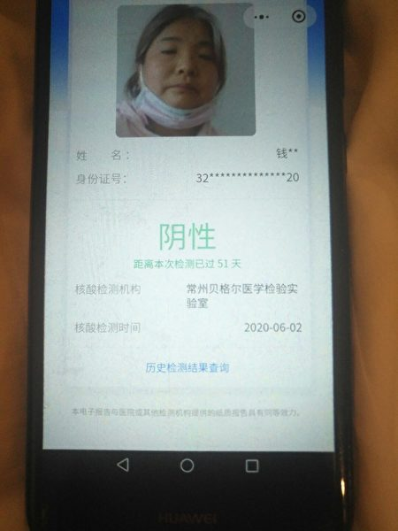
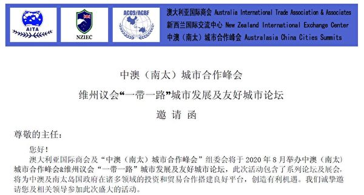
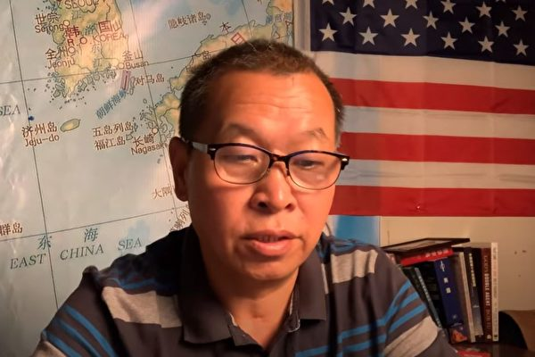

<h3><a target="_blank" href="https://bit.ly/3asSXIA">请多传破网软件，使更多的人了解真相从而得救，这是给自己积福德。 https://bit.ly/3asSXIA </h3></a>

   

     
<h3 align="center"><b>免翻视频  https://bit.ly/3ezRQKo  (请收藏网址 https://git.io/swspip)</b></h3> 

<h3 align="center"><b>复制网址到谷歌或火狐浏览器打开。若出现 “提示” ，請点击“继续”访问即可。</b></h3> 

<h3 align=center><a href="https://github.com/gav01/Heart/blob/master/news1.md">● 看更多大紀元時事 ●</a></h3>

<a href=https://git.io/souye><h6 align="right">回首頁</h6></a>

<a name=top>
   
   
<a href =#56>56.40名中共驻美记者签证将到期 或面临驱逐 
<a href =#55>55.报告：纽时、CNN等助中共宣传马克思主义 
<a href =#54>54.恐惧真相插播 中共设10万奖金“举报” 
<a href =#53>53.强采维族DNA 华大旗下掌香港核酸检测 
<a href =#52>52.三峡大坝削峰能力被高调宣传 专家指混淆视听 
<a href =#51>51.澄清脱钩传言 美驻华大使馆解释为何拍卖 
<a href =#50>50.【名家专栏】是谁让美国的货币贬值？ 
<a href =#49>49.【拍案惊奇】美欲黄岩岛开战？闫丽梦再揭内幕 
<a href =#48>48.【独家】党支部名单曝光 抖音何去何从 
<a href =#47>47.中共高调宣传北斗导航 遭质疑窃全球数据 
<a href =#46>46.黎巴嫩首都爆炸 蘑菇云腾起 数千死伤 
<a href =#45>45.川普说美中关系严重受损是“中共造成的” 
<a href =#44>44.在京访民被关进精神病院 家属探视无门 
<a href =#43>43.借空壳公司巨额赞助美国名校 中共用意何在？ 
<a href =#42>42.【名家专栏】国家的敌人想要我们沉默 
<a href =#41>41.田云：北斗导航与美国争霸 中共显露野心 
<a href =#40>40.香港大律师公会：港府推迟选举并不合法 
<a href =#39>39.63国逾500政要哀悼李登辉 台外交部感谢 
<a href =#38>38.美军两栖战车沉海 搜救无果 九人遇难 
<a href =#37>37.【视频】湖北化工厂闪爆致6死 浓烟冲天 
<a href =#36>36.微软证实收购TikTok 川普给45天时间 
<a href =#35>35.前中共军官：中共海空军不经打 
<a href =#34>34.中共核专家打脸胡锡进 批其恶意炒作涉核问题 
<a href =#33>33.国际海洋法庭即将选举 美国促遏制中共渗透 
<a href =#32>32.刘鹤公开羞辱李克强？ 央视视频火爆流传 
<a href =#31>31.43岁派出所长跳河 生前嘱托孩子别当公务员 
<a href =#30>30.美中对抗 美国五大优势令中共望尘莫及 
<a href =#29>29.【内幕】对中共了如指掌 美鹰派高招迭出 
<a href =#28>28.北京强拆民居 学者：由“低端人口”转向中产 
<a href =#27>27.私自留存涉密材料 中共国家信息中心高官被双开 
<a href =#26>26.美小企业救助计划 数亿美元流向中企 
<a href =#25>25.【独家】中共监控“流氓化”：家中偷窥你 
<a href =#24>24.新西兰前市议员：结束在中国的迫害 
<a href =#23>23.迫害大法修炼者中共基层官员遭恶报 
<a href =#22>22.袁斌：武汉护士张嬿婉之死涉及的三重内幕 
<a href =#21>21.休斯顿中领馆窃德州大学病毒研究？FBI调查 
<a href =#20>20.大连新一轮疫情发酵 凯洋海鲜公司成焦点 
<a href =#19>19.传任志强坚持自辩 全部揽下涉案人员刑责    
<a href =#18>18.加拿大司法部长：孟晚舟引渡案符合条件 
<a href =#17>17.河北企业家铁矿被霸占 后代维权遭公安迫害    
<a href =#16>16.廖远：唐山大地震中的“青龙奇迹” 
<a href =#15>15.最新疫情8·2】拉丁美洲染疫亡者超20萬    
<a href =#14>14.共军威胁台湾东部 总长：整合三军部队因应 
<a href =#13>13.颜纯钩：戴耀廷心太大，港大庙太小    
<a href =#12>12.湖南“野鸡”院校欺诈学生 家长愤怒维权 
<a href =#11>11.东欧国家改变态度 把中共视为主要威胁    
<a href =#10>10.【新闻看点】连遭国际11击 习近平愁容露面 
<a href =#9>9.美国制裁新疆生产建设兵团 冻结资产    
<a href =#8>8.【独家】揭秘替中共牵线搭桥的神秘商会 
<a href =#7>7.美参院小组通过新法案 个人可起诉中共瞒疫    
<a href =#6>6.林郑推迟9月立法会选举 白宫回应 
<a href =#5>5.参选资格被DQ 黄之锋：假新闻罗织罪名 
<a href =#4>4.美国关中领馆效应 亲共者大难临头各自飞 
<a href =#3>3.袁斌：习近平的一脸愁云与中共的走投无路 
<a href =#2>2.前中共军官：南海若开战中共则亡 
<a href =#1>1.【最新疫情8·1】MLB马林鱼队21人确诊 

<a name=56>
<h1 align="center"><b>40名中共驻美记者签证将到期 或面临驱逐</b></h1>

图为中共央视英文（CGTN）女主播刘欣在观看其于2019年5月29日参加福克斯商业网络电视女主播翠西‧里根（Trish Regan）的节目辩论。(WANG ZHAO/AFP via Getty Images)

   
  【大纪元2020年08月04日讯】（大纪元记者林燕综合报导）据中共小报《环球时报》周一（8月3日）的消息，目前来自中国境内、40名服务于中共媒体的驻美记者尚无一人获得延期签证，面临周四（8月6日）后留美身份失效的困境。

该报总编胡锡进称，北京已经“做好了被迫从美国撤出全部记者的最坏准备”，将对此进行“猛烈报复”。

因美国国土安全部在5月8日将中共媒体驻美记者签证停留期限大幅缩至90天以内，他们需要每三个月重新申请一次延期；这意味着中共记者必须在8月6日到期前获得新的延期许可。

根据美国移民法，这些中共驻美记者能有90天左右的离境时间，意味着他们最长能在美国待到11月的总统大选后，除非美国国务院要求他们限期离境；但是这段时间，他们不得从事报导工作。

中共外交部发言人汪文斌周二也证实了驻美记者未获签证延期的说法。“我们了解到，中方有关记者均早已向美方提交了签证的延期申请，但至今尚无一人获得美方的明确回复。”他说。

他表示，如果中共记者无法获得签证延期，中方将做出反应。

当被问及在香港的美国记者是否受到影响，汪文斌没有正面回答。他称，中方对美报复反应“属于中央政府的外交事权”。

今年稍早，在中共当局驱逐美国三大媒体驻华记者后，同时也不允许他们前往美国媒体的驻香港办公室工作。

2018年12月，美方要求有关中共媒体驻美机构注册为外国代理人。2018年以来，有20多名中方记者的签证申请遭到美方无限期拖延或拒签。

今年2月，美方将五家中共媒体驻美机构列为外国使团，又对上述五家媒体驻美机构采取人数限定措施，驱逐60名中方媒体记者。5月，美方将中国驻美记者的签证停留期限限制到90天以内；6月美方再次宣布，将四家中共媒体驻美机构增加列管为外国使团。

美国国务院旗下的ShareAmerica网站3月底刊登题为“中国媒体：是新闻工作还是宣传鼓吹？”的文章。文章说，中国（中共）的国营新闻机构想让全世界都以为它们是独立的、可信的。但它们并非如此。

很多这类机构的工作是在世界各地传播中国共产党的宣传，而且他们的雇员都在为中国共产党效力。

文章引述美国国务卿迈克尔·蓬佩奥（Michael R. Pompeo）的说法，这些机构是“外国使团”，受到中国（中共）政府的有效控制；“与在中国的外国新闻媒体机构不同，这些实体不是独立的新闻机构”。

蓬佩奥还说：“美国政府长期以来一直欢迎包括中国记者在内的外国记者，并确保他们能够在不受报复威胁的情况下自由地开展工作。”

但是，中国共产党对其国营媒体的控制，则是共产党总书记习近平试图控制中国人并影响全世界媒体舆论的手段之一。

“中国（中共）政府去年监禁的新闻工作者比全世界其它任何国家都多。”文章写道。

但是，中共官方向来否认这一事实。 

<a target="_blank" href=#top><h6 align="right">回上方</h6></a>

<a name=55>
<h1 align="center"><b>报告：纽时、CNN等助中共宣传马克思主义</b></h1>

图为清华大学，摄于2020年4月22日。（大纪元）

   
  【大纪元2020年08月04日讯】（大纪元记者徐简综合报导）中共治下的清华大学全球商业新闻学院，旨在把“马克思主义理论”来指导新闻专业，而包括CNN、《纽约时报》等西方主流机构和大牌媒体为其提供人力和财力的全方位支持，这一发现让人震惊。
  
<b>西方媒体和大公司支持“马克思主义新闻”</b>

美国保守派媒体“国家脉搏”（The National Pulse）7月31日独家披露，清华大学全球商业新闻学院的“全球财经新闻”（GBJ）项目的赞助者包括美国银行、彭博社、咨询巨头德勤（Deloitte）以及奈特基金会（John S. and James L. Knight Foundation）。

此外，GBJ项目“长期合作”的西方主流媒体机构为其提供“人才、设备和实习机会”，这包括美国国际记者协会、《纽约时报》、CNN、《金融时报》、《商业周刊》、《华盛顿邮报》、路透社和彭博社等。该项目的毕业生除了可以获得清华的学位证书之外，还可以获得美国国际记者中心颁发的“财经新闻专业证书”。

根据该学院网站，被列为外籍教师的有：《商业周刊》前驻白宫记者、全国记者俱乐部培训学院院长理查德·邓纳姆（Richard  Dunham），彭博社总编辑兼专栏作家李·米勒（Lee Miller），美国亚利桑那州立大学唐纳德·雷诺兹国家财经新闻中心执行主任琳达·奥斯汀（Linda Austin）。

而《纽约时报》的撰稿人和前商业记者莱斯利·韦恩（Leslie Wayne）则是客座研究员，CNN主持人法里德·扎卡利亚（Fareed Zakaria）和脸书副总裁罗莉·格勒尔（Lori Goler）都在2017年担任过该机构的客座讲师。

此外，彭博还为该学院提供了10个“彭博专业服务”（Bloomberg Professional Service）的终端计算机系统，用户通过“彭博专业服务”，可以查阅和分析实时的金融市场数据以及进行金融交易。据悉“这是全球最大的此类设备”，迈克尔·彭博（Michael Bloomberg）本人还与部分参与者会面并合影。

<b>西方媒体帮落实习近平的“媒体政策”</b>

作为共产党的喉舌，GBJ项目的核心使命就是要培养“引领舆论”的新闻记者，清华大学全球商业新闻学院的介绍信概述了其明确的目的，那就是完成中共中央交给“新闻媒体的任务”。

清华新闻学院院长在致辞中说，该院宗旨是要贯彻“党的十七届六中全会对新闻传媒的要求”，并表示要“坚定正确的政治方向，积极探索马克思主义新闻观的教学体系，指导和培养学生用马克思主义的立场、观点、方法来观察、选择、处理新闻事件。”

“国家脉搏”分析，这些英美机构跟中共合作，其实是积极协助和落实习近平2016年对媒体讲话谈到的，“读者在哪里，受众在哪里，宣传报导的触角就要伸向哪里。”这真是令人感到讽刺。

美国国务院说，该学院已经发起了针对美国政府的网络攻击，它与中共在技术和国家安全问题上有着“明显的联系”。

该学院的毕业生经常在中央电视台、新华社、《中国日报》和《人民日报》等中共喉舌工作，西方的听众也不能幸免于GBJ项目的邪恶影响，因为该校毕业生也为彭博社等西方机构工作。

该报告分析，这些西方大媒体和大公司在与完全由中共政权控制的清华大学合作时，实际上已经违背并出卖了美国的国家利益，并在充当中共的帮凶。 

<a target="_blank" href=#top><h6 align="right">回上方</h6></a>

<a name=54>
<h1 align="center"><b>恐惧真相插播 中共设10万奖金“举报”</b></h1>

长春电视插播，犹如一道震撼电波，刺破了中共对法轮功的谎言铁墙和黑幕。图为大陆天空一次闪电。(Getty Images)

   
  【大纪元2020年08月04日讯】（大纪元记者李辰报导）中共山东公安厅、海南公安厅、安徽黄山“610”等多个部门，近期部署专项行动，重点打压法轮功学员依法讲真相行为。

其发出的通告称，“举报奖金”不等，最高达10万元，煽动“人人参与”。“举报”范围包括电视、广播真相插播及以互联网、印刷品等方式的讲真相行为。

中共为何设高额“奖金举报”？中共在恐惧什么？

<b>震撼人心的真相插播</b>

最轰动一时的真相插播，发生在中国吉林省长春市。

2002年3月5日，长春市八个电视频道，约10万有线电视用户接收到了法轮功真相插播节目。插播的主要内容是：《法轮大法洪传世界》、《是自焚还是骗局》。时长约50分钟。

曾参与这次插播、后来到海外的法轮功学员金学哲回忆：“3月6日，长春市像炸开了锅。大街小巷、商场百货、凡是有人的地方，都在议论这事。”

长春法轮功学员魏利生回忆：“3月6日早晨，我的老板看到我说，哇！法轮功。上市场买菜时，老百姓都在说，法轮功真厉害，天安门自焚，电视上报导说，那是共产党栽赃陷害法轮功演的一出戏，法轮功洪扬世界。”

中国其它省市，也多次发生法轮功真相插播事件。

2002年2月16日，辽宁鞍山市电视插播。

2002年6月23日晚，中央电视台插播了法轮功真相节目。中央电视台的一个卫星专门针对农村播放节目，一套、三套、四套、九套、七套等几个频道，同时接收到法轮功的真相节目。

2002年8月17、18、19日，甘肃兰州、天水、白银等地有线电视台插播《历史的审判》、《见证》等法轮功真相节目。

2002年9月6日，白银市白银公司的有线电视节目，插播江泽民残酷迫害法轮功学员等真相。

2003年8月12日晚上，北京TV教育3频道电视插播成功，揭露江泽民犯下的8宗罪，中间未见干扰。

2004年1月19日，河北法轮功学员在邢台、沙河两地利用无线电视插播《伪火》、《全球公审江泽民》、《法轮大法洪传世界》等节目，时长2小时。

2004年11月20日晚上8时左右，北京卫视被插播《风雨天地行》真相电视片。

2005年8月2日，天津蓟县插播大型纪录片《九评共产党》，时长2个小时。

2005年9月5日，辽宁省辽阳县有线电视成功插播了《九评共产党》，时长1小时30分钟。
…… 

人们不禁要问，法轮功学员为何要真相插播？

<b>法轮功学员为何插播真相</b>

1999年7月20日，中共时任总书记江泽民下令镇压法轮功。在此之前，中共公安内部统计显示，法轮功学员人数达7千万～1亿人。

迫害之初，中央电视台为了配合中共的迫害政策，每天动用7个小时播出各种事先制作的节目、诬蔑诽谤法轮功。

与此同时，中共控制两千家报纸，一千多家杂志，数百家地方电视台和电台，全部超负荷运作，全力配合诬蔑法轮功的宣传。

据不完全统计，短短半年内，中共媒体在海内外对法轮功的诬蔑报导和批判文章，达三十余万篇次。

为了继续煽动对法轮功的仇恨，2001年，中共又炮制出“天安门自焚”伪案。

2001年1月23日（除夕）下午，天安门广场所谓“突发”五人自焚事件。事发后仅两小时，央视喉舌新华社即向全世界发出英语报导，称此案自焚者是法轮功学员。

“自焚”的刘春玲是怎么死的？

在“自焚”中丧生的刘春玲是被一个条状的重物猛击倒地而死。央视的“自焚”录像中可见，一名穿军大衣的男人挥动手臂，对她出手凶器。那个“条状物”是重物击打后反弹回来的，蹦得很高。

“自焚”的王进东是法轮功学员吗？

（明慧网）

（明慧网）

自称“老学员”的王进东竟然不会双盘腿。“自焚”事件后，新华网还曾先后出现过3个不同的“自焚”主角王进东：

并且，王进东的大拇指不是法轮功的正确动作——指尖轻轻接触，而是错误的上下重叠。

然而，这场世纪伪火，却通过中央电视台等官方媒体的反复渲染，迅速传遍中国、种下仇恨。

在电视、广播、报纸铺天盖地的谎言抹黑，法轮功学员首先想到了上访。

明慧网报导，北京公安内部消息显示，从1999年7月到2001年4月，到北京上访被抓、有登记记录的法轮功学员达83万人次（不包括许多不报姓名和未作登记的）。

报导说，2001年夏天，北京市公安局通过计算北京市街头出售的馒头数量的增加，估算当时来到北京市上访的法轮功学员超过百万。

面对这个群体的善良和对政府的信任，中共却将一批又一批的法轮功学员投入看守所、劳教所和监狱，等待他们的是酷刑、精神病药物摧残……甚至是迫害致死。

在向政府反映情况无望之下，自2002年起，一些法轮功学员冒着生命危险，插播法轮功真相。

<b>真相插播者的生死遭遇</b>

参与插播的法轮功学员遭受了中共惨绝人寰的虐杀。（合成图）

参与吉林省长春插播真相的法轮功学员中，侯明凯、刘海波、刘成军、梁振兴、雷明等至少5人被迫害致死。

长春法轮功学员房思邑，与侯明凯、王立波等参与了插播，她在监狱中目睹警察在她面前，不到一个小时就将侯明凯活活打死。

辽宁省鞍山市的张莉，2002年3月19日被劫持；8月27日，被迫害致死。

目击者证实，张莉死亡时气管被割开，两臂腋下被刀割开；她的遗体周身都被警察用白布包裹着，以掩盖事实。

河北的盖新忠，被野蛮灌食迫害致死。

河北的程凤祥，遭受了11种惨绝人寰的酷刑，当年秋天被迫害致残，2005年他被中共“强制失踪”，至今生死不明。

黑龙江省的郭兴旺，被非法判刑15年，后被迫害致死。

贵州省的胡大礼，2002年10月被绑架，非法判刑10年；2011年1月19日，被迫害致死。

青海省的贺万吉，2002年12月30日被判刑17年；2003年5月28日，监狱突然通知贺万吉死亡。
……

更多的真相插播者，被中共非法判刑，刑期20年至几年不等。

从法律角度来看，他们是如中共所认为的“‘罪’有应得”，还是千古奇冤？

<b>律师：真相插播合理合法 中共打压、民众“举报”非法</b>

美国纽约执业律师叶宁8月4日接受大纪元采访表示，他对中共打压法轮功学员讲真相的行为，感到“非常愤怒”，“（法轮功学员）讲真相，是一种传播自由信息的行为，符合联合国《世界人权宣言》第19条规定。这是各国普遍承认的公民的合法权利。”

“法轮功学员讲真相、做电视插播，是在中共剥夺了全中国人，包括中共党徒的信息自由后，所做出的伟大创举，让人们知道真相是什么，是在唤醒民众，是英雄行为，很了不起。”

“他们是中华民族的脊梁，在黑暗中发出微光。”

现旅居美国的原大陆律师彭永峰向大纪元记者表示，法轮功学员以“插播”来讲述受迫害真相的行为合理合法，受中国法律保护；中共打压非法。

他说，“法轮功学员的插播行为，是在言论自由的范畴内行使权利，是完全合法的。”

“既然中共号称是民众‘选择’了它，那么，毫无疑问，民众有权对它进行任何形式的批评，更有权传播真相，保护所有民众的知情权，这也是现代国家通行的法律运作原则和实践。”

彭永峰表示，中共打压法轮功的“每一个案件都是赤裸裸的法律构陷犯罪行为，每一个参与者都要面临刑事起诉和审判”。

他认为，中共设高额奖金煽动民众“举报”，这说明：“中共很清楚，法轮功学员是好人，只是讲真相，并且，也非常清楚自己早失民心，所以，不得不以‘重赏’利诱‘勇夫’。”

彭永峰说，“举报”者等同犯罪，“举报实际上是协同犯罪”。

“‘利用群众斗群众’，是中共的拿手好戏；‘举报’者，未来同样面临法律清算。”

<a target="_blank" href=#top><h6 align="right">回上方</h6></a>

<a name=53>
<h1 align="center"><b>强采维族DNA 华大旗下掌香港核酸检测</b></h1>

大陆核酸检测支援队7名遣队人员，8月3日步出下榻酒店九龙维景酒店。（宋碧龙／大纪元）

   
 【大纪元2020年08月05日讯】（香港大纪元记者叶依帆采访报导）中共病毒（武汉肺炎）在香港爆发第三波疫情，政府在舆论压力下扩大社区测试。然而港府放弃公开招标，特首林郑月娥直接向大陆求助，深圳政府安排两间私营机构来港做病毒检测工作，其中一间为“华大基因”旗下的“华昇诊断中心”。8月2日，由60人组成的大陆核酸检测支援队，其中由余德文带领的7名先遣队人员已抵达香港并将展开工作。港人担心政府以抗疫为由，采集港人DNA才是真正目的。

“华大基因”强制采集新疆维吾尔族人的DNA样本，因此被美国列入制裁黑名单，其与亚洲最大器官移植中心：天津市第一中心医院有紧密合作。追查迫害法轮功国际组织（追查国际）在搜证中共对法轮功学员进行系统的活体摘取器官过程中，曾获该医院的移植中心主任亲口说明法轮功学员为器官供源。

“华大基因”是中共控制下的另一个生物科技界的“华为”。

在中国大陆，大数据和AI，就是中共所说的“政府治理能力现代化”。华为、百度、腾讯、阿里巴巴、华大基因，这些公司，都是中共治理能力现代化的环节，其技术被用于控制和监控社会及人群。

华大基因香港化验所附近有大家乐、美心、淘大、大快活等食品制造工厂，有经常有货车进入卸货，其医疗用品对环境卫生构成很大的威胁。（宋碧龙／大纪元）

<b>华大与天津器官移植中心 共同打造移植样本资源库</b>

中国（中共）国家基因库（China National GeneBank）网站的新闻中心，一篇题为“‘国家基因库－器官移植样本资源库（天津）’成立大会顺利召开”的文章引起记者的注意，其中提到“华大基因集团”。

文章中提到一个名叫“徐讯”的人，此人身兼数职，包括“华大基因集团首席执行官”、“深圳华大生命科学研究院院长”、“深圳国家基因库执行主任”。徐讯与天津市第一中心医院副院长郑虹一起为“国家基因库－器官移植样本资源库（天津）”揭牌。

文章多次提及“深圳国家基因库”将“与天津市第一中心医院生物样本库”合作，就器官移植领域基因进行相关研究、数据资源整合。

“天津市第一中心医院”是亚洲最大器官移植中心，而深圳“国家基因库”是全球最大综合性基因库，双方将“共同打造具有影响力的器官移植样本资源库”。

天津市第一中心医院（图）是亚洲最大器官移植中心。追查迫害法轮功国际组织曾获该医院的移植中心主任亲口说明法轮功学员为器官供源。（医院网页）

最近，11间被美国商务部列入实体黑名单的中共企业中，有两间被指控涉嫌强制采集新疆维吾尔族人基因进行研究。其中一个目的是进一步打压维族人。这两间企业分别是新疆丝路华大基因科技与北京六合华大基因科技，包括被港府直接聘用为香港提供病毒检测的“华昇诊断中心”，均属内地生物科技企业“深圳华大基因”。

华昇诊断中心董事长胡定旭。（宋碧龙／大纪元）

<b>维族人及法轮功学员 遭采DNA数据后活摘器官</b>

美国人权组织“人权观察”（Human Rights Watch）2017年曾揭露，中共正在搜集新疆人的DNA和血型等生物数据。美国维吾尔协会主席伊利夏提（Ilshat Hassan Kokbore）当年接受大纪元采访时分析，中共搜集居民的DNA数据有三个目的：一是方便监控；二是把维吾尔人当成中共器官移植的备用库；三是采集血样以备制造生物武器，可能会针对维吾尔族人传播他们无法抵抗的疾病，进行种族大屠杀。

同年10月，前新疆医生安华托帝．博格达（Enver Tohti Bughda）在台湾接受自由亚洲电台访问，揭露中共长期在新疆进行核试验和活体摘取器官的黑幕。指中共根本没把新疆人当人，新疆已成垃圾场、核武器和生化武器试验场。新疆当局推行全面抽血体检，更把所有维族人变成活摘器官的供体群。

流亡海外的前新疆医生安华托帝2018年1月接受大纪元新唐人访问时，展示一张新疆机场内的一个“人体器官运输通道”绿色标志图片。（陈柏州／大纪元）

   

新疆机场内的一个“人体器官运输通道”。（网路图片）

安华托帝在采访中提到，维族人遭强摘器官的情况愈演愈烈。他出示一张由大陆族人冒险传给他的照片，上面显示的是新疆某机场标示为“人体器官运输”开辟的特殊通道。

他说：“我觉得毛骨悚然！但如果这是真的，你这个交通量要有多大，才能让一个机场建立这么一个专用通道？每天有多少个无辜人的生命被摘（活摘器官）？”

大陆的维吾尔族人口约1,500万至2,000万。据美国记者、作家伊森．葛特曼（Ethan Gutmann）调查，至今有99.7%维族人已完成抽血检查。

其实在中共对新疆涉嫌采集维族人DNA及活摘器官之前，中共针对法轮功信仰群体早已进行有规模的采集血液样本，并进行活摘器官。大纪元最早于2006年独家报导了事件，其后追查国际组织针对中国大陆30个省、直辖市、自治区的中共司法系统和军队、武警、地方等医院器官移植部门进行了持续的调查，获取了大量的活摘证据。

这些证据证实中共活体摘取法轮功学员器官及做活人人体实验罪恶的真实存在。追查国际的调查员保有对天津第一中心医院移植中心主任宋文利调查的部分录音，他在电话中亲口表示器官供源有来自法轮功学员。

<b>港人忧收集DNA用途可疑</b>

有港人担心，中共卫健委派员来港的真正目的是要收集港人DNA。有市民将此事与中共收集新疆人DNA相提并论。

今年7月1日港人游行抗议“港版国安法”，当天约370名被捕者当中，10人遭以涉嫌违反港版国安法拘捕，他们称被警方提取DNA样本。律师彭皓昕质疑此举超出调查需要，更怀疑警方想建立DNA资料库。

香港华大健康科技（香港）有限公司座落于大埔大富街16号，太平工业园A座3楼，被怀疑为华昇诊断中心实验室所在地，3A的水牌显示为大埔绣花工艺有限公司。

华大基因化验所位于大埔工业邨。图为大门铁闸入口的提示牌。（宋碧龙／大纪元）  

<a target="_blank" href=#top><h6 align="right">回上方</h6></a>

<a name=52>
<h1 align="center"><b>三峡大坝削峰能力被高调宣传 专家指混淆视听</b></h1>

旅居德国的国土规划专家王维洛博士著作《三峡工程36计》。（博大提供）

   
【大纪元2020年08月05日讯】（大纪元记者骆亚采访报导）每次长江上游的洪峰通过三峡大坝后，中共党媒都要大力吹嘘三峡水库对洪水的削峰作用，近日报导刚通过的三峡的长江第三号洪峰也不例外。水利专家王维洛表示，当初中共许诺老百姓的是，三峡大坝建成将没有洪水，而不是起削峰这点作用。中共报导是混淆视听。

<b>“三峡工程拦这么点洪水，没有起什么大的作用”</b>

据党媒新华社报导，7月27日，长江2020年第3号洪水开始通过三峡大坝，当日14时洪峰入库流量达到6万立方米每秒，出库流量为3.8万立方米每秒，拦洪削峰达36.7%。按照长江委调度令，三峡工程减轻了长江中下游防洪压力。

报导称，28日14时，三峡水库入库流量已由峰值6万立方米／秒降至4.9万立方米／秒。至此，“2020年长江第3号洪水”通过三峡大坝，向中下游演进发展。

对中共的宣传，水利专家王维洛对大纪元表示，“现在看看长江中下游的这些水文站的这个水位，南京超历史最高水位，大通超历史最高水位……洞庭湖接近历史最高水位，鄱阳湖达到历史最高水位……三峡工程拦这么点洪水，你没有起什么大的作用，没有起到当初答应给老百姓的（防洪）作用，这是关键。”

<b>当初中共许诺的三峡工程拦洪能力</b>

王维洛接受大纪元专访时表示，“我们要看它当时向老百姓许诺的是什么，不是你说你拦了三分之一（的洪水）。这没用的。”

他说，看三峡工程防洪作用，首先要看当时中共中央批准三峡工程之前，它是怎么给老百姓来宣传三峡工程的防洪功能的，要和现在它所展示的防洪功能作对比，才能看出它为何要建三峡大坝，及现在做到了它当时的多少目标。

他举例说：“当时李鹏在自己所写的《大江曲》中宣称有了三峡工程以后，就没有长江滔滔洪水，也没有老百姓悲愁了。”

“当时中共副总理邹家华给全国人大代表讲解三峡工程的防洪效益说，长江河流超过八万立方米每秒历史上有八次，最大的1860年、1870年都已经接近十万立方米每秒，他说有了三峡工程以后，十万立方米每秒的洪水我们就不怕了。”

“前不久去世的、被大陆称为‘三峡工程’之父的郑守仁，在当时三峡还在建造之中，也曾于《三峡工程日报》上写诗表示，三峡有了大坝以后，洪水再也不能逞凶狂，意思就没有洪水了。”

“三峡总公司总经理陆佑楣当时也对着记者说，如果三峡工程建成的话就没有1998年的洪水。”

而如今，面对长江流域的滔滔洪水，中共官媒只是大肆吹嘘三峡工程对洪水的削峰作用。同时，中共官媒没有报导，长江第三号洪峰通过三峡后，三峡水库的泄洪量反而持续增加。

<b>三号洪峰通过三峡后 三峡大坝持续加大泄洪量</b>

根据大纪元记者观察，党媒宣称第三号洪水通过三峡大坝的第二天（7月29日）上午7点，官方未公布三峡水库入库量，但出库量却高达4.02万立方米每秒，比第三号洪峰经过时的泄洪量（3.8万立方米每秒）还大，当日三峡水库的水位为163.33米。三峡水库的正常蓄水水位为175米。

大陆长江水文网公布的2020年7月29日长江流域实时水情，包括三峡水库的水位和动态流量。（网络截图）

次日（7月30日）凌晨2点时，三峡水库的泄洪量继续增加，出库量达到4.03万平方米每秒，三峡水库的水位继续下降，降低至163.07米。

大陆长江水文网公布的2020年7月30日长江流域实时水情，包括三峡水库的水位和动态流量。（网络截图）

中共官方的数据显示，当长江第三号洪峰通过三峡向长江中下游演进时，处于安全水位的三峡大坝却持续加大了泄洪量，令长江中下游防洪压力增加，而不是如党媒声称的防洪压力减轻。

三峡大坝在汛期加大泄洪量，有其缘由。在当初三峡工程论证时，泥沙组专家曾说，长江下游的堤防能力强，要利用洪水把泥沙冲出水库，减少淤积，来解决三峡大坝因泥沙淤积导致大坝安全问题。

前水电部副部长李锐曾在“对历史负责到底：回忆三峡工程上马过程的始末”中表示，究竟汛期到来时，三峡水库是要关闸蓄洪、减轻下游洪灾呢，还是开闸泄洪，减少库区淤积、加重下游洪灾？泄洪保了水库寿命、那三峡水库实际上就根本没有防洪能力。

2020年第3号洪水又即将形成，使得已位移、变形的三峡大坝防洪或处于更加危险之中。(STR/AFP via Getty Images)

<b>大陆专家改口 承认当初反对三峡工程的意见</b>

王维洛表示，现在大家引用比较多的是长江水利委员会着副总工程师陈桂亚前不久所说的，三峡工程不能包打天下，也不能说三峡工程能把洞庭湖的这个洪水了给防了。

“但原中共水利部部长钱振英当时在中央政治局常委会上决定三峡工程上马那次会上说，现在洞庭湖不行了，我们要用三峡工程来取代洞庭湖的功能。”他说。

当时在三峡工程论证过程中拒绝签字的九位专家之一的陆钦侃先生，他反对建三峡工程的主要的理由就是说三峡工程防御洪水的效益很低。

陆钦侃先生曾将长江洪水大致分为三类，全流域洪水、上游的洪水及中下游的洪水。三峡工程对中下游洪水它是没有任何作用，因为雨不在它控制的范围之内；三峡工程对仅上游有洪水而在下游没有洪水，下游的河道可以消化这些洪水的情况下起作用，但对这一类型洪水三峡工程只是起了更坏的作用，因为三峡大坝的存在把出水口抬高了，只能增加上游地区的洪水，特别是重庆的洪水。

<b>三峡大坝在降水量不大的年份才一次性拦洪</b>

大陆大坝工程学会常务理事、中国水力发电工程学会副秘书长张博庭日前接受党媒《新京报》采访，就为何三峡大坝不能一次性把洪水全拦住问题回应说，实际上，三峡大坝也会一次性把洪水全拦住。

他说，比如在降水量不是很大的年份，三峡大坝通常是全年都不泄洪，这说明所有的洪峰都百分之百被拦下了。然后，通过增加发电流量，才把拦下的水下泄。在降雨丰沛的年份，汛期通常只能实现对每一次洪峰进行削峰作用，而不能将全部洪水拦住。

但对只能实现对洪峰进行削峰作用的三峡大坝的拦洪率的水平，他又称，“一定要比较的话，可以与美国胡佛大坝比。”而他自己说，美国胡佛大坝拦洪率基本上相当于100%，有能力什么时候来洪水都可以全部拦下。

<b>三峡大坝是矛盾体 无法同时兼顾上下游大城市的要求</b>

张博庭对三峡大坝拦洪作用的说法自相矛盾，王维洛先生向大纪元介绍，三峡大坝就是一个矛盾体，因为上游和下游要求都是不同的。

王维洛表示，作为武汉它希望三峡闸门给关上，最好一点也不要流进来。那么三峡它根本就不可能做到的，因为它放出两万五立米每秒，它要发电、要赚钱，不可能一点水也不往下放的。

“那么对于重庆主城区的人来说，他希望三峡那个门也不要拦蓄什么34%，六万立方米每秒的水就赶紧过去，我的朝天门可能水位就是180米或179米。”

2020年7月27日，长江三号洪峰，重庆朝天门洞及码头都被淹了。（视频截图合成）

他表示，“重庆是要求你赶紧把水都给放掉，而武汉对三峡的要求最好把水蓄足，你一点也不要往下放。”

“所以三峡大坝做不到既要满足重庆、又要满足武汉，你不可能兼顾两方面的要求。此前黄万里就说你在两个大城市之间不能建大坝的。”

“27日那天，寸滩的水位已经184米，那个朝天门门洞淹了，朝天门的派出也淹了。”他说，这次灾情，海外能看到的都是透过自媒体透露出来的一点点消息，“今年三峡库区乌山、巴东、万州等地洪灾相当厉害，死的人很多。像万州不应该死那么多人，完全是新建的，从地势上来说也不应该淹的。”

王维洛认为，从三峡工程的论证开始，就知道根本是一个错误的工程，这个投入天文数字资金的工程，“根本就是（长江中下游）头上悬着的一把剑，按照毛泽东说的话意思就是你头顶一盆水是睡不着觉的。”

他说：“我们在灾后必须要学会思考，为什么中国的生态环境会走到这样地步，是不是我们治水政策错误一步步到今天。”   
<h4 align=center><a href="https://git.io/waaa">(点击右键,另存新档）</a></h4>
<a target="_blank" href=#top><h6 align="right">回上方</h6></a>

<a name=51>
<h1 align="center"><b>澄清脱钩传言 美驻华大使馆解释为何拍卖</b></h1>

位于北京的美国大使馆于4日上午举行拍卖会。曾引发外界对中美可能断交的揣测。（推特图片）

   
 【大纪元2020年08月05日讯】（大纪元记者徐简综合报导）美国驻中国大使馆于8月4日上午举行拍卖会，给人一种“打包搬走”的感觉，甚至引发外界对中美可能断交的揣测。美国大使馆第二天发推说，这是一个拍卖旧货的惯例，只不过今年由于中共病毒（武汉肺炎、COVID-19）疫情而推迟。

8月5日，美驻华使馆发文说：大使馆会定期更换旧家具、车辆和其它物品，通常每年安排一至四次拍卖来处置美国政府不再需要的这部分财产。这些拍卖是大使馆更替二手物品的正常环节。通常我们一年中举行两场财物拍卖和两场车辆拍卖，但由于COVID-19，我们在8月4日举行的这场是我们今年的首场拍卖。

<h4 align=center><a href="https://twitter.com/USA_China_Talk/status/1290883750956601350?ref_src=twsrc%5Etfw%7Ctwcamp%5Etweetembed%7Ctwterm%5E1290883750956601350%7Ctwgr%5E&ref_url=https%3A%2F%2Fwww.epochtimes.com%2Fgb%2F20%2F8%2F5%2Fn12308463.htm">大使馆会定期更换旧家具、车辆和其他物品，通常每年安排一至四次拍卖来处置美国政府不再需要的这部分财产。这些拍卖是大使馆更替二手物品的正常环节。通常我们一年中举行两场财物拍卖和两场车辆拍卖，但由于COVID-19，我们在8月4日举行的这场是我们今年的首场拍卖。了解更多：https://china.usembassy-china.org.cn/embassy-consul(点击右键,另存新档）</a></h4>
   
推文还链接了拍卖的物品，包括家具、电器、电脑等，该推文还在一篇“脱钩前兆？美国大使馆开始拍卖财产”的文章截图上打了一个大大的红叉，表示这种传言不实。

8月3日晚，网上开始传播一则美国驻华大使馆正在清理拍卖财物的消息。这引起网友们的纷纷猜测，美国驻华大使馆为啥要拍卖财物？刚刚关闭的美国驻成都总领事馆都没拍卖财物，如今这是要撤离的节奏？甚至有人将其解读为中美关系又有新动向。

美国驻中国大使馆总务处财产办公室在一则通告中说，8月4日，在位于北京顺义区天竺空港工业区的使馆仓库中举行拍卖会。

拍卖时间在4日上午9时至11时30分，使馆仓库里都是集装箱货物，很多都是无底价起拍，由于是“白菜价”大甩卖，很多市民踊跃参与拍卖会。

从现场图片看，不少买家顶着北京37°C的高温赶到现场，上午9时左右已有大批市民排队等候。

根据大使馆网站的介绍，竞拍结果将在7日通过电子邮件公布；拍卖只接受信用卡美金付款。#  
<h4 align=center><a href="https://git.io/waaa">(点击右键,另存新档）</a></h4>
<a target="_blank" href=#top><h6 align="right">回上方</h6></a>

<a name=50>
<h1 align="center"><b>【名家专栏】是谁让美国的货币贬值？</b></h1>

随着时间的流逝，货币正在慢慢地贬值。图为一堆面值100美元的纸币。(Shutterstock)

   
 【大纪元2020年08月03日讯】（英文大纪元专栏作家Mark Hendrickson撰文/秋生编译）大约60年前，参议员埃弗里特‧德克森（Everett Dirksen，伊利诺伊州共和党籍）（对预算委员会）说过一句妙语，非常有名：“这里花十亿，那里花十亿，很快你们将讨论现金了。”

60年过去了，华盛顿的政治有所改变吗？可以说有所改变，也可说没有改变。没有改变是因为漫不经心地花别人钱的做法未加遏制，越发严重；有所改变是因为花别人钱的规模发生了急剧的变化。今天的版本是：这里万亿，那里万亿。

“万亿”是一个简单的词，可以不费力地从嘴里说出。可是其简单的背后却隐藏着重大的意义。如果你把面值100美元的纸币铺平摞起来，一百万美元会有大约40英寸高，十亿美元就要比两个帝国大厦还要高，而一万亿美元的高度则超过631英里。假如用一美元纸币而不是一百美元纸币，再次把它们铺平摞起来，一张压一张，一万亿美元的高度可以环绕地球赤道两周半。按时间计算，假如你每天花一百万美元，从基督诞生的那天开始到现在，你还没有花完一万亿美元的四分之三。

这个国家的GDP首次超过一万亿美元的时候，约翰‧肯尼迪任总统。这个国家的债务首次达到这个数目的时候，罗纳德‧里根任总统。今天，国家债务已经飞涨超过了26万亿美元。这个夏天，山姆大叔创下了一个纪录：单月支出超过一万亿美元。

今天，民主政治把政府视为圣诞老人，他的口袋深不见底。在这种压力下，两党（大政府党——共和党，更大政府党——民主社会党）都从不提议紧缩银根，也很少（令人倒抽一口冷气地）提议缩小联邦支出。唯一的争议是应该追加多少万亿美元的债务。

在其它各种有害效应当中，冠状病毒疫情加快了我们政府增加国家债务的步伐。目前已经授权借贷至少2万9千亿应急支出，其中接近一半政府尚未支出，可是据参议员罗恩‧约翰逊（Ron Johnson ，威斯康星州共和党籍）讲，目前的政治争议在于，共和党准备再支出1万亿美元，而民主党想要再支出3万亿。

令人悲哀的是，即使疫情明天就消失，疯狂增加债务的行为也会继续下去。民主党总统候选人乔‧拜登最近提出了两项几万亿美元的支出计划。第一项，拜登要支出2万亿美元用来应对气候变化（国会的民主社会主义者肯定认为这个数字实在是太小了）。让这项计划相形见绌的是拜登的7万亿计划，拜登说这将用来缩小贫富之间、黑白之间的差距。

这种持续支出并不存在的数万亿美元的行为是极其愚蠢的。我们正在目睹的是货币的极度贬值。在过去，货币是受到尊重的。它是人类智慧和／或者努力所产生出来的某种价值的坚实的象征。一个货币单位代表着经济生产和创造新财富。而今天我们的货币呈现出一种不严肃的“垄断货币”属性。政客们对待它就像对待玩具一样。他们不会因为让我们的子孙背负数十万亿美元的债务而感到不安。为什么要不安？这只是钱，难道不是吗？

<b>三个F</b>

三个F导致了货币贬值，它们是法定货币（fiat currency）、联邦储备银行（Federal Reserve System）、金融化（financialization）。

“原罪”是法定货币被开始采用。“法定”指的是一种货币的替代物，它在市场上没有非货币价值。在过去，我们的货币由真实的经济产品构成，特别是金币、银币或者可以兑换金或者银的纸质票据。美国脱离金本位的过程经历了两个阶段：1933年富兰克林‧罗斯福终结了美国人货币赎回的做法；1971年理查德‧尼克松终结了全世界货币赎回的做法。

美国人在使用贵重金属（或者可以赎回贵重金属的纸质票据）购买和出售产品和服务的时候，有一种不言而喻的感觉，一种信心和安全感，他们认为自己正在用经济价值兑换经济价值。

在过去，一枚银币有其真实的价值，无论是被当作钱，还是被当作商品。即使在没有法定货币法强迫人们接受它为“货币”的情况下，它在市场上仍然有价值，与今天我们被迫接受的背后没有任何实物支撑的联邦储备钞票不同。

法定货币很快开始以反映经济现实的价格流通。事实上，数万亿张长方形的“纸”（其实是棉麻混合物）或者数字符号，根本上一钱不值。（如果你不相信，你问一下自己：假如不是政府强迫人们把它们当作“货币”，你是不是还要拚命地积累这些织物？）

表面上看，联邦储备银行是为了支持金融稳定，减轻商业周期的波动，实际上已经进化成了一个奇异的怪兽。它看到美元的购买力在其106年的经营中消失了97%，于是今天的联邦储备银行努力实现一个2%的通货膨胀率。换句话说，它故意让美元的购买力每一年贬值2%。更可怕的是，联邦储备银行现在的主要职责是在我们的金融体系由于过度放债因此遇到崩溃的危险的时候，在政府没有能力重新调整每年数万亿美元的方向的时候，把山姆大叔拯救出来。

为了实现这个目标，联邦储备银行设计了接近于零的利率，为期至少十年。能够支撑联邦政府持续挥霍无度的原因在于联邦储备银行允许它免缴历史正常利息，因此可以从联邦预算中减少数千亿美元。

联邦储备银行把利率降为零的做法的副作用一直毒害着我们的经济。市场经济最重要的代价是利息，有时候叫货币的价格，但是更准确地说是资本的价格。利息分配协调着现在与将来之间的消费和生产。零利率会导致货币的时间价值被或多或少地消除，使企业家们在制定政策时所需要的重要的价格信号变得模糊不清。

零利息的另外一个不良影响是它实际上产生了数十亿、数万亿美元的“法定资本”，它不是真正的资本，就如同法定货币不是真正的货币。人为贬值的法定资本来自联邦储备银行为拯救僵尸企业所制定的政策，它让那些垂死的企业苟延残喘而不是关门大吉。这妨碍了正常、健康的经济发展过程，妨碍著有价值的经济投入从相对不划算的经营发展成为新的企业。

总之，联邦储备银行使本来具有自我调节功能的市场经济发生了短路，因为“创造性的毁灭”原本会淘汰那些停滞不前的公司，让充满活力的新企业在正常的商业周期运转过程中取代它们。这导致了一种持续的低速增长，我们将不可逆转地走向我一直讨论的“美国经济的日本化”。

第三个F就是金融化，它是联邦储备银行的怪异货币操作的自然结果。精明的金融家们利用无中生有的数万亿货币单位以及人为压制的利率，玩弄怪异的金融游戏。在正常的经济环境下，货币储蓄提供资本，用于创造新的、真实的财富，资本被用来提高生活水平等符合人性的目的。

可是如今，资本已经成为类似于昙花一现的现象，一种纯粹的抽象。金融家们发明了巧妙的方法，对这种名为“美元”的转瞬即逝的东西进行整理打包，在完全没有创造任何真正财富的情况下制造出其它美元。正如我们在2008年金融危机中所看到的那样，联邦政府急于拯救华尔街，这完全是出于对自身利益的考量。如果没有一个庞大的发挥作用的金融基础设施，华盛顿这架对数万亿美元进行支出和再分配的机器很快就会停止转动。

<b>怪谁呢？</b>

问题是：谁该对假货币、假资本这种财政上的疯狂负责？是谁剥夺了美国人的真正的货币？答案是联邦政府。是谁创造了这架名为联邦储备银行的解围大仙？答案还是联邦政府。答案如此容易、方便、信手拈来以至于怪不得任何政客。

其实，要怪就怪“我们人民”（we the people）这句口号。在过去大约140年里，大部分美国人都中了政府的钓钩、鱼线、铅坠，政府扮演着爸爸、妈妈和圣诞老人的角色，看似开明进步，其实就像猫薄荷一样。大部分美国人一直支持政府多多地花钱，而政客们的动机也很简单：在选民喜欢的项目上多多地花钱，否则选民就让你滚蛋。

乔治‧华盛顿、托马斯·杰弗逊等总统的财政方式值得敬佩，他们把对政府债务的厌恶锻造注入了我们的政治基因，使其成为传统。

他们认为这种今天花钱然后让子孙后代付钱的做法是不道德的。（今天的抗议者真的要彻底清除华盛顿和林肯的遗产吗？）可是如今这种道德约束已经过时了，死了。无论是私人债务还是公共债务，数千万美国人都遵循着一种“先消费，（也许）以后再付钱”的理念生活。由于这种理念大行其道，联邦储备银行将继续以万亿为单位印钞，直到灾难发生的那一天，即越发脆弱的债务结构开始崩塌。

本文结尾我要讲一些坏消息。

2019年初我曾警告，现代货币理论（Modern Monetary Theory，缩写为MMT）是削弱私人企业并在暗中推行社会主义的工具。多么惊人啊！如今现代货币理论已经让我们中毒太深。联邦政府和联邦储备银行正在联手鼓捣出数万亿从根本上讲并不存在的、新的、假的“美元”让山姆大叔去花。所有这数万亿美元绝对不会使我们国家的财富积累有任何增加，但是却能让越来越多的美国人感到越来越依赖于华盛顿。

货币恶作剧的剧情常常如此：追加印刷数万亿法定美元，这在短期内似乎不会造成任何伤害。但是从长远的角度看呢？英国经济学家约翰‧梅纳德·凯恩斯的回答油腔滑调，搪塞了这个问题：“从长远的角度看，我们都死了。”嗯，说得不错，但是一个比较诚实的回答是：这种货币恶作剧会给很多人带来很多痛苦，一直到他们死去。货币贬值产生的深远影响是：除了贬值外，一切都难逃。

原文The Trivialization of Money刊登于英文《大纪元时报》。

作者简介：

马克‧亨德里克森（Mark Hendrickson），经济学家，最近刚刚从格罗夫城市学院（Grove City College）退休，目前仍在该校信仰与自由研究所（Institute for Faith and Freedom）担任研究员，从事经济与社会政策研究。

本文所表达的是作者的观点，不一定反映《大纪元时报》的观点。

<a target="_blank" href=#top><h6 align="right">回上方</h6></a>

<a name=49>
<h1 align="center"><b>【拍案惊奇】美欲黄岩岛开战？闫丽梦再揭内幕</b></h1>

美国想在黄岩岛开战？闫丽梦再揭中共内幕。（大纪元合成图）

   
  【大纪元2020年08月04日讯】大家好，欢迎收看《新闻拍案惊奇》，我是大宇。有两天没跟朋友们见面了，大家最近都还好吧！

今天看到一则消息，我很犹豫是否要报导。因为这个要报导对象的名字，看上去有点熟悉，又有点别扭。

<b>中共8月军演夺东沙证实传言 美中或黄岩岛开战</b>

一名大陆国防大学的教授，名叫李大光，他近日在香港杂志《紫荆》上发表文章，透露说，中共军队会在8月份，在南海进行攻占“东沙岛”的大规模登陆演习，东沙岛属台湾中华民国管辖，此前早有一些分析，指中共如果对台作战，有可能选择东沙岛作为首先的目标，而且日本《共同社》在今年5月，也曾报导说，中共有计划在8月份实施夺取东沙岛的演习。这个李大光近日透露的消息，证实了《共同社》5月份的报导，但他并没有透露演习的时间和具体地点。

台湾方面，则加强了东沙岛，也包括太平岛，这些台湾离岛的军事戒备。

而在李大光透露共军有关东沙的演习之前几天，7月28日，台湾一位名叫“于北辰”的退役陆军少将预测，美中在南海必有一战，地点可能在南海距离菲律宾比较近的“黄岩岛”，时间可能是今年美国大选的前一个月，也就是今年10月份。

于北辰的理由是，中共、台湾、菲律宾，都宣称黄岩岛是自己的领土，是美军开战的最佳地点。因为这里和附近海域，从2012年开始，是由中共实际管控。而比如太平岛、东沙岛，则是台湾实际控制的地方。

<b>美中互关领馆开战前奏？北京美使馆拍卖家当</b>

另一位台湾媒体人黄暐瀚分析说，只要一架军机擦撞，美国总统就可以直接下令动兵，而正式发动战争后，则需要60天内经过国会的批准。他认为9月份是比较危险的时机。

黄暐瀚并提到，美中已经开始互相关闭领事馆，接下来，不知会不会出现召回大使的行动，而这，正预示着双方接下来可能会兵戎相见。

美国驻北京大使馆贴出消息，8月4日上午9点到11点半，要对使馆的二手物品进行拍卖，包括家具、电器等，地点在美国使馆仓库，以密封式投标进行，会在8月7日邮件通知中标者。此举引起了一些网民的关注，在想，美国在北京的大使馆拍卖物品，是否是为进一步切断与北京的外交连系做准备。

<b>战事或在美国选前 共军南海核潜基地易成靶子</b>

目前，分别有日本和美国媒体分析，美军可能会在接下来三个月内或100天内有所行动。而这个时间跨度，刚好是美国总统大选前夕的这一段时间。

我们上周的节目已经报导过，美国在本土和亚太地区部署的兵力，已经足以支撑一场局部战争。7月29日，中共外交部发言人汪文斌说，今年上半年，美国军机已经在南海活动两千多次。

知名经济学家吴嘉隆也提到：美国的架势，已经是备战状态，是真的要打。

与其他人分析类似，吴嘉隆也认为接下来到美国大选前这一段时间，美中有开战的可能。不过他提到的时间更早，说可能是在8月份，地点就在南海。目前美军两艘航母已经在南海，他预计，日本、澳洲、英国甚至印度，都有可能协助美国。

吴嘉隆认为美军会在南海开战的理由是：最主要的战略考量在于核威胁，而中共的核潜艇基地，一个是在山东青岛，一个是在海南三亚区域。青岛出海后就是东海，海水相对比较浅，核潜艇容易被侦测到，而海南三亚区域的核潜艇基地，已经可以停放20艘核潜艇，从那里出海，可以迅速进入南海的深水区，侦测较难，这就给共军在海底进入西太平洋威胁美国的可能。因此，他认为，从战略考量，美军需要对中共海南的核潜艇基地有所行动。

<b>美中核力量差距悬殊 胡锡进倡扩充核武“挨批”</b>

对于中共的核武器力量，环球时报总编胡锡进，是嚷嚷得比较凶的，已经不止一次，呼吁中共当局扩充核武器库，跟美国对着干。最近的一次是7月26日，胡编在微博发文，声称需建设更强大核武库，压制美国。

不过，7月31日，另一名中共核战略专家杨承军，在《凤凰网》发表文章，题目是《警惕有人恶意炒作涉核问题》，明显是在反击胡锡进们的观点。

杨承军说，自己作为在核领域47年的专家，认为这种炒极其有害，会激起邻国不安，也会让民众对军队的不作为产生不满，并暗批胡锡进的炒作，是为了哗众取宠。

胡编的观点，也许是受到了中共体制内某些专家观点的激励，比如一个叫宋忠平的军事专家。今年5月8日，宋对环球网说，中共需要打造小而精的战略核力量，适当增加核武器数量。同一天，胡锡进还曾发表另一言论，要把中共核弹头数量增加到1000枚，这会是一个相当大的举动，因为目前中共的公开数据显示，其核弹头数量，不过两三百枚。而美国至少有8500枚，相比之下十分悬殊。

当时胡锡进的这个言论发出后，杨承军其实也有发出文章反驳，同样发表在凤凰网，题目是《炒作核武器数量有百害而无一利》。文中提到的理由，用的一些词都与7月31日的一模一样，比如“会激起邻国不安”。比较有价值的是，在这篇文章中，杨承军提到：中共核武器的反应时间“已经从我刚刚入伍时的需要几天、数小时缩短到数分钟；能够在敌核武器落地前实施预警核反击”。

如果杨承军所言为真，那是说明中共大幅提升了导弹预警系统的能力。但是中共放出的军事消息，早被人批评，会有夸大其词的成分。不过，面对美军庞大的核武器库和其它军事打击能力，中共真的想玩核武，那真的要好好想一想。

反观杨承军5月和7月的两篇文章，从题目到内容，基本上没有太大新意；胡锡进前后炒作增加核武器，同样是换汤不换药。

所以，从这一点上来看，倒让人怀疑，杨承军似乎并不是在打脸胡锡进，两个人是背靠背唱双簧的兄弟，每到美中军事紧张之际，胡锡进发声迎合国内鹰派的主张，另一边则赶紧灭火，压低音量，两人一唱一和，配合得非常紧密。而且环球网向来以鹰派观点着称，对它的喊话，多数是听听就好，而“凤凰”这个媒体，早被揭露是中共小骂大帮忙的外宣工具，胡杨两人的做法，分别符合各自媒体的属性。

所以，中共媒体们对核武器的言论，完全是在炒作。而且中共习惯玩左手搏右手，好话坏话实际全都是它自己说的，想把聪明人和傻子一起忽悠。如果真的想教训胡锡进，他已经不止一次发出这样的言论，早就被中共内部处分了，怎么会允许他三番五次发声，而只在另一家中共媒体上，发个文章“反驳”，这对中共来说，做法太“客气”。

<b>陆媒推兵役法让草民备战 “青睐”36到45岁男性</b>

所以，也有军事观察家认为，中共目前在对美军的言论上，只是做样子，演给民众看，它不敢跟美国擦枪走火、真的开战。而中共的战争造势，也体现在国内的征兵活动上。最近的军事动员消息，越来越多。从三个月前地方上星星点点的消息，演变到现在，已经成为党国媒体宣传的大事。

刚刚进入8月，大陆网络媒体“网易”就刊登了一篇文章，介绍中共的《兵役法》。当中提到，中共宪法规定，保卫祖国、抵抗侵略是中国公民的职责，一旦当局发布战争动员令，从中央往下一直到乡村，各级机关必须迅速动员，而有些人员是必须立即到位的，包括：正在服役的军人中止退伍，休假的军人立即归队；预备役、国防学生接到通知后必须到指定地点报到；而中共根据需要，还可以随时决定征召所有36周岁到45周岁之间的男性公民，至于这些男性公民的服役时间长短，是由中共国务院和中央军委决定。最后，文章还警告，如果拒绝征召当兵，后果严重，可能会拘役或者服刑两年或三年以下。

大陆网友看到文章后，反应不一。有人说：房贷还没还完，不去！也有的朋友调侃说，自己刚好在44岁，紧张得不知如何是好。

也有海外网友评论说，中共还停留在二战人海战术的水平，现在都是精确打击了，14亿人全上战场，又能怎样呢？

大家知道，36到45岁的男性公民，不仅在社会中扮演重要角色，也是各个家庭的顶梁柱。而且现在中国大陆，肯定有一半多在这个年龄段的中国男性，是80后生人，当时中共计划生育已经施行。这些人在家里都是独苗，如果是一个结了婚的在这个年纪的男性，他的妻子很可能也是家里的独苗，那这个男人所承担的可不只是自己家里的事务，还牵涉女方家庭的父母。

这样算来，这部分中国公民如果被征召上战场，实际牵涉的人数，要增加好多倍，一定会成为中国大陆一个新的社会问题。到时候，这些有枪的人，甚至包括其他已经当兵的人，枪口是向外还是向内，我想当局不会没有这方面的担心。

早就有很多网上华人网友开玩笑，说“美军来了我带路”，这种玩笑的背后，是真实的民愤。

<b>中共诱人入伍 华人盼军人倒戈 退伍官直言打不过美国</b>

所以啊，像那些未经训练的36到45岁的大陆男性公民，不到万不得已的时候，中共可能不会召集这部分人，而且，真的召集起来，可能是当个工程兵、或者做一些辅助工作。中共真的敢给发枪的，还得是那些经过共军体制训练、洗过脑、经过了政治审查的人员。

因此，中共现在还在扩招正式的兵员，甚至提出各种花式的口号，鼓励人加入共军给它当炮灰。

例如，又有福建福清市的一位观众给我写信，说他在经常路过的街边，突然看到征兵广告，还是第一次。上面的广告词竭尽所能吸引家长，甘愿送孩子当兵，除了宣称的优厚当兵待遇额外，还提出什么送到部队当兵，可以戒网瘾、改变弱性体质、让孩子更男人，等等，去吸引家长。

但是，即便是专门训练过的军人，在社会、历史的大形势下，人们也希望他们能做出自己主观的选择。

就在中共大肆做招兵宣传的同时，8月1日，正好是中共建军的纪念日，在美国的中领馆前，一批民运人士前往抗议，他们提出的呼吁包括：政治民主化、军队国家化，共党滚出军队，军队忠于人民等等，希望那些军人，不要成为中共的“党卫军”。

一位前中共海军司令部的中校“姚诚”，也参加了当天在洛杉矶中领馆前的抗议。他透露，中共官兵，有两种情况，一种是被闭目塞听，不知国际形势，因此造成，当中有一少部分人，像被打了兴奋剂，对与美国开战很兴奋；另一种情况是在军中比较高阶的军官，他们做表面工作走过场的同时，也在观望。而且中共海军、空军，根本就不是美军的对手，一旦开战，空军和海军被打没了，在地上的陆军，信心会受到巨大打击。姚诚觉得，这会让陆军选边站，结合以上的第二种情况，甚至陆军会出现“倒戈”。

<b>李克强在众高官面前出丑 习李明斗还是有人使坏？</b>

“倒戈”的情况可能出现在军队，而在中共的政治上，权力“内斗”则一直伴随它的执政，也是中共政权一直有危机感的原因之一。除非斗争中的一派取得胜利，将另一派斩落马下，公开惩治决定，不然它不会自己说内斗的情况。不过，外界可以从一些迹象，看出中共内斗的一些情况，从中共建政到现在，一直如此。

7月31日，中共高层集体出席了大陆“北斗三号全球卫星导航系统”的建成仪式。会上的一个细节，在网上炸开了锅。

当时，主持仪式的是习近平亲信、副总理刘鹤。刘先当众介绍了习近平，然后停顿许久，给人们留足了给习鼓掌的时间，待习近平坐下，才念出下一个人，国务院总理李克强的名字。我们能看到李克强的一些动作细节，在念到他名字的时候，他一开始想系起上衣钮扣，准备起身接受大家的掌声，但完全令他、也令在场人士意外的是，刘鹤念到李克强后，李克强还没完全站起身，刘鹤就开始念下一个人的名字，完全没有停下来给李克强接受掌声的时间，李尴尬地快速坐下。在后续的视频中，李的脸色很不好看。

我们可以想一下，如果是事先通知出席的官员，只给习近平鼓掌，那么李克强就不会站起来，现场其他人也不会刚要鼓掌，但发现不对才立刻收起掌声；如果党媒想维护李克强的面子，也不会在随后的电视画面中，保留这一尴尬的场面，最起码他们可以用刘鹤念李克强名字的画面，取代李克强出丑的一幕。

有至少三种情况可以解释出现以上场面：

第一，习李两人真的不合，习故意使小动作，让李克强难堪；

第二，安排会议和电视播出的人，故意搅局；

第三，刘鹤疏失，确实没注意到李克强，而电视宣传口，则有人借此搞事，留下了这个场面。

现在的一种分析，倾向于第一点，就是习李真的不合。不过进一步想，他们两人不合，谁最受益呢？中共内斗，消息封闭，波谲云诡，只有像历史上那样，只有在内斗中的一派彻底失势之后，我们才会有更加明晰的答案。

<b>北京雷暴云巨如珠峰 狂风雨雹砸坏谢霆锋菜园</b>

近日，北京的天气，就像中共所面对的形势一样。

8月2日傍晚，有不少北京人看到，在北京西北方向的天空上，出现了庞大的雷雨云砧，在夕阳映衬下，在清晰的云的轮廓内，能看到持续闪耀的霹雳，场面壮观。

而另一段北京当天入夜后，一片雷雨大风景象的影片，也有很多人在传播。连天的雨水还伴有冰雹。

知名的香港艺人谢霆锋，长期在内地发展，北京有自己的家，包括菜园子，他在微博发文说，在这场雨水冰雹的打击下，自己家的菜园也遭了殃。

<b>不明种子事件 日本发现属剧毒植物 美国人误种土地</b>

谢霆锋提到菜园子，让人想起近期从中国寄出的不明种子。比起冰雹对菜园的损害，这些不明种子对土壤的污染更令人担心。目前，在美国已经有人不小心种下了这种不明种子。德州一位女士，今年4月就收到了这种不明种子包裹，写的是耳钉，但打开后根本不是，不过她还是把种子种进土壤，目前，所有种过这些不明种子的土壤，上面的苔藓已经全部死掉。美国有的机构提醒人们，如果已经种下种子，要记得用除草剂，把相关土壤里的植物和种子杀掉，如果手接触到了种子或相关物品，要用肥皂水洗手至少20秒。

也有在肯塔基州的女士，以为收到的不明种子，是自己“种植俱乐部”的分享，所以并没有很警惕，还把种子种了下去，叶子都长出来了。

也有不少日本人，说自己收到了来自中国的不明种子。一名日本人甚至爆料说，自己收到的种子里，包含剧毒植物“大豕草”，这种草可以长到4、5米，甚至7米高，如果人在阳光下碰到这种草的汁液，会立即生出可怕的大粒水泡，如果溅入眼睛，甚至可以导致失明。

知道目前，这些寄往美国、英国、日本、台湾的不明种子，还没有其确切来源的消息。

但对于邮包上“中国邮政”的标记，中共外交部的说法是，这些标签是伪造的。

<b>闫丽梦揭中共研究恐怖病毒 武汉再现确诊 大连移动方舱</b>

此前，有不少人质疑，最早在武汉爆发的中共病毒疫情，其病毒的传播是中共的阴谋。而出逃的病毒学家闫丽梦，近日更指控，中共在研究其它可怕的病毒，值得世界警惕。闫丽梦举例说，中共实验室在做“西尼罗河病毒”的实验，她说就连她的丈夫，做相关实验的时候，都很恐惧。这种病毒的自然宿主是鸟类，可以通过蚊子叮咬传染给人，人类感染后，80%的人没有任何症状，但是，一旦出现危险，这种病毒会导致人发生致命的神经系统疾病，人类目前还没有疫苗。

目前，中共病毒又在武汉出现确诊病例。8月1日，按照大陆官方报导，3名从俄罗斯返回的中国留学生确诊。他们所乘坐的飞机，198名乘客还有20名机组人员，全部进行了隔离。而按照中共官方记录，湖北省已经有将近两个月没有新增病例的通报。

推特上近日也传出视频，发布者称是在湖北省，但没有说具体地点，显示有穿着隔离服的人，在居民小区活动，是对居民做核酸检测。这种场面，会让人立即想起三个月以前的武汉。

上周我们报导过，武汉已经在做秋冬季节，疫情反扑的准备。

另外，大连前段时间也爆发疫情，最近有人发出视频，显示的应该是在7月23日前后，已经有“移动式方舱”进入大连。

<b>长江水灾未退台风又来 中国洪水竟杀韩国海鱼</b>

下面，我们再关注一下有关洪水的消息，8月2日，中共长江水利委员会水文局，发布了长江中游九江一段，还有鄱阳湖区域的洪水黄色预警，同时发布了洞庭湖区，长江下游南京段登处的橙色预警。

在洪水威胁还在的同时，今年第4号台风“哈格比”，将在8月3日开始，逐渐靠近中国大陆，预计3号晚间或4号凌晨，在浙江登陆，会一直吹到长江下游。此时刻，正是当地潮水泛起之时，例如有名的钱塘江大潮，就是在这一时期出现，而台风的到来，浙江省气象局表示，不排除会有爆发性增强的情况，会加剧当地和长江下游洪水的灾害。

而大陆的洪水最近也影响到韩国，韩联社报导，8月2日，济州道政府开会商讨中国长江洪水的应对措施。因为，长江的洪水造成大量低盐度海水入侵济州海域，这会导致当地水产的死亡。例如1996年，就发生过中国的低盐度海水流入济州海域，导致当地184吨海螺和鲍鱼死亡，损失约490万美元。同时，济州当地还担心，大量洪水流出，可能会使海洋垃圾带被冲到济州海域，污染环境。

那么，在今天时事部分的最后，我们再简单关注一下TikTok的收购案。

<b>微软拟收购TikTok 中共收集秘密信息又收钱</b>

抖音的海外版app叫TikTok，在美国年轻人中很受欢迎，但是分析人士说，这款App已经成为中共监听人们私人信息的工具，实际上，就是一个监听器。它不仅搜集用户信息，甚至可能会远程操控手机，在你不知道的情况下，给你的手机上安东西，从这个角度来说，它又像是一款病毒软件。

目前，面对美国政府思考禁绝TikTok，美国的微软公司考虑收购TikTok，交易价格大约是500亿美元，截至我们今天截稿，我们看到的美国政府的消息是，路透报导，美国总统川普周一表示说，不介意微软收购TikTok，但是，最好是全部收购，而不是30%。

也有华人朋友担心，这种方式无疑是微软又在给中共送钱，占了美国人私人信息的便宜，又在被禁止前赚一笔，而这钱会用来做什么呢？除了抖音，中共还有其它的软件，仍然起到类似的间谍软件的作用，比如微信。

8月2日，美国国务卿蓬佩奥表示，川普会在本周，最终决定对一系列中共软件的行动。

<b>～～～新拍互动～～～</b>

现在是“新拍互动”。

澳洲观众“辰”给我们写信说：自武汉肺炎爆发以来澳大利亚采取了积极措施，第一波疫情3月份爆发，各个州配合联邦政府采取诸如半封城措施，到了6月份整个澳洲每天的增长基本上在个位数，但是到了7月份疫情突然在维多利亚州所在的墨尔本爆发，每天增长病例在几百例，可以在网上查得到，今天8月2日维州一天就有675个病例，从晚上6点开始，墨尔本进入第四阶段封闭，意思是只有超市药店医院诊所开门，包括餐馆等全部关闭，没有外卖。

究其原因，维州是唯一一个和中国签订了一带一路的联邦州，这个可能在全世界绝无仅有，维州州长被称作China Dan，他的名字叫做Daniel Andrew, 是中国的常客，非常亲共，在今年5月份中国宣布对澳大利亚进口牛肉征收关税时，唯独对维州网开一面。这恐怕是病毒找上门的原因，反观其它州，悉尼所在的新南威尔士州，人口比墨尔本多，每天的新增人数才10多例，基本上还是由维州输入的，所以说病毒真的有眼睛，也许是上天开眼吧，不但能够区分哪个国家亲共还能够区分哪个地区亲共，绝不会搞错。

以上是澳洲观众辰的分享，谢谢他！

也有大陆观众，透露了他身边发生的，有关中国大陆器官移植业的不正常现象。这位大陆观众说：他爸爸有一位朋友是卖医书的，非常有钱，认识中国的一些医学人士，这朋友换过两次肾脏了，两次去都是没有排队，也没有遇到因为血型不对而等很久的情状，这些都没有，两次去换，都是打通电话，之后就马上去换了。以前听到没什么感觉，现在才知道这背后的黑幕，涉及活摘器官。

除了这位观众说的，我还知道，在大陆，甚至有湖南长沙的医院，曾在2000年代搞过器官移植的“促销活动”。这些现象都非常反常。

好，如果您有爆料信息，可以息给我们发邮件，我们的节目电邮是：xwpajq@gmail.com。

<a target="_blank" href=#top><h6 align="right">回上方</h6></a> 

<a name=48>
<h1 align="center"><b>【独家】党支部名单曝光 抖音何去何从</b></h1>

之前TikTok母公司“字节跳动”传出可能把抖音分拆成一家美国公司，以规避美国制裁。(GREG BAKER/AFP via Getty Images)

   
  【大纪元2020年08月05日讯】（大纪元记者何坚报导）在美国政府反制中共渗透的干预下，TikTok（抖音国际版）的存亡去留尚在两可。不过，其母公司“字节跳动”（ByteDance）的属性问题，已在网络上引发关注。大纪元从内部人士获得部分中国公司的党支委名单揭示出，抖音和“字节跳动”，跟中共党媒一样，都“姓党”。

“党媒姓党”，是习近平于2016年提出的口号。这一口号被外界解读为，不仅道出了党媒是“中共喉舌”的本质，亦揭穿了中国媒体的真相——那就是，党控制下的媒体，跟党媒一样，都必须“姓党”。

TikTok最近深陷舆论漩涡，甚至前途未卜的最终命运也与“姓不姓党”直接相关。

由于存在用户数据被中共获取的风险，美国政府计划封禁TikTok。字节跳动因此急于在封禁前将TikTok脱手，目前正在与微软等美国公司谈判。

字节跳动集团旗下有今日头条、抖音、火山小视频、西瓜视频等众多产品，而且很多产品已经进军海外，包括海外版抖音TikTok、海外版火山小视频Vigo、海外版西瓜视频Buzzvideo、海外版今日头条Topbuzz等等。

<b>TikTok与字节跳动 能不能对中共说“不”</b>

美国国务卿蓬佩奥和白宫贸易顾问纳瓦罗都曾解释过，抖音等中国公司会将用户数据传给中共政府，尽管TikTok表示否认。

2019年10月，针对美国进行“国家安全调查”的呼声，抖音国际版TikTok发表声明称，中共政府从未要求该平台删除任何内容，并且“如果被要求，我们也不会听从”。

不过在现实中，TikTok或抖音，与其母公司一样，对于中共的要求，“必须无条件服从”。

中共2015年实施的《国家安全法》，以及2017年实施的《国家情报法》、《网络安全法》等法规，不但明令禁止在互联网上传播任何不利于中共的内容，同时明确要求所有的组织和个人，当然也包括字节跳动、TikTok等互联网企业和员工，必须无条件配合中共搜集情报和审查资讯。

事实上，字节跳动已经收到过来自中共的教训，那就是——不但不能说不，还必须主动配合中共。

（网络图片）

2018年4月，字节跳动旗下“内涵段子”遭中共关停。字节跳动创始人张一鸣发出公开道歉信，向中共承诺“加强党建”，对全体员工进行社会主义核心价值观、舆论导向等教育；并将内容审核团队从6000人扩大到1万人。

众所周知，字节跳动拥有以抖音、今日头条为代表的庞大的业务矩阵。不过罕为人知的是，字节跳动去年新增了一个功能独特的矩阵——“网警矩阵”。

2019年9月，全国网警巡查执法抖音号矩阵入驻仪式在京举行。图中人物为公安部网络安全保卫局副局长张宏业（右），字节跳动党委书记兼副总裁张辅评（左）。（网络截图）

党媒“光明网”2019年9月14日曾报导，“全国网警巡查执法抖音号矩阵入驻仪式”在京举行，全国省级、地市级公安机关170家网警单位宣布，将以开通专门工作账号的方式集体入驻抖音。公安部网络安全保卫局副局长张宏业表示，各地网警集体入驻，是要借助抖音的优势，“提升公安机关网络社会治理（维稳）能力”。

虽然字节跳动及其创始人反复声称，TikTok（海外抖音）没有、也不会向外国政府（包括中共）提交用户信息。然而该公司的运营实践和陆媒公开报导，都证明，“不受外国政府影响”的说辞与事实不符。

<b>内部名单曝光：抖音与字节跳动都“姓党”</b>

大纪元日前获得内部人士提供的，包括字节跳动公司在内的多家大陆社媒公司的党支委成员名单。

例如北京字节跳动公司的党支部委员会名单显示，字节跳动在北京总部的党支委中有138名支部委员。这138名党支部委员中，除了极少数是于1980年之前出生外，绝大多数都是九零后、年轻力壮；而且全都身处企业管理岗位或专业技术岗位，是负责公司运营的骨干成员。

大纪元获得北京字节跳动公司的党支部委员会名单，其中的张辅评是字节跳动党委书记、总编辑。为保护个人隐私，大纪元曝光的党支委名单已去掉生日、联络方式等敏感信息。图为名单截图。（大纪元）

其中职位较高的有字节跳动党委书记、总编辑张辅评。党支委名单显示，张辅评于2013年加入中共。

张辅评负责包括抖音业务在内的、字节跳动所有内容的审核工作。据党媒2018年4月报导，张辅评在公司党委组织的党课上宣称，“要压实企业主体责任，决不能让互联网成为传播有害信息、造谣生事的平台”。2019年9月，张辅评配合公安部，主持了全国网警巡查执法抖音号矩阵入驻仪式。

这些名单透露出一个事实，无论中国社媒公司是属于私营或上市企业、还是国有控股公司，党已像癌细胞一样扩散，从管理层到普通员工层面上，渗透到公司肌体中，牢牢地控制着中国社交媒体上的舆论和声音。

字节跳动今年在某中国人才网站上发布的招聘广告显示，该公司招聘要求是“党员优先”，工作职责是对今日头条客户端中新闻媒体和自媒体内容进行审核。

字节跳动今年在中国某招聘网站上的招聘广告截图。（网络截图）

大纪元获得的内部党支委名单，以及字节跳动的招聘广告等公开资讯都表明，该公司以及旗下的今日头条、抖音等产品，至今一直都“姓党”。

<b>中国社媒“姓党” 但从美国“吸金”</b>

大纪元今次获得的11家中国IT公司党支委名单，还披露了一个事实，那就是中国社媒虽然“姓党”，却偏好从美国“吸金”。这11家中国公司中，除了字节跳动准备上市外，其余10家已在美国上市，其中有7家是社交媒体。

大纪元获得内部人士披露的，字节跳动公司党支委名单。图为部分截图。（大纪元）

大纪元获得内部人士披露的，新浪微博党支委名单。图为部分截图。（大纪元）

大纪元获得内部人士披露的，网易传媒党支委名单。图为部分截图。（大纪元）

大纪元获得内部人士披露的，搜狐党支委名单。图为部分截图。（大纪元）

大纪元获得内部人士披露的，奇虎360党支委名单。图为部分截图。（大纪元）

大纪元获得内部人士披露的，搜狗党支委名单。图为部分截图。（大纪元）

大纪元获得内部人士披露的，百度党支委名单。图为部分截图。（大纪元）

大纪元获得内部人士披露的，爱奇艺党支委名单。图为部分截图。（大纪元）。图为部分截图。（大纪元）

据陆媒报导，如果不是美国政府的阻止，字节跳动原本计划在美国IPO（首次公开募股），从美国资本市场筹募资金。另据路透社最新报导，字节跳动正考虑将其中国业务在香港或上海上市。

陆媒称，2020年3月，字节跳动获得美国老虎环球基金（Tiger Global Management）战略投资，最新估值高达千亿美元。

据陆媒披露，2012年创立的字节跳动，在最近几年规模愈来愈大的多轮融资中，先后收到KKR资本、泛大西洋资本、老虎环球基金、红杉资本等美国金主的巨额投资。

虽然因为字节跳动尚未上市，任何关于其营收的消息都无法被证实；但华尔街依然视之为摇钱树。

据《华尔街日报》2018年11月报导，摩根士丹利（Morgan Stanley）和高盛（Goldman Sachs）等华尔街财团为字节跳动（ByteDance）借款13亿美元，以期在字节跳动上市IPO中分一杯羹。

事实上，在川普（特朗普）政府反制中共前，众多中国社媒公司已经从美国吸金成功，并利用华尔街的资金来发展业务，替中共输出和扩张软实力。

例如大纪元获得的11家中国公司党支委名单，包括百度、新浪微博、网易传媒、搜狐、搜狗、奇虎360、爱奇艺等7家已经在美国上市的社媒公司。

即使是在疫情重创美国经济的当下，中共控制下的中国社媒公司依然是华尔街的座上宾，并在高盛等美国财团的支持下，继续从海外筹集资金。

例如，2020年4月，百度向美国证券交易委员会（SEC）递交文件，宣布拟发行10亿美元债券，承销商为高盛和美银美林（BofA Securities）。

2020年7月，新浪微博刚公布了发行7.5亿美元债券个公开定价。预计这笔债券将在新加坡证券交易所上市。本次发债的唯一账簿管理人是高盛亚洲公司。

<a target="_blank" href=#top><h6 align="right">回上方</h6></a>

<a name=47>
<h1 align="center"><b>中共高调宣传北斗导航 遭质疑窃全球数据</b></h1>

日前，中共高调宣布“北斗三号全球卫星导航系统正式开通”。该系统被质疑是中共的另类监控系统。图为资料图。(Paolo Nespoli – ESA/NASA via Getty Images)

   
【大纪元2020年08月03日讯】（大纪元记者古清儿报导）在内忧外患之下，日前，中共高调宣布“北斗三号”全球卫星导航系统正式开通。该系统被质疑是中共的另类监控系统，在全球收集各类数据。外界担忧，该系统将对世界的安全造成隐忧。

<b>中共高调宣传“北斗三号”卫星导航系统</b>

中共党媒报导称，7月31日上午10时30分，北斗三号全球卫星导航系统（下称：北斗系统）举办开通仪式，习近平高调宣布称该系统正式开通，并提出所谓“新时代北斗精神”。

中共吹嘘称，北斗卫星导航系统第55颗卫星，是北斗三号系统最后一颗组网卫星，已完成在轨测试、入网评估等工作。并在全球范围内，为用户提供定位导航授时、精密单点定位等多类服务。

北斗系统由中共空间技术研究院研制，于1994年启动建设。

中共自称，目前有137个国家跟中共签订了有关北斗系统合作协议，北斗系统的相关产品目前已出口至一百二十余个国家。

中共外交部发言人汪文斌日前称，全世界有一半的国家都已开始使用北斗系统。

据悉，这些用户主要是亚洲、非洲与中共交好的政权。

<b>北斗系统恐成监控全球系统 窃各类数据</b>

目前世界上有4大卫星导航系统，分别是美国全球定位系统（GPS）、俄罗斯“格洛纳斯”（GLONASS ）系统、欧洲“伽利略”（Galileo）系统及北斗系统（BDS）。

由于中共在国内利用高科技监控人民，且其大数据算法日趋成熟，所以这次中共的北斗系统也被质疑是另类监控系统，会为中共窃取他国的个人踪迹数据及个人资料。

时事评论员黄东对香港《苹果日报》表示：“（中美）未必会马上发生战争，但商业上已展开了交战……卫星导航系统是商家必争之地，未来势将渗透到各种电子产品之上，如手机、自动汽车，战场无处不在。”

黄东提到，卫星导航系统是一个很巨大的投资，北斗系统未来或将如微信、华为、高铁般渗透到其它国家。

黄东表示，北斗系统芯片等核心部件为全国产化，减少了对外国的依赖，有助其渗透。他表示，如北斗系统抢占主导地位，渗透到每一个民生层面，实行战狼外交的中共只要在北斗系统下手，如关闭区域北斗系统服务，就可报复某一个国家，令他国产生很大影响。

国际评论员Sabena siddiqui曾在《亚洲时报》撰文认为，北斗系统加上绝大部分由中共承建的亚洲海底电缆，增加了许多发展中国家对中国庞大的通讯基础设施的依赖。

<b>北斗系统背后有中共军方的支持</b>

中共研发北斗系统最开始是为了在科技上更独立，使其在未来争端中不依赖于美国的系统，背后有军事目的。然而作为共产国家，中共拥有此项技术更具威胁性。

目前北斗系统已在中国和太平洋区域得以应用，许多民间和商业上都用到了北斗系统，且已被整合到军事系统中。虽然中共计划将北斗系统在全球启动使用的时间设定在2020年，但2018年底中共就宣布了北斗系统已覆盖了全球。

2012年的报导指，“北斗二号”具有传送短报文电信息功能，对中共军方全面控制南海局势较为关键，西沙、中沙群岛驻军已接通北斗系统。

美国国会2017年的一份报告总结说，中共想让其军队能够“在被拒绝使用GPS时，能转用北斗系统将导弹导航至（攻击）目标，并且中共也就能够攻击对手对GPS系统的使用，而不会使其自己的使用被中断。”

据《悉尼晨锋报》去年报导，新西兰学者布兰迪（Anne-Marie Brady）表示，中共研发的北斗系统是可以替代美国GPS系统的技术，将为中共军方带来巨大的利益。布兰迪曾披露，因对中共进行研究，她已经受到了骚扰和恐吓。

此外，军民两用兼具的北斗系统，可用于情搜、侦察、监视和通信，是中共各地公安系统惯用的“维稳”工具。以“十八大”为例，北京警方一口气就新增启用500套以上的北斗系统定位终端。

时事评论员田云表示，中共虽然反复声称“不称霸”、无意取代美国，但却一直积极备战，在其它领域亦从未停止对“美帝”不同形式的冒犯。此际，北斗系统开通，更显示出中共的军事布局和新动作。

田云认为，中共建设北斗卫星导航系统，是为了摆脱对GPS的依赖，为高科技战争作准备。至于北斗用于减灾救灾，都是忽悠百姓的副效应罢了。中共真正在乎的，是它的统治权力和集团利益。   

<a target="_blank" href=#top><h6 align="right">回上方</h6></a>

<a name=46>
<h1 align="center"><b>黎巴嫩首都爆炸 蘑菇云腾起 数千死伤</b></h1>

8月4日，黎巴嫩首都贝鲁特（Beirut）发生大规模爆炸。(Photo by ANWAR AMRO / AFP)

   
  【大纪元2020年08月05日讯】周二（8月4日），黎巴嫩首都贝鲁特（Beirut）发生大规模爆炸，蘑菇云腾空而起，场面惨烈。这起爆炸造成至少100人死亡，近4000人受伤。冲击波掀翻了许多汽车，多栋建筑被毁。美国表示，正在密切关注贝鲁特的爆炸局势。

黎巴嫩总理哈桑·迪亚布（Hassan Diab）在声明中表示，爆炸的地点是一间港区仓库，2750公吨的硝酸铵（一种用于肥料和炸弹的高爆炸性材料）已在没有安全措施的仓库中存放了6年。该仓库距离贝鲁特的购物区和夜生活区，仅数分钟的步行路程。

哈桑·迪亚布说，这“危及公民的安全”、“令人无法接受”，并矢言要让需负责任的人面对“最严厉的惩罚”。他要求有关单位调查爆炸详细原因，在五天内发布结果。

哈桑·迪亚布将这次爆炸描述为一场“灾难”，并说现在的首要任务是找到死者和治疗伤者。他也宣布全国明天举哀一天，同时请求“友邦”提供协助。 
   
<h4 align=center><a href="https://twitter.com/Doranimated/status/1290671746039844865?ref_src=twsrc%5Etfw%7Ctwcamp%5Etweetembed%7Ctwterm%5E1290671746039844865%7Ctwgr%5E&ref_url=https%3A%2F%2Fwww.epochtimes.com%2Fgb%2F20%2F8%2F4%2Fn12306655.htm">here were two blasts. The second one almost appears to come from underground. If so, it raises a question. Was something explosive being stored there? |(点击右键,另存新档）</a></h4>

据路透社报导，一位安全人士和当地媒体说，爆炸起因可能是源于在仓库的焊接工作。

当局派出直升机在灭火。(Photo by STR / AFP)

   
“有很多人失踪。许多人正在向急诊室询问亲人的情况，由于没有电，让夜间搜索很困难。我们正面临一场真正的灾难，需要时间来评估损失。”卫生部长哈马德·哈桑（Hamad Hasan）说。

随着更多的尸体从残骸中撤出，爆炸造成的死亡人数可能会继续攀升。黎巴嫩红十字会负责人对当地广播公司说，爆炸造成的死亡人数已经达到100人，近4000人受伤，还有更多的受害者处于废墟之下。由于医院不堪重负，红十字会正在与卫生部合作，以停尸房救治受害者。。

爆炸给周边地区造成巨大破坏，并在城市上空冒出巨大的红色烟雾团，造成诸多建筑受损，包括前总理萨阿德·哈里里（Saad Hariri）的总部。

消息传出后，由于爆炸引发了人们对地区不稳定的担忧，油价升至近两周来最高点。美国原油期货涨了1.7%。

美国总统川普则表示，美国军方“似乎认为这是一起袭击事件，是某种类型的炸弹。”

川普说，他与几位将军见面后，“他们似乎觉得，这不是什么工业品爆炸一类的事件。”   

黎巴嫩红十字会在Twitter上说，呼吁其医务人员立即动员起来，并向各自的中心报告，以帮助处理这场大规模爆炸。红十字会小组正在努力到达爆炸现场。

<a target="_blank" href=#top><h6 align="right">回上方</h6></a>

<a name=45>
<h1 align="center"><b>川普说美中关系严重受损是“中共造成的”</b></h1>

美国总统川普（特朗普）（大纪元资料室）

【大纪元2020年08月05日讯】（大纪元记者徐简综合报导）美国总统川普（特朗普）8月4日提到，中共对疫情的掩盖和不负责任对两国关系造成了“严重伤害”，川普还说他过去跟习近平曾经关系很好，暗示两人现在关系闹僵。

8月4日，川普接受了福克斯多布斯（Lou Dobbs）的采访。多布斯问他，“美国跟中国的关系既复杂又棘手，您对中国的看法如何，将来的两国关系又如何呢？”

川普说，蔓延全球的这场疫情使得两国关系“严重受损”。“因为我相信，它们（中共）本来可以把（病毒）控制在武汉，我对此非常确信。”

“（两国关系）绝对是严重受损”，川普说，中共在过去的几天内，购买了创纪录的大量玉米、创纪录的大豆 。“我们谈成的贸易协议，是个很棒的协议，但是这一切发生后，我对贸易协议的感觉变了。”

“我们失去了近16万人，可能失去更多”，川普说，“你想想，这么多生命失去了，可能更多……这是不可持续的，也是不可接受的，这是由中共造成的，所以当然会（对两国关系）有一个负面影响。”

“我（过去）跟习近平有过很好的关系”，川普谈到，“但是当你看到人人走来走去的时候，都戴着口罩，简直糟透了、糟透了。不光是对我们国家，全世界都受到影响，看看欧洲，意大利、西班牙、法国这些国家，都受到重创，而这一切本来是可以控制的。所以当然会对（两国关系）有影响的。” 川普说。

7月初川普表示，因中共病毒大流行，美中关系严重恶化，他对北京非常失望，他目前并未考虑下一阶段美中贸易协议。

当被问及这种摩擦是否意味着美中贸易协定“第二阶段”将终结时，川普表示，他甚至没有考虑下一阶段贸易协议，并且他还有很多其它想法。

今年5月13日，川普还在推文中说，即使100份中美贸易协议也换不回所有消逝的无辜生命。“我一直说，与中国（中共）打交道是一件非常费时费力（expensive）的事。我们刚达成一项大的贸易协议，墨水都没干，世界就被来自中国的瘟疫袭击。100笔贸易协议也无法弥补损失——所有无辜失去的生命！”

美国政界批评中共和世界卫生组织勾结，隐瞒疫情，导致中共病毒在一百八十多个国家传播，给美国和世界造成巨大损害。美国朝野要中共为疫情损害担责的呼声一直很高。

<a target="_blank" href=#top><h6 align="right">回上方</h6></a>

<a name=44>
<h1 align="center"><b>在京访民被关进精神病院 家属探视无门</b></h1>

江苏常州访民钱惠文母子寻求北京警方保护，反被交给常州警方，后被关押在黑监狱。（微博图片）

   
【大纪元2020年08月02日讯】（大纪元记者李熙采访报导）长期在北京维权上访的江苏省常州市钱惠文母子，2个月前因担心被户籍地截访人员带走，向北京警方寻求保护，却反而被送往久敬庄，后由户籍地人员带回常州。钱惠文于6月3日被送往精神病院迫害，至今不让家人探视。

钱惠文的儿子钱志松也一同被带回常州关押在黑监狱里，于7月22日被放出来。钱志松向大纪元记者披露，他出来后被送到他外公家，这时才知道他母亲于6月3日被从黑监狱转送到常州市德安医院，这是一家精神病专科医院。近日，又传出钱惠文健康状况恶化，身体已经不行了。

关押钱惠文母子的黑监狱。（微博图片）

<b>在精神病院受迫害 家属探视无门</b>

7月23日上午，钱志松去派出所办临时身份证，新闸派出所领导让他上楼谈话，其中提到了钱惠文在精神病专科医院的事，说她是偏执性精神病，政府花钱帮她治疗。他说，“他们这是赤裸裸的迫害，我的母亲我最清楚，和她有过联系的人我相信没人会说她是精神病。”

“同时，他们说让我去工作，可我妈如此被迫害，我有什么理由放弃我母亲？她被带走之前是好好的大活人，现在告诉我她的身体极其不行了，我只能认为这是赤裸裸的杀人！”

7月24日，钱志松去了常州市德安医院。

7月27日下午，他前往医院探视母亲，并且准备将一些材料交给医院领导，在还未见到医务科领导的情况下，就被新闸街道司法所和信访办负责人与新闸派出所警察带到派出所做笔录。理由是，他前两天在德安医院报过警。

7月28日上午，钱志松陪同外公到德安医院探视母亲，他们终于见到了江庐山主治医生，并表达希望钱惠文能出院。中午时分，他又到了常州市信访局、钟楼区信访局走访，要求释放钱惠文。但是未有实质结果。

7月30日上午，钱志松提前向医院预约，在拿到探视证后，江庐山医生却拒绝他的探视。“他起初说让我找村委陪同，后又称我母亲情绪起伏，不适宜探视，总而言之不让探视，我不知到底我母亲那里发生了什么。家属要求放人，院方不放，现在连最基本的探视权都被剥夺了。这次必须要向卫健委控告这个医院。”

江苏访民无锡点点说，“家人都没同意送什么专科，他们有什么权力，赤裸裸的迫害。才两个多月就由健康的身体到身体极其不行，可见受了多少折磨。”

江苏访民玛卡妈妈表示，“大活人进去，半死人出来，报复杀人！关进精神病院的目的就是灭口。非正常死亡，肯定是给她用了不寻常、让正常的大活人死的药。”

<b>寻求警方保护反被送入虎口</b>

钱志松讲述事件经过始末：

“5月19日晩上，我和母亲得知常州同区（钟楼区）访民朱平梅来京后在没有任何违法行为的前提下被地方截访的人带走了，于是在5月20日上午前往东城区管界向北京东城公安寻求保护安全，当时二名警察（警号027763、020522）说，你们母子并没有违法行为，不过，因为地方公安设定了一级临控，要请你们去趟派出所。

“后来，东城公安分局治安队的警察来到派出所，把我们带到了久敬庄。数小时后，常州的公安局高副局长来了，只字不提解决信访问题，只提要将人带回常州。我们多次报警，出警警察不作为。

“在当日晚上8点多中，常州驻京办和钟楼区信访局偕同北京警察（警号057538）共二三十人，强行将我和母亲押进一辆车（牌照：京M508）。车子离开久敬庄后又上来十余个有纹身的黑社会人员。

“在车上，黑社会人员不让我母亲下车去公共卫生间解手，因我母亲肾不好，只能在车上尿裤子多次。

“5月21日早上，原常州市信访局副局长周永明和黑社会人员将我母亲从车上抬出，抬进永定门大饭店旁九头鸟酒楼包厢。包厢隔壁就是女卫生间，他们从头至尾也未曾允许上厕所，任由我母亲尿裤子。

“5月21日下午2点多钟，以新闸街道孙姓委员、司法所副所长徐国荣、庆丰村委村主任顾爱华为首的十多人到达永定门大饭店。晚11点，我们被用胶带绑手绑脚押上了车，在山东淄博境内高青服务区换成大巴车（车牌：鲁c8796）。全程2000多公里，未曾让上厕所。

<b>在黑监狱饱受折磨送精神病院</b>

“5月22日晚上8点半左右，车子抵达常州正章宾馆的黑监狱，我们被关押在320房间。

“从5月22日开始到6月2日，我母亲在黑监狱饱受折磨，先是拉了三天肚子，后又因为哮喘，三餐吃的都是辣菜，咳嗽加重且吐的痰带血。26日中午过后，一个女性的看守者抢夺我母亲自己携带的药物，抗争后，我们二人被绑手绑脚，胶带捂嘴，嘴里都是血。

“6月2日下午，我们做了核酸检测，6月3日下午，我母亲被社会闲散人员强行抬出黑监狱。据我外公说，那时我母亲就被关押至常州的精神病专科医院，至今未放。

钱惠文核酸检测为阴性。（微博图片）

<b>钱志松不堪迫害吞洗衣粉自杀未隧</b>

“6月5日，新闸街道司法所副所长徐国荣到黑监狱和我谈话，言语态度极其恶劣，次日上午，我在百般无奈下吞食了洗衣粉自杀。黑监狱的看守者没有带我到医院诊治，只是找了个医生，然后就让看守者强行给我灌水，再用雪糕棒捅喉咙口，让我吐水。”

钱志松最后表示，“在大肆宣传依法治国的当下，出现这种土匪、流氓、恶霸行为应该吗？何时才能不让百姓寒心？何时才能释放我的母亲？何时才能还我正常生活？”   

<a target="_blank" href=#top><h6 align="right">回上方</h6></a>

<a name=43>
<h1 align="center"><b>借空壳公司巨额赞助美国名校 中共用意何在？</b></h1>

常春藤名校宾夕法尼亚大学教学楼外景。（维基公有领域）

   
【大纪元2020年08月04日讯】（大纪元记者高杉编译报导）美国宾夕法尼亚大学（University of Pennsylvania）在去年获得一笔300万美元的捐款，因无法解释清楚来源而遭质疑。有媒体查证指出，该捐款来自一家神秘的香港空壳公司。公开的记录显示，该公司的老板与中共政府关系密切。此事件被认为是中共企图影响美国学术界的又一例证。

据《华盛顿自由灯塔报》网站报导，这家香港空壳公司名叫“好著名有限责任公司”（Nice Famous Corporation Ltd）。其所有人是一位名叫许雪晴（音译，Xu Xeuqing）的上海商人。许与宾夕法尼亚大学之间并没有明显的关系，并在此前曾卷入上海的一起公共腐败丑闻并安然“脱险”。他的捐款引发了人们对于这笔钱的真正来源于中共的质疑。

《华盛顿自由灯塔报》查阅的相关文件显示，这位商人与中国共产党关系密切。

专家表示，近年来，中共向美国大学投入了大量资金，部分原因是为了在美国校园中获得影响力。川普总统就任之后，联邦检察官在近期已经加强了对中共在美国大学购买影响力和从事间谍活动的审查。

总部设在华盛顿的美国智库国际政策中心研究主任（Center for International Policy）、“外国影响力透明度倡议”（Foreign Influence Transparency Initiative）负责人本‧弗里曼（Ben Freeman）对此评论说：“毫无疑问，他们正在利用向大学提供资金来获取影响力。”“这不是唯一的动机，但却是众多动机之一。”

在过去几年里，外国资金大量涌入这所常春藤盟校，其中很大一部分来自中共。从2017年3月到2019年底，该校收到了来自中共的价值6100万美元的礼物和合同；在过去的四年里，仅来自中方的直接现金捐赠就有1900万美元。

根据相关财务信息披露，这笔300万美元的捐款是宾夕法尼亚大学从一家名为“好著名有限责任公司”的香港公司获得的。该大学的发言人史蒂芬‧麦卡锡（Stephen McCarthy）最初告诉《华盛顿自由灯塔报》，这笔钱来自一个名叫周欣（音译，Xin Zhou）的中国人，他的公司是该大学商学院的一个“大客户”。

但事实上，相关记录显示，“好著名有限责任公司”是另一名中国公民许雪晴的全资子公司，许雪晴是一位与中共政界关系密切的房地产开发商。

麦卡锡没有进一步回应为什么该校把这笔捐赠归于周欣的置评要求。

《华盛顿自由灯塔报》的一名代理人访问了该公司的办公室地址。他查证后表示，该公司并未在香港的注册地址运营。事实上，该地址上是另一家专门从事矿石和矿物进出口的公司——双富发展有限公司（double Rich Development ltd.）在运营。

弗里曼表示，很难确定中国企业是否“真正独立于中共政府”。“就连我们看到的表面上来自中国企业或中国慈善机构的一些捐款，在某种程度上仍然都与中共政府有关。”

还有其它迹象表明，许与政府关系密切。许是九里亭街商会的主席，这个职位要求许与上海政府官员在经济问题上密切合作。许还是上海高尔夫协会的副主席，该协会的领导层包括中国共产党的高级官员。许还拥有另一家企业——上格时尚文化（上海）有限公司[Upstyle Fashion & Culture （Shanghai） co. ltd.]，该公司每年举办由上海市经济委员会（Shanghai Municipal Commission of Economy）和其它政府部门主办的时尚大奖赛。

2011年，许卷入了一起涉及上海市住房和土地资源局一名高级官员的贿赂案。据检察官称，许向官员赠送了一块卡地亚手表，以换取政府机构的优惠待遇。但是，尽管收受贿赂者被判处终身监禁，但许本人却没有被起诉。

美国外交政策委员会（American Foreign Policy Council）专门研究中国问题的研究员迈克尔‧索博利克（Michael Sobolik）表示，许没有被起诉，这表明他与中共政府有着密切的关系。

索博利克说：“与中共高层有密切联系的商人可以按照不同的规则行事，只要他们与当权派有联系即可。”“许在对该贿赂案的审判中逃脱了起诉，尤其是他在习近平的‘反腐运动’中能够幸存下来，这一事实表明，许可能与中共有密切关系。”

弗里曼说，中共在美国大学校园购买影响力的目的是双重的。中共希望获得美国学者的知识产权，同时也希望提升自己在美国的形象。

弗里曼说: “我认为，对来自中共的威胁的最大的担忧就是，他们正试图在美国大学施加影响，以便接触到我们的顶尖学者，并最终接触到我们的知识产权。”“而看起来更为普遍存在的是，我们在全国各地的许多大学都能看到，在接受了中共资金后，这些大学改变了对中共的态度。”   

<a target="_blank" href=#top><h6 align="right">回上方</h6></a>

<a name=42>
<h1 align="center"><b>【名家专栏】国家的敌人想要我们沉默</b></h1>

2020年7月9日，戈雅食品公司（Goya Foods）执行长兼总裁罗勃特‧乌纳努埃（Robert Unanue）在华盛顿白宫玫瑰花园发表讲话。(Jim Watson/AFP/Getty Images)

   
 【大纪元2020年08月02日讯】（英文大纪元专栏作家Jeff Minick撰文／原泉编译）“‘闭嘴’，他解释道。”“‘Shut up’ , he explained.”

美国体育新闻记者，幽默作家林‧拉德纳（Ring Lardner）的小说《年轻的移民》（The Young Immigrunts）中的这四个字的句子，对我而言，是所有文学作品中最搞笑的一句话。它独树一帜，本身就是喜剧，让我每每想起都会心一笑。

在2020年的夏天，“‘闭嘴’，他解释道”，有了一个全新的、更刻毒的含义，它是那些试图颠覆我们的文化、宪法以及雕像的人的哲学的一个简单总结。

随着理性和辩论被排除在公共广场之外，我们正目睹着美国历史上对言论自由的最恶毒和危险的攻击，包括亚伯拉罕‧林肯（Abraham Lincoln）在内战期间关闭反对派报纸、伍德罗‧威尔逊 （Woodrow Wilson）逮捕和监禁反对美国参加一战的人。

借助于社交媒体，在有偏见的媒体的帮助下，左派日以继夜地努力让所有不同意他们激进想法的人闭嘴。

<b>网络暴徒</b>

如果你在社交媒体上出格，就有可能被“人肉”或被封杀。“人肉”意味着有人会调查你，寻找关于你的负面资讯，比如你在博客上10年前的贴子、你17岁时在脸书上发表的言论、你在推特上发出的笑话，然后通过社交媒体广为传播他们的发现，以此羞辱你。你名誉扫地，尽管道歉了，但还是会被一些人，包括那些你认为是朋友的人所回避，而且可能会面临失业的危险。

“封杀”或“封杀文化”发生在公众人物或公司越过左派的界线时，因为他们的评论而受到恐吓或抵制。顺便说一句，这条界线总是在改变。

《哈利波特》一书的作者罗琳（J.K.Rowling）在推特上留言，讽刺“来月经的人”的新闻标题，她用“女性才来月经”作为回复，许多人包括她的粉丝猛烈抨击她，认为她仇视变性人。

在戈雅食品公司（Goya Foods）首席执行官罗伯特‧乌纳努埃（Robert Unaunue）称赞唐纳德‧川普总统之后，愤怒的暴民呼吁抵制戈雅食品，这是一种封杀文化的抗议活动，结果适得其反，因为乌纳努埃的支持者发起了“买戈雅”运动，超市货架上的戈雅食品被一扫而空。

一再继续下去，“闭嘴”，他们解释道。

<b>虚假信息和欺骗</b>

“第四权力（媒体）”经常充当民主党的喉舌，而不是作为自由和独立的实体报导事实和真相。例如，在过去四年中，各大电视网对川普总统的负面报导从未低于90%。由于这种和其它有偏见的报导，绝大多数美国人不再相信主流媒体。

公众与新闻界的关系，让人想起苏联的一个老笑话。

“一个小学生在作文本上写道：‘我的猫刚生了七只小猫，它们都是共产党人。’接下来的一周，他写道，‘我的猫有七只小猫，它们都是资本家。’当老师提醒他，一周前他说小猫是共产党员时，男孩回答说，‘他们现在睁开了双眼。’”越来越多的美国人对媒体睁开了双眼。

<b>压制真相</b>

新闻媒体的记者，特别是电视记者，也可以通过他们不报导（事件）而蒙蔽观众。

例如，他们对美国的中共病毒（疫情）情有独钟，却忽略了告诉我们中国和伊朗等地病毒的爆发病例，忽略了中共正在进行的军事集结，也忽略了香港持续不断的政治斗争。如果不是还有一些新闻机构，我们将很少听到这些（事件）和其它重大（事件的）发展。

当美国人不能相信媒体时，真相就会消失。在Gen LaGreca关于新闻和政治的优秀小说《真相》（Just The Truth）中，一名记者对电视观众说：“新闻是暴政的解药。没有它，我们珍视的自由将消亡。”

现在这么多的新闻机构都未能起到解药的作用，社交媒体的暴徒们在叫嚣着暴力，我们能做些什么来维护我们的言论自由并拯救我们的文化呢？

<b>沉默的大多数</b>

在《联邦党人》的《沉默的大多数在文化战争中还不够好》一文中，艾米莉‧贾辛斯基（Emily Jashinsky）谈到了影响我们今天文化的恐惧，她写道：“这就是左派如何通过恐吓使人们保持沉默，以占领我们的文化。”

禁止言论自由是一种屡试不爽的有效策略，德国纳粹、俄罗斯、中国、朝鲜和其它国家的共产党人都曾采用过。通过任何必要的手段让对手闭嘴，制造恐惧，你就赢了。

贾辛斯基接着提醒我们反击那些让我们感到恐惧、剥夺我们权利的人的重要性：

“尽你所能阻止它。我们的沉默是文化战争中这些小战役失利的原因。不要让左派吓得我们将削减警察的预算经费、给挣扎中的孩子开激素处方、视拉什莫尔山和国歌为白人至上主义的象征，让被剪接的喜剧、虚假的历史、不可能的言论限制等正常化。

“即使是在看似微不足道的问题上，也要有勇气和智慧大声说出自己的想法，这将传递这样一个信息：理性的人们不同意无理的要求——那些让决策者们和他们狂热的公关专业人士无法抗拒的要求。”

<b>打破沉默</b>

正如贾辛斯基告诉我们的那样，我们可以通过理性的抗议来对抗封杀机器。然后，她列举了几个具体的例子，说明企业和大学校园里的人们应如何有效地应对社交媒体上的暴民。

对于我们其他人，这里有一些额外的建议。如果我们看主流电视新闻，应该带着偏见去看。

当有朋友或熟人称某政客为种族主义者，而我们不同意时，可以悄悄地要求他们提供支持他们指控的证据。

当年轻人鼓吹社会主义时，问他们一百个问题，以发现他们相信什么和为什么相信。这些问题，合理不带敌意地提出来，可能会使他们重新考虑自己的立场。

如果你是一所压制言论自由的大学的毕业生，请停止向他们捐款。相反，把钱捐给促进所有人的自由的大学和机构。

最重要的是，我们必须了解并珍惜我们的第一修正案权利：“国会不得制定关于建立宗教或禁止自由行使宗教权利的法律；不得剥夺言论自由或新闻自由；不得剥夺人民和平集会和向政府请愿以申冤的权利。”

我们应该研究这45个单词。更好的是，我们应该记住它们。他们是美国文化和自由的核心。

让我们拒绝成为沉默的多数，因为这正是这个国家的敌人想要我们做的——沉默。

原文：Silent No More: Our Culture, the Left, and the Rest of Us刊登于英文《大纪元时报》。

作者简介：

杰夫‧米尼克（Jeff Minick）育有4个孩子、多名孙辈， 20年来，他在北卡罗莱纳州阿什维尔（Asheville）为在家学习的学生教授历史、文学与拉丁语，现居维吉尼亚州Front Royal生活和写作。请访问JeffMinick.com关注他的博客。

本文表达的观点是作者的观点，不一定反映《大纪元时报》的观点。  

<a target="_blank" href=#top><h6 align="right">回上方</h6></a>

<a name=41>
<h1 align="center"><b>田云：北斗导航与美国争霸 中共显露野心</b></h1>

卫星攻击卫星的概念。（公有领域）

   
 【大纪元2020年08月03日讯】7月31日，中共北斗三号全球卫星导航系统正式开通，习近平在仪式上发表讲话，中共中央军委发出贺电。党媒高调报导，称之“开启了高质量服务全球、造福人类的新篇章。”事实上，所谓“国之大器”乃是中共为了与美国争霸的战略部署。
中共建设“北斗”的主要目的

中共于1994年启动北斗卫星导航系统的建设，经过26年的运作，在今年6月23日发射了最后一颗卫星。中共官媒称，已有一百二十多个国家和地区使用北斗系统，其实，这些用户主要是亚洲、非洲与中共交好的政权。

6月23日，“科普中国”发表一篇“十问北斗”的文章，透露了该系统的战略用途，其中释放的威吓引人警惕。

文章用了不少篇幅评议美国GPS（全球定位系统）的军用属性，以此说明北斗导航系统的必要性。例如，该文指GPS的本质是美国空军的军用卫星导航系统，目前几乎用在了美军任何一种需要定位的武器中。美国GPS为人类战争贡献了“外科手术式精准打击”、“定点清除”、“斩首行动”等新词。

文章提到，“在实践中，卫星工程师不仅能在信号方面增加干扰、欺骗手段等，还能停掉某一地区的服务，芯片定价权和使用权限等也在他们手中。”“一旦进入战时，只要完全切断对手长期依赖的GPS服务，战争自然进入信息不对称阶段。”

作者称，“北斗系统的建成，意味着中国不仅能做到所有GPS能做的事情，还能够完全不受制于人，对国防安全的意义重要到无法形容。”“无论是事关国家国防安全，还是导航应用市场的巨大商业利益，中国都必须拥有自己的卫星导航系统，这个领域不会存在真正意义的国际合作。”

以上信息足以说明，中共建设北斗卫星导航系统，是为了摆脱对GPS的依赖，为高科技战争作准备。至于北斗用于减灾救灾，搜寻失踪渔民，让牧民能坐在家里放牛放羊，都是忽悠百姓的副效应罢了。中共真正在乎的，是它的统治权力和集团利益。

在大陆网上，一种为北斗点赞的观点认为，如果没有北斗，GPS随时可能被禁用，华为就是例子。这恰好反映了北斗与华为诞生的同一理由——向美国叫板。

事实上，这番自我炫耀的“十问”自相矛盾。既然美国可以干扰GPS讯号，或阻绝区域服务，那么北斗系统也可同样操作，以制约他国。中共既然断言，在这一领域不存在真正的国际合作，那么，中共声称北斗系统将向世界提供的“中国共享”、“造福人类”绝对是谎言。

<b>中美军事竞赛 新星球大战将上演？</b>

当前，南海局势升级，台海形势也不乐观。中美是否会展开“热战”，引人关注。中共虽然反复声称“不称霸”、无意取代美国，但却一直积极备战，在其它领域亦从未停止对“美帝”不同形式的冒犯。此际，北斗三号导航系统开通，更显示出中共的军事布局和新动作。

由此看出，川普总统于去年12月增设太空军，是非常及时和精准的应对。这一新军种的使命是在太空保护美国通讯和监测卫星及其它美国资产，尤其防范来自中、俄的威胁。川普总统曾说：“太空军将帮助我们阻吓进犯而且掌控绝对制高点。”

1983年3月23日，里根总统在电视发表演讲，首谈“星球大战计划”。（公有领域）

太空军加强防御，呼应了上世纪里根总统的“星球大战计划”。1983年3月23日，里根总统在演说中宣布推出“战略防卫先制”（Strategic Defense Initiative），即外界俗称的“星际大战”，核心内容是以各种手段攻击敌方的外太空的洲际战略导弹和外太空航天器，以防止敌对国家对美国及其盟国发动的核打击。其中包括以反卫星武器摧毁敌方的军用卫星，打击削弱敌方的监视、预警、通信、导航能力。

虽然该计划在90年代中止，实际成果有限，但却令苏联相当恐慌，遏制了苏联加码太空军备竞赛，是里根总统以实力求和平的一个范例。

三十多年后，苏联不复存在，中共成为美国与自由世界的最大敌人。在政治、经济、军事、科技、公共卫生、传媒与文化交流等国际事务中，共产极权的危害与威胁已是触目惊心。华为被多国排斥，事关信息情报安全；中共因瞒疫被追责，事关民众健康安危；《港版国安法》被谴责，关乎人权与自由。

当前，国家安全已然远涉太空领域，自由阵营需要合力维护正义与和平，任重道远，懈怠不得。  

<a target="_blank" href=#top><h6 align="right">回上方</h6></a>

<a name=40>
<h1 align="center"><b>香港大律师公会：港府推迟选举并不合法</b></h1>

香港大律师公会周日（8月2日）表示，港府以遏止疫情为由推迟立法会选举的决定，很可能是不合法的。图为7月12日民主派初选，大埔广场投注站大排长龙。（宋碧龙／大纪元）

   
  【大纪元2020年08月03日讯】（大纪元记者陈霆综合报导）香港大律师公会周日（8月2日）表示，港府以遏止疫情为由，引用《紧急情况规例条例第241章》（下称《紧急法》）推迟立法会选举的决定，很可能是不合法的。

原订于9月6日举办的立法会选举，是中共全面实施《港区国安法》以来，香港首次正式投票。上周五（7月31日），香港特首林郑月娥以遏止中共病毒（武汉肺炎）疫情及保障市民健康为由，将选举推迟一年。

在上周四，香港选举主任大规模取消12名民主派参选人的资格，为历届以来最大规模的“DQ”（Disqualify）。相隔一日即宣布将选举延后1年，引发外界高度关注。

<b>大律师公会：该决定未向公民社会咨询</b>

香港大律师公会发声明表示，该决定“显然未有向公民社会作出咨询”，且于“法理及证据基础存在重大疑问”。

“香港特区政府试图以公众健康风险，合理化其押后选举的决定。”该公会在声明中说，“国际人权专家早已多次警告，世界各地政府不可以新冠肺炎（中共肺炎）作为借口压制人权。”

声明中引用联合国专家的言论：“各国应提高选举情况下，其决策过程的透明度⋯⋯并与民间社会协商制订适当做法。虽然某些情况下，可能有必要限制到场投票，但各国应采取一切可能措施，包括邮寄选票等替代性投票程序，确保选举及时举行。所有情况下，均须确保选举过程的诚信。”

香港大律师公会表示，虽然世界上部分国家也推迟了选举，但仅推迟数周或数月，港府却直接推迟了一年，并未对此作出解释。

<b>援引《紧急法》押后选举 法理上两大问题</b>

该公会指出，港府引用《紧急法》来推迟选举的决定，在法理上很可能并不合法。

在声明中说，去年港府援引《紧急法》授权制定《禁止蒙面规例》（又称“禁蒙面法”），希望阻止示威者蒙面抗议。然而，该法却在11月18日被香港高等法院判定违宪。因此，这次引用《紧急法》取消立法会选举的决定最终或被裁定不合法。

其次，根据《立法会条例》下的特定条文，基于“危害公众健康或安全的事故”，可将选举日期延后至多14天。

依据法理，针对特定议题所订立的法例，相对于较早前订立的一般性法例更具优先性。因此，此处应以《立法会条例》为优先。

<b>绕开香港立法机构 将任期问题交付中共裁决</b>

由于《基本法》明订立法会每届任期为四年，若真将选举延后一年，延期所造成的任期问题，也会衍生相关问题。

大律师公会在声明中说：“举行选举选出立法会议员，属香港特区自治范围内的事务。令人震惊的是，香港特区政府不单无视基本法的规定，更选择提请全国人民代表大会常务委员会就因押后选举而产生的立法会任期问题作出决定。”

该公会指出，此举实际上是绕过《基本法》及其它香港法例，以避免该决定受到法律挑战，违反法治原则，亦对香港的法治带来冲击。 

<a target="_blank" href=#top><h6 align="right">回上方</h6></a>

<a name=39>
<h1 align="center"><b>63国逾500政要哀悼李登辉 台外交部感谢</b></h1>

中华民国前总统李登辉7月30日辞世，享耆寿98岁，资料照。（Getty Images）

   
 【大纪元2020年08月04日讯】（大纪元记者钟元台北报导）中华民国前总统李登辉7月30日辞世，外交部表示，陆续接获来自63国逾500位政要向台湾表达哀悼及慰问，以及对李前总统推动自由民主的推崇。

中华民国外交部表示，截至8月3日傍晚为止，持续接到来自友邦与友好国家的元首、政要及各界人士的慰唁，共计有63个国家及国际组织，超过500名政府首长、国会议员、政要、学者专家及各界友人，分别以节略、唁函、致电、当面致意，或在社群媒体、脸书、推特发文等不同方式，对李前总统的辞世公开表达哀悼与敬仰。

外交部长吴钊燮3日特别与美国在台协会（AIT）台北办事处处长郦英杰（Brent Christensen）共同在台北宾馆悼念李登辉前总统，并联合接受媒体访问。

吴钊燮指出，李登辉前总统建立台湾的民主制度，也彻底改变台湾的外交型态，外交部同仁心存感念；现在台湾在国际社会有越来越多朋友，这也是因为各国与台湾共享民主、自由、人权理念。

郦英杰对李登辉前总统的逝世向台湾民众致上诚挚哀悼，强调李前总统是自由的捍卫者，在台湾民主转型过程中扮演关键角色，其勇气和远见将长远为世人所怀念。

郦英杰特别指出，李前总统是台湾民主转型的伟大英雄，台湾如今能成为民主灯塔，李前总统所推动的改革措施扮演关键性角色；美方将在台美共享民主价值的基础上，持续强化台美关系，以荣耀李前总统的政治遗产。

外交部说，日本副首相麻生太郎、前首相森喜朗，以及岸信夫、古屋圭司等多位国会议员也亲赴中华民国驻日本代表处追思所致意。3日新增友邦领袖与政要致哀者包括：马绍尔群岛共和国总统柯布亚（David Kabua)、诺鲁共和国总统安格明（Lionel Aingimea）及圣文森及格瑞那丁副总理兼外交部长史垂克（Sir Louis Straker）以各种不同方式向中华民国申致哀悼。

至于中华民国友好国家及国际友人方面，外交部说，另有丹麦前首相暨NATO前秘书长Anders Fogh Rasmussen、多明尼加前总统梅西亚（Hipólito Mejía)、美国前副国务卿阿米塔吉(Richard Armitage)、英国国会友台小组共同主席Martin Vickers下议员、加拿大“加台国会友协会”会长Judy Sgro (Lib-ON)等多位加拿大的国会议员、马尔他骑士团驻保加利亚大使乌苏拉(Amb. Ursula Zuccoli)等人，分别以致函、推文、电邮及受访等方式推崇李前总统的成就。

外交部说，对于各国元首、部长、国会议员、政要、国际组织及友人表达的慰问申致由衷谢忱。中华民国将秉持李前总统的自由民主理念，承袭他坚毅的精神，荣耀他留给人民的政治遗产，将台湾的民主发扬光大，撑起全球各地的自由、人权与和平。  

<a target="_blank" href=#top><h6 align="right">回上方</h6></a>

<a name=38>
<h1 align="center"><b>美军两栖战车沉海 搜救无果 九人遇难</b></h1>

2020年7月30日，美国海军陆战队一辆两栖陆战车在训练中进水下沉，9名军人在事故中死亡。图为事故发生后，参与搜救的几名海军陆战队员。（美国海军陆战队图片）

   
  【大纪元2020年08月03日讯】8月3日，美军官方公布了在南加州海岸训练中遇难的1名美国海军陆战队员和其他8名被认为已经遇难的军人的名字。这次悲剧事故涉及海军陆战队一辆两栖登陆战车（AAV）进水下沉。军方在事故后经过40小时的大面积搜救工作无果后，认为失踪的7名海军陆战队员和1名海军水手已经遇难。

这9名军人年龄都在19岁至23岁之间，他们来自加州、德州、俄勒冈州和威斯康星州，都属于美国海军陆战队的15th Marine Expeditionary Unit（15 MEU），驻地在位于加州圣地亚哥北部的海军陆战队彭德尔顿军营（Camp Pendleton）。

 <b>事故回顾</b>
 
美国海军陆战队两栖陆战车AAV事故

2020年7月27日，美国海军陆战队15MEU分队在南加州海岸进行两栖陆战车（AAV）常规训练，图为几辆AAV在海上行驶，准备登上两栖舰艇Somerset。（美国海军陆战队图片）

综合军方新闻简报和《海军陆战队时报》（Marine Corps Times）等媒体报导，7月30日周四下午，美国海军陆战队一辆两栖登陆战车（Amphibious assault vehicles，AAV）在结束了当天的常规训练后，从南加州San Clemente Island附近海滩入海，驶往停在海上的Somerset号两栖船坞登陆舰船。

然而在傍晚5点45分，当离开海滩约1000米时，AAV报告说突然被灌入海水，并“快速下沈”，当时AAV上有15名海军陆战队员和1名海军水手。

事故发生后，有8人得以逃生，并被迅速援救到Somerset舰。三人被送到医院，其中一人当场被认定死亡，另两人在医院接受治疗，至8月2日官方通报，一人仍处在生命危险状态。

但是在随后40小时的搜救中，没有找到另外失踪的8人。军方简报说，搜救工作覆盖了超过1000平方海里（1海里约1.85公里）的范围，动用了军舰、救生船、直升机等工具。

军方在8月1日周六晚停止了搜救努力，将转而寻找遇难者遗骸以及在海底寻找下沉的AAV。

海军陆战队指挥官David Berger在7月31日的新闻发布会上说：“我已经要求立刻停止两栖陆战车的水上操作，直到我们对事故的原因有更好的了解。”他表示：“舰队上的所有AAV都将被检查。”

<b>可能发生了什么？</b>

军方表示，将详尽调查事故原因。但是不了解AAV的人可能会想，船舰下沉，还可以跳海逃生，AAV难道不是吗？

据《海军陆战队时报》，一位曾在两栖作战部队服役的Jacob Aronen 下士说，AAV重26吨，下沉速度会很快。另外，军方曾表示，失事地点的海底平面陡度巨大。

Aronen并介绍，AAV的主要出口是顶部的舱口盖（top hitch），但是那个把手非常硬，通常情况下都需要借助锤子的帮助，而且门盖非常重，需要两人一起才能打开。如果在水下，由于水压，更难打开。他说如果在水下超过三英尺，就非常难打开了。

Aronen说，如果舱口盖能打开，那么基本上所有人都应该可以逃生。但是如果没有打开，那么很多人将逃不出。虽然理论上讲，还可以从后舱口或另外一个非常窄的出口出来，但是由于军人们身上全副武装和其他因素，他表示，逃生将非常难。

一辆美国海军陆战队的两栖陆战车（AAV）重近30吨。图为一辆AAV从海上登岸。（美国海军陆战队资料照）

<b>10年前另一辆AAV下沉导致一人死亡</b>

2011年1月14日，彭德尔顿军营（Camp Pendleton）的一辆AAV在驾驶教学中，也发生下沉事故。当时有三名教官和三名学生在AAV里。

因为当时是训练，AAV在离开海滩只大约300英尺的海面，海底距离 海面大约30-40英尺。当时5人逃出，一人被困。救援过程中AAV被泵入氧气。被困者在2个半小时后被救出来，送到医院不到半小时后被宣布死亡。

两栖登陆战车AAV是美国海军陆战队的主要两栖兵力运输工具，包括从两栖登陆舰艇上运输登陆部队及其装备上岸并辅助陆上作战，自从1970年代就开始使用。

《圣地亚哥联合论坛报》报导，出事的AAV服役时间已经很久了，而且应该在10多年前就更换了。但是由于国防经费的削减，预计耗资十几亿美元研发更先进的“越野战车”（Expeditionary Fighting Vehicle）的项目泡汤了，在2011年1月被取消了。

美军现在正在测试便宜一些的新一代的两栖作战车（Amphibious Combat Vehicle，ACV）来取代AAV 。

<a target="_blank" href=#top><h6 align="right">回上方</h6></a>

<a name=37>
<h1 align="center"><b>【视频】湖北化工厂闪爆致6死 浓烟冲天</b></h1>

8月3日傍晚，湖北仙桃市西流河镇一化工企业发生闪爆事故，导致6人死亡4人受伤。（视频截图合成）

   
【大纪元2020年08月04日讯】8月3日傍晚，湖北仙桃市西流河镇一化工企业发生闪爆事故，巨大的浓烟直冲天际。截至目前，官方称，事故导致6人死亡4人受伤。

8月4日，中共湖北省仙桃市委宣传部官方微博发通告称，8月3日17时30分左右，湖北仙桃市西流河镇蓝化有机硅有限公司丁酮肟车间发生闪爆事故。截至8月4日7时，事故造成6人死亡、4人受伤。

中共官方通报称，截至当晚19时，火势才被扑灭。

目前，该公司已全面停产，事故原因正在调查中。

网传视频显示，现场不仅有明火，还有巨大浓烟、直冲天空，形成“蘑菇云”状直冲云霄。附近居民指家中的玻璃全被炸碎。

工商信息显示，西流河镇蓝化有机硅有限公司成立于2015年5月5日，注资5000万，法定代表人陈隽，经营范围涉及有机硅化工产品、化工原料（涉及危险化学品的凭许可证经营）、丁酮肟的生产、销售；货物进出口、技术进出口。该公司曾于2015年6月1日因有机硅项目未进行环境影响评价就擅自开工被责令停止建设。

天眼查信息显示，涉事公司大股东为湖北新蓝天新材料股份有限公司，注资4850万元。湖北新蓝天新材料股份有限公司曾因劳动争议、买卖合同纠纷而起诉他人或公司。   

<a target="_blank" href=#top><h6 align="right">回上方</h6></a>

<a name=36>
<h1 align="center"><b>微软证实收购TikTok 川普给45天时间</b></h1>

周日（8月2日），微软公司证实，将继续推进购买中国公司字节跳动拥有的TikTok（抖音海外版）的事宜。(Martin BUREAU/AFP)

   
 【大纪元2020年08月03日讯】（大纪元记者苏静好综合报导）周日（8月2日），微软公司证实，将继续推进收购中国公司字节跳动拥有的TikTok（抖音海外版）谈判。路透社消息说，川普（特朗普）给字节跳动45天时间，以达成出售协议。

多名美国官员表示，由于TikTok被中国公司拥有，存在个人数据被中共获取的国安风险。川普上周五晚表示，计划在美国禁止TikTok。

周日，微软公司表示，微软老板萨蒂亚‧纳德拉（Satya Nadella）与川普总统就收购TikTok进行了对话。随后，微软发布声明证实，将继续和中国科技公司字节跳动（ByteDance）进行谈判，以收购社交应用程序TikTok。

微软在一份声明中表示，也将继续与美国政府合作。

微软强调，公司“完全理解”解决川普总统担忧（TikTok安全风险）的重要性，并将对该应用程序进行全面安全审查。

微软在博客中说，微软还必须向美国政府提供该收购可为美国带来哪些经济利益的清单。微软希望在9月15日之前与字节跳动结束谈判。

周日（8月2日），微软公司证实，将继续推进购买中国公司字节跳动拥有的TikTok（抖音海外版）的事宜。图为微软CEO纳德拉。(Photo by Manjunath Kiran / AFP)

<b>川普同意给字节跳动45天进行谈判</b>

两名知情人士周日对路透社表示，川普总统已同意给字节跳动45天进行谈判，以将流行的短视频应用程序TikTok出售给微软公司。

微软表示，打算在美国、加拿大、澳大利亚和新西兰购买TikTok服务，并将在这些市场继续运营该应用程序。这家科技公司补充说，“可能”邀请其它美国投资者，“以少数群体”身份参与此次收购。

微软强调，将确保“Tiktok的美国用户所有私人数据”都转移到美国，并保留在美国。

微软还表示：“这种新架构将建立在TikTok用户当前喜欢的体验之上，同时增加世界一流的安全性，以及隐私权和数字安全保护。”

“将建立该服务的运营模型，以确保对用户的透明度，以及符合这些国家的安全监督。”微软说。

<b>CFIUS负责监督谈判 川普有权阻止任何购买协议</b>

消息人士对路透社表示，字节跳动与微软之间的谈判，将由美国财政部下辖的外国投资委员会（CFIUS）监督，且美国政府有权阻止任何协议。

川普总统也可以选择一条更严厉路线，将字节跳动放到外国实体名单上，使得美国公司几乎不可能收购TikTok。川普还可能发布命令，对任何收购
<b>TikTok的案件进行更长时间政府审查。</b>

财政部长史蒂文‧姆钦（Steven Mnuchin）周日表示，共和党和民主党领导人“都认为（TikTok）需要做出改变”。

姆钦在接受美国广播公司“本周”采访时说：“我已经公开表示（TikTok）正在接受审查。我将公开表示整个委员会都同意TikTok不能再保持目前模式，因为它可能会传回有关1亿美国人的信息（给中共）。”

他说，美国可以要求强行出售TikTok，也可以禁止该应用程序。  

<a target="_blank" href=#top><h6 align="right">回上方</h6></a>

<a name=35>
<h1 align="center"><b>前中共军官：中共海空军不经打</b></h1>
 <h3 align="center"><b>“八一” 洛城民运人士呼吁中国军人看清局势 勿做中共陪葬品</b></h3>  
   

8月1日，洛杉矶民运人士聚集在洛城中领馆前，奉劝中国军人看清局势，不做中共的党家军，不为其陪葬。（杨阳／大纪元）

   
 【大纪元2020年08月03日讯】（大纪元记者姜琳达洛杉矶报导）由于美中关系的紧张程度不断升级，美中是否会在南海开战成了世界瞩目的话题。前中共海军司令部中校姚诚表示，美中军事实力悬殊太大，中共的海空军不经打，一旦被灭，陆军自然倒戈，毫无胜算可言。8月1日（周六），他与部分洛杉矶民运人士聚集在洛城中领馆前，奉劝中国军人看清局势，不要做中共的陪葬品。

当天洛杉矶民运人士的集会主题为“政治民主化、军队国家化”，同时喊出“共党滚出军队，士兵忠于人民”的口号。他们认为，中国共产党一直都是依靠武力和谎言维持一党专制。但中国的军队不应该是一个政党的党家军，不能做维护独裁者统治的暴力机器。在当前全球围剿中共之际，正好是中国军人悬崖勒马、调转枪口的好时机。

姚诚根据自己所了解的情况透露，当前中共的军中出现两种情况：中共军中现在的官兵，由于外面的消息被中共封锁得很厉害，造成有些官兵还不很清楚中共现在面临周边的军事环境，“有少部分人还是像跟打了兴奋剂一样，想要跟美国一战”。

但大部分人，尤其是中共的高级军官们，都是高等院校的毕业的高级知识分子，这些人表面上还在做着面子工作，但私底下其实都在观望。“这些军官看到了全世界的形势，也看到了中共内部的内斗，看到中共走不下去了。军事上有句话叫兵败如山倒。这种情况下，反戈的情况就会发生。”

姚诚说：“在中共所谓的‘建军节’当天，我们就是想要告诉这些解放军的官兵们，全世界都在围剿中共，要打倒中国共产党，不是打倒中国人民，是要消灭中国共产党。所以奉劝还不明白的军人，不要支持中共，不要跟中共一块陪葬。”

<b>南海纷争 一旦开战中共陆军将倒戈</b>

过去几年中，美国在南海问题上一直采取“自由航行”的措施，获得盟国的信任。反观中共在南海挑起事端，尤其违反《联合国海洋法公约》，宣称拥有南海主权的做法，引来多国不满。尤其近期美国公开表达了不再容忍中共的态度后，南海纷争问题变得一触即发。

姚诚说，中共当前在南海所作的一切，只是在虚张声势，“当前是全世界联合起来打中共，中共根本就胜不了。不要听中共在那边说什么‘厉害了我的国、我们国家的武力有多强’，不强，一打就没声音了”。

在8月1日的前一天，中共现任领导人习近平承认了当前安全形势不稳定，提出要“奋力推进军队现代化”，大陆许多地区之前也都出现了征兵广告、推动军事防御教育。但姚诚说：“以美国为首的军队，如果决定与中共在南海地区打一仗，中共海、空军很快就会被瘫痪了。尤其各个国家再与美国一联手，一打就瘫痪，这样肯定就要动摇中共军队的军心，特别是陆军。”

他解释说，一旦海、空军被灭，美国根本就不需要再跟中共陆军作战，“只要海、空军被打没了，陆军自然就会被选边站，感觉到共产党没戏了，这是对军心最大的打击”。

7月15日，被美国总统川普新提名的国家安全教育委员会（NSEP）委员戈尔卡（Sebastian Gorka）也说，在军事力量方面，中共是一个纸老虎。美国拥有12艘核动力航空母舰，美中一旦真的开战，中共军队会迅速崩溃，中共对这一点也心知肚明。

<a target="_blank" href=#top><h6 align="right">回上方</h6></a>

<a name=34>
<h1 align="center"><b>中共核专家打脸胡锡进 批其恶意炒作涉核问题</b></h1>

图为中共喉舌《环球时报》总编胡锡进。（大纪元资料室）

   
【大纪元2020年08月03日讯】（大纪元记者张顿报导）中美关系坠入冰点之际，中共《环球时报》总编胡锡进再度叫嚣制造更多核导弹，以威慑美国。但胡的言论却遭到中共核专家杨承军打脸，批其“恶意炒作涉核问题”，指该言论不仅会引起邻国投靠美国，而且还会引发大陆民众对中共当局的不满等。

<b>胡锡进再次吁造更多核导弹</b>

7月26日，胡锡进再次在微博称，不要天真了，别指望美国大选之后，华盛顿对中共的态度有可能出现好转，中共必须做好准备。

“抓紧把足以震慑美国的更多核导弹造出来吧，要只争朝夕。”胡锡进称，中共只有“拥有更强大的核武库”才能把美国的态度“压制在一条安全线之下的最关键砝码，别的都不太管用”。

胡锡进还抱怨中共当局“核政策一直很低调，至今也是”。

<b>中共核专家批：炒作涉核问题</b>

7月31日，中共核战略专家、核安全研究中心高级研究员杨承军刊文，对胡锡进的言论进行不点名批评，并将“警惕有人恶意炒作我国涉核问题”作为标题予以凸显。

杨承军说，最近，媒体上再次出现呼吁中共当局增加核武器的言论，“作为在该领域服役47年的专家，我认为这种炒作对国家安全极其有害”。

“这种炒作只会为敌性（敌对）国家提供攻击我们的话柄，会激起邻国不安，把他们推向美国寻求核保护；也会激起国内民众对国家、对军队产生不作为的无端不满。”

杨承军指，有人一再炒作涉核话题，其目的和动机有四个：首先，煽动对中共中央、军委和军队的不满，指责他们不作为；其次，为了哗众取宠，制造舆论热点，吸引网友关注；再次，为了显示自己，表明只有他才关心核安全；最后，为了吸引有关专业人员出来澄清，以达到他们窥视中共国家核机密的目的。

<b>胡锡进炒作核武 美国要求中共做出解释</b>

胡锡进此前曾要求中共当局把核弹头增加到1,000枚。

5月8日，胡锡进在微博声称，中共需要在短时间里将核弹头数量扩大到1,000枚，包括至少要有100枚东风-41战略导弹来打击美国，目的是“要有更大的核武库来抑制美国的战略野心和对华冲动”。

胡锡进的言论被外界认为是“给战狼打鸡血”。强大舆论压力下，胡锡进随后多次发文改口称，中共不想打仗。但中共央视前主播崔永元忍不住揶揄：“我就想问问这个胡锡进，你刚刚说不打了就不打了，那核弹头怎么办呢？造出来了，放你家啊？”

同时，胡锡进要求中共增加核武的言论，也引起国际社会的关注。

6月30日，在日内瓦裁军谈判会议上，美国裁军大使伍德批评中共核军控政策，认为中共对世界和平与安全构成主要威胁。

伍德还援引胡锡进要求中共当局应将核弹头数量扩充至1,000枚的言论，并要求中方对此做出解释。#

<a target="_blank" href=#top><h6 align="right">回上方</h6></a>

<a name=33>
<h1 align="center"><b>国际海洋法庭即将选举 美国促遏制中共渗透</b></h1>

美国国务院亚太助理国务卿史达伟（David Stilwell）说，中共多次在南海海域违反国际海洋法，让中国官员担任国际海洋法法庭的法官，就像是雇用一名纵火犯来协助消防部门。图为资料照（李辰／大纪元）

   
  【大纪元2020年08月04日讯】（大纪元记者陈霆综合报导）国际海洋法法庭（ITLOS）预计在8月下旬或9月初进行选举，将由168个缔约国投票选出7名任期为九年的法官。然而，中共也提名了一名候选人，希望在该国际法庭中占有一个席位。

此举遭到美国大力反对，认为中共多次在南海海域违反国际海洋法，中国候选人的资格令人存疑。

“选一名中国官员加入这个机构，就像雇用一名纵火犯来协助消防部门一样。”美国国务院亚太助理国务卿史达伟（David Stilwell）日前在一场战略与国际研究中心（CSIS）的在线论坛上说。

“我们敦促所有投票国，在即将举行的国际法庭选举中仔细评估中国候选人的资格，并考虑在国际法庭上，中国法官是否真能促进国际海洋法。”，史达伟说，“根据北京（所为）的记录，答案应该很明确。”

2016年，根据《联合国海洋法公约》的原则，荷兰海牙的国际仲裁庭驳回了中共对南海近90%的主张，但中共拒绝接受或承认该项裁决。

史达伟指出，仅近几个月以来，中共已撞沉了越南渔船，派遣武装舰队骚扰马来西亚的海上能源勘探船，并指使了海上民兵包围了菲律宾的前哨基地。北京更通过部署新战机，进一步将其在南沙群岛的人工岛礁军事化，作为骚扰活动的基地，在有争议的地点进行了破坏稳定的军事演习等。

“北京正在努力破坏其它沿海国家的主权，并剥夺它们开采离岸资源的权利”，史达伟说，“它想用威胁和胁迫来代替国际法。”

国际海洋法法庭是根据《联合国海洋法公约》建立的一个法律组织。始建于1996年，总部位于德国，是专门审理海洋法相关案件，并且解决各国间的海事纠纷。

这已不是中共首次派员参选国际海洋法法庭的法官。实际上，自1996年第一次选举以来，已有三名中国法官在国际海洋法庭中任职。

美国长期以来，一直在促进南海的航行自由。但是，中共宣称拥有几乎整片南海，面积约140万平方英里，从新加坡一直延伸到台湾海峡。

分析人士指出，美国在南海事宜上的强硬立场，可能会鼓励其它国家对中共表现出更有自信的态度。许多领土要求国，是较小的东南亚国家，例如越南、菲律宾，它们同时与中国有很强的经济关系。

格雷格·波林（Greg Poling）是战略与国际研究中心的东南亚资深研究员，并身兼亚洲海事透明度倡议的负责人。

格雷格·波林说：“下一次中国海警局的船只，在越南海域上设立钻油平台，或中国渔船船队出现在印尼海域时，美国可能会更有力地大声疾呼，谴责这一非法行动。”

“这将对中国的国际声誉产生更大的影响。”他补充说。 

<a target="_blank" href=#top><h6 align="right">回上方</h6></a>

<a name=32>
<h1 align="center"><b>刘鹤公开羞辱李克强？ 央视视频火爆流传</b></h1>

中共央视直播画面。（视频截图）

   
   【大纪元2020年08月03日讯】近日，社交媒体推特上火爆流传一段中共高层参加“北斗三号”开通仪式的视频，显示习近平的亲信刘鹤公开让李克强出丑，引起多方热议。而对于李克强的尴尬镜头，中共央视并没有删掉，被视为有意羞辱李克强。

7月31日上午10点半，中共在人大会堂举行北斗三号全球卫星导航系开通仪式。包括习近平、李克强及韩正（政治局常委）及政治局委员刘鹤、丁薛祥等多名高官出席。刘鹤主持仪式。

中共中央广播电视总台进行现场直播。

<h4 align=center><a href="https://twitter.com/HuarenNews/status/1289416856277618688?ref_src=twsrc%5Etfw%7Ctwcamp%5Etweetembed%7Ctwterm%5E1289416856277618688%7Ctwgr%5E&ref_url=https%3A%2F%2Fwww.epochtimes.com%2Fgb%2F20%2F8%2F3%2Fn12302287.htm">李克强真尴尬？这主持人是哪位？主持节奏掌握得炉火纯青。中国的政治文明，有很大提升空间。中共从毛时代以来一直没有解决好最高权力的更替问题，接班人问题是中共这个政治巨人的终极困境。毛泽东曾属意过的接班人有：高岗、刘少奇、林彪，彭真、邓小平、张春桥、王洪文等，甚至包括他的夫人江青……(点击右键,另存新档）</a></h4>

央视新闻频道当晚的直播画面显示，主持人刘鹤宣读参加仪式的高层名单时，首先读出习近平的几个头衔和姓名，然后停顿，习近平起身向鼓掌的与会者致意，镜头跟进习近平起身后转身向与会人员致意的过程。

接着，刘鹤宣读李克强的头衔和姓名后，没有任何停顿（不给李克强时间起身致意，当时会场已经响起掌声），接着立刻读韩正的头衔和姓名。这令刚刚起身一半的李克强非常被动，与会者也不清楚是否该继续鼓掌。李克强刚起身时，除习近平外，全场都准备鼓掌，坐在他旁边的丁薛祥也已经把双手和在一起（做出鼓掌的动作）。

结果李克强还是勉强完成起身动作，匆匆回应了会场上稀稀拉拉的掌声，然后快速坐下，他坐回座位后的肢体动作显示他应该感到非常尴尬。

这个场面在央视公开播出，引起舆论哗然。海外多家自媒体引述上述视频进行报导和评论。

很多网民指，中共高层内斗已经到了白热化阶段，而这种内斗方式是只有中共才有的流氓政权的运作模式。“中共这一的体制，连一国的总理都得不到最起码的尊重，这个国家谁又有尊严呢？”

还有很多网民猜测，这是刘鹤受人指使，当众羞辱李克强。

网友“格桑花”认为，有两种状况：一是习近平下令当场羞辱李克强，另一种是刘鹤故意羞辱李克强，当面献媚效忠习近平。

不少自媒体人分析指，上述画面是通过官媒播放出去的，似乎明示习近平与李克强的冲突走向“公开化”。

海外政论时评人士章天亮分析道：如果刘鹤已经看到李克强站起身的话，出于礼貌，他也应该停顿下来，等李克强致意之后、掌声停下来后再宣读韩正。“这个事情对李克强来说是很尴尬的，如果不想让李克强尴尬的话，央视是完全可以把这段画面剪切掉的，而央视有意让这个画面对外界直播，是刻意对李克强造成羞辱”。

今年以来，随着中共病毒（武汉肺炎）疫情大爆发，中共高层内斗也愈演愈烈，习近平与李克强的矛盾也逐步公开化。从习近平一度给李克强中央应对病毒疫情工作领导小组组长的头衔，然后习露面时却称是他亲自布署、亲自指挥，打脸李克强；到中共两会李克强曝出全国6亿人月收入不到1000元人民币，打脸习近平的“全面建成小康社会”等等。

悉尼科技大学的中国问题专家冯崇义分析指，两人的分裂甚至决裂已经不可避免。这将加速中共政权的分崩离析。

<a target="_blank" href=#top><h6 align="right">回上方</h6></a>

<a name=31>
<h1 align="center"><b>43岁派出所长跳河 生前嘱托孩子别当公务员</b></h1>

朱海荣跳桥前曾嘱托妻子不要让孩子从事公务员。(视频截图)

   
【大纪元2020年08月03日讯】江苏淮安金湖县黎城街镇派出所所长朱海荣日前跳桥身亡。朱海荣妻子称丈夫生前曾严重抑郁，整夜失眠，嘱托妻子不要让孩子从事公务员行业。

据澎湃新闻报导，朱海荣是7月18日被发现死亡，尸体在河里被找到，据推测是从金湖县第二大桥处跳河。

殡仪馆工作人员表示，公安局的鉴定是忧郁症跳河，非正常死亡，最后简化处理，一天就被火化了。

朱海荣妻子接受媒体采访时表示，其丈夫生前曾有一些征兆，交代了很多事情，要孩子不要学理科，不要学文科，以后不要干公务员。

其妻子透露，丈夫生前还给公安局的领导发了信息，称自己到网安4个月，出了多少成绩，现在可以解脱了。

妻子称丈夫生前整天睡不着觉，吃药也没用。7月18日早上，车子被停在在金湖县第二大桥，朱海荣跳河前特别准备好东西放在桥上，让人们好找到他。

金湖县政府网站资料显示，朱海荣1977年12月出生，是金湖县公安局黎城镇派出所所长。曾多次被省市县表彰，连续多年在公务员年度考核中评为“优秀”。2017年5月获 “金湖县十大杰出青年”称号。

江苏淮安金湖县黎城街镇派出所所长朱海荣日前跳桥身亡。(视频截图)

大纪元搜索发现，2017年网上出现多条举报信，举报金湖县黎城镇派出所朱海荣坐视持刀行凶犯逍遥法外，而受害者诉求无门遭报复，血泪控诉誓死不休。

中共官员，尤其是政法系官员自杀，跳楼跳河层出不穷。就在本月7月18日，杭州市中院知识产权审判庭副庭长张棉传因“抑郁症”跳楼身亡，年仅41岁。知情者透露，法院内有的法庭多位法官都在生病，致使无法正常开展工作。

7月15日，中共山东胶州市民政局局长秦某峰坠楼身亡。

7月8日，中共湖北荆门市委常委、市委秘书长廖明国于下午在荆门市老市委大院坠楼身亡。#   

<a target="_blank" href=#top><h6 align="right">回上方</h6></a>

<a name=30>
<h1 align="center"><b>美中对抗 美国五大优势令中共望尘莫及</b></h1>

全球性爆发后，当全世界正在努力应对瘟疫蔓延危机时，中共却正在利用这一瘟疫扩大其全球影响力。不过美国学者揭示，中共至今无法超越美国，在很多方面对美国望尘莫及。(STEPHEN SHAVER/AFP/Getty Images)

   
【大纪元2020年08月02日讯】（大纪元记者吴馨综合报导）中共一直在中国大陆控制国民，中共病毒（俗称武汉肺炎、新冠病毒）全球性爆发后，当全世界正在努力应对瘟疫蔓延危机时，中共却正在利用这一瘟疫扩大其全球影响力。不过美国学者揭示，中共至今无法超越美国，在很多方面对美国望尘莫及。

不久前，美国空军退役准将、中国问题专家罗伯特·斯伯丁（Robert Spalding）在接受《大纪元时报》采访时说，中共政权利用这场瘟疫大流行，正在加强其对全球供应链的控制，并试图逃脱造成这场灾难的责任。

中共还在海外宣传虚假信息，伦敦漆咸楼（Chatham House）智囊团，即英国王室战略研究所的副研究员，英国外交办公室亚洲研究前负责人罗德·怀伊（Rod Wye）对CNN表示，中共大外宣的背后有三个主要目的：宣传北京成功控制病毒，并向世界各地派遣物资及医学专家；掩盖病毒起源；对他国应对方式“散播困惑”，通过破坏他人信誉来增加中共的信誉。

但中共利用疫情兜售自己叙事的计谋，被西方严谨求实的学者们一一看穿。迈克尔‧舒曼（Michael Schuman）是《超级大国梦断：中国的世界历史》的作者。近日，他撰写的文章《不要相信中国（中共）的糊弄》（Don’t Believe the China Hype）刊登在《大西洋》（The Atlantic）杂志网站上。他指出，虽然表面上看起来中国正在取代美国成为世界上主要的经济超级大国，但是事实远非如此。

舒曼认为，即使在中国经历了四十年高速增长之后，美国仍几乎在所有方面都保持着巨大的领先地位。以下介绍美国在五个方面占据优势，令中共望尘莫及。

<b>1. 经济总产值和家庭财富</b>

2018年美国经济总产值为20.5万亿美元，大大高于中国的13.6万亿美元。如果按人均计算，差距更加明显。

美国企业研究所（AEI）的中国经济专家史剑道（Derek Scissors）则在最近一份报告中指出，据一项估计，到2019年中，美国的家庭财富为106万亿美元，而中国的数字仅为64万亿美元。

<b>2. 美国的全球金融中心地位</b>

中共也无法挑战美国的全球金融中心地位，当疫情发生时，全球的投资者会选择购买美国债券。人民币直到现在仍然是小货币。

根据金融服务网络Swift四月份的数据，人民币仅占国际支付的1%，而美元占48%。

<b>3. 中国公司难以复制美国飞机和芯片等复制商品</b>

舒曼指出，很多的美国优势被外界忽视，如飞机和芯片，而这些是中国很难复制的产品。他写道：“尽管经过了25年的努力和（中共）国家巨大财政支持，中国的半导体公司在设计和专有技术上仍远远落后于美国企业。”

北京已经投入大量资金开发与波音和空中客车公司竞争的商用飞机，但是该项目遭受漫长的延误和令人尴尬的技术故障。

中共在人工智能领域投入大量资金，但美国在开发为AI和计算机提供动力的工具、理论和芯片方面仍然表现得更好。中共可能会发现很难做到这一点。

一项来自战略与国际研究中心（Center for Strategic & International Studies）的研究表明： “中国离实现该领域（半导体）的整体独立性，甚至任何特定部门的领导地位还差得很远。”

战略与国际研究中心一项研究得出结论：“中国（中共）离实现该领域任何特定部门的整体独立还差得很远，更不用说领导地位。”Facebook，Alphabet和Twitter等美国科技巨头是真正的全球化企业，吸引了来自地球各个角落的用户。

<b>4. 美国的大学让中国的大学望尘莫及</b>

在高等教育方面，美国的大学让中国的大学望尘莫及。舒曼指出，在世界最好大学排名表上排到第92位的中国第一所大学（北京大学）之前，美国大学有50所在列。

目前，有超过36万中国学生在美国的大学就读。美国情报官员还表示，中共利用千人计划等人才招聘项目，窃取美国大学和研究机构的学术机密。

<b>5. 中共干预拖累中国经济</b>

舒曼还指出，中共政府对中国经济的控制干预正在拖累中国经济。官僚们将银行贷款、补贴和其它资源直接分配给臭名昭著、效率低下的国有企业，亏损的“僵尸”公司，以及无用的基础设施项目。他写道：“加上一胎化政策导致的劳动力萎缩、福利体系不足和房地产业疲软，中国（中共）可能要准备好经济动荡，而不是经济腾飞。”

台湾学者林修正去年12月15日也发表分析文章表示，中国（中共）政府介入经济，无法充分发挥价格机能的作用，即无法通过自由竞争下的市场价格变动来调节供需。在共产党专制体制下，经济资源配置的效率更差。这些制度上的问题持续了几十年，一直被掩盖，将产生很大的经济冲击，甚至超出一般人的想像。   

<a target="_blank" href=#top><h6 align="right">回上方</h6></a>

<a name=29>
<h1 align="center"><b>【内幕】对中共了如指掌 美鹰派高招迭出</b></h1>

川普国家安全战略，从“反恐”走向“反共”，对中共展开全方位反击。(Brendan Smialowski/AFP)

   
【大纪元2020年08月02日讯】（大纪元记者吴馨综合报导）近期美国对中共频频出手，从对参与人权迫害的中共高官限制签证，到关闭休斯顿中领馆，再到美国国务卿蓬佩奥揭穿中共最大谎言，川普政府的一招一式直打中共七寸。川普政府近期的行动显示，美国已彻底看清中共本质，美中政策正推向最全面对抗状态。

美国总统川普（特朗普）上任后一直在寻求达成美中贸易协议，并与习近平建立良好关系。但自中共病毒（武汉肺炎、新冠病毒、COVID-19来到美国之后，川普曾发推说，100笔贸易协议也无法弥补损失——所有无辜失去的生命。7月22日，美国命令中共在7月24日前关闭休斯顿总领事馆。这一决定清楚地表明了一件事：美国的鹰派们正在出手。

<b>美国主动出击 全面打击中共</b>

川普总统因为中共病毒蔓延美国和全球，对中共非常愤怒，在每次白宫疫情简报会，或参与其它公开活动时，川普都会多次强调中共病毒来自中国，是中共让病毒蔓延全球。

他曾在4月10日的简报会上说：“我坚信中共和世卫组织提前知道瘟疫的爆发，但是它们不想告诉全世界。我们会彻查这件事，并且把真相报导出来。我们对这件事非常生气，但我想晚点儿再收拾世卫。我们一直在和中国保持联系，一直有对话。我们向北京表达了我们的愤怒，我们对这件事非常非常非常愤怒！”

这种愤怒让美中关系出现破裂，并跌入低谷。美中贸易谈判中谈到的很多问题，特别是美国对中共间谍和知识产权盗窃已忍无可忍。7月22日，彭博社报导，川普已允许由国务卿迈克‧蓬佩奥（Mike Pompeo）领导的顾问团队将美中政策推向数十年来最敌对的状态。结果是一系列的制裁、限制和谴责，最终导致关闭休斯顿领馆的决定。

彭博社报导，在中共病毒爆发后，美国对抗中共在多领域展开，包括：香港问题、新疆穆斯林镇压问题、技术渗透和知识产权的盗窃问题。美国还禁止中共军方学者入境，并驱逐中共记者，还警告美国需要减少对中国商品的依赖。

川普总统因为中共病毒蔓延美国和全球，对中共非常愤怒，在每次白宫疫情简报会，或参与其它公开活动时，川普都会多次强调中共病毒来自中国，是中共让病毒蔓延全球。(Thomas Peter-Pool/Getty Images)

<b>蓬佩奥智囊团 对中共了如指掌</b>

国务卿蓬佩奥的顾问团队，加上副国家安全顾问博明（Matt Pottinger），是对华政策的策划者。蓬佩奥团队中包括美国国务院亚太助理国务卿史达伟（David Stilwell）和两名华裔学者余茂春（Miles Yu）和蒋濛（Mung Chiang）。

国家安全顾问博明毕业于马萨诸塞州大学，主修中文。他曾作为美国记者被派驻北京及香港，在中国大陆实地采访七年，并遭到过中共的威胁。

图为2019 年12月12日，美国国务院亚太助理国务卿史达伟（David Stilwell），在华府智库“ 战略与国际研究中心（CSIS）”发表演讲。（李辰／大纪元）

史达伟是一位历史学者，并曾研究中国军事现代化，长期在美国空军服役，有超过35年的资历。他还精通多国语言，包括中文、韩文和日文。

余茂春是美国海军学院东亚和军事史系的教授。多年来，余教授一直在警告中共帝国主义进程，中共系统性的商业盗窃和作弊，以及中共的共产主义狂热。

博明(中)是“中国通”，非常关注中国人权的状况。 图为博明2017年到北京出席一带一路会议。（Mark Schiefelbein – Pool/Getty Images)

蒋濛1977年出生，2017年成为普渡大学（Purdue University）工程学院（College of Engineering）院长，成为美国现代史上最年轻（年仅40岁）的重点学院领导人之一。2019年12月9日他被任命为国务卿科技顾问。他对美国之前的对华政策表示怀疑。

蓬佩奥周围的这些顾问对中共非常了解，并以更具强势和对抗性的方式制定对华政策。该智囊团还有很多锦囊妙计未被实施：切断港元与美元的联系、与台湾达成自由贸易协定、禁止中国共产党员进入美国等。

美国国务卿蓬佩奥和余茂春（右）合影。（美国国务院）

<b>中共在美国煽动“文化大革命”</b>

蓬佩奥和他的顾问团队是美中关系变革的主要推手，美中从贸易战走到病毒战，该团队的观点和建议越来越受到重视。彭博社报导，一位熟悉内部讨论的人士说，蓬佩奥和他的顾问们得出的结论是，一个资本主义的民主美国和一个共产党控制的独裁中国在根本上是矛盾而不能共存的。

美国国会的“鹰派”们也于7月27日和28日在华盛顿的川普国际饭店聚首，以制定针对中共的战争计划。《全球策略信息》（Executive intelligence review）报导认为，由自由大学（Liberty University）福尔柯克信仰中心（Falkirk Center for Faith ）和自由中心（Liberty Center）赞助这次联合会已经把中国（中共）视为敌人，并指控其在美国城市煽动毛泽东式的“文化大革命”，同时故意传播病毒。

参加会议的包括地缘政治家史蒂夫‧班农（Steve Bannon）、白宫贸易和制造政策总监彼得‧纳瓦罗（Peter Navarro）、头号中国通白邦瑞（Michael Pillsbury）、参议员特德‧克鲁兹（Ted Cruz）、参议员汤姆‧科顿（Tom Cotton）、参议员布莱克本（Marsha Blackburn）和几位志同道合的立法者。

华盛顿观察家（Washington Examiner）报导说，布莱克本参议员表示，“中国共产党使用过的马克思主义哲学正充斥着波特兰、芝加哥的街道，甚至就在离我们现在所在地几块街区外的华盛顿特区。”据报导，布莱克本近期发表了一篇论文，要求彻底改革美中关系。

据《新闻周刊》（Newsweek）报导，史蒂夫‧班农（Steve Bannon）在会上表示，国务卿蓬佩奥等人的四次对华演说系列，反映了“连贯而全面的战略”。并赞扬世界各地的人们“正在站起来”面对中共。

蓬佩奥和他的顾问们得出的结论是，一个资本主义的民主美国和一个共产党控制的独裁中国在根本上是矛盾而不能共存的。

<b>自由世界必胜 全球联盟共同讨伐中共</b>

蓬佩奥在6月19日表示，美国正在回应中共，并以美国过去20年来从未有过的强硬姿态来回应。彭博社报导认为，蓬佩奥的团队精心策划了对北京发动的前所未有的进攻行动，并呼吁美国行政部门的每位高级官员都加入进来，其中包括国家安全顾问罗伯特‧奥布赖恩（Robert O’Brien），联邦调查局局长克里斯托弗‧雷（Christopher Wray）和司法部长比尔‧巴尔（Bill Barr）。

7月29日，蓬佩奥在参加“The Joe Pags Show”电台节目时表示：“……我们做出了许多回应，最近一次是关闭间谍巢穴，那是中共驻休斯顿领事馆……中国共产党在这里努力影响和破坏我们的民主。我们不能让它发生。……我们正在扭转它。我们正在建立一个民主国家的全球联盟。我认为全世界已经看到中国共产党构成的威胁。我希望两党都能这样看。”

蓬佩奥也指出了中共偷盗成性的危害，他说：“它们（中共）的努力不是为了建立自己的经济、教育自己的人民、训练他们，并像热爱自由的国家一样竞争，而是以不同的方式做事：偷窃、撒谎、进行间谍活动以获取商业利益，然后将其国家资助的企业一起倾销于世界各地。”

蓬佩奥认为，中共不是一个正常的政党，它不会去遵循法制，因此美国身负使命。他说：“美国有责任来面对（这个政党），并领导一个民主联盟，以确保现在和在下个世纪，我们的孩子，孙子孙女将生活在一个受到一系列法律约束的世界，这个法制让美国富裕繁荣。唐纳德‧川普做到了这一点。”

就在美国关闭休斯顿中领馆之际，蓬佩奥去了欧洲，访问了英国和丹麦，旨在凝聚一个反共全球联盟。7月23日，他马不停蹄地来到尼克松（Richard Nixon）总统图书馆，发表了“讨共檄文”并呼吁世界自由民主国家，与中国人民一起，战胜中共暴政。

他强调的一个重点是，中国人民与中共截然不同，美国必须与中国人民接触。他还披露，中共的一个最大谎言就是宣称自己代表14亿中国人民说话。

蓬佩奥说：“自由世界必须战胜这一新的暴政……如果自由世界不会改变共产主义中国，那么共产主义中国一定会改变我们。”#

<a target="_blank" href=#top><h6 align="right">回上方</h6></a>

<a name=28>
<h1 align="center"><b>北京强拆民居 学者：由“低端人口”转向中产</b></h1>

北京官方强行驱逐“低端人口”后，不少居民被迫离开家园。图为示意图。(Photo credit should read FRED DUFOUR/AFP/Getty Images)

   
 【大纪元2020年08月03日讯】北京驱逐“低端人口”人尽皆知，但近年来，北京当局还向中产阶级下手，强拆民居。香港电台报导，北京官方上周强拆北京怀柔区一间四合院的围墙。有中国学者说，当局强拆目标由“低端人口”转向中产阶级，以个人意志凌驾于法治之上。

据香港电台3日报导，7月28日凌晨有逾千名强拆人员到北京市怀柔区一个四合院，在未出示法院批准的强拆文件的情况下，以建筑物违规为由，用挖土机拆除四合院其中一面墙。据传有居民被打成重伤，当局又派人守着每户的门口，禁止居民外出。

其中一名居民、内地经济学者盛洪批评，当局未完成相关行政诉讼等程序，就提早于限期前以暴力手段入侵清拆，让人震惊。

熟悉中国房产法的律师王才亮说，根据法律，政府有权以公共利益的紧急情况为由提早强拆，但需先通知居民。他指出，当局不按程序行动是多年陋习。

中国律师张冬硕认为，强拆人员行为明显违法，损害居民财产及居住权。

中国时事评论员吴强分析，中共近年推动整治生态环境，以北京为核心，对市内近郊一些有碍景观的房产项目，采取强硬极端的清除方式，目标由以往的“低端人口”转为住在四合院的中产阶层，他认为是以个人意志凌驾于法治。

北京当局从2017年开始大规模清理居住在北京市郊的“低端人口”，强拆他们的居所，关闭小型批发市场及工厂，强行要这些来自中国各地、到北京谋生的民众返回原居地。中共此举引发民众强烈不满，包括北京当地民众；这也让北京这个吸引外地人口、多层次人员流入的城市变成人口负增长的城市。#  
<a target="_blank" href=#top><h6 align="right">回上方</h6></a>

<a name=27>
<h1 align="center"><b>私自留存涉密材料 中共国家信息中心高官被双开</b></h1>

8月3日，中共国家信息中心党委副书记、副主任马忠玉被双开。（大纪元合成）

   
 【大纪元2020年08月03日讯】8月3日，中共国家信息中心党委副书记、副主任马忠玉涉私自留存涉密材料、受贿等罪被双开，所涉问题和财物将移交审查起诉。

马忠玉被指控，涉违规收受礼金、消费卡，接受宴请；利用公款旅游，公款报销个人探亲费用；借用管理和服务对象巨额钱款，违规持有非上市公司股份并获利；私自留存涉密材料，利用职务便利为有关企业牟取利益并收受巨额财物，涉嫌受贿犯罪。

现年57岁的马忠玉，曾担任宁夏自治区农业科学院农作物研究所干部、中国农业科学院农业自然资源与农业区划研究所副研究员；2004年5月起先后担任宁夏发改委党组成员、副主任、宁夏副秘书长等工作；2014年8月起任国家信息中心副主任（正司级），2017年4月任国家信息中心党委副书记、副主任。2019年11月7日，马忠玉落马。

中共国家信息中心于2010年加挂国家电子政务外网管理中心牌子，涵盖国家电子政务外网的运行维护和相关管理工作。2012年，设立国家发展和改革委员会电子政务工程中心并代为管理。

该信息中心还为大数据决策提供支持服务，负责大数据业务总体规划与综合管理，协调全国经济信息系统大数据业务，与相关部委、机构、企业联合进行跨行业大数据应用。承担中共“一带一路”官网运行中心职能。  
   
<a target="_blank" href=#top><h6 align="right">回上方</h6></a>

<a name=26>
<h1 align="center"><b>美小企业救助计划 数亿美元流向中企</b></h1>

全美共有65万小企业申请获得了联邦政府的薪资保护计划（Paycheck Protection Program，PPP）项下的贷款。（Mark Makela/Getty Images）

   
 【大纪元2020年08月03日讯】（大纪元记者林南综合报导）一项新的分析显示，美国“薪酬保护计划”（PPP）允许外国公司的美国子公司获得贷款，结果却是，很大一笔钱流向了美国最大的竞争对手——中共。

《纽约时报》报导，根据战略咨询公司Horizon Advisory对公开贷款数据的审查，1.92亿美元至4.19亿美元已流向了中国实体拥有或投资的逾125家公司。至少有32家中国公司获得了价值超过100万美元的贷款，贷款总额高达1.8亿美元。

“薪酬保护计划”是川普在3月份签署的2.2万亿美元经济援助方案的一部分，旨在帮助少于500名工人的小型企业支付工资和管理费用，避免关闭大部分经济。

但该计划允许外资公司的美国子公司申请和接受贷款。

Horizon Advisory报告发现，较大的贷款流向了跨关键行业的企业，例如制药、国防、先进制造、电动汽车和信息技术。在每种情况下，美国都间接地为那些由川普政府经常指责其知识产权盗窃的公司提供资金。

例如，位于加利福尼亚的生物技术公司Dendreon Pharmaceuticals获得了一笔价值500万至1,000万美元的贷款。它由中国投资公司南京新百拥有，南京新百的控股股东与共产党有密切联系。

薪酬保护计划的资金也流向了金融技术领域。硅谷移动支付公司Citcon USA LLC获得了15万至35万美元的贷款。真格基金是其主要投资者；该公司将美国公司连接到中国支付平台，例如支付宝和微信。

国会立法者和川普政府正在就经济救助方案进行谈判。参议院共和党上周提议的法案条款，将使部分由中国公司拥有或在董事会中有中国公民的企业，没有资格获得下一轮贷款。尚不确定这样的规定是否会成为最终法案。

财政部一位女发言人指出，如果事实证明借款人不符合资格或在其贷款申请中虚假陈述其业务，那么联邦小企业署可能会审查通过该计划管理的任何贷款，并拒绝宽恕。#  

<a target="_blank" href=#top><h6 align="right">回上方</h6></a>

<a name=25>
<h1 align="center"><b>【独家】中共监控“流氓化”：家中偷窥你</b></h1>

中国大陆郑州警方在郑州东站用人脸识别墨镜监控民众。(AFP/Getty Images)

   
 【大纪元2020年07月31日讯】（大纪元记者何坚报导）在上个世纪，英国作家奥威尔笔下的“老大哥”成为举世皆知的极权和监控的代名词。大纪元独家获得的中共内部文件表明，如今在中国大陆，“老大哥”已经从过去的秘密警察、摄像头和电视监控，潜入到中国人形影不离的手机中，甚至潜藏在你家中。

大纪元近期获得各地政府的内部文件表明，中共对民众的监控，已经从“天网”、“雪亮工程”等公安内部的视频监控系统，膨胀为涵盖了公安、城管、环保、交通、教育等各个部门资源的立体化监控，就连家庭都不放过。

<b>独家曝光：文件泄中共视频监控“流氓化”</b>

例如河北省邯郸市磁县政法委在去年《关于加强和创新社会管理》调研报告中指出，用“雪亮工程”提升综治中心标准化建设，“将公安、城管、环保、安监、食药监、交通、教育等部门监控资源逐步共享接入县综治中心监控平台”。

而河北省定州市政府在2020年的《信息化重点工作台帐》中，明确了今年的信息化工作重点就是整合全市视频监控资源，包括“整合公安、城管、交警、环保等部门视频监控设备”，甚至连随时可见的网约车都不放过，要“启用网约车监管平台”。

如果说，中国人对这些侵犯隐私的做法早已变得麻木，那么下面曝光的中共秘密监控，或会超出任何人的心里底限——即使你躲在家中，“老大哥”都在盯着你。

唐山市综治委在2017年工作要点中要求，将视频监控延伸接入群众家中或利用相关手机软件进行调阅。图为文件截图。（大纪元）

中共河北省唐山市维稳机构“社会管理综合治理委员会”，在《2017年唐山市社会治安综合治理和平安建设工作要点》的通知中，要求推进“雪亮工程”建设——“视频监控可延伸接入群众家中或利用相关手机软件进行调阅”。“雪亮工程”是指在县镇乡村区域内建设的视频监控系统，是对覆盖城市区域的“天网工程”的补充。

事实上，视频监控“延伸接入群众家中”，并不仅限于唐山市。长期关注中国人权的《寒冬》杂志去年4月曾报导，收到包括浙江杭州在内的多省民众反馈，当地出租屋房东被公安以“防盗”名义、要求必须在出租房内安装监视器，并接受警方监控。

时政评论员李林一表示，大纪元曝光的唐山综治委内部文件，证实了长久以来国际社会对中共的一个指控，即中共不仅在公共区域内监控民众，甚至利用摄像头和手机等智能设备在家中偷窥中国人的隐私，监视中国人的一举一动。

李林一说，这表明中共的监控越来越“流氓化”，维稳升级为立体监控后，对中国人隐私和人权的侵略性变得越来越强。

<b>中共以网格化整合监控资源</b>

大纪元先前多篇报导都揭露过，中共假借抗疫来强化网格化管理，从而加强对中国民众的监控和维稳。

这次获得的中共黄山市政法委内部文件表明，中共砸下重金打造党支部“网格”。

黄山市政法委在内部文件中总结说，加强平安建设（维稳）的做法之一是立足网格化，延伸市域社会治理“触角”。具体包括，将党支部建在网格，用党小组网格融合社会治理网格，“双网融合”做强网格。

黄山市政法委在内部文件中总结了如何打造“网格化”天网。图为文件截图。（大纪元）

除了用党组织控制网格外，黄山市政法委的另外一个经验是提升智能化，构建市域社会治理“天网”。具体包括，“加快完善‘内网’”，投资3亿元建成城乡一体的视频监控“一张网”和用于社会治理的物联网平台；“科学对接‘外网’”，联通了智慧校园、智能社区、腾讯为村等外部数据；以及积极创新维稳预警的“云网”。

而蚌埠市政法委内部文件显示了，中共把“网格化”强化到什么程度。

蚌埠市政法委在《着力完善市域社会治理现代化标准支撑体系》文件中透露说，超额完成“雪亮工程”，建成了“雪亮场馆”、“雪亮城管”、“雪亮水利”等多领域子平台。该文件还披露了，蚌埠市2017年、2018年先后两次招录了一千多名大专以上学历专职网格员，而且财政每年提供8,000万经费保障网格员待遇，从而实现“一格一员”全城覆盖。

大纪元还获得了科大讯飞公司（iFlytek）为中共安徽省政法委准备的综治业务应用信息化系统的内部培训材料。中共的“综治”（综合治理）就是维稳。

安徽省政法委维稳信息化系统的监控还带连坐功能。图为安徽省政法委维稳信息化系统的示范截图。（大纪元）

该文件披露了，安徽省政法委的综治信息化系统有一个功能，是进行“人员画像”——“根据输入的身份证信息，带出与搜索人员的关系图谱”。 科大讯飞公司去年因为协助中共镇压民众而遭美国制裁。

李林一表示，这个功能意味着，中共将维稳对象的亲朋好友等关系图谱，都纳入了监控范围。这其实就是中共在监控中施行“连坐”，株连亲族。

<b>独家曝光：中共安徽部分城市“雪亮工程”耗用资金表</b>

大纪元这次还获得安徽省部分城市“雪亮工程”的资金和项目调度表，文件披露了，财政入不敷出的中共地方政府，每年在“雪亮工程”监控系统上投入了多少钱。

例如，安徽省芜湖市的项目调度表显示，2018年8月启动的“雪亮工程”，总投资2.9亿元；已完成154处四级综治中心，升级了24个派出所监控中心，建成了六千余路监控探头，整合了一万五千余路外部摄像头。

需要说明的是，该调度表反映的，只是该市“雪亮工程”在2018年启动的这一期，并非雪亮工程的整体情况。

芜湖市的项目调度表显示2018年8月启动的“雪亮工程”，总投资2.9亿元。图为项目调度表截图。（大纪元）

而根据中共芜湖市政府2018年的预算执行情况，当年全市花在教育和医疗上的支出分别为16.5亿元和10.8亿元。2018年芜湖市常住人口近400万人。

相比之下，中共仅在芜湖市“雪亮工程”、这一个监控项目的一期工程上的投入，差不多就占到了对全市400万人全年教育和医疗投入的五分之一和三分之一。

另外，淮北市的项目调度表显示，2018年启动的“雪亮工程”总投资1.5亿元，已完成工程总量95%，建成2,448路监控探头和大数据平台等。

铜陵市调度表显示，2017年12月启动的“雪亮工程”项目总投资为7,900万元，已建成监控探头2,759个。滁州市调度表显示，2018年4月启动的“雪亮工程”项目总投资45,900万元。六安市调度表显示，2019年启动的“雪亮工程”总投资3,500万元。  

<a target="_blank" href=#top><h6 align="right">回上方</h6></a>

<a name=24>
<h1 align="center"><b>新西兰前市议员：结束在中国的迫害</b></h1>

【明慧网二零二零年八月二日】（明慧新西兰记者站报导）二零二零年八月一日星期六中午时分，新西兰奥克兰法轮功学员在新市场（Newmarket）商业中心集会讲真相。天国乐团整齐的服装、振奋人心的乐曲吸引了不少民众驻足观看。明白了真相的人们，震惊于中共对秉持「真、善、忍」信仰的法轮功学员长达二十一年的迫害。

图1～3：法轮功学员们在奥克兰新市场（Newmarket）商业中心集会讲真相。

   
 <b>前惠灵顿市议员：将所有反人类罪的罪犯绳之以法。</b>
 
   

图4：前市议员安东尼﹒ 布朗特

   
前首都惠灵顿市议员安东尼﹒ 布朗特（Antony Brunt）在集会上演讲。他表示：

我公开反对中国共产党政府及其对人权的可怕践踏，其中最主要的是对法轮功的迫害，以及最近对维吾尔人的迫害。这些暴行已被记录在案──压迫性监视、任意逮捕、严重监禁、酷刑、强奸、在最残忍的情况下摘取器官以及谋杀。

我们绝不能让我们的自由社会被中共渗透，噤声我们的言论自由，篡改和破坏我们的自由选举。否则我们的孩子们和他们的后代有可能不得不生活在这样的暴政下。

我阅读了大量相关文献，和关于活摘器官的书《血腥的收获：杀戮》（Bloody Harvest：the Slaughter）。现实是如此的可怕，使得我们必须有强大的神经来面对。如此危险的群体灭绝和唯利是图，还企图将它的邪恶出口到其他国家，中共专注是金钱和谋杀，而不是道德。

为了使新西兰不参与任何犯罪活动，不受任何道德玷污，也为了让中共感到羞愧而改变其政策，我一直在尽努力付诸行动：

• 我向卫生部长和外交部长提出建议，禁止新西兰公民或永久居民前往中国进行器官移植，并禁止他们在回国后接受任何有补贴的抗排斥药物治疗。

• 新西兰最大的医疗机构──南十字会（SOUTHERN CROSS）保证：他们不对海外器官移植费用或药物提供任何形式的补贴。

• 奥克兰医学院和奥塔哥医学院保证：这些学校不使用中国进口的人体器官塑化模型。

• 新西兰最大的地区医疗服务提供商──维特马塔区卫生局（WAITEMATA DISTRICT HEALTH BOARD）取消了与山东省卫生委员会以及中国其他参与器官移植的医疗机构的合作。

虽然我不是一个法轮功学员，但我是一个仰慕者，我很高兴与他们合作，结束早该在中国停止的邪恶迫害，将所有反人类罪的罪犯绳之以法。

<b>民众：我们绝对不能容忍中共的行为 </b>  

图5：杰瑞﹒ 韦德认为中共活摘法轮功学员器官的暴行让人震惊。

杰瑞﹒ 韦德（Jerry Wade）是一位销售员。他激动地说：「我看了关于中共活摘法轮功学员器官的报导，这简直让人难以置信，即使之前你也许已经知道中共是什么东西了，但是这完全又是另外一回事了，那种残忍达到了另一个高度。让法轮功学员凭空消失，然后活摘他们的器官，有时甚至是在他们活着的时候，就是为了牟取利益，这完全是阿道夫﹒希特勒的做派，甚至更糟！我是如此震惊！」

他还说：「一周前，当地有一个电台在讨论维吾尔族人被迫害的事。我也打进电话去告诉他们，维吾尔族人被关押、被奴役，我相信他们跟法轮功一样，一定也被活摘器官。中共在法轮功学员身上做了试验，现在实施在维吾尔族人的身上了，新西兰人都应该有这种意识，整个世界不只是新西兰。」

「联合国以及其他西方国家都应该站出来告诉中共，我们虽然在意我们的经济，但是我们绝不容忍中共的行为，我们在乎每一个人的生命，在乎人与人之间的平等对待，而不是虐待、酷刑折磨或者杀戮，要让所有中国人有被像人一样对待和生存的权利。就像在我们新西兰，如果要迫害别人，这是完全不可能的。」

「现在中共对待世界的态度变得越来越强硬、嚣张和无理，对西方国家来说，这真是让人作呕，他们可以让自己的国人恐惧，但是其他国家不会。」

<b>华人：中国没有言论和信仰自由</b>

唐先生是一位马来西亚华人，曾经在政府部门工作，信仰天主教。他的爷爷是从大陆逃到马来西亚的。他说：「中国是我们的祖国，可是中共不好，让人没有言论和信仰自由，在中国所谓天主教堂里面都是共产党派去的人，真正的教徒是没有权利，也没有言论自由的。 」

他表示他对中共迫害法轮功有所了解，也非常相信中共活摘法轮功学员器官的事是真实的。他说：「中共是不让人有人权的，西方的民主，像美国有众仪院、参议院、总统，法律的颁布不是谁说了算的，都有透明度，而中国不是，所以中共可以任意主宰人的生死。」

<a target="_blank" href=#top><h6 align="right">回上方</h6></a>

<a name=23>
<h1 align="center"><b>迫害大法修炼者中共基层官员遭恶报</b></h1>
   
【明慧网二零二零年八月三日】（明慧网通讯员大陆报导）自一九九九年七月二十日中共江氏一伙发动对法轮功的疯狂迫害，中共各级组织都有人参与迫害修心向善的法轮功学员。害人就是害己，这是天理。在已曝光的超过万例的中共各级官员、警察、普通市民因参与迫害法轮功而遭恶报的事件中，有病死的、被雷劈死的、车祸死的、暴毙的、自杀的、半身不遂的，还有被判刑、撤职的，更有自己作恶殃及家人的。

下面是直接参与迫害法轮功学员的中共官员遭恶报的实例：

<b>1、湖南省漵浦县委书记蒙汉遭恶报死亡</b>

二零二零年七月九日晚，漵浦报导：蒙汉于二零二零年七月八日突发急症，抢救无效死亡。

蒙汉由前中共政法委秘书长周本顺和前怀化市副市长杨冬英两人「点将」来到漵浦县，任县委书记。

二零二零年五月八日，六一零和公安十多人在蒙汉的指使下，将六十三岁的法轮功学员毛燕平和六十一岁的杨兰英非法抄家，绑架到拘留所迫害，非法关押十五天。

自蒙汉上任，法轮功学员便给蒙汉寄真相信和真相资料，劝其停止对法轮功学员的迫害行为，为自己与家人能有个美好的明天。但是蒙汉一意孤行，迫害法轮功学员，遭致恶报。

<b>2、重庆市永川区普渡村村委书记王泽志遭恶报</b>

重庆市永川区利路办事处普渡村村委书记王泽志，从一九九九年「七二零」至二零一八年，因为积极追随江泽民集团积极参与迫害法轮功，长期跟踪、骚扰本地遵纪守法的法轮功学员，二零一九年正月初七，遭恶报死亡。事隔一年，二零二零年七月，又殃及儿子遭恶报死亡。

祸福无门，唯人自招，因果报应，如影随形。要想为自己和家人负责，做什么事情一定要问问自己的良知，一定要判断一下是非善恶，多行善事。

<b>3、山东招远蚕庄镇堰后村书记张锡成遭恶报猝死</b>

张锡成，男，招远市蚕庄镇堰后村人，曾任本村书记，二零二零年一月十一日早晨，突发不明病症猝死，终年六十七岁。村民们都说他是迫害法轮功学员，行恶过头了，遭了报应。

张锡成担任本村书记期间，因贪腐恶行，被村民们多次曝光，并上诉揭露，他为了保住官职和掩盖其贪腐不被查出，就以举报诬陷本村修炼法轮功的村民为交换条件，多次向上面邀功请赏。

法轮功学员多次向他讲大法的真相，诚恳的劝他不要参与迫害好人，他不但不听，反而变本加厉的用各种见不得人的手段构陷迫害，致使多名法轮功学员从二零一八年以来，被绑架到招远市拘留所、洗脑班、镇派出所关押迫害，给法轮功学员及家人身心和经济造成了很大的损伤。

善恶有报是天理。张锡成迫害法轮功学员的恶行遭到了恶报。在此，诚意的奉劝至今仍执迷不悟，继续参与迫害大法和法轮功学员的那些人，不要为了眼前的一己之力，为即将灭亡的中共充当陪葬品，不值得。

<b>4、四川省德阳市旌阳区市一小学副校长蒋太平遭恶报</b>

二零一八年冬，年仅五十四岁的蒋太平饮酒暴亡。他原是四川省德阳市旌阳区市一小学的副校长，曾任孝泉民族小学邪党书记，是旌阳区教育局的「笔杆子」。

在蒋太平担任孝泉民族小学邪党书记时，二零一零年三月十五日，学校进行了「安全维稳防邪」（注﹕中共是真正的邪教）工作排查。在二零一零年四月二十六日，对全校师生一千一百人做了「反邪教誓师动员」（注﹕中共是真正的邪教）大会，全校师生签名。

蒋太平被利用做了中共和江泽民犯罪集团迫害善良的文字打手，毒害了全校师生。蒋太平「反邪教先进事迹」得到了原德阳市旌阳区委政法委书记刘刚的「高度评价」。

蒋太平在既没有亲自看过法轮功创始人李洪志先生的书籍，也没有看过《九评共产党》的情况下，撰写文章污蔑法轮功，以及评论「三退」和《九评》。

蒋太平才五十四岁，就突然喝酒暴亡，这是他被利用毁谤佛法的报应，也是元凶江泽民和中共谎言诬陷法轮功的受害者，同时又稀里糊涂去充当毒害其他中国人的文字打手。

恶报不是法轮功学员愿意看到的，所以法轮功学员不畏生死的在用不同方式向可贵的中国人讲述着法轮功的真相。他们是在唤醒被谎言欺骗和毒害的同胞们，不要被谎言毒害去仇视「真善忍」。

「真善忍」是佛法，法轮功又叫法轮大法，是一部佛家高德修炼大法，目前已经弘传世界一百多个国家和地区，「天安门自焚」是中共江泽民一伙自编自导上演的栽赃诬陷法轮功的世纪谎言。

法轮功在中国大陆和世界的传出，让上亿的人道德回升、身体康健。福益于人类，全世界除中国大陆在迫害法轮功，其他国家和地区还给法轮功创始人发褒奖，感谢李洪志先生把法轮大法的美好带给他们的国家，感谢法轮功学员做出的贡献。许多城市还法轮大法日、法轮大法周、法轮大法月。

望相关部门的各级官员，不要为迫害站台、买单，因为那样，你同样也是中共和江泽民犯罪集团迫害佛法的受害人。

<a target="_blank" href=#top><h6 align="right">回上方</h6></a>

<a name=22>
<h1 align="center"><b>袁斌：武汉护士张嬿婉之死涉及的三重内幕</b></h1>

7月29日，武汉协和医院心内科护士张嬿婉坠楼身亡。图为事发现场。（推特图片）

   
  【大纪元2020年08月02日讯】这两天，网上都在关注和议论张嬿婉坠楼的事。

张嬿婉是武汉协和医院的一位护士，曾经的抗疫英雄。武汉最难熬的那段日子她都挺过了，却于7月29日上午在单位坠楼死亡了！

年纪轻轻的张嬿婉为何坠楼？

当地警方发布的“情况通报”称：“目前，排除刑事案件”。这话的意思很明确：张嬿婉坠楼不是他杀。根据是什么？警方没说，我们也不知道。

既然不是他杀，会是自杀吗？很多网友都认为这种可能性为零。别的不说，张嬿婉今年才28岁，还有个不足两岁的女儿，都说为母则刚，怎么会轻易放的下自己的孩子选择自杀呢？况且她还是独生子女，父母尚在，又有什么理由会自杀了结生命？

仔细梳理有关张嬿婉坠楼前后的相关信息，我发现此案涉及三重内幕。

<b>一是协和医院护士被当成“人肉挡板”的内幕</b>

在官方宣传中，武汉抗疫俨然就是一曲由一个个可歌可泣的感人故事谱写的英雄壮歌。有没有可歌可泣的故事？当然有。但也有许多令人不平和愤怒的阴暗内幕，这些内幕本应曝光，却被官方掩盖了。而张嬿婉的死在不经意中撕开了它们的一角！

网上流传着一篇张嬿婉生前写的要求撤换协和医院护理部主任刘义兰的文字。她说：“特殊时期安排我们工作，我们护士没有一个退缩过。在物质如此匮乏的情况下，刘义兰主任要求核酸咽拭子采集由临床的护士来完成！我们有说，我们护士没有经过专业培训，可能没有办法完成这个操作。她回应说已经发了操作视频，学习后照这个搞……都说现在最伟大的是医生，我想告诉大家隔离病房没有医生进去查房，都是通过对讲机遥控要求护士来完成隔离区所有的事情。极偶尔查一下就出来。他们都在相对干净的办公室工作，我们隔离区的护士三班倒，至少每天要在那里待上8小时，不能吃不能喝不能上厕所。我不是借理由想逃避这场战争，我愿意当一个身上有防弹衣、枪里有子弹的战士！做一个不被当作人肉挡板的战士！”

在武汉抗疫这场艰巨的战争中，谁是战斗在第一线承担风险最多的人？当然是医护人员。而相比较而言，护士往往比医生更贴近第一线，承担的风险更大。如果只让护士担风险，只把护士当工具使，却不重视护士的超额付出，不把护士的生命安全当回事，她们不就成了事实上的“人肉挡板”吗？张嬿婉的文字便直言不讳的道出了她和她的同事们的这种处境。

类似这种情况当然不会仅止于武汉协和医院一家。

有网友爆料说：“武汉协和医院一位护士跳楼自杀了，该院是武汉肺炎重灾区，感染近千人，我说点自己知道的事情：护士A，非呼吸科，平时不给护士长送礼，疫情爆发，第一个被抽调ICU，感染‘武肺’； 护士B，ICU工作60多天，无N95口罩，四月无意发现护士长柜子有几百个未开封的N95口罩，而护士长是不用进ICU的。”

<b>二是协和医院有关领导对张嬿婉打击报复的内幕</b>

在张嬿婉看来，刘义兰身为医院护理部主任，没能保护手下的护士，使得她们“被当作人肉挡板”，这是失职，所以她公开倡议撤换刘义兰。

张嬿婉这么做有错吗？没错。无论是作为中国公民还是协和医院的工作人员，她都有这个权利。

可结果呢？

据知情者披露，自从张嬿婉在朋友圈给医院“抹了黑”，就各种被穿小鞋，本打算辞职，可是护理部扣押着档案和护理执照，还被调到了CCU最折磨人的地方。

还有网友爆料：协和医院护理部主任刘义兰把协和的护士卖了，按道理核酸咽拭子采集是医生取的，可她要护士去取咽拭子，然后那个时候防护设备都不够，硬着要护士去贡献，这个跳楼的护士就带头反抗得最激烈，谁都怕死吧。后面疫情过了，就开始针对这个护士了，所在部门护士长为巴结该护理部主任而处处刁难针对该坠楼护士，该逝者本已想办法调走，这个马屁精护士长又给人家调回来继续羞辱，要辞职就扣护士证各种威胁。后来矛盾演变越来越激烈，坠楼护士出夜班的时候，护理部主任儿子为母报仇心切打了该护士，然后该护士坠楼。

正如许多人感叹的那样，张嬿婉没有倒在病毒手里，却倒在了自己人手里！

<b>三是协和医院监控视频不早不晚“坏了”的内幕</b>

中国是全世界监控最发达的国家，可每当有敏感事件发生，需要调看监控视频，查清真相时，不早不晚，在这个节骨眼上，监控器往往就坏了，坏得可以说十分精准。

这一次同样如此！

张嬿婉坠楼后，父母到医院讨说法。院方回答说：“监控坏了”。

出了事监控就坏了，把人都当成三岁小孩呢？

就算监控坏了，协和医院好歹也是个三甲医院，监控日常是没有人维护的吗？就算坏了，难道监控坏了就不能修了吗？

有内行的网友说，现在大部分的公共场所安装的摄像头都是海康威视的，其招标要求很高，其中有一个硬性要求是：即便出现网络中断或者停电等情况，摄像头终端都会自动告警并且保存日志。而医院属于比较特殊的场所，监控几乎都是24小时在维护着，也会有相关工作人员盯着监控。所以摄像头是否坏了，又是啥时候坏的，看下系统日志就知道了。

凭以往的经验，院方说监控坏了，说明张嬿婉之死的真相，很可能就藏在监控视频中。

目前，无论是警方还是院方，对于张嬿婉之死都没有给出令人信服的说法。

张嬿婉的一位朋友在网上说，她自己绝不相信张嬿婉会自杀。“认识你的人都知道你性格开朗、恋家，你有着那么多年一起走过来的丈夫、可爱的宝宝、心疼照顾你的父母，不信你是个会做傻事的姑娘。协和医院没有监控的说法没有公信力，跪求公布事实真相，我只想等一个结果！”# 

<a target="_blank" href=#top><h6 align="right">回上方</h6></a>

<a name=21>
<h1 align="center"><b>休斯顿中领馆窃德州大学病毒研究？FBI调查</b></h1>

美国实验室人员正在处理中共病毒样本。(Misha Friedman/Getty Images)

   
 【大纪元2020年07月31日讯】（大纪元记者王祥综合报导）美国德州先驱报（Herald Mail media）报导说，美国联邦调查局（FBI）本周表示，他们正在调查中共政府从德克萨斯大学等美国大学非法获取病毒疫苗的情况。

德克萨斯大学一直参与多项中共病毒（冠状病毒）研究，包括追踪全美疫情传播以及绘制病毒结构图。

上周，该校研究人员宣布，他们已经成功地从中共病毒（冠状病毒）中重新提炼了一种关键蛋白，可以使全世界的疫苗生产更快和更稳定。

德克萨斯大学也证实FBI将跟部分研究人员接触。该校临时执行副总裁兼教务长丹‧贾菲（Dan Jaffe）周一（7月27日）晚间发给教师和研究生的电子邮件中说，联邦调查局上周通知该大学，他们将就休斯顿中领馆的问题与UT研究人员联系，调查中领馆的角色以及中共政府非法获取美国研究的企图。

美国政府上周要求中共驻休斯顿总领事馆限期撤离，指其在美从事中共的间谍活动，窃取知识产权。

美国国务院、司法部以及FBI上周五（7月24日）联合举行的关闭中共驻德克萨斯州休斯顿总领事馆简报会上，官员们表示，关闭休斯顿中领馆的决定反映了美国政府长期以来的担忧。

资深美国情报官员说，美国最大的担忧是知识产权和大量技术遭盗窃；在过去十年中，休斯顿中领馆窃密、招募“千人计划”成员，十年已涉及五十多桩案件。

“尤其是休斯顿中领馆的科技情报收集员特别突出，且成功窃取情报，我认为，这也是我们倾向于关闭休斯顿中领馆的原因。”他说。

德克萨斯大学的贾菲在发给师生的电子邮件中说：“我们不知道联邦调查局计划与谁联系或他们打算讨论什么，我们也没有与联邦调查局特工分享任何人正在进行的研究信息或细节。”

他说，联邦执法人员在进行犯罪或国家安全调查时，要求与研究人员交谈的情况并不罕见；如果学生或教职员工对共享工作信息有疑问，可以与学校的法律事务副总裁联系。

今年早些时候，美国教育部要求德克萨斯大学系统提供其与中国武汉病毒实验室之间的往来文件，调查了其与中国研究人员的关系。大学稍后回应说，调查是因为误解，否认向联邦当局隐瞒任何信息。#  

<a target="_blank" href=#top><h6 align="right">回上方</h6></a>

<a name=20>
<h1 align="center"><b>大连新一轮疫情发酵 凯洋海鲜公司成焦点</b></h1>

大连湾已经连续多日封闭小区，当地居民因没有提前储备，面临断粮。（大陆网友）

   
  【大纪元2020年08月02日讯】（大纪元记者方晓报导）新一波中共病毒（武汉肺炎）重灾区辽宁大连的新增确诊病例不断，其中大连凯洋海鲜公司的确诊病例占比较高。该公司及其所在的大连湾区域的企业全部关停。

8月2日，大连市官方称，8月1日零时至24时，大连新增3例本地确诊病例，新增本地无症状感染者1例。

通报称，7月22日以来，大连累计确诊病例79例，其中重症病例3人；凯洋海鲜公司员工36例，凯洋海鲜公司员工接触者12例，大连湾街道居民18例，确诊病例和无症状感染者有密切接触者12例。

目前，大连尚有32例无症状感染者，其中凯洋海鲜公司员工19例，凯洋海鲜公司员工的接触者2例，大连湾街道居民7例，确诊病例和无症状感染者的密接者4例。

中共历来隐瞒真实疫情信息，因此外界认为实际确诊病例或比官方公布的更多。

大连当局在7月22日关停凯洋海鲜公司，7月23日，对大连湾区域其他企业全部关停，对辖区全域实施封闭管理，居民必须居家。

据官方通报，7月31日，大连市一个确诊病例为仅一个月大的男婴。

大连当局发布了11例确诊病例的活动轨迹。其中，有3例来自凯洋海鲜公司员工，其余均来自金州区、甘井子区大连湾。

当局宣称，此次疫情已构成凯洋公司内的感染并在家庭内、居住地、共同聚餐者、共同乘车者中构成聚集性疫情。

7月30日，大连市新增确诊病例11例，累计感染者中，凯洋海鲜公司占85%，并且很多是无症状感染者，令被隔离的密切接触者感到无奈和担忧。

自7月22日大连疫情再次爆发以来，病毒已蔓延到5地9市，即辽宁、吉林、黑龙江、福建、北京5地，铁岭、鞍山、四平、长春、白城、鹤岗、绥化、福州、北京9个城市。其中有大部分病例与凯洋海鲜公司有直接或间接的关联。

由于疫情严重，大连市于7月23日宣布进入“战时状态”。

7月27日至28日，中共国务院副总理孙春兰到大连市调研疫情防控。孙春兰带了习、李的批示，要大连全面进行核酸检查。

7月31日大连又发布了第13号令，要求市民非必要不离开大连，禁止大型聚会，避免聚集性活动等。

网民对大连疫情持续扩散表达看法，并质疑为何无人被追责。

“gen一”：凯洋海鲜公司这次的相关负责人有很大责任！该公司每天员工不测体温，第一例员工发烧咳嗽7天都没有放在心上，当感冒治，导致大连湾传染开。大连这次造成经济损失少说也有几十个亿。旅游业也因此废掉。

“百花齐放999”：大连地区在防疫方面一直是“上面不紧下面松”。这几天的核酸检测的场面，又是人挤人、人挨人，政府有管理吗？

“木木家小媳妇儿”： 一日一问，什么时候追责？ 

<a target="_blank" href=#top><h6 align="right">回上方</h6></a>

<a name=19>
<h1 align="center"><b>传任志强坚持自辩 全部揽下涉案人员刑责</b></h1>

大陆房地产大佬任志强。（大纪元资料室）

   
 【大纪元2020年08月01日讯】绰号“任大炮”的北京地产大亨任志强被抓后，其境遇一直被外界所关注。近日一度传出去世的消息，但最新多个消息对此进行澄清，指任志强目前安好，刚与家人通过电话。

大陆资深维权人士高瑜在推特发布一段对话截图，内容显示，有人询问任志强是否辞世。知情者否认，并透露，7月30日任志强刚与家人通话，身体和精神都很好。家里给他聘请沈志耕为辩护律师，被他拒绝，他坚持自己辩护。任志强还要钱买书，坚持学习。此外，所有涉案人员的刑责都被任志强全部揽下。

早前消息称，任志强被抓的同时，他的大儿子和秘书也被带走。

此外，维权人士鲁难（@lunanweiyi）也转发了同样的消息，消息来自是“米家山”，同曾经拍摄《顽主》的大陆知名男导演米家山同名。

公开资料显示，沈志耕是北京市纵横律师事务所主任律师。主要领域为：经济诉讼、仲裁，国际贸易，金融，证券，知识产权，刑事诉讼。

69岁的房地产大亨，北京市华远集团前董事长任志强以敢言著称，被称为“任大炮”，因撰文批评北京当局、追习近平处置中共病毒疫情不利被抓。

7月23日深夜，中共宣布开除任志强党籍，并移送检察机关审查起诉。通报称，任志强“在重大原则问题上不同中共的党中央保持一致”，“对党不忠诚、不老实，对抗组织审查”，“伙同子女大肆敛财等”。

但网路评论普遍认为，任志强是“因言获罪”。任志强的朋友、企业家王瑛在自己的微信朋友圈上痛批，中共对任志强的作为完全是“明目张胆的政治迫害”！她说，党不许任志强有任何意见，但任不肯“悔改”，于是党开除他，“（任志强）是个难得的好人，是个有责任感、有担当的好公民，是一个本分守法有价值贡献的企业家，是一个十几年如一日躬身公益的公益人。为有你这样的朋友，我很自豪”。

前北京锋锐律师事务所律师刘晓原也在推特上说，“这又是一起‘妄议’案件，被控以经济方面犯罪追究法律责任。”  

<a target="_blank" href=#top><h6 align="right">回上方</h6></a>

<a name=18>
<h1 align="center"><b>加拿大司法部长：孟晚舟引渡案符合条件</b></h1>

2020年5月27日，法官裁决，孟晚舟双重罪成立。图为孟晚舟下车走入法庭。（大宇／大纪元）

   
 【大纪元2020年08月01日讯】（大纪元记者王祥编译报导）加拿大司法部长提交给加拿大卑诗省法院的文件显示，现已满足银行欺诈罪引渡华为首席财务官孟晚舟到美国的要求。

2018年12月，应美国要求，加拿大当局在机场逮捕转机的孟晚舟，美国指控孟误导汇丰银行，隐瞒华为在伊朗的业务往来。

随后，孟一直在温哥华豪宅接受软禁，并拒绝被引渡到美国。她的案子在加拿大和中国之间引发外交争端，在孟被捕后，中共当局拘留了两名加拿大人。

加拿大司法部就孟案于上周提交给法庭新文件，于周五公开给媒体，这是引渡案举行正式听证会前的前续程序，将决定是否应当将孟引渡到美国。听证会将在2021年4月举行。

最新文件概述了支持拘押孟的证据，并得出结论，认为已满足预审条件。

文件指出，引渡听证会不是对美国提出的指控进行全面审判，只是研判，这些指控是否被认定为有效。

加拿大司法部长戴维·拉梅蒂（David Lametti）写道：“有证据表明，孟故意向汇丰银行作出不实陈述，以维护华为与银行的关系。”

“因孟承认，她是引渡请求中所列出的、被提起诉讼的人，因此确立了所有正式的预审要求。”

华为拒绝对此置评。

卑诗省最高法院5月27日对孟晚舟引渡案做出裁决，判定孟晚舟的犯行符合美国和加拿大的“双重犯罪”标准，所以其引渡案将继续。

下一次听证会定于8月17日至21日在温哥华举行，会议将讨论司法部长在拒绝发布华为要求的、提供与孟被捕有关一些文件是否享有特权。

审判听证会原定于2021年4月结束，双方都可能提出上诉，所以这可能意味，引渡孟晚舟案可能会持续数年。  

<a target="_blank" href=#top><h6 align="right">回上方</h6></a>

<a name=17>
<h1 align="center"><b>河北企业家铁矿被霸占 后代维权遭公安迫害</b></h1>

曾经的刘双存（左）和被霸占铁矿、遭打压后的刘双存。（受访人提供）

   
 【大纪元2020年08月02日讯】（大纪元记者张北采访报道）河北省武安市的刘双存是中共改革开放政策后的首批民营企业家。2006年，他经营的铁矿遭当地权势遮天的党支部书记霸占，家道从此艰难。刘双存的女儿为此上访维权，但她不仅没讨回公道，还被当地公安多次暴力抓捕，多年不敢回武安。
 
<b>以合作为幌子 党支书霸占铁矿</b>

刘双存的女儿刘海珠向大纪元讲述，她的父亲从1983年开始经营武安市南河底鞍子岭铁矿，效益很好。刘双存也做过不少回馈社会的好事，包括捐款修建武安光荣院，还收到过当地武装部颁发的荣誉证书，被电视台广泛报导。

2006年7月，时任武安镇西关街党支部书记庞保富（又名庞小宝）以投资为名，和刘双存签订铁矿合作协议。双方约定庞占51%股份，刘占49%股份，利润五五分。

在2006年到2009年期间，铁矿每天正常生产，矿石销路也很好，但庞保富拒付分红，刘海珠到矿上找他们理论，结果被人从后面拿石头砸晕。

2009年3月，庞保富指使手下的人勾结法院伪造协议，借矿点合并之机将铁矿的法定代表人更换，从此直接霸占铁矿。

刘海珠说，庞保富在当地非常有势力，他的大女婿曾是市委秘书长，后任水利局局长，二女婿是武安市公安局主管刑事的副局长白卫亮。2013年以前，刘家因为害怕一直不敢对他提告。

<b>上访申冤 无数次半夜被抓</b>

2013年，刘海珠母亲觉得讨回铁矿无望，郁郁而终。刘海珠也终于下定决心，要上访为亡母和被人殴打致残的父亲讨回公道。

她说，“我在当地就开始挨个部门告，告到哪都不行；后来就逐级往北京，（当地政府）就开始暗害我、残害我，就开始走上这条道了。”

2014年11月9日，在北京上访的刘海珠被武安市公安局驻京人员拦截，并被连夜送回武安。刚到当地，三个武安刑警六中队的警察就将她揪着头发拽下车，用羽绒服蒙住头后对她一顿暴打。

刘海珠当场拨打110报警，但事情最后不了了之。“他们（派出所）说，‘这个事我们管不了，这都公安局的事我们管不了。’打你就打你，谁也不管，不给立案。”

2016年3月9日凌晨，刘海珠被武安公安带领黑社会人员从北京某旅社拉走。她说，“半夜三更我正睡着，门被踹开，灯关着呢，（他们）就知道我在那，拽起我胳膊、抬着我到车上就拉走。出了北京市又到武安市公安局的车上。拉回到武安以后就把我送到拘留所。”那次，她被以“扰乱公共秩序”为由拘留10天。

刘海珠（受访人提供）

刘海珠回忆说，类似的暴力抓捕还发生过多次，她记不起具体的时间，只知道都是2016年以前。

有一次，她从北京坐火车到石家庄。刚走到出站检票口就被刑警队警察带上手铐、蒙上头直接拉去拘留所。“有什么合法手续？没有。”

一次中共大阅兵前，刘海珠在北京建设银行一网点取钱。她出来就被当地公安抬上车拉回武安派出所，后送进拘留所。

还有一次，公安逼迫她承认自己是武安访民头目，不承认就威胁、殴打。“哪怕你把我弄死我都不会说我是上访的头儿，我谁都不认识，我咋成了上访头儿啊？”刘海珠说，“就给我定个罪名，叫我按手印。（还）去我们武安所有访民家，逼着让人们签字（说我是头儿），访民都不签。就是这样打压。”

“16年以前，我们武安市派那个110的大黑警车，来北京一趟一趟，耗的国家的人力物力，来北京一车人截我一个，好像我是杀人犯似的。常年那样，那都不知道弄了多少次了。”

<b>身份证上黑名单 无法正常工作 东躲西藏多年</b>

由于武安公安肆意非法抓捕，刘海珠已经八年不敢回家，一直在北京漂泊。

一开始，她的身份证被列入黑名单，不管到哪儿打工都会被抓。她只能一边东躲西藏，一边找各部门反映情况。“天天出去跑，天天出去告，挨部门告。上中纪委、国家信访局、国土资源局、公安部，就这几个每天重复重复，一天天去。”她说。

但是这一切都是徒劳。“上边给返回去，当地政府来整你，人家受到压力了，它就整你，不让你在北京告。”“当地说没有这个事儿，上边就相信。”

（受访人提供）

2018年，武安市公安局长换人后，刘海珠不再被抓捕。2019年11月后，她终于能在北京正常找工作，目前在一家宾馆做保洁。

刘海珠说，“当官的人说起我们上访的都是精神病，其实不是。我们都有冤情他不处理，没冤谁常年抛夫弃子、不过正常人的生活来北京上访？他傻呀？谁不想过幸福日子啊。是逼的，逼得没法活了。”

“我对他们（当局）一点希望都不抱，一点点希望都没有。就是抱着我一个信念，我为人子女，有苍天在上，我一定要给父母讨个公道。制度我没有抱什么希望，他们制造了多少冤假错案？我不相信他们。”  

<a target="_blank" href=#top><h6 align="right">回上方</h6></a>

<a name=16>
<h1 align="center"><b>廖远：唐山大地震中的“青龙奇迹”</b></h1>

唐山大地震三十周年祭日，地震发生后至今，没有人知道真实的死亡人数，中共隐瞒事实真相，剥夺中国人民的知情权，从来就没有改过。（图：新唐人电视台）

   
   【大纪元2020年08月02日讯】1976年7月28日凌晨，河北省唐山市发生了7.8级大地震。仅仅十几秒的时间，这座拥有百万人口的工业城市整个几乎被夷为废墟，灾害共造成24.4万人死亡、16.4万人重伤，惨绝人寰！

与唐山市形成鲜明对比，距离唐山市中心仅115公里的青龙县，受大地震波及， 该县1.8万间房屋毁坏， 7,300余间完全坍塌，但是，全县47万人在灾难中竟无一人伤亡！被称为“青龙奇迹”。

今天，44周年过去了，回首这场劫难，我们除了感叹人生的无常、生命的脆弱，我们还能从“青龙奇迹”中得到一些宝贵的人生启示。

<b>“青龙奇迹”</b>

唐山市所处的地理位置，属于地震活动频繁地区之一。尽管地震预测至今仍是世界难题，但令人意想不到的是，早在唐山大地震发生的1976年初，中国的地震专家就作出中短期预测，认为唐山一带在本年度7、8月份将有5—— 7级强地震；从1976年7月14日至7月27日，半个来月时间内，唐山市的各个地震观测点都预测到大地震就要来临。

但是，在中共体制下，保持政权的稳定是当权者的首要任务，阶级斗争是很多人的思维定势，至于人民的生命安全则是次要的，甚至常常被忽略。唐山距离中国的首都北京不到二百公里，在唐山大地震的预测信息汹涌而来的时候，国家地震局官员为保持首都一带的“秩序”和“稳定”，竟没有通过正式渠道发出地震预报，宁可置无数百姓生命于生灵涂炭的危险境地！

大地震发生在凌晨3时42分，正值夜深人静时，灾难突然降临，地动山摇，房屋倒塌，许多人在梦乡中就不明不白沦为亡魂。

有了地震预测，却没有地震预报。正如人们常说的，这是天灾，更是人祸！丧失人性、对人民生命的严重漠视，这是唐山大地震在人们心中永远抹不去的痛中之痛。

但是，青龙县创造了奇迹。在7月28日地震来临前，青龙县已发出了地震警报，并做好了防震准备，全县百姓几乎全被赶到室外生活。尽管地震也造成了大量的房屋倒塌，但47万青龙人却安然无恙。青龙县因此还成为唐山的后方救急医院。

1996年，唐山大地震二十周年之际，联合国宣布将青龙县成功预测、预防地震的经验评为世界典范，写入20世纪重大事件档案，当时曾引起各国几十个媒体热烈关注。

<b>创造青龙奇迹的三个主要角色</b>

能创造青龙奇迹，有三个主要角色。

第一位是国家地震局分析预报室京津组组长汪成民。在唐山地震前十天，即7月17日至7月20日，恰好一个全国地震工作经验交流会在唐山召开。参加会议的汪成民要求在大会上发言，通报收集到的部分异常资料，和对唐山一带震情的担心。但主持会议的国家地震局没同意他的要求，只让他在会后的小型座谈时自由发言，并强调不能代表地震局，地震局领导还再三叮嘱汪成民，不要把京津地区搞乱了。

当时中国正值“文化大革命”时期，中共党魁毛泽东号召全国人“以阶级斗争为纲”， “搞乱社会”可是一顶大帽子，挺能压制人。汪成民顶着压力，利用晚上时间坚持召开了两次座谈会，通报了“7月22日到8月5日，唐山、滦县一带可能发生5级以上地震”的预测。

第二位是青龙县地震办公室主任王春青，他参加了汪成民的座谈会。王春青默默地坐在前排，认真做笔记，详尽了解了对当前震情的各种不同意见与它们的依据。

7月21日散会后，王春青十万火急，当日赶回青龙县，直奔科委通报了地震预测，并要求尽快向县领导汇报。但是他等了两天，也没见任何动静。王春青心急火燎，直接找到县委办公室，强烈要求县领导立即安排时间听取汇报。在他的再三争取下，有关唐山一带震情分析意见终于在7月24日反馈到县委书记冉广岐手里。

冉广岐是第三位重要的角色。冉广岐此前曾有意识地阅读过有关地震知识的书籍。在了解到专家对地震震情的意见后，冉广歧当机立断，向全县发出了地震警报。 7月25日，全县民众被动员远离危房。对暂未搬离房屋的居民，要求夜不关门，有震迅速离屋。 7月26日，该县有的学校已在户外上课，商店在临建窝棚售货。

当有人对青龙县采取的措施提出疑义时，冉广岐说：“为了以防万一，我们采取点措施。反正天气热，群众在外面住几天，有意见由我来负责。”

据说，唐山大地震释放出的能量约相当于1945年投放在日本广岛原子弹的四百多倍，地震波及到天津、北京。青龙县离震中110公里，房屋倒塌、损坏也相当严重，但因提前采取了预防措施，除一人因心脏病发作外，地震时无人伤亡。

冉广歧当时也承受着很大的压力，但最终他坚守了自己的良心。大地震二十多年后，冉广歧在接受一名作家采访时回忆说：“我心里头，一边是县委书记的乌纱帽，一边是47万人的生命，反反复复掂哪。不发警报而万一震了呢？我愧对这一方的百姓。嘴上可能不认账，心里头过不去—— 一辈子！”

<b>复苏中国人的人性和良知</b>

汪成民、王春青和冉广岐，三人都没有什么豪言壮语，也没有惊天动地的举动，他们都是平凡人。难能可贵的是，为挽救更多人的生命，为预报唐山大地震，在中共的专制下，他们都顶着压力，坚守了那份人性的善良，也因此创造了青龙奇迹。

人都有善良的本性，或称之为良知。圣人告诉我们，保持善良人就会有希望！在艰难困苦中，在巨大的压力下，人还能保持自己的良知，弥足珍贵，这能把一个人带向光明，乃至给社会、国家前途带来希望。

中共自建政以来，不断鼓吹暴力革命理论，破坏了中华民族的传统文化，人与人之间的关爱与和谐变异成斗争和仇恨，如今社会道德全面崩溃，各种社会问题层出不穷，这是中国人的大不幸！

今天，世人越来越看清了中共的邪恶本性，全世界围剿中共的正的势力日益强大，中共政权已日暮途穷。但是我们中国人应该清醒，中国将向何处去，中国人如何重塑自己的未来，这还得靠中国人自己良知的觉醒。 《九评共产党》最后说：“从生命中清除中共灌输的一切邪说，看清中共十恶俱全的本性，复苏我们的人性和良知，是平顺过渡到非共产党社会的必经之路，也是必要的第一步。”#

<a target="_blank" href=#top><h6 align="right">回上方</h6></a>

<a name=15>
<h1 align="center"><b>最新疫情8·2】拉丁美洲染疫亡者超20萬</b></h1>

自今年年初中共病毒大流行開始以來，美國眾議院和參議院至少14名議員已被檢測為陽性或被推定患有COVID-19，包括7名共和黨人和7名民主黨人。圖為國會大廈。(Samira Bouaou/The Epoch Times)

   
 【大紀元2020年08月02日訊】（大紀元記者夏雨、徐簡、戴芙若、林南、蕭律生綜合報導）8月2日全球中共病毒（武漢肺炎）疫情最新情況：
 
 根據約翰‧霍普金斯大學（Johns Hopkins University）的數據，截至北京時間8月1日下午1時，全球確診感染中共病毒（武漢肺炎）的人數超過1,780萬，死亡人數超過68萬（註：因中共和伊朗隱瞞疫情數據，真實數據比統計的要高）。

美國確診病例超過460萬例，死亡超過15萬人。死亡人數連續五天突破1,000，新病例增長速度略有下降。加州成為首個確診病例超過50萬的州。

歐洲和亞洲的感染率都在上升，東京報告了創紀錄的單日增長。德國首都爆發大規模遊行，抗議政府防疫措施。

上週，美國國務卿蓬佩奧表示，至今中共仍在隱瞞疫情，並表示共產主義政權傾向於在最關鍵的時刻掩蓋真相。

=======================

<b>以下是最新疫情實時更新：

研究：英國7.1％的人感染病毒</b>

全英國第一個月的病毒測試結果顯示，約有7.1％的參與者的中共（冠狀）病毒抗體呈陽性。換句話說，英國大約7.1%人曾感染中共肺炎。

測試結果表明，英國感染過中共病毒的人，占倫敦人的10.4％，英格蘭西南部和蘇格蘭人的4.4％。

英國血清學（或抗體）研究稱為UK Biobank， UK Biobank已從50萬名志願者身上收集了樣本和健康信息。

Biobank還從英國各地招募了2萬多名志願者進行病毒抗體研究，他們每月提供血液樣本，牛津大學的一個研究所對這些樣本進行測試。

<b>美喬治亞州延長緊急狀態到9月10日</b>

喬治亞州州長布萊恩·坎普（Brian Kemp）說，他簽署了兩項行政命令，以擴大現有的針對中共病毒的安全措施，並延長公共衛生緊急狀態。

根據新規定，緊急狀態將持續到9月10日。

現有緊急狀態禁止50人以上的聚會，除非參與者能保持每人之間六英尺的距離；要求為長期護理設施和醫療脆弱的人提供庇護所，並對企業做出規定。

<b>英國推遲原定於本週末的解封</b>

英國疫情近期出現反彈趨勢，英國首相鮑裡斯·約翰遜緊急叫停原定於本週末(8月1日-2日)實施的解封計劃。

約翰遜（Boris Johnson）宣佈從週六起，所有在室內舉行的體育賽事將不允許球迷進場，這意味著世界桌球錦標賽展在開放球迷入場一日後，又再次要回到閉門狀態。

自中共肺炎疫情在英國發生以來，包括地方選舉等多項社會活動受影響推遲或取消。

<b>酷暑中 法國圖盧茲市暫閉市政游泳池</b>

近日法國天氣炎熱，但西南部大城市圖盧茲在發現一名救生員確診患有中共病毒之後，市政府1日下午決定暫時關閉公共游泳池。

法國多地週五（7月31日）氣溫突破攝氏40度，中共肺炎疫情面臨高溫考驗。本來夏季最好的避暑地就是公共游泳池，但當天市政府疏散了好幾百名前來游泳的市民，準備在消毒清理之後，下個週一再對外開放。

<b>台灣口罩實名制至少到12月</b>

中央社報導，台灣前副總統陳建仁認為今年秋冬中共肺炎恐和流感同時爆發，呼籲備足3個月口罩。台灣中央流行疫情指揮中心發言人莊人祥8月2日表示，口罩實名制政策至少實施到12月底，確保到年底都有足夠口罩可用。

中央流行疫情指揮中心發言人莊人祥在2日下午記者會中表示，因應中共肺炎，國內口罩政策將持續以實名制方式進行；政府每天徵用800萬片口罩，預計至少實施到12月底，民眾每2週可購買一次口罩，確保到年底前都能買到需要的口罩。

莊人祥指出，國內口罩每天產量約2000萬片，扣除徵用的800萬片，每天仍有1000多萬片餘裕可供內銷或外銷，民眾可自由到超商、網站等通路購買。

<b>台灣新增1例境外移入病例 從菲律賓來台探親確診</b>

8月2日，台灣中央流行疫情指揮中心公布新增1例中共肺炎病例，屬於境外移入，為20多歲女性，今年7月31日從菲律賓來台探親，居家檢疫期間出現症狀，經採檢於8月2日確診。

指揮中心表示，該個案7月31日入境時無相關症狀，於機場採檢後，由家人開車送至防疫旅館進行居家檢疫，8月1日出現輕微發燒，於今日確診，現收治住院隔離治療中。衛生單位正調查個案所搭班機之前後二排旅客，以匡列接觸者。
36例中共肺炎患者如何死裡逃生？

中共病毒（新冠病毒）肆虐逾半年，醫學界至今沒有找到可以治癒此病的良藥。不過有案例顯示，一些患者念「九字真言」（法輪大法好 真善忍好）後，得以緩解或康復。對此，歐洲資深抗病毒及藥物研究專家、醫學博士董宇紅，就36例中共肺炎患者進行研究，做出一份臨床實證科學研究報告，結果顯示「九字真言」（法輪大法好 真善忍好）真的讓中、重症患者死裡逃生，恢復了健康。

這些案例中20%的案例（8例）是高級知識分子，包括武漢專業的醫生、醫院工作人員，美國哈佛大學的留學生，日本的留學生、研究生等等。

<h4 align=center><a href="https://www.epochtimes.com/b5/20/8/1/n12300102.htm">詳情請見這裏。(点击右键,另存新档）</a></h4>

<b>武漢女告政府瞞疫 法院拒立案</b>

中共病毒（武漢肺炎）1月份在武漢爆發，令千千萬萬家庭受害。受害家屬徐女士為家父亡故，狀告武漢政府失責，要求道歉、賠償。8月1日上午，徐女表示，「法院來電說不受理，會把起訴書原路退回。」

另一名起訴武漢市當局的死者家屬張海認為，徐女士起訴書遭到法院退回，不予立案，凸顯當局恐懼，「什麼叫不符合立案條件？證據我們都有，很典型的瞞報嘛！病毒造成這麼多人死亡，政府不願意協商，又害怕家屬起訴，還各方面打壓，簡直是沒把老百姓當人看。」

<h4 align=center><a href="https://www.epochtimes.com/b5/20/8/1/n12299331.htm">詳情請見這裏。(点击右键,另存新档）</a></h4>

<b>澳大利亞維多利亞州實行宵禁 每戶每天僅一人能去購物</b>

維多利亞州州長丹尼爾·安德魯斯（Daniel Andrews）宣布當地進入「災難狀態」，並祭出有史以來最嚴格的社會隔離措施。

安德魯斯表示，新的限制措施從今天晚上6點開始，將持續6週、直到9月13日。新的限制措施要求，每戶每天只能有一人出去購物；墨爾本人離家不能超過5公里；從晚上8時到第二天凌晨5時，可以出門的唯一條件是你在工作，或在照顧他人，或被他人照顧。

另外，該限制措施還有懲罰機制，即任何違反該宵禁規定的人，都有被抓、被罰款的風險，違反者將被告上法庭，罰款不是1,652美元，而是10,000美元。

<b>拉丁美洲中共肺炎死亡人數激增至20萬</b>

路透社統計數據顯示，拉丁美洲當地時間週六（8月1日）晚間，該地區中共病毒死亡人數超過200,000人。該地區成為全球中共肺炎大流行中心之一，該地區各國政府正經受極限考驗。

<b>迄今 美國國會已有十四名議員染疫</b>

自從今年年初中共病毒大流行開始以來，美國眾議院和參議院至少14名議員已被檢測為陽性或被推定患有COVID-19，包括7名共和黨人和7名民主黨人。

感染中共病毒的參議員有3人，眾議員11人。

週六，亞利桑那民主黨眾議員勞爾‧格里雅爾瓦（Raul Grijalva）是最新一名病毒測試呈陽性的國會議員。

除格里雅爾瓦外，以下是13名確診和推定確診的國會議員名單。

德州共和黨眾議員路易‧古默特（LOUIE GOHMERT），7月29日病毒檢測呈陽性。

弗吉尼亞共和黨眾議員摩根‧格里菲斯（MORGAN GRIFFITH），7月中旬表示自己病毒測試呈陽性，他是保守派的自由黨團核心成員。

南卡羅來納州共和黨眾議員湯姆‧萊斯（Tom Rice）6月中旬在Facebook上說，他、妻子和兒子的病毒檢測均呈陽性，但都在「好轉」。

弗吉尼亞民主黨參議員、前副總統候選人蒂姆‧凱恩（TIM KAINE）現年62歲，他在5月中旬表示，他和妻子的病毒抗體檢測呈陽性。

賓夕法尼亞州民主黨參議員鮑勃‧卡西（BOB CASEY）在5月也檢測出病毒抗體陽性。他說，在經歷低燒和輕度流感樣症狀後，他在春季早些時候曾自我隔離。

佛羅里達共和黨眾議員尼爾‧鄧恩（NEAL DUNN）在4月份表示病毒測試陽性。

南卡羅來納州民主黨眾議員喬·坎寧安（JOE CUNNINGHAM）3月27日表示，他的病毒檢測呈陽性。

賓夕法尼亞州共和黨眾議員邁克‧凱利（MIKE KELLY）3月下旬病毒檢測陽性。他表示，他花了大約一個月時間才康復，體重減輕了30磅（14公斤）。

肯塔基州共和黨參議員蘭德‧保羅（RAND PAUL）於3月22日表示，他的檢測結果呈陽性。

佛羅里達共和黨眾議員馬里奧‧迪亞茲-巴拉特（MARIO DIAZ-BALART）在3月中旬測試呈陽性，他說這些症狀「像一噸磚頭一樣，給我的打擊很大」。

猶他州民主黨人眾議員本‧麥卡丹斯（BEN MCADAMS）3月感染了中共病毒，他住院了，需要氧氣，現已出院。

紐約州民主黨眾議員恩迪亞‧韋拉克斯奎茲（NYDIA VELAZQUEZ）今年3月表示，儘管沒有接受測試，但已被診斷出患有中共病毒。

馬薩諸塞州民主黨眾議員塞思‧莫爾頓（SETH MOULTON）在3月表示，他和妻子在經歷了類似中共病毒的症狀後自我隔離。

自從今年年初中共病毒大流行開始以來，美國眾議院和參議院至少14名議員已被檢測為陽性或被推定患有COVID-19，包括7名共和黨人和7名民主黨人。圖為美國國會山。(JEWEL SAMAD/AFP/Getty Images)

<b>澳大利亞維州單日新增600多病例</b>

據澳大利亞ABC新聞電視台援引未具名消息來源的報導，澳大利亞維多利亞州週日報告超過650例新病例，高於前一天的397例。

維多利亞州州長丹尼爾•安德魯斯（Daniel Andrews）將於週日晚些時候宣布新病例的正式數量，以及防疫新措施。

據「天空新聞」報導，安德魯斯可能宣布，維多利亞州首府墨爾本將實施新西蘭式的封鎖方式，將關閉大多數企業，僅維持基本服務運營，並關閉該市大部分公共交通網絡。

《時代報》稱，更嚴格的限制措施可能會持續六週，並最早在下週三開始。

<b>挪威郵輪爆群聚感染 36船組員染疫</b>

挪威「阿蒙森號」（MS Roald Amundsen）郵輪爆發群聚感染，有36名船組員接受病毒檢測呈現陽性。

由於4名船上工作人員的病毒檢測呈陽性並住院治療，從斯瓦巴群島（Svalbard）駛抵挪威北部特琅索港（Tromso）的阿蒙森號郵輪船組員，於7月31日待在船上隔離。

特琅索市媒體官員雅可布森（Pal Jakobsen）告訴法新社，船上158名船組員中有36人染疫，證實了各界擔心的挪威疫情復燃疑慮。

挪威「阿蒙森號」（MS Roald Amundsen）郵輪爆發群聚感染(Photo by Rune Stoltz Bertinussen / NTB Scanpix / AFP)

<b>墨西哥單日新病例和死亡創新高</b>

墨西哥衛生部說，墨西哥週六錄得創新高的新病例數量，在過去的24小時內報告了9556例感染，導致病例總數為434,193例。

該部還報告說，與該病毒有關的死亡人數也創下了單日新高，共784人死亡，死亡總數達到47,472人。

2020年7月15日，墨西哥城，街上民眾多數戴著口罩。(Hector Vivas/Getty Images)

<b>乘客拒戴口罩 達美班機返航</b>

週六（8月1日），達美航空發言人艾瑪·普羅蒂斯（Emma Protis）表示，當達美航班上兩名乘客拒絕戴口罩，航班被迫返回登機口。

普羅蒂斯在一封電子郵件中告訴CNN，7月23日，當航班被迫返航時，1227航班正從亞特蘭大飛往底特律。

達美航空向CNN發布了以下聲明：「從底特律飛往亞特蘭大的1227航班上，有兩名乘客不遵守機組人員指示，航班隨即返回登機口。在短暫的延遲後，航班再次離開了亞特蘭大。」

普羅蒂斯說，兩名乘客被從飛機上帶走。

根據達美航空網站信息，達美航空的乘客和員工在旅行途中必須戴口罩或在遮住口鼻，以符合CDC的最佳指南。

<b>巴西單日記錄逾45,000例新病例</b>

巴西衛生部週六（8月1日）宣布，在過去24小時內，巴西記錄了45,392例新病例，低於前一天的52,383例。病例總數達到270萬例。

當日巴西還報告1,088人死亡，使全國死亡人數上升至93,563。

<b>德州單日新增近萬例</b>

德克薩斯州衛生部在其網站上說，該州週六報告了9,539個新確診病例，使累計病例升至430,485例；新增268例死亡病例，累計死亡人數達6,837人。

<b>亞利桑那州新病例上升 死亡人數緩慢</b>

週六，亞利桑那州報告了2,992新病例，增幅1.7%，高於前7天的每日平均增長1.5%。該州目前測試翻倍，總確診病例數為177,002人。

該州還報告了53例新死亡，低於前一天的68例，死亡人數總共3,747。

亞利桑那州的陽性檢測率再次下降至12.6%，低於上週五報告的15.7%和前一天的21.3%。

<b>佛州死亡人數減少 單日新病例近萬</b>

佛羅里達州報告，週六有179人死亡，連續四天死亡人數創新高。現在總死亡人數為7,022。

該州正在為以颶風做準備，週六新病例為9,642例，上升2%，低於前一週的平均增幅2.3%。現在，確診總數為480,028人。

州長羅恩‧迪桑蒂斯（Ron DeSantis）已宣布風暴即將來臨，該州進入緊急狀態，許多州測試設施至少關閉至下週二。未來幾天佛羅里達的病毒統計數據可能會有所不同。

<b>紐約州下週對開放學校做出決定</b>

週六（8月1日），紐約州州長安德魯‧庫默（Andrew Cuomo）表示，他將在下週做出重新開放學校的決定，主要是根據總體感染率。 他說，紐約市錯過了週五提交重新開放計劃的截止日期。

庫默週六在給記者的電話會議中說：「目前的初步決定是學校應該計劃重新開放。」

但他警告說，將考慮父母對開放學校的態度。庫默說並非所有父母都贊成開放。 他說：「因此，你開放一所學校，將只有部分學生出勤，這對任何人都沒有好處。」

紐約州週六報告了753例新病例，與前7天平均增長0.2%一致。 該州報告了4人死亡。

<b>德國爆發萬人大遊行 反對防疫措施</b>

德國首都柏林有大批民眾上街抗議，反對政府實施嚴格防疫措施，批評當局做法違反人權及自由。

大部分抗議者沒有戴口罩，他們要求政府解除防疫措施。

DPA新聞專線報導，有17,000人參加遊行。

警察市中心阻止了抗議活動，要求人群驅散。警方還對遊行主辦者提出警告，指遊行人士沒有遵守戴口罩的規定及社交距離。

社民黨主席艾斯肯批評示威者的行為，危害大眾健康，打擊各方對抗疫情的努力。

德國衛生部長詹斯‧斯潘（Jens Spahn）呼籲民眾要「有良好的意識、毅力和團隊合作精神」。

德國首都柏林有搭配民眾上街抗議，反對政府實施嚴格防疫措施。( John MACDOUGALL / AFP)

<b>美助理衛生部長：死亡人數在幾週內會下降</b>

一名川普政府高級冠狀病毒（中共病毒）顧問週五（7月31日）表示，美國死亡人數應該很快開始減少，他也警告美國人仍需要採取諸如戴口罩之類的預防措施。

助理衛生部長布雷特‧吉羅里（Brett Giroir）告訴福克斯新聞主持人達娜‧佩里諾（Dana Perino）：「現在，您看到的是陽性率下降，病例數開始下降，住院率下降。」

他補充說：「不幸的是，不幸的事實是死亡率，死亡率（下降）要落後幾週。」

「因此，我在這裡沒有作出任何承諾，但如果一切順利，我們應該開始看到死亡人數在幾週內下降。」吉羅里說。

助理衛生部長布雷特‧吉羅里（Brett Giroir）。(Kevin Lamarque-Pool/Getty Images)

<b>蓬佩奧：中共慣於掩蓋 至今仍在瞞疫</b>

上週，美國國務卿蓬佩奧參加「The Ben Shapiro Show」廣播節目時，在回答主持人提問中共病毒疫情對美中關係帶來什麼影響時，再次批評中共隱瞞疫情造成病毒傳播全球，因此美中貿易協議就沒有那麼重要了。

蓬佩奧表示，這種病毒來自中國武漢，在全世界殺死了數十萬人，並摧毀了數萬億美元的財富。正如總統所說，大規模的破壞是由於中國共產黨隱藏並掩蓋疫情。

「（中共）允許人們離開中國，即便它們知道這樣做有感染全世界人民的巨大風險。這樣使貿易協議看起來，用總統的話說：『對我而言，現在似乎沒有那麼重要了』。」蓬佩奧說。

他表示，儘管如此，美國仍然希望北京遵守第一階段貿易協議。「我們希望有可以與中國合作的地方。我們希望中國人民有美好的事物。但我們永遠不會犧牲的是美國的國家安全和美國的經濟繁榮。」

蓬佩奧說，北京承諾會遵守第一階段貿易協議，美國將拭目以待，看看北京是否履行了義務。

國務卿還談到至今中共仍在隱瞞疫情，並表示共產主義政權傾向於在最關鍵的時刻掩蓋真相。

「即使在今天，它們（中共）仍拒絕（國際專家）訪問需要訪問的地方，我們需要確定誰是零號患者，病毒如何在世界範圍內傳播。而中共直到今天，從中共知道人與人之間傳播是可能的六個半月後，仍不允許（外界）簡單詢問發生了什麼，如何發生的，最重要的是，確保我們可以放心這種情況不會再次發生。」他說。

蓬佩奧最後說，這不是來自中國的第一種病毒。

蓬佩奧表示，這種病毒來自中國武漢，在全世界殺死了數十萬人，並摧毀了數萬億美元的財富。正如總統所說，大規模的破壞是由於中國共產黨隱藏並掩蓋疫情。 (Alex Wong/Getty Images)

<b>香港連續11天單日病例破百</b>

香港疫情持續擴大，週六新增125例病例，連續11日單日過百確診，當中124例屬本地感染，累計3,396例。

本地病例中，79例與其它確診病例相關，其中約62例涉及家中感染或親友聚會，另外45例源頭不明。

何文田怡安閣的「Star Global」直銷中心群組再多7人確診，至今涉及17人。上水屠房亦多3人確診，當中一人是買手，另外兩人是運輸公司從業員，群組涉及最少10人。

截至週六晚上，單日共有6名確診者死亡，累計33人不治。

還有一例屬於輸入病例，病人從英國回港後確診。

<b>疫情促進iPad和Mac銷售</b>

7月31日，蘋果公司發布截至6月27日的第三財季報告。報告顯示，蘋果公司第三財季實現營收596.85億美元，比去年同期的538.09億美元增長11%；淨利潤為112.53億美元，比去年同期的100.44億美元增長12%。當季每股收益同比增長18%至2.58美元，高於分析師預期的2.07美元。

Mac實現營收71億美元，去年同期為58億美元，iPad實現營收66億美元，去年同期為50億美元，Mac和iPad分別同比增長22%和32%，是增長最為強勁的兩條產品線。可穿戴、智能家居和配件業務營收64億美元，較去年同期的55億美元增長17%。

蘋果首席執行官蒂姆‧庫克（Tim Cook）告訴CNBC的喬什‧利普頓（Josh Lipton），在家工作的趨勢「無疑促進了Mac和iPad的發展」，「我們擁有Mac和iPad最強大的產品陣容。兩種產品的結合，造成了這個結果。」

<b>疫情推動在線購物 亞馬遜雜貨銷售大增</b>

由於居家令對COVID-19的擔憂，亞馬遜第二季度財報顯示，該公司在線雜貨銷售增長了兩倍。中共病毒大流行改變了消費者的行為。

為了適應增長，亞馬遜剛剛將雜貨配送能力提高了160%，還建立了三倍的雜貨店取貨地點。

亞馬遜還擁有全食品連鎖店，但沒有透露該超市在線收入的實際數額，只是說其銷售額是去年同期水平的三倍。

亞馬遜首席財務官布萊恩‧奧爾薩維斯基（Brian Olsavsky）表示，自春季以來，「Prime會員購物頻率越高，購物籃越大」。他說，Prime用戶推動了許多「超高」雜貨需求。

隨著三月份中共病毒演變成全球性大流行，亞馬遜開始看到雜貨、消耗品以及安全用品（例如口罩、面部覆蓋物、手套和洗手液）等類別的早期需求旺盛。 COVID-19人工和安全成本的飆升在很大程度上也抵消了銷售的激增。

亞馬遜第二季度財報顯示，該公司在線雜貨銷售增長了兩倍。中共病毒大流行改變了消費者的行為。（PHILIPPE HUGUEN/AFP/Getty Images）

<b>參議院臨時議長：不會發布強制戴口罩命令</b>

眾議院議長南希‧佩洛西（Nancy Pelosi）在眾議院發布戴口罩的命令後，愛荷華州參議員查克‧格拉斯利（Chuck Grassley）說，美國參議院不會跟隨眾議院發布強制戴口罩命令。

格拉斯利是參議院臨時議長。

格拉斯利在接受「福克斯新聞」採訪時說：「我認為我們已經在每個方面都有（預防）措施，你不必再制定規則。」

他提到多數參議員都戴了口罩，且大家在辦公室都保持社交距離。

美國參議院財政委員會主席查克‧格拉斯利（Chuck Grassley）。（林樂予/大紀元）

根據國會醫生莫納漢（Brian Monahan）發出的指引說明，眾議員「若在有限的密閉空間內，例如委員會聽證室，逗留15分鐘以上時，就須戴上口罩」。

人們還再次呼籲定期對議員和國會員工進行病毒測試。與每天對白宮工作人員進行測試不同，在國會大廳及其助手中沒有一致測試方案。

<a target="_blank" href=#top><h6 align="right">回上方</h6></a>

<a name=14>
<h1 align="center"><b>共军威胁台湾东部 总长：整合三军部队因应</b></h1>

中华民国国军参谋总长黄曙光上将7月31日视导陆军花东防卫指挥部。（军闻社）

   
【大纪元2020年08月01日讯】（大纪元记者钟元台北报导）中共军队对台湾东部海域威胁日增，中华民国国军参谋总长黄曙光上将下令，未来将整合作战区内三军部队，严控空中、水面及水下敌情目标，确保国家安全。

据军事新闻通讯社报导，参谋总长黄曙光上将8月1日视导陆军花东防卫指挥部，代表三军统帅总统蔡英文、国防部长严德发慰勉官兵戮力战备任务辛劳，了解指管中心执行概况，期许官兵持续强化作战区联合情监侦能量，全力守护国家安全。

黄曙光1日下午由国防部总士官长潘文清等人陪同，前往陆军花东防卫指挥部视导，听取任务简报，了解战备训练任务执行情形，提出工作指导。

“国军第二作战区首当其冲面对东部海、空域的敌情威胁”，黄总长指出，未来将整合作战区内三军部队，严密监控空中、水面及水下敌情目标，强化防卫作战能力，同时让官兵了解国军秉持“备战而不求战、止战而不惧战”的态度，共同维护区域和平稳定，确保国家安全。

黄曙光表示，“汉光36号演习”实兵操演已落幕，后续即将实施兵棋推演，官兵要体认国军各项训练、保养工作，都必须在安全的前提之下执行，单位主官更要放下身段，拥抱官兵，与部属“生活在一起、工作在一起、学习在一起、战斗在一起”，鼓励人才长留久用，提升部队整体人力素质，将国军打造成为一支“忠于国家、忠于团队、忠于职责、忠于人民”的现代化劲旅。

“内部管理取决于主官的态度”，黄曙光特别要求各级同仁如同兄弟姐妹，干部须持恒宣导两性营规、酒驾、反毒等军纪要求事项，相关防疫作为不可忽视，时值盛夏注意严防中暑热衰竭，避免去海边或山溪戏水。部队对于违法犯纪人员，一律汰除，绝不宽贷，确保部队纯净与国军良好形象。   

<a target="_blank" href=#top><h6 align="right">回上方</h6></a>

<a name=13>
<h1 align="center"><b>颜纯钩：戴耀廷心太大，港大庙太小</b></h1>

被香港大学开除教职的香港大学法律系副教授戴耀廷29日表示，决定向港大校监，即特首林郑月娥，针对校委会辞退他的决定提出上诉。图为资料照。（余钢／大纪元）

   
   【大纪元2020年07月31日讯】建制派把持的香港大学，无视大学教职员工的意愿，运用行政手段辞退了戴耀廷教授。

一间享誉盛名的著名学府，原本应体现香港悠久的人文传统和历史积淀，居然成为专制政权的附庸，被一小撮建制亲信把持而助纣为虐，作出背离广大市民意志﹑取悦独裁统治者的行政决定，这是港大有史以来最不得人心的拙劣表现，也是港大不可洗刷的历史污点。

港大背弃知识重镇的社会责任，已不自今日始，董建华时代就有校长郑耀宗打压钟庭耀的民调而闹出大风波，那个年代特区政府还不敢公然对抗社会道义呼声，郑耀宗被迫辞去校长职务。

近期，在武汉病毒知情者闫丽梦女士出走事件上，港大也扮演了不光彩的角色，先是否认闫女士亲身经历的事实，事后更删除有关闫女士的一切资料。不管闫丽梦的出走是否正当，她曾经在港大工作是不争的事实，港大作为学术重镇，连基本事实都肆意妄顾，真是有辱斯文，有意无意地，尽得中共篡改历史的真传。

民国初年，北京大学校长蔡元培，曾挺身保护参与反抗运动的学生，这是一个大学校长为维护学术和思想自由不可推卸的责任。国学大师陈寅恪提倡的“独立之精神，自由之思想”，是中国知识分子共同服膺的信条。香港大学之所以享有国际知名学府的声誉，正是建基百年的独立精神和自由思想，现在终于在戴耀廷事件上一铺清袋。

戴耀廷教授是占中运动发起人之一，他如果不是对香港有高度责任感，如果不是不忍见基本法被中共上下其手玩弄再三，他在香港大学安放一张平静的书桌，岂不快活得多？为了占中运动，为了去年以来的反送中运动，戴教授以先知先觉的政治慧见，以我不入地狱谁入地狱的牺牲精神，为香港人背十字架。在他身上，恰恰体现了香港人永不屈服的精神，体现了我们追求普世价值的决心。

作为占中运动首议者之一，戴耀廷从头到尾身体力行，因此惹了官非；去年反送中运动，也时常见到他的身影；早前他以官司上诉之身，又参与策划了民主派初选，他一直和香港人风雨同行，不离不弃，他不但是一个学者，还是一个斗士，一个先行者。

一个如此正直﹑无私﹑激情﹑勇毅的知识分子，香港大学居然容不下，那不是戴教授有负于港大，是港大有负于戴耀廷，是港大有负于香港。戴耀廷的理想太大了，港大这个庙太小，港大容不下戴耀廷，是港大的损失，戴耀廷脱离了港大，有更广阔的天地任其驰骋。

既来之则安之，戴教授准备上诉，这是他的正当权利，上诉有没有机会得直，是考验香港社会体制的公正性是否还存在的象征，且让我们拭目以待。戴教授被迫离开港大，他有自己新的人生规划，笔者相信他将继续与香港人同行，百拆不挠。

除了他已有的生涯规划之外，笔者盼望戴教授花一点时间，好好总结一下自占中和反送中运动以来，香港人抗争的历史经验。从占中的大台政治，到反送中的无大台be water，其间有什么值得记取的经验与教训；在什么时间节点上，什么事具有现实政治意义，什么事导致不必要的损失；作为一场声势浩大的群众运动，在新的形势下面临什么新的难题，这些难题有什么应对之策；因应国内外形势急剧变化，香港人应如何自处，如何在夹缝中求生，如此等等。

一场规模浩大的群众运动，除了身体力行的参与，还需要有相当的理论建设，需要从千头万绪中理出清晰的方向，需要更多共识，更沉着而长远的政治智慧。

苦难是人民英雄的宿命，坚忍是时代斗士的本色，戴教授离开港大，将演变成一个国际性的事件，引起西方各国的高度关注。它也会导致各国对港大这一帮鸡鸣狗盗之辈的制裁，香港人会记得他们的丑恶嘴脸，等到乾坤澄清﹑正义完胜之日，我们会慢慢和他们清算，一个都不放过。

——作者脸书

<a target="_blank" href=#top><h6 align="right">回上方</h6></a>

<a name=12>
<h1 align="center"><b>湖南“野鸡”院校欺诈学生 家长愤怒维权</b></h1>

湖南科技职业学院民航专业学生和家长到湖南教育厅门前讨说法。（微博图片）

   
 【大纪元2020年07月31日讯】（大纪元记者顾晓华、凌云采访报导）一年学费两万多元的五年制民航专业大专生，毕业后拿到的却是1.5年软件技术毕业证，且没有大专文凭，湖南科技职业学院民航专业学生和家长愤怒至极，集体到湖南教育厅门前讨说法，有家长绝望地将头撞向大门，鲜血直流。

30日，微博网友“兔子专吃窝边草z”贴出视频图文，内容指“湖南科技职业学院欺诈四届学生和家长，一年学费20,800，招生时说毕业就发中专和全日制大专（文凭），等到毕业之后只发中专（文凭），说没有大专文凭发，这和当初招生的时候说的不一样，等于欺诈。”

留言还说，“家长上湖南科技职业学院和湖南教育厅要个说法，要个公道，但是湖南教育厅不作为，不管事，警察暴力执法。”

有视频显示，有的家长愤怒之下，冲向大门，撞得头破血流，躺倒在地上。

家长抗议。（微博）

   

家长抗议。（微博）

   

家长抗议。（微博）

   
   多名自称该校民航专业的学生纷纷反应学校欺诈，讨要说法。

微博网友“Suki_XiXin”留言说：“湖南科技职业学院以民航专业招的我们，今年查看学籍居然是软件技术专业，还只有1.5年的学制，却收取我们每年23,800元的学费，科院真正的软件技术专业却仅需几千元学费，收取昂贵的学费却欺骗了我们所有的学生家长，我们想要讨要一个说法！”

“李六六同学”留言称：“我是19届民航的学生，去年我来这个学校是被熟人介绍，一直跟我说暮云校区是新校区，等我到了才知道原来这么偏僻？我觉得更惨的是，我们是湖南科技职业学院继续教育学院的‘关门弟子’，继续教育学院没有下一届新生了，现在的新生属于炎培这个中职院校。”

她还质问：“为什么炎培能和湖南科技职业学院合作？当初招生的老师说我们是校企合作的院校，校企合作都在百度上查不到我们专业的相关信息。……垃圾学校毁我青春！”

自称18届的学生“别找小婷”留言称：“我是18届的学生，去的时候面试的老师不管你身高够不够，或者怎么样一律都会收，读了两年一共换了两次宿舍。我们继续交着全校最贵的学费，住着最差的寝室，十个人挤一个宿舍，这学期没去学校读书也没退住宿费，一问老师就是不清楚等通知 。发生这样的事，找老师要说法，老师给不出任何说法，这就是贵校的态度。”

网友“钟意啾啾”也说，“一年两万多学费在暮云学民航，住的和狗窝一样，发两个自考专毕业证，一个海口学院的视觉传达设计，一个1.5年的电子商务。从来没去过海南读书，发海口毕业证，学的民航空乘专业，发的1.5年电子商务毕业证，挂羊头卖狗肉。分配的工作全是垃圾工作，工作时间长，工资低，不包住。”

有网友透露，自己曾碰到该校像传销的一样在电话中拉人报考。“叶子30891”说：“我记得那时候天天打电话给我，我说我有本科学校读，她就疯狂给我和我爸妈洗脑，笑了，最后我夺过我妈的手机骂了她们一顿，绝了。一年之后，她们又打来电话，让我弟去学什么编程，电脑什么的，哇，有她们说的那么好，招个人跟搞传销一样。”

还有人留言称，“这种学校坑的你都不知道去哪投诉，他们只是一个机构，像那种培训班一样，根本不是学校。”而更惨的是，有些本来考的好的（一本，二本），由于被误导也被骗过去，“主要是他们有学生的考试信息，提前发录取通知书”。

<b>同校生：教学极差，除了钱其它的不闻不问</b>

对于引发抗议的民航专业，湖南科技职业学院计算机应用专业刘姓学生接受大纪元采访时透露，他听说是民航专业是学校外包出去的。但包括他所在的专业，整个学校的教学质量和住宿都非常差劲。

“我们这个系教学是特别差特别差，辅导员也特别地敷衍。”刘姓学生说，他们学校的学生爱上不爱，老师也是爱上不上。“什么矿课啊，矿课好几十节、上百节的，只要交的钱齐了，毕业证照发。”

宿舍的情况也一塌糊涂：“宿舍里楼上漏水下来，一直解决不了，宿舍也不给我们换。之前还发生一次火灾。”

刘姓学生说：“我对学校确实也是挺气愤的，学校除了钱的话，其它的都不闻不问，不管学生过得怎么样，还是环境怎么样，都不问的，（管理）特别松，学校的老师基本上每个学期都会换，换得特别勤。”

刘姓学生现在已经开始实习。他说，校方随便分了一个很偏远的所谓电子厂，他也没有去。

“我觉得就是需要这样的人站出来，我也不知道别人怎么想的，我真是挺气愤的。”

<a target="_blank" href=#top><h6 align="right">回上方</h6></a>

<a name=11>
<h1 align="center"><b>东欧国家改变态度 把中共视为主要威胁</b></h1>

2020年7月1日香港数十万民众上街反对“港版国安法”，但遭到港警的打压。当天370人被抓捕，其中至少10人被指涉《国安法》。（宋碧龙／大纪元）

   
【大纪元2020年07月26日讯】中共强推“港版国安法”后，遭到美国、英国、加拿大、澳大利亚等国的制裁，同时，许多东欧国家也改变对中共的态度，将其视为主要威胁。

爱沙尼亚国会外交事务委员会主席艾斯玛7月24日表示，他与其他议员们一样谴责中共在香港推动《国安法》。

3天前，爱沙尼亚主要反对派，改革党领袖卡尔拉斯批评中共在新疆迫害维吾尔人，就如同德国纳粹当年对待犹太人。她呼吁爱沙尼亚执政当局应对中共更加强硬。

爱沙尼亚总统卡柳莱德7月中旬对德国《世界报》表示，欧洲联合对抗来自俄罗斯和中共的威胁。

美国之音报导指，这是爱沙尼亚总统在不到一年的时间里第3次提到中共威胁。卡柳莱德去年11月首次表示，中共的威胁甚至可能比俄罗斯还要大。在今年2月的德国慕尼黑安全会议上，她再次呼吁应警惕中共影响扩大。

但在一年多前，爱沙尼亚与中共高层还互动频繁。卡柳莱德在2018年9月曾访华，并会晤了习近平、李克强等中共领导人。

报导指，但爱沙尼亚主要政治人物最近针对中共的这些发言，反映了东欧这些前共产党国家对中共态度发生转变正成为一种新趋势。

过去，中共一直企图拉拢东欧国家，尤其是中共提出“一带一路”项目后，中共提出与中东欧国家的17+1机制。

报导指，曾被苏联奴役和蹂躏的许多东欧国家过去，仅把俄罗斯视为自己的主要安全威胁。但如今一些东欧国家却把中共与俄罗斯等同起来，视为自己的主要安全威胁。

三个波罗的海国家所发表的安全报告，现在都把中国与俄罗斯等同看成主要安全威胁。爱沙尼亚和拉脱维亚安全机构，在今年年初和去年12月末发表的安全报告，首次提到了中共威胁。立陶宛安全机构今年2月所发表的报告，是继去年之后再次提到中共威胁。

立陶宛安全机构负责人亚乌尼什吉斯，7月1日在当地议会的一次特别安全会议后表示，立陶宛已建立起了一整套机制，能阻止中俄等具有威胁的国家的负面投资。他说，立陶宛现在很安全，局势在控制之中。

另外，罗马尼亚6月宣布，撤销与中共签署的有关两个核电站机组建设的协议，围绕涉及几十亿欧元的这两个核电站机组建设项目，罗马尼亚以后将重新招标。

捷克媒体今年5月引用政府的一份文件报导，由于涉及国家战略安全问题，在捷克的一个新核电站建设项目招标中，中共和俄罗斯有可能被排除在外。

报导指，波兰被认为是东欧地区领袖。针对中共威胁议题，波兰官方尚未像其它东欧国家那样明确表态。但2017年中共和俄罗斯首次在波罗的海举行联合海军军演后，作为波罗的海地区国家的波兰也发声反应。当时的波兰国防部长马采列维奇说，中共与俄罗斯的战略联盟对整个自由世界都会构成威胁。

波兰去年曾逮捕了中共电信巨头华为在当地的一名高级主管，罪名是涉嫌从事间谍活动。华为多年来一直在东欧地区非常活跃。但三个波罗的海国家已开始同美国保持步调一致，重视5G领域来自中共的威胁，并限制使用华为的产品和服务。#   

<a target="_blank" href=#top><h6 align="right">回上方</h6></a>

<a name=10>
<h1 align="center"><b>【新闻看点】连遭国际11击 习近平愁容露面</b></h1>

昨天（29日）习近平又露面了。看他的神情，一脸的愁容。用民间通俗的说法，一脑门子的官司。（大纪元合成）

   
【大纪元2020年07月31日讯】大家好，欢迎关注新闻看点，我是李沐阳。

【60秒看世界】

台湾前总统李登辉于今晚7点24分辞世，享寿98岁。1923年出生于台湾的李登辉被誉为台湾民主开创人。1988年1月继任过世的蒋经国成为第7任台湾总统，1990年经国民大会选举为第8任总统。1996年再次当选第9任总统，2000年5月19日届满。

近期美国、英国、加拿大和台湾都有民众收到来自中国大陆的不明种子。当局纷纷警告民众，千万不要种植。这种情况引起了人们恐慌，担心不明种子携带着病毒。

苹果公司被指故意放慢旧版iPhone速度，目前美国多个州正在对其进行调查。

今天香港立法会选举主任称，12名参选人被裁定提名无效。其中包括黄之锋、郭荣铿、杨岳桥等等。黄之锋表示，中共这次举动，定会被国际社会看在眼里。

继“一妻多夫制”高度争议性言论后，复旦大学教授黄有光再发惊人言论。他建议政府应该把公民同意捐赠器官作为默认选项。有网民称“死无全尸时代来临”，也有网民说“先从专家全家开展试点”。

下面进入今天的话题。中国人讲“相由心生”，不同的人有不同理解。我的浅白理解是，一个人心里装着什么，相貌神情都会反映出来。我不会相面，只是最简单的察言观色，应该跟大家差不多。

昨天（29日）习近平又露面了。看他的神情，给人的第一感觉就是最近烦心事不少，一脸的愁容。用民间通俗的说法，一脑门子的官司。

<b>习近平愁容满面</b>

昨天（29日）露面，是因为向火箭军政治委员徐忠波授上将军衔。大家别误会，我没有丢掉一个“等”字，因为这次授军衔只有一个人。

在央视画面中，习近平一副心事重重的样子。嘴唇紧闭，脸色阴沉，两只眼睛发直。即使是在给徐忠波颁发命令状、两人合影的时候，都没有表现出一丝的喜悦。

大家知道中共领导人都是很注意形象的，每次镜头前都要展示最好的形象。尤其是发型，被梳理得整整齐齐，“血可流，头可断，发型不能乱”。所以江泽民曾经当着西班牙国王的面，从兜里掏出梳子梳头。

但是这次露面，习似乎已经顾不得镜头前面的形象了，连短短10分钟的授衔仪式都装不出微笑，哪怕是一丝苦笑都没有，可见心里烦心事不少。

<b>两天连遭11击</b>

想想是这样，最近国内外的局势太严峻了。不说休斯顿中领馆被关闭、旧金山领事馆也有点悬，也不说唐娟被抓受审、背后中共渗透渐渐浮现，就看看最近两天，就一大串让中共头疼的事。

<b>中共宣传“黑白道”被揭画皮</b>

前天（28日），斯坦福大学胡佛研究所邀请了几位作者，就一周前推出的“讲中国的故事：中共塑造全球叙事的运动”白皮书进行研讨。

白皮书中表示，中共“依靠广泛的宣传机器”，扩大国内的权力垄断和“对全球的领导地位”。依靠中宣部和统战部，对内对外双管齐下。国内控制视听，海外扯开嗓门。

白皮书研究显示，中共的官方媒体如新华社、央视、《人民日报》等等，多数在海外社交媒体开设账户，圈粉数最少几万，最多超过1亿。

中共在桌面上重申中共观点，不惜花费重金收买海外有影响的人为其吹捧，向国际观众兜售；在桌面下，中共安排大量领薪水军通过视频和评论等，为中共的观点充当啦啦队。两者一唱一和，利用国外的言论自由来蛊惑国际。

<b>中共的“黑白两道”的宣传洗脑方式，如今被胡佛研究所给撕下了画皮。

美拟大幅削减中共驻美外交官</b>

前天（28日），《华盛顿时报》引述美国官员表示，川普政府正准备大幅减少中共驻美外交官数量，以达到对等水平，同时减轻FBI追查间谍案的负担。

据报称，美中双方正在就平等外交展开谈判，预计本周公布消息。

美国在华的外交官目前共计超过200人。但中共仅在驻美大使馆就有245名外交官，这还没包括纽约、旧金山、洛杉矶和芝加哥领事馆的外交官员。

减少中共外交官员与FBI追查间谍案连在一起，似乎在表明，中共外交官员与间谍案有一定的关系。而削减外交官数量，必将重挫中共的间谍盗窃。

<b>美议员又推新法案：拒向被驱逐中共官员发签证</b>

前天（28日）参议院情报委员会代理主席卢比奥（Marco Rubio）和参议员克鲁兹（Ted Cruz）、蒂利斯（Thom Tillis）以及罗夫勒（Kelly Loeffler）共同推出“保护美国反间谍法”法案。将允许美国拒绝向对美国犯下间谍或知识产权盗窃行为的个人，包括他们的配偶和子女发放签证。

根据美国现行法律，因被指控间谍或知识产权窃盗而被美国驱逐出境的中国官员或个人有权立即重新申请美国签证。

卢比奥声明表示，新法案讲更新美国的移民法规，“阻止那些从事外国间谍活动的人，包括窃取美国知识产权的人及其家人进入美国”。

<b>约霍正式提法案，中共越线必有后果</b>

昨天（29日），资深共和党众议员约霍（Ted Yoho）正式提出《防止台湾遭侵略法》。其中明确化及强化一旦台湾遭到武装攻击时美国对台湾的防卫承诺，以便就中共对台湾可能采取军事行动画下红线。

约霍表示，美国将与任何支持自由、人权民主的国家站在一起，“如果中共选择跨越那条界线，那必定会有后果”。

法案中支持美台总统互访，以及台湾总统到美国国会发表演说和双方的联合军演等等。提出法案后，约霍推文说，“台湾的未来必须以和平方式来决定”。

中共一直想武统台湾，这个法案如果最终立法，将彻底断了中共的念想。除非和美国来一次硬碰硬，但中共又不敢。

<b>FBI通知德州大学配合调查</b>

《南华早报》昨天（29日）报导，FBI已经通知德州大学，将调查中共试图盗窃中共病毒研究资料的情况，探究已经关闭的休斯顿总领馆在其中所扮演的角色。

德州大学在27日已经电邮告知教职工和研究人员，上周已经接到了FBI的调查通知。邮件中表示，校方不清楚FBI将联系谁，也不知道会如何调查。

越是模棱两可的事，越让那些有问题的人忐忑不安。也让中共惴惴不安，因为不知道FBI最终的调查结果如何，是不是会深挖出更多的情况，会不会把中共的渗透势力全部清理干净。

<b>阿肯色大学一华裔教授被起诉</b>

昨天（29日），美国司法部宣布，对一名阿肯色大学华裔教授洪思忠（Simon Saw-Teong Ang）进行起诉。指控他犯有电汇欺诈和护照欺诈罪，并隐瞒了与中共的关系。

司法部表示，63岁的洪思忠犯有42项电汇欺诈和2项护照欺诈罪。1988年开始，洪思忠一直在阿肯色大学任高密度电子中心主任，也担任很多美国政府资助的合同调查员和共同调查员。

检方指出，洪思忠的电汇诈欺不光影响阿肯色大学，还影响到美国国家航空航天局等几个重要政府机构和美国空军。

从美方指控来看，洪思忠也很可能涉入了中共的千人计划。他的被起诉，对中共又是一个打击。

<b>美推动“近岸外判”计划</b>

白宫幕僚向路透社透露，川普政府正在致力推动“近岸外判”（Nearshoring）计划。鼓励美国企业把生产设施撤出亚洲，迁移到美国本土、拉美和加勒比海地区。

川普的熟悉拉美事务顾问卡隆（Mauricio Claver-Carone）表示，这个计划可能将300—500亿美元的美国制造业带回美洲地区。计划没有点明针对任何国家，但显然矛头指向是中共。

如果实施，可起到一箭三雕的效果：既推动与中方脱钩，遏止中共，又可以为美国创造就业，同时扩大美国对“后花园”的地缘影响力。

<b>5架阵风战机入户印度，越南借款建6艘巡逻艇</b>

昨天（29日），印度防长辛格（Rajnath Singh）表示，从法国购买的首批5架“阵风”战斗机，已经飞抵印度。阵风的出色性能，将使印度空军更加强大，能阻止任何对印度可能构成的威胁。

辛格说：“如果有人为印度空军的这种能力感到担忧或批评，应该是那些想要威胁我们领土完整的人。”

辛格的讲话，显然是在针对中共，因为中印关系最近颇为紧张。印度空军认为，阵风的战力，可以有效对付中共的歼-20隐形战机。

另外越南《人民报》报导，越南已经与日本签署协议，贷款近3.5亿美元建造6艘巡逻艇。目的是加强执法及海上救援行动，确保安全保障、海上安全和航行自由。鉴于前不久中共撞沉了一艘越南渔船，可以想见，越南也是针对中共而为。

<b>美承诺助日监控中共海上入侵</b>

昨天（29日）驻日美军司令施耐德（Kevin Schneider）表示，美军将帮助日方监控中共在东海诸岛“前所未有的入侵”。

施耐德在新闻会上表示，过去100天中，中共“侵入”钓鱼岛附近海域的次数之多前所未有。现在“它们基本上是停在那里了，真正挑战了日本政府”。

施耐德强调，美国可以帮助日本监控中共在钓鱼岛附近的船只，美方会100%地执行这一承诺。

据日本NHK报导，日方连续100天都在钓鱼岛的毗连区发现了中共公务船，创下了2012年9月日本将钓鱼岛国有化以来最长连续天数纪录。

美军的这个承诺，无疑也是对中共的一记重创。

<b>美加联合空演</b>

今天上午11点到下午1点，美国和加拿大空军在多伦多上空进行了军演。北美航空航天防务司令部（NORAD）在系列推文中表示，演习是为了确保北美航空航天部队准备就绪，可随时回应针对美加任何地方的航空航天威胁。

演习有多种机型，包括CF-18、F-16和KC-135加油机等等。北美航空航天司令部表示，捍卫北美是首要任务。

美加空军很少军演，在美中关系紧张阶段进行演习，可想而知也是剑有所指。

<b>美警告巴西，用华为“后果自负”</b>

法新社报导，美国驻巴西大使柴普曼（Todd Chapman）告诉环球电视新闻网，如果巴西不接受美国的建议，质疑选择华为5G，将自负后果。柴普曼说“我不会说有报复动作，但会有后果产生”。

柴普曼表示，华为设备有国安隐忧，中共政府随时都可以要求华为传送资讯。他警告称，巴西如果与一家违反知识产权、同时获得不公平国家补助的公司签约，将使竞争者处于劣势，从而吓走外资。

<b>中共内斗白热化</b>

除了国际上这么多烦心事，中共的内斗更让北京寝食难安。多种迹象显示，北戴河会议近期将召开。

北戴河会议，历来是中共内部分赃大会。现任、前任官员，各个家族势力等等，都在此时聚在一起，讨论权力和利益分配等等。

在瘟疫、洪水的冲击下，中国经济各种老毛病都犯了，大量企业倒闭，外企撤离，失业潮涌现，形势异常严峻。而国际关系完全搞砸，美中在一步步滑向断交。各个权贵利益家族都受到了影响，抱怨批评之声此起彼落。

外界认为，北京很可能面临各方的问责，甚至习的第三任期可能不保。具体会发生什么，很难预料，习的心里一点底都没有。

时事评论员钟原在大纪元撰文分析，只为一个政治委员授衔，这样的安排，显然只是为了在北戴河会议前露面。用授军衔的方式，显示自己仍控制军权，暗示各种势力不要轻举妄动。但这恰恰折射出中共内斗到了白热化。

国际围堵，中共本身内斗，习能不愁眉紧锁吗？

*****

<b>武汉坠楼护士生前留言曝光，曾曝抗疫黑幕</b>

昨天（29日）节目开始提到了武汉协和医院心内科护士坠楼身亡事件。当时我们就觉得蹊跷，但是因为信息有限，所以也只能一句话带过。而现在，内部已经爆出了。

坠楼的护士姓张，孩子还不到两岁。家属说，张护士是家中独女，在协和医院工作还不到五年。这起事件很快上了热搜，也引起了很多人的议论。

悲剧发生后，家属要求查看监控录像，但是却被告知“监控坏了，所以无法查看事发时的情景”。医院甚至连死者一天上班的现场录像都没有，只是告知家属“跳楼了”。

大家发现没有，每次到这种时候，这个监控会“很懂事”地坏掉。这已经不是一例两例了，太多的事都出现了相同的情况。不知道是真的“监控懂事”坏掉了，还是有人“懂事的心”坏掉了。

但是网上出现多份截图，截图内容显示，死者生前曾实名请求各位护理同仁一起要求撤换护理部主任刘义兰。换一个能够保护临床护士的护理部主任，要不所有护士立刻辞职。

截图中显示，死者自称自己是在隔离病房工作，疫情特殊时期，在防护物资极端匮乏的前提下，很多护士都没有接受过核酸采集的培训，而刘义兰仅仅发了一个操作视频让护士学习，然后要求护士们照视频中的去采集。

信中还说，“都说现在最伟大的是医生，我想告诉大家隔离病房没有医生进去查房，都是通过对讲机遥控，要求护士来完成隔离区所有的事情，极偶尔查一下就出来。他们都在相对干净的办公室工作，我们隔离区的护士三班制，至少每天都要在那里待上8小时，不能吃不能喝不能上厕所。”

信中还表示，“我不是借理由想逃避这场战争，我愿意当一个战士，并且一直努力站在最前面。但我希望做一个身上有防弹衣，枪里有子弹的战士！做一个不被当做人肉挡板的战士！”

另一份截图显示，该护士已经辞职，说自己在抗击疫情的时候没有退缩，但是，不能为这样的领导班子而死，现在自己要当逃兵，为所有护士感到悲哀，愿意在自己执业的最后一天，为所有在临床一线的护士发声。

有知情人表示，疫情期间很多护士被感染，得不到治疗。当事人实名举报领导不作为，不但没有得到解决，反而天天被上层谈话，受不了压力跳楼了。但目前医院不给死者家人看监控，所以真相存疑。

<b>跨省出行需要通行证，军阀割据时代来了？</b>

今天网友爆料，中国大陆开始使用边境管理区通行证了。大家不要误会，这个边境管理区不是国境，而是省界。

就是说，从一个省去另一个省，你得有当局发的通行证才行，否则去不了。网友拍的照片显示，这个通行证是白色的封面，上面写着“边境管理区通行证”的字样，还盖着钢印。

这个消息我在网上没有查到相关内容。但是今年武汉疫情最严重的阶段，与湖北接壤的省份都是设置路障，阻隔湖北人、特别是武汉人通行。

我年龄小，没赶上民国时期，也不知道民国时期军阀割据是不是这样。但是给我的感觉，这就是军阀割据一样。每个省区有自己的统治，谁要跨界得有特别通行证，还得有良民证。这发展下去，说不定哪天真的给弄出一个良民证来。

大家是不是觉得好笑？一个国家的公民，想去自己国家的另一个省份，还得通过政审，办理通行证才能去。

这可苦了那些跨省婚姻的家庭，也苦了那些跨省做工的人们。据我了解，中国农村距离相对都比较近，有的两个村子之间只隔一条路，有的只隔一条河。但是相距这么近，却在不同的省份。

像这样距离比较近的村庄，联姻情况是比较多的，往来也是很方便。但是这下都得需要通行证了，没有就不能去。没有通行证，一辈子别想再回娘家。

欧洲申根国家，办一个欧洲签证，人们可以随便在欧盟走动，想去哪个国家，就去哪个国家。但是在中国，在中共声称统一的国家，你却不能随便走来走去。以前是去港澳需要港澳通行证，现在去哪个省都得要通行证。

这还不是军阀割据、各自为政吗？地方上有警察、有军队、有武装力量，这离各地方当局揭竿造反还有多远呢？共产党的统治时代真的要结束了。

<b>新疆疫情日重，当局双重防御</b>

新疆的中共病毒疫情似乎出现了失控迹象，昨天（29日）乌鲁木齐市在一夜之间，新增了近百例确诊病例。目前乌鲁木齐不仅封城、封小区，而且开始封住宅了。当地用高音喇叭警告，“出门打断腿，还嘴撕烂嘴”。

中共卫健委网站通报，昨天31个省新增确诊病例105例，其中本土102例，新疆占了96例。

连续几天，新疆的疫情呈现加重的趋势。7月23日，新增确诊13例，新增无症状感染19例；24日新增确诊20例，新增无症状感染20例；25日新增确诊22例，新增无症状感染38例；26日新增确诊41例，新增无症状感染38例。

到了27日，新增病例变成了57宗。28日，更是跃升到了89例，还有新增无症状感染15例。

疫情一天比一天严重，但是当局称至今没有找到感染源。在疫情越发严重之下，当局采取了严厉的防控手段。不过当局的防控是进行区别对待的。

世界维吾尔大会发言人迪里夏提告诉大纪元，中共当局在当地采取双重防御，一是防御疫情，二是担忧采取这种极端的防疫措施引发的歧视性造成维吾尔人不满而出现抗争。

中共政府一方面在当地采取强制的隔离措施，另一方面加大对维吾尔人的监控和限制，而且抽调了大量的警力，尤其是在维吾尔人居住的偏远地区，中共政府担心在疫情防控当中这些政策引发更多的不满。

从目前流出的一段视频的内容来看，一群穿防护服的人和穿黑衣的保安、便衣及社区工作人员等在居民居住的小区楼下用高音喇叭进行宣传恐吓：“各位居民都听好了啊，现在床上趴，健康你我她；宁愿身上长点膘，也不能下楼外边飘；出门打断腿、还嘴打掉牙；相信科学相信党，歼灭疫情有保障。”

当地人被封户后购买蔬菜食品更困难了。有视频传出来，有居民在楼上大喊楼下送菜的，要求加他的微信。对方在楼底下大声报出自己的微信号，但楼上的居民说“你没有通过，没加上”，但那个人没回应就走了。

这一幕让我想起当时武汉疫情大爆发时，不少家庭是用绳子绑上吊桶，通过阳台将自己订购的蔬菜食品运上去，甚至一度用吊桶往上吊水。

从中共的这些做法，你就可以看出它是有多害怕。

<b>“游街示众”回来了</b>

有网友发来视频显示，在某地，当局又重新找回来毛时代的“游街示众”。视频中显示，前面有两个身穿黑警服、手端冲锋枪的人，随后是一列戴着手铐脚镣的男子，都是被两名警察一左一右地看着，缓慢地往前走。

网友在视频中标上了字：游街示众又回来了，哪管你什么人权隐私。制造恐怖气氛的手法，就是杀一儆百，杀鸡骇猴，敲山震虎。

中共就是怕，只要能制造恐慌，什么办法都会用。他们就是怕，怕政权被推倒，怕双手沾满鲜血的党官被拉清单。

但是这些有用吗？如果老百姓真的连死都不怕的时候，中共的官员们不得掂量掂量吗？

以上就是今天的节目内容。如果您喜欢新闻看点，请别忘记点赞订阅。欢迎周一到周六，每天准时收看我们的新节目。也请您将新闻看点推荐给您周围的朋友。

休斯顿总领馆被关闭了几天，中共女军官唐娟被捕，让中共的间谍行为成了举世瞩目的焦点。但是中共马上说美国闯入了中共拥有的休斯顿领馆财产，煽动爱国主义。中共这么做，恰恰证明唐娟可能不是小角色。但中共转移视线，究竟在掩盖什么呢？欢迎大家加入我们的会员，了解更多内容。

感谢您的收看，再会。

大纪元《新闻看点》制作组   

<a target="_blank" href=#top><h6 align="right">回上方</h6></a>

<a name=9>
<h1 align="center"><b>美国制裁新疆生产建设兵团 冻结资产</b></h1>

美国财政部7月31日宣布，冻结新疆生产建设兵团以及两名高官的资产，限制这两名高官入境。（美国财政部网站截图）

   
  【大纪元2020年08月01日讯】（大纪元记者林燕综合报导）因严重侵犯新疆维吾尔族的基本人权，美国财政部和国务院周五（7月31日）宣布制裁新疆生产建设兵团和2中共高官。

美国国务院表示，新疆生产建设兵团是中共下属的“准军事组织”。根据公开的网络信息，新疆生产建设兵团是中共集合“军、政、企合一”的社会组织，在中共国务院下属于单列的省（部）级单位。

“今天制裁新疆生产建设兵团的原因是，其由陈全国持有或控制，或代表或拟代表陈全国直接或间接地行事。”美国财政部发出的声明说。

这是美国对侵犯新疆维吾尔人的中共官员及机构进行的最新一轮制裁。

美国财政部7月31日宣布，冻结新疆生产建设兵团以及两名高官的资产，限制这两名高官入境。（美国财政部网站截图）

   
 美国财政部和美国国务院于7月9日针对新疆维吾尔自治区党委书记陈全国实行制裁。陈全国负责主管的拘押营，自2017年以来监禁超过100万名维吾尔人及其他少数族裔群体；同时，他也是新疆生产建设兵团的第一政委。

同时受到制裁的还有陈全国前副手之一朱海仑。他作为新疆政法委书记，制定了管理拘押营的政策。据报拘押营的囚犯因受到安全官员的酷刑折磨和虐待而死亡。

周五公开的最新制裁名单再加入2中共官员，分别是新疆生产建设兵团的前党委书记、政委孙金龙以及新疆兵团现任党委副书记、司令员彭家瑞。

图为新疆生产建设兵团的前党委书记、政委孙金龙。 (Andrea Verdelli/Getty Images)

   
 这些官员的资产将被冻结，个人将被限制进入美国。

财政部外国资产控制办公室（OFAC）发出的制裁声明说，这次的制裁行动是根据川普（特朗普）总统2017年12月20日签署的、第13818号“冻结涉及严重侵犯人权者或腐败分子的财产”行政令执行的，该行政令基于惩罚人权罪犯和腐败分子的《全球马格尼茨基人权问责法》。

财政部长史蒂文·姆钦（Steven Mnuchin）说：“美国致力于充分利用其全部金融威力、追究新疆和全世界的侵犯人权者的责任。”

美国国务卿迈克尔·蓬佩奥（Mike Pompeo）发出的声明说：“中共在新疆对维吾尔族和其他穆斯林少数民族的侵犯人权行为是世纪污点。

“川普政府领导世界、要中共为发生在中国的持续镇压运动——大规模任意拘留，侵入式监视，强迫劳动，强迫人口控制，非自愿收集生物特征数据，以及针对这些人群进行基因分析——付出切实的代价。今天，我们继续按此原则行动。”

他同时呼吁，所有国家加入美国的行列，谴责中共严重侵犯其本国公民的人权行为。

<b>新疆生产建设兵团迫害法轮功学员</b>

陈全国等中共官员在新疆对法轮功学员采取同样的侵犯人权政策。

根据明慧网的报导，自从2016年8月下旬陈全国调任中共新疆自治区书记以来，迄今已知新疆逾百法轮功学员遭中共野蛮迫害。

2016年8月陈全国主政新疆后的“治疆方式”是：持续高压恐怖。他曾利用中共“十九大”召开之机，将迫害推向极致，且高压政策持续至今。

新疆当局对全疆各辖区的法轮功学员（包括所有曾经修炼过的）无一遗漏地进行分类，实行所谓三级迫害，对于第一类有嫌疑的或认为是重点的，寻找理由或干脆直接绑架到洗脑班进行迫害。对于二、三类的，要其向当地辖区派出所写保证书不在“十九大”期间上访，并要被拍照、按手印留档，上交护照，还有的被扣留了身份证，同时还遭恐吓说会被拘留。

美国国务院提及的陈全国侵犯人权行为——大规模任意拘留，侵入式监视，强迫劳动，强迫人口控制，非自愿收集生物特征数据以及针对这些人群进行基因分析——在法轮功学员中都普遍存在。

<b>美制裁令经济影响大 兵团占新疆1/5的GDP</b>

美国周五宣布的对新疆生产建设兵团的制裁，无论是经济效应或者是人权警告上都是非常大的动作。

财政部表示，被制裁的实体和个人直接或间接拥有的、任何财产或财产权益、只要是在美国或在美国个人的控制之下，就会被扣押，并必须汇报给财政部外国资产控制办公室（OFAC）。

在美祭出制裁后，全球银行、制造商或零售商将自行对新疆生产建设兵团进行切割或剥离业务往来，以免违反美国制裁令而殃及自身。

新疆生产建设兵团是新疆当地最大的经济机构。根据中共官方的统计年报，2018年兵团实现生产总值（GDP）2515.16亿元，占新疆全自治区GDP的19.6%；2018年年末兵团总人口310.56万人，占新疆人口的12%。

2018年的全年货物进出口总额84.44亿美元，其中，货物出口71.60亿美元。

此外，新疆生产建设兵团作为中国的重要棉花生产机构，2017年的棉花产量168万吨，占中国棉花总产量的30%以上。  

<a target="_blank" href=#top><h6 align="right">回上方</h6></a>

<a name=8>
<h1 align="center"><b>【独家】揭秘替中共牵线搭桥的神秘商会</b></h1>

2020年6月7日，澳大利亚维州各族裔及民间团体在墨尔本市中心的维州议会大厦（Parliament House）前举行抗议“一带一路”集会。（Grace Yu/大纪元）

   
 【大纪元2020年07月30日讯】（大纪元记者何坚报导）虽然美澳两国刚刚举行新闻会，加强了两国盟友关系以抵制中共的渗透，不过澳大利亚一直都是中国人最爱去旅游、留学和移民的国家之一。而大纪元获得的一些内部文件显示，澳大利亚与中国结下的深厚“交情”并不简单，除了政治、经济因素外，背后还有一个神秘商会在推波助澜。
 
<b>替中共各级政府搭桥的神秘商会</b>

淮南市政府收到AITA发来的维州议会“一带一路”城市发展及友好城市论坛邀请函。图为函件截图。（大纪元）

大纪元最近获得了安徽省淮南市政府外事办公室的部分文件，发现在淮南市政府对外交流，尤其是在发展“一带一路”的过程中，有一个名为“澳大利亚国际商会”的组织从中斡旋，为中共地方政府牵线搭桥。

该商会简称“AITA”，它在官网中自称是政府与民间的交流平台。

例如去年底，淮南市政府收到AITA商会为主办中澳（南太）城市合作峰会而发来的的邀请函。邀请函称，AITA商会联合澳大利亚维州议会，将在2020年8月举办维州议会“一带一路”城市发展及友好城市论坛，特邀中共淮南市政府参会。

淮南市政府收到AITA发来的维州议会“一带一路”城市发展及友好城市论坛邀请函。图为函件截图。（大纪元）

淮南市政府还曾收到AITA于2019年10月23日发来的会晤商榷函。函件称，AITA商会组织代表团将于10月29-30日访问淮南。AITA首席执行官Michael Guo（麦克·果）和澳大利亚维洲比利牛斯市市长万斯（Vance Robert James），要求与中共淮南市市长张孝成、市委市领导及贵市外办、商务、教育等各职能部门会晤。

据陆媒报导，2019年10月30日，淮南市长张孝成在市政务中心会见来淮考察的澳大利亚比利牛斯市市长万斯和澳大利亚国际商会首席执行官麦克·果一行。

AITA商会发给淮南市政府的首席执行官Michael Guo简介中，列举了Michael Guo的一大堆头衔。图为简介截图。（大纪元）

根据该商榷函，AITA商会与淮南市政府商讨的主要内容包括，为澳新（澳大利亚和新西兰）地方市政府和中共地方政府建立“友好城市”，以及推动中共“一带一路”走进澳新及南太岛国。AITA称自己的作用是“搭建桥梁”。

另据陆媒和AITA消息，在更早前的2018年5月，AITA商会团长麦克·果和新西兰阿什伯顿市副市长尼尔（Nei Brown）一行就曾造访淮南市，与淮南副市长陆晞会谈，探讨建立友好城市以及推进“一带一路”等事宜。

事实上，新西兰是最早且少有的加入中共“一带一路”的发达国家，而澳大利亚维洲地方政府则避开了澳洲联邦政府的监管，颇受争议地加入了中共的“一带一路”。

而大纪元曝光的中共淮南市内部文件，透露了背景不详的AITA商会，在交往密切的中澳关系中所起到的不同寻常的作用。

AITA虽然名叫国际商会，但在其官网和发给中共的宣传册中，AITA的使命和成绩只有一个，那就是“增进中澳友谊，促进中澳良好关系”。而且，该组织所有的活动，全都是围绕着中共各级政府机构以及中国各行业领域与澳大利亚的互动。例如淮南市市政府多年来与澳大利亚的政经文化往来，就全部是由这个AITA商会来操办。

AITA商会的首席执行官Michael Guo，身上同样披着重重迷雾。

据AITA官网介绍，Michael Guo原籍中国北京，八十年代移居澳大利亚，现在担任的一堆头衔中，与其职业相关的似乎只有两个职务，一个是“澳大利亚爱尔塔集团总裁”，另一个是“新西兰国际交流中心执行总裁”。

不过，这两个机构听起来似乎是国际教育机构，然而在互联网公开搜索中，却找不到这两家机构从事过任何业务，甚至连网址、地址、联系方式都没有。在公开信息中，这两家机构所有的活动都是代表AITA商会，为中共和澳大利亚“搭建桥梁”。

虽然Michael Guo异常低调地隐藏了他在现实和虚拟世界中、几乎所有的个人信息，但他在中澳关系中，尤其是推动中共“一带一路”走进澳新及南太岛国的过程中，却极为高调。

例如，在AITA商会发给淮南市政府的、关于Michael Guo的简介中，他有一长串头衔，其中有两个头衔是专门为“一带一路”定制，包括“一带一路教育联盟秘书长”和“一带一路中澳物流供应链电商联盟秘书长”。

而且近年来在Michael Guo推动澳大利亚和中共发展关系的过程中，“一带一路”几乎成为AITA每次都会兜售的主题。

值得一提的是，中澳之间总共约有一百多对友好城市，而据AITA宣传册介绍，Michael Guo“积极努力地促成了近60对中澳城市建立了友好合作关系”。

在公开信息中并无任何显赫身份，甚至查不到丝毫痕迹的Michael Guo，却先后参与并接待了众多中共领导和各级政府官员。

特别是在过去6年中，Michael Guo年年都会安排或陪同中共和澳洲官员互访，每年次数从数次到十多次不等。

早在12年前，澳大利亚国际商会（AITA）就因为与中共的非正常关系，而被当时的霍华德政府列入黑名单。

更早之前，2005年，前南澳警督Peter Magerl也曾起诉过AITA，并向澳洲当局警告AITA与中共的关系。Magerl曾经是Michael Guo的AITA项目执行官，自从与AITA决裂后，Magerl开始对AITA及其负责人进行调查。

“一带一路”，是中共2013年提出并推行的战略，是以地区政治、经贸、文教等合作为名义进行全面渗透，影响参与国的内外政策，对外扩张中共霸权。

近年来在美国川普（特朗普）政府的领导下，包括澳大利亚在内的民主国家开始警惕并抵制“一带一路”的渗透。今年6月澳洲总理莫里森曾批评维州擅自与中共签署“一带一路”协议，违背了澳洲国家利益。

<b>中共“一带一路”的战略递进</b>

淮南市外事办的内部文件还显示，中共各级政府对“一带一路”的战略，是在逐步推进。

例如淮南市政府在2015年《外事办2015年工作总结及2016年工作安排》中，虽然两次提到“一带一路”，但只是随安徽代表团参与国侨办组织的“一带一路”活动，以及邀请世界华人精英会“一带一路”考察团来淮南考察。整体上，“一带一路”在当年淮南市外事办的工作中，并非重点。

但到了2016年，淮南市外事办在《关于落实衔接省政府2016年重点工作及责任分解的相关项目和工作任务》文件中，确定了2016年的重点工作任务就是为企业“走出去、请进来”牵线搭桥，同时“力争与波兰卢布林涅兹市”签署友好城市。

淮南市外事办在当年《年度领导班子总结报告》文件中称，该市推动与卢布利涅茨市友好交往与合作，“与中央的“16+1”合作、“一带一路”战略不谋而合”。

自2016年起，中国各地开始大张旗鼓的推进“一带一路”。2018年安徽省通过了《推进我省 “一带一路”国际合作情况》的报告。淮南市在当年年底《2018年工作总结及2019年工作安排》中称，紧跟中央部署，推动“一带一路”建设，加强与“一带一路”沿线国家侨社团、华商会、专协会等联系交往。

<b>“友好城市”的背后 并不友好</b>

需要说明的是，中共当局在推动“一带一路”建设中，无论是加强与沿线国家侨社团、华商会等华人社团的交往，还是与所在国城市建立友好城市，目的都不单纯。

例如淮南市外事办2016年的文件表明，建立友好城市是省政府部署的重点工作。换言之，友好城市背后隐藏着中共的政治任务和诉求。

而淮南市统战部在2017年的《市委统一战线工作领导小组2017年工作要点》中也强调“着力深化港澳台海外统战工作”，打好“文化牌”、“乡情牌”、“亲情牌”。中共的统战（统一战线）工作，被前党魁毛泽东称为中共三大法宝中的头号法宝，被外界视为集情报战、心理战和宣传战为一体的政治骗术和间谍工作。

尽管外界对于中共借“友好城市”之名、暗中推进的统战或各种间谍工作的详情知之甚少，但大纪元曝光的内部文件，至少揭示出中共在“友好城市”交往上，并不对等。

例如，中共各级政府都大力推动针对外国的交流活动，声称“走出去、请进来”。然而，对于真正在中国进行经济文化交流的境外非政府组织（NGO），中共执行的是截然不同的政策。

与中共各种组织在海外几乎不受任何约束的待遇不同，境外NGO组织在中国大陆一向受到严格管控。淮南市外事办在《积极开展对外友好交往调研》内部文件中披露，“积极配合国家总体外交，认真开展在淮境外非政府组织和活动调查摸底工作”。

淮南市外事办在《积极开展对外友好交往调研》文件中披露，对境外非政府组织和活动调查摸底。图为文件截图。（大纪元）

淮南市外事办在文件中称，该市专门成立了“在淮境外非政府组织和活动调查摸底领导小组”，对在该市开展活动的境外社会团体、基金会、民办非企业单位进行深入细致的排查。

淮南市政府要配合的“总体外交”，是指2016年4月中共通过了极具争议的《境外非政府组织管理法》，该法2017年1月1日起生效，收紧了对境外非政府组织的监管，规定境外非政府组织必须受中共公安部门登记、监督和管理，财务状况也须接受公安审查、并向社会公开；公安机构甚至有权冻结境外NGO的财产。外界认为，中共此举不但严重违反了中共应当遵守的国际标准，而且与中国NGO在境外受到的公平待遇，完全不对等。

不过，前文提到的、迷雾重重的“澳大利亚国际商会”似乎未受到中共此类法规的冲击，该商会的财务等状况也并未向社会公开。

另外，中共积极结交的外国“友好城市”，近年来已出现反思潮。

2019年10月，捷克首都布拉格解除与北京友好城市关系；布拉格与北京的友好城市关系，是在2016年3月习近平访问捷克时结下。2019年11月，捷克反间谍机关通报，中共在捷克间谍活动猖獗，中共已成为捷克最主要的国家安全威胁之一。

另据法广报导，鉴于中共打压人权、威胁瑞典政府，今年以来，瑞典第二大城市哥德堡市、第五大城市林雪平市、第七大城市厄勒布鲁市等多座城市，相继解除与中共的友好城市关系。

友好城市，通常指将地域上或政治上无关的城镇或城市配对起来，以期达到增加居民或文化交流的目的。然而中共建立的“友好城市”，并未让中国民众或企业等非政府组织真正介入对外交流，而是以政府机构或中共操控的组织为主导，从事对外渗透或其它特定目的的政治任务。  

原文出处：https://www.epochtimes.com/gb/20/7/28/n12290364.htm

<a target="_blank" href=#top><h6 align="right">回上方</h6></a>

<a name=7>
<h1 align="center"><b>美参院小组通过新法案 个人可起诉中共瞒疫</b></h1>

图为亚利桑那州共和党国会参议员玛莎·麦克萨利（Martha McSally），她提议的“COVID受害者的民事审判法”将授权美国人起诉中共，可依法冻结中共政府资产以及剥夺其主权豁免权。(Justin Sullivan/Getty Images)

   
 【大纪元2020年07月31日讯】（大纪元记者林燕综合报导）美参院司法委员会通过“COVID受害者的民事审判法”（Civil Justice for Victims of COVID Act），允许美国人就中共病毒遭受的损失起诉中共。

美参院司法委员会周四（7月30日）以13票对9票通过了该法案。若法案最终在两院通过，美国的中共病毒（新冠病毒）受害者可在联邦法庭起诉中国（中共），就中共病毒给美国家庭或企业造成的损害要求民事赔偿。

该法案最早由亚利桑那州共和党参议员玛莎·麦克萨利（Martha McSally）提出，授权给美国公民在美起诉中国（中共），可依法冻结中国（中共）政府资产以及剥夺其主权豁免权等。

麦克萨利说，中国（中共）当局要为它向世界释放病毒付出代价，它必须承担自己的责任。

这项法案参照2016年9月28日通过的《打击资助恐怖主义者司法程序》（Justice Against Sponsors of Terrorism Act），允许在特定情况下针对外国国家进行民事起诉。打击法当时是针对参与2001年9/11恐怖袭击的沙特阿拉伯官员。

法案将要求，国务院成立专案组，调查中共对疫情的处理过程，并帮助受害者从中共政府那里获得赔偿金。

参院司法委员会主席林赛·格雷厄姆（Lindsey Graham）也是“COVID受害者的民事审判法”的支持者之一。

“中国共产党明显欺骗了世界，并操纵了冠状病毒（中共病毒）的信息。”他说，“中国（中共）限制在中国境内的旅行以减缓（疫情）传播速度，却允许中国人赴世界各地旅行、增进（疫情在中国以外的）传播速度。”

他补充说：“对遭受冠状病毒（中共病毒）的人士而言，您遭受的痛苦与中国共产党的残酷行为直接相关。中国（中共）对病毒起源疏忽大意，同时又在病毒属性上欺骗世界。美国人要中共上庭解释。”

格雷厄姆说：“我许诺要让中国（中共）对冠状病毒（中共病毒）负责，我也做到了这一点。”

国会还有其它跟起诉中共相关的法案在程序中，比如：众议员丹·克伦肖（Dan Crenshaw）和参议员汤姆·科顿（Tom Cotton）联合提出新法案，通过修改《外国主权豁免法》、允许美国人在联邦法院对中共提起诉讼。

《外国主权豁免法》（FSIA）禁止美国人直接起诉其它国家，除非在“特殊条件”下。“特殊条件”可能包括，外国政府或外国政府雇员在他们行使法定权力或职责时，直接导致商业活动或个人人身损害或死亡。

美国两个州的州检察长办公室已就中共病毒起诉中共。另据“美国之音”之前的报导，美国、欧洲、印度等四十多个国家的民间团体和产业组织已发起要求状告中共的连署活动。  

<a target="_blank" href=#top><h6 align="right">回上方</h6></a>

<a name=6>
<h1 align="center"><b>林郑推迟9月立法会选举 白宫回应</b></h1>

7月31日，白宫发言人凯里·麦肯纳尼（Kayleigh McEnany）告诉记者：港府推迟9月立法会选举的举动，破坏了支撑香港繁荣的民主进程和自由。(Photo by Nicholas Kamm / AFP)

   
   【大纪元2020年08月01日讯】（大纪元记者苏静好综合报导）周五（7月31日），白宫谴责香港政府决定推迟9月6日举行立法会选举的决定。白宫认为，这是北京破坏中国（中共）统治下城市民主的最新例证。

白宫发言人凯里·麦肯纳尼（Kayleigh McEnany）告诉记者：“这一举动破坏了支撑香港繁荣的民主进程和自由。”

她表示，北京违背承诺的例子不断增加，这（推迟选举）只是其中最新一例。麦肯纳尼强调，北京在《中英联合声明》中承诺，到2047年，香港人民享有自治和自由。

7月31日，香港行政长官林郑月娥以冠状病毒（中共病毒）疫情为由，宣布将原订9月6日举行的香港立法会选举推迟一年。林郑将引用《紧急法》赋予的权力推迟立法会选举投票，并表示这一决定受到北京的支持。

<b>蓬佩奥：若港府破坏选举 则是香港成为中共控制城市例证</b>

7月29日，美国国务卿蓬佩奥在参加“The Joe Pags Show”电台节目时提到香港9月的立法会选举。

蓬佩奥说：“下一个重要标志是原定于9月6日开始一个半月的一系列选举，这就是立法会的选举。他们（港府）必须按时进行。香港人民应在选举中选出代表他们声音的民选官员；在那里，应该执行香港法律。”

“如果他们（港府）破坏了它（选举），那将是另一个标志，可以简单证明中国共产党现在已经把香港变成了另一个共产党控制的城市。”他说。

港府推迟选举投票的决定，是在12名支持民主的候选人被取消参选立法会资格之后，这12人也反对中共强行实施《港版国安法》。

<b>德国暂停和香港的引渡条约</b>

在林郑宣布推迟9月立法会选举后，德国外交部长海科·马斯（Heiko Maas）表示，德国将暂停与香港的引渡协定。

马斯说：“香港政府决定取消12名反对派候选人的选举资格，并将推迟立法会选举，这是对香港公民权利的另一项侵犯。”

他说：“我们一再提出明确期望，即中国（中共）应履行国际法规定的法律责任。”

他补充说，这包括确保《基本法》规定的权利以及自由公正的选举权。

<b>人权人士质疑推迟选举动机</b>

推迟选举也引发许多人的质疑，即大流行病是否是推迟选举的真正原因。人权观察组织中国区主任苏菲·理查森（Sophie Richardson）表示，将9月选举推迟一年，是为了遏制政治紧急情况，而不是因为公共卫生问题。

“这仅允许香港行政长官林郑月娥剥夺香港人选择政府（官员）的权利。”理查森说。

香港泛民主派政治组织社会民主连线主席吴文远（Nevry Ng）告诉路透社：“显然，中国共产党利用COVID-19作为掩护，以阻止香港人投票反对政府，以及阻止民主支持者可能获得多数票。”

“加上候选人全面丧失资格，中共……只允许它们可以控制选举结果的选举。”吴文远说。

<a target="_blank" href=#top><h6 align="right">回上方</h6></a>

<a name=5>
<h1 align="center"><b>参选资格被DQ 黄之锋：假新闻罗织罪名</b></h1>

前香港众志秘书长黄之锋指出，以他过往与香港众志的政治关联决定参选资格，并不合理。（宋碧龙／大纪元）

   
 【大纪元2020年07月31日讯】（大纪元记者徐翠玲台湾综合报导）针对被选举主任取消香港立法会选举参选资格，九龙东参选人、前香港众志秘书长黄之锋31日指出，以他过往与香港众志的政治关联决定参选资格，并不合理。而且表面上提出取消他资格的理由，但明显是以假新闻操作方式试图对他罗织罪名，配合国安公署铺路，以《国安法》起诉他。

黄之锋31日召开记者会指出，北京采取多项行动，防止反对派在立法会中占据多数席次。北京可以取消参选人的资格、逮捕并送监，甚至可以取消选举、建立傀儡议会，但这些都无法推翻泛民派初选时61万港人投票。

香港众志于1个月前、《港版国安法》公布时立即解散。黄之锋说，选举主任蔡敏君一再表示，香港众志网站并无删除相关文章，所以香港众志解散后，他仍然推动相关主张，并断定他以个人身份继续推动香港众志纲领。但是，以他与香港众志过去的政治关联，裁定他的参选资格，“绝对不合理 。”

黄之锋会后在脸书发文表示，针对政府强行编造事实，无理裁断他现在仍然推动自决，且主张反对《国安法》等于不拥护《基本法》，甚至更进一步硬性规定所有候选人必须“信奉”《基本法》，他逐一驳斥与回应。

黄之锋痛批，蔡敏君用心阴险，表面上提出取消他资格的理由，但明显是以假新闻操作方式，试图对他罗织罪名，配合国安公署铺路，以《国安法》起诉他。

黄之锋说，“假如我容让这种选举主任带有诽谤的操作继续广传，不驳斥这种假消息，相信它日到我被国安拘捕，甚至送中，也不会有辩解的机会。”◇#  

<a target="_blank" href=#top><h6 align="right">回上方</h6></a>

<a name=4>
<h1 align="center"><b>美国关中领馆效应 亲共者大难临头各自飞</b></h1>
<h3 align="center"><b>亲共人士没有外交豁免权 被FBI追捕时会和唐娟一样无人能保 中共利用领事馆做的远不止间谍</b></h3>   

2019年中华民国总统蔡英文过境纽约时，亲共分子挥舞五星旗，攻击蔡英文的支持者。如今他们对美国关闭休斯顿中领馆一声不吭。（大纪元资料图）

   
  【大纪元2020年07月30日讯】（大纪元记者蔡溶纽约报导）美国情报局人士说，被关闭的休斯顿中领馆不是中共最重要的间谍活动中心。那么，美国会否关纽约中领馆？还有洛杉矶市、三藩市、芝加哥中领馆会否相继落旗赶人？

纽约侨社人士说，其实“所有设在美国的中领馆都是间谍馆”，中共更把普通中国人都当间谍操控，因此关闭一个中领馆并不能阻止其非法间谍活动。

关闭休斯顿中领馆的公告发布后，《纽约时报》获得了一份档案，联邦调查局的文件概括地描述了调查结果：休斯顿中领馆尝试对医学知识产权的盗窃；招募研究人员和其他人收集敏感研究；对该地区持不同政见的中国人施加了严峻的压力。

许多国家都使用其外交基地来收集情报。但是纽约侨社人士说，多年来，中共利用其领事馆做的远远不止这些。因为在外交豁免权保护下的中共间谍人数有限，中领馆更关注“同海外华人保持密切联系”，这样才能实现他们广泛的人员网罗，获取各方面情报，“做的比间谍更多”。

<b>中共拉拢渗透 培养大小特务</b>

中领馆跟当地华人社区同乡会的联系非常紧密，拉拢、渗透、操控，花招繁多。当地华人社区近70年来近距离观察中领馆的手段，对领馆此次被封，有多个解读与看法。

为了保护受访者的安全，我们不写出受访者的名字。

“他什么都能做间谍。学生、老师、教授、新闻记者、公司，都可以做间谍。甚至神父牧师也可以。神父牧师不可以是共产党，但是共产党会装成神父牧师。都渗透进梵蒂冈教廷了。”

“中共的外交单位做间谍的事，这是众所周知。休斯顿能做，三藩市、纽约都在做，联合国里面更多。新华社都是间谍组织，领事馆更名正言顺。”

“以前美国睁只眼闭只眼就算了，可是你不能得寸进尺，以为你偷美国军事机密也可以，在南海横行霸道也可以，还想独霸世界。以前你在中国境内压迫宗教和法轮功，压迫西藏人、压迫天主教、压迫维吾尔人，在香港压迫人民，美国就讲讲而已，但你现在危及到美国真正的国家利益。美国关闭休斯顿中领馆主要就是因为实在不能忍受了。”

“中共的财产智慧权、中国的假货，贸易不平衡，很多的化学合成毒品⋯⋯中共现在到处树敌。美国真的要抓，中共再和美国干，剩下的中领馆都要准备打包，纽约的代表团都可以赶走。川普做的事，以前没有一个美国总统敢做。”

<b>亲共侨团大难临头各自飞</b>

“从微信看，休斯顿领馆关闭后，左派侨团个个‘收声’，没有出来示威，也没有出来说话，个个闭嘴。说领事馆出300美元人头费找人出来（抗议美国），但是找不到人出来。大难临头各自飞。在社区几十年，见惯跳梁小丑，现在没有啦。估计他们闻到腥味。没有外交豁免权，会像（被FBI追捕的女军医）唐娟在关闭领馆时肯定要出来。中领馆也保不住。”

“福建同乡会也非常反常，今年7月4日庆祝美国建国244周年。以前他们在中共10月1日国庆就有表忠，突然间180度扭转牌匾向美国表忠了。”

“以前中国大陆发生什么，或美国发生什么，中领馆肯定号召左派侨团在勿街的美国华人联合总会召开记者会，抗议或示威，表达他们支持中共的立场，有时梁冠军亲自从广州飞回来主持，他不在美国时也会找福建或客家侨团。现在都消声匿迹，完全没反应。人家说你‘中国病毒’，梁冠军那块地方竟然没有反应。关你领事馆，也没有反应。为何？令人浮想联翩。”

“微信上就有花边新闻说梁冠军是美国‘最大间谍’，微信群转来转去，我当参考消息看看。微信消息真真假假，但也不排除有这种可能。微信上说，FBI站在你身边，你都未必知道。”

“梁冠军的维稳资金从中领馆来，不可能侨团自己拿钱出来做。举旗一个30美元～50美元，那天经过唐人街，看到容闳小学前面有两三辆大巴，拉华人去抗议蔡英文过境纽约（2019年），这些绝对是中领馆出钱，哪个组织运作都要钱。亲共侨团很多物业被掏空，或收不到租，或欠政府地税，福建人？你派钱给他他才做。”

“梁冠军在（20世纪）90年代时靠上中共外交部长李肇星，李肇星儿子来美国留学，梁冠军在经济上、住房上照顾他，获得李肇星另眼看待，才上位。加上中领馆办酒会，他一箱箱地赞助。成了共产党红人，做了广州软件学院校长，开始发迹。李肇星在中央讲两句好话，他就青云直上。不过他在美国没有地盘，有政治任务时才飞回来。”

“川普说不排除关闭更多领馆。中领馆弃卒保车，亲共者会像手纸一样用完就被扔了，说他们是棋子都抬举他们，其实就是手纸。”

<b>中共利用领事馆做的远不止间谍</b>

综合各种看法观察，中共长期以来也在美国的领事馆对学生团体施加控制，收集有关中国持不同政见者团体的信息，并协调地方和州一级的政治影响力活动。

大纪元在2009年2月曾有一篇报导《常春藤中国女博士后被剥夺护照的经历》，描述宾西法尼亚大学博士后毕业的孙丽杰女士在申请延长中国护照时被中领馆没收护照的经历，后来她父亲病危病故，她都无法回国尽孝。此外她筹办“法轮功九天免费讲法录像教功班”、买房，都发现有人打听她的个人信息。

孙丽杰的案例并非个案。联合国难民信息网站（Refworld）也有一份报告“中国：监测在中国境外修炼法轮功的中国公民；返回中国的后果”（2008年—2012年），描述中共如何在全球其它国家监控法轮功学员。

中领馆密切关注在美国的中国学生，偶尔向他们发送政治指示，包括支持来访的中共领导人，指示他们排挤反共的抗议者、干扰阻止和抗议法轮功学员举办的活动、干扰有关于活摘器官的研讨会等等。这些都是中共海外“付费政治动员”行动的一部分。

他们还要求中国学生学者联谊会（CSSA）主席举行有关党的思想的学习会议，并发回会议照片以确保合规。正如一位CSSA主席在2018年对《外交政策杂志》说，“中领馆对我们的控制趋势越来越强烈。”

中共外交官员也定期会见与统一战线部门有联系的美国当地组织的领导人，这是中共的政治影响力部门，中共主持这些“和统会”的活动和宴会。

中领馆干涉美国地方和州一级的政治影响力活动，包括写信给美国的民选官员和美国的议员，阻止给法轮功褒奖，还有干扰神韵演出场地；给这些议员写信要求他们表彰中共的行为，还有阻止这些议员访问台湾，这些都是领馆多年来一直在做的事情，而且都是违反《维也纳外交关系公约》。◇ 

<a target="_blank" href=#top><h6 align="right">回上方</h6></a>

<a name=3>
<h1 align="center"><b>袁斌：习近平的一脸愁云与中共的走投无路</b></h1>

中共北戴河会议前夕，中共联勤保障部队政治委员徐忠波改任火箭军政治委员并晋升上将。（影片截图）

   
【大纪元2020年08月01日讯】临近中共八一建军节前夕，习近平再次晋升将领。

据中共新华社7月29日报导，中央军委晋升上将军衔仪式29日在北京八一大楼举行。中央军委主席习近平向晋升上将军衔的火箭军政治委员徐忠波颁发命令状。

中央军委副主席张又侠主持晋衔仪式。中央军委委员魏凤和、李作成、苗华、张升民，以及军委机关各部门、驻京大单位领导等参加晋衔仪式。

和以往不同的是，这次只有1人被授予上将军衔，也没有任何隆重的气氛。更引人人瞩目的是，央视的画面显示，习近平一出场就一脸愁容，两眼直直的，一副心事重重的样子，在向徐忠波颁发命令状及两人合影留念期间，两人均无喜悦之情。

参加仪式的6个中央军委委员，也一个个着军装正襟危坐，同样挤不出半点笑容。军委副主席张又侠则一面严峻。

习近平为何一脸愁容，心事重重？早已步入穷途末路的中共如今可谓走投无路，随时都可能被扑面而来的惊涛骇浪埋葬，身为中共党魁且还想着保党的习能不愁吗？心事能不重吗？

大家还记得吗？习近平刚当上总书记那会，曾大刀阔斧地进行反腐，为自己赢得了不菲的声望。那段日子，国内外对他也都寄予很大的期望，期望他能一举拿下江泽民、曾庆红这两个最大的“老虎”，平反六四和法轮功的冤案，解体中共，带领中华民族走上民主宪政的真正复兴之路。谁知，为了保党保自己的权位，习近平很快竟将一手好牌打得稀烂，不但在反腐的节骨眼上急踩刹车，与江泽民曾庆红集团达成妥协，而且将方向盘向左猛打。短短数年间，中共对内高压不断升级，对外扩张日趋嚣张，很快便陷入了前所未有的困境。尤其是今年以来，中共掩盖疫情不但祸及本国，而且祸及和惹恼了全世界，因此遭到了以美英澳日等为首的众多国家的围剿，中美关系更是跌倒了历史的谷底。

在这种大背景下，习在国内也面临各种难题。以任志强和许章润为代表的党内开明派和知识界自由派，不断发文猛批习近平，甚至直接要其下台；以李克强为代表的团派，不时与习近平不同调，尤其是最近一段时期来，习李二人之间的矛盾几乎半公开化；三是江泽民曾庆红集团与习近平的生死之战，随着孙立军的被抓再度趋于白热化。

据流亡美国的富商郭文贵7月28日爆料：4天前他就听说曾庆红要有行动，但是没行动成，估计败露了。目前习近平根本无心顾及其它事，就是搞内斗、内战。接下来中南海将有两大“战役”：一个是针对曾庆红，曾妻和儿子曾伟，以及胞弟曾庆淮、包括曾的妹妹曾海生与其老公，以及和这些人相关的人，肖建华已经进去了。第二个针对哈尔滨仁和房地产老板戴永革，包括戴的所有家人及资产。

种种迹象表明，中共大限将临，来日无多。不管其在穷途末路上如何狂奔，都只是走投无路的徒劳挣扎而已。

如果说今天的中共正坐在火山顶上，那么作为党魁的习近平就是被灼热的岩浆烤得最凶的那个人；如果说今天的中共正置身于万丈悬崖的边缘，那么作为党魁的习近平就是坐在最危险的那个位置上的人。中共身处的困境、面临的险情，再清楚不过的写在了习近平愁云密布、心事重重的脸上。

继续保党保权，只能是死路一条；反之，顺应天意民心，抛弃中共，则能够逢凶化吉。何去何从，就看习近平最后怎么抉择了。   

<a target="_blank" href=#top><h6 align="right">回上方</h6></a>

<a name=2>
<h1 align="center"><b>前中共军官：南海若开战中共则亡</b></h1>

中共前军官姚诚分析南海局势。（姚诚提供）

【大纪元2020年07月29日讯】（大纪元记者徐绣惠洛杉矶报导）近日，中美双方不仅在贸易、经济、科技、文化与外交等不同场域交锋，而且在军事上双方也有所行动。前中共海军司令部中校姚诚认为，美中关系已急剧恶化，美国国务卿蓬佩奥（Michael Pompeo）7月23日的演讲就已说明美方不会再向中共妥协，美国已看清了中共的真面目，双方是民主自由价值观与专制独裁政权的对抗。

中美关系骤变。军事上，中共军方在南海动作频频，美军侦察机也在两周内五度进入南海领空。中共军方自7月25日至8月2日在雷州半岛以西海域举行实弹射击演习，美国再派军机前往南海。中美双方在南海的军事布局不仅牵动亚太地区，更受全球瞩目。

姚诚认为蓬佩奥的发言是将中国人民与中国共产党分开，并强调：如果不改变中共，它会改变西方世界。但就目前情势判断，中共并无改变迹象与改变的可能，所以中美双方对抗恐怕无可避免。

<b>南海开战 边境也不安宁</b>

据姚诚判断，中共军方的武力远远不及美国，双方若在南海交锋，将会是海、空军对击。他说：“中国（共）的海、空军战力，比不上美军的，估计用不了一天的时间，美军的F35（战机）可以把中共的海空军摧毁。”

战争虽然可能就局限在海上，但姚诚表示，中国的边境都很严峻，例如中印边界的纷争、西藏与新疆维吾尔族人长期受中共打压，如果南海真触发战争，边境可能也不会平静，出现军事对抗的可能性并不低。

目前南海主要的兵力除了中共，还有日本、美国以及澳洲，但战事爆发后可能会有其它国家加入。过去东南亚国家联盟（ASEAN）都曾与中共有过国土争议和零星冲突。6月26日东盟十国举行视像峰会，齐声反对中共南海主张；越南以东盟名义翌日发表声明，指应以1982年通过的《联合国海洋法公约》为基础，反对中共以历史为由，宣称拥有南海主权。
中共违反《国际公约》 在南海战局无优势

姚诚认为，若美中军事对峙，日本、东盟诸国应该都会支援美方，而不同的国家可以起到不同作用，并不一定要真的参战，如美军基地在日本，日方可以提供武器军事等后勤补给；越南支援美军，可提供很好的港口与飞机起降点。姚诚说：“越南现在也很想摆脱中共。越南军方已经公开将基地借给美军使用，那将是美军补及、后勤的一大保障。”

因中共军方在南海开战毫无优势，所以姚诚认为中、美双方一旦交火，中共可能会对台湾发动袭击，企图转移美军注意力，将战场移至台湾海峡。

<b>南海开战中共军人可能造反</b>

据姚诚所知，2020年5月中共在唐山港做的演习，其实就是为了模拟登入台北淡水，因为淡水有大型的登入坪，可以让陆军的坦克登入，直接从陆地上攻占台北，加上空军飞机配合作战，中共军队可以快速攻占台北；中共已于6月28日公布，预备役（民兵 ）归中央军委直接指挥，这意味着中共可以征调所有的民用渔船，已备进攻台湾之需，中共军方在南海针对东沙群岛军事演习，其实就是为占领台湾外岛准备。

日本共同社5月12日曾引述消息人士指，中国大陆计划8月在南中国海进行军演，举行模拟夺取东沙群岛的大规模登陆演习。

姚诚说：“中共战争的终极目的是统一、占领台湾，所以不会用导弹，军事会分几步走，先拿下外岛，攻下台北、高雄，再利用亲共的人士以台人治台。”

不过，姚诚认为中共开战讨不了便宜，中共长期在南海的西沙群岛周边建造人造岛屿，不仅严重违反《国际公约》，也触动了国际的敏感神经，只要中共动武，估计全球都会参与反抗，所以中共只要开战，那就离倒台不远了。

姚诚说，中共军队内部人心惶惶，国家领导能不能调动军队打仗都很难说。据姚诚的线报，很多中共军人都不想给中共陪葬，军队内部的各派系都在观察局势，不一定配合中共中央调度，“如果打起来，军队有可能会造反，2017年时习近平曾打乱军队系统，形成目前互相牵制的局面，但军方内斗也没有停止过。”

也有评论认为，中共在5月的军事演习是为了转移疫情视线。◇#

<a target="_blank" href=#top><h6 align="right">回上方</h6></a>

<a name=1>
<h1 align="center"><b>【最新疫情8·1】MLB马林鱼队21人确诊</b></h1>

迈阿密马林鱼队在本周共有21名成员确诊，其中包括18名球员和3名教练。图为7月26日马林鱼队以11-6击败了费城人队后，球员们正在“碰脚”庆祝胜利。(Mitchell Leff/Getty Images)

【大纪元2020年08月01日讯】（大纪元记者陈霆、张婷、林燕综合报导）8月1日全球中共病毒（武汉肺炎）疫情最新情况：

根据约翰·霍普金斯大学的数据，截至美东时间周四（7月31日）晚上9时35分，全球感染中共病毒（武汉肺炎）的死亡人数超过67.7万人，确诊病例超过1751万例。（注：因中共和伊朗隐瞒疫情数据，真实数据比统计的要高。）

美国有超过455.9万人感染了中共病毒，超过15.3万人死亡。美国人口最多的加州和佛州，周五通报的死亡人数创历史新高。佛罗里达有257人病故，加州则有208人病故。对佛罗里达州来说，这是连续第四天死亡数创历史新高。

德州在周五通报了8839起新确诊病例，使该州的病例总数达到42万946例。从统计数据来看，在7月份，德州的确诊数和死亡数都增加了一倍以上。

而随着确诊病例增加，阿拉巴马州的检测能力不堪重负。阿拉巴马州的卫生部要求，医生将测试重点放在最脆弱的人群上，因为在测试量大增的情况下，已导致人们需要等待7天才能知道测试结果。

另外，墨西哥在周五通报了688起新死亡案件，使总死亡数增加到46,688人。这也使得墨西哥超过了英国的冠状病毒死亡总数，成为全球死亡数第三高的国家。

=======================

<b>以下是最新疫情实时更新：

东京新增472个确诊病例 再创新纪录</b>

据日本放松协会（NHK）报导，东京都府周六表示，东京在过去一天新增确诊病例数约为472例，创下新纪录。

这是东京都新增病例数连续第二天超过400例。

虽然东京都知事小池百合子表示，东京可以宣布都府的紧急状态，但中央政府表示，尽管全国多个城市的病例数创下了历史性的激增，但在全国范围内仍然没有必要这样做。

日本冲绳地区周六早些时候宣布进入紧急状态，要求民众居家两周，因为热门旅游目的地出现了病例的“爆炸式增长”。

<b>澳洲维州新增397例确诊 全澳死亡总数破200</b>

澳大利亚维多利亚州州长安德鲁斯在周六上午的记者会上说，在过去的24小时，维州共报告有397例新确诊病例和4例死亡病例。至上该州确诊总数升至10974例，死亡有116例。

澳大利亚全国累计死亡病例已突破200例大关，至201例。而确诊总病例数达17133例。

从目前全澳情况来看，昆州、北领地和南澳州分别报告新增一例病例，感染者均为从维州返回当地的旅客。

新州卫生厅公布的最新数据显示，过去24小时，该州新增17例确诊病例和一例死亡。死者为一位83岁的男性患者。16例均与已知感染源相关，1例是来源不明的社区感染。

而那名死者的感染与位于悉尼西南部的Crossroad Hotel 酒吧相关，目前与该酒吧有关的确诊病例已上升至57例。

在当前疫情最严峻的维州，州长安德鲁斯确认397例新增病例中有360例为来源不明的社区传播病例。目前备受关注的维州养老院病例已升高至1008例，共379名感染者入院治疗，另外41人正在接受重症监护。

目前维州有5,919个活跃的案例。随着维州新增病例以每天呈三位数增长，民众关注政府接下来是否将采取更为严厉的管制措施。

安德鲁斯在记者会上表示，今天将不会宣布下一步的限制措施，但当局正在考虑之中。

澳洲国防军人部长（Minister for Defence Personnel）达伦·切斯特（Darren Chester）说，共有3200名军人已接受派遣协助管理州及领地边境、追踪接触者，并为医院和养老院提供支持。

<b>美国周五报告新增67,023个病例</b>

根据约翰-霍普金斯大学的数据，美国周五报告有67,023例新的感染冠状病毒的病例和1,259例新的死亡病例。

目前全美有4,562,038名Covid-19病毒感染者，并有153,314人死亡。

此总数包括来自所有50个州、哥伦比亚特区和其他美国领土的病例，以及撤侨的病例。

<b>日本连续三天单日新增确诊破千</b>

根据日本卫生部的数据，日本周五报告有1579例新的Covid-19病例和5例死亡病例。

这是日本连续第三天单日新增确诊病例出现最高增幅。7月29日新增感染者为1237人，

日本的确诊病例总数为36,548例，其中包括712例来自钻石公主号游轮的病例。已有1024人死亡，其中13人来自钻石公主号游轮。

首相安倍晋三周五对媒体表示：“我们正以高度警惕的意识密切关注局势。”他还表示，他们正集中力量加大测试力度。“我们将进行广泛的测试，以检测和治疗病毒携带者。防止疫情恶化也非常重要，”他说。

另外，首都东京周五也报告了最高的单日增幅，有463例确诊。这使得该市的感染病例总数达到12691例，其中有一半以上发生在7月份。

“如果情况变得更糟，我们将不得不考虑宣布仅针对东京的紧急状态，”东京知事小池百合子说，“我想请大家采取行动，以便避免采取进一步限制措施。”

小池敦促东京居民在8月的暑假期间避免不必要的出行。

<b>佐治亚州州长延长卫生紧急状态和防疫限制期</b>

佐治亚州州长布莱恩-坎普（Brian Kemp）周五在一份新闻稿中说，他签署了两项行政命令，延长现有抗Covid-19病毒的安全措施，并延长公共卫生紧急状态。

目前公共卫生紧急状态将持续到9月10日。

延长现有抗疫措施的行政令要求实行社交距离，禁止超过50人的聚会，除非每个人保持有6英尺的距离外，要求为居住在长期护理机构和疗养院的人提供保护，并概述了企业的强制性准则等规定。该命令将持续到8月15日。

坎普在新闻稿中鼓励佐治亚州人戴上口罩，经常洗手，并实行社交距离，以帮助拉平病例曲线。

佐治亚州没有要求戴口罩。本月初，坎普取消了当地的口罩要求，并起诉亚特兰大市长基沙·兰斯·邦托斯（Keisha Lance Bottoms），要她取消对该市的口罩要求。

<b>日本冲绳疫情升温 再度宣告进入紧急状态</b>

为遏制冲绳县内冠状病毒疫情蔓延，县知事玉城丹尼在周五（7月31日）发布了该县为期两周的“紧急事态宣言”，呼吁民众避免不必要非紧急的外出及跨县出行。

冲绳县周五新增71例确诊病例，连续第5天刷新了该县单日新增病例的最高纪录。该县在7月份共有253人感染病毒。

为此，冲绳县知事玉城丹尼周五记者会上宣布，为遏制疫情，已将县内防疫警戒级别上调至4阶段中的第3级“感染流行期”，即意味着冲绳县的疫情正在扩散。同时，他还发布了冲绳县“紧急事态宣言”。

这是冲绳县继4月后第2度宣告进入紧急状态。

紧急状态实施期限为8月1至15日。县政府要求冲绳县民众尽量避免不必要和非紧急的外出，并避免跨县移动；还呼吁外县市民众不要轻易造访冲绳。

冲绳县政府还要求那霸市内餐饮店在紧急状态期间缩短营业时间，定为上午5点到下午10点。并强调把前往医疗体制脆弱的离岛控制在必要最小范围。

在过去几天冲绳县离岛及本岛北部地区都有新增病例，疫情不排除已逐渐蔓延到冲绳全境。

玉城丹尼称“疫情在爆发式蔓延，无论如何必须防止医疗崩溃”。

<b>迈阿密马林鱼队21人确诊</b>

一位消息人士指出，职棒大联盟（MLB）迈阿密马林鱼队在本周共有21名成员确诊，其中包括18名球员和3名教练。

消息人士表示，那些已检测呈阳性的成员，目前正前往南佛罗里达州，并等待进一步的筛检和测试。

自周日以来，马林鱼一直在宾夕法尼亚州费城的一家团队旅馆中进行隔离检疫。尚未通过测试的团队成员将留在费城。

美国职棒大联盟主席曼弗瑞（Rob Manfred）已向球员工会发出警告，若球员继续不严格遵守防疫规范，将强行中断赛季。

曼弗瑞在周五的电话会议上，警告球员工会负责人托尼·克拉克（Tony Clark）说，如果联盟和球员不能更好地管理感染情形，曼弗瑞可关闭或缩短的赛季。

据统计，本周MLB总共有29名球员和工作人员确诊。

<b>福西：川普大流行初期行动 挽救了美国人的生命</b>

福西周五对众议院议员说，他相信川普总统在大流行早期的行动，挽救了许多美国人的生命。他和总统实际上在所有重大决定中都达成了共识。图为今年4月，川普与福西在记者会上的合照。 (Sarah Silbiger/Getty Images)

福西（Anthony Fauci）博士周五对众议院议员说，他相信川普总统在大流行早期的行动，挽救了许多美国人的生命。福西也表示，他和总统实际上在所有重大决定中都达成了共识。

在众议院委员会的听证会上，众议员史蒂夫‧斯卡莱斯（Steve Scalise）问福奇是否参与了总统1月份制定的中国旅行限制令。

“是的，先生，我是。”福西回答。

“你同意那个决定吗？”斯卡莱斯问。

“我同意。”福西回答。

“您认为这个决定挽救了生命，福西博士？”斯卡莱斯问。

福西回答：“是的。”

福西继续说，他“积极参与”政府颁布的欧洲旅行限制，当问及是否同意这一举动，以及他是否认为此举可以挽救美国人的生命时，他也再次表示同意。

当斯卡莱斯询问，对英国的旅行限制，以及政府在今年早些时候推出“15天减慢传播速度”和“30天减慢传播速度”指南时，他也做出了类似的回应。

“我们听过很多分歧的信息”，斯卡莱斯说，“显然，（政府）做出了许多决定，每一个决定都涉及许多享誉国际的医生⋯⋯总体来说，您和川普总统在大多数决定中，都达成了一致吗？”

福西回答：“我们几乎对所有决定，都达成了一致的看法。”

<b>美国人口最多的两州 单日死亡数创纪录</b>

据路透社报导，美国人口最多的两个州：加州和佛州，周五通报的死亡人数创历史新高。

周五，佛罗里达有257人病故，加州则有208人病故。这个数字，相当于一台普通商务客机的乘客人数。

对佛罗里达州来说，这是连续第四天死亡数创历史新高，对加州来说，是本周第二度刷新纪录。周五，密西西比州、蒙大拿州和内华达州的死亡人数，也创下了单日纪录。

<b>墨西哥总死亡数达46688人 全球第三高</b>

墨西哥卫生部宣布，周五通报了8458起新确诊病例，使感染总数达到42万4637例。同时，墨西哥还通报了688起新死亡案件，使总死亡数增加到46,688人。

根据约翰·霍普金斯大学的数据，墨西哥超过了英国的冠状病毒死亡总数，成为全球死亡数第三高的国家。

<b>哥伦比亚死亡人数超过10,000人</b>

哥伦比亚卫生部周五通报了295起新死亡病例，使该国的总死亡人数增加到10,105人。同时，哥伦比亚还通报了9488起新确诊病例，使病例总数达到29万5508例。

哥伦比亚首都波哥大，是该国最大的热点地区，迄今已感染超过10万1000人。

由于病例激增，哥伦比亚总统伊万·杜克（Ivan Duque），最近将该国的封锁期延长至8月30日，但表示，发病率较低的城市将继续渐进开放经济。

<b>研究：身穿防护装备 医护人员患病风险仍是普通人3.4倍</b>

一项新研究表明，佩戴个人防护设备不足以完全抵挡病毒对医疗人员的威胁。

伦敦国王学院（King’s College London）的一项新研究表明，在照护患者时，佩戴个人防护设备不足以完全抵挡病毒对医疗人员的威胁。

研究者表示，一线医护人员中约有20%以上，报告了至少一种类似的症状。研究者写道：“疲劳、嗅觉或味觉丧失，以及声音嘶哑尤其频繁。”

研究人员使用症状追踪器应用程序，来研究3月24日至4月23日之间超过200万人的数据，其中包括美国和英国的近10万名一线医疗工作者。

他们发现，每10万名医护人员中有2700多例确诊病例，而在普通人群中，每10万例中只有240多例。

在进行这项研究时，美国和英国的医护人员，正面临着手套、防护服和口罩的严重短缺。研究者表示，现在类似研究的结果可能有所不同。

经过分析后发现，戴有手套、防护服和口罩的医护人员，患病的概率仍是普通人群的3.4倍。

伦敦国王学院的教授和资深研究作者塞巴斯蒂安·奥瑟林（Sebastien Ourselin）表示：“数据清楚地表明，尽管可以使用PPE，但感染的风险仍然较高。”

先前的研究也表示，病毒感染的10%～20%发生在一线医疗人员中。

该研究于周五发表在《柳叶刀公共卫生》杂志上。

<b>巴西连续三天日增超过5万例</b>

巴西卫生部周五宣布，在过去的24小时内，巴西通报了52,383起新确诊病例，使该国的病例总数达到266万2485例。

同时，这也是巴西连续第三天新增超过50,000起新病例。

此外，该部还宣布，有1212人染疫病故，使总死亡数增加至92,475人。

<b>德州新增超过8,800例 7月份确诊及死亡数翻倍</b>

德州周五通报了8839起新确诊病例，使该州的病例总数达到42万946例。 此外，德州还通报了295起新死亡病例，使该州的总计有6569人病故。

据统计，在进入7月前，德州的确诊人数为16万8062人，死亡人数为3254人。这意味着仅7月份，德州的确诊数和死亡数就增加了一倍以上。7月份的这两项数据，都超过了大流行其它所有月份的总和。

<b>阿拉巴马州检测能力不堪重负 要求先测试最脆弱的人群</b>

阿拉巴马州卫生部要求，医生将测试重点放在最脆弱的人群上，因为病毒测试量的激增，已导致人们需要等待7天的时间才能知道结果。

“阿拉巴马州的确诊病例数持续增加。虽然最近阳性率有所下降，但该州目前正面临着激增的趋势，这使阿拉巴马州检测能力不堪重负，无法在2到3天的时间内，迅速做出检疫和护理决定。”卫生部说。

较长的等待时间，促使公共卫生机构要求医生将检查重点，放在较脆弱且无力等待7天检查结果的人群上。

“阿拉巴马州卫生部意识到这太长了，并要求民众、医生和其他医疗人员确保最脆弱的人群成为测试的重点：老年人、生活在集会场所的人、医护人员、症状与COVID-19一致的人，以及患有潜在疾病的人等。”新闻稿说。

<b>康涅狄格州州长：担心青少年群聚感染</b>

康涅狄格州州长内德·拉蒙特（Ned Lamont）和州公共卫生专员Deidre Gifford表示，他们对州内青少年和年轻人中最近发生的Covid-19集群表示关注。

数据显示，在最近几周中，有18至29岁的儿童代表了大量新报告的感染，而Lamont表示，周四，10至19岁的儿童中冠状病毒的感染人数最近“翻了一番”。

“我们不想以不受控制的爆发告终，就像在美国大部分南部和西部看到的那样。”Lamont在新闻稿中说：“我们与Covid相关的住院治疗已减少到几十人，远低于4月下旬的高峰，当时4月末，我们有将近2,000名居民在医院接受治疗。” “现在不是放松我们的基本做法以减慢病毒传播速度的时候。这是保持警惕的时候。”

州长办公室还发布了一张年轻人在康涅狄格州斯托尼克里克（Stony Creek）的船上社交的照片，看上去与社交距离不远。

该新闻稿称，康涅狄格州卫生部还收到“有关青年体育队前往康涅狄格州旅行顾问名单上各州的轶事，未经证实的信息”。

 <b>微软允许美国员工在家工作到一月份 </b>

微软3月15日撇清与深网视界没有合作关系，指称深网视界“未经许可使用微软标志”，并已经要求对方删除。

微软表示，美国员工在1月19日之前可以选择在家工作。（Raymond Boyd/Getty Images）

微软表示，微软的美国员工在1月19日之前，可以选择在家工作。微软发言人向CNN证实了这一决定。 这标志着这一重要企业，正准备应对中共病毒（武汉肺炎）的长期流行。

发言人说：“我们继续在每个国家或地区对当地情况进行审查，并将继续根据需要调整（远程工作的）日期。”

在此之前，Google在本月初即表示，将允许大部分的员工在2021年6月底之前，进行远程工作。

<h4 align=center><a href="https://www.epochtimes.com/gb/20/7/31/n12296464.htm">【最新疫情7·31】请点击这里。(点击右键,另存新档）</a></h4>

<a target="_blank" href=#top><h6 align="right">回上方</h6></a>
