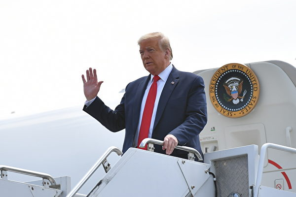
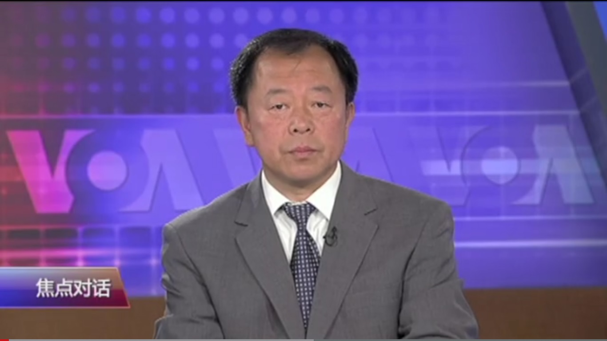

<h3><a target="_blank" href="https://bit.ly/3asSXIA">请多传破网软件，使更多的人了解真相从而得救，这是给自己积福德。 https://bit.ly/3asSXIA </h3></a>

   

     
<h3 align="center"><b>免翻视频  https://bit.ly/3ezRQKo  (请收藏网址 https://git.io/swspip)</b></h3> 

<h3 align="center"><b>复制网址到谷歌或火狐浏览器打开。若出现 “提示” ，請点击“继续”访问即可。</b></h3> 

<h3 align=center><a href="https://github.com/gav01/Heart/blob/master/news1.md">● 看更多大紀元時事 ●</a></h3>

<a href=https://git.io/souye><h6 align="right">回首頁</h6></a>

<a name=top>
 
 
 
 
 
 
<a href =#134>134.【最新疫情5·15】川普：可阻中共窃疫苗技术  
 <a href =#133>133.【内幕】环时打脸刘鹤 党内分歧公开化 
<a href =#132>132.两会前港警狂抓人 专家解析香港乱局走势 
 <a href =#131>131.【新闻看点】川普连出重拳 北京忙兑现贸协？ 
<a href =#130>130.大法日 大陆及海外律师学者祝福法轮功 

<a href="https://github.com/gav01/Heart/blob/master/ls-20-5-1.md"><b>往1~129新闻</b></a> 

  
  
<a name=134>
<h1 align="center"><b>【最新疫情5·15】川普：可阻中共窃疫苗技术</b></h1>

川普在接受《福克斯商业》采访时表示，中国（中共）尝试窃取美国知识产权，并想率先获得Covid-19疫苗，但美国可以预防这种情况。图为川普周四抵达宾州。(MANDEL NGAN / AFP)

   
   【大纪元2020年05月14日讯】（大纪元记者夏雨、徐简、戴芙若、李言综合报导）5月15日全球中共病毒（武汉肺炎）疫情最新情况：
   
   根据约翰‧霍普金斯大学（Johns Hopkins University）的数据，截至美东时间5月14日晚上8点，全球确诊感染中共病毒（武汉肺炎）的人数超过440万，死亡人数超过30万（注：因中共和伊朗隐瞒疫情数据，真实数据比统计的要高）。

美国确诊病例超过140万例，死亡超过8.5万人。截至周四美东时间下午4点，美国病例增长1.6%，低于过去7天的平均值1.8%。

美国总统川普5月14日接受福克斯新闻采访时说出有史以来对中共最强硬的话。川普表示，中共在1月份赴美签署贸易协议时，就已经知道疫情爆发。川普还表示，对北京很失望，可以切断美中所有的关系。

针对中共黑客企图窃取美国关于中共病毒疫苗技术，川普表示，美国可以阻止中共黑客。他还重申将供应链转回美国的想法。

=======================

<b>以下是最新疫情实时更新：

川普：可阻止中共黑客窃美疫苗技术</b>

周四（5月14日），美国总统川普谴责中共黑客持续发动攻击，企图窃取美国研究中共病毒（武汉肺炎）疫苗的行为。

川普在接受《福克斯商业》的玛丽亚·巴蒂罗莫（Maria Bartiromo）采访时表示，中国（中共）尝试窃取美国知识产权，并想率先获得Covid-19疫苗打败美国，但美国可以预防这种情况。

“我们可以阻止它们（中共）。它们试图这样做（窃密）。我的意思是，你也可以停止与它们开展业务，这是一回事。”川普说。

他接着表示，中共黑客一直在发动黑客行动窃密，且从未被指控过。现在他自己和美国政府一直在谴责这种行为。

周三，美国国土安全部（DHS）和联邦调查局（FBI）联合发布“公共服务公告”，警告中共黑客正在企图窃取美国对中共病毒的疫苗成果，并称之为“重大威胁”，并对相关研究机构预防黑客袭击提供四大建议。

这是美国政府正式发出警告。参议院国土安全和政府事务委员会的民主党参议员加里·彼得斯（Gary Peters）给总统写了一封信表示：“美国必须向中国（中共）政府传达一个强烈的信息，即这种行为是不可接受的。”“政府应利用国际压力、经济制裁和其它指控，来阻止中共将来对研究机构的袭击。”

众议院国土安全委员会的众议员迈克·罗杰斯（Mike Rogers）将中共黑客的行为，跟其它中共在疫情期间的倒行逆施联系在一起。

在周一（5月11日）白宫召开的疫情记者会上，有记者提问中共黑客企图盗窃美国病毒疫苗研究问题时，川普回答说，“我对中国（中共）不满意……”他表示，中共还有什么花样可以玩呢，这都不是新闻了。

据《华尔街日报》报导，美国官员们表示，这种入侵行为可能会被川普政府视为对美国公共卫生的直接攻击，无异于是一种战争行为。因为在某些情况下，这些网络攻击可能会阻碍疫苗研究。这将意味着美国政府将越来越会把这些网络攻击等同于是对美国这个国家的攻击。

<b>韩国夜总会群聚感染 再增17病例</b>

韩国卫生部副部长金刚理（Kim Gang-lip）周五（5月15日）说，韩国已经确诊另外17名与首尔一家夜总会群相关的中共病毒患者。

上周末，因首尔一家夜总会出现群聚感染，当局关闭了首尔所有夜总会和酒吧。

现在，夜总会群聚感染共有148个病例。

仅在过去一周中，当局就对数万人进行了病毒测试。

<b>川普仔细考虑美国制造的行政令</b>

川普政府正在准备一项行政命令，针对某些基本药物和医疗服务，要求在美国生产。该命令是鉴于中共病毒大流行期间，美国遭遇药品和设备短缺的情况。

该行政令的草案正在政府内部分享，并由彭博新闻社获得。

这份9页的草稿显示：“至关重要的是，我们减少对外国生产商基本药物、医疗服务的依赖”，以“确保足够、可靠的长期国内生产”，从而防止短缺和供应，以在需要时“动员我们国家的公共卫生工业基地”。

一消息人士也告诉CNBC的Kayla Tausche，该行政令可能最早在周五发出。消息人士称，审查的适用时限为90天。

美国政府正在审视那些可被视为国家安全问题的产品，包括药品、医疗用品、半导体和国防设备，并对这些产品的供应链问题采取行动。

川普政府正在准备一项行政命令，针对某些基本药物和医疗服务，要求在美国生产。该命令是鉴于中共病毒大流行期间，美国遭遇药品和设备短缺的情况。 (MANDEL NGAN/AFP)

<b>墨西哥新病例现最大单日跳涨</b>

墨西哥周四（5月14日）报告了2409例新的中共病毒病例，这是自疫情爆发以来该国出现的最大单日跳涨。

墨西哥卫生部周四还报告了257例新死亡。

这使全国总数达到至少42,595例病例和4,477例死亡。

<b>白宫或支持另一轮补助支票</b>

两名高级行政官员周四（5月14日）告诉CNBC，白宫可能会支持另一轮补助支票。

对此白宫发表了一份声明，但没有提供进一步的评论：

“正如川普普总统所说，我们将确保照顾所有美国人，以使我们健康、强大、经济繁荣，以便摆脱（疫情）挑战，这就是为什么白宫致力于促进（经济）增长，中产阶级税收和通过监管机构纾困的原因。”

第一轮经济刺激支票是国会授权的2万亿美元一揽子计划一部分。立法要求使用最近的2018年或2019年纳税申报表来确定是否有资格获得补助现金。

现金发放金额是个人可领1200美元，夫妻2400美元，合格的扶养亲属各500美元。有资格获得补助的人士为个人年收入不超过75,000美元，以及调整后总收入不超过150,000美元的夫妇。在此之上，支票金额减少，个人年收入超过99,000美元和已婚夫妇总收入超过198,000美元，则无资格获得补助支票。

<b>美CDC发布重开酒吧、餐馆等指南</b>

美国疾病预防控制中心周四（5月14日）发布了六棵“决策树”，旨在帮助企业、社区、学校、营地、日托和公共交通部门确定是否可以重新开放。

该指南就如何重新开放酒吧、餐馆和工作场所向各州提供建议。它概述了工作场所和餐馆应采取的一系列步骤，以确保员工和顾客在重新开放时的安全，包括鼓励洗手，与保持社交距离以及如何检查可能的Covid-19病例症状等。

<b>川普：失控或造成病毒从武汉实验室泄露</b>

川普周四在接受《福克斯商业》的玛丽亚·巴蒂罗莫（Maria Bartiromo）采访时表示，尽管他仍怀疑此次疫情可能与中国武汉病毒学实验室有关，但他表示，中国人不太可能故意释放病原体。他说：“我认为它更有可能是失控（造成）。”

白宫贸易顾问纳瓦罗5月10日接受福克斯节目“Sunday Morning Futures”的采访，他说：“我们知道爆发地有P4武器实验室，病毒可能从那里（泄漏）出来。在接下来的两个月内，我们知道，中国（共）在世卫的帮助下，掩盖病毒（信息），不让全球知道。”

美国联邦参议员汤姆·科顿（Tom Cotton）5月5日表示，冠状病毒（中共病毒）大流行起源的所有调查证据均指向中国武汉的两个实验室。科顿强调，病毒自然产生和病毒来自实验室并不矛盾。

科顿在接受福克斯新闻节目“America’s Newsroom”采访时表示，与另一种理论相反，没有证据表明该病毒起源于武汉的海鲜批发市场。

“现在，所有证据都指向这些实验室——它们使用蝙蝠，研究冠状病毒，它们有不良安全做法的历史，感染这个病毒的零号病人没有接触海鲜市场——所有这些都是可以肯定的间接证据。”他说。

“但是，在情报问题上，我们很少获得直接或结论性证据。”科顿说，“因此，我认同所有证据（尽管是间接的）都直接指向这些实验室。”

他还表示，如果中国共产党有反驳证据，需要向全球展示出来。

<b>巴西病例数量突破20万</b>

据巴西卫生部称，巴西确诊的中共病毒病例数已增至202,918例。

巴西连续第二天发布了创纪录的新病例，周四报告了13,944例。

根据该国卫生部的数据，在过去24小时内，有844例新的死亡病例。目前，巴西Covid-19的死亡总人数为13,993人。

<b>洛杉矶县居民出门必须遮住脸部</b>

美国加州洛杉矶县卫生局局长芭芭拉·费雷尔（Barbara Ferrer）在周四的新闻发布会上说，所有洛杉矶县居民在出门时都必须戴口罩。

费雷尔说：“实际上，在您外出，而不是与家人在一起，并且与他人进行任何形式接触时，整个县的居民都必须使用面罩。” “我们卫生官员的命令很明确。”

费雷尔说，单独运动时不需要遮盖脸面，但应随身携带面罩。

费雷尔补充说：“正如我之前所指出的，您戴布面罩的原因，是为了保护他人免受呼吸道飞沫的伤害。”

费雷尔发布的公告适用于洛杉矶县超过1000万居民。

费雷尔说，截至周四，共有1709名洛杉矶县居民因Covid-19死亡。

<b>美国病例增长1.6% 低于过去7天均值</b>

截至美东时间周四下午4点15分，约翰·霍普金斯大学和彭博新闻社汇编的数据显示，美国确诊病例和前一天相比增长1.6%，至超过140万，低于过去一周平均每天1.8%的增长幅度。死亡人数上升至85,066人。

根据纽约州长安德鲁·库默（Andrew Cuomo）的说法，纽约周四报告了157人死亡。使得该州单日死亡人数连续第四天低于200。

佛罗里达州报告说，该州报告了43,210例病例，比前一天增加了1.9%，而前七天的平均增长为1.6%。死亡人数增加了2.6%，至1,875人。

根据加州网站，加州病例增加了2.8%，达到73,164；死亡病例增加了3.3%，达到了3,032人。

根据州卫生部门的数据，德州连续第二天录得超过平均增长水平的病例增长率，达3.4%，总数至43,851例。过去一周的死亡人数增长平均值为3%。周四死亡人数攀升了5%，是自4月30日以来最大的单日跳涨。1200多人死亡中，约有四分之一是在休斯顿地区。

<b>数百中国人想说疫情真相 被中共抓捕</b>

中共当局上周日（5月10日）逮捕了一名宪法律师，理由是他在社交媒体上发表公开信，批评政府对病毒大流行的处理，以及对言论自由的压制。

43岁的张雪忠在微信上发表的信中说，中国没有非官方媒体，以及阻止医学专家向公众提供建议，这表明“（中共）政府长期严格控制社会和人民，几乎完全摧毁中国社会的组织和自助能力。”

福克斯新闻报导，张的逮捕凸显了中共对持不同政见者的零容忍态度。人权活动家的报导说，自去年下半年COVID-19爆发以来，包括医生、新闻记者和律师在内的数百人在中国被捕，他们只是想说出这种病毒（的真相）。

《中国数字时报》援引统计数据显示，在1月1日至4月4日之间，近500人因发表言论而被指控犯罪。

上个月，中国河南省一名律师因在网上张贴武汉仪馆排长队的文章而受到惩罚。许多医生也因试图对中共病毒构成的威胁发出警报而被迫保持沉默。

上个月，《无国界记者》（RSF）发布了《 2020年世界新闻自由指数》，在新闻自由方面，中国排名倒数第四（在厄立特里亚，土库曼斯坦和朝鲜之前）。

RSF估计，大约有100名中国记者入狱——世界上人数最多。

图为中共警察扣留学生，阻止外国记者拍照。(MARK RALSTON/AFP/Getty Images)

<b>美205众议员致函谭德塞 促邀台出席世卫大会</b>

美国联邦众议院205位议员周四联名致函世卫秘书长谭德塞，要求世卫邀请台湾以观察员身份出席今年世界卫生大会，并参与世卫专家技术会议。

众议员在给谭德塞（Tedros Adhanom Ghebreyesus）的信函上表示，正值全球空前公卫危机之际，这封信函表达他们对台湾无条件以观察员身份参加第73届世界卫生大会（WHA）与世卫技术性会议的强力支持。

信函指出，台湾对全球公共卫生的承诺与处理疫情的作为，证明将台湾纳入世卫行动有其价值。

尽管台湾疫情处理表现出色并展现专业，但世卫在中共肺炎危机中对台湾的态度却令议员感到忧心。信函指出，台湾官员无法及时自世卫获得必要资讯、被排除在世卫实验室网路之外，台湾的疫情资讯未能与世卫会员国分享，台湾的统计资料也被错误纳入中国数据之中。

<b>美就业报告仍惨淡 但有一鼓舞迹象</b>

上周初次申请失业金人数又增加了298万人，但在这份报告中，经济学家看到了一个小小的鼓舞迹象，因为连续申请人数增加不到五十万人。

CNBC报导，失业人数仍然令人震惊，仍有2383万人在领取失业救济金，预计这个数字还会增加；上周的数字被下调至2238万人。持续申请失业金统计是截至5月2日一周。

投资机构Amherst Pierpont 首席经济学家斯蒂芬·斯坦利（Stephen Stanley）写道“持续申请失业金（数据）实际上有些令人鼓舞，增加不到五十万人，这是从先前的向下修正中得出的结论”。

“尽管许多迹象很细小，但你可能会惊讶地听到，在截至5月2日一周中，有16个州领取福利的人数有所减少。我非常渴望看到下周的数据。如果这个数字没有再上升，那将是一个非常有趣的信号。”

现在，经济学家们一直在观察有多少工人由于国家重新开放以及“工资保护计划”而返回工作，该计划为企业提供了资金，使他们能够给工人发工资。

上周初次申请失业金人数又增加了298万人，但在惨淡的报告中，经济学家看到了一个小小的鼓舞迹象，因为创纪录的连续求职人数增加不到五十万人。(Getty images)

<b>俄罗斯教育部长染疫 第6名确诊高官</b>

俄罗斯总统普京周四说，教育部长法尔科夫感染中共病毒。法尔科夫成为至少第6名确诊的俄国高官。

普京在一场电视转播的政府会议上表示，现年41岁的法尔科夫（Valery Falkov）之前确诊感染，如今已康复。

包括总理米舒斯京（Mikhail Mishustin）、文化部长柳比莫娃（Olga Lyubimova）及建设和住房公用事业部长亚库舍夫（Vladimir Yakushev）在内，法尔科夫是普京政府第4名感染病毒的成员。亚库舍夫的一名副手也染疫。

<b>民调：多数美国人认为中共政府需对瘟疫传播负责</b>

5月13日发布的一份民调显示，大部分受访美国人认为中国政府需对新冠病毒的传播负责。

非营利组织“共产主义受难者纪念基金会” （The Victims of Communism Memorial Fund）和民调机构YouGov联合进行的调查发现，超过三分之二的受访美国人（69%）认为中国政府对新冠病毒的传播负“一部分”或“很大责任”。

这份民调对1382名美国成年人进行了调查，发现约一半（51%）受访者认为中国政府应对受疫情影响的国家进行赔偿。

有71%的人认为中国（中共）应该因疫情大流行而受到“惩罚”。具体来说，有25%的人希望禁止中国官员入境美国，32%的人认为美国应该拒绝为中国持有的美国国债支付利息，33%的人希望对中国商品征收额外关税，41%的人则支持国际制裁。

<b>新西兰逐步开放 人们连夜排队理发</b>

新西兰实施居家令有两个月时间，在政府主办解除居家令，开放发廊的前一天，新西兰人已经在店门口排队等待午夜钟声敲响。

新西兰购物中心、零售商店和饭店都在周四（5月14日）重新开业。

周四是新西兰连续第三天没有报告中共病毒新病例。在感染中共病毒的近1,500人中，有1,400多人已康复，另有21人死亡。

周四凌晨，理发师康拉德·菲茨·杰拉德（Conrad Fitz-Gerald）重新打开商店。他告诉美联社，他接到50个急切需要理发顾客的询问。

他说：“人们说他们的头发失控了。” “很多十几岁孩子的父母也一直在打电话，认为在午夜理发会是一件很新颖的事。不幸的是，我们满员了。”

<b>2023年前 航空旅行难恢复到瘟疫前水平</b>

国际航空运输协会（International Air Transport Association， IATA）表示，中共病毒对航空旅行的影响将持续多年，据该协会估计，至少在2023年之前，客运量不会反弹到危机前水平。

该协会表示，自瘟疫大流行开始以来，欧洲和美国的航空旅行需求已下降90%以上；国际航空运输协会警告说，如果封锁和旅行限制得到延长，复苏将更加缓慢。

国际航空运输协会总干事兼首席执行官亚历山大·德·朱尼亚克（Alexandre de Juniac）周四对CNBC的“ Squawk Box Europe”节目说：“我们要求政府采取分阶段方法来重新启动该行业，并（让该行业）再次发展。”

德朱尼亚克希望夏天能恢复飞行。

他说：“我们的目标是在第二季度末之前重新开放和促进国内市场，并在第三季度之前开放区域或各个大陆市场，例如欧洲、北美或亚太地区（大陆），并在秋季进入洲际市场。”

“因此，在夏季，我们希望您能看到欧洲境内的航班回来，希望价格合理且控制过程非常安全，”他说。

外国航空公司减航班 澳国际航线机票恐涨价

<b>加国省长谴责中共瞒疫 吁美加联手带回制造业</b>

加拿大阿尔伯塔省长康尼（Jason Kenney）周三（5月13日）批评中共对COVID-19爆发早期的处理，并敦促加拿大和美国联手将制造业带回北美。

康尼在基于华盛顿的加拿大美国商业理事会（Canadian American Business Council）虚拟圆桌会议上表示，在中国武汉市首次出现新冠病毒（中共病毒）时，中国（中共）进行淡化、掩饰和掩盖病毒带来的危险，中共将很快面临“巨大的谴责”。

他说，中共还试图施压世界卫生组织，阻止进出疫情热点地区的旅行禁令，并拒绝与世界其它地区合作，以查清所发生的事情。

他说：“在全世界遭受的破坏性公共卫生和经济损害中，我认为中国（中共）政府起到重要作用。”

康尼表示，不应该忘记中共所为，让其逃脱，必须对其进行清算，必须让中共担责。

<b>Uber要求司机戴口罩 乘客遮住脸</b>

从5月18日开始，Uber将采取多项安全措施，以防止COVID-19在司机和乘客中传播。

该公司表示，每次乘车前，司机和乘客必须确认他们戴着口罩或防护罩。新准则将一直持续到六月底。

其它准则包括将UberX载客最多人数从4减少到3。

司机将被要求通过新的清单进行确认，该清单要求自拍来验证是否戴着口罩。验证后，司机会通过该APP收到通知。

乘客则必须确认自己是否遮住脸部以及是否对手进行了消毒。 Uber使乘客使用类似清单来验证他们是否采取了这些预防措施。

如果乘客和司机感到不安全，包括乘客或司机没有戴面罩，则可以取消行程而不会受到罚款。用户还可以通过该应用程序将问题报告给Uber。这与Uber的新反馈选项紧密结合，该选项现在包括不戴口罩或戴口罩。

屡次违反遮面政策的司机和乘客将被拒使用Uber。

优步Uber获得了温哥华市营业执照以及ICBC的保险。

<b>中共病毒大流行 网络欺诈暴增</b>

网络安全公司Bolster周三（5月13日）发布的一份新报告显示，随着中共病毒大流行在全球范围内蔓延，网络安全专家正在追踪网络犯罪活动达“破纪录”的水平。

2020年第一季度，Bolster记录了网络钓鱼和网站欺诈的大幅增长，检测到854,441个已确认的网络钓鱼和假冒网站，其中30%与COVID-19相关，另外还有400万个可疑页面。

Bolster首席科学家Shashi Prakash表示，许多COVID-19骗局，无论是提供伪造病毒治疗方法，或伪造的补助支票的网站和电邮，都具有共同点。

美国司法部于4月22日宣布，在联邦调查局（FBI）互联网犯罪投诉中心（IC3）收到3600多个投诉后，联邦当局和当地执法机构、私营企业进行合作，已经摧毁了“数百”在线COVID-19骗局。

随着中共病毒大流行在全球范围内蔓延，网络安全专家正在跟踪网络犯罪活动的“破纪录”水平。(Fotolia)

<b>杂货食品送货服务成香馍馍</b>

中共病毒正在使像Instacart这样的杂货配送服务非常受欢迎，它们可能会留下来。

由于中共病毒爆发，导致成千上万的小企业关门。但是，在线杂货配送则是增长最快的一个领域。

加拿大皇家银行资本市场公司（RBC Capital Markets）的一项最新调查发现，有55%受访者通过在线购买了食品杂货，高于2018年的36%和2015年的15%。

在线杂货送货服务公司Instacart告诉CNBC，过去几周的需求一直是公司历史上最高的，客户订单量同比增长了500%以上。

在线杂货送货在中共病毒大流行前曾一度是一种奢侈消费，但目前几乎成为人们日常必需服务，Instacart和Amazon Fresh等杂货送货服务一举成名。但从长远来看，杂货配送能否成为主流，将取决于它们的目前表现。

<b>失去父亲后 新泽西男子捐赠iPad给医疗机构</b>

目前美国大多数医院和医疗机构都限制访客，导致许多患者隔离。一名新泽西州男子亲历与患病家庭成员保持联系的重要性，并因此受到启发，帮助其他老年患者和亲人沟通。

新州Wildwood Crest居民林奇（John Lynch）最近不得不通过FaceTime向父亲告别。他的父亲在亚特兰大的一家护理室，由于受到社交疏离限制，林奇在他去世之前无法亲自见到他。

在得知一些护士使用他们的个人手机帮助患者与家人联系之后，林奇受到启发，想到帮助他人的方法。

“与林奇午餐基金会”一位发言人告诉哥伦比亚广播公司新闻，该机构通常专注于为儿童提供学习经验，并协助病危患者的家庭。现在，林奇基金会致力于为医疗机构收集捐赠的iPad，这些医疗机构禁止家人探望患者。

林奇将其称为“操作连接：iPad项目”，到目前为止，通过该计划，已经收集了六十多个iPad。收集的前20台iPad送到了开普梅县（Cape May County）医疗中心，其余的将分发给开普梅县（Cape May County）的疗养院和全国各地医院。

<a target="_blank" href=#top><h6 align="right">回上方</h6></a>
  
 
<a name=133>
<h1 align="center"><b>【内幕】环时打脸刘鹤 党内分歧公开化</b></h1>

有分析认为，中共高层目前内斗激烈，为了推卸疫情扩散造成恶果的责任，中共内部正在展开甩锅大战。图为北京天安门广场。（大纪元资料室）

   
   【大纪元2020年05月14日讯】（大纪元记者古清儿报导）近日，中共喉舌《环球时报》放出“废止中美贸易协议”之说的言论，与刘鹤的立场唱反调，引舆论关注。而且在《环时》的报导中，公开透露中共内部存在分歧。

<b>美中第一阶段贸易协定 《环时》打脸刘鹤</b>

随着武汉肺炎疫情在美国爆发和扩大，川普政府指责中共隐瞒疫情的力度加大。这使得今年1月刚刚签署的美中第一阶段贸易协定的命运成为外界关注的焦点。

5月8日上午，美国贸易代表罗伯特·莱特希泽（Robert Lighthizer）和财政部长史蒂芬·姆钦（Steven Mnuchin）与中共副总理刘鹤进行了贸易通话。

会谈后的联合声明说，双方都认为，（美中）在建立使该协议取得成功所需的政府基础设施方面正在取得良好进展。尽管当前存在全球卫生紧急情况，但两国都充分期待能够及时履行该协议规定的义务。

中共商务部则表示，双方同意加强经济和公共卫生合作，为第一阶段贸易协议的落实创造有利的氛围和条件。双方同意保持沟通协调。

但三天后，即5月11日晚，中共官媒《环球时报》英文版的报导《知情人：中共内部与美国重签协定的呼声响起》（Calls rise in China to rework deal with US: sources），却与刘鹤通话传递的信号不同调，有“打脸”刘鹤之嫌。

该报导引述“知情人士”的话说，接近贸易谈判的顾问已建议中共官员重新提出令贸易协议作废的可能性，建议还包括谈判新协定，让天秤向中方倾斜。

报导称，中方出现了要求重新评估中美第一阶段贸易协议的鹰派声音，中共内部不满情绪不断上升，因为中方为推动达成此次协议而作出妥协。

报导引用“匿名的前贸易官员”的话指，中方可以疫情下不可抗力为由，称首阶段中美贸易协议难执行。报导还引用一名贸易顾问的话放风称，“中共想要终结第一阶段协议。这对我们（中共）有好处。如果重回原点，美国无法再与中共展开贸易战。”

《环时》作为中共官方喉舌，公然与刘鹤唱反调，究竟何意呢？《香港经济日报》认为，熟悉中共政情的人士都知道，在重大问题上，中共官方是不允许有不同声音存在。而在《环时》的报导中，则公然将中共内部的分歧公开化。

美国总统川普也反击《环时》的言论。

川普5月11日在白宫疫情说明简报会上对记者表示，他对重启协商“一丁点兴趣也没有”，并希望中国（中共）遵守首阶段贸易协定承诺的条款。

此前，川普多次批评中国（中共）隐瞒疫情，让美国及全球遭受疫情冲击。

<b>中共对美中首阶段贸易协定 整体立场未见变化</b>

今年1月15日，美中签署了第一阶段贸易协议，历时18个多月的贸易战暂时停火。中共同意在未来两年内，在2017年购买量的基础上增购至少2,000亿美元的美国产品和服务。

近期中共其它部门的动作，跟刘鹤的立场相近。中共对美中首阶段贸易协定整体态度未见公开变化。

5月12日，中共外交部称，中共愿与美方共同落实贸易协议，并重申会为此创造氛围。这一说法，被认为是间接否定了《环时》的中共将废止协议之说。

同一天，中共财政部宣布，将对79种美国进口商品免除中美贸易战期间所加征的关税。一周后生效，为期一年。最新豁免加征关税的美国商品包括稀土金属、金矿石、银矿石、化学品和纺织品等。

据彭博社报导，中国国有进口商过去两周订购了二十多船美国大豆，总量超过了100万吨；外电指，中国上周订购了逾4万吨美国猪肉，是去年10月以来的最大订单。

上个月，中共驻美大使崔天凯对外媒称，“中美双方正在努力落实第一阶段经贸协议，相信我们能继续落实。”

<b>胡锡进扩大核弹头说法 华春莹：他个人观点</b>

在中共官媒《环时》爆出这篇与刘鹤不同调的文章之前，《环时》总编辑胡锡进刚刚发出狂言，认为当局需快速扩大核弹头和导弹数量，引发争议。

5月8日，胡锡进在微博称，中国（中共）需要在较短的时间内，将核弹头数量扩大到千枚的水准，包括至少要有100枚东风-41战略导弹，目的是“要有更大的核武库来抑制美国的战略野心和对华冲动”。还称，“也许过不了多久”就需要“应对挑战”。

其言一出立刻在网络上引发争议，路透社就此在中共外交部例行记者会上对此提问，外交部发言人华春莹称，这是胡锡进的个人观点。

<b>军方鹰派与胡锡进不同调 评论员批文宣</b>

与胡锡进的言论相对的是，中共军方一些官员、学者均在近期放软了调门，且均没提到增加核弹头。

5月4日，中共军方鹰派代表人物、曾与人合著《超限战》的退役少将乔良一改过去的强硬论调，首次公开承认台湾问题不只是中国（中共）的内政，而是美中关系问题。

他说，“不管中国怎么强调台湾问题属于内政，但本质上仍然是中美问题。”解决台湾问题的关键，不在于怎么解决台独势力，而是要先解决中美实力对比。因为台湾问题的解决不取决于两岸，而是取决于美中关系的变化。

近期，中共鹰派军事评论员房兵被媒体问到“中国（中共）海军的硬实力超越美国海军只是时间的问题”，他承认，“我不赞同这样的一个观点，什么叫就是个时间的问题，如果你说这个时间是100年、200年，那可能就是个时间的问题。如果你说这个时间是10年、20年，那纯粹瞎扯。”

房兵还批评中共媒体夸张宣传，“我一再说我们有些媒体，不要打鸡血，不要打鸡血，不要天天给自己的年轻人打鸡血，没有任何好处。”

时政评论员夏小强表示，中共高层目前内斗激烈，为了推卸疫情扩散造成恶果的责任，中共内部正在展开甩锅大战。中共内部所谓的鹰派和鸽派其实只不过是硬币的两面，其采取政策的最终目的在整体上都是为了中共政权的稳定。

夏小强认为，目前中共内部呈现分裂状态，各方势力代表互不相让，已经很难成为一个统一的整体，胡锡进在这种时刻发出不同于中共官方的信息，正是如今中共内部混乱、政令不出中南海、内斗激烈以及政权面临崩溃前的表现。

<b>中共学者直接批评当局文宣和“文字狱”</b>

另一个大陆鹰派学者、清华大学国际关系研究院院长阎学通，4月底他接受了陆媒财新网的采访，就中共当前的国际、国内形势发表了自己的看法。

被问及中共病毒影响美中在世界领导力的问题时，阎学通罕见承认，中共原本就没有全球领导力，一个不存在的领导力就不存在削弱和没削弱的问题。

阎学通还批评中共文宣指，一些媒体把中国（中共）与欧洲抗疫效果差别归结于政治制度不同，这种说法很容易激起欧洲疫情严重国家的人的不满情绪，“直接和变相批评他国政治制度都会引发或加剧意识形态冲突”。

更大胆的是，阎学通在陆媒的采访中低调批评了中共搞的“一带一路”，“从一开始我就认为，在国外搞道路建设，成功的难度极其大。这就是为什么，很少有国际组织贷款修建跨国铁路，因为两个国家的铁路政策是不同的。到目前为止，我们看到的跨国铁路投资项目有收益的较少，亏损的很多，典型的就是坦赞铁路。”

阎学通甚至直接在采访中批评中共的疫情防范和“文字狱”，“如果人类汲取历史经验教训的能力强，就不会在第一次世界大战之后又发生第二次世界大战；SARS疫情之后就不会发生现在的新冠（中共病毒）疫情，文字狱也不会在中国历史上重复发生。”

<b>王沪宁负责的文宣 煽动民族主义</b>

此前多家媒体报导指，江派常委韩正与王沪宁等曾经在美中贸易战中搅局。

《华尔街日报》去年7月1日报导引述知情人士的话指，在当年5月13日举行的由二十多名中共高层领导人参加的会议上，国务院副总理韩正批评了拟议中的中美协议。

报导指，负责文宣的江派常委王沪宁一直试图煽动中国人的民族主义情绪，进而延续中共的统治。

胡锡进和《环球时报》也归中共文宣管辖。

就在5月13日，大陆知名“五毛”占豪还发表名为“中国连出两重拳，强硬反击号角吹响！后边还有更狠的”的微信文章，将中共暂停以市场采购贸易方式出口防疫物资的行为，肆无忌惮地公告中共将以防疫物资要挟世界各国，“就像美国，如果继续毫无底线地反华，如果一定要栽赃中国，甚至向中国索赔，那对不起了，医护物资肯定就没办法满足了，你们还是自己生产吧。或者，如果美国限制对华芯片出口，那对不起了，医护物资也就不出口了······总之，这实际上是个筹码。”

今年3月初，北京市民薛扶民在网上实名举报主导出版《大国战疫》一书的中共政治局常委王沪宁，批其缺乏对人民的关爱，应追究其政治责任。

<a target="_blank" href=#top><h6 align="right">回上方</h6></a> 
  

<a name=132>
<h1 align="center"><b>两会前港警狂抓人 专家解析香港乱局走势</b></h1>

目前生活美国的三位华裔专家学者（从左至友分别为滕彪、王军涛、李恒青）解析香港目前的乱局与走势。（大纪元合成图片）

   
   【大纪元2020年05月14日讯】（大纪元记者骆亚、张顿采访报导）中共两会于5月底召开，而在5月10日港警疯狂抓捕了230名“反送中”民众，引发各界关注。三名专家、学者表示，中共企图把香港的“一国两制”变成“一国一制”，但这不会被港人和国际社会接受，而且还可能把台湾搞丢失了。

大纪元5月13日采访了三名身在美国的专家、学者，包括美国华盛顿信息与战略研究所学者李恒青、中国民主党全国委员会主席王军涛、普林斯顿高等研究院访问学者、原中国维权律师滕彪。他们分析了当前香港的局势及可能走向。

<b>港警拘捕230人 野蛮对待记者和议员</b>

5月10日（母亲节）当天，香港已连续21日没有本地感染病例。一批“反送中”抗议者在尖沙咀海港城、旺角新世纪广场、观塘apm、荃湾广场、屯门市广场、太古城等商场，举行遍地开花式的抗议运动。

港警当日除抓捕了230人抗议者外，还一度包围多名记者，向他们喷射大量胡椒喷雾，甚至勒令他们停止现场拍摄、下跪；更有记者被港警箍颈约20秒，令其短暂休克。

在场调停的民主党立法会议员邝俊宇，被港警打翻在地后遭拘捕。邝俊宇当晚发烧被送院治理，5月11日晚获警方无条件释放。

5月10日，香港市民在商场等地抗议。（ ISAAC LAWRENCE/AFP via Getty Images）

<b>原中国维权律师：中共趁疫情打压香港 国际社会需关注</b>

原中国维权律师滕彪表示，香港去年6月份以来的这个民主抗争，一直是国际社会关注的焦点。但现在全世界都在关注疫情问题，所以香港的问题好像就被忽视了。那中共恰恰考虑到这一点，加强对香港的控制，加强对香港的打压。

“所以，我觉得全世界尤其是西方国家，应该继续密切关注香港的局势，而且向中共施加更大的压力。否则得话，香港的自由民主恐怕很快就会面临被中共消灭。”滕彪说。

5月10日，香港市民在商场等地抗议。（ ISAAC LAWRENCE/AFP via Getty Images）

   
<b>原中国维权律师：中共根本不想遵守“一国两制”承诺</b>

滕彪认为中共对香港下杀手的根本原因：一是香港作为一个特别行政区，在很多方面对大陆有辐射作用，如信息、新闻、人权方面的活动，中共非常害怕大陆更多人了解到这些外界的情况；二是中共不可能去兑现当初“一国两制、港人治港”的承诺，香港如果按照当初“一国两制”的设想实现这个普选，那中共就会失去对香港的控制。

李恒青也认为，香港现在这个形势非常不好，中共当局可能下一步会对香港实行“一国一制，要彻底改变一国两制”，因为它们感到没办法能够彻底扑灭香港民众的反抗。

5月10日，香港市民在商场等地抗议。(ISAAC LAWRENCE/AFP via Getty Images)

“就是彻底把香港变成中国的一个直辖市，中共现在都已经在网上放风，我相信这不会是空穴来风，这肯定是中共现在用这个东西来试探风向，看看香港人民是什么样的反馈。”李恒青说，“面对这种情势下，我的一个基本感觉，就是香港可能这个镇压会越来越残酷。”

<b>学者：中共培训港警 警方不听特首命令</b>

李恒青还表示，现在有一批香港警察，是到中国大陆经过中共公安部训练好的，他们对香港民主派、普通老百姓做好了彻底动武的准备。

“香港警务处处长邓炳强与特首林郑月娥的观点都不完全一样，”李恒青说，林郑月娥曾经表示对警队搞独立调查，但是警方不同意。由此可见，现在他们的这个决策实际上是矛盾的，另外他们的执行也是矛盾的。

5月10日，香港市民在商场等地抗议。(ISAAC LAWRENCE/AFP via Getty Images)

王军涛也认为，香港过去是英国的传统，警察绝对服从对管理，就是武装力量、警察都绝对要服从文官的命令，但是这一次可以看出，香港警务处处长根本不听特首的话，根本就不把港府放在眼里。

王军涛表示，之所以出现上述情况，是因为共产党要接管一个地方，它首先接管的是专政力量。

<b>学者：中共企图实现“一国一制” 不被港人与国际社会接受</b>

李恒青认为，中共当局想要把香港变成“一国一制”，但这很难实现。第一，香港740万民众绝对不会屈服。如果是屈服，他们早就屈服了，在过去几年当中早就屈服了。而且在去年11月区议会选举当中，民主派一举夺得87%的席位。

“民意明摆着是向着香港真普选、香港民主自治的这个方向发展，这是毫无疑问的。”李恒青说，如果香港民众有决心捍卫他们的诉求，“五大诉求”一个都不能少，然后坚持真普选，那香港就有明天。

第二，香港是国际问题。中共一直希望把香港问题变成一个中国国内的内政，但是国际社会坚定不答应。其一，在香港回归前，中英联合声明中，中共明承诺香港的“一国两制”五十年不变，国际社会有监督的义务和责任。其二，如果“一国两制”存在，国际社会就能够涉足中共对香港的反人权、反人道问题。

<b>中国民主党主席：中共搞不好会失去台湾</b>

李恒青还表示，中共对待香港问题，背后还涉及台湾问题。台湾蔡英文5月20日就要连任总统，相信到时蔡英文会维持现有两岸关系不变。中共提出的所谓“九二共识”，已经彻底破产了。

他说：“在这样的大前提之下，香港有任何一点风吹草动都会影响到台湾，而台湾的任何一个动向，也会影响到香港，所以现在这已经变成了一个非常扑朔迷离的这么一个三角关系。”

王军涛则认为，中共处理不好香港问题，会把台湾给丢掉了。

他分析道，因为国民党韩国瑜最初在高雄深绿的地方当选，主要是得到年轻人支持，当时他提出来不要去管“统独”这些抽象的口号，大家应该拼经济、民生，所以年轻人支持他，竟然在深绿的高雄高票当选。

“但是，为什么在那么短时间，年轻人后来又抛弃他了？因为当时总统大选时，蔡英文说，投韩国瑜，就是投中国大陆，而投中国大陆，其实香港的年轻人的今天，就是台湾的年轻人明天。”他说，“同时，港人当时也到台湾跟台湾人说一定要珍惜民主、自由的价值，要守住，所以最后蔡英文总统高票连任。”

他认为，中国共产党如果在香港真的要采取强力措施的话，它不仅会招致国际社会进一步地围堵和制裁，而且会使台湾会加速远离它而去。

<a target="_blank" href=#top><h6 align="right">回上方</h6></a>
 
 
<a name=131>
<h1 align="center"><b>【新闻看点】川普连出重拳 北京忙兑现贸协？</b></h1>

2019年4月4日，美国总统川普在白宫接见中共副总理刘鹤。当时各方看好谈判前景。(Chip Somodevilla/Getty Images)

【大纪元2020年05月14日讯】大家好，欢迎关注新闻看点，我是李沐阳。今天是5月13日星期三。

吉林市今天封城了，乡镇、社区全部封闭管理。目前铁路停运，出城要登记并持有48小时内的检测报告。这是舒兰市封城后，吉林省第二个封城城市，

武汉连续发现疫情后，当局封锁了爆疫小区，对区内5000人逐一检测。11日又开始对全市全员筛检。

韩国在首尔夜总会又发现了28宗新病例，使这起与梨泰院夜生活区有关的群聚感染人数上升到119人。

俄罗斯染疫人数已经高达24万2200多人，跃居全球第二。今天已经是连续第11天确诊人数超过1万人。因为定点医院两次发生大火，俄罗斯已经暂停使用着火的呼吸机。

因为澳洲坚持追责，中共恼羞成怒，11日突然终止了进口澳洲牛肉，澳洲政府非常失望。有政府人士表示，联邦政府会据实处理。如果更多商品被禁，可能会打贸易战。
欧洲死亡最多的英国今天公布数据显示，第一季度GDP萎缩2%，是金融危机以来的最大跌幅。英国央行估计，今年英国将创下三百多年来最严重的经济衰退。

大纪元独家获得陕西政府文件，多个县市一季度GDP大幅造假，证实国际多年来对中共GDP造假的指控。

因为被禁用谷歌，华为海外出货量下降了35%。降幅超过三星两倍多，是苹果的4倍。分析估计，华为规模可能会变小，成为以中国为中心的业务。

湖南郴州近日又出现了“大头娃娃”。大陆媒体报导，他们都是饮用了冒充“特医奶粉”的“倍氨敏”，然后患上了痀偻病和头骨畸形。

之前被中共关押5年，前不久刚刚出狱的大陆律师王全璋今天表示，准备采取法律手段，推翻法院的裁决，将违法之人绳之以法。

下面进入今天的正式话题。

<b>川普连出重拳，中共没了脾气？</b>

从武汉爆发的中共病毒（武汉肺炎、冠状肺炎COVID-2019），对整个世界都造成了冲击，美中第一阶段贸易协议也因此延宕执行。协议签署后的4个月，贸易协议的执行像是被遗忘了，没有任何动静。

随着5月8日美方逼着刘鹤通电话、要求中共执行协议后，美方又是连续出重拳击打中共，甚至打起了金融战。而中共放风要作废贸易协议之后，被川普一个直击怼了回来。随后中共马上改口，说只想落实好第一阶段贸易协议。接着中共又上演了被“挤牙膏”的情况，大动作买买买。

川普连出重拳，中共咋没了脾气？金融战开打，北京为何不敢撕毁协议？我们来说说这个背后的原因。先说说川普近期的几个重拳。

<b>重拳一：金融战开打</b>

福克斯财经频道12日报导，川普正在切断联邦政府雇员退休基金与中共政权的联系。消息称这个举措与中共病毒疫情有关。

在国安顾问奥布莱恩（Robert O’Brien）和国家经委主席库德洛（Larry Kudlow）写给劳工部长斯卡利亚（Eugene Scalia）的信函中，清楚显示，白宫不希望联邦雇员的退休基金TSP投资中共企业的证券。因为军方担心，这大约40亿美元会资助中共公司研发武器，反过来会杀伤美国军人。

基金公司在今天必须要作出回复。法广认为，这使得美中金融大战由美国证交会发信警告中共概念股风险的“口水战”转为正式开打。

9日，中共金融与发展实验室理事长李扬表示，世界已经出现了美元荒，世界已经在金融领域形成了排斥人民币的同盟。李扬指出，9个央行签署货币互换协议，但其中没有人民币。

<b>重拳二：国会推法案授权白宫制裁中共</b>

12日，参院司法委员会主席格雷厄姆（Sen. Lindsey Graham, R-SC）率多位共和党人，共同推出《2019年中共病毒问责法》。其中表示，如果中共不配合，不全面说明导致疫情爆发的过程，将授权总统制裁中共。法案还要求北京，尽快释放在疫情后镇压行动中遭逮捕的香港民主人士。

这位重量级议员说，“如果没中共的隐瞒，病毒不会出现在美国”“现在是该顶回中共，向中共追责的时候了”。

根据新法案，川普在60天内要向国会提交证明，证明中共是否向美国及相关组织机构病毒调查提供了全面完整的交代。这些法案得到了8位议员联署支持。

法案授权总统可以实施一系列的制裁，包括冻结资产、禁止旅行、吊销签证、限制美国金融机构向中共企业提供贷款或承销，以及禁止中共企业在美国上市等等。

<b>重拳三：鼓励本土产稀土 去中共化</b>

12日，共和党参议员克鲁兹（Ted Cruz）提出了“2020年本土稀土议案”。要求对美国稀土产业减免税收，鼓励美国企业在本土生产稀土。

克鲁兹提交议案时表示，生产国防科技与支持军队所需要的稀土元素和关键矿物资源，“几乎全部在中国开采、提炼并生产”，这“很危险”。“就像中共威胁停止向美国提供中国生产的救生药物一样，中共也可能停止向我们提供这些矿物，极大威胁到美国的国家安全”。

2019年5月，中共曾经高唱“稀土牌”，把稀土当成了“终极大杀器”。其实有专家早就指出，美国稀土储量并不比中国少，只是不愿意用牺牲环境污染作为代价开采。

而今美国推动稀土本土化，中共的所谓“终极大杀器”要失效了。

<b>重拳四：无限追溯禁令启动</b>

美国半导体设备制造商“泛林半导体”（LAM）和“应用材料公司”（AMAT）等发出信件，要求中国大陆企业，包括中芯国际和华虹半导体等，不能使用美国清单厂商半导体设备代工生产军用集成电路，同时“无限追溯”机制生效。

信中要求，收信单位承诺或确认不会将产品、技术、软件用于“军事最终用途（military end use）”。军事最终用途包括军用物品或和维护相关包括运行、安装、保养、维修、大修、翻新等等。

这项禁令启动，意味着美国对华出口的管制升级了。这对中共的高科技制造业，包括军事发展都会带来很大的影响。

<b>北京买买买，三千多万吨农产品将成交</b>

在川普的组合拳下，中共又被挤牙膏了。3名中方官员12日匿名向路透社证实，北京正努力兑现增购美国商品和服务的承诺。

有数据显示，3月份的中方进口量只达到了承诺的44%，4月份的进口额也比同期下降了5.6%。

一名官员表示，“个别月份没能完成的协议采购额度，后续可以在其它月份中陆续补回来”，“毕竟不是一次交易就能完成的事，疫情带来的困难是要考虑的”。

同是12日，中共外交部表示，第一阶段贸易协议有利于美中双方和全世界，应该“共同落实好协议”。

同一天，中共宣布了一批对美加征关税商品的排除清单，包括稀土矿、金银矿等79项商品。

11日路透社引述交易商表示，中方至少买了四艘船的大豆，约24万吨，在7月付运。还可能销售更多船货，有一家中共国企已经在求购7-11月的多达20艘船货。

消息人士透露，中方准备购买三千多万吨农产品，包括1000万吨大豆，2000万吨玉米和100万吨棉花等。

<b>北京为啥没了脾气？</b>

美方重拳组合，每一拳都很结实。《环球时报》英文版表示，要推翻协议重新谈判。但川普随即说“对谈判不感兴趣”，要看看北京的表现。随后中共再没有其它不同声音了。

8日，中共副总理刘鹤与美国贸易代表莱特希泽通了电话，报导表示要落实贸易协议。当时我们指出，刘鹤是被逼通电话，美方要求北京兑现协议。

中共官员的说法证实了我们的判断，北京是被逼着往前走。那名官员说“补回来”没有采购满的额度，意味着美方批评北京没有兑现协议，没有采购美国商品等。所以那名官员才说这不是一次交易能完成的事，言外之意，往后的中方采购量很可能会加大。言语中似有希望美方理解的意味。

那么为何北京现在没了脾气呢？外界认为，中共自身是有难言之隐。总的来说有三个。

<b>中共难言之隐之一：史无前例的失业潮</b>

中共官方称，今年2月城镇失业率是6.2%，5000万农民工无法外出打工。3月份失业率回降到5.9%，但仍处在高位。但有评论指出，中共靠得住，母猪都上树。自由亚洲表示，非官方的统计数字远高于中共的数字。

中泰证券测算，中国现在有7000万人失业，失业率大约是20.5%。中泰熟悉经济学家李迅雷在个人公号发布这组数字后，他已经被撤换中台证券研究所所长的职务。

而《南华早报》引述深圳望正资产管理公司首席经济学家刘陈杰的分析报导，这次疫情可能导致2.05亿工人遭遇了“摩擦性失业”，失业率超过25%。

北京经济评论人士张林认为，疫情引发的失业潮，比90年代末2500万国企工人的下岗潮、2008年金融危机造成的2000万农民工返乡潮都要严重。

深圳鞋材工厂老板李先生介绍，2月24日开工，最大问题是“缺人”。因为交通阻断，农民工困在疫区出不来，回到工厂还要等14天隔离期。好不容易熬过了这个槛，准备追回损失，但“订单没了”。

李先生向自由亚洲介绍，三四月就开始取消单，有的要求延后出货，有的直接说不要货了。不下订单，企业当然不会生产。

在郑州经营三家手机零部家工厂的罗先生表示，3月订单比同期少了七成。于是直接通知困在家的工人“别回来了”。

富士康是iPhone最大组装厂，目前已经暂停了招聘工人。《金融时报》表示，富士康鼓励员工多休假，也拿出裁员措施。从4月10日开始，富士康已经不再加班了。

不加班，对农民工人来说就是少挣钱，所以很多人选择了离职。而农民工群体，中国有近3亿人。

瑞银的4月份报告曾认为，中国正面临着20多年来“最糟糕的就业市场”。截止到3月底，中国的服务、制造和建筑业中，已经失去了8000万个工作岗位。

经济学人分析表示，今年中国有2.5亿工人将面临收入减少10%－50%。

<b>难言之隐之二：通缩隐忧加剧</b>

因为国外疫情的冲击，大陆很多工厂失去了外贸订单。12日中共发布的数据显示，4月工业生产价格指数PPI同比下降了3.1%，是2016年4月以来的最大降幅。

路透社引述分析表示，疫情对大陆经济的负面冲击正在显现。分析认为，从目前的情况看，PPI可能会全年进入通缩，甚至可能会出现全年PPI不断下行的情况。

工业品价格滑落，自然要削弱企业获利和扩展业务的能力。同时疫情在全球大流行，造成各地需求锐减，也将使大陆出口前景堪忧。

官方数据显示，生产原料价格同比大幅下降4.5%，跌幅扩大了2.1%。其中下跌幅度最大的前三位是：石油天然气开采业，价格年减51.4%，跌幅扩大29.7%；其次是石油天然气加工业，价格年减19.8%，跌幅扩大9.2%；第三是化学原料和化学制品制造业，价格年减8.3%，跌幅扩大了3%。

中原银行首席经济学家王军认为，疫情对需求的打击更严重、更持久、更不可恢复。她预计工业产品将进入持续通缩阶段，对整体经济而言，需求不足货轻度通缩是未来最大的矛盾。

<b>难言之隐之三：疫情二次爆发风险</b>

大陆疫情出现了反复状况，吉林、武汉等地先后又出现了本土病例，使外界开始关注疫情是否出现了第二次爆发。

中共官方在11日通报，最近的十多天中，7个省份都有新增本土确诊病例，而且聚集性疫情继续增加。

目前吉林市和舒兰市都已经宣布封城了。其中舒兰市病毒传播链已经跨越吉林、辽宁两省，共导致22人感染，但目前仍未找到传染源。

武汉作为疫情初始地，解封后连续一个月没有通报新增确诊病例。但是本月9日、10日两天，突然爆出6例新增本土病例，使连续35天的无新增确诊病例纪录被终结。

武汉当局随即封锁了爆出疫情的三民小区，对区内5000人注意进行核酸检测。11日武汉又紧急通知，对全市开展全员核酸筛检。当局的这个大动作引起很多人质疑，为什么封城期间不全城筛检？非要等疫情再次出现才采取行动，难道又被人言中：嫌人死得不够吗？

这三个方面，都是中共的难言之隐，迫使中共必须软下来，不再像以往一样强硬。因为它怕，怕美国真的断绝与中国的贸易往来。如果美中中断贸易，那么以出口经济作为主要支撑的中共政权，很快就会垮掉。

中共知道自己的斤两，所以不敢有脾气。

<b>疫情何时终结？</b>

到目前为止，人们期盼气温升高，病毒会自动消失，这个希望几乎已经幻灭了，真没有了。而直到目前，没有人知道疫情何时过去，疫苗何时问世，也是未知之事。

《纽约时报》引述历史学家的说法：一种可能性是这次疫情可以在医学终结之前，实现社会终结。

就是说，这个病毒不解决，很可能人类会因此灭绝。

哈佛大学历史学家布兰特（Allan Brandt）说，试图定义流行病的终结，“将是一个漫长而艰巨的过程”。

这是比较可怕的一件事，就是说，这意味着人类可能要与病毒共存。

其实，然我们感到可怕的病毒，远不止中共病毒。中共还衍生了其它的病毒，也一样令人心惊。

<b>现在社会怎么了？</b>

收到一位网友的爆料，他同时发来了一个视频。

这位朋友是我们的忠实观众，也是一位对国事家事都很关心的人。不过他说因为平时见到太多的事情，比如城管打人、官逼人反等等，所以这些他都不是很在意。主要原因是，他认为那些事并没有发生在自己身边，与己无关。

但是他说，他身边发生的一件事，是11日发生的事，让他很生气，就是视频中的事。他说做为一名父亲，虽然打的不是他的孩子，但是在学校里十几名学生打一名学生，而且一个一个轮着打，这让他实在接受不了。

从视频中看，被打的学生一直没有还手，旁边的学生一个一个地轮着打。网友在信中说，那名学生的眼神是那么的无助。

据介绍，这件事发生在广西南宁青秀区刘圩镇第三校区。但这种事情，在这个中学已经发生过多次，最后都是不了了之。网友质问：“现在的社会怎么了？是什么让学生变成了魔鬼？”

信中说，生活在这样的环境下，可以想像人民是多么的提心吊胆。“什么法治社会，都是个屁”。“一个小镇都这样，那么整个中国的现状是什么情况”。

网友最后留给我们一个思考，中国的现状是什么样？

大家知道，中国人以前讲“仁义礼智信”，讲究待人真诚、和善，遇事懂得忍让。但是现在这些全都没了，如果在中国大陆还说这些，很多人会认为这个人是傻子，窝囊，整个人的观念全都反过来了。

年轻人不太清楚，年龄长一些的朋友可能知道，中国人的这种变化，就是最近几十年的事情。就是中共控制中国以后，才出现的这种变化。

中共把中华民族那些正统文化都当成“四旧”，一点不剩地给打破了。在中共邪恶的灌输下，人们的思想变异了。把坏的说成是好的，好的说成坏的。人们开始崇尚血腥、暴力、斗狠，人们逐渐分不清是非善恶。

只要追根究底，就会发现，所有社会问题的毒根就是中共。有网友说，中共不倒，中国不会好；中共不倒，世界不会好。

今天要跟大家说说中共病毒的多种症状。专家们发现，感染中共病毒，并不只是发烧、咳嗽和嗓子痛，还有多种症状。如果不能及时发现，的确很危险。

感谢您的收看，再会。

大纪元《新闻看点》制作组

<a target="_blank" href=#top><h6 align="right">回上方</h6></a>
 

   
<a name=130>
<h1 align="center"><b>大法日 大陆及海外律师学者祝福法轮功</b></h1>

2019年5月18日，来自全球的部分法轮功学员汇集纽约，在纽约总督岛排出“法轮图形”和“真善忍”三个大字，庆祝世界法轮大法日。（大纪元）

  
  【大纪元2020年05月14日讯】（大纪元记者骆亚采访报导）5月13日是世界法轮大法日暨法轮功创始人李洪志大师的华诞，也是法轮功开传28年的纪念日。一些大陆和海外的律师、诗人、学者通过大纪元平台送上诚挚的敬意和祝福，并高度赞誉法轮功学员坚持信仰的非凡勇气，以及法轮功为社会道德重建做出的贡献。

“有信仰，才有灵魂！‘真、善、忍’是一种信仰，她也是普世的。过去这些年里（法轮功学员）走过的路，尽管曲折坎坷、尽管充满了艰辛痛苦，但大家仍然坚定着自己的信念。你们是一个坚强的团体，那种‘不放弃’的精神，永远值得所有人尊重。祝愿今后我们一起继续坚韧不拔，怀着期待与盼望，坚定地走向光明。”大陆一名维权律师“5·13”这天送上祝愿。他虽然也遭到中共迫害，但依然希望与法轮功学员同行，坚定地走向光明。

大陆著名诗人、自由作家王藏也送上祝福说：“5月13日是法轮功开传的日子，也是世界法轮大法日，暨法轮功创始人李洪志先生六十九岁华诞。我向全世界法轮功学员致以诚挚的敬意和祝福。你们的信仰，散发着灿烂的真善忍光辉；你们在信仰之路上所承受的巨大血泪代价和坚韧不拔的非凡勇气，足可谓惊天地泣鬼神；你们为中国乃至世界的自由民主、人权民生等事业所做的贡献早已彪炳千秋。”

<b>海外学者敬佩法轮功对社会的贡献</b>

哥伦比亚大学博士、中国民主党全国委员会主席王军涛在5月13日向法轮功创始人李洪志先生送上了诚挚的祝贺。同时，他对法轮功学员这些年坚持反迫害讲真相对社会的作用深感钦佩。

他说，“第一，我觉得法轮功开传以来宣扬一种‘真、善、忍’的精神，对中国社会的道德重建做了很多积极的工作。而共产党长期统治摧毁了民族文化，同时又拒绝其它的文明中健康的因素进入中国。特别是从文化大革命以来一直搞政治运动，这种迫害导致了中国整个的道德置于一种崩溃。”

“我们也知道共产党有一天是要垮掉，退出历史舞台的，中国要有一个健康社会的话那麽道德就很重要。”他说。

   

哈佛大学硕士、哥伦比亚大学博士、中国民主党全国委员会主席王军涛。图为大纪元资料图片。（林乐予／大纪元）

   
   “第二，我觉得法轮功在这个结束共产党暴政中起了不可替代的作用，并且作用很大。”他说，“他们讲真相的过程中这些系列活动都是在结束共产党暴政，起了很大的作用。”

他表示，法轮功在共产党的反复打压下仍然可以顽强地抗争，赢得了很多人的尊重，包括一些人过去对法轮功有各种误解，那麽后来也是在这样的一个过程中变了。

他说，第三，在这么多年的这种抗争中，法轮功其实建立了推动中国政治进步和把中国的古老和现在的文明结合起来的一套平台，比如像大纪元、新唐人、希望之声、看中国等这样的一系列的传播频道和机制。未来一旦共产党暴政崩溃之后，那麽他们可以为中国的进步、文明提供传播渠道和平台。

美国华盛顿信息与战略研究所学者李恒青也通过大纪元平台送上诚挚祝愿：“5月13日这个大喜的日子，祝贺李洪志老师生日快乐。”

他说：“我觉得法轮功在过去的二十多年中，应该说前仆后继为自己最基本的信仰自由权利进行不懈的抗争，而且承受那么多的非人道的残酷迫害，一直坚定不移在追随着李老师，继续不断地去修炼，我觉得这一点非常了不起。”

   

美国华盛顿信息与战略研究所学者李恒青。（视频截图）

   
   “也是借此机会希望能够有更多的法轮功学员更加坚定地去信仰。”他表示，“另外希望中共对法轮功的迫害能够早一天的结束，希望中国最后真正变成一个民主法治的这样一个国度，能够让所有的人，包括法轮功的学员，能够自由地去行使自己的宗教信仰的自由，去追求他们最基本的做人的这个权利。”

<b>人权律师呼吁国际继续关注中共迫害真相</b>

图为揭露中共孔子学院内幕的纪录片《假孔子之名》1月8日在台湾大学放映，人权律师滕彪出席映后座谈。（陈柏州／大纪元）

   
   原中国维权律师、普林斯顿高等研究院访问学者滕彪在“5·13”这天，希望全世界应该继续持续关注中国的宗教迫害的情况，“这种打压没有停止而且也变本加厉，所以世界各国都应该继续关注中国，包括法轮功在内的这个宗教受到残酷迫害的情况。”

他还表示，法轮功学员把这个受迫害的真相讲出来，不断地去告诉全世界发生了什么事情，这个看起来是只是微不足道，但是实际上所有这些真相积累起来、汇合起来，那个巨大的人权灾难就会呈现出来，那样中共抵赖也是徒劳的。

他强调，“因为中共害怕真相，所以这个真相的披露，包括争取言论自由、争取信仰自由，这虽然是基本的人权问题，但是对于中共独裁政权来说也是致命的一击。”

<a target="_blank" href=#top><h6 align="right">回上方</h6></a>

