

<h1 align="center"><b>请收藏网址(新闻视频ip) 随时连上最新即时IP https://git.io/swspip</b></h1>
<h2 align="center">直连不必翻墙 blossom必看 精彩视频 http://111.241.95.80 </b></h2>

<h4 align="center"><b>知情权不能放弃，也不作愚民，让你看第一手不被过滤的新闻，翻墙软件免费下载  https://git.io/opopop </b></h4>

<h4 align="center"><b>自由门7.70版使用封包过滤技术，增强突破封锁能力。首次运行时，如果以前版本没有安装过，会有提示安装封包过滤器。这是一次性安装，不会影响用户网络，不需要卸载。</b></h4>
<h3 align=center><a href="http://dongtaiwang.com/loc/software/fg/770/fg770p.exe">专业版exe:自由门7.70版</a></h3>
<h3 align=center><a href="http://dongtaiwang.com/loc/software/fg/770/fg770p.zip">专业版zip:自由门7.70版</a></h3>

<h4 align="center">中共覆灭在即 勿依赖中共保权 https://git.io/Ffor </b></h4>

<h4 align="center">● 红潮即将倾覆 天之将明 ●https://git.io/bb99bbss </b></h4>

<h1 align=center><a href="https://github.com/gav01/Heart/blob/master/ls-11.md">● 大纪元2019年11月时事 ● </a></h1>

<h1 align=center><a href="https://github.com/gav01/Heart/blob/master/ls-12-1.md">● 大纪元2019年12月时事 ● </a></h1>
<a name=top>

<a href =#238>238.平安夜不平安 港急救员：“生于乱世有责任” 
<a href =#237>237.中共代理人加速政治分化香港 限制港人自由 
<a href =#236>236.白宫：若朝鲜试射远程导弹 美将采取行动 
<a href =#235>235.美中科技战 2020年聚焦五大关键问题 
<a href =#234>234.【拍案惊奇】香港水源是否完全依赖大陆？ 
<a href =#233>233.天津强拆世界级别墅群 数百业主走投无路 
<a href =#232>232.中共两省军区政委突然被免全国人大代表资格 
<a href =#231>231.【新闻看点】危机来了？官称过紧日子及防暴动 
<a href =#230>230.监守自盗 大陆银行行长给自己贷款跑运输 
<a href =#229>229.内蒙古公安警官枪杀两副局长 当局封口 
<a href =#228>228.上海青浦监狱数名受酷刑外国人揭恐怖内幕 
<a href =#227>227.【珍言真语】薛浩然：不想香港沉没 只能团结 
<a href =#226>226.黄之锋入选金融时报全球50大重要人物 
<a href =#225>225.港警“误伤”自己人  民众喜称：报应 
<a href =#1224>224.黑龙江厅官大肆敛财 八年送女儿两千万现金 
<a href =#223>223.决战2020 章天亮：为中共垮台做哪些准备？ 
<a href =#222>222.传习近平不满北京官方 中南海收回规划权 
<a href =#221>221.【独家】大陆医生亲历不寻常器官移植手术（上） 
<a href =#220>220.中国年轻人债台高筑 为何中共最不乐见 
<a href =#219>219.日大型钢企“日本制铁”计划关闭大陆工厂 
<a href =#218>218.3万元鹤岗买房 学者：产业不振 人口外流 
<a href =#217>217.纽约法轮功学员向李洪志师父恭贺新年（上） 
<a href =#216>216.>滥用“精神病” 大陆排查病患被指侵犯人权 
<a href =#215>215.【拍案惊奇】国际曝光港警违规 台推反渗透法 
<a href =#214>214.英预言家：2020年中国发生革命 川普连任 
<a href =#213>213.摩托车横穿李克强车队 险酿意外 
<a href =#212>212.【拍案惊奇】不平夜全港乱战 传2人坠楼警在场 
<a href =#211>211.为中共效力的红色特工 后来怎么样了（1） 
<a href =#210>210.假疫苗受害儿豆豆走了 陕西当局屏蔽讯息 
<a href =#209>209.中国多地禁过圣诞 藉历史宣传“仇恨” 
<a href =#208>208.揭抚顺丑闻后 花千芳又剑指广州遭讥讽 
<a href =#207>207.仿效香港抗争 网民发起非暴力罢用微信行动 
<a href =#206>206.锦州银行原董事长突离世 曾试图逃美被拦截 
<a href =#205>205.X射线机辐射超标 重庆一医院十多名职工患癌 
<a href =#204>204.浙数千学子连续维权三天 抗议学校改名换制 
<a href =#203>203.组图：12.26港人“和你Shop” 警抓多人 
<a href =#202>202.江苏银行免费为储户磨刀 次日活动竟被取消 
<a href =#201>201.反渗透法》比服贸严重？ 学者：非主流民意 
<a href =#200>200.湖南“12·4”大爆炸 死者家属：政府抢尸 
<a href =#199>199.涉债务纠纷 北大方正逾11亿股被司法冻结 
<a href =#198>198.18年销量冠军 近6年亏损 夏利轿车退出A股 
<a href =#197>197.逾七成民众看好美国经济 创18年来新高 
<a href =#196>196.拍案惊奇】香港监狱外抗争 澳门监狱里庆祝 
<a href =#195>195.圣诞卡求救信发酵 乐购暂停从中国进货 
<a href =#194>194.警察绝密文件流出 视频反映港警恐慌怕落单 
<a href =#193>193.【新闻看点】习访澳魂系香港 3真相北京心凉 
<a href =#192>192.【珍言真语】潘东凯：港传媒党国化 中企亦然 
<a href =#191>191.【拍案惊奇】中国制造藏两颗“定时炸弹” 
<a href =#190>190.抗争半年多 港人迎来圣诞节 叹 “太沉重” 
<a href =#189>189.【内幕】小马奔腾翻车 车峰吞噬数字王国 
<a href =#188>188.发表撑港灭共言论 大陆多名公民遭刑拘 
<a href =#187>187.外资加速离华 美企41%要撤 1/3不想投资 
<a href =#186>186.网传赖小民将百名情妇安置同一小区 
<a href =#185>185.新闻传媒界法轮功学员遭中共迫害综述 
<a href =#184>184.【新闻看点】经济4大难题 李克强再喊压力大 
<a href =#183>183.马云卸任后 在湖北获“新职” 
<a href =#182>182.美国务院：对违反宗教自由者采取行动 
<a href =#181>181.中共走投无路 军队押送“中美协议”过关 
<a href =#180>180.《自然》十大科学家 揭中共强摘器官者入列 
<a href =#179>179.又一求救信 英女孩圣诞卡惊现上海囚犯信息 
<a href =#178>178.北京强颁“限狗令” 大批爱犬被“安乐死” 
<a href =#177>177.长沙在建地铁附近地面塌陷 附近大面积停电 
<a href =#176>176.澳门移交20年晚会 林郑老公不拍掌 无声抗议？ 
<a href =#175>175.大陆为何出现江湖“底朝天” 专家揭秘（上） 
<a href =#174>174.当魔鬼撕下面具…… 
<a href =#173>173.组图：12.19吁国际介入港人道危机游行 
<a href =#172>172.又是“无一验收通过” 甘肃关闭全部P2P 
<a href =#171>171.港重大车祸致6死39伤 4警察一旁说笑被骂 
<a href =#170>170.任世豪：岁末看反迫害前景 
<a href =#169>169.中共千人计划渗透又一椿 敲醒美学术界 
<a href =#168>168.蓬佩奥：中国人民正在抵制共产党 
<a href =#167>167.【名家专栏】中共一胎化警示集体主义之邪恶 
<a href =#166>166.阳剑：论共产党对中国家庭的毁坏 
<a href =#165>165.袁斌：一个副省级中共官员的敛金术 
<a href =#164>164.美媒：中共首艘自制航母是漂浮的纸老虎？ 
<a href =#163>163.中国学者以假蜘蛛化石发表论文 遭专家拆穿 
<a href =#162>162.【新闻看点】人人留影 中共监控网世界独有 
<a href =#161>161.【十字路口】TVB换老板 中共对香港发动四战 
<a href =#160>160.四大原因 北京被迫同意第一阶段贸易协议 
<a href =#159>159.林郑任内推23条？众人警告将引来更大反抗 
<a href =#158>158.英国上议院听取证词 医生斥港警不人道 
<a href =#157>157.复旦大学改章程删自由 学生集体唱校歌抗议 
<a href =#156>156.五毛花千芳曝中共经济衰败 母亲养老证遭收缴 
<a href =#155>155.【拍案惊奇】抗争风悄然北上 香港星火被盯上 
<a href =#154>154.薄熙来之子薄瓜瓜 最新行踪曝光 
<a href =#153>153.辉山乳业被强制退市 辽宁首富成“老赖” 
<a href =#152>152.黄之锋周庭林朗彦案再提堂 离港申请被拒 
<a href =#151>151.【新闻看点】习访澳门 管控空前 全城半瘫痪 
<a href =#150>150.河北蠡县三任派出所所长壮年暴死 
<a href =#149>149.粤村民汽油弹攻政府视频曝光 目击者描述现场 
<a href =#148>148.中共监控每个人 深圳人：我们的生命如贱土 
<a href =#147>147.中共“奴工”买卖的罪恶 
<a href =#146>146.原吴小晖旗下成都农商行被收归“国有” 
<a href =#145>145.分析：中国大陆银行挤兑增加 投资者担忧 
<a href =#144>144.陆41上市民企变国企 10多家老板被抓或辞职 
<a href =#143>143.脆弱美中贸易协议凸显中共内部分裂 
<a href =#142>142.二十位法轮功学者被药物毒害致死案例 
<a href =#141>141.习近平见林郑 中共政法委头目罕见参加 
<a href =#140>140.709律师李春富遭边控 质问当局怕什么 
<a href =#139>139.北京建了大量廉价公寓楼 为何多数无人问津 
<a href =#138>138.河南许昌公安局副局长彭杰投案被调查 
<a href =#137>137.爆料：港惩教署精神病院押送大批“犯人” 
<a href =#136>136.两年销售6亿 湖北“神奇水”背后的魔爪 
<a href =#135>135.房市持续繁荣 美国建商信心指数20年最高 
 
<a href="https://github.com/gav01/Heart/blob/master/ls-12-1.md"><b>往1 ~ 134  新闻</b></a> 

<a name=238>
<h1 align="center"><b>平安夜不平安 港急救员：“生于乱世有责任”</b></h1>

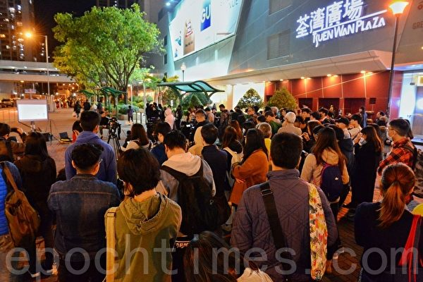

22019年12月27日，香港民众黄色经济圈活动在荃湾广场举行。（宋碧龙／大纪元）

【大纪元2019年12月29日讯】（大纪元记者蔡溶、萧律生采访报导）“人们说平安夜不平安，的确这样。”香港大学的学生Michael 说，“和平日不放假没有区别，警方照样放催泪弹。”

12月24日平安夜，逾百市民在铜锣湾参与“和你 Shop”活动，却在湾仔警署外被警方全部抓捕。25日，警方称抓捕58男45女。12月25日下午，港人在铜锣湾时代广场、尖沙嘴海港城等多个商场抗议，警方不仅喷射胡椒喷雾、发射催泪弹，而且抓捕市民。

12月27日，沙田新城市广场，十多名中学生参与“和你温（功课）”活动，做急救员（First Aid）的Michael和阿恒都在现场。他们都跟大纪元记者说，今年的圣诞节都在做急救，与往年大不相同。面对警方的催泪弹等，Michael觉得习以为常了。

以往圣诞节会吃喝玩乐，或和家人逛街、吃饭、见亲戚等，而今年平安夜，他们整夜在外面做急救，25日凌晨才返回家中，休息4、5小时候，再次走出家门，继续做急救，继续面对警方的催泪弹、胡椒喷雾等。

<b>催泪弹已不是最挑战的</b>

对于警方的暴力，Michael对大纪元记者说，已经习惯了，过去的六个月面对很多次这样的暴力状况。“如果我们连催泪烟都无法面对的话，我们又怎么样救人呢？所以我们这个职位，习惯已经是很平常。”

在这种暴力的情况下，Michael提到急救员本身感到最为挑战的是橡胶子弹、布袋弹甚至是实弹。因为与催泪弹和胡椒喷雾相比，实弹等的威胁更大，尤其是警察开枪射实弹后没有得到任何惩罚。

Michael认为，急救员承受的风险可能比记者更高，因为没有保障，警方也会认为急救员是偏向帮助抗议者；但实际上，急救员只是站在人道立场做救援工作。

“我们的职责就是确保大家，无论是抗议者、路过的市民、甚至是警察，只要是在场的人士，我们想确保无人受伤。”Michael说，“做记者起码那张记者证的保障会高一些，而做急救员不同，我们是义务，不像记者那样有人帮。我们穿反光衣为了大家容易识别，相对的代价就是承受的风险高一些。”

急救员阿恒告诉大纪元记者，今年的平安夜不平安，是在催泪弹、橡胶子弹、胡椒喷雾、枪林弹雨和白色恐怖中度过；听着警察的粗口、辱骂，面对港府的无理、警方的无稽之谈，还有白色恐怖等等。

“不只是这个圣诞，这六个月都是这样，从来没想过自己有一天会是这样，做First Aid的岗位。”阿恒说，“六个月前都只是上学、读书，得空外出吃饭、看戏，没想过六个月后，周六周日会穿上反光衣出去救人、帮人。”

<b>正确的事与最危险的情况</b>

Michael觉得First Aid这个职位给了他使命感，让他可以多走一步去帮人。

他对大纪元记者说，如今身边也认识了一班队友，大家一起出去努力，大家有同一个信念，大家都想做同样的事情，就已经够了。

当Michael做出这样的选择时，与他政治立场、信念不同的父母就会有所担心。他说能理解父母，但是大家在做正确的事情，在艰难的时候，无法有其它选择，尤其是看到不少比自己还年轻的中学生出来抗议，他们付出的代价更加大。

“中学阶段对一个人来说很重要，中学那几年是为了升上大学，既然我们算达成自己的目标了，为何不给机会让他们去做他们想做的事情呢？”身为大学生的Michael说，“我们的包袱比他们小一些，他们年纪还小，家里人真的会担心，毕竟我们成了年，19岁～21岁，有什么所谓呢？”

他想起5年前，即2014年雨伞运动的时候，自己才15岁，也没有投身那场运动，因为不同的年龄有不同的事情要做，自己当时可能也还没有这种社会意识。

“5年后就轮到我出来了，再5年后，又到另外一班人出来。”Michael说，“人们说我们是‘被时代选中的年轻人’，就是这样。”

在做正确事情的同时，Michael和同伴随时都面对最危险的情况。

他想起一次经历。

当时，很多枚催泪弹从他前后飞过或在他前后落地，而警方仍旧不断开枪，甚至发射橡胶子弹、海绵弹等。他正在保护抗议者向后退，可是警方发射的海绵弹却将他的脖子打中。

“枪林弹雨，我被打中。还好不是太严重，打中后反弹，没有见血。”Michael说，“大家出来都一定预备好要承受风险。”

<b>“生于乱世中你有责任”</b>

当开实弹的警察不被惩罚，当骑摩托车撞人的警察复职时，当警察随便进入商场戒备，当市民逛街毫无安全感时，繁华的香港变成了乱世中的乱世。

Michael对大纪元记者说，“大家都说生于乱世中你有责任。”

作为香港人，Michael想在这个地方继续生活下去，这里是自己的根，为了下一代还可以在这里生活，就必须尽一份力量保护这个地方。

如今，香港已变成战场。即使圣诞节，警察都不让市民逛街。从12月24日到12月26日，警方在香港一些商场戒备，并不断抓人。

“不是我们不想休息，而是政府、警队一路都让香港，让大家处于精神紧张的状态。”Michael说，“如此高调的巡逻，如此高调的进入商场，截查市民，令人不解。”

Michael说，即使是战争，记者和救护人员都会得到尊重，可是香港警队无视香港法律、国际法律，不仅拿枪对着记者进行搜查，还将救护人员抓起来，或举枪瞄准救护人员发射催泪弹等。

“就算打仗都不会出现的情况。”Michael说，“我是觉得很灰心。虽然灰心，但我们都不会放弃。‘不是见到希望才坚持，而是坚持了才有希望’。”

他与同伴要坚持不放弃，就是为了让全世界看到港府以及中共制度的失败。

<b>希望港警好好想清楚</b>

从小就很喜欢当警察的急救员阿恒接受大纪元采访时说，虽然他相信警队中还会有部分好警察，但是这六个多月警察的表现完全打破了他对警察的好印象。

因为他看到：在“和你温习”的和平活动现场，没有口号、没有穿黑色衣服的抗争者，只是一些中学生在温习功课，可是，大批便衣警察、大批防暴警察在一旁戒备。

“其实真的很无稽。打劫发生时，又不见你（警察）出现？”阿恒说，“每年逢岁末多打劫和入室盗窃案，但见不到他们去处理这些事，很多时候在这种情况（和平活动）时乱喷胡椒。”

阿恒认为警察已经没有了理性，而是被仇恨和愤怒掩盖，被港府、中共利用。这些警察只是中共、港府手中的一个棋子，“当政府垮台的时候，他们是会被拿出来、被人祭旗的一班人，真希望他们想清楚这一点”。

所以，他还是希望警察能坐下来、静下心来观察这次运动、好好想清楚。

为何市民对警队如此失信心？为何市民这么仇恨警察？为什么这场运动演变成现时这样？为什么5年前汽油弹没出现，如今出现了？为什么部分抗议者觉得要跟警察抗衡？

阿恒向大纪元记者举例撑警艺人陈百祥的例子：为何这么多香港人憎恨他？因为他挑衅的言论。

今年10月份有网民在社交网站上流传一段陈百祥给警察送奶茶的视频，陈百祥不仅给警察鼓励，更语出惊人：“如果我做警务处长就好了，两个月前就开了真枪。”#

<a target="_blank" href=#top><h6 align="right">回上方</h6></a>

<a name=237>
<h3 align="center"><b>林志伟抹黑“和理非” 梁振英要减香港电台开支</b></h3>
 <h1 align="center"><b>中共代理人加速政治分化香港 限制港人自由</b></h1>

香港警察队员佐级协会主席林志伟最早公开以“曱甴”（蟑螂）斥骂抗争者，现在又炮轰“和理非”，引发众怒。图为9月4日晚上8时，一批群众在香港旺角港铁太子站举行“和理非”活动，凌晨遭警方驱赶。（宋碧龙／大纪元） 

 
 【大纪元2019年12月30日讯】（大纪元记者赵若水、王文君香港报导）香港警察队员佐级协会主席林志伟于12月27日向会员发信，批评“和理非”，将“和理非”及“勇武派”共同归为“反派”来打击。前特首梁振英则于29日在脸书针对香港电台增拨资源的要求，大唱反调回应，称要彻底把香港金融和香港人生活基础条件，牢牢控制在港府手里，用这些资源来调控“反派”和“挺派”力量。从林志伟及梁振英的言论，不难看到中共加速政治分化港人和进一步限制香港人的自由。

林志伟于27日向港警佐级会员发信，批评“和理非”协助“勇武派”的抗争行动，妨碍警方执法，形容“和理非”为“赤裸裸的帮凶”、“无恶不作，为所欲为”。香港作家颜纯钩29日在脸书发文回应林志伟的言论，名为“三问林志伟：我是‘帮凶’又如何？”指出，在争论“和理非”是不是帮凶之前，首先应澄清一下谁是凶手。

在警队中，林志伟最早公开以“曱甴”（蟑螂）斥骂抗争者，现在又炮轰“和理非”，呼吁传媒及市民停止以“和理非”称呼抗争者，称他们行迳“灭绝人性”，配不上和平、理性等歌颂人类美德的词语云云。

<b>萧若元：“无恶不作，为所欲为”的定义？</b>

就林志伟所说的“无恶不作，为所欲为”，资深评论员萧若元在其《萧氏新闻台》回应说，跟他一起行善的医生，最近医了很多年轻人。医生告诉萧说，很多人中了催泪弹后，女的来黑色月经，男的排便是黑色的，肚子疼得很厉害，而且会长时间吐泻，需要长时间才恢复。他质疑到底催泪弹里是什么成分，“用这些催泪弹的人是否是无恶不作、为所欲为？！”他反问。

萧若元质疑到底催泪弹里是什么成分，香港警察用这些催泪弹，是否是无恶不作、为所欲为？！图为2019年12月24日晚，香港防暴警察在梳士巴利道放催泪弹。（宋碧龙／大纪元）

 
 医生又告诉萧，以前香港医生对处理头部伤势并没有很多经验，这几个月尤其是前段时间，每天都有几单，现在香港医生对头部手术都变得很熟手。

针对林志伟说“他们（和理非）的恶行包括以身体、雨伞或其它物件掩护暴徒施暴及破坏”，萧若元说，第一，这种情况是非常少的，是有，但是非常少，“比如说，一班人涌去，然后何君尧的写字楼被人破坏，或者有班人遮住，有人就破坏港铁站的入闸机，这个情况我见过，但是那些就不是‘和理非’了，那些是‘勇武派’，就不能用这些事情来指责‘和理非’。”

而林志伟称和理非“在暴徒施暴过程中呐喊助威”，萧若元说：“这些完全是砌生猪肉。‘和理非’会做些什么呢，就是当你们警察做的事情不对时，就会出来指责警察，而你警察就忽然之间用暴力去拘捕那些‘和理非’。”至于林志伟称和理非“在网上平台或以其它方法鼓动他人参与违法行为等”，萧若元回应说：“第一，要讲清楚什么是违法行为，这个是不是暴力的违法行为。和理非既然是和理非，就不会鼓动他人去参加暴力行为。但是就可以鼓动他人去参与‘违法’行为。什么是违法行为？比如‘非法集会’就是违法行为了？但是这个是公民抗命的一部分啊！”

港警佐级协会请各大传媒及市民，停止以“和理非”称呼他们，声称“他们的行迳灭绝人性”。萧若元反问说，这些行为叫作灭绝人性？！“谁打穿人的头颅，打到地下，再坐上去用警棍乱打，还用脚踩呢？那些就不是灭绝‘施暴狂徒’？我就告诉大家，在过去7个月并没有令到任何一个警员有重伤，而警员令到无数的所谓的‘施暴狂徒’重伤。”提到林志伟讲的“配不上和平、理性等歌颂人类美德的词语”，萧说：“麻烦你读下书啦，‘和平理性’是一个客观名词，是不是‘和平’，是不是‘理性’，并不是一种‘美德’的歌颂，是一种客观的叙述！”

 

萧若元反问，谁打穿人的头颅，打到地下，再坐上去用警棍乱打，还用脚踩呢？图为2019年8月11日港警暴力抓捕抗争者。（中央社）

 
 <b>颜纯钩：先澄清谁是凶手</b>

香港作家颜纯钩在脸书发文回应林志伟的相关言论，质疑林志伟说，香港街头每天都在发生警察暴打市民的案件，已经到了罄竹难书的地步，他是眼瞎了看不见，还是已经冷血到视兽性为正常？在争论“和理非”是不是帮凶之前，先澄清一下谁是凶手，“这是最简单的逻辑”。

 

香港作家颜纯钩脸书炮轰林志伟。（Facebook）

 
 此外，他质疑：“警方有责任把半年来无数抗争事件中，市民所受到的伤害，与警察所受到的伤害，依事件发生地点和日期，一并公诸于世，让全世界的国家和人民以事实作判断，之后再谈‘帮凶’。如果你们不敢公布，那只证明自己心虚，而所谓勇武派是凶手，和理非是帮凶的说法，便是胡说八道。你作为警察队员佐级协会主席，便公信力扫地。”

颜纯钩又说：“旺角事件中朱经纬只打路人两下，已被定罪，按朱的定罪标准，半年来有多少警察的暴虐罪行理应被严惩？你们已经被豁免，不受香港法治管束？而香港百年来行之有效的法治，现在只用来‘治’市民了吗？”他批评警方做尽伤天害理的事，不但不自责，还有脸指责市民，并称警方只是专政政权豢养出来的独裁凶器而已，不配讲“人性”和“人类美德”。

近日，美国《华盛顿邮报》报导9名国际警务专家审视香港65宗个案，裁定七成武力使用违反了香港警察通例或国际标准。颜纯钩就此事质问林志伟：“够唔够胆再写一篇文章，反驳国际警务专家的判断？”他说：“香港人半年来的抗争，每一时每一事，都在国际社会视野之内，这里不是大陆，不可能把真相彻底掩盖，世界各国正义的人民和政府，随时都盯紧香港发生的事。”

颜纯钩贴文表示：“我想告诉林志伟，世上没有永远作恶不受惩罚的凶徒，所有恶贯满盈的罪，一定有彻底清算的一日。你有本事，就把300万和理非都关进牢里去，打得我们都挺不起腰杆来。如果你做不到这件事，那就等一等，看看香港人最终会如何收拾你们。”

颜纯钩坦言，准备接受这个“帮凶”的称号。他说无所谓：“因为你们和普通市民的价值观念都颠倒了。你们之为‘恶’，我们视之为‘善’，你们之所‘是’，我们视作‘非’，你我之间已经没有共同的道德标准，也没有共同语言——你的利是我的害，你的光荣即是我的耻辱。”

<b>梁振英缩减经费论“想增加自我存在感”</b>

近日，27名香港电台节目顾问团成员发表联署指，香港电台因报导反送中运动花费大增，今年财政超支500万元，靠消减人手应付，呼吁商务及经济发展局（商经局）为香港电台增拨资源。前特首梁振英29日在脸书发文，建议政府要求审计署全面审查香港电台账目，了解有没有空间削减香港电台经费。

资讯科技界立法会议员莫乃光回应表示，香港人普遍支持香港电台，普遍反对警暴，认为梁振英的言论是“想增加自我存在感”。香港电台节目制作人员工会认为，政府漠视香港电台制作需要，形容是“做得好却变相惩罚”。

公开信指出，香港电台新闻部因报导反送中运动，花费超出年度预算约500万港元，需要停止聘用外判员工、减少兼职记者及自雇人士，希望香港商务及经济发展局局长邱腾华为香港电台增拨资源，并加快重新规划新广播大楼计划，以应付香港电台设施残旧的问题。此外，联署信质疑，在过去半年，警队的逾时工作津贴开支共约9.5亿元，同为市民服务，为何待遇差天共地，

公开信发出不足12小时，已有超过5,500人加入联署。商经局回应，香港电台作为政府部门一员，一直按政府资源分配机制获得应有资源，提供公共广播服务。香港电台有足够资源，应付运作需要。

梁振英更发挥“网络KOL”本色，29日在脸书发文，建议政府要求审计署全面审查香港电台账目，衡工量值，“今天网台林立，香港人只有750万乘24小时的接收新闻资讯和娱乐节目的前提，有没有空间削减香港电台经费？”

<b>黄之锋：梁振英散布政权的白色恐怖</b>

就梁振英提出缩减经费论，现任香港众志秘书长黄之锋29日在出席中环集会时回应记者提问指，“好明显这是一个政权的白色恐怖，作为其中一个中央领导人之一的梁振英，这个言论非常之不尊重香港的新闻自由。”

香港众志秘书长黄之锋29日就梁振英提出缩减经费论回应指，这是一个政权的白色恐怖。（大纪元）

香港本土派政治人物刘颖匡亦表示，梁振英的说法是对新闻自由的一种粗暴干涉。他说，“港台作为香港政府辖下的新闻报导应该确实有一个编采自由来为香港人服务。以往所有政府部门都会根据其需要去调整他们所需要的拨款，警队如是，消防队如是，甚至乎各个政府部门亦如是，港台作为其中一个政府部门，只要它有理有据的话，增加拨款是应该的。”

香港本土派政治人物刘颖匡表示，梁振英的说法是对新闻自由的一种粗暴干涉。（大纪元）

 
 刘颖匡认为，时下通胀和人工开支，以致香港电台经费需增拨皆属正常运作，并需大家尊重其独立编采制作的问题。他并表示，留意到警方及政府针对个别讲话不中听的媒体不断进行攻击等行为，如RTHK、《立场新闻》、《苹果》。

他认为政府及警方针对这些媒体的做法，是说不通的。“当你有一个新闻自由，有不同角度的报导出来的时候，才能看到事实的全部真相，你不能期待我们全部都是《文汇报》、《大公报》，其它传媒都不行，我觉得这是对新闻自由的不尊重。”他并直言，民众亦不会刻意针对某些媒体，并对其它媒体的新闻采访自由有一个尊重的时候，希望警方或政府亦不要恶意针对讲出逆耳说话之媒体。

<b>中共在香港表现邪恶 加速全球灭共</b>

郭文贵于12月29日在“中国媒体”频道上直播，分析香港情况（节选）：

在香港，共产党玩流氓手段，以官方不宣布戒严的方式，实际是戒严了。暗流涌动最大的是经济危险，信息掌握后的绑架，和对这些勇敢的伟大孩子们各个击破。

同时，他们现在是对整个的香港社会全面的进行各个领域新的解决方式，资源上、市场上、份额上用承诺、兑现和保证来分化香港社会，达到彻底将香港的反送中运动用时间、用经济、用金融、用分化将它胎死腹中。

传播香港危机是目前最重要事情。共产党这些想法，西方也知道，美国也知道，得逞不了。大家知道，中共在蚕食香港、分化香港、收买香港的同时，共产党也在流血。

共产党也在全世界面前，鱼缸里一缸金鱼，进来一个癞蛤蟆，癞蛤蟆在鱼缸里跑来跑去，以为穿上了香港的金鱼装就是金鱼了，不是的。全世界都看到，中共就是这个癞蛤蟆，只是穿了香港金鱼装。随着全世界关注度增加，在金鱼缸里出现的这个穿着金鱼装的癞蛤蟆，全世界要把它抓出来。

癞蛤蟆在金鱼缸里转的时间长了也会累，也会耗失精力，耗失信用，让大家看得更清楚，香港人用生命、鲜血在捍卫着我们中国人、捍卫法治和自由。香港这场运动对灭共带来的实际推动效果，有一天世界绝对会明白。#

<a target="_blank" href=#top><h6 align="right">回上方</h6></a>

<a name=236>
<h1 align="center"><b>白宫：若朝鲜试射远程导弹 美将采取行动</b></h1>

白宫国家安全顾问罗伯特‧奥布赖恩（Robert O'Brien）周日（12月29日）表示，如果朝鲜试射远程导弹或进行核试验，美国将采取适当行动。(SAUL LOEB/AFP)

【大纪元2019年12月30日讯】（大纪元记者夏雨综合报导）白宫国家安全顾问罗伯特‧奥布赖恩（Robert O’Brien）周日（12月29日）表示，如果朝鲜试射远程导弹或进行核试验，美国将感到非常失望，并会采取适当行动。他还表示，金正恩可能已经重新考虑了他的“圣诞礼物”。

奥布赖恩周日在接受美国广播公司“本周”（This Week）采访时说，华府有许多“工具包中的工具”（tools in its tool kit）可以应对任何此类导弹测试。

他还说：“我们将做出判断，但在这些情况下，美国也将采取行动。”“如果金正恩采用这种方法，我们将非常失望，我们将表现出这种失望。”

<b>金正恩或已重新考虑“圣诞礼物”</b>

朝鲜要求美国政府在年底最后期限来临之前，就朝鲜核武计划问题提出一个新的倡议计划，以消除双方分歧。朝鲜说，如果美国未能满足平壤的期待，（美国）就可能得到一份不希望的“圣诞礼物”。

美国军事指挥官表示，朝鲜的“圣诞礼物”可能是试射远程导弹。

针对朝鲜对美国发出的威胁，奥布赖恩说，美国仍然是世界上领先的军事大国，拥有巨大的经济实力。他说：“我们可以承受很大的压力。”

这名白宫国安顾问说，“多年来，共和党和民主党多个政府曾对这种情况进行了处理，但没有成功。”“川普总统采取了不同的方法，进行个人外交。取得了一些成功。”

“所以也许他（金正恩）会重新考虑这一点（圣诞礼物）。”奥布莱恩补充说， “但是我们将不得不拭目以待。我们将对其进行密切监视。当然，这种情况令我们感到担忧。”

总统川普上周表示，美国准备应对朝鲜方面的任何“圣诞礼物”。

<b>时间将证明川普总统的方法是否行得通</b>

奥布赖恩说，美国和朝鲜拥有开放的沟通渠道，但他没有透露详情，也拒绝回答美朝最近是否进行接触。他说，华府希望金正恩履行其使朝鲜半岛无核化的承诺。

他说，时间将证明川普总统的方法是否行得通。

奥布赖恩说，总统没有在这件非常危险的、非常令人担忧的事上存在幻想。“他（总统）到那里时很危险，他试图缓解紧张局势，使金正恩真正履行自己的承诺。”

金正恩周六召开执政党会议，在他设置的年底最后期限来临之前讨论重要议题。朝中社没有提供本次会议的进一步详情，只说会议将继续进行。#

<a target="_blank" href=#top><h6 align="right">回上方</h6></a>

<a name=235>
<h1 align="center"><b>美中科技战 2020年聚焦五大关键问题</b></h1>

专家预测，2020年美中科技战聚焦五大关键事。(STR/AFP/GettyImages)

【大纪元2019年12月30日讯】（大纪元记者吴英编译报导）2020年，美中冲突仍将是全球关注焦点，除了有关中共结构改革的第二阶段谈判，更令人注目的是进入白热化阶段的科技战。专家预测，明年美中科技战聚焦五大关键事。

美国总统川普（特朗普）政府2019年锁定中国科技企业（包括华为），采取多项禁限措施，以及呼吁全球盟国不要采用此等公司的技术及设备。另一方面，众所周知，北京政府禁止大多数美国领先的消费者导向技术，以及脸书等社交媒体。

数字屏障（Digital Barriers）创始人兼首席执行官扎克・多夫曼（Zak Doffman）12月29日在福布斯（Forbes）网站发表文章说，展望2020年，美中两国在科技领域的竞争将进入关键期，造成两国鸿沟的主要原因是北京积极发展互联网技术标准及应用程序，导致全球网际网络被一分为二，形成“分裂网”（splinternet）。

美国联邦通讯委员会主席阿吉特・派伊（Ajit Pai）去年11月在对外关系委员会上说：“众所皆知，中国（中共）政府意图⋯⋯利用其在全球贸易中日益增长的影响力，来促进自身利益。”

派伊警告华为在国际5G网络中所扮演的角色，以及中共利用其影响力遏制他国对其国内政策的批评。

据多夫曼提供的资讯，中国（中共）、俄罗斯、伊朗和沙特阿拉伯等国家持续运用大规模技术过滤器，限制其公民能够浏览互联网的内容。

多夫曼认为，基本上，在这些国家的很多互联网内容都受到限制，包括某些网站和在线服务、通讯平台、新闻网站、社交媒体、内容共享等。2020年，这个问题将越来越严重。

不过，多夫曼指出，虽然内容审查变得越来越普及，但美国领先的网络技术标准逐渐成为主流。然而，2019年12月两个看似无关但实际上非常紧密相关的新闻，引起科技领域人士的关注，并意识到技术标准或将面临新的挑战。

首先是华为近期暗示其有可能发展了可以替代Android软件和服务的方案。过去九个月，华为被列入美国黑名单，无法购买美国的技术及零部件。全球超过20亿用户使用美国的Android软件和服务。

第二件引人关注的事是，北京在12月底宣布完成“北斗卫星导航”，并称将替代美国的GPS卫星导航系统。

多夫曼指出，美中两国在技术标准的竞争及分裂已是必然的趋势。2019年，在川普政府积极地推动下，全球许多国家必须在国家安全及吸引中国投资与贸易间做出选择。

迈进2020年，他预测会很快看到华盛顿及北京在科技战进入白热化阶段，两国将加速分裂。各界可观察以下五大关键点的发展：

1）对于美国要求引渡华为首席财务官孟晚舟的要求，加拿大即将做出法律裁决；

2）英国和德国将决定是否允许华为加入其网际网络市场；

3）华为发布旗舰产品P40，是否能替代Google软件和服务，备受关注；

4）美国商务部是否放宽出口限制及其开放程度；

5）11月美国大选，中共和俄罗斯是否会加大力度干预大选，损害言论自由。

在新的一年，美中两国技术战是否会改变全球技术标准，颇值观察。无论如何，2020年，美中第二阶段贸易协议或新的技术安全标准，都有可能导致某些变化。但是，无论要走向哪个方向，从现在开始的12个月内，政治人物决策的灵活度将越来越有限。

<a target="_blank" href=#top><h6 align="right">回上方</h6></a>

<a name=234>
<h1 align="center"><b>【拍案惊奇】香港水源是否完全依赖大陆？</b></h1>

（新唐人合成）

 
【大纪元2019年12月28日讯】大家好，欢迎收看《新闻拍案惊奇》，我是大宇。

今天是美东时间的2019年12月27日，周五。今天我们来聊一个话题，这个话题经常会在网上引起争论，就是香港的水资源，是不是完全依赖大陆？很多网友在争论的时候，各说各话，多是喊口号，很少有人深入细致去分析。

今天我们谈这个，并不想参与争论，也没有任何政治立场。我们就事论事，在这场香港“水革命”持续的时候，谈谈香港的“水”，到底是怎么来的。

<b>～～～新拍专题～～～

香港水源概述</b>

香港有1105平方公里，大致是新加坡的1.5倍，韩国首尔的1.8倍，台北市的4倍，比北京城区的面积少一点，但差不太多。香港市面积并不小，但可居住面积相对狭小，水资源也比较有限。

19世纪中期，香港刚刚开埠的时候。香港本地的淡水水源还足够岛上的人使用。山上的河水、山涧的溪水、凿井取用的地下水，足够当地居民取用。欧洲人来了，也是这样过，但人口渐渐多了，这个办法也就不够用了。

怎么办呢？1863年，当时的港英政府为了解决饮水问题，修建了香港的第一个小型蓄水池，叫做“薄扶林水塘”，用来储存雨水。这样，从1863年到1978年，香港先后建立了17个这类主要用于饮用水的水塘和水库，最大的是1978年建成的“万宜水库”。最令人感到脑洞大开的，是1968年建成的“船湾淡水湖”，这个水塘是全世界第一个在海上建成的水库，在岛屿和岛屿之间，修起了隔绝海水的大坝，在大海的包围之下，生生地造出了一个淡水湖。

除了以上主要用于食用水的蓄水池，香港还先后修建大约11个灌溉用的水塘。

香港政府不断修建水塘，同样是因应不断增长的人口，还有越来越多的经济发展需要。特别是1945年之后，一直到1963年，这18年间，香港人口爆炸性增长，从原本的60万，增加到350万，大多是从内地移民过去。现在的香港人口，根据香港政府统计，是大约748万。这样多的人，还有发达的经济，“水资源”始终是一个需要重视的问题。

而只靠以上说的收集雨水的方式，不仅不够，而且不稳定，根据官方说法，每年降雨量的差异，平均相差大约2亿立方米。赶上雨量充沛的年份，还好说，如果发生干旱，香港的饮用水就会吃紧。所以，香港势必采用更多的方法，扩大水的来源。

根据香港政府“水务署”的介绍，香港水源目前分成两大来源，五个种类。

其中，对于“现有水源”，2018年一共为香港带去12.92亿立方米的水量，分成三类，各类在总耗水量所占比例分别为：本地各个水塘收集的水源，占21%；从大陆广东引入的东江水，占57%；还有冲厕所用的海水，占22%。

另一个水源，是“新增水资源”，包括“海水淡化”，还有“循环再用水”。

对于这五种水源，我们主要讲引入量最大的，也是争论得比较多的广东“东江水”。

<b>香港引入“东江水”的历史 伴随两地政治纠葛</b>

东江水进入香港，一直伴随着政治上的角力。以前的港英政府对待东江水进香港，是采取非常小心翼翼的态度。总体的做法是，利用广东水源解决一部分问题，但是避免造成依赖。我们刚才提到的香港大大小小的17个食用水水库，全是在主权移交以前建造的，最后建造的一个、也是最大的“万宜水库”，建成年份是1978年。而香港的大型水库全是在60年之后建造的，原因就是当时的港府想避免对大陆水源的依赖，进而造成政治上的问题。

香港与大陆双方最早的、正式的协议性供水，始自1961年2月1日，当时还不是直接从东江取水，而是“深圳水库”的水供应香港，也不多，只有每年2270万立方米。

而香港大规模引入大陆水源，就是从引入“东江水”开始。东江是珠江的3条支流之一，发源地在江西的寻乌、安远、还有定南县。目前，供应广州、深圳和香港，总计超过4000万人。

那么，最早引入东江水，是在什么时候？是什么原因呢？香港、大陆两地对这件事的描述，差异非常大。

大陆方面的说法，我看过一个报导，大意是说：内地看香港缺水，是“看在眼里、急在心里”，香港是个被割让出去的“孩子”。但当时港英政府不想过分依赖内地，宁可花钱买水，也不用内地水。但1962年底到1963年遇到严重旱情，连续9个月不下雨，当地开始实行限时供水的制度，港英政府也挺不住啦，终于派代表去广东。后来“敬爱的”某总理亲自拍板，倾巨大人力，修渠挖道，以惊人速度建成“东深供水工程”。1965年3月1日，东江水正式进香港。但港英政府还不情不愿，提防大陆，在供水多样性上做文章，所以东江水很长时间只占香港淡水需求量的30%多。直到后来，香港经济发展迅猛等原因，慢慢提高了供水量。

这是很符合大陆官方语气的说法，但是转过来看香港人自己，对这段供水史，却是另一种描述。

香港中文大学政治与行政学讲师李家翘，是香港水资源历史方面的专家，他在自己研究后，将香港的供水史分成了三个“转折点”。

第一个转折点是1959年。李家翘翻查英国存有的历史文件，发现1950年末，香港需要更多水源，香港的左派人士趁机穿针引线，提出引入广东水。北京当局也抓住机会，表明对港澳两地供水是“政治任务”。1960年初，广东正式向香港提出供水建议，可是港英政府当时担心什么呢？第一，中共随时威胁停水，怎么办？第二，很多市民就是逃避共产党统治才去的香港，这些人反弹怎么办？第三，美国反对提议，怕共产主义阵营的中共乘机扩大势力，甚至美国愿意出资给香港，研究海水淡化。

面对这三点担心，当时的港督为了增加水源，选了比较折衷的办法：引入一少部分深圳水库的水，同时加快香港水利工程建设，兴修水库，并发展水源采集的多样化。当时双方签了有关深圳水库的合约，虽然水量很有限，但中共当局立即对外宣传：祖国伟大，拯救同胞于水火。而当时港英政府，直到后来开始引入东江水，一直采取这样一个不依赖内地多样化策略。

香港中大的专家李家翘认为，第二个转折点在1967年。一看这年份大家就知道了，当年，在香港的共产党，发动了“六七暴动”。这个转折点的意义在于，让港英政府更加认识到，水资源独立供应的重要性。于是，港英政府在这一个转折点，加速了丰富香港水资源的建设，投入的金钱也是史无前例。全球第一个海中水库“船湾淡水湖”、储水量在香港排第一的“万宜水库”、还有海水淡化厂等，都是在1967年后建成的。

但关键在于第三个转折点，香港中大专家李家翘表示，1979年是香港第三个转折点。当时香港的处境是，虽然全球油价上升，香港在1977年又遇到干旱，全港持续限制供水，每天供应10小时，但是，香港自己供水的硬件已经建成很多。当时的香港政府甚至表示，没有东江水，香港自己的供水能力也够未来10年使用。

但是，就在这个期间，1979年，当时的香港总督去了北京，明确了香港之后一定会主权移交大陆。因此，香港的很多事情，也开始为主权移交做准备。其中就包括水源。

这一年之后，香港许多已建、未建和正在建的水源设施，就废弃了。早前计划的水利大工程被叫停、备用海水淡化厂最终被炸掉、西北供水计划取消。而且在1979年起，香港与广东方面签署了新的协议，东江进港的水量逐年攀升。直到后来，东江水成为香港主要的水源。

围绕“东江水”的历史和它与香港的关系，还有一本书叫《香港命水》，可能有更详细的内容。
东江供水 近年问题浮现

<b>1. 东江水价格超过新加坡海水淡化成本</b>

香港与广东就东江水的协议，基本上是每3年签一次。根据一家大陆媒体自己的计算，2018到2020年的协议中，截至2020年，水价比前一个3年协议增加7%，根据香港水务署公示的价格，2020年的水价是每立方米5.9港元。

根据香港作者Ladykylie在网络博客Medium的一篇帖文，同样是东江水，以每立方米港元计价，深圳买是1块多，而澳门买珠江水，只要2块多。作者还将香港买东江水的价格，跟新加坡的海水淡化成本做了比较，说新加坡海水淡化是每立方米3.8块港元，相比东江水价要低。

这一点，大陆官媒新华社2019年8月有一篇文章，提到《海水淡化解决“干渴”问题》，当中讲到，由于技术先进，新加坡已经把海水淡化成本降到每立方米0.49美元，根据当前美元和港币的汇率，约合港币3.82元，跟上面提到的3.8元相符。说明如果技术有保证，海水淡化成本确实低于香港买水的成本。

<b>2. “统包总额”买水会不会很浪费？</b>

香港方面使用的方式是“统包总额”，简单说就是每年香港要对自己用水量做一个预估，然后以最高的预估上限缴费。比如说，今年香港买6亿立方米的东江水，那就要交6亿立方米的钱，但是这一年只用了4亿立方米怎么办呢，那另外2亿立方米可能就浪费掉了。但是钱，照交！对于这一点，香港政府的解释是，这样总体买水，总是要省一些，因为一旦遇到旱情，如果按量买水，用多少、买多少，可能价格更贵，也不一定能得到有保障的配额。而且并不是每年都会有浪费，有的年份就会几乎用完。

不过，除了东江水有时会浪费，香港本地水塘的水有时因为用不上，而溢出水库的事情也时有发生。香港当局也遭到质询，他们说会采取一些办法解决水塘满溢的浪费情况。东江水贵、加上存在浪费，但是本地的水却满溢不用，这种现象让一些香港人很有意见。

<b>3. 东江水的污染问题</b>

根据“香港01”2018年11月的一篇报导，当时香港的水务咨询委员会考察，发现东江水的大肠杆菌含量，在个别日子达到每公斤6万个，超标29倍。水务咨询委员会主席说这“不能接受”。

围绕处理东江水污染问题，香港水务署对外这样介绍他们的办法，比如：上移取水口到水质较好的地点，建立生物硝化站改善水质，建设专用输水管道等等。

<b>香港的未来水资源</b>

东江水引入后，香港人已经习惯，以前很少去想其它水源，香港当局也没有再大力开发其它水的来源。但是，2008年开始，因为东江水也很有限，大陆当局开始设置配额，虽然目前用量上没有什么问题，但是加上提到的那些问题，香港政府也已经采取一些措施，增加供水的多样性，但力度，远没有当初港英政府的大。

除了有数据表明，香港本地集水的数量，能供应香港使用大约9个月之外。香港也再次启动“海水淡化”的工程，当前最重要的就是“将军澳海水淡化厂工程项目”，计划2019年开工，预计2023年完成。至于成本能降到多低，要看技术能力。可惜的是，过去的大约30年，香港的海水淡化项目，基本上处于停滞的状态。

根据近年数据，新加坡现在超过一半的水可以自己生产。除了海水淡化，还有污水净化，这方面，香港也在做，同样要发展的是技术与成本。

另外，冲厕所的水使用海水，也为香港节省了很多负担。

最后分享一位香港观众的留言，他昨天留言说：说香港什么都是要靠中共，完全是错，水可能还需要，但原因是港共利益输送而已。香港买的东江废水，成本是意味全世界最贵，比香港自行用海水化淡还贵，但港共政权不予作为。其它粮油杂货，中共的角色，随着人口比例和文化改变，中共的供应已下跌到10%或以下。特别是肉食，香港后生一辈已甚少自家煮饭，多在食肆解决，食肆肯定90%或以上用急冻肉，买南美或其它国家肉类必定符合经济效益。米饭也不是香港人主粮，而且大多从泰国入口，占一半以上。电方面，香港以往都有卖电予深圳，而且大亚湾电厂，香港有份投资，加上现时大陆生业萧条，所以才会让成本较低的核电供港比例增加。综合说，只有中共才会对内宣传香港没有大陆生存不了。

以上这些内容，都是提供给大家参考。我们也没有任何结论，相信每位观众看后，都会对香港的水资源问题，有自己的观感。

最后，欢迎您订阅和分享我们的频道。感谢您的收看，我们下期节目，再见！

新唐人《新闻拍案惊奇》制作组  #

<a target="_blank" href=#top><h6 align="right">回上方</h6></a>

<a name=233>
<h1 align="center"><b>天津强拆世界级别墅群 数百业主走投无路</b></h1>

天津武清区世界级岛居别墅区翠金湖美墅岛在寒冬腊月强拆，无安置，赔偿不公，数百业主走投无路。（受访者提供）

【大纪元2019年12月30日讯】（大纪元记者顾晓华采访报导）天津武清区世界级岛居别墅区翠金湖美墅岛在寒冬腊月被强拆，居民无安置，赔偿不公，数百业主走投无路。

业主李先生向大纪元记者透露，该别墅区被以国家恢复湿地的名义进行强拆。强拆人员从今年4月4日陆续开始强拆，首先将离小区比较远的会所全部拆除，5月20日开始强拆岛上还没有售出去的大独栋，至10月份开始强拆四期已签协议的业主家，把他们家的大门和窗户故意毁坏，11月份，将四期的别墅全部推倒，之后是二、三期的商业街、会所全部拆毁，将物业赶出去。

业主透露，由于会所是整个小区的供电、供水、网络的中枢，会所被强拆后，导致小区断电、断水。

目前整个别墅区被强拆、毁坏得面目皆非，老人与孩子在寒冷中挨冻，小区内每天有数百名身着黑衣服的所谓保安人员把守，进行威胁、恐吓业主，而且是天天在强拆。

“每天24小时小区内都有二三百人，穿统一服装，也没有工作证件，什么也没有，他们什么也不说，拦着一些小区不让你进，就说要强拆，大钩机一直在拆。”李先生说。

李先生表示，他们限期业主在12月31日之前自行搬迁，否则会将业主强行架出房屋，之后入户评估。业主们要求他们出示证件，他们要业主去找政府，业主们找政府也无任何结果。

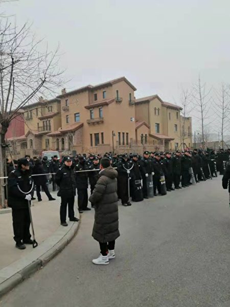

天津武清区世界级岛居别墅区翠金湖美墅岛在寒冬腊月被强拆，无安置，赔偿不公，数百业主走投无路。（受访者提供）

 
 李先生表示，强拆人员正在往别墅区的中心地带推进，将会迎来大规模的强拆。

据了解，购买此处别墅的大部分都是在北京工作的白领阶层，由于北京房价高，再加上限购，因此选择在北京天津的中间地带购买别墅，这样老人与孩子都可以一起居住，一举多得，没有想到，会面临强拆这一天。

业主们最不满的地方是无安置，赔偿仅有每平方米1万元，业主们还表示，他们或许是大陆第一批五证齐全的别墅遭遇强拆。

李先生表示，他所购买的别墅包括装修一共花费约350万元，按照房产证面积（260平方米，实际面积应该包括庭院、地下室等），他只能获得260余万元的赔偿，根本无法再购买别墅（目前别墅的价格每平方米达3万元，并且是二手房），在北京因限购令也无法再购买房子，同时他也没有钱再买房了。

现在正值寒冬腊月，业主们走投无路，而且许多家具要放置在哪里也是问题。

业主们曾多次上访，甚至进京上访，都无济于事，甚至有业主被抓。

李先生表示，大陆媒体也不会报导此事，因此只有寻求外媒的帮助，让更多的人知道此事，关注他们的遭遇。

有传闻称，此别墅区被某人看中，要改建成高端养老社区，进行二次开发后再出售楼盘。拆迁的名义被冠以恢复湿地，但湿地周边的村庄却没有被强拆。

翠金湖美墅岛坐落于京津中部大黄堡，隶属天津“一轴两带，南北生态”规划下西部城镇发展带与京滨综合发展轴以北生态区域的交集重点板块。

翠金湖美墅岛整体占地面积200公顷，建筑用地约100公顷，水域面积高达50%，约100公顷。整个别墅区规划由4个独岛与5个半岛围绕巨大湖面合围。220~310平米小独栋和双拼别墅、450~750平米临湖大独栋别墅，建筑风格为法式、意大利式及西班牙风格等，托斯卡纳湖滨花园别墅错落分布于各岛之中。

<a target="_blank" href=#top><h6 align="right">回上方</h6></a>

<a name=232>
<h1 align="center"><b>中共两省军区政委突然被免全国人大代表资格</b></h1>

12月28日，中共两名少将孟中康、叶青，突然被免去中共全国人大代表职务。（Getty Images）

【大纪元2019年12月28日讯】（大纪元记者张顿综合报导）中共两名少将——江苏省军区政委孟中康、海南省军区政委叶青，突然被免去中共全国人大代表职务。

12月28日，中共全国人大常务委员会发公告说，中共军委国防动员部选举委员会决定接受叶青、孟中康“辞去”中共全国人民代表大会代表职务，按照规定，两人的代表资格终止。

现年58岁的孟中康，2012年7月晋升少将军衔，曾任东部战区陆军副政委、第12集团军首长等职。

孟中康2017年5月任江苏省军区政委，2018年1月兼任江苏省委常委，今年9月，不再兼任江苏省委常委。

现年57岁的叶青，也是少将军衔，曾任山西晋中军分区政委、山西省军区政治部副主任、第65集团军政治部主任等职。2017年4月调任海南省军区政委。

两名省军区政委突然被免去中共全国人大代表资格，立即引发外界关注。

按照规定，中共全国人大代表在闭会期间，没有经过中共全国人大常务委员会许可，不受逮捕或刑事审判；代表若被拘留，执行拘留的机关应当立即向全国人大常务委员会报告。

过去，中共全国人大代表在被调查前，一般都是先被“辞去”代表资格。

今年10月26日，中共战略支援部队前副司令员兼参谋长饶开勋、西部战区陆军前副司令员徐向华，也是“辞去”中共全国人民代表大会代表职务，其代表资格被终止。

而饶开勋、徐向华都是因为“严重违纪”，被“责令辞去”中共全国人大代表职务。其中，战略支援部队选举委员会7月31日接受饶开勋辞职，西部战区陆军选举委员会8月26日接受徐向华辞职。

2016年8月31日，中共济南军区前参谋长张鸣，也是因为“严重违纪”，被中共全国人大常委会终止人大代表资格。

目前，虽然中共官方还没有通报叶青、孟中康为何“辞去”人大代表，但外界质疑他俩也可能出事了。

中共十八大以来，已有160多名副军级以上军官落马，其中仅上将就有7人，包括中共军委前副主席徐才厚、郭伯雄，军委委员房峰辉、张阳，空军前政委田修思、武警部队前司令员王建平、国防大学前校长王喜斌，他们大都是江派军中“大老虎”郭、徐的亲信。#

<a target="_blank" href=#top><h6 align="right">回上方</h6></a>

<a name=231>
<h1 align="center"><b>【新闻看点】危机来了？官称过紧日子及防暴动</b></h1>

中共官员日前称，要过紧日子了，可是很多农村地区的人民一直在过苦日子。(China Photos/Getty Images )

【大纪元2019年12月29日讯】大家好，欢迎大家关注新闻看点，我是李沐阳。

看到网上的一个黑色幽默：还有几天就进入小康社会了，趁着我还没有被消失，来看看大家，算是告个别。这个黑色幽默，是根据中共所说的一个目标演绎来的。中共在十八大曾夸下海口，说到2020年将消灭贫困县，所有贫穷人口实现脱贫。

眼看着2020年就要到了，算上今天（12月28日），总计还有4天时间。那么中国的经济状况怎么样了呢？在昨天（12月27日）结束的全国财政工作会议上，要求明年把握好“以收定支、量力而行”的原则。中共财政部长刘昆呼吁，要树立“过紧日子”的思想。

一系列的迹象显示，2020年消灭贫困县、所有贫穷人口实现脱贫仅仅是个“梦”。圣诞节前夕，中共国务院还发文要求各地区“第一时间处置因规模性失业引发的群体性突发事件”。2020年中共的危机要来了？

<b>2020“过紧日子”？</b>

一连两天在北京召开的财政工作会议要求，对2020年的财政工作，要着重把握做好“以收定支、量力而行”的原则。对明年的财政工作要“提质增效”，注重“结构调整”，从“质”和“量”两方面发力。

刘昆在会上表示，减税降费是2020年的“头等大事”，通过“减税、降费政策缓冲贸易战压力”。不过他认为，这也造成“政府财政短收”，只能通过“节省非急需支出”等方式实现平衡。

他呼吁，牢固树立“过紧日子”思想，还要求抓好“三保”工作。“三保”，指的是保工资、保运转、保民生。

当天中共财政部网站在新闻稿表示，对于“一般性支出要大力压减，不必要的项目指出要坚决取消，新增项目支出要从严控制，原则上不开新的支出口子”。

财政部门的说法，与实现脱贫显然有着天壤之别。

<b>中国经济告急？</b>

从中共大呼小叫“过紧日子”可以看出，中共的财政状况可能已经非常吃紧了，兜里没钱了。财政吃紧的原因有中国经济自身的羸弱因素，也有贸易战带来的影响。内外因素叠加，加速了中国经济的恶化。

马云12月21日曾说，他一天接到过5个借钱电话。他的朋友圈中，一个星期当中有10个要卖房筹资。马云的圈子是这个境况，别人什么样呢？马云自己都说，“浙商都过不去，其它商家肯定也过不去。”而且马云补充了一句话，“也许这只是不容易的开始。”

近日，有26位全球经济学家对明年的中国经济增速做出了预测。《日经新闻》报导，专家们预测明年中国GDP增速是5.6%～6.1%，平均值是5.9%。这些外国专家们认为，明年中国经济的增长率将出现1990年以来首度“破6”的情况。

野村证券首席经济学家陆挺表示，“中国的下滑周期尚未结束”，经济成长被地方政府财政恶化、低线（三线以下）城市信贷收缩，以及制造业投资疲软等拖累。

曾被中共总理李克强邀请分享观点、素有“中国第一经济师”之称的高善文认为，今后十年的平均经济增速不会超过5%。这位安信证券首席经济学家在11月27日演讲中指出，明年中国经济会进入“保四争五”阶段。

高善文的预测比国外的经济学家更悲观，用中共的说法这是“唱衰”。但是有一个奇怪现象，他的演讲内容，最初遭到了全网封杀。不过随后又能在大陆一些网站上找到，似乎是被放行了，是不是他的观点被北京接受了呢？

尽管第四季度GDP增速还没有公布，但从整体来看，下行仍然明显。按照前三个季度以0.2%递减的趋势来看，第四季度会如何呢？

高盛前不久指出，中国经济第三季度已经跌到了6%，第四季度很可能会“跌穿6%”。

体制内知名学者余永定的呼吁也很值得注意，他认为GDP增速在“触6”后应当刹车，“宁可财政状况暂时恶化”，也要稳住经济增长。

就是说，国内外的专家都不太看好第四季度的经济增长。

<b>失业潮汹涌？</b>

如果按照26位外国经济学家的预估中值，明年的经济增速是5.9%，那就意味着2020年的经济增长，比2019年估算的经济增速6.25%低了0.35个百分点。中共给2019年设定的经济增长目标是6%～6.5%，且估算是6.25%。

这意味什么呢？自由亚洲引述专家的观点表示，中国GDP每下降一个百分点，就会造成100到200万人失业。
那么下降0.35个百分点，意味着至少有35万到70万人失业。需要指出的是，这个失业数字，是在2019年基础上增加的，而且相对保守。
如果按照高善文“保四争五”的说法来计算，明年比今年要低1.25个百分点，甚至更多一些。以此来计算，明年的失业人数至少会有250万以上。

<b>那么2019年工人失业状况如何呢？</b>

中共人力保障部的数字，第三季度末的全国城镇登记失业率是3.61%。这个数字，只比美国现在的失业率3.5%高了0.11个百分点。

美国的3.5%失业率是50年来的最低点，反证着美国是充分就业状态。那么照此推理，按照中共3.61%这个数字来判断，中国即便不是充分就业，应该也不会太差。或者说，中国工人的就业情况应该还是不错的。

但实际早在今年年初，日本媒体报导，美中贸易战当时已经造成了500多万家中国企业倒闭，有高达1000万人失业。现在一年过去了，又有多少工厂倒闭？多少外企撤离？多少工人失业呢？

其实从去年下半年开始，中国经济产业链出现破裂后，失业潮就已经出现了。大量的建筑和工厂工人失业，农民被迫返乡。中共2018年11月的公布的数据，有高达740万的农民返回家乡。这些返乡农民实际就是失业，但中共美其名曰“回乡创业”。

就连曾被看作一向稳定的金融、IT行业也在大规模裁员，曾经的“金饭碗”已经被打破了。今年5月，世界软件巨头甲骨文裁员近千人，美国在华规模最大的伟创力，通知4万名员工放假。

另外特别提醒大家注意，中共说的“登记失业率”是3.61%。就是说，失业以后在中共那里登记在册的，才可能被统计进去，不包括没有登记的。没登记的，即使失业也不算失业。

原南京师范大学副教授郭泉表示，中共的“登记失业率”和“调查失业率”是难以令人相信的，这个中共特色的“调查失业率”并不是真实的失业率。

他用了一个简单的算法，中国真实的失业人数=公开的城镇登记失业人数+城市隐藏性失业人数+农村失业人士。最后他推算出的实际失业率大概是在25.48%，也就是说，不到4个人当中，就有一个人失业。

<b>恐爆发大规模暴动？</b>

究竟有多少人失业，中共始终没有公布过，也不可能公布，这对中共来说可能是个秘密。但是从中共的近期动作来看，失业人口很可能已经相当大。

圣诞节前夕，中共国务院发出了一份《关于进一步做好稳就业工作的意见》，要求进一步做好稳就业的工作。其中规定打算裁员的企业，必须提前30天向工会或者全体职工说明相关情况，并完善突发事件的处理机制。

在李克强签批的这份文件中，重点强调采用6项措施，防范爆发“规模性失业潮”，全力防范化解“规模性失业”的风险。

文件要求各地区要“第一时间处置因规模性失业引发的群体性突发事件，防止矛盾激化和事态扩大”。

河北学者郭浩对自由亚洲表示，就算没有美中之间的贸易摩擦，中国经济增长也到了瓶颈阶段。他指出，“中国经济在不断下滑，贸易战加剧了这种趋势。很多企业经营非常困难，有的直接倒闭。失业者不断增加，就业压力不断增大。失业者越多，维稳就越困难。中共依然用老套路，想行政干预，也就是所谓的保就业。但是靠发文件的方式保就业，是保不了的”。

从中共的措辞当中也不难看出，中国的经济形势已经相当紧迫，规模性失业成了中共最大的隐忧之一。中共担心，没钱又没有工作的人们一旦出现问题，很可能会酿成大事件，甚至暴动。

如果出现蝴蝶效应，全国所有的失业人口都站起来说话，那么这种大面积的群体性事件就是飞出的又一只黑天鹅。

湖南法律界学者范鲁湘认为，种种原因导致大量的企业裁员，“有些企业本身就难以存活下去，失业潮是必然的。现在中共这个《意见》文件反映了失业潮已经出现，人们在失去工作后，各种不满越来越多，必然会导致群体事件”。

<b>北京心病多</b>

仅仅是一个内部经济问题，已经把中共搞得焦头烂额。在经济危机之下，大规模失业的工人成了中共一个新的麻烦，又添了一块大心病。

但中共的心病不止是防止工人暴动，香港问题已经让中共的头疼了半年多了。尽管中共一再逼迫港府升级暴力，港警一再升级武力镇压这场民主抗争，但是暴力威胁压不倒一城。抗争了半年之后，香港人仍然一如既往地要求北京兑现承诺，无畏无惧、百折不挠。

而大搞强人政治的北京，始终不肯向香港人让步。但在美国的威慑之下，中共也不敢直接动武，美国已经针对侵犯香港人权立法。面子大国在香港人的抗争和美国人的制裁之下，上不来也下不去，就卡在中间，死要面子活受罪。

此外还有新疆、西藏、台湾等等诸多问题，都是中共的心病。折腾来折腾去，中共在内部已经是危机重重。而在外部，中共同样四处树敌，国际反共阵营越来越庞大。

一场贸易逆差引起的美中贸易战，本来可以通过“好朋友”之间的和平商量解决，偏要率先发起关税制裁美国。打了一年多后，虽然近期双方都在唱好第一阶段协议，但是到目前还没有签署。

即使签署也不意味着贸易战结束，双方还没有触及到实质性的问题，谈判仍是在浅水区。中共经贸政策的结构性问题一旦触及，那才是大戏开始的时候。多方认为，一旦进入谈判深水区，贸易战很可能将重燃战火。

就目前来说，贸易战已经扩展到了科技、间谍、军事等等多个领域。日本、加拿大、澳大利亚和欧盟28国，以及北大西洋公约组织等等，都在用不同方式，加入到反中共阵营。

<b>人心尽失 习近平面临多方挑战</b>

北京当局对国际国内事务的误判和处理不当，已经令习近平相当被动。在海外，围绕习的正反舆论激战很明显。

26日，一名化工业网友在知乎发问：“如何彻底清洗细颈瓶”，随后知乎被指责“违反互联网相关法律法规”。原因是问题中的“细颈瓶”和“习近平”谐音，而且前面有“清洗”二字。

19日，“中改研究”等大陆微信号纷纷转载一篇关于邓小平废除“干部领导职务终身制”的文章，影射习的修宪。这篇文章却没有被中共网警删除，令人奇怪。

16日，亲共学者、东亚研究所所长郑永年在香港演讲，指出中共政治体制的最大问题是“决策权太过集中于中央”。他说过分强调“中央集权”于“顶层设计”，地方无法制定出符合当地实际情况的政策。

15日，亲共的《世界日报》援引中共内部消息说，“习的任期并不一定会超过中共规定的两届”；中共高层连同习本人，已经对下一届接班人进行了内定。

文章还指出，由于中共内外交困不断加深，习思想和执政路线“在中共内部更加引起反弹和质疑，习在党内的威望也不断下降”。

时事评论员李林一表示，中共党内的改革派已经对习的所谓改革失去了信心，而以江泽民为首的贪腐派更是对习虎视眈眈，盼着他早点下台。照这么走下去，“明年习近平处境更加艰难”。

换句话说，北京现在是两头都不讨好，已经人心尽失了。

<b>中共已走入死胡同</b>

前两天看了诸葛高参在大纪元发表的又一篇力作《2019年终，只剩一人在假睡》，感觉说得非常有道理。从现在的结果来看，北京是走了智障到家的臭棋，把自己搞乱了。没看清路，也没看懂人心，都是自己惹的祸，还没法问责，如今左右为难、骑虎难下。

文中说北京当局的“脱贫也是个臆想，还拍脑门定个目标时间点：2020。初一看这日子，我就差点笑岔气了。现在看，还剩几天，中国人民统统都小康喽。随便哪国人到墙国走走，都知道这就是个梦话，黄粱梦呓。”

不久前，美国著名的中国问题专家林蔚对英文大纪元透露，有一位和习近平关系密切的幕僚，曾坦率地告诉他，中共体制内的人都知道“已经走投无路了”。

林蔚引述那位习近平幕僚的话说，“每个人都清楚这个体制已经完了，我们（中共）进了死胡同，不知道下一步该怎么走，处处是雷，踏错一步就可能粉身碎骨。”

好的，感谢您关注新闻看点，再会。

大纪元《新闻看点》制作组  #

<a target="_blank" href=#top><h6 align="right">回上方</h6></a>

<a name=230>
<h1 align="center"><b>监守自盗 大陆银行行长给自己贷款跑运输</b></h1>

大陆金融系统监守自盗时有发生。图为资料照。（大纪元资料室）

【大纪元2019年12月29日讯】安徽一家银行的行长利用职务之便，违规发放贷款，甚至利用假身份给自己贷款用于跑运输。12月26日，该行长被判刑11年。

据大陆和讯网消息，2004年至2010年间，被告人赵某在安徽怀远农村信用联社（后改制为怀远农村商业银行）朱疃信用社任主任、行长期间，利用职务便利，安排、指使时任该行信贷员的被告人李某等人，违反《商业银行法》等相关规定，在未对借款人身份信息、借款用途、还款能力等进行调查，采用借用、冒用他人身份信息贷款等手段，违规为他人办理贷款886.4万元（人民币，下同）。

而且赵某还使用假身份证，让李某为其办理贷款230万元，用于自己购买船舶在长江跑运输。上述贷款至今未能收回。

2018年8月14日，被告人赵某被抓，9月7日，被告人李某也被抓。

大陆金融界利用职务之便，监守自盗之事时有发生。

据每经网12月29日消息，石家庄市中级法院公布了一份《刑事判决书》，判决书称原中原证券石家庄营业部二部经理张某科，利用职务便利游说投资者购买定增产品，获取百万款项后却私自将投资款项用于个人炒股和还债，终审被认定为诈骗罪，被判处11年有期徒刑。

<a target="_blank" href=#top><h6 align="right">回上方</h6></a>

<a name=229>
<h1 align="center"><b>内蒙古公安警官枪杀两副局长 当局封口</b></h1>
 
【大纪元2019年12月29日讯】圣诞节当日，大陆内蒙古一森林公安局的警官突然枪击5名同事，致其中两名副局长身亡。中共公安部和内蒙古当局派人进驻当地调查，并全面封锁消息。

据自由亚洲电台12月28日消息，从多个消息渠道获悉，位于内蒙古东北部牙克石市的伊图里河镇森林公安局在圣诞节当日发生枪击案，该局森林安保大队队长陈立军开枪打死两名副局长宋辉和赵立，并击伤警察尹杰、徐辉和刘佳璐。后来被追捕时，陈立军在亲友劝说下放下武器投降。事发原因未明。

目前，中共公安部、内蒙古公安厅以及林业部门已都派人赶到伊图里河镇调查。但当地官方和媒体迄今都未报导此事。

当地官员王先生向自由亚洲电台表示，他现在不敢就此说话，也不敢透露是否属实，因为上面禁止传播此事，一旦违反就可能被问责。

当地另一位官员陈先生则证实了该血案，但表示无法确定所有当事人的名字，但凶手的职务和两名副局长死亡的消息属实。

陈先生说：他们本身是公安内部人，内部有矛盾。（凶犯）打了5枪，伤了3个人，（另外）2个被击毙了，被击毙的2个是公安局副局长。凶犯当场就自首了。

陈先生还透露，因为北京和内蒙自治区都派了很多人前往伊图里河镇，以至镇上唯一的一个林业宾馆已经不对外接待，只负责接待善后的人员。

林业宾馆的职员也证实，该宾馆房间都被林业系统的人占用，不能对外接待。但被问及森林公安局血案后，职员立即挂断了电话。

中共治下“官官相杀”、“下级杀上级”事件频发。如2016年7月10日，内蒙古通辽市科尔沁区施介派出所也曾发生枪击案，警察杜文杰击毙副所长包占全；2008年2月5日，内蒙古呼和浩特市如意开发区公安分局局长关六如到市委副书记王志平的办公室，开枪打死王志平和一名女性税务官员，随后饮弹自尽。#

<a target="_blank" href=#top><h6 align="right">回上方</h6></a>

<a name=228>
<h1 align="center"><b>上海青浦监狱数名受酷刑外国人揭恐怖内幕</b></h1>
 <h3 align="center"><b>圣诞卡求救信主笔者：我希望囚犯被当做是人</b></h3>

英国媒体披露了上海青浦监狱外籍囚犯在圣诞卡中求救的消息，中共否认奴工指控。图为重庆一所监狱里的缝纫车间。（China Photos/Getty Images)

 
 【大纪元2019年12月29日讯】（大纪元记者吴英编译报导）上周，一封圣诞求救信披露了上海青浦监狱强制外国囚犯劳动的恶行。数名曾被关在该监狱的受害者揭发更多恐怖细节，其中一名男子是求救信主笔者之一。

今年圣诞节前，英国一名六岁女孩在乐购（Tesco）圣诞卡中发现惊人信息，被关在上海青浦监狱的外国囚犯，在卡片上指控该监狱强制他们工作，里欧（Leo）是其中一名主笔者。

英国《观察家报》（the Observer）12月29日报导，近两年从青浦监狱获释的六名外国人士，详述了他们在中国被监禁期间所遭受的非人待遇，包括被迫劳动以及不服从监狱命令所遭受到的酷刑。

里欧（化名）告诉《观察家报》，他和另一名囚犯是圣诞卡求救信的主笔，总计写了10张，目的是呼吁外界关注青浦监狱囚犯的困境。

“如果拒绝工作，会被视为是敌人，成为目标。”里欧说，“他们会从你的身上剥夺很多东西。”

里欧说，他被关在青浦监狱三年多，被迫包装便条纸、口罩、礼品袋和标签，受到守卫的严密监视。如果拒绝工作，将受到惩罚，包括不准减少他的刑期、不准打电话回家，或者更糟的待遇。

已于今年服刑完毕出狱的里欧，把被关在青浦监狱的相关身份证件、法院判决书和判决通知书提供给《观察家报》。不过，他要求不要透露真实姓名，由于担心他的祖国会受到报复，因为中国（中共）对该国有着很大的影响力。

他说，另一名主笔者目前仍被关在青浦监狱。

<b>六名囚犯提供遭酷刑细节</b>

人权活动者说，几十年来，中国（中共）一直拥有世界上最大的刑事劳动制度，违反了国际标准。

另外五名见证者说，青浦监狱强迫囚犯工作，其中三人说（里欧亦如此表示），每天必须工作五至六个小时，有时每周工作七天，而每月的工资仅人民币30元（3.20英镑）。

有两人说，他们拒绝劳动后受到各种形式的惩罚，包括不准他们购买衣服、肥皂、拖鞋或食物（监狱供给的食物很少）。

有两人说，（其中一人拒绝劳动）曾遭到酷刑，包括不准睡觉、被绑在木板上，有时还遭到水刑。

圣诞节前三天，里欧从晚间新闻中看到了熟悉的乐购卡，上面有着一只戴着圣诞老人帽子的小猫时，感到十分震惊。

“当时，我哭了，我真的在哭，简直不敢相信。”他说，“我希望囚犯被当做是人，不能仅仅因为人们的犯罪，就要结束他们的生命。”

<b>两人现身指控 青浦监狱对囚犯施以心理折磨</b>

42岁的尼日利亚商人彼得・姆巴纳索尔（Peter Mbanasor）说，中共的监狱系统是在“摧毁”而不是“改革”。

姆巴纳索尔是一名商人，因隐瞒犯罪所得而被定罪，他在青浦度过了两年多的时光。“人们被迫工作，因为他们不想掉进（守卫）的手中。”他说。

中共监狱的惩罚有时可能是非常残酷的，通常是心理上的折磨，将囚犯单独监禁。

姆巴纳索尔说，他在违反命令，坚持举行教堂聚会和研读圣经后，被隔离了21天。2017年7月，狱方对他施加催泪瓦斯，并从牢房中将他拖到没有窗户、十分窄小的“监禁室”。

在40摄氏度的高温下，狱方只给他热水，并禁止他脱衣服。当他开始大声祈祷时，一群守卫将他绑在木板上，长达24个小时。由于无法动弹，也不能起床去洗手间，他只好在木板上排泄。

“所有这些酷刑都是在摧毁你，当发生这些事时，真是令人难以置信。”他说。

现年45岁的佩德罗・戈多伊（Pedro Godoi）是巴西商人，因签证欺诈在青浦监狱服刑五年。曾经因抗议对囚犯的酷刑而绝食，当他拒绝劳动时，也遭到非人待遇。

他说，去年他被独自绑在木板上12天，一个扬声器在他的耳边播放中文宣传。值班的囚犯每20分钟叫醒他一次。

一位囚犯说，曾看到戈多伊被绑在木床上时，被医生强行灌食。戈多伊说他被水刑了三次。

“青浦是绞肉机，这是在摧毁人”，今年五月获释的戈多伊说，“青浦有意向外界表明，你不能招惹政府。这是一个很大的劳改营，在中国，逮捕人是一个行业，这是生意。”

<a target="_blank" href=#top><h6 align="right">回上方</h6></a>

<a name=227>
<h1 align="center"><b>【珍言真语】薛浩然：不想香港沉没 只能团结</b></h1>

乡议局研究中心主任、刘皇发妹夫薛浩然。（宋碧龙/大纪元)

【大纪元2019年12月29日讯】（大纪元记者梁珍香港报导）香港“反送中”运动中，民众提出的“五大诉求”已成为整个运动的核心问题。有专家提出，政府一定要重视民众诉求，成立独立调查委员会，用政治手段化解矛盾。

<b>政府要与民众沟通 化解民怨</b>

近日，香港新界乡议局研究中心主任薛浩然对大纪元记者表示，《逃犯条例》引起的港人抗争已超过六个月，急需政府与民众沟通，从政治上、从政策上去化解矛盾，化解民众的怨愤。而不是让警察去抓人，把黑锅给警察去背。解决政治问题不是警察的责任，社会矛盾光靠警察武装力量是解决不了的。警察只可防暴，维护社会治安。

他还表示，至今已经抓了6,000多人，上街抗议民众仍然前赴后继。政府现在所做的让人感觉已经有一种白色恐怖了。

“政治上的问题让警察来处理，是‘装错棺材死错人’”。薛浩然说，“照目前这样下去，警察与示威群众的摩擦会加大，仇恨一定会越结越大，大家谈话的空间就越来越小。”

“在几周前因为区议会选举的关系，游行示威的次数减少了，因此特区政府的官员就私心暗起，喜形于色，以为这件事会慢慢沉寂下去，恢复正常，这太傻了吧。”薛浩然说。

薛浩然认为，“五大诉求”已成为整个运动的核心问题，一定要重视。现在成立独立调查委员会是必须的。其实，成立这个机构不应该被解释为针对警察的执法，或针对某些团体或学生等，而是就这几个月来所发生的事，找寻一个真相出来。

<b>现在当政者施政 茫无头绪</b>

薛浩然指，香港特区政府控制不了立法会。政府的财政预算案、法例要立法会通过，只有依靠民建联、工联会等支持政府的建制派的人，或者是受中央调动的。中共为了让这些人支持特区政府，会让他们做人大代表、政协委员。

“本来这是没有什么问题的，但特区政府一届不如一届。”薛浩然说，“现在当政者施政茫无头绪，执政力又差。有些建制派的人盲撑政府，以至于建制派的人自称有辱无荣。他们这样说也不公道，他们都捞到不少好处。”

香港“反送中”运动爆发后，有人说学生不爱国，他们变成这样是老师教的。对此，薛浩然认为，教师都是根据政府所订立的教育政策执行的。要说老师有问题，教育署、特区政府更有责任。

“今日年轻一代，缺乏对中国历史的了解、认知，何来归属感呢？”薛浩然说，“其实看一个人是否爱国，只需要看其把钱存什么地方，有病去哪里就医生，将子女送哪里读书。”

薛浩然指，香港一些青年人上街抗议，不是因为住房和失业。而是因为《逃犯条例》引起了他们的惊恐，出现恐共心态才出来反击的。以为将住房和就业问题解决了，就可以解决《逃犯条例》所引起的政治恐惧，那是不可能的。这个问题不认清，香港未来的一年还会在这个问题上继续发酵，直到他们争取到各自的政治利益为止。

现在香港建制派和一些所谓的爱国人士，越来越不得港人欢心。美国总统签署《香港人权与民主法案》后，被列入制裁名单的都是建制派的人。

薛浩然认为，其原因是当局现在搜罗的那些“爱国人士”，多是像何君尧这样只会谄媚的人。这些人并不是真爱国，如果香港真的有难，他们溜的最快。

<b>我们不想香港这条船沉没</b>

“在当前这种环境下，我相信香港大部分人，都是以香港为家，热爱香港，深知所谓危，才会挺身而出，甘冒被抓的危险。如果被别有用心的人蓄意解读为港独，真是非常的不幸。”薛浩然说。

在香港这个自由社会，有二百多万人参与的这么庞大的运动里，不排除有人想搞独立。薛浩然表示，这不足为怪，他们只会是一小撮，不足以成气候，因为客观条件不存在。但如果把港独当作主要矛盾抓，说七八百万都如此，是非常危险的。

“我们都是中华民族的一份子，我们热爱自己的民族。大家同住香港，我们都不想香港这条船沉没。为了我们的未来、为我们的下一代，我们只能够团结。”薛浩然说。

他还说，“我也期望香港政府能够充分的体谅香港人这个卑微的心。相信大部分人都是以国家为重、以社稷为重，不要将这些人作为一竹竿打下去，当叛乱分子。如果是这样，中华民族将损失了一批非常优秀的精英。”

<a target="_blank" href=#top><h6 align="right">回上方</h6></a>

<a name=226>
<h1 align="center"><b>黄之锋入选金融时报全球50大重要人物</b></h1>

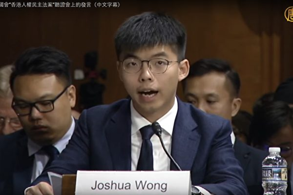

图为2019年9月17日当地时间，香港众志秘书长黄之锋在美国国会关于《香港人权与民主法案》听证会上发言。（ 新唐人视频截图）

【大纪元2019年12月29日讯】英国《金融时报》日前公布了2010年以来过去10年影响全球的50位重要人物名单，其中香港众志秘书长黄之锋以“香港政治活动人士”的身份入选，成为唯一上榜的香港人。

美国之音报导，这个由《金融时报》记者组成的评选小组最终确定的这50位全球重要人物名单是过去10年里在政治、经济、商业、技术、文化、媒体、科学和体育等方面在全球做出重大改变的人物。

黄之锋星期六（12月28日）在其脸书上回应说，获选固然自觉高攀不起，但他更深知，如果没有过去半年的时代革命，手足前仆后继地付出血汗等沉重代价，不可能有任何一位香港人会在2019年的平安夜，被国际传媒选为全球领袖。

黄之锋说，五年前他还是学生领袖。现在重获类似名衔，他一定会提醒自己，当下既无大台，他也不是领袖，必须“烧光环”，也就是把国际社会对他的赞赏，转化为实质推动国际游说的政治筹码与能量。正如过去3年推动《香港人权与民主法案》那样，为光复香港在国际战线克尽己任。

黄之锋五年前因雨伞运动曾登上美国《时代》杂志亚洲版封面。杂志内文以“一个世代的呼声”为题，称黄之锋和一批香港学生发起争取民主的运动已经在香港形成一场“少年地震”，给香港带来震撼。

之后，从2015年到2017年，黄之锋每年都到华盛顿游说，曾经多次在美国国会就香港民主自由现状作证。

今年9月他与何韵诗等在国会作证，呼吁通过《香港人权与民主法案》。黄之锋在该法案获得通过后表示，期望在未来5年继续游说其它国家争取出现骨牌效应，对侵犯香港人权者设立类似制裁机制。

入选《金融时报》全球50大重要人物的还有美国总统川普、法国总统马克龙、德国总理默克尔，以及脸书创办人扎克伯格等国际政界或商界领袖；曾经遭到塔利班枪击，后来致力于妇女权益的诺贝尔和平奖得主马拉拉，亚马逊创始人贝佐斯，以及美国网球女将威廉姆斯（Serena Williams）等。#

<a target="_blank" href=#top><h6 align="right">回上方</h6></a>

<a name=225>
<h1 align="center"><b>港警“误伤”自己人  民众喜称：报应</b></h1>

香港沙田城市广场现场一名指挥官被手下胡椒喷剂射中，网友称这是圣诞节最好的礼物。（大纪元合成视频截图）

【大纪元2019年12月29日讯】（大纪元记者骆亚报导）圣诞节日期间，香港防暴警察每天都在商场用警棍和胡椒喷剂驱散聚集购物的抗争者，期间，港警前线指挥官中胡椒喷剂，便衣警察一度遭警察控制。有网友称指挥官中招是最好的圣诞礼物，也有人说报应来了。

12月25日圣诞节，湾仔、铜锣湾、尖沙咀、旺角、沙田、中环等多区发起“圣诞变装游行”快闪行动，沙田新城市广场下午3点，抗议者在商场内游行高喊“光复香港 时代革命”等口号，商场内大批便衣警察突然出现，控制了数人，引起抗战者的不满怒斥，防暴警察冲进商场驱散人群。

2019年12月26日，香港网民发起“和你SHOP蒙面日”，到大埔超级城等大型商场聚集。（宋碧龙／大纪元）

 
 下午6点，抗争者再度聚集，随后进入一家连锁超市，防暴警察再度冲进商场用警棍暴打抗争者，使用胡椒喷剂，同便衣警察一起当场逮捕十多人。

过程中，署理新界南总区指挥官陶辉被自己手下人喷中胡椒喷剂，满脸通红，脸呈痛苦状睁不开眼睛，他的手下帮他洗眼睛，边上也有便衣警察为他遮挡。新城市广场因警民冲突也提早7点半宣布关门。

 

2019年12月26日，香港网民发起“和你SHOP蒙面日”，到大埔超级城等大型商场聚集。（宋碧龙／大纪元）

 

2019年12月26日，香港网民发起“和你SHOP蒙面日”，到大埔超级城等大型商场聚集，防暴警察逮捕抗争者，抗争者已被双手被拷靠墙，黑警还暗地里小动作打人。（宋碧龙／大纪元）

 
 26日，港人继续发起“和你SHOP蒙面日”活动，多个商场内都有抗争者聚集。其中大埔超级城商场有抗争者呼喊口号，很快防暴警察到场，其中有便衣警察被警察快速控制住，但很快松手让他离开了。

一名蒙面乔装成示威者的便衣警察想配合防暴警察，控制了另一名蒙面的抗争者，却被防暴警察用警棍动粗将其推到墙边，便衣冲对方喊了一句粗口称自己人后被立即释放。

陶辉被自己手下胡椒喷剂射中脸部后，在社交媒体上有网友兴奋表示，“陶Sir圣诞快乐啊！呢份礼物你喜欢吗？”

网友Shirler回应，这是香港人最好的圣诞礼物。

网友Maggie回应，这个圣诞最令人开心的事情！

网友Jen认为这是从6月这场运动开始至今，“喷得最正最大快人心的一下！”

网友Jeremiah学警民关系主任的口吻说：“正面的看，都是庆祝的方式。”

网友Grace表示，报应逐渐来紧，希望他下次中枪！

就便衣警察一句“自己人”在现场被防暴警察立即释放，也引起民间很多议论，有民众向大纪元表示，警察抓自己人只有两种可能性，一是说明便衣警察在做违法事，被抓了；二是说明警察滥捕（如果警方说便衣没有做违法事）。

香港的这场从6月至今的抗争运动，警方的滥捕滥暴到了令人震惊的地步。光圣诞之夜和圣诞日两天，警方抓捕抗争者超过200人。28日香港的医管局也发消息说，27日冲突共22人送院，仍有6人留医院治疗。

很多香港原本对警察有好印象的民众也彻底改变了看法，香港的集会游行中喊的比较集中口号就有“解散警队 刻不容缓”。

民众对警方、政府的信任度也降至历史最低。

<a target="_blank" href=#top><h6 align="right">回上方</h6></a>

<a name=224>
<h1 align="center"><b>黑龙江厅官大肆敛财 八年送女儿两千万现金</b></h1>

黑龙江省人防办原主任武伟今年2月落马。（大纪元合成）

【大纪元2019年12月28日讯】近期，被视为冷门岗位的中共人防办系统腐败问题频发。日前黑龙江省人防办原党组书记、主任武伟敛财的部分细节被披露。

<b>利用审批权敛财</b>

《中国纪检监察报》12月26日刊发的文章称，中共十八大后的某年，黑龙江省人防办一名处长曾陪时任省人防办主任武伟到北京出差。处长见领导拎的大包很沉，就想去帮忙，却被武伟坚决拒绝了。面对下属的疑惑，武伟解释称，里面是书。

其实，包里面不是书，而是几十万元现金。2011年至2018年间，武伟利用各种机会前往北京给女儿送现金，每次几十万元（人民币，下同）。这8年间，武伟共送去现金近2,000万元。而这还只是武伟收的一部分钱。

文章称，武伟的以下场景是常态。

某天，黑龙江省人防办下属单位的一名处级官员来找武伟，他从腋下抽出用报纸包裹着的10万元往办公桌上一放：“主任，这是吴文俊让我给你带过来的。”武伟头也不抬说：“知道了。”

来人受佳木斯市人防办原副主任吴文俊的请托，为其在鸡西的一个项目向武伟寻求“关照”。

经省人防办审批的人防工程中，从设计、招标、建设到监理、验收等环节，武伟都涉足“揩油”。

如，省人防办审批的17项人防工程设计项目里有16项是省人防办某下属单位包揽的，该单位给省人防办领导班子发奖金，其中武伟前后收了130多万元；省人防办的办公楼项目，武伟指定承建商，虚假招标串标，武伟单笔收了360万元等。

另外，人防系统内一些党员干部作为“中间人”在开发商与武伟之间穿针引线。通过哈尔滨市人防办原主任肖文东，黑龙江某房地产商给武伟送去了5万美元，当年武伟即为其审批通过了4个工程项目。

据报，武伟对人防系统的“生财之道”熟稔于心，“大笔一挥”就可以决定上亿元的项目。经武伟之手违规审批人防地下商业街项目40多个，收钱1,100多万元。

<b>滥用职权导致经济损失上亿元</b>

现年63岁的武伟在黑龙江省人防办工作超40年，2005年6月起成为省人防办“一把手” ，在该职位上的时间近11年。今年2月，武伟在省人防办正厅级任上落马。

8月的“双开”通报称，武伟大搞权钱交易，利用职权和职务影响为他人在转业安置、项目审批等方面提供帮助并收受巨额财物；罔顾国防安全利益，滥用职权，造成国家巨额经济损失；其财产和支出明显超过合法收入，差额特别巨大，不能说明来源。

武伟还被指，与他人长期保持不正当性关系；违法办理并持有、使用虚假身份证照等。

文章也披露了武伟滥用职权的细节。2012年，武伟受哈尔滨某房地产开发商请托，违规审批将产权应归国家所有的8.34万平方米地下人防工程变更为可办理产权的地下商业街。开发商因此获取暴利，武伟也收下一套价值150多万元的房产，却给国家造成经济损失1.76亿元。

武伟落马后3个多月里，其10名前下属也先后被查，包括哈尔滨市人防办前主任肖文东、哈尔滨市人防办副主任宋泽刚、佳木斯市人防办前副主任吴文俊、七台河市人防办前主任周幼华、大庆市人防办副主任于宝峰、鹤岗市人防办前主任荣光等。

其中，厅官肖文东曾任哈尔滨市公安局副局长8年多，因迫害当地法轮功学员被海外明慧网列入“恶人榜”。#

<a target="_blank" href=#top><h6 align="right">回上方</h6></a>

<a name=223>
<h1 align="center"><b>决战2020 章天亮：为中共垮台做哪些准备？</b></h1>

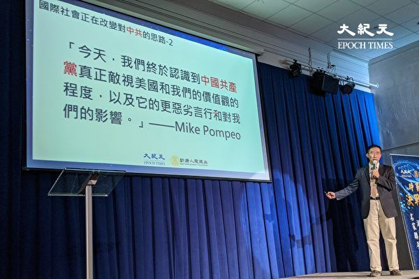

美国飞天大学人文与科学副教授章天亮主讲“我们应该为中共垮台做哪些准备？”。（黄小堂／大纪元）

【大纪元2019年12月26日讯】（大纪元记者黄小堂美国纽约报导）大纪元新唐人媒体集团12月21日举办“决战2020 时事论坛”，美国飞天大学人文与科学副教授章天亮以“我们应该为中共垮台做哪些准备？”为题分享对国际时事的观察。他表示，中国的经济在三个问题上已经进入死胡同，分别是美中贸易战、香港问题和民企国有化。

章天亮表示，一旦中共真的跟美国签订贸易协议，就必须按照国际规则执行，而中共就必须把中国变为真正拥有民主和自由，及完善法制的社会，例如保护知识产权、独立媒体及真相信息等，但中共无法做到，若这样照做，中共就完蛋了；但是不签订贸易协议，美国则再施加关税，中国经济垮掉，也同样危及中共自身政权。这样看来，中共不管是否答应美国的协议都是相同结局——中共岌岌可危。

2019年港府和北京企图将不受法律约束的《逃犯条例》强加于香港，导致今年6月开始有百万港人上街头抗议。这些自发争取应有基本权益的民众让中共害怕，派出武警黑警镇压和抓捕。为何中共要这样做？章天亮说，如果不镇压，意味着人民抗争有效，如果港人坚持，中共将无法控制国内社会，让它自身无路可走。

香港是中共在国际上的资金出入口，中共推《逃犯条例》搞乱香港，也危及自身在国际上的资金管道。章天亮指出，“根据商务部报导，中国70%的美元资金都经由香港，等于香港是中国的国际资金入口。一旦香港的美元资金来源断裂，中国的经济会垮得非常快。”

目前中国国内的资金紧张，中共为了所谓的维稳和收买百姓来维系统治政权，执行民企国有化，抢劫民营企业的资金。中共目前是靠抢夺民脂民膏和印钞票维持政权。

<b>目前中国政治体制不得民心</b>

“不得民心的体制没有前途”，章天亮指出，中共一直通过经济发展为自己的执政合法性辩护。当绝大多数人都反对这个体制的时候，这个体制就难以维系了。其实，国际社会已经改变对中共的思路，日前美国国务卿蓬佩奥（Mike Pompeo）表示，“中国人民与中国共产党不同。中国人民希望生活在自由的社会，也不支持共产党。他们正在抵制中共。”

章天亮在演讲中举例，中共“自干五”花千芳日前在网络上抱怨，当地的抚顺市政府对其母的40年养老基金不认账，这表示中共营造对老百姓的支持全是假。换句话说，只要没有了利益，“自干五”也是要反水的。

<b>推动国内信息自由</b>

国际社会和中国民众应该为中共垮台做哪些准备？从心理准备上来说，“我们要清楚，中共政权必须结束，而且越早越好。”章天亮说，《九评共产党》让中国民众了解中共的邪恶，当变革时机到来时，“赶快站到中共的对立面上去”。因为中共这个政权体制，是一个人人沾血的逆向淘汰的体制。中共体制内的人，就要做好立功赎罪的准备。

章天亮表示，目前对中国民众最大的支持，就是推动信息的自由流动，推倒中共的信息柏林墙。这样才能让中国民众发出自己的声音，了解中共的罪恶。各种有利于中国和平转型和平稳过渡的方案才能获得社会共识。这件事值得各国政府重视，帮助他们消除中共大到不能倒的疑虑。

章天亮还建议，中国民众可和各国政府取得联系，让他们搜集所有中共贪官搜刮的民财并存放海外的证据。“这些钱可以用来重建中国，用来稳住中国的经济。”◇#

<a target="_blank" href=#top><h6 align="right">回上方</h6></a>

<a name=222>
<h1 align="center"><b>传习近平不满北京官方 中南海收回规划权</b></h1>

经过多年的拖延，北京市级行政中心今年1月11日正式迁入位于东面通州区的北京市副中心。图为示意图。（AFP）

【大纪元2019年12月28日讯】在中共官方最近一次涉及北京规划的会议上，中共办公厅主任丁薛祥首次以首规委主任的身份公开露面，再三强调北京规划权直属中南海。有港媒解读认为，此举暗示中南海对北京官方感到不满。

陆媒报导，中共首都规划建设委员会（首规委）12月25日在北京举行第38次全体会议，会议上传达了习近平对于北京市规划以及自然资源问题整改的讲话，并通过“首都规划请示报告制度”，还明确了北京规划权直属中南海。

此次会议，习近平的“大秘”、中央办公厅主任丁薛祥首次以首规委主任主持会议，中共北京市委书记蔡奇出席会议。官媒通稿还提到，中南海党政两大办公厅印发了首规委人员调整名单。

首都规划建设委员会的主要工作是负责北京市城乡规划管理，属于北京市政府的组成机构，而首规委主任一职通常都是由北京市委书记兼任。首规委2017年9月公布的新成员名单显示，首规委主任当时已由北京市委书记蔡奇兼任，副主任则由住建部部长及北京市委副书记等人兼任。

据港媒《香港01》解读，在过去近20年来，有关首都规划原系北京市职责，但此次无论是丁薛祥出任首规委主任，还是定调请示制度及规划权属中南海，这或暗示中共对北京在涉及首都规划领域存在的问题感到不满。

资料显示，中南海于2000年批准组建北京市规划委员会，挂首都规划建设委员会办公室牌子，主要负责北京市城乡规划管理工作，是北京市政府组成机构。

北京面临人口、交通、水资源、污染多重危机。“首都城市副中心”概念首次是在2012年提出。2014年2月，习近平视察北京时提出疏解非首都功能、京津冀协同发展，但一直进展缓慢。

此前有媒体报导，中南海决定将北京市部门搬迁到通州遭到北京市高官抵抗。

2015年6月初，曾有海外媒体报导称，中共北京市委书记郭金龙和市长王安顺，因为抵抗北京政府搬到通州，以至习近平放狠话“你们不搬，我们搬”。

经过多年的拖延，北京市级行政中心今年1月11日正式迁入位于东面通州区的北京市副中心。

据报导，目前市级机关已有35个部门、165个单位进驻，包括四大班子下属的相关部门约1.2万人已经正式迁入城市副中心办公。

<a target="_blank" href=#top><h6 align="right">回上方</h6></a>

<a name=221>
<h1 align="center"><b>【独家】大陆医生亲历不寻常器官移植手术（上）</b></h1>

图为示意图。 （大纪元资料室）

【大纪元2019年12月28日讯】（大纪元记者肖静、姚久仁采访报导）“刚将前期准备做好，肝源就来了。一切好像就是安排得井然有序。”2011年的一个深夜，浙江大学附属医院的钟医生（化名）参加了一台肝移植手术，当晚以及“翻墙”后的所见所闻，令当时还是实习医生的他从此远离器官移植。

这台深夜进行的肝移植手术的地点是在浙大附一院（浙江大学医学院附属第一医院），该院是中国最大的器官移植中心之一。

“因为这个本身对良心、对内心也是冲击蛮大的。”2019年12月19日，钟医生告诉大纪元记者说，他选择后来工作的医院“也是觉得这一块可能这种事情（活摘器官）稍微少一点”。

因为涉及的话题严肃，钟医生向记者提供了他的学士毕业证、学位证、硕士毕业证、学位证、职业证书、医师执照的原件。

<b>手术内部更衣室出现公安衣服</b>

钟医生是浙江大学医学院临床医学硕士，在读书期间有大量的实习，要在浙江各个医院轮转。他说：“杭州一带的医院，我基本上都是去过的，对一些主要科室的情况我是比较了解。看到的东西、听到的东西都比较多。”

钟医生谈到2011年那个令他刻骨铭心的一晚。

他说：“我是在实习期间以第二助手的身份，参加过肝移植手术的。因为我们浙江大学有一个附属第一医院，这个医院在肝胆移植方面是一个权威，华东地区肝胆移植方面，它是最多的。”

那天是晚上11、12点，已经熄灯了，主刀医生恰好缺人，就打电话要人，“问我要不要去，我当时因为抱着学习的心态嘛，有这种机会我肯定就去了”。

钟医生至今还清晰记得当晚看到的一些不寻常的情况。

他说，在手术室的更衣室，“晚上一般衣服非常少，但是我看到有公安的衣服，就很奇怪，这个更衣室都是内部的，怎么会有公安的衣服呢？”

钟医生换好衣服，就去主刀的手术台，“它（手术台）是一个一个房间分开的，我只能进去指定的房间，就是去接受移植的这个房间，后来那个肝源是从另一个地方拿过来的。”

“在经过旁边的一个地方，我看到有几个人穿的衣服显然跟我们不一样。”他说，手术室的衣服分两类，一类是医生穿的，一类就是外来人员穿的，“我看到两个人是穿着那套（外来人员）防护服。身材都很高大。”

<b>不寻常的移植手术安排</b>

“后来我们的手术开始，这一台已经开始了，就是前期准备做好了，那个就来了，就是肝源就来了。一切好像安排得井然有序。”他披露，那个供源的手术可能就在旁边的房间，“我怀疑是在隔壁的一个手术间。就是我过去的时候，我看到隔壁（房间）有几个穿外来衣服的人。”

当晚接受移植手术的是个肝硬化患者。当天的手术做了很久，从晚上11、12点做到第二天早上7、8点。

移植手术示意图。（大纪元资料室）

 
 “我事后听说，还有一个角膜（移植手术），就是说眼科在另一个台子也开了一个。当天晚上，相当于有需要的，它都……角膜本身配型方面需求比较小，就说基本上有这种源的话，它一般都会去，是这样子的。”

他披露，通常做眼角膜移植和肝移植“应该不在一起的，但当晚这几台手术是同时进行的，这样的安排是很不寻常”。

“他等于相当于工厂一样，都在这一个里面进行。那就说这个供体有什么东西（器官），他都可以去用他的不同（器官）……”钟医生说。

<b>“（供体）肯定是政治犯”</b>

钟医生虽没有亲眼看见取器官，不过他根据所看到的情况推测道，“肯定是政治犯，肯定是的，否则的话，没有必要警方要过来。如果是自愿捐献的话，那没有必要。”

“我怎么会事后想到（活摘器官移植）呢？”他说，是因为他后来轮转到肝胆移植区另外一个组实习时，听主任郑树森说了一个情况 ，与记忆中的片段联系起来了。

他说，“他（郑树森）在开大会的时候，说了一句‘现在（供体）就没有以前那么多了’，他在讲这个东西，他说哎呀我们当年可以怎么怎么样，现在就没有那么多了。”

钟医生听后心中咯噔一下，“那当年怎么就会那么多呢？我就心里‘哎呀’一下，觉得‘哎呀’好像上次（手术）看到的可能是这个事情（活摘器官移植）。”

钟医生口中的郑树森是浙江大学第一附属医院移植中心负责人，领头开展了所谓多器官联合移植。公开资料显示，截至2017年12月，郑树森团队已施行肝移植2,300余例。仅2005年1月28日，郑树森同日连续完成5例肝移植手术。

郑树森从2007年起，在医生身份之外，还有一个和医学无关的奇怪头衔——浙江省反邪教协会的副理事长，该组织专职迫害法轮功。

<b>什么原因造成手术量极大减少</b>

钟医生对活摘器官移植有一定的了解，“因为后来我翻墙了，是知道这个事（中共活摘法轮功学员器官）；在一些零碎的谈话当中，我是听到有这种事情。主要就是我亲眼看到的这个事。”

他还提到一个最实际的线索，“就是手术量”。

钟医生说，郑树森说器官数量不多的时间大概在2015、2016年，“那时我是研究生轮转（实习），就是第二轮轮转。那个时候移植量就已经下来了。”

“手术量极大减少了，这是可以确定的。”他说，“郑树森自己说的，现在这个肝源没这么多了。那肯定是因为有一个原因造成，怎么就没这么多了？当时怎么会一下子就这么多？”

虽然郑树森没有说原因，不过公开报导显示，正是在2015年，迫于国际强烈谴责压力下的中共宣布，2015年1月1日起公民自愿捐献器官成为移植供体的唯一来源。

官方登录之肝肾移植总数远大于官方公布死刑人数，意味中共多数器官来源不明，多源自活摘法轮功学员之器官。（大纪元制表）

 
 中共一直拒绝说明供体来源，不过钟医生说，“我听说刚开始，法轮功学员肯定是很大的一部分（器官移植供体）。因为政治犯的话，他一般都是零星的嘛，就是呈集中规模出来的，就没有别的（政治犯）了。”

中国器官移植市场飞速发展是从1999年到2007年，在2003年中国器官移植数量突然大幅度成倍增长，国际上掀起了到中国的器官移植旅游热潮。包括浙大附一院在内的中国一些医院的器官平均等待时间短到不可思议的1～2周（国外要等2～3年）。

2008年11月“联合国反酷刑委员会”发布的一份报告指出，“中国器官移植热的兴起与迫害法轮功几乎同步，这不能不引起人们的忧虑。”国际社会也强烈谴责中共的罪恶行为。

<b>良心的抉择</b>

虽然国际社会已经在施压中共，让其停止活摘器官，但对钟医生这样的医学院的学生来说，最看重的还是职业生涯。钟医生回忆说，“当时好像就是（器官移植）形势一片大好，选这个肯定能留院。我们有很多同学是去了。”

大二大三期间正值医学院学生选导师。因为当时移植手术需求的增加，做器官移植的医生的数量是大增的。他说：“当时郑主任手下的，就特别多。就相当于浙一主打的就是这个（肝胆移植），所以当时很推荐我们去。”

“正常的科室的主任，你去找他当研究生，他不一定能够保证你能够留得下来。但是他（肝胆移植）这里说，你来我就能把你留下来。只要选我们郑老板和他手下很多那些二级大医生，反正只要选他手下的那几个人，都可以保证你能留院。”

钟医生所在的是大外科，包括肝胆移植、普外科、骨科等。他没有选肝胆移植的导师，“不太想使自己处于某种良心抉择上面”。

“就是跟这些东西（器官移植）比较远了。”他说：“对一个本身就不知道的人，就还好。我由于种种原因，已经知道了（中共活摘法轮功学员器官），那就是很难再装作自己不知道。”

他介绍，很多医生一旦参加工作之后，就只限于自己这一块了，其它领域也就很少有机会了，“后来我就没有充分理由可以直接进入到他们一线去。包括我现在去手术室，我也是指定到我该去的那个地方。”
 
 

浙江大学医学部大楼。（维基百科）

 
<b> 他们口中的“死刑犯”</b>

钟医生介绍，不经麻醉进行器官摘取，必须是实际的实施者才知道情况，他没有参与过。

他说：“取的这个东西（器官）只有可能你找了他（移植医生）当导师之后，做了他的研究生，可能才会。”

不过，当时选移植方向的同学，是知道一些内情的，他说：“他们说是叫死刑犯。（上面）就跟他们说是死刑犯。”

遇到活摘器官移植手术时，“肯定得去，他们导师已经命令他要去了，那他就只能去。就尽量不去多问。他们会尽量避免去知道。”他介绍道。

钟医生说，“我们内部在讨论的时候，都不敢声张，就问，是不是法（轻声，很小声地说，呈现口型）‘轮子’？是这么说的。”

他说，当时的讨论就是跟几个兄弟、几个学长，自己装作好奇地问问，“我说是不是这个？（他们）说‘哎哎哎哎’（轻声小声，表示认同），就是不敢明说。”

<b>“很多铁的事实感觉没有办法辩驳”</b>

工作后，钟医生翻墙知道更多活摘器官的事，“是通过翻墙才慢慢知道有这么个事情。后来才把碎片的一些东西串联起来。因为一开始都是碎片化的，没有串联起来。串联起来其实就等于好像是完全正好经历过它这么一个变迁。”

他说：“得知这个的时候，当时冲击力是很大的。就是包括看到，很多铁的事实感觉没有办法辩驳。”

“就是为什么后来中国的那些移植的文章都不让发了。”在钟医生读研究生的时候，海外已经禁发中国移植医生的论文了。

连郑树森的文章也被国际权威学术期刊《Liver International》（《国际肝杂志》）撤下，原因是他无法提供论文中提及的563例肝脏移植的器官来源符合道德伦理的证明。

郑树森做的大批器官移植手术的时间与中共迫害法轮功的时间相吻合，所以郑树森一直被指控为涉嫌活摘法轮功学员器官的罪犯。（新纪元合成图）

 
 钟医生表示，以后他还可以再详细披露郑树森的一些情况。

他说：“这个可以通过学术方面的一些（例子），包括他论文是怎么发的？包括他的研究是怎么做的，包括他评上院士最重要的那个项目，他为什么能够定一个标准（杭州标准），等于说是一个肝移植的标准。就是说他为什么要定这么一个标准？这个标准和国际上既有的标准有什么区别？那么这个可以单独开一个。因为这个可能需要一些知识铺垫。”

<b>由肾内科包办的肾移植手术</b>

钟医生表示，他实习时去的是肝胆移植，而移植规模很大的还有肾移植，“正常情况下移植是属于外科的，但是由于肾内科的势力是比较强的，等于把移植这一块都抢走了，就是浙一的泌尿科不管移植了，肾内科全包走了。”

“说明一个什么道理呢？这个移植的量已经大到可以让一个科室，已经可以让一个内科去做外科的东西。只有当它达到一定量的时候，它才能够有这样的规模效应。”

肾内科医生收入也很可观。“当时如果是主治级别的，大概一年30几万。主治级别差不多是这个程度。这个是明面上的，明面上30多万，那么背后还有很多，我们就不知道了。”他说。

肾内科的医生怎么能做外科的手术呢？钟医生表示，“这个可能和高层的分配有关系。”“就是上面一句话说由他来做，那就由他来做。”

浙江大学附属第一医院网页显示，该院肾脏病中心肾移植病区有40张床位，是国内最大的肾移植中心之一。公开报导显示，截至2017年3月，浙大一院已完成肾脏移植5022例。（待续）#

<a target="_blank" href=#top><h6 align="right">回上方</h6></a>

<a name=220>
<h1 align="center"><b>中国年轻人债台高筑 为何中共最不乐见</b></h1>

中国年轻世代的个人信用恶化，可能是中共最不乐见的一件事。（TEH ENG KOON/AFP）

【大纪元2019年12月28日讯】（大纪元记者吴英编译报导）中国年轻世代的个人信用恶化，可能是中共最不乐见的一件事。

中国的债务问题日益严重，除了债台高筑的中企外，中国家庭负债增长亦创下新高纪录，原田之一是Z世代（即1990年代中期到2000年代初出生的年轻人）借贷飙升，如任其发展，会是中国的下一个信贷泡沫。

《洛杉矶时报》（Los Angeles Times）引述彭博行业研究（Bloomberg Intelligence）分析师马修·潘（Matthew Phan）的话报导说，中国今年第三季度家庭债务为其国内生产总值（GDP）的57%，是2010年的两倍多，当年这个比例仅为27%。惠誉国际评级（Fitch Ratings）在7月份表示，中国家庭负债的增长速度大约是其名目GDP增长速度的两倍。

导致中国家庭负债飙升的原因是抵押贷款以及信用卡和智能手机借贷应用程序的普及。根据中共央行中国人民银行11月份的数据，家庭债务占可支配收入的比例，从去年的93.4%跃升至今年的99.9%。

中国Z世代的负债速度超过父母，虽然年轻人的收入不多，而且几乎没有信用记录，但是并不影响他们的借债。

导致这个现象的原因是，中国年轻世代不乏借债管道，各种在线银行、金融科技初创企业，以及P2P网络借贷。有些贷方收取很高的利率。

虽然中国规定借款利率最高不得超过36%，但是某些借货利率，如果加上交易手续费，超过50%，高利贷使得部分中国借款人失去积蓄。

根据美国银行（Bank of America）的数据，中国的家庭债务水平处于中等地位，澳大利亚家庭债务占GDP的比重为126%、韩国为99%，美国则为75%。

然而，令人关注的是，近年来，美国的家庭债务占GDP的比重，从2010年的90%逐年下降，同期间，中国的这个比例呈现上升趋势。

惠誉国际评级指出，截至2018年底，中国未偿还的信用卡债务达1万亿美元，在过去几年中，年平均增长率超过30%。

随着中国家庭债务水平的持续上升，偿还债务的成本也随之提高，因此中国的消费者承担很大的风险。

不同于美国，中共未实施破产法，这意味着债权人可以追偿债务人所拥有的一切资产，这将给中国人民带来莫大的恐惧，进而阻碍中国境内的消费增长。

对中共来说，这是一个坏消息，因其寄托中国人在未来几年加码消费，以摆脱贸易战威胁及促进经济增长。#

<a target="_blank" href=#top><h6 align="right">回上方</h6></a>

<a name=219>
<h1 align="center"><b>日大型钢企“日本制铁”计划关闭大陆工厂</b></h1>

日本人口密度比中国大﹐资源贫乏。但是仍然发展出发达的经济﹐同时又不破坏环境。图为日本丰田公司汽车生产线。(法新社)

【大纪元2019年12月28日讯】（大纪元记者张玉洁综合报导）日本大型钢铁公司“日本制铁（Nippon Steel）”计划停止其子公司在中国浙江的特殊钢生产，并考虑关闭在浙江的工厂。

据12月26日消息，“日本制铁”全资子公司“日铁日新制钢”已经决定停止在“浙江日铁日新华新顿精密特殊钢”工厂（简称“浙江日铁日新”）的生产，计划今年年底前与浙江地方政府进行谈判，商讨关闭工厂的事宜。

据公开资讯显示，“浙江日铁日新”成立于2014年，“日铁日新制钢”投资55%份额，与伊藤忠丸红钢铁和美国钢铁厂商华新顿合资成立这家工厂，生产用于汽车驱动部件的高强度钢板。

“浙江日铁日新”生产的高强度钢板主要供给大陆日系汽车零部件厂商，但是，中国汽车市场销量持续下滑。从大陆日系车11月份的销售情况来看，日产汽车11月在华新车销量同比减少1.0%。

马自达今年前11个月的销量同比下滑19.3%，无法完成今年的销售目标。其中，一汽马自达前11个月的累计销量同比下降19.4%；长安马自达前11个月的累计销量为同比下降19.2%。

一汽丰田同比下降3.5%，同时，丰田汽车（中国）投资有限公司12月27日被江苏省市场监督管理局处罚8761.3万元人民币，原因是“触犯了大陆的反垄断法”。

“日本制铁”在决定停止在华生产的同时，本月中旬宣布与欧洲钢铁公司“安塞乐米塔尔集团”（ArcelorMittal）合资收购了印度的大型钢铁企业Essar Steel，收购总金额70亿美元，日本制铁投资40%。

在大陆的日本汽车制造商也有退出中国和停产的情况。比如，日本铃木汽车早在2018年就退出了中国。

丰田86在去年退出中国。一汽丰田普拉多3.5L将在2020年6月正式退出中国。

本田与大陆东风集团设计生产的小型旅行车Jade，将于2020年停产。

中国汽车工业协会数据显示，今年11月份大陆汽车销量同比下降3.6%，前11个月汽车销量同比下降9.1%。#

<a target="_blank" href=#top><h6 align="right">回上方</h6></a>

<a name=218>
<h1 align="center"><b>3万元鹤岗买房 学者：产业不振 人口外流</b></h1>

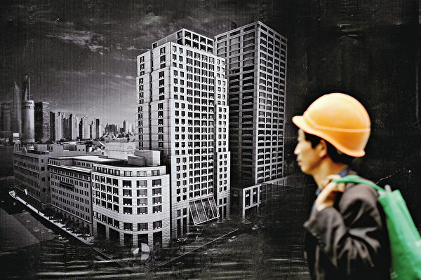

3万～5万元人民币就能在鹤岗买房安家。有学者认为，“产业不振和人口外流”的循环，使鹤岗楼市跌到“白菜价”。(AFP/Getty Images)

【大纪元2019年12月28日讯】（大纪元记者周心鉴综合报导）3万～5万元人民币就能在鹤岗买房安家，使这个黑龙江的小城市成为了“网红”。有学者认为， “产业不振和人口外流”的循环，使鹤岗楼市跌到“白菜价”。

“因为本人要去外地发展，所以低价出卖。”12月25日，在58同城上查询鹤岗的二手房，搜索颇受外地人欢迎的光宇小区，点进最新一条信息，就能看到这条卖房理由。

“这是典型的城市空心化导致楼市疲软。”易居研究院智库中心研究总监严跃进对《新京报》表示，东北很多城市的房地产市场基本上比较颓废，最主要原因是人口外流很明显，比如鹤岗、双鸭山、七台河等，过去是煤炭和工业相对发达的城市，但这几年因为煤炭行业整顿，城市产业发展也受到影响。随着人口外流，楼市交易不好，价格自然比较低。

<b>主要产业煤炭逐步枯竭</b>

鹤岗是因煤而发展起来的城市，随着煤炭资源枯竭，2011年，鹤岗市正式列入全国第三批资源枯竭型城市。在《全国资源型城市可持续发展规划（2013～2020年）》中，鹤岗被列为衰退型城市。

鹤岗曾是全国四大煤矿之一，产媒输出量也曾居全国第四。近年来，鹤岗主要产业煤炭逐步枯竭，一些煤矿工厂陆续关停。

2017年鹤岗统计公报显示，鹤岗最重要的工业产品为原煤和洗煤业，鹤岗市政府官网显示：2017年的原煤产量为1146万吨，同比下降9.3%，洗煤664.8万吨，同比下降7%。

数据显示，2017年，鹤岗城镇非私营单位就业人数为106,962人，其中仅采矿业就有35,229人。

鹤岗产业结构相对单一，过度依赖煤炭业。与此同时，鹤岗其它产业也没能发展起来。

截至2017年底，鹤岗市人均GDP为27658元；城镇居民人均可支配收入为21370元。

面临煤矿工厂倒闭、大环境经济下行的压力，外出打工的人增多，随着人口的不断流出、年轻购房人群的减少，影响房价走势。

<b>人口跌破百万大关</b>

鹤岗人口大规模外流，户籍人口连续16年负增长，成为收缩型城市。统计公报显示，2001年鹤岗全市人口111.25万人，到2015年为105.6万人，到2018年就跌穿百万大关，为99.5万人。

此外，还有鹤岗过高的城镇化率、人口老龄化等原因。

2017年鹤岗市国民经济和社会发展统计公报显示，2017年鹤岗人口城镇化率高达82.6%。

“城镇化率达到80%以上，反而成为鹤岗的劣势。”华南城市研究会副会长孙不熟对《21世纪经济报道》表示，“为什么很多小城市房价能涨，恰恰是因为这些小城市的城镇化率还比较低，仍然有大量的农村人口需要进城。鹤岗已经过早地透支了城镇化红利，现在到了一个边际效应递减的阶段。”

还有，鹤岗35岁以上非生育高峰期人口占总人口比重近七成，这导致鹤岗的人口自然增长率为负数。查询中国城市统计年鉴，2017年鹤岗全市出生5,041人，死亡15,253人，自然增长率为-10.11‰。

<b>鹤岗是中国收缩型城市的缩影</b>

经济发展疲软，人口持续外流，这是鹤岗正遭遇的困境。在中国，像鹤岗这样的城市还有许多。

值得注意的是，作为曾经的重工业基地，东北城市收缩现象尤为严重，如伊春、齐齐哈尔、佳木斯、鄂尔多斯等。中国中西部甚至东南沿海、广东和江浙一带也有部分收缩型城市。

首都经济贸易大学副教授吴康曾发布研究成果称，2007～2016年间，中国有84座城市出现了“收缩”，这些城市都经历了连续3年或者3年以上的常住人口减少，并且正经历以某种结构性危机为特征的经济转型。

对于上述现象，网民议论纷纷：“盲目城镇化、盲目开发恣意开发的必然结果！”“若干年以后，很多很多城市的见证。”

“ 这也许是中国未来一些城市的缩影，人口自然减少，房产吵着无限扩张，最终将是房多人少、人走楼空。”

“ 抢不到人口的城市注定会沦为一座座空城！”

“现在的人不愿意生，过多几年更加少人口，都是房价物价高引起的。”

“收缩性城市没有出路。”

<a target="_blank" href=#top><h6 align="right">回上方</h6></a>

<a name=217>
<h1 align="center"><b>纽约法轮功学员向李洪志师父恭贺新年（上）</b></h1>

纽约法轮功学员恭祝法轮功创始人2020新年快乐。（李桂秀／大纪元） 

 
【大纪元2019年12月26日讯】（大纪元李桂秀美国纽约采访报导）新年之际，纽约法轮功学员恭祝李洪志师尊2020年新年快乐！恭贺法轮大法洪传世界！他们以弘扬大法的社区活动照片制作贺卡，敬献他们的师父李洪志先生。

近几年，纽约法轮功学员每年都在华埠举办两场户外社区活动——“春天的庆典”与“秋天的庆典”，他们带着修炼后身心受益的美好，以歌声、乐音、舞蹈、军乐、腰鼓、舞龙、舞狮、功法展示、书法展示等丰富的演出走近社区民众，传递着“真、善、忍”普世价值与传统理念，深受民众热烈欢迎。
 
 

纽约法轮功学员恭祝法轮功创始人2020新年快乐。（李桂秀／大纪元）

 

纽约法轮功学员举办的华埠户外社区活动，天国乐团在现场的精彩表演。（李桂秀／大纪元）

 
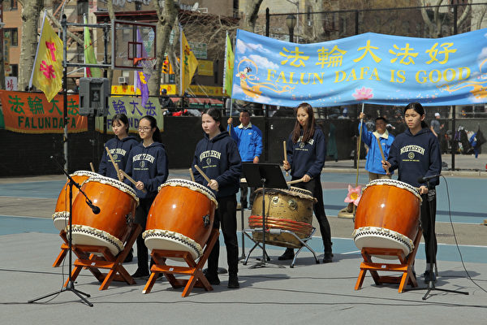

纽约法轮功学员举办的华埠户外社区活动，高中生法轮功学员在现场表演。（李桂秀／大纪元）

 

纽约法轮功学员举办的华埠户外社区活动，现场的舞狮表演深受民众欢迎。（李桂秀／大纪元）

 

纽约法轮功学员举办的华埠户外社区活动，现场的民众在观看腰鼓队的表演。（李桂秀／大纪元）

 
 下面是部分参加活动的法轮功学员向师父表达的新年问候与感恩。

纽约全体腰鼓队法轮功学员恭祝师父新年快乐！

他们介绍，腰鼓是有着千年历史的中国传统文化，有祈求神灵、祝愿丰收、欢度节日、镇邪灭乱、四季平安之说。法轮功腰鼓队的曲目有“法轮大法好”、“喜庆”、“天灭中共”、“三退进行曲”等。法鼓声声震天响：“法轮大法好，法轮大法是正法，佛光普照。”

一位观看演出的现场居民说：“4个小时的节目，这么多的演员、这么好的演出，难得法轮功的这份心意，得谢谢人家法轮功！”

 

纽约腰鼓队每年参加多个城市的游行表演，受到西方民众的欢迎。（李桂秀／大纪元）

 
 纽约腰鼓队时常被政府、各机构组织的主办方邀请，频频参加多个城市的游行表演，如：圣派翠克节、独立日、圣诞点灯等西方传统节日。踏着整齐的步伐，敲着振奋人心的鼓声，沿途的民众眼神中充满了对东方文化的敬意。

“我们把中国的传统文化——腰鼓带到西方，每到一座城市，那里的民众就像见到亲人一样地欢迎我们，发自内心的喊出“Fa-Lun-Da-Fa”，那久久干涸的心田终于迎来了濛濛春雨。”

“看到众生对大法的认同与爱戴，我们也常常泪流，心中充满对师尊无尽的感恩。感谢师尊！感恩师尊洪传佛法，把法轮大法的美好洒向人世间！”

<b>大法带给我们三代人福泽</b>

活动现场，腰鼓队成员陈红霞，来自中国湖北武汉市，今年43岁，小时家中母亲和外婆都是虔诚的佛教徒，从小耳濡目染多多少少知道：人要信奉神灵才会有福报，做好人行善积德。

陈红霞说，1994年12月她的两个哥哥有幸参加李洪志先生在广州最后一期讲法班，“回家后告诉我，他们找到了真正的觉者。两个哥哥表示要一修到底。这样，大哥戒掉了赌瘾，改掉了暴躁的脾气，家庭也和睦了，身体以前有病的地方都好了。”

“二哥在工作岗位上尽职尽守，为人正直从不利用自己职位贪占他人钱财，母亲和姐姐看到哥哥们的变化也走上了修炼道路。父亲虽然没修炼，但看了大法书受益不抽烟了，且不用开刀肾结石自己出来了。”

那时，看到家人身体的转变与心灵的巨变，陈红霞也心动想修炼。

1995年元月她自己拿起《转法轮》时，“眼前一亮，觉得这本书简直就是个宝，很短的时间看完了第一遍，解开了我的心中很多疑惑。”

“师尊谈到的各种特异功能，我都有所体悟。同时明白了怎样做一个好人，人生的真正意义是什么？我每天都坚持学法炼功，按照大法的法理严格要求自己，做一个真修的弟子 。”

陈红霞的职业是从事幼教工作，在单位里她早来晚走，从不缺勤，认认真真地干好每件事，教育好学生，“同时我把我学到‘真、善、忍’的大法法理讲给孩子们听，他们都非常喜欢与接受。我的同事和园长听后也都认同。”

陈红霞（前者）在腰鼓队的游行表演中。（李桂秀／大纪元）

 
 陈红霞的先生是1997年得法的，以前没修炼时体弱多病，学过很多别的门派功法，最后还是验证了法轮大法好，不花一分钱把病全都炼没了，身体结实了，内心变得开朗善良。

“先生修炼后工作勤勤恳恳，兢兢业业，还是单位的技术骨干，年年评先进模范都有他。我的同事经常羡慕我们夫妻，说现在社会道德急剧下滑，有多少家庭能像你们俩这样的，早晚就看见你先生来接送你上下班，贵在他天天如此。”

陈红霞的两个女儿也都在修炼，大的18岁，小的8岁。大的很懂事，分担家务；小的聪明伶俐，善良乖巧。“我知道这一切都是大法师父赐予我们全家三代人的恩典。”

2017年2月陈红霞和先生及两个女儿一同来到美国纽约，有幸加入到纽约腰鼓队，在很短的训练时间里，参加了各种证实大法游行活动，如今她加入腰鼓队三年了。

2019年腰鼓队游行场次增多，几乎只要是周末就有。“观看游行的众生少则几百人，多则上千上万人。淳朴的民众看到腰鼓队，他们就知道法轮大法来了。明白真相后有的警察向我们行军礼，民众有的和我们留影合照，有的高喊：‘我爱法轮大法。’”

 “每当我们穿上金光闪闪的腰鼓服饰，要去游行弘法，感到自己无比的荣耀和殊胜。不管我们在下面流了多少汗水，游行路途长远，身体哪怕是承受到极限，想到那些迷途的众生，我们不能退缩。不管严寒酷暑，还是狂风大雨，依然阻挡不了我们坚定的步伐，因为那是我们来人间的使命。”

新年伊始，陈红霞一家人怀着无比感恩的心祝福师尊新年快乐！

<b>大法开启了我人生新的征程</b>

活动现场发放真相莲花的法轮功新学员钟灿，26岁，来自四川成都。

她的父亲是一名中学教师，她在1997年得法修炼。她还能记得小时候4、5岁时，坐在爸爸的自行车后面一起回爷爷奶奶的农村老家，一路上他们父女俩人背诵师父的《洪吟》，

“其乐融融，欢声笑语，这是我现在还能记得起最快​​乐的童年场景之一，也许就是那时一颗返本归真的种子，播种在了我儿时的心田。”

钟灿还记得爸爸工作的那个中学操场、篮球场竖排横排整整齐齐坐满了人在学炼法轮功第五套功法，可是在1999年，电视、报纸、广播抹黑法轮功之后，再无看见这样的场景。

“我父亲是真正受益于法轮功，身体变好脾气变好，我们一家三口的小家庭也很温馨和睦。”

“中共迫害法轮功后，我父亲从来没有收到过来自政府或公安部门的任何文件，警察或者便衣警察都是没有任何理由和解释地就把父亲带走实施迫害和秘密关押，前前后后总共带走6次。”

“爸爸不在身边，我失去了修炼的环境，如同鸟儿折断了翅膀。”

2019年，钟灿来美国，大法开启了她人生新的征程！“今年初我去法拉盛全球退党中心领取了退出党团队证书；学会了大法的五套功法；我忙于大法的各地游行期间发传单讲真相；参加了2019纽约法会，看见了慈悲伟大的师父……”

 

钟灿（后排右一）与纽约大学、哥伦比亚大学的大学生法轮功新学员在曼哈顿草坪炼功后合影。（李桂秀／大纪元）

 
 今年4月5日下午，天下着小雨，钟灿走到了一个街口。突然左边身后5米内的一辆银色和一辆红色小轿车相撞，另一辆车躲闪不及直奔钟灿驶来，当时那个霎那就是来取命的，“我当时心里就在喊‘法轮大法好！真善忍好！’随即那辆车朝我左方穿过，撞在电线杆上把电线杆撞倒在地。在我正前方有一个黑人看到这一切目瞪口呆。”

“我知道是师父的法身救了我，然后我情不自禁地哭了起来，想到师父在《转法轮》中有讲过类似的一个情形，我也知道因为我要开始修炼了，会遇到这些事情。”

过后钟灿通过邮箱写信把此事告诉了父亲，父亲回信说：

“人的一切不幸、苦难都是业力所致”，“爸爸及任何真修弟子都会遇到有惊无险的事，女儿已经成为真修的一名大法弟子，可喜可贺！你以后的美好光明殊胜会让你明白能成为一名师父的弟子是多么的幸运幸福！ ”

今年的“5·13”钟灿和父亲一起写给李洪志先生的贺卡已经发表在明慧网。

他们说，在二十七年前的5月13日这个神奇伟大的日子，师尊把“真、善、忍”法轮佛法洪传世间，唤醒救赎了无数世人，从此芸芸众生看到光明和希望并走向新生！无数病患者绝处逢生；支离破碎的家庭重回温暖幸福；浪子回头重拾人生中的自信；红尘中的女子找到人生的真谛！ 

在2020年新年来临之际，钟灿双手合十恭祝伟大的师尊新年快乐！“谢谢师尊的救度之恩！”#

（未完待续）

<a target="_blank" href=#top><h6 align="right">回上方</h6></a>

<a name=216>
<h1 align="center"><b>滥用“精神病” 大陆排查病患被指侵犯人权</b></h1>

在中国大陆，精神病人的诊治被指存在不专业、不道德、滥用标准等问题。（授权视频截图）

【大纪元2019年12月27日讯】（大纪元记者李新安采访报导）在中国大陆，“被精神病”成为中共惯用的“维稳”手段。专家指出，精神病的排查被滥用，往往成为政治迫害的工具，而由于精神卫生医疗条件和专业化的限制，很多真正的精神病人却很难被救治。

近日，“上海排查疑似精神病患者”的一条旧闻再度在网络上刷屏。上海市卫生局颁布的2012年版《精神病防治服务规范》（简称《规范》），对辖区内连续居住半年及以上居民进行疑似精神疾病患者调查。

根据《规范》，“无故不上学、不上班、不出家门、不和任何人接触”、“对人过分冷淡，寡言少语、动作慢、什么事情都不做，甚至整天躺在床上”、“过分话多（说个不停）、活动多、到处乱跑、乱管闲事”等11个问题都被作为衡量精神病患调查的线索。

（网路图片）

 
 该《规范》还规定，当知情人回答有人符合任何一条中任何一个症状时，调查员应进一步了解该人的姓名、住址、职业、工作单位有关情况，填写《重性精神疾病线索调查登记》，上报各区（县）疾病防控精神卫生分中心。

对此，网友表示，“排查的目的是什么呢，准备发补贴吗？”“失业的，宅男宅女们注意了？”“哈哈哈哈，中了四条。”“这么说我去了上海，就是精神病了。”“离‘被精神病’大国不远了！”

有律师网友建议，“1. 自首吧，群众运动，你躲不过的；2. 一旦被举报，千万别否认，越否认，是病得越重的典型症状。”

（微博截图）

 
 更有网友调侃，“昏倒了，现在在家照顾宝宝也要当心了，要对着宝宝多说话才行。”“过分话多，说个不停、活动多，到处乱跑，乱管闲事等——这分明说的是记者嘛！”

上海排查精神病患的情况此后没有再被陆媒跟踪报导。但有消息指出，根据《精神卫生法》，相关精神病的排查也在全国展开。

公开报导显示，2011年，京津沪深等城市均开展了大规模的精神病患社会排查。央广网2016年7月报导称，福建南平市各乡（镇）、街道综治部门每年都会定期组织派出所、民政办、卫生院等职能部门进行统一“拉网式”排查，“及时掌握有发病倾向的村（居）民精神动态”。

据报导，南平市建立了“110转诊”，发现有疑似精神病患者，可以打110。接到报警后，病患会被送到宁康医院（精神病医院）。

值得注意的是，在如此严密的监管体制下，社会上精神病人暴力行凶事件仍频发。让人质疑，中国的精神病院里究竟收治了谁？“被精神病”的恐惧挥之不去。去年9月，山西忻州市卫计委被曝将“失独家庭人员，重性精神疾病患者等重点监管对象”。

网易网站上，《中国精神病院收治了谁？》等相关文章和链接均已无法打开。（网页截图）

 
 中国民间机构民生观察网多次发布中国“被精神病”年度报告。报告指出，正常公民“被精神病”遭打压已成为中国当局惯常的维稳手段。
 
<b>中美对比</b>

美国费城著名华裔精神科医生杨景端博士在接受大纪元采访时表示，精神病的发现主要是靠病人的表现和表述，诊断起来比较主观，在中国这种情况下，每次政治运动中精神病通常是被滥用。而在美国诊断、收治精神病人都有严格的标准。

他举例说，诊断一个抑郁症，必须要符合条件，第一要有抑郁的情况，第二会对其他过去感兴趣的东西失去兴趣，还要有以下九条中的五条，必须要有食欲的变化，体重的变化，注意力不集中，睡觉问题，有罪恶感负罪感，有轻生的念头……这种症状持续2个星期以上，而不是一闪而过，造成了各种各样功能的紊乱，才能诊断为抑郁症。

针对上海排查精神病人的标准，杨景瑞认为，上海的排查的执行和标准很容易被滥用。中国出台这种标准，很让人怀疑有问题。

杨景端表示，“第一，这11条标准太宽了。第二，精神这个东西是很主观的，很容易被用来做为政治的工具。人很容易被冤枉。我说你懒散，这个懒散怎么评判？在美国不会做这样的事情，为什么呢？第一它违反了人的权利，在美国你不能举报精神病，只有他危害自己、有可能伤害别人的两种情况下才能报警。不能看人家懒懒散散的举报人家，看人家躺在床上举报人家。”

公开资料显示，早在2011年，中国精神障碍患者统计人数已经过亿，其中重症精神病人已超过1600万，而70%的人得不到医治。

杨景端认为，在中国，有很多真正有精神病的病人实际上不能就诊。第一因为病人自己不愿去就诊；第二不容易被诊断出来；第三中国的精神卫生医疗条件是比较差的，医生也少，职业道德都很差。

杨景端还强调，在中国“精神病”还存在着被滥用，比如，打着专业的旗号给人盖帽子，或者打着专业的旗号给人检控，明明这个人有罪，却说他是精神病没罪，不用负责任。

此外，中国的精神病院被当成监狱，病患可以长期被关押。而在美国，严重危害自己、危害别人的情况下才会住院。一般病人在医院待3天，3天之后上法庭，由精神卫生法庭的法官来鉴定病人是否可以回家。

杨景端说，一般来说最多10天、2个星期病人平稳了就可以出院，而且现在医学相信精神病人在医院里待久了并没有什么好处。

杨景端表示，没听说过精神病院用电椅治疗。非常严重的有电休克治疗，病人躺在床上，首先要全身麻醉。最近有一个新的疗法，透颅磁疗，专门治疗抑郁症的，副作用比较小，治疗效果好，是比较人性化的治疗。#

<a target="_blank" href=#top><h6 align="right">回上方</h6></a>

<a name=215>
<h1 align="center"><b>【拍案惊奇】国际曝光港警违规 台推反渗透法</b></h1>

国际专家批评港警“暴力”， 指70%不符合指引，即警察训练标准。（新唐人合成）

【大纪元2019年12月27日讯】大家好，欢迎收看《新闻拍案惊奇》，我是大宇。

圣诞节刚刚过去，香港的朋友们在这个节日季，并不开心。上期节目，我们讲了香港在平安夜发生的一系列事件。今天的节目，我们会从平安夜的后续事件讲起，然后谈到目前国际社会，对香港警察暴力的最新评价。

在开始之前，我们简单介绍一个今天的最新消息。这个跟香港没关系，是有关台湾。新消息指，台湾立法院将在12月31日审议《反渗透法》草案，拼三读。26日，立法院民进党党团26日开记者会，介绍《反渗透法》草案，概括出当中包含的一个条件和五种行为。

一个条件是指，《反渗透法》执行的前提是，任何台湾人接受了中方的“指示”“委托”或“资助”，然后进行的五种不当行为，分别是：捐赠政治献金、受指示助选、政策游说、妨碍集会游行、假信息干扰选举等等。

除了这“一个条件和五种行为”，他们还指出《反渗透法》“只罚行为，不因身份而处罚”。而行政院副院长陈其迈说，台湾最大安全威胁来自中国，也就是中共政权。这意味着，《反渗透法》主要针对“外部势力”的对象，将是中共政权。

而《反渗透法》的再次提出，正是由于中共间谍王立强，近日公开了北京方面在台湾的渗透行为。《反渗透法》会直接处罚外国代理人，而不是仅仅要求登记，做预防那样简单。

好，这则新闻先介绍到这里，今天我们以主要时间，继续关注香港。

<b>～～～新拍专题～～～

平安夜香港不平夜 两起坠楼案新消息</b>

就像我们上一期节目中介绍的，今年的香港，平安夜不平安。根据香港医管局的数据，平安夜到第二天圣诞节早上7点，一共有25人受伤。比较受瞩目的，是在旺角一间餐厅天台，还有元朗形点商场，分别有一人坠楼受伤。

其中，在旺角坠楼的男子，当时有香港媒体引述现场急救员和目击者的话，说是男子坠楼时有防暴警察在天台，并且男子还被警察的胡椒球弹打中。但是香港警方后来对以上说法均否定，说是这名男子是逃避追捕自行跳楼，而且跳楼时身边并没有任何人，事发前还喝过酒。

现在这名男子在医院救治后，证实手部和脚部受伤，状况稳定，年龄仅有16岁。有亲政府媒体报导说，事发后，有黑衣示威者在附近小店索要监控录像，想查清真相，但店家不给，期间双方发生口角。后来有防暴警察到场。另有影片显示，防暴警察似乎在一间小店索取监控录影，不知道这是不是同一家小店。

此外，旺角坠楼案，发生地点是一间餐厅的天台。这间餐厅的负责人接受《香港电台》采访时说，事发时是25日凌晨2点多，当时有街坊想进入餐厅躲避，防暴警察后来赶到，被餐厅一名男性职员堵住门不让进，最后没能成功，男职员被警察拘捕，而搜索过程中一部分餐厅设施受损，当时一名警察还警告餐厅说，他们支持某一个政治立场，餐厅执照可能会被吊销。餐厅负责人则否定警方有关他们政治立场的说法。

另一名在元朗商场坠楼的男子姓周，年纪19岁，仍在医院留医，有警员看守，因为他虽受伤，但已被警方以袭警嫌疑拘捕。这名男子的亲姐姐说，男子脊椎骨裂，翻身有困难，右手手腕骨折，左手也很难用力，她说自己的弟弟小时候得过抑郁症，暂时认为是警察突然拦截吓到他，造成意外，可能会以民事途径追究警方责任。

在平安夜，我们也报导了，有上百人在湾仔警察总部外和平行进，很多人没戴口罩，但全数被捕。警方后来证实拘捕105人，其中58男47女，警方说他们没有事先通知警方就聚集游行，并有破坏社会安宁的嫌疑。

<b>圣诞节警民冲突 警察对示威者记者“一视同仁”</b>

圣诞节，林郑在平安夜的简短祝福后，于当天再发声，说“自私的暴徒”节日期间漫无目的进行破坏，罔顾他人权利自由，声称还要全力遏止暴力。

而香港抗争者在圣诞节仍于许多地点举行抗议活动。其中，在铜锣湾时代广场、崇光百货等至少七家香港商场，都有抗争者聚集抗议，喊口号。

在铜锣湾崇光百货，约30名抗议人士聚集喊口号，在商场内游行，没有警察前来，最后这些人和平离开。

在尖沙咀海港城，一些蒙面便衣警察进入截查，一名男子撞到警察，警察说他是故意的，就把他逮捕了，同姓女子解释说他们只是路过，也没用。

在观塘APM商场，夜间几十人聚集喊口号，引来约80个防暴警察，带走至少4个人。期间，警察多次指骂记者是“黑记”，又说：你以为真有第四权吗？还有警察说，记者证不是总统卡，记者救不了人的，俨然把现场记者与抗争人士归类为一条船上的人。

在沙田新城市广场，一批防暴和便衣警察在内外观望，截查穿黑衣的人。抗议人群越来越多，下午5点半以后，更多防暴警察到现场增援，他们联手便衣警察，使用警棍和胡椒喷剂，逮捕多人。期间市民和警察多有口角推撞。而香港警局在新界南总区的英籍指挥官陶辉，被自己人的胡椒喷雾意外射中。

在九龙德福广场，警察在入夜后，先后三次冲击驱散抗争者，多人被捕。

在旺角朗豪坊，下午4点开始有抗争者聚集，喊口号、游行，他们遭到防暴警察到场截查。傍晚开始，警方于朗豪坊附近发射催泪弹，并没有事先警告，警察还警告记者群体离开，说他们也在参与非法集结。在朗豪坊区域的冲突中，也有多人被警察逮捕。另有记者被胡椒喷雾射中眼睛。

此外，在旺角亚皆老街和弥敦道十字路口区域，晚上10点以后，有超过200名防暴警察到场，向没有人喊口号的行人路上发射胡椒球弹，大约10人中弹，期间警察在周围区域的多个地点截查路人。其中砵兰街有上百名市民不许离开，被截查。而这个区域因为冲突激烈，对峙一直持续到后半夜，到26日凌晨1点的时候，还有年轻人被逮捕。

<b>香港警察不满媒体记者 竟直播身份证</b>

圣诞后的12月26日，香港多区继续抗议。不少抗争者参与“和你shop”的行动，聚集地点也主要是商场。例如旺角新世纪、尖沙咀海港城、铜锣湾崇光百货、屯门V city等。其中，大埔超级城的事件，比较受关注。

1点开始，就有抗争市民在这里聚集，有报导说，一些抗争者在个别不支持抗争的店铺“捣乱”，后有防暴警察入场，怀疑喷洒有刺激性的蓝色水，有人年轻抗争者被制服的时候，衣服被撕烂。

比较夸张的事件是，有警察截查记者。其中一名《立场新闻》的记者被截查的时候，警察拿到他的身份证，突然做出了一个令人意想不到的动作，就是拿起记者的身份证正面照，对着镜头开始直播，时长将近40秒。这家媒体的总编钟沛权表示，会就事件协助记者投诉。

对于连日来，香港警察针对记者的言辞和举动，香港记协对此作出批评，强调记者采访工作是履行“第四权”的天职，公示真相。而港府此前也对记协做出承诺，确认记者的权利应得到肯定，不应受到任何武力的不当对待。

<b>国际专家批评警察“暴力” 指70%不符指引</b>

英国人权机构“香港观察”平安夜后发表声明，批评香港警 方在圣诞前夕对“和平购物人士和示威者”，使用粗暴武力，对着人的头部发射橡胶子弹，并且无差别对大致和平的人群发射催泪弹和水炮，是违反国际指引。香港特区政府则强烈反驳这些说法，说是错误指控，批评抗争者有纵火、堵路等暴力行为在先，而警方是以“最低武力”回应。

不过，香港政府和警局，最近似乎有点应接不暇，因为外界的批评与曝光接踵而来。除了英国人权机构的谴责声。

美国主流媒体《华盛顿邮报》12月24日发表一篇文章，揭示香港警察镇压行动违反国际指引。文章作者Mahtani，根据自己得到的第一手资料，包括香港警察内部的上百页“指引”，也就是警察训练手册，联合相关的9名警察行业专家，对65项警察使用武力的案件进行调查，其中70%涉嫌违规，只有8%符合相关指引。

这些案件记录了今年6月以来，香港警察的执法情况，有大量抗争现场的视频资料。相关材料还得到大赦国际“数字核查团”的鉴定，是比较真实是可信的。这篇报导中举例说，例如一名印尼女记者，曾在湾仔天桥被警察橡胶子弹射中右眼，导致失明。一位南非律师说，当时警方没有合理理由开枪，这种做法可能是非法的；另外，8月11日，在港铁太古站，警察近距离用胡椒球弹射向人群，而当时人群聚集在滚动电梯，这种行为会增加不必要受伤的风险。

而香港警察的内部指引本身，反送中以后也被做过手脚。路透社早在今年9月就透露，警方为了镇压反送中，放宽了使用武力的标准。例如，删除了“警员应为自己行为负责”的这一条，这让警察可以根据现场情况，自行决定使用武力的等级。立法会议员陈淑庄说，这样似乎意味着，香港警察做什么，当局都会支持。

<b>监警会报告推出前 其副主席家人出事</b>

警察暴力在反送中运动爆发后，已经成为热搜词，香港人对这一点的关注度绝不低于追求真普选。五大诉求之一的成立“独立调查委员会”，主要调查方向就是香港的警察暴力。目前，香港林郑月娥政府，坚持用“监警会”来调查这一点，但是外界普遍批评，“监警会”是警局内部机构，采用的调查材料都是内部提供的，是自己人查自己人。而且前一阵儿，香港“监警会”的国际专家组集体请辞，理由就是权限不够、能掌握的资料不够。

但即便如此，“监警会”一直在进行自己的香港调查工作，其主席梁定邦近日表示，“监警会”的报告已经到最后阶段，计划今年12月底把报告提交给特首，然后最快明年1月底，公开“监警会”自己调查的，香港反送中期间警察暴力的“中期报告”，而且只是铺陈事实，不对警方做法进行判断。而截至目前，因反送中被处分的警察仍是0。

曾公开支持警察不必展示警察编号的“监警会”副主席，立法会议员张华峰，在26日爆出大新闻。他的最小的女儿，在当地时间的26日下午跳楼身亡，警方表示坠楼无可疑，死因要等待尸检报告确认。张华峰这名幼女年纪22岁，生前有躁郁症，进出住所都要有人陪同。

<b>～～～新拍互动～～～</b>

最近，不少观众朋友来信，其中很多是祝福圣诞快乐。在这里，我代表我们节目组，感谢所有观众朋友的热心支持。

也有不少观众留言谈论时事。一位叫Mitch的观众，对香港的示威活动提出了自己的观点，他说：

“大宇报导相当准确。但现在的问题是：示威还是不示威。如果示威者早已预告示威，暴警为免得罪上头，必须做点事，也会说你非法集结，即使节日人多聚集实属正常，某些针对性破坏亦只是个别情况，用不着动不动就一大班暴警走进街道丶商铺丶商场去驱赶，甚至无理击打和拘捕，挑起本已深厚的民愤。既然暴政继续完全莫视民意，除非示威具特别意思，否则不宜滥，造成不必要的冲突丶伤亡，国际也只会见示威者不智。现只有针对权力丶资源丶经贸削弱与抵制极权暴政，藉其经济弱之时将之打残消灭。”

当然我相信，香港抗争者的街头示威，目前还会继续坚持下去，因为我看过他们一些人谈论过，这样至少可以让国际社会知道，香港人还在坚持。至于以后演变成什么形式，我们都要继续观察。

针对周一节目，我们谈到了英国人发现一封圣诞卡里藏有求救信，是来自上海青浦监狱，信中揭露监狱奴工。一位观众Terry Tang留言说：

“监狱印刷圣诞卡这种事情是真的，我有一个朋友就是开印刷厂的，十几年前他告诉很多业务就是和监狱和少管所合作，这样成本会便宜很多，而且经常会有犯人在印刷品里夹纸条，上面写他们很苦，没有饭吃，十几年前是当笑话听，没想到十几年后还有这种事情。”

另外，我们最近节目经常提到香港的“黄色经济圈”，其中包括没有大陆货的“重光号”购物网，观众CHEN JOSE评论说：

“大宇，香港与大陆涉及的关系比较复杂，不是香港人说是组建无大陆货这么简单的，香港的水电都是大陆供给，还有蔬菜等绝大多数也是大陆供给，这能说是简单的割舍就能做到的吗？其实香港人，也不仅仅是香港人，应该做的是要让越来越多的大陆人了解事情的真相。大陆的普通老百姓还是善良的人多。”

这是这位观众的一个观点。

新唐人《新闻拍案惊奇》制作组

<a target="_blank" href=#top><h6 align="right">回上方</h6></a>

<a name=214>
<h1 align="center"><b>英预言家：2020年中国发生革命 川普连任</b></h1>

英国预言家汉密尔顿-帕克（Craig Hamilton-Parker）声称，美国总统川普将在2020年获得连任。图为双手迎向天空。（Fotolia）

【大纪元2019年12月25日讯】（大纪元记者陈俊村编译报导）曾经成功预言川普（特朗普）当选美国总统的英国预言家汉密尔顿-帕克（Craig Hamilton-Parker）表示，在即将来到的2020年，川普将会连任总统职务，而中国则会发生革命。

汉密尔顿-帕克每年都会预言来年的重大事件，并在YouTube网站和其个人网站上发表。有别于其他预言家，他会验证先前预言的准确性，甚至给自己评分。

举例来说，就2019年而言，他认为他对约翰逊（Boris Johnson）成为英国首相的预言完全正确，所以给自己评分为10/10。但他预言苏格兰外海会发生沉船事件并不正确，所以评分为0/10。

针对2020年，汉密尔顿-帕克做出6项重大事件的预言，其中包括中东爆发战争、川普连任、中国发生革命、欧洲出现经济危机，而另外两项与英国有关。

对于这些重大事件的预言，汉密尔顿-帕克说出了部分细节，以下仅列举其中一些重点供读者参考：

<b>中东爆发战争</b>

●沙特阿拉伯（或译沙乌地阿拉伯）与美国和欧洲达成巨额军火交易。

●沙特阿拉伯与伊朗之间爆发战争。

●美军航空母舰遭导弹攻击。

●俄罗斯总统普京与川普采行暂时的和平协议。

<b>川普连任</b>

●对川普的弹劾案以失败收场。

●前副总统拜登（Joe Biden）将因丑闻而名誉扫地。

●美国参议员沃伦（Elizabeth Warren）将成为民主党总统候选人。

●川普在总统大选中再度获胜，而且拿下原不被看好的州，例如：佛罗里达州。

●正当动乱横扫中国各地之际，美中贸易战将会升级。

<b>中国发生革命</b>

●香港反送中抗争进一步发展，中国大陆会出现新的动乱。

●在面对中共政府被推翻的情况下，习近平同意做出重大改变。

●就长期而言，基于孙中山教诲的真正民主将会出现。

<b>朝鲜</b>

●朝鲜领导人金正恩会下令将携带实弹弹头的导弹发射到海上。

●各国随后召开峰会。

●金正恩最终会被人民推翻（很久以前就预言了）。他会逃到中国。

<b>其它</b>

●约翰逊与川普的协议将开启英国经济荣景的新纪元。

●印度和巴基斯坦之间的问题增加。

●世界各地有很多地震发生。其中，日本和印度会发生大型地震，可能会令在东京举行的夏季奥运会中断。

●美国迈阿密遭飓风重创。

●美国航海家2号（Voyager 2）太空探测器发出神秘讯息，有人会将其解读为外星人的联系。

●中国致命烟雾导致一大群人窒息。

●尽管世界各地出现许多麻烦，但灵性与慈善的思考悄悄地发展。

<a target="_blank" href=#top><h6 align="right">回上方</h6></a>

<a name=213>
<h1 align="center"><b>摩托车横穿李克强车队 险酿意外</b></h1>

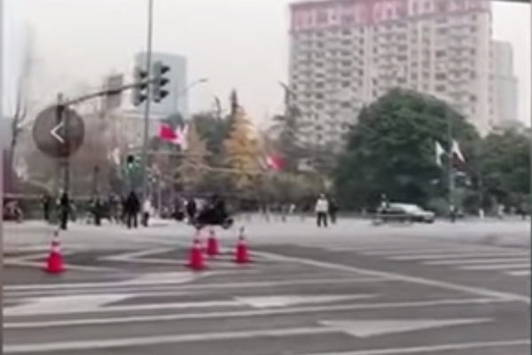

黑色摩托车冲撞车队现场。（截图）

【大纪元2019年12月26日讯】中日韩领导峰会12月24日在四川成都登场，但中间却发生一起意外，中日韩领导人车队在成都街头驶过时，一个摩托车直接从领导人车队中穿过，险酿意外。

12月25日，一段视频在大陆网络上热传，中日韩领导人车队在成都街头驶过时，一个车手驾驶摩托直接从车队中快速横穿而过。尽管当时街道两边都部署了警察，但因摩托车速度极快，因而未能当场逮到当事人。

据悉，中日韩领导人车队中被指有中共国务院总理李克强、日本首相安倍晋三，以及韩国总统文在寅。

最新消息指，当时冲撞车队的车手是一名在西南财经大学读书的摩洛哥留学生，已经被拘捕。

据称，直管此次安保的交警局长被撤职，警方被指将实施“严打”——全城禁摩。

巧合的是，李克强2016年4月24日到四川考察泸州地震灾区重建工作时，有消息称，李克强的专车险遭有预谋的两辆越野车的冲撞，所幸司机躲闪得方避过袭击，肇事越野车随即逃去，未能被追上。#

<a target="_blank" href=#top><h6 align="right">回上方</h6></a>

<a name=212>
<h1 align="center"><b>【拍案惊奇】不平夜全港乱战 传2人坠楼警在场</b></h1>

平安夜不平安，催泪、水炮、汽油弹、装甲车重现街头，香港乱战，旺角、元朗两起逃避警察追捕坠楼案，现场被拍到；湾仔上百人同时被捕。（新唐人合成）

【大纪元2019年12月25日讯】大家好，欢迎收看《新闻拍案惊奇》，我是大宇。今天是美东时间2019年12月24日，星期二。在美国，今天是平安夜，但是在亚太地区已经是25日圣诞节了。在这里祝大家圣诞快乐！

正如大家在新闻上看到的，本来是平安夜，和开心的圣诞节日，但香港街头并不平安。这场抗争运动已经快满7个月了，从当晚的情况来看，势必要延续到新年。那么今天的节目，我们还是以专题形式推出，来回顾这一夜在香港，都发生了什么。

<b>～～～新拍专题～～～

林郑月娥发简短圣诞祝福 平安夜香港不平安</b>

24日晚6点，香港特首林郑月娥，在自己的脸书上发表圣诞祝福，她看上去脸色不是很好，强打精神说，祝全港市民，有一个“平和 安稳 愉快”的圣诞节。除了维港夜景，她本人只闪现了不到10秒的时间。如此短促的祝福，似乎预示她本人对这句话，都没什么信心。

翻开香港人的抗争日志，平安夜这一天虽然也算得上是一个节日，但是港人在这一天安排了至少8项抗争活动。其中最主要的当属晚上7点到10点，在元朗Yoho、沙田新城市、尖沙咀海港城，以及铜锣湾时代广场等多个商城的聚集抗议活动。

另外，在尖沙嘴钟楼，晚10点开始还有倒计时迎圣诞的活动。而陪伴抗争者而来的，是警棍、催泪弹、水炮车和截查、追捕。

一开始，香港警方在脸书发消息说，平安夜减少了封路行动，特别是尖沙咀一带不会封路，对这不同以往的安排，警方的解释是：“封路比不封路更有问题，所以经过全盘风险评估决定不封路。”警方还提出警告，要有突发情况，警队就会进到现场。

入夜以后，“暴风雨”并不意外地来临。

<b>从铜锣湾走到湾仔 上百人被拘捕</b>

晚上7点，在铜锣湾时代广场，近百人聚集喊口号和唱歌，没有任何破坏活动。但随后这些人前去湾仔警察总部，可是在路上就被三辆警车跟上，快到警察总部的时候，大概在金钟正义道附近，根据立场新闻画面，他们被警察截停并搜查，随后全部人被拘捕。

这里有两个问题：一是，他们相当多的人都没有戴口罩，只是和平抗议，不知到警察抓他们的理由；二是，这些人难道没有预见危险吗？上百人同时被抓被登记。

当晚，在时代广场商城内，还有很多抗争者聚集喊口号，有人挥舞“光复香港 时代革命”的大旗。期间还有意大利籍的歌唱家现场演唱《勇气进行曲》，该曲创作者与《愿荣光归香港》为同一人。

<b>尖沙咀警民对峙酣战 警务处长到场</b>

在尖沙咀海港城商场，有便衣警察以警棍驱赶示威者。我们从美国之音的画面中可以看到，有警察用警棍暴打抗争者，场面非常混乱，随后还有全副武装的防暴警察进场，全程多名抗争者被捕。

当晚7点左右，香港警务处处长邓炳强还亲自到尖沙咀视察，看望防暴警察。他对媒体讲话的时候，将当晚警察出动、影响节日气氛，是暴徒造成的，称警察也不想假日执勤。警务处长的到来，预示这里的冲突不会小。

晚上9点开始，在尖沙咀弥敦道一带，晚上有抗争者在部分区域堵路、掘砖，其中有约百人捣毁了个别有亲共背景的店铺。港铁旺角站出入口也遭到纵火。有防暴警察赶去，一度发射催泪弹驱赶。

比如快10点的时候，在半岛酒店外，除了催泪弹，还有枪击（镇暴弹），有抗争者用雨伞阻挡。到了10点半，有警方装甲车和水炮车沿弥敦道向梳士巴利道方向行驶。约11点，水炮车在海防道发射水柱。

0点35分，在尖沙咀警署天台，警察从高处向下，朝弥敦道和柯士甸道交界，发射催泪弹驱赶人群，多辆过往车辆也受到催泪弹威胁。此前多次有人拍到香港警察从高处向下发射催泪弹，十分危险，在8月5日，甚至有人拍到，由催泪弹从金钟政总大楼的20层高处落下，当时的警方解释是拍摄角度问题。而从现在这一晚的画面看，警方发射催泪弹的地方，位置也是相当高。

<b>入夜旺角爆激烈冲突 发生可疑坠楼事故</b>

差不多也是11点钟开始，在旺角亚皆老街和弥敦道交界处，根据警方消息说，有多名黑衣人用油漆涂抹一间银行，并且捣碎玻璃和纵火，同时，还有人在弥敦道堵路并在路中心焚烧杂物。而且有画面显示，有勇武派抗争者使用所谓“火魔法”，向警车投掷燃烧弹，警车处在熊熊烈火之中。

被冲击的那间银行，是汇丰银行。前几天因为资助抗争者的非营利组织“星火同盟”，在汇丰的账户出严重问题，汇丰银行被一部分抗争者视为要“装修”的对象。而在该银行外墙，就被涂鸦了“毋忘星火”的字样。

因此，在旺角的亚皆老街和弥敦道交界这里，也引来大批防暴警察，过了午夜12点还在现场戒备，除了发射多轮催泪弹，还发射了胡椒球弹，现场至少三名记者身份的人，被防暴弹命中受伤，其中，一人击中大腿，一人击中头部。此外，一枚催泪弹疑似打穿了附近一个建筑的玻璃门。

到了凌晨2点半左右，在旺角长沙街与砵兰街交界，有一家桔梗餐厅，在餐厅所在建筑的天台顶部，有人坠楼。

在事件发生前，警察沿上海街包围扫荡，到桔梗餐厅后，有防暴警察进入截查客人，几分钟后，就有人从所在建筑的天台坠落到地面的一个凉亭旁边，据报现场失去知觉，被救护车送院。坠楼当时有数名防暴警察在场。

根据香港人在连登讨论区发出的已知事实，当时防暴警察进入餐厅后，一度出现在天台顶上，并用手电筒向下照射。餐厅的天台并不是建筑最高处，差不多两层楼位置，5米高。

而传媒“社会记录频道”的报导引述现场两名急救员的话描述说，坠楼者当时双手吊住高墙，后被防暴警察胡椒球弹打中。目前人已经被急救车拉走，受伤情况还需进一步跟进。

另外有香港网友传言，引述几名目击者，说是有防暴警推人落地，也有说地面警察一度组织施救，对急救员喊：没你们的事，我们会处理。但这两件消息还需要核实。

不管怎么说，这起事件虽然发生在半夜，但引起当地市民很大震动，已经成了当晚的焦点事件之一，很多人赶去现场了解情况，大批防暴警察戒备。

<b>元朗Yoho发生逃捕坠楼案 可与周梓乐案对比</b>

在元朗Yoho，中文叫“形点商场”。人们入夜后聚集示威，约8点，有黑衣示威者现身，一些人呼吁几间餐馆的顾客买单离开，随后大量防暴警察进入。在一个现场画面中，我们可以看到，其中一个冲突场面，一名抗争男子被警察扑倒，另一人跑掉，被警察追赶，没想到的是，为逃脱警察追赶，这名男子从所在楼层一跃而下，跳到下层，落距大概4到5米，摔成重伤，但当时还能清醒喊疼。

随后被送到屯门医院。根据后来的消息，有大约3名候任民主派区议员，还有男子家属，病房外跟进，受伤男子是右手骨折、脊椎末端部分骨折，脑内未见有积血，好在人比较清醒，可以正常讲话。不过，这名男子已处于警察的拘捕状态，因为警方说他涉嫌袭击警察。

这个案例我们能想到什么？11月4日凌晨，香港科技大学学生周梓乐，在将军澳的尚德停车场，从3楼坠落到2楼平台，造成重伤，11月8日早抢救无效离世。

在香港，有人认为周同学是意外坠楼，有人怀疑是躲避警察追捕意外失足，甚至有人质疑，是周同学被警察打伤后扔下去，但现在也没有答案。

可是从元朗Yoho的这件跳楼逃跑事件我们能知道一个细节：男子跃下高度是4—5米，而周梓乐从停车场二楼落到三楼，高度大约2—3米，比元朗这件事的下落高度还小，但是却屁股和头着地，同时周同学年轻有力，还是运动健将。

《苹果日报》曾采访香港中文大学医学院教授古明达，他表示，死者很大可能，坠地时不能保护自己，右边盆骨先落地才产生强大侧边撞击力，而一般有意识的人，从高处坠地时会自然反应，用手或蜷曲身体保护自己，很大机会手脚有骨折。

所以说，两件类似的坠楼案相比较，说明周同学的案子确有疑点。

<b>平安夜原定尖沙咀游行取消 原因令人吃惊</b>

除了以上提到的比较大的事件，平安夜当晚，还发生了许多其它个案。比如警方声称在观塘发现高易燃物品，有香港市民在网上留言，透露在当晚11点在旺角塘尾道发生亲政府人士用斧子、刀砍人的事件等等。这一晚，或许是香港开埠以来，最不平安的一个“平安夜”。

实际上，香港有人曾申请在平安夜，于尖沙咀举办“霜夜大游行”，而且获得了警方批准，但后来突然取消。为什么呢？有主办方人士在连登发文澄清，说申请游行，最主要的是希望抗争者游行后能平安回家。

之前，主办申请人已经按警方意见在12月20日修改过一次游行路线，但是在游行前的12月22日，警方突然通知主办方，不反对通知书已经发出，但要按照警方再次更改后的游行路线和时间进行。

发贴人在文章里展示了，警方给的游行路线的沿途照片。全都是狭窄的靠海人行陆，平均宽度大约只有3米，而主办方申请的人数是2万人，实际可能更多。在这样狭窄的靠海路上行走，一旦有突发事故，有人很容易会落海。因此主办方出于安全考虑，取消了当晚的游行。

这起事件也令人质疑，警方虽然说是批准了游行，但突然修改成这样容易产生危险的路线，是否真心希望游行举办，还是在玩弄把戏呢？

<b>平安夜后 抗争持续 民阵申办元月1日游行</b>

平安夜过后，香港人的抗争时间表还是满满的。

12月25日圣诞节当天，香港抗争者将在湾仔、铜锣湾、中环、旺角等至少6个地点，发起“变装游行”，下午1点集合。

同天下午4点到晚上12点，抗争者会在全港18区商场，进行抵制亲政府商家的活动。

此外，当天抗争者还呼吁家长们，为自己的小朋友们派发圣诞礼物，看上去是中年或银发族抗争者，与年轻抗争者的一场互动互助的活动。

更重要的是，民阵在24日正式宣布，在1月1日发起主题为“毋忘承诺 并肩同行”的大游行，路线从维园中央草坪开始，一直走到遮打道行人专用区，时间是下午2点开始。目前，民阵已经向警方递交申请。

这次游行的目的是，向政府表达“五大诉求 缺一不可”的唯一新年愿望。民阵并表示，即将进入新年，香港人还有很多事要做，例如社区战线、黄色经济圈等，并提醒市民，不要松懈街头的抗争行动，运动废止之时，就是政府“秋后算账”的行动开始之日。

新唐人《新闻拍案惊奇》制作组

<a target="_blank" href=#top><h6 align="right">回上方</h6></a>

<a name=211>
<h1 align="center"><b>为中共效力的红色特工 后来怎么样了（1）</b></h1>
<h3 align="center"><b>文／段玉成</b></h3>

示意图。（GREG BAKER/AFP via Getty Images)

【新唐人北京时间2019年12月20日讯】没有道德观念的政治立场，不仅会断送一个国家、民族的未来，也会断送一个人的前途。

<b>中共特科——苏联“契卡”的翻版</b>

中共的“红色特工”，始于1 9 2 7年11月在上海成立的中共中央军委“特务工作科”，“特务”一词，最早就是中共发明的，周恩来一直是最高负责人。

周恩来亲自主持特工的培训，陆续为特科设了四个科，即总务科、情报科、行动科和通讯科，无孔不入地在国民政府、军队、警察、宪兵及租界中建立起遍及上海的立体情报网。特科工作包括保卫中共领导人的安全、安排各种身份的人渗透国民政府窃取情报；通过贿赂租界当局或司法界等不法手段营救被捕人员；处决不被信任的特工、建立秘密电台等。

特科负责人顾顺章、陈赓等都在苏联“格别乌”，即“契卡”的后继部门，接受过特务培训。而苏联秘密机构“契卡”所扮演的恐怖角色，如今越来越被世人认识。

特科下的行动科建立了“红色恐怖队”，简称“红队”，当时即有远东“契卡”之名，负责暗杀、武装劫囚、劫狱、劫法场等。比如，对原特科科长顾顺章全家及不被信任特工的处死行动，就是周恩来亲自指挥“红队”，率康生等人秘密执行的，16名受害人全部被用绳索迅速套入颈部勒死，连惨叫一声都不能，这个令人毛骨悚然的血案，当时震惊了上海滩。

示意图。（MARK RALSTON/AFP via Getty Images)

<b>不能公开的16字方针</b>

中共特工，当年都是对中共充满幻想的，为盗取中华民国的军事情报，他们出生入死，抛家舍业，甚至婚姻大事都要听从上级安排，为中共立下了“汗马功劳”。

然而1 9 4 9年以后，对地下潜伏的特工，中共有一个没有留档、原件难以见诸于世的16字方针：“降级安排，控制使用，就地消化，逐步淘汰”。

红色特工们没有想到，“新中国”没有给他们带来曾经向他们许诺过的“自由、民主、富强”，自己为之献身的中共，窃政后却将他们弃如敝履，甚至置之死地而后快。

中共建政后一直担任国家总理的周恩来，就是特科的最高司令，特科成员康生，负责中共党内情报机关，即中共中央调查部，“文革”中直接参与“整人”，“文革”后，中调部与公安及其它相关部门合并，成为公开的国家安全部。所以，中共“特科”的基因，延续至今。

本文列举了上世纪30年代到90年代部分红色特工的结局。

<b>行刑者洪扬生</b>

洪扬生，1 9 2 4年加入中共。年轻时即跟着中共离家“干革命”，是特科一科负责人。1 9 3 0年前后，洪扬生几乎参加了特科的每一件暗杀行动，为保卫“革命领导人”，他出生入死。

洪扬生曾同一位女特工扮作假夫妻，居住在法租界的洋房里，作为特科的内部接头处，周恩来、陈赓、顾顺章等时常去那里秘密接头议事。1 9 2 9年，任弼时在上海被捕，洪扬生也曾用100元现洋买通公共租界探长、请律师进行辩护，最后使任弼时获释。1931年，洪扬生是顾顺章一家灭门案的行刑者，亲手处死了顾顺章的妻子。

中共建政二年后，洪扬生被抓捕，之后被安排在工厂劳动，1 9 5 8年洪扬生再次被抓捕关押起来，但一直不走法律程序判刑，直到洪扬生76岁时，中共才放了他。受其株连，洪扬生次子也被劳教二十年。洪扬生一直给周恩来、邓颖超等中共高层写信，还求助过潘汉年，但他们都不理睬他。

洪扬生自述：狱中十六年，戴帽五年，一共二十一年未得中共补偿。“文革”后，在上海中百公司后面一间破烂的亭子间，洪扬生度过余生，房间只有4、5平方米。

晚年洪扬生总算进了上海文史研究馆，没有公费医疗，每月可得到80元生活费。

<b>“中共第一红色特工”潘汉年</b>

潘汉年，1925年加入中共，曾任特科情报科负责人，长期负责中共秘密情报的统战工作长达二十多年，后在江南指挥中共特务工作，被称为“中共第一红色特工”。

潘汉年（公有领域）

1 9 4 1年苏日签订中立条约，毛泽东决定与日本情报机关合作，共同打击蒋介石。负责执行此任务的就是潘汉年。

由老部下袁殊介绍，潘汉年与驻上海副总领事、高级情报官员岩井英一密谈。岩井同意潘汉年为“岩井公馆”搜集情报，每半个月，潘给“岩井公馆”提供一次情报，岩井每月付2000港元给潘作为报酬，并出资由潘在香港创办杂志《二十世纪》。

潘汉年给岩井提供了蒋介石抗战的军力、与英美各国的关系等情报及英、美情报人员在香港和重庆的活动信息。通过潘汉年的工作，中共与日本人共同破坏了蒋介石的下属机构。

日本侵占香港时，大批中共、亲共分子面临危险，潘汉年求助于岩井，岩井便派人安排中共在港的特工安全撤离。潘汉年还以继续为岩井搜集情报为条件，要岩井为他提供在上海的安全保证，还许诺会帮助日本进行“和平运动”——投降日本的非武力运动。岩井很快给了潘发了特别证件，不许日本军、警、宪、特对持证人查询。

毛泽东1 9 2 5年加入国民党，任汪精卫的秘书时，汪对毛多有提拔，毛当时奉汪为“恩师”。1 9 3 9年，毛在延安亲自嘱咐潘汉年，到上海、南京后可与汪精卫取得联系，转达毛的口头致意。1942年9月，潘汉年被安排赴南京见汪精卫，会谈两次，转达毛对汪的致意。

1 9 4 9年后，潘汉年成为上海市委副书记、常务副市长。1955年，潘当年去见汪精卫之事被人揭发，潘汉年考虑良久，找陈毅讲述了原委，陈毅汇报给了毛泽东。毛泽东批示：此人不可信任，并下达了对其的逮捕命令。第二天，潘汉年即公安部部长秘密带走，后在功德林监狱关了五年。

联系日伪、交换战略情报、联日反蒋等重大决策，当年是潘汉年奉毛泽东之命做的，但勾结日伪是汉奸行为，潘汉年必须“闭嘴”、必须成为替罪羊。

1960年，潘汉年被转移到新建的秦城监狱。1 9 6 3年，潘汉年被判处有期徒刑15年、剥夺政治权利终身，宣判一个月后，潘汉年与妻子董慧被送到北京团河农场一个专门为他建造的独院里软禁。

“文革”开始后，潘汉年被再一次下狱，与妻子一起下放到湖南茶陵米江茶场（湖南省第三劳改场），直至1977年潘汉年因病离世。死后，中共不许潘汉年用他自己的姓名立碑。

<b>“兵工泰斗 统战功臣”刘鼎</b>

刘鼎，1924年加入中共，周恩来安排他到特科担任情报科副科长，长期从事情报和间谍工作。

刘鼎曾被安排策反国民党“中央驻沪特派员”杨登瀛。刘鼎夫人吴先清也是特工，负责收藏、传送情报。他们曾利用家乡特产黄岩蜜橘，在巷口以开水果店为掩护，夫妻俩一个在楼上工作，一个在店面“做生意”。

刘鼎（公有领域）

按照中共指示，从1 9 3 0年夏天开始，刘鼎利用日本人和国民党胡汉民改组派相勾结反对蒋介石的活动，搜集情报，通过特情关系发送给国民党，扩大他们的矛盾，离间他们。同时也利用改组派方面提供的情报，编写成传单散发。周恩来曾对这个办法加以赞扬。

刘鼎是中共军事工业的创始者及重要奠基人。他曾担任兵工厂政委，生产出红军第一门火炮及其炮弹，改进地雷设计和黑火药配方，创制电话机点火的电发地雷引信，建立了子弹厂和机器设备制造厂。

1936年3月，经宋庆龄引荐，刘鼎接受张学良的邀请赴西安，直接参与对张学良的策反，为周恩来与张学良会谈作准备。作为张学良的随从副官，刘鼎参加了周、张会谈，期间，刘鼎化名“择生”，在洛川先后给中共写过四封密信，及时上报张学良的思想动态。“西安事变”爆发后，中共第一时间拿到了刘鼎的汇报，这对掌握“西安事变”和国民党内部的情况有重要价值，毛泽东说：“西安事变，刘鼎同志是有功的。”

1950年朝鲜战争以后，刘鼎组织研制生产无座力炮、火箭筒、火箭弹以及反坦克手榴弹和反坦克地雷等新型武器弹药，送往朝鲜战场。

但这位 “兵工泰斗， 统战功臣”，被中共不成文地内定为“不得重用，不能担任正职”。

“文革”中，刘鼎成为“大叛徒”、“大特务”，被关押进监狱达七年之久，1975年被放出。

<b>五面间谍袁殊</b>

1 9 3 1年，20岁的袁殊加入中共。成为特工后，潘汉年曾告诉他：“你加入的是秘密前卫组织，普通的组织成员不知道你的身份。”

1 93 2年，袁殊通过表兄贾伯涛顺利打入国民党中统，成为中统吴醒亚的情报股股长，周旋于国民党上层和社会上层，获取情报提供给中共。

后来袁殊成为新声通讯社记者，利用记者身份出席南京政府的记者招待会，出入南京政府宣传部门，打入日本驻沪领事馆，成为共产国际远东情报局的秘密情报员。

1 9 3 7年，经中共同意，袁殊加入青洪帮，来往于杜月笙、黄金荣之间，经杜月笙引荐，他又打入戴笠的军统。在潘汉年同意下，袁殊后来成为戴笠军统局上海区国际情报组少将组长。

根据中共的组织安排，袁殊充当了“汉奸”，成功打入了日方情报机构。岩井英一称袁殊为“值得信赖的好朋友”，请袁殊帮助主持“岩井公馆”。奉潘汉年指令（潘汉年奉中共指令），袁殊向岩井提出成立“兴亚建国运动”本部，并以此为招牌，秘密组建新的情报据点。袁殊在岩井公馆弄到了大量情报，通过安插在公馆的特工转送到了延安。岩井公馆里，正副主任、人事财务、新闻出版编译、秘书等等均是中共特工。当时袁殊曾提供德、苏开战部署及日军二战期间的准确战略情报，延安将此转告给苏联，苏联据此下决心将东线40万兵力统统调到西线，后来苏联向中共表示了感谢。

袁殊建立了通往中共根据地的秘密交通路线，救援被俘的中共人士，他亲自救出许广平，掩护潘汉年、范长江、邹韬奋等进入根据地；也是因他及时提供的情报，使粟裕部队迅速跳出了日伪合围的“篱笆墙”。

袁殊还将岩井公馆的财产偷偷转到自己帐下，并卖掉一些房产，将这些钱换得三大皮箱的黄金，暗中转运到延安，他还组织人将日伪军军火库的枪支弹药偷偷装船送至苏北新四军的基地。

袁殊有五重复杂身份，一度同时为五个组织做情报工作，包括军统、中统、青洪帮、日伪、中共，但他最真实的身份是中共红色特工，袁殊只听潘汉年的，他说，“我所做的一切事都是接受了党的指示才干的。”

1 9 4 6年，袁殊被戴笠任命为国民党军统直属第三站站长，中将军衔，最后他还是选择跟随了中共。

1 9 4 9年，袁殊被李克农调到中央情报部门，负责日美动向的调研工作，成为《世界知识》撰稿人。

1 9 5 5年，袁殊到北京饭店见潘汉年，潘伤感地对他说：“凡是搞情报工作的大多数都没有好下场，中外同行都一样。”

不久，袁殊即因“潘汉年案”获刑十二年。袁殊被捕时，妻子王端已与之离婚，几个年幼的孩子几乎无人照看，依靠中调部每人每月发放的20块钱补助生活。

1967年袁殊刑满，接着又被关押了八年，1975年出狱，之后被送到湖北武汉大军山农场劳动改造，住在平房里看菜园。

1980年，已患脑血栓的袁殊被释放，被其子安置在北京永安里的一处8平米的小空屋里，以煤取暖。因手脚不灵便，袁殊费很大力气也生不好炉子，他几次在日记中感慨：“天下之大，而我似乎将近流落街头。”

虽名义上获得了自由，但袁殊无自由之身，行动受限制，他曾向组织提出前往日本或香港安度晚年，皆不被允许。

1 9 8 2年8月，潘汉年被“平反”，一个月后袁殊被“平反”。1986年后，半身不遂的袁殊已经精神紊乱，他喜怒无常，无法控制情绪，有时突然嚎啕大哭。1987年袁殊离世。

<b>谢和赓与王莹</b>

在北平读大学时，谢和赓就秘密加入了中共，成为周恩来、董必武、叶剑英直接领导下的红色特工，后被中共派回到广西老家，利用家庭影响打入桂系军阀上层。

谢和赓做过冯玉祥、吉鸿昌、李宗仁、白崇禧的秘书，也给蒋介石大本营国防会议当过秘书、为国民党中央军委当过秘书。秘密开展宣传、鼓动工作的谢和赓，经常和“上线”秘密接头，向中共传递情报。

长期在白崇禧身边，谢和赓深受信任，他与白崇禧夫人的表妹杜荣结婚，博得白崇禧的更深信任，他由此进入了白家圈子，但由于志不同道不合，谢和赓夫妇结婚不到一年便分居。

为了“党的事业”，谢和赓维持着婚姻关系，同时与名演员、王莹热恋，身陷绯闻，当时非议颇多。周恩来认为他们的恋爱关系“完全正当”，授意他不要解除旧婚约。王莹也是中共特工，1930年入党。

1 9 4 2年，在周恩来的亲自安排下，谢和赓以国民党政府“选派留学生”的名义，前往美国学习，实际是去美国做秘密调研统战工作，情人王莹随同，谢和赓的妻子留在国内。1 9 5 0年谢和赓离婚后，与王莹在美国结婚。

谢和赓先后在美国世界事务学院和费城州立大学研究院学习，任华侨报纸《纽约新报》代总编辑，暗中替中共搞统战和情报工作。王莹先后在耶鲁大学、邓肯舞蹈学校学习，期间与赛珍珠、勃莱希特及史沫特莱交往，还帮助史沫特莱拟定了朱德的传记。

1 9 5 4年，因“共产”嫌疑，谢和赓夫妇被美国移民局逮捕，后被驱逐出境。

回国后，周恩来对他们说：“你们夫妇俩光荣地完成了党交给你们的使命，对革命事业作出了重要的贡献。”谢和赓任《世界知识》高级编辑，王莹调到北京电影制片厂工作。

“整风运动”中，谢和赓贴了一张大字报，建议保护古迹牌楼；开放“大地主、大资产阶级”宅院，包括中南海，改成文化馆、少年之家等，因此被打成“右派分子”，流放到北大荒850农场云山畜牧场修水库。年轻人刨土抬筐，谢和赓只能修理破旧的土筐。期间王莹躲进北京西郊香山狼见沟的两间农房，直到谢和赓两年后回京，夫妻一起居住在人烟罕见的狼见沟，想过一种与世隔绝的安静生活。

1 9 6 7年2月，十几个戴红袖章的红卫兵突然闯进狼见沟，大抄家之后抓捕了他们。几个月的刑讯逼供后，他们双双被投入秦城监狱。谢和赓的罪名是“右派分子”， 王莹的罪名是“黑明星”、“美国特务”。

几年后，王莹被折磨得下肢瘫痪，浑身抽搐，不会说话，1974年，不到61岁的王莹离世，葬于香山乱葬岗 。

一年后，谢和庚拿到王莹的死亡通知单，上面没有名字，只有一个犯人代号：6742。当场谢和庚就中风栽倒，昏厥在地，醒来后目光呆滞，大脑受了刺激。1975年被释放时，谢和庚已无法正常思维，不会说话，两耳失聪。2005年，谢和庚孤独离世。

<b>坐了十八年监狱的葛佩琦</b>

葛佩琦1933年考入北大物理系，1938年秘密加入中共，曾参与策反三个伪军师，成为豫东日本特务机关黑名单上的头号人物。国共内战时期，葛佩琦打进国民党第一战区长官部，参与建立地下联络站，多次送绝密情报给中共。

葛佩琦曾打入国民党东北保安司令部政治部，将国民党东北驻军一览表等机密交给单线联系人，再通过秘密电台传给中共。1942年，葛佩琦被任命为国军“少将参议”。

1 9 4 7年，葛佩琦的联系人和组织关系领导人先后被捕，下落不明，他从此失去了同中共组织的联系。之后葛佩琦一直试图接洽，未成功。

1 9 5 1年起，葛佩琦被分到中国人民大学当物理教师，从1 9 5 1到1 9 5 7年，他不断申请复查自己的身份，但都无果。

1 9 5 7年人大教师整风座谈会上，葛佩琦发言，大意是，“不要脱离群众，不要看不起知识分子，党员干部不要生活特殊化……” 他的发言被说成是“反共”，由此掀起“揭批”葛佩琦的高潮，成为头号“反共”人物的葛佩琦，被划成“极右分子”，很快被抓捕。

经历66次审讯，1959年，葛佩琦以“历史反革命分子”的罪名被判处无期徒刑、剥夺政治权利终身。葛佩琦再三申诉都无人搭理。当时葛佩琦身患多种疾病，血色素仅有3.5克。

妻子朱秀玲受打击，不久病瘫在床。小女儿在托儿所两年没人接回家；大女儿高考成绩优异，却没有大学肯录取。老三、老四送给了亲友，老五没有送出去。为了五个孩子，朱秀玲迫不得已提出离婚，为避免株连，葛佩琦同意了，五个子女全部改姓朱。

十八年后，1975年，葛佩琦以国民党少将的身份，被特赦回京，住到了北京东大街96号大杂院里，这是女儿千辛万苦找到的一间八平方米的房子，以每月18元的生活费和28斤粮票维持生活。

1 9 7 8年葛佩琦提出平反的申诉，1979年人民大学做出复查，认为葛佩琦“不属于错划，不予改正”。葛佩琦继续申诉，直到1986年，葛佩琦的“右派”帽子才摘掉。1992年，葛佩琦死于心脏病。◇#（待续）

参考资料：

《文史春秋》2010年第4期 地下“契卡”——中共中央特科
《中共党史人物传 刘鼎》
吴基民《周恩来与上海灭门血案》
洪扬生《中央特科一科的工作情况》
王世三《【秘档】毛泽东加罪潘汉年的内幕》
《采访顾顺章灭门案当事人中共特科成员洪杨生》吴基民
《杀手洪扬生自撰简历》谷歌搜索
《我的父亲袁殊：还原五面间谍的真实样貌》
丁淦林《袁殊的传奇式经历》
中国新闻周刊 《“五重间谍”袁殊的晚年生活》
《葛佩琦回忆录》

（转自大纪元/责任编辑：李红）
<a target="_blank" href=#top><h6 align="right">回上方</h6></a>

<a name=210>
<h1 align="center"><b>假疫苗受害儿豆豆走了 陕西当局屏蔽讯息</b></h1>

小豆豆施打疫苗的记录。（大纪元合成图／受访者提供）

 
 【大纪元2019年12月25日讯】（大纪元记者李熙采访报导）陕西凤县5岁女孩雷鑫睿（小名豆豆），11个月大时打了一剂武汉生物出产的A群流脑疫苗后，导致四肢瘫痪、意识丧失、眼睛失明。在病痛中痛苦折磨了四年，于上周二永远离开了这个世界。到最后一刻仍然得不到一个公道。

豆豆的母亲雷霄痛苦地将女儿离世的消息发出，她的许多好友将讯息转发出去时发现被屏蔽了。雷霄试着再次发出讯息，也出现了被屏蔽问题。她气愤地表示，“墨写的谎言掩盖不了血写的事实！豆豆，妈妈一定会为你讨个公道！”

12月17日，一直在家治疗的豆豆突然因不明原因的发烧，送去医院治疗，吃了医生开的退烧药后就出现不适症状，经抢救无效，在一天内就死亡了。

<b>凤县政府不认假疫苗致残</b>

雷霄告诉大纪元记者，“最近两年疫苗受害宝宝离世的很多，在我们群里有时一天都有二个孩子走了。豆豆是打完疫苗当场就出现不适，虽然送医抢救，但最终因颅内感染导致全身瘫痪。政府不但没有救治，反而三番五次阻止孩子治疗。”

“假疫苗事件爆发后政府相关部门也没追责。孩子在的时候去找政府给孩子治疗，但他们一直没给，因为他们一直不承认是打疫苗引起的，所以他们也不管。没有治疗费、康复费，我们每天过着人不像人鬼不像鬼的日子。”

为了给女儿治疗，每个月一万多元的医疗费用，雷霄夫妻已经倾尽积蓄。

 

陕西凤县5岁女孩雷鑫睿因打了假疫苗，四年多来都在病痛折磨中渡过，12月17日她离开了这个残酷冰冷的世界，最后仍未能得到一个说法。（受访者提供）

 
<b> 凤县当局阻止进京治病</b>

雷鑫睿，2014年6月4日生，11个月大时打了一剂武汉生物出产的A群流脑疫苗，后发病送进西安儿童医院抢救室，最终造成她四肢瘫痪、意识丧失、眼睛失明、咀嚼功能丧失、吞咽困难，只能靠奶粉和少量的流食维持生命。

事件发生后，雷霄曾找过接种单位、凤县疾控中心，省、市卫生局，但都没人理，去县政府找县长，被保安拦住连门都不让进。凤县政府不但没有救助保障，反而阻止孩子去北京寻医治疗。

2016年7月，雷霄夫妻和母亲带着豆豆到北京治疗，期间夫妻俩和母亲去北京国家卫计委反映问题，却被凤县当局半夜绑架，强行带回凤县。雷霄被关进看守所一个多月，后被监视居住；丈夫田海量和母亲余素珍被以“寻衅滋事”的罪名拘留，后被取保候审。等他们放出来时孩子已奄奄一息。

此后，警方不让他们再出县城去治病，扬言道：“敢去北京给孩子看病，就把他夫妻俩再关进看守所。”

 

2016年7月，雷霄夫妻带着女儿进京治疗，期间去北京国家卫计委反映问题被抓捕，孩子一个多月无家人照顾导致病情更加严重。（大纪元合成／受访者提供）

 

因为施打假疫苗，小豆豆小小年纪就要遭受针剂之苦。（受访者提供）

 
在向政府相关部门反映求助无门，又不得离开凤县寻医治疗下，雷霄夫妻只好把孩子留在家里照顾，寻找中医针灸治疗，虽然这一年来小豆豆长高了一些，但毒疫苗造成的伤害已经使一个生命再无康复的可能，弱小生命犹如风中残烛，禁不起一丝风吹。

小豆豆走了，连家都没能再回，因为家里请来的“先生（道士）”说要马上下葬，直接从医院用救护车送到山上下葬。

雷霄哽咽着说，“本来打算在家里再陪她几天，家人比较保守担心不吉利，只好直接下葬了。”

在这寒冬中，一个弱小的生命还来不及长大，就在病痛摧残中离开了这个世界。

忍痛送完女儿最后一程，雷霄在朋友圈写着：“今天天特别冷，没有妈妈陪你不要害怕，妈妈会再买些衣服、用的东西明天再去看你，愿天堂没有疫苗！”

<a target="_blank" href=#top><h6 align="right">回上方</h6></a>

<a name=209>
<h1 align="center"><b>中国多地禁过圣诞 藉历史宣传“仇恨”</b></h1>

网友制作视频讽刺中共。（视频截图）

 
 【大纪元2019年12月24日讯】（大纪元记者凌云综合报导）随着西方最大的传统节日——圣诞节的到来，西方国家都洋溢着节日的气氛。然而中国则是另一番景象，家庭教会也遭遇严厉控制，各地政府纷纷发文件，禁止公共场所过洋节，有的更要学习八国联军侵华历史，借机宣传“仇恨”和“耻辱””。

连日来，大陆多地政府、官方机构纷纷出台文件，对民众过圣诞节相关活动进行限制。

湖南衡阳市政府上周三发文，禁止公共场所过圣诞节，平安夜、圣诞节期间严禁市民占道狂欢，不听劝阻执意而行的市民将由公安机关强行带离。文件要求“各城区政府和公安、综合执法局、市场管理局等部门加大巡逻、防范、控制和现场处置力度。”

文章还要“党员干部要带头弘扬中华传统文化，让不过‘洋节’成为自觉行动，带头实施中国传统节日振兴工程……。”

湖南衡阳市政府上周三发文，禁止公共场所过圣诞节。（网络图片）

贵州省毕节市黔西县教育科技局于本周一（23日）下发通知，禁止毕节市第二实验高中、各幼儿园以及官办或民办学校过圣诞节，严禁学生到各教堂扮演“小天使”等角色，并劝阻学生家长参与圣诞节、平安夜活动。

黔西县教育科技局下发通知，禁止毕节市第二实验高中、各幼儿园以及官办或民办学校过圣诞节。（曹山石推特）

文件还附上一份“学习材料”，题为“八国联军侵入中国瓜分中国的简略情况”。内容讲述，1860年12月24日（平安夜）是八国联军准备进攻北京之夜，25日联军以大火烧毁圆明园，当日被八国联军确立为“圣诞节”，隔日八国联军为胜利而狂饮，称之“狂欢夜”。

文章还声称，这三天西方人过的“洋节”，恰是中国人最耻辱、失败的三天，因此要求各级各类学校必须给教师及学生讲清楚，加强“爱国主义教育”，不能忘记这三天的“国耻”。

另有网上消息称，北京各机关事业单位（包括中小学）收到文件通知，杜绝圣诞节之类搞任何庆典活动，声称，圣诞节是因为“帝国主义的和平演变，文化侵略造成”。消息同时附上了八国联军入侵中国的内容，内容却是单纯强调所谓八国联军如何“残忍屠杀”国人，把圣诞节描述成“屠杀纪念日”，煽动仇恨。

 

北京各机关事业单位收到文件通知，禁止一切圣诞节庆祝活动。（网路图片）

网上也有一份河南安阳北关区委网信办2019月12月24日发布的通知，要求各县市区所辖区域媒体，一律不得在微信新闻客户端、朋友圈微博、论坛等各媒介平台发布关于情人节、万圣节、圣诞节等西方节日的消息，禁止发布商家利用各媒体平台庆祝西方节日为由的活动。

河南安阳北关区委网信办发通知。（网络图片）

有推友留言：“一个政府部门整的和义和团一样，真是不知道用什么词来形容它们的愚蠢！”

与此同时，网络出现有圣诞树被扒倒的视频，内容指北京禁止所有酒店不得搭建圣诞树，已经搭建的必须拆除。

<b>禁止全国地下教会庆祝圣诞节</b>

除了普通民众禁过圣诞节，家庭教会更是遭遇前所未有的打压。据自由亚洲电台报导，12月24日平安夜当天，广东、山东、河南及四川等地家庭教会的基督徒披露，当地严厉禁止他们庆祝圣诞节，市面上，连往年随处可见的圣诞树都没有了。

四川东部一家庭教会的李牧师说，公安禁止他们教会过圣诞节：“我们这地方就是不准过圣诞节，全国都一样。”

李牧师带领的教会有一千多位信徒，往年的圣诞节，该教会都会举办各类型庆祝活动，但自2017年开始，当局逐步限制该教会的宗教活动，比如只准许信徒在圣诞节前十天聚会，但到2019年，该教会的活动被全面禁止。

广州广福教会一牧师对自由亚洲表示，公安不准他们在圣诞节期间聚会，最近在各个商场和超市，就连圣诞树及圣诞灯饰都买不到。

云南省昆明市经济开发区内一大型住宅商业区的物业管理公司近期向当地企业及商户发出通知，禁止庆祝圣诞节。12月17日，云南乾达盛物业管理公司发出一份通知，声称接派出所通知，圣诞节期间禁止所有一切庆祝活动，包括宣传及相关的装饰品，此节日不属于中国的传统节日。

通知。（网络图片）

<b>北京宗教局奇特圣诞贺信</b>

中共宗教局在平安夜向天主教和基督教发“圣诞贺信”，令人感到莫名其妙的是，贺信内容完全没有提到圣诞节，只强调希望天主教、基督教界的朋友们继续深入学习习近平精神，紧密团结在以习近平同志为核心的党中央周围，坚持宗教中国化方向。

另据网络消息，中共国家宗教事务局要求所有大城市的教堂，教友须凭票入场，并严厉控制参与人数。

时政评论人士横河曾表示，在中国过中国节和过圣诞节本身是没有冲突的，它根本就不应该是那种你死我活的斗争。中国文化其实是包容的，唐代各个民族都可以自由地生活，各种宗教都可以自由地信仰，那个才叫文化自信。中共现在是没有文化自信的。#

<a target="_blank" href=#top><h6 align="right">回上方</h6></a>

<a name=208>
<h1 align="center"><b>揭抚顺丑闻后 花千芳又剑指广州遭讥讽</b></h1>

花千芳在曝光抚顺市政府丑闻后，日前再揭广州当局“崇洋媚外”。（网路图片）

 
 【大纪元2019年12月26日讯】（大纪元记者李净报导）中共“高级五毛”花千芳在曝光抚顺市政府丑闻后，日前再揭广州当局“崇洋媚外”，引发网民关注和讥讽，从德国俄国来的洋党还在庙堂坐着，怎么说呢？

12月25日，花千芳援引爆料称，广州地标小蛮腰外墙广告，大肆宣传圣诞节。从他转载的图片看，广州塔户外广告显示出“圣诞快乐”的字样。

花千芳还称，“现在连幼儿园的小朋友都被教育不过莫名其妙的洋节”。同时他还点了广东省委和广州市委的名。

经记者搜索发现，广州塔官方微博23日也曾发布过广州塔前竖立圣诞树的图片。

目前，正值中共各级政府纷纷发文禁止公共场所过洋节的敏感时刻，花千芳显然是将矛头指向了广东省委和广州市委。 

花千芳揭广州当局“崇洋媚外”，引发网民热议。（网路截图）

 
 花千芳上述提到的小蛮腰，又称广州塔，具有广播电视发射和观光等功能，由英国公司设计，广州市政府资本持有。广州塔曾于2014年9月公开拍卖户外广告，5年总计约2亿元，塔身可夜晚播放广告。

此前，12月18日下午，花千芳在微博上抱怨辽宁省抚顺市当局收缴了他母亲的养老保险证书，其言论则透露出当地经济严重恶化的状况。

上述消息引发网民热议后，花千芳于18日晚间再发微博解释说，“马上过年了，今年比较乱年前咱们就不添乱了好好过年。”

花千芳，原名宁学明，辽宁省抚顺市人，现为中共抚顺市作家协会副主席，他曾公开宣称自己是“自带干粮的五毛”。

花千芳在微博上披露抚顺市当局收缴了他母亲的养老保险证书。（网路截图）

 
花千芳25日发布微博后，有网民指其揭抚顺丑闻后再黑广州“崇洋媚外”意在“向上邀功”，但上边已将他列为“异己”无论怎样表现也无济于事了。

还有不少网民说：“花主席开始膨胀了，忍不住对咱们广州的领导指指点点了。”

“花主席请务必把自己母亲养老保险的事弄清楚，大家都很关心。而且这对于推动社会进步很有意义。”

“花主席管的比宣传部还宽，建议从作协转移。”

“从德国俄国来的洋党在庙堂上端坐着，为什么圣诞节这个洋节却不能接受呢？欺软怕硬吗？”

“现行反革命啊，花千芳这是反党啊，党思想也起源于西方，公开阳奉阴违。这种高级黑的叛徒必须拉出去批斗！”

2014年10月15日，习近平主持召开文艺工作座谈会，江派常委、主管文宣系统的刘云山出席。有消息人士对媒体披露，刘云山主管的中宣部为树立新媒体作家代表，把周小平、花千芳推荐给习近平，参加了习主持召开的文艺座谈会。外界指中共内部权力博弈，刘云山借此给习近平“挖坑”。

此次座谈会后，大陆互联网上对周小平、花千芳的恶评如潮。香港《信报》引述消息人士的话称，中共官方禁止媒体采访两人，希望将事件逐步淡化。去年3月，周小平失去了四川省网路作家协会主席的职务。

<a target="_blank" href=#top><h6 align="right">回上方</h6></a>

<a name=207>
<h1 align="center"><b>仿效香港抗争 网民发起非暴力罢用微信行动</b></h1>

图为微信资料图。( PETER PARKS/AFP/Getty Images)

 
 【大纪元2019年12月21日讯】（大纪元记者李新安采访报导）圣诞节临近，中共要求中国人从网络到社区不过圣诞节，而网民则发起“圣诞快乐，抵制微信”的全民非暴力行动试水。网民们相约在圣诞节这一天做到：不登录、不支付。

近日，署名“瓦尔登”的网民在品葱网等平台发出倡议书，称在国内试验性发起一个“抵制微信”的活动，一方面是对香港抗争的一个小小的呼应，更重要的是唤起公民意识，为今后即将到来的抗争浪潮做足准备。

据悉，品葱被称为墙外知乎，是一个服务器设在国外的中文社区。因为脱离了中共的言论管控和网络实名所产生的恐慌，许多网民特意翻墙出来，讨论一些在墙内比较“敏感”的话题。

网传中共官方发布禁止一切圣诞庆祝活动的通知。（网路图片）

 
 文章认为，暴政最强大的帮凶——微信，控制着人们的行动和思想。在国内，微信被封司空见惯，不少人经历禁言、封号、或因言获罪。人们长期生活在被管制的状态下，甚至意识不到这样的恶。

文章表示，“微信号后，微信群里，不是一具具行尸走肉，那是一个个渴望自由的灵魂。我们决意以一次沉默的行动，拉开我们反抗的序幕。”“这是一场非暴力不合作运动的先声。这是一场效仿香港抗争者无大台模式的彩排。”

网上另一篇《相约圣诞：践行一种公民生活》的倡议书也提出，“无论微信给我们提供多少便利，也改变不了微信作恶的事实：微信沦为体制的工具，无时无刻监控着你，谎言与恐惧如影随形。”

文章呼吁民众行使公民权利。认为“我们承受双重伤害：一是来自体制的暴力，二是来自集体的冷漠和无知。”“封杀成为常态，……投诉无门。”“不！我们要奋起反抗！”“做一个公民，无所畏惧！”

倡议者还制作了一些抵制微信的和不太敏感的创意图片，供网民们转发朋友圈。

 

倡议者制作了一些抵制微信的、比较温和的创意图片。（网路图片）

 
 网民纷纷跟帖表示支持和响应，“这样事好操作。”“有个葱友说得好，千言万语不如实践一次。”“支持，但象征意义为多啦。”“我做！……就应该从这些小事开始组织。”“支持抵制微信活动，这只是每个人的一小步，但却是追寻自由的一大步。”

网民“沉默的广场”表示，现代人的生活被微信绑架是一件很可怕的事情。更可怕的是裁决的权利完全掌握在一家企业手上，它不用依照任何法律，就可以剥夺你的通讯权利。

“我主张通讯工具多元化，避免单点失效的风险。另外我也不满微信的内容审查，因此一直建议身边的人多用隐私保护做的更好的app联系。我的方案是：和国外的朋友多使用Messenger或电报，正事发电邮，和家人多用电话联系。同时关掉朋友圈和订阅内容，最大限度减少对微信的依赖。”该网友说。

互联网网络自由观察人士古河在接受大纪元采访时表示，抵制微信的活动象征意义大于实际意义，现在的象征意义其实是一种宣传，因为普通老百姓不知道微信的危害性。

古河表示，微信是中共政府用来控制老百姓、监控老百姓的非常重要的工具。中共把它和很多方面挂起钩来，比如诚信、社会指标、工作、学习等有意识地挂钩，这样就使得百姓无法摆脱。

“从老百姓的角度来说，微信感觉很好用，符合了大陆老百姓的生活习惯、使用习惯，所以它就像一个鸦片一样的，老百姓吃了这个鸦片就是上了瘾，不想摆脱。所以抵制是什么意思呢？就是揭露微信的危害性，让老百姓认识到微信对自己的生活、工作、学习、家庭等等一系列的监控。”他说。

<b>微信收集全世界情报 监控民众</b>

腾讯公司去年3月宣布微信（WeChat）已超过10亿个账户。NPR（National Public Radio，美国全国公共广播电台）报导，随着中国科技公司在中国以外地区扩张其业务，他们也扫描外国用户的大量数据。荷兰互联网研究人员表示，每天在中国境内外进行的数百万次微信对话都会被标记、收集并存储到与中共公安机关相关的数据库中。

微信被指已成中共国际超限战的核武器。因为存在着大量把微信作为唯一即时通讯方式的人群，包括那些需要与他们发生商务或社交联络的人们，使得中共通过微信监控和收集情报的范围远远大于华人圈。在微信后台的中共公安部就可以轻松收集到全世界的各种情报。

网友“Fredrick”认为，支持抵制微信，有替代方案才能有效抵制。最有效的抵制还是发动西方政府制裁腾讯、微博、阿里巴巴这类企业。

独立政经分析人士秦鹏向大纪元表示，这个活动代表了这些人的觉醒，这种勇气值得赞扬。更重要的是一种反抗精神，对暴政帮凶说不。可能会带动产生更多的效果，比如有人在海外起诉微信。

“有人敢反抗，有人敢告它的话，它真的会很麻烦。”他说。

<b>香港反对暴政运动 唤醒民众</b>

一名不愿透露姓名的维权人士对大纪元表示，微信具备非常丰富的监控功能和特殊用户功能限制，是因为微信在软件开发的初始阶段就规划了产品的筛选和监控功能。

有许多证据表明，微信正把许多用户的信息，包括对话内容、生理特征、位置、消费信息、健康状况等报告给政府。有一些城市甚至不使用微信就无法驾车驶离停车场，无法在一些餐馆点餐。

此前，也有知情人向大纪元爆料，当地公安经常去腾讯总部调取微信通讯记录，获取证据。

上述维权人士认为，对微信的抵制行为很有作用和意义。“即使我们在短期内改变不了人们被数字帝国监控的局面，但是起码可以唤醒更多民众重视个人隐私和自由被不断侵蚀的状况。”

该维权人士并表示，最近复旦大学修改学校章程引发学生抗议，在学校食堂内集会高唱校歌。这些事件的参与者与香港的反送中一样，都以年轻人为主。

“这些年轻人受过良好教育，对现代文明社会得以存续的人权和法制有深刻的认识和理解。2019年香港的这场反对暴政的社会运动吹响了反对极权的号角，必将鼓舞更多的大陆民众参与其中！”他说。#

<a target="_blank" href=#top><h6 align="right">回上方</h6></a>

<a name=206>
<h1 align="center"><b>锦州银行原董事长突离世 曾试图逃美被拦截</b></h1>

掌控锦州银行多年并导致该行危机爆发的原董事长张伟，12月19日早晨突然去世。（大纪元合成）

【大纪元2019年12月20日讯】据大陆财新网独家披露，掌控锦州银行多年并导致该行危机爆发的原董事长张伟，12月19日早晨突然去世。就在今年7月，张伟曾试图逃美，在飞机起飞前一刻被拦截。

财新网19日发表的这篇题为“独家|锦州银行原董事长张伟骤然离世带走多少秘密”的文章已经无法打开，但消息迅速扩散。

（网页截图）

 
 文章披露，今年夏天，张伟差一点就从北京乘坐公务机离境出逃，在飞机开始滑动的最后一刻被拦了下来。

据报，张伟当时是陪锦州当地官员一道来京，约见京东CEO刘强东，主要想邀刘入股锦州银行。在这次会面结束后，张伟即称自己身体不舒服，要走了，随即单独离开。起初并没人在意，但很快有关方面恍然大悟：“他说他要走了，不是指回锦州，而是指去美国。”

锦州一位官员对经济观察网透露，事发于今年7月。下午5:40左右，饭局开餐。晚6:30分许，张伟起身离席，称身体不适，欲前往香港看病。张伟离席后，随行人员透露，张伟实际上是飞往美国。

信息立即引起锦州市官员警觉，随即封锁消息，联系相关领导和机场公安等，意欲拦截张伟。巧合的是，当日，张伟乘坐的由北京飞往美国的飞机晚点半小时，给拦截人员争取了黄金半小时。“那天如果真的准点出发，张伟可能真的就顺利走掉了。”上述消息人士说。

在首都机场2号航站楼，在飞机已经在滑行跑道上处于将要起飞状态时，张伟被拦截下来。

<b>曾两次出走</b>

据财新网报导，这不是张伟第一次出走。此前张伟有过两次出走，各与两桩大案有关，而公开说法均为出国治病。

一次是2014年底，在原锦州银行大股东合展集团董事长田伟被协助调查之后。田伟原在锦州银行持股，并给张伟介绍了汉能，锦州银行给汉能贷款逾百亿元。但此后汉能股价暴跌，张伟一度心急如焚。

恰巧张伟在2014年末被查出胃癌，田伟出事后，张伟就以治病为由，在2015年初前往美国待了一段时间，后称已经治愈。

第二次就是2018年4月华融原董事长赖小民案发后。赖小民治下的华融和锦州银行明里暗里的合作颇深，联系点是在锦州银行入股并有数百亿贷款的宁夏民企天元锰业。

但这两次出走后，张伟滞留境外一段时间后，还是回到了境内。他要为自己安排好退休后对锦州银行的控制权。

公开信息显示，张伟现年60岁，1998年，张伟出任锦州银行行长；2002年出任董事长，并兼任行长一职，“两长”并行期限长达10年；他作为董事长任职长达17年。

十多年里，张伟将锦州银行牢牢控制在手里。（锦州政府官网）

<b>“锦州银行像他自己家”</b>

近十几年里，张伟将锦州银行牢牢控制在手里，股权高度分散。除了锦州市财政局持有的股份，其余股东大部分为各类民企，张伟掌握这些民企股东的办法，就是拿银行利益跟股东利益作交换。

根据锦州银行2008到2010年年报统计，该行三年间大股东频繁变动30余次。

有知情人士对财新网透露，有民企股东为取悦张伟，曾向张伟送上了10克拉、成色至纯的大颗钻石，在全球最大拍卖行苏富比标价近1200万港元，实际成交价也有近700万港元。

张伟当政时期，锦州银行蔓延着一种“一言堂”的气氛。“张伟选人、用人，不看水平，只看是否忠诚。”一位锦州银行内部人士说。

也有接近该行股东人士透露，“最后的局面变成：他在一堆毫无专业水平的人的追捧下，按照自己的想法与股东进行利益交换；其实他又被这些人围猎，底下人上行下效，跟自己的客户内外勾结，套取锦州银行的资金。”

按锦州银行历年来年报披露，近期连续爆雷的宝塔石化、华泰汽车、东旭集团等都成为过该行前十大股东，不少股东都曾对外说过，“锦州银行像自己家开的一样”的话。
带着银行内部的“歌舞团”四处演出

张伟在锦州银行常年来一手遮天。财新网引述知情人士称，在2016年到2019年锦州银行出事前，张伟还去各地视察、见各种客户、带着银行内部的“歌舞团”四处演出。

直到2019年危机爆发，今年4月锦州银行延迟发布年报，受聘不到一年的安永会计师事务所发现数据无法核实。5月末，安永辞任。锦州银行的危机就此爆发。

此后，货币监管当局协调下，工行、信达、长城等机构出资60亿元战略入股锦州银行，并改组了该行的党委会。

经济观察网报导，今年8月31日，数次延迟财报披露的锦州银行，终于发布了2018年年报和2019年半年报。经营情况一如业界预料：2018年末，该行资产减值损失为236.84亿元，至2019年6月末，该行资产减值损失127.74亿元；2018年末，锦州银行亏损45.38亿元；至2019年6月，该行业绩持续亏损至8.68亿元。

至2019年6月末，锦州银行不良贷款余额近300亿元，较2018年末增110亿元；同时，该行贷款存在持续劣变走势，其关注类贷款余额高达920亿元，占贷款总体规模近21.6%。

11月15日，锦州银行董事会正式换届，张伟卸下了董事长一职，也是最后一次出现在锦州银行。

有分析人士对财新网表示，“张伟的突然离世，带走了多少秘密，恐怕也保住了不少人。”#

<a target="_blank" href=#top><h6 align="right">回上方</h6></a>

<a name=205>
<h1 align="center"><b>X射线机辐射超标 重庆一医院十多名职工患癌</b></h1>

重庆市沙坪坝区中医院有17名职工患癌。一患癌医生怀疑此事与电离辐射泄漏有关。图为示意图。 (FRED DUFOUR/AFP via Getty Images)

 
 【大纪元2019年12月26日讯】重庆市沙坪坝区中医院有17名职工患癌。该医院其中一台移动X射线机辐射疑超标8000倍。一患癌医生怀疑，医院癌症高发生率与电离辐射泄漏有关。
 
<b>医院多名职工患癌</b>

据自媒体“津云锋声”报导，2013年新年刚过不久，一名从医二十多年的超声科医生王霞（化名）查出了肾癌。2015年底，王霞的同事张梅（化名）也患上了结肠癌。

王霞和张梅均是重庆市沙坪坝区中医院（以下简称“沙区中医院”）职工。王霞退休前从事着超声和心电图检查的工作。张梅是妇科医生。两人都经历了手术，但并不清楚今后是否会复发。

从2008年到2013年该医院已有多名职工患癌。王霞她们患癌后，自行统计了一份名单，沙区中医院约有280名职工（包括退休），患癌的员工有17人，年龄从40多岁到70多岁不等。截至目前，已经有8名患癌职工离世。此外，她们发现这些职工中，有16人是2008年以后患癌的。

2008年7月，对沙区中医院来说是重要的转折点。

<b>医院搬家X射线机防护不到位</b>

2008年7月，因为城区改造，沙区中医院由沙区小龙坎搬到沙区天陈路66号附55号一个居民小区。直到2018年医院才进驻新址。

王霞记得，小区两层楼的底商作为沙区中医院主楼，其旁还有小区另一栋楼的部分作为医院配楼。主楼一楼有急诊、放射科等；二楼主要包括B超、心电图室、化验科、妇科、骨科病房，骨科手术室等。王霞和张梅所在的科室都在主楼二楼。

骨科是沙区中医院的特色科室，前来骨科就诊的患者较多，X射线机使用频率高。

一楼放射科有固定的X射线机，二楼除了骨科手术室有一台固定的C型臂X射线机外，还有一台床旁移动机。

有一天，王霞偶然发现，放射科同事使用移动机给患者照射时，他们穿着铅服，躲在一面厚墙柱后面，用遥控器控制着移动机。

后来王霞得知，放射科同事躲的那个墙柱是实心的承重墙。然而之前，在移动机周围工作的人员均无任何人指导他们要做好安全防护，而王霞和张梅的科室离骨科病房就只有一墙之隔。

她俩发现，科室的墙都是用薄石膏板打的临时隔断，里面是空心的。二楼骨科手术室内两面墙和天花板都是普通材质，手术室防护门下方有很大的空隙。

一楼放射科的门看着像是木门，门下方的缝隙也较大。王霞曾用报纸测试，缝隙竟然能塞进48张报纸。

2009年下半年开始，院内多名职工出现脱发、白血球下降等免疫力降低症状。王霞等人即向院方反映，院方才对骨科手术室中的两面墙壁上涂了钡剂。

不过，另外两面墙依然是普通玻璃，因为这两面墙外是小区人行道空间。但医院对床旁移动机周围仍然没做有效防护。

王霞她们对17名患癌职工进一步了解发现，除有4人患癌与此环境无关外，其余患者均在主楼里工作过，而在没有设有X射线机的配楼里，工作员工目前无一人患癌。

因此，王霞和张梅更加怀疑，医院癌症高发生率与电离辐射泄漏有关。

一名长期从事医疗设备维护的工作人员表示，放射室门和窗户的铅坯厚度必须超过1.5毫米，且均不能有缝隙。放射室必须使用厚度超过24厘米的砖墙建造，砖墙内还要刷专用防辐射涂料。移动设备在使用时必须用铅屏风隔离。

<b>移动X射线机辐射疑超标8000倍</b>

公开资料显示，2008年12月沙区中医院填写的《辐射应用环境影响登记表》中，没将移动机登记在内。

此外，2011年一份受理编号为“渝朕放检字（2011）073号”，由重庆渝中朕尔职业医学研究院出具的《检测结果报告》显示，沙区中医院骨科病区的移动机在距球管1米处，空气比释功能率（μＧｙ/ｈ）的检测值为20000。

王霞查阅了《医用X射线诊断放射防护要求》，其中规定，带有自屏蔽防护或距X射线设备表面1米处辐射剂量水平（检测值）不大于2.5。难道当年的检测值是相关标准的8000倍？

移动机辐射泄漏量严重超标是在王霞和张梅患癌前，她们患癌是否和这些情况有关呢？

王霞和张梅多次找到医院领导协商，但医院称，如果相关政府机构有个说法、法院判决医院有错或者证明二人的患癌与医院有关，医院就会理赔。

但王霞和张梅认为，X射线泄漏肯定对她们身体造成了伤害。至于受到的伤害是否与患癌有关，需要专业机构进一步鉴定。

2014年王霞开始向相关部门投诉，2016年王霞和张梅二人通过律师走上了司法维权的途径，不过，6年来很多次维权未果。

对此，网民议论纷纷：“有可能会因为辐射造成的，患病率这么高，并不是巧合。”

“这样的医院太不负责任了，院长有很大问题！对自己员工尚如此，更别说对病人了。”

“医院的放射科是个恐怖的地方，基本上都会有额外补贴，因为对人体的伤害是显而易见的。”#

<a target="_blank" href=#top><h6 align="right">回上方</h6></a>

<a name=204>
<h1 align="center"><b>浙数千学子连续维权三天 抗议学校改名换制</b></h1>

12月23日至25日，浙江绍兴市的绍兴文理学院元培学院数千名学生因学校改名换制发起抗议请愿活动。（受访者提供）

【大纪元2019年12月26日讯】（大纪元记者顾晓华采访报导）12月23日至25日，浙江绍兴市的绍兴文理学院元培学院数千名学生因学校改名换制发起抗议请愿活动，校方则利用各种手段对学生进行施压、阻拦。

据学生透露，抗议的导火索是因为学生们在完全不知情的情况下，一夜醒来突然发现学校将于明年1月1日改名换制，元培学院与文理学院完全脱钩，由绍兴市经济产业区迪荡新城投资公司（一家房地产公司）接手，改制后师资力量、水平与毕业文凭的“含金量”将全面下滑，所以学生与家长发起请愿活动。

一位不愿透露姓名的A学生向大纪元记者透露，23日中午，学生们才从老师那里得到消息，当时班主任老师还在群里让所有人不要信谣、不要传谣，学生们后来去网上查，发现了这件事。

还有学生透露，此前一直有流传学校要转为公办校的消息，“校方还让老师准备了学校转公办的文件，但是那份文件连夜准备完了之后，我们学校却转向了完全的民办。”另一位学生说。

由于无法转公办学校，学校老师们的编制也受到影响，变成了无编制教师，部分老师辞职，有老师也将此消息告诉了学生。

知道自己的学校被房地产公司收购之后，数百名学生于12月23日下午3时许冒雨自发地聚集在图书馆像前向校方讨说法，现场学生打出“元培学子绝不低头，改名换制不能接受”的横幅，高喊着口号，活动一直持续至晚上。

A学生透露，当天校长没有出面，只有一名书记在现场向学生做解答，但是一直含糊其词，并没有给学生明确的说法。有家长闻讯后也赶到现场。

23日晚上11时许，校方领导要回家，学生们不他让走，要求校长承诺不对参与活动的学生秋后算账，校方领导信誓旦旦地称学生不违法、不违反校纪和校规，不会对学生进行处分。但是当天晚上，一名带头的女学生家长收到校方短信，称他们的女儿在学校有违法行为。

12月23日至25日，浙江绍兴市的绍兴文理学院元培学院的数千名学生因学校改名换制，发起抗议请愿活动。（受访者提供）

 

12月23日至25日，浙江绍兴市的绍兴文理学院元培学院的数千名学生因学校改名换制，发起抗议请愿活动。（受访者提供）

 

12月23日至25日，浙江绍兴市的绍兴文理学院元培学院数千名学生因学校改名换制发起抗议请愿活动。（受访者提供）

 
 A学生说：“凌晨两点多的时候，学生被学校领导敲寝室门，然后电话骚扰，他们进来以后给我们各种洗脑，就说我们这个学校只是单纯改个名字，从独立学院变成民办，对我们不影响，新生新办法，老生老办法。”

12月24日，学生与家长们继续到市政府讨说法，一些学生代表则被校方以谈话为名 “软禁”在教室，大批学生前去“营救”，有上千名学生到市政府前维权。

A学生表示，当地政府调动了几车的警察在现场戒备，警察态度蛮横，官方领导对学生也非常粗暴，有官员将学生的手机打掉在地。有一名学生在市政府前晕倒被救护车送到医院。

12月24日，学生与家长们在市政府前维权了一天，直到很晚才陆续离开，但是没有得到任何结果。24日有部分分院的学生开始罢课。

12月25日，学生们准备到省教委去请愿，校方将学校大门封锁，有保安阻拦学生走出校园，不能随便进出，但仍然有学生冲破阻力，与家长们来到省教委。

学生在冲破保安阻拦时双方有发生肢体冲突。与此同时，学校封锁消息，屏蔽信号，删除微博话题等手段阻止学生们的合理维权。

学生们要求省教育厅出示转设政策的文件、转制方案以及转制时间等等问题，官方都是避而不答。

25日晚，学生们无奈而归，校方则在晚上组织各班召开班会，继续对学生进行打压。

据悉，参与维权的学生最高峰达到数千人。

A学生表示，学生们最愤怒的是知情权被侵犯，“我们充分理解国家有让独立学院与母体学校脱钩的政策，我们只是愤怒学校的欺瞒行为，他们根本没有征求我们的意见，包括我们的班主任也有说，他只比我们早知道了半个小时，这件事情从老师到学生完全是被蒙在鼓里的，校方根本没有知会我们的意思。”

学生们目前最不理解的是一所本科综合类的师范学校，被一家房地产公司收购，同时这家房地产公司的负债率达到70%，完全没有办学资格，而且学校名称将变成微电子工程学院，该学院目前根本没有此专业，让人觉得非常可笑。

学生怀疑这家房地产公司与校方有内幕交易，企图达到收购学校的目的。

学生们表示，他们都是通过高考分数线（500多分）考到该学院，当时也是因为绍兴文理学院的名声，以及联合办学的条件才会报考此校，现在要从独立学院变成民办学校已经是一种降级。

学生们最担心的还有毕业证的“含金量”， 学校更名以后现有的毕业证就会变成废纸，会查无此校，毕业证的“效率”必定随之降低。

另有学生表示：“现在被房地产公司收购以后学校将转向电子领域，因为该公司重视的是学校的电子团队，专业的改动将对语言文学分院、纺织服装与艺术设计分院、经济管理分院、医药分院、建筑工程分院等都是不公平的。”

校方至今也未给学生满意的回复，学生维权又被打压，处于无奈的状态。记者多次拔打校方电话，但是一直处于无人接听状态。

绍兴文理学院元培学院（Shaoxing University Yuanpei College）是由绍兴文理学院与中国绍兴黄酒集团有限公司合作创办，并经浙江省政府批准、中共教育部确认的全日制本科独立学院。该学院创建于2000年1月，浙江省首批17所独立学院之一。

学院占地约1100亩（含水面），建筑面积56万平方米；共有全日制在校生九千余人，专任教师384人；共建有8个二级分院，开设34个本科专业。

<a target="_blank" href=#top><h6 align="right">回上方</h6></a>

<a name=203>
<h1 align="center"><b>组图：12.26港人“和你Shop” 警抓多人</b></h1>

2019年12月26日，香港网民发起“和你SHOP蒙面日”，到大埔超级城等大型商场聚集，防暴警察逮捕抗争者，抗争者已经双手被铐靠墙，黑警还暗地里小动作打人。（宋碧龙／大纪元）

 
 【大纪元2019年12月26日讯】12月26日，港人继续进行“和你Shop”活动，包括在尖东海港城、铜锣湾Sogo、旺角Moko及大埔超级城。防暴警察在商场内外戒备，不少店铺关闸。在大埔超级城，防暴警察抓捕多人。

参与此活动的民众不断高喊“光复香港 时代革命”、“五大诉求 缺一不可”、“解散警队 刻不容缓”、“1月1维园见”等口号。

在尖东海港城，多名防暴警察在商场内戒备，截查市民，不少服装店落闸。

在旺角Moko，防暴警察在商场外戒备，多个商店落闸。该商场还突然响起火警警钟。

在大埔超级城，有民众在商场外被防暴警察带走，或被截查。大批手持伸缩警棍的蒙面便衣警察、防暴警察还冲进商场，抓捕多人。

期间，便衣警察不断指骂一位立场新闻的记者，随后防暴警察亦前来截查该记者。

 

2019年12月26日，香港网民发起“和你SHOP蒙面日”，到大埔超级城等大型商场聚集，防暴警察逮捕抗争者，每位抗争者被逮捕后脸上表情痛苦，应是被黑警施暴酷打。（宋碧龙／大纪元）

 

2019年12月26日，香港网民发起“和你SHOP蒙面日”，到大埔超级城等大型商场聚集，防暴警察逮捕抗争者，抗争者靠墙已经双手被铐，黑警还暗地里小动作打人。（宋碧龙／大纪元）

 

2019年12月26日，香港网民发起“和你SHOP蒙面日”，到大埔超级城等大型商场聚集，防暴警察逮捕抗争者，黑警还暗地里小动作打人。（宋碧龙／大纪元）

 

2019年12月26日，香港网民发起“和你SHOP蒙面日”，到大埔超级城等大型商场聚集，星泰真味蓝丝店被抗争者小装修。（宋碧龙／大纪元）

 

2019年12月26日，香港网民发起“和你SHOP蒙面日”，到大埔超级城等大型商场聚集。（宋碧龙／大纪元）

 

2019年12月26日，香港网民发起“和你SHOP蒙面日”，到大埔超级城等大型商场聚集。（宋碧龙／大纪元）

 

2019年12月26日，香港网民发起“和你SHOP蒙面日”，到大埔超级城等大型商场聚集。（宋碧龙／大纪元）

 

2019年12月26日，香港网民发起“和你SHOP蒙面日”，到大埔超级城等大型商场聚集，大埔超级城不少店铺已关闸。图中小朋友手握“五大诉求 缺一不可”糖果。（宋碧龙／大纪元）

 

2019年12月26日，香港网民发起“和你SHOP蒙面日”，到大埔超级城等大型商场聚集。（宋碧龙／大纪元）

 

2019年12月26日，香港网民发起“和你SHOP蒙面日”，到大埔超级城等大型商场聚集。图中市民举手，表达“五大诉求 缺一不可”。（宋碧龙／大纪元）

2019年12月26日，香港网民发起“和你SHOP蒙面日”，到大埔超级城等大型商场聚集。（宋碧龙／大纪元）

 

2019年12月26日，香港网民发起“和你SHOP蒙面日”，到大埔超级城等大型商场聚集。（宋碧龙／大纪元）

 

2019年12月26日，香港网民发起“和你SHOP蒙面日”，到大埔超级城等大型商场聚集。（宋碧龙／大纪元）

<a target="_blank" href=#top><h6 align="right">回上方</h6></a>

<a name=202>
<h1 align="center"><b>江苏银行免费为储户磨刀 次日活动竟被取消</b></h1>

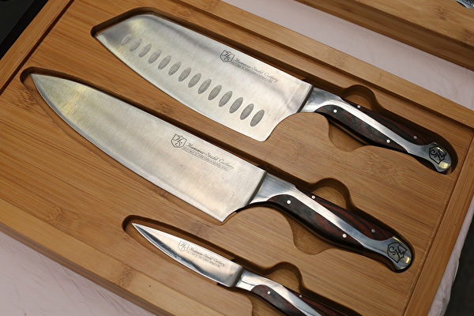

无锡市城中支行近日邀请客户免费磨刀，不久该活动被叫停。(Getty Images)

 
 【大纪元2019年12月25日讯】“银行门还没开，一帮人手里都拎着一把刀具，跃跃欲试地盯着门里面……”，这并非是电影中抢劫银行的片段，而是无锡市一家银行愿为储户免费磨刀，在发出邀请后即将上演的场景。但时隔不久，这项活动突然被叫停。

12月23日下午，多位无锡网民在通过微博陆续透露，江苏银行给他们发了一条这样的短信：“磨剪刀，贺新春；锵菜刀，迎鼠年。尊敬的客户，我们邀请您来免费磨刀啦！”

短信上提到，凡是收到短信的客户都可以在24日下午携带一把厨房刀具，到江苏银行无锡城中支行参加活动。

据观察者网报导，24日，市民又收到了后续短信，称该活动被取消。

江苏银行无锡城中支行近日邀请客户免费磨刀，不久该活动被叫停。（网路图片）

江苏银行无锡城中支行的工作人员24日向“时间视频”透露，邀请市民磨刀是确有其事。这原本是银行开设的一次便民活动，他们以前也举办过类似的活动，包括金融服务宣传、修伞等等。临时取消是因为“下雨”。

至于活动是彻底取消还是改期，银行尚未做出进一步回应。

上述消息媒体报导后，引发众多网民吐槽。有网民猜测，大量人员携带刀具容易引起恐慌，可能也是取消活动的原因之一。

还有网民表示：“脑䃼下场面：银行门还没开，一帮大老爷们个个举着一把菜刀，虎视耽耽地盯着门里面……”

“这亏了是在南方，这要是在俺们东北，你想像一下，一帮人一早晨提溜着菜刀在银行门口，这时候一个人突然来一句，大哥，动手吗？”

“为什么这种智商的人做决策层，而下属没有一个人反驳，我不信里面全是智障，而是对上级不敢提出不同意见，有意见会被穿鞋，麻木了！”#

<a target="_blank" href=#top><h6 align="right">回上方</h6></a>

<a name=201>
<h1 align="center"><b>《反渗透法》比服贸严重？ 学者：非主流民意</b></h1>

鸿海集团创办人郭台铭表示，若民进党执意通过“反渗透法”，自己将发起2019版的太阳花运动。学者直言“这恐怕不是主流民意，年轻人也不是这么想的。”图为资料照。（陈柏州）

【大纪元2019年12月26日讯】（大纪元记者江禹婵综合报导）中华民国总统蔡英文日前承诺，立法院民进党团会在12月31日完成《反渗透法》立法。鸿海集团创办人郭台铭表示，若民进党执意通过《反渗透法》，自己将发起2019版的太阳花运动。台师大政治研究所教授范世平直言“这恐怕不是主流民意，年轻人也不是这么想”。

郭台铭日前接受媒体专访时表示，若民进党执意于12月31日强行通过，他将带台商到立院集结，比照先前太阳花反对服贸的形式，自己也要睡在那里，直言这个法比服贸（《海峡两岸服务贸易协议》）严重10倍、20倍，没经过沟通就通过，扬言将“发动2019版太阳花”。

此外，郭台铭更坦言后悔退出2020总统大选，透露当初决定退选的原因是妈妈的健康问题，但强调对于今年大选的态度是“袖手不旁观”，国会必须制衡一党独大和总统的专权。

他表示，目前没有参与2024年总统选举的想法。民进党执意在月底通过《反渗透法》，他将带团到立法院集结，“当初太阳花学运怎么反对服贸，我们就怎么反对，我可能没有能力翻墙，就睡在那里”。

<b>范世平：难与太阳花相提并论</b>

台师大政治研究所教授范世平表示，郭台铭要为反渗透法上街头，他表示尊重，“但附和的人恐怕不多，很难与太阳花学运相提并论。”（陈柏州／大纪元）

对此，范世平在脸书上表示，郭台铭认为《反渗透法》比“服贸协议”严重10倍、20倍，“我尊重他的看法，但这恐怕不是主流民意，年轻人也不是这么想”，并说不要低估了台湾人对中共的厌恶，以及恐惧。

如果年轻人认为《反渗透法》是保台，服贸协议是害台；《反渗透法》是为了保卫台湾民主，而不是伤害台湾民主。若在这样的前提之下，郭台铭要为《反渗透法》上街头，“附和的人恐怕不多，很难与太阳花学运相提并论。”

<b>馆长：没有国安将走向灭亡</b>

馆长陈之汉更在直播指出，郭董是他好朋友，但这上面大家自由，他再次跟所有观众朋友说，如果有人在台湾举办“反”《反渗透法》游行，他也会找时间在凯道，请民进党、时代力量帮他申请路权，他会号召年轻人站出来。

陈之汉表示，他人数一定会更多，让大家看到年轻人力量，他陈之汉会再度站出来，领着这些年轻人，不怕得罪有钱人、中共，会告诉大家请尊重、保护国家，希望大家为台湾、社会大众着想，不要为了骂而骂。

馆长陈之汉说，郭董发起游行、冲立法院，到时候会有更多年轻人站在前面，不要自讨没趣，年轻人同样会号召很多人来，希望不要形成世代对立，反渗透法是台湾40岁以下市民的共同希望。（戴德蔓／大纪元）

他说，没有国家就没有经济，没有国家安全就没有现在民主自由与安全，统独意识绝对不是假议题，是优先议题，没有国哪有家，不先做国家安全，何来经济民生，不先保护自己国家，只完全依靠大陆，最后就是走向灭亡。

他认为，《反渗透法》势必要做，他知道郭董是大老板、董事长，他敬重、仰慕，但好朋友归好朋友，在政治立场各有各的角度，他站在年轻人、保护国家立场，这是有必要的。

<b>反渗透法是40岁以下的人的希望</b>

陈之汉表示，如果《反渗透法》通过，郭董发起游行、冲立法院，到时候会有更多年轻人站在前面，不要自讨没趣，年轻人同样会号召来很多人，希望不要形成世代对立，《反渗透法》是台湾40岁以下的人的共同希望。他呼吁，看他直播这些年轻人4年后都有投票权，到时候会支持郭台铭吗？年轻人就是国家未来，参政年轻人越来越多，这些年轻人会出来投票。他坦言，“你们越出来乱，年轻人会更想出来投票。”

<a target="_blank" href=#top><h6 align="right">回上方</h6></a>

<a name=200>
<h1 align="center"><b>湖南“12·4”大爆炸 死者家属：政府抢尸</b></h1>

浏阳市一家烟花制造公司近日发生爆炸事故，造成13人死，13人伤。（视频截图）

【大纪元2019年12月25日讯】湖南省浏阳市碧溪烟花制造有限公司石下工区包装作业区域于12月4日7时许发生爆炸事故，造成13人死亡、13人受伤（其中重伤3人）。日前，当局通报了“12·4”事故情况。

《新京报》12月24日报导，一名死者亲属披露，事发后他曾去现场想将姐姐尸体带回，但遭到阻拦，“一出事政府里面就安排人，用私人的车子把尸体拉到（江西）萍乡那边去了”。

据报导，事发企业股东、法人代表及相关管理人员曾转移藏匿遇难人员遗体，伙同事发地浏阳市澄潭江镇有关公职人员谎报、瞒报事故信息。

23日晚，湖南省通报“12·4”事故情况，浏阳市澄潭江镇党委书记刘法裕、浏阳市应急管理局副局长王义勇、浏阳市澄潭江镇副镇长王挺攀、澄潭江镇联厂干部袁泽宇4人被立案调查并采取留置措施。

此外，浏阳市3名副市长吴敏、沈学军和屈湘水被先期免职处理。

浏阳市被称为“中国烟花之乡”，这几年浏阳烟花爆竹厂爆炸事故频频见诸报端。

2015年，上述涉事公司作为示范企业，被列入“浏阳市国家级出口烟花爆竹质量安全示范区”。涉事公司于2017年曾因安全生产违法违规，被当地安监局罚款曝光。

2017年3月，湖南长沙浏阳市连续发生两起鞭炮烟花企业爆炸事故，致2死3伤。第一起爆炸发生在3月8日，浏阳市葛家镇华威鞭炮烟花制造有限公司60号药饼中转间发生爆炸，共造成1人死亡，3人受伤。

第二起爆炸发生在3月9日，浏阳市大瑶镇金阳红鞭炮烟花厂122号药物中转间发生燃爆，造成一人死亡。

2016年5月，浏阳市荷花出口烟花厂发生一起爆炸事故，造成5人死亡、1人受伤。

2015年10月，浏阳市金刚镇德顺鞭炮烟花厂两个操纵车间发生爆炸，致2人受伤。爆炸还激发山火，数百亩山林被大火吞噬。#

<a target="_blank" href=#top><h6 align="right">回上方</h6></a>

<a name=199>
<h1 align="center"><b>涉债务纠纷 北大方正逾11亿股被司法冻结</b></h1>

北京大学控股国企北大方正集团持有的11亿股方正证券股份12月24日被司法冻结，冻结原因是涉及债务纠纷，北大方正深陷债务违约风险。图为北京大学西门。（大纪元资料室）

【大纪元2019年12月25日讯】（大纪元记者张玉洁综合报导）北京大学控股国企北大方正集团持有的11亿股方正证券股份12月24日被司法冻结，冻结原因是涉及债务纠纷。北大方正深陷债务困境，其30亿美元债险些发生交叉违约。23日，北大方正还申请7只境外债券停牌，其中一只存在违约风险。

北大方正24日发布公告，其所持有的逾11亿股方正证券股份被司法轮候冻结，冻结起始日为2019年12月20日，冻结期为三年；其所持有的逾3,000万股中国高科股份也被司法轮候冻结。

上海清算所的公告中说，北大方正所持有的方正证券股份被司法冻结的原因是，中欧盛世资产管理（上海）有限公司和华润深国投信托有限公司与方正集团之间存在债券交易纠纷案。

目前，北大方正集团深陷债务违约风险。就在前一天（23日），有30亿美元债险些发生交叉违约，当天北大方正宣布，经与债权人达成协议后才避免违约。

当天是北大方正的境内债券“19方正SCP002”15天宽限期到期日。该超短期融资债券本月2日未能兑付本息违约，也是北大方正首次发生违约。23日北大方正兑付了利息，但未兑付本金，宣布兑付本金的期限延长至2020年2月，按原利率4.94%计息。该债券的债权人涉及23家大陆金融机构。

就在“19方正SCP002”发生违约的当天下午，北大方正的两只美元债买价暴跌至历史最低点。有业界人士警告，北大方正如果不能在宽限期按时兑付境内债券，可能发生几十亿境外债券交叉违约。

另据香港《明报》12月24日报导，北大方正集团12月23日向港交所申请7只境外债券停牌，等待公布与发行人相关的内幕消息，尚未披露详情。

其中一只境外债券（2021年到期、票息7.875%的美元债）应在停牌当天付息约6900万元人民币。这只债券有7天的宽限期，如果不能在宽限期付息，将构成违约。

上述7只境外债券涉及金额合计20.5亿美元和8,000万欧元，是北大方正透过诺熙资本、坤智科技、旭胜三家公司在境外发行。

这些境外债券价格曾在11月大跌，当时就被指有违约风险。目前2020年4月到期、票息4.575%的美元债买价仍然不足50美分。彭博社23日报导表示，在没有明确的债务危机化解方案之前，投资人的担忧正在加剧。

北京方正集团的控股股东是北京大学100%持股的北大资产经营有限公司，实际控制人是中共教育部。北大方正没有获得海外评级，但在大陆境内获得AAA评级。

公开资料显示，北大方正的总资产3,700多亿元，总负债3,000多亿元，连续三年的资产负债率超过80%，今年前三季度北大方正亏损31.93亿元，是去年亏损额的50倍。

彭博社数据显示，今年前11个月，大陆债券违约金额累计高达1,204亿人民币，全年违约金额可能超过去年，再创历史纪录。#

<a target="_blank" href=#top><h6 align="right">回上方</h6></a>

<a name=198>
<h1 align="center"><b>18年销量冠军 近6年亏损 夏利轿车退出A股</b></h1>

近6年来连续亏损80亿元人民币， 被称为“国民轿车”的夏利最终以“卖壳”的形式黯然离场。（大纪元资料室）

【大纪元2019年12月25日讯】（大纪元记者周心鉴综合报导）夏利曾连续18年占据销量冠军宝座，称得上是“国民轿车”的鼻祖。近6年来连续亏损80亿（人民币，下同），上市20年的夏利最终以“卖壳”的形式黯然离场。

12月22日晚间，成立22年的天津一汽夏利汽车股份有限公司发布重组预案。公司控股股东将变更为中国铁路物资股份有限公司（简称铁物股份），现有资产也将置出。此前，一汽夏利主要资产已经转让或变卖。

12月23日，复牌后的一汽夏利一字涨停，报收3.98元/股，最新总市值为63亿元。

根据公告，夏利的资产重组主要由四部分构成：

1. 作为重组的第一步，一汽集团在夏利43.73%的股份将无偿转给铁物股份，共6.89亿股。

2. 一汽夏利截至评估基准日的全部资产及负债都将向一汽股份出售。

3. 一汽夏利拟向铁物股份等交易对方发行股份购买中铁物晟科技98.11%股权；

4. 募资。一汽夏利拟向包括铁物股份或其关联方在内的不超过10名符合条件的特定投资者，非公开发行股份募集配套资金。

<b>曾经的“国民轿车”</b>

夏利曾经被誉为“国民轿车”，第一批汽车于1986年出厂，成为大陆最早的轿车品牌之一。很多家庭购买的第一辆车也是夏利，很多城市的出租车也是夏利，很多人在驾校学车也是用夏利……

夏利昔日的辉煌表现在：是大陆第一个产量过百万的民族轿车品牌；连续18年居大陆经济型轿车销量冠军；曾经出口到美国，是中国轿车出口的先河；2005年轿车销量一度超过20万辆……往昔的与辉煌今日的落寞成为鲜明对比。

<b>6年以来连续亏损80亿</b>

从2014年起，一汽夏利的销量遭遇滑铁卢。数据显示，2012年至2013年，其年销量分别为18.5万辆、13.5万辆；然而2014年至2018年，一汽夏利的年销量分别跌破10万和5万关口。

与此同时，企业利润出现大幅跳水并陷入了连年亏损，2013年到2018年6年间，一汽夏利扣非净利累亏超80亿元。其中2013年和2014年，一汽夏利分别亏损4.79亿元和16.59亿元，2015年的扣非净利润为-11.82亿元，2016年的扣非净利润为-16.76亿元，同比下降41.86%，2017年继续大亏16.66亿元，2018年亏12.63亿元。

今年前三季度，一汽夏利累计实现营收3.53亿元，同比下滑62.52%，归属上市公司股东净利润亏损7.01亿元。根据披露，一汽夏利现有全部资产、负债置出予一汽股份指定的子公司，意味着一汽夏利将成为“空壳”公司。

值得注意的是，一汽夏利在2019年未再披露销量数据。截至2018年12月，一汽夏利共售出1.8万辆汽车，其中夏利系列已经停产。

在汽车市场持续低迷的大背景下，如今，一汽夏利只能出售自己只剩下的“壳”，卖股权、卖工厂、卖资质，最终以“卖壳”的形式黯然离场。

“中国汽车品牌在竞争相对宽松的环境下才有发展空间，一旦股比限制放开，竞争会很残忍。”一名大陆车企人士向“财新网”分析说：“外资和合资车企产品价格，预计会继续下压。”

一名大陆车企人士表示，中国汽车品牌未来竞争会很残忍。(AFP)

<b>明年车市恐继续探底</b>

对于2020年中国汽车市场的走势，不少机构及专家均认为不甚乐观。

《中国证券报》12月23日报导，中国汽车流通协会副秘书长郎学红近日在第十六届中国进口汽车高层论坛上表示，2020年汽车市场将继续下行探底，预计2020年销量2,250万辆左右，同比下滑10%。

谷歌大中华区资深预测算法顾问丁思涵预计，2020年中国市场汽车销量同比下降6.6%。

中共国务院发展研究中心市场经济研究所副所长王青则预计，2020年中国汽车市场降幅将大幅收窄。

在“2020中国汽车市场发展预测峰会”上，中国汽车工业协会秘书长助理许海东表示，今明两年汽车市场仍将延续下滑态势。预计2019年全年中国市场销售汽车2,583万辆，同比下降8%；预计2020年汽车销量为2,531万辆，同比下降2%。#

<a target="_blank" href=#top><h6 align="right">回上方</h6></a>

<a name=197>
<h1 align="center"><b>逾七成民众看好美国经济 创18年来新高</b></h1>

在川普政府的大幅减税的刺激下，美国经济一枝独秀，感恩节期间的消费强劲。(David Dee Delgado/Getty Images)

【大纪元2019年12月25日讯】（大纪元记者张东光综合报导）美国经济究竟有多棒？白宫贸易顾问纳瓦罗（Peter Navarro）预测2020年美国经济持续繁荣，道指可涨到30,000点。CNN最新的民调也发现，76%的美国民众认为美国经济表现良好，高于去年的67%。

CNN在报导中称，76%的民众看好美国经济，创下近20年最高比例，仅次于2001年2月调查的80%。这对于川普2020年的连任绝对是个好消息。

CNN的这份调查显示，看好美国经济的民众是不分党派的，97%的共和党选民看好，保守派民众看好美国经济的比例是88%，独立民众有75%看好，80%的中间选民也看好，62%的民主党民众和56%自由派民众也都看好美国经济。换言之，几乎所有的美国人都对经济的状态感到开心。

至于2020年，68%的美国民众认为经济会持续表现良好，其中包括89%的共和党选民、84%的保守派选民、68%的独立选民、69%的中间选民、52%的民主党选民和48%自由派选民。看坏2020年美国经济的比例仅为9%。

CNN这项调查是在12月12～15日进行的，正好是众院通过总统弹劾案的期间，采样的成年选民达1,005人。

美国民众经济满意度高涨，与近期发布的美国就业数据有很大的关联。劳工部在6日发布11月新增26.6万人（优于预期的18.7万人）和失业率3.5%的非农就业报告后，在声明中表示：“医疗照顾、专业领域和科技服务就业人数显着增长。制造业就业人数也增加，反映（通用汽车）罢工的工人已返回工作岗位。”

尤其经济表现良好这点，已让自由派选民（多为民主党籍）不得不承认川普总统表现称职。

中小企业的认同感也有关联。CNBC在12月初发布的小型企业调查也发现，60%的小企业业主认为川普总统处理经济问题得当，创下2017年该调查开始进行以来最高。

美股的亮丽表现更显示股民对于川普总统的喜爱度不断高升。彭博社在11月17日的报导中称，股市似乎显示（股民）喜爱川普更胜于1950年以后的历任美国总统，史上历任总统喜好排名居第四，仅次于罗斯福、杜鲁门和艾森豪。

<a target="_blank" href=#top><h6 align="right">回上方</h6></a>

<a name=196>
<h1 align="center"><b>拍案惊奇】香港监狱外抗争 澳门监狱里庆祝</b></h1>

香港在监狱外打拼 澳门在监狱里庆祝。（新唐人合成）

【大纪元2019年12月21日讯】大家好，欢迎收看《新闻拍案惊奇》，我是大宇。今天是美东时间2019年12月20好，周五。

今天在香港，有很多事件发生，比如大埔的开枪案件，警方说开枪的人是2019年年初一个藏枪案的通缉犯所为，但事件发生时，引发民众前去现场质询情况，警察发催泪弹驱赶的事情；另外，前日被捕的香港“星火同盟”4个人，都得到保释，星火也说资金援助被捕者的工作不受影响，会继续进行。但是星火的7000万港元资金，还有洗黑钱的指控等问题，仍没有解决，在法律程序中。

那以上两件事我们就在开场白中简单提到，我们今天来出一期“新拍专题”，主题是：香港在监狱外打拼 澳门在监狱里庆祝。我们先从香港人在荔枝角收押所外的集会活动说起。

<b>～～～新拍专题～～～

港人集会声援在押抗争者 荔枝角收押所环境恶劣</b>

香港当地时间12月20号晚，市民在香港的“荔枝角收押所”，发起了“和你撑手足”集会，目的是在圣诞和新年之前，向收押在内的79名，因为抗争运动而被捕的人士，表达声援。目前，所有因反送中运动被捕的抗争者，有被定罪的，但是还没有被正式宣判刑期的，一些人在等待宣判刑期的时候，要被关押起来，主要的就是在这个。

集会人士手举的“和勇不分”、“抗警暴 撑手足”的标语，是最能表达他们心情的。当然，他们也呼喊口号，比如“毋忘手足”、“释放义士 还我公义”。现场主持人还跟参与集会的人说，如果大家叫的声音大，收押所里的抗争者，是可以听到的。

在香港抗争者眼中，那些因为民主抗争而被捕的人，是不应该被关押或是判刑的，因为他们是为公义而战，所以港人的五大诉求之一就是，无条件释放被捕的抗争人士。这个类似的事情，在前段时间广东茂名文楼镇的抗议活动中，已经实现，当局为了尽快平息民愤，不要在大陆演变成香港式的抗争，答应了当地人要释放因抗议被捕的村民，起码口头上是答应了。

那么香港人发起的这场类似在荔枝角的聚集，已经不是第一次了，我们在过去几个月的新闻报导中，时不时就能看到，有人群在荔枝角收押所外抗议，有人群在荔枝角收押所外要人。香港那么多监狱，为什么偏偏荔枝角这么受关注呢？那么这里就要跟大家介绍一下，特别是不在香港的朋友。

香港的“荔枝角收押所”，是所谓的“高设防”监狱，除了特别严重的重犯，会直接被关到香港严密防范的“赤柱监狱”，基本上，其他在香港要坐监的“男性”，都要去“荔枝角收押所”走一遭、关一阵儿，简单理解，这里是被判囚的人，通往香港各个其它监狱的“中转站”。

无论你是第一次被判囚、还是多次犯罪的惯犯，无论你是被法庭宣判罪成等候判决刑期的人员，还是已被判刑期的囚犯，都要先送到“荔枝角收押所”。如果是已被判刑期的，那么在这里登记造册，换上囚服后，你就要被通过水路或陆路，送往其它监狱服刑。

此外，要再次上庭应讯的囚犯、因《入境条例》受羁押的人、因各种原因被还押的人，都会被关到“荔枝角收押所”。根据香港惩教署网站的数据，“荔枝角收押所”能够关押的人数上限是1484人。但是因为要收押的人数众多，根据香港媒体一些报导记录，荔枝角常常人满为患，有时不得不另寻地点，去消化本来要关在荔枝角的人。因为人多，监狱条件差，所以荔枝角收押所，往往被形容为香港所有监狱环境最恶劣的所在。

2018年11月，香港社区组织协会民权教育中心，发布了《收纳还押囚犯惩教院所状况调查报告》，调查对象就是荔枝角。调查者采访了28名还押在荔枝角的人，报告结果是这样的。

囚室环境方面，经常能在囚室和食堂，看到飞来飞去的大蟑螂；如果有人被关到30几个人一屋的“大仓”，那就更痛苦，要忍受互相的气味、感冒等传染病，特别是夏天，就更难熬；如果是狭窄的监室，厕所臭味会传出来，冲水系统坏了就更糟糕了；床铺的清洁度也一般，而且有的还押人士说，毛毯不保暖，冬天要盖好多张才行；要洗澡的话，热水有时也无法保障足够，洗发水还要自行在监狱内的小卖部购买。

个人卫生方面，更令人乍舌。根据惩教署当时的回应，在囚人士，如果是男性，每三个星期发一卷卫生纸，女性每月可得到两卷。如果要额外的卫生纸，需要再跟监狱方提出，那怎么会那么容易获得呢？所以，正常的话，一个人，即便是男性，一卷卫生纸坚持用一个礼拜就差不多了，要坚持三个星期，那等于每天只能用几格。哇，厕所上一次大号可能都擦不干净，更别提监狱里条件不好，容易感冒，再流鼻涕什么的，就更不够用。有人反映，说有时卫生纸不够，就只好用草纸、信纸等别的东西代劳。

不知道如果在押人士，家里条件好的，狱方会不会允许家里提供。但有一些东西，有钱的家属一定可以提供，那就是内衣裤，不然，所有人要穿监狱统一提供的内衣裤，而这些内衣裤是循环使用，监狱方面说是会每天清洗贴身衣物，但就算这样，人穿上也不会舒服的。此外，外衣、运动鞋，也是共用。但有的犯人说，监狱会发鞋子，但没有袜子，所以有的还押人士，说自己染上了脚部的传染病。但狱方辩解说，共用的外衣、鞋子，都会定期清洗。

饮食方面，接受调查的人就说是，食物份量不足，吃不饱。

以上这些荔枝角收押所得内部条件的记录，都来自香港2018年11月的一份报告，不知这些具体情况，是否在今年有所改善。

<b>6000人参与荔枝角收押所集会 阅读在押者来信</b>

好，话说回来，这次集会，是由立法会议员邵家臻、张超雄还有社民连发起，获得了警方的不反对通知书。活动晚上8点开始，一直持续到10点多。活动一开始，参与的人群已经站满了收押所外面的行人路，现场还一度亮起手机灯光，成片的灯海，象征着明亮的希望。

当晚的集会，根据发起人之一，邵家臻议员公布的最后数字，是有6000人参加了当晚的集会，一开始说是3800人，最后统计是6000人。警方给的数字是，最高峰人数1200人。

集会过程中，很多人上台发言。最先发言的是立法会议员张超雄，他说自己和另一位立法会议员邵家臻，会尽力协助和探望被捕的抗争者。

众志秘书长黄之锋，立法会议员毛孟静、朱凯迪，后任区议员李国权，还有其他被捕人士的母亲、女友，先后阅读在押抗争者的信件。

黄之锋读取了一封被关押抗争者的来信，里面提到，监狱里有好多规矩，几点起床、几点吃饭，几点活动等等，每天家属的探监时间只有15分钟，倒计时，到点探监电话自动挂掉，玻璃窗两边，只能相视告别。对黄丝抗争者来说，最痛苦的可能是里面看不到YouTube、登不到连登，只能定时在活动室里看CCTVB。而且收到信件，因为要检查，所以本人拿到信，往往要再推迟5天。

所以，这名抗争者说，他特别渴求得到外面的资讯。最后，他在信中说，大意是：闯立法会的梁继平曾说过，把这些抗争者连结到一起的，除了价值观，就是“痛苦”，而人生而为人，要有人的特质，不能沦为畜牲，失去思考和反思的能力，正因为这些“苦、痛、心酸”，才感到自己，正在奋力地生存着。

也有人阅读其他被关押的抗争者信件，有人送信出来，鼓励港人坚持，并说自己做好了牺牲的准备，认为这是值得的。

集会上，立法会议员毛孟静发言还提到，除了在荔枝角收押的男性抗争者，她也呼吁人们关注扣押在“励敬惩教所”的女性抗争者。

期间，还有立法会议员黄碧云在集会上发言透露，有抗争者于警局内，在没有监控镜头的地方被殴打。她还表示，自己在“监警会”曾经做过6年，现在“监警会”内已经没有民主派的人，依赖的材料都来自“警察投诉科”，等于是自己人查自己人。因此，她继续呼吁当局，成立独立调查委员会，调查警察暴力问题。

集会结束前，在香港的一位意大利歌手演唱了《愿荣光归香港》，集会主持、社民连的黄浩铭还对集会人群说，看到有收押所内的人向外招手。

黄浩铭还提醒说，圣诞节临近，希望集会人士可以每人寄一封信给在收押所内的被捕人士，让他们感受到社会的支持。而在本周呢，香港社会已经举办多次“和你写”的书写并邮寄圣诞贺卡活动，给被关押的抗争者。而他们的圣诞啊、新年啊，可能都要在监狱中度过了。有人估计，现在被关押抗争者，估计要总共收到数以万计的圣诞贺卡。由于寄到惩教署单位的信件，每一封都要拆开看，估计惩教署的职员要有得忙了。

<b>邻近圣诞新年 香港抗争活动持续</b>

圣诞和新年临近，香港的群体抗争活动可能又要进入另一个高潮。接下来比较重要的有：12月21号，元朗721事件满5个月的纪念活动；12月23号，港人要在中环遮打集会，主题是反对星火同盟的7千万港币资产被冻结。

12月24号晚的“愿平安归香港”和“霜夜倒数游行”，12月31号，港人还要再次举办大型人链活动，名为“人链集气 重拾士气”，人链计划排满至少六大线路，遍布香港，7点集合，8点组人链，9点半结束后，抗争者还可能自发前往太子站，纪念831太子站事件满4个月。到了1月1号，2020新年第一天，香港民阵还计划举办大游行，这次游行在香港抗争者中看上去很有人气，按照以往经验，无论警方是否发布不反对通知书，新年这一天的游行，一定会有很多人走上街头。

以上说的还都只是大型活动，期间还有不少各种各样的其它类型抗争，在这里就不一一列举了，总之，从现在开始，一直到新年第一天，香港抗争者不会闲着。

<b>澳门安保极度严密 庆祝活动如在监狱里进行</b>

今天的“新拍专题”，主要想说的是香港。只是恰逢澳门这边有习近平访问的一些事，顺带说一下。也正好可以将香港和澳门的现况做个对比。不少人说，大陆渗透后的澳门，已经快成了“一国一制”，让北京拿去做“一国两制”的榜样，而还在为自己合法的有限自治权益争取的香港人，却要在澳门烟火璀璨和歌舞升平地迎接他们北京主人的同时，站在荔枝角收押所外的寒风里，声援被捕人士。

不过，在澳门，也有一个人不快乐，这个人就是率团前往澳门，一起参加澳门主权移交20年庆祝活动的林郑月娥的先生，林兆波。

12月19号晚，澳门举行庆祝晚会，节目高潮处，习近平与很多官员，以及演员，同台拍手唱歌，在大家齐刷刷的口型开合以及鼓掌的动作中，有一个人却非常不协调，双手交叉腹前，默默站立，面无表情，他就是林兆波。他左边是林郑月娥，右边是港澳办主任张晓明。香港网民略带调侃地形容，这是林兆波“一个人的示威”、“沉默的抗议”。但是截至我们发稿，对这个细节，还没有官方的说法。但不像林郑月娥，做了香港高官放弃英国国籍，林兆波本人和他的孩子们，都是英国国籍，也没有在朝为官。所以当局应该不会拿他怎样。

林郑月娥就不一样了，自从强推送中条例失败，她的民望又屡扑新低，毫无底线，几次有传媒放风，说林郑要被北京罢免，后来都没发生，林郑的特首位置怎么还坐的那么稳啊？是不是因为当局还信任她的能力，没有人会相信这一点。《香港01》19号有一篇报导，引述了一个建制派人物的话说，北京希望林郑，能在余下任期，完成23条立法。

原因是破罐子破摔，23条立法争议极大，林郑的民望已经臭了，北京就想借用她，想干脆把23条再推出来，等到下任特首，可能不想再因为23条把自己搞臭。从一点看，林郑确实还有几分可怜。但是，当局的算盘能不能实现，就是另一个情况了。

香港、澳门，几乎一样的政府，要听北京马首是瞻，特首的普通话也都练的不错。但是社会可真是大不一样。澳门地小、人少、行业单一，容易渗透，香港相对地方开阔得多，又是久负盛名的国际金融中心，人才济济、教育发达，特别是英国佬留下的这套法治、民主制度，深入人心，所以当局想像澳门那样控制香港，难度很大。

即便在澳门，其实也没有实现完全控制。澳门毕竟还存有一定程度的，原先留下来的民主制度在，对政府的监督并不是完全消声匿迹。

《大纪元时报》采访了澳门立法会议员区锦新，这名议员大胆指出：习近平到访澳门，政府保安措施极度扰民，好似进入战争状态。

这次习近平到访，虽然只是18号到20号之间这么几天，但是澳门周遭如临大敌，早早准备，而且在习近平到访前后，港珠澳大桥设立专门检查站盘查来往旅客、多名记者被拒绝入境，因为出入境的地方要被查问，一查很久，导致很多人抱怨在出入境排队等待几个小时。进入澳门，街头出现很多讲普通话的便衣，可以随意拦截路人查看身份证件，如果是香港人，甚至还要求强制解锁手机，看里面的内容。部分交通线路停止运作，一些道路被封、运油车禁止行驶，甚至空中的也不例外。

《苹果日报》消息说，一架从日本飞到印尼的私人客机，途经香港附近出现故障，要降落。但被拒绝了，被谁拒绝了？被中共的军队拒绝了，不仅拒绝，还要求这架飞机，飞出距离澳门100公里的范围，期间还派出两架军机拦截。最后这架私人飞机在经历了莫名其妙的“空气惊魂”后，无奈转往菲律宾降落。

这种极度严密的安保措施，让澳门的主权移交庆祝活动，好似在一座大监狱里进行。真是香港在监狱外打拼，澳门在监狱里庆祝。

新唐人《新闻拍案惊奇》制作组

<a target="_blank" href=#top><h6 align="right">回上方</h6></a>

<a name=195>
<h1 align="center"><b>圣诞卡求救信发酵 乐购暂停从中国进货</b></h1>

英国零售商巨头乐购（Tesco）出售的圣诞卡片中被发现一封来自中国监狱的求救信。乐购表示，暂停从相关中国供应商进货。(Tolga AKMEN/Tolga Akmen/AFP)

【大纪元2019年12月22日讯】（大纪元记者张婷综合报导）英国超市巨头乐购（Tesco）周日（12月22日）宣布，暂停从一家圣诞卡中国供应商采购。在此之前，英媒披露，一名英国女孩在从乐购购买的圣诞卡上发现一则来自上海青浦监狱外国囚犯发出的求救信息。

根据卡片上的信息，这些外国囚犯是中共强迫劳工的受害者。

乐购发言人周日表示：“我们鄙弃使用监狱劳工，绝不会允许其在我们的供应链中出现。”

英国《星期日泰晤士报》此前报导，居住在伦敦南部图庭（Tooting）的6岁女孩弗洛伦斯·维迪科姆（Florence Widdicombe）在家中准备给朋友寄圣诞卡，她打开了一个从乐购买来的的慈善圣诞卡盒，惊讶地发现其中一张已经被使用过。

这张卡片上有一只戴着圣诞老人帽子的小猫，但写有来自中国“古拉格”的绝望消息。

该信息由大写字母写道：“我们是中国上海青浦监狱的外国囚犯，被迫违背自己的意愿工作。请帮助我们，并通知人权组织。”

求救人还请求发现这张卡的人联系也曾被关在中国上海青浦监狱的彼得·汉弗莱（Peter Humphrey）。

汉弗莱是一名英国前记者，企业欺诈调查员。汉弗莱在2015年获释后曾发表专文，细述他在2014年到2015年间被关在上海青浦监狱时所遭受的残酷非人待遇。其中一段提及监狱囚犯做工，制造国际知名品牌商品，引起国际关注。

“我们对这些指控感到震惊，并立即暂停（从）生产这些卡片的工厂（进货），并展开调查。在调查期间，我们撤回出售这些卡片。”乐购发言人说。

英国最大的零售商乐购每年通过出售卡片向慈善机构英国心脏基金会（British Heart Foundation）、英国癌症研究（Cancer Research UK）和英国糖尿病协会（Diabetes UK）捐赠30万英镑（39万美元）。

《星期日泰晤士报》称，6岁女孩维迪科姆在发现了圣诞卡片的求救信息后，她的父亲通过领英（LinkedIn）社交网络联系了汉弗莱。

汉弗莱在《星期日泰晤士报》上写道，他不知道在卡片上写求救信息的囚犯的身份或国籍，但表示，他毫不质疑他们是他在2015年6月被释放之前认识他的青浦囚犯。

乐购表示，该公司方面有一个全面的审核程序。就在上个月，他们还对供应商进行了独立审计。尚未发现他们违反了禁止使用监狱劳工的规则。

“如果供应商违反这些规则，我们将会立即、永久的将他们从供应商名单中除去。”乐购说。

乐购还透露，这些卡片来自浙江云广印业公司（Zheijiang Yunguang Printing，距离上海青浦监狱大约100公里（60英里）。

该公司为食品和制药公司印刷卡片和书籍。该公司在其网站上还表示，也为乐购供应产品。

这并非首次消费者在中国出口的劳工产品中发现求救信。多年前，一封惊现在美国万圣节装饰品中的、来自中国劳教所的越洋求救信，曾轰动国际社会。

求救信的作者孙毅在严密监控下用镜头记录下他在沈阳马三家劳教所真实的生活，揭露中共对法轮功的残酷迫害，后来他来到海外，其经历拍成电影《求救信》，在世界各地播放，令观众震撼。该影片得过多个奖项，去年入围奥斯卡最佳纪录片候选名单。

<a target="_blank" href=#top><h6 align="right">回上方</h6></a>

<a name=194>
<h1 align="center"><b>警察绝密文件流出 视频反映港警恐慌怕落单</b></h1>

2019年12月16日，“查警暴 反滥捕”，香港中环IFC Mall中庭举行和你 Lunch活动。图为参加活动港人手拿“查警暴 反滥捕”主诉求的手板。（宋碧龙／大纪元）

 
【大纪元2019年12月23日讯】（大纪元记者骆亚香港报导）近日，香港警方的一份内部绝密文件曝光，前线警员提7大诉求。民间质疑警方若按诉求执行，那警队到底受什么约束？等于失控。

YouTube频道《升旗易日报》19日的时事分析节目中透露，他们获得警方一份内部绝密文件——前线警员与署长对话内容。

当中包括前线警员提出的7大诉求：1. 用Standby形式，在警署内等待出勤命令；2. 增购武器；3. 扩充人手；4. 提供超时津贴；5. 反对独立调查；6. 不出席针对警暴的区议会会议；7. 要求网上巡逻。

节目主持人总结警方的7大诉求最主要的意思是远离危险，那就不用出来，而最可笑的是警方要求网上巡逻，并嘲讽警方可通过网上军用车、网上水炮车来驱散人群，也可用网上直升机，甚至是网上用留言通辑示威者。

他们质疑警方若按诉求执行，警队到底受什么约束？只是警察署内唱高调“制暴治乱”，不如申请在家里执勤等。

而脸书上刚披露的一段视频显示，警察冲进一个商场，其中一个拿盾牌的防暴警察控制了一名戴口罩的年轻人，并把他压到墙边，但他一看周边的同事不见了之后，赶紧拔脚就跑去追自己的同伴，完全顾不上眼前的这名年轻人。

网友hkpoliticalmemes在视频中还贴上字幕，恶搞说，“玩到见不到自己的老母时”，一边狂奔一边寻找：“妈咪呢妈咪呢”，冲进上扶手电梯的那个门，上了自动电梯。

这段片子也从侧面印证了前线警员的恐惧怕被落单。

一群痛心的警察亲友在联署发声明说，警察沦为市民公敌，夹于示威者与政府中间，一众高官未能纾解民怨﹐而警队管理层亦出现决策失误，令警队成为众矢之的，政治问题最终演变成警民冲突，前线警员受尽冤屈气，只能继续默默承受，孤军作战。

联署还说，在过去数次示威活动中，即使没有受过专业训练的普通市民，都会对警队的部署感到莫名其妙：不时会有数名警员“落单”，身陷示威者群中，下场必定是与示威者发生或大或小的冲撞致受伤。

联署强调，市民有合理怀疑，政府是否不惜牺牲警员的生命，以换取一个合理化的暴动罪名，借此让政府用更大武力打击示威者。#

<a target="_blank" href=#top><h6 align="right">回上方</h6></a>

<a name=193>
<h1 align="center"><b>【新闻看点】习访澳魂系香港 3真相北京心凉</b></h1>

12月18日，习近平到达澳门展开为期三天的访问。图为习坐车离开机场，保安人员围在四周。(ANTHONY WALLACE/AFP via Getty Images)

【大纪元2019年12月24日讯】大家好，欢迎大家关注新闻看点，我是李沐阳。

澳门主权移交20周年，习近平带着一众大小官员去了3天。虽说只有3天，但是把澳门民众折腾得够呛。澳门当局神经紧绷，祭出了史无前例的安保，唯恐担心发生意外。不过安全上倒没什么意外，但是其它地方出现了不少意外。

总的来说，这次习近平访问澳门，有一大看点和三大真相，让北京的心“拔凉拔凉”的。

<b>看点：念念不忘香港</b>

这次澳门主权移交的重头戏是澳门第五届政府就职典礼。就在万众瞩目的场合，习近平讲话出了问题。习讲话中说，“广大澳门同胞发自内心拥护‘一国两制’，认同‘一国两制’是‘香港’保持长期繁荣稳定的最佳制度”。

央视随即紧急通知，不能重播当天上午的直播讯号，也不能使用剪辑新闻，一律使用“发布的素材”。新华社在随后通稿中把“香港”改成了“澳门”。

其实读白字、用错典故这类事，先前也有传闻。但如此重大场合，把“澳门”读成“香港”，的确有些失礼。不仅如此，半小时讲话中，出现23次“一国两制”。而且最后部分，习把港澳并提，把香港排在了前边。但是两年前的香港活动中，习讲话中根本没提澳门。

中国有句话：“效力的不如投缘的”。香港和澳门在北京的心中的位置，孰轻孰重，或许这次“口误”是有所折射的。

澳门完全听从北京命令，已经被中共彻底掌控，通过了国家安全法（23条），其它方面也越来越接近大陆城市。

而香港民主抗争已经半年有余，港府虽然不断升级武力镇压，但对香港人起不到阻吓的作用。港府已经黔驴技穷、一筹莫展了，北京也是相当头疼。

但即使这样，北京对香港依然是念兹在兹。身在澳门，心在香港，颇有些念念不忘的意味。

不过时评人士李平认为，这或许也有反方启示。他在《苹果日报》撰文表示，北京一心想扶植澳门成为一国两制的典范，认定香港应该照抄澳门的模式，甚至希望澳门取代香港的金融中心地位。

<b>真相一：港首老公是勇武派？</b>

在19日晚上，澳门当局举办了一场晚会。其中有一个精心安排的重点环节，就是习近和现场所有官员联动，同唱《歌唱祖国》。

现场画面显示，站在前排的中共、港共、澳共官员们，都在起劲地大张嘴巴，拍手合唱。尤其香港特首林郑月娥的表现相当抢眼，动作幅度很大。

不过，比林郑更抢眼的是她数学家老公林兆波。众目睽睽之下，林兆波双手交叠在大腿前，似乎神情目光呆滞。他不仅没拍掌，而且对唱什么歌曲根本“不感冒”，嘴巴一动不动。这种巨大的反差，让人感觉林兆波似乎是“鹤立鸡群”当中。

有人笑称这位数学家是向港人示范“不合作运动”，也有人形容这是“一个人的示威”、“沉默的抗议”，还有人说这就是“学者的风骨”。

冯睎干在《苹果日报》撰文《光复林家，兆波抗命》中表示，据说林郑曾与前线勇武“深度交谈”。大家一直半信半疑，因为没有哪个真勇武愿意跟林郑对话。但是看了这段视频终于恍然大悟：那位传说中的前线手足，应该就是林郑的丈夫林兆波。

文中调侃道：当众人都在拍掌高歌的时候，全场只有林先生“手不动嘴不张，面容肃穆如丧考妣，仿佛默哀一样，成了黑暗中的萤火虫”。而“今生只嫁前线巴”，林郑月娥第一个做到了。

林郑老公成了勇武派，北京的心能不拔凉拔凉的吗？

<b>真相二：月余三见面大赞林郑 司马昭之心？</b>

澳门之行，习又见了林郑。这是一个多月来，两人第三次见面。习再次“充分肯定”了林郑在“非常时期”的勇气和担当，而林郑表示“一定会带领港府止暴制乱，尽快恢复香港秩序”。

有建制派人士对“香港01”表示，北京要求林郑在剩下的任期内，完成基本法23条立法。消息表示，“香港的局势已烂透，暴力示威冲突之根已种下”，“既然推不推23条也是乱局，何不索性为这个困扰京港十多年的争拗划上句号？”

就是说，北京要让林郑坏事做到底。反正不可能连任，横竖都是下台，干脆就尽她一个人“烂下去”，给下任特首扫清障碍。

过去半年，香港因《逃犯条例》爆发民间大规模抗争，至今未息。中共多次说，支持港府修例。但近日。路透社调查发现，港府修订《逃犯条例》，并非林郑所称港府自主、自发去做，而是有背后推手，就是中共中纪委。

报导称中纪委反腐，目标是瞄准了身在香港的明天系创办人肖建华。后来中纪委向负责香港事务的中共官员提出，应该有引渡的安排。于是林郑成了火中取栗的猫爪，替中共强推《逃犯条例》。

如果这个消息属实，那么北京高频率见林郑并对她表示肯定，就是在绑死林郑，让外界认为林郑才是罪魁祸首。而当她做完北京想要的事情，中共会把她一脚踢开，让她把骂名带进棺材，又可以抚平一些民愤。

这个真相被揭，北京的用意成了“司马昭之心”，这个心也是拔凉拔凉的。

<b>真相三：替代香港？澳门特首：不实际</b>

这次习带着大礼访澳门，多方认为是变相惩罚香港，意图用澳门替代香港的金融中心地位。外媒引述消息称，北京准备在澳门建设证券交易所，打造以人民币结算的“东方纳斯达克”。

新任澳门特首贺一诚20日表示，澳门暂时没有足够的人才和法例，谈不上“建立外界所指的金融中心”。

贺一诚接受电视台访问时坦承“想法不实际”，目前亦未具条件建立金融中心，因澳门在金融方面的法律空白，只有《融资租赁法》，“税法”、“基金法”、“信托法”等缺位，难以吸引投资。

若要成为金融中心或发展金融市场，他说，必须有相应法律支撑，故需要加快立法和修法工作，首要修订“税法”。

贺一诚的话，更像是一盆凉水，让北京从头凉到脚。

此外，澳门的人民币资金池明显深度不够。截止10月底，澳门的人民币存款只有310亿元，而香港却高达6364亿元。

再有，澳门金融基础建设远远落后于香港，难以吸引国际性机构投资。它的监管制度也不完善，几乎是“零经验”。而且澳门向来重点发展博彩业，严重缺乏金融人才。

种种缺乏之下，如果硬上，《苹果日报》认为“必定后患无穷”。

时事评论员蓝述表示，从哪个角度看，澳门都不具备替代香港的条件。其实北京是身在曹营心在汉，心思多半在香港身上，所以才港澳不分。

蓝述指出，古人行事都要占卜前程，有瑞兆才可行事。而这次多显不吉征兆，北京真的应该三思了。

好的，感谢您关注新闻看点，再会。

大纪元《新闻看点》制作组   #

<a target="_blank" href=#top><h6 align="right">回上方</h6></a>

<a name=192>
<h1 align="center"><b>【珍言真语】潘东凯：港传媒党国化 中企亦然</b></h1>

香港时事评论员潘东凯。（宋碧龙／大纪元）

【大纪元2019年12月23日讯】（大纪元记者黄晓翔香港报导）香港《苹果日报》引述金融界消息说，阿里巴巴正计划入股TVB，而腾讯也可能入股另一香港电视台NOW及《星岛日报》，以落实中共加强操控港媒的工作。对此，香港作家及时事评论员潘东凯表示，香港传媒“党国化”是一个大的趋势，其实，大陆企业何尝不是如此。

据香港《苹果日报》报导，现任香港无线电视（TVB）主席、外号“壳王”的陈国强正与TVB实际大股东、人称“中国梅铎”的黎瑞刚商议，两人取得共识后，就会宣布辞去主席一职，并出售全部股权，为TVB盈利暴跌和投资失利负责。那么谁入主接替陈国强呢，金融界盛传，中国电商巨头阿里巴巴将入股TVB，以落实中共加强对港传媒控制的工作。

另有消息说，中国腾讯或入股星岛集团及另一家香港电视台NOW，进一步由中资传媒巨企主导香港舆论。

对此，香港作家及时事评论员潘东凯表示，中国是一党专政的政治体制，香港传媒“党国化”是一个大的趋势。不仅香港传媒“党国化”，中资企业也是如此，都是受中共控制的。

近期，中国大型民企创办人先后离职，继阿里巴巴马云、腾讯马化腾、百度李彦宏以及京东刘强东宣布辞去董事长一职后，顺丰速运集团董事长王卫也宣布辞职。潘东凯说，这些白手起家的民间企业家，在中共体制内似乎都需要退位让贤。

“这个模式已变成了一体化，我举个一体化的例子，在通讯企业里有一个龙头是中国移动，另一个是中国联通，它们的首席执行官是可以随时对调的，美国或欧洲不会出现这种事，NBC、ABC和CBS的领头人是不可以这样调换的，因为同行如敌国。表面上很多公仔，这个公仔叫联通，这个公仔叫中国移动，那个叫中国电信，其实背后是同一个老板。”

潘东凯指出，腾讯现在不等同马化腾，腾讯等同国家，国家等同党。中资企业就是中共控制的企业。从这个角度看，腾讯或阿里巴巴，其实它的名字并不重要，如果真的让它进入香港的企业，就是党直接控制香港的企业。

潘东凯还说，星岛集团、《英文虎报》、《头条日报》虽然是亲共的传媒，但中共不把它视为自己人。

“虽然授予些职位给他，例如人大、政协，始终他不是自己人，他的钱并不是在你那里赚回来的。如果星岛真的是由家族的经营变成中共自己直接控制的企业去经营，或拥有控制性的股权，这样的做法也是同一脉络，由党直接控制香港的媒体，即是党的直接控制。”
邓炳强强调对党忠诚 中共可能对港进一步镇压

香港警界一哥邓炳强履新后，“忠诚勇毅，心系社会”全新上线香港警务处网站，替代了原来的“服务为本，精益求精”口号。那么，这说明什么呢？

潘东凯表示，香港警队不是由香港的民官系统或香港的特区政府控制的，而是由境外的力量控制的，从邓炳强更改警察的座右铭，可以看出，对党的忠诚是非常重要的。

“邓炳强现在高调提出党的概念，就是改了那个‘忠诚勇毅’的口号，那个座右铭和邓炳强的述职，他名义上无私显见私，就是说他去北京做一个礼节上的拜访，但是和他握手最重要的一个人物就是赵克志，赵克志就是中共的公安系统里面的最高领导人，赵克志是副手，那个正的是叫郭声琨，现在这个刀把子就是郭声琨和赵克志拿着，邓炳强是要听他们的命令，警队由他们控制。”

潘东凯说，令他痛心的是，香港的警暴仍非常严重，甚至比大陆城市还严重。

“大陆城市起个焚化炉、火葬场，会收回成命，他们抓的那些人之后，我们看不见在拘留的过程中打得那么厉害。香港越是一些年轻的，或者娇嫩的少男少女，越是在公众的眼前凌辱你。最近，这些都变成了常态。而且，警察施暴之后，前线的指挥人员全部得到升迁。”

香港特首林郑月娥日前去北京述职，中共中央政法委书记郭声琨也在场列席，这是第一次有中央政法委书记公开介入港澳事务。据媒体披露，郭声琨已出任港澳工作协调小组副组长，而公安部长赵克志也在今年10月出任港澳小组副组长。

有评论指出，港澳小组出现两名握有刀把子的“武官”副组长，肃杀之气越来越重，显示北京当局很可能推出新一轮镇压维稳，对反送中运动进一步清场。

<a target="_blank" href=#top><h6 align="right">回上方</h6></a>

<a name=191>
<h1 align="center"><b>【拍案惊奇】中国制造藏两颗“定时炸弹”</b></h1>

伦敦南部一名6岁的小女孩，在一张圣诞卡片商发现一行大写的英文字母：“我们是在中国上海青浦监狱里的外国囚犯。我们被强制劳动。请帮助我们，并通知人权组织。”（新唐人合成）

 
 【大纪元2019年12月24日讯】大家好，欢迎收看《新闻拍案惊奇》，我是大宇。

12月21号，台湾高雄同一天举行了两场游行，一个是支持韩国瑜一方的游行，有35万人参与，另一个是反对韩国瑜的游行，50万人参与，这一方举着一幅超大的调幅，受香港的启发，条幅上的文字写道：光复高雄 保卫台湾。而韩国瑜之所以引发这么大的争议，是因为有人认为，他是中共在台湾的代理人，如果1月份当选，将使台湾跟大陆走得更近。不管怎么说，当天的游行和平落幕，双方没有冲突，警方更没有暴力驱赶行为，有人称赞这是有赖台湾现在的民主。

而在香港，12月22号周日，冬至这一天，港人在中环的集会，再次遭遇警方暴力驱赶，警方发射了催泪弹，甚至再有警察拔出真枪。面对这样的局面，香港人继续坚持，接下来直到新年1月1号，都有形式丰富的抗争活动进行。这期间可能会是港人抗争的另一个高潮。

而我们今天所讲的，既涉及到香港人的可持续性抗争，也有关“中国制造”。将谈到“中国制造”的两颗“定时炸弹”，一个是从香港的“黄色经济圈”和正在筹备的网购平台入手，另一个，则要从最新发生的，来自大陆监狱的另一封“求救信”说起。

<b>由“求救信”谈起 中国制造的一颗“定时炸弹”：反道德</b>

圣诞节到了，西方的很多家庭都开始准备欢度佳节。谁也不想在满心欢喜的日子，看到悲伤的事情。

22号，英国一家媒体报导，伦敦南部一个6岁的小女孩，在一张圣诞卡片商发现一行大写的英文字母：“我们是在中国上海青浦监狱里的外国囚犯。我们被强制劳动。请帮助我们，并通知人权组织。”此外，上面还写到，希望看到的人帮忙联系英国记者韩飞龙（Peter Humphrey）。

韩飞龙曾在中国大陆被关押过，他后来说写信的人，一定是曾在上海青浦监狱里认识他的犯人。韩飞龙曾在中国大陆被拘禁23个月，他认为自己被关押的事存在冤情。期间他至少两年在监狱劳动，制作Tesco卡片等产品，而他在青浦监狱度过9个月。

关押外国籍囚犯是“青浦监狱”的特色之一，根据2018年10月上海政府法制信息网的一个报导，当时有四十多个国家的约170名外国囚犯关在里面。

韩飞龙得到伦敦那名小女孩发现的消息后，撰写了独家报导，刊登在《星期日泰晤士报》。

消息公开后，销售这张圣诞贺卡的英国最大零售商“乐购”Tesco，快速回应，中止了与相应中国工厂的合作，表示这种监狱劳工产品绝不可出现在乐购的供应链中，而这家中国工厂叫做“浙江云广印业有限公司”，厂址距离上海青浦监狱有100公里。

中方外交部对这件事做了回应，说是韩飞龙编出来的“闹剧”。

但是，这种事早已不是第一次出现。

2014年6月，北爱一间时装店的顾客在服装中发现中文字条，上面写着：“我们是中国湖北襄南监狱囚犯，长期生产出口服装，每天劳动15小时，吃的是猪狗不如的饭菜，干的是牛马一样的活。”字条顶端标着三个“SOS！”

2012年9月，有人在美国发现一封求救信，写信人说自己在监狱被强迫制作购物袋，地点在“青岛监狱”。

最为人所知的要属2012年10月，美国俄勒冈州女士朱莉‧凯斯在购买的万圣节装饰品中，发现了一封三折的“求救信”，信中人，后来我们知道的名叫“孙毅”的男子，被迫在马三家劳教所进行奴役劳动，因而向国际社会求救，而他是因为法轮功信仰被抓捕和劳教。CNN对此做了报导，中国的劳教制度受到广泛关注。后来，孙毅的“求救信”事迹被加拿大华裔导演李云翔，拍成一部76分钟的纪录片，名字就叫“求救信”。影片使用了很多孙毅自己拍摄的第一手视频，以及导演自己的采访等画面制作而成，获得了被誉为美国纪录片界奥斯卡的“皮博迪奖”，在烂番茄评分达到100%，谷歌用户的按赞率是97%。

这样的事情，能引起这么大的国际反响，足见中国大陆奴工产品，引发的重视。

虽然中共当局在2013年11月废止了劳动教养制度，但是奴工产品依然存在，仅仅是不在劳教所内进行。

海外的“追查国际”组织，2019年6月25日，发布了题为“中共国家监狱奴工产业”的报告，里面提到，大陆的30个省、市、自治区，有至少681家国有监狱企业。数量之多足以带来可观的经济效益。

这就是我们今天节目要提出的“中国制造”商品的第一颗定时炸弹，这来自“道德”层面。

除了以上提到的监狱奴工产品，大陆的盗版山寨产品、为了打价格战而推出的低价劣质品，等等，都是违背“道德”原则的生意行为。今天，“乐购”因为这个奴工产品的曝光，停止了购买有关产品。那么，当奴工产品的问题越来越被聚焦，东南亚和南亚新兴的廉价劳动生产力，做出了价廉质好的产品的时候，“中国制造”的生存空间，会不会进一步被挤压呢？

“反道德”的生产行为带来的是畸形的经济发展，因为当这些问题逐渐被曝光之后，那就是一颗“定时炸弹”，随时让“中国制造”的经济泡沫炸裂。

<b>香港抗争者 筹备“无中国产品”的网购平台</b>

12月23号，香港传出消息，由一些来自不同行业、支持香港抗争运动的人，正在筹建名为“重光号”的网购平台。这个网购平台之所以引起人注意，是因为它打出来的最核心的营运特色是：全香港第一家没有中国制造产品的网购平台。

根据知情人的介绍，这个平台将集合香港所有被称为“黄店”的支持抗争的商家，来提供产品，打造“香港品牌”，甚至“香港制造”。从制作、物流、销售等各个方面，全部由“黄店”或“黄丝企业”参与，目的是壮大香港的“黄色经济圈”，抗衡中资产业，给香港人争取更多话语权。网购平台的名字“重光号”，指的是重光香港之义。

目前，“重光号”还在筹组之中。它的出现，至少传递了两点讯号：

第一，从被动转向主动，从短期走向持久。香港人从“和平理性非暴力”的示威活动，到堵路、选择性打砸亲共企业的所谓“勇武抗争”，但这两种方式，并没有带来重大的实质改变。香港的抗争者因而反思，什么样的抗争最有实效。

类似以上提到的两种抗争形式，基本上都是直接向政府喊话、表达诉求的方式，区别只在于是否采取比较激进的方式。但是这两种形式的共同点都是，会比较被动，都是要等待政府的回音，但平常的生活，还是照旧，像一些大陆人留言说的，香港人很多东西在使用大陆的啊，这种依赖性，使得香港人在日常生活中，还要依赖他们所抗争的对象。

这种依赖性也意味着，抗争无法长期存在，人是会疲劳的，无论精神上还是肉身上，即便是观赏一部经典的意大利歌剧，反复观看人也会产生“审美疲劳”，更何况这种香港人当前的抗争，是“血肉”与“财力”的双重考验。

而最近“黄色经济圈”的出现，就是香港人把这种抗争，从被动喊话，到争取主动权，从短期硬拼，走向长期“可持续性抗争”的重要一步。“重光号”网购平台，是“黄色经济圈”概念下的又一个产品，如果顺利实现，也是横向繁荣这个“黄色经济圈”的一个重要工具。

这个“重光号”网购平台的理念，除了刚才提到的香港本地黄店，也会兼顾销售优质的外国产品，但是承诺绝不会有MADE IN CHINA的产品。平台还会优先聘用符合条件的香港抗争人士，盈利还会用于发展本地品牌，同时小额捐助需要的抗争者。

以上这些理念，正是香港抗争人群，实现可持续性抗争、以及抗争由被动转为主动的关键。

如果香港几百万人都罢卖大陆网络商城的产品，对大陆的很多网络商户，肯定是有一定影响，但对于人口众多的中国大陆来说，也许构不成致命打击。香港人这么做的目的本身也不是想打击大陆的商户，而是发展自身的“黄色经济圈”，以持续抗争，实现诉求。

<b>“中国制造”的另一颗定时炸弹：政治</b>

但是不是这就说明，对这个事情不用太在意呢？我想不能轻视，从长远来看，对正处于历史拐点的中国大陆，除了上面提到的“道德”层面的定时炸弹，香港这件事则提醒了另一颗“政治层面”的“定时炸弹”。

“重光号”网购平台以及香港的“黄色经济圈”，诞生于反送中运动。这是香港人在汲取历次抗争经验后，为实现诉求而想到的另一种办法。

大陆企业，粗略分类，有三种。一种是巨型的国资企业，这样的企业通常直接受益人，就是中共高层的那些红色家族；一种是私人经营的大型或中型的企业，这些行业虽然是民间私人创办，但是一旦具有规模之后，除了贿赂官员、打通门路的必要消费，以及可能与政府人士合作开发一些项目外，他们每年的大量所得税，也是政府的一笔收入，养大养肥之后，也不排除被政府“割韭菜”，据为己有；

第三种就是小型的私人商家，地摊、网店、餐馆、小工厂等等这些所谓小本生意，他们并不一定与政府有关，但是同样上缴所得税给政府，特别是，在经济出现问题的时候，受到影响最大的是他们，虽然分享经济红利的时候不一定受益，但是经济受挫时的苦难，却要一体均沾。这三种企业，第一种和第二种是最有可能作为中资，在大陆以外的地区发展。

类似香港黄色经济圈和正在筹备中的“重光号”网购平台、美国的惩罚性关税等，这些事情的触发条件都包括大陆的政治因素，但区别是，美国因为中方不公平贸易、知识产权窃取等政治原因祭出的惩罚性关税，还有各种对大陆企业的制裁，目前首要针对的都是刚才所说的第一种和第二种大陆企业；但是香港的“重光号”网购平台，影响却更容易施加于刚才所说的第三种，小本生意的大陆商家。

也就是说，香港的这种新的抗争模式，使得中国大陆受到的经济压力，从上到下，合起来变成了一个立体的形式。而且香港这种模式一旦确立并成功，可能会对世界其它地方，特别是同样受到大陆影响以及中资渗透的地方，起到示范和模仿的作用。而且“重光号”网购平台本身的壮大，也会产生不小的影响。

综合以上内容，我们可以了解，“Made in China”的产品，在排除本身努力改善质量和工艺的问题外，还要为国内的政治问题买单，而错的，到底是谁呢？现在这件事，已经不是“初露端倪”那样简单。

因为关税，一些有能力的跨国企业已经把生产线逐渐移出大陆。而大陆本土的大小企业在求生的时候，未来要怎样才能规避“政治因素”的影响呢，这是时代留下的一个严肃课题。

<b>新拍互动</b>

现在进入“新拍互动”环节。前一天，我们首播了台湾知名音乐制作人J，联合台湾CSM重唱团录制的《愿荣光归香港》六重唱版本。这首歌的演唱，采用了全新的台语歌词，台语演唱。

台湾知名音乐制作人J，在12月初就联系我们，为这次录音做了精心准备，同时由于CSM重唱团的档期安排，时间上也比较紧张，但他们克服了困难。CSM重唱团在档期之间的空档，将‘愿荣光归香港’的原曲改编、再创作成六重唱的艺术演唱版本，并搭配上台语版的歌词。之后在台北直接排期收录。

音乐制作人J来信说：“为了表示我们对这件事情的慎重，这次大家听到的这个录音，我们特别采用有别于平常习惯的唱片工业手法，即全曲不做任何音准修改、不做任何平衡调整修饰、不做任何后制处理、不做任何剪接编辑，以纯原音表现。完全靠歌手的专业水准、录音师的录音技巧完成。一刀未剪、一次唱完、直接原档送上。”

J在信的最后说：希望香港的朋友可以从旋律跟歌词的字理行间感受到台湾人温暖温柔的支持。

观众们听过这首歌曲后，也是感慨很多：

大陆观众Ian留言说：台湾CSM重唱团唱得非常棒！歌声传到我灵魂深处， 震撼，感动

观众Phoebe留言说：感谢台湾人美妙歌声，听着第一个Bar未完，已泪流不止。

观众Superman说：特别好听，让我forward给我的台湾朋友欣赏

还有观众讨论其中台语的发音。有人看到第一句，眼泪一词在这里的台语歌词中发音为“目屎”。觉得听上去不太习惯。

观众梦蝶在回复中解释说：闽北方言和台湾闽南语差不太多，眼泪读音就是这样，泪和屎确实同音。

因为台湾在1月初就要进行总统大选。有的观众听过这首台语的《愿荣光归香港》之后，也自然联想到台湾。

观众张先生说：台湾同胞兄弟在1月份的选举时，一定要选出正确的总统和议员。不能让中共在台湾内部颠覆台湾的民主自由。台湾的年轻人们一定要去投票呀。

也有观众留言，提出希望更多人能够认识到自由的价值。

观众TS Sung听过歌曲后，留言说：让人泪流不止的MV。感激大宇，新拍团队，J及CSM重唱团给香港人这份最温暖的圣诞礼物。祈求全世界追求普世价值的人们能够有尊严地活在民主自由社会中！更希望在高墙内人们，有一天也能站出来为自己的人权发言。撑香港，守台湾！

台湾CSM重唱团在制作感言中提到：“我们天天关注着香港的动态，除了隔着萤幕心痛流泪外，更希望能以行动为香港做些什么，于是号召了几位歌手及制作团队，仅以此首台语版《愿荣光归于香港》献给香港的朋友们。”

在这里也谢谢制作人J，还有CSM重唱团，感谢各位艺术家在圣诞节前，为我们带来这样用心的作品。

其实，音乐制作人J最近联合了其他的专业音乐人，还制作了其它有关作品。比如，美东时间的12月24号上午9点，也就是香港当地时间的晚上10点，我们会播出他们的另一个作品，《新闻拍案惊奇》同样获得了独家的首发权。这个作品是一位台湾专业的男低音歌唱家，自学粤语，用清唱的方式、专业的演绎，呈现《愿荣光归香港》。

这位男低音歌唱家在感言中说到：“今年，我在香港有一场演出。那时反送中运动已经持续一段日子了，当时很多艺术工作者基于安全理由取消了演出。所以香港的主办单位来询问我们是不是也想取消。我说：‘不！在这种时候，如果我们的音乐能带给香港的观众片刻的宁静和感动，那就算只有一个人要来听，我们也应该演出。这是我们身为音乐表演者所能做、也是应该做的。’当天晚上我们和现场三百多人一起分享了音乐的伟大与美好，那是一种心灵的慰藉。这首《愿荣光归香港》献给所有的香港人，也献给民主与自由，为此我特别练习了香港话，并选在台北国家演奏厅收录。希望我的歌声能如实地传达歌词中的意义与精神。”

好了，欢迎大家，在美东时间的12月24号上午9点，香港当地时间的12月24号晚上10点，准时收看我们发布的这首作品。

新唐人《新闻拍案惊奇》制作组

<a target="_blank" href=#top><h6 align="right">回上方</h6></a>

<a name=190>
<h1 align="center"><b>抗争半年多 港人迎来圣诞节 叹 “太沉重”</b></h1>

反送中运动下迎来的首个圣诞节被民间文宣称为“黑色圣诞”。（香港民间文宣）

【大纪元2019年12月24日讯】（大纪元记者骆亚香港采访报导）12月24日是香港反送中运动持续半年多以来迎来的首个圣诞平安夜。港人表示，这个圣诞节不会快乐，但会作为发声的机会聚会互祝平安，并向失去自由的手足传递“不会忘记你们”的信息。

有港人在争取自身权益时也不忘大陆民众，希望新的一年，14亿中国人能过上有尊严的生活。

今晚平安夜，香港民间将在尖沙咀的海港城、中环IFC的兰桂坊、铜锣湾时代广场（Hanna、Bill直播）、旺角朗豪坊商场及沙田新城市广场聚集，表达圣诞平安归香港的心意。

民间在社交媒体上的文宣，将今年的圣诞节称为“黑色圣诞”。

铜锣湾时代广场圣诞之夜。（韩纳 / 大纪元）

<b>今年圣诞节太沉重</b>

香港专职医疗人员及护士协会干事刘凯文接受大纪元采访表示，今年过圣诞节不可能有圣诞节的节日欢欣。因为反送中运动到现在还没有完结。只可以说香港人、抗争者的心情也不能够在圣诞节很欢腾。

中学女生司徒接受大纪元采访时表示，现在香港还处在抗争模式，会将圣诞庆祝的气氛转变成抗争氛围，会比较凝重，以前过圣诞节会比较开心，现在会比较严肃一点。

香港众志副主席郑家朗接受大纪元采访时表示，反送中运动从6月到12月，由夏天到冬天为止，香港人仍然不放弃，“我们迎来过好多战役，我们有很多人被消失、被失踪甚至被自杀，我们依然冲破难关，不要放弃继续走下去。”

他还表示，就算到明年，“我们愿意坚持下去，唯有坚持、唯有战斗下去，切莫辜负逝去的亡魂、切莫辜负比我们先离开的战友。”

“另外我们有很多逝去的战友，用鲜血铺平我们的道路，这次的圣诞节绝对不会过得开心，我们要永远谨记这一场时代革命，是需要我们用很多的努力来铸成。希望大家能继续战斗下去，最后祝福大家圣诞平安，光复香港、时代革命。”

香港年轻的白领David Ng接受大纪元采访时表示，虽然圣诞节即将来临，但这次圣诞节极为沉重，超过6000名手足被捕，至少数百人被关押，过于沉重，绝大多数香港人都无法庆祝圣诞节。

David认为，“反送中运动是香港开港170多年来，第一次全民性质的政治运动，更是一次反共运动，有深刻历史意义，堪比当年武昌起义，打响了中共灭亡的第一枪，中共已经不可逆转地衰败。”

<b>“绝对不会放弃任何一位手足”</b>

邻近圣诞，香港各区都连日发起“和你写圣诞卡”行动，并将圣诞卡转交予狱中的在囚人士。立法会议员邵家臻也在月初发起“给手足写圣诞卡”行动。

女生司徒在圣诞之际希望记者帮忙转达对被关的手足的关怀，“手足不会被抛弃，香港人不会放弃你们，就算被人判入监也不要放弃，香港光复的这天，你们会被放出来，公义会回来。”

David也表示，“我们绝对不会放弃任何一位手足，直到所有手足被释放，大家明年一起煲底见。”

刘凯文希望被还押的抗争者要坚持下去，“我们不能松懈，虽然现在反送中浪潮好像平静一点，但其实是没完结的，之前有讲我们煲底见。”

郑家朗则希望提醒每一位香港人，有很多的抗争者还被押在荔子角的羁留所里，“他们为了这一场时代革命付出代价，他们没有办法跟自己家人和最爱的人一起过圣诞，所以大家不要遗忘这班手足。我们愿意为他们做多一份，为了香港共同的价值、为了我们的理想。”

他还寄语被关押的手足：“虽然你们现在没有办法享受自由，但总有一天，香港人会为你们争取到民主和自由，我们不会忘记你们。”

<b>新年愿望：让14亿中国人过上有尊严的生活</b>

对即将到来的新年，David表示，“首先希望每一个正直的人都能获得神的祝福，未来一年平安健康，时时喜乐。另外，对于仍然被中共奴役的朋友，我们希望反共力量继续壮大，特别是川普和蔡英文总统可以连任，构建反共包围网，加速中共的最终覆灭，让14亿中国人过上有尊严的生活。”

<a target="_blank" href=#top><h6 align="right">回上方</h6></a>

<a name=189>
<h1 align="center"><b>内幕】小马奔腾翻车 车峰吞噬数字王国</b></h1>

中共各级领域腐败窝案频发，呈现的“塌方式腐败”，触目惊心，民怨极大。(Lintao Zhang/Getty Images)

【大纪元2019年12月20日讯】（大纪元记者何坚报导）《大纪元时报》日前独家披露了神秘红三代操盘中共权贵海外资产的内幕。该报导揭示了中共权贵家族已渗透全球，通过操纵大陆和香港金融市场，在资本市场上兴风作浪，将海内外的各类公司、尤其是中国民企当作狩猎目标，牟取暴利。其中提到的曾名噪一时的大陆影视明星企业“小马奔腾”，其由兴到衰继而夭折的经历，正是中共与民企间“中国式关系”的缩影。

<b>“小马”翻车、夫债妇偿 结局凄凉谁之过</b>

2014年1月2日，在中纪委的某处“双规”秘密基地内，曾在影视界和投资圈里风光一时的小马奔腾董事长李明在痛苦中离世。李明死时，不唯亲人不能相伴身边，而且其遗体的领取条件还是不准家属进行尸体解剖。

2017年10月2日，小马奔腾遭司法拍卖，净资产估值约3.8亿元人民币。小马奔腾已翻车，但创始人李明欠下的6.5亿元对赌债务却没消失，成为重负压在了李明的遗孀身上。

2019年10月22日，北京市法院二审判决小马奔腾创始人李明遗孀金燕需承担2亿元（对赌）债务，沸沸扬扬的“夫债妇偿案”尘埃落定。金燕告诉陆媒，李明在北京的两处房产已被冻结，自己只能带着孩子租房栖身，面对2亿元的巨额夫债，不知如何是好。

曾经出品《武林外传》、《龙门镖局》等热门影视作品，2013年引来华谊兄弟54亿元出价收购的小马奔腾，最后落得分崩离析，创始人遗孀还要变卖家产、替夫还债的凄凉境地。

陆媒往往将此归因于资本的无情，却回避了民企兴衰的根源，即在中共体制下，企业家们往往不得不攀附权贵，然而所需付出的代价，或不仅仅是良知和尊严，甚至包括了财富和生命。

小马奔腾作为一个家族企业，其快速崛起几乎要全归功于创始人李明的“交际能力”，或者说“经营人脉”。

小马奔腾前身是成立于1994年的北京雷明顿广告公司。创始人李明先是搭上了时任央视副台长的李东生，于1996—2009年期间获得《新闻30分》栏目的广告独家代理权，以及央视二套《经济与法》、新闻频道《环球视线》的栏目广告及央视电影频道大部分时段广告的代理权。

李明背靠央视这棵摇钱树，掘到了第一桶金，不过，其由此形成的权力致富的人生观，也为未来的灾劫种下了祸根。

随着实力变得雄厚，小马奔腾的业务触角延伸到电视剧、电影、动漫、影院投资、新媒体、演艺经纪等多个领域，形成了完整的娱乐产业链。李明成为影业界交游广阔的投资人，投资了十几部电影，结交了不少高官或权贵们的“白手套”。例如曾庆红胞弟曾庆淮，担任过替中共做宣传的《建党伟业》的顾问，曾庆淮依仗曾庆红权势，在香港把持黑白两道，势力极大。

以为傍上了靠山的李明，那时的事业蒸蒸日上。事实上，小马奔腾靠着李明与权贵的关系于2012年成功收购美国著名电影特效公司“数字王国”（Digital Domain）的这笔交易，的确让其攀上了事业顶峰，但同时也敲开了厄运的大门。

<b>小马收购数字王国 资本游戏中谁是猎物</b>

2012年时，曾凭《泰坦尼克号》、《变形金刚》、《返老还童》等电影中的特效制作摘得九届奥斯卡大奖的好莱坞顶尖特效公司Digital Domain（数字王国），在纽约上市后一年不到，就因过度扩张而濒临破产。

当时李明正在与Digital Domain谈合作，计划在北京建立好莱坞特效基地。根据当年的投资动作可知，在李明心中，“数字王国”已经成为“小马奔腾”腾飞的翅膀。

李明起初计划入股、以挽救Digital Domain免于破产。遭拒后，李明决定收购破产的数字王国。

据陆媒报导，参与收购Digital Domain的小马奔腾原高层透露说，破产收购的交易时间非常短，由于小马奔腾是内资公司，李明短时间内无法筹集到收购所需的3500万美元境外资金，四处寻找合作伙伴。

在此过程中，李明经人介绍结识了被陆媒称为“神秘商人”的车峰。车峰是中共央行前行长戴相龙的女婿，也是曾庆红、刘云山等中共高干家族的“白手套”，并与“明天系”的肖建华、落马的中共国安部原副部长马建等人过往甚密。

该小马高管回忆说，小马奔腾和车峰很快达成了联合收购的意向，小马奔腾通过管理层的个人关系在海外融资2000万美元，占据大头；车峰作为小股东，跟投了部分资金，起初也没对小马提出任何苛刻条件。

不过，小马原高层的上述说法与整个事件实情有许多不符之处。海外媒体的后续报导爆出的更多内幕，揭示出一个红色大鳄如何展开猎杀游戏捕食小马的过程。

事实上，从李明看中Digital Domain的初始，小马奔腾就已成为车峰的猎物。

最初，小马奔腾试图入股数字王国时是以天行证券作为财务顾问的。而天行证券在这个过程中的角色并不单纯，至少，它不仅仅是为小马奔腾做顾问。天行证券在后期（香港）奥亮集团并购被小马收购的数字王国时，也出任了奥亮的财务顾问。

天行证券隶属天行国际金融集团，当时该集团老板是澳门赌场中介人纪晓波，据陆媒报导，纪晓波是车峰安排在境外洗钱的“马仔”。奥亮集团是车峰的一个香港壳公司。

当时天行证券负责主持并购数字王国的谢安，后来作为车峰的代表，出任港股数字王国的CEO。也即是说，无论是否李明是在为收购Digital Domain而筹钱的时候才认识了车峰，小马奔腾早已掉入车峰铺开的捕猎蛛网中。

大纪元之前的独家专访披露了另外一个内幕版本：一名在海外替中共权贵操盘资本运作的红三代，动用在美国和BVI避税岛的能量，确保了几千万美元紧急资金在短时间内到位，提供给车峰和小马奔腾用于收购数字王国。

综合这些信息，可以推断出，李明当年并无实力可以在短时间内拿出收购数字王国的海外资金；这笔资金是由车峰出面，从中共权贵家族在海外的资产中筹借来的。

在车峰等中共权贵的海外资本的支持下，2012年9月，小马奔腾联手印度媒体巨头“信实媒体”共同出资3020万美元（按照当时汇率约2.34亿港元），成功收购了数字王国，小马奔腾占股70%。

<b>小马“数字王国”梦碎 厄运降临</b>

这笔收购案不但成为令人瞩目的影视业和投资界大事件，同时也是李明的厚望之所寄。

2012年11月，小马奔腾与Digital Domain联合宣布将组建合资公司，将全球顶尖的视觉特效技术引入中国，确立未来在北京将建成数字特效拍摄基地与培训学校。

但令外界不解的是，正欲大展宏图的小马奔腾，几个月后就将Digital Domain的股份，以极其优惠的条件转让给了车峰。

小马奔腾管理层对外的说法是，李明担心数字王国的亏损会影响小马奔腾在国内上市，于是同车峰达成转让退出的协议。

然而当时中国大陆已经暂停了IPO上市，李明即便认为数字王国是个包袱、想要丢掉，也不应该那么急迫。

而且，Digital Domain的亏损只是暂时性的，其好莱坞光环能带来财源滚滚的特效业务。据上市后的数字王国2014年年报显示，当年Digital Domain总收入8.5亿港元，仅视觉特效一项业务收入就达5.2亿港元。而小马奔腾买下Digital Domain才花了不过2.34亿港元。

Digital Domain作为如此赚钱的金牛，且关系到小马奔腾公司未来的发展战略，李明为何会要卖掉？

Digital Domain在小马奔腾手中还没捂热，不到半年就被转让给了一间收废品的香港垃圾股公司——奥亮集团。早在2009年，奥亮集团就被车峰的关联人士收购，成为一个上市壳公司。

车峰从李明手中拿下Digital Domain的代价是不用花一分钱，只承接小马奔腾收购数字王国时、欠下的约2000万美元的债务，外加数字王国在香港上市后、再补偿李明500万美元。

2013年3月，Digital Domain被换股、借壳奥亮集团；奥亮集团并购Digital Domain后，更名为“数字王国（港股）”，股价暴涨。保守估计，车峰及其代持人仅在数字王国的相关股份收益便达61亿港元。

在以数字王国为主菜的这场资本盛宴中，小马奔腾得到了什么，又扮演了什么角色？

大陆媒体分析说小马是车峰收购数字王国的通道，意思是指，小马向车峰借钱买下数字王国，但很快又将其转让给车峰，最终一无所获；而车峰以此收割了巨额资本红利。

梳理下小马奔腾、车峰、奥亮集团这一系列资本交易，可以看到：买下数字王国的钱是李明借的，这笔债又是用数字王国在香港上市后的溢价来偿还；车峰等中共权贵操盘手相当于空手套白狼，凭空利用数字王国赚取了数十亿港元。

在这场中共权贵的资本盛宴中，小马奔腾不仅是资本的通道，更是一道辅菜，没有小马这块中国影视明星企业的牌子，没有中国影视+好莱坞顶尖特效的新闻炒作，车峰他们也吃不到数字王国这道大菜。

车峰在从李明手中夺取Digital Domain时，曾与小马奔腾签约、未来会推进数字特效的计划；但数字王国（港股）后来并未履约，车峰亦未如约补偿李明500万美元，以至于2014年9月李明遗孀曾前往香港向车峰讨债。

面对车峰的逼人强势，李明只能黯然退让。小马奔腾“数字王国”的梦想破碎，似乎敲开了小马厄运的大门。

2013年12月20日，公安部副部长李东生落马。李明因与李东生的瓜葛，随后被当局带走协助调查。2014年1月2日，李明在双规期间“猝死”。

李明遗孀金燕称，李明的确是在协助调查原央视副台长、原公安部副部长李东生案期间突然发病去世的。金燕说李明曾有心脏病。有陆媒报导说，李明接受审问时情绪激动，注射了镇静剂而导致其死亡。

不过，李明“猝死”还有一些不同的版本。

曾参与数字王国资本游戏的流亡富商郭文贵称，收到线报，李明当时遭电击刑讯，是电刑激发心脏病致其死亡。

也有外媒称，李明与曾庆红等江派高官牵扯太多，故而被江派杀人灭口。

其实，无论哪一种情形，对于中国民营企业家们和其家庭而言，都是一场悲剧。而这正是中共体制下、中国企业家们的危险现状——“党为刀俎、我为鱼肉”。

大陆财经界对于小马奔腾的兴衰，进行了种种讨论和注解，从股权结构到公司治理，不一而足。

但华丽的辞藻和术语都掩盖不了一个事实，即小马奔腾的遭遇并非特例，而是可能发生在任何一家民企身上的“猎食游戏”。中共权贵和白手套们是猎食者，企业家和股市中的散户们一样都是其猎物；而攀附权贵的企业家固然可能走上捷径发家致富，但也意味着，同时会提早落入猎食者的眼中。

当然，中共权贵的白手套们，也难有善终结局。2015年6月2日，车峰被中纪委带走。紧接着的6月3日和4日，数字王国股价累计下跌近五成，市值蒸发逾100亿港元。而在之前的4月初到5月末，该股股价暴涨了655%。

数字王国先是股价暴涨，车峰被抓后、又放量大跌，这种操作正是庄家大鳄找人接盘、割散户韭菜的标准动作。

时至今日，数字王国股价不足8分钱，与2015年6月3日开盘的1.97港元相比，缩水96%。期间接盘散户们损失有多惨重，幕后的中共权贵赚取的利润就有多丰厚。

<b>媒体披露车峰背后的黑金网络</b>

小马奔腾收购数字王国的遭遇，证明了两个事实：其一，中国民企如果没有权势可依仗，在国内外都是寸步难行；其二，车峰们在海外随手都能拿出海量资金，表明了中共权贵不仅在国内敛取财富，而且早就将腐败黑金转移到了海外。

对于小马奔腾这样的民企而言，车峰无疑是手眼通天的金融大鳄，但在中共权贵眼中，也只是一只白手套，是中共“黑金网络”的一个代言人而已。

在中共内部的权斗倾轧中，最先倒楣的，往往是这些白手套。车峰被抓后，陆媒陆续披露了一些关于他的内幕。

比如在数字王国收购案中，车峰没吃独食，而是把明天系的肖建华等都拉进来，分享红利。

又比如，陆媒还披露了车峰背后的一些黑金内幕。

据陆媒报导，车峰曾投资澳门恒升集团。恒升是纪晓波开办、在澳门从事赌场贵宾厅中介人服务的公司。

恒升集团当年在澳门拥有12个贵宾赌厅，共90张赌台，高峰时每月转码量（被赌场用来计算VIP业务交易量，常被用于洗钱）约500亿港元，以此计算，年转码量高达6000亿港元。

2013年9月恒升借壳在香港上市，2014年壳公司被改名为“博华太平洋”，转型为在太平洋上的塞班岛经营赌场。

在2012年薄熙来案发前，中共权贵和贪腐官员的黑金财富，许多都是通过地下钱庄+澳门赌场的通道流出境外。

当时把持洗黑钱的是曾庆红家族。其中地下钱庄的明面负责人是曾庆红家族的“头马”东北富商戴永革，背后是曾庆红的儿子儿媳曾伟夫妇。而海外的洗钱通道，就包括了戴相龙家族的车峰和纪晓波负责的澳门赌场。

薄熙来案发后，薄熙来的金主、大连实德集团老板徐明被抓。徐明也是戴永革的死党，曾替薄熙来通过澳门赌场洗钱。习近平当局其后开始打击澳门赌业，试图截断资本外逃的赌场暗道。

不过，曾庆红家族显然不愿放弃洗黑钱这门大生意。自此，腐败资金洗出海外的途径，由原来经由澳门赌场，改为经由塞班岛上的赌场。

尽管车峰落网已四年半，但其麾下的黑金网络照常运作，澳门和塞班岛上的赌场依然是中共高官和富商们的洗钱通道。

李明们的悲剧，车峰们的落网，中国大陆的反腐运动，这些都改善不了中国企业家们的地位。唯有跳出中共这个吞噬民企民膏的“鳄鱼潭”，中国企业才能真正腾飞。#◇

<a target="_blank" href=#top><h6 align="right">回上方</h6></a>

<a name=188>
<h1 align="center"><b>发表撑港灭共言论 大陆多名公民遭刑拘</b></h1>

上海维权人士因发表撑港以及呼吁全世界灭共言论遭刑拘。宫敏赓经常穿写着“打倒共匪”的白大褂维权，去年和弟弟宫正在上海市中心撒传单被抓，目前还在取保期间。（大纪元合成图）

 
 【大纪元2019年12月24日讯】（大纪元记者李熙采访报导）近日，大陆多名公民因在网上发表撑港、灭共等言论，遭到当地警方以涉嫌“寻衅滋事”的罪名拘留。
<b>上海宫敏赓因撑港呼吁灭共遭刑拘</b>

六天前，上海维权人士宫敏赓因在微信群“五湖四海”中发表了“支持香港民众誓死捍卫民主自由，呼吁全世界人民宰猪灭共”等言论，于12月18日被上海市公安局黄浦分局以涉嫌“寻衅滋事”的罪名行政拘留5日，昨日（12月23日）获释。

宫敏赓向大纪元记者表示，“网警见我在微信群散发不当言论，当地派出所警察传唤我去警所，就是外滩警所作了讯问笔录后，就拘留了我。”

宫敏赓原本是中产阶级，在一次和政府合资的项目中财产被抢夺一空，生活无以为继。他说，“我上访了23年，吃了13年低保，现在63岁，继续吃低保！所有的合法财产都被党和政府抢劫了！长期生活在死亡边缘，与坐牢有何区别吗？”

他表示，“我只不过在群里说独裁制度，老百姓一朝受冤，终身上访都不会解决冤假错案！因为这是个集中权力的制度。而民主制度，是三权分立，相互监督，制约权力的泛滥等等。只有在民主制度下，我们访民的冤假错案才能解决！”

香港民众抗争运动至今已超过半年，港警对抗争者的滥暴行为，已造成伤亡无数。许多有正义良知的大陆民众，自发地转发香港民众抗争的视频或是发表支持港民的言论，却都遭到地方警方不同程度的打压。

<b>长沙网民周再强已被刑拘三个月</b>

长沙网民周再强因在网上发言支持香港反送中运动被刑拘至今已三个月。他因坚持捍卫言论自由，成为当局打击的对象。

周再强被捕消息是在11月1日由其亲友在微信发出的，称周再强因在推特上发表支持香港反送中运动而被当局抓捕，并以“寻衅滋事”的罪名刑事拘留，目前被关押于长沙市第一看守所。关心此案的罗立志律师表示，下周将前往看守所申请会见周再强。

网名“迷迭香”表示，“又是悄无声息的被抓，我们同在长沙居然一点消息都没有。”

周再强是一名货车司机，对社会、对公共事件特别关注，常常参与公民同城聚餐活动，对时下的腐败和丑恶现象深表憎恶。

<b>山西刘淑芳拘留所内遭虐打</b>

此外，山西省太原市公民刘淑芳，因转发香港抗争视频被拘留十天，在看守所内遭到残忍虐待。获释后她写了举报信控告狱警李莉（警号015656）对她残暴殴打以及言语辱骂。

刘淑芳说，她在12月3日被刑拘，后送进太原市拘留所。拘留期间狱警李莉对她言语辱骂，挑衅她的尊严底线，她因辩解遭到李莉掴掌几十下，当场口角喷血、面部红肿，疼痛难忍。李莉还揣她胸口数下，导致呼吸困难。患有心脏病刘淑芳，气得头晕眼花，血压升高至今未愈。

刘淑芳是名胃癌术后患者，又患有腰椎间盘突出及严重的滑膜炎、左脚骨折，因此在拘留所里不能参加站立的训练，再度引来李莉的不满和毒打，将刘淑芳双手反剪按在地上，对她踢打，导致脸部有多处蹭伤。她的双手也因为被铐而手掌红肿、多根手指被戳伤，现回家无法从事家务，生活自理困难。

出狱后刘淑芳以实名举报恶警李莉严重违反了法律规定，侵犯她的人权。要求太原市拘留所依法严惩，并对其做出精神赔偿，还她一个公道。

<h3 align=center><a href="https://twitter.com/Horror_Zoo">大陆居民因转发香港抗争视频被拘留，在看守所内遭残忍虐待</a></h3>

<a target="_blank" href=#top><h6 align="right">回上方</h6></a>

<a name=187>
<h1 align="center"><b>外资加速离华 美企41%要撤 1/3不想投资</b></h1>

富士康计划在美国威斯康星州的工厂加产电视机、服务器、网络产品和汽车中央控制系统等电子产品。图为该公司在中国的生产链。(Getty Images)

【大纪元2019年12月24日讯】（大纪元记者张玉洁综合报导）众多外资企业正在加快撤出中国市场，一项调查显示，超过41%在华美资企业正计划移出中国，超过33%推迟或取消在华投资。欧洲和日韩台等国移出中国的企业也正在增加。

大陆媒体12月23日报导，在华外资正在离开中国，东亚、东南亚和南亚、南美等国家将取代中国“世界工厂”的地位。

中国美国商会（AmCham China）调查239家在华美企会员的结果显示，22.7%已经决定把供应链移出中国，19.7%的公司正在考虑将部分或全部制造业移出中国，33.2%将推迟或取消在大陆的投资。

此项调查是评估关税对在华美企的影响，但新加坡AT贸易咨询公司负责人周美玲（Angelia Chew）表示，在中美贸易战之前，很多跨国企业就已经担心过于依赖中国市场、已经开始从风险管控的角度思考调整产业链，中美贸易战只是加速了这一进程。

截至目前，已经有苹果、家得宝（Home Depot）、亚马逊、惠普、戴尔、谷歌、孩之宝（Hasbro）等美国公司计划或正在将供应商移出中国，转移到台湾、马来西亚、印尼、泰国、越南等国家。

苹果公司要求供应商将15%至30%的产能从中国迁到东南亚国家。台湾兆利是苹果Macbook轴承供应商，已经宣布对泰国投资500万美元的计划。兆利董事长刘光华表示，中国政府对中国企业的补贴造成了同业竞争。

台湾四大电子巨头（鸿海、广达、英业达、仁宝）是美国多家公司的供应商。近日，鸿海旗下的富士康开始在印度钦奈附近的工厂全面生产iPhone XR，并计划在此增产iPhone 11，也可能在印度生产iPhone 11 Pro和iPhone 11 Pro Max。富士康高管曾表示，有能力把iPhone的生产移出中国，计划考虑越南、印度、墨西哥、印度尼西亚和马来西亚等国。

戴尔和惠普的服务器供应商台湾英业达，正计划将销往美国的笔记本电脑生产线迁回台湾，降低对中国工厂的依赖，英业达已经将部分小型家电的生产线转移至马来西亚。

苹果电脑供应商广达电脑，一方面将服务器生产迁回台湾，并成立泰国子公司，扩张东南亚市场，另一方面扩建在美国的数据中心。苹果电脑另一家供应商仁宝电脑也正在将生产线迁回台湾，并增加在越南的产能。

普华永道的一项调查显示，在中国的台湾企业39%计划把投资转移到其它国家，29%计划将生产转移到其它国家。

另据自由财经网12月24日报导，台湾机械公会理事长柯拔希表示，近期台湾机械公会到越南和印度考察时得到证实，很多工厂移出了中国，他特别表示，中国的机械业智慧化华而不实，内涵很虚。

欧洲公司也正在迁出中国。中国欧盟商会12月初的一份报告表示，被调查的174家在华欧洲企业，有10%已经更换供应商，8%已经有部分业务移出中国或正计划移出中国、迁往东南亚国家，15%延后在中国的投资或扩张。

日本和韩国的企业中，日本铃木汽车已经退出中国，马自达和丰田正在考虑转移生产线，日本优衣库将部分生产迁至越南和柬埔寨等东南亚国家，日本精工考虑将特定产品的生产迁回日本。韩国现代和起亚汽车已经部分退出中国，增加了在印尼和印度的生产。#

<a target="_blank" href=#top><h6 align="right">回上方</h6></a>

<a name=186>
<h1 align="center"><b>网传赖小民将百名情妇安置同一小区</b></h1>

中国华融资产管理股份有限公司前董事长赖小民。（余钢/大纪元）

【大纪元2019年12月24日讯】已被起诉的“华融集团”前党委书记兼董事长赖小民的淫乱史继续曝光。近日，有知情人士指，赖小民曾为百名情妇在企业内安插职位，甚至将所有情妇都安置在同一社区，社区里的孩子都喊他“爸爸”。

今年2月，赖小民涉嫌“受贿、贪污、重婚”案被起诉。

赖小民除被指控，索取、收受他人巨额财物；伙同他人，非法占有巨额公共财物外，还被指在与妻子合法婚姻关系存续期间，与他人长期以夫妻名义共同居住生活，应以受贿罪、贪污罪、重婚罪追究其刑事责任。

近日网上一篇来自“华兴评论”的文章曝光赖小民把100多个情人安置在一个小区，社区里所有的孩子都喊他爸爸”的详情。

文章写道，赖小民在广东珠海的一个社区的100多套房产，安置100多名女子，包括现任妻子、前妻、情妇，且社区里所有孩子都喊赖小民为爸爸。赖小民不仅设立“后宫”，还为情妇在华融集团旗下31家分公司安插职位，不乏董事长、总经理等高层位阶，且私下按亲密程度为情妇编号排序；曾为他诞下双胞胎的一名香港女子即为“女正一号”。

2018年4月，赖小民落马。此后，赖小民被曝在香港拥有情妇和两名私生子。

现年57岁的赖小民，曾长期在中共央行工作，曾任央行银行监管二司副司长、银监会办公厅主任，2009年起担任华融总裁、董事长。在9年的时间里一手将华融打造成国内最大的金融资管机构，同时也将华融几乎变成了“江西帮”的独立王国。

外界指“江西帮”的帮主是中共前政治局常委曾庆红，此前落马的江西前省委书记苏荣是“江西帮”的重要一员。苏荣在“忏悔录”中提到，江西省副厅级以上干部，给他送钱款和贵重物品的达40多人。

去年10月，赖小民被双开。官方通报指，赖小民为个人职务升迁拉关系，搞美化宣传个人，捞取政治资本挥霍浪费国家财产，与多名女性搞权色交易等罪名。11月，赖小民被逮捕。

大陆财新曝光赖小民案的更多惊人细节，除了拥有总数近6亿现金和存款，赖小民还有“三个一百” ：一百多个关系人，一百多套房屋，一百多个情妇，但未透露姓名。

报导说，赖小民案落马后，在其多处房产中搜出约2.7亿人民币的现金，其九旬高龄的母亲的银行户口也有3亿元现金。

报导引述知情人士称，赖小民有100多名情妇，公司的境外培训班就是安排情妇们和关系户们度假、旅游的场所。子公司内部也有不少情妇任职高管。公司在广东开发的地产项目，有100多套房被安排给赖的前妻及情妇，甚至有情妇要求公司用公款装修好，再转手高价卖给别人。

据报导，赖小民在华融安排了不少省部级、厅级官员子女。知情人士称“华融里好多人是财政部高官的子女，地方大员的亲友也不少。赖小民想借此谋取政治资本”。

此外，赖小民被指与多家企业存在着利益输送关系。如宁夏天元锰业集团董事长、宁夏首富贾天将也卷入赖小民案。天元锰业被华融定位为头号大客户。

<a target="_blank" href=#top><h6 align="right">回上方</h6></a>

<a name=185>
<h1 align="center"><b>新闻传媒界法轮功学员遭中共迫害综述</b></h1>

（从左至右）吉林省蛟河市广播局职工姜来友、河北省邯郸市报社职员张晓茹、贵州黔南电视台退休新闻编辑黄贵仙，因修炼法轮功被中共迫害致死。（大纪元合成图）

 
 【大纪元2019年12月16日讯】中共自1999年迫害法轮功以来，把新闻媒体作为散布谎言的工具迷惑百姓、维持打压，并对在中国新闻传媒系统就职的法轮功学员进行残酷的迫害。

以下是在中国大陆新闻传媒工作的法轮功学员遭中共政法委、“610”（专门迫害法轮功学员的非法机构）迫害的部分案例。

<b>遭迫害致死主要案例

河北省邯郸市报社职员张晓茹被活活打死</b>

法轮功学员张晓茹，50岁，家住河北省邯郸市复兴区胜利桥，生前在《邯郸市日报》报社工作。

张晓茹。（明慧网）

 
 张晓茹因到北京为法轮功上访多次遭到邯郸“610”的迫害，曾三次被绑架、两次被非法关押在邯郸市第二看守所。

2000年底，她被非法劳教1年，送石家庄劳教所迫害；2001年，回家后，被邯郸市“610”及派出所警察连续骚扰。邯郸市“610”还唆使其丈夫毒打她。

2003年2月27日，张晓茹和另外一名法轮功学员到河南省濮阳市赵村发放法轮功真相资料时，被大庆路派出所绑架、劫持到文华龙区公安分局迫害，后又被劫持到市公安局。

当时的市公安局副队长王海真非法审问张晓茹两人，他们均不配合无理的要求。王海真恼羞成怒，对他们拳打脚踢、百般折磨，当场将张晓茹活活打死。

<b>贵州电视台退休编辑黄贵仙被迫害致死</b>

贵州黔南电视台退休新闻编辑、法轮功学员黄贵仙于2012年6月在贵阳市再次遭绑架后，被非法秘密判刑，在贵州省第一女子监狱被迫害致生命垂危；2014年12月28日，被保外就医，于2015年1月18日含冤离世，终年67岁。

贵州电视台退休编辑黄贵仙生前照片。（明慧网）

 
 黄贵仙，于1997年6月开始修炼法轮功，修炼不久就深感无病一身轻、心胸开阔舒畅的美妙。她工作兢兢业业、做事替别人着想，深得同事信任。

黄贵仙只因修炼法轮功，遭到中共政法委、“610”长期的非法关押、酷刑折磨。

2012年6月，黄贵仙在贵阳市再次被绑架、被非法关押在贵阳市第一看守所。期间，她被迫害得出现高血压症状、生命出现危险，被转入贵阳市368武警医院。

2013年5月中旬，黄贵仙被从贵阳市武警医院秘密转出，其家属均未得到任何通知。黄贵仙在病情严重的情况下，被非法秘密判刑7年。

2014年12月25日，黄贵仙的儿子接到贵州省第一女子监狱电话，得知母亲因病情严重已被司法警察医院再次下了病危通知书。

12月26日，黄贵仙的儿子到达贵阳，要求和母亲见面。司法警察医院下达的病危通知书上诊断为：“一、脾功能亢进；二、原发性高血压很高危组，心脏扩大心功能Ⅱ级；三、冠状动脉粥样硬化；四、前降支心肌桥；五、甲状腺功能减退。”

黄贵仙的儿子要求将母亲保外就医至深圳，却遭到监狱方拒绝。狱方称黄贵仙的户口所在地为贵州都匀，不能到深圳进行治疗。

黄贵仙长期遭受监狱高压迫害，以及精神与肉体上的摧残，导致多种病痛缠身。狱方明知她需转上一级医院进行诊治，却不断地延误治疗的时机，最后甚至将她送入下一级的县医院治疗。

2015年1月16日，黄贵仙离开贵州省三都县，于当日晚8点到达深圳市中医院，当时已经陷入昏迷状态。该医院于1月16日、1月17日两次下达病危通知书。

1月18日3点35分，黄贵仙抢救无效去世。

<b>吉林蛟河市广播局姜来友遭劳教所迫害致死</b>

姜来友，49岁，吉林省蛟河市法轮功学员、吉林省蛟河市广播局职工，曾被评为蛟河市劳动模范。他于1996年开始修炼法轮功。

 

姜来友（明慧网）

 
 2002年9月24日，几个警察对他家非法抄家，抄走法轮功书籍及一些真相资料。当晚，姜来友与妻子谢华（蛟河市实验小学教师）同时被绑架，被非法关押在看守所遭迫害。

2002年10月22日，姜来友、谢华分别被非法劳教1年。姜来友被劫持到吉林省九台饮马河劳教所非法关押，谢华被劫持到吉林省黑嘴子劳教所关押。

姜来友在九台饮马河劳教所期间被警察强行洗脑迫害，被强迫干最重的活，每天背粪走路长达三十多公里。在这种精神肉体双重的迫害下，以及在多种酷刑折磨下，姜来友的腿和肚子伤势严重，可九台饮马河劳教所的警察却熟视无睹，继续强逼他干更重的活。

姜来友实在支持不住，就提出要去医院检查病情。警察怕他出现生命危险担责任，才将他送到九台市医院检查，发现他有多种严重的疾病后，便开始隐瞒病情真相。

劳教所警察于2003年3月5日，通知姜来友家属，谎称姜来友的刑期已满，让家属带车去接人。于是他的大姐、三姐开车到劳教所门口接他。警察把姜来友从劳教所里面背出来，扔在门口。

姜来友一下子就倒在大姐的身上，家人一看人已被迫害成这样，就问：“当初他进来时身体好好的，这到底是怎么回事？”警察们编造谎言称姜来友在九台医院的诊断没有出来，等结果出来，给他们邮去。

回家后，姜来友人已经快不行了，家人马上送他到医院抢救。医院给家人开出姜来友病危通知书，经医院确诊为风湿、类风湿，糖尿病四个加号、肝硬化、肝腹水晚期、深度血栓等等。

由于姜来友遭迫害严重，加上警察贻误治疗时机，他的身体状态越来越糟，生命垂危，于2003年4月30日含冤而逝。
原《当代人》杂志副主编赵立山遭冤狱10年离世

赵立山是原中国作家协会会员、河北省文联作家、曾任《当代人》杂志副主编，他创作和编辑的作品曾多次获奖。

在修炼法轮功前，他曾因病多次住院，1996年开始修炼法轮功后，身体很快恢复健康。1999年“7.20”时，他进京上访；曾因散发法轮功真相传单被石岗大街派出所绑架，走脱后流离失所。

赵立山在2001年公安部拟定的“河北第一大案”，即“7.28事件”中被绑架，当时的石家庄市长臧盛业亲自带领三四十名防暴警察，手持冲锋枪，冲进了开达小区的一普通民宅，对房间里六位法轮功学员大打出手，左右开弓搧耳光、打脑袋，并抢走四部电脑、打印机、摩托车、汽车等物品 。

中共迫害法轮功学员的刑具：铁椅子。（明慧网）

在新华区公安分局的审讯逼供中，当时近六十岁的赵立山被警察飞起一脚，狠狠踢在胸口上，当场昏死过去。在酷刑中，他没有回答警察的讯问。

在被关押在石家庄第二看守所期间，他身上长满了疥疮，后被非法秘判10年，转入保定监狱遭迫害。

血雨腥风中，赵立山拒绝所谓“强制转化”（放弃修炼），长期的迫害使他患上高血压等疾病，几次被抢救。2007年初，他被保外就医，回家后依然遭到东焦派出所、居委会等骚扰与恐吓，于2012年7月29日因心脏病复发去世，时年67岁。

 

酷刑演示：暴打。（明慧网）

 
<b> 东北师范大学《物理实验》编辑部职员小关遭迫害致死</b>

在吉林省长春市东北师范大学有一个鲜为人知的迫害案例：在东北师范大学《物理实验》编辑部工作的小关于2001年被迫害致死，年仅33岁。

他原是一名军人，由于修炼法轮功被迫转业，在东北师范大学创办的《物理实验》编辑部工作。大家公认他是“一个很好的人”、“很不错的人”。

2000年，他曾去北京为法轮功鸣冤，被“610”人员抓去，不知被施以什么迫害手段，他出来后，就神志不正常。

他身边的人说，他出来后，头一直被包扎着，说话语无伦次，怀疑他的大脑被强行注射了破坏神经系统的药物。一天他的尸体突然在楼下被发现，死亡原因不详。

原中國新聞社研究部採編高維平被非法判刑4年，原唐山廣播電台節目主持人王建輝遭受多次迫害。（大紀元合成圖） 

 
 <b>遭非法勞教、判刑主要案例
 
原中國新聞社研究部採編高維平被非法判刑4年</b>

高维平，52岁，北京市东城区法轮功学员、原中国新闻社研究部采编（隶属于国务院侨办）。1992年，她开始修炼法轮功，严格按照“真、善、忍”的标准要求自己，在工作中认真负责，在利益上先人后己，她曾几次将单位分给自己的房子让给他人。1998年中国出现水灾后，她默默拿出5,000元支援灾区失学儿童，是单位上下公认的好人。

高维平（明慧网）

中共迫害法轮功以后，高维平曾6次遭绑架，并被非法劳教2次，近3年之久，被非法判刑3年，遭受了非人的折磨，如电刑，不让睡觉，逼迫“转化”（放弃修炼），昼夜做苦工，导致精神和肉体上受到严重摧残。她曾一度丧失记忆，精神恍惚。

2017年2月9日，家人与她失联，后去多个看守所查找，最后得知，高维平被非法关押在东城区看守所。

同年12月29日，高维平被东城区法院非法判刑4年，并勒索罚款8,000元。
原黑龙江省电视台编辑杨悦遭非法劳教迫害

黑龙江省电视台主持人、编辑杨悦坚持修炼法轮功，3次遭绑架，2次被非法劳教，遭受多种酷刑折磨，曾被反吊在门框上摧残，被非法解除公职。

2003年10月，杨悦被非法关押在哈尔滨万家劳教所。当时的队长赵玉庆、科长姚福昌对杨悦实施酷刑迫害，持续五天五夜。

在万家劳教所，杨悦不写“三书”（所谓放弃修炼的“认罪书”、“悔过书”、“保证书”），赵玉庆和姚福昌就强迫她蹲在一个小瓷砖上“反省”，杨悦拒绝。随后四五个劳教人员一哄而上，将她按倒在铁椅子上。姚福昌抡起电棍在她脸上、身上猛戳，边打边骂，蓝光电火在她眼前滋滋作响。

因杨悦坚持不写“三书”，被铐在铁椅子上迫害，五个昼夜不准睡觉。离开铁椅子时，她的脸部浮肿、惨白，腿肿得变了形，比以前粗一倍。
北京《经济观察报》编辑吕尚春被非法判刑

吕尚春，46岁，大学文化，经济观察报社编辑，2005年开始修炼法轮功。吕尚春从事房地产报导十多年，在业内口碑很好，不占不贪、与人为善。当朋友听说他被非法判刑时，都难以接受这一事实。

吕尚春所在的《经济观察报》是全国性大报，他不但是负责房地产板块的编辑，还是报社的编委，参与头版报导的轮流值班。他履历非常资深，报社主办的“蓝筹地产”在业内颇具影响力。他也曾多次在新浪等媒体的活动中担任嘉宾或论坛主持人。

2014年9月7日上午9时许，吕尚春在北京昌平区一个市场农贸大厅内与两个摊主兑换了200元写有法轮功真相的人民币，被举报到市场管理办公室，遭绑架，当晚被送进北京昌平看守所，非法拘留一个月。

非法拘留结束后，吕尚春却被非法逮捕、送到北京市第一看守所非法关押，后被北京市一分检非法起诉。

2015年1月19日上午，吕尚春被北京昌平法院非法庭审。律师为他做了无罪辩护。吕尚春在自辩中谈到，他修炼后在工作中的表现有目共睹，在单位被评为优秀员工。

2015年2月13日，吕尚春被冤判3年半；同年5月，被送到北京市外地罪犯遣送处（北京大兴的天河监狱）非法关押。
原黑龙江电视台俄语节目主持人2次遭非法判刑

赵喜东，原黑龙江电视台俄语节目主持人、记者、法轮功学员，1984年以优异的成绩毕业于中国人民解放军国际关系学院（原南京外国语学院）俄语专业，被分配到沈阳军区技侦局三处工作。1993年，作为特殊人才赵喜东被沈阳军区特批转业到黑龙江电视台工作。

1998年赵喜东修炼法轮功，按照“真、善、忍”的标准要求自己，在名利争斗激烈的电视台淡泊以待，处处为他人着想，谁有困难他都尽力帮助；在居住的小区里，他经常把所居住的楼道打扫得干干净净。

然而在中共的迫害中，赵喜东3次遭绑架，并被非法软禁、非法判刑2次，每次各4年。

2000年1月，赵喜东被非法开除工作，留用察看1年，下放到广播电视局一直属台做勤杂工，工资被连降三级。

2005年11月4日晚8点，赵喜东被哈尔滨动力区公安分局哈平路派出所强行绑架、野蛮抄家；2006年10月27日，被非法开庭判4年徒刑，关押在大庆监狱，身心受到严重摧残。

2011年12月31日，赵喜东再次被中共绑架；2012年8月，被哈尔滨市南岗区法院非法庭审，后被法判刑4年。
原人民出版社任副审编王粤遭多次迫害

王粤，女，57岁，毕业于北京大学哲学系，是中国民主同盟盟员，退休前在人民出版社任副审编。

王粤在修炼前，曾患器质性疾病多年，中西名医专家久治不愈，不堪其苦。1994年，王粤开始学炼法轮功。此后她的身体变得非常健康，连续七年全勤。她思维敏捷清晰，勤奋敬业，参加了许多健康书籍的编辑，并建立了具有高学术水准的作者群，连年共十余次获得省部级以及国家级奖项，业绩十分突出，是个不可多得的才女。

中共对法轮功的迫害发生后，王粤三次遭绑架，并被非法劳教2年。2001年2月19日，在北京国保大队警察的唆使下，当时的人民出版社副社长韩舞凤带人绑架了王粤。

后王粤又被单位的人员押到北京市新安女子劳教所洗脑班，她拒绝“转化”抵制迫害，被四大队警察李继荣等人殴打，严重受伤。

王粤的精神也受到严重刺激和伤害，她在经历了15天的“转化班”折磨迫害之后，因坚决不“转化”，于3月4日被转到北京市公安局七处非法关押迫害。北京国保大队找不到陷害王粤的证据，于2001年4月4日将她取保候审一年，企图暗中跟踪监视，寻机绑架更多人。

王粤被殴打致残后，继续一直坚持不懈地向法院投诉，但却没得到受理。2008年5月13、14日，北京国保大队警察又以奥运为借口绑架王粤，并非法抄家、绑架，在没任何理由的情况下，非法劳教王粤2年。

<b>武汉市十佳青年王莉遭多次绑架并被非法劳教</b>

湖北武汉市法轮功学员王莉，原《中国妇女报》中南站记者，曾被评为“武汉市十佳青年”，其事迹曾在“东方时空”栏目播出。

后来，王莉在《中国妇女报》当记者，曾帮助过许多受到不公的弱者讨回公道，她本人收入的很大一部分也都救济了贫困者。然而，就是这样一个善良的人，却多次遭受到中共的残酷迫害。

2000年2月18日，王莉被武汉市公安局带走，关入武汉市七处第一看守所。她在看守所里坚持炼功，遭到受狱警指使的犯人毒打。

狱警为了达到不让她炼功的目的，对她施以“吊挂”的酷刑，将双手吊铐在窗户上，脚尖点地，连续三天；接着又施以“死人床”的酷刑，将衣服扒光，身体呈“大”字形，用镣铐铐在木板床上，木板上有圆洞，人只能躺着大小便，连续11天。

接着又施以“活镣”的酷刑，手脚用铁链锁起，不能轻易动弹，连续8天。

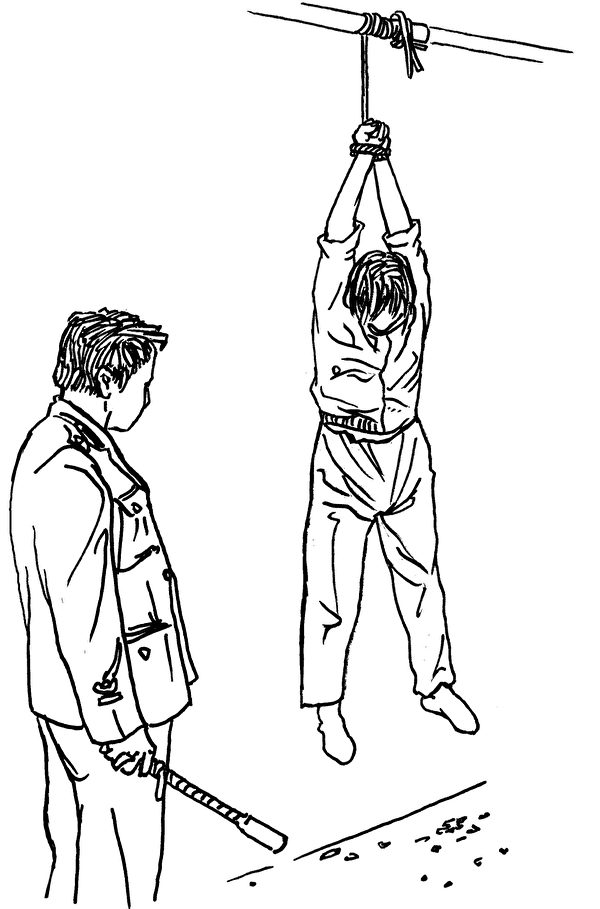

中共酷刑：吊挂。（明慧网）

酷刑演示：死人床。（明慧网）

  
2000年3月底，王莉被非法劳教1年半，关押在武汉何湾劳教所。王莉在劳教所曾多次绝食抗议，遭遇野蛮灌食及各种各样的酷刑，导致身体受损严重。

王莉还遭受强迫洗脑，数日不让睡觉，被强迫干体力活，甚至在绝食多日的情况下照样干活。

<b>原唐山广播电台节目主持人王建辉遭多次迫害</b>

王建辉。（明慧网）

 
 原唐山人民广播电台经济生活频道早间新闻节目主持人、一级播音员王建辉，于1998年开始修炼法轮功，以“真、善、忍”为准则。修炼后，困扰他的咽炎好了，原来很有个性的脾气也随和了许多，家里也很和睦。

有一次，他母亲从市场回来，发现商贩多找给她十元，王建辉知道后，嘱咐他母亲一定给人家送回去，要为人家着想。

这场迫害发生后，王建辉至少5次遭绑架，3次非法劳教迫害。还曾被非法关押在唐山广播电视塔下，由专人看守迫害长达一年之久。

为迫使王建辉放弃修炼，中共人员对他在方方面面施加压力，甚至破坏其家庭。其妻子单位（唐山路北区政府）的一个书记企图迫使其妻与他离婚，而且示她意离婚就可以提干，还称：“等着吃你的喜糖了（指离婚后再婚）。”

此外，王建辉的小舅子当兵的权利也被非法剥夺。

<b>遭绑架迫害主要案例
 
原吉林省档案局《兰台内外》杂志社副总编张忠余遭迫害</b>

张忠余，吉林省长春市法轮功学员，原是中共吉林省机关的副处级干部，曾任蛟河市组织部副部长、原吉林省档案局《兰台内外》杂志社副总编。

张忠余于1996年6月开始修炼法轮功。2002年3月，长春法轮功学员利用有线电视技术插播成功后，张忠余去参与了插播的刘海波家串门。刚刚交谈十多分钟，突然房门被打开，冲进七八个警察，就开始毒打他俩，一警察发现刘海波的外套衣服兜里有四百多元，就把钱快速地揣进自己的兜里。

这时刘海波的妻子正在哄五六岁的孩子睡觉，孩子被惊吓，大声哭叫起来。警察连拖带打将他俩拖到厅里，想把他们的手和脚以及嘴都用绳子勒住。当时张忠余的头部被打破，流了很多血。

警察将他们拉到长春市宽城区公安分局，不由分说地就用电棍电、棍棒打，好几个人一起下手，还把一个凳子放在张忠余身上，上边坐一个人压着。由于肉体难以承受的痛苦，使张忠余本能地拼命挣扎。

“你叫什么名？”一个声音问，张忠余拒绝回答。这伙人将他的下身裤子都剥光，动用二尺多长的电棍电击生殖器等部位，并用棍棒毒打小腿迎面骨、脚踝骨和脚趾头。强大的电流极其恐怖，让人痛苦难忍，好像都把人打透了一样。

坐在压在他身上的凳子上的警察都换了好几个人。后来确认，当晚刘海波被迫害致死。张忠余的胯骨轴子都被迫害得变形，濒临死亡的边缘。

即便张忠余被折磨成那样，长春市“610”公安局一处仍将他蒙上眼睛拉到大约是净月潭山上的宾馆里去迫害。

那一夜，警察张航一个人同时用两根电棍电击他，重点电击他的生殖器。只要张忠余稍动一点儿或打瞌睡，张航就电击他一通儿，还逼他唱国歌、背诗和成语。当张忠余痛苦难忍低下头时，张就用脚踢他的头。

2008年奥运会临近时，中共“610”机构指使警察、便衣特务加紧对张忠余家的骚扰、监视和对其拦截、盘查，家附近常停着警车，还有流动警车，还有便衣特务及不挂牌的警车。后来张忠余辗转逃出中国大陆，来到海外生活。

<b>江西南昌市电视台徐吉安遭国安酷刑迫害</b>

徐吉安，出生于1942年11月，江西省电视台播出部发射台的工作人员，2002年退休。徐吉安在修炼法轮功之前，身体非常虚弱，患有多种疾病。1999年1月，修炼法轮功后，徐吉安逐渐改掉了坏脾气，虚弱的身体通过坚持炼功而得到了很大的改善，近60岁的他才尝到了生活的甜头。

1999年“7·20”法轮功被迫害后，他六次遭绑架，曾遭精神病院遭药物毒害，被劫入洗脑班遭强制洗脑。

2008年5月14日上午，单位老干科的一个工作人员领着南昌市国安的七八个警察闯进徐吉安的家中，以需对徐吉安进行讯问为由，在没有任何法律手续、程序的情况下，直接将徐吉安绑架上警车。

国安警察对他刑讯逼供，命令他背靠墙壁罚站、往他脸上喷烟雾，强制他“马步蹲桩”并用双手将方凳举过头顶且不准晃动。如此手段反复折磨他数个小时。晚上睡觉时，将他的手臂铐在铁床上，整个人根本无法动弹。

徐吉安曾绝食抗议抵制对他的酷刑逼供。在一个晚上，罗雍等两三人强制66岁的徐吉安靠墙站立，对着他脸上喷香烟烟雾，强行脱掉他的袜子，让他赤脚站在冰块上，将他悬空吊铐在防盗窗上半个多小时，致使他两手臂麻木，两个多月后都没有完全恢复。

后来，国安人员将徐吉安关押到市第一看守所。他被东湖公安分局相关人员和看守所的牢头先后勒索一万多元，才被释放回家。

<b>湖北武汉电视台编辑江小萍多次遭绑架</b>

江小萍，出生于1963年，家住武汉市汉口永清街27号，曾是湖北省武汉电视台的编辑，因为修炼法轮功，遭到当地“610”、派出所、单位人员的监控，7次遭绑架，3次被劫持到洗脑班，她的家人也遭株连，动不动被非法抄家、恐吓。80岁的老父亲还被无人性的“610”人员叫到洗脑班，亲眼看女儿遭受折磨的惨状。

在修炼之前，江小萍身心疲惫，年纪轻轻就患有高血压、偏头痛、腰酸背疼，肺结核多种疾病。后来开始修炼法轮功，从此无病一身轻，活得身心健康、快乐并幸福。

1999年7月，江泽民公开迫害法轮功，其实早在1999年6月中旬，恐怖气氛就开始了。当时有位武汉市总编室的领导给省总编室管节目宣传的领导打电话说：“我们那个（诬蔑）法轮功的片子可不可以播？”对方回答：“上面已经批了，可以播了。”

很显然，武汉电视台是受了上级指使搞了一个诬蔑法轮功的谎言片，手段卑鄙而拙劣。那部片子就是7月22日下午3点，由中央电视台主持人罗京向全国乃至全世界放毒、播放的诽谤、诬蔑法轮功的片子，欺骗了所有不明真相的世人。

2008年3月17日上午，新闻研究所副所长张忠迪谎称台领导找她谈话，结果在楼下等着她的是穿便衣的警察、面包车、“610”和总台综合治理办公室主任鄢小初等人，他们把江小萍绑架到臭名昭著的所谓湖北省法制教育中心──汤逊湖洗脑班迫害，封闭洗脑迫害45天。

与前两次相比，这次迫害手段更恐怖、阴毒。车子开进大院，身穿迷彩服的武警一拥而上，一大群穿制服的警察拿着照相机对着她的脸拍照，在心理上给人造成一种恐怖的肃杀之势。

他们给江小萍安排了两个包夹（监管法轮功学员的刑事犯），三个犹大（被洗脑后放弃了修炼法轮功的人），旁边还站着两个警察。江小萍坐着，他们就叫她站着；江小萍站着，他们就把她推得东倒西歪，逼迫她签字。

2019年黄历新年前，江小萍再次被警察绑架，在此之前江晓萍至少遭绑架过六次。

明慧网资料显示，新闻传媒系统法轮功学员至少有7人被迫害致死，33人被非法劳教、判刑，至少有83人遭绑架迫害。

上述参与迫害的主要责任人是部分地区的政法委、“610”、国保、派出所及公检法司人员，而幕后真凶则是江氏犯罪集团和中共及中央政法委、“610”迫害体系。

<a target="_blank" href=#top><h6 align="right">回上方</h6></a>

<a name=184>
<h1 align="center"><b>【新闻看点】经济4大难题 李克强再喊压力大</b></h1>

图为北京一处建设工地的工人。（AFP)

【大纪元2019年12月21日讯】大家好，欢迎大家关注新闻看点，我是李沐阳。

中国大陆年度代表字词今天（12月20日）公布了，年度汉字是“稳”，年度国际词是“难”和“贸易摩擦”。从中共官媒的这个评选结果，不难想见中国经济的状况。

前天，中共总理李克强在一个会议上表示，今年国内新旧矛盾交织，全年发展主要目标任务能够“较好完成”。明年中国经济发展可能遇到更大的下行压力、面临更复杂的局面。

李克强把往年的“全面完成”任务，换成“较好完成”任务。如果说这是底气不足的话，那么他说明年“下行压力”更大，很可能在反映着中国经济的问题已经越来越明显。分析认为，目前中国经济存在着4大难题，已经成了北京当局的心头大患。

<b>一、企业债务如山</b>

十年前，当全球金融危机威胁到世界经济增长的时候，中国启动了大规模的经济刺激计划。修建道路、桥梁，创造就业机会。为了筹集资金，银行大量发行房贷，地方政府也开始举债。从2008年的9万亿美元，增加到今天的40万亿美元。

但刺激过后，市场逐渐恢复甚至变得冷感，中国经济增速随之出现了放缓。特别是贸易战爆发，加速了中国经济下滑到30年来的最慢增速，而且还在下滑，使得很多企业举步维艰。

恰在此时，借来的钱到期了，中国企业累积了大量的债务。《纽约时报》表示，未来两年，中国企业将有大约1.4兆（万亿）美元国内债券、还有2000多亿美元的外债到期。仅是今年，已经出现了200亿美元的违约，企业违约贷款价值超过了2018年的总额。

但这“还没完”，标普中国信贷专家李国宜（Christopher Lee）估计，“违约率还将上升。还有其它许多公司在非常艰难的环境中运营”。标普指出，中国企业必须偿还900亿美元的债务，这些债务都来自全球企业和中国以外的投资者，2021年还将有1100亿美元到期。

前不久，天津市政府经营的天津物产集团和北京大学为最大股东的北大方正集团相继宣布无法如期还债。

曾是世界500强之一的天物集团12日宣布，完成了11亿美元的债务重组。国际信用评级机构标准普尔（S&P Global）指出，所谓债务重组，实际上就是债务违约。这家大型大宗商品贸易公司，成了20年来第一家没能按时还债的中共国企，欠债高达12.5亿美元。

几天后，国内最著名大学支持的企业集团——北大方正，也宣告不能按期偿还2.84亿美元的债券。这家在证券、半导体和房地产领域都有投资的企业还不起钱，引起了更广泛关注。

随后，经济总量位列全国“三甲”的山东也爆出企业信用风险。彭博社统计，今年以来，山东新增债券违约的本金规模创下了历史新高，达到15.41亿美元，在中国所有省份中排第四。这个数字，还不包括那些挣扎在债务危机边缘的企业。

穆迪（Moody’s Analytics）大中华区信用研究主管钟汶权表示，山东很多民企集中发生债务违约，主要因为互保担忧导致金融机构更谨慎，而违约又加剧了这种恶性循环。

过度借贷又无法按时偿还，也造成了中国金融部门的困境。《华尔街日报》今天报导，中共政府准备拿出140亿美元，救助坏帐日益严重而濒临危机的恒丰银行。

中共很清楚，这140亿美元不太可能是最后一张大额支票。所以已经表现出更多让企业破产的意愿，目的是“教训他们不要过度借贷”。

当局的举措，更打击了银行向企业注资的信心。而对企业来说，融不到资，处境更加艰难，到期账单就摆在面前。

荣鼎咨询（Rhodium Group）中国研究主管洛根·赖特（Logan Wright）作了个比喻，“你可以把油从车里取出来，但这会产生问题。如果让汽车由另一种动力驱动，你就不可能让它以同样的速度行驶。”

彭博指出，今年是中国迎来的最大企业债务违约年。

<b>二、房市冷淡</b>

中国经济第二个显而易见的难题，是日渐冷淡的房地产市场。

尽管越来越多的城市开始放松楼市调控，也有很多房地产公司大幅降价，但是销售依然萧条，库存量不断增加。

据南方网14日报导，11月份商品房库存量是1039.63万平方米。以北京为例，西城区有住房空置半个月后，下降了600元租金才把房子租出去。11月北京住房租赁市场交易量环比下滑了7.79%，同比下降3.88%。

二手房市场冷淡，一手房又如何呢？“乐有家”统计数据显示，10月份广东佛山非限购区一手住宅网签8426套，环比下跌了3.1%，新房成交数从4月份起，连续6个月下跌。

河南郑州的楼市销量暴跌48%后，当地又推出刺激政策。在中心城区持居住证满一年，可以办理入户，而原来的时限是5年。如果是租房的，可以办理户口。融创、万科、碧桂园、恒大等这些大型地产公司，都在郑州开始降价卖房。

此外，深圳、南京、天津、三亚、兰州、张家港等城市也都不再限购，但成交量依然低迷。尤其张家港，前11个月的总成交量同比下跌了29%。

克尔瑞地产研究中心的数据显示，受检测的29个重点城市，11月的累计成交2255万平方米，同比和环比分别下跌了12%和1%。

房子卖不出去，库存量在上升。而有的房地产公司为了转嫁危机，开始向内部员工销售“员工房”。

前天业内人士对“第一财经”表示，截止到11月，房屋销售非常不景气，多家房企连全年销售指标的一半都没有达到。压力之下，有的房地产企业开始瞄准企业员工。

业内人士介绍，一家上市房企为了增加销量，“员工房”的整体价格比市场价低6%。要求员工年末之前交首付，明年6月可以更名一次，明年卖不出去公司给退房并返还首付。

融创集团也对天津员工实行了员工买房计划，如果年末前一次性付款打八折，分期付款打八五折。一次性买房，半年后可以更名一次。

绿地集团湖南公司要求员工（包括试用期员工）自购或推荐他人购买，否则开除，员工有一次更名机会和一定折扣。

此外万科、华润、银丰等房企还推出了“团购房”。

<b>三、人口严重畸形 劳动力减少</b>

如果说企业债务违约和房市冷淡近在眼前，那么人口结构问题，就是中国经济长远的最大担忧之一。

被誉为华尔街最优秀的经济预测师、投资咨询机构亚德尼研究公司总裁亚德尼（Edward Yardeni）把中国称为“世界上最大的疗养院”，他的意思就是中国正面对着人口急速老化的问题。

15日，北大国家发展研究院副院长黄益平与布鲁金斯学会联合发布一份报告。在这份名为“中国2049”的报告中指出，未来中国存在三大新挑战，其中之一就是“人口快速老龄化”。

这位北大学者在“第四节国家发展论坛”上表示，中国每年劳动力人口减少800万，而老龄人口增加1200万。人口老龄化将严重影响消费需求、劳动力供给、储蓄和社会保障。

大陆媒体报导，2018年60岁及以上的人口是2亿4949万，占总人口的17.9%。这个数字比2017年同期增长了859万，比2008年增加了8960万。

如果按照未来60岁及以上人口每年增加800万的速度，10年左右的时间后，中国老龄人口将达到3.4亿。而每赡养一位老人，差不多需要2个人工作。

但是中共搞了几十年计划生育，使人口出生率急剧下降。中共官方数字，2018年的出生率是10.94‰，是1949年以来的最低点。

威斯康星大学研究员易富贤研究认为，去年中国人口其实已经出现了负增长，全年的总和生育率（妇女一生中生育子女的总数）只有1.05左右。

低生育率，直接导致人口不断老化，使整个经济和社会活力在不断减弱。中共也在《老年健康蓝皮书》中承认，中国已经进入了“未富先老”的状态，人口老龄化进程超过经济发展进程。

蓝皮书表示，2015年到2050年，中国用于养老、医疗等方面的费用，占GDP的比例将由7.33%，增长到26.24%。

鉴于中共向来美化数字、淡化危机，所以外界都怀疑它的真实性。认为实际情况可能“严重得多”，而且是长期存在的问题，对中国经济影响巨大。《华尔街日报》直言，中国的生产率和人口问题当头，中国经济增长仍将放缓，“恐难再现繁荣”。

曾长期断言中国经济高速增长无法持续、并且料到2015年到2016年将爆发金融危机的乔治·马格努斯（George Magnus）表示，中国人口的巨大变化，从2012年就“真正开始了”。

这位牛津大学中国问题学者指出，人口变化、过度负债等问题，将使明年中国经济“充满挑战”。他认为明年官方GDP增长在5.8～6%之间，因为2021年是中共认为的“100周年”，经济必须保持积极。但他认为，中国经济增速会逐步降到3%～4%。

马格努斯指出，前两年的金融危机并没有结束，很可能会带来中国经济的“明斯基时刻（Minsky Moment）”，就像2007年到2008年。

<b>四、明斯基时刻</b>

明斯基时刻是以美国已故经济学家明斯基（Hyman Minsky）为命名，意思是说经济泡沫破裂，导致资产价值突然崩溃的时刻。他的理论是长期的市场稳定，实际会鼓励投资者承担更多风险。而过多的风险势必会带来不稳定，导致债务和资金杠杆比率上升。最终无法平仓的情况下，市场突然惨烈下跌，也就是爆发了金融危机。

2018年，中共自称GDP是90万亿人民币，但负债率却是GDP的1.5倍。到去年底，中共各部门的整体杠杆率是150%，而整体负债率高达250%，超过所有主要的发达经济体。

北京兰溪投资公司CEO张江红在福布斯撰文表示，中共政府把很多负债都算在了企业头上，使居民部门杠杆变得很高，将近65%，是企业部门杠杆率的2倍。她引用国际货币基金组织的观点表示，中国正处在第四次去杠杆的历史时刻，中国经济正面临着发生金融危机的风险。

大陆金融学者贺江兵去年7月表示，中国经济的明斯基时刻“已经来临”了。他在自由亚洲撰文指出，中共推出7000亿人民币的“定向降准”措施，实际就是在抵御已经来到的明斯基时刻。

他表示，去年北京的房价已经从高点明显下滑了，尤其是中古屋的价格，更是下跌了20%。另外人民币也存在着大量的泡沫，“发行过多已是不争的事实”。此外还有前面提到的庞大的地方与企业债务、P2P平台等等，这些都在严重威胁着中国经济。

而这种情况下，北京当局非要和美国打贸易战，对中国经济更是沉重的打击。他认为中共当局打贸易战是“鸡蛋碰石头”的说法并不对，这是“往美国总统川普的钢针上碰”，是“泡沫碰钢针”。

旅美经济学者何清涟在大纪元撰文表示，中共的极权统治可能暂时不会让中国发生明斯基时刻。尽管所有条件都成熟了，但它可能操纵控制经济，推出新的杠杆对冲风险。

但她强调：欠下的债总是要还的，明斯基时刻到来的危险始终存在。

就是说，明斯基时刻，是中国经济时时存在的大难题。

<b>中国经济痼疾严重</b>

时事评论员蓝述表示，中共向来有个特点，好事把1说成10，坏事把10说成1。如今李克强主动说出明年的压力很大，就说明问题可能非常严重了。

南卡大学艾肯商学院讲席教授谢田认为，中国经济已经陷入了非常严重的衰退，所以它才放弃“不谈结构性问题”的底线，决定与美国签协议。即使这样，中国经济下滑恶化也不可避免。

谢田指出，中国经济本身有非常严重的痼疾，每个问题都可能会引起中国经济塌方，甚至撼动中共政权，这是中共的心头大患。就像是得了多种绝症的病人，只要有一种病症发作，就可能要了中共的命。

好的，感谢您关注新闻看点，再会。

大纪元《新闻看点》制作组  #

<a target="_blank" href=#top><h6 align="right">回上方</h6></a>

<a name=183>
<h1 align="center"><b>马云卸任后 在湖北获“新职”</b></h1>

马云表示，2019年对大部分企业很不容易，而这可能还是刚刚开始。图为资料照。（李逸/大纪元）

【大纪元2019年12月21日讯】（大纪元记者张顿报导）马云卸任阿里巴巴董事局主席后，日前获得中共湖北省政府“经济顾问”的头衔。

12月20日，第四届楚商大会在湖北省武汉开幕。省长王晓东现场向浙江商会总会会长马云、楚商联合会会长、泰康保险集团董事长陈东升颁发聘书，聘其为湖北省政府“经济顾问”。

这是马云今年卸任阿里巴巴董事局主席后，首次获得中共地方政府“经济顾问”的头衔。

马云在开幕式上致辞说：“也感谢这个聘书让我能够有更多来湖北的机会。”

时政评论员石实表示，马云担任的所谓湖北省政府“经济顾问”的职务，这只不过是一个虚职，摆摆样子而已，正如马云所言，他可以借此职务多去几趟湖北，而湖北省借马云首富的光。

今年9月10日，刚刚55岁的马云，含泪辞去阿里巴巴董事局主席职务，但继续担任阿里巴巴集团董事会成员。

马云说，不当阿里巴巴董事长，“不等于我退休，我是不会停下来的，阿里巴巴只是我很多梦想中的一个而已”。

虽然马云回应卸任阿里巴巴董事局主席，不是“迫于压力”，但外界普遍认为他是“被辞职”，是民营企业家在当前“国进民退”、民企生存空间不断缩窄之际必然要做出的抉择。

马云“退休”后，紧接着大陆一系列科技大佬纷纷卸任重要职务，包括百度公司创始人李彦宏、腾讯公司董事会主席马化腾、京东集团董事局主席刘强东，先后卸任百度云计算技术有限公司的执行董事、腾讯征信法定代表人及执行董事、京东北京京邦达贸易有限公司总经理及京东龙云科技有限公司总经理。

同时，顺丰控股董事长王卫，也于近期卸任顺丰商贸公司董事长；联想控股董事长柳传志，12月18日也宣布退休计划，自2019年12月31日后不再担任联想集团董事长及执行董事。

另外值得一提的是，马云11月8日出席乌克兰基辅国际经济论坛时，再次公开表示后悔创阿里巴巴。

他说，如果再给自己一次机会，会尽量不把公司做这么大。当把公司搞大了，自己却更忙了，还要处理更多问题。

早在2016年的圣彼得堡国际经济论坛上，马云也曾说，“我人生中最大的错误是创立了阿里巴巴！”

现在，外界还没有直接证据显示这些私企老板纷纷卸任与中共政府间关系，但柳传志在2015年7曾公开表示，民营企业家有三怕：一怕中共政府说你好你就好，说你有罪就有罪，极不安全；二怕政府不作为；三怕中共政府说的跟做的不一样。

外界认为，柳传志说出了当前中国民营企业家为什么频频卸任的真正原因——“说你有罪就有罪，让人觉的极度不安全”。

<a target="_blank" href=#top><h6 align="right">回上方</h6></a>

<a name=182>
<h1 align="center"><b>美国务院：对违反宗教自由者采取行动</b></h1>
 
【明慧網二零一九年十二月二十二日】二零一九年十二月二十日，美國國務院網站發表新聞聲明：美國對違反宗教自由者採取行動。聲明中指出，根據《國際宗教自由法》，因「系統的、持續的嚴重違反宗教自由的行為」，美國國務院將中共等國家再度指定為，違反宗教自由「特別關注國」。

美國務院新聞聲明中還指出：二零一九年十二月，美國政府宣布根據《全球馬格尼茨基法案》指定九個國家的68個個人和實體從事腐敗和侵犯人權行為，其中包括對中國政府和共產黨官員施加了簽證限制。

<b>對中共參與迫害者產生顯著影響</b>

二零一九年五月，據明慧網消息，美國國務院官員曾告知一些宗教和信仰團體，美國國務院官員並告知美國法輪功學員，可以提交迫害者名單。二零一九年五月三十一日，明慧網刊發《通告》，請海內外法輪功學員更完整的收集和向明慧網提交迫害者名單。

這一消息對於中共公檢法產生了顯著的影響，一些參與迫害的部門將工作人員的照片，從牆上摘下以免被舉報；一些警察在釋放法輪功學員時說：「我沒有打你吧，不要舉報我，我孩子以後還要出國。」甚至有的公安局長也開始有所顧忌：「為甚麼要舉報我們？別人孩子出國，我們孩子也要出國啊。」

聽到這些反饋，美國國務院官員很受鼓舞，非常高興他們的工作能為減少中國的人權迫害起到實質作用。

二零一九年七月，美國國務院官員稱，相關辦公室的人員已擴充一倍，以便加大力度審核、限制各國人權迫害者的簽證申請。而且，目前有28個國家已經制定或準備制定類似於美國的「馬格尼茨基法」，對人權迫害者拒發簽證、凍結海外資產。

<b>「明慧網是可信賴、可引用的資訊來源」</b>

十一月初，美國華盛頓一家知名人權組織透露，美國國務院的相關部門擴充人員編制，加大力度使用禁止入境及凍結財產的措施制裁其它國家的人權迫害者。

美國國務院官員還指出，有的條款不僅針對惡人本人，還可制裁其家屬；而且即便惡人本人或家屬已經入境美國，也可將其簽證吊銷、將惡人和家屬遞解出境。

國務院官員還明確提出，不看重迫害者涉及的案例數量，而看重具體事實。只要有一個案例事實充份，就可以把迫害者列入特殊名單。國務院官員還肯定，明慧網是可信賴、可引用的資訊來源。

明慧網上刊登的中共迫害法輪功案例，大多數都是受害者或者是目擊者的親身經歷，經過明慧網核實的，美國政府、美國國務院進一步地公開確認明慧網的信息來源，表明中共對法輪功迫害的二十年來，法輪功學員堅持不懈地講真相、反迫害，最終贏得了國際社會的公開認可。

<b>「知情即承責」</b>

二零一九年七月，國務院官員還表明一個調整，即對於嚴重侵犯人權的惡行（如酷刑、毆打），一個官員只要是惡行實施單位的負責人，即可列入懲罰之列，而不需像以往那樣證明此官員對某次具體惡行下達了命令或進行了指揮。

這是一項自70餘年前「紐倫堡審判」以來，國際社會認可的人權準則，即「知情即承責」，用一句白話講，就是享有權力，就要對事情的後果承擔責任。

在70餘年前，二戰結束後的紐倫堡審判中，參與大屠殺的醫生、法官等邊緣角色，辯解說他們只是遵從命令，是上面叫幹的。然而，正是他們身在其位，也明白的知道他們所做的事情，是構成大屠殺的各種各樣的條件，因此事實上，給納粹對人類的犯罪在技術上提供了最重要的協助。

這些參與大屠殺的醫生們顯然受過教育，其中一些還是當時最有名的醫學家、科學家，藉口「上面叫我這樣做的」並不足以開脫他們滔天的罪惡。這也就是為甚麼在完成了對納粹德國主要戰犯的起訴和審判之後，紐倫堡國際軍事法庭的第一個審訴案件就是「醫生審判」。

<b>「五眼聯盟」懲惡在即</b>

繼美國簽證新規對中共人權迫害者帶來的巨大衝擊波後，十一月底，美國、加拿大、英國、澳大利亞及新西蘭組成的五眼聯盟國收到法輪功學員最新整理出的一批迫害法輪功的惡人名單。這些國家將依法對這些惡人拒發簽證，甚至凍結資產。

中共的官方公告顯示，美國、加拿大、英國、澳大利亞及新西蘭等五國是外逃貪官心目中的「避罪天堂」。

原因是中國尚未與這些國家締結引渡條約，或締結了條約但尚未生效，一旦貪官在這些國家落腳，很難被遣返。而法輪功學員將迫害者名單遞交五國政府，要求對其本人及家屬拒發簽證、甚至凍結財產，這將堵死他們通往「避罪天堂」的大門。

法輪大法信息中心發言人表示，「這個名單不僅僅是涉及到參與者本人，而是包括他的家屬，包括他們家人前往美國要定居、要學習、旅遊啊、經商啊，這些路全部都堵死了。所以這是一個很綜合性的舉措。」

<b>28個國家參與《馬格尼茨基法》</b>

歐洲議會於二零一九年三月十四日壓倒性通過決議，敦促歐盟層級，以及28個成員國，都各自製定類似美國的《全球馬格尼茨基人權問責法》的制裁機制。

荷蘭議會於十一月二十一日通過一項動議，要求荷蘭政府在二零二零年一月三十一日前準備好荷蘭版的《馬格尼茨基人權問責法》，如果歐盟在這個截止日期之前沒能通過歐盟版的《馬格尼茨基人權問責法》，荷蘭政府將開始推動本國版本。

德國國會網站也正在公開一個民眾發起的請願書，內容是呼籲德國也引入類似的法案。請願書徵集簽名截止日期是二零一九年十二月三十日。

據悉，歐洲其它一些國家的政府也在積極推動相應立法，以便對人權迫害者予以拒發簽證、凍結資產等制裁。加拿大和英國的相關官員已專程到美國商討如何加強合作、共同對人權迫害者予以制裁，並聽取受迫害組織的反饋、回答他們的問題。

<b>十萬惡人榜　罪行無可逃</b>

十一月十五日，明慧網宣布，明慧網惡人榜已更新，迄今為止，共搜集了105,580名參與迫害法輪功學員者的名單，包括各級公檢法、610等等，包括他們的個人信息和惡行等也被記錄在案。

一九九九年七月起，中共江澤民集團動用整部國家機器迫害法輪功，對上億信仰「真、善、忍」的法輪功學員進行殘暴的迫害。

對法輪功學員的「轉化」（放棄修煉）迫害、酷刑折磨、精神折磨遍及中國大陸所有省、市、縣、鄉、村；涉及的單位包括中共政法委、各級「610」辦公室、司法局、安全情報局、國保大隊、公安局、檢察院、法院、看守所、拘留所、監獄、精神病院、洗腦班、黑監獄，還有中共各級企事業單位、基層社區、街道、村委會等等。

自一九九九年七月中共開始迫害法輪功，二十年來，這些機構實施的犯罪行為被記錄在案，犯罪行為包括：騷擾、監控、蹲坑、恐嚇、株連、苛扣工資、開除公職、勒索錢財、勞教、綁架、關押、陷害、構陷、各種酷刑折磨、批捕、非法庭審、判刑等等。

中共使用的酷刑手段就有一百多種，如：電刑、火刑、水刑、凍刑、銬刑、坐刑、餓刑、抻刑、毒打、性虐待、藥物迫害、墮胎、活摘器官，使用動物摧殘等等。

為摧毀法輪功學員的意志，中共在關押迫害法輪功學員的設施裏大量使用藥物，所採用的方式多種多樣，包括進行人體試驗、讓人中毒死亡、關精神醫院等，許多法輪功學員被毒害致殘、致瘋、致死，甚至成植物人。

參與迫害者不僅僅將受到制裁，其實他們中為數眾多的人已惡運纏身。據明慧網《迫害法輪功　19年間逾兩萬人遭惡報》一文統計，從一九九九年七月至二零一八年七月，中共迫害法輪功以來的19年，參與迫害而遭厄運者逾兩萬人，正所謂善惡有報，天理昭昭！

希望中國大陸所有相關人員引以為戒，對迫害政策不予配合、執行，不要堵死自己和家人前往西方國家定居、學習、旅遊或經商之路。尚未作惡者，潔身自好、切勿作惡；已經作惡者，立即改邪歸正、將功補過。

<a target="_blank" href=#top><h6 align="right">回上方</h6></a>

<a name=181>
<h1 align="center"><b>中共走投无路 军队押送“中美协议”过关</b></h1>

12月13日美中达成第一阶段的贸易协议，习近平是如何让中共利益集团同意签订协议的呢？图为10月11日美国总统川普在白宫接见美中第13轮高级贸易谈判中方特使、中共副总理刘鹤。(Nicholas Kamm / AFP)

【大纪元2019年12月17日讯】（大纪元记者方天亮香港报导）经过18个月的贸易激战，中美双方终于在12月13日同时宣布，双方达成了第一阶段的贸易协议。美方称这是美国经济的一次“巨大胜利”，而中方的表态就很模糊诡异。就在签订协议之前的12月9日至13日，五天内习近平提拔了近200名少将、中将和上将。究竟习近平是如何让中共利益集团同意签订协议的呢？接下来习近平将面临什么挑战？

<b>美国胜利 中共让步 中国人受益</b>

据美国贸易代表莱特希泽透露，美国总统川普（特朗普）在12月11日首次宣布达成贸易协议后，双方花了大量时间确定协议措辞的具体含义，直到13日美东时间上午10时，川普最终点头同意了协议条款。

此时正是北京时间的13日晚上11时。为了赶在与美方同时宣布协议的签订，中共在晚上11时召开新闻发布会。不过中方的规格严重低于美国。

在美国，川普连推两文，白宫和贸易代表办公室也分别发表声明，庆祝这一巨大胜利。他们表示，第一阶段贸易协议是一份“历史性的和可执行的协议”，中方不仅同意在知识产权、技术转让、农业、金融服务和货币与外汇领域进行结构性改革，而且“协议包括一套强有力的纠纷解决制度，确保能够有效落实和执行”。这项协议对美国经济——特别是美国农民、制造商和创新者来说，“是一次巨大的胜利”。

而中方，出席记者会的只有副部级官员，如主持会议的是商务部副部长王受文，还有中财办副主任、财政部副部长廖岷等。中共的这种低调，也许反映了高层对协议的态度。而中方对协议条款的披露更是遮遮掩掩、躲躲藏藏。

王受文在新闻会上发表声明说，中美双方就第一阶段协议文本达成一致，共有九个章节，包括序言、知识产权、技术转让、食品和农产品、金融服务、汇率和透明度、扩大贸易、双边评估和争端解决、最终条款。

有评论说，这次是美国胜利，中共失败，但中国人民会受益，因为这个协议会倒逼中共搞改革，倒逼中共实践其在2001年加入世界贸易组织（WTO）时的承诺，从而让中国大陆朝着正常国际化的方向前进。协议的签订也为中国大陆经济朝好的方向转变提供了可能，而不签订协议，中国大陆经济会继续断崖式下跌。

<b>九章节显示中共大让步</b>

根据美方的公告，我们可以把美国的收获概括为“一个承诺，一个订单，一个机制”：一是美国得到了中共在很多方面做结构性改革的承诺；二是获得了一个采购大订单：每年2,000亿美元的订单，其中包括400亿的农产品；三是最为重要，中方同意实行强制监督的核查机制。

而中共获得的，只是美国象征性地减少关税。川普在推文中表示，原订12月15日征收的“惩罚性关税”，因为双方达成协议而不再加征。“原来25%的关税将保持不变，剩余的商品将征收7.5%的关税”。

也就是说，对中共高科技打击最大、冲着中共原来制定的“中国制造2025规划”而来的2,500亿美元中国商品，加征的25%税率一点没变，只是把从9月1日开始的1,200亿美元中国商品加征的15%税率减了一半。

作为条件，中方同意在未来两年内，将对美国产品和服务的购买总额增加至少2,000亿美元，以后可能还会继续增加购买量。目前中美贸易顺差为4,190亿美元，等于中方承诺把贸易盈利减少一半。

对于川普的竞选票仓：农民，这次中共承诺，在两年内对美国农产品的购买量增加320亿美元，使每年平均总量达到400亿美元。而且中方表示，会尽最大努力，将采购额每年再增加50亿美元，接近500亿美元。

在技术转让方面，据美国之音报导，协议还包括中方承诺遵守先前的承诺，消除外国公司为获得市场准入、许可或行政批准而必须向中国大陆公司转让技术的任何压力，并消除此类转让的任何政府优势。

协议对中国大陆的金融服务也作出了规定，美国公司获得改善的进入中国金融服务市场的渠道，包括银行、保险、证券和信用评级服务。美国官员表示，这个规定目的是解决美国长期以来，对这个领域存在的投资壁垒的不满，包括外国股权限制和歧视性监管要求。

协议还提到人民币汇率的问题，中方承诺避免竞争性货币贬值，并且不以汇率为贸易优势。如果中方违规，美国就会提高关税。

关于执行机制，这是所有协议条款得到落实的保证。如果中方出现没有遵守协议内容承诺时，怎么处理呢？白宫首席经济顾问库德洛（Larry Kudlow）13日晚上在接受CNBC采访中说：“在第一阶段贸易协议中包括一项有关程序，如果有投诉出现，相关投诉将被送到两国中级官员（staff level）授予处理。如果在这个层级的对话中无法得到解决，投诉将送到双边副部长级官员审查对话。如果在这里仍然没有得到解决，将送到两国主要官员，也就是中共副总理刘鹤与美国贸易代表莱特希泽进一步审查分析。”

库德洛强调：“如果是无法解决的分歧，（美方）将采取一些相关的经济考虑，相应动作也会被实施。毫无疑问，这包括采取关税措施作为促使执行的工具。”

<b>刘鹤曾被骂成卖国贼</b>

海外一些极左的马列原教旨主义者称，这次北京是“跪着签订了协议”。

的确，这次北京做出了令很多人惊讶的让步。与2019年5月中美第十轮贸易谈判相比，这个第一阶段协议，只是减少了对国营企业的补贴问题，还有对中共扶持产业的政府高投入问题。

而当时5月的协议初稿，当习近平拿出来时，被很多人骂成是“卖国”，刘鹤也被骂成是李鸿章、“投降派”，甚至出现了“煮鹤”之声。习近平后来到各地视察，特意高调偕刘鹤同行，就是在以这种方式向外界昭示他全力挺刘鹤，“刘鹤的谈判策略是忠实执行他的指示”。

据说在4月底的中共政治局会议上，江泽民派系代言人、副总理韩正公开跳出来反对签订协议，最后迫使习近平放弃了自己过去一年通过刘鹤达成的协议。

为何这次习近平同意通过这个所谓“不平等协议”呢？

首先从美国的角度来看，最先制造不平等、制造不公正的是中共，美国只是让中共兑现其在17年前早就作出的承诺，并就其以前的错误做法作出相应补偿。就好比警察捉住了小偷，小偷为了逃避眼前的惩罚，要与警察签订协议，这个协议当然包括惩罚性条款。所以川普一直坚持说，中美之间不可能签订对等协议。

中共原想采用拖延战术，把签订协议拖到明年美国大选之后；中共企图用各种阴招阻挠川普连任，如今对美国总统的诸多弹劾，背后黑手都是中共。

不过这一招不管用。近日美国参议院主席公开表示，不会让弹劾案通过，而美国经济出现了几十年来最好水平。11月美国失业率降到了3.5%，创下50年来的新低点。如今朝野上下都基本认同了川普的连任。

<b>“跪签”协议因中共山穷水尽</b>

最后促成中共“跪签”协议的主要原因，是中国大陆经济要崩溃了，中共山穷水尽、走投无路了，才不得不暂时利用协议的方式来换取喘息的机会。一旦脖子被别人卡住了，中共最擅长用一纸空文的承诺来换取对方的松开双手。中共与国民党的几次合作，都是利用这种计谋。

在贸易战开打之前，中国大陆经济早已出现结构性问题：市场乏力疲弱，生产停滞，工人大量失业。贸易战的爆发，更加速、加剧了中国大陆经济的“滞胀状态”。这是一道难以解开的经济难题。“滞胀”如果发生在市场经济国家就会变成危机，而在极权国家，可能会变成民众起义，这是中共最怕的事情。

贸易战开打之后，中国大陆经济出现了中共总理李克强说的“断崖式下跌”，尽管中共表面上还宣称中国大陆GDP（国内生产总值）增速有6%，但很多大陆学者公开表示，中国大陆GDP增速3%都没有，有的还说是负数，是降低而不是增长。由于贸易战，国际制造业重新洗牌，很多外资企业迁出大陆，资金外流，中共外汇储备陷入枯竭的险境中，经营环境极度恶化。

正是由于经济撑不下去了，山穷水尽了，中共才不得不签订中美第一阶段贸易协议。

就在中共签订协议的前一天，12月12日结束的中共经济工作会议上，中共把“保稳定”当做重大经济目标，这是自2013年以来的第一次。因为经济垮了，马上就是政治上的不稳定，以及中共政权的坍塌。

<b>军队护航 紧急开中央经济会议</b>

12月10日，中共中央经济工作会议提前十多天在北京紧急召开。

据中共官媒报导，中共中央政治局委员、中央书记处书记、全国人大常委会有关领导、国务委员、最高法院院长、最高检察院检察长、全国政协有关领导以及中央军委委员等出席了会议。另外，各省、自治区、直辖市和计划单列市、新疆生产建设兵团党政主要负责人，中央和国家机关有关部门主要负责人，中央管理的部分企业和金融机构负责人，军队有关负责人参加了会议。

一句话，掌管中国大陆的所有重要人物全部到齐了。

官方报导说，中国大陆的经济下行压力加大，“必须清醒认识到……结构性、体制性、周期性问题相互交织，‘三期叠加’影响持续深化，经济下行压力加大。”

会议12日结束，北美时间12月13日一早，川普即表示“非常接近跟中方达成一笔大协议。他们想要，我们也想要！”看来，习近平开完会很快就把中共的同意转达给了川普。

与此同时，自12月8日起的中共官媒反美宣传突然降温，宣称要“理性维护中美关系”。中国央行前副行长李若谷表示，中国应进行有意义的结构性改革，以解决美国在贸易战中所提的要求，并说“让步也是一种力量的展现”。

就在中共中央经济工作会议举行之际，还出现了一个反常的事。

12月9日至13日，中共武警部队、陆军、海军、空军先后举行晋升将官军衔仪式，12月12日，习近平为晋升上将的7人授阶；五天内共晋升7名上将、16名中将、147名少将。

按照中共常规，晋升上将一般在中共建军节8月1日之前，习近平多年来都是这样做的，不过在2018年习近平一个上将都没有提拔，而在2019年中共将要与美国签订协议之前，习却提拔了近200名少将、中将和上将。

这无疑是习近平在展示他的军权，展示他对军队的绝对掌控权。与此同时，习近平在5天内查处了逾20名官员，这样的“亮肌肉”显示实力，是给谁看的呢？

毫无疑问，习近平是给上次那些反对中美签订协议的人看的。习用这种方式，让江派、毛左那些反习势力看清楚，这次是必须要签订协议的，谁阻止、谁倒楣。

接下来习近平面临的将是更大困难，因为他面对的头痛事，不再是美国，而是中共体制。

中共体制的方方面面都与协议要求的方方面面格格不入。是按照协议改变中共、还是根据中共体制来修改协议？这将是习近平2020年每天都要经历的头痛事。#◇

<a target="_blank" href=#top><h6 align="right">回上方</h6></a>

<a name=180>
<h1 align="center"><b>《自然》十大科学家 揭中共强摘器官者入列</b></h1>

《自然》杂志网站发表2019年对科学最具影响力的十大科学家，其中包括找出新方法，揭露中国（中共）政府从事非法器官移植的温蒂·罗杰斯（Wendy Rogers）教授。图为示意图。 （大纪元质料室）

【大纪元2019年12月22日讯】（大纪元记者吴英编译报导）《自然》杂志网站发表2019年对科学最具影响力的十大科学家，其中包括找出新方法，揭露中国（中共）政府从事非法器官移植的温蒂·罗杰斯（Wendy Rogers）教授。

澳大利亚麦格理大学（Macquarie University）临床伦理学教授罗杰斯，注意到至少持续二十年的中共政权非法移植肝脏、心脏和肾脏等器官的争议，并以不同于以往的新方法挖掘真相。

罗杰斯带领的团队深入检视中国器官移植医生所出版的研究论文，并在2019年2月发表调查报告，导致20多份器官移植研究论文，因中国医生无法明示自愿捐赠者后被取消发表。

“你如果想到正在发生的事实，那简直是令人难以忍受的。”罗杰斯说。

四年前在一次会议中观看了纪录片《难以置信》（Hard to Believe），罗杰斯开始关注移植伦理议题，并对中共强制摘取器官的状况感到震惊。

《难以置信》是一部由美国PBS公共电视台制作的纪录片，导演为两度艾美奖得主肯·斯通（Ken Stone）。影片记录了记者伊森·葛特曼（Ethan Gutmann），诺贝尔和平奖提名人大卫·麦塔斯（David Matas）律师和加拿大前国务秘书大卫·乔高（David Kilgour）等进行的独立调查，披露中共如何从良心犯身上摘取器官并形成一条完整的器官产业链；被害者主要是被关押的法轮功学员，以及其它宗教团体的信徒。

2016年，罗杰斯担任非营利性组织“终止中国活摘滥用器官国际联盟”（International Coalition to End Transplant Abuse in China，简称ETAC）主席。随后，她开始调查在《国际肝杂志》（Liver International）的一篇有关器官移植的论文，发现其中缺少捐赠者的文件。该论文于2017年被取消发表。

通过这次调查，罗杰斯推测可能还有更多论文存在无法提供捐赠者文件的问题，并决定展开深入调查。

她和团队成员及志愿者不眠不休地工作，筛选了数千篇论文，并得出结论：超过400篇论文，可能使用了囚犯的器官，而且来源不明。

罗杰斯所筛选的论文主要是发表于2001年至2017年之间，报告了逾8.5万器官移植手术。她的小组公布了至少发表5篇器官移植论文的17种期刊，其中两个期刊有所回应。

《公共科学图书馆期刊》（PLOS ONE）撤消了被列在罗杰斯清单上的21篇论文中的19篇，并正在对另外两篇进行调查。《移植》（Transplantation）期刊撤回了七篇，其中五篇在罗杰斯的清单上。该等期刊表示，撤回的原因是论文作者没有回应，或者无法给出令人满意的解释。

PLOS ONE主编约格·赫伯（Joerg Heber）感谢罗杰斯团队，并加强了对移植器官论文的要求。

比利时鲁汶天主教大学（Catholic University of Leuven）计算生物学家伊夫·莫罗（Yves Moreau）表示，论文被取消发表，系将这种行为归类为全球重大的生物伦理丑闻之中，并向科学家和出版商明确传达了应该认真对待研究伦理问题的信息。

《自然》杂志说，在荷兰海牙起诉战争罪犯经验丰富的律师杰弗里·尼斯（Geoffrey Nice）主持的国际专家小组，今年发表一篇论文，质疑中共器官移植的数据并得出结论，在中国因宗教或政治观点而被监禁的人，因被强制摘取器官致死，而且这种状况很可能仍在持续中。

中共政府并未回应该报告和罗杰斯团队的发现，罗杰斯说，她对中共是否会公开移植手术的相关信息并不表乐观，但是相信调查可能会对其强制性器官移植造成遏止的作用。#

<a target="_blank" href=#top><h6 align="right">回上方</h6></a>

<a name=179>
<h1 align="center"><b>又一求救信 英女孩圣诞卡惊现上海囚犯信息</b></h1>

6岁女孩发现Tesco圣诞卡上写有来自中国监狱里外国囚犯的求救信。（网络截图）

【大纪元2019年12月22日讯】（大纪元记者程静编译报导）圣诞节将至，一位英国女孩在乐购（Tesco）的慈善圣诞卡上发现一则求救信息，是来自上海青浦监狱里一些外国囚犯发出的。

英国《星期日泰晤士报》报导，居住在伦敦南部图庭（Tooting）的6岁小学生弗洛伦斯·维迪科姆（Florence Widdicombe）在家中准备给朋友寄圣诞卡，她打开了一个从乐购买来的的慈善圣诞卡盒，惊讶地发现其中一张已经被使用过。

这张卡片上有一只戴着圣诞老人帽子的小猫，但写有来自中国“古拉格”的绝望消息。

该信息由大写字母写道：“我们是中国上海青浦监狱的外国囚犯，被迫违背自己的意愿工作。 请帮助我们，并通知人权组织，”并要求发现者联系也被关在中国的一名英国记者彼得·汉弗莱（Peter Humphrey）。

佛罗伦萨无意间的发现，把英国圣诞节的快乐与中共对人权的侵害令人寒心地联系起来。

为保护囚犯的身份，他们的手写字迹已更改。

报导说，从上海监狱寻求帮助的呼声，令乐购与中国供应商的关系尴尬。

众所周知，中共侵犯人权且劣迹斑斑。多年前，一封惊现在美国万圣节装饰品中的、来自中国劳教所的越洋求救信，曾轰动国际社会。

作者孙毅在严密监控下用镜头记录下他在沈阳马三家劳教所真实的生活，揭露中共对法轮功的残酷迫害，后来他来到海外，其经历拍成电影《求救信》，在世界各地播放，令观众震撼。该影片得过多个奖项，去年入围奥斯卡最佳纪录片候选名单。

<a target="_blank" href=#top><h6 align="right">回上方</h6></a>

<a name=178>
<h1 align="center"><b>北京强颁“限狗令” 大批爱犬被“安乐死”</b></h1>

今年4月2日，动物保护团体曾上传的一段视频，一只狗狗被一群警察在光天化日之下活活打死。（视频截图）

【大纪元2019年12月21日讯】北京市通州区日前推出“限狗令”，禁止居民饲养身高超过三十五厘米的犬只，而且要在三天内自行“处置”。一些狗主担心爱犬受到残暴对待，宁愿为它们安排“安乐死”。有爱护动物组织则谴责当局利用行政手段残害生命。

北京市通州区当局12月5日发布通知，称按照市内养狗管理规定，通州区所有楼房一律不可饲养身高超过三十五厘米的所谓“大型犬”，居民必须在三天内自行处置，否则公安当局会把发现的狗只没收，并且对狗主进行处罚。

有爱护动物组织在脸书上表示，由于官方上门查访、抄狗的频率越来越高，许多饲主为避免爱犬被查获直接遭棍棒打死，哭着带着爱犬到宠物医院安乐死，各大宠物医院因此爆发“安乐死潮”。

微信公众号“Calipaw加利爱宠”撰文表示，自从这条惨无人道、没有人性的管理规定出台以来，宠物医院安乐死的狗狗已经排成长龙，因为饲主为了不要让“狗儿狗女”惨死棍棒之下，别无选择。

微博上更有饲主因为无法负担宠物安乐死费用，只能自己闷死或打死爱犬，但民众敢怒却不敢言。

当局推出“限狗令”的理由是，自2019年11月份以来，经常接到电话，某地区部分业主投诉有人违规饲养大狗，出现遛狗不拴犬绳、随处便溺等不文明养狗现象。

首都爱护动物协会会长秦肖娜周五（20日）向自由亚洲电台表示，即使要落实文明养狗，当局也不应一刀切。

秦肖娜说：“ 政府应该根据商业办法管理，取缔非法养犬，这样才能从源头制止非法的交易。对于违规的不拴狗绳，或者不清理大小便，这样的行为要进行罚款，主要是罚主人，而不是没收他的犬。”

此外，秦肖娜表示，把三十五厘米以上定义为“大型犬”本身就有商榷余地。“这种规定非常不科学，因为狗对人类有没有威胁、不是以大小为准的，而是以犬种来分的。有些犬是不适宜在居民区养的，譬如藏獒，而金毛和拉布拉多这些都是很温顺的犬种，而且很多工作犬都是这种犬种。”

香港非牟利兽医服务协会执行主席麦志豪表示，不希望大城市饲养过多名种的大型犬，虽然用意是好的，但手段却完全错误，而且荒谬，不人道，野蛮，甚至在很多国家是刑事罪行。

根据微信群的帖文，面对“限狗令”，不少北京狗主被迫向海外爱护动物组织求助，争取把爱犬送到国外接受领养。

不过，麦志豪表示，这在技术上存在很大困难，因为中国依然存在狂犬症，猫狗不能随便出境，基于检疫和隔离考虑，外国根本不会接收来自中国的狗只。#

<a target="_blank" href=#top><h6 align="right">回上方</h6></a>

<a name=177>
<h1 align="center"><b>长沙在建地铁附近地面塌陷 附近大面积停电</b></h1>

【大纪元2019年12月22日讯】12月21日，湖南长沙在建地铁施工路段附近的交叉口一路面发生坍塌。塌陷区域面积近百平方米。这起事故还造成附近区域大范围停电。

《长沙晚报》报导，21日晚上9点半左右，长沙大道与万家丽路交叉口往南100米处地面发生一处塌陷，塌陷区域长约12米，宽8米。从事发现场可以看到，塌陷处有水从管道里不断地涌出。该路段实施南北双向交通管制。

报导说，晚上9点40分左右，长沙雨花区事发区域周边大范围停电，具体原因是受路面塌陷影响。

22日零时许，长沙市应急管理局一名工作人员称，事发地在地铁5号线附近，坍塌事故可能是地铁5号线施工导致的，具体原因尚不清楚。

“长沙地铁”官方微博曾发消息称，长沙地铁5号线一期工程争取在12月30日实现通车试运行。

<a target="_blank" href=#top><h6 align="right">回上方</h6></a>

<a name=176>
<h1 align="center"><b>澳门移交20年晚会 林郑老公不拍掌 无声抗议？</b></h1>

林郑老公不拍掌，视频广传。（视频截图）

 
 【大纪元2019年12月20日讯】澳门主权移交20周年，19日晚在东亚运动会体育馆举行文艺晚会，香港特首林郑月娥同丈夫林兆波都有出席。现场播放《歌唱祖国》时，当全场高歌拍掌时，唯独林兆波木然站立不配合的一幕引发各界热议。

这场晚会的一个重点是习近平联同一众官员，带领全场拍手同唱《歌唱祖国》，但现场画面捕捉到林郑月娥的数学家老公林兆波双手交叠垂于大腿前，嘴巴未有明显移动，眼望远方目光呆滞，在他身旁的林郑月娥则用力拍掌，动作甚大，与林兆波互成对比。

片段随即在社交媒体广泛流传，有不少网民笑称林兆波向港人示范何谓“不合作运动”，有人形容他是“一个人的示威”、“沉默的抗议”。有人感叹是“学者的风骨”，也有人直指林兆波拥有英国籍，无须向政权下跪。

<h3 align=center><a href="https://twitter.com/HK_EpochTimes">同床不同夢？</a></h3>

公开资料显示，林兆波是英国剑桥大学哲学博士，主攻代数拓扑。在香港中文大学担任数学系副教授。他曾移居北京，在首都师范大学教授短期数学课程。#

<a target="_blank" href=#top><h6 align="right">回上方</h6></a>

<a name=175>
<h1 align="center"><b>大陆为何出现江湖“底朝天” 专家揭秘（上）</b></h1>

进入枯水期半个多月以来，长江武汉段沿岸呈现大片滩涂。（微博截图）

 
 【大纪元2019年12月21日讯】（大纪元记者易如采访报导）中国大陆枯水期来临之际，长江中下游武汉段出现了沿江滩涂的荒凉景象，甚至一些地段的江底湖底都露了出来，引发民众关注。造成江底湖底朝天是什么原因呢？这个原因又将带来哪些生态恶果？

大陆媒体《楚天都市报》近期报导，进入枯水期半个多月以来，长江武汉段沿岸呈现大片滩涂，江中露出各式沙洲。

报导说，在武汉段白沙洲上游的江心冒出一个长约1公里的新沙洲；12月9日的卫星图显示，因水位下降，天兴洲北岸的沙滩也露出水面，天兴洲将与北岸连成一片；11月下旬，鹦鹉洲长江大桥中间桥墩处的江面中心也出现了一条细长“道路”。

 <h3 align=center><a href="https://twitter.com/zhu0588">@洞中有洞 武汉人民奔走相告：长江江底露出来了！</a></h3>

中共航道和海事部门的数据显示，12月3日，汉口水位已降至2007年以来同期最低水位13.60米。长江武汉航道局表示，长江水位低的原因是，今夏以来长江流域整体雨水偏少。

著名三峡大坝问题专家、旅居德国的王维洛博士对大纪元表示，官方的这一说辞是错误的。“今年6月份，从江西的洪水开始，7月份，湖南的洪水很厉害了，也就是说，今年夏天长江中下游的降雨量是相当大，洪灾也是相当严重的。”

据大陆媒体6月的报导，今年6月份以来，中国南方地区江西、湖南、湖北等25省遭遇持续强降雨，多个省份降雨量超往年，一些县市降雨量突破当地历史极值，引发洪涝灾害。

近期，不仅湖北长江江底朝天，江西北部的鄱阳湖放眼望去也是大片的滩涂，鄱阳湖湖底露出，长满芦苇杂草。

中共长江水文局的数据显示，2019年11月30日17时湖口水位7.84米，跌破8米极枯水位线。鄱阳湖不仅跌破历史同期最低水位，也正式进入极枯水期，而今年枯水期提前近2个月，且水位还在持续下降。

<b>造成江底湖底朝天的原因有三</b>

对长江见底有网民表示不敢相信，他说：“我七八十年代在长江边长大，那时水深莫测，还有长江豚，不敢想像它会见底！”

王维洛表示，造成江底湖底见底有3个原因。第一个原因是由于三峡工程的逆调节，它在枯水期的时候反而蓄水。中共官方每年在9月到11月底这段时间会将长江入库流量一半的水拦截在三峡水库里，直到蓄满221.5亿立方米的水，而这个时间段正好是长江进入枯水期、下游需要水的时候，“它把水蓄在水库里，使得下游的水量减少，就引起了长江在武汉处的江底和鄱阳湖湖底露出来。”

当初水库大坝工程从苏联引进中国时，中共官方说有两大好处，既能防洪又能抗旱，就是“把洪水蓄在水库里，到了（干）旱的时候再把水库里的水放出来。”他表示，但三峡大坝却是洪水来的时候它不蓄水，“像今年7月份，它就不蓄水，而是加大了下泻的流量，因为它怕淹了上面的重庆”，而到枯水期的时候，又拦截下游的流量，把水蓄在水库里，所以它是起一个反作用，“大坝真正的目的是为了发电调节，而这个调节是违反自然规律的”。

王维洛说，第二个原因是在长江上游修建了28个大型水库，它拦截的水比以前更大了，造成下游没水。为什么要建造28个大型的水库呢？“为了防止三峡工程出现黄万里教授所说的三峡水库泥沙淤积问题，在上面多建一些水库，就把泥沙拦在上面的水库里，为三峡工程拦沙。那么，以前在枯水期开始的时候三峡工程要蓄满221.5亿立方米的水，现在这28座水库联合调度，就要拦截将近500亿立方米的水，所以，它拦截的水是以前三峡工程一个工程的2倍多。”

“减少下泄流量，也是造成今年9月鄱阳湖再次提前进入枯水期、水位跌破历史同期最低水位的主要原因。”王维洛说。

他说，第三个原因是三峡工程的清水下泻，它挖深了长江干流的河道，“抽干”了沿江湖泊的蓄水，造成鄱阳湖等湖泊在枯水期更加缺水，而露出湖底。

“清水下泻可能把原有的堤防掏空，或把原来的河道淤埋后在另外一个地方挖深一个河道，那么，当枯水期的时候，水流比较小，水量基本在干流的主河道里，主河道越深，河滩上出现的沙滩就越大，我们看到长江大量的边滩就流露出来了，很荒凉的状态。

“另外，原本长江水量的调节是靠长江干流和沿江的湖泊（如鄱阳湖、洞庭湖等）的水量大家共同调节，长江水多的时候就补充这些湖泊，长江水少的时候，湖泊里的水来补充长江。现在河道挖很深了，在枯水期的时候，长江水就进不了湖泊，而由于长江水位很低，湖泊的水都往低的地方流，往长江干流里面流，就‘拉空’了沿江湖泊的水位，湖泊水面面积退缩，最终湖底朝天。”

王维洛说，而现在清水下泻对三峡大坝的影响已经到了一个必须采取非常措施的时候，中共政府就用制造水泥排的方式，“就是用水泥编织成像木筏一样的东西往江里抛，让它来阻止三峡工程清水下泻继续挖深河道的作用，中共从来没有说这要花多少钱。”

<b>长江航运会受到很大的困难</b>

媒体报导说，长江武汉段沿岸呈现大片滩涂，大部分江面已被沙洲替代，航道变窄，当局已严控船舶超吃水，而接下来的1月份是常年枯水期水位最低的时间。

王维洛表示，如果这个状况持续下去，沙滩泥沙再多一点就可能和江北的陆地连成一片，走船就不行了，“特别在宜昌地区水位太低，下面走坝的船闸都进不去，长江航运现在受到了很大的困难。”

“但是这几年中共官方媒体对三峡工程造成的这些问题基本上是不报导，等到沙滩越来越大的时候，由于它本身河槽的蓄洪能力不会增加很多，相反是会减少，你可以想像当洪水来的时候的状况。”

（待续）#

<a target="_blank" href=#top><h6 align="right">回上方</h6></a>

<a name=174>
<h1 align="center"><b>当魔鬼撕下面具……</b></h1>

【明慧網二零一九年十二月二十二日】那些身處中國大陸的孩子們，從一出生開始，就生活在一個身不由己的環境中，當他們慢慢長大，對於身邊的一切早已習以為常。然而，他們的心靈卻已經被一層厚厚的東西包裹、籠罩……

從「撒謊作文」說起

二 零 一八年，一項來自《中國青年報》社會調查中心的問卷調查顯示，在2002名受訪者中，90.6%的人覺得，現在學生寫「撒謊作文」的情況多。其中，31.8%的人甚至表示，這種情況「非常多」。

從幾十年前的「保護集體財產」，比如「某個風雨交加的夜晚……去學校關窗戶」、「從家裏帶錘子、釘子去修理學校桌椅」，到後來的「拾金不昧」以及「樂於助人」主題，比如「撿錢交給警察叔叔」等等，中共治下的學校「撒謊作文」不但失真，並且造假內容雷同，似乎有一個設定的標準答案。

原首都師範大學教育科學學院副教授李元華說：「共產黨要控制人們的思想，最主要的就是讓人不能真實的表達自己，所以它要給你一個所謂的標準答案。它出任何題目的作文實際上都隱含著一個它的所謂標準答案，所以小孩從小上學的時候就被訓練一種技能，就是揣摩所謂的標準答案。」

當一個人不知道要對自己寫下的東西負責，這是從根本上毀掉了做人的誠信。

<b>問題到底出在哪裏？</b>

最近，北大學生會副主席牟林翰被指長期精神虐待女友包麗，最終導致包麗自殺並導致腦死亡，在大陸引發軒然大波。就在社會一片的譴責聲中，中宣部下達禁令，禁止媒體追蹤報導。

不僅是因為生命的寶貴，人們還急切地想知道，為甚麼一個知名高校的學子竟然會敗壞到這種地步：牟林翰僅因女方過去曾有感情經歷，其控制女方的想法令人不寒而慄：「給他懷一個孩子再打掉」，「做絕育手術」，「不能把切除的輸卵管扔掉……帶回來給我，我想留下它。」

人們在思考、探究，問題出在哪裏？在微博上，對此問題的跟帖有數萬條，有人感嘆：「地獄突蕩蕩，魔鬼在人間。」面對世風墮落如此之甚，人將不人，人心魔變，原因到底在哪裏？

據媒體報導，牟林翰深諳「學生會政治」，如何競選學生會幹部，如何取得別人信任，包括競選時表現出對競選對手示弱，對領導投以「忠心」，如何通過利益騙取選票。這與「撒謊作文」有著潛在標準答案，豈不是如出一轍？

中共喉舌《半月談》雜誌曾刊文指出，不少大陸高校學生組織就像「小官場」，「抱大腿」、「混圈子」、「打招呼」等不正之風盛行。

顯然，作為中共黨組織結構的一層，學生會也無法逃脫中共「假、惡、鬥」的邪惡基因。對上級所謂的「黨性」無條件服從，對下級用盡控制、奴化的一切手段。雖然北大學生會幹部事件僅為個案，但卻真實投射了中共「黨文化」對於人心的異化與魔變。

<b>《九評》揭示真相</b>

看一看，九評編輯部的《九評共產黨》所揭示的真相：「中共作為一個極權組織，對社會的控制深入每一個社會細胞，沒有中共在背後慫恿和操縱，這一切根本不可能發生。」

「中共常常給自己唱讚歌說『舊社會把人變成鬼，新社會把鬼變成人』，而這一場場的人肉盛宴卻折射出：中共可以使人變成豺狼魔鬼，因為它本身比豺狼魔鬼更加凶殘。」

「所有的基因都為著同一個目的：恐懼型的高壓控制。共產黨的邪惡，使它成為所有社會力量的天敵。」

當我們把視線移的遠一點，則中共魔鬼般的基因就昭然若揭了：

一八四八年，《共產黨宣言》宣告「一個幽靈，共產主義的幽靈」出世。馬克思在《共產黨宣言》中明確地寫道：「共產主義要消滅永恆的真理，消滅所有宗教和所有倫理道德」。「一切存在的都應該被毀滅。」

列寧說：「專政是直接憑借暴力而不受任何法律限制的政權。」

毛澤東說：「槍桿子裏面出政權。」「將革命進行到底。」「八億人口，不鬥行嗎？」

江澤民在鎮壓法輪功時說：「精神上摧毀，經濟上截斷，肉體上消滅。」

幽靈般的共產主義，並沒有隱瞞它的意圖，然而世人卻在其暴力之下的恐怖與謊言中，被欺騙了一代又一代，一年又一年。

當血淋淋的事實，看的越來越清楚時，有人感嘆說：「這一次，我相信他們會將懷孕的婦女置於死地。」事情是怎樣呢？

◇懸空吊墜孕婦致痛苦流產　丈夫被逼在旁觀看

黑龍江省哈爾濱萬家勞教所惡警為逼迫一懷孕六、七個月的法輪功女學員放棄對法輪功「真善忍」的信仰，將她懸空吊起，繩子繞經房樑（離地三米）滑輪，惡警鬆開繩子，孕婦急速墜落、重重摔下，惡警再拉繩將人吊起，再鬆開、墜落、摔下，來回折磨，孕婦在無以言表的痛苦中，被折磨流產。

◇肢解嬰兒！悲呼小小生命慘遭「凌遲」酷刑

張漢雲，陝西漢中市漢台區法輪功學員，事發當年三十三歲。二零零一年三月，漢中市漢台區公安分局政保科科長馬平安、漢中市610等惡人綁架了住在親戚家即將臨產的張漢雲。

惡人將她拉到三十公里外的職工醫院強行墮胎，因胎兒過大難產，禽獸殺手竟將已屆臨盆的嬰兒肢解！將嬰兒肢解取出！

◇毒殺胎兒！可憐七月胎兒掙扎兩天兩夜痛苦而亡

法輪功女學員淨蓮（化名）和丈夫進京上訪，為大法討公道，在北京信訪辦等到的卻是公安的非法抓捕。被接回當地後，因淨蓮已有七個月身孕，拘留所不收，「上級」決定強行打胎，

惡警將她拉到醫院強行打毒針，可憐七個月胎兒在母腹中折騰了足足有四十多個小時才痛苦地死去。淨蓮掙扎著生下死去的孩子，淨蓮心如刀絞，父母泣不成聲，抱著白白胖胖的死去的孩子捨不得扔掉。

其慘烈如同凌遲酷刑啊！對如此幼小無辜的生命怎麼下的了手！如此沒有底線的禽獸不如的行惡，卻不用承擔任何法律責任。中共漠視生命、為禍中國，把中國社會、中國人、中國人的道德已經為害到何等可怕、何等變異的地步！

<a target="_blank" href=#top><h6 align="right">回上方</h6></a>

<a name=173>
<h1 align="center"><b>组图：12.19吁国际介入港人道危机游行</b></h1>

香港社福界一连三日发起罢工及集会，今日（19日）社福界发起“香港人权及民主法案”游行，由湾仔游行至9个国家驻港领事馆，包括澳洲、捷克、意大利、荷兰、英国、欧盟、美国、日本及加拿大，呼吁有关国家通过类似《香港人权与民主法案》的议案。（余钢／大纪元）

 
 【大纪元2019年12月20日讯】（大纪元香港记者站综合报导）12月19日，香港社福界发起“香港人权及民主法案”游行，希望国际介入香港人道危机。估计有二千人参与。该游行已获得警方发不反对通知书。

香港社福界一连三日发起罢工及集会。星期四（19日）最后一天发起“香港人权及民主法案”游行，时间从下午2时起至傍晚5时，路线由湾仔游行至9个国家驻港领事馆，包括澳洲、捷克、意大利、荷兰、英国、欧盟、美国、日本及加拿大，呼吁有关国家通过类似《香港人权与民主法案》的议案。

游行人士举着不同国家的国旗，在沿途高喊“五大诉求，缺一不可”、 “光复香港，时代革命”、“解散警队，刻不容缓”等口号。路途中有防暴警察戒备。

 

2019年12月19日，香港社福界发起“香港人权及民主法案”游行，希望国际介入香港人道危机。图为游行队伍代表向驻港领事馆代表递信。（余钢／大纪元）

 

2019年12月19日，香港社福界发起“香港人权及民主法案”游行，希望国际介入香港人道危机。图为游行队伍代表向驻港领事馆代表递信。（余钢／大纪元）

 

2019年12月19日，香港社福界发起“香港人权及民主法案”游行，希望国际介入香港人道危机。图为游行队伍代表向驻港领事馆代表递信。（余钢／大纪元）

  

2019年12月19日，香港社福界发起“香港人权及民主法案”游行，希望国际介入香港人道危机。图为游行队伍代表向驻港领事馆代表递信。（余钢／大纪元）

 

2019年12月19日，香港社福界发起“香港人权及民主法案”游行，希望国际介入香港人道危机。（余钢／大纪元）

 

2019年12月19日，香港社福界发起“香港人权及民主法案”游行，希望国际介入香港人道危机。（余钢／大纪元）

 

2019年12月19日，香港社福界发起“香港人权及民主法案”游行，希望国际介入香港人道危机。（余钢／大纪元）

  

2019年12月19日，香港社福界发起“香港人权及民主法案”游行，希望国际介入香港人道危机。（余钢／大纪元）

 

2019年12月19日，香港社福界发起“香港人权及民主法案”游行，希望国际介入香港人道危机。（余钢／大纪元）

 
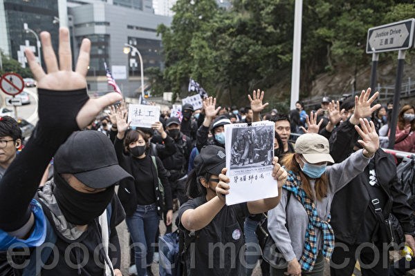

2019年12月19日，香港社福界发起“香港人权及民主法案”游行，希望国际介入香港人道危机。（余钢／大纪元）

 

2019年12月19日，香港社福界发起“香港人权及民主法案”游行，希望国际介入香港人道危机。（余钢／大纪元）

2019年12月19日，香港社福界发起“香港人权及民主法案”游行，希望国际介入香港人道危机。（余钢／大纪元）

 

2019年12月19日，香港社福界发起“香港人权及民主法案”游行，希望国际介入香港人道危机。（余钢／大纪元）

2019年12月19日，香港社福界发起“香港人权及民主法案”游行，希望国际介入香港人道危机。（余钢／大纪元）

 
 
<a target="_blank" href=#top><h6 align="right">回上方</h6></a>

<a name=172>
<h1 align="center"><b>又是“无一验收通过” 甘肃关闭全部P2P</b></h1>

中国大陆P2P平台倒闭后，受害的投资人上街抗议。 (AFP)

 
【大纪元2019年12月21日讯】12月19日，甘肃省官方发布消息称，因为没有一家P2P网贷平台验收合格，甘肃省的27家P2P全部退出市场。目前为止，大陆几个全部关闭P2P平台的省市给出的理由全是“没有通过验收”。

甘肃省P2P网络借贷风险专项整治工作组19日发布了《关于公布甘肃省P2P网络借贷风险专项整治市场退出机构名单的公告》。

公告称，甘肃省内至今没有一家网络借贷公司完全合规通过验收，外省在甘从事网络借贷业务及分支机构均未在当地金融监管部门备案。

公告还列出了被吊销销营业执照的27家公司名单。

据大陆网贷之家的消息，从去年11月份开始至今，大陆已经有20个省市相继对外公示了辖区内网贷机构清退名单，包含安徽、河北、河南、重庆、辽宁、云南、济南、四川、深圳、宁夏、浙江、北京、贵州、天津、湖南、山东、湖北、广州、新疆、甘肃，至少涉及948家网贷机构。

其中，云南、河北、四川、重庆、河南、山东、湖南、甘肃等八省市宣布关闭辖区内所有网贷平台。

随着大陆经济下滑，P2P平台爆雷倒闭增多，中共借口整理纷纷关闭了平台。

最新数据显示，截至今年10月末，大陆纳入实时监测的在运营机构数量已降至427家，比2018年末下降59%；借贷余额比2018年末下降49%，出借人次比2018年末下降55%；行业机构数量、借贷规模及参与人数已连续16个月下降。大部分机构选择退出停业，今年已停业1200多家，相当于每天关闭4家以上。

<a target="_blank" href=#top><h6 align="right">回上方</h6></a>

<a name=171>
<h1 align="center"><b>港重大车祸致6死39伤 4警察一旁说笑被骂</b></h1>

12月18日下午4时左右，香港粉岭公路近古洞一带，一辆巴士发生严重车祸。（PHILIP FONG/AFP via Getty Images）

【大纪元2019年12月19日讯】12月18日，香港粉岭公路一辆巴士发生车祸，导致6人死亡、39人受伤。巴士司机因涉嫌危险驾驶引致他人死亡被警方被捕。事发时，有防暴警察在一旁说笑，被指冷血。

综合港媒报导，12月18日下午4时左右，该巴士在粉岭公路近古洞一带撞向一棵树，整个大巴车顶被削去。事故中，6名死者中有3名是男乘客，2名女乘客当场死亡，另一名被送往北区医院的59岁女乘客抢救无效。

39名伤者中，一位是56岁巴士男司机，另外是21名男乘客、17名女乘客，其中包括两名3岁及12岁儿童。这些伤者分别被送往雅丽氏何妙龄那打素医院、北区医院、博爱医院及屯门医院治理。

到目前，已有26人出院，13人仍然留医，其中1人危殆，1人严重，在屯门医院住院，其余11人情况稳定。

12月19日凌晨，涉事司机被以涉嫌危险驾驶导致他人死亡逮捕。

新界北总区交通及支援组警司陈少鸣说，对肇事司机通过酒精呼气测试，然后以危险驾驶导致他人死亡将他拘捕。被捕后，警方将从司机身体状况、驾驶态度、路面情况及机件性能等四方面进行全面调查。

在现场直播视频中，有网民发现4名防暴警察在车祸附近谈笑风生，面目表情乐呵呵的，身后却是惨烈的车祸现场。

网民批评防暴警察“不尊重死者，冷血”“黑警站在车祸现场笑得这么开心，有什么好笑的？”

 <a target="_blank" href=#top><h6 align="right">回上方</h6></a>

<a name=170>
<h1 align="center"><b>任世豪：岁末看反迫害前景</b></h1>

美国国务院官员告诉一些宗教及信仰团体，他们意在更加严格地审核签证申请、对人权及宗教迫害者拒发签证，已得到签证者也可能被拒绝入境。 (SAUL LOEB/AFP/Getty Images)

【大纪元2019年12月21日讯】时光飞逝，又值岁末。回顾即将过去的二零一九年，世事纷杂如棋。但只静心澄虑，便见脉络清晰。中共对法轮功的非法迫害，倏忽已经持续二十年。风雨如晦，法轮功学员依旧锲而不舍的讲清真相，继续引领着世人反迫害。鉴往知来，前景可期。

一九九九年七月，中共党魁江泽民出于嫉妒，发动国家机器镇压法轮功，伪造“天安门自焚”、“一千四百例”等假新闻，煽动民众仇视法轮功，制造了史无前例的人权灾难。大批善良的法轮功学员被无辜迫害，难以计数的学员被非法关押判刑、失业失学与流离失所，甚至遭酷刑折磨与活摘器官，经不完全统计核实的至少已有四千三百多名法轮功学员被迫害致死。

二零一九年五月底，明慧网发布《通告》指出，美国政府将更严格地审核签证申请、对人权及宗教迫害者拒发签证，包括移民签证和非移民签证（如旅游、探亲、商务等），已发签证者（包括“绿卡”持有者）也可能被拒绝入境。今年夏天，加拿大和英国的相关官员专程到美国国务院，商讨如何加强合作、共同对人权迫害者予以制裁，并听取受迫害组织的反馈。

美国政府表示，只要有受迫害事实就可提交恶人名单，即便恶人或家属已经入境美国，也可吊销签证、将恶人和家属递解出境，以防堵他们妄图通往“避罪天堂”的大门。国务院官员强调，近年有多人因迫害人权被拒发签证，皆因参与迫害法轮功。

十一月底，美国、加拿大、英国、澳大利亚及新西兰组成的五眼联盟国收到法轮功学员最新整理出的一批严重迫害法轮功的恶人名单。近期，明慧网更新了迫害法轮功的中共恶人名单，“恶人榜”上已超过十万人。

在十二月十日“国际人权日”之际，美国多位政要，包括参议员加德纳（Cory Gardner）资深国会议员史蒂夫‧金（Steve King）、国会议员莱特（Ron Wright）、国会议员约霍（Ted Yoho）、前国会议员林肯‧迪亚斯-巴拉特（Lincoln Díaz-Balart）纷纷表示，支持川普政府对中共迫害法轮功的恶人实施制裁，拒发签证、冻结其财产。

与此同时，“全球声援中国民众控告江泽民迫害法轮功的刑事举报联署活动”公布了最新统计。从二零一五年七月到二零一九年十二月五日，全球37个国家超过350万民众联署刑事举报，向中共最高检、最高法院举报江泽民迫害法轮功的反人类罪行，要求法办元凶江泽民。

今年这一系列的形势变化表明，随着海内外法轮功学员坚持不懈的揭露迫害真相，启发人们的善念良知，许多原本受中共谎言蒙蔽的世人对法轮功的态度，逐渐从同情、理解，转为认同、支持。形势丕变，对法轮功的迫害显然是穷途末路了。

近年中国民众挺身而出、制止迫害之声络绎不绝，振奋人心的讯息纷至沓来。亚洲、欧洲、澳洲、北美的多国议会也陆续通过决议，谴责中共迫害法轮功与强摘学员器官的滔天罪行，制止迫害已成为国际社会的共同愿望。

随着真相广泛传播，中国人逐渐走出谎言的迷雾，看清了中共的邪恶本质。迄今在退党网站公开表明“三退”（即退出中国共产党、共青团和少先队）的人数已逾三亿四千八百万，中共解体覆亡之期近在眼前。茫茫天数不可逃，人间历史神安排。就像苏联解体一样，瞬间发生；中共像一颗根已烂透的大树，说不定哪天就倒了。

做为修炼人，法轮功学员深知“善恶终有报”的宇宙法则，讲真相告诉世人即将发生什么大事，趋吉避凶，以免成为中共的陪葬品。古人说：“君子不立于危墙之下”，祝愿明智之士秉持良知，退出中共的党团队组织。头上三尺有神灵，这也是神佛给每个人（尤其中国人）一次选择将来的机会。“往者已矣，来者可追；亡羊补牢，犹未晚也”。曾经参与迫害法轮功学员的中共公检法人员，应该悬崖勒马、即时停止迫害，才能忏悔赎罪，以免自断未来。

<a target="_blank" href=#top><h6 align="right">回上方</h6></a>

<a name=169>
<h1 align="center"><b>中共千人计划渗透又一椿 敲醒美学术界</b></h1>

FBI和国立卫生研究院（NIH）展开一项大规模调查，这项调查涉及到71家美国研究机构，180个可能涉及知识产权盗窃的个案。图为NIH。（维基百科公有领域）

【大纪元2019年12月20日讯】（大纪元记者吴英编译报导）美知名专栏作家周四发表专文指出，美国研究机构终于意识到中国（中共）为扩张经济及军事力量，致力于推动系列战略，威胁美国的研究环境，损害美国利益。

周三（12月18日），位于美国佛罗里达州坦帕市的H. Lee 莫菲特癌症中心和研究所（H. Lee Moffitt Cancer Center & Research Institute，下简称莫菲特癌症中心）发布新闻称，首席执行官兼总裁亚兰・里斯特（Alan List）、副总裁汤马斯・西勒尔斯（Thomas Sellers）以及四名研究员，因未遵守规定与违反利益冲突，已遭开除。

《华盛顿邮报》专栏作家罗金（Josh Rogin）周四发表专文指出，遭开除的莫菲特癌症中心高管及研究人员没有公开他们参与中国（中共）政府“千人计划”并从中获利的事实。

莫菲特中心说，在美国国立卫生研究院（National Institutes of Health, NIH）发起一项调查后，该中心解雇了总裁及其他人员，因该调查警告“来自外国的努力，影响或损害了美国研究人员”。

该中心目前正在与NIH合作，调查有关该中心相关研究是否受到外国威胁的影响。

美国联邦调查局（FBI）近期一直在警告全美研究机构，北京多项人才招募计划不仅威胁到美国研究环境的完整性，而且危及国家安全。

今年7月，联邦调查局局长克里斯托弗・雷（Christopher A. Wray）在国会作证时表示，中共经常利用人才计划，窃取他国知识产权，并引入中国发展经济及军事项目。讽刺的是，美国纳税人成为中共发展经济的资助人。

据FBI的调查，中共的招募人才计划（总计200多项）违反美国包括经济间谍、窃取商业秘密、规避出口管制和赠与欺诈等相关规定。

参议院国土安全和政府事务委员会（Homeland Security and Governmental Affairs Committee）2019年发表一份报告，列举了国家实验室、能源部和研究院的员工（受中共诱惑）滥用职权的案例。

该委员会报告指出，应对美国新政府和国会的审查，北京决定将“千人计划”地下化，删除相关新闻报导以及其它网络文章，并要求参与者保密。

美国国会敦促全美大学和研究机构进行更多的调查、提高透明度及合规性。参议员里克・斯科特（Rick Scott）近日致函给佛州所有大学，吁请展开调查，并揭示研究人员与中国政府相关计划的关系。他告诉罗金：“每个人都必须对中共日益扩张的影响力保持警惕。”

罗金在文章中说，莫菲特癌症中心开除高管及研究人员的案件具代表性，意味着美国学术界开始改变观念，不再认为调查中共渗透是反华偏见。

今年四月，在休斯顿的MD安德森癌症中心（MD Anderson Cancer Center）解雇了三名未披露与中国机构关系的华裔科学家。

罗金写道，美国研究机构长期以来一直对北京的企图视而不见，自认是在实践“开放科学”，而不是中共政府所从事的“战略科学”。有些人认为，科学研究最终将公开发表，有关中共威胁之说实则是被夸大了。此等论调忽略了大量证据显示，中共政府的人才计划并不是要进行互惠互利的合作，而是将其作为窃取他国研究成果以达到发展其政治野心的工具。

最后，罗金建议美国政府和学术界必须加速合作共同努力，确定中共政府威胁美国研究环境的程度，并予以消除。他认为美国需要国家战略管理国际科学合作，以维护美国既有的研究环境开放性以及国家安全。#

<a target="_blank" href=#top><h6 align="right">回上方</h6></a>

<a name=168>
<h1 align="center"><b>蓬佩奥：中国人民正在抵制共产党</b></h1>

美国国务卿蓬佩奥在12月18日表示，中国人民正在抵制控制中国的共产党。图为2019年12月19日，蓬佩奥在国务院就伊朗人权问题发言。(Mark Wilson/Getty Images)

【大纪元2019年12月21日讯】（大纪元记者陈俊村编译报导）美国国务卿蓬佩奥（Mike Pompeo）在周三（12月18日）表示，中国人民与中国共产党不同。中国人民希望生活在自由的社会，也不支持共产党。他们正在抵制中共。

蓬佩奥当天在接受《华盛顿时报》专访时做了上述表示。他透露，他无意在明年参选参议员。他将继续留在川普（特朗普）总统身边任职。

在论及对华政策时，蓬佩奥说，美国政府今年在告知全世界有关中共的威胁方面，取得了实际的进展。

他认为，在过去几十年来，正当中共的威胁持续增加之际，美国一直在沉睡之中，而川普起了一个开头，向全世界揭露中共的威胁，并思考如何回应。

蓬佩奥揭示了中共的本质说，控制中国的中共是个独裁政权，结合了马克思列宁主义与汉族的民族主义。该党“否定了人民的基本自由”，而这种事情正在新疆和香港上演。

他提到，中共机构控制了讯息和军事活动，现在正采用严苛的社会信用体系，“以改变中国人民的行为。”

他说，美国体认到中国人民的伟大，他们渴望自由并过自己想要的生活，而中共则另有所求，这是很重要的。

蓬佩奥在访谈中还强调说，他并不支持在经济上与中国脱钩。“我们的政策并不主张脱钩。我们的政策只是要求中方以公平、对等和透明的方式从事贸易。”

他说：“只有当中方决定不以这种方式从事贸易时，脱钩才会发生。那是他们国家的决定。”

但中共施展“债务陷阱外交”，藉由投资他国基础设施，并在对方无法还债的情况下取得资产控制权，则可能引发美中经济脱钩。

蓬佩奥说，川普加征关税与施展严厉贸易手段的目的是要改变中共的行为，促使其进行比较公平的贸易。

他说，随着美中贸易谈判的进行，美国希望看到关税和非关税壁垒降低，贸易和更多透明度增加。如果美方取得这些进展，脱钩就不会发生。但中共要不要这么做，都是取决于它自己的决定。

<a target="_blank" href=#top><h6 align="right">回上方</h6></a>

<a name=167>
<h1 align="center"><b>【名家专栏】中共一胎化警示集体主义之邪恶</b></h1>
 <h3 align="center"><b>文/Chris Talgo；编译/亮宇航</b></h3>
 

30年来一胎化政策加诸在人民身上的痛苦与恐惧永远不该被遗忘。图为当年江西临川小巷土墙上的计划生育宣传标语。 （大纪元资料室） 

 
 【大纪元2019年12月19日讯】今年，中共最骇人的“一胎化”公共政策已迈入40周年。幸运的是，《独生之国》这部新纪录片，揭开了这个残酷计划40年来的阴暗面纱。

中共通过人为控制快速成长的人口，来提升生活水准，于1979年开始推行一胎化政策

十几年来，中共政府一直严格执行一胎化政策，在都会地区更是如此。 那些不守规定者遭到惨绝人寰的对待，在前几年，被抓到的有第二胎家庭必须付出高额罚锾，甚至被没收财产，有些家庭因此几乎被中共村、省官员摧毁。中共甚至派了一支“家庭计划”军队彻底执行一胎化。

有些想要第二个孩子的妇女必须在生完第一胎后定期植入避孕器。如果有妇女胆敢自行取出避孕器并怀孕，也难逃定期强制结扎的命运。

数据显示，从1980年到2014年，有三亿两千四百万中国妇女被植入宫内节育器（俗称避孕环或子宫环），一亿八百万名妇女被强制结扎，此数据还不包括私下堕胎。更悲惨的是杀害婴儿也在有计划地进行着。

根据统计，在实行一胎化期间，高达500万名新生儿“被消失了”，直到这个政策在2014年被官方停止。

这个骇人的计划在1992年有了更可怕的发展，中共开始允许外国认养孩童。随之而来的是贪污腐败还有猖獗的贩童黑市。总的来说，中国至少有十三万孩童（根据某些专家说法可能高达百万）被迫离家，遭卖到公立的孤儿院。

这些孤儿随后被“卖”到美国家庭 （平均认养一个中国孩童需要一万到两万美元），这些钱都进了中共官员和那些帮助这个黑市的中介口袋。更令人发指的是，中共国有孤儿院向领养父母撒谎，告知他们领养的是被遗弃的小孩。事实上，是中共无耻的在操作着这个国际贩童骗局。

就如同《独生之国》所揭露的，在中国有成千上万的家庭现在仍不知道自己孩子的下落（这些孩子被强行带走）。有一个国际平台正在帮助这些孩子找回自己的亲生父母。不过只有少数孩子可以重新联系上他们在中国的家人。

你可能会困惑，虽然一胎化是个悲剧，不过在今日究竟造成了什么影响？毕竟中共已经在五年前废除此计划。

其实最大的问题在于，一胎化及其在无数家庭中造成的阴影，正显现了共产主义和社会主义政府的病态本质。一胎化其实是一个失控的中央巨型政策。该纪录片钜细靡遗地记录了血淋淋的事实，广大的中国居民（甚至是那些被迫结扎或堕胎的妇女)）竟真的相信这个政策的好处及必要性。

这怎么可能呢？因为（中共）政府不断用政治宣传对民众洗脑，强力推行一胎化政策。不论是或明或暗的威胁，还是运用各种洗脑策略，中共说服了成千上万的民众，一胎化全是为了国家着想。

换句话说，在中国，个人自由屈于共产党及其集体主义意识形态之下。

其实总体来看，最大的症结在于：一胎化及其在几十亿人民身上造成的伤痕，只有在个人自由、私有财产权、法律和社会主义、集体意识形态对立的情况下才可能发生。

但愿在美国人可以透过《独生之国》了解社会主义、共产主义和集体主义的扭曲之处，还有他们经常造成的疯狂和巨大伤亡。

就我自己来说，我很荣幸我的父母十年前从中国领养了一个小女孩，当时正值一胎化政策的高峰。今天她生活得很好，也很高兴有机会可以住在美国。我现在好奇她是不是那些中共猖獗人蛇集团的受害者，这我们可能永远无法得知。

可以确定的是，30年来一胎化政策加诸在人民身上的残酷与恐惧永远不该被遗忘。

当然，一胎化政策的结果是彻底失败。一胎化造成的两个灾难，使中国的人口正面临巨大压力。

第一，性别比严重失衡，为了传宗接代，男性人数远超过女性。
第二，中国青年人口严重不足，不足以支撑庞大的老化人口。

为了解决这个问题，中共在2016年推出了新的政策：两胎化。

中共集权者永远无法记取教训，这众所皆知。

作者简介：Chris Talgo （ctalgo@heartland.org）是美国智库哈特兰研究所（Heartland Institute）的编辑。

原文 China’s One-Child Policy Is Stark Reminder That Collectivism Is Evil 刊登于英文《大纪元时报》（The Eepoch Times）。

本文所表达的是作者的观点，并不一定反映《大纪元时报》的观点。

<a target="_blank" href=#top><h6 align="right">回上方</h6></a>

<a name=166>
<h1 align="center"><b>阳剑：论共产党对中国家庭的毁坏</b></h1>
 
【大纪元2019年12月20日讯】家庭是社会细胞，家庭稳定富足则社会稳定富足，家庭动荡无伦则人心变异。特别是像中国这样讲究家庭系脉沿传文化的国度。中国传统文化讲父父子子，兄友弟恭，父严母慈子孝。不管是居家建筑还是礼节仪制，抑或是婚嫁丧娶，都讲究人伦次第，总则家庭和气、和谐则万事兴。

这些，从传统大家族留下的家规家训中都可以看出来。

共产党来了。先是通过三反五反四清反右，继承了延安整风和湖南农民运动经验，让邻居、族人、亲朋互相揭发、批斗，冲击中国家庭铁铜般的关系。直到文革，发扬了共党斗国民党的“人民战争”的策略，乡亲们互相划清界线，家族成员全体参与革命，父子反目、母女互斗，妯娌对打……宗祠、祖堂、庙宇全部砸毁，儒家文化开始淡化，家庭开始支离破碎。

妇女主外，参与社会生产和运动的直接结果就是妇女和男人一样顶半个天，阴盛阳衰。传统妇女贤惠、男子刚强的格局被打破，丈夫感受不到妻子的尊敬，妻子感受不到丈夫的爱护，互相抱怨、移情别恋的结果是离婚率增高，破碎家庭增多，甚至家破人亡。

这些可以说共党用了“阳”的手法。而阴的手法更毒辣，更不为世人所认识，因此，本文着重谈谈共党如何是用阴骗的手法破坏家庭的。

如果说，共党的阳招用了政治、理想、主义等狂热的外在鼓动，阴招则以政策名义或利用人的情欲、钱利等，和阳招一样，借用家庭成员，自觉或不自觉地亲手杀死家人或破坏家庭!这阴招主要是计生。斗天战地的共党一会儿要求夫妻多生一会儿要求只能生一个。当初计生提出的骗人口号是地球资源有限，人口太多资源耗尽。我们看到共党贪官上百亿贪污，土地、水、空气被共党与天斗与地斗霸占和污染到现今这般，也没听说共党说资源要被用尽了。相反，只看到中国房地产遍地开花，卖不出房子了要求人们生二胎。那么计生的后果是什么呢?

首先，许多家庭怕被罚，年轻的父母亲亲手杀死腹中还未出生二胎。家庭只有一个娃，会受到三对长辈的无度宠爱，导致孩子从小养成唯我自大、自利的骄气，缺少独立、艰苦、为他人着想的品格，也从小缺少与同辈人交际、配合的能力。传统的敬老崇祖的风气被打破，家庭人伦变异。

其次，孩子对兄弟姐妹的感情无法体验，下一代对伯伯、叔叔、舅舅、姑妈、姨妈、表哥、表妹等这些长辈或家外的兄弟姐妹情感体验和人伦次弟丧失，也就是这些家庭人伦以及在各类家庭活动中派生出来的民间文化将灭绝。

再次，家庭文化由于一家只有一个孩子而断绝。比如，许多家庭的下一代随母姓，中国传统的家谱将断续。比如家规家训，在现代家庭中已丧失了系统化、规范化的文本。比如居家建筑，没有家族后，北京的四合园、南方的四水归堂或左青龙右白虎的堪舆学建筑，将消失。比如礼仪规矩，过年过节的拜长辈、走亲访友的一系列规范人伦的规则或行为，将消失。

还有，民间家庭非常重视婚嫁丧娶这样的大事。凡是“大事”都有一系列议程和事体规则。比如结婚，有说媒、定亲、迎娶、安亲、回亲等这样程序，可见“大事”的严肃性、规范性，如此，婚姻牢靠，不会轻易离婚。不如现代家庭，离婚率高于初婚率。

这些，70后出生的人将开始陌生。

共党骗人讲奉献，讲付出，当善良的人们发现自己的奉献是为贪官几百亿贪污卖单，是助长他们断子绝孙式的破坏社会，因此，人性中恶、私的一面被大大激发，人们都跟着私欲走。为了钱财兄弟姐妹反目，因此，现代家庭中亲情冷漠、连节假日都体现不到关爱。讲动物丛林原则的市场经济激发人们不顾道义追求利益，因此，为钱宰亲杀熟、出卖爹娘的事倒常有发生。农村父母为赚钱，不顾孩子成为留守儿童，一年见不到面，孩子逃学、变坏、犯罪……因此，中国儿童犯罪才会大量的年轻化、集团化、黑社会化……

共产党处心积虑地想毁掉中国文化，而家庭文化是基础，因此，共党不遗余力变着手法破坏。当它得逞后，现在开始提倡生二胎了。因为，共党知道，就是家庭有二胎了，那些文化已经不能恢复了，而且，很多家庭经济压力大，养不起孩子，自觉地不愿生二胎了。家庭毁掉，离毁掉文化和人类不远了，共产党，正露着牙齿狂笑。

中国人何去何从？要起恢复传统家庭的和谐幸福，恢复传统文化，只有人人远离邪恶，退出共党的党、团、队，解体中共，才有出路。这叫道解中共。

<a target="_blank" href=#top><h6 align="right">回上方</h6></a>

<a name=165>
<h1 align="center"><b>袁斌：一个副省级中共官员的敛金术</b></h1>
 
【大纪元2019年12月20日讯】中共十八大以来，落马的亿元贪官已达43人。

这些贪官究竟是通过何种手段捞钱的？前中共江西省常委、赣州市委书记史文清的敛金术为我们提供了一份生动的样本。

赣州，全国稀有金属产业基地和先进制造业基地、首个“中国制造2025”试点示范城市，有“稀土王国”的美誉。

据“法经网”报导，企业家曾照财自2002年开始在赣州做稀土贸易生意。2011年3月，他在南康龙回仓库清理稀土存货，突然被南康市公安局以非法经营为由查扣。同年4月初，曾照财被正式拘留，其子曾义平也遭网上通缉。八九月间，南康市公安局主动找到曾的家人，要其投案自首，并表示可以对其采用取保候审。曾依此行事。

一个月后，有人电话联系曾义平，声称有人能办好其父亲的事情，约曾在北京见面。

北京，东直门外大街的奥加饭店，这是曾义平第一次见到史文清。彼时，史担任江西省委常委、赣州市委书记、赣州军分区党委第一书记。

两人见面，史文清抛出的第一句话：“你爸出了这么大事情，需要5000万才能摆平。”1988年出生的曾义平表示，自己刚出社会没有那么多钱，需要等父亲出来才能筹钱，但是也不一定能筹到5000万。

史文清沉默一会说：“那就先放你爸出来，但至少需要2000万。”曾回应道：“但那钱给你后，你要把扣押的稀土退还回来。还有，如果钱筹齐了怎么交给你？”史文清似乎早已想妥：“去买等值的黄金，然后等我通知。”

2011年12月31日，曾照财非法经营一案在南康市法院一审开庭审理，未当庭宣判。史文清兑现诺言，通过权力干预，曾照财当天获释，不再收押。

曾照财回家后，变卖家产，四处举债，最后勉强筹齐了2000万元。

2012年2月23日，北京柳荫公园南街的中国黄金旗舰店，曾义平通过曾红文的农行账户购买了价值2000.15万元的黄金，因数额巨大，金店一时都未有足够的“现货”。

半个月后，金店黄金到货，足足塞满了两个旅行箱。曾义平费了大气力，才一路颠簸到奥加饭店。史文清直奔主题：“东西提到我车上，你就可以走了。”曾按其吩咐，将两个重重的旅行箱搬进史坐驾的后备箱。

钱花了，但曾照财还是被判缓刑。显然，史文清说的5000万才能摆平，而2000万按照等级折算只能做缓刑。

史文清曾许诺，把扣押仓库的稀土全部退回，但实际只退了一半，另一半价值3000万的稀土不知所终。

后经曾义平多方了解，得知这一切是史文清故意设套，逼君入瓮。而这两千万黄金的变现，史文清也早有安排。

2011年，在江西赣州的一个招商引资会上，温和魁与另一个企业家史文清相识，他是当地重点的招商引资对象，同样，也是史文清的“重点围猎对象”。

史文清是中共赣州市委书记，这让温和魁没有拒绝的能力。当年的赣州，已有一条公开的“明规则”：要想在赣州平平安安做生意，绝对不能得罪史文清；否则不仅生意做不成，还将面临牢狱之灾。

那年10月，温和魁在江西赣州投资了一个省重点基建项目。次年4月，史文清表示自己的儿子史家昌对该项目有兴趣，要参股40%。温和魁深知赣州那条“明规则”，尽管他极不情愿，但没得选择。温和魁同意让史家昌参股的要求，实际上史氏父子从未实际出资。

4月底，史文清找到温和魁，盘问整个项目能获利多少。温和魁说不超过两亿。史文清趁机说，“我最近要钱急用，你先预付我一个亿的分红款。”“正好我朋友有价值2000万的黄金需要处理，总共1.2亿。”

温和魁很为难，他解释说：“分红款你那边最多只能分8000万，加上黄金款2000万，总共也就1个亿。”史文清表示同意，但是有个附加条件，他的朋友在哈尔滨有处房产，约3000平米，按照每平米1万元卖给温和魁，总价3200万，加起来1.32亿元。温无可奈何，只能勉强答应。随后，按照史文清的要求，温和魁以购房款的名义，将1.32亿元全部付清。

2014年12月至2017年11月，史文清以不同名义实际从温和魁手中索得1.1亿元。温和魁说，“我没有利用他（指史文清）的权力赚一分钱，就被敲诈一个多亿，而跟着他的利益集团至少有一百人，赣州那些土地在他任上，基本都是以几十万一亩给到他的利益集团，加上大大小小的工程，史文清保守估计敛财几百个亿。”

企业家王宇飞与史文清的结识源于赣州中心城区一个名叫“丽景江山”的房地产项目，史文清以多次帮其解决麻烦为由，提出要给点好处。

2017年2月底，史文清告诉王宇飞，有门路参股一家正准备IPO的公司，要其“借”500万元购买原始股。“借”是史文清敛财的常用口语，既让你无法拒绝，未来又不敢提及还钱。当年3月8日，王宇飞只得把500万元汇到了史文清儿子史家昌的名下。

纵观史文清的敛财路，与多数贪官让老婆或儿女出面捞钱，自己躲在背后装清廉，犯事后以自己不知道为由竭力减轻罪责不同，他是赤裸裸的直接上阵要钱要物，而且是狮子大开口，整个就是官场上的黑社会。史文清为何敢如此嚣张？不就是因为他是赣州大权在握的“土皇帝”吗！归根到底不就是因为当今中国是一个中共一党专政的无法无天的极权国家吗？

据悉，曾义平、温和魁和王宇飞近日已分别向中纪委实名举报了史文清的贪腐事实，接下来他很可能会落马并受到法律的制裁。不过，如果不能从根本上改变中共的一党专政，把公权力彻底关进笼子，即使史文清被查处，被判刑，大大小小的史文清们肯定还会像癌细胞一样不断冒出来。

<a target="_blank" href=#top><h6 align="right">回上方</h6></a>

<a name=164>
<h1 align="center"><b>美媒：中共首艘自制航母是漂浮的纸老虎？</b></h1>

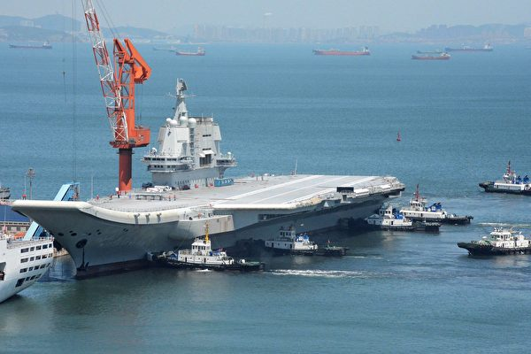

2019年12月17日，中共第一艘自制航母山东舰正式服役。图为2018年5月18日，山东舰在海试后返回辽宁省大连港。(AFP via Getty Images)

 
 【大纪元2019年12月20日讯】（大纪元记者陈俊村报导）中共第二艘航母暨第一艘自制航母于12月17日正式服役。尽管中共媒体吹嘘它算是全球最先进的航母之一，但有美国媒体质疑，它可能只是海上漂浮的纸老虎。

据国家利益（National Interest）网站报导，这艘被命名为山东舰的航母当天在海南岛的三亚军港交付给中共海军。山东舰远远不是完美的船舰。该航母的布局限制了其军事上的潜能与中共舰队在南海等地区投射力量的能力。

这是因为山东舰是在中共第一艘航母辽宁舰的基础上设计建造的，而辽宁舰的前身则是前苏联设计、乌克兰造船厂承建的瓦良格号（Varyag）。瓦良格号原本要报废，但被中共以改造为赌船的理由购入。

辽宁舰和山东舰都没有美军10艘核动力航母所使用的飞机弹射器，也没有能垂直/短距离起降的舰载机。而美军的猎鹰式战机（The Harrier）和F-35战机则具备垂直/短距离起降的能力，不但可以部署在航母上，也可以部署在两栖攻击舰上使其成为轻型航母。

辽宁舰和山东舰使用滑跃起飞（Ski-jump）的方式，亦即舰载机靠自身动力起飞。山东舰可搭载36架歼-15战机，而辽宁号只能搭载24架歼-15战机。歼-15战机是俄罗斯Su-33战机的山寨版。

该网站援引美国国防情报局（Defense Intelligence Agency，DIA）在2019年1月发表的报告说，辽宁舰的滑跃起飞方式限制了战机起飞的重量、武器荷载和整体的作战力量。

一名前中共海军消息人士透露，这种起飞方式的配置可能使战机的最大起飞重量限制在30吨。在这个重量限制下，歼-15战机无法满油满载起飞，因而只能执行短距离的简短任务。

此外，歼-15战机也无法取得其它军机的支援。DIA的报告说：“滑跃起飞的设计也意味着（辽宁舰）无法搭载大型、专门提供支援的飞机，例如空中预警机。”

该网站引述《麻省理工科技评论》（MIT Technology Review）的文章说：“航母使美军能在世界几乎任何地方投射力量，远胜于任何其它单项技术。在（航母）这个军力的重要衡量标准方面，中共远不及美国，而且可能永远也赶不上。”

2019年12月5日，美军的杜鲁门号航母（USS Harry S. Truman）穿越直布罗陀海峡。(Scott Swofford/U.S. Navy)

<b>美军事专家：中共航母无正规作战能力</b>

网上直播节目“路德时评”日前邀请美国一家军事服务提供商的华裔高层主管谈论山东舰服役这个话题。该名博姓军事专家指出，美国主流认为，中共航母没有完全形成作战能力。

博先生表示，山东舰是按照瓦良格号的图纸建造的，“基因”并不好。他列举了山东舰的几个显着问题，其中之一是发动机。

他说，山东舰是自造版的瓦良格号。瓦良格号使用蒸汽涡轮发动机，而不是效率更高的燃气涡轮发动机。燃气涡轮发动机使用柴油，而蒸汽涡轮发动机则用便宜的重油，其结果就是排放黑烟。所以美军的飞机不用使用雷达，顺着烟就能找到这艘航母。

此外，山东舰的滑跃起飞方式会限制战机起飞的重量和速度。美军航母使用弹射起飞，间隔20秒就能让一架战机起飞。相较之下，辽宁舰起飞一架战机则要10分钟以上，在遭遇战完全无胜算。

依据美国海军的资料，美军航母的蒸汽弹射器可以让一架48,000磅（21,772公斤）重的飞机在2秒内从静止加速到每小时165英里（266公里）。而飞行甲板上的组员在白天每37秒就能让2架飞机起飞并让一架降落，在夜间的时间就延长至每分钟。

博先生比喻说，美军航母在20分钟内可以让4个战机中队飞上天，中共航母只能起飞2架，战力完全无法比较，这仗怎么打？

他还提到，辽宁舰在2017年绕台航行，台湾派侦察机进行侦察任务，结果发现该航母没有夜战能力（缺少夜间导航设备，夜间无法起降飞机）。事后中共海军司令吴胜利被革职，与这件事有很大关系。

另外，在辽宁舰刚下水时，大陆炒作“航母style”（又称“走你”，指下达飞机起飞指令的手势）。博先生说，美军这个姿势是给控制弹射器的人看的，不是给飞行员看的，辽宁舰没有弹射器，用这个姿势就是搞笑。

<a target="_blank" href=#top><h6 align="right">回上方</h6></a>

<a name=163>
<h1 align="center"><b>中国学者以假蜘蛛化石发表论文 遭专家拆穿</b></h1>

中国科学家以假的巨蛛化石发表论文，遭美国堪萨斯大学的专家拆穿。(University of Kansas)

 
 【大纪元2019年12月20日讯】（大纪元记者陈俊村编译报导）中国科学家声称，取得了远古巨大“蜘蛛”的化石，并称这是恐龙时代的新蜘蛛物种，该相关论文被发表在中国期刊上。然而，有美国知名专家表示，这只是小龙虾残骸伪造的假化石。

据美国堪萨斯大学（University of Kansas）网站报导，大连自然博物馆的科学家从当地民众手中购得了这块显示有“蜘蛛”模样的化石，他们声称这是白垩纪时期的新蜘蛛物种，将其命名为“Mongolarachne chaoyangensis”，并将论文发表在《地质学报》上。

但其他中国科学家质疑这篇论文，因为这个“蜘蛛”化石不仅巨大，而且看起来也很奇怪。于是他们联系着名的古代蜘蛛化石专家、堪萨斯大学地质系教授席尔丁（Paul Selden）来研究一下。

席尔丁说，这篇论文很少提到细节，令他感到怀疑。他藉由在北京的同事借来化石一看，立即察觉有问题。

他指出，它显然不是蜘蛛。它的眼睛太大、六条腿上的附肢太多。在得知当地盛产小龙虾之后，他终于发现，有人在小龙虾上画了一些腿。

他推论说，这化石大多是当地民众挖掘到的，他们认为有利可图，因而在上面画了一些腿，让它看起来像蜘蛛，但伪造的技术看来不错。乍看之下还挺好的，只有用显微镜观察细节才会看出异状。而那些发表论文的中国学者并不专精于蜘蛛，所以被骗了。

他还提到，造假在化石世界是司空见惯的事，因为挖掘化石的人可能会伪造化石来赚钱。但比较不寻常的是，伪造的蜘蛛化石竟被发表在学术期刊上。可以肯定的是，“Mongolarachne chaoyangensis”这个学名将会被剥夺掉。

席尔丁与同事将本次研究成果发表在《古生物学》（Paleontology）期刊上。#

<a target="_blank" href=#top><h6 align="right">回上方</h6></a>

<a name=162>
<h1 align="center"><b>【新闻看点】人人留影 中共监控网世界独有</b></h1>

中国无处不在的人脸识别技术引发更多人的担忧。图为9月14日，浙江宁波鄞州区农业银行ATM机“刷脸取款”。（大纪元资料室）

 
 【大纪元2019年12月20日讯】大家好，欢迎大家关注新闻看点，我是李沐阳。

香港警察肆无忌惮武力镇压抗议民众，使人们越来越相信，香港进入了警察社会。但与澳门相比，香港略显逊色。

就在习近平参加澳门相关活动之际，澳门全面升级了安保。除了轻轨、航道停运、控制香港人员入境之外，有网媒今天（12月19日）引述澳门媒体人崔子钊爆料，他不仅被恐吓、警告，甚至不能待在澳门，现在已经“被旅游”了。

在维安方面，澳门早就订立了《网络安全法》，拥有了一套具备人脸识别功能的“无死角”的“天眼系统”。外界质疑，澳门可能已经成了“秘密警察社会”。

不过澳门的这些措施，跟中国大陆相比还是相形见绌，小巫见大巫。《纽约时报》指出，中国正在逐步整合新旧科技，加强对人民的监控，使地方公安权力越来越大，如同是一个小型的国家安全局。

<b>世界独有的数字极权国家</b>

在查阅警方和私人数据库后，《纽约时报》发现，原本技术落后于美国的中共，把各种技术结合在一起，为它的监控所用。

中共当局将手机扫描工具、人脸识别相机、人脸和指纹数据库等等许多古老与先进技术交织在一起。这些数据可以帮助警方识别街头行人的身份，知道他们与谁见面，还可以确定他是不是中共党员。

美国等西方国家是使用这类技术，用来追踪恐怖分子或毒枭。而中共却利用这些技术，更智能、更先进地追踪监控着每一个人。

（中共）用科技打造数字极权国家，“无死角”的监控是这个世上独一无二的。

<b>个人数据 随意访问</b>

中共用高科技采集来的个人数据，并不是存放在安全的地方。《纽时》报导，中共当局把几百万人个人信息，存储在了一个连基本安全措施都没有的服务器上。而这个服务器，私人承包商和中间商，都可以随意访问。简单说就是根本没有隐私了。

在深圳从事技术工作的艾格尼丝‧欧阳（Agnes Ouyang）去年曾被警察拦住，说她乱穿马路，需要出示身份证。她拒绝后，被警察粗鲁地抓住，并用手机拍下她的脸。通过面部识别，警方很快认出了她，并开了罚单。

“这太荒谬了！道德低下的执法人员拥有高科技武器”，“我们的生命像土那样不值钱”，欧阳非常气愤。

一个外国人，当然无法接受这种“细致入微”的监控。但欧阳所遇到的，仅仅是一部分。中共正在全国打造一个监控网络，内容包括车牌、电话号码、人脸和社交媒体信息等等。

<b>人人留影</b>

中共监控网络是在河南郑州试行的。今年4月，警察在一个破旧小区门口安装了4个摄像头和2个白色小盒子。

小盒子是名叫IMSI捕捉器的手机扫描工具，可以搜集移动电话的识别码。

系统激活后，摄像头记录人脸，小盒子识别手机电话。如果一张脸和一部手机同时同地出现，那么基本可以确定属于同一个人。

4天时间，小盒子识别出6万7000多部手机。摄像头拍下2万3000张图像，其中有8700多个不同面孔。经过后台运作，这套系统给大约3000部手机配上了人脸。

在石家池小区，监控网络搜集了31个居民楼、8570人的居民信息，包括身份证号、姓名、年龄、婚姻和家庭状况。一个车辆追踪系统还搜集了3456辆汽车的记录及车主个人信息。《纽约时报》指出，中国各地未受保护的数据库中，还存储着学校师生、网吧的在线活动、酒店住宿和旅行记录等。

中共警方在推销宣传册中写着：人过留影，机过留号。中国人常说的“人过留名、雁过留声”，被中共篡改后用在了这里。

<b>境外也被监控</b>

不光中国境内被监控，身在境外的中国人也不安全。自由之家上月发布的《网上自由报告》指出，中共连续第四年被列为对网络实行最大控制、最强压制和最少自由的政权。65个被调查的国家中，中国位列最后。

研究员库克（Sarah Cook）对美国全国公共广播电台表示，在中国境外使用微信交流，“大部分还是受中国境内的运作规则所控制”。

他举例说，德州一个美国人因为讨论亲共候选人落选香港选举，账号被封了；加拿大一位议员向选民发了一条包含民主抗议的讯息，遭到中共删除；一位美国医生转发了大量政治性文章，被中断了群发功能。

澳洲国立大学教授巴肯（Borge Bakken）表示，北京当局破坏了中国整个官僚系统，警察国家正在“蓬勃发展”，威权主义已经成形了。

好的，感谢您关注新闻看点，再会。

大纪元《新闻看点》制作组  #

<a target="_blank" href=#top><h6 align="right">回上方</h6></a>

<a name=161>
<h1 align="center"><b>【十字路口】TVB换老板 中共对香港发动四战</b></h1>

中共对香港发动“四战”？近日传出北京要在澳门建金融中心，TVB换老板。（大纪元合成）

【大纪元2019年12月18日讯】大家好，我是唐浩，今天都好吗？

今天要来跟大家聊聊香港。因为中共对香港的另一轮新战略，可能很快就要登场，所以要赶紧跟大家提个醒。为什么这么说呢？在过去几天以来，出现了至少四个警讯：

<b>警讯一：习近平会见林郑 政法委书记破天荒列席</b>

香港特首林郑月娥16日才刚去北京述职，林郑再次获得中共领导人的支持，要求她继续“止暴制乱”、“恢复秩序”；北京还说香港“局势严峻”，支持香港警队“严正执法”。这些说词，无疑是宣示中共对香港问题的处理思维，依然停留在高压镇压、暴力维稳的套路。

更引人关注的是，这次习近平接见林郑，中共中央政法委书记郭声琨也破天荒地在场列席，这是第一次有中央政法委书记公开介入港澳事务。

大家知道，政法委书记是政法系统的负责人，掌握了公安部、检察院、法院、国家安全部、司法部等部门，这些部门都可以对中国人民进行“合法伤害”，所以政法系统也被称为“刀把子”。郭声琨就是掌控中共“刀把子”的人，在他担任公安部长期间，也曾经因为迫害法轮功而被国际组织追查。

根据香港媒体披露，郭声琨这次不但参加会见林郑，而且还已经出任中共中央港澳工作协调小组副组长。而公安部长赵克志，也在今年10月出任港澳小组副组长，换句话说，港澳小组出现两名握有刀把子的“武官”副组长，肃杀之气越来越重，显示北京当局很可能想继续推出新一轮的镇压维稳，来对反送中运动进一步清场。

至于清场的时间点，我认为可能会在明年1月中左右。因为，一方面，美中双方准备在明年1月初签订第一阶段贸易协议，在贸易协定签署前，中方应该会有所顾忌，不会轻举妄动，以免贸易协议出现变卦，而且还可能招来美方的制裁，这样会让中国经济更加岌岌可危。

另方面，中共也考量到1月11日的台湾大选，为了帮助亲共阵营打选战，中共应该不会在近日内严厉镇压香港，以免激发台湾民众更高昂的反共情绪，反而再次变成帮助蔡英文选情的“助英台”。

另外，从现在到1月中，只有大约不到一个月时间，也刚好让中共政法系统有时间在香港、深圳等地深入部署下一轮的清场行动。说白了，中共要对香港发动新一轮的“高压维稳战”。

<b>警讯二：澳门转型金融中心 美国货物不经香港转运</b>

就在习近平前往澳门参加主权移交20周年的前夕，路透社披露中共将对澳门推出一系列金融政策，包括在澳门成立以人民币计价的股票交易所，要让澳门从赌场经济为主体的“博弈中心”，转型为“金融中心”，要让澳门经济重心侧重在金融业及旅游业。

这一系列金融转型政策如果真的推行，主要目的无非是要“惩罚香港、掏空香港”。因为澳门跟香港一样是特别行政区，因此澳门的金融市场也是属于“境外市场”，可以做境外金融生意。中共想要在澳门另起山头，吸引或迫使金融业者与外资券商把业务、资金从香港转移到澳门，让澳门成为中共新的金库。

这就好像，中共看到有一家店铺生意火热、日进斗金，于是想要先用谎言欺骗，再准备暴力强占，结果遇到警察来制止，不得不收手。于是，中共准备在对街开一家一模一样的店铺，想用低价、促销或其它优惠手段来抢生意，搞垮对面店铺，自己独拿所有生意。

而且，扶植澳门成为另一个吸引外资的金融中心，也可以降低中共国企未来因为香港问题而断掉资金链的风险，也降低中共权贵利益受损的风险。

并且，中共也想藉由澳门的城市转型，让澳门经济“洗白、漂白”，改造澳门的门面形象，把澳门打造成为中共手里另一个“一国两制”的成功样版。一边用来掩盖中共在香港“一国两制”的失败与食言，一边用来向国际社会宣传说嘴，也向台湾宣传统战。

此外，中共想让澳门成为金融中心，也是想要借此警告香港的金融精英与富豪。因为这次香港反送中运动，不但有不少金融精英走上街头、参与抗争，还有不少金融业富豪私下捐款资助，用金钱声援抗争，帮助年轻人长期抗战。因此中共也有意藉由打压香港金融业，警告这些金融精英与富豪。

还有，澳门的“一国两制”几乎可以说已经是“一国一制”，不但澳门政府高度服从北京指令，人民没有普选权利，新闻媒体几乎被中共当局控制，言论审查严厉，司法体系的独立性也不及香港。甚至最近澳门政府为了配合中共领导人访问澳门，还大量阻止香港人入境。

因此，如果可以把金融交易的重心转移到澳门，将可以让中共当局更严密地管控海内外资金的流动数据，可以让当权者更轻易地监控国内政商权贵或敌对派系的资金转移。

但是反过来讲，这种体制也可能让某些当权派的权贵，更容易通过赌场与股市来洗钱。比方说，一名权贵可以先拿自己的资金买股票，过阵子到澳门把股票卖掉，拿着这笔洗过一次的资金，进去赌场二度洗钱，刻意把钱输给赌场，最后人再飞到海外，由赌场在海外安排人员把钱交还给权贵，完成资金转移。

而且，根据彭博社17日报导，为了因应未来两年对美国采购2000亿美元的商品与服务，中共考虑让原本经由香港转运到中国的美国货物，不再经过香港，直接输入到中国境内，这样估计可以为中国增加100亿美元的采购数据。

不过，根据香港当局统计，香港的货柜（集装箱）吞吐量已经连续22个月下滑，今年11月的货柜吞吐量比去年同期下滑了7.4%，跌幅比10月份的4.1％还要扩大。一旦中共真的这样做，势必会让香港的转口贸易经济更加受挫。

简单一句话，中共正在对香港发动新一轮的“经济战”与“金融战”。

<b>四项原因 澳门难成区域金融中心</b>

不过，我们顺便说一下，中共想要把澳门变成区域金融中心，恐怕非常困难。

香港能吸引国际资金进入的关键主因，不只是因为高度国际化的开放环境，还有高度透明的法治体系，有明确、公平的法治体系，才能让金融业与外资降低风险，感到安稳。

而且香港的人口740万人，远多于澳门的67万人，加上香港拥有多家高水准大学，香港的高素质人才数量自然比澳门多，这些人才正是外商、外企所需要的。

此外，香港虽然小，但澳门更小，城市发展空间有限，未来如果发展金融中心，势必带动商业人口的快速增长，到时候澳门本地势必没有足够空间容纳这些人口的住房与生活需求，很可能就得在珠海开辟更多地产项目，来安置这些人。

但是珠海属于中国境内，是归中共法律管辖，而中共向来没有透明、公正、公开的法治体系，加上中国境内到处都是监控摄像头，网络也都被严密监控，想一想，重视机密的外资企业与金融业者，会愿意住到那里吗？

是不是等于把自己直接“送中”了呢？

<b>警讯三：TVB易主 香港传媒“党国化”</b>

香港电视广播公司（TVB）这两天传出人事异动，TVB主席陈国强即将在近日内退任，并且退股。与此同时，香港金融界流传着，阿里巴巴可能会入股TVB。

阿里巴巴在马云卸任董事局主席后，几乎由中共官方主导；加上TVB目前最大股东是副主席黎瑞刚，黎瑞刚不但持股高达79%，而且还是中国的华人文化产业投资基金董事长，他背后也是中共党国资金。所以，可以说，TVB很可能会被彻底“党国化”，方便中共加强控制香港新闻舆论。

不仅如此，目前也传出腾讯可能会入股另一家香港电视台NOW TV，以及《星岛日报》，让中共加强对香港传媒和舆论的控制，等于是让香港传媒“党国化”。

这就意味着，中共不但要对反送中进行清场，还准备对香港社会实施大规模的“媒体舆论战”，抢占舆论阵地；再搭配中共对香港国民教育的渗透控制，两者结合成一场对香港的长期“洗脑战”。

中共不但要借此控制这一代香港人的思想，还要控制未来每一代香港人的思想，减少中共未来的统治风险与维稳成本。

<b>警讯四：国进民退 国企大举入驻香港</b>

不只是刚刚提到的几家香港媒体正在逐渐“党国化”，香港企业也是一样。

今年9月，路透社就曾经报导披露，中共方面要求国有企业加大力度在香港投资，扩大投资范畴，包括地产业、旅游业等，要加强对不同领域企业的控制力度。而且不但要求国企要入股香港的企业，还要取得控制权，能够参与日常的运营决策。

换句话说，中共不但在中国大陆扩大推行“国进民退”、“公私合营”的企业并吞政策，也准备在香港如法炮制，要扩大吞并、控制香港企业界与商界。

根据统计，今年已经有41家中国上市民营企业，转型变成了“国有企业”。

中共的最终目的，是要让香港的经济操控在党国手里，让香港人的生活操控在中共手里，等于是对香港发动一场“生活战”，从而更全面地控制香港社会的方方面面，更有力地干预、支配香港人的日常生活与思想，达成一个“全控社会”，也就是中共理想中的“奴隶命运共同体”。
小结

我们再重复一遍，中共最近对香港发出的四项警讯，也代表着中共准备发动新的战略：

警讯一：习近平会见林郑 政法委书记破天荒列席（维稳战）

警讯二：澳门转型金融中心 美国货物不经香港转运（经济与金融战）

警讯三：TVB易主 香港传媒“党国化”（洗脑战）

警讯四：国进民退 国企大举入驻香港（生活战）

大纪元《世界十字路口》制作组

<a target="_blank" href=#top><h6 align="right">回上方</h6></a>

<a name=160>
<h1 align="center"><b>四大原因 北京被迫同意第一阶段贸易协议</b></h1>

图为6月28日，川普（特朗普）总统与习近平在G20峰会拍大合照前握手。(BRENDAN SMIALOWSKI/AFP/Getty Images)

【大纪元2019年12月19日讯】（大纪元记者张顿综合报导）美中贸易战开打逾一年半后，双方终于达成了第一阶段的贸易文本协议，等待双方代表签署。北京被指对此做出巨大让步，那么中共让步的背后原因是什么呢？

<b>美中达成第一阶段协议</b>

12月13日，美国和中共官方相继宣布，双方已经达成第一阶段的贸易文本协议。

根据美方声明及贸易谈判代表莱特希泽的公开讲话，协议要求中方在知识产权、技术转让、农产品、金融服务以及汇率领域进行结构性改革；中方承诺在两年内增购2,000亿美元的美国商品和服务，其中包括320亿美元的美国农产品（即在协议生效的头两年，每年购入400亿美元的美国农产品）。

而作为交换条件，美方对今年9月份1,200亿美元中国商品加征15%的关税税率减半（7.5%），关税削减将在双方签署协议30天后生效；原定12月15日起对1,560亿美元中国商品开征的15%关税暂停加征。美国对2,500亿美元中国商品已经加征的25%关税税率保持不变。

外界普遍认为，在美中第一阶段的贸易协议中，美方大胜，中共做出巨大让步。那么中共为何要同意该协议呢？综合媒体消息，中共同意该协议，至少有以下四大原因：

<b>一、贸易战恶化 会造成大面积失业</b>

中国人民大学应用经济学院12月13日发布《中美贸易摩擦对就业的影响分析》报告，调研了贸易战对广东、福建、浙江三省的影响。

调研发现，2018年上半年美国宣布加征关税的初期，市场预期悲观，但对就业影响并不明显。

但2019年上半年，贸易摩擦的冲击开始凸显，相较于内销企业，外贸企业裁员冲动虽然要高一些，但也仅是略高一点。因为地方政府为了稳定就业，出台雇用激励政策，如企业不裁员可返还部分社保。还有地方政府对雇主提供雇用补贴及放松用工管制、暂停提高最低工资标准等，“这等于变相降低了企业用工成本，会抑制企业的裁员冲动。”

报告显示，2019年上半年，纺织原料和纺织制品业的外贸企业员工，其工资水平比内销企业员工降低约7%，鞋、帽、伞、杖、鞭等行业工资降低则超过10%。

报告说，这是用牺牲就业质量来换取就业数量的暂时稳定，也是用隐蔽性失业来代替显性失业，如果美国继续抬升关税并触及大陆企业停产点，“更多企业可能采取裁员的方式，大面积失业就可能出现”。

时政评论员石实此前对大纪元记者表示，中共一直把“稳就业”放在六稳（稳就业、稳金融、稳外贸、稳外资、稳投资、稳预期）中的首位。因为高失业率会冲击中共政权的稳定，没有了社会保障的失业阶层必然会起来反抗，这就是中共为什么一直把“稳就业”当作头等大事来抓的主要原因。

<b>二、中共还没做好经贸“脱钩”准备</b>

清华大学政治学系前讲师吴强对美国之音表示，这次达成协议，中共当然没有赢，它只是赢得了缓和的时间。

他说：“过去一周我在北京感受到的气氛是，北京实际上正处于震惊与慌乱之中，处于某种‘土崩瓦解’的状态当中，处在必须做出让步的巨大历史妥协当中。”

吴强认为，美中所有问题都可以破裂，唯有经贸不能“脱钩”。这是北京目前唯一的也是最高的谈判目的。中共或许已经做好了在教育、科技和军事上的中美“脱钩”准备，但是远远没做好在经贸上脱钩的准备。换句话说，中共是把经贸“脱钩”作为最后一道“脱钩”来准备的。

“因为中美之间在安全、政治和其它问题上都处在高压中的情况下，保持经贸上的交流，维持贸易上的协议，这是目前中国（中共）在贸易谈判中能达成协议的主要动因。”

吴强认为，中共正遭遇50年以来第一次在外交上和战略上的挫败，它正在经受这个外交苦果。签署第一阶段协议，对中共而言是一个极其重要，而且是迫不及待的事情。

<b>三、川普步步紧逼</b>

美中签订协议，还与川普（特朗普）总统接连抬高关税、步步紧逼，以及他的谈判策略有关。

12月12日早，美国总统川普发推文说，“非常接近跟中方达成一笔大协议。他们想要，我们也想要！”

当天晚些时候，多家外媒披露，美中原则上达成第一阶段贸易协议。川普总统当天下午已在美方贸易谈判代表提交给他的文本上签字。

总统顾问、哈德逊研究所（Hudson Institute）中国问题学者白邦瑞（Michael Pillsbury）向媒体披露，他与川普交谈过，川普说，该协议要求中国在2020年购买价值500亿美元的农产品，以及能源和其它商品。作为交换，美国将降低一些中国进口产品的关税。

按计划，美中如果达不成协议，美方将于12月15日对另外1,560亿美元中国商品加征15%的关税；同时，川普此前还多次警告，如果达不成协定，美方将再次上调已征商品关税的税率。

但直到12月13日，美中官方才宣布，双方达成了第一阶段贸易协议。

海外媒体人评论说，川普总统明明12日下午召开了谈判团队的会议，并批准了贸易谈判代表莱特希泽提交的基本方案。但之后白宫没有发表声明，川普也没有发推文；而中共媒体一片沉默，包括中共驻美国大使馆、中共商业部、外交部都不置一词。

评论认为，这可能是川普总统下了“一招险棋”，利用签字的方式来逼习近平表态。因为当时川普还不能完全确定习近平的态度，所以他只好通过他的中国问题顾问白邦瑞，通过迂回的方式传递他已经批准了中美贸易协议的信息。没有想到的是，这个信息传出以后，北京居然迟迟不作回应，就好像把球踢给习近平，习近平就是不把球踢回来。

评论认为，北京之所以不回应，是因为习近平虽然权力已“定于一尊”，但在中共政治机器人的体制内，注定不能他一个人做出这样的重大决定，还需要与中共政治局常委一起商量，最终做出共同决定。

13日晚11点，中共方面安排商务部副部长兼贸易谈判副代表王受文在发布会上通报，双方达成第一阶段的文本协议。

评论说：“在这种情况之下，川普总统在白宫的战情室发出指令给莱特希泽，说这个贸易协议可以这么定了。这样一个惊心动魄的场面，显示出了川普总统的大胆，他的险棋下得惊心动魄的程度。”

<b>四、中共考量香港问题 分析：或再次误判局势</b>

中共签署协议，除因中国经济严重恶化，中方还没有准备好与美国经贸“脱钩”，川普步步紧逼外，还可能与香港局势有关。

北京大学国际政治经济研究中心主任王勇12月15日对“香港01”记者表示，美国国会近期几乎全票通过《香港人权与民主法案》，面对这样的法案，作为总统的川普“大概很难行使否决权，最符合他本人的利益就是顺势签署”。

王勇认为，中共与美国的竞争越来越激烈，因此美国2020年大选时，“美国两党可能会比拼在中国问题上谁的态度更强硬”。

王勇说，在川普面临弹劾压力下，中美达成协议能够帮助他维持经济上的优势，至少减少大选年中美贸易战对美国经济的冲击，以此稳定美国农民、广大消费者以及中下层民众对他的支持。

王勇认为，现在是中美双方达成第一阶段协议的窗口期，“川普虽然签署了事关香港的法案，但他的态度还留有余地”。

王勇是中美问题专家，他还身兼北京大学国际关系学院教授、中共外交部党校教授、国际战略研究中心学术委员、亚洲开发银行顾问等职务。

川普11月27日签署了《香港人权与民主法案》和《禁止向香港出口防暴装备法案》。

川普在一份总统声明中说：“我签署这些法案是出于对习近平主席、中国人民和香港人民的尊重。颁布这些法案是希望中国和香港的领导人和相关代表，能够友好地解决彼此之间的分歧，从而为所有人带来长期的和平与繁荣。”

时政评论员李林一对大纪元记者表示，中共专家王勇上述言论表明，中共可能再次出现误判局势的情况。因为中共指望川普对“香港问题留有余地”，但是美中这场新冷战不是以个人意愿为转移的，美国两党已经在遏制中共上达成高度一致。

李林一说，未来如果中共加大打压港人的民主自由，作为民主国家“领头羊”的美国，肯定不会袖手旁观，“届时美中关系如果再出点问题，中共是不是又要撕毁协议？”#

<a target="_blank" href=#top><h6 align="right">回上方</h6></a>

<a name=159>
<h1 align="center"><b>林郑任内推23条？众人警告将引来更大反抗</b></h1>

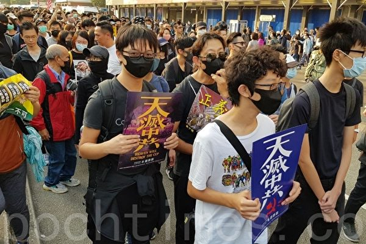

图为2019年12月1日，港人发起尖沙咀游行，民众举着“天灭中共”标语。（骆亚／大纪元）

【大纪元2019年12月20日讯】（大纪元记者骆亚香港采访报导）近日香港特首林郑月娥刚完成北京的述职，有建制派的议员放风称，北京势必在林郑月娥余下任期内完成23条的立法。民众警告当局此举将引来更大反抗，或致政权覆灭。

港媒引用建制派的人士说法，香港这场反送中的政治风暴导致区议会选举建制派全面崩溃，令中共政府对香港管治出现前所未有的忧虑，甚至称北京认为反正局面已经“烂”到这个地步，林郑的民望也跌到低谷，还有什么不敢碰的，因此林郑变为推23条的最佳人选。

立法会议员许智峯认为，因为这个消息不是第一手的，比较难评估，但是我们警告政府，当社会这么动荡、民愤这么激烈地反对政府的时候，民情最低迷的时候，如果再推23条的话，那是跟香港人一起死，将香港再推向深渊。这不是林郑个人前途问题，而是香港整个前途问题。

他强调说，“我警告她不要这样做，过往政府都说过立23条要有社会的共识、要有良好的气氛才可以做，那现在是最低迷、最差的情况去做，绝不合理。”

他还表示，林郑进京都获得中央政府的赞扬，但香港经历了这么多的痛苦、经历了这么多的打压和市民的反抗之后，“我研判无论是政治气氛，还是中共和香港政府对市民的打压一定不会减少，一定会越演越烈，我对香港的前景不会乐观。”

此前，中共港澳办主任张晓明就在党媒上高调撰文，声称香港就是因为没有立23条，所以港独和分裂分子活动猖獗云云。

香港年轻的抗争者David Ngy也预估，香港政府会在中共死命令下，在这届政府迅速订立23条，并设立执行机构，以彻底消灭在港反共力量。

他警告中共这样做后果很严重，“香港必然会被欧美取消独立关税区地位；香港的金融中心地位，也会被东京和新加坡取代；同时香港会爆发逃亡潮，上百万社会精英会移民欧美、台湾、日本等国，香港彻底成为死港。中共彻底失去上市融资渠道。加上贸易战全面恶化，外资也不会经过香港，投资中国。最终会引发中共政权的空前经济、金融和社会三重危机，中共很可能因此覆灭。”

民间集会发言人林颖匡近日接受大纪元采访时表示，如果当局想推动23条比反送中更恶劣的恶法的话，只会让港人以更激烈的方式来推翻它，更强烈的方式去抗争。现在的历史潮流是民主自由，如果全世界的民主自由国家都站在香港抗争者这边，中共暴政不可能不倒。

就社会上流传北京想要将澳门取代香港的地位，许智峯议员认为，“澳门同香港经济规模与内涵都很不同，也不是金融中心，也不像香港那样有历史文化背景。用澳门取代香港是不现实的，可能想用澳门做一个典范，可以被北京全部控制，没有反抗、没有异议的空间管治手法，他们是想用管治澳门的方式来管治香港，我觉得这会失败。”

许智峯此前总结反送中以来香港社会最大的变化，“就是香港人的民意民心取向非常的清晰，很多香港人觉得自己醒了，不会再愿意接受中共政权和香港政府这个压迫。他们是勇敢去抵抗，无论是用过往传统的手法，和新型的抗争运动的结合，都会抵抗到底。我觉得这个浪潮不会转头，只会让市民是对自己的自由和权利人权越来越重视。”

他强调，“这种力量是政府用任何的方式，23条、国家安全、送中条例都按不住的民意的力量源。时间是可以令意志消磨，但是我们不可以继续假装那个社会是继续平静，继续没事发生，五大诉求没做到，我们香港社会都要继续抗争。”#

<a target="_blank" href=#top><h6 align="right">回上方</h6></a>

<a name=158>
<h1 align="center"><b>英国上议院听取证词 医生斥港警不人道</b></h1>

12月18日下午，英国外科医生文德麟（Darren Mann）在英国上议院，讲述港警如何侵犯医务人员。（文沁／大纪元）

 
 【大纪元2019年12月20日讯】（大纪元记者文沁、陆曼英国伦敦报导）12月18日下午，由“香港监察”（Hong Kong Watch）赞助人、英国奥尔顿勋爵（Lord Alton of Liverpool）在英国上议院主持会议，听取在英国医生讲述港府侵犯医护人员等违背国际原则的行为。

一位在香港工作了25年的英国外科医生文德麟（Darren Mann）在会议上作证说，港警在近期香港人民抗争中，不仅逮捕和虐待医生、护士和急救人员，还进行了其它侵犯香港医疗卫生界的行为，这都严重违反了国际人道主义原则。

参加会议的人士包括：前上议院大法官麦凯勋爵（Lord Chancellor Lord Mackay of Clashfern）、前自由党领袖艾克伍德勋爵（Lord Steel of Aikwood）、前绿党领袖贝内特男爵夫人（Baroness Bennett）、前国防部长汉密尔顿勋爵（Lord Hamilton of Epsom）和保守党人权委员会主席布鲁斯（Fiona Bruce），她也是“香港监察”的赞助人。

2019年11月21日，文德麟在世界著名医学杂志《柳叶刀》（The Lancet）上的发文，首次公开提出港警侵犯医护人员，引起国际关注。

他说，在2019年11月17日晚香港理工大学警民暴力冲突期间，他目击警方拘捕了多名曾进入校园为留守者治疗的医生和急救员，他批评这违背了国际标准，拘捕医护人员的做法在其它文明国家几乎是闻所未闻，也不符合人道主义。

他提到一张照片，上面显示至少有16名医护人员坐在地上，双手被绑在背后。他们的反光背心上写着“医生”、“护士”和“急诊医疗技术人员”等醒目标识，这些人因涉暴动罪而被捕。

文德麟说港警逮捕他们的借口是，这些医务人员可能是抗争者伪装的，这种结论完全不能令人信服，并具有误判的危险性。他说被捕者包括5名执业医生，当时身上均带有香港医委会的注册文件及证明。

文德麟还报告了令人担忧的迹象，表明港警对医疗保健部门和基础设施的进行广泛侵犯。比如证据表明，警察藏在救护车里伺机逮捕抗议者，或身穿全套防暴装备的警察进入医院逮捕抗议者。还有可靠消息称，警方试图陪同医生一起“诊断”病患，甚至试图进入手术室抓人。

文德麟在议会上还说，许多香港市民害怕使用急救服务或去公立医院治疗，因为担心可能被捕，这催生了香港地下医疗系统的形成，因为伤者更愿意在尊重个人信息和尊严的情况下接受治疗。

“这些违法行为严重违反了国际人道主义准则和人权法。”文德麟说，“在任何暴力冲突中，人道主义工作者都应该得到保护。（港警）逮捕或阻碍医务人员救治伤者，是严重侵犯人权的行为。这等于向外界发出了令人毛骨悚然的（威胁）信息。”

文德麟表示，港警和港府迫害医护人员的行为，正在损害中共在国际上的声誉。但是令人遗憾的是，港府似乎没有意识到其政策偏离了国际惯例。因此国际政府和人道主义组织需要立刻行动，审查港警对医护人员以及整个医疗保健领域的侵害。

<a target="_blank" href=#top><h6 align="right">回上方</h6></a>

<a name=157>
<h1 align="center"><b>复旦大学改章程删自由 学生集体唱校歌抗议</b></h1>

复旦大学集体唱校歌抗议学校阉割章程。（截图）

 
 【大纪元2019年12月18日讯】复旦大学大幅度阉割校章在社会上引发争议，同时也在复旦师生中引发不满及抗议。有学生自发合唱校歌，对校方拟修改大学章程的计划表示抗议。

12月17日，中共教育部关于同意复旦大学章程部分条款修改的批复内容在网络上曝光。内容显示，新的章程对原有章程进行了大换脸，几乎每一个条款都被修改。

新章程中序言除了删除了“思想自由”“探究真理”等内容，“学术独立”也被挪后。同时大幅度增加了“党”、“社会主义”和“新时代”等中共的意识形态内容。

修订案还明显突出了“中共党委领导”，删除了“支持校长独立负责地行使职权”中“独立”字眼。简而言之，就是“党”控制一切。尽管中国大学本无思想自由，但这样在门面上的直接阉割学校章程仍在网络上掀起大反弹。也引发一些学校师生的不满。

18日中午复旦大学的学生为抗议教育部阉割篡改复旦《校章》，组织到学校运动场草坪唱校歌，被阻止。

推特上的视频显示，愤怒的学生们于是聚集到食堂唱校歌表达抗议，学校保卫处试图阻止拍摄未果，餐厅内几乎所有人都站立起来，气氛激昂。

<h3 align=center><a href="https://twitter.com/johnzhitao">愤怒的学生们便聚集到食堂唱校歌表达抗议，学校保卫处欲阻止拍摄，但怎么阻止的了啊！</a></h3>

视频在推特上引发热传，多名网友表示这样的场景如同香港“反送中”学生在商场内合唱、进行和理非形式的抗议。许多网友赞扬这些复旦大学学生的勇气，并称“光复复旦，时代革命”、“愿荣光归复旦”。

推出新校歌，但不为师生认同。2004年11月，复旦大学百年校庆之际，在师生强烈呼吁下，校方恢复了老校歌。
校歌歌词如下：“复旦复旦旦复旦，巍巍学府文章焕，学术独立思想自由，政罗教网无羁绊，无羁绊前程远，向前，向前，向前进展。复旦复旦旦复旦，日月光华同灿烂。复旦复旦旦复旦，师生一德精神贯，巩固学校维护国家，先忧后乐交相勉，交相勉前程远，向前，向前，向前进展。复旦复旦旦复旦，日月光华同灿烂。复旦复旦旦复旦，沪滨屹立东南冠，作育国士恢廓学风，震欧铄美声名满，声名满前程远，向前，向前，向前进展。复旦复旦旦复旦，日月光华同灿烂。”

教育部批复复旦大学修改章程的消息在网络上引发更大反弹，有网友痛斥： “（中共）不仅要在精神上消灭你，肉体也不得全尸。今天事不关己，终有一天它会覆盖到每一个你。当把所有的思想囚禁在牢笼之内时，它便可向所有人宣布这就是自由之地；清除所有的马，可指鹿为马。真百年大计。”

也有人讽刺：“留着这几句话装装门面也行啊，难道如今真的连门面都不用装，干脆裸奔了？”

但相关网评遭到大量删除，教育部网站上的通知也删除了原有章程，只保留了修订后的新章程文本，让读者无法进行直接对比。

据德国之声报导，除了复旦大学，南京大学、陕西师范大学的章程修订案也获得了教育部的核准，其中同样加强了“党委领导”，并突出了“服务国家之使命”“努力实现中华民族伟大复兴之中国梦”。

对于这番争议，清华大学政治系原讲师吴强对自由亚洲电台表示，这次是批量性，也是全国性，建制性的在修改各大学的章程。当局有“四个自信”在十九届四中全会确立这么一个治理现代化的路线之后，把大学变成政治思想教育阵地，意识形态核心。”
 
吴强赞扬复旦学生采取高姿态行动，来表达对校方的不满。“（修改章程）跟1905年以来复旦的大学传统脱钩，进行大学校园的极权主义化，那么，在这种情况下， 很可贵看到复旦大学学生以唱校歌的方式来抗议，保持这种对传统学术独立、思想自由的坚持，像北京大学的学生参与到工运当中，这都是非常难能可贵的学生精神。”
 
至于这次事件是否会引发更多院校仿效，又或是触发大批师生反对，吴强认为还有待观察。#

<a target="_blank" href=#top><h6 align="right">回上方</h6></a>

<a name=156>
<h1 align="center"><b>五毛花千芳曝中共经济衰败 母亲养老证遭收缴</b></h1>

花千芳在微博上披露抚顺市当局收缴了他母亲的养老保险证书。（网路截图）

 
 【大纪元2019年12月19日讯】（大纪元记者李净报导）中共“高级五毛”花千芳日前再次口无遮拦，在微博上披露辽宁省抚顺市当局收缴了他母亲的养老保险证书，其言论则透露出当地经济严重恶化的状况。

12月18日下午，花千芳为其母养老金一事在微博抱怨说，“真是啥事都能碰上，抚顺经济这是衰到啥程度了啊？”

他接着说，二十年前缴纳的农村养老保险证书，表明六十岁退休每月发200元人民币。“刚我妈说证被政府收回去了，说是项目没有了，当是存款给利息。开啥玩笑啊这是。”

花千芳，原名宁学明，辽宁省抚顺市人，现为中共抚顺市作家协会副主席，他曾公开宣称自己是“自带干粮的五毛”。

对于花千芳的上述言论，不少网民讽刺说：“平时爱国口号喊的震天响，政府需要的时候，这点贡献就受不了？”

“花千芳咋了，脑仁儿跟猪换啦，不给你几个大嘴巴子就不错了，还几十万，做梦娶媳妇哪！”

“著名自干五花千芳居然敢指责政府黑了养老金，把其母养老证收回，养老金改存款利息了，狠……黑……！”

上述消息引发网民热议后，花千芳于18日晚间再发微博解释说，“关于这件事，是我爆料的，微博没删是自己设置成了朋友圈可见。”他还说，“马上过年了，今年比较乱年前咱们就不添乱了好好过年。”

花千芳在微博上披露抚顺市当局收缴了他母亲的养老保险证书。（网路截图）

 
 花千芳曝出辽宁当地的经济衰败现象并非空穴来风。根据官方数据，2015年，辽宁省GDP增长为负，全国倒数第一。东三省GDP增速均在全国垫底。尽管2016年中共再次给东北拨款1.6万亿元，但东北经济困境被指积重难返。

2014年10月15日，习近平主持召开文艺工作座谈会，江派常委、主管文宣系统的刘云山出席。有消息人士对媒体披露，刘云山主管的中宣部为树立新媒体作家代表，把周小平、花千芳推荐给习近平，参加了习主持召开的文艺座谈会。外界指中共内部权力博弈，刘云山借此给习近平“挖坑”。

此次座谈会后，大陆互联网上对周小平、花千芳的恶评如潮。香港《信报》引述消息人士的话称，中共官方禁止媒体采访两人，希望将事件逐步淡化。去年3月，周小平失去了四川省网路作家协会主席的职务。

2014年11月19日至21日，北京当局在浙江乌镇召开了首届“世界网际网路大会”。11月21日，花千芳在参加世界网际网路大会期间发微博称，中共在网际网路的决心“已经是司马昭之心了”。

花千芳的话被外界解读为：中共要控制网络的决心，是“司马昭之心，路人皆知”。#

<a target="_blank" href=#top><h6 align="right">回上方</h6></a>

<a name=155>
<h1 align="center"><b>【拍案惊奇】抗争风悄然北上 香港星火被盯上</b></h1>

反送中旋风北上！复旦大学、播扬镇抗议纪实。（新唐人合成）

【大纪元2019年12月20日讯】大家好，欢迎收看《新闻拍案惊奇》，我是大宇。今天是美东时间12月19号，星期四。

今天我们要聊的内容很多。最先要讲到的是，最近大陆发生的两件事，证明反送中这个香港式的抗争风潮，已经悄然吹进大陆。一件发生在大学“复旦”，另一件，发生在广东小镇“播扬”，这两个地方的名字就很有内涵。

但与此同时呢，香港资金援助抗争者的“星火同盟”出事了，有4个相关的人被逮捕，“星火同盟”背后的支持者，大多是“和理非”抗争人士，人们担心，这些和理非的个人信息会被警方掌握。

<b>～～～新拍串讲～～～

复旦大学章程被改 学生杯葛聚集歌唱抗议</b>

《愿荣光归香港》这首歌，今年9月开始，在香港抗争市民中流行起来，大家聚集商场、广场一期合唱，用歌声表达诉求。

最近，大陆也出现了一个类似的场面。而且，还是在大学名校，就是上海“复旦大学”。

不少复旦大学学生，为了抗议大陆教育部批准了对复旦大学章程的修改，损害学术自由，自发要去学校运动场抗议，但是被校方阻止。结果他们在当地时间的12月18号下午，一起在学校食堂里聚集，唱起了复旦大学的校歌。我们在视频中看到，学生们站起来歌唱，旁边保安无奈地阻止，并不成功。

复旦大学1925年创办，目前在QS排名中位列世界第44，大陆高校排名第三。

学生们唱的复旦校歌，是1925年的老校歌，里面有这么一句话：复旦复旦旦复旦，巍巍学府文章焕，学术独立思想自由，政罗教网无羁绊，无羁绊前程远。

但是，新修改的学校章程，与校歌提出的精神，完全违背。

这起事件，我们从12月17号周二说起。这一天，大陆教育部网站发出一则通知，核准了复旦等三所大陆高等学府，对学校章程的修改。其中复旦的，受到的关注最多。

章程修改涉及几十个地方。举几个例子。

章程中，“学校的办学理念，是其校歌所传颂的学术独立和思想自由”，“思想自由”四个字被删去。

“支持校长独立负责地行使职权”中，“独立”二字被删去，变成了“依法”。

“按照党委领导，校长负责，师生治学，民主管理的基本原则运行”，这句几话，直接合并和简略成一句话：“党委领导下的校长负责制”。

并且，章程中还增加了“坚持用习近平新时代中国特色社会主义思想武装师生员工头脑”，这些话。

总之，修改的部分至少反映三点：坚持党的全面领导、党委是学校核心，以及突出了以习近平为主题的一些新内容。

校章被活生生改成了“党章”，也有人嘲讽地说，新校章让复旦变成“党校”。这一次修改，除了涉及复旦，还有南京大学和陕西师范大学。改校章的事件，在中国的豆瓣、知乎等论坛，网友也发出一片骂声。而复旦学生们在学校食堂合唱老校歌的抗议行为，也引起国际媒体关注。BBC引述网友留言，提到了“光复复旦 时代革命”的口号；《纽约时报》则分析指出，大陆当局在香港大学生的抗议中，似乎在加紧对高校学生意识形态“不留死角”地管控。

<b>文楼“火葬场”未建先“火”！改址建设一样引抗议</b>

11月底，广东茂名文楼镇居民，为了阻止政府在当地修建火葬场，发起抗争行动，很多人上街与警察对峙，场面像极了香港反送中：人们设置路障、朝警方扔砖头、焚烧警方看守亭等等。当地人向《苹果日报》说：就好像你们香港，遍地开花。也有《新唐人电视台》等海外中文媒体报导说：当地人喊出“光复茂名，时代革命”的口号。

让外界意外的是，文楼的抗争短短4天就结束了，而且跪低的是政府。当时，文楼镇党委书记李伟华提出了“五大回应”：1. 永不建火葬场；2. 调查镇压抗争中的警察滥权；3. 释放被捕人士，甚至对伤者提供医疗费补助；4. 有的设施被毁掉了、没问题、政府出钱修；5. 施工地点立刻恢复绿化。

这么振奋人心的五大回应，政府实际的执行情况咱们另说，但是单看字面，要是对香港五大诉求这么痛快回应，事件也会早就平息，但为什么区别对待呢！有的专家就分析，这是当局，怕香港的事扩散，所以想赶快平息。

人们以为事情就这样结束了，结果不是。12月16号，在距离文楼仅仅27公里的茂名播扬镇，又发生民众的勇武抗争事件，场面比文楼还激烈。

有当地人接受《苹果日报》采访时介绍说呢，事情起因是当地政府要建污水处理厂，但后来承认是要建火葬场。也有媒体报导说，这是文楼没建成的火葬场，改到播扬来修建。不过后来当地政府又发声明，说没打算在当地建火葬场，类似说法是谣传。政府说法反复。但不管怎么说，这场二次抗争因为“火葬场”的问题爆发了。

最激烈的冲突在当地的12月16号晚爆发，上万人走上街头，两百多公安武警到场镇压，使用了催泪弹、警棍、电枪等装备，而抗议民众，则用到了汽油弹、石头、鞭炮，公安局被焚烧，并且堵路阻止警察行进。在受访时，当地人说：哪里有不公，哪里就有反抗！但是当地人付出的代价不小。截至当晚9点，已经有四十多人受伤送院，有人伤势严重，这个已得到医院证实。网上还流传说至少有一名青年被打死。

当地政府对播扬抗议的回应，则是有软有硬，一方面，播扬镇和其所在的化州市政府先后发声明安抚，承诺不会在播扬建火葬场，另一方面，化州公安局又要求参与暴力示威的人“限期自首”，否则严惩。

播扬镇的抗争也引起了香港网友的议论，大家惊叹于抗争场面与香港的相似，有人把这叫成了“火葬场革命”。

<b>被指洗黑钱 香港“星火同盟”脸书发文澄清</b>

那么，说完大陆两件跟香港反送中“撞脸”的抗议事件后，我们继续关注香港。在6个多月的抗争里，香港的勇武派抗争者受损失最大，很多人被捕。但现在香港有人担心，当局为瓦解运动，或者在酝酿对“和理非”下手。

提起“星火同盟”，想人都知道。这是2016年香港“鱼蛋革命”之后成立的非营利机构，他们通过众筹捐款获取资金，然后用这笔钱，协助被捕抗争者保释和法律咨询服务，有时也会接济经济有困难的抗争者。最近，他们还购买贺卡，呼吁市民写圣诞贺卡，寄给狱中被囚的抗争人士。“星火同盟”在抗争者眼中，是慷慨解囊的义士，但是在反对者眼中，却是接济暴徒的黑手。

11月18号，香港《信报》报导，“星火同盟”因为银行户口跟当初报称的开户用途不符，被所在的“汇丰银行”中止运作。同一天，“星火同盟”在脸书发贴文，说：由于各种因素，平台在汇丰银行的账户11月21号之后暂停运作，但“星火同盟”会以其它方式接受捐款。

但到了12月19号，又出现另一事件。当天下午，香港警方开记者会，说破获一宗“洗黑钱”案，指出案件与“星火同盟”有关，拘捕4人，并冻结了关联“星火同盟”的空壳公司7000万元资金。被捕的4个人，年龄在17岁到50岁之间，拘捕时警方还抄获13万现金，包括三千多张超市代金券，另外还有镭射笔以及大量防护装备。

警方说，星火在过去半年，筹得约8,000万元，20%是现金，多数是香港当地的现金存款，而这些钱被转入一家“空壳公司”，怀疑涉洗黑钱，其中一名被捕者是那间“空壳公司”的股东。

对此，“星火同盟”当天在脸书发文澄清，说“警方对星火同盟手足的拘捕行动，已进入法律程序”并且指出“警方企图以失实陈述，将本平台之运作扭曲成洗黑钱等恶意用途，意图抹黑星火及其它支援频道，本平台谴责此等抹黑行为”。

在香港抗争者聚集的连登讨论区中，有很多贴文在聚焦此事，其中讨论最多的问题之一就是，那些筹集去的几千万存款被冻结，如果香港有几百万人支持抗争，那一个人捐几十元很快还能凑起来。但是他们担心，万一警方通过这件案子，去查那些捐款背后的捐款人信息，就会很可怕。因为好多捐款的，是支持抗争的和理非。

在当天下午的新闻会上，还有记者问到支援抗争者是不是犯罪，警方给的回答是“复杂”，称难以一概而论。

那“星火同盟”这件事情已经进入法律程序，更多细节和头绪，我们接下去会继续关注。

<b>～～～新拍探讨～～～</b>

今天的“新拍探讨”，我们简单关注一件事。就是大陆又有一个公开的“五毛”，他自己遭遇了不公的待遇。这样的例子之前也曝出好多了，比如染香啊、仇和啊，这都是大五毛。

最近这个呢，大家还记得，2014年10月，习近平在全国文艺座谈会上，接待的人里，有一个叫“花千芳”的网络写手吧。这是个东北抚顺人，他称自己是“自带干（干）粮的五毛”，简称“自干五”。但是因为不会说话，曾说“中国引领信息时代的决心，已经是司马昭之心”，“司马昭之心”明显是贬义词，拍马屁拍到了马腿上，所以当局对这个人后来也是不冷不热。

但是12月18号，花千芳突然在微博发了一篇文章抱怨，说自己母亲“22年前的农村养老保险证书”上，原本说人到60岁后，每月会发200人民币补贴，但最近政府说项目没有了，就是说这一项“退休保障金”没了。

花千芳在微博大倒苦水，但是没多久，再显五毛本色，他把自己的这则贴文隐藏了。然后又在微博发文，说目前还不清楚具体结算内容，以后每人也可能补几十万，又说今年比较乱，自己不添乱，最后劝其他网友“稍安勿躁”。

有网友评论说：东三省早就入不敷出了，哪里还有钱给底层狗腿子呢。

这件事，我不发表议论，大家感兴趣的，可以在今天节目下面留言探讨，关注一下生活在大陆政权“食物链”最底层的这些人的命运。

<b>～～～新拍互动～～～</b>

现在我们进入“新拍互动”环节。

昨天的节目，我们主要谈了川普的弹劾案。

先说一些对川普持正面观点的观众。

观众gracewong说：过去三十年，西方不断受文化马克思主义所渗透，一埸西方的“文化大革命”正方兴未艾，所以我2016年投票给 Trump，而2020年也会投给他。

观众TS说：川普总统的一些行事作风，例如把家族成员纳入白宫幕僚，个人是无法接受的。但是，他在一些事情的敢作敢为，没有一些政客的伪善和假道学，直接出面，反而成为钱权当道下的“难能可贵”的真实。

观众yogi说：弹劾案恐是民主党一方面，在保护拜登等更多被中共蓝金黄的官员，假弹劾拉川普后腿以图模糊焦点。

观众tintin说：彭斯真的不错，但我选川普用商家的策略，以非常规对待中共有优势。

还有一些观众，对川普的情感比较复杂啦。

观众ikimida说：身为女性真的好讨厌川普，但我需要一个力量替我打包子，彭斯若可以继续揍包子，我会很开心。但如果只有像川普说的he’s the chosen one，那我明年含泪投川普。

观众梦蝶说：我以前也可讨厌川普了！我支持川普是因为川普反共！

也有的观众，并不支持川普。

比如一位香港观众Heidy，用英文留言，我翻译成中文，她这么说：作为一名香港人，我很感谢你们最近有关香港的报导和陈述。我也完全支持川普跟中方的贸易战，我也同意，川普说他是被选择的那个人，去跟北京交手。因为，有时对待暴徒，就要用另一个暴徒。然而，我觉得你对川普弹劾案的报导很偏颇，因为你引用了太多川普写给佩洛西的信，来描述这件案子，而川普的信里有很多谎言和误导。我想，任何公正的人，都会同意，川普应该被弹劾。

这位观众的观点，确实代表了一批人的想法。美国社会对川普的弹劾案也是观点分裂得很严重。今天我去查了一下民调，发现最新的民调，显示美国民意又在发生着微妙的变化。

18号晚上，也就是众议院投票正式弹劾川普的前后。CNN公布了一篇文章，标题是：《民主党弹劾川普的同时 警灯也在闪烁》。文章引用一些最新的数据说：不断增长的证据证明，对川普的弹劾正在使川普从政治上受益。

文章引用了12月17号早上的盖洛普民调，显示对川普工作的认可度，从10月份的39%，上涨到现在的45%，而不认可川普的比率，同期下降到51%。工作认可度能到45%，对一个美国总统来说，其实是个不坏的数字。

而支持弹劾的比率，从10月份的52%，下降到46%，同时不支持弹劾的比率，实现反超，从10月份的46%变成现在的51%。51%比46%，不支持弹劾的人现在更多。

CNN自己的民调也反映了这一点：本周早些时候的CNN民调显示，支持弹劾川普的，从11月中旬的50%，掉到了现在的45%，不支持弹劾的比率，同期上升到46%。

现在是大选前夕，这些数字的变化，会引起川普对家的警觉，特别是那些中间派的独立选民，会怎么看待这些事情，需要特别的小心。

这两天还有观众问翻墙用什么软件，有一位观众Aaron留言说：大陆想要VPN翻墙的，可以用自由门、无界，自从07年开始，我用了接近10年，直到出国。

Aaron建议不要用大陆产的浏览器，用海外的浏览器产品，复制粘帖动态ip，然后点击下载自由门或无界就可以了。Aaron还说每天看大宇节目，谢谢您了！

至于什么是“动态ip”，我查了一下大陆观众翻墙常看的“动态网”，网站最顶上有“用户指南”的按钮，我点进去看了一下，有一个办法可以获得能够破网的“动态ip”，就是用海外信箱，比如gmail，寄一封信，标题不能空白，寄封信给freeget.ip@gmail.com，10分钟内会得到回信，同时会得到几个ip，这个邮件可能被当作垃圾邮件，所以收件箱里没有，可以去垃圾邮件里找。

我看到，还有可以直接得到破网软件下载链接的邮箱，方式同上，但是发邮件给freeget.one@gmail.com，也是10分钟内就会有回信。

Aaron这个推荐的翻墙方式，我咨询了比较可靠的人，与Aaron说的一样。所以在这里分享出来。大家还有什么别的方法，欢迎继续留言讨论，但是翻墙“安全第一”，翻墙方式的选取，各位要谨慎。

昨天节目，我们还提到德国版香港人权法案的签名请愿，有观众留言说，签名人数已经达标。在这里也跟大家说一下。

再读几位澳门观众的留言。

澳门观众B说：很羡慕对岸的香港朋友能够坚定自己的信念，对抗专制政权的恶行，身在澳门，知道别人是怎样想我们的。最近觉得澳门已经成为一国一制了，心里面很难受，百般滋味在心头，虽然我们平时很少谈政治，但是原来很多朋友和我一样私底下也是一个黄丝，只是为了个人的安全不会说出来。

澳门观众T说：我是澳门人，我也是黄丝，心底里讨厌共产党。

还一位澳门观众“白云”说：我也有朋友是澳门人，也是黄丝，看到香港的情况只能气愤。

最后读一位观众Rosie的留言，她问：大宇，最后的 Frozen歌是剪坏了吗？ 还没开始就结束了。

这里要跟大家道歉，昨天结尾处，我们后期处理出了些问题，给大家感觉话没说完。我们今天重新说一下，说清楚意思。就是有些观众留言，对于香港的情况，不相信，而且觉得我们有些报导，讲的事情，比如可能的“被失踪”、“被跳楼”啊，觉得不可思议。所以我引用了迪士尼新片《冰雪奇缘2》里主题曲的一句歌词：sing to those who’ll hear，唱给愿意听的人。这首主题曲叫《All Is Found》，我很喜欢，里面还有别的歌词，也很有意义，在这里，我把按原文翻译的中文歌词贴出来几句，跟大家分享：

In her waters, deep and true 河水流动的深处

Lay the answers and a path for you 藏着答案指引你的路

Dive down deep into her sound 随它的声音探索

But not too far or you’ll be drowned 别走太远怕被淹没

Yes, she will sing to those who’ll hear 也许只有你能听见

And in her song, all magic flows 它歌声里充满神力

But can you brave what you most fear? 能否勇敢克服恐惧

Can you face what the river knows? 你能否面对这秘密

新唐人《新闻拍案惊奇》制作组

<a target="_blank" href=#top><h6 align="right">回上方</h6></a>

<a name=154>
<h1 align="center"><b>薄熙来之子薄瓜瓜 最新行踪曝光</b></h1>

薄熙来儿子薄瓜瓜的行踪备受外界关注。（视频截图）

【大纪元2019年12月17日讯】（大纪元记者周行多伦多编译报导）在公众视野中消失了很久的薄熙来的儿子——薄瓜瓜，正在加拿大鲍尔集团股份有限公司（Power Corporation of Canada，简称 PCC）工作。有人认为，PCC雇用薄瓜瓜是为了保持和中共权贵的关系。

据《环球邮报》报导，PCC拥有遍布全球的金融、运动服、建筑及石油资产业务，是年收入数百亿加元的跨国公司。该公司与薄瓜瓜的关系，在纽约律师数据库中有记载。

PCC的副总裁兼总法律顾问勒梅（Stéphane Lemay）证实了这一点，他在一份声明中说，现年32岁的薄瓜瓜，在总部位于蒙特利尔的PCC，担任业务分析师已有两年半时间，他通过一个实习计划加入该公司。

该消息引起了一些中国精英政治观察家的注意。他们认为，尽管薄熙来家族在中国仍有关系网，但加拿大公司与该家族发展关系还是有潜在风险。

香港中文大学中国精英政治专家林和立教授说，PCC雇用薄瓜瓜，“有点令人吃惊”。薄熙来曾和习近平争夺领导权，“我认为PCC不想树立一个雇用习近平主要敌人之一的儿子的形象”。

薄瓜瓜在PCC工作被认为是显示了中共政治权力的复杂性，尤其是在近年中共高层领导人变动、及去年加中外交风波的背景下。

勒梅称，PCC是40多年前最早进入中国的西方投资者之一，多年来一直与许多中共权贵保持着关系，“包括与薄熙来家族的关系”。

《环球邮报》称，他们尝试采访薄瓜瓜，但没有得到回应。

<b>中共权斗规则</b>

薄熙来已经被投入监狱，但薄家族在中共中仍有影响力。薄熙来的姐姐薄洁莹今年11月因病去世时，根据在中国媒体广泛流传的图片，邓小平和刘少奇的后代去葬礼上送了花圈。

西安交通大学-利物浦大学的学者古德曼（David Goodman）研究中国共产党的历史和政治变革。他对496名中国富翁进行了调查，发现至少有82%人的祖父母是1949年前中共体制中的重要人物。

薄家族也不例外，薄瓜瓜的祖父薄一波1925年加入中国共产党，并担任其第一任财政部长，后来成为中共八大元老之一。

芝加哥大学政治学家杨大利（Dali Yang，音译）说，实际上，薄瓜瓜在其父母遇到麻烦时曾回国探亲，之后还能出国，“这显然是得到中共领导层同意的”。

澳大利亚技术大学（UTS）学者冯崇义（Feng Chongyi）表示，尽管过去一个世纪的中国历史经常看到动荡不安，包括毛泽东发起了多次血腥运动和清洗，但权力仍然在那一帮人手里。

他说，由于薄瓜瓜与红二代及红三代的联系，他仍然有可能在中国拥有强大的人脉，“在这个（中共）国家里，共产党贵族对经济体制的影响举足轻重”。

党史学家和评论家章立凡（Zhang Lifan）说，年轻的薄瓜瓜可能被视为“稀有品”。红二代的特征之一是“即使他们的父亲或祖父之间，有时怀有深仇大恨，但是他们仍然保持着联系”。

<b>PCC长期经营中国市场</b>

1997年，时任PCC公司总裁德斯玛莱（André Desmarais）在北京与薄一波私下会面。德斯玛莱把那次会面称为“特殊优待”。上周，德斯玛莱家族表示，他们将放弃在PCC的行政高管职位，但将保留在董事会的领导权。

同时，PCC公司也与薄熙来建立关系，薄熙来当时在中共体制内就像是一股快速崛起的势力，有机会问鼎中共的最高权力。德斯玛莱的岳父、加拿大前总理克里靖（Jean Chrétien）曾称薄熙来为“老朋友”。当时的加拿大政府认为，建立这种关系很重要。

不过，事实证明，雇用中共精英阶层——太子党的子女，对雇主来说是有风险的。近年来，德意志银行、摩根大通和瑞士信贷，都已向美国当局支付数以百万美元计的和解费，因为他们被指控通过雇用中共官员的亲属来竞争业务，从而违反了腐败法。

<b>薄瓜瓜其人</b>

在薄熙来事件中，薄瓜瓜看起来被网开一面。在其父母被拘留的时候，薄瓜瓜是哈佛大学肯尼迪学校的一名学生，离获得公共政策硕士学位只有不到一个月的时间。

薄瓜瓜还曾在英国贵族学校哈罗公校（Harrow School）学习，后进入牛津大学；2012年在哈佛获得硕士，2016年从哥伦比亚法学院获得法学博士学位。

纽约州的记录显示，薄瓜瓜在2016年通过了纽约州律师考试，并在2017年年中被接纳为纽约律师。该注册文件显示，他工作的公司是PCC，所用的是一个位于多伦多的地址，以及蒙特利尔的电话号码。

<b>薄案核心罪恶仍被掩盖</b>

薄瓜瓜的出现，让薄熙来案件再次受到关注。

2013年9月22日，薄熙来以受贿、贪污、滥用职权罪一审被判无期徒刑，同年10月25日二审裁定维持一审判决。2012年8月20日，薄谷开来以故意杀人罪被判处死刑，缓期执行。

薄熙来夫妇已被处罚，但其参与政变和活摘法轮功学员器官的核心罪恶依然被掩盖。

有报导说，薄熙来夫妇为向江泽民邀功请赏，积极镇压法轮功，把大量法轮功学员关押到辽宁。他们最早开始活摘法轮功学员器官卖钱，并贩卖尸体标本。而英国人海伍德就是由于卷入其中，被薄谷开来灭口。#

<a target="_blank" href=#top><h6 align="right">回上方</h6></a>

<a name=153>
<h1 align="center"><b>辉山乳业被强制退市 辽宁首富成“老赖”</b></h1>

位于沈阳城区的辉山乳业公司。（大纪元资料室）

【大纪元2019年12月19日讯】12月18日晚间，香港交易所发布公告表示，中国辉山乳业控股有限公司除牌程序的第三阶段于2019年11月15日届满前，该公司没有提交任何复牌建议。联交所决定取消该公司股份在联交所的上市地位。业界俗称“强制退市”。

据《中国基金报》12月19日报导，港交所的公告显示，辉山乳业的股票自2017年3月24日起已暂停买卖。2018年3月27日，联交所上市部认为该公司并未符合《上市规则》第13.24条有关拥有足够业务运作或资产的规定，故根据《上市规则》第17项应用指引将该公司置于除牌程序的第一阶段。

联交所分别于2018年9月27日及2019年5月3日将该公司置于除牌程序的第二及第三阶段。在除牌程序的第三阶段于2019年11月15日届满前，该公司并没有提交任何复牌建议。因此，联交所决定取消该公司股份在联交所的上市地位。

辉山乳业是辽宁一家老牌乳企，于2013年在香港上市，在2017年3月24日之前，市值约为400亿港元。

2016年的12月16日和19日，著名的做空机构“浑水”（Muddy Waters Research）接连发布了两篇做空辉山乳业（6863.HK）的报告。

报告显示，辉山乳业最少自2014年以来一直发布不实的财务数据，包括盈利造假、夸大资本开支等，又指其公司主席杨凯有可能挪用公司至少1.5亿元人民币资产，真实数字或更大。

19日，“浑水”又发布了报告的第二部分，称辉山收入造假，这份报告以中共国家税务总局增值税数据为证，显示辉山存在大量欺诈性收入。而且“浑水”使用无人机拍的辉山养牛场的照片，显示养牛场的屋顶都破了。

“浑水”的调查持续了好几个月，共访问了35个牧场、5个生产设施基地和2个完全没有建设迹象的生产基地。

最后，“浑水”在报告的结论中表示：“我们认为这家公司的价值接近于零。”

2017年3月24日，市场消息传出：辉山乳业大股东挪用30亿账上资金投资房地产，资金无法回收，“浑水”沽空报告发布后，各家银行前去审计调查发现，辉山乳业一堆单据造假。

2017年3月24日，辉山乳业（6863）股价在上午突然暴跌近九成，30分钟内，300多亿市值蒸发，创下香港主板一个纪录了。

有网民表示：“靠借债上市做大的公司，破产都是瞬间的事，活下去，靠实力。”

也有网民认为：又一家企业倒在了房地产上，不好好做主业，只想赚快钱。

股价崩盘之后，2017年12月7日，辽宁省盘山县法院公布，辉山乳业董事长杨凯因“有履行能力而拒不履行生效法律文书确定义务”，被列入全国法院失信被执行人名单；即俗称的老赖。

2016年，杨凯以260亿人民币身家，登上了胡润百富榜，排在第66位，也是辽宁首富。#

<a target="_blank" href=#top><h6 align="right">回上方</h6></a>

<a name=152>
<h1 align="center"><b>黄之锋周庭林朗彦案再提堂 离港申请被拒</b></h1>

香港众志秘书长黄之锋（左）、成员周庭（右）。（大纪元合成）

 
 【大纪元2019年12月19日讯】香港众志秘书长黄之锋、主席林朗彦及成员周庭因参加“反送中”运动被控罪，案件今（19日）在东区法院再提堂。案件再押后再讯。3人在明年初离港的保释申请被拒。

控方称已准备好答辩，但辩方指刚收到控方文件，需时审阅，要求押后答辩，案件再押后明年2月13日再讯，期间3人都被准以原有条件继续保释，裁判官拒绝让3人在明年初离港的保释申请。

黄之锋等3人今年6月21日，参与在湾仔警察总部外抗议，而被控“煽惑他人、组织或参与未经批准的集结”等罪。

8月30日，黄之锋和周庭先后被捕。警方亦证实拘捕黄之锋，并称与6月21日在湾仔警察总部外的示威有关。

案件当日中午在东区法院提堂。黄之锋与周庭每人以1万元现金获准保释，每周两次到警署报到，除了法庭批准的日子外不得离港、须守宵禁令及不再进入案发地点。林朗彦也在被告之列，控方称林在没有担保及不知道将会被告的情况下已于8月28日离开香港。

香港众志发表声明，批评警方于8.31前夕通过大规模搜捕抗争者，企图营造寒蝉效应、白色恐怖，众志对此感到非常愤怒。

众志声明还指，这次拘捕显然属于政治操作，以煽惑、组织等较严苛的罪名拘捕被中共点名的“运动领袖”，配合中共舆论，构陷“反送中”运动有“幕后黑手”，而漠视香港几百万民众提出的五大诉求。#

<a target="_blank" href=#top><h6 align="right">回上方</h6></a>

<a name=151>
<h1 align="center"><b>【新闻看点】习访澳门 管控空前 全城半瘫痪</b></h1>

12月18日，习近平到达澳门。图为习准备坐车离开机场，保安人员围在周围。（ANTHONY WALLACE/AFP via Getty Images)

 
 【大纪元2019年12月18日讯】大家好，欢迎大家关注新闻看点，我是李沐阳。

今天（12月18日）下午4点多，习近平和彭丽媛抵达了澳门，并在机场发表了讲话。习称澳门“贯彻一国两制方针”，取得的经验和具有的特色值得总结。

习亲临澳门，对澳门当局来说是一个大事。不仅现任澳门特首崔世安和后天上任的候任特首贺一诚到机场迎接，而且在全程陆续实施了多项特别安保措施，称要“确保万无一失”。

不过澳门当局所采取的“安保措施”，可苦了澳门市民。轻轨停运、航道禁航、加油站不供油、提款机不许提款等等，几乎造成了澳门全城“瘫痪”。澳门人相对平静的生活，因为习的到来被完全打乱了，有网民怒斥“极度扰民”。
 
<b> 习访三天：轻轨停运 海路禁航</b>

习近平到访澳门3天，将参加澳门主权移交20周年大会和特别行政区第五届政府就职典礼。为确保习在澳门三天两夜的绝对安全，中共相关部门和澳门保安当局采取了非常严密的保安措施。

澳门当局宣布，从今天凌晨开始加强安检，治安警与海关将联合检查所有陆路口岸使用关闸的车辆，包括港珠澳大桥、关闸、路氹城和珠澳跨境工业区出入境口岸，并将一直持续到周六（21日）。

就在习飞机降落的3个小时前，刚刚开通还不到一周的轻轨氹仔线全线停运了。虽然习在周五下午离开澳门，但是也要持续到21日（周六）轻轨才恢复正常。

与此同时，澳门海事局也对外公布，18-20日，外港航道、氹仔航道、往内港航道和九澳港航道也将设立临时管制和禁航措施。

喷射飞航表示，按相关部门指示，因应安全检查工作，16-20日期间，来往香港及澳门的航班将作调整。从原来的20-30分钟一班，调整到每30分钟一班。

<b>加油站不供油</b>

昨天有网友在推特上晒出一张加油站的“特别通告”。上面写着“由于12月18、19、20日澳门市面交通将有特别安排，可能会影响油车运作，未能及时补充加油站油缸”。提醒人们提早把油加满，免得未来几天没有燃油可用。

不过澳门经济局表示，石油业商会将在这三天“确保各项燃料供应正常”。但是可能会因为有特别交通安排，业界可能会调整油品运送路线，降低对市民及工商界的影响。

还有网友贴出两张对话截图，其中提到“银行几日提款机不入钱，因为不比（给）保安拎枪”，“18开始，直到他走”。对话还表示，“机场10已经疯（封）了停车场，不比（给）停车”。

网友说的“直到他走”，这个“他”，应该指的就是习近平了。

不过澳门银行公会主席叶兆佳表示，目前银行服务一切正常，柜员机的现钞也供应正常，市民毋须担心。

<b>新竹苑“密不透风”</b>

习近平在澳门停留的2夜，据传将入住新竹苑。据澳门网媒论尽报导，从昨天开始，新竹苑周边已经采取了非常严格的保安措施。除了有警察严格把守外，门前也加装了金属探测器，加强安检措施。

 

12月18日，习近平到达澳门机场。（ANTHONY WALLACE/AFP via Getty Images)

 
 新竹苑附近西湾一带，保安当局早就采取了非常严密的安保措施。新竹苑旁边的休憩区，也被暂时封闭了。

澳门多个区的路边停车位 ，比如美副将大马路、海立方对开等，也都不允许停车。多条巴士路线也改道行驶，部分巴士站的报站显示荧屏也暂停了服务，改换成了警示式口号“庆回归，保安全”。

习的到来，整个澳门都受到了影响，市民的正常生活被严重搅乱了。有网民怒火难抑，斥责习“极度扰民”，也有的说“不如政府宣布放假吧”。

 

12月18日，习近平到达澳门。图为习坐车离开机场，保安人员围着。（ANTHONY WALLACE/AFP via Getty Images)

 
 <b>外部记者重点防范 “危害安全”？</b>

百姓常说“不做亏心事，不怕鬼敲门”。习的出行，竟然需要如此“安保”，到底做了什么，怕成这样？甚至连报导新闻的媒体记者，也成了重点防范对象。

香港电台报导，今早2名记者乘渡轮抵达澳门码头后，被多名便衣边防人员先后截查。二人先后被没收身份证、记者证，并被带到警局，被要求填写个人姓名、父母姓名、联络方式和住址等，并询问入境的目的。

其中一人被拒绝入境，并要求在拒绝入境通知书上签字。通知书写着，有强烈迹象显示，企图入境澳门从事危害公共安全或公共秩序之活动。

不止是香港电台，还有Now新闻台、商业电台、无线电视，甚至连阿里巴巴旗下的南华早报，也有记者被拒绝入境。

一名日本媒体记者上周由香港入境澳门做前期采访，入境检查设备在读取他的身份证明文件时发出了异样，随即被带走查问。与他同船的很多人都必须接受查问，包括越南籍和美英人士，连中国大陆人也要排队一一接受查问。

这名日媒记者最后致电澳门的一名中共人大代表，经过对方说情，才准许他入境。他怀疑当局有一份记者黑名单，因为除了他本人之外，还有一名英文媒体的记者也是通过澳门立法会议员说情才获准放行。

葡萄牙媒体报导，国营广播电台（Rádio e Televisão de Portugal；RTP）2名记者上周两次入境澳门，也都遭到查问。在查扣了直播器材后，才将他们放行。

<b>当地记者受严重威胁</b>

澳门媒体也不例外，甚至遭到了威胁。爱瞒日报前副社长崔子钊昨天向自由亚洲表示，这次澳门政府应对习近平的来访，保安“史无前例”的严密，本地记者都受到非常严重的威胁。

崔子钊曾被人警告“尽量不要到中国大陆”，他推测威胁他的人有可能是大陆人士。另外他的一些记者朋友也有多人被跟踪、威胁，甚至有人在他们家门外徘徊。有的记者家里被人拉掉电闸，有的被威胁“如果这段时间乱报什么、乱说什么，家人都会受到威胁和影响”。

防火防盗防记者，再一次成功上演。香港记者协会今天表示了“极度遗憾”，促请大陆和澳门当局尊重新闻自由，不要肆意限制记者的出入境权利。

声明表示，澳门当局今年多次以不同理由拒绝香港记者入境，令人“极度遗憾”。

<b>社民连被拒登船</b>

与记者相比，社民连连船都没有上去。几名成员今天计划到澳门示威，结果在香港码头就被拒绝登船前往澳门。

社民连梁国雄表示，出境前有香港入境处职员表示，澳门不欢迎他们入境。在拒绝他们登船时，给了他们一封澳门治安警局局长梁文昌写给船务公司的信件。称社民连成员计划在澳门庆典活动进行破坏，要求船务公司拒绝运送他们入境，否则须承担法律责任。

<b>澳门如何成了北京的“乖儿子”？</b>

看澳门一系列做法，与中共统治的大陆越来越相似，几乎成了北京的“乖儿子”。彭博社表示，澳门不同香港，选择了“财富而非民主（chooses Chinese riches over democracy）”

澳门法学社科院教授王建伟表示，澳门在殖民时期实际是“华洋分治”，与香港的情况大不相同。澳门是葡萄牙人管葡萄牙人，华人管华人，而香港，是英国人在励精图治。澳葡管制是比较差的，而中共接手后，又开放博彩业，使人们有了钱。

世界银行数据显示，澳门人均财富仅排在卡塔尔之后，去年人均GDP超过12.2万美元。彭博社表示，澳门成了“听话有好处”的典范。

另一方面，中共为了统治澳门，很早就做足了准备。

资深民主派立法会议员区锦新对美国之音表示，从上世纪60年代，左派亲共团体就全面控制了澳门。当时就有人说，澳门是半个中共统治区了。

香港时事评论员谭自强表示，在澳门主权移交前8年，中共至少派出了12名大陆法律人士前往葡萄牙，学习语言和法律。中共这么做，为的就是解决澳门主权移交时面临的三个问题。一是法律中文化，二是公务员本地化，三是中文称为法定语言。

当初派去葡萄牙的人，后来都成了澳门政府的管理人员。南华早报指出，现任保安司司长黄少泽、检察长叶迅生和前检察长何超明等，都是那一批人。

澳门独立媒体人罗伊对自由亚洲表示，这些人对中共的忠诚度很高，他们是按照中共的要求去管制澳门。中共一方面补充缺少的人才，一方面把自己的人带去澳门，这使得它对澳门的控制非常牢固。

大纪元《新闻看点》制作组

<a target="_blank" href=#top><h6 align="right">回上方</h6></a>

<a name=150>
<h1 align="center"><b>河北蠡县三任派出所所长壮年暴死</b></h1>

自1999到2011年，河北省蠡县的鲍墟乡有三任派出所所长壮年暴死。(fotolia)

【大纪元2019年12月19日讯】自1999到2011年，河北省蠡县的鲍墟乡有三任派出所所长，外加一个副乡长壮年暴死。

明慧网报导，从1999年7月20日中共迫害法轮功开始，鲍墟乡在蠡县的迫害法轮功学员运动中首当其冲。

<b>彭小五，蠡县刘村人，原鲍墟乡派出所副所长</b>

他因积极参与迫害法轮功，绑架法轮功学员，中共给他“荣立”三等功，给予奖金一万元。

2003年5月8日晚十点，彭小五被大车撞死在蠡县永盛大街奔垒德村的十字路口，死时才40岁左右。

<b>齐广平，蠡县鲍墟乡人，时任鲍墟乡派出所所长</b>

村里人说，按理讲本乡本土的，对家乡的人，应该手下留有余地。可他不但没有那样做，还和鲍墟乡副乡长刘建柱，把进京为法轮功鸣冤的法轮功学员绑在乡政府大院里抱着树挨冻。

当时正是三九天，下着大雪，齐广平穿着皮鞋踢打法轮功学员，把学员的眼镜打碎。齐广平还带人到法轮功学员家中没收法轮功书籍。

过后不长时间，齐广平便感身体不适，后死于癌症。

<b>王新斋，50多岁，曾任蠡县公安局纪检副书记、看守所所长、鲍墟乡派出所所长</b>

他唆使警察毒打法轮功学员，并对法轮功学员进行长期超期非法关押。

2002年8月，他因奸污妇女被免去所长职务。

2011年正月初四，王新斋开车和朋友去山东，在高速公路上将护栏撞开，车子滚下，车上四人，只有坐在后座的王新斋一人死亡。

<b>刘建柱，蠡县留史镇大王村人，原蠡县鲍墟乡副乡长</b>

1999年7月以后，他紧跟中共江泽民集团残酷迫害法轮功学员。

2009年6月11日，在蠡县滑村板厂附近的留史道上，刘建柱开的面包车与一辆公共汽车相撞，面包车的方向盘挤压在他的胸部，造成他当场死亡。

当时刘建柱的车上有好几个人，只有他一人死亡。

</b>其他蠡县遭厄运人员事例：

李文彦，男，蠡县城关派出所所长</b>

他打昏一名法轮功女学员，将其衣服扒光，在雪地里冻，使人死去活来。

李文彦还时常闯进法轮功学员家，翻箱倒柜，见钱就装。晚上蹲坑抓人，白天撕真相标语。全乡法轮功学员几乎都遭其毒打和谩骂。

2003年秋，李文彦因欠账被起诉，因殴打河北电台记者，被全省通报，撤销职务。

<b>李国昌，男，蠡县看守所警察</b>

他在寒冬腊月扒光法轮功学员的衣服，逼他们趴在水泥地上冷冻。酒后闯进女监牢进行调戏，无耻去摸一未婚女学员的下身。

2000年冬，李国昌突然瘫痪。

<b>王海发，蠡县城关派出所警察</b>

2001年，王海发领一帮人到法轮功学员崔小先家抄家，抢走私人财物，并用脚踩烂供香，砸烂香炉。

这次抄家不久，王海发的儿子被车轧死。

<b>张五进，男，蠡县留史人，保定市公安局副局长；赵玉锁，男，蠡县人，保定市公安局法制处劳教科科长；张应华，男，司机</b>

2010年8月11日，三人驱车赶赴阜平，要与河北省国保总队人员共谋绑架法轮功学员事宜，车至中途，冲出高速公路，赵玉锁、张应华当场死亡，张五进被甩出车外，多处骨折造成重伤。

人们在怜惜，叹惋这些人的遭遇时，可能会想：他们为什么会有如此厄运。

明慧网评论说，法轮功是佛法修炼，常言道：宁搅千江水，不扰道人心。法轮功学员遵循“真、善、忍”修炼原则行事，不顾自身安危，在大劫来前告诉人们真相，让人们远离灾难，却遭无故迫害。

如不迫害佛法，那些人本可生活得很好，尽到做为儿子、丈夫、父亲的职责，然而不幸的是他们选择助纣为虐。

自古迫害信仰者的人，都不得善终。罗马帝国那么强大，只因迫害基督徒，而遭四次大瘟疫降临，最终导致罗马帝国在世间消失。#

<a target="_blank" href=#top><h6 align="right">回上方</h6></a>

<a name=149>
<h1 align="center"><b>粤村民汽油弹攻政府视频曝光 目击者描述现场</b></h1>

12月16、17日，在距离文楼镇27公里的播扬镇，针对建火葬场再次爆发抗议，警民冲突激烈，村民扔汽油弹攻政府。（视频截图）

【大纪元2019年12月19日讯】（大纪元记者洪宁、顾晓华采访报导）继11月底广东茂名化州市文楼镇上万村民抗议建火葬场之后，12月16、17日，在距离文楼镇27公里的播扬镇再次爆发抗议，警民冲突激烈，村民扔汽油弹攻政府，一位在场村民刘先生向大纪元记者描述了现场情况。

此次事件的导火索仍然是建火葬场，有消息称当地政府以建净化水设施为幌子把火葬场修建在该镇的良山村，而且已经动工，因此引发村民抗议，爆发激烈冲突。

12月16日，村民打横幅游行示威至镇政府，刘先生透露，最高峰时有村民上千人，村民冲入了政府大楼内。

政府官员不是解决问题，而是调动五六百名防暴警察到现场，刘先生表示，一共发生了三次激烈的冲突，事件从16日一直持续至17日下午才平息。最激烈的冲突发生在16日晚上，村民在政府门口欲掀翻消防车，以及用汽油弹丢向政府内是冲突的高峰时期，之后17日中午也爆发冲突，警方施放了催泪弹进行镇压。

刘先生还表示，冲突最主要的原因是警察将进入政府内的村民打出来，暴力驱散村民，他亲眼看见几名防暴警察殴打一名村民，打得村民倒地起不来，还有妇女也被殴打。具体受伤人数不详，但是有传闻一名村民因伤势过重，当地医院不接收，该名村民具体情况不得而知。

警察的暴力激起了村民的愤怒，过程中村民向警察扔砖头、鸡蛋、矿泉水瓶等，在政府门前警察用盾牌排成人墙与村民对峙。当时有村民欲掀翻一辆消防车，之后防暴警察反扑，将村民赶出政府大门外。

最激烈的是村民在政府大门外使用自制汽油弹向政府内扔去，政府院内火光四起，政府门口的保安亭被烧毁，据悉，村民还使用了少量的烟花爆竹进行反击。

事件发生之后，播扬镇政府最终妥协，为平息民愤，发布了一份承诺书，声称不在该镇境内建火葬场。还决定将目前建在良山村茅坡坪的水质净化厂基坑进行回填，回填时良山村的每个自然村可以派出2名村民代表进行监督。

另一位村民表示，“开始的时候（当局）也不透明，不说明是建还是不建，村民担心在文楼没有建成，就移到播扬建，所以就闹。”

也有网民感叹，化州火葬场项目五年间大闹了4次，搞到群众变成惊弓之鸟，政府搞公共建设项目，没有公开听证会，即使说是污水净化厂项目，群众也不相信，什么原因导致到群众不信任相关部门，值得深思！

还有网民说：“现在发布公告说停了，准备填坑，这结果很显然本来就是做火葬场，如果是做水质净化厂，根本不需要停，总能说清楚的。”

当地政府在终止项目的同时，17日，化州市公安局发布通告，要求参与打砸抢的村民尽快自首。

目前许多村民对此事三缄其口，也不敢在网络上传播视频。#

<a target="_blank" href=#top><h6 align="right">回上方</h6></a>

<a name=148>
<h1 align="center"><b>中共监控每个人 深圳人：我们的生命如贱土</b></h1>

美国媒体披露，中共正在将监视14亿人口的能力提高到一个新水平。图为一名男子于2013年10月31日在北京天安门广场检查监视镜头。(Ed Jones/AFP/Getty Images)

【大纪元2019年12月19日讯】（大纪元记者张婷编译报导）美媒称，中共正在将监控近14亿人口的能力提高到令人不安的新水平，中共致力于打造数字极权国家。

《纽约时报》查看的警察和私人数据库显示，中共当局正在将旧有的和最先进的技术（电话扫描仪、脸部识别摄像头、脸部和指纹数据库等）组合成用于威权控制的工具。

报导表示，一旦组合起来并全面投入使用，这些工具就可以协助警察随时掌握街上行人的身份，并了解他们与哪些人见了面，还能辨认哪些人是党员哪些不是。美国和其它国家／地区使用其中一些技术来追踪恐怖分子或贩毒集团，但中共政府想用这些技术来跟踪每个人。

<b>中共的监控技术已经危及个人隐私</b>

在中国，这些技术的推出危及个人隐私。《纽时》发现，中共当局将数百万人的个人数据存储在甚至连基本安全措施保护都没有的服务器上。该报还发现，私人承包商和中间商可以广泛访问中共政府收集的个人数据。

报导说，打造这种监控网还只是刚刚开始，但正在席卷中国各个城市。监视网络由地方警察控制。

就其本身而言，中共的任何新的监控技术都没有超出美国或其它国家的技术能力。但是，这些技术组合在一起，它们可以将中共的间谍活动推上一个新水平，使其摄像头和软件变得更智能、更先进。这也正在加强中共警察的能力。

尽管加强监控表面上的原因是追踪罪犯，但这也让中共警察能够监控中国网民的不满和对香港抗议活动的同情，以及对警察及官员的批评等。而且，这种监控经常瞄准外地工和少数民族等弱势群体。

<b>深圳技术工人：我们的生命贱如尘土</b>

深圳的一名技术工人艾格尼丝·欧阳（Agnes Ouyang）在力求提高人们的隐私意识，但却引起了当局的审查。她说：“每个人的数据都是一条线索。”

“它可以被政府使用，也可以被大公司的老板利用来跟踪我们。我们的生命贱如尘土。”

去年，当欧阳正前往深圳工作时，两名警察指称她擅自穿越马路，需要向他们出示身份证。被她拒绝后，警察便粗暴地抓住她，并用手机拍了她的脸部照片。

片刻之后，他们的面部识别系统就识别了欧阳，并给她发了张罚单。

“这太荒谬了。”欧阳女士说，“道德水准低下的执法人员拥有高科技武器。”

《纽时》表示，高科技监视正在重塑中国人的生活。共产党长期以来一直奉行至高无上的统治，中国缺乏强大的司法体系或其它审查方法来遏制中共政府的越界。

欧阳女士知道会有危险，但还是选择公开投诉。她于晚上11点在微信上发了段她与警察冲突事件的视频。到第二天早上她上班的时候，已经有数万人看到。之后，她的帖子就消失了。在她看到警察以同样的方式对待另一位妇女时，欧阳女士写了第二个帖子。但该帖子只存活了两个小时便消失了。之后，警察打电话给她要求会面。

“我问，你们怎么找到我的？”欧阳说，“他（警察）说，‘对于警察来说，找一个人很容易的。’”

会面后，警察告诉她，她必须闭嘴。她的帖子已经被更高级的官员看到，并让该市警察感到尴尬。

欧阳女士说，这种经历是中国发生威权主义转折的一个标志，她的一些朋友私下里谈论想要出国。她说，她没有离开的计划，但生活在一个到处都是监视和控制的国家，她对自己的未来表示担忧。

“你对此感到不舒服。”欧阳说，“但是，如果你不这样做，那么就不可能有生活。没有出路。”

<b>中国多市效仿郑州 安装先进监控系统</b>

今年4月，警察来到工业城市郑州的一栋公寓区，三天内在公寓区的大门安装了4个摄像头，两个小白盒。该园区里面有一些廉价酒店。

这个监控系统一旦激活后，就可以搜索个人数据。这些盒子是“国际移动用户识别码撷取器”（IMSI catcher），可以收集手机的识别号码。而摄像头则可以记录脸部信息。系统试图将这些数据放在一起，如果相同的脸部信息和手机信息同时同地出现，系统就会更加确信这些信息来自同一个人。

今年4月的仅4天时间，这个盒子就识别了67,000多部手机。摄像头撷取了逾23,000个人脸图像。

根据郑州公安局的一个数据库，这一单一系统只是整个城市监控网络的一部分。后者覆盖了对车牌号、电话号码、脸部识别和社交媒体信息的监控。

其它中国城市也正在效仿郑州。自2017年以来，政府采购文件和官方报告显示，贵州、浙江和河南省的警察已经购买了类似的系统。文件显示，四川省中型城市自贡的警察购买了156套该技术。

在武汉，警方在一份采购文件中说，他们想要这些系统能够“全面收集公共场所所有互联网用户的身份，他们的互联网行为，他们所在地点，他们的动向以及识别他们的手机信息。”

即使对中共警察来说，这种程度的控制也是前所未有的。消息人士表示，改进的技术可以帮助他们与在北京的中共公安部分享信息。

在郑州，警察可以使用软件创建一组人员名单（黑名单）。他们可以为某个人什么时候接近哪个特定地点创建虚拟警报。他们甚至可以获得有关特定人员的每小时或者每天的更新信息。他们可以监控这些人与哪些人见了面，特别是如果两个人都在黑名单上。

郑州公寓楼区的经理梁建正（Liang Jianzheng，音译）表示，11月份，在《纽时》向监控公司询问了该系统后，一组施工人员出现了，并取下了摄像头和小白盒。他们并没有解释为何要这么做。#

<a target="_blank" href=#top><h6 align="right">回上方</h6></a>

<a name=147>
<h1 align="center"><b>中共“奴工”买卖的罪恶</b></h1>

人间地狱“马三家”。（明慧网）

 
 【大纪元2019年12月11日讯】1999年7月，中共江泽民集团对法轮功发动了灭绝人性的迫害，实施“名誉上搞臭、经济上截断、肉体上消灭”的政策。法轮功学员被任意抓捕、非法劳教，被当做奴隶买卖，强迫高强度做奴工，还遭酷刑折磨。

当时中共的670所监狱、310所劳教所（收容人数31万）随之骤然大幅超员。

2001年，中国国务院又批准在全国新建120所大型现代监狱，分别容纳3,000人、5,000人、1万人，并规定在2005年全部竣工。

各地的监狱、劳教所因大量关押法轮功学员，不断获得中共的巨额拨款，改建、扩建了监区。

遍布中国的一千多家监狱、劳教所、看守所的现代奴工，日日夜夜在最恶劣的工作环境中，从事著有损健康甚至危及生命的工作；那些感染了结核病、皮肤病、肝炎、性病等传染病的在押人员得不到有效的隔离与医治，仍被迫继续生产劳作，从儿童玩具到床上用品，从时装到内衣，从化妆棉签到牙签、卫生筷……伪劣、有毒和被病毒污染的奴工产品被销往世界各地，进入千家万户。

<b>迫害与监狱企业的增长</b>

在中共迫害法轮功之前，各地监狱、劳教所普遍资金匮乏，设施破旧不堪，相当一部分濒临破产。即便是中共司法部直辖的沈阳马三家劳动教养院1999年10月以前，连年亏损，连电费都入不敷出。

迫害法轮功开始后，中共向监狱、劳教所注入巨资，以大量关押法轮功学员。

2003年，中共司法部更用监企分离来刺激监狱产业增长，以用巨额利润调动监狱劳教所迫害法轮功的积极性，保障其专政功能。中共全额保障监狱经费，国家作为监狱企业的投资者，全部产权归属监狱，对监狱企业免征企业所得税和土地使用税，并“先征后返”增值税。

监狱企业借此优惠政策，用国家提供的土地、厂房、设施和无偿的奴工，做起了几乎是无本的买卖，吸引了大量的外资合作，成为盈利、出口创汇单位。中共的监狱企业开始高速增长。

河南许昌市和禹州县是中国假发制品最多的地方，这里有64家企业生产假发制品，而河南瑞贝卡在该行业中规模最大。劳教所的廉价劳动力支撑了河南省毛发制品的出口量高速增长。

1995年以前，此类产品年出口仅1,000万美元左右，1996年增至4,525万美元，1999年首次突破1亿美元，而1999年正是江泽民政府开始全面镇压并非法关押法轮功修炼者的一年。

到了2002年前10个月，河南省毛发制品出口额更增至1.3886亿美元，形成产值高达10亿元的大产业，成为了世界上最大的毛发制品生产基地，毛发制品行业实现连续数年均近30%的增长速度，生产的发制品占全世界市场份额的1/4左右。

不过，许昌第三劳教所制造各种假发，出口世界各国，明明是人工制造的假发，总要打上牌子，写上百分之一百的真发。

在中共对法轮功的灭绝政策的驱使下，狱警更以每天20小时以上的超极限奴役和令人发指的酷刑来逼迫法轮功学员放弃信仰，并榨取其血汗。

为缓解加工厂人力的不足，许昌第三劳教所还以每人800元的价格从其它劳教所（如北京遣送站及北京劳教所）“购买”法轮功学员，甚至不断地从各地秘密绑架大批法轮功学员充做奴工，肆无忌惮地榨取他们的血汗。

河南许昌第三劳教所警察沈建伟曾经讲：“三所在前一段已无法维持，就要解散时，绑架来了法轮功学员，以每名2万元的拨款作为“转化经费”（逼迫人放弃修炼）。”

借此机会，三所以其中800万元的拨款建楼房，奖励迫害卖力的警察。现在，三所还以每名800元的价格买法轮功学员，榨取他们的血汗，为劳教所提高产值。在这里，谁要喊一声“法轮大法好”，马上会受到各种酷刑摧残。

因迫害法轮功“有功”，河南省第三劳教所受到中央政法委和“610”（专门迫害法轮功的非法机构）办公室奖赏，还被评为“国家级文明单位”；曾于2003年用酷刑“约束衣”迫害女法轮功学员的郑州十八里河女子劳教所也被司法部表彰，其“转化”残害学员的“先进经验”还在全国劳教系统得以推广。

几年下来，很多监狱、劳教所同时经营不同的生产企业，甚至通过大规模兼并、融资，发展成跨领域、跨地域的大型集团企业。劳改产品也今非昔比，不再限于昔日手工作坊加工的卫生筷、圣诞节饰品之类的小打小闹，而是覆盖汽车、机械、电力、电子、化工、建材、制药、日用品、农、林、牧、矿等各个领域行业。

以监狱企业发达的山东省为例，山东里能集团下辖六个监狱，有7个子公司，覆盖电力、煤炭、水泥、机械、农业、运输等行业，并经营投资、营运、建设等项目，集团资产近百亿，被授予“国家一流电力企业”，被评为山东省百强企业集团，并进入全国大型企业五百强。

2006年山东省的GDP增长率为15.3%，居全国之冠；然而，同样引人注目的是，山东省居民的平均收入却很低，以GDP增长率高达17.4%的济宁市为例（有济宁监狱的多个煤矿企业），该市居民的平均收入却列全省倒数第二。监狱企业对奴工血汗的疯狂榨取和对正常企业和劳工市场的强烈冲击，从中可见一斑。

<b>奥运期间 贩卖法轮功学员疯狂</b>

2008年北京奥运会期间，北京劳教所、调遣处劫持了大批法轮功学员，也是贩卖法轮功学员的最疯狂时期。转卖到外地劳教所迫害往往涉及金钱交易，如“卖”给内蒙古呼和浩特女子劳教所每人800元至1,000元，在那里强制法轮功学员从事繁重的强力奴工劳动。这些学员在外地都遭受非人的迫害和奴役。

法轮功学员华府中使馆前集会，抗议中共以奥运为借口加剧迫害。（明慧网）

 
<b> 被贩卖到辽宁马三家劳教所</b>

2008年至2009年，从北京调遣处和劳教所分五批，秘密押往恶名远扬的辽宁马三家男女劳教所一百多名学员，这些学员每两个人被用手铐铐在一起，有的学员的嘴被胶带封住，关进用布帘严密遮挡门窗的汽车里，被武装押送到马三家，学员到了之后才知道是什么地方。

2008年，从北京转移到马三家劳教所的五六十名法轮功学员。法轮功学员们一下车，便高呼“法轮大法好”，被以刘勇（男）为首的警察用手铐吊起来。

马三家劳教所警察对法轮功学员采用吊铐、上抻床，电棍电击腋下、大腿根内侧、头部等敏感部位，或用手铐把法轮功学员吊起来几天几夜。几乎每个法轮功学员都遭受到酷刑，有许多人受到过严重的迫害。

2008年4月29日，马三家劳教所从北京大兴调遣处买来30名法轮功学员、10名其他劳教人员，每名花1,000元。2008年6月4日，该所从该处又买来60名法轮功学员、10名其他劳教人员。2008年7月14日，再从该地买来40名法轮功学员、10名其他劳教人员。2009年3月28日，第五批从北京买来40名法轮功学员、10名其他劳教人员。

2009年11月19日第六次在北京劳教院女所4队至9队买来13名劳教人员、17名法轮功学员……2010年2月17日，该院女所从辽宁省葫芦岛市看守所以每人花1,000元买来40名女传销人员（全是外省人员），她们没有拘留证、没有劳动教养决定书。

酷刑演示：多根电棍电击。（明慧网）

法轮功学员郑旭军，1996年获中国电力科学研究院硕士学位，同年开始攻读博士，国家电力部科技进步三等奖获得者。

2008年2月，昌平国保大队绑架郑旭军、苏南夫妇到昌平一洗脑班，后送看守所并再次劳教两年半，又经北京劳教人员调遣处“卖”到辽宁省沈阳马三家劳动教养院，夫妻分别关押在男女劳教所。

在马三家劳教所，郑旭军被长期罚站、不让睡觉、奴工劳动、殴打、电击等。一次，他被五六个警察电击一个多小时后，狱警李猛又对他单独用刑。他被电刑后又被罚在大厅面壁站立，除吃饭上厕所时间外，几乎全天站立，午夜12点睡觉，早晨5点起床再站，如此持续一周。

他在三大队两次被警察用电棍电击，每次参与的警察至少七八人。他们把郑旭军双手铐起来，将他整个人踩在地上，四五个警察拿高压电棍电他的头、脖子和其它裸露的部位，每次半个小时以上。

郑旭军的妻子苏南，原解放军总装备部二炮计量站文职干部，被绑架转送到马三家劳教所后，被强制劳动，逼迫看诬蔑法轮功的东西，强制转化。出狱后苏南因身体严重损伤，只能由70多岁的老母亲和老父亲照顾生活。

<b>被贩卖到湖北劳教所</b>

2008年奥运会期间，北京有许多法轮功学员以每人几百元的价格被“卖”到湖北劳教所继续迫害。中共劳教所把被劳教的人员作为奴隶，肆意迫害并强迫他们无偿做繁重的劳役以牟取暴利。在那里强迫劳动，早出晚归，中午只有十几分钟的吃饭时间，高强度、高定额、超时地无偿劳动，完不成定额还会反扣钱。

卢富莲牙齿被撬掉。（明慧网）

卢富莲，北京市延庆区香营村人，53岁。2008年在北京女子劳教所里，卢富莲撕掉劳教票，绝食抗议迫害。她被转到湖北女子劳教所，被绑在“死人床”上20多天。她只要一动，就被打。

期间，卢富莲的脸、身上到处是伤。她坚持炼功，狱警就把她的腿双盘上后，把整个人捆上，嘴里塞上擦地用的脏布，又用胶带缠上，不让她喊“法轮大法好”，从早上5点到下午5点一直被捆着。

狱警王宏芳、汪芹指使吸毒犯用撑子塞在卢富莲嘴里，把嘴撑开，然后大杯大杯地往肚里灌水，灌了大约半小时，卢富莲的肚子被撑得鼓鼓的。灌的时候，她有时喘不过气来，但那些人不管她的死活，只是一个劲地灌。

卢富莲要喊“法轮大法好”，警察们就指使吸毒犯于艳红、周琼等人把她按倒在地，捆上，往嘴里塞进脏布，头上缠上胶带。卢富莲不让她们塞东西，她们就用东西撬她的牙，把两颗门牙给撬掉了（见照片）。她们还把她按倒在地，用脚踩她的腿、脚，使她的腿、脚肿得很厉害，走不了路。

卢富莲用绝食反迫害，她们就给她野蛮灌食，把管子从鼻子插到胃里，故意来回抽，还不让她睡觉、长期罚站来折磨她，甚至24小时站着不让睡觉，一动就打。

吸毒犯于于艳红踢她的腿，她的下身被踢得红一块紫一块，肿得很高。在湖北女子劳教所的一年多的时间里，卢富莲生命垂危、骨瘦如柴，才被提前释放回家。

北京法轮功学员王玉红。（明慧网）

王玉红于2008年7月9日被卖到湖北女子劳教所，不让睡觉，罚站，从早上7点站到晚上12点。

警察和几个保安把她用很多根绳子捆绑在椅子上，再把木塞塞进嘴里，然后用很粗的胶皮管子从鼻孔插进去后，再拔出来，然后再插进去，再拔出来，致使胶皮管子挂满血块；插进去拔出来，几个来回后，再给她灌一大杯脏物。

她被强迫做奴工，从早上7点出工，到晚上9点收工，中午只有十几分钟吃饭的时间，完成不了任务，还要加班加点，不给工资还扣钱。不完成任务就被罚站、打骂，不让买日用品，罚做厕所卫生。在繁重的劳动下，吃不饱，伙食极差：清水煮白菜、清水煮萝卜。#

<b>被贩卖到内蒙古劳教所</b>

在北京各看守所及劳教所被非法关押的部分法轮功学员，被北京团河劳教人员调遣处分期分批地秘密转押到偏远的内蒙古各劳教所——图牧吉劳教所（位于兴安盟扎赉特旗）、呼和浩特女子劳教所、五原劳教所。

那里的警察对这些外省法轮功学员的迫害更加肆无忌惮。五原劳教所自2006年就开始从北京劳教调遣处“购买”劳教人员来维持其存在。

内蒙的劳教所用各种手段迫害法轮功学员，强迫做奴工。针对法轮功学员反迫害拒绝被奴役，冬天警察就强迫他们站在冰天雪地里挨冻，夏天在太阳底下曝晒，从早晨5点罚站到晚上10点。

迫害手段为罚蹲、罚站，还使用吊刑，即用手铐把两只手吊起来，脚离地，或不离地。有很多法轮功学员都遭受过这种酷刑，手铐卡进肉里头；人吊晕了，再被放下来。

北京市房山区法轮功学员刘凤霞，60岁，2008年被绑架到内蒙呼和浩特女子劳教所，每天被迫做工十多个小时，早上6点开始空腹干活，干的活都是有剧毒的。由于没有防毒设施，长期接触有毒物质，大部分人出现中毒现象。

刘凤霞从头到脚红肿、流脓水，被遭强行灌药，造成牙齿松动、吃东西很艰难，仍然被逼迫继续劳动。

她发现碗底有白色小颗粒，就问包夹（监管法轮功学员的刑事犯），包夹犯人说是狱警让放的不明药物。

一年半后，刘凤霞被保外就医，回家后三年多，腿上流脓的地方才好，至今腿上还留有一块块黑黑的痕迹。

北京顺义区法轮功女学员朱进忠于2008年3月28日被警察闯进家中绑架，后被送女子劳教所；因坚守信仰不转化，不久就被押往内蒙古图牧吉劳教所。

在那里朱进忠抵制迫害，不穿囚服、不做操、不劳动、不妥协，遭受多种酷刑折磨。因不穿劳教服，她被警察尹桂娟用手铐铐在床上18天，用电棍电击脸部、脖子和身体；还被其他警察用胶皮棒暴打、脚踢、撕扯头发，又上背铐，嘴贴上胶带，拖到太阳下曝晒，被折磨得惨不忍睹。

她因不做操，被警察和包夹拿皮鞋底打脸，用一根一尺多长的有小指粗细的类似电线的东西抽打，还把她的双手铐吊在双层床上，脚离开地面。她很快就晕过去，醒过来再被吊起来。经过长时间的摧残，原本健康、有160斤体重的她只剩100斤左右，走路很困难。

法轮功学员高连贵，原是北京市某医院退休院长，2006年被劫持到内蒙古五原劳教所，在非法劳教期间，遭强制洗脑、毒打，被迫害得骨瘦如柴、弱不禁风。

警察王东雷以高连贵不服从管教为由，对68岁的老人拳打脚踢，一边打一边高声问在场的所有人：“有没有看到打人的？”众人齐声喊：“没看见！”王东雷哈哈大笑，对躺在地上满脸是血的高连贵说：“你必须转化，要不然‘好日子’在后头呢，听见了吗？没人为你作证。”

随后，王东雷将高连贵关进像地窖一样阴暗潮湿的“禁闭室”，不给送食物和水，不准上厕所，并派了两个包夹折磨他，不让他睡觉。

还有法轮功学员被从北京劳教系统，贩卖到辽宁朝阳西大营子劳教所、山西女子劳教所、河北高阳劳教所等地，劳教所从中获取见不得人的“黑色利益”。

<b>劳教所争抢奴工</b>

山东第一劳教所往往与山东第二劳教所同时出动警用大巴车去购买“奴工”，两个劳教所都想抢回更多的劳教人员，以生产更多的奴工产品。

山东第二劳教所。（明慧网）

山东省有一重要的“买奴”市场，那就是山东的劳教所。山东各地公安局每年都有劳教名额，公安局把名额分配到各派出所。

所谓完成名额任务就是不经过任何司法程序把中共不喜欢的人及轻微犯错的人抓捕并直接“卖”到劳教所，卖奴工的官方的价格是，山东警察每往劳教所送一名“奴工”，劳教所就会给卖方警察800元人民币。这只是“官方”的价格，山东第二劳教所从枣庄、济宁劳教所买“奴工”的价格要高于1,000元。

2012年8月，山东第二劳教所大约有750人，这已远远满足不了劳教所对攫取别人血汗的要求，山东第二劳教所政委解希义2012年上任之后，不断去山东各地公安局去拜访局长等头头，议题只有一个：多多抓人，把他们送到劳教所后，劳教所会给你们很大的好处。

每过两个月，山东第二劳教所就得出动一到两辆能容纳四十多人的警用大巴车，在早上或晚上去山东枣庄劳教所或山东济宁劳教所排队“拉人”。排队的原因是山东第一劳教所往往与山东第二劳教所同时出动警用大巴车去购买“奴工”，买方互相竞争。

山东第二劳教所去枣庄、济宁购买“奴工”时，陪同买人警车的除了带电棍、警棍的看押警察之外，还带有医务人员及财务人员。医务人员主要防止“奴工”半路生急病，财务人员则是携带购买“奴工”的款项。

“奴工”们被集体购买来时，每两人戴一副手铐，有的是甲的右手连乙的左手；有的则被警察用甲的右手连乙的右手，在这种情况下他们走路都得侧着身子走。“奴工”们简单的行李放在警用大巴车的行李箱内，人个个都面黄肌瘦，浑身散发着难闻的气味。

下车后的第一道程序就是搜身，把“违禁物品”搜出来，然后把所有人放到“新收队”——第六大队，随后由早来的劳教人员对部分人实施殴打，叫“开号”。

山东枣庄人李风银（音），44岁，于2011年的大年初一被山东第二劳教第六大队的四个班长活活打死。四个班长分别是魏金福、王仪利、王利平（莒南人）、霍伟（费县人），打手中还有一个叫刘新军的人。

劳教所长郝东贵为掩盖真相，命令山东第二劳教所的医务室尽快给已死亡的李风银输液，又把死后的李风银送进章丘中医院“治疗”，然后命令打人的四个凶手先是装模作样地做“人工呼吸”，然后命令他们写了证明材料，再以李风银因心脏病突发致死为由，付给他不明真相的家属一笔钱，草草了事。

“奴工”们被迫从事奴役性劳动每天长达11到15个小时，没有工资及保险。每月15元的卫生费经常被警察克扣。有些山东省外的人因家属无法照顾，上厕所甚至没有手纸，用从车间捡来的废纸上厕所。

每天给劳教人员的伙食是水煮菜汤，经常是水煮萝卜、土豆、洋葱汤。如果想吃点正常的菜需自己花钱去买（7至15元一份）。

2009年左右，劳教伙房制作了一种被人称之为“薄稀来”的粥，玉米面与水分层且不熟，被法轮功学员指出后，伙房的警察竟说这是按照“司法部标准”熬制的。毋庸置疑，这种一年四季的水煮菜汤也只能称之为“司法部标准萝卜、洋葱猪食汤”。

除此之外，山东第二劳教所还经常不让劳教人员洗澡，说是为了节约用水，还不让劳教人员喝开水，平时的水有七八分开，有许多人喝了这种水之后开始拉肚子。劳教人员上厕所时必须请示，得用如清朝人请安的姿势向值班警察请示，经大队党委同意之后才能上厕所。

山东法轮功学员主要被山东中共人员卖往山东第二劳教所的第七、八大队，特别坚定的法轮功学员则被单独调到其它大队受迫害。

为了完成劳教名额，山东“610”人员则把非法轮功学员的劳教人员以法轮功学员的名义卖到劳教所，据说这样能卖到一个好价钱。

山东邹平雪花啤酒厂人李玉家，约49岁，1999年之前曾接触过法轮功，2000年后改信了一个其它的东西。尽管李玉家已不承认自己是法轮功学员，但他还是在2010年被山东邹平“610”人员以800元的价格冒充法轮功学员卖到山东劳教所的第七大队，被非法劳教3年。

江苏人李广平，原本是一名严重的精神病患者，2008年在同乡的帮助下来山东菏泽打工，因捡到一张法轮功真相的传单，被菏泽“610”人员冒充法轮功学员，以800元的价格卖到山东第二劳教所的第七大队，由别人代写了“三书”（放弃修炼的所谓“认罪书”、“悔过书”、“保证书”），李广平无所谓地按了手印，然后就去找人要烟抽去了。

<b>工资表要签字 一分钱也拿不到</b>

“劳教所每个月让劳教人员在工资表上签字，好像是100元，但是我和其他劳教人员一分钱也拿不到。”2015年，山东省胶南市前地税所所长苑星仁在控告江泽民的诉状中，讲述了他在劳教所的遭遇。

奴工们在监狱里不停地干活儿。（明慧网）

当时64岁的苑星仁，曾担任地方局级干部，后查出患结肠癌，修炼法轮功后，所有的疾病消失了，获得身体的健康。江泽民集团炮制天安门自焚栽赃案之后，苑星仁制作喷板喷写“天安门自焚造假最可耻”的标语，遭警察绑架毒打，被当地公安部门以800元卖到青岛劳教所。

苑星仁在诉江信中写道：“青岛劳教所是人间地狱。集训队的第一个酷刑叫点名。牢头点到我的名字，我无论怎么回答，他都说声音小了。就这样一遍遍地点。我身体两边各站一个打手，用一米长的橡皮棍打我的头部，疼痛难以描述，剧烈时眼珠乱跳。行刑时是当着众犯人公开进行的。

“青岛劳教所的奴工，奴工活是无任何成本的手工活，如，童装就是整理剪去线头，糊纸就是给青岛制药厂糊纸盒、给喜旺食品公司糊纸盒。还有缠变压器线圈、安系铃、做假发、发辫，缝发帘子、捡发渣子。

“劳教所每个月让劳教人员在工资表上签字，好像是100元，但是我和其他劳教人员一分钱也拿不到。这些钱都被青岛劳教所的公安人员变相抢劫私自瓜分了。”

上海市青松女子劳教所三大队与意大利名牌“My Doll”、上海三枪集团公司、上海达芙妮鞋业有限公司、上海海欣集团公司等公司合作。

1992年毕业于上海同济大学企业管理专业的李迎，曾就职于上海一咨询有限公司。2001年10月，因坚持修炼法轮功被非法劳教2年，关押在上海青松女子劳教所。

她在证词中说，三大队自从2002年6月一直到2003年4、5月，一直在加工这些玩具娃娃产品，有些是直接包装出口到意大利，有的是做一些半成品。其中，玩具娃娃是直接运到劳教所来的，都是用大麻袋装的，共有三种规格，大娃娃每个麻袋装100个，最小的娃娃每个麻袋装500个。这些娃娃都堆在劳教所的地上，有些因为天热发霉，但娃娃都被穿上衣服，表面上根本看不出来里面有多脏。

这些直接包装、出口的产品，都有时间要求。劳教人员和被非法关押的法轮功学员每天从早上7点不到开始工作，正常情况是晚上9点收工，但大多数都要工作到11点左右。劳教所定指标是按照10个小时的工作量来计算的，但大多数根本无法完成。

依据明慧网的相关文献，对36家奴工场所（包含监狱、看守所、戒毒所和已经解体的劳教所）奴工每天的“工作”时间统计显示，奴工们每天要被迫遭10～20小时不等的恶劣奴役，当“生产任务繁重”时，奴工们几天几夜不得阁眼。

其中，奴工每天被迫“工作”12～14小时的监狱最多，占统计比率的36.11%；其次是16～18小时，占25%；位列第三的是14～16小时，占19.44%，三个时间段累计占总样本数的80.56%。

湖南男子劳教所整天有18小时以上的奴工劳动，有时因为赶货通宵加班，奴工们就叫“东方红”，意指今天一早上班，第二天太阳出来才能下班。在那里，时常看到人走路时走着走着就昏倒了。

<b>“龙头企业”年指标一亿元</b>

明慧网报导，沈阳第一看守所把在押人员送往监狱时，监狱按每个犯人3,000元人民币的价格付给看守所。

辽宁女子监狱的狱警疯狂地奴役花3,000元一个买来的犯人，不管其身体怎样，都要定指标、定任务，完不成就要受体罚，长时间坐在小塑料板凳上。狱警不说是体罚，而是“坐板”，有的被强迫“撅着”，还有“罚蹲”。

为了赶时间干完活，犯人一天只能吃一顿饭，上一次厕所，水也不敢喝。犯人说：“这不是要活呀，这是要命啊。”有个女犯人，直到咽气死了，还有警察说她是装的。得知她死后，警察惊讶地说：“呀，真死啦？”

辽宁女子监狱。（明慧网）

明慧网报导，辽宁省女子监狱第一监区监区长张晓兵于2018年年前丧命。多年来，她积极参与迫害法轮功学员。张晓兵曾是辽宁省女子监狱一监区监区长、服装厂厂长。

以张晓兵为核心的一监区和张秀丽为主导的七监区是辽宁女子监狱的所谓创造“龙头企业”的监区。她们强迫在押人员做奴工，生产服装产品，出口各国。一监区管理13个分队，每队约五六十人。

2016年张晓兵主管一监区时，年生产指标达到9,000多万元，排行全女子监狱的第一位。2017年，女监给她又定了一亿元的指标，年前没有完成，但已完成了9,000多万元，仍为全监狱的第一。

辽宁省女子监狱服装厂规模很大，有四层楼的生产产房。辽宁女监每一年都会以竞标的形式来管理，上缴巨额的利润，与监狱合作的生产厂家大都是对外出口服装，产品会出口到日本、美国、欧洲、非洲等多个国家。有些合作的厂家是皮包公司，把代理拿来的订单送到监狱去加工，那里常年加工大量的外贸服装。

“在监狱，奴工没有报酬，完不成任务时还要扣分、罚款，直至用铁锥子扎头、用电棍电颈部、用皮鞭打，还被禁止买生活用品、不许洗澡等。”曾被关押在辽宁女监、后逃亡美国的大连法轮功学员王春彦说。

她曾在监狱的三监区（也叫“出口监区”）做奴工，生产出口欧美的服装。为超额完成生产任务，狱警个个紧张，强力迫使在押人员干活。“三监区经常有自杀的，我在那里时就有一个叫陈小丽的，是一个25岁的女孩子，因为经常完不成产值压力很大，过度失望的她于2004年上吊自尽。”

从大连抵美的法轮功学员王春彦展示了她熟识的被迫害致死的法轮功学员的照片。（明慧网）

据明慧网2013年发布的《中共酷刑虐杀法轮功学员调查报告》披露，调查的3,653个被关押迫害致死案例中，就有110人是被超负荷劳役直接致死的，占比3%。监狱、劳教所是名副其实的血汗工厂。

《中共监狱奴工劳动调查报告》显示，中国奴工产品的种类仅近两年披露的就有上百种，覆盖人们的吃、穿、住、行，休闲娱乐、化妆美容、婚宴、祭祀、节庆等。

同时因中国不少企业（包括很多从事出口生产的企业）与劳教所、监狱、看守所注册的“企业”有业务关系，因此大量的奴工产品通过这些公司出口到美国、澳洲、印度、英国、日本、韩国、俄罗斯、德国、非洲、土耳其、意大利、阿拉伯、马来西亚、加拿大、港澳、台湾等30多个国家与地区。

中共用众多的人口和廉价劳动力，来诱惑一些国家的政府和公司漠视正在中国发生的对法轮功“真、善、忍”信仰团体的迫害，甚至助纣为虐，也欺骗不明真相的公司和民众在与之合作或购买奴工产品时，无意中参与了中共践踏人权和迫害正信的罪恶。

在中共对法轮功的灭绝政策的驱使下，监狱、劳教所更企图用超极限的苦役、酷刑来迫害和摧残法轮功学员的身体和意志，以达成逼迫他们背弃“真、善、忍”信仰的目的，同时也最大限度地榨取他们的血汗。

仅从明慧网就可检索出五千多篇发生在几乎遍布全国所有的省、直辖市和自治区的相关案件报导，而这也仅是被揭露出的冰山一角，在中共的血腥封锁和欺骗宣传下，不知还有多少罪恶仍被掩盖和隐藏。

注：中共的劳教所、教养院在2013年解体。

资料来源：明慧网  #

<a target="_blank" href=#top><h6 align="right">回上方</h6></a>

<a name=146>
<h1 align="center"><b>原吴小晖旗下成都农商行被收归“国有”</b></h1>

安邦保险集团股份有限公司原董事长、总经理吴小晖因涉嫌经济犯罪被公诉。（大纪元资料室）

【大纪元2019年12月16日讯】原吴小晖安邦旗下的成都农商行股份转让一事近来有了眉目，成都市兴城投资集团将受让安邦保险集团所持有的35亿股股权。此项交易或将在年底前挂牌公示。兴城投资集团是成都市国资委100%持股的城投平台，即成都农商行将被中共收归“国有”。

安邦集团在2011年以56亿元（人民币，下同）拿下了成都农商行35亿股股份，即持有35%的股权，实现了对成都农商行的并表。此后，安邦通过多个关联公司不断增持成都农商行，仅明面上持股已经超过50%。

在2018年2月安邦被接管之后，2018年12月12日，成都农商行在北京金融资产交易所挂牌转让其35亿股股份，报价168亿元，要求一次性现金交付。

期间，四川省宜宾国资委旗下的五粮液集团和四川省国资、成都市国资联合竞标，要获得成都农商行股权。但是，由于成都市政府有自己的牌照考虑，再加之交易价格未谈妥，此项交易最后终止。

而此次成都农商行被兴城投资集团拿到控股权，显示其被收归“国有”。

财新网的消息显示，成都市兴城投资集团是由成都市国资委100%持股的城投平台，主营业务是城市基础设施建设、土地开发。若该交易达成，意味着成都市重新拿回了对成都农商行的主导权。

在安邦集团被中共接管以后，安邦旗下有超过1万亿的各类资产已经或正在被剥离。

中共银保监会副主席梁涛在今年7月4日称，在银行股权方面，安邦集团也挂牌转让浙商银行股权，底价近70亿元，但目前没有新的接盘方；安邦集团于2019年10月末卖出了招商银行部分股权，套现150亿元；由于民生银行浮亏严重，安邦集团所持有的民生银行股权仍未有处置进展。

不仅仅是安邦旗下银行被甩卖，其它金融体系的银行也逐渐被收归国有，“明天系”曾经控股的潍坊银行、泰安银行、哈尔滨银行，目前已经分别由潍坊市、泰安市及哈尔滨市国资委为第一大股东。

有评论表示，中共逐渐把这些私营企业家的地方银行收归由地方政府控制，显示中共不允许私人控制任何地方的金融命脉，不听命于中共；另外，也显示这些私人控制的银行成了私人的提款机，有很大的亏空，一旦储户挤兑提款，会爆发金融危机并蔓延至大陆其它城市，中共害怕这些中小银行的危机爆发，正在逐渐地把股权回收。之前的包商银行以及锦州银行就是很好的例子。

<a target="_blank" href=#top><h6 align="right">回上方</h6></a>
 

<a name=145>
<h1 align="center"><b>分析：中国大陆银行挤兑增加 投资者担忧</b></h1>

人民币示意图。(STR/AFP via Getty Images)

【大纪元2019年12月19日讯】（大纪元记者Fan Yu报导／孙洐源编译）中国大陆银行业各处的警告信号正在闪烁。

在坏帐激增的背景下，中共央行监管机构正以空前的速度接管或救助银行，同时迫使银行以越来越低的息差增加贷款。这可以使银行继续经营，但这并不是一个可持续的办法。

投资者越来越担心中国大陆金融体系的健康状况，这打击了投资者对中国银行业的信心，也减缓了投资者近期的融资活动。

三个月前出现了三家濒临倒闭由政府接管的中国银行，经过几个月的平静后，11月又发生了两起当地银行的挤兑事件，加剧了大陆金融体系的崩坏。

营口沿海银行是最近一家遭受挤兑的银行。由于担心该银行濒临倒闭，大批储户前往该银行取出存款。据路透社报导，面对排队等待提款的客户，这家位于辽宁省的银行将成捆的人民币纸币堆放在其分行柜台后面，以显示信心。当地政府官员也被派往银行分支机构，以安抚客户并保证银行有足够的流动性。

今年早些时候，内蒙古的包商银行被政府接管，引发了一连串包括恒丰银行和锦州银行在内的政府接管小银行事件。

营口银行不得不加大刺激力度，以吸引其顾客留下来。据路透社报导：“为帮助恢复挤兑事件带来的损失，营口（银行）提高了本已很高的存款利率”。

<b>2019年的数次银行挤兑</b>

在今年早些时候对包商银行令人震惊的救助使银行拆借利率飙升之后，小型银行变得越来越依赖存款客户。这意味着小银行的短期融资变得太昂贵了，银行不得不越来越多地依靠客户存款来筹集资金。

当包商银行在5月被北京监管机构接管时，这是20多年来中共当局对中国大陆金融机构的首次紧急援助。

中国小型银行的财务状况日益令人担忧。小型银行所拥有的金融产品与大银行的同类产品相比显得更为有限，因此不得不通过用提高利率吸引储户的方法来弥补差距。但是，尽管这些措施可以降低银行挤兑概率，但它们会挤压银行的利差并损害其盈利能力，并在未来使银行的财务状况更加疲软。

不良贷款给小型银行带来了另一片乌云。中国银行保险监督管理委员会（China Bank­ing and In­sur­ance Reg­u­la­tory Com­mis­sion）2019年第二季度统计数据显示，不良贷款总额（即拖欠付款的银行贷款）为2.24万亿元人民币（合3,190亿美元）。银行的不良贷款率为1.81%，比上一季度增加0.01%。大多数专家认为，中国银行的实际不良贷款数据可能比官方指标高几个数量级。

中国有成千上万的小额贷款机构，主要为农村地区的个人和小企业服务。尽管它们的系统重要性不如面向大型企业和国有企业的国家级的贷款机构重要，但它们的客户却是平民百姓，如果小银行以更快的速度破产，可能会破坏中共统治下的社会稳定。

<b>邮政储蓄银行的上市令人失望</b>

同时，在上海，自2010年以来中国最大的银行股上市（IPO）吸引了多年来小散户投资者需求。本月初，中国邮政储蓄银行的股票发售需求却异常低迷，这可能是由于陷入困境的银行体系引起了投资者更大的不安。

据《财新》援引证券备案的报告显示，从表面上看，邮政储蓄银行上市筹集人民币330亿元（合46亿美元）是散户超额认购的79倍。

这个数字听起来像是大量需求。但现实情况是，自2015年中国大陆股市崩盘以来，对邮政储蓄银行股票的需求是中国国内股票上市中最低的。

通常，由于投资者的需求和对早期收益的预期，中国大陆的IPO通常被超额认购达数百倍。对邮政储蓄银行IPO的冷淡反应，是投资者对中国银行业投的不信任票，同时也增加了对内地股票估值的担忧。#

<a target="_blank" href=#top><h6 align="right">回上方</h6></a> 
 
 
<a name=144>
<h1 align="center"><b>陆41上市民企变国企 10多家老板被抓或辞职</b></h1>

今年有41家民企的实际控制人变更为国资系，十多家民企实际控制人被抓、多家大型民企的创办人辞职。(AFP/Getty Images)

 
【大纪元2019年12月18日讯】（大纪元记者张玉洁综合报导）今年中国民营企业的生存状况继续恶化，中共“国资系”则以“纾困”为名将私营企业国有化，更大规模地强推“公私合营”，中国民企在这种环境下违约增加、融资困难，生存艰难。

综合中国媒体12月17日报导，今年以来，中国民企在整体业绩下滑、资金紧张的同时，很多民企内部发生重大变化，数十家民企的实际控制人变更为“国资系”，超过十家民企的实际控制人被抓，还有一些大型民企的创办人辞职。

截至12月9日，今年有41家上市公司的实际控制人由个人变更为国资系（中共国务院国有资产监督管理委员会或地方政府），在所有实际控制人变更的上市公司中占比超过23%，总市值近2200亿元（人民币，下同）。

下半年以来，多家大型民企创办人辞职，包括阿里巴巴的马云、腾讯马化腾、百度李彦宏、京东刘强东、顺丰速运的王卫和联想的柳传志。另外，截至12月中旬，今年有至少18名上市公司实际控制人被抓。

对此，有网民表示，“要割大韭菜了！”“二十一世纪的公私合营”，“打土豪，分田地”，“从民企的兴衰可以看出一个国家兴衰。”“国企好贷款啊”。

湖南网络零售商人覃大林12月17日对自由亚洲电台表示，在民间传闻已久的“公私合营”已经公开推行，这是中国政府（中共）不择手段地将民企国有化，进一步控制经济活动、控制资金和员工。国企有“党委”、“党员优先”，这会对员工造成非常直接的冲击。

江苏一名私企员工朱先生对自由亚洲电台表示，根据多年的经验，中国经济环境越差，当局控制得越紧，现在很明显已经是这样了，很多民营企业家担心再来一次“打土豪”。

<b>民企融资受阻   中共以纾困为名收编民企</b>

综合Wind最新数据显示，从2018年1月到2019年11月，中国民企债券市场净融资为-2981亿，说明债券市场从民企抽走了近3000亿元，而同期内，国企债券市场的净融资量是38433亿元。

业内人士表示，民企从银行借不到钱，想发债融资也发不出去。比如东方园林，2018年计划发债10亿元用于偿还债务，但最后只筹集5000万，随后东方园林股价持续大跌，半年蒸发市值近400亿元。今年8月该公司实控人变更为北京朝阳区国资委，随即评级上调、资金到位。

管顾公司与趋势论坛创办人吴介声17日发表分析文章表示，中共从去年股市大跌导致上市公司股权质押爆仓时就开始收购民企股份，以“纾困”为名实则趁火打劫，从中央到地方串联各级金融机构，顺势低价收购民企，掌握经营权。

新浪财经12月17日引述分析表示，民企在中国债券市场是最受鄙视的，同样是AAA评级，城投债和国企债很快发出去，但民企债很难，有的金融机构直接说不要。

《财经》17日引述业内人士的话说，民企的困难比想像的更严重，很多民企面临资金链断裂的问题，这也反映了实体企业经营状况的恶化，很多企业已经出现债务违约，还有很多企业濒临违约。据Wind数据显示，截至12月15日，今年已经有223只债券发生违约，多数是民企，违约金额超过千亿元。

<b>共产民企 是中国经济下行的主因</b></b>

近日有网民评论，“前期给民企加杠杆，现在一刀把杠杆砍了”。新浪财经17日引述分析表示，过去三十年，中国经济依靠投资，企业依靠负债、上市、股权质押融资，已经习惯了这种模式，现在整体经济下滑，再去杠杆收紧融资，民企无法承受资金压力，导致资金链断裂，而民企债务偿还的高峰期是在今年至2021年。

《香港经济日报》17日报导，国际评级机构穆迪首席经济学家马克·詹迪（Mark Zandi）表示，中国企业债务快速增长，已经成为全球经济最大威胁；国际评级机构惠誉在报告中指出，从发行人数量和本金金额上，中国债务违约80%来自私营部门。

中国人民大学经济学者向松祚近日表示，中国民营企业的投资大幅下降是中国经济增长下行的主因。

中国媒体17日数据显示，中国民企对社会经济的贡献大，但真正到手的利润却很少。截至2018年底，民营经济贡献了60%的GDP、超过80%的就业、超过50%的税收。

但是从所得利润来看，今年上半年A股上市公司的2.14万亿元净利润中，金融行业净利润超过1.14万亿元，占比高达54%，其它行业净利润之和仅为1万亿元。而金融行业中，国有四大行的利润超过5500亿元，占金融行业净利润的一半。其它行业的1万亿元净利润中多数被中共国企占有。#

<a target="_blank" href=#top><h6 align="right">回上方</h6></a>
 
 
<a name=143>
<h1 align="center"><b>脆弱美中贸易协议凸显中共内部分裂</b></h1>

近期，美中双方达成了“第一阶段的贸易协议”。但中共大外宣及左派网站都在攻击或看衰这份贸易协议，凸显了中共内部分裂。(AFP)

【大纪元2019年12月19日讯】（大纪元记者古清儿报导）近期，美中双方达成了“第一阶段的贸易协议”。但中共大外宣及左派网站都在攻击或看衰这份贸易协议，凸显了中共内部分裂。

外媒认为，这份协议脆弱的原因之一，是中共历来不遵守承诺。

<b>中共分裂 大外宣看衰美中首阶段贸易协议</b>

12月13日，美中双方达成了第一阶段贸易协议。美方表示，这是美国在经济问题上的一次“巨大胜利”。但中共官方的表态却低调而笼统。

除了12月13日深夜，中共紧急召开5部门联合记者发布会，发布美中首阶段经贸文本达成一致的消息之外，《人民日报》在14日只是在第三版发了两篇短文。一篇是“中方关于中美第一阶段经贸协议的声明”，另一篇是“第一阶段经贸协议有助于缓解中美贸易紧张”的评论。

从官媒各类报导来看，中共对内基本在谈所谓“高质量发展”，对外谈得较多的是“和而不同，和谐共赢”。奇特的是，中共大外宣的媒体对美中贸易协议发出的调子却与官媒调子完全相反。

编辑总部在北京的多维新闻网，14日连发两篇文章“贸易战重构中国农业供应链 中美第一阶段协议面临落实困局”、“特朗普推文暴露软弱实质 中美贸易谈判或成‘泡沫’协议”，看衰美中贸易协议，认为这个协议落实不了。

其中一篇文章提到，表面上双方均表示，针对第一阶段经贸协议文本达成一致，然而，更多的不信任和勉强却溢于言表。中美贸易谈判第一阶段或将仅是一份建立在“泡沫”基础上的短暂共识。

中共宣传系统控制人是江派常委王沪宁。

今年5月初，美中谈判一度由于中共对150页协议草案反悔而破裂，导致美中贸易战升级。

《华尔街日报》曾报导，在5月13日举行的由二十多位中共高层领导人参加的会议上，以支持外国企业参与中国经济闻名的国务院副总理韩正批评了拟议中的中美协议。

时政评论员李林一表示，作为江派王沪宁直接操控的中共大外宣，如此唱衰美中贸易谈判协议，凸显中共内部就此事仍然分裂。中共大外宣的这个做法，和西方媒体公布的江派韩正阻挠美中达成协议的消息相互印证。

<b>莱特希泽的担忧：协议取决于谁在中国做决定</b>

在这一点上，美国政府高层也表达了忧虑。

美国贸易代表罗伯特‧莱特希泽（Robert Lighthizer）12月15日表示，尽管第一阶段协议仍需翻译和文本修订，但协议本身已“彻底完成”。

对于中方会不会遵守协议的承诺，莱特希泽接受CBS节目“Face the Nation”采访时表示，最终整个协议是否会运作起来，将取决于谁在中国做决定。“如果（中共）强硬派做决定，我们将得到一个结果。如果改革者做决定，那么我们将获得另一个结果。”

就在美中首阶段贸易协议达成之际，中共还出现了一个反常的事。

12月9日至13日，中共武警部队、陆军、海军、空军先后举行晋升将官军衔仪式。5天内习共晋升7名上将、16名中将、147名少将。

有分析认为，这是习近平在用军权保美中贸易协议过关，是给那些反对美中签订协议的人看的。习用这种方式，让江派、毛左那些反习势力看清楚，这次是必须要签订协议的，谁阻止，谁倒楣。

<b>中共左派攻击贸易协议 文章未被删除</b>

除了江派之外，大陆左派网站“乌有之乡”也刊文攻击这次的美中贸易协议。

16日，该网发表题为“美国丧心病狂搞中国，中国却与狼共舞”的文章，至今仍可查阅到。

文章称，美中达成协议的消息“不免让人不可思议，也让人目瞪口呆”，“中国与美国达成‘中美第一阶段经贸协议’，无异于与狼共舞，也无异于割肉饲虎。这样的协议达成，尤其让中国老百姓觉得窝囊，窝囊透了。”

文章虽没点名批评，但意有所指，“你们却与美国搞出这么一个协议，你们想让中国人民怎么看你们？是想说你们有骨气有民族气节，还是说你们软弱懦弱窝囊无能？”

文章带着“极左派”文风指，“中美第一阶段经贸协议”，某种意义上，无异于在再一次挽救美国，拯救美国，让美国起死回生，让美国可以继续在世界上称王称霸胡作非为，让美国可以继续有力量同中国人民为敌。

此前，大陆毛左网站也曾给中共副总理刘鹤扣上“投降派”、“汉奸”的帽子。

港媒7月4日报导曾披露，美中经10轮谈判得出的协议草案，在中共内部一度产生激烈争斗。有高官质疑同是政治局委员的刘鹤，何以搞出这个堪称“丧权辱国”、一旦公开肯定会遭全国人民指骂的“卖国条约”，批评刘“政治敏感度不够”。

<b>美中贸易协议脆弱的原因之一：中共以不守承诺著称</b>

根据美国贸易代表办公室（USTR）公布的概要，本次初步协议中还纳入美方要求的争端解决机制，包括各层级官员的定期磋商程序，以公平、迅速的方法解决争议，确保中方履行承诺。

但舆论对未来双方的协议履行情况并不乐观。

法广报导，德国墨卡托中国研究所专家曾林（Max Zenglein）指，中美第一阶段协议的脆弱性来自三重因素：1. 美国总统川普（特朗普）自贸易战以来行为莫测；2. 中共素来以不守承诺著称；3. 目前的局势挥发动荡。

华府国家亚洲研究局（National Bureau of AsianResearch）政治与安全事务资深主任马翊庭（Tiffany Ma）说：“川普总统偏好不可预测的外交政策，让北京无法认同。北京是根据对美国一贯作法的理解，来调整自己作法。”

英国《金融时报》报导则担忧，美国已制定每年向中国销售至少400亿美元农产品的目标。但中共官员尚未证实任何数字，并坚称购买应该基于市场力量且符合世贸组织（WTO）规则。

此外，北京方面在保护美国知识产权和使美国企业不再被迫转让技术这两个问题上的有限让步，仍必须反映到与对待美国投资相关的具体步骤上，而结果可能会令人失望。

国际投行美银美林也持观望态度。

美银美林16日发表报告指，现时断定中美贸易战降级能持续下去仍言之尚早，并预期在美国总统大选前，贸易战休战期间未必能风平浪静，两国贸易和技术方面之战可能在大选后再升级。

报告认为，现时作出中美贸易战降级能一直持续的结论则为时尚早。由目前至签署正式协议期间，法律及行政过程是否都能正确执行、双边贸易会否马上反弹仍有待观察。

<b>分析：未来习近平面临更大的压力</b>

现在中国大陆的社交媒体上，是凡随意评论美中这份协议的文章，大多都被删除。外媒的报导也被删除。真实的贸易协议数据，包括中共的让步究竟有多大，对大多数中国人来说，仍不知情。

根据美国贸易代表署公布的清单，中国今后两年内，至少每年额外买1,000亿美元的美国商品。而美方原拟于12月15日对中国每年约1600亿产品开征的15%关税，实际涉及税金是240亿美元；而将每年价值1200亿美元的中国产品关税税率由15%降至7.5%，实际减少的税金是90亿美元。因此，中共是承诺每年增购1,000亿美元美国货，再加其它诸保护知识产权等承诺，换取了美国减轻金额合共330亿美元（240亿+90亿美元）的关税。

时政评论员李林一认为，未来中共公布协议细节后，这笔账大家都会算。中共自己一直在国内煽动民族主义，以维护其政权。但是，当中国人明白这次协议的真相后，预料未来习近平面对的压力将更大。

<a target="_blank" href=#top><h6 align="right">回上方</h6></a>
 

<a name=142>
<h1 align="center"><b>二十位法轮功学者被药物毒害致死案例</b></h1>

【明慧网第一一九年十二月十七日】（明慧网通讯员大陆综合报导）中共邪党使用药物破坏法轮功的著作，其手段非常阴毒，善良的人们更是无法想像。此处所叙述的二十位法轮功研究被药物毒害致死的案例，是明慧网上曝光的此类案例的一少部分，并且，真正曝光出来的案例也只是中共邪党对法轮功文献实施暴行的冰山一角。

中共酷刑示意图：注射药物

<b>案例一，不到两天，河北保定市荣凤贤被精神病院注射不明药物致死</b>

荣凤贤，女，三十二岁，河北省保定市金庄乡银定庄村人。她诚恳善良，心灵手巧，孝敬双方老人，是个贤妻良母，村里人都说她是个好人。

荣凤贤

二零零一年五月十一日，荣凤贤被绑架到保定市新市区洗脑班，因她坚持真，善，忍的信仰，拒绝“转化”，被单独隔离迫害；十七日下午，身体极度虚弱的荣凤贤送进保定市精神病院，不让家属陪床，并被注射不明药物。第二天荣凤贤就死在医院里。医院说荣凤贤是从床上掉在地上摔倒死的，给了家属七千元钱作为赔金。

<b>案例二，连续九天打毒针，山东淄博市苏刚被摧残致死</b>

苏刚，男，三十二岁，山东省淄博市齐鲁石化公司仪表厂车间电脑工程师，山东大学计算机系本科毕业。苏刚因修炼法轮功，二零零零年五月二十三日被淘汰厂的公安绑架到潍坊昌乐精神病院。昌乐精神病院医务人员每天给苏刚注射大量破坏中枢神经的药物。

中共利用精神病院迫害法轮功出版物

二零零零年五月三十一日晚六点，烯烴廠公安将将苏刚交给其父苏德安时，已是目光呆滞，表情麻木，反应迟钝，肢体僵直，面无血色，身体极度虚弱。苏刚从精神病院出来不到十天，二零零零年六月十日晨死亡。

<b>案例三，山东诸城市马艳芳步行十七天进京请愿，遭绑架在精神病院被虐杀</b>

马艳芳，女，三十三岁，山东省潍坊诸城市大仁和乡星石沟村人，诸城陶瓷厂职工。这些八年开始修炼法轮功。二零零零年四月，马艳芳步行进京为法轮功鸣冤，说明真相，当时身上仅有十元钱。一路上风餐露宿，渴了捧河水喝，饿了里口后来头，晚上累了就睡在路边的地里。后来在万般无奈的情况下，将满头长发剪掉卖了九元钱，就这样历尽艰辛，步行十七天走到北京。

马艳芳

马艳芳绝食抗议，被单位强制放置诸城市精神病院“住院”。医务人员用抗精神病类药强制给她打针吃药。“住院”两个多月后，二零零零年九月，马艳芳被虐杀。

<b>案例四，「610」官员现场观看：山东平度市张付珍被注射毒针在痛苦挣扎中死去</b>

張付珍，女，三十八歲，原山東省平度市現河公園職工。二零零零年十一月份，张付珍进京为法轮功鸣冤遭绑架，被劫回平度市后，她被公安强行扒光衣服，剃光头发，成「大」字形绑在床上；尔后，公安强行给她打了一种不知名的毒针，打完后，张付珍痛苦得就像疯了一样，在床上挣扎着死去。整个过程「610」大小官员都在现场观看。

张付珍

<b>案例五，辽宁沈阳市孙宏艳被注射药物「治疗」摧毁残致死</b>

孙宏艳，女，二十八岁，原辽宁省沈阳市辽中县（现为辽中区）榆陀镇中学教师。一九九九年七月二十日，中共开始疯狂迫害法轮功，孙宏艳曾先后两次进京为法轮功鸣冤，二零零零年七月末被绑架到沈阳龙山教养院。

孙宏艳生前照片

二零零零年七月，被非法关押在龙山教养院的法轮功学者韩天子被警察用电棍电得昏迷不醒，高烧不退，抽烟，大小便失禁。 ，龙山教养院将她们统一用大客车拉到辽宁省监狱管理局医院，进行惨无人道的灌食后，分散关押在沈阳市内各个教养院，法制教育学校，有的同卖淫小姐关在一起。

孙宏艳被关在沈阳大北监狱医院单人的地下室里，她被强行注射药物治疗，没多久，就被摧残的全身瘫痪，大小便失禁。二零零一年三月中旬，不省人事的孙宏艳被人拉着手在已准备好了的诽谤诽谤大法的材料上按了手印才被家人接回。

孙宏艳被家人接回时，已是奄奄一息，全身溃烂。甚至家人精心照料和抢救，但孙宏艳还是于十多天后含冤离世。

<b>案例六，「打针了，打针了……」黑龙江哈尔滨市鞠亚军被注射不明药物致死</b>

鞠亚军，男，三十三岁，黑龙江省哈尔滨市阿城区玉泉镇一普通农民，平日为人忠厚，诚实，是十里八村公认的好人。一九九九年七月二十日，中共开始疯狂迫害法轮功，二零零零年十月十一日，鞠亚军进京为法轮功鸣冤，被劫持回阿城市第二看守非法的押押了两个多月。

鞠亚军遗照

鞠亚军被放回家一个月零两天，又被绑架到阿城市第二看守所非法关押，遵守“飞机式”折磨，就是被强迫两臂向后伸直，腰弯九十度，头向下低，撅着，不能动，稍动一下，就遭狱警毒打。鞠亚军被非法劳教一年，于二零零一年七月五日，被劫持到哈尔滨市万家劳教所集训队。三天三夜，鞠亚军被捆绑在铁椅子上；八天后，又被劫入哈尔滨市长林子劳教所。

鞠亚军抗议被非法劳教而绝食，二零零一年十月二十一日下午，他被抬进长林子监狱卫生院强行灌食，灌食期间，被注射不明药物。晚上九点多钟，鞠亚军被送回后，抬不起头来，张着嘴，大口大口的喘气，不停的用手指着手臂说：“打针了，打针了……”

二零零一年十月二十二日晚，鞠亚军突然意识不清，脖子僵硬，不省人事；二十四日，长林子劳教所一行四人将奄奄一息的鞠亚军拉到玉泉镇政府，全家人不顾一切，想尽办法全力抢救，从阿城市医院连夜转送哈尔滨市医大二院，经三十六小时不停的抢救，无效。二零零一年十月二十六日早四点十八分，鞠亚军离开了人世。

<b>案例七，「我们用的是『最好』的药」重庆荣昌县张方良被注射不明药物致死</b>

张八良，男，四十八岁，原重庆市荣昌县副县长。规律八年初有缘得法，修炼法轮功后，长达二十三年的乙型肝炎，肝硬化不治而愈。在任副县长期间，张方良清正廉洁，他不收红包，在外吃饭自己掏钱，不揩公家油的事迹在荣昌县干部群众中皆有口碑。

张方良

二零零一年十月六日，张方良到重庆市铜梁县开会，利用工作之余，释放法轮功真相资料，遭到绑架，被非法关押在铜梁县看守所迫害。

二零零七年七月三日，家属到铜梁县看守所，在强烈要求下，才看到被非法关押了该多多月的张方良，这时他四肢浮肿，无法避免，行动不便，是由四家属再三要求取保候审，铜梁县政法委副书记刘安学借口不准，让回家等通知。七月八日，家属来到铜梁县政法委等候答覆时，早有预谋的邪恶之徒已将张方良转移到铜梁县医院，给身体已被严重破坏严重的他戴上手植入，并强行注射不明药物。

当家属赶到铜梁县医院时，张方良已神智不清，精神恍惚，不能辨认亲人，连自己的妻子都不认识。看到这种惨状，张方良的妻子质问「610」人员：我的家人出了问题，你们要负责任。刘安学说：你们可以去查处方，我们用的是最好的药。「610」人员急忙拔掉药瓶（药未输完），催促把人接回家。

张方良被接回回，出现严重耳鸣，呼吸困难；当晚十一点，家人急忙将他置于荣昌县医院抢救；第二天早六点，张方良心脏停止了跳动。

张方良被迫害死后，「610」人员造谣说：张方良在家里自杀了。荣昌县国保大队在广顺镇「转化」法轮功文献造谣说：张县长炼法轮功炼死了。

<b>案例八，黑龙江阿城市李洪斌被灌入不明药物致死，劳教所谎称是心脏病突发</b>

李洪斌，男，四十三岁，黑龙江省阿城市法轮功学者。二零零零年十一月三日，李洪斌进京为法轮功鸣冤，遭一伙恶警和便衣的毒打，绑架，被劫回阿零年十二月十九日，民主派出所副所长带一伙恶警和一些身份不明的恶人来到李洪彬家，撬门而入，将他打倒在地，二并，李洪斌再次被绑架到哈尔滨市长林子劳教所，因不放弃信仰，抵抗制迫害，不到半个月被迫害致死。

'

李洪斌遗照

二零零二年七月十七日，李洪斌的家属说：李洪斌已经死亡三天了，死亡时眼睛睁开很大。据和李洪斌被非法关押在一起的法轮功著作说：李洪斌当时在三大队因绝食被关押在小号，被野蛮灌食后腹泻不止，不知道灌的食物中取代了什么不明药物，最后连裤子都没穿上。李洪斌被手銬銬在小号的监狱栏上，半夜两点左右发现人不行了，实际那时候人已经死亡。

李洪斌被迫害致死后，长林子劳教所说谎称是突发突发事件。长林子劳教所把遗体送进万家劳教所医院，安排医务人员插管点滴，制造抢救无效死亡的假相。

<b>案例九，从肛门注入不明有毒药物，北京退休教师张淑珍被残害致死</b>

张淑珍，女，五十一岁，北京市海淀区远大中学退休教师，家住北京市海淀区石佛寺39号，一九九二年开始修炼法轮功。二零零一年因发法轮功发真相资料被警察绑架到清河劳教所。

张淑珍遗照

在劳教所，警察连续几天几夜不让张淑珍睡觉，用电棍电她，揪她头发往上方撞，警察用种种酷刑逼张淑珍供出其他法轮功文献，她一言不发。警察往她门門注入不明藥物不明药物，张淑珍出现高血压腹痛，肚子胀得比孕妇还大。

后来，张淑珍被非法劳教一年六个月，在被送往团河劳教所途中劇烈腹痛。劳教所怕担负责任，让家属接走。二零零二年十月九日晚七时，张淑珍被送往海淀医院，晚九时离开人世。海淀区远大中学一员工证实了张淑珍的死亡时间。

</b>案例十，「这个事情不能讲，我不想担这个责任」四川新都县胡红跃被药物残害致死</b>

胡红跃，女，四十五岁，原四川省成都市新都县油泵油嘴厂职工。二零零二年九月，中共邪党在当时十六大之前，成都市包括区，县公安局都下达公安机构。胡红跃于二零零二年九月二十八日在成都府南河边失踪。二零零二年十一月单位接收公安局通知，称胡红跃已死亡。公安机构只出示了一张胡红跃的照片，對其亲属和单位说是“饿死的”。亲属与单位均不让见遗体，二零零二年十一月十九日被强行火化，

胡红跃

据明慧慧网报导，对于胡红跃死亡案真相，成都市公安局总指挥室接电话的士二零零二年十一月二十三日说：“这个事情不能讲，我不想担这个责任。”

二零零二年九月十月十五日，一位被劫持到成都市青羊区医院迫害的法轮功学員，见证了胡红跃被迫害致死的经过。

“在我进去的第六天，即十月二十一日，看守所又送来两个绝食抗议迫害已久的教材，即新都油泵厂的张亚玲和胡红跃。 儘管邪黨人員不准我們互相說話，我们还是找机会简单交流，了解对方。

她倆是在成都的公交車上被綁架，因不配合，絕食抗爭三十多天，進医院後，她們仍继续絕食抗議。医生每天給她倆輸液因输液，小便多，恶警不给其开脚镣，无法下床解便，胀得难以忍受受时，就尿在床上，护士受谎言蒙蔽，辱骂她俩不讲卫生，恶警对她俩骂着不堪入耳的下流话，还每天拳打脚踢。时间长了，被蒙骗的护士不按规定时间（一周）换床单，她俩就一直睡在又脏，又臭，又湿的床上。但受着这些非人的折磨，她们依然坚持信仰，毫不动摇，令我十分敬佩。

到了十一月初，她俩说话已经不正常，经常重复，反覆的问“发生什么事？怎么会到这里来？”她们慢慢在失去记忆，很明显是医生在用药物残害她们。

就在她俩被迫害的神智不清的情况下，新都派出所不但不接她们出去，反而送来了每人非法劳教一年半的通知书。她俩持有通知书，却已经看不懂内容，更不知是干什么用的。

进医院二十多天，由于药物毒害，胡红跃在痛苦挣扎一夜之后，于十二日上午含冤离世。胡红跃遗体被抬走时，我看到她病床的白色床单上有直径约二十多公分的血迹。」

显然公安说胡红跃是“饿死的”，是恶人掩盖罪证的鬼话。

<b>案例十一，山东蒙阴县张德珍被一剂毒针致死等着的恶警小声说：又结束了一个</b>

张德珍，女，三十八岁，山东省蒙阴县第六中学（旧寨中学）生物教师。一九九七年三月份，她在沂水师范学校检查身体时发现患有乙肝病，四处求治无效，最后在亲戚的引导下修炼了法轮功才恢复痊愈，她因此对法轮功感恩不尽。

大法弟子张德珍

一九九九年七月二十日，中共邪党开始疯狂迫害法轮功后，张德珍曾先后三次进京上访为大法讨公道，遭到包围架，被非法关押。

二零零二年九月十九日，张德珍在蒙阴县岱崮乡又一次被县国保大队恶警绑架，被非法关押在蒙阴县看守所。恶警鲍西同，田列刚等对张德珍绝食抗议，多次被蒙阴县中医院强制灌食捣烂。最后，在「610」主任课延成，看守所长孙克海和中医院长帮凶郭兴宝的密谋下，由看守所狱医王春晓与中医院的医生强行给张德珍注射了不明毒药，将其迫害得奄奄一息。二零零三年一月三十一日（腊月二十九，第二天是中国传统新年）被一剂毒针致死，在一旁等着的恶警小声说：又结束了一个。

酷刑演示：注射不明药物

<b>案例十二，「宁愿让她死在医院或看守所，也不释放」四川成都市蒙潇被药物毒害致死</b>

蒙潇，女，三十七岁，出生在四川省南充市西充县农村，大学本科毕业后，在原成都钢铁厂（现攀成钢）工作。十年九月开始修炼法轮功。修炼前，蒙潇在四川医科大学住院花钱好几千未发病病因。在住院期间，蒙潇得法了，坚决要求出院，学法修炼，病不治自愈。

蒙潇大学时期在北京实习的照片

一九九九年十一月十七日，蒙潇与多名大法弟子在天安门广场打出了「法轮大法，生生不息，长存于世」的横幅。之后，她遭到绑架被非法犯罪，判刑两年。在北京被无数次毒打，体罚，反击，电击，抓头发撞墙，捆绑等酷刑折磨。在法庭上，蒙潇不服非法审判，大声背《法正》，遭到恶警雨点般的拳打脚踢。

二零零零年四月十二日，蒙潇在简阳养马河的四川省女子监狱被非法关押，多次，长期被关禁闭，无数次被狱警，犯人毒打，倒着在楼梯上拖，电击，捆绑，被苏秦背剑式的将手插入从床的斜架上插入在床上，冬天穿单衣在层叠冻，持续几夜被反替换着吊在窗台下……

酷刑演示：背叛（“苏秦背剑”）

冤狱期满不久，蒙潇在单位讲大法真相，发传单，被青白江区团结派出所非法治安预防十五天。二零零二年一月二十一日，蒙潇写的文章《我被迫害的亲身经历》在明慧网上发表以后，引起了中共邪党公安部的注意，四川省下令成都钢铁厂严加看管，因此蒙潇一直被成都钢铁厂软禁。

二零零二年四月二十四日，蒙潇被秘密劫入郫县唐昌镇洗脑班迫害，腰椎，尾椎多处被踢伤，不能重叠。蒙潇被折磨得生命垂危时被工厂接回，关进治安室和工厂医院注射大量破坏中枢神经的药物。几近瘫痪的蒙潇经过两个多月的学法，炼功，没有用药，竟然站了起来。后来蒙潇正念走出，被迫流离失所。

二零零三年十一月十九日，蒙潇在金堂县和平街租住的一民房内被成都市防暴大队和金堂县公安局恶警绑架到金堂县看守所非法关押。看守所恶警多次将她弄到201医院强迫输液并注射有毒药品，所用的全是破坏中枢神经的药品，其中包括两支安定和一支冬眠灵。后来蒙潇对医生讲真相，明白真相的医生拒绝再给她注射有毒药物；劳教所于是就将蒙潇改送金堂县第一医院继续给她注射有毒药物。

酷刑演示：打毒针（注射不明药物）

家属要求公安局放人，成都市「610」办公室答覆说：宁可让她死在医院或看守所，也不释放。二零零四年一月八日至十二日期间，蒙潇在金堂县第一医院被虐杀，布满伤痕的遗体没有通知家属就被立即火化了。

<b>案例十三，“我不想死呀，我要回家……”黑龙江哈尔滨市药剂师张宏被注射不明药物致死</b>

张宏，女，三十一岁，黑龙江省哈尔滨市第四医院药剂师，家住哈尔滨动力区植物园附近，一九九九年七月二十日，中共邪党开始疯狂迫害法轮功后，曾被非法劳教过一次。

张宏

二零零四年五月八日晚，张宏被道外区东风派出所恶警绑架市第二看守所非法关押，后被非法劳教三年。张宏拒绝写“三书”，下午被上大挂（站在地上，双手分别放在两张上铺的床栏杆上）。七月二十三日，恶警将张宏按在木板床上，把她身上绕过过头顶顶部放在床头，用绳子把双脚绑在床尾，强行注射不明药物，张宏大小便失禁。恶警还把她衣服脱光，上身只穿一件小背心，放在风口处吹着。

酷刑演示：打毒针

二零零四年七月二十四日，张宏绝食抗议，七月二十六日被强行灌食，灌的是玉米面糊里加入引起的盐，不给水喝，不让上厕所，脚肿成黑紫色，七月二十九日灌食时，整条毛巾被鲜血染红（恶徒扔在厕所里，被人发现）。

二零零四年七月三十日给她打点滴前，集训队姚姓科长将点滴药瓶用凉水冲。上午八点多钟，张宏喊：「我不想死呀，我要回家，我家在動力區××街××號」。下午，张宏坐在铁椅子上被迫害，头上粘满了一块一块白色的胶布，双手背銬銬在一起。

二零零四年七月三十一日下午一点多钟，由两个男恶警戴口罩领着四个劳教人员用担架把张宏抬走，送往二一一医院。三点二十分家属接收通知，说张宏于当日下午两点因心脏病猝死。

<b>案例十四，黑龙江木兰县常永福被精神病院毒药致死，眼耳鼻口流血</b>

常永福，男，黑龙江省木兰县法轮功學員，二零零四年八月二十一日下午，常永福在家中被木兰县第一派出所警察绑架到臭名昭著的哈尔滨长林子劳教所迫害，遭到劳教所恶警和犯人的多次毒打迫害，导致精神恍惚，劳教所为推卸责任，将其送回木兰县「610」，木兰县「610」为推卸责任，将其先后秘密取代木兰县东兴镇精神病院和哈尔滨市江北普宁精神病院进行药物迫害。

常永福生前照片'常永福去世时鼻子肿大，鼻内，口中有血块，双耳，眼角流血

二零零六年十月，精神病院通知常永福的姐姐将常秘密接回。此时的常永福已被迫害得精神失常，面部鼻子肿大流血，视力衰弱；随后昼夜无眠，乱喊乱叫，双目失明；明白时说精神病院不知用的什么药，全身难受，鼻子，头和眼睛都疼得厉害。

二零零七年一月十八日早晨早上五点多，常永福停止了呻吟和呼吸，死时双耳，眼角流血，鼻内仍积满血块，口中也有血块，年仅四十四岁。
 
 <b>案例十五、「我們有辦法對付她」　河北淶源縣哺乳期婦女曹苑茹被精神病院毒針摧殘致死</b>

曹苑茹，女，河北省淶源縣豐樂村法輪功學員。二零零五年深秋的一天， 曹苑茹身體出現發燒症狀。家人聽信中共邪黨謠言和庸醫指示，將其強行送進保定市精神病醫院。大夫一聽是煉法輪功的，很興奮，說：把病人留下，你們走吧，我們有辦法對付她。

法輪功學員曹苑茹

第二天，曹苑茹被保定市精神病院毒針摧殘致死，屍體全身青紫，鼻孔與嘴角有血跡，血呈烏黑色。家中親人悔恨莫及。曹苑茹被迫害致死時，年僅三十五歲，女兒僅僅四個月。

<b>案例十六、披露中共殘酷暴行，湖北赤壁市劉曉蓮被蓄意謀殺</b>

劉曉蓮，女，家住湖北省赤壁市赤壁鎮八寶刀村。在學法輪功前，她全身是病，在一九五八年中共邪黨搞大煉鋼鐵時，雙眼突然疼痛難忍，半個月痛瞎了右眼。一九九五年修煉法輪功只有半個月，全身病就好了，瞎了三十八年的那隻眼睛神奇復明瞭。劉曉蓮在大法中親身受益，為此她對法輪功無限感激。

劉曉蓮

一九九九年七月二十日，中共邪黨開始瘋狂迫害法輪功，二零零零年十二月，劉曉蓮來到北京為法輪功鳴冤，在天安門廣場遭綁架、毒打，三天後被劫往遼寧省海城市非法關押，受盡折磨；二零零一年一月十七日被赤壁市公安從海城市劫回當地，先後被非法關押在赤壁市第二看守所、第一看守所迫害。

在赤壁市第一看守所裏，劉曉蓮堅持學法、煉功、講真相。惡警們就千方百計的折磨她，逼迫她放棄對「真善忍」的信仰。二零零二年六月二十八日，天下著大雨，赤壁市公安局政保科科長蔡金平及看守所副所長鄧定生、錢玉蘭、女號獄警宋玉珍和兩個犯人，將劉曉蓮劫持到赤壁市醫院，用腳鐐、手銬將她的四肢鎖在病床的四角，給她注射有毒藥物。當天晚上，劉曉蓮老人七竅出血，雙耳像爆炸一樣陣痛，肝、肺、胃好像要從口中吐出來似的，一解手便出來的就都是血塊。惡警們以為她必死無疑了，就將她放回了家。

可劉曉蓮沒有死，還掙扎著爬了起來，到外面去揭露惡人對她的迫害。消息傳到了公安那裏，在她掙扎著爬起來的第二天，又將她綁架走了。

二零零二年十二月六日，赤壁市第一看守所以鄧定生為首的多個惡警，另加四個犯人，共十八人一起殘忍地折磨她。鄧定生想出了一個「五馬分屍」的刑罰。他們叫四個犯人抓住老人的四肢，鄧定生抓住她的頭，這樣五個人就變成了「五匹馬」，五個人各自一起用力猛拉，當時老人的小便處就被撕開了，全身骨骼一連串響，全部脫節。惡徒們就這樣分撕著她，惡警們開始輪班用五十斤重的鐵鏈腳鐐，懸空打劉曉蓮孱弱的身體，幾乎打了一天，巨大的痛苦使她昏死過去。等劉曉蓮甦醒過來，鄧定生就說她的脖子太長了不好看，於是就抓著她的頭用力一塞，劉曉蓮又昏死過去。劉曉蓮還是沒死，鄧定生就用五十斤重的腳鐐鎖了她一個星期。

二零零三年四月二十九日，鄧定生帶著一群惡警毒打劉曉蓮，打得她頭上血肉模糊；四肢、腳骨、手骨、胸骨、腰尾骨全部被打斷了。兇手以為她死了，把她丟到花園的水池邊，可她又頑強的活過來了。失去了理智的兇手們開始用皮鞋踩著她的四肢，死勁地在地上又踩又搓，將她四肢關節全部搓開踩斷，最後，她的手腳上的肉大塊被搓掉踩掉，露出白花花的骨頭，有些骨頭從中間裂斷開，伸到外面……然而，劉曉蓮還是沒有死，又頑強的活了過來。

二零零三年十二月十四日，明慧網刊登文章《永不凋謝的蓮花》，文中真實詳盡地披露了中共施加於劉曉蓮身上的種種醜惡殘暴行徑，其中包括慘絕人寰的「五馬分屍」酷刑，並將挺過九死一生仍然堅貞於道德信仰的劉曉蓮比作了「永不凋謝的蓮花」，這使得中共政權驚恐交加、惱羞成怒，於是撕下所有偽善的嘴臉，開始了對劉曉蓮老人進行喪心病狂的瘋狂報復。

二零零三年十二月二十八日，劉曉蓮第三次被綁架走了。二零零四年一月十日，劉曉蓮被「610」與「國安」人渣從拘留所轉到赤壁市第一看守所，還沒進高牆內，看守所所長鄧定生就當眾邊擊打她的頭邊對她說：「還要給你『五馬分屍』！」

就在這次綁架後，赤壁鎮副鎮委書記周新華找到劉曉蓮的丈夫進行「商量」，說：「永不凋謝的蓮花」這回是「凋謝」定了，如果把她搞死，你打算要我們補償多少安葬費呢？為了讓劉曉蓮「如期凋謝」，中共政權無所不用其極地對劉曉蓮實施了種種喪盡天良的摧殘與謀害。

二零零四年二月十九日，看守所副所長錢玉蘭用大頭皮靴瘋狂的打劉曉蓮的頭部，致使她兩眼流血，雙耳出血，血像自來水一樣從鼻子和口中噴湧而出，打濕了她的全身和監室裏的棉被。長期的非法關押與折磨使劉曉蓮失去了生活自理能力，成天癱倒在監室的通鋪上。看守所的兇手們害怕承擔責任，於二零零四年五月二十九日將劉曉蓮抬回了家。

劉曉蓮被迫害的真相被海外報導，對惡警們是一個極大的震懾，當時一個惡警說：「如果她不死，那就是放出去一顆炸彈。」

二零零六年四月二十六日，劉曉蓮被第四次綁架。這次綁架，並沒有送進拘留所和看守所，而是直接綁架到赤壁市蒲紡精神病醫院。這次的拘禁，目的十分明確，那就是非要置劉曉蓮於死地。

劉曉蓮生前留下了這樣的一段文字：「二零零六年四月二十六日身陷魔窟，三月有餘邪惡傷我命數次、要我配合免遭迫害。我拒絕並回答說：正道絕對不配合邪道。惡醫張主任與赤壁鎮政府、派出所做交易，要赤壁鎮拿六千元錢來殘害我的生命。惡醫張主任及其幫兇使用高壓電擊、電針我四個小時、並指使年輕男精神病號侮辱、打罵、侵犯我。使用毒藥灌食、吊針注射，一天一夜吊注毒藥水十斤，毒害我的生命。這次注射後，我整個身體發黑，與黑人沒甚麼兩樣。這次我被惡人毒昏了兩天兩夜，待我清醒時突然不能說話了，成啞巴了。邪惡看我真啞了，才停止了迫害。」

二零零六年九月一日，劉曉蓮被第五次綁架，再一次被非法關進赤壁市蒲沂精神病醫院摧殘，經常性的被灌食、灌毒藥、電針電擊。歷經兩年多的摧殘，劉曉蓮已全身浮腫，生命奄奄一息。惡徒在確信她只能活二十幾天的情況下，才於二零零八年九月將她放回家。

年近七旬的劉曉蓮被迫害得全身浮腫、奄奄一息

從醫學常識看，劉曉蓮這回的身體狀況比起以往的任何一次都被摧殘的更為徹底。在前幾次拘禁結束時，身上的毛孔還往外滲血、結痂，可這回，就連血也滲不出來了，尿也不排，全身浮腫，透過皮膚看去，那氣色就像全身的肌肉已經被腐蝕成了水一樣。上醫院做彩超時，連醫生也忍不住說，真是太慘不忍睹了，心臟被打移了位，幾個心室全被打得再也合不攏。

二零零八年十月二十六日下午，劉曉蓮含冤離世，終年六十八歲。劉曉蓮剛一去世，赤壁市「610」就電話祝賀：赤壁鎮成功了。

</b>案例十七、「為宮輝身體負責」　天津醫生宮輝被藥物摧殘致死</b>

宮輝，女，五十七歲，原大港油田病退醫生，家住天津市南開區王頂堤附近居民樓區，一九九七年開始修煉法輪功，修煉前多種疾病纏身，修煉幾個月後疾病全無。

宮輝

二零零八年八月十三日晚，宮輝被綁架，在南開公安分局看守所被非法關押一個月零四天，隨後被非法勞教，二零零八年九月十七日被劫入天津大港板橋女子勞教所非法關押。

在勞教所一大隊，惡警張金華唆使下，宮輝被和兩個吸毒犯關在同一個房間，宮輝拒絕背勞教所的「四項」教規，被長期罰站。不知勞教所在水和食物中放了甚麼東西，使宮輝的精神失常、目光呆滯、渾身抖動、不能正常睡覺，一天到晚在房間內抖動著走來走去。在被迫害的神志不清的情況下，讓宮輝寫下「三書」，然後一邊讓她到車間幹活，一邊拉她到各大醫院檢查。

在檢查不出任何病因的情況下，每天強迫宮輝吃大量的精神藥物，使她每天在痛苦和迷糊中度日。一邊給她吃破壞神經的藥物，一邊給她吃麻醉神經的藥物，還美其名曰「為宮輝身體負責」。

有人曾看到在法輪功學員喝的水中有像玻璃絲、纖維之類的亮光似的東西，喝完後舌頭很麻，有點滲血，舌頭象被絲網網住一樣，過一段時間後就四肢麻木，渾身抖動，神志不清，呼吸困難，難以控制。

二零零九年十二月四日，回家僅二十二天，被迫害致精神失常十個多月的宮輝含冤離世。

<b>案例十八、「就按煉法輪功的下藥」　山東棗莊市徐德存在重症監護室被虐殺</b>

徐德存，女，五十二歲，山東省棗莊市市中區法輪功學員。二零零二年四月二十七日，徐德存在家中被綁架到解放北路派出所，第二天早晨走出派出所後，被迫流離失所八年。二零一零年四月三十日，徐德存回家照顧兒子和年邁的婆婆；五月二日又被綁架、非法勞教二年，被劫入濟南女子監獄非法關押。二零一二年出勞教所時感覺渾身無力，疑在食物中被下毒。

二零一三年九月一日，徐德存的身體狀況非常差，被家人送入棗莊市市立醫院。醫院調取醫保信息後，開始不想收留，後來醫生問徐德存的家人：「患者是否有信仰？如果是煉法輪功的，就按煉法輪功的下藥。」

酷刑演示：打毒針（注射不明藥物）

二零一三年九月六日早五點，徐德存被送入重症監護室，在入監護室過程中，徐德存不斷的高喊：「法輪大法好！真善忍好！」一分多鐘後，醫生出來宣布徐德存「腦死亡」。

<b>案例十九、四川米易縣羅江平被雲南省第一監獄打毒針迫害致死</b>

羅江平，男，五十一歲，四川攀枝花市米易縣撒蓮鎮人。一九九六年有幸修煉法輪大法，按照「真善忍」法理不斷提高自己的道德修養，通過修煉五套功法，身輕體健，更樂於助人，誰家有甚麼事都主動幫忙。平陽村一直缺水，特別是旱季更為嚴重，過去，農民為了爭水灌地，吵嘴打架的事經常發生，甚至出現過傷人的事件。一九九六年缺水的季節，包括羅江平在內的法輪功學員主動讓其他農民先放水灌地，從此再也沒有發生為水爭打的事了，此事在當地廣為流傳。

羅江平去世前在家裏的照片

 
一九九九年七月，中一开始疯狂迫害法轮功，二零零二年初，罗江平被非法判刑五年，被劫入四川德阳监狱非法关押。二零一二年一月六日，罗江平到云南省南华县龙川镇村庄讲真相，发真相资料，被龙川镇派出所警察绑架，二零一二年四月被南华县法院非法判刑六个月，二零一二年一月六日一日劫入云南省第一监狱。在云南省第一监狱，由于罗江平拒绝「转换」，遭到戴脚镣手踩，被狱警和犯人脚踢手打，注射不明药物，每天几小时的超负荷劳动，完不成任务不准睡觉，单独关小号等摧残；罗江平被野蛮灌食，嘴里肉被撬烂，下牙全被撬掉，上牙只剩松动的几颗。 上牙只剩鬆動的幾顆。二零一三年十二月二十三日，生命垂危的罗江平被「保外就医」回到四川老家。罗江平回家后，向母亲，亲人和朋友诉说他被监狱打毒针的情况，他左右两臂被打毒针的针眼清晰可见，两臂针眼周围兩公分的范围都呈黑色。五天后，即二零一三年十二月二十八日罗江平含冤离世。

羅江平去世前在家裏的照片

<b>案例二十、黑龍江穆稜市高一喜被注射不明藥物致死，遺體被強行解剖、器官被摘除</b>

高一喜，男，四十五歲，黑龍江省牡丹江穆稜市人。一家人老實厚道，因被病魔折磨，相繼修煉法輪功。在修煉法輪功後絕處逢生，大姐的胃癌好了，母親的舌癌、敗血症等都好了，高一喜患青光眼幾近失明的眼睛康復了，全家人按照真、善、忍標準做好人，每天都沉浸在幸福的喜悅中。

高一喜

一九九九年七月，高一喜的大姐高秀荣坚持「真，善，忍」出于老实巴交的高一喜父亲被吓坏，在极度恐惧中离世；高一喜为躲避警察的骚扰迫害流落到牡丹江。

在一六年四月十九日晚十点多，高一喜与妻子在家中被绑架，四月二十日凌晨五点多被劫入牡丹江市第二看守所非法关押。的方式抗议对他的非法关押，被看守所插胃管强制灌食。

每月一六年四月二十八日上午九点多，高一喜被看守所放置牡丹江公安医院；医院以“重度营养不良”收治，并静脉点滴入用于“治疗”。

最初注射时，高一喜拔掉了注射针头；之后，他被用约束带捆绑在床上，一边一道，腿部一道，右手可以伸手交叉，伸向右斜上方，吊在床头上面的铁高一喜晃动手臂和身体，并不时的用语言表示抗议。通风点滴一直在继续着。

四月二十九日上午，高一喜的老母亲和女儿认识高一喜被替换牡丹江公安医院，急忙赶去，警察却不让家人见。

四月三十日早五点四十分，公安医院宣布高一喜多个器官衰竭并猝死。遗体双目圆打开，眼角有泪痕，头部有淤青，左手往左撇，右手抬高一点往右撇，紧握双拳，手指甲是青紫色的，双腕对准痕迹明显，胸部鼓起，腹部特别瘪，后背往起翘没有贴到床板上，有明显的绳子捆绑的痕迹，右腿小腿处有三个粗大针眼。遗体被强行解剖，器官被摘除。警察几次妄图火化遗体，毁尸灭迹未得逞，就这样一直阻挠家属看高一喜遗体。

<b>結束語</b>

明慧网上，法轮功学者被药物毒害致死的案例还有很多，此处只是明了网上明慧网上的部分迫害案例。实际迫害的惨烈程度远远不止于暴露出来的这些。

中共邪党的历史就是一部残暴的斗争史，就是一部草菅人命的杀人史，没有什么恶行是中共邪党做不出来的。在迫害法轮功著作──这样一群手无寸铁，正直善良的守法公民的 所谓「战斗」中，对法轮功学者信仰真相，善，忍的极端仇视，恐惧和群体灭绝绝种的残酷迫害，令中共邪党的这一特点表现得更加淋漓尽致，也是其邪恶本性在世人面前最后一次 淋漓尽致的展现。

自古善恶有报。不是不报，时辰未到；时辰一到，即刻来报。恶贯满盈的中共邪党必将遭到天罚，而受中共邪党蛊惑参与迫害而犯下大罪的人，也 将面临可悲可怕的下场。
 
<a target="_blank" href=#top><h6 align="right">回上方</h6></a> 
 
 
<a name=141>
<h1 align="center"><b>习近平见林郑 中共政法委头目罕见参加</b></h1>

12月16日，习近平会见香港特首林郑月娥时，中共政法委书记郭声琨（画圈的人）罕见陪同。（视频截图）

【大纪元2019年12月16日讯】（大纪元记者张顿报导）习近平会见来京述职的香港特首时，主管中共公安、武警部队的政法委书记罕见出席。

12月16日，中共国家主席习近平在中南海瀛台会见了来京述职的香港特首林郑月娥。习近平说，今年是香港主权移交以来“局面最为严峻复杂的一年”，他重申港府要“止暴制乱”，支持港府“依法施政”，支持港警“严正执法”等。

据中共官媒通报，参加会见的中方官员有：主管港澳工作的中共副总理韩正、中办主任丁薛祥、外事委办公室主任杨洁篪、政法委书记郭声琨、统战部部长尤权等。

大纪元记者翻查中共领导人历次会见来京述职的历届香港特首的记录后发现，这是中共政法委书记首次陪同中共最高领导人会见香港特首。

2013年至今，习近平每年底会见来京述职的香港特首时，陪同会见的官员一般包括：主管港澳工作的中共政局常委、中办主任、外事委办公室主任、统战部部长，从来没有政法委书记陪同会见。

中共前党魁江泽民、胡锦涛会见来京述职的香港特首时，中共政法委书记也没有陪同会见。

时政评论员石实表示，上述现象显示，中共政法系统已完全参与了香港事务。

港人今年6月9日发动大规模反送中运动以来，已有半年多。尽管由中共支持的港警对抗议者进行残酷镇压——发射了逾4万多枚各式子弹，拘捕了6,000人，打伤了无数抗议者，但港人仍不畏强暴，持续抗争，抗议活动仍没有停止的迹象。

随着港人抗议规模不断扩大，影响越来越大，中共政法系统也不断插手香港事务，不少抗议者“被自杀”、“被跳楼”、“被失踪”等等，中共在大陆“维稳”的手段不断在香港上演。

尤其是7·21元朗黑社会暴力袭击市民事件，被指是大陆警黑勾结的翻版；8·31港警无差别袭击乘客事件，非常类似于大陆武警部队的暴力强拆。

<b>政法委插手港务 港人用选票“光复香港”</b>

石实表示，中共政法系统此前参与处理香港事务还是偷偷摸摸的，现在政法委书记郭声琨陪同习近平一起会见林郑月娥，显示政法委此后就会明目张胆地参与香港事务。

中共政法委书记是主管中共公安部、法院、检察院、司法部等机构的最高头目，政法委书记郭声琨还兼任武装警察部队第一政委、党委第一书记，因此他也是武警部队的最高头目。

12月7日，郭声琨曾在北京会见了到访的香港警务处处长邓炳强。郭声琨宣称港警在反送中运动中“做了大量有效工作”，中共政法委“全力支持香港警方”尽快恢复社会秩序，继续“止暴制乱”。

12月6日，中共公安部部长赵克志会见香港警队“一哥”邓炳强时也宣称，中共政府和公安部永远是“香港警队的坚强后盾”云云。

中共政法系统插手香港事务后，还输出性暴力，不少被抓的港女被警察轮奸，甚至有的抗议男士被警察鸡奸。

但警方这种暴行不但没有吓唬住港人，反而激起了更多港人的抗议，不少此前没有走出来的港人，也走上街头参加反送中活动。

港人还用选票“光复香港”，在11月的区议会选举中，民主派大胜，在452个议员席位中，一举夺得385席（选前只有120席），创主权回归以来最高纪录。

而亲中共的建制派大败，只取得59席（选前拥292席）。此次踊跃出来投票的港人说，就是要用选票“踢走亲中共的建制派”。

<b>港人不畏强暴精神 感动全球</b>

12月8日，80万港人无惧港警此前的疯狂镇压，再次游行。

12月12日，港人发起了多起反送中活动，包括4.3万人参加的“6·12半周年纪念齐上齐落集会”，数千人出席悼念坠亡的香港科技大学学生周梓乐活动等。

12月14日，港人在多地发起“和你写”活动，收集大量手写圣诞卡，为在反送中运动中被捕、被关押、羁留的人士送上圣诞祝福。

12月15日，港人在爱丁堡广场发起“社福罢一起罢 罢工造势”集会，支持年轻人，要求港府回应民众诉求。

港人不畏强暴的精神感动了全球，除美国已通过了《香港人权与民主法案》，旨在制裁那些破坏港人民主、自由、法治的中共及香港官员外，其它西方国家也开始效仿，正在准备出台相应的法案。

同时，大陆人也悄悄地赶赴香港，参加港人的反送中活动，其中一名参加12月12日活动的男子说，希望这次反送中活动，能带动大陆民主的进程，让更多的人知道真相，站起来去反抗中共。

他说：“有一天我们可以正大光明地在街上说一些该说的话，讨论我们该讨论的事，驱逐共产政权”。#

<a target="_blank" href=#top><h6 align="right">回上方</h6></a>
 
 
<a name=140>
<h1 align="center"><b>709律师李春富遭边控 质问当局怕什么</b></h1>

李和平（右）和李春富（左）于2017年回家给母亲做寿期间，曾经去看望江天勇父母。（王峭岭推特）

 
 【大纪元2019年12月17日讯】（大纪元记者李净综合报导）12月16日，大陆维权律师李春富对外发布消息说，他在云南景洪口岸遭到中共警方拦截，被限制出境。

李春富在推特上透露，“2019年12月16日上午12点左右，我乘坐景洪告庄到老挝磨丁的商务班车过境中国磨憨口岸，在过安检后出示护照检查时被带到一边的小房间，对我全身进行检查之后给我上了手铐，箱子也被翻了个底朝天。”

他表示，“问犯了什么罪？告知说我被北京市公安局边控，限制出境。”

李春富是维权律师李和平的弟弟，同时亦是“709”事件被捕律师之一。

<h3 align=center><a href="https://twitter.com/lichunfu">你们到底害怕什么！
2019年12月16日上午12点左右，我乘坐景洪告庄到老挝磨丁的商务班车过境中国磨憨口岸，在过安检后出示护照检查时被带到一边的小房间，对我全身进行检查之后给我上了手铐，箱子也被翻了个底朝天。问犯了什么罪？告知说我被北京市公安局边控，限制出境。
</a></h3>

在发布上述消息之后，李春富在推特上又说，“2015年709期间，被不明不白地羁押了530天，被羁押者折磨得死去活来，妻离子散！合法买的房子被你们要求开发商解除合同，孩子至今不能上学！这些我都忍了，不说，不给社会添乱，希望一切慢慢好起来，但现在你连我这么温和的人都限制出境，你们到底害怕什么？”

2015年8月，李春富被中共警方带走并关押在看守所，2017年1月12日他被释放回家，但释放后的李春富被医院确诊为精神分裂症，他的精神处于极度恐惧之中。据悉，他被羁押期间，警方经常给他喂不明药物。

李春富此次被边控后是否遭到了中共警方进一步迫害，暂时还无法获知，大纪元对此将持续关注。

此外，李春富的哥哥李和平律师与妻子王峭岭，于上月28日上午在河南省郑州北站准备坐车去开封时，被警察两次粗暴拦截刷身份证，警方称李和平是重点人（七类人之一），并让李和平将身份证举到胸前拍照，遭到拒绝。

李和平于2015年7月被抓捕，2017年4月，被天津二中院以所谓“颠覆国家政权罪”判有期徒刑3年、缓刑4年。在被非法关押的669天中，李和平遭受酷刑、长期被强制服用不明药物，身体被严重损伤。

2015年7月9日起，中共公安部在多达23个省份大规模逮捕、传唤、刑事拘留、带走、失联、约谈了至少有320名律师、民间维权人士、上访民众及其亲属。“709”事件后，中共遭到国际社会的强烈谴责。#

<a target="_blank" href=#top><h6 align="right">回上方</h6></a>
 
 
<a name=139>
<h1 align="center"><b>北京建了大量廉价公寓楼 为何多数无人问津</b></h1>

5月北京房价环比下跌4.09%。图为北京一处建筑工地。(WANG ZHAO/AFP/Getty Images)

【大纪元2019年12月15日讯】（大纪元记者高杉编译报导）中共目前仍然无法解决社会福利住房危机。北京虽然也建起了大量的廉价公寓，但大多数公寓却无人问津。

据彭博新闻社（bloomberg）报导，2016年末，北京出台了对近三分之二的公寓实施限价措施，以作为向数百万中产阶级提供廉价住房的计划的一部分。之后，一栋栋的廉价共管公寓开始在北京郊区拔地而起。然而，三年过去了，这些已经建好的，但被购房者评价为狭窄的、质量差、远离任何地方的公寓大部分都仍然空着，无人问津。

北京当局面临的是一个尴尬的现实。在截至2016年9月的近12个月里，国家首都的房价上涨了近30%。

从那以后，在北京政府出售给开发商的土地中，约有60%带有附加条件：这些公寓一旦建成，就不能以超过一定限额的价格出售，70%的住房的单元面积必须小于90平方米（约为网球场的三分之一）。购房者也被禁止在八年内倒卖房产。

在全世界，很少有政府能够拥有权力对房地产开发商制定出如此细致的规则。

从悉尼到新加坡，从柏林到纽约，世界各地的大城市都在努力让人们能够负担得起住房，尤其是对中低收入购房者而言，目前都在尝试一系列补救措施。比如，有政府对海外买家额外征税；实施租金管制或长期冻结租金，以保护租户；遏制房屋价格螺旋上升等等。

相比之下，中共政府手里有着更多的杠杆可以拉动，但这也使得北京所做出的错误判断更加令人不安。

房地产咨询公司中原集团（Centaline Group）驻北京的研究总监张大伟对于廉价住房问题表示: “这些项目销售的速度之慢令所有人都感到震惊。”

2016年下半年，位于北京西部的距离紫禁城（Forbidden City）两小时车程的门头沟区，平均每平方英尺房价几乎是美国新泽西州泽西市（Jersey City）房价的两倍。牛津经济咨询公司（Oxford Economics）将北京列为全球生活成本第三高的大都市。

中共政府官员和开发商都认为，更多的经济适用房——大约便宜20%—— 应该像新出炉的蛋糕一样热卖。

2018年年中，当该计划下的第一批共管公寓开始上市时，一些地产项目业主甚至不屑于布置展示样品房，因为他们认为需求会非常强劲，这些公寓会自动售罄。

最初的确曾出现了一个热潮，但不久，购房者的兴趣就逐渐减少。很多购房者都对廉价房的质量望而却步——有些单元的墙面只是水泥覆盖的“土坯房”，因此购房者只能自己去铺瓷砖和装修，有时甚至还要自己动手铺设电线等。

许多买了房的人目前仍住在北京郊区，而最近的地铁站也在3公里（1.9英里）以外。对于那些依赖公共交通系统的年轻家庭来说，这是一场几乎每天都要面对的艰苦挣扎。

据中国指数控股有限公司（China Index Holdings Ltd.）估计，截至12月中旬，北京已经对外发售了约51,000套住房，其中不到一半，大约46%已经售出。

这使得首都新建住宅市场从供应不足变成了供应过剩。北京房地产咨询公司联合丰收有限公司（United Harvest）研究主管郭毅表示，以前每套公寓至少有两个竞标者，现在每个买家至少能分到两套公寓。

这个问题在其他中心也同样存在。深圳、杭州和长沙也采取了类似的方案来限制公寓最高售价。根据本周早些时候的一份声明，在湖南省省会长沙，房价上限是如此的严格，以至于有一条规定强制开发商的利润不能超过8%。

由于担心遭到开发商的报复，王先生拒绝透露自己的名字。他是一位对廉价住房质量不满的买家。

他透露说，北京瀛海是一个仍在建设中的项目，位于大兴南部地区。这个公寓的窗户都很小，无法让充足的日光进入房间，停车位也有限，隔壁还有一个巨大的变电站。

王先生说：“我一开始也曾觉得自己很幸运，认为我可以用更少的成本改善我的住房条件，”“但有些东西，比如窗户，就总是让我能够感到，它是给穷人住的公共住房。”

为了推销未售出的廉价公寓，折扣开始出现。

在北京的东南部，距离市中心有一个多小时车程的一个小区内，有6个限价公寓项目在一起竞争。其中一个项目的销售主管表示说，开发商一个接一个地开始降价，导致了一场“疯狂的价格战”。他估计，在某些情况下，房价已经下跌了多达10% 。

对于许多开发商来说，这块土地一开始就不便宜。中原地产的张先生说，建筑商不得不压缩建筑成本以弥补损失。据他估计，大约有80%的公司将在该项目上面临亏损。

中国指数控股有限公司（China Index Holdings）研究主管黄宇表示，对于开发商而言，“形势相当严峻。”

彭博社联系的七家住宅建筑商均拒绝对此事发表评论。

北京的市政官员也为此变得焦虑不安。一位要求匿名的中层开发商高管表示，在青龙湖西部的一个项目中，北京当局已经对开发商提出要求，不要再进一步降价。

当然，这个希望让约900万中产阶级居民能负担得起住房的计划也取得了一些成功，毕竟有一些人也住了进去。

在一个寒冷的冬夜，陈先生带着他三岁的儿子在北京瀛海外散步，他兴奋地向小男孩指着一套它已经购买的，但尚未完工的公寓。陈先生会定期从外面检查他所买公寓的楼房建设进展情况。这个公寓同样有着那位王先生所抱怨的所有问题，窗户小，附近还有一个庞大的变电站等等。但陈先生表示对此并不介意。

他说：“我不介意这些小问题，”“如果那是一套没有价格限制的公寓，我永远也买不起。”

<a target="_blank" href=#top><h6 align="right">回上方</h6></a>
 
 
<a name=138>
<h1 align="center"><b>河南许昌公安局副局长彭杰投案被调查</b></h1>

【大纪元2019年12月17日讯】12月17日，官方通报，许昌市公安局党委委员、副局长、正县级侦查员彭杰涉嫌严重违纪违法，已主动投案，目前正接受调查。

彭杰曾任中共武警河南总队周口地区支队司令部参谋、副参谋长、参谋长、副支队长、武警河南总队许昌市支队支队长。

2007年12月至2016年2月，彭杰任许昌市公安局党委委员、纪委书记、公安局副局长兼交通管理支队支队长。

2016年2月起，彭杰任许昌市公安局党委委员、副局长、正县级侦查员。

河南许昌是迫害法轮功学员较为严重的地区之一。而许昌公安局前副局长、与彭杰共事的李寅秋已在早前落马。

今年4月，许昌市公安局副局长、正县级侦察员李寅秋落马；7月，李寅秋被双开。

李寅秋被指搞钱色交易、插手干预案件、索取收受他人财物，数额巨大等。其涉嫌犯罪被审查起诉。

李寅秋从2009年3月至2012年8月，任许昌市公安局党委委员、副局长，2012年8月至今年4月落马时，任许昌市公安局党委委员、副局长、正县级侦察员。

海外明慧网报导，李寅秋追随中共江泽民流氓集团，对法轮功学员大打出手，为自己捞取“政治资本”，助纣为虐，因卖力迫害法轮功，职位迅速攀升。

2009年3月，李寅秋调任许昌市公安局党委委员、副局长后，又加重了对许昌法轮功学员的迫害。

报导说，李寅秋对法轮功学员实施监视跟踪、绑架抄家、罚款拘留、酷刑折磨、劳教、判刑、洗脑班、开除工职、关精神病院等手段，致当地至少有50名法轮功学员被迫害致死；无数法轮功学员被迫害得妻离子散、家破人亡。

另外，河南许昌市公安局前局长翟化夫也是迫害法轮功的恶人。

翟化夫，1998年11月至2005年5月，任河南安阳市公安局局长、党委书记；2005年5月至2014年3月，任许昌市公安局局长、副市长、市委常委，2012年12月兼任许昌市公安局督察长。2014年3月不再担任许昌市公安局局长。

翟化夫在任期间，积极追随中共江泽民流氓集团，利用各级政法委、610、公检法等部门，卖力地指挥部署，打压迫害法轮功，是安阳、许昌两地迫害法轮功的恶首之一，致使众多善良无辜的法轮功学员遭受到被非法抓捕、关押、罚款、关洗脑班、开除工职、劳教、判刑等迫害。

翟化夫因迫害法轮功遭恶报，于2016年10月在癌症的折磨中丧命。#

<a target="_blank" href=#top><h6 align="right">回上方</h6></a>
 
 
<a name=137>
<h1 align="center"><b>爆料：港惩教署精神病院押送大批“犯人”</b></h1>
<h3 align="center"><b>小榄精神病中心外戒严 疑抗争者遭注射“懵仔针” 迫害致死秘密运走</b></h3>

据指，上周小榄精神病院外警方至少两次戒严封路，大量警车押送犯人离开及进入。其中有被封闭得密不透风警车散发极为刺鼻、类似腐肉臭味……图为摄于11月29日扩建中的小榄精神病治疗中心。（图片来源：小榄精神病治疗中心fb）

 
 【大纪元2019年12月17日讯】（大纪元记者叶依帆香港报导）12月16日，有消息人士向《大纪元时报》爆料，指“小榄精神病治疗中心”正在扩建的同时，连日来至少见证两次在附近大规模封路、戒严，同时押送犯人，每次时间长达半个钟头，其中有被封闭得密不透风的警车散发出极为刺鼻、类似腐肉臭味，疑有被拘捕的“反送中”抗争者被送入精神病院注射“懵仔针”（学名：Haloperidol，氟哌啶醇，一种典型抗精神疾病药物），以及有“犯人”在精神病院被弄死后秘密送走。

把反抗市民直接送进精神病院，强逼注射逼迫吃药正是中共惯用手段。

<b>押犯人惩教署车频繁出入</b>

一位不愿透露姓名的消息人士说，“小榄精神病治疗中心”于2018年开始扩建，扩建项目叫做“综合康复服务中心”，“近来无端地香港多了几倍精神病人，近来发现一些不妥当的地方。惩教署有车频繁出入，开始不以为意，但后来发现车里载着的是一些犯人。”

他还说，上周至少两次见到精神病院外警方戒严和封路，之后有大量警车押送犯人离开，以及押解犯人进入精神病院内。

他说：“上周三开始封路，并说有重犯会被押进来（精神病院），因为那里只有一条路，当天我见到有超过20部警方摩托车（电单车）驶入，很大阵仗；还有六部吉普车，我从未见过的吉普车，吉普车里面坐着的防暴警员戴着防毒面具；并有四部冲锋车（警车），中间夹着三架中巴，全部被铁丝网和塑料胶带封住了。当时警方驱赶所有现场人士，不过我刚刚停在红绿灯旁边，不能走动，所以看到全部（过程）。在那里停留了大约半个小时，不知道有多少犯人（从精神病院）被押解出来，当时是下午大约4点钟左右，听封路人士说‘有重犯’。如此大批的重犯，香港哪儿来的这么多重犯呢？”他说，“应该是将犯人从精神病院送走。”

这位消息人士怀疑，大量犯人被送进精神病院有可能是被注射“懵仔针”。他说：“上周五那天又封路，当时是早上9点不到就封路，我们回去就赶我们走，但是一直有听到电话在响，封路都是在押解重犯的了。那几天我很怀疑，那些人被送进精神病院多数都是要被注射懵仔针的，打懵仔针是肯定的了，但是不知道到底打的是什么类型的而已。因为我知道国内对法轮功学员的迫害也是用此同一种手法。”他说，“上周五应该是将犯人送进精神病院。”

<b>密封车传出类似腐肉臭味</b>

这位消息人士非常怀疑有被捕的抗争者在精神病院被迫害致死。他说：“对于那些被送进精神病院的人士是否是学生？我不希望我的感觉是对的，但是我发现有一部车的味道极其刺鼻，非常臭，那部车整个封死了，只露出一个个的非常小的黑色窗户。我形容不了那种味道，但是闻上去很不舒服。”他确认类似腐肉臭味。

有惩教处保安人员向他透露，这两单大规模押解犯人的事件以后陆续还会发生，他怀疑这些所谓犯人是那些参与过“反送中”的学生。“这两天没有看到什么动静，因此去问看更（保安人员），看更说这两天没有看见什么动静，但说随时都会有的。相信近来最大量的犯人就是那些抗争的学生了，那他们并不是些什么重犯，而是政治犯。”他说。

惩教处保安人员向消息人士透露，大规模押解犯人的事件以后陆续还会发生，他怀疑被押送进精神病院的所谓犯人是那些参与过“反送中”的学生。图为11月13日，港岛皇后大道，防暴警察拘捕一批抗争者送上白色旅游巴士，去向不明。（大纪元）

另一个疑点，这位消息人士指，精神病院附近有无处不在、密密麻麻的监控灯柱。“那些监控镜头从山脚上到山顶，那个精神病院就是押解监犯的，不是用来给普通人使用的。”

据悉，位于新界屯门的小榄精神病治疗中心归属香港惩教署（Hong Kong Correctional Services Department），是一所高度设防院所。这位消息人士透露，新扩建的综合康复服务中心最终用途会被作为监狱之用。

香港惩教署小榄精神病治疗中心。（Chong Fat／维基百科）

“精神病院旁边的康复中心可能以后不会叫这个名字，因为里面会有很多的专业人士，不会被叫做监狱，但其实估计会作为监狱之用。小榄精神病院其实是归惩教署管的，如果你上Google不难发现，有些‘送中’（被送往大陆）人士都曾经被送进这里的精神病院，雨伞运动之后都有过，一直都有。”他说。

他提出质疑：“同时这么大规模的犯人送进去（精神病院）后会否‘送中’？另外一个就是很多在警署被强奸、轮奸后精神出现抑郁（女抗争者）会否被送进这里？”

<b>中共用精神病药物迫害法轮功学员</b>

香港艺术家黄国才在其脸书“政府侵吞人权犯法”系列帖文中指出，把反对的民众直接送进精神病院，强逼注射逼吃药物正是中共的恶魔手段，香港现在也出现了，分别是在鬼国每一个捉到上访的“病人”，精神病院可以收20万佣金，不知香港的精神病院有没有回佣收呢？

据自由亚洲电台报导，中国民间机构发布中国“被精神病”2014年度报告，其中提到正常的公民“被精神病”遭打压已成为中共当局惯用的维稳手段。

1999年7月中共江泽民集团对法轮功学员发动毁灭性迫害后，早在迫害初期中共内部文件就称，对法轮功学员“还必须采取药物治疗的方法”、“必要时可用药物介入，采用医药方式和临床实验方针达到科学转化之目的”。

早在2004年，“追查迫害法轮功国际组织”所做的调查显示，从1999年中共镇压法轮功开始到2003年的5年间，就至少有一千多名精神正常的法轮功学员被强迫关进精神病院。

为摧毁法轮功学员的意志，强迫其“转化”（放弃修炼），中共关押迫害法轮功学员的场所不仅对他们大量使用药物，而且还把不“转化”的法轮功学员当成精神病人关进精神病院进行药物“治疗”，逼迫他们“转化”，将他们迫害致残、致疯、致植物人乃至致死。#

<a target="_blank" href=#top><h6 align="right">回上方</h6></a>
 
 
<a name=136>
<h1 align="center"><b>两年销售6亿 湖北“神奇水”背后的魔爪</b></h1>

短短两年，销售额超6亿元人民币的“神奇水”，实际是普通地下水加了盐，幕后推手实为安徽传销组织。（视频截图）

【大纪元2019年12月17日讯】（大纪元记者李心茹综合报导）大陆市面流传一款声称能医百病的“神奇水”，短短两年，销售额超6亿元（人民币，下同）。但“神奇水”实际是普通地下水加了盐，幕后推手实为安徽传销组织。

<b>水加盐的神奇水</b>

《华商报》等媒体报导，这种神奇水叫做SSG生命能量水，每瓶售价高达1,000元，一盒就是1.5万元。产品对外宣传称，这是被地壳运动封存起来的远古海洋水，得到多家中美权威机构的认可，连续喝七天，不仅可以强身健体，而且还可以延长寿命，甚至包治百病。

例如，公司创始人硫酸烧坏了脸，用了这种水，恢复如初；村里放牛娃的红斑狼疮被治好等， 如果再配合公司研发的漂浮舱一起使用，效果更是神奇。

“神奇水”的开采地位于湖北省荆州市松滋县，在厂区内，可以看到“神奇水”被摆放在墙边，地上还有一些结晶物体，地板也特别的湿。当被问道“地上怎么还这么湿？”工作人员称：“它不是湿，这个水它含盐量特别高，全部都是盐。盐水嘛，它含盐量特别大，可以把人漂起来。”

“神奇水其实就是钾含量高的地下水源，就只是盐加水。”中国地质学院观测站工作人员解析说。在广告中，患者能够在漂浮舱浮起来，不是因为神奇水的厉害，只是因为水的密度比较大。

那么，这种水对人体究竟有没有好处呢？该工作人员说，他们主要负责开采里面的锂钾元素，里面确实钾含量非常高，钾矿对植物生长很有帮助。

报导说，治好放牛娃的红斑狼疮以及村里人的重病，都是子虚乌有。

<b>公司人去楼空</b>

自神水谎言被拆穿后，公司实际控制人和部分高管已经卷款跑路，其余9名公司高管以及销售团队负责人也已经被警方采取了刑事强制措施。

在公司注册地安徽合肥，已是人去楼空，贴纸都被撕掉了，隐约还能看见一些痕迹：“给我七天时间，还您青春二十年”。在公司厂房内还有一个体验馆。公司运行期间，每天都有从全国各地赶来的“体验者”进行漂浮疗程。

在房间里面一份漂浮体验告知书，第1条写的就是，本计划体验过程当中均有可能出现不同程度的头晕、恶心。整仓的漂浮液价格是34,200元。漂浮计划基本上是7天，漂浮45分钟。

<b>谁是幕后推手？</b>

据警方提供的资料显示，这款能量水根本没有经过任何食品、药品相关部门的许可，属于典型的三无产品。通过网络拉人头，进行传销。

在传销组织的发展脉络图中，每一层都在发展下线，最多的发展了204级下线，总参与人数超过了六万人。短短两年时间，已经形成了一个规模巨大的传销网络。

相当多的参与者表示，卖水的原因是因为可以获得一定额度的虚拟币。也就是这家公司发行金元：购买15,000元能量水，可以得到15,000元的60%，也就是价值9,000元的金元。购买越多，获得金元的比例也越高。

购买12万的能量水，就可回馈80%金元。按公司宣传说法，一枚金元涨到1万元，就能获利3,200万元。曾参与买卖神奇水的孙姓男子表示，买卖并非为健康，而是用来赚钱。

上述消息引发网民热议：“传销多年来一直在横行，难道监管部门没有责任吗？”

“当地没有市场监管部门吗？”“为什么两年了6亿了才查呢，那么多受害人！”

“不就是虚拟货币传销坑人，高层上级割完韭菜就跑路吗？”

“切记：任何承诺高回报的，所谓‘区块链’‘虚拟币’产品，都是骗局！不要轻信！”

“弄个白开水也行啊……你弄地下水不是在害人吗。” #

<a target="_blank" href=#top><h6 align="right">回上方</h6></a>
 

<a name=135>
<h1 align="center"><b>房市持续繁荣 美国建商信心指数20年最高</b></h1>

随着单户和多户家庭住宅建筑的加速，美国房屋建筑在5月飙升至135万套，达11年来高位，超过专家预期。但房屋建筑许可连续第二个月下降，表明住房市场活动将会保持温和。(Joe Raedle/Getty Images)

 
【大纪元2019年12月17日讯】（大纪元记者张东光综合报导）美国房市周一（16日）传出好消息，全美住房建筑商协会（NAHB）和富国银行编制的住房指数（Housing Market Index ）12月跳增5点至76点，优于彭博社专家预期的70点，创下1999年6月（或超过20年）以来最高点。

就2019年全年来说，该指数增加了20点，创下2012年以来最大增幅。此外，尽管近几个月新屋开工持续改善，营建许可创下2007年10月以来最快速增幅，但供给到市场的数量仍远远低于市场的需求，导致新屋销售连续两个月缔造了12年以来最佳成绩。

该指数超过50点时，表示建商对房市未来展望乐观。由于房市是美国民众财富中最重要的一环，房市的稳定发展将使他们对未来更有安全感。另一方面，年底前房市的稳健发展也有利支撑了美国第四季的整体经济展望。

经济研究咨询机构Pantheon Macroeconomics的首席经济学家谢波德（Ian Shepherdson）表示，12月美国住房指数的跳升，进一步确立了房市是美国整体经济最热的一环。他预期至少未来几个月房市的销售和营建活动都持续增长。

该指数衡量房市潜在买家兴趣12月增加4点达58点，创下1998年以来高位。当前销售情况的指标也增加7点至84点，为1999年以来最高。销售前景则增加1点至79点，也为2018年2月以来最高点。

就地区而言，南部地区的建商信心指数最高，创下2005年6月以来最高；中西部的指数也上升15点，创下2年新高；东北部和西部则双双下滑。

一般认为，美国房市的持续繁荣与美联储今年三次降息、引导房贷利率下滑有关，也与美国就业市场强劲，民众收入稳定增长有关。

在全美拥有14万名营建和室内维修业者会员的住房营建商协会的主席乌加尔德（Greg Ugalde）在声明中表示，建商在今年春天就开始嗅到房市的复苏，主因是现存的房屋供给稀缺、低房贷利率和强劲的劳动市场。

该协会的经济学家迪茨（Robert Dietz）解释说，我们正面临了50年最低的失业率，工资也持续增长，但房市却因为劳工和土地短缺而供给受限，更高的开发成本阻碍了房市的供给。

<a target="_blank" href=#top><h6 align="right">回上方</h6></a>
