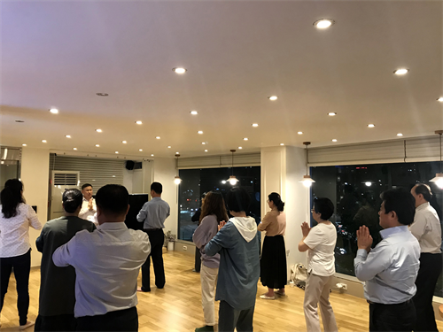

<h3><a target="_blank" href="https://bit.ly/3asSXIA">请多传破网软件，使更多的人了解真相从而得救，这是给自己积福德。 https://bit.ly/3asSXIA </h3></a>

   

     
<h3 align="center"><b>免翻视频  https://bit.ly/3ezRQKo  (请收藏网址 https://git.io/swspip)</b></h3> 

<h3 align="center"><b>复制网址到谷歌或火狐浏览器打开。若出现 “提示” ，請点击“继续”访问即可。</b></h3> 

<h3 align=center><a href="https://github.com/gav01/Heart/blob/master/news1.md">● 看更多大紀元時事 ●</a></h3>

<a href=https://git.io/souye><h6 align="right">回首頁</h6></a>

<a name=top>

<a href =#17>17.终认清中共 美国安顾问中国问题讲话全文 
<a href =#16>16.【最新疫情7.2】全球疫情加速扩散 
<a href =#15>15.国安恶法38条震惊全球：要管全世界的人 
<a href =#14>14.FCC发布最终指令 宣布华为中兴构成国安威胁 
<a href =#13>13.郝海东与叶钊颖七一互动 牵手反共到底 
<a href =#12>12.蝗虫大军逼近首都 印度直升机和无人机迎战 
<a href =#11>11.香港新设国安署权力不受限制 架空港府及司法 
<a href =#10>10.【独家】鲁炜发迹和中国“删都”的出现 
<a href =#9>9.涉集体造假？金凰珠宝爆质押83吨假黄金诈贷 
<a href =#8>8.钟原：“百年未有大变局” 习近平有新解 
<a href =#7>7.【独家】前微博审核员勇揭中共审查黑幕 
<a href =#6>6.4名香港大纪元派发人员7·1被捕 吁立即释放 
<a href =#5>5.韩国新学员：入心学法精进去执 
<a href =#4>4.【内幕】关联北京疫情 河北大规模检测背后 
<a href =#3>3.多省市有大暴雨 云南昭通洪涝致3死 
<a href =#2>2.班农批西媒无视中共罪责反攻击大纪元 
<a href =#1>1.【最新疫情7.1】巴西染疫死亡人数增近一倍 

<a name=17>
<h1 align="center"><b>终认清中共 美国安顾问中国问题讲话全文</b></h1>

2020年6月24日，美国国家安全事务顾问奥布莱恩在凤凰城亚利桑那州商业局发表有关中国问题的讲话。(Michael Campanella/Getty Images)

   
  【大纪元2020年07月02日讯】（大纪元记者秋生翻译报导）2020年6月24日，美国国家安全事务顾问奥布莱恩（Robert O’Brien）在凤凰城亚利桑那州商业局发表有关中国问题的讲话。

他指出，中国共产党是一个马克思主义、列宁主义的极权政党。美国人被动而天真地对待中共的时代已结束。美国将和盟友一起抵制中共操控我们的人民和政府，伤害我们的经济等等。揭露中共的信条和阴谋，这不仅仅是为美国人，为中国人，也是为了世界人民的福祉。

此外，奥布莱恩明确表示，中共不等于中国，也不等于中国人民。美国对中国人民怀有深深的敬意和钦佩。美国和中国有着长期的友好交往的历史。

以下为奥布莱恩发言的全文翻译：

大家下午好！感谢大家来到亚利桑那州商务局，和我们一起欢迎一位非常特殊的客人——唐纳德·J·川普（特朗普）总统的国家安全顾问罗伯特·奥布莱恩。奥布莱恩先生！欢迎您来到亚利桑那！今天我们非常荣幸，也非常高兴把您请到这里。感谢您花时间要与我们分享一个重要的消息，并介绍政府为保障美国以及我们的盟友的安全而正在进行的工作。我们期待着几分钟后听您的报告。

这场冠状病毒（中共病毒）瘟疫再次凸显了国家安全与我们国家的产业供应链以及公共卫生安全之间的深层联系。在这个危机时刻，美国人很想知道我们有资源，也有办法迎接任何挑战并且打败任何敌人。我知道我们做得到，像亚利桑那这样的地方近年来处于领军地位，由于我们位于战略要地，与墨西哥毗邻，近年来采取了合理的措施整顿环境，使这里成了先进技术的发源地，获得了声誉，吸引了许多世界一流的创新企业来到我们这个优秀的州创业。

最鲜明的例证就是最近台湾半导体制造公司决定把其价值120亿美元的高科技生产设备直接落户到亚利桑那。无论是从增加就业的角度看，还是从国家安全的角度看，这都是美国近年来能看到的具有重大经济意义的事件之一。随着越来越多的美国企业把他们的生产基地迁回我们本土，我们期待着将来有更多的这样的企业来到亚利桑那州。

我谨向罗斯部长脱帽致意，向他的商务部团队致意，也包括精干的联邦政府、川普政府、精于合作的国务卿蓬佩奥、国防部等，感谢你们给亚利桑那带来了就业机会。我还要特别向川普总统表示感谢，他一直在不知疲倦地努力着，巩固了美国在世界舞台上的地位，把越来越多的加工制造企业迁回了美国，进行了具有历史意义的改革，签订了美国、墨西哥、加拿大贸易协议。这些都将直接使我们的国家受益，也使亚利桑那州受益，我们与我们最大的贸易伙伴墨西哥的贸易正在增加。

女士们，先生们，我们今天的这位贵客懂得美国只有国内经济更强大，在国际舞台上军事力量更强大，才能让美国更安全。在出任川普总统的国家安全顾问之前，罗伯特·奥布莱恩曾在国务院担任总统特使负责解救人质工作，代表美国政府进行外交努力，解决与海外人质有关的问题。他拥有无可挑剔的品格，在平凡的工作中取得了扎实的成就，以高尚的职业道德尽职尽责。

在亚利桑那州，也许很多人还都清晰地记得去年秋天他作为政府官员向世界宣布：在一次军事行动中美军击毙了伊斯兰ISIS恐怖组织首领巴格达迪，行动代号则是我们亚利桑那人凯拉·米勒的名字。

奥布莱恩先生，我代表凯拉·米勒的家庭以及亚利桑那州的很多民众向您表示感谢，同时向这位非常出色的年轻女性致敬。我知道，那次非凡的行动对米勒的家庭来说具有非凡的意义，对亚利桑那州所有凯拉·米勒的崇拜者具有非凡的意义，这是他们亲口告诉我的。在此，我请大家和我一起用亚利桑那州的方式热烈欢迎国家安全顾问罗伯特·奥布莱恩！

谢谢你，州长！这是一个非常令人感动的致辞，这让我想到了小凯拉和她的父母，他们已经被写入了《国情咨文》。对于总统来说，也对于我们全体美国人来说，那是一个非常特殊的场合。我们绝不能让发生在凯拉身上的事情再次发生在任何人身上，尤其不能发生在美国人身上。所以我要感谢您能在今天想起她，感谢您给予她的家庭的支持，他们是非常伟大的美国人！

来到凤凰城我感到非常的荣幸！祝贺台积电来到亚利桑那州建厂！我要告诉你们，其他49个州长此刻都有点儿妒嫉杜西州长，这可是您在任期间的一个了不起的成就。把我们的供应链迁回美国对我们的国家安全意义重大，尤其是那些涉及关键技术、计算机芯片、双重使用芯片的产业，不仅对我们的平民生活很重要，比如我们使用的电话、电脑、洗碗机、电冰箱等等，而且对我们的军事很重要。你们已经有了一些大型航天公司正在亚利桑那州开展业务。他们得到的好处是他们的供应商就在他们附近。因此，我要再次表示祝贺！这对亚利桑那州来说真是太好了。

我来到亚利桑那州商业局感到非常高兴。祝贺你们！你们给予了州长和州政府极大的支持，不仅把台湾企业迁到了这里，而且就我所知，很多其它正在返回美国的加工企业也将要落户到亚利桑那。这里气候好，阳光充足，靠近西海岸。我相信世界各地的人也会来到亚利桑那，来到美国西海岸，他们会看到，在华盛顿DC和纽约等一些大都市以外还有这么一块土地，我相信，随着加工业回归美国，这都会实现，亚利桑那州也将成为他们的首选。

因此，州长，我向你祝贺，并代表美国第45任总统唐纳德·J·川普向你表示祝贺！我知道他昨天在这儿，我很荣幸紧随其后也来了。我想我要告诉大家一些其它好消息：下个星期你们即将迎来美国副总统麦克·彭斯。他是我的好朋友，他的办公室在大厅里面。

我感谢你们热情邀请我来亚利桑那与州长以及您的同事们讨论一些对美国国家安全至关重要的话题，譬如来自中国共产党的挑战、中共的崛起、它对美国以及美国的盟友的威胁，眼下对我们来说至关重要。我今天的讲话是政府高级官员计划在未来的一个月里围绕同一个问题做系列讲话的第一场。你们不久还将听到国务卿蓬佩奥、司法部长巴尔、前联邦调查局局长克里斯·雷就同样的话题发表讲话。

在川普总统的领导下美国人终于醒来了，看到了中共咄咄逼人的行为，以及对我们的生活方式的威胁。几十年来，无论是美国政界、商界、学术界，还是新闻界，都秉持着这样一个传统观念：中国的自由开放只是一个时间问题，先是在经济领域，然后在政治领域。我们一直认为，我们越向中国（中共）开放我们的市场，越向中国（中共）投资，培训越多的中共官僚、科技人员、工程师，甚至于军官，中国就会变得越来越像我们一样。

正是在这一前提下，我们在2001年欢迎中国加入了世界贸易组织，做了重大让步，提供了众多贸易优惠。我们故意淡化中共对人权的粗暴践踏，包括天安门广场屠杀。我们对中国（中共）的大范围的技术盗窃视而不见，以至于整个美国经济大伤元气。

随着中国（中共）变得越来越富有，越来越强壮，我们也相信中国共产党会变得开明，会满足中国人日益增长的对民主的渴求。现在看来，这只是一个大胆的、纯粹美国式的想法。它产生于我们天生的乐观精神，而我们在与苏联共产主义的抗衡中获胜也滋生了这个想法。

不幸的是，这个想法被证明是非常幼稚的。我们已经是大错特错了。这种误判导致了自上世纪30年代以来美国外交政策上的最大的一次失败。我们是怎么犯下这种错误的？我们怎么会看不懂中国共产党的本质？

答案很简单：因为我们没有留意中共的意识形态。我们既没有听中共领导人说了什么，也没有读他们在关键文件中写了什么，我们闭塞了自己的视听，一厢情愿地认为这些党员只不过是名义上的党员。

如今我们要把事实澄清：中国共产党是一个马克思主义、列宁主义的政党。该党的总书记习近平把自己视为约瑟夫·斯大林的接班人。事实上，正如前澳大利亚政府官员、记者约翰·加诺所说，中国共产党是除了北朝鲜以外，最后一个从未与斯大林决裂的正在执政的共产党。

是的，就是这个斯大林，他的残酷独裁和引发灾难的政策曾经使大约两千万俄罗斯人和其它国家的人死于饥荒、强制集体化、处决和劳改营。按照列宁、斯大林、毛泽东的解释，共产主义就是一种极权主义意识形态。

共产主义认为，个人只是作为一个工具被用来实现一个民族国家想要实现的目的，因此个人可以轻易地被拿来为实现民族国家的目标做牺牲。

按照马克思主义、列宁主义的逻辑，个人不具有本身的内在价值，他们的存在意义就是为国家服务，而国家的存在意义不是为他们服务。这些观念在我们现在看来非常遥远、陈旧。它们无论如何都是旧思想，诞生于一个半世纪以前的欧洲，在一个世纪前在俄国得到实践，在30年前被抛弃，被看作是历史上代价最惨重的失败了的政治实践。

可是在中国，这些思想一直是中国共产党的根基，就如同《宪法》和《权利法案》是我们美国人的根基。中国共产党谋求对人民生命的完全控制，这意味着经济控制、政治控制、身体控制。也许最重要的是思想控制。

前澳大利亚政府官员、记者约翰·加诺发现，按照中国经典治国方法，获得并维持对江山的控制需要使用两个工具：第一个是“武”，就是武器和暴力；第二个是“文”，就是语言和文化。中共领导人一向认为权力既来自对军事的控制，也来自对文化的控制。

加诺写道，“按照列宁、斯大林、毛泽东所做的类比，语言不是讲道理、劝人的工具，而是杀人的子弹，是用来界定、孤立、消灭敌人的。”对于中共来说，宣传发挥着核心作用。北京要控制政治思想的意图不仅要公开说明，而且要不择手段地去实现。

从1989年起，中共开始围绕意识形态安全进行自我整顿，“意识形态安全”成了中共领导层频繁重复的词汇。2013年4月中共发布了一项关于他们所谓的“当下意识形态”的政策，强调绝对不能让不正确的思想和观点有任何机会和出口传播。

因此，在中国，这就意味着强制学习共产主义意识形态，要求人们下载、使用智能手机的应用程序学习所谓的“习近平思想”。这意味着对全国媒体的完全控制。

来自外部的资讯，从外国报纸到推特、脸书、WhatsApp，被一律禁止。来自中国内部的内容要一律接受审查。这意味着民间博主、记者、律师、活动家、宗教信仰者一旦表达了与党的路线相反的任何观点就会被监禁。

的确，就在最近，在今年1月1日和4月4日之间大约有500人被控犯罪，只是因为他们说出了武汉冠状病毒（中共病毒）的真相、对中共的影响、中共对疾病的掩盖等。

中国共产党还对包括《圣经》在内的宗教文本进行重新解读以便支持共产党的意识形态。中共还把几百万穆斯林维吾尔人等其它少数民族关进再教育营，让他们在那里服务，或者接受政治教化，或者被强制劳动，而他们的孩子则交给了共产党办的孤儿院抚养。整个过程使被关进再教育营的人们失去了家庭、宗教信仰、文化、语言等遗产。在中国共产党的控制下，信息都被严格控制，言论被严格监视，要么被压制，要么被国家篡改。

美国人应该关注，我们应该关注，不只是关注中国人，而且是关注我们自己，因为习近平控制意识形态的野心并不局限于他自己的人民。中共宣扬的目标就是创建人类共同命运共同体，并且按照中共的意愿重新塑造全世界。他们正在越出中国边界去控制人们的思想，并取得了成效。

在过去的十年里，中共花费了几十亿美元在海外进行宣传，并取得了他们期待的效果。中共正在努力清除世界各地反共的中文媒体，并且即将取得成功。美国的几乎所有中文媒体要么被中共控制，要么与中共合作密切。

中共正在入侵英语媒体。美国各地城市有超过12家广播电台利用调频广播以非常微妙的方式向美国听众进行亲北京宣传。最近，中共宣传使非常多的美国人相信是一名美国士兵把冠状病毒（中共病毒）带到了武汉，而不是武汉把病毒传遍全世界。这个完全由中共制造的谎言使得这名士兵和她的家人不得不雇用私人保安来保护自己免遭死亡威胁。这种事情出现在马里兰州，通过抖音进行。

抖音是一个由中国拥有的社交媒体平台，在美国有超过4000万用户，也许包括你们的很多孩子和年轻的同事，其中批评中共和北京的政策的账户被以一种常规的方式删除。

上周推特宣布暂停两万三千多个与中共有关联的账号，因为它们为中共进行有关香港问题和武汉肺炎（中共肺炎）的宣传。推特的这一行动是去年8月暂停超过15万中共账号后的又一次行动，那些账号被用于传播反美的虚假信息，并且在推特上制造了一起假相，让人感到在美国似乎有很多人热心支持北京的政策。这些只是被推特发现的账号。至于还有多少类似的账号尚未被发现，则不得而知。

今年3月中共驱逐了为《纽约时报》、《华尔街日报》和《华盛顿邮报》工作的美国记者，几乎是彻底断绝了来自中国境内的对武汉病毒（中共病毒）的独立报导。除了影响美国人接收关于中共的信息，中共还越来越多地使用杠杆压制美国言论自由。

2017年加州大学圣地亚哥分校邀请了达赖喇嘛在毕业典礼上演讲，北京因此取缔了中国学生以政府基金进入该校的项目。休斯顿火箭队总经理在推特上发文表示他支持香港的和平抗议者，于是中共宣布该队的比赛将不会在中国报导，不会在中国的电视上播出，然后使用这种经济手段给其它篮球队施压，包括要求明星队员站在北京的立场上批评那篇推文。

在中共的压力下，万豪酒店集团、美国达美航空公司、美联航空公司都从他们的公司网页上删除了涉及台湾的字样。奔驰汽车公司甚至为自己在社交媒体上使用了达赖喇嘛的励志格言而向中共道歉。北京利用金融方法和市场准入向好莱坞施压，迫使其自我审查，促使导演、演员、制作人避免使用在中国的审查中可能不被通过的话题。

比如说，在即将上映的影片《壮志凌云》续集《初生牛犊》中，日本和台湾旗帜从汤姆·布鲁斯的飞行服上拿掉了。米高梅公司则在影片《赤色黎明》的重拍过程中用数字技术更改身份，掩盖了中共对北朝鲜的军事入侵。

中共也在寻求机会利用普通美国人。这个党正在收集你最隐蔽的数据、你的言论、你的行动、你的购物、你的行踪、你的健康记录、你的社交媒体发帖以及你的短信。他们会勾勒出你的朋友、家人和熟人的关系网。中共达到这一目的的一些方式包括为软件、硬件、电话通讯公司，甚至基因公司，提供补贴。

结果，像华为和中兴这样的公司可以在价格上同竞争对手竞价，以亏损的方式在全球安装他们的设备。这实际上产生的副作用就是造成美国电讯硬件制造商倒闭，并且使诺基亚和爱立信公司处境非常艰难。

他们为什么要这样做？中共追求的不是电信硬件或者软件方面的利润，而是你的数据。他们在他们的产品上设置了后门以获取数据。

好了，当中共买不到你的数据时，它就偷窃。

2014年，中共黑客侵入安瑟姆保险公司，收集了8000万美国人的敏感信息。

2015年，中共黑客侵入美国人事管理办公室，那里储存着两千万为联邦政府工作的美国人的机密权限信息。

2017年，他们侵入艾可非Equifax信用公司，获得一亿四千五百万美国人的姓名、生日、社会安全号和信用评分。

2019年，中共黑客入侵万豪，搜集了3亿8300万客户的信息，包括护照号码。

2016年，一家中资公司甚至购买了用于交友的应用程序基达Grindr以获取用户信息，其中包括爱滋病毒感染的情况。后来美国政府出于国家安全的考量而强制其转让所有权。

这些只是我们知道的一些案例。中国共产党将怎样使用这些数据？

中共会像在中国境内那样，用同样的方法使用这些数据，对个体美国人进行攻击、取悦、哄骗、影响、要挟甚至敲诈，让这个人去做，或者去说有利于中共利益的事。这是超乎任何广告商能力的微观定位，简直疯狂至极。

与广告商不同，中共不受政府规章制度的限制。中国共产党就是想知道关于你的一切，就像他们想知道几乎所有生活在中国境内的中国人的一切一样。

除了进行宣传影响活动，中国共产党还利用贸易迫使他国俯首听命。

澳大利亚呼吁对冠状病毒的起源地进行独立调查，中国共产党就威胁要停止购买澳大利亚的农产品，阻止中国学生和游客前往澳大利亚留学、观光。澳大利亚拒绝让步，北京方面就把威胁变成行动，对澳大利亚的大麦出口征收80%的关税。

控制国际组织也是中共计划的一部分。中共已经收购了很多国际组织的领导权。

目前，联合国的15个专门机构中的4个被中共把持着，数量超过了美国、英国、法国、俄罗斯，也就是联合国常任理事国其它四个成员国，加在一起把持的机构的数量。中共利用这些负责人强迫国际组织按照北京的论调鹦鹉学舌，在他们的设施中安装中共的电信设备，一点也不奇怪。

比如说，国际电信联盟秘书长赵厚麟上任伊始就全力推销华为产品。国际民航组织秘书长柳芳拒绝台湾参加成员国大会，并且隐瞒中共黑客入侵该组织的行为。中共还利用其联合国人权理事会成员国的身份阻止各国批评其在新疆和香港侵犯人权的行为。

中共还对国际组织的非中共官员施加影响。在北京的操控下，世界卫生组织总干事谭德塞竟然置人命于不顾，顺从地使用中共关于武汉病毒的说辞。直到一月中旬他还在声称不存在病毒人传人的现象，反对限制国际旅行，同时赞扬中国限制国内旅行以防止武汉病毒传播。换句话说，他们可以去海外旅行，但是不可以去北京或者上海旅行，以免可能把病毒带到那里。中共控制国际组织的策略，正如我们透过冠状病毒看到的，不仅引起了美国的关注，也引起了全世界的关注。

好消息是，在川普总统的领导下，我们知道了中共正在做什么。我们正在大声呼吁，并且正在国内外采取果断行动进行应对。

首先，川普总统不让某些听命于中共情报和安全机构的公司，例如中国电信业巨头华为，接触我们的个人和隐私数据。本届政府还对向华为输出半导体技术实施了限制。

第二，国务院把9个中共官方控制的宣传媒体定性为外国使团。这些机构是中国共产党的喉舌。这一定性要求这些所谓的媒体机构必须经常汇报并接受签证限制。

第三，川普总统对参与中共对维吾尔人和其它少数民族的压制、大规模任意拘押以及使用高科技监视的21个中国政府机构和16家中资公司实行出口限制。我们已经阻止参与这些侵犯人权行为的官员进入美国。本届政府还阻止中资公司明知故犯使用维吾尔奴工生产的产品非法进入美国。

第四，川普总统退出了联合国人权理事会，抗议它与中共合作。他还断绝了与世界卫生组织的联系，因为它对疫情的反应表明，它已经完全被中国所控制。美国以及我们的慷慨的纳税人不再每年花费四亿多美元资助驻日内瓦的世界卫生组织，而是把这笔钱直接用在刀刃上，资助在全球发展中国家工作在前线的医护人员。

第五，川普总统限制中共解放军利用学生签证将其军官和雇员送到我国高等院校偷窃美国的技术、知识产权和信息。

第六，总统已经采取行动，禁止美国联邦政府雇员退休基金投资给中资公司，包括中共军方的合同公司以及从事生产用于镇压少数宗教团体的监控设备的制造商。他正在检查那些仍在美国股票交易市场融资的中资公司的不透明的财务审计。

本星期，国防部将向国会提交一份在美国开展业务的与中共军方有联系的中资公司名单，以便让美国民众非常清楚他们正在与什么样的人做交易。

这些步骤只是美国纠正其40年来单方面不公平贸易关系的开始，为的是保护我们国家的经济，以及近期人们看到的政治生态，免受严重伤害。鉴于与中共的不公平贸易，总统在任职初期增加了关税，类似的做法还会更多。

川普总统明白，持久的和平要靠实力。我们是地球上最强的国家，我们不会向中共低头。前面谈到的诸多行动表明，川普政府正在对中共的恶行予以还击。川普政府会继续大声疾呼，揭露中国共产党的信条和阴谋。这不仅是为了中国，为了香港、台湾，也是为了全世界。我们会和我们的盟友和伙伴一起抵御中国共产党企图操控我们的人民和我们的政府，伤害我们的经济，侵害我们的主权。

美国人被动而天真地对待中华人民共和国（中共）的时代已经结束了！我们将忠实于我们的原则，特别是言论自由，这与中共信奉的马克思主义、列宁主义的意识形态形成了鲜明的对比。在川普总统的领导下，我们将鼓励思想多样化，抵制限制言论或者鼓励自我审查的行为，保护美国人的个人隐私，还有最重要的，继续倡导所有男女都享有上帝赋予的权利：享受自由，珍惜生命，追求幸福。

在结束讲话之前，我想要说明：我们对中国人民怀有深深的敬意和钦佩。美国和中国有着长期的友好交往的历史。可是中共不等于中国，也不等于中国人民。

我想对中国共产党说，最近的第一阶段贸易协议表明，我们两国政府有可能建立起一种富有成效的关系。我们想要与中国建立良好的关系，但是我们不想要那种北京目前表述的关系。我相信我们美国人会成功崛起，迎接来自中共的挑战，像我们在历史上迎接一切重大危机那样。川普总统正在率领我们前进。和川普总统一样，我相信我们国家的美好未来就在眼前。

再次感谢大家前来听我讲话。来到凤凰城，来到亚利桑那，我感到非常荣幸。上帝保佑大家！上帝保佑美国！谢谢大家！

<a target="_blank" href=#top><h6 align="right">回上方</h6></a>

<a name=16>
<h1 align="center"><b>【最新疫情7.2】全球疫情加速扩散</b></h1>

图为2020年7月1日，全球确诊病例排名前十位的国家。（大纪元制图）

   
  【大纪元2020年07月02日讯】（大纪元记者林南、李言、谢佳宣综合报导）7月2日全球中共病毒（中共肺炎）疫情最新情况： 
  
 根据约翰·霍普金斯大学的数据，截至美东时间周三（7月1日）晚上8时，全球感染中共病毒（武汉肺炎）的死亡人数超过51万1000人，确诊病例超过1056万例。（注：因中共和伊朗隐瞒疫情数据，真实数据比统计的要高）。

随着美国确诊案例激增，很多州和地区暂停了部分重新开放措施。纽约市周三改变了计划，决定不让餐馆在下周恢复室内就餐服务。 迈阿密海滩市说，它将恢复从周四凌晨12:30开始的宵禁，一直持续到凌晨5点，以遏制病毒蔓延。 加利福尼亚州关闭了酒吧，并停止了19个县的餐馆室内用餐，这些县的人口占该州70%以上。

美国卫生官员呼吁美国人“在家庆祝”7月4日的独立日。

中东地区，特别是有冲突地区的国家，正面临日益严重的危机。该地区有100万人感染了该病毒。

截至周三，全球疫情排名第二的巴西死于中共病毒的人数超过60,000，累积确诊病例达1,448,753例。

欧盟周三向15个国家（美国，俄罗斯和巴西除外）的游客重新开放了边界，许多欧洲国家进一步放宽了限制。

=======================
<b>以下是最新疫情实时更新：
   
东京单日新增107个确诊 再创解封后新高</b>

日本东京都周四新增感染冠状病毒（中共病毒）的病例达107例。这是日本解除紧急状态后新高纪录。

日本共同社采访相关人士获悉上述消息。当天东京的冠状病毒检测结果，有107人呈阳性反应。这是5月2日以来，东京都内再度出现单日新增确诊病例升至三位数。

对于东京都新增感染人数趋向增长势头，日本官房长官菅义伟在周四的记者会上表示，无需要求采取避免外出等措施。

东京都内在5月25日解除紧急状态后新增感染病毒的人数持续增加。进入6月下旬后，单日新增确诊病例均在50例左右，进入7月份，1日为67人，周四（2日）急增至上百人。

据报导，东京都知事小池百合子对此表示，感染者增加也存在随着检测数量等带来相关措施充实的因素。“大家担心阳性者多，但从蔓延情况来看绝大多数是（重症化风险低的）二三十岁人群。”

<b>球队正在备战比赛 6名达拉斯FC球员染疫</b>

离美国职业足球大联盟MLS复赛只剩下一周，大联盟周三表示，在即将到来的“MLS回归杯”锦标赛（MLS在复赛后进行的第一项比赛）之前，有6名达拉斯FC的球员在抵达佛罗里达州后，接受了Covid-19检测，结果呈阳性反应。

其中两名球员在上周六（6月27日）抵达佛罗里达州奥兰多时被检测出对Covid-19呈阳性反应。MLS在周三的一份声明中表示，另外四名球员在过去的两天里测试呈阳性。

这些尚未确定身份的球员目前被隔离在球队位于奥兰多的华特•迪士尼世界度假区的酒店内。MLS将于7月8日开始在该度假区的ESPN体育世界举办比赛。

此消息公布之际，正值美国主要的联盟赛事开始实行他们的大流行病中回归比赛的计划。

<b>美国现单日新增确诊病例最高纪录</b>

根据约翰-霍普金斯大学（Johns Hopkins University）的数据，美国周三单日新增冠状病毒（COVID-19）确诊病例数创下历史新高，共报告有50203例新病例，这超过了此前6月26日达到的单日新病例最高纪录的45255例。

据该大学统计，美国累计有2,685,806例确诊病例。

<b>墨西哥染疫死亡人数上超过西班牙</b>

根据墨西哥卫生部公布的数据，墨西哥的冠状病毒死亡人数周三已超过了西班牙。

在过去24小时内，墨西哥报告有741例新的死亡病例，使其总的死亡人数达到28,510人。根据约翰-霍普金斯大学的统计，西班牙周三晚间总的死亡人数为28,364人。

目前墨西哥是全球冠状病毒死亡人数第六多的国家。

墨西哥卫生部周三还报告有5681例新的确诊病例，使该国的总病例数达到231,770例。

<b>澳州维州新病例继续以两位数增长</b>

澳大利亚维多利亚州周三录得有77例新感染冠状病毒的病例，这是连续第17天出现的病例数以两位数字增长。

维多利亚州首席医官布雷特·萨顿（Brett Sutton）周四表示，周三发现的大多数病例都发生在墨尔本附近的10个疫情“热点”郊区，那里已有30万人被令“待在家中”避疫。

维多利亚州目前有415例活跃病例，其中20个患者住院，包括有4例在重症监护病房治疗。
目前当局鼓励10个区的所有居民进行检测，无论他们是否有没出现任何症状，周三当地已进行了26,320次测试。

“仍有可能发现其他感染者，他们都有传染给他人的风险，”萨顿说。“人们应该尽可能地缩小自己的行动范围。”

<b>一连串的失误 新西兰卫生部长宣布辞职</b>

新西兰卫生部长戴维•克拉克（David Clark）在疫情期间发生一系列严重失误，包括违反本国封锁规则，遭遇四面楚歌，他在周四宣布辞职。

自4月份以来，克拉克一直遭到抨击。在全国封锁期间，当时他违反新西兰的居家令，带着全家人到海滩散步。

他当时曾提出辞职。但是，总理哈辛达·阿登（Jacinda Ardern）并不接受他的请辞，称这可能会在国家与病毒作斗争时，造成卫生部门的“大规模混乱”。

对此，阿登在4月时撤消了克拉克所兼的副财政部长的职务，并将他在内阁的排名降到最低层。上个月，他将边境失误的责任归咎于卫生局局长阿什莉·布卢姆菲尔德（Ashley Bloomfield）后，又遭到了另一次评击。

克拉克周四再次提出辞职。阿登表示，已接受克拉克的辞职请求。

克拉克在Facebook上的一份声明中写道：“对我来说，越来越清楚的是，我继续担任这一职位有损政府对COVID-19全球大流行的总体反应。”
阿登说，“我们的卫生领导层要得到新西兰民众的信任，这点至关重要。就像克拉克对我说的，团队的重要性排在他个人前面”。

截至周三，新西兰共有22例Covid-19活跃病例，其中1例住院。根据新西兰卫生部的数据，总共记录了1,528例确诊或疑似病例，死亡22例。

图为2020年3月19日，新西兰威灵顿，新西兰卫生部长克拉克（David Clark，左）召开记者会。(Hagen Hopkins/Getty Images)

<b>韩国新增54个确诊病例</b>

据韩国中央防疫对策本部周四通报，截至当天零时，韩国新增54个感染中共病毒（冠状病毒）确诊病例，但当天没有新增死亡病例。
至此韩国累计确诊病例达12904例，累计的死亡病例达282例。

韩联社报导指，韩国近期的疫情已蔓延至大田市、忠清南道和光州市等首都圈以外地区。当日新增的54个病例中有44例属于社区感染，其中来自光州市的新增病例占半，达22例。

这是韩国单日新增病例连续两天超过50例，为近两周来的最高。另外，10例为境外输入的病例，也是连续7天呈两位数增长。

当天光州市确诊的病例与此前首都圈的病例多出现在教会的情况有所不同，当地疫情以寺院、教会、直销公司、养老设施及图书馆等为中心不断扩散，近5日累计新增39例。

<b>研究：儿童传播病毒能力可能跟成年人一样</b>

一项新的研究表明，儿童可能也能够像成年患者一样传播中共病毒。

日内瓦大学医院和该大学研究人员调查了7名年龄在7天到16岁之间的染疫婴儿和儿童。

除了两个人以外，其他所有人都携带与成年人相同的病毒，这就是为什么研究人员说，除非另有证明，否则应将儿童视为病毒传播者。

感染COVID-19的儿童比成年人少，发展为严重疾病的人也较少，他们似乎不是“主要传播途径”，但各个年龄段的儿童都已被感染。

该研究的作者说，需要更多的研究来充分了解儿童在传播该病毒中的作用。

<b>全球疫情加速扩散 过去一周每天新病例破16万</b>

世界卫生组织周三表示，COVID-19疫情在全球加速扩散，过去一周每天的新病例超过16万例；而且疫情爆发后记录到的所有确诊病例，逾半都是在6月出现。

截至周三，全球至少51万人死于中共病毒（COVID-19，武汉肺炎），确诊病例逾1056万例。

疫情从去年12月在中国爆发后，目前已蔓延到196个国家及地区。

全球疫情最严重的美国，境内累计12万7681人死亡，累计确诊数达265万8324例。巴西死亡人数在全球仅次于美国，超过6万，累计确诊达144.8万例。但是，由于中共和伊朗隐瞒疫情，它们真实的疫情数据可能比上述国家还要高。

从区域来看，欧洲累计确诊269万3243例，死亡19万7605人；美国和加拿大累计确诊276万2595例，死亡13万6344人；拉丁美洲和加勒比海地区累计确诊259万1485例，死亡11万6534人。

世卫周三报导说，中东地区，特别是有冲突地区的国家，正面临日益严重的危机。

该地区有100万人感染了该病毒，6月份报告的病例数超过了前四个月的总和。受灾最严重的国家是伊朗、伊拉克、沙特阿拉伯、埃及和巴基斯坦，这些国家合计占该地区死亡人数的85%以上。

俗称武汉肺炎的COVID-19（中共病毒）疫情至今已在全球夺走超过51万1000人的性命，已知确诊人数超过1056万人。

世卫本周稍早警告，这波中共病毒大流行距离结束还很遥远。

<b>美国国庆日 官员吁“待在家里庆祝”</b>

美国卫生官员敦促美国人缩减国庆日（独立日）计划，取消聚会、待在家里、不要让情况变得更糟。因为新增的中共病毒病例水平达到了令人沮丧的新高，8个州在周二创下了单日确诊人数最多纪录。

俄勒冈卫生局说：“这个假期最安全的选择是在家庆祝。”

对于计划举办野炊活动的内布拉斯加人来说，该州官员建议：保留客人名单，以便更能容易地追踪。

在洛杉矶县，公共卫生部门下令取消烟火表演。

<b>美国政府投资开发监控患者症状设备</b>

美国政府周三表示，它正在投资一个项目，可监控中共病毒患者的症状，甚至可能发现早期感染迹象。

生物医学高级研究与发展局（Biomedical Advanced Research and Development Authority，简称 BARDA）表示，已向数字医学公司Sonica Health投资656,000美元，用于开发可配戴。

据悉，该设备大约只有创可贴大小，可贴在喉咙的底部。

“该设备可以监测咳嗽强度和咳嗽模式；胸壁运动可能表明呼吸困难或呼吸不规则、其它呼吸音、心率、体力活动和体温。”

BARDA表示，Sonica Health将整合西北大学附属公司Sibel Health的技术，以增加连续脉搏血氧仪和心电图，来测量心脏活动和血氧水平。

<b>福西预计美国每天新增10万病例?</b>

美国顶尖传染病专家安东尼·福西（Anthony Fauci）博士在周三下午接受NPR采访时说，美国可以扭转正在上升的中共病毒大流行状况。

福西对主持人凯利（Mary Louise Kelly）说：“每天不一定会有100,000个案例。”

他补充说：“我使用这个数字，是因为我想让人们有紧迫感。”

福西周二在参议院委员会作证说，如果不进行干预，例如戴口罩和社交疏离，美国每天可能会发现多达10万例新的Covid-19病例。该国每天已经有近40,000例新病例。

“如果您将病毒留在自己的设备上，它将迅速感染您。控制爆发是我们应对爆发动态传播的方法。而且，如果您做的事情从本质上增强了疫情爆发，那么您就是问题的一部分。您不是解决方案的一部分，” 福西说。

目前包括佛罗里达州和德克萨斯州在内的一些州每天的Covid-19病例都在上升。

福西说：“我们看到的，各州之间的情况各有不同，人们聚集在酒吧里庆祝⋯⋯” 福西说， “这违反了我们正在尝试做的原则，那就是社交疏离，戴口罩。”

福西说，他相信美国可以再次减少这一数字，回到3月和4月的水平。

<b>巴西又一州长染疫</b>

巴西州政府新闻办公室周三宣布，巴西圣卡塔琳娜州州长卡洛斯·莫伊斯（Carlos Moises）对Covid-19检测呈阳性反应。

莫伊斯现在正在自己的家中隔离。他出现咳嗽、喉咙痛和低烧的症状。

巴西通讯社G1 Globo报导，自Covid-19爆发以来，巴西27位州长中有8位感染了该病毒。

阿拉戈斯州、圣埃斯皮里图桑托州、马托格罗索州、帕拉州、伯南布哥州、里约热内卢州和罗赖马州州长也感染了该病毒。

根据约翰·霍普金斯大学的病例统计，截至周三，巴西死于中共病毒的死亡人数接近6万。该国确诊病例数位居第二，仅次于美国，已确诊病例超过140万。

<b>伊朗封锁11省</b>

伊朗政府在国际制裁的压力下苦苦挣扎，尤其不愿封锁经济。伊朗总统曾说过，经济必须保持开放，因为伊朗“没有第二选择”。

但是在周三，随着感染病例激增，医院满员，死亡人数上升，伊朗官员宣布在11个省的城市采取新的关闭措施。

卫生部官员说，现在包括首都德黑兰在内的八个省被视为红色区域。

<b>美国病例攀升 美股涨多跌少</b>

路透社报导，尽管美国感染中共病毒（冠状病毒）的病例攀升，但市场对安全有效疫苗的研发进展趋于乐观，舒缓当局可能实施另一波防疫封锁令所引发的忧虑，美股周三涨多跌少。

道琼工业指数下跌77.91点或0.30%，以25734.97点作收。

标准普尔指数涨15.57点或0.50%，收3115.86点。

科技股纳斯达克指数上涨95.86点或0.95%，收10154.63点，再创收盘新高。

<b>哥伦比亚中共病毒病例突破10万</b>

据哥伦比亚卫生部称，哥伦比亚周三染疫病例超过了100,000例。

卫生部在过去的24小时内报告了创纪录的4,163例新病例，使该国的总数达到102,009例。

哥伦比亚还记录了136例新的死亡人数，总死亡人数达到3,470人。

根据美国CNN统计，拉美国家本周在七天时间内的平均报告病例数和死亡人数再创新高。

<b>巴西死亡人数超过60,000</b>

据巴西卫生部称，截至周三，巴西死于中共病毒的人数超过60,000人。

该部在过去的24小时内报告了1,038例新的死亡人数，使巴西的死亡人数达到60,632人。

巴西周三还报告了46,712例新确诊病例，每日大幅增加，但仍未超过该国单日纪录。巴西在24小时内报告的最高病例数发生在6月19日，当时卫生部报告了54771例新病例。

截至周三，巴西有1,448,753例确诊的Covid-19病例，是全球第二大疫情国。 

<a target="_blank" href=#top><h6 align="right">回上方</h6></a>

<a name=15>
<h1 align="center"><b>国安恶法38条震惊全球：要管全世界的人</b></h1>

中共人大强推“港区国安法”，引起港人强烈反应，28日下午有网民发起“6.28静默游行”。（余钢／大纪元）

   
   【大纪元2020年07月01日讯】（大纪元记者徐简综合报导）6月30日，中共炮制的“港版国安法”在一片斥责声中出炉了，其中的第38条将中共管辖权扩张到世界任何角落，这引起了各界的惊诧和愤怒，称38条是“与世界为敌”。

这个所谓的港版国安法第38条载明，“不具有香港特别行政区永久性居民身份的人，在香港特别行政区以外，针对香港特别行政区实施本法规定的犯罪的，适用本法。”

换句话说，该条文将《国安法》治外法权延伸至世界每一个人，《国安法》不仅规限香港永久居民或身在香港的人士，适用性还延展至海外与非香港居民。只要共产党认定违法即可入罪，这对全球都具威胁性。

哥伦比亚大学政治学教授黎安友（Andrew Nathan）指，在海外支持香港民主的人士在国际间出行或需提高警惕，规避与中共有引渡条约的国家。

知名评论家章家敦（Gordon Chang）发推说，“第38条将外国人的外国活动定为犯

英国著名人权活动家罗杰斯（Benedict Rogers）说，“我呼吁（对中共进行）制裁、（在香港派驻）联合国特使、救生艇救援（港人）。我想我已经触犯了38条？”

<h4 align=center><a href="https://twitter.com/benedictrogers/status/1278018782049579013?ref_src=twsrc%5Etfw%7Ctwcamp%5Etweetembed%7Ctwterm%5E1278018782049579013%7Ctwgr%5E&ref_url=https%3A%2F%2Fwww.epochtimes.com%2Fgb%2F20%2F7%2F1%2Fn12224164.htm">我想我已经触犯了38条？(点击右键,另存新档）</a></h4>

作家、Axios的中国问题记者Bethany Allen-Ebrahimian写道：“天啊，我真的没看走眼？？？北京刚刚赋予自己对地球上的每个人都有治外法权？”

慈善机构创办人、英国上议院与保守党人权事务委员裴伦德（Luke de Pulford）写道：“这项法律是荒谬的。38条规定非香港公民甚至不在香港的人如果触犯该法，也被视为犯法，我猜那就是我。”

新唐人评论员唐靖远说，港版国安法第38条的规定震动全球，因为按照这条规定，中共可以管辖全球所有人……这种匪夷所思的条款居然堂而皇之出台，只能说明，人大这帮制定国安法的人，要么是一帮二货、伪专家或外行法盲，要么就是他们存心出“一尊”洋相，欺负他看不懂——法案必须要他签字才能颁布实施。

香港名嘴、著名电视电影编剧萧若元说，中共会因第38条把自己玩死，“现在所有外国国家都会警告自己的市民，因为他们很有可能曾经在国外有违法的言行结果构成了‘犯法’行为在香港被拘捕。这对于香港国际金融中心的地位一定是有重大影响。”

台湾陆委会7月1日举办的“台港服务交流办公室”揭牌仪式上，陆委会主委陈明通说，“这是天朝帝国对世界的子民发出的律令”，全世界都必须关注此法，并要严肃面对。#

<a target="_blank" href=#top><h6 align="right">回上方</h6></a>

<a name=14>
<h1 align="center"><b>FCC发布最终指令 宣布华为中兴构成国安威胁</b></h1>

美国联邦通信委员会（FCC）以国家安全为由，提议不许电信业者用国家预算采购中兴及华为的网路设备。(AFP)

   
   【大纪元2020年07月01日讯】（大纪元记者张婷综合报导）周二（6月30日），美国联邦通信委员会（FCC）正式指定华为和中兴通讯对美国国家安全构成威胁，禁止美国公司动用83亿美元的政府资金，从这些公司购买设备。

路透社报导，FCC主席阿吉特‧帕伊（Ajit Pai）周二在一份声明中说：“我们不能也不会允许中共利用网络漏洞，损害我们的关键通信基础设施。”

FCC专员杰弗里·史塔克斯（Geoffrey Starks）周二表示，“不可信任的设备”在美国网络中仍然存在。他表示，美国国会必须为替换这些设备分配资金。

美国电信监管机构FCC于去年11月，以5比0的投票结果，认定华为和中兴通讯对美国构成国家安全风险，要求郊区运营商移除和替换现有美国网络上所使用的华为和中兴设备。

2019年5月，川普（特朗普）总统签署了一项行政命令，宣布国家紧急状态，禁止美国公司使用由可构成国家安全风险的公司制造的电信设备。川普政府还在去年将华为加入了商务部出口管制黑名单，并在今年5月对华为实行新一轮封杀，禁止任何使用美国技术和设备生产芯片的制造商向华为供货。

FCC对中国电信公司采取了越来越强硬的路线。FCC在今年4月表示，可能撤销包括中国电信和中国联通在内的几家中共国有控股电信公司在美国的运营资格。

FCC向中国电信美洲公司、中国联通美洲公司、太平洋网络公司及其全资子公司ComNet（USA）LLC发出“陈述理由令”（要求说明理由的命令，show cause order），指示这三家公司解释为何不应该启动撤销它们在美国运营授权的程序。FCC要求这些公司在30天内做出回应。

FCC主席帕伊在一份声明中表示：此举反映出美国政府机构的“深切关注”。

他说，由于这些公司是中共国有实体的子公司，因此“很容易受到中共的利用、影响和控制。当涉及到我们网络的安全性时，我们绝不能冒险，也不能指望最好的情况”。

<a target="_blank" href=#top><h6 align="right">回上方</h6></a>

<a name=13>
<h1 align="center"><b>郝海东与叶钊颖七一互动 牵手反共到底</b></h1>

7.1中共建党日之际，郝海东向中共“献礼”，怒吼“共产党，你们完了。”（网络截图）

   
  【大纪元2020年07月01日讯】（大纪元记者骆亚报导）大陆前足球名将郝海东和妻子（羽毛球名将）叶钊颖在临近中共7.1建党日之际，在社交媒体上发表公开言论，反共大义是他们夫妇两人的共同理念，向中共7.1“献礼”。

郝海东还在视频中表示灭共是正义的需要，指中共是危害全人类的一个邪恶组织，并怒吼“共产党，你们完了”。

6月30日，郝海东的最新视频在社交媒体上广为流传，再度表达他灭共的决心，“我会永远跟你们在一起，消灭中国共产党！消灭CCP！”

视频中，他强调，“消灭中共是正义的需要，中国共产党是危害全人类的一个邪恶组织。我坚信、我相信世界自由、民主、文明、法治社会一定会剔除中国共产党，文明世界里不应该有它们的位置。”

最后他高声怒吼：“共产党，你们完了。”

而此前一天6月29日，他们夫妇两人在以各自名字“郝海东”和“叶钊颖”为用户名的推特账号上互动发推文，表面他们两人有共同的“反共”理念，并会一起走完人生的反共下半场。

郝海东夫妇7.1前夕再炮轰中共，指出灭共大义是两人共同的理念。（网络截图）

叶钊颖的这条推文写道：“反共的大义理念，使我与郝海东相知、相恋，走到一起。”

她还说，“我们都痛恨共产党的祸国殃民、倒行逆施、恶贯满盈！反共是我们俩最大的共同语言！在反共的大义行列中，我们会手牵手，往前走，到永远。说句笑话：共产党是我俩的媒人！”

与此同时郝海东在与她互动的推文中说：“我们是真正的志同道合的有缘人！感谢小叶对我的支持！我们会一起走完人生的反共下半场！”

郝海东与妻子互动说，要一起走完人生的反共下半场。（网络截图）

关于这两个大陆原体坛名将的推特账号，目前郝海东夫妇并没有发表任何公开言论出面否认说这不是他们的个人账号。不少网友认为上面的观点符合两人近来的行动，有很大可信度。数万的粉丝中，很多人还在底下留言赞赏、声援、力挺。

<b>六四31周年首度向中共宣战：“新中国联邦”成立</b>

而此前“六四”31周年之际，郝海东夫妇向外宣读了“新中国联邦”成立的宣言，犹如核弹炸翻了网络，足球名将郝海东名字火爆整个网络。

随后他们夫妇两人在接受媒体的专访中谈及他们夫妇与中共决裂的原因，并强调共产党必须“退出历史舞台”。中共对他们举动非常恐慌，郝海东表示，“我们俩在大陆网上所有讯息全部删除，连百度都无法搜到。可见他们心虚。”

郝海东也曾在视频中表示，“特别感谢、感激我的爱人‘小叶’”，“一个男人当他做出人生最重要抉择的时候，没有家人、没有爱人、没有孩子的支持，那是最孤独的。”

视频中，叶钊颖并肩在郝海东身旁带着笑容轻松地说，“不是我们站出来，总有人会站出来，只是这个机缘巧合，这个机会上天给了我们。”# 

<a target="_blank" href=#top><h6 align="right">回上方</h6></a>

<a name=12>
<h1 align="center"><b>蝗虫大军逼近首都 印度直升机和无人机迎战</b></h1>

印度政府出动直升机和无人机喷洒杀虫剂来扑杀蝗虫。图为2020年6月10日，印度安拉阿巴德（Allahabad）郊外一名农民手中展示的蝗虫尸体。(SANJAY KANOJIA/AFP via Getty Images)

   
   【大纪元2020年07月02日讯】（大纪元记者陈俊村报导）印度正在经历几十年来最严重的沙漠蝗虫侵袭。正当蝗虫大军即将攻入首都新德里之际，有关当局出动直升机和无人机喷洒杀虫剂，试图抑制蝗灾的爆发。

上周六（6月27日），大批蝗虫出现在古尔冈（Gurgaon）的天空，促使印度政府采取行动。古尔冈是新德里的卫星城市，距离新德里只有30公里。

印度当局已经派出直升机和无人机在至少9个邦喷洒杀虫剂，藉以扑杀成群的蝗虫。其中，一架配备喷洒装备的直升机在周二（6月30日）飞往拉贾斯坦邦（Rajasthan）。这架直升机单趟可携带250公升的杀虫剂，足以覆盖25至50公顷的土地。

2020年6月11日，在印度安拉阿巴德住宅区飞舞的大量蝗虫。(SANJAY KANOJIA/AFP via Getty Images)

印度农业与农民福利部（Minister of Agriculture & Farmers Welfare）部长托马尔（Narendra Singh Tomar）在一份声明中指出，他们已经向英国公司订购5套喷洒装备，一旦收到这些装备，就会安装在印度空军的直升机上，用以对抗蝗灾。

印度民航部（Ministry of Civil Aviation）也已经修改规定，使政府官员得以在夜间使用无人机来扑杀蝗虫。而地方政府也出动特殊车辆和消防车来喷洒杀虫剂。

印度民航部官员表示，这是该国首次允许无人机在夜间执行扑杀蝗虫的任务。在夜间执行这种任务会比较有效，因为蝗虫这个时候在睡觉。

本次蝗虫大军的现身尚未造成严重损失，因为它们出现在前一次农作物的收成与下一次耕种之间，但拉贾斯坦邦部分地区的农民还是遭受轻微的农作物损失。

在强风的作用下，这波蝗虫分散进入了印度的农业带──哈里亚纳邦（Haryana）和北方邦（Uttar Pradesh）。正当这些地区的农民在雨季后开始耕种之际，这些蝗虫的到来对农作物构成严重威胁。

联合国粮食及农业组织（Food and Agriculture Organization）警告说，在农民进行夏耕之际，新一波的蝗虫可能还会从东非越过印度洋到印度与巴基斯坦的边境地区。

<a target="_blank" href=#top><h6 align="right">回上方</h6></a>

<a name=11>
<h1 align="center"><b>香港新设国安署权力不受限制 架空港府及司法</b></h1>

7月1日，港人举行游行，反对《港版国安法》。（宋碧龙／大纪元）

   
 【大纪元2020年07月01日讯】（大纪元记者张顿报导）《港版国安法》实施后，中共将派驻香港特别行政区维护国家安全公署（国安署）。国安署在办案时，不但不受香港特区政府的管辖，而且还须其提供“便利和配合”，否则将追究港府责任。国安署接管案件后，更是由中共司法系统来负责处理。  
 
 评论指，中共凭借一部《港版国安法》架空了港府及香港司法。

中共全国人大常委会6月30日通过《港版国安法》，当晚11点首次公布条文并实施。

该法规定，中共在香港设立维护国家安全公署，公署人员由中共政府维护国家安全的有关机关联合派出，经费由中共中央财政保障，其主要职责是维护中共的国家安全、办理相关案件等。

该法规定，国安署在下列三种情况下对案件行使管辖权。一、案件涉及外国或境外势力介入的复杂情况，香港管辖有困难；二、港府无法有效执行国安法的严重情况；三、中共国家安全面临重大现实威胁。但条文没有就相关情况作更清晰说明。

国安署对有关案件行使管辖权后，负责立案侦查；中共最高检察院行使检察权，中共最高法院行使审判权。

条文还规定，由国安署管辖案件，其立案侦查、审查起诉、审判和刑罚的执行等诉讼程序，将按中共的“刑事诉讼法”等法律规定。

香港《苹果日报》指，上述条文显示，由中共派驻的国安署负责案件，不但港府没有反对空间，而且彻底改变香港司法管辖权。

《港版国安法》中的条文规定，国安署及其人员执行职务的行为，不受香港特区管辖；持有国安署制发的证件的人员和车辆等在执行职务时，不受香港特区执法人员检查、搜查和扣押；国安署及其人员享有豁免权。

条文还规定，国安署行使职权时，香港特区政府有关部门“须提供必要的便利和配合”，对妨碍执行职务将“追究责任”。

外界批，中共几乎照搬了中共国内的国安法，令驻港国安署行使权力时，拥有无限权力。

大纪元专栏作家田云刊文指，中共仅凭一部《港版国安法》就架空了港府。届时，“驻港国安公署”的证件是最高通行证，其人员和车辆畅通无阻，港府其它机构必须无条件配合，不得过问或质疑。

对于涉嫌触犯“国安法”的香港案件，国安署决定何时接管。它若认定案件“复杂”就是复杂；它认为港府处理“无效”就是无效；它说国安威胁“重大”就是“重大”。一句话，港府“不能管”。

田云指，此法处处透着杀机，中共从7月1日开始，将明目张胆地以恐怖治港，要全面封杀港人的自由权利。

他说，中共故意捆绑“国家”与“政权”，以“国家安全”掩护它的“政权安全”。于是，任何人批评中共，或是提出改选、党派竞争，便成了“颠覆国家政权”、破坏“国家安全”。以此伪命题作为一项关乎700多万香港人法律的“出发点”，并祭出“终身监禁”的重刑恫吓，真是荒诞和邪恶得没边儿了。

<a target="_blank" href=#top><h6 align="right">回上方</h6></a>

<a name=10>
<h1 align="center"><b>【独家】鲁炜发迹和中国“删都”的出现</b></h1>

曾在中国新浪微博和乐视视频从事审核工作的刘力朋，近日在美国接受大纪元、新唐人的专访，批评中共言论审查。（大纪元）

   
   【大纪元2020年07月01日讯】（大纪元记者李新安采访报导）“在中国，网信办比中宣部厉害，看看鲁炜的简历就明白。”前资深网络审查员刘力朋说。而中共网信办是审核行业最大的老板，该行业由于必须靠近权力中心，故以地缘关系不断形成“删都”。

曾在中国新浪微博和乐视视频从事审核工作的刘力朋，近日在美国接受大纪元、新唐人的专访，批评中共日益严厉的言论审查和舆论控制。（接上文）

刘力朋表示，从中国有互联网开始就有审核。一开始是公安部做的金盾工程，然后很快就有了GFW（Great Firewall）防火墙。

金盾工程是一个包括网络各个环节的封锁和监视系统，如，网吧内的用户上网必须事先出示身份证，该系统直接连系警方网络系统，是公安系统监控、取证的工具。而防火长城是宣传系统的工具，作网络海关用。

刘力朋认为十年前自己刚入行的时候，审核还不是很强，那时中共是通过防火墙“这种更物理的封锁让民众看不到”，“（让老百姓）只能看《人民日报》、新闻联播，来给人们洗脑”。但随着社交媒体崛起，“光靠GFW不行了，这时候舆论控制开始做得越来越大”。

<b>从鲁炜落马看中共争夺所谓“网络主权”</b>

刘力朋认为，中共加强网络控制大体上是从2011年温州的动车事件开始，当时人们还是很敏感的状态，非常悲愤，把微博刷爆了至少三天。

自那时起，网信办加强舆论控制，时任北京宣传部长的鲁炜宣称要占领舆论阵地，政府也要开微博，去引导舆论，转守为攻。然后鲁炜马上就升官了。

“从理论上讲，这（转变）完全可以跟鲁炜个人发迹联系起来。”刘力朋说，“我印象中现在固定下来的很多审核机制，都是他任上成型的。”

此外，鲁炜得以升迁的很大因素，是他整顿北京的互联网公司，新浪、网易、搜狐、腾讯都被他整过，还有2013年打击网络大V，并提出“网络不是法外之地”，“网络主权”等。

公开资料显示，鲁炜出身记者，曾任新华社副社长。2013年，鲁炜成为国家互联网信息办公室主任，开始主管中国的互联网。于2014年5月至2016年6月任中央网信办主任。

互联网大会曾经被指是鲁炜从政生涯的主要政绩。2014年在浙江乌镇第一届世界互联网大会上，中方提出一份大会声明草案，推出互联网“网络主权”的概念，一时间舆论哗然。

2016年6月，鲁炜被免去网信办主任，只留下中宣部副部长一个没有实权的职务，政治上被指失势。

最终，2018年2月13日，鲁炜被宣布双开，成为十九大后“首虎”，且定性措辞空前严厉。鲁炜被指“欺骗中央，干扰中央巡视，公器私用，不择手段为个人造势，拉帮结派、搞‘小圈子’；频繁出入私人会所，大搞特权，专横跋扈；以权谋私，收钱敛财；以权谋色、毫无廉耻”。

对于中国互联网“大总管”鲁炜为何落马，刘力朋认为，主要是因为他不被习近平信任了，却掌握了网络大权。

“中共无中生有的‘互联网主权’的概念，其实是他们对网络控制能力这种力量的认可。”刘力朋认为，鲁炜落马原因之一，就是中共高层要收回这个权力。

<b>以北京为权力中心的“删都”不断扩散</b>

“这个行业严重依赖人工。”刘力朋披露，他以头条系的字节跳动为例，“他们成天说自己用算法来审核的，是很精准的，不会影响用户体验的，其实他们每一条内容全部被人看过至少三遍。”

据介绍，中国言论审查的重心在北京，业内审核业务的高级职位都设在北京，审核工厂放在别处。比如，腾讯总部在深圳，但是他必须得上北京的山头成立办公室，他的审查部门不放在深圳而放在北京，在北京保留政府关系。

前几年，天津是主要的一个审核中心，现在审核重心慢慢在向西安、重庆扩散。天津能成为最早的“删都”，被指跟靠近中共权力中心有关。

青岛可能会取代天津，成为一个新删都。“只要你说在青岛做互联网，我就能确定你是做审核。”他说，青岛的优势是离北京2小时高铁，所以方便北京的互联网公司去直接管理。

西安也有很多审核外包公司，因为在那里可以招到大量高校毕业生。刘力朋说，这个行业直接招高校毕业生就好，不用太培训，因为中共已经用政治洗脑训练了十几年，现成的人手。

“所有能大量招到高校生的城市都适合做审核工厂。但互联网公司中枢还得是在北京，这个行业必须靠近权力。审核部门在北京的办公室，专门制定政策，下面把指令消化、执行。”他说。

<b>被中共网警用枪顶着工作</b>

刘力朋形容审核员是被中共网警用枪顶着工作的人。

删帖和抓人是网警惯用的模式。网信办频繁地发布舆论控制的命令，而网警负责抓人。

在奥威尔的政治讽刺小说《一九八四》中，“党”通过四个专职部门维护统治，真理部负责新闻、教育等；友爱部负责法律和秩序。通俗地说，真理部负责造谣，友爱部负责拷打。但在刘力朋眼中，中共的公安系统主管造谣和镇压，相当于把友爱部和真理部合二为一，比《一九八四》更恐怖。

“网信办是（网络审查）最大的头，它是党的机构。其它一些部门，政府官僚部门都有权给我们下令，日常管得最多的是网信办。公安网警管社会上的辟谣，比如哪儿发现新冠新病例了，公安部门下命令，‘左手辟谣，右手抓人’。”

网警有进入各个平台后台的权限。刘力朋说，“有时警方会要求平台自己主动上报高危言论和用户，中国所有网站都是后台实名的，他们直接就拿著名单去抓人。”

据介绍，网民的真实个人信息只是不显示在前台，在中国网络这个信息大监狱中，每一个用户都是后台实名的，每一个留言，都要留存IP地址。

比如，网吧上网必须出示身份证，所有机场、图书馆、商场公共场所的WiFi必须登记手机号，手机号实名，每一个点都堵死了。

“控制一个系统最重要的是堵住系统的漏洞，所有他们能想到的都封住了，这过程中可谓无所不用其极，所以我们看到中国互联网变得如此‘奇葩’。”

<a target="_blank" href=#top><h6 align="right">回上方</h6></a>

<a name=9>
<h1 align="center"><b>涉集体造假？金凰珠宝爆质押83吨假黄金诈贷</b></h1>

在美国那斯达克（Nasdaq）挂牌上市的中国金饰制造商“金凰珠宝”，日前被踢爆以83吨假黄金做抵押向十余家中国金融机构融资贷款共约200亿人民币。图为金条示意图。(MICHAL CIZEK/AFP/Getty Images)

【大纪元2020年07月01日讯】（大纪元记者程木兰综合报导）美国那斯达克（Nasdaq）挂牌上市的中国金饰制造商“金凰珠宝”，日前被踢爆以83吨假黄金做抵押，向十余家中国金融机构共融资贷款200亿人民币。丑闻曝光后，6月29日、30日股价随即崩跌，跌幅各达22%、16%，周二30日收盘每股仅0.71美元，市值较去年同期跌掉近八成。

据报导，计有15家信托公司在国营“中国人民财产保险”的承保下，自2015年起相继接受金凰珠宝黄金担保贷款共约200亿。但日前法院人员开启保险箱查验时发现“纯金金条”竟都是“镀金铜合金”。

据统计，83吨的纯黄金相当于中国一年黄金产量的22%、2019年国家黄金储备的4.2%。

此桩“实物黄金质押+保险公司承保”的双重保险融资模式如何形成诈贷犯罪，令人质疑。这其中涉及的评估、质检、监督、保险等机构各应承担何种责任？目前或许仅是连环“爆雷”的开端。此案是否也如曾在那斯达克上市的瑞幸咖啡一般，是桩牵连集体造假的案子？

<b>“实物黄金质押+保单承保”仍难防诈贷</b>

今次事件引爆点是今年2月东莞信托向法院申请对金凰珠宝抵押品展开清算，因后者2019年底信贷逾期兑付，不料赫然发现本应是上海黄金交易所AU999.9的标准金，竟只是铜合金赝品。

接着，总部位于北京的民生信托也向法院申请提前“开箱”检验，5月22日证实收到的金凰珠宝抵押品金条也是膺品。

然而，金凰珠宝董事长贾志宏矢口否认他当初存入的黄金是膺品，否则保险公司怎么会承保。不过，6月24日上海黄金交易所已取消金凰珠宝的会员资格。

金凰珠宝2002年8月成立于武汉，2007年10月改制为股份有限公司，2010年8月18日在美国那斯达克上市，代码KGJI。

随着掺假黄金被揭发，由金凰珠宝发行并许诺年收益最高10%的“东莞信托-金凰集合资金信托计划”彻底破产。另外，此前即身陷麻烦的民生信托、东莞信托、安信信托、四川信托、恒丰银行等金融机构处境更是雪上加霜。

<b>创办人贾志宏系出中共军队系统</b>

金凰珠宝大部分债权人为外省企业。消息人士对《财新》说“我们都知道他根本没有那么多黄金，拥有的只是一些铜”，因此“湖北当地几乎没有信托或银行业者愿意与金凰往来”，但也不敢公开得罪贾志宏。

资深银行家杨艳向自由亚洲电台表示，金凰珠宝前身是1994年成立、隶属人民银行的制金厂，现任执行董事兼总经理贾志宏本身曾是军队总后勤部旗下的金矿负责人。

贾志宏否认造假黄金，但杨艳怀疑，这么大量的掺假黄金，若不与黄金厂勾结根本做不出来。

据了解，金凰珠宝之所以寻求这么多的融资，主要是2018年并购国有汽车零件商“三环集团”99.97%的股权，以全现金支付了70亿人民币，湖北省政府称赞该交易是“混合所有制改革”的样板模范。

金凰珠宝接管三环后，常爆发贪污丑闻并面临调查。2020年以来，金凰珠宝已遭债权人通过法院强制执行22次，累计执行金额高达102.57亿元。而贾志宏持有的金凰珠宝及相关公司的股权也已被法院冻结。

<b>保险公司拒绝赔偿 被告上法庭</b>

6月初，东莞信托、民生信托和长安信托纷纷对金凰珠宝提起诉讼，并向为其承保的“中国人民财产保险”索赔，但遭到拒绝。

一方面信托公司说，保险合同中约定，保险标的为AU999.9黄金金条，如质量或重量不符合即视同发生保险事故，会向受益人承担赔偿责任。

另一方面，保险公司表示，保险期间只有对火灾、雷击、盗窃等六类原因导致的黄金“质量和重量不符合保单约定”承担保险责任。保险公司还强调，合同约定保险金请求权主体为被保险人，而目前金凰珠宝并未提出任何保险索赔，信托公司索赔不符合保险合同约定。

目前，此案已进入司法调查程序。

此外，信托公司发生客户信贷逾期不兑付，负责监管的“银行保险监督委员会”今年还同意信托公司继续发行相关新产品。有投资人最近才买的信托产品，就被告知没办法兑付了。

金融人士推测，信托公司掀开了武汉金凰黄金掺假事件仅仅是连环“爆雷”的开端。#

<a target="_blank" href=#top><h6 align="right">回上方</h6></a>

<a name=8>
<h1 align="center"><b>钟原：“百年未有大变局” 习近平有新解</b></h1>

【大纪元2020年07月02日讯】中共抛出了“港版国安法”，貌似很强硬，实则在壮胆，中共高层的内心其实忐忑不安。

习近平6月29日的最新讲话，就是最好的体现，他说，“当今世界正经历百年未有之大变局……形势环境变化之快、改革发展稳定任务之重、矛盾风险挑战之多、对我们党治国理政考验之大前所未有。”

习近平的这番表述，与强推“港版国安法”的姿态，形成了鲜明的对照。

<b>政治局会议终于探究实质问题</b>

新华社报导，6月29日，中共政治局集体学习，习近平重提“百年未有之大变局”。但这一次的解读，与2年前的说法，已经大相径庭。

习近平把现在的“变局”，描述成“形势环境变化之快”、“稳定任务之重”、“矛盾风险挑战之多”、“考验之大前所未有”。

这是中共高层对局势的最新评估，总算说了不少实话。

6月12日，新华社也曾报导，5月份两会期间，习近平在参加政协经济界委员联组会时，对“危与机”作了更深入的分析。文章称，“正如习近平所说……世界经济深度衰退、国际贸易和投资大幅萎缩、国际金融市场动荡、国际交往受限、经济全球化遭遇逆流、一些国家保护主义和单边主义盛行、地缘政治风险上升等不利局面，必须在一个更加不稳定不确定的世界中谋求自身发展。”

一个多月前，中共高层虽有认识，但还不够深刻，当时的新华社文章最后还总结，“中国策”在“变局”中开创“新局”。中共高层以为还有国际空间，仍然强推“港版国安法”，不惜与美国、英国、西方各国叫板。结果，中共完全被孤立。

如今，中共高层重新解读“百年未有之大变局”，应该又清醒了些，中共陷入了前所未有的“危局”。

<b>习近平2年前的“百年未有之大变局”</b>

2年前，新华社报导，2018年6月22日至23日，中共外事工作会议在北京召开，习近平发表重要讲话。当时的习近平信心满满，首提“百年未有之大变局”，他说，“当前，我国处于近代以来最好的发展时期，世界处于百年未有之大变局……做好当前和今后一个时期对外工作具备很多国际有利条件。”

在这样的基调下，习近平提出“既要把握世界多极化加速推进的大势，又要重视大国关系深入调整的态势。既要把握经济全球化持续发展的大势，又要重视世界经济格局深刻演变的动向”。

习近平虽然说得并不直接，但其后各党媒和中共御用文人们纷纷唱赞歌，更直接喊出，要与美国争高下，要统领世界。

习近平当时也确实提出了外事工作的具体要求，“要高举构建人类命运共同体旗帜，推动全球治理体系……推动‘一带一路’建设走实走深、行稳致远……要运筹好大国关系，推动构建总体稳定、均衡发展的大国关系框架”，“要深化同发展中国家团结合作……共同发展新局面……发展中国家是……天然同盟军……做好同发展中国家团结合作的大文章”。

2年前，中共高层还自以为在群山之巅，今天，中共开始坠入悬崖。习近平对“百年未有之大变局”的新解读，变成了“考验之大前所未有”。

历史的进程，显然无人能挡。中共在“危局”中，还在推动“港版国安法”，无疑在加速中共的坠落，难怪习近平被戏称为“习总加速师”。

<b>中共高层露面成难题</b>

中共高层面临的处境，还不只是国际局势的巨变，同样还有身临其境的艰难。因为北京疫情，也因为内斗，中共高层的露面，都成了无解的新难题。

近一个月的几乎销声匿迹后，中共政治局6月29日集体学习。这是5月29日之后，中共政治局的首次集体亮相，算是对外界辟谣，证明中共高层仍然在北京，没有出现权力真空，也没有人染疫。赵乐际总算也戴着口罩出现在央视的画面中。

然而除了6月29日的亮相，前后的各种活动，中共高层又继续消失。

新华社报导，6月30日，习近平主持召开中共全面深化改革委员会第十四次会议，李克强、王沪宁出席会议，中央全面深化改革委员会委员出席会议，中央和国家机关有关部门负责同志列席会议。这次会议继续无声无影，党媒央视的视频报导超过7分钟，仍然是播报员配文字形式播出。

中共全面深化改革委员会主任，习近平

副主任，李克强、王沪宁、韩正

秘书长，王沪宁（兼办公室主任）

但韩正没有“出席”。

委员会的委员包括：

丁薛祥（中央政治局委员、中央书记处书记、中央办公厅主任）

王晨（中央政治局委员、全国人大常委会副委员长）

刘鹤（中央政治局委员、国务院副总理）

许其亮（中央政治局委员、中央军委副主席）

孙春兰（中央政治局委员、国务院副总理）

杨晓渡（中央政治局委员、中央书记处书记、中央纪委副书记、国家监察委主任）

陈希（中央政治局委员、中央书记处书记、中央组织部部长、中央党校校长）

胡春华（中央政治局委员、国务院副总理）

郭声琨（中央政治局委员、中央书记处书记、中央政法委书记）

黄坤明（中央政治局委员、中央书记处书记、中央宣传部部长）

赵克志（国务委员兼公安部部长）

周强（最高人民法院院长）

张军（最高人民检察院检察长）

张庆黎（全国政协排名第一的副主席）

夏宝龙（全国政协副主席兼秘书长）

杨传堂（全国政协副主席、交通运输部党组书记）

巴特尔（全国政协副主席、国家民委主任）

何立峰（全国政协副主席、国家发改委主任）

新华社报导称，深化改革委员会委员出席了会议，当然也只有文字，没有这些人的图片和视频。这次会议，很可能又是习近平主持的一次“虚拟会议”，李克强等“虚拟出席”。

6月28日至30日这3天里，党媒的报导中，有习近平的各种指示、信件、签发命令、出书、发表文章等，但真正露面的，只有6月29日的中共政治局集体学习，新解“百年未有之大变局”。

习近平的上一次真正露面，是6月8日至10日，在宁夏考察。

习近平主持了6月17日中非抗疫视频峰会，6月22日也参加了中欧视频会议，都只在电视上露一下脸，并非公众活动。

6月24日和7月1日，李克强两次主持国务院常务会议，央视都以文字报导，应该开了视频会议。

但6月28日，李克强却现身主持召开了稳外贸工作座谈会，韩正也戴口罩出席。比较蹊跷。

6月28日，韩正可以出席一个无关紧要的外贸工作座谈会。6月30日，习近平主持召开中共全面深化改革委员会第十四次会议，韩正作为副主任，却没有参加。当然，韩正可能已经南下深圳，观察香港局势去了。

中共高层露面的难题，接下来外界还会继续观察。

<b>习近平的其它“新提法”</b>

6月29日，习近平新解了“百年未有之大变局”，也谈到了一些其它的“新提法”。

习近平谈到，要“着力培养忠诚干净担当的高素质干部”。

显然，目前习近平周围的亲信，是否忠诚不好说，是否担当也不好说，是否干净更不好说了。高素质恐怕也谈不上，否则也不至于陷入“考验之大前所未有”的地步。

中共显然朝中无人了，但习近平却继续要求，“面对复杂形势和艰钜任务……有力应对重大挑战、抵御重大风险、克服重大阻力、化解重大矛盾，进行……伟大斗争”。

习近平还要“斗争”，看起来对“大变局”的认识还不够深刻，也许很快再有新解。

习近平还提到，“敢于刮骨疗毒……永葆旺盛生命力和强大战斗力”。

不知他说的是否有所指，准备对哪些人“刮骨疗毒”。“永葆旺盛生命力”当然是空话了，想给下属打气，但美国制裁马上就到，其它国家也可能跟进，中共内部的高官应该都在考虑退路了，包括向美国投诚的选项。

新华社也跟着打气说，“走过99年……中国共产党是世界上最大的政党……党员总数为9191.4万名”。

这个数字读起来很不吉利。现实中，这个最大的党，也正在迅速坠崖，能不能走过100年都成了未知数。习近平最后又说了句实话，称需要“赢得民心”。

中共早已失去民心，无论是香港的民心，还是中国大陆的民心。历史正在彰显，中国的改朝换代，已经成为70年“未有之大变局”。

<a target="_blank" href=#top><h6 align="right">回上方</h6></a>

<a name=7>
<h1 align="center"><b>【独家】前微博审核员勇揭中共审查黑幕</b></h1>

中国大陆前网络审查员刘力朋2020年6月29日在美国接受大纪元、新唐人联合专访。（大纪元）

   
  【大纪元2020年06月30日讯】（大纪元记者李新安采访报导）曾在中国新浪微博和乐视视频从事审核工作的刘力朋，近日在美国接受大纪元、新唐人的专访，披露中共日益严厉的言论审查、信息控制和舆论导向，并将之输出海外，威胁自由社会的言论自由。

中共的审核系统是一个非常复杂的庞大系统。刘力朋曾在民营企业从事网络审核工作近10年，担任过新浪微博审核编辑、乐视视频总编室质量监控主管等。他估计，中国私营部门的审核员，规模有100万到200万人，几乎跟网评员的队伍一样大。

刘力朋解释说，审核员不同于众所周知的网评员（俗称“五毛”），前者是公司或平台聘用的管理员，执行本平台的社区规则；而后者是另外的工种，是中共利用体制内人员、大专院校、高校，加上各种服刑人员组成，网评员执行中共的管控舆论的政治指令。

“审核员日常的工作除了审查政治言论以外，大部分是防滥用、防骚扰，所以他隐藏在一个看上去特别正常的工种里面，但其实质就是管控舆论。”刘力朋说，与审核员对接的部门是网信办和网警，政府部门甚至农业部都有权下令删帖。他指出，网信办对他们审核员其实都不放心，会派驻联络员长驻公司。

据介绍，中国言论审查的重心在北京，业内审核业务的高级职位都设在北京，审核工厂放在别处。例如前几年，天津是主要的一个审核中心，现在慢慢向西安、重庆扩散。

“系统有一些高危的敏感词，如果踩中了会直接进到删除的状态，然后人工审核；低危的敏感词，踩中后是一个默认通过的状态，有先审后放和先放后审两种策略。”他说。

一般负责执行审查任务的都是私企，审核员待遇也相对不错。刘力朋表示，“因为中共不想承担这个成本。私营企业效率非常高，如果你雇200万个网警，每个人都有编制，那么高退休金，一个个还往上窜着去贪污腐败，那直接把中共给整破产了。这个工种就跟富士康一样，需要廉价的劳动力。”

图为刘力朋早年在新浪微博的天津用户管理中心的工作环境。（受访者提供）

<b>网络舆论管制空前严厉</b>

刘力朋认为，中共对中国大陆舆论和言论空间的管控，正变得越来越严厉。

他感觉，胡锦涛时期审查的重点可能是群体性事件，例如茉莉花革命这种直接冲击中共政权的、或者像上海卡车司机罢工事件，而意识形态可能相对靠后。到了现在，意识形式的纯思想领域，可以说得到空前的加强。

刘力朋说，弹压人们的言论、维护党的价值观变成了主流，“甚至已经管到了人们的私有领域，插手到无以复加的地步。比如说电视剧里的婚恋观，2018年的英烈法等。”

他说，中共愈压制意识形态，中国人的反弹就愈强烈。“之前的反对力量都是公知、改良派，现在这些反对力量都是直接说支那这些难听的，人们变得非常非常的愤怒。”

<b>网络审核不断劣化</b>

对于互联网上常见的、小红粉一边倒的情况，刘力朋披露说，那都是被中共的新闻和网络审查，严密审核和过滤过的，“都是一遍遍筛出来的”。

刘力朋表示，伴随着中共对言论控制的加强，网络审核正变得越来越恶劣。

“十年前自己刚入这个行业时，招聘并不要求是党员”，所以当时是有一定生存空间的。刘力朋说，这十年发生非常大的变化。

首先，招聘审核员不再是躲躲闪闪的，而是明目张胆地招聘，招聘网站写着要求政治过硬、有政治觉悟。

再一个，舆论管控内容也在变，变得要求所谓“爱国主义”，社会主义的“价值观”、“道德观”，这些意识形态的东西加进来了。

更可怕的是，刘力朋说，“这个行业只招高校毕业生，而大学生被中共训练了十几年，脑子已经被中共灌输、洗脑得非常可怕，就跟纳粹一样。”“所以我们反而要培训让他们怎么别误删。这些年轻人真的很可怕。”

“现在招了带这种被党国洗脑出来的、带有鲜明的成型价值观的人”，刘力朋认为，十年来中国的网络审核队伍在不断地扩充，更是在不断地被劣化。

有一次，监管部门发通知删除一个律师的帖子，一名维权律师被抓了，孩子上不了学，律师的妻子发一些求助的微博，“她没有表达什么，就是想上学”。有同事说风凉话“活该，谁让你干这个”，被刘力朋骂了。“不过没有任何人站在我这边，我就感觉心里很悲凉。真是一个很垃圾的群体，慢慢就都变成这样了。”

“这个行业太恶心了，被警察拿枪顶后背去办公，执行最脏的活。”

<b>六四和法轮功是最顶级的敏感词</b>

从业多年的刘力朋，揭示出了，中共最畏惧、最敏感的敏感词——“六四”和“法轮功”。

刘力朋举例说，每年六四的时候，审核部门会上紧了发条，提前几周就开始轮休，敏感日都不许请假。

“刚入行的时候，每年六四有很多很多人纪念六四，用各种各样的方式，要审核隐喻、暗示、暗语，但是现在没有，越来越少，今年再加上新冠疫情，人们早形成自我审查了。”

“这种自我审查一来二去，给自己这种想法又增加合理性，时间一久就变成这样，给自己找台阶了。现在墙内几乎是一片安静，在六四的时候。”

他说，“香港那么多人在聚集，31年了还没有忘记这次民主运动，但是在中国人们不光忘记，已经不关心了。”

虽然法轮功和六四性质完全不同，刘力朋说，在审查上是一样级别的，就是绝对不可以说。“中共在审查的时候总把六四和法轮功并列。”

“说出来就把你删了，而且不是把你秘密删掉，像推特后台shadow ban（暗地屏蔽）这种，而是让你知道我删了。再发一条，把你号删了，是这样。是最顶级的审核敏感度。”他说。

“所以发展到现在，甚至没有人去正视法轮功修炼者受到的迫害，人们变成了完全漠不关心。”

图为刘力朋今年来美国几周前在家门前照的，天津的雪天。（受访者提供）

<b>正告中国同行：停止审查 捍卫言论自由</b>

刘力朋在新浪微博做了2年，觉得实在干不下去了。最后几个月，他一条都没删，全部一键通过。

在2012年、2013年，香港就开始在维多利亚有很多抗议了。刘力朋认为香港人是自由世界的人，悄悄地把一批后台的号给放出来了。

2016年，刘力朋匿名接受CPJ（保护记者委员会）的采访，提供了几百页的微博审查日志，同时曝光了微博的审查机制。

来到美国，成为刘力朋公开站出来的契机。近期视频会议系统Zoom封杀六四相关账号事件发生后，刘力朋表示，他认为中共正在通过网络审查，渗透入侵美国，所以他想要站出来。

“我已经受够了这种没有言论自由了。”他希望能够说出内幕，“最起码审核圈子会知道，有人跟他们站在一起，他们不孤单，站出来是可行的。言论自由原来是这样。如果更多人站出来，有很多证据支撑，那中共就会被拿下。”

刘力朋表示，自己从技术上对中共的邪恶深有感触。“现在越来越多的人站出来反对中共，是一个榜样的效果。但是我还是希望从事数码极权、言论审查的人能够站出来，他们提供的证据甚至可以决定性地把中共打倒。”

他强调，需要很多人站出来，才能有这个效应。

刘力朋说，“我想对正在盯着大纪元的审核同行说，请不要再做共党帮凶了，站到自由世界这边来，与我们一起，你只是失去了中国（中共）的保护，但会得到全世界的帮助。”

<b>中共网络审查正被复制到海外</b>

近期，大量推特号被封号，推特公司往往不说明违反了哪条规定，只是泛泛声明违反推特规则。刘力朋指出，这种没有规则的审查，极易导致和加强自我审查。

当被问到中共的网络审核是否会被复制到海外时，刘力朋说，“绝对会产生自我审查，只要你从心里担心你的号被封，发言会被删，你就已经开始自我审查。这是所有人都避免不了的。你听到风声了，这个也被封、那个也被封，那你就开始自我审查了。”

前资深网络审查员刘力朋还发现了一个问题，那就是中共可能正在染红民主国家的网络审查。

在硅谷，审查基本上是通过人工智能，用AI审核，只需要把一个样本放进去，由技术人员控制。刘力朋表示，从审核专业的角度来看，除李飞飞的红色背景外，他更关心推特公司到底有多少中国人在那儿工作。

“没有证据显示推特是一个红色公司，但肯定是有审查的，结果摆在那儿了。”他说，“那些中共高考工厂制造出的精英，非常爱中国（中共）的，如果公司里面这种红色员工太多了，那公司就会被染红，变成红色公司。”

刘力朋认为，如果中共的网评员倾巢而出，对自由世界打击几乎是毁灭性的。“如果往一水桶里滴一滴墨，它稀释掉了；如果你倒一桶墨进去，那就全变黑了，没有任何可见度了。”

中共肺炎（武汉肺炎）疫情中，中共不断制造谎言欺骗世人。刘力朋表示，像三文鱼感染病毒是太可笑的谎言，但是从技术上中共就可以把它实现，通过言论审查和信息控制是能够做到（把这种谎言讲成“真相”）的。在美国，到现在为止还实现不了这样的谣言，但是如果将来有一天，中共的网络审查应用到美国，把美国染红了，那美国的自由也荡然无存了。 

<a target="_blank" href=#top><h6 align="right">回上方</h6></a>

<a name=6>
<h1 align="center"><b>4名香港大纪元派发人员7·1被捕 吁立即释放</b></h1>

警方在香港百德新街H&M围捕时的现场，香港大纪元员工张艳在此被逮捕。（香港大纪元）

   
【大纪元2020年07月02日讯】（大纪元香港新闻中心报导）昨天（7月1日），中共港版国安法实施的第一天，成千上万的香港民众自发去维园附近抗议，警方公布共抓捕了370人，当中包括4名大纪元派发人员。

在昨天7月1日下午大约2点到4点之间，大纪元4名工作人员在警方的围捕中被捕，之后被送上警方停泊在附近的大巴带走，其中一位人员年事已高，家人很担心，公司已联络律师，得知4名人员均被扣押在香港北角警署。

我们强烈谴责警方滥捕大纪元派发人员，要求警方即时无条件释放所有被捕的大纪元派发人员。

以下是被捕人员姓名及被捕地点和时间：

1. 陈小娟被捕地点：香港铜锣湾SOHO后面影院；被捕时间：7月1日下午16:30PM；

2. 张艳被捕地点：香港百德新街H&M旁；被捕时间：14:30PM；

3. 邱秀珠被捕地点：香港铜锣湾崇光百货后骆克道；被捕时间：15:00PM；现已释放；

4. 王金香，遭扣押在北角警署。

香港大纪元时报

2020年7月2日

<a target="_blank" href=#top><h6 align="right">回上方</h6></a>

<a name=5>
<h1 align="center"><b>韩国新学员：入心学法精进去执</b></h1>
   
   文: 韩国法轮功学员　
   
发表时间: 2020年07月02日

【明慧网二零二零年七月二日】尽管世界笼罩在中共肺炎的阴影下，但是也没有挡住韩国民众迈入修炼大法的脚步。韩国首尔天梯书店今年，分别于二零二零年四月二十一日至二十九日，和五月二十六日至六月四日，举办了两期法轮功九天学习班。参与的新学员们在感叹大法祛病健身显奇效的同时，还体悟到，法轮大法是真正的正法，要重视学法，修心去掉所有执着的重要。

四月上午九讲班中，新入门的学员在学炼第五套功法──神通加持法。

   

四月上午九讲班结束时，新学员坐下来在交流参加九讲班各自学法炼功的心得。

   
 

五月的九讲班中，新入门的学员在学炼第五套功法──神通加持法。

   
 

五月的讲班中，新入门的学员在学炼功法动作。

  
   
   

五月的九讲班结束时，新学员坐下来在交流参加九讲班各自学炼大法的心得。

   
   以下是期间部份新学员参加九天班学习的体会。

<b>用心学法重要成为坚持的动力</b>

来自京畿道城南市的朴妍理（音，女）在一个偶然机会接触到法轮功。最近，她一位对修炼有深厚认识的朋友给她谈起一个关于法轮功的问题，于是她怀着「法轮功是什么」的疑问，访问了法轮功的网站，并看了法轮功的书，还了解到法轮功学员在中国受到各种迫害的事实。

她说，当时她看着法轮功炼功录像，听着炼功音乐，感到音乐一下子传入自己的心中，舒适而美好。当看法轮功书时，很入迷，书中的内容一下子进入她的脑海。以前她在学习其它法门修练时所产生的疑问，通过这次读大法书，逐步的都得到了答案。

于是她开始跟着炼功录像炼功，从二月下旬到三月份整个月，通过不断的反覆学炼功法动作，她独自学会了五套功法，随后联系了附近的炼功点，在炼功点，学员给她纠正动作，之后每天她在家中独自炼功。

朴妍理女士表示，四月份时知道首尔天梯书店有九天班，考虑到武汉肺炎期间的保持社会距离问题，犹豫着本想下次再来，但是这次九日班开始的前一天，看到天梯书店的公告通知后，第二天她就来了。

她说，炼功时身体出现了很大的变化，身体（肩部等）纠结的肌肉得到很大的放松，身体健康整体上获得很大好转，身体变的柔软、轻松。

她还说，感到能量从头部开始下走，从上到下逐渐变的轻松，（不好的东西）一下子从下面出去了。尤其晚上睡前炼第五套功法时，从头开始的轻松感一直向下走，感到头脑非常清晰，身体爽快，精神明朗清爽。

朴妍理女士并说，平时自己脚腕很弱，有些疼，目前这个部位仍然纠结着，（感到有不好的东西）还没有出去，随着时间的推移，相信这里也会通的。

「最重要的是看书。」她说：「炼功腿肚子疼的时候，就想到书中讲的，这是业力通过脚出去的现象，会想『要坚持啊，要坚持啊』，产生了不管怎么疼痛和难受都要坚持的力量。」

她说：「大法书中的话言简易懂，一下子就能打入我的内心。」她表示，看书时不断能够领悟，不断有「原来如此，原来如此啊！」的感受。她表示：「所以我感到认真看书很重要」。

她说，讲法的书很多，真想什么也不做，将师父的讲法从头看到尾，但是由于条件不具备，目前只能读《转法轮》。

<b>应该放弃所有的执着</b>

居住在首尔铜雀区的夫基泽（音，男）原本他对气功不感兴趣，在好友崔福东（音，男）的劝说下一起前来参加了法轮功九天班。

他说，本来开班第一天想来，可是开班的前一天晚上，突然出现了严重腹泻，第一天没能参加。后来朋友来电话说，听学习班的讲师讲，这可能是消业现象，一定要参加，于是第三天开始参加。

他表示，炼法轮功盘腿打坐，内心放空时，眼前会出现佛的形像，睁眼后又消失了。于是他想，「看来以后我不能把自己当成一般人啊！」

学大法过程中，他悟到，（修炼就是）把心里所有的东西都放弃，如欲望等。他原以为自己什么执着心都放弃了，自己性格上本来善于忍让，把所有的经济大权都交给了妻子，和妻子也从来没有吵过嘴。可是他发现：这次修炼一看，还得继续放弃。

夫基泽说，自己表面看似很健康，但曾死里回生两次。他曾经因为心脏问题在重患者室住过两次院。之前职场生活中，他晋升的欲望很强，为了升到最高的位置，做了很大的努力，对下属的要求也一味苛刻。但是生病后，他产生了强烈的侮辱感，和羞耻心。他住在重患者室期间，连卫生间都被监控，在那里还得大小便，他感到很丢脸。比起生病，丢脸的事更令他难受。那是他曾想过放弃晋升的欲望。

但是第一次病勉强好后，他那个晋升的欲望并没有放弃。第二次生病后，他明白了，「啊，死亡并不痛苦呢！」因为他当时感到，当达到呼吸紧张，喘不过气那个极限时，反而内心平静，好像在睡觉一样。他以为，在这里睡着的话，就死了，可是等再睁开眼，发现自己还活着。

他说，从那以后，他什么都放弃了。也不再挑剔了，即使下面的职员拿着不很满意的东西来要求批示，他也给以批准。

「由于我的生死关已经提前过了，现在我好像能够对所有的东西都看淡了。通过修炼我知道所有的东西都得放下。」他认识到：「大部份人都是因为欲望导致的疾病。自己的病不是偶然得的，都是因为自己不好的习惯没有好好管理造成的。是自己的责任，都得放弃，包括对食物的欲求等都得放弃。」

<b>师父的法是真正的正法</b>

来自首尔恩平区的洪童心（音，女）表示，来这里之前，练过很多功法，但是其它的只注重表面，都不是正法。这个法完全是修心性的法，别处没有这种修心性的法，而且都是要钱的，与钱有关系的。

「来到这里感到，师父的法是真正的正法，我想应该坚持到底。但是好像不容易，因为放弃执着心真不容易。」她说，所有的人为了放弃执着心做了多少努力呢？但是盲目的想放弃执着，放弃不了。通过修炼法轮功，她悟到，首先要努力学习师父的讲法，通过法的力量，自己将执着心去掉。她表示，自己决心努力实践。

住在首尔龙山区的金圣园（音，女）从去年秋天开始健康出现问题，想休息一下，于是从美国回来了。她说，来到这里听课，学了炼功动作，并读法，这三件事一起做，感到能量非常强。而光读法就能量很强，或者几天不听课，都无法集中。

她感到这个功法非常深奥，心性不到位不行，得找到平衡才行。她说，参加九天班的第五天，头一次感到非常平和、舒适的感觉。她表示，自己因此也明白了法轮功不是一般的修炼。于是下决心修炼。

<b>从新得法身体净化决心精进修炼</b>

来自京畿道始兴市的金真福（化名，女）是中国朝鲜族，一九九九年曾在中国炼过法轮功，当时仅开始修炼几个月，中共的迫害就开始了，没能继续修炼。

二零零八年她来到韩国。她说，由于长期在中国受洗脑教育，对于在韩国看到法轮功展板上展示的中共活摘法轮功学员器官的事实不敢相信，认为共产党怎么能做出那种事情来。但是内心依然相信师父，虽然多年来没有修炼，平时发生了什么事情时，常常内心呼喊师父的名字。

去年冬天她身体健康出现问题，肌肉出现颤抖，呈现帕金斯病的症状，去许多大医院检查，都没有给出诊断。有时身体也颤抖，胸部也颤抖的厉害，她感到这样下去不行。

今年一月份，她从新走进了修炼。随后她来到天梯书店买大法书。

她表示，来买书的路上自己的腿很痛，但是当买完书回家坐地铁时，发现从地铁台阶下去时，腿不痛了，身体变的轻松。当时还没有开始炼功，仅仅买来书，身体就发生变化了。

她说，原本平时腰很痛，在家都不能做菜，修炼半个月后，腰不疼了，也能做菜了，但是腿仍然颤抖。她悟到，腿颤抖没有好，可能是自己有「为什么腿还不好？」的执着心的缘故，明明知道这是执着，也放不下。

如今她从新开始修炼，感到回来的太晚了，近来炼功和读《转法轮》时，她常常流泪，后悔而难过的想，「我为什么这么晚才走回修炼……」这次参加九日班，听了师父讲法，她说：「我决心一定要精进。」

<b>灌铅的身体变成了羽毛</b>

为参加九天学习班的上午班，居住在京畿道仁川江华岛的申银秀（音，女）不顾路途遥远，每天清晨起早坐出租车换乘公交车，之后乘地铁到首尔。

申银秀十年前头部患有肿瘤病，应该手术但是没有做，平时常头痛。最近被疑为脑中风，住院治疗。她在参加学习班的当天凌晨三点出院，在医院的候诊室呆了一段时间，没有回家直接就来到九天班学习，那天只睡了四个小时。

她说，自己平时身体虚弱，头痛、颈痛、全身沉重如灌铅。「但是学习班第一天结束，回家第二天一觉醒来时，发现头痛全消失了，感觉身体变成了羽毛，轻飘飘而舒畅。」她感觉，特别是参加学习班的前三天，身体好像飞起来了。目前病都好了，失眠症也消失了，头脑清晰舒适，神经敏感的部份也消失了，性格变温和了，内心变的从容。她以前总是顶撞丈夫；来参加九天班后，最近几天来，她对待丈夫的态度也发生变化。而且，她再去看医生拍片，发现肿瘤不见了。

韩国首尔天梯书店（地铁三角地站十三号出口前）为帮助人们修炼法轮功，每月都举办一次法轮大法「九天学习班」。九天班每次连续举办九天，分为上午班和晚间班（上午班九点三十分至中午十二点，晚间班傍晚七点十五分至九点三十分），且不收费用。下一届九天班将于六月三十日（星期二）至七月八日（星期三）举行。

天梯书店咨询电话：02-504-0860

<a target="_blank" href=#top><h6 align="right">回上方</h6></a>

<a name=4>
<h1 align="center"><b>【内幕】关联北京疫情 河北大规模检测背后</b></h1>

北京再次爆发第二波中共病毒（武汉肺炎）疫情，确诊病例大量出现，河北等多省出现与北京确诊患者关联的病例。图为6月16日，北京通州徐辛庄市场检测核酸。（大纪元）

   
   【大纪元2020年06月29日讯】（大纪元记者古清儿报导）北京再次爆发第二波中共病毒（武汉肺炎）疫情，确诊病例大量出现，河北等多省出现与北京确诊患者关联的病例。近日，大纪元获得的一系列中共内部文件显示，河北内部已经开展大规模核酸检测，该省内各县市被要求在6月底前完成核酸检测实验室的建设工作。
   
<b>独家：河北内部开展大规模核酸检测的背后</b>

近日，大纪元获得的河北省应对疫情工作领导小组办公室（下称：河北防疫小组办）6月24日向各市（含定州、辛集市）、雄安新区应对疫情工作领导小组，省教育厅，省公安厅等下发了《关于进一步加快重点人群核酸检测有关工作的通知》。文件等级是“特提”（最高级，需要马上办理）。

该通知要求做好重点人群核酸检测工作，进一步加快核酸检测进度。文件提到，对确诊病例、疑似病例、无症状感染者的密切接触者和“密切接触者的密切接触者”，中高风险地区来冀返冀人员，境外入境人员，发热门诊患者，新住院患者和陪护，要立即按照3天内完成2次核酸检测的要求，对上述人员要加快核酸检测进度。

同时，对教职工和高三、初三毕业生，医疗、疾控机构人员，口岸检疫和边防检查人员，实行相对集中封闭管理的建筑施工单位人员，监狱、公安监管场所、福利院、养老院、精神医疗卫生机构等特殊场所新进人员及工作人员、机关企事业单位食堂餐厅工作人员优先进行核酸检测。

（大纪元）

 

（大纪元）

  

同时，大纪元获得的河北省临床检验中心6月20日下发的《医政药政处关于新冠病毒核酸混样检测的专家意见》称，如检测资源不够的话，可以采取混样检测。

该意见称，原则上采取一人一样本一检测的方法进行核酸检测，对于较大规模人群（流行病学评估较低风险）检测时，如检测量超过本机构最大检测量的1.5倍以上时，可采取混样初筛的方式进行检测（仅限于本次核酸检测筛查工作）。

（大纪元）

以上内容至发稿前，均未见中共官方报导。

另据中共官媒报导，6月21日，石家庄市市场监督管理局和石家庄市卫健委联合下发了《关于对场所环境和食品开展核酸检测工作的通知》，对商场、超市、海鲜市场、农贸市场、贮存服务提供者等场所环境样本，以及食用农产品、进口食品、机关企事业单位食堂工作人员开展核酸检测。

<b>独家：河北急扩核酸检测能力 接连下发督办函</b>

随着北京的中共肺炎（武汉肺炎）疫情升温，邻近北京的河北省已连续发生多起与北京关联的确诊病例。大纪元获得的河北省当局下发的一系列内部文件显示，河北在急扩其核酸检测能力。

6月11日，河北省卫健委下发了《关于进一步加强县（区）级疾控机构核酸检测能力建设有关工作的通知》。通知要求各地要高度重视核酸检测能力建设，按照“应建尽建、应建快建”要求，确保6月底前县（区）级疾控机构具备核酸检测能力；各地要加强对检验检测人员的技术培训和指导。

河北防疫小组办则在6月15日下发了《关于全面开展新冠病毒（中共病毒）核酸检测和新冠肺炎（中共肺炎）流行病学调查培训的通知》称，决定在全省范围内开展核酸检测和新冠肺炎流行病学调查培训。

该培训方案提及，“立足现阶段及下一步疫情防控工作需要”，持续加强实验室检测能力建设；培训以疾控机构专业技术人员、医疗卫生机构医务人员为主；每个核酸检测机构（或所在医疗机构、疾控机构等）要组织不少于10名核酸检测专业技术人员参加培训。中等规模的线上培训不少于800人。

（大纪元）

6月19日，河北省防疫小组办印发了《关于加快推进核酸检测工作方案的通知》。文件等级是“特级”。

（大纪元）

随后，河北省当局又下发了三份督办函，可见事态的紧急。

6月20日，河北省防疫小组办下发的《关于加强县区级疾控中心核酸检测能力建设的督办函》，要求全省县区级疾控中心务于6月底前完成核酸检测实验室建设。

（大纪元）

石家庄防疫小组办公室6月21日下发的核酸检测《督办函》称，桥西区、井陉矿区、井陉县要加强工作力量，加快建设速度，抓紧做好相关设施设备购置和检测人员培训，按时完成建设任务。新华区、长安区、裕华区、行唐县、高邑县、灵寿县在具备检测能力的基础上尽快开展工作。

6月22日，石家庄卫健委下发给井陉矿区、井陉县卫生健康局的核酸检测《督办通知》称，“你县（区）还未完成疾控机构核酸检测能力建设任务，务必在6月底前完成核酸检测实验室建设，具备检测能力。”

督办通知还称，“请你县（区）分别于6月23日、26日、30日9:00前，将你县（区）疾控中心核酸检测实验室建设进度情况书面报该委疾控处。如建设进度缓慢造成严重后果，将追究责任。”

（大纪元）

<b>独家：河北可能承担北京地区核酸检测任务</b>

目前，北京疫情已扩散到市内11个区，已有44个街道、乡镇升为高、中风险地区。与此同时，北京也在大规模展开核酸检测。据中共自己的数据，截至6月28日12时，北京市累计完成核酸采样829.9万人，已完成检测768.7万人。

大纪元获得石家庄6月20日下发的《关于承担北京地区核酸检测任务准备的紧急通知》提到，近期该市将可能承担北京地区核酸检测任务，请各县（市、区）卫生健康局、市直医疗机构提高购置量、加大试剂储备量、加强核酸实验室能力建设，确保高效应对以完成北京地区核酸检测任务。

（大纪元）

时政评论员李林一表示，北京疫情持续扩散，已经影响到河北。从河北的一系列文件显示及河北省被要求为承担北京地区核酸检测任务的准备，显然是中共仍在为此次疫情大规模传染做准备。

<a target="_blank" href=#top><h6 align="right">回上方</h6></a>

<a name=3>
<h1 align="center"><b>多省市有大暴雨 云南昭通洪涝致3死</b></h1>

云南省昭通市的洪涝严重。临河房屋因地基被冲毁，裂成两半后坠河。（视频截图合成）

   
  【大纪元2020年07月01日讯】大陆多地连续暴雨，据中共中央气象台预报，7月1至2日，四川、贵州、湖北、云南等地部分地区有大到暴雨。另外，6月29日至30日，云南省昭通市的洪涝导致3人遇难、三万余人受灾。

中央气象台预计7月1日08时至2日08时，四川东部、重庆大部、贵州大部、云南北部和西部、广西西北部以及浙江南部、福建北部等地部分地区有大到暴雨。

其中，重庆西部和东南部、贵州西南部和中部、湖北西南部等地局地有100～150毫米的大暴雨。上述部分地区有短时强降水、局地可超过60毫米，还有雷暴大风等强对流天气。

另外，6月29日8时至6月30日8时，云南省昭通市遭遇强降雨，镇雄县、彝良县、威信县、盐津县等地最大降雨量达226毫米，多地出现洪涝。

截止6月30日18时，此次洪涝导致镇雄县3人遇难，镇雄、彝良、威信、盐津4县33,380人不同程度受灾；3548公顷农作物受灾、绝收61公顷；2户6间房屋倒塌；道路中断、山体滑坡、通信等基础设施不同程度受损；直接经济损失2326万元。

而网传视频显示，昭通市有的临河房屋因地基被冲毁，裂成两半后坠河。也有大型油罐车、车辆被冲入河中、随洪水漂走。 

<a target="_blank" href=#top><h6 align="right">回上方</h6></a>

<a name=2>
<h1 align="center"><b>班农批西媒无视中共罪责反攻击大纪元</b></h1>

6月29日，白宫前首席策略师班农和华裔富商郭文贵在政论节目战情室（War Room）中讨论时赞赏，《大纪元时报》、新唐人电视台和法轮功学员坚持揭露中共、报导事实真相。图为大纪元新唐人纽约特派记者柯婷婷在反送中直播报导中。（李明真／大纪元）

   
   【大纪元2020年07月01日讯】（香港大纪元记者李思璐报导）6月29日，白宫前首席策略师班农和华裔富商郭文贵在政论节目战情室（War Room）中讨论时表示，《大纪元时报》、新唐人电视台和法轮功学员坚持揭露中共、报导事实真相，却被一些接受中共重金收买的西方主流媒体攻击，那些媒体在中共病毒肆虐全球时却不去问责中共，美国人民应该对此惊醒。
   
  

2019年7月1日，香港七一大游行，《大纪元时报》和新唐人电视台的游行队伍。（余钢／大纪元）

 
 

华裔富商郭文贵6月29日在前白宫首席策略师班农的政论节目战情室（War Room）访谈中表示，法轮功学员创办的媒体《大纪元时报》、新唐人电视台坚持揭露中共、报导事实真相，却被一些接受中共重金收买的西方主流媒体攻击。（视频截图）

  
   
 <b> 中共重金收买西方媒体 搅浑视听</b>

班农首先表示当有关中共病毒的事实证据被法轮功学员创办的媒体和郭媒体披露后，西方一些主流媒体却没有去追责中共，是导致中共病毒在全球传播的原因之一。

他说，“美国人不明白的是，为何当Gnews、Gtv、大纪元和新唐人电视台曝光大量有关中共病毒的证据后，美国和欧洲的媒体却没有向中共讨问？”

郭文贵指中共大量投资西方媒体，已把媒体变成替中共遮掩恶行的工具。他说，“所有这些媒体平台的背后都有中共的重金收买。中共的一贯做法就是搅浑水，它不想让人了解事实真相，因而它要把西方媒体先搅浑。”

美国司法部于6月10公布的一份登记文件揭示了中共通过其海外英文喉舌《中国日报》，以支付广告费和印刷费的形式，从2016年11月至2020年4月，向美国数十个主流媒体以及社交媒体共投入了1900万美元。其中《华盛顿邮报》和《华尔街日报》是中共的重点投资目标，《中国日报》给这两家媒体的广告费分别是460万和600万美元。

司法部的文件还记录了《纽约时报》和《外交政策》分别收到了5万美元和24万美元。针对美国政商主流读者发行的《外交政策》属于《华盛顿邮报》媒体集团，后改名为格雷厄姆控股公司（Graham Holdings Company）。格雷厄姆控股公司的控股股东和董事会主席是原美国之音台长阿曼达的丈夫唐纳德·格雷厄姆（Donald . Graham），格雷厄姆的公司主要收入是依靠旗下的凯普兰教育公司，该公司在中国与中信集团下属企业及其它等多家公司合资合作。

中共支付这些广告费是把《中国日报》发行的副刊《中国观察》（China Watch）以夹页的形式插入上述报纸中，通过这种方式向美国读者灌输中共的意识形态和进行“正面宣导”。

今年2月，美国国务院将五家驻美的中共官媒新华社、中国环球电视网、中国国际广播电台、《中国日报》和《人民日报》海外版定性质为“外国使团”，要求它们像外国使馆一样向国务院登记在美雇员和财产等信息。

司法部公开的登记文件中还披露出《中国日报》支付给在美国多个重要州发行的报纸印刷费多达700万美元。这些报纸包括《洛杉矶时报》、《西雅图时报》、《亚特兰大宪法报》、《芝加哥论坛报》、《休斯顿纪事报》和《波顿环球报》，其中给《洛杉矶时报》支付的印刷服务费超过65万美元。

<b>法轮功学员讲出真相令中共害怕</b>

班农表示西方媒体对中共的罪责视而不见，反而攻击大纪元、新唐人和Gtv、Gnews这些讲出事实真相的媒体，而现在西方民众需要认识到他们看的媒体在替中共说话。他说，“现在是时候了，美国人民该觉醒了，欧洲人民该觉醒了，英国人民该觉醒了，他们的媒体已经成了中国大外宣的帮手。”

郭文贵认为西方媒体诋毁法轮功学员，是因为他们是唯一敢于讲出真相的人。他说，“他们是唯一努力向西方世界讲出真相的人，但西方媒体，它们惧怕法轮功，它们想诋毁法轮功，就是因为法轮功学员的媒体讲出了真相，这是它们惧怕的原因。”

《大纪元时报》英文版今年4月份出版的一份特刊，专门报导中共对中共病毒（新冠病毒）爆发的掩盖，导致该病毒在全球大流行。该特刊包括一个时间表，显示中共政府如何隐瞒有关疫情，以及打压疫情举报者的信息，也涵盖了中共政权传播虚假信息等内容。
   
  

资料来源：英文大纪元

 
   
  特刊在加拿大发行不久，加拿大国家广播电台（CBC）通过刊登文章和YouTube视频节目，指责《大纪元时报》的特刊引起一些加拿大人的反感，认为是搞“种族歧视”和“煽动仇恨”。CBC先后四次改变了文章的题目，然而其所谓的加拿大人的反馈却是基于对个别人的采访。

不过CBC的文章招致了其自己读者的反感，在攻击大纪元特刊的文章后的3000多条评论中，绝大部分反对CBC的报导。

时事评论员盛雪说，她深信CBC这次的行为，不是某些记者或编辑的偶然行为，“是有人经过慎密思考后的决定”。

<b>唯有大纪元坚守在面临生死的前线</b>

郭文贵在和班农的对话中提到去年香港民众反送中运动时，略显激动。他大声表示，香港大纪元记者在反送中运动中面临生死威胁，坚持24小时报导，并且因为《大纪元时报》敢于报导真相，让中共害怕。

他说，“你看香港反送中运动，只有法轮功学员办的媒体报导真相，而且是24小时报导。尽管他们在香港大街上每分钟都面临死亡的威胁，但是他们仍然继续和香港的学生们孩子们战斗在一起。”

他接着表示香港大纪元把香港正在发生的事情及时客观地传播给了世界。他说，“他们没有谈论宗教，没有谈论政治，只是报导真相，直播在香港发生的一切。” 
   
 

去年反送中期间，大纪元新唐人记者在前线采访多次遭催泪弹袭击，仍不畏艰险，坚持报导第一线真相给读者。（宋碧龙／大纪元）

  
   
   郭文贵继而历数几家全球大媒体在香港的危险关头却不见踪影，他说，“请问《纽约时报》哪去了，《金融时报》哪去了，BBC哪去了，CNN哪去了。只有大纪元的记者在那里，就连我们爆料革命都做不了那样的报导，因为太危险了。”

在长达6个月的反送中抗议运动中，香港大纪元和新唐人的前线记者多次被警察的催泪弹、胡椒喷雾击中。今年6月12日晚间，大纪元记者在观塘报导“6·12”反送中抗争一周年的活动中，突然遭到一名白衣男子持刀袭击，被现场的一位勇敢的市民出手救出，导致该市民的手被割伤送医院救治。
   

2020年6月12日晚间9时行刺大纪元记者的持刀白衫男子，此人为亲共民建联前社区干事邝星宇。（Jerry／大纪元）

 
 
2019年11月19日凌晨，承印香港《大纪元时报》的印刷厂遭中共雇凶纵火，导致部分印刷设备与当日报纸严重受损。现场的摄像机完整地记录了四个凶犯身着黑衣，手持警用伸缩棍子，他们在短时间内一边威胁现场的工人，一边把准备好的汽油在工厂中泼洒后引燃，在火势猛烈窜烧之后，这四人迅速逃走。 
 
 

2019年11月19日凌晨，中共雇4名凶徒冲入承印香港《大纪元时报》的印刷厂，纵火烧毁机器和报纸。（大纪元）

 
 自从香港大纪元2000年成立以来，中共曾多次雇凶破坏印刷《大纪元时报》的印刷厂和印刷设备。这次雇凶纵火引起了美国国会的重视，促成了美国参议院快速通过了当时处于胶着状态的《香港人权与民主法案》。

今年6月10日，美国国务院发布的“2019年全球宗教自由报告”中，特别列举了这起中共纵火案例，报告说：“由法轮功学员创办的媒体《大纪元时报》香港版的印刷厂，遭到四名手持类似警棍的蒙面人纵火袭击。”

<b>郭文贵：不许任何人再责难法轮功</b>

郭文贵在节目中提到有人曾经问他是否给法轮功提供资金，他责问对方为何要责难法轮功学员，而不去关注那些不报导中共隐瞒了病毒真相的人。

他说，“你们为什么要这样责难法轮功，你们为什么不去问问中共给了《纽约时报》多少钱，给了CNN多少钱，给了《华尔街日报》多少钱。他们为什么不谈论香港真相，不问中共病毒从哪里来，不报导中国为何不让世界调查。”

当天的战情室节目介绍了大纪元媒体集团专栏节目《世事关心》最新制作的专题纪录片《世纪之掩盖》，该专题片系统地揭露中共隐瞒病毒的全过程。制作人萧茗在战情室的访谈中介绍，《世纪之掩盖》播出10个小时就已超过50万次收看。
 
郭文贵在节目的最后大声表示，“不允许任何人责难萧茗的节目，不允许任何人再责难法轮功。”

<a target="_blank" href=#top><h6 align="right">回上方</h6></a>

<a name=1>
<h1 align="center"><b>【最新疫情7.1】巴西染疫死亡人数增近一倍</b></h1>

图为巴西医护人员正在为蒂库纳族（Ticuna）原住民的女孩检查身体。(EVARISTO SA/AFP via Getty Images)

   
  【大纪元2020年07月01日讯】（大纪元记者谢佳宣、李言、林燕综合报导）7月1日全球中共病毒（武汉肺炎）疫情最新情况：
  
  根据约翰·霍普金斯大学的数据，全球感染中共病毒（武汉肺炎）的死亡人数在美东时间周二（6月30日）晚上8点接近51万，确诊病例超过1,000万人。

过去几天，美国新增确诊病例超过4万，达3月疫情爆发以来新高，但死亡已降到500例以下。截至周二晚间，全美已有超过262.9万人确诊，并有超过12.7万人死亡。

美国副总统彭斯周二表示，全美有12个州的单日新增中共病毒感染人数增加；但各州的死亡人数都是3月份以来的最低水平。其中马萨诸塞州首次报告零新增死亡病例。

参议院将在7月份国会议员返回、8月份国会休会前，讨论新的振兴方案，下一轮救济法案将侧重于儿童、就业和医疗保健。

美国股市在第一季度经历了历史性亏损后，于第二季度大幅反弹。周二，道指收高0.9%，或217点；标准普尔500指数上涨1.5%；纳斯达克综合指数上涨1.9%。

=======================
<b>以下是最新疫情实时更新：
   
日本单日新增138感染者 创解封后新高</b>

据日本卫生当局通报数据，在过去一天内，日本国内新确诊138人感染冠状病毒（中共病毒），这是连续三天超过百人染疫，也创下解除紧急状态后的单日新高。

日本共同社报导说，增加的病例主要来自东京的感染人数增加。当日东京有54个新增病例，这已是东京都连续五天确诊感染人数超过50人。而此前疫情比较稳定的神奈川也大幅增加31人。

自日本5月25日解除紧急状态以来，东京都努力把每日新增病例数控制在20例以内。但都内的感染者在一个多月来达到约1000人，被认为重症化风险低的年轻人群感染病毒较为突出。许多无症状患者不住院，而是选择在自家隔离检疫等，医疗态势可保持稳定。

目前日本国内感染人数累计达18714人，包括钻石公主号游轮乘客及船员染疫的712人在内，总计为19426人。死亡人数因兵库过去有统计漏报而增加2人，总计达987人。

<b>佛州州长：实施封锁并不能挽救生命</b>

佛罗里达州州长罗恩·德桑蒂斯（Ron DeSantis）周二宣布，在病毒感染率上升的情况下，该州不打算重新实施封锁政策，他表示，再次封锁佛州并不能挽救生命，反而使经济瘫痪。

德桑蒂斯说：“我们不会回去做关闭（州的）事情。我不认为那真的是（疫情上升）的主要来源，人们去做生意不是（疫情）增长的动力。当你（在路上）看到年轻人的时候，我想很多都只是社交互动，这很自然，很显而易见，人们在州里不同的地方进行着不同的活动。这就是现实。”

德桑蒂斯补充说，仅根据病毒数据进行预测是不靠谱的，他敦促年轻人通过社交距离和避开老人来保护弱势群体。他说：“我们是开放的，我们知道自己需要保护谁，我们希望年轻人注意到正在发生的事情，他们的风险只是比那些年龄较大的人少得多。”

上周，佛州在短短五天内录得2.5万个新病例，仅一天就有9000个确诊，以致州政府再次禁止民众在酒吧内饮酒；但没有对健身房或商店祭出限制。

2020年5月5日，在佛州迈阿密的南海滩。由于担心中共病毒的扩散，人们坐在比萨店外吃饭。

<b>福西：无法保证会有有效的中共病毒疫苗</b>

美国政府最高级别传染病专家安东尼·福西（Anthony Fauci）周二（6月30日）表示，美国目前无法保证一定会有安全和有效的新型冠状病毒（中共病毒）疫苗。

福西对参议院委员会表示：“拥有安全有效的疫苗对于美国的每个人来说都是极其重要的。”“但不能保证……我们一定会有一种安全且有效的疫苗。”

他说，目前正在以前所未有的速度开发和测试大量使用各种方法研发的候选疫苗。

<h4 align=center><a href="https://www.epochtimes.com/gb/20/6/30/n12223027.htm">详情请阅：福西：无法保证会有有效的中共病毒疫苗(点击右键,另存新档）</a></h4>

美国国立卫生院下属的国立过敏与传染病研究院所长福西（Anthony Fauci，右）表示，美国目前无法保证一定会有安全和有效的新型冠状病毒（中共病毒）疫苗。图为福西和伯克斯（左）3月31日在白宫简报会上。（Photo by MANDEL NGAN / AFP）

<b>巴西染疫死亡人数增近一倍 更多人不愿待家中</b>

巴西卫生部报告指出，在过去24小时内，该国新增了1280例染疫死亡案例，比前一天的统计数字几乎增了一倍。新增确诊数有33,846例，总数至少达到1,402,041例。

巴西里约州的卫生部长称，周二（6月30日）仅里约热内卢州因该病毒死亡的总人数就超过了1万人，而全国的死亡人数达近6万（59,594人）。

根据卫生部的报告指出，虽然显示巴西人越来越害怕感染病毒，但在家中避疫的巴西人却越来越少。

Datafolha民调公司的数据显示，6月底，47%的巴西人“非常害怕”感染冠状病毒，高于3月中旬的36%，当时几个州下令除了基本行业外，其它产业都必须关门。

但报告显示，只有少数的巴西人留在家里，完全遵守居家令的人从18%下降到12%；采取预防措施但仍然离开家工作，以及进行其它活动的人从24%上升到34%。

<b>美各州死亡人数下降至3月以来最低水平</b>

美国副总统彭斯在周二（6月30日）的疫情简报会上说，美国有12个州感染病毒的病例数和检测阳性率都在上升，而另外28个州则是上述指标中的一个有上升；各州的死亡人数都是3月份以来的最低水平。

他强调说，公众要洗手，保持良好的卫生习惯，并遵循所在州和地方当局的指令，在进入某些区域，或在难以保持社交距离的地方戴口罩。

卫生总监察长杰罗姆·亚当斯（Jerome Adams）说，“请外出时务必戴上口罩”，“如果我们做正确的事，我们可以开放并保持开放”，“如果这样做，感染病毒的人数将下降”。

图为美国副总统迈克·彭斯（Mike Pence）2020年6月26日在白宫中共病毒（冠状病毒）工作小组简报上发言。(Joshua Roberts/Getty Images)

<b>马萨诸塞州首次报告零新增死亡病例</b>

马萨诸塞州周二（6月30日）报告新增零个死亡病例，这是该州几个月来，首次在每日疫情记者会上报告没有新的死亡患者。

马萨诸塞州曾经是美国警告病毒（冠状病毒）爆发的中心。根据周二晚间公布的数据显示，该州至少有8,054名居民因感疫死亡。但最近几周，他们的住院率一直在下降，截至周二，有733名因病住院。

州长表示，他将在本周结束前决定该州是否进入重新开放第三阶段。根据该州重新开放相关网站，第三阶段将开放健身中心、博物馆、剧院和其它一些企业重新营业。

根据马萨诸塞州卫生部的数据，该州在3月20日报告了他们第一例死亡病例。

<b>FDA要求疫苗疗效 须好过安慰剂50%或更高</b>

美国食品和药物管理局（FDA）周二在向疫苗制造商发布的新指南中表示，任何中共病毒（冠状病毒）疫苗在预防人们感染，或预防出现严重疾病方面的效果，至少要比安慰剂好上50%。

此外，新疫苗必须与其它预防传染病的疫苗一样安全，确保没有不良影响。疫苗制造商必须询问志愿者接种疫苗后7天是否有不良反应，然后在每次接种疫苗后21至28天内，确认是否出现任何副作用。

如果研究参与者为怀孕妇女，必须跟踪其妊娠结果，包括：妊娠损失、死胎和先天性异常等。

FDA在新指南中设定的50%门槛值，还不算理想的疫苗设定值，例如：过去的流感疫苗可以只有40%的功效。另外，与麻疹疫苗相比，麻疹疫苗两剂后的疗效约为97%。

FDA表示，特别鼓励受病毒影响最大的人群，特别是少数族裔的人参加测试。

2020年3月20日，一名医生在马里兰州罗克维尔的Novavax实验室检查蛋白质样品，其中一个实验室正在开发中共病毒（COVID-19）疫苗。 (Andrew Caballero-Reynolds/AFP via Getty Images)

<b>美参院7月讨论新疫情救济法案</b>

参议院多数党领袖麦奇·麦康奈尔（Mitch McConnell）周二被问及新的疫情救济法案时说，将在7月份国会议员返回、8月份国会休会前，讨论可能的一揽子方案。

他告诉记者，下一轮救济法案将侧重于儿童、就业和医疗保健。

麦康奈尔在新闻发布会上重申，不会通过不承担责任的刺激法案，刺激法案将适用于企业、大学、医生、护士和学校。

<b>美国股市第二季度创下数十年来最佳表现</b>

美国股市在第二季度大幅反弹，而之前第一季度美股则经历了历史性亏损。

道琼斯指数创下了自1987年第一季度以来的三个月最佳涨幅，上涨了17.8%。

标普500指数也是自1998年第四季度以来的最好的一个季度，增长了19.9%。

纳斯达克综合指数在第二季度上涨了30.6%，是该指数自1999年第四季度以来的最佳表现。

过去三个月，因人们对美国重新开放经济持乐观态度以及联邦政府和美联储的空前刺激措施都在不断提振市场。

美国股市在第二季度大幅反弹，而之前第一季度美股则经历了历史性亏损。

<b>餐馆午夜变夜总会 迈阿密市长下令关餐馆</b>

迈阿密-戴德市市长卡洛斯·吉梅内斯（Carlos Gimenez）表示，他周二将签署一项命令，要求县城的餐馆在午夜时关店。

他说：“我们已经看到一些餐馆利用命令（的漏洞），在12点之后把餐厅变成了夜总会。”“我们看到年轻人的（感染）数量急剧上升。”

吉梅内斯警告说，如果业者不遵守命令将面临轻罪，违反者可能被罚款，并在监狱里待上180天。警方今晚将对餐馆进行检查，确保商家遵守规定。

图为佛罗里达州迈阿密-戴德县市长卡洛斯·吉梅内斯。(Jason Koerner/Getty Images for BioReference Laboratories)

<b>德州单日确诊数增近7千例 创新高</b>

美国德克萨斯州周二（6月30日）报告了6,975例新增病例。这是该州自疫情爆发以来，最高的单日新增病例，目前总数达到近16万例（159,986例）；至少2,424人死于该病毒。

德州州长格雷格·阿博特（Greg Abbott）当天下令关闭酒吧，并暂停了该州更多的重新开放项目。

<b>多伦多7月7日起 市民在室内公共场所须戴口罩</b>

根据多伦多市议会的声明，该市议会周二（6月30日）一致投票赞成从7月7日开始，要求市民在所有室内公共场所佩戴口罩，协助减缓中共病毒（武汉肺炎）的传播。

此外，企业也必须采取措施，确保人们在室内公共场所佩戴口罩或面罩。

新规定适用于向公众开放的所有室内空间，包括：零售店、杂货店、餐馆、酒吧、健身房、游泳池、教堂和酒店、汽车旅馆和短期租赁的公共区域等。

新规定将在9月30日到期，如果市议会夏季休会时间延长，新规期效也将跟着延期，直到休会后召开首场会议当天到期。声明表示，多伦多的卫生官将每月审查有关口罩和面罩的建议，并报告是否需要变更措施。

<b>科罗拉多州7月关闭酒吧和夜总会</b>

美国科罗拉多州州长贾里德·波利斯（Jared Polis）周二在新闻发布会上宣布，凡是不提供食物的酒吧和夜总会必须在7月份关闭店面，最多提供外卖服务。

他说，如果继续正常营业恐带来“太大的风险”；若有地区的数据出现改善则有望在7月的某个时间点重新开放酒吧和夜总会。

根据该州新颁布的规定，如果酒吧有贩售食物仍可以继续营业，但必须遵守社交距离规定，让人们保持6英尺的距离。

这项新规定是在科罗拉多州出现病例上升的情况下宣布的。根据约翰·霍普金斯大学的数据，截止6月30日，该州已经有3.2万多例确诊。
  
  <a target="_blank" href=#top><h6 align="right">回上方</h6></a>
