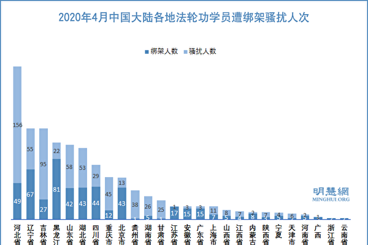
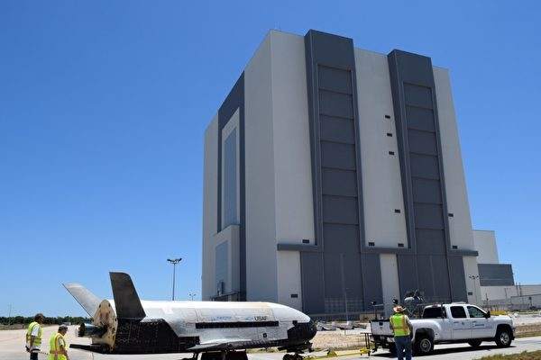

<h3><a target="_blank" href="https://bit.ly/3asSXIA">请多传破网软件，使更多的人了解真相从而得救，这是给自己积福德。 https://bit.ly/3asSXIA </h3></a>

   

     
<h3 align="center"><b>免翻视频  https://bit.ly/3ezRQKo  (请收藏网址 https://git.io/swspip)</b></h3> 

<h3 align="center"><b>复制网址到谷歌或火狐浏览器打开。若出现 “提示” ，請点击“继续”访问即可。</b></h3> 

<h3 align=center><a href="https://github.com/gav01/Heart/blob/master/news1.md">● 看更多大紀元時事 ●</a></h3>

<a href=https://git.io/souye><h6 align="right">回首頁</h6></a>

<a name=top>
 
 
 
 
<a href =#179>179.【疫情最前线】中共驻以色列大使暴亡 
<a href =#178>178.4月至少1178名法轮功学员遭绑架骚扰 
<a href =#177>177.【一线采访】东三省告急 沈阳疑隐瞒疫情  
<a href =#176>176.李慧琼非法当选内会主席 民主派拉黑布抗议 
<a href =#175>175.瘟疫重创经济 中共财政收入下降14.5%  
<a href =#174>174.美中对抗加剧 川普政府在多方面反制中共 
<a href =#173>173.川普：中共严重伤害世界也伤害中国 需担责  
<a href =#172>172.吉林群聚感染链扩大 北京处“战时”状态 
<a href =#171>171.【最新疫情5·19】川普致函世卫要求改革  
<a href =#170>170.林卓廷怒撕监警会报告 港人“和你shop”抗议港府 
<a href =#169>169.毛左们 你们敢回答这些问题吗？ 
<a href =#168>168.【纪元播报】“别问我 问中国去”川普再呛华裔女记者 
<a href =#167>167.法轮大法洪传世界28周年 
<a href =#166>166.生命在修炼中升华 
<a href =#165>165.把水搅浑 中共疫情宣传背后有三目的 
<a href =#164>164.【一线采访】沈阳463封闭 北华附院爆疫情 
<a href =#163>163.【新闻看点】病毒有眼睛：联合国红色背景 
<a href =#162>162.川普：美掌握很多有关病毒实验室的不好信息 
<a href =#161>161.【一线采访】舒兰公安局瘫痪 爆首例死亡 
<a href =#160>160.试题震荡香港 张灿辉：中共教育不准思考 
<a href =#159>159.【内幕】环时打脸刘鹤 党内分歧公开化 
<a href =#158>158.日媒：台积电停止接收华为新订单 
<a href =#157>157.蓬佩奥警告中共：勿干预美驻港记者工作 
<a href =#156>156.美军绝密飞机X-37B升空进入太空轨道 
<a href =#155>155.各国企业与中国分手 专家：中国市场剩空壳 
<a href =#154>154.广西半塘村村民集体举报政府强拆 中饱私囊  
<a href =#153>153.【一线采访】吉林沈阳疫情再爆发致经济瘫痪 
<a href =#152>152.颜丹：抗疫医生跳楼 死因令人心酸 
<a href =#151>151.美中关系紧张 大陆股汇走弱 人民币连跌5天 
<a href =#150>150.【思想领袖】中共为何念念不忘征服台湾？ 
<a href =#149>149.程晓容：中共承认销毁病毒样本 还有多少秘密 
<a href =#148>148.中共前军官：高级军官都在观望局势 
<a href =#147>147.川普称可切断“美中关系” 赵立坚软化回应 
<a href =#146>146.四川公民转传一张图片 引来国保二次上门 
<a href =#145>145.武汉第四名公民记者被关浦东看守所 网民声援 
<a href =#144>144.【最新疫情5·17】川普：对贸易协议略失兴趣 
<a href =#143>143.【十字路口】美中要全面脱钩 中国五大经济警讯  
<a href =#142>142.【一线采访】舒兰书记被免 更多疫情细节曝光 
<a href =#141>141.美国会大厦513飘扬国旗 致敬李洪志先生 
<a href =#140>140.李洪志师父一题词 历经风雨二十载 完好保存 
<a href =#139>139.【内幕】北京红二代谈特权和疫情冲击  
<a href =#138>138.中共两会看点：财政赤字是否会货币化 
<a href =#137>137.周晓辉：川普反击开弓 北京难承重负 
<a href =#136>136.软件工程师：修炼将我从压力中解脱 
<a href =#135>135.瑞典「清零」孔子学院引人思考 
<a href =#134>134.【最新疫情5·15】川普：可阻中共窃疫苗技术  
<a href =#133>133.【内幕】环时打脸刘鹤 党内分歧公开化 
<a href =#132>132.两会前港警狂抓人 专家解析香港乱局走势 
<a href =#131>131.【新闻看点】川普连出重拳 北京忙兑现贸协？ 
<a href =#130>130.大法日 大陆及海外律师学者祝福法轮功 

<a href="https://github.com/gav01/Heart/blob/master/ls-20-5-1.md"><b>往1~129新闻</b></a> 

<a name=179>
<h1 align="center"><b>【疫情最前线】中共驻以色列大使暴亡</b></h1>

澳大利亚向世卫递交建议，调查中共病毒，122国支持；上海突然惊爆疫情；钟南山承认武汉曾隐瞒疫情；中共驻以色列“战狼”大使突然暴毙；曾精准预言，印度少年占星师称12月有更大灾难。（大纪元香港新闻中心）

   
【大纪元2020年05月19日讯】（大纪元香港新闻中心报导）澳大利亚向世卫递交建议，调查中共病毒，122国支持；5月18日，中共官方突然通报上海出现疫情，引起恐慌；钟南山承认武汉曾隐瞒疫情；中共驻以色列“战狼”大使5月17日突然暴毙；曾精准预言，印度少年占星师称12月有更大灾难；神机妙算的明朝国师刘伯温预言猪鼠年大瘟疫，并道出平安度过瘟疫劫难的三个字。

122国支持世卫大会动议调查病毒起源
澳洲呼吁就中共病毒（COVID-19，武汉肺炎）疫情进行独立调查，引发北京不满。但已有122国支持调查，相关动议18日晚上送交世界卫生大会（WHA）。

英国《卫报》（The Guardian）报导，这项未点名中国的动议，呼吁系统性检讨全球对这次疫情的因应措施。包括欧洲联盟（EU）会员国、非洲集团（African Group）成员国、英国、俄罗斯、加拿大、澳洲、纽西兰等122个国家都支持这项动议。

最新版动议也呼吁世界卫生组织（WHO）总干事谭德塞（Tedros Adhanom Ghebreyesus）“启动程序，逐步进行公正、独立、全面性评估，包括在适当情况下使用现有机制，检讨世卫协调各国因应COVID-19时学到的经验和教训”。

<b>上海惊爆疫情</b>

5月18日，中共官方突然通报上海出现疫情，引起恐慌。据国家卫健委公告，上海市17日出现本土确诊病例，这名患者常住湖北省潜江市，14日晚到上海求职，曾到过上海虹桥火车站和浦东新区的上海麦居宾馆。

上海爆出确诊病例引起中国网友恐慌，有人质疑：“随便从湖北来的都感染，那湖北现在得成什么样”、“上海千万别爆呀”、“上海一堆人都不戴口罩了呀”。

17日当天，吉林省也新增了2例确诊病例，显示当地疫情感染链仍在持续扩大。

近日，中国黑龙江、吉林、辽宁三省皆爆出严重疫情。目前，舒兰市、吉林市和丰满区三座城已“封城”。

日前，8支由中央及省政府派遣的专家团队共500余人已抵达吉林市。鉴于中共政府一直隐匿疫情真相，外界怀疑当地的疫情远比官方通报的严重，从当局不断发出“封城令”便可见一斑。

<b>钟南山承认武汉曾瞒疫情</b>

中共国家卫健委高级别专家组组长钟南山，5月16日接受了美国有线电视新闻网（CNN）的专访。

他表示，中国面临中共肺炎疫情带来的巨大挑战，企业虽正在复工复产，但近几周包括武汉及东北黑龙江省及吉林省的一些地区，出现了局部的聚集性疫情，中国发生第二波疫情的风险越来越大。

他直言：“大多数中国民众现时仍然容易受到感染，因为他们对病毒缺乏抗体……我们正面对巨大的挑战，情况并不比外国好。”

令人意外的是，他在专访中罕见证实，武汉地方政府曾向公众隐瞒关键的疫情资讯。

钟南山回忆说，今年1月18日他带领国家卫健委高级专家组前往武汉调查疫情时，一到当地就收到很多医生及前学生的电话，警告他当地疫情比当局所说的严重得多。他说：“当时，当地政府并不想说真话……他们在疫情初期保持沉默，我随后认为可能已有不少人受感染。”

他表示，当初武汉官方公布的疫情确诊数字，有十多天仍维持只有41宗确诊，而同时国外已出现感染个案，而这种奇怪的现象令他大起疑心。他说：“我并不相信（武汉官方公布的）那些结果，所以不断要求他们将真正的数字给我。我认为他们并不愿意回答我的提问。”

不过，钟南山却否认1月底中共中央政府出面接手后，也存在隐瞒或少报的情况。钟南山说：“1月23日后的数据，我认为都是准确的”。

根据官方数字，现时中国大陆累积逾8.4万宗感染个案，其中武汉有5万宗。不过，上月武汉对1.1万民众进行病毒血清抽样调查，结果大约有5～6%抽样者出现抗体阳性，比例远远高于预期。据此估算，武汉1100万人口中，曾受感染者可能有大约60万之多。

海外有时政观察人士表示，钟南山作为中共体制内的所谓专家，敢于公开对美国媒体承认武汉政府曾经隐瞒疫情及少报确诊人数，并非一时“说漏嘴”，更不是良心发现，而是得到了中共官方的默许后采取的“丢车保帅”的行动。

这表明，面对来自国际社会要求追查病毒源头和疫情真相的巨大压力，北京当局已做好了抛弃部分中、低层官员来确保高层安全的准备。不过，这次大瘟疫给世界各国造成的灾难性后果极其严重，中共这招“丢车保帅”未必能够蒙混过关。

<b>中共驻以色列大使疑染疫暴毙</b>

中共驻以色列大使杜伟，周日（5月17日）被发现死在位于特拉维夫市海尔兹利亚（Herzliya）的官邸中，终年58岁。目前死因尚不明确，警方正对此案展开调查。

据以色列媒体报导，杜伟曾担任中国驻乌克兰大使，今年2月起出任中国驻以色列大使，曾接受两星期的居家隔离，妻儿均不在以色列境内。他最后一次参加公开活动是在本月12日，与以色列外交部主管多边事务的副总司长巴尔举行视像会议。

有医护人员透露，杜某的遗体上未见任何外伤，室内也无暴力迹象，他看上去像是在睡梦中猝死的。不过，恰逢中共肺炎全球大流行之际，外界多有揣测他的离奇死亡恐与中共病毒感染有关。

杜伟3月份在正式就任驻以色列大使后不久即投书《耶路撒冷邮报》，高调为中共唱赞歌，称赞中共官方在对抗武汉疫情时行动“坚决”、“透明”并付出了“巨大牺牲”。

不料“新官三把火”才放了“两把”，杜伟就突然暴毙，令外界大感意外。

<b>漠视医护需求 比利时女首相视察医院遭医护抗议</b>

接下来，看下其它新闻。

比利时女首相索菲·维尔梅斯（Sophie Wilmès）于当地时间5月16日，到访布鲁塞尔的圣彼得医院，上百名医护人员在道路两边列队等待。

他们并不是欢迎首相来访，当首相车队到来时，他们纷纷转过身去，用后背迎接了维尔梅斯。当女首相抵达时，只看到两旁医护人员冷漠的背影，场面十分尴尬。

比利时媒体报导称，他们之所以这么做，是在抗议医院的资源不足，并反对一项政府颁布的法令。该法令规定，若疫情危机有需要，可以要求护理人员上班。

维尔梅斯表示，自己能理解这一举动。她直言：“这场危机后一切都会不同，我们需要重新评估护理人员的重要性。”。

尽管疫情正缓和，封锁也开始松绑，但比利时遭受中共病毒重创，人均死亡率是全球最高的国家之一。根据最新的官方数据，人口仅约1150万的比利时，有超过5.5万人确诊，超过9000人不幸身亡。

<b>曾精准预言 印度少年占星师称有更大灾难</b>

曾准确预言中共病毒（武汉肺炎）疫情大爆发的印度14岁著名占星术士阿南德（Abhigya Anand），4月又大胆预言，称全球将在12月面临比疫情大流行更为严重的灾难。

综合媒体报导，阿南德2019年8月22日在YouTube上传一段影片，标题是耸人听闻的《2019年11月至2020年4月的世界大劫》（Severe danger to the world from Nov 2019 to April 2020）。

他在视频中说，“一场威胁世界各国的灾难将从2019年11月开始，在2020年3、4月进入高峰，给世界带来非常艰难的时期。这6个月内，灾难将会从经济到航空服务，让世界遭受种种苦难。”

阿南德在视频中称，“疫情”将在5月底趋缓。但这一情景只会持续两天，人们在6月底前不会听到任何好消息。

4月初，阿南德再度上传视频，预测2020年到2021年的未来。他在视频中大胆预言，疫情在7月后会逐渐缓和，但在2020年12月20日，世界将面临比中共病毒更严重的灾难，时间将持续至2021年3月。

阿南德说，这也是人类的共业，需要全人类从内心觉醒。他呼吁停止杀害动物和破坏大自然，不然将面临地球对人类的惩罚。

<b>刘伯温碑记预言猪鼠年大瘟疫</b>

其实早在几百年前，中国明朝的宰相刘伯温，对这场大瘟疫就有准确预言。《陕西太白山刘伯温碑记》是在一场地震中被震出的，碑记告诉人们一个可怕的景象，与大劫难有关。

碑记中记载说：“贫者一万留一千，富者一万留二三，贫富若不回心转，看看死期在眼前。平地无有五谷种，谨防四野绝人烟，若问瘟疫何时现，但看九冬十月间。行善之人得一见，作恶之人不得观，世上有人行大善，遭了此劫不上算。”

此文指出，九冬十月间会有大瘟疫发生，会有很多人因此而死亡，唯有行善之人，才能避免灾难。

碑记还说：“还有十愁在眼前：一愁天下乱纷纷，二愁东西饿死人，三愁湖广遭大难，四愁各省起狼烟，五愁人民不安然，六愁九冬十月间，七愁有饭无人食，八愁有衣无人穿，九愁尸体无人捡，十愁难过猪鼠年。”

“十愁”描写大灾难的社会惨状，其中的重点是“湖广遭大难”、“九冬十月间”和“难过猪鼠年”。去年（2019年）是猪年，今年（2020年）是鼠年，文中暗示了“猪鼠年”“九冬十月间”中共肺炎的大流行。

刘伯温在南京的《金陵塔碑文》中，从另一角度也提到大瘟疫和灾难发生时的景象：“父母死，难埋葬，爹娘死，儿孙扛，万物同遭劫，虫蚁亦遭殃”、“繁华市，变汪洋。高楼阁，变泥岗。”

<b>刘伯温暗示“三字真言”可避瘟疫</b>

不过《刘伯温碑记》预言了瘟疫会发生的同时，也指出了避祸之道。碑记中一再警醒世人，所谓“天道无亲，惟德是辅”，只有对于天地的敬畏、善良的德行，才是真正的避祸之道。

在碑记结尾，刘伯温用拆字的方式，像谜一样，告诉人们平安度过瘟疫劫难的最宝贵三个字：“七人一路走，引诱进了口，三点加一勾，八王二十口，人人喜笑，个个平安。”

有高人解析：
“七人一路走，引诱进了口”，是“真”字的古代写法。

“三点加一勾”，是“忍”字。

“八王二十口”，则是“善”字。

这三个字，就是“真、善、忍”。如果有缘可以了解碑记道出的“真言”，就会“人人喜笑，个个平安。”

希望大家都能得到幸福安康。   

<a target="_blank" href=#top><h6 align="right">回上方</h6></a>

<a name=178>
<h1 align="center"><b>4月至少1178名法轮功学员遭绑架骚扰</b></h1>

2020年4月中国大陆各地法轮功学员遭绑架骚扰人次示意图。（明慧网）

   
   【大纪元2020年05月18日讯】4月份，中共非法抓捕骚扰法轮功学员1,178人，其中绑架 508人、骚扰 670人、抄家314人、强制送入洗脑班19人。
   
   明慧网报导，被绑架者中有288人已经回家。此外，13人被非法判刑，5人非法庭审，15人非法批捕，89人非法构陷到检察院、法院，19人离家出走。抚顺市望花区81岁的法轮功学员于老太太遭迫害而流离失所。吴珮文、周秀珍、兰立华、高艳4名法轮功学员被迫害致死。

大疫当前，中共政法委、「610」（专门迫害法轮功的非法机构）、公检法司等相关人员仍在不遗余力地绑架、冤判法轮功学员，导致众多学员的家庭支离破碎、苦不堪言。

自2020年1月中共病毒（武汉肺炎）爆发，法轮功学员们把走出疫灾保平安的真相告诉民众，却遭到中共警察的抓捕、审问、勒索或判刑。北京顺义区警察公开说：上边指示，「4·25」和两会期间，抓个法轮功（学员）给5,000元。湖北省仙桃县警察声称：举报一位讲真相的法轮功学员奖励1,000元。

4月份，中共公检法敲诈勒索法轮功学员现金252,250元（其中，法院罚金32,000元；警察抄家、敲诈勒索220,250元）。

中共非法抓捕骚扰65岁以上的老年法轮功学员108人。其中，绑架75人、骚扰33人，年龄最长者89岁。

遭绑架迫害最严重的地区依次是：黑龙江省81人、辽宁省67人、河北省49人、四川省44人、北京市43人；绑架迫害最严重的城市依次是：哈尔滨市39人、黄冈市23人、长春市22人、沈阳市19人、唐山市17人。

骚扰迫害最严重的地区依次是：河北省156人、吉林省95人、山东省58人、辽宁省55人、湖北省53人；骚扰迫害最严重的城市依次是：唐山市83人、长春市52人、张家口市47人、黄冈市33人、辽源市22人。

<b>赠送单张教人疫情下自救广州黄强生被绑架</b>

黄强生（明慧网）

广州市天河区法轮功学员、装饰公司老板黄强生于2020年4月7日下午，在天河区天平架办事时顺便赠送给路人两张「疫情肆虐如何自救」的单张，被天河区沙东派出所警察绑架；4月8日，被非法刑事拘留，劫持到一百公里之外的广州市第二看守所。

黄强生，1968年8月出生，今年52岁，工作非常努力勤恳，和他共事十几年的同事对他的评价是：吃苦上进。刚进入装饰行业时，他一点点地学，从画图纸，到买材料，再到现场施工，一步一步地把工作越做越好，现在已经做起了自己的工程，令人佩服。

黄强生待人也非常友善，对于在装修过程中工人失误造成的损失，他也不要工人赔偿，总是自己掏钱解决。同事和工人都愿意和他一起工作。

<b>哈尔滨法轮功学员遭暴打警察威胁不许曝光</b>

4月9日晚，黑龙江哈尔滨阿城区法轮功学员到五常市兴隆镇向人们派发有关瘟疫中自救良方的真相小册子，被镇上的站岗值勤人员跟踪，并构陷到兴隆镇派出所。派出所所长杨春来立即派了警察全镇搜索，法轮功学员张军被非法抓捕，车被扣押。

第二天下午，张军家人和6名法轮功学员去兴隆镇派出所讲真相要人、要车。张军的家人花费很多的周折将张军接回家中。两名法轮功学员于淑范和李岩给派出所所长杨春来讲真相、索要被扣车辆。杨春来不但不给车还暴跳如雷地把两人连推带搡、带骂，推出派出所。

两人走出派出所后，被警察跟踪。警察将他们以及车里的法轮功学员高亚斌、徐淑凤、张姓学员及司机孙铁农全绑架回派出所，并非法搜查他们开去的小面包车，搜出一些真相资料等物品。

在派出所里，警察暴力殴打孙铁农，打他大嘴巴子，把他打得迷迷糊糊的坐在地上动不了。李岩（男教师）大喊不许打人，被几个警察蜂拥而上，拖到无监控的屋子，一顿暴打、暴踢、暴踹。他被戴上手铐按倒在石板地上。

一个警察穿着皮鞋踩住李岩的脸和脑袋处拧、踩；另几个警察专往他的后腰踢；还有警察和协警们喊拿电棍来，要电这几个法轮功学员；还反咬一口大喊说李岩「袭警」，扣大帽子污蔑他。

五位法轮功学员遭所长杨春来破口大骂、非法审问，被逼迫写不再去兴隆镇派发真相资料的所谓保证。警察还恐吓、威胁他们不许说出发生的事、不许曝光、不许打电话、不许让国际社会知道；还威胁说，否则他们的子孙都会被牵累。

晚上10点半左右，所长让他们给家人打电话来做保，非法拘留他们每人10天，学员们的两辆车至今仍被非法扣押在派出所。

<b>李秀英遭绑架母亲受惊吓离世</b>

李秀英，女，55岁，山西省晋城市法轮功学员。2020年3月11日，李秀英在家中被晋城市公安局开发区分局警察绑架，同时电脑、复印机及法轮功书籍等私人物品被抢走。

李秀英85岁的老母亲目睹一群凶神恶煞般的人在她家四处乱翻，吓得浑身发抖，更令她想不通的是自己善良敦厚的闺女会被抓走。老人心胆俱裂，3天后，带着疑惑和恐惧离开了人世。3月21日，李秀英的丈夫还遭到警察的威胁恐吓。

李秀英被非法拘禁在合聚集团下属的一个宾馆内遭受洗脑迫害。据知情者回忆：警察威胁她说，如果她不同意转化（放弃修炼），就让她女儿停学。

<b>辽宁锦州白邵杰等人被非法抓捕家属被勒索</b>

4月26日下午2点半左右，辽宁省锦州太和区国保大队四五个警察在范屯治保主任张凯带领下，突然闯入法轮功学员白邵萍家中，抢走法轮功书籍、真相光碟等私人物品，并将她及在她家的妹妹白邵杰（法轮功学员），还有白邵杰5岁的小孙女一同绑架到北郊派出所。

之后，她的家人被勒索了30,000元钱，晚上9点多钟，3人才被放回家。

<b>抚顺81岁老太太遭迫害而流离失所</b>

4月2日接近中午时，抚顺市望花区法轮功学员、81岁的于老太太在抚顺市顺城区葛布新地号告诉人们获救秘诀时，被不明真相的人举报。

她在离开新地号已经走到雷锋体育场车站等车时，被前来的警车及举报人抓走。到葛布派出所，于老太太被迫按手印。下午3点多，警察到老太太的家里抄家，翻走一套法轮功书籍等私人物品；又将老人拉回派出所，晚上10点多才让老人回家。

第二天，4月3日下午，于老太太被要求到派出所去，她不配合，被迫流离失所。

<b>2020年4月份中共抄家勒索法轮功学员现金情况表</b>

<b>2019年76名65岁以上老年法轮功学员被绑架统计表</b>

<a target="_blank" href=#top><h6 align="right">回上方</h6></a>

<a name=177>
<h1 align="center"><b>【一线采访】东三省告急 沈阳疑隐瞒疫情</b></h1>

继黑龙江爆发中共病毒疫情后，东北三省的疫情持续告急。吉林省舒兰11日宣布进入战时状态，13日吉林全省封城。同时，疫情迅速扩散至辽宁省沈阳市，当地一家军医院遭到封院，目前两省超过八千人被隔离。（视频截图）

   
   【大纪元2020年05月18日讯】（大纪元记者易如采访报导）继黑龙江爆发中共病毒疫情后，东北三省的疫情持续告急。吉林省舒兰市在11日宣布进入战时状态，13日吉林全省封城。同时，疫情迅速扩散至辽宁省沈阳市，当地一家军医院遭到封院，目前两省超过八千人被隔离。有资料显示，沈阳市实际情况更严重，官方可能隐瞒真实疫情。

中共官媒5月14日报导，吉林省舒兰市聚集性疫情跨省波及沈阳。沈阳确诊病例已增至3例。目前沈阳已隔离观察7,500多人并开展核酸检测，初高一、二年级及中职学校复课时间再度向后推迟。

5月13日，网上就流传一段视频显示，辽宁沈阳市三甲医院“463医院”上午全院封闭。但是该消息对外被封锁。

<h4 align=center><a href="https://twitter.com/TAGNJINGYUAN/status/1260599533299326976?ref_src=twsrc%5Etfw%7Ctwcamp%5Etweetembed%7Ctwterm%5E1260599533299326976&ref_url=https%3A%2F%2Fwww.epochtimes.com%2Fgb%2F20%2F5%2F17%2Fn12116863.htm">遼寧瀋陽463醫院（北部戰區空軍醫院）全院封閉……封閉一所三甲醫院，只能説明爆發了院内感染而且無法遏制蔓延態勢，不知有多少醫護中招，而且不排除涉及軍隊爆發集中感染可能……從哈爾濱到吉林再到瀋陽，東三省已有星火燎原之勢。(点击右键,另存新档）</a></h4>   

沈阳市市民卞先生5月16日对大纪元表示，当地疫情严重，一家军工医院的一名护士得病然后传染给了他人，医院已经被封院。

“这个医院是护士感染，这个护士是被她的对象感染了，她的对象是沈阳的，因到吉林出差几天，回来就感染。而护士感染后当时没有症状，然后她在医院里也感染给了别人，把这个医院给感染了，现在这个医院不许进不许出了。”卞先生所说的军工医院就是“463医院”（北部战区空军医院），“是部队的（医院），不算什么大医院，也对外（就医）。”

据网络上的一份资料显示，“463医院”的这名护士是一名普外科护士，叫刘思瑶，5月7日至8日被她男朋友感染，男朋友叫吕宏超，目前是一名确诊病人。同时被感染的还有她的室友李萌萌，而截至13日，刘思瑶无发热、咳嗽、胸闷等症状。但刘和李两名密切接触者已被隔离。

吕宏超密接刘思瑶的行动轨迹调查报告（网络）

   
   卞先生说，这波疫情是从黑龙江传过来，之后传染到吉林，由吉林再传染至沈阳，“沈阳现在基本上也中枪了，大概两天前（10日）还有一例，也是从吉林传过来的，离我们沈阳还有一段距离，属于郊区，叫苏家屯区。”

卞先生表示，苏家屯区感染的比例比较少，（目前）有一例，但是不可控，“在打出租车时传播的，接触多少人不清楚”。

沈阳市民许女士对大纪元表示，现在沈阳疫情比前一段时间严重，“沈阳目前有3例（确诊），吉林带过来的，接触者间感染的病例，（另外）我在网上也看到过一个视频，说有一个小区也封锁了，但具体情况不知道。”

“沈阳总体来讲病例少，没有沈阳本土病例，但现在有了本土的病例之后，心里就有些紧张。”许女士说。

卞先生表示，现在沈阳大概有七千多名密切接触者都被隔离了。

沈阳：14天隔离费用8286元。（网络）

   
 其实，在463医院再往前还有一家医院爆发疫情，卞先生说，“就是咱们叫辽宁省医院，有一个医生到黑龙江去探望他女儿，他回来后没有说去黑龙江，但发烧后核酸检测呈阳性。”

推特上的视频显示，4月24日，沈阳市省人民医院传出疫情，一名医生被查出是无症状感染者后，封院排查了3000人。

<h4 align=center><a href="https://twitter.com/MgOqkzLBRPLCHyN/status/1253583160282984449?ref_src=twsrc%5Etfw%7Ctwcamp%5Etweetembed%7Ctwterm%5E1253583160282984449&ref_url=https%3A%2F%2Fwww.epochtimes.com%2Fgb%2F20%2F5%2F17%2Fn12116863.htm">遼寧省瀋陽市突爆疫情！
省人民醫院心內科一醫生，4月12日去哈爾濱17日返沈20日上班，未如實向社區和單位報備疫區行程，謊稱去大連。20日上班後，出3天門診，看患者116人，與院內工作人員廣泛接觸。今天遼寧省人民醫院全院停診，全體工作人員檢測，需檢3千多人。現該市緊急排查20日後到過該醫院人員！(点击右键,另存新档）</a></h4>
  
  卞先生认为，沈阳的情况肯定会有一个反复，“因为沈阳的疫情比较密集，另外，人也挺多，去医院的人也挺多。”

卞先生表示，现在官方只是公布了一些密切接触人员的情况，但是病毒来源不清楚，“像苏家屯的，都是流动源，流动源就不清楚人员往来的情况。”

<b>网民质疑官方隐瞒疫情</b>

来自吉林的最新消息显示，5月18日，将丰满区升为高风险区，17日吉林市已关停所有个体诊所和门诊部，各药房已停止销售退热药，发热病人必须去定点医院就医。而15日，发生疫情的465医院（吉林医药学院附属医院）已被全部清空，目前变为发热定点医院（方舱医院）。

<h4 align=center><a href="https://twitter.com/blue500000/status/1261447690920931329">吉林官方通报29人确诊，但实际情况远远要糟糕很多。15日，清空465医院变为新冠定点医院了，形势严峻。(点击右键,另存新档）</a></h4>

据辽宁省卫生健康委网站及吉林市当地卫生健康委消息，5月10日都公布了当日吉林市新增1例中共肺炎确诊病例（郝某某），发生在苏家屯区，为吉林市舒兰市聚集性疫情的关联病例，11日，将沈阳市和苏家屯区列入中风险地区。13日，再发布2例（吕某某和孙某某）新增病例，并公布了他们与郝某某的关联情况及行程轨迹。

官媒新华社5月14日报导称，吉林省舒兰市聚集性疫情跨省波及沈阳后，沈阳确诊病例已增至3例。目前已隔离观察7,500多人并开展核酸检测。

不过，推特网上一份疑似内部资料《关于推送吉林市入沈人员研判信息的报告（5月10日第三批）》显示，沈阳市公安局经过大数据研判出5月4日至10日，由吉林市进入沈阳人员共计128人（舒兰市82人），已扩至沈阳市辖属1市10区2县，不仅有苏家屯区，还包括和平区、铁西区、沈河区、皇姑区、大东区、浑南区、于洪区、沈北新区、辽中区、新民市、法库县及康平县。

该资料内容还建议沈阳市防控指挥部在通报相关地区时，按照重点地区来沈人员采取隔离措施。文后还附有返沈人员信息列表。落款日期为5月10日。

该资料还特别用红色字体提示“不是吉林苏家屯一个人，各区都有啊，注意防控啊！”

对此，网民“中国队长Captain China”说，“中国人要多关注疫情，莫轻信政府公告，靠隐瞒来抗疫，那就完蛋了。”

沈阳居民季先生18日对大纪元表示，他无法判断这份材料的真实，现在官方封锁很严，究竟疫情是怎么情况都不清楚，“目前，浑南区、于洪区都有感染的，究竟感染多少官方根本不对外报，它就拿一例说话，追踪接触的人员。现在市面控制不是很严，（但他们）整得挺紧张，到谁家去开十多台车，马路上排一大排，全都穿着防护服，现在只要沾到边就给你隔离了。”

<a target="_blank" href=#top><h6 align="right">回上方</h6></a>

<a name=176>
<h3 align="center"><b>中共践踏香港立法会 14名民主派议员被逐</b></h3>   
<h1 align="center"><b>李慧琼非法当选内会主席 民主派拉黑布抗议</b></h1>

5月18日，香港立法会财委会主席陈健波越权主持香港立法会内务委员会主席选举，民主派议员拉起黑布及高举“滥权”标语牌抗议建制派黑箱作业，与保安发生肢体冲突，14名民主派议员被逐或抬走。(Anthony Kwan/Getty Images)

   
   【大纪元2020年05月19日讯】（香港大纪元记者叶依帆、张晓慧采访报导）5月18日香港立法会内务委员会举行会议选举正副主席，立法会保安将立法会会议室的主席台围住，民主派议员拉起黑布抗议，与保安发生肢体冲突，期间朱凯廸和许智峯两位议员分别被推倒在地上，先后有14名民主派议员被逐或被抬离会议室。最后在多名民主派议员缺席的情况下投票，建制派李慧琼得40票非法连任主席。

立法会主席梁君彦上周引用《议事规则》第92条，指定立法会财委会主席陈健波主持内务委员会主席选举，会上将不处理规程问题和议案，仅选举内务委员会正副主席。

会议18日早上11时举行，在约10时15分，陈健波在立法会保安护送下，进入立法会第一会议室，并坐在主席座位。随后，有20名戴黑色手套的保安一字排开将内委会主席台团团围住，陈健波准备主持会议。

<b>“中共践踏香港立法会”</b>

多名民主派议员也进入会议室，站在主席台前的保安人员旁边，并打出标语“保皇党滥权”，同时质问陈健波，指其非法霸占原应由公民党议员郭荣铿坐的主席台，并喊出“建制滥权可耻”口号，毛孟静议员则打出“CCP Tramples HK Legislature（中共践踏香港立法会）”的标语。

多名民主派议员站在主席台前的保安人员旁边，并打出标语。立法会议员毛孟静（不在画面中）打出标语：“CCP Tramples HK Legislature”（中共践踏香港立法会）。(Anthony Kwan/Getty Images)

民主派议员此时拉出一块长形黑布，希望将主席台围住。过程中，朱凯廸议员想趁势进入主席台，被保安大力推开，此时场面开始变得混乱，保安和民主派议员相互推搡，民主派议员喊出口号“陈健波，打茂波”，多名民主派议员想进入主席台，遭保安夹攻和阻挡，部分建制派议员也冲进人墙，与民主派议员互相指责。

坐在主席台上的陈健波用麦克风说：“请大家回到座位，否则我们将别无选择，将会请犯规议员离开，这样的话，议员将失去投票的机会和表态的机会。”

陈健波还表示，他不会处理议程问题，只会就选主席展开讨论。他还表示，如果有人冲击保安，或阻碍会议，最多会被监禁12个月。

<b>驱逐抬走泛民议员后投票</b>

陈淑庄议员则用手机拍摄现场情况，并拿着麦克风高呼“建制派可耻”、“陈健波可耻”，遭陈健波警告，指她在阻碍会议，并要求她停止，同时找来保安人员收缴陈淑庄的器材，并逐她离场。

陈健波不断要求保安人员将民主派议员带离会场，保安粗暴拉扯，将多位议员包括尹兆坚、邝俊宇、林卓廷、胡志伟等抬出会议室。

许智峯、朱凯廸、陈志全等一度被拉扯推倒在地上。其间尹兆坚不适，现场有担架床戒备。陈健波说：“由于有议员受伤，暂停会议。”

立法会议员许智峯被保安拉扯倒在地上，头颈、心口及腿被压制伏后抬走。（宋碧龙／大纪元）

部分民主派议员之后回到会议室。约半小时后陈健波复会，随即驱逐多名议员，包括杨岳桥、陈志全及现场拍摄的莫乃光等离场。14名民主派议员被逐出会议室后，陈健波开始选举程序，宣布派发选票。

到大约中午12时40分左右，已有18张票投给李慧琼。毛孟静议员说：“其实全部都是一号。”一号代表李慧琼。

陈健波宣布“李慧琼获得40票，当选立会主席（编注：陈健波的宣布有误，立法会主席是梁君彦）”。立法会内务委员会主席选举在反对声浪中草草结束。

立法会内会主席选举由去年10月至今，由郭荣铿主持17次会议，因要处理规程问题和议案，故仍未选出正副主席，现仍未选出副主席。

<b>回应李慧琼当选 陈淑庄：立会权力自治荡然无存</b>

民主派会议召集人陈淑庄表示，这次内委会选举主席破坏立法会规则、惯例“完全名不正，言不顺”。她表示，过去几个月，民主派用尽一切办法反映市民对恶法的忧虑，但是如今林郑政府与建制派里应外合，“让我们立法会的权力与自治荡然无存”。

民主派议员在会议室内展示黑布抗议，陈淑庄解释这是为了显示建制派彻底黑箱作业。她表示，立法会主席梁君彦先是搬出一份外部法律意见，如今又引用《议事规则》92条，指定“排队都轮不到的”陈健波主持会议。

按照立法会《内务守则》，主持选举的优先顺序是主席、副主席、出席议员中排名最先者。陈淑庄指，出席议员中排名最先者是梁耀忠，却因有拉布历史而不获委任主持会议。

<b>郭荣铿：抢不走香港人的信念良知</b>

一直主持内委会正副主席选举的郭荣铿也指，《议事规则》92条规定，《议事规则》未有规定的事宜由立法会主席决定，而现在建制派“将《议事规则》92条当作尚方宝剑”，对于《议事规则》中已有的规定也不遵守，是“彻彻底底将《议事规则》破坏”。

郭荣铿又引用知名作词人林夕的话，“绑匪可以绑架你的肉身，但是抢不走你的信仰与信念”。他续说：“今日他们夺走我主持会议的权力，但是我相信他们抢不走我们香港人有的信念、良知与尊严。”

<b>许智峯：议会抗争不会到此为止</b>

许智峯表示，保安这次使用较以往更强的武力，“我从未试过在议事厅里面被人将头按在底下，膝头压在我的心口。”

他还说：“我们议会抗争未必每次都赢，但是我向大家保证，议会抗争一定不会到此为止。我们有决心、有斗志打到底。这一场硬仗，我们绝对不会放弃。”

<b>毛孟静：陈健波展现中共治下恶态</b>

毛孟静透露她对财政司长陈茂波说“你应该取消这次的会议”，陈茂波则回应“无论如何都不会取消会议，你应该取消你的暴力。”她指今日陈茂波的表现是“经典的中共治下原告变被告、恶人先告状的姿态”。她又用英语说，这是一次完全非法的会议、完全非法的选举，并说这就是一国两制的终结。

陈淑庄最后说，民主派不会认同选举结果，会再商讨跟进行动。

<a target="_blank" href=#top><h6 align="right">回上方</h6></a>

<a name=175>
<h1 align="center"><b>瘟疫重创经济 中共财政收入下降14.5%</b></h1>

中共病毒重创中国经济，财政收入锐减。图为2020年2月5日空荡荡的北京街景。(GREG BAKER/AFP)

【大纪元2020年05月19日讯】（大纪元记者刘毅报导）中共财政部5月18日公布的数据显示，今年前四个月，大陆一般公共预算收入同比下降14.5%，显示中国经济受到中共病毒（武汉肺炎）重击，财政收入也随着下滑。

数据显示，中共中央、地方收入分别同比下降17.7%、11.5%。大陆一般公共预算支出同比下降2.7%，大陆税收收入和非税收入同比分别下降16.7%和增长1%。前四个月全国政府性基金预算收入同比下降9.2%，全国政府性基金预算支出（含用地方政府专项债券收入安排的支出）则同比增长14.9%。

从行业看，受瘟疫冲击较大的行业税收降幅较大。1~4月，住宿餐饮、交通运输业、文化体育和娱乐业分别下降46.8%、29.8%、28.2%；受到与互联网相关的经济表现活跃、相关行业增加值增长带动，软件和信息技术服务业税收增长5.6%。

从非税收入看，中央非税收入492亿元，同比下降46.8%，地方非税收入8560亿元，同比增长7%。

从每个月来看，1~4月各月全国财政收入分别下降3.9%、21.4%、26.1%、15%。

路透社引用中共财政部部长刘昆此前的文章说，当前中国经济下行压力仍在加大，中共肺炎瘟疫对财政收入增长带来了巨大冲击，预计2020年全年一般公共预算收入将低于上年。

另据路透测算，4月单月全国财政收入同比下降15%，财政支出则上升7.5%。

评论人士文小刚对此表示，从财政收入数据来看，中共病毒（武汉肺炎）对中国经济的打击是巨大的，尤其是2月份和3月份，3月份虽然中共当局声称已经复工，但数据显示生产并没有恢复；另外，4月份财政收入下降15%，财政支出上升7.5%，一降一升显示出现了财政赤字，入不敷出；再有，前四个月地方非税收入8560亿元，同比增长7%，显示在瘟疫期间，很多企业关门，民众失业没有收入，可中共地方当局还在收费。

文小刚说，西方发达国家在瘟疫期间都在给企业、民众发补助款，可中共当局在救助中小企业上几乎没有作为，任其自生自灭，看来中国经济很难在短时间内恢复过来，最后倒楣的是老百姓。国内民众都这么困难了，中共不仅不顾民众的生死，并且打肿脸充胖子，声称要援助世界卫生组织20亿美元。#

<a target="_blank" href=#top><h6 align="right">回上方</h6></a>

<a name=174>
<h1 align="center"><b>美中对抗加剧 川普政府在多方面反制中共</b></h1>

中共政府对瘟疫大流行的处理不当和进行虚假信息宣传战，使美中关系紧张局势再次升级，从经济贸易、高科技、国家安全到学术界，公众目光聚焦川普政府如何反制中共问题上。(STEPHEN SHAVER/AFP/Getty Images)

【大纪元2020年05月18日讯】（大纪元英文记者Cathy He报导/吴畏编译）中共政府对瘟疫大流行的处理不当和进行虚假信息宣传战，使美中关系紧张局势再次升级，从经济贸易、高科技、国家安全到学术界，公众目光聚焦川普政府如何反制中共的问题上。

瘟疫大流行破坏了全球范围的产品供应链，这种情况加快了川普政府减少美国对中国大陆制造业依赖的步伐。同时，在面对国家安全和其它方面来自中共的威胁，美国政府正将一系列应对策略提到日程上来。

国务院发言人摩根·奥塔古斯（Morgan Ortagus）最近接受大纪元采访时说，川普总统采用全方位应对策略来对付中国共产党的挑战。

“我认为，这个大流行病凸显川普总统自从2015年开始竞选以来所奉行的各种政策正确性，如修建边境保护墙、推动将工厂搬回美国本土、重新建立互惠国际关系、建立一个公平竞争环境等等。”奥塔古斯说。

她说：“这才应该是我们与中共政府保持的关系——无论是在贸易方面，还是在应对这一瘟疫大流行或国家安全方面。”

川普总统及其高级官员对中共政府掩盖瘟疫爆发的批评在逐步升级，同时美国政府正在对中共病毒起源进行调查。总统曾表示，关税将是对北京的“终极惩罚”手段。

川普在5月14日告诉福克斯商业新闻：“我们有很多选项（去惩罚中共），我们甚至可以切断整个（双边）关系。”

他补充说：“现在，如果你这样做了，会发生什么？如果切断全部（双边）关系，你可以节省5000亿美元。”（这个数字大约是美国一年进口中国商品的总价值。）

<b>美中经贸关系生变 美国立场强化</b>

近年来，华盛顿在中国（共）问题上采取强硬路线。总部位于华盛顿的智囊机构——传统基金会亚洲研究中心主任沃尔特·洛曼（Walter Lohman）告诉《大纪元时报》，这次瘟疫流行在某些领域使美国的强硬立场更加强硬。

他说，这次大瘟疫把美国供应链脆弱性（尤其是在药品和医疗用品方面）问题暴露出来了，并成为焦点。据路透社报导，美国政府目前正在寻找办法，激励美国公司将其制造业和其它相关资源转移出中国大陆。

白宫经济顾问拉里·库德洛（Larry Kudlow）在四月份提出了帮助美国公司从中国大陆迁出的办法，即允许美国公司从其纳税申报表中扣除与这一迁出行动相关的全部资本支出。

在贸易方面，川普上周表示，他对1月份达成的第一阶段美中贸易协议“感到非常纠结”。他告诉福克斯新闻，自协议签署以来，大瘟疫改变了他对此事的看法，并补充说“中国（共）给他带来了很多烦恼”。

根据该贸易协议，中共政府同意在未来两年内再购买2,000亿美元美国商品和服务，其中包括农产品。尽管双方在最近一次电话会议中都同意履行其在协议中的义务，但第一季度贸易数据显示，中国（共）远远落后于实现其购买目标所需的进度。

上周，美国政府指示联邦退休储蓄投资委员会（FRTIB，一个监督联邦雇员和军人养老金的独立机构）停止对有国家安全和侵害人权隐患中国公司进行投资的计划。

该董事会于2017年决定改变其国际基金的投资策略，准备投资一个包含受美国政府审查的中国公司股票在内的指数基金。例如杭州海康威视数字技术公司，该公司的技术被用于监视和镇压中国西部地区的新疆维吾尔族穆斯林民众。还有经营飞机和航空电子的中国航空工业集团（Aviation Industry Corporation），它向中共军方提供武器和电子设备。这两家公司于去年被列入美国贸易黑名单。

库德洛和国家安全顾问罗伯特·奥布赖恩（Robert O’Brien）在上周一致信劳工部长尤金·斯卡利亚（Eugene Scalia），信中表示反对这一投资举措。官员们指出，投资中国公司存在“重大而且不必要的经济风险”，且由于追究中共在大瘟疫中的罪责，可能会导致美国对中国（共）实行制裁。

此投资转移计划原定于今年下半年启动，但投资委员会（FRTIB）于5月13日宣布将无限期推迟该计划。

经济学家、前川普竞选顾问史蒂芬·摩尔（Stephen Moore）告诉新唐人电视台，美国政府的这种施压向中共政府发出了一种“警告”。

摩尔说：“从理性上讲，由于中共病毒瘟疫对美国造成极大破坏，美国必须对中国（共）采取更严厉的惩罚措施。”

川普还在5月14日表示，他的政府正在寻求强有力办法，要求在美国证券交易所上市的中国公司遵守美国会计准则。

目前，中共政府阻止美国监管机构审查中国公司的会计和审计文件，称这些文件包含“国家机密”。

<b>高科技是焦点</b>

洛曼说，他预计美国政府将更加管控将敏感高科技技术转让给中共。

美国商务部最近发布新规定，使美国公司更难向中国（共）出口某些类型的先进技术，因为这些技术可能被中共利用来发展军事。

现在，新规定要求美国公司必须事先获得许可证，才可以将某些产品（包括半导体生产设备和传感器）出售给中国公司，即使这些高科技产品是民用产品，但也可被中共利用来发展军工产业。

同时，由于有安全隐患，中国的电信技术公司一直受到美国政府严格审查。自去年五月以来，由于安全隐患或侵犯人权，包括中国电信巨头华为在内的许多中国公司被列入美国政府审查的黑名单。

联邦通信委员会（FCC）上个月开始采取行动，禁止三家中共国有控股的电信公司在美国运营，理由是担心它们因受到中共（CCP）影响带来安全隐患。

FCC专员布伦丹·卡尔（Brendan Carr）最近告诉大纪元，该机构正在对在美国境内运营的所有中国电信公司进行审查。

<b>国会的推动</b>

另外，国会越来越强烈表示要坚决抵制中共专制政权。共和党议员率先发起一场日益高涨的呼吁，要求北京对这场全球健康危机负责。

为此，（议员们）已经提出一系列法案，其中包括剥夺中共主权豁免权保护的立法，使得可以在美国法院对中共提起诉讼；还有对中共政权实施制裁，以及减少对在中国大陆制造业供应链的依赖。

立法者还提出了针对中国科技公司的政策，包括一项计划，禁止联邦雇员使用中共控制的腾讯、阿里巴巴和百度等科技平台。

同时，中共对大学校园的渗透受到了越来越多审查。

5月初，来自七个众议院专项委员会的资深共和党议员，敦促教育部长贝蒂·德沃斯（Betsy DeVos）提供有关中共对美国大学投资渗透的报告，中共利用对美国大学的渗透来推进其战略和宣传目的。议员们指出，由北京资助的文化计划，例如孔子学院，是向美国学生进行（洗脑）宣传，也是“众多中共情报人员藏匿的地方”。

上周，众议院共和党议员成立了一个新的工作组，以反制中共的威胁。由15名议员组成这个“反制中共”小组，预计将在今年晚些时候发布一份报告，内容涉及北京在美国学术机构的渗透和其影响力、中共如何想方设法获得科技优势，以及它对瘟疫爆发初期情况的处理等问题。

众议院外交事务委员会主席、“反制中共”小组负责人麦凯尔（R-Texas）说：“中共疫情的掩盖再一次提醒我们，中共对世界是一个威胁。”

他说：“我们不仅必须让中共对其在中共病毒传播中的所为负责，而且美国必须采取大胆行动来遏制中共令人厌恶的扩张行径，并且在世界舞台上，准备更好地与中国（共）对抗。”

<a target="_blank" href=#top><h6 align="right">回上方</h6></a>

<a name=173>
<h1 align="center"><b>川普：中共严重伤害世界也伤害中国 需担责</b></h1>

5月18日，川普说，中国（中共）应对它们所做的事情负责。它们已经非常非常严重地伤害了世界。它们也伤害了自己（中国）。(Brendan Smialowski/AFP)

   
   【大纪元2020年05月19日讯】（大纪元记者夏雨综合报导）周一（5月18日），美国总统川普（特朗普）总统在与餐饮连锁企业高管和行业领袖会晤中，再次批评中共导致病毒大流行。他表示，中共给世界带来严重伤害，也伤害了自己（中国）。

川普说：“中国（中共）应对它们所做的事情负责。它们已经非常非常严重地伤害了世界。它们也伤害了自己（中国）。但是它们已经非常非常严重地伤害了世界。是的，它们应该承担责任。”

美国政府一直在考虑各种途径，以期针对中共隐瞒有关疫情的信息，对中共进行惩罚或寻求中方的经济赔偿。

他表示，在美国经济取得巨大成功之际，来自中国的病毒爆发了。

川普补充说：“它（病毒）扩散到了欧洲，但也来到了这里。”“全世界都被它们（中共）以一种或另一种方式释放的这种可怕事物（病毒）所感染。”

总统继续说，他对这种大流行的发展方式感到不满意，特别是因为“这是完全可以预防的”。

根据约翰‧霍普金斯（Johns Hopkins）COVID-19信息中心的数据，截至5月18日，已有超过150万美国人感染中共病毒，并且有90,200多人死亡。

在全球范围内，有超过470万例感染病例和317,600多例死亡。数据还不包括中共和伊朗隐瞒的病例和死亡人数。

“它们知道事情正在发生。我们想进去（中国）。其他人也想进去。它们不会让世界了解（疫情真相），它们不会让其它国家进入（中国）。”川普继续批评中共。

他表示，公平地说，世界卫生组织也希望进入中国。它们也没有让世界卫生组织进去。“我们是世界卫生组织的一部分。它们（中共）都不会让他们（世卫）进去。”

“它们（中共）可以从源头上阻止它（病毒），但它们选择不这样做。然而，它们阻止他们（世卫或各国人士）进入武汉和中国其它地区。”川普说。

川普补充说，中共不允许其他人进入中国，但是让他们（武汉人和其他中国人）进入欧洲以及世界其它地方……我颁布了（中国旅行）禁令，这就是我所能告诉你的。”

最近一段日子，川普持续表达对北京的不满。5月13日，川普发推说：“我已经说了很长时间，与中国（中共）打交道是一件非常费时费力（expensive）的事。我们刚达成一项大的贸易协议，墨水都没干，世界就被来自中国的瘟疫袭击。100笔贸易协议也无法弥补损失——所有无辜失去的生命！”

川普4月30日在白宫首次表示，这场疫情（中共瞒疫）极大地改变了他对习近平的看法。5月14日，川普再次谈到习近平，他说，自己与习近平有着良好关系。“但是我只是——现在，我不想和他说话。我不想和他说话。”川普说。

<a target="_blank" href=#top><h6 align="right">回上方</h6></a>

<a name=172>
<h1 align="center"><b>吉林群聚感染链扩大 北京处“战时”状态</b></h1>

图为北京火车站。(Getty Images)

【大纪元2020年05月19日讯】（大纪元记者方晓报导）东北三省近期成为中共病毒（武汉肺炎）疫情重灾区，吉林省舒兰市的群聚感染扩大，传播链再传一区——吉林市高新区，已累计造成超过40人确诊。中共两会在即，北京高层强调北京处在“战时”状态。

吉林卫健委网站19日通报，该市18日新增本地确诊病例5例，其中有3例是吉林市丰满区确诊病例的密切接触者，其中一例是5岁男童；另2例为舒兰返吉人员。这5名确诊病例中的2人住址为吉林市高新区。

通报称，截至5月19日0时，吉林市在院隔离治疗26例，病亡2例。现有重型病例3例（吉林市），新增1例重型病例是由普通型转为重型。

18日的通报称，吉林市17日新增2宗本地确诊个案，累计40人感染。这2名新增确诊患者都是男性，均与此前最早确诊的舒兰市公安局45岁洗衣女工有关，但传播链的感染源仍未找到。该传播链除了导致吉林市出现30多名感染者，吉林省长春市亦沦陷。疫情还跨省传播至邻省辽宁省沈阳市。

因中共隐瞒疫情，导致中共病毒蔓延全球，各界对中共官方公布的数据均持怀疑态度。

据中国新闻社主办《中国慈善家》报导，舒兰公安局确诊洗衣工患者的丈夫也在舒兰市公安局工作，他出现鼻塞、流涕、咽痒、发热等症状，最终被确诊。此前，他在单位正常上班，曾和多名同事一起执行任务。而该女工的母亲染疫去世多日后，官方隐瞒至18日才披露新增一例死亡。

报导还指出，舒兰市公安局至少还有一名警察和一名辅警确诊。

18日，吉林市内医院病房24小时封闭，禁止探病。舒兰市亦在当日中午实施最严格管控措施，出现疑似或确似病例的小区全封闭管理，禁止任何人出入。

舒兰市因爆发疫情风险等级升级为高风险，凡是在公安局大楼上班的职员及其家属全部必须隔离，需从各省抽调警力维持日常运作。

吉林疫情持续加剧，引发中共官方密集处理相关官员。继李鹏飞被免去舒兰市委书记职务之后，吉林市5月16日又有5名官员被免去职务，包括舒兰市公安局党委副书记、政委耿建军，而他是5人中唯一的非卫生系统官员。

<b>两会前北京仍处“战时”状态</b>

中共全国两会前夕，北京异常紧张。5月17日北京市召开中共病毒疫情工作新闻发布会。

“长安街知事”报导，北京市副市长卢彦在新闻发布会上称，1月24日，北京进入一级响应，4月30日，北京进入二级响应，目前北京还处于二级响应状态，但北京仍在“战时”状态，强调两会召开期间，确保首都安全，要在战争中学习战争。

北京市委组织部副部长张革则称，北京目前有一万余个居住小区、三千多个行政村，365万返京人员进行了居家和集中观察。

此外，这次与会的地方代表团及随团媒体，在赴京前均已进行核酸检测。运送代表团的铁路和航空公司的乘务人员也都要进行核酸筛查并隔离，直至出发均不得与外界接触。抵达北京后，代表团由专车送往驻地酒店隔离。

<a target="_blank" href=#top><h6 align="right">回上方</h6></a>

<a name=171>
<h1 align="center"><b>【最新疫情5·19】川普致函世卫要求改革</b></h1>

1月28日，世卫组织总干事谭德塞在北京受到习近平的接见。(AFP/Getty Images)

   
   【大纪元2020年05月19日讯】（大纪元记者林南、戴芙若、李言、林燕综合报导）5月19日全球中共病毒（武汉肺炎）疫情最新情况：
   
   根据约翰‧霍普金斯大学（Johns Hopkins University）的数据，截至美东时间5月18日晚上8点，全球确诊感染中共病毒（武汉肺炎）的人数超过476万，死亡人数超过31万（注：因中共和伊朗隐瞒疫情数据，真实数据比统计的要高）。此外，康复的病患至少有171万人。

美国死亡人数居世界第一，超过9万，确诊病例总数超过149万。英国死亡人数居次，超过3万人，共24万多确诊病例。再其次是意大利逾3万人死亡，超过22万人确诊。

世界卫生组织总干事谭德塞邀请中国国家主席习近平在周一的世界卫生大会开幕式上致辞，习声称在两年内向世卫提供20亿美元资金。川普说，世界卫生组织在处理中共病毒方面做得“非常糟糕”，他将很快就美国对它的资助做出决定。并称世卫是中国（中共）的傀儡。

德国总理默克尔（Angela Merkel）和法国总统马克龙（Emmanuel Macron）宣布了一项价值5000亿欧元的“复苏基金”，作为欧盟抗击中共病毒计划的一部分。

总部位于美国的生物技术公司Moderna发布声明称，接受该公司Covid-19疫苗研究的受试者具有正面的测试结果。一些参与者体内产生了针对病毒的抗体。

=======================

以下是最新疫情实时更新：

<b>泰航向破产法庭申请重组获批 股价飙升</b>

   路透社周二援引泰国总理的话报导称，泰国内阁批准了泰航向破产法庭申请债务重组的计划后，泰航在曼谷的股价大涨近12%。

泰国总理巴育·占奥差说：“政府已经审查了各个方面……我们决定提出重组申请，不会让泰国航空公司破产。泰航将继续运营。”

中共病毒（冠状病毒）肆虐全球，令航空业受到了最严重的打击，世界各国当局都在严格限制国际旅行，作为遏制冠状病毒大流行病传播的一部分行动。

身陷债务危机的泰国航空公司向破产法庭提交业务重组计划。

此前，泰国政府发言人周一说，国营企业计划办公室原则上同意透过法庭重组泰航，周二（19日）会将计划提交内阁审议，这项计划将取代原本的纾困方案。

据彭博统计，泰航未偿还的债务大约有920亿泰铢，而中共肺炎疫情令其深陷财务危机。路透社报导，其实早于2013年初，泰航几乎每年录得年度亏损，去年就亏损120亿泰铢。

<b>澳航宣布乘机新规 为放宽旅行限制做准备</b>

澳航集团周二发表声明称，公司发布了新的旅客乘机指南，为放宽旅行限制做准备。

从6月12日开始，乘客办理登机手续将采用非接触式的方式，同时将在登机口和离机口提供洗手液。

在登机时，乘客将获发口罩。声明说，戴口罩不是强制性的，只是建议让大家都放心。

乘客将按顺序登机和下机，以减少拥挤。乘客还将获得在飞行中使用的消毒湿巾。

声明还说：“澳航和捷星航空的飞机已经安装了医院级的HEPA过滤器，可以去清除包括病毒在内的99.9%所有的颗粒物。在飞行

期间，机舱内的空气在飞行过程中平均每5分钟就会刷新一次。”

<b>印度确诊病例破10万例</b>

印度卫生部已证实，全国有超过10万人感染了冠状病毒（中共病毒）。

该卫生部称，确诊病例总数为101.139例，其中包括3163个死亡病例。

据印度医学研究委员会称，在全国范围内进行了约2.404,267次病毒检测。

<b>美国向各州和地区发放110亿美元帮助病毒测试</b>

美国卫生部（HHS ）周一表示，将向各州和地区提供110亿美元的新资金，以帮助当地为人们进行冠状病毒（中共病毒）测试。

这些资金大部分将由美国疾病控制和预防中心(CDC)分配，而印第安人健康服务局(IHS)将为IHS、部落和城市印第安人健康计划拨款7.5亿美元。这笔钱来自于4840亿美元的冠状病毒（中共病毒，COVID-19 ）救助法案。

卫生部表示，每个州长都将提交Covid-19测试计划，并已承诺提供有关这110亿美元将如何分配的细节。

<b>疫情下 印度和孟加拉国将遇最强风暴来袭</b>

印度和孟加拉国的数百万人正处于超级飓风的路径上。该飓风将在不到36小时内登陆，带来了破坏性的强风暴雨，这无疑给已遭受冠状病毒（中共病毒）疫情危害的地区雪上加霜。

根据美国联合台风预警中心的数据显示，超级飓风“安潘”（Amphan）在周一晚间已在孟加拉湾形成为有记录以来最强的风暴，其持续风速高达270公里/小时（165英里/小时）。

此后，飓风“安潘”的威力略有减弱，但风暴仍相当于大西洋四级强飓风，即西太平洋的超强台风，风速可达240公里/小时（150英里/小时）。

这个超级飓风将于周三晚间可能登陆印度-孟加拉边境沿海，靠近印度城市加尔各答，该城市有超过1400万人将受到影响。

<b>川普致函谭德塞 要求世卫改革</b>

美国总统川普周一在推特上公共一封给世界卫生组织的信函。他在信中说，如果世卫组织“不承诺在未来30天内进行重大实质性改善，美国将永久终止对世卫组织的资助，并重新考虑我们在世卫会员资格。”

川普在给世卫组织秘书长谭德塞（Tedros Adhanom Ghebreyesus）的信函中说：“很明显，你和你的组织在应对大流行病中一再失误，已经让世界付出了巨大的代价。世卫组织的唯一出路是能否真正显示出于中国之外的独立性。”

“美国政府已经开始与你们讨论如何改革该组织。但是需要迅速采取行动。我们没有时间可以浪费了。”

这封措辞强烈的信函指出，世卫组织“一直无视2019年12月初甚至更早时候冠状病毒（中共病毒）已在武汉地区传播的可信报告，”并“多次对冠状病毒提出严重不准确或误导性的说法。”

川普在该信中还提到他在4月14日宣布暂停对世卫资助，是对世卫在处理冠状病毒疾病（中共病毒，COVID-19）不当的反应。并提到台湾官方在去年年底曾向世卫提供信息，说明病毒可能出现人传人情况，但世卫可能出于政治原因而选择不与全球分享这个重要信息。

<b>美国税局发放预付借记卡 价值约400万美元</b>
   
美国财政部和美国国税局周一（18日）宣布，将通过预付借记卡代替纸质支票，向符合资格的美国人发送约400万美元纾困金。

这一群人没有在美国国税局存档其银行信息。他们收到预付借记卡后，可以在ATM上使用或进行购物。

美国国税局还宣布，该机构将增加3500名电话服务人员，以回答有关其纾困金的问题。根据3月底川普签署的《CARES法》，美国财政部和美国国税局于4月开始将每人1200美元的联邦纾困金存入数百万纳税人的银行账户。

这笔一次性款项是美国国会批准的紧急救援计划的一部分，目的是抗击中共病毒疫情造成的经济损失。任何年收入调整后不超过7.5万美元的成年人，只要有一个有效的社安号（SSN），就可以得到1200美元的补助。

目前，美国国税局仍有数千万美元款项待发放。

<b>研究：一些重症患者出现精神疾病症状</b>

根据一项新的研究，在患有严重的中共病毒（Covid-19）感染的住院患者中，他们出现谵妄，迷糊和躁动行为，可能是常见的症状。

根据维基百科，谵妄（拉丁语：delirium）是一种急性发作的症候群，特征主要为意识清醒程度降低、注意力变差、失去定向感、情绪激动或呆滞、睡眠与清醒周期混乱、有时清醒有时又变得昏睡。

部分出现谵妄症状的患者甚至表示自己与另外空间发生过接触，例如看到不存在的东西，过世的亲友等。

伦敦大学学院的乔纳森·罗杰斯（Jonathan Rogers）及其同事核查了曾感染过另外两种冠状病毒患者的病情，即2002年至2004年的萨斯（SARS）病毒和中东呼吸综合征（MERS）病毒，它们偶尔也引发精神疾病症状。

研究人员研究了针对SARS，MERS和Covid-19的72项不同研究，重点研究了它们与精神疾病之间的联系。

他们发现，感染SARS或MERS的患者中约有三分之一在三年内经历了创伤后应激障碍（PTSD）。约15％的患者在大约两年内被诊断出患有抑郁症，而15％的患者在一年后被诊断出患有焦虑症。

罗杰斯说：“临床医生应监测Covid-19重症患者在恢复后数周和数月时间内可能出现的常见精神障碍，如抑郁，焦虑，疲劳和创伤后应激障碍的可能性，就像在SARS和MERS中看到的那样。”

该研究小组警告说，他们审查的许多研究都属于“低质量或中等质量”，罗杰斯说，还需要更多与Covid-19相关的精神症状的数据。

<b>川普：世卫是中共傀儡</b>

川普（特朗普）总统周一（5月18日）称世界卫生组织是中共的“傀儡”，并确认他正在考虑削减或取消美国对世卫的援助金。

他在白宫说：“他们是中国（中共）的傀儡，他们对中国（中共）的态度更好。”

川普说，美国每年向世界卫生组织支付约4.5亿美元，是所有国家中捐款最多的。

川普表示，美国正在制定削减计划，因为“我们受到不公的待遇”。川普说，中共每年仅资助约4000万美元，他曾考虑将费用降至4000万，但一些人认为还是太多了。

在谈到世卫组织时，川普还说：“他们给了我们很多不好的建议。”

<b>德法两国创建5000亿欧元基金</b>

作为中共病毒疫情重灾区，欧盟经济也正在遭遇空前的挑战。法、德两国经过数个星期的协商和多番视频会议，5月18日，法国总统马克龙与德国总理默克尔联合举行记者会，共同宣布创建5000亿欧元“复苏基金”。

默克尔表示，德国和法国赞成对欧盟的合并和竞争规则进行重整，以期待使欧盟渡过中共肺炎疫情危机后成为更强大的联盟。

马克龙说这是“重要的一步”，他表示，两国还建议欧盟委员会以欧盟的名义在金融市场上在遵守欧盟条约的条件下，进行借贷。

“基金将用于欧盟各成员国遭受中共肺炎打击最严重的国家和地区。我们希望接下来欧盟委员会将通过我们的提议。”马克龙说。

<b>世卫大会上 100多国呼吁独立调查</b>

由欧盟（EU）27国牵头，包括非盟（54国）在内的116个国家呼吁对全球大流行疫情的应对方式以及它所带来的教训，进行独立的调查。

在澳大利亚推动对中国初步处理危机调查的建议下，欧盟起草了这项决议，呼吁对中共病毒（武汉肺炎）进行独立调查，该决议案将于5月19日提交给世界卫生大会。

路透社周一看到的决议草案副本显示，已有116名成员国支持这项决议。其中包括欧盟27国、非盟54国，还有印度、日本、俄罗斯、英国、加拿大、新西兰、印度尼西亚等。

欧盟发言人巴图-亨里克森（Virginie Battu-Henriksson）表示，任何形式的检讨都需要解答几个问题，“这次大流行是如何蔓延的？背后的流行病学原理是什么？所有这些都是对我们接下来避免再出现下一次全球大流行是至关重要的。”

<b>美国卫生部长严厉警告世卫和中共</b>

美国卫生和公众服务部部长亚历克斯·阿扎尔（Alex Azar）在世卫大会上向世卫（WHO）发出极为严厉的警告。他说，世卫在中共病毒（中共病毒）大流行期间的应对失败，使“大量人丧生”。

“我们必须坦率说出这次（瘟疫）爆发失控的一个主要原因，该组织（世卫）未能获得世界所需的信息，而这种失败导致许多生命丧生。”阿扎尔在出席世卫大会时说。

“目前现状是无法容忍的。世界卫生组织必须做出改变。”阿扎尔说。

阿扎尔说，世卫组织必须保持透明，美国支持台湾参加大会，并支持对世卫组织应对大流行病各个方面进行独立审查。

他同时也表示，至少一个成员国明显为了掩盖这次疫情，无视其透明义务，从而给全世界造成巨大损失。美媒报导说，阿扎尔显然指的是中国（中共）。

今年因中共病毒（武汉肺炎）疫情蔓延全球，世卫大会（WHA）史上首度以视讯会议的形式举行。世卫大会每年开一次会，决定世界卫生组织（WHO）的政策方向。

<b>川普与餐饮业领袖会面</b>

川普总统周一与餐饮业成员会面，在白宫圆桌会议上讨论中共病毒对该行业的影响。

与会成员包括独立餐馆联盟（Independent Restaurant Coalition）的代表，该联盟是在大流行期间组成的，代表全美各地的独立餐馆和厨师。联盟的领军人包括何塞·安德烈斯（Jose Andres）、山姆·卡斯（Sam Kass）、安德鲁·齐默恩（Andrew Zimmern）和汤姆·科利基奥（Tom Colicchio）。

在圆桌会议上，有企业主表示，希望“薪资保护计划”能够从8周延长到24周，以期有更多时间逐步的开放，把员工雇回来。此建议得到各企业主的支持。川普说，这个要求很简单，容易达到。企业主们对此表示感谢。

川普又表示，将推动减税计划，帮助餐饮业的财政危机，这也是共和党的政策。在场的企业主也表示非常认可。

川普还说，为了保护餐饮业安全开放，会推出“免责权利”。由于企业主担心在开放过程中，如果有顾客染疫控告业主，怎么办？川普说，只要业主尽到责任，这个“免责权利”将会保护企业主。

<b>美疫苗首阶段临床试验取得正面结果</b>

美国莫德纳（Moderna）生技公司与美国国家卫生研究院（NIH）合作开发的武汉肺炎疫苗，继3月间展开全球首次人体临床试验后，再传出好消息。莫德纳研发的疫苗早期临床测试证实有免疫反应，获得正面结果，最快明年初就可问世。

莫德纳公司表示，这个阶段的测试共有45名志愿者参与，以每组15人分为3大群组。3组参与者分别注射两剂25微克、100微克或250微克的疫苗。研究结果显示，获注射25微克的志愿者体内的抗体水平，与武汉肺炎康复者体内相若；获注射100微克的志愿者体内的抗体水平，更明显高于康复者的水平。而获注射250微克的参与者，目前则暂未得到相关数据。

莫德纳公司表示，预计将在7月进行第3阶段测试，届时会有大量志愿者参与。若疫苗证实有效且安全，可望在2021年初面世。

<b>美股强力上扬</b>

由于预防2019中共病毒疾病的一种疫苗首次临床试验传出好消息，对航空和饭店等饱受疫情冲击的行业类股发挥推升力道，美股周一强力上扬。

道琼工业指数飙涨911.95点或3.85%，以24597.37点作收。标准普尔指数攀升90.21点或3.15%，收在2953.91点。科技股那斯达克指数劲扬220.27点或2.44%，收9234.83点。

<b>垃圾堆积如山 纽约市本周“街道大扫除”</b>

纽约市从18日开始恢复换边停车规定，但只维持一周的时间到5月23日，目的是进行街道大扫除。市长说，现在垃圾已经堆积如山。

不过，5月21日（周四）耶稣升天纪念日，和5月24日（周日）开斋节将暂停换边停车。

在大扫除期间，停在街边的车主们必须将自己的车辆移开，以便清洁人员清扫街道。市长白思豪表示，25日开始，换边停车规则将暂停两周至6月7日，但市府可能会根据街道清洁度和劳动情况，延长换边停车的暂停期限。

该规则自3月起因中共病毒爆发后停止实施。

<b>美联储主席：美国失业率最高或达25%</b>

美联储主席鲍威尔（Jerome Powell）在周日接受CBS新闻“60分钟”（60 Minutes）节目采访时谈道，他认为美国失业率最高恐会攀升至25%。

美国3个月前的失业率接近50年来的最低点，但在疫情暴发后，美国4月份的失业率一下跃升至14.7%，是自上世纪30年代经济大萧条以来最高值。

他还介绍了美联储仍有哪些工具为经济注入活力，以及在经济复苏的道路上，他试图避免什么样的结果。

鲍威尔说，投资人不该看空美国，美联储还有很多手段可支撑经济，“我们已尽我们所能，但我会说我们绝对没有耗尽弹药”。

尽管如此，鲍威尔仍警告美国经济复苏可能耗时超过一年，破纪录的失业率恐持续攀升到6月底。在疫苗问世前，民众对外出是否安全不会有充分信心，经济恐难完全复苏。

<a target="_blank" href=#top><h6 align="right">回上方</h6></a>

<a name=170>
<h1 align="center"><b>林卓廷怒撕监警会报告 港人“和你shop”抗议港府</b></h1>

林卓廷怒撕监警会“垃圾报告”。（张展豪 摄/自由亚洲）

   
   【新唐人北京时间2020年05月17日讯】香港监警会拖延多时，终于在周五（15日）公布针对去年反送中的“全面审视报告”，被指否定警黑勾结，并淡化警暴。民主派议员林卓廷怒撕这份“垃圾报告”。港人也在多个商场发起“和你shop”活动，抗议港府无耻行径。
   
   该报告共有16个章节，约一千页，内容涵盖去年6月9日至今年3月初的重要事件，包括“721元朗袭击事件”、“8.11”、“8.31太子站事件”及新屋岭拘留中心事件，在报告中都有特别的篇幅。

不过，报告未指控7.21白衣人袭击市民背后的警匪勾结，亦无讉责警方在8.31太子站事件中袭击市民。报告最后甚至以警务处处长的说话作为结论，因此引发港人强烈不满。

对于元朗事件，报告宣称警匪只是“低估情报”，“错失黄金机会”。对“警黑勾结”的指控，报告指“毫无依据”，并称警司游乃强当日与白衣人交谈是“正当行为”。就“831太子站事件”，报告不谈警暴问题，反而强调“示威者不断提升暴力”，并刻意忽略示威者在车厢内遭遇警方暴力的惨状。

报告公开后，作为“721元朗袭击事件”受害人的民主党立法会议员林卓廷即时撕掉整份报告。林卓廷批评报告严重扭曲历史，对警方零谴责、零批评，就是一份垃圾报告。他对此感到非常愤怒。

次日（16日）下午，香港多个地区的商场都有市民聚集，响应网民发起的“和你Shop”行动，抗议监警会报告对警方的无耻偏袒。直至16日晚，仍有部分商场未恢复正常。

在沙田新城市广场，示威者下午约2时开始，就在中庭喊口号，有人在栏杆挂上标语，写着“历史会判我们无罪”。军装警察一度介入，拉起封锁线及巡逻。

在将军澳东港城，警方曾经进入警告抗议人士，之后以分别涉嫌非法集结、袭警及阻差办公等，拘捕8人。

旺角新世纪广场也有近百市民聚集，高叫反送中口号，亦有人叫“527，政总见”等口号。商场店铺照常营业，有广播提醒市民保持适当社交距离，以免违反“限聚令”。商场外有多部警车戒备，附近港铁站亦有军装警察巡逻。

元朗形点商场亦有示威者到中资商铺叫口号，附近食肆及商铺暂时落闸。邻近的元朗西铁站有大批军装警察戒备。

<a target="_blank" href=#top><h6 align="right">回上方</h6></a>

<a name=169>
<h1 align="center"><b>毛左们 你们敢回答这些问题吗？</b></h1>

毛左们，你们敢回答这些问题吗？（网络图片）

   
   全心全意拥护共产党的毛左们，看看以下这些问题，你们敢回答吗？

致怀念毛时代的毛粉们，请问：

1、你是否大专以上文凭？如果是，那你属“臭老九”，因为毛说“知识越多越反动”。你必须靠边站，接受改造。

2、你家里有没有古董？有没有四九年前的书籍？如果有，那你是封资修思想严重，要彻底“破四旧”，要当众砸烂烧毁，当然少不了还要批斗你。

3、你家里有否：高跟鞋？旗袍？花衣服？牛仔裤？喇叭裤？如果有一件，那你是资产阶级思想顽固分子，你须被游街批斗，并销毁收藏物。

4、你家里的牙膏有否超过三支？个人皮鞋有否超过三双？如果有，那你是破坏社会主义的投机倒把分子，你要被游街批斗或劳教，重则被判刑。

5、你一个月的口粮有否超过24斤（每人每天按8两计算）？农村家里养的鸡鸭有否超过3只？如果有，那就超指标了，属于破坏社会主义计划经济，你必须老实交代来源，是不是盗窃的？

6、你是否开个体户？如果是，那你是不法商贩反动派，必须被取缔。

7、你有否经营外国商品？如果有，那你是买办资产阶级，是卖国贼，是镇压的对象。

8、你今天有否小轿车？如果有，那你一定是为富不仁的剥削阶级分子，或是蜕化变质分子，绝对要镇压你。

9、你今天有否两套以上房子？如果有，那你一定归为富农或地主一类，须没收你的房产，还要游街批斗你，或者被打死。

10、你有否开公司？或持有某公司股份？如果有，那你一定属于万恶的资本家，没收你的全部财产，随时随地游街示众，或被打死。

11、你今天有否听过境外电台？有否看过境外电视？有否上过境外网站？有否境外亲戚？如果有一项，那你是里通外国的特务犯，永远是镇压的对象。

12、你家里有否使用外国产品？如果有，那你是美苏帝国主义的走狗，必须砸烂产品，还要被游街批斗。

13、你对上述做法是否有意见？如果有，那你就是现行反革命分子，坚决镇压你，甚至枪毙你。

14、你是不是想不通？有没有想过自杀的念头？如果有，那你是自绝于人民，死不改悔，彻底与人民为敌。

最后请问，你想过那样荒唐的日子吗？

（转自看中国）

<a target="_blank" href=#top><h6 align="right">回上方</h6></a>

<a name=168>
<h1 align="center"><b>【纪元播报】“别问我 问中国去”川普再呛华裔女记者</b></h1>

“别问我 问中国去”川普再呛华裔女记者。（大纪元）

   
 【大纪元2020年05月12日讯】（大纪元记者徐简综合报导）5月11日，CBS的亚裔（华裔）记者江维佳向川普（特朗普）提出挑衅性的问题后，川普中止了新闻发布会，他告诉江维佳：“别问我，问中国（中共）去！”

周一是川普总统自4月27日以来，再次在白宫玫瑰园举行新闻发布会，主题是：“美国在（病毒）测试方面处于世界领先地位。”

在记者提问环节，江维佳问，为什么总统不断强调美国在测试方面的表现要好于其他国家，“为什么这个很重要？”她问，“如果美国人每天仍然丧生，每天仍在看到更多（确诊），为什么您要进行（测试方面的）全球竞争？”

川普总统对江维佳说：“（不仅是美国人）世界各地的人都在丧生，也许这是你应该问中国（中共）的问题。不要问我，向中国（中共）问这个问题，当你问中国（中共）这个问题时，你会得到一个非常不寻常的答案。”

总统随后点了另一名记者，但江维佳抢在这名记者前插话问：“你为什么要对我这么说？” 江维佳暗示，这是因为她的种族而让她问中共吗？她在中国厦门出生，之后与家人移民至美国西维吉尼亚州。2012年进入CBS担任记者，目前特派于华盛顿DC。

川普总统回答：“我不是特指对谁说这句话，我是对任何提这种恶意问题的人说的。”

江维佳还一再说：“这不是一个恶意的问题。”

川普不再搭理她。

这一幕在之前的白宫疫情简报会上曾发生过，在4月19日的记者会上，江维佳称川普总统今年2月并未采取措施遏制病毒扩散。

川普说，他早在1月底就宣布中国旅行禁令，此时，江插嘴说，该禁令不包括“从中国来的美国人”。她声音很大压过总统，川普要她冷静。

在川普回答过程中，江插话说：“⋯⋯在发布旅行禁令时，病毒早已入侵美国。”完全不顾川普总统仍在回答她的问题。

川普反问她是否“做了功课”吗，知道“1月底政府宣布中国旅行禁令时，美国的确诊病例及死亡人数吗？”

江维佳则开始顾左右而言他，问其它问题，并且音量越来越高，川普坚持要她回答刚才的问题。

她回答不出来。

最后，川普告诉她，1月底宣布中国旅行限制时，美国还没有一个死亡病例！

江维佳是近期白宫简报会上引人关注的第三名华裔记者。4月6日，香港凤凰卫视女记者王又又，在简报会上向川普总统谎称凤凰卫视是香港私人媒体，与中共无关。

4月8日，上海东方卫视记者张经义称自己来自台湾，以其出生地掩盖他为中共党媒工作。

4月17日，美国电台主持人查理·柯克（Charlie Kirk）发推文说，张经义对总统说谎，并质疑为何中共机构可以持续进入白宫简报室？当天深夜，川普总统转发柯克的推文，并说：“现在就赶他走！（Cut him off now!）”

5月11日川普总统回应江维佳的视频，走红网络，也引来很多网友热评，有人说:“美国的才叫制度自信，看看哪次开会能少了奇葩左媒男女。”

还有人说，“江维佳的提问就是玩弄中共的流氓逻辑，难道死那么多的人就不检测了么？难道像中共那样瞒报死了更多的人，且检测不完善，即便检测了也瞒报人数就可以欺世盗名，瞒天过海了么？江女的险恶用心已昭然若揭。”

还有网友说，“死人就不检测了吗？检测是一种文明的对流行病抗击手段，检测后的加强防患。也是对人群防疫最有说服力的一个防疫检验。这两项没有实际的因果关系。”

 <a target="_blank" href=#top><h6 align="right">回上方</h6></a>

<a name=167>
<h1 align="center"><b>法轮大法洪传世界28周年</b></h1>

   
<h4 align=center><a href="https://www.epochtimes.com/gb/nf6122.htm">李洪志大师传法事迹(点击右键,另存新档）</a></h4>
<h4 align=center><a href="https://www.epochtimes.com/gb/nf6121.htm">法轮功学员修炼故事(点击右键,另存新档）</a></h4>
<h4 align=center><a href="https://www.epochtimes.com/gb/nf6119.htm">各国褒奖法轮功(点击右键,另存新档）</a></h4>
<h4 align=center><a href="https://www.epochtimes.com/gb/nf6120.htm">民众声援法轮功(点击右键,另存新档）</a></h4>
<h4 align=center><a href="https://www.epochtimes.com/gb/nf6118.htm">海外法轮功学员庆祝活动(点击右键,另存新档）</a></h4>
<h4 align=center><a href="https://https://www.epochtimes.com/gb/nf6117.htm">海内外法轮功学员贺信贺卡(点击右键,另存新档）</a></h4>
<h4 align=center><a href="https://https://www.epochtimes.com/gb/nf1266219.htm">各界恭贺李大师华诞(点击右键,另存新档）</a></h4>

<a target="_blank" href=#top><h6 align="right">回上方</h6></a>

<a name=166>
<h1 align="center"><b>生命在修炼中升华</b></h1>

我来自中国北方的一个城市，在国内是一名从事飞机设计与制造的高级工程师，修炼法轮大法已经23年了。在这23年里，我体会到了法轮大法真、善、忍的无穷力量，也见证了中共邪恶政权下对法轮功修炼者的残酷镇压与迫害。但面对强权和诽谤，我们依然按照真、善、忍的原则修炼我们自己，提升自我修为，并舍生忘死的向世人讲清法轮功真相，让世人了解大法真相。

<b>一．喜得大法</b>

1996年，在上大学的暑假回家期间，我参加了当地的讲法录像学习班，但由于学校要开学了，没有看完九讲讲法，因此也没正式走入大法修炼。时隔半年，1997年放寒假，我的哥哥作为当地法轮大法的辅导员，再一次劝我修炼法轮大法，莫失机缘。他帮我借来一套师尊的讲法录像，我又一次自己在家看完了九讲录像。看完后，我激动的泪流满面，因为我感受到了佛法的慈悲——这就是我要找的高德大法！并暗下誓言——“没有任何力量可以使我离开大法！”

开学后，我在大学的校园里也遇到了很多同修，我们每天在一起学法修炼，交流心得，不断对照法理自省，改掉自身不足，沐浴在伟大的佛法之中。

我记得那种无比宁静而祥和的心态——当我端坐在寝室的床上，感受到了那种从未有过的轻松与喜悦，没有任何烦恼；没有什么可以掀起我的内心而产生一丝波澜，看淡一切，心静如水，唯有慈悲。

<b>二．身心受益</b>

法轮功犹如一股清泉，凡是得法的修炼者都从身体和精神上得到了净化与升华。我在得法前，经常也在想，我们为什么来到世间成为人？为什么这个世界会是这个样子？有没有佛？还有许许多多的不解之谜，我无法理解。

我在得法后，许许多多迷惑不解的问题都得到了答案，因为法轮大法蕴涵着无穷的法理与深奥的内涵。我明白了做人的真正道理，如何做个好人，更好的人，不断的按照宇宙大法“真，善，忍”的标准去规范自己的言行，努力提高心性，逐渐放弃名，利，情，并体会到了看淡执著后的轻松与喜悦。因为平时注重心性修炼，与周边的人相处的也非常融洽，在出现矛盾时也能首先想自己是否在哪方面有执着心，并去掉它，避免矛盾进一步激化，从而化解了很多问题。

得法前，我和同学们经常闹一些矛盾，有时一生气的时候，脸和脖子立刻充血，甚至会出现短暂眩晕。得法后，我严格按照真、善、忍的原则处事，很多同学都觉的我变了，善良而温顺。在大学毕业的留言本里，很多同学对我的改变给予了很多赞美之词，并祝我能够早日圆满功成。

在大学即将毕业之时，每个同学都在努力找工作。而我们的专业比较特殊，航空制造业相关的，专业性很强，因此，最好是找到对口的飞机设计或制造公司。很多同学都在花钱、找人疏通关系。通过学法，我放下了这颗心，不去为了利益采取常人的手段去拉关系，走后门儿。一切都有师父安排，是我的不丢，不是我的我也争不来，顺其自然。

最后，我分配到了一个很好的公司和部门，比其他同学每月还多了一部分收入。我感受到了只要按照法轮大法的原则修炼，就会柳暗花明又一村。

我来到了这家航空制造企业上班后，同时也换了修炼环境，认识了新的同修们。同样的真诚，同样的善良，同样的修炼原则，同样慈悲祥和的修炼氛围。

<b>三．黑云压城</b>

<b>1.序言</b>

1999年，这是一个值得人类历史永远铭记的年份。因为中共对法轮功的迫害就在这一年不断酝酿、升级直至成为常态化而持续至今。我经历并见证了江泽民集团利用中共邪党动用举国之力发动了一场对修炼真善忍的好人的世纪迫害！

<b>2.四二五事件</b>

1999年4月23日，因天津媒体报道了关于法轮功不实消息并而诋毁的文章，很多法轮功学员到有关部门上访后，天津公安局抓捕了多名的法轮功修炼者，并说这个事情你们要到北京中央去反映。于是周边城市及得到消息的数万名法轮功修炼者于4月25日纷纷来到了北京信访局。但是由于北京武警公安的指引，使得人数众多的和平上访的法轮功修炼者们环绕着中南海。而我得到的消息是4月25日当天，当时我们当地的辅导员告诉我说，本地辅导员都去了北京。于是我们也踏上了北京的列车。而当我们到了那里后，事情已经和平解决了。我和同修们也看到了北京当时的报纸报道了该事件，的确是和平解决了。因此，我们就回家了。

没想到后来中共媒体却将此事歪曲说成是“围攻中南海”。四二五事件以后，我们又恢复了往日的集体学法和炼功，但却逐渐感到一层层阴云向我们笼罩而来。我们晨练期间，不断有警察过来干扰，有时有便衣在周边观察。更有甚者，收走洪法所用的横幅。我们便三三两两的到派出所跟警察讲真相，最后要回来了横幅。

<b>3.炼功点上的公安特务</b>

在我们的学法小组里，偶然间来了一位年轻人，逐渐加入到大法弟子中一起学法炼功。后来，随着迫害的逐步升级，就没有再看到他来了。有一天，一位同修告诉我，你知道那位不来的人是谁吗？他是公安派来的，就是要打入内部了解真相的，但他告诉了我们他的真实身份，其实也就是说，他并没有了解到任何其他违法的地方，反而觉得法轮功有百利而无一害。

<b>4.去中央电视台上访</b>

1999年7月初，我们当地法轮功的同修们了解到，中央电视台要播放污蔑大法的纪录片，我们立即相约坐火车来到了中央电视台的接待室，这时来自全国各地的大法修炼者们三三两两的聚集而来。而中央电视台的接待人员非常客气的接待了我们。我们其中有七八十岁的老人，还有如我们一样的年轻人，纷纷诉说着法轮大法的美好，都激动的留下泪来。接待人员说，我们知道了，我们一定会把你们的诉求反映上去。同时，他们也把我们的身份信息记录了下来。

我们反映了的诉求之后，就纷纷告别回到了自己所在城市。但没想到，没过多久，驻地派出所和公司就知道了我们去北京上访的事情，并将我们列入了重点人员。

<b>5.再次进京证实大法</b>

1999年7月20日，中共正式向法轮功宣战了。江泽民宣称三个月消灭法轮功，执行““名誉上搞臭，经济上搞垮，肉体上消灭”。并在6月10成立了凌驾于宪法至上的“610办公室”，可以指挥调动各地公检法司及社会资源，用于镇压迫害法轮功。

一时间中国大地乌云密布，恐怖全面来袭。新闻联播各方媒体铺天盖地，污蔑造谣，诽谤诬陷，掀起群众斗群众等一切手段、开足了马力全方位进行着。作为在法轮大法中受益的一个修炼者，我有过彷徨，电视媒体上抹黑法轮功的新闻，一时间让我感到了疑惑，法轮功所说的到底是不是真的？新闻上报道的是不是真的？后来，通过理智的分析，以及和其他修炼人的交流，我的得出了结论：中共宣传的都是错的！法轮功没问题！因为我在大法中受益，知道了人生的真正意义，体会到内心解脱的大自在，只有法轮功能具有这样的能力。而新闻中所谓的1400个死亡案例，是禁不起推敲的。

因此，我和其他同修们纷纷来到了北京，去证实大法是正确的。但没想到被警察非法抓捕，并绑架回了本地。非法关押了近50天后释放。

<b>四 法缘接姻缘</b>

2000年，我认识了我的妻子同修Nancy。她1999年1月份喜得大法。我们有着共同的信仰，共同营造修炼的环境。在法轮功被中共迫害的二十多年里，风风雨雨，我们一起走过。相互鼓励，相互扶持，相互牵挂，共同沐浴在佛法之中。

我们感受到我们的师父时时刻刻都在保护着我们。有一次，Nancy骑自行车上班的路上，和一个骑摩托车逆行的人正面撞在了一起。只见她被撞的飞了起来，仍然保持着骑自行车时的姿势，在空中向后飞了十多米远，摔在了地上。旁边的人都惊呆了。眼看着人从身边飞了过去。

自行车轱辘也被撞瓢了，但她没让骑摩托车的人赔。那个骑摩托车的人却倒地之后起不来了。Nancy起来后，感觉什么事都没有，连皮都没破。她过去看那位骑摩托车的人，发现他已经不能动了，腿骨折了。

之后，Nancy知道骑摩托车的人住院了。她还买东西去看他。

<b>五 带好小弟子</b>

2005年，我们的孩子出生了——一位大法小弟子。

在孩子小的时候，我就让他背诵大法的诗词，并教育他按照真、善、忍做一个好人。他也是这样做的。有时在学校和同学发生矛盾了，也会找自己的不足，很快就会化解矛盾。在个人利益方面也是很会礼让别人，有时一起吃东西时看到东西不多了，就不吃了，让给其他人吃；有时，还会在课堂向老师和同学们讲法轮功真相。很多老师和同学们也都很喜欢他。

<b>六 修大法身心健康 讲真相身陷囹圄</b>

我们因修炼法轮功，二十多年里身体没得过病，没吃过一粒药。不是炼功不吃药，而是根本不需要吃药。遇到矛盾，我们也会先找自己的问题，所以家庭非常和睦。很多亲戚、朋友看到我们的表现，也对法轮功有着正面的认识，不相信中共媒体对法轮功的歪曲宣传。

为了能让更多的人了解法轮功，并从中受益。我和我妻子同修经常冒着被非法抓捕的风险，出去发资料，和人们讲清法轮功真相。

2016年，Nancy因面对面向世人讲真相而被举报后，被当地派出所抓捕。警察到我家里进行了非法抄家，因没搜查到他们所谓的法轮功证据，关押15天后放回。

2018年，我和我妻子因修炼法轮功而同时被当地610伙同当地派出所绑架并投入了不同的看守所，留下仅有十几岁的孩子。他们在没有出具任何证件的情况下对我家进行非法抄家，搜查所谓的迫害证据。最后，我们被勒索了7万元后放回。

<b>七. 见证大法弟子伟大壮举</b>

在江泽民集团利用中共迫害法轮功最初的那些年里，在那段处处都充满着腥风血雨的日子里，法轮功修炼者们冒着被抓捕、被活摘器官的风险突破网络封锁，下载并制作真相资料，告诉世人被迫害真相。我接触到的人中，现在有的已经被迫害离世，有的仍然坚定的修炼；有的来到了海外向国际社会揭露着中共的邪恶。

我见过被中共邪党将18位女大法弟子投入男牢房强暴的一位大姐。那时她和其他几位大法弟子被迫害的流离失所。我们有了几次见面的机会。她曾向我们讲述被非法关押期间的遭遇。对于曾经如此惨烈的遭遇，她在述说中淡定、平和，语气中听得出对法轮大法的坚信。后来，我听说她来到了海外，我很为她感到高兴。

<b>八.见证大法神奇</b>

从看守所出来后，我就想让我的孩子出国，离开这个充满谎言、暴力、独裁的专制统治。在师父的保护下，我们顺利的完成了所有手续，并闯关成功来到了海外。在这个过程中也是有惊无险。

其中有一件事情让我们再一次见证了大法的神奇：在我申请签证过程中，签证官给我发来邮件，让我提供一个八年前的一份官方文件以证明我所说的经历的正确性，否则将会面临着被拒签的风险。在我们正常看来，这几乎是不可能找到的。因为时隔太久，时过境迁，我的笔记本电脑已经更换了几次，我也已经离开了上一家公司，有些资料没有留存。

看到邮件后，我查找了所有可能的地方也没有找到。在近乎绝望之时，我和我妻子求我们的师父帮忙。就在我不报有任何希望的情况下，我收到了之前公司的业务主管发来的这份文件，真是喜出望外啊！这是决定我们一家命运的关键文件啊。如果没有找到，我们现在将无法来到海外，那么我们一家人的命运也都将改写。

<b>九．颂扬法轮大法</b>

今年是法轮大法洪传28周年，江泽民集团利用中共非法迫害了21年。法轮大法非但没有被迫害倒，反而洪传了全世界一百多个国家和地区，主要著作《转法轮》被翻译成40种文字出版，让无数世人了解到了法轮大法的神圣与美好，创造了无数的奇迹，让无数修炼大法的人道德回升，无数身患绝症的生命重获新生！从而挽救了无数家庭。

现在中共病毒（武汉肺炎）席卷全球，其实是针对中共迫害法轮功、迫害正信而来的。如同古罗马帝国迫害基督徒一样遭受了四次大瘟疫而灭亡。因此，大法在危难之时救度一切可救之众生，诚念“法轮大法好！真、善、忍好！”必会逢凶化吉、遇难呈祥。

颂扬大法

人们都在尘世间求索，到底活着为了什么？

从呱呱坠地到娶妻生子，在功名利禄中拼搏。

生活重担将脊背压迫，在生老病死中度过。

幸得法轮大法传播，洗涤内心污浊。

让无数人们看到了生命的真谛，

佛法的慈悲让我找到了真正的自我。

无数法徒在修炼中让生命升华；

魔难中，将真相传播。

让人们看到了中共的邪恶，

让人们看到了佛法的巍峨。

众生啊，无数法徒在向你们述说，

法轮大法好！真善忍好！

诚心念动九字真言，定会迎接美好的未来，

躲避这场瘟疫灾祸。

<a target="_blank" href=#top><h6 align="right">回上方</h6></a>

<a name=165>
<h1 align="center"><b>把水搅浑 中共疫情宣传背后有三目的</b></h1>

中共大外宣试图改历史。中共网络特工经常使用的一个手法是把水搅浑。（大纪元合成）

   
   【大纪元2020年05月17日讯】（大纪元记者吴馨综合报导）中共病毒所造成的生命、经济代价已令全球震惊。想避免悲剧重复的西方世界呼吁独立调查，却受到中共的阻挠。中共还在海外宣传虚假信息，英国专家揭中共宣传背后有三个目的，而中共宣传经常使用的一个手法是把水搅浑。

美国有线电视新闻网（CNN Business）5月15日报导，中共正在动用全球宣传机器进行与西方的口水战。由于中共拒绝独立调查，同时编造有关中共病毒大流行的故事，使得本已复杂而难以理清的事实更加混乱。欧美专家和政府官员越来越看清，正是中共在制造这种混乱，并试图通过其控制的国有广播公司、出版物以及社交媒体来塑造中共成功的虚假宣传。

伦敦漆咸楼（Chatham House）智囊团，即英国王室战略研究所的副研究员，英国外交办公室亚洲研究前负责人罗德·怀伊（Rod Wye）表示，中共大外宣的背后有三个主要目的：宣传北京成功控制病毒，并向世界各地派遣物资及医学专家；掩盖病毒起源；对他国应对方式“散播困惑”，通过破坏他人信誉来增加中共的信誉。

怀伊对CNN指出，中共根本不热衷于探索病毒起源，因为那会显示它们真正的弱点。而北京推动中共病毒的全球宣传显示，其海外信息传播已变得更具侵略性，不仅通过电视网络等传统渠道，还更有针对性地使用社交媒体，甚至利用中共自己禁止的平台。

<b>中共全球宣传机器：国有媒体</b>

中共传播信息的方式之一是通过世界各地由中共国家资助的媒体，包括《中国日报》和《环球时报》等报纸，以及《中国环球电视网》（CGTN）等电视网络。

CNN报导称，中共的电视网络在70多个国家和地区拥有员工，并于2019年在欧洲开设了一个位于伦敦的30,000平方英尺办事处，从而扩大了在欧洲的业务。该网络在其所有办事处均雇用了本地的和中国的员工。像其它国有媒体一样，CGTN广播了关于中共病毒大流行的新闻，有些内容连他们自己的员工都说“纯属宣传”。

CNN报导指出，CGTN被迫在美国注册为外国代理人，目前该机构正受到英国媒体监管机构的调查，以确保其在报导香港抗议活动中的公平性和公正性。

怀伊认为，中共官方媒体并非只是推动“简单的宣传”，而是将西方观众认为正常报导的内容与带有偏见的部分混合在一起，以使其对外界更具吸引力。

他说：“如果（中共媒体）想要具有影响力，就必须针对它们试图传达信息的社会进行量身定制。它们想要做的是越来越多地为中共提供强有力的正面叙述，并减少或削弱对中国正在发生事情不那么满意报告的可信度。”

<b>利用社交媒体 质疑病毒起源</b>

CNN报导指出，在社交媒体上，有关中共病毒新闻的一种更加阴险方法已经进行了数周，即质疑该病毒起源，甚至有人暗示病毒是由美国制造的。这些信息已经被一些中共官员发布到网上，然后被中共官方媒体转传。

推特在中国是被禁止的。但一则来自南非中共大使馆的推文提出了质疑中共病毒始于中国的概念。

中共外交部高级发言人赵立坚则因其推特上的激进言论而声名狼藉。今年三月，他在一条推文中表示，是美军将这种病毒带入武汉。这一阴谋论导致来自弗吉尼亚州一名预备役军人成为在线涂片运动和袭击的目标。赵立坚的推文导致美国官员传召中共驻美国大使到国务院会谈。

怀伊说：“这种虚假信息的全部意义不仅在于（事实本身的）可信度，而是这一切破坏了所有人的可信度，因此（让人）很难就所有这一切的来龙去脉进行清晰阐述。”

<b>中共网络特工把水搅浑</b>

美国国务院表示，已发现证据表明，中共网络特工已在网上散播有关中共病毒的错误信息，包括有关该病毒的起源和美国的反应。

上个月，美国情报机构评估说，中共特工在社交媒体和文本平台上帮助发布了有关美国应对大流行的不准确消息，其中包括称川普总统正在下达全国范围封锁令的消息。

美国国务院全球参与中心（State Department’s Global Engagement Center）负责人莉亚·加布里埃尔（Lea Gabrielle）负责揭露外国虚假信息和宣传的协调工作，她告诉记者，中共官方相连的社交媒体账号传播了对美国出资的、在前苏联设立的生物安全实验室表示了具有争议性的“担心”，中共此举“主要是试图转移对武汉实验室的关注”。

她表示，其它与政府有联系的报导则对北京的中共病毒反应发出了“积极信息”，以说明只有中共的处理方法才是其它国家的榜样。

加布里埃尔说，她的团队发现了证据，证明这些工作得到了推特上虚假协调账户网络的支持。

<b>反华情绪六四以来最高 美专家：中共宣传是绝望表现</b>

中共的病毒宣传运动似乎并不成功，CNN报导称，中共官方媒体已经取消了在有影响力报纸中插入付费内容的交易。《纽约时报》一名发言人告诉CNN商业，它已经停止投放那些看起来像新闻报导的广告。英国《卫报》报导，英国《电讯报》也已停止将此类文章从其网站上删除。

皮尤（Pew）于今年3月进行的一项调查于上月发布，调查发现，现在约有三分之二的美国人对中国（中共）持负面看法，这是自研究中心于2005年开始提出该问题以来的最高百分比。

路透社报导，中共国家安全部下属的一个智囊团上月发表报告说，全世界的反华（中共）情绪是自1989年天安门广场镇压以来的最高水平。

美国遗产基金会（The Heritage Foundation）国际和国防政策研究副总裁詹姆斯·杰伊·卡拉法诺（James Jay Carafano）在福克斯新闻撰文表示，中共的媒体宣传战是一场绝望的表现，它想尽办法去挽回损失。

他表示，可以确定的是，中国共产党是当今让世界上最不稳定的因素，它是对全球和平、繁荣与安全的真正威胁。美国和其它自由世界国家必须面对这种威胁和挑战，否则情况只会变得更糟。

<a target="_blank" href=#top><h6 align="right">回上方</h6></a>

<a name=164>
<h1 align="center"><b>【一线采访】沈阳463封闭 北华附院爆疫情</b></h1>

2020年5月13日沈阳463医院拉起隔离线，截至17日止仍未解封。（视频截图）

【大纪元2020年05月18日讯】（大纪元记者韩露、林岑心采访报导）中共病毒（武汉肺炎）疫情持续在吉林、沈阳跨省蔓延。沈阳463医院自13日上午封闭，所有医护、病患不准进出；吉林市北华大学附属医院自15日起，停收住院病患。两起事件皆属舒兰洗衣工传染链再延长，但是否因此发生院内感染，引发外界忧虑。

<b>解放军463医院拉隔离带 不许进出</b>

日前网传一段视频显示，沈阳463医院5月13日上午10点左右被封闭，大门前已设置隔离带，多名保安在现场执勤，医护人员和病人都不让进。463医院全称“解放军第四六三医院”隶属于中共北部战区空军部队，为三级甲等医院。

记者17日致电医院周边商户和市民，了解463医院的最新状况。一名市民告知，整个医院被封了，“是因为医院里的护士感染了。”“已经确诊了。”

另一位市民告知，463医院从上周三（13日）上午被封，包含门诊、急诊和住院部全部关闭，到现在还没开，院里的医护和病患都隔离在里头，“都封了呗，都在里面隔离，都不让出来。”

根据网上消息所指，463医院普外科一名刘姓护士为疑似病例，其男朋友吕某即沈阳市动车段职工。吕某13日已公布为确诊病例，463医院在当天上午紧急关闭医院。

截止17日止，辽宁市卫健委尚未公布刘姓护士的检验结果，以及该院是否有相关感染病例。记者拨打463医院多支公开电话，皆无任何接通。
吕某和另一名孙某，同为辽宁省13日公布病例，两人分别为10日公布病例、23岁郝某的室友及同事。郝某五一期间返回吉林市丰满区红旗街道家中，其父和任职于舒兰市公安局29岁堂兄聚餐而感染，郝某返回工作单位沈阳市动车段后于10日确诊。

<b>北华大学附属医院 不收新住院患者</b>

5月15日吉林市通报一名确诊病例23岁女性，居住于船营区欢喜乡新立村，她的工作单位为吉林市北华大学附属医院，位于吉林市船营区，紧邻吉林市中心医院，为当地一间三甲医院，目前该院网站已关闭。

记者17日拨打北华大学附属医院咨询电话，咨询人员说，“门诊和急诊可以接诊，但是不能住院。”但门诊患者必须先前往急诊门口临时搭建的棚子登记筛检。

某位肝胆科医师说，“这一两天开始，根本不收（住院）患者了。”“现在如果没有核酸检测，你根本进不来医院。”他说，“必须先做门诊预约，做核酸检测，等结果回来以后，才能进医院。”

这名医师说，目前医院里的患者都是老患者，没有新收的患者，“这是市里面给我们的规定。不是我们医院自己订的。”为什么这么严格？医生说，“没办法，现在就是这个时期。我们也不想。”

据官方公布这名医院女员工移动轨迹显示，在可能感染的期间，曾经12次乘坐公交车，还多次乘坐三轮车，使得密接范围扩大。

一些目前在北华大学附属医院住院的家属，听到这个消息感到恐慌。一名家属发微博说，“我母亲还在内科住院部，治疗半月余，就快出院了，忽闻这消息，真叫人发疯。”另一名家属回说，“附属医院住院部这几天没接收啥新病人入院，各科室都在清库存呢，估计内部前几天就知道了。”

<b>丰满区蔓延至船营区 吉林五官员免职</b>

连日来，舒兰公安局洗衣工感染链仍在延长。从舒兰市、吉林市丰满区、营船区一路蔓延，跨省延长至辽宁沈阳市，吉林市城区也岌岌可危，直接导致当地官场震动。

16日，吉林市免去了5名官员职务，包括吉林市卫生健康委员会副主任刘世君，舒兰市卫生健康局局长、党委书记岳晓燕，舒兰市公安局党委副书记、政委耿建军，舒兰市疾病预防控制中心主任刘韩印，吉林市丰满区疾病预防控制中心主任徐子彪。

<a target="_blank" href=#top><h6 align="right">回上方</h6></a>

<a name=163>
<h1 align="center"><b>【新闻看点】病毒有眼睛：联合国红色背景</b></h1>

联合国在疫情冲击下公开数据显示，截止到4月12日，近200人确诊，3人死亡。它的背后原因是什么？图为联合国万国宫。（大纪元）

   
   【大纪元2020年05月17日讯】大家好，欢迎关注新闻看点，我是李沐阳。今天是5月16日星期六。又到了“病毒有眼睛”的板块时间。

【原声视频1】我们想一想我们长期生活的全球结构，它始于二战结束，包括两个非常重要的机构，即联合国（UN）和国际货币基金组织（IMF）。这两个国际组织，都是由两个在美国政府有很高职位的苏联特工促成的：一个是美国国务院的阿尔杰‧希斯（Alger Hiss），他基本上促成了联合国的诞生。他是第一任秘书长。或者说他召集了旧金山的第一次会议。

【原声视频2】不要忘记，《联合国宪章》的起草者是阿尔杰‧希斯，在老罗斯福政府工作的最臭名昭著的苏联间谍之一，人们对此浑然不知。

【原声视频3】我的朋友在莫斯科接受训练的时候，苏联人明确地告诉来自全世界的学生：联合国是“我们的囊中之物”，联合国的事，“我们说了算”。它是我们推行政策的工具，它是我们的婴儿。

刚才在视频中讲话的三位都是美国人，第一个是《红线》（the red thread）一书的作者戴安娜‧韦斯特（Diana West），这段话是她接受大纪元采访时说的。第二位是前白宫经济学家、作家吉姆‧辛普森（Jim Simpson）。第三位是《来自内部的敌人》一书作者、研究员特雷弗‧洛登（Trevor Loudon）。这两位的话，是出自纪录片《蚕食美国》。

这三位都提到了联合国，这也是我们今天要重点说的对象：疫情冲击下的联合国。

截止到4月12日，联合国公布的数字显示，它在全球的职工中有189人确诊染病，其中3人死亡。我们查不到更新的关于联合国工作人员染病的情况，但就这个数字来说，已经说明问题，联合国在疫情冲击下损失很大。

长期关注新闻看点的朋友可能知道，我们一直在强调这个问题：病毒有眼睛，亲共疫情重。比如疫情最重的美国，是因为美国往届政府养肥了中共，现在美国人民承受痛苦；好莱坞主动迎合中共审查，世界名校主动亲近中共，所以才有今天的局面。

那么联合国是怎么回事呢？它的疫情为什么也很重呢？

<b>“联合国是共产阵营的工具”</b>

二战后成立的联合国是世界上最大国际组织，目前有193个成员国。成立联合国的目的，是为了加强国与国之间的合作协调。

成立了联合国，总得有一个章法，不能像无头苍蝇一样。所以当时的苏联提出，应该建立一个各个成员国都遵守的《联合国宪章》。因为苏联是发起国，所以起草宪章它也起了决定性的作用。也因为这个原因，所以苏联后来也成了安理会常任理事国之一。

宪章的起草人之一是当时的美国国务院官员阿尔杰‧希斯，他也是美国当时的总统罗斯福的重要顾问，同时也是《联合国宪章》会议的代理秘书长。

但是希斯还有一个秘密的身份，这就很少有人知道了。在《魔鬼在统治着我们的世界》一书中，明确指出他是“苏联间谍”。这样的人起草《联合国宪章》，可想而知，这个宪章一定会对苏联有利。

而苏联当时是共产主义阵营老大哥，所以从这个角度来说，《联合国宪章》对整个共产政权都是有利的。查一查《联合国宪章》，包括各种公约，它都给共产政权留下了后门。为什么？《魔鬼在统治着我们的世界》表示，就是因为联合国从酝酿出生，到现在成长壮大，它一直都是共产阵营利用的工具。

这么说，可能有人会认为我们有些武断。我们来详细地说一说。

<b>联合国很多重要机构负责人有共产色彩</b>

不知道大家是否注意过，红色政权的头子都受到联合国极高的礼遇。很多人对这个现象不理解，为什么会这样呢？

其实扒一扒联合国的各个重要机构，就会发现问题的原因：联合国很多重要机构的负责人是共产党人，或者是共产主义的同路人。

先说联合国的历任秘书长。联合国从1945年成立至今，已经有九任秘书长。但其中有四任秘书长是社会主义者，甚至是马克思主义者。

第一任是挪威的特吕格韦‧赖伊（Trygve Lie），他是得到苏联大力支持的社会主义者。苏联给他一个重要任务，就是把中共拉入联合国。在赖伊辞职后，接替上任的瑞典人达格‧哈马舍尔德（Dag Hammarskjšld）也是社会主义者。他对世界共产革命持同情态度，对中共领导人周恩来大肆吹捧。

第三任吴丹是缅甸的马克思主义者，他认为列宁的理想与《联合国宪章》一致。然后第六任秘书长是埃及的布特罗斯‧布特罗斯-加利（Boutros Boutros-Ghali），他曾是社会主义国际（Socialist International）的副主席。

联合国的最高使命是维护国际安全，实现世界和平，所以联合国设有维和部队。维和部队的负责人是联合国“政治与安理会事务副秘书长”，从1946年成立到1992年，担任维和部队负责人职务的共有14人。但其中有13人是苏联人。

很多国际观察人士发现，这个维和部队并没有真正为世界和平出力。为什么？《魔鬼在统治着我们的世界》一书中指出，“苏共政权从来没有放弃过扩张共产势力”，“虽然喊的是维护世界和平的口号，实施的却是符合共产政权利益的做法，扶持的是亲社会主义的组织”。

就是说，联合国几乎成了共产党的天下。共产阵营在这个平台上“大展身手”，极力推动着共产主义“世界政府”。

正因为共产势力在联合国根深蒂固，所以联合国到处都有红色间谍。即使在苏共政权倒台后，联合国的共产遗毒还普遍存在着。

这是整体上说了一下共产主义在联合国的情况，下面说说中共对联合国的渗透与控制。

<b>联合国成中共的宣传平台</b>

第一任联合国秘书长赖伊遵照苏共的意思，把中共拉入联合国后，又进入了安理会，成了五个常任理事国之一。如果把联合国比做一个生命，那么让中共成为安理会常任理事国，就相当于让病毒进入了人体最重要的脏器官。

联合国除了设有一位秘书长之外，还有五个副秘书长，由五个常任理事国的人担任。代表中共出任副秘书长的刘振民，负责的是经济和社会事务。

理论上，担任了联合国副秘书长后，就不能再代表任何国家的利益，因为他是代表着整个世界。但是这个框框对中共推荐的秘书长不起作用。

比如2018年1月，在瑞士达沃斯世界经济论坛上，身为中共党员的刘振民公然为中共的意识形态背书。声称中共提出的“人类命运共同体”理念顺应世界发展潮流。

还有中共推行的“一带一路”，很多国家认为这是中共的霸权扩张，使很多国家都陷入了深重的债务危机。比如斯里兰卡还不起中共的贷款，不得不把重要的港口租给中共使用99年。还有巴基斯坦，还不起债务后，不得不向世界货币基金组织求助等等。

这些眼睁睁的事实，使很多国家都看到了问题的实质，中共对参与国是明助暗控，所以纷纷踩刹车。但是在中共运作下，联合国的一些高官却在吹捧“一带一路”。

比如去年4月，中共举行第二届“一带一路”高峰论坛。期间受邀与会的联合国秘书长古特雷斯（António Manuel de Oliveira Guterres）、常务副秘书长阿米娜‧穆罕默德（Amina Mohammed）、联合国儿童基金会执行主任亨利埃塔‧福尔（Henrietta H. Fore）等等，都主动为中共站台，吹捧“一带一路”的倡议是“全球治理典范”。

这只是联合国几位高官的表现，但却反映着中共对联合国的影响。而实际上，中共对联合国不只是影响，它已经在深度控制联合国了。

<b>中共深度控制联合国</b>

白宫贸易顾问彼得‧纳瓦罗（Peter Navarro）表示，中共通过殖民势力、贿赂或其它方式，试图控制联合国内部的每个组织，已经对美国和整个世界造成了巨大破坏。

这位著有《致命中国》的加州大学退休教授指出：“在过去数十年，中共一直非常非常积极地，藉由选举（把中共的人）放到领导位置，取得那些（联合国专门组织）的控制权。它已经控制了15个（联合国专门组织）当中的5个组织。同时也利用代理人、殖民性质的代理人，像是谭德塞。”

公开资料显示，联合国有15个专门机构，其中四个国际组织是中共直接派驻的官员在执掌，还有一个是代理人在执掌。

这四个组织和中共直接派驻的负责人分别是：

世界粮农组织（FAO）总干事屈冬玉，之前是中共农业农村部副部长；

工业发展组织（UNIDO）总干事李勇，之前是中共财政部副部长；

联合国国际电信联盟（ITU）秘书长赵厚麟，之前是中共邮电部设计院工程师；

国际民航组织（ICAO）秘书长柳芳，她之前是中共民航总局国际合作司副司长。

另一个中共代理人执掌的是世界卫生组织（WHO），总干事谭德塞（Tedros Adhamon Ghebreyesus）在这次疫情期间的表现，已经证明是当之无愧的“谭书记”，禁得住中共的考验。川普（特朗普）曾说过，世卫组织“所有事情都是以中共为中心”，“一切似乎都依照中共的方式做”。

此外，其它国际组织中任职的中共高官，还有世界银行集团的（World Bank Group）首席行政官杨少林、世界贸易组织（WTO）副总干事易小淮、国际货币基金组织（IMF）秘书长林建海、副总裁张涛，以及世界知识产权组织（WIPO）副秘书长王彬颖和世界气象组织（WMO）助理秘书长张文建。

上个月，中共外交代表又成了人权理事会协商小组成员，进一步加深了对人权理事会的控制。

这些事实都在证明，联合国已经被中共深度控制。就在这次疫情在中国大陆疯狂肆虐的时候，中共也没有忘记争取世界知识产权组织（WIPO）总干事的位置，希望现任副总干事王彬颖能够被扶正。但美国正在努力阻止中共的做法。

<b>中共影响所到之处“尽皆沦陷”</b>

法国《费加罗报》4月9日有一段描述，中共“把触角悄悄地伸进联合国的世界媒体中心、安理会等，隐蔽地推动其在联合国国际社会组织中的棋子，如这次在世卫组织内的做法和结果。它像一只八爪鱼一样，把触角伸进一些组织内的空缺位置，然后悄悄地把候选人推到战略位置上。”

中共就是通过利益收买、金钱开道的做法，把它的触手伸进了一个个联合国下属的世界组织，而这些组织随即就变成了为中共利益服务的机构。

旅美经济学家何清涟在澳洲SBS中文网撰文指出，中共的影响所到之处“尽皆沦陷”。特别是人权理事会和世卫组织的沦陷，给这个世界带来了灾难性的后果。

比如人权理事会，中共先是用撒币的方式收买拉拢非洲和拉美等发展中国家，然后再让它撒币后的古巴、巴基斯坦、苏丹、津巴布韦等这样的国家进入人权理事会。在中共的操控下，所有谴责中共人权记录的决议从此失去了通过的机会。

再比如世卫组织，在中共花钱疏通和游说之下，埃塞俄比亚前卫生部长谭德塞2017年成了世卫总干事。

谭德塞在这次疫情中的表现，大家都是有目共睹。以前我们有不少关于他替中共站台、帮助中共隐瞒疫情的内容，这里不再赘述。这里来说说他的前任，就是陈冯富珍。

陈冯富珍做了两届世卫总干事，她的上位，也是中共台下运作的结果。中共强力推荐，花钱买票，才使她能顺利上位。

其实陈冯富珍的口碑并不好，在香港任卫生署长期间，因为禽流感误导公众，被民间称为“鸡珍”。后来在SARS期间又故意隐瞒真相，使香港遭受重创。

她当上世卫总干事后，在2014年处理西非的埃博拉疫情中，又一次反应迟钝。直到疫爆8个月后才推出抗疫措施，因此她备受国际卫生界的批评。

更严重的是，她担任总干事期间，世卫组织陷入了严重的腐败丑闻。仅在她卸任前的2017年5月，这个组织成员一年的差旅费竟高达2亿美元，远远超过给爱滋病、肺结核和痢疾的救济金。

人权理事会和世卫组织这两个事例已经说明，中共触碰哪个组织，哪个组织就会糜烂。它就像一个大淫妇，往下拉每一个国家、组织、机构。所有与它有关系的，无论是国家、组织还是机构，都会给自己的人民、给这个世界带来灾难。

而联合国作为世界上最大的国际组织，却被中共深度控制，甘心接受中共的控制。在这个天灭中共的时刻，遭受疫情重创，能是偶然的吗？

<b>中国大陆疫情更新</b>

说完了“病毒有眼睛”，我们要把目光转向中国大陆了。

吉林舒兰病毒传染链还在扩大
当地时间昨天（15日）深夜，吉林舒兰市委书记李鹏飞被撤职了。大纪元得到可靠消息，因为舒兰洗衣工的病毒传染链还在扩大，已经涉及到多个事业单位，包括公安局、市政府和学校。

网友爆料说，“公安局这几天没人上班，都被隔离，只有派出所几名警察值班。”

大纪元得到的最新消息是，舒兰市公安局至少有4个人被确诊，其他的都在筛检当中，官方并没有对外公布结果。4个确诊人员分别是洗衣工的先生，这是舒兰公安局警务保障室的司机；洗衣工的三姊夫，是舒兰公安局指挥中心6楼接警员；另两位都是与洗衣工的先生有密切接触的人，一个是舒兰公安局机要室警察，另一个是舒兰公安局的辅警。我们得到了完整的名单，但是出于保护隐私，暂不公布他们的姓名。

记者打电话给吉林市公安局，一位警察回复表示，舒兰这起疫情与日前到绥芬河接从俄罗斯回来的人员有关。他说：“舒兰（疫情）是从俄罗斯回来的，公安局有公安干警去接的，回来后洗衣服，（病毒）可能在衣服上，传给洗衣工了。”

记者随后又给一位确诊病例家属打电话了解情况。那位家属说：“你看她（洗衣工）自己本人都说不清楚这东西。”这名家属表示，她（洗衣工）和先生原本挺小心的，接触的人都是没出过本市的，没有从俄罗斯回来的，或韩国回来的。但“还是确诊了，觉得挺意外的。”

说到这里，不知道大家是否听明白了。根据这两个电话内容，我们可以做一个判断，洗衣工染病，很大可能是在给警察洗衣服的过程中感染的。

就是说，警方人员中，早就有人感染了，只是没有表现出症状。也就是无症状感染，而且这个无症状感染病人的潜伏期比洗衣工的潜伏期更长。否则，警方也不会让所有人员做检测。

<b>武汉全员检测 1100万人上街排队？</b>

说到检测，现在湖北武汉正在全员检测，对1100万人进行地毯式排查。但是当局搞得这个十天大会战，安全吗？据说现在当局又叫停了这个检测。我们来听一位武汉嫂子的吐槽。

【原声视频】你知不知道我们这些，本来平时都不出门的。你突然一下要我们都出门，扎堆啊。今天早上从8点钟开始排队，排到现在也没做成，排了三个小时啊。

我不明白这是怎么想的，你自己想一想，本来很多人是没有问题的，你就因为那么少数的几个人。武汉一千多万人，你就那么几个人无症状感染，就搞得一千多万人都跑出来检测。

然后做检测的过程中间，如果是交叉感染怎么办？检测你要张嘴巴吧？你要把口罩取下来吧？这个医护人员，在这么短时间内他怎么样去换那个口罩、手套？怎么去保证消毒？然后还有的人在这个过程中间咳嗽、打喷嚏，这个周围的空气都被污染了，你怎么及时消毒？

这些问题你都没有想到，你就跑出来，一千多万人做这个检测，脑残！原话，你这里录音呢对不对？原话你录音发给相关部门听听啊，脑残的决定！排上三个小时，结果没有监测到，搞得什么鬼？我不明白。全部几千号人，全部扎堆在一起，怎么想的？现在又不让我们排，让我们回去？搞的什么名堂，我就搞不明白。

每个小区都是这样，不是我们一个小区，我们朋友圈都在转发的，都在骂你们政府无能，做的什么X事情？也就三民小区嘛，而且小区几个人而已嘛。一千多万人，就几个人出现无症状感染，你搞得一千多万人陪葬？

本来就只有那么几个人，十几个人，出现这个反复的事情很正常，是非常正常。每年感冒发烧还多少人哪，对不对？这很正常的事情，而又不得了了，大动干戈。花了几十个亿，跑来XX全民检测。毛病，简直是脑残。我们家孩子已经几个月没出过门，也要检测，怎么想的吗？有病不早就发病了？那些不要命的人，你就让他去死好了。本来从1月份到现在5月份，四个多月，你如果有症状，你如果有什么问题，你是不是就表现出来，自己就出来找医生上报，对不对？

这段录音传出后，很多网友都说，这位武汉嫂子骂得痛快。但是也有网友认为，这位武汉嫂子可能还是被骗了，因为如果仅仅是几个人、十几个人出现症状，当局绝不会这么大动干戈。

其实这种全民检测的大动作，也不太可能是地方当局能够决定的。因为这是一笔相当大的费用，如果没有北京的允许，武汉敢私自这么做吗？这很可能反映着武汉的疫情情况，有可能已经很严重了。

我们反复说，死几个人，中共根本不在乎，否则它也不会隐瞒疫情。现在（中共公布的）中国大陆已经死了几千人了，当局不还是照样吗？有说过一句向老百姓道歉的话吗？

武汉嫂子骂“脑残”，几个人染病，让一千万人陪葬。这个骂得听起来是痛快，因为很少有人敢这样当面斥骂中共。但是换个角度想想，武汉嫂子可以想到的事，中共当局想不到吗？它不知道有交叉感染的问题吗？

当然想得到。那如果它知道有交叉感染的问题，为什么还要让人们扎堆来做检测呢？而且排了3个小时的队，还没有检测成。中共这是要干什么呢？是不是觉得人还没有死够数？

<b>网传三个孩子器官被盗走</b>

我们曾说过中共活摘人体器官的事，有很多国际组织和个人都在追查这件事，也有很多的证据，都指向中共当局在有系统地进行着这桩罪恶。

这个消息最早是由法轮功学员爆出的，指控中共在大面积活摘法轮功学员的器官。但是现在看来，中共已经把活摘的目标扩大了，不局限在法轮功学员身上。

这里有一个令人恐怖的消息，先提醒您，可能会让人感到不安。

这是在网络上正在流传的一个视频。视频中显示，死了三个孩子，年龄都不大。画面中第一个出现的孩子，胸腹位置有明显的一道痕。网友说是被缝过线，“应该是器官被拿走了”。

这些刽子手，摘取孩子们的器官干什么？当然是卖给医院，换钱。医院收购器官干什么？不就是给别人使用吗？换在别人的身上，赚取更大的利益。

还是那句话，只有我们想不到的，没有中共做不到的。它的坏，早就超出了正常人的思维底线。只要中共存在一天，每个人都有危险。别再说危言耸听，也不是事不关己。在中共的统治下，人都有可能成为下一个受害者。

<b>至少有64万人感染病毒？</b>

我们继续来说大陆疫情情况。13日，美国《外交政策》（Foreign Policy）报导了一个消息，显示在这次疫情中至少有64万人感染了病毒。

《外交政策》得到了一份由匿名人士提供的中共“内参”资料库。这个资料库是由位于湖南长沙的国防科技大学制作的，这所大学隶属于中共军委。这个资料库被整合成一个名叫“战疫复工大数据”的网站地图（网址：nudtdata.com.cn）。这个网站地图是对外公开的，但是却很少有人知道。

《外交政策》报导，尽管该资料库还不够全面，但已经非常丰富。其中包括超过64万次信息更新，覆盖了至少230个城市。也就是说，有超过64万条信息显示特定位置的病例数。每次数据更新都包含这个地点的纬度、经度和确诊病例数，日期范围为2月初到4月下旬。

《外交政策》认为，虽然64万条信息并不是精确代表64万个确诊病例，但也部分反映出真实的感染数据。

大家知道，中共早前对无症状感染患者的处理方式是不管，不做统计，也不做治疗。就是说，这部分人群没有计入中共的染病数据当中。照这样来判断，中国真实的感染数字要远远大于64万条信息所涵盖的数据。

在3月下旬，英国科学家经过计算后指出，中国的感染数字被中共瞒报了15至40倍。那么就以当时中共公布的确诊8万例计算，中国的真实感染人数也应该在120万到320万之间。

请注意，这只是3月份的判断。现在又过去一个多月了，又有多少人被感染呢？武汉当局大动干戈，说明什么呢？

那好，以上就是今天节目的完整内容，感谢您的收看，再会。

大纪元《新闻看点》制作组

<a target="_blank" href=#top><h6 align="right">回上方</h6></a>

<a name=162>
<h1 align="center"><b>川普：美掌握很多有关病毒实验室的不好信息</b></h1>

2020年5月15日，川普总统在白宫玫瑰园就疫苗研发发表讲话。(Drew Angerer/Getty Images)

   
   【大纪元2020年05月18日讯】（大纪元记者张婷综合报导）美国总统川普（特朗普）周日接受美媒采访时谈到了武汉病毒实验室，以及美中贸易。他重申，美国不会对已经达成的贸易协议重新谈判。他目前不想和习近平通话。

川普周日接受福克斯新闻节目“Sunday Morning Futures”采访时在被问及武汉病毒实验室时，他表示：“我们有很多信息，而且是不好的信息。”

川普表示，无论人们说病毒来自实验室还是来自蝙蝠，它“都来自中国”。“它们（中共）应该阻止它（病毒），它们可以将其阻止在发源地。”

川普在采访中谴责中共在疫情严重时期允许其国民到海外旅行，导致病毒传播，但却关闭了中国边境，禁止外国人进入。

“有一件事我可以肯定的是，它们（中共）不允许人们前往中国，但它们却允许人们从中国前往全球，包括美国。这就是为什么欧洲很糟糕（指受疫情冲击），看看这些国家，俄罗斯面临一个艰难的时期，每个国家都面临一个艰难的时期。”川普说。

节目主播玛丽亚·巴蒂罗莫（Maria Bartiromo）说，中共淡化这个疾病，淡化这个病毒，与此同时，它们允许国际旅行，500万人离开武汉，有些去了意大利，去了美国。

川普说，重要的是，“它们应该永远不要让这种事情发生。我达成了一个很棒的贸易协议，但现在我说，这给我的感觉不一样。”

川普表示，美国是不会与中方重新谈判已经达成的2500亿美元的协议。“我现在对与这个主题相关的任何事都不高兴。”他说。

当被问及是否已经和中国国家主席习近平通话时，川普说，他与习有一个好的关系，“但目前，我不想和他谈话。”

川普再次警告，如果美国与北京完全切断关系，美国“会节省5000亿美元”。

川普5月15日也曾对记者表示，对美中贸易协议失去一些兴趣。白宫发言人凯莉·麦卡尼（KAYLEIGH MCENANY）解释说，这是因为川普对北京处理疫情方式感到沮丧。

麦卡尼接着表示，中国（中共）推迟发布病毒人传人的消息，全世界都知道该病毒的这一特性确实很重要，但是整个世界卫生组织发布信息也很慢。我们一直被蒙在鼓里，直到上海一名教授发布了（病毒）基因测序。

<a target="_blank" href=#top><h6 align="right">回上方</h6></a>

<a name=161>
<h1 align="center"><b>【一线采访】舒兰公安局瘫痪 爆首例死亡</b></h1>

吉林省疫情大爆发，舒兰市和吉林市丰满区都成为疫情高风险区。图为吉林舒兰火车站。（视频截图）

   
   【大纪元2020年05月18日讯】（大纪元记者雯慧、骆亚采访报导）东三省的吉林省舒兰市因爆发疫情升级为高风险区，凡是在公安局大楼上班的职员及其家属全部隔离，需从各省抽调警力维持日常运作。公安局洗衣女工母亲染疫去世多日，官方隐瞒至18日才披露新增一例死亡。此外，政府大楼三楼也因有一名确诊病例，三楼工作人员全部被隔离。

<b>备战第二波？吉林省两地疫情升级高风险区</b>

继近期黑龙江省绥芬河、哈尔滨、佳木斯等地疫情升级后，东北三省的吉林省疫情再度告急。继11日舒兰市“进入战时状态”后，13日吉林市二度“封城”。

而吉林市已征用吉林医药学院附属医院（465医院）为治疗中共病毒定点医院，该院的患者也被全部转移至其它医院，专门用来接待武汉肺炎（中共病毒）感染者。另外中海剧院、吉林市体育场正在建方舱医院，很快投入使用。

吉林省舒兰市当地居民雯雯（化名）女士向大纪元记者表示，“这里的疫情太严重了，这事儿就给舒兰整上了，你说闹心不闹心。现在全城封了，里不进、外不出。因为疫情已经全国出名了。”

目前吉林舒兰封城后，每户一个通行证，每家每天限一人外出。

网传视频显示，舒兰市高三学生复课一月后再停课。（视频截图合成）

   
  <b>洗衣女工母亲染疫去世 官方隐瞒</b>
  
她介绍，这波疫情是从公安局的洗衣女工开始的，“他们家是一个大家族，她有一个哥哥、两个姐姐及一个妹妹，兄弟姐妹共五人。有的在公安局上班，有的在政府机关上班的，有的在医院当检验师，还有家人在吉林市疾控中心上班的。

女工丈夫是舒兰公安局的，她自己家住在舒兰的城南区。当时这名女工身体出现问题时，她在县医院上班的姐姐陪着她多次在县医院就诊，但一直查不出问题，然后她才到处去药房买药。因为病情被耽误治疗，才导致她把家里人都感染了，又感染一大圈。年纪最大的要算她母亲八十多岁了，也因为这个病头两天走了（去世），但没有报导，他们家族感染年纪最小的是一名五岁的女孩。至于她本人是怎么传染上的还不清楚。目前他们整个家族都被送到长春隔离。”

<b>舒兰公安局大楼所有员工家属全部隔离</b>

雯雯还介绍，“现在舒兰公安局大楼的所有人及其家属于8日就被全部隔离了，他们目前都集中隔离在吉林市。现在从吉林全省调动公安人员、机关人员来舒兰上班，舒兰本地公安几乎都不用了。就是舒兰的政府大楼三楼办公的也通通隔离了，因为三楼也有一个确诊病例。”

此前大纪元报导，舒兰市公安局至少有4名人员列入确诊病例，分别为：洗衣工女工的先生（舒兰公安局警务保障室司机）、洗衣工的三姐夫（舒兰公安局指挥中心6楼接警员）、洗衣工的先生密切接触者（舒兰公安局机要室警察），以及另一位密接者29岁郝某（舒兰公安局辅警）。

她还表示，“现在舒兰的市委书记被免职上了头条，他还兼职吉林市副市长，我估计市长、公安局长都得免，都得下课。县医院一直没有给人查出病来，也会有人被整下来。孙春兰13日也来了，她是从黑龙江来舒兰的，半夜到的，由省长巴音朝鲁陪着，这名洗衣工的亲属在疾控中心上班的，也全程陪同。现在舒兰成了第二个武汉了，孙春兰视察一下就走了。谁愿意在疫区待着。”

“然后她还去了吉林的丰满区，那里严重有3例确诊病例，现在吉林市各个小区也全部封闭了。”

她介绍，舒兰原来的矿务局的医院也改成方舱医院，头几天还进了好多仪器，现在舒兰查出来二十多个病例，以后估计在隔离当中的还会有一些确诊的，估计轻症患者得送往方舱医院。

官方17日公布最新数据，5月16日0时～24时，吉林市新增本地确诊病例3例，均是舒兰本土疫情的关联病例，且均是此前确诊的丰满区病例的密切接触者，其中病例3已是85岁高龄。吉林丰满区上调为高风险区，全国另一高风险区为舒兰，吉林市船营区为疫情中风险区。

截至5月16日24时，舒兰公安局女洗衣工关联感染链上确诊患者增至34人。

官方报导承认，舒兰疫情已跨省扩散至沈阳的浑南区及苏家屯区。其中感染者郝某某（沈阳动车段做地勤检修员）5月5日假期结束后，搭高铁返回沈阳浑南区的单位宿舍。

与郝某某密切接触者和间接接触者目前有1,093人，已进行了集中或居家隔离观察，对其他风险人群6,434人实施了集中或居家隔离观察。已知其感染室友孙某及同事吕某2人。

有网友盘点大陆疫情备战第二波，包括海外输入的、本地自产的、湖北出来的、武汉出来的、出院复阳的、假阴性蒙混过关的、无症状携带传染的、瞒报漏报漏检的。 

<a target="_blank" href=#top><h6 align="right">回上方</h6></a>

<a name=160>
<h1 align="center"><b>试题震荡香港 张灿辉：中共教育不准思考</b></h1>
   <h3 align="center"><b>中共将自己伪装成“中国”摧毁中华文化</b></h3>

林郑月娥15日做关于监警会的报告，背景板上写着“香港的真相”。中文大学前哲学系主任张灿辉认为，这是一个大讽刺，林郑讲的是香港的假象。（宋碧龙/大纪元）

   
   【大纪元2020年05月18日讯】（香港大纪元记者张晓慧、梁珍采访报导）中共利用中国文化搞统战，已被世界各国看清，多国孔子学院被关闭就是显着例子。今年高中文凭试（DSE）历史科一条试题要求考生评述是否认同“1900-45年间，日本为中国带来的利多于弊”的说法，被教育局及中共官媒批为伤害国民感情及尊严，引起轩然大波。

曾任中文大学哲学系主任的张灿辉教授接受大纪元《珍言真语》栏目专访时，表达对中共意图以洗脑取代香港教育的愤怒与悲哀。他指出中共将自己伪装成“中国”，动辄代表“所有中华儿女”，其实专门摧毁中国文化。他也勉励知识界以先贤为榜样，担起自己的责任。

中文大学前哲学系主任张灿辉。（大纪元）

<b>考评局两经理辞职 官媒提“鸡笼”论</b>

上周五（15日）教育局要求取消上述试题并派工作组调查考评局。教育局局长杨润雄称，1900年至1945年日本“对中国只有弊，没有任何利”，因此这条题目“没有讨论空间”。

香港教育局长杨润雄。（大纪元）

其后，有消息指考评局负责通识科的两名经理辞职，分别是评核发展部高级经理卢家耀，及评核发展经理梁紫艳。其中卢家耀因为曾在个人脸书（Facebook）发表“林郑滚蛋”及上载游行图片被红媒批斗。

继中共外交部驻港公署在脸书发文后，中共官方新华社也在15日发表评论《香港必须建立与“一国两制”相适应的新教育体制》，重提林郑之教育不能成为“无掩鸡笼”之说，要求特区政府“根治香港教育‘顽疾’”。

<b>中共教育不准独立思考</b>

为说明共产党的“教育”与香港教育的异同，张灿辉讲了奥维尔（George Orwell）小说《1984》中的故事。当拷问者在男主角温斯顿面前伸出四根手指，问他：“这是几根手指？”温斯顿答：“四根。”被电击。温斯顿改口说：“五根。”再被电击。直到温斯顿完全丧失思考辨别能力，不管自己看到什么，说出的只是拷问者想让他说的数字。

张灿辉表示，教育的愿望本来是让学生学会独立思考，分辨是非，懂得分析资料而做出自己的判断。而共产党教育是预先设定“善”与“恶”、“真”与“假”，如学生讲的不符合设定就是错。在共产党教育中“真相不是我们要思考、反省得到的，真相是预先给的”。

如今的香港正在沦落到如此地步。当特首林郑月娥做关于监警会的报告，背景板上写着“香港的真相”。张灿辉说：“我没见过这么大的一个讽刺，她正在讲的是香港的假象。”

张灿辉说，现在的香港是“群丑乱舞”，“黑警说我们市民是‘曱甴’，特首说我们的教育是‘无掩鸡笼’。教育界老师、学生都是鸡？这是最大侮辱。”他续指，林郑“可以在口中讲这样的话，她还有什么公信？”

张灿辉说，现在的香港是“群丑乱舞”，黑警说市民是“曱甴”，特首说香港教育是“无掩鸡笼”，这是最大侮辱。林郑信口开河，还有什么公信？图为1月16日林郑出席立法会答问大会，议员杨岳桥将“丑”字送予林郑月娥。（大纪元）

张灿辉还提到，近期亲共媒体以各种谎言污蔑香港教育。譬如，上个月有左报批评中文大学通识课“中国文化要义”试题煽动仇警，因引述一警长所说“你这样是不会让我惊的”，要学生用法家思想批评。他说，该报称美国操纵中文大学的通识教育，说法来自2012年浸会大学研究《香港蓝皮书》，早已被证实是假消息，浸会大学已收回该项研究并道歉。而左报重炒这一说法，“睁大眼睛说瞎话”。

<b>中国文化历数千年不败 中共七十年将亡</b>

对于中共动辄以代表“14亿人”、“所有中华儿女”自居，借口“国民感情”打压教育、学术，张灿辉表示，这种假大空说法正体现共产党“罔顾每个人的独特的人格、个性”。

他质问：“你真的觉得14亿人都这样想吗？既然这样试一次公投啊？”

张灿辉表示，中共代表不了中国。1949年出生的他问道：“共产党（统治）有多少年？70年，与我一样。你估它会长久下去吗？”他续说，在中共病毒疫情后，在国内国外的不满中，不知中共还能捱过几个月。

而中国文化绵延数千年，与70年的中共统治不可相提并论。“譬如我们讲广东话，我们看唐诗宋词，我们看古代的思想家，这些与共产党有什么关系？共产党只会将民族文化毁灭。”

他又指，中共最近利用中国文化来搞统战，已经被世界各国看清，多国孔子学院被关闭就是显着一例。“大家都知道在文化大革命里面怎么摧毁中国文化。后来（共产党）觉得不行了，就找一些圣人出来涂脂抹粉，好像孔子学院，现在变成了一个大笑话。它以为德国有歌德学院，中国有孔子学院，但是德国的歌德学院不是搞统战的。”

“中国不等于中国共产党的中国。至少在我们当今世界，中国还有中华民国。”张灿辉表示，由孙中山等革命者推翻满清，建立的中华民国，在台湾实现了革命先烈追求的自由、民主理想。

<b>大学知识界应效法先贤</b>

张灿辉说，在香港，“大学教育成为生意，知识成为买卖的商品，老师就是大学雇用的伙计。”在大学里，老师只要教学评核好，每年出版一两篇学术论文就够了，除此之外不需要去关心香港、关心文化问题。如果“不平则鸣”，可能会在续任、升职等方面受到打压。但是知识界是否甘心就此跪下臣服呢？

在充满危机的时代，张灿辉说，他想到中文大学哲学系前辈老师的榜样。曾任教中文大学哲学系的唐君毅、牟宗三、劳思光，他们都是在共产党占据大陆的民族危亡关头，来到香港，为中华文化寻找出路。

“劳思光先生告诉我们，要小心共产党，不要做帮凶。”张灿辉说，虽在学术界的朋友中很多人还记得前辈的风骨，但是心中有一种无能为力的郁结之感。“孙中山讲三民主义，民生、民族、民权，但我们现在听到的香港三民主义，是顺民、移民、暴民。我有朋友讲，移民，我走不了；顺民，我不愿做；暴民，又不够胆，那怎么办呢？”

他勉励学者效法先贤的榜样，在强权压顶的危机中思考、反省，为学生、为学术负起责任。“因安逸的梦已从我们的生活中过去了。”当下的危机，其实给我们一个机会去反省，怎样增加力量，“怎样可以对学生、对我们的学术负责任。”

“我们没有任何一个领导者，我们没有一个大台。”张灿辉强调，在港人反抗共产极权运动中，“每个人要信的就是自己的良心”。

以下为采访内容整理。

<b>教育目标是独立思考 当权者不愿民众明辨是非</b>

梁珍：最近考评局历史学科的考卷受到很大的争议，怎么看？

张灿辉：我看到、听到这两天发生的事，觉得真是很悲哀，一方面也愤怒。历史科出现问题之后，我们很多位朋友，比如教协写了很多文章，讲题目的内涵，讲1900年到1945年，日本和中国的关系等等，是否利多于弊等等。随着很多反、正的东西，其实毛泽东也讲了很多正面的东西。但这问题不在这里，如果作为一个理性学术上讨论的时候，你讲出的这些问题，基本上是错误的，或者说有很多是另一种看法的。

我们一直讲教育的目标、宗旨，是希望学生懂得独立思考，其实这是整个中学通识教育里其中一个很重要的宗旨，能够懂得分析，懂得从一切资料里，去处理、去分析，然后做一个独立的评估等等。

经常听到很多人说，教育是要教人思想，想东西。但慢慢发觉，希望教到可以明辨是非，理解真假，这种教育的良好意愿，也是我们一直在办教育时的希望。但现在慢慢看到，我们的一些当权者，不是希望我们明辨是非，不是希望我们能够分析真假。而是要知道什么叫做善，什么叫做恶，知道什么叫做真，什么叫做假，而真和善是早已预定的。也就是说，他们考试里的问题，全部是不相关的，irrelevant没有关系的。他觉得，如果你讲的东西不符合他说的，他不相信的东西，就说是错的。

我很多朋友提到，现在的程度，就好像奥维尔的小说《一九八四》里说的，当温斯顿被别人，即拷问者，递4只手指出来问他，“几只手指？”他说：“4只”，电他；“说5只”，电他。那你说是什么？不是说什么就是什么，是聼我的话。给4只手指时，我说5只，你就要说5只；说6只，你就说6只。也就是说，真相不是我们要思考、反省得到的，真相是预先给的。

林郑在监警会的报告，后面写着“香港真相”。我没见过这么大的一个讽刺，她说香港真相，她正在讲的是香港假相。如果希望知道真相的话，就不可以聼她说。看到她和其他的一些官员是群妖群丑乱舞。

现在中联办出了声，香港政府其实基本上是听话而已。我想一个人，一个所谓我们的领袖，都要有一些修养。当黑警说我们的市民是蟑螂的时候，一个特首会说我们的教育是冇厣鸡笼（自把自为）。我想如果在任何地方，这是一个最侮辱性的言语。冇厣鸡笼（自把自为）是指什么？即我们教育界的老师、学生都是鸡？这是最大的侮辱。

她至少读过大学，我不知道她读过什么，或者她读过社会学，她有没有社会学训练我不知道，但可以在口中讲这样的话的时候，她还有什么公信？还有什么她讲的东西我们能够听得入耳？所以，她越讲，等于我们以前看大陆的报纸一样，《人民日报》一样，它讲A，其实不是讲A，她越讲真相，其实就是没有真相。这使得我们整个社会，整个香港以前相信的，即真理的公开性，真相可以看到，我们的法治里，我们的冲突里，有什么真正的后面的原因，都没有了，全部都遗失了。唯一有的是，一步一步的继续打压，继续强权，继续一个完全的威权社会。我想，他们真的很怨恨，或者邓小平为什么要搞一国两制？从头到尾一国一制就好啦，是不是？

<b>中大通识教育遭污蔑 政府讲假话充当绝对威权</b>

梁珍：这次考评局的争议，引发打压学术自由的忧虑。其实，打压学术自由不是今天开始的。中大早前也有些争议？

张灿辉：上个月有人发现，中文大学的通识教育科讲的历史，“中国文化要义”中的一条题目，是用一个警长讲的话，然后叫同学用法家的思想去批评。被拿出来讲，说我们的题目中有仇警意识。但其实可以看到，在4月17日，《大公报》一开始就说，美国在中文大学是以中美中心操纵中文大学的通识教育，说是荼毒学生，为害极大。

我听到这句话，这当然是睁大眼睛说假话，早前我们香港政府里的官员，睁大眼睛说假话。他提出的是什么呢？就是2012年在浸会大学里有一个研究，是关于香港教育，叫做香港蓝皮书。里面有一章讲到，他说中文大学在过去这么多年的通识改革里，是美国人渗入了中文大学里，操纵我们的课程设计等等。那时刚好我退休一年了，加上我在中文大学的通识教育里，处理了很多年，我知道这当然是讲假话。我记得我们是向当局反映，强烈抗议。使得浸会大学里设立一个特别调查委员会，证明他们这个主持人，就是负责调查的人是讲假话，是错误的，并向我们道歉了。那这件事完全是错的，是完全没有任何证据的，居然还可以拿出来讲。

我想这些东西，他们存着，有一天就慢慢开始向我们开刀。从现在看到的香港的情况，看到监警会，看到我们的考试科，看到612“暴动”的问题，看他怎么去DQ（取消资格）郭荣铿。就是说，在法律界，在整个司法问题，在我们的教育问题，我们相信、还以为一些是公义的，希望通过监警会，希望有对于我们在过去一年里，这么多的事件里，有一点点的方向感，就是我们重新要调查。但他们说，这些全都是对的。有什么好说呢？当然，没得讲的地方，因为我们看到的强权世界就是这样，他抓着权力，他们有枪，他们有他们的绝对威权，就告诉我们应该做什么，不应该做什么。那我们有什么好说的呢？

当然，这样的情况下，是否我们完全就甘心跪下呢？要臣服呢？如果一些东西，说自己讲真相，其实是讲假话，如果她觉得这样做根本没问题的话，其实有很多问题。

现在，实际上我们的教育荼毒了我们无数的青年，但为什么这些青年人在过去一年里这样出来呢？大学生、中学生，我们见到的朋友中，有他们的家长，和他们的子弟一样，他们对当前政府的不满，那种愤怒，那种悲哀，这些难道是1、2个人，一些“暴徒”所为的吗？这些人说我们抗议者是蟑螂的话，其实他是自己说自己而已。他们说我们是冇厣鸡笼（自把自为），这些无德的言语，其实是在说他们自己。

张灿辉：在这个情况下，我们做学术界也好、知识分子也好，其实很简单，我们有没有真的根据自己的良心去做事呢？当我们见到不平的事，是不是就不出声？就会接受他呢？尤其是法律界的朋友，他如何在这些完全强权，在不公义下，还要做些公义的事呢？这是件困难的事。

<b>大学教育成大生意 政府白色恐怖控制学者</b>

记者：大学生在抗争第一线，但学术界，够胆量出来说话的学者，似乎不算太多。最近“再出发”联盟邀请了11个大学的校长，10都在其中，有什么感受？香港的学者扮演一个什么角色呢？

张灿辉：我不是在这里要谴责我的同事或朋友，有些人说，我在这里说这些事，是因为我已经退了休，不担心有什么后遗症，不需要考虑升职的事。这个说法是很容易理解，我们每个人都有自己的家，负担担当，但我觉得这不是个理由。

现在看到大学很悲哀，大学教育成为一个大的生意，知识成为一种买卖的商品，老师就是大学雇的一个伙计，去教知识给那些学生、那些“顾客”。用这个模式来看，我只是觉得，如果你是一个好的学者，比如在大学里，只要知道你教学时，评核是挺好，每年出版一两篇学术论文，做一下研究，就够了。一切关心文化问题、香港问题，是不需要的，还有关心学生，都不是你的职责所在。但是如果你要关心学生，关心我们在这个地区，关心我们这个事业，我们还有很多是香港的人，香港出生的朋友，在大学里教书的话，他们是应该有种责任，对我们这个城市、这个地方有态度。他们不讲，我觉得他们是这种看法，比如我认识的朋友里，其实不是不讲，不是不想讲出来，就是白色恐怖的怕。白色恐怖里，当然表面上用升职的理由，用打压的理由等多方面去（打压的），升职、续任，他们很多都用不同的方式去打压。

我在中文大学教书几十年，做教授，学生等等的经历里，我没经历过，但我仍然觉得中文大学和其它大学都仍然很尊重学术自由，直至我离开时候都是。我的同事对我说：“张灿辉你不要那么天真，大学里有没有职业教授在监察着我们呢？”他觉得是有的，只是不知道而已。他这样讲的时侯，其实我也知道，我不是那么笨，难道我看不到吗？我们是没证据，就是这么回事。他没出来，他没出来是因为他现在不会撕破脸出来告诉你听，我想现在慢慢出现，我们的悲哀或者我们的恐惧等这些自然会出现。

他们控制学者，同毛泽东经常觉得我们这些“臭老九”，我们是很容易控制，我们就是一张嘴，只能说而已。有很多方式不给你升职，或者不加薪，或者在研究里做些很简单工作，那么你会怕，就臣服咯。我觉得很悲哀，我们的一些朋友说，志同道合的人说：“读圣贤书，所学、所做、所为何事呢？”尤其是中文大学哲学系里有我们很好的榜样，我们以前的唐君毅老师、牟宗三、劳思光老师，他们的风骨，他们作为知识分子，对真相、对知识，对真理追求，我都知道，我们很多受过教的人都知道。劳先生告诉我们，要小心共产党，要我们不要做帮凶，都知道，但是，问题是我们在收口，不过我们说的收口，不出声，或者在几年前，可能是没问题，但是现在强权已经出现了，我们怎么办？

<b>孙中山讲民生民族民权 香港讲顺民移民暴民</b>

孙中山讲三民主义，民生、民族、民权。但我们现在听到的、经常说香港“三民主义”，是顺民、移民、暴民。我有朋友讲，移民，我走不了；顺民，我不愿做；暴民，又不够胆量。那怎么办呢？

在现在这个情形下，在我们大学的教授，教授级的朋友都一样，可以做什么呢？我想心中有火，就不想做顺民，但是不做顺民，如何种种延续下去呢？你要做移民，未必是人人都行，因为有很多制肘问题，暴民更加不够胆。在这样一个情形里，很可能看到一个郁结在心里面，在这种情况下，是不是我们就无能为力呢？

刚才提到的我们的前辈劳先生、唐先生、牟先生，他们在内战时，在最艰难时会思考。比如我们佩服的国外的一些学者，美国的一位犹太籍的Hannah Arendt，他在二次大战时，在战火连天的年代生活，在考虑问题，或者在危机时，给我们机会，安逸的梦在我们的生活里消失了，我们更加要面对现在的世界，如何去反省，如何更加给力量，更加肯定我们的责任，我们对学生，对我们自己的学术负责任。

我说过到现在为止，香港不是一个搞革命的地方。我们没有任何一个领导者，我们没有一个大台。一方面我们行下一代、自己的路，另一方面讲，自己呢？每个人要信的就是自己的良心，和我们学术的标准。

记者：社会的争议问题，甚至疫情，中共都会挑动种族仇恨，用这个帽子，用民族主义的牌。共产党和民族主义究竟是什么关系呢？样样都扣这个帽子。

张灿辉：因为这个帽子是最容易、最便宜、最好用，一讲就14亿人口，一讲就伟大祖国，一讲中国有4千年文化，这些我们最大的骄傲，这些骄傲里，是不是用这些大帽子压下来时，任何人就因此将黑说成白呢？或者黑不说黑呢？

记者：还有外国势力，比如通识科说美国要渗透进去，都不知道他们的这个帽子是如何形成的？

张灿辉：我想很容易的，有些朋友以前讲的都是对的，“当他自己是玻璃心的性格时，为了要保护自己，就更加要骂别人。”我们看到，多少人骂川普，多少美国新闻传媒将川普骂的如何惨、如何惨，《纽约时报》、《华盛顿时报》上说的事情，都可以讲。我们很简单地问：我们国内，有没有一张报纸够胆像骂川普那样骂习近平呢？没有一个吧！怎么去比较哪一个更好呢？一张嘴就是3000年的文化；一张嘴就是14亿的人口。这就了不起了？这不是说你的人多，这个事你就对，就正确。

有人说我们要继续做我们的中国梦。我有朋友就讲：“你做你的梦，但是你不可以逼我做你的梦。”我们睡觉的时候，不一定能做一样的梦啊。这个梦是强加下来的时候，就罔顾了每一个人独特的人格，独特的个性，独特的主体。其实就是虚伪。我要是全部都相信的话，我们就可以一起真的看到伟大和光明的前途？现在很明显，大陆的政权能不能挨过未来几个月，我们都不知道。当疫情过去之后会怎么样？四面八方的包括国内、国外的人对你（中共政权）的不满。在国内，我们不知道很多人（真的）很满意吗？满足吗？是不是这样？

<b>中国不等于中国共产党 大陆人敢怒不敢言</b>

记者：关键是爱国和爱共产党要分开。

张：这个我很早就知道了，如果一个国家等于共产党的话，那我不要（它）。在中国问题里，中国等于共产党，那对我来讲我不是中国人。但是中国是更多的。中国共产党有多少年啊？70年。它会长久下去吗？在中国2、3千年里讲中国文化发展的时候，我们讲广东话，看唐诗、宋词，我们看小说，看思想家教我们些什么。这些和共产党有什么关系呢？

而且中国共产党是在毁灭中国文化，大家都知道在文化大革命里是怎么摧毁中国文化。后来（共产党）觉得不行了，就找一些圣人出来涂脂抹粉，像孔子学院，现在变成了一个大笑话。它以为德国有歌德学院，中国有孔子学院。但是德国的歌德学院不是搞统战的。它（孔子学院）在搞统战，都被人都知道了。

现在很多人都知道，都认同中国是中国文化，而中国不是等于中国共产党。中国还有中华民国。在我们当前、当今这个世界，还有一个值得我们自豪的民主、自由的一个地方，就是孙中山建立的推翻满清的，真的就有一个民主国家在70年之后，在革命之后在台湾实现了。那你说哪个是中国呢？

如果你说中国不是共产党就伤害了民族情感，伤害了14亿人的感情，那怎么办？那你这么讲我只能说OK，我没办法和你去辩驳。但是你真的觉得这14亿人口都是这么想的吗？这些假大空的话。如果这14亿人都是跟我一样呢！有的人就不敢讲，要是敢讲那就试一试（全民）公投啊！其实我想大家都知道，官方一些表面上的打压，和官方后面的人民的想法是很不一样的。

这么多年我理解到我国内的朋友里，大部分都是精神分裂，就是公和私是分开的。就公方面，那就是大陆的那套说辞。其实就是怕，它用的是白色恐怖。但是私下来讲，他们知道，这个民怨、民愤什么时候会爆发出来，我们不知道。那我比较悲观了，不知道我有生之年能不能看到。但是我知道，历史会不断的重复，但它不是这样的重复。中国历史不只是过去这50年、70年。看世界历史也不会只看过去70年，还有二十世纪之后，这么多历史里面的理解。

记者：真相不是某个政权或者某个领导人来界定的。现在是一个讲真话的时代，珍言真语》节目鼓励更多的人，能够来到我们这个平台讲出自己的真心话。

张：这个真话里也不一定完全都是真的。但是至少有一个自由的地方，让我们每个人可以讲自己心里的话，最主要的是可以讲人话。不是说有个剧本在这里读。其实有很多人是在读剧本的，我们想讲我们想讲的事情。如果我们还可以自由的去讲的话，那香港在这方面的自由是宝贵的，是值得珍惜的。

<a target="_blank" href=#top><h6 align="right">回上方</h6></a>

<a name=159>
<h1 align="center"><b>【内幕】环时打脸刘鹤 党内分歧公开化</b></h1>

有分析认为，中共高层目前内斗激烈，为了推卸疫情扩散造成恶果的责任，中共内部正在展开甩锅大战。图为北京天安门广场。（大纪元资料室）

   
   【大纪元2020年05月14日讯】（大纪元记者古清儿报导）近日，中共喉舌《环球时报》放出“废止中美贸易协议”之说的言论，与刘鹤的立场唱反调，引舆论关注。而且在《环时》的报导中，公开透露中共内部存在分歧。

<b>美中第一阶段贸易协定 《环时》打脸刘鹤</b>

随着武汉肺炎疫情在美国爆发和扩大，川普政府指责中共隐瞒疫情的力度加大。这使得今年1月刚刚签署的美中第一阶段贸易协定的命运成为外界关注的焦点。

5月8日上午，美国贸易代表罗伯特·莱特希泽（Robert Lighthizer）和财政部长史蒂芬·姆钦（Steven Mnuchin）与中共副总理刘鹤进行了贸易通话。

会谈后的联合声明说，双方都认为，（美中）在建立使该协议取得成功所需的政府基础设施方面正在取得良好进展。尽管当前存在全球卫生紧急情况，但两国都充分期待能够及时履行该协议规定的义务。

中共商务部则表示，双方同意加强经济和公共卫生合作，为第一阶段贸易协议的落实创造有利的氛围和条件。双方同意保持沟通协调。

但三天后，即5月11日晚，中共官媒《环球时报》英文版的报导《知情人：中共内部与美国重签协定的呼声响起》（Calls rise in China to rework deal with US: sources），却与刘鹤通话传递的信号不同调，有“打脸”刘鹤之嫌。

该报导引述“知情人士”的话说，接近贸易谈判的顾问已建议中共官员重新提出令贸易协议作废的可能性，建议还包括谈判新协定，让天秤向中方倾斜。

报导称，中方出现了要求重新评估中美第一阶段贸易协议的鹰派声音，中共内部不满情绪不断上升，因为中方为推动达成此次协议而作出妥协。

报导引用“匿名的前贸易官员”的话指，中方可以疫情下不可抗力为由，称首阶段中美贸易协议难执行。报导还引用一名贸易顾问的话放风称，“中共想要终结第一阶段协议。这对我们（中共）有好处。如果重回原点，美国无法再与中共展开贸易战。”

《环时》作为中共官方喉舌，公然与刘鹤唱反调，究竟何意呢？《香港经济日报》认为，熟悉中共政情的人士都知道，在重大问题上，中共官方是不允许有不同声音存在。而在《环时》的报导中，则公然将中共内部的分歧公开化。

美国总统川普也反击《环时》的言论。

川普5月11日在白宫疫情说明简报会上对记者表示，他对重启协商“一丁点兴趣也没有”，并希望中国（中共）遵守首阶段贸易协定承诺的条款。

此前，川普多次批评中国（中共）隐瞒疫情，让美国及全球遭受疫情冲击。

<b>中共对美中首阶段贸易协定 整体立场未见变化</b>

今年1月15日，美中签署了第一阶段贸易协议，历时18个多月的贸易战暂时停火。中共同意在未来两年内，在2017年购买量的基础上增购至少2,000亿美元的美国产品和服务。

近期中共其它部门的动作，跟刘鹤的立场相近。中共对美中首阶段贸易协定整体态度未见公开变化。

5月12日，中共外交部称，中共愿与美方共同落实贸易协议，并重申会为此创造氛围。这一说法，被认为是间接否定了《环时》的中共将废止协议之说。

同一天，中共财政部宣布，将对79种美国进口商品免除中美贸易战期间所加征的关税。一周后生效，为期一年。最新豁免加征关税的美国商品包括稀土金属、金矿石、银矿石、化学品和纺织品等。

据彭博社报导，中国国有进口商过去两周订购了二十多船美国大豆，总量超过了100万吨；外电指，中国上周订购了逾4万吨美国猪肉，是去年10月以来的最大订单。

上个月，中共驻美大使崔天凯对外媒称，“中美双方正在努力落实第一阶段经贸协议，相信我们能继续落实。”

<b>胡锡进扩大核弹头说法 华春莹：他个人观点</b>

在中共官媒《环时》爆出这篇与刘鹤不同调的文章之前，《环时》总编辑胡锡进刚刚发出狂言，认为当局需快速扩大核弹头和导弹数量，引发争议。

5月8日，胡锡进在微博称，中国（中共）需要在较短的时间内，将核弹头数量扩大到千枚的水准，包括至少要有100枚东风-41战略导弹，目的是“要有更大的核武库来抑制美国的战略野心和对华冲动”。还称，“也许过不了多久”就需要“应对挑战”。

其言一出立刻在网络上引发争议，路透社就此在中共外交部例行记者会上对此提问，外交部发言人华春莹称，这是胡锡进的个人观点。

<b>军方鹰派与胡锡进不同调 评论员批文宣</b>

与胡锡进的言论相对的是，中共军方一些官员、学者均在近期放软了调门，且均没提到增加核弹头。

5月4日，中共军方鹰派代表人物、曾与人合著《超限战》的退役少将乔良一改过去的强硬论调，首次公开承认台湾问题不只是中国（中共）的内政，而是美中关系问题。

他说，“不管中国怎么强调台湾问题属于内政，但本质上仍然是中美问题。”解决台湾问题的关键，不在于怎么解决台独势力，而是要先解决中美实力对比。因为台湾问题的解决不取决于两岸，而是取决于美中关系的变化。

近期，中共鹰派军事评论员房兵被媒体问到“中国（中共）海军的硬实力超越美国海军只是时间的问题”，他承认，“我不赞同这样的一个观点，什么叫就是个时间的问题，如果你说这个时间是100年、200年，那可能就是个时间的问题。如果你说这个时间是10年、20年，那纯粹瞎扯。”

房兵还批评中共媒体夸张宣传，“我一再说我们有些媒体，不要打鸡血，不要打鸡血，不要天天给自己的年轻人打鸡血，没有任何好处。”

时政评论员夏小强表示，中共高层目前内斗激烈，为了推卸疫情扩散造成恶果的责任，中共内部正在展开甩锅大战。中共内部所谓的鹰派和鸽派其实只不过是硬币的两面，其采取政策的最终目的在整体上都是为了中共政权的稳定。

夏小强认为，目前中共内部呈现分裂状态，各方势力代表互不相让，已经很难成为一个统一的整体，胡锡进在这种时刻发出不同于中共官方的信息，正是如今中共内部混乱、政令不出中南海、内斗激烈以及政权面临崩溃前的表现。

<b>中共学者直接批评当局文宣和“文字狱”</b>

另一个大陆鹰派学者、清华大学国际关系研究院院长阎学通，4月底他接受了陆媒财新网的采访，就中共当前的国际、国内形势发表了自己的看法。

被问及中共病毒影响美中在世界领导力的问题时，阎学通罕见承认，中共原本就没有全球领导力，一个不存在的领导力就不存在削弱和没削弱的问题。

阎学通还批评中共文宣指，一些媒体把中国（中共）与欧洲抗疫效果差别归结于政治制度不同，这种说法很容易激起欧洲疫情严重国家的人的不满情绪，“直接和变相批评他国政治制度都会引发或加剧意识形态冲突”。

更大胆的是，阎学通在陆媒的采访中低调批评了中共搞的“一带一路”，“从一开始我就认为，在国外搞道路建设，成功的难度极其大。这就是为什么，很少有国际组织贷款修建跨国铁路，因为两个国家的铁路政策是不同的。到目前为止，我们看到的跨国铁路投资项目有收益的较少，亏损的很多，典型的就是坦赞铁路。”

阎学通甚至直接在采访中批评中共的疫情防范和“文字狱”，“如果人类汲取历史经验教训的能力强，就不会在第一次世界大战之后又发生第二次世界大战；SARS疫情之后就不会发生现在的新冠（中共病毒）疫情，文字狱也不会在中国历史上重复发生。”

<b>王沪宁负责的文宣 煽动民族主义</b>

此前多家媒体报导指，江派常委韩正与王沪宁等曾经在美中贸易战中搅局。

《华尔街日报》去年7月1日报导引述知情人士的话指，在当年5月13日举行的由二十多名中共高层领导人参加的会议上，国务院副总理韩正批评了拟议中的中美协议。

报导指，负责文宣的江派常委王沪宁一直试图煽动中国人的民族主义情绪，进而延续中共的统治。

胡锡进和《环球时报》也归中共文宣管辖。

就在5月13日，大陆知名“五毛”占豪还发表名为“中国连出两重拳，强硬反击号角吹响！后边还有更狠的”的微信文章，将中共暂停以市场采购贸易方式出口防疫物资的行为，肆无忌惮地公告中共将以防疫物资要挟世界各国，“就像美国，如果继续毫无底线地反华，如果一定要栽赃中国，甚至向中国索赔，那对不起了，医护物资肯定就没办法满足了，你们还是自己生产吧。或者，如果美国限制对华芯片出口，那对不起了，医护物资也就不出口了······总之，这实际上是个筹码。”

今年3月初，北京市民薛扶民在网上实名举报主导出版《大国战疫》一书的中共政治局常委王沪宁，批其缺乏对人民的关爱，应追究其政治责任。

<a target="_blank" href=#top><h6 align="right">回上方</h6></a>

<a name=158>
<h1 align="center"><b>日媒：台积电停止接收华为新订单</b></h1>

台积电5月15日宣布，有意于美国亚利桑那州兴建且营运5奈米晶圆厂。 （中央社）

   
【大纪元2020年05月18日讯】（大纪元记者刘毅报导）据日媒报导，为因应美国政府强化针对华为的禁运措施，世界最大的半导体代工企业台积电（TSMC）已经停止接受华为的新订单。

据《日经》中文网5月18日引述多名知情人士消息指，台积电已停止接受华为新订单，原因是美国加强了对华为的禁运措施。

对上述消息，《自由时报》说，台积电表示不对客户订单多做评论，但会遵守法律规定。

5月15日，美国商务部表示，华为通过委托使用美国设备的海外代工厂生产，破坏了美国的出口管制。而商务部的更新法规将关闭这一漏洞。

美国修改后的出口法规规定，外国公司如果使用美国芯片制造设备，在向华为及其海思半导体等附属公司提供一定类型芯片之前需要获得美国出口许可。

有评论认为，美国此举令华为供应链断裂的风险越发明显。

资深评论人士王剑认为，美国不会放过华为，因为华为是中共渗透西方民主社会的一把楔子，所以美国的刀早晚会落下来，美国一再延后对华为出口的许可证，是给美国企业时间把产业链转出大陆。一旦美国停止延续对华为的许可证，华为在用尽了它的库存之后，就离关门不远了。

<a target="_blank" href=#top><h6 align="right">回上方</h6></a>

<a name=157>
<h1 align="center"><b>蓬佩奥警告中共：勿干预美驻港记者工作</b></h1>

5月17日，蓬佩奥强调，任何影响香港自治、自主权的行为都可能影响到美国对香港地位评估的决定。(Brendan Smialowski/AFP)

【大纪元2020年05月18日讯】（大纪元记者苏静好综合报导）美国国务卿蓬佩奥周日（5月17日）表示，中共政府扬言要干预美国驻香港新闻工作者的工作，此事引起他的注意。蓬佩奥强调，任何影响香港自治、自主权的行为都可能影响到美国对香港地位评估的决定。

蓬佩奥在一份声明中说：“这些新闻记者是自由媒体的成员，而不是宣传干部，他们的宝贵报导向中国公民和世界提供了信息。”

英国于1997年将香港归还给中国，北京当时向香港承诺50年的“高度自治”，而这是香港成为美国法律享有特殊地位的基础，且有助于使香港成为世界金融中心。

蓬佩奥补充说：“任何侵犯《中英联合声明》和《基本法》保障香港自治和自由的决定，都将不可避免地影响我们对‘一国两制’，以及对该领地（香港）地位的评估。”

<b>蓬佩奥解释推迟提交香港评估报告原因</b>

蓬佩奥5月6日宣布，国务院正在推迟向国会提交香港评估报告，该报告评估香港是否应享有充分的自治权，从而继续享受美国的特殊待遇。

蓬佩奥说，当时延迟提交报告，是为了让报告能考虑到北京在5月22日全国人民代表大会前夕可能会采取的任何行动。

最近，香港民主运动示威活动已经恢复。

中共两会于5月底召开，5月10日（母亲节）当天，香港已连续21日没有本地感染病例。一批“反送中”抗议者在尖沙咀海港城、旺角新世纪广场、观塘apm、荃湾广场、屯门市广场、太古城等商场，举行遍地开花式的抗议运动。

港警当日除抓捕了230人抗议者外，还一度包围多名记者，向他们喷射大量胡椒喷雾，甚至勒令他们停止现场拍摄、下跪；更有记者被港警箍颈约20秒，令其短暂休克。

4月28日，美国两党多名议员致信国务卿蓬佩奥，敦促他全面执行《香港人权与民主法案》，并确保国务院在即将提交给国会的报告中，反映出香港最近事态发展，以及列举美国为应对香港不断恶化局势需采取的具体行动。

信中写道：“我们对香港最近事态发展深表关切，中国（中共）政府和中国共产党（CCP）在香港继续破坏香港的自治和法治。”

“香港的未来对美国和国际社会都至关重要。如果不解决北京为削弱香港自治权的所作所为，将损害其（香港）人民的自由和人权，香港作为美国伙伴的宝贵作用以及在国际经济中的独特作用。”信中说。

<b>美中各方面关系趋于紧张</b>

今年3月，中共当局驱逐了《纽约时报》、《华尔街日报》和《华盛顿邮报》的美国记者。蓬佩奥谴责中共破坏新闻自由，剥夺中国人民获得真实信息的权利。

5月8日，美国政府发布一项新规则，收紧了对中国记者的签证。美方表示，这是对瘟疫大流行美国记者在中国待遇的回应。

新规将限制中国记者签证期限为90天，但可以选择延长。此前，这类签证通常是不限成员名额的，也不需要延期，除非申请者跳槽到其它公司或媒体。国土安全部表示，新规定不适用于持香港或澳门护照的记者。

中共扬言要对美国新规报复。

因中共瞒疫且在海外做虚假宣传，最近几周，美中在经贸、南海、外交等各方面关系均趋于紧张。

白宫新任发言人麦肯内尼（ Kayleigh McEnany ）5月6日在新闻会上表示，美中关系目前“令人失望和沮丧”。

川普上周四接受福克斯商业新闻表示，可以切断美中之间的一切关系，并表示目前不想和习近平说话。

<a target="_blank" href=#top><h6 align="right">回上方</h6></a>

<a name=156>
<h1 align="center"><b>美军绝密飞机X-37B升空进入太空轨道</b></h1>

一架X-37B在肯尼迪太空中心。（U.S. Air Force）

   
   【大纪元2020年05月18日讯】（大纪元记者许家琳综合报导）周日（5月17日），美国军方绝密太空飞机X-37B再次飞入轨道，执行一次额外的科学实验，这也是X-37B的第六次飞行。

X-37B是一架由太阳能驱动的飞机，无需机组人员即可进行远程控制。

美联社报导，美方官员没有透露X-37B将在轨道上停留多长时间，也没有透露该任务的目的。但是X-37B开发商、波音公司高级副总裁吉姆‧奇尔顿（Jim Chilton）指出，每次任务的时间都越来越长。

上一次飞行任务持续了两年，是最长的一次；去年X-37B回归地球时，在夜幕下降落在美国宇航局肯尼迪航天中心。

美国空军拥有至少两架可重复使用的X-37B太空飞机，每一架都飞行过多次，基地是肯尼迪太空中心以前的航天飞机机库。

这种以太阳能为动力的飞机长9米，是航天飞机的四分之一；高2.9米，重达4,990公斤，其负载舱内可进行实验或容纳小型卫星。

刚刚发射的火箭有一个额外的实验舱，搭载几个NASA和美国海军的研究实验室设备，这是X-37B迄今为止搭载的最大负荷。

X-37B项目在太空中测试新系统并重返地球的特殊能力是独一无二的，这使美国能更有效能和更有效率地发展太空能力，以维持在太空领域的优势。

奇尔顿说：“你可以说X-37B站在航天飞机的肩膀上。”

一架执行绝密任务的美国太空飞机X-37B在结束两年航程后返回加州的范登堡空军基地。(AFP)

   
   X-37B通常在200到250英里的高度上运行。该无人机配备了太阳能电池板，为其仪表提供动力，并配备推进剂驱动的火箭发动机，以便在太空中活动。

自2010年首次飞行以来，截至周日，这些秘密太空飞机在轨道上共待了2,865天。奇尔顿说：“如果将所有任务加在一起，X-37B在轨道上运行不到8年，在10亿英里以内，这架飞机飞行了很长的路。”

这次太空飞机的发射由于恶劣天气推迟了一天，这是新成立的美国太空军第二次发射火箭。今年3月，太空军发射了一颗国家安全卫星。

周日，提供Atlas V火箭的美国联合发射联盟（United Launch Alliance）在火箭升空1个半小时后即宣告发射成功。该公司把周日的发射活动，献给在中共病毒大流行前线工作的医护人员和其他人员。

X-37项目一直属于美国空军最高机密，令各国军事专家为之揣测。2015年，美国空军史无前例的透露，于当年5月对绝密无人驾驶太空飞机X-37B技术验证机进行第四次试飞任务，测试一种新型推进器。

X-37无人机任务的相关细节披露出来的非常少。除了在太空扩展任务中测试新设备外，X-37B还被认为可以为空军执行情报、监视和侦察（ISR）任务，监测朝鲜等对美国构成潜在威胁的国家。

卡纳维尔角空军基地（Cape Canaveral Air Force Station）将很快迎来下一次发射任务。周二（5月19日）凌晨，SpaceX将尝试发射另一批Starlink卫星，以提供全球互联网服务。这将是SpaceX在首次载人发射前的最后一次飞行，载人飞船定于5月27日从肯尼迪航天中心发射升空。

<a target="_blank" href=#top><h6 align="right">回上方</h6></a>

<a name=155>
<h1 align="center"><b>各国企业与中国分手 专家：中国市场剩空壳</b></h1>

近期外资加快撤离中国，越南未来可望迎接新的外资投资浪潮，并逐渐往中高阶产品，例如半导体、科学仪器、机械等方面发展，向中国挑战。图为越南河内的商家贩卖过年应景商品。 （Linh Pham/Getty Images） 

   
   【大纪元2020年05月17日讯】（大纪元记者江禹婵台北报导）中共肺炎（武汉肺炎）祸害全球，成为国际企业加速撤离中国的催化剂，各国不惜砸下重金，帮助自家产业撤离中国市场。专家认为，若各国企业在中国的供应链、产业链都移出中国后，中国就变成空壳了。

过去10几年中国市场环境急速恶化，各国企业早已布局将工厂转往其它国家，不断寻找可替代中国市场的投资环境。从苹果供应链有两成移到印度，无线耳机AirPods产能三成转至越南，即可见端倪。

台湾中山大学中国与亚太区域研究所教授郭育仁接受专访时分析，从2018年中美贸易战开始，就有很多外资从中国撤出搬到越南，以及其它东南亚国家。以传统产业来看，撤资、转单效应，在美中贸易战时早已不断发酵。直至中共肺炎，才涌现撤离潮。

专家分析，大多数传统产业企业转往印尼，至于越南会逐渐往中高阶产品，例如半导体、科学仪器、机械等方面发展，向中国挑战。
中国市场环境急速恶化，各国企业早已布局将工厂转往其它国家，从苹果供应链有两成移到印度，无线耳机AirPods产能三成转至越南，即可见端倪。图为珠江三角洲的一家工厂。(Getty Images)

<b>越南取代中国“高端产品”市场</b>

越南与欧盟签订“欧盟与越南自由贸易协定”（EVFTA）协议，2月12日获得欧洲议会（EP）表决通过。这项协定再经越南国会审议通过后，最快于今年7月生效。

简而言之，从2020年7月开始，越南出口欧盟货品将会零关税。有分析认为，因中共肺炎让各国企业在中国损失惨重，这项协定签订后，将令大量低端加工制造业，如服装、鞋、玩具等生产线，甚至高端产业将从中国迁至越南。

综观越南在传统产业的建设、条件都已具备。郭育仁提到，近几年越南政府积极加入经济区域贸易整合。自由贸易协定（FTA），就是为了往产业升级发展，未来越南在产业链上，会逐渐往中高阶产品向中国挑战，也就是“高附加价值”制造业，以及“知识研发产业”类别。

他说：“这块对中国威胁的力道，会远远大于传统产业。”尤其越南产业已经从传统产业、电子产业代工，逐渐升级到中高端产品设计、研发部分，势必将吸引更多外资到越南投资。

所谓“知识密集型产业”，可再分为制造业与服务业，前者包括：航太、汽车及其它运输工具、通讯、电脑及办公室自动化设备、制药及化学制品、半导体、科学仪器、电机、机械等。后者为金融、保险、租赁、专业科学及技术服务等。

<b>劳资环境恶劣  极权为致命伤</b>

除了美中贸易战、中共肺炎之外，近几年中国最大的问题是投资、劳动环境非常恶劣，因为中国劳工权益长期被贬抑，持续发生罢工、劳资冲突等问题层出不穷，让企业在中国经商风险与日俱增，加上专制集权制度，这是中国传统产业目前最大的致命伤之一。人的问题无法解决，自然无法从结构上做改变。

此外，在加入经济贸易整合，签订FTA的过程同时，双方缔约国都会对劳工政策、权益会有一定保障与要求。郭育仁表示，这时越南修改劳动法、允许劳工组织工会，将让各国更有意愿将产业炼移往越南，进而前往越南布局。

<b>日美砸重金搬工厂  撤资潮涌现</b>

近日，日本宣布将斥资 2200 亿日圆（22 亿美元），协助位于中国的日企回国，并提供 235 亿日圆，协助日企将工厂转移至其它国家，例如东南亚各国。第一波是针对日本需要的医疗设备产品，已有几家日本医疗设备商撤出中国，接下来Uniqlo（优衣库）、Nissan（日产汽车）、Toyota（丰田汽车）、Canon（佳能数位）预计将会跟进。

白宫经济顾问库德洛（ Larry Kudlow ）10 日也表示，政府愿意补贴美国企业将生产线移出中国的成本，愿意承担企业回国的转移成本，包括工厂、设备、知识财产、装修等等，政府将 100% 予以补助。

郭育仁直言，“多国联合撤资潮将出现”。若各国企业在中国的供应链、产业链，包含中高端制造、设计都移出中国后，中国就变成空壳了。

日本宣布将斥资 2200 亿日圆（22 亿美元），协助位于中国的日企回国，并提供 235 亿日圆，协助日企将工厂转移至其它国家，例如东南亚各国。来Uniqlo、Nissan、Toyota、Canon预计将会跟进。（Getty Image）

<b>美关税重惩  外资诱因尽失</b>

由于疫情持续在中国境外扩散，各国医疗物资缺乏，迫使欧美国家检视过度仰赖中国产品的问题。除了美国工业供应链从中国撤出，也传出美国总统川普还将以关税作为重锤，制裁中共。

郭育仁提到，若美对中共所有商品做报复性的关税，将使中国投资环境恶劣到无以复加，这时会产生一股效应，企业会先停止投资，或是直接加速撤离中国市场。
新联盟摒除中共  反共成全球共识

此外，美拟推动建立信赖合作伙伴的“经济繁荣圈”，欲参与新联盟的各国，需要从数码商业、能源和基础设施到研究、贸易、教育和商业等所有领域，都遵循相同的标准，也必须遵守规矩。等于是将战场转到金融战，并将中共摒除在“经济繁荣圈”新联盟之外。

不过郭育仁认为，今年11月为美国大选，目前建立“经济繁荣圈”的可能性不高。目前对川普来说，顺利连任才是首先要务，需要的政策必须是立竿见影。“经济繁荣圈”在各国间的谈判，都需要非常冗长的时间。也就是说，联合各国建立“经济繁荣圈”，重建世界经济秩序，必须要等川普成功连任后才会有所动作。

因此，在美大选尘埃落定前，川普将会不断出重手惩罚中共，这有助于川普连任。郭育仁认为，现在的国际情势“反中共”已变成美国民主党、共和党两大党竞选主轴，无论在国际政治上、经贸上，中共对美国以及世界各国都造成相当大的威胁，这已成为全球共识。

<a target="_blank" href=#top><h6 align="right">回上方</h6></a>

<a name=154>
<h1 align="center"><b>广西半塘村村民集体举报政府强拆 中饱私囊</b></h1>

广西省柳东新区村民在地上写着“腐败份子强拆我祖房改建的唯一住房，土匪行为，杀贪官”。（受访者提供）

   
   【大纪元2020年05月16日讯】（大纪元记者王晶采访报导）广西柳州鱼峰区雒容镇半塘村村民5月14日寄给大纪元一封举报信，信中村民集体举报柳州市市委书记郑俊康、柳州市长吴炜、南宁铁路中级法院法官桂彤、易妙、公安局长谢伟等中共官员残害民众的恶劣行径。
   
   村民们集体控诉这些中共官员勾结黑恶势力，暴力强拆百姓房屋，在当地制造恐怖事件，造成村民伤残、无家可归。
   
  

多年来，柳东新区政府对百姓的住房进行暴力强拆。（受访者提供）

 
   
<b>举报柳州市委书记及多名官员</b>

公开的举报信中还举报了柳州市自然资源局周龙、规划局李继昭、供电局局长叶锦雄、柳东新区管委会主任何培俊、蒋荣德、刘度量，拆迁办主任马新平、陈福军，还有柳州市城市管理执法局局长唐作斌、执法局教导员谭健、东城集团公司等中共官员及相关公司，对半塘村村民几年来的种种暴行。

5月13日，柳州市城中区柳东村南蛇冲村残疾人周达华一家人也通过视频，控诉柳州市市委书记郑俊康和城中区政府对其房屋的暴力强拆。

<b>倒卖土地牟暴利 非法侵占良田搞“风水”</b>

半塘村世代耕种的良田是村民赖以生存的物质基础，在七十年代是柳州市地区农业学大寨重点生产粮食基地，旱涝保收的基本农田，曾经投入2800多万元人民币进行农业生产基础设施建设，是重点保护基本农田。如今被柳东新区违反土地管理法而毁坏。

截止到2019年，柳东新区违法征收土地达数万亩耕地和基本农田。违法强拆不计其数村民房屋，激起广大群众愤恨。

柳东新区管委会和东城集团非法抢占农田改造的风水地“龙湖”。（受访者提供）

   
柳东新区政府和相关部门，用各种非法手段骗取土地，采用违法强拆房屋方式来恐吓、镇压、逼迫、强夺村民宅基地和土地，属于非法倒卖土地，打着地方建设旗号策划侵害农村集体财产的阴谋。

村民透露，地方当局非法滥挖基本农田做所谓风水“龙湖”。国土局告知“龙湖”属于违法项目，没有任何合法批文。可是柳东新区管委会和东城集团公司目中无法，在地方实施种种违法行为进行破坏，把基本农田挖成他们所需的风水用途，毁坏国家农田资源。

<b>欺诈恐吓村民 违法强拆霸占他人财产</b>

村民透露，广西柳州市柳东新区管委会，采用各种违法手段拉拢村委干部和各村屯组长，让他们签字同意征收土地，而且没有任何公告。在村民不知情的情况下，欺骗村民签字。如有不配合签字的村民，柳东新区管委会就组织多部门违法暴力把村民房屋强行拆除，来恐吓逼迫村民签字达成目的。

从农民手中以每亩土地以8.5万元（人民币，下同）的低价骗卖，卖出去300万元到800万元每亩，所征收的土地全部由柳州市东城集团公司操作倒卖。

2018年10月30日至31日，广西柳州市柳东新区管委会以对“龙湖”保护性施工为由，组织了13个部门参加强拆村民合法房屋，组织进村参加违法强拆一共15次，被违法强拆村民合法房屋一共102户，造成村民无家可归。

半塘屯百姓房屋被强拆，流离失所。（受访者提供）

每次公安部门都组织100多人进行强拆。柳东新区管委会领导何培俊、将宏德、刘度量负责组织、拆迁办主任马新平、拆迁办副主任陈福军、执法局教导员谭健、公安局局长谢伟负责带队参加，参加违法强拆都有2名财政局工作人员，发放当日生活开支费和每天每人的补助金。

用百姓的钱去破坏、毁坏百姓合法财产。举报信指出，应当追究市委书记、市长、管委会主任与其参加带队领导负责人责任。

<b>官官相护 村民上访无门</b>

据村民透露，2019年12月10日，村民代表到广西南宁市中共广西壮族自治区纪律检查委员会信访室交举报材料，可是纪律检查委员，不看材料、不受理也不转交村民所反映的情况。“地方政府官员、官官相护、欺下瞒上，明目张胆组织多部门进行违法犯罪、知法犯法、滥用多部门职权去侵害老百姓合法财产。”

举报信还强调，广西柳州市中级法院立案受理村集体诉土地案件，2年多案件不开庭审理，故意拖延时间。南宁铁路运输中级法院，故意找出不正当各种理由不给老百姓立案。有些已经立案，可是桂彤、易妙两位审判法官不按事实依法审理，滥用法律，故意判错案件。“广西高级人民法院从收到老百姓上诉状后，故意拖延很久，才把老百姓诉状驳回。”

2019年1月26日，半塘屯村遭当局大批警力暴力强拆。（受访人提供）

村民在举报信中质疑：“大批车辆机械和300-500个人来进行违法活动，到底每来一次需要多少费用？费用又从何而来？单进我半塘一个村，屯执法局自己就承认有十五次，难道从解放前至今，我屯没有一栋合法房屋吗？还有石盆屯、坪龙屯、平地屯等周边很多村屯也遭遇同样毁坏，到底要浪费国家多少金费去毁坏老百姓的合法财产？”

“我屯村民被违法强拆后，村民为了生存，只能在原来宅基地搭棚居住，过着没电、没水的生活。从2018年12月至今没有一个部门给村民通电，没有一个官员为群众处理事件，村民度过了一个寒冷的冬天，如今又要过着高温的夏天，不能享受国家用电生活。”

<b>警匪一家亲 黑恶势力打压百姓</b>

村民在举报信中透露，东城集团公司为了达到抢地倒卖目的，长期雇用不明身份人作保安。多次进村打伤村民、强毁百姓财产，长期欺压百姓。所做行为，当地公安部门视若无睹。

2019年6月12日，柳州城市管理执法局局长为了自保减轻违法罪刑，向柳州市铁路法院开庭时提交了内部每次组织实施违法犯罪证明文书，证明半塘村所有房屋是被柳东新区管委会组织多部门实施强拆。一个曾被国务院办公厅免督查荣誉城市，如今就变成了土匪窝。

村民们表示：“（中共）市委书记郑俊康、市长吴炜多次开会部署飓风行动，借拆违口号去拆老百姓合法房屋，来达到中饱私囊的目的。制造恐怖事件，暴力恐吓、逼迫村民签字，严重损害侵犯百姓利益和权利，给柳州市管辖区的广大群众带来了巨大灾难。”

<a target="_blank" href=#top><h6 align="right">回上方</h6></a>

<a name=153>
<h1 align="center"><b>【一线采访】吉林沈阳疫情再爆发致经济瘫痪</b></h1>

东北地区受到疫情影响，物价飞涨，封城导致居民无收入。图为沈阳一处市场。(STR/AFP via Getty Images)

【大纪元2020年05月17日讯】（大纪元特约记者常春、熊斌、方净采访报导）中国东北疫情加剧，13日吉林省宣布封城后，疫情持续扩散到辽宁省沈阳市，目前两省超过8千人被隔离。在吉林市经营小型企业的杨女士透露，“这边二次爆发，全是无症状感染。”

她说，政府不报，但老百姓都意识到严重，因为害怕被感染，所以哪儿也不敢去了，“你在大街上溜着，不定碰到哪个人就是感染者。”杨女士表示，现在大街上门市全都关了，“我们这边现在已经运转不了了，跟武汉差不多吧。”

她透露，“现在中国的经济全部瘫痪，90%都瘫痪，所有的东西全部停业，没有开的，包括各种工厂大型企业。国企现在的工厂生产量都减半。”

“现在老百姓只能在家里面，没钱。”她强调，因为失业没有收入，全是花老本，食物得自己拿钱买，连隔离都得自费。“感觉没有收入都没法活，我要是没有存款，我买东西都没有钱。政府也不会管你。”

<b>抢购致物价飞涨 百姓有苦无处说</b>

吉林市市民彭先生指出，交通停运，小区全面实行封闭管理，结果出现抢购潮，导致物价飞涨，“民众恐慌，抢购食品粮食、蔬菜、医药这些东西。”他说土豆涨了5倍，大米也涨，“买土豆四块钱、五块钱一斤，原来是一块多。大米也涨了能有百分之十吧，买这些东西还得排队。”

吉林市民张女士也表示，她所在的丰满区疫情严重，很多人失去工作没有收入，但政府没有任何救济。“我们平民百姓都很困难，本身条件就不好，再没有班上，更难了，难上加难了。”她说着说着就哭了，“我老实说，我的眼泪都掉下来了，有苦没处说。”

张女士曾经开过饭店，后来受到打压，遭受冤屈，她指当地官员贪污腐败，老百姓不但深受疫情所苦，有冤也无处申诉，“平民老百姓就是难上加难，关于政府，我们就是无从说，没处说。”“真的是有苦说不出啊。”

<b>天价隔离费 民众批当局发国难财</b>

沈阳市再度爆发疫情，沈阳村民金先生表示，老百姓很恐慌，大家都尽量不出门，百业萧条，很多人失业。金先生原来在沈阳一家物流公司上班，没活干他只好回老家，“没有工作，没有活了，回老家了，回来一个多月了。”

沈阳市民李先生也指出，现在上班都成问题，没工资，物价还一直涨，“涨的是去年的一倍多。”他感叹，“中国老百姓是最苦，越有灾难，老百姓是越受罪啊。”

李先生还透露，沈阳463医院爆发院内感染封院，传出不少人确诊，但是消息被封锁，“医院全封，整个医院都不出也不进了，车停在里面也不让往外开。”“它往外传就是说一个、二个的，让人听说是不严重，但死多少人你根本就不知道，根本它就不透明。”

目前，沈阳已隔离观察7500多人并开展核酸检测，复课时间也再度向后推迟。李先生批评当局趁着疫情大发瘟疫财，“检查都自己拿钱，它给你这个检查那个检查，最后再给你核酸检测，一整就一千多。”

隔离费用也是民众自己出钱。有推友曝料，沈阳东方银座酒店14天隔离费用8,286元（人民币，下同），包括房费一天500元，杂费1千元，核酸检测286元。另一家稍便宜的一个人也要6,860元。推友批：“比上海还贵”、“疫情黑色产业链”。

<a target="_blank" href=#top><h6 align="right">回上方</h6></a>

<a name=152>
<h1 align="center"><b>颜丹：抗疫医生跳楼 死因令人心酸</b></h1>

武汉肺炎爆发，当局曾承诺对抗疫医务人员补贴，但日后变卦，引起抗疫医务人员的愤怒。图为一名医务人员在湖北省武汉的一个检疫区内采集病毒样本。(Photo by STR/AFP via Getty Images)

【大纪元2020年05月16日讯】自疫情爆发以来，中国大陆抗疫在一线的医生已成为一种“英雄”式的存在。然而，当英雄却是要付出代价的，有时甚至要付出生命的代价。

继李文亮医生染疫身亡之后，湖北宜昌又传来了更惊人的消息：一位主动支援抗疫的男医生竟然带着自己的儿子跳楼自杀了。他的死虽令人震惊，但似乎并不在人们的意料之外。有网友留言称，“中年男人心理压力太大，工作家庭，加上这个疫情，更容易产生心理疾病”；“可能夫妻俩都有点心理创伤后遗症”；“疫情带来的心理问题要重视了”。

尽管细心的网友们都不约而同的发现了导致该医生自杀的“心理”原因，但这起案例却极有可能不是仅由一个简单的心理问题促成。在网上翻查海外“医生自杀”的资料时发现，类似的案例其实极为罕见。即便在经常被大陆媒体拿来炒作的“自杀大国”中，也只有日本曾在2017年出现过一例。

当时，这位自杀的实习女医生家属认为，她“过度加班，曾经有一个月加班到251个小时，从而导致精神疾病爆发而自杀”。当地政府也承认，她的自杀“跟过劳死有直接关系”。台湾一个医学机构曾指出，“除身体病症之外，过劳导致的精神疾病也不可小觑，抑郁、社恐、精神失调等造成的自杀也属于广义的过劳死的范畴”。

从目前的情况来看，中国似乎只在近日才曝光了这一例。在官方数据中，这不也挺“罕见”的吗？好像没啥说道。其实，大陆媒体向来“报喜不报忧”的基调就已经人为的降低了这类事件在中国被曝光的可能性。当媒体只聚焦它国的阴暗面、却努力掩盖本国的阴暗面时，中国人能看到的，也就只有“国外糟糕乱套，中国风景独好”了。

这还不是最重要的。要知道，现在是疫情期，而医生又是最受关注的。此前，为了鼓励医生去支援一线，国家不是还出台了许多安抚政策吗？甚至提前给他们带上光环，说其死后可被评为“烈士”。但令人感到荒诞的是，政府下大力气“安抚”的同时，却将医生普遍存在的“过劳”问题忽略不计。

早在今年3月，北京就有多名医学专家经调查后，在《柳叶刀》上发表论文称，“疫情之下，有1/6大陆医务人员普遍存在心理健康问题，其中心理困扰、焦虑症、抑郁症的发病率分别为15.9%、16%、34.6%”；“需要寻求心理或精神科专业人士的帮助”。此外，“就年龄而言，中年员工出现精神健康问题的风险更高”。

但其实早在2月时，支援武汉的广东医护人员就已在《柳叶刀》上发文，讲述武汉医护身心受创的问题，并请求国际援助。随后，这篇用来为医生呼救的文章被大陆医疗平台“丁香医生”积极转发，但十分诡异的是，几小时后，该平台又十分“自律”的将其删除了。

类似的“自律”行为或许并不让人感到陌生，在中国墙内的诸多平台上都曾出现过，而原因无外乎一点，那就是被限制公民“言论自由”的中共当局施压。显然，“丁香医生”也不能“免俗”。

种种迹象都在表明，中共政府对那些抗疫的医生累到崩溃、累到想死的恶劣境况是视而不见的。或许有人会认为，这样说是不是冤枉了政府？毕竟各大部门都在疫情爆发初期，曾积极承诺，要给医生发补贴、发奖金。但要依照“按劳取酬”的观点来看，给加班、加点，甚至豁出性命工作的医生奖励、补偿，这不是很正常吗？相反，不给才理亏呢！况且，政府明知医生快要被累死，精神也濒临崩溃，却不把他们当人看，这才是极其不人道的。

中共对医生讲不讲人道，从很多医护被强行送上抗疫战场、而工作环境却十分恶劣，以及连疫情重灾区的医疗防护物资都被红十字会、卫健委等诸多官僚偷拿、私吞就足见分晓。前不久，陕西不就发生了40名抗疫医护被解聘的事件吗？对此，大陆有不少网友都表示“寒心”，因为“需要你的时候，你就是天使，是英雄，不需要你的时候立马卸磨杀驴”。

说到“卸磨杀驴”，这不正是中共的看家本领吗？若再想想，中共在疫情刚爆发时，为了让医生卖命而使出浑身解数笼络，但疫情“趋缓”了，就把医生的健康、安危撂在一边，不闻不问。这不相当符合“卸磨杀驴”的思路吗？更何况，心理救援是精细活儿，需要的不只是人力、物力、财力，还得有耐心、关心、爱心。而这对只“集中力量办大事”的中共来说，却是不屑一顾的。

从“1/6大陆医务人员普遍存在心理健康问题”的调查结果来看，中共的无人道、无人性将为中国再次出现医护因过劳而选择自杀的惨剧埋下伏笔。如今，瘟疫袭来，整个人类的生命健康都饱受威胁。而中共却像一道“催命符”似的，仍在不断的、为自己的政权稳定制造牺牲品。

中国抗疫的医生或许能战胜病毒，却很难战胜中共冷血、无良的魔鬼意志。那些对中共来说尚有利用价值的医生都沦落到生无可恋、被逼自杀的田地，可想普通老百姓的处境又会有多艰难。把医生当工具，把人民当韭菜，我们还要与这样的魔鬼共存多久？

<a target="_blank" href=#top><h6 align="right">回上方</h6></a>

<a name=151>
<h1 align="center"><b>美中关系紧张 大陆股汇走弱 人民币连跌5天</b></h1>

美中关系吃紧，人民币汇率和大陆股市持续走弱。(STR/AFP/Getty Images)

【大纪元2020年05月17日讯】（大纪元记者刘毅报导）美中关系近来持续紧张，影响大陆股市和人民币汇率市场持续走弱，而人民币在岸价连续下跌了5天。

5月15日是本周最后一个交易日，当日，大陆股市高开低走，沪指收报2868点，跌0.07%，创逾两周以来新低，本周累下跌0.9%。

人民币汇率市场，截至北京时间15日16点30份日间收盘，在岸人民币兑美元收跌47点，报7.0995，为1个半月新低，盘中最低见7.1027。

《华尔街日报》的消息显示，这已经是人民币兑美元连续5日下跌，5日累计下跌203点。

对于本周大陆股市和汇市双双走弱，《香港经济日报》认为，近期美中关系持续紧张，贸易摩擦持续，市场担心美中紧张局势可能继续升级以及大陆零售数据疲弱，市场对中国经济增长担忧有增无减，这些都造成了大陆股汇两市持续走弱。

近来，美中关系日趋紧张，川普总统日前在接受媒体采访时表示，对美中第一阶段贸易协议能否实施抱有怀疑态度，而且两次表示，现在不想和习近平通话，甚至表示了美国和中国全面脱钩的可能性。而且美国再次收紧了对华为的制裁。

而中共官媒几次公开辱骂美国国务卿彭佩奥，声称彭佩奥是人类公敌。

对于中共对彭佩奥的谩骂，有评论表示，这是中共典型的“文革式”战狼语言，而且这实际上是中共在借骂彭佩奥骂川普。

5月15日，中共国家统计局公布的数据显示，4月社会消费品零售总额按年下降7.5%，跌幅大过预估的-7%，前4月固定资产投资按年下降10.3%，4月全国城镇调查失业率为6%，31个大城市城镇调查失业率为5.8%，均比3月份上升0.1个百分点。

这些因素都加大了市场对中国经济前景的忧虑。

但是也有外汇交易员认为，中共两会在即，人民币汇价应该不会有大幅跌幅，大概延续窄幅上落走势。

<a target="_blank" href=#top><h6 align="right">回上方</h6></a>

<a name=150>
<h1 align="center"><b>【思想领袖】中共为何念念不忘征服台湾？</b></h1>

英文大纪元《美国思想领袖》节目采访《中共攻台大解密》一书的作者伊恩·易思安。（大纪元制图）

   
   【大纪元2020年05月16日讯】（英文大纪元记者Jan Jekielek采访报导）

<b>易思安</b>：当然，北京希望这种方式有效果。他们希望，他们能够展示出足够的军事力量，耀武扬威，就能使台湾人民退缩，并最终屈服，让他们感到自己处于无望的境地， 那么他们（台湾）就别无选择，久而久之，只能放弃他们的自由，他们的主权。（中共还试图）让美国人相信，我们已经在武力方面被超过，如果我们去帮助防御台湾，我们会输掉。即使我们赢了，代价和风险，包括相互核攻击的潜在风险在内的各种风险，也是如此可怕，以至于我们从一开始就不敢这样做， 那是他们的政治（宣传）战。

最近的台湾大选中，现任总统蔡英文以压倒性优势获胜，其意义何在？为什么台湾对亚洲的力量平衡至关重要？ 中国共产党以何种方式致力于对台信息战？ 中共政权又是如何在全球范围内采取类似策略？ 为什么中共政权对征服台湾念念不忘？ 中共军队为此是如何准备的？

这是《美国思想领袖》节目，我是杨杰凯（Jan Jekielek）。在这期节目中，我们将与“2049计划研究所”资深主任易思安（Ian Easton）聊一聊。该研究所是一家关注印度太平洋地区安全问题的非营利性智库。他还是《中国（中共）入侵的威胁——台湾防卫和美国亚洲策略》（The Chinese Invasion Threat: Taiwan’s Defense and American Strategy in Asia）（台译本：《中共攻台大解密》）一书的作者。

<b>杨杰凯</b>：伊恩·易思安，真高兴你能来《美国思想领袖》。

<b>易思安</b>：非常感谢，我很荣幸来这里。

<b>自由对峙专制 台湾扮演极其重要角色</b>

<b>杨杰凯</b>：伊恩，在我们深入讨论台湾大选之前，你知道，这是我们今天要谈的一个大话题。一直有一种说法，当然包括你也说过，台湾扮演了一个极其重要的角色，这个小岛台湾，离中国大陆海岸线不远，但她对美国、加拿大和世界的重要性，远大于她看似很小的规模 。我想知道，你能不能给我们讲讲这方面的事情。

<b>易思安</b>：这个问题很好，你说的是事实。我的意思是，台湾面积大概是爱尔兰的一半，与比利时相当。但人口有2300万人，与澳大利亚相同。这是一个蓬勃发展的民主国家，在许多方面都算得上是一个奇迹，因为仅仅30年前，台湾还是一个专制独裁政权。他们在政治上取得了巨大进步，他们是在面对着巨大的困难中做到这一点的。

你知道，他们一直受到中华人民共和国的中国共产党的威胁。他们是美国的老朋友， 我们在台湾有大使馆30年了， 从1949年到1979年，我们都是国防同盟。

之后，由于冷战的压力，我们最终改变了主意， 我们将美国大使馆从台北迁往北京。但即便如此，我们仍然与台湾政府保持密切关系，与台湾政府保持着密切的非官方关系。随着台湾已成为蓬勃发展的民主国家，台美关系进一步升温。因此，这对美国非常重要， 这对区域安全与稳定至关重要，因为台湾位于第一条岛链的中心。

因此，如果台湾在未来某个时候落入中国共产党手里，那对我们亚洲最亲密的盟友日本的安全而言，绝对是一场灾难，对于韩国的安全，对于菲律宾，甚至对于美国领土，例如位于第二岛链中的关岛，也将是一场灾难。因此，从这个角度来看，台湾非常重要。但我想，从在某些方面看，（台湾）所代表的东西（自由民主），对美国来说更为至关重要。

台湾是地球上唯一一个华人民主国家，她已成为美国式的民主国家。这个国家拥有与我们一样的基本价值观和原则，我们两国政府和国家都志同道合。我们这两个国家，现在都面临着来自中共，这个战略竞争对手的类似威胁。因此，从许多角度来看，台湾对我们美国自己的的国家利益，以及对整个地区而言，都是非常重要的。

我认为，台湾对中国大陆也非常重要。因为当前，中国人民不得不忍受这个异常专制的政权，中共在许多方面，试图奴役中国人民的思想和灵魂。我的意思是，中国共产党已经做过的和继续在做，而且不断强化去做的很多事情，在许多方面真的非常邪恶，非常残酷和暴虐。在许多事情上，中共对待中国人民的方式，是很恐怖的。
台湾向世界展示 中国人有一条更好的路可走

台湾向整个世界，也向中国人民展示了，中国人有一条更好的路可走。北京向中国人民灌输的这种种族主义论调认为：中国人还没有为民主做好准备，他们还无法被赋予自由，中国人这个民族在某些方面有缺陷，因此，他们不能实行像美国人，或者加拿大人、澳大利亚人或日本人，那样的民主制度。

而台湾的民主表明，这种论调是错误的，那是一个虚假的托词。

<b>杨杰凯</b>：我们将来再谈关于中国共产党对台湾有某种执念这个问题，你刚才也描述了多种原因，实际上，这个概述好极了。但是，我想直接跳到（台湾）大选这个话题，你知道，这是今天讨论的话题。我想给你读一篇文章，是新华社写的——它是中国共产党的喉舌——并在《中国日报》刊登出来，那也是个中共喉舌宣传报纸，想听听你对它的想法。

当然，我们知道，蔡英文总统和民进党赢得了选举。可以这么说，与参选的另一方——国民党相比，民进党更主张独立（于中共）。我们知道，下面是中共宣传喉舌所说的，他们说：蔡英文和民进党使用诸多肮脏手段，如欺骗、压制和恐吓等，来获得选票，充分暴露了他们的自私、贪婪和邪恶的本性。你怎么看这种攻击？

<b>易思安</b>：那是（中共）典型的手法。

<b>杨杰凯</b>：Ok。

<b>易思安</b>：不幸的是，对于中共宣传部以及它们的各种喉舌来说，说出这样的东西，这完全是司空见惯的。我可以举一个更加令人不安的例子。昨天台湾追思了八名军官，他们在两周前因黑鹰直升机坠毁而因公殉职，这架直升机在台北南部的山区失事，其中包括台湾军方最高长官总参谋长沈一鸣。还有其他许多高级军官，也都在那架直升机坠毁中丧生， 葬礼就在昨天举行。

中共将其视为试图在台湾人民与其政府之间制造不合的机会，立即对那场机坠事故发表评论。他们评论说，这表明在这次直升机坠毁事件中，台湾政府是软弱的，这次意外，表明台湾政府软弱无力，军事实力弱小，他们根本就没有希望对抗大中国。

他们还利用这一机会试图削弱台湾军方的士气，他们说，看！台湾军方没有对装备好好维护， 而且他们已经成为美国军火商的牺牲品，美国军火商以高价出售了低于标准的武器装备。这都是虚假的叙述，但它们马上就发表出来了。因此，机坠事故发生后，他们几乎马上放出这种论调的新闻。因为他们对如何处理选举，如何处理台湾的意外事故，如何处理任何可能削弱台湾的机会，都有非常明确的指导。

<b>杨杰凯</b>：就像已经预先确定好要点一样，你只是将它们组合起来，并按一下播放键，对吗？

<b>易思安</b>：一点没错。他们有一整套计划， 他们已经编好了剧本。只要机会适当，他们就会翻到书的那一章，然后说，好的，这是我们处理这种特殊情况的要点。不幸的是，对他们来说，这样做已经成为正常模式了， 他们已将其制度化。因此，你几乎可以在任何特定的日子，在任何特定的日子提前做出预测，他们将说出哪些要点。

<b>北京对港人越残酷 醒悟过来的台湾人就越多</b>

<b>杨杰凯</b>：真精彩。那麽，能不能给我简单描述一下台湾大选的真实情况？

<b>易思安</b>：这是一次非常重要的选举，尤其是因为选战非常艰苦。如果你在8 、9或10个月前问大多数人，他们的预测结果会有很大的不同。当时，台湾许多人似乎对靠拢中国大陆感到沾沾自喜，这正是国民党候选人韩国瑜所提倡的。

韩国瑜实际上访问了中共驻香港的机构中联办，实际上还访问过中国大陆。然后他回来之后，答应竞选总统期间将访问华盛顿。但不到两周，他就改变了主意。国民党中的许多人说，必须在中国和美国之间做出选择，他们不能再访问华盛顿了，他们觉得自己只和中国有交易，他们不得不向中国靠拢。

因此，对于台湾许多人来说，这非常令人担忧。尤其因为看起来（韩国瑜）他们就要赢了。如果他们赢了，那对美台关系，当然也对两岸关系，从长远来看，最终对台湾主权，可能产生非常严重的影响。因此，有很多人担心。

但是由于香港的（反送中）抗议活动，由于本届台湾政府、蔡英文总统和她的团队采取了许多行动，曝光了（中共）正在台湾推行一场政治战，以及一些仍在继续的中共间谍活动。

在2019年的秋天和初冬爆出了一些（中共）间谍大案。这确实帮助扭转了台湾舆论的方向。仍在继续的香港抗议活动持续得越长，北京的反应越残酷，开始醒悟过来的台湾人就越多。对于亲共的媒体，或一些采用中共评论路线的台湾媒体来说，它们的处境变得越发困难。

而且，这不是我自己的推测，这是众所周知的……，很可悲，但这是众所周知的事实。而且有很多证据表明，这种情况还在继续，其中包括针对一些媒体工作人员的采访。因此现任（台湾）部委很重视这一点。他们非常善于打击和打击虚假信息，因为台湾人是虚假信息的受害者，尤其是社交媒体上的，最终台湾人民做了我认为很多人会期待的事情，他们投票支持现任政府。因此，蔡总统已经赢得连任。

投票率高得令人难以置信，达到了75%左右，这真是太了不起了，她（蔡英文）以压倒性优势获胜。关键因素不在经济，不是内政问题——在任何民主国家中，通常都是经济、内政问题决定选举结果， 这很典型，包括台湾也是如此——但是这次不一样，（台湾大选的）关键因素是在中共，以及台湾如果不采取措施确保国家安全，可能会面临怎么样的未来。因此，我认为这对于台湾的未来发展轨迹非常重要。

现在，有迹象表明，国民党开始重新考虑改变一些陈旧观念。因此，他们很可能开始远离北京。我想，这是我的推测。但是我认为，他们现在很可能意识到他们的一些政策、一些纲领，确实与大多数台湾人的的愿望格格不入。而且我认为，他们将远离北京，满怀希望地转向美国和其它自由民主国家，正如我预期的那样。

因此，总的来说，我认为选举结果非常非常积极。真是令人印象深刻。我的意思是，当你考虑到这样一个事实，即中共几乎肯定会花费数十亿美元（也许是数百亿或数千亿美元）试图干预台湾政治，并在台北营造一种非常分裂、非常不愉快的氛围，从而破坏人们对台湾民主的信心时。这次，北京真的失败了。

因为甚至国民党候选人高雄市长韩国瑜，当他败选时，他打电话祝贺蔡总统。他在他所有的支持者面前发表了演讲。他是一个非常有魅力的领袖，而且他有很多非常热心的支持者，他们真的非常相信他，相信他会成为一个强有力的优秀领导人。他呼吁他们团结在（蔡）总统周围，并呼吁他们尊重民主选举的结果。他说，台湾当然是一个民主国家。因此，即使你并不总是获胜，你也始终尊重民主选举的结果，尊重制度。这对他来说是非常优雅的举动，不带怨气。所以我认为，他们也确实翻开了国民党的新的一页。

<b>蔡总统不主张独立，而主张维持现状</b>

<b>杨杰凯</b>：所以，令我很感兴趣的是，你知道，蔡总统不主张独立，而主张维持现状。我觉得这很有趣，因为正如你所知，它（民进党）经常被说成支持独立的政党。蔡英文会带来独立，但这绝对不是她所说的。你是怎么看的？

<b>易思安</b>：你知道，台湾政治的有趣之处在于，实际上所有政党都是支持独立的。他们只是以不同的方式思考如何独立。所以，你知道，事实上台湾是一个拥有主权的、独立的国家， 自中华民国政府搬迁到那里以来。1949年12月，从中国大陆过来，蒋介石（在台湾）成立了政府。

<b>杨杰凯</b>：那么，这是一些历史，对吧？ 从某种意义上说，你知道，基本上共产党是把之前的（国民党）统治阶层踢出了大陆，他们在台湾建立政权，这就是这些年所发生的事情。

<b>易思安</b>：是的，因为在中国发生了这场可怕的、艰苦的、真正血腥的内战，这场内战拖了很长一段时间，到现在还没有结束。国民党只是撤退了， 他们在台湾及台湾海峡周边岛屿上，建立了一个新的流亡政府，他们保住了这些岛屿，而毛泽东领导的共产党军队，从来未能攻下这些岛屿。直到今天，他们从来未能做到这一点。

所以过去70年来，算起来，实际上一直有两个政府、两个国家，但是由于两个政府都坚持认为，它们才是合法的（杨：真正的中国）真正的中国。它们各自的盟友国家只能承认其中的一个，这些国家不可能在两个国家的首都都设大使馆。因此，在某些情况下，这类似于冷战初期德国的分裂，美国只承认两个德国的一个，随着时间的推移，我们开始完善我们的政策。朝鲜半岛也是如此， 我们区分了南韩、北韩。越南也一样，分为北越和南越。台湾是其中另一个例子。

而国民党仍然强调，台湾是中华民国，是世界上唯一的合法政府，是全世界唯一合法的中国政府。民进党的看法则不同， 他们的观点是，是的，台湾是一个被称为中华民国的国家，它是一个自由和民主的国家，但它应该这样得到国际社会的承认，并且随着时间的流逝，它应该以某种方式，摆脱中华民国代表整个中国的这种想法。最终，他们应该修改宪法，应该通过民主方式，通过投票进行考量， 他们应该考虑是否要更改国旗，以及如何修改宪法以反映台湾实际上并不能代表整个中国的现实， 而且已经70年不代表中国了。

因此，民进党与国民党都认为台湾已经是一个主权、民主和独立的国家。分歧在于他们对未来的愿景不同。一个政党希望台湾与中国大陆走得更近， 他们更加关注自己的中国文化传统、背景和共同的历史。

另一个政党则认为，台湾有不同的未来。但是你对蔡总统和民进党的看法绝对正确，他们在任何方面都不再是革命性的政党， 他们是非常传统的、中间的、谨慎的政党，他们确实希望维持现状。他们不想更改国旗或国家名称， 他们当然不想做任何事情，让北京当局有任何借口攻击台湾。

但是他们确实希望摆脱对中国市场的过度依赖， 他们希望远离亲共人群，因为他们担心间谍活动及其它风险，潜在的第五纵队风险。他们希望与日本、美国、欧洲国家，及其它自由民主国家更加紧密地联系。因此，我认为这是（与过去相比）台湾舆论的最大差异。

杨杰凯</b>：我看了一些民意调查。你知道，这基本上显示了台湾人的不同观点，你知道，其中包括关于台湾独立的看法。调查表上有台湾独立、仍保持现状等选项，还有对统一的期待等选项。大多数人，绝大多数，选择了台独或保持现状。

<b>如果中共突然垮台  有“台湾模式”可循</b>

结果基本上就是这样， 也许这就是我们所期望的。我有一个想法，如果突然之间中共垮台了，中国进行了某种形式的改革，在这种情况下，你是否认为台湾、台湾人民会希望重新合并（统一）吗？ 或者，他们还是想独立？

易思安：好吧，首先，我喜欢这种设想，我喜欢这种情况能够发生， 我希望中国能够进行政治改革，成为自由民主的国家。你知道，如果那种事情在中国发生的话，那么对他们而言，就会梦想成真，追随台湾模式。

<b>杨杰凯</b>：因为已经有一个（台湾）模式了。

<b>易思安</b>：有一个模式可以遵循。

<b>杨杰凯</b>：我认为，以大多数标准来看，这是非常成功的。对吗？

<b>易思安</b>：绝对正确。

<b>杨杰凯</b>：引人入胜啊。

<b>易思安</b>：而且我认为，即使发生这种情况，我不认为台湾海峡两岸会实现统一；而如果这种事情没有发生，我也不认为两岸将会走向统一。

但是，如果真的发生了，我可以想像，中国的民主政府自然会尊重（台湾人民的）自决权。他们会尊重法治，否则，他们首先就没有拥有民主的资格。如果中国大陆的确实现了民主，他们就会让台湾人民来规划自己的未来。

如果台湾人希望，台湾将继续成为一个独立的国家。但是无论如何，我们可以预测的是，如果中国是民主国家，那么两国之间的经济联系将更加紧密，两国政府却无法走到一起。在许多方面，就像欧盟十年前那样，欧盟有多个主权国家，相互间有着非常密切的贸易关系，但各个国家完全保持自主。我认为，在未来这种情况下，这将是最可能的结果。

<b>杨杰凯</b>：Ok，只是好奇。你提到中国共产党已经花费了数十亿美元，你提到了数十亿甚至可能数百亿美元用于对台的信息战，干预台湾。你能跟我稍微谈谈吗？像台湾这样一个非常小的地方，那又是一个很大的数目。我的意思是，在台湾有多少家媒体，我不知道这个数字，但是与美国相比， 台湾一个小很多的国家，这是如何运作的？ 如何表现出来？

<b>易思安</b>：那是因为，这不只是涉及台湾本身；也不仅仅关乎海峡两岸；也不只是中共的钱涌入台湾，以寻找不同媒体组织、智库或者宫庙（来统战）——你知道，可能因为宫庙很基层，是吧，而且他们（中共）还把目标锁定在（台湾的）富人、商界和政客或者前政客身上，就像他们在美国，像他们在世界各国做的一样，他们所使用的精英俘虏策略。

而是这（中共的信息战）是一个全球范围内的努力，因为他们（中共）非常、非常担心其它与台湾志同道合的国家都在关注台湾，他们（民主国家）看到了台湾有一个非常负责任的政府，他们（民主国家）自然会开始重新考虑他们原来的（对台）政策，自然要开始与台湾走近，并最终在外交上承认台湾的地位，这是很自然的趋势。

<b>中共竭尽全力孤立台湾</b>

国际社会通常不会孤立任何国家，通常不愿这样对待任何国家，甚至像朝鲜那样的国家。你知道，川普总统仍然愿意与朝鲜领导人会面，即使他们是我们的非常危险的对手，即使（金正恩）他们已经做了、并继续做那种绝对残暴的事情。因此，这是我们通常不喜欢孤立某个国家的一个例子。

就台湾而言，因为他们是我们的亲密伙伴，而且因为他们的政府和他们的模式如此成功，因此，（美国与台湾）自然会趋向于更加紧密。

因此，中国共产党（为了防止台湾被全世界民主国家认同）不仅花费了大量金钱，而且还动用了大量的人力和物力、外交人员，它影响的代理人，它在世界各地的情报人员，在中国乃至全世界的军事人员。因为政治工作和人民解放军非常非常重要，统战工作非常非常重要。

还有统战部以及中共在世界各地拥有的所有幌子公司，（所有的这些）都非常关注于确保美国不会承认台湾政府，不会朝这个方向发展，甚至想都不会想到这一点，也确保其它国家甚至不会去考虑（与台湾建交）这一点。

实际上，我们是孤立台湾的同谋。因此，存在着一种全球范围的、巨大的共同推动，导致了这个（台湾被孤立）结果。

要知道，中国军方中有一个单位，从规模大小上看，它与美国中央情报局（CIA）或国家安全局（NSA）相当。它所做的一切都是针对台湾，以及以台湾为核心的政治战上。因此，中共有广播电台，中共有一些有影响力的代理人， 中共有这些卧底的军官，中共有这些生意，那些人实际上是中共的秘密特工或官员，这是一项大规模的行动。

看到台湾的民主制度继续蓬勃发展，看到在台湾举行自由、公正、和平、互相尊重的选举，而且是在面对（中共）这种全球范围的压力和胁迫的情况下，这简直是奇迹。这是一件，我认为我们应该赞扬的事情，因为它是非常、非常令人印象深刻。

<b>台湾战略地位 中共绝对痴迷于台湾</b>

<b>杨杰凯</b>：在你的《中共入侵威胁》（Chinese Invasion Threat）书中——我们在这里就有一本，了不起的著作——在那里你谈了很多。我的意思是，我只能说这是中国共产党对台湾的执念。它被编入了很多军事教科书，每个人都必须读，或者军官必须读，你刚才描述的一个庞大的政治战部门的每个级别（军官必须读）。为什么他们如此不可思议关注台湾？如此令人难以置信，我称之为执念。

<b>易思安</b>：这是一个很好的问题。他们痴迷的原因有很多，我同意你的看法。我认为他们绝对痴迷于台湾。

首要的原因是政治上的。从中国共产党的角度来看，中国内战从未停止，他们从来没有成功过。70年来，他们从未击败过主要竞争对手中华民国和国民党政府。他们从来没有成功过。

因此，他们一直关切、并深为关切的是，世界其它国家／地区再次开始承认中华民国。所以这与他们已经赢得战争的说法背道而驰，因为他们说那是他们赢得了战争，并且他们继承了中华民国的全部领土。但是实际上，他们没有赢得战争，中华民国仍然存在。实际上，台湾不仅在治理模式方面，而且还在经济、技术等方面都在蓬勃发展。因此，从政治角度来看，这是非常成问题的。

这在军事上也是有问题的，因为台湾的确处于第一岛链中心的关键战略位置，而且只要台湾在那儿，中共的铁翼PLA（杨：人民解放军）人民解放军，就无法突破并威胁日本，比如说要封锁日本，这是他们的既定目标。

你可以阅读解放军内部教科书，里面说，一旦我们占领台湾，就可以在台湾建立海军基地和轰炸机基地，一旦发生危机，我们可以用这些基地来切断日本海上和空中的通讯线路，如果我们有必要的话，这实际上能让他们挨饿而投降。这是他们的一个目标， 他们就是这样想的。你知道，（中共）军官们从这个角度看台湾，他们认为这是一个非常好的战略位置。

<b>杨杰凯</b>：我认为，你将台湾描述为他们的“永不沉没的航空母舰”。我想，我读到这种说法，对吧？

<b>易思安</b>：没错。我不记得是否这个说法是被（中共）盗用了，最初称台湾为“永不沉没的航空母舰”的是不是毛泽东。但这是一个想法，即如果他们能够占领台湾，它将成为一艘不会沉没的航空母舰。因此，在1940年代末期、1950年代初，美国非常担忧，他们（中共）可能会这样做，毛泽东的确有攻占台湾的战争计划。在朝鲜半岛战争于1953年6月爆发之前，在1950年10月中国代表朝鲜进行干预之前，他们打算入侵台湾，他们正在为入侵台湾做准备。

但是在朝鲜半岛战争爆发后，美国第七舰队从当时位于菲律宾苏比克湾基地出发，然后他们开到台湾海峡，并在福建沿海航行。如此接近，双筒望远镜都可以看到。这表明，美国不会允许另一个国家倒向共产主义。因为那个时候，大韩民国看起来可能会这样。因此，我们想确保中华民国不会这样。所以，这种（对待台湾的）军事传统仍然存在。

对于商界人士而言，台湾也很重要，台湾在我们的高科技供应链中扮演着至关重要的角色。大多数芯片，我想大概是70%的微型芯片，为我们的手持设备、我们的电视、计算机、武器系统、卫星……随便你举例子，它们实际上是在台湾制造的，或者在台湾设计和维护关键部件，然后在中国大陆租用厂房组装，然后出口到全球。因此，台湾在这一领域也扮演着非常关键的角色。

<b>中共从未放弃“夺取台湾”</b>

从政治角度来看，夺取台湾非常重要。从军事角度，至少从中国共产党的军事角度看，夺取台湾也很重要。从经济角度看，同样如此。

因此，当习近平和中共其他领导人谈论“中国梦”时，他们总是强调这样一个事实，即，从他们的角度来看，征服台湾或吞并台湾，颠覆台湾政府，摧毁台湾民主，对于他们眼中的未来至关重要。

当然，对于我们其他人来说，那将是一场噩梦。我认为这也将是中国人民的一场噩梦。

我认为，真正的中国梦，中国大多数人的梦想，可能是他们的政府能够演变，并按照台湾政府的方式进行政治改革。

<b>杨杰凯</b>：现在，选举确实有了结果，正如我们之前所说的，蔡英文以压倒性优势获胜。那么现在对中共有什么影响？ 他们在想什么？ 会有什么变化？

<b>易思安</b>：我不知道它会改变多少。我认为他们会继续做他们一直在做的事情，那就是对台湾施加压力，尽一切力量孤立台湾，继续让台湾人民士气低落，显然，这种努力已经失败了。

由于他们（中共）的台湾政策已被证明是失败的，因此存在他们有可能猛烈抨击的可能，存在这种风险。但我认为，我们更有可能看到的是，他们会继续给台湾施压，削弱台湾，希望他们能在下次2024年选举中，或在那之后的2028年的选举到来时，他们（支持）的候选人就会当选。然后他们可以一步一步地颠覆台湾。而且总有这样的风险，他们可能会选择一个更激进的行动方案。这将引发一场危机，甚至可能引发全面战争和入侵。在那里总是存在这种风险。

<b>杨杰凯</b>：为了那个目的，当然一直有人也在争论美国台湾政策，我猜你会这么称呼这个政策，直到现在它还没有发挥其作用，我们来谈一谈美国台湾政策的现状吧。

<b>川普政府执政 美台关系取得长足进步</b>

<b>易思安</b>：在川普政府执政的过去两年中，美国和台湾（的关系）取得了长足的进步，因此我们与台湾的关系在许多方面，都比以前更加牢固。但是，仍有很大的成长空间。我们与台湾仍然仅有非正式关系。

在许多方面，我们无法跟上（中共）威胁的步伐，我们专注于不去改变台湾现状，但中共非常致力于改变现状。中国共产党非常急于改变现状，他们日复一日地为此工作，而且他们愿意为此做出巨大的努力。

因此，如果我们不更加紧密地与台湾人继续合作，那么过去十年来，一直在迅速转换的台湾海峡两岸的力量失衡，将会持续下去。而且，当中共的（军费）开支是台湾人的10倍甚至更多时，台湾纳税人没有那些大的财力，能够提供可靠的自卫。他们所面临的，确实是大卫与歌利亚之间的挑战。

因此我认为，非常重要一点就是，美国和其它民主国家要与台湾要进行更紧密的合作，如同过去两年我们在看到的，他们之间继续在坚实的势头和积极的方向上建立关系。

在此之前的38年中，即1979年至2016、2017年左右。我们与台湾的关系非常友好，非常亲密。但是在很多方面，这种关系变得勉强并被削弱，因为我们的国家政策像对待任何的其它正常友好的国家一样对待中华人民共和国。并在许多情况下，我们在台湾问题上都是听从北京的，我们允许北京去影响美国的台湾政策。

因此，即使在今天，我们在许多方面的对台政策，与1979年到1980年代初期相比，并没有太大的改变。情况已经改变了很多，但政策却没有变化。

又是因为，这么长的时间之内，我们不想做任何北京可能不赞成的事情。我们不想给他们任何攻击台湾的借口。我们接受这样的想法：只要我们表现出善意，北京就会做出对等回应。但现在，我想华府的许多人和世界各地的许多人终于得出结论，即使你向中国共产党释放再大的善意，不管你做什么，他们都会继续推进他们的战略目标。他们将继续破坏我们的国家安全和其它民主国家的国家安全，尤其是台湾。他们将继续破坏台湾海峡的稳定。他们已经这样做了。

现在他们的轰炸机定期在台湾周边盘旋，还有搜集情报的飞机与海军舰艇。他们派战斗机穿越台湾海峡中线，他们是去年开始的。这是一个非常激进的举动。这是我们过去20年左右没有见过的。

<b>杨杰凯</b>：Ok。

<b>易思安</b>：就是这样，而且他们也加强了对台湾的间谍活动。因此，我认为，在台北、华府、日本和其它地方，人们越来越一致地认为，民主国家必须开始更紧密地合作，因为如果我们不站在一起，中国共产党只会破坏地区和平与稳定。

<b>杨杰凯</b>：根据你在台湾政策方面的工作，你还有其它建议吗？

<b>易思安</b>：我认为，除了在多边论坛工作外，美国非常重视建立更强有力的双边关系，也是非常有益的。这么多年了，我们把所有的鸡蛋都放进了武器销售的这个篮子里。在华府有这样一种想法，只要我们为台湾提供防卫、武器和服务，以及维护和训练等这种性质的东西，就足够了，就足以维持稳定和平衡。我们可以说，嘿！我们在遵守《台湾关系法》，美国的法律这样说的。

根据法律规定，美国政府必须准备，必要时进行干预，并在遇袭时向台湾提供援助，同时也要向台湾提供足够的武器和训练和维修，以及这种性质的东西。这样他们才能保持可靠的自卫。

<b>美国应更加注重改善与台湾的贸易关系</b>

我认为只关注军事方面是错误的。我认为我们也应该更加注重改善与台湾的贸易关系。我们与台湾没有自由贸易协定。我们甚至还没有开始朝那个方向发展。现在，我们的贸易谈判已被冻结。当他们谈判的时候，进展非常缓慢，而且不会有任何实际的结果。我认为那是个可怕的错误。

<b>杨杰凯</b>：你这么说很有意思，因为我认为在我们谈话时，（中美之间）正在签署“第一阶段贸易协议”。

<b>易思安</b>：没错。令人惊讶的是，我们付出了多么巨大的努力，来和我们的战略对手和竞争对手（中共）做生意，这是一个真正对我们发动贸易战的国家，我们非常在意与他们做生意。但在与台湾的贸易问题上，美国政府往往会转移话题，把注意力放到其它事情上。

因此我认为，我们需要更多地关注（与台湾）更积极的贸易关系。我认为，我们还需要把重点放在（与台湾）更积极的外交关系上。我认为，我们需要扩大我们的合作领域和作用，扩大我们官方存在的规模和影响，因为我们在台北只有名义上的大使馆，在台湾南部的高雄只有名义上的领事馆，我认为我们应该继续发展下去。

顺便说一句，这不只是我个人的想法。华府中有很多人，我想他们也会同意这一点，我们需要对未来有一个更加积极主动的愿景，思考如何做更多的事情来支持台湾，推进我们自己的国家利益和台湾的持续成功。

当然，还有军事问题，因为台湾是地球上唯一面临可信入侵威胁的民主国家。我的意思是，韩国极不可能被入侵，因为那里有美军。以色列极不可能成功入侵，因为以色列拥有核武器。波兰或波罗的海国家极不可能被入侵，还是因为我们在那里有北约部队，他们在我们的核保护伞保护之下。对不对？

但就台湾而言，情况截然不同。即使我们与台湾有《台湾关系法》（Taiwan Relations Act），但我们没有与台湾签订共同防卫条约，我们在台湾没有驻扎美军，台湾也没有核武器，而她的主要竞争对手却有。

在这场竞争中，中华人民共和国正在以一种非常、非常迅速的方式建设自己的军队。他们有很多充分的理由使我们相信，他们的军事力量的目标就是要入侵和占领台湾，同时在西太平洋与美国作战，以防止我们帮助台湾防御。

因此，我们也确实需要关注军事问题。在这个领域，我们还很多事情可以做，不仅仅是在军售方面。

<b>杨杰凯</b>：因此，这实际上相当有趣。你相信，有迹象表明，中共正在建立这种能力，同时想最终能制止美国的干预。

<b>易思安</b>：这是毫无疑问的。我认为，有充分的证据表明，他们正在筹建自己的军事力量，来实现这个目标。如果你读了他们去年夏天刚刚发布的《国防白皮书》，他们已经说得很清楚了。如果你看看习近平的讲话，如果你看看中国的军队改革计划，他们不仅建立了他们的水陆两栖部队，他们的导弹部队，还正进行从师级部队到旅级的军队结构改革，这些各种类型的举措，而且更多地集中在特种作战、空降作战、空中打击方面。

这些都是在中国陆军指挥学院、国防大学、军事科学院的战略家们所采用的各种措施，他们都说了十多年了：“为了准备入侵台湾，为了让我们真正做到这一点，我们必须进行所有这些改革”。我们知道，从中共泄露的内部档案来看，他们正在做所有的这些。所以，你回头看看，你能看到，10年前他们这样说，他们要做这件事情，然后你就能看到他们真正做的是什么，他们正在为此做准备，我觉得他们很认真。

你也可以看看他们的军事演习。不久前，他们进行了一次军事演习，他们在南京城外搭建一个模拟村落，他们在那个村落里进行了实弹演习。他们通过电视，向全中国和华语世界播放。所以台湾人看到了，香港人也看到了。你还看到解放军在这个模拟村庄里进行实弹演习，炸毁了他们建造的建筑物，这个村庄装有台湾的广告牌，所以很清楚目标是谁。

我们看到他们在内蒙古的沙漠里进行类似的演习，他们的朱日和训练基地在那里，他们在那里建立了一个完整台北市中心，包括总统府，他们在那里建立了一个位于台北市中心的总统府全尺寸模型，然后他们在军事演习中对其进行了攻击。

<b>杨杰凯</b>：太吸引人。我记得，那次演习到处都在播放。你知道，正如你之前所说的，这是一次实际的实战演习，也是一次信息战。

<b>易思安</b>：绝对如此。

<b>中共在展示军事力量 台湾不屈服</b>

<b>杨杰凯</b>：就在选举之前，有一支舰队、一支中共海军的舰队开过来了，就是为了暗示。

<b>易思安</b>：（那是中共的）第二艘新的航空母舰。

<b>杨杰凯</b>：所以（中共）总是摆出这样的姿态说，“嘿，我们来了！”这就是它的招数吗？

<b>易思安</b>：当然，北京希望这种方式有效果。他们希望，他们能够展示出足够的军事力量，耀武扬威，就能使台湾人民退缩，最终屈服，让他们感到自己处于无望的境地， 那么他们（台湾）就别无选择，久而久之，只能放弃他们的自由，他们的主权。（中共还试图）让美国人相信，我们（美国）也已经处于下风，如果我们帮助台湾防御，我们会输掉。即使我们赢了，代价和风险，包括相互核攻击的潜在风险在内的各种风险，也是如此可怕，以至于我们从一开始就不敢这样做， 那是他们的政治（宣传）战。

<b>杨杰凯</b>：确实，这让我想到了香港，它们（中共对港台的策略）是同一本剧本吗？

<b>易思安</b>：剧本是一样的，情况不同。这需要不同程度的努力，因为香港在许多方面，显然都比较容易一些， 但这是他们使用的同一本剧本。这个剧本在很多方面，与过去的苏联和其它共产主义国家所使用的相同。

<b>杨杰凯</b>：奇怪的是，似乎反应也很相似，好像人们并没有被吓到，是吧。

<b>易思安</b>：（人们）根本没有（被吓到），根本没有。

<b>杨杰凯</b>：那你认为，为什么还要继续复制同一本剧本？ 最终会起作用吗？

<b>易思安</b>：是的，我想，根据对疯狂的定义，就是，即使没有取得任何进展，也会一次又一次地、持续地做着没有任何结果的事情，而且无视基本的事实，对吧？对于像中共那样的一个专制政权而言，这种做法很典型。

但我不认为，我们应该对最终能够成功感到沾沾自喜。台湾人的守护自己以及自由和民主的能力不是注定的。美国在与中共的长期的开放式战略竞争中最终获胜的能力，如果发生了战争，如果第三次世界大战爆发了，但愿不会如此，我们的胜利也不是想当然的，我们必须为之做好准备，我们必须努力工作，做出正确的投入和付出。

如果我们想保持自由和民主，我们面临的是一个非常非常聪明的竞争对手，我的意思是，那是一个几乎如恶魔般聪明的竞争对手，这是一个非常非常强大的政权。

在某种程度上，在某些方面，前苏联在许多方面都不如今天的中国强大，纳粹德国也没有。他们从来没有得到那种水准的经济实力、科技实力，以及从根本上渗透敌人阵营的能力。所以我认为（中共的）威胁是非常非常严重的。

而且，尽管显然台湾人民和越来越多的美国人，愿意为他们的信念挺身而出、对抗威胁。但这并不意味着，他们（中共）最终不会赢，因为他们的计划就是继续把人们拖垮。

我们再次看到，6个月前或7、8个月前，台湾似乎正在失去信心，他们开始对自己的政府失去信心，然后他们开始对自己的未来失去希望。他们认为，他们必须投票支持任何主张向北京靠拢的政治家。

因为香港，情况发生了变化。当香港人站出来抗议的时候，产生了连锁反应，这真的非常重要。因为没有人想到香港人（能站出来），他们是难以置信的守法公民。自1997年以来，他们无论在经济上和政治上，都与中国大陆紧密相连。所以没人料到会发生这种事，但这确实发生了。

这是一个令人鼓舞的时刻，但也给那些自以为是的台湾民众敲响了警钟，他们认为自己能够以某种方式与北京达成协议，而北京将尊重这一协议。

我希望，随着时间的推移这种情况会继续发展下去。但不幸的是，我认为在未来十年或更长的时间里，由于中国共产党的作用、目标和行动，这个地区将变得越来越不稳定。

<b>杨杰凯</b>：伊恩，你是2049项目研究所的资深主任，我想知道，你能否简单地告诉我们，你们研究所的一些情况。

<b>易思安</b>：我很高兴，我们是位于弗吉尼亚州阿灵顿的一个小型智库，我们几乎都是中国语言分析师，我们非常关注中国、中共政府、中国共产党、中共军方，我们喜欢查阅公开出版的资料，在某些情况下，也查看灰色来源的资料，并思考我们所了解的中国，对我们自己国家有何的影响，美国的安全，以及我们的联盟和伙伴关系。例如，我们与日本的联盟，以及我们与台湾的安全伙伴关系。所以我们非常关注安全问题。我们不像华府的智库，我们只关注亚洲。基本上只是关于安全问题。那就是我们的生计。

<b>杨杰凯</b>：易思安，真高兴你能来。

<b>易思安</b>：也谢谢你， 谢谢你邀请我。#

<a target="_blank" href=#top><h6 align="right">回上方</h6></a>

<a name=149>
<h1 align="center"><b>程晓容：中共承认销毁病毒样本 还有多少秘密</b></h1>

近日，中共在武汉发起十天检测一千万人的“大会战”，图为2020年5月15日，武汉市民排队接受核酸检测。(Photo by STR/AFP via Getty Images)

   
   【大纪元2020年05月17日讯】5月15日，在中共国务院新闻发布会上，有记者提到，美国国务卿蓬佩奥表示中国卫健委在1月3日下令销毁病毒样本，并且拒绝和其他国家分享病毒毒株。就此，中共卫健委科教司监察专员刘登峰回答称，“1月3日我们印发了相关文件，主要目的就是为了防范实验室生物安全的风险，防范不明原因病原造成的次生灾害。”
   
   对此，香港南华早报的新闻稿写道：“中国证实曾下令未经授权的实验室销毁新冠病毒样本”。几家美媒则用了“间接表示”及“暗示”形容，中共已经承认，在疫情早期，中国的一些实验室销毁了新冠病毒样本。

此前，大陆财新网2月26日的独家文章透露，湖北省卫健委及国家卫健委分别在1月1日和1月3日要求销毁已有病毒样本，还下令不得擅自对外透露讯息。

5月1日，澳大利亚‘每日电讯报’披露，美、加、英、澳、新西兰情报机构组成的“五眼联盟”撰写的一份报告也提到，中共卫健委下令销毁新冠（中共）病毒样本。

法国国际广播电台在报导中质疑：“为什么中国卫健委迟至这么晚才出来解释？这仍是一个谜。如果仅仅是为了‘安全’的理由，为什么把这样重要的信息隐藏到现在？”

中共间接承认了外界对它的一项指责，一方面是由于强大的国际压力所致，另一方面，纸包不住火，证据已经流出，它无法否认，只好强调“生物安全风险”和“管理”因素，并且指责批评方“断章取义”，试图为自己挽回点面子。

其实，中共这次松口，和上次修改死亡数字有些类似，因为眼看瞒不住了，就稍微挤挤水分，期望能蒙混过关。

一个月前，4月17日，武汉市疫情防控指挥部发布通报，将当地感染中共病毒的死亡数字上调至3,869，一夜之间涨幅达50%，操控疫情数据如同儿戏。当局在之前信誓旦旦，称绝无“瞒报”，数字调整后又称“确保信息的准确性”。显然，中共是在外界对其数据的质疑压力下被迫进行改动，但是，新数字仍然严重失真，人们不会买账。

疫情爆发以来，中共确诊病毒感染的方法变了又变，官方数据也被自己推翻，如今又间接承认下令销毁病毒样本是真。这些异常动作说明了什么？这说明外界的质疑有理，中共一直在撒谎。人们要问：中共还隐瞒了什么？

去年12月30日，李文亮医生向朋友和同事发出疫情预警，旋即遭武汉公安局查处；央视等官媒及时转发新闻，严厉批驳“传谣者”。结果呢？当民愤海啸在网络上掀起，中共当局反过来追认李文亮为“烈士”，却不惩处对其污蔑和打压的官员及媒体。党把公民的生命和声誉捏在手里，可以把你捧上天，也可以把你打入 牢狱，就看党的需要。

同样的打压仍在持续。拍摄武汉实况的方斌和陈秋实依然失联。2月7日和8日，方斌在Youtube平台“武汉直击”视频里呼吁全民反暴政。他说，无论体制内、体制外，无论是部队还是公安，中国人都应该团结起来，“你们都是中国人，你们都有中国人的良心！你们都受这个暴政的压制、迫害，你们不能再做奴才、做狗、做牛！”“中共暴政这么邪恶。这种邪恶绝对不能再存在下去了。中国是中国人民的大地，怎么能允许中共魔鬼在这里猖行？”

5月14日起，另一位公民记者，自发从上海赴武汉调查的张展女士与友人失联。张展曾撰文批评当局：“政府以治疗为名义，将个体与外界社会的信息进行隔绝；以稳定的名义，把疾病、死亡的人数进行掩盖；以正能量的名义，对新闻进行控制”。

方斌、张展等人一针见血，直击中共邪恶。在被掩盖的病例数字和家破人亡的悲剧背后，是暴政的草菅人命、当局的失职和无能。因此，中共竭力封杀他们所记录的内容，所发出的呼声。

中国人民和各国政府有权知道，多少中国民众受到了病毒感染，多少人不幸丧生？武汉市为何要突击检测千万人？吉林市和舒兰市的疫情有多严重？中共隐瞒的消息在多大程度上将进一步威胁世界民众的健康安全？

5月13日，美国《外交政策（Foreign Policy）》报导了中国国防科技大学制作的一个有关疫情的数据库。该数据库被整合成名为“战疫复工大数据”的网站地图，其中超过64万条信息覆盖了至少230个城市，对应的地点涵盖医院、公寓大楼、饭店、超市、车站、餐厅和学校等，细节介绍如：“江苏省镇江市一家肯德基3月14日有1例确诊”等。这64万笔记录也许不代表64万人被感染，但是这一数字远超中共官方公布的8万2千多人确诊，具有重要的参照价值。

5月16日，陆媒新浪网称，据财新网报导，武汉4月份对1.1万人进行了血清流行病学抽样调查，结果显示约有5%到6%的取样者出现抗体阳性，也就是说，武汉整体的感染率在5%到6%左右。新浪新闻称，以此推算，在武汉1100万人中，至少50万人已被感染。而目前被确诊的一共是5万多人，即90%的被感染者没有被发现。

其实，那90%的感染者不是“没有被发现”，而是中共根本不想去发现。即使现在轰轰烈烈搞排查，由于检测质量难以保证，最终数据仍很可能大大低于实际情况。

对于“十天大会战”，有武汉市民和分析人士斥责，当局的真正目的是让武汉千万人冒险，造一个假数据交差，顺便清理被各国退货的劣质试剂盒，而生产厂家则趁机发一笔横财。

总之，无论中共做什么，都是为了维护它的政权的稳定，绝不会考虑百姓的权益。从训诫”吹哨人”到武汉封城，从下令销毁病毒样本到数据造假，再到反咬一口、向美国“甩锅”，直至今天的“十天大会战”，这一切都是牺牲人民的一场场闹剧。

目前，全球472万多人染疫，31万多人死于中共病毒，这场瘟疫对许多国家的创伤不亚于一场战争。鉴于此，美国等多国政府、民间组织和近万个人已经和准备控告中共政权，要求它做出巨额赔偿。中共正面对前所未有的道义压力和实质性调查及追责，真相终将大白于天下。

<a target="_blank" href=#top><h6 align="right">回上方</h6></a>

<a name=148>
<h1 align="center"><b>【中共前军官：高级军官都在观望局势</b></h1>

中共两会前夕，中共高层权斗再一次加剧，包括中共特大型军工央企老总胡问鸣等多名高官落马。(MARK RALSTON/AFP/Getty Images)

【大纪元2020年05月17日讯】（大纪元记者张顿报导）两会前夕，中共高层权斗更加激烈，多名高官落马。中共前海军司令部中校姚诚披露，现在中共高级军官不站队，都在观望。

5月12日，中共特大型军工央企——中国船舶重工集团原董事长胡问鸣落马。胡问鸣是中共前党魁江泽民的扬州老乡，仕途发迹于江泽民主政期间。江泽民军中马仔郭伯雄担任中共军委副主席、分管总装备部期间，胡问鸣相继主掌中共四大军工企业。

5月15日，身在美国的中共前海军司令部中校姚诚对美国之音记者披露，现在中共军队的高级军官都不站队了，他们都在观望局势。

姚诚表示，中共新领导人上台后，都要清洗前任在军队的代理人，如邓小平上来清理毛泽东的人，然后江泽民上来之后清理邓小平的代理人，清洗“杨家将”的杨尚昆、杨白冰等人。

胡锦涛上台后，军权被江泽民的在军中安插的军委副主席郭伯雄、徐才厚等人架空，没有掌握军权。其中最突出的例子是，2008年5月12日四川汶川发生8级特大地震后，中共军队不听从时任军委主席胡锦涛、中共总理、抗震总指挥温家宝的指挥。中共军委总参谋长陈炳德当年在党媒发文披露，在震后的3天时间里，军方的一切行动都要经过“军委首长”江泽民的批准。

习近平2012年上台后，开始清洗江泽民在军队的代理人，抓了上百个将军，包括两名前军委副主席郭伯雄、徐才厚，军委委员张阳、房峰辉，空军前司令员田修思，武警部队前司令员王建平，国防大学前校长王喜斌等七名上将。

姚诚说，所以现在中共高级军官都不站队了，都在观望。

<b>前军官：中共高级军官鼓动老兵维权</b>

姚诚表示，中共军队跟习近平其实并不是心贴心。之前高级军官对中纪委抓人不满，便鼓动老兵包围中纪委，老兵都是部队开车送进去的，一夜之间两万人进京。

老兵包围中纪委事件，发生在2017年的中共两会前夕。

2017年2月22日至24日，来自大陆各地的上万名退伍老兵，冲破地方官员阻挠再度聚集于北京，在中纪委大楼前集会请愿，要求当局解决他们的安置问题。

当时，前《文汇报》记者姜维平也刊文指，多达两万老兵包围中纪委的事件，疑似一起由地方官员与政治局的某些高官，暗中勾结，里应外合，精心策化和操控的微妙的阴谋。很多高官被抓，地方官心里不顺，对反腐有意见，因此面对老兵的维权运动，他们明里敷衍，暗中鼓动，故意让其不断上访闹事，以便牵扯中纪委的精力。

<b>两会前 中共权斗加剧 江派多人落马</b>

今年的两会，因为受中共病毒（武汉肺炎、新冠肺炎）疫情的影响，中共当局不得推迟到5月21日召开。就在两会召开前夕，受疫情、中国经济等影响，中共高层分裂加速、权斗更加激烈。

除具有江派背景、副部级的胡问鸣落马外，还有两名江派副部级高官也落马。

4月12日，中共福建省常委、副省长张志南落马。张志南是落马福建省省长苏树林的第一副手，而苏树林是江派前常委周永康的“石油帮”的人马。

4月19日，中共公安部副部长孙力军落马。孙力军曾是江派前政法委书记孟建柱的秘书。

北京一名70多岁的红二代近日对大纪元记者表示，被拿下的孙力军，据传最初是江泽民、曾庆红安插过来的人，开始习近平都不认识，觉得应该信得过，“结果他搞了一个威胁习近平地位的举动，听说他有未遂的暗杀行动，所以拿下他确实是必须的，不拿下就坐以待毙了，习不能坐以待毙啊。”

另外，5月10日，红二代的北京卫戍司令王春宁，被免去北京市常委、委员，其职位由北京卫戍区政委张凡迪接替。

外界质疑，57岁的王春宁履新北京市委常委仅4个月后就被免职，可能涉嫌中共高层权斗。

<a target="_blank" href=#top><h6 align="right">回上方</h6></a>

<a name=147>
<h1 align="center"><b>川普称可切断“美中关系” 赵立坚软化回应</b></h1>

【大纪元2020年05月16日讯】（大纪元记者张顿报导）美国总统川普（特朗普）公开说，“我们可以切断（和中共的）一切关系。”面对川普的强势表态，中共外交部发言人赵立坚却一改强势的态度，软化回应。

5月14日，美国总统川普接受《福克斯商业》记者采访时强调，他现在不想与中共国家主席习近平对话，甚至表示他可能完全切断与中共之间的关系。

川普说，他对中共无法有效控制疫情感到非常失望，并说这场疫情为美国在今年1月与中共达成的第一阶段贸易协议蒙上一层阴影。

他表示：“中国（中共）从一开始便不该让疫情演变到现在这个局面。我原本与中国（中共）谈好了一个贸易协议，但我现在必须坦承，这个成就对我来说感觉已不一样。我们才刚签字，（来自中国的）一场瘟疫就来袭。”

川普表示，美国可以通过很多手段来降低与中共的往来。他说：“我们可以从很多方面下手，包含切断与中国（中共）的关系。如果我这么做了，会有什么样的结果？我可以替美国省下5000亿美元。”

川普说的5000亿美元，是指美国平均每年从中国进口大约5000亿美元商品。川普此前多次强调，中共加入世贸组织后，中共是利用美国的金钱重建了中国。

他说：“多年来，它们（中共）每年（从美国）拿走2,000亿美元，3,000亿美元，4,000亿美元，甚至5,000亿美元。我们帮助重建了中国。如果我们不这样做，中国就不会在现在的位置。我们不能再这样做了。”

面对川普的强硬讲话，中共外交部发言人赵立坚5月15日回应的态度明显弱化。他称，“保持中美关系稳定发展符合两国人民根本利益，也有利于世界和平稳定。”

赵立坚还称，当前中美双方应继续加强抗疫合作，恢复经济和生产，但“这也需要美方同中方相向而行”。

而赵立坚此前的讲话，可是比较强硬。3月12日，赵立坚在推特上刊文，公开质疑美军在去年10月份武汉召开的世界军运会上把病毒带到了中国。他还声称，“美国欠我们一个解释”云云。

赵立坚的战狼式言论立即遭到美方强烈反击。第二天，美国国务院召见中共驻华大使崔天凯，向中方表达“严厉的抗议”。同时，美国国务卿蓬佩奥3月16日与中共高级外交官杨洁篪通话时，再次表达“美国强烈反对”，批评中共企图转移病毒起源地及推卸瘟疫传播责任，并正告北京勿散播虚假讯息和荒诞谣言。

蓬佩奥还多次公开指“武汉病毒”，并说：“中国共产党曾说过，这次的疫情是来自武汉，可不是我说的。”

同时，美国总统川普也多次强调“中国病毒”，反制中共甩锅给美国的企图。他说，美军方并没有这样做，绝不允许中共污名化美军，“我们必须以其起源地称呼它（病毒）”。

直到3月27日川普与习近平通话，习近平向川普承诺将降低中共官方人员协同散布阴谋论的做法后，该事件才告一段落。

<a target="_blank" href=#top><h6 align="right">回上方</h6></a>

<a name=146>
<h1 align="center"><b>四川公民转传一张图片 引来国保二次上门</b></h1>

四川雅安维权人士、前“六四天网”义工，因转发黄琦母亲写给中共中央领导的“请求书”，引来四川国保二次上门调查。（中国政治犯关注网图片）

   
   【大纪元2020年05月15日讯】（大纪元记者李熙采访报导）据“北方天网”消息，前“六四天网”义工姜成芬，因在微信朋友圈转发黄琦母亲写给中共中央领导的“请求书”，引来四川国保二次上门调查。

姜成芬15日向大纪元记者表示，“昨天（14日）国保又来了，告诉我：‘省公安厅电话通知说，姜成芬把图片发给了纽约时报’。因此来看你是怎么发出去的。”然后，国保又把姜成芬第二次发去朋友圈的那张图片拍了照。

国宝拍走的姜成芬转发的“请求书”。（受访者提供）

<b>转发“请求书”国保二次上门</b>

姜成芬说，“5月6日傍晚，两名国保和两名派出所警察来到我家，问我：‘是否在朋友圈里转发了蒲文清今年5月1日写给中央领导人的“请求书”？为什么要转发？’还问了蒲奶奶和我的关系，以及雅安有哪些人去看过蒲奶奶？”

她说，“我跟国保说，今天如果这事发生在你们身上，我同样会站出来帮忙，他们都没有吱声。”

之前的4月30日，前“六四天网”公民记者王晶发起呼吁释放黄琦的联署，四川省公安厅发现联署书上有姜成芬的签名，问她是否参与了此事？并警告她不要参与其他人的事。

姜成芬推测，国保14日二度来是因为省公安厅怀疑她把蒲文清的“请求书”传给纽约时报记者，她问国保那位记者叫什么名？国保表示不清楚，要查看她的手机。

而实际上姜成芬只是把“请求书”的图片发到有记者和律师的朋友圈，但她并没有单独发给某个媒体的记者。因此，她对于国保提出的问题是一头雾水。

此外，国保还问她有用什么的翻墙软件？她说不知道，并问国保：“这么高科技的东西不能只有你们自己知道，我应该拜你们为师，教我怎么用翻墙软件。”但国保回应说，那都是国外的东西，叫她不要去学。

最后，国保又把姜成芬第二次发去朋友圈的那张照片照走了。

<b>维权入狱 长期被监控</b>

姜成芬，“六四天网”义工，人权捍卫者。曾因上访维权被劳教6年、拘禁14次。2016年12月1日再被“寻衅滋事罪”刑拘，2017年1月6日被批捕。2018年6月20日被判刑2年6个月，于2019年5月31日刑满出狱。

姜成芬出狱后一直有人跟踪，一出门就有4个人跟着，于是她又向中央寄了举报材料，提到被跟监的情况。然而，她得到的回复是：“这是上面安排的，必须要这样做。”

姜成芬表示，“出狱后我的身体一直都不好，后来他们也就没再继续跟了。”

近期随着疫情爆发引发的追责和不满声浪，中共对异见人士、维权人士的监控更加严密。“现在我们手机都有被第三方管控的情况。比如微信，我昨天跟国保说了，我微信都被你们监控了，他们说微信肯定是要监控的。我的电话一直被第三方管控，很多朋友给我打电话都打不进来。”她说。

姜成芬表示，“现在正值两会期间，加上‘中共病毒’（武汉肺炎）疫情，现在只要买跨市的车票都要出示身份证，只要一出行他们都知道，只要你买了车票，20分钟之内他们人啊，电话都会来了。”#

<a target="_blank" href=#top><h6 align="right">回上方</h6></a>

<a name=145>
<h1 align="center"><b>武汉第四名公民记者被关浦东看守所 网民声援</b></h1>

公民记者张展因报导疫情真相遭上海当局抓捕。（大纪元合成图）

   
   【大纪元2020年05月17日讯】（大纪元记者骆亚报导）在武汉的公民记者张展的拘捕通知书日前在网上流传，上海市公安局浦东分局以“寻衅滋事”的罪名将其羁押在浦东新区看守所。张展因报导武汉疫情真相被捕引起网路极大关注和声援。

5月14日，公民记者张展被朋友发现失踪后，她所居住的宾馆称其已退房，网上人们到处转发张展失踪的消息，呼吁关注其安危。5月16日网上出现了浦东分局于5月15日下午一点半发出的拘留通知书，这是继公民记者方斌、陈秋实、李泽华之后在武汉因报导疫情真相遭绑架的第四名公民记者，都被当局冠之“寻衅滋事”的口袋罪。

公民记者、前上海律师张展拘捕通知书。（网路图片）

张展在武汉封城之后进入当地，她去过包括医院、购物中心、街头、政治机关、殡仪馆等地，实地了解真实的民意和疫情的第一手材料。也帮助当地很多弱势患者、家属、及工作人员进行维权。她在被抓之前，也曾多次发出遭威胁、跟踪、骚扰。

她被捕之前，武汉正好进行为期10天的武汉核酸检测，官方公告宣称要在十天内对武汉1100万人全部进行中共病毒（武汉肺炎）检测。被民间讥讥讽为再次大跃进，纯属玩数字游戏。

5月13日，她还在社交媒体针对武汉的中共病毒的全民检测进行现场报导和发表有关评论。

维权陈律师披露，在失联之前，国保已经盘查、威胁和张展有联络的武汉市民。

曾经同样因言获罪的大陆异议人士陈云飞向大纪元表示，网上声援也不少，众人都在转帖。他还表示，“一方面提醒政府，抓捕掩盖只能让问题越来越坏。另一方面继续更坚韧地接过他们的旗继续进行。也请大家关注他家人。独裁者撒旦附体，我们唯一做的就是为他们祷告。”

网友除了纷纷转发之外，还询问：“能为她做点什么吗？”

网友“独行侠”表示，张展女士是我心中的英雄，她在2月初武汉疫情最严重的时候进入武汉，各种困难不可想像，真是勇敢。

网路声援被抓公民记者张展。（网路截图）

有网友反驳中共的强加的罪名说：“寻衅滋事！一个弱女子寻的哪门子衅，滋的哪门子事？！”

雕塑家陈维明先生赞“张展又一敢言反抗暴政的女英雄。”

网友全智胜表示，张展二月初自沪赴汉，在武汉坚持釆访、直播，一百多天对外发布了不少抗疫日志，这是张展第三次被刑拘。他还介绍说，张展：陕西咸阳人，成都西南财大研究生毕业后服务于上海国有金融机构，这几年来一直活跃在争取公民权利的一线。

网友“迷迭香”表示，“所有的罪恶，所有的灾难，所有的屈辱，苦痛，在这个国度都不可以被如实的发布出来。唯有假装看不到，听不到，并赞美苦难，赞美邪恶，你才能岁月静好的生活。”

也有网友表示，“中共根本不具备任何执政合法性！更不能代表中国人民！”

还有网友谴责说，“共匪就只会用这条所谓‘罪名’来压制言论自由，掩盖自身的恶毒、无耻、腐败！共匪极权统治即将玩完！”

另外张展被捕的消息也引起了社交媒体英文语种的关注，很多西人在推特上转发她的被捕消息，并因此质问中共当局。

<a target="_blank" href=#top><h6 align="right">回上方</h6></a>

<a name=144>
<h1 align="center"><b>【最新疫情5·17】川普：对贸易协议略失兴趣</b></h1>

美国总统川普（特朗普）5月15日对记者表示，对美中贸易协议失去一些兴趣。白宫发言人解释说，这是因为川普对北京处理疫情方式感到沮丧。(Photo by MANDEL NGAN / AFP)

   
   【大纪元2020年05月16日讯】（大纪元记者夏雨、徐简、戴芙若、林南、萧律生综合报导）5月17日全球中共病毒（武汉肺炎）疫情最新情况：
   
   根据约翰‧霍普金斯大学（Johns Hopkins University）的数据，截至美东时间5月16日晚上8点，全球确诊感染中共病毒（武汉肺炎）的人数超过460万，死亡人数超过31万（注：因中共和伊朗隐瞒疫情数据，真实数据比统计的要高）。

美国确诊病例超过145万例，死亡超过8.8万人。截至美东时间周四下午4点，美国病例增长1.8%，略高过去7天的平均值。美国超过三分之二的州显着放宽限制条件，逐步开放，包括一些东部州。众议院允许远程投票，将改变国会运作方式。

下周一，意大利结束两个月的封锁，商业可重启运营，民众拥有更多自由；下个月，意大利将对开放边境，来自欧盟国家的旅客无需检疫。

美国总统川普（特朗普）5月15日对记者表示，对美中贸易协议失去一些兴趣。白宫发言人解释说，这是因为川普对北京处理疫情方式感到沮丧。白宫贸易顾问接受媒体采访时表示，中共因其瞒疫，应付出代价，且这个问题需要美国全国性讨论。

=======================
以下是最新疫情实时更新：

<b>日本疫情死者少 被媒体称赞</b>

美国外交杂志“外交政策”（Foreign Policy）一篇评论说，日本成了世界上死亡率（每百万人口死亡人数）最低的国家之一。

这篇评论说，虽然日本境内有许多来自中国的观光客，也很难保持社交距离，病毒检查率也很低，“但死亡人数却奇迹的少”。

评论说日本的抗疫成果“令人佩服”，但另一方面也表示，“目前还不清楚（日本）是单纯的幸运，还是政策奏功”。目前日本境内共有16,310例确诊病例，其中死亡病例748例。

<b>美国罗斯福号13官兵检测“复阳”</b>

有超过千人确诊中共病毒的美国航空母舰罗斯福号，本周稍早传出当中有5人检测又出现阳性反应，到今天为止共计13人“复阳”。

据悉罗斯福号正针对通报有症状的船员进行严格筛检；官员表示，这13名“复阳”官兵当中，有些人早前已向医疗人员报告了自己的症状。

罗斯福号舰上官兵近4900人，3月下旬疫情爆发时有超过千人确诊，停靠关岛后撤离约4000名人员，经过一段时间的检疫与隔离，海军陆续让官兵返回舰上。

<b>新西兰严格防疫 总理被拒餐厅门外</b>

新西兰宣布国家将开始逐步解除封锁，同时也实施严格的防疫管制令。在防疫管制令下，餐厅的饭桌间必须保持社交距离，没人可以例外享受特权，即使总理阿尔登（Jacinda Ardern）也不例外。

新闻网站Stuff引述现场目击者描述现，阿尔登和未婚夫盖佛德（Clarke Gayford）及一群朋友，16日在威灵顿上餐馆时，因店内用餐人数已达阿尔登政府设定的上限，而吃了个闭门羹。但没过多久，餐馆内有人用完餐，餐馆职员连忙追到街上，请总理折回。

<b>泰国将国际航班禁令延长至6月30日</b>

泰国民航局宣布，该国为了继续防止中共病毒的传播，对国际航班的禁令已被延长到6月30日。

该禁令不适用于国家或军用飞机、紧急降落、人道主义援助、医疗和救济飞行、遣返飞行和货运飞行等。

周日在泰国又确诊了三例中共病毒病例，使确诊病例总数达到3028例。其中56人死亡，2,856人康复，另有116人在医院接受治疗。

<b>欧盟：27成员国自行决定边境开放</b>

负责内部市场的欧盟委员Thierry Breton说，今年夏季欧盟边境的开放将由各国自行决定。

法新社报道，欧盟昨天周三发布了帮助27个成员国组织假期的路线图。欧盟委员会认为，一方面，欧洲公民需要“休息 ̖ 新鲜空气和放松；另一方面，这也是占欧盟内生产总值10%和占就业人口12%的旅游业的需要。

欧盟委员会建议逐步重新开放边境，但放权让27国高层自行决定。

<b>尼泊尔现首例死亡病例</b>

CNN报导，尼泊尔卫生部16日晚间表示，首都加德满都有1名29岁女子染疫不治，是该国境内首起中共肺炎死亡病例。

尼泊尔自3月24日开始进行全国大封锁，和印度、中国接壤的边界都全部关闭，至今共有291起确诊病例。

<b>台湾连10天零确诊 连35天没有本土病例</b>

台湾中央流行疫情指挥中心今天宣布，台湾无新增确诊病例，连续10天零确诊，现场放10条龙虎石斑；目前全台累计440例，连续35天没有本土病例。

<b>泰国新增3例确诊 皆为海外归国留学生</b>

泰国今天通报新增3起中共肺炎确诊病例，3人皆为海外归国的留学生，累计3028例确诊，56人病故。泰国正在松绑地方防疫限制措施，准许购物商场和百货公司恢复营业。

路透社报导，泰国疫情指挥中心发言人塔维辛（Taweesin Wisanuyothin）说，3名患者都是海外归国的留学生，一人从巴基斯坦返国，另两人则从埃及返国。

<b>马克龙视察医院遭护士怒呛：我们是欧洲之耻</b>

“今日俄罗斯”（RT）和美联社15日报道，当地时间15日，法国总统马克龙前往巴黎皮提耶-萨尔佩特里尔医院（Pitie-Salpetriere Hospital）视察时，愤怒的医生和护士与其对峙，要求提高工资，并改革公共卫生系统。其中一名护士更是向马克龙批评道：“我们是欧洲之耻。”

皮提耶-萨尔佩特里尔医院是法国著名的大医院，在本次疫情中承担着治疗新冠患者的重任，但与其他地方一样，该医院内也存在着防护装备短缺的问题。

“今日俄罗斯”引用的一则现场手机视频显示，一名护士愤怒地向戴着口罩的马克龙喊道：“我当了六年的护士。我们没有设备。我们什么也没有！为什么我现在用的口罩2001年就过期了？这是为什么呢？”

当马克龙结束会面后，愤怒的护士再度堵住了他。此前，马克龙曾提到政府要给抗击疫情的护士加薪、追加奖金。但一名护士表示：“奖金，这很好。但我们想要的是涨工资……对一个欧洲大国来说，这是不正常的。”

在医院中，马克龙也对医护人员的诉求有所回应。他承认，在改革国家医院系统方面存在“失误”，这一系统数十年来都面临着成本的削减，这也导致法国的医疗设施内缺乏人员、口罩以及呼吸机。

根据法国卫生部的公告，截至当地时间16日14时，法国确诊病例增至142291例，24小时内新增372例；新增96例死亡病例，医院死亡病例增至17412例，失能老人养老院的死亡人数增至10213例。

<b>川普：对美中贸易协议略失兴趣</b>

美中关系趋于紧张，美国总统川普对美中第一阶段贸易协议的态度也趋于冷淡。周五（5月15日），他回答记者提问时表示，对贸易协议失去了一些兴趣，并重申目前不想和习近平说话。

川普在离开白宫前往戴维营，上直升机前，有记者问他为何现在不想和习近平说话。川普表示：“我现在不想和他（习近平）说话。我们将看看接下来会发生什么。”

他表示，中方正在购买很多美国商品，在贸易协议上花了很多钱，针对贸易协议，他失去了一些兴趣。“你能明白。”川普说。

美国总统川普（特朗普）5月15日在白宫南草坪对记者表示，对美中贸易协议失去一些兴趣。(Photo by MANDEL NGAN / AFP)

在此之前白宫新闻会上，有记者提问，总统周四（5月14日）对福克斯商业新闻的玛丽亚·巴蒂罗莫（Maria Bartiromo）说，现在，他对与中国国家主席习近平谈话不感兴趣。这是为什么？

白宫发言人凯莉·麦卡尼（KAYLEIGH MCENANY）回答：“他（总统）对中国（中共）感到非常沮丧。关于他何时恢复与中国领导人的讲话，我将留给总统（回答）。”

麦卡尼接着表示，中国（中共）推迟发布病毒人传人的消息，全世界都知道该病毒的这一特性确实很重要，但是整个世界卫生组织发布信息也很慢。我们一直被蒙在鼓里，直到上海一名教授发布了（病毒）基因测序。

她说：“总统反复指出，你知道为什么它们（中共）让航班离开中国，却不允许（美国专家）进入中国？这些决定使美国人的生命处于危险之中——不仅是美国人的生命，而且是全球人的生命。”

“我们知道这种疾病来自中国，为什么不共享这些信息（我刚才提到的某些信息），确实令人无法接受。所以他（总统）此时感到沮丧。”麦卡尼说。

<b>欧洲议会联盟领袖要求禁中共乘疫情收购公司</b>

欧洲议会政治联盟领袖要求欧盟暂时禁止中国公司收购受疫情影响的欧洲企业。

欧洲议会欧洲人民党（European People’s Party）联盟主席韦伯（Manfred Weber）星期六（5月16日）对德国《星期日世界报》做如上表述。他建议欧盟宣布临时禁令，在12个月的时间里禁止中国投资者收购欧洲受疫情影响的公司。

韦伯说，“我们必须看到，中国公司在（中共）国有资金的部分支持下，正努力试图收购新冠病毒危机导致股票下滑或陷入经济困境的欧洲公司”，“我们必须保护我们自己”。

韦伯并指出，“中国（中共）未来将是我们最大的经济、社会和政治竞争对手”，“我认为中国（中共）是欧洲的战略竞争者，而中国（中共）代表专制的社会模式，希望扩张自己的力量，取代美国成为领先国家”。

韦伯因此认为必须保持警觉。

<b>巴西确诊数超西班牙意大利 死亡超15000人</b>

官方数据显示，巴西中共病毒新病例在周六上升，超过了西班牙和意大利。

巴西卫生部在过去24小时内共登记了14,919例新确诊病例，总数达到233,142例，仅次于美国、俄罗斯和英国。

巴西中共病毒死亡人数超过15,000。卫生官员周六报告了816例新死亡，总数达到15633例。

<b>北京经济胁迫 澳议员要传中共大使说清楚</b>

澳洲执政联盟的国会议员克利斯坦森日前代表国会贸易及投资成长联席委员会，传召中共大使成竞业，要求他解释为何对澳洲提出经济胁迫的说法并配合澳洲国会调查。

澳洲政府于4月倡议独立调查中共病毒疾病（COVID-19，中共肺炎）疫情的起源。中共驻澳洲大使成竞业随后回应指澳洲的牛肉、红酒和教育产业可能因此受到中共抵制；近日中共扬言要对澳洲大麦课征关税，而澳洲4家主要肉商也被列入禁止进口中国的名单。

中共被指试图以经济手段干预澳洲，属于澳洲执政联盟阵营的国家党众议员克利斯坦森（George Christensen）12日在众议院发言说：“真是够了！”

<b>美国东部一些州逐步开放</b>

目前，美国中共病毒（武汉肺炎）疫情趋缓，超过三分之二的州显著放宽限制条件，逐步开放，包括一些东部州。

纽约州、弗吉尼亚州和马里兰州人口较少地区在周五（5月15日）进入重新开放第一步，美国其它一些疫情相对不严重的州已经逐步开放。

纽约十个地区中的五个已经获准重启运营建筑和制造业设施，但纽约市仍处于严格限制之下。

乔·邓登（Joe Dundon）在纽约宾厄姆顿（Binghamton）的建筑业务于3月关闭后得以重新启动。他说，他的厨房和浴室改建项目积压了很多，周五有数项工程在排队。

他说：“我们很高兴能重新开始工作。”

纽约州将与新泽西州、康涅狄格州和特拉华州合作，在阵亡将士纪念日周末重新开放海滩，纽约市海滩保持关闭。

和华盛顿特区、巴尔的摩继续延迟居家令不同，弗吉尼亚州和马里兰州部分地区允许多家企业重新开业。

华盛顿特区市长将居家令延迟到6月8日，无关紧要的业务保持关闭，学术和教育零售商可以申请豁免，从而获准部分重新，允许路边取货服务。

<b>意大利大幅度解封 下月开放边境</b>

周六（5月16日），意大利总理朱塞佩·孔特（Giuseppe Conte）表示将进一步放松行动限制，包括从下个月开始对来自欧洲的旅行者开放边境。

下周一，意大利商店、酒吧和餐馆将重新开放，政府还宣布人们的行动将不再局限在自己居住地区，可以访问朋友和家人。

他说：“人们将能够去他们想去的任何地方，商店、山脉、湖泊或海边。”

意大利中共病毒死亡人数周六降至153人，是3月9日以来最低水平。

在6月2日“共和国日”假期结束之前，意大利仍将管制边境，以防止假期周末发生大规模旅行。

从6月3日起，意大利将取消所有旅行限制，来自欧盟国家的旅行者将无需检疫即可进入。

孔特说，取消限制定，意大利将面临“可预见的风险”，但他补充说：“我们正面临这一风险，我们必须接受这一风险，否则我们将永远不会重新开始。”

意大利总理朱塞佩·孔特。（Giuseppe Conte）(FREDERICK FLORIN / AFP/Getty Images)

<b>纳瓦罗：中共应付出代价</b>

白宫贸易顾问彼得·纳瓦罗（Peter Navarro）告诉福克斯商业新闻（FOX Business）的“WSJ at Large”，因其在传播致命冠状病毒（中共病毒）方面所起的作用，中共应向美国支付赔偿金。美国需要全国性讨论这个问题。

他说：“我认为需要进行全国性的讨论……必须是两党的……关于一个国家（中共）造成的世界性大流行病的赔偿性损失。”

纳瓦罗认为这场疫情给美国造成的经济损失令人震惊。他解释说，可从美国为了援助疫情损失，拨出的近10万亿美元方面开始计算。

他表示，这是考虑对美国经济的直接性所有损害。还有失去的的那些美国人的生命。“尽管你无法确定任何生命的真正价值。但那是数万亿美元。”

<b>美国病例增长1.8% 略高于一周均值</b>

截至美东时间5月16日下午4点，约翰·霍普金斯大学和彭博新闻社收集的数据显示，美国病例比前一天同期增加了1.8%，达到146万。在过去一周中，病例数单日增长均值为1.7%。周六，死亡人数上升1.7%至88,211。

纽约州报告了2,419例新病例，这个数字已经稳定了两周，使总数增加到348,232例。该州有157例新死亡，高于前一天的132例，死亡总数超过22,478人。

新泽西州州长菲尔·墨菲说，新泽西州有1,239例新病例，总计145,089例，另外115例死亡，总计10,249例。

加利福尼亚州增加了1,857例病例，总计76,793例，并报告了96例新死亡，使总数达到3,204例。

宾夕法尼亚州有989起新病例，总数达到61,611起。卫生部门说，死亡人数增加了61人，至4403人，其中69%死亡病例在护理设施。

密歇根州有425例新病例，总计50,504例，有55例新死亡，使总数增加到4,880例。

俄亥俄州报告了520例新病例，连续第三天下降，使总数达到27,474例，增加了29例死亡，共1,610例。

 <b>武汉集中筛查无症状者 市民忧群聚感染</b>

中国武汉近期展开全民核酸检测，计划10天内筛查约1100万人口中的无症状感染者，安全成为社交媒体群组中的一个热议话题。许多人担心，如此规模的人员聚集可能会导致他们感染病毒。

据路透社5月16日报导，有不愿透露姓名的市民说，一些市民在社媒群组里对筛查要求人员集中，是否会造成感染感到忧虑。

报导说，一些专家表示，这种空前规模的检测，反映了当局的忧虑程度。也有专家怀疑这种耗费如此巨大的10天筛查是否有效。

武汉“十天大会战”全民测核酸。 (Photo by STR/AFP via Getty Images)

<b>南非新病例单日增幅创新高</b>

南非周六报告了831例新感染病例，这是每日增幅最大的一天，总数达到14,355例。该国卫生部称，开普敦市所在地西开普省（Western Cape）目前拥有全国有一半以上病例，与东开普省一起占新感染病例的91%。

西开普省当局将这一激增归因于严格的检测。在过去24小时内进行了大约18,000次测试。

<b>美国各类赛事和聚会渐恢复 但风貌大不同</b>

随着美国各州逐步开放，大型聚会和体育赛事开始在美国重新流行起来，但至少现阶段和不久将来的聚会方式看起来不像以前那样。

美国国家橄榄球联盟（NFL）主席罗杰·古德尔（Roger Goodell）表示，可能会在下星期二尽快开放球队的设施，只要他们所在州允许，并且遵守人员配备限制。但是，球员和教练要到下个月才开始返回训练场。

北达科他州州长道格·伯古姆（Doug Burgum）周五宣布，音乐会、婚礼、狂欢节和毕业典礼等大型聚会将很快恢复，并遵守新的指导方针。这些准则包括非接触式支付，顾客之间保持距离，顾客使用设备后进行消毒。

像迪斯尼乐园这样的佛罗里达州游乐园也可能很快开放。佛州州长罗恩·德桑蒂斯（Ron DeSantis）签署了一项行政命令，允许各县进入重新开放的第一阶段，而公园则可以提交重新开放的提议。

越来越多的体育赛事也回来了，尽管通常是电视直播，而且没有球迷参加。NASCAR周日将返回南卡罗来纳州达灵顿进行赛车比赛，UFC在佛罗里达州还将举办另一场比赛。

纽约州长安德鲁·库默（Andrew Cuomo）周六（5月16日）表示，赛马比赛可以在6月1日恢复比赛，但没有球迷参加。

在佐治亚州，最近允许餐馆在最多10人餐桌上用餐，每300平方英尺内外最多可容纳10位客人。

<b>世卫大会在即 中共面临国际独立调查压力</b>

世界卫生组织的决策机构世界卫生大会5月18日将举行视频年度会议之际，中共面临的来自美国、澳大利亚及欧盟各国就病毒大流行源头进行国际调查的压力越来越大。欧盟将在世卫大会上提出就中共病毒大流行进行“独立审查”的决议。

代表27个成员国的欧盟将在世卫大会上提出展开独立调查的动议，已得到美国、英国、澳大利亚的支持。新西兰总理表示，对调查动议采取非常开放的支持态度。

澳大利亚提出的就中共病毒来源进行国际调查的要求，激怒了北京。中共对进口澳大利亚大麦加征80%的关税，并限制4家澳大利亚主要牛肉出口商对中国出口牛肉。

目前，国际社会广泛批评中共初期隐瞒武汉疫情，并采取战狼式大外宣和外交手段态度试图重塑有关疫情的说辞。北京担心国际独立调查将进一步损害其国际形象。

此外，中共不遗余力阻止抗疫成功典范的台湾以观察员身份参加世卫大会，也引发各界批评。

图为WHA会场资料图。(Getty Images)

<b>德甲闭门复赛 球员用手肘接触庆祝进球</b>

德国足球甲级联赛（Bundesliga）停赛2个月后，5月16日以闭门方式复赛。球员多遵守防疫建议，用手肘接触庆祝进球，比赛顺利进行，为欧洲职业足球重启赛事拿下好彩头。

随着中共病毒疾病疫情缓解，德甲在停赛65天后正式开踢，成为欧洲最早恢复赛事的大型职业足球联赛，受到全世界关注。幸好今天6场比赛过程都相当顺利，让主办单位德国足球联盟（DFL）松一口气。

最受瞩目的是多特蒙德（Borussia Dortmund）与沙尔克04（Schalke 04）之战，这是足球圣地鲁尔区最经典的德比战。

多特蒙德主场平时可涌进8万人之多，球迷嘶吼声响彻云霄，在这场比赛进行时，观众席上空无一人。柏林每日镜报（Der Tagesspiegel）评论说，停赛这么久后，德甲克服万难打出水准，过程比原先预期还顺利。没有观众的比赛气氛有点诡异，不过总比没有足球好。

<b>福克斯主持人：惩罚中共有三招</b>

周五（5月15日），福克斯商业节目主持人斯图尔特·瓦尼（Stuart Varney）在他的“我的抱负”（My Take）节目中表示，中共病毒大流行已经影响了中美关系，他还提出惩罚中共的三个方法。

“我们如何‘惩罚’中国（中共）？”瓦尼问，“我们不喜欢它们对病毒的欺骗性反应。我们不喜欢它们窃取我们的技术。而且，我们不认同它们在关键行业中的主导地位。那么我们该怎么办？”

瓦尼指出，几位美国参议员表示，他们想向中共索赔。

“‘起诉它们（中共）。”参议员玛莎·麦克萨利（Martha McSally）说。

另一名参议员玛莎·布莱克本（Marsha Blackburn）说：“不要付我们欠它们的钱。”

参议员里克·斯科特（Rick Scott）补充说：“不要购买中国产品。”

瓦尼说：“美国刚刚禁止向中国（中共）最重要的技术公司华为出售某些计算机芯片。”

“这是直接的惩罚：切断它们（的供应链），因为我们认为你（中共）正在使用华为监视我们。由于担忧（中共对）苹果和波音公司的报复，股市因此而下跌。”他说。

瓦尼还表示，在将工作带到美国方面取得了进展。他提到台积电宣布在美国建厂的消息。

瓦尼指出，国务卿蓬佩奥（Mike Pompeo）表示，这样做可以加强国家安全，并阻止中共控制关键产业。

瓦尼说：“中国（中共）确实在关键行业中占据主导地位。它们控制着80%的药品成分。据报导，总统正在准备一项行政命令，要求在美国生产某些重要的药物和医疗相关设备。我们已有15年没有在这里（美国）生产青霉素了。”

瓦尼认为，美中关系对川普总统的连任战略至关重要。

<b>美国会大厦向公众开放时间推迟到6月9日</b>

公众获准进入美国国会大厦参观的时间将进一步延迟到6月9日。

目前暂停国会大厦的公共游览限制将在周六（5月16日）到期，但华盛顿特区市长、民主党人穆里尔·鲍泽（Muriel Bowser）本周表示，该市居家令将延长到至少6月8日。

众议院纠仪长（House of Representatives Sergeant-at-arms，注： Sergeant-at-arms是议院的执法首长，维持议院议场的秩序与安全）保罗·欧文（Paul Irving）和参议院纠仪长（Senate Sergeant-at-arms）迈克尔·斯坦格（Michael Stenger）说，对国会大厦的公共限制将一直持续到6月9日，或者对当前大流行病的健康评估允许解除限制为止。

3月12日以来，在中共病毒爆发期间，国会大厦开始对公众关闭。仅允许议员、工作人员，具有资格的新闻界和正式商务访问者进入。

 <b>居家令期间 美多州车祸致死率激增</b>

中共病毒疫情肆虐，美国大多数州实施居家令，空旷的道路导致司机开车冒进，一些州的道路车祸致死率反而上升。

明尼苏达州是车祸死亡率急剧上升的几个州之一。即使道路上车流量比以往任何时候都少，康涅狄格州、路易斯安那州、北卡罗来纳州、俄克拉荷马州也出现类似趋势。

明尼苏达州巡逻队中尉戈登·尚克（Gordon Shank）说，在停车期间，超速驾驶和分心驾驶是导致车祸死亡的主要原因，而在许多州，醉酒的驾驶人数实际上已经下降。

尚克说，明尼苏达州的超速行车人数增加了很多，造成致命后果。据报导，2019年4月，明尼苏达州巡逻队拦下58名司机，这些人以每小时100英里的速度行驶。他说，今年4月，他们拦下143名开车时速达100英里的司机，增长了146%。

尚克说：“车速越高，（人的）反应时间越短，我们受的伤害越多，发生的致命事故越多。”

根据马萨诸塞州高速公路管理人员乔纳森·格列弗（Jonathan Gulliver）的说法，早期数据显示，与去年同期相比，四月份车祸死亡率高出一倍。

他说，尽管死亡总数与去年大致相同，但道路上汽车减少了50%，人们死于车祸的死亡率更高。

康涅狄格州交通安全研究中心主任埃里克·杰克逊（Eric Jackson）说，当居家令开始时，“我们原本希望在车道上发生致命事故数量将大大减少，但这不是正在发生的事情。”

<b>丹佛发廊重开 男子理发后留下5800美元小费</b>

居家令导致很多人没法去发廊理发或做头发。美国各州目前逐步开放，科罗拉多丹佛市一个匿名顾客在理发店接受头发服务后，给发型师留下2,500美元小费，在出门时还给商店其他员工派发3,300美元小费。

这名慷慨的顾客是在丹佛大学Floyd’s 99 Barbershop理发，当时也是发廊获准营业的第一天。给该名男性顾客理发的造型师诺沃特尼（Ilisia Novotny）告诉《丹佛邮报》，她当天在店里轮班，这名客户在自己轮班结束时（当地时间下午1点之前）进来。

诺沃特尼完成给客户的理发工作，这名客户来到前台付钱。诺沃特尼告诉《丹佛邮报》，在走向门口时，客户做了一些特别的事情，并向自己保证：“这不是错误”。

后来诺沃特尼发现客人指的是他在27美元理发费上留下2500美元小费。她的同事也得到了慷慨的小费，其中包括总经理的1,000美元，接待员的500美元和另外的1,800美元，分别分配给在该地点工作的18个理发师和设计师。

<b>居家令期间 美国人如何打理头发</b>

加州圣地亚哥宣布就地庇护令后，金发女郎雷切尔·福特·赫特曼（Rachel Ford Hutman）试图使用着色喷雾剂遮盖自己的发根，但这造成无法缓解的灾难。

现在，她喜欢让发根呈现自然色，以此省钱和减少去发廊的次数。

“在上一次金融危机中，我首先削减的是星巴克消费。”从事公共关系工作的福特·赫特曼说，“我认为现在利用任何方法省钱都是一件好事。”

在美国各地，人们正在采取新颖的美发方法，包括夫妻俩先看YouTube视频，然后再为对方剪头发。孩子们则帮助修剪父母的刘海。

 美容从业人员（其中许多人仍然失业）正在尽最大努力去适应现状。许多人说，他们正在从以前的客户那里收到有关如何自行管理头发的消息，并通过邮件发送自我护理包给客户。

旧金山发型设计师泰勒·约翰逊（Tylor Johnson）利用在家中的时间，开发了一条新的金发产品线，并在博客中介绍了头发保养的技巧和窍门。她还将参加在线教育课程，这将有助于她开展新业务。

圣地亚哥的贝茜·史密斯（Betsy Smith）正在通过Instagram和YouTube提供美容建议。她的一些客户，例如福特·赫特曼，正在购买礼品卡以备将来使用，史密斯会将部分收益捐赠给当地慈善机构。

她说，许多发型师在经济上都比较困难，他们也担心一旦重新开放，是否可以安全地恢复工作。

她说：“一半已经准备好恢复工作，另一半则非常谨慎。”

 <a target="_blank" href=#top><h6 align="right">回上方</h6></a>

<a name=143>
<h1 align="center"><b>【十字路口】美中要全面脱钩 中国五大经济警讯</b></h1>

川习翻脸？美中要全面脱钩；制鞋龙头关厂，预示中国五大经济警讯。（大纪元合成图）

   
   【大纪元2020年05月15日讯】大家好，我是唐浩，今天都好吗？

今天要跟大家聊的话题，主要包括两大重点：

重点一：川普习近平翻脸？美中关系面临全面断链

重点二：全球制鞋龙头湖北关厂 中国恐现最大失业潮

节目最后，我们还有重要的幕后花絮，还请大家别错过了。

好，马上来看第一个重点。

<b>重点一：川普习近平翻脸？美中关系面临全面断链</b>

美国总统川普最近因为疫情与贸易协议问题，对中共的态度越来越强硬。

5月3日，川普批评中共让病毒扩散到境外，并且警告中共，如果不落实2000亿美元的采购协议，美方就会终止协议，对中国商品加征高关税。

8日，川普再次表态，中共对肺炎疫情的隐瞒，对美中双方在年初签订的贸易协议起到了负面作用。

13日，川普在推特上强硬发话，批评中共隐匿瘟疫疫情，导致美国的伤亡损失严重，“即便签订100个贸易协议都无法弥补，无法挽回那些失去的无辜生命！”

到了14日，川普接受媒体专访，谈到美中双边关系时，他的发言更加强硬，“我们有很多事可以做，我们也可以切断（美中）所有关系。”

川普说，“如果（美中）关系全面脱钩，你可以省下5000亿美元。”川普的意思是，可以省下每年对中国的贸易赤字大约5000亿美元。

不仅如此，川普也透露他对中共与习近平的不满。他说，“我对中方感到非常失望。”“现在我不想跟他说话，我不想跟他说话。”

好，我们可以发现，川普对中共的态度是越来越强硬，而川普与习近平的个人关系也越来越低潮，美中关系的未来也越来越紧绷。

那么，美中关系是否可能全面断链、全面脱钩呢？不能排除这个可能，但是并不容易。

毕竟在全球化的格局底下，美中双方的生产、贸易、经济等关系相当紧密，彼此的经济依存度还很高。比方说，美国企业的许多生产线还留在中国，或者上游原材料或零部件来源还来自中国，如果美中双方真要全面断绝往来，势必还需要一段时间。

但是，这个“美中脱钩”的大趋势，确实已经开始启动了。不但贸易战让美国企业与其它外企加速撤离中国，美国与日本政府也宣示，将出钱帮助在华企业搬家回国。

此外，川普政府还准备了至少六项战术，正在同步围攻北京当局，逐步推进美中脱钩的战略目标。

<b>战术一：疫情战</b>

近日来，川普不但强调这次疫情比珍珠港事变、911事件还要严重，美方要对中共追究隐匿疫情的责任，还陆续公布了多项调查资料，揭露中共在瞒骗国际社会的同时，还偷偷掠夺、囤积防疫物资。

五眼联盟与美方也相继证实，发现中共在疫情发生初期，就下令销毁相关证据，掩盖疫情。

美国国务卿蓬佩奥也公开表示，已经掌握证据，病毒是从武汉实验室外流，要求全面调查病毒来源。澳洲、新西兰等国家也纷纷跟进，要求对中共进行调查。

而美国密苏里州、密西西比州等州政府，也相继起诉中共，要向中共追讨巨额赔偿。

换句话说，从美国联邦中央到地方政府，都对中共发动疫情究责战火，而国际社会也在美国的领头下，陆续跟进。美方不但对中共展开疫情反击战，也同时埋下美方与中共脱钩的种子。

<b>战术二：经济贸易战</b>

美中虽然在年初签了第一阶段贸易协议，但疫情发生后，中共很可能会以疫情为理由，拒绝履行协议。川普也意识到这一点，因此提前警告中共，如果不履行协议，就等着吃高关税。

事实上，从美中贸易战开打以来，美中双边的经贸关系确实明显下降。美国经济咨询公司荣鼎集团（Rhodium Group）日前发表报告指出，美中两国之间的双向投资下降到了七年来的最低水平。

另外，美国“联邦退休储蓄投资委员会”（FRTIB）也已经宣布，将“无限期”推迟投资中国企业资产。也就是说，美国联邦雇员的退休基金将不再投资中国资产，切断美国资金对中方的输血供应。

美方还要求美国企业的供应链，尽快撤出中国，回到美国设厂生产。就连全球最大半导体代工企业台湾积体电路公司，也准备前往美国投资生产。

简单说，美方的一连串动作，正在逐步切断中国的外来资金链，以及切断美方对中国红色供应链的依赖。

<b>战术三：科技战</b>

华为可以说是中共旗下最重要的高科技企业，也是中共向全球布局5G网络科技战的头号先锋。

但是，川普在去年5月签署命令，限制美国企业使用华为、中兴等企业的产品，同时也限制美国企业对华为、中兴提供技术资源，避免对国家安全带来威胁。5月13日，川普再次将这项限制令延长一年。

不但如此，美国商务部日前也宣布，美国企业以及使用美国芯片制造设备的外国企业，在销售产品到中国前，需获得美方同意，避免美国技术流入中共军方手中，造成安全威胁。

美方频频在科技产业上出招，可以看出美方严控技术输出，对中共实施科技战。

特别是现在台积电决定前往美国投资生产，显然是这场科技战促使台积电不得不“选边站”，选择向庞大的美国市场靠拢。如果，将来台积电的芯片无法卖给华为等中国企业，那势必会对中共的科技产业转型计划带来严重冲击。

<b>战术四：媒体战</b>

新闻媒体，也是美中重要的角力战场。特别是中共通过媒体大外宣，在境外发动攻击美国、转移病毒来源的宣传战，宣称病毒来自美国，让美国社会深表不满。

美方在2月宣布，将中共五家媒体列入“外国使团”，也就是把这些媒体认定是中共政府的一部分，不是正常的商业媒体，并且限制这些中共党媒在美国的员工人数。

中共也随即展开报复，宣布要驱逐《纽约时报》、《华尔街日报》和《华盛顿邮报》的记者。

稍后，美方又进一步反击，对中共媒体记者收紧签证管制，一次只能获得90天的媒体工作签证，再次让中共当局气得跳脚。

为什么中共这么在意外宣媒体被限制人数与签证？因为，中共的媒体记者，本质上都担负着对外搜集情报的任务，说白一点，中共的党媒记者相当于中共的特务。

美方也知道这一点，所以决定实施媒体战，限制中共对美国的宣传攻击与社会渗透。

<b>战术五：军事战</b>

美中双方目前并没有真正发生军事冲突，但是双方的军事叫阵与宣传战，却打得相当火热，主要集中在南海以及台湾海峡。

从今年台湾举行总统大选以后，中共便频频派出军机与军舰，在台湾周边航行，进行武力恐吓，甚至还准备举行夺取台湾东沙岛的登陆演习。

但美方也几乎如影随形，只要中共军方一有动作，美方随即也出动军机或军舰高调行动，向中共叫阵，警告中共不要轻易动武。

特别是中共军方5月14日在唐山与渤海海域展开实弹演习，当天美军太平洋舰队的驱逐舰就通过台湾海峡，美军还主动在脸书上公布相关照片，对中共叫阵警戒的意味相当浓厚。

美中双方目前在军事上虽然激烈叫阵，你来我往，但双方目前还算克制。美国空军近期不但频频秀出“大象漫步”的照片来展示军威，海军的“双航母”也重返亚太海域，准备应对中共军力的对外扩张。

<b>战术六：国际政治战</b>

世界卫生组织被认为是帮助中共掩盖疫情的主力帮凶，特别是谭德塞与多位高层官员袒护中共的偏颇言行，引发美方与各国的不满与批评。

川普日前正式下令，停止资助世卫，并且批评世卫是中共的傀儡。川普的动作不但是要施压世卫、反击谭德塞，更重要的是，美方要对中共直接或间接控制的国际组织进行反击或清洗，逐步切断中共通过这些国际组织来操控世界秩序，窃取国际资源。

另一个被中共渗透严重、为所欲为的国际组织是世界贸易组织（WTO）。中共加入世贸后，利用世贸的优惠待遇快速增长自己的经济实力，但却对外实施贸易保护与不公平竞争，造成美国对中国的巨大贸易逆差。

川普也多次批评世贸，中国已经是世界第二大经济体，不该让中共还用“发展中国家”的名义在世贸里享受不公平的特殊优惠。

现在，在美国的长期抗议下，世贸秘书长宣布将提前在8月底正式离职。但是中共方面也强调，不会放弃“发展中国家”地位。

世卫与世贸会不会依照美方的意愿进行改革，甩脱中共的主导，我们还不得而知。但可以肯定的是，美中双方在各个国际组织里的角力战，势必还会持续上演，烽火四起。

<b>小结</b>

好，看到这里，这六项战术，可以说是目前美方对中共发动的“脱钩战略”与“孤立战略”的实践。

虽然美中双方要在短期内全面脱钩并不容易，但是如果这六项战术持续推进，同步围攻北京，很有可能会让美中关系回到当年美国与苏联的冷战关系一样。

到时候，不但美中双方将在军事与外交领域针锋相对，中共还将很快遭遇资金断链、经济重创、产业外移、失业暴增的危机；加上疫情的再度复发，很可能会进一步对中共政权构成生存威胁。

<b>重点二：全球制鞋龙头湖北关厂 中国恐现最大失业潮</b>

讲到NIKE和Adidas球鞋，大家可能都知道。但是你可能不知道，NIKE和Adidas的球鞋，绝大多数都是由台湾的宝成工业代工生产的。

宝成工业是全球最大的运动鞋与休闲鞋制造商，每年产量超过3亿双，在中国湖北、江西、广东等地都设有工厂。

然而，宝成却在13日宣布关闭湖北工厂，裁员四千多名员工，引发业界震惊。

不仅如此，长期为NIKE与Converse代工起家的全球第二大鞋厂“宏福”，也惊传裁员3万人。这一连串消息，其实对中国经济带来严重的警讯。

<b>警讯一：海外订单锐减 复工难复产</b>

中国经济受到美中贸易战与肺炎疫情的接连打击，已经深受重创，虽然北京当局大力推动复工，想要挽救经济，但是恐怕无法如愿。

因为海外市场仍然被疫情笼罩，人们不敢外出，市场消费低迷，也导致外国企业纷纷缩减订单或者不敢下单。也从而让中国企业复工但却不能复产，许多公司也只好纷纷停工放假，或者裁员倒闭。

<b>警讯二：企业撤离中国 转移产能</b>

从贸易战开打以来，许多企业就陆续撤离中国市场，或者转移部分产能到海外，避免被美国征收高关税。

加上这次疫情的高度不透明，让更多企业发现中国环境充满太多的风险与不确定性，特别是许多风险都来自于中共的不透明极权体制，因此促使更多企业加速裁员或关闭中国工厂，逐步向海外转移，搬到其它自由度与透明度较高的国家。

再加上，中国人力工资逐年上涨，已经不再适合传统制造业或劳力密集产业的大量生产，所以许多外资纷纷撤离，转移产能，已经成为不可逆的市场趋势。

<b>警讯三：贸易战可能重起 厂商面临高关税压力</b>

许多全球数一数二的代工大厂都位于中国，包括富士康、宝成、宏福等等，但是他们的产品主要市场，几乎都是美国。

现在，美中关系因为疫情问题陷入僵局，再加上中方能否落实贸易协议还有疑虑，而川普也已经表明，随时可能终止协议，恢复高关税，等于是贸易战重新开打。

关税的压力，也促使许多企业不得不做长远考虑，搬离中国，避免未来贸易战又随时重演。

<b>警讯四：全球经济悲观 消费市场低迷</b>

宝成与宏福代工生产的品牌，都是全球销售最杰出的运动品牌，消费者也主要是中产阶级以上的族群。

然而，现在传出，宝成的知名客户的第2季度订单已经大减四到五成，而且第三季度的预估订单“还不明朗”。

但是往年，国际大客户的订单通常是在前一季度就可以拿到预估单，今年的情况，反映出今年的经济局势相当悲观而且充满不确定，让这些国际知名品牌也不敢轻易预测下单量。

<b>警讯五：中国恐掀严重失业潮</b>

当国际市场因为疫情而陷入低迷，全球经济也悲观难以预测，那么身为世界工厂的中国制造业，势必将受到剧烈冲击，不但将出现大量的企业倒闭与裁员潮，更会让中国出现巨大的失业潮。

深圳的富士康工厂，日前就传出已经要求员工放假四个月。

日前，中泰证券的首席分析师李迅雷的团队曾发表报告指出，今年新增的失业人数可能超过7000万人，中国的真实失业率可能超过20%，引发海内外震惊。

结果，这篇报告马上被当局“关切”，迅速撤下。而李迅雷本人也随即被免去中泰证券研究所所长的职位。官方异常的反应举动，也让人们认为，这份失业报告可能很贴近真实的失业情况，所以才被屏蔽。

无独有偶，河北媒体人范军日前向海外媒体表示，根据他对中共官方的采访经验，现在的实际失业率应该超过20%，而且这个数据还无法反映中国的实际失业人口总数。

如果再把失去土地的农民、啃老族等等列入计算，实际失业率恐怕超过30%。

换句话说，接下来中国很可能将面临一场严重的失业大潮，甚至是“改革开放”以来最大的失业潮。

特别是北京领导人最近喊的“六稳”或“六保”，都是把“稳就业”、“保就业”放在了第一位，也从另一个角度印证了，失业问题是目前中共最担忧、最害怕的经济问题与政权威胁。

好，我们再重复一次，宝成与宏福企业关闭工厂与裁员的消息，对中国经济带来五项重大警讯：

警讯一：海外订单锐减 复工难复产

警讯二：企业撤离中国 转移产能

警讯三：贸易战可能重起 厂商面临高关税压力

警讯四：全球经济悲观 消费市场低迷

警讯五：中国恐掀严重失业潮

大纪元《世界十字路口》制作组

<a target="_blank" href=#top><h6 align="right">回上方</h6></a>

<a name=142>
<h1 align="center"><b>【一线采访】舒兰书记被免 更多疫情细节曝光</b></h1>

中共病毒在吉林、辽宁省蔓延，舒兰市委书记李鹏飞15日深夜被免职。（网路图片）

   
【大纪元2020年05月16日讯】（大纪元记者韩露、林岑心采访报导）吉林舒兰洗衣工中共肺炎传染链持续扩大，大纪元获得的可靠消息指，这次传染链涉及多个事业单位，包括公安局、市政府、学校，令当局十分紧张，舒兰市委书记李鹏飞已于15日深夜被免职。

根据官方公布的消息，截至15日，舒兰市公安局洗衣工传染链已传28人，舒兰市成为高风险地区。丰满区、船营区为中风险地区，吉林市城区比照高风险地区实行严格管控措施。同时，疫情跨省传播至沈阳，沈阳市苏家屯区日前也调整为中风险。

据网友爆料，“公安局这几天没人上班，都被隔离，只有派出所几名警察值班。”大纪元此前也报导“吉林爆疫情 舒兰公安局关门”，大纪元最新获知的消息是，舒兰市公安局至少有4名人员列入确诊病例，其余尚在筛检中，官方并未对外公布结果。

<b>公安局俄罗斯接人 洗衣工疑清洗衣物感染</b>

大纪元独家获悉，舒兰市公安局这4名确诊人员，分别为：洗衣工的先生（舒兰公安局警务保障室司机）、洗衣工的三姐夫（舒兰公安局指挥中心6楼接警员）、洗衣工的先生密切接触者（舒兰公安局机要室警察），以及另一位密接者29岁郝某（舒兰公安局辅警）。（大纪元获悉完整名单，但因隐私关系，暂不公布人名。）

记者致电吉林市公安局，一位警察称，舒兰这起疫情和公安局是和日前到绥芬河接从俄罗斯回来的人员有关，他说：“舒兰（疫情）是从俄罗斯回来的，公安局有公安干警去接的，回来后洗衣服，（病毒）可能在衣服上，传给洗衣工了。”

舒兰公安局洗衣工传染链。标记处为公安局人员。（网友提供）

记者又致电舒兰公安局一位确诊病例家属了解情况，她说：“你看她（洗衣工）自己本人都说不清楚这东西。”这名家属说，她和先生原本挺小心的，“我们接触的都是比较放心的，都没出过本市的，都没有从俄罗斯回来的，或韩国回来的。你说还是确诊了，我们都觉得挺意外的。”

这名家属表示，目前确诊人员皆属轻症，身体无大恙，但是对于病毒的传播及随后的封城影响感到恐惧，“身体也好一点，也不发烧，也不咳嗽，就这段时间，有些人隔离了，有点情绪不好、上火了，大伙都劝他。”

<b>传染链涉多部门 跨区传染至吉林市丰满区</b>

由于这次传染链涉及多个事业单位，令当局十分紧张。据可靠消息指，除了舒兰市公安局4人外，舒兰市人民医院医保科收纳1人、高中教师1人、舒兰市政府行政科员1人皆已确诊。

此外，还涉及公共场所清华浴池员工2人，大纪元报导（【一线采访】舒兰浴池爆确诊 当局恐慌）披露，舒兰市防控中心已于14日急寻从4月1日起曾至清华浴池的民众。

舒兰市公安局洗衣工这条传染链，已透过29岁的公安局辅警郝某五一假期返家（吉林市丰满区红旗街馨城雅居），传给了吉林市丰满区多位家属，包括妻子、叔叔、婶婶、朋友等。

记者致电居住于丰满区四合田园小区市民李先生，他表示，“他（郝某，公安局辅警）跟一号病例有接触，他是公安局开车的（指警务保障室司机、洗衣工先生），（郝某）回来就跟亲属朋友聚餐了好几次，吉林市丰满区这些确诊的都跟他有直接关系，都是跟他吃过饭的。”

李先生说，“都是他的亲戚朋友，而且是直接接触，吃过饭，打过麻将。”截止15日，郝某亲属及密接者在丰满区已有9人感染，船营区1人感染。

<b>跨省传播 至沈阳浑南区及苏家屯区</b>

舒兰疫情已跨省扩散至沈阳。郝某的叔叔（45岁）被感染后，传给了儿子、郝某23岁的堂弟郝某某。堂弟5月5日假期结束后，搭高铁返回沈阳，回到单位宿舍（浑南区大羊安村777号），该地址在地图上定位显示为沈阳动车段的宿舍。

有消息说，郝某某是沈阳动车段做地勤检修的，密接面非常广泛。

官方表示，截至15日，已对与郝某某密切接触者和间接接触者1093人进行了集中或居家隔离观察，对其他风险人群6434人实施了集中或居家隔离观察。目前已知感染其室友孙某及同事吕某2人。

消息指，郝某于沈阳动车段做地勤检修，其活动轨迹、宿舍及工作场所排查范围广泛。包含吉林火车、高铁等交通已停运。(STR/AFP via Getty Images)

由于郝某某行动范围主要涉及苏家屯区，苏家屯区疫情日前已调高为为中风险地区。其室友孙某8日曾至苏家屯中心医院就诊，该院告知不提供筛查，之后再前往沈阳市第六人民医院就诊。

记者致电苏家屯中心医院，该院服务电话表示，现在医院仍可正常接诊，被问到该院是否还有接触过其他确诊病例？服务人员说，“现在都不好说。除了他，不保证别的人没来过。”

<b>疫情导致80,00人隔离 市委书记遭免职</b>

受舒兰疫情扩散影响，吉林、辽宁两省已有超过80,00人被隔离。《吉林日报》于15日深夜报导，李鹏飞被免去舒兰市委书记职务，由中共吉林市副市长张静辉兼任。

时事评论员李林一表示，这次舒兰市的人事任免有不符合惯例之处，副市长怎么会兼任市委书记，一般都是市长递补。他认为，有一种可能是舒兰市长未来也可能会遭撤。但若现在两个都免掉，整个防疫队伍就群龙无首了，所以暂时留一个。

<a target="_blank" href=#top><h6 align="right">回上方</h6></a>

<a name=141>
<h1 align="center"><b>美国会大厦513飘扬国旗 致敬李洪志先生</b></h1>

2020年5月13日世界法轮大法日，飘扬在美国国会大厦上的国旗向法轮功创始人李洪志先生致敬。（York Du／大纪元）

   
【大纪元2020年05月15日讯】（大纪元华盛顿DC记者站报导）应美国国会议员布莱恩·菲茨帕特里克（Brian Fitzpatrick）的要求，5月13日在美国国会大厦上空飘扬的二面美国国旗，被赠予大费城法轮大法学会，以此褒奖法轮功创始人李洪志先生和纪念2020年5月13日世界法轮大法日，向李洪志先生致敬。

此时正值美国各地法轮功学员庆祝5.13法轮大法日与法轮大法洪传28年。   
   
   

2020年5月13日，美国国会升旗褒奖法轮大法，表彰和感谢创始人李洪志先生。（大纪元）

   
   给予李洪志先生的褒奖写道，“兹证明，应国会议员布莱恩·菲茨帕特里克（Brian Fitzpatrick）的要求，这面美国国旗于2020年5月13日，在美国国会大厦上空飘扬过， 以特别表彰法轮大法创始人李洪志先生将法轮大法洪传世界，并传播法轮大法的核心原则——真、善、忍。您的教导，将继续激励世界未来的领导人，给他们带来信心。”
   
   

2020年5月13日，美国国会议员褒奖法轮大法。（大纪元）

   
  给予大费城法轮大法学会的褒奖写道，“兹证明，应国会议员布莱恩·菲茨帕特里克（Brian Fitzpatrick）的要求， 这面美国国旗于2020年5月13日在美国国会大厦上空飘扬过，以特别表彰大费城法轮大法学会，纪念世界法轮大法日和法轮大法洪传28周年。” 
  
 

XXX布莱恩·菲茨派翠克（Brian Fitzpatrick）议员办公室将两面国旗和褒奖证书赠送给费城法轮大法学会。（法轮功学员提供）

2020年5月13日世界法轮大法日，飘扬在美国国会大厦上空的美国国旗。（York Du／大纪元）

   
   
將在美國國會大廈上飄揚過的國旗，贈予個人或團體，是一種榮譽。贈予每一面國旗的同時，還會頒發一份證書。

法輪大法，是由李洪志先生於一九九二年五月傳出的佛家上乘修煉大法，以宇宙最高特性「真善忍」為根本指導，按照宇宙演化原理而修煉。至今法輪大法已傳至全球一百二十多個國家和地區，上億人通過修煉身心受益；法輪大法已收到數千份各國政府及政要的褒獎及賀信。#

<a target="_blank" href=#top><h6 align="right">回上方</h6></a>

<a name=140>
<h1 align="center"><b>李洪志师父一题词 历经风雨二十载 完好保存</b></h1>

这是一方收藏在中国大陆的蓝底金字匾额，上面是法轮功创始人李洪志师父于1995年7月24日写下的题词：真、善、忍。（明慧网）

   
   【大纪元2020年05月14日讯】这是一方收藏在中国大陆的蓝底金字匾额，上面有法轮功创始人李洪志师父于1995年7月24日写下的题词。

2020年5月13日，第21届世界法轮大法日，海外明慧网刊登了这幅由大陆法轮功学员从中国发来的，写有“真、善、忍”的匾额的照片。

报导说，这位大陆法轮功学员已记不清是1995年底还是1996年初，北京法轮功学员把这幅师父当年的亲笔题词，经过悉心地镶框，带到了他的住地。

从1999年至今21年，中共对法轮功残酷打压，无数法轮功书籍，相关字画和资料被查收焚毁，在风风雨雨中，这幅在法轮功学员心目中珍贵无比的题词被大陆学员完好无损地收藏着。

这位大陆法轮功学员希望借5·13世界法轮大法日将这块匾展现出来，以鼓励他们的同修，并展示给世人。

“真、善、忍”是法轮功的核心修炼原则，也是宇宙最高特性，他建立于中华五千年修炼文化的基础之上、博大精深。

法轮功要求修炼者从好人做起，按照“真、善、忍”原则不断提升道德水准，加上五套缓慢优美的功法动作，可以使人们获得心灵净化和身体健康，还可以逐渐开智开慧，达到洞悉人生和宇宙奥秘的自在境界。

<b>慈悲的感召力</b>

1992年的一天，一个来自中国东北、高高的中年人和他的几个学生，来到北京参加东方健康博览会。他们在拥挤的北京火车站度过了最初的几个夜晚，在那里吃东西并夜宿在长凳上。他，就是法轮功创始人——李洪志先生。在他们到达北京时，没有人知道他们是谁。然而，法轮功在1992年12月的几日内便轰动了北京。

在北京东方健康博览会上，李洪志大师以及他的学生们用超自然的能力治愈了参加博览会的人的疾病。“法轮功神啦！”消息在参观的人群中不胫而走。法轮功赢得了褒奖，李洪志老师被授予“最受欢迎的气功师”称号。

1993年，李洪志大师应邀再次参加东方健康博览会，10天时间里，治病几千人次，近期有效率达95%以上。大会授予李先生博览会唯一的最高奖励——“边缘科学进步奖”。

1993年北京东方健康博览会，李洪志先生获得最高奖“边缘科学进步奖”等（明慧网）

   
 一位大陆学者曾说：“在这红尘乱世，能让一亿人洗心革面、修心向善，能让千千万万的普通人放下生死，坚持真理，这样的伟绩人类从未有过。当初耶稣受难时，十二门徒中没人敢承认自己是耶稣的弟子，而如今李大师受诬陷，数百万法轮功学员冒死到天安门请愿，呼吁还师父清白，由此可见李大师的感召力亘古以来绝无仅有。”

在海外，人们都尊称法轮功创始人李洪志先生为“李洪志大师”、“李老师”、“Master Li”。目前全球一百多个国家和地区不同族裔的民众都在学炼法轮功，李洪志先生的著作《转法轮》已被翻译成四十多种文字，深受各族裔人士的喜爱。各国政府和国际机构授予法轮功的褒奖高达数千份，人们由衷感谢法轮功给世界带来“真、善、忍”的光芒。

2007年“在世天才百强榜”排名中，法轮功创始人李洪志大师名列第12位，位居华人榜首，是当今全球影响力最大的华人。

每当5月13日的世界法轮大法日，各地的人们都会撰文回忆当年他们与李洪志大师相处的幸福时光。从点点滴滴的小故事中，人们也许能对李大师有个初步了解，但要真正理解法轮功、了解李洪志大师，阅读《转法轮》是最好的途径。  

<a target="_blank" href=#top><h6 align="right">回上方</h6></a>

<a name=139>
<h1 align="center"><b>【内幕】北京红二代谈特权和疫情冲击</b></h1>

中共肺炎（武汉肺炎）患者出现隐形缺氧，血氧在无明显症状的情况下降到危险值。图为医生治疗病患。(STR/AFP via Getty Images)

【大纪元2020年05月14日讯】（编者按：肖凡（化名），红二代，五十多岁，北京一家公司的老板。这是他的口述整理。虽然他和父母受益于中共，但他认为，在这个历史的拐点，“你要欣然接受它的灭亡”。）

<b>我们与老百姓的生活，确实差别很大</b>

我从小就有优越感，因为觉得我爸是解放军，参加过革命，江山是我们打下来的。

高干子女都吃香的喝辣的，67年，我3岁的时候进高干的幼儿园时，我们阿姨都是穿军装，我们每天早饭就是牛奶了，我还记得那时候小孩都是一碗一碗地zhōu到地上，农村是想像不到的。

军队里头有明文文件，少将以上干部子女，犯多大的事也不允许逮捕，他们不受法律约束，所以他们想干嘛干嘛。所以才有的联动红卫兵，文革时真正在北京打死人的，给人剃阴阳头的全是联动，全是高干子弟，他们天马行空。

北海旁边有个叫三座门的地方，是高级干部的会所，我们叫总参管理局服务处。里面什么娱乐都有，每周末将军元帅们就去玩，一车一车的文工团女孩都被拉去跳舞什么的。

小时候我觉得我们当家作主了，全体人民就像我这样过着幸福生活，后来一瞅还有那么多穷人。那会儿北京胡同的垃圾堆，天天都有小孩和小脚老太太，拿个耙子扒拉里面没烧透的煤球，拿回去烧，穿的可破了。我同学父母还在街道糊糊纸盒呢。长大以后一想，我们的生活，与老百姓的生活，确实差别很大。

<b>六四</b>

是六·四使我的人生发生了变化，我不是党员，就是因为六·四。

那时我每天都去天安门广场，我当时特别遗憾后悔，我怎么早毕业了两年，要不我肯定也在里头。那时包括好些幼儿园的阿姨，都带着小孩在路边举着小旗，摇旗呐喊！特别激动。

那天晚上，我同学拿电话，给我听外头的枪声，就听见哒哒哒，哒哒哒！响成一片。我爸说：“你今天不能出去啊！通知了，任何家属都不许出院！今天晚上肯定出事！今天晚上弄不好要开枪！”

我说：不可能，怎么会开枪哪？共产党不是不向人民开枪吗？我爸说：“我当兵这么多年，我能不知道，肯定开枪。”

我受的教育不会相信它会向人民开枪的，绝对不可能啊，你是人民的政党，对不对？你为人民服务，你怎么会向人民开枪？

后来我当了单位的团总支书记，兼集团公司团委常委，公司经理就说：“你都是团委书记了，赶紧入党吧，写个申请书。”我吭吭哧哧不想写，他说：“你不写也行，我写，你签个字行吗？”我说：“不。”

我爸劝过我，你应该入党，入党就一切都顺了，我没答应。

后来单位要人人过关，六四这件事都得表态，我就不表态，开会的时候，我不仅不表态，我还反着说。

<b>在中国，你挣再多钱也没有希望</b>

90年代初，我下海挣了很多钱，当时也一度觉得，89年六四镇压学生可能也是对的吧？后来知道这么想自私啊。

我父母说：“你就是共产党养大的，没有共产党就没有我们，没有我们就没有你。你看你从小生活得那么好，后来又挣了钱，你为什么还说共产党不好？”确实，我智商不高，到了美国还不如在中国混得好呢。但人不能只从个人的利益考虑吧。

我有一个好朋友，意大利留学，入的意大利籍，特别有才。他总说共产党好，我们争论，最后他承认：“我的好多资产都在大陆，所以我就说大陆好。”他说：“你受到它的恩惠比我还多啊，你为什么还整天批评它？”

我说我们谈的是社会，是人性，是这个体制，为什么非从个人利益角度去考虑？我们谈的是人类的发展，中国向何处去，不是我们个人向何处去，是中国这一群人向何处去，中国这社会怎么办？不是你自己怎么办？你如果考虑你自己，就不用考虑这些问题了吧。

确实，我父母有的是钱，我爸一月两万多离休金，什么都不用花钱，去301住院，在ICU你住一年都没事，ICU一天5000，一分钱都不用花，连转账报销都不需要。

它确实也使我受益，但真为这个国家和民族好的话，你首先要放弃个人利益。到了历史的这个拐点，你要顺应它，你不要为个人利益去阻碍它，如果你认为这个方向对，你要欣然接受它的灭亡。

很多人说共产党好，就是（因为）利益。但这肯定不是一个正确的体制啊，这么下去，中国是没有希望的，你挣再多钱也没有希望。这方向整个都错了，这种体制是修正不了。

<b>我们从来就没有“真”过，怎么敢肯定它这次就是真的？</b>

我不相信它统计武汉肺炎死亡的数字。它（中共）从来就没有真过，你怎么敢肯定这次就是真的？

从58年就亩产1万斤、10万斤了，那个数字是假的，它敢明着说假话。怎么能肯定现在的数字是真的？六四天安门死多少人有准确数字吗？那么嘎达一点地方，不好统计吗？往近了说，03年萨斯究竟感染多少人？死了多少人？那个数字都不敢说是真的，这次你怎么敢相信是真的？撒谎已经成为它的一种本能了。

推特上也很多帮它撒谎的。凡是极左、五毛的帖子和文章，现在浏览量都特别大，推特上做五毛节目，收视率和收入远比那些右派的人多得多。做自媒体的，原来骂共产党比谁都狠，现在舔得比谁都欢，为什么？因为它方向调了180度，它的流量多了N倍，收入多了N倍！就是因为利益，中共肯定给他钱了啊，他原来也就几万粉丝，现在是几十万，那个利益太大了。

当然很多人发自内心地给它洗白，那就更可怕！我就删了一些好朋友，太五毛了，实在忍受不了了，就拉黑了。

表明上是因为疫情，其实还是对这个体制的态度，我没法和他们沟通、没法聊。

在美国的所谓华侨，真正英语特别好、能融入主流社会的极少极少，身在美国，他们还是在华人圈子里，跟在国内没有任何的区别，他们挣的钱也是华人的钱，信息也是来自于华人。

<b>唯物的教育，使人特别怕死</b>

就是（中共搞的）这个唯物的教育，使人特别怕死，中国人最怕死，从我父母那一代就是。他们觉得人死了，什么都没了，所以他们特别恐惧死亡。

公开报导的武汉这个医院的病人，没有一例跟医生说：“不要救我了，我岁数大了，你们救年轻人吧。”没有一个这样的报导。但在外国这很普遍，很多人不去医院，不去争医疗资源，死就死了，人家是有宗教信仰的，他们普遍地不像中国人那么怕死，他们对死并不是那么恐惧。

<b>台湾这个地方，千万不能再被玷污了</b>

我原来也是那种民族主义的愤青，认为中国人一定要怎么样，中国人受了欺负我接受不了，看到八国联军、英法联军、日本鬼子侵略，我也义愤填膺，从小就是“我们要解放台湾！”希望统一台湾。

但去了几次台湾以后，我深深感到，台湾这个地方，千万、千万不能再被玷污了，这是华人唯一的一个希望了，这个地方要没了，中华民族整个就完蛋了，就剩下咱们这些烂人了。我不希望两岸统一，台湾独立才好呢，因为那是台湾人民的生活，我们无权干涉。

我非常欣赏蔡英文，以前她对大陆态度坚决，大家还觉得有点过分，现在看，她做的是对的，否则这次台湾早被武汉肺炎给攻陷了。大陆对台湾的渗透越来越可怕，如果不是民进党，台湾早就被攻陷了，不只是被病毒，是被各种各样的东西攻陷了。

<b>香港人愿意付出生命来去争取，我们大陆人根本做不到</b>

关于香港（反送中）的事，微信上的说法，别信，没有真话！这么多年过来，哪件事是真的？如果真像它（中共）宣传的，怎么会有一二百万香港人上街？北京这么大，六·四的时候都没有这么多的人上过街。

这次香港没上街的全是老头、老太太和婴儿，成人大部分都上街了，这就是民意！你怎么能说他们没有道理呢！你共产党不也宣传人民是正确的，人民是最伟大的，人民什么时候出过错误？这就是民意所在，如果是民意，你就应该接受，你就应该坐下来跟人家谈。

香港人认为自由是一切，人格是一切，你妨碍了我的自由，威胁到我的人格，我是不能接受的，而且香港人愿意付出生命来去争取，这个我们大陆人根本做不到啊。我觉得香港年轻人保持了中国人唯一的或者说是极少的那种血性，我们大部分人没有血性，大陆人只有兽性。

我常参加一些活动，都是特别有钱人的聚会，打高尔夫的年卡就一百多万，算是各个阶层的精英了，看着都挺聪明的。香港反送中，这帮人抢着说：“咱们就是对香港人太好了，就不该对他们那么好，对待他们，就应该像对待法轮功那样，把他们抓到大陆来，让他们生不如死……”都是这种言论，我听了触目惊心啊！

利益可以让大陆人反对批评香港年轻人，但再坏的人都想不到这一招吧？说把他们抓进来，像对付上访的人、法轮功一样，给他们用刑，让他们生不如死？这是多恶的人才能想出来的？

我一朋友娶的是香港媳妇，拿的是香港的长居，他微信天天骂香港、骂香港年轻人。他信息的来源就有问题，香港所有的报纸都是那么写，他不知道香港所有的报纸都沦陷了，国外的BBC也是这么写。

其实不完全是（接收到的）信息的问题，主要还是人性，就是人是否善良的问题，没有别的原因。人和人最大差别是人的良知，有了良知什么都有。

大陆人实在没良心啊，每年坚持纪念六·四、坚持点蜡烛都是香港人，他们成功了，对我们大陆是有好处啊！

自由不好吗？我说的不是行为自由，是思想自由，思想自由了，其它都自由！行为自由那是为所欲为，那在西方民主国家也是不行的，你打了人、侮辱了人，你要受惩罚的，代价是很高的，法律约束对所有人都是严格的。但在中国犯了罪，你都可以不受任何制裁！

大陆人其实根本理解不了香港人的想法。猪怎么能理解人的想法？猪认为你人有饭吃了，还折腾个啥呀！你还要啥思想呀？你有饭吃不就得了吗？

<b>我们国家是最没有希望的地方</b>

我们（大陆）更物质，要不怎么叫唯物主义呢？挣到钱了，这个实惠，以为放弃点自由无所谓。

开始我们很多人都和美国民主党一样，认为我们积累到一定程度，有钱了，就会争取自己的权利、自由。后来我发现，根本就不是那么回事。

第一，我们是公有制。汽车是私有的，15年就报废了；房子不是你自己吧，70年产权，土地不是你的吧？你没恒产，哪来的恒心？第二，我们这些先富起来的这些所谓的中产阶级，所谓挣大钱的人，不是靠正常经营、正常竞争，都是靠资源、靠关系、靠特权，能指望这些人吗？共产党是他的大客户，他的钱是大客户给他的，他怎么能损害大客户的利益？

就是马云挣的钱，共产党要不高兴了，一分钟就收回来！

其实，哪怕有皇上，有所谓的独裁统治，只要是私有，这个国家都有希望啊；或者说公有制，你这个国家有信仰，也有希望。我们是又没信仰、又没私有制，所以我们国家是最没有希望的地方。

<b>你怎么能恨美国呢？你应该感谢美国啊</b>

很多中国人没有感恩的心理，你怎么能恨美国呢？你应该感谢美国啊，如果没有美国，我们是不是都得说日语了？你打得过日本人吗？

改革开放以后，您这些外汇哪来的？一多半都是美国的。没有美国你改革开放个屁呀，没有美国允许，那些资本主义国家谁搭理你？你挣的钱哪来的？你的安全哪来的？没有美国，你早被苏联灭了。我们不说（美国用）庚子赔款（在大陆建了）什么协和医院、燕京大学，就说1949年以后美国给了你多少东西？没有美国你根本就活不到现在。

我们从小接受的教育是受人点水之恩，当涌泉相报，凡是骂美国的人都知道这句话。但很多人的思维方式，要么从自己的利益出发，要么从党的利益出发，根本没有人的修养，没有民族和国家的这种高度。

<b>很多人叫嚣的东西都是违反常识的</b>

很多人叫嚣的东西都是违反常识的。其实国民党在位的时候，可以查查历史文件，他就没干过一件特别不耻的事，他没有屠杀过一次中国人民。他是抢过钱，据说提建议的那个经济学家也是个中共地下党；（中共宣传的）四大家族怎么横征暴敛的，也没有事实依据。

如果你相信抗日是共产党打的，我给你讲些常识。共产党拿什么打？日本鬼子都是用刀砍死的吗？你砍得着他们吗？世界公认日本的肉搏能力，即使是国民党的士兵，跟日本鬼子拼刺刀，三个人也打不过一个日本鬼子，据说六个共党也打不过一个日本鬼子，共党士兵的战斗素质不如国民党军队啊。

地道战都是假的，村里挖地道是为了躲日本鬼子，没人用地道打日本鬼子，你跑都跑不赢，还打？拿什么打？民兵就是那破枪，枪里就五颗子弹，你敢和人家打？咱们都是汉阳造，那子弹出去都是乱飞的，打都打不着人家。所以日本人来了，你只能钻地道躲。地道有，哪来的战？不存在地道战。

五毛天天喊解放台湾，他们连枪声都没听过，枪声一响，他们就得给吓尿了。现在（中共）说打台湾，那就是转移视线，意思你们都别把精力盯在我的丑事上。

（说武统台湾）为了国家利益？你国家就是一个组织，国家是为保证我的个人利益而存在的。对我来说，我儿子利益就是一切，他是一个活生生的生命，没有任何人可以剥夺他的生存权利。

你看日本年轻人就有这个高度，有人采访日本的年轻人问：让你上战场去牺牲你愿意不愿意？那小伙想了半天，说：有这样的国家吗？如果有的话，还是让这样的国家死了算了。

还有，你老觉得共产党养着你，你没有工作吗？你不工作谁养着你？如果说被养着，那还是国民党养着你更好，国民党同级别的，他退休了给多少钱？你退休了给多少钱？

你说没有共产党就没有中国人民的幸福生活？台湾就一直没有共产党，那生活一直就比你好！

再说说中国的财富哪来的，是因为中共把绑着人民的锁链松了松，就是所谓的改革开放，那是人民应该拥有的，不是它给的恩惠！那时它就给你解开了一只手，你现在是一只手、一条腿在干活，你都丰衣足食了，如果全放开的话，中国人一定会很好的。

中国是人多，那国土还大呢，人口密度不是最大的，印度、日本人口的密度也比你大得多，人家从来就没有吃饭的问题。

还有，那个地是你共产党种的？那个工业品是你共产党生产的？没有！都是劳动人民的，他们这些人不产生任何的GDP和粮食、工业品，可是为什么夺农民的粮食吃？

大饥荒是不能被原谅的。清朝时，江浙都不会饿死人的，那三年也饿死了五万人。这是完全不能接受的。就别说上千万人饿死，就是你跪下来，怎么惩罚你也不为过！

<b>这次疫情对中国人是灭顶之灾</b>

这次疫情对中国的影响太大了，很有可能我们之前多少年的这个努力都白费了，所有的财富都将归零。

个人资产清零是个大概率事件，现在想出去也来不及了。

我儿子在日本，我不让他回来了，回来干嘛哪？日本更安全，两个国家的水平在那儿呢，科技水平、卫生水平、医疗水平，你和日本没法比，我相信日本，绝对的！日本说了，所有的外国人如果这次染病了，都是免费给你治疗，中国你得是确诊了才免费，不确诊不给你免费的，所以我们确诊的少啊。

这次疫情对中国人是灭顶之灾，所有的中国人都是祸到临头了，没有出路！经济上怎么办？你就是死路一条。你还跟西方怼？那更是死路一条！所以我们面临的是生死的问题，但是相信党媒的中国人什么都不知道，也不相信啊！

像我这么自保的人，都属于挺激烈的了，我在微博和微信上都是比较小心的，太刺激的话不说。就是那种自我保护的本能吧，现在绝大部分中国人都是这样，自我审查。

这么多年洗脑，真的把人洗得跟猪一样的思维，镇压太厉害，所以我们这样的人不敢动，我们不是不敢想，是不敢说、不敢动。但我也准备在推特上讲一些故事，讲一些简单的常识，现在有很多奇怪的言论甚嚣尘上，就是大家缺乏最简单的常识。

肖凡（化名）口述，尚云天整理

<a target="_blank" href=#top><h6 align="right">回上方</h6></a>

<a name=138>
<h1 align="center"><b>中共两会看点：财政赤字是否会货币化</b></h1>

中共病毒重创中国经济。图为2020年2月5日空荡荡的北京街景。(GREG BAKER/AFP)

【大纪元2020年05月16日讯】（大纪元记者刘毅报导）在中国经济遭到中共病毒（武汉肺炎）疫情重击之后，中共一直在为怎样提振经济苦恼。日前，有中共体制内人士提出财政赤字货币化，不过此举遭到了很多经济界人士的反对。而中共是否推行财政赤字货币化也将成为中共两会看点之一。

如何恢复经济，大陆经济界众说纷纭。中国财政科学研究院院长刘尚希较系统提出财赤货币化之论。

据《21世纪经济报道》报导，刘尚希在中国财富管理50人论坛与中国财政科学研究院联合举办的当前经济形势下的财政政策专题会议上表示，在目前的经济大环境下，可以用发行特别国债的方式，适度地实现赤字的货币化，把财政和货币政策结合成一种新的组合，以缓解当前财政的困难，也可以解决货币政策传导机制不畅的问题。

刘尚希认为，特别国债的预算规模可以考虑达到5万亿，分次发行，央行扩表，零利率购买。实际执行下来，可以小于5万亿元，但基于当前市场悲观情绪蔓延，预算规模可以大一些。

刘尚希财政赤字货币化的论调提出后，遭到了大陆部分金融界人士的反对。

北京交通大学经济管理学院教授阮加表示，财政部不可向中央银行透支，这是底线，是法律，不可突破。

中国人民大学副校长刘元春于表示，赤字货币化意味着政府行为没有法定的财经纪律约束，意味着政府可以无限度进行举债并通过发行钞票来享受铸币税和通货膨胀税。同时，赤字货币化等价于超级通货膨胀，这种预期会对市场运行带来超级扰动，也会形成对于政府治理体系的担忧。

据悉，1995年颁发的《中国人民银行法》第二十九条明文规定：中国人民银行不得对政府财政透支，不得直接认购、包销国债和其它政府债券。

中国社科院世经政所国际投资室主任、研究员张明认为，财政赤字货币化一旦开了口子，未来将是一种比预算软约束更可怕的前景。而大规模财政赤字货币化将会加大汇率贬值压力，汇率贬值压力与资本外流相互加强，可能成为系统性金融风险爆发的扳机性因素。

此外，清华大学五道口金融学院理事长吴晓灵认为，目前大陆很多经济政策不清晰，不适合推行。吴晓灵提出了4个需要考虑的问题，一是财政政策是直接介入经济活动为主，还是以提供均等的公共服务为主；二是当前解决就业问题是加大政府投资或政府补贴投资为主，还是救助中小企业特别是小微企业为主；三是财政对困难人群的救助能否精准，减少跑冒滴漏；四是当前情况下用结构性信贷政策与用财政政策调结构哪个相对更有效率。

所谓财政赤字货币化又称政府债务货币化，指以增发国债为核心的积极财政政策导致经济体系中货币供量的增加。简单来讲，是财政部出头发行国债以支持经济建设，投资者自愿认购，即财政赤字市场化；而由中央银行出头卖国债，财政用钱向央行要，形成了“国库通银库”现象，财政央行一体，此为财政赤字货币化。

《香港经济日报》认为，财政赤字货币化用还是不用，在5月21日即将召开的中共全国人大会议上将见分晓。

而香港《明报》透露，本次中共人代会，中共会放水10万亿元人民币，以解经济之困。

<a target="_blank" href=#top><h6 align="right">回上方</h6></a>

<a name=137>
<h1 align="center"><b>周晓辉：川普反击开弓 北京难承重负</b></h1>

因对中共隐瞒和处理疫情不满，美国总统川普（特朗普）周四（5月14日）表示，美国可以切断和北京的整个关系。资料图。(Thomas Peter-Pool/Getty Images)

   
【大纪元2020年05月16日讯】中共病毒在美国造成的重大人员和经济损失，让美国人出离的愤怒。在十天前美国总统川普（特朗普）将中共病毒袭击美国与二战时日军突袭珍珠港、“911”世界贸易中心恐怖袭击相提并论，并向北京、向世界传递美国业已将中共的行为视为敌对行为，并将会对中共进行一系列反击的信号后，近日，川普政府无论从言辞还是行动上都针对北京持续发力。

5月14日，川普在接受福克斯新闻网主持人玛丽亚·巴蒂罗莫采访时，除了再次重申对中共阻止美国专家进入中国调查病毒的不满外，还以前所未有的口气表示“我们可以做很多事情”，“我们可以切断（和中共的）整个关系。”至于后果，川普给出的回答是：“如果切断（和北京的）整个关系，你将节省5000亿美元。”

显而易见，对于中共藉由病毒对美国的袭击，美国的反击将有很多选项，而且正在推进中，这其中就包括美中彻底脱钩。对此造成的后果，美国应已经有过了研判，并做好了预案，而中南海高层听到川普发出这样重磅言辞，心底恐怕早已是哇凉哇凉的。这也彻底证实了几年来中共智库和专家们所得出的中美不可能脱钩等结论实乃误判。

不仅如此，川普还表示“对中国（中共）非常失望”，并称虽然自己与习近平有着良好关系，“但现在不想和他说话”。一如既往，川普依旧将习与中共区分，但潜台词却是对于身为中共党魁的习的所为同样非常失望，尤其是在隐瞒疫情方面。这意味着习本人的个人品行已经受到了质疑，若想修复与川普的“友谊”并非易事。

也是在采访中，川普透露，美国政府正在考虑收紧对在美国证交所上市的中国公司的要求，会“非常强烈地”要求中国公司遵守美国会计准则，以惩罚中共在疫情中的欺瞒行为。

5月13日，川普还将去年同期签署的行政令延长一年，该行政令禁止美国企业使用对国家安全构成风险的外国企业所生产的电信设备。此举被视为是对华为、中兴通讯等中资企业的继续封杀。

同日，美国半导体设备制造商LAM（泛林半导体）和AMAT（应用材料）等公司发出信函，要求中国国内从事军民融合或为军品供应集成电路的企业，不得用美国清单厂商半导体设备代工生产军用集成电路，同时启动“无限追溯”机制。这意味着美国对华出口的管制升级，对中共高科技和军事发展都带来巨大影响。

5月12日，美国联邦参院司法委员会主席格雷厄姆与多名共和党人，共同推出《2019年中共病毒问责法》。其中表示，如果中共不配合，不全面说明导致疫情爆发的过程，将授权总统制裁中共。法案还要求北京，尽快释放在疫情后镇压行动中遭逮捕的香港民主人士。他还表示：“现在是该顶回中共，向中共追责的时候了。”

同日，共和党参议员克鲁兹提出了“2020年本土稀土议案”，要求对美国稀土产业减免税收，鼓励美国企业在本土生产稀土，从而摆脱中共的威胁。

5月11日，福克斯新闻网独家获得的国家安全顾问奥布赖恩和国家经济委员会主席库德洛写给美国劳工部长斯卡利亚的一封信显示，白宫不希望联邦退休金投资于中资企业股票，并要求尽快撤出既定的40亿美元投资。

5月9日，中共金融与发展实验室理事长李扬透露，世界已经在金融领域形成了排斥人民币的同盟，9个央行签署货币互换协议，但其中没有人民币。

同日，美国17个州的共和党检察长签署公开信，要求国会就中国在病毒传播中的作用召开听证会。信中指控中国隐瞒了病毒的严重性，对美国造成了破坏。

5月8日，在川普表示对重启贸易谈判不感兴趣后，中共副总理刘鹤被迫与美国通话，称要落实好第一阶段贸易协议，要开始大量采购。而如果中共不能落实贸易协议，川普不排除终止协议。

也是在这一天，美国国务院宣布将从11日开始，将中国大陆记者的签证限制在90天以内，但可以延期。一位匿名美国高官表示，这项新规将使得美方更加经常地审视中国记者的签证申请，可减少中国驻美记者的总数。

从不到十天美国政要的言论和行动看，美国的反击举措正在抓住中共的痛处，而且未来的举措会越来越密集地呈现，除了在中共隐瞒疫情上继续追责、要求赔偿外，对中共高官在海外资产的查封也极有可能纳入选项。

美国针对中共的反击，让处于国内政治博弈白热化、经济濒临崩溃，供应链不断撤出中国，海外投资大幅下降，美中在经济、技术和金融方面加速脱钩，华尔街无法继续给中共输血，美国和世界反共态势加剧的中南海高层，感受到了生命不能承受之重。

而这只是让中共疼痛的开始，因为民主体制的美国一旦发力，一旦开弓，就不会停止下来，也难以停止下来，除非实现其所希望达到的目标。让人不禁想起了昔日加速纳粹德国覆灭、由美国发起的安全港计划（Safehaven）。

当年希特勒的崛起，与美国华尔街的支持是分不开的。1924到1931年，华尔街向德国提供了330亿美元的贷款。而且上个世纪30年代中期，美国大型企业在德国有接近60家分公司，华尔街的资本控制着接近300家德国企业，包括著名的钢铁信托等等，其中有26家在德国积极参与纳粹活动，如通用电气、摩根大通、杜邦公司、美孚公司等，他们都为德国的军事发展提供了技术支持。

在所有美资企业与纳粹德国的交往中，涉及金额最大的是美国人控股的瑞士国际合作银行。根据已经披露的情况看，仅仅在1944年5月的一笔交易当中，这家银行就接收保管了纳粹德国的价值3.78亿美金的黄金。而纳粹德国用于战争的大量战略资源，如铁矿砂、石油、钨砂、锌、铅、水银等来自于欧洲的五大中立国土耳其、西班牙、葡萄牙、瑞士和瑞典。德国通过抢夺来的黄金进行购买。

1941年底日军偷袭珍珠港后，美国对日、对德宣战，并开始禁止美国企业与德国进行交易，但如何阻止中立国向德国输送资源则成为一个重要问题。1944年7月，在美国布雷顿森林会议上，美国发起了“安全港计划”，即对二战期间德国支付所使用的黄金的来路进行追查，可以追缴，拒绝为纳粹在中立国被掠夺的资产提供任何安全庇护所，并最终将被掠夺的文物归还其所有人。该行动算得上是釜底抽薪，使得纳粹用掠夺的黄金换取战略资源的计划受到了严重的打击，从而加速了其灭亡的速度。

反观美国针对中共的反击，为了实现既定的目标，一定也会尽可能斩断向其输血的华尔街管道，没有了新鲜血液输入的中共又靠什么维持其邪恶的政权呢？  

<a target="_blank" href=#top><h6 align="right">回上方</h6></a>

<a name=136>
<h1 align="center"><b>软件工程师：修炼将我从压力中解脱</b></h1>

图为2019年5月，加州圣地亚哥部分法轮功学员举行集体炼功等活动，庆祝法轮大法日。（邓舒语／大纪元）

【大纪元2020年05月15日讯】（大纪元记者邓舒语美国圣地亚哥报导）加州圣地亚哥一名越南裔法轮功学员潘河（Ha Phan）曾是软件工程师，拥有稳定的高薪工作，也是一家日式餐厅的老板，工作和生意都颇为顺利兴旺；他的妻子是一名牙医，拥有自己的牙医诊所，儿子也聪明健康，可是这样令人的生活并不让他感到快乐。

潘河说，当时繁忙的工作给他带来了巨大的压力。他变得脾气暴躁，郁郁寡欢，也是在那时他发觉，金钱换不来幸福：“它们只是我银行账户中的一串数字和钱包里的塑料卡片。我开始问自己，我为什么要成为它的奴隶？为它牺牲我的生活和家人？”

为了缓解压力，潘河开始研究各种修炼和功法。他尝试过禅宗、太极拳，但都没有什么改善。继续搜寻的他，一天在上班路上收到了一名法轮功修炼者递给他的法轮功传单。“出于好奇，我把传单放进了公文包里，带着它去了办公室。”

潘河回忆，那张传单上面介绍了法轮大法，同时介绍了其主要著作《转法轮》。“我马上花了两个小时阅读《转法轮》，而这本书几乎回答了我关于人生的所有问题。它揭示了许多我从未在学校或书籍中学过的东西。”

接下来的一周内，他整整读了两遍《转法轮》。“我非常喜悦，思想也平静了许多。随后我就在家附近找到了炼功点，那里的义工教了我法轮功的五套功法。”

潘河说，修炼法轮功6个月之后，他整个像是变了一个人：“《转法轮》教会我宽容他人，即使在事情不顺利时也要保持耐心。五套功法则帮助我放松和镇定了心神、让我精力充沛。”

此外，他曾经患有的严重过敏也在修炼后不翼而飞，曾经夏天不能出门的他现在可以带着儿子去公园游玩。

“看到我身上发生的巨大变化，我的妻子和儿子也走入大法修炼，我们的家庭再次生活和睦。”

潘河由衷感谢法轮大法为自己和家人带来的一切，同时也希望更多人看到法轮大法的美好。

他说：“这套功法完全是免费的，任何人都可以在网上下载《转法轮》和五套功法的教功录像。你不需要付出任何代价，但你从中所获，却是无价。”

<a target="_blank" href=#top><h6 align="right">回上方</h6></a>

<a name=135>
<h1 align="center"><b>瑞典「清零」孔子学院引人思考</b></h1>
   
【明慧网二零二零年五月八日】最近，十五年前在欧洲建立了第一个孔子学院的瑞典，如今成为欧洲第一个将孔子学院在境内「清零」的国家。与此同时，瑞典一百多个城市，解除了与中共对应城市的「友好」关系。瑞典隔离中共，引发了很多的关注。
孔子学院在中国人的心目中，只是一个模糊的符号，因为它在中国没有校园、没有公开的信息；但是在全世界，已有500多家孔子学院，为什么这个所谓的「孔子学院」中国人不甚了解，却在世界各地纷纷落足？

这个「孔子学院」的真面目到底是什么？原中共中央常委李长春曾公开发言：「孔子学院是中国海外宣传的重要组成部份。」孔子学院隶属中共教育部的国际汉语协会办公室（简称汉办）。汉办由来自中共外交部、宣传部等成员组成。

实际上，很多孔子学院就是类似「六一零」的多部门联合超级机构。「六一零」专门负责推动迫害法轮功，孔子学院则负责在海外（特别是教育系统中）推动中共意识形态宣传。

在对外的合约中，孔子学院明文规定，在境外其他国家遵守中共法律，而有关孔子学院的公开信息披露要尽可能少。如果其他国家校方泄露课程信息，合同和资金就将被收回。一些课堂中高悬毛泽东语录，时时提醒孔子学校的党宗旨，对师生进行潜移默化的洗脑。

也就是说，孔子学院和课堂表面上打着交流文化、教授中文的幌子，实则为输出中共意识形态的场所。

<b>为什么孔子学院要保密呢？</b>

蒙上文化的面纱、穿着孔子的外衣，孔子学院的宗旨并非转播中国传统文化。

一是人权歧视，汉办（也称孔子学院总部）在招聘所有孔子学院外派人员的聘用合同中有歧视性条款：不得参加法轮功；二是学术审查，汉办要求开办孔子学院的外国大学（或中小学及其它机构、组织）在孔子学院里不得讨论西藏、台湾、天安门事件和法轮功等中共禁忌的话题。

除了假孔子之名宣传中共政治立场、混淆普世价值之外，孔子学院还在充当中共间谍机构。

去年10月，在比利时安全部门指控布鲁塞尔孔子学院院长宋新宁（Xinning Song）为北京进行间谍活动之后，宋被禁入境。

孔子学院是披着孔子外衣的共产党传媒系统和间谍机构。

<b>疫情中瑞典「清零」孔子学院</b>

4月21日，十五年前在欧洲建立了第一个孔子学院的瑞典，如今成为欧洲第一个将孔子学院在境内「清零」的国家。

自从中共病毒在全球肆虐以来，瑞典是欧洲最后一个不禁足的国家，政府并不强制限制民众活动，16岁以下的学生不停课，餐厅和公共娱乐场所仍然营业。尽管有人质疑这种抗疫方式，但是，瑞典社会的安全、稳定验证了顺其自然之法的可行性。

中共官媒多次攻击瑞典处理疫情的做法，称其为「投降」、对其它国家构成威胁。

而越来越多的瑞典人在这段时间也认清了中共的真实面目，并对中共媒体和中共外交部发言人的虚假言论非常反感。

近日，包括林雪平市和厄勒布鲁市在内的很多瑞典城市，都先后宣布解除与中方城市的友好合作关系。瑞典曾经有116个城市与中国大陆的城市建立了友好关系，现在已经有近百个城市解除了这种合作关系。

<b>「孔子学院」的魔咒</b>

近40年来，中共在海外一直以经济利益为诱饵，用全球化、孔子学院、「一带一路」等计划为遮掩，通过各种渠道向各国腐蚀渗透，散播共产意识形态。

孔子学院是中共一带一路的「火车头」，哪一个地方想获得中共的大笔投资，那么这个地方必须开设孔子学院。凭借「第二大经济体」、「14亿人消费市场」的说辞，中共以利益为诱饵，以孔子学院的渗透、传播为前提，把「共产意识形态」在世界悄然布局。

到目前为止，全球已有162个国家和地区设立了541所孔子学院。其中，欧洲开设数量第一，孔子学院187所，总数居世界之首；排欧洲之后的是美国112所。

那么在欧洲，又是哪些国家开设孔子学院的数量最多呢？英国29所，德国20所，法国18，意大利12所，西班牙8所，人口仅1000万的比利时已合作开办了6所。

可以说，孔子学院开设的数量，与中共在这个国家投入的资金、一带一路的深入程度，有着明显的关联。

意大利不顾西方盟友的反对，成为欧洲首个签署中共「一带一路」协议的国家。

西班牙在中共六四屠城之后，在欧盟中第一个访问北京；在西班牙对前中共党魁江泽民判反人类罪这后，此后屈从中共撤销对江泽民的通缉令；去年，在中共施压之下，取消神韵晚会演出；西班牙王室及政要对一带一路大唱颂歌。

而德国和法国，近年来两国政府都很亲共。在海外华为一直被质疑创办人原身份和解放军背景。而德国和法国却双双决定允许「华为」参与本国的5G网络建设。2019年3月26日，德国总理在巴黎记者会上大赞「一带一路」是「非常重要的计划」、「我们欧洲人想要参与」。法国总统在2017年3月3日接受《巴黎人报》采访时，自称是「毛泽东主义者」。

比利时王国从王室到政要都在推崇「一带一路」，联邦政府加入「一带一路」框架协议的讨论已经摆上了议事日程。

对于孔子学院，西方一直是睁一眼闭一眼的态度。美国参议院委员会在其报告中说：「在过去的15年，当中共在美国开设了100多所孔子学院时，（美国）教育部保持了沉默。」

中共对世界第一都市纽约，下足了功夫，为中共大外宣提供场所与阵地；华尔街精英、大公司与中共沆瀣一气，为中共经济输送利益。中共高度重视华盛顿州和西雅图，四代党魁访美均首选西雅图，成为必经之地。

<b>中共「孔子学院」像魔咒一样，给亲近它的人带来灾难。</b>

到现在为止，一个越来越清楚的现象，欧洲的孔子学院最多，对于中共的「一带一路」投怀送抱，而中共病毒（武汉肺炎）在欧洲也最为严重，西班牙、意大利、英国、法国、德国、比利时等国家，基本上都排在疫情数字的前列。

亚洲国家也开设有孔子学院，然而由于亚洲国家不具备美国、欧洲的实力，因此大多处于被中共欺凌、威胁的状态，在过去数十年与中共打交道的过程中，他们大多一面与中共打交道，一面心怀戒备，早已对中共谎言与暴力心知肚明。正是这样的「不相信中共」，让他们在疫情中不愿沿袭中共的做法，而是采用适当、顺其自然的做法，使得疫情被有效控制。

<b>历史的先声</b>

在著名的预言书《圣经﹒ 启示录》中，对于人类社会堕落的程度曾经写道，「地上诸王都跟那大淫妇行过淫，世上的人也喝醉了她淫乱的酒。」

凡是开设孔子学院的国家或地区，在与中共签下合约，同意遵守中共法律，教师不准聘用法轮功学员，不能谈论法轮功的话题。难道他们不知道法轮功是什么吗？他们不知道中共对于法轮功的残酷迫害吗？

法轮大法创始人李洪志先生弘传的以「真、善、忍」为最高法理的法轮大法，自1992年以来，在短短几年里中国有上亿人修炼法轮大法，并迅速扩展到世界各地。

可是靠暴力、谎言和收买维持生存的中共邪党，极其仇视「真善忍」的法轮大法，前党魁江泽民出自于妒嫉，自1999年7月20日开始，利​​用他手中窃取的权力，开动整个国家机器对法轮功学员进行着群体灭绝式的迫害，直至20年后的现在仍每日每时在发生着。

为了堵住来自国际社会的人权指责，中共一方面利用其外交将迫害法轮功的栽赃谎言传播，毒害世界各国，另一方面中共把中国庞大的人口消费市场，作为其要挟他国的工具，选择与中共站在一起的，中共就大开绿灯、大把撒币。各国眼里的这个中共金主，实际就是《圣经﹒ 启示录》中用迷酒灌醉贪图利益者的「大淫妇」。

就像预言家诺查丹玛斯在《诸世纪》中所说的：黄金、金银的光芒遮住了贪图名誉的双眼，处处可见被欲望熏昏头脑的男女。对于修道之人的迫害，终将给世人带来可怕的瘟疫与灾难。历史上罗马经历三次大瘟疫，苦难中的人们才在基督徒的义行中清醒。今天呢？

不敬神明，为利益所驱使，残害修炼佛法之人，上天怎么会坐视不管？隋朝步虚大师的预言诗中写道：「四海水中皆赤色，白骨如丘满岗陵」──在四海之内，共产红魔的邪说把所到之处都染成了红色；当天惩降临时，无数的人死去，白骨成堆遍布山岗。

此次中共病毒的扩散趋势，清晰地勾勒出各国被中共渗透的程度。拥抱孔子学院的意大利，和拒绝孔子学院的瑞典在疫情中的境况对比鲜明。现实正在为世界敲响警钟，利诱和原则之间，选择哪个，直接关系到生死。

随着西方社会的觉醒，世界各地开始纷纷关闭「孔子学院」和「孔子课堂」。澳大利亚新南威尔斯州（New South Wales）2019年关闭了所有的「孔子课堂」。美国目前已关闭26所「孔子学院」，还有数十所，美国如何选择？

在近期明慧网刊发的《魔鬼在统治着我们的世界》一书中写道：「很多国家政府、大公司、商人可能表面上或在一时从中共那获得所谓的『好处』，但牺牲道德原则终究让他们得不偿失。那些表面的利益其实都是毒药，只有不贪图眼前利益，才会有光明的未来。」

「中共不是正常意义上的政党或政权，它不代表中国人民，而是共产邪灵在人间的代表。与中共交往就是与魔共舞，与中共友善就是在姑息魔鬼、助恶为虐，把人类推向绝路。反过来讲，对中共的反击就是一场正与邪的较量，这不是单纯的国家利益之争，更是为了人类的未来。」

关闭孔子学院（学堂）就是远离中共。远离中共，就会远离病毒；拒绝中共，就是自救自赎。

<a target="_blank" href=#top><h6 align="right">回上方</h6></a>
  
  
<a name=134>
<h1 align="center"><b>【最新疫情5·15】川普：可阻中共窃疫苗技术</b></h1>

川普在接受《福克斯商业》采访时表示，中国（中共）尝试窃取美国知识产权，并想率先获得Covid-19疫苗，但美国可以预防这种情况。图为川普周四抵达宾州。(MANDEL NGAN / AFP)

   
   【大纪元2020年05月14日讯】（大纪元记者夏雨、徐简、戴芙若、李言综合报导）5月15日全球中共病毒（武汉肺炎）疫情最新情况：
   
   根据约翰‧霍普金斯大学（Johns Hopkins University）的数据，截至美东时间5月14日晚上8点，全球确诊感染中共病毒（武汉肺炎）的人数超过440万，死亡人数超过30万（注：因中共和伊朗隐瞒疫情数据，真实数据比统计的要高）。

美国确诊病例超过140万例，死亡超过8.5万人。截至周四美东时间下午4点，美国病例增长1.6%，低于过去7天的平均值1.8%。

美国总统川普5月14日接受福克斯新闻采访时说出有史以来对中共最强硬的话。川普表示，中共在1月份赴美签署贸易协议时，就已经知道疫情爆发。川普还表示，对北京很失望，可以切断美中所有的关系。

针对中共黑客企图窃取美国关于中共病毒疫苗技术，川普表示，美国可以阻止中共黑客。他还重申将供应链转回美国的想法。

=======================

<b>以下是最新疫情实时更新：

川普：可阻止中共黑客窃美疫苗技术</b>

周四（5月14日），美国总统川普谴责中共黑客持续发动攻击，企图窃取美国研究中共病毒（武汉肺炎）疫苗的行为。

川普在接受《福克斯商业》的玛丽亚·巴蒂罗莫（Maria Bartiromo）采访时表示，中国（中共）尝试窃取美国知识产权，并想率先获得Covid-19疫苗打败美国，但美国可以预防这种情况。

“我们可以阻止它们（中共）。它们试图这样做（窃密）。我的意思是，你也可以停止与它们开展业务，这是一回事。”川普说。

他接着表示，中共黑客一直在发动黑客行动窃密，且从未被指控过。现在他自己和美国政府一直在谴责这种行为。

周三，美国国土安全部（DHS）和联邦调查局（FBI）联合发布“公共服务公告”，警告中共黑客正在企图窃取美国对中共病毒的疫苗成果，并称之为“重大威胁”，并对相关研究机构预防黑客袭击提供四大建议。

这是美国政府正式发出警告。参议院国土安全和政府事务委员会的民主党参议员加里·彼得斯（Gary Peters）给总统写了一封信表示：“美国必须向中国（中共）政府传达一个强烈的信息，即这种行为是不可接受的。”“政府应利用国际压力、经济制裁和其它指控，来阻止中共将来对研究机构的袭击。”

众议院国土安全委员会的众议员迈克·罗杰斯（Mike Rogers）将中共黑客的行为，跟其它中共在疫情期间的倒行逆施联系在一起。

在周一（5月11日）白宫召开的疫情记者会上，有记者提问中共黑客企图盗窃美国病毒疫苗研究问题时，川普回答说，“我对中国（中共）不满意……”他表示，中共还有什么花样可以玩呢，这都不是新闻了。

据《华尔街日报》报导，美国官员们表示，这种入侵行为可能会被川普政府视为对美国公共卫生的直接攻击，无异于是一种战争行为。因为在某些情况下，这些网络攻击可能会阻碍疫苗研究。这将意味着美国政府将越来越会把这些网络攻击等同于是对美国这个国家的攻击。

<b>韩国夜总会群聚感染 再增17病例</b>

韩国卫生部副部长金刚理（Kim Gang-lip）周五（5月15日）说，韩国已经确诊另外17名与首尔一家夜总会群相关的中共病毒患者。

上周末，因首尔一家夜总会出现群聚感染，当局关闭了首尔所有夜总会和酒吧。

现在，夜总会群聚感染共有148个病例。

仅在过去一周中，当局就对数万人进行了病毒测试。

<b>川普仔细考虑美国制造的行政令</b>

川普政府正在准备一项行政命令，针对某些基本药物和医疗服务，要求在美国生产。该命令是鉴于中共病毒大流行期间，美国遭遇药品和设备短缺的情况。

该行政令的草案正在政府内部分享，并由彭博新闻社获得。

这份9页的草稿显示：“至关重要的是，我们减少对外国生产商基本药物、医疗服务的依赖”，以“确保足够、可靠的长期国内生产”，从而防止短缺和供应，以在需要时“动员我们国家的公共卫生工业基地”。

一消息人士也告诉CNBC的Kayla Tausche，该行政令可能最早在周五发出。消息人士称，审查的适用时限为90天。

美国政府正在审视那些可被视为国家安全问题的产品，包括药品、医疗用品、半导体和国防设备，并对这些产品的供应链问题采取行动。

川普政府正在准备一项行政命令，针对某些基本药物和医疗服务，要求在美国生产。该命令是鉴于中共病毒大流行期间，美国遭遇药品和设备短缺的情况。 (MANDEL NGAN/AFP)

<b>墨西哥新病例现最大单日跳涨</b>

墨西哥周四（5月14日）报告了2409例新的中共病毒病例，这是自疫情爆发以来该国出现的最大单日跳涨。

墨西哥卫生部周四还报告了257例新死亡。

这使全国总数达到至少42,595例病例和4,477例死亡。

<b>白宫或支持另一轮补助支票</b>

两名高级行政官员周四（5月14日）告诉CNBC，白宫可能会支持另一轮补助支票。

对此白宫发表了一份声明，但没有提供进一步的评论：

“正如川普普总统所说，我们将确保照顾所有美国人，以使我们健康、强大、经济繁荣，以便摆脱（疫情）挑战，这就是为什么白宫致力于促进（经济）增长，中产阶级税收和通过监管机构纾困的原因。”

第一轮经济刺激支票是国会授权的2万亿美元一揽子计划一部分。立法要求使用最近的2018年或2019年纳税申报表来确定是否有资格获得补助现金。

现金发放金额是个人可领1200美元，夫妻2400美元，合格的扶养亲属各500美元。有资格获得补助的人士为个人年收入不超过75,000美元，以及调整后总收入不超过150,000美元的夫妇。在此之上，支票金额减少，个人年收入超过99,000美元和已婚夫妇总收入超过198,000美元，则无资格获得补助支票。

<b>美CDC发布重开酒吧、餐馆等指南</b>

美国疾病预防控制中心周四（5月14日）发布了六棵“决策树”，旨在帮助企业、社区、学校、营地、日托和公共交通部门确定是否可以重新开放。

该指南就如何重新开放酒吧、餐馆和工作场所向各州提供建议。它概述了工作场所和餐馆应采取的一系列步骤，以确保员工和顾客在重新开放时的安全，包括鼓励洗手，与保持社交距离以及如何检查可能的Covid-19病例症状等。

<b>川普：失控或造成病毒从武汉实验室泄露</b>

川普周四在接受《福克斯商业》的玛丽亚·巴蒂罗莫（Maria Bartiromo）采访时表示，尽管他仍怀疑此次疫情可能与中国武汉病毒学实验室有关，但他表示，中国人不太可能故意释放病原体。他说：“我认为它更有可能是失控（造成）。”

白宫贸易顾问纳瓦罗5月10日接受福克斯节目“Sunday Morning Futures”的采访，他说：“我们知道爆发地有P4武器实验室，病毒可能从那里（泄漏）出来。在接下来的两个月内，我们知道，中国（共）在世卫的帮助下，掩盖病毒（信息），不让全球知道。”

美国联邦参议员汤姆·科顿（Tom Cotton）5月5日表示，冠状病毒（中共病毒）大流行起源的所有调查证据均指向中国武汉的两个实验室。科顿强调，病毒自然产生和病毒来自实验室并不矛盾。

科顿在接受福克斯新闻节目“America’s Newsroom”采访时表示，与另一种理论相反，没有证据表明该病毒起源于武汉的海鲜批发市场。

“现在，所有证据都指向这些实验室——它们使用蝙蝠，研究冠状病毒，它们有不良安全做法的历史，感染这个病毒的零号病人没有接触海鲜市场——所有这些都是可以肯定的间接证据。”他说。

“但是，在情报问题上，我们很少获得直接或结论性证据。”科顿说，“因此，我认同所有证据（尽管是间接的）都直接指向这些实验室。”

他还表示，如果中国共产党有反驳证据，需要向全球展示出来。

<b>巴西病例数量突破20万</b>

据巴西卫生部称，巴西确诊的中共病毒病例数已增至202,918例。

巴西连续第二天发布了创纪录的新病例，周四报告了13,944例。

根据该国卫生部的数据，在过去24小时内，有844例新的死亡病例。目前，巴西Covid-19的死亡总人数为13,993人。

<b>洛杉矶县居民出门必须遮住脸部</b>

美国加州洛杉矶县卫生局局长芭芭拉·费雷尔（Barbara Ferrer）在周四的新闻发布会上说，所有洛杉矶县居民在出门时都必须戴口罩。

费雷尔说：“实际上，在您外出，而不是与家人在一起，并且与他人进行任何形式接触时，整个县的居民都必须使用面罩。” “我们卫生官员的命令很明确。”

费雷尔说，单独运动时不需要遮盖脸面，但应随身携带面罩。

费雷尔补充说：“正如我之前所指出的，您戴布面罩的原因，是为了保护他人免受呼吸道飞沫的伤害。”

费雷尔发布的公告适用于洛杉矶县超过1000万居民。

费雷尔说，截至周四，共有1709名洛杉矶县居民因Covid-19死亡。

<b>美国病例增长1.6% 低于过去7天均值</b>

截至美东时间周四下午4点15分，约翰·霍普金斯大学和彭博新闻社汇编的数据显示，美国确诊病例和前一天相比增长1.6%，至超过140万，低于过去一周平均每天1.8%的增长幅度。死亡人数上升至85,066人。

根据纽约州长安德鲁·库默（Andrew Cuomo）的说法，纽约周四报告了157人死亡。使得该州单日死亡人数连续第四天低于200。

佛罗里达州报告说，该州报告了43,210例病例，比前一天增加了1.9%，而前七天的平均增长为1.6%。死亡人数增加了2.6%，至1,875人。

根据加州网站，加州病例增加了2.8%，达到73,164；死亡病例增加了3.3%，达到了3,032人。

根据州卫生部门的数据，德州连续第二天录得超过平均增长水平的病例增长率，达3.4%，总数至43,851例。过去一周的死亡人数增长平均值为3%。周四死亡人数攀升了5%，是自4月30日以来最大的单日跳涨。1200多人死亡中，约有四分之一是在休斯顿地区。

<b>数百中国人想说疫情真相 被中共抓捕</b>

中共当局上周日（5月10日）逮捕了一名宪法律师，理由是他在社交媒体上发表公开信，批评政府对病毒大流行的处理，以及对言论自由的压制。

43岁的张雪忠在微信上发表的信中说，中国没有非官方媒体，以及阻止医学专家向公众提供建议，这表明“（中共）政府长期严格控制社会和人民，几乎完全摧毁中国社会的组织和自助能力。”

福克斯新闻报导，张的逮捕凸显了中共对持不同政见者的零容忍态度。人权活动家的报导说，自去年下半年COVID-19爆发以来，包括医生、新闻记者和律师在内的数百人在中国被捕，他们只是想说出这种病毒（的真相）。

《中国数字时报》援引统计数据显示，在1月1日至4月4日之间，近500人因发表言论而被指控犯罪。

上个月，中国河南省一名律师因在网上张贴武汉仪馆排长队的文章而受到惩罚。许多医生也因试图对中共病毒构成的威胁发出警报而被迫保持沉默。

上个月，《无国界记者》（RSF）发布了《 2020年世界新闻自由指数》，在新闻自由方面，中国排名倒数第四（在厄立特里亚，土库曼斯坦和朝鲜之前）。

RSF估计，大约有100名中国记者入狱——世界上人数最多。

图为中共警察扣留学生，阻止外国记者拍照。(MARK RALSTON/AFP/Getty Images)

<b>美205众议员致函谭德塞 促邀台出席世卫大会</b>

美国联邦众议院205位议员周四联名致函世卫秘书长谭德塞，要求世卫邀请台湾以观察员身份出席今年世界卫生大会，并参与世卫专家技术会议。

众议员在给谭德塞（Tedros Adhanom Ghebreyesus）的信函上表示，正值全球空前公卫危机之际，这封信函表达他们对台湾无条件以观察员身份参加第73届世界卫生大会（WHA）与世卫技术性会议的强力支持。

信函指出，台湾对全球公共卫生的承诺与处理疫情的作为，证明将台湾纳入世卫行动有其价值。

尽管台湾疫情处理表现出色并展现专业，但世卫在中共肺炎危机中对台湾的态度却令议员感到忧心。信函指出，台湾官员无法及时自世卫获得必要资讯、被排除在世卫实验室网路之外，台湾的疫情资讯未能与世卫会员国分享，台湾的统计资料也被错误纳入中国数据之中。

<b>美就业报告仍惨淡 但有一鼓舞迹象</b>

上周初次申请失业金人数又增加了298万人，但在这份报告中，经济学家看到了一个小小的鼓舞迹象，因为连续申请人数增加不到五十万人。

CNBC报导，失业人数仍然令人震惊，仍有2383万人在领取失业救济金，预计这个数字还会增加；上周的数字被下调至2238万人。持续申请失业金统计是截至5月2日一周。

投资机构Amherst Pierpont 首席经济学家斯蒂芬·斯坦利（Stephen Stanley）写道“持续申请失业金（数据）实际上有些令人鼓舞，增加不到五十万人，这是从先前的向下修正中得出的结论”。

“尽管许多迹象很细小，但你可能会惊讶地听到，在截至5月2日一周中，有16个州领取福利的人数有所减少。我非常渴望看到下周的数据。如果这个数字没有再上升，那将是一个非常有趣的信号。”

现在，经济学家们一直在观察有多少工人由于国家重新开放以及“工资保护计划”而返回工作，该计划为企业提供了资金，使他们能够给工人发工资。

上周初次申请失业金人数又增加了298万人，但在惨淡的报告中，经济学家看到了一个小小的鼓舞迹象，因为创纪录的连续求职人数增加不到五十万人。(Getty images)

<b>俄罗斯教育部长染疫 第6名确诊高官</b>

俄罗斯总统普京周四说，教育部长法尔科夫感染中共病毒。法尔科夫成为至少第6名确诊的俄国高官。

普京在一场电视转播的政府会议上表示，现年41岁的法尔科夫（Valery Falkov）之前确诊感染，如今已康复。

包括总理米舒斯京（Mikhail Mishustin）、文化部长柳比莫娃（Olga Lyubimova）及建设和住房公用事业部长亚库舍夫（Vladimir Yakushev）在内，法尔科夫是普京政府第4名感染病毒的成员。亚库舍夫的一名副手也染疫。

<b>民调：多数美国人认为中共政府需对瘟疫传播负责</b>

5月13日发布的一份民调显示，大部分受访美国人认为中国政府需对新冠病毒的传播负责。

非营利组织“共产主义受难者纪念基金会” （The Victims of Communism Memorial Fund）和民调机构YouGov联合进行的调查发现，超过三分之二的受访美国人（69%）认为中国政府对新冠病毒的传播负“一部分”或“很大责任”。

这份民调对1382名美国成年人进行了调查，发现约一半（51%）受访者认为中国政府应对受疫情影响的国家进行赔偿。

有71%的人认为中国（中共）应该因疫情大流行而受到“惩罚”。具体来说，有25%的人希望禁止中国官员入境美国，32%的人认为美国应该拒绝为中国持有的美国国债支付利息，33%的人希望对中国商品征收额外关税，41%的人则支持国际制裁。

<b>新西兰逐步开放 人们连夜排队理发</b>

新西兰实施居家令有两个月时间，在政府主办解除居家令，开放发廊的前一天，新西兰人已经在店门口排队等待午夜钟声敲响。

新西兰购物中心、零售商店和饭店都在周四（5月14日）重新开业。

周四是新西兰连续第三天没有报告中共病毒新病例。在感染中共病毒的近1,500人中，有1,400多人已康复，另有21人死亡。

周四凌晨，理发师康拉德·菲茨·杰拉德（Conrad Fitz-Gerald）重新打开商店。他告诉美联社，他接到50个急切需要理发顾客的询问。

他说：“人们说他们的头发失控了。” “很多十几岁孩子的父母也一直在打电话，认为在午夜理发会是一件很新颖的事。不幸的是，我们满员了。”

<b>2023年前 航空旅行难恢复到瘟疫前水平</b>

国际航空运输协会（International Air Transport Association， IATA）表示，中共病毒对航空旅行的影响将持续多年，据该协会估计，至少在2023年之前，客运量不会反弹到危机前水平。

该协会表示，自瘟疫大流行开始以来，欧洲和美国的航空旅行需求已下降90%以上；国际航空运输协会警告说，如果封锁和旅行限制得到延长，复苏将更加缓慢。

国际航空运输协会总干事兼首席执行官亚历山大·德·朱尼亚克（Alexandre de Juniac）周四对CNBC的“ Squawk Box Europe”节目说：“我们要求政府采取分阶段方法来重新启动该行业，并（让该行业）再次发展。”

德朱尼亚克希望夏天能恢复飞行。

他说：“我们的目标是在第二季度末之前重新开放和促进国内市场，并在第三季度之前开放区域或各个大陆市场，例如欧洲、北美或亚太地区（大陆），并在秋季进入洲际市场。”

“因此，在夏季，我们希望您能看到欧洲境内的航班回来，希望价格合理且控制过程非常安全，”他说。

外国航空公司减航班 澳国际航线机票恐涨价

<b>加国省长谴责中共瞒疫 吁美加联手带回制造业</b>

加拿大阿尔伯塔省长康尼（Jason Kenney）周三（5月13日）批评中共对COVID-19爆发早期的处理，并敦促加拿大和美国联手将制造业带回北美。

康尼在基于华盛顿的加拿大美国商业理事会（Canadian American Business Council）虚拟圆桌会议上表示，在中国武汉市首次出现新冠病毒（中共病毒）时，中国（中共）进行淡化、掩饰和掩盖病毒带来的危险，中共将很快面临“巨大的谴责”。

他说，中共还试图施压世界卫生组织，阻止进出疫情热点地区的旅行禁令，并拒绝与世界其它地区合作，以查清所发生的事情。

他说：“在全世界遭受的破坏性公共卫生和经济损害中，我认为中国（中共）政府起到重要作用。”

康尼表示，不应该忘记中共所为，让其逃脱，必须对其进行清算，必须让中共担责。

<b>Uber要求司机戴口罩 乘客遮住脸</b>

从5月18日开始，Uber将采取多项安全措施，以防止COVID-19在司机和乘客中传播。

该公司表示，每次乘车前，司机和乘客必须确认他们戴着口罩或防护罩。新准则将一直持续到六月底。

其它准则包括将UberX载客最多人数从4减少到3。

司机将被要求通过新的清单进行确认，该清单要求自拍来验证是否戴着口罩。验证后，司机会通过该APP收到通知。

乘客则必须确认自己是否遮住脸部以及是否对手进行了消毒。 Uber使乘客使用类似清单来验证他们是否采取了这些预防措施。

如果乘客和司机感到不安全，包括乘客或司机没有戴面罩，则可以取消行程而不会受到罚款。用户还可以通过该应用程序将问题报告给Uber。这与Uber的新反馈选项紧密结合，该选项现在包括不戴口罩或戴口罩。

屡次违反遮面政策的司机和乘客将被拒使用Uber。

优步Uber获得了温哥华市营业执照以及ICBC的保险。

<b>中共病毒大流行 网络欺诈暴增</b>

网络安全公司Bolster周三（5月13日）发布的一份新报告显示，随着中共病毒大流行在全球范围内蔓延，网络安全专家正在追踪网络犯罪活动达“破纪录”的水平。

2020年第一季度，Bolster记录了网络钓鱼和网站欺诈的大幅增长，检测到854,441个已确认的网络钓鱼和假冒网站，其中30%与COVID-19相关，另外还有400万个可疑页面。

Bolster首席科学家Shashi Prakash表示，许多COVID-19骗局，无论是提供伪造病毒治疗方法，或伪造的补助支票的网站和电邮，都具有共同点。

美国司法部于4月22日宣布，在联邦调查局（FBI）互联网犯罪投诉中心（IC3）收到3600多个投诉后，联邦当局和当地执法机构、私营企业进行合作，已经摧毁了“数百”在线COVID-19骗局。

随着中共病毒大流行在全球范围内蔓延，网络安全专家正在跟踪网络犯罪活动的“破纪录”水平。(Fotolia)

<b>杂货食品送货服务成香馍馍</b>

中共病毒正在使像Instacart这样的杂货配送服务非常受欢迎，它们可能会留下来。

由于中共病毒爆发，导致成千上万的小企业关门。但是，在线杂货配送则是增长最快的一个领域。

加拿大皇家银行资本市场公司（RBC Capital Markets）的一项最新调查发现，有55%受访者通过在线购买了食品杂货，高于2018年的36%和2015年的15%。

在线杂货送货服务公司Instacart告诉CNBC，过去几周的需求一直是公司历史上最高的，客户订单量同比增长了500%以上。

在线杂货送货在中共病毒大流行前曾一度是一种奢侈消费，但目前几乎成为人们日常必需服务，Instacart和Amazon Fresh等杂货送货服务一举成名。但从长远来看，杂货配送能否成为主流，将取决于它们的目前表现。

<b>失去父亲后 新泽西男子捐赠iPad给医疗机构</b>

目前美国大多数医院和医疗机构都限制访客，导致许多患者隔离。一名新泽西州男子亲历与患病家庭成员保持联系的重要性，并因此受到启发，帮助其他老年患者和亲人沟通。

新州Wildwood Crest居民林奇（John Lynch）最近不得不通过FaceTime向父亲告别。他的父亲在亚特兰大的一家护理室，由于受到社交疏离限制，林奇在他去世之前无法亲自见到他。

在得知一些护士使用他们的个人手机帮助患者与家人联系之后，林奇受到启发，想到帮助他人的方法。

“与林奇午餐基金会”一位发言人告诉哥伦比亚广播公司新闻，该机构通常专注于为儿童提供学习经验，并协助病危患者的家庭。现在，林奇基金会致力于为医疗机构收集捐赠的iPad，这些医疗机构禁止家人探望患者。

林奇将其称为“操作连接：iPad项目”，到目前为止，通过该计划，已经收集了六十多个iPad。收集的前20台iPad送到了开普梅县（Cape May County）医疗中心，其余的将分发给开普梅县（Cape May County）的疗养院和全国各地医院。

<a target="_blank" href=#top><h6 align="right">回上方</h6></a>
  
 
<a name=133>
<h1 align="center"><b>【内幕】环时打脸刘鹤 党内分歧公开化</b></h1>

有分析认为，中共高层目前内斗激烈，为了推卸疫情扩散造成恶果的责任，中共内部正在展开甩锅大战。图为北京天安门广场。（大纪元资料室）

   
   【大纪元2020年05月14日讯】（大纪元记者古清儿报导）近日，中共喉舌《环球时报》放出“废止中美贸易协议”之说的言论，与刘鹤的立场唱反调，引舆论关注。而且在《环时》的报导中，公开透露中共内部存在分歧。

<b>美中第一阶段贸易协定 《环时》打脸刘鹤</b>

随着武汉肺炎疫情在美国爆发和扩大，川普政府指责中共隐瞒疫情的力度加大。这使得今年1月刚刚签署的美中第一阶段贸易协定的命运成为外界关注的焦点。

5月8日上午，美国贸易代表罗伯特·莱特希泽（Robert Lighthizer）和财政部长史蒂芬·姆钦（Steven Mnuchin）与中共副总理刘鹤进行了贸易通话。

会谈后的联合声明说，双方都认为，（美中）在建立使该协议取得成功所需的政府基础设施方面正在取得良好进展。尽管当前存在全球卫生紧急情况，但两国都充分期待能够及时履行该协议规定的义务。

中共商务部则表示，双方同意加强经济和公共卫生合作，为第一阶段贸易协议的落实创造有利的氛围和条件。双方同意保持沟通协调。

但三天后，即5月11日晚，中共官媒《环球时报》英文版的报导《知情人：中共内部与美国重签协定的呼声响起》（Calls rise in China to rework deal with US: sources），却与刘鹤通话传递的信号不同调，有“打脸”刘鹤之嫌。

该报导引述“知情人士”的话说，接近贸易谈判的顾问已建议中共官员重新提出令贸易协议作废的可能性，建议还包括谈判新协定，让天秤向中方倾斜。

报导称，中方出现了要求重新评估中美第一阶段贸易协议的鹰派声音，中共内部不满情绪不断上升，因为中方为推动达成此次协议而作出妥协。

报导引用“匿名的前贸易官员”的话指，中方可以疫情下不可抗力为由，称首阶段中美贸易协议难执行。报导还引用一名贸易顾问的话放风称，“中共想要终结第一阶段协议。这对我们（中共）有好处。如果重回原点，美国无法再与中共展开贸易战。”

《环时》作为中共官方喉舌，公然与刘鹤唱反调，究竟何意呢？《香港经济日报》认为，熟悉中共政情的人士都知道，在重大问题上，中共官方是不允许有不同声音存在。而在《环时》的报导中，则公然将中共内部的分歧公开化。

美国总统川普也反击《环时》的言论。

川普5月11日在白宫疫情说明简报会上对记者表示，他对重启协商“一丁点兴趣也没有”，并希望中国（中共）遵守首阶段贸易协定承诺的条款。

此前，川普多次批评中国（中共）隐瞒疫情，让美国及全球遭受疫情冲击。

<b>中共对美中首阶段贸易协定 整体立场未见变化</b>

今年1月15日，美中签署了第一阶段贸易协议，历时18个多月的贸易战暂时停火。中共同意在未来两年内，在2017年购买量的基础上增购至少2,000亿美元的美国产品和服务。

近期中共其它部门的动作，跟刘鹤的立场相近。中共对美中首阶段贸易协定整体态度未见公开变化。

5月12日，中共外交部称，中共愿与美方共同落实贸易协议，并重申会为此创造氛围。这一说法，被认为是间接否定了《环时》的中共将废止协议之说。

同一天，中共财政部宣布，将对79种美国进口商品免除中美贸易战期间所加征的关税。一周后生效，为期一年。最新豁免加征关税的美国商品包括稀土金属、金矿石、银矿石、化学品和纺织品等。

据彭博社报导，中国国有进口商过去两周订购了二十多船美国大豆，总量超过了100万吨；外电指，中国上周订购了逾4万吨美国猪肉，是去年10月以来的最大订单。

上个月，中共驻美大使崔天凯对外媒称，“中美双方正在努力落实第一阶段经贸协议，相信我们能继续落实。”

<b>胡锡进扩大核弹头说法 华春莹：他个人观点</b>

在中共官媒《环时》爆出这篇与刘鹤不同调的文章之前，《环时》总编辑胡锡进刚刚发出狂言，认为当局需快速扩大核弹头和导弹数量，引发争议。

5月8日，胡锡进在微博称，中国（中共）需要在较短的时间内，将核弹头数量扩大到千枚的水准，包括至少要有100枚东风-41战略导弹，目的是“要有更大的核武库来抑制美国的战略野心和对华冲动”。还称，“也许过不了多久”就需要“应对挑战”。

其言一出立刻在网络上引发争议，路透社就此在中共外交部例行记者会上对此提问，外交部发言人华春莹称，这是胡锡进的个人观点。

<b>军方鹰派与胡锡进不同调 评论员批文宣</b>

与胡锡进的言论相对的是，中共军方一些官员、学者均在近期放软了调门，且均没提到增加核弹头。

5月4日，中共军方鹰派代表人物、曾与人合著《超限战》的退役少将乔良一改过去的强硬论调，首次公开承认台湾问题不只是中国（中共）的内政，而是美中关系问题。

他说，“不管中国怎么强调台湾问题属于内政，但本质上仍然是中美问题。”解决台湾问题的关键，不在于怎么解决台独势力，而是要先解决中美实力对比。因为台湾问题的解决不取决于两岸，而是取决于美中关系的变化。

近期，中共鹰派军事评论员房兵被媒体问到“中国（中共）海军的硬实力超越美国海军只是时间的问题”，他承认，“我不赞同这样的一个观点，什么叫就是个时间的问题，如果你说这个时间是100年、200年，那可能就是个时间的问题。如果你说这个时间是10年、20年，那纯粹瞎扯。”

房兵还批评中共媒体夸张宣传，“我一再说我们有些媒体，不要打鸡血，不要打鸡血，不要天天给自己的年轻人打鸡血，没有任何好处。”

时政评论员夏小强表示，中共高层目前内斗激烈，为了推卸疫情扩散造成恶果的责任，中共内部正在展开甩锅大战。中共内部所谓的鹰派和鸽派其实只不过是硬币的两面，其采取政策的最终目的在整体上都是为了中共政权的稳定。

夏小强认为，目前中共内部呈现分裂状态，各方势力代表互不相让，已经很难成为一个统一的整体，胡锡进在这种时刻发出不同于中共官方的信息，正是如今中共内部混乱、政令不出中南海、内斗激烈以及政权面临崩溃前的表现。

<b>中共学者直接批评当局文宣和“文字狱”</b>

另一个大陆鹰派学者、清华大学国际关系研究院院长阎学通，4月底他接受了陆媒财新网的采访，就中共当前的国际、国内形势发表了自己的看法。

被问及中共病毒影响美中在世界领导力的问题时，阎学通罕见承认，中共原本就没有全球领导力，一个不存在的领导力就不存在削弱和没削弱的问题。

阎学通还批评中共文宣指，一些媒体把中国（中共）与欧洲抗疫效果差别归结于政治制度不同，这种说法很容易激起欧洲疫情严重国家的人的不满情绪，“直接和变相批评他国政治制度都会引发或加剧意识形态冲突”。

更大胆的是，阎学通在陆媒的采访中低调批评了中共搞的“一带一路”，“从一开始我就认为，在国外搞道路建设，成功的难度极其大。这就是为什么，很少有国际组织贷款修建跨国铁路，因为两个国家的铁路政策是不同的。到目前为止，我们看到的跨国铁路投资项目有收益的较少，亏损的很多，典型的就是坦赞铁路。”

阎学通甚至直接在采访中批评中共的疫情防范和“文字狱”，“如果人类汲取历史经验教训的能力强，就不会在第一次世界大战之后又发生第二次世界大战；SARS疫情之后就不会发生现在的新冠（中共病毒）疫情，文字狱也不会在中国历史上重复发生。”

<b>王沪宁负责的文宣 煽动民族主义</b>

此前多家媒体报导指，江派常委韩正与王沪宁等曾经在美中贸易战中搅局。

《华尔街日报》去年7月1日报导引述知情人士的话指，在当年5月13日举行的由二十多名中共高层领导人参加的会议上，国务院副总理韩正批评了拟议中的中美协议。

报导指，负责文宣的江派常委王沪宁一直试图煽动中国人的民族主义情绪，进而延续中共的统治。

胡锡进和《环球时报》也归中共文宣管辖。

就在5月13日，大陆知名“五毛”占豪还发表名为“中国连出两重拳，强硬反击号角吹响！后边还有更狠的”的微信文章，将中共暂停以市场采购贸易方式出口防疫物资的行为，肆无忌惮地公告中共将以防疫物资要挟世界各国，“就像美国，如果继续毫无底线地反华，如果一定要栽赃中国，甚至向中国索赔，那对不起了，医护物资肯定就没办法满足了，你们还是自己生产吧。或者，如果美国限制对华芯片出口，那对不起了，医护物资也就不出口了······总之，这实际上是个筹码。”

今年3月初，北京市民薛扶民在网上实名举报主导出版《大国战疫》一书的中共政治局常委王沪宁，批其缺乏对人民的关爱，应追究其政治责任。

<a target="_blank" href=#top><h6 align="right">回上方</h6></a> 
  

<a name=132>
<h1 align="center"><b>两会前港警狂抓人 专家解析香港乱局走势</b></h1>

目前生活美国的三位华裔专家学者（从左至友分别为滕彪、王军涛、李恒青）解析香港目前的乱局与走势。（大纪元合成图片）

   
   【大纪元2020年05月14日讯】（大纪元记者骆亚、张顿采访报导）中共两会于5月底召开，而在5月10日港警疯狂抓捕了230名“反送中”民众，引发各界关注。三名专家、学者表示，中共企图把香港的“一国两制”变成“一国一制”，但这不会被港人和国际社会接受，而且还可能把台湾搞丢失了。

大纪元5月13日采访了三名身在美国的专家、学者，包括美国华盛顿信息与战略研究所学者李恒青、中国民主党全国委员会主席王军涛、普林斯顿高等研究院访问学者、原中国维权律师滕彪。他们分析了当前香港的局势及可能走向。

<b>港警拘捕230人 野蛮对待记者和议员</b>

5月10日（母亲节）当天，香港已连续21日没有本地感染病例。一批“反送中”抗议者在尖沙咀海港城、旺角新世纪广场、观塘apm、荃湾广场、屯门市广场、太古城等商场，举行遍地开花式的抗议运动。

港警当日除抓捕了230人抗议者外，还一度包围多名记者，向他们喷射大量胡椒喷雾，甚至勒令他们停止现场拍摄、下跪；更有记者被港警箍颈约20秒，令其短暂休克。

在场调停的民主党立法会议员邝俊宇，被港警打翻在地后遭拘捕。邝俊宇当晚发烧被送院治理，5月11日晚获警方无条件释放。

5月10日，香港市民在商场等地抗议。（ ISAAC LAWRENCE/AFP via Getty Images）

<b>原中国维权律师：中共趁疫情打压香港 国际社会需关注</b>

原中国维权律师滕彪表示，香港去年6月份以来的这个民主抗争，一直是国际社会关注的焦点。但现在全世界都在关注疫情问题，所以香港的问题好像就被忽视了。那中共恰恰考虑到这一点，加强对香港的控制，加强对香港的打压。

“所以，我觉得全世界尤其是西方国家，应该继续密切关注香港的局势，而且向中共施加更大的压力。否则得话，香港的自由民主恐怕很快就会面临被中共消灭。”滕彪说。

5月10日，香港市民在商场等地抗议。（ ISAAC LAWRENCE/AFP via Getty Images）

   
<b>原中国维权律师：中共根本不想遵守“一国两制”承诺</b>

滕彪认为中共对香港下杀手的根本原因：一是香港作为一个特别行政区，在很多方面对大陆有辐射作用，如信息、新闻、人权方面的活动，中共非常害怕大陆更多人了解到这些外界的情况；二是中共不可能去兑现当初“一国两制、港人治港”的承诺，香港如果按照当初“一国两制”的设想实现这个普选，那中共就会失去对香港的控制。

李恒青也认为，香港现在这个形势非常不好，中共当局可能下一步会对香港实行“一国一制，要彻底改变一国两制”，因为它们感到没办法能够彻底扑灭香港民众的反抗。

5月10日，香港市民在商场等地抗议。(ISAAC LAWRENCE/AFP via Getty Images)

“就是彻底把香港变成中国的一个直辖市，中共现在都已经在网上放风，我相信这不会是空穴来风，这肯定是中共现在用这个东西来试探风向，看看香港人民是什么样的反馈。”李恒青说，“面对这种情势下，我的一个基本感觉，就是香港可能这个镇压会越来越残酷。”

<b>学者：中共培训港警 警方不听特首命令</b>

李恒青还表示，现在有一批香港警察，是到中国大陆经过中共公安部训练好的，他们对香港民主派、普通老百姓做好了彻底动武的准备。

“香港警务处处长邓炳强与特首林郑月娥的观点都不完全一样，”李恒青说，林郑月娥曾经表示对警队搞独立调查，但是警方不同意。由此可见，现在他们的这个决策实际上是矛盾的，另外他们的执行也是矛盾的。

5月10日，香港市民在商场等地抗议。(ISAAC LAWRENCE/AFP via Getty Images)

王军涛也认为，香港过去是英国的传统，警察绝对服从对管理，就是武装力量、警察都绝对要服从文官的命令，但是这一次可以看出，香港警务处处长根本不听特首的话，根本就不把港府放在眼里。

王军涛表示，之所以出现上述情况，是因为共产党要接管一个地方，它首先接管的是专政力量。

<b>学者：中共企图实现“一国一制” 不被港人与国际社会接受</b>

李恒青认为，中共当局想要把香港变成“一国一制”，但这很难实现。第一，香港740万民众绝对不会屈服。如果是屈服，他们早就屈服了，在过去几年当中早就屈服了。而且在去年11月区议会选举当中，民主派一举夺得87%的席位。

“民意明摆着是向着香港真普选、香港民主自治的这个方向发展，这是毫无疑问的。”李恒青说，如果香港民众有决心捍卫他们的诉求，“五大诉求”一个都不能少，然后坚持真普选，那香港就有明天。

第二，香港是国际问题。中共一直希望把香港问题变成一个中国国内的内政，但是国际社会坚定不答应。其一，在香港回归前，中英联合声明中，中共明承诺香港的“一国两制”五十年不变，国际社会有监督的义务和责任。其二，如果“一国两制”存在，国际社会就能够涉足中共对香港的反人权、反人道问题。

<b>中国民主党主席：中共搞不好会失去台湾</b>

李恒青还表示，中共对待香港问题，背后还涉及台湾问题。台湾蔡英文5月20日就要连任总统，相信到时蔡英文会维持现有两岸关系不变。中共提出的所谓“九二共识”，已经彻底破产了。

他说：“在这样的大前提之下，香港有任何一点风吹草动都会影响到台湾，而台湾的任何一个动向，也会影响到香港，所以现在这已经变成了一个非常扑朔迷离的这么一个三角关系。”

王军涛则认为，中共处理不好香港问题，会把台湾给丢掉了。

他分析道，因为国民党韩国瑜最初在高雄深绿的地方当选，主要是得到年轻人支持，当时他提出来不要去管“统独”这些抽象的口号，大家应该拼经济、民生，所以年轻人支持他，竟然在深绿的高雄高票当选。

“但是，为什么在那么短时间，年轻人后来又抛弃他了？因为当时总统大选时，蔡英文说，投韩国瑜，就是投中国大陆，而投中国大陆，其实香港的年轻人的今天，就是台湾的年轻人明天。”他说，“同时，港人当时也到台湾跟台湾人说一定要珍惜民主、自由的价值，要守住，所以最后蔡英文总统高票连任。”

他认为，中国共产党如果在香港真的要采取强力措施的话，它不仅会招致国际社会进一步地围堵和制裁，而且会使台湾会加速远离它而去。

<a target="_blank" href=#top><h6 align="right">回上方</h6></a>
 
 
<a name=131>
<h1 align="center"><b>【新闻看点】川普连出重拳 北京忙兑现贸协？</b></h1>

2019年4月4日，美国总统川普在白宫接见中共副总理刘鹤。当时各方看好谈判前景。(Chip Somodevilla/Getty Images)

【大纪元2020年05月14日讯】大家好，欢迎关注新闻看点，我是李沐阳。今天是5月13日星期三。

吉林市今天封城了，乡镇、社区全部封闭管理。目前铁路停运，出城要登记并持有48小时内的检测报告。这是舒兰市封城后，吉林省第二个封城城市，

武汉连续发现疫情后，当局封锁了爆疫小区，对区内5000人逐一检测。11日又开始对全市全员筛检。

韩国在首尔夜总会又发现了28宗新病例，使这起与梨泰院夜生活区有关的群聚感染人数上升到119人。

俄罗斯染疫人数已经高达24万2200多人，跃居全球第二。今天已经是连续第11天确诊人数超过1万人。因为定点医院两次发生大火，俄罗斯已经暂停使用着火的呼吸机。

因为澳洲坚持追责，中共恼羞成怒，11日突然终止了进口澳洲牛肉，澳洲政府非常失望。有政府人士表示，联邦政府会据实处理。如果更多商品被禁，可能会打贸易战。
欧洲死亡最多的英国今天公布数据显示，第一季度GDP萎缩2%，是金融危机以来的最大跌幅。英国央行估计，今年英国将创下三百多年来最严重的经济衰退。

大纪元独家获得陕西政府文件，多个县市一季度GDP大幅造假，证实国际多年来对中共GDP造假的指控。

因为被禁用谷歌，华为海外出货量下降了35%。降幅超过三星两倍多，是苹果的4倍。分析估计，华为规模可能会变小，成为以中国为中心的业务。

湖南郴州近日又出现了“大头娃娃”。大陆媒体报导，他们都是饮用了冒充“特医奶粉”的“倍氨敏”，然后患上了痀偻病和头骨畸形。

之前被中共关押5年，前不久刚刚出狱的大陆律师王全璋今天表示，准备采取法律手段，推翻法院的裁决，将违法之人绳之以法。

下面进入今天的正式话题。

<b>川普连出重拳，中共没了脾气？</b>

从武汉爆发的中共病毒（武汉肺炎、冠状肺炎COVID-2019），对整个世界都造成了冲击，美中第一阶段贸易协议也因此延宕执行。协议签署后的4个月，贸易协议的执行像是被遗忘了，没有任何动静。

随着5月8日美方逼着刘鹤通电话、要求中共执行协议后，美方又是连续出重拳击打中共，甚至打起了金融战。而中共放风要作废贸易协议之后，被川普一个直击怼了回来。随后中共马上改口，说只想落实好第一阶段贸易协议。接着中共又上演了被“挤牙膏”的情况，大动作买买买。

川普连出重拳，中共咋没了脾气？金融战开打，北京为何不敢撕毁协议？我们来说说这个背后的原因。先说说川普近期的几个重拳。

<b>重拳一：金融战开打</b>

福克斯财经频道12日报导，川普正在切断联邦政府雇员退休基金与中共政权的联系。消息称这个举措与中共病毒疫情有关。

在国安顾问奥布莱恩（Robert O’Brien）和国家经委主席库德洛（Larry Kudlow）写给劳工部长斯卡利亚（Eugene Scalia）的信函中，清楚显示，白宫不希望联邦雇员的退休基金TSP投资中共企业的证券。因为军方担心，这大约40亿美元会资助中共公司研发武器，反过来会杀伤美国军人。

基金公司在今天必须要作出回复。法广认为，这使得美中金融大战由美国证交会发信警告中共概念股风险的“口水战”转为正式开打。

9日，中共金融与发展实验室理事长李扬表示，世界已经出现了美元荒，世界已经在金融领域形成了排斥人民币的同盟。李扬指出，9个央行签署货币互换协议，但其中没有人民币。

<b>重拳二：国会推法案授权白宫制裁中共</b>

12日，参院司法委员会主席格雷厄姆（Sen. Lindsey Graham, R-SC）率多位共和党人，共同推出《2019年中共病毒问责法》。其中表示，如果中共不配合，不全面说明导致疫情爆发的过程，将授权总统制裁中共。法案还要求北京，尽快释放在疫情后镇压行动中遭逮捕的香港民主人士。

这位重量级议员说，“如果没中共的隐瞒，病毒不会出现在美国”“现在是该顶回中共，向中共追责的时候了”。

根据新法案，川普在60天内要向国会提交证明，证明中共是否向美国及相关组织机构病毒调查提供了全面完整的交代。这些法案得到了8位议员联署支持。

法案授权总统可以实施一系列的制裁，包括冻结资产、禁止旅行、吊销签证、限制美国金融机构向中共企业提供贷款或承销，以及禁止中共企业在美国上市等等。

<b>重拳三：鼓励本土产稀土 去中共化</b>

12日，共和党参议员克鲁兹（Ted Cruz）提出了“2020年本土稀土议案”。要求对美国稀土产业减免税收，鼓励美国企业在本土生产稀土。

克鲁兹提交议案时表示，生产国防科技与支持军队所需要的稀土元素和关键矿物资源，“几乎全部在中国开采、提炼并生产”，这“很危险”。“就像中共威胁停止向美国提供中国生产的救生药物一样，中共也可能停止向我们提供这些矿物，极大威胁到美国的国家安全”。

2019年5月，中共曾经高唱“稀土牌”，把稀土当成了“终极大杀器”。其实有专家早就指出，美国稀土储量并不比中国少，只是不愿意用牺牲环境污染作为代价开采。

而今美国推动稀土本土化，中共的所谓“终极大杀器”要失效了。

<b>重拳四：无限追溯禁令启动</b>

美国半导体设备制造商“泛林半导体”（LAM）和“应用材料公司”（AMAT）等发出信件，要求中国大陆企业，包括中芯国际和华虹半导体等，不能使用美国清单厂商半导体设备代工生产军用集成电路，同时“无限追溯”机制生效。

信中要求，收信单位承诺或确认不会将产品、技术、软件用于“军事最终用途（military end use）”。军事最终用途包括军用物品或和维护相关包括运行、安装、保养、维修、大修、翻新等等。

这项禁令启动，意味着美国对华出口的管制升级了。这对中共的高科技制造业，包括军事发展都会带来很大的影响。

<b>北京买买买，三千多万吨农产品将成交</b>

在川普的组合拳下，中共又被挤牙膏了。3名中方官员12日匿名向路透社证实，北京正努力兑现增购美国商品和服务的承诺。

有数据显示，3月份的中方进口量只达到了承诺的44%，4月份的进口额也比同期下降了5.6%。

一名官员表示，“个别月份没能完成的协议采购额度，后续可以在其它月份中陆续补回来”，“毕竟不是一次交易就能完成的事，疫情带来的困难是要考虑的”。

同是12日，中共外交部表示，第一阶段贸易协议有利于美中双方和全世界，应该“共同落实好协议”。

同一天，中共宣布了一批对美加征关税商品的排除清单，包括稀土矿、金银矿等79项商品。

11日路透社引述交易商表示，中方至少买了四艘船的大豆，约24万吨，在7月付运。还可能销售更多船货，有一家中共国企已经在求购7-11月的多达20艘船货。

消息人士透露，中方准备购买三千多万吨农产品，包括1000万吨大豆，2000万吨玉米和100万吨棉花等。

<b>北京为啥没了脾气？</b>

美方重拳组合，每一拳都很结实。《环球时报》英文版表示，要推翻协议重新谈判。但川普随即说“对谈判不感兴趣”，要看看北京的表现。随后中共再没有其它不同声音了。

8日，中共副总理刘鹤与美国贸易代表莱特希泽通了电话，报导表示要落实贸易协议。当时我们指出，刘鹤是被逼通电话，美方要求北京兑现协议。

中共官员的说法证实了我们的判断，北京是被逼着往前走。那名官员说“补回来”没有采购满的额度，意味着美方批评北京没有兑现协议，没有采购美国商品等。所以那名官员才说这不是一次交易能完成的事，言外之意，往后的中方采购量很可能会加大。言语中似有希望美方理解的意味。

那么为何北京现在没了脾气呢？外界认为，中共自身是有难言之隐。总的来说有三个。

<b>中共难言之隐之一：史无前例的失业潮</b>

中共官方称，今年2月城镇失业率是6.2%，5000万农民工无法外出打工。3月份失业率回降到5.9%，但仍处在高位。但有评论指出，中共靠得住，母猪都上树。自由亚洲表示，非官方的统计数字远高于中共的数字。

中泰证券测算，中国现在有7000万人失业，失业率大约是20.5%。中泰熟悉经济学家李迅雷在个人公号发布这组数字后，他已经被撤换中台证券研究所所长的职务。

而《南华早报》引述深圳望正资产管理公司首席经济学家刘陈杰的分析报导，这次疫情可能导致2.05亿工人遭遇了“摩擦性失业”，失业率超过25%。

北京经济评论人士张林认为，疫情引发的失业潮，比90年代末2500万国企工人的下岗潮、2008年金融危机造成的2000万农民工返乡潮都要严重。

深圳鞋材工厂老板李先生介绍，2月24日开工，最大问题是“缺人”。因为交通阻断，农民工困在疫区出不来，回到工厂还要等14天隔离期。好不容易熬过了这个槛，准备追回损失，但“订单没了”。

李先生向自由亚洲介绍，三四月就开始取消单，有的要求延后出货，有的直接说不要货了。不下订单，企业当然不会生产。

在郑州经营三家手机零部家工厂的罗先生表示，3月订单比同期少了七成。于是直接通知困在家的工人“别回来了”。

富士康是iPhone最大组装厂，目前已经暂停了招聘工人。《金融时报》表示，富士康鼓励员工多休假，也拿出裁员措施。从4月10日开始，富士康已经不再加班了。

不加班，对农民工人来说就是少挣钱，所以很多人选择了离职。而农民工群体，中国有近3亿人。

瑞银的4月份报告曾认为，中国正面临着20多年来“最糟糕的就业市场”。截止到3月底，中国的服务、制造和建筑业中，已经失去了8000万个工作岗位。

经济学人分析表示，今年中国有2.5亿工人将面临收入减少10%－50%。

<b>难言之隐之二：通缩隐忧加剧</b>

因为国外疫情的冲击，大陆很多工厂失去了外贸订单。12日中共发布的数据显示，4月工业生产价格指数PPI同比下降了3.1%，是2016年4月以来的最大降幅。

路透社引述分析表示，疫情对大陆经济的负面冲击正在显现。分析认为，从目前的情况看，PPI可能会全年进入通缩，甚至可能会出现全年PPI不断下行的情况。

工业品价格滑落，自然要削弱企业获利和扩展业务的能力。同时疫情在全球大流行，造成各地需求锐减，也将使大陆出口前景堪忧。

官方数据显示，生产原料价格同比大幅下降4.5%，跌幅扩大了2.1%。其中下跌幅度最大的前三位是：石油天然气开采业，价格年减51.4%，跌幅扩大29.7%；其次是石油天然气加工业，价格年减19.8%，跌幅扩大9.2%；第三是化学原料和化学制品制造业，价格年减8.3%，跌幅扩大了3%。

中原银行首席经济学家王军认为，疫情对需求的打击更严重、更持久、更不可恢复。她预计工业产品将进入持续通缩阶段，对整体经济而言，需求不足货轻度通缩是未来最大的矛盾。

<b>难言之隐之三：疫情二次爆发风险</b>

大陆疫情出现了反复状况，吉林、武汉等地先后又出现了本土病例，使外界开始关注疫情是否出现了第二次爆发。

中共官方在11日通报，最近的十多天中，7个省份都有新增本土确诊病例，而且聚集性疫情继续增加。

目前吉林市和舒兰市都已经宣布封城了。其中舒兰市病毒传播链已经跨越吉林、辽宁两省，共导致22人感染，但目前仍未找到传染源。

武汉作为疫情初始地，解封后连续一个月没有通报新增确诊病例。但是本月9日、10日两天，突然爆出6例新增本土病例，使连续35天的无新增确诊病例纪录被终结。

武汉当局随即封锁了爆出疫情的三民小区，对区内5000人注意进行核酸检测。11日武汉又紧急通知，对全市开展全员核酸筛检。当局的这个大动作引起很多人质疑，为什么封城期间不全城筛检？非要等疫情再次出现才采取行动，难道又被人言中：嫌人死得不够吗？

这三个方面，都是中共的难言之隐，迫使中共必须软下来，不再像以往一样强硬。因为它怕，怕美国真的断绝与中国的贸易往来。如果美中中断贸易，那么以出口经济作为主要支撑的中共政权，很快就会垮掉。

中共知道自己的斤两，所以不敢有脾气。

<b>疫情何时终结？</b>

到目前为止，人们期盼气温升高，病毒会自动消失，这个希望几乎已经幻灭了，真没有了。而直到目前，没有人知道疫情何时过去，疫苗何时问世，也是未知之事。

《纽约时报》引述历史学家的说法：一种可能性是这次疫情可以在医学终结之前，实现社会终结。

就是说，这个病毒不解决，很可能人类会因此灭绝。

哈佛大学历史学家布兰特（Allan Brandt）说，试图定义流行病的终结，“将是一个漫长而艰巨的过程”。

这是比较可怕的一件事，就是说，这意味着人类可能要与病毒共存。

其实，然我们感到可怕的病毒，远不止中共病毒。中共还衍生了其它的病毒，也一样令人心惊。

<b>现在社会怎么了？</b>

收到一位网友的爆料，他同时发来了一个视频。

这位朋友是我们的忠实观众，也是一位对国事家事都很关心的人。不过他说因为平时见到太多的事情，比如城管打人、官逼人反等等，所以这些他都不是很在意。主要原因是，他认为那些事并没有发生在自己身边，与己无关。

但是他说，他身边发生的一件事，是11日发生的事，让他很生气，就是视频中的事。他说做为一名父亲，虽然打的不是他的孩子，但是在学校里十几名学生打一名学生，而且一个一个轮着打，这让他实在接受不了。

从视频中看，被打的学生一直没有还手，旁边的学生一个一个地轮着打。网友在信中说，那名学生的眼神是那么的无助。

据介绍，这件事发生在广西南宁青秀区刘圩镇第三校区。但这种事情，在这个中学已经发生过多次，最后都是不了了之。网友质问：“现在的社会怎么了？是什么让学生变成了魔鬼？”

信中说，生活在这样的环境下，可以想像人民是多么的提心吊胆。“什么法治社会，都是个屁”。“一个小镇都这样，那么整个中国的现状是什么情况”。

网友最后留给我们一个思考，中国的现状是什么样？

大家知道，中国人以前讲“仁义礼智信”，讲究待人真诚、和善，遇事懂得忍让。但是现在这些全都没了，如果在中国大陆还说这些，很多人会认为这个人是傻子，窝囊，整个人的观念全都反过来了。

年轻人不太清楚，年龄长一些的朋友可能知道，中国人的这种变化，就是最近几十年的事情。就是中共控制中国以后，才出现的这种变化。

中共把中华民族那些正统文化都当成“四旧”，一点不剩地给打破了。在中共邪恶的灌输下，人们的思想变异了。把坏的说成是好的，好的说成坏的。人们开始崇尚血腥、暴力、斗狠，人们逐渐分不清是非善恶。

只要追根究底，就会发现，所有社会问题的毒根就是中共。有网友说，中共不倒，中国不会好；中共不倒，世界不会好。

今天要跟大家说说中共病毒的多种症状。专家们发现，感染中共病毒，并不只是发烧、咳嗽和嗓子痛，还有多种症状。如果不能及时发现，的确很危险。

感谢您的收看，再会。

大纪元《新闻看点》制作组

<a target="_blank" href=#top><h6 align="right">回上方</h6></a>
 

   
<a name=130>
<h1 align="center"><b>大法日 大陆及海外律师学者祝福法轮功</b></h1>

2019年5月18日，来自全球的部分法轮功学员汇集纽约，在纽约总督岛排出“法轮图形”和“真善忍”三个大字，庆祝世界法轮大法日。（大纪元）

  
  【大纪元2020年05月14日讯】（大纪元记者骆亚采访报导）5月13日是世界法轮大法日暨法轮功创始人李洪志大师的华诞，也是法轮功开传28年的纪念日。一些大陆和海外的律师、诗人、学者通过大纪元平台送上诚挚的敬意和祝福，并高度赞誉法轮功学员坚持信仰的非凡勇气，以及法轮功为社会道德重建做出的贡献。

“有信仰，才有灵魂！‘真、善、忍’是一种信仰，她也是普世的。过去这些年里（法轮功学员）走过的路，尽管曲折坎坷、尽管充满了艰辛痛苦，但大家仍然坚定着自己的信念。你们是一个坚强的团体，那种‘不放弃’的精神，永远值得所有人尊重。祝愿今后我们一起继续坚韧不拔，怀着期待与盼望，坚定地走向光明。”大陆一名维权律师“5·13”这天送上祝愿。他虽然也遭到中共迫害，但依然希望与法轮功学员同行，坚定地走向光明。

大陆著名诗人、自由作家王藏也送上祝福说：“5月13日是法轮功开传的日子，也是世界法轮大法日，暨法轮功创始人李洪志先生六十九岁华诞。我向全世界法轮功学员致以诚挚的敬意和祝福。你们的信仰，散发着灿烂的真善忍光辉；你们在信仰之路上所承受的巨大血泪代价和坚韧不拔的非凡勇气，足可谓惊天地泣鬼神；你们为中国乃至世界的自由民主、人权民生等事业所做的贡献早已彪炳千秋。”

<b>海外学者敬佩法轮功对社会的贡献</b>

哥伦比亚大学博士、中国民主党全国委员会主席王军涛在5月13日向法轮功创始人李洪志先生送上了诚挚的祝贺。同时，他对法轮功学员这些年坚持反迫害讲真相对社会的作用深感钦佩。

他说，“第一，我觉得法轮功开传以来宣扬一种‘真、善、忍’的精神，对中国社会的道德重建做了很多积极的工作。而共产党长期统治摧毁了民族文化，同时又拒绝其它的文明中健康的因素进入中国。特别是从文化大革命以来一直搞政治运动，这种迫害导致了中国整个的道德置于一种崩溃。”

“我们也知道共产党有一天是要垮掉，退出历史舞台的，中国要有一个健康社会的话那麽道德就很重要。”他说。

   

哈佛大学硕士、哥伦比亚大学博士、中国民主党全国委员会主席王军涛。图为大纪元资料图片。（林乐予／大纪元）

   
   “第二，我觉得法轮功在这个结束共产党暴政中起了不可替代的作用，并且作用很大。”他说，“他们讲真相的过程中这些系列活动都是在结束共产党暴政，起了很大的作用。”

他表示，法轮功在共产党的反复打压下仍然可以顽强地抗争，赢得了很多人的尊重，包括一些人过去对法轮功有各种误解，那麽后来也是在这样的一个过程中变了。

他说，第三，在这么多年的这种抗争中，法轮功其实建立了推动中国政治进步和把中国的古老和现在的文明结合起来的一套平台，比如像大纪元、新唐人、希望之声、看中国等这样的一系列的传播频道和机制。未来一旦共产党暴政崩溃之后，那麽他们可以为中国的进步、文明提供传播渠道和平台。

美国华盛顿信息与战略研究所学者李恒青也通过大纪元平台送上诚挚祝愿：“5月13日这个大喜的日子，祝贺李洪志老师生日快乐。”

他说：“我觉得法轮功在过去的二十多年中，应该说前仆后继为自己最基本的信仰自由权利进行不懈的抗争，而且承受那么多的非人道的残酷迫害，一直坚定不移在追随着李老师，继续不断地去修炼，我觉得这一点非常了不起。”

   

美国华盛顿信息与战略研究所学者李恒青。（视频截图）

   
   “也是借此机会希望能够有更多的法轮功学员更加坚定地去信仰。”他表示，“另外希望中共对法轮功的迫害能够早一天的结束，希望中国最后真正变成一个民主法治的这样一个国度，能够让所有的人，包括法轮功的学员，能够自由地去行使自己的宗教信仰的自由，去追求他们最基本的做人的这个权利。”

<b>人权律师呼吁国际继续关注中共迫害真相</b>

图为揭露中共孔子学院内幕的纪录片《假孔子之名》1月8日在台湾大学放映，人权律师滕彪出席映后座谈。（陈柏州／大纪元）

   
   原中国维权律师、普林斯顿高等研究院访问学者滕彪在“5·13”这天，希望全世界应该继续持续关注中国的宗教迫害的情况，“这种打压没有停止而且也变本加厉，所以世界各国都应该继续关注中国，包括法轮功在内的这个宗教受到残酷迫害的情况。”

他还表示，法轮功学员把这个受迫害的真相讲出来，不断地去告诉全世界发生了什么事情，这个看起来是只是微不足道，但是实际上所有这些真相积累起来、汇合起来，那个巨大的人权灾难就会呈现出来，那样中共抵赖也是徒劳的。

他强调，“因为中共害怕真相，所以这个真相的披露，包括争取言论自由、争取信仰自由，这虽然是基本的人权问题，但是对于中共独裁政权来说也是致命的一击。”

<a target="_blank" href=#top><h6 align="right">回上方</h6></a>

