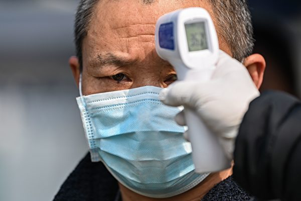
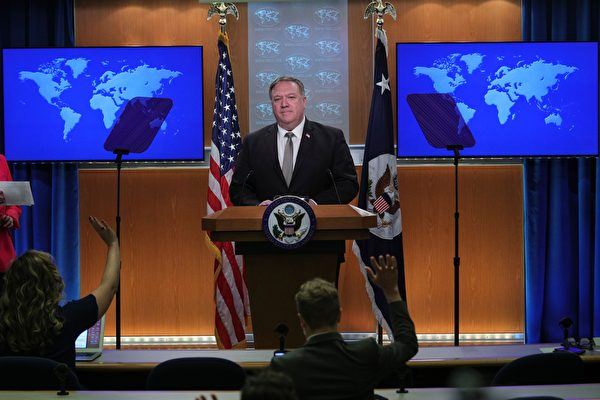
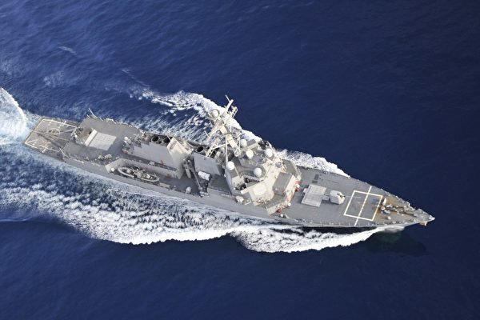
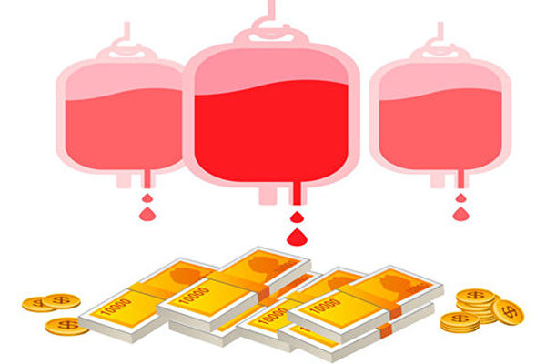

<h3><a target="_blank" href="https://bit.ly/3asSXIA">请多传破网软件，使更多的人了解真相从而得救，这是给自己积福德。 https://bit.ly/3asSXIA </h3></a>

   

     
<h3 align="center"><b>免翻视频  https://bit.ly/3ezRQKo  (请收藏网址 https://git.io/swspip)</b></h3> 

<h3 align="center"><b>复制网址到谷歌或火狐浏览器打开。若出现 “提示” ，請点击“继续”访问即可。</b></h3> 

<h3 align=center><a href="https://github.com/gav01/Heart/blob/master/news1.md">● 看更多大紀元時事 ●</a></h3>

<a href=https://git.io/souye><h6 align="right">回首頁</h6></a>

<a name=top>

<a href =#37>37.杨威：中共间谍挡住了中国学生留美之路 
<a href =#36>36.大陆网络批售人脸数据 配有对应身份证 
<a href =#35>35.地方政府放任暴乱 川普下令审核联邦拨款 
<a href =#34>34.王赫：是川普对华战略误判 还是左媒要误导？ 
<a href =#33>33.【最新疫情9·3】巨石强森坦承全家染疫 
<a href =#32>32.【一线采访】武汉疫情反复 诊断不敢写病毒 
<a href =#31>31.内蒙古广播电台300员工摁手印 吁保护母语 
<a href =#30>30.中共大使馆向匈牙利议员施压 信件曝光 
<a href =#29>29.【新闻看点】蓬佩奥再扔震撼弹 习遭捷克议员责骂 
<a href =#28>28.黎智英等被抓后 港警又抓27名声援理大者 
<a href =#27>27.美报告揭中共军队战力 不足以全面侵台 
<a href =#26>26.德警告不准威胁欧盟成员 王毅访欧被打脸 
<a href =#25>25.二亿元飞机半价也卖不出 赵本山遭女儿吐槽 
<a href =#24>24.【一线采访】内蒙罢课逃校 当局强令维稳 
<a href =#23>23.蓬佩奥发布会：四方面针对中共 
<a href =#22>22.中印边境冲突地区 印度军官被步兵战车压死 
<a href =#21>21.捷克市长致信王毅：你是无理的粗鲁小丑 
<a href =#20>20.【一线采访】云南蝗灾鼠害 农作物损失惨重 
<a href =#19>19.不愿弃台投共 所罗门最大岛将举办独立公投 
<a href =#18>18.邯郸市委书记高宏志被调查 曾迫害法轮功 
<a href =#17>17.首战即终战？美台官方报告揭中共攻台能力 
<a href =#16>16.山东小麦茎基腐病破1200万亩 粮食安全堪忧 
<a href =#15>15.云南爆发数十年最严重蝗灾 农户不知所措 
<a href =#14>14.美国澄清对台一中政策 与中共一中原则不同 
<a href =#13>13.为什么全世界都在停用抖音、微信？ 
<a href =#12>12.当制裁落地之后…… 
<a href =#11>11.参与迫害法轮功　辽宁逾两千人遭恶报 
<a href =#10>10.【一线采访】安徽庐江泡水40天 灾民绝望 
<a href =#9>9.【欺世大观】汉奸毛泽东：秘密结盟 卖国求生 
<a href =#8>8.楊威：王毅喊話歐洲聯合抗美 恐掀大風暴 
<a href =#7>7.【新闻看点】捷克亲台王毅恐吓 欧洲或掀仿效风 
<a href =#6>6.中共医疗谎言与悲剧——血祸 活摘器官 瘟疫 
<a href =#5>5.广东城管将抱小孩妇女摔倒在地 
<a href =#4>4.“国际强迫失踪日”的省思 
<a href =#3>3.蓬佩奥： 美将截断中共与伊朗的军火交易 
<a href =#2>2.【獨家】網絡也納入中共「網格化」管控 
<a href =#1>1.罪恶的“清零”行动 

<a name=37>
<h1 align="center"><b>杨威：中共间谍挡住了中国学生留美之路</b></h1>

美国联邦调查局（FBI）局长雷（Christopher Wray）出席国会听证。 (Getty Images)

【大纪元2020年09月02日讯】近日，美国北德州大学忽然驱逐了15名中共资助的公派访问学者和留学生。国务卿蓬佩奥也透露，正在拟议限制中国留学生的方案。

一连串的中共间谍案，终于让美国大学忍无可忍了，美国政府的相关政策估计不久就会出台，这对拥有美国梦的中国留学生当然是个坏消息。中共间谍正在挡住中国人留学美国之路。

2019年，中国在美留学生近37万人，目前还有多少中国留学生在美国很难说清。因为航班有限，回国机票炒成了天价，美国航空公司要恢复中国业务，却被中共屡次刁难，至今应该仍然很多人回不去中国，回去后还要自费隔离，价码不菲。

同时，也应该有不少留学生想来美国，却因为疫情来不了。874万应届大学毕业生中，真能找到理想工作的恐怕不多，相信不少父母也在考虑送孩子出国寻求另外的出路，美国当然是首选。但如今，很多人的梦想眼看要泡汤了。

中国人留学美国的历史已经不短了。清朝末年，美国认为中国缺乏科学知识，于是接纳了一批又一批的中国留学生，替中国造就了第一批科学人才。美国曾把1900年的庚子赔款退回，帮中国建造学校，包括清华大学、北京大学等12所大学，但能够留学美国，仍然是很多中国学生的梦想，学成后如果能够留在美国生活，就算是圆梦了。

如今，这条梦想之路似乎越来越窄了，全是中共间谍惹的祸。FBI局长说，FBI大约每10个小时就启动一个新的中共间谍案，目前近5000起活跃案件中，中共间谍案几乎占一半。FBI即使再增加人手，也需要确凿证据才能抓人，实际上很多案件的证据并不容易获得，FBI只能眼睁睁看着嫌疑人溜掉，所以中共驻休斯顿领事馆才被关掉，中共驻旧金山领馆吓得赶快放出了唐娟。

在美国各大学、研究机构的中共间谍太多了，美国没有办法，只能考虑限制。即使美国干脆禁止中国留学生的签证，中共还会利用华人社区，继续类似的间谍活动。

这也再次给美国华人社区敲了警钟。中国留学生减少后，大多数应该会疏远中共使领馆，中共再想利用留学生恐怕不容易了，显然会更多依赖亲共社团。这当然逃不过FBI的眼睛，在美国生活的华人真需要警觉了。

美国华裔人口超过500万，可能都是中共想招募的对象。美国大学已经开始限制中国留学生选择某些专业，如果美国华人中再不断曝出间谍案，美国华人的就业很可能也会被限制，某些特殊、敏感行业和高技术领域，华人可能无法进入，那就太糟了。

除了类似的间谍案外，参与渗透美国政界、商界、各类组织，参与中共的大外宣，参与中共组织的各种活动等，都可能成为美国政府和社会关注的焦点，同样可能导致类似的结局。

美国是一个包容度很高的国家，各族裔都能实现美国梦。美国与日本、越南、朝鲜、伊朗等都发生过战争，与前苏联长期冷战，但这些国家的人，仍然大量涌入美国，实现了他们的美国梦。但美国却不会包容敌人、叛国者。

美国华人不但需要更清晰地远离中共政权，还应该主动劝说周围的人，不要参与中共的种种勾当，更应该举报那些继续为中共卖命的人。美国政府正在与中共政权脱钩，美国华人更需要与中共政权脱钩。

还在中国大陆的人，如果还想继续美国梦，不但需要与中共政权脱钩，还应该尽快觉醒，加入推倒中共政权的洪流中。中共政权越早垮台，中国留学生也越早能重圆美国梦，全体中国人也才真正有机会圆梦。

<a target="_blank" href=#top><h6 align="right">回上方</h6></a>

<a name=36>
<h1 align="center"><b>大陆网络批售人脸数据 配有对应身份证</b></h1>

在大陆的淘宝、闲鱼等电商平台，在微信、QQ群中，大陆民众的人脸信息正被公然出售。图为人脸识别技术示意图。(AFP)

   
 【大纪元2020年09月03日讯】（大纪元记者张玉洁综合报导）在大陆的淘宝、闲鱼等电商平台，在微信、QQ群中，大陆民众的人脸信息正被公然出售，并配有对应的身份证等信息，甚至成批出售，引发民众担忧。

综合大陆媒体9月2日消息，一位卖家在微信上传了两套手持身份证的人脸照片截图，并说“五毛一张打包带走，总共两万套，不议价。”

在一些QQ群里，3元人民币就能买到一个用户的详细身份证信息和人脸照片。

业内人士表示，目前大陆人脸数据外泄问题的严重性在于，除了人脸照片，还配有公民的身份证号、银行卡号、手机号码等一系列敏感数据。

匹配了身份信息的照片可以被模拟真人的点头、摇头、眨眼、说话等行为，被实名注册大多数软件，用于办理网贷、诈骗等，被盗用信息的用户终身都有危险。

很多大陆网友对此感到忧虑，“我的支付宝账号瑟瑟发抖”，“有点抗拒互联网大数据了”。

<b>中共人脸监控日益升级 摄像头无处不在</b>

在大陆，人脸识别技术被用在生活的方方面面，近日有民众对大陆媒体表示，现在上班打卡、打开手机、打开电脑、入住酒店、支付费用，甚至上厕所拿卫生纸都要“刷脸”。

人脸识别技术也是中共长期对民众进行监控的手段之一。就在去年10月，大陆几家从事人脸识别业务的大型企业受到美国制裁，制裁原因是这些企业配合中共监控和迫害新疆维吾尔族。位列名单之中的商汤科技、旷视科技，其主要业务之一就是为中共警方庞大的监控系统提供脸部识别服务。

最近，中共利用疫情升级了对民众的人脸监控。路透社8月31日报导，近日大陆多所大学以防疫为由，大量采购摄像头等监控设备，对学生进行人脸辨识、记录行踪等，甚至包括出校门、洗澡、饮食等日常生活。有北京大学学生透露，宿舍里突然发现有几十台摄像机，每层六台。

大陆物流行业强制实行“刷脸取件”，有消费者被他人使用影音照片冒领包裹。中国物流学会特约研究员杨达卿直言，“快递物流行业涉及消费者个人信息和财产，推广使用新技术时应慎之又慎”。

在房地产领域，有业主在卖房的过程中，被要求做人脸识别，随后发现其房产莫名被过户给别人。

近日一个视频被热传。有人在大陆一家酒店的一间客房内，15分钟找到了6个针孔摄像头，随后另一个人在这个房间又找出3个更隐秘的摄像头。

对于中共的这种监控行为，大陆网友表示，“感觉要出大事”，“如何保障我们的隐私更重要，现在动不动就人脸识别”，“细思极恐”。  

<a target="_blank" href=#top><h6 align="right">回上方</h6></a>

<a name=35>
<h1 align="center"><b>地方政府放任暴乱 川普下令审核联邦拨款</b></h1>

图为川普总统日前在白宫召开记者会。（Official White House Photo by Andrea Hanks）

   
【大纪元2020年09月03日讯】（大纪元记者林燕综合报导）美国总统川普（特朗普）周三（9月2日）颁布一项备忘录，要求审查和限制正在发生示威暴力活动的城市——纽约、华盛顿特区、西雅图和波特兰获得的联邦拨款。

这些城市都是民主党执政，川普此举意味着，威胁收回民主党执政的几大城市的运转资金。

川普周三颁布的备忘录题为“审查对部分州和地方政府的联邦经费资助，那些城市允许无政府状态，暴力和破坏”，内容包括：“我的政府将不允许联邦税款资助那些城市——他们允许自我恶化，变成无法治的区域。”

备忘录写道：“为了确保联邦资金不会被浪费或用于直接违反我们政府的承诺——保护生命、自由和财产，联邦政府必须审查这些允许无政府状态、暴力和破坏行为的城市使用联邦资金的权限。确保有效使用联邦拨款，确保纳税人交给联邦政府的经费使用符合美国人民的利益至关重要。”

备忘录特别点名西雅图、波特兰、纽约和华盛顿特区四个区域发生的暴力和破坏问题。“黑人命也是命”运动在这几个城市已从呼吁种族不平等发展为部分暴徒暴力事件，纵火、破坏与抢劫事件频发。

川普政府一直强调“法律与秩序”，并强硬要求当地政府立刻恢复秩序，而司法部也在起诉从事纵火和抢劫犯罪的暴力分子。

备忘录说：“保护美国所有人的生命和财产免遭非法暴力和破坏行为是美国政府的政策和宗旨。没有法律和秩序，民主就无法运转；美国人也不能行使他们的权利，包括和平表达、集会和抗议的权利，（结果是）财产被毁，无辜公民受伤或被杀。

“不幸的是，无政府状态最近困扰着我们一些州和城市。在过去的几个月中，几个州政府和地方政府助长他们辖区内的暴力和破坏活动；他们未进行执法，还剥夺警察部门的权力和显着削减警察经费以及拒绝接受联邦提供的执法援助。

“由于这些州和地方政府的政策，导致在美国的许多城市，如波特兰、西雅图和纽约，持续不断和令人发指的暴行和破坏行为一直没有减弱。”

川普要求在备忘录发布之日起的30天内，白宫行政管理及预算办公室（OMB）主任应向各机构负责人发布有关限制无政府管辖区资格的指导，该机构有权限制或以其它方式约束无政府管辖区接受联邦经费。

外界认为，白宫预算主任很可能会在30天内、宣布禁止向这些无政府状态城市提供联邦拨款。   

<a target="_blank" href=#top><h6 align="right">回上方</h6></a>

<a name=34>
<h1 align="center"><b>王赫：是川普对华战略误判 还是左媒要误导？</b></h1>

5月20日，白宫发布一份报告，详细对中共掠夺性经济政策、军事扩张、虚假宣传和侵犯人权的行为进行揭露和谴责。图为白宫。(Official White House Photo by Andrea Hanks)

   
   【大纪元2020年09月03日讯】这次大选将是美国历史的一个分水岭。对华政策是川普竞选纲领的一大重点、亮点。民主党恰恰相反，夸大俄罗斯淡化中共威胁，以致美国国家情报总监（DNI）拉特克利夫上周通知国会，将不再就总统大选的安全威胁向国会提供面对面简报。他称有议员泄密，且制造虚假叙事，把俄罗斯说成比中共威胁更大。

此际，左派媒体《纽约时报》发表“特朗普政府对中共的战略误判”一文，显然是想要误导美国民众和国际社会对中共的战略判断。
一

该文称川普政府对当代中国/中共的第一个战略误判，是认为接触政策失败，美国没有改变中国，“这一误判是特朗普政府建立新的对华政策的关键”。对此，该文给出四点理由：第一，接触政策已经在中国培育了几代老百姓对言论自由、平等权利和法制等普世价值的基本认可，甚至培育了一支反共力量，尽管他们人数在中国的人口比例中还不是很多；第二，在开放和同西方的接触交流中，中国也建立起了初步的市场规则和机制。第三，40多年的开放，西风东渐，在中国民众特别是中产阶级包括执政党内部，播下了自由民主的种子，并且这个种子已经发芽、生长。第四，对中国这样有着悠久皇权专制历史包袱和超大体量的国家，指望40余年就能让社会制度和政权发生根本性改变，目标本身显得不切实际，或过于急功近利。

这个观点及其论证似是而非。接触政策失败是血淋淋的事实，甚至该文也承认“从现状看，中国没有变成一个西方期待的自由民主国家，而且在习近平治下，离自由民主似乎越来越远”。接触政策失败之核心，不是说接触政策没有给中国民众带来希望和巨大变化，而是说中共利用接触政策来加强了自己的铁腕统治。由此，中共不仅成为中国进一步发展的瓶颈与桎梏，也是美国的最大威胁。

同时，血淋淋的事实还有另外一个方面：就中国国内政治力量对比而言，当前中共已经到了其统治力量最薄弱的时候，中国人民抛弃中共的愿望、决心和能力从来没有如此强烈、强大（可参见笔者“庚子年半大陆主流民意抛弃中共”一文），改变中国的历史性契机再次呈现。

因此，美国对华政策的关键，就是区分中共与中国，协助中国人民解体中共、重建中国，在普世价值的指引下回归国际大家庭。川普政府正是这么做的，断然抛弃了过去四十多年里对中共的幻想，坚决反击中共的渗透和扩张，这是美国和中国的福音。
二

该文称川普政府的第二个误判，是过高估计了中国的实力及对美国的挑战威胁，并给出三点理由：第一，中国庞大体量的“虚胖”成分；第二，因此，中共即使有实力开始挑战美国利益，也缺乏持续性；第三，如果再给10年和平发展，中国GDP赶上美国的可能性不排除，然而更大可能性是，10年里累积的错误有可能在习之后带来非常大的麻烦，甚至在习的统治末期就爆发。

在此，该文显然忽略了（或者故意隐瞒了）中共挑战美国的现实性和疯狂性。第一，虽然中国GDP只有美国的60%-70%，但中美是世界上仅有的两个GDP过10万亿美元的国家，中国的GDP相当于排名其后的第三到第六位这四个国家的总和。仅从GDP数字看，中共已经具备挑战美国的能力，这已超过了冷战期间的美苏经济实力对比和20世纪80年代的日美经济实力对比。

第二，中共不是一个正常的政权，中共政策历来存在非理性的一面，对此要有足够估计。这里仅举一个例子。根据美国弗吉尼亚州CollegeofWilliam&Mary一个研究团队的报告，至2014年年底前的15年间，中共向非洲、亚洲等地区提供的赠款和贷款数额高达3544亿美元，已经非常接近美国（同期美国提供的对外援助数额为3946亿美元）。而历史上，据官方报导，1972年、1973年、1974年的中共对外援助支出占财政支出的比例，竟高达6.7%、7.2%、6.3%，同期国内则经济困难，多少人嗷嗷待哺啊。

关于中共的全球野心及其对美国的威胁，九评编辑部所出巨著《魔鬼在统治我们的世界》第十八章有具体论述，这里就不多说了。
三

该文称川普政府的第三个误判，是中共并非是一个扩张性政权，它的“战狼”外交本质上以进为退。对此，该文给不出理由，只是泛泛而谈：苏联和社会主义集团的崩溃，让中共耿耿于怀，总是担心西方和平演变的下一个目标就是自己，因此要防备；但习近平时代，随着国力增强，认为现在有实力反击西方的和平演变，把本来中共就应得的利益拿回来，这其实是一种“以进为退”的对外策略。也就是将中国的利益边界往外推，用这个利益边界来夯实巩固中共的统治。

这种泛泛而谈，完全是对中共的性质及其历史的错误解读。在本质上，基于共产主义意识形态的进攻性、颠覆性、扩张性，共产政权就是扩张性政权，历史已经一再证明这点。一战的废墟中，苏俄（苏联）来到世上；经过二战，形成了共产主义阵营，最重大的成就是中共成功窃国。毛时代，中共想当第三世界的领袖，要领导世界范围的“农村包围城市”；在邓时代，在讲“韬光养晦”的同时，也讲“有所作为”；到习近平时代，依靠膨胀了的经济实力，大讲“新型大国关系”和“人类命运共同体”，大力军备扩张，大喊战争准备，这可绝不只是该文所称的“舆论宣传泡沫”。中共绝不是卡通片里披着狼皮的羊，看看中共对中国民众的血腥镇压，不就一切都明白了吗？“战狼”外交可是真吃人的。

只要世界上还存在着强大的美国，中共就没有安全感。中共是个“成熟的流氓”，其之伪装和诡计多端，远在苏联和北朝鲜之上，是美国和国际社会最危险的敌人。对中共的任何幻想，都遗患无穷。
四

该文称川普政府最后一个误判，是没有区分地理意义上的民族中国和意识形态意义上的共产中国，对后者裹挟前者认识不清，同时一锅端打击中共。对此，该文给出两点理由：第一，现实中，民族中国和共产中国这两者很难区分甚至没法区分，川普政府的打击手段使它要切割的中国人民成为主要受害者；第二，将中共整体作为打击对象而不是打击其中对美国利益有危害的权势集团，让广大普通党员为党内权贵埋单。因此，“华盛顿对中国打击得越狠，也就把更多的中国人推向中共一边，至少目前看来如此。”

这又似是而非。第一，中共与中国的区分，是实在的、具体的、鲜明的，而非虚拟的、空洞的、模糊的。鉴于中共的“党国一体”和社会控制极端化，中国几乎没有西方意义上的独立运营的私人企业，高科技监控、网格化管理之下的中国民众在国际交往中也很难不受中共控制；因此，川普政府以国家安全名义对私营科技公司和在美上司公司的限制、对中国留学生和访问学者收紧签证，甚至对于微信的制裁，是合理的、必要的、有利的。

受到相关影响的中国企业和民众，应该明辨是非，而不是因为中共的残暴而把矛头指向自由开放的美国。如果一个人不想自救，那谁也救不了你。中国人切记：“爱国主义是无赖最后的避难所（Patriotismisthelastrefugeofascoundrel）”，清除党文化的迷雾，不做“爱国贼”，反共救自己，反共救国家。

第二，中共无可救药，只有解体一条路。内斗是中共与生俱来的一个特征，只有以维系中共统治为前提，无论哪个党内政治派系上台，都是为祸中国，也根本不存在不对美国利益产生危害的权势集团（虽然各政治派系在对美具体政策上或有不同）。广大普通党员要想不为党内权贵埋单，必须迈出自己决定性的一步，与中共切割，因为“雪崩时，没有一片雪花是无辜的”。从某种意义上讲，川普政府的对华战略是“以压促变”，良知尚存的党员，抓住川普政府的这只手吧。

<b>结语：川普政府百尺竿头，更上一步</b>

综上所述，川普政府对华战略判断是走在正确的道路上，根本不存在“误判”问题。川普的现行对华政策，正是在“把中国国内已经处于休眠状态的民主自由力量激活，并吸引更多的中国民众进来”。川普竞选纲领显示，在新的任期里，其对华战略将走得更远。

这里还要指出一点，不能因为中国历史上灿烂的文明与和平的传统，就推论中共的非扩张性。事实上，中共恰恰是中国历史的截断者、中共传统文化的摧毁者、中国人民的迫害者（可参见笔者“评中共窃国七十年”一文）；现在，也是世界和平的危害者，从中共病毒（武汉瘟疫）问题、香港问题、台湾问题上可见一斑。

《九评共产党》的一句经典名言：“谁在什么问题上相信了共产党，就会在什么问题上送掉小命。”值得每个人深思。

<a target="_blank" href=#top><h6 align="right">回上方</h6></a>

<a name=33>
<h1 align="center"><b>【最新疫情9·3】巨石强森坦承全家染疫</b></h1>

好莱坞明星巨石强森（Dwayne Johnson），周三在Instagram视频中坦承，他与家人在数周前确诊现已康复。图为巨石强森与妻子劳伦·哈希安。 (Kevin Winter/Getty Images)

   
【大纪元2020年09月03日讯】（大纪元记者陈霆、张婷、林燕综合报导）9月3日全球中共病毒（武汉肺炎）疫情最新情况：

根据约翰·霍普金斯大学的数据，截至美东时间周三（9月2日）晚上9时28分，全球感染中共病毒（武汉肺炎）的死亡人数超过86万人，确诊病例超过2593万例（注：因中共和伊朗隐瞒疫情数据，真实数据比统计的要高）。

美国有超过611万人感染了中共病毒，超过18.5万人死亡。美国的确诊病例持续增加，面对即将到来的劳动节周末，肯塔基州的州长安迪·贝西尔（Andy Beshear）也敦促民众应保持小规模聚会。

好莱坞明星巨石强森（The Rock，Dwayne Johnson）在Instagram视频中宣布，他与家人约在三周前确诊，但现在已经康复。他表示他们是从“非常亲密的朋友”那里感染了病毒。

而在国际疫情方面，土耳其出现了疫情的第二高峰，土耳其卫生部表示，在过去的24小时内，土耳其报告了1596个新确诊病例，这使土耳其连续第三天记录了1500个以上的新病例。

巴西卫生部周三通报了46934例新确诊病例，另外，也新增了1184例与病毒新死亡案例。据路透社报导，巴西的死亡人数似乎是自5月以来首次减少，这表明该国可能已从长期的感染高峰下降。但里约热内卢联邦大学传染病专家罗伯托·梅德罗尼奥（Roberto Medronho）说：“感染人数仍然很高，我们必须保持警惕。”

=======================
以下是最新疫情实时更新：

<b>巨石强森坦承全家染疫 已在康复中</b>

身为前职业摔角冠军的好莱坞明星巨石强森（The Rock，Dwayne Johnson），周三在Instagram视频中宣布，他与家人的病毒测试结果均呈阳性。

巨石强森：“这是我们一家人不得不经历的，最困难、最具挑战性的事情之一。”

现年48岁的巨石强森，去年与歌手劳伦·哈希安（Lauren Hashian）结婚，他们育有两名女儿，4岁的茉莉（Jasmine）和2岁的蒂娜（Tiana）。

巨石强森表示，他们是从“非常亲密的朋友”那里感染了这种病毒的。

他和家人在“两个半到三个星期前”，就得知了确诊病情，目前全家人已在康复中。这位好莱坞明星说：“我们不再具有传染性，感谢上帝，我们都很健康。”

<b>墨西哥病例数破61万</b>

墨西哥卫生部周三通报了4921例新确诊病例，及575例与该病毒有关的死亡，该国的病例总数达到61万957例，死亡数为6万5816人。

政府表示，实际感染人数可能大大高于确诊病例。

<b>两种类固醇或可降低重症患者死亡率</b>

研究证实，两种类固醇药物可以降低重症患者的死亡率，因此，世卫组织建议医生应将其给予重症患者。

6月，由牛津大学领导的康复实验发现，一种名为“地塞米松”的皮质类固醇，约降低三分之一的死亡率。现在，其他试验的综合结果证实另一种同样便宜且可广泛获得的类固醇“氢化可体松”也可以挽救生命。

根据一份刊登于《美国医学会杂志》针对七项试验的分析性报告，这两种类固醇药物可将这些重症患者的死亡风险降低20%。

布里斯托尔大学医学教授乔纳森·斯特恩是分析研究的作者。他说：“结果在所有试验中都是一致的，且不论年龄或性别都有益处。”

他说：“我们从所有这些试验中得到了一致的信息，氢化可体松的作用似乎与地塞米松的作用一致。”

这些药物已被广泛使用。5月份，大约7%～8%的Covid医院患者正在使用地塞米松，到6月底，大约为55%。

研究者表示，因为类固醇药物是一种抗炎药。在重症病例中，免疫系统可能过度运转，攻击人体自身的组织并引起炎症。适当服用类固醇药物，可以抑制免疫系统。

<b>英国提供5亿英镑 加强快速测试</b>

伦敦卫生部周四表示，英国将投入5亿英镑（合约6.66亿美元）用于病毒的快速测试。

卫生部长麦特·汉考克（Matt Hancock）说，他希望使用更快速、更适用于大规模检测的COVID-19测试方法，进行大规模测试在今年年底之前推出，这些测试对恢复自由至关重要。

这笔资金将用于扩大现有的唾液测试试验和在英格兰南部进行的20分钟快速测试，而在英格兰西北部的索尔福德进行的一项新的社区试验，将评估人群测试的好处。根据该测试定期对人们进行测试不管他们是否有症状，以便在任何病例广泛传播之前，即进行检查。

汉考克说：“快速、准确、易于使用的创新测试，将最大程度地提高测试的影响力和规模，帮助我们回到更正常的生活方式。”

目前，官方的健康服务建议，除了某些职业（例如护理人员），仅针对有症状的公民进行COVID-19测试，可以进行更常规的测试。

如果最近与确诊的患者接触过，必须自我隔离14天，但除非有症状，否则他们不会被告知需要接受测试。

<b>澳大利亚维州再度出现三位数新病例</b>

澳大利亚维多利亚州卫生局周四表示，新确诊病例在四天内，首次增加为三位数，这也挫折了人们对疫情发展的乐观情绪。

维州当局表示，过去24小时内共登录了113起新确诊病例，高于周三的90例。同时，该州又有15人死于中共病毒，目前，澳大利亚已录得超过26000个确诊病例，死亡人数上升到678人。

维州首府墨尔本，澳大利亚第二大城市，处于为期六周禁足令的第五周。当局计划在周日详细说明放宽路边用餐的时间表。

尽管严格的限制，有助于阻止该病毒传播，但限制也对经济造成了严重破坏，周三的官方数据显示澳大利亚已进入了三十年来的首次衰退。

<b>Google助疾病研究 分享Covid-19症状搜索数据</b>

Google将有关Covid-19症状的搜索数据，制作成一个平台，让研究者可以查看全世界、美国、各州和各县的用户，搜寻了哪些相关症状。

Google在周三表示：“我们希望这些数据能使人们更好地了解这种流行病的影响。使用数据库，研究人员可以根据症状相关搜索的流行程度，来开发可视化模型。”

多年来，Google一直在尝试完善算法，以提供基于人们对症状的搜索，来预测疾病活动的方法。该公司过去也曾提供数据，帮助研究人员研究热浪对健康的影响、季节性流感的预测模型以及监测莱姆病的发病率。

<b>巴西近400万人染疫 死亡数开始下降</b>

巴西卫生部周三通报了46,934例新确诊病例，另外，也新增了1184例与病毒新死亡案例。这些新数字使巴西的总病例数，达到399万7865例，死亡人数为12万3780人。

据路透社报导，巴西的死亡人数似乎是自5月以来首次减少，这表明该国可能已从长期的感染高峰下降。

路透社表示，上周平均每日死亡人数降至每天900人以下，为三个半月来最低水平，并低于美国和印度的数据。

伦敦帝国理工学院的研究人员还计算出，在巴西病毒的传播率已低于1，疫情已开始降温。然而，根据之前的数据，感染率此前曾在8月份跌至1以下，但一周后又重新反弹。专家们表示，说现在已经好转还为时过早。

里约热内卢联邦大学传染病专家罗伯托·梅德罗尼奥（Roberto Medronho）说：“与之前的高峰相比，我们正逐渐下降。”

“但是，感染人数仍然很高，我们必须保持警惕，以免再次增长。”梅德罗尼奥说。

洛杉矶允许校方 为最需要的K-12学生提供面授课程

洛杉矶县卫生官员宣布，K-12学校可为最需要亲自学习的学生，恢复有限的面授教学。

卫生官员表示，他们将不会开放小学，但同时它将监控针对有特殊需要的学生，实施新的K-12面授课程计划。

该决定允许具有个别教育计划的K-12学生、英语作为第二语言教学的学生，以及需要评估或特殊校内服务的其他人，从9月14日开始返回校园，进行面对面学习。

洛县卫生官员戴维斯（Muntu Davis）说：“这将使大部分需要亲自学习的孩子重新回到教室里。”

<b>肯塔基州州长敦促人们在劳动节周末保持小型聚会</b>

州长安迪·贝西尔（Andy Beshear）敦促肯塔基州在即将来临的劳动节周末，保持规模较小的聚会，同时，这个周末也将举行2020年肯塔基赛马大赛。

贝西尔说：“我需要保持聚会的规模在10人以下，其中包括肯塔基橡树大赛（Kentucky Oaks）、德比大赛（Kentucky Derby），也包括劳动节周末。”

州长为了以身作则，他宣布今年不会亲自在肯塔基德比大赛上颁发奖杯，而是打算在家观看比赛，并计划预先录制颁奖视频。

<b>土耳其连续三天超过1500例</b>

土耳其卫生部表示，在过去的24小时内，土耳其报告了1596个新确诊病例，这使土耳其连续第三天记录了1500个以上的新病例。

土耳其卫生部长克扎（Fahrettin Koca）警告，现在首都安卡拉比其它任何省份，包括以前的伊斯坦堡热点地区，都有更多病例。虽然伊斯坦布尔和爱琴海地区的确诊病例已经稳定下来，但安纳托利亚中部和土耳其东南部的病例却在激增。

克扎于周三向媒体简报时说：“安卡拉的病例数，是伊斯坦堡的两倍多。”

他补充说，由于婚礼和其他社交聚会上的“粗心大意”，土耳其正面临病毒爆发的第二高峰。

<h4 align=center><a href="https://www.epochtimes.com/gb/tag/%E6%9C%80%E6%96%B0%E7%96%AB%E6%83%85.html">【最新疫情9·2】请点击这里。(点击右键,另存新档）</a></h4>

<a target="_blank" href=#top><h6 align="right">回上方</h6></a>

<a name=32>
<h1 align="center"><b>【一线采访】武汉疫情反复 诊断不敢写病毒</b></h1>

2020年4月4日，一名男子离开湖北武汉市的汉口火车站时进行了体温检查。(HECTOR RETAMAL/AFP via Getty Images)

   
 【大纪元2020年09月01日讯】（大纪元记者张北采访报导）有武汉市民近日反映，武汉疫情出现再次严重的迹象：同济和协和医院传染科门诊外每天几百人排队，有菜市场被关闭，一些小区也恢复了疫情期间的管控措施。但是为了所谓“政治正确”，医院不敢给中共病毒（武汉肺炎）患者出具确诊报告。
 
<b>传染科门诊几百人排队 医院拒确诊</b>

据武汉市卫健委官网数据，除了8月1日和7日共新增4例境外输入病例，武汉市在整个8月不存在本地新增确诊病例。8月15日，武汉玛雅海滩水上乐园还举办了一场据称有3000人参加的水上电音派对，现场人们挤得宛如沙丁鱼罐头，没做任何防疫措施。一切仿佛都恢复到正常生活状态。

然而，武汉市民王远（化名）向大纪元透露，武汉疫情反复严重。现在同济医院和协和医院的传染科门诊（疫情前叫发热门诊）外每天都有几百人在排队，“就在大马路上排队，随时可以照相，看得到。”

但医院却出现不给病人确诊的情况。王远说，当地一位社区医生于8月25日发布一条朋友圈，讨论当天接诊的一个患者。帖文陈述，该患者是一31岁女性，22日起床时感觉呼吸困难，约30分钟后缓解，后每天持续出现同样症状。

24日，她到医院就诊，拍CT显示其双肺多发磨玻璃样影，条片状实变影；心电图显示窦性心动过速，ST-T段改变；但新冠核酸测试阴性，新冠抗体检测双阴性。据初步诊断结果，她或许患病毒性肺炎，不排除新冠肺炎可能性。医生建议三天后复查核酸及抗体，回家进行自我隔离。

这名医生指出，该病例的症状高度符合新冠特征，之所以核酸及抗体检测呈阴性，一是因核酸准确率低，二是抗体可能早期没有出现，也可能患者无症状已超过十余天，而抗体在两周后或已消失。

这名医生写道，“高高在上的屁股不发话，连‘病毒性肺炎’这样的诊断都不敢写在CT报告上。”“两大三甲医院（普爱与协和），均未对患者采取进一步措施，可能是因为疫情响应降低。看完这个患者，情绪低落。”

（受访人提供）

<b>汉口姑嫂树菜场关闭</b>

王远还披露，汉口姑嫂树菜场距离华南海鲜市场直线距离2公里以内，在疫情期间是个重灾区。8月30日，菜场被强行关闭，贴出的通告称要对此处进行装修。

王远说，菜场在官方宣布疫情结束后重新开了几天，后又再次关闭，改在外面搭建临时菜场营业。“结果卖了几个月，昨天（30日）一天之内把那个临时菜场全部拆了。那说明什么问题呢，肯定就是这个疫情反复了，买菜的人接触比较多，所以就不让你们在一起买菜呗。”

他表示，还有一个可能性是武汉正在评文明城市，关闭菜场是为了应付检查。“其实他在外面搭建的临时菜场在一个很偏的地方，哪怕是文明城市检查都不可能找到那个地方去，他把这么偏而且根本就不是主干道上面的一个临时菜场给关闭的话呢，这个肯定就很有意思了，说明有些不得已的东西他没办法说。”

<b>有小区疫情管控变严</b>

此外，王远告诉记者，一些小区对疫情的管控措施已经越来越严，只是不说而已。“半个月前，那个岱山附近，就是武汉的堤角，汉口的最东边，那个地方就已经又恢复到疫情期间的管控：进出必须戴口罩，必须量体温。”他说。

“不管你在哪个药店买这些退烧的药什么的，只要你刷了医保卡，立马社区的就会打电话来找你，你到底为什么（买药），在哪里看的（病）。这个大数据是很厉害的。”

王远认为，“全世界都在不停地爆发（疫情），怎么可能这个地方说完就完了？这个都是为了政治正确。自从习近平到武汉的时候就把方舱关了，关方舱也是为了政治正确关，为了配合表演。”  

<a target="_blank" href=#top><h6 align="right">回上方</h6></a>

<a name=31>
<h1 align="center"><b>内蒙古广播电台300员工摁手印 吁保护母语</b></h1>

2020年9月2日，内蒙古广播电视台三百多位员工签字反对第二类汉语教学。他们在名字上摁上了自己的手印，还围成一个个太阳形状，因为太阳与月亮是蒙古族传统的象征物。（视频截图）

   
 【大纪元2020年09月03日讯】（大纪元记者夏松报导）网传视频显示，2020年9月2日，内蒙古广播电视台三百多位员工签字反对第二类汉语教学。他们在名字上摁上了自己的手印，还围成一个个太阳形状，因为太阳与月亮是蒙古族传统的象征物。

从视频中，可以清楚地看到，习近平要求的“党媒姓党”的牌匾赫然挂在墙上。内蒙古广播电台为中共省一级喉舌机构，直属中共内蒙古自治区党委宣传部领导。

视频传到网上后，网友们纷纷点赞。网友Jane留言说，“有血性的蒙古人！令人敬佩！”网友“哎呀呀”说，“感动，团结”；网友“狮子下山”留言，“墙上还挂着马恩列斯，还写着党媒姓党。这是多大的黑色幽默？”

网友“图百合”留言说：“《签一个太阳》。我不，我拒绝放弃蒙古语言，我会坚持自己。签下了一个圈圈的太阳，在大蒙古的草原上，你认识的，那些智慧的文字蒙古的真热情心肠。今天就不一样，就要大声唱，宣告天下：蒙古人拒绝一个语言汉字的天下，容得下一个蒙古的语言歌唱。”

有分析认为，作为中共喉舌机构的公职人员，不但被中共洗脑，还要帮助中共去洗脑。现在这个群体中的人能集体签字表态，此举的意义及其影响性非同寻常。

8月26日内蒙古教育厅发布文件，从今年秋季起，小学一年级和初中一年级先使用中共教育部统编《语文》教材，用汉语授课，即所谓的“第二类双语教育”，引发强烈反弹，从而爆发的“公民不服从”运动愈演愈烈。

从内蒙古首府城市呼和浩特到东北的大兴安盟、赤峰市、中部乌兰察布盟，都流出学生与家长们罢课及抗议集会的视频。

由于学生拒绝上学，近日传出中共当局要求蒙古族公职人员必须把孩子送到学校，于是出现体制内人士的集体抵制。

有网络评论说，蒙古民族因为保持了自己的语言文化，中共洗脑作用有限，因此强悍、豪放的本色不变。在事关民族文化存亡的关键时刻，蒙古人毫不妥协，大规模抗议活动此起彼伏。  

<a target="_blank" href=#top><h6 align="right">回上方</h6></a>

<a name=30>
<h1 align="center"><b>中共大使馆向匈牙利议员施压 信件曝光</b></h1>

匈牙利国会议员博娜蒂特.丝兹尔（Bernadett Szel）。（英文新唐人电视台视频截图）

【大纪元2020年09月01日讯】（大纪元记者乔琦综合报导）中共驻匈牙利大使馆向一位匈牙利国会议员施压、要求停止支持法轮功的信件，被议员本人曝光。

英文新唐人电视台报导，匈牙利国会议员博娜蒂特‧丝兹尔（Bernadett Szel）表示，她于8月19日收到中共驻匈牙利布达佩斯（Budapest）大使馆的这封信，她说，这是她政治生涯中最为荒诞的时刻。

在信中，中共大使馆表示，强烈反对丝兹尔议员签署一份支持法轮功的联合声明。丝兹尔议员表示，她已将这封信在脸书上予以曝光。

中共驻匈牙利大使馆向一位匈牙利国会议员施压、要求停止支持法轮功的信件，被议员本人曝光。（NTD视频截图）

丝兹尔议员签署的这份支持法轮功的声明，得到全球600多位政要的连署，这份连署声明要求中共立即停止迫害法轮功，停止21年来对法轮功“系统性的残酷”迫害。

此外，大约有30位美国议员单独发表声明，声援法轮功，谴责这场迫害。约有十几位德国议员也单独发表了这样的声明。

法轮功是以“真、善、忍”为原则的佛家身心修炼功法，包括五套舒缓优美的炼功动作。中共国家体育总局于1998年5月在广东省对法轮功进行调查，得出结论：法轮功祛病健身总有效率为97.9%。但是，中共时任总书记江泽民，因妒忌和恐惧法轮功学员人数超过中共党员，于1999年7月20日下令全力镇压。

法轮功唯在中国大陆受到迫害。21年来，国际社会对法轮功的褒奖超过3600项，各类声援不断。

丝兹尔议员说，“一个匈牙利的民选国会议员收到另一个国家大使馆的信，要求她怎么做；告诉她什么是可以签字的，什么是不可以签字的——这是极其不正常的。”

“我们欧洲以及世界上的很多民主国家，相信宗教自由，相信人们不应基于良知的原因而被监禁和迫害。”

<a target="_blank" href=#top><h6 align="right">回上方</h6></a>

<a name=29>
<h1 align="center"><b>【新闻看点】蓬佩奥再扔震撼弹 习遭捷克议员责骂</b></h1>

前天（8月31日）当地政府刚向联邦求助，川普随即向基诺沙派出了国民卫队。上千名国民警卫队和FBI调查员到了那里，迅速平息了暴乱。(大纪元合成)

   
 【大纪元2020年09月03日讯】大家好，欢迎关注新闻看点，我是李沐阳。

节目开始，先说3件事，也是实在不能再拖了。首先沐阳向所有支持我们的观众朋友说声“谢谢”。最近一段时间，我们收到了很多朋友的赞助支持，甚至有许多大陆朋友向我们捐款，并且写了很多感人的话鼓励我们团队。出于安全考量，我不能直接说出他们的姓名，但是很谢谢大家，我们会继续努力。

第二件事是，我们发现最近又陆陆续续被黄标了。有的时候我们申诉，YouTube的回应也挺硬的，说一旦二次确认就不能再改了。但究竟是以什么为标准呢？我们实在找不到。比如有一次说我们有色情画面，我们就开始找，但是从头到尾也找不到。后来怀疑，可能是北戴河的原因。我们在说到中共元老习惯去北戴河一边开会一边度假，然后放了游泳的画面。这次不放了，也给做了模糊处理，但就是不给变绿。

另外，这几天我们还发现，4月13日的影片突然被删掉了，说违反规则。我们去看了一轮影片，也看不出所以然。

总之，就是寄人篱下，怎么都比较困难，说删就删，也不给解释，申诉又无效。所以我们想把九月作为过渡期，希望会员朋友转为加入我们自己的优乐客平台上的会员。大家支持的心意，实际上大部分也是都到了YouTube那了。虽然有点麻烦大家了，但还是希望大家能在九月底以前转到我们自己的平台。这样就不用在受限于YouTube的政策了。谢谢大家。下面还是60秒看世界。

在福克斯采访中，美国总统川普表示，中共病毒在中国造成的死亡人数，实际上要比北京政府承认的数字多得多，高于任何其它国家。

美国教育部最新数据显示，包括耶鲁大学等几所顶级大学没有如实汇报收到国外的赠款与资金，其中许多捐款来自中共方面。

美军日前公布了前不久举行的“环太军演”画面，其中包括多枚反舰导弹击沉靶船的震撼画面。

继上月拘捕黎智英、周庭等人后，港警今天又拘捕27人，都是去年11月港警围攻理大时，在理大一带被捕的人士。

法新社引述流亡藏人的消息，印军一名连长，在8月30日巡逻期间，遭中共军人开枪打死，其部下受伤。

下面进入今天的话题。继瑞典全数关闭孔子学院后，美国在今年年底前也可能全部关闭，国务卿蓬佩奥（Mike Pompeo）昨天（9月1日）作出了这番表示。他同时称，美国还有一系列的反击中共的措施，甚至习近平可能要被制裁。在美国的带领下，欧美国家反制中共的动作也越来越频繁，甚至有捷克议员公开斥骂习近平。

<b>美限制中共外交官行动，或关闭孔子学院</b>

国务卿蓬佩奥今天宣布，限制中共驻美外交官的在美行动。访问美国大学或与地方政府会面之前，需要获得美国政府批准。

蓬佩奥强调，美中外交必须对等。他说，中共使领馆今后在美国开展文化活动，活动规模也会受到限制。

美国这个动作，无疑使美中关系更加恶化，也增添了更多断交的可能。

周三（9月2日）上午10:00，美国国务卿蓬佩奥（Mike Pompeo）举行新闻发布会。（NICHOLAS KAMM/POOL/AFP via Getty Images)

昨天（1日）在福克斯的采访中，主持人问到今年年底美国还会有多少间孔子学院？蓬佩奥回答得很简单，“我希望答案是零”。

他表示，“大家都逐渐理解孔子学院所带来的风险”。中共政府通过孔子学院，在美国大学招募“间谍与合作伙伴”。他指出，包括目前校园内仍然有孔子学院的美国大学，也已经认清了这一点。

根据美国全国学者协会统计，从2014年开始，美国已经有45所大学关闭了孔子学院。但是截至到6月30日，全美国仍然有75所孔子学院，其中包括4所大学计划在今年要关闭的4家孔子学院。

其实孔子学院总部在今年7月份的时候，已经被中共悄悄地改名字了，叫做“教育部中外语言交流合作中心”。改名的原因，大概是孔子学院的名声太臭了，也是因为中共官方色彩太明显。

中共自称设立孔院是普及中国文化知识，增进世界对中国、对中国语言的了解。但是孔院的一切都由中共官方决定，其中有很多中共的禁忌话题。

更主要是，孔子学院是中共在海外搜集情报的秘密据点，间谍问题相当严重。其中比利时一所主要大学VUB关闭校内的孔子学院，就是担忧孔院的间谍问题严重。

在这种大背景下，中共在7月5日把孔子学院总部改名为“中外语言交流合作中心”，对外不再使用“国家汉办”这个名称。

这种做法，实际就是给垃圾换了一个塑料袋。原来的塑料袋破损了，垃圾露出来了，所以需要换一个新塑料袋装这些垃圾。但挂羊头卖狗肉的做法，根本骗不了人。

上个月（8月13日），美国国务院已经把中共软实力渗透的孔子学院，列为了外交使团。助理国务卿史达伟（David R. Stilwell）表示，这样做就是希望美国各大学意识到，孔子学院除了教中文，还在有其它行动。

美国新墨西哥州立大学宣布关闭孔子学院。图为抗议者呼吁美国大学关闭孔子学院。（大纪元资料图片）

<b>蓬佩奥：习近平已作出选择，美国将有更大行动</b>

在昨天（1日）的节目中，蓬佩奥也谈到了中共盗窃美国知识产权、逼迫中国留学生当间谍等问题。

主持人多布斯（Lou Dobbs）问他，中国成百上千的前沿公司通过各种手段，窃取美国的知识产权、技术秘密和军事秘密等，美国将如何回击？

蓬佩奥表示，主持人所列出的几点都是事实，在过去的20年，普通美国工薪阶级家庭总值达到几十亿美元的财富被偷走了，还有数以百万计的工作流失。

国务卿指出，“上届政府拒绝面对这一挑战，不过，川普政府已经在某些领域做到了——我们在电信方面，对华为做到了；我们的工作使华为付出了很大的代价，因为它从我们那里偷窃东西。”

蓬佩奥强调，川普政府“接下来有更大的行动”，因为“习近平总书记已经做出选择”。“他（习近平）在各方面都做了明确表态，无论是扩充军事力量、外交努力、企图通过‘一带一路’建立附庸国等，（中共是）一个在世界范围内争夺霸权的专制政权，（带来）各种不同的挑战。”

他说，“现在，你将看到更广泛的行动。在接下来几天和几周内会有宣布，您将看到美国以一种非常认真的方式应对这一问题，（我们）所做的这一切会让美国经济受益。”

他表示，中共“拒绝表现得像一个正常国家，拒绝在正常商业条件下竞争的方方面面，美国过去已经容忍了几十年”；但“川普总统根本不会允许这种情况继续发生。我们（美国）已经立案，现在是执行和实施总统战略的时候了”。

蓬佩奥透露，未来几天和几个星期里，人们将会看到川普政府在更大层面采取“非常严肃的”行动，包括限制中国学生到美国留学。“您将看到美国以一种非常认真的方式应对这一问题，（我们）所做的这一切会让美国经济受益。”

对于当前美中关系恶化，中共外长王毅上个月抛出了“避免新冷战”的说法。蓬佩奥表示，现在看起来，美中争端与冷战有一些关联。不过他指出，中共对全球带来的挑战与冷战时期的挑战是不同的，现在世界“面对的是中国14亿人口带来的挑战。这也是经济上的挑战”。

蓬佩奥所指的对全球带来的挑战，其中之一就是它与伊朗之间的军火交易。

图为美国国务卿蓬佩奥7月23日在加州发表对中共重磅演讲。（姜琳达／大纪元）

<b>美将截断中伊军火交易，习近平将被制裁？</b>

在西方自由世界结盟，联合围堵中共之际，这个邪恶的轴心国正在试图与另一个邪恶政权伊朗建立25年的战略伙伴关系。

伊朗正在被美国制裁，而中共却要跟它建立战略伙伴关系，这就是“物以类聚，人以群分”。其实这两个邪恶政权的目的，是要把军火交易正常化，被世界严重孤立的两个邪恶政权要抱团取暖。

蓬佩奥前天（31日）对WMAL电台表示，中共在伊朗有一些重要利益，“世界上两个最严重的基本人权侵犯者臭味相投，这个一点都不奇怪”。

他说，“最想向伊朗出售武器的国家之一是中国（中共），它们将因此赚大钱。我坚信中共也将向伊朗购买一些系统。我们必须防止这种情况的发生。”如果中共违反美国的制裁禁令，华盛顿就将迫使中共“承担责任”，“我们（美国）将追究所有人的责任”。

大家注意，蓬佩奥说追究“所有人”的责任，这句话很有深度。这里面会不会包括习近平呢？可能性很大。

现在习近平是中共军委主席，掌握着实实在在的军权。他从胡锦涛手里接过军权后，对军队进行了清洗。把自己的人马安插在了重要位置，都掌握着实权。

这种情况下，如果中共军方与伊朗有军火交易，那就很可能经过了习近平的点头同意。如果这样，美国追究“所有人”的责任，自然也就包括习近平在内。就是说，他也可能要被制裁。从蓬佩奥的话中，是带有这层含义的。

这个戏可就真的热闹了。那个时候，中共不想脱钩也得脱钩，不想断交也得断交了。习近平再到美国几乎不可能了，甚至连参加重要的国际活动也可能会受限。

<b>德外长直怼王毅，欧盟声援维特齐</b>

其实中共参加国际活动也讨不到好，中共外长王毅的欧洲五国行，哪个国家都没给好脸。就连与中共一向走得近的德国，这次王毅也被外长马斯（Heiko Maas）当面呛声。

昨天（1日）在与王毅会面中，马斯表示，德国对《港版国安法》产生的影响仍然有忧虑，香港人应该享有《基本法》规定的权利。他呼吁中共撤回恶法，保障一国两制的实施。

马斯也谈到了新疆维族人的状况，要求中共允许独立联合国观察员代表团进入营地。这个问题，我们后面还要谈，网友爆料来的消息，让人心都要碎了。

马斯还以欧盟轮值主席国外长的身份，拒绝了王毅对捷克参议长维特齐（Milos Vystrci）台湾之行发出的威胁。马斯说在外交政策上，“欧盟团结一致并尊重其伙伴”，“反之亦然”，“威胁恫吓不合适”。

他直接怼王毅，说北京政府“不要动辄摆出威胁的架子”，欧盟国家无法接受。

同一天，欧盟的另一个重量级国家法国也明确表示，欧中关系是建立在互惠尊重的基础上，这是必要条件。法国外交部声明指出，“法国不能接受中国（中共）对欧盟成员国的任何威胁，我们声援捷克共和国。”

德国《商报》表示，中共外长“将自己包装成了和平使者的形象”，不过中共早已丧失了成为战略伙伴的资格，“原本‘以贸易促转变’的策略，如今正在悄悄退场”，现在德国面临的是一个根本问题，“民主还是专制？”

《南德意志报》表示，中共在疫情期间推销极权体制，一方面把自己包装成国际法捍卫者，一方面践踏国际条约，这无法让人容忍。像王毅威胁捷克这样的事，一旦欧洲人无视北京的命令，中共立刻就撕下“友善”的假面具。

文章指出，“通往真正的欧洲团结之路十分漫长，但可以肯定的是，这条道路不会经过北京。”

2020年9月1日，中共外长王毅与德国外长会晤，前香港众志创党主席罗冠聪在柏林参加抗议活动。(TOBIAS SCHWARZ/AFP via Getty Images)

<b>“坏鬼”在这间房间不受欢迎</b>

从欧洲国家甚至欧盟的反应来看，他们对中共了解得很清楚，自由民主永远不会与独裁暴政进行勾兑，这是两条没有交集的路。所以你不难理解，为什么捷克布拉格区市长帕维尔·诺沃特妮（Pavel Novotný）前天（8月31日）会发出公开信，谴责王毅是“无礼的粗鲁小丑”，并要求他向捷克道歉。

这里还有一个有意思的事，昨天（1日），随维特齐正在访问台湾的资深参议员艾胜班兰纳（Lumír Aschenbrenner）在脸书PO文，贴出了旅馆门口的照片。

不过，这位白胡子议员贴出的照片中，贴着一张习近平的头像，上面用正体中文写着几个字：“坏鬼这间房间不受欢迎”。习近平照片下方还挂着五星旗，而那两个五星旗，上面似乎不是五角星。从模糊的照片看上去，很像是中共病毒的样子，相当讽刺。

艾胜班兰纳用捷克语写道：“当你称之为森林时，森林会回响。中国（中共）对我们在台湾之旅的威胁，在我们居住在台湾的酒店门口找到答案。中国国家主席习近平的图片中写道：‘这个坏人在这个房间不受欢迎。’”

*****
<b>中共拆散新疆家庭，实施种族灭绝</b>

前面提到的新疆维族人的状况，我们这里要说一说。

昨天（1日）网友传给我一段视频，是一个很小的孩子哭闹的场面。从容貌上看，这个孩子有着新疆人的特征。

【原声视频】Apa⋯⋯

孩子一直在哭喊的“Apa”，汉语就是“妈妈”的意思。这段视频不长，但是却在瞬间打动人心。

网友在文字中写道，300万维吾尔人被关进了集中营，50万儿童被迫和父母分离，住进了孤儿院。

网友的意思是说，这段视频可能是拍自孤儿院。这个孩子的身后，还有一些儿童围坐在一起。这些孩子，应该都是被中共强行拆散、与父母分离的儿童。中共恶毒的拆散家庭，究竟要干什么呢？

前不久，英国广播公司BBC也公布了一段影片，看上去同样令人心碎。BBC进行了六十多次采访，他们最常听到的一句话就是“我的孩子在哪里？”

现在居住在土耳其的阿卜杜拉曼·土赫提（音译）介绍，他的妻子佩里达三年前（音译）带着孩子们回家探望祖父母，从那以后就再也没有了消息。

今年早些时候，他在网上看到了这个视频。土赫提说，这个孩子就是他的儿子，是三年中第一次见到。但他除了哭，他说“什么也做不了”。

【原声视频】

问：你叫什么名字？
答：我叫阿都拉阿齐兹。

问：你几岁了？
答：我四岁了。

问：祖国的名字叫什么？
答：中华人民共和国。

这个孩子回答得很快，中间没有一点停顿。带过孩子的成年人都知道，如果一个孩子能做到这样，平时要反复地教他，不停地重复问答。

但是大家注意没有，这个新疆的小孩，讲的不是新疆话，而是“汉语”，很标准的“普通话”。这意味着什么呢？中共正在消灭新疆话，正在实施种族灭绝。

昨天（1日）我们节目中提到了中共在内蒙古强推汉语教学的事情，其中一位化名叫阿德玛的呼伦贝尔的市民告诉大纪元：中共从小孩子开始施行统一教材，人们渐渐就会忘记母语。

大家想一想，如果一个民族的母语不存在了，它的文化就会渐渐消失。一个民族之所以能够存在，就是因为有它自己的文化。就像以色列这个国家，犹太人曾经几十年流浪，没有固定的国家。但是它有自己的文化，这个民族就一直存在，最终建立了国家。反过来也是一样，如果一个民族的文化消失了，这个民族也就不存在了。所以说，中共这种做法，就是在实施种族灭绝。

<b>网友来信：蒙古族已不存在了</b>

昨天（1日）说到了中共在内蒙古强推汉语教学的事之后，有一位呼和浩特的蒙古族朋友给我写来了一封信。他说“感谢贵平台，让我等不甘被奴役的草民有了一个表达观点的渠道”。

这位朋友自己介绍，“是一个体制内被领导们呼来喝去的小人物”。他说，“你可以叫我巴特，当然这是化名。不过对于我们蒙古族来说，我们的名字并不重要。因为在中国，所谓少数民族起本族的名字，必须用汉字音译后书写，读音完全不沾边，至于蒙文名字原本的含义，更是荡然无存。”

巴特在信中表示，有不少外地朋友问过他，总听说新疆、西藏有人抗议，为什么内蒙古这么安静？他说答案是“内蒙古是最先、最重点被统战和同化的地区，早就和其它省份没有任何区别了”。

据巴特估计，“整个内蒙古都找不到一个没有汉族亲戚的蒙古家庭。”现在在“内蒙古的汉人数量已达到2000多万，而蒙古人则只有四百多万”。不过这400万的蒙古人当中，学者的研究表明，“至少一百万是汉族改的户口”。

巴特说，中共的这个阴谋有个专门的名称“掺沙子”。有大量的汉族人为了生二胎、高考加分、提干，以及获得中央民族大学等大学的录取名额，主动将自己的户口改成了蒙古族。这些人霸占了本该属于蒙古人的那一点点少得可怜的优惠政策，而真正的蒙古人，很多依然居住在环境恶劣的牧区。

信中介绍，上世纪90年代，针对广东、浙江、福建那些有钱人，专门出现了迁户口、改民族的一条龙服务，收费2～5万元不等。时至今日，在内蒙古一些学校都可以看到奇怪的景象：南方口音的学生，证件上却写着蒙古族。

巴特在信中告诉我，因为教育不平等，造成了收入不平等，所以不少蒙古女人热衷找一个汉人丈夫。造成这种现象的一个原因，就是蒙古人的脊梁已经被打断了。

据一些蒙古族学者调研，1947年到1981年的三十多年中，大约有31万8000名蒙古人在历次政治运动及三年人祸中非正常死亡。

从1967年至七十年代初，官方称有2～5万蒙古族知识分子，受到莫须有的“内人党案”迫害而丧命。不过巴特说，实际数字“永远是个谜”。

这里说明一下，“内人党事件”，全称是内蒙古人民革命党肃清事件。这是在毛泽东发动的文化大革命期间，中共军队将领滕海清在内蒙古也发起了一场大规模的肃反运动。

在中共的授意下，通过刑讯逼供，把上百万人定性为“内蒙古人民革命党”成员，也就是“内人党”。维基百科记载，中共在这场肃反运动中，采取了非常残忍的方式，包括压杠子、老虎凳、吃炉渣、火柱烫、穿指甲、掏肝脏、压油板、拔人河、上吊、打夯、割舌头、割鼻子等等。导致数以万计的人被屠杀，或是被迫害致死，受害者大部分是蒙古族。

巴特在信中表示，遭受了中共这样的迫害，后来蒙古人也就失去了文化的支撑，变成了一群热衷喝酒唱歌跳舞的人。而那些假蒙古人，得到中共的各种好处之后，现在占据着职能部门的各个职位。“他们制定的政策，无一不是把蒙古人往绝路上逼”。

巴特说，“内蒙古最近取消了蒙古语授课，这给外界很大的误导，会以为之前是蒙古语授课。其实，这仅仅是在蒙古族中小学中取消蒙古语授课，在内蒙古，绝大多数中小学都是汉族学校，从没和蒙语有过任何关系”。

巴特介绍，蒙古语授课的学校，除了首府呼和浩特有一些充门面的教学质量尚可，在广大其它地区，蒙古语学校就是差生聚集地的意思。而且很多这些蒙古语学校，每个年级只有一两个班是蒙古语授课，剩下的全是汉语授课，招的学生也基本都是汉族。

信中说，“内蒙古早就没有不会说汉语的蒙古人了，因为不说汉语无法生活。现在能说能写纯正蒙古语的蒙古人比貔貅还罕见”。

巴特指出，最近网络上的那些抗议视频中的慷慨激昂的蒙古人，说的蒙古语中其实夹杂着大量汉语的词汇。“走在内蒙古的大街上，从银行商场到足疗保健，没有人说蒙古语”。

他表示，“用不了多久，没有蒙古人会说蒙古语了”。他说蒙古人和蒙古文化的消亡，只是一二十年内的事。但对他来说，“这个民族在中国已经不存在了”。

<b>暴乱迅速被平息，川普亲往视察</b>

昨天（1日），川普专程去了近日发生暴力冲突的威斯康辛州基诺沙市视察，并参加了一个社区安全圆桌会议。川普谴责了暴力示威，并重申他竞选中强调的“法律与秩序”。

可以看出，川普相当有执行力。因为前天（8月31日）当地政府刚向联邦求助，川普随即向基诺沙派出了国民卫队。上千名国民警卫队和FBI调查员到了那里，迅速平息了暴乱。然后昨天川普就去了现场视察。

川普说，几天前这里还像是地狱，但是现在来这里感到安全，大家可以坐在这里谈话。他向执法人员表示感谢，也感谢当地政府给了警察尊严。

川普表示，要拨款100万美元给基诺沙警队，400万美元支持小商业，2400万美元给威斯康辛司法和执法机构，以帮助雇用更多的警员，逮捕和起诉暴力分子。

同时川普也批评基诺沙的民主党籍市长是个“蠢材”，批评他支持“极端的无政府主义者”。

这件事，又映衬出了民主党的严重失误。到现在，民主党纵容的美国暴乱已经持续了3个月了，这使得民主党的民调在迅速下滑。

民主党本来是想借着制造警察暴力、黑命贵（BLM）等问题，对川普进行打击，影响川普的选情。但是结果弄巧成拙，烧掉了自己的选情。到目前来看，民主党后悔可能都来不及了。

有网友表示，从民主党、共和党的全国代表大会来看，你会发现民主党上台演说的都是元老权贵们，共和党上台演说的是各个阶层的普通人民。“由此可见，一个是代表权贵，一个是代表人民”。“真正的美国是属于人民的，而不是属于权贵的”。

美国大选，在一定意义上说也决定着中共的命运，所以中共想尽办法要进行影响。但中共从不承认。不过美国情报总监暗示，美国已经掌握了中共的犯罪证据。欢迎大家加入我们的会员，了解更多内容。

大纪元《新闻看点》制作组

<a target="_blank" href=#top><h6 align="right">回上方</h6></a>

<a name=28>
<h1 align="center"><b>黎智英等被抓后 港警又抓27名声援理大者</b></h1>

2019年11月18日，尖沙咀漆咸道南漫天催泪弹，空气中尽是二噁英。抗争者团结一致建立防线。（余天佑／大纪元）

   
  【大纪元2020年09月02日讯】（大纪元记者萧律生报导）继上月10日抓捕壹传媒创办人黎智英等10人后，今天（9月2日），港警又拘捕27人。这些人是去年11月警方围攻香港理工大学时，在理大一带被捕的人士。

综合港媒报导，9月2日当天，警方拘捕的27人中有19男8女，年龄从16至37岁不等。其中，25人中，1人是教师、15人是学生，8人未成年，其余的是文员、侍应等，还有2人是警方担保人士。

这些人均被控一项非法集结罪，其中一人涉藏有雷射笔而被加控一项“藏有攻击性武器”罪，此人的案件将于本月9日下午在九龙城裁判法院提堂。

香港警方有组织罪案及三合会调查科（O记）高级警司何振东披露了上述消息，他表示，案中的被捕人士都是2019年11月18日到香港理工大学外声援的，其间与警方发生冲突被警方逮捕。

2019年11月12日，大批防暴警察在未得到校方许可的情况下强行攻入校园执法，包括发射催泪弹、橡胶子弹和布袋弹，出动水炮车等。学生和抗争者为了守护学校而与警方持续对峙。这些学校包括香港中文大学、城市大学、香港大学、香港理工大学等。随后，多间院校宣布停课。

11月12日至14日，最为激烈的要属中文大学，被称为“中大保卫战”。而香港理工大学，11月17日，防暴警察出动两架水炮车、一架装甲车，还首次出动声波炮。警方在现场用水炮车疯狂发射蓝色、白色水剂，又同时疯狂发射催泪弹等，还用装甲车辗压学生或其他抗争者的雨伞。

 

   

   
2019年11月17日，香港抗争者在尖东桥遭到防暴警察两面射击催泪弹。（宋碧龙／大纪元）

   

2019年11月17日，香港抗争者在顺畅道和理大同防暴警察对峙。（宋碧龙／大纪元）

   
   从这天（17日）起，一直到11月28日早上警方进入校园，警方围困理工大学11天。11月18日凌晨，香港理工大学现场，不少市民前来声援学生。市民与警方在佐敦至尖沙咀路段对峙，警方在佐敦道弥敦道交界处不断发射催泪弹。“大战”过后，现场一片狼藉，最终警方采取拘捕行动，拘捕了135人，大部分人事后拒绝警方担保（俗称踢保），只有6人接受担保。

2019年11月18日，尖沙咀漆咸道南漫天催泪弹，空气中尽是二噁英。抗争者团结一致建立防线。（余天佑／大纪元）

2019年11月18日，尖沙咀漆咸道南漫天催泪弹，空气中尽是二噁英。水炮车在漆咸道南。（余天佑／大纪元）

   

   

   

2019年11月18日，尖沙咀漆咸道南，警方狂发催泪弹。（余天佑／大纪元）

<a target="_blank" href=#top><h6 align="right">回上方</h6></a>

<a name=27>
<h1 align="center"><b>美报告揭中共军队战力 不足以全面侵台</b></h1>

美国国防部公布报告，揭露共军虽然有执行各种两栖作战的能力，但仍缺乏全面进犯台湾的能力。图为示意。(GREG BAKER/AFP)

   
  【大纪元2020年09月02日讯】（大纪元记者吴旻洲台湾台北报导）美国国防部2日公布“2020年中共军力报告书”，揭露共军虽然有执行各种两栖作战的能力，但仍缺乏全面进犯台湾的能力；报告还提到共军侵略台湾的作战方式，中华民国国防部作战计划次长叶国辉中将2日强调，国防部的作战计划，会依据敌情来做滚动式修正，以确保国家安全。

长达200页报告书，内容除彻底剖析共军战力，也提到中共军方拟于10年内，将现有200多枚核弹头数量翻倍，并能从陆上、海上及空中发射。鉴于台海军力失衡差距将持续扩大，美方基于《台湾关系法》与六项保证，将持续对台军售，确保台湾自我防卫能力。

<b>美国防部：共军侵台恐有4项作战方式</b>

报告提到，中共未放弃武力犯台，对台的作战方式可能采取海空封锁、有限军力或强制选项、空中与飞弹攻击、入侵台湾等4项行动路线。海空封锁部分，包括切断台湾重要港口，迫使台湾屈服，并伴随大规模飞弹攻击与近海岛屿夺取。

而在有限军力与强制选项方面，中共可能采取有限度的军事行动攻击基础设施，或与各项公开、秘密活动结合，以引发恐慌并降低民众对政府信心；空中与飞弹攻击方面，中共可能以飞弹攻击空军基地、雷达站等台湾空防系统，以削弱台湾防御能力。

至于入侵台湾部分，报告提到，最被注意的是联合岛屿登陆行动，突破或绕开海岸防御，在台湾西岸南北两端建造滩头堡，运送人员与物资并发动攻击。但报告也提到，由于大规模两栖登陆作战是最复杂、困难的军事行动之一，入侵台湾还可能引来国际干预，加上军力消耗与城市巷战的复杂性。即使共军成功登陆台湾，也会面临重大政治与军事风险。

报告提到，共军虽有执行各种两栖作战的能力，但仍缺乏全面进犯台湾的能力。虽包括位于南海的太平岛、东沙岛，甚至金门与马祖等具备更佳防御能力的中型岛屿，中共皆有能力入侵，且可彰显中共军事能力、政治决心等，但也可能带来政治风险并引来国际反弹。

<b>美若未能解决共军 将严重影响国际安全</b>

至于台湾防御能力。报告指出，历史上台湾在两岸冲突中享有军事优势，包括技术优势与岛屿固有的地理优势，但中共致力于推动军事现代化，削弱台湾优势。尽管台湾采取重要步骤弥补日增的军事差距，但台湾仍面临许多国防设备与战备挑战。

报告指出，中国国防预算持续增加，至2019年时已是台湾的15倍，其中大部分集中用来发展以武力统一台湾的能力上。台湾意识到这一差距，致力于发展新概念与不对称作战能力。

报告也强调，中共很可能会在本世纪中叶之前，发展出某些情况下优于美军或其它大国军队的军事实力。若中共达成此目标，且美国未能予以解决，“将对美国的国家利益和基于规则秩序的国际安全产生严重后果”。

<b>台国防部：将依敌情修正作战计划</b>

对此，叶国辉表示，美国“2020年中国军力报告”提到的共军可能侵台行动，都是美方的观点，国军对中共的所有状况都严密监侦。以作战立场而言，若要反制中共，就要对中共的动态十分了解，并针对这些动态，制定相关的应变计划。

他表示，目前国军对中共所有动态都能够掌握，并戮力完成各项作战计划，也会不断依照敌情进行滚动式的修正，以确保国家安全。

<b>攻台难度太高 台湾足以抵挡共军</b>

国策研究院2日举行“中美军事对抗热点与台海安全”座谈会，邀请多位学者、专家参与座谈。中华亚太菁英交流协会秘书长王智盛表示，美国近几个月对中共的军事施压是着重在南海，中共也清楚不能在南海发生冲突，因此“忍辱负重”不断战略收缩，因此近期冲突热点有北移到台海的迹象，预测未来两个月，台海局势会升高。

国策研究院执行长郭育仁说，目前台湾自我军事防御能力其实足以抵挡共军，且台湾高山多、登陆地点少，地形是易守难攻，所以从军事实务上来看，攻台是非常不理性的选项。且台湾西海岸防空、反舰飞弹密度非常高，共军机舰若想接近台湾，反而是共军比较危险。

军事战略学者苏紫云分析，中美虽然冲突升温，但是热战风险很低，但要注意“意外发生”，他以第一次世界大战为例，当时没人认为会有战争，因为欧洲经济相互依赖，但却因为一颗子弹就爆发战争。

<b>美军前推不惧战 共军收缩想和谈</b>

国防大学中共军事事务研究所长马振坤指出，美国自今年初派遣军机、军舰对中国进行“抵近侦查”，并在南海等地举行海空军演，呈现“政治军事化”，等于是“把拳头伸到中共面前”，压制中共在周边军事扩张，这些军事行动虽然无声，但震慑敌心的作用巨大。

相较于共军近期的举动却完全相反，是“军事政治化”。马振坤以《环球时报》总编辑胡锡进为例，虽然经常放话说要开战，甚至中共东部战区发言人8月10日声称要在台海两端军演，但实际说的也是比做的大，近期军演主要都是做近岸实弹射击的训练等，演习地点局限在渤海、东海、南海，并未穿越宫古海峡或巴士海峡进行。

马振坤说，从美国政治军事化、中共军事政治化，可看出美国正在战略前推，而中共却是战略收缩；美军不畏惧军事冲突，且做好冲突准备，但中共却用军事政治化进行操作，在媒体上创造声量，实际军事动作却不断收缩，明显不希望有冲突，希望以谈判解决。

<b>共军想夺东沙岛？ 美不会袖手旁观</b>

对于外传共军有意藉由演习夺取东沙岛，马振坤则说，就军事技术而言，中共要夺取东沙岛并不困难，但夺岛后可能招致国际反弹，过去中共也有意夺取菲律宾的黄岩岛，遭美军明确警告，因为会影响到美军使用菲律宾各基地的进出。

马振坤认为，中共若夺下东沙岛，基本上“美国不会坐视”，因为东沙岛被中共控制，将变成监控巴士海峡与台湾海峡的关键点，对美军进出巴士海峡与台湾海峡不利，所以研判，美国肯定不会袖手旁观。 

<a target="_blank" href=#top><h6 align="right">回上方</h6></a>

<a name=26>
<h1 align="center"><b>德警告不准威胁欧盟成员 王毅访欧被打脸</b></h1>

图为德国外长马斯。(Bernd von Jutrczenka - Pool / Getty Images)

   
  【大纪元2020年09月02日讯】（大纪元记者吴旻洲台湾台北报导）捷克参议院议长维特齐（Miloš Vystrčil）率团访问台湾，引发中共强烈不满，正在访问欧洲的中共外交部长王毅甚至恐吓捷克“将付出代价”，遭欧洲多国谴责中共无礼言论。

对此，民进党立委林俊宪今（2）日表示，中共出访欧洲非但没有赢得掌声，还被欧洲政要连环打脸，留下满街臭名。

德国外长马斯（Heiko Maas）1日与王毅会面后，王毅声称“台湾是中国一部分是国际共识”，并控诉维特齐率团访问台湾的行为是“干预中国内政”。不过，马斯强调，欧洲人尊重国际伙伴，但也希望获得同样的尊重，并直言：“威胁不适合这里”。

德国国会联邦议院外交事务委员会主席罗特根（Norbert Röttgen）则批评，中共外长在访问德国时，竟亲自“出言恐吓另一个欧盟成员国以及议员”，不仅是外交上的冒犯，也是对民主的亵渎，欧盟成员国是承认一个中国政策，但仍有可能访问台湾，因为“台湾不是全球地图上的空白地”，他呼吁欧盟团结保护个别成员国不被中共报复。

对此，林俊宪表示，王毅出访欧洲，却以为自己还在中国，直接对正在访台的捷克访问团叫嚣，惊动欧洲各国，不但当面被德国外长马斯打脸，斯洛伐克总统查普托娃、法国外交部、欧洲议会议员也相继声援捷克，谴责中共无礼的言论，可见中共出访欧洲非但没赢得掌声，反被欧洲政要连环打脸，留下满街臭名。

他表示，中共闹笑话也不是第一次，到现在仍用天朝看世界，用对付台湾那一套对待其它国家，才会因此惹火上身。而欧盟不是省油的灯，岂是中共能轻易冒犯得起，现在付出代价的恐怕不是别人，而是中共自己，王毅还是赶快回去独裁国家，留在欧洲也只是继续丢脸而已。

林俊宪说，捷克议长维特齐在立法院的演说令人动容，无论中共如何放话威胁，仍然坚定挺台，丝毫无所畏惧，让所有人看见一位政治家的风骨，不是威胁利诱能够撼动的。此行不仅象征捷克挺台湾，台湾人也会相挺捷克，共同为民主价值而努力，不向中共粗暴无礼的势力妥协。 

<a target="_blank" href=#top><h6 align="right">回上方</h6></a>

<a name=25>
<h1 align="center"><b>二亿元飞机半价也卖不出 赵本山遭女儿吐槽</b></h1>

赵本山资料照。（大纪元资料室）

   
 【大纪元2020年09月02日讯】（大纪元记者佟亦加综合报导）赵本山抛弃原配后与马丽娟所生的女儿“球球”（赵一涵），日前在直播中聊天称，自己想买豪车未果。有网友提起赵本山此前花2亿（人民币，下同）买私人飞机，“球球”马上吐槽表示，现在全家人都后悔买这架飞机：“养不起了，都想卖了，可那二手的打五折都没人买，老后悔了。”

“球球”在最近的一次直播中不停地吐槽，称早就想卖掉二手飞机了，但现在根本没人买。而要卖掉飞机的原因，是“根本养不起”，因为养私人飞机太费钱，即使不把请空姐、空少和燃油的费用加进去，仅每晚停在专业的停机坪上就得2万元，一月下来费用高达60万元。

2009年，赵本山斥资2亿元购得命名为“本山号”的私人飞机，“刷新了大陆艺人炫富的新纪录”，震惊娱乐圈。陆媒曾报导，何炅当年采访时曾委婉问过赵本山：“你不怕别人觉得你得瑟吗？”

赵本山回答：“其实人得瑟的时候你不得瑟，别人也会觉得你得瑟。何况这些都是自己合法赚来的钱，为什么不可以买飞机呢？”他还解释说，自己买飞机主要有两个原因：“一是觉得好莱坞明星有飞机就很正常，自己也想为国内争口气。”

可是刚买不久，赵本山突发心脏病。当时昏迷后醒来的他，第一时间就问身边人：“我是不是作大了？这飞机能退吗？”因为退订飞机的损失太大，赵本山就放弃了。

不过，该飞机后来成了赵本山巴结同僚、权贵的资本。乘坐“本山号”的不仅有演艺界的宋祖英等人，也有薄熙来等政要。宋祖英是江泽民公认的第一情人，而薄熙来当初被指是江泽民选中的权力继承人。

薄熙来主政重庆期间大搞“唱红打黑”，2011年10月21日，宋祖英到重庆助薄并举办“红歌个人演唱会”。赵本山不但无条件捧场，还派自己的“本山号”接送宋祖英。

2012年3月中共两会期间，刚刚爆发重庆事件的主角薄熙来3月8日突然缺席两会。据大陆天涯社区等网站广传 ，薄熙来为了应对当局对他的调查，曾乘坐赵本山的私人飞机从北京逃回重庆，给习的上台造成极大的阻力。

而赵本山因为与薄熙来政变集团关系密切，无疑触犯习的大忌。2012年薄熙来落马后，网络上曾爆出薄熙来与多位名人之间的利益交换关系，在一份“薄熙来谋反集团参与者名单”中赵本山榜上有名，被许诺将在政变后出任文化部部长。

赵本山被中共江派看上及重用缘于赵本山的小品。赵本山是东北二人转出身，经常在小品中丑化农民、残疾人和弱势群体，其低俗的本事在在2000年央视“春晚”被时任中共党魁的江泽民发现。

据海外中文媒体爆料，也是在2000年秋天，赵本山被江的“军师”、时任中共中央组织部部长曾庆红召见后吩咐，在“春晚”上利用小品污蔑法轮功，曾告知赵：“这是江主席的意思，只许成功不许失败！”

赵本山在2001年“春晚”上表演了诋毁法轮功的小品《卖拐》，助纣为虐，严重毒害民众。从此，赵本山被江系内定为“小品王”，每年必上“春晚”。赵本山2002年表演的《卖车》，2005年表演的《卖担架》，均含沙射影诬蔑法轮功。

中共十八大后，赵本山被中共官媒穷追猛打，丑闻像滚雪球一样越滚越多。当年靠巴结江系人马发大财的赵本山，早已朝不保夕。赵本山早前曾向习当局表态，只要国家需要，身家都可以捐，包括这架给他带来无限风光和丑闻的私人飞机。  

<a target="_blank" href=#top><h6 align="right">回上方</h6></a>

<a name=24>
<h1 align="center"><b>【一线采访】内蒙罢课逃校 当局强令维稳</b></h1>

内蒙察右后旗蒙古族学校一名班主任紧急通知干部子女必须到校上课。（截图）

   
 【大纪元2020年09月01日讯】（大纪元记者顾晓华、凌云采访报导）中共强推汉语教育引发的罢课等“公民不服从”运动持续发酵，陆续有更多学校的学生逃离校园拒绝上课。中共当局急令各地做“思想工作”，并强令在民族学校就读的干部职工子女9月1日必须到校报到。蒙古族民众抵制。

9月1日，内蒙四王子旗教育体育局委员会紧急发文，称根据自治区、市委、旗委统一部署，干部职工子女凡在民族学校就读的，9月1日必须到校报到。凡是不报到的，将面临“严肃纪律处分”。

（知情人士提供）

另有察右后旗蒙古族学校班主任8月31日发布紧急通知给家长，要求公职人员9月1日必须送孩子上学，否则追究相关责任。

（截图）

另有扎鲁特旗林业和草原局委员会9月1日发布通知，要求各党支部迅速对各单位辖区，蒙语授课学生进行全面排查，并将检查结果及时上报。

（知情人士提供）

<b>当局施压单位／村庄领导做“思想工作”</b>

通辽市的一民众对大纪元表示，今天他们没有人上街，孩子都不在学校了，今天就已经有村支书和老师带领旗工作人员挨家挨户做“思想工作”，动员上课。

锡林郭勒盟旗县地区的蒙族中学老师白乙尔（化名）对大纪元记者表示：“目前我们这里幼儿园到高中的蒙语授课学生都没有上课，已经上了的都被家长接回牧区了。目前上面在给各个单位领导施压，要求有孩子的公务员、教师，必须送孩子（到学校上课），并签协议同意改革的文书。 ”

白乙尔称，起初单位领导们也都是尽到通知的义务，没有强迫。但现在当局开始强行要求，“比如说不让我们工作，现在纪委已经开始一个一个叫去做工作了。”

<b>从“假象的幸福”中觉醒</b>

白乙尔对大纪元说，“我们的诉求就是恢复一类双语教育。目前我们不想起大的冲突，因为起冲突，受伤害的只能是我们。打算就是这样，持久战。”

白乙尔感叹，她从来没想过有这么一天，可谓突然改革。“对我的影响就是让我觉醒，我们的民族这么多年，一直安分守己，现在突然被告知要这样的政策，其实一定程度不是坏事，另一个层面来看就是一次让我们醒悟，不要再每天唱歌跳舞喝酒，假象地幸福着，要思考民族存亡了。”

她还表示，学生罢课，但她们作为老师不能罢工，当局要求老师给家长做工作，但是没有人做，因为老师全部支持学生。

白乙尔说，“这次事件不知道结果会怎么样，但是，我们是蒙古人，我们不会害怕，不会低头！”

<b>中共官媒制造“学校开学”假新闻</b>

锡林郭勒盟的一名研究蒙古语的博士生阿娜（化名）接受大纪元采访时说：今天内蒙古电视台报导了新闻说内蒙古各地都开学了，“其实那是假报导，都是演的，没有蒙古族学生，而且这个采访也没有音频。从哪找来的不知道，但是可以肯定不是蒙古族，是不是汉族也不确定。”

阿娜说，锡林郭勒盟是内蒙古保留蒙古族文化最好的地方，今天锡盟的各个旗县的小学、初中、高中除了个别学生，还有幼儿园也延期开学。推迟了一个星期。老师们当然上班了，但是没有学生。

“我们始终保持的态度是不送孩子，不违法。”阿娜说，“总之，我们会不顾一切地努力把自己的语言文字保留住。蒙古文字可是世界上唯一一个竖着写的文字。”

对于这起“不合作运动”，阿娜表示，“我们只是想让学生们按原来的双语教育学习，没有人说不学汉语。现在蒙古族小孩哪个不会说汉语？因为我们就是中国人，我们爱自己的国家，但是我们也需要传承民族语言文字。”

阿娜认为，现在要执行的第二类双语教育，基本上就是汉语授课加授蒙古语，这个跟上英语课有什么区别？但是我们的母语不能当外语来学吧。大多数蒙古族日常生活中都是蒙古语交流。课程没了，语言也就退化了，在这之后谁也都能想到，就是灭亡了。世界上从没有蒙古语了。

官媒造假学校开学。（视频截图）

<b>各地学生罢课、逃校视频广传</b>

与此同时，推特上传出大量内蒙古呼和浩特、乌兰浩特、通辽市、赤峰市、兴安盟等地众多蒙古族学校学生逃出学校，在校内游行抗议的视频，场面壮观。

也有内蒙古赤峰地区的学校派校车去接学生回学校，但是没成功。

<h4 align=center><a href="https://twitter.com/stanleynordic/status/1300692002078625792?ref_src=twsrc%5Etfw%7Ctwcamp%5Etweetembed%7Ctwterm%5E1300692002078625792%7Ctwgr%5E&ref_url=https%3A%2F%2Fwww.epochtimes.com%2Fgb%2F20%2F9%2F1%2Fn12373233.htm">兴安盟，科右中旗一中，警察镇压蒙古族中学生场面(点击右键,另存新档）</a></h4>
<h4 align=center><a href="https://twitter.com/stanleynordic/status/1300692002078625792?ref_src=twsrc%5Etfw%7Ctwcamp%5Etweetembed%7Ctwterm%5E1300692002078625792%7Ctwgr%5E&ref_url=https%3A%2F%2Fwww.epochtimes.com%2Fgb%2F20%2F9%2F1%2Fn12373233.htm">内蒙古兴安盟，科右中旗巴彦呼舒第一中学，蒙古族学生校内抗议，据说来的警察比学生多。(点击右键,另存新档）</a></h4>
<h4 align=center><a href="https://twitter.com/stanleynordic/status/1300692002078625792?ref_src=twsrc%5Etfw%7Ctwcamp%5Etweetembed%7Ctwterm%5E1300692002078625792%7Ctwgr%5E&ref_url=https%3A%2F%2Fwww.epochtimes.com%2Fgb%2F20%2F9%2F1%2Fn12373233.htm">内蒙古通辽市，奈曼旗中学，蒙古族学生抗议，罢课(点击右键,另存新档）</a></h4>

<a target="_blank" href=#top><h6 align="right">回上方</h6></a>

<a name=23>
<h1 align="center"><b>蓬佩奥发布会：四方面针对中共</b></h1>

图为美国务卿蓬佩奥。资料图（Mike Pompeo）。(TOM BRENNER/POOL/AFP via Getty Images)

   
 蓬佩奥举办的记者会有关中国主要谈到四个方面：

蓬佩奥说多年来，中共一直阻碍美国驻华外交官，一系列的不透明系统，不让他们在中国正常执行公务，特别在大学、媒体及社交媒体上。希望美国外交官能够在中国有像中国外交官在美国同样的权利。

1、国务院将建立一个机制，限制中共外交官在美国大学等地的行动；所有中共外交官员在社交媒体的账号要认证，标明代表中共官方。这是为了公平对等。

2、防止美国大学受到中共的威胁，包括自由、人权等方面。很多大学以这种不透明的方式窃取知识产权，为了保证美国大学有干净的资金，采取几个步骤，包括要求公布暴露中共机构在美国大学的投资，特别违反人权及军队胁迫；以及在美国交易所的投资等。

3、中印边境冲突，美国希望双方通过对话解决，北京履行自己的承诺，和平解决。

中共不只是在中印边境，还在香港、台湾、南海等地，霸凌邻居，特别在南海实行中共式的帝国主义侵略，包括非法能源勘察。

4、香港大规模的病毒检测，被质疑中共在大规模监控公民，蓬佩奥表示完全同意，这类似于新疆集中营，是在侵犯维吾尔族的人权，成为镇压新疆人民的工具。

国务院东亚事务官员随后回答记者问时说，中共在中印边境、香港、台湾、南海等地挑事，这是中共在利用疫情爆发所做的一系列事情。

他对媒体记者说，希望你们帮助人民理解，中共做的事情非常恶劣，不平衡也不公正，如中国有多少记者在美国，而美国有多少记者在中国？

<b>美国将很快宣布针对中共政策</b>

蓬佩奥日前向媒体发表讲话引广泛关注，他说，美国将在未来短时间内宣布一些重大的针对中共的政策，因为在美中关系上，“习近平总书记已经做出选择”。

蓬佩奥说，“他（习近平）在各方面都做了明确表态，无论是扩充军事力量、外交努力、企图通过“一带一路”建立附庸国等，（中共是）一个在世界范围内争夺霸权的专制政权，（带来）各种不同的挑战。”

<b>全面关闭孔子学院？新政策将出台</b>

蓬佩奥昨天（1日）接受媒体采访表示，“希望我们能在今年年底之前将它们（孔子学院）全部关闭。”国务院已经明确指定孔子学院是外国使团。“这很重要，因为现在它们受到一系列限制和规则的约束。”

蓬佩奥昨天还说，将在几天或几周内宣布反制中共盗窃技术的新政策。他表示，在过去的20年，普通美国工薪阶级家庭总值达数十亿美元的财富被窃取，还有数以百万计的工作流失。川普政府接下来有更大的行动。

<b>全面禁止中国学生进入美国？</b>

在被问到是否会全面禁止中国学生进入美国，蓬佩奥回答说：“我不知道总统最终将对众多的中国学生做出什么样的决定……他们不是全部都是间谍，但其中许多人受到（中共）监视，他们的家人回去后受到（中共）监视……目的是确保外面的人始终为他们卖命。”

近日，美国北德州大学忽然驱逐了15名中共资助的公派访问学者和留学生。

今年5月，川普发布命令，禁止与中共军方有牵连的中国公民持学生和学者签证进入美国大学攻读研究生或者从事博士后研究。之后，司法院起诉了几位有中共军方背景的美国华人。

<b>阻断中共与伊朗军火交易</b>

此外，蓬佩奥前天（8月31日）在回答记者问，伊朗与中共正在考虑建立25年的战略伙伴关系时说，中共在伊朗有一些重要利益，“世界上两个最严重的基本人权侵犯者臭味相投，这个一点都不奇怪。”

蓬佩奥还说，如果中共违反美国对伊朗的制裁，华盛顿将迫使它“承担责任”。“我们必须防止这种情况发生，世界应该知道，如果中国（中共）违反我们对伊朗实施的制裁，我们将追究所有人的责任。”

伊朗最高领导人阿里·哈梅内伊（Ali Khamenei）昨天指责阿联酋与以色列建立外交关系，蓬佩奥说，世界必须拒绝和谴责哈梅内伊的仇恨意识形态。

<b>指责委内瑞拉扣押美国公司高管</b>

蓬佩奥昨天还呼吁释放6名美国西格石油公司（Citgo Petroleum）的前高管，自2017年11月以来，他们已因腐败指控而被拘留在委内瑞拉。

<b>网络收看方式：</b>

大纪元新闻网：https://www.epochtimes.com/gb/nf1334917.htm

大纪元YouTube直播：https://www.youtube.com/c/djynews

大纪元脸书直播：facebook.com/djy.news

【支持】为真相护航 为沉默发声，就在今天，支持大纪元

https://donate.epochtimes.com

新唐人大纪元《直播节目》制作组  

<a target="_blank" href=#top><h6 align="right">回上方</h6></a>

<a name=22>
<h1 align="center"><b>中印边境冲突地区 印度军官被步兵战车压死</b></h1>

在中印边境驻守的印度士兵 (AFP)

   
【大纪元2020年09月01日讯】中印边境再起冲突，在冲突发生的拉达克地区，印度陆军一名军官在一起事故中被步兵战车（IFV）压中死亡。

综合多家印度媒体报导，印度陆军消息，当地时间8月30日，在中印边境的“拉达克地区”的卡鲁（karu）附近发生意外。军方准备把一辆步兵战车搬上一辆拖车时，突然遭一辆民用货车撞翻，陆军上尉塔帕（Dikshant Thapa）遭掉下来的步兵战车压中，当场伤重死亡。

消息人士说，步兵战车正在装载时，一辆民用卡车撞向了拖车，因此被推翻。

8月末，中印在边境再起冲突。印度军方指控中方在印中的喜马拉雅山区边界采取“挑衅”行动。事发地点靠近6月两军严重流血冲突造成20名印度军人死亡的地点。

印度军方8月31日指出，中共军队于8月29、30两日进行“挑衅军事行动”，试图在拉达克地区班公错湖（Pangong Tso）南岸进入印度管辖地带，不过印度军方已经先发制人，阻挠共军的进犯。

印度国防部8月31日的声明指出，中国（中共）部队“违反（舒缓边境紧张情势的）共识”。“印度部队预先制止中共军队在班公错湖（Pangong Tso Lake）南岸的行动，采取措施强化我方阵地，阻挠中国（中共）单方面改变实地现状的意图。”

针对印度军方指控共军蓄意挑衅进犯，路透社报导，中共外交部发言人赵立坚在记者会上回应时声称，中共军队“从未跨越”中印边界的“实际控制线”（Line of Actual Control）。

中印部队6月15日曾发生流血冲突事件，造成20名印度军人死亡。中方虽承认有人员伤亡，但未提供人数。不过外传有超过40人伤亡。

这次冲突过后，中共与印度军队向这个区域投入数以万计的兵力。双方虽举行军事和外交对谈来舒缓紧张情势，但谈判似已陷入僵局。#   

<a target="_blank" href=#top><h6 align="right">回上方</h6></a>

<a name=21>
<h1 align="center"><b>捷克市长致信王毅：你是无理的粗鲁小丑</b></h1>

捷克参议院议长维特齐（Miloš Vystrčil）（右）30日率团访台，维特齐挥手向现场媒体致意。（林仕杰／大纪元）

   
【大纪元2020年09月01日讯】(大纪元记者徐简综合报导）周一（8月31日），捷克布拉格区市长帕维尔·诺沃特妮（Pavel Novotný）发出一封愤怒的信，以回应中共外交部长王毅发出的威胁。王毅称，正在访问台湾的捷克参议院议长米洛斯·维特齐（Milos Vystrcil）将要“付出沉重的代价”。

听新闻：

当天，布拉格区Reporyje市市长诺沃特尼在他的Facebook页面上贴了一张照片，上面写着一封严厉谴责王毅和中共的公开信，他要求王毅对捷克立刻道歉。

周日，维特齐和89人代表团开始了对台湾的五天访问，他成为有史以来访问该国的最高级别捷克官员。

捷克外交部长佩特里切克（Tomáš Petříček）周一也表达了对王毅语出威胁的强烈不满。他批王毅的措辞“太过分（over the edge）”，要求中共解释并克制。捷克副外长特拉帕（Martin Tlapa）召见了中共驻捷克大使张健敏进行抗议。

诺沃特尼市长在信中写道，“这是你最后一次对捷克共和国张开大嘴，你的行为已经在外交上严重越界，你居然敢威胁我们的参议院主席要‘付出沉重代价’，你这无理的粗鲁小丑！”

诺沃特尼要求中共立刻道歉，“（中共要）为无耻的威胁尽快道歉，当我说尽快，我是说现在！在24小时内将道歉送达捷克外交部长（那里）。”

他还表示，外交部长同意他的观点。他说如果以后王毅再敢威胁捷克这个主权国家的代表，“我会让你为欺负（行为）付出沉重代价，你不会高兴的。”

“醒醒吧，你不会再蔑视我们，不会再这样。”

“你要通过电子邮件将道歉副本发送给我，这样我就可以将其保存在档案中，而原谅你刚才所做的可悲的外交操弄。不要惹我生气。”

假装问候。

帕维尔·诺沃特尼（PavelNovotný）

布拉格-Řeporyje市长

<h4 align=center><a href="https://twitter.com/PavelNovotnak/status/1300396876559155201?ref_src=twsrc%5Etfw%7Ctwcamp%5Etweetembed%7Ctwterm%5E1300396876559155201%7Ctwgr%5E&ref_url=https%3A%2F%2Fwww.epochtimes.com%2Fgb%2F20%2F9%2F1%2Fn12372846.htm">布拉格-Řeporyje市长(点击右键,另存新档）</a></h4>

<a target="_blank" href=#top><h6 align="right">回上方</h6></a>

<a name=20>
<h1 align="center"><b>【一线采访】云南蝗灾鼠害 农作物损失惨重</b></h1>

中国南方今年遭受数十年来最严重灾情。云南农户表示，今年除遭受水灾外，正在遭受的蝗灾和鼠害令农作物几乎没有收成。（视频截图）

   
 【大纪元2020年09月01日讯】（大纪元记者易如采访报导）中国南方今年遭受数十年来最严重灾情。云南农户表示，今年除遭受水灾外，正在遭受的蝗灾和鼠害，令农作物几乎没有收成。

《南华早报》8月30日报导，6月底从老挝迁飞入境云南江城的黄脊竹蝗群迅速北移。截至8月17日，云南省受蝗灾影响的面积已经有11个县、106平方公里，即15.9万亩。

据云南网早前的报导，截至7月10日，蝗灾已影响普洱市、红河州、西双版纳州3州市及江城、宁洱、勐腊、绿春、墨江5县区，发生蝗灾面积达10万亩。也就是说，一个多月来，蝗灾面积再增加了60%。

普洱市墨江县通关镇倪女士8月30日告诉大纪元，一个月前的7月29日，一大群蝗虫迁飞至当地，两三天后飞走。竹子受灾严重，“就是有一群蝗虫迁飞路过（这里），它歇息在竹子树上和条竹叶（棕叶芦）上。其中有一簇竹子（大约二十多棵竹子）上有三千多只蝗虫，那个就像是蝗虫的窝，后来用药把它消灭了，不让它在那里产卵。”

倪女士表示，黄脊竹蝗主要危害的是竹子和棕叶芦，玉米叶也吃，由于当地离老挝边界较远，玉米受蝗虫侵害没那么严重。

“（如果玉米地）每亩达到1万多只就是很严重了，看到都是密密麻麻的一片，吃得叶子都没有，轻度的玉米叶没有了，最严重的，一棵都剩不了，严重的情况会造成玉米没有收成。”李女士说，靠近老挝的普洱市江城县情况比较严重。

倪女士表示，黄脊竹蝗主要危害的是竹子和棕叶芦，玉米叶也吃。（视频截图）

据资料，黄脊竹蝗又称竹蝗，除了危害竹子、棕叶芦和玉米外，还危害水稻、芭蕉等农作物。普洱市江城县一家快递公司的工作人员对大纪元表示，江城县一些地区的稻谷都被蝗虫吃光了。

“（江城县这边，最严重的时候）就是一片过去，能把米穗（稻谷）吃光，它长得像蚂蚱一样，比蚂蚱大五六倍，灰灰的，很多粮食都被吃光了。”

云南网7月31日的报导称，普洱市江城县牛倮河等地，7月中旬蝗虫最多，每天下午4点以后，从老挝迁飞过来的蝗虫群黑压压一片，蝗群的声音像发动机轰鸣，让人毛骨悚然。

<b>遭遇水灾、蝗灾和鼠害 玉米几乎没收成</b>

普洱市江城县康平乡得王女士8月30日告诉大纪元，蝗虫是8月份的时候飞来康平乡的，“有20天了，当时来的时候是一群一群的，它就像那个小鸟一样，飞到村口了，飞了好几十分钟才飞完。天上太阳都遮起来了。”

王女士说，尽管现在政府调动大量人员和农业专家用药消灭蝗虫，蝗虫不像之前那样一群群的，但更难控制了，“现在那个蝗虫分散了很难打，这里一些、那里一些，飞得很快，像鸟一样飞。”

王女士表示，蝗虫造成的灾害很严重，“它什么都吃，玉米啊、竹叶，特别爱吃那个竹叶，竹子的尖、叶子都吃光了，什么都吃得光光的，飞到哪里，那个竹叶，做扫把的叶都吃掉了。严重的地方，苞米的壳都吃掉了，苞米都吃了，好大影响啊。”

王女士说，“严重的地方，苞米的那个壳都吃掉了，那个苞米都吃了，（收成受到）好大影响啊。”（视频截图）

王女士主要种植的农作物有茶叶、玉米和坚果。今年除了遭受蝗灾外，还遇到鼠害，使她种植的作物损失很大，“老鼠也多得很，吃玉米，什么都吃”，“严重的，玉米都没穗了，被吃光一片。”

我们栽的那个坚果都吃完了。我们只种了十多亩玉米，那个玉米要是有五六千斤的话，只能是剩（下）二三千斤（可以）卖，换成钱，会损失几千块，五六千块钱吧。”

王女士表示，今年天灾很多，之前当地靠近河边的农户遭遇了水灾，令种植的农作物损失也很大，“我们村和乡挨着那条河的就遭水灾了，那些玉米一排排（被水）埋去，还有栽的稻谷被淹了，鱼塘水大了就满，水就溢出了，鱼塘的鱼就（跑）出去了。我家的地没有（在）河边，所以没有被水淹。”

遭受这么多的灾情，对于政府会不会给当地的受灾农户补助，王女士表示，目前没有补助，“现在还没有听说有补助，也不知道怎么办。（蝗虫）吃得多了，报上去，他们上面补不补，还不知道呀。”

王女士说，由于当地野象经常出没，不单踩死人，还使一些地方的玉米也没有收成了，“玉米地里的玉米一块块的被野象吃了，一天吃不少，一群群的来，每年都来吃这里田里的玉米，吃得还挺多。象区（有野象出现的区域）的地方今年是没有收成了。”

今年农作物损失太大了，“又是水灾，又是蝗虫，又是老鼠。”  

<a target="_blank" href=#top><h6 align="right">回上方</h6></a>

<a name=19>
<h1 align="center"><b>不愿弃台投共 所罗门最大岛将举办独立公投</b></h1>

所罗门最大的马莱塔（Malaita）岛不满中央政府弃台投共，正打算进行独立公投。图为所国总理索加瓦雷（右）出访台湾，他于2019年9月宣布与台湾断绝36年的邦谊。(SAM YEH/AFP via Getty Images)

   
  【大纪元2020年09月02日讯】（大纪元记者陈霆综合报导）所罗门群岛的最大省份马莱塔岛（Malaita）表示，中央政府去年和台湾断交，改与中共建交，让当地人民无法接受。一年来中央政府不断施压，要求马莱塔岛承认中共，如今该岛正打算进行独立公投，成为自治的共和国。

所罗门群岛位于澳大利亚东海岸以北，是一个具有战略意义的太平洋岛国，位处美国、澳洲和新西兰之间的交通要道，在与台湾断交前，双方拥有长达36年的邦谊。

据路透社报导，马莱塔省约占所国1/4的人口，是所罗门群岛最大的地方政府。去年9月，所国当局不顾民意反对，执意切断与台湾的关系改与中共建交时，马莱塔岛随即发生和平游行，并传出独立声浪。

随后，美澳也准备在马莱塔省西部开发深水港，以抗衡中共在南太平洋的势力扩张。在接受澳洲媒体九号电视台采访时，马莱塔岛省长苏丹尼（Daniel Suidani）也透露，中共曾派人试图用近20万澳元收买他。

苏丹尼在周二（9月1日）晚间发声明表示，所国当局尽管知道马莱塔岛不承认外交关系的变化，但仍持续施加压力，要求该省接受中共。

苏丹尼说：“正好让马莱塔人看清楚，当国家的领导者变得更加独裁时，他们是否还愿意成为这个国家的一分子。”

“自决是人权的核心。无论有多困难和需要多长时间，任何力量都无法永远阻止人们实现这个最终的愿望。”苏丹尼说。

路透社指出，在病毒大流行期间，马莱塔省政府又和中央政府再有冲突。原因是台湾赠送给马莱塔省的医疗物资，遭到中央政府扣押，引爆马莱塔省对中央政府严重不满。

所国中央政府在爆发病毒大流行后，仍允许包机航班将滞留中国的所罗门人民，以及中国开发商载到该国，也引发激烈的争议。 

<a target="_blank" href=#top><h6 align="right">回上方</h6></a>

<a name=18>
<h1 align="center"><b>邯郸市委书记高宏志被调查 曾迫害法轮功</b></h1>

9月2日，中共河北省邯郸市委书记高宏志正被调查。（大纪元合成）

   
  【大纪元2020年09月02日讯】9月2日，中共河北省邯郸市委书记高宏志涉嫌违纪违法，主动投案，正被调查。

现年53岁的高宏志，河北正定人，曾在河北正定师范学校学习，任该校教导处办事员、团委副书记、团委书记，之后任团省委组织部副部长、部长、副书记、党组成员、党组书记、团省委书记。

2006年11月起，高宏志任衡水市委副书记（正厅级）、副市长、代市长；2007年3月至2012年1月任衡水市委副书记，市长；2012年1月起，任邯郸市委副书记，副市长、代市长、市长，2013年2月至今任邯郸市委书记。

高宏志最后公开现身是8月30日下午，高宏志到部分市直单位暗访检查。

河北省纪委监委9月2日发布高宏志被调查消息时，未披露高宏志被调查详细原因。

但高宏志参与迫害法轮功学员的情况，被海外明慧网记录在案，并被海外追查迫害法轮功国际组织追查，对邯郸市法轮功学员王志斌被非法判刑3年负有主要责任。

明慧网2018年7月12日报导，邯郸市市委书记高宏志、邯郸市政法委书记穆伟利、邯郸市610主任李晓蒲、邯郸市公安局长艾文庆等人，仍然执行江泽民的迫害政策，合伙密谋组织、领导和推动邯郸地区迫害法轮功给法轮功学员的家庭造成了难以挽回的精神伤害和经济损失。

报导列举了邯郸四个区——复兴区丛台区、邯山区、峰峰矿区，2016-2018年来法轮功学员被骚扰、被迫害的案例。

其中，2018年5月，河北省邯郸市复兴区两名女法轮功学员侯巧珍（七十七岁）、张培英（四十三岁）被批捕，另三位法轮功学员在邯郸市第十中附近讲真相被抓捕，2017年，孟仵村、西邢台村法轮功学员被骚扰；胜利桥派出所警察骚扰法轮功学员翟文斌、杨志英，去十八中家属院骚扰法轮功学员李玉新；法轮功学员、复兴区铁路中学樊英灿老师被骚扰。

2018年6月，河北省邯郸市丛台区法轮功学员张雪莹被骚扰，光明桥派出所警察骚扰法轮功学员；2017年，永和里居委多次打电话骚扰法轮功学员李文清，法轮功学员田信昌、李雪梅均被骚扰。

此外，邯郸市法轮功学员陈志强、李凤珍、肖同良、王希奎、张为竹、王秀荣、陈素芳、王伏生亦被骚扰。 

<a target="_blank" href=#top><h6 align="right">回上方</h6></a>

<a name=17>
<h1 align="center"><b>首战即终战？美台官方报告揭中共攻台能力</b></h1>

图：美国五角大楼和台湾国防部的报告都认为中共直接武力攻台对其风险极大。图为中华民国海军陆战队在演习。(Photo by Ashley Pon/Getty Images)

   
  【大纪元2020年09月02日讯】美国国防部9月1日发布年度《中国军力报告》，阐述、分析中共军力的新发展，还有在印度太平洋及其他地区所展现的战略野心。报告也特别提到台湾问题，警告说，中共正积极备战，以在针对台湾的、可能发生的大规模战争中，劝阻、威慑，甚至击败第三方干预。但报告指中共直接派兵入侵台湾仍受极大限制，这一点和此前一天台湾方面发布的《中共军力报告书》观点类似。

五角大楼在这份送交国会的《2020中国军力报告》中分析了中共的军事战略与中共军队内部发展。长达200页的报告在谈及台海局势时指出，中共仍未放弃武力犯台，认为可信赖的武力威胁对于维持政治进展与防止台独至关重要。报告并指出，中共可能采取海空封锁、有限军力或强制选项、空中与导弹攻击、入侵台湾4项行动路线。

海空封锁包括切断台湾重要进口，迫使台湾屈服，并伴随大规模导弹攻击与近海岛屿夺取；有限军力与强制选项方面，北京可能采取有限度的军事行动攻击基础设施或与各项公开、秘密活动结合，以引发恐慌并降低民众对政府信心；空中与导弹攻击方面，中共军队可能导弹攻击空军基地、雷达站等台湾空防系统，以削弱台湾防御能力。

在入侵台湾部分，报告指出，其中最被注意的是联合岛屿登陆行动，突破或绕开海岸防御，在台湾西岸南北两端建造滩头堡，运送人员与物资并发动攻击。但报告也指出，大规模两栖登陆作战是最复杂、困难的军事行动之一，入侵台湾的企图还可能引来国际干预，加上军力消耗与城市巷战的复杂性。即使共军成功登陆台湾，也会面临重大政治与军事风险。

报告同时也说明台湾防御能力。报告指出，历史上台湾在两岸冲突中享有军事优势，包括技术优势与岛屿固有的地理优势，但中共推动军事现代化，削弱台湾优势。尽管台湾采取重要步骤弥补日增的军事差距，但台湾仍面临许多国防设备与战备挑战。报告指出，中共国防预算持续增加，至2019年时已是台湾的15倍。

报告并重申美国坚持以台湾关系法与美中三公报为基础的一个中国政策，反对旨在改变现状的片面行动，美方持续支持以双方都能接受的方式、范围与步调和平解决两岸议题。美方也依循台湾关系法持续对台军售，以确保台湾维持足够的自我防卫能力。美国国防部副助理部长施灿德（Chad Sbragia）在报告发布记者会中表示，两岸不平衡持续扩大，若台湾保持不变，将对台湾不利。

其它方面，报告也首次提到中国的核弹头数量目前据估计略超过200枚，包括那些可以装在能够打到美国的弹道导弹上的核弹头。而且随着北京寻求建立自身的陆海空三位一体核打击力量，在接下来的十年里，其核武库的核弹头数量将“至少翻一番”。报告也提到中共正大力增加海军力量，其拥有的军舰数量目前已经超过美国。同时军队也日益成为中共实现对外目标的手段。

台湾：共军无全面犯台能力【大纪元2020年09月02日讯】美国国防部9月1日发布年度《中国军力报告》，阐述、分析中共军力的新发展，还有在印度太平洋及其他地区所展现的战略野心。报告也特别提到台湾问题，警告说，中共正积极备战，以在针对台湾的、可能发生的大规模战争中，劝阻、威慑，甚至击败第三方干预。但报告指中共直接派兵入侵台湾仍受极大限制，这一点和此前一天台湾方面发布的《中共军力报告书》观点类似。

五角大楼在这份送交国会的《2020中国军力报告》中分析了中共的军事战略与中共军队内部发展。长达200页的报告在谈及台海局势时指出，中共仍未放弃武力犯台，认为可信赖的武力威胁对于维持政治进展与防止台独至关重要。报告并指出，中共可能采取海空封锁、有限军力或强制选项、空中与导弹攻击、入侵台湾4项行动路线。

海空封锁包括切断台湾重要进口，迫使台湾屈服，并伴随大规模导弹攻击与近海岛屿夺取；有限军力与强制选项方面，北京可能采取有限度的军事行动攻击基础设施或与各项公开、秘密活动结合，以引发恐慌并降低民众对政府信心；空中与导弹攻击方面，中共军队可能导弹攻击空军基地、雷达站等台湾空防系统，以削弱台湾防御能力。

在入侵台湾部分，报告指出，其中最被注意的是联合岛屿登陆行动，突破或绕开海岸防御，在台湾西岸南北两端建造滩头堡，运送人员与物资并发动攻击。但报告也指出，大规模两栖登陆作战是最复杂、困难的军事行动之一，入侵台湾的企图还可能引来国际干预，加上军力消耗与城市巷战的复杂性。即使共军成功登陆台湾，也会面临重大政治与军事风险。

报告同时也说明台湾防御能力。报告指出，历史上台湾在两岸冲突中享有军事优势，包括技术优势与岛屿固有的地理优势，但中共推动军事现代化，削弱台湾优势。尽管台湾采取重要步骤弥补日增的军事差距，但台湾仍面临许多国防设备与战备挑战。报告指出，中共国防预算持续增加，至2019年时已是台湾的15倍。

报告并重申美国坚持以台湾关系法与美中三公报为基础的一个中国政策，反对旨在改变现状的片面行动，美方持续支持以双方都能接受的方式、范围与步调和平解决两岸议题。美方也依循台湾关系法持续对台军售，以确保台湾维持足够的自我防卫能力。美国国防部副助理部长施灿德（Chad Sbragia）在报告发布记者会中表示，两岸不平衡持续扩大，若台湾保持不变，将对台湾不利。

其它方面，报告也首次提到中国的核弹头数量目前据估计略超过200枚，包括那些可以装在能够打到美国的弹道导弹上的核弹头。而且随着北京寻求建立自身的陆海空三位一体核打击力量，在接下来的十年里，其核武库的核弹头数量将“至少翻一番”。报告也提到中共正大力增加海军力量，其拥有的军舰数量目前已经超过美国。同时军队也日益成为中共实现对外目标的手段。

台湾：共军无全面犯台能力【大纪元2020年09月02日讯】美国国防部9月1日发布年度《中国军力报告》，阐述、分析中共军力的新发展，还有在印度太平洋及其他地区所展现的战略野心。报告也特别提到台湾问题，警告说，中共正积极备战，以在针对台湾的、可能发生的大规模战争中，劝阻、威慑，甚至击败第三方干预。但报告指中共直接派兵入侵台湾仍受极大限制，这一点和此前一天台湾方面发布的《中共军力报告书》观点类似。

五角大楼在这份送交国会的《2020中国军力报告》中分析了中共的军事战略与中共军队内部发展。长达200页的报告在谈及台海局势时指出，中共仍未放弃武力犯台，认为可信赖的武力威胁对于维持政治进展与防止台独至关重要。报告并指出，中共可能采取海空封锁、有限军力或强制选项、空中与导弹攻击、入侵台湾4项行动路线。

海空封锁包括切断台湾重要进口，迫使台湾屈服，并伴随大规模导弹攻击与近海岛屿夺取；有限军力与强制选项方面，北京可能采取有限度的军事行动攻击基础设施或与各项公开、秘密活动结合，以引发恐慌并降低民众对政府信心；空中与导弹攻击方面，中共军队可能导弹攻击空军基地、雷达站等台湾空防系统，以削弱台湾防御能力。

在入侵台湾部分，报告指出，其中最被注意的是联合岛屿登陆行动，突破或绕开海岸防御，在台湾西岸南北两端建造滩头堡，运送人员与物资并发动攻击。但报告也指出，大规模两栖登陆作战是最复杂、困难的军事行动之一，入侵台湾的企图还可能引来国际干预，加上军力消耗与城市巷战的复杂性。即使共军成功登陆台湾，也会面临重大政治与军事风险。

报告同时也说明台湾防御能力。报告指出，历史上台湾在两岸冲突中享有军事优势，包括技术优势与岛屿固有的地理优势，但中共推动军事现代化，削弱台湾优势。尽管台湾采取重要步骤弥补日增的军事差距，但台湾仍面临许多国防设备与战备挑战。报告指出，中共国防预算持续增加，至2019年时已是台湾的15倍。

报告并重申美国坚持以台湾关系法与美中三公报为基础的一个中国政策，反对旨在改变现状的片面行动，美方持续支持以双方都能接受的方式、范围与步调和平解决两岸议题。美方也依循台湾关系法持续对台军售，以确保台湾维持足够的自我防卫能力。美国国防部副助理部长施灿德（Chad Sbragia）在报告发布记者会中表示，两岸不平衡持续扩大，若台湾保持不变，将对台湾不利。

其它方面，报告也首次提到中国的核弹头数量目前据估计略超过200枚，包括那些可以装在能够打到美国的弹道导弹上的核弹头。而且随着北京寻求建立自身的陆海空三位一体核打击力量，在接下来的十年里，其核武库的核弹头数量将“至少翻一番”。报告也提到中共正大力增加海军力量，其拥有的军舰数量目前已经超过美国。同时军队也日益成为中共实现对外目标的手段。

<b>台湾：共军无全面犯台能力</b>

另一方面，在中共近期对台武力施压越来越急迫之际，前总统马英九“首战即终战”的言论备受关注。对此，台湾国防部8月31日公布的《2020年中共军力报告书》提到，共军虽然持续致力强化联合实兵训练，但仍受限于台海天然地理环境，且登陆载具与后勤能力不足，尚未完全具备全面犯台的正规作战能力。

报告指，中共对台可能行动，包括联合军事威慑、联合封锁作战、联合火力打击、联合登岛作战等方式。在“联合登岛”作战项目中，报告则提及，若共军取得制空、制海、制电磁权，瘫痪国军大部分战力后，将统合三军及火箭军展开“三栖登陆”进犯台湾本岛，力求速战速决，盼在外力介入前攻克台湾，形成既定事实，可能行动包含“斩首”、“夺占澎湖”、“全面犯台”。

对共军“联合军事威慑”部分，报告表示，中共在地区从事实兵演练或频密机、舰绕台、战机逾越中线，提高军事活动强度外，并刻意通过媒体、网路发布假新闻，大肆渲染军事演习动态及部队调动等具威慑性讯息，加强运用心理战、媒体战等，迫使台“政、经、军、心”动乱，并吓阻他国势力介入的目的。近期中共频频发布似是而非的美军机台湾起飞等消息，即为例子。◇#

<a target="_blank" href=#top><h6 align="right">回上方</h6></a>

<a name=16>
<h1 align="center"><b>山东小麦茎基腐病破1200万亩 粮食安全堪忧</b></h1>
   
【大纪元2020年09月02日讯】中国大陆粮食危机迫在眉睫之际，山东的小麦茎基腐病危害加重，面积已突破1200万亩。官方称对粮食安全构成严重威胁。

近日山东下发《山东省农业农村厅关于加强小麦茎基腐病治理工作的通知》，通知称，近年，小麦茎基腐病扩展蔓延迅速，危害不断加重，对小麦生产安全构成重大威胁。

通知还称，今年，山东全省发生小麦茎基腐病面积已突破1200万亩，遍布15市123个县（市、区），个别管理粗放重发地块白穗率达30%—50%，已经成为山东省小麦重大病害，对粮食安全构成严重威胁。

小麦茎基腐病主要由假禾谷镰孢菌（Fusarium pseudograminearum)、禾谷镰孢菌 （Fusarium graminearum）等病菌综合侵染引起的真菌病害，该病一旦侵染，小麦分蘖减少，病株矮弱，穗粒数减少，粒重降低，后期易形成枯白穗，减产严重。

今年以来，大陆各种灾难接踵而至，伴随中共病毒（武汉肺炎）疫情的还有鼠疫、蝗灾、洪灾、旱灾等众多灾难，这些灾难重创粮食主产区，致使中国面临巨大的粮食危机。

7月27日，中共当局针对粮食问题开会，要求省长承担各地“粮食安全”的责任，“全面促进粮食安全省长责任制落实”。

中共国务院副总理胡春华在会上称，要“确保国家粮食安全不出现任何闪失”，“无论是主产区还是产销平衡区、主销区，都要确保粮食播种面积和产量只增不减”。

该消息引发民众议论，大陆可能确实已经陷入粮食危机。此前中共要求农民必须种粮，甚至要求农民把果园和鱼塘改种粮食，否则就取消承包权。

中国经济网7月28日报导，中共铁路部门正在开通绿色通道运输粮食，“铁路部门积极落实国家‘北粮南运’战略，加强与粮食和物资储备部门的协同联动。”这也引发网友猜测中共正在大规模屯粮。

习近平多次强调节约粮食“制止浪费”，要求加强立法，强化监管，制止餐饮浪费行为。

同时中共大量进口粮食。中共海关总署7月26日发布数据称，6月份从巴西进口1051万吨大豆，比5月增加18.6%，比去年同期增加91%。

7月份以来中共突然增加进口美国大豆和玉米。美国农业部的数据显示，截至7月16日的一周创下中国进口美国玉米最多纪录，中国进口美国大豆创下2019年3月以来新高纪录。

<a target="_blank" href=#top><h6 align="right">回上方</h6></a>

<a name=15>
<h1 align="center"><b>云南爆发数十年最严重蝗灾 农户不知所措</b></h1>

近日外媒披露，云南等中国南部省份正面临着几十年来最严重的蝗灾，当地农户感到不知无措。(Getty Images)

   
【大纪元2020年09月01日讯】（大纪元记者张玉洁综合报导）中共一直称蝗灾“可防可控”，但近日外媒披露，云南等南部省份正面临着几十年来最严重的蝗灾，当地农户感到不知所措，不知道如何应对，玉米等农作物受灾严重。

《南华早报》报导，黄脊竹蝗群6月份从老挝越境入侵云南省江城，逐渐北移，迅速扩大影响范围。截至8月17日，云南省受蝗灾影响的面积已经有11个县、106平方公里。

目前，被派到农村和森林调查灾情的云南省调查员已经有上万名。但云南当地的调查员表示，要在山地控制移动性很强的蝗群，非常困难，当地农民不知道怎么办。

仅据云南省林业和草原局的消息说，此次蝗灾主要危害竹子、芭蕉、粽叶芦、玉米等植物，截至8月初已有15万多亩农田受损。

而中共官方对蝗灾的说法自相矛盾。

以8月27日的消息为例，云南省林业和草原局称，截至8月26日，云南省黄脊竹蝗现有发生面积已“清零”。但8月26日《昆明日报》的消息说，云南省制定《境外迁入黄脊竹蝗防控技术方案》，要在9月底前有效控制迁入的竹蝗成虫。

云南林业和草原局7月末称，“总体防治成效明显，江城县全域已连续4天未发现蝗虫迁入。”但8月3日昆明本地媒体报导，“黄脊竹蝗已在云南省肆虐起来，目前正遭受黄脊竹蝗侵害的云南玉溪，距昆明仅一百多公里。”

中共一直称此次蝗灾是外来品种，但实际上大陆多地早已爆发本地虫源的蝗灾。与云南相邻的广西省，6月份就爆发本地虫源的蝗灾，最高密度达到每平方米180只；湖南省宁远县、黑龙江和吉林省也在6月份出现高密度的本地蝗虫幼虫。

云南省今年还爆发草地贪夜蛾虫灾，同时还有广东、海南、广西、福建、四川、贵州、江西等省份受灾，虫量和受害面积均比去年大。   
   
<a target="_blank" href=#top><h6 align="right">回上方</h6></a>

<a name=14>
<h1 align="center"><b>美国澄清对台一中政策 与中共一中原则不同</b></h1>

美国海军导弹驱逐舰“马斯廷号”8月18日航行经过台湾海峡。图为资料照。（公有领域）

   
  【大纪元2020年09月02日讯】在中共加紧对台北施压之际，美国正在调整对台政策，同时解密了有关对台军售的电报。美国政府进一步澄清，华盛顿的“一个中国”政策与中共对台的主权声索不同。

据美国之音报导，美国国务院一位高级官员星期一表示，美国最新的举动不是政策的偏离，而是华盛顿对长期执行的“一中”政策进行重大调整的一部分。

美国国务院主管亚太事务的助理国务卿史达伟（David Stilwell）星期一（8月31日）通过视频对美国传统基金会发表讲话时说，“美国长期执行一中政策。这与中共声称对台湾拥有主权的‘一中原则’不同。美国方面对台湾的主权问题不持立场”。

台湾表示，将继续加强防御能力。台湾同时感谢美国对台湾安全的坚定承诺。中共官员在北京敦促美国停止提升与台湾的关系。

美国与台湾正在开始新一轮双边经济对话。台湾上星期宣布计划取消对美国猪肉和牛肉的进口限制。有些专家认为，这次对话是朝美台之间的自由贸易协定迈出的一步。

美国传统基金会亚洲研究中心主任罗曼（Walter Lohman）说：“新的经济与商业对话很了不起。但对话应该被视为是朝自贸协定方向的努力。我们依然需要一个自贸协定。对话是处理议题的渠道，包括劳动力水平、能源供应和供应链安全等问题，这些都不在自贸协定谈判的传统范围以内。”

图为“美国在台协会”8月31日公布的解密电报。（“美国在台协会”官网）

美国同时公布了两套外交通信电报的内容，包括1982年的对台军售以及华盛顿对台湾的“六项保证”。“六项保证”被视为是广为人知的秘密。中共强烈反对美国对台军售。

史达伟说，回顾像这样的历史极为重要，“因为北京有一个习惯要扭曲它，因此我们应该尽可能经常回去查阅那些事实。”

其中一份电报指令表示，美国的首要关切是维持台海和平。电报因此认为，对台军售的数量和质量将完全取决于中共构成的威胁。美国在台协会说，这份备忘录最后指出“这个最终的保证：美国对台军售将会继续”。

根据美国前总统里根领导的政府提出的对台“六项保证”，美国不同意对台军售之前需要与北京磋商，也不同意在台湾主权问题上持任何立场。美国同时保证永远也不会强迫台湾与北京谈判。

专家指出，美国这次尽管不是在对台关系问题上设置新的先例，但利用解密1982年的电报来表达这些保证似乎是新举动。

华盛顿战略与国际研究中心中国实力项目主任葛莱仪（Bonnie Glaser）说，“他们很少公开提到六项保证，所以这是想提升它们的重要性”。

葛莱仪说，“解密这六项保证让美国有机会突出对台湾的承诺，显示台湾是个可靠伙伴”。

华盛顿布鲁金斯学会外交政策研究员何瑞恩（Ryan Haas）说，史达伟比过去“更加清晰地公开”展示了长期政策的内容，但他并没有偏离美国在台海关系政策上的任何要素。

美国一艘驱逐舰星期一穿越了敏感的台湾海峡。北京上星期向南中国海的争议水域发射了导弹。

中华民国国防部证实了美舰的行动。

这艘美国军舰据说是在执行“普通任务”，情况也“正常”。这是美国海军两个星期以来第二次穿越台湾海峡，这被视为在美中紧张关系加剧之际发出的信号。

台湾有2,300万人口，目前是美国第九大贸易伙伴。按出口价值计算，台湾2019年是美国第七大农产品的出口市场，也是美国大豆、玉米、牛肉、大麦、水果、家禽与加工食品的前十大出口市场。

中华民国外交部发表声明说，台湾作为印太地区重要的民主国家，会坚定对抗来自中共的打压与胁迫，矢志捍卫民主、自由与人权的普世价值。台湾也将善尽区域成员的责任，持续强化自我防卫能力，以及与美国和理念相近国家的安全伙伴关系，以确保台海及区域的和平、安定与稳定。

美国认为台湾是亚洲民主政体网络的一部分，称台湾“是一个民主成功的故事和世界上一个良善的力量”。在美国总统川普（特朗普）的领导下，美台之间非正式的关系已经得到改善。

美国1979年将外交承认从台湾转到了中共，但美国总统依法都必须向台湾提供武器，保护台湾。 

<a target="_blank" href=#top><h6 align="right">回上方</h6></a>

<a name=13>
<h1 align="center"><b>为什么全世界都在停用抖音、微信？</b></h1>
   
【明慧网二零二零年八月九日】早晨上班的路上看“今日头条”，到了单位一边工作一边看“微信”，晚上睡觉前看“抖音”两小时，这已经是数不清的大陆年轻人的生存状态。

据公开的资料，“抖音”每日活跃用户是4亿人，“微信”每日活跃用户是10亿人。

在印度宣布停止使用“抖音”等上百种中国软件之后，美国限时“抖音”海外版(TikTok)完成交易，否则禁止使用，而日本、新西兰等国已陆续提出将禁止抖音海外版，在世界范围内清算“抖音”、“微信”已成定局。

有人说了，不过就是一个软件，为何如此大动干戈？

<b>让无数人上瘾的抖音</b>

在大陆有句流行语，“今天，你抖音了吗？”可见其对人们生活的影响之深，而这股风气已波及全球。据市场研究公司SensorTower 4月29日（2020）报告：“抖音和其海外版TikTok”在全球已经被下载了20亿次，高于历史上任何一个应用软件的下载量。其中，在美国使用抖音海外版人数高达1亿人。

这个软件为什么让人如此着迷？

“抖音”与“今日头条”属于同一家公司，其共同特点是：“算法分发”，简单说，通过大数据搜集个人的阅读偏好，然而按照你喜欢的内容，发给你更多同样的内容。

你喜欢什么，就给你什么，而且变着花样来，对于消费者来说，这不是好事吗？当然不是，对于人的身心来说，健康的饮食，需要不同的营养，偏食被世人一致视为恶习；同理，健康的阅读是滋养心灵的精神养分，而只看被灌输的信息，那不就是偏听偏信吗？中国有句话，兼听则明，偏听则暗。

越来越多的人已经知道，抖音的“算法分发”，是在构建“信息茧房”，就是用雷同、单向的信息，编织成了一个茧壳，把一个人包围起来，让人视野越来越狭窄，对于事物的独立判断能力越来越丧失。

美国之音（VOA）表示，TikTok用逗乐子的手法闯入美国社会是有理论根据的，这就是“认知轻松度”。在这种状态下，使用者会毫不怀疑地接受所有被灌输的内容，因为一切看起来都是舒服的，是对的。

问题在于，抖音不仅是“逗乐子”，而是在轻松观看的同时，有选择性地传播有利于中共控制人们思想的信息。

<b>抖音：170家网络警察单位入驻</b>

中共党媒《光明日报》旗下“光明网”2019年9月14日报导：“全国网警巡查执法抖音号矩阵入驻仪式”在京举行。全国省级、地市级公安机关170家网警单位宣布，将以开通专门工作账号的方式集体入驻抖音。

公安部网络安全保卫局副局长张宏业表示：“此次各地网警集体入驻是希望借助‘抖音’的独特优势，提升公安机关网络社会治理能力。”

字节跳动已经有了一万人的内容审查团队，中共仍不放心，又派了170家网络警察单位入驻抖音。除此之外还有各类党政机关、官方媒体、公安、交警、共青团、法院等机构在抖音开设政务账号，监视网民。

TikTok宣告该公司不受任何外国政府（包括中国）的影响，而其母公司“字节跳动”总编缉，党委书记张辅评在不同时间、场合，反复要求，训诫旗下子公司，必须严格执行中共的新闻检查。他们谁说了算？

<b>抖音已成中共信息战的“航空母舰”</b>

《华盛顿邮报》2019年9月15日的报导援引分析说，抖音成为中共全球信息战中，最有效的武器之一。

在今年的武汉肺炎疫情中，中共一直在推脱掩盖疫情责任，这一阶段，抖音传播了大量官媒和民间的短视频，或称“美军带毒到武汉”，或基于其素材和逻辑制作看似“客观、严谨”的分析评论，向民众灌输夸大虚假的信息。其热门视频的点击量常高达数百万。同期，国内外也有诸多澄清和辟谣的分析报导，在抖音却鲜见转发。

抖音视频着力报导美国社会停摆、大量人口失业，还张冠李戴加入非疫情时期的暴力打砸视频来凸显社会动荡；对于美国在疫情防控、经济提振和民生救助等方面的新闻则鲜有报导。

在国际社会证实中共掩盖疫情的事实之后，抖音视频却把国际社会对中共“掩盖疫情”和造假的指责歪曲为对中国抗疫成就的诋毁，将各国对中共的追责渲染为“新八国联军侵华”威胁，激发民众仇外的极端民族主义情绪。

对抖音观众留言分析显示，抖音传播的虚假信息成功欺骗了大多数（超过78%）留言观众，导致他们做出有利中共的价值判断和选择。

研究发现，抖音和TikTok已经成为中共反美宣传的重要平台，中共信息战的“航空母舰”。

<b>最危险的是微信</b>

比起抖音，微信是更为危险的中共舆论武器。据腾讯发布的信息称，中国微信日活跃人群为十亿，几乎就是互联网上的全部华人。

2014年中国的新闻报导提到，中共公安部正式接管微信后台服务器，这意味着微信不再是一个社交工具，而是中共政权机器的一部分。

中共封锁了所有国际社交媒体，大力开发微信新功能，让微信成为中国人唯一社交选择，以致于海外华人只能通过微信与国内亲属联系，无形之中也掉入了中共的舆论包围圈。

又通过双向收费的高昂手机通讯费，把人们逼进了拥有免费通讯功能的微信；当微信被用于商业支付后，人们再也无法摆脱了，最终成了一种生活习惯。而微信的后台坐着中共公安部的警察，他们通过微信，收集着使用者的全部信息，监控着几乎全部中国民众。微信实际上已经成为了中共控制民众的工具。

微信的信息生态，在中共的审查制度下，网上的政治敏感信息确实经常遭到封杀，但是色情内容却十分泛滥。要想上敏感网站需“翻墙”，而上色情网站却不用“翻墙”，到处都是。

微信不仅在国内控制言论，对于国际社会也是同样。多伦多大学安全研究小组“公民实验室”（Citizen Lab）发布的一份报告中，展示了微信如何密切监视在中国大陆以外用户的活动。

美国的微信用户发送美国之音中文网等网址，都会显示“已停止访问该网页”。

公民实验室的研究发现，当在中国境外注册的微信用户之间发送的文件和图像，被发送给中国境内用户时，便会触发审查制度。微信的内容审查分析通常需要几秒钟时间，足以让被禁止的内容暂时消失。

<b>微信是阻拦疫情真相的帮凶</b>

在中国的微信用户看不到国外的真实消息，而微信国外用户却可以看到任何来自中共发布的虚假新闻。

去年12月31日，武汉医生李文亮等8名医生在微信群里发了一条消息，大意是华南海鲜市场确诊了7例SARS，提醒人们注意。中共在删除、封锁这些消息的同时，对李文亮们进行了训诫。

同时，海外微信（WeChat）配合中共，打造出了一个虚假的平静。就在人们默不做声之下，病毒传入了美国，并迅速一发不可收拾。

如果当初海外微信没有配合中共，没有封锁中共病毒的消息，那么更多的人会传出真实资讯，会让人们提早有一些防护措施。而海外微信恰恰没有这样做，它不仅配合中共，而且主动过滤封锁疫情的相关信息。到现在美国因疫情死去近16万人，微信应当承担什么样的罪责呢？

很多从微信看到“大国战疫”的海外华人，不假思索地听信微信的刻意宣传，于是纷纷购买昂贵的机票、回中国大陆避疫！结果呢？很多听任中共牵着鼻子走的中国留学生也马上订票回了国，让中共措手不及，随后，中共又在微信和抖音号召学生不要回国。

西方中国问题观察家称：微信因受中共政府审查及不透明，正从西方社会内部影响政治，如特洛伊木马般对西方构成新威胁。

抖音Tiktok是直接进入主流美国社会的年轻人，而微信的影响主要是国际华人社会，这两个加起来，对于国际社会而言，“共产主义”的魔鬼意识形态已经长驱直入。

海外的九评编辑部出版了《魔鬼在统治着我们的世界》一书。书中指出，“如果说上世纪共产邪灵还只是局部的渗透、侵占世间各个领域，那么时至今日，魔鬼已经在统治着我们的世界，人类世界方方面面都已经被魔鬼侵蚀。媒体对人类的巨大影响被共产邪灵有效地利用来进行洗脑、欺骗、败坏世人道德，使人们在不知不觉中走向变异而不知。”

面对魔鬼，最好的办法就是斩断与它的一切联系，从精神上拒绝它，否定它；从形物上抛弃它，远离它。世界各国应尽快从政治、经济、出版、文化、教育、娱乐等各领域全面去“中共”化，与中共国彻底脱钩，否则养蛊反噬，后果难以想象。中国人则应该赶快找到真相，重获思想自由，同时斩断共产党对自己的洗脑和绑架，那么也许灾难真的到来时，反而会成为自己重获人身自由的时刻。

快快找真相，才能防患于未然。

<a target="_blank" href=#top><h6 align="right">回上方</h6></a>

<a name=12>
<h1 align="center"><b>当制裁落地之后……</b></h1>
   <h3 align="center"><b>——从“纽伦堡审判”到“马格尼茨基法”</b></h3>
   
【明慧网二零二零年九月二日】8月初，美国宣布制裁11名香港和大陆高官后，被制裁者曾不屑一顾。然而时至8月下旬，香港特首林郑月娥在接受大陆官媒采访时表示，被美国制裁后，信用卡不能刷了；同时，有媒体报道，其家人也受到影响，社交网站同时受到限制；香港中资银行暂停被制裁官员开户，其他高官面临同样的处境。

当制裁落地时，被制裁者才知道它的份量。从对外的经济联系、社交平台、子女学业、出境安全等等，都受到了根本的制约。这个被称为“马格尼茨基人权法”到底是怎么回事？该法案的普遍推行对于独裁国家的权贵意味着什么？

<b>对冷战的反思：纽伦堡审判</b>

早在70多年前，二战结束后，国际社会面临着一个全新的课题，即在第一次大战中也未遇到的情况：如何清算大规模的反人类罪行，一些法西斯罪犯声称只是执行上级命令，并非主观意愿参与大屠杀。经过216次开庭，在激烈的争论之后，纽伦堡审判大法官最终以对普世价值的认同结束了争论，“这个世界在法律之外，还有‘良知’这个东西。当法律和良知冲突的时候，良知是最高的行为准则，不是法律。尊重生命，是一个放诸四海皆准的原则。”

纽伦堡国际法庭经过十一月的审讯，参与二战集中营屠杀的超过五千人被控有罪，八百余人被判死刑。这场审判的意义，对于反人类罪行、灭绝性屠杀留下了重要的历史参照。

数十年来，纽伦堡法庭留下的判例，一直在清算着冷战时代的余孽，如直至2019年，二战集中营警卫93岁的布鲁诺·约翰内斯·D.被以“协助帮凶”发起公诉，这个“杀人机器上的螺丝钉”最终难逃法网。

对于二战之后的反人类罪行，国际刑事法庭同样依纽伦堡法庭判例予以裁决，依据普世管辖原则，在2006年，对前南斯拉夫总统米洛舍维奇的发起诉讼；2018年，红色高棉的杀人魔王被押上国际法庭受审。

<b>没有硝烟的战争与普世管辖原则的较量</b>

对于动用武器镇压屠杀民众的萨达姆、米洛舍维奇、红色高棉政权，国际社会依据纽伦堡法庭判例纷纷予以追究。然而，面对没有动用军队、没有使用枪支冷兵器，而且还披上了一层法律外衣的“人权灾难”，国际社会应如何处置？

自1999年7月20日，中共江泽民集团发起了对于法轮功修炼群体的残酷迫害，从一开始江泽民就利用手中的权力勒令司法机关，在没有任何法律依据的前提下，将法轮功学员强行走司法程序判刑。这样的傀儡法律，居然蒙蔽了许多人，许多不明真相的国内外人士，一度认为法轮功触犯了某一个法条。

也正是从这个时候开始，江泽民集团将司法环境带向一个极度扭曲的变异过程，在司法界流传着这样一句话，红头不如黑头，黑头不如笔头，笔头不如口头，简单说就是法律（红头文件）不如司法解释（黑头文件），司法解释不如领导批示（笔头），领导批示不如领导说话（口头）。

对于法轮功学员的迫害，中共表面上都按照法律程序走，实际上却没有可以依据的法条，按照“法无明文不定罪”的原则，在中共的法条下找不到任何可以加罪法轮功学员的依据，中共六一零的电话通知、口头传达，就直接代替了法律，而且不准录音、不准记录、不准外传，外界很难得到六一零传达法庭迫害法轮功的直接证据。

难以想象的酷刑、洗脑班、劳教所、精神病院，在迫害的高峰期，江泽民动了国家财政的四分之一用于打压法轮功。2004年，一位辽宁省的司法厅高级官员曾在马三家劳动教养院解教大会上所说的：“对付法轮功的财政投入已超过了一场战争的经费。”

一场没有硝烟的战争，秘密抓捕、秘密审判、秘密关押，在“世界第二大经济体”、“一片岁月静好”的铁幕之下，是一起又一起惨绝人寰的迫害。

就是在这样荆棘遍布的情形下，法轮功学员以坚韧的意志，不懈地讲清真相、揭露迫害。

2009年11月19日，西班牙国家法庭历经两年多调查，决定按照国际法“普世司法管辖权原则”的法条裁决，对江泽民、罗干、薄熙来、贾庆林、吴官正5名中共官员发出传讯令，要求他们对法轮功学员犯下的“群体灭绝罪”及“酷刑罪”行为进行解释。

“良知是最高的行为准则”，纽伦堡法庭留下的普世原则，顽强地呈现着正义的光芒。

<b>从“纽伦堡审判”到“马格尼茨基人权问责法”</b>

作为冷战时代的国际法则，纽伦堡审判原则主要针对国家、团体以及相关嫌疑人，依据“刑事判决”程序，处罚以逮捕、监禁为目标。

“马格尼茨基人权问责法”，则是冷战结束后，全球经济一体化的产物。有别于冷战时代的“刑事问责”，“马格尼茨基问责法”是史上第一个针对个人违反人权行为的全球制裁法案。

马格尼茨基法案的核心要点是：

禁止以国家或体制之名施暴的有关人员拥有美国签证和资产，并禁止使用美国以及和美国有关的银行系统。

由于世界上没有几个银行敢说自己和美国银行系统无关，所以这个一旦被这个法案列为制裁对象，基本就等于在全世界都无法藏匿和转移资产，再大的银行，也不可能为了几个客户而放弃整个美元业务。

这就是为什么美国制裁中共党官，而香港中资银行紧随其后。彭博资讯（Bloomberg Intelligence）的数据显示，截至2019年底，中共四大银行的美元资金规模为1.1万亿美元。虽然中共官方力挺被美国制裁的11名香港官员，但在香港经营的多家中资银行为了在美国的业务和外汇交易不受影响，却以实际行动来配合美国的制裁令。

《马格尼茨基法案》看起来不过是一个针对特定案件、特定官员的普通法案，但由于其开创了制裁“个人作恶”的先河，具有极大的延展性，在全世界引发了蝴蝶效应。

由于之前没有大面积执行，可能它的威力和影响还不明显。但是真的落实到个人，其带来的震动令行恶之人心惊胆颤。

自1999年以来，迫害“真、善、忍”修炼群体的江泽民集团，走到哪里，就被当地的法轮功学员告到哪里法庭，大多数明白真相的法庭都纷纷开出传票，认定其触犯了“反人类罪行”，然而往往由于外国领导人豁免权等各种情况，使得这些人权恶棍往往能够脱身。

至今中共迫害法轮功已有21年，国际社会对于中共的残酷迫害给予方方面面的声援，但也由于种种原因，迄今为止，江泽民、曾庆红、罗干等迫害法轮功的元凶仍然逍遥法外。他们只要不出国门，就可以在中国大陆为所欲为，其子女、亲属利用他们手中枪杆子、刀把子的权力，大割百姓韭菜，鲸吞国家财产。

2011年新浪微博曾有一则很快被删除的消息透露：美国政府统计，中国部级以上的官员（包含已退位）的儿子辈74.5%拥有美国绿卡或公民身份，孙子辈有美国公民身份的达到91%或以上，如江泽民的孙子江志成等。另据中共中组部2011年的调查，几年来中共高干家属、高干子弟移民海外，包括香港和澳门在内的一共有108万人。这个名单上就包括2008年移民澳大利亚的、原政治局常委曾庆红的儿子曾伟，和去澳洲的原政治局常委贾庆林的两个儿子。

早在2019年8月，中共全国政协委员、财政部财科所原所长、华夏新供给经济学研究院首席经济学家贾康教授转发了一则消息，指2019年4月17日，瑞银公布有100位左右的中国人，在瑞银的存款达到了7.8万亿元人民币。有消息透露，江泽民在瑞士银行有巨额“私房钱”，坊间将江家称为“中国第一贪”，数额以几千亿美元计。

任何一个独裁者以及帮凶，在正义的清算面前，都无法逃脱法网。2011年，中共的老朋友利比亚独裁者卡扎菲，美国和英国分别冻结了其370亿美元和120亿英镑，意大利和荷兰冻结了90亿欧元，加拿大、奥地利、瑞典等冻结了60亿美元，法国冻结10亿美元，瑞士冻结9亿美元。

此外，在2018年7月前后，美国还驱逐了五千多名伊朗高官的子女，同时冻结了他们在美的近1500亿美元银行存款。

世间正气回升，红魔覆灭在即。2020年7月20日，来自欧洲、北美、中东、亚太和拉丁美洲的30个国家606位政要，共同签署了一份联合声明，声援法轮功学员，赞扬法轮功学员二十一年来坚持和平理性、反抗中共暴政的精神，要求中共立即停止迫害。

7月20日，美国国务卿蓬佩奥发表声明，要求中共立即停止对法轮功学员的虐待，对法轮功学员二十一年的迫害已经太长太久，必须停止。

《通告》与“明慧网恶人榜”公布后，恶徒的个人信息和恶行陆续记录在案。美国及其它西方国家“制裁恶人”的行动已在中国引起很大反响，有效震慑了迫害法轮功的恶人。奉劝所有榜上的公检法人员勿存侥幸心理，凡作恶者，早晚都将出现在制裁名单上。中国大陆所有相关人员应引以为戒，对迫害政策不予配合、执行，不要堵死自己和家人日后赴西方国家定居、学习、旅游或经商之路。

俗云：“狡兔死，走狗烹”，被中共利用完后，自己仍要承担苦果。那些仍在参与迫害法轮功学员的中共公检法各级人员，应该赶快停止迫害，保护法轮功学员，收集其他人的犯罪证据，才能忏悔赎罪、将功补过，以免它日伏法，再多悔恨也无益。机缘稍纵即逝，切莫蹉跎贻误。
<a target="_blank" href=#top><h6 align="right">回上方</h6></a>

<a name=11>
<h1 align="center"><b>参与迫害法轮功　辽宁逾两千人遭恶报</b></h1>
   
【明慧网二零二零年九月二日】（明慧网通讯员辽宁报道）辽宁省是追随江泽民迫害法轮功最严重的地区之一，中共活摘法轮功学员器官首度被曝光的沈阳苏家屯法轮功集中营、把女法轮功学员投入男牢房肆意侮辱的马三家教养院和大连的尸体加工厂，都是发生在这个世界上臭名昭著的最邪恶的魔窟里。

然而，这个世界并不是中共的天下，谁在这里为所欲为、无法无天作恶，都在神的监控之下，一笔一笔的债都有详细的记载，到了该偿还的时候就要偿还，这就叫善恶有报。

本文从明慧网中搜集了从一九九九年七月到二零二零年八月，二十一年辽宁省各地各类人员因参与迫害法轮功遭恶报的实例，据不完全统计，全省共有2265人遭恶报，其中312人遭恶报殃及到429个家人。

在辽宁省的十四个城市中，遭恶报人数最多的是锦州市，至少有334人遭到不同程度的恶报。我们知道报应是如影随形的，恶报是伴随着迫害而来，迫害好人越严重的地区，遭到神的惩罚也就越严重。具体到一个人来说，谁参与迫害越积极、越邪恶，遭恶报越惨烈。

迫害初期，在辽宁省一手遮天的薄熙来，不已成狱中囚犯了吗？以活摘法轮功学员器官而获所谓科技奖项的王立军，不早已遭恶报了吗？以及后来的省委书记王珉、政法委书记苏宏章等也遭到了应有的报应。

无论是谁，只要你参与了迫害，至今拒听真相，不悔过、不赎罪、不退党，谁都逃脱不掉天惩的这一关，不是现在，就是将来。因为中共是来毁灭人类的恶魔，谁被它利用，谁就是助纣为虐。

在大量遭恶报的人群中，我们根据其工作性质的不同分为政法委、“610”人员，公检法司人员、党政官员、企事业单位人员、基层人员五大类，其中遭恶报人数最多的公检法司人员，共有908人，占总恶报人数的40%。　其中116人殃及到162个家人。

图1：1999年7月～2020年8月辽宁省各部门参与迫害法轮功而遭恶报人数统计

参与迫害法轮功的人遭恶报的种类也很多，我们大致分为：伤残类、死亡类、重病类、遭查处判刑类、自杀类、精神折磨类、经济损失类，其中遭恶报人数最多的是死亡类，至少790人。

<b>一、辽宁省各市、县遭恶报人数分布情况</b>

图2：1999年7月～2020年8月辽宁省参与迫害法轮功而遭各类恶报人数统计

表1　辽宁省各市遭恶报人数分布情况统计

图3：1999年7月～2020年8月辽宁省各地区参与迫害法轮功而遭恶报人数统计

从图3可见，遭恶报人数最多的是锦州市334人，其它依次是沈阳315人，大连307人，抚顺242人，朝阳、丹东各191人，葫芦岛190人，鞍山115人，本溪90人，锦州69人，铁岭68人，营口51，辽阳47人，省属官员24人，阜新16人，不明地区15人。

<b>二、辽宁省参与迫害法轮功遭恶报部门分类情况</b>

表2　辽宁省参与迫害法轮功遭恶报部门分类情况统计

由表2 可见：以下按遭恶报人数多少依次排列。

公检法司908人，占总数的40%，其中116人殃及到162个家人。

基层人员484人，占总数的21%，其中73人殃及到92个家人。

党政官员464人，占总数的21%，其中62人殃及到94个家人。

企事业单位232人，占总数的10%，其中30人殃及到36个家人。

政法委、“610”177人，占总人数的8%，其中31人殃及到45个家人。

<b>三、参与迫害法轮功人员遭恶报类型的分类情况</b>

由表2 可见：以下按遭恶报人数多少依次排列。

死亡：790人，占总恶报人数的35%。

癌症、重病：475人，占总恶报人数的21%。

被查处：376人，占总恶报人数的17%。

伤残：305人，占总恶报人数的13%。

遭受精神折磨：215人，占总恶报人数的9%。

遭受经济损失：76人，占总恶报人数的4%。

自杀：28人，占总恶报人数的1%。

<b>四、辽宁省各地遭恶报名单及案例

（一）省属官员

省属官员遭恶报共24人，其中3人殃及3个家人

1、政法委、“610”4人，其中1人殃及1个家人</b>

苏宏章，省前政法委书记，被判有期徒刑十四年。

张家成，省政法委副书记，落马入狱。

朱锦（女），省政法委副书记、610头子，殃及儿子遭殃暴病身亡。

<b>2、公检法司11人，其中2人殃及2个家人</b>

李文喜，省公安厅厅长，被“双规”，外甥朱长波死亡，遭受精神煎熬。

薛恒，省公安厅厅长，被免去职务。

王庆国，省公安厅副厅长，胰腺癌死亡。

徐安生，高级法院副院长，出差期间在居住的宾馆房间内自缢身亡。

姚伟，公安厅刑事犯罪案件侦查局原局长，涉嫌严重违纪违法，目前正接受审查。

贺文杰，调到辽宁省公安厅，车祸死亡。

江克平，省监狱管理局三级警监，殃及妻子车祸身亡。

郭建国，省司法厅副厅长兼辽宁省监狱管理局局长，病死狱中。

张朝英，马三家劳教所最早靠迫害法轮功而蹿升的所长，因迫害法轮功卖力，被邪党提拔为辽宁省司法厅副厅长、劳教局局长，患心脏病等多种重病。殃及儿子精神颓废，学习成绩全面下降。

<b>3、党政官员5人</b>

薄熙来，曾任辽宁省长，大连市长，被判无期徒刑。

王珉，曾任省委书记，涉嫌“严重违纪”被带走调查。

陈铁新，省政协副主席，判刑13年9个月。

王阳，省人大常委会副主任，一审获刑十六年半。

郑玉焯，省人大常委会原副主任，破坏选举、受贿案有期徒刑三年零六个月。

<b>4、企事业单位4人</b>

史联文，广播电视台原台长，无期徒刑。

董成，省军区，患胃癌死亡。

王节刚，省地质勘查院书记，得了胃癌。

张立洲，人大环境资源城乡建设委员会原副主任，因受贿罪被判处有期徒刑十年。

<b>（二）各地遭恶报名单及实例</b>

<b>1、鞍山115人</b>

政法委“610” 11人：鞍山11人。

公检法司55人：鞍山38人，海城16人，岫岩1人。

党政官员20人：鞍山17人，海城1人，岫岩2人。

企事业单位9人：鞍山8人，海城1人

基层人员20人：鞍山12人，海城6人，台安1人，岫岩1人。

<b>2、本溪91人</b>

政法委、“610”4人：本溪2人，桓仁2人

公检法司29人：本溪18人，桓仁11人

党政官员28人：本溪5人，桓仁23人

企事业单位9人：本溪8人，桓仁1人

基层人员21人：本溪15人，桓仁6人

<b>3、朝阳　191人</b>

政法委20人：朝阳8人，建平4人，凌源8人。

公检法司72人：北票10人，朝阳22人，建平20人，凌源20人。

党政官员45人：北票2人，朝阳23人，建平3人，喀左1人，凌源16人。

企事业单位14人：北票3人，建平2人，凌源9人。

基层人员40人：北票1人，朝阳11人，建平5人，凌源23人。

<b>4、大连307人</b>

政法委、“610” 44人：大连24 人，瓦房店12人，长海4人，庄河4人。

公检法司110人：大连101人，瓦房店7人，庄河2人。

党政官员48人：大连32人，瓦房店8人，庄河8人。

企事业单位36人：大连34人，瓦房店2人。

基层人员69人：大连51人，瓦房店4人，庄河14人。

<b>5、丹东191人</b>

政法委“610”8人：丹东2人，东港4人，凤城2人。

公检法司63人：丹东5人，东港43人，凤城15人。

党政官员47人：丹东3人，东港22人，凤城21人，宽甸1人。

企事业单位32人：丹东2人，东港17人，凤城13人。

基层人员41人：丹东4人，东港17人，凤城20人。

<b>6、抚顺242人</b>

政法委、“610”16人：抚顺5人，清原6人，新宾5人。

公检法司88人：抚顺38人，清原31人，新宾19人。

党政官员57人：抚顺16人，清原31人，新宾10人。

企事业单位14人：抚顺6人，清原5人，新宾3人。

基层人员67人：抚顺18人，清原19人，新宾30人。

<b>7、阜新16人</b>

政法委、“610” 1人：阜新1人

公检法司13人：阜新13人

党政官员1人：阜新1人

基层人员1人：阜新1人

<b>8、葫芦岛190人</b>

政法委、“610”13人：葫芦岛6人，绥中3人，兴城4人。

公检法司79人：葫芦岛59人，绥中8人，建昌5人，兴城7人。

党政官员37人：葫芦岛21人，绥中1人，建昌7人，兴城8人。

企事业单位7人：葫芦岛5人，兴城2人。

基层人员54人：葫芦岛29人，绥中1人，建昌15人，兴城9人。

<b>9、锦州334人</b>

政法委“610”21人：黑山4人，锦州7人，凌海1人，义县7人，某村2人。

公检法司130人：北宁1人，北镇7人，黑山16人，锦州60人，凌海6人，义县40人

党政官员86人：北宁6人，北镇2人，黑山3人，锦州13人，凌海5人，义县57人

企事业单位27人：黑山7人，锦州13人，凌海1人，义县6人

基层人员70人：北宁3人，北镇4人，黑山3人，锦州32人，凌海5人，义县23人

<b>10、辽阳47人</b>

政法委、“610”8人：辽阳8人。

公检法司20人：灯塔市1人，辽阳19人。

党政官员4人：辽阳4人。

企事业单位2人：辽阳2人。

基层人员13人：灯塔市1人，辽阳12人。

<b>11、沈阳315人</b>

政法委“610 ”16人：法库4人，康平3人，辽中3人，沈阳6人。

公检法司150人：法库12人，康平18人，辽中21人，沈阳99人。

党政官员45人：法库8人，康平6人，辽中7人，沈阳24人。

企事业单位63人：法库2人，康平1人，辽中21人，沈阳39人。

基层人员41人：法库2人，康平10人，辽中9人，沈阳20人。

<b>12、不明地区14人</b>

企事业单位1人

基层人员13人

<b>13、盘锦69人</b>

公检法38人：大洼7人，盘锦27人，盘山4人。

党政官员9人：盘锦8人，盘山1人。

企事业单位7人：盘锦7人。

基层人员15人：大洼1人，盘锦12人，盘山2人。

<b>14、铁岭68人</b>

政法委、“610”7人：昌图1人，开元1人，调兵山2人，铁岭3人。

公检法司27人：昌图7人，调兵山6人，铁岭12人，西丰2人。

党政官员19人：昌图6人，调兵山6人，铁岭7人。

企事业单位5人：昌图3人，调兵山1人，铁岭1人

基层人员10人：昌图7人，铁岭3人。

<b>15、营口51人</b>

政法委、“610” 4人：营口4人

公检法司24人：大石桥4人，盖州8人，营口12人。

党政官员13人：大石桥1人，盖州11人，营口1人。

企事业单位2人：盖州1人，营口1人。

基层人员8人：大石桥2人，盖州2人，营口4人。

实例：

<b>1、辽宁省前政法委书记苏宏章被判有期徒刑十四年</b>

二零一七年五月十九日，中共辽宁省前政法委书记苏宏章被判有期徒刑十四年，这个迫害法轮功的头子遭受的恶报，警醒那些不同级别的官员，对法轮功学员犯下的罪恶，绝不会不了了之。

苏宏章曾跟随中共前头目江泽民迫害法轮功。苏宏章最大的所谓“政绩”就是整好人，迫害善良的法轮功学员。苏宏章任职期间，共有一百多名法轮功学员被迫害致死。其任职抚顺市委副书记期间，抚顺地区法轮功学员陈素兰、邹桂荣、刘玉清等遭残忍迫害，含冤离世；任职沈阳市市委副书记期间，沈阳地区五十多名法轮功学员被迫害致死；任职辽宁省委政法委书记期间，辽宁省六十多名法轮功学员被迫害致死。

<b>2、辽宁省610头子朱锦迫害大法　祸及家人</b>

过去老人说的一句话：父母不做好事，儿女都跟着遭殃。辽宁省610头子朱锦迫害大法，其儿子遭殃暴病身亡。

辽宁省政法委副书记、610头子朱锦，女，是辽宁省610系统利用公、检、法、司参与迫害法轮功的主要责任人，使辽宁省成为全国迫害法轮功最严重的地区之一。对被曝光的臭名昭著的马三家教养院发生的强暴十八名女法轮功学员的事件、法轮功学员高蓉蓉被张士教养院恶警电棍电击毁容最后被虐杀事件、苏家屯地下秘密集中营活体摘取法轮功学员器官然后焚尸灭迹的重大恶性事件，朱锦都有不可推卸的责任。

由于紧跟江氏集团，积极参与迫害大法，朱锦不但害了好人，也害了自己和家人。其子于某在2002年─2003年左右，在海南旅游度假时突发暴病身亡，年仅30岁左右，留下一个刚出世不久的孩子。

<b>3、辽宁省公安厅副厅长王庆国遭恶报死亡</b>

王庆国紧随中共江泽民集团迫害法轮功，二零一四年九月三十日患胰腺癌在痛苦中死去，才四十九岁。二零一三年王庆国主持大连公安工作期间，大连中山区法院原定二零一三年四月十二日非法庭审“大连安锅案”中的十三位法轮功学员，前一天晚上突然通知律师取消开庭。四月十二日早晨，大批警察在中级法院门外疯狂绑架了参加庭审的家属及法轮功学员王瑞萍，王被非法抄家、拘留后，老伴张珍骥因惊吓离世。王庆国是“大连安锅案”的主要策划、指挥者。王庆国因为迫害法轮功罪恶累累被中共重用提升的，可是到头来却一场空。

<b>4、公安局长刘效明遭恶报坠楼身亡</b>

刘效明，一九九九年“七·二零”后，先后任康平、法库县公安局局长，二零零九年八月调任沈阳市公安局指挥中心副主任。二零一零年一月中旬某日，刘效明，从八楼坠下，当场身亡。刘效明任康平县公安局长期间，积极配合中共迫害法轮功，多人被绑架、拘留、劳教、判刑；刘调任法库县公安局局长后，继续参与、施行迫害，在不到三年的任期内，法库县有几十名法轮功学员遭迫害。刘卖力迫害法轮功，结局悲惨。

<b>5、大连市中级法院刑庭副庭长刘晓明遭恶报死亡</b>

刘晓明，曾在大连市中级法院刑庭任副庭长。因非法审判法轮功学员，给法轮功学员非法判刑。在二零零七年四月份，刘晓明突然患败血病，两个月后死亡，只有四十一岁。

<b>6、本溪市桓仁县领导的邪恶命令招致20人车祸死亡</b>

在江泽民迫害法轮功时，辽宁省本溪市桓仁县领导为了表现积极，下令乘大客车出行时，在上车前的人们要骂法轮功是×教，为此有无数百姓被逼迫下犯罪。2007年5月20日在桓仁县的重大车祸，造成20人死亡。

<b>7、原义县红墙子乡头沟村邪党书记王德满被正在行驶的列车当场撞死</b>

王德满，男，四十多岁，多次给恶警带路绑架法轮功学员，诽谤污蔑大法。一次，他酒后骑摩托车过一火车路口，结果被正在行驶的列车撞出很远，当场撞死，此事在本地反响极大。

<b>8、鞍山市康宁医院院长遭恶报死亡</b>

鞍山市康宁医院是一所精神病院，康宁医院院长顾效增和鞍山市交通队支队长邵正杰，互相串通、共同迫害法轮功学员。从迫害开始先后非法关押、折磨多名法轮功学员（房立宏、马洪涛、娄艳等）。顾效增于二零零四年四月二十一日在老挝旅游时遇车祸身亡，年仅四十多岁，就成了江氏流氓集团的陪葬品。鞍山市《千山晚报》二零零四年四月二十五日曾报道此消息。

<b>9、中学美术教师张同兴诽谤法轮功遭雷击身亡</b>

沈阳市苏家屯区官立村六十八中学美术教师张同兴曾组织学生在诽谤法轮功征签活动中签名，且画漫画攻击谩骂。结果二零零三年八月十一日，张同兴在钓鱼时天突降大雨，遭雷击身亡，死者头部有大洞，后脑流血，头发焦糊。

<b>10、抚顺市新宾县刘家村村民霍元海盯梢、构陷法轮功学员遭恶报</b>

抚顺市新宾县刘家村村民霍元海，听信中共对法轮功的谎言诽谤，采取盯梢、构陷等手段，看法轮功学员不在家就进屋翻东西，曾经受恶党奖励过三千元钱。此人作恶殃及家人，霍元海上山砍木头，被油锯把嘴拉了一个大口子，缝了十多针，时隔不久，又得胃出血，花掉了正好三千元钱。而后，他家灾祸不断，儿子出车祸，脚骨折三处，肠子被撞出来了，肝 、脾全部受重伤，多次手术花掉人民币三、四十万元，现在只能坐轮椅。妻子得脑出血，不能说话。

<b>五、结语</b>

时间一秒一秒的过去，善与恶的行为也一点一点的成为历史的记载。看着这些被中共毒害的人，在邪党的欺骗、蛊惑下，无知地参与迫害修炼“真、善、忍”的法轮功学员，使自己遭了恶报。这不是中共把这些追随者害了吗？可是有的人到现在还不清醒，还认不清中共的邪恶本质，甚至有的人还在政法委、“610”的邪恶指挥下在迫害好人的路上一路狂奔，他们真的不知道自己将要面临什么下场，可悲至极呀。

二十一年来，法轮功学员虽然承受着残酷的迫害，但一直在危险中向世人讲述法轮功真相，讲述着中共迫害好人的真相，揭露着中共的邪恶本质，目的就是为了不让全中国的人被邪党的谎言所欺骗。因为天理制约着一切，谁做了坏事，就得偿还。

在此也希望那些还在参与迫害法轮功的人员赶快觉醒，天理报应对每个人都是公平的，希望他们能从同行、同事们遭恶报的案例中，吸取教训，快快醒悟，迷途知返，并利用自己的工作之便，保护法轮功学员，赎回这些年迫害法轮功的罪过，择善而从，退出中共，使自己和家人走向新生
<a target="_blank" href=#top><h6 align="right">回上方</h6></a>

<a name=10>
<h1 align="center"><b>【一线采访】安徽庐江泡水40天 灾民绝望</b></h1>

当局扒堤泄洪，至今已经40天，安徽庐江县同大镇仍然泡在水中。（受访人提供）

   
  【大纪元2020年09月01日讯】（大纪元记者洪宁、凌云报导）今年7月22日，为了保其它地区，安徽庐江县石大圩连河段被扒开，洪水咆哮着冲向周围的村庄，水位迅速涨到8米高。40天过去，当地人表示，现在家里的水位还有2米多深，他们躲在外面无法回家，衣食无着，苦不堪言，“对共产党是死心了”。

庐江县同大镇台创园的男子陈亮（化名）对大纪元记者说，“（迄今）水还没有退，我们家的水大概还有2米多深，1楼还在水里面。还早着呢，政府说是在排呢，什么时候能退去哪知道呢？”

陈亮介绍，当地石大圩和牛广圩两个圩全部都泡在水里，2个乡镇直线距离大约有30公里。石大圩有好几万人口有家难归，都被迫在外面租房。

他在外租房住已经四十多天，政府就发了一袋米一桶油，其它什么都没管，“租房费用啊，什么都没有。”他说。

“我们一开始投亲靠友，但只能住个三五天就搬走了，时间长了，谁家也不行。现在大家都是租房子，再也坚持不了多久了，马上饭都没得吃了。”陈亮说。

陈亮回忆发洪水的头一天晚上，当局让撤离，并没有说要泄洪，什么东西都不让他们搬，临走的时候什么都没有带。

“7月22日早上8点半扑（水）的，我们想把东西搬到门口，当兵的来了说不让搬，直接把人就带走了，什么东西都没有带出来，只带了一身的衣服，连洗换的衣服都没有，出来后，全部都是自己买的。”

陈亮介绍，现在他们租房住的20多平方米的房子，租金每月500多元人民币，并且不断涨价。

“我家里有2个小孩，四个人，一个月所有的费用（包括房租）得二三千元，还得抚养父母、爷爷，老人都搬出来了。”

“你最起码得让老百姓吃饭吧，得给我们个温饱吧。”陈亮说，民众到同大镇政府去反映，镇里都给打发回来了；到县里反映，县里也给推回来了；他们找不到地方为他们说话。

他还表示：“以前哪里有灾有难我们都捐，现在我们有灾，就是有捐款也轮不到我们的，我们老百姓也得不到，都被各级政府和官员贪了。”

<b>石大圩是被扒开泄洪 当局不承认</b>

尤其让陈亮感觉咽不下这口气的是，当初石大圩并非“溃坝”，而是为了保其它地区被人为扒开泄洪的，但当地政府一直不承认，说成是“溃坝”。

陈亮说，当时有说法是上保江苏，下保合肥，如果他们这里不泄洪的话，合肥就要淹掉。但政府应该把老百姓安顿好啊，但现在政府不管不问。

“这口气咽不下去。明明是挖开的，是放的，为什么政府不承认是放的呢，而是讲溃坝呢？为什么？我们做出了这么大的牺牲，难道一个交待都没有吗？”

陈亮表示，他们当地人口几万人，2个乡镇，良田大约有十万亩，主要是种植水稻和养殖业，还有工厂，全完了。

<b>半生积蓄泡汤</b>

除了现时的生存困境，他们的另一个担心是，水退后，房子到底能不能住人？

“我们最担心就是房子，到底能不能住人，因为泡的时间太长了，40多天了。”陈亮说，这是他们大半辈子辛辛苦苦才建的，现在全部泡汤了。但政府连个慰问都没有。

陈亮说，自己住在新渡街道，前几天想办法回家取点儿东西用，可以省点钱不用买，但回家一看惨不忍睹：“什么东西都不能用了，家里面臭得不得了，都不能进去。衣服全部给水淹掉了，什么都不能用了。”

陈亮还有两个实体店，其中一个是建材店，店里的所有东西也全部淹掉了，损失大约四五百万。

“一个月瘦了十几斤，上火，大半辈子都砸在了店里，还有外债、贷款在身上。”陈亮说，“现在老百姓有苦说不出，心都凉的了，真没办法，对共产党是死心了。” 

<a target="_blank" href=#top><h6 align="right">回上方</h6></a>

<a name=9>
<h1 align="center"><b>【欺世大观】汉奸毛泽东：秘密结盟 卖国求生</b></h1>

根据中共自己承认，毛泽东曾多次感谢日军侵华，并放弃战后对日本的巨额战争追偿。节目中将揭开中共邪教与教主毛泽东当年与日本勾结真相。（视频截图） 

   
  【大纪元2020年08月31日讯】各位看官，为了纪念75年前中国人民苦战8年，抗击日本侵略者取得的最大胜利，我们一方面缅怀惨烈牺牲的中华英烈和无辜同胞，另外想以史实掀掉中共自己贴到脸上的金箔，即所谓它才是“领导全民族抗战的中流砥柱”。今天这集，让我们最终揭开中共邪教和教主毛泽东当年与日寇暗通款曲、苟且偷生、掣肘国军的卖国秘闻。

据中共自己承认，毛泽东、周恩来曾至少六次感谢日军侵华，并且还放弃了战后对日本的巨额战争追偿。为严谨起见，本片将中共官宣记载的史实秀给各位看官验证。下面是6+1次感谢日本侵略的记载。

<b>毛泽东、周恩来曾至少六次感谢日军侵华</b>

一、1956年，日军中将远藤三郎受邀访华，受到毛泽东亲切接见。毛对他说：“你们也是我们的先生，我们要感谢你们。真是你们打了这一仗，教育了中国人民，把一盘散沙的中国人民打得团结起来了，所以，我们应该感谢你们。”（大陆经济日报出版社1998年王俊彦著《大外交家周恩来》）

二、1960年6月21日，毛泽东对来访的日本文学代表团与左派作家野间宏等人说：“我同很多日本朋友讲过这段事情，其中一部分人说日本侵略中国不好，我说侵略当然不好，但不能单看这坏的一面，另一面日本帮了我们中国的大忙。假如日本不占领大半个中国，中国人民不会觉醒起来。在这一点上，我们要感谢日本皇军。”（中央文献出版社丶世界知识出版社1995年版《毛泽东外交文选》）

三、1961年1月24日，日本社会党代表团访华、国会议员黑田寿男、浅沼稻次郎等人被老毛接见。毛谈到1956年说的话：“日本的南乡三郎（日中输出入组理事长）见我时，一见面就说：日本侵略了中国，对不住你们。我对他说：我们不这样看，是日本军阀占领了大半个中国，因此教育了中国人民，不然我们……到现在也还在山上，不能到北京来看京戏……所以日本军阀丶垄断资本干了件好事，如果要感谢的话，我宁愿感谢日本军阀。”（《毛泽东文集第八卷》“日本人民斗争的影响是很深远的”）

四、1964年7月9日，毛与参加第二次亚洲经济讨论会的亚、非、澳洲访华代表谈话，再谈到南乡三郎：“有一位日本资本家叫南乡三郎，和我谈过一次话，他说：‘很对不起你们，日本侵略了你们。’我说：‘不，如果没有日本帝国主义发动大规模侵略，霸占了大半个中国，全中国人民就不可能团结起来反对帝国主义，中国共产党也就不可能胜利。’事实上，日本帝国主义当了我们的好教员。第一，它削弱了蒋介石；第二，我们发展了共产党领导的根据地和军队。在抗战前，我们的军队曾达到过三十万，由于我们自己犯了错误，减少到两万多。在八年抗战中间，我们军队发展到了一百二十万人。你看，日本不是帮了我们的大忙？这个忙不是日本共产党帮的，是日本军国主义帮的。因为日本共产党没有侵略我们，而是日本垄断资本和它的军国主义政府侵略我们。”（中央文献出版社丶世界知识出版社一九九四年版《毛泽东外交文选》《从历史来看亚非拉人民斗争的前途》）

五、1964年7月10日，毛泽东在接见日本社会党人士佐佐木更三丶黑田寿男丶细迫兼光时感谢日本侵华。毛说：“我曾经跟日本朋友谈过。他们说，很对不起，日本皇军侵略了中国。我说：不！没有你们皇军侵略大半个中国，中国人民就不能团结起来对付你们，中国共产党就夺取不了政权……”

佐佐木对日军侵华抱歉时，毛说：“没有什么抱歉。日本军国主义给中国带来很大的利益，使中国人民夺取了政权，没有你们的皇军，我们不可能夺取政权。”

毛又说：“我们为什么要感谢日本皇军呢？就是日本皇军来了，我们和日本皇军打，才又和蒋介石合作。二万五千军队，打了八年，我们又发展到一百二十万军队，有一亿人口的根据地。你们说要不要感谢啊？”（1969年《毛泽东思想万岁》原文复刻，（716页版本） p.532—545）

六、1970年12月18日，毛泽东对《西行漫记》作者、美国记者埃德加·斯诺（Edgar Snow）说：“……那些日本人实在好，中国革命没有日本人帮忙是不行的。这个话我跟一个日本人讲过，此人是个资本家，叫作南乡三郎。他总是说：‘对不起，侵略你们了。’我说：不，你们帮了大忙了，日本的军国主义和日本天皇。你们占领大半个中国，中国人民全都起来跟你们作斗争，我们搞了一百万军队，占领了一亿人口的地方，这不都是你们帮的忙吗？”（《毛泽东卷》“与著名美国记者、《西行漫记》作者埃德加·斯诺的谈话”；香港商务印书馆 姜义华编1994年2月第一次出版）

老毛最恶劣和最大的一次感谢对象，是日本首相田中角荣。文革中的1972年9月27日晚，毛与来访的田中角荣会面时，感谢日本皇军侵华。中共官方文件迄今不敢披露毛与田中会谈的详细内容。但从当时专供官员阅读的《参考消息》和《大参考》中有泄露。

流传版本是这样的，田中向毛道歉：“对不起啊，我们发动了侵略战争，使中国受到很大的伤害。”毛则说：“不是对不起啊，你们有功啊，为啥有功呢？因为你们要不是发动侵华战争的话，我们共产党怎么能够强大？我们怎么能够夺权哪？怎么能够把蒋介石打败呀？”“我们如何感谢你们？我们不要你们的战争赔偿！”

好了，作为一个有血性的中国人，被迫重复毛这么多次感谢侵略者的话，差一点我就要吐了，看官，您呢？

<b>毛感谢日军的来龙去脉</b>

下面我们来拆解一下毛泽东感谢日军的来龙去脉。顺带应观众朋友的要求，提一下汪精卫。

真相起自源头。中共建党之初就依附苏联，处处听从指示。东北后来发生中东路事件，中共不仅没有指责苏俄的侵略行为，反而接受了苏俄的五条指示，提出“武装保卫苏联”的口号，并在这一口号下决定发动更大的武装暴动，以便配合苏联对中国的侵略战争“里应外合”。这种对国家和民族利益的出卖和背叛，在中共的历史上并非是独一无二的。抗战期间，中共再次与日军暗地勾结，协助日军攻打国军。

资料显示，中共与日军的勾结始于1941年。那年4月，中国的抗日战争正处于关键时刻，苏联却和日本签订了中立协定，声明“苏联保证尊重满洲国的领土完整和不可侵犯。大日本国保证尊重蒙古人民共和国之独立和主权。”斯大林还命令中共和日本驻华军队总司令冈村宁次、南京汪精卫伪政府联系签约，商谈夹击国民政府和国军的具体步骤和措施。

<b>夹击国民政府和国军 中共遭汪精卫拒绝</b>

接到斯大林命令后，中共保卫部长李克农派人到苏北新四军驻地传达中央指示，命令新四军政委饶漱石、情报部长杨帆和中央宣传部长兼长江局情报部长潘汉年具体执行。当时还接到中共中央的电令。因为事关重大，饶、杨、潘三人不敢冒然行事，当即决定潘汉年还是去延安当面请示毛，并要求中央给予正式文件。1943年潘携带中共中央正式文件返回新四军，开始着手和冈村宁次以及南京汪伪政权谈判缔约。

不久饶、杨、潘到达南京，先去找了汪精卫，却遭到了汪的一口拒绝。深谙共产党邪恶本性的汪精卫说：“在上海、广东、武汉，我和共产党头目们打了好几十年交道了，共产党这个葫芦里所卖的药是何其剧毒，我是很清楚的，无论如何共产党这个贼船，我是不能再上了。何况我之所以脱离重庆走曲线救国的道路，就是为了消灭赤祸，共产党无论走到哪里，就把饥荒、内战、烧杀、愚昧、落后带到哪里。我的左膀右臂陈公博和周佛海两位先生不都是中共十二人成立大会上的成员吗！”

这样看，汪精卫虽然投降了日本人，失了中国人的气节，被骂作大汉奸，但他对共产党的认识，甚至比现在的糊涂人还明白些。话点到为止，谁有兴趣，可以自行google。

<b>直接拜会日军侵华部队总司令冈村宁次</b>

中共代表被汪精卫拒绝后，居然直接去拜会了日军侵华部队总司令冈村宁次。几次谈判后，饶漱石和杨帆返回苏北驻地，留下潘汉年工作组，继续和日军完成谈判缔约的工作。

后来中共建政，毛泽东为了掩盖这段见不得人的历史，首先把高岗以及与其从无瓜葛的华东人民政府主席、上海市委书记、中共中央组织部长饶漱石，打成高饶反党联盟，监禁起来，饶后来被关死在狱中；毛继而又将华东人民政府公安部长、上海市公安局长杨帆和上海市委书记副市长潘汉年打成反革命，内部传达定性为“汉奸”，然后逮捕长期监禁。

莫斯科驻延安的特派员弗拉基米洛夫在其日记中也证实了中共勾结日军的行径。他这样写道：“我无意中看到一份新四军总部的来电。这份总部的报告完全清楚地证实了：中共领导与日本派遣军最高司令部之间，长期保存着联系……电报无疑还表明与日军司令部联系的有关报告，是定期送到延安来的。”因为，“叶剑英告诉了毛泽东，我已经知道了新四军发来的电报内容。中共中央主席跟我解释了很久，说明共产党领导人为什么决定与日本占领军司令部建立联系。”“中共领导人中只有几个人知道此事，毛的一个代理人，可以说一直隶属于南京的冈村宁次大将总部的，什么时候需要，他都可以在日本反间谍机构的严密保护下，畅通无阻地往返于南京与新四军总部之间。”然而，“中共领导人却要做出打日本的样子，欺骗莫斯科。”

中国大陆出版的《南京志史》也披露了一则抗战后期，中共背着国民政府和四万万浴血抗战的同胞，私下里透过秘密渠道，与日本最高军政总部议和。该书披露：1945年6月，设在南京的日本中国派遣军总司令部来了一位神秘人物，此君自报家门：我是新四军联络部长杨帆。卫兵们大惊失色，紧急通报上去，军部的长官连忙出迎，殷勤接待……抗战史上的一篇黑幕故事从此开始。

事情经过是这样的，太平洋战争的爆发，使日本陷于战线过长的困境。在中国战场上也遭遇国军顽强抵抗。为了挽救这种极其被动的局面，冈村宁次向新四军军部发出议和信息……新四军接到后，因事关重大，便由中共华东局请示中央。而延安方面反应奇快，密电答复：可以和日方秘密接触。6月初，日军派出使团，以日王的干儿子、日军总司令部参谋部对中共工作组组长为首，向中共提出局部和平的方案，并建议中共方面派出负责官员前往南京与日军总部首脑直接谈判。经中共中央驰电批复，我们就看到了前面的场面，新四军联络部长杨帆去南京拜会日军。

杨帆到南京的第二天，日本派遣军总司令部副参谋长今井武夫和杨帆开始正式谈判，拿出“局部和平文本草案”，内容是：除双方停止军事行动之外，日方答应让出八个县城，新四军要保持中立，也可以将来和日方合作，共同对付蒋介石的国军和美、英方面……日共双方化敌为友的第一次正式谈判，自然并没有获得实质性的成果，但已经协商好保持秘密接触的级别、方式、地点、时间，为进一步谈判做好了准备。中共这一系列的卖国勾当便是弗拉基米洛夫发现的秘密。

于是，中共一面是人、一面是鬼的丑恶嘴脸再次暴露无遗。难怪这位共产国际的特派员气愤地指责：“毛泽东在侵略者面前向后退缩，却乘中央政府和日军冲突之际为自己渔利。

“在民族遭受灾难、人民备尝艰辛并作出了不可估价牺牲的时刻，在国家受制于法西斯分子的时刻，采取这种策略，岂止是背信弃义而已……什么国际主义政策，跟毛泽东哪能谈得通，连他自己的人民也只不过是他在权力斗争中的工具罢了！千百万人的流血和痛苦，灾难和忧伤，对他来说，只是一种抽象的概念。”

各位看官，汉奸毛泽东的故事讲完了。时至今日，中共哪天忘记过“人民是其权力斗争中的工具”吗？从来没有。为了一己私利，中共做什么都可以不择手段，不是吗？这也就毫不奇怪老毛为什么要三番五次感谢“日本皇军的入侵”了。

《欺世大观》节目制作组 

<a target="_blank" href=#top><h6 align="right">回上方</h6></a>

<a name=8>
<h1 align="center"><b>楊威：王毅喊話歐洲聯合抗美 恐掀大風暴</b></h1>

中共外長王毅出訪歐洲，在挪威公開否認疫情源頭在武漢，為中共病毒肆虐全球推卸責任，遭外界強烈反彈。（大紀元合成圖）

   
   【大紀元2020年08月31日訊】新華社報導，8月30日，正訪問歐洲的王毅在法國國際關係研究院演講，公開向歐洲各國喊話，希望聯合抗美。王毅如此高調的表態，以及中共黨媒在醒目位置的報導，表明中共徹底放棄虛偽的低調放軟，準備與美國對抗到底。這樣的公開表態，加上中共發射東風導彈的動作，預示著美中之間的更大風暴即將來臨。

王毅的歐洲之行，顯然沒有達到目的，不但沒有得到任何國家的承諾，還被屢屢指責香港、新疆、宗教等人權迫害問題。王毅當然十分不甘心，不得不自導自演，在法國國際關係研究院演講。

中共外交部網站上介紹，法國國際關係研究院成立於1979年，胡錦濤曾參觀過該研究院，戴秉國多次與該院院長會面，稱其近年來積極開展對華合作，同中國學術機構保持良好合作關係。2017年6月29日，中共駐法使館與法國國際關係與戰略研究院（IRIS）就共建「一帶一路」巴黎論壇簽署合作協議。王毅找不到發聲的舞台，只能在合作單位表達想法，再出口轉內銷。

<b>面對國際孤立 中共試圖掙扎</b>

演講中，王毅重複了習近平的「百年未有之大變局」理論後，公開喊話說，「願與歐洲共同……反對分裂……反對倒退……反對衝突對抗」，「捍衛多邊主義，共同反對單邊霸淩」，「反對隔絕脫鉤」，「維護全球産業鏈供應鏈穩定」，「中歐應成為推動全球治理的典範……共同反對本國優先……攜手構建人類命運共同體」。

王毅始終沒敢直接提及美國，但針對的恰恰是美國。

美國正在與中共政權脫鉤，歐洲各國當然都看得一清二楚。王毅訪問歐洲各國時，也主動提及此事，但目前沒有看到任何一國對此表態。

歐洲各國當然都會繼續搞好與美國的關係，美國正在軍事上保護歐洲，歐洲也當然最想要美國市場，歐洲與美國的意識形態、社會制度也最接近，又是長期盟友。歐洲各國正在考慮的是，要不要很快加入美國對抗中共的聯盟，以及在多大程度上參與，即使暫時觀望的國家，至少也不會反對。

歐洲各國最棘手的，應該是如何處理與中共政權的關係。美國已經清晰地區分了中共政權與中國人民，並正在與中共政權脫鉤，歐洲各國當然也知道中共政權與中國人民是兩回事，也同樣被中共隱瞞疫情所害，一些國家還在權衡經貿關係，正在確定與中共政權疏遠的具體程度。

歐洲國家不可能與中共政權站在一起對抗美國，這是中共根本看不清楚的，或者說，中共根本不願意相信。但這樣的事實，王毅顯然已經感受到了，歐洲各國思考更多的是，如何重新調整與中共政權的關係。

中共高層多少知道這樣的現實，但仍然不甘心被孤立，王毅絕望之中，只能公開喊話，幻想與歐洲一起撐起所謂的多邊主義，對抗美國。中共病毒到來前，中共政權都不可能做到這一點，瘟疫之後，更是天方夜譚。

<b>中共政權走投無路後的絕望</b>

王毅還說，「一場突如其來的新冠肺炎疫情席捲了全球」，並指責「有甩鍋推責、單邊霸凌的逆流」，「將疫情政治化、標籤化，甚至將特定國家污名化」。

王毅當然知道，瘟疫率先禍害了歐洲，中共還曾甩鍋歐洲、大搞口罩外交、宣傳感謝等，引起了歐洲各國的進一步反感。歐洲也正在調查中共隱瞞疫情、甚至故意散布病毒，當然也會與美國共享各種證據。歐洲希望的理想狀態是，歐盟能夠整體上一起對中共追責。

6月初中共自曝，歐盟取消了原定9月的中歐峰會，習近平、李克強先後與德國總理默克爾、法國總統馬克龍通話，但並未獲得進展，還被質問了香港問題。

6月17日，楊潔篪與美國國務卿蓬佩奧會談無果後，中共無奈再度轉向歐洲，急切地確定了6月22日的視頻峰會。習近平、李克強與歐洲理事會主席查爾斯‧米歇爾（Charles Michel）和歐洲委員會主席烏爾蘇拉‧馮‧德萊恩（Ursula von der Leyen）視頻會話後，雙方在主要問題上沒能取得共識，也沒有發表聯合聲明，歐盟領導層單獨召開了記者會。

歐盟的聲明說，「我們必須認識到，我們對多邊主義的價值觀、政治制度或方法並不相同。我們將以明朗和自信的方式參與進來，堅決捍衛歐盟利益，並堅定我們的價值觀」，「我們專注於四個重要領域。第一個是COVID-19（中共病毒）和經濟後果。第二個是中歐關係。第三個是香港，這是我們人權的重要問題。第四個主題與國際問題有關。」

2個多月前，中共也曾強迫歐洲表態，結果全非所願。時隔2個多月後，中共當然知道，一切問題不會自動消失了。於是王毅說，「中歐應進一步加強團結合作，按下對話合作的『重啟鍵』」。

王毅不得不承認，他的歐洲之行勞而無功，沒能真正重啟中歐高層對話，被訪問的國家只是禮節性地接待、見面而已。王毅感受到了冷遇，不得不自說自話。

<b>中共拉攏的招數再次失靈</b>

王毅歐洲之行，實際沒有什麼能拿得出手的東西。王毅說，「中歐沒有根本利害衝突，合作遠大於競爭，共識遠大於分歧」，「中國始終重視歐盟的地位和作用，始終支持歐洲在國際事務中發揮更大作用」。

這些官話套話根本沒有任何意義，而且王毅說反了，歐盟已經明確提出與中共政權是競爭關係，分歧顯然也更多。中共根本拿不出什麼東西可以支持歐洲，相反，中共實際有求於歐洲。

王毅說，中國「構建以國內大循環為主體、國內國際雙循環相互促進的新發展格局」，「帶動世界共同復甦」。

正在快速失去美國市場的中共，實際也在失去歐洲市場，才不得不提出了內循環，但中共掩蓋不了大量失業，自身都難保，卻奢談帶動世界復甦。歐洲國家也正在回收供應鏈，全球化持續萎縮，中共千方百計地想拉住歐洲。

果然，王毅又說，希望中歐「強化投資夥伴關係」、「數字夥伴關係」，「加強在信息通信技術、人工智能、電子商務、大數據、雲計算等領域合作」。

這些都完全是中共的一廂情願了。美國封鎖了技術，中共只能轉向歐洲去偷竊，但歐洲顯然也提高了警覺，繼續向中國投資更會小心翼翼，歐洲也正在拒絕華為等，中共的算盤只能落空。

王毅還說，「中歐應加強疫苗、藥物、檢測試劑研發和生產合作」。

王毅應該清楚，歐洲不大可能冒風險使用中國的疫苗，所以，王毅沒敢說優先提供疫苗之類的話，疫苗外交對歐洲不管用。同時，王毅可能隱含的意思是，可否有機會獲得歐洲的疫苗技術，美國疫苗技術顯然不可能得到了。中共批准強制注射、試驗的疫苗，王毅應該也知道底細，歐洲疫苗技術可能再次被當作了中共竊取的捷徑，但歐洲至少現在不想透露給中共。

王毅的想法全部落空後，也只能說，「雙方完全可以通過平等對話增進信任，通過互利合作實現共贏，通過建設性溝通妥處分歧」。

王毅訪問歐洲，被各國冷處理，凸顯歐洲也不再信任中共政權，暫時也沒有深入對話的願望，合作就更要觀望了。

<b>中共政權堅持不改變</b>

王毅稱，「中華民族的血液裡，從來沒有侵略的基因」，但又稱「大力倡導人類命運共同體」。

這樣矛盾的話語，可能連王毅自己都覺得邏輯不通。果然王毅又說，「沿著中國特色社會主義道路」，「當然要繼續堅定不移地走下去」。

陷入國際孤立的中共政權，仍然不想做出任何改變，一切虛假的話語，都是為了暫時過關，更妄圖挑動歐洲與中共政權一起對抗美國。王毅這樣的真實表態，歐洲各國當然也會更加警醒。

王毅演講後，還故意安排了提前準備好的提問，「怎樣才能避免中美發生『新冷戰』？」

這樣的問題已經不再是問題，美中對抗正在發生，根本無法避免，只要中共不改變，歐洲很可能也要加入美國對抗中共政權的行列。

王毅的回答更加直白，他說，「世界不應該只由一兩個國家說了算」，「未來應該共同構建習近平主席所倡導的人類命運共同體」。

中共政權從未放棄全球爭霸，即使面對國際孤立，仍然不鬆口。

王毅還說，「中美之間的分歧或者矛盾，不是權力之爭，不是地位之爭，也不是社會制度之爭，而是堅持多邊主義還是單邊主義」。

王毅試圖轉移矛盾，把美中對抗演變成全世界對抗，並直接「歡迎包括法國在內的歐洲各國能為中美關係的緩和發揮建設性作用，樂見歐洲堅持戰略自主」。

王毅的歐洲之行，就是妄圖對美國打歐洲牌，但王毅和中共政權至今沒有明白，歐洲根本不是中共政權手中的牌，歐洲隨時可能成為下一個強有力的對抗者。王毅的公開喊話、對抗式的表態，很可能將加速推動歐中對抗的進程。

當然，走投無路的中共政權看不到這樣的結局，仍然不死心。王毅沒能得逞，楊潔篪馬上又被派出，即將訪問緬甸、西班牙、希臘。可以想見，楊潔篪將重複王毅的境遇。

中共高層一次又一次地從所謂的「不衝突、不對抗」，到一步步實質的全面對抗言行，美中對抗的螺旋正在快速上升。中共顯然已經等不到美國大選之後，中共內部的假和諧已經屢屢露餡，中共高層的危機感仍然在不斷加劇，迫使中共做出種種瘋狂之舉，也將引來更猛烈的對抗風暴。

<a target="_blank" href=#top><h6 align="right">回上方</h6></a>

<a name=7>
<h1 align="center"><b>【新闻看点】捷克亲台王毅恐吓 欧洲或掀仿效风</b></h1>

捷克议长访台，又怼中共头狼，显示出捷克火力很猛。有观察人士认为，虽然捷克总统泽曼（Miloš Zeman）亲共，但捷克主流民意支持维特齐访台。而捷克的行动，很可能引发连锁效应，让中共更头疼。（大纪元合成）

   
 【大纪元2020年09月01日讯】大家好，欢迎关注新闻看点，我是李沐阳。

民主研究所和《星期日快报》月度民调显示，川普的支持率已经升到48%，超过拜登的45%。《联合早报》昨天报导，浙江义乌收到的川普旗帜订单比拜登多20倍。

澳大利亚外长佩恩证实，澳洲华裔女主播成蕾遭北京拘留已经两周。成蕾是第二个在北京被拘留的澳大利亚人，此事件使严重恶化的澳中关系雪上加霜。

CNBC引述知情人消息，TikTok已经选择了竞标者，可能在明天宣布与微软和沃尔玛或者是甲骨文进行交易。不过报导同时指出，交易可能被中共政府拖延。

台湾空军司令部晚间发布新闻稿，驳斥有中共背景的“南海战略态势感知计划画”的消息。指称美国EP-3E侦察机昨天从台湾起飞的消息是假消息。

昨天四川多地再次发生洪水，而四川南充西门坝街一家商铺在昨晚突发大火。目击者表示，着火店铺在一楼，但明火已烧到三四层楼高。

下面进入今天的话题。昨天（30日），捷克参议院议长维特齐（MilošVystrčil）率团抵达台湾，开始了为期6天的访问，可把中共气坏了，中共外长王毅声称让维特齐“付出深重代价”。但捷克外交部长崔捷克（Tomáš Petříček）立刻把中共头狼给怼了回去，批中共“过分”，并且将召见中共大使，要求作出解释。

捷克议长访台，又怼中共头狼，显示出捷克火力很猛。有观察人士认为，虽然捷克总统泽曼（Miloš Zeman）亲共，但捷克主流民意支持维特齐访台。而捷克的行动，很可能引发连锁效应，让中共更头疼。

<b>捷克议长抵台访问，美舰再穿台湾海峡</b>

应台湾立法院长游锡堃的邀请，在捷克宪政体制地位仅次于总统的参议院议长维特齐，率领7名参议员、36家企业代表以及学术、文化界人士等共计89人，昨天上午抵达台湾。

在6天的行程中，他将先后在政治大学与立法院发表演说，并与总统蔡英文、立法院长游锡堃、外交部长吴钊燮和卫福部长陈时中等人会面。此外，他还将参观宏碁、合库银等企业。

临行前，维特齐对媒体表示，台湾之行是延续前总统哈维尔建立的传统，捍卫自由与民主，与民主国家合作。他强调说“不管他人同意与否”，“绝不能当别人的奴隶或仆从”。

就在维特齐访问台湾的同时，美军一艘驱逐舰由北向南航经台湾海峡。台湾国防部今天中午表示，这是美国军舰在执行一般航行任务。根据台方的公开记录，这是美国军舰第9次航经台湾海峡。

美国第七舰队也在脸书表示，班福特号驱逐舰（DDG-65）在海上进行了补给任务。不过PO文没有显示航行的海域位置，也没有提及是不是在台湾海峡。

虽然美方没有什么表示，但在外界看来，班福特号选在维特齐访问台湾之际穿越台湾海峡，其中为维特齐站台的意味相当明显，等于是在公开表态：美国支持捷克与台湾的官方互动。所以对中共发出警告：不要乱动。

但中共的一个特点就是折腾，几十年来一直如此。

捷克参议院议长维特齐（前左）31日下午参访政大，并在创新育成中心发表演说，台湾外交部长吴钊燮（前右）到场迎接，双方以手肘互碰打招呼。（中央社）

<b>王毅恐吓 再绑架中国人民</b>

据中共央视报导，中共外长王毅今天对德国媒体表示，在两岸议题上挑战“一个中国原则”，就是与14亿中国人民为敌。

王毅声称维特齐访问台湾是“公开挑衅”，且背后有反对中国（中共）的势力。他威胁称“中国（中共）政府和中国人民绝不会听之任之、坐视不管，一定要让其为自己的短视行为和政治投机付出深重代价”。

王毅终于露出了战狼部头狼的本色，对捷克国家的二号人物发出威胁。这也让外界再一次看到了对外关系破坏部，看清了王毅是如何一点点搞砸国际关系的。

王毅又一次绑架中国人民，说是维特齐与14亿中国人民为敌。中共能代表中国人民吗？大陆知名作家王朔有一段话，骂得那叫痛快。大家自己看吧。

【图：鱼代表鱼，虾代表虾，乌龟代表是王八，没有我的同意，谁代表我谁死全家。这个世界上，能代表我的，只有我儿子。】

王毅和中共官员们应该好好研究一下王朔的这段话。其实王毅是自找挨骂，他说维特齐挑战“一个中国原则”，可是美国民主党党纲中已经删去了“一个中国”的描述。而共和党籍的川普，执政以来，不断抬升与台湾关系，通过了《台湾旅行法》、《台湾关系法》等。

前不久大规模对台军售，川普内阁成员、卫生部长阿札尔访问台湾，还代表川普与蔡英文会晤等等。这些表现，在外界看来，就差直接声明与台湾建交了。

美国的动作这么多、这么大，也没见中共哪根神经动一下。

所以你可以看到，中共是在见人行事，它只敢对它认为软弱的国家放狠话。不过中共这次是真选错了对象，捷克二号人物既然访问台湾，他会怕中共的威胁吗？

<b>捷克外长回怼 中共大使将被召见</b>

维特齐在台北表示，“我们（捷克）是一个自由的国家，寻求与所有国家保持良好的关系，我相信，无论部长（王毅）的声明如何，将来都是如此。让我再度重申一次，此行绝不是要在政治上与任何人对抗。”

维特齐的这段话，仔细品味，会感觉到这是柔中带刚。他说捷克是自由国家，希望与每一个国家都保持良好的关系，这里面当然包括中华民国。这意思就是说，北京希望与捷克保持良好关系，那就好好相处，如果不想保持良好关系，悉听尊便。而且他说不管声明如何，“将来都是如此”。这就等于是说，你咋呼半天没有用，捷克不会改变。

王毅的威胁，也招来了捷克外交部的回怼。外长崔捷克对记者表示，“这趟行程一定会影响我们和中国（中共）的关系，但我认为这（番言论）已经过头了”。他说将召见中共大使，“希望中国（中共）方面解释清楚”。

不过这里我还是要提醒一下捷克，也提醒维特齐议长，中共真的是什么事都做得出来，必须要十二分的小心。因为维特齐的前任柯佳洛（Jaroslav Kubera）议长就是遭到了中共威胁，之后突然发生“心脏病”猝死。

4月29日，柯佳洛的遗孀薇拉（Vera Kubera）公开指证，中共驻捷克大使张建敏曾把柯佳洛带进一个房间二三十分钟。然后柯佳洛就很紧张也很愤怒，不许薇拉用中共提供的任何餐点饮料。3天后，柯佳洛就出现了“心梗”的病症猝死。

有网友在我们的节目下方留言，说柯佳洛离世，很可能遭到了中共的毒手。网友表示，中共有这样的技术，对人下毒后，却使人表现出心脏病的状况。

捷克参议院议长柯佳洛过世后，捷克媒体2020年4月27日报导，遗孀薇拉（右，Vera Kubera）与女儿温杜菈（左，Vendula Vinšová）接受电视访问，揭露中共大使、捷克总统齐曼各自一封信件，施压恐吓柯佳洛。遗族看过两封信，认为是害死柯佳洛的原因。（截图／捷克电视台168 hodin节目／新唐人亚太电视台提供）

<b>中共胁迫外交失灵 欧洲呛声不断</b>

王毅严词威胁，其实是中共的老套路，试图再次进行胁迫外交。但是显然，在维特齐这里被弹了回去，已经不灵了。

台北唯一一家捷克餐酒馆“捷克公寓”的捷克籍老板皮哈说，维特齐大阵仗访台，大多数捷克人民是支持的。中共的“胁迫外交”无效，而且可能适得其反。

皮哈的判断，与法国媒体的分析不谋而合。《星期日报》指出，王毅的欧洲五国行不仅没有提升中共的舆论支持度，而且“相当失败”。

王毅先是到访意大利，但是意大利总理孔特（Giuseppe Conte）却拒绝与王毅见面，仅仅是通了个电话。要是打电话，在家里打不就完了吗？何必兴师动众到意大利去呢？

到访荷兰，王毅遭到了荷兰外长卜洛克（Stef Blok）的当面警告。卜洛克向来直言快语，他表达了对北京箝制新疆人和香港自由的关切。

在（挪威首都）奥斯陆，王毅想谈北极圈的共同计划，但是最后却转到了因为中共病毒的大流行身上。王毅连着狡辩“病毒并非来自中国”。

到访法国，马克龙赏了王毅一个脸，坐下来谈了一会。会晤后马克龙不发表任何公开声明。与法国外长勒德里昂（Jean-Yves Le Drian）会谈后，勒德里昂根本不开记者会。

报导中指出，马克龙和勒德里昂都多次针对中国人权状况，特别是香港及新疆的处境，表达了法方的严正关切。

报导还特别指出，王毅走到哪里，抗议团体就如影随形。他所到之处，都能看到港人、维族人、藏人和法轮功团体抗议的身影。

明天（9月1日）王毅将前往德国，拜会默克尔（Angela Merkel）。人还没到，德国反对党绿党主席贝尔伯克（Annalena Baerbock）已经发出呼吁，在人权议题上，欧盟必须运用自己的经济力量做为杠杆，“你（中共）不谈人权，我（欧盟）不谈投资”。

还有3位联邦资深议员致信德国外长马斯，指出中共领导人在内政外交“更具有攻击性，已经丧失了值得信赖的伙伴资格”。

说到这里，我们要说一下维特齐为什么要访问台湾。

<b>维特齐缘何访台？中共最大威胁隐现</b>

其实，在人们的印象中，捷克与北京走的是比较近的。为什么出现关系大转变呢？这要从华信能源老板叶简明被抓说起。

捷克原本是希望中共的“一带一路”16+1能给当地带来繁荣。但是事与愿违，却迎来了贪腐。红顶商人叶简明用巨额商业利益拉拢捷克政商，包括贿赂捷克政客、收购鲸吞当地产业等等，对欧洲进行严重渗透。

但是2018年，有江派背景的叶简明锒铛入狱，也使中共对外输出腐败的事被曝光。捷克人民看清了，“一带一路”就是中共对外经济渗透、扩张海外势力的一个载体，同时也在帮中共权贵在海外洗钱。所以捷克对中共的反感越来越强烈。

再加上前议长柯佳洛的不明猝死，更激起了捷克社会反共情绪的怒火。从维特齐跨越中共“一中”红线可以看出，捷克反共的情绪有多大。

淡江大学外交系主任郑钦模表示，这次捷克访台意义重大，背后代表中捷关系的大转变。他认为曾经历共产主义荼毒的捷克，将成为中东欧国家的表率，中东欧无疑将倒向美国民主阵营。主流政商民意也将站在中共的对立面，“亲美反共”。

东吴大学中东研究中心执行长郑得兴表示，捷克这次大阵仗访台，可能会引起欧洲各国的反应，这是对中共最大的威胁。

他认为，中国（中共）不担心捷克，因为捷克对它没有多大的帮助。中共担心的是“这么一搞，后面的人会不会效仿，有没有第二个捷克、第三个捷克？它担心的是后面这个连锁效应”。

<b>与捷克民意为敌的强权，中共没好下场</b>

而游锡堃则指出了另一个问题，与捷克民意为敌的强权，没有一个国家会有好下场。他笑称“中共不妙了”。

游锡堃表示，1618年捷克发生“掷出窗外事件”，然后（神圣）罗马帝国就衰败了；1968年“布拉格之春”不久，苏联就衰弱了；1989年捷克爆发天鹅绒革命，一年后苏联解体了。

基于这些前车之鉴，他认为中共未来的前途不可能乐观。他调侃说，“中共有本事就继续骂吧，吃亏的可能是你自己，而不是捷克。”

*****

<b>8·31太子站周年祭，即使被控也要来祭拜</b>

今天是香港太子站8·31事件一周年纪念日，下午警方在太子站B1出口外拉起了封锁线，禁止市民在这里献花。但是这根本阻挡不了前来纪念的市民。

从下午4点开始，警方明显加强了兵力，旺角警署对面停放着2辆警车，还有多名防暴警察在巡逻。《苹果日报》报导，警方今天的布防很高调，不断驱赶太子站外或旺角警署外的市民，也把现场的记者封锁在隔离线外。

不过这些并没有阻挡前来献花的市民，有市民走到了旺角警署后方，在那里至少放了十多束鲜花。虽然不到半小时，就被警方给清走了，但前来献花的市民仍然络绎不绝。

油尖旺区议员余德宝和林兆彬在现场用纸箱收集市民的献花，没多久，鲜花就放满了多个纸箱。余德宝表示，警方今天的行动明显是针对鲜花，与以往大不相同。他说自己收到消息，国安处今天可能到场监视。他质疑，市民献花，为什么要出动国安处来监视呢？

前来献花的市民Ruby表示，虽然事件已过了一年，但仍然要坚持到这里来，“只是想告诉香港人，我没有忘记任何一个人，没有忘记愤怒”。

Ruby说，最近有12名手足“被送中”，这个事件已经非常严重了。她认为“警方越是阻止我们，我们就越是要记得，更激发大家的愤怒”。她又表示，警方这样的收走花束。她说，8·31真相至今未明，所以即使有风险被指控违反限聚令，也顾不得担心太多，必须坚持前来。

到场献花的陈小姐告诉记者，虽然不清楚当天是否真的有“打死人”，但一定有市民无辜受僇，他们也沉冤未雪。陈小姐表示，希望今天的献花，能够提醒人们毋忘8·31。

网友上传了一段视频，显示一名戴口罩的年轻人手里举着一张纸，上面写着“一息尚存，抗争不止。8·31，打死人”。但网友没有说明，这名男子是身处何地。

图为2019年9月4日晚，香港民众在太子站举行“和理非”活动。图为在太子站外的连侬墙和鲜花。（宋碧龙／大纪元）

<b>警方又举蓝旗</b>

在通菜街与太子道西交界处，有市民在这里高喊针对警方的口号，警方再度举起了蓝旗，口头警告市民离开。随后警方又指称现场人士可能违反了599G（注：《预防及控制疾病(禁止群组聚集)规例》），并且封锁了部分行车线，与市民形成对峙。

晚上8点25分，大批警察沿着通菜街一条后巷跑到花园街，对六七名市民进行截查，其中包括一名男童。

在始创中心外面，警方截查了十多名市民，但随后又全部放行。警方还一度封闭了西洋菜南街，要求市民和记者离开。不过又突然发起冲锋，截查了两女一男，还冲进商场，拉出一名外籍男子进行搜查。

有在西洋菜南街聚集的市民高喊着口号，并摆放了雪糕筒。随后一批防暴警察冲上旺角道天桥，逮捕了身穿黄衣的男子。

早前曾有网民呼吁在今天下午6点半，举行“和你shop”活动。但是6点左右，朗豪坊砵兰街正门都被保安上了锁。多辆警察和数十名警察驻守在商场外面，不断截查市民。

家住旺角的廖先生下班回家，突然被一队防暴警拦截。他说自己每天下班都从这里经过，而且自己又不是穿着黑衫，也不是特别年轻，只是下班从这里路过。他说这些警察身上贴满了徽章，见人就拦截检查，让人无法尊重他们。

<b>多国及地区挺香港，太子站现纽约街头</b>

虽然历经疯狂打压，香港人并没有屈服，仍然在以各种各样的方式进行抗争。不屈的精神，早已感动了世界。

今天晚上6:30到7:30，台湾民众举行了“831台湾挺香港人链活动”。在同一时间，刚刚选出新市长的高雄也举行了人链活动。台湾民众用这样的方式，号召更多的人挺香港，为争取民主自由，与香港抗争者站在同一阵线。

昨天（30日），纽约街头出现了“太子站”，在美国的香港人公开纪念去年在8·31惨案中的死难同胞，吸引了许多人围观并拍照。网传的画面中可以隐约听到被香港当局列为“禁歌”的《愿荣光归香港》。

同样是昨天（30日）下午，加拿大多伦多近1000人在老市政厅前集会、游行，纪念8·31事件，同时呼吁加拿大政府采取实际行动，制裁中共，营救遭受迫害的香港人。

参加集会的人士打出中、英文横幅，“制裁中共、营救手足”、“自由香港”、“为自由抗争”、“中共撒谎，人民死亡”等；也有人举白纸，象征香港及中共政府的白色恐怖；与会人士不时高喊口号，齐唱《愿荣光归香港》，场面相当热烈。

多伦多大学香港反送中关注组代表林同学说，8·31是香港人永远都会记得的日子。他说“国安法威胁、祸害全球，香港人危在旦夕。不能再等了，我们现在就需要避风港。我们已经对加拿大政府不作为的态度感到疲倦，我们需要加拿大政府采取实际移民措施，兑现承诺。”

2020年8月30日下午，多伦多近1,000人在老市政厅前集会、游行，纪念“8·31”事件；呼吁加拿大政府采取实际行动，制裁中共，实施“安全港计划”，营救受迫害的香港人。（伊铃/大纪元）

当天，香港著名歌手郑敬基身着黑白大方格T恤出席集会，他在发言中指着自己的衣服说，中共和香港特区政府是黑白颠倒，用“国安法”打压港人。他呼吁港人继续抗争。

</b>中印再爆冲突 印度退出多国军演</b>

印度方面今天指控，中共军队在周末采取了军事行动，试图改变争议边境的现状，导致双方又出现了新的对峙。

路透社引述印度军方消息人士透露，中共军方试图动员大量部队进入印度区域。不过印度方面已经事先掌握了中共的企图，挫败了中共的行动。不过报导中并没有提到双方是否发生了冲突。

印度陆军发言人安南德（Aman Anand）表示，8月29日和30日晚间，中共士兵违反两国先前在军事及外交斡旋中达成的共识，单方面进行军事挑衅，企图改变现状。

不过中共外交部发言人赵立坚今天表示，中共部队从未越过实控线，中印双方基于实际情况在进行磋商。

实际情况显示，中印双方虽然进行过谈判，但对双方的紧张关系并没有起到改善的作用。

昨天新德里电视台报导，印度国防部已经通知了俄罗斯，不参加今年“高加索-2020”多国军事演习。

报导引述发言人称，应俄方邀请，印度已经参加了多次国际活动。但是因为现在中共病毒疫情带来的行动困难，决定今年不参加这项行动。

不过印度亚洲国际新闻通讯社（ANI）却援引印度国防部消息人士的话称，印度退出多国军演，主要是因为中共军队也参加演习。

一名高级官员前天（29日）表示，“如果我们（印度）的部队参加（中共）解放军士兵也会参加的演习，是不正确的决定。”

<b>川普盛赞安倍及美日关系，菅义伟成首相热门人选</b>

日本首相安倍晋三即将离任，美东时间昨晚（30日）、日本时间今天上午，与美国总统川普通了大约半小时的电话。

通话后，白宫副发言人贾德‧迪尔（Judd Deere）表示，川普总统说安倍首相在工作上很出色，美日关系比以往任何时候都更好。

深夜，川普发了一则推文，表示与安倍进行了“很棒的交谈”。他说，“很快地，安倍晋三将被公认为日本史上最伟大的首相，他与美国的关系是有史以来最好的。他并非寻常之辈。”

安倍的辞职，令人非常意外，也震惊了日本政界。在他表示辞职后，人们就开始分析谁将成为下一任日本首相。民调显示，日本前防卫相石破茂、现任官房长官菅义伟和防卫相河野太郎都是热门人选。

前天（30日），菅义伟已经作出决定，将竞选自民党总裁。因为自民党从1955年建党以来，大部分时间都抱有执政党的地位，而且大部分历届总裁都担任日本首相，所以，如果菅义伟成为自民党总裁，也就几乎等于是下任首相。

目前的竞选还不知结果，但从这几名热门人选以往对中共的态度来判断，不管是谁成为下一任首相，都很可能是一位坚定的“反共”首相。

<b>WTO总干事辞职 8人参与竞选</b>

在美国的一系列指责中，到明年8月才届满的世界贸易组织总干事阿泽维多（Roberto Azevedo），今天正式提出了请辞。

在中共力挺之下，现年62岁的阿泽维多在2013年上任。不过在他执掌世贸的7年来，各方的指责不断。尤其是美国的批评和施压，使当初意气风发的阿泽维多压力巨大。

作为统合调节164个会员之间的世贸组织，经常被指责偏袒中共，让中共长时间钻空子，占世界各国的便宜。在批评的声音中，美国的力度最大，川普一度曾表示，要另建一个类似的组织，替代WTO。

其实也不只美国在抱怨，很多国家都颇有微词，使世贸组织的公信力荡然无存。

阿泽维多卸任，现在有8名候选人已经表示要参与竞选。这8人分别是：

英国前国贸大臣、58岁的福克斯（Liam Fox）；埃及世贸组织资深成员、68岁的马姆杜（Abdel-Hamid Mamdouh）；肯尼亚文化遗产女部长、58岁的阿米娜（Amina C. Mohamed）；尼日利亚前财政女部长、66岁的伊卫拉（Ngozi Okonjo-Iweala）；墨西哥世贸前副总干事、73岁的塞亚德·库里（Jesús Seade Kuri）；沙特阿拉伯（沙乌地）前经济部长、图瓦伊里（Mohammad Maziad Al-Tuwaijri）；摩尔多瓦前外长、37岁的乌里亚诺夫斯契（Tudor Ulianovschi）和韩国贸易部长、53岁的俞明希（Yoo Myung-hee）。

这8人当中谁能够最终当选，估计还要引起一番角力，特别是美中之间的角力。因为美国已经在阿泽维多的身上吸取了教训，不太可能再允许受中共力挺的人就任这一职位。所以最终花落谁家，还要看美中之间谁的腕子更硬。

美国路州、德州刚刚遭受了劳拉的袭击，川普随后亲往协助救灾。这与中共官员形成一个鲜明对比。为什么中共官员不这么做呢？欢迎大家加入我们的会员，了解更多内容。

大纪元《新闻看点》制作组  

<a target="_blank" href=#top><h6 align="right">回上方</h6></a>

<a name=6>
<h1 align="center"><b>中共医疗谎言与悲剧——血祸 活摘器官 瘟疫</b></h1>

台湾国际器官移植关怀协会副理事长的黄士维医师指出，中共的医疗体系和正常的民主社会不同，除了医治病人的一面之外，基本上还是一个由共产党组织领导、为党服务的工具。图为血祸。（翻摄自台湾国际器官移植关怀协会）

   
 【大纪元2020年09月01日讯】2020年可谓多事之秋，中共病毒（武汉肺炎）疫情越演越烈，甚至引发新一波国际冷战。台湾国际器官移植协会官网发表文章指出，以美国为首的自由民主阵营，终于体认到长期以来对中共绥靖政策的无效，发现让中国富起来，并未带来共产极权的质变，反而因为中共肆无忌惮的谎言与渗透，为世界带来无穷祸害。

西方民主国家的觉醒，由这场被世界卫生组织（WHO）定名为COVID-19（中共肺炎）的世纪大瘟疫而起。而祸端的源头，直指中共对中共肺炎疫情的矫饰隐瞒。因此，许多国际媒体，包括《华盛顿邮报》专栏作家乔西‧罗金（Josh Rogin）都直接称武汉肺炎病毒为“中共病毒”（CCP virus）。

长期观察中国医疗问题的台大医院云林分院泌尿部主任，同时也是台湾国际器官移植关怀协会副理事长的黄士维医师指出，中共的医疗体系和正常的民主社会不同，除了医治病人的一面之外，基本上还是一个由共产党组织领导、为党服务的工具。

黄士维表示，随着中国的改革开放，人民财富增加，对医疗的需求提高，医疗保险公司、药厂、生技医材仪器产业，也都关心中国庞大的市场需求。但在利益挂帅的中国医疗市场中，早已隐藏着被刻意忽视的三大医疗悲剧——血祸、活摘器官，以及对疫情的隐瞒。也就是说，中共病毒对世界的危害，早已有迹可循，其祸根早在1980年代（甚至更早）就开始了。此次疫情严重至此，才“终于”唤醒世人正视中共的危害有多深、多广。

以下即为黄士维医师的专访记录：

<b>中国医疗悲剧之一：血祸</b>

从1980年代末到1990年初，中国河南、陕西、山西等省份的贫困农村，兴起了由官方主导的“血浆经济”。当时还有“卖血致富，卖血救国，献血光荣，献血致富”等官方口号，鼓励贫困农民卖血赚钱，行情是农民卖800毫升血，可得到40～80元人民币。

<b>中共官方主导的“血浆经济”</b>

和其它国家捐血（同时抽取血浆和血球）不同，中国的血站是单点采血（血浆采血站），要的是血浆不是血球。血站将血液分离成血浆和血球，把血浆卖给生技厂或药厂。血浆可以提炼昂贵的血液制剂，如白蛋白、免疫球蛋白、凝血因子等，然后把血球打回卖血者体内。可是他们是将同血型的血球混合后再打回人体，而非卖血者自己的血球。血球打回卖血者体内之后，卖血者可以快速复原，因此一星期可以卖血2次，一个月可以卖8次赚取320～640元人民币。而在1980年代，中国的年人均GDP大约才200～300美元（即每月17～25美元，约150人民币左右），对贫困农民来说，“卖血”极具吸引力

<b>无辜农民感染艾滋病</b>

然而，可悲的是，由于血站设备简陋遭受污染加上混合不同卖血者的血，导致无辜的农民大规模感染艾滋病。同时，这些农民不只到血站卖血，也到农村血库卖全血和血球给需要输血的病人，使得农村的血库也遭受艾滋病的污染，需要输血的病人也因此得到艾滋病，高耀洁医师实地接触发现输血比卖血得艾滋病的还要多。

虽然官方刻意掩盖，但由于受感染的病人数量庞大，加上一些有正义感的医师的疾呼，最后在2004年迫使中共政府承认河南有38个村庄、约25,000人因为卖血得艾滋病。但官方同时强调，这些人得到良好的医疗照护，但是否认有人因为输血得到艾滋病。

从此以后，中共的宣传口径就是：“艾滋卖血”的问题得到解决，已经成为历史，问题也被定调了。但真相是如此吗？

<b>“血祸”被中共掩盖甚至美化</b>

根据中国人权人士和医师的统计，艾滋血祸最严重的河南人卖血，是从山西学的，之后传到云南、贵州、四川、广东、广西等地，只要是偏远贫困地区的农村人都在卖血。根据1990年代末的统计，单单河南省因为卖血、输血得艾滋病的患者，就有100～200万人，全中国则至少有500～1,000万的受害者。

艾滋血祸被披露后，中共一方面高调地成立艾滋示范村，宣称给予这些病人生活补偿和免费药物治疗，同时也吸收各国和各界的爱心捐款，欢迎各界想要做“善事”的人到这些艾滋示范村行善。

另一面，对于想要调查真相的医师、人权人士，中共也开始软硬兼施地采取各种手段对付，先施以金钱收买、荣誉拉拢，对不接受者则打压、恐吓、软禁，甚至被送进精神病院、劳教所、监狱，更甚者迫害其家人，使吹哨者家破人亡，例如高耀洁医师、王淑平医师、维权人士胡佳等。

另一方面，官方对于其它卖血、输血导致大量农民得艾滋病的村庄，开始严格封锁、禁止外人进入；中宣部禁止新闻媒体报导卖血、输血得艾滋病的相关讯息（除艾滋示范村之外）；法院则不得受理输血、卖血的艾滋病案件，律师禁止接案；同时加大宣传说，中国的艾滋病病患，主要是透过性和吸毒传播。

中共的政策是，让这些无辜的艾滋病患自生自灭，只要这些人死光了，输血卖血得艾滋病的问题就解决了。

<b>世界卫生组织对血祸的姑息</b>

过程中，所有应该负责的地方官员、黑心血站、药厂，没有人得到惩罚，继续在各地赚取黑心钱。一旦某个地区的艾滋病人增多、血液被药厂嫌弃时，就换下一个村庄。其中最应该负责的前河南省委书记李长春，他不仅没有受到惩戒，甚且一路高升成为国家最高领导成员——政治局常委。

可怜的中国贫困农民，还是不知道农村血库遭到污染，也不知道卖血可能会得艾滋病，艾滋病继续在农村蔓延。这些病患一个个走向死亡，也由于众多是年轻夫妇一起卖血，留下了庞大的艾滋孤儿（父母双亡，但没有被传染）以及艾滋病孤儿（被垂直传染的小孩），这些儿童在屈辱下谋生。想要维权的艾滋病患，以及想要伸张正义、传递真相的人权人士，则是一个个被控告、抓捕。

关于艾滋血祸的相关新闻时间，最后停留在2009年。不是问题解决了，而是被誉为“中国防艾第一人”的高耀洁医师终于被迫离开中国定居纽约，无法再进行任何调查。

那么国际上是什么态度呢？就是在2004年中国承认有38个艾滋村后，各国禁止中国血液制剂的进口，我们看到的是世界卫生组织（WHO）、联合国艾滋病规划署（UNAIDS）对实情视而不见，反而肯定中国的艾滋防疫。中国卖血输血艾滋病患数字因此停留在2004年的25,000多人，和真实的500万～1,000万是巨大的差距。

到今天，在中国还有卖血、输血者得艾滋病吗？2015年中国新闻媒体报导，有四个卖血站被抓，北京三个、南京一个，还有更多地下的卖血站；2019年还爆出上海新兴医药“免疫球蛋白静脉注射剂”验出艾滋病抗体。只要资讯不透明，中国卖血、输血艾滋病的“血祸”，永远都不会停止。

黄士维医师感叹，当我们回顾这段“血祸”历史，反观眼前的武汉肺炎疫情，不难看出：中共的草菅人命、粉饰太平、谎言推诿等伎俩，几乎如出一辙，甚至变本加厉。

<b>中国医疗悲剧之二：活摘器官</b>

时序到了2000年，继“血浆经济”之后，中国的“器官移植产业”突然蓬勃发展，器官移植中心从一百多家成长到2005年的八百多家。
中共的“器官移植经济”

由于中国医院可提供源源不绝的高品质、新鲜的人体器官，到中国接受移植手术的各国病人因此蜂拥而至。不只是外国人，中国本地人的器官移植也大幅成长，医院推出宣传广告鼓励器官移植，中国人的器官移植的价格也大幅下降，例如肾脏移植，在大城市从90年代的12万～15万元人民币，下降到6万～8万元人民币。中国至此成为全世界器官衰竭病人的“救星”。

<b>无辜法轮功学员惨遭活摘器官</b>

2006年前，中共坚称器官来自公民捐献，指称器官来自死刑犯是“反华势力的谣言”。一直到2006年3月，两位吹哨者：来自中国大陆化名皮特的新闻记者与化名安妮的医院工作人员，在美国揭露出天大秘密——这些器官来自遭到活摘器官的法轮功学员。至此，面对外界质疑中共器官来源时，中共首次公开承认器官是来自于刑事死刑犯，但辩驳没有思想犯和政治犯，且坚决否认器官来自于法轮功学员，并拒绝任何独立调查。

事实上，中共认为思想犯和政治犯的威胁，远大于刑事死刑犯。在中国，比起刑事犯，法轮功学员更加悲惨。法院不能受理法轮功学员维权的案件，律师被禁止接受法轮功学员为当事人。新闻媒体禁止报导任何法轮功的正面讯息。相反地，新闻媒体铺天盖地妖魔化法轮功，中伤法轮功为X教，编造接连的毁谤新闻，如天安门自焚伪案、下毒案等等。公安大肆抓捕法轮功学员，也抓捕任何敢在中国声援法轮功的民众、人权人士和律师。对法轮功的迫害是株连九族（同事、家人）。很多法轮功学员为了不牵连家属，成了没有姓名、只有编号的被关押者，最后沦为被活摘器官的受害者。

<b>中共官方刻意隐瞒统计数字</b>

面对各界询问中共有多少死刑犯和器官移植数量，当时中共的说法是，中共的司法统计只有根据各种犯行的统计，没有刑期的统计，所以没有死刑犯数量；而中共的卫生统计只有根据疾病的统计，没有根据手术方式的统计，所以没有器官移植数量。

一直到2010年，中共才首次正式提供器官移植数量的统计，称在高峰期每年大约1万例手术，并宣称中共将改革器官移植体系。长期关注中共活摘器官问题的前加拿大亚太司司长大卫‧乔高（David Kilgour）和人权律师大卫‧麦塔斯（David Matas），根据中共医院器官移植科病床数量、手术房、器官移植团队人力以及各医院网站的统计，估计中共实际器官移植数量高达每年6万～10万例。

2015年，中共宣布“不允许”使用死刑犯器官（不是停止，相关的法令也没有废除），也建立了器官移植捐赠登录系统（但是仍然是黑箱作业，不透明，只公布全国数字，禁止各省、各医院公布器官移植数目），中共也开始高喊输出中国模式的器官移植改革，宣称中国改革成功，只用了2年的时间就超过各国40年都达不到的公民捐赠，2020年将超过美国，成为全球第一。

但是我们看到的却是：中共的器官移植产业获利越来越丰厚，中共的器官取得速度之快，也依然和过去相同（只要能负担费用，一星期就可有器官）。而中国红十字会的捐赠数量说法，和中共医院的器官移植说法互相矛盾，中共的器官捐赠登录系统同样黑箱作业，不可信。器官移植相关讯息被列为机密，禁止医院工作人员透漏。

从2007年后，越来越多讯息显示，中国的器官来源从法轮功学员，逐步扩大到其他的受迫害群体，包括维吾尔族、藏族、地下教会，以及其他遭受迫害的人权团体和遭受欺骗的年轻人，各种器官黑市买卖的新闻也层出不穷。

在国际上，我们再一次看到，世界卫生组织肯定中共的器官移值改革，全盘接受中共的说法，对于所有的质疑置之不理。

<b>中国医疗悲剧之三：瘟疫</b>

“疫情”又是中共另一个国家机密、隐瞒的重点。

<b>2003年萨斯殷鉴不远</b>

2003年中共对于萨斯（SARS）疫情的隐瞒造成了台湾、香港、新加坡、越南、加拿大的社区感染，导致严重的伤亡和经济损失。

当时萨斯在中国的疫情从2002年11月就开始从广东蔓延，中共同样封锁任何疫情讯息，一直到隔年2月份才第一次跟世界卫生组织通报有非典型肺炎病例，同时宣称疫情只局限在广东并已得到控制，而且广东是很安全的。但事实上，这时疫情已经向海外（如香港、台湾）传播，也在全中国蔓延。

<b>中共隐瞒疫情种下恶果</b>

到4月份，香港、台湾、越南、新加坡、加拿大已经遭到萨斯重击时，中共卫生部部长张文康在4月3日还公开称：“北京市只有12例非典（萨斯），死亡3例。中国的非典已得到有效控制。”一直到第一个吹哨人蒋彦永医师透过关系向美国媒体《华尔街日报》与《时代》杂志发布书面声明说：“到4月3号为止，单是被总后勤部指定为收治非典型肺炎的309医院，已经接收了60个感染非典型肺炎的病人住院，其中至少有6人死亡。”世人才看到中共的隐瞒疫情。

但是事后中共卫生部常务副部长高强表示，中国（中共）政府没有隐瞒疫情，只是报导疫情时间有落差。如果我们看最后公布的数字：中国只有5,327个案例，349人死亡，而香港却有1,755人染病，299人死亡，且全中国的案例只有集中在北京和广东，其它省份全是零星的疫情。也就是说，香港一个弹丸之地的死亡人数就几乎等于全中国，这样的数字真的是透明、没有隐瞒吗？

更可悲的是，中共谎报的数字，造成萨斯疫情死伤最惨重的是海外华人，因此没有任何国家或国际组织想要追究或者研究中共的隐瞒疫情。

<b>2019年中共肺炎（COVID-19）</b>

2019年12月，中共网路上已经开始传出武汉有“新型肺炎”的讯息，但是很快的，吹哨人李文亮医师被处分，各种讨论疫情的讯息也被封锁。到2020年1月中旬，中共肺炎已经开始传到海外，但一直到1月23日中共才公开承认武汉疫情严峻，实施封城。在黄历新年期间，中国各地也实施各种形式的软封城（或称“半封城”，指社区封闭式管理）、硬封城（当地陆海空交通要道完全封闭）措施。除了封城措施，我们也看到中共从1月份起在世界各地大量购买防疫物资。

但是伴随这些严厉的防疫措施，令人讶异的是，外界却看到中共“不怎么严重”的疫情数字。截至8月5日，中共确诊数为84,528，死亡案例4,634，和4、5月时几乎没有太大变化。15亿人口只有数万确诊病例和数千死亡病例，而且80%的确诊病例和95%的死亡病例是在湖北武汉，其它省份只有零星死亡案例（和萨斯的统计数字类似）。

世界卫生组织和中共这样的疫情报告，让西方国家和很多医师在初期不免相信，这场疫情就像“新型流行性感冒”一样，只要采取“相对消极防疫措施”就足够了。同时中共也给了一个疫情发展说法：中共疫情会在2月中达到高峰，4月底结束。之后，我们也奇迹地看到，在4月22日当天，中国众多省份（除湖北，武汉外），确诊同时归零，开始复工。

<b>中共再次隐瞒真实疫情数字</b>

然而紧接着，伊朗、意大利、南韩疫情出现，之后欧美国家的疫情也日益严重，大家才恍然大悟，被中共提供的数据骗了。而且当回溯早期欧美病例发现，疫情恐怕早在武汉封城前已经传出去了。

在欧美国家疫情严重时，中共突然成为“救星”，是唯一能够提供大量防疫物资的国家，高调宣传自己防疫成功，制度优越性还加大宣传健康版的一带一路——健康丝绸之路（Silk Road of Health），同时甩锅病毒不是来自中国。

在全球质疑中共数据下，中共国家领导人习近平在世界卫生大会上公开表示中共疫情公开透明，没有隐瞒疫情，而中共也定调疫情只有在初期武汉地方政府有所延误，1月23日之后就完全透明。这样的定调，也代表着世人永远不会知道真相。另外也警告中国人，尤其是医药卫生界人士，不要泄漏任何疫情资讯。但是数字告诉我们，中共不只有病情初期隐瞒，在1月23日更是严重隐瞒数据，欺骗世人。

<b>总结：世人应看清中共真面目</b>

黄士维医师总结道，从中共建政以来，我们看到官方对各种数据的隐瞒导致中国人的死亡，如大跃进时期的亩产万斤粮，导致4,500万人非自然死亡。而改革开放后，中共并没有改变。以中国医药卫生体系而言，所有的统计数据仍然是为政治服务、为党服务，而不是一个透明的体系。经济数据的隐瞒，会导致人民财产的损失，而医疗数据的隐瞒更为严重，将导致人们生命的损失。

隐瞒艾滋病，苦的是中国底层百姓，却让需要血液制剂的病人获益，让药厂赚钱；隐瞒活摘器官，受害的是中国受迫害的法轮功学员与其他被剥夺人权的信仰团体、少数族群，却让医药体系牟利；隐瞒萨斯疫情，最大受害者则是中国百姓和海外华人，只有中共政权获利。但长久以来这些问题，都得不到国际组织和国际社会应有的重视。

然而，中共医疗体系长期担任中共隐瞒资讯、迫害人权的帮凶，似乎也注定之后会有更大的灾难。中共病毒祸延全球不会是最后一次。只要人们在经济利益面前，持续对中共医疗体系的隐瞒和不透明、对中共迫害人权保持冷漠和无知，这样的悲剧势必会再发生，而且将会是人类更大的灾难。

（转载 台湾国际器官移植协会官网）  

<a target="_blank" href=#top><h6 align="right">回上方</h6></a>

<a name=5>
<h1 align="center"><b>广东城管将抱小孩妇女摔倒在地</b></h1>

9月1日，广东清远城管将抱小孩的妇女抱摔在地。（视频截图）

   
【大纪元2020年09月01日讯】9月1日，网传一段视频，广东清远城管将抱着小孩的妇女摔倒在地，引发关注。目前涉事城管已被停职、调查。

视频中，在广东清远某店铺门口，一名身穿蓝色制服的城管，将一名身穿黑衣抱着小孩的妇女摔倒在地上，随后，该妇女起身要与城管搏斗，再次被城管摔倒在地。周围有其他民众围观，但无人上前制止城管。   
   
事后，中共广东省清远市清城区政府新闻办公室官方微博发消息指，9月1日上午8时许，东城街莲发社区发生该起事件。被摔倒在地的妇女已被送往医院，涉事城管已停职并被调查。

网民对此议论纷纷，“无论谁错也不该推到抱孩子的妇女，孩子这样摔了可是一辈子的事。”

“打架的除了城管，还是城管。”“孩子头着地摔下去了，希望小宝宝没事。”

<a target="_blank" href=#top><h6 align="right">回上方</h6></a>

<a name=4>
<h1 align="center"><b>“国际强迫失踪日”的省思</b></h1>

【明慧网二零二零年九月一日】八月三十日是“国际强迫失踪日”（International Day of the Disappeared），是为了被监禁、强迫失踪和绑架受害者所发起的节日。二零一零年底，联合国通过《保护所有人免遭强迫失踪国际公约》，用以保障强迫失踪受害者的司法权益和其家属的知情权利。

长期关注中国人权的读者，对于“被失踪”一词应当不陌生。遗憾的是，任何人在当今的中国大陆，都面临“被失踪”的威胁。例如武汉肺炎（即中共病毒，又名COVID-19）爆发后，不断有人因说出疫情真相，而被中共国保威胁或拘留；多名去现场采访报导的公民记者“被失踪”、遭破门而入的警察绑架。中共控制不住病毒，就控制传播真相的人。

美国福克斯新闻七月十日报导，香港公共卫生学院病毒学和免疫学专业医生闫丽梦受访表示，她冒险逃到美国的目的是告诉人们中共病毒的真相，她相信中共早在公布武汉肺炎之前就已经知道了病毒的存在，如果在中国讲出这些，她可能会被判刑入狱，更可能“被失踪并被谋杀”。

没有亲身经历中共迫害的人，很难想象中共有多么邪恶。中共一直以高压控制信息的流传，让人们生活在恐惧之中，无法也不敢听到真实的情况。去年香港“反送中”运动，从当地抗争者频频“被跳楼”、“被自杀”、“被失踪”，全世界都看清了中共的邪恶本质。“跳楼”、“自杀”、“失踪”怎么被冠上个“被”字呢？个中大有玄机，世人不可不辨。

谈到“被失踪”，特别引人关注的是，自一九九九年以来，中国市场上出现了巨量无法解释来源的器官源。也就是在这一年，中共开始大规模抓捕法轮功学员，江氏集团以洗脑、酷刑、虐杀等手段，逼迫法轮功学员放弃信仰“真善忍”。中国大陆的各监狱、劳教所普遍对法轮功学员进行抽血等异常体检，而学员人数却大量转移消失，即“被失踪”，早已启人疑窦。

二零零六年三月初，中共在苏家屯等至少三十六个集中营活体摘取法轮功学员器官的暴行被海外媒体曝光。虽然各种人权组织与许多国家的议会对此恶行予以谴责，然而国际社会的主流媒体却很少报导，因为中共迫害法轮功从初期的明目张胆，早已转为地下，秘密抓捕关押、非法开庭判刑与酷刑折磨，从表面上不太引人注目，间接迷惑了众多世人。

根据三位独立调查人士戴维·乔高（David Kilgour）、戴维·麦塔斯（David Matas）与伊森·葛特曼（Ethan Gutmann）在二零一六年六月公布的报告，中国每年的器官移植数量约在六至十万之间，远高于中共宣称的每年一万例，这意味着自中共迫害法轮功以来，中国有数量惊人的器官移植，从而导致大量法轮功学员失去生命。

以超速的人体器官为前提的移植旅游，近年来在中国竟成为带来巨大利润的新兴产业。在白色的病房内，隐藏着中共和江氏集团灭绝人性的罪恶。自今年元月起，“追查国际”（追查迫害法轮功国际组织，WOIPFG）持续对涉嫌活摘法轮功学员器官的中国大陆医护人员展开追踪电话调查。证据显示，在武汉肺炎全球疫情未缓的背景下，中共仍然继续活摘法轮功学员的人体器官，从未收敛歇手。各医院的移植业务没停，医生照常手术，包括武汉肺炎的定点医院——重庆医大附属医院，又如安徽医科大学一附院、广西人民医院等皆然。

中共动用整个国家之力来摘取民众身体上的器官，骇人听闻。在其“打死白打、打死算自杀”、“不查身源、直接火化”的迫害政策下，近年中共历来否认活摘器官的指控，声称采用新的自愿捐献制度，取缔了强迫从死囚犯身上摘取器官的做法，企图转移国际上对它活摘暴行的关注。

近年随着法轮功学员坚持不懈地揭露迫害真相，中共污蔑法轮功的弥天谎言逐一被拆穿，它刻意掩盖的满盈万恶也陆续被曝光。活摘法轮功学员器官的罪行，经由国际权威杂志《自然》温迪•罗杰斯（Wendy Rogers）教授与杰弗里·尼斯（Geoffrey Nice）律师、《BMC医学伦理》（BMC Medical Ethics）的学者专家相继认证，及“追查国际”的缜密取证，中共已无法掩盖它残酷迫害法轮功的事实。

中共残酷迫害法轮功、活摘学员器官是泯灭人性与良知的灾难，逾越人类的道德底线，被加拿大著名人权律师戴维·麦塔斯（David Matas）形容为“这个星球上从未有过的邪恶”，严重违反国际人权公约，多年来受到联合国、美国国会、欧洲议会高度关切。随着活摘器官的多项证据在全世界大量曝光，引起了各界的极大震动与关注，已有越来越多国家的国会议员相继对此人神共愤的罪行表示愤慨与谴责。

二零零五年纽约《时代周刊》一篇报导曾评论中共的劳教所是真正的“法外之地”，有着法律管辖不到的特权与黑暗。更多见不得人的滔天罪行，迄今仍隐藏在幽暗的各劳教所、看守所与监狱中。谎言与暴力总是形影不离，国内民众身陷中共铺天盖地撒下的谎言迷雾中，因此难以明了真相。

法轮功学员只是一群遵循“真善忍”的善良好人，不该无辜遭到中共铺天盖地的残酷迫害；人权是普世价值，当代文明社会里，不容许“被失踪”的疑案发生；活摘器官这惨绝人寰的恶行，只能藏身在极权的赤色铁幕里。曾经参与迫害的中共各级官员，包括“六一零办公室”、公安、国保等公检法人员，这批丧心病狂的加害者，未来都将在法律的审判与严惩中，偿还其不可饶恕的罪恶。

自古善恶有报是天理，作恶者都难逃宇宙的铁则制裁。至盼明年的“国际强迫失踪日”来临之前，这场残酷迫害已结束，红魔远离人间，世上不再有“被死亡”、“被失踪”等匪夷所思的怪象。

<a target="_blank" href=#top><h6 align="right">回上方</h6></a>

<a name=3>
<h1 align="center"><b>蓬佩奥： 美将截断中共与伊朗的军火交易</b></h1>

美国国务卿蓬佩奥 (MANDEL NGAN/POOL/AFP via Getty Images)

   
   【大纪元2020年09月01日讯】（大纪元记者徐简综合报导）美国国务卿蓬佩奥（Mike Pompeo）宣布，美国正在计划阻止中共和伊朗之间的武器贸易。

8月31日蓬佩奥接受了WMAL-FM电台Mornings On The Mall节目的采访，他就一系列问题，如中东、伊朗和中共关系、TikTok等进行了解答。

记者问到，伊朗与中共正在考虑建立25年的战略伙伴关系，这将如何改变世界的格局？

蓬佩奥回答，中共在伊朗有一些重要利益，“世界上两个最严重的基本人权侵犯者臭味相投，这个一点都不奇怪。”

“最想向伊朗出售武器的国家之一是中国（中共），它们将因此赚大钱。我坚信中共也将向伊朗购买一些系统。我们必须防止这种情况的发生。”他说。

蓬佩奥继续说，如果中共违反美国对伊朗的制裁，华盛顿将迫使它“承担责任”。“我们必须防止这种情况发生，世界应该知道，如果中国（中共）违反我们对伊朗实施的制裁，我们将追究所有人的责任。”

蓬佩奥表示，他希望尽快重新对伊朗实施国际制裁，这将“缩小中伊之间的交易空间”。

8月2日蓬佩奥在接受福克斯采访时也表示，中共与伊朗之间的4000亿美元、为期25年的贸易协议违反制裁令，美国将同样对“中国共产党及其企业和国有企业”实施制裁。

他说：“不尊重国内自由和煽动国外国家安全问题的政权希望联手不稀奇”，“美国将确保执行我们对伊朗的所有制裁规定，这些对中国共产党及其企业和国有企业都同样适用。”

蓬佩奥同时介绍说，美国将对10月到期的“联合全面行动计划”（JCPOA）核协议进行全面修订。

上个月蓬佩奥通知联合国，美国正在启动联合国安理会决议下的一项机制，将“快速恢复”始于2006年的对伊朗的制裁。那项决议将2015年的伊朗核协议纳入了国际法。

7月31日美国对伊朗实施了新的制裁措施，其中包括扩大对伊朗金属行业的制裁。#

<a target="_blank" href=#top><h6 align="right">回上方</h6></a>

<a name=2>
<h1 align="center"><b>【獨家】網絡也納入中共「網格化」管控</b></h1>

中共正在將網格化升級、延伸至網絡空間，試圖將中國社會從現實到虛擬空間，都打造為一個網格大監獄。圖為北京一處網吧內，警察正在巡邏。(AFP)

   
  【大紀元2020年09月01日訊】（大紀元記者何堅報導）大紀元在近期的系列報導中，揭露了中共假借防疫、加強「網格化」維穩的圖謀。最近獲得的內部文件爆出更多內幕，披露中共不僅在現實中將中國社會打造為一個網格化大監獄；甚至將「網格化」延伸至網絡空間，正在將企業網站和互聯網公司等網絡主體，也圈入中共的網格中。

大紀元最近獲得了中共廣東省中山市各鎮（區）的社會治安綜合治理（綜治）網格化文件，文件披露了，中共正在按地域、升級網格化治理的細節。

<b>網格化+重點人群=中共將所有中國人都圈進網格</b>

文件顯示，中山市政府將綜治網格化管控，按照地域劃分，由各鎮（區）來實施中共從上至下、嚴密部署的網格化維穩措施。

以中山市南頭鎮為例。南頭鎮在表格中註明，已經「制定實施意見或方案」，而且「定格、定人、定職、定流程」、「制定工作機制」，有20萬元專項工作經費；並將網格劃分為1個大網格、6個中網格、72個小網格，配備了專職兼職網格員168人，每個網格都有專人管控。

中共廣東省中山市南頭鎮的《社會治安綜合治理網格化工作表》截圖（大紀元）

上述區域和人員劃分只是網格化管理的基礎配置，中山市《網格化工作表》的「職能」和「信息化建設」細節顯示出，中共正在將網格化維穩模式，與政府的社會治理功能進行捆綁。

例如，中山市要求各鎮（區）上報「納入網格化管理的職能」，從「綜治、公安、流管、安監、食藥監、衛計、工商、國土、住建、消防、城管、人社等」中選填。

同時，中山市通過提升信息化水平，來加強網格化管控的力度。例如南頭鎮不僅自主研發了網格化系統「微治理平台」，還為消防、流管、城管和食藥監等部門的網格員總共配備了111支網格化終端手機。

南頭鎮的《綜治網絡信息表》則顯示，中山市將網格內的出租屋劃分為「放心戶」、「一般戶」和「重點戶」；對網格內的戶籍人口、常住人口和流動人口進行統計，甚至連境外人員的數量都調查得很清楚。

更為恐怖的是，中共專門設置了「特殊人群」或「重點人群」等「黑類」類別。

中共廣東省中山市南頭鎮民安社區居委會《綜治網絡信息表》截圖（大紀元）

吸毒人員、刑滿釋放、社區矯正、精神病患者、愛滋病患者和上訪人員，是目前中共設定的六類特殊人群。

而在50年前的「文革」和更早期，地主、富農、「反革命」、「壞分子」、右派、教師等群體，是當時的「黑類」特殊人群。「黑類」，是文革研究者生造出的名詞，用於形容遭中共打壓和迫害的「政治賤民階層」。

時政評論員李林一認為，這些表格泄露了中共把每個中國人都打上了各種標籤，分門別類的進行「網格化管理」。

值得一提的是，中共如今的網格化管控，不但對成年人貼標籤，就連青少年甚至10歲以下的兒童也不放過，專門設立了「重點青少年」類別，進行維穩管控。

李林一分析說，廣東中山市的內部文件表明，中共正在將社會治理的政府職能、整合進維穩導向的網格中，實質就是將中國社會打造成一個網格大監獄；而將中國人打上標籤，其實就是把所有的中國人都關進不同類別的網格中。

<b>維穩升級 企業網站也被中共圈入網格</b>

中共的「網格化」管理，是按照屬地原則，將城市或鄉村轄區劃分成為單元網格進行管控。

中山市各鎮區上報市網信辦的內部文件披露了中共利用屬地原則，正在將互聯網也納入網格化治理中。

2020年3月30日，中山市港口鎮宣傳辦在回復市網信辦的《關於網站網格化治理工作階段性小結》中稱，收到貴辦下發的《關於進一步推進屬地網站網格化治理工作的通知》後，正在分步驟有序開展網站網格化治理工作。

中山市港口鎮宣傳辦在回復市網信辦的《關於網站網格化治理工作階段性小結》截圖 （大紀元）

港口鎮宣傳辦披露說，2020年2月就「已完成新增待核網站的排查工作」，現在先讓手上已經掌握的企業統一接入至廣東省網絡安全應急響應平台，「下一步，再對照《港口屬地網站數據明細》表，篩選是否還有未接入平台的企業，敦促其儘快接入」。鎮宣傳辦還提供了鎮上企業申請加入廣東省網絡安全應急響應平台的截圖，作為接入佐證。

港口鎮宣傳辦在匯報中稱，「將嚴格貫徹落實網絡意識形態工作的要求」，「加強屬地網站管理和輿論監測」。

中山市神灣鎮宣傳辦上報市網信辦的《進一步做好屬地網站網格化治理工作情況報告》截圖 （大紀元）

神灣鎮宣傳辦在2019年10月10日的《進一步做好屬地網站網格化治理工作情況報告》中稱，堅決守好網絡意識形態安全「南大門」，「切實增強我鎮網站相關工作人員的政治敏銳性，嚴格執行《網絡安全法》有關規定」，並加強輿情監控。

神灣鎮宣傳辦匯報稱，排查出正常運營的網站有46個，問題網站有74個；已要求正常網站的企業負責人及網站管理員認真落實屬地網站網格化治理的要求，並對問題網站進行了關停查處。

評論員李林一認為，中共對網站加強屬地化和網格化管控，目的是為了所謂的網絡意識形態，就是想把現實中的網格化模式照搬到虛擬世界中，利用屬地原則來管住運營網站的人，從而將互聯網也圈入網格中。

<b>中共網格化排查網絡公司「堅決貫徹黨管互聯網」</b>

大紀元還獲得了中山市各鎮區上報市網信辦的，轄區內《互聯網企業基本情況及黨建情況台帳表》。

文件顯示出，今年4月起，中山市網信辦要求各鎮區對互聯網企業的經營和黨建情況進行摸底排查，非公有制互聯網企業需填報企業內的黨員數、高管中黨員數、中層管理者中黨員數，以及是否建立了黨組織和團組織等黨建信息。

中山市黃圃鎮上報市網信辦的，互聯網企業基本情況及黨建情況台帳表（中山市先宏電器有限公司）截圖 （大紀元）

以中山市先宏電器有限公司。該公司填報信息顯示，有員工25人，高管3人，中層管理者2人，黨員數為零，沒有黨組織或團組織。古鎮鎮上報給中山市網信辦的匯總表格顯示，該鎮11家民營互聯網企業共有422名員工，其中有19名黨員。

廣東省網信辦主任黃斌2020年4月16日在中共中央網信辦網站上刊發文章稱，在互聯網企業推進黨建，堅持「聽黨話、跟黨走」。 （網絡截圖）

中共對互聯網公司進行網格化排查的目的，曾被廣東省委宣傳部副部長、省委網信辦主任黃斌一語道破。

2020年4月黃斌在中共中央網信辦網站上刊發文章，點明了互聯網黨建的本質——就是要營造「互聯網企業堅決貫徹黨管互聯網原則」，堅持「聽黨話、跟黨走」。

中共2015年頒布《黨委（黨組）意識形態工作責任制實施辦法》，從黨規上構架起了網絡意識形態工作責任制度；並於2016年出台《網絡安全法》，要求任何個人和組織都必須履行中共定義的網絡安全保護義務，將網絡意識形態鬥爭「法律化」。

李林一表示，近年來，尤其是今年以來，透過貿易戰、香港民主運動和這次的疫情，全世界正在加速認清並拋棄中共；習近平卻逆反時代潮流，不但加強網絡意識形態鬥爭，甚至還想將網格化延伸至網絡空間，其實是想把互聯網牢牢抓在黨的手中，繼續保黨，實現他的「政治安全」。 

<a target="_blank" href=#top><h6 align="right">回上方</h6></a>

<a name=1>
<h1 align="center"><b>罪恶的“清零”行动</b></h1>

【明慧网二零二零年九月一日】近几个月，中共政法委在全国范围内对法轮功学员实施所谓“清零行动”，逼迫没有签字表态的法轮功学员放弃修炼。各地区的政法委、“六一零办公室”、小区与派出所人员为执行该指令，以“攻坚”、“送温暖”、“敲门”、“转化验收”、“给你除名”、“解除”、“调查签字”等各种名目，到法轮功学员家中，对他们“转化”（即放弃修炼），逼迫他们在“三书”（所谓放弃修炼的“保证书”、“悔过书”、“揭批书”）上签字。

前来骚扰的恶人，软硬兼施，起初说“签了字，就网上除名，不再找你了”。如果遭到拒绝就威胁说，“不签字，让你消失就消失”。再不签就绑架、送洗脑班、送看守所、判刑、不给养老金、子孙都受牵连等等；甚至找其子女代签或以家属当人质逼迫法轮功学员签字。

中共迫害法轮功已持续二十一年，残酷镇压从未曾歇手，至今仍不遗余力地对无辜民众加剧迫害。仅在今年上半年，中共警察在28个省、自治区、直辖市的238个城市抓捕、骚扰法轮功学员5313人，即使七、八旬的老人也未能幸免。其中39名法轮功学员遭中共迫害去世，132名学员被非法判刑，庭审100场，批捕66人，构陷到检察院、法院388人。

自一九九九年七月中共迫害法轮功以来，最邪恶的迫害政策就是对法轮功学员进行“转化工作”、“解脱工作”。政法委是中共控制公、检、法、司、国安工作的最高机构，在江泽民迫害法轮功后，成为主要指挥系统，负责中央“六一零”，“转化”成为此黑机关的首要任务。

迫害法轮功的元凶江泽民将辽宁沈阳的马三家教养院定为洗脑试点，作为样板向全国推广，使马三家成为迫害法轮功学员的魔窟。为达到“转化率”，中共在监狱、劳教所、看守所、洗脑班、转化班等使用上百种酷刑手段残酷折磨法轮功学员。如果前述各种手段都达不到“转化”的目的，就把法轮功学员移到所谓“关爱学校”，例如臭名昭著的贵州烂泥沟洗脑班，杨红艳等法轮功学员即在那里被迫害致死。

中共违法弄权，滥用法律，罗织罪名，构陷法轮功学员，非法庭审、关押与判刑，恶行昭彰。即使近年频频以“依法治国”、“依宪治国”与“打黑除恶”为幌子，仍继续执行江氏对法轮功学员“名誉上搞臭、肉体上消灭，经济上截断”的灭绝政策。

“六一零办公室”为了贯彻迫害，非法指挥全国公检法各级人员，恣意实施迫害。政法委、检察院、法院与公安同流合污，非法抓捕、起诉法轮功学员，把善良好人非法判刑送入监狱，至少有四千五百多名法轮功学员被迫害致死，造成无数的人间悲剧。

明慧网曾报导，有位律师在法庭上为法轮功学员做无罪辩护，被法官多次打断和阻止。律师反问：“哪条规定不可做无罪辩护？”法官说：“国务院。”律师依照《律师法》、《刑事诉讼法》的相关规定，驳斥了法官的无理要求。律师指出，当事人是因为信仰法轮功而被抓，没有触犯任何法律，所以我要做的是无罪辩护。法庭内鸦雀无声。

办理法轮功案件的中国各地法官也曾公开说，“对法轮功案，不讲法律”，“你跟我讲法律干什么，我跟你讲政治”。在非法庭审中，公检法人员最初是强词夺理，最后都被律师辩驳得语无伦次、语塞尴尬。律师经常问公检法：“法轮功学员到底触犯了那一条法律，造成了什么社会危害？”相关人员根本无法回答，难置一词。

依法论法，信仰自由、言论自由是中国《宪法》赋予公民的基本权利，《刑法》的原则是“法无明文不定罪”。法轮功学员既没有违法任何法律，警察抓捕法轮功学员就是非法的，属于黑帮绑架行为。

虽然法轮功在中国大陆遭中共长期迫害，但法轮功已弘传全球一百多个国家和地区，国际社会颁发给创始人李洪志先生和法轮功的各类褒奖，超过三千六百项，充分证明了这场迫害是完全错误的，且违反了普世价值。

今年七月，来自欧洲、北美、中东、亚太和拉丁美洲的30个国家606位官员，包括前任和现任部长、参议员、前任和现任国会议员与州议员，共同签署了一份联合声明，表达了对中国大陆法轮功学员持续遭受中共迫害的深切关注，赞扬法轮功学员二十一年来坚持和平理性、反抗中共暴政的精神，谴责中共侵犯人权，要求中共立即停止迫害。

随着真相广传，也有很多公检法人员明白真相后不愿再参与迫害，各地释放法轮功学员的案例越来越多。中共一些官员早已开始“留后路”并私下整理收集文件，以证明自己是被迫执行“六一零办公室”的迫害命令。各地众多的派出所、警察不受理或以各种理由，推脱对法轮功学员的举报并抵制迫害。

苍天为鉴，恶徒难逃。无论罪魁祸首或帮凶从犯，都躲不过人间法律的究责与天理的终极惩治。曾经参与迫害法轮功的中共公检法司各级人员，应尽速幡然悔悟、停止迫害，才能忏悔赎罪、将功补过，以免它日伏法，再多悔恨也无益。机缘稍纵即逝，切莫蹉跎贻误。

<a target="_blank" href=#top><h6 align="right">回上方</h6></a>
