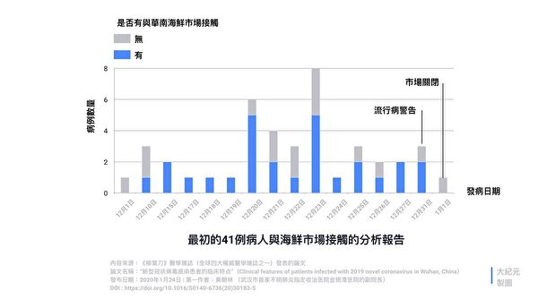
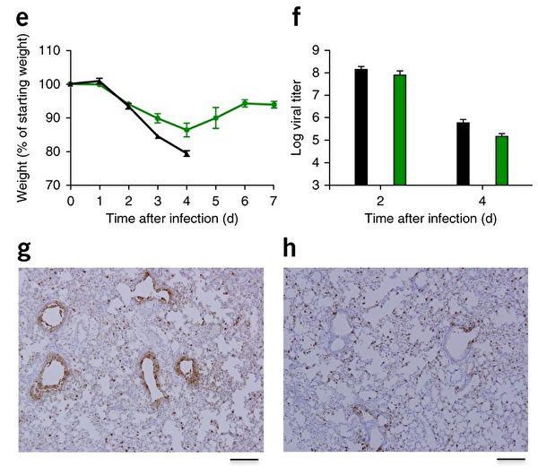

<h1 align="center"><b>请收藏网址(新闻视频ip) 随时连上最新即时IP https://git.io/swspip</b></h1>

<h2 align=center><a href="https://github.com/gav01/Heart/blob/master/news1.md">● 大纪元时事 ●</a></h2>

<h2 align="center">直連不必翻牆開花必看精彩視頻http://220.141.128.50</b></h2>

<table>
<tr>
 <td>
 <a href="https://git.io/pamja"> <h3>如何 “ 三退保命 ”</a>，<b>连上面→免翻视频 IP http://220.141.128.50 </b> →点 【三退大潮】--为什么要退党？ 可留言三退或用翻墙软件自己办理三退</h3></td>
</tr> 

<tr>
 <td>
 <a href="https://git.io/pamja"> <h3>如何 “ 三退保命 ”</a>，请点击翻牆网站  https://git.io/opopop  下载 { 翻牆软件 }→找 { 大紀元網站 }  ( http://www.dajiyuan.com ) 三退</h3></td>
</tr>
</table> 

<a href=https://git.io/souye><h6 align="right">回首頁</h6></a>

<a name=top>

<a href =#157>157.“移动式焚化炉”进武汉 网民：死多少人？ 
<a href =#156>156.希望之声推出自带翻墙功能手机APP 
<a href =#155>155.网传武汉一线医生透内情：现在都是安慰治疗 
<a href =#154>154.【疫情最前线】大批医护感染 院长确诊死亡 
<a href =#153>153.武汉封城 其他重病者求医难 外地人盼回家 
<a href =#152>152.【独家】湖北文件曝光 1600人监测舆论 
<a href =#151>151.【更新】武汉大量病患生死线挣扎 湖北缺粮 
<a href =#150>150.神韵复兴中华传统 佛州主流精英倾心赞佩 
<a href =#149>149.王友群：习近平不想背黑锅 只有一条路可走 
<a href =#148>148.夏小强：湖北断粮 敲响中国粮食危机警钟 
<a href =#147>147.【疫情最前线】湖北导演病亡 武汉市长失踪 
<a href =#146>146.美医院现口罩荒 医疗供应链依赖中国引警讯 
<a href =#145>145.不要被表象所迷 牧师：创世主将重新显现 
<a href =#144>144.感悟创世主灵性信息 演员观神韵喜极而泣 
<a href =#143>143.【病毒探源】调查报吿：新冠病毒神秘来源 
<a href =#142>142.项云：关键时候中共国库从来不酷 
<a href =#141>141.法轮功学员传避灾的真相 遭警察诬陷迫害 
<a href =#140>140.【拍案惊奇】俄国政府文件：病毒非天然形成 
<a href =#139>139.新冠疫情失控 中共政府失能 民间发起自救 
<a href =#138>138.武汉人怒吼：不想再沉默 要反抗邪恶政权 
<a href =#137>137.优秀校长 法轮功学员李桂荣被辽宁女监害死 
<a href =#136>136.中国各省揭竿而起？湖南又传《独立宣言》 
<a href =#135>135.防疫还是大屠杀？湖北孝感挨家钉死大门(视频) 
<a href =#134>134.武汉肺炎未息 4000亿蝗虫逼近中国边境 
<a href =#133>133.武汉病毒研究所所长密件曝光 国家卫健委元旦下令禁报疫情 

<a href="https://github.com/gav01/Heart/blob/master/ls-20-2-1.md#132"><b>往1~132新闻</b></a> 

<a name=157>
<h1 align="center"><b>“移动式焚化炉”进武汉 网民：死多少人？</b></h1>

近20台移动式“垃圾和动物尸体处置方舱”将进武汉。网民纷纷质疑：“到底死了多少人？”“不够烧，还要调派移动焚化炉……”（视频截图）

 
【大纪元2020年02月18日讯】（大纪元记者李心茹综合报导）武汉新冠肺炎疫情蔓延之际，近20台移动式“垃圾和动物尸体处置方舱”将进武汉。网民纷纷质疑：“到底死了多少人？”“不够烧，还要调派移动焚化炉……”

<b>2秒焚烧 每台日烧5吨</b>

综合陆媒报导，由南京中船绿洲环保有限公司参与研制的“医疗垃圾应急处置方舱”2月15日抵达武汉驰援疫区。2月16日下午3点，在武汉一次点火成功。未来两周内将有近20台医疗垃圾焚烧炉发往武汉等疫情严重地区。

每个方舱为20尺标准集装箱大小，体积约为30立方米，包括固废粉碎方舱、焚烧方舱和烟气净化方舱三部分，可移动式的应急处理生活、医疗垃圾、动物尸体等。

上海交大团队主要负责烟气净化工艺及方舱设计，环境科学与工程学院教授瞿赞介绍，在方舱焚烧炉中以850度以上维持“2秒焚烧”，病毒无法在这种条件下存活。

目前，项目组根据武汉的现场要求，对方舱进行了优化改进，每日可以焚烧、无害化处理量达5吨。

垃圾和动物尸体处置方舱是“十三五期间国家重点研发计划”，除了中船绿洲之外，中共军方等单位也参与研究开发，官方宣称此方舱已于今年1月通过验证试验，拥有四项国家专利，达到国内领先技术水平。

但值得注意的是，白色方舱外头印上“垃圾和动物尸体处置方舱”字眼，显示不只处理医疗垃圾，也处理“尸体”。

在2003年“萨斯”期间，中船绿洲调运40余台套焚烧炉被投放使用。

此前，武汉火神山医院使用时，一名北京一家医院的陈姓资深专家曾表示，火神山医院草草建好后让1400人的军队先上来，看来应该是和小汤山医院模式一模一样，那些发烧的“全都让他就地消失”，“说白了就是建医坑、活人坑、死人坑，完了烧，烧完了就完了”。

上述信息引发网友议论：“到底死了多少人？”“不够烧，还要调派移动焚化炉……”

“哪有什么动物尸体？”“动物不会感染冠状病毒，哪需要特地安排这样的方舱驰援武汉？”

“人也是动物，这样写只是文字障眼法。”“难怪不让外国医疗团队来帮忙。 就是怕他们目睹。”

“真了得，不发放医疗物资但火速配置尸体焚化炉。”“ 毁尸灭迹!”

<b>外界质疑官方瞒报死亡人数</b>

持续2个多月的武汉疫情早已失控，外界质疑死亡人数比中共政府报出的“高出不知多少”。大纪元的独家报导说，通过暗访湖北省多家殡仪馆的高管获知，武汉最大的汉口殡仪馆一天至少焚烧225名新冠肺炎死者。

武汉市的某间殡仪馆一员工小运（化名）2月4日对大纪元记者说，一直24小时不眠不休地运作，“我们从1月28、29日就开始上班了。”已经累得筋疲力尽了。

不仅如此，殡仪馆的大量尸体排队等候火化的现场视频被曝光，从画面中可见，黄色尸袋里装裹着感染肺炎疫情患者的尸体，排成长长的一行，等待焚化。

另外，据国际数据提供商“Windy”资讯显示，武汉市2月中旬出现高浓度的二氧化硫（SO₂），外界认为可能是因为焚烧大量尸体。台大大气科学系教授徐光蓉表示，武汉当地封城、工厂停工，在没有火山爆发情况下，二氧化硫突然爆增，外界会认为在烧尸体应是合理推断。#

<a target="_blank" href=#top><h6 align="right">回上方</h6></a>

<a name=156>
<h1 align="center"><b>希望之声推出自带翻墙功能手机APP</b></h1>

 
【希望之声2020年2月18日】在武汉肺炎疫情严峻、中共加强大陆封网之际，希望之声推出专门为中国大陆民众开发的自带翻墙功能手机APP。据开发人员介绍，此款手机APP适用于安卓操作系统，也就是所有的国产品牌手机、以及三星、LG等非iphone手机。

安装后可收听收看希望之声的节目：包括《江峰时刻》、《天亮时分》、《老北京茶馆》及最新时事新闻等精彩内容。不需要使用任何翻墙软件，一步到位获得最新海外资讯，帮您免除翻墙上网的麻烦与风险。欢迎大家下载并传给中国大陆的亲朋好友。

<h3 align=center><a href="https://x.co/ohope">扫描二维码(点击右键,另存新档）</a></h3>

<b>希望之声版权所有，未经希望之声书面允许，不得转载，违者必究。</b>

<a target="_blank" href=#top><h6 align="right">回上方</h6></a>

<a name=155>
<h1 align="center"><b>网传武汉一线医生透内情：现在都是安慰治疗</b></h1>

图为武汉红十字医院医生在对新冠肺炎病人进行治疗。（STR/AFP via Getty Images）

 
 【新唐人北京时间2020年02月19日讯】新冠病毒肆虐中国全境，在目前还没有特效药的情况下，显出了医疗物资与医护人员都极度匮乏，在疫情中心区湖北及武汉更加严重，基本的支持性治疗都几乎办不到，近日网上流传一位武汉肺炎一线医生讲述“现在所有的治疗，就是‘安慰性治疗’”；“ 病人会呼救，会哭着喊着说医生你救救我……伴随着剧烈地挣扎，直到呼出最后一口气”。

据这位一线医生透露，由于医疗物资与医护人员的匮乏，武汉肺炎患者得不到妥善照顾，在其所在的三甲医院，仅有一张病床能够满足新冠病人气管插管的治疗，病患去世时情景惨烈。

这位医生说：

1、病人去世前的感受：

一直呼吸困难，直到最后几分钟，病人全程清醒。病人会呼救，会哭着喊着说医生你救救我……伴随着剧烈地挣扎，直到呼出最后一口气。死因，本质上和淹死一个道理。大量的水，进到了肺里面之后，氧进不去。肺，被病毒导致的果冻状的分泌物给占满了，换气功能完全丧失，再浓的氧也进不去血里面。而吸痰，靠气管镜到达不了那个终末端的地方。没有特效药。

2、开始，把纯氧输送给病人，不经口插管。维持大概三五天之后，如果他的血氧饱和度能上升到正常范围，他也就挺过了呼吸衰竭这一关。

3、挺不过，就要上无创呼吸机，或者切开气管，插管接有创呼吸机。无创呼吸机，最后病人易产生呼吸肌疲劳。

4、治疗分为四个步骤：

1）高流氧治疗。

2）不行的话就上无创呼吸机。

3）如果上无创呼吸机两个小时无效，就要气管插管。

4）到最后，如果有条件，就上ECMO（人工心肺机）。

5、为什么不给危重病人气管插管？

每一步都是有前置条件和相应标准的。从硬件配套看，进行气管插管的前提条件是要有层流病房，插管之后医护比要达到1:2—3。我们的现状是，没有层流病房，也不可能按规范配置人力。我们1000多张病床的三甲医院，也就只有一张床能够满足新冠病人气管插管的治疗。

6、如果没有这些装置硬上呢？

我们所有的医生、护士都会中枪。吸痰过程中病人受到刺激，一咳嗽气溶胶就直接喷出来了。插管之后，就是24小时不间断地喷新冠病毒气溶胶，整个房间的空气会被污染。所以，这种高风险、高暴露操作，在一般的病房是绝不允许的，这也是之前的非典留给我们血的教训。

7、效果

重症之后再住院抢救，医院的治疗呼吸机已经没有大的帮助。无论是上无创和上有创呼吸机（插管），对这种病最后的逆转都没有太大的帮助。能救活的，只有10%。只要上了气管插管（有创呼吸机）就不乐观了。因为气管插管一方面会增加病人的痛苦，增加机体的刺激，还导致合并呼吸细菌感染。几家专门收重症的定点医院，抢救成功率很低。目前，能高流氧就高流氧，能不插管就不插管。

8、ECMO是人工心肺机

就是病人的肺坏了，我就搞一个人工肺来代替。肺已经完蛋了，通过ECMO，只是一天一天的撑下去。

9、肺白了

肺白了，之后就容易纤维化。纤维化不能逆转，除非肺移植。

10、新冠肺炎的厉害

一是高传染性，二是容易成为重症。

11、预防事项

1）不要去超市挤长队，不要去楼下抢白菜。

2）能吃多吃，营养支持很重要，提升免疫力。

3）大量饮水，补充电解质，喝汤。

4）注意：维生素C和维生素E的治疗剂量和保健剂量不同。

治疗剂量：维生素C 最多用到3000毫克每日，维生素E 最多用到1000国际单位。

国家派了几万医护人员去武汉，说明这个病不好治。

现在所有的治疗，就是安慰性治疗。

医疗专家：目前对新冠病毒患者以“支持性疗法”为主。

台湾传染病防治医疗网指挥官张上淳16日表示，目前台湾确诊的病患，主要还是以“支持性”疗法为主，若病人有其它疾病，就再针对病症用药，尽量维持病人肌体的健康，加强自身免疫力。

此前《财新》引用武汉大学中南医院重症医学科主任彭志勇的说法表示，目前没有针对新冠病毒的特效药。抢救重症患者的原理是帮病人维持机体。针对不同病人的症状，呼吸困难的就给病人供氧，肾功能衰竭就给病人透析，休克就用ECMO（体外心肺支持）抢救，病人缺什么就补充什么以维持其生命。这种情况下，病人康复或者治愈，全靠自己的免疫力恢复，将病毒消除。

彭志勇称，新冠病毒最大的危害是攻击人的免疫系统，导致淋巴细胞下降，肺功能受损，呼吸衰竭。很多危重症病人因为呼吸衰竭而死，也有很多病人因免疫力系统下降，导致并发症，多器官衰竭而死。

<a target="_blank" href=#top><h6 align="right">回上方</h6></a>

<a name=154>
<h1 align="center"><b>【疫情最前线】大批医护感染 院长确诊死亡</b></h1>
 <h3 align="center"><b>老翁瞒武汉旅游波及20万人致医院停摆 疫区隔离或销毁人民币</b></h3>
 

广州一间医院因一名老翁隐瞒旅游史致医护人员感染武汉肺炎、医院关门，更波及附近20万名居民；武昌医院院长确诊死亡，全国大批医护感染，感到绝望。（大纪元合成图）

 
 【大纪元2020年02月19日讯】（大纪元香港记者站报导）2月18日，有关武汉肺炎疫情扩散的消息继续笼罩大陆。广州一间医院因一名老翁隐瞒旅游史致医护人员感染武汉肺炎、医院关门，更波及附近20万名居民；广州互不认识的三个家庭，在同一餐厅食饭后9人证实感染；中国央行要求各地银行回收人民币现钞消毒隔离7天至14天，或火烧销毁；武昌医院院长确诊死亡，成为第一个死于武汉肺炎疫情前线的医院院长；全国大批医护感染，感到绝望。

近日，发表在国际权威医学杂志《柳叶刀》（The Lancet）上的论文明确指出，武汉肺炎新型冠状病毒具有三个特征：无症状高效传播；口罩难以防护；确诊病人愈后仍带病毒，可大量散播并感染其他人。

武汉肺炎攻陷亚洲、东南亚、美洲、欧洲及非洲，大陆多个地区爆发社区感染。

<b>就诊老翁瞒武汉旅游史 波及医院停摆</b>

近日，广州某医院因为一名老翁隐瞒曾到武汉旅游史，导致医护人员感染，令整家医院关门。不仅如此，医院附近20万人的居民社区，也因疫情近乎崩溃。该名来自湖北的老翁，10天前到广州番禺某间医院住院就诊，他刻意隐瞒曾往武汉旅游，医护人员疏于防护，期间与107名医护人员和病人密切接触，导致这间医院有3个人确诊染疫。

号称“天下第一村”的广州番禺祈福新村，就位于该医院附近，常住人口二十多万，其中七千多户是湖北籍住户，连日爆出9宗武汉肺炎确诊个案。

连日爆出9宗武汉肺炎确诊个案的广州番禺祈福新村，已由防控小组介入，实施封闭式管理。(JasonHuen/Wikimedia commons)

 
该医院与患者接触过的医护人员、病人和清洁人员等全部需要隔离，医院全面关门。祈福新村则由防控小组介入，实施封闭式管理。

<b>三家庭互不相识 同一餐厅就餐九人感染</b>

近日，广州市有三个互不相识的家庭，同时有9人确诊。他们曾在同一天，到同一间餐厅用餐，彼此坐在同一排靠窗相邻的饭桌，相继被确诊感染武汉肺炎。

广州市本月初接到一个送检样本，检测后发现，一个一家三口家庭的女主人确诊感染武汉肺炎，其丈夫、女儿亦确诊。随后，当局再接获报告，另一名女患者因身体不适送院，其丈夫确诊染疫。患者均透露曾在大年三十到过同一间餐厅用餐。

疾控中心调查发现，原来上述两个家庭都与一个来自武汉的10人家庭，在同一天的同一时间，在餐厅内进食，3个家庭当日就坐在同一排靠窗相邻饭桌，而该武汉家庭有4人相继确诊。深入追查后确定，这3个毫不相关的家庭相继有9人染病。

<b>多地区爆发社区传染</b>

事实上，武汉肺炎社区传染案已在多地出现。网络视频显示，“温州市联合广场封了，保安发病确诊很久了，没钱看病，一直瞒着。一个联合广场三栋楼，总计468户，一户按3人计算，大约一千二百多人被隔离”。

一段影片指，一名黑龙江女子，走了三县六区，才病发入院，在网上激起众怒。她在医院哭着辩称：“没想到会得这个病，不知道这个病会落到自己头上！”

网友回复称：“不知道，或认识不彻底，都会要命，而且还要别人命！这和官媒一贯的宣传有关，总是给人吃虚假的定心丸，让人心存侥幸！”

<b>武昌医院院长染疫亡 多间医院大批医护感染</b>

武汉肺炎病毒毒性巨大，普通市民防不胜防，就连医护专业人士都难逃其害。

武汉市武昌医院院长刘智明，因感染武汉肺炎于2月17日去世，终年51岁。武昌医院是这次疫情中武汉市的首批定点医院之一，刘智明是主任医生、神经外科专家，也是第一个死于武汉肺炎疫情前线的医院院长。

而在14日，武昌医院的59岁护士柳帆也因感染武汉肺炎去世。柳帆大年初二（1月26日）还上班，当时没有防护衣，结果全家感染，父母过世，柳帆本人在情人节辞世。目前全家只剩弟弟在ICU（深切治疗部）抢救。

10日上午，华中科技大学附属同济医院器官移植科教授林正斌也因感染武汉肺炎去世。

日前，网上传出武汉中心医院后湖RCU（呼吸重症监护病房）的护士长给院领导的求救信。

信中说，后湖RCU是该院首个重症隔离病房，院内同事多人面临生死劫难。除媒体关注的李文亮医生已经去世外，还有胡卫峰医生插管，易凡、梅仲明主任插管抢救。这些惨痛的状况让处于崩溃边缘的医护人员彻底崩溃了。她建议让医院领导安排最早上前线的后湖RCU医护人员隔离调整两周。

<b>回收人民币 消毒隔离或销毁</b>

2月15日，中国央行副行长范一飞在记者会上称，要求疫情重点地区回笼人民币现钞消毒或火烧销毁。其中，疫情防控重点地区的回笼现金，用紫外线或者高温等消毒，存放14天以上再投放市场，至于非疫情防控重点地区现金消毒以后，要求存放7天以上再投放市场。

中国央行要求各地银行回收人民币现钞消毒隔离7天至14天，或火烧销毁。(STR/AFP via Getty Images)

 
 深圳人行和各商业银行也在进行现金回收及储存、消毒；对医院、农贸市场等地方回笼的现金消毒清点后缴存深圳人行，不对外投放。

央行人民银行广州分行则要求辖内的各商业银行，将医院、农贸市场以及公共交通行业等回收的现钞，全部上缴回到人行广州分行，由广州分行依照规定直接销毁。

<b>“威士特丹号”爆疫情 同船乘客部分已飞香港</b>

另外，“威士特丹号”邮轮（Westerdam）上周四（13日）获准在柬埔寨停靠后，传出一名83岁美籍女士，下船乘飞机转抵马来西亚后确诊染武汉肺炎。与她同机的数百名乘客，却已四散至世界各地，有部分已飞至香港。

载有2,200人的威士特丹号2月1日自香港出发，因恐有疫情，连日遭日本、台湾、南韩、菲律宾、美国关岛及泰国等地区拒绝靠岸。在海上漂流2周后，13日终获柬埔寨准许停靠西哈努克港（Sihanoukville）。亲中共的柬埔寨首相洪森（Hun Sen），亲自持玫瑰花迎接乘客，更与他们爱的拥抱。

马来西亚周一（17日）表示，与确诊女士同机的130名乘客，已经分别前往美国、欧洲、澳洲和香港。当局亦强调，邮轮曾于1月30日在香港靠岸，游客上岸游玩。

“威士特丹号”邮轮（Westerdam）13日获准在柬埔寨停靠后，传出一名83岁美籍女士下船乘飞机转抵马来西亚后确诊染武汉肺炎。图为2月18日仍停靠在柬埔寨的威斯特丹邮轮。(TANG CHHIN Sothy/AFP)

柬埔寨当局17日下午仍招待部分等待搭机离境的威士特丹号乘客搭观光巴士游览首都金边。参加金边巴士游的乘客面带微笑“比赞”，且全都未戴口罩。1月底，洪森曾表示不会“背弃”中共，又警告记者和官员不准戴口罩，否则会被赶走。

美国范德比大学医学中心（Vanderbilt University Medical Center）传染病专家夏夫纳（William Schaffner）直言没有预料问题会走到这种地步。他表示，上千名乘客各自返家，或许会更难将疫情控制在大陆境内，对全球防疫，“这可能是一个转折点”。

<b>《柳叶刀》：病毒呈无症状高效传播 口罩难防护</b>

近日发表在国际权威医学杂志《柳叶刀》上的论文明确指出，新型冠状病毒（COVID-19）具有三个特征：无症状高效传播，愈后仍带病毒，口罩难以防护。

13日，《柳叶刀》（The Lancet）发表一篇题为“保护卫生保健工作者免受亚临床冠状病毒感染”（Protecting Health-Care Workers From Subclinical Coronavirus Infection）的论文表示，近期证据表明，患者即使没有症状，也可以高效传播，而口罩等传统防护措施，不足以避免感染。

论文举例说，一名感染病毒的10岁男孩没有出现症状，但在肺成像和疾病血液标志物方面都有明显变化。而另一名在武汉接受手术的患者，甚至在发烧前就感染了14名医护人员。

曾前往武汉调查疫情的一位医学专家（应是卫健委王广发）返京后，首现左下眼睑结膜炎，随后才出现鼻黏膜炎和发烧症状。专家表示，该病例提示了新冠病毒具有向非呼吸道黏膜表面移动的向性（tropism），证明口罩不足以有效防护病毒。

加拿大安大略省多伦多最早确诊的两名武汉肺炎患者，经过医院隔离治疗，疾病症状全部消失，已于2周前出院。但随后仍被检测出新型冠状病毒，核酸检测结果为阳性，目前在家中自我隔离。

上述病例表明，新冠病毒不但传染力超强，还不容易根除，即使患者的表面症状治愈了，也同样可能顽固留存于患者的体内，仍然可以大量散发病毒并感染其他人。

世界卫生组织亦表示，目前对于武汉肺炎无特效治疗方法，也没有针对性疫苗。

专家表示，人类目前没有任何医疗手段，只能靠自身的免疫系统去对付，提升自身的免疫力是关键。

<a target="_blank" href=#top><h6 align="right">回上方</h6></a>

<a name=153>
<h1 align="center"><b>武汉封城 其他重病者求医难 外地人盼回家</b></h1>

武汉封城导致大量非疫患者有病无医，不能到外地治疗，也导致很多滞留在武汉的外地人无法回家。图为1月22日武汉封城前一天，人们在汉口火车站等待出行。 (Getty Images)

 
 【大纪元2020年02月18日讯】（大纪元记者李新安采访报导）武汉封城后，大量新冠肺炎患者得不到确诊，只能在家隔离，而很多非新冠患者更是有病无医、处境非常艰难。此外，大量过年期间往来走动的人群被滞留在武汉，无法回家。

疫情爆发，武汉各大医院人满为患，医疗资源严重不足。江汉区的王女士2月14日告诉记者，她的母亲是高血压患者，因为肝脏感染严重，炎症引起休克，持续高烧39℃，有生命危险，但住院问题一直没有解决。“现在医院全部针对肺炎疫情，所以其他的病人都被忽略了。”

“母亲是非新冠的患者，现在隔离点，等待核酸检测的双阴程序。我母亲的CT是没有问题的，她的肺是完好的。”王女士介绍说，母亲因为别的病发热，发热病人只能去江汉区的三家定点医院。武汉封路了，社区不管派车送发热病人，病人只能步行。

她表示，“我拖着妈妈去看病，但妈妈已经完全走不动了。爸爸患有心脏病高血压，身体状况也非常糟糕。现在的每一天真的都变得越来越艰难了，我们全家心态都崩了。”

“我们寻求了120和社区的帮助，（他们对患者像）踢皮球一样踢来踢去。协和医院又去了几次，不给开针开药，说必须住院治疗，但是医院又不收，这完全是个死循环啊！”

王女士原本在上海工作，现在也回不去了。她最近听说非新冠病人有申请到外地救治的先例，希望母亲也可以被放出去接受治疗。

微博用户“爽朗的微微笑527”发帖称，自己的女儿去年5月份患上急性淋巴细胞白血病，发烧、腿痛、骨痛，病情复发，等待移植重获新生。可是因为疫情，协和的移植仓已关闭，只能做化疗。

二十岁出头、不愿再忍受疼痛折磨的女儿一度要求安乐死。母亲在网上求救，“重症在身的我的女儿，白血病，急需移植，不能等，她也是鲜活的一条生命……想上北京大学人民医院移植，又出不了省，他们也不接收来自重灾区的病人，怎么办？”

2月10日，武汉市古田街道罗家墩社区，一名70岁的重症尿毒症患者，社区一直未能安排核酸检测，医院不收。原本每周需透析3次的老人已经8天无处透析，在病痛与绝望中跳楼自杀。

2月15日，武汉一社区开始在居民群里统计尿毒症门诊透析者、高血压重症、心脑血管患者、恶性肿瘤等重症患者及孕产妇。患者要到医院住院治疗的，需要发消息给网格员。

武汉一重症尿毒症患者跳楼自杀后，一社区开始在居民群里统计尿毒症门诊透析者等重症患者及孕产妇。（网路图片）

武汉一重症尿毒症患者跳楼自杀后，一社区开始在居民群里统计尿毒症门诊透析者等重症患者及孕产妇。（网路图片）

有武汉网友表示，“武汉封城23天了，尿毒症患者跳楼5天了，才第一次看到有工作人员在社区群里统计慢性病患者，还只有这一个社区，大部分社区连这个都做不到，这么多天，这么多严重慢性病患者彻底被遗忘了吗？防疫部门、疾控、医疗、那么多公务员在干嘛呢？”

<b>封城阻断归路 万人滞留武汉城</b>

封城阻断求医路，也阻断了归乡路。被困在这座城里的，除了求医问病的重症患者，还有很多过年期间往来武汉的滞留人士。

岳先生一家年前回妻子的湖南老家过年，原计划1月28日回安徽老家。当天途经武汉时，车子突然坏了。张先生想着赶紧找个地方修车，下高速的时候没有遇到任何人检查，等车子修好再上高速的时候就被截住了，不许出城。

岳先生无奈只好在武汉找个地方住下来，这一住都快20天了。期间他给武汉市交通局、公安局、市长热线打电话，都说没有办法。

张先生告诉记者，目前一家三口住在宾馆，一天的费用差不多200块。在宾馆很少出门，10天、8天出去买一次东西，买个电饭煲、买点米自己烧饭吃。在武汉人生地不熟的，现在租房子也租不到的，这个时间点很多东西都停滞了，小区都封起来了。

在宾馆“隔离”了二十多天后，张先生特别着急回家。他表示，“像我们这样明明没有生病的外地人，在这里没有固定的居所，这时候生活很难，能不能开个绿色通道，我们回自己家里去隔离也可以。”

张先生70岁的老母亲一个人在家，罹患肺癌。而且老家的公交车也停了，老人不方便拿药，家里没人去跑腿照顾。

张先生希望多一些人了解滞留人士的处境。“我们还算好一点的，还有一些住在地下车库的，可能身上没有太多钱，都住在那边。我在网上群里，发现像我这种情况有很多。估计在武汉滞留的最起码有几万人，整个湖北滞留的据说有30万人。”

<b>资深媒体人：封城不能根本解决治疗和隔离问题</b>

前凤凰卫视新闻总监庞忠在接受大纪元采访时表示，这种封城的做法不能从根本上解决治疗和隔离的问题，当局没有把真正有病的人隔离开来，只要有一例就会蔓延开来。

“真正得病的人不都在医院，还有一部分流散在社会。他为什么封城呢？就怕社会上这部分得病的，传到外省去，他宁可在武汉内部消化，互相人传人，不让它传到外面去，是一个区域性的措施。这对1100万武汉人来讲不公平。”他说。

庞忠认为，实际上武汉肺炎已经通过各种渠道传出去了。在城内的好多人，按道理来讲，应该把真正有病的放在一个区域，需要检查的去检查。确诊得肺炎的到病房去，没有得的就要疏散到安全地方。现在混在一起，没病的也得病了，有病的得不到治疗。

他强调，“好多需要到外地看病的，不让你出去，是不人道的。封城不是负责任的态度，没有好的措施真正来把疫情处理好。内部需要妥善措施，外部需要请国际上的专家会诊，共同解决发病的病源和治疗问题。”

<a target="_blank" href=#top><h6 align="right">回上方</h6></a>

<a name=152>
<h1 align="center"><b>【独家】湖北文件曝光 1600人监测舆论</b></h1>

大纪元获悉湖北省委宣传部内部文件。（大纪元）

 
 【大纪元2020年02月18日讯】（大纪元记者骆亚报导）湖北官场一批官员被习近平当局以处置疫情不力为由下台后，湖北省宣传部为新上任的省委书记应勇，准备了一份工作汇报，从中揭示中共组织1600人来监控、删帖、找人，用所谓正面宣传来对冲负面舆情。

大纪元从知情者处获得一份湖北省委宣传部的工作汇报的内部文件。文件表示，2020年2月10日，习近平在北京与湖北武汉抗击肺炎疫情前线进行视频联系，并发表“重要讲话”。

湖北省宣传部部长王艳玲随即召集宣传部疫情防控指挥部进行“深入学习”，明确要“进一步提高政治站位，加大宣传工作创新力度，做好疫情防控宣传教育和舆论引导工作”。

新华网报导，2020年2月10日，习近平视频连线武汉市一线医护人员。（网站截图）

 
 成立11个工作组应对战时宣传工作

文件说，湖北首先进行“完善战时宣传工作机制”，将省委宣传部和网信办联合设置指挥部，进行一体化运作，成立包括“舆论引导管控、舆情及时回应、意识形态管控等11个工作组”。

并要求全员24小时在岗，每天与省防控指挥部各工作组对接，还要每天与中央的指导宣传组开会等，来“确保宣传教育和舆论引导工作”。
调动超过1600人来监控网络言论

文件说，由于这次疫情居家的特殊情况，他们将“网络作为宣传的主阵地，让主力军上主战场，调动了超过1600人来管网络言论，并作为业绩汇报”。

他们声称统筹、调动、覆盖省市县三级，包括高校直报点、网络媒体平台等1600余人舆情监测队伍，采取人盯和技防的方式，24小时全网覆盖监测。监测到所谓敏感有害信息60.68万条。

他们还采用“线上及时辟谣”与“线下有力打击”的手法来对付网上真实的民意。

文件称，截止2月14日，湖北省宣传部报请中央网信办删除所谓的“谣言和有害信息5.4万余条”；另一方面，他们还组织网络大V撰写“网评文章近400篇”，并组织五毛入群，及时“跟评40万余条”，并称此举是“以主动发声对冲负面舆论”。

此前，武汉疫情吹哨人李文亮2月6日去世后，各种悼念支持的贴子，外界注意到，三天内基本在网络消失，应与上述中共网控相关；而网警还纷纷警告向外求救疫情受害人，并要求他们撤帖。

而网上关注度极高的公民记者陈实秋、方斌被失踪，湖北的宇飞因为关注当地物资短缺，跟全国甚至是海外人联系捐赠物资，被拘留一周才获释。
33家外媒60名记者，“劝退”47人，仅剩5家13名记者

湖北省宣传部制定得《关于外媒记者来鄂采访新型冠状病毒肺炎的应对方案》，出台了10条具体措施。

汇报中还可见，武汉疫情爆发后，共有33家境外媒体60名记者到武汉采访。在他们的“劝导”下，已有47名记者离开武汉。截至2月14日晚，还有五家媒体13名记者在当地，包括美国《纽约时报》《华尔街日报》、法国电视台、香港无线电视及香港凤凰卫视。

文件还称，在湖北权威发布的外文版块，推送了英、法等7个语种疫情相关信息近200条，来引导境外媒体客报道疫情信息。

湖北省并“劝导”外媒记者。1月15日，香港一些媒体记者在医院附近采访时被带到医院派出所调查，被要求删除在医院范围内拍摄的影片，传唤一个半小时后才获释。

当日，专门收治武汉肺炎患者的金银潭医院守卫森严，有保安到处巡视，医院外还有便衣戒备，所有病患被隔离在住院部南楼，大门锁上。

湖北宣传部还称，利用湖北省主要媒体，充分展示“一方有难、八方支援的大爱精神”，宣传他们官方举措的效果，还要“生动讲述一线人员的感人故事”。

文件还表示，已“加强正面宣传主题策划”，做到每日研判、每日策划，“集中火力开展集束式正面宣传，有效对冲负面舆情”。

大纪元评论文章曾经指出，每逢重大灾难，官媒都会使足了劲进行煽情宣传，千方百计把丧事办成喜事，但受害家属的悲痛、对真相的探寻和对灾难的反思与追责，却被有意淡化甚至掩盖了。

大纪元从知情者处获得一份湖北省委宣传部的工作汇报的内部文件。（大纪元）

<h3 align=center><a href="https://i.epochtimes.com/assets/uploads/2020/02/Hubei200215.pdf">文件链接(点击右键,另存新档）</a></h3>

<a target="_blank" href=#top><h6 align="right">回上方</h6></a>

<a name=151>
<h1 align="center"><b>【更新】武汉大量病患生死线挣扎 湖北缺粮</b></h1>

新型冠状肺炎发生以来，突然倒地的现象增多。(Feng Li/Getty Images)

 
【大纪元讯】中国武汉去年12月爆发不明肺炎，今年1月8日确定疫情的病原为新型冠状病毒，世界卫生组织1月13日将此病毒定名为“2019新型冠状病毒”（2019-nCoV）。

目前，武汉肺炎疫情已在中国失控蔓延。疫区中心的武汉因医疗资源极度匮乏，很多病患无法确诊和救治，只有等死；其它地区也日趋严重，中国已有八十多个城市实施封城等“封闭式管理”，包括北京上海等一线城市。专家及民间指有超十万的感染人数，远远大于官方统计。

2月10日，大陆多地复工，但外界担忧风险太大，尤其北京。

疫情也扩散29个国家和地区，迄今海外确诊逾1000例，死5例。美国、加拿大、日本、韩国、台湾、欧洲各国纷纷加紧撤侨，已有六十多个国家和地区对中国公民或自中国出境的人士采取暂时性限制措施，并停航或部分停航。

世界卫生组织（WHO）警告，新型冠状病毒所带来的全球威胁可能比恐怖主义还要严重。世卫已宣布新冠病毒肺炎（武汉肺炎）为“国际公共卫生紧急事件”。

在疫区或进入疫区的民众，应避免出入市场、医院等公共场所及人多的地方，也不要接触野生和禽畜类动物，禽肉及蛋类要熟食，同时做好个人防护措施：以肥皂勤洗手、戴口罩。

本文将持续更新每日重点事件。

2月18日：武汉大量病患在生死线上挣扎，湖北断粮？封城封区封声，习近平掀“人民战争”？中共终于让美国专家进入，但世卫考察组避去武汉 北京内心有鬼？

（北京时间2月19日8:00更新）

<b>●【直播回放】2.18新肺炎追踪：公安监督复工</b>

“移动式焚化炉”进武汉 网民：死多少人？武汉新冠肺炎疫情蔓延之际，近20台移动式“垃圾和动物尸体处置方舱”将进武汉。网民纷纷质疑：“到底死了多少人？”“不够烧，还要调派移动焚化炉……”

武汉疫情失控，大量病患得不到安置和医治，在生死线上挣扎。对于许多原本需要定期做透析才能延续生命的尿毒症患者，感染上新冠病毒，更是雪上加霜。大纪元采访多位患者及家属，呈现他们的现况。

武汉传出有病患在方舱医院里“穿墙逃出”？武汉病毒研究所被各界质疑是病毒外泄的源头，近日传出一封该所所长王延轶的内部信件，要求所内所有人员配合高层掩盖疫情，不得透露。

新冠肺炎“零号病人”成谜 7旬脑梗老人？新冠病毒肺炎疯狂蔓延，这场疫情究竟从何而起，至关重要的“首例病人”传染经过仍迷雾重重。而不断发表的研究成果，正把这场疫情的首发时间不断推前。

近日网上传言，北京西城区某部门出现一例新冠肺炎确诊病例，导致西城区政府工作停摆。西城区区长18日承认有一例新冠肺炎确诊病例，69人隔离，但否认工作停摆。

中共官方报告，至今累计确诊74,279（新增1,751）；重症11,977；疑似5248例；死亡2006例（新增136例）。外界一直质疑数据缩水，这里只作为参考。

<b>●封城封区封声 习近平掀“人民战争”？</b>

中国民间有句话，上头动动嘴，下面跑断腿。北京当局的一句“人民战争”，整个社会似乎又回到了红卫兵时代，人伦惨剧不断发生。北京当局防疫控疫掀起全国的“人民战争”，使全国立刻陷入了一片红色恐怖。

视频：大陆各地红卫兵式暴力防疫 引众怒：中共隐瞒疫情，致使武汉肺炎迅速在全国蔓延。疫情失控后，中共各地又用红卫兵式暴力防疫视频曝光：随便抓人、打人、游街示众等等，就是一家人在家中打牌，也会被抓、被打等，引发民众的愤怒。

<b>●湖北文件曝光 1600人监测舆论</b>

湖北官场一批官员被习近平当局以处置疫情不力为由下台后，湖北省宣传部为新上任的省委书记应勇，准备了一份工作汇报，从中揭示中共组织1600人来监控、删帖、找人，用所谓正面宣传来对冲负面舆情。

<b>●报告：新冠病特征同SARS MERS很类似</b>

首份新冠肺炎患者病理报告显示，新冠肺炎的病理特征与传染性非典型肺炎和中东呼吸综合征感染者的病理特征非常相似。

<b>●湖北断粮？敲响中国粮食危机警钟</b>

2月14日，媒体报导了黑龙江急调3000吨大米驰援湖北的新闻。难道短短不到10天的时间，湖北就吃完了半年的储量吗？如果不是，那些粮食到哪里去了，或者说，湖北到底还有多少储量？这是一个细思极恐的问题，整个中国，还有多少存量？

<b>●美国专家进入中国 世卫考察组避去武汉 北京内心有鬼？</b>

美国的顶级传染病专家作为世界卫生组织的专家组成员，在历时1个多月后终于被中共当局允许进入中国境内。美国国务卿迈克·蓬佩奥（Mike Pompeo）表示，中共让美方“花了太长时间才让医学专家进入”，他敦促北京在流行病肆虐的情况下提高开放度。

2月17日中共国家卫生健康委新闻发言人表示，中国-世界卫生组织（WHO）联合专家考察组将于当日赴北京市、广东省和四川省开展现场考察，专家考察组“对中国采取的综合防控措施和取得的成效给予赞赏”。

<b>●钻石公主号成海上小疫区 各国撤侨进度一览</b>

停泊在日本横滨港隔离检疫的钻石公主号邮轮病例频频暴增，截止目前为止，邮轮确诊感染人数达454人，俨然成为中国以外的小疫区。为此，多国将安排包机接回邮轮上的本国公民。（详情点阅）

钻石公主号游轮上今天（18日）又新增88个确诊感染新型冠状病毒肺炎的病例，其中65人没有症状。截至目前为止，该游轮上已累计有542例确诊。

<b>●美商会：近80%在华美企无法开工 1/3将迁出</b>

上海的美国商会日前的调查显示，在华企业中，有78%的受访者表示现在无法开工，还有1/3的企业称将把其业务迁出中国。

<b>●疫情蔓延29个国家和地区。累计海外确诊1015例，死亡5例</b>

在中国大陆以外，新型冠状病毒已经蔓延28个国家和地区。

海外新增确证病例120例：香港2例；日本97例；新加坡4例；韩国17例。

累计确诊病例1015例：香港62例；台湾22例；澳门10例；日本616例；新加坡81例；泰国35例；韩国46例；马来西亚22例；德国、越南各16例；澳大利亚、美国各15例；法国12例；英国、阿联酋各9例；加拿大8例；印度、菲律宾、意大利各3例；俄罗斯、西班牙各2例；芬兰、瑞典、尼泊尔、柬埔寨、斯里兰卡、埃及、比利时各1例。

累计死亡5例：菲律宾、香港、日本、法国、台湾各1例。

2月17日：武昌医院院长病逝，多地复工，无症状感染者成隐患；新冠病毒的神秘来源；习近平讲话官场或酿更大风暴

（北京时间2月18日8:00更新）

<b>●武昌医院院长死于新冠肺炎 大批医护感染</b>

2月17日周一晚，微博认证为湖北省卫健委宣教中心党委书记、主任的账号@全科健康发布信息称，武昌医院院长刘智明因感染新冠肺炎于2月17日去世，终年51岁。

【一线采访】被疑染疫遭隔离 脑溢血患者命危

湖北省襄阳市一位刘女士泣诉，医院“草菅人命”，将原本脑溢血术后恢复良好的母亲送往隔离医院，“医生的盲目决定，我的妈妈受尽折腾，受了那么多罪，病情越来糟，越恶化！”刘女士的母亲本身就有基础病，做了三四年的肾透析，一直维护得很好，2月5日凌晨突发脑溢血被送往襄阳市中心医院北区治疗。

【一线采访】武汉第一医院食堂向外求援

近日，网上传出武汉市第一医院食堂的求助信息，称该医院被整体征用，上千人进驻，医院食堂的蔬菜、大米已经不够，请求外界捐助。但医院很快“辟谣”。

<b>●北京杭州全面复工 多地无症状感染者成隐患</b>

中共不顾武汉肺炎疫情蔓延之势，要求地方复工。北京市已有43家市属国企全面复工；杭州的小超市、理发店等陆续开门。此外，至少16个省出现无征状感染者，恐成为隐形杀手。

疫情当前，大陆餐饮业者要想店面重新开张不易，大多数只能以经营外卖为主，无法实现真正盈利，已经有餐饮业老板做好了倒闭的准备，最坏的打算是“卖完最后一套房就解散”。

<b>●【病毒探源】调查报吿：新冠病毒的神秘来源</b>

本文从流行病学调查、病毒基因比对、跨物种感染研究以及关键的“中间宿主”等五大领域，对新冠病毒来源进行了全景式梳理与深度挖掘，为读者提供一个深刻而全新的视角。

<b>●中共掩盖疫情 美参议员再质疑武汉病毒所</b>

新型冠状病毒疫情在中国已经失控，因中共未能提供充分可信的疫情数据，周日（16日），美国参议员汤姆·科顿（Tom Cotton）表示，中共对冠状病毒爆发的严重性“仍在说谎”。

中共长时间隐瞒致武汉肺炎疫情延烧全国，二十多个省市“封闭”，死亡和感染人数成谜。然而中共国家卫健委官员在17日的工作会上仍声称武汉肺炎“可防可治”，消息一出立刻遭中国网友骂翻。

中共官方报告，至今累计确诊72,528（新增1,893）；重症11,741；疑似6242例；死亡1870例（新增98例）。外界一直质疑数据缩水，这里只作为参考。

<b>●武汉市长“失踪”官场酿更大风暴</b>

一幕幕揪心的场面，一声声刺耳的哭诉，无数的家庭支离破碎，有的甚至全家罹难……很多人把剑锋指向了罪魁祸首中共，认为这是中共一手制造的人祸。习近平前不久的讲话全文曝光，一场大风暴，可能正在慢慢逼近。

<a target="_blank" href=#top><h6 align="right">回上方</h6></a>

<a name=150>

2020年02月19日，神韵国际艺术团2月18日在佛州圣彼得堡进行了第五场演出。图为马哈菲剧院（Mahaffey Theater）。（新唐人电视台）

 <h1 align="center"><b>神韵复兴中华传统 佛州主流精英倾心赞佩</b></h1>
 
 【大纪元2020年02月19日讯】（大纪元记者林南宇、文烨美国圣彼得堡报导）2月18日下午，佛州圣彼得堡的马哈菲剧院（Ｍahaffey Theater） 举行了神韵国际艺术团在当地的第五场演出。神韵艺术家将中国古老的文明神奇再现，让观众感受到中国传统文化的历久弥新。谢幕时，很多观众起立鼓掌，全场气氛热烈。

神韵的节目精彩纷呈，从天国世界到中土大地，从辉煌的宫殿到庄严的佛寺，从远古历史到现代社会，一个个荡气回肠的传说与故事，带给人心灵的震撼与生命的洗涤，也将天人合一的境界与世事变化的天机完美演绎，令观众们回味无穷。

<b>获总统奖专家、研究所董事：神韵艺术水准非常高</b>

2020年2月18日下午，佛州住房研究所董事、获奖环保专家Charles Reith 先生（左）观赏了神韵国际艺术团在圣彼得堡马哈菲剧院的第五场演出。（林南宇／大纪元）

 
 “演出中第一幕那云蒸霞蔚的胜景给我留下了非常积极的印象。”佛州住房研究所董事Charles Reith赞叹道。他认为神韵演出的“音乐水准、艺术水准、乐团水准都非常高！”

他说：“我料到这场演出的音乐风格会非常多样，而演出绚丽夺目的色彩和音乐确实达到了我的预期。”

他认为，神韵的音乐表现了中国不同朝代及多个民族的音乐风格，因此当他了解到演出中所有的音乐都是由神韵艺术总监一人创作的时候，不禁赞叹起来。

“这太了不起了，演出中的音乐给我留下了很深的印象，而一个人能够表现出中华历史文化不同层面的风格，这需要怎样的才智啊！” Reith说。

他表示，演出激发了他对中国文化的兴趣，他非常渴望更多地了解中国文化的多样性。

Reith是位环境学专家，前大学环境管理学教授，也曾担任过公司高管。他曾因环保方面的成就而获得前美国总统老布什（George H.W. Bush）颁发的“西奥多罗斯福资源保护奖”（Theodore Roosevelt Conservation Award） 。

<b>神韵复兴传统文化 基金会前总裁：伟大使命</b>
 

拯救美国基金会（Save American Foundation）前总裁Fred Brownbill与妻子Fred Brownbill观赏了神韵演出。（文烨／大纪元）

 
 拯救美国基金会（Save American Foundation）前任总裁Fred Brownbill观赏演出后，为神韵展现的中国五千年文化精髓赞叹不已。拯救美国基金会是大型的国家和国际教育，政治保守派基金会。

Brownbill表示，神韵的故事虽有悲伤的情节，但他喜欢那些故事，所有的一切都精彩得令人叹服。“（中共）迫害的行径是错误的，这件事情到现在还在发生，实在令人感到悲痛。”

“我认为，（神韵复兴传统文化）是一项了不起的伟大使命，而且应该在世界舞台上彰显出来，让更多的人受益。”

<b>前美海军总军士长：盼神韵推动中国人精神信仰</b>
 

2020年2月18日下午，前美国海军总军士长、潜艇战专家Tim Tully与全家人在马哈菲剧院观看了神韵演出。（文烨／大纪元）

 
 前美国海军总军士长、潜艇战略专家Tim Tully称赞道，“这场演出的重点就是神性表现和精神信仰。”

对于神韵艺术家以恢复传统文化、正统信仰，找回失落的文化的宗旨，Tully表示，他对此感到由衷地钦佩。“我完全赞同他们的使命，他们将复兴中华传统文化的主旨，巧妙地运用了非常有特色的舞蹈和音乐。”“我很荣幸可以认识到中华文化的历史和她的内涵及传统的精随。”

Tully想对神韵艺术家说，“继续下去一定会成功，用艺术来推动中国人的信仰和文化价值，是一件非常有意义和有价值的事。”

他表示，神韵藉由舞蹈、歌唱和音乐，将有能力推动中国人提升道德、价值观和精神信仰，而使中国的未来更为进步。

<b>政府律师：男高音歌声充满力量</b>
 

2020年2月18日下午，政府律师Justin Fahringer带着女儿Isabella Fahringer观赏了神韵演出，他称赞男高音的独唱演出非常优秀。（新唐人电视台）

 
圣彼得堡当地的一位政府律师Justin Fahringer带着女儿Isabella Fahringer观赏了演出之后表示，他非常喜爱演出的故事情节、色彩和舞蹈，特别是中西乐器合璧的交响乐团和演出中的神性题材。

Fahringer说：“演出中的乐团演奏给我留下了很深的印象，因为乐团中的很多乐器是我以前没有见识过的， 那些乐器的乐音太美了。”

他认为，演出中那位男高音的独唱也非常优秀，“我能够体会到，他的歌声充满了情感和力量。 ”

Fahringer认为，神韵艺术家复兴中华文化的努力非常成功，他说：“这场演出就是一个非常好的开始。 ”

Fahringer和女儿Isabella Fahringer还从演出中体会到了信仰的力量和神迹。

<a target="_blank" href=#top><h6 align="right">回上方</h6></a>

<a name=149>
<h1 align="center"><b>王友群：习近平不想背黑锅 只有一条路可</b></h1>

中共迫害法轮功血债累累（大纪元合成图）

【大纪元2020年02月19日讯】近日，武汉女作家方方在一篇“封城日记”中，记录了一个护士一家4口和她的一个中学同学病逝的消息。她写道：“一向为盛世而高歌的同学们，这次却说：不枪毙一批害人精不足以平民愤！”

<b>越来越多的人在绝望中死去</b>

进入2020年，一场武汉新冠肺炎，突如其来，将中共制造的“盛世”美景击得粉碎。在中共封城、封区、封楼、封户、封口、封网、封死讯的严密封锁下，一幕幕家破人亡的惨剧，在武汉，在湖北，在全国频繁上演。

其中，最让人肝肠寸断的是，越来越多的人在绝望、无助、悲泣中走向死亡。

方方在一则日记中写道：“这几天，死亡者似乎离自己越来越近。邻居的表妹死了。熟人的弟弟死了。朋友爹妈和老婆都死了，然后他自己也死了。人们哭都哭不过来……但这一次灾难，对于早期的感染者，不止是死亡，更多是绝望：是呼救无用，求医无门，寻药无着的绝望……他们死前的痛苦和绝望感，比深渊更深。今天跟朋友说，天天听到这样的信息，心情怎么可能不压抑不难过？‘人不传人，可控可防’这八个字，变成了一城血泪，无限辛酸。”

2020年1月1日，武汉警方“依法查处”了8名讲真话的医生之后，中共的媒体开始持续造谣说，“没发现人传人”，“没发现医护人员被传染”，“可防可控可治”。就在这一片谎言声中，人传人越来越厉害，医护人员被传染的越来越多，疫情从武汉传遍湖北全省，传到中国31个省、自治区、直辖市，甚至传播到海外几十个国家和地区。

死亡人数越来越多。殡仪馆的人手不够，拖尸体的车不够，火化炉不够，收尸袋不够，不得不从外省调集殡葬人员，增加车辆，紧急赶制100万个收尸袋。

武汉到底死了多少人？湖北到底死了多少人？中国到底死了多少人？没有人能知道确切数字，因为中共一直在造假。可以肯定的是，实际死亡人数远高于中共的统计数字。

<b>中共制造的又一场特大人祸</b>

武汉新冠肺炎大爆发，是中共迫害法轮功20年后，祸害武汉人、湖北人、中国人，乃至于世界各国人的又一场特大人祸。

1999年7月20日，中共独裁者江泽民发动对敬天信神，按“真、善、忍”做好人的法轮功学员的疯狂大迫害。这场迫害已持续20年，制造了21世纪全世界最大的人权灾难。湖北省、武汉市的一些“人权恶棍”，为升官发财，追随江泽民一伙政治流氓，把湖北省、武汉市变成了迫害法轮功的重灾区。

突出表现在：拍摄诬蔑、攻击、抹黑法轮功创始人李洪志先生的电视片，在全国无数遍地播放，直接责任人是时任武汉电视台台长赵致真；参与大规模活摘法轮功学员器官，主要责任单位有武汉同济医院等；为中共迫害法轮功制造理论根据，主要责任单位是武汉大学；广设洗脑班摧残法轮功学员，主要责任单位是湖北省610办公室、武汉市610办公室；将许多法轮功学员迫害致伤、致残、致疯、致死，主要责任单位是湖北省、武汉市的公、检、法、司。

此次武汉新冠肺炎大爆发，已经严重危及14亿中国人民的生命安全，对世界各国人民的健康也构成威胁。

从美国方面来说，从一开始，事实上，是把它当成一次生化武器泄露导致的灾难来对待的。1月29日，载有201名美国公民的撤侨包机，从武汉机场起飞。机上只有两名全副武装、身穿生化防护服的美国疾控中心检疫官员。美国总统川普已下令美国科学家查清病毒源头。白宫成立了应对新冠病毒特别小组，川普总统经常听取汇报。

武汉病毒研究所是中国最大的研究全球最危险病毒的中心。美国等一些国家的专家认为，这个研究所也是中共生物战、病毒战的研究中心和实验基地。美国《生物武器反恐法》起草人Francis Boyle认为，新冠病毒具有潜在的致命性、攻击性，具足生物武器的所有特征，它就是从武汉病毒研究所泄漏的。

现在，国内外越来越多学者认为，武汉新冠病毒是“人工合成”的。美国生物基因分析专家里昂斯维勒表示，新冠病毒有使用“P-Shuttle SN Vector”的人造技术，基因组序列被插入奇怪的元素，该元素不可能存在于任何地方的野生动物体内，它肯定来自实验室。2月3日，俄罗斯联邦卫生部长在官网发布的文件《预防 诊断 治疗新型冠状病毒》中认为，新冠病毒是一种合成病毒。在中国，在武汉，“人工合成”病毒并外泄的最大嫌疑者，就是武汉病毒研究所。

据《燕铭时评》2月7日播报，中科院上海生命科学研究院知情人士Q先生披露，武汉病毒研究所是江泽民之子江绵恒的亲信舒红兵实际掌控的。舒红兵是中国科学院院士、武汉大学教授、副校长、医学研究院院长。比他小14岁的妻子王延轶，是武汉病毒研究所所长。

今年1月底，习近平派军队首席生化专家陈薇少将接管了武汉病毒研究所。2月14日，习近平在中央深化改革委员会会议上讲话时，首次提到“生物安全”，并5次强调“生物安全”。

旅美经济学者何清涟在Twitter上表示，据习近平的讲话推测，有关武汉新型冠状病毒来源，北京应已有内部调查的初步结论，武汉病毒研究所恐怕“难逃其咎”。

<b>习近平不想背黑锅只有一条路可走</b>

2月16日，“求是网”发表习近平在中共政治局常委会会议研究应对新冠肺炎疫情工作时的讲话。习近平特别谈到：“武汉新型冠状病毒肺炎疫情发生后，1月7日，我主持召开中央政治局常委会会议时，就对新型冠状病毒肺炎疫情防控工作提出了要求。”

习近平之所以发表这个讲话，一个重要原因是，下面的人对他阳奉阴违。习近平1月7日关于防控肺炎疫情的要求，新华社当天的报道只字未提。谁干的这个事？只能是江泽民的亲信、主管宣传的中共政治局常委王沪宁。

习近平为了保党，在中共十九大前，与江泽民妥协，反腐打虎打到原中共政治局常委、中央政法委书记周永康止步，没有抓捕江泽民。擒贼不擒王，必然遭祸殃。中共十九大以后，江泽民安插在习近平身边的亲信王沪宁等，经常对习“高级黑”、“低级红”，把习捧上天，摔下地，同时，在内政外交上，不断给习制造麻烦。

中美贸易协议，王沪宁等一再想把它搅黄了，但是，没有成功。2020年1月15日，中美签署第一阶段贸易协议。香港问题上，江泽民亲信、中央政法委书记郭声琨一再激化矛盾，想迫使习出兵镇压，然后把习赶下台，这一招也没有成功。2020年，武汉肺炎疫情爆发，王沪宁等又开始使劲祸乱，目的是想将中共过去几十年作恶的黑锅，让习一个人背，最后一次跟习算总账。

但是，这次武汉新冠肺炎疫情大爆发，死的人太多了，习近平背不起这个黑锅。

立即抓捕江泽民，彻底解体中共，习近平可绝处逢生。

<a target="_blank" href=#top><h6 align="right">回上方</h6></a>

<a name=148>
<h1 align="center"><b>夏小强：湖北断粮 敲响中国粮食危机警钟</b></h1>

大陆的粮食危机已经突显，中储粮成为最大的贪腐基地无疑令粮食危机雪上加霜，三大主粮“净进口”、干旱等等因素，导致粮食危机一触及发。(网路图片)

 
 【大纪元2020年02月19日讯】武汉肺炎爆发扩散之后，粮食储备是否充分，成为中国民众特别是疫情最为严重的湖北民众，一个最为关切的问题。

2月1日，湖北日报报道说，湖北储存的粮食可以让湖北民众消费一年以上。

2月5日，中国青年报报道，中储粮称，中储粮湖北分公司库存的1000万吨粮食，可满足湖北6000千万人半年以上需求。

虽然中国青年报拦腰砍去一般湖北的粮食库存，但是，毕竟还有半年的粮食库存。

但是，2月14日，媒体报道了黑龙江急调3000吨大米驰援湖北的新闻。难道短短不到10天的时间，湖北就吃完了半年的储量吗？如果不是，那些粮食到哪里去了，或者说，湖北到底还有多少储量？这是一个细思极恐的问题，整个中国，还有多少存量？

因为，自古以来，瘟疫过后往往伴随着大饥荒。中国的粮食危机，在这场突如其来的瘟疫下，再次浮出水面。

这二十多年来，中国大陆天灾人祸不断，异常极端气候频现，或洪水泛滥，或严重干旱；而大陆各地方政府为GDP数据增长，大肆破坏环境，导致人均耕地减少、土地重金属污染、沙漠化，导致粮食危机迫在眉睫。中国从一个传统的粮食出产大国变为粮食进口国。

据中国农业部预测，2020年中国的粮食产量应为5.54亿吨，而实际需求量则是7亿吨，缺口近2亿吨。

目前中国的粮食自给率不足80%。国际上普遍认为，当一个国家的粮食自给率不足90%，社会可能不安；如不足70%，就可能引发动乱。

美国是世界粮食最大出口国，而中国则是世界最大的粮食进口国。据中国海关数据显示，2018年，进口粮食达到1085亿吨，为世界进口粮食的最大国，其进口粮食主要来自美国。

造成中国的粮食危机，并非来自天灾，或者是中共实行的错误的土地政策等原因，这些都可以通过纠错改正来解决。中国的粮食危机处于无解状态，主要是来自中共体制和政权造成的无法解决的问题。

那就是中共体制下产生的体制性腐败，那些贪官和粮食蛀虫所干下的邪恶之事：掏空粮库、以旧粮换新粮、放火烧粮仓等。

早在1998年5月，安徽南陵县为了应对时任中共国务院总理朱镕基的视察，从外地调运1,031吨粮食到该县粮站，“人造”出粮食满仓的景象。倪发科时任中共芜湖市委副书记，事发的前一天，他还领着一大帮人赶去验收粮仓。倪发科造假被揭穿后，朱镕基怒斥：“连我都敢骗，真是胆大包天！”

2013年以来，成立于2000年的中储粮腐败案件和事故频繁。2013年5月27日，中纪委第一巡视组开始对中储粮进行巡视。

5月31日，中储粮所属黑龙江林甸直属库78个储粮囤表面着火火，着火仓位共储存粮食5.14万吨。6月3日官媒称损失一亿多，震动全国，而次日改称损失300万，一天内缩水至不到原来的1/30。各界质疑中储粮为了掩盖亏空，人为纵火。

7月13日，中共官媒报导称：从河南省鹤壁市中级法院获悉，中储粮总公司河南公司原董事长李长轩受贿、巨额财产来源不明一案审结。李长轩被处无期徒刑。

8月17日，大陆媒体曝光了中储粮河南分公司系统110名“硕鼠”利用国家“托市粮”收购政策以空买空卖“转圈粮”28亿斤骗取粮食资金7亿多元，收受贿赂、贪污挪用粮食资金等系列案件。

中储粮东北粮仓曾曝出“以陈顶新”，16000吨粮食被查封。陈粮，就是过期的大米，人不能吃，只能喂猪。

2013年，“全国粮库大清查”之际，黑龙江省中储粮林甸直属库发生火灾，共78个储粮囤表面着火，损失近亿元。

巧合的是，在事故发生的4天前，中央第一巡视组进驻中储粮总公司开展巡视工作。而更巧合的是，粮仓内的5个摄像头在火灾前由于风力、电器等原因出现故障。

2018年，中央巡视组检查粮食储存，结果黑龙江林甸、河南焦作、江西贵溪……的粮仓都“意外”失火了。

7月29日吉林省大通粮库发生火灾，过火粮食约40吨。就在7月23日，国务院刚刚发布全国粮库大清查的通知。

粮食储备，对于拥有14亿人口的中国意义重大，在饥荒和战争状态中就是保命粮。

2013年11月底，习近平在山东农科院座谈会上谈到粮食问题时警告说，一旦发生大饥荒，有钱也没用。

如今，在中共贸易战和武汉肺炎疫情的冲击下，中国的粮食危机已经迫在眉睫。但是，我们清楚地看到，如果不能解决中共政权的问题，中国的粮食危机无解，中国社会的一切危机也都无解。

<a target="_blank" href=#top><h6 align="right">回上方</h6></a>

<a name=147>
<h1 align="center"><b>【疫情最前线】湖北导演病亡 武汉市长失踪</b></h1>

湖北导演一家四口染病去世，死前曾留遗书曝其哀伤无奈；武汉市长央视甩锅中央后被“失踪”；位于武汉的海军工程大学早在1月初就封校防疫；李文亮事件后更多吹哨人被打压。（大纪元合成图）

 
 【大纪元2020年02月18日讯】（大纪元香港记者站报导）网络曝中共军方文件，位于武汉的海军工程大学早在1月初秘密封校。武汉市长周先旺“甩锅中央”后被失踪。湖北导演常凯及父母、姐姐一家四口相继染疫去世。李文亮事件后，2500多位中国知名学者连署要求言论自由，令中共当局非常恐惧，多名联署人被约谈打压。
 
 【大陆疫情】
<b>湖北导演常凯及父母、姐姐染疫去世</b>

2月14日，湖北电影制片厂对外联络部主任、导演常凯，因武汉肺炎医治无效死亡。他的父母与姐姐也因武汉肺炎去世。

常凯在父母去世后，曾写下遗书表示自己并没有找到病床位。

在遗书中，常凯说，父亲大年初一感染武汉肺炎后送至多家医院就治，均被告知无床位接收，多方求助，仍一床难求。失望之下，常凯只能将父亲转回家中、“床前尽孝”，不久父亲便去世。多重打击下，母亲身心疲惫，也感染肺炎去世。

常凯亦说，由于在床前服侍双亲数日，自己和妻子亦被感染武汉肺炎。他们到每一家医院哀求，但因“位卑言轻，床位难觅”，病入膏肓、奄奄一息。

2月15日，网曝华中科技大学博导、中国工程院院士段正澄教授因感染新型冠状病毒肺炎去世，这是该校继红凌教授、林正斌教授之后第三位倒下的该校重量级学者。该校对三人讣告中都未提及病死原因，都是各媒体进一步挖掘证实，与新型肺炎有关。

<b>位于武汉的海军工程大学1月初就封校防疫</b>

武汉肺炎早在去年12月初就爆发，中共隐瞒疫情迟迟未向国人通报。网上曝军方内部文件显示，海军工程大学早在1月2日就开始封校预防。该校为中共军方第一所海军高等院校。

网路上曝光从该校流出的内部文件表示，武汉市卫生健康委员会经中部战区总医院证实“关于报送不明原因肺炎救治情况紧急通知”，并于1月2日就公布要求该校落实防疫措施，包含明确严控外来人员入校，进校门前需量体温，超过38度者禁止入校。

<h3 align=center><a href="https://twitter.com/leon_wu50/status/1228136379625955328?ref_src=twsrc%5Etfw%7Ctwcamp%5Etweetembed%7Ctwterm%5E1228136379625955328&ref_url=https%3A%2F%2Fwww.epochtimes.com%2Fgb%2F20%2F2%2F18%2Fn11876272.htm">注意！在武汉的解放军海军工程大学今年元月二日就知道了不明原因的肺炎，进行封校，令人猜疑。(点击右键,另存新档）</a></h3>

中国外交部发言人华春莹在2月3日表示自1月3日起向美国通报疫情逾30次。

外交部向美国通报疫情前一天，即2020年1月2日，直属中共国防部的海军工程大学就已封校，比武汉封城早21天，比官方承认疫情早18天。最早封闭的不是武汉或潜江，而是海军工程大学。

<b>武汉市长周先旺接受央视采访后杳无音讯</b>

武汉市长周先旺，在1月27日接受央视采访“甩锅中央”之后，最后一次出现在公众场合是在1月31日，从此杳无音讯。

周先旺在受访时公开表示，“作为地方政府，我获得资讯之后，授权之后才能披露，这一点在当时不被理解”。

周先旺的公开言论，引发国内外一片震动。显然，周先旺不愿意替中央背黑锅，在1月27日接受央视采访“甩锅中央”之后，最后一次出现在公众场合是在1月31日，从此杳无音讯。凡是应由武汉市政府出面的场合，均已经由常务副市长代劳。很大可能，周市长已经被内控，成为阶下之囚在交代后台老板的问题。

经本报记者多次搜索后，都未能找到任何关于武汉市长周先旺在1月27日以后的公开露面信息。

目前武汉官网“汉网”也上不去了。据大陆网站“品葱”披露，因“汉网”为武汉市长叫屈，也打不开了。

<b>逾2500人联署谴疫情是人祸 多人被约谈</b>

武汉肺炎“吹哨人”李文亮医师因染病去世后，大陆各界学者联署谴责中共扼杀言论自由，导致疫情迅速扩散，是又一次“人祸”。截至2月11日，已有2500多人参与联署，这令中共当局非常恐惧，多名联署人被约谈。

2月8日，中国海内外自由派学者、异议人士发起题为《惟有改变，才是对李文亮医生最好的纪念——致全国人大、国务院并全国同胞书》的联署活动。

联署提出六大诉求，包括将每年2月6日定为“言论自由日”；释放所有因思想、信仰、言论、政见而遭受刑罚的公民并予国家赔偿；开放媒体自由报导和网络自由言论，进而开放报禁，兑现出版自由；全面反思党政关系、官民关系、政商关系、两岸三地关系、中美关系等。

截至2020年2月11日下午五点半，共2573人参与联署。联署人员包括北京大学教授张千帆、清华大学教授郭于华、中山大学退休教授艾晓明、中国政法大学副教授萧瀚、中央党校退休教授蔡霞等，前《炎黄春秋》杂志总编辑吴思，还有其他记者等，涵盖律师、历史学家、作家、独立学者、维权人士、学生、工程师、工人等各行各业人员。

中共十分恐慌，大陆各地警方传唤或恐吓多位参与联署的公民。警方要求他们删除签名，并追查发起人和公布连署签名的义工。目前，二十几位首批连署人暂安全，连署签名还在继续。

【海外疫情】
<b>日本民众不满安倍对防疫处理</b>

日本全国出现多例感染，但源头还没有找到，包括医院里有两位医生被感染了也没找到感染源。日本现在处于危险期，如果控制不住就会变成社区爆发流行。

日本民众对首相安倍晋三和在野党都不满，尤其是对安倍在防疫方面的处理，认为日本只对疫情灾区如武汉封关，但仍然对中国其它地区开放。日本民众希望对整个中国封关。

彭博17日报导，安倍在3个最新民意调查的支持度均下跌。《读卖新闻》在2月14日到16日的调查显示，安倍及其内阁的民意支持度为47%，比上个月下跌了5%，当中52%的受访者不满政府对疫情爆发的处理。

<a target="_blank" href=#top><h6 align="right">回上方</h6></a>

<a name=146>
<h1 align="center"><b>美医院现口罩荒 医疗供应链依赖中国引警讯</b></h1>

新冠病毒不仅扰乱了中国的口罩生产，还使中国自身对医疗用品的需求猛增，而其它依赖中国产口罩的国家也面临同样的口罩荒问题。图为戴口罩的民众。 (NOEL CELIS/AFP via Getty Images)

 
【大纪元2020年02月18日讯】（大纪元记者林燕综合报导）中国爆发的新冠病毒（COVID-19）疫情让美国人体会到“口罩荒”。因大部分口罩是在中国制造，此次“口罩荒”令美国正视过度依赖中国制造医疗用品的问题，制定应急程序。

新冠病毒不仅扰乱了中国的口罩生产，还使中国自身对医疗用品的需求猛增，而其它依赖中国产口罩的国家也面临同样的缺口罩问题。

截至周一（2月17日），世界卫生组织（WHO）通报的中国境外确诊新冠病毒病例为794个，分布在25个国家，已造成3人死亡。

美国迄今确诊了29例新冠病毒病例（包括14名钻石公主号上的病例），但美国大部分外科口罩、呼吸器和其它“个人防护设备”都是中国生产。现在正值数十年来最严重的流感季，因口罩库存不足，美国部分医院已开始对口罩进行限量使用。

纽约州西奈山医院的医护人员表示，他们收到医院发出的一封电子邮件通知，除其它措施外，仅在重症监护室、感染预防部门和急诊科等部门才可以使用口罩。

马里兰州的一名儿科医生也证实说，该医院无法收到更多的口罩。

该名医生说：“这是个问题，因为我每次进入病人房间时、我都需要戴口罩，而且我无法重复佩戴同一个口罩、从一个房间穿到另一个房间。今天，我至少已经使用了十个口罩。”

“我们今天稍早开玩笑说，他们要让医学院学生用手帮手术室里的外科医生摀嘴。（我不知道）还能有什么选项。”医生补充说。

<b>美国9成防护设备海外产 中国是最大供应源</b>

多年来，美国的口罩制造商一直在警告美国医疗供应链太依赖于中国、酝酿风险的问题。

德克萨斯州医疗用品供应商Prestige Ameritch的创始人麦克·博文（Mike Bowen）告诉《日经亚洲评论》：“我一直在讲美国口罩供应链将完全崩溃，结果（他们当）我像在讲希腊语一样。”

“我发送了数千封电子邮件、参加过数百次会议，我还与政客和医院行政人员、医院采购人员交谈过……他们不相信我说的，但现在他们看到了我是对的。”

根据美国卫生与公众服务部的数据，美国使用的个人防护设备中有90%以上是在海外制造的，其中中国是最大的供应来源。

自从新冠病毒爆发以来，中共政府已指示生产这些物品的工厂优先考虑国内需求。

一家跨国口罩制造商Medicom的首席执行官罗纳德·鲁本（Ronald Rueben）也证实：“目前，我们在中国生产的所有产品都将投放到本地市场。”Medicom在美国、欧洲和亚洲都设有工厂。

“这是强制性的。”鲁本说，“我们需确保一线医疗工作者可以获得尽可能多我们制造的产品。”

不过，这种强制性也就意味着“中国造”口罩现在变成“中国用”。

<b>西奈山医院：可能要等中国需求量下降 美国才有口罩</b>

对于西奈山的员工来说，是个坏消息。因为美国正迎来流感季节的高峰期。

“（可能要）等到中国的（口罩需求）数量下降，否则我们可能不会得到很多口罩。”西奈山预防传染病的医学主任伯纳德·卡明斯（Bernard Camins）说。

“还有一些别的国家在生产口罩，但由于现在这是一个全球性问题，我们遇到一些（供应）问题。”他补充说，“我们或许能够订购一些N95防毒面具……实际上，我们也不确定是否有足够的呼吸器（供应）。”

西奈山医院已经联系纽约州卫生部门、要求提供紧急口罩供应。根据卡明斯的说法，该集团的八家医院在流感季节每月使用的口罩数超过11万个。

其它医院也很关注口罩问题。

马萨诸塞州综合医院的媒体关系主管迈克尔·莫里森（Michael Morrison）表示：“我们已经看到口罩和N95口罩的缺货订单。我们的供应链和物资管理专家们一直在非常努力地确定，哪些产品来自中国，并试图寻找替代的供应链。”

他补充说：“到目前为止，我们还有足够的物资来支持临床运作，但我们正对未来供应保持谨慎态度，因为疫情可能会蔓延，如果物资进一步减少，我们将需要如何调整？”

<b>美国政府正跟供应商合作 解决物资短缺问题</b>

官员们也在密切关注当地的口罩供应。美国50个州卫生部门中，有32个机构回复了《日经》的询问，其中有17个州表示他们已经意识到可能存在的短缺问题，并已制定了应急程序，这些州包括加利福尼亚州、伊利诺伊州、密歇根州、纽约州和弗吉尼亚州。

华盛顿州卫生部新闻官员杰西卡·巴格特（Jessica Baggett）说：“从全美范围来看，我们的分配率是80%。这意味着，如果您通常订购100个口罩，您将得到80个。”

他表示，州政府正在与联邦疾病预防与控制中心联系，后者正通过与供应链供应商合作、协调资源解决物资短缺问题。

纽约卫生部表示，已经听说一些医院报告“包括N95口罩在内的个人防护设备短缺”。纽约州已根据需要向部分医院提供了紧急储备。

<b>美国民众通过各种渠道买口罩 寄往中国</b>

美国国内普通民众虽然对口罩防护新型冠状疾病的有效性存有疑问，但对这种致命病毒的恐惧已引发了人们大量购买医疗级和非医疗级口罩。

大部分人买口罩是想送给在中国的家庭或捐给在中国的朋友。美国Home Depot的口罩只提供限量店内售卖，不接受网上预定。

记者周日（16日）在加州以及纽约Home Depot见到，过去满满的口罩货架上仅剩下2～3个防毒面罩，口罩全部售卖一空，店内贴有“每位限购10个”的字样，且店员不清楚何时会有补货；其它几大药品连锁店也出现口罩断供。

在纽约法拉盛（Flushing）社区，一些商店老板在卖完最后一批存货后，用中文写上“口罩已卖完”等字样；甚至还有自称是“医生”的人当街售卖普通口罩、防水口罩和N95防毒面具。不过，自称医生的人不愿被人知道口罩的供应来源。

他告诉《日经新闻》：“只能说，手上有口罩、是想卖掉的人找到了我。”

除了美国境内售卖口罩的商店和药店出现口罩难求外，不少华人还转向在线、甚至直接找到口罩生产商。

德克萨斯州医疗用品供应商Prestige Ameritch表示，由于新冠病毒，它已开始首次面向消费者、出售美国产的外科口罩。

其CEO鲍恩说：“我们收到华裔美国人的电话、他们想寄产品回国……所以我们告诉他们上我们的网站（订购），结果我们很快就拿到数百笔订单。”

“我们做这个不是为了钱。每次有中国姓的顾客订购产品时，我都会受到鼓舞、这令人感动……”鲍恩的公司在短短10天内，就卖出了100万个口罩到中国。

<b>美国国内医疗用品公司有望填补口罩需求空白</b>

面对美国国内口罩供应吃紧、民众需求强烈，口罩制造商也被要求填补中国需求激增留下的口罩需求空白。

医疗用品巨头3M的通讯经理珍妮芙·埃尔利希（Jennifer Ehrlich）表示：“目前对治疗和防护用品（如呼吸器）的全球需求超过供应。”

“3M正在包括美国、亚洲和欧洲在内的全球制造工厂提高产量，越快越好。”

别的大型医疗用品公司，如Honeywell、Medline和Cardinal Health也表示，他们正在采取类似的步骤。

一位不愿透露姓名的政府消息人士说，美国食品与药品监督管理局正在加快发放制造口罩的公司许可证申请程序，将其“排在队伍的最前面”。由于疫情爆发，FDA也将重点更多地放在了欺诈性产品上。

因为需求量大，一批新公司有望陆续涌入口罩市场，但很可能有些产品会不达标。

除了产品质量要求，对一些小型制造商而言，扩大生产的风险仍很大。

Prestige Ameritch的鲍恩说，他的公司在10年前H1N1流感期间选择扩产，最终以失败告终。原本投入巨资扩张生产、期望能够保住一半的新医院客户，结果在疫情爆发后，只有5%的医院客户愿意留下，因为美国制造的口罩价格比中国更高，医院都转向中国产便宜口罩。

鲍恩表示，他为此裁员150人，公司几乎要倒闭。“除非有人来找我们说：‘嘿，我要签一份五年合同’，否则我们不会加紧备产。”

此外，成本激增问题也不容忽视。Medicom的鲁本也表示，现在的企业生产压力很大，因为不仅是口罩，大部分制造这些口罩的原料都来自中国。虽然他旗下的所有工厂都在增加产能，但成本攀升已成为企业的又一沉重负担。

鲁本告诉《日经》：“我们的成本已大幅上涨，翻了一番多。我们在劳工上花了两倍的钱，有时甚至是三倍，我们现在是周末轮班。”

为了弥补成本，Medicom已经提高了一些口罩的售价，但受长期合同的限制，它的提价幅度十分有限。
<a target="_blank" href=#top><h6 align="right">回上方</h6></a>

<a name=145>

2月16日下午，牧师Christoph Graaff在德国科隆圆顶音乐厅，观看了神韵巡回艺术团的演出。（黄芩／大纪元）

 <h1 align="center"><b>不要被表象所迷 牧师：创世主将重新显现</b></h1>
 
【大纪元2020年02月17日讯】（大纪元记者黄芩德国科隆报导）2月16日下午，美国神韵巡回艺术团在德国科隆圆顶音乐厅，上演本年度在当地的最后一场。德国主流精英们慕名而来，全场爆满，座无虚席。

“精彩极了，非常杰出。”牧师Christoph Graaff表示，“（大幕刚一拉开）我马上被舞台和天幕两个层面的画面给吸引住了，两个层面融合在一起，非常好，非常美。”

Christoph Graaff是圣安东尼医院（Sankt Antonius Hospital）的医院牧师，经常为病人、病人家属以及医护人员布道，他还参与一些临床研究和高级研讨会。

Graaff牧师表示，他最为欣赏的是神韵复兴传统文化的使命。他说，“我认为把文化和使命融合起来，做的很好、很正确。因为我觉得，（具有攸久历史的）中国能为世界带来更多，但不是当前的政治体制，而是这种古老而高雅的文化所带来的。”

他认为传统并不会过时，而是能不断的焕发新生。他说：“我相信，我们从传统中所收获的，总是可以不断重塑当今社会；从传统中，我们总能获得新的力量，找到新的启发。”

他表示很钦佩“（神韵）艺术家的舞动和对身体的控制能力”，还开玩笑说，这让他很受鼓舞，要坚持运动才好。他赞叹整场演出给他留下太深刻的印象，他很形象的描述道，“我相信，就算我闭上眼睛，在眼前依然能浮现出（神韵）演员的舞蹈。”

 神韵演出在世界各地引起正面回响，带来新的希望。Graaff对这点深信不疑，他说，“我相信一定是这样，毫无疑问。尤其是当某种事物在中国遭受如此压制，就像现在我们在中国发生的，那种宗教的、精神的、本质的东西，那么她将在另一个地方再次破茧而出。”

他认为神韵正代表这样的事物，他说，“她转移到了纽约，从那里复生，生机勃勃，以此向世界和中国证明：不要绝望，认真思考你生命存在的意义，那么生命的美好将再次得到显现。”

在神韵演出中，人们能看到最终创世主拯救了人类。Graaff坚信，人们在等待着创世主的到来。他表示，“创世主不在外边，他在我们心中，而（人们的）智慧在于，不被外在所看到的现象封闭住自己，这样创世主就不会和你隔开，而是重新复生显现。在（神韵演出的）一些画面中这点得到了清晰的展现。”

<a target="_blank" href=#top><h6 align="right">回上方</h6></a>

<a name=144>

2020年2月17日下午，演员Jake Krapf(左)与母亲、美国第一大直销护肤药妆品牌 Rodan + Fields的V级执行顾问Caroline Wellford（右）一起，观看了神韵神韵环球艺术团在费城玛丽安剧院的第七场演出。（肖捷／大纪元） 

 <h1 align="center"><b>感悟创世主灵性信息 演员观神韵喜极而泣</b></h1>
 
【大纪元2020年02月18日讯】（大纪元记者肖捷美国费城报导）2月17日下午，神韵环球艺术团在费城玛丽安剧院（Merriam Theater）的第七场演出持续吸引当地主流社会精英慕名前来。“我太喜欢这个演出了，非常优秀。我喜欢她背后的所有信息。”演员Jake Krapf由衷地赞叹道。他与母亲、美国第一大直销护肤药妆品牌 Rodan + Fields的V级执行顾问Caroline Wellford一起观看了神韵演出。

神韵纯善纯美的艺术至高境界令Krapf内心深受触动，“我喜欢演出中有关创世主和灵性的内容。这对当今的人们很有意义，很多的内容，总有一天人们会认识到的。”

神韵展现创世主带领各界天国众生下世开创人类文明的情境仿佛打开Krapf尘封的灵性记忆，他激动地说，“我觉得更多的人应该知道这一切。这种感觉太好了。演出的一开始我就开始哭了。我感觉很好，我感到很开心。我想这是因为幸福而哭泣吧。”

Krapf对神韵的整体舞台艺术效果也推崇备至，盛赞神韵是他一段时间以来看过的最好的演出之一， “我真的很喜欢，演出真棒。演员们在一起配合得很好，服饰也很棒。音乐很美，很专业。”

神韵舞蹈演员高超的舞蹈技巧和刻画细腻入微的艺术表现力令Krapf感到钦佩，“他们很棒。 他们非常好，他们真的很好。真的是超凡出众。看来他们一定经过大量的训练。显然是这样。”

这是Krapf第一次观看神韵演出。神韵呈现的美好艺术和精神令他感到意犹未尽，“我绝对希望再看一次，或许每年我都会来看。”

Krapf非常想把自己的惊喜发现分享给所有人，“我认为每个人都应该来看。也许某些人正在人生旅途中忙于其它，但我认为无论对谁来说，这个演出都是非凡的出色。所以对每个人来说总会感到一些值得钦佩的地方。随着人生旅途的推进，她所带来的意义比你以前所知道的还要多。”Krapf深信，每个人观看神韵后都会有所收获。

<a target="_blank" href=#top><h6 align="right">回上方</h6></a>

<a name=143>
<h1 align="center"><b>【病毒探源】调查报吿：新冠病毒神秘来源</b></h1>
 <h3 align="center"><b>作者：新冠病毒探源调查组</b></h3>

武汉新冠病毒（COVID-19）显微图。(Creative Commons/Wikimedia)

 
【大纪元2020年02月17日讯】【摘要】随着武汉新冠肺炎对全球的威胁与日俱增，越来越多的各国专家也对新冠病毒（COVID-19或SARS-CoV-2）的来源投下更多关注的目光。本文从流行病学调查、病毒基因比对、跨物种感染研究以及关键的“中间宿主”等五大领域，对新冠病毒来源进行了全景式梳理与深度挖掘，为读者提供一个深刻而全新的视角。

一、华南海鲜市场：备受争议的“疫源地”

二、病毒学证据：武汉新冠病毒COVID-19的基因异样之处

三、石正丽：疑云笼罩的冠状病毒跨物种感染研究

四、穿山甲之谜：突如其来的“中间宿主”

五、武汉病毒所：舆论风暴中心的P4实验室

【正文】

自从武汉爆发新冠肺炎迄今，已经过去了两个月，但科学界对这个神秘的新冠状病毒“COVID-19”（也叫SARS-CoV-2，WHO旧称2019-nCoV，本文简称新冠病毒）的认识依然十分有限。此次疫情爆发的源头是华南海鲜市场吗？备受关注的武汉P4病毒研究所在其中究竟扮演了什么角色？中共官方坚称新冠病毒来自原始宿主蝙蝠，华南农业大学几位学者甚至声称他们找到了中间宿主穿山甲。但科学界对病毒基因序列的研究以及大量科学文献的比对查证，均显示这个病毒的来源并非如此简单。

<b>一、华南海鲜市场：备受争议的“疫源地”</b>

这场来势凶猛的大疫第一次闯入公众视野，是网络流传的一份武汉市卫健委内部通知，这份通知明确写道：“我市华南海鲜市场陆续出现不明原因肺炎病人”，并要求各医疗单位统计类似的不明原因肺炎病例上报卫健委医政医管处。

华南海鲜市场位于湖北武汉市江汉区，是一个包含了猪肉供应以及各种海鲜冻品、冰鲜、干货及调味品在内的大型综合市场，也包括贩卖一些野味。

当“不明肺炎”陡然出现在大众面前的时候，“野味”这个词无疑迅速成为最受关注的焦点。毕竟，十七年前的“萨斯”瘟疫大爆发，就一直被官方认定为是广东人吃野味“果子狸”而惹出的大祸。

2019年12月31日，武汉市卫健委首次公开发布通报称，近期部分医疗机构发现接诊的多例肺炎病例与华南海鲜市场有关联。2020年1月1日，华南海鲜市场贴出休市公告，随后进行了彻底的环境卫生整治——知名香港萨斯专家管轶后来痛斥，这个举措等于摧毁了“犯罪现场”。

此后，武汉方面多次强调，多数武汉肺炎病例有华南海鲜市场暴露史或接触史。中国疾控中心病毒病所也分别于1月1日、12日两次在该市场取样共585份，并转运至实验室进行检测。

1月22日，国家疾控中心主任高福在国务院新闻办公室发布会上表示，武汉新型冠状病毒的来源是武汉一个海鲜市场非法销售的野生动物。

1月26日，中国疾控中心病毒病所称，该所首次从华南海鲜市场的585份环境样本中，检测到33份样品含有新型冠状病毒核酸，并成功在阳性环境标本中分离病毒，提示该病毒来源于华南海鲜市场销售的野生动物。

至此，华南海鲜市场是疫源地的说法成为官方定论。

然而，令人始料未及的是，仅仅一天之后，《科学》杂志于27日在线发表的一篇报导就对中共官方这一结论提出重大挑战。

该报导引述了世界顶级医学杂志《柳叶刀》的一篇论文，质疑武汉新型冠状病毒肺炎的疫源地可能并非华南海鲜市场。

这篇论文题为“新型冠状病毒感染患者的临床特点”[1]，1月24日在《柳叶刀》上发表。论文第一作者是武汉市首家不明肺炎指定收治医院金银潭医院的副院长黄朝林，其余作者包括了该院其他临床医生以及多家研究机构的成员。

这篇论文透露出以下关键信息：

# 第一例病人发病时间是12月1日，与海鲜市场无关联；
# 第一例病人与后续病人未发现流行病关联；
# 12月10日，又有3例病例发病，其中2例与华南海鲜市场无关联；
# 12月15日开始，有海鲜市场暴露史的病例集中出现；
# 论文统计总共41例病人，有14例证实与海鲜市场无关联，比例超过1/3。
# 海鲜市场没有人卖蝙蝠，也未发现蝙蝠的踪迹。

《柳叶刀》论文对41例确诊病例与海鲜市场的关系的分析

不仅如此，1月29日《柳叶刀》再发论文分析了金银潭医院99例确诊病例，其中有50例无海鲜市场接触史；而《新英格兰医学杂志》也有论文显示：22日前确诊的全部425个病例中，1月1日前发病者有45%无海鲜市场接触史。

而对比官方的通报可以看到，二者有明显差异。官方通报的相应信息如下：

# 第一例病人发病时间是12月8日，与海鲜市场有关联；
# 官方认定华南海鲜市场就是疫源地，未提首例病人无海鲜市场接触史及上述1/3病例无海鲜市场暴露史的数据。
# 武汉病毒所石正丽等人于1月23日发表论文，指从云南马蹄蝠身上发现新冠状病毒，与武汉新冠病毒同源性达96.2%，病毒源自蝙蝠就此成为大众共识。

《柳叶刀》论文与中共官方通告内容对比图

美国乔治敦大学（University of Georgetown）传染病学家丹尼尔‧鲁西（Daniel Lucey）针对《柳叶刀》的论文表示，如果该论文的数据是准确的，那么第一个病例应该在2019年11月就已被病毒感染，因为在感染之后和与出现症状之前有一个潜伏期。此前有专家表示，新型冠状病毒的潜伏期在10天～14天左右。

很明显，这意味着在12月15日开始集中出现有华南海鲜市场暴露史的病例之前，病毒就已经在武汉的某些地方和某些人之间悄无声息地传播。鲁西坦率地指出：“中国肯定已经意识到这种流行病并非源自武汉华南海鲜市场。”

《柳叶刀》论文的通讯作者之一、北京首都医科大学教授曹彬回复美国科学新闻网站ScienceInsider时也表示：“目前比较明确的是，（华南）海鲜市场应该不是新型冠状病毒的唯一发源地。”；“但老实说，我们现在仍然不知道病毒究竟从哪里来。”（”Now It seems clear that [the] seafood market is not the only origin of the virus”, he wrote in an e-mail to ScienceInsider, “But to be honest, we still do not know where the virus came from now.”）

值得注意的是，《柳叶刀》的两篇论文和《新英格兰医学杂志》论文的作者都是中国大陆的医生和医学专家。而与此相左的则是，中共国家级专家组的做法显示，他们似乎有意无意在忽视这一极其重要的信息。

国家卫健委第一个专家组早在2019年12月31日就已到达武汉。据大陆财新网对武汉大学中南医院重症医学科主任彭志勇的采访[2]证实，这个专家组到武汉金银潭医院调查后即制定了一套诊断标准：要有华南海鲜市场接触史；要有发烧症状；全基因组测序。三条标准都达到才能确诊，缺一不可。

第一批国家级专家组制定的确诊三指标

彭志勇说，这个标准直到钟南山等第二批专家组18日到达武汉后才修改。

这就产生出一个难以解释的问题：第一批专家组对《柳叶刀》调查的这41例病例的详细情况，应该是了解的。因为武汉卫健委官方通报中，从1月10日到1月17日，确诊41例这个数字一直没有发生任何变化。

为什么专家组在明知至少1/3的病例与海鲜市场无关联的情况下，要硬性规定确诊标准中必须有“海鲜市场接触史”这一条？

稍有传染病医学常识的人都知道，查清真正的传染病源，是防控传染病的三大关键之一。既然有非常明确的流行病学证据和最早参与调查疫情的同行专家的判断都显示华南海鲜市场并非病毒疫源地，为何专家组要强行“规定”要有海鲜市场接触史？

</b>二、病毒学证据：武汉新冠病毒COVID-19的基因异样之处</b>
【E蛋白】

1月10日是一个重要的日子，在这一天，中国正式向全世界公开了武汉新冠病毒（以下简称武汉病毒）的全基因序列。全世界最顶尖的病毒学专家立即对这个神秘的病毒开展深入研究，并开始陆续发表各自对新冠病毒的研究报告。

在通过对武汉新冠病毒基因进行整体分析后，希腊一个专家团队于2020年1月27日发布报告[3]说，他们研究分析了武汉病毒的遗传关系，发现“新型冠状病毒的基因，大约五成与sarbecvirus亚属中的其它病毒没有密切的遗传关系”，并且该病毒具有其它任何冠状病毒都不具有的特殊中间区段，而这段基因恰好就是帮助病毒入侵宿主细胞的关键。

这些研究发现表明：武汉病毒是一种新型的冠状病毒，且推翻了作者原来认为的武汉病毒起源于不同冠状病毒之间的随机自然突变的假设。换言之，作者认为武汉病毒并非靠自然演变而来。

希腊专家的发现并非孤例。早在1月7日，中国疾控中心研究院张永振院士和复旦大学公共卫生学院就联名向《自然》杂志提交了论文[4]，并于2月3日发表。该论文明确提出，武汉病毒与中共军方的两种舟山蝙蝠病毒样本CoVZC45和CoVZXC21存在最为密切的亲缘关系。其中，武汉病毒与CoVZC45病毒的核苷酸序列同一性为89.1%，甚至在nsp7和包膜蛋白（E蛋白）方面表现出100%的氨基酸相似性。

张永振等人向《自然》杂志提交的论文显示，武汉新冠病毒和舟山蝙蝠CoVZC45病毒E蛋白相似度高达100%。（《自然》论文截图）

很快，有专家利用美国国立卫生研究院（NIH）生物科技信息中心（NCBI）的比对工具BLAST，对中共官方12日第三次提交的基因组序列进行基因比对，证实了张永振的发现。[5]

粉红高亮区的信息显示，武汉海鲜市场病毒样本与编号为“AVP78033.1”的病毒样本比对，其E蛋白相似度高达100%。(G-NEWS)

中国疾病中心专家陆柔剑的团队也于1月30日在《柳叶刀》上发表论文[6]指出，武汉新冠病毒和此前在中国浙江舟山蝙蝠身上发现的一种冠状病毒整体相似度非常高，达88%。

舟山蝙蝠身上携带的这种冠状病毒，其最早发现者是南京军区军事医学研究所的专家。该所于2018年发表英文论文[7]，宣布在舟山蝙蝠身上发现一种新型冠状病毒——舟山蝙蝠类SARS冠状病毒，为方便理解，本文简称其为“舟山病毒”。

绿色高亮区显示，编号为“AVP78033.1”的病毒样本来自南京军区军事医学研究所，即“舟山病毒”。(G-NEWS)

微生物学博士、美国前Walter Reed陆军研究所病毒系实验室主任肖恩‧林（Sean Lin）认为，武汉病毒和舟山病毒的E蛋白氨基酸序列达到100%一致，是一件极其不寻常的事情。因为E蛋白对于β型冠状病毒的病毒形态、组装、出芽以及病毒致病性都有不可或缺的作用。如果病毒更换了宿主，很多细胞因子都会变化，E蛋白也必然有相应的变化来调整病毒的合成和致病性。

他进一步指出：E蛋白的基因和S蛋白的基因位置邻近，在病毒RNA的复制过程中，这两个基因也都是要经过一个产生亚基因组RNA （subgenomic RNA）来完成复制的，也牵扯类似的细胞内因子和病毒RNA聚合酶，所以这个过程中产生基因复制的错误率也都是相近的。所以，没有理由在自然的病毒复制过程中，S蛋白有着各种突变，而E蛋白在整个宿主都变换掉的情况下保持完全相似。这基本上是不可能自然发生的。

北京大学传染病学博士、瑞士生物技术公司SunRegen Healthcare AG首席科学官董宇红女士指出，根据陆柔剑在《柳叶刀》上发表的论文，冠状病毒科内与武汉病毒最近的几种冠状病毒，在其它蛋白（S、M、N等）的氨基酸序列上都不可能达到像E蛋白这样的100%完全一致，一致度为73.2%～98.6%。那么，这个E蛋白为什么在武汉病毒中与所谓“祖先”的蝙蝠病毒保持如此大的一致性，值得深入探究（Lu et al 2020 Lancet）。

她表示，与S、M或N蛋白相比，虽然E蛋白是武汉病毒主要的结构蛋白质中的最小的一个蛋白，可是它的功能并不能小看。武汉病毒在人体复制周期中，E蛋白在受感染的人体细胞内大量表达，大部分E蛋白被定位在人体细胞内转运的关键位点，如内质网、高尔基器等，参与冠状病毒的组装和出芽。缺乏E蛋白的重组，冠状病毒展示病毒滴度显着降低，病毒成熟度降低或繁殖能力不强，表明E蛋白在与宿主细胞之间起到的重要相互作用，尤其是在病毒繁殖、成熟、传播能力方面的重要性，也应该是决定病毒在人种中的传播力的一个重要功能蛋白。

简而言之，武汉病毒和舟山病毒表现出来有关E蛋白的这种完美一致性，用“自然变异”难以解释。

【S蛋白】

更蹊跷的是，武汉病毒身上的费解之谜，还不止这一个。

2020年1月21日，中国科学院上海巴斯德研究所分子病毒与免疫重点实验室研究人员在《中国科学生命科学》（SCIENCE CHINA Life Sciences）上发表的一篇论文提到一个重要现象：武汉病毒的S蛋白一个关键部分的序列，和萨斯病毒具有高度同源性。

S蛋白是什么？就是已经广为人们熟悉的冠状病毒图片中，病毒表面那些一个一个的“小蘑菇”。这个S蛋白（也称刺突蛋白、棘突蛋白）是冠状病毒能够入侵人体细胞的最重要工具。

SARS病毒结构图(Joseph S Malik Peiris, Nature Medicine)

巴斯德研究所的专家们发现，萨斯病毒的S蛋白中第442、472、479、487和491位的残基位于受体复合物界面，并且被认为是萨斯病毒跨物种及人际传播至关重要的位点。[8]

令人惊讶的是，武汉病毒的S蛋白中有442、472、479和487位这4个位点的残基与萨斯病毒不同，但这种差异却并没影响到S蛋白的结构构像。就是说，武汉病毒的S蛋白依然保持着和萨斯病毒S蛋白一样的结构，依然可以像萨斯那样，在RBD结构域中共享几乎相同的3-D结构，并借此与人体细胞中的ACE2受体结合从而轻松入侵人体。

这是可以用精准来描述的基因变异，就像一把钥匙上有5个卡齿，其中4个齿的材质发生了改变，但钥匙的整体形状却完美保持，钥匙依然可以打开通往人体的阀门。

新冠病毒S蛋白4个位点残基的异常现象示意图

美国哈佛大学资深流行病专家费格丁（Eric Feigl-Ding）博士也注意到这个异常现象，他于1月28日在推特上发文，引述希腊学者研究的最新发现指出：该病毒不是由冠状病毒经过近期随机结合而产生的，有些部分与所有冠状病毒都“不协调”。其基因组的序列中段是以往冠状病毒中从未见过的，可“编码”侵入宿主细胞的刺突蛋白（S蛋白）。

【分子进化钟&最近共同祖先】

分子进化钟是一种通过基因突变速率来估算物种进化速率的技术，远的可以追溯长达千百万年的进化，短的可以追寻当前传染病病原体的来源。

中国疾控中心病毒预防所的陆柔剑（Roujian Lu）2020年1月30日在《柳叶刀》期刊上发表论文[9]，发现这次武汉肺炎来自不同患者的新冠病毒序列几乎相同，序列同源性（sequence identity）超过99.9%。这一发现表明，新冠病毒是在很短时间内自一个起源地产生，而且相对较快地被检测到。

世界著名的斯克里普斯研究所（The Scripps Research Institute）的分子生物学家克里斯蒂安‧安德森（Kristian Andersen）也发表题为“基于27个基因分析的生物钟和最近共同祖先时间”的文章[10]，分析了中国公开发表的27个武汉病毒完整基因，发现来自武汉、泰国、深圳等地的24个样本的基因组非常一致，“显示出非常有限的遗传变异”，“表明所有这些病毒株都具有相对较新的共同祖先。”

安德森认为，病毒是单一来源进入人类，然后是持续地人传人。这可以是单个动物或一小群最近被感染的动物感染给单一个人或一小群人。所有分析的案例都是人传人，没有动物传人的。

他根据分子进化钟算出来最先从人开始广传的时间，中间值是12月2日，最早可以是10月1日，这与后来中共官方公布第一个就诊病例的12月1日相当吻合。虽然这两篇论文都没有猜测病毒的起源，但显然排除了多个动物来源的可能性。

<b>三、石正丽：疑云笼罩的冠状病毒跨物种感染研究</b>

一个显着的事实是，蝙蝠携带的冠状病毒无法直接感染人体，更不是可以拥有人传人能力的病毒。但随着舆论对武汉病毒“被人工干预”的质疑声越来越大，武汉病毒所及该所的知名病毒专家石正丽开始步入大众视野。

2003年萨斯疫情爆发后，石正丽曾带领团队在全国各地采集蝙蝠样本做病毒检测，并于2013年将成果发表于《自然》杂志上。2017年，石正丽团队确定SARS病毒是经过几个蝙蝠SARS样冠状病毒重组而来，一度引发普遍关注。

由于长期从事对蝙蝠及SARS病毒的研究，石正丽无疑已经成为冠状病毒研究领域的权威，而且其本人更专注于冠状病毒跨物种感染领域。

耐人寻味的是，石正丽对冠状病毒S蛋白——这个跨物种感染人体的“通行证”——的研究，早在2010年就已经开始。石正丽团队对寻找冠状病毒如何跨越物种障碍发生传播，进行了长期、系统且深入的研究。

2010年，石正丽团队发表论文[11]，用活SARS病毒和HIV（艾滋）伪病毒检查不同种类蝙蝠ACE2对人类SARS-CoV刺突蛋白（S蛋白）的敏感性。实验中他们还改变蝙蝠ACE2的几个关键氨基酸，来测试其对S蛋白的结合性，并构建带有SARS病毒BJ01-S蛋白的HIV伪病毒HIV/BJ01-S。这显示石正丽团队已经意识到S蛋白与ACE2受体之间的特殊关系。

冠状病毒通过S蛋白感染人体细胞示意图

2013年10月30日，石正丽团队发布了冠状病毒研究的“新突破”。《自然》杂志刊发其题为“使用ACE2受体的蝙蝠SARS样冠状病毒的分离和鉴定”论文[12]，包括葛行义、石正丽、达萨克等专家在内的研究团队，发布了从云南菊头蝠（马蹄蝠）身上分离出的新型冠状病毒RsSHC014和Rs3367的全基因组序列。石正丽负责提供了SHC014冠状病毒S蛋白序列以及质粒，这是她一直以来最擅长的领域。

在这次的研究成果中，石正丽团队还从蝙蝠粪便样本中分离出了第三种新型蝙蝠冠状病毒的活体——SARS样冠状病毒WIV1，其与Rs3367病毒的序列同源性为99.9%。该病毒的S蛋白可以通过受体结合点（RBD）结合人类受体ACE2，并有效地将SARS病毒直接传染给人，不需要果子狸等中间宿主。

</b>这毫无疑问是一个重要的突破，这个突破显示石正丽等人已经初步掌握了冠状病毒突破物种障碍直接感染人体的“钥匙”。</b>

2015年11月9日，武汉病毒所石正丽团队在英国《自然医学》（Nature Medicine）杂志上发表论文[13]，主要内容是：他们成功制造出一种能自我复制的嵌合病毒，使具有前述RsSHC014冠状病毒“S蛋白”的野生小鼠SARS冠状病毒能结合人类ACE2，从而具有了跨物种的强大传染力。在实验结果中，感染了这种“合成”病毒的小白鼠两肺严重病变，无药可医。

论文所附图像局部。e为感染SARS冠状病毒（黑色）和新型嵌合病毒（绿色）的小鼠，随感染时间体重减轻的曲线。f显示了小鼠感染这两种病毒2天和4天后，病毒在肺部的复制情况。g和h 分别显示了小鼠从呼吸道感染SARS病毒和嵌合病毒后，肺部病变的影像。(Nature Medicine, CC)

令人惊心的是，在小白鼠身上的成功实验仅仅只是石正丽的“牛刀小试”，他们接下来还准备在灵长类动物身上进行进一步的实验。这个举动无疑是危险的，因为这非常容易让人联想到，石正丽团队是否在模拟如何使用这类嵌合病毒来感染人体。

石正丽关于冠状病毒跨种感染研究的“三部曲”

石正丽这篇论文迅速引发了学术界的巨大争议。法国巴斯德研究所的病毒学家西蒙‧韦恩‧霍布森（Simon Wain-Hobson）深切表达了这种担忧，他告诉《自然》杂志：“如果（新）病毒逃逸了，谁也无法预测其途径。”

罗格斯大学分子生物学家兼生物防御专家理乍得‧埃布赖特（Richard Ebright）对《自然》说：“该研究的唯一影响是在实验室中创造了一种新的非自然风险。”

但石正丽的步伐显然并未停止。2018年11月14日，石正丽应上海交通大学生命科学技术学院邀请，在该院树华报告厅做了一次题为“蝙蝠冠状病毒及其跨种感染研究”的主题演讲。

在这次演讲中，石正丽介绍了她带领下的团队如何使用“重组分析”发现人SARS病毒的最近祖先，可能是由云南一个蝙蝠山洞中的三个病毒株（WIV1、Rs4231和Rs4081）重组而来的经过。

值得注意的是，出于不明原因，上海交大官方网站已经删除了这篇报导。

（网页截图）

2020年1月23日，时值新冠肺炎急速爆发、武汉宣布封城之际，石正丽团队在bioRxiv预印版平台上发表文章《一种新型冠状病毒的发现及其可能的蝙蝠起源》[14]，提出此次武汉新型冠状病毒或来源于蝙蝠。该论文随后于2月3日在《自然》杂志上刊登。

该文章提到，武汉新型冠状病毒使用与SARS冠状病毒相同的细胞进入受体（ACE2），也就是说，武汉新冠病毒使用和SARS相同的“钥匙”来打开通向人体的大门。

文章还称，他们发现新型冠状病毒与源自云南马蹄蝠、编号为RaTG13的冠状病毒的序列的一致性高达96.2%。

众所周知，中国国家疾控中心上传武汉病毒的全部基因组序列是在1月11日。武汉病毒所在短短12天时间内就从病毒库诸多的冠状病毒中，比对、锁定与之相似度最高的病毒，并且还做出分离、上传基因库，甚至写出了论文。

<b>相比上次找到SARS病毒天然来源花费了足足十年时间，这次石正丽团队的效率高得惊人。</b>

一个不易为人注意的细节是，石正丽1月27日提交RaTG13蝙蝠病毒的登记信息显示，该病毒早在2013年7月24日，就已从云南马蹄蝠（菊头蝠）的粪便中被分离出来，其采集时间比石正丽2013年10月发表论文的时间还要早三个月，但石正丽的论文中并没有提到这个特殊的病毒。

<b>换言之，这个被视为很可能是引发这次瘟疫的元凶、极其重要的“新马蹄蝠病毒RaTG13”在武汉P4实验室被雪藏了七年时间。</b>

病毒提交记录显示，“新马蹄蝠病毒RaTG13”采集时间是2013年7月24日。(G-NEWS)

“新马蹄蝠病毒”为何被雪藏七年？个中原因谁也不知道，但石正丽现在报告说自己“发现”了该病毒和武汉病毒的联系，无疑是想证明，这个病毒就是武汉病毒的天然来源。

但一个难以解释的现象是，病毒基因序列比对结果显示，新马蹄蝠病毒（RaTG13）与武汉病毒的包膜蛋白（E蛋白）和膜蛋白（M蛋白）基因片段ORF6，其氨基酸序列都达到100%相同，S蛋白则与武汉病毒达到97.7%相似。

黄色高亮区显示，新马蹄蝠病毒和武汉病毒整体同源性达到96.2%，E蛋白达到100%一致。(G-NEWS)

病毒学专家、前Walter Reed陆军研究所病毒系实验室主任肖恩‧林（Sean Lin）指出，这是继舟山病毒之后，又一种冠状病毒和武汉病毒出现E蛋白100%相似，这是极其不寻常的现象。

他认为，目前的研究结果也发现E蛋白的基因序列可以有很高的弹性空间，换言之，这个E蛋白的很多位点可以有基因变化，但是却不会影响它协助病毒完成组装过程。也就是说，并没有超强的选择压力来迫使E蛋白维持整个蛋白基因序列的高保真度。

<b>四、穿山甲之谜：突如其来的“中间宿主”</b>

与上次SARS疫情不同，这次武汉肺炎疫情从爆发至今，官方一直声称蝙蝠很可能就是武汉新冠病毒的自然宿主，但即便国家级专家组对华南海鲜市场进行了全面调查后，官方仍然未能宣布是哪种野生动物引发了这场“国难”。中间宿主的缺失，也因此成为外界质疑病毒来源的一大疑点。

2月7日，远离武汉达一千多公里的广州传出消息，当地华南农业大学发布最新研究称，穿山甲或为新型冠状病毒的潜在中间宿主。

华南农业大学校长刘雅红在发布会上透露，华南农业大学、岭南现代农业科学与技术广东省实验室教授沈永义、肖立华等科研人员通过分析一千多份宏基因组样品，在穿山甲身上发现一种β冠状病毒与武汉新冠病毒或有密切联系。

该团队还在发布会上宣称，通过进一步对该病毒进行分离鉴定，电镜下观察到典型的冠状病毒颗粒结构；最后通过对病毒的基因组分析，发现分离的病毒株与目前感染人的武汉新冠病毒毒株序列的相似度高达99%。以上结果表明，穿山甲为新型冠状病毒的潜在中间宿主。

这是继石正丽团队1月23日宣称锁定武汉新冠病毒自然宿主仅仅半个月后，又一个有关武汉新冠病毒高效曝出的重量级消息。

如此重大的新闻自然引发大陆媒体迅速跟进。2月8日，《南方日报》独家采访了华南农业大学的有关专家，令外界了解到有关穿山甲冠状病毒一些不寻常的实情。

华农兽医学院研究院的沈永义在采访中表示，发现携带病毒的穿山甲样本并非来自广东，也不是来自某个特定种群。这批穿山甲是他们“从某些特定机构获取的”。

《南方日报》报导截图

该团队成员、华农兽医学院教授冯耀宇在接受另一家大陆传媒财新网的采访时，直言不讳地表示，这批穿山甲实际是“应某些单位之邀”，为“判断病因”而获得的某些样品，且样品量“并不是特别大”。

财新网报导截图

显然，这批穿山甲是一批具有特殊性的样本，因为沈永义坦承，他们自己搜集的国内常见的中华穿山甲样本中，并未发现这样的病毒。至于“某特定机构”为何主动找上门提供给他们这些特殊的样本，报导中没有提及。

在谈到“穿山甲冠状病毒如何感染人”这个最关键问题的时候，冯耀宇回答说：“这批穿山甲是一个特殊的群体，是有病症的。能否传染人，我们目前还不明确，需要相关部门的进一步研究验证。”

财新网的报导中更引述第三方专家的话指出，华农团队从穿山甲身上分离到的病毒基因序列中，还有大约4000个没有测序、尚不明确的核苷酸（新冠病毒约有29410个核苷酸），仍需进一步分析。报导并说，要确定穿山甲为新冠潜在的中间宿主，专家认为“需要更多证据”。

既然证据不足，穿山甲冠状病毒能否感染人的关键问题也不确定，甚至在蝙蝠如何感染了穿山甲的过程也不清楚的情况下，华农团队为何要贸然宣布穿山甲就是中间宿主、就是无数专家正千方百计寻找的从蝙蝠到人之间的那座“桥梁”呢？

华农专家在接受《南方日报》采访时承认，一般科学家会先发表学术论文，然后才宣布成果，这次论文还没写就先开新闻发布会宣布结果，是“为了响应国家的号召”，并且“对我们而言压力非常大”。

病毒专家董宇红女士对此质疑：如果这几只被认为是“中间宿主”的穿山甲并非来自广东，它们是如何进入云南蝙蝠山洞中，感染了三个病毒株，然后又如何历尽跋涉将病毒带回广东，最后又穿越千山万水回到湖北武汉引发疫情的呢？

<b>五、武汉病毒所：舆论风暴中心的P4实验室</b>

对石正丽团队研究成果的质疑，使外界追索病毒来源的目光逐渐聚焦在武汉病毒所。毕竟，这里拥有中国病毒研究领域最高等级的P4实验室。

从武汉整个疫情爆发伊始，武汉病毒研究所保持了一种反常的安静。这个病毒研究所从诞生那时起，就经历了一系列的波折，似乎在预示这个研究所注定会不平凡。

1月23日，武汉刚宣布封城，法国“挑战网”即刊登文章[15]，披露了中法合作于武汉设立P4实验室的诸多令人不安的细节。

文章指，由于法国是全球病毒研究领域的领先国家，早在2003年，中国科学院就向法国政府提出协助中国开设最高等级的病毒研究中心的要求。中方的要求曾引发法国政府及病毒专家们之间的分歧，因为尽管中国病毒中心可以打击突发传染病，但有法国专家担心中共会使用法国技术来研制生物武器，法情报部门当时向政府提出严正警告。

在时任总理拉法兰的支持下，中法双方于2004年在一片争议声中签署了合作建设P4病毒中心的协议。

法国对外安全总局警告，法国里昂的一家建筑设计所RTV原定负责该实验室的工程，但2005年中共官方选择武汉当地设计所IPPR（中元国际工程有限公司）负责该工程，而根据法国安全部门的调查，IPPR设计所与中共军队下属部门有密切关联，这些部门早已是美国中央情报部门的监督目标。

法国挑战网关于武汉P4实验室的报导截图

公开资料显示，IPPR（中元国际工程有限公司）创建于1953年，隶属于中共大型央企、世界500强企业——中国机械工业集团有限公司（国机集团）。国机集团是中共机械工业规模最大的大型央企集团，与中共军方关系密切，其下属12个部门中，设立有专门的“军工管理办公室（科技发展部）”。

中国红十字会前项目高管李原接受自由亚洲电台的采访指出，中科院武汉病毒所从建设之初，透明度就严重不足。该P4实验室图纸由法国提供，原设计是层层负压，在病毒实验室中心形成一个“黑洞”，外界所有东西只向中心流动而不会反向流动泄露出来。

李原认为，中方不让法方施工，目的就是要新建不让法方知道的东西。

与此同时，有美国媒体认为，这些“不让法方知道的东西”与生物武器有关。

1月24日，《华盛顿时报》（Washington Times）刊发了一篇记者比尔‧戈茨（Bill Gertz）对前以色列军事情报官员丹尼‧肖汉姆（Dany Shoham）的采访报导[16]。肖汉姆在采访中明确表示，武汉病毒研究所与北京的秘密生物武器项目有关。

肖汉姆拥有医学微生物学博士学位，1970年到1991年期间，他在以色列军事情报部门担任高级分析师，领中校军衔，负责中东和世界的生物及化学战议题。作为生物战专家，肖汉姆毫不隐讳地指出，武汉肺炎这种致命传染病可能在全球范围内传播，而其来源就是与中共秘密生物武器计划有关的武汉实验室。

他表示，中共一贯否认拥有任何进攻性生物武器，但美国国务院在去年的一份报告中指出，怀疑中共政府从事秘密生物战研发计划。

肖汉姆进一步指出，武汉病毒研究所隶属于中国科学院，但该研究所中的某些实验室与中共军队或中共生物武器项目有关。而且该研究所并非唯一的存在，中共还有另外三个研究所在从事生物武器方面的开发。

很早以前，中共即已进行生物武器研发。1993年，中共公布了武汉第二个生物领域的机构——武汉生物制品研究所。这是中共于1985年加入的《生物武器公约》（BWC）涵盖的八个生物战研究机构之一。

肖汉姆还明确表示，SARS病毒总体上已被纳入中共生物武器项目，而武汉的P4实验室还储存着许多致命病毒，包括埃博拉（Ebola）、尼帕（Nipah）和克里米亚-刚果出血热（Crimean-Congo hemorrhagic fever）病毒。

尽管中共对有关武汉病毒所的不利传闻实施了全面的封杀，但国内同样不断传出质疑的声音。

2月3日，大陆名为“武小华”的人士在微博上实名发帖，质疑石正丽涉嫌人工干预病毒，并披露大陆医学实验室普遍管理混乱，实验动物有的成为宠物，有的被卖，甚至很多直接被吃掉。

2月4日中午，多益网络董事长徐波又在微博上发布长文，宣布实名举报中科院武汉病毒研究所涉嫌泄露病毒导致2019新冠状病毒疫情爆发。

2月7日，法广引述大陆消息指，有中共军方“首席生化武器专家”之称的军事医学科学院生物工程研究所所长陈薇，已经正式接管武汉病毒研究所P4实验室。

2月14日下午，习近平主持举行中共全面深化改革委员会第十二次会议。在这次会上，习近平第一次提出，把生物安全纳入国家安全体系，系统规划国家生物安全风险防控和治理体系建设，同时，还要尽快推动出台生物安全立法，加快构建国家生物安全法律法规体系、制度保障体系。

目前，武汉新冠肺炎的疫情仍然在全世界蔓延。这场从武汉爆发的世纪瘟疫已经被认为是自西班牙流感以来，对人类威胁最大的传染病。而更为严峻的情况是，处于疫情爆发中心的中国大陆，诸多重要信息依然不透明，其中包括至关重要的病毒来源问题。

2月5日，美国国会众议院首次就有关问题召开听证会。其间多位议员质疑北京当局隐瞒中国境内疫情状况，并指世界卫生组织（WHO）所扮演的角色正失去公信力。

2月13日，美国国家经济委员会主任库德洛在白宫接受记者采访时表示，美方对其专家未受邀前往中国应对疫情以及中方缺乏信息透明度，均感到“有点失望”。而美国总统川普（特朗普）同日亦公开提到，虽然他对北京有信心，但也了解中国官员不愿提供资讯，“我认为，他们想粉饰太平。”

稍早，美国广播公司ABC在2月6日报导说，鉴于有关武汉疫情的真假信息泛滥，要求美国科学家和医学研究人员调查武汉冠状病毒的来源。白宫科研政策办公室（OSTP）主任凯尔文‧德罗格迈尔（Kelvin Droegemeier）向美国国家科学院、工程院以及医学院发信，要求专家与科学家们尽快查出新冠病毒的源头，更好地了解冠状病毒在动物／人类间传播以及环境等各个方面的问题，以便为将来的疫情做准备。

国际社会的介入正在释放积极信号，或许新冠病毒（COVID-19）的来源之谜，会在不久的将来得到揭示，让人们能够有更充分的信心面对这场灾难。

（新冠病毒探源调查组由一批关心新冠病毒疫情的海外专家、学者组成。）

*****
[1]  “Clinical features of patients infected with 2019 novel coronavirus in Wuhan, China”, https://www.thelancet.com/journals/lancet/article/PIIS0140-6736(20)30183-5/fulltext

[2] http://china.caixin.com/2020-02-05/101511802.html

[3] “Biorxiv. Full-genome evolutionary analysis of the novel coronavirus (2019-nCoV) rejects
the hypothesis of emergence as a result of a recent recombination event. D. Paraskevis, et al. “, https://www.biorxiv.org/content/10.1101/2020.01.26.920249v1.full.pdf

[4] “A new coronavirus associated with human respiratory disease in China”,
https://www.nature.com/articles/s41586-020-2008-3. 【张永振论文全文编译：http://news.bioon.com/article/6749934.html】

[5] https://www.thelancet.com/journals/lancet/article/PIIS0140-6736(20)30251-8/fulltext
（Notably, 2019-nCoV was closely related (with 88% identity) to two bat-derived severe acute respiratory syndrome (SARS)-like coronaviruses, bat-SL-CoVZC45 and bat-SL-CoVZXC21, collected in 2018 in Zhoushan, eastern China, but were more distant from SARS-CoV (about 79%) and MERS-CoV (about 50%).）

[6] “Genomic characterisation and epidemiology of 2019 novel coronavirus: implications for virus origins and receptor binding”, https://www.thelancet.com/journals/lancet/article/PIIS0140-6736(20)30251-8/fulltext

[7]  “Genomic characterization and infectivity of a novel SARS-like coronavirus in Chinese bats”, https://www.ncbi.nlm.nih.gov/pmc/articles/PMC6135831/

[8] “Genomic characterisation and epidemiology of 2019 novel coronavirus: implications for virus origins andreceptor binding”, https://www.thelancet.com/journals/lancet/article/PIIS0140-6736(20)30251-8/fulltext#%20

[9]  “Genomic characterisation and epidemiology of 2019 novel coronavirus: implications for virus origins andreceptor binding”, https://www.thelancet.com/journals/lancet/article/PIIS0140-6736(20)30251-8/fulltext#%20

[10] “Clock and TMRCA based on 27 genomes”, http://virological.org/t/clock-and-tmrca-based-on-27-genomes/347

[11] “Angiotensin-converting enzyme 2 (ACE2) proteins of different bat species confer variable susceptibility to SARS-CoV entry”, https://link.springer.com/article/10.1007/s00705-010-0729-6

[12] “Isolation and characterization of a bat SARS-like coronavirus that uses the ACE2 receptor”, https://www.nature.com/articles/nature12711

[13] “A SARS-like cluster of circulating bat coronaviruses shows potential for human emergence”, https://www.nature.com/articles/nm.3985?fbclid=

[14] “A pneumonia outbreak associated with a new coronavirus of probable bat origin”, https://www.nature.com/articles/s41586-020-2012-7

[15] https://www.challenges.fr/entreprise/sante-et-pharmacie/coronavirus-en-chine-apres-le-sras-la-sulfureuse-cooperation-franco-chinoise-a-wuhan_695165.amp?__twitter_impression=true

[16] https://www.washingtontimes.com/news/2020/jan/24/virus-hit-wuhan-has-two-laboratories-linked-chines/

<a target="_blank" href=#top><h6 align="right">回上方</h6></a>

<a name=142>
<h1 align="center"><b>项云：关键时候中共国库从来不酷</b></h1>

这就是社会主义的优越性？武汉一线医护人员躺在医院的地板上睡觉。（视频截图）

【大纪元2020年02月17日讯】国库当然是应急储备，战时用于军队和百姓之需，平时用于灾难救助，是明显两大用处。

中共国国库每到关键时候都不酷。人为“大饥荒”年代饿死数千万人不见国库开仓放粮，当时却见国库援助非洲粮食；南方“大雪灾”人们被困连空头食品这样基本救助也不见；一九九八年大洪水弄了个全国性捐款，从此中共把民间同情行为的自愿捐助，变成了官方无耻习惯性号召或示意；汶川地震全国大肆鼓动民间捐赠；后来每出现大小灾害，地方官宦就自动号召民众捐助，许多地区作为“政治任务”规定捐款数额，所谓政治任务就是强迫性捐赠，很是无耻。很多地方和很多单位规定既要捐款还要捐物，也不给捐赠人和捐赠单位任何凭证。是否有趁机发国难财的个人和单位呢？不然为什么大肆号召蔚然成风而不是自愿呢？官方也公开报道过官员贪污救灾款。改革开放所积累的庞大国库、雄厚财力，为什么号召捐赠呢？而且社会主义有个很大优越性之一据说是“能够随时集中调动财力物力办事，是万恶资本主义社会无法比拟的”，那调动各方财力轻而易举为什么非搞什么捐赠？

现在的武汉严重疫情同样不见国库发挥应有作用，“厉害国”可以对非洲一掷六百亿，对武汉仅投了十个亿。前方医护防护服和口罩都奇缺，生活物质贫乏，武汉红十字会竟然“明抢”中外的捐赠，让人深度怀疑其目的。广东省居然授权政府可以“征用个人财产”抗疫。广东省改革开放最早应该是最有钱的省份，库存哪去了？财政哪去了？武汉直到封城多时也不见官方集中财力物力支援的社会主义优越，倒是民间先行积极支援，还必须经红十字会盘剥后缓慢地才到医院或不到医院。

疫情尚未出现真正拐点，当局就要求陆续开工生产。一个号称第二大经济体的“厉害国”，怎么不敢向国人宣布“民众可以安心在家躲避疫情，我国半年不生产照样正常生活”。日常为占领国际市场的常态化“出口补贴”，补贴国内人民就不行了。人民纳税补贴出口赚了美国和西方人的钱，难道都补贴非洲和给官员共产了吗？

国库无用只能说明：要么被贪空，要么“宁给外鬼不喂家奴”。寻常百姓每每遇到困境休想指望“共了人民产”的政府，如此对待百姓如果发生了战争，老百姓会再继续甘当炮灰？百姓每每遇到困境中共维稳却能迅速跟上；媒体作秀摆拍忽悠人民舆情能迅速跟上；百姓困难的解决却不能迅速跟上。这就是中共的“为人民服务”和“社会主义的优越性”。如果中共“解放”了台湾，台湾与大陆就是一个命运，其国库也会照样掏空或不喂家奴。

<a target="_blank" href=#top><h6 align="right">回上方</h6></a>

<a name=141>
<h1 align="center"><b>法轮功学员传避灾的真相 遭警察诬陷迫害</b></h1>
 
 【大纪元2020年02月14日讯】2020年2月4日，中国吉林市永吉县法轮功学员孙志文，在外面贴“疫情凶猛 真言保命”的不干胶时，被监控摄像头拍到，遭永吉县“610”主任张博带警察绑架到城北派出所，并非法抄了家。

明慧网报导，孙志文家中的所有法轮功书籍被抄走。他在派出所不停地向警察们讲明法轮功真相，当晚回到了家。

之后，永吉县公安局、政法委、“610”（专门迫害法轮功的非法机构）人员，把拍摄孙志文贴“疫情凶猛 真言保命”真相不干胶的整个监控录像视频，发到许多民众的手机上。百姓在视频中清楚地看到“疫情凶猛 真言保命”的图片和文字（见下图）。

不干胶：“疫情凶猛 真言保命”（明慧网）

 
 在视频里，“610”人员诬陷孙志文是贴“反动标语”，还专门拍了警察非法抄家的画面，并诬陷法轮功和法轮功学员。

报导指出，“疫情凶猛 真言保命”不干胶黏贴（见上），就是在灾难面前，法轮功学员用祥和的图案善意地告诉人们疫情来时，诚念“法轮大法好 真善忍好”能保命、保平安，是给百姓传福音。

事实上，这也得到了证明。近日，明慧网报导了多则武汉肺炎患者诚念，诚念“法轮大法好”被治愈的实例。比如，一位男士过年前到武汉，封城后，设法往外冲。因周边的城市也被封堵，他不得不辗转到其它省，历经千辛回到家，但不敢与家人团聚，就自我隔离，希望14天后能回家。

不料，就在第14天时，他突然出现高烧、咳嗽、胸痛等“武汉肺炎”症状，人很快就倒下了。他打“120”电话向医院求救，但没人出诊。无奈，他打电话告诉儿子，自己快不行了。

他的儿子、妻子、岳母修炼法轮功。儿子告诉他念“法轮大法好”。他终于想起了法轮功，想起了在灾难面前，念“法轮大法好、真善忍好”这九字真言起到的救人的作用。

全家人都经历了难熬的一夜，第二天，他打电话告诉家人，自己的高烧已经退下来了，浑身大汗淋漓，让家人放心。他的家人个个激动不已。

明慧网评论说，自武汉瘟疫爆发后，中共一直千方百计地隐瞒疫情，欺骗老百姓，使疫情泛滥。永吉县公安局、政法委、“610”人员在疫情凶猛之际，不去安抚身处危难中的民众，而是向民众散布谎言，迫害帮助民众躲避灾难的法轮功修炼者，诬陷教人向善的法轮功。

<a target="_blank" href=#top><h6 align="right">回上方</h6></a>

<a name=140>
<h1 align="center"><b>【拍案惊奇】俄国政府文件：病毒非天然形成</b></h1>

目前俄罗斯的官方文件，也认为，这种新病毒不是天然形成，而是SARS冠状病毒与另外病毒的一种结合体。（新唐人合成）

【大纪元2020年02月17日讯】大家好，欢迎收看《新闻拍案惊奇》，我是大宇。
感染新病毒第一人被挖出？石正丽急否认

2月16日，大陆媒体《新京报》根据网上流传的一张截图报导说：武汉（新冠）病毒肺炎的零号病人是黄燕玲，为武汉病毒研究所科研人员，2012年考入武汉病毒研究所的硕士研究生。

“零号病人”就是指最早、第一个被新型冠状病毒感染的人。

在武汉病毒所2011年11月的一张研究生“拟录取名单”上，确实有来自西南交通大学的“黄燕玲”的名字。

根据《自由时报》等媒体引述YouTube网红的消息人士爆料，说黄燕玲此前，曾因实验室样本倾倒，病毒散入空气，她自己口罩经久未换从而失效，导致感染，并迅速在实验室内死亡，成为0号病人。而她的遗体被送往殡仪馆后，病毒又传染给了殡仪馆的工作人员，自此造成泄漏。

《新京报》向武汉病毒所研究员石正丽等人求证，但是他们的回答是，“不确定”病毒所里面是不是有叫黄燕玲的人。同时，黄燕玲的指导老师危宏平，说黄燕玲目前一切安好。

不过，截至发稿，武汉病毒所网页上黄燕玲的照片和简介都消失不见，但依据病毒所公告，可以确定黄燕玲是2012年由西南交大推荐进入这间病毒所工作的硕士。目前，还不知道为什么黄燕玲的内容会在病毒所网站消失。

而在接受采访时，石正丽又做了另一个保证，就是病毒所目前无一人感染新病毒。

在这之前，印度一名科学家发表了一期有争议的学术文章，说新病毒内有一部分是爱滋病毒的插入物，石正丽对此回应说“用生命担保”，病毒跟病毒所的实验室没关系。但实际上，相关的印度科学家并没有点名她和她的实验室。

现在石正丽已经做了双重保证，一，新病毒跟她的实验室没关系，二，病毒所截至她受访时，无一人感染。

<b>研究员被蝙蝠袭击 武汉疾控中心也涉病毒泄漏</b>

但在外界怀疑武汉病毒所泄漏病毒之外，目前又有一个新说法传出。就是武汉的新病毒，是来自当地另一个地方，距离华南海鲜市场仅280米的“武汉疾控中心”。而“华南海鲜市场”被认为是本次新病毒爆发的起源地之一。

这一消息是广州华南理工大学生物学教授肖波涛的论文揭示的，这篇论文2月6日发表在全球学术社交网站Research Gate。合作写论文的还有武汉科技大学附属天祐医院的肖雷。论文还得到政府基金会的赞助。

论文引述以前的官方资料，称武汉疾控中心的研究员，曾在湖北捉到155只蝙蝠，在浙江抓到450只蝙蝠。而且在2017和2019年，武汉疾控中心的相关研究员，还在蝙蝠身上发现活的虱子，自己先后两次自我隔离。一次是被蝙蝠袭击后，蝙蝠血滴在他的身上，还有一次是因为沾到了蝙蝠的尿液。

论文进一步透露，武汉疾控中心研究员抽取野生动物的细胞组织，进行脱氧核糖核酸（DNA）还有核糖核酸（RNA）的排序，这些组织样本还有因之污染的垃圾，都有可能成为病毒源头。同时，论文也没有排除，武汉病毒研究所也可能是病毒源头。

截至报导，肖波涛的这篇论文在Research Gate网站上已经找不到。那么这篇论文，最有价值的是，它揭示除了武汉病毒所外，举例华南海鲜市场更近的武汉疾控中心，也存在实验室活动，或者处理实验垃圾时发生意外，从而造成病毒泄漏。

目前这篇文章流出不知道是什么目的。有人说是提前放风，可能是帮武汉病毒所“转移视线”，也有其它说法。

<b>俄罗斯政府文件：病毒非天然形成</b>

无论如何，现在出现的消息，越来越接近“病毒泄漏说”。与此同时，还有一点也越来越明显，就是这个新病毒，并非天然形成，而是人工改造的。其实如果证明这一点，那也就能反过来说明，新病毒不是意外泄漏，那就是有意被放出，但目前看呢，意外泄漏的可能性更大。

有关新病毒非天然形成，我们有一个新的证据。在俄罗斯生活了25年，有医学背景的华裔企业家杨成，给我们节目，用录音解说的方式，介绍了俄罗斯联邦在网站上发布的一则文件，名字是《预防 诊断 治疗新型冠状病毒（2019-NCOV）》。第一版发表于1月29日。

2月3日还发表了第二版。以下杨成先生翻译和分析的内容，是根据第一版，但是相关内容在第二版中，并没有变化。下面我们来先听我对他的采访录音。

【非常非常细致，它一共是51页。这个文件是俄罗斯联邦官方网站上，双签名，一个是俄罗斯卫生部部长，一个是俄罗斯联邦消费者保护局的局长。

他们为什么要出这种文件呢，因为俄罗斯它是这样，它是一个从法律，从各种文件来讲，是非常严肃、非常严密的一个国家。俄罗斯它对医疗法和医生负责抓得非常严。医疗事故有专门的法庭，就是医疗事故法庭。像出现这种新型的传染病呢，会产生大规模的这种影响啊、治疗啊，产生以后的这种医疗事故，去怎么评判，所以他们急于必须出这么一个文件，是不出不行的。

它在一开始，就是序言当中，它所有文件当中使用的材料、数据，来自于世界卫生组织的专家，这个美国也好、中国也好、欧洲也好，就是分部中心吧，他们公布的官方数据。也就是所有他们这里面出现的数据啊、说法的基础。

它非常严谨地叙述了、描述了现在冠状病毒是一个什么样的东西。报告认为，新型冠状病毒，是一种由蝙蝠的冠状病毒和未知来源的冠状病毒，重新综合组成的病毒，并且，它的基因排列顺序，有70%跟SARS是相吻合的。也就是说它明确阐述，它不是天然来源，不是人类至今所知道的，天然来源的这种产物，它是一个综合体。

刚才才读到，我觉得这是一个非常严重的事情。至今为止，所有研究发现，人得到（感染）冠状病毒后产生的抗体，是极其不稳定的。而且，很容易，重新被感染。也就是说，你得了（感染）冠状病毒的话，自己用身体抗过去之后，并不代表你已经产生了冠状病毒的抗体，也不代表你不会再得病（被感染）了。

中共啊，让武汉这些，得了病的人（康复者）用血浆治（感染者），这很恐怖的一件事情。

第一，你取人的血液，这些人好了多长时间，是刚好的，还是好了一段时间的，这个差别都非常大。你比如说，人刚好，有可能，现在他还没有重新感染。如果他好了一段时间之后，你比如说，他好了两个星期三个星期之后了，再去（给别人）注射（血液），他这个东西（血液）有没有用。

第二，（给患者）注射进去（血液）之后，这些病人有好转，他在24小时之内、48小时之内有好转，那么两个星期、一个星期之内他好没好病？

这些东西是最关键的。所谓的好了，就是表现没了，症状没了。正常是因为什么呢，就是说他体内产生的抗体，足够抑制住他体内存在的新型冠状病毒。但这里它阐述的就是，他的抗体不稳定。你这个新产生的抗体，它一分解了，那你体内存在的冠状病毒，那它就可以重新（侵袭）你的身体，人又得病（感染）了。也就是人类所知道的冠状病毒，它的表象是这个样子。冠状病毒的来源，它（新型冠状病毒）属于这一科这一类，但除了这一类之外，它（新型冠状病毒）会不会有其它的，或者更强烈的，或者变异的其它东西呢，这个暂时我们是不知道的。如果从这个角度来看来讲呢，也就是说，很难做一个定义，就是说疫情过去了，疫情已经出现转折了，那你从科学角度来讲，就很难确定这件事情。

然后它（报告）还说一个什么呢，什么样的人容易得病。20%是糖尿病，15%是高血压，然后其它心血管疾病的是15%。

然后呢中国卫生组织注册的数据当中，（有）25%转重病例，这25%细分为：16%重病人，5%危病人，4%死亡病人。】

好了，刚才杨先生的录音，透露的最重要一点是，目前俄罗斯的官方文件，也认为，这种新病毒不是天然形成，而是SARS冠状病毒与另外病毒的一种结合体。

因此，这也就能解释，为什么这个新病毒像怪物一样，成了一种人类从未对付过的一种怪物。

<b>《柳叶刀》：携带病毒者可以是“健康人”</b>

权威医学杂志《柳叶刀》2月13日，又发表了北京301医院医师常德等人的论文，标题是“保护卫生保健工作者免受亚临床冠状病毒感染”。这里的亚临床指的是，感染新病毒但没有症状的患者。

比如，也是在2月13日，《自由亚洲》公布了一段武汉防疫部门的内部录音，当中有人说，看到中共国家卫健委的“保密函”才知道，这次疫情之所以难控制，是因为很多重症，到死都没有症状，连发烧都没有，所以防不胜防。

那回过头来看《柳叶刀》的新论文，它其中点出了至少新病毒的3个可怕之处：

第一，没有症状的人也可以高效传播新病毒；

第二，从急性疾病中恢复后仍会大量携带病毒并继续感染他人；

第三，传统的保护措施，例如口罩，已无法提供足够的保护，因应新病毒可能护目镜、隔离服都得上。

因为这种新病毒表现特异、可怕，因此有人还把它比作“生化武器”。当然有议论说它就是生化武器，但仍需要充分的证据来证明。

<b>防治瘟疫 大陆当局无能为力的“好办法”</b>

现在这个新病毒的真正来源，或者说起因吧，连美国白宫都很感兴趣，想要调查清楚。如果谁真的要担上这种人为责任，那是很严重的罪行。

2月15日，大陆党刊《求是》杂志，登出了习近平在2月3日中央常委会的讲话，提到自己在1月7日就对新病毒防控，提出了要求。《苹果日报》因此采访分析说，这不是习近平在撇清自己的责任，就是要向湖北当地官员兴师问罪。而我们在之前的节目里已经介绍了，现在湖北和武汉已经有官员陆续被撤换。

但是，真正的问题是向外推掉责任就可以彻底解决的吗？我采访了中国问题研究学者薛驰，他从另一个角度，分析了造成当前疫情大爆发，几乎不受控制的原因。巧的是，他自己就是一个武汉人。

【共产党，支部建在连上。它社会控制，进行网格化管理。它把一切公民的自发行为，都放到了它的对立面。它的社会控制极端化，它垄断一切资源的控制。国际社会的救援、全国各地的援助，都掌控在它手里，它要是给谁就给谁。那么这里面它怎么贪污受贿啊、它怎么滥用啊、应用不当啊，这都是属于它内部机密，谁泄露了还要把谁处理掉。那么，在任何一个正常社会里面，老百姓都会出现大批的自救组织，自救的活动，自救的行为，互助的行动。

在饥荒的时候，不准逃荒，跟现在武汉市的封城，不准逃命，你逃出去后，还进行全国性的追索。你传播传染病，还要判刑，最高可能判死刑，这是黑龙江已经发了个通知了嘛。这跟那个五六十年代，那个大饥荒逃命，针对的逃命措施是一模一样的。】

薛驰的分析指出了两个问题，一个是中共高度中央集权，造成的救灾措施僵化，不够灵活；另一个，就是与前一个观点相应，各国民间自发的这种救灾、互助活动，也是不可忽视的力量，但是在当前大陆的社会制度下，这个很难实现，什么都要靠政府。

<b>香港反送中 给武汉瘟疫防治的启示</b>

他的分析也让我想到，这种民众自发的力量，在民主的正常“公民社会”里，还体现在信息透明化上。

在报导这场新病毒瘟疫之前，我大量跟进了香港反送中运动。两相对比，我发现了一点很明显的差异。

在香港，它的社会，还是一个比较发达的公民社会，政府呢，目前还是一个半民主半极权的政府，在这样的情况，就催生出一个奇景。发达的公民社会，让参与香港反送中运动的年轻人，仍可以自由组织反对力量、甚至是政党，在区议会选举中，压倒性战胜建制派。在街头运动过程中，香港年轻人使用Telegram等通讯软件，非常成功有效的对街头抗议进行了组织。更重要的是，在开放的信息下，香港年轻人自由地把街头发生的一幕幕，通过聊天软件、脸书、推特等各种渠道，送到外界，让外面能了解到香港街头发生的实情。在这种公民社会下，拿着手机镜头的人，每一个都成了发达的自媒体。甚至是什么呢，这些年轻人，为了保证消息准确，还在通讯软件上自发组成了类似“反送中消息核实频道”这样的自发的、事实检验的群组，尽量让外界得到第一手的、准确的反送中资讯。

还不止于此，香港因为还保留言论的相对自由，除了公民作为个人积极主动向外界发送信息，香港也有很多正规的媒体，属于亲民主派，在发布与反送中年轻人立场相近的报导。此外，还有外国媒体，可以自由进入报导。

在香港媒体、公民、外国记者的众多人努力下，让反送中运动有了相对健康和持久的生命力，而且外界能够及时得到清晰、准确的资讯，让支持者运动的人可以根据情况进行声援。

但是我们反过来再看武汉，乃至大陆，公民基本上放弃了发声权，因为会被找去喝茶。仅有的例如方斌、陈秋实这样的公民记者，很快被打压。我们外界能得到的，只有官方统一口径的消息。由于资讯的不透明，连西方大媒体在报导时，都不得不时常引用所谓“网上消息”、“民众爆料”。

信息不透明也同时带来一个对称的问题，就是这些消息真假难辨，需要花时间核实。即使核实为真，为了保护爆料人安全，也不能公开姓名和来源，有时真的消息和画面，还要受到挑战，被中共水军拿来做文章。而且呢，也是因为信息的不透明，官方的辟谣，到底辟的是真相、还是谣言，外界也很难查证。它带来方方面面的影响。

然而，信息的透明，公民社会的发达，无论是有医学专业的社会组织自发组织营救，还是公民可以自发组成通讯群组，向外界发送求助信息，并且当地人自己之间，可以互动有无，这都会对疫情防治，有积极作用。

<b>避免方舱医院交叉感染 有简易可行之术</b>

其实，现在释放出来的有限消息，如果当局重视，已经就可以起到救人的作用。比如这段视频，新建好的雷神山医院，因为下雨变成了“水帘洞”，那官方看到了，如果它重视这个舆论压力，就应该立即去弥补。

我还得到了很多方舱医院的内部视频，经过几天，能发现里面的秩序，渐渐有了一点起色，但是还不够，特别是病人交叉感染的潜在危险，必须解决。现在看到大家还是睡大通铺，很多人仅仅戴着口罩防御，这都是不够的。

说到这，顺便说一下，一位我们的观众，应该是香港人，他提出了一个在方舱医院内消毒的好办法：紫光灯，Ultraviolet Light，方舱医院，很多病人聚在一起，很容易交叉感染。如果在天花板上安装很多紫光灯来杀菌（病毒）的话，就可以避免交叉感染。因为紫光灯不可以直接照射皮肤，你半个小时就躺在床上，用棉被把自己的头都盖住。用紫光灯照射几分钟，就可以把所有的细菌（病毒）都杀死啦。有比如说，不是厕所很污染吗。那么没人上厕所的时候，紫光灯就开着，有人上厕所的时候，紫光灯就关了，这样就可以杀死很多细菌（病毒）啊，就很安全哪。

大赦国际成员，加拿大阿尔伯塔大学的一名学生，给我们来信，抱怨说：有几千人被关在方舱医院隔离，但是他们并没有得到适当的医疗救助。没有人给他们药物或给他们打针，并且那里医生非常紧缺。其次，方舱医院里缺少完善的生活设施，比如厕所和取暖设施。有些病人声称他们要走两百米去上厕所，还有些病人声称，在晚上睡觉的时候非常的冷，并且由于电力系统经常短路的缘故，他们甚至无法使用自己的电热毯。我在此想呼吁政府为方舱医院中的患者提供合理的医疗援助和完善的生活设施体系。毕竟，轻症患者也是有人权的。

另外呢，这名学生还说：政府不应当通过警察和暴力手段，在光天化日之下，当街强行抓人。在中国有句古话叫做己所不欲，勿施于人。请问，假如生病的是你们，你们真的希望自己也被这样非人的对待吗？还有，当政府在一栋居民楼里发现感染者后，便强行焊死大门，阻止全楼的人出入。这是强行把健康的人和感染者拘禁在一起，妨碍了他们的出行自由，毕竟大家还要工作和生活。并且还会无谓的增加楼里健康的人被感染的风险。因此，我在此想呼吁政府尽早停止使用这些不人道的手段。

以上，都是一位阿尔伯塔大学学生的心声。

<b>Telegram信息安全的警示</b>

刚才我们举相关言论自由的例子时，还提到了Telegram，我们收到这样一个例子，一位大陆观众的朋友，在前几天被公安请去喝茶了，原因就是他在Telegram群组里发表了一些过激言论，而警方利用技术手段探测到了他的电话号码，他提醒各位用Telegram的朋友，请要注意隐私保护，Telegram也不一定十分安全。

新唐人《新闻拍案惊奇？制作组

<a target="_blank" href=#top><h6 align="right">回上方</h6></a>

<a name=139>
<h1 align="center"><b>新冠疫情失控 中共政府失能 民间发起自救</b></h1>

武汉封城后，交通工具停摆，社区不派车，很多病患无法到医院就医。图为封城后街上空荡荡的武汉。(Stringer/Getty Images)

 
 【大纪元2020年02月17日讯】（大纪元记者李新安采访报导）由于新冠状病毒肺炎（又称武汉肺炎）疫情武汉封城被指毫无准备，医药、民生等物资匮乏。大量病患得不到安置和医治，社区居委会、街道、疫情指挥部被指失灵，民间不得不发起自救行动。

一名武汉市爱家国际华城小区的居民在网上求助，她于2月12日确诊染新冠肺炎，双肺感染、呼吸急促、高烧39度不退。由爱家社区上报危重加急，但未能入院。疫情指挥部要求由社区上报和平街道，再由街道报告指挥部送医。然而社区上报和平街道后，街道称只能等待走程序。

大量病患都陷入了这种“死循环”。不少病患及家属都表示，社区冷漠、不派车，只会让他们等。有患者反复填写申请表，联系社区街道、打热线电话。110、120都不派人来，说要社区安排，互踢皮球。有的人最终病逝家中，还有的人跳楼自杀。

财新网报导引述两名社区书记的话说， 从1月23日封城至2月1日的10天内，社区对新冠病人的救助很有限，上级部门没有提供实质帮助，社区又没有医院资源。

网友表示，“这叫‘等死’。”“层层压，最后压到社区。可怜的社区，人、财、物都没有。咋解决？”“恐慌+医疗挤兑+封城+又恐慌+进一步医疗挤兑……….”“听说过‘无为而治’，见识了‘无能而治’……”

网友“joie0313”表示，“社区，只是他们抵挡染疫人潮的人盾。120最多的时候每天15,000个求助电话，医院门诊的座位都被挤没了，更别谈床位。殡仪馆加班24小时动转，外地的几千名支援医护，杯水车薪……一线医护人员的口罩都不能保障，何况是病人的性命呢？坐视湖北人捂着相互传染烂掉，就是电影《卡桑德拉大桥》的车厢。”

<b>义工团体发起自救</b>

2月13日晚间，大纪元记者以患者家属身份拨通了一名义工的电话。对方说，“我们是一个义工团队，负责收集资料，把资料发给专门与医院对接的人员（也是义工，不需要费用）。”“我们可以把您的资料上传到医院，然后他们就可以安排床位。”

据介绍，义工团队来自一家企业，该企业是专做消毒用品等业务的，他们跟医院接了很多单，（提供）大量的物资，所以和医院有一些直接的关系。虽然也要排队，但是有优先权，目前排队大概一两天的时间。

社区安排等待时间普遍很长，特别是硚口区、青山区等几个区的病人很多。而义工团队一般就近为患者安排医院，以重症者优先。

“一天大概安排60%的（求助患者），现在求助人的蛮多。武汉十几个区，每个区不一样，每个区到我们这里来求助的每天都有一二十例。”她说，“我们一个小组有七八个人，都在做这个事情。”

大量病患在网上求助，大纪元记者随机调查发现，确有不少患者经过义工的帮助，住上了医院；也有少数是通过找社区理论、排队。

社区除了有少许特权外，其效率远不如民间组织。有分析认为，社区住院程序要求病人先通过社区卫生服务中心（社区医院），由社区医院转诊到指定医院，且规定患者不能跨区就诊。而义工团队充分利用自己的资源优势，在全市范围内协调安排，从而能够提高效率。

此前还有消息说，社区被限定了名额指标，每天只能上报三个确诊病人。这就造成初期大量病患被要求居家隔离，造成每天的确诊病例只有几十、上百。

<b>社区机能被指失灵</b>

 2月9日起，武汉官方发起“清零”行动，即要求确诊病人100%全部收治入院，疑似病人集中收治。然而，网上的求助依然层出不穷，得不到收治的患者走投无路，有的焦虑地想自杀。

武汉飞越疯人院事件的主角徐武，他的父亲也感染了武汉肺炎，医院要求老人在家里隔离。

2月14日徐武发推表示，“我父亲几天吃不了食物了，只能喝些水，人不行了，找不到车子，用轮椅推到几个医院，医生说病情严重只有住院治疗，但医院没床位要找社区协调解决，社区答复没办法解决。”

2月15日，徐武冒雨把父亲送到武钢医院打吊针，医院打算把老人转院到青山一门诊。谈到社区所起的作用，徐武只说了一句，“拖延时间害人性命。”

早有网友提出，看病不需要社区安排，让不专业的人做专业的事。日前，有武汉网友向记者确认，他们那里去医院不用经过社区卫生服务中心了，“社区除了统计体温，没什么实质性帮助。”也有武汉市民告诉记者，现在有些医院可以（直接）收治肺炎病患了。

<b>医生：医院若不是向社会求援 早就撑不下去了</b>

1月23日晚间，武汉各大医院绕过卫健委，首次向社会公开募捐医护物资。此后，武汉医院及医生向外界求援的信息不断。多名医生表示，如果不是社会捐助，早就撑不下去了。

武汉某间医院工作人员芹芹（化名）告诉大纪元记者，“我们有一段时间都断粮了。因为各个炒菜、做饭的点，都关了，更不要说吃饭啦，我们现在吃的菜，都是靠捐赠的。”“这一段时间，所有的物资，如果没有社会的捐赠，医院早就封掉啦。”

除医护物资短缺外，食物等物资供应也成大问题。一名武汉网友发贴称，“超市土豆都没得卖，速冻肉全部被抢光，网购又不派送。餐饮软件上，白砂糖、咸菜老干妈都抢空了。超市每天只营业三小时，进去先排队半小时……社区配送也无法覆盖这么多人口，很多小区居委会和不存在一样。”

<b>官方与民间空床位数据不一</b>

武汉卫健委官网公布的数据显示，2月12~14日，空床位为654、776､880，而据民间志愿者的统计数据，12-14日的空床位分别是473､ 645和783张。

民间与官方统计武汉定点医院的空床数量有出入。（网页截图）

官方与民间的统计数据有出入，且空床位都比出院人数要多，这差数让人质疑真实的死亡人数。有一种可能，就是新增加了床位。中共国家卫健委副主任王贺胜2月15日表示，将继续腾出医院部分的病房，征用部分场馆，改造为定点医院和方舱医院。

但是这些临时收治确诊患者的场所，医疗条件却并不到位。

武汉汉阳区的新冠肺炎病患杨先生告诉记者，他刚刚被安排到秦康同济医院，该院于2月8日被确定为确诊病例治疗点。公开资料显示，秦康同济医院是按照三级甲等标准新建的综合医院，被称为高端医疗中心。

但杨先生说，“这里条件差一点，现在医疗物资都紧缺。他们有医务人员，但是医疗设备都是……药物有吃，CT（电脑断层摄影）什么都还没有。是刚开的定点医院。”而杨先生的母亲在酒店隔离点，没有用药，只是隔离。

<a target="_blank" href=#top><h6 align="right">回上方</h6></a>

<a name=138>
<h1 align="center"><b>武汉人怒吼：不想再沉默 要反抗邪恶政权</b></h1>

图为2月5日北京天安门广场附近站岗的警察戴着防毒面具。 （Getty Images）

【大纪元2020年02月16日讯】（大纪元记者李净报导）由于中共当局隐瞒疫情及防疫不力，致使武汉肺炎疫情失控，引发民怨沸腾。中共唯恐危及政权强力压制民间舆论，令民众反弹公开发声反抗暴政。

近日，一名武汉市民录制视频并强烈发声，她呼吁面对中共邪恶政权，不要再沉默了，一定要起来反抗。

这位女士表示：“武汉瘟疫，都是有计谋的发出来的瘟疫，因为（中共）政党里面都是你搞我、我搞你的事情（政治斗争），牺牲的是我们平民老百姓，我的家人、我的父母在家等死，没有人关心老百姓的性命。

“摆脱共产党的邪恶手爪，腐败的政权，邪恶的社会，没有一个人可以自由发声。只要有人发声，就会被拘留、判刑。他们说判刑多少年就判多少年，律师都没有用的，有正义的律师都被关起来。

  “我要告诉你们，革命肯定会有牺牲。我站出来，就是要为我的父母、我的家人、我的子孙后代能够自由地生活。我发声很危险，这我也知道，但是我已经受不了了。

“满院子的人在医院里面，没有病床，没有医药，CCTV（央视）讲的新闻全部都是假的。（医药里面）他们的吼声我看到了，我要发声，我要为自己发声，我要为武汉人民发声，我要为中国同胞发声。

“（中共）他们想要把养老金废掉，搞这些事情。这个邪恶的政权，我不想再沉默了！一定要反抗！同胞们，不能再让他们宰割、欺压了，为了下一代，真的要站起来呀！”

目前，大陆新型冠状病毒已扩散至全国。最早向社会公开疫情的不是中共卫健委等医疗机构，而是8名医生。但是，武汉警方以散布“谣言”为由将这8人查处，引发各方关注。迫于舆论压力，中共最高法院于1月28日发文，确认8名“传谣者”提前预警行为“有利无害”。

由于中共隐瞒疫情，网络成为民众获得真实资讯的重要渠道。但民间披露疫情、讨论疫情却遭到中共打压和封杀，甚至路人的手机讯息也遭到警方盘查。有评论指，国难当头，中共当局极力打压言论自由，令其公信力丧失殆尽。

一方面海内外的捐赠物资源源不断发往武汉，另外一方面，各大医院的防护用品仍然告急。被官方指定接收捐赠物资的中共红十字会成为众矢之的。近日，湖北省红十字会被曝私自截留“瓜分”援助物资，而当地的一线医生护士却苦求无果，令民怨沸腾。

中共当局在这次防疫行动中几乎处于混乱状态，官场人心涣散，各地频传基层官员为自保“临阵脱逃”的案例，引发大陆网民痛批。

瘟疫肆虐之下，大陆多地发生雨雪冰雹灾害。2月14日，武汉市急下暴雨，电闪雷鸣。有武汉市民表示，老百姓冤情太大了。

方斌被抓前最後一次演講錄影

他說，在邪惡的魔鬼政權下，沒有人是安全的，無論哪個階層，誰都沒有安全感。請大家一定要看到我們的力量，只要大家傳播真相，傳播方斌，明燈就在你們自己的手上，你們就會照亮整個中國。

請大家廣傳視頻。勇士不會孤單！中國才有希望！

“最大的问题不是眼前的瘟疫，而是被传播了几十年的精神瘟疫。

<a target="_blank" href=#top><h6 align="right">回上方</h6></a>

<a name=137>
<h1 align="center"><b>优秀校长 法轮功学员李桂荣被辽宁女监害死</b></h1>

中共酷刑示意图：拖拽。（明慧网）

 
 【大纪元2020年02月16日讯】2020年1月中旬，原沈阳市大东区合作街小学优秀校长、法轮功学员李桂荣被辽宁省女子监狱迫害致死，终年78岁。

明慧网报导，李桂荣曾是辽宁省沈阳市大东区合作街小学校长，修炼法轮功后，遇事为他人着想，曾经把百分之五比例的涨工资机会让给其他同事。她把合作小学这个原来的乱摊子管理得井井有条，深受领导的器重和同事们的尊敬，曾被誉为“区十佳优秀校长”。

2006年10月17日，时年64岁的李桂荣在向人们讲述法轮功真相时，被沈阳市和平区“610”（中共为迫害法轮功专门成立的非法组织）人员绑架；2007年初，被沈阳市和平区法院枉判7年，被非法关押在辽宁省女子监狱三监区，遭受各种酷刑迫害。

狱警为了逼迫她“转化”（放弃修炼），指使狱霸和包夹（监管法轮功学员的刑事犯人）毒打她，对她拳脚相加、横踢乱踹，使她浑身被打得变成了青紫色；并用硬底鞋猛跺她的双手，她的手背立即肿起了青紫色的大包，。

有一次，恶人薅住她的头发满屋跑，大把大把的头发被薅了下来；还对她实施蹲刑迫害，让她蹲一天一宿半、蹲两天两宿半。在蹲的过程中，不让她吃饭、不让上厕所、不让睡觉。

包夹还把她的鞋脱掉，强迫她光着脚蹲在水泥地上，然后往其脚下泼凉水。两个包夹白天黑夜倒班看管她。她的双腿疼痛难忍，站也不行，坐也不行，瘫在地上，只能爬行。狱警队长又指使包夹把她打得满脸是血，然后塞到做服装的案板下面，让她长时间蹲着。
 
 

中共酷刑示意图：殴打、撞头。（明慧网）

 
 2013年10月17日，7年冤狱期满，李桂荣被迫害得身体虚弱、头发斑白、牙齿都掉光了。回到家后，她通过修炼法轮功，身体很快恢复了正常。沈阳市和平区“610”仍不断上门骚扰她，并强迫她抽血化验，被她严词拒绝。

2015年2月7日，73岁的李桂荣在市场上发法轮功真相资料时，被沈阳市浑南区公安分局五三派出所绑架、抄家。

同年6月24日上午，李桂荣被沈阳市浑南区法院非法庭审（已内定判李桂荣5年）；在法庭上，李桂荣为自己做无罪辩护，讲述自己修炼法轮功、做好人无罪。

在被枉判5年后，李桂荣被劫入辽宁省女子监狱老残队五小队迫害。她始终不放弃信仰。

2020年1月中旬，李桂荣在监狱医院被迫害致死，终年78岁。

据明慧网报导，截至2019年8月底，已知有53名60岁以上的老年法轮功学员被非法关押在辽宁省女子监狱遭受迫害。年龄在70岁以上的有15人，年龄最大者78岁；非法刑期最长达13年。

自1999年7月以来，辽宁省女子监狱使用阴毒的手段摧残迫害过数以千计的法轮功学员，其中至少45名学员已被迫害致死。2003年该监狱却被中共授予所谓的“国家部级监狱”称号。

<a target="_blank" href=#top><h6 align="right">回上方</h6></a>

<a name=136>
<h1 align="center"><b>中国各省揭竿而起？湖南又传《独立宣言》</b></h1>

由于中共隐瞒，导致武汉肺炎疫情失控，感染死亡人数超乎外界想像。（HECTOR RETAMAL/AFP via Getty Images）

 
 【新唐人北京时间2020年02月17日讯】中共隐瞒疫情导致武汉肺炎疫情恶化，引发民众愤怒，继有网民发布“武汉临时政府湖北独立宣言”后，目前网路又传《湖南独立宣言》，内容显示有志之士在长沙建立“湖南临时政府”，呼吁各省起义推翻共产党后，共建民选国会，再造联邦共和体制。

中国海外媒体《品葱网》、《良知传媒》与推特（Twitter），10日起疯传1份《湖南独立宣言》，内容炮轰中共实行的集权专制每当灾难发生，只能草菅人命维持暴政，一再堵民口耳，缚民手脚，让民众失去第一时间自我警示、自我救助的机会和能力。

该宣言指出，中共数据显示湖南感染人数超过800人，但确切人数应该高出许多，当前局势“湘江告急，岳麓危怠，我湘人唯有自救自立”，先前湖北省武汉市已有人号召各界揭竿而起，成立武汉临时政府，而湖南108年前，是首个响应民国武昌起义，光复长沙，宣告独立的地区。

<h3 align=center><a href="https://twitter.com/cc_pover/status/1227852212019355648?ref_src=twsrc%5Etfw%7Ctwcamp%5Etweetembed%7Ctwterm%5E1227852212019355648&ref_url=https%3A%2F%2Fwww.ntdtv.com%2Fgb%2F2020%2F02%2F17%2Fa102778953.html">#湖南独立宣言(点击右键,另存新档）</a></h3>

该宣言强调，现在应效仿民国先驱，“响应武汉临时政府20200202湖北独立宣言，庚子起义，成立湖南临时政府，宣告湘省独立，脱离中共暴政”。

该宣言表示：“我们恳切呼吁全国各省各地的仁人志士，借此良机，响应鄂湘，奋起自救，聚起洪流，毕功此役，推翻暴政。而后各省聚义，重行约法，共建民选国会，再造宪政民主自由之联邦共和！”

此前，2月2日，海外知名女作家盛雪在推特上发布“武汉临时政府湖北独立宣言”，宣言称：今日，2020年02月02日，我们一群血性武汉人，为夺回民权，再造共和，效仿辛亥革命武昌起义的先驱，在此郑重宣告成立武汉临时政府，宣布武汉独立、湖北独立！独立于中共暴政之外！

武汉临时政府命令，所有武汉市的官员、湖北省的官员，脱离中国共产党的指挥，通过公开或秘密渠道向本临时政府报到，看守现有岗位职责，服从本临时政府的指令，并静候改组。

<h3 align=center><a href="https://twitter.com/ShengXue_ca/status/1223849972501749760?ref_src=twsrc%5Etfw%7Ctwcamp%5Etweetembed%7Ctwterm%5E1223849972501749760&ref_url=https%3A%2F%2Fwww.ntdtv.com%2Fgb%2F2020%2F02%2F17%2Fa102778953.html">武汉临时政府命令，所有武汉市的官员、湖北省的官员，脱离中国共产党的指挥，通过公开或秘密渠道向本临时政府报到，看守现有岗位职责，服从本临时政府的指令，并静候改组。(点击右键,另存新档）</a></h3>
 
 网友纷纷响应武汉独立、湖北独立的呼声：

“天大的喜讯！”

“要宣布湖北才行，武汉是首都！我是湖北人，我加入，我支持！”

“新型的武昌起义，湖北人，自己救，互救。只要政府人员参与了武昌起义，这武昌起义必定成功。”

“不为刀俎，则为鱼肉，是反抗的时候了。”

“我坚信共匪会在三个月内垮台、灭亡，出台方案，成立临时政府，湖北独立，中华联邦制……这是顺应天意！”

“武汉加油，打倒共产党！”

<a target="_blank" href=#top><h6 align="right">回上方</h6></a>

<a name=135>
<h1 align="center"><b>防疫还是大屠杀？湖北孝感挨家钉死大门(视频)</b></h1>

近日，某地封户堵门上新台阶。几名男子挨家挨户把居民的大门钉死。（视频截图）

 
 【新唐人北京时间2020年02月17日讯】随着武汉肺炎疫情蔓延，中共地方当局各自为政。除封城外，更推出封门断网抓人等极端措施。近日，某地封户堵门上新台阶。几名男子挨家挨户把居民的大门钉死。网友质问，要搞大屠杀吗？

武汉疫情肆虐中国大地，疫区湖北及众多省市都采取了封闭管理，小区被封， 公寓楼被封，村落被封。尽管中共声称为，为市民组织生活物资配送，但不少网友反应，当局没有提供居民购物买菜的配套措施，不少人正在挨饿。

湖北省政府16日宣布，全省城乡所有村组、社区、屋苑及居民点实行24小时最严格封闭管理，所有非必须公共场所一律关闭，一切群众性聚集活动停止。

当天，有网友发视频并附文说，无限放大的权力和愚昧的管控方法，这病毒是靠堵门就能消除的吗？

<h3 align=center><a href="https://twitter.com/MgOqkzLBRPLCHyN/status/1229029667140620288?ref_src=twsrc%5Etfw%7Ctwcamp%5Etweetembed%7Ctwterm%5E1229029667140620288&ref_url=https%3A%2F%2Fwww.ntdtv.com%2Fgb%2F2020%2F02%2F17%2Fa102778964.html">無限放大的權力和愚昧的管控方法，這病毒是靠堵門就能消除的嗎？(点击右键,另存新档）</a></h3>

视频显示，几名疑似政府人员挨家挨户把每一家人的大门，用几根大铁棒和大木棍钉死。视频中传出嘭嘭嘭，钉门的巨响。许多大门口均停有私家车，应该算是中国的中产阶层。

有网友留言说，地点是湖北孝感，“钉门的说胯子走疼了，就是腿走疼了”。

有网友怒问，“想饿死人吗？杀人极权CCP可耻！”

“这是要把人饿死，然后搞大屠杀吗？”

“邪恶的体制向全世界展示他们邪恶的本性！”

“这些被封门的人都不会反抗吗？严重违法了！！即便是疫情期间，万一有火灾啥的，如何逃生？”

“一直不懂把门钉上的逻辑，万一里面的人真得病，甚或死了，难道放火把屋子给烧了？那些人到底是怎样想的？”

“越是未开化的乡村越恐怖，一，可以向上级多收保费用，二，可以趁机收拾平时不听话的人，三，被封的越多，他的权力越大！”

“现在，还没睡死的人应该看见，文革2.0版来到时，红卫兵造反派的专业水准却退步都0.01了，抬头发现也难怪，毕竟新一辈的毛伟人都是-1版。可笑又悲哀！”

“一场瘟疫撕裂了民间所有的凝聚力，封门堵路、相互举报、驱离湖北人，道德完全沦丧，自私自利！毫无怜悯之心，毫不同情别人！”

<h3 align=center><a href="https://twitter.com/liu_xiaoyuan/status/1222480689641033728?ref_src=twsrc%5Etfw%7Ctwcamp%5Etweetembed%7Ctwterm%5E1222480689641033728&ref_url=https%3A%2F%2Fwww.ntdtv.com%2Fgb%2F2020%2F02%2F17%2Fa102778964.html">明明说了要“全面依法治国”，为何遇上疫情就不讲法律，不讲法治了？(点击右键,另存新档）</a></h3>

在此之前，武汉人在家中被贴封条，被用木条、铁链封堵家门的图片和视频大量涌现。

有武汉工作的人回到家乡，被村民用木板钉死在屋内隔离。

有人的家门被乡亲用大木柱子钉死。

还有文革大字报重现小区。在河北某小区，悬挂着“小区1号楼2单元有武汉来人请勿接触”这样的的横幅。

视频中，有人用喇叭对着武汉住户高喊，“请自觉在家进行隔离，不要影响他人健康！出门腿打折！”

1月15日，有武汉网友发出的求助信息显示，武汉恐很快要出现人道危机，大规模饿死人都可能出现。有网友预计，当要出现饿死的情况时，中共就会实施武汉全境断网。

网友表示，因为封城3个多星期了，家里储备的一点点食物快要耗尽了。而小区都实施了封闭式管理，每一户要出门买东西都有限制，而且每个人出去的时候都提心吊胆的，生怕把病毒带回家。不出去呢，要饿死；出去呢，又怕得病死。没有活路了！

也有网友透露，即使到了商场，一次采购的东西也很有限。而有的小区实施派送，根本就不能到位。

经济学者财经冷眼发推文说：封路封村封城，蔬菜和水果运不出去倒掉；城里的蔬菜水果排长队难求！这样下去要出大问题。

一边武汉城内有人面临饿死买不到食物，一边是养殖城的食物运不出去卖不掉。

对比中国民间的冷血与中共的邪恶，也有网友晒出美国学校写给家长的信。

信中说，“每个人都会生病，不要因此孤立中国人和任何和中国有联系的人，更不要歧视生病的人，因为这样会让病人为自己生病而感到羞耻，从而隐瞒病情，不保护他人。我们防的是病毒，而不是中国人。越是危难之时，越需要冷静、理智、人性、团结。”

<a target="_blank" href=#top><h6 align="right">回上方</h6></a>

<a name=134>
<h1 align="center"><b>武汉肺炎未息 4000亿蝗虫逼近中国边境</b></h1>

蝗虫灾害示意图。(SAM PANTHAKY/AFP via Getty Images)

【新唐人北京时间2020年02月17日讯】武汉肺炎疫情未解，非洲蝗灾已蔓延到巴基斯坦、印度直逼中国，联合国粮农组织更呼吁全球戒备，引起中国民众关注。虽有专家指蝗灾不至于侵袭中国，但饱受疫情影响的中国民众仍半信半疑。

隶属中国科学院的“中国科讯”日前披露这项讯息，并直指巴基斯坦和印度“作为中国邻邦，其境内的蝗灾对中国是否存在威胁，又如何防御和治理，是现在需要关注的一个问题”。

根据联合国粮农组织（FAO）资料，这波非洲蝗灾根源于2018年夏季在阿拉伯海形成的飓风。在飓风侵袭沿岸国家后导致环境改变，使蝗群于同年秋冬至2019年间逐渐在东非形成，且隔海蔓延到中东，并在2019年下半年逐渐入侵巴基斯坦及印度。

FAO在11日公开发布预警，呼吁全球高度戒备这场蝗灾，防止受灾国家出现粮食危机。

隶属中国科学院的“中国科讯”日前披露，巴基斯坦目前正遭到来自非洲及伊朗的蝗虫同时入侵，创下巴国27年来未见的蝗灾。官方已表示，蝗灾若再再发展下去，全国将会无粮可收。因此，巴基斯坦已宣布进入紧急状态。

至于印度，日前有4000亿只蝗虫侵袭印度拉吉斯坦（Rajasthan）省，导致大量农作物被毁，并有向其他地区蔓延之势。有印度学者预测，蝗灾将使印度粮食减产30%至50%，引发印度官方担忧。

接受中国科讯采访但未具名的专家表示，全球飞蝗有7个亚种，中国常见则是东亚飞蝗、亚洲飞蝗和西藏飞蝗，而肆虐印巴两国的蝗灾应属非洲沙漠蝗或地中海飞蝗。在中国历史上，非洲蝗虫曾在云南造成危害，但没有形成重大蝗灾。

专家说，目前非洲蝗虫从印度直接进入中国的可能性不大，因为其生存条件在中国并不完全具备，且中国拥有地理上的天然屏障，但不能掉以轻心，要密切关注印巴蝗虫的迁飞路径，以及是否有本地虫源的参与。如果蝗虫群继续朝东到达缅甸，就极有可能对中国及东南亚地区造成直接威胁。

另一名专家指出，中国历史上蝗灾频繁，危害极大。但中共建政后，中国科学家已基本解决了蝗灾的危害，几十年来没有发生过大的蝗灾。

这一消息被中国网路平台及媒体转载后，引起许多中国民众关切。其中不少人表达诸如“中国已经被新冠（武汉）肺炎折腾够了，不能再有蝗灾了”，“希望政府拿出办法事先防范，不要重蹈覆辙（指武汉肺炎疫情）了”的意见。

也有网友表示，中国官方这次（指蝗灾）“终于学乖了，晓得事先透风，先让百姓知道”；然而，部分网友则质疑非洲蝗灾不至于侵袭中国的看法，认为“武汉肺炎殷鉴不远”、“小心驶得万年船”、“不能再粉饰太平了”。

<a target="_blank" href=#top><h6 align="right">回上方</h6></a>

<a name=133>
<h1 align="center"><b>武汉病毒研究所所长密件曝光 国家卫健委元旦下令禁报疫情</b></h1>

图为武汉病毒研究所所长王延轶及其丈夫舒红兵。（网络合成图片）

【新唐人北京时间2020年02月17日讯】本周日，中国网络社群朋友圈中突然热传一张截图，显示中科院武汉病毒研究所所长王延轶曾于1月2日给研究所人员发电邮，要求严禁对外披露与武汉不明原因肺炎疫情的相关研究资讯，并强调这是“国家卫健委”提出的要求。之前有人以中科院“知情人士”身份向海外披露，指王延轶的丈夫舒红兵是江绵恒的重要马仔，通过其妻间接掌控武汉病毒研究所这一涉及军工生化武器的重要地盘。正当武汉疫情水深火热，湖北武汉省市两级政府一把手均被免职之际，上述消息被曝光十分耐人寻味。

网曝王延轶电邮揭开有人隐瞒武汉疫情黑幕的一角

当地时间2月16日，微信公众号“你房叔”发帖称，今天在朋友圈广为转发的一条消息，很是耐人寻味，消息的主体是武汉病毒研究所所长王延轶给该研究所全员发布的一封邮件的截图。

从截图上看，这封邮件的发送日期为2020年1月2日上午10点28分，题为“【重要提醒】关于严谨披露武汉不明原因肺炎相关信息的通知”，主要内容有3个要点：1.不明原因肺炎已经引发了社会恐慌；2.病毒研究所的相关研究工作正在开展；3.国家卫健委要求，严禁向媒体、自媒体、社交媒体及合作的技术公司等披露任何有关这次肺炎疫情的研究资讯。

帖文表示，如果这封邮件属实，说明国家卫健委在1月2日之前就对这次肺炎疫情作出内部指示，要求不得向外界公布，以免引发恐慌。

（网络截图）

这张据信为王延轶给武汉病毒研究所全员发布的邮件截图一经曝光，立即引起公众的极大关注。不少网友表示这张截图的“信息量很大”，背后的深意值得仔细分析揣摩，并表示等待王延轶出面对此消息作出解释。

武汉疫情黑幕重重 背后另有政治搏杀？

值得注意的是，在北京当局拿下湖北省和武汉市两级官场“一把手”及湖北省卫健委“一、二把手”之前，国外科学家对武汉新型冠状病毒研究后已经发现，该病毒有很大可能性是人工制造的病毒，而海内外舆论的矛头很快就指向了P4级别的武汉病毒研究所。

2月4日中午，多益网络董事长徐波在微博发布长文，高调宣布实名举报中科院武汉病毒研究所涉嫌泄漏病毒导致2019新冠状病毒疫情爆发。罕见的，他的这篇十分敏感的举报长文竟然在相当一段时间内没有被中共网管删除。

而在此之前，独立评论网站2月1日发表了帖文，爆料武汉病毒研究所所长王延轶的丈夫中科院院士舒红兵是中共前党魁江泽民的儿子江绵恒的重要马仔，指王某本人只不过是受其丈夫操纵的“花瓶”式人物。

资料显示：1967年出生的舒红兵工作后主要从事免疫相关细胞信号转导的研究，2011年当选为中国科学院院士,现任武汉大学教授、副校长、医学研究院院长。

2月7日，中科院上海生命科学研究院知情人士Q先生向《燕铭时评》证实，舒红兵确实是江绵恒马仔。该人士披露了江绵恒进入中科院系统后，通过建立由中科院、上海生科院、上海高校、上海医院、及军队医院、研究所联合组成的上海帮生工系统利益圈，操控生物领域重大研究项目的立项及巨额经费划拨，在医疗生物科技领域形成上海帮政商利益团体的内幕。

Q先生直言，舒红兵是上海帮生工系统利益圈中重要一员，被江绵恒安插到武汉大学，间接掌控中科院武汉病毒研究所这一涉及军工生化武器的重要地盘。

K先生表示，武汉病毒研究所所长王延轶只是前台木偶、小角色，她的任职是江绵恒通过中科院系统多个重要马仔操控所致，其背后除了其丈夫、江绵恒马仔舒红兵，还有江泽民家族及上海帮在上海和军队生工系统的重要代理人。

<a target="_blank" href=#top><h6 align="right">回上方</h6></a>

