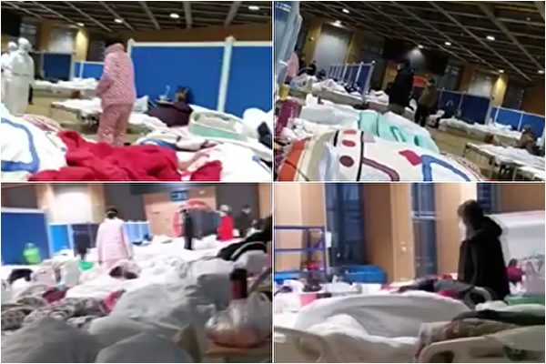
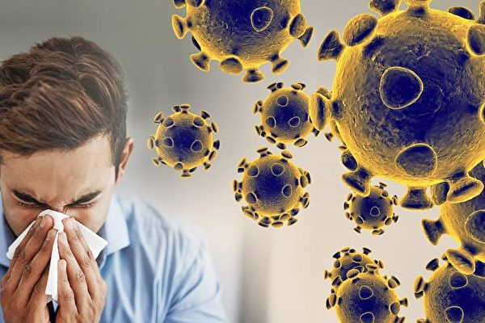

<h1 align="center"><b>请收藏网址(新闻视频ip) 随时连上最新即时IP https://git.io/swspip</b></h1>

<h2 align=center><a href="https://github.com/gav01/Heart/blob/master/news1.md">● 大纪元时事 ●</a></h2>

<h2 align="center">直連不必翻牆開花必看精彩視頻http://36.228.14.30</b></h2>

<table>
<tr>
 <td>
 <a href="https://git.io/pamja"> <h3>如何 “ 三退保命 ”</a>，<b>连上面→免翻视频 IP http://36.228.14.30 </b> →点 【三退大潮】--为什么要退党？ 可留言三退或用翻墙软件自己办理三退</h3></td>
</tr> 

<tr>
 <td>
 <a href="https://git.io/pamja"> <h3>如何 “ 三退保命 ”</a>，请点击翻牆网站  https://git.io/opopop  下载 { 翻牆软件 }→找 { 大紀元網站 }  ( http://www.dajiyuan.com ) 三退</h3></td>
</tr>
</table> 

<a href=https://git.io/souye><h6 align="right">回首頁</h6></a>

<a name=top>

<a href =#10>10.【新闻看点】疫情严峻超乎想像 习近平4度喊话 
<a href =#9>.【名家专栏】中共计划摧毁美国反伤了自己？ 
<a href =#8>8.黄冈疫情管控升级 每户每2日仅准1人外出 
<a href =#7>7.世卫对武汉肺炎三改其口 背后的中共因素 
<a href =#6>6.中共招募美学者获取技术 引发美国政府警觉 
<a href =#5>5.【更新】武汉肺炎扩散27国及地区 8城重灾区 
<a href =#4>4.【新闻看点】昨3件事刷屏 北京遇最难测挑战 
<a href =#3>3.中国进口包裹有武汉肺炎风险？CDC解释 
<a href =#2>2.美国首例新型冠状病毒患者临床康复全记录 
<a href =#1>1.【拍案惊奇】武汉重症者或被军管 有另种病 

<a name=10>
<h1 align="center"><b>【新闻看点】疫情严峻超乎想像 习近平4度喊话</b></h1>

网友拍下武汉肺炎一线医生休息时的场景。（来自推特）

 
 【大纪元2020年02月01日讯】大家好，欢迎大家关注新闻看点，我是李沐阳。

由于世卫组织1月24日没有采取紧急措施，结果造成武汉肺炎疫情在全球迅速扩散。昨天（1月30日），在多国压力之下，世界卫生组织终于把武汉肺炎疫情列为“国际关注的突发公共卫生事件”。不过世卫组织总干事谭德塞（Tedros Adhanom Ghebreyesus）连续两次重申，“这一宣布不是对中国（中共）的不信任票”，“世卫组织继续对中国（中共）控制疫情的能力抱有信心”。还说“世卫组织不建议、实际上反对任何针对中国的旅行、贸易和其它限制措施”。

不知道谭德塞为什么这么替中共说话，而中共自己都承认事态严重。前天，习近平再次喊话，坦言“目前疫情防控形势依然严峻复杂”。他要求中共军队“积极支援地方疫情防控”。

从习近平高密度喊话来判断，中国大陆的疫情很可能已经万分危急。原大陆卫生高官表示，疫情已经失控了。因为感染人数太多，中共官方有“紧箍咒”，不敢给患者确诊，只能眼睁睁看着疫情扩散。

<b>习近平4度喊话</b>

中共官媒新华社报导，习近平在29日第四次通过媒体发布声明。在坦言疫情“严峻复杂”的同时，要求军队“要在党中央和中央军委统一指挥下”，“支援地方疫情防控”。

报导称，这是25日中共政治局常委会成立应对疫情工作领导小组之后，他第四次公开对肺炎疫情发声。报导引述习的话称，湖北武汉等地区发生疫情后，军队“启动联防联控”，抽组精兵强将奔赴疫情防控第一线。

习近平高密度喊话，足见疫情相当严重。有消息说，一名属于湖北孝感的中共空军保障部军官25日被确诊染病，导致200名现役军人被隔离。这种消息，在中共部队里是属于机密的。

有消息人士表示，中共部队从24日起，抽调了海陆空医疗队进入武汉。但是军队被调派到一线，后勤物资和医护设备是个问题。香港《信报》引述消息说，中共各地部队口罩等防护物资奇缺，隔离执行不彻底，军方防疫形式相当严峻。

据一些士兵反映，部队给很多人只发了两三个口罩。军营门卫兵、采购员等一些使用较频繁的人员，口罩鼻圈位置都是黑的，防护效果大打折扣，甚至一些小单位连体温表都没有。军事类微信公号“新绿网”表示，“一旦部队家属院当中有人携带病毒，后果是极为可怕的”，军队防疫“困难度不比打仗小”。

不过法广表示，目前还没有见到中共军队大规模接手武汉肺炎疫情的防治。

<b>女医生一夜收诊200病患</b>

瘟疫的始发地武汉，无疑是重灾区。一位化名王阳的女医生告诉《新京报》，她所在的医院在1月22日被指定为收治武汉肺炎患者的医院。她所在的科室被改造成了输液室，她本人也从当天晚上7点，一直忙到第二天早上8点才可以休息。这一夜，她接诊了200个输液和留院观察的病人。

整个医院都被看病的人挤满了，到处都是污染区，没有干净的地方。而医护人员还是穿着普通的袍子，戴一次性外科口罩、帽子和手套照顾病人，所有医护人员都忙不过来。

当天夜里，王阳开始头痛、喉咙痛，第二天出现发烧，持续了几天。最终被确诊肺部感染，只能在家休养。她说，“每个科室基本上都管了武汉肺炎的病人，所以医护人员有一大批都被感染”。

王阳表示，医院床位不够，设备缺少、防护不足，更严重的是人手严重短缺。医生护士都得面对去世的病人，以前只要负责把医疗仪器撤下，现在还必须承担收尸员的工作。

<b>医院不收治，病患躺在地上等死</b>

我收到很多网友的爆料，因为时间和内容的关系，我们只能一点点地选用。这里要说的是一位武汉洪山区仁和路欢乐大道的市民刘女士，她给新闻看点发来的求助信。她通过自己就诊的经历，介绍了武汉的真实就医情况。1月19日刘女士开始低烧、干咳，22日转为高烧，持续不退。23日到普仁医院照CT，双肺出现多个小斑块高密度阴影、胸膜增厚，确诊是严重感染和病变。

在普仁医院的要求下，刘女士去了武汉第九医院就诊，医生又做了超敏C反应蛋白，指标超过正常人近9倍。但是医生不收纳住院，说“只收纳重症患者，轻度患者回家自行隔离”。

打完吊针的刘女士不敢回家，担心传染给家人，就在医院大厅的板凳上坐了一夜。天亮后，去酒店开了一个房间休息。等家人给租好了房子，刘女士才进行自我隔离，直到现在。她说几天拖着高烧的身体东奔西跑，检查结果一次比一次加重。现在高烧39.6℃不退，呼吸困难。但每次申请住院，医生都以各种理由拒绝。

另一位武汉市民向我们爆料，也提到了武汉九医院。视频中显示，因为九医院不收治发热患者，一些病人在求助无门的情况，只好躺在医院大门外的地上等死。

<b>可能有多少人病亡</b>

说到病人等死，中共官方报出的死亡率是2%。但是国际著名期刊《柳叶刀》昨天的论文表示，根据金银潭医院前99名确诊病患所出现的病征，这些人中有11人死亡，死亡率高达11%。

《柳叶刀》特别提出是“前99名确诊患者”的死亡率是11%，这是有背景的。因为之前中共有一段空窗期，十几天没有更新新增病例数字，所以死亡率是这么高。这是因为中共隐瞒疫情，所以才出现这个情况。

但是现在的死亡率为什么降下来了呢？大家想，11%这个数字，高于SARS大约10%的死亡率，这很可能是中共大幅增加确诊患者的数字的原因。

增加了确诊病例数字，死亡率自然就降下来了。其实现在中共公布的数字仍然是经过美化的，它根本不收治“一般”或者“轻微”患者。有网民透露，很多医院有关系或“后门”才可以住院治疗的。

杭州副市长周卫强昨天在疫情防控记者会上说，有一家企业开了一个会，30个人里面有11人感染上了。

前天，日本从武汉接走了206名日本公民，其中有12人染病。

武汉市长周先旺说，被封禁在武汉市的人口有900万。我们无法统计真实的数字，但是可以看看网友的一些爆料。

昨天一位网友在推文中表示，武汉一个火葬场，10个垃圾桶装满了装尸体的袋子。网友强调，“这只是一个火葬场一天的量，武汉的全部火葬场，一天得烧多少人呢？”

还记得29日我们提到香港“端传媒”的那篇调查文章吧？汉口殡仪馆的14台火化炉全天候运转，随时火化各医院送来的死者。一般情况火化炉处理一具尸体需要1.5到3个小时。照此计算，14台火化炉彻夜不停，一天可以处理112～224具尸体。

早在1月中旬，武汉青山殡仪馆职工就曾发消息说，武汉火葬场每天全力运转，死亡遗体数量较以往暴增。武昌、汉口殡仪馆停尸间已经放不下了。

26日，武汉官方发布“权威消息”，当地殡仪馆的殡葬服务车已经不够用。当局正在配备更多人力物力，提高遗体接送效率。得有多少人去世，造成殡仪馆的车辆不够用呢？

需要提醒大家，我们只是采用了官方的确诊病例数字。真实的数字远远超过官方通报的数字，不说你也懂的。

<b>专家：2月初患者达20万</b>

昨天，身在北京的陈秉中告诉大纪元，感染人数太多，责任太大。中共官方为了掩盖疫情的严重程度，在层层造假隐瞒。

这位原中国健康教育研究所所长表示，按照国际惯例，中共官方第一时间必须向群众公布疫情。它不但没有公布，现在还在继续隐瞒。陈秉中直指中共卫健委主任马晓伟在26日的说法是“欺骗”。

1月26日，马晓伟在新闻发布会上称，目前“疫情形势严峻复杂，处于防控关键时期”。

陈秉中指出，“关键期是在刚发病的时候，现在是严重的失控期”。“把失控期还说成是关键期，这是在开脱罪责，替他们（中共）辩护。本来是应该追究领导责任，还在为他们歌功颂德，这是最让老百姓烦的。”

这位原大陆卫生高官认为，到2月初，武汉肺炎感染者将达到一二十万人，是有科学根据的。“因为潜伏期是14天，医生也发现人传人，当局还不承认。这一波一波传染下去，就可以推测，到一定时候，就可以达到几十万了”。

帝国理工学院传染病专家福格森（Neil Ferguson）26日再次更正了他的推测，他估计可能已经有10万感染了病毒。“目前可能有10万个”，病例也可能在3万到20万之间。

陈秉中表示，武汉现在非常危急，内部人传出的信息称，病人多到抢救不过来，一床难求。而当地限制发放检测盒，不敢给病人确诊。有良知的医生不敢说，“上面有紧箍咒，领导不让说，眼睁睁看着疫情扩散”。

中共官方在26日通报，禁止医务人员通过面谈、电话、简讯、微信、微博、邮件等方式，在家庭聚会或公众场所，向亲朋好友谈论关于疫情的进展、救治过程与防控等一切信息。否则追究法律责任，最高判处3～7年的有期徒刑。

“如果都给检测出来了，这责任就大了。”他（陈秉中）指出，“限制发检测盒，层层造假隐瞒。很多病人来不及治疗，延误病情，得不到早发现早治疗，这个危机也是当局的大责任，人命关天。”

他说，当局抓的8个所谓“造谣者”，都是一线的医生，其中一人已经染病并隔离。“那8个人及时说出真相，是英雄。中共打击曝露真相的人，反人类啊，这是一场人为的大灾难，史无前例。”真正造谣的是政府，掩盖真相的是上层有关领导，“他们是千古罪人，必须得追究他们的责任”。

陈秉中还表示，隔离圈太大，弊病太多。把上千万人封在城里，会相互之间传染，加重病情。交通都给断了，有病了没车无法去看病，带来了很多不便，“这种粗暴的隔离太不人道”。

<b>防疫“大隔离”</b>

这场大瘟疫，让许许多多的人谈之色变。武汉封城后，全国各地也纷纷出招，防止病毒入侵，相关的照片在网络上疯传。图片显示，有人手持红缨枪、有人手持武术大刀在路口站岗放哨，有的用各种砖石、土堆封堵道路，有的甚至挖路刨沟阻止交通等等。

网上有一份湖南湘阴县突发公共卫生事件应急指挥部的文件，上面显示，针对武汉肺炎疫情，实施“六级隔断”指令。文件要求与外县市隔断，县城与相邻乡镇隔断，乡镇之间隔断，村落之间隔断，屋场之间隔断，户与户隔断。

昨天，中共官媒《新华日报》“交汇点”报导，江苏省委书记娄勤俭去了南京江宁区葛巷村和栖霞区桦墅村，结果碰了一鼻子灰。这两个村路口站岗的民众要求这群陌生人赶紧离开。即使村民后来知道了来者身份，也不让进村子，让他们快点离开。如果“劝服无效”，实施“集中强制性隔离”。这项决定持续到2月8日。

网络上有一张图片，是安徽怀宁县清河乡开的买菜“证明”。上面写着某某村民不属于感染肺炎的隔离对象，现因家中无菜，需至市场购买蔬菜，须通过卡口，请予放行，落款时间为1月29日。该“证明单”上还注记出行时间10时50分至11时30分，若超过规定时间未返，必须进行居家隔离14天。

网上有很多图片，是关于隔离的标语。看上去，斗争味道很浓，像是文革又来了。比如“串门就是互相残杀，聚会就是自寻短见”、“发烧不说的人，都是潜伏在人民群众中的阶级敌人”、“今年上门，明年上坟”，还有什么“今天沾一口野味，明天地府相会”、“口罩还是呼吸机，您老看着二选一”、“出来聚会的是无耻之徒，一起打麻将的是亡命之徒”、“老实在家防感染，丈人来了也得撵”。

<b>粗暴隔离酿恶果</b>

自我采取隔离措施，可以在一定程度上阻止疫情蔓延扩散。但是粗暴的隔离措施，也可能会造成悲剧。

网络视频显示，一名湖北襄阳的餐饮老板，因为受不了封禁的折磨，跪求上天保佑，说自己“受不了了”。

一位石家庄的朋友给我发来视频，据说是微信朋友圈里面的。网友表示因为封村，老人没有亲人照顾。大年初二，邻居给送来了一桶凉水和一盒蛋糕，让老人支撑一个月。目前老人的情况不得而知，但这种状况令人放心不下。

不过昨天另一位朋友的爆料视频，让我的心紧了一下。从视频中看上去，一名男子驾驶三轮车向前行驶，突然被什么东西挂住，直接飞落在车下。男子倒在地上一动不动，三轮车向前滑行了一段距离。

视频中有人说，“没看见，没看见，没看见那根绳”。目前不清楚这个事发地是哪里，但是爆料人在文字中说“地方村镇封路致人死亡”。这是目前我们掌握的，因为疫情封路，造成的一起最严重后果。

28日有视频显示，河里有一名武汉人，趴在一块木头物件上滑水。对面的河岸上，有三辆白色的车，车旁站着十几个人。视频中的男子介绍，河对面是湖南省，水中人是湖北人，想偷渡过去，但遭到湖南人拦截。

在自己的国家，竟然会发生“偷渡”的事。网友说“这必将载入历史史册”。

<b>中共欲接回境外“武汉人”引热议</b>

从武汉爆发肺炎疫情，也让武汉人实实在在感受到了人情冷暖。很多地方一听说是武汉人，很多人都是敬而远之，或者立刻驱逐。

中共外交部发言人华春莹在今天表示，“考虑到近日湖北特别是武汉公民在海外遇到的实际困难，政府决定尽快派民航包机把他们直接接回武汉”。

华春莹的这番话，立刻引爆了网络。有网民说，“这个时间不是应该外交部出面，请各国延长武汉人的签证么？”也有网民说，“中国护照也许不能让你去世界上的任何地方，但是绝对会把你从世界上的任何地方带回家。”还有网民表示，“主要目的是要和各国撤侨举动较量一下呗！你们外国人怕死，咱中国人就是硬要迎难而上，牛X的很呢！”

武汉人在外国究竟如何呢？有澳洲网民说，“新南威尔士州宣布，所有在入境之后发病并被确诊的武汉肺炎患者，即使没有医疗保险／身份，也可以在公立医院和急诊得到免费救治，不管你是学生还是游客。”

另有消息说，“日本政府对日本境内入院治疗的人员，不分国籍，所有治疗费将由政府承担。此外，日本为表尊重，不公布患者国籍。”

泰国国际移民局也发布文件表示，“免除（中国游客）因中国境内机场关闭、无法返回而延期滞留泰国的罚款。”

中共怎么对待武汉人的呢？英、德与中方谈判撤侨时，中共拒绝持中国护照的家属离开。

<b>武汉医院：“不是告急！是没有了！！”</b>

因为隔离，交通阻断，各地物资都非常紧张，特别是医护用品。

这是武汉协和医院Do先生昨天中午发出的“告急”，他说“不是告急！是没有了！！”他说，“我们保卫武汉，请求你们支援我们！武汉协和医院再次求助！”

但是大家看看武汉市慈善总会的“新型冠状病毒防控专项基金”账目，在这个备案编号为51420100522723273cP20001的账簿中，显示已筹款5亿5275万多元（¥557,564,897.34元），但是“已使用”是“0”。

再来看另一个消息，《人民日报》1月28日的微博说，山东捐赠武汉350多吨优质蔬菜，此后山东还会持续供应10～15天。

但是1月30日，武汉市红十字会发出了一份郑重申明。其中说截止到1月30日12时，他们“从未接受任何单位、任何个人捐赠的‘寿光蔬菜’，更没有参与该批蔬菜的分配、售卖。迄今为止，也没有收到过与此相关的任何现金捐赠。”

好的，感谢您关注新闻看点，再会。

大纪元《新闻看点》制作组  #

<a target="_blank" href=#top><h6 align="right">回上方</h6></a>
 
 
<a name=9>
<h1 align="center"><b>【名家专栏】中共计划摧毁美国反伤了自己？</b></h1>

图为1月25日，武汉一家医院。 (HECTOR RETAMAL/AFP via Getty Images)

【大纪元2020年02月01日讯】（英文大纪元专栏作家J.R.Nyquist撰写／高杉编译）大约20年前，时任中共国防部长迟浩田在一次对共产党高层干部内部秘密讲话中，曾阐述了一项确保中共生存和复兴的长期计划。

他表示，有三个关键问题必须抓住：首先是生存空间问题，因为中国人口严重过剩，环境正在恶化。因此，第二个问题是，共产党必须教育中国人民“走出去”。迟浩田的意思就是征服新的土地，在这些土地上，可以通过“殖民化”建立起“第二个中国”。但也由此产生了第三个重要问题：“美国问题”。

迟浩田当时警告说：“这听上去似乎令人震惊，但是逻辑其实很简单，”因为中共“与西方战略利益存在根本性的冲突”。因此，美国绝不会允许中共夺取其它国家来建设第二个中国。所以美国阻碍了中共的计划。

迟浩田对这个问题的解释如下：“美国会允许我们获得新的生存空间吗？ 首先，如果美国坚决阻止我们，我们就很难对台湾、越南、印度甚至日本做任何有意义的事情，那么我们还能得到多少生存空间呢？ 非常得微不足道！只有像美国、加拿大和澳大利亚这样的拥有广阔的土地的国家才能满足我们大规模殖民化的需求。”

他说：“我们不至于愚蠢到想通过核武与美国同归于尽。”“只有使用能杀死许多人的非破坏性武器，我们才能把美国留给自己。”答案就在生物武器中。他还说：“当然，我们并没有一直闲着，在过去的这些年里，我们抓住了掌握这类武器的机会。”

在中国执政的共产党认为，生物武器是实现“清理美国”这个目标的最重要武器。迟浩田认为，邓小平把生物武器放在了中共武器库中所有其他武器系统的前面，当邓小平还在的时候，党中央就做出了正确的决定：先不发展航空母舰，而是集中精力发展能够消灭敌国大量人口的致命武器。

这似乎令人感到难以置信，但迟浩田认为自己是一个“人道主义”的共产主义者，因此他承认，在这个问题上他有着复杂的个人感受：“我有时会想，中共与美国为敌是多么的残忍。”他指出，毕竟美国在第二次世界大战中帮助了中国。中国人民还记得美国反对日本帝国主义。但现在这些都不重要了。

迟浩田说：“从长远来看，中美之间的关系就是一场你死我活的斗争。”我们必须接受这种悲惨的局面。根据迟浩田的说法，“我们不能忘记，我们的历史一再告诫我们：一山容不得二虎。”

根据迟浩田的说法，中国的人口过剩和环境恶化最终将导致社会崩溃和内战。他估计，这样的社会崩溃将造成“超过8亿”中国人死亡。因此，中国共产党别无选择：要么美国被生物武器袭击而“清理干净”，要么中国遭受民族灾难。

迟浩田还提出了以下观点：“我们必须做好两手准备。如果我们的生物武器在突袭中取得成功，中国人民将能够在与美国的战斗中把损失降至最低。但是，如果袭击失败并引发美国的核报复，中国可能会遭受一场灾难，将导致超过一半的人口死亡。这就是为什么我们需要准备好大中城市的防空系统。”

在他的演讲中，迟浩田提供了一个了解中共发展战略的关键点：“我们的经济发展就是为了战争的需要而做准备！ ” 并不是为了在短期内改善中国人民的生活。这不是要建立一个以消费者为导向的资本主义社会。迟浩田表示：“我们仍然会强调以经济发展为中心，但实际上，经济发展是以战争为中心的！”

中共对生物科学的浓厚兴趣也源于此。

<b>病毒武器化</b>

西方国家还没有弄清楚中共迅速运作P4微生物实验室的潜在动机，这些实验室被用来研究世界上最致命的微生物（即病原体致死性4级实验室）。现在，就在中国的中心城市武汉，在位于武汉P4病毒实验室（专门研究致命病毒的）的附近，爆发了一场快速扩散的新型冠状病毒疫情。

（译者注：1993年，中共宣布第二个设施“武汉生物制品研究所”为8个生物战（细菌战）研究设施之一。P4实验室是中国首个生物防护水平在4级的实验室。）

在发表了这个演讲后不久，2003年，也就是中国爆发萨斯病（SARS）疫情的同一年，迟浩田辞去了国防部部长的职务。（巧合的是）也是在同一年，北京决定建立武汉P4病毒实验室。考虑到迟浩田的内部演讲，这种新型冠状病毒疫情在武汉爆发，是否就是由于该市的P4病毒实验室在将致命病毒武器化过程中出现了意外所造成的呢？

有三个数据点值得考虑。首先，据《雪梨晨锋报》（Sydney Morning Herald）报导，2008年，台湾最高安全官员告诉立法者，台湾已经拥有可以将SARS病毒与中共实验室的相关研究联系起来的情报。考虑到中共的经济影响力和中文媒体的政治渗透，时任中华民国国家安全局局长的蔡朝明后来被迫收回自己的声明也就不足为奇了，因为他的声明中并没有任何“过失”的常见特征。蔡局长是否只是因为不能透露他在中国大陆的情报来源而被迫收回了这项真实的声明呢？

第二个值得考虑的数据点：《病毒学杂志》（Virology Journal）刊登了Gulfaraz Khan于2013年2月28日发表的一篇文章，概述了2012年6月在沙特阿拉伯发现的一种新型冠状病毒。是的，这是与（武汉肺炎的）同一种的冠状病毒，但有以下不同之处：在第一次发现它时，它还不能轻易地在人与人之间传播。从那时起，该病毒发生了某种变化。因此，武汉新型冠状病毒被标记为“2019-nCoV”而不是简单的 “NcoV”。就是因为后者不具有传染性，而前者正在中国迅速传播。

那么你认为在2012年到2020年间，是什么改变了该病毒的传染性呢？ 发生了随机突变？还是因为它被武器化了？ 如果目前的致命疫情爆发是发生在武汉以外的任何一个城市，我们都可能会倾向于相信它只是发生了随机突变。但是，武汉市正是中共生化细菌武器的发源地。我们应该相信这只是一个巧合吗？

第三个值得考虑的数据点是：《印度大博弈》杂志（GreatGameIndia）发表了一篇题为《冠状病毒的生物武器——中共如何从加拿大偷走冠状病毒并将其武器化》（Coronavirus Bioweapon – How China Stole Coronavirus From Canada And Weaponized It.）的文章。

作者们非常聪明地把Khan的《病毒学杂志》的文章和中国公民从位于温尼伯（Winnipeg）的加拿大（P4）国家微生物实验室（Canadian （P4） National Microbiology Lab）偷走冠状病毒的安全漏洞的消息放在了一起。据称这种新型冠状病毒和其它致命有机体一起存放在那里。去年5月，加拿大皇家骑警调查委员会被召集对此案进行调查，到7月底，中国公民被驱逐出该设施。据称，这位中国首席科学家当时正往返于温尼伯和武汉之间。

这样我们就有了一个关于冠状病毒NCoV病毒是如何传播的模糊推理结果：首先它在沙特阿拉伯被医生发现，然后在加拿大被研究，在那里它被一个中共的科学家偷走并带到了武汉的实验室……。

就像台湾情报局长在2008年作出声明后的遭遇一样，《印度大博弈》杂志的文章也受到了猛烈的攻击。无论真相如何，我们的推理中都必须要考虑到接近和不大可能发生突变的事实。

2019-nCoV 病毒极有可能就是沙特医生在2012年所发现的NCoV病毒的一个武器化版本。

我们必须对武汉的疫情进行调查。中共也必须对世界公开疫情信息和保持透明。真相必须大白于天下。如果中共官员是无辜的，他们就没有什么可隐瞒的。如果他们有罪，无疑他们将会拒绝合作。

真正令人担忧的是，世界其它各地区是否有勇气要求进行一次真正彻底的调查。在这种要求下，我们需要无所畏惧，不允许以“经济利益”为借口再玩一场遮遮掩掩、不诚实的否认游戏。我们需要诚实的调查，需要现在就开始调查。

作者简介：

本文作者J．R．奈奎斯特（J.R. Nyquist）是专栏作家，著有《第四次世界大战的起源》（Origins of The Fourth World War）和《傻瓜和他的敌人》（The Fool and His Enemy），还与人合著了《全球战争的新战术》（The New Tactics of Global War）。

原文Did China’s Plan to Destroy the United States Backfire? 刊登于英文《大纪元时报》。

本文所表达的是作者的观点，并不一定反映《大纪元时报》的观点。

<a target="_blank" href=#top><h6 align="right">回上方</h6></a>
 
 
<a name=8>
<h1 align="center"><b>黄冈疫情管控升级 每户每2日仅准1人外出</b></h1>
 
【大纪元2020年02月01日讯】疫情仅次于武汉、湖北省第二个被封城的黄冈市防控升级，官方于2月1日发布紧急通知，全市范围内实行市民出行管制，每两天每户只许派1人上街购买生活用品。

此前31日，黄冈已实行机动车、电动车辆管制。

据中共央视报导，黄冈市官方发布的紧急通知称，严格控制市区居民出行，只允许一个家庭每两天派1名家庭成员上街购买生活用品，除了就医，疫情防控需要，在商超和药店上班的人，其他人均禁止外出。

对于何时解除管控措施，通知中没有说明。

黄冈市位于武汉市以东117公里，人口约750万。

武汉爆发疫情封城后，有超过百万的武汉返乡人群涌入黄冈和孝感两市，使当地肺炎感染和死亡率猛增。

大纪元等多家媒体近日采访到的病例显示，两地疫情被掩盖，有些死亡病例没有列在官方发布的数字之内，真实感染和死亡病例外界不得而知。

由于感染和确诊人数的增加，黄冈市医疗设施和医疗物品等出现严重不足的情况。而黄冈市卫健委主任唐志红及疾控中心主任陈明星对于该市定点医院的收治能力等情况却一问三不知，引发网民一片谴责声，后唐志红被免职。
<a target="_blank" href=#top><h6 align="right">回上方</h6></a>
 
 
<a name=7>
<h1 align="center"><b>世卫对武汉肺炎三改其口 背后的中共因素</b></h1>
 
【大纪元2020年01月31日讯】（大纪元记者古清儿报导）武汉新型冠状病毒疫情大爆发。这期间，世界卫生组织多次重复中共官方的谎言，误导外界。直到近日才承认在武汉肺炎疫情上的风险评估出现错误，并在1月30日定性疫情为“国际公共卫生紧急事件”。

这期间，世卫组织至少对武汉肺炎疫情三次改口。世卫亲共的表现遭到外界批评。

<b>武汉肺炎事件 世卫组织三改其口</b>

随着外媒揭露的武汉肺炎疫情确诊和死亡病例飞速攀升，世界卫生组织（WHO，下称：世卫）紧急委员会周四（1月30日）召开会议，宣布中国新型冠状病毒疫情构成国际关注的“突发公共卫生事件（PHEIC）”。

就在1周前的1月23日，世卫紧急委员会仍称，目前宣布新型冠状病毒疫情构成国际关注的突发公共卫生事件为时尚早。

这已经是世卫组织至少第三次对武汉肺炎疫情改口。

上一次世卫改口是在1月28日。当时，世卫承认在武汉肺炎疫情上的风险评估出现错误，称在1月23日、24日、25日的报告中表示全球风险“一般”，是做了“不正确”的陈述。修改后的报告指，此疫情在中国大陆的风险“非常高，在区域层级上高，在全球层级上也高”。

1月14日，世卫警告，引发武汉肺炎的2019新型冠状病毒出现了“有限度”人传人情况。不过，在消息报导后不久，世卫又引述中共官方说法“澄清”，没有明确证据显示新型冠状病毒会“人传人”。

随着中共被迫承认疫情存在“人传人”的情况，世卫官员21日下午又改口称，最新报告的感染信息表明，疫情可能存在“持续人传人”的状况，医务人员的感染证明了这一点。但仍然需要更多资料进行分析。

<b>世界多国对中国人“关门”</b>

按照惯例，被世卫认定“国际紧急公共卫生事件”，意味着大陆成为“疫区”，而“疫区”的旅行、贸易等都会受到影响。可是，世卫同时又发出矛盾的信息：不建议对中国大陆采取旅行和贸易限制。

但是，世界多国自行推出措施，对中国大陆关上大门。

世卫公布全球卫生紧急状态后不久，美国把对中国旅游警示上调到最高级别，呼吁美国人不要前往中国大陆旅游。日本将新型冠状病毒列为“指定传染病”，可拒绝染病人士入境和强制患者住院，警示国民如非必要勿前往中国大陆。新加坡宣布禁中国大陆旅客和14日内去过内地的外国人入境。

与此同时，世界多国都在缩减与中国大陆之间的航班与联系。

1月31日，意大利总理孔特宣布，为了阻止新型冠状病毒疫情蔓延，取消所有往返中国的航班。英国航空也取消所有飞往中国大陆的航班。朝鲜与俄罗斯更是关闭了与中国大陆的边界，以限制中国人入境。目前，越南宣布中止向中国大陆人以及在中国居住两周的外国人发放签证，蒙古也对所有来自中国的游客关上大门。

<b>围绕世卫组织的角力</b>

为何1月23日世卫紧急委员会经过两天的争论，仍没有定性新型冠状病毒疫情为“突发公共卫生事件”，有海外媒体透露了部分内幕。

报导指，“WHO经过两天的争执不下，仍然未能就不断扩散的中国武汉肺炎，向全世界拉响最高级别的警报，这是中共暗中操纵和阻挠的结果。”

“自从中国香港藉的陈冯富珍担任掌门人后，WHO的立场常常被北京所左右；陈冯富珍离任后，这样的状况仍在延续。”

1月25日的报导称，“中南海特派的一个特别小组，近期一直在日内瓦‘活动’和‘游说’，现阶段WHO对武汉疫情的评估结果，可能与此不无关联。”

法国巴士德学院的新型流行病研究专家Arnaud Fontanet教授对世卫组织23日未将武汉肺炎定性为“国际关注的突发公共卫生事件”发表评论说，大家注意到世卫组织的决定在时间上延迟了一天，而且很明显，专家们内部在此议题上存在重大分歧，这在世卫组织历史上是十分罕见的。

时局分析人士陈破空24日表示世卫组织做出的决定让人费解。一方面他没有提到紧急突发事态，再一方面找的理由是两个，一个是说其他国家现在感染还不严重，另一个理由，WHO突发事态委员会主任乌桑承认说很大程度上是听了中国政府的意见。在23号开会的时候，50%表示不同意按紧急事件处理。中国政府的意见起了很大的作用。

<b>分析：大陆如被定为“疫区” 对中国经济将造成重大冲击</b>

分析认为，中共阻挠WHO定性武汉肺炎为“突发公共卫生事件”，尤其不愿中国大陆被定为“疫区”，原因之一是可能对中国经济有影响。

回顾2003年的急性呼吸道症候群（SARS）疫情，当时中国大陆被列为疫区后，当年第2季国内生产总值（GDP）增长率下跌2个百分点，从第一季的11.1%跌至9.1%。

时事评论员李林一说，对中共而言，如果疫情升级为国际事件，对于经济的冲击力将远远大于17年前的SARS疫情。主要是因为中国经济在2003年还处于上升期，但是现在的经济增速却在逐年放缓。

李林一认为，大陆民众今年中国新年期间集体在家，大部分消费活动基本停止，将给大陆的服务业带来重大打击。目前服务业增加值对中共GDP的贡献率为59.4%，比2003年大幅提高了20个百分点。

香港《经济日报》认为，如果世卫将大陆标注为“疫区”，将对中国外贸、就业都带来冲击。

文章认为，更具冲击力的，可能是人数以2亿计的农民工。他们在乡下不可能久留，在农历正月十五后即可能大批外出。在疫情未得受控下，以及就业岗位未能恢复提供下，就算只出来一半，也有上亿人需要安排就业，可能形成巨大的经济和社会冲击。

文章指，另一个经济考验，是一批实体经济，特别是实体经济中的中小企业，可能撑不住而倒闭，这是因为在疫情持续下，其生产不能恢复，但人工、租金甚至银行利息等都要继续支付，如果疫情延长3月至5月间，中小企有的还可能撑得住，但5月以后可能成批结业。

<b>世卫组织亲共表现遭讽</b>

在世卫宣布武汉肺炎为“突发公共卫生事件”之前，美国、日本、英国、韩国、法国、德国、西班牙、俄罗斯、澳洲、纽西兰等国已陆续进行“撤侨”计划，帮助国民离开中国。

1月28日，正在北京访问的世卫总干事谭德塞却无视各国的动作，并表示“不建议”各国从武汉撤侨。他还吹捧中共在武汉肺炎爆发后的表现，这与舆论对中共当局隐匿疫情的强烈质疑背道而驰。

哈佛大学流行病学专家丁亮（Eric Ding）1月25日形容，这种流行病（武汉肺炎）的严重程度达热核（thermonuclear）级别。他在Twitter称：“我的天呀，新冠状病毒（的R0值）竟然是 3.8！！！这可是热核武器级别的差——在我的整个职业生涯中，从未实际见过那样的猛的病毒系数（virality coefficient）我并不是在夸大……”

丁亮对BBC说，WHO应该尽快宣布，疫情已形成全球紧急状态。“这个病毒的传染性已经达到可广泛蔓延的危险程度。”

因为世卫过度亲共，在社交网路上，网民把世卫组织的WHO缩写改成了CHO，暗讽世卫在武汉肺炎爆发以来的种种充满中共官方特色的表现。

<b>世卫组织背后的中共黑手</b>

查阅世卫成员国的摊款纪录，中共出资排名从2016-2017年的第6名、出资占比5.14%，上升至2018-2019年的第3名、出资占比7.92%，仅次于美国的22%及日本的9.68%。

2006年世卫组织举行总干事补选，中共向非洲国家“大撒币”，买通非洲国家支持曾任香港卫生署长的陈冯富珍（Margaret Chan Fung Fu-chun）当选世卫总干事。

被中共买上台的陈冯富珍，担任世卫总干事期间，频频吹捧中共，并在打压台湾等事务上站台。陈冯富珍本人因为WHO抗击埃博拉病毒不力而遭到各方指责。

2013年，中国大陆爆发H7N9禽流感，中共掩盖致使疫情升温，陈冯富珍公开吹捧中共处理H7N9疫情“迅速”、“透明”。

在国际社会关注并谴责中共大规模活摘法轮功学员等良心犯器官罪行之际，陈冯富珍在2016年北京举办的国际移植会议上，为中共的所谓“器官移植改革”唱赞歌。

到2017年6月陈冯富珍卸任时，国际卫生界形容在她掌舵世卫的10年之内，世卫的评价实已江河日下。

<a target="_blank" href=#top><h6 align="right">回上方</h6></a>
 
 
<a name=6>
<h1 align="center"><b>中共招募美学者获取技术 引发美国政府警觉</b></h1>

哈佛大学化学系主任Charles Lieber（右一）。 (MENAHEM KAHANA/AFP/GettyImages)

 
【大纪元2020年02月01日讯】（大纪元记者吴英编译报导）日前，哈佛大学化学系主任因隐瞒参与中共“千人计划”及获取利益而被捕。这起事件震惊学术界，更引发美国川普（特朗普）政府对中共积极招募人才的警觉。

中共在10年前投入超过2兆美元资金，积极招募国外人才，以期掌握未来技术的主导权。中共利诱知名学者，动摇了美国的学术自由和国家安全，让美国政府和学术界难以应对。

FBI在近几年的调查过程中发现，美国研究人员似乎竭尽所能地避免向其雇主披露中共提供的资助，不过，隐瞒的结果将是面对可能的牢狱之灾。

德州农工大学系统（Texas A&M University System）行政人员在经过18个月的调查后，发现该系统接受联邦政府资金的教授中，有100多位参与中共的人才招募项目，竟只有5名教授披露，这个结果令他们震惊。

该系统首席研究安全长凯文・加马什（Kevin Gamache）告诉《华尔街日报》，中共曾有意邀请该系统中一名植物病理学家，在中国建立一个实验室，并给予25万美元报酬和逾100万美元资金，但是遭到拒绝。在德州，此类科学家的年薪中位数约为13万美元。

加马什说，德州农工大学系统拥有中共觊觎的先进科技，中共对语言这类专业没有兴趣，因此这类学者“就没有这种优厚待遇”。

根据司法部文件，周二（1月28日）被FBI逮捕的哈佛教授查尔斯・利伯（Charles M. Lieber）参与“千人计划”，获得的利益至少超过200万美元，年薪及生活补贴另计。

在周四的拘押听证会上，法官鲍勒（Marianne B. Bowler）裁定，利伯可以交保，但必须在5个工作日内缴纳100万美元的现金保释金，他和妻子还必须交出护照，在等待审判期间限制居住，不能离开马萨诸塞州。此外，利伯必须避免与武汉理工大学、北京大学和中科院接触。

利伯被捕案件将是一个转折点，其不仅是犯了漏填表格信息的错误，同时被控向国防部及国立卫生研究院（NIH）官员撒谎，隐瞒其接受来自中共的资金。过去，FBI的调查重点是与中共有关的涉嫌窃取商业机密的案件，最近开始以虚假陈述或欺诈等较轻罪名起诉学术界的人。

在美国虽然接受外国资助并不违法，但接受联邦政府资助的研究人员必须在申请拨款的计划中披露是否接受外国利益。

白宫科技政策办公室（White House Office of Science and Technology Policy）主任卡尔文・德勒格迈尔（Kelvin Droegemeier）表示，不进行披露还可能导致“信息、技术和时间的隐藏转移”。

美国参议院常设调查委员会（Senate Permanent Subcommittee on Investigations）在去年11月发布的一份报告中说，中共招募人才计划的合同，要求美方研究人员在向中国同行授予知识产权时，要对他们的合同保密，并且不得干涉中共的“内部事务”。

令人担心的是，2013年1月，利伯与武汉理工大学签署一个五年计划《武理工与哈佛大学合作协议》，合作内容为“研发电动汽车高效能纳米线基础锂电池”。美中在这个领域的竞争激烈，中共似有意通过利伯取得关键的知识产权。

德克萨斯大学安德森癌症中心调查人员发现，该中心的一位顶级研究人员卢志民（Zhimin Lu，音译）是中国青岛肿瘤研究所（Qingdao Cancer Institute）一个实验室的首席科学家。该调查人员从一家中共官方媒体的报导得知，青岛当地官员给卢志民一张人民币1亿元（约合1,400万美元）的支票。卢志民否认收到这张支票。

上周，一位曾在洛斯阿拉莫斯国家实验室（Los Alamos National Laboratory）工作的科学家认罪，承认他对调查人员撒谎，否认他参与中共的人才招募项目。

根据司法部起诉书，2018年4月24日，利伯面对国防部官员询问时，否认他参与千人计划。两天后，利伯在一给哈佛同事的电子邮件中写道：“这些事情几乎让我昨晚彻夜难眠，我想要开始采取步骤⋯⋯在这个时候，所有内容都不会与政府部门调查官员分享。”

莫菲特癌症中心董事会上个月罢免了总裁和董事，原因是他们涉嫌隐瞒与中共“千人计划”的关系。该中心的其他四人也因这个问题被开除。

根据莫菲特癌症中心提供给《华尔街日报》和其它媒体的内部报告，该中心研究人员韦胜（Sheng Wei，音译）据说接受中共30万美元资金，并承诺在三年内，每年至少用六个月的时间，为中方培养更多的研究人员，及进行他在中国的研究活动。该报告说，韦胜后来表示他在2013年退出了该项目，但是其说法与其它证据不符。

另一位研究员豪尔德・麦克劳德（Howard McLeod）向莫菲特癌症中心披露了他参与中共的“千人计划”，但没有披露接受中共给予的数十万美元资金。

<a target="_blank" href=#top><h6 align="right">回上方</h6></a>
 
 
<a name=5>
<h1 align="center"><b>【更新】武汉肺炎扩散27国及地区 8城重灾区</b></h1>

武汉肺炎（2019新型冠状病毒肺炎）疫情重点事件时间表。图为1月24日在武汉医院门外等待的市民。(HECTOR RETAMAL/AFP via Getty Images)

 
 【大纪元讯】中国武汉去年12月爆发不明肺炎，今年1月8日确定疫情的病原为新型冠状病毒，世界卫生组织13日将此病毒定名为“2019新型冠状病毒”（2019-nCoV）。

目前，武汉肺炎疫情已在中国失控蔓延。

计划前往中国武汉及其它疫区的民众，应避免出入市场、医院等公共场所及人多的地方，也不要接触野生和禽畜类动物，禽肉及蛋类要熟食，同时做好个人防护措施：以肥皂勤洗手、戴口罩。

本文将持续更新每日重点事件。

1月31日：疫情蔓延27国和地区，大陆8座城市成武汉肺炎重灾区。

● 疫情蔓延27个国家和地区。海外确诊159例

在中国大陆以外，新型冠状病毒已经蔓延26个国家和地区。

31日，新增英国、俄罗斯确诊各2例；瑞典、西班牙各1例。

海外新增确证病例：香港1例，台湾1例，泰国5例，日本4例，新加坡3例，韩国6例；德国、英国、俄罗斯各2例；澳大利亚、美国、加拿大、瑞典、西班牙各1例。共增31例。

累计确诊病例，香港13例；台湾10例；澳门7例；泰国19例；日本17例；新加坡16例、韩国12例；澳大利亚10例；马来西亚8例；美国、德国各7例；法国6例；越南5例；阿联酋4例、加拿大各4例；俄罗斯、英国、意大利2例；芬兰、瑞典、尼泊尔、柬埔寨、斯里兰卡、西班牙、菲律宾、印度各1例。无死亡病例。

● 大陆疫情多严重？不断有人倒地去世

根据一最新模型推估，截至1月25日，武汉市当地75,815人感染新型冠状病毒，远大于中共公布的病例数据。多个主要城市，广京沪深疫情已呈指数增长，（详情点阅）

大陆疫情肆虐，中共官方公布数据，累计确诊11,823例，日增2102例，疑似17,988例，日增5019例；死亡259例，日增死亡46例。

不过外界认为官方数字仍然缩水，死亡人数及确诊病例都在暴增。不断有人倒地去世。（详情点阅）

家住武汉的李女士告诉大纪元记者，她的姐夫是医生，退休后回聘，为病人看诊却被传染：“现在只能待在家里，我们去了好多医院，他们都不收住院。”。亲见往外拖死人。

●大陆8座城市成武汉肺炎重灾区

武汉肺炎在全国迅速蔓延，确诊病例成倍增长。除武汉外，其它7个城市也成为重灾区：黄冈、孝感、襄阳、随州、荆门、荆州，以及浙江省的温州市。

●2000万人返京潮 社区恐慌禁外地人返家

年后迎来返程潮，首都机场和地铁里人头攒动，返京潮下的高密度聚集给北京带来疫情隐患，引发多个社区恐慌，纷纷禁止外地人返家。

●武汉肺炎 受影响国际公司一览

国际一些公司警告说，武汉肺炎疫情造成的工厂和商家关门歇业、航空公司暂停航班，会打乱供应链或影响基层行业。

1月30日：武汉肺炎继续蔓延23国及地区，中国大陆疫情严峻，世卫宣布武汉肺炎为“国际公共卫生紧急事件”。

●世卫宣布武汉肺炎为“国际公共卫生紧急事件”

国际公共卫生紧急事件将建议所有国家，预防或减少疾病的跨界传播。还向全球各国家的卫生主管部门提出临时建议，包括加强监督、准备和控制措施。

● 疫情蔓延23个国家和地区 海外确诊128例

在中国大陆以外，新型冠状病毒已经蔓延22个国家和地区。

30日，意大利、菲律宾、印度首次发现确诊病例。无死亡病例。

迄今确诊病例，香港12例；台湾9例；澳门7例；泰国14例；新加坡、日本各13例；澳大利亚各9例；马来西亚8例；美国、法国、韩国各6例；越南、德国各5例；阿联酋4例；加拿大3例；意大利2例；芬兰、尼泊尔、柬埔寨、斯里兰卡、菲律宾、印度各1例。

●疫情失控 武汉人多到当局不敢确诊

大陆原卫生高官表示，中共从地方到中央隐瞒疫情40多天，目前疫情已经失控；武汉感染人数太多，当局限制发放检测试剂盒，层层造假隐瞒，不敢确诊，很多病人得不到治疗，病情延误。

官方的统计虽然严重隐瞒，但显示出暴增的趋势。30日官方报告累计确诊9720例，较昨日增加1982例；死亡213例。较昨日增加43例。●武汉肺炎病人家属控诉

有病人家属透露，感染人数巨大，医院很多人躺在门诊和急诊室很恐怖；确诊后病人被送到像是“集中营”的地方隔离；死者打个包直接拖去火化……这是把人民当人的政府吗？

●红会大批口罩给政府机构和莆田系

尽管大量捐赠物资涌入湖北，但当地知名的武汉协和医院等多家武汉肺炎定点医院直至今日仍在向外求援。然而湖北红十字会1月30日发布的疫情捐赠物资使用情况公开后，网络上被骂翻天。

●新冠肺炎疫情将持续多久？

香港专家根据模型推算，武汉新冠肺炎疫情要到4、5月方能见顶，之后渐渐回落。不过，大陆专家表示，一周或10天后疫情可到高峰，之后应该不会大规模增加，但专家认为这种讲法不负责任……专家点评

●去年12月武汉肺炎人传人

最新研究显示，武汉地区爆发的新型冠状病毒疫情，在去年12月中旬就出现人传人，推翻中共当局的说法。
●停飞中国航线的各国航空公司

美国航空公司、加拿大航空、英国航空公司、法航荷航（AIR FRANCE – KLM）等暂停飞中国航线。

●跨国公司暂停大陆业务

截至目前，暂停员工去大陆出差的公司包括美国的苹果、谷歌、迪士尼、脸书、通用、麦当劳、菲亚特克莱斯勒、埃克森美孚；日本的本田、丰田、日产；韩国的SK海力士、LG；四大会计师事务所、渣打银行、澳洲联邦银行等。

1月29日：武汉肺炎快速蔓延23国及地区，各国撤侨，中国大陆疫情依然严重。

●武汉肺炎速扩散 专家：致死率或超10%

专家分析，新型冠状病毒现高度传染性，正以SARS五倍速度快速扩散，预估一周后武汉恐25万人感染，并将在全国各城市爆发，致死率或超10%。全球病例也会上升。

而官方只报告确诊7736例，死亡170例。但也几乎是昨天的双倍。

●上海广州青藏停运39车次

上海铁路局29日起停运D704次等动车、高铁共28车次（不包括单车次停运次数）。广州、青藏铁路局也有发布停运通告。

● 疫情蔓延20个国家和地区

在中国大陆以外，新型冠状病毒已经蔓延19个国家和地区。

香港10例；台湾8例；澳门7例；泰国14例；新加坡10例；日本8例；马来西亚、澳大利亚各7例；美国、法国、阿联酋各5例；韩国、德国各4例；加拿大3例；越南2例；芬兰、尼泊尔、柬埔寨、斯里兰卡各1例。

●中共对疫情言论管控加大

随着疫情扩散，中共对言论管控加大，江苏护士被指发表有关疫情的所谓“谣言”，遭通报批评。

●武汉疫情初期8人遭约谈 消息：都是医生

武汉肺炎疫情爆发初期，有8人因称“出现SARS”被当局以“散播不实消息”为由约谈。最新消息指这8人都是医生，都在抗疫第一线。

●各国撤侨

美国、日本、德国首批侨民回国；法国、西班牙、丹麦和波兰联系飞机撤侨；加拿大、澳大利亚、新西兰和英国宣布计划撤侨。

●全球航空公司暂停航班飞往中国

英国航空、美国航空、联合航空、德国汉莎航空、国泰航空、芬兰航空等已宣布计划削减飞往中国的航班数量，或完全停止飞往中国的航班。

1月28日：全国沦陷，疫情已蔓延17个国家和地区。大陆疫情远比官方报导严重得多

● 武汉疫情远比官方报告严重得多

中共卫健委公布感染新型冠状病毒的确诊案例增加到4515例，死亡106例；仅27日一天，湖北省的确诊案例新增1291例，死亡24例。但民间认为真实情况要远远严重得多。

《大纪元时报》从不同渠道获得消息，被感染和死亡的数据远远超出中共公布的数字，仅武汉市区每天死亡人数恐不低于200人，相当于中共公布数字的10倍。（详情点阅）

据香港大学李嘉诚医学院院长梁卓伟的研究数据，估算武汉封城前感染者至少有2.5万人，潜伏人群1.5万，加在一起4万人左右。

●官方报西藏出现首例疑似病例

至此，全国各省市区全部沦陷。

● 新型病毒3大特点

中国大陆疾控中心副主任冯子健说，新型病毒，感染者数目增倍的时间要比2003年的SARS更短，SARS是9天左右，而武汉这种新型病毒是6、7天就会翻倍。（详情点阅）

此外，新病毒与SARS的感染能力相似。还有一个可怕之处：“潜伏期传染”。

● 武汉肺炎病人直接倒地 

武汉连续出现病人突然倒地的现象，已经扩散到外地，甚至港澳。

● 疫情蔓延17个国家和地区

在中国大陆以外，新型冠状病毒已经蔓延17个国家和地区。

香港、台湾各8例；澳门7例；泰国14例；马来西亚、日本、新加坡各7例；澳大利亚、美国各5例；法国、韩国、德国各4例；加拿大3例；越南2例；尼泊尔、柬埔寨、斯里兰卡各1例。

1月27日：李克强到武汉考察被“隔离”，武汉市长推卸隐瞒责任，专家估算武汉肺炎感染病例将以十万计。

● 李克强到武汉考察被“隔离”

中共总理李克强27日到武汉考察，慰问医护人员、患者和建筑工人。但武汉居民说，他们根本无法当面向李克强诉说当地严重缺医少药、病床不足等情况。

● 武汉市长将隐瞒疫情说成是没得到授权

武汉市长公开说，武汉市不及时披露传染病疫情信息，是因为没得到授权。

●海外专家估算武汉肺炎感染病例将以十万计

● 新研究显示新病毒的特点，不同于官方说法：

这份刊登在英国著名医学期刊《柳叶刀》上的中国研究者针对早期武汉41名新型肺炎感染者病例的研究说：

1. 病毒源头并非只有“华南海鲜市场”；2.武汉肺炎病毒扩散，最早可于10月感染；3. 病毒人传人的直接证据早在1月2日就有了；4. 受病毒影响重的不是只有老年群体。

1月26日：7省市暂停省级客运。多名武汉人网上求助。

● 大陆几乎所有省市区都升级警戒

目前只剩下无确诊病例的西藏，尚未将警戒提升到一级响应。

● 许多武汉民众在网上披露疫情、呼吁帮助

近日，许多武汉民众、医护人员等上网发声，表示在武汉肺炎爆发后，大批医护人员感染、物资严重短缺、缺少床位，病人无法被确诊，很多家人看着亲人慢慢死去，家人也纷纷被感染，得不到任何救助，罹患武汉肺炎以外疾病的患者更没有医疗资源，呼吁外界帮助。

亦有武汉市民在当局宣布封城后，抢购高铁票、飞机票、自驾逃出，但成功出逃后的武汉人，面临各地拒绝接收、围堵阻截和警车抓捕。

● 广东汕头宣布封城后收回，北京上海等7省市暂停省级客运

广东汕头市肺炎疫情防控指挥部26日上午公布，汕头从27日0时起“封城”，禁止车辆、船只、人员进入汕头市。成为湖北以外首个宣布封城的南方城市。而当日下午广东汕头市收回“封城”通告。

中国北京、天津、上海、河北、西安、山东、海南均采取暂停所有省际长途客运及旅游包车业务。

● 加拿大确诊首例，海外共确诊36例

加拿大安大略省宣布，多伦多出现加国首例新型冠状病毒肺炎病例。患者是一名现年50岁男子，于1月22日从中国武汉返回加拿大。

目前海外确诊36例。泰国7例，澳大利亚、马来西亚、日本、新加坡各4例；法国、韩国、美国各3例；越南2例；尼泊尔、加拿大各1例。

在美国政府宣布将派包机接回在武汉的美国外交官和美国公民后，日本周日也宣布，将从武汉接回所有希望回国的日本公民。

● 英美专家：若现有防疫措施不变，10日后武汉患者或逾25万人

1月23日公布的、由英美学者共同展开研究的报告《2019新冠状病毒：流行病学参数的早期估计和疫情预估》显示，现时中共政府通报的病者数字，是实际个案的5.1%；如果现有的防疫措施不变，10日后（2月4日）武汉患者有可能增至逾25万人。

1月25日：北京停省级客运、湖北接近“封省”，欧洲澳洲首现确诊，美国安排包机将从武汉撤离本国公民

● 青海首现确诊，全国仅西藏无确诊

官方报告青海确诊首例新型肺炎病例。

香港将新型冠状病毒感染疫情应变级别提升至最高级，无限期暂停往来武汉的航班和高铁。

中国大陆旅行社协会最新宣布，全国旅行社团队游全部暂停。

● 26日起，北京市所有省际道路客运全部停运 

北京市交通部门透露，26日起北京市道路省际客运全部停运。首都机场八条省际巴士线路也暂停运营。

● 湖北接近“封省”

目前，湖北省除了襄阳市及神农架林区外，其余城市均已“封城”。

武汉市公布，自2020年1月26日0时开始，中心城区区域施行机动车禁行管理。

● 欧洲、澳大利亚首现确诊病例

1月24日，欧洲国家首现确诊案例，法国卫生部宣布发现了3例武汉肺炎感染者。其中一名病患是48岁男子，在返回法国途中曾经过武汉，另两名在巴黎住院的病患，近日也曾去过中国。

1月25日，马来西亚卫生部宣布，境内出现3起武汉肺炎确诊病例。分别是65岁的中国女性，以及她2岁和11岁的孙子。65岁女性患者的丈夫是日前在新加坡被确诊的66岁武汉男性居民。

同日，澳大利亚首次出现武汉肺炎确诊病例。在墨尔本确认出现首例武汉肺炎患者的数个小时后，悉尼出现3例确诊病例。确诊的4人中有3人来自武汉，1人来自深圳。

目前，韩国、日本、台湾、泰国、新加坡、越南、尼泊尔、美国、法国、澳大利亚都出现确诊病例。

● 美国安排包机将从武汉撤离本国公民

《华尔街日报》引述消息人士的话说，美国政府近日与中共外交部和其它政府机关协商后，获得同意以包机方式撤离在武汉的外交官以及美国公民和家属。

美国疾病预防控制中心（CDC）发言人克里斯汀·诺德伦德（Kristen Nordlund）告诉CNN，“美国国务院负责所有美国公民的安全，以及规划美国公民有序地撤出武汉。疾控中心已知道此事，并正在参与相关计划的协调工作。”

1月24日：湖北15市封城、多省市启动公卫事件1级响应

● 全国仅西藏未传疫情

1月24日，青海出现疑似病例，全国仅剩西藏未传出疫情。

● 湖北等7个省市区启动公卫事件1级响应

大陆的湖北、北京、上海、广东、湖南、浙江、天津、安徽、重庆、四川、江西、辽宁、云南13省市先后启动重大突发公共卫生事件Ⅰ级响应。

在中国，根据性质、危害程度、涉及范围，突发公共卫生事件划分为特别重大（Ⅰ级）、重大（Ⅱ级）、较大（Ⅲ级）和一般（Ⅳ级）4级。Ⅰ级响应是发生特别重大突发公共卫生事件，省指挥部根据国务院的决策部署和统一指挥，组织协调本行政区域内紧急处置工作。

● 湖北15市封城

湖北共有15个城市公共交通停运，包括：武汉、鄂州、仙桃、枝江、潜江、黄冈、赤壁、荆门、咸宁、黄石（含大冶市、阳新县）、当阳、恩施、孝感、宜昌、荆州。

● 尼泊尔首现确诊、欧洲国家首现疑似病例

目前，台湾、泰国、新加坡、越南、韩国、日本、美国、尼泊尔都出现确诊病例。英国、意大利、芬兰、菲律宾出现疑似病例。

尼泊尔出现确诊首例，为一名在中国求学、近日返国的学生。

台湾确诊病例新增2例。一例是50多岁武汉台商；一例是50多岁、自武汉来台旅游团的中国女性。（点阅详情） 台湾交通部观光局宣布，即日起全台旅行社暂停出团到大陆旅游。

日本发现第2例新型冠状病毒肺炎确诊病例，为从武汉来旅行的男子。

美国发现第2例新型冠状病毒肺炎确诊病例，为从武汉回来的美国女性。

韩国发现第2例新型冠状病毒肺炎确诊病例，为在武汉上班的韩国籍男性。

欧洲国家包括英国、意大利、芬兰首现疑似病例。

1月23日：全国仅剩青海、西藏未传出疫情，8市“封城”、第2代病例出现

● 中国全国沦陷，仅剩青海、西藏未传出疫情

1月23日，中国黑龙江、吉林、甘肃、陕西、新疆首现武汉肺炎确诊病例。内蒙古首现疑似病例。截至目前，中国仅剩青海、西藏未传出疫情。

● 中国8个城市“封城”处理 

1月23日凌晨，“武汉市新型冠状病毒感染的肺炎疫情防控指挥部”发布通告称，“自2020年1月23日10时起，全市城市公交、地铁、轮渡、长途客运暂停运营；无特殊原因，市民不要离开武汉，机场、火车站离汉通道暂时关闭。恢复时间另行通告。”

傍晚，湖北省另外7个城市，鄂州、黄冈、赤壁、枝江、仙桃、利川及潜江，亦陆续宣布开始停运陆上交通。

目前，中国已有8个城市“封城”处理。

● 武汉肺炎出现“第2代病例”  预估2月疫情高发

中国疾控中心原副主任杨功焕透露，从武汉旅行史的确诊病例显示，新型冠状病毒已出现第2代病例，且数量仍在增加，预估2月可能是疫情爆发的高峰期。

第2代病例，就是从没去过武汉的人通过人传人染病。如果第2代病例增加，代表其它地方也可能疫情爆发。

世卫一个委员会的主席戴维‧海曼（David Heymann）亦宣布：“我们现在正在看到第2代和第3代传播。”
香港大学新发病毒性疾病学讲座教授管轶近日实地考察后表示，武汉肺炎感染规模至少是2003年SARS的“10倍起跳”。他直言，“我经历过这么多，从没有感到害怕过，大部分可控制，但这次我怕了。”

● 新加坡、越南确诊首例武汉肺炎感染

23日晚上，新加坡卫生部确认，新加坡首现武汉肺炎确诊病例，患者是66岁男子。

越南卫生部表示，越南首现2例新型冠状病毒确诊病例，患者是来自武汉的一对中国父子。

目前，7个国家，包括泰国、日本、越南、韩国、美国、新加坡出现确诊病例；另2个国家墨西哥、菲律宾现疑似病例。

● 美国使用机器人治疗第一例感染病患

美国首例武汉肺炎病人的主治医师、传染病科主任乔治‧迪亚兹（George Diaz）表示，他们使用机器人来治疗第一例美国境内确诊的武汉肺炎患者，以此避免病毒传染给医护和其他病患。患者目前状况良好，有望在不久的将来出院。

<a target="_blank" href=#top><h6 align="right">回上方</h6></a>
 
 
<a name=4>
<h1 align="center"><b>【新闻看点】昨3件事刷屏 北京遇最难测挑战</b></h1>

武汉于1月23日10时开始封城，市民被禁出户，整个武汉如空城，部队和武警进驻。（网络图片）

【大纪元2020年01月31日讯】大家好，欢迎大家关注新闻看点，我是李沐阳。

延宕了多天之后，世卫组织总干事谭德塞（Tedros Adhanom Ghebreyesus）昨天表示，紧急委员会今天（1月30日）要审议最新数据，并作出评估，决定是不是把新型冠状病毒疫情定位“国际关注的突发公共卫生事件”。

今天白宫首席经济顾问库德洛表示，美国将派专家前往中国，协助对抗武汉肺炎疫情。看来是北京顶不住国际舆论了。

前天西藏传出的疑似病例，昨天已经确诊了。一天天严重的武汉肺炎疫情，使全国各地方在恐慌之下，纷纷采取各种措施封堵疫情，特别是防控与武汉有关的人。

前天，福建宁德霞浦县爆发了一起警民冲突。因为“不满新型冠状病毒疫情的隔离中心，过于接近民宅”，上千村民堵路抗议。推特视频显示，警民冲突中，有人不时向警方投掷木板、座椅等杂物。这是第一起涉及疫情的警民冲突 。

我们今天说的是另外三件事，每一件事都在大陆几乎是刷屏。因为这三件事，每一件背后都不简单。

<b>1. 党员医生上一线</b>

昨天，上海医疗救治专家组组长、华山医院感染科主任张文宏有一段话，已经引爆了整个网络。他说不能欺负听话的医护人员，从昨天开始，一线全部换上各个科室的党员医生，“没有讨价还价”。

张文宏说他做了两个决定，一个是他每星期要亲自查房一二次，另一个是“换岗”，把从年底到现在一直坚守在一线的医生全部换下来，让各个科室的党员医生顶上去。我们来看看张文宏说这段话的完整视频：

他说，人不能欺负听话的人，这次都换成科室的所有的共产党员。“共产党员在宣誓的时候不是说嘛，把人民的利益放在第一位，迎着困难上。”

“我不管你有什么想法。对不起，现在你马上给我上去。不管你同意或者不同意，你都得上去。心理上要为了信仰上去也好，是因为党的约束上去也好，没有讨价还价，肯定是上去。”

张文宏的这段话，有无数网友给他点赞。我想人们给他点赞，可能至少有两个原因。

第一个原因是他“身先士卒”。华山医院是比较有名的医院，做到科主任的职位，张文宏可以摆老资格不去查房，他自己也说医院不需要他查房。

谁都知道，与病患的距离越近越危险，被传染的概率就越高。但是他给自己规定每周查房一二次，这与体制内很多人是不一样的。

第二个原因，张文宏无意间泄露了一个秘密。他说“你平时入党，我不管你有什么想法。对不起，现在你马上给我上去。”这段话，直接点到了人们入党时的心态。

英国《泰晤士报》前东亚编辑梅兆赞就大陆年轻人入党问题做过调查，问他们为什么入党。9%的学生表示认同马克思主义，是“政治正确”。但其余的回答都非常现实，七成受访者说“党员找工作比较容易”，入党是为了找个好差事，容易升职。

我们没有调查过党员医生的入党心态，但是估计有人想借“党”，多捞一点好处。入党时高喊“把人民的利益放在第一位”，不过是一句口号，连他们自己都不信。

不过需要提醒大家，张文宏的这段话，大陆媒体正在热捧。他的说法，其实与习和官媒的说法是一样的，都是让“党员先上”。

当初为了多捞点好处、混一个官职才入党，现在被推上前线了。会不会被党当成炮灰了？用网友的说法，是要“让党员先走”。

很多网民的留言很有意思，有的说“必须支持，让领导干部先上”，有的说这是“开启以共灭共的节奏”，还有的说“中南坑的都出来”。网友把中南海称为中南坑。

不过也有网友指出，这是共产党作秀，牺牲的其实都是基层党员。还有的建议被派上前线的基层党员“火线退党”。

<b>2. 被处理八人都是一线医生</b>

刷屏的第二件事，是微博CEO王高飞在他常用的“@来去之间”转发的一个帖子。这个帖子披露了这么一件事，武汉肺炎初期被查处的8个人，原来都是武汉的医生，而且目前还坚守在最前线。

这个帖子中说，这8个被处理的人分属三个群，分别是武汉大学临床医学04级群、武汉协和医院和医院红会神经内科群以及肿瘤中心群。王高飞说了一句，“以为就1个医生。这就说不过去了”。

大家还记得，我们在1月3日就开始关注武汉这次疫情，当时中共官方把武汉肺炎称为“不明原因肺炎”。武汉卫生局当天说确诊44例病例，还有121人被列入追踪名单，接受医学观察。

警方在元旦还抓了8个人，并在微博上说“一些网民在不经核实的情况下”，在网络上发布、转发“不实消息”，“造成不良社会影响”。并且通报说，已经对8人进行了问话，并进行了处理。

警方的这个微博，并没有说被处理的人是医生，而是故意说“一些网民”。这个事，中共央视还做了报导。从那以后，再也没有人敢发出预警了。即使后来人们和媒体都私下传有关武汉肺炎的事情，也有疑虑，但是谁都不敢再公开谈论。

当局“杀鸡儆猴”的消息非常明显，就是当地居民彭女士说的，“讲真话就抓”。

直到1月20日，中共依赖的流行病专家钟南山说，这个病毒“可以人传人”之后，人们才敢公开讨论。

大陆独立学者荣剑在推特上骂道：“刚才得知，被武汉警方训诫的八个人原来都是医生，他们现在就在治疗第一线。知道这个消息后，真想爆粗口，作恶者太TMD坏了，真实丧尽天良！武汉警方至今未对这八个医生道歉，早晚会遭报应的！”

说到这，大家应该明白了吧？这八位勇士就因为当初讲了真实情况，很可能就是遭到了报复，被要求在第一线工作。你不是揭露事实吗？那就让你直接接触病人！

<b>八勇士被处理经过</b>

我们来整理一下这八位勇士披露疫情的经过。

12月8日开始，武汉医院陆续收治了27例病人。因为这些人直接或间接与华南海鲜市场有关，所以当局一口咬定华南海鲜市场是病原始发地。

12月27日，有消息称同济医院查了病原体，认为是SARS冠状病毒。

12月30日下午5:45，武汉眼科医生李文亮的消息称，华南水果海鲜市场确诊了7例SARS，附带文件中还贴出了诊断报告。他在消息中说：“在我们医院后湖院区急诊科隔离，请大家注意。第一例患者是水果批发摊老板。”

协和红会神内（25）微信群也随即曝出相关文件，说“二医院后湖院区确诊一例冠状感染型病毒肺炎，也许华南周边会隔离”。几分钟后又说：“SARS已基本确定，护士妹妹们别出去晃了”。

随后肿瘤中心微信群曝出：近期不要去华南海鲜市场去，那里发生了多人患不明原因肺炎（类似SARS）。并称医院已收治多例华南海鲜市场的肺炎病人。

晚9点，有网友爆料：“同济查了病原体，确认是SARS冠状病毒，华大基因公司不敢发出报告，政府还没有下决心公布”。

31日下午，武汉当局通报承认收治了相关病人，但说“未发现明显人传人现象，未发现医务人员感染”。

到了元旦，武汉警方对这8位勇士按“造谣传谣”进行了处理，但没有说他们的“谣言”内容，也没有公布处罚内容，更没有提他们是医生。

<b>3. 官媒旧文突被热炒</b>

昨天，中共官网搜狐号的“国防时报热点”发表了一篇文章，“中国国防报突然发文：让生物战争走进国防视野”。经查证，文章内容是炒冷饭，取自2011年和2014年《中国国防报》的文章。

文中表示，《中国国防报》原载于2011年的《让生物战争走进国防视野》，文章指应该采取措施或未雨绸缪之策：树立新时期生物国防的战略地位，制定生物国防计划，提高全民生物国防意识等等。

文章又指，美国推出的旨在强化生物国防的“布萨特计划”，就暴露出了可用做进攻性武器的转基因生物的冰山一角。还说美国、以色列等国都有“研究基因武器的计划”，并且说“美国、俄罗斯等已经研制出一些基因武器”。

眼下武汉肺炎疫情正是严重时期，中共这个时候炒冷饭，法广认为 “应有特别含意”。

那么究竟有什么“特别含意”呢？

最近几天，新闻看点27日结合外媒消息和网友爆料的多重证据，质疑有可能“病毒来自中共”。

28日，沐阳再次罗列了5个“想不通”的问题，一一指出中共在疫情发生后的可疑做法，分别是：为何在宣布封城后留出8个小时让人们离开？为何封城前已经知道疫情严重，还要放走500万人？疫情爆发后，当局为什么要搞数万人的大型群体活动？新建医院为什么要建在饮用水源旁边？中共偷偷建多个神秘实验室究竟要干什么？

有兴趣的朋友可以去认真看看这几期节目，看看沐阳的分析是否有道理。您看过分析之后，会得出什么结论？有网友留言说“细思极恐！”

这个很可能点到了中共的痛处，所以我们的节目下方最近出现了不少水军来谩骂，不过这挡不住新闻看点揭露真相的脚步。

中共官媒报导说，李克强去了武汉金银潭医院。按照武汉当局的部署，金银潭医院是重点收治武汉肺炎患者的医院。换句话说，这里很可能是非常危险的地方，不知道哪里藏着病毒。

别说金银潭医院，整个武汉，人们现在都谈虎色变。河南大学一附院的徐国良医生对着即将前往武汉支援的妻子大声喊“王月华，我爱你”，之后放声大哭。为什么？他清楚，现在去武汉九死一生，所以才情不自禁。

但是李克强到金银潭医院，只穿了简单的防护服，也没有戴护目镜。

中共卫健委专家组成员、北京大学第一医院呼吸和危重症医学科主任王广发，22日承认自己感染了武汉肺炎。24日他接受央视采访说，染病的原因可能是在武汉发热门诊没有戴防护眼镜，从而引起结膜感染，再发展到全身。

<b>一线高官不会戴口罩？能预测疫苗？</b>

武汉是湖北省会，省委省政府的所在地。26日的湖北新闻发布会，台上坐的三位高官，中间的湖北省长王晓东没有戴口罩。左边的湖北省委秘书长别必雄戴着口罩，但不是N95口罩，而且还露着鼻子。而右边的武汉市长周先旺口罩盖住了鼻子和嘴，但是他把口罩戴反了。

就说王晓东，是真的不怕死，还是有什么秘密？普通百姓都很惜命，中共高官好不容易到了这个位置，应该更珍惜生命。

另外据福州肺科医院公众号爆出的消息，这家医院院长陈力舟和医务科长马晨辉，两人在大年初一去收治武汉肺炎患者的负压隔离病房慰问一线医护人员。网友爆料说，陈力舟也没有戴口罩。

27日，中共官媒报导说，上海专家成功研制抗病毒喷剂，可用于新型肺炎应急病房防护。

29日，第一财经报导，“离拥有新冠肺炎疫苗已经很近了？院士李兰娟：是的！”

李兰娟是中共国家卫健委高级别专家组成员、工程院院士。她说分离病毒毒株，意味着我们已经拥有了疫苗的种子株。通过疫苗株以后，就可以制备疫苗。制备疫苗有个过程，拿到疫苗株需要一个半月，之后还需要一个半月的审批。

太精准了，制作要一个半月，审批也要一个半月。而美国及各国医疗部门最早也只是说几个月后研制疫苗或成功。

综合这些信息，加上我们前几期节目的分析，您的结论是什么呢？

<b>武汉肺炎成北京最无法预测的考验</b>

这次大瘟疫，引起了中国百姓的批评和骂声。《华尔街日报》表示，即便中共有触角深远的审查机器，但是类似的批评声浪仍然不断在社交媒体出现。这显示出，恐惧、挫折在社会正在蔓延，“维稳”已经成了北京当局的一大挑战。

美国有线电视新闻网CNN资深制作人葛瑞菲斯（James Griffiths）撰文表示，习近平是毛泽东之后“最极权的”中共领导人。高度集权可以为他带来庞大的控制权，但也意味着，每次出现危机，都是对他领导力的试验。

《纽约时报》北京分社主任迈尔斯和记者储百亮也共同撰文指出，北京当局当政7年来，已经成了“最令人敬畏”的中共领导人，但武汉肺炎堪称是他面对过最复杂、最无法预测的考验之一。

好的，感谢您关注新闻看点，再会。

大纪元《新闻看点》制作组  #

<a target="_blank" href=#top><h6 align="right">回上方</h6></a>
 
 
<a name=3>
<h1 align="center"><b>中国进口包裹有武汉肺炎风险？CDC解释</b></h1>

随着致命新型冠状病毒（俗称武汉肺炎）在世界范围内传播，很多人想知道：从中国进口的商品和包裹是否对健康构成威胁？示意图 )

【大纪元2020年02月01日讯】（大纪元记者夏雨综合报导）随着致命新型冠状病毒（俗称武汉肺炎）在世界范围内传播，很多人想知道：从中国进口的商品和包裹是否对健康构成威胁？

美国疾病控制和预防中心（CDC）警告，当武汉肺炎感染者咳嗽或打喷嚏，病毒可通过空气传播；或与感染者亲密接触（例如握手）、触摸感染了新型冠状病毒的物体后，用不干净的手再触摸嘴、鼻子或眼睛，也有感染风险。

在1月27日的新闻会上，CDC主任南希·梅森尼尔（Nancy Messonnier）提到，听到中国进口产品存在关于新型冠状病毒风险的疑问。关于2019年新型冠状病毒及其传播方式仍有很多未知数。但是，我们对MERS和SARS（其它两种具有传染性的冠状病毒）了解很多。

她表示，与MERS相比，新型冠状病毒与SARS的遗传相关性更高，SARS和MERS均起源于蝙蝠。我们不确定这种新病毒的行为方式是否会像MERS一样，但我们会使用这些冠状病毒中的信息来指导我们。

“通常，这些冠状病毒在（物体）表面上的生存能力很差，大约（存活）数小时，因此，如果包裹/商品在室温下经过几天或几周的运输时间，则病毒传播风险可能非常非常低。”她说。

另据福克斯新闻1月31日报导，专家表示，当中国进口商品到达美国时，新型冠状病毒不太可能存活下来。

美国国家传染病基金会（ NFID）副主席帕特里夏·斯蒂奇菲尔德（Patricia A. Stinchfield）在电子邮件中告诉福克斯新闻，在从中国订购的材料上，沾染病毒可能无法完全避免。“我们相信，这种病毒只能在物体外存活几分钟到一个小时左右，货物从中国运到全球各地需要几天，病毒无法存活。” 他说。

斯蒂奇菲尔德表示，可以按照常规预防方式做，即处理完东西后，先洗手，然后再触摸眼睛、鼻子或嘴巴。

据UPS和FedEx估计，来自中国的包裹至少需要三天才能到达加州。尽管科学家们仍在努力了解这种新型病毒，但根据明尼苏达大学2003年的一项研究，它与SARS密切相关，SARS可以在物体表面存活约两天。

NFID的医学主管威廉·沙夫纳（William Schaffner）医生也呼应斯蒂奇菲尔德的说法。他指出，虽然接触被病毒感染的表面可能是一种传播途径，但这种方法“与呼吸道传播相比是次要的。”“经常洗手”对于总体上预防疾病很重要。

梅森尼尔则表示，目前我们无法完全评估在不同条件下从中国运出的不同产品的风险，但冠状病毒最常见的是通过飞沫经由呼吸道传播，没有证据表明这种冠状病毒的传播与进口商品有关，在美国也没有与进口商品有关的病毒感染病例。

她说，更多信息将在CDC网站上发布，CDC将在即将举行的媒体电话会议中讨论。

美国卫生部长阿萨尔（Alex Azar）周五在白宫宣布，美国政府将自美东2月2日下午5点开始，实施一项暂时性的行动，以进一步遏止武汉肺炎在美国境内扩散，包括最近14天内曾到中国旅游的外国人，将无法入境美国，美国公民的直系亲属除外。

抵达美国前14天曾到过中国湖北省的美国公民，在入境美国时将面临长达14天的强制性隔离，以确保他们得到适当的医疗保健和健康检查。

至于在过去14天内曾到过中国湖北省以外地区的美国人，在入境时将被要求接受健康检查，并且在入境后必须自我隔离14天。

<a target="_blank" href=#top><h6 align="right">回上方</h6></a>
 
 
<a name=2>
<h1 align="center"><b>美国首例新型冠状病毒患者临床康复全记录</b></h1>
 <h3 align="center"><b>一种在研的治疗埃博拉病毒药物 迅速缓解患者的严重肺炎</b></h3>

图为美国食品与药物监督管理局（FDA）网站刊出的预防新型冠状病毒示意图。(FDA网站)

 
 【大纪元2020年02月01日讯】（大纪元记者林燕编译报导）最新临床发现，一种在研的治疗埃博拉病毒药物迅速缓解了一名新型冠状病毒患者的严重肺炎症状。《新英格兰医学杂志》（NEJM）周五（1月31日）发表了一篇介绍美国首例确诊新型冠状病毒病例的诊疗过程以及临床表现的报告，其中提到这一点。

源自中国武汉的新型冠状病毒已经蔓延到世界多个国家和地区，而公开治疗临床信息无论是对大众了解最新的疾病特征，或者指导医护人员诊疗都有着重要的作用。本文将介绍美国首例新型冠状病毒病例的临床康复记录。

美国的首位新型冠状病毒患者是一名35岁的男性，1月15日从武汉探亲返美，随后四天出现咳嗽以及发热症状。因为之前有看过美国疾病与预防中心（CDC）关于新型冠状病毒的健康警报，患者结合自己的症状和武汉旅行史后决定去看医生。

1月19日，患者前往位于华盛顿州斯诺霍米什（Snohomish，位于西雅图北边约45分钟车程）郡的一家急诊室。患者没有到过华南海鲜市场，也没有和确诊病人接触过。

<b>初步诊断结果</b>

在急诊室，医生们获得患者的第一批生理数据。体温为37.2度，肺部有听诊音。然而，X光胸片结果没有异常。

医务人员也收集了他的鼻咽拭子样本，用于病原体的检验，而甲流和乙流的检验结果均为阴性。医生们同样也没有检测出副流感、呼吸道合胞病毒、鼻病毒、以及腺病毒的存在。此外，医生们还检测了4种已知能感染人类，导致疾病的常见冠状病毒（HKU1，NL63，229E，OC43），结果仍然是阴性。

基于患者的武汉旅行史，当地以及州卫生部门决定即可将此病例通知联邦机构CDC，CDC很快决定检测这名患者是否携带新型冠状病毒，随后患者在当地卫生部门的监督下在家进行自我隔离。

1月20日，检测结果返回：该患者的鼻咽拭子和口咽拭子样本，均呈现新型冠状病毒阳性。于是，这名患者被收治于西雅图附近一家医院的隔离病房进行治疗。

<b>住院后早期治疗无异样</b>

患者在住院时，已出现恶心和呕吐现象，同时也有持续的发烧和干咳，但没有气短或胸痛，主要生理指标也在正常范围之内。因此，最初这名患者只是接受辅助性的照料，包括每天输注2升生理盐水，并接受恩丹西酮的治疗，以缓解恶心。

在接下来的5天里，除了伴有心动过速的高烧之外，这名患者的主要生理指标依旧维持稳定。在住院第2天（患病第6天），他出现了腹泻和腹部不适。值得一提的是，在腹泻的粪便样本中，也检测出了新型冠状病毒（rRT-PCR结果阳性）。

总体来说，住院前几天，治疗以辅助性为主，以协助患者控制症状。

在住院第3天（患病第7天），患者的X光胸片看起来依旧没有异常。（NEJM）

在住院第6天（患病第10天），第四次胸部X射线照片显示两个肺部都出现基底条状混浊，症状与非典型肺炎相符。（NEJM）

 
 <b>病情恶化 发展为严重肺炎</b>

在住院第3天（患病第7天），患者的X光胸片看起来依旧没有异常。然而到了住院第5天（患病第9天），左肺下叶出现了肺炎的特征。在出现肺炎特征的同一天晚上，患者的呼吸情况也有所变化，氧饱和度下降到了90%。

住院第6天（患病第10天），医生们决定为患者输氧。考虑到病情的恶化，以及担心患者出现获得性肺炎，医生们开始使用万古霉素和头孢吡肟两种抗生素进行治疗。

当天的患者X光胸片结果显示出非典型性肺炎的特征，两侧肺部都有基底条纹状的浑浊物。

同时，患者出现持续高烧，多个部位的样本检测出新型冠状病毒，并发展成为严重肺炎。

图为美国疾病与预防中心刊出的新型冠状病毒的示意图。（CDC网站）

 
 <b>使用抗埃博拉的药物治疗 病情快速缓解</b>

住院第7天（患病第11天），医生们决定为患者提供一种正在研发中的新型药物——由吉利德（Gilead）公司研发的抗病药物瑞德西韦（Remdesivir）——一种核苷酸类似物前药，能够抑制依赖RNA的RNA合成酶（RdRp）。

这种在研疗法本是计划用于治疗埃博拉病毒，不过因为埃博拉病毒也同样有RdRp；因此，这种在研疗法也有望对冠状病毒进行抑制。

《科学》杂志也曾在1月27日的报导中指出，最有潜力的抗新型冠状病毒药物可能是抗埃博拉病毒药物瑞德西韦。

在住院第7天晚上，这名患者接受了瑞德西韦的静脉输注。

住院第8天（患病第12天），这名患者的临床症状出现了立竿见影的改善。他不再需要吸氧，氧饱和度也恢复到了94%-96%。除了干咳和流鼻涕外，他已没有其他症状。同时，患者的食欲也得到改善。

截至1月30日，患者虽仍在住院观察，但已退烧。唯一的症状就是咳嗽，但程度正在逐日减缓。

<b>研究者的最新发现与讨论</b>

在论文的讨论环节，作者指出在这名患者患病的第4天和第7天的检测结果表明，病毒具有很高的载量水平以及传播潜力。同时，粪便检测出现的新型冠状病毒阳性也值得注意。此外，患者血清标本有多次反复出现阴性，这一点跟中国重症患者血液中检测出病毒不一致。

作者还指出，目前对新型冠状病毒的临床了解仍非常有限。中国报告的并发症已经包括：严重肺炎、呼吸衰竭、急性呼吸窘迫综合征和心脏损伤等。

“但是，需要重点指出，这些病例是在（中国患者）他们的肺炎诊断基础上识别的，因此可能会使报告偏向更严重的结果。”文章写道。

文章还表示，从美国的首例临床患者来看，早期他只有发烧和咳嗽的现象，直到症状出现的第九天，病情才发展到肺炎阶段。考虑到早期的症状非常轻微，且和其他冬季的传染性疾病有着类似之处，这也增加了诊断的难度。

换句话说，新型冠状病毒患者的前期临床表现可能远比中国报告的症状要轻，而且很可能有疑似病例被忽略或被错误识别。

<b>抗病药物仍需临床对照试验 才能确保安全与有效</b>

至于大众关心的抗病药物瑞德西韦，论文作者认为，这是基于患者病情恶化，遵循美国“同情用药”（compassionate use）原则进行的治疗。尽管在治疗之后，患者病情出现了迅速缓解，但依然需要进行随机对照的临床试验，来确定药物瑞德西韦以及其它在研药物在治疗新型冠状病毒感染上的安全性和有效性。

瑞德西韦为吉利德公司的在研药物，尚未在全球任何地方获得许可或批准。

吉利德（Gilead）公司周五声明，“伦德西韦已在动物模型中证明了对MERS和SARS病毒病原体有体外和体内活性，这两者的病毒病原体与新型冠状病毒具有结构上的相似之处。”在没有获得各国监管当局的批准情况下，吉利德只给少数新型冠状病毒患者提供伦德西韦的紧急治疗。

吉利德日前表示，正在与美国和中国的研究人员和临床医生就新型冠状病毒进行积极沟通，并讨论使用在研药物瑞德西韦进行治疗的可能性。

吉利德公司承诺，将在适当的情况下提供瑞德西韦，用于同情用药及对照的临床试验，以支持有效及时地应对类似埃博拉病毒、其他丝状病毒和病毒病原体感染等全球范围内的病毒感染疫情。

吉利德是一家以研究为基础，从事药品开发和销售的生物制药公司，其产品领域主要包括艾滋病、肝脏疾病、癌症、炎症和呼吸系统疾病以及心血管疾病。

<a target="_blank" href=#top><h6 align="right">回上方</h6></a>

<a name=1>
<h1 align="center"><b>【拍案惊奇】武汉重症者或被军管 有另种病毒？</b></h1>

武汉人David再爆6点猛料：当局灭疫将有“非常行动”..武汉病毒至少两种？疫情严峻。（新唐人合成）

【大纪元2020年02月01日讯】大家好，欢迎收看《新闻拍案惊奇》，我是大宇。在前一天的节目里，我们结合可靠资料，探讨了疫情爆发前后的一些真实情况，包括当局对疫情处治不力的一些事实。

<b>对抗疫情同时 大陆进行“危机公关”</b>

到了1月31日，武汉市委书记马国强在央视上接受采访，说：我现在是一种内疚、愧疚、自责的心态，如果早采取严厉的管控措施，结果会比现在好。

在地方官员有限自责的同时。在大陆的舆论宣导上，我们常常能看到的，还有这样一种现象。我们来看一些大陆媒体的新闻标题，比如这5个来自大陆媒体的新闻标题：

– 财政兜底！湖北共计预拨医保资金10.3亿元，确保新冠肺炎疫情医疗保障工
– 原小汤山非典医院院长急赴武汉助火神山医院建设
– 国务院办公厅面向社会征集疫情防控线索建议！防控不力、缓报瞒报一经查实严肃处
– 医生详述新冠肺炎治疗过程：绝大部分患者能治愈
– 武汉85家酒店支援医护人员：已消毒 大家免费休息

看，这就是大陆传媒现在的状态，一派“正能量”的声音。但是以上消息真假、能不能最终落实，我们都不敢保证。

为什么提到这一点呢。

今天很有意思，我认识的一位深谙大陆宣传套路的前辈跟我说，每每到了这种危机时刻，从“公关学”角度来看，大陆就会进行一种全国性的“危机公关”，以上官员有限自责还有媒体舆论的统一宣导，都属于这种“危机公关”的套路。

方式上，至少能讲出4种。

一种是，“资源充足、信心满满”，比如：财政兜底！湖北共计预拨医保资金10.3亿元，确保新冠肺炎疫情医疗保障工；还有，医生详述新冠肺炎治疗过程：绝大部分患者能治愈；

一种是，营造一种“救灾心切的即视感”，比如：原小汤山非典医院院长急赴武汉助火神山医院建设；

一种是，“主持公道的正义化身”，比如：国务院办公厅面向社会征集疫情防控线索建议！防控不力、缓报瞒报一经查实严肃处；

一种是，“好人好事 社会还很美好”，比如：武汉85家酒店支援医护人员：已消毒 大家免费休息

这些元素组合到一起，共同营造出一派美好社会的景象，每次灾情都是如此。在某种程度上，似乎给在灾难中的紧张情绪解压。但实际上，这都是宣传手腕，它会起到几个作用。

<b>第一，避开问责，出问题的人成了英雄。</b>

大家看到了，我们最近分析的，这次疫情，当局再一次出现瞒报，但是到目前，有几个责任人，我们不知道；要怎么检讨，以便下次不出问题，我们不知道。但是，经过宣传，你神奇地发现，你又爱上了出问题的那个人；

<b>第二，渲染太平，避免拍到百姓真正苦难画面。</b>

谁也不反对讲正面的东西，但在这种严重疫情前，最真实的声音总是被封号，最真实的画面，总是很难在大陆传播，全国上下舆论一起“正能量”，这是一种十分不正常的现象；

<b>第三，统一塑造舆论，边缘化真实的声音。</b>

当全国时时刻刻都泡在这样的舆论环境下，就会给民众，造成一种感觉：诶，我的生活很好嘛，社会环境多好，你们不要批评大陆政府嘛。这种全国24小时不断的所谓“正能量”宣传，边缘化实质问题，会潜移默化地改变人心，看不到真实问题，也就没有解决问题的动力，问题就会一直存在、扩大。

说这些，就是希望我们有的观众朋友，能够渐渐避免大陆舆论宣传的影响去认识问题、发现问题，去看到武汉疫区真的需要什么，问题症结在哪，怎么保证以后不再出现迟报和瞒报，哪些官员该问责，是不是有体制上有问题。这样才是对一个国家负责任的态度。

<b>因应疫情升级 美国近乎对去过中国的人“封关”</b>

根据香港科学家的一项最新研究，仅仅截至1月25日，在武汉一地，真实的感染人数就可能已经达到75,800人。现在疫情还很严重，很多消息说，2月初的这一周，就是下周，疫情会进入一个阶段性的高峰。

现在美国有7例确诊，1月31日，美国政府宣布，新型冠状病毒疫情构成“美国公共卫生能紧急状态”。因此，从美东时间2月2日星期天下午5点开始，实施暂时性防疫入境规定：除了美国永久居民还有美国公民，以及他们的直系亲属之外，从2月2日往前推，14天之内到过中国的所有非美国公民，都被拒绝入境。

而过去14天去过湖北省的美国公民，入境后要接受14天的强制隔离，14天内去过中国别的省份的美国公民，要在特定入境口岸接受建议。

美国的这个措施比世卫建议的还要严格。世卫1月30日宣布新型病毒成为全球公共卫生紧急事件后，不建议采取“旅行”或贸易限制，但是美国选择了更为严厉的防疫措施。

<b>武汉观众David再爆料：重症将被军管 更有下一步行动</b>

在前一天节目最后，我们引述了武汉观众David的爆料，有6点，其中一点提到，这个新型冠状病毒，可能会在光滑表面，停留长达45天！一些观众留言，表示不解，认为病毒怎么可能会存在那么久呢。

一位我们节目的观众，叫Huilai，她是在美国拿到的“生物化学工程博士”，她对此做了解释。首先，病毒没有生命，不会存活，但是它能够保持感染性。维基百科上的解释是，病毒属于类生物，无法自行表现生命特征，是介于生命体与非生命体的有机物种。

我们还有另外一位观众Di Su，也是这么说的。“病毒”跟“细菌”是两种不同的东西，细菌需要活体生物作为“载体”才能存活，而病毒不需要。Di Su打了个比较好理解的比喻，就是可以把“病毒”理解成“酒精”，酒精会让大脑麻木，而病毒会造成细胞免疫下降，造成病变。

排除这个误解之后，我们再来看Huilai的解释，就是她在实验室工作，病毒这种东西，能在室温干燥没有任何培养基的情况下，保持“感染性”能达到数月。因此，Huilai认为，武汉这种病毒，有可能保持45天感染很正常。

所以昨天节目里，给我们爆料的武汉观众David，他说“（新型病毒这种）病毒通过光滑表面的存活时间可以存在45天”，其实这里应该说“病毒通过光滑表面能保持感染性的时间可以达45天”，这样表述更准确。

不过，无论是以上普及医学常识的观众Huilai和Di Su，还是我们节目本身，都没有单方面背书这位武汉观众David的爆料内容，就是给大家参考。如果您觉得有参考价值，就多洗手，出门戴手套，不要随便碰公共场所的东西，特别在疫区的朋友。

不过，这位武汉观众David不久前，又给我们节目发来一些重要的爆料信息，我梳理了一下，还是6个。对于这位David的背景，我只能说，他是武汉人，有过在政府部门做事情的经历。我们很感谢他提供的消息，但是，也只是分享出来，给大家做参考，不做背书。

第一，截至1月30日，湖北省当地的117项疫苗测试，对新型冠状病毒的感染者，几乎都没有效果。此前1月26日，有关部门还在130个感染者身上测试一种抗体，也基本不起作用，可能对年轻人群有一点效果；

第二，至今，武汉已经出现100多名没有任何症状的患者，但是能感染周围的人，被称为“无症状感染者”，可能成为潜在的“超级传播者”。这种“无症状感染者”最著名的例子就是19世纪末20世纪初美国的“伤寒玛丽”，她自身带伤寒菌，但自己没事，却先后传染50多人；

第三，被治愈的患者，重新被感染的，又出现了10多例。但David的意思是说，虽然有这个现象，但还不能定论，这种新型冠状病毒会再次感染被治愈者；

第四，很重要的一点，有一些武汉人被确诊，但是住不上医院，他们有人四处走，主动传播病毒，还有人报复社会，引起恐慌情绪，因此，他劝在武汉的人，不要随便出去乱走，特别是还健康的人；

第五，2月4日到8日，重症患者，会被军队接管，然后。。接下来的信息我不能轻易说，这部分内容，需要等到更加把握的时候再讲。这么说吧，现在武汉不是在速建两间防控疫情的医院吗，一个火神山一个雷神山，再加上对重症患者的一些做法。如果，这些都做了，疫情还在扩散，那当局对感染者可能有下一步“非常行动”，“非常行动”这四个字是我的形容，具体什么行动，需要更把握了，再讲。那么，目前将决定是否采取这种非常行动的截止时间，最迟也会在3月中旬以前；

第六，现在武汉流行的病毒，不止一种，现在又有疑似SARS病毒的患者出现，相当于武汉市内有两种病毒正在流行。

对于第6点，我们可以引申探讨一下。

<b>探讨：为什么说 还可能存在另一种病毒？</b>

在武汉爆发的疫情，传播的病毒不止一种，这种说法早已有之。

目前比较可靠的来源是，上个星期，海外多家媒体转载了《自由亚洲电台》的一篇报导。说在武汉有一个研究类工作者“张思齐”，是化名。他1月中旬被确诊为新型冠状病毒感染者，随后被隔离治疗。在住院前，张思齐说他病情相当危急，一直发烧，治疗后一个星期不再发烧，但是医生改变治疗方式后，他又开始发烧。直到当时这篇报导登出来的时候，张思齐还在重症室。他对自由亚洲电台透露，根据医生提供的信息，引发这次疫情的，不全是我们知道的“新型冠状病毒”，还有其它病毒。

现在，具体还有什么其它病毒，还没有可靠的官方依据。但是从当前能够知道的，在这场疫情中，患者的发病状态确实不完全相同。

根据《香港01》引据医生梁智鸿和高永文推荐《新型冠状病毒感染肺炎防护读本》的一篇报导，我们可以根据目前掌握的信息，可以总结出“一种情况，三种例外”。

这一种情况是：感染新型病毒后，随着病情严重程度不同，症状会有差异。根据当前常见的临床表现，初期症状包括：发烧，还有乏力和干咳，比较少的人会有流鼻涕和鼻塞；那再过一个星期，症状会有：轻者呼吸困难，重者会变成急性呼吸窘迫综合症、肺纤维化、呼吸衰竭等等严重情况。而且普遍的病人在感染病毒后，都会有不同程度的肺炎表现。

以上这种情况，是感染新型病毒后，随着发病程度不同，而出现的不同症状。

但是，还有三个例外。

第一个例外，根据以上提到的《新型冠状病毒感染肺炎防护读本》，感染新型病毒后也有可能发现没有肺炎表现的患者。这个说法并不是很确定。但是如果获得确认，那就是说明我们把当前疫情叫做什么“肺炎疫情”，就不准确了；

第二个例外，也是专家提到了，发现有的早期患者不发烧，只是有畏寒和呼吸道感染的症状，但是医学检测后却是患有肺炎。比如，根据大陆国家卫健委1月23日公布的一项死亡病例统计，当中包含一名湖北省的66岁男性，去年12月22日发病，当时入院时就没发烧，但一个月后病重而死；最近被从武汉接回日本的两名男性日本侨民，被确诊为新病毒感染者，但是也都没有发烧；

第三个例外，就是直接倒下。这个例外又分成两个结果。一个结果是倒地后，还活着。比如大致在1月27日，澳门某赌场的一名女性工作人员，走着走着就倒下了，但没死，随后被送去隔离，她是19日从武汉回澳门的。

那么另一个结果是，直接倒毙，就是倒地后人就走了。比如，1月31日，法新社记者亲自在武汉街头，目击一名男子倒地身亡，死因不详。这名男子60多岁，戴着口罩，手里还拿着购物用的塑胶袋。有关部门人员赶到后，将遗体装入尸袋带走。按疫情期间的惯例，往往是不查死因、直接火化。法新社记者联系警方和卫生官员询问死因，但是没有得到任何细节答复。

好，综合以上信息。我们做个结论。如果说，病毒只有一种，那么以上三个例外中，先排除前两个，就是染病毒后可能没有出现肺炎，也有人在早期没有发烧。

如果前两个还好理解，可能是病情发展结合每个人体质不同，造成的不同结果。那么第三个例外，“直接倒地”，这个是怎么回事呢？不只以上我们举的例子，我们从武汉流出的视频中，这样的镜头也不在少数了，人没有任何征兆就倒下了，再退一步讲，倒下之后还有生命迹象，可能也是病情发展程度不同，那么法新社记者亲眼见证的这一个例子，到底后人当场死亡。这个我觉得真的要搞清楚，是怎么回事，难道确实是另一种病毒导致的？

上面我们提到了《自由亚洲电台》报导的“张思齐”的例子，他根据医生所说，提到有另外一种病毒的存在，没说是什么。但是给我们爆料的武汉David，却明确提到，另一种病毒是“疑似SARS”。他说的也很谨慎哈，是“疑似SARS”。

那么再根据刚才这些信息，我们做一个推理。这个推理，就假设David讲的，现在武汉有两种病毒。一是新型冠状病毒，二是SARS。我们再来比较两种病毒的临床症状差异。

刚才我们提到了“新型冠状病毒”的临床症状包括：发烧，还有乏力和干咳。不够具体，再说具体一点。根据《香港01》这家媒体整理的图片，“新型冠状病毒”的临床症状有：乏力、呼吸急促、发烧高于38度、咳嗽、而且能咳出“黄绿色”脓痰等；潜伏期是7到14天。但实际上中国卫健委专家高占成1月22日说过，按当时掌握的情况，潜伏期平均7天，但最短的有2、3天，久的也可能10到12天。而北京协和医院感染内科主任李太生在1月28日说的又不一样，《德国之声》引述李太生的话说，新病毒潜伏期最短1天。

再来看SARS。SARS的临床症状包括：咳嗽、呼吸困难、发烧、疲倦，这都跟“新型冠状病毒”大同小异，有一点不同的是，这里提到SARS会“头痛和腹泻”；潜伏期更短，是2-7天。而上面提到的李太生说，SARS潜伏期是平均6天。这差不多。

而且“新型冠状病毒”和SARS病毒感染，在引发重症病例的症状上，很多报导都说：非常类似。

目前，对于新近爆发的“新型冠状病毒”，临床症状到底有哪几类，我还没看到特别完整的统计。所以各位想了解预防知识的，还是及时去跟进有关的新消息。但是从以上“新型冠状病毒”初期症状和引发重症的情况来看，它跟SARS的重叠比较多，而且病毒潜伏期，也很有相像的地方，比如最短1、2天，平均6、7天。

因此，不排除武汉David的爆料说，发现疑似SARS病毒的可能性。但如果这件事坐实，那就会比较有疑问，为什么17年前的SARS病毒，会这么巧跟“新型冠状病毒”同时传播呢？

好，欢迎您订阅和分享我们的频道，也欢迎您成为我们的会员。感谢您的收看，我们下期节目，再见！

新唐人《新闻拍案惊奇》制作组

<a target="_blank" href=#top><h6 align="right">回上方</h6></a>
 
