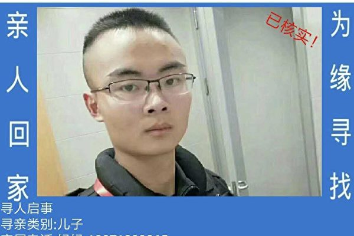
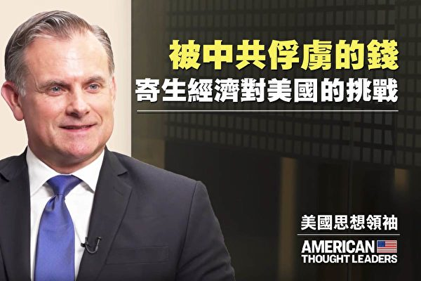

<table>
 <tr>
  <td align="center" width="450"></td>
   <td   width="450"><h3>【希望之声2020年2月18日】在武汉肺炎疫情严峻、中共加强大陆封网之际，希望之声推出专门为中国大陆民众开发的自带翻墙功能手机   APP。据开发人员介绍，此款手机APP适用于安卓操作系统，也就是所有的国产品牌手机、以及三星、LG等非iphone手机。
     

     
   安装后可收听收看希望之声的节目：包括《江峰时刻》、《天亮时分》、《老北京茶馆》及最新时事新闻等精彩内容。不需要使用任何翻墙软件，一步到位获得最新海外资讯，帮您免除翻墙上网的麻烦与风险。欢迎大家下载并传给中国大陆的亲朋好友。
   
   希望之声版权所有，未经希望之声书面允许，不得转载，违者必究。</h3>
     </td></tr></table>
     

     
<h1 align="center"><b>免翻看视频 (请收藏网址)，随时连即时最新IP https://git.io/swspip</b></h1>
<h1 align="center"><b>复制（网址或 IP 数字 ）到浏览器打开。若出现   “提示” ，請点击“继续”访问即可。</b></h1>

<h2 align=center><a href="https://github.com/gav01/Heart/blob/master/news1.md">● 大纪元时事 ●</a></h2>

<h2 align="center">直連不必翻牆開花必看精彩視頻http://36.228.7.84</b></h2>

<table>
<tr>
 <td>
 <a href="https://git.io/pamja"> <h3>如何 “ 三退保命 ”</a>，<b>连上面→免翻视频 IP http://36.228.7.84 </b> →点 【三退大潮】--为什么要退党？ 可留言三退或用翻墙软件自己办理三退</h3></td>
</tr> 

<tr>
 <td>
 <a href="https://git.io/pamja"> <h3>如何 “ 三退保命 ”</a>，请点击翻牆网站  https://git.io/opopop  下载 { 翻牆软件 }→找 { 大紀元網站 }  ( http://www.dajiyuan.com ) 三退</h3></td>
</tr>
</table> 

<a href=https://git.io/souye><h6 align="right">回首頁</h6></a>

<a name=top>

<a href =#153>153.武汉大学生再爆失踪 警方不作为家属陷绝望 
<a href =#152>152.奥克兰库姆秀 法轮功学员表演深受欢迎 
<a href =#151>151.【一線採訪】異議人士張展武漢50天見聞 
<a href =#150>150.杨宁：武汉合唱团两死多人感染 红歌是催命符 
<a href =#149>149.【现场视频】听信中共谎言 返京人挤爆机场 
<a href =#148>148.中南海密谋“丧事喜办” 传栗战书王沪宁操办 
<a href =#147>147.中南海气氛诡异 习近平被“抬起”又“摔下” 
<a href =#146>146.意大利疫情恶化 “台湾女婿”揭伊朗造假 
<a href =#145>145.首次公开直指中共抺黑 川普:美军被污名化 
<a href =#144>144.原中国建行支行工程监理赵锋慧遭迫害经历 
<a href =#143>143.【有冇搞错】药方开错！认清中共才能对症下药 
<a href =#42>142.分析：中共武汉肺炎海外宣传战 破绽百出 
<a href =#141>141.【最新疫情3.17】纽约市长:48小时内或封城 
<a href =#140>140.【新闻看点】官媒忙降温？赵立坚及五毛被打脸 
<a href =#139>139.华人纷纷回国？律师披露红二代不回国内幕 
<a href =#138>138.【思想领袖】史帕丁：中共寄生式经济 川普反制 
<a href =#137>137.【疫情透视】德国疫情 为何北威州最严重？ 
<a href =#136>136.疫情冲击 水果卖不出 批发市场用铲车倒掉 
<a href =#135>135.大陆原卫生高官：疫情恐再爆发 谎言将破灭 
<a href="https://github.com/gav01/Heart/blob/master/ls-20-3-1.md"><b>往1~ ~ 134 新闻</b></a> 

<a name=153>
<h1 align="center"><b>武汉大学生再爆失踪 警方不作为家属陷绝望</b></h1>

2018年12月22日晚上在武昌区临江大道平湖门下出租车后失踪至今的潘英豪。（受访者提供）

 
 【大纪元2019年04月05日讯】（大纪元记者顾晓华采访报导）2017年下半年武汉失踪大学生在媒体的曝光之下，引起各界关注，之后事件逐渐沉寂。2018年下半年，再次爆发武汉大学生失踪事件，仍然由于警方的不作为，事情毫无头绪，失踪者家属们陷入绝望中。

潘英豪，今年19岁，身高1.80米，武汉市孝感区安陆市赵棚镇陶庙村人，武汉警官职业学院大二学生。2018年12月22日晚上在武昌区临江大道平湖门下出租车后失踪至今。

其母亲王女士向大纪元记者透露，潘英豪在学校住宿，去年12月17日回家参加亲戚婚礼后回校，12月21日再次以奶奶病危为由向老师请假，据了解，该校不允许连续请假，但是当时班主任并没有向家长核实批准了请假。

王女士透露，儿子去了其女朋友家中，待到22日下午5时30分许离开。潘英豪的女朋友告诉王女士，潘英豪在临走之前通过QQ语音接了一个电话，只回答了三句话：“好，知道了，马上到。”

潘在离开之前其女朋友要求一起去，他还哭着向女朋友说让她好好待着，晚上10时左右就回来，把女朋友家中的钥匙也带走了，当时他的女朋友对潘英豪的奶奶病危信以为真。

王女士还透露，22日当天，她接到了两次一位陌生女性的电话，声称其是蛋花花网贷平台，因潘英豪欠钱要求王女士尽快还钱。王女士接了第一次电话后，随即打电话给儿子，她的儿子说没有借钱。第二次电话中，对方威胁如果不还钱她的儿子将有危险，王女士放下电话之后再联系儿子就再也联系不上了。

2018年12月22日晚上在武昌区临江大道平湖门下出租车后失踪至今的潘英豪。（受访者提供）

王女士联系了学校的老师，让他们报警，晚上9时许她与儿子的女朋友来到当地派出所做了笔录。

当时由于未到24小时，警方不协助调查；24小时过了以后，家属要求立案，警方又声称不属于刑事案件，三个月后才可以立案；然而到了三个月后，仍然以案件不够重大为由不予立案。

王女士表示，在儿子失踪后的三个月当中全部都是家属自己调查监控、搜寻线索，然后告诉警方，让警方去调查。但是警方只是敷衍了事，并未真正地展开任何调查，仅仅是打打电话。家属找到潘英豪最后搭乘的计程车司机，在家属的再三要求下，警方才将司机传唤到派出所做了笔录。

司机透露，潘英豪坐车时好像喝了些酒的状态，在平湖门下车后坐在公交车站台里，好像在等人。之后，潘英豪便杳无音讯。

“12月22日下午五点半接了一个QQ或者微信电话让他走的，这个人很重要，但是（警方）不立案不给查，说我儿子不是刑事案件。如果当时报案的话，当时就可以拦截下来，现在一推再推，说案件太小了。我都怀疑我儿子没了，要不然怎么可能手机几个月没用。据有关方面人反映，QQ讯息只能保留六个月，现在都四个月了。”王女士气愤地说。

王女士还说：“校方态度更不好，不协助我们。（家属）想让他们帮我们请求立案，（但校方）到现在都反映不到上面去，把这事推得一干二净。”

王女士现在非常无奈，不知道如何去寻找自己的儿子。

据家属们初步统计，目前已知的在武汉失踪的大学生有三十余名，至今仅有一名失踪的大学生找到遗体。

这名大学生是武汉大学信息学院测绘专业大二的吴胜，2017年2月17日从学校出走，一直处于失联状态。其父母在武汉到处寻找，后来在媒体的关注下警方才算开始积极寻找，最后于3月20日前后在长江二桥下游、靠近二七长江大桥的天兴洲附近打捞出遗体，经DNA鉴定是吴胜。

吴胜的母亲对大纪元记者表示，当时他们（政府）说是DNA鉴定是她的儿子，她看到儿子的遗体全身发黑，她只看着手形有些像她的儿子。警方声称如果做尸检结果要等三个月或者半年才能出来，家属过于悲痛，最终选择了火化遗体，儿子的死因成为了永远的谜。

另一位失踪者家属江西九江的陈先生向记者表示，他的表弟罗浩2015年9月10日去武汉大学见同学时失踪，失踪后完全是靠家属到处奔波寻找。他们跑了13个行政区、二百多个派出所，并且做了各种DNA登录，希望能够找到罗浩，但是一切都是徒劳。让他们感受到的只有警方的敷衍与不作为，如果上访就是打压，让他们尝尽了人间冷暖。

另一位失踪者林飞阳的父亲林先生则表示，四年来的寻儿经历，让他最后妻子离异、母亲去世，可谓家破人亡。林先生已不太愿意提起儿子的事情，他很无奈。

家属们表示，希望各界媒体多多报导，引起社会舆论的关注，才会倒逼警方有所作为，让他们能够了却心愿，活着见人，死了见尸。#

<a target="_blank" href=#top><h6 align="right">回上方</h6></a>

<a name=152>
<h1 align="center"><b>奥克兰库姆秀 法轮功学员表演深受欢迎</b></h1>

今年举办新西兰奥克兰库姆秀的负责人丽泽尔·韦斯特曼女士赞赏法轮功参与社区活动。（明慧网）

 
 【大纪元2020年03月18日讯】3月14日、15日周末两天，新西兰奥克兰法轮功学员应邀参加了一年一度的库姆秀（Kumeu Show）活动，他们的腰鼓和舞龙表演深受当地人的欢迎。
 
 

库姆秀上腰鼓队在游行中。（明慧网）

 

库姆秀上舞龙队的表演中。（明慧网）

 
 <b>主办方负责人：“真、善、忍”是每个人的信念</b>

库姆秀的负责人丽泽尔·韦斯特曼（Lizelle Westman）女士介绍这次活动大约有三百个商家参加，今年是第98届库姆秀，这个展览会属于农牧展。因中国社区很大，主办方希望中国人有机会来参加新西兰本地人的展会。当地民众很喜欢法轮功学员的表演，表示“有这样的表演意义非凡”。

她说，在昨天的游行中，她还把法轮功队伍（腰鼓队和舞龙队）放在打头阵的位置。她很欣赏法轮功团体为这次活动所做的努力。“这是不同的文化互动，非常好。我觉得我们对所有的精神追求、宗教，不同的信仰等等都持开放的态度。我们很开放并乐于拥抱这些信仰。因为这就是新西兰，我们都在这片国土上。”

法轮功学员告诉丽泽尔说，法轮功遵循的理念是“真、善、忍”，修炼者想要把这个价值理念传递给社区。丽泽尔说：“这其实是每个人的信念。法轮功学员每年都做得很棒，给整个展会也带来了很多欢乐。我很感激他们来这里参加展会。”

<b>新西兰社会信用党领袖：坚守自己的价值观</b>

 

罗丽娅·布鲁尼呼吁中共停止迫害法轮功。（明慧网）

 
 新西兰社会信用党的摊位就在法轮功学员摊位的旁边，该党在新西兰有63年的历史。其领袖格罗丽娅·布鲁尼（Gloria Bruni）女士非常欣赏法轮功学员的舞龙表演，她拿着相机不停地拍照。

她说：“我们很关注中共对中国人的迫害，中共甚至试图迫害生活在新西兰的人。世界上这种事情发生得太多了，我们一定要引起注意，让他们停止迫害。”

她还举了个实例，新西兰基督城坎特伯雷大学教授安妮·玛丽·布雷（Anne-Marie Brady）是一位研究中国问题和中共历史的专家，一直写文章揭露中共对海外的渗透。然而她的家、办公室都被盗，汽车被人恶意破坏，甚至教授本人也受到生命威胁。

她表示，新西兰政府应该站出来发声。“作为新西兰人，哪怕我们和中共做贸易，我们也一定要坚守我们自己的价值观，这样才更能赢得尊重。”

对于中共活摘法轮功学员器官，她气愤地说道：“这是完全错了、不道德的、不能被接受的。”

<b>“中国爆发的中共病毒（新冠病毒）是一个警醒信号”</b>

弗吉尼亚·伍尔夫（Virginia Woolf）是一位英文教师，在现场非常认真地学炼法轮功。她说，她目前面对许多压力，很容易感到疲惫，想做一些事来帮助增强自己的体力和精力，因此到场来学炼法轮功，体验一下。

 

弗吉尼亚女士在学炼法轮功。（明慧网）

 
 弗吉尼亚还说，她知道在中国发生的活摘法轮功学员器官的事，法轮功学员征集反迫害签名也有很多年了。她也看到要改变中共真的很难，就建议把这些真相都放到社交媒体如脸书、推特、Instagram上，让更多的人从中追踪有关的消息。

对于正在中国爆发的武汉新冠病毒一事，她说：“这是一次很好的机会，让新西兰政府来关注一下中共对待人民的方式。我根本不相信他们公布的染疫人数，我也不信他们有效地控制了疫情。”

“新冠病毒的爆发是一个让全世界警醒的信号，人类不能再这样下去了。”

<b>“所有人都应该被尊重”</b>

格斯·吉尔摩（左一）和女儿一家人喜欢舞龙表演。（明慧网）

 
 格斯·吉尔摩（Gus Giomore）和他的女儿一家驻足观看法轮功学员的舞龙和腰鼓表演，他是新西兰航空（Air New Zealand）在香港及中国大陆区域的经理。他说，他们很喜欢舞龙表演，之前曾住在香港时，哪里有舞龙表演他们都会去看。他觉得舞龙表演很精彩，色彩、动作，还有龙本身都很令人惊叹。

他还表示知道中共迫害法轮功，他说：“我很尊重他们（法轮功）的信仰，我觉得这种打坐炼功对人很好。所有人都应该被尊重地对待。不管你是谁，或者你信仰什么，你都应该被尊重。”

针对中共不仅迫害法轮功，也迫害为人权而抗争的香港人，他说：“我们不希望看到这样的事情发生，共产党应该懂得尊重别人的观点。”

<a target="_blank" href=#top><h6 align="right">回上方</h6></a>

<a name=151>
<h1 align="center"><b>【一線採訪】異議人士張展武漢50天見聞</b></h1>

上海異議人士張展於武漢封城期間，前往武漢醫院、殯儀館、小區等處觀察。（受訪者提供）

【大纪元2020年03月19日讯】（大纪元记者洪宁、李毅采访报导）中共病毒（又称武汉病毒、新冠病毒）肆虐，上海异议人士张展在武汉封城后，前往武汉医院、殡仪馆、小区等多处观察。2月7日，她将观察文字和视频发到网路上，因而微信遭到永久封号。她将这段时间对武汉疫区的百姓和当局的观察，透过大纪元媒体与读者分享。

张展是一名80后的网路异议人士，2019年9月，她因为撑着一支写着“结束社会主义，共产党下台”字样的雨伞，在上海南京东路街头游行，声援香港反送中运动，而被以涉嫌“寻衅滋事罪”逮捕，在拘留期间被两次做“精神病鉴定”。

张展目前仍滞留于武汉，3月16日以语音接受大纪元访谈。以下是她的访谈内容摘要。

记者首先请她谈一下这五十多天，经历最恐惧或痛苦的事情是什么？张展说，让她觉得最恐惧和痛苦的事情，还是看到这疫情的感染，还有出于对政府打压的恐惧，以及自己被限制在旅馆里，什么都做不了时，“那时是让我最痛苦的”。

张展提到，在疫情爆发之初，她亲身前往第一线，回来后恐惧感持续许久，“比如去第七医院、人民医院、火葬场、方舱医院，去了之后，整个人就是在一种很强的恐惧之中。每次去之后，总有两三天哪里都不敢去，很害怕。”

张展夜间经过殡仪馆，仍可听到焚尸炉运转的声响。（受访者提供）

80岁老人40天以来只有拿到2次的菜。（受访者提供）

<b>数据成不解之谜 市民什么援助都没收到</b>

她谈到，中共官方的宣传和她实际走访看到的情况有很大差距，“如果单听官方宣传，就会觉得他们的计划很完美，比如他们提到，对社区有困难的人给予帮助。但实际去问社区里面的人，特别是老年人，他们就会说什么都没收到，什么关怀都没有。”

“还有就是中央电视台说，这个疾病在控制中，但是实际上，在火葬场听到轰轰的焚烧炉的声音，不管白天、晚上24小时转时，感觉到死亡的阴霾笼罩在这城市上。”她说。

张展提到，官方的宣传其实是一种强烈的政治术语，“官方宣传是按照他们上层的计划，编织一些彩排的东西来作新闻，是一套政治术语，是一套带有强烈政治色彩的话术一样，实际上，和每个人亲身经历的完全都不一样。”

实际走访医院，她还发现轻症患者都无法进行检测，“死亡人数几乎是一个不解之谜了，我了解到，我之前在医院里看到，确诊必须是要危重病才能用试剂盒，轻症的检测几乎是做不了。每天报武汉市死一百多人，但实际上一个殡仪馆它的焚烧炉24小时转的话，那整个城市的死亡人数肯定不止那些。”

张展亲自到小区问年长者要感谢党吗？长者说，不用。（受访者提供）

<b>当局不对隐瞒疫情道歉 反而进行奴化管理</b>

张展表示，“他们还建立一整套的信息封锁机制，不接受任何外面记者的采访，不回答任何问题，包括医院里的信息都是被隔离的，专门有一个部门来收集信息，其它的人都不知道；包括社区里面发烧的人，都要通过社区去报到医院。导致整个城市的管理是一个‘黑匣子’，都被它们管控起来了。”

“我接触的市民10人有8人，对这样的防控工作都是有苦难言，有苦说不出。”她说，“刚开始封城时，是对整个瘟疫信息的屏蔽，导致公民大量聚集，感染人数很多，他们就突然封城。这种封城，他们对自己的错误没有对市民做任何解释，反而，给市民带来了恐慌和城市人口的大逃离。”

“后来社区封闭，又是不经过任何探讨就直接下命令，将每个社区围起来，将人们像猪一样关在家里面。而且很多信息，市民都是被蒙在鼓里面的，我觉得这更是一种奴化的城市管理，而不是在进行防疫。”

她提到，整个封城政策缺乏医疗专业的参与，而是大量部队武警参与，“极权体制遗传的统治基因没有改变，处理方式非常不人性化。”

她说，在独裁统治之下，“各种匪夷所思的事情，每天都可以看到。普通的人去买卖日常生活必需品都要像做贼一样偷偷地去，怕被抓到。”“工商局的人以防疫的名义，直接把人家的营业执照拿走，不出具任何的执法手续，很常见。”

“以防疫的名义，几乎可以剥夺一个人所有的权利，他们说这是为了百姓的身体健康，但吃喝那么贵，每天都没收入，经济损失谁来弥补呢？他们没有任何计划和解释，就强制推行，把瘟疫的数字控制下来，但就这样，人们像被驴子、马一样，只能服从地待在家里。一旦解禁以后，他们薄弱的防疫意识，一定会导致疫情再次爆发的。”

湖北人民医院急诊室的情况。（受访者提供）

 

小区严密控管的方式，导致不时发生冲突。（受访者提供）

<b>方舱全面清舱与抗疫表演 出于政治逻辑</b>

她认为，政府急于解封是为了营造疫情趋缓的假象，“此前没有任何解释的权威式管理，造成人们的怨恨很大，它们为了平息民怨，就尽快解除这种封城封小区的措施。”

“它的执政逻辑是，封城的理由是感染的人很多，现在清舱，是因为疫情得到控制了，才解封。”张展说，“这种清舱就很仓促，以至于有的人在没有被治愈的情况下，就被释放出来。”

她还提到，“它们的政治思路想证明自己是万能的，所以才采取这种强行的隔离，整个国家没有公民参与探讨，积极探讨来解决问题，当它的很多政策没有下传到底层的时候，怎么会有效呢？”

“这就像是一种表演，一种抗疫的表演，跟普通人的卫生健康基本没有太大的关系。我看到老年人对此愤愤不平，很多中年人保持沉默。”她说。

<b>维稳支出大增 百姓都要喝西北风了</b>

由于中共的强制政策，使得底层百姓正面临很大的经济危机和生存问题，“很多人都说，要喝西北风了，像我所在旅馆老百娘说，再下去要喝西北风。”她质疑，“当局把很多的资金财力人力都用在维稳上，雇用很多警察，包括建立方舱医院，但实质上，物资医疗用在个人身上非常小。”

“比如给普通民众免费发口罩，免费派发酒精，将这种核酸测试纳入到医疗保险之内，或者免费提供测试，以及CT拍照等，这些全部都没有，对于民生几乎是‘零投入’。”她说。

疫区的物价更是涨得离谱，“菜场超市都不让开，让社区统一采购，居民买的菜价格特别高。疫区应该是更便宜，但却要承受更高的代价。虽然政府说投入钱了，当局投了钱去了哪里了呢？”

“说都在为市民服务？这是很荒谬的一件事情。”张展说。

<b>武汉疫情凸显共产党与民争利本质不变</b>

张展认为，这次所谓的“抗疫”，充分体现了共产党体制从1949年到现在从未改变，只为了谋求一党之私，而非为百姓谋福利。

“从49年到现在，（体制）从来没改变过的，在一个无能为力、极其低效的制度下，要给自己唱赞歌，证明自己可以。所以，不管做什么，在民众这里都没有真实地感受到。它们即使做再多的努力，也都是在谋求私利，跟民众都没有关系。”

封城已经超过50多天，“现在整个武汉市就像一个大监狱，如果不尽快解封的话，那迎来的一定是经济危机和生存危机，甚至就有可能会像1959－61年的饥荒再次重演。”张展说，“这种面临的问题，经济冲突和疾病带来的开工率肯定不会太高。”

<b>共产党才是空前灾难的根源</b>

最后她提到，在公民记者方斌和陈秋实被抓之前，中共即对异见人士密切严控，对她本人也是如此，“基本上生活在一种恐怖的气氛之下。”

但亲历这场大瘟疫，即使受到严密控制，张展仍希望如实地反映疫区的问题。她表示，“我曾经多次呼吁共产党下台，结束社会主义制度，因为我觉得这个国家的每一个人，都生活在这种制度的诅咒之下，这种社会大规模的灾难，越来越明显，没有一个人能逃脱其中，从上到下全部处在恐惧中，或者是处在一种罪恶的泥潭里面无法自拔。”
<a target="_blank" href=#top><h6 align="right">回上方</h6></a>

<a name=150>
<h1 align="center"><b>杨宁：武汉合唱团两死多人感染 红歌是催命符</b></h1>

2014年，山东一男子在济南全福立交桥广场露天KTV唱歌。当他唱到第二首红歌时，突然摔倒在地死亡。（网络图片）

【大纪元2020年03月17日讯】几日前的大陆媒体和社交平台上，传播着发生在武汉的一则感人的故事：60多岁的儿子感染了武汉肺炎，90岁的老母亲担心其他家人被感染，独自照顾在医院门诊部等床位的儿子。在等了五天五夜后，儿子终于等到了床位，但因为病情加重，住进了ICU。这位叫徐美武的老母亲，为了鼓励儿子挺住，写了一封令人为之动容的短信。然而，儿子并没有看到老母亲的信，他在入院后的第二天就离世了。

据武汉作家方方的日记透露，离世的60多岁的儿子名叫包杰，是她的一位朋友弟弟李先生的朋友。李先生写了一篇怀念文章，文章的第一句便是：“我怎么也想不到，包杰和苏华健这两个身边的朋友，在这个新年，生命会戛然而止。”

从李先生的文章得知，包杰和苏华健都是老年合唱团的成员。包杰是湖北省黄埔军校同学会所属的艺术团的领唱，嗓子很好，声音经过训练。今年1月17日下午，参加了省黄埔举办的春节联欢会，18日又又参加另一个联欢活动，在那里他被感染。“同时感染的有三人，其中有两人罹难。”

而苏华健和李先生都是武汉民间合唱团“希文合唱团”的男高音部成员，两人关系密切。该合唱团成立于1938年，最初由希利达女中和文华中学师生组成。改革开放后，老人们又重组“希文合唱团”，成员不再只是这两所学校的人，开始面向全社会。李先生最后一次见到苏华健是在1月9日聚餐时，此后就与其失去了联系，直到3月6日去世的消息传来。

方方在日记中说，在武汉，很多退休老人都会参加一些文娱活动，尤其他们这代经历过文革的人，能唱会跳的人特别多。而她也很早就听邻居说，老年合唱团有不少人被感染。“因为元旦和春节，一直都是他们演出活动的频繁期，而他们的年龄本来也属易感人群。”

虽然他们的年龄属于易感人群，但经历过文革的他们，显然对毛和中共对中国人的迫害、对中华文化的摧残缺乏清醒的认识，他们在合唱团中演唱的颂扬中共的“红歌”也许是他们真正的催命符。

比如2019年9月29日，湖北省暨武汉市黄埔军校同学会举行庆祝中共国成立七十周年联欢会。联欢会上，湖北省黄埔艺术团策划并演出了文艺节目，其中就有歌颂中共的曲目。作为领唱的包杰自然也在歌曲中倾尽了其对中共的情感。

再如希文合唱团2017年曾参加了湖北省迎接中共十九大召开暨庆祝建党90周年的演出，并演唱了《祝福祖国》、《前进吧，中国共产党》等曲目。苏华健和李先生自然是参与其中。

另据大陆媒体报导，2017年11月，首届中老年合唱大赛决赛就是在武汉的湖北广电演播厅举办的，而之前在15个分赛区有7万5千名中老年人组成的合唱团参加。最终，来自全国15个省市的近千名老人参加决赛，希文合唱团也入围，这些人演唱了若干首“爱党红歌”。

要知道，真正好的音乐是可以让人在精神和道德上获得提升的，中国古人称之为“德音”，乐音也是以平和为主。然而，中共成立，特别是建政后，中共御用音乐家创作或改编了不少红歌，它们的词曲中都浸透着中共所宣扬的斗争的邪气，并成为操纵国人精神、洗脑的工具。就连中共也公开承认文艺就是为政治服务的。

具体来说，红歌的内容有歌颂中共党魁和邪恶的中共的所谓“丰功伟绩”和如何“伟光正”的，如什么《没有共产党就没有新中国》、《南泥湾》、《你是灯塔》等，但实质上充斥的都是暴力、谎言、煽动、反人性等，将历史颠倒黑白。

据《共产主义黑皮书》编者斯蒂芬‧柯尔多瓦的估计，全世界因共产主义而死亡的人数，在八千五百万人至一亿人之间。这甚至比两次世界大战死亡人数加起来的总和还要多出一半，而这其中，在中国的受难者更甚于其它国家。中共建政后，发动了一个又一个运动，害死了中国几千万民众，并通过摧残中国传统文化，灌输中共的歪理邪说，毒害了绝大多数中国人的心灵。其在各方面所造成的严重危害，至今都无法消除。

可悲的是，被中共一次次运动迫害的中国人，在中共长期的虚假宣传中，忘记了曾经被折磨的死去活来、家破人亡，依旧在无知中歌颂着它的“恩德”，感恩着被美化的党魁，赞美着这个邪恶的制度，而这绝不是一个正常人所为。

试想，唱着这样的红歌，不知不觉中接受着中共的洗脑和毒害，甚至站在中共一边的老年人，在明确是针对共产党的这场瘟疫中，能够置身事外吗？

2011年明慧网曾刊登了《莫唱红歌催命符》的诗歌，其中写道：退休闲来无事干，想唱红歌来锻练。不料事情正相反，越唱越把灾祸添。天灭中共包括谁，党团队员拿命陪。红歌越唱越来劲，跟着中共去倒楣。莫唱红歌催命符，中共丑史人人知。害死国人八千万，世人莫走回头路。

而且，前车之鉴并不遥远。2018年4月，曾经在朝鲜发生了一起32名中国游客死亡的车祸惨剧，而该旅游团是乌有之乡旗下的旅行社组织的“星火旅游团”，该旅行社经理也是乌有之乡网站总编的刁伟铭也在遇难者当中。据悉，他们此次是去膜拜朝鲜战争时的战场上甘岭回来的路上出的事。乌有之乡是中国知名的挺毛、挺朝鲜的极左网站。

因此，在此次瘟疫中，武汉老年合唱团成员很多被感染，甚至死亡，就并不奇怪了。而全国其他省市染疫和病亡的老年人中，同样无法排除这样的情况。被中共蒙骗的中国人还要糊涂到什么时候呢？

<a target="_blank" href=#top><h6 align="right">回上方</h6></a>

<a name=149>
<h1 align="center"><b>【现场视频】听信中共谎言 返京人挤爆机场</b></h1>

3月16日，北京首都国际机场T3航站楼的D区专区旅客爆满，现场山人海。（视频截图合成）

 
 【大纪元2020年03月17日讯】（大纪元记者骆亚、萧律生采访报导）北京当局宣布，3月16日起，境外返京人员要被集中隔离14天，费用自理。然而当天，北京首都国际机场T3航站楼的D区专区旅客爆满，现场人山人海。对此，有评论人士认为，这些人多是受中共党媒忽悠，以为大陆比国外安全，然而实际情况并非如此。

据悉，北京首都国际机场T3航站楼的D区专区是作为国际重点疫情地区入境航班的保障专区。

据网传视频显示，该机场大厅的电梯上挤满了境外返京的旅客，他们多数戴着口罩、拖着行李。身穿防护服、戴护目镜口罩的机场工作人员不断地向旅客解释着。

拍摄者说：“因为现在是想让旅客尽快下去取行李。但是没想到无法控制，因为人太多了。下面积压的人太多了。我们想20或者10个一控制，但是不可能，所有旅客都是往下冲。然后现在在排队上这个大巴。”

“可是机场大巴是这样，机场大巴不是马上发车，不可能马上上去。就是说这个机场大厅积压的旅客还是非常的多。”

“为了防止旅客踩踏，其实机场已经把电梯停了。但是没法让旅客轮番下来。工作人员也在做解释工作。但是因为乘客太多了，都在这儿积压着。”

另有视频显示，不少旅客拿着行李或带着孩子从电梯上往下走，还有大批旅客在等待中。

对此，大陆独立媒体评论人吴特向大纪元记者表示，这些赶着回来的华人应该是受到中共党媒的忽悠，认为现在中国的本土病例几乎清零、比外国安全才赶着回来，但是这样做其实是把自己置于更大的危险中。因为民主国家的疫情通报是透明的，中国大陆则是为了尽快复工拿疫情通报当政治任务，并没有呈现真实的感染情况。当然，现在境外也确实存在疫情爆发的情况，大量华人回国势必也会增加境外输入病例，增加疫情防控难度。

吴特还说，对于在海外的华人来讲，关注当地疫情信息、做好个人防护就好，没必要往国内跑，因为往国内跑并不能真的提高安全系数，还要多交隔离费用。

此外，有网民说：“本来说谎说是病例零增长的目的是为了骗外国人来中国投资，并希望外国企业不要离开中国，谁知道，骗回来的是一群粉红。气得老共直跺脚，现在开始骂街了。”

“中共要面子又要里子。使劲说咋牛逼牛逼了什么都好⋯⋯那就回来呗。回来了就自费赚你们一把⋯⋯好吧。现在越来越多了吧⋯⋯”

“其实这病毒是全球性的，各国采取的均是穿戴防护+隔离+医疗资源量，所以在哪里都一样。差别在于各国对‘隔离’的标准是否严谨⋯⋯自己判断啰！”#

<a target="_blank" href=#top><h6 align="right">回上方</h6></a>

<a name=148>
<h1 align="center"><b>中南海密谋“丧事喜办” 传栗战书王沪宁操办</b></h1>

据消息人士透露，由栗战书(前图)和王沪宁(后图)主导的中南海小组，正在紧张筹备中共病毒“庆功”大会。（Mark Schiefelbein - Pool/Getty Images)

 
 【新唐人北京时间2020年03月19日讯】中共病毒持续扩散，在全球忙于应对疫情之际，中共正在密谋“丧事喜办”。据消息人士透露，由中共常委栗战书和王沪宁主导的中南海小组，正在紧张筹备庆功大会，将这场大灾难变成表彰会。

有美媒18日刊文披露，尽管这场疫情“战争”仍未完全结束，3月的两会也因此已经推迟，但是中南海最高层急需一场“胜利”大会，更何况中共向来把丧事办成喜事。

知情者说，由中共政治局常委栗战书和王沪宁亲自主导的中南海小组，正在紧张筹备庆功大会，以表彰在这场“人民战争”中的所谓杰出人物。

庆功大会的最佳地点仍是北京大会堂，最佳时间是在两会复会期，刚好可以提前测试一下北京大会堂的防疫能力和安全性。习近平将在大会上发表重要讲话，核心智囊和御用团队正在赶写演讲稿。

不过具体的时间和地点以及详细安排，仍需中共政治局常委会另行研究后，再对外公布。

掌管中宣部的王沪宁授意推出的《2020大国战疫》一书引来恶评如潮，（网络图片）

 
<b> 丧事喜办是中共的传统</b>

中共肺炎病毒已经肆虐3个多月。疫情爆发之初，中共一直在掩盖和淡化，并谎称可防可控，没有人传染人。同时以“传谣”为名，抓捕8名传播疫情真相的前线医生，错失防疫的最佳时机，导致疫情扩散至中国全境，危害世界。

在全球忙于应对疫情危机之时，中共推出《大国战役》一书，为自己歌功颂德。在遭到全网狠批后，该书突然下架。但文宣系统又策划推出“抗疫”连续剧，把丧事办成喜事。

评论员东方觉刊文说，丧事喜办是中共的常态行为和惯势做法，它不顾事实真相，一贯自吹自擂，反复强调“奇迹”，不断展现救灾的所谓胜利与成功，这是中共特色的“灾难”报导。

文章说，中共可以把哀伤变成喜悦，把问责变成感恩，把反思变成赞美，把对生命的敬畏变成对所谓组织的效忠。明明是一场撕心裂肺的世纪大“灾难”，中共却能让它变成赞美英模的表彰会，成了大摆“奇迹”、歌功颂德的机会。

习近平在挂有“火神山医院”牌子的建筑前发表讲话。（视频截图）

<b>任志强痛批习防控疫情不力</b>

近日，一篇署名任志强的文章，对中共当局在疫情防控方面提出一连串的质问：为什么没及时公布信息？为什么1月1日中央电视台报导追究8名谣言者？为什么会有1月3日的训诫？为什么1月3日却对美国通报疫情？

为什么不向大众公布1月7日之前已发生的各种疫情危机？为什么1月7日的批示至今不向社会公布？为什么1月7日之后还召开各种聚集性的全国大会？

文章炮轰习近平于2月23日在17万人大会上的讲话，称在这次大会上，没有对事实真相的追究与披露，没有查清疫情暴发的原因，更没有人检讨责任和承担责任。却只有表扬和功劳。

文章说，当局对肺炎疫情决策的“遮羞式的宣传，大约只能欺骗那些愿意被你欺骗的人，却无法欺骗那些只相信事实与真相的人。无论宣传目前的防控取得了多大的成绩，都无法挽回那些失去了的生命和失去了欢乐的节日，失去了亲人的破碎家庭。

文章形容，皇帝可以骗自己是穿了衣服了，但连孩子们都知道皇帝是光着屁股的。尽管高举一块又一块的遮羞布，试图掩盖自己没穿衣服的现实，但丝毫也不掩饰自己要坚决当皇帝的野心。齐奥塞斯库以为人民仍然会相信他的谎言欺骗时，却不知道船已调头了！

上述文章发出后，任志强失联，3月17日，有消息称，任案已被内定为“国安大案”，任何人不准插手。

<a target="_blank" href=#top><h6 align="right">回上方</h6></a>

<a name=147>
<h1 align="center"><b>中南海气氛诡异 习近平被“抬起”又“摔下”</b></h1>

日前，习近平到视察甘肃时，受到党媒肉麻吹捧，而党媒微信公众号却刊登有关邓小平“废除领导人终身制”一文，引起舆论关注。（Kevin Frayer/Getty Images)

 
 【新唐人北京时间2019年08月29日讯】在香港局势持续恶化、美中贸易战火升高之时，中南海的气氛越发诡异。日前，习近平视察甘肃时，受到党媒肉麻吹捧，而党媒微信公众号却刊登有关邓小平“废除领导人终身制”一文，引起舆论关注。

北戴河会议后，习近平于8月19日至22日来到甘肃省考察调研，习考察高台县时，官媒发布的视频显示，可以清楚地听到：“习主席万岁”，“总书记万岁”的口号声，而且是标准的北京口音。 这让外界联想到毛泽东时期颂毛的口号。

对此，《人民日报》称，习近平视察甘肃，定格了一幅珍贵的历史画面。央视则称：“万岁声音不绝于耳”等等；不过，官媒报导中“习主席万岁”成了“祖国万岁、共产党万岁”。而喊口号者非本地口音也引发质疑。

中国问题专家横河认为，官媒还不敢做到那一步，叫一个人“万岁”在历史上是特定的，大多数人还不能接受。会不会把事情闹大？所以既要把个人崇拜升温，但也不想引起更大反弹，而喊“万岁”吹捧就到顶了，试探一下。

他说，外地口音也不奇怪，中央一级到地方做视察时，观众都是群众演员，持当地口音的早就排除在外了。这种事情是宣传部门策划的，所以需要演员来演戏。

《美国之音》认为，这种宣传伎俩都是负责宣传组织的王沪宁为习安排的。

有海外评论人士认为，这是一个信号，揭示了北戴河会议上中共内斗激烈。

旅美中国作家、政治评论家陈破空在自媒体说，北戴河会议上由于香港反送中持续发酵、美中贸易战一再升级，国内经济不断下滑，企业倒闭潮，失业潮等，当局备受批评。本来王沪宁想搞整党，但搞不起来。而习到甘肃祭拜西路军，也说明他在党内外正遭受重大挫折。

陈破空认为，习到访高台县时，围观人群有人呼喊“总书记万岁”，应是习阵营安排的人，但这句不是喊给老百姓听，而是给党内反习高层听，暗示自己不会低头。

他说，习近平此次还去了西路军全军覆没的地点，所释放的政治信号，是习家军或有全军覆没的危机，但是习自认不会轻易屈服，誓言要像西路军一样浴血战斗到底。

他还披露，北戴河会议上发生拉锯战，政治老人和各派都不支持习。结果在北戴河会后，中美贸易战突然升级，以及香港局势也陷入危局。

<b>党媒公号放冷箭？</b>

8月22日，习近平考察结束回程的途中，《人民日报》出版社旗下的两个微信公众号，出人意料地发布了一篇题为《邓小平废除领导职务终身制》的文章。

文章开头就说，“废除领导干部职务终身制，建立退休制度，是邓小平成为党的第二代领导集体的核心之后，提出的一个重要主张。”

文章接下来叙述邓小平提出废除领导职务终身制的过程，并引述一段话说，由于传统习惯势力的影响，在其党的干部队伍中，长期存在着一种只能上不能下…..的倾向！不过文章很快被删除。

《德国之声》分析，上述文章虽然“昙花一现”，但明显是剑指习近平修宪废除国家领导人任期限制。这是中共党内对习的政策不满者，借机发出的信号。

“品葱”网引述分析说：“放在很不起眼的《人民日报》的自媒体新闻，发布在头条这种专营自媒体网站上。只是反对习的人放出的暗箭。 ”

横河认为，党内发出这个声音的级别一定很高。但是这不代表意识形态的争议，更多的仅仅是权力和派系斗争。

陈破空认为，这是王沪宁所安排的，王被江泽民扶上来，至今已三朝不倒，这样的人一定是见风使舵，他在北戴河会议上，看到了风向要自保，甚至想当四朝元老。如果换上新领导人，他还可以掌控新主，类似王莽或司马懿。在这个野心之下，他才会搞这个小动作。搞个快闪，还让人搞不明白是否小编出错。

陈破空分析，习近平十九大后的极左路线，很大程度上来自王沪宁的极左。事实上，这个主管意识形态的政治局常委，才是当今中共的大脑和极左思潮的来源。

<b>有文章规劝习把王沪宁送去秦城监狱思过</b>

王沪宁被称为中共“三朝元老”，最早被江泽民提拔，先是为江包装推出所谓的“三个代表”，后来又成胡锦涛“科学发展观”的重要推手。而习近平的“中国梦”、以及“习近平思想”，也是出自王沪宁之手。

中共十九大上，王沪宁位居政治局常委，掌一党之思想管制和宣传，是中共党魁的真正“大脑”。美中贸易战开打后，王在中南海大行其道，频频抛出各种老掉牙的文革式口号和政策，藉以应对贸易战。

此轮中美贸易战诡异急剧升级后，中共党媒与贸易代表刘鹤的不同调言论，显示中共高层内部对贸易战两个声音的博弈升级。而中共外交部与《环球时报》主编胡锡进，高调否认北京求美方谈判，更将中共高层的分裂演变为国际外交问题，突显中共高层博弈的白热化。

有分析说，习近平前5年通过打虎原本握一手好牌，而王沪宁这类人上位后，把习捧成昏君，拖入左倾路线的险境。如果习摆脱这个贴身 “宣传党棍”，局势或有变化

有署名诸葛高参的作者，在题为：“习老兄，再不回头，万事皆休！”一文中，帮习近平回顾过去几年任期的情况：

中共十八届常委班子里，没有王沪宁，习打虎一路顺风顺水，民心快速聚拢，希望弥漫中国。

十九大后，王沪宁上位，主掌文宣，溜须拍马，把习抬起、摔下，又抬起、再摔下，原本看起来憨厚的老大，如今让王沪宁弄得成了昏君，里外不是人，朋友战友闭嘴远观，对手敌手额首称庆，人人自危，噤若寒蝉……

文章规劝习近平，把王沪宁送去秦城监狱思过。文章说，习走错方向，用错人已经非常要命，然而，王让习在错路上越走越快。如今外界看习，几乎摆出了末路狂奔的吓人姿态。

<a target="_blank" href=#top><h6 align="right">回上方</h6></a>

<a name=146>
<h1 align="center"><b>意大利疫情恶化 “台湾女婿”揭伊朗造假</b></h1>
 
【新唐人北京时间2020年03月19日讯】截至周三，除了中国大陆以外，全球各地的中共病毒确诊病例，累计超过13.6万，死亡5682人。欧洲所有国家，全部传出疫情。

3月18日，意大利的单日新增病例数量再创新高，达到4207例，全国累计确诊35713例，单日死亡病例也大幅增加，达到475例，目前意大利死于中共病毒的人数已高达2978人。

激增的感染人数令当地的医院不堪重负，目前意大利正在全国范围内建立流动帐篷医院，以满足各地急剧增加的床位需求。

已处于全国封锁状态的西班牙，18日新增2920个确诊病例，全国累计已达14746例，死亡638例，是疫情仅次于意大利的欧洲国家。

西班牙首相桑切斯周二在国会，就中共病毒疫情发表紧急讲话，但为了避免病毒在国会传播，仅有28名议员和5名部长出席。

德国周三新增2960个确诊病例，全国累计高达12327例，但死亡率相当低，至今累计死亡人数为28人。

周三晚间，德国总理默克尔发表了执政近15年来的第一次全国电视讲话，敦促民众遵守防疫指南，减少直接的社会接触。

该国研究人员认为，如果未来几周人们不能减少直接的人际接触，将有至少1000万德国人感染中共病毒。

周三是法国全民禁足令实施的第二天，巴黎街头空空荡荡，昔日的著名景点，如今门可罗雀。当天，法国新增确诊病例1404例，全国累计确诊9134例，死亡264例。

法国政府当天推出了应对中共病毒的新法案，承诺建立“卫生紧急状态”，为陷入困境的企业提供财政支持，并推迟第二轮地方选举。

在中国大陆和欧洲以外，伊朗仍然是疫情最严重的国家，过去24小时内，伊朗新增病例1192例，全国累计17361例，死亡1135例。

不过来自伊朗的“台湾女婿”阮大为3月17日在台湾媒体上表示，根据他的了解，“伊朗实际的确诊人数恐为官方公布的十倍以上。”

<a target="_blank" href=#top><h6 align="right">回上方</h6></a>

<a name=145>
<h1 align="center"><b>首次公开直指中共抺黑 川普:美军被污名化</b></h1>

周二（3月17日），美国总统川普（特朗普）在白宫明确表示，中共正在传播新冠病毒来自美军的信息，“我们必须以其起源地称呼它”。 (Photo by Brendan Smialowski / AFP)

 
 【大纪元2020年03月18日讯】（大纪元记者吴英综合报导）周二（3月17日），美国总统川普（特朗普）在白宫明确表示，中共正在传播新冠病毒来自美军的信息，制造污名，“我们必须以其起源地称呼它”。

川普总统周二在白宫主持新冠病毒工作小组简报会，一位记者问川普周二在推文上再次使用“中国（中共）病毒”一词描述新冠病毒（SARS-COV-2）。

“中国（中共）正在传播我们军方将这个病毒带进中国的信息，这是错误的”，川普说，“与其和他们争论，我认为我们必须以其起源称呼这个病毒，它确实来自中国大陆。因此，我认为这是一个非常准确的术语。”

“中方说美军将病毒带给他们，我们军方并没有这样做，我很不认同中方这样说。”川普补充说。

该记者又问，这样中国和中国人是否要永远承担这个污名？

“（中共）说我们的军队将病毒带给他们，这是在（给美军）制造污名。”川普说。

<h4 align=center><a href="https://twitter.com/realDonaldTrump/status/1239889767267008512?ref_src=twsrc%5Etfw%7Ctwcamp%5Etweetembed%7Ctwterm%5E1239889767267008512&ref_url=https%3A%2F%2Fwww.epochtimes.com%2Fgb%2F20%2F3%2F17%2Fn11947947.htm">有些州受到了‘中国（中共）病毒’的严重打击，而有些州则几乎没有受到任何打击”，他在推文中写道，“纽约是一个非常大的‘热点’，而西维吉尼亚州迄今为止的确诊病例是零(点击右键,另存新档）</a></h4>

周二上午，川普在其发布的一则推文中指出，纽约州长库默希望联邦政府对所有州都“一视同仁”，但是每个州的情况都不一样。

“有些州受到了‘中国（中共）病毒’的严重打击，而有些州则几乎没有受到任何打击”，他在推文中写道，“纽约是一个非常大的‘热点’，而西维吉尼亚州迄今为止的确诊病例是零。”

 前一天下午，川普在其发布的另一则推文中提到，美国将强有力地支持那些受到“中国（中共）病毒”影响的行业，例如航空公司和其它行业。

 中共近期突然否认新冠病毒源于武汉，并暗示美军将病毒带进武汉，美国国务卿迈克・蓬佩奥（Mike Pompeo）3月初在接受媒体访问时，直接称该病毒为“武汉病毒”，川普总统上周发表全国讲话时称其为“外来病毒”。

中共外交部发言人赵立坚3月12日发推文称：“可能是美军将这种流行病带到武汉。”

美国国务院于3月13日召见中共驻美大使崔天凯，表达美国绝不容忍这种说法的立场。同一天，川普总统回答记者提问时说，大家都知道病毒是哪里来的，中国知道、美国也知道。

3月16日，蓬佩奥在与中共高级外交官杨洁篪的通话中，针对北京企图转移病毒起源地及推卸传播责任，表达“美国强烈反对”的立场，并正告北京勿散播虚假讯息和荒诞谣言。

<b>川普说明对中国采取旅行限制的原因</b>

在简报会上，另一名记者问是否会援助游业业。川普表示将帮助旅游业，并称他们在过去三年业绩持续好转，航空公司订购新飞机，旅游业建造新酒店，欣欣向荣。

“然后有一天，我们听到了有关中国的谣言（意指中共病毒），不久发现这不是谣言。然后我们立刻做出一个伟大的决定–封锁中国。”川普说。

<b>中共虚假宣传 蓬佩奥：适当时机会采取行动</b>

蓬佩奥17日在国务院新闻发布会回答记者提问时表示，中共进行虚假宣传活动的目的是转移责任。

“未来会有这么一天，我们将评估整个世界对这场疫情的反应”，他说，“我们非常清楚，第一个知道武汉（中共）病毒的政府是中国（中共）政府，它必须向全球警示这件事，承担这个特殊的责任。”

蓬佩奥接着说，然而，全球花了很长时间才知道在中国境内存在着这个风险。

对于中共掩盖及延迟通报新冠病毒，导致疫情蔓延全球，蓬佩奥说：“在适当时机，我们将对此采取行动。”

他强调，每个国家都有责任与他国及时和准确地共享所有数据及信息。如果中共这么做，不仅是在挽救其他国家的人，也是在拯救中国人。

<a target="_blank" href=#top><h6 align="right">回上方</h6></a>

<a name=144>
<h1 align="center"><b>原中国建行支行工程监理赵锋慧遭迫害经历</b></h1>

黑龙江鹤岗市第二看守所使用“戴铁支棍”酷刑折磨不放弃修炼的法轮功学员。（明慧网）

【大纪元2020年03月16日讯】黑龙江鹤岗市法轮功学员、中国建设银行鹤岗市支行工程监理赵锋慧，因坚持修炼法轮功被单位迫害、开除，两次被非法劳教，在看守所、劳教所遭受了种种残忍的迫害。

以下是赵锋慧遭受迫害的部分经历。

赵锋慧，男，1982年毕业于辽宁省阜新矿业学院（现称辽宁工程技术大学），毕业后被分配到黑龙江省鹤岗市煤矿建设工程处（煤建处）工作。1986年，他转到中国建设银行鹤岗市支行中央科担任拨款员，负责大型工程项目的拨款工作；后中央科被改为中介部，他继而转做工程监理。

1993年，赵锋慧的肝部经常疼痛，被确诊为乙肝和疑似肝癌。医院开了很多药，他吃过后疼痛未减轻，病情也未好转，便开始接触气功，练过多种气功，又经常找人算命，找了很多偏方，都没见好。

1995年6月中旬，赵锋慧去哈尔滨建筑工程学院培训时，在操场上看到有人在炼功。他也跟着炼，炼功结束后，当时就请了一本《转法轮》（法轮功的主要著作）。回到住处后，他连续看书看了3天、3遍。看完后，他觉得非常震撼，明白了宇宙真理、人来到世上的目的。炼功后，他的肝病痊愈。

<b>在单位被迫害</b>

1999年的7月22日，建设银行组织职工观看中央的新闻联播，当时播放的是中共当局要求共产党员不能修炼法轮功等内容。之后，领导挨个找单位的法轮功学员谈话，让他们放弃修炼。谁要继续修炼，就被带到下级支行——鹤北支行非法关押。

赵锋慧被带到鹤北支行招待所后，鹤岗市纪委副书记、科长等五六个人来到招待所，轮番对他强行说教，让他放弃修炼。他拒绝后，又被带到富力的一处个人招待所（当时的临时监狱）。

在那里，鹤岗市工农分局的警察试图对他进行“转化”（放弃修炼），他不配合。 后来鹤岗市向阳分局出示了一份“取保候审”的放弃修炼的“保证书”，让他的家人和其单位的领导签字后释放了他。

他回到单位上班，被单位安排的两名同事监视，也被禁止从事工程监理的工作。1999年9月30日，市公安局派人来到他的单位，让单位领导找他写不上访的“保证书”，遭到他的拒绝。随后他被关押在单位里7天。

10月1日，单位将他和其他两名同事开除，并把他们送到鹤岗市第一看守所关押。他被关押在一个监室里，由两个杀人犯包夹（监管）。他们不让他睡觉，每天只给他吃两顿饭。

<b>去北京上访被迫害</b>

1999年中国大年三十，赵锋慧到北京为法轮功上访，被绑架到鹤岗市委在北京的办事处。第二天，他逃了出去，躲到一位北京法轮功学员家。但因那里被监视，他和其他三位法轮功学员南下过着流离的生活。

他们先后到了郑州、南昌、广州、深圳等城市，流离了大概半年左右。2000年6月，他们又回到北京为法轮功鸣冤，被绑架到天安门派出所。他被转押到北京东城区（或西城区）看守所。

赵锋慧在看守所绝食了6天，在第7天他被劫回到鹤岗当地的第二看守所。因他在监室里炼功，在迪姓狱警的唆使下，狱头（当地有名的黑社会头目）指挥二十多个人对他拳打脚踢。

被打之后，他继续在监室里炼功。迪姓警察就给他的双脚铐上了一米长的支棍，吃饭、睡觉、上厕所都不给他摘下。就这样他被折磨了一周，当支棍被摘下时，他的双腿已经不能走路了。

按要求监室只能关12个人左右，但赵锋慧所在的监室却关了二十多个人。在只能容纳十二个人左右的大通铺上，狱头自己就占了两米宽的地方。其他人睡觉时只能立着肩，一个人手抱着另一个人的脚，头和脚颠倒着睡。

<b>第一次被劳教迫害</b>

2000年7月，赵锋慧因不放弃修炼被非法劳教2年，被关押在鹤岗市劳教所。

9月份的一天，劳动队长杨春当班，对所有的法轮功学员强行“转化”，用约4 x 6厘米大小的桌子腿的硬木头，逼迫他们撅着屁股，往上使劲打。当时赵锋慧就被打得昏死过去，也不知道过了多长时间才醒来。

2001年3月、4月份左右，赵锋慧被转到了绥化劳教所。

有一天，七台河法轮功学员黄忠修被送进这个劳教所。他一进大门就边走边喊“法轮大法好、真善忍好”，一直走到院子里。后来赵锋慧知道，每当狱警要迫害法轮功学员时，就会播放高分贝的音乐掩盖学员们的惨叫声。黄忠修进来没多久就被迫害致死。

当时22岁的法轮功学员蔡勇知道此事后，就领着其他法轮功学员绝食抗议，没过多久蔡勇也被迫害死了。

那次赵锋慧绝食了21天，劳教所的医院给他做心电图检查时，他全身发抖，出现濒死的状况，他这才被接回了家。

2002年元旦前夕，光明派出所所长孙宏武打电话叫赵锋慧过去一趟，他去后当场就被扣下。在派出所指导员的带领下，十几个警察到他家抄家，抄走法轮功书籍等。

他被绑架到鹤岗市第二看守所。在被非法关押了十多天后，他的后背及肩膀突然十分疼痛，疼得他满头大汗，在大铺上来回翻滚，声嘶力竭地叫。在鹤岗市医院里，他被确诊为患了脑血栓及胆结石满贯。

赵锋慧滴水不进，一直持续了22天。他的家人为他奔波，跑遍了鹤岗市的有关单位。最后他以“保外就医”的形式，在2002年黄历新年前回到了家。

<b>第二次被劳教迫害</b>

2002年4月，鹤岗市法轮功学员为了传播真相，在电视里插播了法轮功真相影片，对全市百姓播放了“天安门自焚伪案”节目（见下面的真相视频）。警察开始对全市的法轮功学员进行大蒐捕和迫害，近七十多人被非法劳教。

光明派出所的警察丛卫东再一次将赵锋慧绑架到鹤岗市第二看守所，他被非法劳教3年。

劳教所对法轮功学员进行强制“转化”，有一次，在狱警的唆使下，狱头逼着法轮功学员们背对着他、抱头弯腰让他打。赵锋慧立刻走上前去对他说：“你要打先打我，别打屁股，照我的头打。”狱头说：“打你头我也犯不上啊。”就这样，一场迫害被制止了。

2003年年末的一天，赵锋慧突然发烧，队长要他回到宿舍。他刚坐到床上就昏过去了，失去了知觉，脸被什么东西撞出了血。等他醒过来后，他再次开始绝食抗议迫害。

22天后，在其家人的营救下，他被儿子背回了家。原本有190斤重的他，现在只有80斤重，变得骨瘦如柴。

回家的第二天，劳教所警察就到他家进行骚扰、监视。他在家中的那段日子里，警察不分时间地对他家进行骚扰。他和家人被迫离开了家乡，过着流离失所的生活。

2017年，他回到单位办理退休手续，谭姓行长吩咐保安不给他开门，随后他被警察跟踪。后来在其同事的帮助下，他才办里了退休手续。

<a target="_blank" href=#top><h6 align="right">回上方</h6></a>

<a name=143>
<h1 align="center"><b>【有冇搞错】药方开错！认清中共才能对症下药</b></h1>

武汉肺炎导致全球陷入恐慌。欧美政府增加货币供应却救不了股市，因为钱不能减少对病毒的恐惧。对付目前的局势也一样，认清中共本质才能对症下药。（大纪元《有冇搞错》制作组）

 
 【大纪元2020年03月17日讯】《有冇搞错》。3月17日。

武汉肺炎全球扩散，造成了严重问题。

上个星期，美联储两次大幅度减息，但纽约股票市场却在第二天以跌停熔断来回应。一般来说，减息意味着流动性增加，也就是市场上的钱多了，改变了供求关系，所以股票应该上涨才对。

但实际上的情况并非如此。

<b>增加货币供应却救不了股市</b>

美联储为了让疫情对经济的冲击降至最低，争取企业喘息的时间，上周日赶在亚股开盘前宣布减息1厘（四码），希望冲淡投资者对疫情的恐惧，但投资者却以利空解读，持续疯狂抛售持股。现在，在联邦基本利率降至接近零利率之后，美联储手上的政策工具仅剩下量化宽松、不断地买进美国公债，以及信心喊话了。

日本央行行长黑田前两天接受采访，提出了同样的疑问。他说，现在全球股市的恐慌暴跌，并非来源于钱不够，也不是金融危机，也不是经济出问题引起的，而是因为疫情严重导致的，所以当局的对策，显然应该是针对真正的问题，而不是向市场投更多的钱。

欧美和亚太地区现在的情况非常类似。受疫情影响最严重的行业，首先是旅游业、航空业、餐饮业，几乎全面停摆，然后是会有很多人群聚集的活动，包括球赛、艺文活动、展销，商业会谈，相关商机瞬间降到冰点。

过去两个月大家担心的供应链问题，已被眼前的经济衰退可能性取代，中国经济数据是四十年以来最低，能源和工业的成长都是负数，前两个月降低了两成左右。美国的情况也不乐观，高盛最新的估计，美国第二季GDP恐怕会衰退4～6%。

美联储主席鲍威尔也说了，现在救市最重要的举措，是要保证卫生医疗主管机关和美国政府的防疫支出，他认为这些措施，对投资者情绪的安抚作用，远胜于减息、量化宽松，增加流动性等。

<b>观者即所观之物</b>

其实，恐惧很大情况下，是害怕恐惧本身，恐惧造成的心理和情绪上的冲击，通常比我们害怕恐惧的那个事情，带来的损害更大。

所以东方哲学有“恐惧就是恐惧本身”这样的说法，和“观者即所观之物”同样著名。

观者即所观之物，意思是说，你看到的东西，就是你的自己内心的一种镜像。这个说起来稍微有点玄。

不知道大家有没有这种经验，当你决定什么事情之后，你会发现相关的人或者信息会突然出现了。为什么呢？其实我们每天都接受海量的信息，遇到数不清的人，大部分我们根本不会注意。所以在我们脑袋中没有存下记忆和痕迹，如果以脑袋储存的资料来说，这些没有记住的人和资讯，就等于根本不存在。一旦你做了什么决定，这些人和资讯变成了你主观上需要搜索的对象的时候，这类人和资讯再出现，就会被储存在大脑中，于是就存在了。

我们看到的东西，其实是我们意识的一种反射。当我们坚持某种价值观，而且拒绝改变的时候，我们看到的世界，是一个基本不会变的世界。

但当现实世界发生的现象，彻底颠覆了我们的认知的时候，我们会被迫接受与我们原本价值体系不一致的外界信息，我们就开始恐惧了。

目前这个全球性的恐惧，或者说恐慌，就是这么回事儿。

<b>中国人其实没有外国人那么恐慌</b>

我认识一些人，对此不恐慌。这些人大部分是对中共不信任，对中共各种宣布不信任，认为其中一定有很大问题的。

中国人其实没有外国人那么恐慌。

疫情最早期的时候，中国大陆各地立即自行决定封城、封村。虽然中共政府到处说，不要过度反应，让外国不要发旅游警告，不要禁止中国人入境，但国内的地方政府和村庄干部们，心里很清楚上面说的话背后是什么意思。所以他们自行采取行动。

中国老百姓中，也有部分清楚的。

我一些在海外的朋友，打电话给国内的亲戚朋友，警告他们，让他们买好食品什么的，做好准备。结果一般有两种反应，一种是开骂，你们就怕中国不乱，不要听谣言；另一种是信了，买好食品、口罩、卫生纸（厕纸）什么的。

一个月之后，哪一种人会更为恐慌恐惧？我想大家都会知道。

说回国际事务。有一些国家对中共政权更了解，他们也快速采取措施。包括北韩、俄罗斯、越南，也包括台湾。

北韩、俄罗斯和越南为什么了解中共，是因为他们都是类似的体制，知道官方表面说的，和真实情况之间的差距。当然他们对北京公开向全世界喊话背后的逻辑和背后的原因也更明白，所以他们迅速反应。

台湾也一样，他们也是因为太不信任，所以保持警惕，采取了强硬措施。

最糟糕的那些国家，都是和中国完全不同的国家，不但体制不同，文化不同，价值观不同，但却以为中国和他们是一样的，所以当中国政府说什么的时候，这些国家会按照自己的价值体系去进行理解。

“这么大的事情，政府怎么敢撒谎？”
“医生是社会精英，不敢骗人的？”
“媒体乱说话？不会的，以后发生什么事情的话，会被人告死他的。”
“如果真有这么严重，社会早乱套了，现在网络时代，各种信息很难隐瞒的。”

真的吗？中国真的就做给你看看一下，Give you some colors to see see！

美国人、加拿大人、澳洲人、欧洲人，当然是会站在了恐慌第一线了。

这些年，虽然《大纪元》一直在强调中共政权和全球的异质性，虽然最近两年不少美国人开始清醒，但毕竟清醒的人还是少数。

中共的大外宣，不能说没有成效。很多美国人，会把中共和他们国家的政党相提并论，会把中国政府和他们国家的政府平衡比较，得出的结论，当然是天差地别了。

<b>药方开错！钱不能减少对病毒的恐惧</b>

我们回到最前面的例子，全球股市大跌，是因为疫情全球扩散，各国金融当局开出的药方，却是增加货币供应，药方开错了，当然没有用，股市还会继续下跌，经济还是会继续衰落。政府的措施，是增加对付疫症的投入，增加对付疫情的措施，增加透明度，让大家知道真实情况。

另一方面，是要认清楚中共是一个史无前例的政权和体制，如何与其打交道，不能依靠以前的惯性认识。否则，大家只会一个恐慌，接另一个恐慌，没完没了。

<a target="_blank" href=#top><h6 align="right">回上方</h6></a>

<a name=142>
<h1 align="center"><b>分析：中共武汉肺炎海外宣传战 破绽百出</b></h1>

图为3月3日晚，武汉第五医院的确诊肺炎患者等待被转介到雷神山医院。(STR/AFP via Getty Images)

【大纪元2020年03月12日讯】（大纪元记者林燕综合报导）中共当局正在发动全球宣传攻势，蓄意在海外灌输——源自武汉的全球致命流行病不是北京的错，可惜这类宣传术跟事实相悖、破绽太多难奏效。

中共外交官通过国外的社交平台推特和工作用电邮对外推动话题，寄望转移国外注意力——将对北京的责备变成赞扬。此外，中共官方媒体也在竭力助推这一议程。

美国政治网站Axios提醒说，“我们瞥见了中国（中共）如何用其强大的宣传手段掩盖真相、并改变国外报导的手法，这些跟在它在中国国内做的一样。”

报导还说，中共这一宣传术“对全世界以及中国来说，成败结果关系重大”。

世界正面临一场潜在的全球性公共卫生危机，其源头是中国武汉爆发的致命性肺炎在经过中共当局的瞒报、封堵发酵后，让病毒蔓延全球。显然，中共希望阻止外界的问责。

众所周知，中共最拿手的就是改写历史和掩盖真相。总的来说，中共当局正在推动的伪命题有两个，一个是新冠病毒的起源不是中国；另一个是中共为世界赢得了应对疫情的时间。

<b>伪命题：新冠病毒可能不起源于中国</b>

中国国内媒体正在引导和发挥这一点。中共国家卫生健康委员会高级别专家组组长钟南山在2月27日说：“新冠病毒是最早在中国出现，但可能并非起源于中国。”

这句话随后被中国媒体断章取义，引起公众极大关注和大肆传播。

只是连中国国内的专家也看不过去这种言论。武汉肺炎上海专家治疗组高级专家组组长张文宏出面反驳说，钟没有证据这么说。但张的言论很快被中共当局审查。

而钟本人随后试图澄清他的言论，也已经于事无补。谣言在中国大肆传播，不过这次的推手不是民间，而是中共官方宣传机器。

中共外交部发言人赵立坚亦在3月4日例行记者会上批评说，个别外国媒体称新冠病毒是“中国病毒”是“企图让中国（中共）背上制造疫情灾害的黑锅，完全是别有用心”，中方对此坚决反对。

同日，官媒新华社转发自媒体文章《理直气壮，世界应该感谢中国》，以及《听，人类命运共同体的大合唱》，正式进入中共舆情控制第四部曲的全面倒戈篇。前三部分别是丧事喜办、美国阴谋、“中国又赢了”。

最新动态是中共驻堪培拉大使馆近日向澳洲记者发送了一封电子邮件，称“（外国）记者说冠状病毒起源于中国，就是在政治化病毒”。

该电子邮件再度引发海外热议。因为事实上，没有任何证据表明，新冠病毒在中国传播之前、先在海外群体中传播。

如芝加哥大学中国政治专家杨达利所说，中共言论完全是复杂的国家机器造出来的虚假宣传。大量写手撰写的帖子和文章，与中共政府一唱一和，去迷惑人们不去追究中国（中共）的罪责。

杨说：“这是一种推卸责任。”

加州大学伯克利分校信息学院的教授肖强告诉《华盛顿邮报》，恰好就在中共及其领导人因隐瞒疫情、形象遭到严重贬损之际，中国国内社交媒体就准确及时地充斥反国外言论“绝非偶然”。

“这不只是一些不实信息或官方叙述，这是中国（中共）政府通过各种渠道精心策划的全面运动，罕见的（高层）策划。这是反攻。”他说。

<b>伪命题：中共为世界赢得了时间</b>

3月9日，中共外交部的官方推特账户写道：“中国（中共）在抗击这一流行病上做出的努力为国际防备工作赢得了时间。”

在习近平要求国内媒体正面报导中共应对处理冠状病毒后，新华社等官媒快速展开行动。因为中国的互联网被中共当局严密监控，舆论更是被刻意引导和操纵，导致国内民众难以获得事实真相。

中共也在海外播放这套说辞。推特在中国国内被禁止使用，但中共外交官员、官方媒体越来越喜欢翻墙对外推文。尽管他们的推文内容乏味且数量很少，但这些账户现在却成为推动围绕冠状病毒的中共传声筒。

事实上，如果没有中共政府在初期掩盖疫情，不会让病毒在武汉连续数周不受控地传播，而且封城前对离城的500万居民都没有进行筛检，这才导致疫情在全中国的大面积流行，并不可避免地传播到中国以外的地区。

钟南山的研究团队3月8日发表在中国国内期刊《胸部疾病杂志》上的文章也承认，通过研究模型测试发现，若当局早5天采取隔离防控措施，将有机会降低新冠肺炎感染人数，甚至减轻过半疫情。

随着新冠病毒疫情在中国以外的国家——意大利和韩国蔓延，多国确诊以及死亡人数急速攀升，中共官员貌似松了一口气甚至高兴局势“转败为胜”。

<b>美官员：中共延误掉关键两个月 本可大大降低疫情</b>

美国国家安全顾问罗伯特·奥布赖恩（Robert O’Brien）周三（3月11日）出席美国传统基金会演讲时表示，中国（中共）当局并没有在武汉肺炎初期就正确处理疫情，且浪费掉世界两个月时间，而这两个月本是中共当局可以做好准备、并大大遏制疫情爆发的关键。

“它耗掉世界各国两个月才回应，而这两个月间，如果让我们对病毒进行测序，让我们得到中方的必要合作，如果让世界卫生组织团队落地到中国，以及让美国疾病控制与预防中心团队进入，做到这些我们提过的选项，我认为，我们可以极大地减少中国以及世界其它地区正在发生的疫情。”奥布莱恩说。

奥布莱恩说，在这场席卷全球的危机中，中共当局“掩盖”了武汉爆发疫情的警告和应对措施，才使得病毒扩散到六大洲，扰乱金融和石油市场，并导致了各种活动被取消、学校停课等。

他表示，川普（特朗普）总统在武汉肺炎疫情爆发初期（1月下旬）做出的“大胆决定”——阻止中国客赴美——才真的“为美国赢得六到八周的时间来应对病毒疫情”

<a target="_blank" href=#top><h6 align="right">回上方</h6></a>

<a name=141>
<h1 align="center"><b>【最新疫情3.17】纽约市长:48小时内或封城</b></h1>

美国总统川普于2020年3月17日在华盛顿特区白宫举行的冠状病毒特别工作组发布会上发表讲话。（Photo by Brendan Smialowski / AFP）

 
 【大纪元2020年03月17日讯】（大纪元记者林南、张婷、戴芙若综合报导）3月17日全球武汉肺炎疫情最新情况：

<b>纽约市长：48小时内决定是否封城

意大利确诊病例31,506 死亡2,503人

苹果关闭全美门店 梅西周三起关闭所有门店

姆钦：金融市场可能会缩短交易时间

川普政府拟给民众发支票 推迟支付IRS款项时间

川普：将助纽约增加医院病床

川普为各州、远程医疗计划布置了新的测试机构

美国武汉肺炎确诊5,000多例 97人死亡

纽约州长“有可能关闭更多企业”</b>

由于武汉肺炎疫情迅速升温，仅3月16日单日在全球（中国除外）新增1.28万例，死亡625人，世界各国政府纷纷采取严厉的防疫措施，阻疫情扩散。这些短期措施包括：禁外国人入境，关闭边界，关闭学校，限制大、小型集会活动，居家禁外出，餐馆、酒吧、电影院和健身房关闭或减少营业时间等，各地祭出“社交距离”规范，部分国家甚至已实施全国封锁。

川普总统在16日的白宫简报会上说，如果所有的措施都进行得不错，武汉肺炎危机可能会持续到7月或8月。美国股市周一再次暴跌，道琼斯指数创下历史上最糟糕的单日跌幅，是自1987年10月19日（黑色星期一）以来的最差表现。

武汉肺炎（COVID-19，又称新型冠状病毒疾病）去年在中国武汉首先爆发，中共隐瞒和不作为，致使疫情在中国失控，并蔓延全球。截至3月16日晚间，全球超过162个国家和地区出现疫情，已确诊的病例超过18.9万例，迄今至少有7,166人死亡。

=======================
<b>以下是最新疫情实时更新：

加州又有两县要求市民居家隔离</b>

北加利福尼亚州的蒙特雷（Monterey）和圣贝尼托（San Benito）县要求居民在“就地避难”。

蒙特雷县：该命令在周三的午夜开始，并将持续三周，直到4月8日为止。
圣贝尼托县：命令从周三的午夜开始，一直持续到4月7日。

两县与海湾地区的其它七个县一道，命令其居民“就地避难”，以防止武汉冠状病毒传播。 这些县包括阿拉米达、孔特拉科斯塔、马林、旧金山、圣马特奥、圣克拉拉和圣克鲁斯。

<b>NBA布鲁克林篮网队的凯文·杜兰特武汉病毒呈阳性反应</b>

2019年4月13日，在奥克兰的ORACLE竞技场举行的2019NBA西部决赛季后赛第一轮：当时在金州勇士队的35号球员凯文·杜兰特，在与洛杉矶快船队比赛时扣篮。（Photo by Ezra Shaw/Getty Images）

布鲁克林篮网队的凯文·杜兰特（Kevin Durant）的武汉冠状病毒检测结果呈阳性，据《体育报》的山姆斯·查拉尼亚（Shams Charania）称。

周二早些时候，篮网队宣布他们的四名球员测试了病毒呈阳性，但没有透露他们的姓名。

根据查拉尼亚（Charania）的说法，杜兰特（Durant）告诉《体育报》（The Athletic），他感觉很好，他说：“每个人都要小心，请保重身体并隔离。我们将解决这个问题。”

据该团队称，所有四名篮网球员都被隔离，四人中只有一人出现症状。

<b>美国50个州全部有确诊病例</b>

据报导，在西弗吉尼亚州星期二确认了第一个病例后，武汉冠状病毒遍布美国50个州。

西弗吉尼亚州州长吉姆·加斯提斯（Jim Justice）在周二的新闻发布会上宣布，该州发现首例武汉肺炎病例。

<b>川普寻求可能超过一万亿美元的经济刺激方案</b>

据知情人士透露，由于川普政府希望与武汉肺炎大流行的经济影响作斗争，白宫正在寻求一项价值从8500亿美元到超过1万亿美元的刺激计划。

一位政府官员说，该方案可能包括：

5,000亿到5,500亿美元的直接付款或减税
2,000亿至3,000亿美元的小企业援助
500亿到1,000亿美元的航空和行业救济

此事态发展是在财政部长史蒂文·姆钦（Steven Mnuchin）表示川普政府希望在危机中“立即”将紧急资金投入美国人的口袋后的数小时。

<b>2020年美国高尔夫职业锦标赛推迟</b>

根据美国高尔夫职业锦标赛（PGA）的一份声明，2020年PGA锦标赛是高尔夫界的第二“重大赛事”，已被推迟。

比赛原定于5月11日至17日在加利福尼亚州旧金山的锦标赛球员俱乐部哈丁公园（TPC Harding Park）举行。

美国PGA首席执行官塞思·沃（Seth Waugh）说，组织者正在与美巡赛一起寻找举办该赛事的替代日期。

上周，奥古斯塔国家高尔夫俱乐部决定推迟本赛季的首个大满贯赛大师赛。

<b>洛杉矶发生血液短缺</b>

社会疏离措施导致过去几周内洛杉矶地区取消了160次主要采血活动，这导致了血液短缺。

洛杉矶县卫生服务局局长克里斯蒂娜·加利（Christina Ghaly）博士说，献血数量比平时少了5500次。

她说：“提供和接受血液是安全的。”她指出，缺乏证据表明武汉冠状病毒可以通过血液传播。

灾难计划正在启动，加利说，她对医疗系统将能够管理患者的激增充满信心。

她说，医院也正在准备呼吸器和血液供应的需求。

该县正在接收并填写医院的个人防护设备要求，包括口罩、手套、工作服和洗手液。加利说，加州紧急服务部门周一还提供了这些物资的更多库存。

<b>南卡罗来纳州将关闭酒吧和餐厅</b>

南卡罗来纳州州长亨利·麦克马斯特（Henry McMaster）在新闻发布会上宣布，已发布行政命令，关闭南卡罗莱纳州的所有餐厅和酒吧，但不包括外卖和外送。

麦克马斯特还要求税务局将州税截止日期延长至6月1日，以备案和付款。

<b>美国社会保障署关闭全国各地办公室</b>

由于武汉肺炎，社会安全保障总署将于周二开始关闭所有当地办公室。

社会安全保障总署在一份声明中说：“这项决定保护了我们服务的人群，老年人和有基本疾病的人，以及在冠状病毒（COVID-19）大流行期间我们的员工，”

该机构表示，当地办公室仍然可以通过电话优先提供关键服务，其中包括为没有收到支票或需要恢复支票的人提供的福利金； 患有严重失明、残疾或绝症的情况； 和紧急医疗补助计划所需的资格决定。

<b>员工染疫 加州最大购物中心关闭</b>

加州最大购物中心“南海岸广场”（South Coast Plaza）在Instagram上发帖称，在克里斯蒂安·卢布托（Christian Louboutin）专卖店的一名员工武汉肺炎测试呈阳性后，购物中心现在关闭。

从今天起，这个位于加州哥斯达梅萨（Costa Mesa）的购物中心将从今天起关闭14天，并计划于3月31日重新开启。

餐厅仅提供做餐和送餐服务。

位于橙县的南海岸广场是西海岸最大的购物中心，拥有250多家精品店和30家餐厅。

</b>又有四名NBA球员染疫</b>

布鲁克林篮网队（Brooklyn Nets）周二宣布，该队四名球员的武汉肺炎检测结果呈阳性。

根据团队的一份声明，其中一人显示症状，而其他三人则无症状。

球队说：“该组织目前正在通知任何已知与球员接触过的人，包括最近比赛的对手。球队也正与州和地方卫生当局密切合作进行汇报。”

2019年10月10日，洛杉矶湖人队的艾弗里·布拉德利（Avery Bradley 右）和布鲁克林篮网队的贾勒特·艾伦（Jarrett Allen 左）在美国国家篮球协会（NBA）季前赛中，在上海梅赛德斯奔驰竞技场争夺球。（Photo by HECTOR RETAMAL / AFP）

上个星期，犹他州爵士乐手鲁迪·戈伯特（Rudy Gobert）的武汉肺炎测试呈阳性后，NBA赛季暂停。

在篮网宣布四名球员进行测试之前，还有其他三名NBA球员感染，包括犹他爵士队的戈伯特（Gobert）和多诺万·米切尔（Donovan Mitchell），以及底特律活塞队的一名未具名球员。

布鲁克林篮网，是美国纽约市布鲁克林区的NBA篮球队，分属于东区的大西洋组，主场为巴克莱中心，现任球队老板是加拿大华裔商人蔡崇信。

更多信息请看：

<h4 align=center><a href="https://www.epochtimes.com/gb/20/3/12/n11935814.htm">爵士戈伯特染疫 NBA宣布无限期停赛(点击右键,另存新档）</a></h4>

<h4 align=center><a href="https://www.epochtimes.com/gb/20/3/15/n11941282.htm">NBA武汉肺炎第三例 底特律活塞队球员确诊(点击右键,另存新档）</a></h4>

<b>美股周二反弹 前一日创下史上最糟纪录</b>

美股周二收高，在经历周一的史上最糟单日跌幅后反弹。

这跟川普政府提出的应对武汉肺炎疫情措施，包括拟议的1万亿美元经济响应计划有关，投资者认为这些信号是积极的。

周二收盘时，道琼斯指数收高5.2%，或1,049点；标普500指数上涨近6%；纳斯达克综合指数上涨6.2%。

<b>欧盟同意关闭外部边界30天</b>

欧盟理事会主席查尔斯·米歇尔（Charles Michel）周二宣布，欧盟领导人决定禁止30天内非必要访问欧盟，这是“限制武汉新冠病毒在全球范围内传播”的一项措施。

米歇尔说，所有成员国都采取了非常有力的措施来减少人员流动、减少旅行……并承受医疗服务的压力。

他说：“卫生问题将是关键，未来几天一切都会扭转。”

在与米歇尔举行的联合新闻发布会上，欧盟委员会主席乌尔苏拉·冯·德·莱恩（Ursula von der Leyen）表示，在与欧盟国家元首举行的视频会议上，讨论一个大焦点是欧盟内部商品流通障碍。

她表示，成员国已经批准了快速通道来促使货物流通。

<b>美国防部将为卫生系统提供500万个口罩</b>

美国国防部长马克·埃斯珀（Mark Esper）周二表示，国防部将向美国卫生与公共服务部提供500万个N95口罩。

国防部还准备根据需要分发2,000个“呼吸机”。

埃斯珀补充说，国防部正在考虑启动国民警卫队和后备部队“以根据需要协助各州的计划、后勤和医疗支持”活动。

<b>川普政府拟给美国人发支票 但有收入限制</b>

美国有线电视新闻网（CNN）报导说，川普政府希望给有资格获得现金福利的个人设定一个收入上限。

受补助对象可能是年收入在10万美元以下者，年收入最高门槛或许会设定在7.5万美元。

财政部长史蒂文·姆钦（Steven Mnuchin）宣布计划给美国人发支票，遏制疫情对经济的影响。他表示，当局正在寻找在未来两周内给国民发放支票的方法。

详情请阅：援助部分民众过难关 川普将发千元现金支票

<b>美国民警卫队在22个州部署 帮助治疗冠状病毒</b>

目前，已有超过1,560名空军和陆军国民警卫队成员参与支持应对全美22个州的冠状病毒疫情。

他们将响应当地的应急计划、对医学测试场所提供支持、对各州应急行动中心的外部联络提供支持、对医护人员提供支持、提供后勤支持，协助对公共场所进行消毒／清洁，为医护人员提供运输支持、收集运送样品以及协助样品管理。

<b>纽约市长告诉市民做好准备 48小时内可能宣布封城</b>

纽约市长白思豪周二下午表示，为抑制新冠病毒的快速传播，纽约市民应在未来几天为“居家防疫”行政令做好准备，目前纽约市或纽约州尚未做出决定，但可能会在接下来的48小时内做出决定并宣布。

纽约州州长库默周二早上表示，在没有州批准下，他不同意州内的任何市区擅自宣布封城。

<b>北卡罗莱纳州的酒吧和餐馆仅限外卖</b>

北卡罗莱纳州州长罗伊·库珀（Roy Cooper）表示，从美东时间周二下午5点开始，州内酒吧和餐馆将不提供堂食客户服务，仅限于外卖或送货。

库珀还表示，他将“为应对这场史无前例的健康危机、取消领取失业救济的部分障碍。”

该州共有40例确诊冠状病毒病例，还没有死亡病例。

<b>纽约市周四起每天可进行5,000次新冠病毒测试</b>

纽约市长白思豪说，到周四，纽约市将有能力每天进行5,000次新冠病毒测试；这将使得“检测能力大大提高”，而检测重点将放在目前的住院患者和有危险的患者身上。

纽约市的公共卫生保健系统正跟私人公司建立伙伴关系，这将使公共卫生保健系统可以进行更多测试。测试结果将需要一到两天才能知晓。

<b>新泽西州晚8点起关闭所有室内购物商场和游乐园</b>

新泽西州将于周二晚上8点关闭州内所有室内购物商场、游乐园和游乐中心。而位于购物中心、具有独立入口的餐馆必须遵守该州周一宣布的规定，仅允许外卖服务。

新泽西州州长菲尔·墨菲（Phil Murphy）说，这些设施将关闭直到紧急情况结束为止。他表示，虽然上述措施可能会对900万新州居民造成短期痛苦，但采取这些措施是有“充分理由”的。

<b>梅西百货周三起关闭所有门店</b>

梅西百货周二宣布，将在今日工作日结束后暂时关闭所有商店。

关闭场所包括所有梅西百货商店（Macy’s）、布鲁明代尔（Bloomingdale’s）百货公司、Bluemercury、梅西百货公司的后台、布鲁明代尔百货折扣商店和梅西折扣市场。

但梅西公司的网上购物将正常运作。

梅西百货公司董事长兼首席执行官杰夫·吉内特（Jeff Gennette）说：“我们将与政府和卫生官员合作，评估何时重开商店、并安全复工。”

<b>连锁酒店万豪国际集团给员工放假</b>

全球最大的连锁酒店万豪国际集团开始让员工休假。

因新型冠状病毒疫情、外出旅行的需求枯竭，给酒店业务造成巨大冲击。万豪决定给员工放假——从房间管理员到总经理，所有级别的员工都可以休假。

目前，万豪已关闭其部分酒店。万豪在美国拥有13万名员工，并计划在疫情过后、重新雇用许多休假的员工。

万豪发言人说：“我们正在迅速努力，以减轻疫情对我们业务的影响，同时我们还致力于帮助员工、客户和投资人。尽管目前很难预测最终影响，但我们对长期前景充满信心。”

<b>新泽西州新增确诊病例89例，总数达267例

新墨西哥州确诊病例20例

美国确诊病例超过5,000例</b>

根据各州和地方卫生机构和美国疾病控制与预防中心的信息，美国确诊的新型冠状病毒病例已经达到5139例、导致97人死亡。

根据疾病预防控制中心（CDC），其中有70起是返美公民。

确诊案例分布49个州、哥伦比亚特区和美国领土。 西弗吉尼亚州仍然是唯一一个未报告确诊案件的州。

<b>纽约州确诊病例升至1700例</b>

美国纽约州官员周二（3月17日）宣布，纽约州的武汉肺炎（新冠肺炎）确诊病例从周一的950例暴涨至1,700例，19%的患者住院治疗，有12人死亡。当局还 表示，通过更多新冠状病毒测试结果的出炉，确诊病例即将上升。

<h4 align=center><a href="https://www.epochtimes.com/gb/20/3/17/n11947811.htm">详情请阅：武汉肺炎 纽约州确诊病例升至1700例(点击右键,另存新档）</a></h4>

<b>英国推出4000亿美元的经济计划</b>

英国政府已承诺向企业提供3300亿英镑（合4000亿美元）的贷款和担保，因为首相鲍里斯·约翰逊承诺他将像领导“战时政府”一样行事，并“尽一切努力来支持我们的经济”。

英财政大臣辛伟诚（Rishi Sunak）在周二晚上举行的每日冠状病毒新闻发布会上补充说，营业利率将推迟一年，抵押贷款银行还将为因冠状病毒而挣扎的人们提供三个月的“抵押假期”。

辛伟诚补充说，他将与英国运输大臣商讨针对航空公司和机场的经济方案，由于实行全面的旅行限制，这些行业正在世界范围内苦苦挣扎。

财政大臣说，这种流行病已经造成了“经济紧急情况”以及公共卫生事件，约翰逊补充说，除了先前宣布的“极端”措施之外，“我们可能必须在未来的更进一步和更快的过程中采取更严厉的措施。”

约翰逊建议英国人避免去酒吧、饭店和剧院，并说他们应该在周一限制社交接触。周二早些时候，政府还建议不要进行不必要的国外旅行。

<b>美拟提8500亿美元刺激方案</b>

川普（特朗普）政府周二拟向国会提出经济刺激方案，金额高达8,500亿美元。

综合外媒报导，几位知情人士透露，财政部长史蒂芬・姆钦（Steven Mnuchin）周一（3月16日）晚间在国会大厦与参议院部分共和党议员讨论经济刺激计划，预定周二（3月17日）再向更多的共和党参议员提出这项方案，以缓解武汉肺炎对美国经济的影响。

知情人士说，川普政府的经济刺激计划将包括为航空业提供约500亿美元的救急资金，以及数十亿美元的总体刺激计划，其中可能包括削减工资税。一位政府官员说，该提案仍处于初步讨论阶段，尚等待川普总统的最终批准。

川普总统周二上午发推文说：“联邦政府与州长和州官员的合作非常顺利，将有好事发生！＃杀死病毒。”

<h4 align=center><a href="https://www.epochtimes.com/gb/20/3/17/n11947394.htm">详情请阅原文：加码对抗疫情 美拟提8500亿美元刺激方案
(点击右键,另存新档）</a></h4>

<b>意大利确诊病例31,506 死亡2,503人</b>

意大利民防局周二表示，在意大利，由冠状病毒爆发引起的死亡人数在过去的24小时内增加了345人，达到2,503人，增长16%。

在这个受病毒感染最严重的欧洲国家意大利，病例总数从之前的27,980例上升至31,506例，增长了12.6%，是自2月21日传染病曝光以来最低的增长率。

在最初感染者中，有2,941人已完全康复，而前一天为2,749人。 重症监护病房约有2,060人，之前为1,851人。

<b>佛罗里达州禁止海滩上10人或以上的团体聚集</b>

州长罗恩·德桑蒂斯（Ron DeSantis）今天说，佛罗里达州禁止10人以上的人进入海滩。 这是对该州海滩上最近春假人群聚集的回应。

此禁令遵循美国疾病控制与预防中心最新发表的指南。

州长补充说，团体之间应保持六英尺的距离。

德桑蒂斯说，虽然是否关闭海滩的决定权留在地方政府手中，但“我们希望这些新的限制措施能够减少人们聚集的能力。”

<b>美2020大选初选 芝加哥选民前往投票</b>

芝加哥居民于周二（3月17日）前往伊利诺伊州初选进行投票。

芝加哥选举委员会要求伊利诺伊州州长普利兹克（J.B. Pritzker）推迟投票， 但是，他拒绝了，说即使在不太理想的情况下，各州仍需选举。此前选举官员说，第一个小时的人数不足11,000人，第二个小时的人数接近14,000人。

选举官员说，提前投票和邮寄选票的人数有所增加。

各个投票站都提供了消毒剂和洗手液。

<b>苹果关闭全美门店“直到另行通知”</b>

根据苹果公司网站上周二发布的通知，苹果的美国零售店将“关闭，直至另行通知”。

星期一，在对冠状病毒传播的担忧日益加剧的情况下，川普政府敦促美国人不要聚集十人以上的团体。

但是，其它国家和美国地方政府对健康指南的执行方式也有所不同，这将影响苹果重新开店的速度。

<b>姆钦：金融市场可能会缩短交易时间</b>

财政部长史蒂文·姆钦（Steven Mnuchin）周二表示，华尔街和白宫致力于保持金融市场的运转，即使这意味着在某些时候减少工作时间也是如此。

姆钦在新闻发布会上说：“每个人都希望保持开放。”他回答了有关股市运作的问题。 “如果他们需要这样做，我们可能会缩短工作时间。 但是美国人应该知道我们将竭尽所能，以确保他们能够使用银行中的资金、401（k）退休金以及股票中的资金。”

<b>川普政府拟给民众发支票 推迟支付IRS款项时间</b>

川普政府正在计划直接给美国人汇款，以遏制新冠状病毒危机造成的经济影响。

财政部长史蒂文·姆钦（Steven Mnuchin）在白宫对记者说：““我们正在考虑立即向美国人发送支票。”

姆钦说，政府正在寻找在接下来两周内提供（病毒）检测的方法。

他还说，政府将允许美国人给美国国税局（Internal Revenue Service）付款的时间推迟90天，金额最高100万美元。

财长说，美国国税局不会对延期付款收取利息或罚款。他说，企业最多可以推迟支付1000万美元的IRS款项。

美国有线电视新闻网（CNN）的约翰·哈伍德（John Harwood）询问总统和美国财政部，财长谈到经济刺激方案的后勤工作，该方案可能会给美国人带来1,000美元的支票，且这正在获得两党支持。

姆钦对此想法表示支持，他将在和国会开会时讨论此事。

川普插话说：“我认为我们将做一些能够尽快给他们（美国人）钱的事情。但这可能不是一个合适的方法，因为有些人显然不应该拿到1000美元支票。但是今天我们将会有一个很好的主意。”

<b>川普：将助纽约增加医院病床</b>

川普总统在周二的新闻发布会上说，联邦政府正在按照纽约州长安德鲁·库莫（Andrew Cuomo）的要求，开始增加纽约医院病床容量的程序。

川普在回应库莫要求总统部署陆军工程兵团（Army Corp. of Engineers），在该州建造野战医院的问题时说：“我们正在开始这一过程。”

川普说，联邦政府有库存设备，他们“正在纽约寻找一些不同的地点”。他补充说，陆军“有准备、也愿意且有能力”承担此事，只是在等待他的推进指令。
“我们认为我们可以非常迅速地增加很多床位。”总统说。

周二早些时候，库莫说，如果纽约的病例数继续迅速增加，该州可能会用完病床。他重申过去几天来向总统提出的提议，要求派遣陆军帮助纽约提高医疗能力。

<b>川普为各州、远程医疗计划布置了新的测试机构</b>

川普总统提出了他的政府正在采取的两项新措施，作为联邦应对新型冠状病毒在美国蔓延的一部分。

首先，川普说，美国食品药品监督管理局（FDA）宣布“开创性的新政策，以进一步提高检测水平。”

川普说：“除FDA之外，所有州现在都可以授权在其境内开发和使用的测试。”其次，川普表示，政府将扩大使用Medicare的个人对远程医疗服务的可访问性。

“今天，我们还宣布了远程医疗服务（tele-health services）的显着进展。现在，医疗保险患者可以通过电话或视频会议拜访任何医生，而无需支付额外费用，包括使用FaceTime和Skype等常用服务，”川普说。 “此外，各州有权为其医疗患者提供远程医疗服务。”

总统补充说，政府“不会实施适用的健康保险便利和责任法案（HIPAA）处罚，以便医生可以使用远程医疗极大地扩大对患者的护理。”

<h4 align=center><a href="https://www.epochtimes.com/gb/20/3/17/n11947761.htm">详情请阅：川普：授权各州新冠检测及开放远程医疗(点击右键,另存新档）</a></h4>

<b>川普预测，一旦国家摆脱危机，经济将“迅速复苏”</b>

白宫正在召开每日的新冠肺炎疫情新闻发布会，我们会跟进发布会的最新消息。

川普总统在发布会上说，一旦当前的冠状病毒爆发过后，经济将迅速复苏，并表示，他相信这可能会比某些人预期的更快。

川普说：“它将突然爆发。他说，政府正在努力为受影响的行业和小企业提供救济，以确保该国“繁荣发展的经济”摆脱危机。

川普乐观地预测将战胜该病毒。

“我们将在这里说，嗯，我们赢了。”他说。 “我希望我们的胜利要比人们想像的要快。”

<b>美国武汉肺炎确诊5,000多例 97人死亡</b>

根据州和地方卫生机构、政府和美国疾病控制与预防中心的数据，在美国至少有5,010例武汉肺炎病例。

根据美国疾病预防控制中心的说法，有70例来自海外遣返的公民，包括从中国和钻石公主号邮轮的返美公民。

根据美国有线电视新闻网（CNN Health）通过美国公共卫生系统在美国发现和检测的美国病例统计，在49个州、哥伦比亚特区和美国其它领土上有4,940例武汉肺炎病例，使全美总数达到5,010。

全美共有97人死亡。

<b>迈阿密因冠状病毒爆发而关闭所有非必要业务</b>

基于佛罗里达州社区传播案件增加的情况下，佛罗里达州迈阿密市政府周二发布命令，要求所有娱乐场所和非必要商业场所关闭，直到另行通知。

该命令于美国东部时间3月17日（星期二）晚上11:59生效，适用于所有不提供食物的酒类服务场所，包括酒吧、夜总会和酒店机场等休息室。

餐厅可以在两个小时内出售外卖、外送和得来速食物。

电影院、体育馆和健身中心等娱乐场所也受到新命令的影响。

<b>纽约州长“我们有可能关闭更多企业”</b>

纽约州州长安德鲁·库莫（Andrew Cuomo）说，“我们有可能在关闭酒吧，餐馆和学校的之外，进行更戏剧性的关闭”，以减少冠状病毒的传播。

他补充说，这个命令今天不会发生。 他说，这可能意味着他们必须“继续关闭企业”。

“我们还没有到那一步，但是我可以说我们必须降低这种传播速度，”库莫说。

库莫说，他正在与其他州长讨论可以关闭一些企业的想法。 他说，“无论我们将做错何种决定，那将是全州范围的”。 他说，他希望决定将会是和周围的州共同作出的。

<b>生活在隔离下的旧金山人，仍可以做的事情</b>

目前，有近700万人居住在包括硅谷在内的北加州大片土地上，目前处于“居家隔离之中”。

除了旧金山，还有圣马特奥、圣克拉拉、马林、阿拉米达和孔特拉科斯塔县以及伯克利市的居民，必须根据其当地法令，必须留在家中。

在旧金山，市政官员命令居民除基本活动、基本业务和基本政府职能外，留在自己的家中。

旧金山市政府说，以下活动是必不可少的，不受规定限制，包括：

维护健康和安全所必需的任务，例如吃药或看医生；
为自己或他们的家人或家庭成员获得必要的服务或用品，例如获得食物和用品，宠物食品以及获得留在家中所需的用品；
只要您保持至少六英尺的社交距离，就可以从事户外活动，例如散步，远足或跑步；
从事提供基本业务或基本政府职能的基本服务的工作，包括医疗保健，儿童保育，杂货店和药房的工作；
照顾另一个家庭的家庭成员；
照顾老人、未成年人、家属、残疾人或其他弱势群体。

美参议院领袖：直到通过冠状病毒法案后，他们才会休会

美参议院多数党领袖米奇·麦康奈尔（Mitch McConnell）在参议院发言时说，参议院不会休会，直到他们通过冠状病毒法案。

“众议院可能已经离开了，但参议院正在这里工作。”麦康奈尔说：“我们正在草拟面对这一重大挑战的重要立法，而这是美国人民应得的。我的想法是，除非我们通过在众议院已通过的基础上增加更重大和大胆的新举措，否则参议院不会休会。” ，并补充说：“帮助我们的强大国家和强大的基础经济度过这场风暴。”

“我们的医疗保健系统以及我们的医生、护士和其他前线专业人员正在加紧准备，这似乎是他们几代人所面临的最重大的全国性挑战，”麦康奈尔补充说。 “在各个层面上，这一新挑战正在考验我们的国家及其机构。”

周六，众议院通过了一项冠状病毒救济法案。据众议院议长南希·佩洛希（Nancy Pelosi）说，该立法将提供“带薪紧急假，其中包括两周带薪病假、以及长达三个月的家庭和生病带薪假。”该法案还将扩大联邦对医疗补助的资金，“以支持我们的地方、州、部落和地区政府和卫生系统，使它们拥有应对这场危机所必需的资源。”

<b>纽约州长：我们“没有任何计划”隔离纽约市</b>

纽约州长安德鲁·库莫（Andrew Cuomo）表示，尽管有谣言和担忧，但没有计划封锁纽约市。

库莫在新闻发布会上说：“我们听说纽约市将自行封锁，这是不对的。”他补充说，城市需要获得州的批准才能做出此类命令。

他说：“我们对封锁任何城市都不感兴趣，也没有任何计划。”

今天早些时候，纽约市市长比尔·白思豪（Bill de Blasio）说，他确实正在“考虑”命令该市居民在冠状病毒大流行期间居家隔离。

他说：“目前，我们已采取了一系列措施，以减少在周围流动的人数。” “但是我们将考虑所有其它选择，并且可以肯定地实施。”

<b>纽约市长：考虑让纽约人居家防疫</b>

纽约市市长白思豪说，在新冠状病毒大流行期间，他绝对正在“考虑”让民众采取居家防疫措施（即就地临时避难）。

他说：“目前，我们已采取了一系列措施，以减少在外出的人数。” “但是我们将考虑所有其它选择，并且可以肯定地做到这一点。”

纽约市已经关闭学校，命令餐馆仅提供外卖和送货服务。

<b>欧洲国家杯2020将推迟到2021年举行</b>

 

在2020年3月17日的危机会议上，欧洲足联将原定于今年六月和七月的欧洲冠军赛推迟到2021年。图为2020年3月12日，在格拉斯哥埃布罗克斯球场（Ibrox）举行的UEFA欧洲联赛16轮第一回合足球比赛中，勒沃库森队的法国前锋穆萨·迪亚比（Moussa Diaby 左）与流浪者队的罗马尼亚中场球员雅尼斯·哈吉（Ianis Hagi）争夺球。 （Photo by ANDY BUCHANAN / AFP）

欧洲足球理事会在英国时间下午12点，与欧洲55个国家足球协会举行了预定的电话会议，由于新冠病毒的持续爆发，欧洲足联（UEFA）决定将2020年的欧洲国家杯推迟到2021年举行。

提议的新日期是2021年6月11日至7月11日，其它“男女俱乐部”和国际比赛的日期将“在适当时候进行并宣布”。

2020年足球锦标赛原订于6月12日在意大利罗马举行，并将在欧洲12个不同的城市举行。

<b>加拿大安省宣布紧急状态 关闭餐馆和酒吧</b>

加拿大人口最多的安大略省周二宣布紧急状态，禁止超过50人的聚会，并命令关闭酒吧和餐馆，以缓解新冠病毒的传播。

安大略省省长道格·福特（Doug Ford）在一个新闻发布会上说：“我们必须果断行动，我们决不能拖延。”

“目前，我们需要尽一切可能阻止新冠病毒的传播……以避免压垮医疗体系。”

周一加拿大的武汉肺炎死亡人数上升至四。感染人数从341人升至407人。确诊病例的近一半来自安省。

<b>巴基斯坦报告首个武汉肺炎死亡案例</b>

巴基斯坦卫生部表示，一名新冠肺炎患者去世。卫生部周二在网上宣布了这一死亡案例。

到目前为止，该国已经有195人新冠病毒测试呈阳性。

这名患者去世前被送往一家医院，病情危急。他此前曾去过伊朗。

<b>英国建议公民避免不必要的旅行30天</b>

英国外交大臣多米尼克·拉布（Dominic Raab）周二表示，为遏制新冠病毒传播，建议英国公民避免不必要的全球旅行30天。

他重申，外交部正在继续工作，撤回滞留在邮轮上的英国公民。

他还补充说，货运被认为是必不可少的运输，因此不会受到影响。

<b>宜家关闭德国所有商店</b>

家具经销商宜家从周二起关闭其在德国的所有53家商店，以保护员工的安全并遏制新冠病毒的传播。该公司在发给CNN的一份声明中证实了此事。

“目前全球的发展局势表明，情况每天都可能发生变化。在这种充满挑战的形势下，我们的目标是始终保持冷静和审慎的态度，并履行我们作为大型零售商的责任。 因此，我们将从今天（周二）起关闭德国所有的53家商店。”宜家说。

<b>AMC和Regal Cinemas宣布暂时关闭所有电影院</b>

AMC电影院在其网站上宣布，武汉肺炎的爆发迫使公司决定暂时关闭所有电影院，直至另行通知。

AMC表示，他们正在按照地方和联邦准则行事，并将在这些准则允许的情况下重新开放。

Regal Cinemas电影院也宣布，由于新冠病毒爆发，他们将关闭所有影院。

<b>西班牙武汉肺炎死亡人数直奔500</b>

西班牙卫生警报和紧急情况协调中心主任费尔南多·西蒙（Fernando Simón）周二在马德里的新闻发布会上说，在过去24小时内新增1,987例确诊病例，感染人数累计达11,178，死亡人数升至491。

多数确诊病例来自首都马德里。

<b>伊朗武汉肺炎单日暴增1,178例</b>

伊朗卫生部发言人凯努什·贾汉普（Kianush Jahanpour）周二在国家电视台上说，过去24小时内武汉肺炎病例暴增1,178例，使得该国总计确诊病例达16,169例。

贾汉普还宣布过去24小时内新增135例死亡案例，使该国死亡人数累计为988。

<b>德国大众将暂停生产</b>

德国汽车制造商大众周二宣布，受疫情影响，公司计划暂时停止生产。

大众表示，大多数工厂将在本周五进行最后一轮工作。

在过去几天内，大众证实其工厂内有员工感染新冠病毒。

<b>至尊公主号8名乘客返回内布拉斯加州</b>

根据内布拉斯加卫生部门的报导，来自该州的8名至尊公主号邮轮上的乘客周一（3月16日）返回家园。

在至尊公主号上有21人的新冠病毒检测呈现阳性后，这艘载有3,500多名乘客和船员的邮轮被迫在旧金山外海停留数日。

这几名内布拉斯加州居民于上周初下船，并被带到了加州的一个军地设施内进行隔离，并于周一返回家园。

卫生部表示，该邮轮上总计有12名内布拉斯加州居民。其余4人预计会在未来几天内返回。

这些人将被要求进行自我隔离14天。

<b>空客将暂时停止在西班牙和法国的生产</b>

空客周二（3月17日）表示，为遏制新冠病毒在欧洲蔓延，公司将在未来4天暂停在法国和西班牙的生产和组装活动。

空客还说，公司正在为受学校和儿童保育场所关闭影响的员工提供最大的灵活性，包括允许远程工作。

图为空客在德国的一家工厂。(Sean Gallup/Getty Images)

空客在西班牙和法国的雇员分别为12,700和48,000。它在英国和德国也有重要的业务。此外，空客还在俄罗斯，土耳其，芬兰，波兰和罗马尼亚设有工厂。

全球航空业受到武汉肺炎大流行的严重冲击，迫使世界各国施加严格的旅行限制。航空公司的客流量骤降，许多航空公司现在可能需要政府纾困。

<b>法国人出行要填表</b>

随着武汉肺炎病例持续激增，法国于周二（3月17日）祭出新措施，以限制人群流动。

法国内政部长克里斯多夫·卡斯塔内尔（Christophe Castaner）昨天说，全国所有车辆和行人的出行都要有一个合理解释，这意味着“每个人每到一个地方都需要填写一份文件，说明其出行的目的和原因”。

一些专业人士可以出示其工作证明作为正当理由，并且允许记者拿着新闻卡四处走动，因为“信息在对抗病毒中起着重要作用”。

<b>伦敦市长呼吁人们停止非必要社交活动</b>

伦敦市长萨迪克·汗（Sadiq Khan）在发布于推特上的影像中说，伦敦对抗武汉肺炎大流行方面比英国其它地区早几周，现在必须进入应对措施的下一阶段。

汗说：“首相（鲍里斯·约翰逊（Boris Johnson））说，由于我们的全球连通性及其规模，目前，伦敦较本国其它地方早（行动）几周。”他敦促居民遵循官方建议。

“所有伦敦人现在都应该停止所有不必要的社交活动。这意味着所有人尽可能在家工作，并立即停止前往酒吧、俱乐部、剧院或其它（公共）场所。”他说。

<b>菲律宾主要航空公司取消全部航班</b>

菲律宾主要航空公司廉价航空宿务太平洋航空​​（Cebu Pacific）将从4月14日至4月14日取消所有国内和国际航班。

该航空公司在推特上说，取消航班是为了支持“有关武汉肺炎的政府规定”。

在此期间预订了航班的乘客可以重新预订，免收票价差额，或获得全额退款。

<b>德国呼吁人们留在家中</b>

疫情在德国不断升级，德国外交部长海科·马斯（Heiko Maas）敦促德国人待在家里。他说，德国政府正在尽一切努力接回目前因为各国的旅行禁令而被迫滞留在国外的数千德国人，并呼吁国内公民不要旅行。

<b>美国开始在人体上实验新冠病毒疫苗</b>

美国国家过敏与传染病研究所周一（3月16日）宣布，新冠病毒疫苗已开始在第一位患者身上试验。

该研究旨在六周时间内招募总共45名健康成年人参与实验。每位参与者将在大约一个月的时间接受两次不同剂量的疫苗注射。

目前，人类尚没有针对新冠病毒的疫苗。

<b>马来西亚报首例武汉肺炎不治</b>

马来西亚政府灾难管理委员会周二（3月17日）在一份声明中报告该国首例武汉肺炎死亡病例。

据报导，受害者是砂拉越古（Sarawak）伊曼纽尔浸信会教（Emmanuel Baptist Church Kuching）堂一名60岁的牧师。

<b>哥斯达黎加游轮公司（Costa Cruises）乘客死于武汉肺炎</b>

意大利哥斯达黎加游轮公司（Costa Cruises）周一（3月16日）向CNN证实，两周前在大开曼群岛下船的乘客已经死于武汉肺炎。

在给CNN的声明中，哥斯达黎加游轮公司说，该乘客乘坐“歌诗达耀目号”（Costa Luminosa），于2月29日在大开曼群岛下船。该乘客于周六（3月14日）死亡。

该公司说，该游轮上有三名乘客新冠病毒检测呈阳性，这名男子是其中之一，不过，三人来自两次不同航程。另外两人是一对夫妻，他们搭乘的是哥斯达黎加游轮公司之后的航次，并于3月8日在波多黎各下船。

开曼群岛政府周六首次宣布这起死亡案例，称这名68岁患者是该地区首例确诊武汉肺炎。

这名死去的患者本身就有健康问题。政府声明说，这名男子有“心脏病”。

<b>川普呼吁美国人团结起来对抗疫情</b>

CNN报导，总统周一（3月16日）举行新闻发布会，呼吁美国人从自身做起，重视疫情的严重性。

川普基于事实发布了疫情相关信息，并呼吁美国人团结起来。川普没有像以往那样乐观，相反地，告诉人们这场危机正在迅速恶化，情况严重。

“情况很糟糕。”川普说。他接着宣布一项为期15天的计划，旨在减缓新增感染病例的速度，以防卫生系统因此不堪重负。

川普鼓励每个公民都积极参与到防疫工作，他说：“我们每个人在阻止病毒传播和传染方面都起到关键作用。”

<b>新西兰宣布73亿美元财政救助计划</b>

新西兰今天宣布了一项121亿新西兰元（约73亿美元）的财政计划，以援助受到这波新型冠状病毒疫情影响的新西兰人及其工作。

财政部长格兰特·罗伯逊（Grant Robertson）表示，疫情大流行将对该国经济产生“重大”影响，该救助计划旨在“减轻这种影响”。

一揽子计划包括为卫生部门增加3.02亿美元，为释放现金流而进行的17.9亿美元税改，为所有部门和地区的受影响企业提供32亿美元的工资补贴。

罗伯逊说，该计划占新西兰GDP的4%。他补充说，这不是一次性的措施：“这仅仅是开始。在经历这场危机以实现经济复苏的过程中，政府将不断审视局势并调整对策。”

<b>埃及报告单日确诊新病例呈高峰</b>

埃及卫生部周一晚间宣布，埃及报告了单日最高感染率，当日有40多人对新冠病毒检测呈阳性反应，另有2人死亡。

首例死亡是一名50岁的埃及男子，他曾与一名女子接触过，在达卡利亚市死亡。而那名女子在上周也死于该病毒。

卫生部表示，该男子的家庭成员也被检测出感染病毒，结果呈阳性反应，目前正在隔离。

卫生部说，第二例死亡是一名72岁的德国男子，他在卢克索的一家医院死亡。

上周，在对该患者检测结果呈阳性反应后，位于卢克索的一艘游轮上的数十名游客也被隔离。

卫生部说，目前埃及有166例确诊病例，共有4例死亡。

<b>印度泰姬陵关闭至3月31日</b>

由于武汉肺炎疫情在全球蔓延，印度的泰姬陵也加入世界各地著名景点关闭的行列。

印度旅游部长普拉拉德·辛格·帕特尔（Prahlad Singh Patel）今天在他的推特账户上宣布了这一消息。

他写道：“所有须购票进入的古迹和所有其它博物馆都已关闭，直到3月31日为止。”

泰姬陵这座广受欢迎的大理石纪念碑，通常每天吸引50,000名游客参观。根据印度旅游部的统计，2018年将近650万人参观了泰姬陵。

<b>武肺疫情吹哨人李文亮微博粉丝增至141万</b>

被称为武汉疫情“吹哨人”、武汉中心医院医生李文亮因感染病毒而在2月6日去世了，但他的微博粉丝每天持续在增加，每天也都有网民上来按赞和留言。

李文亮是武汉中心医院眼科医生。武汉肺炎爆发后，他因提醒外界要注意防范武汉病毒，被扣上传谣罪名，并被警方训诫。后来他也因为感染武汉肺炎病毒不治身亡，用自己的生命证实了那不是谣言。

目前他的微博粉丝已有逾141万人，按赞人数有268万人次。每天都有大量粉丝上到他的微博留言，与他分享疫情下的心情。

<h4 align=center><a href="https://www.epochtimes.com/gb/20/3/17/n11946191.htm">详细报导看“李文亮微博粉丝增至141万 每日大量留言”。(点击右键,另存新档）</a></h4>

<b>印度禁欧盟、英国和土耳其旅客入境</b>

印度卫生和家庭福利部表示，印度将从当地时间周三（3月18日）午夜起禁止所有来自欧盟、冰岛、列支敦士登、挪威、瑞士、土耳其和英国的旅客入境，并要求航空公司在始发站就拒绝这些旅客（包括印度国民）登机。

在此禁令生效前，从这些国家返回印度的乘客将被立即隔离14天。

印度还从周三开始将其强制性检疫措施扩大到所有经过阿联酋、卡塔尔、阿曼和科威特的过境或入境印度的旅客，需要14天强制隔离。

以上两条禁令都是从始发地周三（3月18日）午夜开始生效，直至3月31日，随后将进行审查。

印度确诊的冠状病毒病例为114例，包括2例死亡。

<b>全美健身中心和体育馆开始关闭</b>

随着冠状病毒大流行席卷美国，健身中心和俱乐部正在采取关闭措施来应对疫情。

Life Time公司周一（3月16日）表示，位于明尼苏达州的健身俱乐部的Life Time连锁店将关闭所有门店，并立即生效。

Life Time在美国和加拿大的41个主要市场中有150多个门店。该公司表示，更新重开放日期将尽快通知会员。

洛杉矶健身俱乐部（LA Fitness ）在致其会员的信中宣布，从周一起至4月1日，洛杉矶健身馆也将在全国范围内关闭。

LA Fitness在美国和加拿大拥有700多个俱乐部。

<b>美国4475例确诊病例 87例死亡</b>

据州和地方卫生机构以及美国疾病控制与预防中心的数据，美国至少有4459例新型冠状病毒肺炎的确诊病例。有87起与冠状病毒相关的死亡病例。

确诊病例中有70例是从外国撤离回美的公民，包括从中国或日本的钻石公主号游轮撤离的公民。

在美国本土有4405例确诊病例。

华盛顿和纽约是疫情最严重的州，有900多个案例。加州紧随其后有450起个案。

西弗吉尼亚州是美国唯一一个州尚未报告有新冠状病毒感染病例。

<b>Foot Locker和Nordstrom将关闭北美所有商店</b>

由于新冠状病毒大流行，美国的Foot Locker和Nordstrom商店周一均宣布暂时关闭。

该公司在一份声明中称，鞋店Foot Locker将从周二（3月17日）至3月31日关闭所有北美门店。

客户仍然可以通过在线和商店的应用程序购物。声明说，员工也将继续获得报酬。

同时，Nordstrom也将关闭美国和加拿大的商店两周，从星期二开始生效。

这包括其多个品牌，如Nordstrom Rack、Trunk Club和Jeffrey。在商店关闭期间，员工将继续获得报酬和福利。

首席执行官埃里克·诺德斯特罗姆（Erik Nordstrom）在一份声明中表示：“在这种（疫情）快速扩散之下，我们继续做出决策，维护客户和员工的健康与安全仍然是我们的首要任务。”

<b>德州现首例武汉肺炎死亡病例</b>

德克萨斯州已报告该州首例与新冠状病毒相关的死亡个案。

患者是一名90多岁的马塔哥达（Matagorda）县的男性居民。据当地医院发布新闻稿说，他患病的“症状与COVID-19一致”，周日（3月15日）晚他在马塔哥达地区医疗中心不治身亡。

该声明还公布了该县的第二起检测结果呈阳性的个案。

德克萨斯州目前有57例确诊病例，1例死亡病例。

<b>微软关闭全球所有商店</b>

针对新冠状病毒疫情蔓延，微软（Microsoft）正在全球范围内关闭所有商店，并立即生效。

微软商店在推特上说：“我们知道家庭、远程员工和企业目前正承受着巨大的压力，我们仍然在这里为Microsoft.com提供在线服务。”

<h4 align=center><a href="https://twitter.com/MicrosoftStore/status/1239732590031949824?ref_src=twsrc%5Etfw%7Ctwcamp%5Etweetembed%7Ctwterm%5E1239732590031949824&ref_url=https%3A%2F%2Fwww.epochtimes.com%2Fgb%2F20%2F3%2F16%2Fn11945621.htm">我们仍然在这里为Microsoft.com提供在线服务(点击右键,另存新档）</a></h4>

<b>俄亥俄州总统初选 周三将关闭投票所</b>

俄亥俄州州长迈克·德维恩（Mike DeWine）周一说，做为紧急公卫状态的一部分措施，俄亥俄州卫生厅长艾克顿（Amy Acton）将下令明天关闭投票所。

俄亥俄州总统初选已定于周二（17日）进行。德维恩已敦促将初选推迟到稍后的日期，但法官佛莱（Richard Frye）于周一傍晚拒绝了他的要求。

德维恩在一份声明中说，周二将下令明天（18日）关闭投票所，将对法官决定提出上诉。

他在声明中说：“在这次我们面对前所未有的公共卫生危机的时候，明天进行选举将迫使投票所工作人员和选民置身于令人无法接受的感染病毒的风险之中。”

<b>摩纳哥国务大臣新冠检测结果呈阳性</b>

摩纳哥国务大臣塞格·泰勒（Serge Telle）的新冠状病毒检测呈阳性反应。

摩纳哥公国卫生部在一份声明说，周一早上卫生部获悉这个检测结果。

声明说，正在进行流行病学调查，以追踪泰勒在过去几天的活动。

泰勒没有出现任何主要症状，已在家里进行隔离，并通过视讯会议继续从事各项公务活动。

<b>香港将要求所有入境外国旅客隔离14天</b>

香港行政长官林郑月娥在今天的新闻发布会上宣布，香港将要求所有来自外国的旅客自我隔离14天。

她说，香港将对全球国家地区发出红色旅行警报，中国大陆、台湾和澳门除外。

目前，香港要求任何从中国大陆到港旅客要在家中隔离14天。

新的措施将于周四（3月19日）生效，这将同时影响香港居民和非居民。

这是由于近几天外部输入病例的数量续增。林郑说，在过去的两周报告的57个新病例中，有50例是从海外输入的。

目前香港共有157例确诊病例。

<b>美国达乐商店将专为老年顾客购物提供服务</b>

在武汉肺炎疫情大流行期间，美国一美元连锁店达乐（Dollar General）将在每天开店的第一个小时专门为“老年购物者”提供服务。

达乐公司在一份声明中说，更改的新服务时间将从当地时间星期二（3月17日）开始。

声明说，这些措施是为了满足更多老年购物者的需求，他们是最易受新型冠状病毒感染的人群之一。

<b>科罗拉多州关闭公共场所 限制餐馆服务</b>

科罗拉多州公共卫生与环境部周一宣布，科罗拉多州将关闭所有体育馆、剧院和赌场，并限制酒吧和餐馆服务。

食品店不得在店内提供食品和饮料，但可以送货、外卖和通过“得来速”（drive-through） 服务。

新的措施将于当地时间周三（3月18日）早上生效，为期30天。

“我们明白这种公共卫生秩序对当地冲击，以及它将造成的影响，”公共卫生与环境部执行主任吉尔·洪克斯（Jill Hunsaker Ryan）说。

<b>哥伦比亚关闭边境</b>

哥伦比亚总统伊万·杜克（IvánDuque）16日宣布，他决定关闭该国边界，以保护公民的健康和福祉。

杜克在一系列推文中解释说，关闭将在当地时间3月16日至5月30日生效，将限制所有公民和外国公民的出入。

根据声明，货物将被允许通过授权的入境口岸入境。

<b>马来西亚全国禁令：全面限制各活动和公共集会</b>

马来西亚首相丹·斯里·穆希丁·亚辛（Tan Sri Muhyiddin Yassin）周一晚间宣布，马来西亚将从周三至本月底颁布一项全国性禁令，以阻止冠状病毒的传播。

据伯纳马（Bernama）通讯社报导，该禁令包括“全面限制活动和公共集会”，包括禁止一切宗教、体育、社会和文化活动。除超级市场、杂货市场、杂货店和出售日用品的便利店外，所有教堂和其它营业场所都将关闭。

除了那些提供诸如水和电等基本服务的政府机构外，大多数政府机构将关闭。所有教育机构也将关闭，直到本月底。

禁令还包括，马来西亚人将被禁止出国旅行，而外国游客将被禁止进入该国。

<b>麦当劳关闭公众座位区</b>

在冠状病毒爆发期间，麦当劳美国公司拥有的餐馆将关闭公众座位区。麦当劳将把业务转移到“得来速”窗口（Drive-Thru）和外卖订单。

麦当劳美国公司在一份声明中说：“为配合全国范围内日益严格的法规（从今天开始生效），麦当劳美国公司拥有的餐厅将关闭座位区，包括使用自助式饮料吧台和自助服务亭，并将我们的重点转移到通过“得来速”（Drive-Thru）、步入式外卖（walk-in take-out）和送货上门（McDelivery）。”

<b>美制武汉肺炎疫苗 展开首次人体试验</b>

美国针对武汉肺炎疫苗，于16日展开首次人体试验，首位志愿者接受了疫苗注射。

这种疫苗名为mRNA-1273，是由国家卫生研究院（NIH）的科学家以及麻州剑桥（Cambridge） 生技公司Moderna的合作人员一同研发。

国家卫生研究院说：“这项开放性试验将在大约6周期间，动用45名年龄介于18至55岁的健康成年志愿者，第一位志愿者今天已使用了试验疫苗。”

<b>疫情冲击下 全球经济陷入衰退</b>

从纽约、巴黎到马德里，随着全球餐馆、商店、航空公司和工厂的关闭或减少营业，经济学家警告说，全球经济衰退的威胁已迫在眉睫。

中国的官方经济数据一直受到外界质疑。但种种数据显示，该国受到1月和2月冠状病毒爆发的打击。全球第二大经济体似乎不太可能很快恢复。

现在，随着欧洲和北美的政府和中央银行采取严厉措施来控制这种流行病，亚洲仍处于高度戒备状态，金融市场处于崩溃之中，越来越多的专家表示，全球经济衰缩已经开始。

美联储前研究和统计负责人戴维·威尔科克斯（David Wilcox）表示：“在10天前，全球经济是否正在陷入衰退存在一定的合理不确定性，如今，这毫无疑问。”

由于疫情冲击造成需求萎缩，国际油价不断下挫。

<b>白宫推出新冠疫情新指南</b>

在美国，川普（特朗普）周一（3月16日）在白宫发布了未来15天的新指南，以减缓冠状病毒的传播。内容包括：
—敦促美国人留在家里，如果可行，在家里工作；
—人们应避免与他人进行不必要的接触，避免不必要的旅行；
—每个人都应避免在餐馆和酒吧就餐；
—社交聚会不超过10人；
—敦促各州州长在有“社区传播证据”的情况下关闭各州的学校；
—该指南将在15天后进行审核、更新。

<b>法国实施全国封锁</b>

继意大利和西班牙之后，法国于16日晚宣布全国封锁15天。

法国时间3月16日晚20点，法国总统马克龙向全国发表电视讲话，提出了更严格的防疫措施，规定全国民众自3月17日中午起，禁止外出至少15天，违规者将受惩罚。同时宣布关闭欧盟和申根国家的边境。

马克龙呼吁法国民众“不要违规出门”，特殊情况除外，并要“保持冷静”。其列举的特殊情况包括，购物（并遵守与他人保持至少1米的距离）、去医院看病、远程无法代替的工作之需，或者是健身的需要，但不能与其他人结伴。

自3月17日中午起，法国将关闭与欧盟和申根国家的边境，欧洲国家与欧盟之间的所有旅行将被暂停。居住在外国的法国人若希望回国，将得到允许。

<b>加拿大宣布外国人入境禁令</b>

加拿大总理特鲁多（Justin Trudeau）周一宣布，加拿大将禁止外国人入境，禁令不包括加拿大公民直系亲属、永久居民、外国外交官和机组人员以及美国公民。同时宣布出现感染武汉肺炎（新冠状病毒）症状的任何人将无法进入加拿大。

因妻子确诊感染武汉肺炎，正在自我隔离的加拿大总理特鲁多周一在住所外召开新闻发布会，公布为减缓新冠病毒传播而采取的一系列措施。

<b>欧盟限制入境30天</b>

欧洲委员会主席乌尔苏拉·冯德莱恩（Ursula von der Leyen）刚刚宣布，欧洲委员会将对非必要的出入境实行临时限制，以应对和遏制冠状病毒在欧洲的持续蔓延。

“旅行越少，我们就会更好地控制病毒，因此，正如我刚刚告知我们的七国集团合作伙伴那样，我建议各国元首和政府首脑对非必要旅行实施限制，”冯德莱恩在她的Twitter账户上分享的视频声明中说。

她继续说：“这些限制应该在最初的30天之内到位，可以根据需要延长。”

但是她澄清说，这些限制将有一些豁免，包括欧洲国民的家庭成员、基本人员（例如医生和护士）以及将货物运送到欧盟的人员。

<b>川普：冠状病毒危机可能会持续到7月或8月</b>

美国总统川普与副总统彭斯在纽约时间周一下午3:30举行简报会，公布题为“总统的新冠病毒应急指南：15天降低传播速度”。川普总统在简报会上说，如果所有的措施都进行得不错，冠状病毒危机可能会持续到7月或8月。

川普总统说，截至周一，尚无计划在全美范围内进行隔离或宵禁。

他说，当局正在关注某些重点受影响的区域，因为还有一些地区没有受到很大的影响，所以目前没有计划在全美范围内进行隔离或实行宵禁。

但美国多州已经宣布实行宵禁，波及餐馆、酒吧生意。 700万旧金山及湾区市民被要求待在家中。

<b>英国政府报告外泄：疫情恐明年春结束</b>

英国媒体取得政府的武汉肺炎评估报告，内容指出疫情最严重的情况恐怕要到明年春天才会结束，且英国恐有多达八成的人感染，期间有近800万人需要住院。

这份由英格兰公共卫生署（PHE）提供给英国国家医疗保健服务（NHS）高层参考的评估报告，直白揭露2019冠状病毒疾病（COVID-19，武汉肺炎）疫情最严重的后果。

报告由《卫报》取得，文中指出疫情恐怕还会延烧一年，最多恐有80%民众感染，并可能导致790万人住院。 《卫报》表示，这份文件是在给NHS官员进行“秘密”简报时使用，内容分享给医院高层与资深医师。

报告表示：“至多80%民众在未来12个月预料会感染2019冠状病毒，其中至多15%（790万人）需要入院。”

《金融时报》报导，英格兰首席医疗官惠提（Chris Whitty）之前也曾估计，在最坏情况下将有80%英国民众感染武汉肺炎。 15%的评估数字可能是来自他国的参考数据。

有媒体报导，英国政府似乎抵制“封锁”政策，而改采一种大胆的防疫手段，透过“群体免疫”（herd immunity）的防疫政策，让国内达到一定程度的染病人口，从而获得对新型冠状病毒免疫，就不会再传染给其他未染病的人。

<b>道指创下历史最低点跌幅</b>

美国股市周一再次暴跌，道琼斯指数创下历史上最糟糕的单日跌幅，是自1987年10月19日（黑色星期一）以来的最差表现。

川普总统说，疫情可能持续到七月或八月，随后股市在周一收盘前最后一个小时内跌至盘中低点。

其中：标普500指数下跌近12%；道琼斯指数收低2,999点或12.9%；纳斯达克综合指数收跌12.3%。

<a target="_blank" href=#top><h6 align="right">回上方</h6></a>

<a name=140>
<h1 align="center"><b>【新闻看点】官媒忙降温？赵立坚及五毛被打脸</b></h1>

中共外交部发言人赵立坚（右）2020年3月12日连续发5条中英文推文，质疑“美军把疫情带到武汉”，引起国际社会哗然。（推特截图）

【大纪元2020年03月17日讯】大家好，欢迎大家关注新闻看点，我是李沐阳。

始发于中国的武汉肺炎（新冠肺炎，COVID-19）已经席卷一百多个国家，造成了巨大的生命财产损失。从最初指桑骂槐到中共外交部新任发言人赵立坚的公开指控美军传播病毒，中共把甩锅升级到了国际外交。

不过昨天（3月15日）下午，中共共青团机关报《中国青年报》突然发出一篇评论“停止妖魔化外国，国人世界观别被毁了”，批评自媒体幸灾乐祸，行为“下作”，最终将毁掉国人的世界观。

中共官媒的这篇文章，似乎是在针对五毛们造谣言，但实际是在抽赵立坚的大嘴巴。中共的这种变化，是风向又变了？中共官场发生了什么？

<b>官媒反常，赵立坚被暗指“下作”？</b>

官媒文章表示，最近大陆的自媒体不断妖魔化外国疫情，不断批评外国人不戴口罩、确诊人数不断上升，甚至还用“幸灾乐祸调侃口吻”，写着“感觉有些国家都快不行了”。

文章指明由驻外记者撰发，认为这些文章“利用信息不对称、国人对国外情况的不了解，或者断章取义，或者编造谣言，或者夸大其词，拿贬低别人的抗疫努力来滋养和迎合某种虚荣感，用这样的文章拉流量”，行为“下作”。下作，换成口语来说，就是卑鄙下流。

如今官媒炮口对准自媒体这些中共“跟屁虫”开炮，看上去挺奇怪。因为中共如果想关他们，用不着这么费事，一句话就行。

前天，中共驻哈萨克大使张霄用俄文在脸书发文，质疑美国隐瞒疫情，要求美国“给国际社会一个交代”。

这是赵立坚之后，又一个中共战狼部官员针对美国，给美中之间病毒来源的口水战加了温。

大家知道，在赵立坚向美国甩锅后，美国总统川普已经做了含而不露的回应。没有明说病毒来自中国，他说在和习近平通话时，没有谈到这个问题，他们“都知道病毒来自哪里”。

因为级别严重不对等，中共外交官的说法，仅仅限于外交层面。总统如果针对小小外交官的言论反应剧烈，会被人说有失身份。假如总统直接表态，那就不一样了，那是国与国之间的对话了，习近平就得给出个说法。

所以川普的点到为止，给北京留下一点回旋空间。显然，北京对川普的话掂量出了分量。换句话说，北京感觉到川普已经生气了。所以必须改变风向，否则就有麻烦了。

就像香港事件，中共在深圳部署重兵，外界猜测中共可能要血洗香港。随后川普连发几则推文，指出美国把香港问题与贸易问题挂钩。于是北京表现出了“很克制”的样子，实际可能是被川普给吓住了。

这次会不会也是这种情况呢？很有可能。但是北京又不可能直接打外交部，因为外交部的意思，就是北京当局的意思，是中南海让他们向美国甩锅。这种情况下，很可能对着小粉红喊“下作”，实际就是对着赵立坚们。

<b>官方要降温？</b>

文章表示，“我们对世界的抗疫努力，对他国疫情的具体情况真的知之甚少。正规媒体上只有每天抽像的数字攀升，很容易对世界形成误判”。这是“更让人担心的”。

“误判”这个词，自从美中之间发生贸易战和香港爆发长时间大规模的反送中、反极权运动后，经常在媒体上见到。

中共体制内部有声音，指称北京当局误判，与美国强打贸易战。对川普政府和如今的美国朝野误判，对美中关系误判，导致美中之间发生前所未有的“史诗级”贸易战，致使中国经济遭受了重创。

也有来自中共内部的声音表示，北京当局误判了香港民众追求自由民主的决心和强大的民意。这个误判，导致200万香港人上街游行，短时间内发生数百次规模不等、形式多样的抗议活动。致使国际社会谴责，自己难以收场。

如今“误判”这个词出现在疫情泛滥阶段，而且是由中共官媒使用，其背后含义耐人寻味。

官媒文章还表示，不断发表妖魔化外国的报导，“如果外国自媒体这样妖魔化我们，我们一定非常愤怒，人同此心，己所不欲，勿施于人。请营销号们注意吃相，别用那种下作的姿态去妖魔化别人的努力了！”

官媒说出“己所不欲勿施于人”这种话，而且是对准党的“跟屁虫”五毛、小粉红们，甚至可能是对准中共外交部的战狼发言人，这在以往并不多见。法广认为，可能是中共官媒“打击”西方力度太猛，官方想降温了。

<b>中共背后的博弈？</b>

官媒降温，背后是否有中共高层的博弈，风向出现变化，我们不得而知。不排除这种可能，因为当局对武汉肺炎的处理，体制内并不是只有一个声音。

看到网上有这么一个爆料消息，其中提到了两件事。一个是习近平在3月10日访问武汉可能不是本人，很可能是“影子”。“影子”的意思就是替身。

其中说“警力部署规模宏大，今上没敢进病房探望病人等等，恰恰是讲究细节，不然怎么逼真？”爆料说“与伊朗、意大利等国相比，我国疫情中对领导人的保护，是极其严密得力的，这也是中国（中共）特殊社会主义的优势之一”。

另一件事是说，自称“愚兄”的爆料，“前两天因公去天津，抽空拜会了一位退休的正国级老领导”。“他也忧心如焚”，说“大左之后必有大祸”等等，并且希望“我们党能够痛定思痛 ，及时进行政策与人事大调整”。

这个爆料，可能有朋友在网络上已经看到了，我们难证真伪。看语气，自称“愚兄”的人可能了解内情。

对于第一点的“影子说”，以前听说过，但都是小道传闻。第二点提到天津的“正国级老领导”，现今天津有两位，一个是李瑞环，另一个是温家宝。

根据我们观察，李瑞环和温家宝都主张广开言路，还给人民言论自由，这与现任北京当局的做法不一样。所以这一点是比较容易接受的。

另外《中国青年报》是团派背景，中共前任领导人胡锦涛是团派出身。综合这几方面的因素，所以不排除在高层博弈下，风向可能出现变化。

这只是我们揣测，需要时间证明。但另外两点，则是摆在眼前的事实，更可能迫使着当局降温。

<b>专家：今夏不可能结束疫情</b>

今天（16日），“华山感染”官方微信公号刊登一篇张文宏的文章。文章表示，按照当前全球的抗议情况，本场疫情今年夏天结束“基本已经不可能”。

张文宏是上海市武汉肺炎医疗救治专家组组长，他表示，如果意大利和伊朗疫情继续向纵深演化，武汉肺炎的“跨年度疫情风险越来越大”。

这是中共官方的最新说法，也给人们心头蒙上了更多阴云。因为前段时间，多位中共专家都纷纷唱好，说疫情有望在近期结束。有的说在6月，有的说在4月，还有说在3月底。

昨天，在湖北第47场疫情防控记者会上，湖北卫健委副主任郑云表示，虽然武汉每天新增确诊病例已经降到个位数，但是防疫形式依然严峻。在13日、14日发现的确诊病例，都不能排除社区传染的可能性。

网友转给我一段视频，画面上看，很多人在跟着身穿防护隔离服的人“打太极”。网友文字介绍，这是武汉肺炎患者的隔离点，方舱医院的患者都被悄悄转移到了各个隔离点。

推特上也有网友爆料，武汉方舱医院休舱后，又建了一个4000人的方舱医院，是在武汉的四环外。

【原声视频】

-（不能打字跟你说）我现在用语音跟你说。不是说武汉很多方舱都休舱了吗？但是他们在四环外建了一个4000人的方舱，

-方舱跑都跑不出去，就是那种很严的级别，什么铁丝网，电网都有，跑都跑不出去的。他都是有图有真相啊，别人骗我干什么呢？而且他就去建了雷神山和火神山的。而且，而且他跟我说这个病毒很吓人，你前三天扛过去就扛过去了，扛不过去你就差不多等死吧。

-我几个朋友说都在四月底的样子，还有可能是五月中旬。

不仅武汉疫情很严重，北京也是一样。在昨天新闻发布会上，北京市政府秘书长陈蓓表示，从16日开始，所有境外进京人员都要集中观察14天，费用自理。如果虚报信息，隐瞒疫情而造成疫情传播的，将追究法律责任，并纳入信用体系。

<b>美专家：中国恢复正常后，或爆发新一波疫情</b>

安东尼·福奇（Anthony Fauci）是美国联邦政府首席传染病专家，也是美国国家过敏和传染病研究所所长。昨天在ABC采访中，他表示中国一旦解除限制并恢复正常生活，有可能出现新一波疫情高峰。

他说“我希望并非如此”，但在疫情防控期间，中共一直闭关锁国。这让他很忧心。

大纪元记者采访到了原大陆卫生高官、健康教育研究所所长陈秉中，他的观点与福奇如出一辙。

他指出，中共当前官方数据是虚假的，各地宣称病例零增长是不可能的。包括方舱出院者与隐蔽无症状者，在将来的一定时间会造成第二轮疫情大爆发，“这是肯定无疑的”。

他表示，这么严重的疾病，中共基本上都是虚假数字。“本来该报不能报，一个地方都发生一百多了，它就报了9个人，媒体也在苦苦掩盖”。而且各地已经复工复产，这无疑将会引发第二轮疫情。“本来现在有很多隐蔽的患者没有症状，它又不检查，现在都在隐藏着。”疫情一旦大爆发，中共的谎言将彻底破灭。

网络上有一篇匿名文章，其中表示，现在进行的病毒爆发“应该只是前哨战”。文章认为，根据以往的规律，“必须考虑二次爆发的情形”。一旦二次爆发，或涉及更广的人群，致死率也会“更高”。

这篇文章还提到了经济威胁，认为二次爆发时，中国经济的威胁才是真的到来了。这也是我们所要说的第二个事实，就是中国经济的压力太大，迫使当局改变风向。

<b>“三驾马车”死火</b>

今天（16日），中共国家统计局公布了前两个月的投资、工业和消费情况。从数字上看，“三驾马车”都让中南海烧心。

规模以上的工业增加值按年下降13.5%，社会消费品零售总额按年下降20.5%，固定资产投资按年下降24.5%。这个三个数字都比路透社调查预估中值低，都是历史新低点。

以前我们多次说过，中国经济三驾马车“动力不足”、“减速慢行”、“失去动力”等等。现在的数据则显示，拉动中国经济的“三驾马车”都死火了。

虽然当局在力推复工复产，但眼下的疫情严重，人们复工并不等于复产。就算是复产，也不等于复元。

野村证券首席中国经济学家陆挺预料，3月份的数据会出现负增长，整个第一季度经济也是负增长。他在报告中指出 ，中国经济短期内出现“V型”复苏的希望越来越渺茫。

但中共统计司司长毛盛勇表示，疫情影响是短期的、外在的、可控的，不改变“长期看好的基本面”。他表示要“打赢三大攻坚战，努力完成全年的发展目标任务”。

不知道毛盛勇是在说真话，还是在说反话？

<b>就业是当局心头大患！</b>

其实，中共总理李克强已经暗示，经济是不是“保6”，不是第一问题。当局最关心的，是就业。

上周三，国务院常务会议上，李克强再次强调疫情对经济的影响，要把稳就业放在重中之重。他说“只要今年就业稳住了，经济增速高一点低一点都没什么了不起”。

从他话中可以看出，当局把稳就业看得比保增长重要的多。因为关乎着中共的政治稳定，关乎着中共的政权。

国统局数据显示，全国城镇新增就业108万人，城镇调查失业率是6.2%，31个大城市城镇调查失业率是5.7%。而去年各个月份的数据显示，一直保持在5%～5.3%之间。

需要注意，这是城镇失业率，并不包括农民工。当局3月10日公布的数据显示，2.9亿农民工，有近一半没有返城复工。

这么大的农民工就业问题没有解决，很难说这不是当局埋下的雷。

以上是今天的电视节目部分。在会员区，会谈一个身边朋友的亲身经历，她在国内一奶同胞的弟弟亲口讲出“你是敌人”。我们通过这件事，再结合网友的爆料视频，来看看中共对国人的洗脑，以及对美国的仇恨宣传。感谢您的收看，再会。

大纪元《新闻看点》制作组

<a target="_blank" href=#top><h6 align="right">回上方</h6></a>

<a name=139>
 <h3 align="center"><b>武汉肺炎全球大爆发</b></h3>
<h1 align="center"><b>华人纷纷回国？律师披露红二代不回国内幕</b></h1>

图为武汉一家医院。(HECTOR RETAMAL/AFP via Getty Images)

【大纪元2020年03月17日讯】（大纪元记者骆亚、张顿采访报导）随着武汉肺炎在全球大面积爆发，中共此前通过官媒营造的、华人争相回国的舆论开始产生效果，一些受中共蛊惑的华人近期纷纷回国。大陆律师对大纪元记者说，这是中共谎言宣传的结果，但知道中国真相的红二代、官二代极少有人回国。

<b>律师：国人上当的两个主要原因</b>

3月17日，多家陆媒报导称，未来一周内，欧美主要城市飞往北京、上海的直飞航班已经售罄。回国的机票大涨，此前18万一张的机票被秒光之后，如今更是爆出百万天价机票；目前北京首都机场“人满为患”等。

不方便署名的北京律师，向大纪元记者披露为什么中国人竞相回国的情况。

他指出，出现这种情况，一方面是因为中共开足马力，以举国之力的忽悠宣传，包括国内的媒体、中共在国外控制的媒体、大外宣，加上小红粉们散布这种中国最安全的虚假消息，但实际上根本不安全。

“现在国外的华人，很多相信这一点（中国最安全）。主要是因为：他们虽然人在国外，按理说是有途径获取自由信息，有途径获取真相，但是他们大多数还是在中文圈里面，比如使用微信在中文圈里面，打交道的也是同样使用中文圈的华人。他们平时的交往也是华人。所以很少摆脱这种母语、中文对他们的影响。信息也主要是来自这方面。再加上这些人从小在中国受教育，从幼儿园开始被洗脑。他们这种思维习惯、获取信息的习惯都是保持原来的习惯、老模式。

“另一方面是中国人这种盲从，人云亦云这种特点，以及他们这种好占便宜这种心态，导致一听说中国怎么样、中国安全，中共邪党宣传的免费治疗，他们就竞相回国。

“实际上哪有免费治疗，都不是免费的。这种免费的隔离，（所谓）隔离费用是国家掏，有补助，这全都是忽悠人的。但是他们不去辨别，盲目地相信，以为回来之后，就可以享受这些免费的待遇。

“他们认为在美国、欧洲，不安全、麻烦，于是跑回来。结果跑回来，我们看到在北京机场，一下机场，自己人身就被控制了。甚至在所谓的隔离过程中，健康的都有可能被感染。所以网上不少人把自己的遭遇说出来了。”

<b>海外学校关闭 留学生不得不回国</b>

该律师还说，还有一个原因，美国大中小学停课、关闭。中国大学生如果没有在校园外住宿，中学生没有监护人，再加上中共的忽悠宣传，他们就可能回国。

<b>律师：红二代、官二代很少回国</b>

他还披露，中共红二代、官二代，这些人可以说很少回来。第一，他们在海外都有豪华房产，中国人都知道贪官们把孩子送出去，在外面读书，忽悠别人去爱国，忽悠穷人爱国，但是把自己孩子送出去，把钱款弄出去，在外面买房。

第二，不论是红二代，还是官二代，他们的地位比较高，眼界也比较开阔一些，所以，他们很早就知道国内很糟糕。他们一方面在国内，在位子上讲话的时候忽悠别人去爱国，另一方面会叮嘱自己的孩子在外国。所以这一次红二代、官二代的孩子不可能回来，极少回来，除非真正是傻子的。

律师说，这一次被忽悠回来的，大部分是草根出身，当然比国内穷人来说好一点。有些草根出身的，可能高学历，在那边读博、结婚，在那边有很好的工作。但是这些人，由于从小的教育，即使到外国了，可能他骨子里面被共产党洗脑，中毒很深，关键时刻，还是会被共产党骗。最明白的就是官二代、红二代，他们是最清楚的。

<b>归国人员：华人千万不要回国</b>

目前，不少回国的华人在网上发帖，警告海外华人千万不要回国，建议他们去延长签证或再者到其它国家，“（每个区的政府）已经疯了，不管你有没有房，是租房还是买房，都要被集中隔离，国家发布的政策也朝令夕改”。

回国华人向海外朋友警告，千万不要回国。（网页截图）

就连大陆媒体都报导说，“有意大利归国华人发现等待区条件简陋。质问工作人员：我欧洲回来的就这待遇？”

该律师说，这次，很多海外华人回来，遭受了冷遇；不过，他们经历一下，确实有对他们好处。让他们现实的遭遇与他们平时听到的、得到的中共忽悠的这些信息对比一下，确实有好处。

律师还表示，中共会为它不合理的这种行动做解释，很多被洗脑的中国人很容易接受它的解释，很容易顺着中共的解释思路走。因为这些受到实际遭遇打击的华人，跟中国国内的人没有太多的区别。就是“记吃不记打，吃很多次亏，他回头、一扭脸，还是容易相信中共的忽悠。所以，我觉得，只有部分人会接受这次教训”。
中共媒体渲染海外疫情严重 律师：继续忽悠民众

3月16日，中共喉舌《人民日报》刊文称，中国以外其它国家已有87,182例确诊，反超了！“反超了”后面还加了一个感叹号。

对此，该律师对大纪元说，中共官媒用“反超了”的一个目的，也是“一种忽悠，对普通民众的忽悠”，意思是国外的确诊病例已高过中国国内了。

他说，海外公布的数据是真实的，中共公布的数据是假的，因为国内其他任何人不能宣布疫情信息，只有中共官方才能公布，“否则的话，他就是造谣”。“所以说，这些数字完全在共产党操控下，它想是零是零，想要负数都能得到，所以说有什么意义？”

律师还指出，中共官媒用“反超了”反映了“中共那种幸灾乐祸的心态”。

另外一名大陆律师谭敏涛也刊文指，“中国以外87,182例，反超了！这样的新闻标题太恶心。”

文章说，反超了，还加上了叹号，好像，这个反超，中国有多么的幸灾乐祸，有多么的期待已久，有多么的沾沾自喜？你以为比赛打球呢？别人把你超了，别人输了，自己就赢了？

文章指出，在巨大的死亡人数面前，何来领先和优势？而任何一国的确诊人数上升，都不值得喝彩，更不能把一国确诊人数超过另一国，大言不惭地称之为：反超。

“对于反超一词的定义，我不知《人民日报》的编辑是不懂还是装傻，将反超一词用在中国以外确诊病例超过中国本土，你到底居心何在呢？”文章说。
<a target="_blank" href=#top><h6 align="right">回上方</h6></a>

<a name=138>
<h1 align="center"><b>【思想领袖】史帕丁：中共寄生式经济 川普反制</b></h1>

英文大纪元《美国思想领袖》节目专访罗伯特‧史帕丁将军。（大纪元制图）

 
 【大纪元2020年01月19日讯】（英文大纪元资深记者杨杰凯采访报导）中共的经济和政治体制与西方的有何根本不同？美中经济的脱钩会对美国和全世界有什么影响？中共在美中贸易战中的策略是什么？香港的抗争活动会如何收场？为什么中共要如此坚决地控制香港？这是《美国思想领袖》节目，我是杨杰凯（Jan Jekielek）。

今天，我们邀请了罗伯特‧史帕丁将军（Gen. Robert Spalding）。他曾任美国空军准将、五角大楼参谋长联席会议主席的首席中国战略顾问，以及白宫国家安全委员会的高级战略规划师。他现在是哈德逊研究所的高级研究员。

我们讨论了中共政权如何设法控制给出关于其自身和香港的陈述，并掩盖其极其恶劣的侵犯人权的行为。我们还探讨了史帕丁所说的中国（中共）经济的“寄生”本性——即通过利用西方价值观和经济体系的开放性来实现增长。

（本期节目由英文大纪元2019年8月15日首发。）

<b>杨杰凯</b>：罗伯特·史伯丁将军，欢迎再次来到《美国思想领袖》。

<b>史帕丁将军</b>：很高兴回来，谢谢。

<b>不暴露身份 中共在香港采取行动</b>

<b>杨杰凯</b>：那麽，好，让我们来聊聊香港。（中共）军队现在在香港边境集结。您对此有什么想法？

<b>史帕丁将军</b>：（中共）军队说他们只是进行常规演习，我不知道这是否真实，但是任何关于（中共）军队集结是为了要采取行动的报导，我都不会相信。我不认为他们会事先通知我们。

<b>杨杰凯</b>：那这意味着什么呢？如果他们行动了，会发生什么？

<b>史帕丁将军</b>：这意味着，美国和香港的特殊关系将不复存在，香港不再是中国连接西方资本市场的一扇窗口。

<b>史帕丁将军</b>：在政治上（美方）将无法继续予以支持，因为（出兵）就是中共不再支持“一国两制”政策的信号。

<b>杨杰凯</b>：你觉得他们（中共）可能这样做吗？

<b>史帕丁将军</b>：我认为这取决于中共对抗争从香港蔓延到大陆的恐慌程度。如果他们认为对大陆有坚实的掌控，那中共可能会让抗争自行消亡。

<b>杨杰凯</b>：你认为我们实际掌握解放军意图的可能性有多大？

<b>史帕丁将军</b>：欺骗和伪装是解放军行事特点的一部分。比如，在朝鲜战争期间，他们能把30万大军调入朝鲜，而我们却毫无头绪。所以我再次怀疑，我们所掌握的任何有关解放军准备大规模进入香港的情报是否可信，因为我不认为他们会在真正采取行动前透露任何消息。

<b>杨杰凯</b>：说到欺骗等特点，解放军和中共肯定还有很多其它掩人耳目的方式。你有见过这方面证据吗？

<b>史帕丁将军</b>：当今社交媒体的问题就是它对你眼见的事情做出评价。大量的报导称他们（解放军）乔装成香港警察、示威者、甚至是普通游客，然后去攻击示威者。很难辨别那些人到底是真的香港市民还是从大陆过去的。就拿那个被围堵在香港机场的警察来说，据说他身上的证件表明他来自深圳警方。我不知道这是否是真的。

但我的感觉是，如果（中国）大陆要入港执法，它会用美国意识不到的方式。也就是说，我不太认为他们会用一种暴露自己接下来行动的方式进行集结。回看俄罗斯当年入侵乌克兰，就是所谓的“小绿人”（注：指着俄国装备的秘密武装人员，穿绿色制服和配有先进的武器装备），我认为解放军会执行相当类似的计划。也就是不暴露中共身份的情况下，创造他们想要的条件。

<b>香港问题上 美国开始做些公开声明</b>

<b>杨杰凯</b>：最近有报导称国务卿蓬佩奥周二会见了中国代表，进行了一些讨论。你觉得会谈到香港吗？

<b>史帕丁将军</b>：我想国务卿蓬佩奥在闭门会议上会对中共在香港的所作所为直言不讳，并让他们知道美国的立场，是要维护民主原则、人权、公民自由和法治。只有执行“一国两制”原则，香港（和美国）的特殊关系才能维持住。我想，他甚至可能谴责中共允许引渡法（送中条例）最初被提出，以致造成这样的局面。

<b>杨杰凯</b>：是的，这实质上意味着（港人）已经失去自由了，因为你可以颁布引渡法。

<b>史帕丁将军</b>：是的。或者（是因为）林郑月娥并不是根据普选政策选出来的，她是因为服从于中共才当选（香港特首）。

<b>杨杰凯</b>：你怎么看待美国外交官私人信息在香港被泄露？

<b>史帕丁将军</b>：我觉得，这和我们了解的俄罗斯的做法非常相似。这和极权主义政权（的做法）是一致的。它（中共）认为自己遭到各方面的攻击，不是被实际的东西，而是被思想、民主原则、言论自由、宗教自由等意识形态攻击。（这些政权认为）这些（民主原则、言论自由、宗教自由等）并非美国奉行的普世价值观，而是用来摧毁共产党所刻意宣扬的理念，所以必须对其进行全面反击。作为一名B-2飞行员，我在中国亲身经历过这个。当时有人大叫着告诉我，美国绝对攻击了中国在贝尔格莱德的（驻南斯拉夫）大使馆，因为它（美国）是黑手，而且对方不接受任何别的说法。

<b>杨杰凯</b>：黑手是指……

<b>史帕丁将军</b>：“黑手”是他们用的词汇，指美国给中共的统治捣乱。

<b>杨杰凯</b>：美国对（中共）泄露（美国外交官）私人信息的行为确实进行了公开回应，称其是流氓行为等。所以关于香港正在发生的事情，实际上（美国）已经做了一些公开声明。

<b>史帕丁将军</b>：但那只局限于外交官私人信息被泄露的事。

<b>杨杰凯</b>：是的。对于现在这种情况，美国应该如何做呢？

<b>美国同意与中共私下谈 反让中共操控公共话语权</b>

<b>史帕丁将军</b>：很明显，我认为我们任何时候都应该坚持民主、人权和公民自由的原则。这些是美国的标志之一，我们对自己的价值观要直言不讳，并相信这些价值观是普世的。当然，我们不会把它们强加于任何人，但是我们想要表达这些……因为民众自决是这种信念的一部分。当人们想要表达却不被允许时，我们认为这种做法违背我们信仰的普世价值。所以我们要站出来发声。1999年冷战结束后，我们解散了美国新闻署。这个机构是用于从事国与国常规外交以外的公共外交。

<b>史帕丁将军</b>：所以这里有冲突，每当谈及我们的价值观和原则，即普世的人权和自由原则时，这就和国与国之间的邦交产生一种冲突。实际上，共产党在利用这种冲突操控言论走向。

因为在私下谈话中，他们告诉我们的外交官：你说我们在人权和民主原则方面做得如何差，我们都不在乎，只要你是私底下谈就好。请不要公开讲。如果你私下提出，我们的回应会更理想。所以当你进入美国政府行政部门对中国的外交领域，你就会被教导说：不要在公开场合和中国（中共）起冲突，要和它们私下交谈。

不幸的是，这使他们（中共）操控了公共话语权。由于我们的默认，他们给全世界造成一种感觉，好像美国和中国在任何事情上都意见一致。在香港的和平抗争事件上，中共给抗议者贴上了“恐怖分子”标签。

如果我们还不发声，全世界都会以为美中双方一致认同他们是恐怖分子。从而使中国（中共）这种模式被合法化，实际上他们是极权主义的模式。在某种意义上讲，当美国这么做的时候，它没有面对他们是极权主义者的事实。

<b>杨杰凯</b>：所以你赞成重新成立一个像你刚才说的这种机构吗？

<b>面临挑战 美国必须发出响亮声音反制极权</b>

<b>史帕丁将军</b>：我认为，撤销美国新闻署，不仅使公共外交事务并入了负责邦交关系的国务院，而且这种紧张局面存在于一个单一的机构内部。就是说，由于国务院的主要任务是处理政府间关系，那麽它就可能压制那些对国与国关系发挥（积极）影响的公共外交。所以我主张要有一个独立的机构来处理公共外交。

不仅如此，我认为那些极权主义政权已经花费大量心血，去渗透并扭曲了被称为“美国全球媒体机构”的美国公共外交机构发出来的信息。甚至在2017年伊朗（民众）抗议期间，自由亚洲电台竟然在转推德黑兰的谈话要点。

所以，我们面临一个真正的挑战，即我们必须要有一个公共外交，在极权主义者滥用权力、否认公民的普世人权、公民自由和法治的时候，它必须能够发出响亮的声音。

<b>杨杰凯</b>：所以确实出现了抗议者是恐怖分子这样的说法。最近在（香港）机场举行的抗议中出现了暴力（注：《环球时报》“记者”付国豪被群众包围事件）。我们看到抗议者道歉了，说“我们太害怕了”等事。现在是怎么一个情况？对抗议者有什么影响？对政权有什么影响？

<b>史帕丁将军</b>：我看抗议者都是些二十来岁的千禧一代的孩子。他们面对的是收入差距大、没有希望的未来。可能他们中有很多人还和父母住在一起，因为贫富差距巨大。香港房价高得骇人听闻，就业市场情况低迷。所以他们肯定为自己的未来担忧，而且这种担忧是合理的。

我不知道事态将怎么发展。我认为他们是认真的。他们意识到雨伞革命（占中运动）确实没能带来他们想要的改革，而是逐渐平息了。他们好像要坚持下去。我们只能继续关注事态，看看开学后会如何，是会随着时间推移逐渐平息还是在解放军镇压前继续壮大。

<b>杨杰凯</b>：你认为中共会退让，给香港更多的自由吗？

<b>史帕丁将军</b>：绝对不可能，绝对不可能，不会的。因为这会让他们称作“叛徒”的台湾，以及大陆的省份萌生“不好”的想法——如果他们知道香港发生了什么。当然，一些大陆人已经知道（香港）正发生什么了。

<b>杨杰凯</b>：让我们聊聊美国人对中国的看法，和（香港）整个事件在其中产生的影响。最近有民意调查显示，美国人对中国有越来越多的负面看法，我想也许是因为他们不清楚中国和中共的区别。你认为这会如何影响美国处理这个问题的方式？

<b>史帕丁将军</b>：我觉得没有什么能像看到千禧一代的年轻人被殴打、被射击、被胡椒喷雾喷洒还让人愤怒。一切都被摄影机记录了，大家都能看到发生的事实，所以我觉得共产党很难蒙混过关，毕竟香港还有新闻自由的表象。我想如果他们真的进入香港了，新闻自由将最先被剥夺。

<b>与美打冷战 中共过去几十年没停止过</b>

<b>杨杰凯</b>：这是新的美中冷战吗？还是已经不新了？

<b>史帕丁将军</b>：是啊，有趣的是，我们（美方）极力地说没有新冷战，中共官方也说不存在冷战。但是如果你回看（中共）在过去几十年里的行动，就会清楚地看见他们有所图谋。如果你阅读《九号文件》（注：2013年中共内部文件，指出七个将威胁到中共的危险趋势，其中包括宣扬宪政民主、人权等普世价值、与公民社会等），很明显他们有所图谋。他们所图的是，美国不再是世界上一个蓬勃发展的自由强国。

<b>杨杰凯</b>：再跟我们多聊聊《九号文件》。

<b>史帕丁将军</b>：《九号文件》是中共内部的正式文件，该文件在2013年被泄露并翻译出来。里面提到了像言论自由、宗教自由等普世权利或人权，（并声称，美国）提倡它们的目的并不是为了弘扬我们自己的基本信念，而是为破坏并摧毁中共统治而量身定做的工具。

<b>杨杰凯</b>：哇，我不认为有很多美国人知道这件事。

<b>史帕丁将军</b>：因为很多人不会花时间去想中国，特别是中共。他们更愿意去做点别的。

<b>杨杰凯</b>：让我们聊一聊贸易战、美国政府制定的对中国的贸易政策，以及双方来回的较量。在我看来，这些事情都在同一时间发生并不是偶然的。你的看法呢？

<b>史帕丁将军</b>：如果你说香港发生的事和贸易战之间有什么关系，我不认为中共会故意让林郑月娥在这时候提出个什么东西来加剧已经十分紧张的关系。实际上，我觉得香港的抗议给中共带来的破坏性远比贸易谈判带来的要大。我认为他们（中共）就想（通过一轮轮的谈判来）钓着美国不签订贸易协议……真实的意图是通过华尔街和美国企业给美国政府施压。比起香港的四分之一人口上街示威，和美国谈判要轻松得多，这完全不是一回事。

当然，基于中共认为我们在煽动革命，他们只会在贸易谈判中变得更强硬，是吧？他们很有可能认为，美国在暗地里煽动香港革命，以此向他们施压并达成贸易协议。

<b>杨杰凯</b>：等等，你认为他们真这么认为？

<b>史帕丁将军</b>：他们这么想的可能性很大，因为他们认为我们想要推翻他们。那麽怎么更有效地给他们施加压力呢，就是从基本人权入手，也就是对他们的弱点下手。

<b>杨杰凯</b>：但是川普（特朗普）总统说香港要自己解决问题。他大概说的这个意思。他到目前为止都没有出来说（你刚才说的）那些话。

<b>除军事行动 中共全方位攻击西方文明</b>

<b>史帕丁将军</b>：对。我认为那只是遵循过去四十多年来我们和中国关系的惯例，就是不要在公共场合评论他们的行为，而是私下和他们谈。就像我说的，这就让他们掌握了话语权。

<b>杨杰凯</b>：有争论说，由于香港的局势和全方位对中国不利的贸易战情况，习近平已经被逼得没有退路了，在这种情况下他任何事都做得出来。你怎么看？

<b>史帕丁将军</b>：我不知道“任何事”是什么意思。我不认为他们有什么迫在眉睫的军事类动作的威胁。除了军事行动，一切其它的办法都已经摆在桌面上了。他们并不是刚刚才突然拿出更多的工具摆在桌面上来破坏美国的西方文明。他们已经通过金融、贸易、投资、移民、网络、媒体和政治这么做了。他们今天已经这么做了。

所以这和伊朗是一回事，人们说：哦，如果你攻击伊朗，他们真的要拿刀出来。实际上刀已经出来了，之前已经拿出来了，问题是我们是不是直接承认是这么一回事。

<b>杨杰凯</b>：那麽除了军事这把“刀”，他们目前还有别的选择吗？

<b>史帕丁将军</b>：我认为在中国运营的企业，西方的、美国的那些公司可能面临风险。公司的管理人员和在中国工作的员工可能面临风险。他们的钱在中国，当然有可能汇不出来，永远汇不出来。他们（中共）还有别的可用工具，仍然有美国公司在中国经营，寻求业务，比如像星巴克。你记不记得当时萨德（反导弹系统）要在韩国部署，他们对乐天超市和一些在中国的韩国企业做了什么，他们施加了很多压力。他们可以对美国（在华）企业做同样的事情。

<b>美国公司和华尔街面临挑战 利益被中共掌控</b>

因此，我可以想像为什么美国企业和华尔街在压力下，对（香港）的抗议实际上采取了袖手旁观的态度。（并表示，美国）不要在贸易协议上逼得太紧，不要启动关税，因为这样会惹怒中国，然后中共会对他们的生意下手。这种恐惧一直存在。任何时候，你与在中国有业务的公司谈话，他们都对中国发生的事谨言慎行。

<b>杨杰凯</b>：一两天前，一个大银行预测增加关税会造成经济衰退等。你觉得这是回应……

<b>史帕丁将军</b>：这很有意思，因为其实关税的设计是对中国内部的、在根本上没有开放的市场体系施压。换句话说，如果他们（中共）补贴他们的公司，创造一个没有竞争性的环境，允许他们的公司在一个对他们有利的环境里经营，那关税是一个能够平衡这种（不公平）环境的工具。

所以，如果是一个国有企业，我们知道国有企业的资源分配比不上竞争市场里的企业那麽有效率，所以我们知道这个体系里的资源分配效率低。因此根据定义，如果资金流入那个体系，它无法创造出投资在市场体系里的同等数量的财富。所以，这意味着投资就会自然地去找其它更有效的地方，因为它们是以市场为基础的。

那麽大家可能会觉得，这也许还能刺激经济增长，因为那麽多的国有企业占有了资金，不然这些资金是可以转移到良性运作的市场的行业里。虽然还没有达到我理想的程度，但是你可以看到美国开始重新投资工业基地的制造业等项目了。

<b>杨杰凯</b>：那些大量投资的大型投资基金呢？我越来越多地看到有人认为它们是非常糟糕的投资。

<b>史帕丁将军</b>：是的。假如你在中国投资了很多钱，然后美国政府来找你说：嘿，我们需要你开展这个项目，因为这对国防部来说非常有必要……假如说这是一个5000万美元的项目，你在中国有80亿美元的投资。然后中共也来找你说：如果你做那个5000万美元的项目，你就再别想见到这80亿。这就是美国公司和华尔街面临的挑战。他们从根本上和中共保持一致，因为他们在中国的钱就像俘虏（人质）一样。要是不按照中共的意愿行事，那些钱永远取不出来。

<b>杨杰凯</b>：我一直在思考着这一切的结局。一些人认为，只要有中共参与，这个美中的僵局就不会有建设性的解决方法。不知你对此有什么看法。

<b>史帕丁将军</b>：我认为这与当时苏联的情况非常相似。现在我们不处于一个多边世界，而是重返双边世界：一个是美国为主导的自由世界，另一个是中国主导的非自由世界。我认为他们秉持完全不同的世界观。如果我们回顾《大西洋宪章》：民主理念、贸易自由、法治、自决。那是我们建立的世界，那是布雷顿森林体系，那是世界贸易组织，那是联合国，是吧。那些是我们所施行的体系，以确保不发生一战、二战那样的冲突。

我认为二战的结果之一是我们拥有了核武器。我确实认为核武器实际上要求（拥有核武的）各国领导人在思考是否用核武对付同样有核武的对手时，要非常地谨慎。这可能是北朝鲜如此努力要获得核武器的原因之一。

<b>不同世界观的两大体制 封闭体制渗透开放体制</b>

所以，我认为存在着两种体制：基于不同世界观的封闭体制和开放体制。问题是，封闭体制已经嵌入开放体制，并通过制造（封闭体制）是更好的体制的视角，逐渐地把开放体制转化成封闭体制，是吧？

所以中国的经济一直以两位数的速度增长了几十年，肯定超过5%了。这怎么可能呢？这违背了经济物理学，是不应该增长的。它增长因为它是寄生的，是吧？它就是被设计成这样的，嵌在开放体制中。所以从本质上说，它把开放性变成了可被其挟持的弱点。

在开放体制中，他们不仅有能力获得经济优势，还向全世界推销说自己的体制更优越。所以一个以中国为首的和谐世界里，每个人都有车有房，孩子有学上，什么都是好的，只要人们别去质疑中共的统治。所以这两种体制无法交融在一起，只能分开运行。

那麽从这一点上（开始思考），问题就变成，那些国家的人民想要生活在哪种体制下呢？他们希望生活在一个封闭的体制中，发现越来越难以维持生计吗？根据定义，这就是封闭体制中会发生的事。中国希望国有企业来运行经济，而国有企业是中共管理的，是吧？因此经济是为了少数人的利益而运行的，从根本上说，这是一个有缺陷的体制，这点被一次次地证明了。所以一边是为少数人服务的政府，另一边是为多数人服务的政府，这是两个不同的体制。一旦它们被分开，就开始竞争。

那麽，自由国家的人们就开始意识到：好吧，这并不是一个更优越的体制，社会主义不会更好，因为我可以看到那边……就像你在改革开放以后去中国看到的，什么都在增长，一切进展顺利。如果你沿着鸭绿江旅行，就像我体验过的那样：在右手边，如果你去看，在右手边，你会看到丹东，它位于河的中国一侧，巨大的摩天大厦啊，灯光啊等一切。然后你再看看左手边的北朝鲜，什么都没有，是吧？那里有饥饿的老百姓，到晚上没有一点灯光，因为没钱供电，对吧？

改革开放这一边的人可以看到另一边的人，他们并没有过着更好的日子。随着这两个体制的被分开，开放的和封闭的，显然中国想把自己归为封闭那边。中国人也会开始向外看，然后说：嘿，看看他们都拥有什么。我们怎么就没有呢？你没有，因为这政府不是为你服务的，政府是为中共服务的。

<b>杨杰凯</b>：可是到目前为止，人们争论的理由难道不是：你看，我们（中共）实际上是在给你一切东西。我们给你每年5%的增长率，我们给了你繁荣的经济。你的意思是，这其实是假繁荣？

<b>中共创建模式</b>：国企巨大成功 体制外企业却不能</b>

<b>史帕丁将军</b>：这个（经济繁荣）是利用西方的创新、西方的技术、西方人才、西方资金等所有一切的结果，对吧？微信有能力在中国和西方世界发展，而它的竞争对手们却不能在西方和中国同时发展。所以他们（中共）创建了一个模式，就是他们的公司可以取得巨大的成功，但是他们体制以外的公司却不能，对吧？

所以他们在一个更大的开放体制中，用自己那种封闭体制行事，最终把整个（大的）体制变得更加封闭。

这就是为什么现在你看到如此多的人在鼓吹社会主义，正因为人们看到中国的情况，就说：瞧，他们在经济上是成功的。他们在经济上成功，是因为他们从自由体制里拿走了财富、知识、人才和技术。如果这是苏联，我们永远都不会让他那麽做的，永远都不会。

<b>杨杰凯</b>：是的，是的，确实。这似乎是一种非常狡猾的策略。

<b>史帕丁将军</b>：这是十分华丽的策略。

<b>川普政府保护开放体制：自由贸易和民主原则</b>

<b>杨杰凯</b>：好的。然而川普政府的方法好像是逐渐让（中共）这一举措放缓并完全制止它。

<b>史帕丁将军</b>：第一，恢复《大西洋宪章》里面自由贸易和民主原则之间的联繋。换句话说，它不只是关于开放市场带来财富，然后财富带来民主。开放市场的同时，要特意提到我们的民主原则。所以开放市场以及民主原则是我们社会的方式，这才是使它成功的原因。要意识到这个，这是第一点，最重要的一点。

第二，就像你说的那样，保护我们开放的领域，就是被中国（中共）利用来对付我们的那些。第三，是我认为仍需要继续进行的。就是在我们国内再投资——基础设施，工业基础，STEM教育，研究和开发，所有这些都处于历史的低水平，因为资本都在寻找一个劳动保护和环境保护都很低的地方。

最后，重建民主路线的机构，像联合国、布雷顿森林、世贸组织。你想要成为其中一员？那你就支持民主原则，遵守规则。这是一个法治体系，而不是一个有利于少数人的法制体系。就是这样。

<b>杨杰凯</b>：你觉得这对美国和中国是双赢吗？

<b>史帕丁将军</b>：对中国民众来说是的。

<b>杨杰凯</b>：好的。那中共该被摆放在哪个位置？

<b>史帕丁将军</b>：我认为在亚洲，台湾和韩国都真正地从专制政权走向民主政权。我相信越南也会在某个时刻走上这条道路。说到底，不管你是个共产主义者或不是共产主义者，你都想要生活在一个能给子孙提供更多机会的社会里。

<b>中共管制中国人 家族出国享受西方自由</b>

那麽现在共产党员能得到什么好处呢？他们把大量财富转移出自己的国家，他们的孩子可以随意来往于西方国家，所以他们享有中国和西方世界的最好的生活。他们基本上可以像“乌龟大王亚特尔”那样，用秘密议会来统治（中国）。但同时他们可以出去，他们的孩子和孙子们可以体验西方的自由。

<b>杨杰凯</b>：那你觉得他们为什么坚决要把这封闭体制强加于香港呢？

<b>史帕丁将军</b>：为了他们自己的利益。那些家族把巨量财富放在香港，他们有房产和金钱。那里还是他们获得美元的地方。

<b>杨杰凯</b>：但是因为香港一直以来都是开放的，我们也可以说，它在经济上一直是成功的。

<b>史帕丁将军</b>：香港从来没有完全开放过。殖民地时期，即使英格兰想要将香港民主化，但是自周恩来以后，共产党就一直阻止香港的开放，甚至是在主权移交以前。所以在历史上这就非常明确，就是中共要确保民主原则在香港只能到一定程度为止，不能有更多。

<b>杨杰凯</b>：为什么要在这个时候实行引渡法？

<b>史帕丁将军</b>：这是个关键的重要问题。我认为林郑月娥和香港的执政联盟相信，绝大多数的香港人对通过（引渡法）没异议。这可能是真的，但是他们忘了去看看大众的观点是什么。我敢肯定她没有意识到25%（的香港人口）会站出来说不，其中包括政府官员。

<b>杨杰凯</b>：或者他们理解这基本上意味着丧失自由。

<b>中共最终会插手镇压香港抗议活动</b>

<b>史帕丁将军</b>：我会说，林郑月娥和那些非常亲北京的官员对自由的理解就是分级，对吧？分为我的自由和你的自由。只要我比你享有更多的自由，这个体制就是好的。

<b>杨杰凯</b>：那麽罗伯特，我们已经基本描绘出了整件事的全貌，谈到了香港、贸易、中共扮演的角色，那你认为香港的事态最终在不久的将来怎么发展？

<b>史帕丁将军</b>：我觉得中共最终会插手镇压抗压活动，我只是不清楚会什么时候发生。

<b>杨杰凯</b>：所以前景堪忧。

<b>史帕丁将军</b>：我觉得很不乐观。有可能（上街反抗的）孩子们回去上学了，事态逐渐平息。在这种情况下，那就是个明显信号。如果10月份仍没有结果，香港关闭机场，仍在举行大型抗议活动，我会感到惊讶。不管怎么样，我认为他们（抗议）会终止。

<b>杨杰凯</b>：好的。你是否认为我们会看到之前看到的那种抗议者的暴力行为？这整个事件都很有意思，包括道歉。我没见过那样的，至少不记得有。

<b>史帕丁将军</b>：我认为这种逆来顺受的做法不会长久，所以我想当激情被点燃，他们会有所回应。但是总的来说，他们是非常非常自律、平和的抗议者。所以我觉得这些只想要自由的千禧一代的人，他们采用暴力是反常的，我想那或多或少是由于绝望，或者是对他们所承受的暴力的反抗。

<b>杨杰凯</b>：好的。那（中美）贸易方面呢？根据我们现在所知道的，你觉得会如何发展？

<b>史帕丁将军</b>：是的。我不认为能达成协议。我认为中共自信他们能让川普下台，然后在2020年上来一个对他们更有利的候选人。即使做不到这一点，他们也相信他们可以逐渐对美国经济造成足够的伤害，然后我们因此退步。除此之外，我相信他们已经准备好让（中美）经济脱钩。因为我觉得在他们的思想中，他们觉得自己的技术和经济安全的水平已经达到了让自己的模式独立生存的程度。我相信它可以，只是会停滞不前而已。

<b>杨杰凯</b>：好，非常有意思。说实话，我以前从未听说过这种观点。哪些指标向你暗示了这一点？我有点好奇。

<b>史帕丁将军</b>：我认为，如果他们进入香港，就明确表示他们准备关闭香港这扇连接西方世界的窗口。除此之外，没有其它原因能解释他们为何（在5月初）撕毁了与美国达成的长达50页的谈判协议。所以当你（中共）在分析这个问题的时候，你说：好吧，我们努力等到下一任总统上台。你（中共）知道，现在和你谈判的总统，他可能会连任，是吧？如果这样了，那就是（美方说）：嘿，我们总统没换人啊。所以你（中共）就要为最坏的情况做打算。你说：好吧，他连任了。这下他真的不放过我们了。好吧，我们要做好最坏的打算，那就是经济脱钩。

<b>中共已经准备经济脱钩 对美国是好事</b>

我相信他们（中共）已经做了准备经济脱钩的打算。他们认为自己现在有足够的资本（在脱钩的情况下）存活。随着时间的推移，他们（以为）还可以通过一带一路创造一个更大的封闭市场，他们是主导者，然后逐渐把我们排挤出去。现在，他们已经通过港口和运输系统基本构建了（封闭市场）。他们有非常高效的港口和运输系统，如果真的脱钩了，我们会被脱离。这对他们来说是个巨大的贸易优势。

<b>杨杰凯</b>：假设脱钩真的发生，你说这对美国来说是好事？

<b>史帕丁将军</b>：哦，绝对是好事。即使中国能够从经济角度占领欧亚大陆，我认为北美和南美之间也有足够的经济潜力去创造一个充满活力的经济体。要记住，美国经济的主要驱动力是消费和区域经济。所以要是我们在拉美国家进行前所未有的投资，是吧？

根据传统，我们只在欧洲国家投资。如果我们能在劳动力充足、原材料丰富的拉美国家投资，把它们建成像欧洲一样繁荣的经济体，你会有一个强大的南北美，在经济上非常活跃。所以，当然，现在欧洲人开始意识到中国到底是怎么回事，所以我认为随着时间的推移，他们会分道扬镳。

所以，如果我们只是纯粹从经济角度谈，顺道一提，我觉得我们谈的内容都是从经济角度出发，我不认为有谁会想再和我们打热战。使用核武器是一个非常可怕的想法。所以我们谈论的是经济竞争，谈论开放模式和封闭模式哪个更好。

我认为，即使我们和欧亚大陆脱钩，也就是中国策划的那样，只要我们将北美和南美培育成一个经济联盟，那麽美国、拉丁美洲国家和加拿大都会十分繁荣。

<b>杨杰凯</b>：但是我们会摆脱这种寄生关系。

<b>史帕丁将军</b>：是的。这本身就可能会使GDP在未来十年提高一到三个百分点。

<b>杨杰凯</b>：罗伯特‧史帕丁将军，非常高兴你能来（我们节目）。

<b>史帕丁将军</b>：谢谢。#◇

<a target="_blank" href=#top><h6 align="right">回上方</h6></a>

<a name=137>
<h1 align="center"><b>【疫情透视】德国疫情 为何北威州最严重？</b></h1>
 <h4 align="center"><b>作者：玉清心</b></h4>

中共近些年来在欧洲推广“一带一路”项目、中欧班列（往来于中国与欧洲以及一带一路沿线各国的集装箱国际铁路联运班列）以及大举收购欧洲科技公司的系列举动，引发欧盟各国警觉。(Dan Kitwood/Getty Images)

 
 【大纪元2020年03月15日讯】德国已沦陷为武汉肺炎疫区，近日的疫情分布图上，颜色最深表示疫情最严重的是德国西部的北威州（Nordrhein-Westfalen），其次是南部的拜仁州和巴登-伏腾堡州。

武汉肺炎传到德国，3月初官方报出的德国确诊人数过半在北威州，前三例武汉肺炎死亡病患也在北威州。由此可见那里疫情确实严重。北威州为什么首先被武汉肺炎瞄准中标？很多人不知道也不以为然，但是很多人有所耳闻，更多的人在关注北威州的走势。

北威州有1800万人口，是德国人口最多的州，也是经济总量最大的州。德国最大的50家企业有19家总部在这里落户，商贸额占全国45%。

但北威州的最大特色不是它的人口众多和经济发达，而是它和中共的“亲密伙伴关系”。双方经贸往来的密切程度，多年居联邦各州之首。近年北威州传统工业城市杜伊斯堡更是积极拥抱中共打造的“一带一路”。德国共有19所孔子学院，北威州占4所。北威州在德国“亲共”出名，这大概是北威州的特色。

北威州经济部长平克瓦尔特在盘点2019年北威州的“亮点”时说，目前有1100多家中资企业落户北威州，同时也有1000余家北威州企业进驻中国，它们在北威州与中国之间编织了密切的关系网络。中共官媒称，北威州是近年来全德对华贸易和双向投资的“双料冠军”。

“亮点”远不止这些。据北威州投资促进署2020年资料显示：2019年11月，中铁集装箱欧洲物流公司在北威州杜伊斯堡揭牌，进一步强化了北威州在中国“一带一路”建设中的区域优势；去年还有Oppo、Vivo和小米等中国通讯产业领军企业来北威州投资兴业。目前，世界市场占有率排名前六的智能手机生产商，有4家(前述三家以及华为公司)落户北威州等等。

上述“亮点”中，数中铁集装箱欧洲物流公司在杜伊斯堡(Duisburg)揭牌最惹眼。北威州“一带一路”项目最关键问题是杜伊斯堡港口的使用。杜伊斯堡港是世界最大的内河港，本身吞吐量大，720公里的内河航线有120个港口，直通北海、波罗的海、大西洋、地中海和黑海。杜伊斯堡港口作为中欧班列线路上的重要枢纽，是“一带一路”进入欧洲的大门。中铁物流公司的揭牌，说明“一带一路”上的中欧班列在杜伊斯堡搞定了。“揭牌”与其说这是强化了北威州在“一带一路”的区域优势，倒不如说是强化了中共“一带一路”在北威州的地位优势。

如今，跨越欧亚的“一带一路”突出了杜伊斯堡港的重要性。在这里，“中欧班列”货运列车直抵莱茵河畔，列车货物被卸载或装船，再由火车或卡车转运到希腊、西班牙、比利时、荷兰或英国等西欧南欧各国。

目前每周有30列来自中国的列车抵达杜伊斯堡巨大的列车货物集散地，列车集装箱满载来自苏州、重庆、武汉和义乌等地的服装、玩具和高科技电子产品而来，再满载着德国造汽车、苏格兰威士忌、法国葡萄酒和米兰的纺织品而去。

北威州州长拉舍特2019年9月向新到任的中共吴恳大使承诺：北威州一贯重视对华合作，积极参与“一带一路”倡议，州内杜伊斯堡市已成为目前中欧班列最有集聚效应的重要节点。此外，北威州同中国的江苏、四川和山西省分别建立了友好省州关系。他期待在明年访问上述三省，进一步“深化”省州关系。

看到州长拉舍特的这番话，实在让人痛心。北威州是欧洲的心脏，水陆交通便捷，四通八达，可谓战略要地，中共早就觊觎这里，花了多年功夫在“深耕”。“一带一路”要进入欧洲，以此为据点便可快速扩展。境内的杜伊斯堡港口更是关键，中共能充分使用这个港口，象敲开了得以继续通航的大闸门。

双方谈判会有很多波折和鲜为人知的故事。我不敢说有多少德国官员被中共的“蓝金黄”搞定，但是我敢肯定，中共一定会大施“蓝金黄”，先利诱后威胁，逼迫对方就范配合他。这是中共攻关的一贯做法，而且屡屡得手。

2014年3月，习近平到访杜伊斯堡港。欢迎仪式上，北威州州长克拉夫特和杜伊斯堡市长林克都表示，将抓住丝绸之路经济带倡议，为北威州和杜伊斯堡港带来的“新机遇”，加强双方合作。

这种合作关系，带来了什么新机遇？

杜伊斯堡港总管埃里克•斯塔克认为除了解决部分就业问题，他们有条件对其物流基础设施进行现代化改造，如建造了两万平方米的新仓库，能存放2000个中国铁路公司的集装箱。显然，繁忙的业务让杜伊斯堡赚钱了。

2001年就落户北威州的华为欧洲总部，也已成为总部在北威州波恩的德国电信最大的外国合作伙伴。“华为与杜伊斯堡市携手打造智慧城市样板”的宣传口号曾遍布北威州，华为被视为北威州的亲密伙伴。

名不见经传的杜伊斯堡-埃森大学，因为“一带一路”在大陆也有了知名度，“现在是吸引来最多中国留学生的德国大学”。当然那里也有了孔子学院。

北威州和中国结好30年来的历史，印证了中共在全世界以经济利益为诱饵，忽悠全球一体化，鼓吹“一带一路”，打着双赢的合作幌子，窃取机密，渗透邪恶理念，拉拢腐蚀官员政要。

北威州官方和中共打交道多年，难道真的看不清中共是什么货色？和这样的政权合作，岂不与狼为伍！中共无诚信可言，就是巧取豪夺。为牟利，能活摘人体器官发展移植产业，还有什么不敢干的？中共不是正常的合伙人、竞争对手，它毫无人性，没有人类普世价值的底线。

为中共谋求霸权的“一带一路”开绿灯，放中共长驱直入，等于引狼入室。如果只为本州地方眼前的利益，而牺牲掉德国乃至欧洲子孙后代的重大利益，岂不成历史的罪人？俗话说，损人不利己。北威州最后付出的代价会远远超出眼下得到的利益。

蔓延全球的这场大瘟疫，将改变世界范围的政治经济格局。用人权换利益还能走多远？北威州和中共的“蜜月期”会很快结束。北威州政府应该认真审视自己亲共路线的是非、得失。去年意大利因为和中共签署了“一带一路”协议，今年意大利成了疫情重灾区。

谁和邪恶中共走得近，奉行“亲共”路线，谁会有麻烦。这不是耸人听闻，是眼下正在被印证的事。

<a target="_blank" href=#top><h6 align="right">回上方</h6></a>

<a name=136>
<h1 align="center"><b>疫情冲击 水果卖不出 批发市场用铲车倒掉</b></h1>

录制视频的女士不断地感慨，这大量水果倒掉，太可惜了！（视频截图）

 
 【大纪元2020年03月17日讯】（大纪元记者夏松报导）吉林省辽源市某水果批发市场，由于疫情影响，大量水果卖不出去，最后只能雇铲车倒掉。另一方面，由于封城封小区，居民们却买不到肉、蛋、水果等。

录制视频的女士不断地感慨，这大量水果倒掉，太可惜了！

女士惋惜着说：看这辽源啊，水果批发市场啊，看看啊，大量地扔。看看这都是梨，这卖不出去呀，这都雇铲车给装的，看看这疫情啊，这老百姓的货都卖不出去啊，拿铲车铲。看看这梨，都成筐成筐倒啊，看看都倒多少筐了，这啥心情啊，就这么往出倒啊。

<a target="_blank" href=#top><h6 align="right">回上方</h6></a>

<a name=135>
<h1 align="center"><b>大陆原卫生高官：疫情恐再爆发 谎言将破灭</b></h1>

中共外交部发言人赵立坚2020年3月12日连续发五条中英文推文，质疑“美军把疫情带到武汉”，引起国际社会哗然。（推特截图）

【大纪元2020年03月15日讯】 （大纪元记者骆亚、林岑心采访报导）中共外交部发言人赵立坚3月12日在推特发文说“美军把疫情带到武汉”，引发国际社会哗然，大纪元记者采访大陆原卫生高官、中国健康教育研究所所长陈秉中，他痛批，中共官方眼见疫情已无法掩盖，就把病毒的来源赖给美国，这种行径“简直是无赖”。

他指出，中共当前官方数据是虚假的，各地宣称病例零增长也是不可能的，包含方舱出院者与隐蔽无症状者，将在一定时间造成第二轮疫情大爆发，“这是肯定无疑的。”

美国国务院13日召见中国驻美国大使崔天凯，就赵立坚有关美国政府隐瞒疫情与美军将疫情带到武汉的说法表示抗议，美国共和党参议员斯科特（Rick Scott）也针对赵立坚的推文说，“这简直是发疯了，共产中国会说或做任何事情，来逃避他们导致中国新冠病毒传播的责任。”

川普13日在白宫被问到此事时表示，他确实读过一篇文章，但不认为这篇文章具有代表性，也明确表示他在跟中国国家主席习近平会谈时不曾谈过这个议题，“他们知道它（病毒）从哪来，我们都知道它来自哪里。”

<b>将责任赖给美国 欺骗民众掀起反美情绪</b>

目前身在北京的陈秉中所长3月14日接受大纪元采访时说，中共外交部发言人说中国武汉肺炎的疫情是去年10月份，在武汉开世界军人运动会时，美军带来的，“我认为这是胡说八道，如果是美军把病毒带过来，这个病毒首先得在美国发生，可是美国并没有发生，这个病毒本来就是中国发生的，事实据在了，现在他抵抗不了这个，它就是耍赖。”

他说，“它把病毒说成来自美国，这在推诿这个责任，对中国人来说，就是想欺骗中国人，说这是外国得的，（病毒）这个不在咱们的，咱们应该反对美国。这简直是颠倒黑白，腐败到极点。”

陈秉中质疑，“为什么打压李文亮医师？他应该是受害者，你应该支持他？他认为，中共打压李文亮的目的是想掩盖真相、掩盖事实，“但它发现掩盖不了，所以这两天它又摇身一变又成了受害者了，把这赖上美国了，这简直是无赖！”

并且从过去打压媒体，不让报导疫情真相的作为来看，更说明病毒并非来自美国，陈秉中说，“中共不让很多媒体报导，如果是美国制造，你打压（大陆）媒体干什么，它都打压几百人了，真的谁要说这个病毒的事，它就抓谁？”

除此之外，还打压第一线的医疗人员，“人家分担第一线，冒着危险很不容易，它给人下指令，不能随便诊断病人，就想给指标，不给检验盒，你这么隐瞒干什么呢？”

这些掩盖动作与中共宣称病毒是来自美军的说法自相矛盾，他质问，“如果是美国传的，你何必要给医护人员下指标，隐瞒实情呢？它一旦这么做，就说明此地无银三百两，欲盖弥彰了。”

<b>虚假的零新增 方舱染疫者复发比例高</b>

中共正大力掩盖真相，除了武汉和湖北以外，各地已无新增确诊病例，陈秉中认为这些疫情数字都是虚假的，“我认为这是不可能的，这么严重的疾病，它基本上都是虚假数字，本来该报不能报，一个地方都发生一百多了，它就报了九个人，媒体也在苦苦掩盖。”

“所以中国现在不可能是零的状态，很多人它压制的不能报。”他也提到方舱医院出院者可能会引起新一轮的大爆发，“武汉的很多已经离开方舱医院的，但很多人还是带毒者，说不定哪天还会造成新的疫情大爆发，复发的比例很高的。”

再加上各地已复工复产，无疑将引发第二轮疫情，陈秉中说，“它又着急要复工复产，本来现在有很多隐蔽的患者没有症状，它又不检查，现在都在隐藏着。等到真正到时候了，会引起第二波的大爆发，这是肯定无疑的。”

<b>疫情一但大爆发 中共谎言将彻地破灭</b>

赵立坚12日在推文，除了质疑“美军把疫情带到武汉”“零号病人是什么时候在美国出现的”，还称“美国欠我们一个解释！”

陈秉中认为赵立坚的说法是“颠倒黑白，倒打一把。”“是中国控制不利蔓延给全世界，中国应该给他们道歉，应该给他们赔偿，他要给公民道歉，它现在反过头来它当成防疫英雄了，成了救世主了？真是颠倒黑白到无可复加的地步了。”

而中共对海外一些华裔民众也欺骗说是“病毒是来自于美国投放的生化武器”，对此陈秉中说，“它编得这么有鼻有眼，像真的一样，中国老百姓不知道，因为它封锁讯息了。尤其是王沪宁，简直是把这个（讯息）封闭得非常厉害，它就想掩盖着来欺骗人。”

“中国（中共）政府胡说八道，中国老百姓不会信的。”而且政府越打压，人们越反抗，所谓物极必反，“它越压，这个病毒越爆，肯定要爆发的，人肯定就是彻底露了原形了，所以它现在做的一切事情，是适得其反的。”

“我告诉你，（老百姓）心里都明白，明明白白的了，通过这件事情，就深刻地获得教训，本来很多事，大家就恨之入骨了。”陈秉中强调，现在中共还在到处抓人打压，“但老百姓是知道这些情况，现在，估计有那么一天（疫情）大爆发，就彻底就完了。”

<a target="_blank" href=#top><h6 align="right">回上方
