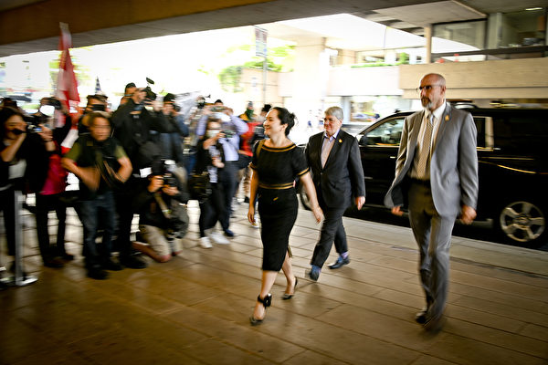
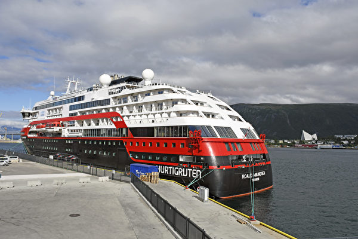

<h3><a target="_blank" href="https://bit.ly/3asSXIA">请多传破网软件，使更多的人了解真相从而得救，这是给自己积福德。 https://bit.ly/3asSXIA </h3></a>

   

     
<h3 align="center"><b>免翻视频  https://bit.ly/3ezRQKo  (请收藏网址 https://git.io/swspip)</b></h3> 

<h3 align="center"><b>复制网址到谷歌或火狐浏览器打开。若出现 “提示” ，請点击“继续”访问即可。</b></h3> 

<h3 align=center><a href="https://github.com/gav01/Heart/blob/master/news1.md">● 看更多大紀元時事 ●</a></h3>

<a href=https://git.io/souye><h6 align="right">回首頁</h6></a>

<a name=top>
   
   
      
<a href =#22>22.袁斌：武汉护士张嬿婉之死涉及的三重内幕 
<a href =#21>21.休斯顿中领馆窃德州大学病毒研究？FBI调查 
<a href =#20>20.大连新一轮疫情发酵 凯洋海鲜公司成焦点 
<a href =#19>19.传任志强坚持自辩 全部揽下涉案人员刑责    
<a href =#18>18.加拿大司法部长：孟晚舟引渡案符合条件 
<a href =#17>17.河北企业家铁矿被霸占 后代维权遭公安迫害    
<a href =#16>16.廖远：唐山大地震中的“青龙奇迹” 
<a href =#15>15.最新疫情8·2】拉丁美洲染疫亡者超20萬    
<a href =#14>14.共军威胁台湾东部 总长：整合三军部队因应 
<a href =#13>13.颜纯钩：戴耀廷心太大，港大庙太小    
<a href =#12>12.湖南“野鸡”院校欺诈学生 家长愤怒维权 
<a href =#11>11.东欧国家改变态度 把中共视为主要威胁    
<a href =#10>10.【新闻看点】连遭国际11击 习近平愁容露面 
<a href =#9>9.美国制裁新疆生产建设兵团 冻结资产    
<a href =#8>8.【独家】揭秘替中共牵线搭桥的神秘商会 
<a href =#7>7.美参院小组通过新法案 个人可起诉中共瞒疫    
<a href =#6>6.林郑推迟9月立法会选举 白宫回应 
<a href =#5>5.参选资格被DQ 黄之锋：假新闻罗织罪名 
<a href =#4>4.美国关中领馆效应 亲共者大难临头各自飞 
<a href =#3>3.袁斌：习近平的一脸愁云与中共的走投无路 
<a href =#2>2.前中共军官：南海若开战中共则亡 
<a href =#1>1.【最新疫情8·1】MLB马林鱼队21人确诊 

<a name=22>
<h1 align="center"><b>袁斌：武汉护士张嬿婉之死涉及的三重内幕</b></h1>

7月29日，武汉协和医院心内科护士张嬿婉坠楼身亡。图为事发现场。（推特图片）

   
  【大纪元2020年08月02日讯】这两天，网上都在关注和议论张嬿婉坠楼的事。

张嬿婉是武汉协和医院的一位护士，曾经的抗疫英雄。武汉最难熬的那段日子她都挺过了，却于7月29日上午在单位坠楼死亡了！

年纪轻轻的张嬿婉为何坠楼？

当地警方发布的“情况通报”称：“目前，排除刑事案件”。这话的意思很明确：张嬿婉坠楼不是他杀。根据是什么？警方没说，我们也不知道。

既然不是他杀，会是自杀吗？很多网友都认为这种可能性为零。别的不说，张嬿婉今年才28岁，还有个不足两岁的女儿，都说为母则刚，怎么会轻易放的下自己的孩子选择自杀呢？况且她还是独生子女，父母尚在，又有什么理由会自杀了结生命？

仔细梳理有关张嬿婉坠楼前后的相关信息，我发现此案涉及三重内幕。

<b>一是协和医院护士被当成“人肉挡板”的内幕</b>

在官方宣传中，武汉抗疫俨然就是一曲由一个个可歌可泣的感人故事谱写的英雄壮歌。有没有可歌可泣的故事？当然有。但也有许多令人不平和愤怒的阴暗内幕，这些内幕本应曝光，却被官方掩盖了。而张嬿婉的死在不经意中撕开了它们的一角！

网上流传着一篇张嬿婉生前写的要求撤换协和医院护理部主任刘义兰的文字。她说：“特殊时期安排我们工作，我们护士没有一个退缩过。在物质如此匮乏的情况下，刘义兰主任要求核酸咽拭子采集由临床的护士来完成！我们有说，我们护士没有经过专业培训，可能没有办法完成这个操作。她回应说已经发了操作视频，学习后照这个搞……都说现在最伟大的是医生，我想告诉大家隔离病房没有医生进去查房，都是通过对讲机遥控要求护士来完成隔离区所有的事情。极偶尔查一下就出来。他们都在相对干净的办公室工作，我们隔离区的护士三班倒，至少每天要在那里待上8小时，不能吃不能喝不能上厕所。我不是借理由想逃避这场战争，我愿意当一个身上有防弹衣、枪里有子弹的战士！做一个不被当作人肉挡板的战士！”

在武汉抗疫这场艰巨的战争中，谁是战斗在第一线承担风险最多的人？当然是医护人员。而相比较而言，护士往往比医生更贴近第一线，承担的风险更大。如果只让护士担风险，只把护士当工具使，却不重视护士的超额付出，不把护士的生命安全当回事，她们不就成了事实上的“人肉挡板”吗？张嬿婉的文字便直言不讳的道出了她和她的同事们的这种处境。

类似这种情况当然不会仅止于武汉协和医院一家。

有网友爆料说：“武汉协和医院一位护士跳楼自杀了，该院是武汉肺炎重灾区，感染近千人，我说点自己知道的事情：护士A，非呼吸科，平时不给护士长送礼，疫情爆发，第一个被抽调ICU，感染‘武肺’； 护士B，ICU工作60多天，无N95口罩，四月无意发现护士长柜子有几百个未开封的N95口罩，而护士长是不用进ICU的。”

<b>二是协和医院有关领导对张嬿婉打击报复的内幕</b>

在张嬿婉看来，刘义兰身为医院护理部主任，没能保护手下的护士，使得她们“被当作人肉挡板”，这是失职，所以她公开倡议撤换刘义兰。

张嬿婉这么做有错吗？没错。无论是作为中国公民还是协和医院的工作人员，她都有这个权利。

可结果呢？

据知情者披露，自从张嬿婉在朋友圈给医院“抹了黑”，就各种被穿小鞋，本打算辞职，可是护理部扣押着档案和护理执照，还被调到了CCU最折磨人的地方。

还有网友爆料：协和医院护理部主任刘义兰把协和的护士卖了，按道理核酸咽拭子采集是医生取的，可她要护士去取咽拭子，然后那个时候防护设备都不够，硬着要护士去贡献，这个跳楼的护士就带头反抗得最激烈，谁都怕死吧。后面疫情过了，就开始针对这个护士了，所在部门护士长为巴结该护理部主任而处处刁难针对该坠楼护士，该逝者本已想办法调走，这个马屁精护士长又给人家调回来继续羞辱，要辞职就扣护士证各种威胁。后来矛盾演变越来越激烈，坠楼护士出夜班的时候，护理部主任儿子为母报仇心切打了该护士，然后该护士坠楼。

正如许多人感叹的那样，张嬿婉没有倒在病毒手里，却倒在了自己人手里！

<b>三是协和医院监控视频不早不晚“坏了”的内幕</b>

中国是全世界监控最发达的国家，可每当有敏感事件发生，需要调看监控视频，查清真相时，不早不晚，在这个节骨眼上，监控器往往就坏了，坏得可以说十分精准。

这一次同样如此！

张嬿婉坠楼后，父母到医院讨说法。院方回答说：“监控坏了”。

出了事监控就坏了，把人都当成三岁小孩呢？

就算监控坏了，协和医院好歹也是个三甲医院，监控日常是没有人维护的吗？就算坏了，难道监控坏了就不能修了吗？

有内行的网友说，现在大部分的公共场所安装的摄像头都是海康威视的，其招标要求很高，其中有一个硬性要求是：即便出现网络中断或者停电等情况，摄像头终端都会自动告警并且保存日志。而医院属于比较特殊的场所，监控几乎都是24小时在维护着，也会有相关工作人员盯着监控。所以摄像头是否坏了，又是啥时候坏的，看下系统日志就知道了。

凭以往的经验，院方说监控坏了，说明张嬿婉之死的真相，很可能就藏在监控视频中。

目前，无论是警方还是院方，对于张嬿婉之死都没有给出令人信服的说法。

张嬿婉的一位朋友在网上说，她自己绝不相信张嬿婉会自杀。“认识你的人都知道你性格开朗、恋家，你有着那么多年一起走过来的丈夫、可爱的宝宝、心疼照顾你的父母，不信你是个会做傻事的姑娘。协和医院没有监控的说法没有公信力，跪求公布事实真相，我只想等一个结果！”# 

<a target="_blank" href=#top><h6 align="right">回上方</h6></a>

<a name=21>
<h1 align="center"><b>休斯顿中领馆窃德州大学病毒研究？FBI调查</b></h1>

美国实验室人员正在处理中共病毒样本。(Misha Friedman/Getty Images)

   
 【大纪元2020年07月31日讯】（大纪元记者王祥综合报导）美国德州先驱报（Herald Mail media）报导说，美国联邦调查局（FBI）本周表示，他们正在调查中共政府从德克萨斯大学等美国大学非法获取病毒疫苗的情况。

德克萨斯大学一直参与多项中共病毒（冠状病毒）研究，包括追踪全美疫情传播以及绘制病毒结构图。

上周，该校研究人员宣布，他们已经成功地从中共病毒（冠状病毒）中重新提炼了一种关键蛋白，可以使全世界的疫苗生产更快和更稳定。

德克萨斯大学也证实FBI将跟部分研究人员接触。该校临时执行副总裁兼教务长丹‧贾菲（Dan Jaffe）周一（7月27日）晚间发给教师和研究生的电子邮件中说，联邦调查局上周通知该大学，他们将就休斯顿中领馆的问题与UT研究人员联系，调查中领馆的角色以及中共政府非法获取美国研究的企图。

美国政府上周要求中共驻休斯顿总领事馆限期撤离，指其在美从事中共的间谍活动，窃取知识产权。

美国国务院、司法部以及FBI上周五（7月24日）联合举行的关闭中共驻德克萨斯州休斯顿总领事馆简报会上，官员们表示，关闭休斯顿中领馆的决定反映了美国政府长期以来的担忧。

资深美国情报官员说，美国最大的担忧是知识产权和大量技术遭盗窃；在过去十年中，休斯顿中领馆窃密、招募“千人计划”成员，十年已涉及五十多桩案件。

“尤其是休斯顿中领馆的科技情报收集员特别突出，且成功窃取情报，我认为，这也是我们倾向于关闭休斯顿中领馆的原因。”他说。

德克萨斯大学的贾菲在发给师生的电子邮件中说：“我们不知道联邦调查局计划与谁联系或他们打算讨论什么，我们也没有与联邦调查局特工分享任何人正在进行的研究信息或细节。”

他说，联邦执法人员在进行犯罪或国家安全调查时，要求与研究人员交谈的情况并不罕见；如果学生或教职员工对共享工作信息有疑问，可以与学校的法律事务副总裁联系。

今年早些时候，美国教育部要求德克萨斯大学系统提供其与中国武汉病毒实验室之间的往来文件，调查了其与中国研究人员的关系。大学稍后回应说，调查是因为误解，否认向联邦当局隐瞒任何信息。#  

<a target="_blank" href=#top><h6 align="right">回上方</h6></a>

<a name=20>
<h1 align="center"><b>大连新一轮疫情发酵 凯洋海鲜公司成焦点</b></h1>

大连湾已经连续多日封闭小区，当地居民因没有提前储备，面临断粮。（大陆网友）

   
  【大纪元2020年08月02日讯】（大纪元记者方晓报导）新一波中共病毒（武汉肺炎）重灾区辽宁大连的新增确诊病例不断，其中大连凯洋海鲜公司的确诊病例占比较高。该公司及其所在的大连湾区域的企业全部关停。

8月2日，大连市官方称，8月1日零时至24时，大连新增3例本地确诊病例，新增本地无症状感染者1例。

通报称，7月22日以来，大连累计确诊病例79例，其中重症病例3人；凯洋海鲜公司员工36例，凯洋海鲜公司员工接触者12例，大连湾街道居民18例，确诊病例和无症状感染者有密切接触者12例。

目前，大连尚有32例无症状感染者，其中凯洋海鲜公司员工19例，凯洋海鲜公司员工的接触者2例，大连湾街道居民7例，确诊病例和无症状感染者的密接者4例。

中共历来隐瞒真实疫情信息，因此外界认为实际确诊病例或比官方公布的更多。

大连当局在7月22日关停凯洋海鲜公司，7月23日，对大连湾区域其他企业全部关停，对辖区全域实施封闭管理，居民必须居家。

据官方通报，7月31日，大连市一个确诊病例为仅一个月大的男婴。

大连当局发布了11例确诊病例的活动轨迹。其中，有3例来自凯洋海鲜公司员工，其余均来自金州区、甘井子区大连湾。

当局宣称，此次疫情已构成凯洋公司内的感染并在家庭内、居住地、共同聚餐者、共同乘车者中构成聚集性疫情。

7月30日，大连市新增确诊病例11例，累计感染者中，凯洋海鲜公司占85%，并且很多是无症状感染者，令被隔离的密切接触者感到无奈和担忧。

自7月22日大连疫情再次爆发以来，病毒已蔓延到5地9市，即辽宁、吉林、黑龙江、福建、北京5地，铁岭、鞍山、四平、长春、白城、鹤岗、绥化、福州、北京9个城市。其中有大部分病例与凯洋海鲜公司有直接或间接的关联。

由于疫情严重，大连市于7月23日宣布进入“战时状态”。

7月27日至28日，中共国务院副总理孙春兰到大连市调研疫情防控。孙春兰带了习、李的批示，要大连全面进行核酸检查。

7月31日大连又发布了第13号令，要求市民非必要不离开大连，禁止大型聚会，避免聚集性活动等。

网民对大连疫情持续扩散表达看法，并质疑为何无人被追责。

“gen一”：凯洋海鲜公司这次的相关负责人有很大责任！该公司每天员工不测体温，第一例员工发烧咳嗽7天都没有放在心上，当感冒治，导致大连湾传染开。大连这次造成经济损失少说也有几十个亿。旅游业也因此废掉。

“百花齐放999”：大连地区在防疫方面一直是“上面不紧下面松”。这几天的核酸检测的场面，又是人挤人、人挨人，政府有管理吗？

“木木家小媳妇儿”： 一日一问，什么时候追责？ 

<a target="_blank" href=#top><h6 align="right">回上方</h6></a>

<a name=19>
<h1 align="center"><b>传任志强坚持自辩 全部揽下涉案人员刑责</b></h1>

大陆房地产大佬任志强。（大纪元资料室）

   
 【大纪元2020年08月01日讯】绰号“任大炮”的北京地产大亨任志强被抓后，其境遇一直被外界所关注。近日一度传出去世的消息，但最新多个消息对此进行澄清，指任志强目前安好，刚与家人通过电话。

大陆资深维权人士高瑜在推特发布一段对话截图，内容显示，有人询问任志强是否辞世。知情者否认，并透露，7月30日任志强刚与家人通话，身体和精神都很好。家里给他聘请沈志耕为辩护律师，被他拒绝，他坚持自己辩护。任志强还要钱买书，坚持学习。此外，所有涉案人员的刑责都被任志强全部揽下。

早前消息称，任志强被抓的同时，他的大儿子和秘书也被带走。

此外，维权人士鲁难（@lunanweiyi）也转发了同样的消息，消息来自是“米家山”，同曾经拍摄《顽主》的大陆知名男导演米家山同名。

公开资料显示，沈志耕是北京市纵横律师事务所主任律师。主要领域为：经济诉讼、仲裁，国际贸易，金融，证券，知识产权，刑事诉讼。

69岁的房地产大亨，北京市华远集团前董事长任志强以敢言著称，被称为“任大炮”，因撰文批评北京当局、追习近平处置中共病毒疫情不利被抓。

7月23日深夜，中共宣布开除任志强党籍，并移送检察机关审查起诉。通报称，任志强“在重大原则问题上不同中共的党中央保持一致”，“对党不忠诚、不老实，对抗组织审查”，“伙同子女大肆敛财等”。

但网路评论普遍认为，任志强是“因言获罪”。任志强的朋友、企业家王瑛在自己的微信朋友圈上痛批，中共对任志强的作为完全是“明目张胆的政治迫害”！她说，党不许任志强有任何意见，但任不肯“悔改”，于是党开除他，“（任志强）是个难得的好人，是个有责任感、有担当的好公民，是一个本分守法有价值贡献的企业家，是一个十几年如一日躬身公益的公益人。为有你这样的朋友，我很自豪”。

前北京锋锐律师事务所律师刘晓原也在推特上说，“这又是一起‘妄议’案件，被控以经济方面犯罪追究法律责任。”  

<a target="_blank" href=#top><h6 align="right">回上方</h6></a>

<a name=18>
<h1 align="center"><b>加拿大司法部长：孟晚舟引渡案符合条件</b></h1>

2020年5月27日，法官裁决，孟晚舟双重罪成立。图为孟晚舟下车走入法庭。（大宇／大纪元）

   
 【大纪元2020年08月01日讯】（大纪元记者王祥编译报导）加拿大司法部长提交给加拿大卑诗省法院的文件显示，现已满足银行欺诈罪引渡华为首席财务官孟晚舟到美国的要求。

2018年12月，应美国要求，加拿大当局在机场逮捕转机的孟晚舟，美国指控孟误导汇丰银行，隐瞒华为在伊朗的业务往来。

随后，孟一直在温哥华豪宅接受软禁，并拒绝被引渡到美国。她的案子在加拿大和中国之间引发外交争端，在孟被捕后，中共当局拘留了两名加拿大人。

加拿大司法部就孟案于上周提交给法庭新文件，于周五公开给媒体，这是引渡案举行正式听证会前的前续程序，将决定是否应当将孟引渡到美国。听证会将在2021年4月举行。

最新文件概述了支持拘押孟的证据，并得出结论，认为已满足预审条件。

文件指出，引渡听证会不是对美国提出的指控进行全面审判，只是研判，这些指控是否被认定为有效。

加拿大司法部长戴维·拉梅蒂（David Lametti）写道：“有证据表明，孟故意向汇丰银行作出不实陈述，以维护华为与银行的关系。”

“因孟承认，她是引渡请求中所列出的、被提起诉讼的人，因此确立了所有正式的预审要求。”

华为拒绝对此置评。

卑诗省最高法院5月27日对孟晚舟引渡案做出裁决，判定孟晚舟的犯行符合美国和加拿大的“双重犯罪”标准，所以其引渡案将继续。

下一次听证会定于8月17日至21日在温哥华举行，会议将讨论司法部长在拒绝发布华为要求的、提供与孟被捕有关一些文件是否享有特权。

审判听证会原定于2021年4月结束，双方都可能提出上诉，所以这可能意味，引渡孟晚舟案可能会持续数年。  

<a target="_blank" href=#top><h6 align="right">回上方</h6></a>

<a name=17>
<h1 align="center"><b>河北企业家铁矿被霸占 后代维权遭公安迫害</b></h1>

曾经的刘双存（左）和被霸占铁矿、遭打压后的刘双存。（受访人提供）

   
 【大纪元2020年08月02日讯】（大纪元记者张北采访报道）河北省武安市的刘双存是中共改革开放政策后的首批民营企业家。2006年，他经营的铁矿遭当地权势遮天的党支部书记霸占，家道从此艰难。刘双存的女儿为此上访维权，但她不仅没讨回公道，还被当地公安多次暴力抓捕，多年不敢回武安。
 
<b>以合作为幌子 党支书霸占铁矿</b>

刘双存的女儿刘海珠向大纪元讲述，她的父亲从1983年开始经营武安市南河底鞍子岭铁矿，效益很好。刘双存也做过不少回馈社会的好事，包括捐款修建武安光荣院，还收到过当地武装部颁发的荣誉证书，被电视台广泛报导。

2006年7月，时任武安镇西关街党支部书记庞保富（又名庞小宝）以投资为名，和刘双存签订铁矿合作协议。双方约定庞占51%股份，刘占49%股份，利润五五分。

在2006年到2009年期间，铁矿每天正常生产，矿石销路也很好，但庞保富拒付分红，刘海珠到矿上找他们理论，结果被人从后面拿石头砸晕。

2009年3月，庞保富指使手下的人勾结法院伪造协议，借矿点合并之机将铁矿的法定代表人更换，从此直接霸占铁矿。

刘海珠说，庞保富在当地非常有势力，他的大女婿曾是市委秘书长，后任水利局局长，二女婿是武安市公安局主管刑事的副局长白卫亮。2013年以前，刘家因为害怕一直不敢对他提告。

<b>上访申冤 无数次半夜被抓</b>

2013年，刘海珠母亲觉得讨回铁矿无望，郁郁而终。刘海珠也终于下定决心，要上访为亡母和被人殴打致残的父亲讨回公道。

她说，“我在当地就开始挨个部门告，告到哪都不行；后来就逐级往北京，（当地政府）就开始暗害我、残害我，就开始走上这条道了。”

2014年11月9日，在北京上访的刘海珠被武安市公安局驻京人员拦截，并被连夜送回武安。刚到当地，三个武安刑警六中队的警察就将她揪着头发拽下车，用羽绒服蒙住头后对她一顿暴打。

刘海珠当场拨打110报警，但事情最后不了了之。“他们（派出所）说，‘这个事我们管不了，这都公安局的事我们管不了。’打你就打你，谁也不管，不给立案。”

2016年3月9日凌晨，刘海珠被武安公安带领黑社会人员从北京某旅社拉走。她说，“半夜三更我正睡着，门被踹开，灯关着呢，（他们）就知道我在那，拽起我胳膊、抬着我到车上就拉走。出了北京市又到武安市公安局的车上。拉回到武安以后就把我送到拘留所。”那次，她被以“扰乱公共秩序”为由拘留10天。

刘海珠（受访人提供）

刘海珠回忆说，类似的暴力抓捕还发生过多次，她记不起具体的时间，只知道都是2016年以前。

有一次，她从北京坐火车到石家庄。刚走到出站检票口就被刑警队警察带上手铐、蒙上头直接拉去拘留所。“有什么合法手续？没有。”

一次中共大阅兵前，刘海珠在北京建设银行一网点取钱。她出来就被当地公安抬上车拉回武安派出所，后送进拘留所。

还有一次，公安逼迫她承认自己是武安访民头目，不承认就威胁、殴打。“哪怕你把我弄死我都不会说我是上访的头儿，我谁都不认识，我咋成了上访头儿啊？”刘海珠说，“就给我定个罪名，叫我按手印。（还）去我们武安所有访民家，逼着让人们签字（说我是头儿），访民都不签。就是这样打压。”

“16年以前，我们武安市派那个110的大黑警车，来北京一趟一趟，耗的国家的人力物力，来北京一车人截我一个，好像我是杀人犯似的。常年那样，那都不知道弄了多少次了。”

<b>身份证上黑名单 无法正常工作 东躲西藏多年</b>

由于武安公安肆意非法抓捕，刘海珠已经八年不敢回家，一直在北京漂泊。

一开始，她的身份证被列入黑名单，不管到哪儿打工都会被抓。她只能一边东躲西藏，一边找各部门反映情况。“天天出去跑，天天出去告，挨部门告。上中纪委、国家信访局、国土资源局、公安部，就这几个每天重复重复，一天天去。”她说。

但是这一切都是徒劳。“上边给返回去，当地政府来整你，人家受到压力了，它就整你，不让你在北京告。”“当地说没有这个事儿，上边就相信。”

（受访人提供）

2018年，武安市公安局长换人后，刘海珠不再被抓捕。2019年11月后，她终于能在北京正常找工作，目前在一家宾馆做保洁。

刘海珠说，“当官的人说起我们上访的都是精神病，其实不是。我们都有冤情他不处理，没冤谁常年抛夫弃子、不过正常人的生活来北京上访？他傻呀？谁不想过幸福日子啊。是逼的，逼得没法活了。”

“我对他们（当局）一点希望都不抱，一点点希望都没有。就是抱着我一个信念，我为人子女，有苍天在上，我一定要给父母讨个公道。制度我没有抱什么希望，他们制造了多少冤假错案？我不相信他们。”  

<a target="_blank" href=#top><h6 align="right">回上方</h6></a>

<a name=16>
<h1 align="center"><b>廖远：唐山大地震中的“青龙奇迹”</b></h1>

唐山大地震三十周年祭日，地震发生后至今，没有人知道真实的死亡人数，中共隐瞒事实真相，剥夺中国人民的知情权，从来就没有改过。（图：新唐人电视台）

   
   【大纪元2020年08月02日讯】1976年7月28日凌晨，河北省唐山市发生了7.8级大地震。仅仅十几秒的时间，这座拥有百万人口的工业城市整个几乎被夷为废墟，灾害共造成24.4万人死亡、16.4万人重伤，惨绝人寰！

与唐山市形成鲜明对比，距离唐山市中心仅115公里的青龙县，受大地震波及， 该县1.8万间房屋毁坏， 7,300余间完全坍塌，但是，全县47万人在灾难中竟无一人伤亡！被称为“青龙奇迹”。

今天，44周年过去了，回首这场劫难，我们除了感叹人生的无常、生命的脆弱，我们还能从“青龙奇迹”中得到一些宝贵的人生启示。

<b>“青龙奇迹”</b>

唐山市所处的地理位置，属于地震活动频繁地区之一。尽管地震预测至今仍是世界难题，但令人意想不到的是，早在唐山大地震发生的1976年初，中国的地震专家就作出中短期预测，认为唐山一带在本年度7、8月份将有5—— 7级强地震；从1976年7月14日至7月27日，半个来月时间内，唐山市的各个地震观测点都预测到大地震就要来临。

但是，在中共体制下，保持政权的稳定是当权者的首要任务，阶级斗争是很多人的思维定势，至于人民的生命安全则是次要的，甚至常常被忽略。唐山距离中国的首都北京不到二百公里，在唐山大地震的预测信息汹涌而来的时候，国家地震局官员为保持首都一带的“秩序”和“稳定”，竟没有通过正式渠道发出地震预报，宁可置无数百姓生命于生灵涂炭的危险境地！

大地震发生在凌晨3时42分，正值夜深人静时，灾难突然降临，地动山摇，房屋倒塌，许多人在梦乡中就不明不白沦为亡魂。

有了地震预测，却没有地震预报。正如人们常说的，这是天灾，更是人祸！丧失人性、对人民生命的严重漠视，这是唐山大地震在人们心中永远抹不去的痛中之痛。

但是，青龙县创造了奇迹。在7月28日地震来临前，青龙县已发出了地震警报，并做好了防震准备，全县百姓几乎全被赶到室外生活。尽管地震也造成了大量的房屋倒塌，但47万青龙人却安然无恙。青龙县因此还成为唐山的后方救急医院。

1996年，唐山大地震二十周年之际，联合国宣布将青龙县成功预测、预防地震的经验评为世界典范，写入20世纪重大事件档案，当时曾引起各国几十个媒体热烈关注。

<b>创造青龙奇迹的三个主要角色</b>

能创造青龙奇迹，有三个主要角色。

第一位是国家地震局分析预报室京津组组长汪成民。在唐山地震前十天，即7月17日至7月20日，恰好一个全国地震工作经验交流会在唐山召开。参加会议的汪成民要求在大会上发言，通报收集到的部分异常资料，和对唐山一带震情的担心。但主持会议的国家地震局没同意他的要求，只让他在会后的小型座谈时自由发言，并强调不能代表地震局，地震局领导还再三叮嘱汪成民，不要把京津地区搞乱了。

当时中国正值“文化大革命”时期，中共党魁毛泽东号召全国人“以阶级斗争为纲”， “搞乱社会”可是一顶大帽子，挺能压制人。汪成民顶着压力，利用晚上时间坚持召开了两次座谈会，通报了“7月22日到8月5日，唐山、滦县一带可能发生5级以上地震”的预测。

第二位是青龙县地震办公室主任王春青，他参加了汪成民的座谈会。王春青默默地坐在前排，认真做笔记，详尽了解了对当前震情的各种不同意见与它们的依据。

7月21日散会后，王春青十万火急，当日赶回青龙县，直奔科委通报了地震预测，并要求尽快向县领导汇报。但是他等了两天，也没见任何动静。王春青心急火燎，直接找到县委办公室，强烈要求县领导立即安排时间听取汇报。在他的再三争取下，有关唐山一带震情分析意见终于在7月24日反馈到县委书记冉广岐手里。

冉广岐是第三位重要的角色。冉广岐此前曾有意识地阅读过有关地震知识的书籍。在了解到专家对地震震情的意见后，冉广歧当机立断，向全县发出了地震警报。 7月25日，全县民众被动员远离危房。对暂未搬离房屋的居民，要求夜不关门，有震迅速离屋。 7月26日，该县有的学校已在户外上课，商店在临建窝棚售货。

当有人对青龙县采取的措施提出疑义时，冉广岐说：“为了以防万一，我们采取点措施。反正天气热，群众在外面住几天，有意见由我来负责。”

据说，唐山大地震释放出的能量约相当于1945年投放在日本广岛原子弹的四百多倍，地震波及到天津、北京。青龙县离震中110公里，房屋倒塌、损坏也相当严重，但因提前采取了预防措施，除一人因心脏病发作外，地震时无人伤亡。

冉广歧当时也承受着很大的压力，但最终他坚守了自己的良心。大地震二十多年后，冉广歧在接受一名作家采访时回忆说：“我心里头，一边是县委书记的乌纱帽，一边是47万人的生命，反反复复掂哪。不发警报而万一震了呢？我愧对这一方的百姓。嘴上可能不认账，心里头过不去—— 一辈子！”

<b>复苏中国人的人性和良知</b>

汪成民、王春青和冉广岐，三人都没有什么豪言壮语，也没有惊天动地的举动，他们都是平凡人。难能可贵的是，为挽救更多人的生命，为预报唐山大地震，在中共的专制下，他们都顶着压力，坚守了那份人性的善良，也因此创造了青龙奇迹。

人都有善良的本性，或称之为良知。圣人告诉我们，保持善良人就会有希望！在艰难困苦中，在巨大的压力下，人还能保持自己的良知，弥足珍贵，这能把一个人带向光明，乃至给社会、国家前途带来希望。

中共自建政以来，不断鼓吹暴力革命理论，破坏了中华民族的传统文化，人与人之间的关爱与和谐变异成斗争和仇恨，如今社会道德全面崩溃，各种社会问题层出不穷，这是中国人的大不幸！

今天，世人越来越看清了中共的邪恶本性，全世界围剿中共的正的势力日益强大，中共政权已日暮途穷。但是我们中国人应该清醒，中国将向何处去，中国人如何重塑自己的未来，这还得靠中国人自己良知的觉醒。 《九评共产党》最后说：“从生命中清除中共灌输的一切邪说，看清中共十恶俱全的本性，复苏我们的人性和良知，是平顺过渡到非共产党社会的必经之路，也是必要的第一步。”#

<a target="_blank" href=#top><h6 align="right">回上方</h6></a>

<a name=15>
<h1 align="center"><b>最新疫情8·2】拉丁美洲染疫亡者超20萬</b></h1>

自今年年初中共病毒大流行開始以來，美國眾議院和參議院至少14名議員已被檢測為陽性或被推定患有COVID-19，包括7名共和黨人和7名民主黨人。圖為國會大廈。(Samira Bouaou/The Epoch Times)

   
 【大紀元2020年08月02日訊】（大紀元記者夏雨、徐簡、戴芙若、林南、蕭律生綜合報導）8月2日全球中共病毒（武漢肺炎）疫情最新情況：
 
 根據約翰‧霍普金斯大學（Johns Hopkins University）的數據，截至北京時間8月1日下午1時，全球確診感染中共病毒（武漢肺炎）的人數超過1,780萬，死亡人數超過68萬（註：因中共和伊朗隱瞞疫情數據，真實數據比統計的要高）。

美國確診病例超過460萬例，死亡超過15萬人。死亡人數連續五天突破1,000，新病例增長速度略有下降。加州成為首個確診病例超過50萬的州。

歐洲和亞洲的感染率都在上升，東京報告了創紀錄的單日增長。德國首都爆發大規模遊行，抗議政府防疫措施。

上週，美國國務卿蓬佩奧表示，至今中共仍在隱瞞疫情，並表示共產主義政權傾向於在最關鍵的時刻掩蓋真相。

=======================

<b>以下是最新疫情實時更新：

研究：英國7.1％的人感染病毒</b>

全英國第一個月的病毒測試結果顯示，約有7.1％的參與者的中共（冠狀）病毒抗體呈陽性。換句話說，英國大約7.1%人曾感染中共肺炎。

測試結果表明，英國感染過中共病毒的人，占倫敦人的10.4％，英格蘭西南部和蘇格蘭人的4.4％。

英國血清學（或抗體）研究稱為UK Biobank， UK Biobank已從50萬名志願者身上收集了樣本和健康信息。

Biobank還從英國各地招募了2萬多名志願者進行病毒抗體研究，他們每月提供血液樣本，牛津大學的一個研究所對這些樣本進行測試。

<b>美喬治亞州延長緊急狀態到9月10日</b>

喬治亞州州長布萊恩·坎普（Brian Kemp）說，他簽署了兩項行政命令，以擴大現有的針對中共病毒的安全措施，並延長公共衛生緊急狀態。

根據新規定，緊急狀態將持續到9月10日。

現有緊急狀態禁止50人以上的聚會，除非參與者能保持每人之間六英尺的距離；要求為長期護理設施和醫療脆弱的人提供庇護所，並對企業做出規定。

<b>英國推遲原定於本週末的解封</b>

英國疫情近期出現反彈趨勢，英國首相鮑裡斯·約翰遜緊急叫停原定於本週末(8月1日-2日)實施的解封計劃。

約翰遜（Boris Johnson）宣佈從週六起，所有在室內舉行的體育賽事將不允許球迷進場，這意味著世界桌球錦標賽展在開放球迷入場一日後，又再次要回到閉門狀態。

自中共肺炎疫情在英國發生以來，包括地方選舉等多項社會活動受影響推遲或取消。

<b>酷暑中 法國圖盧茲市暫閉市政游泳池</b>

近日法國天氣炎熱，但西南部大城市圖盧茲在發現一名救生員確診患有中共病毒之後，市政府1日下午決定暫時關閉公共游泳池。

法國多地週五（7月31日）氣溫突破攝氏40度，中共肺炎疫情面臨高溫考驗。本來夏季最好的避暑地就是公共游泳池，但當天市政府疏散了好幾百名前來游泳的市民，準備在消毒清理之後，下個週一再對外開放。

<b>台灣口罩實名制至少到12月</b>

中央社報導，台灣前副總統陳建仁認為今年秋冬中共肺炎恐和流感同時爆發，呼籲備足3個月口罩。台灣中央流行疫情指揮中心發言人莊人祥8月2日表示，口罩實名制政策至少實施到12月底，確保到年底都有足夠口罩可用。

中央流行疫情指揮中心發言人莊人祥在2日下午記者會中表示，因應中共肺炎，國內口罩政策將持續以實名制方式進行；政府每天徵用800萬片口罩，預計至少實施到12月底，民眾每2週可購買一次口罩，確保到年底前都能買到需要的口罩。

莊人祥指出，國內口罩每天產量約2000萬片，扣除徵用的800萬片，每天仍有1000多萬片餘裕可供內銷或外銷，民眾可自由到超商、網站等通路購買。

<b>台灣新增1例境外移入病例 從菲律賓來台探親確診</b>

8月2日，台灣中央流行疫情指揮中心公布新增1例中共肺炎病例，屬於境外移入，為20多歲女性，今年7月31日從菲律賓來台探親，居家檢疫期間出現症狀，經採檢於8月2日確診。

指揮中心表示，該個案7月31日入境時無相關症狀，於機場採檢後，由家人開車送至防疫旅館進行居家檢疫，8月1日出現輕微發燒，於今日確診，現收治住院隔離治療中。衛生單位正調查個案所搭班機之前後二排旅客，以匡列接觸者。
36例中共肺炎患者如何死裡逃生？

中共病毒（新冠病毒）肆虐逾半年，醫學界至今沒有找到可以治癒此病的良藥。不過有案例顯示，一些患者念「九字真言」（法輪大法好 真善忍好）後，得以緩解或康復。對此，歐洲資深抗病毒及藥物研究專家、醫學博士董宇紅，就36例中共肺炎患者進行研究，做出一份臨床實證科學研究報告，結果顯示「九字真言」（法輪大法好 真善忍好）真的讓中、重症患者死裡逃生，恢復了健康。

這些案例中20%的案例（8例）是高級知識分子，包括武漢專業的醫生、醫院工作人員，美國哈佛大學的留學生，日本的留學生、研究生等等。

<h4 align=center><a href="https://www.epochtimes.com/b5/20/8/1/n12300102.htm">詳情請見這裏。(点击右键,另存新档）</a></h4>

<b>武漢女告政府瞞疫 法院拒立案</b>

中共病毒（武漢肺炎）1月份在武漢爆發，令千千萬萬家庭受害。受害家屬徐女士為家父亡故，狀告武漢政府失責，要求道歉、賠償。8月1日上午，徐女表示，「法院來電說不受理，會把起訴書原路退回。」

另一名起訴武漢市當局的死者家屬張海認為，徐女士起訴書遭到法院退回，不予立案，凸顯當局恐懼，「什麼叫不符合立案條件？證據我們都有，很典型的瞞報嘛！病毒造成這麼多人死亡，政府不願意協商，又害怕家屬起訴，還各方面打壓，簡直是沒把老百姓當人看。」

<h4 align=center><a href="https://www.epochtimes.com/b5/20/8/1/n12299331.htm">詳情請見這裏。(点击右键,另存新档）</a></h4>

<b>澳大利亞維多利亞州實行宵禁 每戶每天僅一人能去購物</b>

維多利亞州州長丹尼爾·安德魯斯（Daniel Andrews）宣布當地進入「災難狀態」，並祭出有史以來最嚴格的社會隔離措施。

安德魯斯表示，新的限制措施從今天晚上6點開始，將持續6週、直到9月13日。新的限制措施要求，每戶每天只能有一人出去購物；墨爾本人離家不能超過5公里；從晚上8時到第二天凌晨5時，可以出門的唯一條件是你在工作，或在照顧他人，或被他人照顧。

另外，該限制措施還有懲罰機制，即任何違反該宵禁規定的人，都有被抓、被罰款的風險，違反者將被告上法庭，罰款不是1,652美元，而是10,000美元。

<b>拉丁美洲中共肺炎死亡人數激增至20萬</b>

路透社統計數據顯示，拉丁美洲當地時間週六（8月1日）晚間，該地區中共病毒死亡人數超過200,000人。該地區成為全球中共肺炎大流行中心之一，該地區各國政府正經受極限考驗。

<b>迄今 美國國會已有十四名議員染疫</b>

自從今年年初中共病毒大流行開始以來，美國眾議院和參議院至少14名議員已被檢測為陽性或被推定患有COVID-19，包括7名共和黨人和7名民主黨人。

感染中共病毒的參議員有3人，眾議員11人。

週六，亞利桑那民主黨眾議員勞爾‧格里雅爾瓦（Raul Grijalva）是最新一名病毒測試呈陽性的國會議員。

除格里雅爾瓦外，以下是13名確診和推定確診的國會議員名單。

德州共和黨眾議員路易‧古默特（LOUIE GOHMERT），7月29日病毒檢測呈陽性。

弗吉尼亞共和黨眾議員摩根‧格里菲斯（MORGAN GRIFFITH），7月中旬表示自己病毒測試呈陽性，他是保守派的自由黨團核心成員。

南卡羅來納州共和黨眾議員湯姆‧萊斯（Tom Rice）6月中旬在Facebook上說，他、妻子和兒子的病毒檢測均呈陽性，但都在「好轉」。

弗吉尼亞民主黨參議員、前副總統候選人蒂姆‧凱恩（TIM KAINE）現年62歲，他在5月中旬表示，他和妻子的病毒抗體檢測呈陽性。

賓夕法尼亞州民主黨參議員鮑勃‧卡西（BOB CASEY）在5月也檢測出病毒抗體陽性。他說，在經歷低燒和輕度流感樣症狀後，他在春季早些時候曾自我隔離。

佛羅里達共和黨眾議員尼爾‧鄧恩（NEAL DUNN）在4月份表示病毒測試陽性。

南卡羅來納州民主黨眾議員喬·坎寧安（JOE CUNNINGHAM）3月27日表示，他的病毒檢測呈陽性。

賓夕法尼亞州共和黨眾議員邁克‧凱利（MIKE KELLY）3月下旬病毒檢測陽性。他表示，他花了大約一個月時間才康復，體重減輕了30磅（14公斤）。

肯塔基州共和黨參議員蘭德‧保羅（RAND PAUL）於3月22日表示，他的檢測結果呈陽性。

佛羅里達共和黨眾議員馬里奧‧迪亞茲-巴拉特（MARIO DIAZ-BALART）在3月中旬測試呈陽性，他說這些症狀「像一噸磚頭一樣，給我的打擊很大」。

猶他州民主黨人眾議員本‧麥卡丹斯（BEN MCADAMS）3月感染了中共病毒，他住院了，需要氧氣，現已出院。

紐約州民主黨眾議員恩迪亞‧韋拉克斯奎茲（NYDIA VELAZQUEZ）今年3月表示，儘管沒有接受測試，但已被診斷出患有中共病毒。

馬薩諸塞州民主黨眾議員塞思‧莫爾頓（SETH MOULTON）在3月表示，他和妻子在經歷了類似中共病毒的症狀後自我隔離。

自從今年年初中共病毒大流行開始以來，美國眾議院和參議院至少14名議員已被檢測為陽性或被推定患有COVID-19，包括7名共和黨人和7名民主黨人。圖為美國國會山。(JEWEL SAMAD/AFP/Getty Images)

<b>澳大利亞維州單日新增600多病例</b>

據澳大利亞ABC新聞電視台援引未具名消息來源的報導，澳大利亞維多利亞州週日報告超過650例新病例，高於前一天的397例。

維多利亞州州長丹尼爾•安德魯斯（Daniel Andrews）將於週日晚些時候宣布新病例的正式數量，以及防疫新措施。

據「天空新聞」報導，安德魯斯可能宣布，維多利亞州首府墨爾本將實施新西蘭式的封鎖方式，將關閉大多數企業，僅維持基本服務運營，並關閉該市大部分公共交通網絡。

《時代報》稱，更嚴格的限制措施可能會持續六週，並最早在下週三開始。

<b>挪威郵輪爆群聚感染 36船組員染疫</b>

挪威「阿蒙森號」（MS Roald Amundsen）郵輪爆發群聚感染，有36名船組員接受病毒檢測呈現陽性。

由於4名船上工作人員的病毒檢測呈陽性並住院治療，從斯瓦巴群島（Svalbard）駛抵挪威北部特琅索港（Tromso）的阿蒙森號郵輪船組員，於7月31日待在船上隔離。

特琅索市媒體官員雅可布森（Pal Jakobsen）告訴法新社，船上158名船組員中有36人染疫，證實了各界擔心的挪威疫情復燃疑慮。

挪威「阿蒙森號」（MS Roald Amundsen）郵輪爆發群聚感染(Photo by Rune Stoltz Bertinussen / NTB Scanpix / AFP)

<b>墨西哥單日新病例和死亡創新高</b>

墨西哥衛生部說，墨西哥週六錄得創新高的新病例數量，在過去的24小時內報告了9556例感染，導致病例總數為434,193例。

該部還報告說，與該病毒有關的死亡人數也創下了單日新高，共784人死亡，死亡總數達到47,472人。

2020年7月15日，墨西哥城，街上民眾多數戴著口罩。(Hector Vivas/Getty Images)

<b>乘客拒戴口罩 達美班機返航</b>

週六（8月1日），達美航空發言人艾瑪·普羅蒂斯（Emma Protis）表示，當達美航班上兩名乘客拒絕戴口罩，航班被迫返回登機口。

普羅蒂斯在一封電子郵件中告訴CNN，7月23日，當航班被迫返航時，1227航班正從亞特蘭大飛往底特律。

達美航空向CNN發布了以下聲明：「從底特律飛往亞特蘭大的1227航班上，有兩名乘客不遵守機組人員指示，航班隨即返回登機口。在短暫的延遲後，航班再次離開了亞特蘭大。」

普羅蒂斯說，兩名乘客被從飛機上帶走。

根據達美航空網站信息，達美航空的乘客和員工在旅行途中必須戴口罩或在遮住口鼻，以符合CDC的最佳指南。

<b>巴西單日記錄逾45,000例新病例</b>

巴西衛生部週六（8月1日）宣布，在過去24小時內，巴西記錄了45,392例新病例，低於前一天的52,383例。病例總數達到270萬例。

當日巴西還報告1,088人死亡，使全國死亡人數上升至93,563。

<b>德州單日新增近萬例</b>

德克薩斯州衛生部在其網站上說，該州週六報告了9,539個新確診病例，使累計病例升至430,485例；新增268例死亡病例，累計死亡人數達6,837人。

<b>亞利桑那州新病例上升 死亡人數緩慢</b>

週六，亞利桑那州報告了2,992新病例，增幅1.7%，高於前7天的每日平均增長1.5%。該州目前測試翻倍，總確診病例數為177,002人。

該州還報告了53例新死亡，低於前一天的68例，死亡人數總共3,747。

亞利桑那州的陽性檢測率再次下降至12.6%，低於上週五報告的15.7%和前一天的21.3%。

<b>佛州死亡人數減少 單日新病例近萬</b>

佛羅里達州報告，週六有179人死亡，連續四天死亡人數創新高。現在總死亡人數為7,022。

該州正在為以颶風做準備，週六新病例為9,642例，上升2%，低於前一週的平均增幅2.3%。現在，確診總數為480,028人。

州長羅恩‧迪桑蒂斯（Ron DeSantis）已宣布風暴即將來臨，該州進入緊急狀態，許多州測試設施至少關閉至下週二。未來幾天佛羅里達的病毒統計數據可能會有所不同。

<b>紐約州下週對開放學校做出決定</b>

週六（8月1日），紐約州州長安德魯‧庫默（Andrew Cuomo）表示，他將在下週做出重新開放學校的決定，主要是根據總體感染率。 他說，紐約市錯過了週五提交重新開放計劃的截止日期。

庫默週六在給記者的電話會議中說：「目前的初步決定是學校應該計劃重新開放。」

但他警告說，將考慮父母對開放學校的態度。庫默說並非所有父母都贊成開放。 他說：「因此，你開放一所學校，將只有部分學生出勤，這對任何人都沒有好處。」

紐約州週六報告了753例新病例，與前7天平均增長0.2%一致。 該州報告了4人死亡。

<b>德國爆發萬人大遊行 反對防疫措施</b>

德國首都柏林有大批民眾上街抗議，反對政府實施嚴格防疫措施，批評當局做法違反人權及自由。

大部分抗議者沒有戴口罩，他們要求政府解除防疫措施。

DPA新聞專線報導，有17,000人參加遊行。

警察市中心阻止了抗議活動，要求人群驅散。警方還對遊行主辦者提出警告，指遊行人士沒有遵守戴口罩的規定及社交距離。

社民黨主席艾斯肯批評示威者的行為，危害大眾健康，打擊各方對抗疫情的努力。

德國衛生部長詹斯‧斯潘（Jens Spahn）呼籲民眾要「有良好的意識、毅力和團隊合作精神」。

德國首都柏林有搭配民眾上街抗議，反對政府實施嚴格防疫措施。( John MACDOUGALL / AFP)

<b>美助理衛生部長：死亡人數在幾週內會下降</b>

一名川普政府高級冠狀病毒（中共病毒）顧問週五（7月31日）表示，美國死亡人數應該很快開始減少，他也警告美國人仍需要採取諸如戴口罩之類的預防措施。

助理衛生部長布雷特‧吉羅里（Brett Giroir）告訴福克斯新聞主持人達娜‧佩里諾（Dana Perino）：「現在，您看到的是陽性率下降，病例數開始下降，住院率下降。」

他補充說：「不幸的是，不幸的事實是死亡率，死亡率（下降）要落後幾週。」

「因此，我在這裡沒有作出任何承諾，但如果一切順利，我們應該開始看到死亡人數在幾週內下降。」吉羅里說。

助理衛生部長布雷特‧吉羅里（Brett Giroir）。(Kevin Lamarque-Pool/Getty Images)

<b>蓬佩奧：中共慣於掩蓋 至今仍在瞞疫</b>

上週，美國國務卿蓬佩奧參加「The Ben Shapiro Show」廣播節目時，在回答主持人提問中共病毒疫情對美中關係帶來什麼影響時，再次批評中共隱瞞疫情造成病毒傳播全球，因此美中貿易協議就沒有那麼重要了。

蓬佩奧表示，這種病毒來自中國武漢，在全世界殺死了數十萬人，並摧毀了數萬億美元的財富。正如總統所說，大規模的破壞是由於中國共產黨隱藏並掩蓋疫情。

「（中共）允許人們離開中國，即便它們知道這樣做有感染全世界人民的巨大風險。這樣使貿易協議看起來，用總統的話說：『對我而言，現在似乎沒有那麼重要了』。」蓬佩奧說。

他表示，儘管如此，美國仍然希望北京遵守第一階段貿易協議。「我們希望有可以與中國合作的地方。我們希望中國人民有美好的事物。但我們永遠不會犧牲的是美國的國家安全和美國的經濟繁榮。」

蓬佩奧說，北京承諾會遵守第一階段貿易協議，美國將拭目以待，看看北京是否履行了義務。

國務卿還談到至今中共仍在隱瞞疫情，並表示共產主義政權傾向於在最關鍵的時刻掩蓋真相。

「即使在今天，它們（中共）仍拒絕（國際專家）訪問需要訪問的地方，我們需要確定誰是零號患者，病毒如何在世界範圍內傳播。而中共直到今天，從中共知道人與人之間傳播是可能的六個半月後，仍不允許（外界）簡單詢問發生了什麼，如何發生的，最重要的是，確保我們可以放心這種情況不會再次發生。」他說。

蓬佩奧最後說，這不是來自中國的第一種病毒。

蓬佩奧表示，這種病毒來自中國武漢，在全世界殺死了數十萬人，並摧毀了數萬億美元的財富。正如總統所說，大規模的破壞是由於中國共產黨隱藏並掩蓋疫情。 (Alex Wong/Getty Images)

<b>香港連續11天單日病例破百</b>

香港疫情持續擴大，週六新增125例病例，連續11日單日過百確診，當中124例屬本地感染，累計3,396例。

本地病例中，79例與其它確診病例相關，其中約62例涉及家中感染或親友聚會，另外45例源頭不明。

何文田怡安閣的「Star Global」直銷中心群組再多7人確診，至今涉及17人。上水屠房亦多3人確診，當中一人是買手，另外兩人是運輸公司從業員，群組涉及最少10人。

截至週六晚上，單日共有6名確診者死亡，累計33人不治。

還有一例屬於輸入病例，病人從英國回港後確診。

<b>疫情促進iPad和Mac銷售</b>

7月31日，蘋果公司發布截至6月27日的第三財季報告。報告顯示，蘋果公司第三財季實現營收596.85億美元，比去年同期的538.09億美元增長11%；淨利潤為112.53億美元，比去年同期的100.44億美元增長12%。當季每股收益同比增長18%至2.58美元，高於分析師預期的2.07美元。

Mac實現營收71億美元，去年同期為58億美元，iPad實現營收66億美元，去年同期為50億美元，Mac和iPad分別同比增長22%和32%，是增長最為強勁的兩條產品線。可穿戴、智能家居和配件業務營收64億美元，較去年同期的55億美元增長17%。

蘋果首席執行官蒂姆‧庫克（Tim Cook）告訴CNBC的喬什‧利普頓（Josh Lipton），在家工作的趨勢「無疑促進了Mac和iPad的發展」，「我們擁有Mac和iPad最強大的產品陣容。兩種產品的結合，造成了這個結果。」

<b>疫情推動在線購物 亞馬遜雜貨銷售大增</b>

由於居家令對COVID-19的擔憂，亞馬遜第二季度財報顯示，該公司在線雜貨銷售增長了兩倍。中共病毒大流行改變了消費者的行為。

為了適應增長，亞馬遜剛剛將雜貨配送能力提高了160%，還建立了三倍的雜貨店取貨地點。

亞馬遜還擁有全食品連鎖店，但沒有透露該超市在線收入的實際數額，只是說其銷售額是去年同期水平的三倍。

亞馬遜首席財務官布萊恩‧奧爾薩維斯基（Brian Olsavsky）表示，自春季以來，「Prime會員購物頻率越高，購物籃越大」。他說，Prime用戶推動了許多「超高」雜貨需求。

隨著三月份中共病毒演變成全球性大流行，亞馬遜開始看到雜貨、消耗品以及安全用品（例如口罩、面部覆蓋物、手套和洗手液）等類別的早期需求旺盛。 COVID-19人工和安全成本的飆升在很大程度上也抵消了銷售的激增。

亞馬遜第二季度財報顯示，該公司在線雜貨銷售增長了兩倍。中共病毒大流行改變了消費者的行為。（PHILIPPE HUGUEN/AFP/Getty Images）

<b>參議院臨時議長：不會發布強制戴口罩命令</b>

眾議院議長南希‧佩洛西（Nancy Pelosi）在眾議院發布戴口罩的命令後，愛荷華州參議員查克‧格拉斯利（Chuck Grassley）說，美國參議院不會跟隨眾議院發布強制戴口罩命令。

格拉斯利是參議院臨時議長。

格拉斯利在接受「福克斯新聞」採訪時說：「我認為我們已經在每個方面都有（預防）措施，你不必再制定規則。」

他提到多數參議員都戴了口罩，且大家在辦公室都保持社交距離。

美國參議院財政委員會主席查克‧格拉斯利（Chuck Grassley）。（林樂予/大紀元）

根據國會醫生莫納漢（Brian Monahan）發出的指引說明，眾議員「若在有限的密閉空間內，例如委員會聽證室，逗留15分鐘以上時，就須戴上口罩」。

人們還再次呼籲定期對議員和國會員工進行病毒測試。與每天對白宮工作人員進行測試不同，在國會大廳及其助手中沒有一致測試方案。

<a target="_blank" href=#top><h6 align="right">回上方</h6></a>

<a name=14>
<h1 align="center"><b>共军威胁台湾东部 总长：整合三军部队因应</b></h1>

中华民国国军参谋总长黄曙光上将7月31日视导陆军花东防卫指挥部。（军闻社）

   
【大纪元2020年08月01日讯】（大纪元记者钟元台北报导）中共军队对台湾东部海域威胁日增，中华民国国军参谋总长黄曙光上将下令，未来将整合作战区内三军部队，严控空中、水面及水下敌情目标，确保国家安全。

据军事新闻通讯社报导，参谋总长黄曙光上将8月1日视导陆军花东防卫指挥部，代表三军统帅总统蔡英文、国防部长严德发慰勉官兵戮力战备任务辛劳，了解指管中心执行概况，期许官兵持续强化作战区联合情监侦能量，全力守护国家安全。

黄曙光1日下午由国防部总士官长潘文清等人陪同，前往陆军花东防卫指挥部视导，听取任务简报，了解战备训练任务执行情形，提出工作指导。

“国军第二作战区首当其冲面对东部海、空域的敌情威胁”，黄总长指出，未来将整合作战区内三军部队，严密监控空中、水面及水下敌情目标，强化防卫作战能力，同时让官兵了解国军秉持“备战而不求战、止战而不惧战”的态度，共同维护区域和平稳定，确保国家安全。

黄曙光表示，“汉光36号演习”实兵操演已落幕，后续即将实施兵棋推演，官兵要体认国军各项训练、保养工作，都必须在安全的前提之下执行，单位主官更要放下身段，拥抱官兵，与部属“生活在一起、工作在一起、学习在一起、战斗在一起”，鼓励人才长留久用，提升部队整体人力素质，将国军打造成为一支“忠于国家、忠于团队、忠于职责、忠于人民”的现代化劲旅。

“内部管理取决于主官的态度”，黄曙光特别要求各级同仁如同兄弟姐妹，干部须持恒宣导两性营规、酒驾、反毒等军纪要求事项，相关防疫作为不可忽视，时值盛夏注意严防中暑热衰竭，避免去海边或山溪戏水。部队对于违法犯纪人员，一律汰除，绝不宽贷，确保部队纯净与国军良好形象。   

<a target="_blank" href=#top><h6 align="right">回上方</h6></a>

<a name=13>
<h1 align="center"><b>颜纯钩：戴耀廷心太大，港大庙太小</b></h1>

被香港大学开除教职的香港大学法律系副教授戴耀廷29日表示，决定向港大校监，即特首林郑月娥，针对校委会辞退他的决定提出上诉。图为资料照。（余钢／大纪元）

   
   【大纪元2020年07月31日讯】建制派把持的香港大学，无视大学教职员工的意愿，运用行政手段辞退了戴耀廷教授。

一间享誉盛名的著名学府，原本应体现香港悠久的人文传统和历史积淀，居然成为专制政权的附庸，被一小撮建制亲信把持而助纣为虐，作出背离广大市民意志﹑取悦独裁统治者的行政决定，这是港大有史以来最不得人心的拙劣表现，也是港大不可洗刷的历史污点。

港大背弃知识重镇的社会责任，已不自今日始，董建华时代就有校长郑耀宗打压钟庭耀的民调而闹出大风波，那个年代特区政府还不敢公然对抗社会道义呼声，郑耀宗被迫辞去校长职务。

近期，在武汉病毒知情者闫丽梦女士出走事件上，港大也扮演了不光彩的角色，先是否认闫女士亲身经历的事实，事后更删除有关闫女士的一切资料。不管闫丽梦的出走是否正当，她曾经在港大工作是不争的事实，港大作为学术重镇，连基本事实都肆意妄顾，真是有辱斯文，有意无意地，尽得中共篡改历史的真传。

民国初年，北京大学校长蔡元培，曾挺身保护参与反抗运动的学生，这是一个大学校长为维护学术和思想自由不可推卸的责任。国学大师陈寅恪提倡的“独立之精神，自由之思想”，是中国知识分子共同服膺的信条。香港大学之所以享有国际知名学府的声誉，正是建基百年的独立精神和自由思想，现在终于在戴耀廷事件上一铺清袋。

戴耀廷教授是占中运动发起人之一，他如果不是对香港有高度责任感，如果不是不忍见基本法被中共上下其手玩弄再三，他在香港大学安放一张平静的书桌，岂不快活得多？为了占中运动，为了去年以来的反送中运动，戴教授以先知先觉的政治慧见，以我不入地狱谁入地狱的牺牲精神，为香港人背十字架。在他身上，恰恰体现了香港人永不屈服的精神，体现了我们追求普世价值的决心。

作为占中运动首议者之一，戴耀廷从头到尾身体力行，因此惹了官非；去年反送中运动，也时常见到他的身影；早前他以官司上诉之身，又参与策划了民主派初选，他一直和香港人风雨同行，不离不弃，他不但是一个学者，还是一个斗士，一个先行者。

一个如此正直﹑无私﹑激情﹑勇毅的知识分子，香港大学居然容不下，那不是戴教授有负于港大，是港大有负于戴耀廷，是港大有负于香港。戴耀廷的理想太大了，港大这个庙太小，港大容不下戴耀廷，是港大的损失，戴耀廷脱离了港大，有更广阔的天地任其驰骋。

既来之则安之，戴教授准备上诉，这是他的正当权利，上诉有没有机会得直，是考验香港社会体制的公正性是否还存在的象征，且让我们拭目以待。戴教授被迫离开港大，他有自己新的人生规划，笔者相信他将继续与香港人同行，百拆不挠。

除了他已有的生涯规划之外，笔者盼望戴教授花一点时间，好好总结一下自占中和反送中运动以来，香港人抗争的历史经验。从占中的大台政治，到反送中的无大台be water，其间有什么值得记取的经验与教训；在什么时间节点上，什么事具有现实政治意义，什么事导致不必要的损失；作为一场声势浩大的群众运动，在新的形势下面临什么新的难题，这些难题有什么应对之策；因应国内外形势急剧变化，香港人应如何自处，如何在夹缝中求生，如此等等。

一场规模浩大的群众运动，除了身体力行的参与，还需要有相当的理论建设，需要从千头万绪中理出清晰的方向，需要更多共识，更沉着而长远的政治智慧。

苦难是人民英雄的宿命，坚忍是时代斗士的本色，戴教授离开港大，将演变成一个国际性的事件，引起西方各国的高度关注。它也会导致各国对港大这一帮鸡鸣狗盗之辈的制裁，香港人会记得他们的丑恶嘴脸，等到乾坤澄清﹑正义完胜之日，我们会慢慢和他们清算，一个都不放过。

——作者脸书

<a target="_blank" href=#top><h6 align="right">回上方</h6></a>

<a name=12>
<h1 align="center"><b>湖南“野鸡”院校欺诈学生 家长愤怒维权</b></h1>

湖南科技职业学院民航专业学生和家长到湖南教育厅门前讨说法。（微博图片）

   
 【大纪元2020年07月31日讯】（大纪元记者顾晓华、凌云采访报导）一年学费两万多元的五年制民航专业大专生，毕业后拿到的却是1.5年软件技术毕业证，且没有大专文凭，湖南科技职业学院民航专业学生和家长愤怒至极，集体到湖南教育厅门前讨说法，有家长绝望地将头撞向大门，鲜血直流。

30日，微博网友“兔子专吃窝边草z”贴出视频图文，内容指“湖南科技职业学院欺诈四届学生和家长，一年学费20,800，招生时说毕业就发中专和全日制大专（文凭），等到毕业之后只发中专（文凭），说没有大专文凭发，这和当初招生的时候说的不一样，等于欺诈。”

留言还说，“家长上湖南科技职业学院和湖南教育厅要个说法，要个公道，但是湖南教育厅不作为，不管事，警察暴力执法。”

有视频显示，有的家长愤怒之下，冲向大门，撞得头破血流，躺倒在地上。

家长抗议。（微博）

   

家长抗议。（微博）

   

家长抗议。（微博）

   
   多名自称该校民航专业的学生纷纷反应学校欺诈，讨要说法。

微博网友“Suki_XiXin”留言说：“湖南科技职业学院以民航专业招的我们，今年查看学籍居然是软件技术专业，还只有1.5年的学制，却收取我们每年23,800元的学费，科院真正的软件技术专业却仅需几千元学费，收取昂贵的学费却欺骗了我们所有的学生家长，我们想要讨要一个说法！”

“李六六同学”留言称：“我是19届民航的学生，去年我来这个学校是被熟人介绍，一直跟我说暮云校区是新校区，等我到了才知道原来这么偏僻？我觉得更惨的是，我们是湖南科技职业学院继续教育学院的‘关门弟子’，继续教育学院没有下一届新生了，现在的新生属于炎培这个中职院校。”

她还质问：“为什么炎培能和湖南科技职业学院合作？当初招生的老师说我们是校企合作的院校，校企合作都在百度上查不到我们专业的相关信息。……垃圾学校毁我青春！”

自称18届的学生“别找小婷”留言称：“我是18届的学生，去的时候面试的老师不管你身高够不够，或者怎么样一律都会收，读了两年一共换了两次宿舍。我们继续交着全校最贵的学费，住着最差的寝室，十个人挤一个宿舍，这学期没去学校读书也没退住宿费，一问老师就是不清楚等通知 。发生这样的事，找老师要说法，老师给不出任何说法，这就是贵校的态度。”

网友“钟意啾啾”也说，“一年两万多学费在暮云学民航，住的和狗窝一样，发两个自考专毕业证，一个海口学院的视觉传达设计，一个1.5年的电子商务。从来没去过海南读书，发海口毕业证，学的民航空乘专业，发的1.5年电子商务毕业证，挂羊头卖狗肉。分配的工作全是垃圾工作，工作时间长，工资低，不包住。”

有网友透露，自己曾碰到该校像传销的一样在电话中拉人报考。“叶子30891”说：“我记得那时候天天打电话给我，我说我有本科学校读，她就疯狂给我和我爸妈洗脑，笑了，最后我夺过我妈的手机骂了她们一顿，绝了。一年之后，她们又打来电话，让我弟去学什么编程，电脑什么的，哇，有她们说的那么好，招个人跟搞传销一样。”

还有人留言称，“这种学校坑的你都不知道去哪投诉，他们只是一个机构，像那种培训班一样，根本不是学校。”而更惨的是，有些本来考的好的（一本，二本），由于被误导也被骗过去，“主要是他们有学生的考试信息，提前发录取通知书”。

<b>同校生：教学极差，除了钱其它的不闻不问</b>

对于引发抗议的民航专业，湖南科技职业学院计算机应用专业刘姓学生接受大纪元采访时透露，他听说是民航专业是学校外包出去的。但包括他所在的专业，整个学校的教学质量和住宿都非常差劲。

“我们这个系教学是特别差特别差，辅导员也特别地敷衍。”刘姓学生说，他们学校的学生爱上不爱，老师也是爱上不上。“什么矿课啊，矿课好几十节、上百节的，只要交的钱齐了，毕业证照发。”

宿舍的情况也一塌糊涂：“宿舍里楼上漏水下来，一直解决不了，宿舍也不给我们换。之前还发生一次火灾。”

刘姓学生说：“我对学校确实也是挺气愤的，学校除了钱的话，其它的都不闻不问，不管学生过得怎么样，还是环境怎么样，都不问的，（管理）特别松，学校的老师基本上每个学期都会换，换得特别勤。”

刘姓学生现在已经开始实习。他说，校方随便分了一个很偏远的所谓电子厂，他也没有去。

“我觉得就是需要这样的人站出来，我也不知道别人怎么想的，我真是挺气愤的。”

<a target="_blank" href=#top><h6 align="right">回上方</h6></a>

<a name=11>
<h1 align="center"><b>东欧国家改变态度 把中共视为主要威胁</b></h1>

2020年7月1日香港数十万民众上街反对“港版国安法”，但遭到港警的打压。当天370人被抓捕，其中至少10人被指涉《国安法》。（宋碧龙／大纪元）

   
【大纪元2020年07月26日讯】中共强推“港版国安法”后，遭到美国、英国、加拿大、澳大利亚等国的制裁，同时，许多东欧国家也改变对中共的态度，将其视为主要威胁。

爱沙尼亚国会外交事务委员会主席艾斯玛7月24日表示，他与其他议员们一样谴责中共在香港推动《国安法》。

3天前，爱沙尼亚主要反对派，改革党领袖卡尔拉斯批评中共在新疆迫害维吾尔人，就如同德国纳粹当年对待犹太人。她呼吁爱沙尼亚执政当局应对中共更加强硬。

爱沙尼亚总统卡柳莱德7月中旬对德国《世界报》表示，欧洲联合对抗来自俄罗斯和中共的威胁。

美国之音报导指，这是爱沙尼亚总统在不到一年的时间里第3次提到中共威胁。卡柳莱德去年11月首次表示，中共的威胁甚至可能比俄罗斯还要大。在今年2月的德国慕尼黑安全会议上，她再次呼吁应警惕中共影响扩大。

但在一年多前，爱沙尼亚与中共高层还互动频繁。卡柳莱德在2018年9月曾访华，并会晤了习近平、李克强等中共领导人。

报导指，但爱沙尼亚主要政治人物最近针对中共的这些发言，反映了东欧这些前共产党国家对中共态度发生转变正成为一种新趋势。

过去，中共一直企图拉拢东欧国家，尤其是中共提出“一带一路”项目后，中共提出与中东欧国家的17+1机制。

报导指，曾被苏联奴役和蹂躏的许多东欧国家过去，仅把俄罗斯视为自己的主要安全威胁。但如今一些东欧国家却把中共与俄罗斯等同起来，视为自己的主要安全威胁。

三个波罗的海国家所发表的安全报告，现在都把中国与俄罗斯等同看成主要安全威胁。爱沙尼亚和拉脱维亚安全机构，在今年年初和去年12月末发表的安全报告，首次提到了中共威胁。立陶宛安全机构今年2月所发表的报告，是继去年之后再次提到中共威胁。

立陶宛安全机构负责人亚乌尼什吉斯，7月1日在当地议会的一次特别安全会议后表示，立陶宛已建立起了一整套机制，能阻止中俄等具有威胁的国家的负面投资。他说，立陶宛现在很安全，局势在控制之中。

另外，罗马尼亚6月宣布，撤销与中共签署的有关两个核电站机组建设的协议，围绕涉及几十亿欧元的这两个核电站机组建设项目，罗马尼亚以后将重新招标。

捷克媒体今年5月引用政府的一份文件报导，由于涉及国家战略安全问题，在捷克的一个新核电站建设项目招标中，中共和俄罗斯有可能被排除在外。

报导指，波兰被认为是东欧地区领袖。针对中共威胁议题，波兰官方尚未像其它东欧国家那样明确表态。但2017年中共和俄罗斯首次在波罗的海举行联合海军军演后，作为波罗的海地区国家的波兰也发声反应。当时的波兰国防部长马采列维奇说，中共与俄罗斯的战略联盟对整个自由世界都会构成威胁。

波兰去年曾逮捕了中共电信巨头华为在当地的一名高级主管，罪名是涉嫌从事间谍活动。华为多年来一直在东欧地区非常活跃。但三个波罗的海国家已开始同美国保持步调一致，重视5G领域来自中共的威胁，并限制使用华为的产品和服务。#   

<a target="_blank" href=#top><h6 align="right">回上方</h6></a>

<a name=10>
<h1 align="center"><b>【新闻看点】连遭国际11击 习近平愁容露面</b></h1>

昨天（29日）习近平又露面了。看他的神情，一脸的愁容。用民间通俗的说法，一脑门子的官司。（大纪元合成）

   
【大纪元2020年07月31日讯】大家好，欢迎关注新闻看点，我是李沐阳。

【60秒看世界】

台湾前总统李登辉于今晚7点24分辞世，享寿98岁。1923年出生于台湾的李登辉被誉为台湾民主开创人。1988年1月继任过世的蒋经国成为第7任台湾总统，1990年经国民大会选举为第8任总统。1996年再次当选第9任总统，2000年5月19日届满。

近期美国、英国、加拿大和台湾都有民众收到来自中国大陆的不明种子。当局纷纷警告民众，千万不要种植。这种情况引起了人们恐慌，担心不明种子携带着病毒。

苹果公司被指故意放慢旧版iPhone速度，目前美国多个州正在对其进行调查。

今天香港立法会选举主任称，12名参选人被裁定提名无效。其中包括黄之锋、郭荣铿、杨岳桥等等。黄之锋表示，中共这次举动，定会被国际社会看在眼里。

继“一妻多夫制”高度争议性言论后，复旦大学教授黄有光再发惊人言论。他建议政府应该把公民同意捐赠器官作为默认选项。有网民称“死无全尸时代来临”，也有网民说“先从专家全家开展试点”。

下面进入今天的话题。中国人讲“相由心生”，不同的人有不同理解。我的浅白理解是，一个人心里装着什么，相貌神情都会反映出来。我不会相面，只是最简单的察言观色，应该跟大家差不多。

昨天（29日）习近平又露面了。看他的神情，给人的第一感觉就是最近烦心事不少，一脸的愁容。用民间通俗的说法，一脑门子的官司。

<b>习近平愁容满面</b>

昨天（29日）露面，是因为向火箭军政治委员徐忠波授上将军衔。大家别误会，我没有丢掉一个“等”字，因为这次授军衔只有一个人。

在央视画面中，习近平一副心事重重的样子。嘴唇紧闭，脸色阴沉，两只眼睛发直。即使是在给徐忠波颁发命令状、两人合影的时候，都没有表现出一丝的喜悦。

大家知道中共领导人都是很注意形象的，每次镜头前都要展示最好的形象。尤其是发型，被梳理得整整齐齐，“血可流，头可断，发型不能乱”。所以江泽民曾经当着西班牙国王的面，从兜里掏出梳子梳头。

但是这次露面，习似乎已经顾不得镜头前面的形象了，连短短10分钟的授衔仪式都装不出微笑，哪怕是一丝苦笑都没有，可见心里烦心事不少。

<b>两天连遭11击</b>

想想是这样，最近国内外的局势太严峻了。不说休斯顿中领馆被关闭、旧金山领事馆也有点悬，也不说唐娟被抓受审、背后中共渗透渐渐浮现，就看看最近两天，就一大串让中共头疼的事。

<b>中共宣传“黑白道”被揭画皮</b>

前天（28日），斯坦福大学胡佛研究所邀请了几位作者，就一周前推出的“讲中国的故事：中共塑造全球叙事的运动”白皮书进行研讨。

白皮书中表示，中共“依靠广泛的宣传机器”，扩大国内的权力垄断和“对全球的领导地位”。依靠中宣部和统战部，对内对外双管齐下。国内控制视听，海外扯开嗓门。

白皮书研究显示，中共的官方媒体如新华社、央视、《人民日报》等等，多数在海外社交媒体开设账户，圈粉数最少几万，最多超过1亿。

中共在桌面上重申中共观点，不惜花费重金收买海外有影响的人为其吹捧，向国际观众兜售；在桌面下，中共安排大量领薪水军通过视频和评论等，为中共的观点充当啦啦队。两者一唱一和，利用国外的言论自由来蛊惑国际。

<b>中共的“黑白两道”的宣传洗脑方式，如今被胡佛研究所给撕下了画皮。

美拟大幅削减中共驻美外交官</b>

前天（28日），《华盛顿时报》引述美国官员表示，川普政府正准备大幅减少中共驻美外交官数量，以达到对等水平，同时减轻FBI追查间谍案的负担。

据报称，美中双方正在就平等外交展开谈判，预计本周公布消息。

美国在华的外交官目前共计超过200人。但中共仅在驻美大使馆就有245名外交官，这还没包括纽约、旧金山、洛杉矶和芝加哥领事馆的外交官员。

减少中共外交官员与FBI追查间谍案连在一起，似乎在表明，中共外交官员与间谍案有一定的关系。而削减外交官数量，必将重挫中共的间谍盗窃。

<b>美议员又推新法案：拒向被驱逐中共官员发签证</b>

前天（28日）参议院情报委员会代理主席卢比奥（Marco Rubio）和参议员克鲁兹（Ted Cruz）、蒂利斯（Thom Tillis）以及罗夫勒（Kelly Loeffler）共同推出“保护美国反间谍法”法案。将允许美国拒绝向对美国犯下间谍或知识产权盗窃行为的个人，包括他们的配偶和子女发放签证。

根据美国现行法律，因被指控间谍或知识产权窃盗而被美国驱逐出境的中国官员或个人有权立即重新申请美国签证。

卢比奥声明表示，新法案讲更新美国的移民法规，“阻止那些从事外国间谍活动的人，包括窃取美国知识产权的人及其家人进入美国”。

<b>约霍正式提法案，中共越线必有后果</b>

昨天（29日），资深共和党众议员约霍（Ted Yoho）正式提出《防止台湾遭侵略法》。其中明确化及强化一旦台湾遭到武装攻击时美国对台湾的防卫承诺，以便就中共对台湾可能采取军事行动画下红线。

约霍表示，美国将与任何支持自由、人权民主的国家站在一起，“如果中共选择跨越那条界线，那必定会有后果”。

法案中支持美台总统互访，以及台湾总统到美国国会发表演说和双方的联合军演等等。提出法案后，约霍推文说，“台湾的未来必须以和平方式来决定”。

中共一直想武统台湾，这个法案如果最终立法，将彻底断了中共的念想。除非和美国来一次硬碰硬，但中共又不敢。

<b>FBI通知德州大学配合调查</b>

《南华早报》昨天（29日）报导，FBI已经通知德州大学，将调查中共试图盗窃中共病毒研究资料的情况，探究已经关闭的休斯顿总领馆在其中所扮演的角色。

德州大学在27日已经电邮告知教职工和研究人员，上周已经接到了FBI的调查通知。邮件中表示，校方不清楚FBI将联系谁，也不知道会如何调查。

越是模棱两可的事，越让那些有问题的人忐忑不安。也让中共惴惴不安，因为不知道FBI最终的调查结果如何，是不是会深挖出更多的情况，会不会把中共的渗透势力全部清理干净。

<b>阿肯色大学一华裔教授被起诉</b>

昨天（29日），美国司法部宣布，对一名阿肯色大学华裔教授洪思忠（Simon Saw-Teong Ang）进行起诉。指控他犯有电汇欺诈和护照欺诈罪，并隐瞒了与中共的关系。

司法部表示，63岁的洪思忠犯有42项电汇欺诈和2项护照欺诈罪。1988年开始，洪思忠一直在阿肯色大学任高密度电子中心主任，也担任很多美国政府资助的合同调查员和共同调查员。

检方指出，洪思忠的电汇诈欺不光影响阿肯色大学，还影响到美国国家航空航天局等几个重要政府机构和美国空军。

从美方指控来看，洪思忠也很可能涉入了中共的千人计划。他的被起诉，对中共又是一个打击。

<b>美推动“近岸外判”计划</b>

白宫幕僚向路透社透露，川普政府正在致力推动“近岸外判”（Nearshoring）计划。鼓励美国企业把生产设施撤出亚洲，迁移到美国本土、拉美和加勒比海地区。

川普的熟悉拉美事务顾问卡隆（Mauricio Claver-Carone）表示，这个计划可能将300—500亿美元的美国制造业带回美洲地区。计划没有点明针对任何国家，但显然矛头指向是中共。

如果实施，可起到一箭三雕的效果：既推动与中方脱钩，遏止中共，又可以为美国创造就业，同时扩大美国对“后花园”的地缘影响力。

<b>5架阵风战机入户印度，越南借款建6艘巡逻艇</b>

昨天（29日），印度防长辛格（Rajnath Singh）表示，从法国购买的首批5架“阵风”战斗机，已经飞抵印度。阵风的出色性能，将使印度空军更加强大，能阻止任何对印度可能构成的威胁。

辛格说：“如果有人为印度空军的这种能力感到担忧或批评，应该是那些想要威胁我们领土完整的人。”

辛格的讲话，显然是在针对中共，因为中印关系最近颇为紧张。印度空军认为，阵风的战力，可以有效对付中共的歼-20隐形战机。

另外越南《人民报》报导，越南已经与日本签署协议，贷款近3.5亿美元建造6艘巡逻艇。目的是加强执法及海上救援行动，确保安全保障、海上安全和航行自由。鉴于前不久中共撞沉了一艘越南渔船，可以想见，越南也是针对中共而为。

<b>美承诺助日监控中共海上入侵</b>

昨天（29日）驻日美军司令施耐德（Kevin Schneider）表示，美军将帮助日方监控中共在东海诸岛“前所未有的入侵”。

施耐德在新闻会上表示，过去100天中，中共“侵入”钓鱼岛附近海域的次数之多前所未有。现在“它们基本上是停在那里了，真正挑战了日本政府”。

施耐德强调，美国可以帮助日本监控中共在钓鱼岛附近的船只，美方会100%地执行这一承诺。

据日本NHK报导，日方连续100天都在钓鱼岛的毗连区发现了中共公务船，创下了2012年9月日本将钓鱼岛国有化以来最长连续天数纪录。

美军的这个承诺，无疑也是对中共的一记重创。

<b>美加联合空演</b>

今天上午11点到下午1点，美国和加拿大空军在多伦多上空进行了军演。北美航空航天防务司令部（NORAD）在系列推文中表示，演习是为了确保北美航空航天部队准备就绪，可随时回应针对美加任何地方的航空航天威胁。

演习有多种机型，包括CF-18、F-16和KC-135加油机等等。北美航空航天司令部表示，捍卫北美是首要任务。

美加空军很少军演，在美中关系紧张阶段进行演习，可想而知也是剑有所指。

<b>美警告巴西，用华为“后果自负”</b>

法新社报导，美国驻巴西大使柴普曼（Todd Chapman）告诉环球电视新闻网，如果巴西不接受美国的建议，质疑选择华为5G，将自负后果。柴普曼说“我不会说有报复动作，但会有后果产生”。

柴普曼表示，华为设备有国安隐忧，中共政府随时都可以要求华为传送资讯。他警告称，巴西如果与一家违反知识产权、同时获得不公平国家补助的公司签约，将使竞争者处于劣势，从而吓走外资。

<b>中共内斗白热化</b>

除了国际上这么多烦心事，中共的内斗更让北京寝食难安。多种迹象显示，北戴河会议近期将召开。

北戴河会议，历来是中共内部分赃大会。现任、前任官员，各个家族势力等等，都在此时聚在一起，讨论权力和利益分配等等。

在瘟疫、洪水的冲击下，中国经济各种老毛病都犯了，大量企业倒闭，外企撤离，失业潮涌现，形势异常严峻。而国际关系完全搞砸，美中在一步步滑向断交。各个权贵利益家族都受到了影响，抱怨批评之声此起彼落。

外界认为，北京很可能面临各方的问责，甚至习的第三任期可能不保。具体会发生什么，很难预料，习的心里一点底都没有。

时事评论员钟原在大纪元撰文分析，只为一个政治委员授衔，这样的安排，显然只是为了在北戴河会议前露面。用授军衔的方式，显示自己仍控制军权，暗示各种势力不要轻举妄动。但这恰恰折射出中共内斗到了白热化。

国际围堵，中共本身内斗，习能不愁眉紧锁吗？

*****

<b>武汉坠楼护士生前留言曝光，曾曝抗疫黑幕</b>

昨天（29日）节目开始提到了武汉协和医院心内科护士坠楼身亡事件。当时我们就觉得蹊跷，但是因为信息有限，所以也只能一句话带过。而现在，内部已经爆出了。

坠楼的护士姓张，孩子还不到两岁。家属说，张护士是家中独女，在协和医院工作还不到五年。这起事件很快上了热搜，也引起了很多人的议论。

悲剧发生后，家属要求查看监控录像，但是却被告知“监控坏了，所以无法查看事发时的情景”。医院甚至连死者一天上班的现场录像都没有，只是告知家属“跳楼了”。

大家发现没有，每次到这种时候，这个监控会“很懂事”地坏掉。这已经不是一例两例了，太多的事都出现了相同的情况。不知道是真的“监控懂事”坏掉了，还是有人“懂事的心”坏掉了。

但是网上出现多份截图，截图内容显示，死者生前曾实名请求各位护理同仁一起要求撤换护理部主任刘义兰。换一个能够保护临床护士的护理部主任，要不所有护士立刻辞职。

截图中显示，死者自称自己是在隔离病房工作，疫情特殊时期，在防护物资极端匮乏的前提下，很多护士都没有接受过核酸采集的培训，而刘义兰仅仅发了一个操作视频让护士学习，然后要求护士们照视频中的去采集。

信中还说，“都说现在最伟大的是医生，我想告诉大家隔离病房没有医生进去查房，都是通过对讲机遥控，要求护士来完成隔离区所有的事情，极偶尔查一下就出来。他们都在相对干净的办公室工作，我们隔离区的护士三班制，至少每天都要在那里待上8小时，不能吃不能喝不能上厕所。”

信中还表示，“我不是借理由想逃避这场战争，我愿意当一个战士，并且一直努力站在最前面。但我希望做一个身上有防弹衣，枪里有子弹的战士！做一个不被当做人肉挡板的战士！”

另一份截图显示，该护士已经辞职，说自己在抗击疫情的时候没有退缩，但是，不能为这样的领导班子而死，现在自己要当逃兵，为所有护士感到悲哀，愿意在自己执业的最后一天，为所有在临床一线的护士发声。

有知情人表示，疫情期间很多护士被感染，得不到治疗。当事人实名举报领导不作为，不但没有得到解决，反而天天被上层谈话，受不了压力跳楼了。但目前医院不给死者家人看监控，所以真相存疑。

<b>跨省出行需要通行证，军阀割据时代来了？</b>

今天网友爆料，中国大陆开始使用边境管理区通行证了。大家不要误会，这个边境管理区不是国境，而是省界。

就是说，从一个省去另一个省，你得有当局发的通行证才行，否则去不了。网友拍的照片显示，这个通行证是白色的封面，上面写着“边境管理区通行证”的字样，还盖着钢印。

这个消息我在网上没有查到相关内容。但是今年武汉疫情最严重的阶段，与湖北接壤的省份都是设置路障，阻隔湖北人、特别是武汉人通行。

我年龄小，没赶上民国时期，也不知道民国时期军阀割据是不是这样。但是给我的感觉，这就是军阀割据一样。每个省区有自己的统治，谁要跨界得有特别通行证，还得有良民证。这发展下去，说不定哪天真的给弄出一个良民证来。

大家是不是觉得好笑？一个国家的公民，想去自己国家的另一个省份，还得通过政审，办理通行证才能去。

这可苦了那些跨省婚姻的家庭，也苦了那些跨省做工的人们。据我了解，中国农村距离相对都比较近，有的两个村子之间只隔一条路，有的只隔一条河。但是相距这么近，却在不同的省份。

像这样距离比较近的村庄，联姻情况是比较多的，往来也是很方便。但是这下都得需要通行证了，没有就不能去。没有通行证，一辈子别想再回娘家。

欧洲申根国家，办一个欧洲签证，人们可以随便在欧盟走动，想去哪个国家，就去哪个国家。但是在中国，在中共声称统一的国家，你却不能随便走来走去。以前是去港澳需要港澳通行证，现在去哪个省都得要通行证。

这还不是军阀割据、各自为政吗？地方上有警察、有军队、有武装力量，这离各地方当局揭竿造反还有多远呢？共产党的统治时代真的要结束了。

<b>新疆疫情日重，当局双重防御</b>

新疆的中共病毒疫情似乎出现了失控迹象，昨天（29日）乌鲁木齐市在一夜之间，新增了近百例确诊病例。目前乌鲁木齐不仅封城、封小区，而且开始封住宅了。当地用高音喇叭警告，“出门打断腿，还嘴撕烂嘴”。

中共卫健委网站通报，昨天31个省新增确诊病例105例，其中本土102例，新疆占了96例。

连续几天，新疆的疫情呈现加重的趋势。7月23日，新增确诊13例，新增无症状感染19例；24日新增确诊20例，新增无症状感染20例；25日新增确诊22例，新增无症状感染38例；26日新增确诊41例，新增无症状感染38例。

到了27日，新增病例变成了57宗。28日，更是跃升到了89例，还有新增无症状感染15例。

疫情一天比一天严重，但是当局称至今没有找到感染源。在疫情越发严重之下，当局采取了严厉的防控手段。不过当局的防控是进行区别对待的。

世界维吾尔大会发言人迪里夏提告诉大纪元，中共当局在当地采取双重防御，一是防御疫情，二是担忧采取这种极端的防疫措施引发的歧视性造成维吾尔人不满而出现抗争。

中共政府一方面在当地采取强制的隔离措施，另一方面加大对维吾尔人的监控和限制，而且抽调了大量的警力，尤其是在维吾尔人居住的偏远地区，中共政府担心在疫情防控当中这些政策引发更多的不满。

从目前流出的一段视频的内容来看，一群穿防护服的人和穿黑衣的保安、便衣及社区工作人员等在居民居住的小区楼下用高音喇叭进行宣传恐吓：“各位居民都听好了啊，现在床上趴，健康你我她；宁愿身上长点膘，也不能下楼外边飘；出门打断腿、还嘴打掉牙；相信科学相信党，歼灭疫情有保障。”

当地人被封户后购买蔬菜食品更困难了。有视频传出来，有居民在楼上大喊楼下送菜的，要求加他的微信。对方在楼底下大声报出自己的微信号，但楼上的居民说“你没有通过，没加上”，但那个人没回应就走了。

这一幕让我想起当时武汉疫情大爆发时，不少家庭是用绳子绑上吊桶，通过阳台将自己订购的蔬菜食品运上去，甚至一度用吊桶往上吊水。

从中共的这些做法，你就可以看出它是有多害怕。

<b>“游街示众”回来了</b>

有网友发来视频显示，在某地，当局又重新找回来毛时代的“游街示众”。视频中显示，前面有两个身穿黑警服、手端冲锋枪的人，随后是一列戴着手铐脚镣的男子，都是被两名警察一左一右地看着，缓慢地往前走。

网友在视频中标上了字：游街示众又回来了，哪管你什么人权隐私。制造恐怖气氛的手法，就是杀一儆百，杀鸡骇猴，敲山震虎。

中共就是怕，只要能制造恐慌，什么办法都会用。他们就是怕，怕政权被推倒，怕双手沾满鲜血的党官被拉清单。

但是这些有用吗？如果老百姓真的连死都不怕的时候，中共的官员们不得掂量掂量吗？

以上就是今天的节目内容。如果您喜欢新闻看点，请别忘记点赞订阅。欢迎周一到周六，每天准时收看我们的新节目。也请您将新闻看点推荐给您周围的朋友。

休斯顿总领馆被关闭了几天，中共女军官唐娟被捕，让中共的间谍行为成了举世瞩目的焦点。但是中共马上说美国闯入了中共拥有的休斯顿领馆财产，煽动爱国主义。中共这么做，恰恰证明唐娟可能不是小角色。但中共转移视线，究竟在掩盖什么呢？欢迎大家加入我们的会员，了解更多内容。

感谢您的收看，再会。

大纪元《新闻看点》制作组   

<a target="_blank" href=#top><h6 align="right">回上方</h6></a>

<a name=9>
<h1 align="center"><b>美国制裁新疆生产建设兵团 冻结资产</b></h1>

美国财政部7月31日宣布，冻结新疆生产建设兵团以及两名高官的资产，限制这两名高官入境。（美国财政部网站截图）

   
  【大纪元2020年08月01日讯】（大纪元记者林燕综合报导）因严重侵犯新疆维吾尔族的基本人权，美国财政部和国务院周五（7月31日）宣布制裁新疆生产建设兵团和2中共高官。

美国国务院表示，新疆生产建设兵团是中共下属的“准军事组织”。根据公开的网络信息，新疆生产建设兵团是中共集合“军、政、企合一”的社会组织，在中共国务院下属于单列的省（部）级单位。

“今天制裁新疆生产建设兵团的原因是，其由陈全国持有或控制，或代表或拟代表陈全国直接或间接地行事。”美国财政部发出的声明说。

这是美国对侵犯新疆维吾尔人的中共官员及机构进行的最新一轮制裁。

美国财政部7月31日宣布，冻结新疆生产建设兵团以及两名高官的资产，限制这两名高官入境。（美国财政部网站截图）

   
 美国财政部和美国国务院于7月9日针对新疆维吾尔自治区党委书记陈全国实行制裁。陈全国负责主管的拘押营，自2017年以来监禁超过100万名维吾尔人及其他少数族裔群体；同时，他也是新疆生产建设兵团的第一政委。

同时受到制裁的还有陈全国前副手之一朱海仑。他作为新疆政法委书记，制定了管理拘押营的政策。据报拘押营的囚犯因受到安全官员的酷刑折磨和虐待而死亡。

周五公开的最新制裁名单再加入2中共官员，分别是新疆生产建设兵团的前党委书记、政委孙金龙以及新疆兵团现任党委副书记、司令员彭家瑞。

图为新疆生产建设兵团的前党委书记、政委孙金龙。 (Andrea Verdelli/Getty Images)

   
 这些官员的资产将被冻结，个人将被限制进入美国。

财政部外国资产控制办公室（OFAC）发出的制裁声明说，这次的制裁行动是根据川普（特朗普）总统2017年12月20日签署的、第13818号“冻结涉及严重侵犯人权者或腐败分子的财产”行政令执行的，该行政令基于惩罚人权罪犯和腐败分子的《全球马格尼茨基人权问责法》。

财政部长史蒂文·姆钦（Steven Mnuchin）说：“美国致力于充分利用其全部金融威力、追究新疆和全世界的侵犯人权者的责任。”

美国国务卿迈克尔·蓬佩奥（Mike Pompeo）发出的声明说：“中共在新疆对维吾尔族和其他穆斯林少数民族的侵犯人权行为是世纪污点。

“川普政府领导世界、要中共为发生在中国的持续镇压运动——大规模任意拘留，侵入式监视，强迫劳动，强迫人口控制，非自愿收集生物特征数据，以及针对这些人群进行基因分析——付出切实的代价。今天，我们继续按此原则行动。”

他同时呼吁，所有国家加入美国的行列，谴责中共严重侵犯其本国公民的人权行为。

<b>新疆生产建设兵团迫害法轮功学员</b>

陈全国等中共官员在新疆对法轮功学员采取同样的侵犯人权政策。

根据明慧网的报导，自从2016年8月下旬陈全国调任中共新疆自治区书记以来，迄今已知新疆逾百法轮功学员遭中共野蛮迫害。

2016年8月陈全国主政新疆后的“治疆方式”是：持续高压恐怖。他曾利用中共“十九大”召开之机，将迫害推向极致，且高压政策持续至今。

新疆当局对全疆各辖区的法轮功学员（包括所有曾经修炼过的）无一遗漏地进行分类，实行所谓三级迫害，对于第一类有嫌疑的或认为是重点的，寻找理由或干脆直接绑架到洗脑班进行迫害。对于二、三类的，要其向当地辖区派出所写保证书不在“十九大”期间上访，并要被拍照、按手印留档，上交护照，还有的被扣留了身份证，同时还遭恐吓说会被拘留。

美国国务院提及的陈全国侵犯人权行为——大规模任意拘留，侵入式监视，强迫劳动，强迫人口控制，非自愿收集生物特征数据以及针对这些人群进行基因分析——在法轮功学员中都普遍存在。

<b>美制裁令经济影响大 兵团占新疆1/5的GDP</b>

美国周五宣布的对新疆生产建设兵团的制裁，无论是经济效应或者是人权警告上都是非常大的动作。

财政部表示，被制裁的实体和个人直接或间接拥有的、任何财产或财产权益、只要是在美国或在美国个人的控制之下，就会被扣押，并必须汇报给财政部外国资产控制办公室（OFAC）。

在美祭出制裁后，全球银行、制造商或零售商将自行对新疆生产建设兵团进行切割或剥离业务往来，以免违反美国制裁令而殃及自身。

新疆生产建设兵团是新疆当地最大的经济机构。根据中共官方的统计年报，2018年兵团实现生产总值（GDP）2515.16亿元，占新疆全自治区GDP的19.6%；2018年年末兵团总人口310.56万人，占新疆人口的12%。

2018年的全年货物进出口总额84.44亿美元，其中，货物出口71.60亿美元。

此外，新疆生产建设兵团作为中国的重要棉花生产机构，2017年的棉花产量168万吨，占中国棉花总产量的30%以上。  

<a target="_blank" href=#top><h6 align="right">回上方</h6></a>

<a name=8>
<h1 align="center"><b>【独家】揭秘替中共牵线搭桥的神秘商会</b></h1>

2020年6月7日，澳大利亚维州各族裔及民间团体在墨尔本市中心的维州议会大厦（Parliament House）前举行抗议“一带一路”集会。（Grace Yu/大纪元）

   
 【大纪元2020年07月30日讯】（大纪元记者何坚报导）虽然美澳两国刚刚举行新闻会，加强了两国盟友关系以抵制中共的渗透，不过澳大利亚一直都是中国人最爱去旅游、留学和移民的国家之一。而大纪元获得的一些内部文件显示，澳大利亚与中国结下的深厚“交情”并不简单，除了政治、经济因素外，背后还有一个神秘商会在推波助澜。
 
<b>替中共各级政府搭桥的神秘商会</b>

淮南市政府收到AITA发来的维州议会“一带一路”城市发展及友好城市论坛邀请函。图为函件截图。（大纪元）

大纪元最近获得了安徽省淮南市政府外事办公室的部分文件，发现在淮南市政府对外交流，尤其是在发展“一带一路”的过程中，有一个名为“澳大利亚国际商会”的组织从中斡旋，为中共地方政府牵线搭桥。

该商会简称“AITA”，它在官网中自称是政府与民间的交流平台。

例如去年底，淮南市政府收到AITA商会为主办中澳（南太）城市合作峰会而发来的的邀请函。邀请函称，AITA商会联合澳大利亚维州议会，将在2020年8月举办维州议会“一带一路”城市发展及友好城市论坛，特邀中共淮南市政府参会。

淮南市政府收到AITA发来的维州议会“一带一路”城市发展及友好城市论坛邀请函。图为函件截图。（大纪元）

淮南市政府还曾收到AITA于2019年10月23日发来的会晤商榷函。函件称，AITA商会组织代表团将于10月29-30日访问淮南。AITA首席执行官Michael Guo（麦克·果）和澳大利亚维洲比利牛斯市市长万斯（Vance Robert James），要求与中共淮南市市长张孝成、市委市领导及贵市外办、商务、教育等各职能部门会晤。

据陆媒报导，2019年10月30日，淮南市长张孝成在市政务中心会见来淮考察的澳大利亚比利牛斯市市长万斯和澳大利亚国际商会首席执行官麦克·果一行。

AITA商会发给淮南市政府的首席执行官Michael Guo简介中，列举了Michael Guo的一大堆头衔。图为简介截图。（大纪元）

根据该商榷函，AITA商会与淮南市政府商讨的主要内容包括，为澳新（澳大利亚和新西兰）地方市政府和中共地方政府建立“友好城市”，以及推动中共“一带一路”走进澳新及南太岛国。AITA称自己的作用是“搭建桥梁”。

另据陆媒和AITA消息，在更早前的2018年5月，AITA商会团长麦克·果和新西兰阿什伯顿市副市长尼尔（Nei Brown）一行就曾造访淮南市，与淮南副市长陆晞会谈，探讨建立友好城市以及推进“一带一路”等事宜。

事实上，新西兰是最早且少有的加入中共“一带一路”的发达国家，而澳大利亚维洲地方政府则避开了澳洲联邦政府的监管，颇受争议地加入了中共的“一带一路”。

而大纪元曝光的中共淮南市内部文件，透露了背景不详的AITA商会，在交往密切的中澳关系中所起到的不同寻常的作用。

AITA虽然名叫国际商会，但在其官网和发给中共的宣传册中，AITA的使命和成绩只有一个，那就是“增进中澳友谊，促进中澳良好关系”。而且，该组织所有的活动，全都是围绕着中共各级政府机构以及中国各行业领域与澳大利亚的互动。例如淮南市市政府多年来与澳大利亚的政经文化往来，就全部是由这个AITA商会来操办。

AITA商会的首席执行官Michael Guo，身上同样披着重重迷雾。

据AITA官网介绍，Michael Guo原籍中国北京，八十年代移居澳大利亚，现在担任的一堆头衔中，与其职业相关的似乎只有两个职务，一个是“澳大利亚爱尔塔集团总裁”，另一个是“新西兰国际交流中心执行总裁”。

不过，这两个机构听起来似乎是国际教育机构，然而在互联网公开搜索中，却找不到这两家机构从事过任何业务，甚至连网址、地址、联系方式都没有。在公开信息中，这两家机构所有的活动都是代表AITA商会，为中共和澳大利亚“搭建桥梁”。

虽然Michael Guo异常低调地隐藏了他在现实和虚拟世界中、几乎所有的个人信息，但他在中澳关系中，尤其是推动中共“一带一路”走进澳新及南太岛国的过程中，却极为高调。

例如，在AITA商会发给淮南市政府的、关于Michael Guo的简介中，他有一长串头衔，其中有两个头衔是专门为“一带一路”定制，包括“一带一路教育联盟秘书长”和“一带一路中澳物流供应链电商联盟秘书长”。

而且近年来在Michael Guo推动澳大利亚和中共发展关系的过程中，“一带一路”几乎成为AITA每次都会兜售的主题。

值得一提的是，中澳之间总共约有一百多对友好城市，而据AITA宣传册介绍，Michael Guo“积极努力地促成了近60对中澳城市建立了友好合作关系”。

在公开信息中并无任何显赫身份，甚至查不到丝毫痕迹的Michael Guo，却先后参与并接待了众多中共领导和各级政府官员。

特别是在过去6年中，Michael Guo年年都会安排或陪同中共和澳洲官员互访，每年次数从数次到十多次不等。

早在12年前，澳大利亚国际商会（AITA）就因为与中共的非正常关系，而被当时的霍华德政府列入黑名单。

更早之前，2005年，前南澳警督Peter Magerl也曾起诉过AITA，并向澳洲当局警告AITA与中共的关系。Magerl曾经是Michael Guo的AITA项目执行官，自从与AITA决裂后，Magerl开始对AITA及其负责人进行调查。

“一带一路”，是中共2013年提出并推行的战略，是以地区政治、经贸、文教等合作为名义进行全面渗透，影响参与国的内外政策，对外扩张中共霸权。

近年来在美国川普（特朗普）政府的领导下，包括澳大利亚在内的民主国家开始警惕并抵制“一带一路”的渗透。今年6月澳洲总理莫里森曾批评维州擅自与中共签署“一带一路”协议，违背了澳洲国家利益。

<b>中共“一带一路”的战略递进</b>

淮南市外事办的内部文件还显示，中共各级政府对“一带一路”的战略，是在逐步推进。

例如淮南市政府在2015年《外事办2015年工作总结及2016年工作安排》中，虽然两次提到“一带一路”，但只是随安徽代表团参与国侨办组织的“一带一路”活动，以及邀请世界华人精英会“一带一路”考察团来淮南考察。整体上，“一带一路”在当年淮南市外事办的工作中，并非重点。

但到了2016年，淮南市外事办在《关于落实衔接省政府2016年重点工作及责任分解的相关项目和工作任务》文件中，确定了2016年的重点工作任务就是为企业“走出去、请进来”牵线搭桥，同时“力争与波兰卢布林涅兹市”签署友好城市。

淮南市外事办在当年《年度领导班子总结报告》文件中称，该市推动与卢布利涅茨市友好交往与合作，“与中央的“16+1”合作、“一带一路”战略不谋而合”。

自2016年起，中国各地开始大张旗鼓的推进“一带一路”。2018年安徽省通过了《推进我省 “一带一路”国际合作情况》的报告。淮南市在当年年底《2018年工作总结及2019年工作安排》中称，紧跟中央部署，推动“一带一路”建设，加强与“一带一路”沿线国家侨社团、华商会、专协会等联系交往。

<b>“友好城市”的背后 并不友好</b>

需要说明的是，中共当局在推动“一带一路”建设中，无论是加强与沿线国家侨社团、华商会等华人社团的交往，还是与所在国城市建立友好城市，目的都不单纯。

例如淮南市外事办2016年的文件表明，建立友好城市是省政府部署的重点工作。换言之，友好城市背后隐藏着中共的政治任务和诉求。

而淮南市统战部在2017年的《市委统一战线工作领导小组2017年工作要点》中也强调“着力深化港澳台海外统战工作”，打好“文化牌”、“乡情牌”、“亲情牌”。中共的统战（统一战线）工作，被前党魁毛泽东称为中共三大法宝中的头号法宝，被外界视为集情报战、心理战和宣传战为一体的政治骗术和间谍工作。

尽管外界对于中共借“友好城市”之名、暗中推进的统战或各种间谍工作的详情知之甚少，但大纪元曝光的内部文件，至少揭示出中共在“友好城市”交往上，并不对等。

例如，中共各级政府都大力推动针对外国的交流活动，声称“走出去、请进来”。然而，对于真正在中国进行经济文化交流的境外非政府组织（NGO），中共执行的是截然不同的政策。

与中共各种组织在海外几乎不受任何约束的待遇不同，境外NGO组织在中国大陆一向受到严格管控。淮南市外事办在《积极开展对外友好交往调研》内部文件中披露，“积极配合国家总体外交，认真开展在淮境外非政府组织和活动调查摸底工作”。

淮南市外事办在《积极开展对外友好交往调研》文件中披露，对境外非政府组织和活动调查摸底。图为文件截图。（大纪元）

淮南市外事办在文件中称，该市专门成立了“在淮境外非政府组织和活动调查摸底领导小组”，对在该市开展活动的境外社会团体、基金会、民办非企业单位进行深入细致的排查。

淮南市政府要配合的“总体外交”，是指2016年4月中共通过了极具争议的《境外非政府组织管理法》，该法2017年1月1日起生效，收紧了对境外非政府组织的监管，规定境外非政府组织必须受中共公安部门登记、监督和管理，财务状况也须接受公安审查、并向社会公开；公安机构甚至有权冻结境外NGO的财产。外界认为，中共此举不但严重违反了中共应当遵守的国际标准，而且与中国NGO在境外受到的公平待遇，完全不对等。

不过，前文提到的、迷雾重重的“澳大利亚国际商会”似乎未受到中共此类法规的冲击，该商会的财务等状况也并未向社会公开。

另外，中共积极结交的外国“友好城市”，近年来已出现反思潮。

2019年10月，捷克首都布拉格解除与北京友好城市关系；布拉格与北京的友好城市关系，是在2016年3月习近平访问捷克时结下。2019年11月，捷克反间谍机关通报，中共在捷克间谍活动猖獗，中共已成为捷克最主要的国家安全威胁之一。

另据法广报导，鉴于中共打压人权、威胁瑞典政府，今年以来，瑞典第二大城市哥德堡市、第五大城市林雪平市、第七大城市厄勒布鲁市等多座城市，相继解除与中共的友好城市关系。

友好城市，通常指将地域上或政治上无关的城镇或城市配对起来，以期达到增加居民或文化交流的目的。然而中共建立的“友好城市”，并未让中国民众或企业等非政府组织真正介入对外交流，而是以政府机构或中共操控的组织为主导，从事对外渗透或其它特定目的的政治任务。  

原文出处：https://www.epochtimes.com/gb/20/7/28/n12290364.htm

<a target="_blank" href=#top><h6 align="right">回上方</h6></a>

<a name=7>
<h1 align="center"><b>美参院小组通过新法案 个人可起诉中共瞒疫</b></h1>

图为亚利桑那州共和党国会参议员玛莎·麦克萨利（Martha McSally），她提议的“COVID受害者的民事审判法”将授权美国人起诉中共，可依法冻结中共政府资产以及剥夺其主权豁免权。(Justin Sullivan/Getty Images)

   
 【大纪元2020年07月31日讯】（大纪元记者林燕综合报导）美参院司法委员会通过“COVID受害者的民事审判法”（Civil Justice for Victims of COVID Act），允许美国人就中共病毒遭受的损失起诉中共。

美参院司法委员会周四（7月30日）以13票对9票通过了该法案。若法案最终在两院通过，美国的中共病毒（新冠病毒）受害者可在联邦法庭起诉中国（中共），就中共病毒给美国家庭或企业造成的损害要求民事赔偿。

该法案最早由亚利桑那州共和党参议员玛莎·麦克萨利（Martha McSally）提出，授权给美国公民在美起诉中国（中共），可依法冻结中国（中共）政府资产以及剥夺其主权豁免权等。

麦克萨利说，中国（中共）当局要为它向世界释放病毒付出代价，它必须承担自己的责任。

这项法案参照2016年9月28日通过的《打击资助恐怖主义者司法程序》（Justice Against Sponsors of Terrorism Act），允许在特定情况下针对外国国家进行民事起诉。打击法当时是针对参与2001年9/11恐怖袭击的沙特阿拉伯官员。

法案将要求，国务院成立专案组，调查中共对疫情的处理过程，并帮助受害者从中共政府那里获得赔偿金。

参院司法委员会主席林赛·格雷厄姆（Lindsey Graham）也是“COVID受害者的民事审判法”的支持者之一。

“中国共产党明显欺骗了世界，并操纵了冠状病毒（中共病毒）的信息。”他说，“中国（中共）限制在中国境内的旅行以减缓（疫情）传播速度，却允许中国人赴世界各地旅行、增进（疫情在中国以外的）传播速度。”

他补充说：“对遭受冠状病毒（中共病毒）的人士而言，您遭受的痛苦与中国共产党的残酷行为直接相关。中国（中共）对病毒起源疏忽大意，同时又在病毒属性上欺骗世界。美国人要中共上庭解释。”

格雷厄姆说：“我许诺要让中国（中共）对冠状病毒（中共病毒）负责，我也做到了这一点。”

国会还有其它跟起诉中共相关的法案在程序中，比如：众议员丹·克伦肖（Dan Crenshaw）和参议员汤姆·科顿（Tom Cotton）联合提出新法案，通过修改《外国主权豁免法》、允许美国人在联邦法院对中共提起诉讼。

《外国主权豁免法》（FSIA）禁止美国人直接起诉其它国家，除非在“特殊条件”下。“特殊条件”可能包括，外国政府或外国政府雇员在他们行使法定权力或职责时，直接导致商业活动或个人人身损害或死亡。

美国两个州的州检察长办公室已就中共病毒起诉中共。另据“美国之音”之前的报导，美国、欧洲、印度等四十多个国家的民间团体和产业组织已发起要求状告中共的连署活动。  

<a target="_blank" href=#top><h6 align="right">回上方</h6></a>

<a name=6>
<h1 align="center"><b>林郑推迟9月立法会选举 白宫回应</b></h1>

7月31日，白宫发言人凯里·麦肯纳尼（Kayleigh McEnany）告诉记者：港府推迟9月立法会选举的举动，破坏了支撑香港繁荣的民主进程和自由。(Photo by Nicholas Kamm / AFP)

   
   【大纪元2020年08月01日讯】（大纪元记者苏静好综合报导）周五（7月31日），白宫谴责香港政府决定推迟9月6日举行立法会选举的决定。白宫认为，这是北京破坏中国（中共）统治下城市民主的最新例证。

白宫发言人凯里·麦肯纳尼（Kayleigh McEnany）告诉记者：“这一举动破坏了支撑香港繁荣的民主进程和自由。”

她表示，北京违背承诺的例子不断增加，这（推迟选举）只是其中最新一例。麦肯纳尼强调，北京在《中英联合声明》中承诺，到2047年，香港人民享有自治和自由。

7月31日，香港行政长官林郑月娥以冠状病毒（中共病毒）疫情为由，宣布将原订9月6日举行的香港立法会选举推迟一年。林郑将引用《紧急法》赋予的权力推迟立法会选举投票，并表示这一决定受到北京的支持。

<b>蓬佩奥：若港府破坏选举 则是香港成为中共控制城市例证</b>

7月29日，美国国务卿蓬佩奥在参加“The Joe Pags Show”电台节目时提到香港9月的立法会选举。

蓬佩奥说：“下一个重要标志是原定于9月6日开始一个半月的一系列选举，这就是立法会的选举。他们（港府）必须按时进行。香港人民应在选举中选出代表他们声音的民选官员；在那里，应该执行香港法律。”

“如果他们（港府）破坏了它（选举），那将是另一个标志，可以简单证明中国共产党现在已经把香港变成了另一个共产党控制的城市。”他说。

港府推迟选举投票的决定，是在12名支持民主的候选人被取消参选立法会资格之后，这12人也反对中共强行实施《港版国安法》。

<b>德国暂停和香港的引渡条约</b>

在林郑宣布推迟9月立法会选举后，德国外交部长海科·马斯（Heiko Maas）表示，德国将暂停与香港的引渡协定。

马斯说：“香港政府决定取消12名反对派候选人的选举资格，并将推迟立法会选举，这是对香港公民权利的另一项侵犯。”

他说：“我们一再提出明确期望，即中国（中共）应履行国际法规定的法律责任。”

他补充说，这包括确保《基本法》规定的权利以及自由公正的选举权。

<b>人权人士质疑推迟选举动机</b>

推迟选举也引发许多人的质疑，即大流行病是否是推迟选举的真正原因。人权观察组织中国区主任苏菲·理查森（Sophie Richardson）表示，将9月选举推迟一年，是为了遏制政治紧急情况，而不是因为公共卫生问题。

“这仅允许香港行政长官林郑月娥剥夺香港人选择政府（官员）的权利。”理查森说。

香港泛民主派政治组织社会民主连线主席吴文远（Nevry Ng）告诉路透社：“显然，中国共产党利用COVID-19作为掩护，以阻止香港人投票反对政府，以及阻止民主支持者可能获得多数票。”

“加上候选人全面丧失资格，中共……只允许它们可以控制选举结果的选举。”吴文远说。

<a target="_blank" href=#top><h6 align="right">回上方</h6></a>

<a name=5>
<h1 align="center"><b>参选资格被DQ 黄之锋：假新闻罗织罪名</b></h1>

前香港众志秘书长黄之锋指出，以他过往与香港众志的政治关联决定参选资格，并不合理。（宋碧龙／大纪元）

   
 【大纪元2020年07月31日讯】（大纪元记者徐翠玲台湾综合报导）针对被选举主任取消香港立法会选举参选资格，九龙东参选人、前香港众志秘书长黄之锋31日指出，以他过往与香港众志的政治关联决定参选资格，并不合理。而且表面上提出取消他资格的理由，但明显是以假新闻操作方式试图对他罗织罪名，配合国安公署铺路，以《国安法》起诉他。

黄之锋31日召开记者会指出，北京采取多项行动，防止反对派在立法会中占据多数席次。北京可以取消参选人的资格、逮捕并送监，甚至可以取消选举、建立傀儡议会，但这些都无法推翻泛民派初选时61万港人投票。

香港众志于1个月前、《港版国安法》公布时立即解散。黄之锋说，选举主任蔡敏君一再表示，香港众志网站并无删除相关文章，所以香港众志解散后，他仍然推动相关主张，并断定他以个人身份继续推动香港众志纲领。但是，以他与香港众志过去的政治关联，裁定他的参选资格，“绝对不合理 。”

黄之锋会后在脸书发文表示，针对政府强行编造事实，无理裁断他现在仍然推动自决，且主张反对《国安法》等于不拥护《基本法》，甚至更进一步硬性规定所有候选人必须“信奉”《基本法》，他逐一驳斥与回应。

黄之锋痛批，蔡敏君用心阴险，表面上提出取消他资格的理由，但明显是以假新闻操作方式，试图对他罗织罪名，配合国安公署铺路，以《国安法》起诉他。

黄之锋说，“假如我容让这种选举主任带有诽谤的操作继续广传，不驳斥这种假消息，相信它日到我被国安拘捕，甚至送中，也不会有辩解的机会。”◇#  

<a target="_blank" href=#top><h6 align="right">回上方</h6></a>

<a name=4>
<h1 align="center"><b>美国关中领馆效应 亲共者大难临头各自飞</b></h1>
<h3 align="center"><b>亲共人士没有外交豁免权 被FBI追捕时会和唐娟一样无人能保 中共利用领事馆做的远不止间谍</b></h3>   

2019年中华民国总统蔡英文过境纽约时，亲共分子挥舞五星旗，攻击蔡英文的支持者。如今他们对美国关闭休斯顿中领馆一声不吭。（大纪元资料图）

   
  【大纪元2020年07月30日讯】（大纪元记者蔡溶纽约报导）美国情报局人士说，被关闭的休斯顿中领馆不是中共最重要的间谍活动中心。那么，美国会否关纽约中领馆？还有洛杉矶市、三藩市、芝加哥中领馆会否相继落旗赶人？

纽约侨社人士说，其实“所有设在美国的中领馆都是间谍馆”，中共更把普通中国人都当间谍操控，因此关闭一个中领馆并不能阻止其非法间谍活动。

关闭休斯顿中领馆的公告发布后，《纽约时报》获得了一份档案，联邦调查局的文件概括地描述了调查结果：休斯顿中领馆尝试对医学知识产权的盗窃；招募研究人员和其他人收集敏感研究；对该地区持不同政见的中国人施加了严峻的压力。

许多国家都使用其外交基地来收集情报。但是纽约侨社人士说，多年来，中共利用其领事馆做的远远不止这些。因为在外交豁免权保护下的中共间谍人数有限，中领馆更关注“同海外华人保持密切联系”，这样才能实现他们广泛的人员网罗，获取各方面情报，“做的比间谍更多”。

<b>中共拉拢渗透 培养大小特务</b>

中领馆跟当地华人社区同乡会的联系非常紧密，拉拢、渗透、操控，花招繁多。当地华人社区近70年来近距离观察中领馆的手段，对领馆此次被封，有多个解读与看法。

为了保护受访者的安全，我们不写出受访者的名字。

“他什么都能做间谍。学生、老师、教授、新闻记者、公司，都可以做间谍。甚至神父牧师也可以。神父牧师不可以是共产党，但是共产党会装成神父牧师。都渗透进梵蒂冈教廷了。”

“中共的外交单位做间谍的事，这是众所周知。休斯顿能做，三藩市、纽约都在做，联合国里面更多。新华社都是间谍组织，领事馆更名正言顺。”

“以前美国睁只眼闭只眼就算了，可是你不能得寸进尺，以为你偷美国军事机密也可以，在南海横行霸道也可以，还想独霸世界。以前你在中国境内压迫宗教和法轮功，压迫西藏人、压迫天主教、压迫维吾尔人，在香港压迫人民，美国就讲讲而已，但你现在危及到美国真正的国家利益。美国关闭休斯顿中领馆主要就是因为实在不能忍受了。”

“中共的财产智慧权、中国的假货，贸易不平衡，很多的化学合成毒品⋯⋯中共现在到处树敌。美国真的要抓，中共再和美国干，剩下的中领馆都要准备打包，纽约的代表团都可以赶走。川普做的事，以前没有一个美国总统敢做。”

<b>亲共侨团大难临头各自飞</b>

“从微信看，休斯顿领馆关闭后，左派侨团个个‘收声’，没有出来示威，也没有出来说话，个个闭嘴。说领事馆出300美元人头费找人出来（抗议美国），但是找不到人出来。大难临头各自飞。在社区几十年，见惯跳梁小丑，现在没有啦。估计他们闻到腥味。没有外交豁免权，会像（被FBI追捕的女军医）唐娟在关闭领馆时肯定要出来。中领馆也保不住。”

“福建同乡会也非常反常，今年7月4日庆祝美国建国244周年。以前他们在中共10月1日国庆就有表忠，突然间180度扭转牌匾向美国表忠了。”

“以前中国大陆发生什么，或美国发生什么，中领馆肯定号召左派侨团在勿街的美国华人联合总会召开记者会，抗议或示威，表达他们支持中共的立场，有时梁冠军亲自从广州飞回来主持，他不在美国时也会找福建或客家侨团。现在都消声匿迹，完全没反应。人家说你‘中国病毒’，梁冠军那块地方竟然没有反应。关你领事馆，也没有反应。为何？令人浮想联翩。”

“微信上就有花边新闻说梁冠军是美国‘最大间谍’，微信群转来转去，我当参考消息看看。微信消息真真假假，但也不排除有这种可能。微信上说，FBI站在你身边，你都未必知道。”

“梁冠军的维稳资金从中领馆来，不可能侨团自己拿钱出来做。举旗一个30美元～50美元，那天经过唐人街，看到容闳小学前面有两三辆大巴，拉华人去抗议蔡英文过境纽约（2019年），这些绝对是中领馆出钱，哪个组织运作都要钱。亲共侨团很多物业被掏空，或收不到租，或欠政府地税，福建人？你派钱给他他才做。”

“梁冠军在（20世纪）90年代时靠上中共外交部长李肇星，李肇星儿子来美国留学，梁冠军在经济上、住房上照顾他，获得李肇星另眼看待，才上位。加上中领馆办酒会，他一箱箱地赞助。成了共产党红人，做了广州软件学院校长，开始发迹。李肇星在中央讲两句好话，他就青云直上。不过他在美国没有地盘，有政治任务时才飞回来。”

“川普说不排除关闭更多领馆。中领馆弃卒保车，亲共者会像手纸一样用完就被扔了，说他们是棋子都抬举他们，其实就是手纸。”

<b>中共利用领事馆做的远不止间谍</b>

综合各种看法观察，中共长期以来也在美国的领事馆对学生团体施加控制，收集有关中国持不同政见者团体的信息，并协调地方和州一级的政治影响力活动。

大纪元在2009年2月曾有一篇报导《常春藤中国女博士后被剥夺护照的经历》，描述宾西法尼亚大学博士后毕业的孙丽杰女士在申请延长中国护照时被中领馆没收护照的经历，后来她父亲病危病故，她都无法回国尽孝。此外她筹办“法轮功九天免费讲法录像教功班”、买房，都发现有人打听她的个人信息。

孙丽杰的案例并非个案。联合国难民信息网站（Refworld）也有一份报告“中国：监测在中国境外修炼法轮功的中国公民；返回中国的后果”（2008年—2012年），描述中共如何在全球其它国家监控法轮功学员。

中领馆密切关注在美国的中国学生，偶尔向他们发送政治指示，包括支持来访的中共领导人，指示他们排挤反共的抗议者、干扰阻止和抗议法轮功学员举办的活动、干扰有关于活摘器官的研讨会等等。这些都是中共海外“付费政治动员”行动的一部分。

他们还要求中国学生学者联谊会（CSSA）主席举行有关党的思想的学习会议，并发回会议照片以确保合规。正如一位CSSA主席在2018年对《外交政策杂志》说，“中领馆对我们的控制趋势越来越强烈。”

中共外交官员也定期会见与统一战线部门有联系的美国当地组织的领导人，这是中共的政治影响力部门，中共主持这些“和统会”的活动和宴会。

中领馆干涉美国地方和州一级的政治影响力活动，包括写信给美国的民选官员和美国的议员，阻止给法轮功褒奖，还有干扰神韵演出场地；给这些议员写信要求他们表彰中共的行为，还有阻止这些议员访问台湾，这些都是领馆多年来一直在做的事情，而且都是违反《维也纳外交关系公约》。◇ 

<a target="_blank" href=#top><h6 align="right">回上方</h6></a>

<a name=3>
<h1 align="center"><b>袁斌：习近平的一脸愁云与中共的走投无路</b></h1>

中共北戴河会议前夕，中共联勤保障部队政治委员徐忠波改任火箭军政治委员并晋升上将。（影片截图）

   
【大纪元2020年08月01日讯】临近中共八一建军节前夕，习近平再次晋升将领。

据中共新华社7月29日报导，中央军委晋升上将军衔仪式29日在北京八一大楼举行。中央军委主席习近平向晋升上将军衔的火箭军政治委员徐忠波颁发命令状。

中央军委副主席张又侠主持晋衔仪式。中央军委委员魏凤和、李作成、苗华、张升民，以及军委机关各部门、驻京大单位领导等参加晋衔仪式。

和以往不同的是，这次只有1人被授予上将军衔，也没有任何隆重的气氛。更引人人瞩目的是，央视的画面显示，习近平一出场就一脸愁容，两眼直直的，一副心事重重的样子，在向徐忠波颁发命令状及两人合影留念期间，两人均无喜悦之情。

参加仪式的6个中央军委委员，也一个个着军装正襟危坐，同样挤不出半点笑容。军委副主席张又侠则一面严峻。

习近平为何一脸愁容，心事重重？早已步入穷途末路的中共如今可谓走投无路，随时都可能被扑面而来的惊涛骇浪埋葬，身为中共党魁且还想着保党的习能不愁吗？心事能不重吗？

大家还记得吗？习近平刚当上总书记那会，曾大刀阔斧地进行反腐，为自己赢得了不菲的声望。那段日子，国内外对他也都寄予很大的期望，期望他能一举拿下江泽民、曾庆红这两个最大的“老虎”，平反六四和法轮功的冤案，解体中共，带领中华民族走上民主宪政的真正复兴之路。谁知，为了保党保自己的权位，习近平很快竟将一手好牌打得稀烂，不但在反腐的节骨眼上急踩刹车，与江泽民曾庆红集团达成妥协，而且将方向盘向左猛打。短短数年间，中共对内高压不断升级，对外扩张日趋嚣张，很快便陷入了前所未有的困境。尤其是今年以来，中共掩盖疫情不但祸及本国，而且祸及和惹恼了全世界，因此遭到了以美英澳日等为首的众多国家的围剿，中美关系更是跌倒了历史的谷底。

在这种大背景下，习在国内也面临各种难题。以任志强和许章润为代表的党内开明派和知识界自由派，不断发文猛批习近平，甚至直接要其下台；以李克强为代表的团派，不时与习近平不同调，尤其是最近一段时期来，习李二人之间的矛盾几乎半公开化；三是江泽民曾庆红集团与习近平的生死之战，随着孙立军的被抓再度趋于白热化。

据流亡美国的富商郭文贵7月28日爆料：4天前他就听说曾庆红要有行动，但是没行动成，估计败露了。目前习近平根本无心顾及其它事，就是搞内斗、内战。接下来中南海将有两大“战役”：一个是针对曾庆红，曾妻和儿子曾伟，以及胞弟曾庆淮、包括曾的妹妹曾海生与其老公，以及和这些人相关的人，肖建华已经进去了。第二个针对哈尔滨仁和房地产老板戴永革，包括戴的所有家人及资产。

种种迹象表明，中共大限将临，来日无多。不管其在穷途末路上如何狂奔，都只是走投无路的徒劳挣扎而已。

如果说今天的中共正坐在火山顶上，那么作为党魁的习近平就是被灼热的岩浆烤得最凶的那个人；如果说今天的中共正置身于万丈悬崖的边缘，那么作为党魁的习近平就是坐在最危险的那个位置上的人。中共身处的困境、面临的险情，再清楚不过的写在了习近平愁云密布、心事重重的脸上。

继续保党保权，只能是死路一条；反之，顺应天意民心，抛弃中共，则能够逢凶化吉。何去何从，就看习近平最后怎么抉择了。   

<a target="_blank" href=#top><h6 align="right">回上方</h6></a>

<a name=2>
<h1 align="center"><b>前中共军官：南海若开战中共则亡</b></h1>

中共前军官姚诚分析南海局势。（姚诚提供）

【大纪元2020年07月29日讯】（大纪元记者徐绣惠洛杉矶报导）近日，中美双方不仅在贸易、经济、科技、文化与外交等不同场域交锋，而且在军事上双方也有所行动。前中共海军司令部中校姚诚认为，美中关系已急剧恶化，美国国务卿蓬佩奥（Michael Pompeo）7月23日的演讲就已说明美方不会再向中共妥协，美国已看清了中共的真面目，双方是民主自由价值观与专制独裁政权的对抗。

中美关系骤变。军事上，中共军方在南海动作频频，美军侦察机也在两周内五度进入南海领空。中共军方自7月25日至8月2日在雷州半岛以西海域举行实弹射击演习，美国再派军机前往南海。中美双方在南海的军事布局不仅牵动亚太地区，更受全球瞩目。

姚诚认为蓬佩奥的发言是将中国人民与中国共产党分开，并强调：如果不改变中共，它会改变西方世界。但就目前情势判断，中共并无改变迹象与改变的可能，所以中美双方对抗恐怕无可避免。

<b>南海开战 边境也不安宁</b>

据姚诚判断，中共军方的武力远远不及美国，双方若在南海交锋，将会是海、空军对击。他说：“中国（共）的海、空军战力，比不上美军的，估计用不了一天的时间，美军的F35（战机）可以把中共的海空军摧毁。”

战争虽然可能就局限在海上，但姚诚表示，中国的边境都很严峻，例如中印边界的纷争、西藏与新疆维吾尔族人长期受中共打压，如果南海真触发战争，边境可能也不会平静，出现军事对抗的可能性并不低。

目前南海主要的兵力除了中共，还有日本、美国以及澳洲，但战事爆发后可能会有其它国家加入。过去东南亚国家联盟（ASEAN）都曾与中共有过国土争议和零星冲突。6月26日东盟十国举行视像峰会，齐声反对中共南海主张；越南以东盟名义翌日发表声明，指应以1982年通过的《联合国海洋法公约》为基础，反对中共以历史为由，宣称拥有南海主权。
中共违反《国际公约》 在南海战局无优势

姚诚认为，若美中军事对峙，日本、东盟诸国应该都会支援美方，而不同的国家可以起到不同作用，并不一定要真的参战，如美军基地在日本，日方可以提供武器军事等后勤补给；越南支援美军，可提供很好的港口与飞机起降点。姚诚说：“越南现在也很想摆脱中共。越南军方已经公开将基地借给美军使用，那将是美军补及、后勤的一大保障。”

因中共军方在南海开战毫无优势，所以姚诚认为中、美双方一旦交火，中共可能会对台湾发动袭击，企图转移美军注意力，将战场移至台湾海峡。

<b>南海开战中共军人可能造反</b>

据姚诚所知，2020年5月中共在唐山港做的演习，其实就是为了模拟登入台北淡水，因为淡水有大型的登入坪，可以让陆军的坦克登入，直接从陆地上攻占台北，加上空军飞机配合作战，中共军队可以快速攻占台北；中共已于6月28日公布，预备役（民兵 ）归中央军委直接指挥，这意味着中共可以征调所有的民用渔船，已备进攻台湾之需，中共军方在南海针对东沙群岛军事演习，其实就是为占领台湾外岛准备。

日本共同社5月12日曾引述消息人士指，中国大陆计划8月在南中国海进行军演，举行模拟夺取东沙群岛的大规模登陆演习。

姚诚说：“中共战争的终极目的是统一、占领台湾，所以不会用导弹，军事会分几步走，先拿下外岛，攻下台北、高雄，再利用亲共的人士以台人治台。”

不过，姚诚认为中共开战讨不了便宜，中共长期在南海的西沙群岛周边建造人造岛屿，不仅严重违反《国际公约》，也触动了国际的敏感神经，只要中共动武，估计全球都会参与反抗，所以中共只要开战，那就离倒台不远了。

姚诚说，中共军队内部人心惶惶，国家领导能不能调动军队打仗都很难说。据姚诚的线报，很多中共军人都不想给中共陪葬，军队内部的各派系都在观察局势，不一定配合中共中央调度，“如果打起来，军队有可能会造反，2017年时习近平曾打乱军队系统，形成目前互相牵制的局面，但军方内斗也没有停止过。”

也有评论认为，中共在5月的军事演习是为了转移疫情视线。◇#

<a target="_blank" href=#top><h6 align="right">回上方</h6></a>

<a name=1>
<h1 align="center"><b>【最新疫情8·1】MLB马林鱼队21人确诊</b></h1>

迈阿密马林鱼队在本周共有21名成员确诊，其中包括18名球员和3名教练。图为7月26日马林鱼队以11-6击败了费城人队后，球员们正在“碰脚”庆祝胜利。(Mitchell Leff/Getty Images)

【大纪元2020年08月01日讯】（大纪元记者陈霆、张婷、林燕综合报导）8月1日全球中共病毒（武汉肺炎）疫情最新情况：

根据约翰·霍普金斯大学的数据，截至美东时间周四（7月31日）晚上9时35分，全球感染中共病毒（武汉肺炎）的死亡人数超过67.7万人，确诊病例超过1751万例。（注：因中共和伊朗隐瞒疫情数据，真实数据比统计的要高。）

美国有超过455.9万人感染了中共病毒，超过15.3万人死亡。美国人口最多的加州和佛州，周五通报的死亡人数创历史新高。佛罗里达有257人病故，加州则有208人病故。对佛罗里达州来说，这是连续第四天死亡数创历史新高。

德州在周五通报了8839起新确诊病例，使该州的病例总数达到42万946例。从统计数据来看，在7月份，德州的确诊数和死亡数都增加了一倍以上。

而随着确诊病例增加，阿拉巴马州的检测能力不堪重负。阿拉巴马州的卫生部要求，医生将测试重点放在最脆弱的人群上，因为在测试量大增的情况下，已导致人们需要等待7天才能知道测试结果。

另外，墨西哥在周五通报了688起新死亡案件，使总死亡数增加到46,688人。这也使得墨西哥超过了英国的冠状病毒死亡总数，成为全球死亡数第三高的国家。

=======================

<b>以下是最新疫情实时更新：

东京新增472个确诊病例 再创新纪录</b>

据日本放松协会（NHK）报导，东京都府周六表示，东京在过去一天新增确诊病例数约为472例，创下新纪录。

这是东京都新增病例数连续第二天超过400例。

虽然东京都知事小池百合子表示，东京可以宣布都府的紧急状态，但中央政府表示，尽管全国多个城市的病例数创下了历史性的激增，但在全国范围内仍然没有必要这样做。

日本冲绳地区周六早些时候宣布进入紧急状态，要求民众居家两周，因为热门旅游目的地出现了病例的“爆炸式增长”。

<b>澳洲维州新增397例确诊 全澳死亡总数破200</b>

澳大利亚维多利亚州州长安德鲁斯在周六上午的记者会上说，在过去的24小时，维州共报告有397例新确诊病例和4例死亡病例。至上该州确诊总数升至10974例，死亡有116例。

澳大利亚全国累计死亡病例已突破200例大关，至201例。而确诊总病例数达17133例。

从目前全澳情况来看，昆州、北领地和南澳州分别报告新增一例病例，感染者均为从维州返回当地的旅客。

新州卫生厅公布的最新数据显示，过去24小时，该州新增17例确诊病例和一例死亡。死者为一位83岁的男性患者。16例均与已知感染源相关，1例是来源不明的社区感染。

而那名死者的感染与位于悉尼西南部的Crossroad Hotel 酒吧相关，目前与该酒吧有关的确诊病例已上升至57例。

在当前疫情最严峻的维州，州长安德鲁斯确认397例新增病例中有360例为来源不明的社区传播病例。目前备受关注的维州养老院病例已升高至1008例，共379名感染者入院治疗，另外41人正在接受重症监护。

目前维州有5,919个活跃的案例。随着维州新增病例以每天呈三位数增长，民众关注政府接下来是否将采取更为严厉的管制措施。

安德鲁斯在记者会上表示，今天将不会宣布下一步的限制措施，但当局正在考虑之中。

澳洲国防军人部长（Minister for Defence Personnel）达伦·切斯特（Darren Chester）说，共有3200名军人已接受派遣协助管理州及领地边境、追踪接触者，并为医院和养老院提供支持。

<b>美国周五报告新增67,023个病例</b>

根据约翰-霍普金斯大学的数据，美国周五报告有67,023例新的感染冠状病毒的病例和1,259例新的死亡病例。

目前全美有4,562,038名Covid-19病毒感染者，并有153,314人死亡。

此总数包括来自所有50个州、哥伦比亚特区和其他美国领土的病例，以及撤侨的病例。

<b>日本连续三天单日新增确诊破千</b>

根据日本卫生部的数据，日本周五报告有1579例新的Covid-19病例和5例死亡病例。

这是日本连续第三天单日新增确诊病例出现最高增幅。7月29日新增感染者为1237人，

日本的确诊病例总数为36,548例，其中包括712例来自钻石公主号游轮的病例。已有1024人死亡，其中13人来自钻石公主号游轮。

首相安倍晋三周五对媒体表示：“我们正以高度警惕的意识密切关注局势。”他还表示，他们正集中力量加大测试力度。“我们将进行广泛的测试，以检测和治疗病毒携带者。防止疫情恶化也非常重要，”他说。

另外，首都东京周五也报告了最高的单日增幅，有463例确诊。这使得该市的感染病例总数达到12691例，其中有一半以上发生在7月份。

“如果情况变得更糟，我们将不得不考虑宣布仅针对东京的紧急状态，”东京知事小池百合子说，“我想请大家采取行动，以便避免采取进一步限制措施。”

小池敦促东京居民在8月的暑假期间避免不必要的出行。

<b>佐治亚州州长延长卫生紧急状态和防疫限制期</b>

佐治亚州州长布莱恩-坎普（Brian Kemp）周五在一份新闻稿中说，他签署了两项行政命令，延长现有抗Covid-19病毒的安全措施，并延长公共卫生紧急状态。

目前公共卫生紧急状态将持续到9月10日。

延长现有抗疫措施的行政令要求实行社交距离，禁止超过50人的聚会，除非每个人保持有6英尺的距离外，要求为居住在长期护理机构和疗养院的人提供保护，并概述了企业的强制性准则等规定。该命令将持续到8月15日。

坎普在新闻稿中鼓励佐治亚州人戴上口罩，经常洗手，并实行社交距离，以帮助拉平病例曲线。

佐治亚州没有要求戴口罩。本月初，坎普取消了当地的口罩要求，并起诉亚特兰大市长基沙·兰斯·邦托斯（Keisha Lance Bottoms），要她取消对该市的口罩要求。

<b>日本冲绳疫情升温 再度宣告进入紧急状态</b>

为遏制冲绳县内冠状病毒疫情蔓延，县知事玉城丹尼在周五（7月31日）发布了该县为期两周的“紧急事态宣言”，呼吁民众避免不必要非紧急的外出及跨县出行。

冲绳县周五新增71例确诊病例，连续第5天刷新了该县单日新增病例的最高纪录。该县在7月份共有253人感染病毒。

为此，冲绳县知事玉城丹尼周五记者会上宣布，为遏制疫情，已将县内防疫警戒级别上调至4阶段中的第3级“感染流行期”，即意味着冲绳县的疫情正在扩散。同时，他还发布了冲绳县“紧急事态宣言”。

这是冲绳县继4月后第2度宣告进入紧急状态。

紧急状态实施期限为8月1至15日。县政府要求冲绳县民众尽量避免不必要和非紧急的外出，并避免跨县移动；还呼吁外县市民众不要轻易造访冲绳。

冲绳县政府还要求那霸市内餐饮店在紧急状态期间缩短营业时间，定为上午5点到下午10点。并强调把前往医疗体制脆弱的离岛控制在必要最小范围。

在过去几天冲绳县离岛及本岛北部地区都有新增病例，疫情不排除已逐渐蔓延到冲绳全境。

玉城丹尼称“疫情在爆发式蔓延，无论如何必须防止医疗崩溃”。

<b>迈阿密马林鱼队21人确诊</b>

一位消息人士指出，职棒大联盟（MLB）迈阿密马林鱼队在本周共有21名成员确诊，其中包括18名球员和3名教练。

消息人士表示，那些已检测呈阳性的成员，目前正前往南佛罗里达州，并等待进一步的筛检和测试。

自周日以来，马林鱼一直在宾夕法尼亚州费城的一家团队旅馆中进行隔离检疫。尚未通过测试的团队成员将留在费城。

美国职棒大联盟主席曼弗瑞（Rob Manfred）已向球员工会发出警告，若球员继续不严格遵守防疫规范，将强行中断赛季。

曼弗瑞在周五的电话会议上，警告球员工会负责人托尼·克拉克（Tony Clark）说，如果联盟和球员不能更好地管理感染情形，曼弗瑞可关闭或缩短的赛季。

据统计，本周MLB总共有29名球员和工作人员确诊。

<b>福西：川普大流行初期行动 挽救了美国人的生命</b>

福西周五对众议院议员说，他相信川普总统在大流行早期的行动，挽救了许多美国人的生命。他和总统实际上在所有重大决定中都达成了共识。图为今年4月，川普与福西在记者会上的合照。 (Sarah Silbiger/Getty Images)

福西（Anthony Fauci）博士周五对众议院议员说，他相信川普总统在大流行早期的行动，挽救了许多美国人的生命。福西也表示，他和总统实际上在所有重大决定中都达成了共识。

在众议院委员会的听证会上，众议员史蒂夫‧斯卡莱斯（Steve Scalise）问福奇是否参与了总统1月份制定的中国旅行限制令。

“是的，先生，我是。”福西回答。

“你同意那个决定吗？”斯卡莱斯问。

“我同意。”福西回答。

“您认为这个决定挽救了生命，福西博士？”斯卡莱斯问。

福西回答：“是的。”

福西继续说，他“积极参与”政府颁布的欧洲旅行限制，当问及是否同意这一举动，以及他是否认为此举可以挽救美国人的生命时，他也再次表示同意。

当斯卡莱斯询问，对英国的旅行限制，以及政府在今年早些时候推出“15天减慢传播速度”和“30天减慢传播速度”指南时，他也做出了类似的回应。

“我们听过很多分歧的信息”，斯卡莱斯说，“显然，（政府）做出了许多决定，每一个决定都涉及许多享誉国际的医生⋯⋯总体来说，您和川普总统在大多数决定中，都达成了一致吗？”

福西回答：“我们几乎对所有决定，都达成了一致的看法。”

<b>美国人口最多的两州 单日死亡数创纪录</b>

据路透社报导，美国人口最多的两个州：加州和佛州，周五通报的死亡人数创历史新高。

周五，佛罗里达有257人病故，加州则有208人病故。这个数字，相当于一台普通商务客机的乘客人数。

对佛罗里达州来说，这是连续第四天死亡数创历史新高，对加州来说，是本周第二度刷新纪录。周五，密西西比州、蒙大拿州和内华达州的死亡人数，也创下了单日纪录。

<b>墨西哥总死亡数达46688人 全球第三高</b>

墨西哥卫生部宣布，周五通报了8458起新确诊病例，使感染总数达到42万4637例。同时，墨西哥还通报了688起新死亡案件，使总死亡数增加到46,688人。

根据约翰·霍普金斯大学的数据，墨西哥超过了英国的冠状病毒死亡总数，成为全球死亡数第三高的国家。

<b>哥伦比亚死亡人数超过10,000人</b>

哥伦比亚卫生部周五通报了295起新死亡病例，使该国的总死亡人数增加到10,105人。同时，哥伦比亚还通报了9488起新确诊病例，使病例总数达到29万5508例。

哥伦比亚首都波哥大，是该国最大的热点地区，迄今已感染超过10万1000人。

由于病例激增，哥伦比亚总统伊万·杜克（Ivan Duque），最近将该国的封锁期延长至8月30日，但表示，发病率较低的城市将继续渐进开放经济。

<b>研究：身穿防护装备 医护人员患病风险仍是普通人3.4倍</b>

一项新研究表明，佩戴个人防护设备不足以完全抵挡病毒对医疗人员的威胁。

伦敦国王学院（King’s College London）的一项新研究表明，在照护患者时，佩戴个人防护设备不足以完全抵挡病毒对医疗人员的威胁。

研究者表示，一线医护人员中约有20%以上，报告了至少一种类似的症状。研究者写道：“疲劳、嗅觉或味觉丧失，以及声音嘶哑尤其频繁。”

研究人员使用症状追踪器应用程序，来研究3月24日至4月23日之间超过200万人的数据，其中包括美国和英国的近10万名一线医疗工作者。

他们发现，每10万名医护人员中有2700多例确诊病例，而在普通人群中，每10万例中只有240多例。

在进行这项研究时，美国和英国的医护人员，正面临着手套、防护服和口罩的严重短缺。研究者表示，现在类似研究的结果可能有所不同。

经过分析后发现，戴有手套、防护服和口罩的医护人员，患病的概率仍是普通人群的3.4倍。

伦敦国王学院的教授和资深研究作者塞巴斯蒂安·奥瑟林（Sebastien Ourselin）表示：“数据清楚地表明，尽管可以使用PPE，但感染的风险仍然较高。”

先前的研究也表示，病毒感染的10%～20%发生在一线医疗人员中。

该研究于周五发表在《柳叶刀公共卫生》杂志上。

<b>巴西连续三天日增超过5万例</b>

巴西卫生部周五宣布，在过去的24小时内，巴西通报了52,383起新确诊病例，使该国的病例总数达到266万2485例。

同时，这也是巴西连续第三天新增超过50,000起新病例。

此外，该部还宣布，有1212人染疫病故，使总死亡数增加至92,475人。

<b>德州新增超过8,800例 7月份确诊及死亡数翻倍</b>

德州周五通报了8839起新确诊病例，使该州的病例总数达到42万946例。 此外，德州还通报了295起新死亡病例，使该州的总计有6569人病故。

据统计，在进入7月前，德州的确诊人数为16万8062人，死亡人数为3254人。这意味着仅7月份，德州的确诊数和死亡数就增加了一倍以上。7月份的这两项数据，都超过了大流行其它所有月份的总和。

<b>阿拉巴马州检测能力不堪重负 要求先测试最脆弱的人群</b>

阿拉巴马州卫生部要求，医生将测试重点放在最脆弱的人群上，因为病毒测试量的激增，已导致人们需要等待7天的时间才能知道结果。

“阿拉巴马州的确诊病例数持续增加。虽然最近阳性率有所下降，但该州目前正面临着激增的趋势，这使阿拉巴马州检测能力不堪重负，无法在2到3天的时间内，迅速做出检疫和护理决定。”卫生部说。

较长的等待时间，促使公共卫生机构要求医生将检查重点，放在较脆弱且无力等待7天检查结果的人群上。

“阿拉巴马州卫生部意识到这太长了，并要求民众、医生和其他医疗人员确保最脆弱的人群成为测试的重点：老年人、生活在集会场所的人、医护人员、症状与COVID-19一致的人，以及患有潜在疾病的人等。”新闻稿说。

<b>康涅狄格州州长：担心青少年群聚感染</b>

康涅狄格州州长内德·拉蒙特（Ned Lamont）和州公共卫生专员Deidre Gifford表示，他们对州内青少年和年轻人中最近发生的Covid-19集群表示关注。

数据显示，在最近几周中，有18至29岁的儿童代表了大量新报告的感染，而Lamont表示，周四，10至19岁的儿童中冠状病毒的感染人数最近“翻了一番”。

“我们不想以不受控制的爆发告终，就像在美国大部分南部和西部看到的那样。”Lamont在新闻稿中说：“我们与Covid相关的住院治疗已减少到几十人，远低于4月下旬的高峰，当时4月末，我们有将近2,000名居民在医院接受治疗。” “现在不是放松我们的基本做法以减慢病毒传播速度的时候。这是保持警惕的时候。”

州长办公室还发布了一张年轻人在康涅狄格州斯托尼克里克（Stony Creek）的船上社交的照片，看上去与社交距离不远。

该新闻稿称，康涅狄格州卫生部还收到“有关青年体育队前往康涅狄格州旅行顾问名单上各州的轶事，未经证实的信息”。

 <b>微软允许美国员工在家工作到一月份 </b>

微软3月15日撇清与深网视界没有合作关系，指称深网视界“未经许可使用微软标志”，并已经要求对方删除。

微软表示，美国员工在1月19日之前可以选择在家工作。（Raymond Boyd/Getty Images）

微软表示，微软的美国员工在1月19日之前，可以选择在家工作。微软发言人向CNN证实了这一决定。 这标志着这一重要企业，正准备应对中共病毒（武汉肺炎）的长期流行。

发言人说：“我们继续在每个国家或地区对当地情况进行审查，并将继续根据需要调整（远程工作的）日期。”

在此之前，Google在本月初即表示，将允许大部分的员工在2021年6月底之前，进行远程工作。

<h4 align=center><a href="https://www.epochtimes.com/gb/20/7/31/n12296464.htm">【最新疫情7·31】请点击这里。(点击右键,另存新档）</a></h4>

<a target="_blank" href=#top><h6 align="right">回上方</h6></a>
