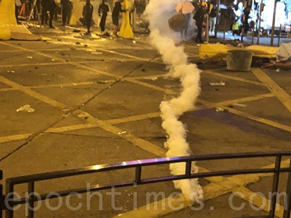
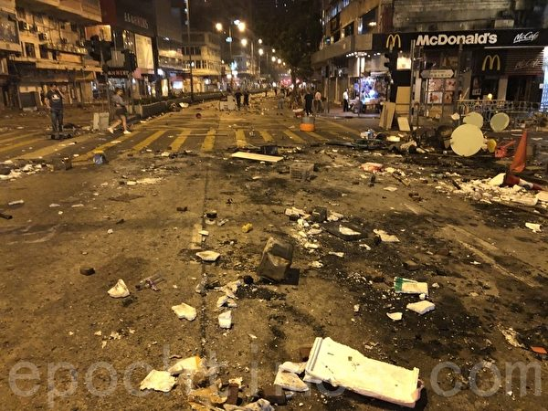
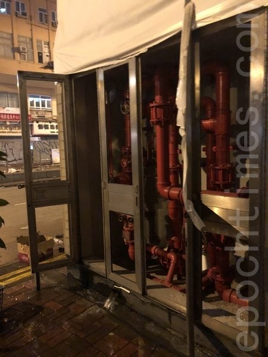
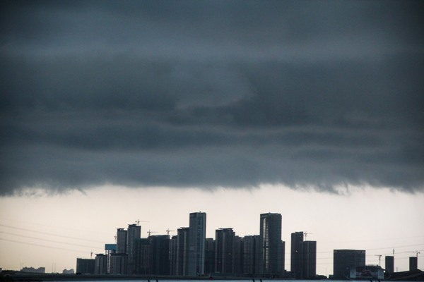
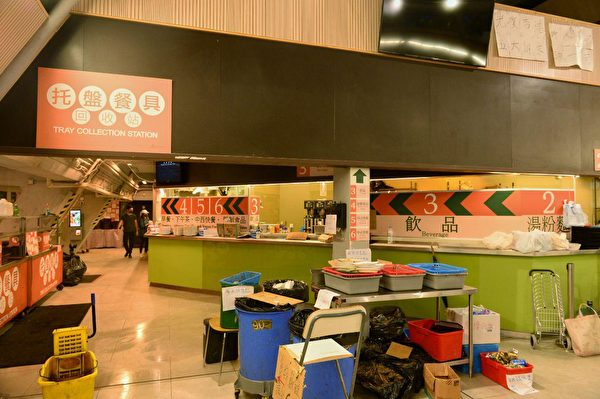
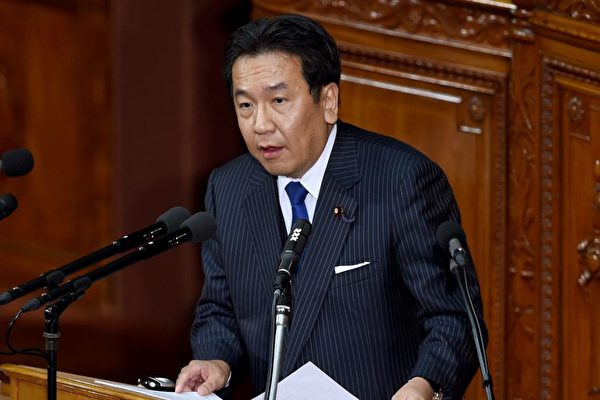
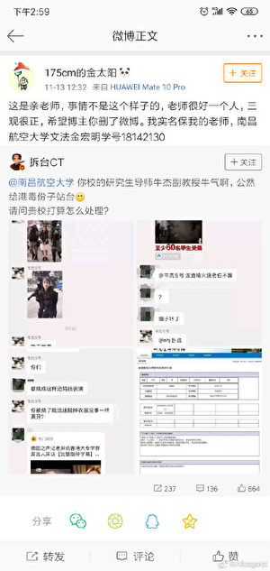
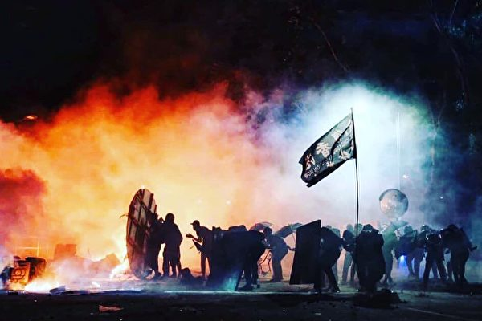

<h3 align="center"><b>知情权不能放弃，也不作愚民，让你看第一手不被过滤的新闻，翻墙软件免费下载  https://git.io/opopop </b></h3>

<h3 align="center">直连不必翻墙 blossom必看 精彩视频 http://36.227.112.13 </b></h3>

<h3 align="center">中共覆灭在即 勿依赖中共保权 https://git.io/Ffor </b></h3>

<h3 align="center">● 红潮即将倾覆 天之将明 ●https://git.io/bb99bbss </b></h3>

<a name=top>

<a href =#58>58.福建省福清监狱攻坚组 残酷折磨法轮功学员 
<a href =#57>57.河南关闭P2P平台 称没有一家过关 
<a href =#56>56.诸葛高参：猪年猪瘟 鼠年鼠疫 天灭中共 谁挡谁亡 
<a href =#55>55.石铭：认清中共流氓本性 加速中共解体进程 
<a href =#54>54.组图：理大学生欲再冲出校园 遭警用催泪弹水炮车阻击 
<a href =#53>53.红三代披露中共计划：搞乱香港 变大陆城市 
<a href =#52>52.组图：11.18凌晨市民声援理大生 警狂射催泪弹 
<a href =#51>51.港警使用闪光弹等武器 理大变战场 
<a href =#50>50.大陆富豪加紧跑路 移民人数暴增50% 
<a href =#49>49.法轮大法洪传世界 6500法轮功学员台湾排字 
<a href =#48>48.明慧网恶人榜更新 公布十万人名单 
<a href =#47>47.警方首次出动音波炮 警告可能使用致命武力 
<a href =#46>46.【新闻看点】北京搞金钱外交 钱让世界低头？ 
<a href =#45>45.【名家专栏】导弹防御是美安全新基石（上） 
<a href =#44>44.400页密件曝光 中共威胁新疆集中营外孩子 
<a href =#43>43.【今日热点】驻港部队出街 未来7天有关键一役 
<a href =#42>42.【新闻看点】中共露杀机香港危急 美警告有代价 
<a href =#41>41.中国学者质疑香港暴力事件 遭官媒围攻 
<a href =#40>40.辽宁抚顺市看守所的八条人命案 
<a href =#39>39.遭中共残害致死的十五位医护人员（上） 
<a href =#38>38.英国政府将出台法律 制裁林郑月娥等人 
<a href =#37>37.神州长城成为大陆首家A、B股双退公司 
<a href =#36>36.组图：多所大学遭港警攻打 中大砌墙阻挡 
<a href =#35>35.组图：11.15港银发族“查警暴止警谎”游行 
<a href =#34>34.组图：11.15港银发族“查警暴止警谎”游行 
<a href =#33>33.三峡大坝给人们真正带来了什么 
<a href =#32>32.冤狱15年 法轮功学员何莲春再遭非法批捕 
<a href =#31>31.冤狱酷刑 颠沛流离 法轮功学员邓莉的遭遇 
<a href =#30>30.程晓容：香港——留给谁的时间不多了？ 
<a href =#29>29.中大保卫战 学生命在旦夕 吁国际人道救援 
<a href =#28>28.港中大大陆生拒绝撤离：成为历史见证人 
<a href =#27>27.传北京儿童医院、宣武医院出现鼠疫病例 
<a href =#26>26.数百陆生上传证件撑港“自由不死中共必亡” 
<a href =#25>25.【新闻看点】关税令谈判陷僵局？川普再喊话 
<a href =#24>24.港警近距离开枪 日本政界首发声谴责 
<a href =#23>23.微信群内撑香港 南昌航大副教授遭举报 
<a href =#22>22.近期四川法轮功学员遭迫害概况 
<a href =#21>21.【世界十字路口】中共让香港变战场 五大目的 
<a href =#20>20.新疆棉花为何引发“奴工”担忧 
<a href =#19>19.浸淫公安系统42年 河南公安厅官员被调查 
<a href =#18>18.再有中国上市公司老板被抓 今年第17个 
<a href =#17>17.北京确诊2人染鼠疫 病源成谜 民众恐慌 
<a href =#16>16.分析：中国实际经济情况比官方数据糟糕 
<a href =#15>15.【拍案惊奇】开枪 车撞 抓人 轮奸 港警疯狂 
<a href =#14>14.11·12港人续抗争 千人塞爆中环毕打街 
<a href =#13>13.獐子岛集团称3亿扇贝死亡 4.4万股民踩雷 
<a href =#12>12.香港殡葬业者谈近期浮尸疑点与活摘器官 
<a href =#11>11.纽约第100届老兵节游行 法轮功队伍成亮点 
<a href =#10>10.台湾女主持人回呛央视女主播视频 网络热传 
<a href =#9>9.陆银行限提款 挤兑频现 专家：危机前夜 
<a href =#8>8.10月份 至少39名法轮功学员遭冤判 
<a href =#7>7.麦康奈尔：支持香港民主抗议者 推动立法 
<a href =#6>6.中国猪肉危机超乎想像 影响全球市场 
<a href =#5>5.【拍案惊奇】香港紧急关头！中大攻防战纪实 
<a href =#4>4.川普：美中若达不成贸易协议 美将继续加税 
<a href =#3>3.惊曝作战部队进入香港 抗争学生捡获大陆警棍 
<a href =#2>2.大瘟疫前兆？中国爆可怕黑死病 舆论恐慌 
<a href =#1>1.警闯中大狂轰滥捕 港人与学生并肩作战 

<a name=58>
<h1 align="center"><b>福建省福清监狱攻坚组 残酷折磨法轮功学员</b></h1>

福建省福清监狱设立了所谓“攻坚组”，是专门迫害法轮功学员的邪恶机构。（明慧网）

 
【大纪元2019年11月18日讯】福州法轮功学员张晶因发放法轮功资料于2018年4月30日遭绑架，后被枉判5年6个月，劫持至福清监狱，于2019年6月被关入用所谓的“攻坚组”。张晶绝食抵制迫害，现在生命垂危。

明慧网报导，这个所谓“攻坚组”实际上就是“洗脑班”，通过从精神到肉体上的非人折磨，逼迫法轮功学员背弃信仰，即“转化”。

2019年9月底，张晶父母致信给福清监狱的监狱长，要求监狱把张晶从“攻坚迫害组”放出来，让他回到普通监区五中队。

张晶父母质问监狱长：“你们为什么要把张晶关到‘攻坚迫害组’？张晶是个好人、好儿子，你们要对他攻什么坚呢？他一定是没有办法了才绝食的，他都瘦成那样了，你们还不放过他。难道对你们监狱来说，我儿子的生命不比你们关他在‘攻坚迫害组’还重要吗？”

近十年来，福清监狱“攻坚组”是迫害法轮功学员的“集中营”，在原省监狱管理局教育处副处长冯宁生指挥下，以邱庆学、黄奕橄、何方等警察为打手，对法轮功学员实施长时间强迫洗脑、强迫写所谓放弃修炼的“保证书”、肆意辱骂、殴打、面壁罚站、罚蹲、罚坐、剥夺睡眠等等种种酷刑迫害，折磨残害法轮功学员。

仅仅曝光出来的残酷迫害包括：

2010年11月初，厦门法轮功学员林文伟被迫害致奄奄一息、全身黑紫、生命垂危，由家人接出后，终因身体受到严重残害而离世。

2012年，宁德市柘荣法轮功学员游昌良被迫害致身体极度虚弱、下肢瘫痪，被送进“建新医院”，一度出现生命危险。

2014年10月，“攻坚组”在对福州法轮功学员左福生整整两年洗脑迫害无果后，阴谋报复，指使四五个犯人群殴左福生，导致其左眼失明，内伤严重。

狱警当时在旁边观看，不但不阻止，还把重伤的左福生吊铐了整整6个小时。

法轮功学员王顺平、蒋建平、许小高、游建喜以及更多未能曝光出来的法轮功学员先后在“攻坚组”遭受严酷迫害。

福清监狱设立的“攻坚组”是专门迫害法轮功学员的邪恶机构，该机构于2009年由闽西监狱迁入，常设在福清监狱的“高危监区”内。

高危监区内关押的人，根据监狱规定，必须是严重违反了监规的犯人或在狱中再次犯罪被调查的在押犯人。那里通常有三种整人的方式：禁闭、隔离、严管。

福清监狱针对法轮功学员，无须任何规定，多数先关在“出监队”搞的“洗脑”、“转化”。只要是经谎言欺骗、恐吓威胁无效果后，监狱就把坚持信仰法轮功者转入“高危监区”迫害。

法轮功学员通常被关在严管区和隔离区，恶徒利用对限制睡眠、饮食、洗澡等对他们进行迫害，例如：睡眠，每一至两个小时叫醒他们一次，说是点名……指使其他犯人经常恐吓甚至打骂法轮功学员等，制造压力及紧张气氛。

监狱利用谎言欺骗、恐吓威胁、暴力三个步骤迫害法轮功学员。

张晶被关入所谓“攻坚组”后，绝食抵制迫害。他亲口告诉亲人：“他们让我写保证书，我不写，他们就逼我蹲了一整天，我的腿都肿了”。

2019年11月初，监狱曾电话通知张晶父母让律师去见张晶。11月8日，当北京律师专为此事赶到时，监狱却出尔反尔，不准律师会见张晶，公然剥夺当事人会见律师的权利。

<a target="_blank" href=#top><h6 align="right">回上方</h6></a>

<a name=57>
<h1 align="center"><b>河南关闭P2P平台 称没有一家过关</b></h1>

中国P2P网贷平台接连倒闭，被称作“爆雷潮”，因此中国在短时间内迅速出现大批投资其中的民众成为“金融难民”。（大纪元资料室）

 
【大纪元2019年11月18日讯】（大纪元记者刘毅报导）中共河南省地方金融监督管理局官网日前发布通报称，未有一家平台通过验收，并列出了首批12家被关闭的平台，这已经是大陆再有大省全部关闭P2P平台。

11月15日，河南省官方发布通告称，从2016年以来，河南省对网路借贷行业一直在进行整顿，至今未有一家平台完全合规通过验收，外省在该省从事网路借贷业务的分支机构也均未在当地金融监管部门备案。显示该省将关闭所有P2P平台。

通告还列出了第一批12家被关闭的平台。包括园宝金服、E 融金融、河南贷、众义金融、联硕金融、豆芽金融、大河金服、惠嘉金融、大数云融、贵人柜、大印财富通、得成贷，其中8家平台位于河南省省会郑州市。

有网民对“没有一家合格”表示质疑。云南昆明网民“疑难杂症老军医”表示：“干了那么多年，各种广告广播写字楼，合计没有一个合法！”

也有网民对“全部关闭”一说表示质疑，河南网民“顿悟者杨”说：“大街上那么多借贷公司看不到吗？”

评论人士文小刚认为，全部关网贷平台和目前大陆经济和社会形势有关。这些平台一般都和当地官场人士和他们的亲属有关，即有中共官方为他们站台，所以他们可以肆无忌惮地搞老鼠会，高息吸引投资者等。但随着经济下滑，他们贷出去的资金回不来了，投资者血本无归，就会起来维权，而维权的目标最后都集中到当地政府身上，再加上目前大陆民众和地方当局的关系紧张，经济也在下滑，民众不满越来越大。中共当局害怕再出现什么激化矛盾的事件，所以，先把容易引发大规模群体事件的网贷平台关掉，以防引火烧身。

而在此之前已经有湖南省和山东等省也以“未通过验收”为名，关闭了省内的全部网贷平台。

11月8日，大陆直辖市重庆市地方金融监管局发布公告称，当地未有一家网贷机构完全合规并通过验收，外省的P2P网贷业务也未经过金融监管部门审批或备案。重庆其它机构开展的P2P网贷业务一并予以取缔，任何机构未经许可不得开展P2P网贷业务。

11月6日下午，广州市互金整治办关于发布网贷专项整治第一批自愿退出网贷业务平台名单的公告，共有23家P2P平台关门。

10月18日，山东省地方金融监督管理局官网称，未有一家P2P平台完全合规通过验收，对境内P2P网贷业务全部予以取缔。

10月16日，湖南省地方金融监督管理局官网发布公告称，关闭全省所有24家网贷机构P2P平台。

另外，今年以来，宁夏共关闭24家机构P2P网络借贷业务，还取消24家小额贷款公司的小额贷款业务；深圳累计关闭145 家P2P平台；云南累计关闭73家P2P平台；上海披露99家失联类P2P平台。北京、济南等地区也对外公示了网贷机构关闭名单。

11月12日，中共银保监会普惠金融部主任李均锋在监管通气会上称，今年停运了1200多家网贷平台。而截至10月末，大陆纳入实时监测的在运营机构数量已降至427家，比2018年末下降59%；借贷余额比2018年末下降49%，出借人次比2018年末下降55%。＃

<a target="_blank" href=#top><h6 align="right">回上方</h6></a>

<a name=56>
<h1 align="center"><b>诸葛高参：猪年猪瘟 鼠年鼠疫 天灭中共 谁挡谁亡</b></h1>

“天佑良善，天惩恶邪”。以邪毒马列为信的中共，必遭天谴。图为2019年11月12日，香港中大“天灭中共”的标语。（宋碧龙／大纪元）

【大纪元2019年11月18日讯】中国人眼下还奔忙在己亥猪年的人祸——猪瘟里惊魂未定，担心过年还能不能买得起二斤猪肉包饺子吃团圆饭，更惊骇的消息一夜杀来——史上俗称黑死病的鼠疫，已率先登场党国皇都北京。此刻离黄历庚子鼠年还有两个多月！瘟猪未去，疫鼠已来，这是上天惩戒万恶中共的大戏前奏啊！

各位看官，你如果心中还有一丝信神，不想陪葬恶共，听我一句劝：千万别信赵党王沪宁、真理部、央视、人日、新华、混球时报的维稳安抚口炮，立刻、马上、现在就跑去买水买米买面买口罩买最厉害的消毒液！然后断绝出入公众场所，特别是老人孩子。

鼠疫是人类天敌、史上迄今最难防治的第一级别传染病毒。攻入北京的肺鼠疫，几百年前横扫欧洲，数千万人暴死街头，尸横遍野，绿脓血水流淌，臭气熏天，经月不散。数百座城池一夜沦为空城、鬼城……其悲惨景象惊悚万状，超过好莱坞大片一万倍！

科普：目前分类的三类鼠疫，皆可引起败血性鼠疫，经由血液感染身体各部位，侵入肺部造成肺炎后，更会造成次发性肺鼠疫。感染者会把富含病菌的痰与飞沫传播，进一步扩大鼠疫病情，造成局部地区的爆发或毁灭性大流行。

据党管百度词条提供的数据，鼠疫第一次袭击英国是1348年，断断续续的持续了300年。

那场骇人听闻的悲剧持续那么久，史料繁复。这里，我想借引知乎公众号“一个臭鸡蛋”的盈盈网友的简单总结，便于看官一分钟明晰：1347至1353年6年间，“黑死病”夺走至少2500万欧洲人的性命，占当时欧洲总人口的1/3！1665年，鼠疫在伦敦非常严重的爆发。6月至8月的仅仅3个月内，伦敦的人口减少了十分之一，到8月，每周死亡2000人，9月竟达8000人。黑死病累计造成全世界死亡人数高达7500万（还有个说法是2亿人口）。2017年北京、上海、深圳、广州四个人口最密集，经济最发达的城市常住人口总和是7292万人。

也就是说，欧洲鼠疫那次惨死的人口是中国一线城市北上广深人口的总和！

鼠疫从哪里起源，存在相当大的争议。一种学说认为起源于欧洲东南部，一说起源于黑海城市卡法，约在1340年代散布到整个欧洲。但最近的一项国际性DNA研究表明，鼠疫（黑死病）的发源地可能是中国。研究人员称瘟疫在2600年前的中国爆发，600年前透过丝绸之路传播到西欧；非洲与美洲的鼠疫，也分别在15世纪郑和下西洋时期和19世纪传过去。

历史弄人。黑死病如果真发源于古代中国，如今在共产党作孽最猖獗时期，它居然杀了个回马枪。这告诉我们同胞一个预示，共产党真的就要完蛋了！天不容它，连鼠疫都要弄死它！

有人可能担心，那我们老百姓怎么办？据说欧洲人当时就是跑，跑得越远越好，没钱没能力跑的，就只有等死。其实人各有命，上天有眼。没作恶的都不要怕，包括共产党警察和体制内公务员。不包括香港施暴黑警！还有最管用的一招，文末告诉你。

我把鼠疫和猪瘟、非典（萨斯）一样定义为人祸，毫不做作。我说共产邪教是万恶之源，当然包括它引来瘟疫。70年它害死我族同胞上亿，很多人说过了。只说2003它掩盖萨斯爆发，造成大量的人死亡，我在北京就有熟人牺牲。90后以前的人都还记得，那时帝都阴霾蔽日，万人空巷，谈“非”色变，全社会“罢工”，个个猫在家里啃方便面看韩剧度日。大批死人，可央视仍在鼓吹非典无害、岁月静好；到猪年爆发猪瘟，难道不是硬怼川大爷加税、硬从猪瘟疫区俄罗斯高价进口生猪的人祸？共匪照样“不屈不挠”，掩盖真相，如今造成猪瘟攻陷全国，猪价飞涨，党媒却鼓吹吃鸡吃菜比吃猪更健康，买不起猪肉照样包素馅饺子过年，它为保权维稳，简直到了造谣骗人不要脸的境界；如今鼠疫爆发了，它依旧掩盖，没脸没皮的宣称“一切尽在掌控中”！这是鼠疫！黑死病！你匪掌控个毛线啊！

各位看官，这一切不是人祸吗？它——邪恶共党就是中华民族死敌，不害死中国人死不罢休！

不能不说到香港。青年英雄、市民英雄英勇抗暴5个月，点燃了天灭中共第一把大火。当年萨斯从广东流窜香港，良知媒体迅速传播危险信息，信神的港人马上全员自救，很快控制了疫情扩散，还有香港知名中医将治疗良方无偿告知大陆医疗系统，使不少病患获得及时救治，保住生命。每到天灾人祸危急时刻，港人都在无私救助大陆同胞，这次自由香港遭暴共黑警荼毒，我大陆人不该尽一切力量撑香港、灭共匪吗？

当年看萨斯难控，江匪泽民吓得要死，卷铺盖滚出中南海，躲去上海哆嗦，惶惶不可终日，只记得每天拜地藏菩萨，忘了自己是匪首不该信神。江匪更是不听劝阻执意镇压法轮功，还纵容薄熙来、王立军们活摘修炼人器官，惹出天谴。以蛤蟆的魔控思维，自然找不到来无影去无踪的萨斯源头，也绝不敢和自己杀人恶政公开联想。只有令百万中国人背锅被害受死萨斯。如今萨斯究竟死亡多少人，仍然是暴共和江匪极力掩盖的一级“国家机密”。

习总，到你治下，在中国消失几百年的黑死病来了！你怎么联想是你的事，但我在想：考验你是否真男儿的历史时刻到了！有种，别离开北京，请坐镇中南海对鼠疫亮剑，但最好别再去毛腊肉水晶棺前祷告，求死鬼帮忙，助你战天斗地。那样只会招来黑死病死攻，让中国生灵涂炭。

我两年间真心劝你弃共，劝了七劝，愣没劝动。只好等着看你怎样以更毒的马列毛，杀鼠疫于无形！你党那些只信唯物论、只信强权、不信神佛、蔑视百姓的无神论者，空有一袭中国人的黄皮囊，为私欲捆绑，永远不把中国人民生命、幸福、安全、免于恐惧的诉求放在眼里，想想还配不配称中华子孙？大难当前，还没事人似的到处撒币，推销这个共同体，那个共同体，回头却去给傀儡林郑小妹打气，挺黑警攻入香港各大学打杀男孩女孩。我看你这般无法理喻，也是好奇怪：难道，你真的是上天灭共收官所安排的最后一颗棋子？

总结起来，以邪毒马列为信的中共，无疑是超过萨斯、猪瘟、鼠疫千万倍的终极祸源。

鼠年未到，白鼠闹春就已上演，这闹，不是吉祥，是瘟疫。我在想，中国共产党的洗脑喉舌大牌节目——央视春晚，鼠年还能不能上演？匪共照这样遮掩下去，我愿鼠疫第一个攻入中南海，第二个攻陷大裤衩。

最后，给看官讲一个史上欧洲黑死病疫区的奇迹：当时每天每刻都有人在街上走着就倒地死去，毫无办法控制。但恐怖场景中，就有信神者，毫无畏惧，穿梭在满地尸体、恶水流淌的街上救助同胞，竟毫发无损。这就是我要告诉你的最管用的保命一招：对神祈祷，抛弃中共。如今招致天谴的，无人质疑是奴役我中华万众70年的邪恶中共，不是普通受害民众。

怎么做？只要你立刻对天发誓：坚决的、彻底的退出中国共产邪党的一切组织：共产党、共青团、少先队、红卫兵、红小兵，与其切割，你必定会逃出生天，在大劫到来的当下，保命保健康！天佑良善，天惩恶邪。

还不踏实，就去退党网站tuidang.org办理。我听说上街找法轮大法修炼者真相点，请他们协助办理“三退”手续，也非常正式有效。

同胞们，天灭中共已拉开最后一幕，我们置身在人类史上最伟大也是最惨烈的灭魔大战最后一役之中，香港孩子冲在了最前端，已经把“天灭中共”的大牌矗立在大学校园。我们受尽中共折磨的大陆同胞必须跟进，在关键时刻用我们的勇气、良知、热血，昭告上天，灭掉共匪，护佑中华，还我祖国清平河山。请相信神佛看人心，必会允诺好人走入未来——一个没有共产恶党的新纪元。

<a target="_blank" href=#top><h6 align="right">回上方</h6></a>

<a name=55>
<h1 align="center"><b>石铭：认清中共流氓本性 加速中共解体进程</b></h1>

防暴警攻入理大校园，理大平台成火海。（ANTHONY WALLACE/AFP via Getty Images) 

 
【大纪元2019年11月18日讯】原中共中央政治局常委、中纪委书记尉健行的撰稿人王友群博士在《齐心协力推倒中共这堵墙》一文中这样描述香港抗争：“2019年6月香港反送中运动爆发以来，中共将过去20年在中国大陆迫害法轮功的各种流氓手段都搬到了香港。短短5个月，中共在香港抓捕3500多人，伤4000多人，香港科大学生周梓乐离奇死，15岁的少女陈彦霖离奇死，18岁少女在警署被4人轮奸；7.21放纵黑社会打人；8.31太子站被怀疑打死人；10.1开枪杀人；11.4阻救人；11.11街头狂杀人；浮尸、失踪、坠楼、上吊等，疑似“被自杀”事件轮番上演。

还有，在街头群殴孕妇、老人，逮捕白发苍苍的老太太、稚气未脱的少儿，打爆少女、外国记者眼睛，往死里狂打抗争者、扭断抗争者手臂，骑摩托车胡乱撞人，冲进教堂、商场、麦当劳、运动场抓人……11月11日晚，500警察强攻香港中文大学，发射上千枚催泪弹，60多人受伤。上过ISIS前线的德国记者称，香港黑警比ISIS还坏！”

新唐人北京时间2019年11月13日讯：香港警方12日晚再度强攻中文大学，至少60多名学生受伤，多人被捕。

香港中文大学11至12日连续2天爆发激烈对峙，警方朝学生无间断狂射催泪弹、橡胶子弹，现场硝烟弥漫，形同战场。至少60多名学生受伤，多人被捕。

香港大专学界12日当天发表声明，强烈谴责“魔警屠城”，重演六四事件，宣称“我等决不坐视不理，誓与中大共存亡”。

香港的局势引发国际关注。美英等国严厉谴责港府不成比例使用武力，呼吁克制。美国联邦众议院多数党领袖霍耶尔（Steny Hoyer）在推文表示，港警在与示威者校园对峙中所采取的激进作为，让他深感忧虑。香港市民遭受升级暴力，对香港蓬勃民主是个沉重打击，“我正密切关注相关发展，并与泛民主示威者站在一起”。

参议院外交委员会民主党首席议员梅南德兹（Bob Menendez）也在推文中，对香港情势表达关切。梅南德兹表示，香港市民上街抗议民主及权利遭到侵蚀，至今已近半年，越来越多学生与示威者遭受暴力对待，有些甚至是香港数十年来见过最严重事件。

梅南德兹指出，港府应确保警方拿出专业作为并保持克制，也必须面对处理香港人民的正当渴望。他也呼吁美国参议院，应立即通过他共同提案的参院版“香港人权与民主法案”。

美国联邦参议员克鲁兹近日发文表示，现代版的柏林墙今天依然存在，香港就是新柏林。

针对港警在香港大学校园的施暴行为，霍利参议员表示，“这又是一个迹象，显示了北京想做的和能够做的。这就是为什么我认为美国参议院通过《香港人权与民主法案》至关重要。”

13日，中华民国总统蔡英文再度谴责港警暴力，要求港府悬崖勒马，“不要为了妆点北京当局的颜面，而用香港年轻人的鲜血祭献。”

蔡英文强调，警察的存在是为了保护人民，政府的存在是为了服务人民，当警察不再保护人民，政府不再为人民着想，这样的政府，必将失去人民的信赖。

她指出，香港的自由和法治正被中共威权侵蚀，台湾站在全世界抵抗威权扩张的最前线，呼吁国际社会与坚信自由民主价值的人们，一定要站出来，关心香港失控的情势。

共产党从它产生的那一天就是一个流氓党，中共毫无保留的继承了它的衣钵，它豢养的那些马仔自然也是一个个流氓，成为效忠主子的打手，今天在香港作恶的那些“魔警”就是其中之一。在中共的历史上，哪一次中共发起的迫害、屠戮人民的运动不是如此呢？

今天中共在香港所采用的流氓手段与距今三十年前的北京“六四屠城”又有多少差异呢？可以说是八九“六四屠城”的翻版，只是由于地点和环境不同还没有动用机枪、冲锋枪扫射，坦克碾压而已。有人撰文中共把镇压迫害法轮功的手法移植到了香港，也确实如此。中共是一个流氓党，积累了几十年的镇压迫害民众的经验，对于没有遭受过中共长期洗脑迫害的港人来说，真是防不胜防啊！

11日早上，港警枪击手无寸铁的示威者之后，322个香港中学生组织当日发表联合声明，誓言：既然政府要与他们这一代人作对，那不管是5个月、5年还是50年也好，定会奉陪到底。看到这句话时不由得热泪盈眶，新一代的香港人了不起，香港的未来一定属于你们！

香港正处于危难的时刻，此时的香港最需要国际社会的支持，愿国际社会不要再等待观望或过多的为本国利益权衡。中共是一个破坏世界人权和反人类、反宇宙的恶贯满盈的凶手，惩罚凶犯是人类共同的责任，不能再让它祸害人类、危害人间了！

《九评共产党》中说：“当人们都能认识到共产党的流氓本性，并不为其假象所蒙蔽的时候，也就是终结中共及其流氓本性的时候。”认清中共流氓本性，加速中共解体进程，是当前人类最紧迫的事情和责任。目前香港正处于反共的最前沿，在坚持抗争的同时，更要认清中共的流氓本性和邪恶本质，理智智慧的坚持抗争，争取国际社会的更多更多支持，避免孤军作战。

<a target="_blank" href=#top><h6 align="right">回上方</h6></a>

<a name=54>
<h1 align="center"><b>组图：理大学生欲再冲出校园 遭警用催泪弹水炮车阻击</b></h1>

2019年11月18日早上，理大抗争者约好外撤，被防暴警察用催泪弹攻击，有人想要尝试离开校园，可是还没有走到警方的防线就被警方的催泪弹驱散，又不得不退回校园内。（宋碧龙／大纪元）

 
 【大纪元2019年11月18日讯】11月18日接近正午，在香港理工大学死守一夜的抗议者跑出校园，沿漆咸道南，爬过路边铁丝网，尝试突破警方防线。但警方狂发射催泪弹，并同时出动水炮车。抗议者不得不撤回理大校园内。

而在佐敦，近百名抗议者从油麻地试图前往理工大学，但在伊利沙伯医院附近遭警方发射催泪弹驱散，抗议者后退，至少一人被抓捕，有一人头部疑中枪倒地、额头肿起流血，眼罩染血。

暂时未知该名中枪抗议者是被催泪弹还是布袋弹，或橡胶子弹击中。

早上8时许，一批在理大校内聚集的抗议者曾试图冲出校园，但走到达科学馆道时，警方发射大量催泪弹驱散，大批抗议者最后返回校园内。

目前，理工大学内约有数百人仍然被困，警方则继续包围校园。

 

2019年11月18日早上，理大抗争者约好外撤，可是还没有走到警方的防线就被警方的催泪弹驱散，又不得不退回校园内。（宋碧龙／大纪元）

 

2019年11月18日早上，理大抗争者约好外撤，可是还没有走到警方的防线就被警方的催泪弹驱散，又不得不退回校园内。图为第2次外撤。（宋碧龙／大纪元）

 

2019年11月18日早上，防暴警察在理工大学外围的科学馆道设防，并架起封锁线。（宋碧龙／大纪元）

 

2019年11月18日早上，理大抗争者约好外撤，可是还没有走到警方的防线就被警方的催泪弹驱散，又不得不退回校园内。（宋碧龙／大纪元）

 

2019年11月18日早上，理大抗争者约好外撤，可是还没有走到警方的防线就被警方的催泪弹驱散，又不得不退回校园内。（宋碧龙／大纪元）

 

2019年11月18日早上，理大抗争者约好外撤，可是还没有走到警方的防线就被警方的催泪弹驱散，又不得不退回校园内。（宋碧龙／大纪元）

 

2019年11月18日早上，理大抗争者约好外撤，可是还没有走到警方的防线就被警方的催泪弹驱散，又不得不退回校园内。（宋碧龙／大纪元）

 

2019年11月18日早上，理大抗争者约好外撤，可是还没有走到警方的防线就被警方的催泪弹驱散，又不得不退回校园内。（宋碧龙／大纪元）

2019年11月18日早上，理大抗争者约好外撤，可是还没有走到警方的防线就被警方的催泪弹驱散，又不得不退回校园内。（宋碧龙／大纪元）

 
 

2019年11月18日早上，理大抗争者约好外撤，可是还没有走到警方的防线就被警方的催泪弹驱散，又不得不退回校园内。（宋碧龙／大纪元）

2019年11月18日早上，理大抗争者约好外撤，外面有防暴警察用催泪弹驱赶。（宋碧龙／大纪元）

 
 
<a target="_blank" href=#top><h6 align="right">回上方</h6></a>

<a name=53>
<h1 align="center"><b>红三代披露中共计划：搞乱香港 变大陆城市</b></h1>

中共红三代透露，中共计划搞乱香港，消灭抗争者，使其变成普通的大陆城市。图为2019年11月18日早上，香港警察对理工大学抗争者发射催泪弹。（宋碧龙／大纪元）

【大纪元2019年11月18日讯】（大纪元记者陈俊村报导）有中共红三代透露，香港目前的动乱都是中共搞出来的，其目的是藉由“钓鱼”的方式将抗争者引诱出来并加以抓捕，并把香港变得跟大陆城市一样，最终完全屈服于共产党的统治。

该名红三代在网络节目“路德访谈”中表示，他日前与中南海的老领导们联系，并询问香港问题如何处置。对方告知，中共“要让香港一天天地乱下去，一天天地烂下去，然后变成一个普通的中国城市。”

他说，中共拟将港币消灭掉，将来要发展深圳币和大湾区，并将香港划入大湾区之中。

该名红三代此前问过一名军中朋友。对方说，香港的事情会闹到年底。他当时不理解对方为何知道会闹到年底。如今他才知道，这是因为搞乱香港的不是香港市民，而是中共。哪怕香港市民通通不上街，中共也会派军人假扮成黑衣人继续作乱，不折腾到年底不会罢休。

他解释说，中共采用的手法叫“钓鱼”。他们先以羞辱香港的方式把有反抗精神的香港市民骗出来，再抓去关在集中营，或加以轮奸，甚至使其“被自杀”，最终将有反抗精神的香港市民全都消灭掉。

他说，中共想把香港变成一个人心冷漠、极度无情的普通大陆城市，就像先前广东省佛山市发生的小悦悦事件一样。该事件发生在2011年，当时有一名2岁女童被汽车撞倒，肇事车辆逃逸，而十几名路人未及时施救，导致该女童不幸离世。

他提到，中共想让香港成为一个人人自危、完全共产党化的城市，就是“党让干啥就干啥”。不管香港有多少具有反抗精神的人，通通要关到集中营。

他还透露，中共在今年5月24日下令，大陆所有省分都要建“教陪中心”，就像新疆的再教育营（指集中营），可以容纳一百万人。因为每个省都有，所以全部可以关几千万人，即便香港抗争者有两三百万人，也足以容纳。

该名红三代说，中共在香港问题上的诉求是很明确的。他认为美国副总统彭斯（Mike Pence）先前在演讲中说的一句话很好：“不是美国要和中国脱钩，而是中共要和全世界脱钩。”

责任编辑：林琮文 #

<a target="_blank" href=#top><h6 align="right">回上方</h6></a>

<a name=52>
<h1 align="center"><b>组图：11.18凌晨市民声援理大生 警狂射催泪弹</b></h1>

2019年11月18日凌晨，香港警察继续在佐敦道、弥敦道的交界处不断发射催泪弹。（余天佑／大纪元）

 
 【大纪元2019年11月18日讯】11月18日凌晨，香港理工大学现场抗议仍然继续，不少市民前来声援学生。市民与警方在佐敦至尖沙咀路段对峙，警方在佐敦道弥敦道交界不断发射催泪弹。“大战”过后，现场一片狼藉。

11月18日凌晨，警方还在理工大学现场狂发催泪弹，同时在柯士甸道弥敦道交界处大肆抓捕抗议者，甚至还向记者喷胡椒喷剂。

2019年11月18日凌晨，香港大批市民为了支援理工大学学生，与警方在佐敦至尖沙咀路段对峙。（文瀚林／大纪元）

 

2019年11月18日凌晨，香港警察在佐敦道、弥敦道的交界处狂发催泪弹。（余天佑／大纪元）

2019年11月18日凌晨，香港警察在佐敦地铁站口对开路面发射催泪弹，现场烟雾弥漫。（余天佑／大纪元）

2019年11月18日凌晨，香港佐敦道大战过后的场景。（余天佑／大纪元）

2019年11月18日凌晨，香港佐敦道大战过后的场景。（余天佑／大纪元）

 
<a target="_blank" href=#top><h6 align="right">回上方</h6></a>

<a name=51>
<h1 align="center"><b>港警使用闪光弹等武器 理大变战场</b></h1>

香港警方使用闪光弹等武器强攻理工大学，该校顿时变成战场。（视频撷图）

 
 【大纪元2019年11月18日讯】（大纪元记者陈俊村报导）香港警方这两天包围并强攻理工大学，期间以闪光弹（震撼弹）等武器对付校内学生，使原本宁静的校园变成战火弥漫的战场。

闪光弹在投掷后会燃烧镁或钾以产生令人目眩的强光，以及巨大声压。它可致人瞬间短暂失明、失去平衡，进而完全丧失抵抗能力。

闪光弹自上个世纪70年代开发以来，就一直被各国军警用于反恐、攻坚、解救人质等任务上。然而，香港警察却在理工大学内使用这种武器。只见闪光与巨响齐发，逼迫手无寸铁的学生四处走避。

在11月17日下午，香港警方在理工大学出动两辆水炮车与一辆装甲车，而装甲车顶部设有声波炮。声波炮为声波武器的一种，可藉由声音干扰抗议者。它可发出具有伤害性的大音量声波，其音量可达135至152分贝，而声波可抵达500米至3,000米外的范围。

在现场的城市大学学生记者表示，警方首度使用约3秒声波炮，让人感到不适。该名记者怀疑声波炮尚未全开功率，应只属测试。

而大纪元记者也听到疑似刺耳声响，出现耳塞和头痛症状。

此外，警方并于尖东桥上向人群多次发射催泪弹及胡椒球弹，期间有防暴警察举起可装填实弹的AR-15自动步枪示警，并一度首次瞄准媒体记者与抗争者身处方向。

而在11月18日凌晨，防暴警察据称已携AR-15步枪等实弹枪戒备。有人在街上拍到他们携枪行进的画面。

<h3 align=center><a href="https://twitter.com/oisgaki">大家搵方法share呢條片出去，速龍全部揸住AR15步槍，只有實彈</a></h3>

AR-15步枪与M16步枪属同类设计，后者由前者发展而来，成为美国与盟国广为使用的标准配备。#

<a target="_blank" href=#top><h6 align="right">回上方</h6></a>

<a name=50>
<h1 align="center"><b>2-guangzhou-city-GettyImages-492909833.jpg</b></h1>

中国富豪加紧了移民脚步。（大纪元资料室）

【大纪元2019年11月17日讯】（大纪元记者刘毅报导）据日前发布的《2019年全球财富迁移报告》显示，2018年大陆富豪移民海外的人数比2017年增加了50%，达到了1.5万人。

亚非银行（AfrAsia Bank）和New World Wealth共同发布了《2019年全球财富迁移报告》。报告显示，2017年选择移民海外的中国富豪人数有1万人，到了2018年却飙升到1.5万人。中国移民海外富豪人数为全球排名第一，比排名第二的俄罗斯整整高出一倍。

有评论说，一年的时间新增的富豪人数不会很多，富豪的财富状况变化不会很大，但大陆选择移民的人数却陡增。因中共对外汇管制，大陆富豪如果要转移资产，最好的方法就是移民海外，可以预见，中国富豪移民海外热潮还将持续一段时间。

中国富豪对移民目标国的价值判断非常统一，即良好的生存环境，健全的法律体系，安全的资产管理。

报告显示，中国富豪最青睐的前10名的移民国家分别是：澳大利亚、美国、加拿大、瑞士、阿联酋、加勒比地区、新西兰、新加坡、以色列和葡萄牙。

海外分析人士文小刚认为之所以2018年中国富豪移民人数大增，一个是因为大陆经济下滑，挣钱不易，再加上中共搞“国进民退”，民企生存艰难；最关键的是很多富豪为了自己财产的安全考虑，2018年，中共御用学者开始放风“中国的私企已经完成了历史使命”等，令民营企业家感到中共在经济下滑，收入减少的环境下，要掠夺民营企业家的财富，促使他们加快移民步伐，赶紧跑路。据中共现行政策，只有移民才能突破外汇管理限制，一次性将大笔人民币资产转移到其它国家。

富豪不仅仅是跑路，还带走了他们的财富。

比如2018年11月20日至12月31日，仅仅一个多月的时间内，龙湖集团董事长吴亚军、达利食品董事长许世辉以及周黑鸭实控人唐建芳就将超过170亿美元（约合1148亿人民币）的财富转入了离岸信托。

《中国经营报》曾经报道，2018年，公司在香港上市的的大陆企业家就有15名设立了离岸信托，总计将285亿美元资产转移到国外。

其中，马云离岸信托股份价值约1119.36亿人民币，刘强东约333.49亿人民币。

有陆媒称，不少富豪所转移的资产都来源于实体经济，移民在一定程度上加剧了大陆实体经济的下滑，而且富豪移民意味着精英和财富的双重流失，还会引得更多的人效仿。
<a target="_blank" href=#top><h6 align="right">回上方</h6></a>

<a name=49>
<h1 align="center"><b>法轮大法洪传世界 6500法轮功学员台湾排字</b></h1>

2019年11月16日有约6,500名来自台湾及世界各地的部分法轮功学员，齐聚在中正纪念堂的自由广场排出壮观图像“法轮大法洪传世界”。（陈柏州／大纪元）

 
 【大纪元2019年11月16日讯】（大纪元记者钟元、戴德蔓、张原彰台北报导）每年台湾法轮功学员的盛大排字活动都引人瞩目，今年是法轮功创始人李洪志大师洪传大法27周年，11月16日有约6,500名来自台湾及世界各地部分法轮功学员，齐聚在中正纪念堂的自由广场排出壮观图像“法轮大法洪传世界”。
 
<b>法轮功深受不同种族、不同肤色的各族裔人士喜爱</b>

20年来都担任图像设计的吴清祥受访表示，今年排字图形的中心是世界地图，上面有法轮功指导修炼原则“真善忍”；最上面的10道光芒代表法轮大法佛光普照，整个图像是“法轮大法洪传世界”，代表全世界五大洲114个国家及地区都有人修炼法轮功，有超过一亿人身心受益，法轮功深受不同种族、不同肤色的各族裔人士喜爱。

吴清祥说，法轮功学员每年在台湾法会召开前夕举行大型排字，都吸引很多人来看，可说是台湾每年最盛大的排字，也是最有美感的图形，让看过的人会感动。他表示，有看过的民众网路留言说：“好盛大、好壮观、好殊胜！”，还有人说：“很感动、好伟大！”也有人说：“我也希望能参加！”

对于今年排字难度，他说，法轮功排字希望图形能够表现美感、艺术感，所以排字是用隶书字形，隶书是蚕头燕尾很艺术的字体，呈现浑厚、厚重、稳重、沉稳感，但不像印刷体左右横竖都一样宽容易排。另外，世界地图很复杂，要怎么去表现全世界的陆地跟海洋，这不是很规则就有难度，“而且有海外来的学员，台湾学员则来自全岛，在没有预演下要整体协调一致，要有修炼基础才能互相配合。”

台湾法轮大法学会副理事长黄春梅说，每年台湾大型排字对法轮功洪传起到很大的作用，今年海外学员来自欧美、亚太地区的国家，还有远从俄罗斯来了10几个人，他们来台湾参加法会，也都想参与排字都会协助安排，其实大家都同修一部法（《转法轮》）就是同修，他们来台交流大家也都很高兴，也是很欢迎。

黄春梅表示，中正纪念堂以往是陆客常来的地方，今年则日本团、韩国团较多，自由行欧美游客也蛮多的。看到现场学员在准备排字先期工作，他们会来询问到底在这里做什么，“有2个欧美人很好奇的问，我们拿排字简图给他们看，两人很高兴的说图形太漂亮了。”

她说，法轮功在自由广场排字散发正的能量，其实跟不自由的大陆来讲形成很强烈的对比，也让游客有缘看到排字了解到法轮功真相。

<b>法轮大法普传全球  造福人类的奇迹</b>

台湾法轮功人权律师团发言人朱婉琪律师说，1992年李洪志大师在中共无神论极权统治下的中国大陆，将“真、善、忍”佛家修炼原则从中国东北长春传出后，并洪传海外114个国家及地区，使上亿的海内外民众脱胎换骨、身心受益，近代史上出现了这部普传全球、利国利民的高德大法，堪称近代人类史上造福人类的一个奇迹。

朱婉琪表示，法轮大法在中国传出时，立刻受到广大中国人的欢迎，盛赞法轮大法的纯正高尚，对广大民众的身心健康具有奇效，对中国社会有百利而无一害，然而，法轮功却遭中共前党魁江泽民妒忌，利用假恶斗本质的中共，以及其极权机器对广大的修炼民众进行灭绝性的镇压，历经20年的残酷迫害至今未歇。中共镇压法轮功的倒行逆施，引起国际社会广泛关注及谴责，也促使人们来了解法轮功。

她说，各国政府及国际人权团体已经认识到法轮功，是一个在俗世中修炼普世价值的团体，也是国际社会中最了解中共邪恶本质、在世上最强而有力揭露中共迫害真相、呼唤人们良知觉醒的团体之一。她表示，台湾是中国大陆以外修炼法轮功人数最多的华人社会，“法轮大法洪传世界，带给人民光明及希望”，她呼吁世人在乱世中保持自己的最大善念，谨记“法轮大法好，真善忍好！”

<b>大陆人士：佩服法轮功学员捍卫真善忍信仰的精神</b>

游客驻足观赏法轮大法正法之路图片展。（陈柏州／大纪元）

 
 第二次来台旅游的大陆人士刘先生说，他接触过很多法轮功学员，直观中觉得他们的精神状态，与不修炼法轮功的人不一样，“他们都是按真善忍要求自己，是一群非常平和善良的人，很有礼貌，做事有分寸，很真诚，很干净。”他说他接触过也跟法轮功学员聊过，“我非常佩服他们捍卫信仰的精神，也为他们受到的迫害感到很难过，信仰自由是人天生的一部分，但在中国大陆却被中共剥夺了。”

“（一些）大陆老百姓因为中共的恶意宣传，使得他们对法轮功学员有成见”，刘先生表示，可是问他们为何有成见，又说不出具体原因，他们就是觉得（中共）政府说不好，可能就不好，其实这都是中共宣传对老百姓的影响。他说，中国人对于中共迫害法轮功的事是知道的，但是因为看不到讯息，具体有多惨烈却不清楚，因为他们只能看到中共要给他们看到的，外面的讯息是无法了解的。

刘先生以自己为例说，刚听到法轮功学员被中共活摘器官的事，他也半信半疑，但是他翻墙看了很多报导，尤其连西方主流媒体都报过了，“我就相信这件事是存在的，如果不是真的话，中共能接受西方主流媒体的报导吗？中共做了丑陋的事，外界指责它时，它是心虚、默认、不反驳，那也就代表活摘是存在的。”

刘先生说，他特地看了现场的真相展版，其中一个展版是法轮功学员拿着真善忍的横幅在北京天安门被武警抓捕的画面，对比此刻在台湾自由广场几千位法轮功学员自由的炼功活动，反差实在太大了。他说，首次看到这么盛大的法轮功学员活动，他用手机拍下这珍贵的画面，希望有机会可以让更多人知道法轮功在海外洪传的事实。

他同时也感慨，在大陆因为中共的封锁，一般老百姓可能无法得知真相，但是在自由的台湾，获取讯息如此容易，对于那些选择听信中共谣言宣传却不去寻找真相的台湾民众，他感到非常痛心。

 

2019年11月16日有约6,500名来自台湾及世界各地的部分法轮功学员，齐聚在中正纪念堂的自由广场排出壮观图像“法轮大法洪传世界”，图为多国语言的法轮大法图片展，吸引各国游客驻足观赏、了解法轮大法。（陈柏州／大纪元）

 
 桃園法輪功學員、網拍業者周先生說，他在今年3月開始修煉法輪功，10幾年的菸癮瞬間戒掉了，他讚歎法輪大法的神奇，「我修煉後有許多深刻的感受，我覺得法輪大法很好。」周先生這次在朋友邀約下，首次參加法輪功學員排字活動，即使趕不上報名時間，但他仍站在場邊，與排字學員們一起參與活動，「天氣很熱，看到這麼多學員坐在太陽下，我真的很感動，也想為大法付出。」

對於這次排字活動，法輪功學員林先生表示，他從小與母親一起修煉法輪功，這次在現場看到排字主題「法輪大法洪傳世界」，讓他感到相當的光榮。他說，法輪功以真善忍為標準，指導學員在日常生活中的言行，如今洪傳到全世界，「我很替這些支持法輪功的人們高興，也以身為法輪功學員為榮。」

 

法輪功學員林先生。（張原彰／大紀元）

 
 林先生表示，法輪功學員盛大排字，讓許多經過的民眾有機會認識法輪功，同時思考為什麼會有這麼多人修煉。他表示，這次參加活動有許多青壯年法輪功學員，而且許多學員的言行都符合真善忍，他以自己的母親為例說，不管其他人如何欺負她、羞辱她，她都可以用體諒與包容的胸襟替他人著想，對他人予以無私的幫助，且不會計較得失，「我非常的佩服她，這也是我應該得達到的境界。」

周先生表示，這次的排字，有很多外國的法輪功學員特地來參加，大家一起堅持真、善、忍，這真的是非常好的事情，「這個世界需要真、善、忍，且這樣的理念讓社會變得越來越諧和，真的很感謝法輪功的師父。」

 

法輪功學員李女士。（張原彰／大紀元）

 
 李女士表示，法輪功學員修煉真、善、忍，且時時刻刻警惕自己的一言一行，是否符合真、善、忍的標準，而至今在全球100多個國家都有人修煉法輪功，這代表法輪功法理是被各界所認同的普世價值。

李女士說，她在修煉法輪功之前，她必須依賴拐杖走路，行動相當不方便，但在煉了法輪功功法跟學法之後，她身體上的病痛不藥而癒，「我修煉7年多來，我常常向內找修正自己，變得不會跟人吵架，現在我過得非常好，我真的很感激法輪功的師父。」

 

法輪功學員黃同學。（張原彰／大紀元）

 
 世新大學廣電系大學一年級的黃同學說，她參加過很多次的排字活動，雖然每次排字的場面都相當的盛大，但都可以感受到前所未有的平靜，另外，每次跟這麼多的同修坐在一起，也會有種既熟悉又溫暖的感覺，「我只要抬頭看天空，會覺得這個世界，在此時此刻怎麼變得這麼美好。」

法輪功洪傳全球，已被無數的人們知曉並獲得各界的支持，黃同學表示，她很替知道法輪功真相的人們開心，而這次排字時，她也看見許多民眾站在場邊拍照，將法輪功學員排字的景象記錄下來，「很開心他們能見證這麼宏大的一刻，現在情勢在變，我們要更努力，讓更多的人知道法輪功的真相。」

就讀政治大學經濟系一年的簡同學表示，他從小修煉法輪大法，很早就知道排字的活動，但到這次才首度參加。他說，能夠與上千名法輪功學員一起排字、煉功，這是一件很殊勝的事情，「我不會因為天氣而放棄參加這場活動，我不會被炎熱的天氣，或是盤腿時的疼痛感給影響。」

簡同學表示，法輪功的修煉指導原則是真、善、忍，如果能讓這樣的價值傳達到各個國家，讓每個國家的人們知道法輪功真相消息，那也會對他們帶來正面影響，當人們知道法輪功是什麼，他們的身心靈都會得到改善。

在台灣的香港留學生陳同學說，他這次來看法輪功學員的排字活動，是因為在七月份時，他在香港看到法輪功學員的遊行，體認到香港現在的情況，跟法輪功學員的情況有點類似。

陳同學說，在台灣看到法輪功學員盛大的排字活動，感受到台灣這邊的信仰與自由，這與香港與中國完全不同。另外，法輪功學員以和平理性的訴求，向中共爭取信仰自由與正常的修煉環境，「但我們從反送中運動可以看見，中共這20年來並沒有改變。」他說，「我覺得法輪功學員非常的厲害，他們在這二十年來，不斷遭到中共殘酷的迫害，但到現在沒有任何的退步，這是值得香港人參考的精神。」

 

2019年11月16日有約6,500名來自台灣及世界各地的部分法輪功學員，齊聚在中正紀念堂的自由廣場排出壯觀圖像「法輪大法洪傳世界」，圖為法輪功學員演煉五套功法。（龔安妮／大紀元）

 

約6500名來自台灣及世界各地的部分法輪功學員，11月16日在中正紀念堂前演煉五套功法。（陳柏州／大紀元）

 
<a target="_blank" href=#top><h6 align="right">回上方</h6></a>

<a name=48>
<h1 align="center"><b>明慧网恶人榜更新 公布十万人名单</b></h1>

(明慧网截图）

【大纪元2019年11月17日讯】11月16日，明慧网恶人榜更新，这个网站是明慧网的副网，迄今为止，共收集了105,580名参与迫害法轮功学员者的名单，并将他们的个人信息和恶行等记录在案。

恶人榜名单上的人，涵盖中共各级人员，从宣传、文化教育、演艺、媒体、军队、公检法、宗教系统、企事业单位等，上至发动迫害法轮功的中共前党魁江泽民，下至参与迫害的居委会村委会工作的基层人员。

恶人榜设立的目的在于制止迫害、维护善良、支持正义。

今年5月31日，明慧网编辑部发布《通告》，在美国的一些宗教及信仰团体日前被告知，美国政府意在更加严格的审核签证申请，对人权及宗教迫害者拒发签证，包括移民签证和非移民签证（如旅游、探亲、商务等），已发签证者（包括“绿卡”持有者）也可能被拒绝入境。美国国务院官员并告知美国法轮功学员可以提交迫害者名单。

《通告》内容请海内外法轮功学员立即行动起来，更完整地搜集、整理迫害者信息，并向明慧网提交名单，包括迫害者本人及其亲属、子女、资产的信息，以便定位迫害者。

同时，《通告》请美国法轮功学员顺便搜集和提交那些在美国参与中共海外迫害的迫害者个人信息，比如在神韵艺术团和神韵交响乐团演出剧场外、在法轮大法修炼心得交流会场外，在法拉盛、真相点等场所参与中共海外迫害者。台湾、香港、韩国、西班牙等其它国家或地区的法轮功学员也请提供当地参与中共海外迫害的迫害者、及其亲属、子女、资产的信息。

《通告》发表以后，恶人榜编辑部的志愿者们通过五个月的工作，更新了明慧网恶人榜。明慧网感谢众多大陆法轮功学员的付出和配合。

法轮功是佛家大法，在1992年5月，以气功形式在中国北京正式传出，法轮功以“真、善、忍”教化人心，其祛病健身的神奇功效也迅速获得社会各阶层的欢迎。

1999年，中共官方报导说，在短短7年中，就有上亿人学炼法轮功。这个数字超过共产党员的人数，加上法轮功强调敬畏天地神明，重德修善，这与中共无神论、斗争意识形态相驳，中共前党魁江泽民处于妒忌以及对手中权力不稳的恐惧，开始下令调查法轮功，但调查得出的结论却是“于国于民有百利而无一害”。

此后，江泽民集团开始从舆论上污蔑、抹黑法轮功，并制造事端，其“名誉上搞臭，经济上截断，肉体上消灭”的迫害政策，使无数法轮功学员遭到非法抓捕、判刑、劳教、酷刑折磨、甚至被活摘器官，该迫害政策持续至今。

请点击：<h3 align=center><a href="https://library.minghui.org/criminal/html/lastname/">明慧网恶人名单</a></h3>

<a target="_blank" href=#top><h6 align="right">回上方</h6></a>

<a name=47>
<h1 align="center"><b>警方首次出动音波炮 警告可能使用致命武力</b></h1>

11月17日下午，警方在香港理工大学首次使用声波炮三秒。（大纪元视频截图）

【大纪元2019年11月17日讯】11月17日下午，警方在香港理工大学出动两架水炮车及一架锐武装甲车，同时发射催泪弹清场期间，约在下午2时42分，警方首次使用声波炮三秒。有记者感到少许不适。

下午2时26分，警方开喇叭警告称，可能使用致命武力。

该声波炮放置在装甲车顶部，用声音干扰抗议者，近距离可导致头痛。

声波炮，学名长距离扬声装置，英文：Long Range Acoustic Device，缩写：LRAD。据维基百科词条显示，声波炮为声波武器的一种，能够发出比较一般扬声器长距离，而且可以具有伤害性的大音量声波，被执法机构用于向群众发出警告，以至作为防暴用途，于军事上亦有被作为长距离通讯、驱逐及干扰等。

此装置因应型号不同，其所能够发出的声浪及传送距离不同，范围介乎500米至3公里，声量介乎135至152分贝。

11月17日下午，香港理工大学现场，防暴警察出动两架水炮车、一架装甲车清场，同时发射催泪弹。（孙明国／大纪元）

11月17日下午2时半左右及2时50分左右，在香港理工大学现场，防暴警察又继续使用两架水炮车发射蓝色、白色水剂，继续使用装甲车辗压雨伞等杂物，同时狂发催泪弹。

2时半的行动至少持续10分钟。

现场地面遍布蓝色、白色水剂痕迹，烟雾弥漫，脆裂弹满天飞。

抗议者虽然向后撤退，但是仍旧顽强抵抗。

11月17日下午，香港理工大学现场，防暴警察出动两架水炮车、一架装甲车清场，同时发射催泪弹。（孙明国／大纪元）

11月17日下午，香港理工大学现场，防暴警察出动两架水炮车、一架装甲车清场，同时发射催泪弹。（孙明国／大纪元）

11月17日下午，香港理工大学现场，防暴警察出动两架水炮车、一架装甲车清场，同时发射催泪弹。（孙明国／大纪元）

11月17日下午，香港理工大学现场，防暴警察出动两架水炮车、一架装甲车清场，同时发射催泪弹。（孙明国／大纪元）

<a target="_blank" href=#top><h6 align="right">回上方</h6></a>

<a name=46>
<h1 align="center"><b>【新闻看点】北京搞金钱外交 钱让世界低头？</b></h1>

习近平到访巴西，参加金砖五国会议，与巴西总统波索纳罗会面。(SERGIO LIMA/AFP via Getty Images)

 
 【大纪元2019年11月17日讯】大家好，欢迎大家关注新闻看点，我是李沐阳。

去年竞选时波索纳罗（Jair Bolsonaro）曾批评“中国正在买下巴西”，因此被外界比做是“巴西版川普”。不过在这次习近平到访撒钱后，巴西总统波索纳罗改变了说法。他表示未来中国在巴西的地位将会越来越重要。

习近平访问希腊，更是金枪银弹扔个不停，换来了高规格的礼遇。中希两国签署了16项协议，其中包括一个饱受争议的投资计划：中共国企中远集团将在比雷埃夫斯港投入6亿欧元（约合6.66亿美元，或46.5亿人民币）。

中共大搞金钱外交、撒币外交，目的不言而喻，希望扩大国际影响，拉拢更多国家为它站台。但是美国之音问，钱真的能让世界低头吗？

<b>中希签署16项协议 中方曾买下希腊垃圾国债</b>

习的希腊之行似乎是志在必得，进行了3天的访问。这也是他5年内第二次访问希腊，目的是巩固希腊在北京“一带一路”计划中欧洲战略桥头堡的角色。

中共官媒报导，习在与希腊总理米佐塔吉斯（Kyriakos Mitsotakis）会谈中提出四点建议。分别是加强共建“一带一路”倡议，同希腊共建重要国际物流中转枢纽战略对接，扩大两国进出口贸易，扩大投资规模。

双方签署了16项协议，涵盖多个方面。包括农业、能源、航空、银行、引渡逃犯、广播电视和高等教育机构的合作等等。所有协议中，最引人注目的是比雷埃夫斯港的签署。

大家知道 ，希腊位于欧亚非三大州的连接处，这个港口也就具有一定的战略意义。习直接了当地说，“希望强化比雷埃夫斯在跨洲运输中的作用”，成为中国货物进入欧洲的一个枢纽。

中共此时在希腊撒币，是看准了希腊正经济紧张，非常需要钱。从2009年开始，希腊的国债快速增长。2010年，希腊国债被降级到垃圾国债。随后，希腊的经济状况日渐萎靡，每况愈下，直至现在仍然很严重。

中共看准了这个点，所以拿出大笔款项，在2009年买下了它的垃圾国债。中共的做法引来很多骂声，因为中国有很多地区仍然相当贫穷，人们生活艰难，儿童上不起学。中共对这些不闻不问，却把大笔的钱送给外国，所以有网友说中共是“宁与友邦，不与家奴”。

中共撒钱，可以帮助希腊解一时燃眉之急，但不是白给，中共看上了比雷埃夫斯港。中共用“烧冷灶”的方式，换得了中远集团对这个港口2号、3号集装箱码头35年的特许经营权。负责对港口升级改造，并承担集装箱货运码头的管理。2016年，中远又收购了比雷埃夫斯港口51%的股份，计划把港口改造成欧洲最大的商业码头。

11月11日，习近平访问希腊，与希腊总理一起在Piraeus港口。（ORESTIS PANAGIOTOU/POOL/AFP via Getty Images)

老百姓常说，拿人钱财，与人消灾，希腊也是一样。2017年6月，欧盟第一次没有在联合国发布批评中共人权状况的声明，原因就是希腊投了反对票。所以法国舆论说，希腊是中共用国家力量支撑（举国体制）、财务不透明和贪腐贿赂蔓延的经济模式，侵蚀欧盟的“特洛伊木马”。

<b>“一带一路”被起底</b>

法国媒体“中国问题网站（questionchine.net）”前不久发表了一篇文章，评论了中共“一带一路”背后隐藏的真相，以及欧洲所面临的挑战，并且披露了一些鲜为人知的内幕。

这是由多名法国的中国问题观察员在2002年成立的网站，有众多的法语读者。

文章一上来就指出，中共的“友善”需要提防。这个“一带一路”规划能带来什么机会？什么样的风险？如何捍卫欧洲自己的利益？“说不定那些策略对我们可能是有害的”。文章表示，对绝大多数的一带一路合作伙伴国来说，“以中共自身利益为核心的发展规划，并不能够给他们带来实际的利益”。

文章表示，中法两国所谓“合作”两年多，经过强化推广，仍然没有在经贸或者工业方面推出重大合作计划。双方不是缺乏主动，或者合作不融洽，而是根本没有共同利益。归根结底，一带一路的宗旨就是，利用中国的设备和劳动力，开发发展中国家的基础设施，扩大它的影响力。

因中共倡议的一带一路令斯里兰卡身陷债务危机。图为正在兴建中的南部高速公路，由玛塔拉延伸至赫班托达港。(Paula Bronstein/Getty Images)

<b>为拉拢非洲 白送600亿美元</b>

中共为了扩大国际影响力，可以说不择手段。“中国问题网站”披露了一些中共采用的鲜为人知的手段。

众所周知，今年6月，中共农业部副部长屈冬玉成了联合国粮农组织总干事。当时他有多名竞争对手，相比较，屈冬玉并没有任何优势可言。这个时候，中共开始“运作了”。

网站披露，选举前，北京向非洲国家作出了600亿美元的投资承诺。这是一项没有任何附加条件的投资承诺，白白地给非洲投资。随后，北京又放弃了喀麦隆25亿美元的债务权。25亿美元，相当于175.21亿人民币，白白送给了喀麦隆。

法国《世界报》还披露，中共用6200万欧元，向喀麦隆候选人梅迪·蒙吉（Medi Moungui）行贿。梅迪·蒙吉是屈冬玉的一大竞争对手，接受贿赂后退出了竞选，屈冬玉的竞选路上已经没有了障碍。

此外，中共副总理胡春华访问乌拉圭，也是用一带一路规划作出投资承诺，让乌拉圭政府公开表示支持中共候选人。而古巴、巴西和乌拉圭这三个国家，都受到中共当局的威胁，如果不投票支持屈冬玉，中共就不再购买他们的农产品。

文章表示，中国经济正在严重下滑，试图从技术创新中寻找新的机会，因此欧洲不能被中共政府的宣传迷惑。文章拿新丝绸之路铁路线举例说，法国为中共开发铁路运输线路，中共的货运公司有政府资助，可以开着空车来回跑，但这没有任何实际意义。而中共制度是政府参与行政管理，这导致官官勾结、贪污腐败非常严重。

文章最后总结指出，中共政府为了达到目的“可以不择手段”。欧洲的当务之急不是去适应北京，而是应该积极行动应对中方在经济、工业以及科技领域的挑战。

<b>美推蓝点网络计划 对抗一带一路</b>

11月5日在曼谷举行东盟峰会期间，美国商务部长罗斯（Wilbur Ross）和国家安全顾问奥布莱恩（Robert O’Brien）一起宣布了美国“永续发展”的蓝点网络计划（Blue Dot Network），用以维持全球大型基础设施的国际标准，抗争中共的一带一路。

奥布莱恩把“蓝点网络计划”比做是评鉴基础建设投资的“米其林指南（Michelin Guide）”，包括维持经济和社会运转的道路、港口和能源系统等设施。

图为美国商务部长威尔伯· 罗斯（Wilbur Ross）。（Win McNamee/Getty Images）

“米其林指南”是什么呢？这是法国知名轮胎制造商米其林公司出版的一本书，是关于美食和旅游的指南。它有一套评鉴标准，评鉴员乔装成普通顾客四处暗访，观察店家最真实的一面，然后给出一至三颗星的评价。

美国推出这个蓝点网络计划，类似米其林指南，意味着美国的投资不是一锤子买卖。这与中共的一带一路完全不同，非常有针对性。

大家知道，中共的一带一路计划中，其中包括斯里兰卡的汉班托塔（Hambantota）港。汉班托塔是斯里兰卡南部的一个农业区，不折不扣的乡村，周围是绵延不绝的荒地。但是这里却拥有斯里兰卡全国最完善的公路网、长长的高架桥和地下道，建设费用都是当时向中共借贷的钜款。

2013年，中共又提供贷款，在这里建了一座国际机场，拥有可以提供空中巴士巨无霸客机A380降落的宽阔跑道。还有一座可以容纳3万人以上的板球场和一条铁路。但是机场和板球场的使用率非常低，因为没有人想要远道开车来这里搭乘国际航班或者看球赛。

据端传媒记者实地采访看到，这座机场只有一家飞国内航线的航空公司在这里起降，完全没有国际客机航线。在这里降落的外国班机只是为了加油，或者依法让超时工作的机组人员休息。空荡荡的候机大厅里，只要花100卢比（0.57美元），就可以买票进去参观。

可想而知，这是赔钱的机场和球场，斯里兰卡还不起中共的贷款。最后，只好把汉班托塔港租给中共99年，附带周围1500亩土地。

就是说，中共一带一路的这些建设，实际就是圈套，使不少国家掉入了债务陷阱。

美国的蓝点网络计划则不然，它会评估投资的实际作用和效果，然后才付诸实施。而且是私人融资，不具备贷款功能。这样可以保证“永续发展”，一直都有作用。

<b>拿中共钱 甩中共脸</b>

有个很打中共脸的事。前不久，中共在上海举行第二届进博会。法国总统马克龙是唯一一位西方大国领导人，当时他与习两人是把手言欢，双方签了150亿美元的大单。中共官媒对此大吹特吹，好像是中共又成了赢家，似乎法国被中共纳入了版图。

但是马克龙回国后，马上宣布停止一带一路在法国修建购物中心。

中共吹了半天，被马克龙反手给了一个嘴巴。这一点，中共媒体只字不提。

图为3月25日检阅仪仗队时，法国总统马克龙跟随习近平慢慢前行。 (FRANCOIS MORI/AFP/Getty Images)

政论家陈破空表示，以往中共给西方大国送协议都是200亿、300亿、500亿的大单。这次习只给了150亿就觉得很大了，可见习的手头不再阔绰了，马克龙看出了中国的经济颓势。

陈破空指出，捷克宁愿和台北结交，也不愿意选择北京。现在中共在欧洲的影响力，比十年前退步了很多。越来越多的国家在反对一带一路，保持着高度警觉。

显然，马克龙知道一带一路是怎么回事。这是中共贪官污吏的洗钱通道，所有项目都有回扣，中共的贪污腐败很可能会在法国滋生蔓延。所以即使拿了中方大单 ，也一样砍掉一带一路，因为西方国家无法容忍腐败。

典型的拿中共的钱，甩中共的脸。

<b>经济问题？北京误判港人</b>

马克龙的例子，很好地说明了，世界不可能在中共金钱面前低头。其实就连一向被外界认为只注重赚钱的香港人，都不会被中共的金钱诱惑。

上个月初，美国知名汉学家、哥大政治系教授黎安友在《外交》杂志撰文表示，习近平曾在中央党校讲话，称经济发展是解决香港今天所有问题的金钥匙。

文章说，习在讲话中曾表示 ，派遣军队在政治上将是一条不归路，中央政府会保持耐心和克制，让地方政府和警方解决危机。当时习特别强调，“经济发展”是解决香港今天所有问题的金钥匙。

但是事实证明，北京不仅误判了美国、打起了贸易战，而且对香港人、特别是香港年轻人也存在着严重误判 。

10年前嫁到香港的妮可，2014年在雨伞运动中曾拍摄了大量视频上传到社交媒体，成为了记录历史的公民记者。这次反送中抗争，她更是无所畏惧，一直冲在前线，用镜头记录着每一个惊心动魄的时刻。

妮可住在香港太子地铁站和旺角警署对面，不用下楼就可以看到街口的一切。8·31太子站警暴后，每天都有市民前来悼念被打死的冤魂，也多次在这里发生警民冲突。

妮可说，每次大规模的抗争，这里就像一个战场。令她感动的是，这里的街坊一边倒地支持示威者，为他们买水、买食物。多数香港人生活压力很大，白天上班打工，晚上和周末出来和理非抗争 。就包括以前反对占中运动的蓝丝街坊，通过反修例运动，也变成了黄丝，“可见政府的行为不得人心”。

2019年11月11日，香港民间发起全港三罢的“黎明行动”。香港中文大学学生高呼“中大是我家”，学生扔燃烧弹阻止警察进入校园，警察向学生发射催泪弹并拘捕学生，现场恍如战场。（余钢／大纪元）

妮可说港人不是要什么“港独”，不过是要守住自由和基本法赋予的民主权利。对于习的讲话，她说如果政府执意剥夺基本法赋予港人的民主权利，那港人也不会屈服，说不定未来会有一场混战。

11日，322个香港中学生组织发出联合声明，如果政府要与我们这一代作对，那么宁可花上五十年，也要奉陪港府的作对。

声明中表示，中学生参与这场运动困难重重，除了学习压力外，经济压力也很大。甚至可能得不到家人和学校的支持，有的被赶出家门，有的离家出走，没有经济来源。

但中学生们表示，尽管如此，也会排除万难、负重前行，“誓不轻言放弃”。会继续坚持自己的信念，“坚定不移地与这个残暴不仁、草菅人命的政府对抗到底”。

“三军可夺帅也，匹夫不可夺志也”。如果政府仍然漠视民意，不回应五大诉求，哪怕势孤力弱，也绝不做“虚作无声”的顺民。“不管五个月、五年还是五十年也好，定会奉陪到底”。

这些话，这些誓言，都在证明北京“看走眼了”。钱固然在生活中不可或缺，但却不足以令人低头。

<b>蓬佩奥：中共的威胁 总统意识到了</b>

在香港问题上，还有一点北京也“看走眼了”，以为暴力可以使香港人屈服。

前天（14日），习近平在巴西参加金砖国家领导人会议时，对香港问题放了狠话。他把香港民主抗争说成是“激进暴力犯罪”，“严重”践踏法治和社会秩序、“严重”破坏香港繁荣稳定、“严重”挑战一国两制原则底线；“坚定支持”特区政府依法施政、“坚定支持”警方严正执法和“坚定支持”司法机构严惩暴力犯罪分子。

他还说维护主权、安全、发展利益的“决心坚定不移”、贯彻“一国两制”的“决心坚定不移”和反对外部势力干涉香港事务的“决心坚定不移”。

很明显，他这次措辞，比前不久会见林郑月娥时严厉得多，杀机已经显露出来了。

这种杀气腾腾的话，如果在中国境内说，很容易引起美欧等国家的反击。选在南美国家巴西来说，可以正面避开美欧，还可以用撒币的方式堵嘴。只要他们不发声，中共的目的就达到了，用这样的方式寻求支持。

中共体制内学者李晓兵对BBC表示，这是为了告知其它国家，香港事务是有关中国（中共）主权的核心考虑，希望获得其它国家的理解和支持。

不过香港畅销专栏作家陶杰表示，所谓的中国影响力，其实是“价格的影响力”，“物质的影响力”。中共的价值取向和意识形态，越来越多的国家是反感的。

陶杰指出，人们住在华盛顿可以放心喝水，天空是蓝色的。而在中国，现在鼠疫又出现了，空气污染、堵车、医疗生活成本高。怎么让世界接受你呢？

《北京之春》荣誉主编胡平认为，习近平的强势表态，主要是“为了警示美国”。就算是美国通过了《香港人权与民主法案》，制衡中国（中共）的“实际效果有限”。

胡平分析，从北京强硬放话来看，当局的姿态可能会更强硬，处理手段可能还会升级。

中共对付香港人的手段几乎全都用到了，如果再升级，会不会像八九六四一样，对香港人大开杀戒，上演香港版六四呢？这是很多人关注的问题。

美国国务卿蓬佩奥此前说：“我们需要中方做正确的事。”　 (Mark Wilson/Getty Images)

昨天国务卿蓬佩奥（Mike Pompeo）在德州莱斯大学讲话时，有人问“如果中共军事镇压香港示威者，美国会不会直接干预？”

蓬佩奥表示，美国看到了同样争取自由的抗争，“在伊朗人民中看到了它，在委内瑞拉人民中看到了它，在香港人民中看到了它。我们绝不应该小看他们对个人自由和人身自由的强烈渴望”。如果中共对香港抗议者采取军事行动，不排除川普作出任何方式的回应，所有选项都在桌面上。

前不久他在福克斯采访中说，应该确保世界清楚了解中共带来的风险，以及长期放任不管的严重后果。“现在，总统川普意识到了中共的威胁，正在正面回击”。

大纪元《新闻看点》制作组  #

<a target="_blank" href=#top><h6 align="right">回上方</h6></a>

<a name=45>
<h1 align="center"><b>【名家专栏】导弹防御是美安全新基石（上）</b></h1>

美国向土耳其发出爱国者导弹防御系统（Patriot Missile Defense System）要约，F-35战斗机引发的争端得到进一步化解。（JACK GUEZ / AFP)

 
 【大纪元2019年11月16日讯】（英文大纪元专栏作家Peter Huessy／高杉编译）本文将探讨两个非常重要的问题。首先，能否在削减核武器的同时部署导弹防御系统？其次，有限的导弹防御系统能否可靠地抵御核导弹威胁？我对这两个问题的回答都是“能！”

但同时，也有一个很重要的警告：如果俄罗斯和中共都把有限导弹打击威胁作为自己的战略，那么美国的导弹防御系统需要继续得到改进，才能够可靠地抵御这种威胁。

此外，其它的很主要的威胁也依然存在，为此，美国方面需要持续稳健的核现代化和强大先进的、利用广泛的技术和各种能力的、综合了防空和导弹防御系统的战略，而在目前，这些在美国军火库中都还未成形。

<b>背景</b>

自1972年美国参议院批准了《反弹道导弹条约》（ABM Treaty）以来，美国的导弹防御系统就被禁止了。

1972年的《反弹道导弹条约》允许美国和苏联各自选择两处不同的防御地点，每个地点可各部署100枚反弹道导弹，以防御诸如进攻性导弹基地或各自的首都等重要目标。苏联部署了A-35反弹道导弹系统来保护莫斯科。美国部署了民兵反导系统保护北达科他州的基地。

1974年美国与苏联同意调整双方部署导弹防御系统的数量，其中，部署地点减少为一处，导弹数量降为100枚。苏联选择莫斯科做为部署地点，美国选择北达科他州的民兵弹道导弹基地部署了防御系统。

1976年，美国关闭了北达科他州的反弹道导弹防御系统，因为当时认为，苏联可以轻易地用更多数量的导弹淹没这100枚拦截导弹。苏联防御莫斯科的反导系统仍在继续使用。

后来，“用导弹防御系统保卫美国不受苏联或中共弹道导弹的攻击是一件坏事”成为了一种坚定的信念。为什么会有这样的逻辑？

因为有观点认为，每个拥有核武器的超级大国都必须保证有能力在对方首先实施核武器攻击之后反击摧毁对方。这个词后来被称为“相互保证毁灭”，通常用其首字母缩略词MAD（Mutual assured destruction）来表示。一种有争议的观点认为，美国的导弹防御系统可能会极大地限制苏联和中共对美国最初的核攻击作出反应的威慑能力，因为他们担心，无论如何，可能作出的有限核反击都会被美国的防御系统吸收。

这种疯狂的假设导致了美国连续几届政府都宣布该条约为“战略稳定的基石”。该条约早期的支持者们预测，取消这种导弹防御系统将意味着核超级大国之间将不再有任何理由继续扩充其核武库，从而有望结束“核军备竞赛”。尽管在1972年，美苏两国总统签署了第一份核武器协议——《限制战略武器条约》（Strategic Arms Limitation Treaty，简称SALT），但它仍允许双方通过增加数万枚核弹头继续增强核力量。

事实上，正如后来被披露的那样（近日“当前危险委员会”Committee on the Present Danger也对此发出了类似警告），苏联推动签署《反弹道导弹条约》不是为了“结束”核军备竞赛，即使是签署了《第一阶段限制战略武器会谈协议》（SALT），也被称为“军备控制协议”，莫斯科的真实意图也是为了争取时间并加速自己的核现代化。

苏联还通过“信息误导”和“鼓动宣传”（如宣扬“核冻结运动”等等），试图推动美国单方面削减核武器并停止研发升级。而且，他们的策略奏效了。

1972年，当尼克松总统与当时的苏联签署《反弹道导弹条约》时，苏联拥有的战略性远程和短程核武器数量远远少于美国。1967年，约翰逊政府的国防部长还宣布建立一个有限的导弹防御系统，以阻止新出现的中共导弹威胁。

然而，当时的苏联总书记勃列日涅夫坚持认为，美国可能部署的导弹防御系统是对苏方的威胁。当尼克松一上任，苏联领导人就向尼克松建议，双方一起禁止所有的导弹防御系统的部署，以“结束核军备竞赛”。我们现在从苏联的档案中知道，当时莫斯科担心美国强大的导弹防御系统会大大削弱美国国防部长梅尔文·莱尔德后来所说到的苏联曾计划“先发制人”的对美国的第一次核打击。

虽然美国的导弹防御系统只能是削弱了苏联领导人寻求使用导弹进行威胁或讹诈的政策，但是，如果没有美国导弹防御系统的情况下，苏联的核弹头将更是会不受阻碍地飞向美国本土的目标。苏联领导人希望保持这种状态，同时他们也希望利用这个协议来争取时间去改变双方核武的战略平衡，使之对自己有利。

尽管美国国内支持《反弹道导弹条约》的人士确信，苏联对《反弹道导弹条约》的兴趣只是为了维持“相互保证毁灭”（MAD），但正如我们后来所注意到的那样，苏联还有其它动机，主要是为了遏制美国的核现代化，而苏联也借此机会赶上并最终超过了美国的弹头数量和核武水平。

<b>苏联的核扩张</b>

具有讽刺意味的是，《第一阶段限制战略武器会谈协议》和《反弹道导弹条约》几乎没有能够遏制苏联随后出现的核力量扩张，尽管也存在着一些相反的观点。虽然美国方面确实也增加了自己的核武库，主要是通过在陆基民兵导弹和海基北极星导弹上增加多弹头的方式，但美国在20世纪70年代就已经制定了计划的核现代化的全部工作都一再被推迟、削减或完全停止，除了B-2轰炸机的研发之外。

20世纪70年代，MX导弹和B1轰炸机从未被军方采购，俄亥俄级潜艇和轰炸机巡航导弹的资金也被一再削减，至少推迟到1981年才被部署。

事实上，在苏联入侵阿富汗之前，美国几乎所有的核武器现代化项目都被国会在年度国防预算审议中削减了。因此，到20世纪末，虽然战略核弹头水平大致相当，但美国所有类型的核弹头数量从2.6万枚降至2.3万枚，而苏联部署的核弹头数量从1.1万枚增至3万枚，几乎增加了3倍。

到1980年，苏联公开宣称，“力量对比”对苏联有利，而对美国不利，这在很大程度上是由于苏联核力量和常规力量的扩张导致。

到1981年里根总统就职时，苏联的一支关键的战略核力量已经超过美国，因为苏联部署的高速多弹头陆基弹道导弹数量大大超过了美国。苏联的核力量扩张势头最终使其仅战略性远程核弹头的部署就达到近1.2万枚，而美国到最后才达到大致与之相当的水平，而这还要感谢里根总统成功推行的那个核现代化计划，而这个计划由于前几任政府的搁置和削弱而一直受到了影响。

<b>导弹防御计划</b>

在美国进行核现代化的这一时期，是否应该部署导弹防御系统的问题被推到了国家安全政策辩论的前沿。1983年3月，里根总统提议美国开始研究和发展强大的导弹防御系统，以挫败苏联未来的导弹攻击，以及包括中共、朝鲜和伊朗等流氓国家在内的较小的核国家的威胁。

正如前里根总统的国家安全顾问罗伯特·麦克法兰（Robert McFarlane）所指出的那样，国会中那些一向反对导弹防御系统的势力仍然不情愿为导弹防御系统提供资金。尽管两个主要政党分别控制着国会，但从1983年开始，里根成功地获得了大量用于导弹防御系统的资金。

麦克法兰解释说，里根说服了国会一些资深议员支持导弹防御系统——美国在这一领域的技术非常出色。制定导弹防御计划的目的是为了迫使苏联同意大幅削减核武器，这是里根政府的一个关键目标。

人们认识到，强大的美国导弹防御系统非但不会刺激苏联继续进行核军备扩张，反而可以被用来确保大规模核军备削减，因为有效的防御将使苏联在进攻性核武器方面所寻求的优势化为泡影。同时，随着双方核武器库的现代化，部署的核弹数量将可能出现大幅减少，这正是里根在第一和第二阶段核武裁军条约中所寻求的。

<b>核协议开花结果</b>

麦克法兰回忆起自己当时被资深参议员问到的问题：“在核武器控制协议达成之前，我们还要支持导弹防御系统的开支多久？”美苏最终达成的协议包括1987年的中程核力量（INF）和1991年的战略武器削减谈判（START I），里根在1981年首次制定了这些协议。

麦克法兰当时猜测，如果把里根1983年的《战略防御计划》（strategic defense initiative，简称SDI）的演讲内容作为衡量标准，他估计需要大约4年时间才能达成第一份协议。果然，第一份协议——1987年的《中导条约》，消除了欧洲和亚洲所有射程为500～5000公里的导弹（以及它们携带的核弹头）——完全在麦克法兰所预测的四年时间表之内完成了。

不久之后，1991年的《第一阶段削减战略武器条约》（START I）成为现实，将美国和俄罗斯部署的战略核弹头削减了近50%，减至6000枚。1993年，布什和叶利钦代表美国和俄罗斯签署了《第二阶段削减战略武器条约》（Bush-Yeltsin START II），又将战略核弹头数量削减至3500枚。

在1992年1月的联合国大会上，俄罗斯总统叶利钦甚至提议美国和俄罗斯共同大幅度削减核武器，同时部署一个全球性的多层次导弹防御系统，以防范导弹威胁。

不幸的是，尽管1991年的《第一阶段削减战略武器条约》（配备顶尖的核查措施）得以实施，但叶利钦之后的莫斯科当局却反对《第二阶段削减战略武器条约》，部分原因是该条约禁止多弹头陆基导弹——而这是苏联长期以来视为在危机或冲突中可以对美国施加关键影响力的首要核打击武器。

事实上，前苏联总书记戈尔巴乔夫也曾在1996年的《纽约时报》上宣布反对《第二阶段削减战略武器条约》，并警告说，如果该条约获得通过，就等于“解除了俄罗斯的武装”。

<b>军备控制还是导弹防御？</b>

叶利钦时代之后，所面临的一个显而易见的问题就是，新上台的普京政府是否会恢复过去的苏联核战略，即使用核武器进行胁迫和讹诈。俄罗斯杜马最终明确表达了莫斯科的意图。2000年，在布什总统和叶利钦总统签署《第二阶段削减战略武器条约》大约8年后，在美国参议院批准该条约后，俄罗斯杜马宣布它可能将会同意该条约，但条件是美国必须将其所有的导弹防御工作都留在实验室里。

具体地讲，俄罗斯联邦法律在批准《第二阶段削减战略武器条约》时将其实施与美国继续遵守1972年的《反弹道导弹条约》（ABM Treaty）挂钩，同时禁止美国的所有导弹防御系统，甚至包括那些旨在防范流氓国家威胁的导弹防御系统。由于不愿意禁止多弹头陆基导弹（俄罗斯部署的主要核力量），俄罗斯杜马采取了一个狡猾的策略，通过向美国提出他们知道美方永远也不会接受的条件，来确保该条约永远也不会生效！

现在，一些美国导弹防御系统的批评者支持俄罗斯国家杜马的做法，认为冷战的结束大大减少了导弹威胁，部署这样的国土和区域导弹防御系统根本没有必要，特别是1999年《导弹防御法案》所削减和禁止的。

此外，这些批评人士还认为，既然导弹防御系统不能完美地抵御数千枚核导弹来袭，因此也不能有效地保护我们的本土城市，那么这种导弹防御系统就应该被禁止。简而言之，尽管美国和俄罗斯部署的战略核弹头数量通过军备控制大幅减少，但在裁军者看来，“相互保证毁灭”（Mutual assured destruction，简称MAD）仍然是战略稳定的核心，部分保障措施是继续禁止国家导弹防御。

<b>出现新的导弹威胁</b>

但这种观点忽视了美俄核战略平衡之外所出现的新的严重的导弹威胁。尽管军备控制取得了相对的成功，冷战也结束了，但冷战结束后却出现了两种新的导弹威胁，这给美国认真审视部署导弹防御系统的必要性提供了强大的推动力。首先，正如1998年拉姆斯菲尔德美国弹道导弹威胁评估委员会（Rumsfeld Commission to Assess the Ballistic Missile Threat to the United States）所指出的那样，1991年伊拉克在沙漠风暴（Desert Storm）行动（指1990年以美国为首的多国部队针对伊拉克侵占科威特而发动的军事进攻）中对美国使用了导弹，促使美国国会通过了支持导弹防御系统的立法。

其次，正如拉姆斯菲尔德委员会所预测的那样，来自朝鲜的远程导弹的威胁也出现了。最引人注目的是1998年在拉姆斯菲尔德委员会（Rumsfeld Commission）发布报告并警告这种趋势的几天后，朝鲜进行了“大浦洞”（Tae Po Dong）导弹试验。专家们得出的结论是，虽然朝鲜导弹的射程未超过2500公里，这仍是一个非常令人惊讶的进步，而且它有可能将会拥有更长的飞行距离——5500公里，如果部署一个小的有效载荷，将危及美国的关键利益。

不仅伊拉克和朝鲜的新的导弹威胁是一个因素，而且随着哈马斯和真主党等恐怖组织的代理人也部署了大量的导弹库存，并在接下来的20年里开始对以色列发动大规模的导弹袭击，其它地方也出现了更多棘手的导弹威胁。

这些非国家组织反映了新的导弹威胁的多样性，这些恐怖组织最终获得了数千枚火箭弹和弹道导弹，主要来自伊朗。直到今天，这些火箭弹和弹道导弹还多次被发射到包括沙特阿拉伯王国、以色列和阿拉伯联合酋长国等国在内的美国盟友以实施攻击。

至于那些“正是美国的导弹防御计划刺激了对手发展导弹”的观点，拉姆斯菲尔德委员会举例反驳说，比如伊拉克和朝鲜的导弹计划，这些导弹发展计划都是在美国部署了最初的国家导弹防御系统以及战区或区域导弹防御计划的部署之前就开始实施了，分别为13年之前和6年之前。

直到1999年，美国国会才通过了《1999导弹防御法案》（Missile Defense Act of 1999），克林顿总统也签署了该法案，使之成为法律。该法案要求美国最终部署国家导弹防御系统，尽管美国仍然是《反弹道导弹条约》（ABM Treaty）的签署国。

因此，毫无疑问，针对美国及其盟友的导弹威胁早在美国做出反应的导弹防御系统部署之前就已经存在。

（未完待续）

作者简介：

彼得·胡西（Peter Huessy）是美国空军协议米歇尔学会战略遏阻研究部主任，同时也是马里兰州波托马克地缘战略分析公司（GeoStrategic Analysis of Potomac）的总裁。

原文Missile Defense is the Emerging Cornerstone of US National Security 刊登于英文《大纪元时报》

本文所表达的是作者的观点，并不一定反映《大纪元时报》的观点。   #

<a target="_blank" href=#top><h6 align="right">回上方</h6></a>

<a name=44>
<h1 align="center"><b>400页密件曝光 中共威胁新疆集中营外孩子</b></h1>

2019年5月31日拍摄的新疆和田市郊一个中共“再教育营”，该处关押的多数是当地少数民族。（AFP/Getty Images）

 
 【大纪元2019年11月17日讯】（大纪元记者高杉编译报导）美国《纽约时报》近日获得了一份长达400多页的中共内部文件，内容是要求对那些父母和家人被关押在新疆穆斯林少数民族集中营的孩子们进行教育和威胁的培训资料。这份“问答题”形式的培训指南，要求被关押者的子女必须对外美化集中营，并威胁称，否则将会影响涉及其父母被关押期限的“分数”。

在周六（11月16日）发表的一个长篇报导中，《纽约时报》透露说，这些文件是数十年来从在中共执政的共产党内部泄露出来的最大一批政府文件，为人们了解中共在新疆的持续镇压提供了前所未有的内部证据。在过去三年里，中共当局已将多达100万名维吾尔族、哈萨克族和其他少数民族人士关进了集中营和监狱。

中共新疆自治区的领导将这份名为“吐鲁番市集中教育培训学校学员子女问答策略”的内部指示下达给地方官员，并要求地方官员和工作人员要尽快同那些在外地上学放假回家的学生见面，禁止他们发声并讲出所了解的关于新疆集中营的真实情况。

在这份培训指南中，提供众多的如何回答具体问题和如何“威胁”被关押人员子女的标准答案。

比如，在被问到：“我的爸爸（妈妈、家人）在哪里？”时，标准答案是：

“他们在政府设立的培训学校。”

“他们是去接受培训教育。”

“他们的生活环境都很好，吃住免费，并且标准比较高，你不用担心。”

“每天提供的伙食费在21元以上，甚至超过了部分学员在家里的生活标准。”

当肯定会被问到:“我的家人什么时候能结束培训回家？”“既然是培训，他们为什么不能定期回家？”等等问题时，一些标准答案是：

“如果不参加学习培训，就无法彻底地全面地了解宗教极端思想的危害。”

“一定要珍惜党和政府提供的这次免费教育机会，彻底清除错误思想，并且学会汉语和就业技能，为将来你们一家人的幸福生活打好基础。”

“无论年龄多大，只要思想上受到宗教极端思想的感染，都应该参加学习培训。”

文件还要求用叙利亚内战和伊斯兰国的兴起举例说明。

同时，这份内部文件还要求当地官员对孩子们进行明目张胆的威胁，明确告诉他们，他们在外面的言行可能会影响到他们被关押亲属的评分，而该评分系统似乎会被用来决定什么人和什么时候被从集中营释放出来。

文件指示当地官员教育学生：

“他们的家属包括你在内也要遵守国家的各项法律法规，不信谣，不传谣。”

“这样才能为你家人加分，符合结业标准后才能离开学校。”

当地官员还将对接受谈话的被关押者子女的日常行为进行评估，记录他们参加受教育、会谈和其它活动的情况。

虽然这份文件长达400多页，详细指导了如何对被关押者的子女进行欺骗、洗脑、威胁并要求他们管好自己的嘴，但关于“父母被关押后子女的生活、学费、生活费谁来照顾和支付？家里的农活谁去干？”等等民众因此遭遇的困境，却只字不提。只要求孩子们要“闭上嘴、感谢党”即可。

《纽约时报》没有透露如何获得这些内部文件的细节。有媒体评论称，可以想见的是，在持续的高压政策下，中共内部也仍有良知尚存、不认同高层倒行逆施的人士，私下透过秘密管道将内部文件公诸于世，揭露中共所谓“再教育营”背后的残酷打压。#

<a target="_blank" href=#top><h6 align="right">回上方</h6></a>

<a name=43>
<h1 align="center"><b>【今日热点】驻港部队出街 未来7天有关键一役</b></h1>

驻港部队为何罕见出街？未来7天有关键一役。（视频截图）

【大纪元2019年11月17日讯】11月16日星期六下午大概4点，中共驻港部队九龙塘九龙东军营，大约上百名军人便装走出军营，来到军营对面、香港浸会大学对开的联福道，清理示威者设置的砖块等路障，然后又走向禧福道清理。

香港警方的速龙小队及防暴警察随后到场戒备。大约半小时清理完后，军人集合列队，返回军营。

这是香港反送中运动以来，驻港部队军人首次出现在街头。但这并不是驻港部队第一次参与类似行动。去年10月份，驻港部队罕见出动400多名军人，身着军装，清理台风山竹遗留的垃圾杂物。

按照中共《驻军法》14条规定，驻港部队出动协助维持治安或救灾，必须经特区政府申请，然后由北京中央政府批准，再得到中央军委的命令后，才能出动。

但2018年驻港部队做风灾的清障，特区政府却表示，没有申请驻港部队协助，活动是由“中联办义工队”统筹的，属于“义工和公益活动”，因此不牵扯《驻军法》。

但当时，这仍然在香港引起很大的争议。并不是大家不支持军人以个人身份做义工，但军人成建制的活动，就是另一个性质，是执行军事任务。

<b>军人清障和2018处理风灾有何异同</b>

而这一次，九龙东军营军人清理路障，和2018年处理风灾相比，又有1个相同，2个不同。

一个相同，是港府都声称没有请求驻港部队协助。

两个不同，首先，社会气氛完全不同。2018年驻港部队出动之前，香港并没有发生大规模的抗议事件，所以还有亲政府的人解读为，是想拉近和市民的距离。

但这一次，香港人的抗争已经持续了5个多月，而且最敏感的议题就是驻港部队是否会出动、介入地方事务。所以这个时间点上，驻港部队出军营，等于提油救火。

其次，释放的信号不同。去年驻港部队的举动，已经引发香港社会长时间的争论，质疑它涉嫌违反《驻军法》。有了去年的例子，驻港部队和北京必然都知道，这种成建制的参与所谓义工活动，必然引发争议。那么，驻港部队的指挥官或者九龙东军营的指挥官，会私自贸然做出这种具有高度政治风险的决定吗？很难相信这种可能性。

更多人相信，这是中共中央和中央军委的决定，是对国际社会底线的试探，更是对香港抗议者的恐吓和进一步刺激。

<b>国际社会提早感知到风险</b>

事实上，国际社会可能已经提早感知到了这种风险。

在过去一周内，多个国家的外交部门，密集针对香港事件表态，表示高度关切香港事态；呼吁各方克制；呼吁官民对话解决问题；呼吁中共信守承诺，维持香港的高度自治。

11月11日，美国国务院发言人奥尔加斯（Morgan Ortagus）发表声明。

12日，欧盟外交与安全政策高级代表的发言人柯契姜琪克发表声明。

13日，美国国会及行政当局中国委员会(CECC)的两位主席发表声明；另外当天据英国《卫报》报导，英国副国务大臣惠勒也首度发信表明，英国政府计划制定人权法案，对严重侵犯香港人权者进行制裁。

14日，澳大利亚外长发表声明；同一天，美国国会参议院罕见启动快速机制，推动《香港人权与民主法案》。

<b>8月中共曾想军事镇压 在国际压力下退却</b>

虽然从今年初港府推动《逃犯条例》修订以来，各国外交部门都陆续表示过关切，但这么多国家密集地表示“严重关切”，在我印象中，上一次是8月份。

8月份的情况是什么？8月13日，中共外事办主任杨洁箎突然访问美国，而且至今没有公开他的访问原因。

后来有海外曝料说，当时中共已准备军事镇压香港，杨洁篪此行是试探美国口风，并想用利益来交换美国旁观。这个消息没有办法考证。但可以考证的公开信息是，在杨洁篪到访的当天，川普就突然在推特上宣布，美国情报部门告诉他，中共政府正在向香港边境调迁军队，大家都应该保持冷静和安全。

随后在整个8月，各国首脑和外交部门，就开始密集表态。包括美国总统（08/19）、副总统（08/19）、国务卿（08/23）、欧盟（08/17）、加拿大（08/17）、七国集团（08/26），都陆续表示反对暴力，并要求中共遵守《中英联合声明》中承诺的“香港高度自治”。

基于这些信息，一个合理的推测是，8月份中共一度有军事镇压香港的想法，但在国际社会的压力下，它暂时退后了；

那么时隔3个月，这一次国际社会再次密集发声，他们看到了什么风险呢？

美国“国会及行政当局中国委员会(CECC)”两位主席13号的声明相当说明问题。

他们说：“香港暴力升级极为令人关注⋯⋯这提出了令人不安的问题，那就是中共政府的策略是不是要制造更多的混乱和新的抗议。”

<b>阻止“区议会”选举顺利举行</b>

也许有人会问，港府和北京不是希望尽早平息事态吗？怎么会刻意刺激更多的混乱和新的抗议呢？

我认为一个短期目的是，中共不希望11月24日的“区议会”选举顺利举行。因为当前的香港民意决定了，只要不搞选举舞弊的话，亲共的建制派很有可能会迎来惨败。

这个惨败不仅会让中共在国际社会上非常难堪，让它难以再用“一小撮香港暴徒”的说法来掩盖它在香港的彻底失败，同时还有4个它输不起的现实原因。

一是，香港选特首的“1200人选举委员会”里，有大约10%是区议员，会影响特首选举结果。

二是，在立法会功能界别中拥有六席（区议会第一及第二界别），即占立法会70个议席的9%，可随时影响各重大议案。

三是，港府近年经常利用“区议会包围立法会”的策略，把一些和当区不相关的全港性议题交给建制派主导的各个区议会讨论，然后以“得到十八区区议会支持”来说明政府已得到民意支持。

四是，区议会也是建制派的底盘。区议员一个主要工作是服务社区，年轻人忙于工作学业，很少留在社区，所以通常老年人留在社区较多。而每个区议员每年都有一笔活动经费，不少区议员以派年节礼物，办社区节目等方式来笼络老年支持者。

中共自然不愿意这些影响力旁落到民主派手中。而根据香港《区议会条例》38条规定，“如在一般选举举行前，行政长官认为该项选举相当可能受骚乱、公开暴力或任何危害公众健康或安全的事故妨碍、干扰、破坏或严重影响，则行政长官可藉命令指示将该项选举押后。”所以中共很可能会通过刺激港人、升级事态，来借故押后区议会选举。

<b>中共刺激港人升级事态 港人怎么办？</b>

在这种情况下，周六驻港部队出军营，不排除就是刺激港人、进而升级事态的连环计之一。

而国际社会从人道角度，不希望看到更多人受伤；也不希望香港的政治表达空间被进一步侵蚀；更不愿意在这场已经展开的自由与专制的新冷战中，香港这个“新时代的柏林”堕入黑暗。所以很多人都呼吁港人一定要保持克制，不要误入中共圈套。

但抗争者有一个弱势，即使他们保持克制，中共仍然可以派人冒充抗议者制造事端。过去几个月有大量证据显示正式已经在这么做了。在这种情况下该怎么办呢？

其实香港人有过一次成功经验。就是911当天，中共官媒《中国日报》宣称，香港抗议者当天会发动恐怖攻击。结果香港抗议者在网络上商议后，宣布当天暂停所有示威活动，化解了一次危机。所以现在也有香港人建议，暂停示威2周，直到区议会开票后。但不知道这个提议是否会获得响应。

今天我们是从中共驻港部队的主动，谈到国际社会的危机预警，以及中共可能升级冲突来押后区议会选举的风险。接下来的情况我们还会继续关注。

新唐人《今日热点》制作组

<a target="_blank" href=#top><h6 align="right">回上方</h6></a>

<a name=42>
<h1 align="center"><b>【新闻看点】中共露杀机香港危急 美警告有代价</b></h1>

2019年11月12日。中文大学学生死守校园门口，不让警察进入，警方狂发催泪弹攻击。（余钢／大纪元）

 
 【大纪元2019年11月14日讯】大家好，欢迎大家关注新闻看点，我是李沐阳。

警方证实，今天（11月14日）晚上10点左右，一名二十多岁的黑衣男子昏迷在葵涌胜耀街地上，在送往医院后不治身亡。驾车途经事发现场的目击者对《苹果日报》表示，目睹这名男子从高处坠下，当场折断双手并失去知觉。

目前尚不清楚这名黑衣男子为何从高处坠落，很可能又要被警方说成没有疑点。不过逝去的生命，似乎在北京看来没什么大不了，北京又在敦促港府“止暴制乱”了。正在巴西参加金砖国家会议的习近平表示，香港持续发生的激进暴力犯罪行为，严重践踏法治和社会秩序。“止暴制乱、恢复秩序是香港当前最紧迫的任务。”

这是习近平在反送中五个多月中，第一次明确对香港局势作出公开评论。外界担心，中共已经失去了耐性，显露杀机。不过美国国会美中经济与安全审查委员会（USCC）在今天的报告中表示，如果中共镇压，美国就取消香港的特惠待遇。最新消息说，参议院多数党领袖麦康奈尔（Senate Majority Mitch McConnell）已经同意，对香港人权法启动“热线”。

<b>习近平首次强硬表态</b>

中共官媒报导，习近平把香港的民主抗争称为“激进暴力犯罪行为”，说“严重破坏香港繁荣稳定，严重挑战一国两制原则底线”。

习近平连续用了三个“坚定支持”，用词极为强硬。他说，“坚定支持行政长官带领香港特别行政区政府与依法施政，坚定支持香港警方严正执法，坚定支持香港司法机构依法惩治暴力犯罪分子”。

从近期中共的一系列表现来看，似乎耐心已经尽失，带有明显的杀机。

<b>港人今天继续抗争“为这一个家”</b>

今天（14日）香港教育局又发出通知，不光今天停课，周五到周日全港继续停课。

而在台湾和大陆分别撤离各自的留学生后，“立场新闻”消息称，美国和印尼交换生今天也分别接到领事馆通知，希望在中大读书的学生赶紧撤离。不过美国领事馆并没有正面回应“立场”查询，印尼方面称可以为前往机场的同学提供协助。

中午，港岛中环商业区的大批上班族和市民，利用午餐时间快闪集会。人群在交通要道上高喊“光复香港，时代革命”、“解散警队，刻不容缓”、“五大诉求，缺一不可”等口号。

会计师江先生认为，香港人已经没有退路。他说，“没有人知道做什么有用，但站出来是一种表态。”

从事法律行业的陈小姐对美国之音表示，“这个政权极不人道”，“一定要来支持这些抗议者，声援这些年轻人”。“中环虽然是金融经济中心，仍然有很多中环人有良心。不仅是赚钱至上，或者只为自己的利益，而是为香港这一个家。”

为了这个家，香港年轻人被抓、被打、被强奸、被轮奸、被自杀，已经付出了太多。也有许多人，为守护这个家，默默付出。但他们同样被抓、被打、被枪弹射伤，被动地忍受着催泪烟的熏呛。

<b>“立场新闻”跑前线记者 患致命疾病</b>

有一个非常不幸的消息。

经常在前线采访的“立场新闻”记者陈裕匡在脸书表示，近日求诊，医生证实他长出了氯痤疮。氯痤疮是目前唯一可以确认，人体积存高浓度二噁英的表征。

过去近两个月，陈裕匡至少每星期采访一次游行示威，经常吸入催泪烟。从上个月开始，他的皮肤出现一些斑点，经中医诊断是患上了氯痤疮。医生说，催泪烟积存在人体内，会患上这种致命的疾病。

面对未来的日子，陈裕匡在脸书说，自己没有太多的恐惧。重要的是每天好好爱人爱自己、做好自己岗位的要事。“以自己最擅长的方法介入、经营、创造新香港，也算是不枉。”

他说，“希望各位知道生命有限。可能是一百年，可能是一个月。在仅有的命里，好好做要做的事，爱要爱的人。认真地生活，认真地工作，认真地爱。超级认真的。”

“立场哥哥”面对死亡，爱心仍然满满，更反衬着中共的暴戾、港府的冷血和警察的残暴无度。

<b>香港六四之夜 中大2号桥保卫战惨烈</b>

近几天，香港成了战场。特别在中大，警察强攻、学生抵制，相当惨烈。有一些推文，或许能给人现场的感受。

“这里是香港，这里是中文大学，我们只是要求警察不要进入我们的大学，我们打了两天仗。”

“此刻，军警在水炮车的掩护下，冲过了中大的防线。就像当年北京街头的坦克！”

“中大的情况非常危急！校长和警方谈判的结果是希望防暴警察退到桥尾，由中大保安负责保护桥。但学生则最关心被捕手足。学生要求：1. 所有警察退出中大；2. 必须立即叫警方释放被捕学生。否则学生会将行动升级，把桥炸了！”

“骄傲。我们今天已经赢得了世界，即使失守中大2号桥，我们用人肉之躯抵挡了军警3个小时不间断的催泪弹、橡胶子弹、布袋弹，是不间断的射击！”

中大讲师谭蕙芸撰文说，警察冲入中大，“学生震怒、校友震惊。原来只有百余人抗争，一下子整个香港的人，都冲入中大校园，有人开电单车协助义载，校友赶回来声援”。

文章表示，中大校长段崇智走向警方防线试图对话，但警方用扬声器大喊“别过来”。说他身后有很多带武器的暴徒，“现在不是谈判的时候”。随即警方又继续发射催泪弹和橡胶子弹，段校长一行人只有后逃，场面相当混乱。

一名全身装备的学生跑到讲师李家翘的身边，边哭边说“保护不了校长”。还有一位同学跑来，摘下“猪嘴头盔”，戴在李家翘的头上后跑开了。

李家翘慨叹：这些是中共口中的“废青”吗？他们有热情，有关怀，愿意守护他人，为他人付出。他说“与他们相比，我才是‘废中’”。

<b>北京无能  港府愚蠢</b>

一场极不对称的攻防，手无寸铁的学生完全处于挨全副武装的警察打的境地，但是中共并不满意。

保安局长李家超昨天在立法会表示，警方有责任“采取行动”，“在校园执法正确”等等。

民主派议员多次打断他的发言，指骂他“满手鲜血”、“可耻”和“害死香港”。

昨晚，林郑召集了一众司局长，在礼宾府商讨进一步对策。“香港01”引述消息说，他们曾商讨准备实施宵禁令。

党媒《环球时报》今天下午3点16分推文表示，港府可能会宣布本周末实施宵禁。但半小时后，又撤掉了这个消息。港府也在傍晚辟谣，说这是“谣言”。

消息还说，林郑等人可能还商讨了“警方提升武力”和“取消区议会选举”。

“取消区议会选举”，中共党媒前天已经发出威胁了。说如果抗议者不让步，就取消24日的区议会选举。

这没什么新鲜的，中共就是不让人们真普选，才一再镇压香港人的。

而“警方提升武力”，还能怎么提升呢？目前港警已经使用了所有的器械，各种弹药无所不用。也开了实弹枪，还用摩托车撞人。警方还有什么更没底线的武力呢？还嫌逝去的生命不够多吗？

澳大利亚汉学家、历史学家白洁明（Geremie R. Barmé）昨天表示，中共就是要制造动乱，用暴力把局势推向边缘，最终直接控制香港。

他认为，香港“异乎寻常”的局面，是北京无能和港府愚蠢相结合的产物。就算未来示威民众被镇压，但是北京和港府已经造就了永久对抗中国（中共）的三代反叛者。

<b>USCC：若镇压，废止香港特惠</b>

香港的情势令人忧心，也引起了越来越多美国政界的关注。

今天（14日）美中经济与安全审查委员会发布2019年度报告，向国会建议，如果中共武力干预香港，国会应废除《美国-香港政策法》给予香港的特惠待遇。

报告深度介绍了香港民主运动的始末，建议国会修改92版《香港政策法案》。指示国务院制定一系列具体准则，衡量香港自治程度。用定性、定量两种方法评估香港，纳入每年《香港政策法案》报告。

报告同时建议国会，要求美国商务部扩大对中国大陆的出口管制范围，包括在香港成立或运营的中国公司子公司等等。

《香港观察》社长约翰尼·帕特森（Johnny Patterson）表示，这份报告显示，港府和北京的行为已经对香港的国际声誉和特殊地位造成了严重后果，这份报告是一个警告。

其实林郑当局也应该三思。

浸会大学讲师吕秉权表示，中共是在消费林郑最后的一点时间，做完所有的坏事，等到事后就会被卸磨杀驴。

<b>本周或审议《香港人权与民主法案》</b>

最新消息说，麦康奈尔已经同意，启动香港人权法的“热线”（hotline）机制。这意味着这项法案的审议已经进入了快速通道。目前已经有40位两党参议员进行了签署。

今天早上，香港众志也在脸书PO文，引述美国两党议员的消息表示，参议院已经为《香港人权与民主法案》开了绿灯。

众志表示，卢比奥在参议院外委会主席里施（Sen. Jim Risch, R-ID）和众议院外委会主席恩格尔（Eliot Engel）的陪同下，与麦康奈尔就审议法案的日期达成了共识：最快在本周内审议，11月22日之前完成立法程序。

大专学界国际事务代表团发言人张崑阳也PO文，他与卢比奥办公室职员交谈后得知，麦康奈尔已经“承诺”，尽快将法案在参议院大会讨论并表决。而且不会“大刀阔斧”改动法案内容，完整通过的机会“好大”。

张崑阳表示，西湾河交警枪击示威者，警察闯入大学搜捕、遭到学生力抗的行为，都对麦康奈尔构成了压力，使他“必须面对同回应香港情况”。

卢比奥在推文中表示，《香港人权与民主法案》的推动“有了非常巨大的进展”。

如果是这样，那意味着法案最迟在周日（16日）也要审议表决。

本届国会最年轻的共和党参议员霍利（Sen. Josh Hawley, R-MO）对美国之音表示，“希望国会能在本周尽快将《香港人权与民主法案》诉诸表决，以显示我们（美国）的立场。”

共和党参议员克鲁兹（Sen. Ted Cruz, R-TX）表示，对法案顺利通过“抱有希望”。

<b>CECC：中共破坏香港自治要付出代价</b>

昨天，美国国会及行政当局中国委员会（CECC）两位主席——民主党众议员詹姆斯·麦戈文（James McGovern）和卢比奥发出联合声明。敦促北京展开政治对话，遵守《中英联合声明》，兑现承诺给香港的民主自由。

声明指出，港警对大学校园的攻击，使用超过一千发催泪弹，这令人相当不安，让人怀疑是北京在故意制造更多混乱。

两位主席警告，中共破坏香港自治要付出代价。包括更多的政治混乱、全球金融体系准入受限，以及美国和国际社会实施的新制裁等等。

首位造访香港的联邦参议员斯科特（Sen. Rick Scott, R-FL）表示，港警的所作所为，都是习当局“宏大计划”的一部分。中共的“终极目标是要主宰全世界，首先是香港，再来是台湾，然后扩及全世界。”

斯科特认为，全世界和所有人都必须尽快为香港示威者采取行动，现在的情况实在令人恶心 。

<b>警告北京：一步走错 满盘皆输</b>

林郑该想想自己的退路了，香港人权法，直接针对的就是侵害香港人权的中共官员和港官。如果这个法案成为法律，他们将受到美国的一系列制裁，包括取消签证、冻结资产等等。林郑真的铁心要到大陆去养老吗？

如果能够平安度过晚年也就罢了，但是林郑给北京捅了这么大的娄子，中共会饶过她吗？秋后算账、卸磨杀驴、找替死鬼顶罪，这都是中共的拿手好戏。

而被外界严重质疑执政能力的习当局，更应想想：是谁在破坏香港的繁荣稳定？又是谁在破坏一国两制？

中国有句话：一步走错，满盘皆输。

习近平是该认真想一想了。

大纪元《新闻看点》制作组  #

<a target="_blank" href=#top><h6 align="right">回上方</h6></a>

<a name=41>
<h1 align="center"><b>中国学者质疑香港暴力事件 遭官媒围攻</b></h1>

【大纪元2019年11月16日讯】上周末，香港暴力态势升级，除警察动用实弹，向抗议者开枪外，还有人据报被泼易燃物后还被“点燃”。此事成为中国大陆舆论的关注焦点，江西省南昌航空大学学者牛杰就该事件提出多重质疑，他的言论立即受到中国官媒和一些网民的攻击。

报导显示，牛杰在南昌航空大学文法学院执教，1974年生，中国法律史专业，博士研究生。他在微博上对有人被泼易燃物然后点燃事件的主要说法包括：“这些香港抗争者只是孩子，他们没有整死人，不是暴徒。”当有人说香港示威者“火烧”一名老者时，牛杰回答，此人可能是“卧底”，是在“演戏”，因为“被烧了能迅速脱掉衣服，没事一样离开？”

中共当局已经为上周末香港事态定性。官方《环球时报》说，牛杰对“香港暴乱”发表了“不当言论”，南昌航空大学将予以处理。

秦伟平是旅居美国的中国问题学者。他说，香港警方没有提供有人被点燃事件的细节，因此希望大家都要冷静一点，不要被误导。不要轻易认为，抗议的香港市民在向无辜的老人浇油，并且点火烧人。

报导说，有同情牛杰的网民曾致电举报牛杰的人，希望不要因此毁掉一个正直人的生活和工作，但同情者的电话立即被举报人公布到网上，同情者因此接到很多谩骂电话。这位同情者感叹，“中国现在的环境已经恶化到无法正常说话。”

牛杰因质疑香港暴力事件，有感而发，招致围攻，甚至可能面临被整肃，牛杰的手机目前对外不通。秦伟平对美国之音说：“我认为，这名教授的遭遇在中国现在这样一个社会语境下面，是一个‘正常’的遭遇。为什么呢？因为大家情绪已经不那么平稳，不愿意听真实的声音，不太愿意独立思考，然后就选择官方的这种舆论（导向），而符合官方（意志）的舆论，是最符合他们自己的安全需要，最符合他们的利益。因此这也可以看到，海内外舆论生态对于香港事件评价真是两极，分歧越来越大，这是很糟糕的情况，势必会对未来香港局势的发展，可能产生负面影响。”

报导援引中国多位学者的话说，香港的反修例事件已成为中国社会禁区，中国国内“被蒙蔽的民众数量极大”。当局为防止内地人仿效香港街头抗争，为各种不满找到宣泄途径，即使有人想曲线表达对香港示威者同情，他们也都会遭遇当局和偏激社会力量的严厉打压。

还有报导说，香港“反送中”运动以来，中国官方对内实行严格的资讯管控，任何与官方宣传口径不同的言论，都可能遭残酷打压。迄今为止，已有包括记者黄雪琴在内的多位人士，因发布同情香港市民的言论而被捕，而全国范围因声援或同情香港“反送中”而被抓的人数，则一直无法统计。

（转自美国之音，原标题：中国一学者因质疑香港暴力事件遭猛烈围攻）#

<a target="_blank" href=#top><h6 align="right">回上方</h6></a>

<a name=40>
<h1 align="center"><b>辽宁抚顺市看守所的八条人命案</b></h1>

（明慧网）

 
 【大纪元2019年11月16日讯】位于辽宁抚顺市望花区南沟地区，坐落群山之中的抚顺看守所，20年来从未停止过非法关押法轮功学员，刑讯逼供伴随着酷刑折磨，无偿的劳役伴随着种种体罚虐待，至少8名法轮功学员在抚顺市看守所被迫害致死。

明慧网报导，抚顺看守所具体分为“抚顺市第一看守所”和“抚顺市第二看守所”两部分。大约2003年下半年，看守所由抚顺顺城区将军地区迁入南沟地区。现任的部分官员是：第一看守所所长张新邮；第二看守所所长林森，现一所、二所总负责人郎旭明；拘留所所长周志国；总负责抚顺市公安局监管支队长谢伦。

<b>2018年
 
1）金顺女66岁——仅19天不明不白离开人世</b>

法轮功学员金顺女（明慧网）

金顺女，朝鲜族，抚顺市法轮功学员，仅因为告诉别人按“真、善、忍”做好人，就遭牢狱13年；2018年9月19日，再次被非法关入抚顺看守所，仅15天就被送医院，第20天不明不白地死在医院。

2018年9月19日，金顺女到抚顺市顺城区新华街道顺大社区开证明时，告诉工作人员修炼法轮功是按“真、善、忍”做好人的。随后被顺城区新华派出所出警绑架，当天被劫到抚顺市看守所迫害。10月6日，看守所电话告知家属：“金顺女在抚顺市中医院抢救。”

警方怕担当责任，办案警察张坤逼迫前往医院的家属签字，并威胁说：如不签字就重判，签了就放回家。金的女儿被迫签了字，与父亲陪护了四天，一直没看到金顺女醒来。10月10日早上4点多，金顺女不幸含冤离世，时年66岁。从关进看守所到离世仅仅20天，一个鲜活的生命就被迫害致死。

<b>2017年
 
2）田彩英59岁——身心备受摧残含冤离世</b>

法轮功学员田彩英（明慧网）

抚顺市法轮功学员田彩英刚进看守所时，被搧耳光、罚站、不让睡觉，被多名打手在厕所里殴打，逼迫说不炼功。半年多的时间里，田彩英原本健康的身体，被迫害得全身浮肿、颈部流脓淌水，且患上淋巴结核，肝肾亦有问题。

2016年底，身患重病的田彩英戴着脚镣，在一男一女两个警察的监控下，在抚顺市肿瘤医院打吊针。家属要求给田彩英办理保外就医，但看守所说不够条件。因为长期的关押迫害，田彩英身心备受摧残和折磨。家属从医院接回家后虽几经治疗，但最终未能康复，2017年8月2日，病重不治而逝，时年59岁。

<b>2004年
3）周纪成50岁——被迫害肺内积水致死</b>

法轮功学员周纪成（明慧网）

周纪成，家住抚顺市抚顺县哈达镇东沟村。于2004年8月份被劫持至抚顺市看守所（南沟地区）。由于长期遭受迫害，周纪成身心受到极大摧残，造成肺内大量积水，有多处暗影，接回家一个月后，11月5日夜含冤去世。

<b>2003年

4）黄克31岁——化学研究员仅十天就被折磨致死</b>

黄克，抚顺市望花区法轮功学员，在抚顺石油化工研究院第十研究室工作。2003年6月底被抚顺市望花区光明派出所警察张福义、郑凯非法抓捕。

法轮功学员黄克（明慧网）

黄克被非法关押在抚顺市第一看守所，他坚持绝食抗议迫害，几次被看守所野蛮灌食折磨，仅仅10天时间，7月3日早6时在看守所被折磨致死。事后看守所欺骗家属说是饿死的。

此前。黄克的妻子钟云秀因为坚持修炼大法就已被迫害致死。当时他们的孩子不满2岁。之后，黄克又被折磨至突然离世，家中只剩下年迈的父母和不满6岁的孩子。

<b>5）王秀霞42岁——被酷刑折磨致死</b>

法轮功学员王秀霞（明慧网）

王秀霞，辽宁省抚顺市清原县人，2003年被抚顺东州刑警队、新屯派出所、万新派出所等20多个警察绑架，非法关押在抚顺市第二看守所（将军地区），死于此所监室内。当时第二看守所值班所长是蔡林、值班狱警是郎旭明；直接参与迫害的凶手是副所长于贵德。

2002年初夏，42岁的法轮功学员王秀霞被绑架到看守所，因不配合警察的无理要求，她的身体遭受严重迫害，被强制在小号里坐铁椅子。当时看守所非法关押着20多名法轮功学员。

王秀霞绝食抗议非法关押，被警察戴上手铐、48斤的重脚镣，被看守所警察赵春艳和关晶折磨坐老虎凳灌食，她被整天、整夜单独铐在铁椅子上，手脚不能动。就这样白天抬出去，晚上抬回来，回来后犯人将其双手反背铐在紧挨厕所的暖气管子上，因暖气管子很低，所以只能坐在地上过夜。

警察关晶让其他刑事犯折磨她，她腿上、胳膊上都有牙签扎的眼，被犯人冯敏、宋素梅把阴部、腋窝毛拔光，小便肿得撒不出尿来，还用茶缸盖上的疙瘩在她的肋骨上压着推。王秀霞高喊“法轮大法好”，被警察用脏袜子堵上嘴，有时用胶布粘嘴，打她、骂她……

六月间，看守所副所长于贵德把号里的所有吸毒犯、打砸抢的这些人渣找到一起，给他们吸足了烟，大约十来个犯人去打王秀霞。郑敏（102号长）穿着皮鞋连踹三脚，这三脚都落在王秀霞的心脏部位。每踹一脚王秀霞“噗……”喷出一口鲜血，连踹三脚，连喷三口鲜血。之后不几天，王秀霞卧床不起。

6月15日晚，抚顺公安局通知王秀霞家属说王秀霞死亡。家属赶到后，看到王秀霞的遗体被冰冻着，人已脱相。家属上前想看遗体，警察不让看，问死因时，他们谁也没回答出来。2003年6月17日上午，在家属没看一眼遗体的情况下，警察将遗体草草入殓。

王秀霞小儿子孙峰当时12岁，在亲属家抚养，他不但承受着失去母亲的巨大痛苦，还要为父亲（修炼法轮功被迫流离失所）的安全担心，每天提心吊胆度日，身心受到极大的伤害，多次昏迷送到沈阳医大抢救。2005年8月25日，儿子孙峰在孤苦与恐惧及思念中离开人世。

<b>2002年

6）魏在鑫63岁——高级工程师惨遭酷刑“披麻戴孝”</b>

法轮功学员魏在鑫（明慧网）

2002年11月15日，魏在鑫含冤离世。当时就连曾经参与迫害的抚顺市顺城区将军街道的人听到此消息也流下泪来。

魏在鑫，辽宁省抚顺市科技进修学院高级工程师。在抚顺市第二看守所（将军地区）期间，警察唆使刑事犯人对魏在鑫进行残酷的身心虐待：不让家属接见、送衣物。

长期被非法关押的魏在鑫身上长满脓疮，当衣服和伤口的结痂全粘在一起时，牢头指使其他犯人上去突然用力把衣服揭开或将短裤扯下来，衣服、结痂、嫩肉一起从伤口上撕下来，随后听到的就是一声凄厉的惨叫，鲜血顺着腿流到地上。在押刑事犯看着在痛苦中挣扎的魏在鑫发出阵阵狂笑，他们以此酷刑迫害魏在鑫来取乐，然后再把他的短裤提上来，等短裤和伤口的结痂再粘在一起，就又一次猛地扯下来，血又流了一地，就这样反复折磨，并恶毒地说这叫“披麻戴孝”。

在警察指使下，狱中犯人对魏在鑫的迫害变本加厉，犯人还强行将他们自己那肮脏无比的分泌物灌进魏在鑫老人的嘴中……在精神与肉体双重摧残下，魏在鑫奄奄一息。7月份，公安局将生命垂危的魏在鑫送往市医院，并让家属接回。2002年11月15日，魏在鑫含冤离世。

<b>7）邹桂荣36岁——抗议无端迫害 致死</b>

邹桂荣，抚顺市新宾县公路段职工。遭到多次绑架，在抚顺市看守所（将军地区）期间，邹桂荣绝食抗议无端迫害，被强行灌食；2002年邹桂荣在逃离魔窟时摔伤，经抢救无效，4月23日在抚顺市医院离开人世。年仅36岁的她，留下了一个11岁的儿子。一个幸福、温馨的三口之家被迫害得家破人亡。

<b>2001年
 
8）陈素兰53岁——被活活打死</b>

抚顺市法轮功学员陈素兰女士，2001年12月1日进京为对待法轮功的不公上访而被非法抓捕，两天后，被抚顺市高湾经济区派出所（当时的所长叫付涛）带回抚顺，送到抚顺市看守所（将军地区），不到一周被警察活活打死，迫害过程没有记录。

8个鲜活的生命被折磨致死，含冤离世，留下的或是丈夫、或是妻子、或是孩子、或是父母、或是……他们承受着巨大的痛苦和悲哀。但这只是20年迫害中的冰山一角，至今全国各地看守所监狱等黑窝非法关押的法轮功学员仍然很多，少则几十人，多则几百人。仅抚顺看守所目前还非法关押着15名法轮功学员。#

<a target="_blank" href=#top><h6 align="right">回上方</h6></a>

<a name=39>
<h1 align="center"><b>遭中共残害致死的十五位医护人员（上）</b></h1>

（从左至右、从上至下）被迫害致死的法轮功学员刘博扬、刘海波、宫辉、王纪平、董翠芳、沈跃萍。（大纪元合成图）

 
 【大纪元2019年11月15日讯】自1999年7月20日中共江泽民集团对信仰“真、善、忍”的法轮功学员发动迫害以来，不计其数的法轮功学员被迫害致伤、致残、致死，本文讲述十五位修炼法轮功的医护人员被中共不择手段残害致死的案例。
 
<b>高压电棍从肛门插入体内电击 刘海波被残杀</b>

刘海波，男，时年34岁，吉林省长春市绿园区医院放射科CT室医生，1996年开始修炼法轮功。

刘海波（明慧网）

 
 
1999年7月，中共开始疯狂迫害法轮功后，刘海波曾两次进京上访为法轮功鸣冤，遭绑架被非法关押到长春市苇子沟劳教所非法劳教1年，又被转到长春市奋进劳教所和长春市朝阳沟劳教所非法关押。在被非法劳教期间，刘海波不放弃信仰，多次被酷刑折磨，并被非法加期9个月。

2002年3月11日晚，长春市宽城区公安分局七八个警察（为首的拿着手枪）破门闯进刘海波的住处，将刘海波和另一名法轮功学员张忠余暴打后一同绑架到宽城区公安分局。在宽城区公安分局，警察们对两人进行了灭绝人性的摧残。

刘海波被几个警察同时用电棍电击、施以酷刑至次日凌晨1点多；警察们发现刘海波心脏停止跳动，这才住了手。120急救中心到场，但人已经死亡，时间是2002年3月12日。 

酷刑演示：电棍电击。（明慧网）

 
 
 事后，宽城区公安分局在没通知家属的情况下，直接就将其尸体秘密火化，还对外谎称其死于心脏病。随后警察还绑架了刘海波的妻子侯艳杰，而当时他们的儿子小天纯才3岁。

宽城区公安分局的一个警察，因受不了共产党的残暴，后来逃到了澳洲，将刘海波被残杀的整个过程都曝光出来了：警察将刘海波全身衣服扒光，用最长的高压电棍从肛门插入体内电击内脏……

<b>野蛮灌食 李慧文被迫害致死</b>

李慧文，男，32岁，山西省阳泉市矿务局医院医生、山西中医学院毕业，家住阳泉市观象台15楼2单元8号，1996年在太原开始修炼法轮功。中共镇压法轮功后，结婚仅50天的李慧文就被阳泉市公安局、“610”（专门迫害法轮功的非法机构）人员骗到洗脑班，遭受酷刑折磨后被非法劳教1年。

 

酷刑演示：野蛮灌食（绘画）（图片来源：明慧网）

 
 
 2003年中国黄历新年前后，李慧文一直被非法关押在山西新店劳教所集训队，遭严刑拷打。李慧文以绝食的方式抵制迫害，遭野蛮灌食，期间他被吊绑在两个上铺床沿上进行折磨、体罚。

2003年2月26日，李慧文被集训队队长宫俊升等人野蛮灌食迫害致死。

<b>骨头和肌肉支离 中医硕士董翠芳被活活打死</b>

董翠芳（董翠），女，29岁，北京顺义区妇幼保健医院医生，毕业于河北省医科大学，工作期间获硕士学位。2001年，董翠芳与未婚夫申文杰（29岁，大学学历，河北行唐人，北京首都机场优秀飞行员）在发资料讲法轮功真相时遭绑架。2002年，两人被顺义区法院非法判刑5年。

 

董翠芳（明慧网）

 
 
 2003年3月11日，董翠芳被劫入北京大兴女子监狱；3月12日，监区长田凤清派警察席学会负责“转化”（逼迫其放弃修炼）迫害。恶人采用捆绑双手、双腿，强制她“双腿盘坐”进行折磨，通宵不许她睡觉、不许上厕所。

面对仍不放弃信仰的董翠芳，恶人们密谋更加残酷地迫害她。3月18日午饭后，席学会召集犯人李小兵、李小妹、靳红卫等五人将董翠芳弄到没有监控摄像头的平房浴室内暴打。

 

酷刑演示：强制“双腿盘坐”。（明慧网）

 
 
 几小时后，董翠芳被活活打死。遗体青一块、紫一块，双腿又肿又紫，膝盖以下满是紫色瘀血，右肩处骨头和肌肉支离。经北京法律医疗鉴定中心验尸，证明董翠芳确实是被殴打虐待致死。
 
<b>刘博扬被迫害致死 尸体被从楼上扔下</b>

刘博扬，男，29岁，吉林医科大学毕业，吉林省前卫医院放射科CT室医生，和父母于1995年开始修炼法轮功，为人仁义厚道、尊老爱幼，是被同事和患者公认的好医生。

 

刘博扬（明慧网）

 
 
 2002年3月16日，正在工作的刘博扬被长春市绿园区刑警大队四中队警察绑架，警察妄图通过他找到他父母，没有得逞，就把他绑架到正阳派出所。

17日，刘博扬被劫入长春大广拘留所非法拘留15天。非法拘留期满被释放当天，刘博扬在单位门口从警车上刚下来，就被长春市安全局人员蒙面绑架，铐在安全局一个屋子里，三天三夜遭刑讯逼供。

2002年6月27日，刘博扬一家三口又被绿园区分局政保科绑架到正阳派出所。几个警察对刘博扬残酷折磨：拳打脚踢，用皮鞋抽嘴巴、上绳、头上套塑料袋、上大挂；把双臂背到后面，然后用手铐将人双手吊铐起来，身体悬空，并且来回悠荡或向下拽双脚。

受刑后几分钟，刘博扬的双臂就像撕裂般剧痛，全身大汗淋漓，此后他的手很长时间麻木无力，拿东西都很吃力，两个多月才恢复。

4天后，刘博扬被劫入长春市铁北看守所非法关押了4个月。

 

中共酷刑示意图：吊背铐。（明慧网）

 
 
 2002年10月29日，刘博扬被劫入长春市朝阳沟劳教所非法劳教2年；12月份，遭警察强迫整天坐在冰凉的水泥地上，晚上不许睡觉，白天还要被强制洗脑；2004年5月27日，被警察管教刘晓雨毒打，脸被打破；6月，非法劳教期满，劳教所却不放人，找借口给他加期47天。

2005年10月28日下午4时20分，刘博扬和母亲王守慧去一名法轮功学员家送资料被跟踪，从该学员家被绑架到宽城区公安分局。当晚8时，刘博扬被迫害致死，尸体被警察从楼上扔下。过了两三天后，宽城区公安分局才通知家属，声称刘博扬“跳楼自杀”。

由于家属追究责任，后经尸检发现刘博扬头部有三个不同方向的钝器打伤的洞眼，同时腿骨骨折、肋骨骨折、肺内积血。（据医学分析：刘博扬头部被钝器打伤的三个洞眼导致严重的颅脑损伤，这是致死的根本原因。）

刘博扬被迫害致死后，母亲王守慧被劫入长春第三看守所，于2005年11月11日也被迫害致死。

<b>屡遭摧残 王纪平含冤离世</b>

王纪平，男，39岁，哈尔滨医科大学毕业，曾任黑龙江省佳木斯市驻军224医院麻醉科主治医师。1996年9月，王纪平开始修炼法轮功，从此按照法轮功的标准严格要求自己，生活朴实、工作敬业、不计较个人得失、不怕苦累，是全院职工公认的好人。

 

王纪平生前照片（明慧网）

 
 
 2001年7月，在医院政委于涛、政治处主任杨传宝的直接策划下，王纪平被非法关押在佳木斯一个仓库里长达1个月。

2003年，医院领导违背常理、完全不顾麻醉师出现严重短缺的情况下，强制王纪平转业，并扣发了他的中级职称证书。

2004年9月29日，王纪平和妻子赵文麟在老家梧桐河农场发放法轮功真相资料时，被当地警察绑架。赵文麟被非法关押在宝泉岭管局看守所，王纪平被224医院政委于涛和政治处主任杨传宝等七人劫回，非法禁闭在医院里。

开始王纪平由两个人看守，后增加为七人。他们还到王纪平家非法抄家。王纪平以绝食绝水的方式抵制迫害。院长刘英山找来四五个军人，强按着给他打安眠药，然后由麻醉科主任韩玉生实施麻醉后输液。

王纪平还曾被野蛮灌食，强制下鼻饲。为了不让他出声，医务处主任刘某还用力按住王纪平的喉部，令其几近窒息；有时松开一下，再按。

中共酷刑示意图：绑在床上灌食。（明慧网）

 
 一次王纪平被灌完食后，沈阳军区联勤部 “法轮功办公室”主任及其带来的记录员和224医院保卫科科长曲远利来了。因王纪平的身体极度虚弱，只能在床上躺着，沈阳军区联勤部的那个办公室主任见状就强令王纪平下地站着，那个书记员和曲远利上前把虚弱的王纪平反复拎来抡去，更甚者，那个书记员还狠狠地向王纪平的左腮打了两拳，将他打到床上。

2004年10月9日早晨，王纪平在重重围困中走脱，流离失所。

10月22日，在沈阳军区的指使和224医院及佳木斯当地公安警察的合谋下，王纪平遭绑架，并于当天被非法押往沈阳。王纪平被固定铐在火车上，被禁止上厕所。最后，王纪平被沈阳军区政治部非法劳教3年，关押在沈阳军区联勤部看守所迫害。

期间，一拨又一拨的人来给王纪平施加压力，“转化”他，逼迫他写诬蔑法轮功的“思想汇报”。看守所还不让他吃饱饭。在长期的关押迫害中，王纪平的血压升到极高，并出现了肾功能衰竭和尿毒症症状。

沈阳军区联勤部保卫处处长宋伟成及“610”办公室主任卫东和保卫处王海波等人，是直接迫害王纪平的主要责任人。

2006年12月，王纪平因病重而提前几个月被释放回家。当时他的身体非常虚弱，双目几近失明。转年王纪平被部队强制复员，他的住房被收回。

2009年2月4日，王纪平含冤离世。

<b>“肺部已经烂完” 沈跃萍被迫害致死</b>

沈跃萍，49岁，云南省玉溪市妇幼保健站主治医师，1996年开始修炼法轮功，多次获得省市医学奖，深受病患、同事的好评。

 

沈跃萍（明慧网）

 
 1999年7月，中共开始疯狂迫害法轮功后，在修炼中身心受益的沈跃萍和丈夫、儿子于2000年10月一起到北京，在天安门前拉开横幅证实法轮大法好，被天安门广场的便衣警察扑倒在地，打得伤痕累累，拖上警车。从北京被劫回玉溪市后，沈跃萍被非法劳教3年，关押在昆明市大板桥女子劳教所迫害。

2003年，沈跃萍一家才得以团圆，随后她恢复了妇幼保健站的工作。

2004年12月，沈跃萍和丈夫在高原明珠的展销会上被玉溪市红塔区公安分局绑架。沈跃萍被枉判5年后，被劫入云南省第二女子监狱迫害。

5年期间，因拒绝所谓的“转化”， 沈跃萍被关了3年“禁闭”。整天面对狱警的轮番强迫洗脑、辱骂及喇叭放到最大音量的洗脑录音。每天16个小时被强迫坐在光床板上，没有站立、行走的自由，不得洗澡、洗衣服，来例假也不允许用卫生巾，还随时被“包夹”（监管法轮功学员的刑事犯）打骂或用针扎、用手拧、掐，每天强逼她吃或者在食物中投放不明药物。残酷的迫害导致沈跃萍连续8个多月咳嗽不止。

2009年5月11日，沈跃萍出现昏迷被送往昆明医学院第二附属医院抢救，当天两次被下病危的通知。第二天，在病情没有得到控制的情况下，监狱又强行将沈跃萍转到条件极差的监狱管理局医院。

5月15日，在家属的强烈要求下，监狱才给她办理了“保外就医”手续，当天上午10点，家属将沈跃萍转到昆明市第三人民医院传染科抢救，严重呼吸困难的沈跃萍每天24小时都得用呼吸机；后期插上管后，已无法说话、交流。

沈跃萍在急救中。（明慧网）

 
 负责抢救的科主任说：沈跃萍的肺部已经烂完了，就像一床烂棉絮，已经晚了。

2009年7月16日晚11点30分，沈跃萍含冤离世，年仅49岁。

<b>药物迫害致精神失常 宫辉含冤离世</b>

宫辉，女，57岁，原大港油田病退医生，家住天津市南开区王顶堤附近居民楼区，1997年开始修炼法轮功，修炼前多种疾病缠身，修炼几个月后疾病全无。

宫辉（明慧网）

 
 2008年8月13日晚，宫辉被绑架，在南开公安分局看守所被非法关押30多天，随后被非法劳教；2008年9月17日，被劫入天津大港板桥女子劳教所非法关押。

在劳教所一大队警察张金华的唆使下，宫辉和两个吸毒犯被关在同一个房间，宫辉拒绝背劳教所的“四项”教规，被长期罚站。不知劳教所在给她的水和食物中放了什么东西，宫辉的精神失常、目光呆滞、浑身抖动、不能正常睡觉，一天到晚在房间内抖动着走来走去。

在被迫害得神志不清的情况下，警察还让宫辉写下所谓放弃修炼的“三书”（“认罪书”、“悔过书”、 “保证书”），然后一边让她到车间干活，一边拉她到各大医院检查。

在检查不出任何病因的情况下，每天宫辉被强迫吃大量的精神药物，每天都在痛苦和迷糊中度日。劳教所一边给她吃破坏神经的药物，一边给她吃麻醉神经的药物，还美其名曰“为宫辉身体负责”。

酷刑演示：打毒针（注射不明药物）。

有人曾看到在法轮功学员喝的水中有像玻璃丝、纤维之类的亮光似的东西，喝完后舌头很麻，有点渗血，舌头像被丝网网住一样，过一段时间后就四肢麻木、浑身抖动、神志不清、呼吸困难，难以控制。

2009年12月4日，回家仅22天，被迫害致精神失常十个多月的宫辉含冤离世。#

（待续）

资料来源：明慧网

<a target="_blank" href=#top><h6 align="right">回上方</h6></a>

<a name=38>
<h1 align="center"><b>英国政府将出台法律 制裁林郑月娥等人</b></h1>

9月29日，英国外交大臣拉布（Dominic Raab）表示，英国政府将推出英式《马格尼茨基法案》。图为9月30日拉布在保守党年会期间。(Jeff J Mitchell/Getty Images)

【大纪元2019年11月14日讯】 （大纪元记者徐简综合报导）英国外交部官员首次表示，英国要实施新的法律，来制裁在镇压香港抗议活动中侵犯人权的嫌犯。

跨党派香港议会小组（APPG）的秘书怀特豪斯（Chris Whitehouse）表示，香港特首林郑月娥及一些香港高级警官显然是该法律制裁的目标。

英国《卫报》11月13日报导，外交部主管亚太事务的副国务大臣惠勒（Heather Wheeler）在一封信函中，阐明了英国政府对反送中活动的立场，即将对侵犯人权的港府官员个人实施制裁。

她说，政府将出台人权立法，对严重侵犯人权或侵犯人权的人实施制裁。众所周知，这项立法正在酝酿之中。英国政府此前多次呼吁港府和抗议者“双方”保持克制，所以惠勒的信件是英国政府在酝酿实际行动的最有力信号。

2018年，英国议会通过了《制裁和反洗钱法》，即英国版本的“马格尼茨基修正案”，以赋予政府对严重侵犯人权的人实施制裁的权力。不过，英国外交部仍须制定必要的法定文书来引入该权力，但是这些工作由于英国大选而被暂时搁置。

11月5日，英国议员们成立了一个跨党派关注香港的组织APPG，以促进香港民主发展，并关注香港人权被侵犯的情况，这标志着英国对香港事件加大政治施压。

前绿党领袖、男爵夫人贝内特（Baroness Bennett of Manor Castle）和前内阁大臣、自由民主党党鞭、国会议员迈克尔（Alistair Carmichael）共同担任APPG的主席。

APPG的秘书克里斯·怀特豪斯（Chris Whitehouse）说，林郑月娥及某些香港高级警官，显然是该立法实施的目标。

“警察驾驶摩托车辗压年轻的抗议者时，他们是打算杀死或残害他们；当他们反复殴打抗议者长达四分钟时，这是因为他们接到了上面的指示，而英国外交部可以识别这些（下命令的）香港高级警官的身份。”怀特豪斯说。

此前，英国外交事务专责委员会的主席汤姆·图根哈特（Tom Tugendhat）公开呼吁，要求英国考虑给香港170,000名持有英国国民海外护照的人英国公民身份。外交部对此进行了否认。#

<a target="_blank" href=#top><h6 align="right">回上方</h6></a>

<a name=37>
<h1 align="center"><b>神州长城成为大陆首家A、B股双退公司</b></h1>

神州长城股份有限公司股票因连续二十个交易日的A股、B股每日股票收盘价同时均低于股票面值(1元人民币)被摘牌退市。图为资料照。（AFP PHOTO CHINA OUT）

 
 【大纪元2019年11月16日讯】（大纪元记者刘毅报导）深圳证券交易所11月15日晚间发布公告表示，神州长城股份有限公司股票因连续二十个交易日的A股、B股每日股票收盘价同时均低于股票面值（1元人民币），将对其予以摘牌退市。这是大陆股市第一只A、B股同时退市的股票。

深交所的公告显示，9月26日至10月30日，神州股份在深交所交易系统连续二十个交易日的A股（* ST神城，证券代码：000018）、B股（* ST神城B，证券代码：200018）每日股票收盘价同时均低于股票面值（1元）。上述情形属于《深圳证券交易所股票上市规则（2018年11月修订）》第14.4.1条规定的股票终止上市情形。

深交所决定该公司A股、B股股票终止上市，并于2019年11月25日起进入退市整理期。退市整理期的期限为三十个交易日，退市整理期届满的次一交易日，深交所对公司A股、B股股票予以摘牌。

这是大陆第一只在A股和B股同时被退市的股票，也是A股史上第6只因面值退市的股票。

截至今年11月15日，大陆股票已出现了* ST雏鹰、* ST华信、* ST印纪、* ST大控4只因面值低于股票面值1元人民币而退市的股票。

公开资料显示，神州长城股份有限公司成立于1984年，是中国深交所主板上市公司，注册资本16.98亿人民币。 公司主要在大陆和海外从事工程投资、医疗投资业务。

评论人士文小刚表示，股市反映了大陆经济的整体状况，大陆经济目前整体下滑，企业获利能力下降，再加上大陆企业近年来以杠杆扩张企业，如今经济下滑，企业资金链承压，企业业绩不佳，股票遭到投资者抛弃也就不奇怪了。

11月15日，大陆A股三大股指齐跌，沪指失守2,900点，深成指和创业板指跌幅均超过1%。

有业内人士指出，股价在1.5元人民币以下的个股都需要投资者小心对待。截至11月5日，A股海有22家公司收盘价格低于1.5元。
 
<a target="_blank" href=#top><h6 align="right">回上方</h6></a>

<a name=36>
<h1 align="center"><b>组图：多所大学遭港警攻打 中大砌墙阻挡</b></h1>

2019年11月13日，警察强闯进香港各大学校园，狂轰滥捕青年学生。中大学生以砖堆叠设置路障。（文瀚林／大纪元）

 
 【大纪元2019年11月14日讯】（大纪元香港记者站报导）香港自11日起发起三罢（罢工、罢课、罢市）活动后，多区爆发警民冲突。警察连日闯进香港各大学校园，狂轰滥捕青年学生。其中中文大学、浸会大学、城市大学均遭严重破坏。

香港中文大学12日起遭近500名警察“攻打”，警察曾连续4小时不断发射催泪弹及橡胶子弹，有网友“在水一方”昨日透过推特，指该大学学生统计，12日在现场发现各种弹壳达2356枚。

13日，中大学生依靠砖墙或展板设置路障，扺抗港警的不断攻击。
 
 

2019年11月13日，警察闯进香港各大学校园，狂轰滥捕青年学生。学生日夜扺抗。图为中大学生拉起“天灭中共”横幅。（余钢／大纪元)

 

2019年11月13日，警察闯进香港各大学校园，狂轰滥捕青年学生。学生日夜扺抗。图为中大学生校园门口二号桥位置设置路障，阻挡警察进入校园。（余钢／大纪元）

2019年11月13日，香港警察闯进香港各大学狂轰滥捕青年学生。学生日夜扺抗。图为中大二号桥位置。（余钢／大纪元）

 

2019年11月13日，警察闯进香港各大学校园，狂轰滥捕青年学生。学生日夜扺抗。图为中大学生累了休息补充体力。（余钢／大纪元）

 

2019年11月13日，警察闯进香港各大学校园，狂轰滥捕青年学生。学生日夜扺抗。图为中大学生在墙上喷写“我们绝不投降”标语。（余钢／大纪元）

 

2019年11月13日，警察闯进香港各大学校园，狂轰滥捕青年学生。学生日夜扺抗。图为中大学生校园门口位置设置路障，阻挡警察进入校园。（余钢／大纪元）

2019年11月13日，警察闯进香港各大学校园，狂轰滥捕青年学生。学生日夜扺抗。图为中大学生校园位置设置路障，阻挡警察进入校园。（余钢／大纪元）

 

2019年11月13日，警察闯进香港各大学校园，狂轰滥捕青年学生。学生日夜扺抗。图为中大学生校园门口二号桥位置设置路障，阻挡警察进入校园。（余钢／大纪元）

 
 

2019年11月13日，警察闯进香港各大学校园，狂轰滥捕青年学生。图为中大校内“光复香港，时代革命”旗帜飘扬。（余钢／大纪元）

 

2019年11月13日，警察闯进香港各大学校园，狂轰滥捕青年学生。学生日夜扺抗。图为中大学生校园门口二号桥位置设置路障，阻挡警察进入校园。（余钢／大纪元）

2019年11月13日，警察闯进香港各大学校园，狂轰滥捕青年学生。学生日夜扺抗。图为中大学生校园门口二号桥位置设置路障，阻挡警察进入校园。（余钢／大纪元）

 

2019年11月13日，警察闯进香港各大学校园，狂轰滥捕青年学生。学生日夜扺抗。图为中大学生校园门口二号桥位置设置路障，阻挡警察进入校园。（余钢／大纪元）

 

2019年11月13日，警察闯进香港各大学校园，狂轰滥捕青年学生。学生日夜扺抗。图为中大学生在二号桥挂起美国参议员像，呼吁采取救援行动。（余钢／大纪元）

 

2019年11月13日，警察闯进香港各大学校园，狂轰滥捕青年学生。学生日夜扺抗。图为中大校园景。（余钢／大纪元）

2019年11月13日，香港警察闯进香港各大学狂轰滥捕青年学生。学生日夜扺抗。图为中大校车“天灭中共”“我们捍卫香港”标语。（余钢／大纪元）

 

2019年11月13日，警察闯进香港各大学校园，狂轰滥捕青年学生。学生日夜扺抗。图为中文大学学生12日在现场收集的各种弹壳达2356枚。（余钢／大纪元）

 
 

2019年11月13日，香港警察闯进中大狂轰滥捕。学生日夜扺抗，13日早上，学生累了休息补充体力。（文瀚林／大纪元）

<a target="_blank" href=#top><h6 align="right">回上方</h6></a>

<a name=35>
<h1 align="center"><b>组图：11.15港银发族“查警暴止警谎”游行</b></h1>

2019年11月15日，香港银发族在遮打花园“查警暴 止警谎”集会。（孙明国／大纪元）

 
【大纪元2019年11月16日讯】（大纪元香港记者站报导）香港银发族15日发起“查警暴 止警谎”集会游行，参与人士除老人，还包括中青年甚至儿童，他们要求政府处理日益严重的警察暴力问题，并且实行真普选。约有三千人参与游行。

下午四点，银发族开始在遮打花园集会，傍晚五点开始出发，一路游行到公民广场，抗议香港黑警滥暴，并再次重申五大诉求，缺一不可。 

2019年11月15日，香港银发族在遮打花园“查警暴 止警谎”集会游行。（孙明国／大纪元）

 

2019年11月15日，香港银发族在遮打花园“查警暴 止警谎”集会。（孙明国／大纪元）

 

2019年11月15日，香港银发族在遮打花园“查警暴 止警谎”集会，后游行至政府总部公民广场外。（孙明国／大纪元）

 

2019年11月15日，香港银发族在遮打花园“查警暴 止警谎”集会，后游行至政府总部公民广场外。（孙明国／大纪元）

 

2019年11月15日，香港银发族在遮打花园“查警暴 止警谎”集会，后游行至政府总部公民广场外。（孙明国／大纪元）

 

2019年11月15日，香港银发族在遮打花园“查警暴 止警谎”集会。（孙明国／大纪元）

2019年11月15日，香港银发族在遮打花园举行“查警暴 止警谎”集会。（孙明国／大纪元）

 

2019年11月15日，香港银发族在遮打花园举行“查警暴 止警谎”集会。（韩纳／大纪元）

 

2019年11月15日，香港银发族在遮打花园举行“查警暴 止警谎”集会。（韩纳／大纪元）

 

2019年11月15日，香港银发族在遮打花园举行“查警暴 止警谎”集会。（孙明国／大纪元）

 

2019年11月15日，香港银发族在遮打花园举行“查警暴 止警谎”集会。（孙明国／大纪元）

 
<a target="_blank" href=#top><h6 align="right">回上方</h6></a>

<a name=33>
<h1 align="center"><b>三峡大坝给人们真正带来了什么</b></h1>

图为2014年9月的三峡大坝。(STR / AFP)

 
 【大纪元2019年11月15日讯】（大纪元记者张婷综合报导）2009年完工的长江三峡工程所带来的生态恶化和灾难，持续引发国际关注。路透社14日称，三峡大坝带来了很多长期影响，地震发生率大幅增加。

长江三峡库区工程重点移民村睦和村的2000名居民，曾在十年前被迫搬迁到地势更高的地方，以躲避水位不断上升的长江所带来的风险。为了给庞大的三峡工程让路，睦和村的面积缩小了一半。当地居民试着利用剩下的土地，在沿岸种植柑橘和柿子谋生。

尽管中共宣称，拨款治理将使环境恶化得到“有效控制”，但一名政府学者称，这不足以解决大坝带来的长期问题。

<b>中共拨款已无法解决大坝本身带来的长期影响</b>

据路透社报导，大坝给睦和村等村庄带来了长期影响。尽管北京已经拨款逾6,000亿元人民币（860亿美元），并宣称让该地区的日益恶化的环境问题得到“有效控制”，但很多问题仍然存在。

路透社援引全国人大重庆代表、西南大学教授谢德体的话说，中国（共）政府已承诺到2025年再投入6,000亿元。他在游说政府在3月份释放更多资金。

报导称，尽管政府承诺对环境进行治理，并创造一个长期机制来应对地质灾难。但一位不愿透露姓名的政府学者告诉路透社，中共将发放的额外资金可能不足以解决大坝带来的长期问题。

三峡大坝被谴责导致地震激增以及生态系统破碎等诸多问题。自从三峡项目开始以来，地震总数已大大增加。中国地震局的一项研究表明，在2003年至2009年间水库蓄水时，地震数量增加了30倍。

中共环境部表示，2017年该地区发生了776起地震，同比增长了60%，最高震级为5级。

除了激增的地震外，谢德体表示，其它挑战包括肥料引起的藻类大量繁殖以及支流的废水污染河水等。

大型水库比旱地会吸收更多的热量，但也因此将该地区的温度提高。河水变暖以及栖息地遭到破坏，给当地的鱼类带来灾难。达氏鲟濒临灭亡。大坝还导致鄱阳湖的水位下降，该湖是极度濒危的江豚的栖息地。

<b>三峡工程就是个无底洞</b>

财经网曾于2012年4月发表一篇名为“安邦咨询：三峡工程正在成为一个无底洞”的文章。文章说，三峡工程是中国历史上最大的超级工程之一。它不仅投资巨大，而且遗留的问题众多。尤其引人关注的是，三峡工程在中国引发的争议也前所未有，以至于它在2009年全部完工的庆典上，居然没有一位国家领导人到场祝福！这在中国是极为罕见的。

文章还称，在2009年的研究简报中预警，从后续影响来看，三峡工程所需要的资金可能是一个无底洞。“预警被不幸言中，三峡工程正在成为一个无底洞。”

<b>一个祸国殃民的工程</b>

在三峡大坝拟议修建之初，著名水利专家、清华大学教授黄万里痛陈三峡工程的危害，先后三次致书时任中共党魁江泽民，指出根本不可修建这一祸国殃民的工程。但江泽民仍强推三峡工程。黄万里预言三峡大坝若修建，将带来长江下游干堤崩岸；阻碍航运；移民问题；积淤问题；水质恶化；发电量不足；气候异常；地震频发；血吸虫病蔓延；生态恶化；上游水患严重；终将被迫炸掉。

黄万里教授的诸多预言目前已经实现。自从三峡大坝开建以来，长江中下游连年出现反常气候，地震、大旱、水灾等灾难接踵而至。数百万“三无移民”——无田种、无工作、无前途造成巨大社会危机，水质污染、水库诱发地震、水位上涨引发滑坡崩坍、水库淹没区扩大、限制长江航运、历史古迹消失、珍稀动植物死亡等，引发很多生态灾难。

旅居德国的著名水利专家王维洛今年夏天发文称，从两张关于三峡大坝的谷歌卫星图片看出，三峡大坝在变形位移之中。

三峡大坝坝顶高程为海拔185米，最大浇筑坝高181米，正常蓄水位海拔175米。官方称总库容393亿立方米，其中调洪库容约221.5亿立方米。官方称三峡工程主要有防洪、发电和航运三大效益，其中防洪被认为是三峡工程最核心的效益。

但路透社称，大坝附近的沉积物可能破坏防洪控制。30多年来，一个专业研究团队一直在研究三峡地区的问题，中共在上游建造了两个巨型水坝来阻止淤泥。

长期以来，政府也一直坚称水坝的收益超过成本和破坏。但王维洛在文章中指出，在三峡工程上马前，中共承诺百姓将来的电费只要几分钱1度，可是三峡工程发电后，百姓的电费是一涨再涨，几分钱1度电的承诺早已被置之脑后。

<a target="_blank" href=#top><h6 align="right">回上方</h6></a>

<a name=32>
<h1 align="center"><b>冤狱15年 法轮功学员何莲春再遭非法批捕</b></h1>

2019年2月2日，云南省蒙自县文澜镇高家村农妇何莲春结束10年冤狱回到家中，前日再次被绑架、批捕。图为她受迫害前的照片。（明慧网）

 
 【大纪元2019年11月14日讯】今年2月2日，云南省蒙自县文澜镇高家村农妇何莲春结束10年冤狱回到家中。9月25日，她探望刚刚被绑架因病回家的法轮功学员王汇真，被蹲坑国保警察绑架，于11月2日再被检察院非法批捕。

明慧网报导，何莲春曾连续两次被非法关押、判刑。 2001年10月，何莲春向民众讲法轮功真相时，被“610”（专门迫害法轮功的非法机构）、国保警察构陷，非法判重刑7年，提前1年半出狱。

2009年6月，何莲春又被蒙自县“610”绑架到洗脑班“转化”（逼迫放弃修炼）迫害，12天后，由于何莲春不放弃修炼，又被非法判重刑10年，“610”人员还强迫何莲春与丈夫离婚，拆散了她幸福美满的家庭。

2019年2月2日，何莲春才回到家乡石屏县。至此，从2001年起至今18年中，何莲春被重刑17年，陷冤狱15年半。

今年2月，何莲春结束冤狱后为了生活到昆明打工。9月24日，昆明王汇真等多位法轮功学员在她家学习法轮功书籍时被绑架。王汇真身体不适，其他法轮功学员年龄大，在当晚被放回家。

第二天，9月25日，何莲春惦记着王汇真的身体，去看望她，结果被守候在王汇真家中的便衣警察绑架，随后被红河州国保大队警察押回蒙自县，非法关押在红河州看守所。

9月27日，国保警察和当地派出所警察还到何莲春的老家石屏县宝秀镇非法抄了她父亲的家，抢走了一些私人物品。

最近，家人已接到通知，何莲春于2019年11月2日已被检察院批捕。

<b>修炼法轮功 摆脱一身疾病</b>

何莲春，1970年出生在石屏县宝秀镇，后嫁到蒙自县文澜镇高家村。何莲春是家中长女，自出生后，就体弱多病，长期便秘、心慌心跳，气喘，坐骨神经疼痛等多种病症，每逢冬春季节，痛得不能走路。

为了给她治病，母亲带她到地区的大医院、部队医院、省城医院都跑了一遍，西医、中医、草药等，各种方法都尝试过，用尽了家中能用的钱，最后几乎倾家荡产，连买化肥的钱都没有了，何莲春的病依然没有好转。由于家中弟妹还小，作为长女的何莲春只好放弃学业，到外地边打工边治病。

1996年6月，26岁的何莲春修炼了法轮功后，疾病不治而愈，身体得到康复，从此找到生命的真谛和希望。何莲春恢复健康后，还成了家，有了自己的孩子，一家人过着幸福美满的生活。

1999年7月20日中共江泽民集团开始迫害法轮功后，从2001年10月，何莲春长期身陷囹圄，原来幸福的家庭被“610”人员强行拆散。

<b>在云南省第二女子监狱遭酷刑迫害</b>

2009年10月15日，何莲春被非法关进云南省第二女子监狱，由于她坚持对“真、善、忍”的信仰，曾经被警察和包夹（专门看守法轮功学员的犯人）多次殴打、戴10公斤重的脚镣、关禁闭、被罚坐“小小凳子”、穿“紧束衣”、上百次的野蛮灌食灌药，曾两次被迫害致命危而住院。

酷刑示意图：坐小小凳子。（明慧网）

 

酷刑示意图：野蛮灌食、灌药。（明慧网）

何莲春虽然遭到不公的对待和非人的残酷折磨，但是她依然无怨无悔地劝那些曾经绑架过她的警察、“610”人员、检察官和法官，以及云南省第二女子监狱伤害过她的警察和服刑人员。“我虽然遭受到非法判刑、非人性的虐待，但是我是一个走在神路上的修炼者，我不会记恨你们，因为你们才是受中共蒙蔽的真正受害者，你们的行为不但违法，也丧失了人的良知。”

<a target="_blank" href=#top><h6 align="right">回上方</h6></a>

<a name=31>
<h1 align="center"><b>冤狱酷刑 颠沛流离 法轮功学员邓莉的遭遇</b></h1>

新疆乌鲁木齐市法轮功学员邓莉曾被非法关押在新疆女子监狱4年，遭关禁闭等折磨。（明慧网）

 
【大纪元2019年11月14日讯】新疆乌鲁木齐市法轮功学员邓莉多次被非法拘禁、劳教、判刑，遭受酷刑折磨。因不堪中共人员没完没了的骚扰迫害，被迫离家出走，回到原籍河南，后被新疆公安列为“恐怖分子”追捕，至今一直颠沛流离。

邓莉，现年56岁，家住乌鲁木齐市沙区，原籍河南项城。修炼前，她体弱多病，长期受荨麻疹、偏头疼等疾病折磨，多方求医无效。1999年，邓莉修炼法轮功（也称法轮大法），之后病痛在不知不觉中消失，无病一身轻；同时，其性格变得宽容大度，祥和乐观。

1999年7月20日，中共对法轮功发动了邪恶的迫害，电视、报纸铺天盖地地造谣宣传，公安警察对炼功人大肆抓捕、无辜打压。邓莉心想：古人说，受人滴水之恩，当以涌泉相报。师父对自己恩重如山，且不求任何回报。如今，师父遭诋毁侮辱，大法遭残酷迫害，不能躲在家里苟且偷安，无论如何，要为大法说句公道话。

<b>劳教迫害</b>

2000年12月，邓莉踏上了进京和平上访之路。在天安门广场，公安将她绑架，送到昌平派出所，后被劫持回新疆，送到和田街派出所。

当晚，片警张建坤把邓莉双手背铐在楼道护栏上，还恶意地把楼道窗户打开。外面飘着雪花，飕飕冷风直扑而来，邓莉被冻得浑身哆嗦。

第二天，邓莉被送到看守所关押，后来被非法劳教2年，于2001年3月被送到劳教所。

送劳教所当天，有一个王姓女警找邓莉谈话，利诱，威逼，让她写放弃修炼的保证，她拒绝。晚上10点多钟的时候，队长巴晓梅、女警袁婷婷把邓莉叫出去，带到地下室，绑在床栏杆上，对她实施电击酷刑，边电击边问：“还炼不炼？”邓莉不说话。

女警电击她的双耳，几万伏高压的电棍，闪着鬼火般的蓝光，发出“滋滋”的怪叫声。被电击之处，她感到像被毒蛇咬着一样的剧痛。她的双耳被电击得直流水。

女警又电击她的双脚。一会儿电棍没电了。两女狱警也电累了，喘着粗气在那喝水。喝完水，又开始对邓莉拳打脚踢，把她打翻在地。巴晓梅还用穿着皮鞋的脚，狠狠地踹在邓莉胸口上。邓莉忍受到了极限，痛苦地喊出了声，巴晓梅才作罢。

在劳教所的日子，邓莉每天都承受着精神和肉体上的残酷折磨。她被几个吸毒犯“包夹”（监管法轮功学员的刑事犯）管着。这些吸毒犯本来就心灵扭曲，在狱警教唆纵容下，为了自己减期，更是心狠手辣，形同恶魔，对邓莉每天不是污言秽语的谩骂，就是拳打脚踢的暴打，为迫使她放弃信仰，让她天天罚站，做马步下蹲。

有一次，“包夹”们逼迫邓莉写不炼功的所谓“保证书”，邓莉拒绝。“包夹”李梅、小司、茂曼三人对她围攻暴打，直打得她鼻青脸肿、全身瘀伤、左半边胳膊抬不起来，造成内伤，导致她后来患胸膜炎。

吸毒犯李梅有恃无恐地叫嚣道：“在劳教所里打死一两个人，也是有定额的！”

当时，和邓莉关在一起的有一个叫孙寿兰的法轮功学员，是个幼教老师。孙寿兰遭受酷刑摧残，鼻梁骨被打断了。她的家人知道后，找人到劳教所调查原委，要讨个说法。

队长巴晓梅害怕她们的恶行败露，把邓莉叫去，威胁说：“如果有人问你孙寿兰的事情，不要乱说话，否则对你不利。”

邓莉左胳膊至肩膀被打伤后，一直疼痛，双脚溃烂，不能行走，还伴有低烧，接下来吃不下饭，身体极度虚弱、呼吸都困难。狱警让她到医院检查拍片，医生告诉狱警：病情很严重，胸腔已经积水。劳教所怕她死了担责任，悄悄通知她的家人，并敲诈3,300元，说是“生活费”，给邓莉办了“保外就医”。

<b>流离失所</b>

邓莉出劳教所后，家人直接把她送到医院治疗。接下来的日子，邓莉不断遭受社区办事处骚扰。

2003年，街道办事处、和田派出所及社区公安科十多人闯入邓莉家，直接把她绑架到板房沟洗脑班进行迫害。

邓莉以绝食抗议迫害，他们就把邓莉的丈夫、儿子接到洗脑班，用亲情对她威逼利诱，并以强行灌食的方式，摧残她的身体，消磨她的意志。利用各种手段，达到让她“转化”的罪恶目的。

2005年，中共人员又企图把邓莉送洗脑班迫害。在高压下，她的丈夫被逼无奈，向她提出离婚。迫于多种压力，邓莉只得离家出走，居无定所，饱尝艰辛。待环境稍微宽松，她才回到家中。

在邓莉出走后的日子里，和田派出所及社区人员，每天都打电话骚扰她丈夫，催问邓莉的下落，把他折腾得精神恍惚，简直要崩溃了。

<b>冤狱四年</b>

2008年9月，邓莉因发法轮功真相资料，遭翠泉路派出所绑架，关押在乌鲁木齐六道湾女子看守所被迫害，后来被冤判4年，劫持到新疆女子监狱。

在新疆女子监狱，狱警强迫她看诬蔑法轮功的造谣录像、罚站、强迫她“转化”（放弃修炼）。

其间，狱政科长蒋新格恶意加害于她，采用栽赃的卑鄙手段，把她“关禁闭”半个月。禁闭室是狱中之狱。半个月的禁闭，与世隔绝，在极狭小简陋的小屋里吃、喝、拉、撒、睡，其苦痛情形难以描述。

经历漫长的4年冤狱，邓莉恢复了自由。回家后，也不得安宁，社区人员时不时地到家骚扰，连过年都没间断过。她出门会被跟踪，没有一点人身自由。

2015年，邓莉依法向最高法院起诉迫害法轮功的元凶江泽民。2017年正月16日，两个自称是沙区公安分局的男子，其中一个叫赵海龙，气势汹汹地闯入邓莉家，既没出示证件，也没出示蒐查证，以她控告国家领导人为由，在她家乱窜乱翻，之后把邓莉绑架到派出所。

在派出所，三四个男警拽着她的手，强行按手印和抽血，几乎把她的手指头扳断，然后把她关到拘留所迫害。

<b>持续迫害</b>

忧郁不堪中共人员的一次次骚扰、监视、绑架、监视，不忍一次次地连累亲人，邓莉辗转回到故乡河南。

新疆警察却始终没有放松对邓莉的迫害，将她列为所谓“恐怖分子”，实施网上通缉，对她家人、亲戚的电话长期进行监听。

2017年，警察行程万里，窜到河南项城，企图抓捕流离失所的邓莉和她姐姐邓翠兰（法轮功学员，已流离失所数年）。

几个月内，新疆国保与项城国保狼狈勾结，采取跟踪、监控、窃听电话、暗访等非法手段，在县城的大街小巷，在法轮功学员的住宅附近布满了便衣特务。有的法轮功学员被公安叫去恐吓，非法问询；有的被逼离家出走；有的因被怀疑收留过邓翠兰、邓莉而被捕入狱。

那次，邓莉姐妹躲过了警察的魔爪。但迫害没有结束，身无分文的邓莉依然有家难回、东躲西藏，还要打工挣钱糊口。近年，中共对民众控制越来越严密，搞“实名制”，都得出示身份证。邓莉虽然带着身份证，却一次也不敢拿出来，通讯、打工、出行、住宿等等，都受到限制。

即使这样，历经劫难的邓莉对迫害她的人没有仇恨，只有怜悯。对善良的乡亲民众，她始终牵挂于心。她说：漫漫长夜将尽，佛光将普照于世间，福泽众生。个人的苦难算不了什么，唯愿善良的人们能明白真相，珍惜万古机缘，走出劫难⋯⋯#

<a target="_blank" href=#top><h6 align="right">回上方</h6></a>

<a name=30>
<h1 align="center"><b>程晓容：香港——留给谁的时间不多了？</b></h1>

2019年11月13日，香港银发族在中环美领馆递信。寻求国际关注和国际援助。（韩纳／大纪元）

 
【大纪元2019年11月14日讯】香港局势牵动全球。30年未有的抗争和动荡——警暴、恐怖、谎言、不屈的呐喊，展示了什么？香港连接大陆、连通世界、连贯着自由精神的过去和未来。

日前，社运青年黄之锋接受德国之声的专访，他谴责香港警察近日近乎谋杀的行径。对于一桩市民被泼燃料后点火的事件，他评论道：“如果这个影片得到证实，那么这个人（点火者）便会被逮捕、起诉并且关进牢里。然而防暴警察以独断的方式暴力地攻击市民，攻击普通民众，他们永远不会被逮捕、起诉，付出任何代价。”

这番话揭示了一个关键问题：在审视反送中活动、检讨其中的暴力现象时，必须对比冲突双方的道德立场、资源分配、所获得的表达空间以及法律待遇之种种差异。

迄今，香港平民抗议遭遇了严重的暴力镇压，数百人被捕、被控罪，多人受伤甚至丧命，也有人被性侵。繁华都市成为催泪弹和警察城市。另一方面，多起引发质疑的案件未得严肃的调查和处理。警队滥权、涉嫌谋杀等不法行为都被掩盖和忽视，现任政府不仅不去追责，反而持续撑警、甚至发出褒奖。这是为什么？因为这支队伍已被中共严重渗透，其与黑道勾结，为利益集团服务，是港府和中共当局的镇压工具。

在官方报纸、电视台和网络上，中共喉舌歪曲事实、操控信息，以“港独”、“暴徒”、“恐怖主义”定性、抹黑和构陷抗议者。本不存在的“袭警抢枪”等假新闻公然见报，为暴力镇压开道。

香港抗议者所面对的，是掌握强大资源的黑社会集团，是破坏法治的官府“执法”，是一边倒的媒体轰炸，以及被非法抓捕、被无理解聘、被限制出境、剥夺议员选举资格等无所不在的打压和监控。此种黑白颠倒的情况才是“天理难容”、“人神共愤”。

黄之锋还说：“现在留给香港的时间不多了。”此言引人深思。事实上，众人思考和选择的时间都已非常有限。

<b>林郑与港府</b>

“我希望全世界都知道，是林郑月娥毁了这座城市，香港警察的行为就像中国警察一样。”一位从事保险业的42岁女市民对路透社记者吐露心声。她说：“我真的很伤心看到我的城市变成这番模样。看看周围的人，他们是那么的愤怒。但是如果你看到交警开枪射向一个学生，这怎么可能是合理的呢？”

另一位香港市民亚历桑德拉女士对外媒说：“你在电视里会看到，警察去殴打那些孩子，那些香港的孩子。这还有天理吗？他们的诉求有什么错吗？我们都想生活恢复常态，但是如果政府不倾听香港人的诉求，他们又怎么能（恢复社会秩序）呢？已经持续5个月了，他们根本不在乎。”

公道自在人心。林郑对反送中的态度，从冷漠、拒绝协商到强硬镇压，充分表明了她跟随中共、出卖香港的面目。中共毁了大陆的自然环境和人文环境，夺走了8千万国人的生命，砸烂传统文化，又在香港重演恐怖悲剧。

30年前，香港电视台播出了天安门屠杀的情景、揭穿了中共谎言；今天，相似的血腥染红了香港，一帮红色人马竟帮助暴政毁灭港人的福祉、破坏东方之珠的繁荣、安定。踏上不归路的，不是追求自由的勇士，而是善恶不分、助纣为虐、自甘沉沦的人。

<b>香港警察与中共警察</b>

11月9日，香港市民悼念不幸逝世的科技大学学生周梓乐，期间被港警以武力驱散，有警员大呼“恭禧”、“会开香槟庆祝”以示挑衅。此事虽不能反映港警全貌，但已凸显在中共渗透下，部分香港警察已脱离民众、走上与民为敌之路，而这样的警队正是中共刻意打造而出的。

中共旗下的军队和警察都姓“党”，而不为人民服务。此类力量维持暴政所需要的“稳定”“治安”，将党的利益置于事实真相、人民安危之上。

2009年，前中国政法大学讲师吴仁华出版了《六四事件中的戒严部队》，第一次公布了一份参与北京戒严行动的解放军戒严部队官兵名录，包括这些官兵所在的部队番号、职务、军衔，人数逾两千，并且提供了一份迄今为止最完整的解放军戒严部队各级指挥官升官进爵的名单。吴仁华表示，“这些解放军戒严部队官兵即使不是六四血腥事件的责任者，也是六四血腥事件的见证人，他们有责任、有义务说清楚他们当年做了什么，见到了什么。”

书中还披露，当时有部分官兵不愿向人民开枪，消极行事，例如38军军长徐勤先因抗命被解除职务，后被判刑五年；第28军军长何燕然及政委张明春被降级调职，第38军步兵116师师长许峰丢掉了军职，还有更多被官方声称失踪的下级士兵，其实他们离开了现场，后来受到更为严厉的处罚。

据媒体报导，德国统一之后，柏林检察官对射杀穿越柏林墙民众的前东德官兵展开追诉，共有两百四十六人被起诉，最后一百二十六人以判决结案，其中包括八名政治局成员、三十八名军事领导人员和八十名边境部队官兵。法院坚持认为：即使对一个受到意识形态灌输的人来讲，在当时的环境下使用连发直接射杀一个手无寸铁的逃亡者，也是极端恐怖的行为，这明显违反了基本的原则。

几天前，玻利维亚民众抗议莫拉莱斯通过不公正的选举当选，军队和警方高层都呼吁总统下台。11月11日夜间，玻利维亚国防部长洛佩兹（Javier Zavaleta López）辞职。他在推文里强调，“在我们建构起来的这个国家——玻利维亚，军队应站在人民一边，保卫祖国，而不是与人民为敌。”

历史与现实在提醒所有的军人和警察，良知高于上级命令。当二者发生冲突时，你应当明辨是非，遵循道德的指引，才不会铸成大错。

<b>媒体的作用</b>

在有关香港事件的报导中，亲共媒体彻底抛弃了新闻工作者的道德操守，为中共暴政传声，散布谎言和恐吓，可怜又可悲。它们试图以欺骗宣传蒙蔽国内读者，为中共的镇压开脱，并威胁支持反送中的大陆和香港民众。大陆的媒体必须姓“党”，导致良心记者被打压，良心媒体被关闭，导致真相缺失、谎言遍地。

中共企图以控制传媒来封闭信息，扭曲人们的视野和理性，大陆和海外红色文人的文字都渗透着罪恶。

与此形成鲜明对照的，是为数不多的独立媒体和媒体人，他们走在抗争的前沿，勇敢地报导真相。他们发布的照片、文字和视频，有力地穿透邪恶宣传网，维护正义和良知。

<b>中共当权者</b>

自6月至今，中外学者和政要纷纷向北京当局提出诚恳建议，希望中方静下心来，与香港抗议市民和平对话，理性地解决问题。很多评论指出，阻挡香港自治和大陆前进的，是害人的中共体制。抛弃中共，远离邪恶，是广大中国公民和各界正义之士的呼声。

共产党的统治伴随着无尽的灾难，时至今日，中共仍未停止谋杀——杀大陆人、杀香港人，残杀心怀正气的好人，扑杀抗拒邪恶的精神。拥护这个党，坚持这个党的领导，强迫军队、媒体、司法和所有人民跟党走，就是在犯罪，必将受到清算和惩罚。

<b>国际社会应加大力度制裁中共</b>

香港正处于严重的人道危机，中共可能在密谋进一步的镇压动作。国际社会需要行动，救助香港。然而，相当多的政府仍在观望，因为怯懦而不敢出声。还有一些商业集团为了金钱和市场选择与中共推杯换盏。这些政客和商人也许没有意识到，大陆和香港人经历的噩梦，将来就会在他们自家的后院成为现实。

中共的种种恶行，从不是孤立的案件，而是70年不变的毒性迸发，是法治成空的党天下之黑社会统治。对中共的姑息，便是对善良的犯罪，对本国安全的破坏，对普世价值的践踏。

现实异常严峻，前景必是光明：大卫战胜了哥利亚，纳粹帝国倒了，柏林墙塌了，苏共解体了。历史写明了教训和启示，绝无戏言。#

<a target="_blank" href=#top><h6 align="right">回上方</h6></a>

<a name=29>
<h1 align="center"><b>中大保卫战 学生命在旦夕 吁国际人道救援</b></h1>

11月14日，中大学生在香港二号桥设置“中大保卫战”的阵地。（宋碧龙／大纪元）

 
 【大纪元2019年11月15日讯】（大纪元记者梁珍、张晓慧香港报导）由于港警强行攻入大学校园而引发的一场“中大保卫战”，14日步入第四天，局势依然牵动人心。中文大学变战场，尽管中共已急令内地学生撤回大陆，台湾侨生撤走，美国、印尼等国也撤走其交换生，仍有数千名学生、教职员等彻夜互助守护校园，场面感人。学生命运危在旦夕，急需国际救援。《大纪元》记者轮班守中大，记录这场战事。

中大三年级余同学是数千名留守中大的一员。从星期一警方射催泪弹开始，原本没有住校的他就赶回中大，希望守护住校园，守护住他们的家。尽管高等法院拒绝了中大学生会的禁制令申请，但余同学仍对港警冲入校园的做法，难以接受，“中大是私人地方，香港警察不可以觉得自己拥有权力，就冲进来。这是我们学习的地方，所以我们要保护中大。”

<b>武力悬殊 绝不放弃</b>

与警方谈判的中大校长段崇智，也在对话的过程中，在毫无装备的情况下被射中催泪弹而被迫撤退。警方的解释是学生要掷汽油弹。但余同学说，警方要强行攻入校园，如学生不自救的话，中大不保，香港未来也完了。“警方有这么多的子弹和武力，有直升飞机、水炮车，我们什么都没有。如纯粹因我们丢几个汽油弹，他们就要升级镇压的话，中大人只能反抗自救。”

余同学在中大体育馆席地而睡度过了两晚，尽管冰冷的木板没有家里的床舒服，他已决定和中大共存亡。“我当然希望平安读书，现在好像打仗一样，我也很难过。这是我们的家。我不可以舍弃家而离去，要走的是这些防暴警察。”

过程中也有让他感动的地方，就是看到大批校友、市民纷纷赶往中大，用车堵住公路，形成困兽局，不让警方进一步增援武力。同时运送物资支援学生，仿佛当年“六四”一样。

<b>盼港人出来 共同守护香港</b>

“我来参加集会，是希望为中大学生打气。”刚刚离开中大的大学生阿文，因吐露港公路封路无法再回校，选择参加14日晚在中环举行的“消防救护集气”集会，为中大生打气。

如何帮助中大学生，阿文认为，更多香港人力所能及地站出来，例如参加集会等，共同捍卫这个家园，也是对留守校园的中大生的支持。

就在集会前，各大网络社交群组流传一则“中共军车开往中大”的讯息，虽真假难辨，但让局势再度升温，很多人都担心学生安危。周二（12日）大批防暴警强攻中大校园，狂发2,000多枚催泪弹的恐怖画面，让人难以释怀。

在过去数天，为保护学生，各界人士纷纷前往校园，希望双方各退一步，避免“六四”屠城重现香江。

<b>中大学生誓死捍卫二号桥</b>

早在周二晚，当学生击退第二轮防暴警进攻后，泛民主派议员曾带着前校长沈祖尧口讯，希望将二号桥交回给中大保安管理，让学生退回到二号桥后面校园的范围，警察会退出桥的范围。学生们断然拒绝。

他们说：“我们已忍十几年了，（香港人）退了十几年了，我们不可再退了……这条桥就是我们用命打回来的。怎么会退，交给保安甚至落到警察手里。他们就是想没罢工，想（局势）没得再升级下去。”

2019年11月14日，中大学生在香港二号桥设置“入境”的检查关卡，以防黑警进入。（宋碧龙／大纪元）

二号桥为何这么关键？因它下面是吐露港公路，学生希望堵住这条公路，令新界北一带交通瘫痪，迫使政府答应民众五大诉求。

学生在此设路障，有条不紊地分工，也发挥各式创意，甚至用砖头砌出的围墙都具艺术感。他们还在饭堂煮食物分给大家吃，场面温馨感人。而这一幕不仅在中大，在14日的理工大学、城市大学等大学保卫战中，也有类似画面。

11月14日，为抵御黑警，学生在中大崇基校门外大埔公路上用砖头砌出围墙，上面写着“自由战胜恐惧”。（宋碧龙／大纪元）

11月14日，香港中大食堂有义工帮忙处理伙食。（宋碧龙／大纪元）

中大校友、资深传媒人刘细良过去两天也在中大现场直播，从12日傍晚一直留守到14日上午11时，经历2天2夜的战场。

刘细良在台湾《苹果日报》刊文写道：“中大学生参与堵路行动，最佳地点是从通往科学园的二号桥，向下投掷杂物至大学站（东铁）路轨及旁边的吐露港公路，11月11日双方已有冲突，警方入校园拘捕学生，之后退到学校范围之外。12日早上学生继续堵路行动，这时警察防线已推至校园。校方在下午曾派人调停不果。我在直播新闻见到下午警察向学生狂射催泪弹、橡胶子弹，学生躲在垃圾车及木板背后，以砖头及汽油弹还击，终因人少不敌，警察冲入校园追捕，得势不饶人，长驱直入向大学运动场射催泪弹及橡胶子弹。”

当刘细良放下手中工作，抵达中大时，大吃一惊，这完全是War Zone（战区）景象。“一个一个顶着黄帽，手执各种工具的学生，沉默不语，准备上前线。枪声每隔5至10秒响起，烟雾弥漫，有人大叫：‘First Aid, First Aid！（急救）’然后就听到：‘让路、让路！’急救员抬着受伤学生退到临时救伤站，有的就在路边躺下医治，我身旁一个女生头部中橡胶子弹，冲洗伤口时一直流血水。”

<b>中共欲藉乱局取消香港区议会选举</b>

刘细良指，香港时局在中共中央8月7日祭起“止暴制乱”大旗后，形势就急速恶化，警察暴力行为不仅没有受到制裁，反而在北京助威下变本加厉。反送中运动出现质变，由反修订《逃犯条例》转移到反警暴，由政府总部集会抗议、维园游行示威，蔓延至全港各区，持续的冲突暴力，在实施《禁蒙面法》后更进一步升级。香港中产阶层认为，警暴背后是香港最核心的法治价值崩溃，警察选择性执法代表政治挂帅下，变成了政治工具，威胁公民社会自由，人人自危，这种恐惧由中共慢慢转移至特区政府。

对于警方攻入校园的举动，他认为目的是“藉特区警察之手制造更大乱局，激怒更多市民，令（区议会）选举无法进行，然后进入紧急状态，一举收拾香港异议声音。”

<b>美参议院加速通过《香港人权与民主法案》</b>

11月13日中大校园一面横幅，呼吁美国参议院尽快通过《香港人权与民主法案》。（余钢／大纪元）

香港众志14日晚发布消息称，习近平刚在金砖国家领导人会晤上，提出“止暴制乱是香港当前最紧迫的任务”去恐吓香港人之际，同一时间，美国国会再度出手。

香港众志驻华盛顿代表敖卓轩收到消息，得悉美国资深参议员与参议院多数党领袖麦康奈尔（Mitch McConnell）刚刚将《香港人权与民主法案》提交参议院审议，并启动“热线”（hotline）机制。

在“热线”机制下，《香港人权与民主法案》提交后6小时内（即香港时间15日凌晨5点前），没有参议员反对的话，就当作参议院一致通过，法案就会随即交到白宫处理。

<a target="_blank" href=#top><h6 align="right">回上方</h6></a>

<a name=28>
<h1 align="center"><b>港中大大陆生拒绝撤离：成为历史见证人</b></h1>

香港中文大学学生死守校园门口，不让警察进入。（余钢/大纪元）

 
 【大纪元2019年11月15日讯】由于近日港警攻击香港多所大学，令校园成为硝烟弥漫的战场，外国学生陆续撤离，但有大陆学生不愿离开，说要给同学提供帮助，并成为历史见证人。

据《苹果日报》报导，中文大学修读研究课程的大陆学生阿晨（化名）表示，近日校园冲突是因为警察带来的不安全感，中大同学是在保卫校园。大部分大陆学生已经撤走，但是他想留下来，“我考虑过回中大送物资，看能不能提供一些帮助。”

来自中国北方的阿晨到香港已经3年，他最好的朋友都是香港人，自己也一直努力学习粤语，希望能尽快融入香港生活。“其实我在中大的香港同学，有时会迁就我说普通话，但是我跟他们说你们说广东话就可以，而且我会尽量讲粤语。”

这次反送中运动中，他与本地学生相处并没有什么变化。这几天，他会跟大陆的朋友和同学谈论香港的情况，“毕竟内地的报导不是那么客观，我们在香港可以看到各种立场的新闻，所以我都会将这些新闻告诉他们。”

他表示，当大陆学生讨论反送中话题时，自己都刻意避免跟他们产生冲突，“因为不太喜欢他们的言论嘛，所以也推掉很多组织之类的东西。”

阿晨的父母早前有来香港，他带父母看了文宣，还实地让他们看一些学生怎样想、怎样做，父母也十分理解。当父母问他是否也要撤离时，他说：“还要跟中大共进退吧。”他认为自己会成为“历史进程的见证人，而这是在内地永远不会看到的。”

<a target="_blank" href=#top><h6 align="right">回上方</h6></a>

<a name=27>
<h1 align="center"><b>传北京儿童医院、宣武医院出现鼠疫病例</b></h1>

放大200倍的叶赫森氏鼠疫杆菌。（CDC/ Courtesy of Larry Stauffer, Oregon State Public Health Laboratory）

【大纪元2019年11月15日讯】（大纪元记者凌云综合报导）继来自内蒙古的两例鼠疫确诊患者引发关注后，14日上午，网上疯传北京儿童医院、宣武医院发现鼠疫患者的消息。北京当局紧急“辟谣”，称未出现新发病例，民众则不满消息被封杀。

14日一早，网络疯传北京儿童医院多个楼层被封，北京宣武医院也被封楼的消息。 有市民留言称，一早去儿童医院发现地下一层封了，赶紧问了认识的眼科大夫，说四楼也封了，说是鼠疫。

网络疯传北京医院再发现鼠疫。（网络截图）

 

网络疯传北京医院再发现鼠疫。（网络截图）

还有消息称， “儿童医院楼梯口封了，不让上三楼，抽血大厅关闭，里面红外线开着，消毒呢；保安都戴二个口罩，医生一个没有，都不露面。”

推特上也有消息称， “我在北京一家医院工作，就刚刚我们聊这个，北京儿童医院急诊科封了，宣武医院也确诊有（疫情）了。”

也有消息称，宣武医院发现病患就诊鼠疫初筛显示阳性。

（网络截图）

北京市卫健委紧急发通知“辟谣”：网传在北京宣武医院和北京儿童医院发现的鼠疫疑似病例“经判断检查，患者不符合鼠疫诊断标准，排除鼠疫，解除隔离观察”。并且称“北京市无新增鼠疫病例”。

但有网民则表示质疑当局的辟谣：“别辟谣了！我刚从儿童医院出来，吓的我抱着孩子就跑出来了，老公还说要去宣武看吧，我直接选择西城妇幼，明智了一回。”

网络疯传北京医院再发现鼠疫。（网络截图）

对于早前两名来自内蒙古鄂尔多斯市的鼠疫确诊患者，当局指一名病情稳定，另一名经专家会诊，病情仍然危重，略有好转，正在进行对症治疗。

据财新网报导，目前两人已从朝阳医院转运至郊区的地坛医院隔离治疗。地坛医院原为北京第一传染病医院，曾在北京萨斯（SARS）时期，作为收治萨斯患者的指定医院之一，距离北京市中心十余公里。

报导说，朝阳医院的输液区已经完全关闭，所有椅子都已换新，连塑封都没来得及拆。朝阳医院外面较往日人流稀少很多，住院部处于封闭状态。

<b>当局封杀消息</b>

有关鼠疫爆发的传闻在中国社交媒体上迅速传播，并引发担忧。中国社交网络平台微博的一位用户写道：“我住得离医院好近……最近都不要乱跑了，戴口罩……我还是想保命。”

另一位微博用户也跟着说：“我现在真的慌了，下班就去买口罩。”微博上很多类似评论似乎已经被删掉。

早前，北京朝阳医院医生李积凤在社交媒体上发帖介绍，两名患者在11月3日到北京朝阳医院就诊后的大致过程。她接诊了其中一名中年男子，该男子当时正在发烧，并表示自己已连续十天呼吸困难。其妻子也出现了发烧和呼吸问题。

李积凤写道 ，“经过这么多年的专科培训，对于绝大多数呼吸系统疾病的诊疗，我已驾轻就熟”，但这次她看了又看，却“完全推测不出是什么病原体导致的肺炎。”一天之后，患者病情加重，被转入负压病房。11月12日中午，两名患者被确诊为肺鼠疫。

帖文起初由中国医疗新闻网站“健康界”发布，随后被删除。其它几篇相关文章也一同被删除。

<b>内蒙古当地牧民不知疫情</b>

这次北京确诊鼠疫的内蒙患者如何感染目前仍不得而知。据《健康报》11月13日报导，国家卫生健康委应急办安排专家赴内蒙古查找传染源和传播途径，并对密切接触者等进行医学观察和预防性服药。

据财新网的报导，两名确诊病例的居住地为鼠疫自然疫源地，2019年8月14日、17日、20日和25日，他们所在镇在动物监测中陆续检出鼠疫菌12株。

不过，自由亚洲电台周三采访了内蒙古多名牧民，均表示没有听说当地有疫情，当局并未通知。

内蒙古自治区一位蒙古族牧民说，当地政府未向他们通报有人感染鼠疫：“没有通知过，我们也没有听说过，我去网上查一下，没有听说过。”另一位呼伦贝尔牧民也表示，他知道鼠疫高度传染，并可致命，但他未听说当地有疫情。

苏尼特左旗一位牧民巴特尔也说，不曾听说疫情之事：“我们这边没有通知，没这个消息。”另一位牧民对记者说，当地曾在二十年前发现过鼠疫：“1998年或1999年，也听说过（鼠疫），这一次政府也没通知。”#

<a target="_blank" href=#top><h6 align="right">回上方</h6></a>

<a name=26>
<h1 align="center"><b>数百陆生上传证件撑港“自由不死中共必亡”</b></h1>

日前大批港警进入香港中文大学镇压，为此不少大陆学生上传自己的学生证，透过网路行动声援港生。（翻摄自中国论坛“品葱”）

 
 【大纪元2019年11月14日讯】（大纪元记者赖玟茹综合报导）香港反送中运动已持续近5个多月，日前大批港警更强行进入香港中文大学，并在校内不断发射催泪弹与橡胶子弹，校方后来也宣布本学期提前结束。

听闻消息后，有许多中国大陆学生发起支持香港中文大学、城市大学的网路行动，上百名学生上传自己的相关身份证明，希望能在网路上声援港生。

中国论坛“品葱”在13日有网友发起“大陆（全球）学校支持中大、城大”的网路行动，目前有数百人响应，其中包括北京大学、四川大学、浙江大学、哈尔滨工业大学、中南大学等校的学生、毕业生，纷纷上传自己的学生证、学籍证明或毕业证书，留下“中大、城大加油”字句，短短几天就有近440则留言。

日前大批港警进入香港中文大学镇压，为此不少大陆学生上传自己的学生证，透过网路行动声援港生。（翻摄自中国论坛“品葱”）

 
 一名复旦大学毕业生写下：“自由不死，中共必亡，加油！”

一名香港中学生看到中国学生的响应行动，也在帖文中，留言特别署名给“内地同胞”。香港中学生表示，这几个月经常参加抗争游行，刚才被警察截查恐吓，忽然意识到可能随时被捕，而在此向内地同胞留话，以前都以为中国人已经完全屈服于共产党的极权下，但看到这片连侬墙，看到了中国学生不甘沉沦，“虽跪在地上但绝不屈服于人的心，你们是中国的希望。”

香港中学生接着说道，一直以为香港人只能在香港孤军奋战，但“原来在另一岸，那片我们已经绝望的土地，还有千千万万个你们在默默地支持。”并强调，帖文串中的每个留言、回复，中国学生的一笔一画，香港人全部都收到了。
 
 

这波网路行动包括北京大学、四川大学、浙江大学、哈尔滨工业大学、中南大学等的在校生、毕业生都纷纷响应。（翻摄自中国论坛“品葱”）

 
 手指不断向下滑，泪也不停地流，香港中学生说，无法想像在这一个令人窒息的国度里，在周围的人如丧尸般爱国时，“你们上传这一张张照片，你们写的这一句句话，背后所承担的风险。香港人血战之际，你们的心声带来的暖流，足以胜万物。”

香港中学生说，“我明白你们不能走上街头，甚至不能向身边的人坦怀，但请别要灰心，也别要冲动，不要冒险援助我们——香港的有心人尚有余力，但留有用之躯，在未来我同族觉醒之日奋战。”

中国网友纷纷上传自己的学生证、学籍证明或毕业证书，留下“中大、城大加油”字句，短短几天就有近440则留言。（翻摄自中国论坛“品葱”）

 
<a target="_blank" href=#top><h6 align="right">回上方</h6></a>

<a name=25>
<h1 align="center"><b>【新闻看点】关税令谈判陷僵局？川普再喊话</b></h1>

美国总统川普于周二（12日）在纽约发表演讲，预计讨论美中贸易协议进展。（视频截图）

【大纪元2019年11月14日讯】大家好，欢迎大家关注新闻看点，我是李沐阳。

一年多的贸易战 ，使全球都在关注美中双方的举动。昨天（11月12日）美国总统川普（特朗普）在纽约经济俱乐部（New York Economic Club）的贸易政策演讲，受到了各界瞩目。他在演讲中重新评估了美中经贸关系，透露第一阶段贸易协议已经接近达成。但他也说，“如果达不成协议，美国就会继续提高关税。”

川普话中有话的说法，引起外界注意，怀疑美中贸易协议可能面临再次“难产”。有美国媒体披露，双方谈不拢的原因，就是卡在了关税是否取消、如何取消上。那么川普会取消对华加征的关税吗？

<b>关税成协议障碍</b>

有知情人向《华尔街日报》透露，美中至今难以就一项有限协议达成一致，关键的分歧点就是关税。双方正在纠缠第一阶段协议中，是取消9月生效的关税，还是说“只取消12月15日生效的关税”。

其中一名知情人表示，美国谈判代表在放松关税举措前，会竭尽所能获取最大利益。报导称贸易代表莱特希泽（Robert Lighthizer）最初反对在9月1日对价值1110亿美元的中国商品加税。不过尽管持保留意见 ，但他现在已经把成为美国政策的最新关税举措当成了谈判筹码 ，直到得到中方承诺。

对此 ，贸易代表办公室、中共驻华使馆都没有做出评论。

<b>第一阶段协议“可能很快达成”</b>

虽然双方就关税问题不做回应，但白宫首席经济顾问库德洛（Larry Kudlow）在昨天CNBC的采访中表示，美中两国在知识产权窃取、金融服务、货币稳定、大宗商品和农业等领域的磋商都取得了进展。

川普也在当天表示，第一阶段贸易协议“可能很快就会达成”。他说“美国是决定是否想要达成协议的人”。

川普在演讲中表示，中国发生了“很大的变化”，急着要跟美国“达成一个贸易协定”。美国也需要，但“只需要一个对美国有利的贸易协定”。他警告，如果美中之间达不成协议，“美方将继续提高关税”。

<b>美中关税之争</b>

大家知道 ，中共商务部11月7日公开表示，美中将分阶段取消关税，作为第一阶段协议的一部分。这是中方很罕见地就贸易谈判进展做出明确说明。

不过，美方很快反驳了中方的说法。川普也表示，没有同意取消关税。

双方在关税问题上的分歧，在这里已经公开化了。在美方没有同意取消关税的情况下，中方罕见地表态，用现在流行的说法，中方是在“逼宫”。先声夺人向美国施压，迫使美国做出让步。

中方这么做，最主要的一个原因是中国经济已经全面亮红灯，不容再拖下去了。拉动经济的三驾马车——投资、出口、消费都已经失去动力，李克强年初高喊的“断崖式下跌 ”已经隐隐在现。所以中方急着签协议。

而且川普也说过，如果等到他连任后再签协议，那时候美方要求的条件更苛刻。这也给中方造成了一定的压力，因为现在川普连任的可能性很高。

曾经是莱特希泽副手的史蒂芬·沃恩（Stephen Vaughn）表示 ，中国越早开始实施川普所要求的结构性改革，对中国就越有利。

<b>川普会取消关税吗？</b>

那么美方究竟会不会取消关税呢？我们按照时间倒序，逐一分析一下已经生效和计划实施的关税情况。

美方计划在12月15日对1560亿美元中国商品加征15%的关税。这部分关税可能不会推进了。美国官员对路透社表示，这些关税将是协议文本最终谈判的一部分。

大家知道，美国取消了10月15日对2500亿美元中国商品上调关税的计划，川普原计划将这部分税率从25%上调到30%。如果双方达不成协议，川普说将提高关税。路透社认为，这部分被调高的可能性比较大。

9月1日美国对1250亿美元中国商品加征了15%的关税，中方要求取消这部分关税，作为协议内容之一。消息人士表示，美国正在考虑这个要求。

至于之前已经加征的关税，就是去年7、8、9三个月对2500亿美元中国商品加征的关税，最有可能保留下来。

去年7～8月，美国先后对500亿美元的中国商品课征了25%关税，涵盖了“301条款”所涉及的核心商品。“301条款”指的是中共系统的盗窃并迫使美国向中国企业转让知识产权。而盗窃知识产权和强迫技术转让，是美国关税制裁中共的核心原因之一。

去年9月24日，美国对这2000亿美元的中国商品加征了10%关税。但是因为北京在5月初单方撕毁协议，所以在5月10日，美国将这部分税率上调到了25%。

贸易专家和消息人士表示，这两批总值2500亿美元的商品关税清单“取消的可能性或许最低”。因为美国要维持部分关税，继续作为未来协商的筹码。川普也表示，不会完全取消对中国商品的关税。

<b>“你如何对我，我就如何对你”</b>

一位前美国贸易官员表示，“川普不会一锤定音，他喜欢保持开放”。在政府官员围绕政策争论之后，川普最后会根据经济、政治和其它考量做出决定

共和党参议员格拉斯利（Chuck Grassley）表示，关税是“最后决定事项之一，因为关税是获得我们想要的其它东西的筹码”。

川普说，美中经贸关系已经发生了“重大变化”。“中国在过去几十年中建立起的供应链开始崩溃”，曾经盗窃美国知识产权、就业机会和美国财富的“那个时代已经结束”了。

他说自己的贸易政策“其实很简单”，“你如何对我，我就如何对你”。

大纪元《新闻看点》制作组  #

<a target="_blank" href=#top><h6 align="right">回上方</h6></a>

<a name=24>
<h1 align="center"><b>港警近距离开枪 日本政界首发声谴责</b></h1>

日本立宪民主党的党魁枝野幸男（Edano Yukio）与参议员莲舫等多位国会参众议员呼吁港警停止用枪。图为枝野幸男。(TORU YAMANAKA/AFP via Getty Images)

【大纪元2019年11月13日讯】11月11日香港警察开枪射击抗议者事件引起国际关注，日本政界首次发声，多名国会议员呼吁港警不能用枪伤人。

11日港警近距离射击一名年轻人，造成他生命垂危，日本立宪民主党的党魁枝野幸男（Edano Yukio）与参议员莲舫等多位国会参众议员呼吁港警停止用枪。此前日本媒体一直关注香港的反送中运动，但政界很少公开回应。

中央社报导，11月10日，曾前往日本说明反送中运动的香港众志成员周庭发推文说，“日本政治人物与政党很少对这场运动表达意见，如今港警经常发射实弹，这不仅针对香港民众，也针对旅港日本人，希望大家发声。”

“港警不仅攻击示威人士，一般民众也遭攻击和拘捕，这是攸关生命安全的问题。”周庭说。

枝野幸男回应周庭推文道，“在此向各位捍卫民主的行动表示敬意，无论在什么政治体制和何种主义主张之下，公权力向手无寸铁一般人发射实弹是不被允许的，港警显然过分行使权力，应该立即停止”。

立宪民主党参议员莲舫也回应说，“自由、民主、人权都不该因政权状况受到威胁，周庭以勇气推动的（民主）行动，并发出香港至为重要的声音。”

自民党参议院议员松川在推特回应日本放送协会（NHK）11日的新闻报导指出，“如此近距离突然开枪，太离谱了，还是对着本国的年轻人，如此轻易（就开枪），中国的人权到底怎么了？”#

<a target="_blank" href=#top><h6 align="right">回上方</h6></a>

<a name=23>
<h1 align="center"><b>微信群内撑香港 南昌航大副教授遭举报</b></h1>

南昌航空大学副教授牛杰在微信群内发布港警镇压香港的真实资讯，遭举报。（网路图片）

【大纪元2019年11月14日讯】（大纪元记者李新安报导）11月13日，南昌航空大学副教授牛杰因在微信群内披露中共对香港学生的“暴徒”定性，发布香港烧人事件疑点及传播学生被捕、受伤真相，遭举报。随后警方介入，牛杰同时面临校方处理，引发外界关注。

网传微信截图显示，在一个名为财经（清华）的聊天群内，名为“牛杰5号”的微信曾发布图片文字，“疯警攻入中大，连续三小时无间断施放催泪弹，至少60名学生受伤”。

“牛杰5号”表示，“所谓暴徒都是孩子，他们没有整死一个人”，并附上香港警察逮捕女学生的两张照片。

“牛杰5号”认为所谓烧人事件不会是真的，是“卧底、演戏”，“你被烧了能迅速脱掉衣服没事一样离开？”“还只有上衣烧，裤子不烧”，并劝网友“用脑子想，不要被假象迷惑”。

所谓的烧人事件发生在11月11日中午，据称有亲共人士被淋易燃液体后点燃，该事件被党媒大肆渲染，并称抗争者是暴徒。当天，有影视界姓萧的人士爆料说，被烧者是特技演员。还有网民爆料表示，着火前有人在往该人身上抹东西（阻燃凝胶）。

“牛杰5号”很快被举报。江西网警回复称关注此事动态，已将线索转属地南昌相关部门处理。

南昌航空大学官微在当日14:52发布公告说，牛杰确系该校文法学院教师，学校将“严格依规予以严肃处理”。

期间，举报者自曝受到社会人士声讨。有一名学生甚至实名为牛杰担保，称“老师很好一个人”。不过，他疑似迫于压力，很快将微博删除。

一名学生实名保自己的老师牛杰。（网路图片）

公开资料显示，牛杰现为南昌航空大学副教授，毕业于北京大学，亦是一位研究生导师，研究方向为行政法、中国法律史。

网友纷纷表示，“有良知而且敢表达的高级知识分子真不多，还是个研究师导师……”“在中国，讲真话就是犯罪。”“中共在用实际行动告诉世界：港人的做法是无比正确的。”

独立政经分析人士秦鹏在接受大纪元采访时表示，中共对社会是全面的严控，大学一直是严控的重点，大学生一旦了解真相就会向政府要说法，就像“六四”那样。所以，对香港反送中运动的言论控制还要强于其它言论。

他表示，历史上，中共利用学生运动给国民政府抹黑造谣，包括清华、北大的学运对于中共获得政权本身起了很大的作用。中共也知道学生运动的力量。所以，它在学校里安排很多监控的东西，包括安排学生信息员，对老师加强考核等。

秦鹏认为，中共越到危机的时候越加强管控。“它的经济很糟糕，贸易战下，国际继续对中共加强打击。为了避免香港真实的情况传播到大陆，引发整个中国的变局和中共的垮台，（中共）第一是要封网，第二是反向宣传、抹黑香港，第三是加强国内的言论控制，把能获得消息的人消灭在萌芽状态。”

<b>港警进攻大学 中共邪恶被指超过文革、六四</b>

从11月11日起，港警集中火力攻打香港的大学，使校园成为抗争的前线战场。据香港中文大学学生统计，仅12日警方就向校内发射多达2356枚各式弹药。当天多人被捕，至少60多学生受伤。

独立记者、专栏作家高瑜发推表示，全副武装的警察和便衣，开进校园进行疯狂镇压，邪恶超过文革，文革校园只进来工宣队和军宣队。香港当前也超过六四，六四期间校园是禁区。“武力镇压大学生就是镇压全体香港人民，他们属于每一个家庭。这是严重的人道危机！”她说。

中共前总书记赵紫阳的政治秘书鲍彤也发推表示，香港超过北京天安门。2019年超过1989年的“六四”。六四时集中屠杀了一夜一天。对香港的剁杀和凌迟，业已成为狂宴和常态。

秦鹏认为，目前中共对香港的整体政策发生了变化。学生是这次香港反送中运动的主力，中大是反送中运动的参与力量，师生心很齐，“港警攻打学校百分之百是中共高层授权的，因为国际影响太大，而且不是惯例的东西。这么大的事它要做事前评估的，绝对不是警察偶然性要过‘二号桥’。”

他表示，中共一方面在国际上通过贸易谈判拖住川普，另一方面延缓《香港人权与民主法案》的投票和实施，利用这个时间差通过抓捕勇武派，网络控制等，想把学生运动打压下去。
医护人员：每天接触重伤的示威者或普通市民

反送中运动5个月来，警方的暴力镇压不断升级。而香港的反送中运动却从一开始就被官方定性为 “暴动”，争取五大诉求的学生和市民被指为“暴徒”。

日前，伊丽莎白医院黄医生接受美国之音采访时表示，做为医护看到那么多的市民受伤、受重伤甚至死亡，内心是被触动的，对警察的暴力是最感同身受的。

他说，“虽然双方都有人员受伤，但是无论是电视看到的，还是我们亲身接触到的，肯定是普通的市民或者示威者所受的伤是更重，而且他们的人数也比执法人员更多。每天看到的、接触到的大部分都是重伤的示威者或普通市民。”#

<a target="_blank" href=#top><h6 align="right">回上方</h6></a>

<a name=22>
<h1 align="center"><b>近期四川法轮功学员遭迫害概况</b></h1>

四川女子监狱是迫害法轮功学员的黑窝。什邡市法轮功女学员潘晓萍在那里遭药物迫害致疯。（明慧网）

【大纪元2019年11月13日讯】在2019年，四川对法轮功学员的迫害仍然严重。截至11月至少5人被迫害致死，2人遭受药物迫害，2人被迫害致精神失常，43人被非法判刑，430人被绑架。

四川是迫害法轮功的恶首周永康的发迹地。周永康在任四川省委书记期间，利用各种场合部署镇压迫害法轮功，批文鼓励四川省社会科学院的文痞对法轮功进行毁谤和仇恨宣传，使四川成为全国迫害法轮功最严重的省份之一。

<b>迫害致死
 
泸州市69岁法轮功学员丁国琴狱中离世</b>

泸州市江阳区分水镇法轮功学员丁国琴，给派出所送菜被警察绑架、构陷，非法判刑2年半，劫持到成都龙泉女子监狱三监区，被迫害致手脚不能动弹，生命垂危，于2019年5月21日在成都双流监狱医院含冤离世，终年69岁。

<b>屡遭骚扰 成都法轮功学员何友华在迫害中离世</b>

成都金堂县43岁的何友华，2006年开始修炼法轮功，曾被非法判刑，长期被中共人员骚扰、迫害。2018年6月27日下午3点多，金堂县国保出动两辆警车、十多个警察非法闯入法轮功学员袁术仙家，绑架了正在那里一起读法轮功书的何友华等八名学员。

何友华被青白江派出所警察接走后，直接送到老家。长期的迫害给她造成身心的巨大伤害，何友华于2019年3月3日含冤离世。

<b>76岁被非法判9年 遂宁胡延顺遭迫害离世</b>

明慧网2019年4月26日报导：遂宁市大英县法轮功学员胡延顺老太太，在中共对法轮功近20年的迫害中，长期遭受中共人员的骚扰、监视、四次被绑架、两次被非法判刑。她在76岁高龄时还被非法判刑9年，出狱后被骚扰，于2018年12月30日含冤离世。

<b>累计冤狱12载 泸州工商局干部梁文德狱中被迫害离世</b>

泸州市工商局干部梁文德于2015年12月25日早上在家门口被绑架；2016年12月13日，被江阳区法院非法判刑5年6个月，勒索罚款1万元，这是她第二次被非法判刑。2017年端午节前，她被劫持到成都龙泉女子监狱；2019年6月24日，被迫害致死，终年64岁。

因坚持“真、善、忍”的信仰，梁文德被非法关洗脑班五次、非法拘留三次、非法劳教两次、非法判刑两次，累计冤狱12年。

<b>攀枝花市廖健甫被云南第一监狱虐杀</b>

攀枝花市65岁的法轮功学员廖健甫与攀枝花市法轮功学员宋南瑜（70岁）、付文德（退休警察，70岁，2014年2月开始学炼法轮功），以及云南省华坪县法轮功学员周富明（60多岁），于2016年5月12日在华坪县境内悬挂图片和粘贴“法轮大法好”标语，被华坪县公安局国保大队绑架、抄家，关进华坪县看守所。

廖健甫被非法判刑4年，勒索罚款3,000元；2018年7月，被劫持到云南省第一监狱第十一分区迫害，多次出现脑溢血症状。

家属曾两次探视，得知他血压高到240，又出现了脑梗，生命垂危。家属多次申请保外就医，未收到任何反馈，监狱拒绝放人。

廖健甫于2019年3月19日晚上9点在云南第一监狱第十一分区被迫害致死。

<b>药物迫害
 
遭药物迫害　什邡市潘晓萍精神失常</b>

什邡市法轮功女学员潘晓萍，因坚持“真、善、忍”信仰，多次遭中共人员绑架，被非法关押、劳教、判刑。

2015年9月16日下午，潘晓萍被什邡法院非法判刑3年；2015年11月11日，被劫持到四川女子监狱（龙泉驿女子监狱）。

在监狱二监区，潘晓萍每天遭洗脑迫害，被强迫看诽谤法轮功的宣传片。她抵制迫害，监狱剥夺她的睡眠，对她实施冷冻、溺水（把人头按进凉水桶里）、坐小板凳、电击、面壁罚站、吊铐、灌食等酷刑。

后来监狱诬蔑潘晓萍是“精神病”，强制灌“治”精神病的药，使潘晓萍身体出现了不正常状态，身体僵硬、听力下降、心慌意乱，出狱几个月后，潘晓萍出现了严重的精神失常症状。

2019年10月18日，她被什邡市城东派出所警察送到了什邡市精神病医院。

<b>彭州市80岁黄淑琼出狱前被迫服用不明药物</b>

彭州市年近80岁的法轮功学员黄淑琼被非法判刑2年半，出狱前在成都龙泉女子监狱被强迫服用不明药物，心跳过速、全身无力，走路晃得很，要扶着墙走。

2019年3月，黄淑琼老人在即将结束龙泉女子监狱冤狱刑期的前不久，在大厅里，听卫生员聂某说了一声：从明天起，给×教加药。

随后，3月24日上午，那个卫生员强迫黄淑琼吃了五颗不明药物。到了晚上，老人就觉得心跳得按都按不住，连续三个晚上都不能入睡，白天走路飘飘的，眼睛肿、腰疼。

3月28日上午，黄淑琼老人又被强迫吃了五颗，反应和上次一样，极其痛苦。老人从监狱出来后，心跳仍然很厉害，全身无力，走路晃得很厉害走。

<b>非法判刑</b>

成都市青羊区法院非法判刑法轮功学员易文君8年、谭顺碧8年半；巴中市巴州区法院一次诬判9名法轮功学员，其中7人为60岁以上的老人，年龄最大的张新伟89岁；彭州市78岁华明素被绑架13天后即被诬判2年；成都教师袁斌和姐姐袁学芬同被冤判。

<b>在一起读书 遂宁市3位法轮功学员被非法判刑</b>

2019年3月20日，四川遂宁市法轮功学员谢成芳、范秀山、刘琼、罗通玉、涂姓和何姓六人在一起读法轮功著作，学习如何按“真、善、忍”做人，却被警察非法抓捕。

谢成芳一直被非法关押在遂宁看守所。9月30日，谢成芳、范秀山、刘琼被非法庭审并判刑。

谢成芳被非法判刑1年半，并被勒索4,000元；范秀山被非法判2年半，监外执行，勒索罚款4,000元；刘琼被非法判2年，监外执行，勒索罚款3,000元。

<b>成都教师袁斌姐弟被非法判刑 老父亲悲愤离世</b>

2019年10月15日，成都优秀教师、法轮功学员袁斌被非法判刑4年、勒索罚款1万元。法轮功学员丁淑清被枉判3年、勒索罚款1万元。袁斌的姐姐袁学芬于2019年4月28日被龙泉驿法院非法判刑2年，另一法轮功学员文举平被非法判刑8年。

袁斌曾被劳教迫害1年，非法判刑8年。多年的迫害使袁斌的身心受到极大的摧残。袁斌和姐姐袁学芬再次被绑架后，父亲袁光常多次要求放人无果，气昏发病后入院抢救，在悲愤中离世。

袁学芬和文举平于2018年5月21日下午，在龙泉驿区西河镇西南食品（市场）买东西，被洛带派出所警察绑架、非法抄家。驿洛带镇派出所刘忠斌、曾志健等执意加重迫害两人。

<b>绑架</b>

2019年至今已有430人被绑架。
 
成都一天40位法轮功学员被绑架

2019年7月10日，成都市公安局国保、派出所警察几乎倾巢出动，在10个地方绑架了40位法轮功学员。法轮功学员毛坤和在毛坤家做客的4位法轮功学员：黄素兰、李俊、姜德芳、张珍华被茶店子派出所警察绑架。

40多个警察从当天下午4点到晚上11点，在毛坤家非法抄家。警察暴力破门后，茶店子派出所警察毒打毛坤，毛坤当场手臂骨折，上夹板固定

<b>达州市大竹县一天绑架26位乡村法轮功学员</b>

2019年7月27日，大竹县公安局、达州市“610”（专门迫害法轮功的非法机构）等人员叫来开锁匠撬开民房，绑架了26位参加集体学习法轮功著作的乡村法轮功学员；8月28日，绑架了在重庆居住的大竹籍法轮功学员唐之开。

9月10日，绑架了在河北沧州市肃宁县做生意的佘兴敏。目前仍然有7名法轮功学员被非法关押：王海干、邓明志、唐之开被非法关押在大竹县看守所；何大翠、郑多芬、吕正敏、佘兴敏被非法关押在达州市看守所。

<b>广安市一天绑架20多位法轮功学员</b>

2019年4月23日，广安市20多位法轮功学员被绑架，他们是：罗大兴、罗娟、雷兴莲、王家富、陈万琼、李天辉夫妇、丁跃蓉、罗跃辉、曹君健、张会、张明、丁旭玲、张学琼、罗中碧、陀万学、蔡远映、李志香，还有一位姓仇的老年法轮功学员。

<a target="_blank" href=#top><h6 align="right">回上方</h6></a>

<a name=21>
<h1 align="center"><b>【世界十字路口】中共让香港变战场 五大目的</b></h1>

双11香港竟变六四天安门？警察开枪撞人，香港三罢变战场，对中港台有何影响？（大纪元合成）

【大纪元2019年11月12日讯】大家好，我是唐浩，今天是非常沉重的一天。

在11月11日这一天，香港市民展开另一场“大三罢”行动，也就是罢工、罢市、罢课。但是，警察却突然展开残酷的武力镇压：在港岛西湾河，有交通警察当街对抗争者连开三枪，一人中弹，情况危急；而在沙田与东涌，也有警察拔出配枪或开枪。

不可思议的是，还有警察公开回应说：“这才是国际标准”，还有警察说：“开三枪太少了”。

此外，还有警察骑着摩托车，刻意冲撞抗争者，造成人员受伤。

简单说，在“双十一”这一天，香港变成了战场，警方采用极具杀伤力的武力手段对抗争者开战，几乎快变成“六四天安门”的翻版。为什么香港政府与警方会突然升级武力、公然开枪？躲在幕后指挥这一切的中共政权，又有哪些盘算？这都是我们今天要跟大家聊的重点。

不过，先让我们来快速回顾一下，在过去这几天里，中共、港府与警方带给香港市民哪些冲击与愤怒。

11月4日：22岁香港科技大学学生周梓乐在将军澳停车场离奇坠楼，陷入昏迷。警方一度否认在周梓乐坠楼前进入停车场，但后来新的视频曝光后，警方被迫改口。警方还被质疑阻挡救护车，妨碍救援。

11月8日：周梓乐伤重不治，大批香港市民集会追悼。有防暴警察公开说“恭喜”、“今天开香槟庆祝”，并再次辱骂市民是“蟑螂”，要他们“过来报仇吧！”

同一天，连登讨论区传出一名16岁少女曾经在荃湾警署内，遭到警察轮流性侵，被迫前往医院堕胎。一名急诊室医生也在脸书上发文表示，他上星期就得知这件事，现在已经是“纸包不住火”。

11月9日：中共港澳办主任张晓明发文称，香港必须完成基本法第23条的立法工作，防范“港独”，他宣称中共中央对香港拥有十项权力，并且香港需要强化执法力量。

11月10日：九龙塘的“又一城”商场内发生警民冲突，警方大量发射胡椒弹，并驱赶记者，封锁线场。一度传出有抗争者在现场被警方打死，但救护员稍晚进入现场，没有发现死伤人员。

同一天，天水围传出有女性坠楼，死者面貌非常神似日前被发现浮尸海面的少女陈彦霖的母亲。不过，死者脸色非常苍白，疑似已经死亡多时，也引发各界质疑幕后并不单纯。

11月11日：香港警察在西湾河开枪射伤抗争者；而在葵芳，有警察骑车多次冲撞抗争者。

香港特首林郑月娥稍晚发言称，破坏香港的“暴徒”不会得逞，一定争取不到所谓的政治诉求。

好，看到这里，可以发现，过去这段日子，关于警方的负面消息越来越多，警方带给香港市民的心理压力与愤怒也越来越高。

还记得我们之前说过的吗？10月底，在中共四中全会落幕后，我们谈到中共接下来可能会对香港实施更强硬的暴力镇压，更进一步抓紧对香港的控制，现在看起来确实朝着这个方向走。

不过，没想到香港警察竟然在没有生命危险的情况下，就公然对抗争者开枪，甚至还骑车冲撞抗争者，这种激烈失控的举措，确实令人有点意外。虽然港府与警方稍后表示，警方并没有允许警员开枪，但这也让人担心，未来会不会再有更多的开枪事件在街头上演。

那么，我们首先要问，为什么在中共四中全会之后，香港警察的暴力镇压会高速升级，甚至失控？

<b>为何港警暴力升级、开枪失控？</b>

我认为，首先，这是中共与港府想要对反送中群众进行极限施压，故意挑衅民众，刺激民众的愤怒与反击，从而让警方找到合理借口来升级镇压、正面对决，达到速战速决、平息抗争的目的。

反送中运动到现在已经持续五个月，不但让中共在建政70周年时颜面无光，国际社会也纷纷看见中共对香港的言而无信、残而无仁，还破坏了中共对台湾总统大选的选战干预规划，影响了美中之间的贸易谈判，甚至还对中国经济与吸引外资带来相当程度的冲击，让中共如芒在背。

因此，中共很可能在四中全会达成内部共识，要加速平息反送中，避免这股追求自由的反共力量持续延烧，甚至蔓延到中国大陆内部，中共就会难以收拾。

其次，中共刻意在香港发动超限战，制造集体社会恐惧，从而削弱反送中抗争的力量，削弱香港民众对抗争者的同情与支持，并且挑拨、激发更多民众衍生对抗争者的敌意与不安。

再来，中共与港府，很可能想要制造大规模动荡，从而取消或推迟月底的区议会选举。因为就目前局势来看，区议会选举如果如期登场，很可能会大幅帮助泛民主派的选情，亲北京的建制派很可能落败，甚至大败，这样会不利于中共控制香港的政治、社会与民意。

因此，从日前立法会议员何君尧那一场被怀疑是自导自演的遇刺案，到这次的警察开枪以及有人被点火烧伤等等，似乎有人要刻意制造更大规模的社会动荡，从而让官方找到借口，宣布推迟或取消这次的区议会选举，避免中共官方在香港基层减少了政治资本与控制权。

此外，就像我们刚刚看到的，警察违法的暴行已经渐渐地一一曝光，像警察轮流性侵少女、陈彦霖浮尸案等等内幕，所以不排除港府与警方想要来个先下手为强，一方面通过控制舆论，扩大宣称抗争者是恐怖主义“暴徒”，制造借口来开足马力镇压，想要尽快把反送中压制下去，避免更多不利于警方、不利于中共与港府的真相与证据继续被披露。否则，不但可能招来国际社会对中共与港府的谴责抵制，所有参与这些暴行的警察与官员们，将来也都会被追究刑责，他们的家人也都会因此蒙羞。

另外，北京很可能故意通过这次对香港的疯狂镇压，来测试国际社会的反应，特别是美国。因为美方正与中方进行贸易谈判，但目前中方似乎刻意拖延协商进度，很可能是想借此试探美方，会不会为了达成贸易协议，而对香港问题“睁一只眼、闭一只眼”，再进而决定对美方、对香港的下一步战略。

同时，北京这步棋，也是用来分化美国社会内部的一把软刀子。因为如果美方真的为了达成贸易协议，而对香港保持沉默，那么很可能会引发国内其它党派与民间社会的反弹，造成美国社会内部的矛盾对立。中共或许认为，这样可以为川普的选情带来更多不利因素，促使川普更不容易连任。

<b>中共操控香港警暴升级 影响覆盖四大层面</b>

好，看完中共与港府为什么要升级警察暴力之后，那么我们要再来看，这样的举措又会带来哪些影响？我想可以分成四个层面来看：

首先，从宏观上看，这起事件无非是让海内外人民，再次看清中共政权的残暴本质以及对人民的视如草芥。这次的事件，本质上体现了中共党国机器对民众的迫害与追杀，这其实是中共把自己在中国大陆内部对平民百姓的欺压、暴虐实况，公开地搬到香港这个国际大都市上演，让全世界一起目睹见证。

所以，这等于是中共自己对外揭开自己的残暴真面目，也让外界再次看见中共的言而无信以及说一套、做一套。

曾经在2016年参选美国总统的参议员鲁比奥（Marco Rubio）也在推特上说，“全世界正在见证中共政府的真实本质。”（The world is witnessing the true nature of the Chinese government.）

其次，从中国内部来看，北京很可能会继续扩大党国机器的权力范围，破坏香港的自由、人权与独立法治，摧毁原先承诺的“一国两制”与“高度自治”，并且要通过“基本法23条”或者用其它法律手段取得类似的管治权力，让中共建立全面控制香港的司法机器。

不过，值得我们观察的是，北京是不是真的不惜牺牲美中贸易协议、不惜牺牲香港的金融中心地位，也要强行并吞香港？还是真的准备将来用“大湾区”来取代香港的地位？

再来，从国际面上看，港府与警察的失控暴力，按理说会促使美国国会内部扩大声援香港，并要求参议院尽快通过《香港人权与民主法案》来制衡中共与港府。但如果接下来美国国会两党意外地保持低调，那我们可能就要注意，中共是不是已经对美国国会进行渗透游说。

同时，不论是中共现在加大对香港的破坏，或者是未来扩大对香港的控制，都会加速外资与外商看空香港前景，加速撤资到外地避险。特别是需要高度法治作为基础的金融业，以及许多中共高官、官二代、红二代放在香港的资产，都会继续加速转移。

并且，香港向来是国际媒体与各国情报单位的亚洲总部所在地，面对目前中共来势汹汹，这些国家媒体与情报单位很可能也会转移据点，比方说，转到同样是华人社会、同样保有自由、法治的台湾。

最后，再从两岸关系面来看，中共这次毫无顾忌地纵容警察攻击香港市民，应该已经考虑到这些暴力会再次挫伤台湾亲共参选人的选情，同时为台湾执政党助攻加分。那么，我们就要留意一个重点：北京是不是已经放弃打赢台湾的总统选战，反而将选战焦点与渗透重心转向了国会选举，也就是立法院选举？

北京是不是已经开始布局“B计划”，要让更多的亲共政治人物进入立法院，掌控国会，利用国会立法权来牵制行政权，从而架空下一任台湾总统、瘫痪政府、让台湾社会陷入长期的内斗内耗？这一点，要请台湾的朋友格外留意了。

最后，我们要再请世界各地的朋友继续加大力度关注香港，也请香港的朋友最近一定要格外、格外注意安全与局势。

<a target="_blank" href=#top><h6 align="right">回上方</h6></a>

<a name=20>
<h1 align="center"><b>新疆棉花为何引发“奴工”担忧</b></h1>

联合国专家和人权组织说，中国在庞大的拘留营中关押着超过一百万维吾尔人和其他少数民族。图为中共公安正在监视新疆乌鲁木齐的居民。 (AFP/Getty Images)

 
【大纪元2019年11月14日讯】（大纪元记者戴芙若编译报导）中国是世界上最大的棉花生产国之一，大部分棉花都在新疆种植。人权组织表示，新疆维吾尔人受到中共政权的迫害以及被强制劳动。因此，全球零售商正面临对来自新疆的棉花供应审查。

人们认为许多品牌的时装是从新疆地区间接采购棉花等产品制成的。

英国广播公司BBC近日报导，很多全球知名服装零售商被质疑使用新疆强迫劳动生产的棉纱或其它棉制品，引来人权团体的批评。

日本零售商无印良品（Muji）和优衣库（Uniqlo）最近引发外界关注，此前有报导强调，这些品牌将其使用的新疆产棉作为广告卖点。

《华尔街日报》调查显示，据说H&M、思捷环球（Esprit）、阿迪达斯和一些其它品牌也是新疆棉产品供应链的最后一环。

澳大利亚战略政策研究所研究员内森‧鲁瑟（Nathan Ruser）说：“如果你从中国购买棉制品，就不能确定自己在供应链中没有使用强迫劳动。”“新疆的劳动力以及几乎可以肯定的强迫劳动，已在新疆现存供应链中根深蒂固。”

<b>新疆发生了什么？</b>

联合国专家和人权组织说，中国在庞大的拘留营中关押着超过一百万维吾尔人和其他少数民族。

人权组织还说，拘禁营中的人们被要求学习普通话、发誓效忠习近平，以及批评或放弃他们的信仰。

而中共以预防恐怖主义为由辩称，这些人正在参加“职业培训中心”， “中心”给他们提供工作，并帮助他们融入中国社会。

<b>新疆生产什么？</b>

新疆地区是中国棉花生产的重要枢纽。根据战略与国际研究中心（CSIS， Center for Strategic and International Studies）提供的报告，中国生产的棉花约占全球棉花供应量的22%。报告说，去年中国棉花的84%来自新疆。这引起人们对该地区是否使用强迫劳动来生产棉花的担忧。

华盛顿维吾尔人权项目（Uighur Human Rights Project in Washington）主席努里‧特克尔（Nury Turkel）说，维吾尔人在新疆被“拘留和折磨”，并“卷入庞大的强迫劳动体系”。

在向美国国会作证时，他说“越来越难以忽视这一事实”，即该地区生产的商品“极有可能”是来自强迫劳动生产。

<b>哪些品牌使用新疆棉？</b>

CSIS人权倡议组织主任艾米‧莱尔（Amy Lehr）表示，在许多情况下，西方公司并不是直接从新疆的工厂购买产品。她说：“相反，这些产品在离开新疆之后，可能会经历多个转型阶段，然后再送往西方大型品牌。”

一些公司，例如无印良品，坦承从新疆采购材料。这家日本零售连锁店今年初推出了新的新疆棉系列。它的一个广告夸耀其“柔软透气”的男式衬衫是“直接从新疆全手工采摘的有机棉”制成的。

另一个日本时尚品牌优衣库也在一则宣传男士衬衣的广告中夸耀了新疆地区。在广告里，印刷精美的说明书里说这些衬衫是用新疆棉制成的。

优衣库发言人表示，“由于这个问题的复杂性”，后来将该用语从广告中删除。“优衣库在新疆地区没有任何生产伙伴。此外，优衣库的生产伙伴必须遵守我们严格的公司行为准则。发言人告诉BBC：“据我们所知，我们的棉花仅来自符合道德标准的地区。”

《华尔街日报》一篇报导提及新疆阿克苏市华孚时装公司一家工厂的工人，该地区生产的纱线出现在包括H＆M、思捷环球（Esprit）和阿迪达斯在内的多家国际零售商的供应链中。

许多公司都调查了这些指控，包括与华孚棉纺厂没有明确联系的公司。

阿迪达斯在给BBC的一份声明中说：“尽管我们与华孚时装公司没有合同关系，与该公司或其子公司也没有任何直接的商业关系，但我们目前正在调查这些指控。”阿迪达斯发言人说：“我们建议我们的材料供应商在完成调查之前不要给华孚下订单。”

思捷环球（Esprit）表示也没有直接从新疆采购棉花，而且他们在今年早些时候已经进行了数次查询。

该公司在一份声明中说：“我们得出的结论是，来自新疆华孚工厂的少量棉花被用于限量生产的Esprit服装。”声明还说，该公司已指示所有供应商不要从阿克苏采购华孚纱线。

H＆M表示，它与新疆地区的任何服装制造商都没有“直接或间接的业务关系”。

“我们与不在新疆地区的山榆县华孚纺纱厂建立了间接业务关系，根据我们的数据，用于服装制造的纱线绝大部分来自该纺纱厂。”该公司发言人说。

“由于我们与纱线供应商华孚有着间接的业务关系，我们也要求查看阿克苏的纺纱厂。我们的调查显示没有强迫劳动的证据。”发言人说。#

<a target="_blank" href=#top><h6 align="right">回上方</h6></a>

<a name=19>
<h1 align="center"><b>浸淫公安系统42年 河南公安厅官员被调查</b></h1>

中共河南省公安厅前巡视员许宝成主动投案，正在被调查。（大纪元合成）

【大纪元2019年11月13日讯】中共河南省纪监委13日消息，中共河南省公安厅前巡视员许宝成投案，正在被调查。

许宝成，1953年6月出生，河南灵宝人，在职研究生学历，在河南省公安系统任职42年。官方未披露许宝成相关罪行。

1971年1月至1995年3月，许宝成历任中共河南省军区警卫连军人，河南省公安厅警卫处科员、副科长、协理员、副处长；1995年3月至2001年6月，任河南省公安厅警卫局副局长；2001年起至2012年，历任河南省公安厅党委委员、河南省公安厅警卫局局长、党委书记，河南省公安厅党委副厅长；2012年5月至2013年9月，任河南省公安厅党委委员、巡视员。#

<a target="_blank" href=#top><h6 align="right">回上方</h6></a>

<a name=18>
<h1 align="center"><b>再有中国上市公司老板被抓 今年第17个</b></h1>

“风语筑”的董事长李晖被抓。据不完全统计，中国今年以来有17名上市公司实际控制人被抓， 超900亿人民币市值蒸发。图为示意图。（Pixabay）

 
 【大纪元2019年11月13日讯】（大纪元记者周心鉴综合报导）A股“监狱风云”大戏再添一员，此为“风语筑”的董事长李晖。据不完全统计，中国今年以来有17名上市公司实际控制人被抓， 超900亿人民币市值蒸发。

上海风语筑文化科技股份有限公司是中国展览展示行业龙头企业，专注城市馆、规划馆、展示馆的设计施工一体化综合企业。成立于2003年的风语筑，2017年10月20日登陆上海证券交易所A股主板。前NBA篮球明星姚明曾是原始股东。

<b>“风语筑”掌门人被抓</b>

11月12日晚，风语筑对外公告，公司实际控制人兼董事长兼总经理李晖因涉嫌串通投标罪于2019年11月12日北京市公安局顺义分局刑事拘留，相关事项尚待公安机关进一步调查。

随后，公司发布了在李晖被调查期间，由公司董事辛浩鹰（李晖夫人）代为履行董事长、总经理及法定代表人职责的董事会决议公告。

对买了风语筑的股民来说，这个消息无异于平地一声雷。今日（11月13日）风语筑股价开盘即跌停，跌幅10.02%，收报14.81元/股，公司总市值43.21亿元。

公开资料显示，风语筑前十大股东名单显示，辛浩鹰、李晖夫妇分别位居公司第一、第二大股东，持股比例分别为33.62%、27.76%。

值得注意的是，公司招股说明书显示，上市前姚明持有公司65万股股份，占公司总股本的0.60%，位列第六大股东。不过在今年已公布的三季报中，姚明已不在前十大股东之列。

对于风语筑来说，它还创造了今年《监狱风云》最尴尬的一项纪录，公司仅上市两年多、经历503个交易日后董事长就锒铛入狱了。
17位老板上演《A股监狱风云2019》

据不完全统计，今年有涉及16家上市公司的17位大佬被抓。他们犯罪的原因五花八门，涉黑、杀人、猥亵儿童等罪状公之于世，其中内幕交易、行贿罪成为了重要因素。

3月28日，派生科技公司实控人唐军因涉嫌非法吸收公众存款被公安机关采取强制措施。

4月10日，葵花药业实控人关彦斌涉嫌故意杀人被大庆市让胡路区人民检察院批捕。

4月11日，*ST中科公告称，实控人张伟涉嫌黑社会犯罪被深圳市公安机关执行逮捕。

4月26日晚间，大智慧实控人张长虹被公安机关拘留，案因是2016年涉嫌违规披露一事。

5月12日，*ST康得称，实控人钟玉因涉嫌涉嫌挪用资金被采取强制措施。

6月12日，恺英网络实控人王悦因涉嫌操纵证券市场罪被被逮捕。

7月4日，博信股份宣称，公司实控人罗静被上海市公安局杨浦分局刑事拘留。

7月8日晚间，* ST鹏起公告称，实控人张朋起涉嫌内幕交易、泄露内幕信息罪被丽水市公安局刑事拘留。

7月10日，新城控股实控人王振猥亵女童被逮捕。

7月26日，ST昌鱼实控人翦英海因涉嫌行贿罪被淮北市公安局相山分局刑事拘留。

7月29日，ST天宝董事长黄作庆因涉嫌虚开发票罪，被大连市公安局逮捕。

7月31日，暴风集团称，公司实控人冯鑫因涉嫌对非国家工作人员行贿，被公安机关拘留。

8月5日，深交所问询永清环保实控人刘正军因单位行贿罪被捕判刑是否属实，后被证实。

8月11日，浔兴股份公告披露，公司实控人王立军因涉嫌内幕交易罪，已被重庆市公安局实施逮捕。

10月24日，春兴精工爆雷，公司实控人孙洁晓因涉嫌内幕交易罪，被公安机关采取强制措施。

10月25日晚间，恺英网络公告称，董事长金锋因涉嫌内幕交易罪被上海市公安局逮捕。

截至今日收盘，16家公司最多已折损了917.43亿人民币市值。

据统计，在这16家爆雷公司大佬们入狱之前，股东数合计为102.67万，而如今最新的股东户数为105.58万。

市场人士认为，部分上市公司实控人爆雷，和公司擅长做题材、编故事有关，而部分高管个人失德更是成为上市公司隐藏的“大雷”。#

<a target="_blank" href=#top><h6 align="right">回上方</h6></a>

<a name=17>
<h1 align="center"><b>北京确诊2人染鼠疫 病源成谜 民众恐慌</b></h1>

北京朝阳区医院证实，两名来自内蒙古的患者感染高度传染性“肺鼠疫”。中共下令“屏蔽和控制” 鼠疫讨论，人们对疫情可能蔓延感到恐慌。图为资料图。(JAY DIRECTO/AFP via Getty Images)

 
 【大纪元2019年11月14日讯】（大纪元记者李心茹综合报导）北京朝阳区医院11月12日证实，两名来自内蒙古的患者感染高度传染性“肺鼠疫”。鼠疫死亡率极高，但是医生爆料信息遭删，病源成谜，中共下令“屏蔽和控制” 鼠疫讨论，民众感到恐慌。
 
<b>微信疯传北京朝阳鼠疫病例</b>

12日，北京朝阳医院发现鼠疫病例的消息在微信盛传。有一位李姓学生家长在微信群发消息说，最近不要带孩子去朝阳医院，整个急诊部都隔离封闭了，听说影响力不亚于当年的萨斯疫情，还是小心点好。另有家长说，朝阳医院暂停急诊，凡是接触过急诊的医务人员都在筛查。

<b>武警封锁急诊室及周边</b>

当日下午4时左右，财新记者到达朝阳医院急诊科时看到，急诊科患者十分稀疏，挂号窗口只有1、2个人，药房、化验窗口则长时间无人经过，输液区完全关闭，且所有椅子都已换新，连塑封都没来得及拆。

急诊大楼对面的一家医疗器材店老板表示，前一晚（11日晚间），急诊门口曾戒严，“两边都不让进”。一名附近的老人表示，昨晚看到武警对急诊附近进行了封锁，“都拉线了”。

11月12日晚间，一可靠信源向财新网证实：“情况属实，内部处理”。

12日晚，北京及内蒙古卫生部门发通稿，两名患鼠疫的病人来自内蒙古锡林郭勒盟苏尼特左旗，经过专家会诊，已确诊为肺鼠疫。

尽管北京朝阳医院声称：“没有必要恐慌，一切尽在掌控中。”但当“经济观察网”记者追问，一切尽在掌控中，是否意味“两名患者已经脱离生命危险”时，上述负责人却说：患者目前已经不在朝阳医院，转去了别的医院。

其后新浪微博传出消息说，患者现已转北京地坛医院治疗。地坛医院曾在北京萨斯（SARS）时期，作为收治萨斯患者的指定医院之一。

<b>朝阳医院医生爆料信息遭删</b>

《纽约时报》报导，此前，北京朝阳医院医生李积凤在微信上写道，这两名患者11月3日前往北京朝阳医院寻求治疗。这篇帖子是由报导中国医疗卫生新闻的网站“健康界”发布，现已删除。

李积凤写道，她接诊的病患是一名中年男子，当时在发烧，并诉称已有10天呼吸困难。他曾在内蒙古一家医院求医，但病情没有好转。他的妻子也出现了发烧和呼吸问题。

“经过这么多年的专科培训，对于绝大多数呼吸系统疾病的诊疗，我已驾轻就熟”，李积凤写道，“但是这一次，我看了又看，完全推测不出是什么病原体导致的肺炎，只觉得是少见病。”

<b>中共下令“屏蔽和控制” 鼠疫讨论</b>

根据《纽约时报》看到的一份指令，中共审查机构指示国内的在线新闻聚合网站“屏蔽和控制”与鼠疫相关的新闻的在线讨论。

对于中共政府滞后披露有关鼠疫的新闻，网民纷纷指责，该疾病恐在人与人间传播。上述2人确诊为“肺鼠疫”，是鼠疫中最为致命的一种，空气传播，可以通过咳嗽、谈话、呼吸等，借飞沫形成“人→人”的传播，可以造成人与人之间大流行。

中共曾有掩盖和延迟公布传染病暴发的历史，这使很多民众恐慌，有网民在微博上写道：“鼠疫不是最可怕，可怕的（是）信息不公开。”

“傍晚看见消息我还半信半疑呢，想不到锤来得这么突然，这可比禽流感猪流感可要命多了……”

<b>病源成谜 民众恐慌</b>

上个月，当局表示将加强检疫措施，防范鼠疫进入中国。此前，马达加斯加曾爆发迅速蔓延的鼠疫疫情。

目前仍不清楚这些病例最初何时在中国被发现，但网民在问，为什么当局花了这么长时间才诊断和披露这个问题。

还有一名网民呼吁政府公布这些患者是如何从内蒙古抵达北京的。如果患者是自己乘坐公共交通而来，“那路上得接触多少人？”

这位网民写道：“离朝阳医院就2km的我简直瑟瑟发抖好吗。”

还有网民表示：“这么吓人，经呼吸道传播的鼠疫！”“我忍不住恐慌了……出门一定要戴口罩！”

“猪年猪肉涨价，马上鼠年又要闹鼠疫，牛年难道要有疯牛病？哎……兲朝老百姓真难啊！”

<b>牧民： 当地政府并未告知疫情</b>

内蒙古多位牧民13日对自由亚洲电台表示，当地政府并未告知他们出现疫情。一位蒙古族牧民说：“没有通知过，我们也没有听说过，我去网上查一下，没有听说过。”

另一位呼伦贝尔牧民说，他知道鼠疫高度传染，并可致命。但他未听说当地有疫情。

苏尼特左旗一位牧民巴特尔说，他也不曾听说疫情之事：“我们这边没有通知，没这个消息。”

鼠疫是人畜共患的一种危害严重的烈性传染病，曾被称为黑死病。鼠疫的传染最重要的是呼吸道传播，临床上表现为高热、淋巴结肿痛、出血倾向、肺部特殊的炎症等。

鼠疫分型：腺鼠疫、肺鼠疫、鼠疫败血症。肺鼠疫和败血型鼠疫，病死率几乎为100%。历史上记载多起次最具毁灭性的流行瘟疫，都与鼠疫有关。

<b>人类历史上一共经历三次鼠疫大流行</b>

第一次鼠疫大流行，查士丁尼大鼠疫于6世纪中叶开始至8世纪消失，在欧亚夺取上亿条生命。

第二次鼠疫，从14世纪中叶开始，前后300年，欧洲大陆丧失三分之一到一半的人口。

从19世纪下半叶开始的第三次鼠疫大流行，从云南、孟买开始，最后汇聚于北满，惊天动地地爆发。其后有山西鼠疫，东北第二次鼠疫，以及欧亚非其它地区的鼠疫，直到20世纪30年代以后才销声匿迹，全球先后死于鼠疫者达数千万。#

<a target="_blank" href=#top><h6 align="right">回上方</h6></a>

<a name=16>
<h1 align="center"><b>分析：中国实际经济情况比官方数据糟糕</b></h1>

从官方公开数据看，中国具代表性的进出口关税和土地房市相关财政收入双双呈现萎缩，这与中国经济下行的表现一致。图为2016年5月北京一处建设工地的工人。(AFP)

 
 【大纪元2019年11月14日讯】（大纪元记者张玉洁综合报导）近日中共官方陆续释出的GDP、企业利润等经济数据，均显示出经济下滑的趋势。国际经济界人士表示，中国的实际经济状况比官方公布的数据要糟糕。

日经新闻专栏作家威廉姆‧皮赛克（William Pesek）11月11日撰文表示，中国实际经济状况比中共官方承认的要差，从中国企业盈收下降、央行下调MLF利率，以及中共急于达成中美贸易协议等方面，可以得到证实。

<b>企业利润大跌</b>

日经新闻的文章分析，今年前9个月，中国的非金融企业利润下跌，包括汽车制造业、商品制造业、零售业、部分地产开发商等，其中汽车业最严重。

标普全球评级（S&P Global Ratings）早在今年初就预计，中国企业今年的盈收水平会下降，随之企业付本还息的难度将增加。比如，地产开发商恒大集团，今年6月末负债金额暴增至1137亿美元，之后的10个月内有超过500亿美元债务到期。

其它国企包括海航、紫光、方正、天津物产集团、泛海控股等等，皆有巨额债务。海航今年上半年亏损35.2亿人民币，负债7000亿人民币；方正今年第一季度末负债2000亿人民币；青海省投资集团2020年至2022年间到期的在岸和离岸债务高达10亿美元。

国际知名评级机构穆迪数据显示，中共地方国企，包括地方政府融资平台，负债额在去年10月已高达60万亿人民币，超过地方政府账面债务的3倍。

<b>中共央行3年首次下调MLF利率</b>

11月初，中共央行下调MLF（中期借贷便利）利率0.05个百分点，由3.3%降至3.25%，同时进行4000亿MLF操作。这是2016年以来央行首次下调MLF利率，当局未说明原因。

下调利率、大规模放水，加上银行不良贷款激增，以及近日出现的中小银行挤兑潮，令业界猜测中国经济放缓和债务危机所带来的金融风险。

11月12日最新数据显示，今年第三季度末，商业银行的不良贷款率增加0.05个百分点，不良贷款余额增加过千亿。另外，本月初中小商业银行连续出现挤兑风波，今年还出现15家银行未公布去年年报。

<b>中国官方GDP数据被指不可信</b>

Quartz新闻网站11月12日发表文章表示，不能相信中共的GDP数据，因为地方政府为了符合中央政府设定的增长目标，对数据进行造假。

香港中文大学（Chinese University of Hong Kong ）和芝加哥大学（University of Chicago）经济学家今年发表了一份研究论文，其中提到中共政府每年高估GDP增长1.7个百分点。

威廉姆‧皮赛克（William Pesek）认为，基于中国的经济状况，中共急于达成中美贸易协议。

美国总统川普在11月9日的记者会上表示，中国经济陷入57年来最差时期，所以中方希望达成贸易协议。他在10月21日还提到，中共公布经济增长是6%，但实际可能是负数，供应链正在崩溃。#

<a target="_blank" href=#top><h6 align="right">回上方</h6></a>

<a name=15>
<h1 align="center"><b>【拍案惊奇】开枪 车撞 抓人 轮奸 港警疯狂</b></h1>

这几天，香港局势令人忧心。11月11号，香港警察开实弹枪打伤一名抗争者，并有一名警察骑摩托车冲击抗争人群，动作相当危险。（新唐人合成图）

【大纪元2019年11月12日讯】大家好，欢迎收看《新闻拍案惊奇》，我是大宇。

这几天，香港局势令人忧心。11月11号，香港警察开实弹枪打伤一名抗争者，并有一名警察骑摩托车冲撞抗争人群，动作相当危险；同时，又传出有亲政府人士遭疑似黑衣抗争者淋易燃液体点燃的事件。

另外，上周在网上流传的香港少女在警署遭四警察轮奸致怀孕的事件，不断有证人站出，证实事件为真，甚至女事主也透过律师发声。

在这个大乱局下，北京、港府当局和官方媒体，不断为香港警察擂鼓助威，对缓解局势毫无益处。

<b>～～～新拍串讲～～～

香港交警西湾河开枪 一名抗争者重伤</b>

11月11号周一，香港人发起罢工、罢市、罢课的“三罢行动”，为了配合三罢，抗争者还在早7点开始，进行堵塞交通干线为主的“和你周围塞”“黎明行动”。

“黎明行动”刚开始，位于香港岛东北部、邻近太古城的西湾河，有抗争者堵路。刚过7点钟，一名交警上前驱赶抗争者，右手一直摸着枪。这时，一名外套白衫的疑似黑衣抗争人士，走上前，似乎要与警察理论，该名交警立即拔出配枪指向他，随后很快将其抱住。

此时，另一名黑衣抗争者试图走近交警，交警拿枪指着他，他伸手似乎要拨开枪，交警缩手，再伸出枪，然后迅速开枪打中这名黑衣抗争者的腹部。

在这段“丘品创作”拍摄的现场画面中，我们看到，交警随后转身又开两枪，有另一名黑衣人倒下，但事后警方说，后面这两枪没有打中人。这第二名倒地的年轻人，后来朝镜头喊道，他叫“胡子健”，看上去神志清醒。但在他旁边的前一名因中枪倒地的年轻人，眼睛瞪得大大的，眼神僵滞，地上有血迹，之前一名防暴警察拨弄他的身体，似乎在查看反应，但男生根本坐不起来，身体几乎没有反应。而最初与警察扭在一起的穿白外套的抗争者，在枪击后不久逃离现场。

通过“丘品创作”片段，我们还看到，过了一会儿，救护车已抵达现场，中枪男子渐渐缓过神来，一度站起身，突然要跑走，但没走几步远就跌倒，再次被多名警察制伏。

后来，这名中枪男子被送到东区医院抢救，手术室外有多名防暴警察。综合消息显示，这名中枪男子21岁，叫周柏均，是香港职业训练局旗下香港专业教育学院IVE柴湾院校的学生，其院长事发后赶去医院探望。香港职训局也发声明表示，已去信保安局促请彻底调查，并指出学校会为受伤同学提供适当支援。

周柏均同学是右腹中枪，子弹卡在后背脊骨，目前子弹已取出，但因为失血过多此前一度心跳停止，医院以心肺复苏术抢治。目前，周柏均右肝被部分切除，而右肾由于完全破裂，而被全部切除。截至我们本期节目发稿，媒体普遍报导这位同学仍然情况危殆。但警方的说法是：男子已完成手术，没有生命危险。

同时，根据香港媒体结合网上爆料的报导，能够接近中枪周同学的东区医院深切治疗部的一名资深护士，涉嫌私下将周同学手机，拿周同学的手指指纹解锁后，交给警察。

该医院行政总监陆志聪接受《苹果日报》采访时说，那名资深护士拿到手机时，周同学的手机已被放在袋子里，袋子是打好结的，然后那名护士确实把手机交给了屋门外的警察，但过程中没有给手机解锁。虽然院方出面澄清，但疑似涉事的资深护士，还是被香港人在网上起底，认为是乘人之危的不义之举。

另一名在西湾河倒地学生胡子健的律师、前立法会议员郑家富对媒体表示，胡子健当时虽然很幸运没有被子弹打中，但是子弹从耳边擦过，所以他感到耳鸣和头晕，并且后来被警察压在地上时受伤，需要入院检查。

郑家富表示，周柏均、胡子健当时只是在整理连侬墙，没有参与非法集结。

当时开枪的交警也很快被网民起底，有关消息已经满天飞。警察名字叫“关家荣”，他同时是牛池湾德望学校家教会的主席。他的两个女儿是德望学校中学部的学生，事发上午10点前，她们已经被接走，当时还有直升机在学校上空。德望学校并在下午发信息通知家长，11月12和13号两天，学校将停课并取消所有课外活动。

同时，该学校的学生教职员和家长，也发起网上联署，要求校方解除关家荣的家教会主席职务，并指出反送中以来，该校多次打压支持运动的学生。

<b>警察开枪 当局强硬 抗争者誓言“奉陪到底”</b>

11月11号的开枪事件，是已知的香港警察第三次开实弹枪伤人。

港岛区总指挥郭柏聪当天下午在记者会上，对此次事件做出解释。他说，事发当场，有10到20个蒙面人堵路，而到场警员同时遭到两个蒙面人威胁，于是决定开枪，说是“电光火石、太快的时间”，警员要保护自己，因而来不及警告。郭柏聪并不同意现场记者所指的，警员开枪不合法、不合理。同时，警方已经以“非法集结罪”指控中枪学生周柏均和另一名当时倒地的黑衣男子胡子健。

不过，民权观察发言人王浩贤认为，本次中枪学生周柏均当时手无寸铁，根据警队准则，只有在生命受到威胁、没有其它武力选项的时候，才能使用实弹枪。王浩贤要求该开枪事件需要独立调查。

同时，周柏均曾就读的慈幼英文学校也发出声明，谴责警方使用过分杀伤暴力，并且漠视生命，敦促政府尽速成立独立调查委员会。

而第26次民间记者会也在当天举行，记者会发言人表示，周柏均当时手无寸铁，警员在声明无威胁情况下开实弹枪，属于“蓄意杀人”。民间记者会并提到，现在警察面对抗争市民，已经“情绪失控”。

就在外界多方谴责开枪事件的时候。亲北京活跃人士，自称香港光头警长的刘泽基，则大赞警察开枪，他在微博发文说：出来破坏堵路一定有后果，不要认为警察永远不开枪。并说“这才是国际标准”。

另外，《环球时报》总编胡锡进也在微博说，香港当地部分媒体和西方媒体把报导焦点放在警察开枪，而淡化“暴徒”的行为。可是他又为什么只看“暴徒”的行为，不去认真鼓励当局、政治解决这些“暴徒们”的合法政治诉求呢。相反，他在微博中继续鼓励警察“武斗”抗争者，甚至宣称警队有大陆武警和中共驻港部队随时可以增援。胡锡进被网民誉为“四大五毛”之一，他的言论，至少一部分代表着北京当局的态度。

同一天，香港特首林郑也召开记者会，提到三点：一是“暴徒”行为绝不会得逞，二是抗争者“不会争取到政治诉求”，三是“不同意警队已失控”。她前一阵儿到访北京，当前的讲话，明显比此前强硬，特别是抗争者“不会争取到政治诉求”的这一表态。

香港322名中学生组织则在当天发表“抗争5个月宣言”，表示：如果政府要与我们这代作对，花50年也要奉陪到底。

<b>开枪事件 国际谴责</b>

本次开枪事件也引起国际关注，美国联邦参议员Josh Hawley发推文说：如果这不是警察城市，我不知道这是什么。另一名联邦参议员Marsha Blackburn也发推文说：这是六四天安门2.0，香港没有警队，只有打压自由、反民主的团伙。

英国保守党人权委员会成员Pulford也表示：交警刚刚向抗争者开实弹枪，林郑和中共何时才能结束这疯狂？

而美国众议院议员Jim McGovern也在事后敦促参议院，尽快在本周将《香港人权与民主法案》列入议程。

<b>葵芳交警危险动作！骑电单车冲人群</b>

上周，林郑得到韩正的“尚方宝剑”，要她和香港警队“向前进”。很快，香港街头惊人事件频发。最近三天，香港冲突升温，除了抗争者遍地开花式的大规模行动，警方也明显加紧打压，不止在西湾河发生的开枪事件。

11月11号，在枪击事件后不久的早上8点左右，在香港葵芳发生的警民对峙中，一个骑着电单车的交通警察，几次往返穿梭，冲击黑衣抗争者人群，期间有人在单车驶过一刻倒地，情形相当危险，有抗争者似乎要接近阻挡交警骑电单车前行，但从画面中看，都没有成功，但后来警方说警员穿梭时也有受伤，电单车也有损毁。

针对此次事件，香港公共关系科总警司谢振中表示，警方认为事件非常严重，已经停止涉事警员的一切前线警务工作，案件交给新界总区调查，若发现违纪必严肃处理。但警方同时也给出这名警察冲向示威者的理由，说是试图将“暴徒同警察分隔”。但分隔一定要用这么危险的方式吗？

11月11号中午，还发生了亲政府人士被淋易燃液体点燃的严重事件，我们一会儿在“新拍探讨”环节，结合大陆媒体对事件的报导，再具体讲到。

<b>香港连日抗争 警察抓人无忌惮</b>

11号当天，香港全城多个区域出现大乱斗。首先，上午枪击案后，上万市民聚集在中央商务区抗议，许多人还穿着西装，他们大骂警察，并呼喊其它口号，警察则是催泪弹驱散。整天下来，抗争者堵路点火，冲击亲政府的餐厅，也发生几起亲政府人士与抗争者争执后被私了的事件；而警方则是放催泪弹、驱赶、抓人，并在旺角出动水炮车，类似场面在多个地方出现。

同时，在香港东涌和沙田等处，也发生警察拔枪指向抗争者的事件。其中，沙田发生两起警察拔枪事件，都是在近旁没有抗争者的情况下拔枪。

也是在11号，发生枪击案的西湾河，有警察冲进当地“圣十字架堂”拘捕了5个人。天主教香港教区傍晚发声明表示：今时今日，教堂无从保障进入其内的人士不被依法逮捕。

除了在教堂抓人，11月10号晚间，一群在运动场打篮球的年轻人，被冲入运动场的警察搜身，有人被强行按在栅栏上，后来还在篮球场发射催泪弹。

同样在11月10号，还有警察强行冲进麦当劳，该店经理担心顾客受到惊吓，与警察理论，被警告三次后，当场被警察带走。

也就是说，现在无论在教堂、运动场、麦当劳，没有警察不可以进去抓人的地方，还有一个地方就是香港的大学。

11月11号，香港的中大、港大、理大等多家大学，一些校园内出现抗议活动，都有警察进入学校范围，直接在大学区域施放催泪弹，甚至直接进入校园打压。面对不断恶化的局势，浸大、树仁、教大、理大、中大等多家大学宣布当天停课，并且11月12号继续停课。

此外，11月10号下午，香港荃湾新天地旁的人行天桥上，NOW新闻一名女记者的左手臂，被警方发射的催泪弹打伤。NOW新闻随后发声明表示遗憾，并称保留追究的权利。

前一天，11月10号下午，还有警察冲入九龙塘又一城商场，防暴和便衣没有事先通知，就迅速冲进又一城商场抓人，不仅拘捕多人，还有人被当场打到血流披面，人抓走后，血留在地面。在又一城商场的停车场墙壁，事发后，有人拍到一双恐怖的手印，不知是谁留下的，也还不知是否警察殴打、拖拽抓人所致。

<b>轮奸致孕案事主发声 陈彦霖母疑已离世</b>

近日香港除了冲突升级，还有两件案子受到人们的关注。

11月9号，一个香港急诊室医生设立的的脸书粉丝页《Dr. Ray 的急症室迎送生涯》，当天贴文证实，有少女曾在荃湾警署遭遇轮奸，导致怀孕，近日在伊莉莎白医院接受堕胎手术，并表示自己已被恐吓灭口。据悉这名少女被捕时并未参与抗议活动，就被抓走。

警方回应媒体查询时表示，10月22号收到一名律师代表报案，称其当事人、一名18岁的少女表示，9月27号在荃湾警署内遭遇多人强奸，警方称已交由重案组调查。而医管局方面则并未正面回应媒体查询。

11号，警方并在记者会上表示，当事人口供于实际情况有中大出入。但当事少女当天通过韦智达律师行发表声明，对警察进行强烈谴责，并表示会允许法医从堕胎手术后的胎儿身上，取得DNA样本，以辨别至少一名施暴者。

此外，也在11号，香港网上疯传一张天水围跳楼女子照片，相貌与10月份被证实离世的陈彦霖的妈妈，很像。有人质疑，刚刚跳楼的尸体面貌如此苍白，是否已死去一段时间。而网上也有人称联系不上陈彦霖妈妈本人。事件还需证实，但这一发现已经得到许多媒体的关注。

<b>～～～新拍探讨～～～

面对香港乱局 陆媒“添乱”的三种表现</b>

11月11号，在中午时分，香港马鞍山一名穿着绿色服装的亲政府57岁男子，与一些市民和抗争者发生争执，当场被一名身穿黑衣的人士泼上易燃液体，当场点燃，该男子瞬间变成一团火球。后来他脱衣灭火，全身熏黑，上身部分烧伤，后送院急救。事件非常惊悚。

大陆《环球时报》后来发表社评说，“暴徒”这种行为与IS恐怖分子“无异”。不过目前警察还在调查该案，向这名绿衣男子淋液体点火的人是什么身份，也不明朗。有可能是一名激进抗争者，也或许是其他别有用心的人士等等，其它可能，至少在报导中可以说是“疑似暴徒”，因为终究警方当时还没有定论。但《环时》就匆匆用这件事炮轰“暴徒”，而且直接将这起个案指向抗争者群体，这么做只能加剧香港抗争者与另一个群体的对立，恶化局势。这是大陆一些官媒“添乱”的表现之一：火上浇油。

“添乱”的表现之二，就是：选择报导。香港民主派人士此前多次遇袭，还有警察滥暴问题，无论是针对市民还是抗争者，都在不断发生，《环球时报》作为官方媒体什么声音都没有，始终立场站在政府强硬打压的一方，甚至连平衡报导都做不到，文章里全是一边倒的暴徒施暴，对国际上广为关注的警察暴力事件视而不见，而这种媒体报导在大陆官方语境下，却非常普遍。

“添乱”的表现之三，也是从11号的事件再次体现出来的，就是：公然造谣。这种为了制造对立和仇恨，给当局镇压造势，无中生有地抹黑暴动，也是在大陆常见的。例子是，在11号早晨枪击事件发生后，一个标注为“祖国反黑站”的自媒体，在微博转发西湾河开枪事件时竟然说：暴徒攻击装满大陆孩子的幼稚园校巴，并投掷汽油弹，交警为了保护校巴，开了真枪。这种完全扭曲事实的作法，无底线的程度令人瞠目结舌。

借用《环时》胡编的一句话：“这样的舆论引导令人感到恶心”。

<a target="_blank" href=#top><h6 align="right">回上方</h6></a>

<a name=14>
<h1 align="center"><b>11·12港人续抗争 千人塞爆中环毕打街</b></h1>

2019年11月12日，港人继续发起“三罢”行动，中午在中环发起“和你Lunch”活动。（黄浩／大纪元）

【大纪元2019年11月12日讯】（大纪元记者方晓报导）香港交通警昨天（11月11日）开枪实弹打中手无寸铁的年轻人，引发全城震怒。香港市民12日再发起“和你塞行动”，表达诉求。有镇暴警对抗议者叫嚣“打头”，港媒记者则在香港政总外发现停泊的水炮车，多名穿着印有简体字的黑色背囊的防暴警员，准备出勤。

<b>多区再抗争 港警叫嚣“打头”</b>

继11日“三罢”行动后，港民再发起“11·12黎明行动2.0（破晓行动）”。

大约上午7时10分，一批抗议者在九龙塘歌和老街与达之路交界，有人打开雨伞，以红砖设置路障。镇暴警察到场后与市民对峙，并向城大校园方向发射多枚催泪弹，抗争者将防线退后至城大宿舍天桥，并筑起伞阵抵抗。

镇暴警察继续向天桥发射多枚催泪弹及橡胶弹，有市民举伞及伸出头来，在场指挥官公然以扩音器大喊，“伸头出来，就打头啦！”警员随即向天桥开枪射击，桥上一把雨伞应声落地。

城大“城市广播”在脸书表示，镇暴警察在早上7时30分向城大发射多枚催泪弹，并进入校园范围，学术大楼及学生宿舍受波及。10时45分警察再次向城大宿舍发射多枚催泪弹，11时后暂时撤退。

上午10时半，警方进入太子站并关闭该站，要求所有人离开。在城大、理大、港大校外，均有示威者堵路、以杂物阻塞校门或道路。防暴警员于10时45分左右驱逐市民及记者离开太子站。

<b>中环多区快闪集会 1000名市民塞爆中环毕打街</b>

12日中午，港人在中环发起多区快闪集会，约1000名市民响应在中环毕打街堵路。另有抗议者在中环以木板、雪糕筒阻路，又焚烧杂物，及打烂交通灯。

防暴警在中环干诺道中举起黑旗，警告将发射催泪弹。交易广场天桥外有大批防暴警员戒备。

中午12时48分，抗议者由德辅道中沿毕打街，一直伸延至皇后大道中，估计现场人数约300人，部分人举起手，高喊“五大诉求、缺一不可”。

下午2时多，约50名防暴警员在牛头角伟业街戒备。

约200名抗议者于德辅道中及皇后大道中之间的毕打街聚集，大部分不穿黑衣，只戴上口罩。他们举起手指，并高呼口号。

此后有一辆私家车突然高速冲向路障，引起在场人士不满，向其投砖头及铁通。

2019年11月12日，港人继续发起“三罢”行动，中午在中环发起“和你Lunch”活动。（黄浩／大纪元）

 

2019年11月12日，港人继续发起“三罢”行动，中午在中环发起“和你Lunch”活动。中环交易广场有大批防暴警察戒备。（黄浩／大纪元）

 

2019年11月12日，港人继续发起“三罢”行动，中午在中环发起“和你Lunch”活动。中环交易广场有大批防暴警察戒备。（黄浩／大纪元）

 
<b>政总附近出现水炮车 多名警员穿印有简体字背囊出勤</b>

《苹果日报》报导，特首林郑月娥12日早出席行政会议前会见传媒，被问到在11日记者会上称不会回应抗争者的诉求，质疑她只想通过警方拘捕全部抗争者即了事，林郑对此拒绝回应。

该报记者约10时10分途经政总范围时，发现该处停泊一部水炮车，还有多名穿着印有简体字“单兵防卫组件 广州卫富科技开发有限公司”黑色背囊的防暴警员，手持多袋装备准备出勤。

<b>警方进入大学校园发射催泪弹 数度向大学生举枪</b>

11日，香港多区发生大型冲突，警方疯狂发射催泪弹及橡胶子弹，烽火更蔓延至大学学府。警方12日清晨于各区严防堵路，并进行搜查及拘捕行动，随后进入港大、中大及理大，并发射催泪弹，更举枪指向学生。

凌晨1时许，大批防暴警员于香港大学赛马会第二舍堂村外，以涉嫌刑事毁坏罪名拘捕一名学生，百名学生赶到声援，并包围警车指骂，不满警员无理进入学生宿舍进行拘捕，要求警方解释，有防暴警员到场增援。

有学生不断拍打正在离开的警车，防暴警员下车挥舞警棍，并用枪指向学生，警员举蓝旗警告，并向在场人士施放胡椒喷雾，有学生受伤。现场气氛一度紧张。

至早上9时许，防暴警再次进入港大校园，并向黄克竞楼方向推进，其间一度向黄克竞楼平台举枪。港大C出口门外防暴警更施放催泪弹，这次是警方首次近距离于港大校园出口外施放催泪弹。

早上约10时，沙田中文大学校园内，一批黑衣人堵塞马路，与防暴警对峙，警方施放多枚催泪弹。

多间大学包括中大、浸大、理大、教大、岭大、港大、恒大、城大及公大宣布12日停课。#

<a target="_blank" href=#top><h6 align="right">回上方</h6></a>

<a name=13>
<h1 align="center"><b>獐子岛集团称3亿扇贝死亡 4.4万股民踩雷</b></h1>

大陆上市公司獐子岛又爆雷了，自称3亿扇贝全死了! （大纪元资料室）

【大纪元2019年11月13日讯】（大纪元记者周心鉴综合报导）继扇贝集体“跑路”、集体“瘦死”之后，业绩亏损的大连獐子岛集团近日再演扇贝离奇集体死亡“续集”。消息引股民热议，“骗我可以，注意次数。”

创始于1958年的獐子岛集团，一度被誉为“黄海明珠”、“海底银行”，因其发展海珍品种业、海水增养殖、海洋食品等而成为集冷链物流、海洋休闲、渔业装备等多元产业为一体的综合型海洋企业。但近年来，该集团的扇贝多次离奇大幅减产，令股民收益屡屡受损。

<b>开盘跌停 4.4万股民踩雷</b>

11月12日开盘，上市公司獐子岛股价一字跌停。截至午盘收盘，獐子岛股价报收2.7元（人民币，下同）/股，股价创下历史新低，封单超8万手。对于獐子岛目前的约4.4万户股民来说，无疑又是一次不小的打击。

数据显示，从2010年至今，獐子岛的股价已经从最高点位33元一路下跌，跌幅高达90%，市值仅剩不到20亿。

根据最新的三季报显示，獐子岛实现营业收入20.11亿元，同比下降4.44%；实现归属于上市公司股东净利润-3,403万元，同比下降245.53%。

<b>扇贝又死了 原因不明</b>

獐子岛股价这次的跌停，或是受獐子岛前一晚发布的扇贝产量暴减的信息有关。11日晚间，獐子岛发公告称，根据公司11月8日～9日已抽测点位的亩产数据汇总，已抽测区域2017年存量底播虾夷扇贝平均亩产不足2公斤；2018年存量底播虾夷扇贝平均亩产约3.5公斤，亩产水平大幅低于前10月平均亩产25.61公斤，公司初步判断已构成重大底播虾夷扇贝存货减值风险。

该消息引外界关注，正常情况一亩产30公斤的扇贝，为什么突然就只剩下不到2公斤，亩产暴减超90%？

獐子岛的公告解释说，这回并非扇贝跑路，而是扇贝集体死亡。抽测结果显示，基于抽测现场采捕上来的扇贝情况看，底播扇贝在近期出现大比例死亡，其中部分海域死亡贝壳比例约占80%以上。

<b>损失超3亿</b>

这一次的损失有多大？公告显示，因本次抽测工作未完成，且部分海域虾夷扇贝死亡情况可能还将持续，暂时无法判断此次底播虾夷扇贝死亡应计提存货跌价准备及核销的具体金额。

截至2019年10月末，公司上述2017年底播虾夷扇贝（面积26万亩），消耗性生物资产账面价值1.6亿元；2018年底播虾夷扇贝（面积32.4万亩），账面消耗性生物资产账面价值1.4亿元。两项合计账面价值3亿元。

深交所下发关注函，要求獐子岛说明底播虾夷扇贝在10月末至今短时间内出现较大面积死亡的原因、发现减值迹象的时间以及是否存在隐瞒减值迹象的情况。

截至公告日，该公司尚未能获知导致本次虾夷扇贝大规模自然死亡的具体原因。

<b>扇贝多次“跑路”闻名A股</b>

这次扇贝的大面积死亡，是獐子岛五年内第三次报告类似的消息。而獐子岛第二次报告扇贝大量死亡的原因，被查明是因财务造假。

2014年10月，獐子岛发布消息说，扇贝大幅减产，震惊整个A股市场。当时，獐子岛公告称，因北黄海遭到几十年一遇的异常冷水团，让100多万亩即将进入收获期的虾夷扇贝绝收。獐子岛由盈利转为净利润亏近12亿元。

到2018年1月，獐子岛扇贝大幅减产升级2.0版本。獐子岛发布公告称，公司发现部分海域的底播虾夷扇贝存货异常，预计2017年业绩由盈利变为亏损。最后，公司在年报中解释2017年亏损7.23亿元的原因是海洋灾害导致扇贝瘦死。

2019年一季报，獐子岛净利润亏损4314万元，理由依然是扇贝大幅减产。

而到7月10日晚间，獐子岛公告，因涉嫌财务造假等原因，证监会对獐子岛董事长吴厚刚采取终身市场禁入措施，对獐子岛给予警告并处以60万元罚款。

上述消息引发股民愤怒：“骗我可以，请注意次数。”

（网页截图）

网民也议论纷纷：“可以骗股民，但请注意次数和借口……”“一个骗法用了几年，不得不服啊。”

“这种无德的上市公司就该让它退市，怎么让它一而再再而三地坑股民？”

“亩产2公斤扇贝，用鱼缸养也比这产量高吧。”

“每年都爆雷还有那么多投资的，肯定是洗钱的。”#

<a target="_blank" href=#top><h6 align="right">回上方</h6></a>

<a name=12>
<h1 align="center"><b>香港殡葬业者谈近期浮尸疑点与活摘器官</b></h1>

离奇坠楼的22岁香港科技大学男生周梓乐11月8日不治身亡，港人悲愤不已。9日晚，港人聚集金钟添马公园进行悼念。(Philip FONG / AFP)

【大纪元2019年11月11日讯】（大纪元记者李靖香港报导）11月8日，在添马公园举行的追思周梓乐同学的集会上，一名与殡葬业相关的刘先生在接受大纪元采访时表示，近期香港出现的浮尸都不是浮尸应有的状态，没有“尸僵”的特点，很“鲜活”。他说，这些特点令他多年以来悬而未决的一件事有了答案：活摘器官的背后在大陆一定有真实存在的“大市场”。

刘先生说，20多年前，我有个旧同事回大陆换肾，10多万，救回一命。当时感觉大陆有市场，开始留意这些，他们说用的是被枪毙那些死囚的器官。

他说：“继续关注这方面的事，了解到法轮功学员成为器官市场的（受害者），现在差不多可以证实这一点是真的。”

之所以这么断定，刘先生说，多年前在香港搞过人体展，去看过的人都讲，“非常逼真，和真人一样。”

据悉，在过去几年，在世界各地都有举行过“人体展”，而这种“人体”追查来源，大多来源于中国大连的人体标本加工厂。

美国作家、中国问题专家伊森‧葛特曼曾在《展出中的遗体》（Bodies at an Exhibition）一文中写道：“我注意到，从某些展出的塑化身体上，肝脏和肾脏似乎不见了。是否可以认为，他们把这些身体做了双重用途，器官在塑化之前被摘取？这些肾脏和肝脏是否‘活’在年老的中国人、日本人、欧洲人和美国人的身上？”

随中共大规模活摘法轮功学员器官罪行被曝光，葛特曼质疑那些“人体”与被迫害的法轮功学员有关。

刘先生从他相关的职业角度提出了相同的看法，他说，我的工作和火葬、坟场有关系，“人死后会败坏，变样。还有一个现象叫‘尸僵’，就是死后若干时间，会僵硬的，不会是人样。”

刘先生说，人溺死后会膨胀，绝不是最近浮尸那么真确、细微，还有面部肌肉状态。“人体展”的“人体”也是那么“鲜活”，不是正常死亡后的人体。刘先生指，活摘器官背后有可怕的巨大市场。

“人体世界科普展览”的组织者是冈瑟‧冯‧哈根斯（Gunther von Hagens）。声称自己开办人体展是为了帮助人们更好的认识自己的身体。事实上，哈根斯的人体巡回展览每次都有人吓得当场昏倒，更多人呕吐、头昏及身体不适。

《大纪元》独家报导，薄熙来之妻谷开来就是大连尸体加工黑幕的罪魁祸首之一。她的罪行涉及与薄熙来在中国大连从事器官贩卖、活体摘取器官和非法贩卖尸体等。薄熙来心腹王立军、英国人海伍德等人皆有介入其中，海伍德最终被谷开来毒杀，被疑与知悉太多黑幕遭灭口有关。

《大纪元》独家获悉，薄谷开来是活摘器官、贩卖尸体的主谋。图为谷开来（左）2007年1月17日在薄一波吊唁仪式上。（大纪元资料室）

 

广泛遭到国际舆论质疑和谴责的尸体标本。孕妇不可能被做死刑处置，这对母子人体标本从何而来呢？(David McNew/Getty Images)

 
 在“人体标本展”中，最受争议的真人标本是一个怀孕的年轻中国妇女和她肚中8个月大的孩子。按照中共法律，怀孕的妇女不能处以极刑。而且即使是意外死亡，家属也绝不会允许用自己的两个亲人做人体标本。这具尸体的来源备受质疑。

该产业唯一的制约瓶颈就是“尸源”，该行业要求“人体塑化标本要用完整未固过（没有任何防腐处理过）的新鲜成人尸体制作”。据法医学解释，人类死后2天以内为新鲜期。在薄熙来任辽宁省委副书记、省长时成立的大连鸿峰生物科技有限公司是一家完全用中国人尸体制作“人体塑化标本”的公司。

“大连鸿峰”董事长、大连医科大学解剖教研室主任隋鸿锦称，部分“尸体”来自中共公安部门，其设在辽宁的尸体加工厂能成为“世界上最大的塑化人体产业基地”，全靠“国家各级领导”的“关怀和支持”。其中涉及诸多中共官员和具体部门。经“追查国际”组织查证，中共中央政法委前后任书记罗干和周永康主管的中共公检法系统，既是对法轮功学员实施迫害的主要部门，也是“新鲜人尸体”的供给部门。#
 
<a target="_blank" href=#top><h6 align="right">回上方</h6></a>
 

<a name=11>
<h1 align="center"><b>纽约第100届老兵节游行 法轮功队伍成亮点</b></h1>

由一百多人组成的天国乐团威武雄壮，他们身着古代将士服装，如天兵天将一般，在主席台前红地毯上奏响乐曲《法轮大法好》。（戴兵／大纪元）

【大纪元2019年11月12日讯】（大纪元记者李桂秀纽约报导）11月11日，阳光明媚，全美最盛大的第100届退伍军人节（老兵节）游行在曼哈顿繁华的第五大道隆重登场。总统川普（特朗普）在开幕仪式上揭幕致辞，全美收视率最高的电视台现场直播，300多个游行队伍、2.5万人参加，观众达数十万人。法轮大法团体今年第16次被邀请共襄盛举，并成为本次盛大游行的亮点之一。

回顾历史，美国曾将11月11日定为法定休战日（Armistice Day），纪念第一次世界大战于1918年11月11日上午11点正式停战。美国总统威尔逊在实施停战一年后，宣布了第一个停战纪念日，并开始美国一年一度的纪念传统。

法轮大法队伍第16年受邀参加纽约退伍军人节游行，表达对老兵的敬意，以及对世界和平的期望。（戴兵／大纪元）

 
今年川普总统参加了第100届纽约市老兵节游行，成为首位为纽约市退伍军人节游行开幕式揭幕的美国总统。

在五名游行总司仪的带领下，老兵节游行正式开始。一如既往，美国海军陆战队是特色军事方阵。陆军、海军、空军和海岸警卫队等仪仗队和军乐队均派代表整装参加；纽约市警察局、消防局、惩教局等队伍轮番上场；来自美国各地顶尖高中乐队、老式车辆、花车等闪亮登场。数万游行者及数十万观众热情互动，万人空巷，盛况空前。

法轮大法队伍整齐壮观，有天国乐团、法轮功功法演示队、彩旗队、莲花船队、花船队、腰鼓队、横幅队等方阵，每个方阵传统的风格、祥和的风貌为纽约老兵节游行带来了一道独特的风景，成千上万热情的纽约客挥舞着小星条旗，纷纷向队伍中的法轮功学员致意。

法轮大法旗阵队参加第100届纽约退伍军人节游行，行进在最繁华的曼哈顿第五大道上。（戴兵／大纪元）

法轮大法学员组成的功法展示队，参加第100届纽约市退伍军人节游行，行进在最繁华的曼哈顿第五大道上。（戴兵／大纪元）

 
 由一百多人组成的天国乐团身着古代服装，威武英气，在主席台前红地毯上奏响了乐曲《法轮大法好》，之后乐曲《法正乾坤》、《神圣的歌》、《法鼓法号震十方》、《凯旋》、《送宝》响彻在繁华的第五大道上。
 

由100多人组成的天国乐团身着古代服装，威武英气，在主席台前红地毯上奏响乐曲《法轮大法好》，之后乐曲《法正乾坤》、《神圣的歌》、《法鼓法号震十方》、《凯旋》、《送宝》响彻在繁华的第五大道上。（戴兵／大纪元）

由100多人组成的天国乐团身着古代服装，威武英气，在主席台前红地毯上奏响了乐曲《法轮大法好》，之后乐曲《法正乾坤》、《神圣的歌》、《法鼓法号震十方》、《凯旋》、《送宝》响彻在繁华的第五大道上。（戴兵／大纪元）

身穿中国古代将士服装的法轮大法天国乐团，队伍整齐壮观，威武英气，犹如天兵天将降临，相当吸睛。（戴兵／大纪元）

法轮大法队伍第16年受邀参加纽约退伍军人节游行，表达对老兵的敬意，以及对世界和平的期望。（戴兵／大纪元）

法轮大法队伍第16年受邀参加纽约退伍军人节游行，表达对老兵的敬意，以及对世界和平的期望。（戴兵／大纪元）

法轮大法小花船队参加纽约市第100届退伍军人节游行，行进在最繁华的曼哈顿第五大道上。（戴兵／大纪元）

法轮大法腰鼓队参加纽约市第100届退伍军人节游行，行进在最繁华的曼哈顿第五大道上。（戴兵／大纪元）

 
 天国乐团周指挥表示：“今天我们重点演奏的是美国国歌《星条旗永不落》，以代表美国精神，纪念那些为人权、自由、和平而战而献身的美国老兵们。”

“《星条旗》是美国传统曲目，法轮功学员希望通过演奏，把正面、传统的美国文化呈现给观众，我们携手共同走回传统之路。”

周指挥介绍：“在美国，法轮大法有美东、美西两个天国乐团，美国大大小小的节日我们都去登场。每年7月4日的美国独立日，天国乐团都受邀到华盛顿演出。每一次活动，我们都把法轮大法的美好、‘真、善、忍’的美好带给美国人民。”

天国乐团周指挥表示：“《星条旗》是美国传统曲目，法轮功学员希望通过演奏，把正面、传统的美国文化呈现给观众，我们携手共同走回传统之路。” （李桂秀／大纪元）

 
 旗阵的法轮功学员索鲁什·莫哈丹（Soroush Moghadam）来自伊朗，他说，“我早上来的时候，看见许多来自其它国家的不同族裔的面孔，今天的盛况不仅仅为了美国，大家共同的努力都是为了捍卫全人类的普世价值。”

索鲁什说：“法轮大法学员一直坚守着人类最基本的普世价值——‘真、善、忍’，他们为此付出沉重代价，在中国大陆的法轮功学员没有信仰自由，遭受被共产党绑架、关押、坐牢、酷刑折磨、活摘器官等不可想像的迫害，这却使他们更加义无反顾地坚守‘真、善、忍’。”

“从这一点讲，法轮功学员在这二十多年都在捍卫正信正义，所以跟老兵的精神是非常一致的。”索鲁什说。

法轮功学员索鲁什·莫哈丹（Soroush Moghadam）表示：“法轮功学员在过去二十多年都在捍卫正信正义，跟老兵的精神是非常一致的。”（李桂秀／大纪元）

 
 来自大陆浙江省的金微微，讲述其父母为了追求自由修炼法轮大法的环境，多次被政府绑架关押和酷刑折磨。她说：“今天有这个机会参加游行，切身感受到了美国这块土地的和平、自由和正义，真渴望在中国彻底解体共产党，早一天拥有这美好的一切。”
 
 

来自大陆浙江省的金微微说：“今天有这个机会参加游行，切身感受到了美国这块土地的和平、自由和正义，真渴望我们中国彻底解体共产党，也早一天拥有这一切。”（李桂秀／大纪元）

 
 老兵节浩浩荡荡的游行，从中午12点开始至下午3点30分，所有队伍才刚刚走出集合初始位置，整个游行持续近5个小时。

看到法轮大法的队伍走过来，观众亲切地称呼“Fa-Lun-Da-Fa”（法轮大法）、“China”（中国），有的随着天国乐团的《星条旗》音乐高兴地舞动起来。观众玛利亚（Maria）说：“真的太棒了，我是来旅游的，完全没有想到能看到这么棒的表演。”

当法轮大法队伍走过来时，观众玛利亚（Maria）说：“真的太棒了，我是来旅游的，完全没有想到能看到这么棒的表演。”（李桂秀／大纪元）

 
 人们喜欢法轮功学员沿路赠予的印有中英文“法轮大法好”的莲花，纷纷主动索取。
 

不论是参加游行的人还是观众，都喜欢法轮功学员沿路赠予的印有中英文“法轮大法好”的莲花，并接受传单了解法轮大法真相。 （李桂秀／大纪元）

不论是参加游行的人还是观众，都喜欢法轮功学员沿路赠予的印有中英文“法轮大法好”的莲花，并接受传单了解法轮大法真相。（李桂秀／大纪元）

不论是参加游行的人还是观众，都喜欢法轮功学员沿路赠予的印有中英文“法轮大法好”的莲花，并接受传单了解法轮大法真相。 （李桂秀／大纪元）

 

不论是参加游行的人还是观众，都喜欢法轮功学员沿路赠予的印有中英文“法轮大法好”的莲花，并接受传单了解法轮大法真相。（李桂秀／大纪元）

不论是参加游行的人还是观众，都喜欢法轮功学员沿路赠予的印有中英文“法轮大法好”的莲花，并接受传单了解法轮大法真相。（李桂秀／大纪元）

 

不论是参加游行的人还是观众，都喜欢法轮功学员沿路赠予的印有中英文“法轮大法好”的莲花，并接受传单了解法轮大法真相。（李桂秀／大纪元）

 

不论是参加游行的人还是观众，都喜欢法轮功学员沿路赠予的印有中英文“法轮大法好”的莲花，并接受传单了解法轮大法真相。（李桂秀／大纪元）

警察也喜欢法轮功学员赠予的印有中英文“法轮大法好”的莲花。（李桂秀／大纪元）

 
 

不论是参加游行的人还是观众，都喜欢法轮功学员沿路赠予的印有中英文“法轮大法好”的莲花，并接受传单了解法轮大法真相。（李桂秀／大纪元）

 

不论是参加游行的人还是观众，都喜欢法轮功学员沿路赠予的印有中英文“法轮大法好”的莲花，并接受传单了解法轮大法真相。（李桂秀／大纪元）

不论是参加游行的人还是观众，都喜欢法轮功学员沿路赠予的印有中英文“法轮大法好”的莲花，并接受传单了解法轮大法真相。（李桂秀／大纪元）

 
 

不论是参加游行的人还是观众，都喜欢法轮功学员沿路赠予的印有中英文“法轮大法好”的莲花，并接受传单了解法轮大法真相。（李桂秀／大纪元）

 

不论是参加游行的人还是观众，都喜欢法轮功学员沿路赠予的印有中英文“法轮大法好”的莲花，并接受传单了解法轮大法真相。 （李桂秀／大纪元）

 

不论是参加游行的人还是观众，都喜欢法轮功学员沿路赠予的印有中英文“法轮大法好”的莲花，并接受传单了解法轮大法真相。 （李桂秀／大纪元）

 

不论是参加游行的人还是观众，都喜欢法轮功学员沿路赠予的印有中英文“法轮大法好”的莲花，并接受传单了解法轮大法真相。 （李桂秀／大纪元）

不论是参加游行的人还是观众，都喜欢法轮功学员沿路赠予的印有中英文“法轮大法好”的莲花，并接受传单了解法轮大法真相。（李桂秀／大纪元）

 

不论是参加游行的人还是观众，都喜欢法轮功学员沿路赠予的印有中英文“法轮大法好”的莲花，并接受传单了解法轮大法真相。（李桂秀／大纪元）

 

不论是参加游行的人还是观众，都喜欢法轮功学员沿路赠予的印有中英文“法轮大法好”的莲花，并接受传单了解法轮大法真相。（李桂秀／大纪元）

 
 凯文（Kevin）是游行主办方的工作人员，“我知道法轮大法，很好啊！”他手指着一个方向说，“那边法轮大法的炼功场面，我经常看到，他们是安静的、平和的。”
 
 

凯文（Kevin）是游行主办方的工作人员，他手拿着印有中英文“法轮大法好”的莲花，说：“我知道法轮大法，很好啊！”（李桂秀／大纪元）

 
 来美多年的华人刘兆辉是刚刚得法的新学员，“我在网上看见有人介绍法轮大法是佛家修炼功法，按‘真、善、忍’做人，我想这是正的功法，就尝试炼了起来，结果真的是那么好，身体感觉非常美妙、舒服。”
 
 

来美多年的华人刘兆辉是刚刚得法的新学员，他说：“我了解到法轮大法是正的功法，就尝试炼了起来，结果真的是那么好，身体感觉非常美妙、舒服。” （李桂秀／大纪元）

 
 纽约布朗士的麦克（Mike）来到法轮大法集合地点，找学员现场学炼法轮功功法，他兴奋地说了两遍：“我要学炼法轮大法。”
 
 

纽约布朗士的麦克（Mike）来到法轮大法集合地点，找学员现场学炼法轮功功法，他兴奋地说了两遍：“我要学炼法轮大法。” （李桂秀／大纪元）

 
<a target="_blank" href=#top><h6 align="right">回上方</h6></a>

<a name=10>
<h1 align="center"><b>台湾女主持人回呛央视女主播视频 网络热传</b></h1>

日前，台湾女主播在网络直播回呛央视女主播：“香香(香港)被‘家’暴，湾湾不回家”，引发网民热烈回应。（视频截图）

【大纪元2019年11月08日讯】（大纪元记者古清儿综合报导）日前，中共推出对台26条的措施后，再次掀起两岸关系的波澜，一段台湾女主播回呛央视女主播的视频引发网民热烈回应。

11月4日，中共国台办与20个部会、机构共同提出对台26条措施，台湾执政当局质疑，这是中共介入台湾选举、统战的再次例证。

当天，中共官媒《央视》主播海霞在《主播说联播》节目中，就上述措施，向台湾人民进行了一分多钟的喊话，除了反复强调26条措施的待遇外，最后还喊道：“湾湾，回家吧！”

对央视主播最后这句话，台湾网民纷纷留言，“哪个妈妈会边拿飞弹对着小孩，一手给几颗糖吃叫你回家？”“央视女主播的话，整个火气上来，爱得恶心反胃！”“虎姑婆走开！”“少装亲热！”

对此，台湾基进党反讽，不劳费心，台湾人早就在家了，倒是中国共产党，什么时候才要放被抓去集中营的维吾尔族人回家呢？

11月6日，台湾《年代新闻》政论节目主持人陈凝观开直播和网民互动，就央视主播的喊话，她模仿央视的口吻幽默回击：“观观就回应你，湾湾不回家。”

同时，她也为香港、西藏以及新疆发声，“香香被家暴，请你停止对香香的家暴。西西（西藏）跟新新（新疆）都被监控，然后香香被家暴，所以湾湾不回家，湾湾看到西西、新新、香香都怕死了。”“请你停止对香香的家暴!”

她笑着说，“湾湾喜欢有网路自由，不喜欢爬墙”，“谁要跟你回家没有网路自由要爬墙啊，莫名其妙”。她还表示：“湾湾不是中中（中国），湾湾是湾湾，中中是中中，香香是香香。”

陈凝观的直播引来网民的热烈回应：“湾湾回家吧，更像鬼在招魂。港港回家后简直就是入地狱了。不知它们哪来的自信，这种待遇会吸引台湾人真是见鬼了。”

“湾湾有家！家不大、但是很温暖。看到香香被家暴，内心难过跟害怕 。”

“自己家都理不好，还要到处拐带小孩？”

“那个不是家，是地狱！湾湾自己的地方好多了！地狱灭亡了我们才能说回家！香香现在非常凄惨！已经在地狱的边缘！”

“香香加油，再撑一下，无能残暴中共必倒！”

对于中共推出对台26条的措施，5日，台湾总统蔡英文回应台媒说，在此刻提出来的用意就是意图要影响大选，随后她在脸书上表示，中共企图强推其所定调“一国两制台湾方案”，政府的态度很坚定，意图影响大选、逼迫台湾人民接受“一国两制”，答案只有3个字“不可能”。#

<a target="_blank" href=#top><h6 align="right">回上方</h6></a>

<a name=9>
<h1 align="center"><b>陆银行限提款 挤兑频现 专家：危机前夜</b></h1>

中国大陆两地日前相继发生银行挤兑事件，在最新营口沿海银行挤兑事件中，尽管中共迅速辟谣、公安抓人，然而关注该事件的网民评论如潮。专家表示，中共银行现金短缺问题严重，包括金融等各种危机已是在爆发的前夜。（视频截图）

【大纪元2019年11月08日讯】（大纪元记者易如采访报导）中共央行在全国三个省市试点进行大额现金提款限制。中国大陆两地日前相继发生银行挤兑事件，尽管中共迅速辟谣、抓人，然而关注该事件的网民评论如潮。专家表示，中共银行现金短缺问题严重，包括金融等各种危机已是在爆发的前夜。

综合媒体报导，11月6日，辽宁营口沿海银行因被盛传深陷财务危机，发生大批储户集中取钱事件。而在一周前，河南洛阳伊川农商行也曾出现挤兑风波，有一网民因编造农商行破产等虚假信息已被刑拘。

报导说，营口市当局随后发布公告称，“营口沿海银行资金充裕”、“不要轻信谣言”、“各项业务均正常开展”。而当天深夜，营口市公安局发布消息称，范某某等9人因“在网上发布不当言论或传播谣言及煽动视频”已被拘留。

<h3 align=center><a href="https://twitter.com/sunbuer321">辽宁营口沿海银行发生挤兑取款。目前已经抓了几个造谣的。目前全国多地发生此类事件。都是有人造谣吗？</a></h3>

“辽宁营口和河南洛阳两地相继发生银行挤兑，这个时候，中共又推出计划，在河北、浙江等地开展大额现金管理试点，显然中共现金流出现问题，已经在开始准备和应对银行的挤兑、银行的大规模倒闭潮了。”美国南卡罗莱纳大学艾肯商学院教授谢田对大纪元说，“中国的金融危机可能已经在爆发的前夜”。

据中共官媒报导，11月5日，央行发布《关于在河北省、浙江省、深圳市试点开展大额现金管理的通知（公开征求意见稿）》。该通知表示，将在河北省、浙江省和深圳市三地进行取款登记制度试点，即对公用账户金额超过50万元、对私人账户现金超过10万元的使用要进行严格控制。

（网络）

 
<b> 中共现金流短缺</b>

路透7日的报导说，据路透数据，营口沿海银行目前发行的债券中，未偿还余额为109.3亿元人民币。其中有两期同业存单将于8日到期，分别为“18营口沿海银行CD025”和“18营口沿海银行CD026”，规模分别为2.5亿元和1.2亿元。

而据大陆新京报5日的一篇名为“华君集团名下无可执行财产？辽宁隐秘富豪的资金迷雾”的报导，近日获悉法院一项裁定书中显示，华君控股集团有限公司名下已无可执行财产，营口沿海银行股份有限公司股权也被法院查封。该集团旗下港股上市公司华君国际集团，是营口沿海银行的第二大股东。目前该文章已被删除。

大陆新京报早前的一篇报导，目前该文已被删除。（网络）

 
 谢田表示，中国地方各种银行一直存在债务率、坏帐率过高的问题，像这种大存单银行还不上，现在还不是中共最担心的问题。

“这些大的存单即使到期了，他们仍然可以想办法在系统内部解决，通过电子在账面上转账，不涉及到现金，坏帐再多，中共官方、中共的央行都会用印钞票的方式来解决。”

谢田认为，目前中共面临更大的问题是出现真正的钱荒，即现金流的短缺问题。

“显然，这些事情绝对不会是空穴来风，要不那么多的人也不会什么事不干，跑去银行等着提钱，他们真是害怕，而大规模地、全面地去提取现金，就出现挤兑，而一旦这种恐慌广泛散布传播开、到处都出现这种挤兑时，中共就麻烦很大了。所以，中共一边辟谣一边抓人，把这些在他们认为的事件扼杀在萌芽之中，实质上，中共担心的更主要是现金流的问题。”

新京报的这篇文章，营口有转载。目前，这篇文章也已经看不到了。（网络）

 
 谢田表示，中国银行资不抵债的问题、现金存在短缺的问题已经非常严重，“中共在四中全会前后推出的区块链、搞数字货币，就是为了对付资金短缺、现金短缺这些他们认为能解决问题的方法。”
 
<b>中共面临全面破产及崩溃的前夜</b>

营口沿海银行遭挤兑事件引发网民潮水般的吐槽。网易这条新闻下的评论几次突破7万，但几分钟之后又被降到5万多，然后几分钟之后又冲到7万多，这样一直来回。

官方密集删帖（网络）

 
 由于这篇文章是7日凌晨2点多发出的，不少网民留言说，“半夜发这个，被惊醒了。”“越是深夜发越是有问题。”有不少网民表达这样的意思，“一个五六十岁的老太太，她能做什么错事？人家取钱你把钱给人家不就没事了吗？不给钱把人抓起来，你们想掩盖什么？”“无风不起浪，何况暗流凶涌。”

中国前律师祝圣武对大纪元说，网易这条新闻下的评论没有被屏蔽很有意思，“从这些大量的评论可以了解到国内民众对共产党及这个国家的真实想法。”

在评论中，网民担心经济崩溃的来临，有谈到该做准备了，“已经到了要准备硬通货的时候，黄金第一选择，至于房产，怕是最不保值的产品了。”“买点小克数黄金，兑点美元，还得存点粮食物资。”

有绝大部分是担心银行倒闭，谈论国家能否赔偿的问题：“这几年还是别把钱放地方银行，你惦记着它的高利息，它惦记着你的本金，已经好几家地方银行爆雷了。”“赔？你以为是瑞士银行啊，连一声对不起都没有你信不信？”

有很大部分网民对政府已经不信任，“几十年了，骗了一次又一次，最后告诉你说别信谣别传谣。”“辟谣了呵呵哈哈嘿嘿，最后结果是真的不好意思。”“信就吃亏了。”“大佬都拚命往外转啊。钱和人都出去了，才叫安全着地哈。”

也有不少网民发出笑脸符号，留言说，“来了！开始了。”“快了！”“开始了！坍塌的开始。”

网易该文后的评论（网络）

新浪上的评论。（网络）

谢田表示，这就是中共面临全面破产、全面崩溃的前夜，“老百姓已经不相信它了，中共也没有办法让人们相信，中共自己本来就是靠谎言和暴力起家的。”“一旦老百姓不信，不相信政府也不相信政府的银行了，实际上这个对银行来说那就是灭顶之灾。”

祝圣武表示，共产党现在确实是坐在火药桶上面了，“中国人不是没有醒，而是没有表达的自由，早在2012、2013年，微博等还没有被严管的时候，在微博上骂共产党的声音如潮水一般，那个时候共产党的形象刚刚开始崩溃，到现在共产党的形象已经彻底崩溃了。”

“现在民众是更清醒，只是在媒体上大多时候看不到，因为所有的言论全都被管制了，所有能够得到表达的空间都被堵塞了。”

“现在最麻烦的是，传播事实和真相的空间被堵死了，无论是死了人或哪里发生了猪瘟、水灾等自然灾害或工厂起火等，所有的东西都不允许发帖、不允许讲了。”祝圣武说。#

<a target="_blank" href=#top><h6 align="right">回上方</h6></a>

<a name=8>
<h1 align="center"><b>10月份 至少39名法轮功学员遭冤判</b></h1>

2019年10月，大陆法轮功学员被非法判刑人数地区分布示意图。（明慧网）

【大纪元2019年11月12日讯】10月份，至少有39名法轮功学员被中共非法判刑，28人被非法庭审，37人被非法批捕，62人被非法构陷到法院、检察院，4人被迫害致死。中共法庭敲诈勒索法轮功学员钱财68,000元。

明慧网报导，李付荣、任国华、崔玉桃、张伟四名法轮功学员被迫害致死。年仅50岁的原山西大同矿区工商局公务员法轮功学员崔玉桃女士，在太原市（109）监狱医院被迫害致死。

四川省成都市优秀教师袁斌又被枉判4年，黑龙江省牡丹江市好警察戴启鸿再次被非法判刑5年入狱，四川内江市威远县法轮功学员、九十多岁的彭桂容老人被非法庭审。
非法判刑

<b>牡丹江警察戴启鸿再度遭冤判入狱</b>

2019年10月份，获悉，牡丹江市法轮功学员戴启鸿被非法判刑5年，说是结2017年的“案子”，目前被非法关押在牡丹江监狱。

2019年6月25日，牡丹江多个公安分局统一行动，大规模骚扰法轮功学员，并到处打听戴启鸿的下落。7月份，戴启鸿被牡丹江市公安局江南分局国保大队警察郭瀚楠绑架到牡丹江市第一看守所。

戴启鸿本是牡丹江监狱公务员、警察，为人正直善良，乐于助人，工作技术过硬，是单位企业生产技术骨干。在单位，从领导到同事都一致认为戴启鸿为人善良。

2008年3月20日，戴启鸿在发放法轮功真相资料时，遭到牡丹江“610”（专门迫害法轮功的非法机构）、公安局国保警察绑架，被非法判刑5年。

狱中他遭受过暴打、野蛮灌食、各种铐刑、吊刑、坐小板凳、长期不让睡觉、电击等多种酷刑，被折磨得全身多处受伤、骨瘦如柴，脸和嘴被电击得变形了，人严重脱相。

中共酷刑示意图：殴打。（明慧网）

戴启鸿历经了5年冤狱后回到家，妻子已经与他离婚。他被牡丹江监狱开除公职，失去了生活的保障。

2016年7月21日，牡丹江市国保李学军等二十多人，来到在4月份被迫害致死的法轮功学员高一喜家中，把在高家做客的戴启鸿绑架了。

年仅45岁的高一喜于2016年4月19日半夜被警察从家中绑架，10天内被迫害致死、强行解剖。警察扬言谁上高一喜家就抓谁。戴启鸿被非法拘留15天。

2017年8月31日，戴启鸿再次被牡丹江新华分局警察绑架，并抢走1.8万元现金，非法拘禁在牡丹江看守所。戴启鸿绝食8天抗议非法关押，出现生命危险，被送进公安医院抢救。3个月后，戴启鸿再次被迫害至生命垂危，后被取保候审。

2019年10月份，获悉，戴启鸿被非法判刑5年，目前被非法关押在牡丹江监狱。

<b>非法庭审</b>

2019年10月份，中共法院至少非法庭审法轮功学员28场，非法庭审分布于12个省、自治区、直辖市的15个城市。

柴淑珍，70岁，1997年开始修炼法轮功，善良朴实。她因告诉百姓法轮功真相，于2019年7月12日被河北迁西县尹庄派出所警察绑架。10月22日上午，河北遵化市法院第二次对柴淑珍老人非法庭审。

公诉人杨海龙出具了绑架柴淑珍时从她包里找出的法轮功主要著作《转法轮》等。律师提出《转法轮》是1994年由正规出版社出版的，不是非法出版物。

主审法官、遵化市法院王晓梅问柴淑珍是否知道光盘和U盘的内容，柴淑珍说：“我没有看过，就知道都是好的。现在播放看看吧，看看就知道了。”柴淑珍的要求没有得到回应。

公诉人说，卷宗中的所有资料，除了那些被扣留的物品外，其它所有的资料上，都没有柴淑珍的签字。法官王晓梅问柴淑珍为什么不签字？柴淑珍老人说：“我不害人哪！我签了字就是你们犯了罪，就是害了你们。……我修炼法轮大法，按‘真、善、忍’做好人，江泽民出于个人妒嫉迫害法轮功……”

法官打断柴淑珍的发言，说与案件无关，不要说了。柴淑珍说：“怎么无关呢？我被抓不是因为炼法轮功吗？你们今天审我不是因为（我炼）法轮功吗？我没有罪。”

柴淑珍的妹妹柴淑叶作为亲属辩护人，讲述了姐姐柴淑珍悲苦的人生经历、看完《转法轮》后心灵的强烈震撼，以及修炼后的巨大变化。

法庭上鸦雀无声，每个人都在静心聆听。律师说：“如果这样的人被判刑，将是我们每一个人的耻辱！”

法官王晓梅宣布庭审结束，择日宣布结果。

<b>非法批捕、构陷</b>

10月份，中共非法批捕、构陷99名法轮功学员（其中，非法批捕37人，构陷到法院、检察院62人）。
王浩被非法逮捕 家人控告遭到报复威胁<b>

武汉市法轮功学员王浩曾六次被非法抓捕，身体被迫害得极差，于8月29日晚在利川市又被绑架，被非法关押在利川看守所。家人艰难奔走营救，控告相关人员，遭到打击报复和威胁。

王浩。（明慧网）

2019年10月1日，王浩的妻子接到利川公安打来的电话说王浩被逮捕了，答应过两天寄来批捕书，但没给。属公然违法操作，还做伪证陷害王浩。

10月14日，王浩的妻子给法院的纪检监察、利川信访局罗洪涛局长及利川司法局局长肖文辉邮去了控告检察官王玲的控告信。

控告信讲明了迫害的非法性，修炼法轮功无罪，迫害信仰有罪，并诚心告诉他们把非法抢去的法轮功书籍归还，依法无条件释放王浩。

到11月2日为止，王浩的妻子仍没有接到逮捕书。

10月16日下午，王妻接到利川法院纪检监察打来的电话说：他们管不了，让找检察院监察处；还说，法院只管法院的人，检察院管检察院的人。王妻说：“监督是相互监督才能公平，自己怎么能监督自己呢？那不是监守自盗，自己骗自己。”

王妻还告诉对方：迫害法轮功都20年了，他们完全知道法轮功真相，迫害好人是有罪的⋯⋯无论大官、小官，只要迫害了法轮功，一个也跑不掉，都会有人去收拾的，一定的。对方无语。

法院和利川公安局还相互串通把王浩的母亲、王浩的妻子的银行卡所有资金给冻结，让全家连吃饭的钱都没有。

明慧网在10月24日报导了一篇《湖北武汉市王浩被非法逮捕 妻子申冤控告无门》的文章之后，25日早上，他们又打击报复王浩的妻子，在王妻的手机卡上做手脚，让手机卡成为无效卡，让电话打不成、接不成有关部门的反馈，用这种方式来威胁王家，逼迫王家放弃控告他们。

<b>65岁以上老年法轮功学员被冤判</b>

10月份，有11名65岁以上的老年法轮功学员被冤判和非法庭审，年龄最大者九十多岁。

北京市法轮功学员郭美英，79岁，于2019年5月在发法轮功真相资料时被绑架、非法拘留，因体检血压高被拘留所拒收。

2019年10月，中共人员突然将她构陷到法院。10月24日上午，东城法院非法庭审郭美英。老人在法庭上义正词严，讲述自己炼功后身体的变化，讲“真、善、忍”是普世价值，做好人没错。最后法庭休庭。

<b>青岛市黄岛区检察院不批捕 宋吉玲回家</b>

宋吉玲于2019年9月10日下午外出归来，在自家住宅楼前被青岛开发区公安分局国保大队四名便衣警察拦截绑架。长江路派出所以朱景涛（音）为首的四五个警察没有经过黄岛区当地医院和青岛海慈医院体检，就直接把宋吉玲劫持到青岛市普东看守所。

看守所医生测量宋吉玲血压超过200mmHg以上，血糖、心律等指标都超高。朱景涛等警察不顾宋吉玲的生命安危，与看守所狱医、警察串通一气，非法把宋吉玲关押于青岛市普东看守所。

长江路派出所警察声称对宋吉玲刑事拘留，但是没有给亲属送达通知书。扣押宋吉玲随身物品，也没有给她扣押清单。律师去看守所会见时，看见宋吉玲精神萎靡，问其原因，宋说：看守所警察、医生每天强制她吃降压药，测量血压在160～190mmHg之间徘徊，感觉头痛、头晕。

10月10日，青岛开发区公安分局把绑架、构陷宋吉玲的“案子”移交到黄岛区检察院审查批捕。黄岛区检察院决定不予批捕，青岛开发区公安分局于10月17日晚11点将宋吉玲放回家。#

<a target="_blank" href=#top><h6 align="right">回上方</h6></a>

<a name=7>
<h1 align="center"><b>麦康奈尔：支持香港民主抗议者 推动立法</b></h1>

2019年11月12日，香港中大学生被打爆头。（宋碧龙／大纪元）

【大纪元2019年11月13日讯】（大纪元记者高杉编译报导）美国参议院多数党领袖麦康奈尔（Mitch McConnell）誓言将推动立法，支持香港民主抗议者。一些参议员也表示，他们对参议院至今未能就此采取行动感到不安。

据彭博新闻社（bloomberg）报导，麦康奈尔周二（11月12日）在参议院发表讲话，谴责“北京对民众专政管控的欲望”，正在破坏香港的自治地位，压制民众的民主抗议活动。

麦康奈尔表示，他将与一直在推动旨在向中共施压的法案的参议员们一起，为香港“寻求一个强有力的、程序上可行的解决方案”。

在麦康奈尔发表上述讲话之际，两党议员一直在敦促立法机构就香港法案迅速采取行动。《香港人权与民主法案》已于9月份在参议院外交关系委员会（Foreign Relations Committee）获得通过。该法案将对美国给予香港特殊的贸易地位进行年度审查，并规定对那些被认为破坏了香港“基本自由和自治”的官员进行制裁。但到目前为止，该法案还没有被安排投票表决。

北京方面则警告称，如果该法案得以通过并实施，将采取“强有力的对策”。

法案的主要发起人、佛罗里达州参议员马尔科‧卢比奥（Marco Rubio）和爱达荷州参议员、外交关系委员会（Foreign Relations Committee）主席吉姆‧里施（Jim Risch）已定于周三（11月13日）与麦康奈尔会面，讨论如何在参议院推进该法案。

该法案的提案人之一、共和党参议员乔希‧霍利（Josh Hawley）周二就此表示：“美国参议院采纳并通过《香港人权与民主法案》（Hong Kong Human Rights and Democracy Act）是至关重要的，”“我们已经拖得够久了。我们已经等得够久了。这项法案应该得到讨论并付诸表决。”

麦康奈尔说，他和他的参议院同僚们的目标是向中共施加压力，“同时尽量减少对我们想要帮助的香港可能造成的附带经济损失”。

参议院的《香港人权与民主法案》与众议院上月以全票通过的版本略有不同。这在参议院制造了一个程序上的小波折，因为其中有一个条款规定通过制裁来增加税收，而涉及到产生收入的法案必须在众议院提出。但目前尚不清楚这是否就是导致了讨论和投票表决延期的原因。

自6月份香港民众爆发抗议活动以来，香港警方与示威者之间的暴力冲突不断升级。在周二深夜，香港警方声称有抗议者投掷了砖块和汽油弹。在周一，警察向抗议者开枪，导致两人受伤，其中一名男子重伤，情况危急。

参议院外交关系委员会主席里施也在周二表示，他希望参议院尽快通过立法来支持香港的民主抗议者，因为这个中共统治的城市已经被持续数月的动荡所破坏。

里施在华盛顿国际战略研究中心（Center for Strategic and International Studies）举行的一次关于中国的讨论会上表示指出，他是《香港人权与民主法案》的共同发起人和“强烈支持者”，“我们希望它能有所行动。”他还强调，该法案将对美国对香港的特殊待遇进行更严格的审查。#

<a target="_blank" href=#top><h6 align="right">回上方</h6></a>

<a name=6>
<h1 align="center"><b>中国猪肉危机超乎想像 影响全球市场</b></h1>

2019年8月22日，安徽淮北市一市场内的猪肉摊位。(Getty Images)

 
【大纪元2019年11月13日讯】（大纪元记者张玉洁综合报导）非洲猪瘟席卷中国，造成中国猪肉价格飙涨，此危机已对全球市场造成影响，甚至可能引起猪肉链接构的改变。中国猪瘟疫情及其引发的“连锁效应”引起国际关注。

中共官方有关非洲猪瘟的最新一则通报是9月10日，宁夏银川兴庆区掌政镇一户养殖户发生非洲猪瘟疫情。而11月11日，财新网报导称，山东、江苏6月末以后疑似爆发的第二波非洲猪瘟疫情，当局没有相关的通报。

<b>影响全球猪肉价格和供应</b>

最近，由美国国家猪肉委员会委托进行的一项研究显示，目前在中国全国范围的非洲猪瘟病毒，不仅仅是造成冲击，而且正在改变中国境内外猪肉链的结构。巴西、澳洲和欧洲的大型肉类生产商对中国的猪肉出口增加。

同时，各国的猪肉价格也受到影响。今年年初以来，巴西出口中的猪肉量增加40%，但是国内的猪肉价格上涨了30%。澳洲大型超市Coles今年向中国出口的肉类创下纪录，但是澳洲半年来的猪肉价格上涨了40%。而欧洲今年的猪肉价格已经上涨了35%。

中国国内的猪肉价格仍然在快速上涨。中国10月份猪肉价格按年上涨101.3%，10月份中国居民消费价格指数（CPI）按年上涨3.8%，93个月以来最高，CPI涨幅中三分之二来自猪肉价格上涨。

彭博社消息，英国的巴克莱银行（Barclays）和美国的花旗集团（Citigroup）的经济学家估计，中国新年期间中国猪肉的价格上涨幅度可能会再创新高。

<b>中国非洲猪瘟蔓延至海外</b>

中国的非洲猪瘟疫情正在影响周边亚洲国家。马来西亚砂拉越州10月25日检验出中国进口罐装午餐肉含非洲猪瘟病毒，宣布全面禁止进口中国午餐肉。

日本农林水产省4月初宣布，今年1月份两名中国旅客带入含有非洲猪瘟活病毒的猪肉香肠，两人分别从上海和青岛入境。

今年年初，台湾外岛金门海岸发现从中国漂流过去的死猪，带有非洲猪瘟病毒。当时的台湾行政院长赖清德批评中共隐瞒疫情、管理不当，带有病毒的死猪也会漂到台湾其它地方和东南亚地区。#

<a target="_blank" href=#top><h6 align="right">回上方</h6></a>

<a name=5>
<h1 align="center"><b>【拍案惊奇】香港紧急关头！中大攻防战纪实</b></h1>

11月11日，港警冲击中文大学，遭到学生抵制，狂射催泪弹和布袋弹，数十学生受伤，最后警方撤走。（新唐人合成）

【大纪元2019年11月13日讯】大家好，欢迎收看《新闻拍案惊奇》，我是大宇。

今天，我们会首先详细谈一下，在香港中文大学发生的，学生抗争者与警察发生的严重冲突，然后我们会看到，韩国KBS电视台对一位匿名香港警察的独家揭秘采访。

<b>镇压抗争运动 警察首次进击大学校园</b>

香港中文大学，是世界上的一流学校，换句话说，大部分是考试得高分的好学生。这间学校地处沙田，西倚青山，东临一段狭长海湾“沙田海”，占地面积广阔，主要校区在一片山头高地。像西方很多大学一样，这里的学生除了成绩好，也经常在社会运动中展露头角，包括今年爆发的反送中。

不过，香港的大学校园本身，在反送中运动里，从来没有成为抗争的前线战场，但是从11月11号开始，这一切就变了。

据我目前掌握的资料，这至少要从11月11号早上“和你周围塞”的“黎明行动”说起。11月11号周一，香港抗争者发起“三罢”，罢工、罢市、罢课。“黎明行动”呢，简单说就是堵塞交通，配合“三罢”的倡议。

因为上周周梓乐坠楼伤重不治，有人揭发少女在警署被轮奸导致怀孕堕胎，当局突然拘捕多名民主派议员，等等事件，让香港人对当局和警察暴力的怨愤达到了一个新的沸点，而政府并不倾听民意，而是一味铁腕压制，因此有这些行动的出现。

“黎明行动”从早上7点开始，除了在枪击事件发生的西湾河等市区街道有堵路行动，在学校校园也有人堵路，这就包括中文大学。

<b>“二号桥”成为“中大保卫战”争夺地</b>

成为事件焦点的堵路行动发生在“二号桥”。这个小桥地处偏僻，看着很不起眼，从谷歌地图上找到它的踪影，也花费一点时间，但就是在这里，触发了引起国际媒体关注的“中大保卫战”。

当天早上7点，中大学生响应“黎明行动”在“二号桥”设置路障，还有人把杂物扔到桥下路面当障碍。这个小桥下面是“吐路港公路”和“东铁线”，这都是新界区的主要干线。

防暴警察以此为由，踏上“二号桥”，遭到学生抗争者阻拦。警方说学生非法集结，要求散去，学生喊话说，这里是我们的学校，叫什么非法集结啊。于是，警方开始发射橡胶子弹、海绵弹等驱散，同时成为警察活靶的，还有在附近观望的中大教职员。

与此同时，当天警察开真枪、向抗争者举真枪、摩托车冲撞人群等事件发生后，很快传遍香港，大家群情激奋，在各区涌上街头抗议。警察开始到处驱赶抗争者，也以此为由，第一次大举进击香港的大学校园，中大、港大、理工大学等都未能幸免。

除了“二号桥”一早已发生对峙，警方并前往俗称为“四条柱”的中文大学正门，在这里，学生为阻挡警察进入学校也爆发激烈抗议。双方对峙到了下午2点多，在二号桥的警察趁着催泪烟雾的掩护，突然发起冲锋，越过二号桥界线进入校园区域，制伏了至少4名学生，有的学生被抓后遭到警方拖拽，也有人头被警棍打出血。此时，中大校园内已是四处路障和火光。

双方在中大对峙的过程中，警方除了发射橡胶子弹、海绵弹，还向校园至少发射了70多枚催泪弹，学生则高喊“中文大学是我家”的口号，以汽油弹和砖头回击。

<b>中大爆攻防战 警察学生鏖战到深夜</b>

11月11号从二号桥攻入中大之后，警方一直没有撤走，驻守二号桥。11月12号凌晨和早上，都有十数名防暴警察进校园查看。

一大早，中大学生发起“突袭二号桥”的行动，在二号桥用足球门、垃圾桶、砖头等设置路障。防暴警察在几十米外戒备。学生要求警察离开，警察则要求这些抗争者散去。

双方对峙一直到中午，此时中大副校长吴基培来到二号桥，与学生沟通劝解，但学生因为对警察不满并希望保护中大，所以不愿离去。

到了下午2点，有教职员到现场，开始跟警察沟通，但是警察说，要保护桥下吐露港公路的交通安全，所以不会撤去，也不会跟抗争者达成协议。

过了约半个小时，另一名学校工作人员劝警方离开。不知是否与此有关，防暴警察一度后撤，根据媒体报导，这时学生防线向前推进。立刻！催泪弹、布袋弹就呼呼打了过来，抗争者则投掷砖头和汽油弹，地上火苗四窜。

3点半左右，警方开始进攻，一下子又冲进了校园，抗争者退到运动场，警察就把催泪弹直接投射到运动场。这个期间的冲突很剧烈，学生们为阻挡警察前进，又设置了多重路障，并且焚烧杂物，还有学生组成伞阵，与警方对峙。

过程中，有人受伤。包括一名《南早》记者面部被镇暴弹擦伤，浸大编委邓泽旻右眼被打中，等等。警方并同时拘捕多人。

但是更剧烈的冲突发生在晚上7点半到10点之间，在此之前，本来有缓和的契机。为什么呢？

<b>中大校长段崇智与警方交涉</b>

下午5点半，中大校长段崇智现身，与警方亲自谈判，大约过了1个小时，校长谈判归来，他站到学生面前，开始讲话。段崇智说，来到这里很伤心，他与警方交流的结果是，警方驻守的主要目的是防止有人扔杂物阻塞吐露港公路，校方提出自己派安保防卫，并明确表示，大学的安全大学负责，并期望警方退到桥尾。校长说，这个方案得到了警方认可。

但是学生们并不接受，他们的要求是，警方当晚必须全部撤出学校的范围，当然就不只是退到二号桥尾那么简单，是要彻底退出，并且，无条件释放所有被拘捕的学生。校长段崇智答应学生，把他们的条件提出给警方。

<b>警方狂射橡胶子弹和催泪弹 校长中弹 几十名学生受伤</b>

7点半，段崇智在学生等一群人的护送下，走到警察的阵地前面。不料！警察突然回话说，现在不是谈判的时候，要求段崇智离开。但还没等他离开，警察就立刻开始发射催泪弹，这时段崇智与警方防线距离不到50米。

有媒体报导，段崇智中了催泪烟。当时他在周围人护送下离开学校，去警署探望学生。副校长吴基培留守学校。这个期间，更剧烈的冲突爆发。警方不间断发射橡胶子弹和催泪弹，抗争者则以汽油弹还击，枪声不绝于耳，火光照亮夜空，在光亮映衬下，有人举起写有抗争口号的黑色旗帜。

由于战事激烈！中大出现至少几十名受伤学生，多人头破血流，中弹，有的烧伤，还有人腿部骨折。有一名学生怀疑是头部中弹，倒地失去意识，需要送院急救。现场医疗资源缺乏，中大学生组织在社交媒体群组向外界发出求援信息，得到了香港全城民众的响应。很多市民开着自家车前往驰援中大，有的人在半路被警察拦下，拖出车外。

<b>港人网上串联行动 支援中大学生</b>

为了给中大局势解困，香港人在网上串联行动，以“围魏救赵”的策略，开始在沙田、屯门、九龙塘、铜锣湾等许多区域，发起快闪堵路，有的也冲击亲共商家。他们以这种方式，希望纾解警方对中大校园的猛攻。

过程中，校方一直与警方在沟通。直到9点，副校长吴基培带着防毒面具出现在现场，他告诉大家，警方将撤离，但是冲突未停。

猛烈地对战持续到接近10点钟，警方发声明称准备撤退，要抗争者停止进攻。过了几分钟，警方又调来水炮车，向抗争者发射蓝色水柱，似乎是掩护警方撤退，过了10点不久，警方正式撤离。

<b>过10点不久 警方正式撤离</b>

差不多这个时候，中大前校长沈祖尧也到达抗争现场，称学校承诺派人守卫二号桥，警方同意。随后，很多市民的援助物资也送到中大，包括食物、饮水还有保暖衣物。

至此，这场警方与抗争者的攻防战，就告一段落了。

对于警察为什么可以直接冲进大学校园，警方在后来的记者会上解释说，根据《公安条例》，学校不是私人地方，不能成为“罪犯”的窝藏地，没有手令也能进入校园拘捕，而且中大范围的土地是政府批出的私人土地。

不过，香港一位大律师表示，学校是私人地方，警方必须追捕疑犯才能进入，不能因为怀疑谁使用武力就闯入。他还建议香港各学校向法庭申请保护校园的“禁制令”。

而当天除了中大，其它大学也在当天再次遭遇警方冲击。

例如，12号早上8点前，警方称有抗争者在城市大学宿舍的行人天桥上，往下扔杂物，并有人堵路抗议，警方遂前往驱散，向城大宿舍发射多枚催泪弹。8点的时候，NOW新闻拍到，有防暴警察举枪射橡胶子弹，有指挥官对持枪警员喊道：他的头露出来了，打头啊！

另外，在香港理工大学，也有防暴警察在学校范围戒备，有人被捕。该校校董李傲然出面与防暴警察了解情况，被警察拖到一旁围殴，边打边骂“蟑螂大学”，身体多处受伤。

<b>香港中大保卫战 展港人抗争意志</b>

在11月12号中大冲突当夜，香港有11所大专院校发表严正声明，声援中大，并谴责警暴，包括科大、理大、浸大、港大等学校的学生会，声明全文如下：

今日魔警多次无理强攻中大校园，中大手足顽强抵抗，誓死保卫家园。惜当权者依旧无视学生诉求，校方更任由魔警重演六四事件。

一方有难，八方支援。我等决不坐视不理，活于平行时空，誓与中大共存亡。大专学界呼吁各校同学继续抗争，并以一切方式支援中大同窗。

<b>学生无罪，暴政应亡</b>

中大校友，曾任中大联合书院校董的香港电视主席的王维基，在12号当晚在脸书发帖，写下12个字：“中大人 回中大 保中大 抗警暴”。网上还有照片显示，王维基本人当时已到中大校园。他曾与另外30多位香港前政府官员和社会人士，发联署声明支持设立独立调查委员会，并呼吁制止警察过度武力。

美国联邦参议员Josh Hawley也因为警察攻进中大校园，发出推特声明说：香港警察现在袭击这个城市的大学，这是北京支持的港府，一次主要行动升级。

另外，由于不安的社会氛围和暴力情况，香港教协向全港家长作出呼吁，要大家以子女安全为重，不要让孩子冒险上学，并呼吁当局允许学校停课。香港中大、港大、浸大等多间大专院校13号继续停课，已经是第三天。

由很多大学学者组成的“学术自由学者联盟”，还呼吁罢课一周。

不过，香港特首则在12号的记者会上强硬表示，赞成停课甚至停工是中了激进示威者的圈套，她对坚持上班上学的人表达“敬意”。

<b>匿名香港警察 向韩国媒体爆料内幕</b>

此外，近日还有一件事值得提到，就是一名匿名的香港警察接受韩国电视台KBS的专访，透露了一些内幕。

这名在采访时蒙面的香港警察透露了至少四点关键信息：

第一，对有香港人说被捕后遭遇强奸，包括今日的四警轮奸案，这名警员证实，过去5个月的抗争运动，至少有两宗强奸案得到医护证实，但他相信，实际强奸案例更多；

第二，721元朗事件中，警员接获报案后，迟迟不到场，是因为警队高层向元朗警区下令，不可以快速支援；

第三，陈彦霖案，警方最初调查方向是谋杀，因为全裸浮尸太罕见，但是后来警队内部改变调查方向，不准以谋杀方向调查，而是以尸体发现案处理；

第四，还有很多没曝光的，抗争者遭遇警察虐打受伤的案子。

香港警方在记者会上回应这个警察爆料的时候，则是说不相信这个人是香港警察，讲的话是“恶意中伤”。

但有评论表示，韩国KBS立场保守，是韩国最大最具代表性的电视台，不会胡乱讲话。也有人说，这名警察也许并不是高层，很可能可怕的内幕还有更多。

<b>～～～新拍探讨～～～
 
林郑从北京回来后 腰板更硬 暂未想取消区选</b>

11月11号西湾河的枪声过后，香港全城抗争行动不断。造访过中国大陆的特首林郑，回港后明显“腰板”更硬了，以前记者会还会说点软话，现在毫不客气地喊道，抗争者是“人民公敌”，还说“暴徒口中的政治诉求不会得逞”。

很多人认为，林郑自己做不了主，她只能听从北京的意思，在软硬拿捏上走钢丝，走多走少都得看着上面的脸色，其实挺辛苦的，也不知道她这么坚持到底是为了什么？也可能是这部政治机器绑着她，轻易下不来。因此，从林郑反送中以来的种种表现，就能看出北京对香港政策的变化，也是变来变去，一会儿硬，一会儿软。但这次强硬的姿态比之前所有时候都更不一样。

面对全港百万公民的公愤，林郑政府不仅继续反其道而行之，升级打压手段，而且环球时报、新华社等官媒也都一齐给香港政府和香港警察助威，似乎要堵住香港抗争者所有呼吸的气口，急切的要迅速把这场运动压下去。

例如《新华社》就又发文章，鼓励香港“齐心止暴”，说暴徒暴力活动变本加厉，暴行无异于恐怖主义，已与修例无关，还有“反中乱港”政客美化暴力等等话语。实际上，这都与近日香港当局的行动相称。

大陆统治当局和喉舌媒体的逻辑就是，不管你要法治还是要自由，只要政府不想你要，你怎么抗争都没用，谁反抗谁是暴徒，似乎只有放在案板上切，任它宰割，才算好。

那主流抗争者到底是不是暴徒呢？借用记者谭蕙芸在《立场新闻》发文上记录的一段对话来回应，她在中大11号的冲突现场附近问一名美国留学生说：你觉得他们是“暴徒”还是“示威者”呢？美国学生先沉思了一下，然后回答说：我知道之前你们有百万人和平示威，政府也没有回应诉求，搞成今天这样，我愿意相信他们是‘示威者’。

香港近日的状况恶化得到了英美政府的关注，中共官方在骂英美干预之时。林郑在记者会上，对于大家都关注的11月24号区选也做出回应，相关决定会在近日公布。与此同时，包括前财政司司长曾俊华、前运房局长张炳良、前公务员事务局局长王永平等125名香港各界精英，12号在《明报》刊登整版联署广告，题目是：“保区选、一票显民心”，希望当局保证区选顺利进行。

<a target="_blank" href=#top><h6 align="right">回上方</h6></a>

<a name=4>
<h1 align="center"><b>川普：美中若达不成贸易协议 美将继续加税</b></h1>

美国总统川普周二（11月12日）中午在纽约经济俱乐部演讲，重点谈美国经济的成绩，同时也有中美贸易谈判的最新进展。(Spencer Platt/Getty Images)

【大纪元2019年11月13日讯】（大纪元记者林燕编译报导）美国总统川普（特朗普）周二（11月12日）在纽约经济俱乐部发表经济贸易演讲，透露美中接近达成第一阶段协议，但美方会最终决定要不要签署；同时，他警告说，如果达不成协议，美方将继续提高关税。

此外，他还再次炮轰中共过去在贸易上的不当作为，同时说，他不怨中国，但他批评美国前领导人不作为。

“自2001年中国加入世界贸易组织以来，没有人比其更能操纵、或更多地利用美国。”川普说，“我不会说‘上当’这个词，但是没有人比中国（中共）更会行骗。”

他说，他不怨中国，但批评美国前任总统在贸易问题上不作为。川普说，前任总统允许那些操纵贸易的协议，其结果是伤害到美国工人，特别是制造业工人。

<b>川普谈访华演讲批评中共不良贸易 习很生气</b>

有意思的是，川普提及2017年访华时演讲的那一幕。

他说，当时他在中国做演讲，场内有5,000人，他对中国（中共）对美的不良贸易行为直言不讳。

“我说，‘相处不好。’当时是在北京那个大厅。我往下看到习主席坐在右边今天库德洛的位置，他不是像库德洛那样的人物，但他那时候是脸色凝重。我想，他当时非常生气。”

然后，川普接着说，他不怪中国、但他埋怨他的前任允许这种事情发生、终结美国的就业和财富增长。

川普说，中方也很清楚这一点。而目前，美国正在从中方收取数十亿美元的关税收入，中方在支付这笔关税。“我的政府人员已经采取了有史以来最严厉的措施来遏制中国（中共）的贸易肆掠。”他说。

川普还提到中国的经济现状。“它们贬值人民币到一定程度，同时泵入大量现金到系统中。它们正在经历57多年来的最差的一年，它们的供应链也破裂到非常糟的程度。”川普说。

<b>若不能达成协议 美方会继续提高关税</b>

因为中国的经济数据不透明、官方数据不可靠，外界无法通过官方数据去直接评判中国的经济现状，但越来越多的微观数据，如消费、新增贷款等都显示经济增长快速下滑。这可能为美国在贸易战中占据上风提供机会。

“他们（中方）渴望达成协议，但无论我们要还是不要达成协议，我们都是唯一的决定一方。”川普说。

他表示，美中双方接近达成协议，“与中方重大的第一阶段贸易协议可能很快就会达成”；但如果不能达成协议，美方将继续提高关税税率。

美国财经电视台CNBC报导说，川普的这一言论打破了双方之间的相对和平时期，双方一直在寻求敲定第一阶段的中美贸易协议，可能调降部分关税。

对第一阶段贸易协议的具体内容仍未知，美国敦促中方开放市场并停止知识产权盗窃，而中方希望华盛顿降低对约2,500亿美元中国商品的关税。

市场原本预期川普会透露何时签署协议，但没有盼到这一消息。在被问到贸易战对美国的冲击时，川普回答说，主要是贸易战的不确定性，但实际上没有这种不确定性。

“至于外界说的贸易成本，如果我们什么都不做的、那才是真正的成本，那才会扼杀美国。”他说。

美国股市当天保持小幅上涨。标准普尔500指数午后交易中上涨约0.3%，接近纪录高位。债券和外汇市场的反应也同样很小。

自川普上任以来，标准普尔指数上涨超过36%，其中三分之二的涨幅都是川普宣布对华贸易战、加征关税之前。

纽约经济俱乐部是川普2016年赢得大选之后、发表胜选感言的地方。这是他第二次出现在此处演讲，过去威尔逊以及肯尼迪总统曾在此处演讲。#

<a target="_blank" href=#top><h6 align="right">回上方</h6></a>

<a name=3>
<h1 align="center"><b>惊曝作战部队进入香港 抗争学生捡获大陆警棍</b></h1>

有中共前刑警队长爆料，中共军警和作战部队已经进入香港，目标是抗争港人。（Anthony Kwan/Getty Images)

【新唐人北京时间2019年11月13日讯】香港中文大学校园12日成“战场”，从傍晚超过200名防暴警“攻打”中文大学，造成60多名学生受伤。期间，有学生捡获一根中共公安警棍。有中共前刑警队长爆料，中共军警和作战部队已经进入香港，目标是抗争港人。

香港爆发反送中运动5个多月以来，港警血腥暴力无底线，11日在西湾河，有交警枪击手无寸铁青年，引起的民愤继续升温。12日，港人号召“11.12黎明行动2.0（破晓行动）”瘫痪各区交通，其中中文大学成为战场。

至下午开始，中大高层数度与警方商讨“停战协议”，但多次在中大宣布后，防暴警却反口，从傍晚起，超过200名防暴警“攻打”中文大学，校长段崇智也中催泪弹。

晚间，港警连续两个半小时狂射催泪弹、橡胶子弹等，造成逾60抗议学生受伤，其中多人中弹、烧伤，甚至有人头部中弹，还有人双腿骨折，但都没有让中大学生退缩。

在此期间，有中大学生捡获一根大陆公安的警棍。

有中大学生捡获一根大陆公安的警棍。（学生提供）

 
 自反送中运动以来，屡次传出有大陆武警、公安、军人混入香港警队的消息。早前也有媒体直播片段显示有“港警”以普通话对话及下达命令。

而这次是香港中文大学学生首次捡获大陆公安常规配备的警棍，进一步佐证有中共方面人员混入香港警队中。

8月初，香港浸大教授高敬文引述消息来源已经透露，约2000名中共警察已混入港警中，香港警队直接听命于中联办。

近两个多月以来，香港可疑“自杀”、“浮尸”案及年轻人失踪案暴增，同时频传港警性侵、强奸、鸡奸、杀人等恶行。

10月份多方有消息称，目前逾20000名中共公安、武警及秘密特工进入香港，并分为两支人马进行“执法”，一支冒充港警执行抓捕及清场；另一支“秘密特工”，采用一切手段窃听、绑架及密捕示威者进行严刑迫供，甚至杀人灭口。

而“香港警察”在镇压港人时，不再出示警号和警员证，并做出了攻击记者，群殴示威者，强扒女性内裤、众目睽睽之下摸女示威者的胸部及下体等等恶劣行径，一次次刷新港人对中共的认知。

<h3 align=center><a href="https://twitter.com/bettylong8624">尹先生大爱提示： 进入香港的大陆军警，实际是作战部队，是有作战任务、视香港700万民众为敌人的，所以杀戮和消灭“敌人”是作战任务和目标。所以请香港民众千万小心，现在处于战争状态，所面对的对手不再是此前维护治安的香港警察，而是要消灭自己的敌人！</a></h3>

<b>入港中共军警带有作战任务</b>

最近才从中国大陆逃出来的一名大陆原公安刑侦大队长尹辉（音译）说，“我可以百分之百的肯定说，现在在香港所报出来的这些个恶警、黑警，应该都是大陆的武警、或者陆军和包括一部分特警参与实施的行为。”

10月8日，尹辉在网路时政媒体“路江时评”上说，进入香港的中共军警，还包括作战部队，带有作战任务，目标就是抗争港人。

尹辉详细分析他为何判断镇压香港抗议者的警察应来自大陆。首先他认为港警是世界上数一数二的警队，因为他们职业素养非常高，并且港警有信仰，讲究人性化执法，港警绝对讲究人性化执法。

因而当他看到警察用那么恶劣手段来大面积对待争取自由的抗议人士时，他判定这些人不是香港警察，是来自中国大陆的警察。

他表示，香港警察在面对大规模游行示威只会采取驱散做法，不会用跪压手法，做过警察的人都知道，跪压擒拿最容易让对方关节受伤。

港警只有在制伏歹徒时，会用这种反关节的动作，或者跪压手法。卡住你的关节，因为这种动作会对你的关节造成损伤，一般情况下，港警不会用这方式。

但是一般的大陆武警、特警包括军队经常会采用这种方式，当下将对方制伏经常用都是用这种方式。

 

尹辉表示，大陆公安的跪压方式惯用手是右手，香港警察的惯用手是左手。（大纪元）

 而大陆公安的跪压方式惯用手是右手，香港警察的惯用手是左手。二者的区别在于，跪压时用的腿不同以及折对方手臂时用的手也不同。

尹辉表示，他在影片中看到：警察左腿跪压，右腿支撑，右手制伏香港的年轻人。从另一细节上，就是警察给抗争者戴手铐动作上也看出了是大陆公安手法。

他还注意到，警察给抗议者戴手铐用的是8字铐法，这是中国特有的一种动作，是1991年公安大学的一个教授研究出来的，只有大陆公安采用，港警不会用。港警上铐方式是先铐上一只手，再把另一只手掰过来之后才铐上。

11月7日和11日，尹辉也多次接受海外自媒体“路江时评”访问，爆料中共政法系统的黑暗，其中多次提到中共军警在香港的残酷镇压。

尹辉自我介绍说，自己现年37岁，毕业于中国公安大学的刑侦专业。曾任某市派出所副所长、分局刑警大队大队长，逃出中国之前已升任到该市的经济侦查支队税务兼合同犯罪侦查大队的大队长。
 
<a target="_blank" href=#top><h6 align="right">回上方</h6></a>

<a name=2>
<h1 align="center"><b>大瘟疫前兆？中国爆可怕黑死病 舆论恐慌</b></h1>

中共12日晚证实，内蒙古有2人经诊断为“肺鼠疫”确诊病例，目前患者在北京救治。示意图（ROMAIN LAFABREGUE/AFP/Getty Images)

  
  【新唐人北京时间2019年11月13日讯】中国惊传黑死病（鼠疫）再现。中共12日晚证实，内蒙古有2人经诊断为“肺鼠疫”确诊病例，目前患者在北京救治。中共之前已通报1例鼠疫死亡病例。由于历史上发生的大瘟疫多与黑死病有关，因此，这次爆出中国发生的黑死病事件，引发民间恐慌。有网友担心是不是“大瘟疫前兆？”

北京市朝阳区网站11月12日发布公告称，当天内蒙古自治区锡林郭勒盟苏尼特左旗2人经专家会诊，被诊断为肺鼠疫确诊病例。目前，患者已在北京市朝阳区相关医疗机构救治。

《经济观察网》报导说，北京朝阳医院急诊科接诊2例患者，患者曾住进朝阳医院负压病房，其样本经中国疾控中心检测，12日确诊为肺鼠疫病例。

院方声称：“没有必要恐慌，一切尽在掌控中。”但当记者追问，一切尽在掌控中，是否意味“两名患者已经脱离生命危险”时，上述负责人却说：患者目前已经不在朝阳医院，转去了别的医院。

“南方都市报”说，2名鼠疫患者来自内蒙古锡林郭勒盟，地方当局最近才在微信公布消息称，为了预防鼠传染疾病，全市展开集中灭鼠行动。

中国国家卫生健康委员会发布的传染病疫情概况显示，此前已有一例鼠疫死亡病例。

鼠疫是中国甲类传染病，又称黑死病。黑死病在人类历史上是最致命的瘟疫之一。历史上记载多起次最具毁灭性的流行瘟疫，都与黑死病有关。

消息传出后，在中国大陆网路社群引发恐慌。不少网友担心“大瘟疫前兆”。在14世纪中期，黑死病曾杀死了将近三分之二的欧洲人口，全世界约7500万人死亡。

鼠疫是中国甲类传染病，又称黑死病。黑死病在人类历史上是最致命的疫病之一。示意图（ROMAIN LAFABREGUE/AFP/Getty Images)

据公开报导，从古至今人类遭遇了无数的瘟疫，历史上记载至少10次最具毁灭性的流行瘟疫与鼠疫（黑死病）有关，最典型的有以下几例：

<b>1、黑死病（1347～1351）</b>

在十四世纪四十年代，流行病从克里米亚传到西欧和北非。黑死病造成全世界死亡人数高达7,500万，其中欧洲的死亡人数为2,500万到5,000万。

黑死病的一种症状，就是患者的皮肤上会出现许多黑斑，所以这种特殊瘟疫被人们叫做黑死病。对于患者来说，痛苦的死去几乎是无法避免的，没有任何治愈的可能。

引起瘟疫的病菌是由藏在黑鼠皮毛内的蚤携带来的。3年里，黑死病蹂躏整个欧洲大陆，再传播到俄罗斯，导致俄罗斯近三分之一至一半的人口死亡。

<b>2、始于云南的鼠疫大流行（1885～1950s）</b>

1855年始于中国云南省的一场重大鼠疫。以传播速度快、传播范围广而出名。这场鼠疫蔓延到所有有人居住的大陆，先从云南传入贵州、广州、香港、福州、厦门等地后，这些地方死亡人数就达10万多人。

鼠疫还迅速蔓延到印度，1900年传到美国旧金山，也波及到欧洲和非洲，在10年期间就传到77个港口的60多个国家。单在印度和中国，就有超过1,200万人的人死于这场鼠疫。

<b>3、查士丁尼瘟疫（541～542）</b>

6世纪到8世纪的查士丁尼大瘟疫(Justinianic Plague)，是以罗马帝国拜占庭皇帝查士丁尼一世的名字命名的瘟疫，死亡人数达1亿之多。

公元6世纪罗马帝国正辉煌时，一场空前规模的瘟疫使东罗马帝国的中兴之梦变为泡影。公元541年，鼠疫开始在东罗马帝国属地中的埃及爆发，接着便迅速传播到了首都君士坦丁堡及其它地区。

当时出现了许多诡异恐怖的情景：当人们正在相互交谈时，便不能自主地开始摇晃，然后就倒在地上，人们买东西时，站在那儿谈话或者数零钱时，死亡也会不期而至。

鼠疫最严重的时候，一天就有5,000～7,000人，甚至上万人不幸死去。这次鼠疫引起的饥荒和内乱，彻底粉碎了查士丁尼的雄心，也使东罗马帝国元气大伤，走向崩溃。

<b>4、伦敦大瘟疫（1665～1666）</b>

伦敦大瘟疫于1665年到1666年发生在英格兰。在这场瘟疫中，有7500到10万人丧生，超过当时伦敦总人口的五分之一。它在历史上被确定为淋巴腺鼠疫（bubonic plague）引起的大面积黑死病。

由于这场瘟疫的蔓延非常之快，人们不得不将患病者所住的房子都连人封死，成千上万的病人在这种恶劣的情况下凄惨地死去，最多时一周死去不下万人。原来熙熙攘攘的伦敦城完全变成了一座寂静的死城。所有的店铺关了门，街上几乎看不到行人，路旁长满了茂盛的杂草。

<b>5、米兰大瘟疫（1629～1631）</b>

1629年至1631年，意大利爆发了一系列的鼠疫，通常称为米兰大瘟疫。包括伦巴和威尼斯，此次瘟疫造成大约28万人死亡。

1629年，德国和法国士兵将传染病带到意大利曼图亚。在30年战争中，威尼斯军队感染了疾病，当他们撤退到意大利中北部时，将疾病传染给了当地人。当时米兰总人口为13万，染病而死的人数达6万人。

<b>6、雅典鼠疫（公元前430～前427）</b>

公元前430到前427年，雅典发生大瘟疫，近1/2人口死亡，整个雅典几乎被摧毁。有专家认为此疫即鼠疫。雅典鼠疫是一场毁灭性的传染病，袭击了整座古希腊罗马城。

<b>7、马赛大瘟疫（1720～1722）</b>

1720年，马赛遭逢瘟疫侵袭，这是该市有史以来最严重的一次灾难，也是18世纪初欧洲最严重的瘟疫之一。影响了整座城市和周边城市，造成10万人死亡。

<a target="_blank" href=#top><h6 align="right">回上方</h6></a>

<a name=1>
<h1 align="center"><b>警闯中大狂轰滥捕 港人与学生并肩作战</b></h1>
<h3 align="center"><b>刘细良：中共炮制“港人斗港人”战争 民主派吁国际紧急救援</b></h3>

11月12日中大学生与防暴警察的攻防战，直到夜晚仍未停息。（市民提供／网络图片）

【大纪元2019年11月13日讯】今年是“六四”屠城30周年，中共在香港重演“六四”，将香港变战场！继前一天开真枪射伤年轻人后，大批防暴警察11月12日疯狂攻入中文大学、城市大学、香港大学、理工大学等，其中以中大最为惨烈。警方无间断向学生发射催泪弹、布袋弹、橡胶子弹等，水炮车更杀入校园，据指至少有60人受伤。学生坚决以死抗争，大批市民由四面八方涌向中大声援，掀起一场中大围城保卫战。

11月12日，中大学生只用雨伞及水马挡防暴警察射来的催泪弹、布袋弹、橡胶子弹。（宋碧龙／大纪元）

11月12日入夜后，香港市民纷纷赶赴中大声援学生，沿途并自发组成人链传送眼罩、生理盐水等物资，互助场面感人。当时水炮车就在外围。（孙明国／大纪元）

香港特首林郑月娥继前一天漠视警察开真枪伤人、继续撑警后，12日出席行政会议前，再度谴责所谓的“暴徒”，又指示威者想造成香港停摆的行为“极为自私”，更称“停课将跌入示威者圈套”。

被问到有逾百名高官名人联署促请政府切勿推迟11月24日举行的区议会选举，林郑表示仍然希望举行区议会选举，但要保证安全、有序为前提。

她表示，虽然在投票日前，行政长官可以因为某些特定原因按法例将选举停下，但她无法去订一条死线。她又称，选管会亦成立了危管会（危机管理委员会）。

<b>警方无搜查令入校园抓人</b>

就在林郑继续强硬路线镇压反送中运动后，警方同步在多间大专院校推进镇压。警察公共关系科署理总警司江永祥12日在记者会上主动提及警察入校园“执法”的事件，指《公安条例》下学校不是私人地方，即使没有搜查令，警方都有权入内拘捕，声称警方不容许香港任何一个地方，“成为罪犯窝藏的地方”。

反送中运动以来，香港大专院校一直是敏感地界，保安工作由各大院校负责，警方在没请求前不会贸然进入。《禁蒙面法》在公众地方生效后，教育局多次指出规例不适用于校园。

但从上周起，警方多次闯入校园“执法”，令各大学要成立保安队自救。

12日下午3时前，警方已在中大二号桥聚集，之后疑进入校园范围与学生爆发攻防战，学生设置路障阻止防暴警察进入，防暴警察不停施放催泪弹，导致冲突激化。

防暴警察11月12日在中大校园发射大量催泪弹、布袋弹、橡胶子弹等，这是学生收集到的部分弹壳。（文瀚林／大纪元）

<b>段崇智校长中催泪弹离场</b>

中大校方多次介入调停，校长段崇智连同欧诺轩、林卓廷等多位立法会议员，下午到校园。

中大学生拿收集来的催泪弹壳给校长段崇智看。（宋碧龙／大纪元）

据中大新闻与传播学院客席讲师梁启智于脸书（Facebook）交代，下午5时，段崇智直接去二号桥和警方谈判，要求警方撤出二号桥，改由校内保安看守。段崇智之后与学生沟通，学生向校长要求警察放人，校长答应前往警署救人。众人步行回二号桥，原意是校长会向二号桥的警察表示想去警署。但情况很快恶化，警方用麦克风说不是谈判时候，此时有人用雷射笔射向警方，警方举橙旗，没数秒便放催泪弹。梁启智等人当时立即护送段崇智离开，同时大喊“保护校长”，段崇智当时零装备，梁启智把湿毛巾给他。校长之后安全离开。

“之后就是整个校园变成战场。我们已尽力。对不起。”梁启智无奈写道。

立法会议员欧诺轩接受传媒采访时说，他们要求警方停火，不再发射催泪弹。他曾致电马鞍山警方指挥官，有沟通，但发现“指挥官和前线警员不同版本”，前线警员根本不听指挥官命令，继续狂扔弹。他直言即使找到警务处长卢伟聪也无济于事，“他都废了”。

<b>民众组人链运送物资</b>

防暴警察其后狂发催泪弹、布袋弹、橡胶子弹等，晚上更出动水炮车发射蓝色化学剂，令美丽的大学校园硝烟滚滚，成为惨烈的战场，不断有受伤学生被抬出，有学生眼部中弹。但学生决心以死抗争，绝不退让。同时，香港各大社交群组，纷纷表示中大告急，呼吁市民前往中大声援。

由于东铁大学站已暂停服务，同时前往中大的大埔公路已经被大量的车辆堵塞交通。市民纷纷步行或骑单车前往中大，沿途并自发组成人链传送眼罩、生理盐水等物资，互助场面感人。

香港电视主席、中大联合书院校董王维基于个人FB呼吁：“中大人，回中大，保中大，抗警暴。”据悉，约晚上9时许，王维基现身中大。

中大前校长沈祖尧深夜10时半抵达校园，戴防毒面具和学生对话。他希望警方和学生各让一步，表示不希望学校变战场，希望双方和平散去。他透露几位被捕人士已获释。但有学生指警察出尔反尔，又指现在有人受伤、有人中枪，要求无条件释放所有被捕学生及抗争者。

<b>刘细良：中共炮制“港人斗港人”战争</b>

前中央政策组全职顾问、资深传媒人刘细良12日晚也在中大现场直播。

对于四中全会后，中共在港镇压手法进一步升级，包括在各大学的攻防战，他12日接受本报专访时说，事实上从反送中运动以来，中共在港两大镇压原则没有改变。第一是坚决不退让，第二是中共不出军队，由香港自己搞定，即你想怎么做你把香港搞定，我们授予你权力支持你们。

自8月7日中共港澳办在深圳开会，将反送中运动定性为“颜色革命”后，刘细良指，港府开始所谓的“止暴制乱”政策，进一步激化民愤。

“它（港府）一路执行的时候，它是完不成它（中共）的指标。因为你的敌人会越来越多，最初仅仅是反送中的市民，因为他们拘捕的人数已经超过3,000了；现在每一天平均，比如11月11号捉了200多人，每一天平均都捉走200多人。在现场拘捕那些，比如跟警察吵架的示威者，（只不过）讲（警察）两句，警察就捉她了；捉了她之后不知道有没有起诉。但是它（警方）肯定有一个指标，就是每天要捉多少人，捉到大家不敢出来为止。”

被问到香港是否进入战争状态时，刘细良称，这个战争状态不是中共直接对香港人，中共是躲在幕后，而是制造一场“港人对港人”的斗争，用的手法是将警察洗脑，内部进行分化，将人们分成政权的敌人和政权的朋友，“人民之间的矛盾，由他们去操作的时候，就变成他永远都是正确的”，将当年中共反右分化的手法延伸到香港。
民主派吁国际紧急救援

民主派12日发表声明称，留意到自从林郑月娥由北京返港后，打压市民的手段一再升级，令局势持续升温。北京强调拥有对特首的指令权，有权便有责；而林郑受香港养育成材，今日成魔，面对学生以赤诚卫校卫港，选择收指令粗暴镇压，民主派痛心疾首，严正警告一旦学生有任何伤亡，北京及林郑将成为历史罪人。

民主派全体立法会议员紧急呼吁国际社会、各国驻港领事馆及组织、各界贤达向掌权者施压，在关键时刻守护下一代，勿让三十年前的悲剧重演。

民主派也呼吁学生要沉着，注意生命安全，保护好自己及手足。

对于林郑月娥坚持学校正常上课，漠视师生安全，教协发表声明予以谴责。教协表示，政府有责任确保师生在回校及上课期间的安全，而近日有不少学校及家长反映，指警方在各区以武力驱散抗争者，有催泪弹波及学校，影响校内师生安全及健康。教协认为，现时的冲突情况遍及各区，教育局应以各区师生的整体安全及健康为首要考虑，统一公布学校及幼稚园停课，而现时政府只要求学校按校本需要自行决定是否停课，是不负责任的决定。

据悉，网民将在13日上午继续“三罢”（罢工、罢课、罢市）抗争，同时银发族今早将到美、英领事馆敦促美、英两国紧急救援，协助制止香港乱局。#

<a target="_blank" href=#top><h6 align="right">回上方</h6></a>

