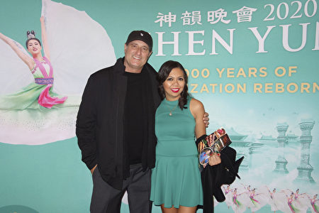
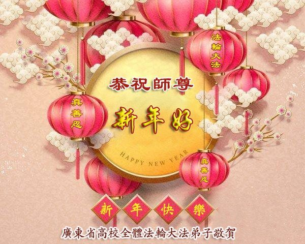
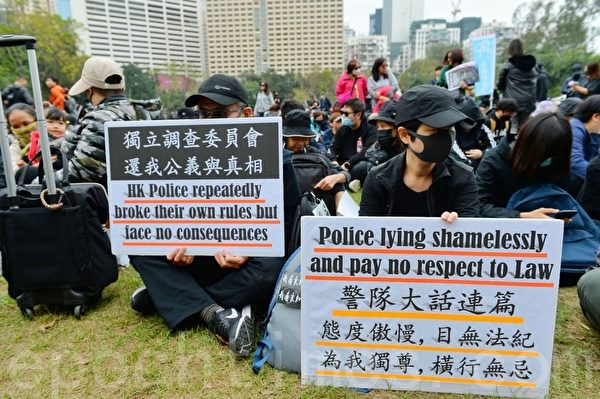
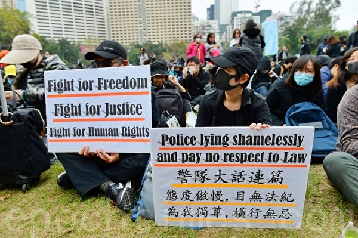

<h1 align="center"><b>请收藏网址(新闻视频ip) 随时连上最新即时IP https://git.io/swspip</b></h1>
<h2 align="center">直连不必翻墙 blossom必看 精彩视频 http://220.141.128.109 </b></h2>

<h4 align="center"><b>知情权不能放弃，也不作愚民，让你看第一手不被过滤的新闻，翻墙软件免费下载  https://git.io/opopop </b></h4>

<h4 align="center"><b>自由门7.70版使用封包过滤技术，增强突破封锁能力。首次运行时，如果以前版本没有安装过，会有提示安装封包过滤器。这是一次性安装，不会影响用户网络，不需要卸载。</b></h4>
<h3 align=center><a href="http://dongtaiwang.com/loc/software/fg/770/fg770p.exe">专业版exe:自由门7.70版</a></h3>
<h3 align=center><a href="http://dongtaiwang.com/loc/software/fg/770/fg770p.zip">专业版zip:自由门7.70版</a></h3>

<h4 align="center">中共覆灭在即 勿依赖中共保权 https://git.io/Ffor </b></h4>

<h4 align="center">● 红潮即将倾覆 天之将明 ●https://git.io/bb99bbss </b></h4>

<h3 align=center><a href="https://github.com/gav01/Heart/blob/master/news1.md">● 大纪元时事 ●</a></h3>

<a name=top>

<a href =#21>21.神韵传递伟大信息 旧金山精英找到心灵净土 
<a href =#20>20.惧人数破200万纪录 港警腰斩游行毁承诺 
<a href =#19>19.颜丹：中国“暴力伤医”为何异于全球 
<a href =#18>18.大陆火车票抢票软件赛黄牛党 收费藏猫腻 
<a href =#17>17.武汉肺炎疫情 8人发帖遭传唤 引发网络不满 
<a href =#16>16.举债支撑 中共央行降准放水8000亿 
<a href =#15>15.【思想领袖】专访邵岚：港警接令刺激抗议者 
<a href =#14>14.港人游行 警放射催泪弹并出动水炮车装甲车 
<a href =#13>13.谢师恩 大陆法轮功学员祝李大师新年好 
<a href =#12>12.組圖：12.30愛丁堡廣場追悼反送中義士 
<a href =#11>11.林郑 港警 何君尧入选“年度可耻人物”三甲 
<a href =#10>10.程晓容：惧《反渗透法》中共偷换焦点渲染恐怖 
<a href =#9>9.组图：103万港人元旦大游行 街头人山人海 
<a href =#8>8.爆发不明肺炎疫情 武汉海鲜批发市场休市 
<a href =#7>7.山西老板遗书曝光 控诉滴滴黑车垄断 
<a href =#6>6.中共尽失人心 反习势力与保习派激战 
<a href =#5>5.白宫：若朝鲜试射远程导弹 美将采取行动 
<a href =#4>4.中共外交辞令出尽丑 “耿爽模拟器”被下架 
<a href =#3>3.偷带癌症研究材料出境 中国学生在美被控罪 
<a href =#2>2.【新闻看点】欧盟趋强硬 华为：2020生存第一 
<a href =#1>1.香港法轮功学员集会 恭祝李洪志先生新年快乐 

<a name=21>

2019年12月31日，神韵环球艺术团在旧金山歌剧院进行了第二场演出。（周元融／大纪元）

  <h1 align="center"><b>神韵传递伟大信息 旧金山精英找到心灵净土</b></h1>
【大纪元2020年01月01日讯】（大纪元美国旧金山记者站报导）2019年12月31日下午，美国神韵环球艺术团在旧金山歌剧院（War Memorial Opera House）进行了第二场演出。旧金山湾区远近而来的各界精英，齐聚旧金山歌剧院亲身领略古老文明的再现，褒赏臻于完美的艺术境界。

神韵感动了多少人的心，人们看了又看，口耳相传，交口称赞。神韵演出传递了伟大的信息，唤回了人们的神性。在当今的世界，传统的价值观尤为可贵。

<b>地产投资老板：观神韵可以找到心灵净土</b>

2019年12月31日下午，地产投资公司老板Arthur G.和太太Maureen一起观看了神韵环球艺术团在旧金山的第二场演出。（于丽丽／大纪元）

 
  
  地产投资公司老板Arthur G赞美“神韵演出有抚慰心灵的能量”，他说，“新的一年从看神韵开始，真是太美好了！”

Arthur表示，他们看过神韵广告，非常吸引他们。Arthur说，“我知道神韵色彩绚丽，但看了现场演出之后，我更惊叹她极高的艺术性和吸引力。高难度的舞蹈技巧与艺术性完美结合，让我大开眼界。还有精美华丽的服饰，引人入胜的动态天幕。”

Arthur认为，演出中有佛道两家思想的展现，“她体现了与自然融为一体，天人合一的理念，宁静平和。即使你周围的环境纷繁嘈杂，你也能集中精力，化繁为简，找回真正的自己。与别人和大自然沟通，返璞归真。”

“这不像一些嘈杂喧闹的美国艺术，让人心烦意乱，看神韵让人感到平静祥和。”Arthur接着说道，“新的一年从看神韵开始，真是一个好开端。”

Arthur表示，神韵展现了中国的传统文化，“不管你是欣赏舞蹈，女演员的典雅，男演员的阳刚，还是感受艺术境界或是欣赏传统音乐，你都应该来看神韵。在这里可以找到心灵的净土。”

<b>副总监：神韵传递伟大信息</b>
 

2019年12月31日下午，国际咨询公司副总监Ignacio Aguirre和太太Cintia Calevoso一起观看神韵环球艺术团在加州旧金山歌剧院的第二场演出。（林家维／大纪元）

  
  公司副总监Ignacio Aguirre说，“演出很成功，传递了伟大的信息，唤回我们的神性。观赏时，我曾一度眼睛湿润，充满了喜悦的泪水。我被故事情节深深地触动。”

太太Cintia Calevoso表示，“演出以无比美丽的方式提醒我们，每个人都有能力成为光明的使者。这个演出光华万千，充满艺术美感。也提醒我们每个人培养美德的重要性。”

Calevoso表示，“我很欣赏晚会的精神内涵。 我们是神转生世上，记住这一点很重要。 有时候很容易遗忘，但是记得我们来到世上是有更伟大的使命，这很重要。”

<b>心理学家接连两天观看神韵</b>
  

2019年12月31日下午，心理学家Annette Mears带义女观看了神韵在旧金山的第二场演出。（于丽丽／大纪元）

  
  这是心理学家Annette Mears第三次观看神韵演出，去年她就看了神韵演出，今年又连看了两场。她表示，12月30日观看了神韵在旧金山的第一场演出后，感到深深受到触动，演出让她看到的是绝对美丽而且美好的东西。今天特地带义女来看，她希望喜欢跳舞的义女，也能看到神韵演出。

Mears认为，神韵舞蹈的编舞很棒。“舞蹈的技巧，舞蹈连贯性，还有服装，真是不可思议。”舞蹈所传达的故事，也让Mears非常喜欢。“非常感人，她触动了我的心，这让我感觉非常的美好。”她说。

她说：“这是一场一定要来看的演出。非常令人振奋，非常感人。”
大陆人心情激动：我要连看三场

刚从中国大陆来美半年多的迟小姐说，“太美了，这在中国大陆是看不到的。”“对于这些编排节目的人、这些演员，我都特别感动，很激动的心情，所以我要连看三场。如果有时间我还想看。”

“因坚持信仰而受迫害的故事，对我来说感受最强烈，因为在中国时我不了解情况，到这里以后我才了解。这么好的一件事情（信仰），他们（中共）为什么要这么迫害？这是没有理由的。”她说，“看到那个节目，我的眼睛就像有一层曚一样，就想掉眼泪，挺难受的。法轮大法这么美好的一件事情，他们怎么能这么迫害呢？”

“这个节目排得这么好，我是很有福气能够看到这个节目。”对于神韵把中国传统文化介绍给全世界，迟小姐说：“我感到特别自豪，特别感动。那些故事情节特别有趣味，又好看，又容易让人理解。我旁边都是西人，他们都热烈鼓掌，我感到很骄傲。”

神韵更多信息请见：
www.shenyun.com
https://www.youtube.com/user/ShenYunTV
https://www.facebook.com/ShenYunPerformingArts
https://twitter.com/shenyun
https://youtu.be/CHBoExmSC4U

<a target="_blank" href=#top><h6 align="right">回上方</h6></a>

<a name=20>
<h1 align="center"><b>惧人数破200万纪录 港警腰斩游行毁承诺</b></h1>

一位名为“金水”网民在其脸书发图，帖文指看完图片就知道为什么警方要叫停元旦游行。意即香港政府担心游行人数破200万甚至更多人。（宋碧龙／大纪元）

  
  【大纪元2020年01月01日讯】（大纪元记者骆亚、赵若水香港报导）2020元旦，民间人权阵线下午2时组织大游行，当游行的龙头抵达中环遮打花园时，龙尾的维园还有很多人等待起步，一路上都是密密麻麻的游行者。民阵估计傍晚的游行人数已经超过100万，如果活动持续晚上10时突破200万不成问题。但下午5时半之际，民阵紧急宣布：警方已经中止这场游行集会，并要求在晚上6时15分之前全部散去。
  
 

元旦游行队伍中的标语。（宋碧龙 / 大纪元）

 
  
  民阵谴责警方单方面撕毁不反对通知书的承诺，批评警察的做法充分显示政府“旨暴制乱”，无意回应市民诉求，严重侵犯市民参与和平集会的权利，并警告港府，尊重浩荡民意，落实五大诉求，缺一不可，否则香港人绝对不会放弃，社会亦因为警暴不会回复平静。
1月1日民阵发起元旦大游行，获警方发出不反对通知书。

<b>两便衣大叫“自己人” 警方任其离开</b>

下午4时半后，修顿球场对出，位于轩尼诗道卢押道交界的汇丰银行爆发警民冲突，汇丰银行疑遭破坏，涉案的两蒙面人遇到防暴警察时大喊“自己人”后，防暴警察任其逃之夭夭。

民阵随后发文表示：“10分钟前，湾仔有银行被两名蒙面人爆玻璃破坏。有目击者称，有市民上前质问实施破坏行为的蒙面人身份，蒙面人立即神色紧张逃走，行经防暴警察行列时大叫‘自己人!’防暴警听罢即停下，没有执法，两名蒙面人逃去无踪。目击者质疑蒙面人并非抗争者。”

警方一度与游行的围观市民发生冲突，并在毫无预警下投掷催泪弹后，导致人群四处逃离。警方借此宣布中止游行。再两面夹击维园出发的游行市民，并对滞留铜锣湾的抗争者施以催泪弹等武器驱散，甚至水炮车、装甲车现场待命。

 

民间记者会将半年多香港人的抗争经历做成标语展示给游行市民看。（余刚 / 大纪元）

 
  
  有民众表示，打碎汇丰玻璃后，大批便衣和防暴警察隔了很长时间才到。途经的游行市民不满警方在汇丰银行银行前抓捕抗争者，高喊口号痛斥警方，场面混乱。冲突期间，有大批防暴警察到场增援，手持防暴枪戒备，有警员施放胡椒喷雾，更有一名港台摄影师镜头“中椒”。
  
<b>警察无预警施放两枚催泪弹</b>

有身穿黑衣的便衣警员制伏多人，将他们按在地上拖行，之后带走。警方在无预警下施放至少两枚催泪弹，落入人群中，有长者受催泪烟影响不适，需要义务急务人员协助洗眼。

其后，游行人士被警方赶至轩尼诗道西行线，警方占领东行线并一度举红旗。市民不满游行路线被霸占，尝试同警方理论。但警方就将一名试图理论的市民推到行人路上，扬言“不要同我理论”，并指游行人士只可继续使用西行线游行。

至下午5时半，虽然维园仍塞满大批等待出发游行的市民。然而，民阵召集人岑子杰表示收到警方通知，要求民阵宣布立即解散游行。

民阵副召集人陈皓桓说，警方通知，由于有人破坏汇丰分行，民阵迫于无奈要疏散由维园到中环的游行人士。他表示，因为是警方要求，如不解散，民阵须要负上刑责。他说，警方要求民阵在30分钟内解散所有市民，呼吁游行市民循最近的交通方法离开。

随后，民阵对警方强行终止了民阵的游行及集会予以强烈谴责，指疏散群众是按不反对通知书要求迫于无奈的做法，民阵绝对不同意警方腰斩的决定，警方相关言论是充满谎言、误导及分化香港人。

<b>民众离场时遭警察围捕</b>

民阵指出，警察于卢押道的拘捕行动引发警民对峙，当时场面渐变温和，防暴警察及后亦准备撤退，却随即向人群投掷2枚催泪弹，激化矛盾。此外，警方亦同时威逼游行腰斩，更要求民阵30分钟内疏散迫爆港岛的数十万市民，大批防暴警察更在地铁站及各疏散路线截查、挑衅市民，成围捕之势。

有网民更在社交平台上发文宣指，警方在5点35分取消不反对通知书后，即有警察于5点45分在天桥上向地下的群众发射胡椒球枪。

警方其后又否认有便衣卧底破坏湾仔的汇丰银行，称警员没有作出违法行为，有关案件已交由湾仔刑事调查队接手调查。

 

港警以有人破坏汇丰分行为由，腰斩1月1日的游行。（余钢／大纪元）

  
 <b> 2人欲破坏店铺 遭追问后逃离</b>

下午3时53分左右，轩尼斯道上有一对男女试图破坏店铺，其他的抗争者问他们“你们是手足吗？”他们一言未发，并且面露难色，抗争者再追问：“你们是黑警？”他们随即逃离，向防暴警察方向逃走。

其中一位在逃跑时留下了一个书包，包中有一支不明性质的灰色液体。另外游行现场，人们还发现游行队伍中有戴黑口罩、耳朵戴有特别装置的人。

<b>铜锣湾记者集体被查证件</b>

下午5时半，民阵宣布接到警方的通知，紧急中止游行集会，并要求在晚上6时15分之前全部散去。一场获得警方批准的“不反对通知书”的大游行就这样突然被警方戛然而止。

民阵其后估计下午至少有103万人参加游行，如果警方不中止的话，应该超过200万人游行。

而在维园等待出发的游行参与者刚离开维园就遭警方的两面夹击，群众如惊弓之鸟向四处逃离，也有一些抗争者留下来保护其他人。另外，部分市民在新年游行宣布结束后，留守铜锣湾。警方不仅在铜锣湾施放催泪弹，还出动了水炮车。

警察于铜锣湾Sogo设立封锁线扣查近百市民、急救员和记者。（余刚 / 大纪元）

  
 

1号水炮车到铜锣湾。（宋碧龙 / 大纪元）

 
  
  连铜锣湾上的所有媒体记者，也被警方要求一字排查身份证。而且所有的记者这时不准现场拍摄。

本报还获悉，在红隧、西隧、屯门车站等多地，警方截公交车检查。

  

元旦大游行被逮捕的抗争者集中在一起，最后再送上白大巴离开。（宋碧龙 / 大纪元）

防暴警察在湾仔轩尼诗道施放催泪弹清场。（宋碧龙 / 大纪元）

  
  
  一位名为“金水”网民在其脸书发图，帖文指看完图片就知道为什么警方要叫停游行。意即政府担心游行人数破200万甚至更多人。
游行前假海报流出

12月30日，民阵召开新闻会，就元旦游行海报“勿忘承诺、并肩同行”被改成暴力版“毋忘报仇、全民装修”进行澄清。

警方还警告称，如果不澄清的话将有法律后果。民阵发言人当时表示，如果有人违法，警方就应该自己去调查，拘捕相关的人士。指警方传来的海报并非民阵出的；民阵的宣传海报已经在民阵的脸书、推特上，其它的跟我们没有关系。

民阵次日在脸书上还质疑这张假海报来源并声明，在警队转发这张海报予民阵前，民阵从未于各网络平台发现相关的修改海报。

在民阵记者会澄清后隔天，12月31日警方记者会上称“欢迎民阵与暴力割席”，民阵对此重申：一定会与警察的暴力割席。

<b>民阵谴警视人命如草芥 人权团体发声明斥腰斩游行违法</b>

1月1日晚上，民阵再发表书面声明，谴责邓炳强滥用不反对通知书的权力中止游行，批评警方的疏散安排是草菅人命。

对于在游行过程中发生的警暴问题，民阵指出：“今日民阵的游行在下午5时30分接获警方的通知，因应游行路线上的情况，强行中止我们今日的游行，并且只给予短短半小时予民阵疏离过百万游行人士，并且在过程中基本上完全没有协助市民离开，反而是在湾仔及中环各区以包抄战术对待和平游行人士，是视人命如草芥。”

另外，民阵谴责：“警队在游行队伍中间，对密集人群施放催泪弹，不顾人群因为躲避化学武器而可能引致的人踩人意外，是极度冷血行为。”民阵表示，将继续就1日晚遭受警暴的被捕人士提供人道支援。

民权观察亦发表声明谴责警方滥用管制游行集会的权力。民权观察指出，市民参与和平游行集会及示威的权利受《公民权利及政治权利国际公约》和《基本法》所保障。根据国际人权法及终审法院的案例，警方有正面责任协助游行集会和平及有序地进行。

民权观察表示：“联合国及欧洲人权法庭都曾指出，在一个整体和平的游行集会，如有一小撮人在游行集会中作出不和平或暴力的行为，警方有责任制止有关行为，但不应以此作为解散整个和平集会的原因。任何干预集会自由的措施必须具有合法目的及合乎比例。”

民权观察认为：“警方今日终止游行集会的决定是不合法及侵犯市民参与和平游行集会、表达意见的权利。警方限制市民参与和平游行集会，只会进一步激化社会冲突。”

<b>首次有观察员被捕</b>

另外，民权观察3名人权观察员在崇光百货对开被警方防线围困，等候数小时后被警方拘捕。民权观察在发声明表示，这是组织自2018年成立观察员团队以来，首次有观察员被捕。民权观察强烈谴责警方滥捕观察员。

香港人权监察1日晚也发表声明指，大量市民参与1日元旦游行，希望以此表达意见，但人权监察观察员留意到，警方剑拔弩张，挑起争执。游行未开始已在港九多处无差别及未有提供理据地截查市民，又威吓游行人士，更向游行队伍投掷催泪弹，其后下令腰斩游行，决定不合理。

而且腰斩后只给予短暂时间让群众疏散，造成恐慌、混乱；期间亦有警员主动挑衅示威者，然后又使用武力，并指警方1月1日的行为是将个人的违法行为用连坐式的做法，要全部和平合法的人去承担，违反一人做事一人当的基本法治和执法常理，更是向示威集会自由的直接宣战。#

<a target="_blank" href=#top><h6 align="right">回上方</h6></a>

<a name=19>
<h1 align="center"><b>颜丹：中国“暴力伤医”为何异于全球</b></h1>

中国大陆医暴事件层出不穷。图为2017年10月15日，一名男子持刀将吉林四平市中心医院消化科主任朱立甯捅至重伤，还挟持一名护士到办公室，随后嫌犯被抓。（合成图片）

【大纪元2020年01月02日讯】多年来，“暴力伤医”事件在中国屡见不鲜。时至今日，仍在频繁上演。然而，面对几日前发生在北京民航总医院的杀医事件，中共党媒却淡定的总结道，“暴力伤医”其实“是一个全球性的痛点”。

这是微信公众号“央视新闻”在撰文分析英国、美国、印度、韩国以及俄罗斯这五国的暴力伤医事件之后，所得出的结论。假如情况属实，就不难让人发现，中国的情况与这五国乃至世界各国都存在着明显而巨大的差异。

首先，最明显的，就是程度不同。上述国家所发生的，基本都是“伤医”，轻则“言语攻击”，重则“身体攻击”，也并未提到有医生死亡的数据和讯息。然而在中国，却已达到“杀医”惨案时有发生的地步了。尤其在医院，医生与病患及其家属之间动辄就会出现“不是你死，就是我亡”的局面。

对此，有博主披露，三年前，广东省人民医院口腔科医生陈仲伟遇袭去世后，就有医生在某医学社交平台上发言，称“在门诊，我的背后绝对不能有人”。医生对患者的恐惧竟然到了如此地步，这能是全球性的问题？

另有数据显示，“在2005年至2015年期间，超过84%的中国医学毕业生最终不会当医生”。中共有官媒还撰文力证“培养一个医生有多难”。也就是说，那些“过五关斩六将”才获得医师资格的学生，普遍都不愿从医。

在谈到原因时，官媒的文章指出，“一方面是各种形式的语言暴力甚至是身体伤害，一方面还有难以承受的工作强度”。因此，在当下中国，被杀或猝死的医生已经越来越多了。

当医生约等于玩命，换谁也不想当医生了。用脚趾头想想，豁出命来当医生，也显然不可能成为全球性的问题。

其次，更大的差别的是，上述五国的医生一旦有难，政府会立即采取各项应急措施。比如在英国，政府“要求医疗机构加强员工在处理暴力事件时的预警训练”，且“对医疗服务人员施暴的最高刑罚也从6个月增加到一年”。又比如在美国，“医院必须配备金属探测器和武装警卫，人们进入医院前需要先通过安检”；“截至2016年，美国已有约38个州政府通过专门立法以保障医护人员的正当权利”。

与各国不同的是，中国有关部门却显得无比淡定。在亲眼目睹、亲耳听闻了无数次杀医事件之后，终于在过去一年的最后几天表决通过了所谓的“基本医疗卫生与健康促进法”，规定“威胁、危害医疗卫生人员人身安全，将入刑”。但对于如何让医生避免被捅、被杀，政府和医院似乎都并未采取行之有效的措施。否则，何以会有医生提醒同仁“背后绝对不能有人”？可见，对中国这些医生来说，要防止被杀，只能靠自己。

然而，患者攻击、甚至杀死医生，医生就真的防不胜防吗？实际上，只要分析一下患者伤医、杀医的动机，就不难发现，医生的遭遇很多时候，都只是因果再现。患者求医问药，不仅不存在杀医的动机，甚至为了健康，还会对医生言听计从。假如不是因为医生谋财害命在先，又有谁会对医生动杀机呢？

中共党媒的文章说，英国“伤医事件激增”是因为“医务人员数量不足、患者等待时间过长以及医院财政不足”；而韩国“对治疗结果不满意”是“最常见原因”，其次是“等待时间长”和“费用高”。

在这些被提到的原因中，惟有“对治疗结果不满意”以及“费用高”能让人对中国患者杀医的动机产生一丝联想。但即便如此，中国的情况也有所不同。

就拿北京民航总医院的这次杀医事件来说，有评论人士指出，“患者亲属和医生之间最大的争执是：孙某氏来急诊部时，情况是比较稳定的，是医生用药后状态才急转直下”；“据亲属说，医生使用了一种叫醒脑康的中药注射液”。

然而，这种注射液“至今不被国际医学界认可，被认为是假药”；“鉴于中药注射液静脉给药的巨大风险与疗效的不确定性，且多年来频繁发生不良反应甚至死人”，有专家多年前就曾呐喊，“中药注射液谋财不要害命”。

北京民航总医院的医生给人注射能致死的假药，甚至让患者在“20天中，花费了4万元”，这还不叫“谋财害命”？更重要的是，中国医生谋财害命，却往往不用担责。归根结底在于，他们能得到医院以及医疗部门、甚至是司法的庇护。面对不公的遭遇，患者及其家属会想到杀医生、报私仇，其实并不在意料之外。

不难看出，中国患者所承受的“治疗结果”以及“费用”都不一般。最厉害的结果是被治死，最高的费用可让人因病返贫、倾家荡产。患者若没钱，连医院的大门都进不了。中国之所以普遍存在这种残忍而悲凉的现象，决不仅是因为医生惟利是图、无良无德，更关键的原因还在于中共拿医疗当买卖。在整个医疗过程中，医生已沦为商贩，而中共则是幕后大佬。领导问医生要效益，医生自然要问病患要救命钱。为了敛财，中国的医生普遍不怕害人性命。

然而，让医生谋财害命，却是中共的决策。只要中共敢谋财害命，中国任何领域都可能出现不同程度的被谋财害命事件。在中共歹毒的决策之下，中国早已是人人互为劲敌，互相戕害。换言之，每个中国人都已成为受害者。

有人指出，中共是全人类的敌人。伤医、杀医事件若有一天遍布全球，那必定与中共脱不了干系，因为毁灭全人类正是中共的终极目的。对于世界各国而言，只有远离中共，才能免遭横祸。

<a target="_blank" href=#top><h6 align="right">回上方</h6></a>

<a name=18>
<h1 align="center"><b>大陆火车票抢票软件赛黄牛党 收费藏猫腻</b></h1>

近年来，加速包已成为出行APP的标配，宣称花几十块钱可以提升抢票成功率。（视频截图）

【大纪元2020年01月02日讯】“到底哪款应用能帮我抢到票？”这是每年过年“回乡潮”来袭时的必考题，但无论哪款软件，最终都要在12306购票系统排队，加速包只是提高了抢票成功的概率，并不能保证一定抢到票。

据陆媒报导，目前，抢票软件依然是不少人在“回乡潮”期间购买火车票的选择。据不完全统计，目前大陆市面上正在运营的近60家抢票软件都推出了有偿抢票服务，或要求分享转发链接，以提高曝光度。

抢票工具也未必让人省心，付费加速包就是其中绕不过的关键一环。近年来，加速包已成为出行APP的标配，宣称花几十块钱可以提升抢票成功率。

以飞猪APP为例，抢票速度分为低速、快速、高速和光速。其中，低速抢票为免费，而快速、高速和光速分别收费20元、40元及60元，网络通道分别加速50兆、200兆、800兆。

《法制日报》报导说，近日针对100名大学生进行的调查显示，至少60%的人使用过“抢票加速包”抢票。有50%的人认为，抢票加速与黄牛倒票本质上差异不大。

<b>默认勾选 隐蔽收费</b>

加速包另一个被乘客诟病的问题是隐蔽收费。张奕之在购买天津到北京的票时，在票源充足的情况下，软件默认勾选了10元“优选服务”（其中包含10元加速包和优惠券）。如果直接在抢票界面选择目的地，软件还会默认勾选20元加速包，只有手动将加速条拉到“低速”才能取消。

“虽然早有耳闻，但付款时还是没避开，付款时点了醒目的高速抢票按钮，之后才发现左侧还有个低速抢票的灰色按钮，那个才是免费的。”买票时中招的张奕之对多花了钱很不满。

<b>没有余票 抢也没用</b>

熟悉互联网票务的计算机工程师向先生表示，抢票软件就是用机器的高频查询来模拟真人下单，让用抢票软件的人更快获取到余票。

“机器向12306发起高频购票请求，这给服务器带来巨大负担，12月23日12306的一度崩溃可能就是流量过大造成的。”向先生说，“12306服务器端也在对这种行为进行封堵，个人观察，软件抢票效果越来越不明显了。”

12306工作人员表示，无论从哪个平台购票，都要通过12306出票，且通过第三方平台购票出现问题时，12306并不负责。

北京一律师事务所的律师周兆成表示，抢票软件收取的费用到底属于车票加价还是服务加价存在争议。目前有关部门尚未对抢票软件行业有明确规定，抢票软件在法律上仍处于灰色地带。

对此，网民议论纷纷：“12306和黄牛没啥区别，把一趟车的车票几乎全部截取给各大APP，然后别人逼不得已只能去APP花高价买。”

“政府应该管管，12306不是有猫腻，怎么车票会秒没？”

“以前可能花50找票贩子就能买到你想要的票，现在你花50给那些APP不见得就能买到，而且可能价格比以前的票贩子花的更多，各种套路。”

“只要铁路内部人员不参与倒票。黄牛党就无法生存，还有什么黄牛党。铁路人每年个个都是赚的撑得不行。请问黄牛手里为什么能拿到票。他们有印票权吗？”

“12306网上购票比黄牛都黑，不停地让买加速包，支持严查，我都升到VIP了还是没订到票。”

“这种变相黄牛让人很反感，最好是罚款几百亿，直接让想赚黑心钱的人死翘翘，12306你对得起老百姓吗？有票就有票，没票就没票。搞什么鬼名堂，老是想不劳而获。”#

<a target="_blank" href=#top><h6 align="right">回上方</h6></a>

<a name=17>
<h1 align="center"><b>武汉肺炎疫情 8人发帖遭传唤 引发网络不满</b></h1>

网爆不明肺炎是SARS。（网络图）

【大纪元2020年01月01日讯】湖北武汉爆发不明肺炎疫情，并传言是SARS，人心慌慌。当局紧急“辟谣”抓人，引发网民不满。有网民表示：“当年非典（SARS）时期也是这样，开头几个月捂盖子、删帖子，还官方辟谣，可结果呢……”

海鲜批发市场近日传出27宗不明原因肺炎，其中7个病例严重。1月1日，华南海鲜市场宣布休市整治。

武汉市公安局下午透过官方微博“平安武汉”通报，8人在未经核实的情况下“散布、转发谣言”，“造成不良社会影响”，已被公安机关传唤处理。

早前，网路盛传多张武汉当地医护人员聊天室截图，有人称确定不是流感，还有人称武汉市第二医院后湖院区已有病例确诊为SARS冠状病毒，病人已被隔离，请大家注意，务必做好防护。

微博上许多网友呼吁官方尽速公布真相，有网友提醒说，2003年SARS爆发时，就是因为很多人不知道所以没有预防，导致疫情蔓延，希望官方能记取教训。

未想到当局迅速抓人，但通报并未提及“谣言”的具体内容，也未公布相关处罚内容。

大陆网民不满政府控制言论，评论批当局不及时公布消息，“不公布官方消息，也不许讨论小道消息。老百姓除了闭嘴，还能做什么？”、“民众传谣还不是（因）官方一天了都没有说法，这也怪大家吗？我说话的权利没有，连知道真相，恐慌自救的权利还没有吗？”

“网上已经传的沸沸扬扬上了热搜后政府才发声，为什么不能第一时间告诉市民发生了什么，要注意什么，采取了什么措施……这样自然没人会传了，传的原因是大家不知情！””

不少人对比03年萨斯爆发时中共的应对，也曾经“辟谣”，封杀消息：“当年非典（SARS）时期也是这样，开头几个月捂盖子、删帖子，还官方辟谣，可结果呢……”、“非典疫情那时候国家及地区瞒报疫情数量，后来疫情蔓延，国际社会都看不下去了。”“03年当时捂着消息挂了好几百，撤了多少人呀？几百人是多少家庭，还有好多医护人员。”、

也有人讽刺当局：“治不了（肺炎）……还治不了你们？” “只说8人造谣传唤，行！造谣的内容呢？图片也行……捂着被子执法什么行为？这是执法透明？”“抓的倒是挺快啊！”

还有微博大V留言：“汶川地震时抓散布不实信息的人，北京非典时抓散布不实信息的人，武汉肺炎又抓散布不实信息的人，天灾人祸的时候你们首先想到的永远不会是调查真相和原因、做好救治防范，你们永远最先做的永远都是抓人和控制舆论，能要点脸吗？”

武汉市出现多宗不明肺炎疫情，令人忧虑萨斯再现，香港、台湾亦紧盯事态。其中香港特区政府表示，会加强出入境口岸健康监察。

香港大学李嘉诚医学院微生物学专家袁国勇指，1997年出现禽流感，以及2003年爆发非典型肺炎“沙士”，死亡率由10%至最高50%。他续指，在是次武汉市个案中，有25%属严重个案，情况与当年的禽流感及非典型肺炎案例有相似地方。

他认为，新的疫情可能是类似禽流感或非典型肺炎的新发性传染病，有必要将所有防御措施提升。

台湾卫福部疾管署长周志浩31日傍晚宣布，即日起针对武汉直航桃园、松山、高雄3机场入境班机，每周共12班次进行登机检疫，希望将疫情阻绝于境外。#

<a target="_blank" href=#top><h6 align="right">回上方</h6></a>

<a name=16>
<h1 align="center"><b>举债支撑 中共央行降准放水8000亿</b></h1>

1月6日下调金融机构存款准备金率0.5个百分点，放水8000亿人民币，被指继续依靠举债来支持日益下滑的经济。（大纪元资料室）

【大纪元2020年01月01日讯】（大纪元记者张玉洁综合报导）中共央行宣布将于1月6日下调金融机构存款准备金率0.5个百分点，预期释放8,000亿元（人民币，下同）。分析人士预计，经济放缓下，中共地方政府发债的速度和规模都将上升，贷款规模会扩大，但银行钱紧，短期很可能会继续“放水”。

中共央行1月1日宣布将全面降准， 1月6日下调金融机构存款准备金率0.5个百分点，不含财务公司、金融租赁公司和汽车金融公司，预期释放8,000亿元。

中共央行在公告中称“不搞大水漫灌”，但分析认为，此次降准之后可能会继续放水，一方面地方政府发债将加快加量，另一方面是要增加银行贷款的资金来源。

路透社1月1日报导，粤开证券首席经济学家李奇霖分析，地方债的发行速度可能比过去更快，发行规模可能更高，相应就会需要更多的贷款，央行投放中长期的流动性是应对地方债和中长期信贷。

华尔街日报12月27日分析，中共地方政府过去依赖土地销售，但随着经济放缓，土地缩水，加上基础设施收益不够还债，地方政府需要找到融资的方法。

数据显示，2019年中共地方政府已经加快了发债速度，前11个月共发行4.3万亿人民币债券，创下新高，截至11月末的地方政府债务余额为21.33万亿元。地方政府外债余额超过2万亿美元，短期外债占43%。

李奇霖表示，目前银行体系流动性的缺口至少2.5万亿元，现在降准0.5个百分点释放的8,000亿仍然有很大差距。他预计1月份央行将继续用公开市场操作和MLF的形式来投放流动性。

大陆银行业2019年资金日益紧张，一方面要承接地方政府债务，另一方面今年超过1400亿的企业债违约金额创下新高，很多银行甚至高息吸引普通储户存款。

在地方政府债务中，四年以内到期的债务占比大约50%，意味着未来四年是地方政府还债的高峰期。中共央行官员近日针对地方债发出警告，今年发生了城投债（地方政府融资平台为主体的债务）违约，可能会出现违约连锁反应。

民生银行研究院研究员王静文预计，1月份LPR也将相应下调，去年9月降准之后LPR利率在9月和10月先后出现下调。东方金诚首席宏观分析师王青预计，今年央行可能还会再有一到两次降准。#

<a target="_blank" href=#top><h6 align="right">回上方</h6></a>

<a name=15>
<h1 align="center"><b>【思想领袖】专访邵岚：港警接令刺激抗议者</b></h1>

香港大专学界国际事务代表团发言人邵岚与主持人杨杰凯合影。（大纪元）

【大纪元2019年12月17日讯】香港学生活动家邵岚近日接受了英文《大纪元时报》资深记者杨杰凯（Jan Jekielek）的“美国思想领袖”节目的专访。以下是专访内容。

我是杨杰凯（Jan Jekielek）。在本期节目中，我们将与香港城市大学学生会署理外务副会长、学生活动家邵岚坐在一起，她还是香港大专学界国际事务代表团（HKIAD）发言人，该代表团是全港11所大学学生会的联盟。

我们永远不能低估，中国共产党为了维护面子、控制整个国家，从而压制各种民主运动的决心。我一直认为，他们非常害怕人权保护自由民主，甚至革命等思想，害怕这些传入中国。因为这肯定会引起震动，中共非常非常担忧，因为这肯定会导致中国大陆发生大规模抗议和示威活动。

为什么香港学生活动家邵岚（Joey Sue）相信，没有一个领导者，香港抗议活动会变得更强大？为什么她认为，香港警察是在有意刺激抗议者，使抗议活动暴力升级？为什么香港的状况与中国内地的侵犯人权行为密不可分？中共又是如何在香港打造监控体系的？

<b>呼吁港人关注《逃犯条例》</b>

杨杰凯：邵岚，能邀请你做客美国思想领袖，太好了！那么，邵岚，首先，你现在20岁了，你在香港本地做了很多相当了不起的工作，不仅是在香港，在国际也是。你告诉我，10日你还要在华盛顿参加中国人权状况听证会。这让人惊讶，你实际上是在全世界到处呼吁。

邵岚：是的。

杨杰凯：在香港，你正在参与民主抗议活动，并深度参与了香港的学生会和学生团体。告诉我，你20岁的年龄，你是如何参与到其中的？

邵岚：好吧，我一直对香港正在发生的政治问题和社会问题非常感兴趣。今年5月，我知道《逃犯条例》将会成为香港的一个非常非常重大的事件。那时我还不是学生会负责人。因此，我就在自己就读的大学里成立了关注小组，开始开展各种工作来推动这一问题，希望人们对《逃犯条例》有更多了解。我当时在车站设点，向人们分发小册子，在社区宣传，我还在整个学校里张贴海报，在社交媒体上发帖。然后在6月份，我决定担任一个更重要的角色，我担任了我们学校学生会的副会长，我相信通过这一职务，我可以为民主运动做出更多贡献。

杨杰凯：因此，你实际上是在5月份，也就是在抗议爆发之前，你就对《逃犯条例》的威胁，进行了很多这样的宣传。因此，你实际上在提醒香港人注意《逃犯条例》的现实威胁中，扮演了一个相当重要的角色。

邵岚：嗯！当时香港政府已经出台了《逃犯条例》，但是没有引起多少人的注意。但是在5月份，香港有很多岁数很小的、许多十几岁的青少年意识到，这将成为一个非常非常大的问题，威胁到香港的核心价值，威胁到香港法治，威胁到我们独立的司法系统。

所以当时，我的一群同学和朋友，还有一些大学生甚至是中学生，他们已在努力推动，提高人们在这个问题上的认识。我相信，这就是为什么《逃犯条例》越来越受到关注的原因。然后在6月就爆发了抗议活动。

杨杰凯：非常了不起！你知道，你成为学生会副会长，你开始作为学生代表而工作。然后，你知道，你又往前迈出了一步，建立了一个将所有学生会连接起来的组织，对吗？

<b>争取国际支持</b>

邵岚：是。是在7月底，很多香港大学的学生决定，我们必须开始对外做宣传工作，将国际社会志同道合之士联合起来。他们意识到反对《逃犯条例》的抗议活动，将会成为一个国际问题，而不仅仅是中国内部的问题。因为我们相信，香港是一个非常非常重要的国际金融中心，在国际社会中发挥着重要的作用。因此，我们相信，通过建立学生代表团并与国际社会建立联系，我们可以做更多的事情。

杨杰凯：那么，什么使你认为，香港对世界其它地区如此重要？香港发生的事情对世界其它地区都如此重要？

邵岚：首先，长期以来，香港一直是一个非常重要的经济中心，在金融领域发挥着举足轻重的作用，例如超过70％的对华外国投资都要通过香港，所以我们相信，香港一直是全球非常非常不可替代的经济中心。

让香港地位非常独特和重要的另外一个因素是，香港实际上是一个相当复杂的文化中心，香港中西文化融合得非常好，世界上任何一个城市都无法取代它，香港是全球最多样化的城市。我们相信这里独特的文化，使香港成为一个非常非常特别的地方。

众所周知，香港实际上有很多国际非营利组织，有很多跨国公司的总部。我们相信它是无法替代的，你无法做到，你无法在中国其它城市找到替代，也无法在全球其它城市找到替代。对于西方世界来说，把普世价值观念，诸如自由、民主甚至是保护人权的观念等，通过香港传入中国，实际上是非常重要的。因此，我相信这就是香港如此重要的原因。

<b>没有领导人的民主运动</b>

杨杰凯：你正在做这项工作，你非常直言不讳，非常坦率。你是否担心这会把你置于危险之中？

邵岚：老实说，我很担心。但是我认为有一点值得庆幸，我们都知道这是一场没有领导人的民主运动，实际上没有人扮演领导角色或充当领导小组成员。因此，中国共产党实际上很难找到一个领导人。因此，我认为这实际上也在保护自己。

但是自从6月份我担任学生会副会长以来，我还是收到了很多恐吓信和恐吓信息。而且，香港白衣人团伙越来越多地袭击民主活动家，袭击学生会领导人，所以我非常担心，但是每当我想到前线的手足，他们比我承担更大的风险时，我觉得这没什么大不了的。

杨杰凯：你知道，无领导者运动的想法，很吸引人。这与2014年大不相同，在2014年，有像黄之锋（Joshua）这样的非常关键的人物，香港抗议运动如何做到不需要领导者的，它是如何运作的？

邵岚：我必须要说，作为一个香港人，我很自豪，因为香港人非常聪明。2014年雨伞运动后，我们做了很多改进。我们意识到，一旦我们有一个领导者或领导团队，那么香港政府或中共，就很容易将目标瞄准领导者，通过打击领导者，来打垮整个抗议运动。

所以这次我们没有任何领导者，我们都是自发地组织在一起，自发地抗议。一般来说，当我们有了一个想法后，我们就把它发布到网上，等有了足够多的响应者，我们就进一步组织集会和抗议活动。我们没有领导整个运动、或所有抗议和集会活动的那种领导人。所以在香港，你可以看到很多主题不同的抗议和集会，我觉得这是抗议活动能够持续下去的一个非常重要的因素。实际上，我们是在利用自己的创造力和智慧，来进行这场抗争运动。这实际上是非常成功的，引起了国际社会的注意。

<b>港府是中共操纵的傀儡</b>

杨杰凯：你刚才提到中国共产党，实际上你一直在直言不讳批评中国共产党，你能为我们总结一下，中国共产党在扮演什么角色吗？

邵岚：说实话，非常明显，香港政府实际上是中国共产党操纵的傀儡，我们认为香港政府其实什么都不是。我的意思是，当你为香港的人权和民主而战时，你必须对抗中国共产党，因为你知道，实际上是它们（中共）发布所有命令，实际上是它们在规划香港的未来。

所以，我相信，这种情况也正在维吾尔人、西藏人身上发生，他们直接受到镇压，直接受到了中国共产党的威胁。因此，我认为对于我们来说，认识并清楚地认识到，我们所反对的敌人是中国共产党，而不是香港政府本身，这一点非常重要。

因为我们都知道，如果香港政府没有得到中国共产党的许可，将无法做出任何重大决定，例如，实现普选等。

<b>港警接令故意激怒抗议者 升级暴力</b>

杨杰凯：你认为香港警察为什么会变成这样？你知道，我实际上去过前线，在那里（比如在大学）呆过一小段时间。很明显，警察非常气势汹汹，想吓唬抗议者，你认为，为什么警察变成这个样子？

邵岚：我相信有几个原因，我相信第一个原因是，香港警察肯定接到某种的命令，故意激怒前线抗议者，这样他们就能使双方暴力升级，给国际社会造成一种不好的印象，那么香港人可能会失去国际社会的支持。我相信这是他们的一个目标，因此，他们故意使暴力升级，动用越来越多的武器打压抗议者，甚至他们还冲入大学校园。

另一个原因可能是，现在的香港警察与英国移交主权之前相比，已经面目皆非，整个香港警察体系确实有问题，他们的整个训练计划，其核心不再是保护香港市民，而是打压我们以达到他们的目的。所以我相信实际上有几个原因导致我们对警察部队的暴力升级。

杨杰凯：实际上，针对你的批评之一是，你知道，基本上你没有谴责学生方面的暴力行为。我想给你一个机会解释一下。

<b>警察使用暴力在先 抗议者自我防御</b>

邵岚：我认为，对于我们所有人来说，最重要的事情就是要明白，为什么学生或者前线抗议者会升级武力对抗警察。我们必须知道，正是因为警察不断地使暴力升级。他们发射催泪弹、橡皮子弹。他们甚至开着水炮车，向大学校园发射实弹。

我的意思是，在这种情况下，我们实际上是出于自我防御，我们必须保护我们自己以及我们的前线手足。你会看到，抗议者所使用的武力水平和警察使用的武装，根本无法相比。当他们发射实弹射击时，他们有枪支，他们有催泪弹，他们有胡椒喷剂。但是你看抗议者有什么呢？他们的盾牌是用床垫做的，是用桌子或椅子做的。你可以看到，暴力水平永远不会相等。

所以，我的意思是，如果警察没有使用暴力在先，没有一个抗议者会有意伤害任何一个警察。我的意思是，这全都出于自我防御。我相信国际社会非常在乎抗议冲突期间相当暴力的场景，但我们必须深入探究，了解造成暴力升级的原因到底是什么？所以我认为，我们都必须在谴责抗议期间的暴力冲突之前，先了解一下原因。

杨杰凯：你谈到你在前线的手足，你也曾在那里，你也遭遇到了催泪弹。请告诉我你在那儿的经历。

邵岚：实际上，我第一次遇到催泪弹，是在6月12日。我的意思是，每个人都没有准备好应对催泪弹。因为我们知道，在2014年，只有在那些最紧急的情况下，警察才会动用催泪弹。我们实际上没有想到，在6月12日甚至会使用催泪弹那种武器。没人会配备非常专业的口罩或护目镜。

那天，我周围的所有抗议者都朝着没有催泪弹的相反方向跑，每个人都非常非常紧张，非常恐慌，因为我们大多数人都没有应对催泪弹的经验，我们不知道该怎么办。

但是现在，无论抗议者到大街上游行，无论我们参加集会和示威，我们都装备精良，而令我感到伤感的是，我看到我们实际上已经从戴着最简陋的口罩，转变为如此专业的口罩和护目镜，这实际上表明，警察对抗议者的暴力水平正在以非常迅速的方式提高。

我们也看到催泪弹是来自中国过期了的催泪弹，许多来源证明它们实际上是有毒的。我看到我们的手足和我自己，站在第一线，实在令人非常难过，因为我们从未想到香港有一天会成为战场，在那里，几乎每周都会有催泪弹和橡皮子弹，在整个城市上空飞来飞去。

<b>几个朋友都是性或性别暴力的受害者</b>

杨杰凯：众所周知，自区选以来，局势似乎有所缓和。人们一直在告诉我的一件事情，而且我确实几周前看到这种场景，尤其是在大学里，有一些关于性暴力的指控，你了解这些情况吗？

邵岚：是的，我知道这种事情。我的几个朋友，其实都是性或性别暴力的受害者，警察对女性抗议者、甚至男性抗议者口头上的性骚扰，实际上是很普遍的。他们一直骂女抗议者为“臭马子”，实际上他们对我们的称呼，非常非常的粗暴下流。

杨杰凯：我听到（抗议者）被（警察）叫做“蟑螂”的。

邵岚：对，抗议者实际上在语言上和身体上，遭受到警察的双重羞辱。在一些案例中，女抗议者在警察局或拘留所内被性骚扰。几天前有一个案例，一个从未参加任何抗议和示威的女孩，被抓进警察局，警察局内的4名警察轮奸了她。

在世界所有国家中，这都是绝对不能容忍的。但是香港政府，没有采取任何措施调查这类案件，他们不愿意成立任何独立调查委员会，调查过去6个月中，警察对抗议者的性侵以及性别侵害案件，这让人非常失望，所有香港人都非常愤怒，怒火中烧，因为这只是最基本的诉求，也是6个月来，我们一直要求的五大诉求之一，但是他们（港府）什么都没做。

杨杰凯：大概这是你10日在听证会上谈论的话题之一。

邵岚：是。

（待续）#
<a target="_blank" href=#top><h6 align="right">回上方</h6></a>

<a name=14>
<h1 align="center"><b>港人游行 警放射催泪弹并出动水炮车装甲车</b></h1>

1月1日，港人元旦游行中，防暴警察出动水炮车、装甲车。（宋碧龙／大纪元）

  
  【大纪元2020年01月01日讯】1月1日，港人举行元旦游行，此游行获得警方发不反对通知书。然而晚间，警方不仅发射催泪弹，要求游行人士离开现场，还出动水炮车驱赶市民。在尖沙咀，多位抗议者被抓捕。

防暴警察约在下午5时后，在湾仔轩尼诗道修顿球场的汇丰银行分行外、在近卢押道发射催泪弹。

5时半，游行主办方民阵表示，收到警方通知，要求民阵立即解散游行和集会。

约6时半，水炮车由警察总部出发，前往骆克道与分域街交界处戒备，并一直向铜锣湾方向推进。

晚间7时半，水炮车前进到中环德辅道中、环球大厦外面。警方在推进期间，多次喝骂在场的记者，不让记者靠近，要求记者离开警方防线。随后，水炮车在德辅道中射水，装甲车亦在场戒备。

现场约有近百防暴警察，一手拿枪，一手拿胡椒喷雾。

7时半后，防暴警察在尖沙咀抓捕多位抗议者。防暴警察在中环终审法院附近至少抓捕三人。

1月1日，港人元旦游行中，防暴警察出动水炮车、装甲车。（大纪元视频截图）

  

1月1日，港人元旦游行中，防暴警察出动水炮车、装甲车。（大纪元视频截图）

  

2020年1月1日，香港元旦由民阵举办“元旦大游行”。铜锣湾鹅颈桥，警方放催泪弹。（宋碧龙／大纪元）

  

2020年1月1日，香港元旦由民阵举办“元旦大游行”。轩尼诗道有大量防暴警察。（宋碧龙／大纪元）

  

2020年1月1日，香港元旦由民阵举办“元旦大游行”。1号水炮车到达铜锣湾。（宋碧龙／大纪元）

  

2020年1月1日，香港元旦由民阵举办“元旦大游行”。防暴警察在湾仔轩尼诗道清场。（宋碧龙／大纪元）

  

1月1日，港人元旦游行中，防暴警察发射催泪弹。(ISAAC LAWRENCE/AFP via Getty Images)

2020年1月1日，香港民间人权阵线（民阵）举办“元旦大游行”，以“毋忘承诺 并肩同行”为主题。图为湾仔催泪弹壳。（宋碧龙／大纪元）

  

2020年1月1日，香港民间人权阵线（民阵）举办“元旦大游行”，以“毋忘承诺 并肩同行”为主题。图为大型标语。（宋碧龙／大纪元）

  

2020年1月1日，香港民间人权阵线（民阵）举办“元旦大游行”，以“毋忘承诺 并肩同行”为主题。图为交通银行外的标语。（宋碧龙／大纪元）

  

2020年1月1日，香港民间人权阵线（民阵）举办“元旦大游行”，以“毋忘承诺 并肩同行”为主题。图为市民游行中的各式标语。（宋碧龙／大纪元）

 

2020年1月1日，香港民间人权阵线（民阵）举办“元旦大游行”，以“毋忘承诺 并肩同行”为主题。图为市民游行中的各式标语。游行至轩尼诗道。（宋碧龙／大纪元）

  
<a target="_blank" href=#top><h6 align="right">回上方</h6></a>

<a name=13>
<h1 align="center"><b>谢师恩 大陆法轮功学员祝李大师新年好</b></h1>

在2020年来临之际，来自中国30个省、直辖市和自治区的近50个行业的法轮功学员恭祝李洪志大师新年快乐。（明慧网）

  
  【大纪元2020年01月01日讯】2020年新年前夕，来自中国30个省、直辖市和自治区的近50个行业的法轮功学员给李洪志师父拜年，敬谢师恩，立志勇猛精进、功成圆满。

“沐浴在这佛恩浩荡中深感师尊的伟大与慈悲，我的感激之情真的无以言表。”一位修炼法轮功的新学员写道。

“珍惜师尊用巨大承受延续来的每一天，不负重托、不辱使命，惟愿师尊笑！”一位老年法轮功修炼者说。

他们表达了成千上万的法轮功学员的心声。

1992年李洪志大师在中国传出法轮功（法轮大法），福泽神州大地，亿万修炼者沐浴在“真、善、忍”的洪恩之中，从苦难中、从迷茫中解脱出来，走上返本归真的大道。

他们是这样一群人，来自于各个领域、各个社会阶层、各个年龄段，被宇宙大法所启迪，获得健康的身体、道德水平的提升，做有利于家庭、社会的好人，带动整个社会道德回升。

他们敢于直面人生、不畏强暴，哪怕付出生命，在巨难中依然坚守信念、捍卫真理、慈悲众生。

这一切归功于大法，他们深深地感谢李洪志师父的浩荡洪恩。

下面选自明慧网发表的大陆法轮功学员的部分贺词贺卡。
感恩

湖北省荆州市公安县一乡村法轮功学员写到，她丈夫患骨髓炎，多年来在全国几大医院历经多次重大手术而得以保命。今年他开始正式修炼法轮功，现在已能走路，还能帮着做饭，红光满面。

“丈夫历经生死大劫闯过巨难，让弟子拥有完整的家，弟子全家无法用语言表达对师尊的无尽感恩。”

她说，在近三年的巨难中，她虽辛苦打工支撑这个家，但没有倒下，“只因为有师父、有大法！”

来自辽宁省沈阳市的一位新学员写道：“幸运的我赶上了这万古机缘，得到了大法，沐浴在这佛恩浩荡中深感师尊的伟大与慈悲，我的感激之情真的无以言表。”

 

 
河北省秦皇岛大法弟子在贺词中说：有多少以前的药罐子通过修大法变成了身体健康、精力充沛的人；有多少以前因中共的教育道德败坏、自私自利的人，通过修大法变成了一个道德高尚、“无私无我，先他后我”的人。

“我们感谢师尊传给我们这万古不遇的宇宙高德大法，使我们的生命有了更深远的意义，在新年到来之际，我们大法弟子跪拜师尊：恭祝师尊元旦快乐！”

  

  
北京昌平被非法关押的法轮功学员尽管身陷囹圄，在新年来临之际念念不忘李大师的恩德：
浊水白莲洁，严冬寒梅香。
弟子正信坚，唯念师恩长。

  

  
北京的一位小弟子说，他出生后是修炼大法的奶奶把他带大的。他刚出生就被医院的医生判了“死刑”。奶奶说：“上苍有好生之德，大法师父不让杀生，相信大法师父能救你。”

就是这样，奶奶把他抱回家，每天给他读《转法轮》（法轮功主要著作）。他这样一个心脏不全、大脑积水、各种器官没长成的人们眼中的弃婴，竟奇迹般地活了下来，并顺利长大了。

他说，他身体健康，长得很帅，学习很好，不玩手机，从来不会打架骂人，“因为我是大法小弟子，是法轮大法的师父救了我！”

  

  
山东省潍坊市一位青年弟子从小跟随父母修炼，他写到，在这风雨20年里，曾因追求常人的生活迷失过方向而在修炼中掉过队；曾因亲眼看见父母亲人被迫害而害怕；曾因为自己的执著而走过许多弯路，经历了太多普通孩子不曾有的魔难。

“叩谢师尊的慈悲，没有放弃我们这些不争气的弟子，对我们时时刻刻地看护、点化，在这想对师父说：师父，我们回来了！您辛苦了！”

  

  
圆满随师还

大陆法轮功修炼者在新年来临之际，除了感谢李大师之外，同时还表达了要精进实修，及随师还、报师恩的心愿。

河南周口全体老年大法弟子赋诗一首，表达“圆满随师还”的决心。

转眼又一年，苍宇换新颜。
弟子苦为乐，福音天下传。
千家长梦醒，万户结圣缘。
丑角妖戏尽，众生满法船。
惟愿师尊笑，奔波不记年。
慈悲救众生，圆满随师还！

广东省深圳大法弟子表达“救度众生了真愿”的心声：
法徒精进正法成
无私无我正念行
救度众生了真愿
法缘亲缘心自明
净心学法思路阔
天体宇宙在心庭
大法内涵无言表
开天辟地新宇成
邪恶除尽机缘到
师徒相见在中原

河北唐山教育系统大法弟子的愿望：“助师正法真相展”、“唤醒世人不被骗”。

创世主来天地间
五洲四海结圣缘
东土西方栽金莲
大法弟子亿万千
助师正法真相展
中共魔鬼真面目
唤醒世人不被骗
全球围剿无处钻
等死等判坐针毡
江山复明人随愿
元旦将至盼师还
普天同迎庆新年

  

  
黑龙江省佳木斯市桦川县一大法弟子说，自己要记住李洪志师父说的话：“修炼如初，圆满必成”（《2013年大纽约地区法会讲法》）。遇事无条件向内找，时时用大法指导自己的言行，精进实修，以苦为乐，不被世间的乱象所迷惑。

“用我整个的身心去同化大法，不负师恩，不辱使命，圆满随师还！”

  

  
重庆市江北区一大法弟子说，自己感谢师尊给予弟子修炼的机缘，倍感幸福和万分珍惜。

“在修炼路上，弟子只走师尊安排的路，稳健地走好每一步，不给修炼留下遗憾。珍惜师尊用巨大的承受延续来的每一天，不负重托、不辱使命，惟愿师尊笑！”

  

  
广东省深圳市一大法弟子十分感谢师尊的慈悲救度：“弟子谨记师尊的谆谆教诲，‘ 难忍能忍，难行能行’（《转法轮》），修得无执无为，企盼早日返回最初家园。”

  

  
北京市朝阳区一老年大法弟子写道，“一定努力实修不负师恩，兑现誓约，完成使命，救度更多众生，让师父多一点欣慰、少一点操劳！”

  

  
山东潍坊有一个大家庭四代16口人，分布在世界4个国家、7个城市，在不同国家、不同省市、不同环境中同修一部大法。

他们写到，他们知道在这人类历史上从未有过的伟大而辉煌的时刻，大法弟子肩负的责任有多么重大！

“我们走过了20年惊心动魄、风雨兼程的助师正法路，没有师父的慈悲保护，就没有弟子的今天！”

“请师父放心，不管路有多长、路有多么艰险，我们找到了，我们得到了，珍惜这万古机缘，一修到底，跟师父回家！”

<b>各行业各地区大法弟子恭祝李大师新年快乐
北京新闻界全体大法弟子祝师父元旦快乐！</b>

  

  
<b>河北省秦皇岛市天然气行业全体大法弟子恭祝师父2020元旦新年快乐！</b>

  

  
<b>陕西省新闻、高教、政法、卫生系统大法弟子恭祝伟大师尊新年快乐！</b>

  

  
<b>河南省平顶山市教育系统全体弟子恭祝慈悲伟大的师尊新年快乐！</b>

  

  
<b>中国银行广东省分行全体法轮大法弟子恭祝师尊新年快乐！</b>

  

  
  <b>河北邯郸纺织系统全体大法弟子恭祝慈悲伟大的师尊新年快乐！</b>

  

  
<b>江苏文卫系统全体大法弟子恭祝慈悲伟大的师尊元旦快乐！</b>

  

  
<b>广东省高校全体法轮大法弟子恭祝师尊新年好！</b>

  

  
<b>陕西省西安市交通大学全体大法弟子恭祝师尊新年快乐！</b>
  
  

  
<b>上海市金山区全体大法弟子恭贺慈悲伟大的师尊元旦快乐！</b>

  

  
<b>青海省格尔木市全体大法弟子祝师父新年快乐！</b>

  

  
<b>云南西双版纳州勐海县全体大法弟子恭祝师父新年好！</b>

  

  
 <b> 福建省福州三个学法点大法弟子拜谢师恩！</b>
  
  

  
<b>四川南充全体青年大法弟子恭贺慈悲伟大的师尊新年快乐！</b>
  

<b>江苏省南京钢铁联合有限公司全体大法弟子恭祝师尊新年快乐！</b>

  

<a target="_blank" href=#top><h6 align="right">回上方</h6></a>

<a name=12>
<h1 align="center"><b>組圖：12.30愛丁堡廣場追悼反送中義士</b></h1>

2019年12月30日，市民在中環愛丁堡廣場舉行「痛心疾首」追悼會，悼念自6月「反送中」運動以來逝世的示威者。逾百名參與活動的市民在會場聚集點燈悼念，部分人戴上口罩並穿上黑衣。（宋碧龍／大紀元）

  
  【大紀元2020年01月01日訊】（大紀元記者王玫心綜合報導）2019年12月30日，港人在中環愛丁堡廣場舉行「痛心疾首追悼會」，悼念自去年2019年6月「反送中」運動以來去世的抗爭者。

集會現場除了嘉賓致詞，民眾也寫心意卡、折紙鶴、獻花，並打開手機燈為離世者默哀，並在地上擺放「光復香港，時代革命」「和平市民坦蕩蕩，黑警真槍亂棍來奪命」「對抗極權我們不怕，只因有著彼此」等橫幅、標語表達訴求。

2019年12月30日，市民在中環愛丁堡廣場舉行「痛心疾首」追悼會，悼念自6月「反送中」運動以來逝世的示威者。逾百名參與活動的市民在會場聚集點燈悼念，部分人戴上口罩並穿上黑衣。（宋碧龍／大紀元）

  

2019年12月30日，市民在中環愛丁堡廣場舉行「痛心疾首」追悼會，悼念自6月「反送中」運動以來逝世的示威者。逾百名參與活動的市民在會場聚集點燈悼念，部分人戴上口罩並穿上黑衣。（宋碧龍／大紀元）

  

2019年12月30日，市民在中環愛丁堡廣場舉行「痛心疾首」追悼會，悼念自6月「反送中」運動以來逝世的示威者。逾百名參與活動的市民在會場聚集點燈悼念，部分人戴上口罩並穿上黑衣。（宋碧龍／大紀元）

  

2019年12月30日，市民在中環愛丁堡廣場舉行「痛心疾首」追悼會，悼念自6月「反送中」運動以來逝世的示威者。逾百名參與活動的市民在會場聚集點燈悼念，部分人戴上口罩並穿上黑衣。（宋碧龍／大紀元）

2019年12月30日，市民在中環愛丁堡廣場舉行「痛心疾首」追悼會，悼念自6月「反送中」運動以來逝世的示威者。圖中是現場民眾將印有「光復香港，時代革命」的橫幅放置在會場附近。（宋碧龍／大紀元）

  

2019年12月30日，市民在中環愛丁堡廣場舉行「痛心疾首」追悼會，悼念自6月「反送中」運動以來逝世的示威者。圖中是民眾將標語「和平市民坦蕩蕩，黑警真槍亂棍來奪命」擺放在地上。（宋碧龍／大紀元）

2019年12月30日，市民在中環愛丁堡廣場舉行「痛心疾首」追悼會，悼念自6月「反送中」運動以來逝世的示威者。圖中是民眾將標語「對抗極權我們不怕，只因有著彼此」擺放在地上。（宋碧龍／大紀元）

  
  

2019年12月30日，市民在中環愛丁堡廣場舉行「痛心疾首」追悼會，悼念自6月「反送中」運動以來逝世的示威者。圖中是民眾所寫的心意卡。（宋碧龍／大紀元）

  

2019年12月30日，市民在中環愛丁堡廣場舉行「痛心疾首」追悼會，悼念自6月「反送中」運動以來逝世的示威者。圖中是民眾所寫的心意卡。（宋碧龍／大紀元）

2019年12月30日，市民在中環愛丁堡廣場舉行「痛心疾首」追悼會，悼念自6月「反送中」運動以來逝世的示威者。圖中是民眾所折的祈願紙鶴。（宋碧龍／大紀元）

  

<a target="_blank" href=#top><h6 align="right">回上方</h6></a>

<a name=11>
<h1 align="center"><b>林郑 港警 何君尧入选“年度可耻人物”三甲</b></h1>

2019年11月2日，爱丁堡广场的声援香港活动遭警方驱散。在中环，大批警力戒备中。（骆亚／大纪元）

【大纪元2020年01月01日讯】（大纪元记者骆亚报导）新年来临之际，香港民间记者以“我们的2019年度回顾”为题发起全民投票，投票结果显示，特首林郑月娥、香港警察及立法会议员何君尧入选“年度可耻人物”三甲。

2019年12月30日晚上9点截止的年度回顾调查，收到4万2千多份回应，31日公布的结果中，“年度可耻人物”一项，林郑的得票率高达82%；其次是香港警察，得票率为68%；何君尧得票率为50%。

民间记者会认为，这三人正好是官警黑合作的代表人物，投票结果反映警队及制度的崩坏令市民深恶痛绝。

民间记者会还认为，7.21元朗恐袭事件作为十大重要事件之首，作为幕后推手的警队刻意制造“无警时分”，令港人痛心受惊，警队登上“年度可耻人物”排名三甲可谓“实至名归”。

林郑资料图。（郭威利／大纪元）

  
  而7.21当晚与白衣人握手的何君尧更是煽动暴力、鼓动群众斗群众，与魔警一样摒弃了生而为人的基本道德。

何君尧两周前（2019年12月11日）在立法会上遭到泛民立法会议员郭家麒的动议谴责，质疑7.21元朗事件中，何行为不检及违反《基本法》第104条所规定的誓言。毛孟静动议谴责认为，何君尧早前在会议上对女性议员作出性骚扰言论，有违议员应有的品行，令立法会蒙羞。

包括建制派在内，立法会上无人提出反对，因此谴责何君尧的议案交付调查委员会处理。

民间记者会还表示，民众擦亮眼睛，将挑起香港这场社会动乱的元凶林郑月娥评为本年度香港最可耻人物，她一再漠视民意、漠视一切反对的声音，甚至漠视支持她的建制派的意见。

  

2019年11月24日，香港举行区议会选举。图为屯门乐翠投票站前，何君尧由多名戴墨镜的彪形大汉陪同。最终在区议会选举中惨败。（余天佑／大纪元）

  
  有市民回应，每日看到这个荒谬的政府同黑警的所作所为，“真是很恶心。”

香港这场反送中运动中，警方施放的催泪弹数量达到了举世震惊的地步，警方自己公布的数字为：半年超过1.6万枚催泪弹、1万发橡胶子弹、2千多发布袋弹、1万8千发海绵弹。

民记举办是次2019大事回顾，希望可以带香港人回到反送中抗争的第一天，忆起七个月以来香港人一同度过的每一个无眠之夜。并希望，“踏入新一年，我们带着2019的悲痛之情，反思过去，2020继续不忘抗争，直至光复香港。”#

<a target="_blank" href=#top><h6 align="right">回上方</h6></a>

<a name=10>
<h1 align="center"><b>程晓容：惧《反渗透法》中共偷换焦点渲染恐怖</b></h1>

台湾立法院会12月31日三读通过《反渗透法》，（陈柏州／大纪元）

【大纪元2020年01月01日讯】12月31日，台湾立法院会三读通过《反渗透法》，在台海两岸引发震荡。支持者表示欣慰，中共国台办和官媒进行抨击。立法院长敲槌后不久，进驻北京核心地段、背景遭质疑的台湾新媒体《大师链》急发声明，宣布将“暂时放弃台湾市场，结束台湾业务”。显然，《反渗透法》的效力立竿见影。

《反渗透法》明定，任何人不得接受渗透来源指示、委托或资助，捐赠政治献金、违法从事竞选活动，也不得就涉国安、国防、外交、两岸事务进行游说。违者最重处5年徒刑，得并科新台币1千万元以下罚金。

台湾绿党12月31日公布的民调显示，48.6%的民众支持《反渗透法》，反对者占19.7%，5.3%受访者无明确意见，还有26.3%的人不知道有此事。

<b>《反渗透法》之背景——中共全球渗透 危及台湾民主</b>

《反渗透法》剑指中共，有人说，这或许象征台湾步入抗共的2020年。立法院有此举措，与当前的国际背景和台湾事务紧密相连。

近年来，中共在全球范围全方位、多领域的渗透已经引起诸多国家的警觉，其干涉加拿大、澳洲、新西兰内政以及企图干预美国总统大选等图谋见诸报端。众目共睹，中共的手段包括经济合作、金钱收买、间谍窃密、媒体宣传、网络攻击等方式，借此输出共产主义意识形态，企图破坏自由社会的政治体制和道德文化根基，其危害正在逐渐显现，在有些地区的情况是触目惊心。美国等国政府已把中共列为最大威胁或主要威胁之一。

2018年12月10日，澳大利亚总检察长办公室宣布正式实行《外国影响力透明度计划法案》，中共显然是严防对象。今年12月2日，澳洲总理莫里森宣布，将拨款8800万元，新建隶属于澳洲情报组织（ASIO）之下的“高级别情报特别工作组”，以更好地应对外国间谍等形式的干预。

再看台湾。一水之隔，中共对台渗透经过了多年的部署和运作，通过商业经营、收买媒体、拉拢政商和宗教人物、利用黑帮等方式分化内部以期颠覆。去年9月，“共产庙”碧云禅寺被拆除一事被广泛报导，红色势力暗藏庙宇的现象引起关注。

今年8月9日，路透社在一篇文章中确认，中共当局付钱给至少5家台湾媒体集团，以换取各式平面刊物与一家电视频道的新闻报导。

9月29日，香港歌手何韵诗在台北参加活动时被中华统一促进党高层胡志伟等人泼红漆，令公众震惊。当时有政治人物慨叹，何韵诗在香港都未遇袭，而此事竟在台湾发生。早前即有媒体爆料，中共一年付给“统促党”头目张安乐500万人民币、竹联帮3,000万人民币，鼓动其在台滋事。

11月，中共前特工王立强披露了中共对香港、台湾和澳洲渗透的一些内幕，包括干预台湾2020大选。他提供的信息得到了台湾情报单位的严肃对待。

12月30日大纪元报导，据旅游业知情人士透露，12月中旬，台湾某旅游协会带领多位旅行社负责人前往大陆，与“国台办”洽商恢复陆客来台事宜。中共方面对台湾业者提出三点要求，均涉及2020大选，包括第一，若民进党胜选，将持续停办陆客赴台自由行，但可考虑在过年期间推动陆客赴高雄旅游；第二，虽然考虑尽速恢复陆人赴台旅游，但前提必须是国民党执政；第三，若韩国瑜赢得总统选举，将于过年后先开放部分陆团与自由行，到国民党执政的县市，再逐步增加团次与人数。政治大学国家发展研究所教授李酉潭表示，此事正表明了《反渗透法》的必要性。

几十年来，中共持续对台湾威胁和渗透，自上世纪70年代末起，中共因“改革开放”之需对台“示好”，吸引了大批台商赴大陆投资，令中国经济获益不少。即使如此，中共的文攻武吓从未放松，一直以“分裂祖国”掩盖中共暴政之不得人心。因此，反中共渗透，是守护台湾自由民主的迫切而重要的措施。

<b>中共偷换焦点 渲染恐怖</b>

蔡英文在《反渗透法》通过后，在脸书上强调：“反渗透法是反渗透，不是反交流！”

中共国台办发言人曾于12月25日在记者会上声称，《反渗透法》一旦通过，凡是与民进党立场不同的政党、团体、人士，敢于批评民进党的媒体，来大陆就学就业的台胞，参加两岸交流合作的人士，都有可能被“莫须有”地扣帽子、打闷棍，遭到随意调查、罚款，甚至是判刑坐牢。发言人还用了制造“恐怖”、“禁限两岸交流交往”、“捞取选举私利”、“损害台湾同胞利益”等字眼。

中共故意漏掉“反渗透”之核心，把《反渗透法》形容为党派的整人工具，企图让台湾民众心生恐惧和反感。其实，众人皆知，“扣帽子”、“打闷棍”、以“莫须有”罪名陷害良善，正是中共最擅长的伎俩。况且，反渗透与两岸交流无碍，怎会损害台胞的利益？最有意思的是，如果该法果真如中共形容的那样“恐怖”，会损害台湾人的利益，民进党怎可凭此在选举中获利呢？反过来讲，如果此法可以为民进党拉高选情，不正说明台湾民众对反渗透的认同吗？

日前，《人民日报》海外版旗下账号“侠客岛”发表反《反渗透法》的评论，标题内含“五月天可能被起诉？”，该文抛开了法案规定的治罪前提，无限度地夸大了该法的适用对象，认为身在内地的台商、台生、台属，甚至赴大陆观光的500万台湾游客都面临触法入罪的可能，还把这一观点说成是“岛内舆论”。

事实是，中共眼见蔡英文的民意支持度一路高涨，又恼又忧。此时《反渗透法》若得通过，中共的处境将更加不利，不仅它准备实施的渗透计划将受阻，而且那些正在进行的渗透工作也将面临严查。

<b>何人惧怕《反渗透法》？</b>

目前，《反渗透法》在台湾引起了一些质疑和忧虑。例如，国民党总统候选人韩国瑜对媒体表示，《反渗透法》若过，140万台商，以及“五月天”、吴宝春可能都会被起诉，每个人脖子都绑炸弹。

其实，这种担忧是不必要的，因为《反渗透法》明文规定了调查和制裁对象的标准。只要没有在渗透来源的指示、委托或资助下捐献政治献金或从事违法的竞选活动，无需担心。商人、艺人、面包师、游客，都可以堂堂正正地与大陆往来，内心无鬼，有何所惧？

真正感到害怕的是中共和它的代理人。12月31日，统促党总裁张安乐等人在立法院外抗议《反渗透法》，张自称“我就是中共同路人”，还说：“谁在帮中国建设、谁在让中国过好日子，我就是他同路人”。

张安乐的“统促党”原名“保卫中华大同盟”，于2004年5月在广州成立，分明受中共领导和资助。他在台湾持续作乱，引起公愤。张安乐故意抬出“中国”以美化中共和自己，却说错了事实。因为中共祸国殃民，让国家陷入几无间断的政治斗争和高压恐怖，让人民过不好日子。张安乐高调承认与之同路，恰好证明了他是何货色。

还有个别宗教界人士认为，台当局不该为意识形态给民众造成恐慌。台湾与大陆有着深厚的历史渊源，台湾庙里的神像，“哪尊不是源自大陆？”

不过，在经济交往过程中不要忘了中共的本质。正是在神佛造像的发源地，中共砸毁了无数尊神佛塑像和庙宇。中共信奉无神论，以消灭宗教信仰、消灭人类为最终目的，它是破坏传统文化、压制信仰自由的罪魁祸首。近年来，中共迫害法轮功、迫害基督徒等人权罪行也被深度曝光。中共的倒行逆施威胁着中国、台湾和世界。
结语

台湾创造了经济发展和民主建设的奇迹，除了台湾自身民众的努力，也得益于中华传统文化。而中共仇视传统，破坏道德，变异民族文化，它的意识形态与台湾的成功根基水火不容。

在2019年的最后一天，《反渗透法》通过，将防范暴政、守护台湾的议题带入新年。围绕此法的争议，外界不难看清台湾土地上的红色阴影。#

<a target="_blank" href=#top><h6 align="right">回上方</h6></a>

<a name=9>
<h1 align="center"><b>组图：103万港人元旦大游行 街头人山人海</b></h1>

2020年1月1日，香港民间人权阵线（民阵）举办“元旦大游行”，以“毋忘承诺 并肩同行”为主题，由维多利亚公园步行至遮打道行人专用区。（宋碧龙／大纪元）

  
 【大纪元2020年01月01日讯】2020年新年首日，即元旦，香港民阵发起元旦大游行，要求港府回应民众的五大诉求。游行队伍经过警察总部时高喊“成立独立调查委员会”、“五大诉求，缺一不可”等口号。防暴警察在警总对面天桥上戒备。民阵指，今日的游行人数，超过6月9日的103万人。

游行起点是维多利亚公园，步行至遮打道行人专用区。游行时间从下午2时到晚上10时。游行队伍高喊：“光复香港 时代革命”“五大诉求，缺一不可”“解散警队 刻不容缓”等口号，并伸出五个手指表达“五大诉求”，有的拿着“天灭中共”的标语。

此次游行途中，有不同的组织和工会摆设街站，呼吁市民尝试寻求合适的工会加入。有港人认为，加入工会是团结力量的表现。

主办方民阵表示，迎接2020年，有太多工作需要努力：纵然区议会取得意外战果，社区战线仍须打稳；黄色经济圈与工会战线，要在各行各业被打压下匍匐前行；街头行动一旦松懈，或被政府视为秋后算账的时机。

  

2020年1月1日，香港民间人权阵线（民阵）举办“元旦大游行”。图为参加游行人士手举“五大诉求 坚持到底”。（宋碧龙／大纪元）

   

2020年1月1日，香港民间人权阵线（民阵）举办“元旦大游行”。图为参加游行人士举手表达“五大诉求”“正义必胜” 。（宋碧龙／大纪元）

  

2020年1月1日，香港民间人权阵线（民阵）举办“元旦大游行”。（宋碧龙／大纪元）

  

2020年1月1日，香港民间人权阵线（民阵）举办“元旦大游行”。（宋碧龙／大纪元）

  

2020年1月1日，香港民间人权阵线（民阵）举办“元旦大游行”。图为参加游行人士手举“天灭中共”展板及美国国旗。（宋碧龙／大纪元）

  

2020年1月1日，香港民间人权阵线（民阵）举办“元旦大游行”。图为参加游行人士手举“天灭中共”展板及美国国旗。（宋碧龙／大纪元）

  

2020年1月1日，香港民间人权阵线（民阵）举办“元旦大游行”。（宋碧龙／大纪元）

  

2020年1月1日，香港民间人权阵线（民阵）举办“元旦大游行”。图为参加游行人士手举美国国旗。（宋碧龙／大纪元）

2020年1月1日，香港民间人权阵线（民阵）举办“元旦大游行”。图为参加游行人士手举美国国旗。（宋碧龙／大纪元）

 

2020年1月1日，香港民间人权阵线（民阵）举办“元旦大游行”。图为参加游行人士手举美国国旗。（宋碧龙／大纪元）

  

2020年1月1日，香港民间人权阵线（民阵）举办“元旦大游行”。图为参加游行人士手举“独立调查委员会 还我公义与真相”“警队大话连篇”展板。（宋碧龙／大纪元）

  

2020年1月1日，香港民间人权阵线（民阵）举办“元旦大游行”。图为参加游行人士手举“独立调查委员会 还我公义与真相”“警队大话连篇”展板。（宋碧龙／大纪元）

  

2020年1月1日，香港民间人权阵线（民阵）举办“元旦大游行”。图为参加游行人士手举“牺牲几多人，你先肯罢工”展板。（宋碧龙／大纪元）

  

2020年1月1日，香港民间人权阵线（民阵）举办“元旦大游行”，下午2点在维园大草坪集合。（宋碧龙／大纪元）

  

2020年1月1日，香港民间人权阵线（民阵）举办“元旦大游行”，下午2点在维园集合。图为民阵召集人岑子杰。（宋碧龙／大纪元）

  

2020年1月1日，香港民间人权阵线（民阵）举办“元旦大游行”，下午2时在维园集合。不到2点，铜锣湾已见参与游行的大批市民，“天灭中共”标语大受欢迎。（余钢／大纪元）

2020年1月1日，香港民间人权阵线（民阵）举办“元旦大游行”，下午2时在维园集合。不到两点，铜锣湾已见参与游行的大批市民，“天灭中共”标语大受欢迎。（余钢／大纪元）

 
  

2020年1月1日，香港民间人权阵线（民阵）举办“元旦大游行”，下午2时在维园集合。不到2点，铜锣湾已见参与游行的大批市民。图为外藉人士手举“遵守联合声明”展板。（余钢／大纪元）

  

2020年1月1日，香港民间人权阵线（民阵）举办“元旦大游行”，下午2时在维园集合。不到2点，铜锣湾已见参与游行的大批市民，“天灭中共”标语大受欢迎。（余钢／大纪元）

    
  

2020年1月1日，香港民间人权阵线（民阵）举办“元旦大游行”。（余钢／大纪元）

  
 

2020年1月1日，香港民间人权阵线（民阵）举办“元旦大游行”，下午2时在维园集合。不到2点，铜锣湾已见参与游行的大批市民，“天灭中共”标语大受欢迎。（余钢／大纪元）

   

2020年1月1日，香港民间人权阵线（民阵）举办“元旦大游行”。(PHILIP FONG/AFP via Getty Images)

    
 

2020年1月1日，香港民间人权阵线（民阵）举办“元旦大游行”。图为市民头戴玻璃纤维佩佩蛙（PEPE）及连登猪面具参与游行。(PHILIP FONG/AFP via Getty Images)

   
 

2020年1月1日，香港民间人权阵线（民阵）举办“元旦大游行”。图为市民头戴玻璃纤维佩佩蛙（PEPE）及连登猪面具参与游行。(ISAAC LAWRENCE/AFP via Getty Images)

     
 

2020年1月1日，香港民间人权阵线（民阵）举办“元旦大游行”。(ISAAC LAWRENCE/AFP via Getty Images)

     
 

2020年1月1日，香港民间人权阵线（民阵）举办“元旦大游行”。(PHILIP FONG/AFP via Getty Images)

     

2020年1月1日，香港民间人权阵线（民阵）举办“元旦大游行”。(PHILIP FONG/AFP via Getty Images)

    
    
 <a target="_blank" href=#top><h6 align="right">回上方</h6></a>

<a name=8>
<h1 align="center"><b>爆发不明肺炎疫情 武汉海鲜批发市场休市</b></h1>
  
【大纪元2020年01月01日讯】日前，湖北武汉市华南海鲜批发市场爆发集体感染不明肺炎疫情，引起民众恐慌。今天（1月1日），华南海鲜市场宣布休市整治。

日前中共官方证实，去年12月以来，武汉市发现病毒性肺炎病例27例，均诊断为病毒性肺炎／肺部感染，其中7例病情危重。此次肺炎病例大部分为华南海鲜批发市场的商户。

华南海鲜市场成立于2005年，位于武汉市江汉区，距离汉口火车站只有1.3公里。

今天，武汉市江汉区市场监督管理局、武汉市江汉区卫生健康局发出公告称，对华南海鲜批发市场实行休市整治，开市时间另行通知。

《新京报》报导，华南海鲜市场门口聚集了大量市场商户老板，商户仍可进出，但不能营业，一位商贩表示，她是刚刚看到通知后才知道要休市的。

“早晨5点多贴的通知。”1月1日上午，一位负责值守的监管人员表示，商户事前并不知情，“商户老板很多都提前进货了。”

有陆媒记者前往海鲜市场发现，所有商户正在忙着关门前的整理，将一箱一箱的货物搬运到货车上。有身着城管、食品监督管理局和工商制服的人员在现场执勤。海鲜城各个出入口已被封闭，另有身着白色防护服装的工作人员在现场采样。

去年12月31日下午，《楚天都市报》记者来到华南海鲜市场走访发现，卖野味的店铺已关闭，有遗弃的兔子头及动物内脏散落在市场西区六街角落。

附近一摊位店主大爷称，六街有几家卖野味的，有野鸡、蛇等很多品种，“你来晚了，（都）关门了。”在附近街区，记者还发现了一些摊位附近有闲置的铁笼。

武汉大学医学部一位研究病毒的专家说，纯粹海鲜市场肺炎病原体非常少见。一般能够造成肺炎的，比如说2003年的SARS病原体，“都是在野生动物当中会多一些。”

香港大学感染及传染病中心总监何柏良今天接受一个电台节目访问时表示，武汉短时间内有27宗确诊个案，当中7宗属严重个案，比例相当之高，而多宗病例与街市有关，令人担心病人会否曾经接触过动物，特别是野生动物。

何柏良表示，武汉的爆发已出现一段时间，当地应做了基本验测也找不到致病源，故属于SARS冠状病毒的概率较低，较大可能是新型传染病引致组群爆发。现时不能断定武汉爆发的疫情会不会出现人传人的情况。#
<a target="_blank" href=#top><h6 align="right">回上方</h6></a>

<a name=7>
<h1 align="center"><b>山西老板遗书曝光 控诉滴滴黑车垄断</b></h1>

山西“好车容易”公司老板在遗书中控诉滴滴出行以黑车垄断市场，令正常牌照车辆面临困境。(STR/AFP/Getty Images)

【大纪元2020年01月02日讯】（大纪元记者张玉洁综合报导）山西“好车容易”公司老板因公司陷入困境服药轻生，他在遗书中控诉黑车泛滥，滴滴出行（下称“滴滴”）以黑车垄断，令正常牌照车辆无法进入市场。

山西好车容易汽车销售服务有限公司（简称“好车容易”）老板闫宝才12月26日服药轻生，所幸抢救后脱离生命危险。他的遗书随后曝光，其中控诉滴滴存在大量黑车，并可以以此垄断市场。

闫宝才曾与滴滴在山西晋中市合作网约车业务，但发现滴滴未取得当地许可，随后被滴滴解约。他申请与滴滴在太原市合作，第一次被答复“材料上报”，然后再无音信，经多次联系后，最终被以“运力过剩”为由拒绝。

但闫宝才发现，滴滴内部存在大量黑车并以此垄断市场，而合法车却无法进入市场。公司被滴滴拒绝合作后，大量司机退租，令其陷入经营困境。

<b>遗书曝光：滴滴用黑车垄断市场  我用生命捍卫尊严</b>

自杀事件发生后，闫宝才的遗书曝光。他在遗书中说：“我不明白为什么按照政府要求办理的合规车辆，滴滴公司不接纳，满大街的黑车随便可以跑滴滴。”

“利用大量非法营运的车辆垄断市场，然后再给合法网约车设置不可逾越的障碍，以运力过剩为理由，拒绝合法运力公司合作，不让这些合法车辆使用滴滴平台，等于给这些合法车辆判了死刑，也等于给这些合法车辆的主人判了死刑。”

“我是一只蚂蚁，撼动不了滴滴这头大象，但是我也是一个有尊严的合法公民”，“我要为所有司机师傅们维权，我要用我的血洗刷我的耻辱和愤怒。”他在遗书中说。

<b>“好车容易”经理：滴滴占80%市场份额  太原黑车是合法车的两倍</b>

“好车容易”的经理表示，与滴滴合作失败后，“好车容易”与首汽约车太原分公司合作，但由于滴滴占有80%的市场份额，如果无法进入滴滴平台，司机就等于失去了重要的接单平台。

2019年7月，滴滴的网约车开放平台并入小桔租车平台，同时滴滴先后宣布与比亚迪、长安汽车、北汽新能源等厂商合作。

经理表示，太原市取得“网络预约出租车运输证”的车辆大约有1万辆，但太原市的所有平台上，尤其是滴滴平台上保守估计有3万多辆营运网约车。这意味着太原市非法营运的车辆至少是合法车辆的两倍以上，多数不符合网约车的要求。这种情况令合法司机的付出与回报不成比例。

在网约车发展初期，滴滴依赖传统运营商填补运力不足，但现在，传统运营商与滴滴签约需要一定的资源关系和大笔费用。

闫宝才与滴滴在晋中的合作就曾花费一大笔费用，但双方签约合作后，闫宝才公司的司机发现，滴滴在晋中并没有网络预约出租车经营许可证，有的司机因此被罚款一万元，去年8月份滴滴提出解约。

闫宝才自杀事件发生4天后，滴滴旗下网约车平台“小桔车服”12月30日回应称，“因为管理流程不完善，对接过程中婉拒了合作意向，但没有清晰的告知正式流程”，“目前已经暂停了接受新增‘以租代购’形式的车辆在平台上出租。”

滴滴出行成立于2012年，隶属于北京小桔科技有限公司，成立六年累计亏损390亿元人民币，仅2018年就亏损了109亿元人民币。#

<a target="_blank" href=#top><h6 align="right">回上方</h6></a>

<a name=6>
<h1 align="center"><b>中共尽失人心 反习势力与保习派激战</b></h1>

中共内外交困之际，中共高层内斗也更加激烈，各派通过媒体就习近平的权力问题不断放风。(Getty Images)

【大纪元2019年12月25日讯】（大纪元记者张顿综合报导）中共内外交困之际，中共各派围绕习近平是否将连任等问题展开激战。习成为各派保护和攻击的中心，中共各种不利的消息也都推给了习，习将如何面对这些困局？

<b>习四度与林郑握手 人心尽失</b>

12月20日，习近平主持澳门新政府就职典礼之后，离去时，特意停步回头，与香港特首林郑月娥握手。

自港人反修例运动半年多以来，习近平与林郑至少四度握手。前三次公开握手，分别发生在12月19日、12月16日及11月4日。

在上述三次会见中，习近平三度表态支持林郑，二次点名支持港警，这些举动让中共和习在香港和世界上尽失民心。

据香港民意研究所20日发表的报告，林郑月娥民望平均只有19.6分，56%港人给予其0分评价。该所12月6日的报告显示，香港警方的民望只有35.3分，40%港人给予0分评价。

目前，在国内经济、国际外交、美中关系等问题上，中共均处于前所未有的被动地位。世界各国对中共也越来越反感。

<b>外媒披露修例的幕后黑手 影射意味浓厚</b>

更令习近平被动的是，中共官员向外媒披露，修订香港《逃犯条例》的真正推手是中共中纪委，而不是港府。

路透社12月20日援引两名中共官员的话指，中纪委2017年向负责香港事务的中共官员提出引渡的迫切需要，中纪委希望有一种比在香港绑架“逃犯”，更不具政治破坏力的方法。

2017年1月，中共在香港跨境抓捕中共权贵白手套、明天系创办人肖建华，舆论哗然。之前还发生了中共绑架铜锣湾书店员工事件。

路透社的报导，直接将矛头指向了现任中纪委书记赵乐际。因为习近平在中共内是“核心”，赵乐际只是习的党内副手，多方分析都认为，这个报导实际把矛头指向了习近平。

<b>反习势力与保习派激战</b>

在海外，对习近平的正负舆论激战明显。

海外亲共中文媒体《世界日报》12月15日援引中共内部信息说，“习的任期并不一定会超过中共规定的两届”；中共高层连同习近平本人已对下一届接班人进行了内定。

文章称，由于中共当局目前面临的内外交困不断加深，习近平思想及其执政路线，“在中共内部更加引起反弹和质疑，习在党内的威望也不断下降”。

时政评论员李林一对大纪元记者说，这个明显是中共其它派系在放风。习近平2018年才修宪，取消中共对国家主席两届任期的限制，如果他不延任，他何必费力去修宪，引发那么大的震动，“所以亲共媒体的这个消息显示，中共内部有人对习不满，故意在海外放风”。

与此同时，帮习说话的舆论也在海外流传。

亲习的中共军事学院出版社前社长、大校辛子陵，近期在港媒发文，力挺习近平。

辛子陵认为，时至今日，连个官员公示财产都做不到，习近平“对这个党绝望了”。按照少数服从多数的议事规则，解决不了他们的问题，还随时有被他们“解决”的可能。

辛子陵还提及，习近平执政7年下来，认识到共产党变成了“老虎党”之后，已不能依靠中共官员挽救中共“大厦将倾”的命运。在剩余的三年任期，习近平将摆脱“老虎党”的羁绊，丢掉共产党的历史包袱，重新建党，重组干部队伍等。

但辛子陵的说法，难以得到外界的认可。

同时，10月28日至31日召开的中共十九届四中全会通过的《决定》，要求“坚持和完善中国特色社会主义制度”，并设立了到2035年基本实现“推进国家治理体系和治理能力现代化”。

外界认为，这些都是习本人思路的公开：即至少到2035年前，中共这种政治体制都不会大变。

<b>人心尽失 海内外言论均指向习</b>

12月19日，“中改研究”等大陆微信号纷纷转载一篇文章《温家宝的燃情岁月》，再提中共前领导人邓小平等人废除“干部领导职务终身制”的过程。

文章提及，邓小平、陈云等重新主持中共中央工作后，1980年2月29日通过的中共十一届五中全会公报中，明确提出要废除“干部领导职务终身制”。并且将这一要求写入中共党章。同时，他们在各种场合一再强调，“加强对年轻干部的提拔、培养”。

在这个敏感时期，此类影射习近平修宪的文章，却并没被中共文宣删除。

同时，海外的亲共学者也公开发表言论，批评中共当局决策过度集中的弊病。

12月16日，新加坡亲共学者、国立大学东亚研究所所长郑永年教授，在香港发表主题演讲时，提到中共的政治治理体制，最大问题是“决策权太过集中于中央”，有时会导致无法科学决策。

他说，过分强调“中央集权”与“顶层设计”，地方无法制定出符合当地实际情况的政策，地方官员的空间被缩小。

中共官媒“中新网”报导上述新闻时，删除了上面的内容，仅仅点到郑永年提到中国的制度在不同时期呈现出“不同特点”。

<b>专家：2020年习面临更多挑战</b>

知名中国政经专家、美国加州克雷蒙特麦肯纳学院教授裴敏欣12月17日发文，列举了中共在美中贸易战、香港反修例运动、大规模监禁少数民族、台湾等问题上遭受的挫折。

他指出造成这些挫折的原因是：“随着习近平将政治权力集中到自己手里，决策过程发生了变化。那些希望影响政策的人，想方设法挑选迎合习近平口味的信息。同样，习在政治局常委会的同僚，因为害怕被认为不忠诚，也不愿意直陈可能与他的观点相矛盾的信息。他们知道，提出替代方案可能被视为直接挑战习近平的权威。”

裴敏欣的结论是，由于独断独行的决策机制不太可能改变，在未来几个月，习将受到更多挑战的打击。2020年可能是习最糟糕的一年。

时事评论员李林一表示，在中共党内，改革派已对习近平的所谓改革失去信心；而以江泽民为首的贪腐派，对其虎视眈眈，盼他早下台，也根本不信任习。

李林一认为，从目前来看，维持中共不倒，成本变得越来越高。如果还想继续这么做，“明年习近平处境更加艰难”。#

<a target="_blank" href=#top><h6 align="right">回上方</h6></a>

<a name=5>
<h1 align="center"><b>白宫：若朝鲜试射远程导弹 美将采取行动</b></h1>

白宫国家安全顾问罗伯特‧奥布赖恩（Robert O'Brien）周日（12月29日）表示，如果朝鲜试射远程导弹或进行核试验，美国将采取适当行动。(SAUL LOEB/AFP)

  
【大纪元2019年12月30日讯】（大纪元记者夏雨综合报导）白宫国家安全顾问罗伯特‧奥布赖恩（Robert O’Brien）周日（12月29日）表示，如果朝鲜试射远程导弹或进行核试验，美国将感到非常失望，并会采取适当行动。他还表示，金正恩可能已经重新考虑了他的“圣诞礼物”。

奥布赖恩周日在接受美国广播公司“本周”（This Week）采访时说，华府有许多“工具包中的工具”（tools in its tool kit）可以应对任何此类导弹测试。

他还说：“我们暂不做判断，但是在这些情况下，美国将一如既往采取行动。”“如果金正恩采用这种方法，我们将非常失望，我们将表现出这种失望。”

<b>金正恩或已重新考虑“圣诞礼物”</b>

朝鲜要求美国政府在年底最后期限来临之前，就朝鲜核武计划问题提出一个新的倡议计划，以消除双方分歧。朝鲜说，如果美国未能满足平壤的期待，（美国）就可能得到一份不希望的“圣诞礼物”。

美国军事指挥官表示，朝鲜的“圣诞礼物”可能是试射远程导弹。

针对朝鲜对美国发出的威胁，奥布赖恩说，美国仍然是世界上领先的军事大国，拥有巨大的经济实力。他说：“我们可以承受很大的压力。”

这名白宫国安顾问说，“多年来，共和党和民主党多个政府曾对这种情况进行了处理，但没有成功。”“川普总统采取了不同的方法，进行个人外交。取得了一些成功。”

“所以也许他（金正恩）会重新考虑这一点（圣诞礼物）。”奥布莱恩补充说， “但是我们将不得不拭目以待。我们将对其进行密切监视。当然，这种情况令我们感到担忧。”

总统川普上周表示，美国准备应对朝鲜方面的任何“圣诞礼物”。

<b>时间将证明川普总统的方法是否行得通</b>

奥布赖恩说，美国和朝鲜拥有开放的沟通渠道，但他没有透露详情，也拒绝回答美朝最近是否进行接触。他说，华府希望金正恩履行其使朝鲜半岛无核化的承诺。

他说，时间将证明川普总统的方法是否行得通。

奥布赖恩说，总统没有在这件非常危险的、非常令人担忧的事上存在幻想。“他（总统）到那里时很危险，他试图缓解紧张局势，使金正恩真正履行自己的承诺。”

金正恩周六召开执政党会议，在他设置的年底最后期限来临之前讨论重要议题。朝中社没有提供本次会议的进一步详情，只说会议将继续进行。#

<a target="_blank" href=#top><h6 align="right">回上方</h6></a>

<a name=4>
<h1 align="center"><b>中共外交辞令出尽丑 “耿爽模拟器”被下架</b></h1>

中共外交部发言人耿爽资料图片。（大纪元资料室）

【大纪元2019年12月31日讯】中国外交部发言人耿爽的对外发言被外界认为千篇一律、套话连篇，以至于有网友根据一款“耿爽模拟器”便可获得他的外交辞令内容。不过，网友今日发现，该模拟器已被下架。

中共外交部一向被外界嘲讽为“口炮部”，但其外交辞令套话连篇、千篇一律。发言人耿爽长期以来不是“强烈谴责”、就是“坚决反对”国际干涉所谓中共内政。

有中国网友将耿爽发言摘录下来，透过“GitHub公司”软体原始码代管服务平台，对其进行简单随机组合，进而编写出“耿爽模拟器”。只要输入“想谴责的国家／对象”及事件，便可以模拟出耿爽在外交部记者会上的问答形式样板。而且与外交部发言人的讲话如出一辙。

不过，有网友今日（12月30日）发现，该模拟器已被从原始网页中移除。

该模拟器从11月下旬发布以来，在网上引发热烈讨论。不少网友称其为“废话生成器”，很多网友嘲讽说，“根本就是本人回答”、“耿爽要付钱买下版权了”。

网友表示，周一，香港“连登论坛”、台湾“PTT”、“巴哈姆特”，推特以及脸书上的备用连结都已经失效。

网友们纷纷留言，表达他们对这款模拟器的“念念不忘”：“专业的废话训练”、“小粉红崩溃”、“第一次见识到废话可以讲这么多”，还有网友表示，中共发言人“就是个背稿机”。

“耿爽模拟器”发布后，有网友进行各种恶搞实测，例如输入“网友”和“制作耿爽模拟器”，提问“对于网友制作耿爽模拟器，中方对此有何回应？”就听“耿爽”再一次“表明立场”，谴责网友“挑拨怂恿”，要求停止“干涉中国内政”，简直与中共外交部发言人无二。#

<a target="_blank" href=#top><h6 align="right">回上方</h6></a>

<a name=3>
<h1 align="center"><b>偷带癌症研究材料出境 中国学生在美被控罪</b></h1>

一名中国学生涉嫌从美国“贝斯以色列女执事医疗中心”偷生物样本，并企图走私回中国。图为“贝斯以色列女执事医疗中心”。(Tim Pierce/Wikimedia commons)

【大纪元2020年01月01日讯】（大纪元记者张婷综合报导）中国学生郑凿松（Zaosong Zheng，音译）12月9日在波士顿一个国际机场准备搭机返回北京时被捕。波士顿的联邦法官周一裁定，郑在袜子中藏了若干瓶研究样本，试图走私回中国。一法官说，郑凿松与中共政府有关系，有潜逃风险。

据《波士顿环球报》报导，29岁的中国医疗学生郑凿松是一名癌症研究员。去年获得了哈佛大学的签证赞助，到美国的“贝斯以色列女执事医疗中心”（Beth Israel Deaconess Medical Cente）学习。

周一（12月30日），波士顿一名联邦法官裁定，证据表明郑凿松试图走私美国实验室的研究样本。郑将若干瓶研究样本藏在了行李箱中的一只袜子内，并打算乘坐飞机回北京。

报导称，郑被指控从他所在的“贝斯以色列女执事医疗中心”实验室偷走一些生物样本，作为中国（共）长期以来从美国高校获取知识产权行动的一部分。

“贝斯以色列女执事医疗中心”是一所位于波士顿的国际知名的医疗中心，是哈佛医学院主要的教学医院。它的前身是“贝斯以色列医院”和“新英格兰女执事医院”，1996年两所医院合并。

联邦调查局（FBI）特工卡拉‧史派斯（Kara Spice）向法庭所呈交的一份书面证词在12月19日对外公开。在证词中，史派斯使用“贝斯以色列医院”来替代“贝斯以色列女执事医疗中心”（以下简称贝斯以色列）。

证词称，12月9日，郑凿松在波士顿洛根国际机场（Logan International Airport）打算乘坐海南航空482航班飞回北京。海关人员在郑的行李箱中发现了21小瓶未知棕色液体。这些小瓶被藏在一只袜子里面。

FBI特工凭借经验和培训断定，这些小瓶装的是生物样品，且并未申报，也没有被恰当包装，不适合在商业飞机上运输。

郑最初否认携带任何生物标本，但在海关继续盘问后，他最后供认，他从“贝斯以色列”的研究实验室偷走了8小瓶液体，并没有其他人知道他的行为。他说，他还根据一个名叫陶章（Zhang Tao，音译）的研究复制了11瓶液体。

<b>轩尼诗法官：郑与中共政府有关系 有潜逃风险</b>

周一，郑正穿着狱服出庭。在法庭上，联邦地区法院的法官戴维‧轩尼诗（David H. Hennessy）表示，郑获得中共政府提供的奖学金，并有潜逃风险，他与中共政府的关系将会使他更容易离开这个国家。轩尼诗批准了联邦检察官的请求，将郑拘留直到审判。

郑凿松在波士顿洛根国际机场被抓后，“贝斯以色列”解雇了郑。他被指控制造虚假陈述。哈佛大学的官员周一表示，郑的教育交换签证已被撤销。

“郑被指定到‘贝斯以色列’（做研究）并非偶然；他故意从‘贝斯以色列’收集知识产权，很可能是代表中国（共）政府。”FBI特工史派斯在一份法庭证词中说。

史派斯还指出，中国公民到美国来有这种行为是可以预料的。他们一回国便可得到奖励。

<b>郑有可能面临更多项指控</b>

美国政府正在等待郑凿松藏在袜子内21瓶液体的测试结果。如果证实是从“贝斯以色列”实验室偷走的样本，郑可面临更多项指控。根据法庭文件，曾与郑在一个实验室工作的前室友告诉美国政府，这些小瓶内装有癌细胞。

轩尼诗法官表示，被告的行为反映出其严重违背了对“贝斯以色列”和哈佛大学忠诚。

“贝斯以色列”周一表示，正与美国政府的调查进行充分合作。

“贝斯以色列”女发言人詹妮弗‧克里兹（Jennifer Kritz）说：“我们为我们的研究项目的广度和深度感到自豪。”

“任何损害研究的尝试都会破坏我们教职员工为提高患者护理水平所做的辛勤工作。” 克里兹说。

根据FBI特工的证词，郑承认，他打算把这些液体带到他在中山大学孙逸仙纪念医院实验室进行进一步分析。

“郑表示，他打算一回国，立即前往他在中国的实验室，开始使用偷来的液体进行他的研究。郑还解释说，如果他的研究结果以任何方式成功了，他打算以自己的名字发表论文。”FBI证词说。

<b>FBI：郑和另一中国研究院合作走私生物样本</b>

12月9日在洛根国际机场，海关人员除了在郑的行李中发现了不明液体外，还发现了一台属于另一名研究员的手提电脑。该研究员和郑都在“贝斯以色列”的一个实验室，该研究员已经回到了中国。郑说，他之所以带着这台笔记本电脑，是因为这名研究员的行李放不下了。但FBI官员指称，郑和这个中国研究员一起合作，走私这些样本回国。

“贝斯以色列”的官员拒绝评论他们实验室中的其他中国研究人员是否在医院不知情的情况下拿走了研究和材料，也拒绝评论该机构是否更改了任何安全措施。

<b>郑凿松被抓释放何种信号？</b>

《波士顿环球报》称，郑的被抓捕反映了过去一年，美国政府对涉嫌从事间谍活动和科学盗窃的中国学者和研究人员进行了更广泛的打击。在波士顿地区的医院和学校学习的其他外国研究人员也曾在洛根机场被拦截下来。

根据波士顿新闻网站“Universal Hub”的报导，波士顿另一所著名医院“布莱根妇女医院”（Brigham and Women’s Hospital）首席学术官保罗‧安德森（Paul Anderson）在给该院的一封内部电子邮件中写到，12月早些时候，来自合作伙伴医院系统的三名外国研究员在波士顿洛根机场因没有申报藏在行李箱中的材料而被拦下。安德森表示，政府“打算推行严格的执法议程”。

安德森还指出，基于该医院与FBI的对话得知，洛根机场有大约18起拦截事件，涉事人员的签证被没收并被取消。

据Universal Hub报导，在许多情况下，研究人员将生物材料藏在维生素瓶、拖鞋和袜子中。

“布莱根妇女医院”发言人马克‧墨菲（Mark Murphy）在一份备忘录中说：“该医院重申了运输生物和其它研究材料的监管要求和机构要求。”

FBI以及为美国大学的卫生和科学研究提供资金的美国联邦机构已经警告说，几十年来依靠全球研究合作而蓬勃发展的美国开放式高等教育系统，正在被外国政府所利用。

美国国立卫生研究院（NIH）和FBI正在调查180起涉嫌盗窃由美国政府资助的生物医学研究的个案。这些案例主要涉及华裔或华裔美籍研究人员，涵盖美国71个主要医学中心和研究机构。

<a target="_blank" href=#top><h6 align="right">回上方</h6></a>

<a name=2>
<h1 align="center"><b>【新闻看点】欧盟趋强硬 华为：2020生存第一</b></h1>

图为华为Logo。(GREG BAKER/AFP/Getty Images)

【大纪元2019年12月31日讯】大家好，欢迎大家关注新闻看点，我是李沐阳。

几个月前，华为欧盟首席代表刘康（Abraham Liu）开始了在布鲁塞尔的台面下运作，试图巩固华为在欧洲这个海外最大市场的地位。据法媒报导，华为在欧盟的游说费用高达280万欧元（约合2185.76万人民币），已经成了游说欧盟花费最多的企业之一。

不过即使这样，欧盟执委会主席冯德莱恩（Ursula von der Leyen）日前仍然表示，无法接受欧洲企业和民众资讯被盗窃的风险。

按照中共十八大的部署，中国大陆明天就进入“小康社会”了。如果谁再说自己没钱，那就是拖后腿了。可是偏偏在这个节骨眼上，党妈最“器重”的孩子——华为今天（12月31日）传出了泄气消息。

华为轮值董事长徐直军表示，2019年业绩不佳，2020年的“首要任务是生存”，并且可能要辞退部分行政人员。

各种迹象显示，在世界各国围堵封杀之下，华为的日子越来越难了。

<b>华为：生存是首要任务 或裁减10%高管</b>

在即将跨入2020年之际，徐直军31日发布了一份新年致词。在这份2,000字的致词中表示，估计2019年的销售收入会达到8,500亿人民币（1210亿美元）。虽然比去年增长了18%，但是远远低于预期的1,250亿美元。

致词中表示，2020年，2019年上半年的快速增长和下半年的市场惯性都不存在了，明年会是艰难的一年。

徐直军并不讳言：2020年“生存将是我们的（华为）的首要任务”。美国政府的针对华为的政策是“战略性和长期的”，对华为的“生存和繁荣”已经构成了挑战。

他说，为此华为可能会裁减10%的经理级员工，有的后勤部门可能会合并或者缩小规模，员工也可能调派到其它部门。

<b>欧盟立场趋强硬</b>

华为意识到生存危机，除了美国在继续围堵封杀之外，可能与它第二大市场的欧盟，其态度开始变强硬也有一些关系。华为估计，它在海外市场的手机销售将会衰退40%。

昨天（30日)，法国世界报（Die Welt）刊登了对冯德莱恩的专访。她表示中方在谈判时“非常有自信”，不过欧盟在人权或网络安全等领域会“保持强硬”。

28日，德国明镜周刊（Der Spiegel）也刊登了对冯德莱恩的专访。这位12月初才就任的欧洲执委会主席表示，欧盟无意限制个别企业，而是打算建立普遍的标准 。其中一个标准就是，这些敏感科技的厂商“独立、而且不能被政府强迫传送资讯”。

冯德莱恩表示，近期将会向会员国提出建议，欧盟没有办法接受中国（中共）的情报法，使欧洲企业和民众的资讯有被窃取的风险。

此前，欧洲各国对是不是采用华为设备举棋不定，都在观望权衡。因为华为有中共举国体制支撑，设备价格比其它商家便宜1/3左右，这是一个相当有诱惑力的数字。但是美国不止一次指出，华为设备有“后门”，威胁国家安全。

欧盟执委会主席的态度，显示出欧洲对华为的立场变得强硬了。这可能意味着华为在欧洲的钜资游说，不会有什么效果。

<b>华为钜资游说无效</b>

其实，华为一直不断游说欧洲，不惜斥钜资，大打银弹牌。世界报报导，仅2017-2018年，华为在欧洲的游说花费就增长了30%，达到280万欧元，成了为捍卫利益而在欧盟花费最多的企业之一。

欧盟首席代表刘康在欧盟总部所在地布鲁塞尔，频频向欧洲议会议员示好，希望尽力占有一席之地。又是出版研究报告，又是举办圆桌论坛、研讨会和5G巴士等等。

为了改善在法国的形象，华为找到了法国最具影响力的公关游说与顾问公司Boury, Tallon & Associés等，同时动用政治人脉，试图敲开法国部会的大门。此外华为还对巴黎歌剧院、各种文化体育活动进行赞助，提供大学研究奖学金和创投基金等等。华为为了讨得各国政府信任，不惜血本。

华为高管梁华稍早前对法新社表示，2020年将在欧洲投资400亿美元，设立5G零件工厂。

但冯德莱恩的表态，意味着华为的这些努力可能要白费。因为不只是美国不断提醒欧盟，华为涉及到国家安全问题，而且华为给人的印象也非常不好，它的黑幕被越揭越多。

<b>华为内部爆黑幕</b>

前不久，华为前员工李洪元因为离职赔偿问题，被华为构陷而遭受牢狱之灾251天。而华为却傲慢地表示，“支持李洪元运用法律武器维护自己的权益，包括起诉华为”，大有挑衅意味。

李洪元“251事件”引爆了公众愤怒，不断有网友曝光华为的更多黑幕丑闻。但是却全都被删帖，网络上干干净净。有的因为转载“工作996、离职251、维权404”，结果QQ被冻结了。

随后一名叫“白离”的华为离职员工也讲述了离职遭遇。在华为干了十几年后，突然被华为劝退。按劳动法提出赔偿，华为不答应。随后就把他的工作一点点的剥离，逼着主动走人。“白离”表示，经过和其他被劝退的员工交流发现，这种卑劣的手法是华为统一培训过的手段。

其实在李洪元之前，华为另一个员工曾梦也因为离职赔偿被拘押了90天。

华为不放过离职员工，连报导真相的记者也不放过。有一位和李洪元关在同一个看守所的科技媒体记者，只是因为报导了Mate 20 Pro绿屏问题，结果被关了252天，与李洪元在看守所还认识。

这位记者感叹：在华为被大力追捧的氛围下 ，媒体记者怕是干不下去了。

<b>网友：从今拒买华为</b>

华为的丑闻越曝越多，起底任正非家族的文章也在大量出现。包括“你一个看不起病的穷光蛋，有什么资格支持人家富可敌国的孟大小姐？”“华为曾把十多名讨薪员工送进牢房”等等。

有网友跟帖说，“孟晚舟被关一年全国关切，华为员工被关251天全网封杀”。也有的说“我在别墅里度日如年，你在监牢里砥砺前行”，还有“你也许会是李洪元，但永远没机会做孟晚舟”等等。

华为的狼性文化和对员工的不人道引发的舆论狂潮之下，华为和任正非家族的形象已经轰然崩塌。可以想见，人们还会使用华为设备吗？

有网友表示“从今天起，不再使用华为手机”，也有说“从今拒买华为任何产品”，还有的说“从来不买华为的产品，因为垃圾”等等。

海内外市场都在衰退，拒绝华为已经成了潮流。或许不久的将来，人们就会见证华为盛极而衰、最终败亡的过程。

好的，感谢您关注新闻看点，再会。

大纪元《新闻看点》制作组 #

<a target="_blank" href=#top><h6 align="right">回上方</h6></a>

<a name=1>
<h1 align="center"><b>香港法轮功学员集会 恭祝李洪志先生新年快乐</b></h1>

2020年1月1日，香港法轮功学员恭祝师父新年好。（宋碧龙／大纪元）

【大纪元2020年01月01日讯】（大纪元记者黄晓翔香港报导）告别2019年，迈入2020年的第一天，香港法轮功学员1月1日早上在中环爱丁堡广场举行盛大的集会，恭祝法轮功创始人李洪志先生新年快乐，并向世人展现法轮大法的美好。

2020年1月1日，香港法轮功学员以炼功的形式，恭祝师父新年好。（余钢／大纪元）

   

2020年1月1日，香港法轮功学员恭祝师父新年好。（余钢／大纪元）

  

2020年1月1日，香港法轮功学员以炼功的形式，恭祝师父新年好。（余钢／大纪元）

  

2020年1月1日，香港法轮功学员腰鼓队以打腰鼓的方式，恭祝师父新年好。（宋碧龙／大纪元）

  

2020年1月1日，香港法轮功学员以炼功的形式，恭祝师父新年好。（宋碧龙／大纪元）

  
  集会开始，腰鼓队作舞蹈及击鼓表演，之后法轮功学员集体恭祝法轮功创始人李洪志先生新年快乐。集会在众人合唱多首大法弟子创作的歌曲后结束。

香港法轮功学员朱太表示，参与今次集会觉得非常感慨，因为自己已经修炼法轮功二十二年。她在修炼前身体很差，心脏有病、怕晒太阳，也不能久站，“现在已经成为一个健康的人了，能弹、能走、能跑。”她也提到自己在修炼后心性的提高：“以前我就是一个自私的人，脾气也不是那么好，现在成为一个宽容的、一个能够体谅别人的人。”

  

2020年1月1日，香港法轮功学员恭祝师父新年好。图为法轮功学员朱太。（黄晓翔／大纪元）

  
  朱太说，自己原来以绘画为业，来香港后一心只想赚钱，曾以为不可能再画画了，但现在又重拾画笔。她感谢大法开启她的智慧：“有‘真、善、忍’嘛，心静了，画的画比以前更好了……因为我是画比较传统的中国画，我觉得师父给我开智开慧，希望把传统的中华文明、五千年文明的艺术带给社会。”

她表示以往很多人误会法轮功学员，现在很多人都明白了，“‘真、善、忍’是世界的普世价值，做个好人、身体好的好人，多好啊。”她非常感谢李洪志师父的慈悲救度，希望全世界的人都来了解法轮功。

从事金融业工作的黄小姐表示，自己修炼法轮功已经二十年，身心受益。她在十年前曾患上乳癌，医生亦束手无策，“我修炼之后，对于譬如人生里遇到很多不同的事情，包括人生的挫折、身体的不适，我都能明白原因是什么。对于这些难关我看得很淡，也很放松。很神奇的，我的身体现在完全康复了。”

黄小姐说，以往家人对自己修炼法轮功不太理解，自从癌症康复后，家人都转为支持。她表示在修炼前和家人相处不好，但由于修炼后身体上及人生观的改变，现在和家人关系融洽，她也更能理解别人的想法和感受。

她表示香港人以往对法轮功在大陆被打压感受并不深刻，“但在过去半年之内，现在我身边的朋友、我的同事都走过来跟我说，他们对中共打压信仰、打压自由、打压香港人的信念……他们更加理解法轮功（学员）当时为何要走出来讲被迫害的真相。”她举例说，有些同事以前不曾想过中共会做出“活摘器官”这种没有人性的事，但现在他们知道了中共灭绝人性的思维和手法。

香港法轮功学员春微表示，在讲解法轮功真相及如何受迫害的摊位（真相点）上，用心看展板的香港和大陆的年青人多了，也多了一些明白真相的中、青年人，他们说“加油”，希望法轮功学员坚持下去。

  

2020年1月1日，香港法轮功学员恭祝师父新年好。图为法轮功学员春微。（黄晓翔／大纪元）

  
<a target="_blank" href=#top><h6 align="right">回上方</h6></a>

原文出处：網址
