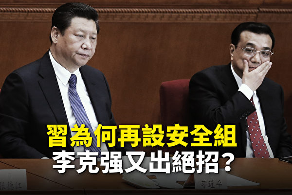
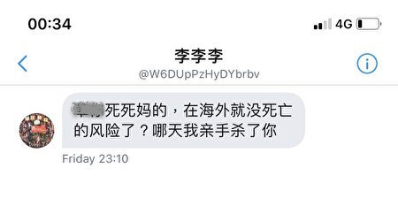
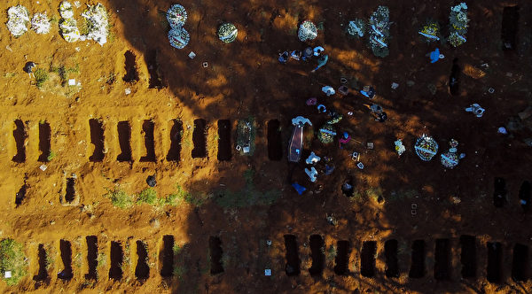
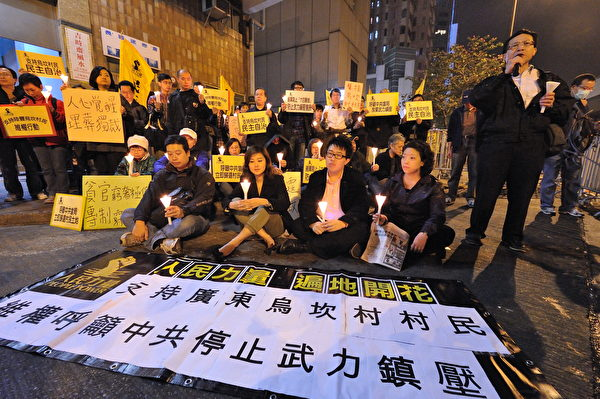
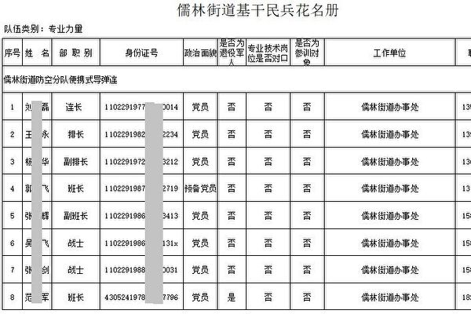
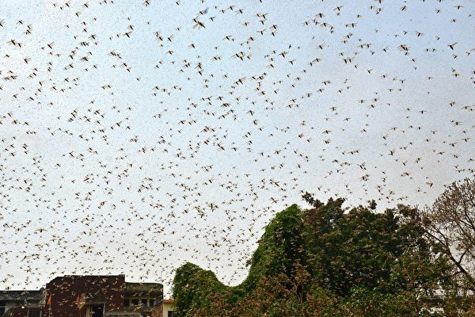
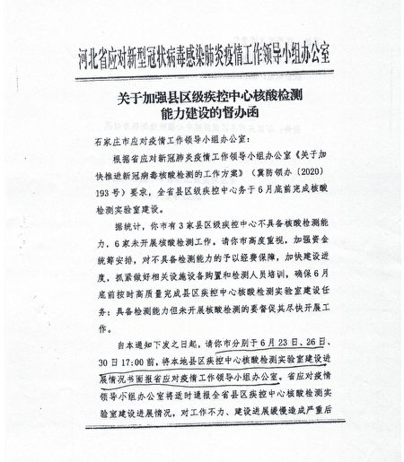

<h3><a target="_blank" href="https://bit.ly/3asSXIA">请多传破网软件，使更多的人了解真相从而得救，这是给自己积福德。 https://bit.ly/3asSXIA </h3></a>

   

     
<h3 align="center"><b>免翻视频  https://bit.ly/3ezRQKo  (请收藏网址 https://git.io/swspip)</b></h3> 

<h3 align="center"><b>复制网址到谷歌或火狐浏览器打开。若出现 “提示” ，請点击“继续”访问即可。</b></h3> 

<h3 align=center><a href="https://github.com/gav01/Heart/blob/master/news1.md">● 看更多大紀元時事 ●</a></h3>

<a href=https://git.io/souye><h6 align="right">回首頁</h6></a>

<a name=top>

<a href =#83>83.【记者手记】香港受害 美国社会也病了 
<a href =#82>82.【拍案惊奇】习政敌谋划溃坝？中共猎狐打异己 
<a href =#81>81.中共外长发求和信号？美国制裁中共4高官 
<a href =#80>80.被捕香港大纪元员工：遭警威胁送中活摘 
<a href =#79>79.华裔知名学者隐瞒千人计划 回国途中被捕 
<a href =#78>78.【新闻看点】川普连出重手 习近平再设安全组？ 
<a href =#77>77.美国务院禁陈全国等三名高官及家人进入美国 
<a href =#76>76.美国制裁新疆公安厅和四名高官 冻结财产 
<a href =#75>75.【独家】内部文件曝中共脸书账号的秘密 
<a href =#74>74.澳留学生亮相反共后 遭死亡威胁 
<a href =#73>73.【一线采访】贵州铜仁山体滑坡 村庄被埋 
<a href =#72>72.贵州公交司机疑报复社会 中共禁媒体报导真相 
<a href =#71>71.中芯国际股价暴涨暴跌 中共撒钱难掩窘境 
<a href =#70>70.上海暴雨“中国第一高楼”多层楼漏水严重 
<a href =#69>69.湖北江西现河堤溃口 千岛湖泄洪量达76西湖 
<a href =#68>68.英方违背“过时文件”？ 中共自打嘴巴 
<a href =#67>67.湖北水库滑动变形 近2.9万民众急撤 
<a href =#66>66.中纪委书记赵乐际操纵政法委 迫害法轮功 
<a href =#65>65.【独家】习近平怯步军营的背后 
<a href =#64>64.病毒变异 专家：疫情再爆发将非常可怕 
<a href =#63>63.杨威：评《纽约时报》两篇奇怪的文章 
<a href =#62>62.蓬佩奥：美国考虑禁用Tiktok等中国App 
<a href =#61>61.【最新疫情7.8】川普推动国家全面开放 
<a href =#60>60.【独家】内部文件泄中共有秘密器官来源 
<a href =#59>59.【独家】内部文件泄中共器官移植七宗罪 
<a href =#58>58.一旦关闭国门 谁是最大受害人群 网络热议 
<a href =#57>57.“很多闲置厂房” 李克强讲话再泄密 
<a href =#56>56.闭关锁国？中共称“经济内循环”引热议 
<a href =#55>55.水灾 中共红会20天募2千 “人民觉醒了” 
<a href =#54>54.国安公署长郑雁雄阴毒 乌坎模式恐套香港 
<a href =#53>53.金里奇：太空竞赛 中共对美构成严重威胁 
<a href =#52>52.加海关没收9千万未申报现金 多来自中国游客 
<a href =#51>51.孙茜被迫弃加籍 前司法部长：她仍是加公民 
<a href =#50>50.孔子学院遭各国抵制 中共改名被嘲讽 
<a href =#49>49.白宫：总统正考虑两三件事 应对香港局势 
<a href =#48>48.田云：中共卖国 何止一个海参崴！ 
<a href =#47>47.大陆洪涝灾情严重 至少26省市1770万人受灾 
<a href =#46>46.庚子赔款：被中共屏蔽的历史真相 
<a href =#45>45.【翻墙必看】北京卫戍区密件泄军方秘密 
<a href =#44>44.11年冤狱 法轮功学员马智武再遭非法批捕 
<a href =#43>43.应对近期两大社会热点 中共对媒体下密令 
<a href =#42>42.【现场视频】北京怀柔 河北保定突降冰雹 
<a href =#41>41.【新闻看点】习近平“我将无我”？中共末路狂奔 
<a href =#40>40.大陆有调兵备粮迹象 官员：怕回大饥荒年代 
<a href =#39>39.田云：世卫更改疫情时间表 中共谎言露馅 
<a href =#38>38.文件曝北京几类人优先打疫苗 专家：临床试验 
<a href =#37>37.【最新疫情7.5】纳瓦罗首提“中共病毒” 
<a href =#36>36.中共军机再侵台 6月以来第11次遭国军驱离 
<a href =#35>35.田云：美国会通过香港自治法 中共恐慌急发声明 
<a href =#34>34.川普在总统山讲话 庆祝美国自由 捍卫遗产 
<a href =#33>33.陆汽车行业势衰 民众拍下滞销汽车震惊画面 
<a href =#32>32.章天亮：中共押上全部家当 最怕美国一大招 
<a href =#31>31.学校民宅被冲毁 传张家界两县十多人失踪 
<a href =#30>30.【最新疫情7·4】全球染疫数达1100万 
<a href =#29>29.看不见的思想与看不见的神佛 
<a href =#28>28.监控民众不力 河北两商场遭中共内部通报 
<a href =#27>27.美国会一致通过香港自治法 交由川普签字 
<a href =#26>26.【一线采访】武汉小伙两陷疫区 如入战场 
<a href =#25>25.北京女设计师：我为何不顾压力走进法轮功 
<a href =#24>24.美参议员：香港自治法将真正惩罚中共官员 
<a href =#23>23.【拍案惊奇】港人抗争新招！贵州地震前龙叫？ 
<a href =#22>22.【最新疫情7·3】NBA复赛在即 25球员染疫 
<a href =#21>21.莫迪正式退出微博 删除跟习近平的合影 
<a href =#20>20.颈椎伤残无药可医　修炼大法重获新生 
<a href =#19>19.信仰真善忍 黑龙江董林桂冤狱12载九死一生 
<a href =#18>18.个股暴涨暴跌再现 微信QQ有人推荐后闪崩 
<a href =#17>17.终认清中共 美国安顾问中国问题讲话全文 
<a href =#16>16.【最新疫情7.2】全球疫情加速扩散 
<a href =#15>15.国安恶法38条震惊全球：要管全世界的人 
<a href =#14>14.FCC发布最终指令 宣布华为中兴构成国安威胁 
<a href =#13>13.郝海东与叶钊颖七一互动 牵手反共到底 
<a href =#12>12.蝗虫大军逼近首都 印度直升机和无人机迎战 
<a href =#11>11.香港新设国安署权力不受限制 架空港府及司法 
<a href =#10>10.【独家】鲁炜发迹和中国“删都”的出现 
<a href =#9>9.涉集体造假？金凰珠宝爆质押83吨假黄金诈贷 
<a href =#8>8.钟原：“百年未有大变局” 习近平有新解 
<a href =#7>7.【独家】前微博审核员勇揭中共审查黑幕 
<a href =#6>6.4名香港大纪元派发人员7·1被捕 吁立即释放 
<a href =#5>5.韩国新学员：入心学法精进去执 
<a href =#4>4.【内幕】关联北京疫情 河北大规模检测背后 
<a href =#3>3.多省市有大暴雨 云南昭通洪涝致3死 
<a href =#2>2.班农批西媒无视中共罪责反攻击大纪元 
<a href =#1>1.【最新疫情7.1】巴西染疫死亡人数增近一倍 

<a name=83>
<h1 align="center"><b>【记者手记】香港受害 美国社会也病了</b></h1>
 <h3 align="center"><b>美国反警 香港反警暴 二者到底像不像</b></h3>  

   
市府通过削减警局10亿美元预算案后，示威者仍不放弃“占领市政厅”的活动。占领地俨然已有自治社区的味道，展板上的诉求是从警察和监狱撤资，将资金转移到社区建设项目等。（黄小堂／大纪元）

   
 【大纪元2020年07月10日讯】（大纪元记者蔡溶纽约报导）地球两端的美国和香港陷入示威潮，两地都在反警暴，这自然引起了大量关于两地警察比较的说法。
 
 

美国共产党在示威现场分发的册子，显示美国共产党的总部位于曼哈顿西23街。（黄小堂／大纪元）

   
   香港人在推特上制作比较图，拆解美国示威与香港示威的异同。支持反送中的“蓝丝”对比警暴的处理、政府反应、地方损毁；支持港府的“黄丝”对比开枪原因、人命损失、执法对象、警员身份。结果各说自己有理。毕竟，仅凭几个表面现象，难窥事件的全貌。

中共官媒也马上拿美国骚乱说事，从“美丽的风景线”到“双重标准”反讽美国；《环球时报》胡锡进称“美国骚乱明显由香港暴徒策划”。如果真像胡锡进所说，美国就不会发生抢手机名店和到药店单纯抢掠阿片类（Opioid）药丸的罪行了。

香港官员也爱比较。早在香港示威反送中运动期间，香港政府辩称：若在美国，示威者早被警察制伏；美国也有反蒙面法。

<b>美国反警 香港反警暴 二者到底像不像</b>

表面上看，美国与香港示威有一些相似部分，例如示威者蒙面，还有一些破坏行为，甚至也没有“大台”，而是发展为一个由五十多个核心组织相互协作的运动联盟M4BL（黑生命运动，Movement for black lives）做主导。但是美国与香港示威的出发点和诉求，根本上是不一样的。

品葱就“同为暴力，我支持香港勇武派却反对美国暴力示威游行，我是否双标？”展开讨论，探究了一些制度环境不同的问题。其中一则帖子说，原则上他是反对暴力示威游行的，因为这次白人警察执法过度后，当事人被法律指控、同队警察被开除、市长道歉，甚至许多警察也下跪表示哀悼。美国有各种各样的渠道能够发声和起作用。为什么要暴力呢？找不到任何正当性。

而香港不同，全港1/4人口（200万人）和平示威都不起作用，并且香港人无法通过参政来改变这一现状，他们没有和平的解决方案，于是产生了勇武派。而他们的每一个行为、每一次破坏都有明确的目标和理由，并没有针对一般民众。例如烧垃圾是为了争取疏散的时间，破坏中资和撑警的商店是为了教训他们埋没良心。

香港示威的最大源头是因为中共强推“送中条例”，意味着要收回香港的司法独立性，当年说好的“一国两制”承诺变成谎言。港人示威背后的因素很简单，香港人不想香港变新疆，不要和你中共“一国一制”，一句话：拒绝中共。

美国示威的最大源头是示威者把警暴问题归咎于长久以来不公的制度。暴动和故意破坏行为出自于这样的信念，用社会主义者参议员桑德斯（Bernie Sanders）的话说：“一个根深蒂固的种族主义和经济差异体系，现在比以往任何时候都更加需要被拆除。”

<b>自卑还是歧视？</b>

美国的种族歧视真的“积怨已久”？不管“黑人被歧视”是单一事件还是普遍现象，政府已通过福利与救济和改革制度等长远方式来回应，美国从20世纪60年代开始就有“伟大社会”运动，搞强制平权。

美国搞强制平权可谓很用心。纽约市长白思豪就亲自推动安装七幅巨型“黑人生命重要”（Black Lives Matter）宣传标语，包括昨天（7月9日）在川普大厦前的五大道路面涂刷巨型标语。当被问及为何在预算捉襟见肘的情况下还要花钱搞这些，市长说，这种努力和“小措施”是必须的。

黑人上学受照顾、考试受照顾，就业、福利受照顾，黑人精英被纳入美国主流体制，黑人民选官员、黑人警察都不少，但并没有改善贫困黑人的生活条件，反而是让他们陷入更悲惨的境地。黑人的单亲母亲逐年增加。

按照运动的逻辑，您要么必须相信美国是“根深蒂固的种族主义”，要么必须相信黑人天生弱势、需要被照顾。

<b>“打土豪，分田地”</b>

此次美国示威者的口号“没有公义，便没有和平”（No Justice, No Peace）让很多人认可。不过，仔细阅读美国共产党在示威现场分发的册子，发现他们话语中的“公义”要求的不是一个公正的程序，而是一个“公义”的结果——即无论富裕比例还是入狱比例，都应该和肤色挂钩。

小册子号召和恐怖组织Antifa“团结”，并为打砸抢烧行为辩护，认为打砸抢烧是贫穷导致，贫穷是“社会不平等”导致，黑人被抓和被判入狱“不成比例的高”是“针对穷人的战争”，是“不公义和歧视”。并要求川普总统下台。

小册子提供了这样的“前景”：建立社区自决，从警察和监狱系统撤资，把司法预算的钱、把富人的钱转移给黑人社区的房屋、教育和健保项目，让非法移民和合法移民平权，就可以把“打击穷人”转化为“消灭贫困”。

“解散警局、不要监狱”？缺乏对这个话题关注的人会感到这一切是从天而降的奇闻。然而这并不是一时的头脑发热，而是羽翼渐丰的一股势力，已然成熟，准备大展拳脚了。黑人武装组织除了6月在西雅图国会山地区宣布“自治区”外，M4BL预计到2024年要实现5至10个黑人自治社区的建设，一切正在进行中。

这就是为什么美国共产党吸引了示威者，号称“一切为了穷人”和“正义”，领着穷人“打土豪，分田地”。他们和中国共产党是气脉相通的。

不过中国人都知道中共早年发动“农民运动”的真相，当时中共养活自己的经费基本上来源于“打土豪”，“分田地”说白了就是欺骗。真正能帮助贫困的人的方法，不是打土豪分田地，而是取消特权，让每个人都有同样的机会实现自己的理想。

<b>治病的方法是终结共产党 而不是隔离</b>

香港社会病了，美国社会也病了，病得都不轻。哪是因？哪是果？从中医治病的法则看，异病可以同治，不着眼于病的异同，而是辨识不同的疾病有无共同的病机，病机相同，就可以采用相同治法，“多病一方”。

共产党是最危险的病毒，全世界已经被共产党祸害得不成样子，现在是所有人一起发声的时候了，仅仅将共产主义意识形态“看作是一种应当加以隔离的瘟疫”还远远不够。“全球退党中心”6月底发起了一项征签倡议活动：终结共产党，正是“多病一方”的解药。◇#
   
<h4 align=center><a href="https://git.io/waaa">(点击右键,另存新档）</a></h4>
<a target="_blank" href=#top><h6 align="right">回上方</h6></a>

<a name=82>
<h1 align="center"><b>【拍案惊奇】习政敌谋划溃坝？中共猎狐打异己</b></h1>

习政敌或谋划溃坝大案？李克强灾区秀被边缘化。（新唐人合成）

   
   【大纪元2020年07月09日讯】大家好，欢迎收看《新闻拍案惊奇》，我是大宇。

中国许多省份普降暴雨，特别是长江以及长江南北的水情，尤为凶险。

其中，三峡大坝的安危，一直为人们所关注，因为这里坝高水盛，位置又地处华中，一旦崩溃，后果不堪设限。

【三峡超过限制水位 1号洪水已入库区】

有消息显示，截至7月7日，按官方公布的日期来算，三峡大坝已经泄洪约一周，泄洪流量由一开始的每秒2.5万立方米，变成现在的5.5万立方米，这样的话每小时就有1.8亿立方米的水被排出去，一天就是43.2亿吨。还是拿杭州西湖做比较，西湖有水1,429万立方米，那三峡大坝，一天就能向下游排出三千多个西湖。这会让下游的负担很重。

我查了一下大陆的“长江水文网”，不知道是不是之前的消息有误差，还是到了7月8日，三峡库区排水量骤减。

截至当地时间7月8日下午3点，三峡库区水位是149.43米，而库区的防洪限制水位是144.99米，已经超过了限制水位，所以数字显示的是红色，而当时三峡库区每秒排出的水量是27,600立方米，比之前的消息所说的7月7日的每秒5.5万立方米，减少了差不多一半。这样算来，从三峡库区一天排向下游的总水量，仍然有大约1,500个西湖。

湖北省气象局的数据表明，截至8日，该省仍有连续性的强降雨，黄冈北部、孝感、宜昌一带，是强降雨的中心，而三峡库区就位于宜昌地区。

【回顾2014昆明火车站事件 背后权斗的刀光剑影】

此前，官方消息称，长江今年的1号洪水已经进入三峡库区。

可见，三峡大坝目前承受的压力还是很大的。

昨天啊，我收到一则消息，从另一个角度，显示出，一旦三峡，或者其它的什么水坝崩溃，有可能并不是天然发生的，这甚至也可能牵涉中共的高层政治权斗。习政府的反对派势力，比如江派，要想搞死习，可是不择手段。

我们之前看过好多类似案例。比如，2015年的天津大爆炸，当时就有分析，说是当中有政治因素在里面，案件并非偶发性的单纯事件。

再往前推，2014年3月1日晚，在昆明火车站的恐袭事件。8个歹徒策划，当中5人参与直接袭击，造成31人死，141人伤，最后4名歹徒被击毙。一项内幕消息显示，中南海高层断定这是江派策划的袭击，本质上跟恐怖分子、种族仇杀、疆独势力没有关系。参与袭击的歹徒都是来自基层农村的武警士兵，为了利益充当打手。在行动前，他们被利用毛思想洗脑，还获得一笔钱，并得到升官许诺，而且据说案发后15分钟会来车把他们接走。

但是，当天在昆明发动恐袭的时候，后援根本没有出现，最后5个参与直接袭击的人，4个人被击毙，1人被击伤后活捉。这些人事先经过多次行动，都得到了保护而脱离险境，但这一次没有。据说当时策划是5个城市同时行动，但是因为发生意外，另外4个城市行动没有出现。案件发生的时候也正是当年两会召开期间，习当局高层震惊。

【习政敌或谋划溃坝大案 “蛤蟆”和“螃蟹”的隐喻】

以上只是举个例子，昨天我收到的信息，也是有关利用搞灾难，来为权斗加辣，这个涉及三峡。

消息是说：“‘螃蟹’要炸三峡，或者三峡旁边的山，或者退一步炸其它的水电站，或核电，三峡溃坝可能会是红眼狮子逻辑”。

这个消息用了比较隐晦的代号，所以很多观众问，螃蟹是谁啊。这个词要放在中共政治中呢，是指中共前朝的一个，名字中带“红”的政治“亲王”。也被认作是前党魁江泽民的军师。

一说蛤蟆，大家都知道是指江泽民，一说螃蟹，那就会知道，指的是他。这有一些典故。我们可以顺带分享，来自民间的传说。

相传1996年，江泽民去过一个著名的南方寺院，当时方丈劝阻他不要撞钟，但江还是撞了，老方丈沉默不语，默默垂泪，后来才对别人说，江泽民是蛤蟆转世，钟声一响，中原水族作怪，会引发中原连年大水。

还有其它民间的说法，说江泽民是蛤蟆转世，而且是缺了一条腿的蛤蟆，而且他的作派、长相也很像。比如在公开场合，扶栏杆的时候，人家都是五个手指一起上，江往往就是伸出三个手指头扶在那里。因此，“蛤蟆”一词就成了江泽民的绰号。

“螃蟹”一词类似，也是民间说法，说是那个江泽民的军师，是一只寄居蟹转生，而且生性也是横行霸道，所以他得到了一个“螃蟹”的绰号。

以上是因为爆料信息里面使用了相关绰号，给大家讲一下相关典故，可以当笑话听。

回到这则信息本身，发消息的人提到的这句话，就是说“螃蟹”可能策划炸三峡或其它什么水坝等设施，以此来打击习当局。当然我们不是替哪一边开脱，中共这个体制整个都是有罪的，无论哪一派，我们这里只是谈这则爆料，就事论事。

结合以前发生的事情，像我们上面举的昆明火车站、天津大爆炸的例子，我们不能完全否定这种可能性，穷途末路，鱼死网破，不一定能做出什么。但是权斗的牺牲品，都是老百姓。

【“红眼石狮”的典故 告诉了我们什么逻辑】

刚才这则信息，还提到了“红眼狮子”的逻辑。这也是一个典故，很多朋友听到过。

这个故事是说，观音告诉了村中一个老妇，说村口的石狮子眼睛变红的时候，就是洪水要来的时候，叫村子里的人走。但老妇人说了，所有人都嘲笑她。还有几个无赖，为了戏弄老妇，自己去把村口的石狮子眼睛涂红，老妇人第二天一见狮子眼睛真的变红了，赶快再通知村里人，结果有人相信，有人不信，相信的人随老妇人一起离开村子避难，不相信的后来就真的遭遇洪水。

结合刚才的那个爆料信息，这个典故引用在这里的意思，我理解是，有人说一个灾难要发生了，大家都会想，怎么可能，那个危险不可能存在，但是，你无法防备的是，真有无赖、坏人，真的就去人为地干了这个坏事，造成了这样的灾难，最后真的发生了！然而，这坏人的所谓故意为之，也逃不过茫茫天数。

以上是围绕近期的热门话题——三峡，谈到的一些事情，有的朋友可能会觉得，说得有点悬。我们就说到这。接下来说说不悬的，但也是相关的。

【98抗洪老兵 分享洪水中实用自救经验】

实际上，没有人希望发生溃坝这样的灾难，会造成很多生灵涂炭。但是有所防备，也不是坏事。在油管上，有一个说是参加过98年抗洪的老兵，分享了一些在这种溃坝或者洪水中，如何自救的一点点经验。我们在这里简单介绍一下。

这名叫“陈君卫”的老兵说：首先就是要自己真的去水里，学会熟悉水性，这是很重要的；然后，可以买那种从胯下固定的大浮力救生衣，因为如果不是这种救生衣，很容易在水流冲击下，让救生衣穿不住；还有就是准备那种“防汛头盔”，实在没有，准备摩托车、山地车的头盔也可以，可以增加生还几率，因为力道大的洪水来时，可能会令你在水流中撞伤头部；还有“多功能急救毯”，有保暖御寒防雨的功效，因为一旦被水冲走，即使上岸，会感觉又冷又冻，这个毯子可以避免二次伤害；类似在上岸后继续求生的装备，还有打火石、求生口哨、救生刀；也要准备户外净水装置，因为在中国南方一些地区，水中会有血吸虫，如果不慎喝下去，会很危险，所以应该将水过滤，最好是烧开了再喝，而且大家不要忘了，现在中共病毒瘟疫，也还没有退去，更要注意卫生；还有钛水壶套件，这种金属罐，比水还轻，容易携带，可以装水，还能烧水烧饭；这位老兵还介绍一点，就是遇到大水过来，不要一直站在房顶上等，因为房屋可能被水泡塌，应该尽快向更安全的地方转移，至少可以转移到附近，相对稳固的山体上。还有一点，就是注意电线，有些电线没有断电，掉到水中会很危险。

在这里，非常感谢这位老兵的经验分享。

目前在长江沿线一些地方，情况确实很严峻。

【湖北千座水坝告急 仙桃紧急转移 黄梅洪水毁庄稼】

截至7月5日，湖北全省有1,094座水库超过防洪限制水位。7月7日，湖北仙桃市的一份防洪指挥文件曝光，显示当地防汛指挥部，要求转移沙湖镇、五湖渔场等地的老弱病残，特别是渔池的居民要全部高地转移。

而在7月7日和8日，湖北黄梅县成为全国降雨量最大的城市，当地时间8日凌晨，黄梅县的大河镇一处发生山体滑坡，5户人家9个人被掩埋。

有黄梅当地人给我们发来视频，显示7月8日这一天，那里的河水已经没过了河坝的桥面，而在冬季，河坝顶部距离水面有大约15米，现在全县变成汪洋大海，路基被冲毁、房屋倒塌的情况已经出现。他说这比98年的那场大水还猖狂。而更为隐患的是，因为水灾，当地庄稼基本颗粒无收，能保住房屋财产，就算是大幸了。

【安徽黄山市严重淹水 歙县泡水 百姓斥“人祸”】

大陆中央气象台也发出了今年第一个暴雨橙色预警，显示从7月7日晚8点开始，一直到7月8日晚8点，包括湖北、安徽、江西等省份，都有大暴雨，从图片上看，几乎沿长江中下游以南的区域，都是暴雨集中的地带。

在这个区域的安徽省黄山市地区，水灾已经十分严重，从当地人发出的视频我们可以看到，当地的街道已经被大水吞噬，夹带泥沙的洪水犹如小黄河一般，灌入大街小巷。

被称为状元之乡的安徽休宁，在高考期间，也难免经受大水的洗礼。

同在安徽省的歙县，当地上游的多个水库开闸泄洪，导致歙县在7月7日被大水冲刷，民众损失惨重，怨声载道。香港有线新闻的记者去采访，发现当地人根本不认为，最大的损失，来自于暴雨，而是当地政府没有及时通知他们撤离，也没有事先通知泄洪。

当地餐馆老板：“昨天那个水来的时候，我在楼上看到，沙发都冲走了，隔壁老太婆家也有个木头沙发也冲走了。我一赶下来抓，水到这里了，就是政府这么多人不作为，也没有人打电话来叫我们搬家。就是早上水到家门口了，叫我们赶快起来，没有时间抢救。这不是天灾，是人为。”

【新安江九孔泄洪 上海最高楼成“水帘洞”】

前一天的报导，我们还提到了浙江省钱塘江上游的“新安江水库”，7日中午是5孔泄洪，后来7日下午4点，上升到7孔，再到7月8日上午9点，一直在泄洪可是水不减而继续增加，水位达到历史最高的108.45米，因此又增加了两孔，变成9孔同时泄洪，是新安江大坝61年历史上的第一次！泄洪速度每秒6600立方米。像我们昨天开玩笑说到的，这个大坝泄出来的洪水，可能是有商业价值的饮用水，而且里面也有特产“包头鱼”，泄洪到如此规模，不仅危险，而且浪费。

此外，江西省景德镇，湖南省湘西地区，也都遭受洪水侵袭。

而在上海市，其号称为中第一高楼的“上海第一大厦”，在连日暴雨中，从60楼开始漏水，一直漏到9楼，景象十分“凄凉”。7月6日，大厦官方解释，这是因为设备故障。

这座大厦是2007年时任上海市委书记习近平亲自审定设计方案，建成后总高632米，一共121层，耗资148亿人民币，如今才建成4年，已经出现漏水情况。

【“军迷”习近平避走军营？李克强灾区秀被边缘化】

说到习近平呢，今年以来，中国先后经历了瘟疫和洪水，至少两项大的灾难，但是在灾难场合，很少见到他去慰问。往往，他出去访问，最爱去的几个地方，军营是其中之一。包括军事院校在内，2018年，习近平去访过至少8次，2019年，至少9次。但是今年，一共只有两次，而且全部是在1月23日武汉封城前。

一次是1月19日，视察云南边防军，一次是1月20日，会见昆明驻军。而自那以来，在公开报导中就再没有习近平探访军营的消息。这一方面是秘访，另一方面，有人分析，可能是与军中疫情有关。

海外媒体《大纪元》近日独家报导，根据一项2月17日，新疆生产建设兵团的9个样本中，有8个呈阳性反应，显示兵团感染比例很高。而“新疆生产建设兵团”原本就是准军事组织，现在是“党政军企四项合一”。该兵团的感染状况一直不为外界所知，其实整个中共军队的感染状况，也一直是秘密。但是这数据一被曝光，竟如此严重。也许中共的其它军营存在类似情况。因此这篇文章分析说，习近平也可能是因为这个原因，在截至目前的今年公开活动中，很少去军营走访。

不去军营，去灾区看看，也好啊，但是身为“一尊”，我们也很难见到习在灾区的身影。到是中共总理李克强，7月6日到7日，去了贵州省考察。但是，虽然亲赴第一线，在党媒的报导里，还是以习近平为大头版，李克强只是习近平有关报导的“配菜”。

例如，上个星期，新华社的报导中，习近平几乎没有公开活动，但是有关他的消息一直在头版头条。在人民日报上也是占满头版，几乎没有其它常委的位置。在李克强贵州访问期间，央视的报导，也要对习近平歌颂长达2分钟，李克强的一线考察与之相当。

这些内容，其实倒不是想说习与李怎样，而是表明，党媒完全是为政治服务，在各地水患最严重的时候，不是专心致志去追报水患，中央领导去了都不当成重点来报，而是继续报导最高领袖的大事小情、每日琐事。

另外，还有一个问题。李克强去的贵州，也不是目前受水灾影响最严重的区域，现在最严重的在长江中下游，是湖北、是安徽等地。但是李克强为什么选择去贵州呢？有人分析，就是防止湖北当地，万一出现什么大的纰漏，比如哪个坝垮掉了，那他摊上的责任，可就太大了。

【贵州公车坠水大案 “寻短”司机是强拆受害者】

同时，在李克强访问贵州的同时，当地发生了一件大事。是我们昨天报导的，在贵州安顺市，7月7日，坠入水库的公车事故，这件事已知造成至少21人死，但是《自由亚洲》报导，安顺市当局发紧急通知，要求体制内的人禁止接受采访，所有资讯需要由官方统一发布，并要求驻地媒体不要报导和扩大此事的舆论影响。

这是为什么呢？

原来，有消息显示，造成事故的公车司机，名叫张包钢，是一名退伍军人，当地西秀区的“拆迁户”，多次反映问题不果，而7月7日当时是高考第一天，自己的女儿考试又没考好，因此开车冲入水库自杀，连带车上所有人给他当垫背。这个案子往根子上追究，是一个深刻的社会问题，而且拆迁还在发生。那么社会大众要怎么拷问事件的责任呢？为了政治安全，当局宁愿让这些死者默默淹没在其它舆论中，也不愿正视事件，给社会一个交代。

【惠州狼师诱奸多名12岁女 陆媒或“被低调”】

类似的，需要深刻反省的社会事件，最近在广东惠州市也发生一起。这是一起教师诱奸女学生的案子，原本发生在6月20日，但是因为媒体的漠视，直到7月7日才浮出水面。

7月7日，大陆网络传出一则视频，显示一群人堵在一个门口，围殴一个被警方逮捕的人。原来，这是惠州市水口大和小学的41岁男性教师叶某，他在20日诱奸了十几个年纪12岁的女学生，但是作案时被其中一个家长撞见，导致案件曝光。这是6月24日，警察去学校取证时，出现的画面。

教师在中国大陆享受公务员待遇，本来是受尊敬的行业，但是发生这档子事，在民众眼里，他们跟其他一些腐败的公务员也没什么区别。而且中共历来对这种公职人员性侵的问题，处理比较低调，或量刑较轻，为的是“党国形象”和所谓社会稳定，而豁出去的，还是最不值钱的“韭菜”。

国内这么多大案要案不管，但是中共对异议人士的打压，却试图将其魔爪伸到海外。

【FBI揭中共猎狐为打异己 港人易遭恶法禁足 传媒受威胁】

7月7日，美国联邦调查局局长揭露，中共现在有一个“猎狐计划”，名义上是反腐，实际上是为了针对被它视为威胁的海外华人，也就是对海外异见人士进行打压。他举了一个例子，说有一个美国华人家庭，属于异议人士，中共间谍威胁他们说，要么回国，要么自杀。非常狂妄。FBI局长提醒，如果海外华人谁认为自己是“猎狐”的受害者，可以与当地的FBI办公室联系。

而在香港，国安法出台后，对那里异议人士来说，处境也许更为不易。特别是，国安法中有规定，对一些涉嫌违反国安法的人，可以被限制离开香港。甚至就算你没有违反国安法，以后可能都面临中共的禁足。

而国安法到港，当地的媒体报导自由，也面临挑战。香港特首林郑被媒体问到，能不能百分百保证，所有记者都可以报导有关国安法的任何内容，而不会被勒令删除报导。林郑的回答是：如果香港所有记者都向我百分百保证，不触犯国安法任何罪行，那么她就可以保证。

其实林郑这话等于没说，但是意思很清楚了，就是说，香港记者的报导将同样受到国安法审查。香港记协主席杨健兴指出，国安法已经出现寒蝉效应，香港媒体开始自我审查，在国安法下，甚至不排除当局会利用国安法，以某篇报导为由，对传媒机构机进行打压，发生大搜捕。

集会抗议的自由失去了，言论自由也失去了，国安法正如一只野兽，在“母猪书记”的带领下，一点点蚕食着香港。

<b>～～～新拍互动～～～</b>

现在进入新拍互动。

前一天，我们报导，中共正在筹备，要在内蒙古的学校，强化汉语教学，弱化蒙语。

后来又有一名内蒙古朋友发来信件，她叫“小娜”。

小娜说：我是内蒙古自治区的一位蒙古人。现在网上一直在传内蒙古自治区的通辽市小学中学，实行双语教程，意思是除了蒙古语课程，其它全用汉语上。这不仅是通辽蒙古人的事儿，这关系到全内蒙古。汉语现在孩子比蒙语说得还要好，为何要实行这种政策我们很郁闷。网上传的很多信息都被封锁，这就是共党的唯一会干的一件事。这个国家原本有好多不同花儿，现在大家必须种一样的花儿，不能有色差，不能有不同味儿。新疆维吾尔自治区实行了双语教育，逼迫西藏也执行了双语教程，现在到了内蒙古。我们没有语言权，说了被镇压，这个国家不能有不同色彩，只能有红色，这意味着党和国家。我不知道这个政党统治下的愚昧国民什么时候苏醒，也不知道我们人民什么时候才真正有语言权。我们在自己的领土上没有语言权，都成了一群奴隶，他们都被一个政党洗脑，洗得连祖宗都不认的！只希望这个政党快点倒下，人民得到真正的解放！

另外，前一天的节目，我谈到了节目遇到的困境，有不少朋友留言支持。

观众“倾城”说：大宇我支持你，每天都主动搜索你更新影片了没，被黄标也不要气馁，无论如何，倾城都会收看你的影片和报导，直到地老天荒！！！！一直推荐你节目的其中之一人，就是我呢！我推了至少300人

在这里谢谢倾城。也谢谢所有留言支持的观众！

每天都有太多的话要说，今天有些想说，也有点来不及了，我们下一期节目继续！

好，如果您有爆料信息，可以给我们发邮件，我们的节目电邮是：xwpajq@gmail.com。

新唐人《新闻拍案惊奇》制作组

<a target="_blank" href=#top><h6 align="right">回上方</h6></a>

<a name=81>
<h1 align="center"><b>中共外长发求和信号？美国制裁中共4高官</b></h1>

图为美国国务卿蓬佩奥（Mike Pompeo）7月1日在国务院新闻发布会上发表讲话。(MANDEL NGAN/POOL/AFP via Getty Images)

   
   【大纪元2020年07月10日讯】（大纪元记者张顿报导）美中关系持续恶化，在中共外交部长王毅罕见对美国发出“求和”信号——不挑战或取代美国，愿意随时恢复重启各层级、各领域对话后，美国宣布对中共政治局委员陈全国在内的4名高官进行制裁。
   
<b>中共外长发“求和”信号</b>

北京时间7月9日，中共公共外交协会、北京大学等联合举办中美智库媒体论坛，中共外交部长王毅以视频的方式发表演讲。

王毅首先承认，中美建交四十多年以来，目前面临“最严重的挑战”。王毅宣称中共“无意挑战或取代美国，无意与美国全面对抗”。

王毅还称，中共不输出“中国模式”，“不会对西方造成冲击和威胁”；中共愿意和美方谈判；中美双方要“不另起炉灶，更不强行脱钩”，要“坚持走对话合作之路”云云。

<b>分析：中共试图拖延美国制裁步伐</b>

有分析表示，因疫情、香港、南海、台湾等问题，美中关系跌入冰点之际，王毅突然一改战狼姿态，向美国求和，北京流的是鳄鱼眼泪，企图继续哄骗美国对其手下留情。但这场疫情已让美国看清中共的邪恶本质，正联合全球推进灭共进程，北京已经没有出路。

时政评论员李林一对大纪元记者表示，美国对中共已经决定全面打击了。中共外长现在才想到说这些，但是已经有些过晚。

“中共内部其实也在加紧准备对抗美国，现在只是试图拖延美国制裁的步伐，但效果有限。”李林一说，“另外，王毅的话，一是其层级较低，二是不一定反映高层想法，所以也不太可信。”

中联部前副部长周力近日在大陆媒体发表《积极主动做好应对外部环境恶化的六大准备》文章，承认中共目前面临着“空前严峻的困难和挑战”，中方“必须有‘脱钩’最终难以避免的清醒认识”。

<b>美国制裁中共4高官</b>

就在王毅发表演讲后数小时，美国国务院宣布对中共中央政治局委员、新疆党委书记陈全国，新疆前党委副书记朱海伦，新疆公安厅厅长兼党委书记王明山进行制裁，限制他们三人及家人进入美国。这是美国首次限制中国共产党中央政治局委员的签证。

美国财政部制裁的名单除了上述三人外，还包括了新疆公安厅前党委书记霍留军。财政部在声明中，分别列举了四人对新疆民众进行“各种酷刑”、数字监控和所谓的“政治教育”的行为。

财政部表示，被制裁的实体和个人直接或间接拥有的、任何财产或财产权益、只要是在美国或在美国个人的控制之下，就会被扣押，并必须汇报给财政部外国资产控制办公室（OFAC）。

<b>美国拟制裁其他中共高官</b>

另外，中共当局6月30日在香港强行推行《港版国安法》，第二天香港7·1大游行，港警就抓捕了370人，其中10人被指违反了国安法。

中共违反在联合国备案的《中英联合声明》、违反了香港《基本法》，打压港人的民主、自由权利，把香港的“一国两制”变为“一国一制”的行径，遭到各界的谴责。

美国参众两院7月1日、2日分别通过《香港自治法案》（也称《香港问责法案》） ，并已送交白宫等待川普总统签字后生效。

该法案将对威胁和损害香港自治的中共官员以及与他们有业务往来的银行和公司实施制裁。

美国国会约150名议员组成“共和党研究委员会”6月10日发布一份国家安全战略报告，提出史上最严厉的对中共官员制裁方案。

报告建议全面禁止中共高官和家属的签证。制裁的对象包括25名中共中央政治局委员、中央委员会的205名中央委员和171名候补委员、以及中共19大的所有2280名代表及其配偶和子女。

其中，涉及制裁侵犯香港基本人权的最高官员，是负责香港事务的中共政治局常委韩正。

分析认为，美国制裁中共官员、冻结他们的财产，由此产生的威慑力，远大于制裁中共机构、或取消香港的特殊地位，这实属釜底抽薪之策。更有助于瓦解中共政权。
   

<a target="_blank" href=#top><h6 align="right">回上方</h6></a>

<a name=80>
<h1 align="center"><b>被捕香港大纪元员工：遭警威胁送中活摘</b></h1>

七一香港数十万民众上街反对“港版国安法”，370人遭警方抓捕，包括4名大纪元派发人员。派发人员阿娟披露，因拒穿囚衣，遭港警威胁送往大陆活摘器官。图为去年香港七一大游行队伍中的制止中共活摘器官横幅。（宋碧龙／大纪元）

   
 【大纪元2020年07月09日讯】（大纪元记者梁珍香港报导）七一香港大批民众上街反对“国安法”，但港警在铜锣湾等地大围捕，警方公布当天共抓捕370人，包括4名大纪元派发人员。4人于7月2日获释，其中一名派发人员披露，因为拒穿囚衣，被香港警察威胁要送大陆活摘器官。

阿娟是大纪元的派发人员，也是一名法轮功学员，经常在香港游行中派发大纪元刊物，以往警方不会干预。但“国安法”实施后，七一下午，她照常在铜锣湾SOGO派发《大纪元时报》焦点刊物，以及“天灭中共”的宣传单，却成为警方大围捕的对象之一。

<b>派发员铜锣湾被围捕 坚持无罪拒穿囚衣</b>

大纪元派发人员阿娟。（影片截图）

阿娟回忆，当天警方在路两边拉上封锁线，不让她以及在现场的大批市民离开。以往警方查查会放行，因为她只是普通派发人员，并非抗争者。但当天她等了很久后，被警方带上一辆大巴士，警方没有解释原因，只是说你到了那里就知道。当车到北角警署时，那一刻她才知道“自己被捕了”。

同时被带走的还有另外3名大纪元派发员，警方以涉嫌非法集结罪控告他们，现场还有过百名被抓捕的香港民众，将北角警署挤得满满的。警察一进门，就要求他们穿上带号码的囚衣。唯独阿娟等四名派发人员，坚持自己无罪拒穿囚衣。

“我告诉警察，我没有做错，他们把我抓进警察局里面去，应该是他们的错。所以我告诉他们，我不是囚犯就不用穿你们的衣服 。”阿娟随后穿上自己带的黄色法轮功背心，又拒绝在口供上签字。

<b>遭港警威胁送中活摘 阿娟落泪“太伤心了”</b>

等到了照相环节时，被捕的人士被要求全部换掉衣物和鞋子等。一名年纪较大的女警拿出一件写有号码的囚衣，三次套到阿娟头上，但被阿娟推开了。这时，阿娟身后传来一名男警的喝斥声：“你名字也不签，衣服又不穿，那么就送你回大陆，活摘你的器官。”

听到此，阿娟忍不住落泪，形容自己很伤心。她转头望着这位职位较高的男警，大声质问道：“你送了多少人回去（大陆）活摘器官？你参与了多少次？你有没有做过？你有做过你就认，你不要戴口罩，我会认住你，我要告诉全世界，你们曾经做过这样的事情。你们是不是全部都认同他活摘器官，这么邪恶的事情？”

现场过百名警察黑压压的一片，没有一个人讲话，那个男警也转开头，不敢对视她。阿娟心痛地说，大陆法轮功学员被中共活摘器官，惨无人道，没想到香港警察会说出这些无人性的话，“香港警察还要把我们送上去活摘器官，那么这场运动中，他们做了多少这样的事情，他们自己才知道。”

<b>忧香港变大陆 阿艳：无惧恶法坚持派发</b>

另一名派发员阿艳则指，七一前一天是831太子站纪念日。她在太子站派发“天灭中共”海报时，也拿着登有邓炳强后台孙力军落马的大纪元头版给警察看，希望警察能够明白共产党是邪恶的、站在市民一边。当时就有警察警告她，“国安法”后可能不让她们再派发。事后想起来，阿娟才意识到，原来警察话中有话，“七一之后对待我们派发的态度，真的不一样了。”

虽然“国安法”实施后，阿艳和阿娟都表示担忧自身安全，但强调仍然会坚持派发大纪元。阿艳说，因为现在香港很多媒体其实被中共控制了，香港政府也是被中共控制的，“如果大家没有了另一面的声音呢，只是听共产党宣传，那慢慢就像大陆一样的，会逐渐被洗脑。”

香港《大纪元时报》发言人强烈谴责香港警察滥捕，强调会无惧恶法，坚持报导真相，维护港人的知情权，绝不退缩。@#  

<a target="_blank" href=#top><h6 align="right">回上方</h6></a>

<a name=79>
<h1 align="center"><b>华裔知名学者隐瞒千人计划 回国途中被捕</b></h1>

美国司法部7月9日起诉俄亥俄州立大学的顶级华裔免疫学家郑颂国，指其非法隐瞒中国资助的研究经费，并在被调查后试图离境回国，直到5月在阿拉斯加被捕。(Mandel Ngan/AFP/Getty Images)

   
  【大纪元2020年07月10日讯】（大纪元记者王祥综合报导）美国司法部周四（7月9日）称，俄亥俄州立大学的一名华裔免疫学家非法隐瞒所收取的中国研究经费，在被调查后又试图离境回国，直到5月在阿拉斯加被捕。

现年57岁的俄亥俄州立大学医学院风湿病和免疫学专家郑颂国（Song Guo Zheng）于5月22日抵达阿拉斯的泰德·史蒂文斯安克雷奇国际机场（Ted Stevens Anchorage International Airport），在准备搭乘另一架飞机前往中国时被捕。
廣告

他随身携带三大袋行李包、一个小手提箱和一个公文包，内有两台笔记本电脑、三部手机、几个USB盘、几个银色试管，以及他家人的过期中国护照、在中国的房契等等物品。

图为被起诉的华裔风湿病和免疫学专家郑颂国。（美国关节炎国家研究基金会网站）

美国司法部网站周四（7月9日）公布的一项刑事诉讼揭示了更多细节，称郑颂国涉嫌欺诈性地从美国国立卫生研究院获得联邦拨款，同时向调查员说谎。

起诉书说，郑获得了近500万美元的联邦研究补助金，但他并未告诉国立卫生研究院他与中国机构的合作关系，以及中方提供给他的额外补助资金的信息。

起诉书和提交给俄亥俄州联邦法院的其它文件表明，郑长期以来一直与中共的“人才计划”中方合作机构有关联。

根据中国大陆网站的报导，郑作为“千人计划”被引进。千人计划是中共政府通过引入外国专家来促进中国国内科学技术进步的重要组成部分，而在美国受训的华裔是重点关注对象。

起诉书称，俄亥俄州立大学对郑进行调查后、已让郑休行政假。随后，郑计划快速回中国。

此案由俄亥俄州南区的美国检察官办公室负责。检察官戴维·米维尔斯（David M. DeVillers）在周四发出的声明中说：“在得知雇主已经开始行政程序、要了解郑是否有遵守纳税人资助的赠款规则后，郑准备逃离美国；在这过程中，我们起诉了郑。”

“这是我们办公室最近的第三起、涉及将知识产权和研究非法转移到中国的案件。”声明中写道，“这突显了我们致力于与联邦调查局、卫生与公共服务部以及研究机构的合作承诺，保护美国作为研究与创新的全球领导者地位，并惩处那些试图剥削和破坏这一地位的人。”

联邦调查局局长克里斯·雷（Chris Wray）在本周的公开演讲中也说：“我们现在已经到了这种地步：联邦调查局大约每10个小时就要启动一宗与中国有关的反情报案件。”

雷在讲话中还特别提到中共利用经济间谍、黑客攻击等秘密行动，以及利用千人计划等人才招聘项目来窃取美国的创新、敏感资料和研究成果等。
郑是永久居民 否认所有检方指控

起诉书透露，郑的案件涉及到他在俄亥俄州大学，以及他之前在南加州大学和宾夕法尼亚州立大学工作期间均未透露其获得中国政府的资金资助。

郑的律师尚未直接对检方指控作出回应。代理律师的笔录说，郑是美国永久居民，郑否认了检方对他的所有指控。郑通过翻译告诉法庭，“我理解”这些指控，“但我不同意所有这些指控”。

俄亥俄州立大学拒绝进一步置评。大学发言人在一封电子邮件中告诉《每日野兽》：“俄亥俄州一直在通过各种方式协助联邦执法部门。由于调查正在进行中，我们目前无法进一步发表评论。”

根据华中科技大学同济医院网站的公开信息，郑颂国在2014年被聘为华中科技大学同济医院的客座教授；郑长期从事免疫调节T细胞的诱导，发育和维持机制的研究，是国际上发明TGF-β诱导调节T细胞工作的领先科学家。

2014年，郑颂国为美国宾夕法尼亚州大学医学院医学系终身正教授及自身免疫性疾病研究中心主任，博士生和博士后导师。

郑当时担任中国自然基金委重点项目、中国科技部863和973等项目评审专家，也是美国心脏病协会、美国关节炎基金会、美国詹姆斯基金会（James Foundation）、美国风湿病协会、澳大利亚MS研究基金会等多国基金会终审评审专家。

郑曾荣获多个免疫学和科学成果奖，包括：中国宝钢教育奖、美国国立关节炎基金会Freda Norton Memorial全美纪念学者奖、美国加州地区年度最杰出的免疫学家奖、James R Kelinenberg奖、中国国家自然基金委杰青项目奖（海外）、美国风湿病协会杰出创新奖、国际免疫学联盟的优秀免疫学家奖等。 

<a target="_blank" href=#top><h6 align="right">回上方</h6></a>

<a name=78>
<h1 align="center"><b>【新闻看点】川普连出重手 习近平再设安全组？</b></h1>

正处在一生中最大危机中的习近平。（大纪元合成）

   
   【大纪元2020年07月10日讯】大家好，欢迎关注《新闻看点》，我是李沐阳。今天是7月9日，星期四。
   
<b>60秒看世界</b>

首尔市长朴元淳今天上午10点40分离开官邸后失踪。10个小时后，韩国媒体报导，朴元淳已经死亡。但警方之后又澄清，搜索行动还在继续。今天深夜，韩联社报导，警方已发现朴元淳遗体。

台湾中央流行疫情指挥中心昨天表示，与返回日本并确诊的日籍女生有接触的123名接触者，以及同校曾有发烧、呼吸道症状的90名师生进行检测，结果都是阴性。

昨天（8日）湖北黄冈武穴荆竹河堤发生溃坝，六千多人受到威胁。在黄梅县山体滑坡中被埋的九个人，其中一人生还、七人遇难，还有一人失踪。此外浙江新安江水库（也称千岛湖）两天时间，已经下泻了大约七十六个西湖的水量。

下面进入今天的话题。

最近，平安中国建设协调小组政治安全专项组首次召开会议，要落实习近平“维护国家安全”的决策部署等等。

这个“平安中国建设协调小组”的名字是第一次出现，而且其中还设立了“政治安全专项组”。政治安全，在中共的话语系统中相当于政权稳定。北京成立这样的一个小组，是习近平政权不稳了吗？究竟发生了什么？

<b>神秘的“政治安全”组</b>

平安中国建设协调小组政治安全专项组会议的消息，是《检察日报》在7月6日报出的。政治安全专项组组长、也是中共政法委副秘书长雷东生表示，“政治安全攸关国家安危”，要“依法打击各种渗透颠覆破坏活动、暴力恐怖活动、民族分裂活动、宗教极端活动”。

表面看，像是在针对香港和中国少数民族地区，也像是在针对外国势力，但似乎又不完整。细想想，涵盖的范围很大。

其实这些问题，以往都是中共国安部、公安部分管的。还有中共的司法部、政法委，也都在负责安全问题，这些机构上面还有习近平任组长的“中共中央国家安全领导小组”。

现在又冒出一个负责政治安全问题的小组，明显是机构重叠了。这个“平安中国”小组听起来像是大陆的保险公司，它与国安小组是什么关系呢？会不会组长又是习近平？

<b>习感到不安全？</b>

中共组织机构臃肿重叠，算不上新鲜事，因为中共官员和各种裙带关系，需要多设立机构、组织、部门，为的是安置更多的人员。

但是在中共国安小组之外，设立平安中国小组，与安置人员挨不上边，因为不是谁都可以进入这个小组的。那么设置这个小组，似乎更多的意味是在层层加码。北京要的是安全再安全，必须万无一失。

而这次会议也是直言“政治安全”。熟悉中共政体的朋友可能有所了解，所谓的“政治安全”，实际就是指中南海、党中央的安全，泛指中共的七大巨头。

但是目前上下都强调“定于一尊”的背景下，党中央的安全，也可以说是习近平本人的安全。就是说，习可能感到了威胁，有了不安全感？

那么习觉察到的不安全，来自哪里呢？从北京所面临的形势来说，应该是内忧外患。

<b>李克强出绝招</b>

本月1日，中共总理李克强召开了国务院常务会议。要求保障中小企业款项支付，机关事业单位和国企要带头执行。还强调要稳住经济基本盘，着力帮中小企业渡过难关。

李克强的讲话内容，应该说是切中了当前中国经济基本盘的要害。因为中共政府部门拖欠中小企业账款非常普遍，许多私企因此资金周转不灵，不得不申请破产或直接倒闭。

《金融时报》报导，光是去年10个月内，就有831个中共地方政府拖欠承包商的款项，总计高达69亿人民币。在此之前，已经有一千家地方政府被列为“老赖”，就是说这一千家地方当局也都在拖欠账款。

而中共国务院统计，政府部门和国企近一年来拖欠中小企业欠款，总额高达八千九百多亿人民币。虽然已经清偿了75%，但拖欠账款仍然是中国经济的一大痼疾。

其实今年年初，李克强已经提出过要求，要做到“零拖欠”。这次不过是旧话重提，但是李的旧话重提，却是“哪壶不开提哪壶”。

习、李不合，是公开的秘密。美国之音表示，红墙内的意见分歧，“傻瓜都能看出来”。有两件事最明显，一个是李在人大记者会上表示，中国有6亿人口月入一千元，另一个是他力主推动地摊经济。

这两个事，显然都与习推动的全面小康相悖。于是习马上反应，派出亲信出面，否定了地摊经济。

但是这次，李重申前令，催各地政府还钱，这就让习不能像处理地摊经济那么容易了。《自由时报》评论表示，李的这一招真是高招，因为“以大当家身份是难辞其咎的”。

这应该算作习感到不安全的一个方面。但中共内斗似乎并不是主要的，更重要的是中共的“刀把子”政法系统。

<b>中共要“清理门户”</b>

昨天（8日）在北京，中共成了全国政法队伍教育整顿试点办公室，主任是习近平的亲信、中共政法委秘书长陈一新。要求从明年到2022年3月，对政法队伍进行自上而下的教育整顿运动。

多家中共官媒昨天都转载了一篇文章，《继周永康、马建等“政法虎”接连被查后，全国政法系统要“清理门户”》。标题提到了周永康、马建这两个“活死人”，而且还用了“清理门户”的说法。

“清理门户”，我们常在武侠小说中看到。哪个门派中出了败类，就要把他翦除。还有黑帮电影中，也有使用“清理门户”这个说法。这正应了中共党校前教授蔡霞的说法，中共是个黑帮组织。

黑帮清理门户，自然是黑帮内出了问题。而具体到中共政法系统，问题更多。除了提到了周永康、马建这两个“活死人”，中共公检法系统还有不少已经落马的。比如前公安部副部长李东生、孟宏伟、孙力军，上海原检察长陈旭、原最高院副院长奚晓明等等。

中共政法系统已经完全腐烂，落马的也只是几个而已。而政法系统早前握在周永康的手里，听命于江泽民和曾庆红。他们安插了大量人马在政法系，早已盘根错节。尽管周永康被打掉，但是他的党羽还在，有的甚至也已经树大成荫，比如前政法委书记孟建柱，还有前司法部长傅政华等等。这些人不过是身在屋檐下，暂时蜇伏，并非真心效忠习。

“刀把子”有隐患，最让习寝食难安。因为还有2年多，也就是2022年，习干的两届就要期满。而在政法系统当中，还有很多自己不能掌控的因素，这是莫大的威胁，也是习真正的心腹大患。

而陈一新主导这次清理门户，很明显是要周边的人“绝对忠诚”，也是习抓紧刀把子的过程。

<b>国际制裁中共</b>

高层意见分歧和政法系统隐患，这是习目前的两大忧虑。而国际环境的快速变化，也让北京担忧。

昨天（8日），五眼联盟外长在视频会议中，就如何应对香港的情况进行了讨论。

随后，澳大利亚在今天就宣布了制裁措施。暂停与香港的引渡条约，并愿意为香港居民和企业提供移民帮助。

新西兰副总理兼外交大臣温斯顿·彼得斯（Winston Peters）声明表示，正在审视包括引渡协议在内与香港关系的多项设定。

加拿大外长商鹏飞昨天推文表示，官员们讨论了国际和平与安全的多个问题，双方均交换了意见。

一向强硬的英国外相蓝韬文推文表示，五国外长讨论了香港《国安法》对自由的威胁。他强调中共必须遵守向香港作出的承诺。

而美国更是已经布下了天罗地网，对习政权来说，这些都是不安全因素。

<b>川普将出重手</b>

自从中共隐瞒疫情，将病毒传入美国之后，川普政府就对中共屡屡发出批评的声音。特别是被中共火上浇油，废掉香港的一国两制，川普政府已经愤怒了。

昨天（8日），国务卿蓬佩奥表示，美国社交媒体巨头拒绝香港当局共享用户数据的要求，这是值得赞扬的，“其它公司也应该这么做”。

前不久，贸易顾问纳瓦罗（Peter Navarro）对福克斯新闻表示，港版《国安法》已经把香港人放在了一个“大型防火墙集中营”内，美国必须对中共采取强硬态度，川普是唯一能这么做的总统。

彭博社也引述白宫内部消息，川普正在研拟二到三项针对中共的制裁措施，据信将是美方挥重拳的开始。

而白宫国安顾问奥布莱恩更是发出了迄今为止最强硬、最全面的批评。他表示美国将与盟友一起，共同应对中共的挑战。他甚至把习近平比作斯大林，指称他要“重塑世界”。

山雨将至，雷声滚动不停。

<b>美国的一系列动作</b>

美国财政部今天表示，已经对新疆公安局和四名现任或前任中共官员实施了全球性马格尼茨基制裁。四名官员分别是现任新疆自治区党委书记陈全国、副书记朱海伦，另两人是（新疆公安厅前党委书记）霍留军、（新疆公安厅厅长兼党委书记）王明山。

今天路透社引述白宫管理与预算办公室的代理主任拉斯·沃特（Russ Vought）的消息，川普政府计划在本周确定法规，禁止美国政府跟任何使用华为、中兴、海康威视、海能达和大华等五家中共公司产品的公司交易。

昨天（8日），蓬佩奥表示，这场病毒的传播，让全球看清了中共的真面目。“我们需要真相”，但中共至今没有告诉全球有关这种病毒的真相。

前天（7日），他还表示，中共持续系统性地阻止美国官员前往西藏，对此美国也将对中共相关官员施加签证限制。

匿名人士告诉彭博社，蓬佩奥的顾问正在讨论对中共制裁的更多措施，其中包括美元与港元脱钩。

同一天，川普表示，正在考虑禁止TikTok，以此作为对中共处以疫情不当的处罚之一。

新任美国全球媒体总署（USAGM）首席执行官迈克尔·派克（Michael Pack）7日表示，中国将是美国对外广播的重点，优先考虑对华广播。

这意味着美国要拆中共的防火墙了，要让中国百姓听到世界的声音，看到真实的世界。美国拆中共的防火墙，中共政权彻底垮塌的日子还远吗。

国内隐忧重重，国际制裁不断。内忧外患的政权，能安全吗？

*****

<b>王全璋律师维权</b>

昨天（8日）在会员区，我们通过知情人介绍，了解了一些维权律师王全璋被关押期间遭受的种种酷刑。今天是709事件五周年纪念日，王全璋律师也展开了维权行动。他委托律师程海，向北京朝阳区法院等部门寄出了申诉书和控告状等资料。

控告信中列出了二名犯罪嫌疑人，都是天津市公安局的预审员，一个是郭爱强，另一个是傅锐。不过王全璋要控告的人，可能不止这两个，信中表示“其他参与刑讯的犯罪嫌疑人正在确认之中”。

王全璋控告他们的事实和理由是，在被关押在天津“津安招待所”期间，遭到了“侮辱谩骂、吐口水、搧耳光、长时间不让上厕所、睡觉不让翻身，从早到晚双手高举每天达15个小时，总共持续近一个月等各种手段逼供，郭爱强、傅锐等人的行为已经涉嫌侮辱罪、诽谤罪、刑讯逼供罪”。

其实大家知道，对王全璋的迫害，包括对整体709所涉及的每一位律师和维权人士来说，对他们施加迫害的是中共。但是王全璋为什么要列出具体人呢？

还是我们之前说的，中共是一个组织，是一个虚的东西。而一个个人才是实实在在的，是这些实实在在的人，组合到了一起，才有了中共组织。所以要控告，当然要针对具体实施迫害的人。

从这个角度来说，郭爱强和傅锐，包括后面可能要被确认的每一个参与刑讯逼供的人，他们等于是在承受中共的罪过。

我不知道朝阳法院会不会受理王全璋的申诉与控告，这个值得关注。如果受理了，那么郭爱强和傅锐们就成了替罪羊。

他们可能会辩解，这是上面交给我的任务。

这里我想举一个二战期间的例子。柏林墙被推倒前的一个冬夜，有人要翻越柏林墙逃往西德。东德守卫士兵英格·亨里奇举枪就向翻墙的人射击，造成一死一伤。

柏林墙推倒后，亨里奇因为杀人罪要接受审判。他说自己是执行命令，没有罪。但是法官说，“你明明知道这些逃亡者是无辜的，明知无辜而杀他，就是有罪。作为警察，不执行上级命令是有罪的，但是打不准是无罪的。作为一个心智健全的人，你可以把枪口抬高一吋，这是你应主动承担的良心义务。这个世界除了法律、法规、命令之外，还有良知。在某种特定情形下，当法规、命令与良知发生冲突的时候，人们应该选择并坚守良知，因为这是人类最高的行为准则。”

<b>抓许章润，北京疯了？</b>

说到这个事，不得不提一下清华大学教授、知名法学家许章润。许教授在6日上午被警察从北京家中带走了，警方说许教授是因为“嫖娼”被抓。

知名法学家被抓，这是个相当大的讽刺，也引起了许许多多人的关注。

昨天（8日），蓬佩奥在国务院记者会上，开场就谴责中共当局对许章润的拘捕，敦促北京尽快放人。蓬佩奥说，“许章润因批评总书记习近平领导的专制政权以及中共在应对疫情上处理不当，而遭到中共拘押。应当将他释放，他只不过是在讲述事实。”

知名汉学家黎安友对美国之音表示，中共政权竟然会打压一位根据中共《宪法》没有任何违法行为的杰出教授，“丢人的不是许章润，丢人的是中共政府”。

香港著名作家颜纯钩评论说，“许章润先生是当今最勇敢的士人，他代表着民间的正气，代表未曾埋没的民族精神。中共拘捕他，不但不会令他的声音消失，还使他个人的影响更深远，他的历史地位更崇高。”

有一位网友这么说，“为保一线江山，无所不用其极。疯了！”

许章润被抓，人们需要关注一点，他会不会在电视上“认罪”，这在中共是一个惯用的手段。就是先通过各种威胁恐吓、酷刑折磨，摧毁人的意志，然后再胁迫这个人电视认罪。

<b>鞭炮厂爆炸</b>

昨天（8日），四川德阳广汉市一家鞭炮厂发生了爆炸。央视报导称，爆炸造成了六人受伤，其二人重伤、四人轻伤。

但是网络视频显示，爆炸当时，伴随着巨大的震响，现场腾起了蘑菇云。附近的民房窗户被震碎，连3公里外的防盗门都被震开了。

元盛村五组的曾德友老先生介绍，当时他正准备睡觉，突然感觉一阵冲击波袭来，一下睡意全没了。他发现自家的卷帘门已经严重变形，玻璃全部震碎。因为担心有第二次爆炸，所以老先生一直不敢睡觉。

如果按照曾先生的介绍，冲击波如此猛烈，爆炸的威力应该是非常大的。有网友发来视频，显示鞭炮厂的位置已经被夷为平地了，航拍的画面看上去很恐怖。

我们希望人员伤亡损失越少越好，中国百姓已经太难了，我们不希望再有任何的天灾人祸降临。但是如果发生了，我们需要的是事实真相。

这样的一个爆炸，央视说只有六人受伤。大家相信吗？

以上就是今天的节目内容。如果您喜欢新闻看点，请别忘记点赞订阅。欢迎周一到周六，每天准时收看我们的新节目。也请您将新闻看点推荐给您周围的朋友。

经常听人说，美国有第51区，那里是外星人的领地。但这只是传闻，从来没有人证实。但最近，美国联邦调查局FBI在官网上公布的解密文件中显示，天才发明家尼古拉·特斯拉是个外星人，来自金星。

欢迎您加入我们的会员，了解更多鲜为人知的内幕。

感谢您的收看，再会。

大纪元《新闻看点》制作组

<a target="_blank" href=#top><h6 align="right">回上方</h6></a>

<a name=77>
<h1 align="center"><b>美国务院禁陈全国等三名高官及家人进入美国</b></h1>

美国国务院7月9日宣布制裁三名中共官员，首次包括中国共产党中央政治局委员、新疆维吾尔自治区党委书记陈全国。(Etienne Oliveau/Getty Images)

   
  【大纪元2020年07月09日讯】（大纪元记者王祥综合报导）美国国务院周四（7月9日）宣布限制三名中共官员及直系亲属进入美国，这是美国首次限制中国共产党中央政治局委员的签证。

美国国务院的声明说，被制裁者包括中共中央政治局委员、新疆维吾尔自治区党委书记陈全国，新疆维吾尔自治区前党委副书记朱海仑，新疆公安厅厅长兼党委书记王明山。

上述三人均参与中共在新疆强行扣留维吾尔族穆斯林、侵犯人权的行为。他们及其家人被限制进入美国。

美国国务卿蓬佩奥周四发出的声明说，中共针对维吾尔族、哈萨克族和新疆其他少数民族进行人权迫害，包括强迫劳动、任意大规模拘留、强迫控制生育，并企图消除他们的人权、文化和信仰；对上述行为，“美国将不会袖手旁观”。

“我根据《 2020财年国务院外国行动和相关计划拨款法》第7031（c）条，指定三名严重迫害人权的中共高官，他们是：新疆维吾尔自治区党委书记陈全国；新疆前政法委书记朱海仑；新疆公安厅党委书记王明山。因此，他们和他们的直系亲属没有资格进入美国。”声明中说。

蓬佩奥表示，还会对其他迫害维吾尔族、哈萨克族以及新疆其他少数群体成员的中共官员， 根据《移民和国籍法》限制这些官员以及他们的家人入境。

国务院的限制签证制裁是配合财政部同日颁布的根据《马格尼茨基全球人权责任法》对中共官员及机构进行制裁，财政部制裁4名高官，除了国务院提及的三人外，还有新疆前政法委书记霍留军。

今年64岁的陈全国是中共政治局25个委员中的一位，排名比外交部部长王毅更靠前。

白宫新闻秘书麦凯尼（Kayleigh McEnany）周四下午在白宫新闻会上说，制裁中共官员是针对中共侵犯人权行为采取的，与对华贸易协议无关。

她说：“今天的宣布是川普（特朗普）政府采取的系列行动中的最新动作，因此，不是说这些制裁是为了要谁难堪。”

“总统签署的《维吾尔人权政策法》中含出口管制措施，因此我们在人权方面采取了非常坚定的立场，我们反对我们看到的（中共对维吾尔人施加的）暴行……反对（中共强迫维吾尔人）流产、绝育以及一些非常卑劣的事情发生。” 

<a target="_blank" href=#top><h6 align="right">回上方</h6></a>

<a name=76>
<h1 align="center"><b>美国制裁新疆公安厅和四名高官 冻结财产</b></h1>

新疆“再教育营”侵犯人权的问题备受外界关注。(JOHANNES EISELE/AFP/Getty Images)

   
   【大纪元2020年07月10日讯】（大纪元记者徐简综合报导）7月9日，美国财政部宣布，对中共的一个组织和四名官员进行制裁。

财政部的声明说，“今天，美国财政部外国资产控制办公室（OFAC）制裁了一个中共政权实体——新疆公安厅（XPSB）和四名现任或前任政府官员，因为他们涉及严重侵犯新疆维吾尔自治区少数民族的权利。”

财政部指定的人员包括：新疆维吾尔自治区党委书记陈全国，新疆维吾尔自治区前党委副书记朱海仑，新疆公安厅厅长兼党委书记王明山，新疆公安厅前党委书记霍留军。

这次行动是根据川普（特朗普）总统2017年12月20日签署的、第13818号“冻结涉及严重侵犯人权者或腐败分子的财产”行政令执行的，该行政令基于惩罚人权罪犯和腐败分子的《全球马格尼茨基人权问责法》。

财政部在声明中，分别列举了陈全国、朱海伦、王明山和霍留军对新疆民众进行“各种酷刑”、数字监控和所谓的“政治教育”的行为，“根据新闻报导，至少自2017年以来，这些教育营已关押了超过一百万穆斯林民众。”声明中说。

财政部表示，被制裁的实体和个人直接或间接拥有的、任何财产或财产权益、只要是在美国或在美国个人的控制之下，就会被扣押，并必须汇报给财政部外国资产控制办公室（OFAC）。

今年7月1日，美国国务院、财政部、商务部与国土安全部发布《新疆供应链业务咨询》，提醒美国企业检视来自中国的供应商，是否涉及在新疆与中国其它地区侵犯人权。

美国国务卿蓬佩奥（Mike Pompeo）在当天的声明中说，（中共）这样的（强制劳动）行动不再仅限于新疆地区，而是中共政权和民营企业的互相勾结，在全中国各地日益普及。
   
<a target="_blank" href=#top><h6 align="right">回上方</h6></a>

<a name=75>
<h1 align="center"><b>【独家】内部文件曝中共脸书账号的秘密</b></h1>

中共华夏经纬网在脸书的官方账号。（截图／大纪元）

   
 【大纪元2020年07月08日讯】（大纪元记者古清儿、周田报导）中共利用海外社交媒体平台进行所谓的“重大宣传”及操控境内外舆情，意在洗脑世界，备受诟病。近日大纪元独家获得了中共内部文件，该文件透露了中共是如何操作脸书账号进行海外宣传的。
 
<b>独家：文件曝光北京东城区政府利用脸书专项宣传</b>

近日，大纪元获得了北京东城区政府一份名为“脸书专项宣传工作总结”的内部文件。该文件自我吹嘘称，“本次在境外媒体平台脸书的两个专项宣传推广工作中，军事频道共发布了9个视频，有5个视频宣传效果明显，截至6月7日上午，这5个视频在‘军情新视野’的总覆盖人数超过47万，总互动次数超过3万，引起了境外网民的广泛关注和激烈讨论”。

（大纪元）

文件以一篇武力攻台的文章为例，“其中最为突出的是视频《假如战争明天爆发，这就是中国军队的回答！》截至6月7日上午，覆盖人数超过24万，互动次数超过2万次。”

文件提到，5月底（中共）两会刚刚结束，接到任务后，‘军情新视野’账号制作了两个军事演习题材的视频，分别获得了73,541和37,172的覆盖人数。

（大纪元）

文件吹嘘，“军情新视野”脸书账号在两个专项活动中取得了显着的成效，吸引了大批境外网民的关注和激烈讨论，尤其以台湾网民的反应最为火热。

文件承认，他们绝大多数人认为中共军队不敢真的武力解决台湾问题，坚定的相信即便真的动武，美国也一定会帮助台湾，中共军队是无法取胜的。文件认为，这代表了大部分台湾年轻人的想法，很难赢得他们的好感。

从“军情新视野”发出的视频、文章看，大多吹捧中共军队的战力如何厉害，用武力恐吓台湾，贬低台湾的地位等内容，另外就是涉及香港等方面的内容。

虽然这份文件吹嘘“军情新视野”脸书账号的成果，但这个脸书页的评级只有1颗星（最高为5颗星）。在评价栏里，有留言说，“CCP中国官媒的fake news center（假新闻中心）”。“五毛自慰网站、嘻嘻、天安门关心你”。

“军情新视野”于2018年4月23日建立，自称为媒体/新闻公司。累计按赞次数为776，总追踪人数为849。

值得注意的是，从这个脸书账号看到，“军情新视野”引用大量“华夏经纬网”的文章，而上述内部文件的作者就是华夏经纬网的编辑、记者胡光曲。

（脸书截图）

<b>独家：华夏经纬网与中共政府的关系</b>

大纪元获得了另一份北京东城区政府的内部文件，清楚展示“军情新视野”、“华夏经纬网”与中共政府之间的“亲密关系”。

这份名为“5月重点项目脸书推广情况”内部文件称，根据上级要求，东城区境外平台于5月25日至6月8日期间发布并推广一系列重点相关贴文。东城区在自有脸书平台“华夏经纬网”、“军情新视野”专页发布相关贴文共74条。

该文件还谈到了“推广方法”：在境外平台进行多渠道传播推广，包括脸书平台主账号首发贴文，“军情新视野”、“扫独行动队”、“瞭望台”等脸书专页大小号交叉使用；整合传播平台，对脸书专页、境外社交私人账号、推特、instagram等渠道进行推广。

文件称，商务推广内容主打视频贴文，设定推广目标为增加互动量，增加网民评论分享。脸书专页发布贴文内容后辅以其他私人账号助推，通过事件炒作增加推广信息二次评论量曝光量。

文件还称，在专项推广期间，华夏经纬网脸书专页认知度和贴文互动次数提升200%以上，贴文覆盖数提高400%以上。专项广告系列基础预算为每日每条贴文十美金。

这份文件的最后，还列出了每条帖文的付费数据，以美元计算。其中第1条花费金额（USD）397.47美元。其中第2条花费金额（USD）261.07美元。

（大纪元）

<b>华夏经纬网的官方背景</b>

据华夏经纬网介绍，其属于华夏经纬信息科技有限公司旗下，于2001年4月29日在北京正式开通，已故海协会会长汪道涵亲笔题写了站名。2006年，被列入中共“十一五”规划互联网新闻事业发展重点工程。

介绍还称，华夏经纬网自成立以来，得到了中共国务院台湾事务办公室和国务院新闻办公室的“大力支持”。

（网络截图）

华夏经纬网也开设了脸书账号。

纽约时事评论员朱明博士说，“中共一直在利用脸书、推特等账号进行大外宣活动，投入了大量的人员和资金。这个华夏经纬网应该是专门针对台湾统战的工具，‘军情新视野’应该是其中的一个子栏目，用于武力恐吓台湾人的。”

他还说，“这些脸书页特意使用了繁体字，也主要给台湾人看。海外的大陆华人用脸书的较少，台湾、香港人就很多。”

<b>中共大外宣渗透海外</b>

2009年是中共将媒体外宣上升到国家战略的一个转折点。为了改变中共糟糕的国际形象，中共推出了“大外宣”计划，除了收购、收买当地媒体外，还推动中共官方媒体机构向国际扩张。据悉，中共在这项计划上已投入了450亿人民币。

多家中共官媒早在2010年代初期，就在各海外社媒平台上注册。人民日报、新华社、CGTN、中国日报、环球时报等，都在推特和脸书上开通了页面。

据BBC去年8月报导，从中共政府公开的采购文书发现，海外社交媒体平台已成为中共外宣的重点战线。在“大外宣”、“党媒姓党”的方针下，中共政府透过官媒等机构在海外开展“重大主题宣传”和搜集境内外舆情，每个项目的预算数以百万人民币计。

报导说，近年的中共政府采购公告显示，包括外交部、中央网信办在内的政府机构，多次将涉及高额经费的海外宣传及舆情收集的项目授予官方媒体。这些公告揭示了官媒和政府之间除了体制内的互动，还有以商业采购合同为纽带的外宣协作。

2018年5月，中共网信办公开招标，要求合作方利用海外社交媒体平台，开展“网上重大主题宣传”。招标文件显示，有两名专家推荐两家供应商，但中共网信办作为采购方推荐了人民日报社，最终人民日报社以488.6万人民币中标。

2019年8月19日，中央网信办再次为同一项目招标。人民日报社以580万人民币中标，预算比去年增长约18%，可见中共政府仍在增加对海外社交平台宣传的资金投入。

去年8月16日中共政府采购网公布的中国新闻社、中新网《Twitter账号推广政府采购项目中标公告》以及《Facebook（脸书）账号推广政府采购项目》显示，分别以125万元预算增加推特粉丝58万、以121万元预算增加脸书67万粉丝。

去年3月25日，无国界记者组织（RSF）发布一份报告也指出，中共不仅斥巨资在海外扩张其官媒，同时采取各种撒钱手段，试图影响全球媒体，以阻止海外媒体对中共的批评，从而对全球新闻自由造成威胁。

报告表示，中共政府每年投资高达13亿美元，以增加中共媒体的全球影响力。通过这项投资，中共国营电视和广播节目近年来已大幅扩展其国际影响力。中共全球电视网（CGTN）在140个国家播出，中共国际广播电台以65种语言播出。  

<a target="_blank" href=#top><h6 align="right">回上方</h6></a>

<a name=74>
<h1 align="center"><b>澳留学生亮相反共后 遭死亡威胁</b></h1>

澳洲墨尔本留学的90后女生Zoo于6月4日网络真容亮相反共后，中国国内的家人不断受到警方骚扰，同时受到各种死亡威胁。图为Zoo生活照。（受访者提供）

   
   【大纪元2020年07月09日讯】（大纪元记者顾晓华采访报导）在澳洲墨尔本留学的90后女生Zoo自从6月4日网络亮相反共后，中国国内的家人不断受到警方骚扰，同时受到各种死亡威胁。

Zoo在墨尔本不仅参加组织悼念李文亮的活动，而且去年曾亲临香港参加反送中运动，因此在中国国内的父亲经常遭警方约谈，利用各种方式威逼她回国自首。

Zoo向大纪元记者透露，7月2日美国之音曝光了4月底警察通过其父亲手机与她视频通话的录像之后，当天晚上，警察再次到其父亲家中骚扰，将其父带至派出所进行笔录。

警察与Zoo视频通话截图。（受访者提供）

   

警察与Zoo视频通话截图。（受访者提供）

“我家人持续受到威胁，因为我把国保的像放出来了，我爸还过去（派出所）做了笔录，还被胁迫得更严重。”Zoo说。

她还表示，警方还将她与父母通讯的微信账号封锁，导致她无法与父母取得联系，“因为我微信什么都没有发，他们纯粹是为了报复。”

与此同时，7月5日，她的推特私信里收到一名叫“香港人的脸猪狗不如”发来的死亡威胁短信，“我不关心你思想，但是我这人很恶毒的，我突然想到一个让你彻底回不来的办法。透露一点，我和你一个地方，其中道具有砖头。”

7月6日，Zoo当机立断来到澳洲的警局报案，警方已受理，告诉她将进行技术分析。

她说：“在推特上经常有网友发给我死亡威胁，要杀了我什么的，其实挺多的，只是这人说他在澳洲所以我报警了，比如‘你妈死了’这样的每天会有几千条。”

Zoo收到死亡威胁的信息截图。（受访者提供）

Zoo收到死亡威胁的信息截图。（受访者提供）

她也预计将来中共会有更加恶劣的招数来对付她，但是在澳洲这样的法治国家里，她相信澳洲警察会保护她。

“我以后只能更坚定地反共，因为这样子的话才能不断地打压中共气焰，如果中共强大的话那不是大家都有危险吗？”她说。

Zoo从小就是一位爱惹事、路见不平拔刀相助的孩子，并且从小了解到中共的残暴。她在之前接受大纪元采访时透露，她家里人有在医院工作的，她在五六岁的时候，就从家里长辈那里听说了医生强摘法轮功学员器官的事情，此外也有死刑犯的，器官来源在中国非常混乱。

长大之后再了解中共六四真相，以及去年她在香港亲眼看到警察殴打市民的场面，然后看到几百万香港人都站出来，更加醒悟，“这是我在中国完全没有感受到的景象，就是因为这个事件让我觉得更加应该站出来，内地人努力得太少了。”她说。

Zoo表示，她会持续参加海外的各种争取民主、反共的集会活动，同时也会去在推特上发表一些言论。

<a target="_blank" href=#top><h6 align="right">回上方</h6></a>

<a name=73>
<h1 align="center"><b>【一线采访】贵州铜仁山体滑坡 村庄被埋</b></h1>

2020年7月8日，北京时间凌晨4、5点，贵州省铜仁松桃县甘龙镇石板村发生山体滑坡，村子被掩埋。（受访者提供）

  
  【大纪元2020年07月08日讯】(大纪元记者王晶采访报导）2020年7月8日，北京时间凌晨4、5点，贵州省铜仁松桃县甘龙镇石板村发生山体滑坡，造成4个村组，至少133户507人受灾，多人失联。

当地村民对大纪元记者表示，“整个村子几乎被埋，只有三、四户房子没有倒。很多人，从淤泥里挖出时就没有生命迹象了，还有的人被大水冲走，一千多亩农田被淹。”

<b>灾情严重 救援姗姗来迟</b>

据当地村民李俊（化名）透露，甘龙镇是所有乡镇最偏远的地区，距离县城有90公里左右，市级救援队和县级救援队上午10点多才赶到受灾现场。房屋垮塌严重，降水量大，土质疏松等原因，造成救援行动困难重重。

2020年7月8日，北京时间凌晨4、5点，贵州省铜仁松桃县甘龙镇石板村发生山体滑坡。326国道被冲毁很长一段路。（受访者提供）

据了解，当地滑坡仍在继续，326国道也被冲毁很长一段路，一度造成停电和通讯中断。据当地气象预告，发生山体滑坡后的三个小时依然有大暴雨。

李俊说：“326国道线已经滑下去很长一段路，没有一年的时间是不可能通车了。”

<b>又一处山体裂开 险情恐再现</b>

距离石板村4、5公里的甘龙镇上街和下街主要道路也被冲毁。位于甘龙下街的店家表示，附近一座名叫“风洞岭”的山，山体已经裂开了，很多当地居民和商户已经紧急撤离。

甘龙上街的商家金虎（化名）表示，救援队已经有一千多人进驻了，伤亡情况不明，山体滑坡有八、九百米，整个村子都被泥石流淹没了。

附近其他村庄的村民也担心暴雨之下，出现山体滑坡的情况。

距离石板村5.6公里，位于甘龙镇木树村的一家汽修厂老板表示，“我们这里也在下暴雨，土质疏松，随时也有出现山体滑坡的危险。”但是目前他们还没有收到当地政府任何关于撤离的预警通知。

<b>政府管制 伤亡情况不准说</b>

附近一家夜宵餐馆的老板表示，“石板村那边政府已经管制了，不准人进去，也不准拍照，伤亡不准说，具体我们也不清楚。我们离石板村3公里，房子后面已经开始滑坡了，我们已经搬到亲戚家了。我们就跟逃命一样，不敢回家，有家不能回了。如果一直下暴雨，山倒下来，直接就埋在里面了。”

记者致电距离石板村最近的甘龙镇中心卫生院，工作人员表示，受灾情况很严重，整个石板村都被淹了，大部分医生已经到现场参与救援工作了，但并没有受伤人员被送到该医院救治。附近村民表示，救护车警笛声一直在响，但不清楚伤者被送往哪一家医院了。
   

<a target="_blank" href=#top><h6 align="right">回上方</h6></a>

<a name=72>
<h1 align="center"><b>贵州公交司机疑报复社会 中共禁媒体报导真相</b></h1>

7月7日中午，贵州安顺一辆公交车冲进虹山水库，网传司机故意制造事故。（视频截图）

   
   【大纪元2020年07月08日讯】贵州省安顺市公交车坠湖，致21人死亡、16人受伤。坊间怀疑司机自杀式的报复社会，媒体人试图了解真相，但遭到中共官方施压与噤声。

该事件已经发生三十多小时，但是贵州当局依然没有公布事件的详细调查进展，也没有公布肇事司机的具体名字，仅仅通报说他叫张某钢，今年52岁，安顺市西秀区人，1997年至今一直在驾驶2路公交车。

<b>中共禁止媒体报真相</b>

自由亚洲电台7月8日报导指，事发后，安顺市官方发布紧急通知给各级纪委，禁止体制内人士接受采访，所有的资讯必须由官方统一发布，并威胁违者将被问责。当地官方还要求包括《新京报》和澎拜新闻在内的外地媒体不要报导，不要扩大此事的舆论影响。

<b>体制内人士：不公布嫌犯全名 系维稳手段</b>

报导援引体制内人士的话透露，当局不公布重大事件嫌疑人的全名，系近年来官方精细化维稳手段之一。原因是隐去当事人的名字，可以减少可能的知情人在第一时间在社交媒体上发布相关资讯的可能。

<b>知情人：司机有意报复社会</b>

知情人郑先生对自由亚洲电台，他在案发后约一个小时就收到了事发当时的监控录影，从该车的行进状态，他认为该事件肯定是有意的，是司机报复社会的自杀性攻击事件。

“我同学他们了解到，就是那个司机还喝了那个农药，但是喝了什么农药也搞不清楚。官方现在应该内部消息已经有了，只是没有公布出来而已。”郑先生说。

<b>媒体人：当局要统一口径 媒体不敢报真相</b>

当地媒体人安先生则明确表示，网上传言司机是退伍军人加上访人员，但本地媒体人、网民，都不敢说，要是公开讨论此事，全家都可能有大麻烦。

安先生说，现在中共公安部的人已在安顺了，当局统一口径，都由宣传部发消息。当地媒体、自媒体不敢首发消息，否则中共会想方设法去刁难。

<b>知情人：司机是退伍军人 拆迁户</b>

此前有知情人士在网上披露，司机全名张包钢，是一名退伍军人，也是西秀区的拆迁户，曾多次拨打12345热线电话反映问题未果。事发前，他还打了两次该电话。

该人士还说，司机的女儿去年参加高考，因没有发挥好跳水库自杀；司机故意在高考这一天的高峰期策划出这场事故。

近年来，安顺市大规模搞城市扩建，其所谓的“引千入虹”拆违、以及所谓的棚户区改造，都导致官民矛盾尖锐。

美媒报导指，但迄今为止，当地的媒体被禁止发布任何与此相关的资讯。

<b>视频显示：司机有意将车开入水库</b>

视频显示，7日中午12时左右，安顺市西秀区一辆公交车慢慢在右道上行驶，然后开始慢慢向左拐，当时的车辆比较多，当该辆车避开其它车辆后，突然加速左拐、跨过多条车道、冲破栏杆、冲进水库。

当时车内载有准备参加高考的学生。截至19时30分，共蒐出37人，其中21人死亡、16人受伤。

据中共官媒报导，37人中有学生12人，其中5人无生命体征，6人正在接受治疗，1人已出院。

<a target="_blank" href=#top><h6 align="right">回上方</h6></a>

<a name=71>
<h1 align="center"><b>中芯国际股价暴涨暴跌 中共撒钱难掩窘境</b></h1>

中芯国际股价经历过山车，暴涨暴跌。中共的扶植难以改变其技术落后的现实。图为芯片示意图。 (Carsten Koall/ Getty Images)

   
 【大纪元2020年07月08日讯】（大纪元记者张玉洁综合报导）大陆最大芯片制造商中芯国际股价经历过山车，暴涨暴跌。分析认为，最近中共向中芯国际大撒钱，想扶植其为华为供应芯片，但难以改变其技术远远落后于国际主流的现实。

中芯国际在7月7日港股早盘即出现大跌，盘中跌幅一度达10%，收盘跌幅达8.85%。

此次股价大跌前，中芯国际一度连续4个交易日大涨，前一个交易日（7月6日）更暴涨20.6%，今年以来已经累计上涨逾200%。

市场分析，中芯国际股价大涨是因中国政府（中共）扩大了对其的扶植，但其实际技术水平远远低于国际主流，无法令中共达到反制美国芯片禁令的目的。

中芯国际刚于2019年达到14纳米芯片的量产，远远落后于台积电和三星。

14纳米芯片由英特尔于2014年首先量产；台积电2018年首先量产了7纳米芯片，今年第三季度将开始量产5纳米芯片，并将于2022年量产3纳米芯片。中芯南方仅仅14纳米的技术很难在短时间达到这一水平。

<b>中共大撒钱 但技术陷窘境</b>

因中共利用华为产品进行监控和盗窃数据，美国5月15日升级了对华为的芯片禁令——使用美国半导体技术和设备的外国企业，必须经过美国的许可才能为华为生产和销售芯片。

几天后，中共向中芯国际旗下的芯片制造商“中芯南方”两次增资共22.5亿美元，令其注册资本增加逾85%。

6月份以来，中共在A股科创板为中芯国际开通快速通道，令中芯国际在A股刷新了两项纪录——科创板IPO最快审核纪录和A股规模最大IPO。

中芯国际去年从美股退市，上市港股。今年6月1日向上交所提交IPO，仅29天后就完成了注册上市。随后，中共各大基金纷纷认购，其中包括中国铁路通信信号、大唐及国家大基金的联属公司、中国信科、上海集成电路基金等，创下2010年农业银行IPO以来的最大融资规模。

分析认为，随着台积电和三星等芯片制造商停止向华为供货，华为断供危机明显，中共可能想扶植中芯南方成为华为的供货商。

但从上述技术差距来看，中芯国际至少落后台积电3代制程技术。中共早在5年前宣称，2020年要把芯片的自给率提高至40%，但《日经新闻》透露，目前这一数字只有大约15%。

在专利方面，中芯国际2019年12月份被美国IFT公司告上法庭，被指控侵犯专利权。而台积电去年以1,333项专利打破其专利申请数量的纪录。  

<a target="_blank" href=#top><h6 align="right">回上方</h6></a>

<a name=70>
<h1 align="center"><b>上海暴雨“中国第一高楼”多层楼漏水严重</b></h1>

近日上海暴雨，上海的购物中心大悦城因为暴雨而变成瀑布模式。（视频截图）

   
 【大纪元2020年07月08日讯】上海连日暴雨，有“中国第一高楼”之称的上海中心大厦多楼层出现天花板漏水、地板水浸等情况。网民指室内到处漏水，办公资料被沾湿，像水帘洞等。大厦负责人解释称“因设备故障所致”，遭网民嘲讽。上海中心大厦落成仅4年。

近日，网上热传上海中心大厦出现漏水的视频，网民形容是“60楼漏到9楼，到处像‘水濂洞’”。

拍视频上传网络的网民表示，大厦不同单位天花不断漏水，地板水浸，情况严重。办公楼内员工拍摄的影片显示，因天花不断漏水，员工要搬走电脑等物品，或用胶袋覆盖，继而用水桶接水。有办公楼内的桌子和椅子被水浸湿，地上有一摊摊水渍。

上海中心大厦官方微博称，6日凌晨，大厦突发设备故障，导致部分楼层漏水。已决定临时关闭部分电梯，影响部分租户经营等。

大厦官方说法引起网民嘲讽：“原来上海中心也能漏水，涨见识了”“上海中心大厦的漏水跟大雨没有关系，大雨表示很无辜！它是上海中心内部水箱爆了引起的！”“作为50楼以下的公司员工表示，今天放假了一天”“考验楼房质量的时候到了”“我还以为是外媒造谣，上海中心大厦这样的地标怎么会漏水？没想到居然是真的！厉国真是没有不可能发生的事”“厉害了，中国特色豆腐渣工程！”

7月6日上海突然遭遇大风、暴雨和雷电三重袭击，浦东新区、徐汇区、虹口区等地被水淹，多地成看海模式，有购物中心的建筑物惊现“瀑布”。

有上海市民表示，上海这场暴雨从7月4日就开始下了，5日上午7点多再次下暴雨，而且越下越大，没有间断，并伴有狂风。

上海中心大厦位于上海市陆家嘴金融贸易区，建筑总高度632米，共121层，结构高度为580米，超过东面的492米上海环球金融中心和北面的420米金茂大厦，是目前中国第一高楼，世界第二高楼。

2007年，时任中共上海市委书记习近平在上海亲自审定了上海中心大厦的设计方案，其曾多次到陆家嘴地区实地考察，要求把上海中心大厦建设成为一流精品工程。该项目于2008年底开工，2016年3月完成建筑总体的建设，总耗资148亿元人民币。  

<a target="_blank" href=#top><h6 align="right">回上方</h6></a>

<a name=69>
<h1 align="center"><b>湖北江西现河堤溃口 千岛湖泄洪量达76西湖</b></h1>

7月8日早上，新安江水库又接到调度令，开启9孔泄洪闸泄洪；截止9日早上8时，已下泄了约76个西湖的水量。（视频截图合成）

   
   【大纪元2020年07月09日讯】（大纪元记者萧律生报导）7月8日，湖北黄冈武穴荆竹河堤溃口，六千余人受威胁；黄冈黄梅县发生山体滑坡，被埋的9人中，7人遇难、1人生还、1人仍失踪。另外，江西鄱阳县鄱阳镇问桂道圩堤也出现决口，九千余人受影响。江西一座有800年历史的古桥被冲毁。此外，浙江新安江水库（千岛湖）两天已下泄了约76个西湖的水量。

综合陆媒报导，7月8日下午5时许，湖北省黄冈市武穴市花桥镇郑公塔社区荆竹河堤出现长约40米的溃口，该河堤附近的4个村庄、六千多名民众、一万多亩农田受到严重威胁。

而7月8日凌晨4时许，湖北省黄冈市黄梅县大河镇袁山村3组突发山体滑坡，导致5户9位民众被埋。8日15时34分，搜出第一名被困者，但已无生命体征。截至7月9日下午3时半，9名被困者被搜出，其中8人无生命体征。被埋民众中有5名女性、4名男性。仅有8日被救出的一名81岁老太太幸存。

7月8日20时35分，江西省上饶市鄱阳县鄱阳镇问桂道圩堤也出现漫决险情，决口长度约50米。9千余名村民、1.5万亩农田受影响。村民已撤离。

另外，7月8日晚间，由于洪水，江西上饶婺源县清华镇彩虹桥被冲毁。中共婺源旅游景区及清华镇政府9日表示，该桥部分桥面受损，桥墩基本保存完好。

据悉，彩虹桥建于南宋，由于桥身宛若彩虹，以唐诗“两水夹明镜，双桥落彩虹”的意思取名。全长140米、桥面阔3米多，4墩5孔，由11座廊亭组成，廊亭中有石桌石凳。该桥是迄今为止中国大陆保存最为完整的一座古廊桥，被誉为“中国廊桥史上的绝版”、“中国最美的廊桥之一”。

由于洪水猛涨，截止7月9日8时，江西省九江长江站水位达到21.52米，超警戒水位1.52米，且仍持续上涨。中共九江市防汛指挥部从7月9日10时起将防汛应急响应等级提升为二级。

9日中午，中共浙江建德市水利局总工程师赖建军表示，浙江省新安江水库从7日泄洪以来，到9日早上8时，总泄洪流量达11.08亿立方米，其中闸门泄洪9.04亿立方米，总共下泄了约76个西湖的水量。

据悉，公开资料显示，西湖的蓄水量近1400万立方米。

7月7日10时，因水位超汛限水位，新安江水库开3孔泄洪，当天又连续2次增开2孔，达7孔泄洪；7月8日9时再增开2孔，达9孔泄洪，泄洪闸泄洪流量66,00立方米/秒，总出库流量7800立方米/秒。

<a target="_blank" href=#top><h6 align="right">回上方</h6></a>

<a name=68>
<h1 align="center"><b>英方违背“过时文件”？ 中共自打嘴巴</b></h1>

图为持有BNO的港人在英领馆外集会，要求英国政府正视香港问题，为英国国民（海外）护照（BNO护照）“平权”，令持有者拥有居英权等完整公民权利。（余天佑／大纪元）

   
 【大纪元2020年07月07日讯】强国（中共）外交经常自相矛盾，自打嘴巴。最近一个例子就发生在跟大不列颠的吵架上。2019年8月20日，中央电视台新闻联播发表评论，形容《中英联合声明》是“过时无效文件”。

但到了2020年7月2日，央视却播放了当天外交部记者会上赵立坚的发言，他批评英国改变BNO政策，指中英曾互换备忘录，英方明确承诺不给予持有英国国民（海外）护照的香港中国公民在英居留权。赵立坚说：“英方无视中方严正立场，执意改变政策，为有关人员在英居留和入籍提供路径，严重违背自身承诺……”

挑通眼眉的强国网民立即追问：既然是“过时无效文件”，试问何来“严重违背自身承诺”的问题？

所以有网民说，强国外交唯一一致的就是无赖的作风！

（转自自由亚洲电台）  

<a target="_blank" href=#top><h6 align="right">回上方</h6></a>

<a name=67>
<h1 align="center"><b>湖北水库滑动变形 近2.9万民众急撤</b></h1>

中国湖北黄冈市白洋河水库水位陡升，6日突发坝体滑动变形险情，涉险面积约1000平方公尺，当局已转移安置约2万8858名民众。（图取自黄冈市政府官方微博）

   
   【大纪元2020年07月08日讯】湖北省近期受持续强降雨影响，黄冈市白洋河水库水位陡升，6日中午突发坝体滑动变形险情，涉险面积约1000平方公尺，2万8858名民众被紧急转移。

据中央社报导，黄冈市浠水县白洋河水库建于1958年，水库区跨2乡镇共7个村，总库容量为2403万立方公尺。

4日以来，白洋河水库库区连续强降雨量破纪录，5日晚上7时，水库水位上涨至84.62公尺，超过限溢水位（83.88公尺）0.74公尺。

6日中午12时，水库左坝肩长90公尺、右坝肩长50公尺，高71.5至81.5公尺发生较大面积脱坡（滑动变形），涉险面积约1000平方公尺，严重威胁大坝安全。

当局组织涉库3个乡镇、22个村、2万8858名民众转移；对大坝脱坡区域进行夯桩固基、挖沟导水；采用彩条布对大坝覆盖，防止后期大雨侵蚀；开挖第二溢洪道，加快泄洪进度等。

根据黄冈市气象局发布资讯显示，7日至10日，白洋河水库强降水天气持续，累计雨量预计200至350毫米。这意味着，即使当前白洋河水库保卫战仍在持续。

湖北省近期受持续强降雨影响，黄冈市白洋河水库（图）水位陡升，6日中午突发坝体滑动变形险情，涉险面积约1000平方公尺，当局已转移安置约2万8858名民众。（图取自湖北日报微博）

<a target="_blank" href=#top><h6 align="right">回上方</h6></a>

<a name=66>
<h1 align="center"><b>中纪委书记赵乐际操纵政法委 迫害法轮功</b></h1>

中共江泽民集团自1999年7月迫害法轮功以来，中共政法委、“610”办公室指挥、实施了对法轮功学员的迫害。(AFP)

   
   【大纪元2020年07月07日讯】（大纪元记者罗琼综合报导）6月，中共中央现任常委、纪委书记、原中组部长赵乐际的一个秘书抵达湖南省，专门代表赵乐际听取湖南省政法委关于法轮功的情况汇报，还要求直接听取一批在洗脑班被所谓“转化”过的法轮功学员的反馈。

据明慧网消息说，近期据湖南省政法委内部人员透露，湖南省政法委得知赵乐际秘书要来访的消息后，赶紧通知下级政法委布置，并带此秘书去各个地级市视察。

6月19日，赵的秘书一伙到达湘潭市。按预定计划，十多个法轮功学员被胁迫来见他，这些人大部分是以前在各个洗脑班里被折磨得“转化”（放弃修炼）了的人。

赵的秘书操一口北京腔，先问他们：“还信不信法轮功？”如果是已被转化了的人，就问：“在家里还打坐吗？”

由于赵的秘书穷根究底地追问，当时从湘潭县送去的一个姓刘的男性法轮功学员被他逼得一下子精神分裂症复发，说自己什么都不晓得了。

来自该县的陪同人员说这位法轮功学员曾被劳教、刑事拘留以及关进学习班（即洗脑班）多次。有一次，他在被关押期间被折磨得受不了了，被送往长沙市鉴定为患精神分裂症。

中纪委参与迫害法轮功已不是秘密，赵乐际近期在一次训诫地方官员时已透露出来。

明慧网2020年5月30日报导，赵乐际在某省市搞调研时，要直接听“610”的工作汇报，并训斥地方官员。

“610”办公室是中共于1999年6月10日成立的专职镇压法轮功的非法机构，凌驾于中共一切法律之上。该办公室在2018年3月份被撤，并入中央政法委。

当时赵乐际的要求引发了在场官员的不解，撤并了的“610”不是不挂牌、不独立行使职权吗？

据消息人士透露，见官员们的反应，赵乐际当场面露怒色，对他们发表了一通训诫：

“我们内外有别，谁也不要对外说。610是撤并了、不独立存在了，那是搪塞西方社会反华势力的。什么人权、自由，闹嚷得不可开交。你们怎么就相信了呢？！”

“我这个纪委书记就会抓廉政建设，抓几个人、处理几个，其它就不管了，哪有这么简单？”

“你们要知道，维护党的统一领导、维护核心地位，是纪委重中之重的工作。在座的各位，你们不会不知道，很快就到了党的100周年了，要大庆的！”

“你们看看，法轮功还在，事还在呀？工作要抓紧，事情还要办好的。”

“法轮功的问题今后纪委也要管的……”

海外近期曝光了多个中共地方“610”的内部文件，显示“610”机构还在运作，没有停止迫害法轮功，应证了赵乐际所说“610”的撤并只是搪塞外界而已。

2019年8月28日，明慧网曝光的一份辽宁省“610”内部文件显示，当地“610”机构持续运作迫害法轮功学员，文件落款时间为2018年12月12日。

大纪元获得一份中共“610”内部文件，曝光了2018年哈尔滨“610”人员的工资、奖金和津贴细节。

自1999年7月20日中共江泽民集团迫害法轮功以来，“政法委”成为实施迫害法轮功的主要指挥系统，并负责管理中央“610”办公室。从中央到各省（自治区）、市、县四级都设有政法委和“610”办公室。

美国国务院在今年6月10日发布的2019年度国际宗教自由报告中指出，中共继续非法镇压法轮功，“中国共产党维系着一个法外的、由共产党运行的安全机构，来消灭法轮功以及其它这样的组织。”

该报告写道：“明慧网报导，这一年（2019年），警察以拒绝放弃信仰为理由，逮捕了6,109名法轮功学员，另有3,582人被骚扰。至年底，3,400位法轮功学员依然被关押。”

报告还详细地记录了国际学术界对中共强摘器官行径的调查，并收录了2019年明慧网报导的疑似被强摘器官的案例，包括山东省青岛市的法轮功学员何立芳。

何立芳于2019年5月被捕，7月2日在拘留期间死亡。其家人发现他的胸口“有一道被缝合的缝，背部有一道切口”。

<a target="_blank" href=#top><h6 align="right">回上方</h6></a>

<a name=65>
<h1 align="center"><b>【独家】习近平怯步军营的背后</b></h1>

2020年3月19日，北京紫禁城前面的士兵。(NICOLAS ASFOURI/AFP via Getty Images)

   
   【大纪元2020年07月07日讯】（大纪元记者何坚报导）信奉“枪杆子里出政权”的中共，一向将掌控军队视为重中之重。然而今年以来，习近平除了年初曾探访一次地方驻军之外，就再没踏足军营；反常之处令外界生疑。大纪元独家获得的中共准军事部队的核酸检测报告，揭示了让习近平怯步的原因之一或是中共军内存在疫情。
   
<b>建设兵团送检报告 揭开疫情一角</b>

大纪元最近获得了，2月份中共疾控中心病毒病所上报给国家卫健委，关于新疆生产建设兵团送检病例核酸检测结果的报告。

新疆生产建设兵团在上世纪80年代之前叫“中国人民解放军新疆军区生产建设兵团”，期间曾短暂取消，1981年12月恢复兵团建制后，更名为“新疆生产建设兵团”（简称“建设兵团”），它是中共组建的屯垦戍边的准军事组织。到了现在，它同时也是“党政军企四合一”的组织。

中共疾控中心2月17日的检测报告显示，2020年2月12日疾控中心病毒病所收到建设兵团疾控中心送检的9例新冠病毒（中共病毒）病例咽拭子标本共9份；2月17日病毒病所对样本进行核酸检测后，9份样本中验出8个阳性。

大纪元获得中共疾控中心对2月12日建设兵团送检样本的核酸检测报告，报告显示，9个病例被验出8个阳性。图为报告截图。（大纪元）

高达90%的检测阳性率，意味着建设兵团的中共病毒（新冠病毒，COVID-19）感染情况相当严峻，成为中共准军事组织疫情的一个缩影。

<b>一反常态 习近平今年出访避开军营</b>

与中国疫情爆发几乎同步的，是中共领导人习近平的出访行程，出现了不同寻常的变化。

中共靠暴力夺取政权，领导人素来将升官加薪、视察慰问，作为笼络军方的老套路。视察驻军一度成了习近平巡视地方的标准行程之一。但今年疫情爆发后，习近平一反常态，再未踏足军营半步。

根据对陆媒报导的不完全统计，习近平在过去两年的离京行程中，高频率探访地方驻军（含军事院校）。例如2018年，习至少8次视察了各地驻军或军事学院；2019年，习走访军营的次数增长到了至少9次。

但到了今年，习近平最近一次视察地方驻军，是在1月农历年前，当时他出访缅甸返国，在云南考察，于1月19日视察云南边防驻军。

1月20日，习近平还在省会昆明接见当地驻军军官。就在同日，习对疫情做出所谓重要指示，中国就此进入了疫情爆发阶段。

自此之后，在陆媒公开报导中，习近平依旧频频离京、巡视地方，但再未见到任何他走访军营的报导。

<b>解放军成疫苗“小白鼠” 中共对军队疫情秘而不宣</b>

今年以来，中共军方在为数不多的通报中一直坚称“零感染、零死亡”，然而，日前一项新冠病毒疫苗的“突破性”消息，泄露了中共军队的疫情或极度严峻。

6月29日天津康希诺生物公司发布公告，称其与中共军事科学院联合开发的重组新冠疫苗（Ad5-nCoV）， 已于6月25日获得中央军委特批解放军内部使用。

6月29日天津康希诺生物公司发布公告，称其与中共军方联合开发的重组新冠疫苗，已获批解放军内部使用。（网络截图）

康希诺表示，根据《中国人民解放军实施〈中华人民共和国药品管理法〉办法》有关规定，Ad5-nCoV现阶段仅限军队内部使用，未经军委后保部批准，不得扩大接种范围。

不过，鉴于疫苗开发即使特事特办，也至少需要经过三期临床试验，而康希诺的Ad5-nCoV疫苗截至6月11日只完成了I期及II期临床试验。

这意味着，中共中央军委特批解放军内部使用该疫苗，其实是拿解放军作为新冠疫苗的试验“小白鼠”。

与此同时，中共军方所谓“零感染、零死亡”的说法备受外界质疑，尤其是中共军队深度介入了大陆的疫情防控。

3月中共国防部发言人说，解放军赴武汉抗疫的医护人员无一人感染，海外执行任务的中国军人也无人感染病毒。4月中共官方报导称，解放军总医院在努力实现“打胜仗、零感染”的目标。

美国《外交政策》杂志发表评论说，如果中共军队隐瞒军中疫情，说明军方对公布备战状况高度敏感，也表明了中共军方的虚弱和不自信。

实际上，6月24日中共国防部发言人吴谦在记者会上称，全军部队大抓常态化疫情防控条件下练兵备战，“着眼把疫情影响降到最低”，“总结推开网上练兵、小编组练兵、基地封闭练兵和差异化练兵”。

时政评论员李林一认为，中共军方的说法似乎暗示了军营中疫情的存在；而中央军委居然特批解放军作为新冠疫苗的试药小白鼠，更凸显了中共军队中的病毒感染情况可能十分严峻，甚至已经到了“病急乱投医”的地步。

李林一认为，中共军队中的严峻疫情，可能是习近平怯步军营的真正原因。

附：以下为大纪元获得的中共疾控中心对新疆建设兵团病例的核酸检测报告，为保护患者隐私，大纪元抹去了患者名字。

<a target="_blank" href=#top><h6 align="right">回上方</h6></a>

<a name=64>
<h1 align="center"><b>病毒变异 专家：疫情再爆发将非常可怕</b></h1>

研究发现中共病毒已出现“D614G”的突变，比原始病毒更容易感染，北京第二波疫情的病毒株也有此突变。图为6月17日，到过新发地市场的北京各社区民众排队等候病毒筛检。(NOEL CELIS / AFP)

   
   【大纪元2020年07月08日讯】（香港大纪元记者齐先予报导）最新研究发现，肆虐全球的中共病毒（COVID-19、武汉病毒）已出现明显变异。名为“D614G”的突变会使病毒更容易入侵人体，从而导致病毒传染力增加很多倍。伦敦帝国学院免疫专家奥特曼7月6日表示，他认为第二波中共病毒疫情会到来，尽管各国政府为再度感染做了更好的准备，但形势仍然“非常非常可怕”。

截止7月7日，全球已经有1174万8985人确诊感染中共病毒，54万860人死亡，而且每天新增感染人数还在不断创新高。

有网友留言说，钟南山已好久没露面了，几个月前钟公开说，4月底全球武汉病毒会迅速退却，当时已被欧美病毒专家驳斥是全无科学根据的言论，如今7月了，病毒全球散播有增无减，这只能说明中共在骗人。

<b>突变后 病毒感染性增加三至六倍</b>

据7月2日发表在著名期刊《细胞》（Cell）杂志上的最新研究表明，目前在全球流行的中共病毒的变种，比原始病毒更容易感染人类细胞。这也是如今美国、南美疫情不断升高的原因之一。

来自美国新墨西哥州洛斯阿拉莫斯国家实验室和北卡罗来纳州杜克大学的研究人员与英国谢菲尔德大学的研究小组合作，对中共病毒的基因组序列共同进行分析研究。

研究发现，29%中共病毒样本出现了D614G变异，这个发生在病毒与人体结合的S刺突蛋白上的变异，增加了病毒进入人体的钥匙数量，从而更容易感染人。

早在4月份，研究人员就发现，在实验室条件下的中共病毒的变异型D614G，在改变了蛋白酶的基础上可以感染更多的细胞，病毒突变令感染力提高了3至6倍。

后来研究人员增加了其它研究内容，他们分析了因中共病毒在医院接受治疗的999名英国患者的数据，发现带有D614G病毒突变的患者，本身携带着更多毒株，也就是体内病毒数量更多，但是致病性并没加剧。

白宫高级卫生顾问福西（Anthony Fauci）对《美国医学会杂志》（JAMA: The Journal of the American Medical Association）表示：“我认为数据表明，病毒突变会使病毒能够更好地复制，而且可能带来很高病毒载量。”

耶鲁大学公共卫生学院的病毒科学家内森·格鲁博（Nathan Grubaugh）对该研究发表评论说：“实际上，新变异病毒正在大流行，但我们不认为D614G突变病毒会改变我们的管控措施，或者令被感染患者的病情加重。”

<b>上海专家承认北京疫情是D164G</b>

7月6日，新冠疫情上海医疗救治专家组组长、复旦大学附属华山医院感染科主任张文宏发微博表示，国际著名杂志《细胞》上文章显示，29%的中共病毒样本都出现D164G变异，特别是北京这次疫情反弹中发现的病毒株也有这个突变，后续对中国疫情会造成怎样影响呢？

他引述华山感染公众号上的一篇文章指：“有学者提出D614G突变和疾病死亡率有强相关性，但仍停留在统计学的关联分析。”也就是说，有统计数据显示，病毒的D614G突变已经导致患者死亡率升高。

有关北京第二波疫情，官方只公布二百多人感染，无人死亡，但有知情人士透露，他看到统计数据是，至少2.5万人感染、2千多人死亡。

有专家指，北京流传的病毒如果是这个D614G突变株，那北京疫情应该和欧洲、南美、美国的疫情一样严重，不可能只有二百多人感染，“北京极大地隐瞒了疫情”。

<b>病毒非常具有欺骗性 抗体脆弱且短暂</b>

7月6日，英国伦敦帝国学院免疫学教授丹尼·奥特曼（Danny Altmann）在CNBC的节目上说，在中共病毒感染的城镇中，只有10%～15%的人口可能产生免疫。

他说：“（人们）对这种东西（中共病毒）的免疫力似乎很脆弱，似乎有些人可能几个月后才有抗体，然后可能减弱，所以这看起来并不安全。”“这是一种非常具有欺骗性的病毒，对它的免疫力非常混乱，而且抗体的生命周期很短。”

白宫顾问福西6月也表示，如果中共病毒的行为像其它冠状病毒一样，那么“对抗体或疫苗的免疫力就不会持续很长时间”。

奥特曼还对所谓的“群体免疫”策略可能取得成功而提出质疑，“群体免疫”旨在允许某些人群接触该病毒，以便在这些普通人群中建立免疫力。英国最初提出要用“群体免疫”来保护岌岌可危的国民保健署（NHS）医疗系统，但后来也采取了严厉封城措施。

各国政府目前在全球争相寻求研发病毒疫苗，不过上面数据显示，感染后只有10%～15%的人会产生抗体，这意味着疫苗对85%以上的人是无效的；而且抗体存活时间很短，这也意味着即使疫苗有效的15%的人，也只是在短暂几周内有效，以后的时间病毒依旧能够攻击人体，因为抗体已经消失了。

各国研究结论说明，研究疫苗没有多大意义。

<b>第二波疫情“非常非常可怕”</b>

伦敦帝国学院免疫专家奥特曼7月6日还表示，他认为第二波中共病毒疫情会到来，尽管各国政府为再度感染做了更好的准备，但形势仍然“非常非常可怕”。

他告诉CNBC：“任何人认为它（病毒）变得更温和或者（病毒）消失了，或者以某种方式能够解决（病毒）问题，都是在自欺欺人。它仍然是一种致命的病毒，它仍然非常非常容易地感染人们。而且我认为人类不习惯应对这些现实。”

他并强调，很难预测是否或何时可以鉴定针对中共病毒的有效疫苗。“细节决定成败，疫苗并不是那么容易得到。”奥特曼说，“目前有一百多个（疫苗）试用版，在此过程中可能会出错。我本人此刻不下注。”

奥特曼还说，许多科学家、免疫学家和疫苗专家仍然对该流行病感到“非常恐惧”。

<a target="_blank" href=#top><h6 align="right">回上方</h6></a>

<a name=63>
<h1 align="center"><b>杨威：评《纽约时报》两篇奇怪的文章</b></h1>

大纪元员工罗曼在视频广告中推销《大纪元时报》，成为《纽约时报》攻击的对象。（大纪元）

   
   【大纪元2020年07月08日讯】7月7日凌晨1点左右，《纽约时报》的脸书中文页，忽然贴出两句话：

“法轮功的盟友正游说开放科技基金和国务院为法轮功开发的一些软体提供资金，尤其是翻墙软体‘无界浏览’。”

“批评人士警告，如果让游说者达到目的，将开放科技基金的重点转移到只支持无界浏览这种软体上，可能会让互联网自由的斗争倒退几十年。”

《纽约时报》脸书发出这样的信息，令人感到奇怪。后面不少跟贴都在批评《纽约时报》。

<b>《纽约时报》的文章也很奇怪</b>

《纽约时报》脸书这条信息的下面，有一个链接，直接进入了《纽约时报》中文网页的一篇文章：“法轮功翻墙软体寻求联邦资助引发争议”。作者是PRANSHU VERMA，黄安伟，发表时间也是2020年7月7日，推测时间应该在凌晨0点至1点之间。

这篇文章开篇一直讨论美国的一个开放科技基金（Open Technology Fund）引起的不同看法。谈着谈着，忽然谈起了法轮功：

“这场斗争是围绕着法轮功开发的软体展开的，法轮功是一个受中共迫害的秘密精神运动”。“现在，法轮功的盟友正在努力推动开放科技基金和美国国务院为法轮功开发的一些软体提供资金，尤其是一名法轮功成员大约10年前开发的‘无界浏览’（Ultrasurf）”。“法轮功成员的想法是，如果有足够多的中国公民拥有这款软体，他们就可以翻过政府审查的防火长城，看到有关中共镇压的新闻。”

然后，文章又开始引用一些人的话，谈论翻墙软件。谈着谈着，忽然又无厘头地来了一句：

“批评人士还警告，如果让游说者达到目的，将开放科技基金的重点转移到只支持无界浏览这种软体上，可能会让互联网自由的斗争倒退几十年。”

之后，文章又引用了不少人的话，谈论翻墙软件。文章前后引用不同人的话，都有名有姓，唯有上面这句话，笼统称“批评人士还警告”，但不肯交代“批评人士”的身份，显得很神秘。

这句来源不明的话，却被单独挑出来，放在了《纽约时报》脸书上。这表明，作者写了长长的一篇文章，最想说的就是这句话，但偏偏这句话没有来源出处。

《纽约时报》的这篇文章，偏离了媒体的基本原则，没有依据事实进行报导，只为了一个无来源的观点而报导。文章搭配了不少毫无关联的内容，却在脸书里特意摘出“批评人士”的话，用意十分明显。

《纽约时报》的这篇文章，并不想谈论如何破除中共的网络封锁，只为贬低法轮功学员开发的“无界浏览”软件，认为“太旧了”。但《纽约时报》以“无界浏览”软件“太旧了”为由，反对提供资金继续开发新的软件，完全颠倒了逻辑。看起来，《纽约时报》真的不想让法轮功学员开发新软件，这是在帮助什么样的“批评人士”呢？

<b>脸书网友的反馈</b>

《纽约时报》脸书的这条信息发出13个小时后，有数人加入评论。

Edmund Rolland：纽约时报还自以为民主党左派，其实只是让人失望的风向机，拿中共的钱在捧中共懒趴。

Hong Zong Liao NYT：最近对大纪元、法轮功火力全开喔，还是草纸真香啊。

Fun Chi Kai：纽时是有多怕法轮功啊？用这种力度打大纪元？

Ellis Shen：要去过大陆就知道 不用无界浏览这样的类似软体根本翻不出墙，纽约时报这种言论恰恰是在帮中共打压自由，不知道到底是中共在纽约的分支媒体还是一个自由媒体了。

Elvi Chang ：纽时的报导去脉络化了？令人惊讶。

美国国会报告多年前表示过，法轮功学员破网软体是最有效的。从来免费帮助中国人，已经许多国家民众突破封锁，传递大量真实消息。纽约时报忘了多年前自己刊登过，中东茉莉花革命当年的成功，是有人使用了法轮功学员研发的免费破网软体，成功突破封锁，把被打压照片透过Twitter传出吗？美国国会多年前曾召开听证会，抨击美国多家科技巨头（多家副总裁出席被质询抨击）向中共屈服，当时还邀请被持枪袭击的大纪元技术总监出席，场内鼓掌致敬。

另有一人的评论比较奇怪。

Van Tide：本身就是骗钱的软件。

查阅这个名为Van Tide的脸书页，没有任何主题内容，也没有关于自己的任何信息。但在喜欢的媒体一栏中列出了不少名字，包括：CGTN（中国环球电视网），The New York Times Chinese-Traditional 纽约时报中文网，CCTV 中文，China Press （中国报）。

《纽约时报》脸书的奇怪信息，看来引起了不小的争议。

事情到了这一步，《纽约时报》的用意就很明显了，背后是谁，应该也能猜到了。但事情还没完。

《纽约时报》的脸书上，在7月7日早上7点前后，又发出一条莫名信息：

“YouTube上来自《大纪元时报》的广告似乎无处不在。此前该报纸曾被脸书禁止发布广告。”

“巨额支出、法轮功背景再加上激进的党派内容，这家报纸已引起社群媒体监管机构的怀疑。”

看起来，不知名的“批评人士”催促的力度很大、很急，《纽约时报》凌晨熬夜工作，专门对准了法轮功。

<b>《纽约时报》又一篇奇怪文章</b>

《纽约时报》脸书这第2条信息的下面，又链接了《纽约时报》中文网页的另一篇文章：“当YouTube成为《大纪元时报》的扩音器”。作者是KEVIN ROOSE，发表时间也是2020年7月7日，推测时间应该在早上7点之前。《纽约时报》中文部，还真是很卖力。

这篇文章，主要针对英文《大纪元时报》（The Epoch Times），并称它为“鲜为人知的媒体”。真要“鲜为人知”，《纽约时报》应该不会如此重视。英文《大纪元时报》总部也在纽约，在纽约和美国一些城市已经有相当的影响力，对中国时局的报导独一无二，《纽约时报》可能明显感到了竞争压力，特别是《纽约时报》背后神秘的“批评人士”更难受。

这篇文章实在找不出可以攻击英文《大纪元时报》的实例，只好强调英文《大纪元时报》在Youtube做了很多广告，但这并不算问题，现在的传统媒体都在融入网络和社交媒体，《纽约时报》的这两篇文章，不就在用脸书推广吗？

《纽约时报》的这篇文章没有着力点，只好又搬出了法轮功，称“工作人员主要是法轮功学员”，但这能说明什么呢？《纽约时报》的工作人员中，应该有很多不同信仰的人，除非与中共党媒一样，都是无神论者。他们中可能不少人经常也读《圣经》等宗教书籍，甚至去教堂等宗教场所。世界上诬蔑、歪曲法轮功的，就是中共及其控制的喉舌媒体和一些中文媒体，难道《纽约时报》要按照中共的标准对待法轮功？

《纽约时报》应该反对中共的宗教迫害，特别是活摘法轮功学员器官的事实。《纽约时报》不大量报导这些事实，却有歧视法轮功的嫌疑，在美国社会歧视某种宗教活动，本身就是违法的。《纽约时报》这篇文章作者的动机，很令人怀疑。

这篇文章可能也知道，这样的逻辑站不住脚，于是又称英文《大纪元时报》是“亲川普声音”。目前中文、英文和其它语种《大纪元时报》就是秉承客观报导事实的原则，才赢得了越来越多的读者。《纽约时报》文章却硬说“亲川普声音”，实际暴露了自己反川普、反保守党的一贯立场，这不应该是一个专业新闻媒体的做法，新闻媒体更不应该成为党派争斗的工具。

《纽约时报》称《大纪元时报》是“鲜为人知的媒体”，却把这两篇文章，都放在了中文网页的首页。《纽约时报》对法轮功、大纪元的态度，在西方自由社会里显得很奇怪。《纽约时报》脸书上网友的留言，也许切中了要害，《纽约时报》中文部里，恐怕早已被中共渗透，凌晨加班赶制两篇奇怪的文章，到底要给谁交差呢？

<b>更多脸书网友的反馈</b>

《纽约时报》脸书的这条信息发出8个小时后，竟然有263人加入评论。仅抄录部分。

张喜多：当纽约时报成为中华人民共和国的扩音器。

Dimi Dèn-Kìed Hí：至少人家剖析中国的议题，有比贵报还更有见解的地方。

Beck Tsai：看来人民币对左胶时报还是很有吸引力啊～。

Gary Chung：毕竟大纪元下的广告费不是人民币……纽时当然就要加强审查啰。

张翰元：中共花了四千万做大外宣的其中之一媒体不就是纽约时报？我有记错吗？

Ethan Luā：纽约时报还是担心自家的中文编辑被中共渗透的问题。

にわ あやき：怎样，人家水管投广告是碍到你啰。

Thomas Wu：看到纽时想黑别人，结果自己被出征。甚感欣慰。

王硕贤：原来是恶人先告状的部分啊。

Suki Wang：纽约时报自己才是中共扩音器吧，也不检讨检讨自己。

《纽约时报》脸书的这第2条信息，争议更大，基本上一边倒，《纽约时报》被自己灼伤，还被怀疑到了背后金主。

<b>谁是《纽约时报》的大股东</b>

5月4日，美国网络杂志《联邦党人》（The Federalist）特约撰稿人克莉茜·克拉克（Chrissy Clark）在该杂志上发文说，尽管中共有压迫民众的记录，但即便是在因中共掩盖而恶化的疫情期间，一些媒体仍在鹦鹉学舌般地重复这个专制政府的宣传，其中很多媒体都与受到中共严格监督的中国公司有着金融​​联系。文章盘点了美国几大主流媒体与中共之间的金融联系，包括《纽约时报》。

文章说，墨西哥亿万富翁卡洛斯·斯利姆（Carlos Slim），通过购买《纽约时报》的A类股，拥有了该公司17.4%的股份，成为公司最大的股东，由此掌握了公司董事会约三分之一的表决权。

这位墨西哥富翁斯利姆，经常同与中共有明显联系的中国公司做生意。2017年，斯利姆的巨人汽车（Giant Motors）与中国的江淮汽车（JAC Motors）联合投资，开始在墨西哥生产汽车，以便在拉美市场上销售。据《福布斯》报导，出售给拉美的目的是规避川普政府旨在保护美国就业的贸易政策，此举在中美贸易战中有益于北京。

据法律新闻网站《彭博法务》（Bloomberg Law）报导，这位墨西哥富翁斯利姆的美洲电信公司（América Móvil）正在与中共电信巨头华为合作，今年向哥伦比亚政府竭力推销5G试点项目。华为正努力通过推翻美国禁止使用华为5G网络的立法，来损害美国的安全利益。

这位墨西哥富翁斯利姆正与中国政府做着各种有利可图的生意，同时影响着《纽约时报》的业务方面。他可能不会列席编辑会议，但该报的所有领导人当然都知道，谁在给他们支付薪水。

有着悠久历史的《纽约时报》，也曾有过良好的口碑，没想到今天却沦落到此种地步，不能不令人惋惜。《纽约时报》刚刚发表的这两篇文章，暴露了自己的立场，中共的渗透已经进入美国的主流媒体，美国各界需要更认真地反思与中共的关系了。瘟疫还没有过去，美国不要再重蹈覆辙。

<a target="_blank" href=#top><h6 align="right">回上方</h6></a>

<a name=62>
<h1 align="center"><b>蓬佩奥：美国考虑禁用Tiktok等中国App</b></h1>

美国国务卿蓬佩奥（Mike Pompeo）说，美国考虑禁止包括TikTok在内的中国社交应用程序。（JOEL SAGET / AFP) (Photo credit should read JOEL SAGET/AFP via Getty Images)

   
 【大纪元2020年07月07日讯】（大纪元记者陈霆综合报导）美国国务卿蓬佩奥（Mike Pompeo）说，美国考虑禁止包括TikTok在内的中国社交应用程序。

蓬佩奥在周一晚间接受福克斯新闻台的新闻节目《英格拉汉姆角度》（The Ingraham Angle）访问时，提出这项可能的举措。

蓬佩奥说，印度已禁止了这款应用程序，澳大利亚正在考虑这样做，他和川普总统也正认真考量此事。“我们已在这个问题上进行了长时间的努力。”蓬佩奥表示，美国已正式宣布中兴通讯对国家安全构成威胁。为了防止基础建设使用华为技术，美国走遍全世界，正在取得重要进展。

“对于人们手机上的中国应用程序，美国也将正确面对这一问题。”蓬佩奥说。

蓬佩奥补充说，他不想在总统之前提早发表声明，所以暂时不能深入讨论细节。但是，他警告美国人在使用TikTok时应谨慎，以免私人信息掌握在中共的手中。

<b>TikTok充满资安漏洞 成中共宣传武器</b>

TikTok是中国短影音App“抖音”的海外版，母公司是总部位于北京的字节跳动（Byte Dance）。据市场研究公司SensorTower 4月29日的报告：“抖音和其海外版TikTok”在全球已经被下载了20亿次，今年第一季度，其在App Store、Google Play 的下载量总计高达3.15亿次，高于历史上任何一个应用软件的下载量。

虽然TikTok声称，海外版App是由美国分公司独立经营的，数据中心位于中国境外，并不会造成安全疑虑。

但实际上，TikTok多次被指出有资安漏洞，对用户造成相当严重的风险。

今年1月，以色列网络安全公司Check Point的一份报告指出，TikTok存在严重的安全漏洞，黑客可以利用漏洞窃取用户数据。

6月，Apple苹果最新一代系统 iOS 14公开后，资安专家利用iOS 14系统安全通知功能发现，TikTok每隔几秒钟都会读取剪贴簿功能。可能在使用者不知情的状况下，偷看iPhone剪贴簿里复制的密码、信用卡资讯、文字等。

TikTok也有内容审查、造假宣传的案例。在2019年，一名美国少女在视频里提到中共在新疆设立“再教育营”，导致其账号被封，事后TikTok强调此事只是意外。

在病毒大流行期间，TikTok也大量散播了美化中共、攻击美国的信息，成为中共的宣传工具。

美国参议员乔什‧霍利（Josh Hawley）说，“TikTok威胁我们的基本价值观，包括言论自由、集会自由、信仰自由等等。”

<b>印度禁TikTok 澳洲欧洲也提出质疑</b>

在此之前，在6月29日印度当局出于对“国家安全和个人隐私”的担忧，下令禁止包含TikTok、微信（WeChat）、微博等59种中国应用软件。

消息传出以后，多名澳洲议员认为，澳洲应调查TikTok将用户资料传送到中国服务器的情况，考虑对其发出禁令。

澳洲社交媒体对外干扰问题专责委员会主席、参议员麦卡利斯特（Jenny McAllister）表示，可靠的报告指出，TikTok将对用户发表的内容进行审核，并收集了超过用户们预期的资讯。

TikTok在欧洲也风波不断。荷兰数据保护局5月时对TikTok展开调查，厘清设计上是否有隐私上的漏洞。欧洲议会议员科纳（Moritz Körner）也向欧盟执委会要求，应对TikTok展开调查。

欧盟数据保护委员会（EDPB）于6月10日公开表示，将成立专案调查小组，审视抖音（Tik Tok）在欧洲的所有业务，厘清资讯安全疑虑。#  

<a target="_blank" href=#top><h6 align="right">回上方</h6></a>

<a name=61>
<h1 align="center"><b>【最新疫情7.8】川普推动国家全面开放</b></h1>

2020年7月7日，美国总统川普在白宫东厅，与学生、老师和管理人员的活动上发表讲话，谈论如何在发生中共病毒大流行期间安全地重新开放学校 。(Chip Somodevilla/Getty Images)

   
   【大纪元2020年07月08日讯】（大纪元记者林南、徐简、戴芙若、李言、林燕综合报导）7月8日全球中共病毒（武汉肺炎）疫情最新情况：
   
   根据约翰·霍普金斯大学（John Hopkins University）的数据，截至美东时间周二（7月7日）晚7时，全球感染中共病毒（武汉肺炎）的死亡人数已超过54万，确诊病例超过1,177万人。（注：因中共和伊朗隐瞒疫情数据，真实数据比统计的要高）。

白宫中共病毒应对协调员德博拉·伯克斯博士（Deborah Birx）周二表示，在大流行开始时，中共推迟发布疫情基本信息、影响了全球对大流行病的反应。她说如果各国在一开始就知道这些信息，一定会有完全不同的回应。她还表示，中共在无症状传播上也没有及时分享它知道的信息。

美国政府正在致力于秋季让学生返校上课，美国教育部长贝西·德沃斯（Betsy DeVos）周二表示，学校必须在秋季全面复课，这是美国政府的立场，她表示一周几个小时的在线学习是不行的，这样的计划误人子弟。

川普政府通知国会，美国已正式退出世界卫生组织，“退出”程序需要一年的时间才能完成。

川普总统继续推动美国全面开放，并称美国永远不会再次关闭。

=======================

<b>以下是最新疫情实时更新：

川普推动国家全面开放：“我们将永不再关闭”</b>

2020年7月7日，美国总统川普在白宫东厅，与学生、老师和管理人员的活动上发表讲话，谈论如何在发生中共病毒大流行期间安全地重新开放学校 。(Chip Somodevilla/Getty Images)

川普总统周二表示，美国“不会关闭，我们将永远不会关闭”，因为他再次推动美国全面重新开放。

川普参加了一个旨在重新开放学校的活动，他在会上说：“我们已经有130了，”他指的是现在已经死于该病毒的130,000多美国人。

总统说：“我们实际上挽救了数十万人的生命。”

他说，美国“确实做对了”，现在是保持开放的时候，并补充说，“我们将问题发生时解决问题，但我们必须开放学校。”

川普说：“我们不会关闭。” “我们永远都不会关闭。”

他承认，有些地方“会遇到困难，他们会做自己必须做的事”。

他说：“这在很大程度上取决于州长，但同时，他们也在与我们进行非常密切的磋商。”

川普在活动早些时候表示，他将对州长施加压力，要求他们重新开放学校。

<b>哥伦比亚大学将在秋季欢迎60％本科生返校</b>

哥大校长李·博林格（Lee Bollinger）在一封电子邮件中宣布，哥大将欢迎哥伦比亚学院和福基金会工程与应用科学学院的60%的本科生返校。

大多数课程仍将以远程或混合形式进行授课，并且教师可以选择亲自授课、在线授课还是两者兼而有之。

学校将采用三个学期的校历，秋季学期如期于9月8日开始，并在感恩节后全部实行远程，春季学期从1月初开始，夏季学期为5月3日至6月18日。

与其他几家常春藤盟校类似，校园将在不同时间开设不同的班级，秋季学期邀请第一年和第二年学生，春季学期邀请第三年和第四年学生。

额外的安全措施包括：始终需要戴口罩，除非在闭门的私人房间内，并且要求对返回校园的每个人进行检查，以及每日进行症状自检。

<b>巴西周二报告逾45,000例新病例</b>

2020年6月21日，巴西圣保罗维拉福尔摩沙公墓的葬礼。巴西是拉丁美洲中共病毒疫情最严重的国家，有1,067,579例病例，49,976例死亡。（Photo by Miguel SCHINCARIOL / AFP）

据巴西卫生部称，在巴西总统本周二病毒检测也呈阳性反应后，巴西周二记录了45,305例新的冠状病毒（中共病毒）病例。

该国目前共有1,668,589例中共病毒病例。

该卫生部周二还记录了中共病毒造成的1,254例新的死亡病例，是以前每日增加数量的两倍多。巴西的死亡总人数为66,741人。

巴西总统贾尔·博尔索纳罗周二在巴西电视台发表讲话，宣布了自己确诊感染。

在冠状病毒感染和死亡人数方面，巴西仅次于美国。

</b>长岛进入重新开放的第四阶段</b>

纽约州州长安德鲁·库默（Andrew Cuomo）周二宣布，全球公共卫生专家已批准长岛进入第四阶段的重新开放。

只要遵循准则，高等教育机构就可以重新开放进行面对面的活动，以及低风险的室内和室外艺术与娱乐活动。没有球迷的专业体育比赛也可以举行。

库默引述了Covid-19病例在全国范围内的复燃，并指出由于人们保持警惕，纽约一直保持低住院率和低阳性率。

“但是，这种大流行病还没有结束，我鼓励纽约人继续实行基本行为准则，如戴口罩、洗手和社交疏离，这对纽约州抵抗病毒的能力产生了巨大影响，”库默在一份声明中说。

声明补充说：“地方政府在执行州指南中同样起着至关重要的作用，因此我们可以将COVID-19拒之门外，并继续追求该州以数据为导向的渐进式重新开放。”

<b>纽约市卫生局一致投票通过重新开放托儿所</b>

纽约市卫生局周二投票一致通过了解除4月份关闭受监管儿童保育设施的命令，为7月13日重新开放设施铺平了道路。

卫生部命令所有托儿服务提供者于4月6日关闭，除非是为必需工作人员提供的服务。

在考虑重新开放托儿服务时，卫生专员Oxiris Barbot博士指出，尽管在为必需工子女提供医疗服务的工作人员中有个别的Covid-19病例，但迄今为止，没有在儿童护理区域爆发与持续性感染有关的疾病。

托儿设施的工作人员必须戴口罩，并且鼓励五岁以上的儿童戴口罩。看护儿童的人数必须在15人或15人以下，儿童和工作人员不能在团体之间轮换。

周二早些时候，市长白思豪（Bill de Blasio）说，重新开放托儿设施“至关重要”。

<b>康涅狄格州数月来首次无死亡</b>

图为2019年12月20日，康涅狄格州州长内德·拉蒙特和妻子安妮·拉蒙特在SiriusXM商业广播的“领导者”系列演讲中讲话 。（Photo by Bonnie Biess/Getty Images for SiriusXM）

康涅狄格州州长内德·拉蒙特（Ned Lamont）表示，过去24小时来，该州没有发生与Covid-19相关的死亡，这是数月以来的首次。

拉蒙特还说，这使该州“与该国几乎任何州相比都处于良好的地位”。

拉蒙特说，该州周一进行了6,000次检测，阳性率为1%。

<b>洛杉矶阳性率上升超过2%</b>

据洛杉矶县公共卫生部称，洛杉矶的中共病毒阳性率已跃升超过2%，达到11.6%。

周一，该县报告了连续7天阳性率平均值为9.5%。迄今为止，该县已进行了超过120万次测试。

洛杉矶报告了4,015例新确诊病例，其中约2,000例归因于一个实验室三天的积压。这样，该县的确诊病例总数至少达到120,539。

根据该部门的一份声明，洛杉矶县有近2,000人住院，其中27%在重症监护病房。

该县的Covid-19死亡人数超过3500人，其中约93%的存在长期健康问题。

<b>密西西比州副州长染疫</b>

密西西比州副州长德尔伯特·霍斯曼（Delbert Hosemann）于2020年7月1日在密西西比州杰克逊市举行的州旗退休典礼上致辞。（Photo by Rory Doyle/AFP）

美国有线电视新闻网（CNN）附属机构WAPT周二报导，密西西比州副州长德尔伯特·霍斯曼（Delbert Hosemann）的Covid-19测试结果呈阳性。

WAPT称，霍斯曼办公室的工作人员说，霍斯曼告诉州参议院议员，他对该病毒呈阳性反应。

星期天，密西西比州众议院议长菲利普·冈恩（Philip Gunn）通过脸书说，他几天前与一名对该病毒呈阳性的众议院成员接触后也进行测试，结果也呈阳性。

与此同时，州长泰特·里夫斯（Tate Reeves）周二早些时候宣布，他和他的女儿对该病毒进行了检测，结果呈阴性，并在推文中表示“与被诊断者的接触有限”。

<b>乔治亚州病例数突破100,000例</b>

乔治亚州公共卫生部周二表示，乔治亚州的Covid-19病例总数已达到100,470例。

该机构还说，乔州至少有2899人死于该病毒。

乔治亚州已成为美国第九个确诊人数超过100,000例的州。

<b>德克萨斯州周二新增10,000多病例</b>

德克萨斯州周二报告了10,028例新的Covid-19病例，是该州中共病毒病例单日增幅最高的一天。

该州共有210,585例中共病毒病例，至少2,715人死于该病毒。

<a target="_blank" href=#top><h6 align="right">回上方</h6></a>
   

<a name=60>
<h4 align="center"><b>中共迫害法轮功内幕 系列独家报导之十五</b></h4>
<h1 align="center"><b>【独家】内部文件泄中共有秘密器官来源</b></h1>
<h4 align="center"><b>中共COTRS系统自爆大陆器官移植领域乱象频发（下）</b></h4>

大纪元曝光中共2018年的保密文件《关于进一步加强人体器官移植管理有关工作的通知》，该文件变相承认国际社会对中共活摘器官的指控。（大纪元）

   
   【大纪元2020年07月05日讯】（大纪元记者何坚报导）大纪元近期获得了中共对浙江省人体器官移植的内部核查报告，该报告内容披露了中国大陆器官移植领域中的种种乱象，也泄露了中共在活摘器官罪行上的蛛丝马迹。

<b>中美器官移植数据对比 揭露中共隐藏人体器官库</b>

中共官方公布的中国人体器官移植等待时间暴露了中共另有人体器官来源。

中共卫健委在2018年6月22日专题新闻发布会上宣称，“肝移植的平均等待时间也在明显缩短，目前平均等待时间为27.5天，远远少于美国的120天。”

而公开数据显示，中国大陆的人体器官供求紧张程度，比美国严重数十倍。

2018年6月22日，中共卫健委在专题新闻发布会上称，肝移植“平均等待时间为27.5天，远远少于美国的120天”。（中共国务院官网截图）

   
依据陆媒网易2011年专题报导《供不应求的人体器官》引用的官方公开数据，中国每年有100万患者需要肾移植，约30万肝病患者需要肝移植，但能开展移植手术的仅有约1万例。等候移植器官的病人，与获得器官移植病人的比例高达130:1。

而根据美国政府公开数据（查看原文），2017年美国等候器官移植的约有11.7万人，2016年接收器官移植手术约3.4万人，需求供应比约为3.5:1。

中共卫健委未解释，在器官供求更为紧张的中国，等待器官移植的时间为何还不到美国的四分之一。时政评论员李林一认为，唯一合理的解释是，在中共统治下，中国大陆不但存在数目众多的移植医院，还存在一个庞大的活体器官来源，只有这样才能使得在中国大陆等待器官移植，仅需数天或数周。

<b>中共内部核查报告 泄密地下人体器官来源</b>

大纪元获得的COTRS（中国人体器官分配与共享计算机系统）浙江核查报告，虽未直接披露器官来源和移植医院的真实状况，但核查报告中的浙江这几家移植医院获得中共的“资质认可”。

该报告显示，浙江省有器官移植资质的医院有8家，分别为：浙江大学医学院附属第一医院、温州医学院附属第一医院、浙江省人民医院、杭州解放军第（南京军区）第117医院、浙江大学医学院附属第二医院、宁波市鄞州第二医院、宁波市医疗中心李惠利医院、树兰（杭州）医院。

2015年2月中共卫健委发布《169家器官移植医院名单》。图为官网截图。（中共卫健委官网截图）

   

2014年“追查国际”发布公告，揭露全国至少有788家非军队医院，涉嫌活摘法轮功学员器官。图为官网截图。（“追查国际”官网截图）

中共卫健委官网于2015年2月4日发布了《169家器官移植医院名单》（点击查看原文）。名单显示，浙江省有7家具有器官移植资质的医院。2018年卫健委曾发布新闻，称2017年中国具备器官移植资质的医院已达178所，但并未更新移植医院名单，该名单中没有核查报告中所列的树兰（杭州）医院。

核查报告内容显示，有被中共认可的从事器官移植的医院，并没有出现在卫健委对外公开的名单中。中国从事器官移植的医院多于中共对外宣称的178所。

未在卫健委公开名单中的树兰（杭州）医院，其创办人之一的郑树森，也是是浙江大学第一附属医院移植中心负责人，领头开展了所谓多器官联合移植。公开资料显示，截至2017年12月，郑树森团队已施行肝移植二千三百余例。

郑树森从2007年起，在医生身份之外，还有一个和医学无关的奇怪头衔——浙江省反邪教协会的副理事长，该组织专职迫害法轮功。

2014年12月，《追查迫害法轮功国际组织》（简称“追查国际”），先后公布了“中共非军队系统医疗机构涉嫌活摘器官”和“浙江省非军队系统医疗机构涉嫌活摘”两份名单。

2014年“追查国际”发布公告，揭露浙江省至少有46家非军队医院，涉嫌活摘法轮功学员器官。图为官网截图。（“追查国际”官网截图）

此外，追查国际通过对中国医院公开信息的不完全统计，发现截至2014年，浙江省11地市至少有46家地方移植医院，全国至少有788家非军队医疗机构涉嫌活摘法轮功学员器官。

而COTRS披露的浙江移植医院，还不足追查国际曝光的浙江移植医院数量的六分之一。

<b>捐献器官浪费严重的背后</b>

《COTRS浙江核查报告》还披露了移植医院对COTRS捐献器官的浪费程度，从侧面印证了规模庞大的秘密人体器官来源的存在。

核查报告列出了浙江省移植医院对捐献器官分配中，超时不响应轮数占被分配轮数的比例。其中，7家移植医院被分配器官轮数为8323次，超时不响应轮数为1771次、占比高达21.28%。

核查报告称，“超时不响应行为频繁，严重影响器官分配效率，导致器官浪费。”这意味着，对于COTRS分配的捐献器官，浙江省的医院浪费了五分之一的机会。

李林一指出，虽然无从知晓浙江省，乃至中国大陆实际完成的器官移植手术量，但COTRS内部报告披露了浙江医院浪费了大量捐献器官，这从侧面印证了，中共控制的医疗系统之所以有底气浪费捐献器官，必然是器官供体另有“充足”的来源。

一般情况下，移植医院是根据移植受体的需求去COTRS登记排队，等待捐献器官，但最后却放弃了分配到的捐献器官，说明移植医院已从捐献之外的渠道拿到了需要的移植器官。

大纪元曝光的《COTRS浙江核查报告》，披露浙江医院浪费了COTRS分配的五分之一的机会。（大纪元）

<b>内部文件泄露 中共放纵器官移植乱象</b>

虽然中共的COTRS系统对移植医院核查报告，显示了许多令人触目惊心的乱象。大纪元获得的卫健委内部文件揭示，COTRS对医院核查报告只是走形式，涉及的问题只让移植医院自我核实等。

大纪元独家获得的广东省卫健委于2020年1月19日下发的《器官移植核查通知》，是下发给省内各卫健局和移植医院的粤卫医政医管便函2020-21号文件。

大纪元曝光的广东省卫健委，2020年1月19日下发的，要求移植医院自我核查的通知。（大纪元）

在这个通知中，转发了COTRS系统的核查报告，但仅要求各移植医院对核查出的问题，进行自我核实，而各地市卫健局只是负责搜集核实结果。

大纪元还获得湖南省卫计委2018年9月28日上报国家卫健委的，针对COTRS核查问题的反馈报告。

大纪元曝光，湖南省卫计委2018年上报的针对器官移植问题的核实报告。（大纪元）

该报告显示，湖南省卫计委上报的各家移植医院自我核实的结果，均是数据输入和处理上的小问题。

李林一认为，这显然是高举轻放、做做样子，实质是中共对移植乱象睁一只眼闭一只眼，放纵器官移植乱象。

<b>中共卫计委2018年通知 变相承认活摘器官罪证</b>

另外，大纪元还获得了中共国家卫计委2018年出台的《关于进一步加强人体器官移植管理有关工作的通知》。2018年3月中共两会后，国家卫计委被更名为国家卫健委。

大纪元曝光了中共2018年的保密文件《关于进一步加强人体器官移植管理有关工作的通知》。图为通知截图。（大纪元）

该保密文件披露了中国器官移植领域的许多不法行为，尤其是强调了“严禁旅游移植”和“规范脑死亡判定”等问题。

外界注意到，文件所提到的“旅游移植”和“脑死亡”在大纪元曝光中共活摘器官的罪证中经常被提到。

中国大陆器官移植数量自1999年迫害法轮功开始一直呈上升状态，器官移植数量在2003年突然大幅度增长，2003年在国际上掀起了到中国器官移植的旅游热潮。中国一些医院的器官平均等待时间短到不可思议的1～2周。曾经以五种语言面向全世界招揽病人的天津东方器官移植中心，2006年创造出一年完成六百多例肝移植手术的纪录。

曾被评为科技界最有影响力的十大人物之一的国际知名专家卡普兰（Arthur Caplan）教授认为，中国的器官移植是“为需求而杀人”的活摘器官。

国际调查还发现，中共军警和医生人为制造“供体”脑死亡，从而得以活摘器官。原重庆市公安局长王立军等人伙同第三军医大学，还发明了专门制造“脑死亡”的脑干撞击机（专利号：CN201120542042）。

国际社会指控中共犯下“这个星球从未有过的罪恶”，对法轮功学员等群体实施活摘器官。中共动用公检法司、军队、武警、医院等整个国家机器，秘密拘禁大量法轮功学员及其他信仰人士，来作为活体器官库。

李林一指出，中共卫计委2018年的保密通知，相当于承认了国际社会对其活摘器官的指控。

<b>中国器官移植时间线 暴露中共一再撒谎</b>

回顾中国器官移植领域的时间线，中共在器官移植上的“宣告”一变再变。

2001年，中共外交部否认了国际社会对中共使用“死刑犯器官”的指控。

2005年7月，时任中共卫生部副部长的黄洁夫首次承认中国大多数移植器官来自死刑罪犯。

2006年3月，大纪元接获证人指控，首次曝光了中共对法轮功学员进行活体摘除器官的行为。加拿大前国会议员大卫·乔高和人权律师大卫·麦塔斯，随后对此进行了调查，并发布了首份关于中共活摘器官的报告。自此，多国政府、众多国际组织、医学机构和专业人士，开始对中共强摘器官进行调查。

2006年4月10日，中共卫生部新闻发言人声称，中国移植的器官来源主要是公民在去世时候的自愿捐赠。

2006年11月，黄洁夫在第六届国际临床肝脏移植研讨会上再承认，中国器官移植“绝大多数来自死刑犯”。

2009年，中共卫生部宣布建立全国器官捐献数据库。

2013年初，中共当局府宣布，将开始“逐步终止从死刑犯”身上获取移植器官。

2015年1月1日，中共宣布停止死刑罪犯器官的使用。

2017年2月，中共喉舌刊发题为“黄洁夫：当年停用死囚器官国内外压力很大”的文章，文章中黄洁夫承认中共是在压力下停用死囚器官，在国际上，法轮功学员十多年持续对中共活摘器官罪恶的揭露。

欧洲议会（2013年12月）、澳大利亚参议院（2013年4月）、意大利参议院人权委员会、爱尔兰议会外交事务及贸易联合委员会、美国国会外交委员会（2014年7月底281号决议案），陆续通过决议谴责中共强摘法轮功等良心犯器官。

李林一表示，中国器官移植时间线清楚地显示出，中共的宣告反复多变，自我打脸；即使最后不得不承认强摘死囚器官，但依然否认对法轮功学员活摘器官的指控。

 <a target="_blank" href=#top><h6 align="right">回上方</h6></a>

<a name=59>
   
<h4 align="center"><b>中共迫害法轮功内幕 系列独家报导之十四</b></h4>
<h1 align="center"><b>【独家】内部文件泄中共器官移植七宗罪</b></h1>
<h4 align="center"><b>中共COTRS系统自爆大陆器官移植领域乱象频发（上）</b></h4>

大纪元独家获得的浙江省COTRS数据核查报告截图。报告披露了中共医院在器官移植中的种种不法行为。（大纪元）

   
  【大纪元2020年07月03日讯】（大纪元记者何坚报导）大纪元近期获得了一份浙江省的内部核查报告，其中列举的浙江医院在人体器官移植系统运作中的问题，泄露了中共强摘器官罪行的蛛丝马迹。

这份题为“中国人体器官分配与共享计算机系统数据核查报告（浙江省）”的内部文件，披露了2015年1月1日至2018年4月13日期间，浙江省医疗机构在捐献器官分配与共享过程中的问题，共有八大类21种问题。大纪元发现其中最严重的七种问题，泄露了一些中共器官移植中的罪恶和隐秘。

<b>内部报告泄露 中共器官移植七宗罪</b>

2011年，面对谴责强摘器官的国际压力，中共被迫启用并推广所谓的“中国人体器官分配与共享计算机系统”（简称COTRS），进行所谓的移植器官分配。

自此，中共开始在中国医院中设立人体器官获取组织（简称OPO），OPO主要由移植外科医师、神经内外科医师、重症医学科医师及护士等组成。2014年，COTRS系统在中共认定具备器官移植资质的165家医院推行。

尽管中共面对摘取死囚器官和活摘器官等国际社会的指控，从未正式承认过，但却宣布于2015年1月1日起全面停止使用死刑罪犯器官作为供体来源，器官捐献成为器官移植使用的“唯一”来源。

据称，COTRS系统的移植器官分配是由4个步骤组成：

1>红十字会负责器官捐献；

2>器官获取只能由取体医院设置的OPO办公室负责；

3>器官分配是无人工干预的COTRS系统负责；

4>受体医院（或者说是移植医院）负责器官移植。

时政评论员李林一认为，中共的这套系统，看起来好像很公平，参照了民主国家的医疗模式，但其实是“换汤不换药”；因为整套系统中最关键的两个环节，OPO获取器官和COTRS分配器官，都是由中共一手把持，而且绝不对外公布。

大纪元获得的上述浙江内部报告，正是COTRS系统对浙江省的核查，披露了浙江省在移植领域中的诸多问题，显示COTRS系统的实施未减少中国大陆器官移植领域中的乱象。下面列举这些问题所涉及的七宗罪。

<b>一宗罪：移植器官来源不明</b>

浙江省COTRS数据核查报告截图。报告揭示，浙江省医院器官移植中的“移植器官来源不明”，视为非法。（大纪元）

报告披露，浙江省移植的来源不明的肝脏和肾脏，在全国非法来源器官中占比达7.82%和4.51%。依据中共卫计委法规，“未录入COTRS分配的器官以及未经COTRS分配获得的器官将视同非法来源器官”。

而在上述浙江内部文件中，树兰医院和浙江大学医学院第一附属医院被点名。浙江大学第一附属医院移植中心负责人是郑树森；而树兰医院取自“郑树森”和他妻子“李兰娟”名字的中间一个字，可进行肝肾器官移植。

作为国内顶尖的肝移植专家，郑树森所进行的器官移植，器官来源不明已是常态。

2017年，其论文被国际杂志撤稿并永不录用，因其无法提供器官来源伦理证明。2017年2月，中共人体器官捐献与移植委员会主任委员黄洁夫在国际上公开承认郑树森使用的器官来源不明，他称郑树森论文中列563例肝移植，浙一医院当年按捐献进行的移植只有166例，399例器官来源不明。

内部报告将器官来源不明的情况单列出来作统计，显示中国大陆的医院获取来源不明的人体器官是一个普遍问题。

<b>二宗罪：先移植后分配：操纵器官流向</b>

浙江省COTRS数据核查报告截图。报告揭示，浙江省医院器官移植中的“先移植后分配”涉嫌人为操纵器官流向。（大纪元）

报告披露说，捐献器官必须通过器官分配系统适时启动自动分配，先移植后分配的情况提示存在未经COTRS的分配行为，涉嫌人为操纵器官流向。

在这一项中，浙江大学医学院第一附属医院和树兰医院仍排在前两位。

外界注意到，操纵器官流向，意味器官有选择性和目的性地流向特定的受者。

<b>三宗罪：特殊情况登记：操纵器官流向</b>

浙江省COTRS数据核查报告截图。报告揭示，浙江省医院器官移植中的“特殊情况登记”占比过高，涉嫌不法。（大纪元）

“特殊情况登记”仅适用于在器官分配时，若遇到不可抗力的客观情况，为防止器官的浪费而执行器官分配系统外的器官分配。

报告指，“特殊情况登记”占比过高，显示医院OPO可能存在滥用特殊情况登记，涉嫌人为操纵器官流向。

<b>四宗罪：院级OPO分配前1小时篡改捐献者数据</b>

浙江省COTRS数据核查报告揭示，浙江省医院OPO分配前1小时篡改捐献者数据，涉嫌非法获取人体器官。（大纪元）

报告并未对医院OPO临时篡改捐献者数据的行为，做出任何解释或说明。

李林一表示，分配前1小时篡改捐献者数据——这种乱象本身就意味着，人体器官极可能并非自愿捐献，医院OPO可能是在掩耳盗铃，遮掩移植器官的真实来源。

<b>五宗罪：移植医院分配前1小时更改等待者数据</b>

浙江省COTRS数据核查报告截图。报告揭示，浙江省医院在器官移植中临时更改等待者，涉嫌人为操控器官流向。（大纪元）

核查报告揭示，排在第一位的浙江大学医学院第一附属医院，更改肝移植等待者数据134例，更改肾移植等待者数据476例。

移植医院分配前1小时，肝、肾移植等待者的数据呈3位数的大规模更改，这一现象引发外界猜疑，移植医院是在COTRS分配系统外的隐秘器官库中，找到了等待时间更短的供体吗？

在中国，中国医院官方网站普遍保证1～2周内就能为病人找到器官供体。而在拥有庞大的器官捐献系统的美国，器官移植平均等待时间：肝移植2年，肾移植3年。

<b>六宗罪：临时将等待者加入等待名单并获得分配器官，涉嫌人为操控器官流向</b>

浙江省COTRS数据核查报告截图。报告揭示，浙江省医院在器官移植中临时加入等待者并分配器官，涉嫌人为操控器官流向。（大纪元）

核查报告揭示，浙江省医院在分配前1小时更改等待者数据，或临时将等待者加入等待名单并获得分配器官，都涉嫌人为操控器官流向。

<b>七宗罪：肝肾器官高频弃用 去向不明</b>

浙江省COTRS数据核查报告截图。报告揭示，浙江省器官移植中肝肾器官高频弃用，涉嫌捐献器官去向不明。（大纪元）

   
在核查报告中，浙江大学医学院附属第一医院分配到的肝脏器官中，十分之一被弃用。

核查报告对于这一现象，仅指出涉嫌捐献器官去向不明。

时政评论员李林一认为，器官高频弃用乱象的背后，除了器官被“截胡”、可能被高价倒卖之外，还存在另外一种更大的可能性——那就是在中国大陆的器官移植中，更多的人体器官并不来自COTRS系统，而是隐藏在中共体制阴影中的“活体器官库”。

中南医院器官移植教授叶启发在2014杭州器官移植大会上的说辞，暴露出大陆移植界对捐献器官的质量不满意。他说，有70%左右的医院对开展公民身后捐献器官移植没兴趣，态度消极，因为都喜欢成功率高的“活体”移植。

<b>分析：七宗罪曝光隐藏着的人体器官库</b>

此外，李林一表示，在COTRS浙江核查报告披露的诸多问题中，这七宗罪相当于曝光了在中共COTRS系统之外，还隐藏着能够不惧中共司法、卫生等政府部门查处，规模更为庞大的地下人体器官移植系统。

他还表示，无论是器官高频弃用，还是器官来源或去向不明，种种乱象背后掩盖的，只能是更大规模的，能够迅速匹配患者需求，甚至按需杀人的“活摘器官”国家犯罪系统。而这正是多年来国际社会对中共的指控，以及各国政府和国际组织正在竭力阻止的“这个星球上从未有过的罪恶”。 

<a target="_blank" href=#top><h6 align="right">回上方</h6></a>

<a name=58>
<h1 align="center"><b>一旦关闭国门 谁是最大受害人群 网络热议</b></h1>

有分析认为，一旦闭关锁国，粮食危机将是首要问题。图为河南安阳市安阳县的民众到超市抢购粮食。（视频截图合成）

   
  【大纪元2020年07月07日讯】（大纪元记者梁义报导）连日来，中共同国际脱钩，“闭关锁国”的声浪接连出现，中共副总理刘鹤日前也提出准备启动“经济内循环”。假如中共突然关闭国门，将会发生什么？一篇大陆自媒体的文章引起国内民众关注和热议。

这篇题为“深度剖析：假如突然关闭国门，谁是最大受害人群”的自媒体文章认为，假设中国突然完全地闭关锁国，民众遇到的第一道难题，将是粮食危机。

文章说，“原因是中国进口加走私的粮食总量，已经达到将近国产粮食总量的三分之一左右。粮食危机的第一连锁反应必然是粮价上涨！恩格尔系数高、即食物占消费比重高的中低收入人群首当其冲成为受害者！”

“因为在疫情到来和‘去全球化’过程中，工作岗位和收入首先受到冲击的就是这部分职业和岗位远非‘无可替代’的中低收入人群。如今福无双至、祸不单行，基本生活口粮又开始上涨，情何以堪？”

文章还批评，国内一些人从此骄傲自满，狂妄自大，以为自己地大物博，有广袤的土地和物藏，有14亿人口的大市场，有“完整的工业体系”，以为从此，即使闭关锁国也不怕。文章直指这种认知“不知天高地厚”。

文章认为，粮食和就业危机的第二个连锁反应，就是走私和偷渡盛行，“走私是物流进入中国，偷渡是人流漂洋出海。”

文章又指，几千年漫长人类史，从来没有什么力量能够阻挡人流、物流、钱流的全球性流动，“明道不行，就暗渡陈仓”。

文章特别强调，毫无疑问，中共是苏联解体后，第三波全球化过程中受益最大的国家，没有之一。中国近几十年的全部成就，都来自全球化补课、市场化补课、城市化补课，并不是源于什么独特的“中国模式”。对此，一定要保持100%的头脑清醒、言语谦逊、行动谨慎。

作者提醒：“我们不仅不应该妄想与世界脱钩，更要担心欧美日韩等发达国家和地区主动与我们‘脱钩’。原因就是价值观。”

“中国古人言：以利交者，利尽则散；以势交者，势倾则绝；以德交者，地久天长；以道交者，地老天荒。今之人，当念念不忘此古训也。不要刚刚有了几个小钱，就得意忘形不知所以，忘了自己的来路和归程。”

文章获被很多网友支持，“认识清醒”“振聋发聩”，但也对作者的安全表示担忧。
中共抛“经济内循环”论调

该文章让人联系到中共近期的一系列言论。

除习近平早前曾形容中国经济是大海，不怕大风大浪的言论外，6月18日，中共副总理刘鹤在发给上海陆家嘴论坛的文字稿中称：“一个以国内循环为主、国际国内互促的双循环发展的新格局正在形成。”

7月3日，官媒《环球时报》刊出中联部原副部长周力的文章，列出有关应对外部环境恶化的六大准备，包括要做好中美关系恶化加剧、斗争全面升级的准备；要做好应对外部需求萎缩、产业链和供应链断裂的准备；要做好新冠病毒疫情常态化、病毒与人类长期共存的准备；要做好摆脱美元霸权、逐步实现人民币与美元脱钩的准备；要做好全球性粮食危机爆发的准备以及要做好国际恐怖势力回潮的准备。

对中共官员接连抛出的经济“内循环”相关言论，有微博网友称：“股市这几天挖大坑，挖得越来越深了。上头这两天又创造了一个新名词，经济内循环，一场瘟疫搞得地球村一个朋友都木有了，只好自己玩，所以这就叫经济内循环。”

也有网民写道，“什么是内循环？根据最新的医学解释，当病人开始不言不语、不吃不喝、输液管被拉掉，医生会告知患者家属，病人已经进入内循环。”

“经济上所谓‘内循环’，往好听的说‘自力更生’，往不好听是‘闭关锁G（国）’。有点像受惊的鸵鸟，看到危险将头埋进沙子，至于屁股会不会被捅，身体会不会被吃掉，有什么关系呢？重要的是眼不见，心不烦，死得安详。”

近期，中共接连因为隐瞒疫情祸延全球和不断甩锅，强推香港国安法等，遭到以美国等西方社会集体围堵，中美关系跌入冰点，未来美国将会对中共祭出多项制裁措施。

<a target="_blank" href=#top><h6 align="right">回上方</h6></a>

<h1 align="center"><b>“很多闲置厂房” 李克强讲话再泄密</b></h1>

李克强视察中的一句话，被指又泄露大陆经济真实现状。(WANG ZHAO/AFP via Getty Images)

   
【大纪元2020年07月07日讯】中共国务院总理李克强6日在贵州铜仁考察时，沿途看到很多闲置厂房，鼓励多招一些农民工，将这些厂房利用起来。李克强上述发言，显示当地不少制造业的生产线处于停顿状态。

据中共官媒报导，李克强6日前往贵州省铜仁市考察倍易通科技有限公司。这家铜仁市官方从深圳引进的大型企业，现有员工2000多人，其中有1592人是疫情趋缓复工后新招聘的返乡农民工。

当得知该企业还将进一步扩产增员，李克强马上为当地政府和这家企业“搭桥”，鼓励他们多招当地农民工。

让外界关注的是，李克强提到，他沿途看到“很多闲置厂房”，指当地政府可以支持企业，利用这些厂房进一步扩大生产，且“多招一些当地的农民工兄弟姐妹”。

中央社文章认为，李克强上述发言，形同证实当地不少制造业的生产线处于停顿状态，也反映中国大陆经济在疫情过后，尚待大力提振的现况。

中共病毒疫情中，中国制造业遭受重创，即使在大陆疫情缓解后，又遭遇大量外贸订单取消。很多依靠外贸的企业纷纷降薪裁员，甚至关门。

中共过去曾多次强调“六稳”，疫情后变成所谓的“六保”，即：保就业、保基本民生、保市场主体、保粮食能源安全、保产业链供应链稳定、保基层运转。

中共官媒报导，“六保”是底线、“六稳”是目标。不管是六稳或六保，摆在首位都是保“就业”，进而维稳中共政权。

国际封杀之下，对外贸易遇困境，日前，中共发布最新政策支持“出口转内销”，将针对欧美等国的产能导向国内市场。近日中共副总理刘鹤提出了“经济内循环”的说法，有分析认为中共以闭关锁国来掩盖束手无策的现实。

不过，有分析认为，“出口转内销”有一定阻力，特别是企业需要面对海外与中国大陆不同的市场规则，缺乏专门针对内销市场的营销团队。此外，从市场的角度，国内市场的供求已近饱和，该政策对提振经济的帮助有限。

<a target="_blank" href=#top><h6 align="right">回上方</h6></a>

<a name=56>
<h1 align="center"><b>闭关锁国？中共称“经济内循环”引热议</b></h1>

中共将启动“经济内循环”，网友表示中共已经无计可施，以闭关锁国来掩盖真相。（ Linh Pham/Getty Images）

   
 【大纪元2020年07月06日讯】（大纪元记者张玉洁综合报导）中共肺炎疫情爆发以来，中共先把“六稳”改成“六保”。近日中共副总理刘鹤提出了“经济内循环”的说法，有分析认为中共以闭关锁国来掩盖束手无策的现实。

就在今年4月中旬中共中央政治局会议首次提出“六保”（保居民就业、保基本民生、保市场主体、保粮食能源安全、保产业链供应链稳定、保基层运转），随后坊间分析中共恐将出现严重的物资短缺，比如粮荒等。

几天后，一篇网文引发关注。该文章针对“六保”，探讨（中共）政府接下来可能采取的措施，其中提到“准备启动经济内循环”，以及对战略物资及民生产品实施战时计划经济，限制居民出国等。

该文章提及，（中共）政府将进行边境管控，计划经济的实施内容包括粮食储备和生产、肉蛋禽鱼奶果蔬的生产，以及“对水、电、气、通讯、燃料、交通，实施国家战时统一管理及调配。”

企业要检查原材料供应，寻找国内买家，提前考虑增加生产民生产品。

针对个人，（中共）可能要求个人尽量不要出国或尽早回国，要储存食物，以及“如果万一出现极端情况，就在屋顶平台、阳台花盆中自种蔬菜。”

6月18日，中共副总理刘鹤在发给上海陆家嘴论坛的文字稿中称：“一个以国内循环为主、国际国内互促的双循环发展的新格局正在形成。”

目前，上述网文在大陆媒体和博客被下架。

<b>“内循环”引发民众质疑  中共已出现相关管控</b>

近日，社交媒体上再次出现对上述“内循环”话题的热议。网友在推特留言质疑，“扩大内需……可是国内环境不佳呀。”“大陆一半人一个月收入一千，怎么内循环？”“CCP病毒害死那么多人，想锁国自己玩有可能吗？”

还有海外网友表示，闭关锁国的真实背景是全球正在抵制中共——“不是锁国，是全世界的正经人类没人跟流氓玩了！”“其实就是知道全球会抵制土共，所以只能闭关锁国。”“然后装作是自愿 而不是被排斥。”

“所谓的内循环和地摊经济一样，本质上都是‘假装拿出办法掩盖束手无策的事实’。”

上述网文中提及的中共可能管控的几方面内容，最近大陆都出现相关政策。比如粮食，中共最近要求各地种植果树的农民改种粮食，称可以提供补偿，而农民表示种粮的收益远远低于种植果树。大陆民众直指这说明粮食储备严重不足。

对于企业，疫情发生后外资纷纷撤离避险、海外订单大减、出口下滑，中共称要“出口转内销”。BBC于7月3日引述分析表示，大陆人口的主要群体仍是低收入人口，较难有新增内需，仅从过去两年的住房和汽车需求来看，已经出现下滑。

在个人和家庭方面，最近两年已经传出中共收紧护照的消息，今年4月份再次有消息说，中共已经开始逐渐收回公民护照，甚至停办护照，限制出国。  

<a target="_blank" href=#top><h6 align="right">回上方</h6></a>

<a name=55>
<h1 align="center"><b>水灾 中共红会20天募2千 “人民觉醒了”</b></h1>

洪灾发生后的近一个月以来，中共红十字会等大陆机构再次发起多个捐款项目，但目前筹款金额很少。有大陆民众表示，人民觉醒了。（视频截图）

   
【大纪元2020年07月06日讯】（大纪元记者张玉洁综合报导）中共在疫情和洪水期间，不断让大陆民众捐款。洪灾发生后的近一个月以来，中共红十字会等大陆机构再次发起多个捐款项目，但目前筹到的金额很少。很多大陆民众表示一方面没钱捐，另一方面中共对外大撒钱、对内要钱，捐的钱很可能进到贪官手中。

中共红十字基金会6月12日开始在网上发起公开募集“赈济家庭箱”及其它救援物资，筹款目标是60万元（人民币，下同）。红十字会救灾赈济项目中心主任说，此次募捐上线20天，仅筹到2000多元。

红十字会6月11日还在微博发起了“驰援广西等南方地区洪灾”捐款项目，目标是38.5万，截至发稿时仅筹得10.6万，不足目标的三分之一。

还有深圳壹基金6月9日在微博发起“驰援南方洪灾”募捐，目标24.25万，截至发稿仅筹得7.17万。壹基金6月初开始在腾讯、支付宝、微博、轻松公益、水滴公益等多个平台都发起捐款，计划筹款800万，但目前仅筹得大约十分之一。

另外，中共扶贫基金会6月8日在腾讯公益平台发起“南方水灾告急”募捐，目标100万元，至7月初仅筹到大约36万，缺口超过60%。爱德基金会7月1日在微博发起“驰援水灾灾区”募捐，目标100万，目前仅筹到3000元。

此次募捐消息引发大陆微博网友热议。7月6日有网友留言表示，“人民都觉醒了，捐的钱都让当官的买房买车养小三了。”

还有网友说，“筹不到钱的原因，一是社会信用整体断崖式下滑临近崩溃，二是大家真没钱了。”有网友透露疫情发生后被强制扣钱、强制捐款。

有网友直指中共对外大撒钱，却在国内受灾时不拿钱，而向民众伸手要钱。“官府的钱满世界撒，怎么自家遇事还要向民众要钱？”

（微博截图）

（微博截图）

 

（微博截图）

还有人提醒大陆民众，过去大陆受灾，香港总是捐款最多，比如1991年华东水灾总计超过6亿港元，汶川地震大约230亿港元，但“现在把香港搞成这个样子，让人痛心”。

（微博截图）

 

（微博截图）

对于此次洪灾，已经有大陆民众直指，造成目前重大伤亡的主要原因是最初中共的隐瞒和掩盖，与中共肺炎疫情如出一辙。

比如重庆曾有民众6月份向自由亚洲电台爆料，很多地区已经一片汪洋了，一些网友把真相发到网上，但被当地官方压制封锁。

有微博网友表示，南方洪水发生一个月了才知道，“真的只能靠让人民看外国人的不幸来提升幸福感了。”   

div align="center">

（微博截图）

<a target="_blank" href=#top><h6 align="right">回上方</h6></a>

<a name=54>
<h1 align="center"><b>国安公署长郑雁雄阴毒 乌坎模式恐套香港</b></h1>
  <h3 align="center"><b>披露郑雁雄镇压乌坎民主抗争的过程</b></h3> 
   

7月3日，曾镇压乌坎民主抗争的郑雁雄被任命为首任驻港国安公署署长。图为2011年12月20日，时任汕尾市委书记的郑雁雄在电视上承诺赔偿乌坎征地者损失，但后来食言，并搞阴招分化抗争者，以强硬手段派出大量防暴警察镇压村民。 (MARK RALSTON / AFP)

   
 【大纪元2020年07月06日讯】（香港大纪元记者齐先予报导）7月3日，原中共广东省委秘书长、常委郑雁雄被中共当局任命为首任驻港国安公署署长。不过，现年56岁的郑既没有公安或国安背景，也没有治港经验。中共派他到香港，主要看中了他善于运用中共厚黑术，能够利用阴毒手段、加上造谣舆论镇压民间维权抗争。如今郑任国安公署署长，恐怕会把乌坎模式的阴毒手法搬到香港。
 
<b>阴毒镇压乌坎村而被看中</b>

郑雁雄生于1963年，汕头人，1984年毕业于广州中医学院，但未曾从医，留校担任政治辅导员，之后担任共青团干部，接着进入广东省团委；1998年至2002年担任《人民日报》华南分社秘书长，其后出任广东省委政策研究室副主任。

郑雁雄2005年初任汕尾市市委副书记，2008年8月任代市长、市长，2011年9月至2013年6月任市委书记。他一手处理了乌坎村大规模的维权运动。

2009年起，乌坎村原村干部私下把大片土地出卖给开发商，村民多次反对无效后，于2011年9月21日开始大规模维权抗争，村干部外逃。

村民通过选举，自发成立乌坎村村民临时代表理事会、乌坎村妇女代表联合会等，成了中国境内第一个没有中共领导的地方。但后来，郑雁雄用阴毒手法，花近六年时间把抗争镇压下去了。

乌坎村前村务委员、现流亡美国的庄烈宏7月4日在Twitter上连发两帖，怒批郑雁雄是中共的“傀儡”，悲叹“昨日乌坎，今日香港”。

他在贴文中说，“它（他）曾参与镇压我村，它（他）杀死我的战友薛锦波。它（他）跟你玩阴的，也跟你玩硬的，但它（他）只是党的傀儡，它（他）是郑雁雄。”

<h4 align=center><a href="https://twitter.com/kiddjoneke/status/1279228968038805505?ref_src=twsrc%5Etfw%7Ctwcamp%5Etweetembed%7Ctwterm%5E1279228968038805505%7Ctwgr%5E&ref_url=https%3A%2F%2Fwww.epochtimes.com%2Fgb%2F20%2F7%2F5%2Fn12234848.htm">曾参与镇压乌坎村汕尾市书记郑雁雄当香港国安公署署长，说明中共要跟香港玩阴的和玩硬的了
(点击右键,另存新档）</a></h4>

<h4 align=center><a href="https://twitter.com/kiddjoneke/status/1279271876561420300?ref_src=twsrc%5Etfw%7Ctwcamp%5Etweetembed%7Ctwterm%5E1279271876561420300%7Ctwgr%5E&ref_url=https%3A%2F%2Fwww.epochtimes.com%2Fgb%2F20%2F7%2F5%2Fn12234848.htm">牠曾参与镇压我村
牠杀死我的战友——薛锦波

牠跟你玩阴的 也跟你玩硬的

但牠只是党的傀儡

牠是——郑雁雄(点击右键,另存新档）</a></h4>

外界认为，中共当局任命郑雁雄为首任驻港国安公署署长，可能出于三大条件的考虑：他处理过乌坎事件，有处理大型“维稳”事件的经验，乌坎村当年的抗争，与八年后的香港抗争有很多相似之处；他从事过媒体管理工作，曾任广东省委宣传部副部长，有控制意识型态经验；且广东与香港比邻，便于中共当局进一步管控香港等。

<b>曾爆发与港类似民主抗争</b>

2009年，乌坎村村民委员会私下把3,200亩农用土地转让给开发商，卖地款项达七亿多元人民币，而补助款每户只有550元。原本一宗简单的贪腐案，只因汕尾官员都收受好处，拒绝处罚村干部。

在多次上访无效后，村里二十多位年轻人开始组织村民抗争。

他们先在1.3万人口的村庄散发“我们不是亡村奴”的传单，告诉村民们他们原本每年可得数十万的利益被党官侵吞了，他们的选举权被剥夺了。随后他们建立了近千人的QQ群组，并创作了一首《情系乌坎》歌曲：“我的故乡，失去朝阳……灰暗下的统治，瞎子的国度……”

在11次上访无效后，他们自发组成“乌坎热血青年团”。起初他们用告示的方式召集开会，村民由于害怕当出头鸟而不敢参加，后来他们改用《让子弹飞》里的“从众效应”来帮助民众克服害怕心理，宣布要在2011年9月21日召开村民大会商讨土地纠纷。

那天一大早，乌坎村400年历史上第一次有人因为“起事”而鸣锣，很快50人变成近5,000人，青年团又临时决定把村民大会改到市政府游行。

9月23日村理事会成立后，村民向政府提出三点要求：清土地债、清土地、民选村委班子。随后，青年团、理事会和林祖銮老人，三方组成了乌坎村“指挥部”。每次活动青年团都是主力，特别是在突破信息封锁、网络传递真相、引发外媒关注、设路障阻止官方进入等方面。那时的乌坎是百姓当家，中共被排斥在外。

<b>郑雁雄拘捕抗争骨干 逼其在电视认罪</b>

时任汕尾市委书记的郑雁雄，刚开始的时候曾向村民发放题为“劝喻和平解决”的光碟，因当时是中共十八大选举之前，汪洋和周永康在博弈。

2011年12月周永康势力占上风后，郑雁雄就开始强硬起来，将乌坎村民申诉定性为与境外势力和媒体勾结，宣布村临时代表理事会、村妇女代表联合会为“非法”组织并予取缔。

12月9日，郑雁雄下令拘捕了包括村临时代表理事会副会长薛锦波在内的五名村民。两天后，薛锦波在看守所被打死，遗体上全是伤痕。

2011年12月16日，乌坎村民举行集会及为被打死村民代表薛锦波办追悼会。中间站立在薛锦波遗照后者为林祖銮。(AFP)

2011年12月17日，乌坎村民游行要求当局解决农民土地被盗卖及彻查村民代表薛锦波被打死的诉求。 (AFP)

  

薛锦波之死激起村民的更大反抗。12月18日，村民再次与警方对峙，警方随即采取封村、断水、断电、断粮等方式，粮车不许进入，渔港也被封锁。

当天，郑雁雄再次发布讲话，首先抨击村民找境外媒体出头，称“境外媒体信得过，母猪都会上树”，还厚颜无耻地说：“把我给撤了又有什么好处？再派一个市委书记来，也不见得比郑雁雄好多少。”言外之意，天下乌鸦一般黑，中共官员一样坏。

2011年12月20日晚，香港人民力量成员用烛光声援乌坎村村民的维权。（宋祥龙／大纪元）

12月20日，由于汪洋控制的广东省委介入，郑雁雄开始放软。他答应把部分土地交由政府出面协调，赔偿征地者损失。晚上，他们与村民代表谈判，郑雁雄口头承诺不会秋后算账，但后来却食言了。

接下来，郑雁雄开始搞阴招，扶持反对青年团激烈抗争的老党员林祖銮。林当过兵，1969年退役，出任乌坎村村民委员会副主任和民兵营长，后来又担任东海开发区负责人和东海镇商业支部书记，1995年退休。

为分化抗争者，郑雁雄私下活动，威胁加利诱，让人把林祖銮选为乌坎村党委书记和村委主任。原本由年轻人主导的乌坎抗争，最后指挥权落到了“拥护共产党”、“拥护党中央”的老人林祖銮手中。

2012年3月4日，乌坎村村委会选举投票现场一角。早前获官方委任为党支书记的村民代表林祖銮当选为村委会主任。而被打死村民代表薛锦波的大女儿薛健婉被迫退选。(PETER PARKS / AFP)

不过，官方承诺的退还土地五年后也没退还。2016年6月17日，年轻人说服村民和林祖銮，准备开始第二次抗争。

哪知第二天6月18日林祖銮突被捉，当天公安局还宣布林涉嫌职务收贿被检察院逮捕。

20日，林祖銮的孙儿被公安拘捕，21日就播出林祖銮在电视认罪片段。村民普遍认为，林祖銮是为救孙儿才违心认罪的。外界认为，中共搞电视公开认罪来取代法庭审判，就是从郑雁雄开始的。

9月8日，林祖銮被冤判监禁三年多，村民不服，准备举行大规模游行。9月13日凌晨，大批防暴警察突袭乌坎村，拘捕抗议活动的组织者，上千名武警包围村庄，村民与警察发生了武力冲突，有几十人受伤，官方声称“有13人因扰乱公共安全而被逮捕”，但村民表示有大约70人被警方抓走。

后来，当局还威逼被捕者家属做“思想工作”，劝村民放弃游行。9月14日，很多记者被捕。当局还称，举报记者的人会得到2万元的现金奖励。

因主要抗争骨干被捕，加上信息封锁和武力高压，乌坎村第二次抗争就这样被扼杀了。

2016年12月26日，海丰县法院对九名村民判处2年至10年监禁，罪名是聚众扰乱社会秩序、非法集会、游行、示威、聚众扰乱交通秩序、妨害公务、故意传播虚假信息等。

（有关乌坎村抗争详情，请点阅大纪元系列报导 https://www.epochtimes.com/gb/nf5743.htm）

如今郑雁雄被派到香港担任驻港国安公署首任署长，恐怕会把乌坎模式的阴毒手法搬到香港。

香港时事评论员石山认为：“香港人有上百年西方民主自由思想的熏陶，没经受中共暴政洗脑，特别没经历文化大革命对传统文化的破坏，香港人骨子里还保有‘舍生取义’的中华传统内涵，特别是经历反送中运动的淬炼，郑雁雄想让真正的香港人屈服，恐有难度。”

<a target="_blank" href=#top><h6 align="right">回上方</h6></a>

<a name=53>
<h1 align="center"><b>金里奇：太空竞赛 中共对美构成严重威胁</b></h1>

美国国家航空航天局（NASA）发射的探索卫星。(AFP PHOTO/NASA/GSFC/Handout)

   
【大纪元2020年07月06日讯】（大纪元记者张婷综合报导）美国前国会众院议长金里奇（Newt Gingrich）发文强调，谁掌控太空，谁就能支配地球；美中太空竞赛的结果对人类会产生重大影响，因为这决定人类未来是由“自由和尊重个人”来支配，还是被掌控在“压迫和压制”之下。中共在太空领域对美国构成严重威胁。

金里奇7月5日在福克斯上发文说，对于太空探索来说，5月30日是一个激动人心的时刻。那一天，SpaceX和美国国家航空航天局（NASA）将两名宇航员送入太空。这是自2011年NASA的航天飞机退役之后，首次从美国本土升空的太空任务。

这次发射也具有历史意义，因为以前从未有私人设计和建造的航天器将宇航员送入太空。金里奇说，这次任务表明，未来的太空旅行将被美国的创新和创业家精神所驱动。

中共也在大力投资太空。金里奇说，“我们正在开始启动下一场太空竞赛。这是美中之间的竞争，看谁首先创造商业太空旅行系统，在月球上建立岗哨。”

他说，对于美国人而言，从长远来看，没有什么问题比美国在太空的领导力更为重要。正如商业太空服务公司“NexGen Space LLC”总裁查尔斯·米勒（Charles Miller）告诉他的那样，未来谁能主导太空，谁就能控制地球并支配地球的文化和价值观。接下来的十年或二十年，将决定人类未来是由“自由和尊重个人”来支配，还是被掌控在“压迫和压制”之下。

金里奇说，北京似乎明白什么是利害攸关的事情，中国（中共）政府正在为其商业航天公司提供巨额补贴，以发展庞大的产业。

“中共也在复制和窃取美国和俄罗斯的技术。北京正在迅速增强其商业太空能力，并投入大量精力来影响未来。”他说。

金里奇警告说，中国（中共）在太空中的威胁是真实存在的，美国不能自满。美国需要让SpaceX之类的私营公司进行创新，并带领美国步入太空旅行和居住的未来。

他说，太空实际上拥有无限的资源，可以为人类提供“无限的机遇”。但是，如果中国共产主义独裁政权在太空上超过美国，那么，“希望”很快就会变成“绝望”。

金里奇督促美国赶紧行动起来，就太空问题进行一个务实、全面的讨论。

近年来，中共大力发展反制太空武器，也引发了美国方面的关注。

美国国防情报机构2019年2月发表报告说，中共表面上在联合国推动限制太空武器化的协议，但实际上自身在大力发展反制太空（counterspace）武器，给太空带来了安全威胁。中共也将反制太空的能力作为削弱美国及盟友军事效力的手段。

不过，自川普（特朗普）总统上台后，美国已认识到太空和世界正面临极权威胁，从而重启了太空计划。去年12月，川普宣布正式成立太空军。他说，“在国家安全处于重大威胁当中时，美国在太空领域的绝对优势是完全必要的。我们虽然处于领先，但领先程度还不够，不过我们很快就将大大地领先。”

“太空军将帮助我们阻吓进犯而且掌控绝对制高点。”

副总统彭斯曾在去年5月的一次讲话中，透露了美国最高决策层对太空军的期望和预设的对手。

彭斯说，美国不能确保世界其它国家像美国一样，持有法治与和平的价值观和理念，因此美国在太空领域的领导地位变得更加重要。

彭斯说：“事实上，像俄罗斯、中国、朝鲜和伊朗这样的国家，谋求发展武器，通过地面发起的电子攻击干扰我们的导航和通信卫星，使这些设备变盲、变残。”   

<a target="_blank" href=#top><h6 align="right">回上方</h6></a>

<a name=52>
<h1 align="center"><b>加海关没收9千万未申报现金 多来自中国游客</b></h1>

根据边境服务局的解释，多数情况下，在处以250元至5,000元的罚款后，会立即把钱归还给原主。不过有时并非那么容易。（加通社）

   
  【大纪元2020年06月30日讯】（大纪元记者周行多伦多报导）每年，加拿大海关都从过境旅客的行李、口袋中发现数以百万计的未申报现金。在加拿大，旅客携带10,000加元现金或以上，过境时如果没有预先申报，这些钱可能会被海关没收。

这些未申报的现金，被怀疑只有一成与犯罪相关。据CBC报导，自2017年以来，加拿大边境服务局（CBSA）共没收了91,673,189加元的货币，其中9,168,022加元被怀疑是犯罪收益。

许多人携带大量现金过境，是为了帮助刚移民到加拿大的家人，这些家人急着支付买车或买房的首期款。

有时，人们需要带现金出国，是为了帮助在世界其它地方的家庭成员。LexSage的创办人、从事国际贸易和税法事务的律师切尔尼亚克（Cyndee Todgham Cherniak）女士表示，人们选择随身携带现金过境，是因为其它办法不可靠。加拿大人需要了解，携带大量现金并不意味着是从事非法活动。在某些地区，携带现金被视为最安全的方法。

切尔尼亚克每年接到最多40通电话，询问如何将被加拿大边境服务局没收的现金拿回来。

<b>要求海关还钱是件麻烦事</b>

切尔尼亚克说，有些人携带的现金不到1万美元，但换算成加币后却比1万加元多出了几元，结果就被没收了。

根据边境服务局的解释，在多数情况下，处以250元至5,000元罚款后，会立即将现金归还原主。但切尔尼亚克说，在某些情况下，人们需要等几个月甚至几年时间才能拿回他们的钱。如果边境服务局怀疑某笔钱可能用于资助恐怖主义活动，或可能是犯罪收益，就可能永远不退还。

祖梅特（Bashir Zummeit）是切尔尼亚克的客户。2年前，祖梅特带着几年来节省下的5,000加元，去利比亚看望他的母亲。一些朋友也请他帮助带钱给家乡的亲人，最终，祖梅特一共带了19,000加元现金出国。因为汇款去利比亚不安全，所以他们选择带现金回去。

2018年3月31日，祖梅特将现金装进信封，塞进夹克口袋和背包里，没有向海关申报，准备直接带上飞机，结果这些钱被加拿大海关没收了。祖梅特雇用了切尔尼亚克提起上诉，切尔尼亚克从祖梅特的朋友那里收集了文件，以证明这些钱都是有合法来源的。但是，他们的上诉至今无果。

圣玛丽大学（Saint Mary’s University）教授施耐德（Stephen Schneider）自20世纪80年代以来，一直在研究洗钱活动。他对这类上诉可能花很长时间并不感到惊讶。

他说，将合法赚取的钱与非法所得分开，可以是一件很难的事。“对个人进行这种背景调查需要很长时间，才能确定相关资金是否与非法活动有关。”边境服务局和加拿大骑警也没有足够的资源来调查这种背景。

<b>申报程序不方便</b>

按切尔尼亚克的解释，向海关申报现金不是一件容易的事。人们必须去边境服务局的办公室填写一张表格，声明他们将携带超过10,000加元过境。但是，她的一些客户没能找到边境服务局的办公室。相关的程序也很模糊，很多人不知道他们必须申报携带过境的现金。

祖梅特的经历是，他在登飞机前看见一名边境服务局的女官员，于是就告诉她自己带着超过10000加元的现金。结果，这名官员没收了这些现金，并对祖梅特说，海关在确定这些现金不会用于任何非法用途之后，才可以退还给他。

鉴于很多旅客并非故意不申报现金，切尔尼亚克提出建议，希望边境服务局改变处理方式，给边境官员更大的自主权，比如决定征收罚款，而不是没收现金。同时，还需要加快上诉程序。

边境服务局的回应是，他们的官员已接受过侦查欺骗及其它犯罪迹象的训练。另外，当局并没有计划去修改当前的上诉程序。

<b>多数被没收的现金来自中国旅客</b>

施耐德教授说，他相信边境服务局没收的大部分现金是来自中国旅客。因为中国大陆的法规不允许中国人带超过5万美元出国，但人们有时会带更多钱出来。“我认为，毫无疑问，跨过加拿大边境的最大现金来源，包括无记录现金、未申报现金，是从中国出来的资金。”

他说，这在加拿大不是刑事犯罪，带超过5万美元本身不会被认为是犯罪或洗钱的收益。这些钱大部分是用于帮助中国移民，通常是在卑诗省的中国移民。

据《大纪元时报》之前的报导，在2011年4月至2012年6月期间，温哥华机场海关没收了1,500万元未申报超额携带的现金，其中三分之二来自中国大陆的旅客。这远高于多伦多皮尔逊机场同期没收的660万元，而温哥华机场的人流量只是皮尔逊机场的一半左右。

在这14个月期间，海关在温哥华机场没收的现金共887笔，其中592笔来自入境加拿大的中国大陆旅客。海关在机场查获的现金金额人均为1.6万元。

这段时间查获的最高额现金个案，是一名由温哥华机场入境加拿大的中国旅客，该男子塞在钱包、口袋及手提箱夹层内的现金（主要是美元和加元的百元大钞）总值177,495.50加元。他对海关官员说，这些现金准备用来在温哥华买房及买车。最后，海关罚了该男子2,500加元后将没收的钱还给了他。

加拿大边境服务局表示，多数旅客携带现金过境是出于合法目的。但是，人们将大量货币带入加拿大的原因有很多。

为了打击犯罪，边境服务局已启动一个新的反贸易欺诈和贸易洗钱中心。据CBC报导，该局的一名发言人表示，该中心将“识别、制止、调查及起诉贸易欺诈”。#

<a target="_blank" href=#top><h6 align="right">回上方</h6></a>

<a name=51>
<h1 align="center"><b>孙茜被迫弃加籍 前司法部长：她仍是加公民</b></h1>

2018年9月10日，多伦多部分法轮功学员在多伦多中领馆前集会，呼吁立即无条件释放孙茜。（伊铃／大纪元）

   
   【大纪元2020年07月02日讯】（大纪元记者李平多伦多报导）本周二（6月30日），加拿大公民、法轮功学员孙茜被中共非法判刑8年，并在中共威胁下，被迫宣布放弃加拿大国籍。
   
   前司法部长：孙茜仍是加拿大公民

加拿大前自由党司法部长科特勒（Irwin Cotler）认为，孙茜放弃加拿大国籍，是在中共折磨和胁迫下所为，加拿大政府对此不应默许和承认，孙茜仍应被视为加拿大公民。

孙茜被非法判刑几周前，卑诗法院判处华为高管孟晚舟双重犯罪成立。法轮功团体和中国人权律师认为，中共此举是为报复加拿大法官在孟案上的裁决。

孙茜2000年中移民加拿大，因坚持不放弃信仰，被中共非法抓捕，在关押近3年半后于近日被中共匆匆定罪。一直密切关注孙茜案的中国人权律师谢燕益律师透露，孙茜在被非法关押和审讯期间，不能自行聘请律师，由中共指定律师代理，并被迫放弃加拿大国籍，放弃上诉权利。

据《环球邮报》报导，孙茜曾对律师透露，在被关押期间，她被精神折磨，还被喷胡椒水。在2018年9月庭审时，她表示，她没有做任何违法的事，被关押期间遭受折磨。但短短2个月后，她却改口称正在认罪过程中，不希望再见律师。

谢燕益认为，孙茜上述行为肯定不是出于真心，肯定是被中共威胁、恐吓、欺骗和剥夺自由后的所为。她的认罪，接受中共强行指定律师，放弃上诉和放弃加拿大国籍，都不合常理，是被剥夺自由意志后的违心所为。

<b>家人：中共为侵吞亿万资产非法抓人</b>

加拿大全球事务部发言人多兹（Krystyna Dodds）表示，政府在密切关注此案，并向孙茜及其家人提供领事援助。

孙茜2014年修炼法轮功后，身体健康状况极大改善。孙茜作为企业家，在中国拥有亿万资产，与丈夫共同持有和经营一家生物科技公司。孙茜家人怀疑，中共2017年初非法逮捕孙茜，目的是侵吞占有其亿万资产。

谢燕益认为，中共近日宣判孙茜和孟案有直接关系，两个案子时隔才一个多月。加拿大法轮大法学会会长李迅严厉谴责中共对孙茜的非法判决，并呼吁加拿大政府要求中共释放孙茜。

李迅在声明中表示，中共对法轮功的迫害不仅违反联合国宪章和其它国际人权公约，还违反中国宪法和法律。在被中共非法关押的三年多期间，孙茜遭受身心双重折磨，戴脚镣手铐被绑在铁椅上，被喷胡椒水，被中共无休止地洗脑和精神折磨。

<a target="_blank" href=#top><h6 align="right">回上方</h6></a>

<a name=50>
<h1 align="center"><b>孔子学院遭各国抵制 中共改名被嘲讽</b></h1>

近年来，世界各地都掀起了反对和抵制孔子学院的活动，各国纷纷关闭孔子学院。（大纪元）

   
 【大纪元2020年07月06日讯】（大纪元记者周行多伦多报导）中共用来在全球推广其意识形态的孔子学院，已经变得臭名昭著。即使如此，中共当局看起来没想扔掉它，而是打算改个名字继续用。

据中共官媒新华社消息，“中国国际中文教育基金会”日前正式成立，全面负责运行全球孔子学院品牌；“同时教育部设立中外语言交流合作中心，开展除孔子学院运营和管理之外的其他国际中文教育项目”。

此前，一份在网络流传的中共政府教育部文件称，为进一步做好中外语言交流合作工作，根据中央编办批复，经教育部党组研究决定，将孔子学院总部更名为教育部中外语言交流合作中心，不再对外使用“国家汉办”名称。

孔子学院总部及国家汉办的官方网站都还在，都没有发布改名通告。据《苹果日报》之前的报导，微信在6月30日流传的一份“对外汉语公开课订阅号”文宣资料显示，教育部中外语言交流中心已成立并开始运作，包括协办2020年线上全美中文大会。

该文宣明言，教育部中外语言交流中心，以往称为“孔子学院总部/国家汉办”。而该中心主任马箭飞博士，之前的头衔是国家汉办党委书记、孔子学院总部副总干事。

对于“孔子学院总部/ 国家汉办”改名，纪录片《假孔子之名》导演秋旻对《大纪元时报》说：“汉办这块牌子已经臭名昭著了，在世界各地，有太多汉办干涉学术自由的情况。”

“孔子学院已经推不动了，所以，它要做一些新的花样出来。” 秋旻说。

时事评论员、作家盛雪对《大纪元时报》说：“这是一个好消息。首先，这说明在这些年当中，大家抵制孔子学院的努力非常有效；而且，中共自己也已意识到，孔子学院混不下去了，特别是在民主国家，它已经成了过街老鼠。”

据《苹果日报》报导，大陆一些网民指出，孔子学院“因为名声臭了，以为换个名字就能掩人耳目”；有网民揶揄道：“将妓院改成青楼、怡红院……有什么本质区别吗？不过是故弄玄虚，愚弄外国人罢了。”

孔子学院于2004年正式成立，是由中共政府出运作资金、教师及教材，在外国的学校内提供中文教育。这种花自己国家公币为他国办学的做法，使孔子学院迅速扩散到全球约150个国家，学院数量超过500家。当孔子学院统战目的被披露后，国际社会开始抵制。

<b>世界加速抛弃孔子学院</b>

2013年，加拿大麦克马斯特大学关闭孔子学院，这应该是有媒体报导的第一个关闭个案。秋旻说，孔子学院数量的增加速度，自那开始变得越来越慢。到2019年出现负增长。“可以预见，今年将是更大的负增长”。在美国，“只要是公立的大学，绝对关闭孔子学院”。

据美国之音报导，加州大学戴维斯分校今年4月28日宣布关闭孔子学院时称，这里的孔子学院从没开设过语言课程，除了一个学分的中国文化实习课之外，也没有开过其它学分课。

经济学家、前北大教授夏业良表示，中共希望在全球每所主要大学都办孔子学院，但是，“中共对孔子的儒家学说深恶痛绝。这只不过是挂羊头卖狗肉，贩卖的是中共的意识形态，即便教授一些所谓的中国文化也是被肢解的”。

孔子学院的表现，也超出了一般人的想像。2014年7月，在葡萄牙召开欧洲汉学学会第20届双年会期间，孔子学院总部总干事许琳因为会议手册中有另一赞助机构——台湾“蒋经国基金会”的介绍内容，下令随从立刻拿走会场所有材料，撕去她不喜欢的内容后，才把材料送回会场。此事在西方社会引起了巨大反响。

按夏业良介绍，一家普通的孔子学院投资至少100万美元，再加上修建教室等设施，平均每家投资150万美元。如果是重要的大学，比方说哈佛大学，中共会不惜代价，大量投入。

数据显示，美国曾有超过100家孔子学院，其中大约40家已关闭。加拿大曾有14家孔子学院，现在剩下10家（有一家已停课，未正式宣布关闭）

英国《泰晤士报》报导，瑞典在今年4月份关闭最后一所孔子课堂，至此瑞典关闭了所有孔子学院。

近年来，对孔子学院的批评不断升级。2017年底，《纽约时报》刊登的一篇评论文章称，孔子学院资助的语言和文化中心禁止用批评性眼光看待中国议题，已经带来了失去学术自由的代价。

美国的一些民选议员，包括麦克考尔（Michael McCaul）、库埃拉（Henry Cuellar）和鲁比奥（Marco Rubio），都在呼吁关闭孔子学院。

<b>区分中共与中国 继续抵制渗透</b>

最近，国际社会反共情绪高涨，期间更多政府及个人明确表示，他们只是反中共，不反中国和中国人，世人开始认清中共通过绑架中国及中国人，去达到其目的的伎俩。

据美国之音报导，在美国获得了两党学生组织领袖支持的公开信“华盛顿呼吁”的一名主要发起人麦克斯（Caleb Max）强调说，反对孔子学院不是反对中国人民，“这从来不是反中国人民的事情，这是反共产党。我们应该鼓励教授中文，我们应该鼓励举办中文游戏之夜。我们只是不希望在共产党的场所里做这些。”

著名汉学家、加州大学河滨分校校长林培瑞教授在接受美国之音采访时表示，中共当局在今年的病毒大流行及针对香港等问题上的恶劣表现，使美国一般百姓都认识到中共的本质。

盛雪表示，中共的本质还包括其欺骗性，“中共一直都很狡猾，会使用各种各样的伪装，将中共的意识形态带到全球。”

她说，现在孔子学院要改名了，“无论它以什么样的面目出现，我们都要抵制”。

秋旻说：“中共绝对不会放弃这个用语言、汉语教学为阵地，去影响全世界的渠道。”

实际上，国际社会对中共的伎俩早有认识。2010年，时任加拿大安全情报局（CSIS）局长法登（Richard Fadden）表示，孔子学院在中共使领馆控制之下，试图影响加拿大对华政策。前CSIS高级经理朱诺-卡苏亚（Michel Juneau-Katsuya）表示，许多西方反情报机构已将孔子学院定为被中共使用的“间谍机构”。

盛雪表示，中共处理疫情及香港问题的表现，再次证明它做事没有道德底线，而且颇具欺骗性。“我们真的不能掉以轻心”。  

<a target="_blank" href=#top><h6 align="right">回上方</h6></a>

<a name=49>
<h1 align="center"><b>白宫：总统正考虑两三件事 应对香港局势</b></h1>

2020年6月14日，美国总统唐纳德·川普（Donald Trump）在新泽西州贝德明斯特（Bedminster）度过周末后，乘坐“海军一号”（Marine One）回到白宫时挥手致意。（Olivier DOULIERY/AFP）

   
 【大纪元2020年07月04日讯】（大纪元记者王祥综合报导）一位白宫官员周六（7月4日）在新闻发布室告诉媒体，总统川普（特朗普）正在考虑“两三件事”应对香港和中国大陆的局势。这位官员说，“很大可能在未来几周解决这个问题。”

中共橡皮图章机构人大6月30日全票通过《港版国安法》，引发民主国家的集体谴责。

美国国务卿蓬佩奥7月1日在例行新闻发布会上说，中国共产党违反了它在联合国登记的条约，违反了它对香港人和英国的承诺，也违反香港民众的人权和基本自由。

他说：“自由的香港是全世界最稳定、繁荣和生气勃勃的城市之一。现在，香港将成为另一个共产主义统治下的城市，香港居民将受到党员干部的摆布。令人感到痛心。”

他更指出，《港版国安法》中的第38条“很可能”被中共用于美国人，这一内容让“所有国家感到令人发指和被冒犯”。

对川普政府要做出何种回应，蓬佩奥回复说：“至于我们将做到何种程度，我只想重申总统所言。他希望确保，除去少数例外，香港将得到像中国大陆一样的待遇，因为这也是习总书记选择的、对待香港的方式。”

<b>制裁中共官员和银行的《香港自治法》已送交白宫</b>

美国国会周四（7月2日）一致通过《香港自治法》，并送交白宫等待总统签字。

参院版本的法案由共和党参议员帕特·图米（Pat Toomey）和民主党参议员克里斯·范霍伦（Chris Van Hollen）共同提出，除了强制性制裁违反香港自治的中共官员及实体外，还将对跟这些实体进行业务往来的银行施加二级制裁。

他们表示，《香港自治法》将真正惩罚侵蚀香港自治的中共官员，美国需要采取这样的步骤来反击中国共产党；参议员提醒说，中共的侵略不会只限于香港一地，它有意在全球传播影响力和权力。

参议院最早于上周通过这一法案，众议院周三（1日）也通过相关香港法案，因两院版本内容有细微差异，参议院周四（2日）再次就统一后的版本投票、完成国会立法流程。

<b>限制中共官员及家属签证名单也待公布</b>

此外，美国国务院6月26日宣布限制破坏香港自治的中共官员及家属的赴美签证。

美国彭博社一篇评论文章引述美国国务院官员的消息说，限制中共官员及家属签证是美国第一步制裁，如果中共继续损害香港，后续将有更多制裁措施。文章引述一位不具名国务院官员的话说，这次受影响的中共官员是个位数，即不多于10人。

目前，寻求连任的川普总统和民主党总统候选人拜登都将把对华强硬政策作为主要竞选主题，而国会两党向来对中共破坏人权都持共同的批评声。  

<a target="_blank" href=#top><h6 align="right">回上方</h6></a>

<a name=48>
<h1 align="center"><b>田云：中共卖国 何止一个海参崴！</b></h1>

1910年代的海参崴。（公有领域）

   
   【大纪元2020年07月06日讯】海参崴曾属于中国。在该市的火车站站台上，有一座9288纪念碑，数字代表从此地到莫斯科的距离公里数。一位中国网友曾叹息：“俄国人为了这座‘远东的天堂’一路狂奔了半个地球……在这片新领土的最南端薄薄地割掉了中国在东北的全部海岸线”。
   
<b>俄官方庆祝占领海参崴 中共压制民声</b>

7月2日，俄罗斯驻华大使馆的官方微博发布了一段“符拉迪沃斯托克建城160周年纪念日”的视频，在帖文中还注明“符拉迪沃斯托克”意为“统治东方”。大批中国网民表示不满，认为这是公然辱华。因为海参崴1860年之前本为中国清朝吉林辖地，后被清政府割让给俄罗斯。

《中国数字时代》刊文披露，有网友测试发现，在俄驻华使馆微博下面发送评论会触发审查机制，人们怀疑新浪微博官方参与了对发帖抗议和批评的控制。

许多网民于是转到其它与俄罗斯相关的官方微博留言，写下了“抢我们土地杀我们居民强盗作风”，“它们在中国的社交软件上，用中文庆祝着曾经的侵略，把耻辱送给不知耻的人们”等义愤言辞。

还有人质问新浪和中共当局：“不封号吗？平时删帖删评论的网军哪去了？”“有些人眼睛真的瞎了，这就是所谓最好朋友”，“除了海参崴，剩下那些土地呢？”

<b>民国政府收复海参崴 中共却放弃</b>

1689年，清朝和俄罗斯帝国签订的《尼布楚条约》中，订明海参崴属清朝。1860年，第二次鸦片战争结束后，清政府与俄国签订了《清俄北京条约》，正式割让乌苏里江以东包括库页岛在内的约40万平方公里的领土。

民国时期，国民政府力主收复海参崴。1945年8月15日，时任外长王世杰与苏联外长莫洛托夫签订了《中苏加盟条约》，其中明确提到，海参崴、江东64屯和图们江出海口是中国主权，50年后，即1995年，中方收回海参崴。

中共窃政后，苏联单方面撕毁条约，海参崴收复一事被搁置，而中国民间抗议当年俄罗斯强占海参崴的声音一直不断。

1991年5月16日，《中华人民共和国和苏维埃社会主义共和国联盟关于中苏国界东段的协定》，时任中共中央总书记江泽民与苏共中央总书记、苏联总统戈巴契夫达成一致地段的中苏国界东段边界线走向，明确和确定海参崴属俄罗斯境内。

2001年7月16日，时任中共总书记江泽民与俄罗斯总统普京于莫斯科签署《中俄睦邻友好合作条约》，条约第六条规定：中俄双方相互没有领土要求，这代表中国完全放弃对外东北地区的领土主权要求。至此，包括海参崴在内的乌苏里江以东40万平方公里的国土（相当于10个台湾面积）全部划归俄国。

1945年8月15日，时任外长王世杰代表国民政府与苏联签订《中苏加盟条约》。（公有领域）

   
<b>除了海参崴 中共还出卖了多少国土？</b>

2010年10月30日，《苹果日报》刊文“中共弃地数百万平方公里”，列举了中共主动赠送或放弃领土的事例，其中1950年承认蒙古独立，以及1990年代承认被沙俄强占的领土，失地面积就达300万平方公里。

文章指出：“如果说因强权下不得不放弃是无奈之举，那中共对北韩、越南及缅甸等弱小邻国慷慨让地，实难服众。”

<b>1. 鸭绿江岛屿赠朝鲜</b>

1960年代，中共与平壤签订《中朝边界条约》，把鸭绿江下游的许多岛屿让给了朝鲜，包括鸭绿江入海处的绸缎岛和薪岛两个大岛。有大陆网友痛惜地评价说，这使得中国永远失去了鸭绿江的出海口，而且失去了获得河口段大片新生土地和岛屿的机会，即失去了大片的海洋国土。

<b>2. 白龙尾岛“移交”给越南</b>

白龙尾岛现属越南，原为广西的夜莺岛，也称浮水洲岛。1957年3月，中共中央指示，派马白山将军作代表，将此岛交给越南。

关于移交的理由，公开资料显示，一种说法是，1957年越战前夕，为了支援越南的“抗美”战争，周恩来和北越总理签署协议，出让此岛，以便让越军在岛上修建雷达基地，同时作为中国援越物资的转运站。

马白山事后接受采访时多次表示，“看来我是做错了一件事”，他回忆说：“移交时，部队撤，老百姓不动。有的老百姓不高兴，说我们是中国人，为什么要变成越南人？其它设施，如商店等都移交。”“移交给越南，主要是当时两国关系好，我们与胡志明是‘同志加兄弟’的友谊”。

<b>3. 江心坡地区送与缅甸</b>

上世纪60年代，中共为了抗衡国民党在缅甸的影响而要拉拢缅甸，在与缅甸划定边界时，主动将本属云南的南坎和江心坡地区“移交”给缅甸。南坎面积约220平方公里，是丽江县外的边境重镇，其主权属于中国，毫无争议；后者则为2万7千多平方公里，合计约相当于27个香港的大小。

<b>4. 中印之战 中方大胜却失藏南</b>

1962年，中国在与印度在边境开战，中方获胜，夺回了被印军侵占的地区。但是，毛泽东却命令军队撤回到原来地点，结果导致藏南9万平方公里领土又落回印军手里。

<b>中共是最大的卖国贼</b>

7月3日，就俄驻华使馆庆祝海参崴“建城”一事，《环球时报》胡锡进在微博上称，“对这个事实，我们中国人需要接受”，“中国作为国际法的维护者都不能表达我们有意在未来收回那片故土的任何官方意愿”。

这番言论招来一片骂声。网友呛道：“战狼变绵羊了？”“面对历史上有恩于你且未霸占你一寸土地的美帝，老胡反起来就像打了鸡血似的。面对俄罗斯的羞辱，咋不叫嚣两下？”

胡锡进一向为当局代言，他的态度正说明了中共的卑劣：欺软怕硬；“爱国”是假，为了党的利益操弄民族主义是真。

中共把国土作为外交筹码，可以拱手送人，也可以当作大棒，一切取决于党的需要。所谓“寸土必争”不过是中共的幌子。对于强占领土、欺侮华人者，中共不敢吭气，而对于支持正义、帮助中国百姓的政府、组织和官员，它却敢叫板谩骂。在国内，许多公民致力于恢复历史真相，真正地在维护民族尊严、复兴传统文化，他们却受到中共政权的残酷打压和迫害。

目前，中共强行实施《港区国安法》，把“分裂祖国”列作一大罪名。事实上，中共才是破坏国家领土完整、出卖民族利益的头号罪人。   

<a target="_blank" href=#top><h6 align="right">回上方</h6></a>

<a name=47>
<h1 align="center"><b>大陆洪涝灾情严重 至少26省市1770万人受灾</b></h1>

上半年大陆平均降水量较常年同期偏多7%，洪涝导致至少26个省（区、市）1770.7万人受灾。（视频截图）

   
 【大纪元2020年07月06日讯】（大纪元记者萧律生报导）近期以来大陆暴雨成灾，官方称今年上半年的洪涝已导致26个省（区、市）1770.7万人受灾。不过外界认为中共一贯掩盖真相，大陆真实的受灾情况可能远比中共公布出来的要严重。

另外，7月6日，湖北潜江市启动防汛一级应急响应，武汉排涝应急响应从三级升至二级。重庆启动洪水防御三级响应，安徽暴雨应急响应提升至二级。

中共气象局显示，预计未来4天，持续性强降雨继续笼罩在西南地区东部至长江中下游一带。同时，7月6、7日两天，华北、东北、黄淮北部等地多对流性天气；而江南南部、华南东部等地，气温居高不下，福建一带将达37℃以上。

<b>洪涝致26个省（区、市）1770.7万人受灾</b>

综合陆媒报导，7月6日，中共应急管理部指，上半年全国平均降水量（275.9毫米）较常年同期偏多7%。华南前汛期（3月25日）和江南梅雨期（6月1日）较常年偏早12天和7天，出现14次区域性暴雨过程；主要江河来水总体偏多，19个省（区、市）309条河流发生超警洪水，其中45条河流发生超保洪水，12条河流发生超历史洪水。

据统计，上半年洪涝已导致26个省（区、市）1770.7万人受灾，119人死亡失踪，84.8万人紧急转移，1.5万间房屋倒塌，直接经济损失393.1亿元。

上半年风雹导致29个省（区、市）1129个县（区）1090.3万人受灾，65人死亡失踪（其中雷击致死30人），3.6万人紧急转移，43.7万间房屋损坏，农作物受灾面积1595.8千公顷，直接经济损失187.9亿元。

不过，中共官方一贯被指认虚报数字，或掩盖真实数据。

<b>湖北潜江启动一级防汛应急响应 武汉一男子触电死亡</b>

7月6日11时，湖北潜江市启动防汛一级应急响应。这是湖北首个启动防汛一级应急响应的城市。

6日5时起，武汉市排涝应急响应级别由三级提升至二级。7月5日18时，中共湖北省防指提升启动防汛应急响应至三级。

7月5日到7月6日，武汉市普降暴雨到大暴雨，局部特大暴雨。官方称，6日上午6时许，一男子在汤逊湖社区内意外触电不幸身亡。

<b>重庆三级应急响应 安徽提升至二级 四川阿坝4人失踪</b>

入汛以来，重庆市已经历8轮暴雨连续侵袭。针对新一轮强降雨，因有可能导致重庆市境内中小河流及乌江流域涨水，中共重庆市水利局已于7月5日21时启动洪水防御三级应急响应。

7月5日8时至6日8时，四川攀西地区、川西高原、盆地南部和东北部降大到暴雨，凉山州冕宁县、泸州市古蔺县局部降大暴雨，最大为冕宁县拖乌乡拖乌站、145.5毫米。冕宁县有1000余人被转移。

7月6日6时左右，四川阿坝州小金县宅垄镇元营村城隍庙沟（原新格乡元营村）吉峰沙场发生山洪，引发泥石流。官方称，截至7月6日10点40分，已有4人失踪。

另外，据安徽省气象台预报，7月5日至8日大别山区和沿江江南有持续性暴雨、大暴雨，局地有特大暴雨。当天11时，安徽省气象局将重大气象灾害（暴雨）三级应急响应提升至二级；安庆、池州、黄山、宣城、铜陵、芜湖、合肥、六安、马鞍山市气象局，黄山和九华山气象管理处进入（暴雨）二级应急响应状态。  

<a target="_blank" href=#top><h6 align="right">回上方</h6></a>

<a name=46>
<h1 align="center"><b>庚子赔款：被中共屏蔽的历史真相</b></h1>

【明慧网二零二零年七月五日】中共因掩盖武汉肺炎疫情而遭到全球追责，世界各国政府与民间谴责中共并要求赔偿，国内的文宣便抛出庚子赔款事件，挑动民众民族主义情绪，将国际追责诉讼比作是西方列强对中国人民的恶意压迫、敲诈与侮辱。然而，庚子赔款真如中共的历史教科书所说的那样吗？
其实，中共的文宣也好、教科书也罢，都是政治宣教的翻版，是为了中共维稳和控制人思想的目的，而对重大历史事件进行阉割、扭曲、造假后出笼的「中共版」。几代中国人被反覆灌输中共版，也只见过中共版的「历史」,所以难怪众多中国人因对庚子赔款只知其一而不知其二，很容易被中共误导。

下面就庚子赔款的历史真相做一介绍，协助愿意知道真相的中国人走出认识误区。作为中国人，被党骗的经历谁都有，早醒一天总比一辈子被骗损失少。

<b>一、赔付金额不是按人口计算的</b>

1900年义和团运动举起「扶清灭洋」旗号，招致八国联军武力干涉。清军和义和团战败后，于1901年9月7日签订《辛丑条约》，其中第六款议定，清政府应付英法德美俄等14国战争赔偿款，合计约4.5亿两白银（海关银)，年息4厘，分39年偿清。

因为当时的清朝总人口约4.5亿，与战争赔款总额的4.5亿巧合，有大陆学者便声称庚子赔款是西方「列强」按人丁摊债、欺负中国人的一大罪证。关于「列强」，中共的几十年宣传，已经让「列强」二字成了西方国家「侵略」、「欺辱」、「资本主义」的代名词，具足负面含义和抹黑效果。然而事实上，庚子赔款的依据与数额跟大清国总人口没有直接的关系，所谓人人都要赔付一两白银的说法是没有事实根据的。在有关《辛丑条约》庚子赔款的任何西方和清政府的档案中，都没有提及这项赔款是按照人丁一两来赔付的。

关于人口。清雍正期间，中国实施「摊丁入亩」，政府并不再征人丁税，人口得到了一定的增长，但到鸦片战争前夕也只是4亿人口。英国历史学家庄士敦曾提及1910年武昌起义时中国人口约4亿人左右。这个数字离4.5亿还差5千万人口。

回到大陆学者的断言。近年有大陆学者提出，庚子赔款总额是依据人丁一两计算出来的，抛出这种观点的目的何在呢？主要原因是中共想借文人的笔来煽动每一个中国人对自由世界的仇恨，尤其是对美国的仇恨。然而事实呢？

<b>二、美国首提索赔不超过中国实际支付能力</b>

今年6月24日，美国国家安全顾问罗伯特﹒ 奥布莱恩（Robert O'Brien）在演讲中说，「我们对中国人民有着深深的尊敬和钦佩，美国与中国有着悠长的友谊，但是中共不等于中国或者中国人民。」的确如此，庚子赔款就是一个典型的例子。

通常，战争赔付有两种方式，即割地和赔钱。俄国当时有让中国割地的想法，而美国国务卿海约翰则表示尽最大努力维护中国的完整，并表示反对过度勒索中国而导致其经济受损。美国成为第一个在一流大国中提出一次性的、不超过中国支付能力的总赔偿原则的国家。英国、日本表示了同美国一致的立场。美、德、法、日四国组成「中国财政资源调查委员会」，调查中国的实际财政情况与赔偿能力。

那么庚子赔款主要赔付的是什么呢？是赔付战争中的各国付出的军费以及造成的生命与财产的损失估算。庚子之乱，很多教堂、驻华使馆、在华企业、在华银行及洋人个人资产受到极大的损失与伤害。主要是赔付这些款项，而并非中共所宣传的为了欺辱中国而狮子大开口、贪婪掠夺。

对于各国财产损失的界定，赔款委员会有具体规定，而不是中共式的造假、虚报：

1901年2月23日，美、德、荷、比四国公使组成的赔款委员会负责确定赔率原则，委员会拟订《各国索赔章程》，其中规定：「失毁物产，果系因去夏拳匪所致者，始可索赔；被毁物产，须有实证；各物理合索赔者，均须照实价开列。」章程还规定了严格的赔付审核程序。也即是说，庚子赔付不是漫天要价，也不是二次掠夺，而是依据实际损失开出的赔偿单。

<b>三、庚子赔款的数额是如何确定的？</b>

庚子赔款的数额大不大，得先看损失的金额，以及受损失的各国对索赔的态度。那么庚子赔款的具体数额是怎么确定下来的呢？

为了防止各国过度要求赔偿款，英国提出对各国赔偿要进行审查核实；美国于3 月28 日和4 月10 日两次建议，各国要求的赔款总数应限制在4000万英镑之内，但没有得到各国同意。5月1日，各国提出索赔数额为6500万英镑，合计4.15亿两，8月份，各国提出的总要求达4.6亿两，经各国协商，按比例消减，最终1902年6月14日，确定了各国的分配额，总数计4.5亿两，偿还期限为39年。

那么，这笔款项对当时的中国到底有多大的负担呢？据大陆学者研究，1840年，清政府的财政收入是3.9亿两银子，1843年是4.3亿两，1911年也有3亿两。李鸿章本来以为各国会索赔6.5亿两，在《辛丑条约》谈判时，商务大臣盛怀宣对李鸿章表示，千万不能提中国可以量力而行，那样索赔就多了去了。

战争是昂贵的，战败后赔款也是战争代价之一。相比之下，一次世界大战后，战败国中的小国保加利亚，除了割地外，赔偿了4.45亿美元；德国赔款113亿英镑，且须以黄金支付。这些战争赔款都高于鸦片战争战败国（中国）的庚子赔款，因为庚子赔款的一两海关银只有0.74美元，4.5亿两海关银[1]约合3.3亿美金[2]。

在中共宣传和洗脑下，很多中国人被误导，割裂的看数字，不看各国的损失，只一味地误认为，哇，庚子赔款4.5亿两白银，中国被欺负了，美国、「西方列强」太可恨了！这次武汉肺炎疫情也是，中共完全不提因其隐瞒给世界各国带来的重大生命和经济损失，只一味的煽动中国人：你看各国索赔这么多，欺负中国人，美国太可恨了，「西方列强」太可恨了，中国人要跟他们斗！经历了那么多政治运动、遭受过多次重大生命和经济损失的中国人，这次还是有很多人轻易地就上了中共的当。被骗一次是没经验，一辈子都被骗是愚蠢的选择。愿更多的中国人成为真正的智者，不再做中共的舆论奴。

接下来我们看庚子赔款的对像，美国对中国人民的态度和做法，以及索赔最高、还用谎言和控制手段钳制中国人的苏共（中共的老大哥）。

<b>四、庚子赔款的对像也包含中国人</b>

庚子赔款不仅赔偿生命和财产受损害的西方各国，也赔偿受损害的中国人。《辛丑条约》第六款提及赔款对像是「各国、各会、各人及中国人民」。对此，习惯于接受中共党文化洗脑的人会感到意外和惊讶。的确，中国人也享受了庚子赔款款项。这还不是指后来的退款，是指在赔款对像中就包含中国人。

由于义和团运动使基督教传教活动在中国受到极大的损失，很多教堂被烧毁，里面的物品和财产被掠夺，甚至出现布道者生命受到威胁或被杀害。李鸿章曾奏称，直隶一省教民数万人被杀害，房屋数十万间被毁。因此赔偿的暴乱中的传教士的生命和财产损失成了庚子赔款中的地方性赔款要求。其中，中国教徒也有权向清政府索赔。

如，山东传教士东西差会的赔偿政策中就包括如下款项：中国信徒也应该获得在义和团暴乱中，直接经济损失的赔偿；有些中国人没有受洗，但因为与基督教有联系而遭受损失的，或者是因为对基督教义感兴趣而遭受损失的，根据具体情况，决定是否索赔。

相关史料记载，山东潍县布道站共索赔4.5万两白银。北京差会应索取赔款109125美元，其清政府赔付中国教民10874两白银。因中国教民有时会夸大索赔项目与数额，所以基督差会会对他们做出审核，但对中国政府提出的「中国教民即华民，赔付事宜外国教士不必参与」，外国传教士们表示强烈反对，认为他们有权代表具有基督教精神的中国人索取赔偿。这从中可以看出西方传教士在赔偿问题上的慈爱胸怀与法治精神。

<b>五、索赔金额最高的是俄国</b>

庚子赔款索赔的14国中，索赔最高的是俄国，其次是德国、法国、英国、日本，之后才排到美国。见下列表格：

俄国因当时中国拒签关于交收东北三省的协约，一下子把赔偿款提高到1.3亿两。1917年共产苏维埃政府成立后，世界各国政府均不承认它。北京政府因此而停止了赔付俄国赔款，得到了美国政府的支持，但各协约国表示不同意，北京政府只好又继续赔付旧俄政府，旧俄政府表示绝不接济共产乱党。1917年～1920年，北京政府曾三次停付庚款。

俄国新生的苏维埃政权为巩固政权，为骗得中国北洋政府的信任和承认，曾于1919～1923 年间先后三次发表对华宣言，声称放弃庚子赔款。但后来的事实证明，苏共说的只是一个漂亮的口号和骗人的幌子而已。1924年5月，中苏建交，缔结了《中俄解决悬案大纲协定》，对于庚子赔款，苏联一方面假惺惺地说放弃，同时又规定庚款用于优先偿还债务后可用于中国教育款项，但上述款项的分配须两国共同建立的一个委员会全体同意后才能执行。

也就是说，苏共同意不要中国人的钱了，但是中国人如何用这个钱，还得听我苏共的。这是共产邪灵的「控」术耍的花招，中共对此招数学到了家，运用娴熟。

<b>六、美国率先提出退款并全额退款</b>

美国在索赔当初就极力主张不能过度索赔。1901年4月，美国国务卿海约翰电令美驻华全权谈判代表柔克义，坚持总额不超过4000万的要求。1905年，中国驻华公使梁诚向海约翰提出用白银代替黄金作为赔付方式，这样就不会因汇率变动而给中国人民带来更大负担。海约翰认为梁诚所言极是，并表示美国索赔「原属过多。」

1907年12月，对中国人民有着深深好感和体恤的美国人首次提出退还赔款。美国总统罗斯福国会咨文中表示：「美国政府除确实费用及一切损失赔偿1165万元(美元)之外，所余1200万元，实为浮数，受之有惭德。应以之退还中国，以全友谊。中国已支付超过1165万元的部份(964万余元)，分期于中国每年分付赔款内减还。」

同时美国国会咨文还表示，此笔巨款用于帮助中国学生赴美留学，「使（中国学生）修业成器，伟然成才。」次年7月11日，柔克义照会清廷，确定退款。9月14日，清廷答书：「本国政府久感贵国邦交之笃，而无由申达谢悃，今大国如是盛举，何可不谢。」

1909年10月，中国诞生了首批47人赴美跨洋学习的留学生。到1929年，留美学生共计1279人。民国时期的很多教育界、学术界、实业界及外交领域的大家都是留美庚款生。如清华大学校长梅贻琦，北京大学历任校长蒋梦麟、胡适、马寅初，浙大校长竺可桢（气象学家），厦门大学校长萨本栋，语言学家赵元任等。庚款生中还培育出了叶企荪、杨光弼、钱崇澍、郑之蕃、庄前鼎、顾毓琇等一批清华大学自然科学界的著名人物。

可悲的是，中共夺取政权后，他们当中的很多人轻信了中共，留在了中国大陆，遭到了中共的残酷迫害。

<b>七、没有庚子赔款就没有两岸清华大学</b>

1909年，清廷外务部与柔克义奏请设立「游美学务处」和「肄业管」，相当于留美预科学校，为赴美生做留学前的培训。9月，清廷将西直门外的清华园辟为学校地址，正式定名为「清华学馆」，教师由基督教青年会从美国聘请。1912年改为清华学校，唐国安为首任校长，课程设置、教材及教学方法、学生生活习惯都效仿美国，一切活动和教学都用英语。清华学校每年招考学生的名额，按照各省分担的庚子赔款的比例分配，毕业生直接进入美国大学三年级留学。

1924年2月，清华聘请范源濂、胡适、张伯苓、张福运、丁文江等五人为大学筹备顾问，1925年4月成立「临时校务委员会」，梅贻琦等十人为委员。1928年，南京国民政府正式将清华学校更名为清华大学，梅贻琦任代理校长。梅校长完全按照美国高等学校的办学方式来承办清华大学，主张学术自由、教授治校、学生自治，而百年清华之成就与盛名，亦出自于那时的学术自由、兼容并蓄的文化与科学研究之倡导。

其间，美国通过中华教育文化基金会再次退款，此笔款项继续资助清华学校。另外还在1931年成立了「国立北平图书新馆」──今天的中国国家图书馆古籍分馆的前身，这是当时远东最先进的图书馆。

1949年，中共窃政后，梅贻琦随蒋介石大陆人才抢救计划行动而转赴台湾。因清华将美国退款的使用剩余部份存放在美国银行设立「清华基金」。梅贻琦校长前往美国掌控此基金，后在台湾新竹市复建国立清华大学，至今此基金利息仍每年由银行拨付给在台湾的国立清华大学。

两岸相同的清华大学，如今的命运却大不相同。台湾的国立清华大学仍然秉承当年清华园的儒雅人文气氛与独立自由的学术理念。北京清华大学，1950年，清华「罗斯福纪念体育馆」的罗斯福雕像被中共砸毁；之后的各种运动，清华都是备受冲击。当今的北京清华大学，曾经在此任教的一位台湾数学家形容，那里的学生们像一个个无信仰、无理想的无头苍蝇一样乱撞，人人只想着拿学分，毕业赚钱成大款，买房买车，哪里还有什么家国情怀，报国之志。

中共的教育体制，说到底就是一个专业的洗脑系统，毁人不倦而已。

<b>八、其他各国的庚子退款都花在了哪里</b>

1908年，美国总统罗斯福发布「退款」令，此为第一次退款，本息总计2892.25万美元，1924年6月，美国再次退款1254.54万美元，两次实际退还数为3493万美元。除了清华大学外，1917年～1921年，美国退款还用于建设北京协和医院及协和医学院。燕京大学、山西农学院、山西工学院也是美国庚款退款建立的。

美国的退款在各国引起巨大反响。1926年，经胡适斡旋，中英两国成立「中英庚款委员会」商讨退款事宜。英国退还总额本息合计约为1118万英镑，主要用于中英文化活动与交流，以及科技事业发展。英国退款中的50万两白银用于西式学校山西大学堂（山西大学前身）的建设。

南京中央图书馆和中央博物馆也是此款支持建立的。抗战期间，英国退还的庚子赔款还帮助了民国政府将2万多箱的故宫国宝秘密南迁海运至台湾。如今两岸故宫有着这样的说法，北京故宫有屋无宝，台北故宫有宝无屋，台北故宫的「宝」就是依赖于庚子赔款才得以南迁运输保存下来，否则，五千年的文物即便逃离了战火，也难逃中共文革红卫兵的疯狂打砸抢。

法国庚款退还余额总数为万余法郎，折合美金为7.55万余元。1920年，李石曾与蔡元培、吴敬恒用此款在北京创立了中法大学。1925年10月，荷兰正式响应庚款退款行动，1926年1月1日起，荷兰政府确认退还，将65%的款项用于中国水利建设，35%用于文化建设。意大利、德国、比利时、瑞典等国纷纷退还庚款项目。只有日本政府没有退还。

1929年，时任铁道部长的孙中山之子孙科还以庚子退款作为担保发行「庚款筑路公债」，修建全国约2万公里的铁路。

各国的退款对当时民国政府的文教事业起到重大的促进作用，民国的高等学府，不仅大师辈出，而且培养出了一代代独立敢言的莘莘学子。中共窃政后对教育系统的钳制和对思想独立、学术自由的扼杀，高等学府徒有表面虚名，学术腐败、官僚习气、言论禁锢，使得这里早已不是净土与圣殿，也毫无学术与科研建树可言，只是中共把持、利用和严阵以待的一块舆论阵地而已。

<b>九、武汉肺炎，世界追责中共而非中国人民</b>

2020年，同为庚子年，武汉肺炎使各国遭受的生命损失已达50多万人，但在美国，死亡人数就早已超过越战。世界就病毒来源与中共掩盖疫情问题对中共发起问责。全球响应问责的国家多达100多个。中共急忙抛出中共版「庚子赔款」，想制造舆论，在中国人民面前为自己喊冤、洗白、混淆视听、脱罪。

然而中国人当明白，世界追责的是中共而非中国人民：

5月27日，美国国会众议员柯林斯接受福克斯采访时说，「（制裁中共）最好的办法是抓住他们的钱袋子，掐断他们的资金，尤其是中共高官盗国贼的资产。」美国之音6月25日报导说国会正在讨论修改《外国主权豁免法》，为美国公民在武汉肺炎病毒中遭受伤害、损失和破坏打开追究中共责任的法律之门。6月30日，白宫前顾问班农在疫情战斗室表示「这一切都是中共造成的」，呼吁美国政界对中共追责。班农曾多次向全世界表示，中共释放了病毒，他们是邪恶的，不是中国人民。

近日，加拿大前司法部长欧文﹒ 考特勒在加拿大人权论坛会上说，中共是政治病毒。欧文﹒ 考特勒分享了追责中共的五个方法。

其实，最应该向中共发起追责的应该是中国人民自己，但出于对中共流氓的恐惧和历次政治运动中所积累的负面经验，目前能想到和敢于做到向中共追责的中国人还寥寥无几，因此中共迫害起来也很得心应手。6月11日，推特消息，武汉疫情追责索赔案原告武汉人张海因起诉武汉市政府、湖北省政府及中战区总医院而被警察带走。张海是武汉疫情受害者家属，一直坚持追责中共政府，其微博被屏蔽，遭到警察的多次上门威胁。中共的行为一再向这个世界证明着它自身的邪恶，但它却用谎言加暴力，钳制着数以亿计的中国人，让这些人宁可牺牲原则和基本人权，也要顺着中共的宣传和命令苟且偷生。在疫情中死去的李文亮就是其中之一。他明知疫情的出现是真实信息，却低下了本该高贵的头，签字画押，选择听命于中共，承认造谣，表示服从政府，结果是，他本人和问讯他的警察都做了中共的替罪羊。

6月20日，港商袁弓夷致信美国国务卿表示，「中共在其71年的历史中至少犯了14项重大反人类罪，我们必须追责到底，将中共彻底铲除。」

7月1日，中共为了转移世界罪责视线，强推港版国安法，名义上是保护国家安全，实际上是剥夺了香港的一国两制和司法独立，剥夺了香港的言论自由。中共此举遭到了各国的强烈反对。美国立即通过了《香港自治法案》，根据这项法案，美国将对支持中共损害香港自治的个人或实体实施制裁。

如今的中共，疫情、水灾、地震、追责、制裁，四面楚歌，处处遭围堵，中国人更应立即清醒过来，休与中共为伍、选择快快远离中共者，方为识天象民意、识时务之俊杰。

注﹕

[1]海关两，又称关平银，关银，是清朝中后期海关所使用的一种记账货币单位，属于虚银两。清朝时期，中国海关征收进出口税时无全国统一标准；各地实际流通的金属银成色、重量、名称互不一致，折算困难。为统一标准，遂以对外贸易习惯使用的「司马平」（又称「广平」，一种砝码），取其一两作为海关银的标准单位。海关在征收关税时，依据当地实际采用的虚银两与纹银的折算标准兑换。但实际计算标准并不统一，兑换率也不一致。例如：同治、光绪、宣统三朝50年间，天津海关征税，对中国商人以行化银106两5分折海关银100两的标准，对外国商人通常以行化银105两折算海关银100两的标准。

[2]庚子赔款的偿还来源和数额，是当时清廷海关总税务司的英人赫德提出的。4.5亿相当于当时的3.33亿美元，6750万英镑，是当时的汇率。当时的美元金本位标准是1美金=1盎司黄金。那时国际贸易结算体系以黄金为担保，并非以美元为基础的结算体系，美元成为硬通货应是二战以后的事。赫德考虑到清政府的承受能力，提出以水陆口岸的常关税即衣物、食物、用物、杂货等进出关的过境税，和盐厘做为担保。后来，赫德提出将海关盐税方法推广到境内水陆通商口岸，作为盐政收入，并将通商口岸的常关与海关合并。这样能保证清政府赔款的财源。各国都同意。这样才牵扯到海关银这个计算单位。

网址转载：

http://big5.minghui.org/mh/articles/2020/7/5/庚子賠款-被中共屏蔽的歷史真相-408528.html

<a target="_blank" href=#top><h6 align="right">回上方</h6></a>

<a name=45>
<h1 align="center"><b>【翻墙必看】北京卫戍区密件泄军方秘密</b></h1>

大纪元独家曝光中共北京卫戍区2020年5月的一份民兵花名册，名单透露了中共不少秘密。图为民兵花名册截图。（大纪元）

   
 【大纪元2020年07月04日讯】（大纪元记者何坚报导）大纪元独家获得了北京卫戍区的一份民兵花名册，名单透露了中共军方的一些秘密。
卫戍区花名册透露中共民兵编组

大纪元获得了中共首都卫戍区辖下，北京市延庆区儒林街道2020年5月份的民兵花名册。该花名册披露，延庆区儒林街道现有11名普通民兵，30名应急排民兵，19名防空分队便携式导弹连民兵，40名医疗救护分队民兵，20名三战分队民兵。

大纪元获得2020年5月的一份民兵花名册显示，北京市延庆区儒林街道民兵组织被分为普通民兵，和应急排、防空分队便携式导弹连、医疗救护分队和三战分队这4类编队。（大纪元制图）

   
  其中，应急排属于应急力量；防空分队便携式导弹连和医疗救护分队属于专业力量；三战分队属于特殊力量。中共民兵组织中的“三战”分队，是指舆论战、法律战、心理战分队。民兵中的这3类力量都是基干民兵，属于中共军队的第一类预备役。

儒林街道的30名应急排民兵，又是由19名导弹连民兵，和11名三战分队民兵组成，所以儒林街道的基干民兵，实际人数为79人。

据中共解放军门户网站“中国军网”介绍，民兵应急分队是平时运用最多的民兵队伍。 
   

北京卫戍区儒林街道民兵2020年5月的花名册揭示了，如今中共民兵组织的编组结构。图为民兵花名册截图。（大纪元）

   
 

儒林街道民兵2020年5月的花名册揭示了，中共民兵组织如今被分为普通民兵，以及分类为应急力量、专业力量和特殊力量的基干民兵。（大纪元）

 
 中共体制下的民兵，是不脱离生产的群众武装组织，也是预备役的基本形式和中共军队的后备力量。据中共国防部消息，2011年民兵数量已从高峰时的3000万减至800万人。

中共民兵分为基干民兵和普通民兵，依据中共《兵役法》，前者为第一类预备役，是民兵的主要骨干；后者为第二类预备役。目前基干民兵又被分为应急力量、专业力量和特殊力量这三类。中共军队（解放军）包括现役和预备役建制。预备役部队比民兵战备、装备程度更高。

1983年起，各军区及军兵种普遍组建预备役部队，至今已发展为拥有步兵、炮兵、装甲兵、工程兵、通信兵、防化兵在内的诸兵种合成军事力量。

大纪元获得的这份民兵花名册揭示出，中共北京卫戍区如今将民兵主力——基干民兵，分为：应急排、防空分队便携式导弹连、医疗救护分队和三战分队这4种编组。

（大纪元制图）

   
<b>花名册证实中共改组民兵</b>

现今中共民兵的编队，与过去相比缩了不少水。

据陆媒2004年报导，当时中共上海警备区不但已经组建了中共的第一支陆上民兵防空导弹分队、第一支海上民兵防空导弹分队、第一支民兵空运分队，还组建了交通输送队伍、防化救援队伍、科技支前保障队伍、特种应急机动队伍等众多编组。

但在北京卫戍区儒林街道今年的民兵花名册中，“防化救援队伍”、“交通输送队伍”、“科技支前保障队伍”等都不见踪影。

这种变化，印证了中共正在推行所谓的军队改革。

2016年1月1日，中共中央军委印发并实施《中央军委关于深化国防和军队改革的意见》，其中明确要求“优化预备役部队结构，压减民兵数量，调整力量布局和编组模式”。

卫戍区今年5月的花名册表明，中共对民兵进行了精简整合，“力量布局和编组模式”确实发生了变化。

“中国军网”2020年4月1日报导说，饶平县完成民兵数量压减、优化结构等布局，整合了应急分队。图为“中国军网”报导截图。（中共军方门户网站截图）

“中国军网”2020年4月1日报导说，广东省潮州市饶平县人武部“根据上级相关方案要求，完成民兵数量压减、优化结构调整等布局”，“整合了通信保障、工程抢修、防化救援、交通运输、装备维修、医疗救护等应急分队”。

大纪元曝光的卫戍区民兵花名册和陆媒报导，都证明了，中共正在精简民兵，将不同专业类型的兵种，整合到最常用的应急力量编组中。

<b>花名册泄露中共民兵军力虚实</b>

不过，北京卫戍区的民兵名单也泄露了中共的一个军事秘密——其对军事力量的宣传名不副实，民兵战力严重掺水。

2018年12月17日，“中国军网”（ 来源： 《中国国防报》）报导称，全国基干民兵建设取得重要阶段性成果，其中退役军人比例达31%，基干民兵党员比例达33.4%，专业保障力量比例突破50%，技术岗位人员专业对口率升至81.6%。

不过，大纪元获得的这份民兵名单，给出了与党宣大为不同的结果。

中共军网宣称，基干民兵建设取得重要成果，退役军人比例达31%，技术岗位人员专业对口率升至81.6%。（中共军网截图）

中共对基干民兵的宣传，与花名册曝光现实的对比。（大纪元制图 数据源：中共军网；大纪元曝光中共内部文件）

卫戍区儒林街道的79名基干民兵中，中共党员共计52人，党员占比三分之二，比党宣传的33.4%翻了一番；然而，退役军人仅3人，占比3.8%，仅为党宣的十分之一左右；专业对口率有51%，与宣传的81.6%相对差距不是太大，只是，对口的全是医护人员，其它编队的专业对口率为零。

获得名单后，大纪元采访了儒林街道的部分基干民兵，发现其中部分专业力量成员，虽然被编入民兵已有数月，却连民兵连长的面都没见过，因为平日工作忙，也从未参与过训练。

大纪元曝光的卫戍区文件，和采访得知的民兵现状都揭示了，中共民兵实力远逊于宣传，战斗力估计较低。

<b>中共预备役民兵近年来的变化</b>

习近平2019年提出深化军队改革，将现役部队裁员30万，减至200万人。中共的2019国防白皮书也提出，推进国防动员现代化建设，加强后备力量建设，精简全国基干民兵规模，深化民兵预备役部队改革。

由此可知，中共军队，无论是现役，还是预备役和民兵力量，总体上都是在精兵减员。只是，数百万的退役军人和武警，再加上现有民兵队伍，令中共列编的预备役规模远远超出了千万。

中共国防白皮书称，2007年以来“每年向联合国提交上一财政年度国防费基本数据，按现役部队、预备役部队、民兵等类别，提交人员生活费、训练维持费、装备费三大类开支数额和国防费总额”。

从联合国查询到的中共军费分配可知，从2010年到2017年，装备费成为中共国防预算中的最大支出。（参见《2017年中共国防开支分配表》）

2017年中共国防开支分配中，预备役民兵的军费支出与现役部队对比。（大纪元制表）

而且，分析2017年中共国防开支中，预备役民兵和现役部队的军费对比可知（参见中共国防开支分配比例图），预备役民兵的人员生活费和武器装备开支，分别只占现役部队的百分之一；但前者合计36.6亿美元的训练费，与现役部队的397.6亿美元相比，占比几近十分之一。

由此可见，中共虽然不舍得给民兵发军饷，也不敢配备武器，但在训练上没少花钱。

2020年5月15日《中国国防报》报导称，江苏省民兵力量严格按要求比例建成。（来源：中共军网）

值得一提的是，在2018年12月中共宣称“基干民兵建设取得重要阶段性成果”之后，各地就像北京延庆儒林街道一样，民兵编组纷纷“达到”了官方指标。

例如，《中国国防报》5月15日报导称，“江苏省已全部完成基干民兵编组任务，新质民兵力量严格按要求比例建成，专业技术岗位人员对口率达到80%以上”。

评论员李林一认为，中共对民兵训练上的投入以及近年来的军队改革，表明习近平的确想训练出一支藏兵于民的党卫军，但中共的造假本性，使得中共的民兵力量，实际沦为弄虚作假的纸上谈兵。

<b>今年以来 北京卫戍区人事异动</b>

北京卫戍区，是解放军的一个省级军区，直属中央军事委员会，级别为正军级，负责拱卫首都安全，同时承担北京市的国防动员（包括编组民兵）职责。

由于地位特殊，北京卫戍区同西藏军区、新疆军区一起由陆军总部直管，而非像其它省份由中央军委国防动员部管辖。多年来卫戍区司令和政委都是副战区级（原副大军区级），一般为中将，比一般省军区要高一级。

不过，在2019年冬季将领调整中，原83集团军政工部主任张凡迪，接替了到龄退役的姜勇，履新北京卫戍区政委。张凡迪少将，履新之前仅为副军级，现在升为正军级，此举也证明卫戍区将领不再高配。而北京卫戍区之前的历任政委都是从副大战区级接手。

不仅如此，5月10日，张凡迪接手卫戍区司令员王春宁，出任北京市委常委，距离上次调整只过去3个半月。

评论员李林一认为，卫戍区的政委降格，有两种可能。一个是现在习牢固掌握政法、军队权力，卫戍区拱卫京师的需求有所降低；另一个可能是习在军中面临无人可用的困境，导致卫戍区将领被低配。   

<a target="_blank" href=#top><h6 align="right">回上方</h6></a>

<a name=44>
<h1 align="center"><b>11年冤狱 法轮功学员马智武再遭非法批捕</b></h1>

中共大量非法判刑法轮功学员，使他们受尽冤狱之苦。（pixabay）

   
  【大纪元2020年07月03日讯】6月5日，宁夏银川市法轮功学员马智武在老家固原市探亲时，被当地警察绑架，随即被非法关押在固原市看守所。近日获悉，他已遭非法批捕。

明慧网报导，马智武被绑架后绝食，以抗议对他的非法关押迫害，曾被警察劫持到医院。家人几次找当地公安局国保、看守所要人无果。

马智武，五十岁，原是宁夏银川铁路分局安全监察室的司机，1998年5月开始修炼法轮功后，身心受益。

1999年7月中共迫害法轮功后，他被非法劳教3年；判刑两次，一次6年、一次3年半。

马智武在家的日子里，一直被警察、居委会人员骚扰。2020年“4·25”之前，“5·13”当日，辖区居委会和西夏区国保大队人员还骚扰了马智武夫妇。

<b>以下是马智武曾经遭受的迫害经历：

上京上访 遭监禁8年</b>

1999年中共开始迫害法轮功后，马智武去北京为法轮功上访，被非法拘禁在宁夏银川市看守所，随后被非法劳教3年。

在宁夏白土岗子劳教所（宁夏第一劳教所），马智武被毒打、野蛮灌食，遭受生不如死的折磨。他绝食反迫害，中共却将此列为罪证，荒唐地对他非法判刑6年。

2002年4月18日，马智武被劫持到吴忠关马湖监狱囚禁。期间，他遭狱警指使犯人虐待，连续十几个昼夜不让阁眼、架“土飞机”开“批斗会”（把双臂强行掰到脊背后面，把嘴用东西堵住，人身上再用一根绳子绑上）。

他曾被绑在“死人床”上四十多天。两只胳膊左右分开，被拉直，把手铐紧紧地铐在手腕上，脚镣吊在脚上，然后把腿、腰用绳子绑在床上，脚脖子让脚镣拉紧，四肢被抻得如筋断骨折般痛苦不堪。

他在上“死人床”之前，被灌盐糊糊，是用洗锅水做的，里面放了好几种不明药物，还有不少苍蝇。被灌食后，他的身体就像着了火一样。自此半年里，他无法走路、站立，要移动，得靠犯人们抬着……

在马智武被非法囚禁时，其妻正值怀孕，常常以泪洗面，一人支撑着残破的家；生了女儿后，更是辛苦；还遭宁夏“610”（专门迫害法轮功的非法机构）人员蒐查、骚扰；被禁止探望马智武。

2001年11月20日，为逼迫马智武夫妇放弃修炼法轮功，银川西花园派出所警察还将他们年仅两岁的女儿绑架，对夫妻俩进行要挟。

他父亲承受不了痛苦的打击，忧愤交加，2001年去世。

2008年2月，马智武坐了8年冤狱回家时，他女儿已八岁多。

<b>被绑架 遭冤判3年半</b>

2010年9月12日，马智武被盐池县公安局花马池派出所的警察绑架，他借用的车辆被非法抢劫。之后的半年多时间里，他被非法关押在盐池县看守所。

马智武的妻子、他八十多岁的老岳父以及车主曾多次到盐池县公安局、检察院、法院找相关人员要人、要车，但都被拒绝、推诿。

2010年4月中旬，马智武的家人得知他已被秘密诬判3年6个月。不久，他被劫持到银川监狱。

在银川监狱里，马智武遭受了由杀人犯、吸毒犯、贩毒犯、强奸犯中最凶残、最变态的犯人残酷的“转化”（逼迫放弃修炼）迫害。

他被剥夺了探视权，一年多没见阳光、被逼看造谣诬蔑的电视，遭拳打脚踢、下流话辱骂，长达一年半“坐小凳子”、“熬鹰”，用针头扎（犯人说上面有艾滋病人的血）、烟头烫、拽踢拧生殖器、从头顶浇水、用苍蝇拍捣眼睛、往眼睛里抹清凉油、往饭里加盐、被长明灯直射、三九天成夜打开门窗挨冻……

在严管监区仅几个月后，马智武的左肾被打坏、小便带血、肋骨被踢坏了，疼痛难忍；两腿肿得像大象的腿，腿上有青紫瘀血，无法站立。

到2013年2月，马智武血压奇高、心律超过110，出现生命危险。他勉强支撑到2014年3月12日出狱，活着回家。 

<a target="_blank" href=#top><h6 align="right">回上方</h6></a>

<a name=43>
<h1 align="center"><b>应对近期两大社会热点 中共对媒体下密令</b></h1>

应对近期“合村并居”“高考冒名顶替”两大社会热点问题，中共对媒体下发秘密通知。（推特）

   
  【大纪元2020年07月03日讯】（大纪元记者易如采访报导）日前，中共对媒体下发的一份内部通知在网上流传。通知要求对农村改造政策“合村并居”不再使用原表述，并要求撤下此前的相关报导；对涉及农村土地敏感问题及群体性事件依“权威信息”发布。通知还对“高考冒名顶替”事件要求媒体降温处理。 
  
  6月30日在网上出现的这份中共对媒体的内部要求通知包含5点内容，具体要求是：

1. 从6月28日起，凡涉及村庄规划建设的报导，一律使用“建设美丽宜居乡村”作为规范用语，不再使用“合村并居”等表述。

2. 在宣传报导中使用“农村社区”概念时，不要涉及村民自治、乡村治理领域，一般不扩大外延。

3. 涉及村庄撤并、整村土地流转，农村宅基地确权等敏感问题及群体性事件，严格依据权威部门发布的权威信息。

4. 加大对省内网路媒体、自媒体及省直有关部门“两微一端”的管理，严格按照新的表述口径，各媒体各平台原有的涉“合村并居”稿件沉入后台。

5. 关于高考冒名顶替问题，有关部门正调查处理，各媒体暂不报导，不评论。

<h4 align=center><a href="https://twitter.com/wuzuolai/status/1277789079522820097?ref_src=twsrc%5Etfw%7Ctwcamp%5Etweetembed%7Ctwterm%5E1277789079522820097%7Ctwgr%5E&ref_url=https%3A%2F%2Fwww.epochtimes.com%2Fgb%2F20%2F7%2F3%2Fn12230907.htm">研究中国乡村的朋友存档(点击右键,另存新档）</a></h4>

披露这份通知的旅美独立学者吴祚来对大纪元表示，消息来源可靠，这份通知是中共针对近期两大热点问题采取的贯有的统一宣传口径的做法。

吴祚来说，中共在山东一些地方搞“合村并居”实验，搞得怨声载道，也出了很多的问题，有的地方也搞不下去了，怕媒体报导使他们丢脸，所以就在宣传口径上进行修补，“圆滑处理，感觉好像没有那么多强制，而这个所谓的宏大的农村建设计划还得继续干，可能还要找一些新的方式。”

所谓合村并居，就是拆除农民住房、合并原有村庄，建立新型农村社区，让农民集中住进楼房。“大家住在一起，整个农村好管理、也漂亮一些，但它没有考虑到这对老百姓生活非常不方便。其实，他们离自己的田地越近，越好管理庄稼，而且还可以种菜、养鸡养鸭，这是一种自然经济。”他说。

实施“合村并居”计划后，无论是“承包地”还是“宅基地”，农村许多土地将被收走。（大纪元资料室）

吴祚来认为，中共改变用语有两个目的，在经济方面，“因为现在基础建设已经停止，拉动不了国家经济，那这个时候会把农村的建设搞起来”；在政治方面，习近平抓农村合作社，想通过配给制使公有制得到发展，更多更好地控制老百姓，“某种意义上是一种‘备战备荒’的思维。而他的想法，拍马屁的官员就拿去实施。”

山东的“合村并居”引起外界广泛关注，山东省政府在回应时声称，目前，山东没有下指标派任务，没有大规模的大拆大建。并承诺，拆不拆、搬不搬、建不建，由农民群众说了算。有网民表示，这跟中共当年声称的“人民当家做主”是一个意思。

吴祚来表示，搞所谓社会主义新农村一直是习近平的一个梦想，但“搞新农村，不是搞村民自治的新农村，自己选村民小组长，党要领导，要深入到每一个角落，党要控制这个意图是非常明显。而且可以看出这些内部规定是用心良苦，共产党内部的人才会有这样的思维，才发这么一个通知。”

大陆有些媒体在近期的报导称，山东合村并居的真实情况：先拆后建，倒贴十万左右才能住进楼房。网民惊呼“终于有媒体关注了！”

吴祚来表示，土地问题在农村一直是一个很敏感的问题，特别是宅基地涉及每个地方的风俗习惯，“但有些地方的官员就要强行的去占有，就会引发媒体去采访，就会形成一个热点问题，它就觉得干扰了它的新农村建设，那么，有关的一切就要以宣传部门口径为主。而有些（与之）相关的历史资料就会被他们删掉。”

中共早在2010年就开始施行“合村并居”，一直以来就受到中国老百姓批评，有网民说，“管你百姓生死。”“非要抠干净老百姓手里最后的土地资产，这是什么政府能干出来的事！”

<b>高考冒名顶替</b>

“高考冒名顶替”这是大陆近期另一热点问题，吴祚来表示，官方想归为个案，不让它发酵，“如果每一个地方都查出来就会影响共产党的形象，所以，它现在是发现一起，内部处理一起。”

从“不报导，不评论”就可以看到，“它都是在限制话题、限制热点，变成可控的，说明共产党集团对媒体的控制、以及突出个案、提前控制，已经是这样一个极权，是一种可怕的控制。”吴祚来说。

那么，官方在这件事情上是如何管控及导向舆论？

吴祚来分析说，像苟晶这个事情，中共很难把它做成“正能量”的东西。“有些东西它可以回避，比如洪水，它可以不报导，不报导造成的灾难，中央电视台、新华社，或有媒体它就报导洪水造成的风景很漂亮，这也是很无耻的事情，但它能够做到。”

“还有，对个别警察救援个别的灾民、或救了什么车，它就把这类事放大，其他受灾的千百万人怎么救援、怎么补助也没有，就不深入报导了，就报导它代表形象的那些个案的东西。”

<h4 align=center><a href="https://twitter.com/zptgddq/status/1277879847797182465?ref_src=twsrc%5Etfw%7Ctwcamp%5Etweetembed%7Ctwterm%5E1277879847797182465%7Ctwgr%5E&ref_url=https%3A%2F%2Fwww.epochtimes.com%2Fgb%2F20%2F7%2F3%2Fn12230907.htm">人日：洪水好美。(点击右键,另存新档）</a></h4>

而苟晶这个事情，“你看我们政府主持正义了，那怎么来查、怎么来堵这个漏洞，它做不出来，所以，就干脆不让你报导，就控制话题。自媒体弄出来了，那就灭火，不让它发酵让更多人知道，引起大量的调查。共产党真要调查，它没有查不出来的，所以，它就不想丢自己的面子，事情过了就过了。”吴祚来说。

<a target="_blank" href=#top><h6 align="right">回上方</h6></a>

<a name=42>
<h1 align="center"><b>【现场视频】北京怀柔 河北保定突降冰雹</b></h1>

7月5日下午，北京市怀柔区（中间图片）下起了冰雹。河北保定（两侧图片）也下起冰雹。（视频截图合成）

   
 【大纪元2020年07月05日讯】（大纪元记者萧律生报导）7月5日下午，北京市怀柔区突然间下起了冰雹。网传视频显示，冰雹砸在地上噼啪作响。此外，河北保定也下冰雹，网传视频显示，路面白花花的都是冰雹。

5日下午3时30分，北京市气象台发布冰雹黄色预警，预计当前至22时，北京将出现分散性冰雹。

陆媒称，下午3时20分，怀柔城区降雨，3时40分开始突降冰雹，约持续5分钟；之后仍持续降雨。

网传视频显示，现场冰雹下降速度快、砸在地上都噼啪作响。

除怀柔外，顺义、平谷、密云、门头沟、房山也发布了冰雹黄色预警，预计至晚间8时，这些地区有分散性冰雹。

另外，河北保定市气象台7月5日16时3分发布冰雹橙色预警，称预计未来2小时内，保定中北部地区，包括主城区、满城区、清苑区、徐水区、涞水县、定兴县、涞源县、易县、顺平县、涿州市、高碑店市，将受冰雹天气影响。

18时11分，河北保定市气象台再发布冰雹橙色预警，称预计未来2小时内，保定中部地区，包括蠡县、主城区、满城区、清苑区、徐水区、涞源县、易县、顺平县、高阳县、唐县将受冰雹天气影响。

网传视频显示，保定的冰雹很密集，已经铺满路面，白花花的。

<a target="_blank" href=#top><h6 align="right">回上方</h6></a>

<a name=41>
<h1 align="center"><b>【新闻看点】习近平“我将无我”？中共末路狂奔</b></h1>

习近平正处在一生最大危机，中共在末路狂奔。（大纪元合成）

   
 【大纪元2020年07月04日讯】大家好，欢迎关注新闻看点，我是李沐阳。今天是7月3日，星期五。

中英关系紧张之际，英国首相约翰逊暗指中共为“潜在敌国”，表示不希望英国关键基础建设设施存在被敌国供应商控制的风险。港媒解读，英国将拒绝华为。

应对港版国安法实施，日本执政的自民党正在采取行动，取消习近平到访日本的计划。同时要求日本政府采取措施，考虑以发签证的方式，向港人提供帮助。

印度总理莫迪突然在今天乘直升机飞抵中印边境，视察并听取了军方高官的情况简报。印度媒体表示 ，莫迪视察边境部队有何影响尚不可知，但需关注中共高层如何应对。

今天中午，在台湾录制节目的东南卫视2名记者已经被驱逐出境。立委王定宇强调，对于目前还在台湾驻点的中共媒体，也应该一并调查。

下面进入今天的话题。美国参议院昨天（2日）再次无异议地通过了跨党派的《香港自治法》。白宫首席经济顾问库德洛对福克斯新闻表示，美国对中共非常不满，将限制出口，特别是军事、国家安全和一些敏感的高科技方面。他还提到今年的G7峰会，首要议题就是中共。

中共强推港版国安法，加速了国际大联盟的形成。与此同时，西方社会也开始研究起习近平这个人。种种迹象显示，在他的推动下，中共正在末路狂奔。

<b>制裁中共，美国无异议</b>

昨天（2日），美国参议院再次通过了《香港自治法》。前一天，已经在众议院全票通过。在惩罚中共的问题上，党派争论激烈的国会表现出了高度一致。目前已经送交白宫，等待川普总统签署成法。

根据法案，将对破坏香港自治的中共官员和实体进行“一级制裁”，对与他们有业务往来的银行施加“二级制裁”。

法案发起人、共和党参议员图米（Pat Toomey）表示，北京不太可能撤回恶法，但美国的立法“已经引起了北京领导层的注意”，“美国不会任由他们（中共）犯下这些罪行而袖手旁观”。

如果川普不否决，即使不签署，法案也将在10天后自动生效。这是美国对中共官员启动的一个真正“核弹制裁”，在后面我们会详细说说。

<b>阻遏中共侵台，美拟立《台湾防卫法》</b>

前天（1日），共和党众议员加拉格尔（Mike Gallagher）提出了众院版《台湾防卫法》。上个月，参议员霍利提出了参院版《台湾防卫法》，二者目的都是应对中共对台湾不断施加的军事威胁。

加拉格尔在声明中说，“中共终结了‘一国两制’，没有人再对中共和平统一台湾抱有幻想”。“我们必须确保台湾绝对不会掉入同样的命运”。

美国在台协会台北处长杨甦棣告诉美国之音，五角大楼有充分的应变准备，不会坐视中共对台动武。

<b>恶法违反已有法律</b>

北京冒天下之大不韪，让整个世界为之震惊。然而让世界更惊异的是，中共推恶法的疯狂近乎歇斯底里，“伟光正”的底裤也不要了。

除了中共自嗨之外，几乎没人否认，港版国安法已经废掉了《中英联合声明》。公然将在联合国备案的国际条约废除，这是北京疯狂之一。

违背《基本法》第18条、第23条立法，疯掉香港立法权、司法权和终审权，直接设立国安公署，干预香港事务，这是北京疯狂之二。

公然违背中共《立法法》，未经三次审议；不向社会公布草案条款，征求社会意见少于30天；分歧重大未召开听证会，这是北京疯狂之三。

一个月内两次开会，公然违背中共《全国人大组织法》第29条两个月开一次会的规定，这是北京疯狂之四。

北京如此疯狂，人们不禁要问，北京究竟要走多远？还要向什么发起进攻？

<b>四处滥撞惹事</b>

提出这样疑问的，最先是法国《世界报》。文章列举了几件事：

2014年，昆明发生砍人事件，当局指称是维族人行凶。习随后去了新疆，要求“无情打击恐怖主义和分裂主义”，于是超过百万维族人被关进集中营。

2015年，中共对全国的维权律师大搜捕，数百名律师遭劫。前不久出狱的王全璋律师在谈起狱中经历时，竟然放声痛哭。

同一年，习近平在（白宫）玫瑰花园向奥巴马承诺，在南海的建设不针对任何国家，不会把南海军事化。但事实表明，那里已建好了军用机场，安装了地对空导弹。

前不久，跟印度又翻脸了。印度禁止使用中国软件，禁止与中国企业做买卖。

对香港的问题，早有人评论，如果毁了香港，差不多就是毁灭中国的先兆。但眼下，习废掉了香港的法治，向东方明珠泼了一盆臭水。

目前美、英、澳等国家纷纷出台或准备出台措施，接纳香港的精英们。香港的金融地位不再，中国也堵死了吸引外资的渠道。

北京当局还要做什么？没人知道。但人们可以看到，邓小平当年强调的不要跟美国搞坏关系，现在已经被习彻底搞砸，西方国家不再抱任何希望。

有网民讥讽：“厉害了我的国，我的国孤零零地滑向悬崖，在习主席的带领下。”

这正常吗？北京四处滥撞，失去了民心，换来了仇恨，也招来了国际围堵。实在令人不解，为什么北京要在末路狂奔呢？

其实习近平的父亲习仲勋也曾处理过香港问题，但父子的手法大不相同。

<b>习氏父子处理香港问题大不同</b>

习仲勋1978年到广东任职，当时就发现偷渡到香港的问题很严重。6月他去了深圳中英街，发现中国很落后。但当时他还信奉社会主义，不明白为何人们要跑到资本主义那边去当奴仆。

后来习仲勋感觉到可以通过建设特区，让准备偷渡的人找工作。不过要搞好特区，就需要香港人来投资。就在那个时候，习仲勋认识了马万祺、李嘉诚等人。

就是说，习仲勋那个时候比其他中共领导人更早了解了香港人的想法，了解到了他们的感受。在中共实行所谓的改革开放以后，习仲勋是香港人第一个遇到的中共领导人。

香港时事评论员、畅销专栏作家陶杰表示，习仲勋当时看到深圳人偷渡到香港，“人性的那一面浮现出来了”。因为他的那个年代，还受到过一些孔子思想的影响，所以他的人性多一些，党性比较弱一点。

而习近平则与他的父亲不同。他的父亲受到过迫害，本人也受到邓小平的排挤。美国外交关系协会学者唐志学认为，这可能会对他的性格和心理留下创伤。

邓小平统治中国的时候，曾喊出了改革开放100年不动摇，对外政策要韬光养晦。邓还说过对香港的政策是50年不变，如果50年不够，就再给50年。

邓小平经历过两次世界大战，曾到法国留学，在40年代读过大学，会英文。但他不知道，他死了以后，接他位置的人与他的想法是不一样的。

时评人士梁京曾表示，习近平存在“非常严重的认知障碍”。“由于他掌握了巨大的权力，加上中国存在严重的政治、经济和社会危机，再加上中国政治文化和政治体制本身的严重缺陷，习的认知障碍正在急剧地增加中国发生类似法国大革命那样大革命的风险。”

《世界报》认为，以中共的意识，也就是习的强人意识取代一切。在这个逻辑下，对香港法治国家的理念，习是无法容忍的。

习上来后，不再韬光养晦，认为现在可以亮剑了。对香港也不再等到50年了，23年就废止了《中英联合声明》，把港版国安法的枷锁套在了香港的脖子上。

法广在评论中表示，从让一帮委员迫不及待表决通过一部文字粗疏、漏洞百出又严苛无比的“治港法典”来看，习近平或许真像他去年说过的那句含义模糊、令人费解的话“我将无我”。

<b>全球联手抗共，美启动“核弹”</b>

性格也好，学识也好，叛逆也好，撸起袖子就这么干。国际上孤立就孤立，西方制裁就制裁，反正国安法已经在香港施行了。

北京是在赌，除了美国之外，其它国家不敢对“世界老二”如何。即使美国的制裁，也很可能是不疼不痒。就算有影响，也有14亿韭菜垫底。

但现实来看，美、英、澳、加、日和欧盟等民主国家联手抗共的大势已成。前不久已经有多国议员组成了跨国联盟议会，专门针对中共。

特别是美国的《香港自治法》，这对中共官员来说，是非常恐怖的“核弹级”制裁，所有的中共、港共官员，以及亲共媚共的机构、企业都会内心战栗。

因为这部法律的制裁对象已经具体到了个人，所有违反《中英联合声明》和《基本法》中对香港人的承诺，推动港版国安法的中共官员都在其中，要对他们实施强制性的“一级制裁”。

一级制裁的管辖范围很宽泛，包括“人”、“财”、“物”。违反一级制裁的法律后果很严重。

首先会被罚款，金额是25万美元或者更多。然后相关责任人可能被判处5～30年的有期徒刑，如果在接受调查时做虚假陈述，可能额外再加5年刑期。

根据目前的情况来看，起码中共的七常委和港澳办官员，以及162名人大常委，还有港府官员等等，都是破坏香港自治的人员。他们都可能被制裁。现在的中共港共官员年龄都不小了，很多是奔70岁的人了。

假如哪一天被美国逮捕，或者像孟晚舟一样，在过境美国的盟国时被抓，就有可能在监狱里待上30年。30年后，还能活着出来吗？

同时他们的美国资产、钱财都可能被冻结。中共官员大多是战战兢兢贪污受贿弄来的钱，在海外置办房产等等，为的是将来养老和躲避中共的清算。在美国制裁后，这些都将化为乌有。

美国、英国和澳洲都已经出手，准备接收落难的香港人。那么五眼联盟的另外两个国家加拿大和新西兰会不会跟进呢？如果跟进，中共官员往哪逃？

还有中共官员的海外亲属，也可能被取消绿卡等等，遣送回中国大陆。中共这艘千疮百孔的船，正在下沉，很多中共官员都已经意识到了。那么中共官员没处逃，海外亲属也被遣送回国，都得跟着中共沉入海底做陪葬。

就是说，到头来，一切都鸡飞蛋打，输个精光。

*****
<b>过火的“超文革”</b>

估计这些情况，中共港共官员，包括被中共招安的港警，他们可能都没有意识到这些严重性。我们一直说，不要跟着中共的大头瞎跑，那会被带进沟里去。美国不会放过任何中共官员，更何况是香港公安，那么疯狂地打压香港市民，下手之狠，令世界震惊。

而且，有网友反映，现在香港公安的做法简直是“过火了”。在港版国安法施行后，警察如获至宝一样，对很多平时无法发难的事，现在开始动刀了。

先是黄店的文宣被禁被撤，然后是穿一件有讯息的T恤也会被捕。港警指称，这些都是“明显煽动港独的”。除了这些，更多的是意义模糊的中性字句，比如“良知”，这两个字现在也犯忌讳了。

网友说，“现在的执法一定是过火的，而且将会愈来愈过火，而所谓过火，是即使同类字句出现在天安门广场都会无事的，在香港却有机会被拘捕。”

从网友反映的这些情况来看，香港公安是宁左勿右。用中共特色的语言来说，“宁可错杀一千，不可放走一个”，“宁要社会主义草，不留资本主义苗”。看这些做法，比文革还文革。

昨天夜里，港府公布“光复香港、时代革命”这8个字是犯法的。按照港版国安法的条款来判断，如果说出这8个字，有没有可能判刑10年以上呢？

网友表示，“香港从来都是要经历这种死亡的”。既然中共这么怕，那就让它再怕一些。如果嫌自己死得慢，那不妨“连Facebook及Google都禁了”，看看这种过火会引来什么。

大家可以想像一下，中共怕到了什么程度？简单的汉字组成，都让它心惊肉跳，怕得要死。

早就说过，中共只要没解体，它就会折腾。但是反过来，折腾得越厉害，也就越加速它的死亡。

既然中共横竖都是死，那我也跟着香港人喊一句：光复香港，时代革命。

<b>身在海外，遭遇中共威胁</b>

其实说实话，我喊这句口号可能也有风险。给大家讲这么个事，有一位在中国大陆教中共党史的男士，把自己的女儿送到了澳洲读书。结果女儿在接触了自由社会后，很快肃清了自己头脑中被中共灌输的毒素，经常在推特上发一些反对中共政府的推文。

在接受美国之音的采访中，这名女生化名罗宇鹏介绍，3月份的时候，她家乡的中共公安给她打电话。要她到公安局配合调查，否则强制逮捕。

罗宇鹏的推号很小，包括一名同学在内才4个粉丝，而且只发过一条支持香港自由的原创推和四五个评论。没想到，还是被中共盯上了。

警方还与她父亲一起，强迫她交出账号密码。她的父亲劝她“千万别给人家利用，千万千万别给人家当炮灰”。而且还帮助国保警察收集女儿的各种证据，甚至检举女儿身边一些连名字都说不出来的朋友。

她母亲甚至因为害怕，用这样的话来劝她，“要么现在回国自首，要么成为丧家犬”。

警察更是软硬兼施，先试图用家国情怀来感化她。当虚情假意没效后，就开始用严厉的口气威胁，说什么“你别以为我们什么都不掌握啊”等等。

并且对她的父母时不时进行骚扰，多次把她的父亲叫到警局。

就在美国之音发出这篇报导之后，罗宇鹏又发出推文，她的父亲又被喊到了公安局。原因是美国之音的文章中有2名警察的画面，他们很愤怒。

是不是很危险啊？中共警方已经把言论管控的黑手伸到了国外。而且中共又采用株连的下作手段，逼迫罗宇鹏交出账号密码。

中共就是要封住人们的嘴，不管你是谁，都不能说中共不好的话。

不过我也想知道，中共警察怎么知道她的推特账号的呢？对这一点罗宇鹏很疑惑，因为这只有两种可能：一是推特公司主动或者在胁迫下与中共合作了；二是中共黑客入侵了推特后台。

<b>官员怕回到大饥荒年代</b>

我们前段时间曾提醒大家，即使夏天到了，也最好储备一些粮食。最近四川成都农业部门下发了一份文件，要求对全市果园和林木园恢复水稻种植的情况进行调查上报，以应对可能出现的粮食危机。文件显示，为了鼓励复种水稻，当局许诺给每亩地补偿3000元。

当地农业部门向自由亚洲表示，退耕保粮是全国性的任务，只是各地补偿标准不同。

湖北孝感市的基层官员方先生也告诉自由亚洲，他们给的补偿金是每亩地150元。方先生表示，他们也害怕再像1959年那样的大饥荒。

中共官员了解的情况，多少要比一般百姓知道的多一些。连他们都害怕回到大饥荒的年代，那么普通百姓呢？

千万不要相信中共说什么“今年夏粮丰收已成定局”，相信他们的话，可能会害死自己。就像有网友说的，“中共靠得住，母猪都上树”。

<b>洪水从三楼倾泻，形成瀑布</b>

昨天（2日）节目中提到了重庆珊瑚湾社区的“温馨提示”，4楼以下都要逃离。今天就有网友发出视频，重庆綦江区三江镇雷神店附近的一处住宅楼三楼，被洪水穿屋而过，形成了倾泻而下的瀑布。

另外昨天（2日）上午9点，重庆高新区海川木门有限公司旁，突发山体滑坡，将厂房压垮，致人员被困，有8人被埋。经过早期自救，有4人脱险，但目前仍在医院治疗。

截止到晚上9点，又找到2人，一人在接受治疗，另1人已经罹难，还有2人被埋。搜救工作仍在继续。

据气象部门预报，中国西南地区到长江中下游等地，还会有新一轮的大暴雨袭击。7月4日起，西南地区东部、江汉、江淮、江南北部等地将迎来新一轮强降雨。预计未来3天上述部分地区有大到暴雨，局地大暴雨，并伴有雷暴大风等强对流天气。

这种天气，很可能会加重南方的水患，提醒大家多注意安全。

其实，长江流域的人、特别是三峡大坝附近的居民都知道，自从建造了三峡大坝，各种灾害就没断过。这就是中共独断专行的恶果，强行建造三峡大坝，结果贻害无穷，极力推动的4个人，很可能将来要长跪谢罪。

在会员区，我们来说说这个三峡工程建设的始末，这是一场难以画上句号的持久灾害。

<b>回应网友</b>

接下来再回应一位网友的消息。他曾给我们写过多次邮件了，这次主要是有个困惑。

他说自己的家人很多是党员，父母是党员，外祖父母也是。但是后来因为信仰法轮功，被中共开除了党籍。于是他的家人就埋怨法轮功，认为是法轮功害了他们。

信中说，他的家人拥护中共的目的都很单纯，并不是赞成共产党迫害人权的行为，只是相信了中共所谓的“中国特色”假民主宣传，认为共产党能给他们带来好的生活，所以比较抵触反共势力。

但实际上，他们有时也对中共有所怀疑。不过迫于生活上、政治上、工作上的种种压力，他们不得不扼杀掉这些“觉醒”的萌芽。不愿意面对过去十几年、几十年被蒙骗的事实。

所以他担心，天灭中共、神灭中共的时候，他们可能会因此受牵连。这使网友很矛盾，一边期盼民主早日到来，盼着共产党垮台；另一边又害怕牵连到家人，不敢面对共产党垮台的那一天，以至于现在出现了重度忧郁症。

信的大概内容就是这样。希望能给他一点建议。

首先我要对这位朋友说，您必须要调整好自己的心态，心平气和地跟他们说话。您如果没有好的状态，可能跟他们说话的时候，效果也不会太好。另外跟他们说的时候，不要急着一下子让他们都明白，一点一点地来。今天明白一点，明天明白一点，慢慢的他们就会有变化的。重要的是持之以恒，润物无声。

其实我觉得，这位朋友的家人因为信仰法轮功，被中共开除党籍，然后怨恨法轮功这个事，是事实被混淆的问题。这是五毛混淆事实造成的。

为什么中共施加的迫害，给开除了党籍，要把怨恨发泄到法轮功身上呢？不是中共对他们施加的迫害吗？那就应该把矛头对准中共啊。不能说你打我一下，然后我去打他。这不跟金正恩的逻辑一样了吗？只要有外部压力，就把矛头转向韩国。

据我所了解，炼法轮功的人当中，以前很多都是身体有病的。后来炼了法轮功之后，很多人得到了不同程度的康复。这些，不也是事实吗？

再有，说他们相信中共能给他们带来好的生活。是不是给他们带来了好的生活，我不知道，也许是真的给他们带来了好的生活。

但是看问题应该从全面来看，现在中国有多少人吃不上饭？远的不说，就是武汉疫情期间，有多少人在走投无路的情况下，走上了绝路？

他们向谁去说理？如果中共不隐瞒疫情，会有那么多人染病死去吗？会到后来封城、封省、封国吗？有多少人不明不白地被中共逼上绝路了？

可以回忆一下，为什么说今年都全面小康了，李克强还说有6亿人月收入才1000呢？一个宣称是无产阶级的政党，为什么要在自己的首都驱逐农民工呢？南方天天下雨，洪水都闹了快1个月了，为什么没有领导人现身第一线呢？也没有军队抗洪抢险的报导呢？中共就这样给人们带来了好生活吗？那他们爱的这个党，到底是什么样的党呢？

至于第三点，网友担心他们会在中共垮台的时候受牵连。这个问题我想之前已经说过了。天灭中共，灭的就是它的一个个组成部分，也就是它的党员、团员和少先队员。中共这个组织是虚的，因为有了一个个党员、团员和少先队员，才变成了实的。那天灭中共，不就是针对具体的人吗？

如果人们都退出了中共的各个组织，那中共不就解体了吗？如果不退出来，将来是很危险的。从这个角度来说，他们被中共开除出了中共组织，这不是好事吗？当然这是被动的退，还需要他们主动地、真心地声明，退出来。

记得我前几天说过，在重大的是非面前，谁也代替不了谁，只有自己选择。我想我已经说明白了，希望您可以帮助家人，真正从内心远离中共，它真的是恶魔。

大纪元《新闻看点》制作组  

<a target="_blank" href=#top><h6 align="right">回上方</h6></a>

<a name=40>
<h1 align="center"><b>大陆有调兵备粮迹象 官员：怕回大饥荒年代</b></h1>

成都市农业农村局下发文件力推果木腾退复种水稻，官媒却高调炫耀向西北高原大规模投送武力。（RFA / 2020年6月30日、中共军方公开发布 / 拍摄日期不详）

   
 【大纪元2020年07月03日讯】四川省成都市农业农村局近日下发文件，要求对全市果园和林木园恢复水稻种植的情况进行调查及上报，以应对可能出现的粮食危机。加上最近官方亦将原由地方政府调动的预备役收归军委管辖，评论人士认为，种种迹象意味着习近平试图重回“备战备荒”的锁国路线。
 
<b>“退耕保粮的任务是全国性的”</b>

成都市农业农村局下发的文件显示，为了鼓励村民腾退果木耕作复种水稻，许诺给予果木园种植户每亩3,000元的补偿，用于水稻复耕。

当地农民称，成都果园和花木经济曾经非常发达，即使是现在，果木、景观类苗木种植的收益，远超种粮数倍甚至数十倍，而这次官方如此高成本的要求腾退果木园去种植效益极差的主粮，这意味着国家的粮食储备很脆弱。

成都市农业农村局向自由亚洲电台表示，退耕保粮的任务是全国性的，只是各地提供的补偿标准不同。该官员还称成都目前正在调查阶段，资料还有待汇总，因此最后实际复耕的面积和需要的资金，最后还需要市政府审批。

成都市农业局称：“有条件的肯定是能复耕的尽量复耕噻，这个是自愿性的，你不可能把整个成都市的所有果园全部退了噻，它比如说在山上，退了咋个去种水稻呢？”

“其实全国都在鼓励复耕，至于各地的政策，各地自己在制定。先把基本情况摸上来，再报市政府那边。价格变化应该不会很大了。”

<b>基层官员：害怕再像1959年的大饥荒</b>

湖北省孝感市的基层官员方先生也告诉自由亚洲电台，他们当地也要求动员村民种地，并许诺每种一亩地主粮，给予150元的补贴。但他透露，因为种地的投入和收益逆差严重，即使是有少量补偿，很多人也宁愿抛荒。

方先生说：“他们也害怕再像1959年那样（大饥荒）。今年这个种粮食比较重视，种田有些奖励呀，大概150块钱一亩。即使这样的话，它还是有些抛荒。中国的农业真的是很累，这个群体，恰好是利益受损最严重。”

来自重庆的陈先生也证实，目前各种危机同时爆发，政局动荡，中国当局又想以停止进口美国粮食给美国施压，但国家粮食储备又出现缺口，这让官方担心粮食安全问题，因为中国百姓只要还有吃的，任何逆境都会忍受，但一旦断粮，所有的维稳手段可能都会失效。

陈先生说：“现在美国粮食不能进口，加上最近几个粮库里头结果面上是粮食，下头全部是沙子。都是国家级储备库。上个月还有两个粮库主任都自杀了。尽管表面上绷起的，实际危机还是很严重了。这个月（6月）的月初和月末的政治局常委会全部都没开了，本来它是每个月开两次的。”

陈先生同时表示，当局一方面以巨大的代价力推复种主粮，一方面又高调向西北高原大规模调兵，将预备役收归军委直管，甚至高调宣传发展民兵组织炫耀武力，这都是让人担忧几十年前“备战备荒”的套路正在重演。#  

<a target="_blank" href=#top><h6 align="right">回上方</h6></a>

<a name=39>
<h1 align="center"><b>田云：世卫更改疫情时间表 中共谎言露馅</b></h1>

图为世卫总部。（维基百科公有领域）

   
  【大纪元2020年07月05日讯】7月4日，多家国际媒体报导，世界卫生组织低调更改了其应对疫情工作时间表的一个条目内容，推翻了中共当局及谭德塞之前声称的中方主动向世卫报告疫情的说法。
  
<b>世卫更动重要资讯</b>

这份文件于6月29日在WHO官网发表，6月30日更新，首项写道：“2019年12月31日，世卫组织驻中华人民共和国代表处从武汉市卫生健康委员会的网站上看到了一则关于中华人民共和国武汉市‘病毒性肺炎’病例的媒体声明”，“世卫组织驻华代表处随后向世卫组织西太平洋区域办事处的国际卫生条例协调中心通报并翻译了所看到的关于这些病例的媒体声明。”

然而，在世卫4月27日发布的初版疫情时间表里，“2019年12月31日”条目下是这样写的：“中国武汉市卫健委报告了湖北省武汉市的一组肺炎病例。最终确认了一种新型冠状病毒。”这一内容被大陆媒体普遍引用，成为中方防疫“公开透明”的证据之一。

此前，世卫总干事谭德塞在4月20日的新闻发布会上称，第一份报告来自中国，但他未指明该报告是否由中共当局发出。

6月7日，中共发布了抗疫白皮书，声称“中国第一时间报告疫情，迅速采取行动……及时主动向世界卫生组织以及美国等国家通报疫情信息”。

6月15日，美国众议院调查小组发表了《关于COVID-19全球大流行病起源包括中共与世卫组织角色问题的少数党中期报告》，牵头撰写报告的众议员麦考尔（Michael McCaul）在声明中说：“几个月来的调查清晰地显现，中国共产党对新冠（中共）病毒、特别是在疫情爆发初期时的掩盖，在让原本可能是一场地方流行病转变为一场全球大流行病的过程中起了重大作用。”

该报告提出三点建议：撤换世界卫生组织领导人，针对中共在大流行爆发初期隐匿信息的行为展开国际调查，改革《国际卫生条例》。

在世卫更改重要信息后，麦考尔议员为美国之音提供了一份声明，他写道：“我很高兴看到世卫组织和中国共产党都阅读了我的这份有关大流行病起源的中期报告，并终于向世界承认——中国共产党从未向世卫组织报告其境内爆发病毒，违反了世卫组织规定。”

麦考尔还说：“现在的问题是，中国共产党是否会继续虚假信息宣传活动，继续声称他们曾警告世界，抑或他们愿意坦白面对，并开始与世界卫生界合作，彻底查清这场致命的大流行病的真相”。

<b>国际压力奏效，世卫进一步与中共切割</b>

疫情爆发后，川普总统和美国政要多次批评世卫配合中共隐瞒疫情。美国先是暂停注资，对其发出最后通牒，之后因世卫拒绝改革而毅然退群。国际方面，100多个国家要求对病毒起源和世卫在疫情期间的表现进行独立调查。

在强大的压力下，世卫逐渐转变了一味赞扬和迎合中共的态度。在5月18日的世卫大会上，谭德塞同意尽快启动一个有关全球武汉（中共）肺炎反应的独立评估。6月15日，在视讯记者会上，世卫专家称北京新增病例超过100个为“重大新闻”、“重大事件”。6月30日，世卫推翻了“中国主动报告”的说法，引起关注。

<b>世界须合力灭共</b>

随着“中国主动及时报告”的谎言被揭穿，中共防疫的谎言壁垒将迅速坍塌，更多真相呼之欲出。事实表明，中共党媒、外交发言人、驻外大使、防疫白皮书的说辞，以及官方公布的病例及死亡数据统统不可信。

半年多来，中共当局隐瞒疫情，打压“吹哨人”和公民记者，向外“甩锅”，并且信誓旦旦地把谎言包装成真理，甚至出版成书。当它的谎言被揭穿时，中共倒打一耙，对讲出真相者进行谩骂和报复、迫害。流氓自己披上了道德的外衣，横行霸道。

世界卫生组织的职责是拯救生命，可是它却被中共利用，导致上千万人染疫，罪责深重。除此以外，中共还渗透及操控了多少国际机构？世界为此承受了多少损失，还将面临哪些危害？

国际社会应当联手行动，向中共追责、索赔，最终合力解体中共。因为中共的谎言、暴力和人权侵害早已渗透于它的内政和外交当中，贻害全球。

中共这个人权恶棍和骗子要构建“人类命运共同体”，是个危险的笑话。 

<a target="_blank" href=#top><h6 align="right">回上方</h6></a>
   

<a name=38>
<h1 align="center"><b>文件曝北京几类人优先打疫苗 专家：临床试验</b></h1>

大陆生产出来克尔莱福新型冠状病毒灭活疫苗（Vero细胞），每支0.5ml，但在批准文号处写了“待定”两字。（受访者提供）

   
   【大纪元2020年07月04日讯】（大纪元记者骆亚采访报导）近日，北京航信疫情防控指挥部的一份文件曝北京疫情严重，称给一些特别的群体优先注射疫苗机会。陆媒报导也称另一款疫苗在军队内先打，强调不会扩大。香港专家和大陆疾控中心官员认为目前的疫苗没有批次，打这样的疫苗有风险。
   
<b>航信防疫指挥部：6类人可先打疫苗</b>

近日，中国民航信息网络股份有限公司“航信办发【2020】55号文件——‘关于新冠肺炎疫苗接种有关安排的通知’”，是由落款为中国航信疫情防控工作领导小组于6月15日所发。

文件称，“针对北京近日连续出现新增确诊病例，对公司在京员工的生命安全和身体健康构成严重威胁。接种安全有效的疫苗是保护公司在京员工安全健康的重要措施。”

   

中国航信疫情防控工作领导小组于6月15日所发“关于新冠肺炎疫苗接种有关安排的通知”。（知情者提供）

   
   

中国航信疫情防控工作领导小组于6月15日所发“关于新冠肺炎疫苗接种有关安排的通知”。（知情者提供）

   
   文件称，目前新冠肺炎（中共病毒）疫苗研发生产工作已取得关键进展，安全性、有效性良好，具备了紧急接种的条件。

文件也强调“将在自愿接种的原则下，组织公司特定需求人员优先开展新冠肺炎疫苗紧急接种工作”，包括以下人员可优先进行疫苗接种：

1. 生产和研发一线保障、核心岗位人员；

2. 机场航站楼工作、巡检人员；

3. 近期有出国、出境及经常出差任务人员；

4. 经常性参加各类会议的管理及工作人员；

5. 公司疫情防控领导小组、各工作组及相关工作人员；

6. 所居住小区属于北京市近几日列为中、高风险等级的人员；

7. 其他自愿接种人员也可报名。

<b>军队内部打康希诺重组新冠疫苗</b>

而根据6月29日财新网的报导“康希诺重组新冠疫苗获批军队内部使用”，中共中央军委后勤保障部卫生局颁发军队特需药品批件，称，继国药集团传出在研新冠疫苗小范围尝试对部分国企出国人员接种的消息后，另一款由康希诺生物股份公司与军事科学院联合开发的腺病毒载体重组新型冠状病毒疫苗（Ad5-nCoV）在军队内部使用，有效期一年，但不得扩大接种范围。

<b>香港专家：疫苗没有批号 忧无人负责</b>

中大环境科学课程主任、美国毒理学会会员陈竟明副教授接受大纪元采访时表示，这基本上是找人做测试，北京所有交通服务员也是要接受注射。

他认为一般疫苗从研发到投入市场使用需要一年时间，三个阶段的测试，包括动物测试、医院测试及社区测试，就是医院临床也是需要一期、二期、三期等三个阶段的试验。

陈竟明副教授还表示，“但是，在中国，什么事都有可能的。”

他介绍，自己的朋友都有这样的照片，大陆生产出来克尔莱福新型冠状病毒灭活疫苗（Vero细胞），每支0.5毫升，但在批准文号处写了“待定”两字。

陈竟明副教授认为，这样的疫苗肯定有风险，有可能无效，打了这个疫苗之后还可能感染武汉肺炎（中共肺炎）。

他强调，“大陆习惯做这样的测试！我只是想问，疫苗没有批次，没有人负责？”

<b>大陆疾控中心官员：临床需要大量人员参与试验疫苗</b>

大陆一名地方疾控中心的官员张华（化名）接受大纪元采访时表示，这种疫苗需要做临床试验，如果他们签署了人体自愿试验的话，就是自愿人群，自愿人群也需要一定的量。

他认为，现在的疫苗不是特供的概念，在军队内部使用一年。按说是自愿人群，因为中国军队好组织，所以在军队内部组织起来试用。

就中国航信疫情防控工作领导小组发的文件，优先提供给7类人，张华认为这不是特别优先照顾，还是临床的概念，因为你批号没有下来肯定是临床概念，你不写临床的概念肯定不对的，就是临床试验。最后一期临床试验要求的人群量还是比较大的，把文件中提到的人群全覆盖也是差不多。中国人口基数大，志愿者试打疫苗的人数也要大一些。

他强调，最后打的时候，都是要按临床的试验手续签订志愿合同。

张华进一步分析，因为疫苗在批号下来前的临床试验也要走到社会人群，每个人打疫苗都要签订志愿者文书，前提是他要相信疫苗、相信科技才会成为志愿者。第一是自愿、第二是志愿。

“它要在自愿的人群中去找志愿者。志愿者比自愿更高一级，志愿者合同上都有一些各方面保障，出了情况后保险公司要赔偿等。志愿者有一种有境界、表达做贡献。（如果）本就不是自愿者，更不可能是志愿者。”

<b>北京新发地病毒基因序列发生突变 毒性传染性高出之前的9倍</b>

广东人民医院的胸外科主任医生乔贵宾近期在视频中表示，6月18日中国预防疾病研究所公布了大家期待已久的新发地病毒检测的基因序列，基因序列就是生命体、病毒、细菌、人体、生物的遗传物质的基础，就相当于密码。它是唯一的，就是每个人遗传背景不一样，主要就是检测这个基因序列。这次他们检测的样本就是在新发地感染病人的样本，还有在新发地各种物体表面的样本。

2020年6月30日 下午四点，天气炎热，田村山核酸检测点，人们在排队。（大纪元）

“结果有一个重大的发现，就是所有检测样本中都发现一个病毒在特定的位点，有一个蜕变，就是这个病毒发生变化，这个变化发生在D614G这个基因序列，这个突变导致了一个结果，病毒的传播性和毒力的增加。它比之前流行的病毒发生变化后，它的传播性高了九倍。”

他强调，“这是一个危险的信号”，“所以现在要采取严格的控制政策”，“所有的人要进行核酸检测”，“排查已经感染病毒的人员”。

大纪元此前也报导，中共严重隐瞒北京疫情，仅地坛医院一家上报疾控中心的确诊病例，就要超过中共对社会公布的北京这一波的确诊病例数。而中共这次疫情收治的定点医院，党媒披露的就有三十家。

中共至今也未曾披露过北京这一波毒性9倍强之下有多少死亡者和有多少重症、危重病患。

<a target="_blank" href=#top><h6 align="right">回上方</h6></a>

<a name=37>
<h1 align="center"><b>【最新疫情7.5】纳瓦罗首提“中共病毒”</b></h1>

7月3日，白宫贸易顾问纳瓦罗再次批评中共不仅隐瞒疫情，还在武汉疫情爆发后，让大量武汉人前往全球各地，导致瘟疫在全球传播。他并且直呼这种病毒为“中国共产党病毒”。 (Photo by Eric BARADAT / AFP)

   
【大纪元2020年07月05日讯】（大纪元记者夏雨、徐简、谢佳宣、林南、萧律生综合报导）7月5日全球中共病毒（武汉肺炎）疫情最新情况：   

根据约翰‧霍普金斯大学（Johns Hopkins University）的数据，截至美东时间7月4日晚上8点，全球确诊感染中共病毒（武汉肺炎）的人数超过1110万，死亡人数超过52万（注：因中共和伊朗隐瞒疫情数据，真实数据比统计的要高）。

美国确诊病例超过285万例，死亡逼近13万人。截至美东时间7月4日下午4点，在过去24小时内，美国确诊感染中共病毒病例上升了1.7%，略低于一周平均水平。

美国有七州周五单日新增病例创新高，但最近几周全美平均每日死亡人数逐渐下降；佛州周六阳性检出率高达14%，纽约州住院率持续下降。

西班牙局部地区再次爆发疫情，当局封锁了一个拥有20万居民的农业区。意大利周六病例增幅高于平均水平。

中共隐瞒疫情造成全球大流行病，美国总统川普表示对中共越来越生气，他还强调这是一场来自中国的可怕瘟疫。白宫顾问纳瓦罗则将病毒称为“中共病毒”，指控中共在病毒传播问题上撒谎，必须承担责任。他说，中共撒谎，人民死亡。

=======================
<b>以下是最新疫情实时更新：

西班牙重新封锁加泰地区的21万人</b>

因为中共肺炎疫情急剧升高，西班牙加泰隆尼亚地区政府自当地时间周六（4日）下午开始，封锁塞格里亚（Segria）地区，不准任何人进入或离开这个人口21万人的农业区，包含西部大城列伊达（Lleida）。

加泰隆尼亚政府主席托拉（Quim Torra）表示，非本地居民可以在中午12时以前离开。

加泰隆尼亚是西班牙新冠肺炎疫情最严重地区，到7月3日为止，这个人口750万的地区有7万2860例确诊病例，至少1万2586人死亡。

<b>澳洲墨尔本3千人被封锁</b>

在澳大利亚墨尔本的中共病毒感染者增多之后，周六晚上，澳大利亚总宣布对九个公共住宅区中的将近3,000人进行封锁。

在这九个人口稠密的街区，居民不许离开家。警察在楼外驻守。维多利亚州州长丹尼尔·安德鲁斯说，楼中的每个人都将接受测试。

据CNN报导，9个楼中的至少有23人被确诊。维多利亚省4日新增108例，为该省单日次高。澳洲全国有8362例确诊病例，104人死亡。

<b>印度新增近2.5万例确诊病例</b>

据印度卫生部门5日上午公布的数据，过去24小时中，印度全国新增24,850例中共病毒感染病例，累计达673,165例。

这是印度目前单日新增确诊病例数最多的一天，也是连续第三天新增确诊病例数在2万例以上。

<b>日本新增111例确诊病例</b>

日本广播公司（NHK）5日表示，东京确认4日新增111例中共肺炎病例。这是连续第四天新增病例总数超过100例。

<b>文件曝北京几类人优先打疫苗 专家：临床试验</b>

近日，北京航信疫情防控指挥部的一份文件曝北京疫情严重，称给一些特别的群体优先注射疫苗机会。陆媒报导也称另一款疫苗在军队内先打，强调不会扩大。香港专家和大陆疾控中心官员认为目前的疫苗没有批次，打这样的疫苗有风险。

<b>墨西哥中共肺炎死亡人数超过法国</b>

路透社报导，墨西哥周六（7月4日）报告中共肺炎死亡人数增加了523人，累计30,366人，超过法国，成为世界死亡人数第五高的国家。

通报报告指，新增确诊人数6,914例，确诊病例累计252,165例。

<b>亲近人士确诊 西非迦纳总统自主隔离14天</b>

西非国家迦纳政府7月4日发声明指出，总统阿库佛艾杜（Nana Akufo-Addo）的一名亲近人士对武汉肺炎验出阳性之后，阿库佛艾杜接受医师建议，将自主隔离14天。

迦纳政府声明说：“总统采检阴性，但为了谨慎起见，今天（4日）决定这样做。”声明还说，隔离期间，阿库佛艾杜会在遵守防疫规定的前提下继续工作。

声明并未说明确诊的亲近人士是家人还是幕僚。

迦纳目前确诊1万9388例，另有117人病故。中央社称，迦纳是撒哈拉沙漠以南非洲确诊数最多的国家之一。

<b>印度病例数上升7.%</b>

根据约翰·霍普金斯大学和彭博新闻社收集的数据，印度已确认的中共病毒病例已比前一天增加了7.2%，至648,315。

<b>巴西病例上升2.5%</b>

据巴西卫生部网站显示，巴西周六报告了37,923例新病例，增长2.5%，总数为158万人；死亡1,091例，增长1.7％，死亡总数至64,265例。

<b>川普夫妇邀请抗疫人员和军人参加国庆活动</b>

7月4日傍晚，白宫南草坪举办“向美国致敬”（A Salute To America）国庆活动，川普总统和第一夫人梅拉妮亚出席。

白宫新闻副发言人贾德·迪尔（Judd Deere）表示，来宾将由抗疫一线人员及其家人（包括执法人员，医生，护士等），以及军人和家人组成。届时将有美国政府主管部门成员出席。

迪尔说，正如川普总统所说，为了确保参加者的健康和安全，今年的美国独立日庆祝活动将与2019年有所不同。

“就像我们的祖先为确保我们的独立而进行的斗争一样，美国人民在与全球流行病作斗争中，表现出巨大的勇气和精神，特别是我们令人惊叹的一线人员，都值得在今年美国生日那天进行庆祝。”迪尔说。

活动开始后，川普总统表示：“我们绝不允许愤怒的暴民拆除我们的雕像或抹去我们的历史。”

谈到疫情，川普总统说：“我们取得了很大进步。我们的策略进展顺利…。我们拥有世界上最好的测试。”

“在治疗方面，我们现在做得令人难以置信。”川普说，“我们很可能会在今年年底之前，获得一种治疗方法或疫苗解决方案。”

7月4日傍晚，白宫南草坪举办“向美国致敬”（A Salute To America）国庆活动，川普总统和第一夫人梅拉妮亚出席。(Photo by SAUL LOEB / AFP)

<b>德州单日确诊病例创新高</b>

德克萨斯州报告了创纪录的8,258例Covid-19新病例。截至7月4日，该州病例总数达到191,790例，增长了4.4%，高于7天平均水平4.2%。

德州卫生服务部在其网站上说，周六，死亡人数增加了33人，达到2608人。

<b>纳瓦罗首提“中共病毒”</b>

7月3日，白宫贸易顾问纳瓦罗再次批评中共不仅隐瞒疫情，还在武汉疫情爆发后，让大量武汉人前往全球各地，导致瘟疫在全球传播。他并且直呼这种病毒为“中国共产党病毒”。

纳瓦罗周五下午，在白宫对媒体表示，这里正在发生的事情是，你对美国人民被困在家里感到愤怒，你对自己的经济前途感到焦虑，你担心会感染这种病毒。所有这些情绪都在美国国内传播。

他接着说，虽然美国两党在一些问题上存在意见对立，但在美国目前所遭受的所有苦难和破坏问题上有一个共同点，就是中国共产党是祸首。

纳瓦罗谴责中共在隐瞒疫情的同时，采取措施阻止病毒从武汉传播到中国国内其它地区，但却让数十万中国人搭机出国，“有效在全球播种和传播中国武汉病毒，中国共产党病毒（Chinese Communist Party virus，中共病毒）。”

美国总统川普7月2日也表示，瘟疫来自中国，这是一场瘟疫，中国（中共）不应该让这种情况（病毒传播到美国和全球）发生，但中国（中共）确实允许了这种情况发生。

7月3日，纳瓦罗直呼CVOID-19为“中国共产党病毒”。(Photo by SAUL LOEB / AFP)

<b>南非单日染疫人数破万</b>

7月4日，南非新增1万多人感染中共病毒，为境内最高单日确诊纪录，显示疫情正攀上高峰。

法新社报导，南非卫生部发布的每日统计显示，确诊病例新增1万853起，3月以来确诊病例累计达18万7977起。

境内病故人数过去24小时新增74人，死亡累计3026人。

<b>斯威士兰运输部长染疫 内阁全员隔离</b>

非洲斯威士兰王国（The Kingdom of Eswatini）政府7月4日宣布，由于公共工程暨运输部长确诊感染中共病毒，内阁20位成员全部奉令隔离，居家办公。

斯威士兰公共工程暨运输部长恩端兑（Ndlaluhlaza Ndwandwe）于6月30日例行检验后，确诊感染病毒。

政府发言人德拉米尼（Sabelo Dlamini）发表声明说：“出现此情势发展后，全部内阁成员必须隔离，立即生效，并居家办公。”

位于非洲南部的斯威士兰王国人口约130万，境内确诊病例已攀升至984例，包括13人染疫不治。

<b>全球单日新增破21万 创下纪录</b>

世界卫生组织报告说，在过去24小时内，全球新增212,326例中共病毒病例，首次单日感染总数达到20万例。 世界卫生组织过去一周每天报告超过163,000例新病例。

美洲地区，主要是美国和巴西，占所有新病例的61%；其次是东南亚，占每日感染的12%。 世卫组织每日报告显示，欧洲占了9.3%。美国和巴西的病例占全球总数的48%。

在全球所有确诊病例中，美洲51%，即1,092万例中的558万例；其次是欧洲，占25%，东地中海，包括中东，占10%。 世卫组织病例总数常常落后于约翰•霍普金斯大学的统计，截至周六中午，全球共有1113万病例。

上述数据不包括中共隐瞒的病例数量。

<b>川普：摆脱来自中国的瘟疫后 美国将回归</b>

川普总统周六（7月4日）向美国发出了乐观的独立日信息。他宣布，从中共病毒大流行中摆脱后，美国将“回来”，并将比以往任何时候都“伟大”。

他称这场大流行病是“来自中国的可怕瘟疫”。

川普在视频中说：“我只希望祝大家七月四日快乐。”“我们正在朝着巨大的胜利迈进，它（胜利）将要发生，而且还会有更大的发展，我们的国家将比以往任何时候都强大。”

他说，7月4日涉及许多不同的事物，“但最重要的是自由”。

川普表示自己专注于美国经济，并对美国股市和就业数据进行了肯定。

 <h4 align=center><a href="https://twitter.com/realDonaldTrump/status/1279464546097418240?ref_src=twsrc%5Etfw%7Ctwcamp%5Etweetembed%7Ctwterm%5E1279464546097418240%7Ctwgr%5E&ref_url=https%3A%2F%2Fwww.epochtimes.com%2Fgb%2F20%2F7%2F3%2Fn12229032.htm">川普(点击右键,另存新档）</a></h4>

<b>美国病例增幅1.7% 略低于一周均值</b>

截至7月4日下午美东时间4点，根据约翰·霍普金斯大学（Johns Hopkins University）收集的数据，与前一天同期相比，美国的中共病毒病例增加了46,000多例，总数超过282万例，增幅1.7%，略低于过去一周日均1.8%的增幅。死亡人数上升0.3%至129,601。

佛罗里达州新增病例再创纪录，单日增加了11,458例，增幅6.4%。相比之下，该州七天的平均值为5.5%，病例总共190,052例。佛州另新增18人死亡，是6月22日以来最少的一天，死亡总数为3,702。

纽约曾经是美国疫情爆发的中心，周六报告的病例数上升了0.2%，与过去的7天相符。现在该州病例总数为396,598。另新增11人死亡，总计24,896。

加州报告了6,510例新病例，增长了2.6%。共有254,745人检测出阳性。死亡人数增加了50，至6,313。该州网站警告说，洛杉矶县可能会延迟报告一些数据。

新泽西州报告了303例新病例，总计173,033例。与前一天的386个相比略有下降。该州有25例新死亡，比前一天的58例有所下降，死亡总数为13,333例。

<b>疫情下欢庆自由 美国国庆烟花销售逆势飙升</b>

7月4日独立日是美国夏日重要节庆。今年遇上疫情，南加州大型庆典取消，全美烟花销售飙升，是往年两倍以上。疫情艰困仍要庆祝，因为这天象征美国人信仰的自由价值。

中央社报导，在美长大的台裔青年阿发（Alfred）连续几年在7月4日这周与教会朋友当义工，向厂商批货卖烟火，募款协助台湾偏乡的英语教学。今年中共病毒全球大流行，没想到顾客不减反增。阿发说明这一天对美国人很重要。

他说：“这天家人聚在一起，庆祝美国是一个自由的国家，每个人都能享有自由，我知道世界上很多国家没办法享有自由，我们有机会可以庆祝，这是非常重要的。”

今年确实不好过，美国人经历婚礼、运动比赛、国庆活动等大型集会取消之后，对烟花产生移情作用。今年国庆没有办法聚集看游行、烤肉、逛市集，很多人转而在自家后院放烟花庆祝。

美国有线电视新闻网（CNN）报导，美国消费性的家用烟花在国庆假期的销售是往年的两倍以上。

7月3日晚，美国总统山上的烟花 (Photo by SAUL LOEB / AFP) (Photo by SAUL LOEB/AFP via Getty Images)

<b>佛州阳性测试率为14%</b>

周六（7月4日），佛罗里达卫生部表示，在布劳沃德县（Broward）记录了1,346例新病例，使该县病例总数达到19,575例。

迈阿密-戴德县（Miami-Dad）新增2,418例病例。

佛州单日新增病例超过11,000例，使佛罗里达总病例数达到190,052，住院人数增加了585人。

卫生官员说，佛罗里达人中有14%感染了COVID-19。

根据约翰·霍普金斯大学（Johns Hopkins University）的数据，目前全国的阳性测试率为7.5%。

此外，佛罗里达州还有18例新死亡，死亡人数上升至3,702人。

<b>意大利新病例和新死亡略增</b>

据欧洲卫生部门称，意大利是欧洲大流行病的首个震中，周六（7月4日），意大利报告21例新的与中共病毒有关的死亡病例，而一天前为15例，使死亡人数升至34,854人。

周六，意大利新病例增加了235例，超过了过去7天的平均值175例。

<b>亚利桑那州病例增长少于7天平均值</b>

美国亚利桑那州周六（7月4日）报告了2,695例新病例，比前一天增加了2.9%，但低于周三创下的纪录。

在过去7天里，该州病例数量以4.4%的速度增长，目前总数为94,553。该州周三有4,878例新病例，为单日增长之最。

周六，亚利桑那州报告有17例新死亡，低于周三创纪录的88例，该州死亡总数为1,805人。

图为亚利桑那州一个标语牌。(Photo by MARK RALSTON/AFP via Getty Images)

<b>纽约住院率下降</b>

根据纽约州卫生部门网站的数据，纽约报告的住院和新住院人数减少，病例增加了726例，即增幅0.2%，与自6月中旬以来的大多数日子保持一致。

纽约的医院有844名患者，比前一天减少了13名，新住院人数为63名，比前一天减少了10名。

周五所有中共病毒测试中，阳性率为1.16%，低于前一天的1.38%。

图为一名病人被送往布碌崙医疗中心急救。 (ANGELA WEISS/AFP via Getty Images)

<b>8月开始 沃尔玛停车场变身电影院</b>

从今年8月开始，沃尔玛将其全国160个商店停车场改建成自驾电影院，因为许多电影院由于中共病毒大流行而关闭。

沃尔玛正在与Tribeca Enterprises合作。

Tribeca Enterprises和Tribeca Film Festival首席执行官兼联合创始人简·罗森塔尔（Jane Rosenthal）表示：“自9/11之后，我们在19年前启动Tribeca电影节以来，Drive-In一直是Tribeca的一项标志性计划。”

“但现在，Tribeca Drive-In不仅是一种有趣的复古电影观看方式，也是社区聚会的最安全方式之一。我们很高兴与沃尔玛合作，将更多的人聚集在一起，共同分享看电影体验。”罗森塔尔说。

Cinemark影院在6月底宣布，该公司将在7月底开业。

沃尔玛的驾车看电影之旅将从8月开始，并将持续到10月。

<b>调查：餐馆重新开放 但消费者尚未准备好</b>

尽管各地很多餐馆已经重新开业，但一项新研究表明，并非所有顾客都准备好返回餐馆用餐。根据调查结果，不到一半的受访者会在餐馆重新营业一个月内，对外出吃饭感到自在。

《商业内幕》报导，根据哈里斯民调（Harris Poll）的调查数据，参与调查的美国人中只有40%表示，他们将在重新开放的第一个月外出吃饭。

根据从6月底开始的这项最新调查，有20%的受访者表示，他们会在中共病毒感染曲线趋于平坦后，等两到三个月再到餐厅用餐。

另外有17%的人表示他们将等待4至6个月，另有10%的人表示将等待长达11个月。

自3月初以来，美国已经有超过10,000家餐厅永久关闭。

据报导，随着餐馆开始营业（主要是户外用餐），前往餐厅的人流量呈上升趋势，但这些数字明显低于往年。不过造成这种情况的部分原因是，许多餐馆仍然无法接近满负荷的营业。

虽然许多餐馆转而接受外卖订单，但仍无法弥补店内用餐客流量不够造成的损失。

<b>美餐饮连锁店拟招聘40万员工</b>

上周，丹尼（Denny’s）宣布计划在2020年底之前雇用10,000名新的美国餐厅员工。

由于中共病毒大流行，仍有650万饭店工人失业，但包括丹尼在内的越来越多主要餐厅连锁店正在开始招聘新人。

这些连锁店总共计划雇用40万新员工。这些公司包括麦当劳、Subway、Dunkin’、Papa John’s、Pizza Hut、Chipotle、Taco Bell、Domino’s等。

<b>研究解释为啥酒吧容易传播病毒</b>

一项新的研究表明，酒吧可能是最容易传播病毒的地方。

美联社报导，酒吧的室内空间拥挤，通常挤满了人，人们有时会大喊大叫，夹杂着音乐声，人们也经常彼此靠近交谈，这些都难以让人保持一定距离。更糟的是，酒台往往会被溢出的酒品和饮料沾染。

正如美国疾病预防控制中心（CDC）公布的一项研究显示，由于人们彼此之间“近距离呼吸”，所以酒吧很危险。

报导说，专家还指出，人们倾向于在酒吧喝醉，而喝醉会降低人的警戒性，导致人们忘记采取预防措施。此外，年轻人即便感染病毒也会症状较轻或无症状，这意味着他们不太可能意识到自己具有传染性。

<a target="_blank" href=#top><h6 align="right">回上方</h6></a>

<a name=36>
<h1 align="center"><b>中共军机再侵台 6月以来第11次遭国军驱离</b></h1>

中华民国国防部长严德发7月3日说，中共从未放弃武力解决台海争端，国军一定会做最好准备，随时掌握台海局势，为国家安定与民众福祉尽最大努力，资料照。（中央社）

   
  【大纪元2020年07月04日讯】（大纪元记者钟元台北报导）中共军机今天（7月4日）再度入侵台湾西南空域，遭台湾空军广播驱离。这是6月9日以来，共机第11次侵入台湾防空识别区（ADIZ）。

台湾空军司令部今天表示，上午有共机现踪台湾西南空域，并短暂入侵ADIZ，遭空军广播驱离。空军强调，对于台湾周遭海、空域情势，国军都利用联合情监侦作为掌握并适当应处，以确保空中飞航安全。

据国防安全研究院最新一期“国防安全双周报”，中共政军所助理研究员洪子杰表示，共军军机在6月有10次飞至台湾周边空域，也是2020年以来的第17次，累积次数已逼近历年全年最多次的20次。另一方面，美军军机上半年在台海周边也频繁现踪。

<b>共军在台湾西南空域骚扰 对国军增加压力</b>

洪子杰说，共机扰台的这些次数中，对台威胁最大主要仍以6月份多次飞入西南空域，侵入台湾的航空识别区。由于东沙群岛在台湾防空识别区西南方，因此共机频繁飞入西南空域，除对台湾空军进行压力测试外，也可能对国军在卫戍东沙岛造成压力。他指出，尤其东沙岛的战略地位十分重要，扼守台湾海峡南部的咽喉处，可以监控区域主要国际航道。

日本《共同社》5月12日刊登共军8月将在南海举行针对东沙岛的大规模演习。他表示，共机6月8次飞入西南空域的防空识别区（东沙群岛在防空识别区西南空域外围）也很可能间接证实共同社的消息，也可借此计算台湾空军相关的反应时间、路径等，以进一步评估及修正共军攻打东沙群岛的各项预案。

此外，他说，由于台湾西南面空域邻近东沙群岛，因此共军未来即使次数减少，仍很可能透过西南空域训练的常态化，试图营造既成事实的状态，使得国军面临压力。他指出，国防部将藉由汉光36号演习派遣陆战队99旅赴东沙岛进行规复作战演练，反制共军意味浓厚。

洪子杰说，在习近平推动实战化训练的架构下，共军各部队在演训规划上会较过去更贴近实战，在次数及规模上也会比过去更频繁。因此东部与南部战区部分部队，在演训上理所当然会针对台湾进行假想及验证。未来共军在台海周边行动仍可能因共军制定其它可能攻台（含其他外离岛）的演训计划而增加。

<b>严德发：中共未放弃武力犯台 国军一定会做最好准备</b>

中华民国国防部长严德发3日出席国军历史文物馆举行的“空军百年建军史特展”。他说，中共从未放弃武力解决台海争端，国军一定会做最好准备，随时掌握台海局势，为国家安定与民众福祉尽最大努力。

严德发表示，近来中共不断对台湾海空域进逼骚扰，空军健儿们不分昼夜、毫不迟疑地，在第一时间起飞驱离，以确保领空的安全，这是身为中华民国空军的责任，也是传承自空军前辈的光荣使命。

国军“汉光36号”演习将于7月13日至17日进行实兵演习，14日至18日电脑兵推。国防部9日表示，新编成的“联合兵种营”7月16日将首度参与反登陆作战“实兵、实弹”操演，于台中甲南海滩实施联合反登陆实弹射击，验证“滩岸歼敌”能量。

以三军联合作战概念编成的“联合兵种营”，规划包含步兵、装甲兵、海空军及陆航等各不同单位联络官，以及UAV无人机操作手、刺针飞弹、狙击组等不同专长官兵，还有军备局自行研制的系列云豹八轮甲车。

空军花莲佳山基地1日清晨出动多架F-16战机，每架挂载各2枚MK-84型2000磅通用炸弹，模拟轰炸敌登陆船团；台湾东南沿海一带，剑龙级潜舰同步展开鱼雷（战雷）试射操演。 

<a target="_blank" href=#top><h6 align="right">回上方</h6></a>

<a name=35>
<h1 align="center"><b>田云：美国会通过香港自治法 中共恐慌急发声明</b></h1>

7月1日，人权活动人士在美国国会大厦前举行集会，声援香港，谴责中共人大通过《国安法》。中为袁弓夷。（李辰/大纪元） 

【大纪元2020年07月03日讯】7月2日，美国众议院一致通过了《香港自治法》（Hong Kong Autonomy Act，第3798号）。此法案与参议院7月1日通过的版本稍有差异，所以又被送回参议院审议并迅速获得通过。目前，法案已送交白宫，等待总统签字生效。《香港自治法》将对强行推动《港区国安法》、破坏香港自治状态的中共官员和实体进行制裁。此外，与这些官员有生意往来的银行也将受到制裁。

<b>中共对《香港自治法》反应激烈</b>

在美国参议院对此法案再次表决前，中共外交部发言人在记者会上要求美方“停止审议推进、更不得签署实施有关涉港消极议案”。

7月3日，中共人大外事委员会、中共政协外事委员会就美国国会参众两院分别通过《香港自治法案》发出声明，为《港区国安法》的出台进行狡辩。后者的声明包括了更多观点，措词也更为强硬。

政协外事委员会的声明首先歪曲了“反送中”运动的实质，称“‘港独’组织和本土激进分离势力在外部势力支持下，实施触目惊心甚至具有恐怖主义性质的暴力犯罪”。

这一定性完全违背事实。一年多来，在香港实地采访报导的当地和外国媒体都有明确记录，抗议人士并未实施过“触目惊心”、“具有恐怖主义性质”的“暴力犯罪”。相反，在中共策划下，黑社会团伙对市民进行了恐怖袭击；另外，港警对示威民众实施过度暴力，引发国际谴责，一些命案疑点重重，港府却不进行调查。中共当局对这些一概回避。

声明还称，《港区国安法》“惩治的是极少数严重危害国家安全的组织和个人，不仅不会影响香港广大市民的基本权利和自由，而且能够更好地保护香港市民享有和行使法定的自由和权利。”

现实刚好相反。7月1日，这部国安法生效首日，香港警方逮捕了约370人上街的市民，被捕者不过挥动了旗帜或喊出口号，这就是“严重危害国家安全”？

连日来，许多国家谴责中共实施《港区国安法》，并对该法压制香港自由的未来影响表达严重关切和忧虑。英国、台湾、澳洲、美国等政府已经或计划向港人提供移民、庇护等人道协助。

澳洲政府于7月2日更新旅游警示，劝请国民不要前往香港。澳洲官方旅游资讯网站Smart Traveller提醒旅客注意香港《国安法》，由于该法条文可被笼统诠释，旅客有可能在无意中触犯该法。

据多家外媒报导，香港的媒体工作者、出版商、民间组织、民主派人士、法律学者等人都对《港区国安法》的实施感到不安，尤其是此法关于犯罪的界定模糊、宽泛且随意，其中第38条规定把管辖权扩大到全世界，十分荒唐。由此可见，所谓“国安法”并不是为了维护国家安全，打击目标也不是“极少数”，而是所有不满中共极权的个人和组织。中共是在以法律操弄来维持和巩固它的统治。

中共政协外事委员会的声明称美国国会的法案“关心的绝不是香港人民的‘民主’‘自由’，而是妄图牵制和遏制中国的发展。”

在此，中共再次混淆中共和中国，企图以“中国发展”来掩人耳目。众所周知，香港人反对的是中共暴政，《香港自治法》将制裁危害香港自由的中共官员，是在维护正义。实际上，中共持续侵犯人权，臭名昭著，它是阻挡中国发展、给国家和民众招来耻辱的根源。

<b>中共为何慌张</b>

《香港自治法》的制裁范围广，强度大，涉及大批官员和中国国内及海外金融系统。

法案生效后，美国国务卿须在90天内及未来每年提交报告，列举出协助中共违反《中英联合声明》或《基本法》的相关人员，并指明与相关人员有业务往来的金融机构。

从“一级制裁”，即个体来看，提出《港区国安法》构想的官员，具体文件的起草者，在表决中举手赞成的代表们，以及参与实施的国安等部门的各级人员，都在可能受制裁的圈内。一旦入列，他们将面临冻结在美资产、拒绝入境等。

再看“二级制裁”，被制裁的金融机构将面临禁止向美国金融机构借贷、禁止银行交易、禁止外汇交易、限制商品或技术出口等。

6月30日，彭博社消息，在香港的彭博资讯（Bloomberg Intelligence）资深分析师陈永富（Francis Chan）分析说，《香港自治法》一旦通过，可以假定，与中共官员有密切往来的，四大中国国有银行（中国工商银行、中国农业银行、中国银行、中国建设银行）都可能受到制裁。

彭博社的报导还举例说明，2019年，渣打银行因为违反了对缅甸、古巴、伊朗、苏丹和叙利亚的禁令而缴付了6亿美元的罚款。2014年6月，法国巴黎银行（BNP Paribas SA）因为刻意隐瞒了苏丹及伊朗客户的姓名，被美国司法部重罚89亿美元。

中共反弹强烈，因为其一，它自知理亏，唯有乱喊乱跳；其二，大批涉事官员在美国都有资产及亲眷，断了签证和财路，其与家人在美国享受自由的美梦将成空；其三，那些涉嫌侵犯港人自由权利的官员及整个利益集团依靠金融系统攫取最大化利益和扩张权力，四大国有银行相当依赖美国的金融体系，因此，金融方面的制裁将意味着釜底抽薪。

其四，美国两党在反制中共、维护中国人权的问题上高度一致，这令中共惊恐无奈。而且美国的态度正在引领多个国家，澳洲、印度、日本、欧盟等都转向对中共强硬，台湾多次重申拒绝“一国两制”，国际反共大潮渐成气候。

《港区国安法》不得人心，自曝中共邪恶和狂妄。中共侵吞了人民的血汗钱，还逼迫人民在恐怖高压、没有自由的环境中甘当奴隶，否则就是“破坏国家安全”，搞“恐怖主义”。这种强盗逻辑行不通。

中共重提“美国反华势力”，但美国却是中共贪官们最向往的乐园。中共是揣着明白装糊涂，公道自在人心。

<a target="_blank" href=#top><h6 align="right">回上方</h6></a>

<a name=34>
<h1 align="center"><b>川普在总统山讲话 庆祝美国自由 捍卫遗产</b></h1>

美国总统川普和第一夫人梅拉尼娅7月3日在总统山，参加纪念7月4日独立日的庆祝活动。(Photo by SAUL LOEB / AFP)

   
【大纪元2020年07月04日讯】（大纪元记者张婷综合报导）7月4日是美国独立日（也称国庆节），川普（特朗普）总统7月3日在美国总统山（Mount Rushmore，也称拉什莫尔山）的庆祝活动中发表讲话，捍卫美国的遗产，并强调《独立宣言》所体现的价值观，理念和自由；他还谴责“一种新的极左翼法西斯主义”。

川普督促爱国者们勇敢地对抗“取消文化”运动，并督促美国人捍卫国家的完整。

川普还表示，他将会签署一份行政命令，建立一个美国英雄国家公园，一个巨大的“户外公园”，摆放那些有史以来最伟大美国人的雕像。

“从今天晚上开始，从这个宏伟的地方开始，让我们团结一致地前进，重新坚定不移地前进。我们将培养下一代美国爱国者。”他说。

<b>川普：美国英雄们的遗产将永远不会被摧毁</b>

总统山是位于美国南达科他州的美国总统纪念馆。公园内有四座高达18米的美国总统华盛顿、杰佛逊、老罗斯福、林肯的头像。他们被认为是美国历史上功勋卓越的总统，代表美国建国头130年重要的民主历史。

面对现场大约7,500人，川普在7月3日的讲话中强调了总统山的重要性。他说，这座宏伟、不可思议、威严的山峰和有史以来最伟大美国人的纪念碑，没有比在这里更适合庆祝美国独立的地方了。

川普在总统山发表讲话。现场大约7500人。(Photo by SAUL LOEB / AFP)

他表示，示威者在反对种族不公正和警察暴行的示威活动中，发起了“一场无情的运动，以消灭我们的历史”。

“这一运动正在公开攻击总统山上每个人留下来的遗产，”川普说，一些左派政客要“诽谤我们的英雄，抹杀我们的价值观，并给我们的孩子们洗脑。”

“这座纪念碑永远不会被亵渎，”川普说，“这些英雄永远不会被毁坏。他们的遗产将永远不会、永远不会被摧毁。他们的成就将永远不会被遗忘。而总统山将永远屹立在这里，作为对我们的先辈和自由的永恒致敬。”

川普总统还表示，最近施暴者对国家纪念碑的攻击，以及“取消文化”（cancel culture）和“黑人的命也是命”（BLM）运动的马克思主义意识形态的兴起，是“左翼文化革命”的症状。BLM明确提倡破坏“核心家庭结构”，川普说这一结构实际上是“美国人生活的基石”。

总统称，激进运动弄污了对总统山上的这些美国总统的记忆。他通过在讲话中详述他们为美国带来的自由英勇事迹来唤起人们对这几位总统的记忆。

7月3日，川普在总统山。(Photo by SAUL LOEB / AFP)

<b>川普：“取消文化”在美国绝对没有空间</b>

川普表示，一场“左翼文化革命”目前正在寻求推翻美国人的自由，并称“取消文化”是那些寻求革命的人使用的政治武器之一。表现为“驱使人们离开工作岗位，羞辱持不同政见者，并要求任何不同意见的人彻底服从”。

总统断言：“这是极权主义的定义，它与我们的文化和价值观完全不相干，在美国绝对没有空间存在。”

他将这种极端作法背后的力量称为“新的极左翼法西斯主义”，其在全国各地的学校，新闻媒体和公司董事会中“要求绝对的忠诚”。

“如果你不讲其语言，执行其仪式，背诵其咒语并遵守其戒律，那么你将受到审查，驱逐，被列入黑名单，受到迫害和惩罚。这不会（获准）发生在我们身上，”川普继续说道。

川普表示，激进袭击的一部分包括拆除美国遗产的“每一个雕像、象征和记忆”。

<b>川普：对美国历史的激进观点就是一个谎言网</b>

“在每个案例中，我们所看到的街头和城市暴力混乱，都是由自由民主党人所管理的区域。这些暴力混乱是多年来在教育、新闻和其它文化机构中的极端灌输和偏见的可预见结果。”川普说，“违反社会和自然法则，我们的孩子在学校被教导要憎恨自己的国家，并相信建造她（国家）的男女们并不是英雄而是恶棍。”

“对美国历史的激进观点就是一个谎言网⋯⋯每个美德都被掩盖；每一个动机都被扭曲；每个事实都被歪曲；每个缺陷都会被放大，直到历史被肃清，记录被毁得面目全非。”他补充说。

“攻击我们国家的激进意识形态在‘社会正义’的旗帜下前进。但实际上，这将摧毁正义和社会。”川普说，“它将把正义转变成分裂和复仇的工具，并将把我们的自由和包容社会变成一个压制，控制和排斥的地方。”

“他们想让我们保持沉默，但我们不会保持沉默。”川普说。

7月3日晚，总统山的烟火活动。(Photo by SAUL LOEB / AFP)

<b>勇敢对抗“取消文化”</b>

川普总统呼吁美国人民勇敢对抗“取消文化”运动，并捍卫美国的价值观。

“美国人再次像244年前一样宣布：我们不会被暴虐，我们不会被贬低，我们不会被坏透了的邪恶者所恐吓。这不会（获准）发生。”川普说。

“我的同胞们，该是大声、强悍、有力地捍卫我们国家完整的时候了。”川普说。

“面对旨在分裂我们、挫伤我们、贬低我们的谎言，我们将会向外界表明，美国精神在团结我们，启发我们⋯⋯并使每个人都获得自由。”

“我们想要自由开放的辩论，而不是言论守则和取消文化。我们拥抱宽容而不是偏见。我们支持勇敢的执法人员，”川普说，“我们永远不会废除警察或我们伟大的第二修正案，因为该修正案赋予我们保留和携带武器的权利。”

总统说：“我们认为，应该教育我们的孩子热爱我们的国家，尊重他们的历史，并尊重我们伟大的美国国旗。”

“我们只向全能的上帝下跪。” 川普说，“这就是我们的信念，这些价值观将指导我们努力建立更美好，更美好的未来。”   

<a target="_blank" href=#top><h6 align="right">回上方</h6></a>

<a name=33>
<h1 align="center"><b>陆汽车行业势衰 民众拍下滞销汽车震惊画面</b></h1>

有大陆民众拍下东风汽车集团滞销汽车的画面，并表示感到震惊。（视频截图）

   
【大纪元2020年07月03日讯】（大纪元记者张玉洁综合报导）近日有大陆民众拍下东风汽车集团滞销汽车的画面，并表示感到震惊。东风汽车的滞销只是大陆汽车行业的一个缩影，大陆持续的疫情已经导致整体销售几乎停滞，车企纷纷降薪，甚至裁员和破产。

6月30日有大陆民众在武汉市汉阳区拍下一段视频，拍摄者往返同一条路发现，两边的停车场均停放大量滞销的新车，拍摄者不禁惊呼“乍一看还以为是河流呢！”

这些汽车隶属于武汉市的支柱企业“东风汽车集团”。

东风汽车是大陆四大汽车集团之一，中共国企。今年4月中旬，东风与法国雷诺集团发布声明说，其合资品牌“东风雷诺”停止雷诺品牌相关业务，雷诺公司向东风出售了其持有的东风雷诺全部股权。

此次疫情的发源地武汉市，是大陆汽车重镇，除了东风汽车集团总部，上汽通用、江淮汽车、比亚迪和金龙客车等众多车企都在武汉设有工厂。但是，大陆疫情不止、停工和消费力下降，令车企难以复原。

大陆媒体7月2日报导，《每日经济新闻》近日调查了北京地区多家大陆品牌汽车的4S店，一间奇瑞4S店内空无一人，销售人员说最近店内客流少，销售人员都很清闲。

附近的一间北京汽车4S店也是非常冷清，销售人员说，该店的单月新车销量只有大约20至30辆。

仅根据中国汽车协会的数据来看，今年前5个月，大陆品牌的乘用车销量同比下滑32.5%，市场份额下跌至37.1%，同比下降2.8个百分点。

中国乘用车市场信息联席会秘书长崔东树说，“疫情导致自主品牌的日子都不太好过，很多人失业了，首购消费群体购买力低下。”

前5个月的销量数据显示，大陆国产品牌车企有11家的销量同比下滑逾90%，最差的在这5个月内的全国销量只有2台。有一些本土车企已经申请破产或接近破产，比如北汽银翔已经申请破产。

另外，中共政府一直大力推动的新能源汽车，已经出现颓势——大陆品牌拜腾汽车一度被称为“大陆特斯拉”，但从7月1日开始暂停大陆地区的所有业务，全体大陆员工待岗，美国办事处裁员；博郡汽车全员待岗，可能不再生产汽车；赛麟汽车的资金链断裂、董事长被实名举报和跑路。

降薪的车企则不胜枚举，包括比亚迪、江铃控股、北汽、上汽、长安、威马，等等。

<a target="_blank" href=#top><h6 align="right">回上方</h6></a>

<a name=32>
<h1 align="center"><b>章天亮：中共押上全部家当 最怕美国一大招</b></h1>

2020年7月1日，香港群众七一大游行，在铜锣湾时代广场罗素街。（宋碧龙／大纪元）

   
【大纪元2020年07月03日讯】今天我想谈中共强行通过国安法的算计，那就是留港不留人。之后我要分析一下中美英三国的决策心理。这一点是非常重要的。

我们看《三国演义》，经常看到诸葛亮说对手是什么心理特征，在此情况下会如何决策，每次都被他言中。所以诸葛亮才能够几乎百战百胜。

其实这种心理分析，在目前的情况就尤其重要。你要知道你的对手在乎什么，那就是他的弱点；然后你知道你的对手希望你做什么，那就是你能出的最昏的昏招儿。这才叫知己知彼，百战不殆。

有人说，你对中共、美国的心理怎么想的，不也是瞎猜吗？美国那么多智库都不如你吗？我要说的是，前几天白宫的国家安全顾问奥布莱恩说美国从1930年代就误判了中共，迄今90年，现在美国刚刚醒过味儿来。

而你们要知道，我们从2004年《九评共产党》发表的时候，就把中共的每一步作为、每一步计算都说得清清楚楚。这十五六年来，中共基本上就是按照我们，包括我本人的预言在一步步行事。

你不知道你的对手是什么心理，你得到的情报都可能是假情报，你的分析就完全是漫无边际的。所以我今天想特别说说，中共在香港问题上到底怎么想的？为什么敢孤注一掷？它赌的到底是什么？

<b>中共押上全部家当 最怕美国一大招</b>

既然是孤注一掷，那就是中共押上了它的全部家当，如果美国真的认为共产主义是个威胁，那就可以让中共赔得裤子都不剩。但要出错了牌，至少贻误了重要的战机。

我先说英美出的是什么招儿。

美国时间6月30日，共和党籍参议员马克·卢比奥（Marco Rubio）和民主党籍参议员梅内德斯（Menendez）提出了《香港避风港法案》（Hong Kong Safe Harbor Act）援救那些在香港因为和平抗议而可能遭新的国安恶法迫害的人能够申请美国的居留权。这个新的法案可以说非常慷慨，对这样的申请人数不做限制。

英国也有类似的法案，就是给持有BNO的人获得英国绿卡的通道。所谓BNO就是英国给1997年6月30日以前持有香港身份的人颁发的海外护照。这样的人香港大约有300万。

现在对中共最大的打击其实不是上面这两招，甚至中共可能为这两招而心中窃喜。

因为中共最害怕的是美国的经济制裁，以及对具体行恶者个人的制裁。当然经济制裁最大的杀招就是断掉SWIFT系统。

我在6月23号曾经做过一集节目，讲到美国不大可能一下子断掉SWIFT系统，就是美元电汇。这固然对中共形成重大的打击，但这对于在港的美资也是打击。至少得等到美资撤退之后才有可能断掉SWIFT，但这已经等于对中共宣布金融战争了。

我当时对美国不大可能一下子断掉SWIFT还有一个理由，就是如果英美给与港人撤离香港并提供庇护的选项，那么也就是说，留下来的港人等于自主选择了生活在中共的专制体制之下。既然你自愿放弃自由，那么英美也就没有必要为你出头。英美也就没有进一步制裁中共的必要，仅仅把香港当作一个内地城市就好了。

所以，你看看，中共在澳门也有类似二十三条立法，2009年就通过了。并不比2003年香港要立法的二十三条宽松，但澳门人不抗争。国际社会也就几乎没有声援澳门人和反对恶法的呼声。美资财团在当地开设的赌场，占据了澳门赌博业的半壁江山，也没有撤资。

<b>中共正在为“留港不留人”布局</b>

因此庇护香港人的做法，英美固然是出于人道考虑，但也就是选择了避免和中共正面冲突。我相信中共是心中窃喜的。因为中共的策略是，留港不留人。

道理很简单，中共是希望把所有能对它造成威胁的人统统驱出国门。所以你看到，中共在江泽民时代，一度非常喜欢搞人质外交。也就是对于那些反共的人，把他们释放到其它国家去。所以中共可以释放魏京生、释放王军涛、释放王丹，包括还有一些被营救出来的民运人士，甚至是假民运人士。

而这些人因为是名人，有媒体效应。他们一出来，美国人一高兴，感觉好像问题就解决了。中共既做出了一种改善人权的姿态，产生的媒体效应又让各国政府减少了民意压力。而那些被迫害而默默无声的人，就这样继续被残酷地迫害。

而真正反共的人，一旦到了美国或英国，他反共也无从反起。他们失去了群众基础，声音被互联网防火墙屏蔽。国内中共也减少了被抵制的压力。这样的策略，其实中共也想用在香港人身上。你反共，你就走，慢走不送。

所以你会看到中共正在为“留港不留人”布局。

布什么局呢？你看看亲共的喉舌《东方日报》怎么说的：“就当全港有二百万人支持反对派，这些人若不认同一国，就应该扶老携幼移民他去，好行夹不送，无谓留在香港搞风搞雨。当这二百万人离开后，留下来的必须是爱国爱港，尊重一国。中央便可趁此机会，彻底改革行政、立法、司法、教育、房屋等问题，实行留港不留人。”

现在中资正大举入港。大纪元报导：早前有中资企业内部高层人士向大纪元透露，北京上层已经拟定好计划，等香港的房地产进一步滑落时会入货，对于股票市场也会有相应动作。而且上面（党）会派更多人手到香港。他解释说，这个计划的实质就是“留港不留人”，相关策略已经内定成型，一些大陆大公司之间，已经分配了各自的目标范围，同时中资会翻倍大陆人工作签证，留港不留人。

<b>英美对中共的应对绝不能停留在此</b>

我也不能说英美不该给香港人退路，不提供庇护和绿卡通道，毕竟孔子说过：“危邦不入、乱邦不居”，英美提供庇护也不是人家的义务，完全是出于情分。但是我要说两点。

第一、英美对中共的应对绝不能停留在此。我们必须要知道，当你基于人道理由，给香港人庇护的时候，实际上对其他生活在中共暴政之下的人是不公平的。如果你给香港人庇护，那么遭到中共更残酷迫害并仍然坚持和平抗争的大陆法轮功学员，你给不给庇护呢？如果不给，那么理由是什么呢？为什么厚此薄彼呢？

法律既然应该是公平的，那就不能只救助这些人，对于处于同样、甚至更严酷困境的人就不予救助。就像是你不能光救助魏京生，而对高智晟、王全璋就置之不理一样。

第二、一定要提防有中共特务，又利用美国的政策漏洞获得美国的绿卡，然后再破坏美国的自由民主制度。

我们必须要明白，类似的事情之前并不是没有发生过。1989年六四镇压之后，美国给当时在美国的二十万中国人发了六四绿卡。最后的结果是，这些人里有多少人现在变成了中共的支持者？多少人认同美国的价值？多少人在为中共做事？而当时的老布什，一边发六四绿卡，一边派特使去北京密会邓小平，表示要继续跟中共做生意。

如果国际社会那时就联合起来，解决中共这个邪教政权，后面还会有镇压法轮功、香港国安法等等事情吗？新冠疫情让美国损失几万亿美元，死了十二万人，不就是中共这个罪魁祸首吗？如果在香港国安法的问题上只治标不治本，不就又回到三十年前，发出二十万张“六四绿卡”的覆辙上吗？

所以我说，我不反对英美给香港人庇护，但一定要继续努力，让中共这个邪教不能继续为非作歹。即使不让中美经济完全脱钩，制裁政治局委员以上，包括所有赞同了国安法的162个人大常委等等，绝对是英美最低的底线。

今天的节目就到这里。如果您对我们的内容感兴趣，欢迎您订阅和传播这个频道。我们下次节目再见。

注：本文内容为2020年7月1日美国飞天大学人文与科学副教授章天亮的YouTube频道《天亮时分》节目的文字稿，视频地址：

https://www.youtube.com/watch?v=PCkYh7BRSec&feature=youtu.be&fbclid=IwAR0yJZrTgJAWsHlXwSLTSxXFYoeQpSIyLHBdCZpOU_1qzk0wxjZstq_HBEA

<a target="_blank" href=#top><h6 align="right">回上方</h6></a>

<a name=31>
<h1 align="center"><b>学校民宅被冲毁 传张家界两县十多人失踪</b></h1>

张家界慈利县一间小学附近山洪爆发，居民说有学生失踪了。（视频截图）

   
 【大纪元2020年07月04日讯】（大纪元特约记者常春、林岑心采访报导）湖南西北部遭到暴雨袭击，7月2日一场特大暴雨袭击了张家界，桑植县多处民宅被冲毁，慈利县一处教室被冲毁。

记者致电慈利县村民王泓（化名），他说，有数十间房宅被冲毁，有十多位民众也失踪，详细情况还有待证实。

<b>学校遭泥石流冲毁 居民说有学生失踪</b>

张家界慈利县民众上传的一段视频，当地一间小学教室前，一群孩子满身泥泞、声嘶力竭地哭泣者，过程中有家长和教职员哭喊着抢救失踪的孩童。

居住在学校附近的居民王泓回忆当时的情况说，“这所学校位于张家界慈利县赵家岗乡，乡政府的一所小学。”“校舍靠着大山边，后面山区大水太大了，把房子后边全冲垮了。冲垮了以后，山洪全部涌进教室，学生全部泡在水里。”

“老师当时就发了微信了，喊了一些学生、其他的官员，或是四周围的民众来救学生。老师自己也泡在水里面。”

他提到，7月2日那天暴雨特别的大，“几十年，才出这么一次（大暴雨）。”

官方的通报称，事发后26名受灾学生和3名教职员已经安置，没有发生伤亡。但是王泓说，“听说就有两三个学生失踪，没找到尸体。”

<b>慈利县和桑植县 多处民宅被冲毁</b>

视频中，除了慈利县，桑植县部分山壁崩塌，多处民宅被大水冲毁，汽车泡在滚滚泥流中。

王泓说，一些靠近山边、河边、沟边的民宅，遭与山体滑坡或房子坍塌，在慌张中一些人只能抱着房子的柱子，“当时肯定害怕，两三个多钟头都是大暴雨。”

“一些房子坍塌的，只能抱着两三尺大的那个大柱子，那个柳条啊。”他说，还有些居民自发地组织救人，“帮他们抢财产、救人。”“有些存款放在家里的，连同房子垮塌，损失惨重。”

因为大雨造成山洪暴发，农户沿着河边种植的农作物，王泓表示，“基本上是没有了，冲走了”，“再加上山体滑坡，一米高、两米高的河堤，基本上都被冲垮了，民众的损失比较大。”

王泓说，这次特大洪水给慈利县和桑植县两县带来巨大损失，特别是人员的伤亡，“有的人泡在水里被救出来，有的没有寻到遗体、尸体”，“大概有一二十来人被水冲走了，找不到了。”

张家界桑植县多处民宅冲毁，民众受困车里，仓皇逃生。（视频截图）

<b>桑植县慈利县预计继续受到暴雨袭击</b>

对于官方报导说学校没有伤亡，也未提到有灾民失踪的消息，王泓说，“很多东西怎么说呢，都是报喜不报忧，它有很多东西都是瞒报的，没有报上去。”

张家界景区里的便利商店对记者说，目前西北部的偏远山区确实较严重，“张家界主城区和武源景区基本上不受影响，发大水的是慈利县，比较偏远，受到泥石流影响严重。”

张家界市、桑植县、慈利县皆位于湖南西北部，预计7月4日还会受到暴雨袭击。

据中央气象局资料显示，7月4日8时至5日08时，包括重庆东南部、贵州西部和东北部、湖南西北部、湖北西南部和东部、安徽南部、江西北部、浙江西部等地局地区，会有暴雨或大暴雨(50∼110毫米)。  

<a target="_blank" href=#top><h6 align="right">回上方</h6></a>

<a name=30>
<h1 align="center"><b>【最新疫情7·4】全球染疫数达1100万</b></h1>

全球感疫人数已超过1100万，一些国家的疫情正在复燃，让当局决定恢复部分封锁措施。图为澳洲墨尔本的病毒测试站。 (Asanka Ratnayake/Getty Images)

   
 【大纪元2020年07月04日讯】（大纪元记者陈霆、张婷、林燕综合报导）7月4日全球中共病毒（武汉肺炎）疫情最新情况：
 
 根据约翰·霍普金斯大学的数据，截至美东时间周四（7月3日）晚上8时33分，全球感染中共病毒（武汉肺炎）的死亡人数超过52.4万人，确诊病例超过1104万例。（注：因中共和伊朗隐瞒疫情数据，真实数据比统计的要高）。

美国有37个州的病毒病例正在增加，近期的病例数上升，主要在南部和西部各州最为明显。周五，包括阿拉巴马州、北卡罗莱纳州、南卡罗来纳州、田纳西州、阿拉斯加、密苏里州和爱达荷州等，新增病例都创下了新的每日高点。然而，尽管感染人数增加，但美国的每日死亡率仍然相对平稳。

受到疫情影响，已停赛多时的全球职业体坛要完全恢复常轨仍困难重重。在网球赛事部分，目前在四大公开赛中，仅有法国网球公开赛宣布，将于7月9日开始贩售延期至今年9月底的赛事门票。

而美国职篮NBA虽预计于7月30日开打，但在最近几周，包括丹佛掘金队、布鲁克林篮网队和迈阿密热火队，都因球员在病毒测试中呈阳性，而关闭训练设施。另外，MLB公布第一组的测试结果，总计有31名球员确诊，联盟目前预计于23或24日重启球季，赛事缩短为60场，不开放球迷入场。

=======================

<b>以下是最新疫情实时更新：
   
印度新增近2.3万例 再度创新高</b>

印度卫生和家庭福利部周六表示，在过去的24小时内，印度通报了22,771起新病例，这是自大流行开始以来印度日增幅最高的一天。

印度目前确诊病例总数为64万8315人，其中有18655人死亡。超过39万4,200人已从疾病中康复，剩余的23万5,433个活跃病例。

根据印度医学研究理事会的数据，该国已进行了超过900万次测试，仅周五就进行了24万2383次测试。

<b>美国连续第三天新增超过5万例</b>

美国的第一次疫情高峰，只影响了少数几个州。两个多月后，病毒开始在南部和西南部蔓延。

根据约翰·霍普金斯大学（Johns Hopkins University）的数据，美国周五通报了51,842起新病例，连续第三天创下每天超过50,000例的记录。

新增病例最快速的是佛州，平均每天有7870个新病例，加州和德州的数量紧随在后。

美国目前总共有279万3435起病例，其中包含12万9434例相关死亡。

<b>秘鲁矿场群聚感染 82名矿工验出阳性</b>

加拿大铜矿商 Trevali Mining 表示，位于秘鲁桑坦德（Santander）矿场共有82名工人的病毒测试呈阳性，目前这82人已全数隔离。

在6月下旬，该矿场中就有19名工人确诊，矿场的营运也被迫暂停，并对298名矿工进行测试。

该公司在周五的一份声明中说：“经过聚合酶链反应（PCR）测试，共有82名工人已对COVID-19呈阳性。”

声明表示，虽然目前有三名工人表现出轻度症状，但其他所有工人目前都没有症状。

“呈阳性的矿工将被隔离在安全的地方长达两周”，声明中表示，“如果出现症状，受感染的矿工将被送到医疗机构进行治疗。”

<b>知名服饰品牌Lucky Brand受疫情重创 已声请破产</b>

知名服饰品牌 Lucky Brand 周五宣布，公司正在声请破产保护，并已与SPARC Group LLC签约，想要将所有资产售出。SPARC Group 旗下已有Aeropostale、Nautica两个时尚品牌。

Lucky Brand 在北美约有200间门市，该公司还计划至少关闭13间门市。

公司的临时首席执行长马修·凯尼斯（Matthew Kaness）在声明中说：“COVID-19大流行严重影响了所有销售管道。”

“尽管我们对商店的重新开业和客户的回购感到乐观，但业务尚未完全恢复。”

Lucky Brand 于1990年在洛杉矶成立。由于疫情爆发，有许多服饰零售品牌都面临破产的边缘。在此之前J Crew Group，JC Penney和Neiman Marcus均于5月份申请破产。

<b>川普长子女友周五确诊 身兼川普竞选募款专员</b>

小唐纳德·川普（Donald Trump Jr.）的女友吉弗尔（Kimberly Guilfoyle）身兼川普竞选团队的高级募款专员，在周五的病毒测试中为阳性。

五月份日前两人在宾州的川普竞选集会上演讲。 (Drew Angerer/Getty Images)

小唐纳德·川普（Donald Trump Jr.）的女友吉弗尔（Kimberly Guilfoyle）身兼川普竞选团队的高级募款专员。不料，吉弗尔在周五的病毒测试中为阳性，引起外界高度关注。

川普竞选募款团队幕僚长戈尔（Sergio Gor）表示，小川普测试为阴性，两人皆已进行隔离并取消公开活动。

戈尔在声明中说：“她的状况很好，由于她没有症状，因此将接受重新测试以确保诊断正确。但是作为预防措施，会取消所有即将发生的行程。小唐纳德·川普（Donald Trump Jr）被测试为阴性，但作为预防措施，它也自我隔离，并取消了所有公开活动。”

综合外媒报导，吉弗尔与小川普一起前往南达科他州，但没有与总统一起乘坐空军一号。她没有与总统或与他同行的团体接触。

吉弗尔还参加了川普最近在俄克拉荷马州塔尔萨（Tulsa）的集会，一名记者和2012年共和党总统候选人赫尔曼·凯恩（Herman Cain）在参加活动后确诊。

<b>韩国新增63例新冠确诊病例 累计13030例</b>

韩国疾病管理本部（KCDC）周六（4日）表示，周五新增63个确诊病例，全国累计共13030例。

目前，单日新增病例已连续两天超过60例，且首都圈、光州市等地持续发生群聚感染，新增病例随时有可能增加。

63例中有36例属于社区感染。其中，首都圈共29例，包括京畿道15例、首尔市6例、光州市8例。其余分别是大田市3例、忠清北道2例、大邱市和庆尚北道各1例。境外输入有27例，为6月23日（30例）以来的最高水准，其中18例在入境检疫过程中确诊，9例在入境后居家隔离期内确诊。

光州市疫情以寺庙、教会、直销公司、养老设施及图书馆等为中心不断扩散。截至3日中午12时，相关确诊病例已增至56例。首都圈方面，以教会和直销公司为中心不断发生小规模聚集性感染。京畿道议政府的一小区出现四代感染病例，相关确诊增至22例。

另外，周五也新增1起死亡病例，累计共有283起死亡案例。

<b>全球染疫数达1100万</b>

周五全球感疫人数已超过1100万，这象征该疾病的另一个里程碑。同时，在七个月内这种疾病也夺走了超过52万人的生命。

根据世界卫生组织（WHO）的数据，这个病例数已是每年大流行病例数的两倍以上。

许多受疫情重创的国家，正逐步放宽防疫封锁措施，同时对工作和社交生活进行广泛的改变，这种改变可能持续一年以上，直到有疫苗可使用。

一些国家的疫情正在复燃，导致当局恢复部分封锁措施，专家表示，这种情况可能会延续到2021年。

美国周四通报了超过55,400起新确诊病例，这是全球最新的每日最大增幅。面对案件激增，几位州长决定暂缓重启经济的计划。

拉丁美洲是疫情新热点，巴西有150万例，占全球感染人数的23％。印度已成为亚洲新的震中，上升到62.5万例。

在某些检测能力有限的国家，病例数仅占总感染的一小部分。卫生专家警告说，官方数据可能无法说明全部情况。同时许多人认为，因中共和伊朗隐瞒疫情数据，全球病例数和死亡数均可能被低估了。

<b>忧病例增加 油价跌破每桶43美元</b>

由于担心疫情复燃，美国国庆假期前油价小幅下跌，引发人们对燃料需求停滞增长的担忧。纽约市场西德州中级原油的期货价格下跌0.8%，收在每桶40.32美元。伦敦市场北海布伦特原油的期货价格下挫0.8%，收在每桶42.80美元。

能源研究公司Rystad Energy的路易丝·迪克森（Louise Dickson）说：“如果这种趋势继续下去，该地区的石油需求将面临风险。”

受美国6月份强劲的就业数据和美国原油库存减少的提振，两个期货基准周四均上涨超过2%。

经济开始复苏，加上石油输出国组织（OPEC +）创纪录的减产后，已帮助布伦特原油从4月份创下的21年低点的16美元，上涨了超过一倍。
由于担心疫情复燃，美国国定假期前油价小幅下跌。

<b>英国放宽禁酒令 酒馆、餐馆和美发店重新开放</b>

英国在本周六，向恢复正常生活迈出了一大步，三个月来人们首次被允许在酒吧喝酒、到美发店理发或在餐厅用餐。

首相约翰逊（Boris Johnson）说，每个人都可以“安全地享受夏天”，但必须采取负责任的行为并保持与社交距离，以支持企业发展，并且不要冒第二波病毒的风险。

他说，酒吧、餐馆、美发店和其它企业的工人做出了巨大的努力，为重新开业做准备。

约翰逊说，这些企业的成功，员工的生计以及最终整个国家的经济健康，都取决于我们每个人都以负责任的态度行事。

“我们绝不能让他们失望。”约翰逊说。

尽管开放酒吧，但人数将受到限制，任何人都不能待在酒吧里，也不会有现场音乐表演。如果以后有人测试呈阳性，则主办方还必须提供其详细信息，以使示踪剂能够识别他们。

<b>美七州新病例数创新高 但死亡率相对平稳</b>

美国疫情严峻，几个州在周五的新病例录得了创纪录增幅。包含：阿拉巴马州、北卡罗莱纳州、南卡罗来纳州、田纳西州、阿拉斯加、密苏里州和爱达荷州等，新增病例数均创下单日增长的高点。同时，德克萨斯州的住院人数达到了新高峰。

最近病例的激增，在南部和西部各州最为明显，疫情已使公共卫生官员感到担心，他们提醒人们，在7月4日国庆周末时，应谨慎行事。

根据州卫生部门的数据，在包括佛罗里达州在内的美国50个州中，有37个州的病毒病例正在增加。尽管感染人数激增，但美国的每日死亡率仍然相对平稳。

<b>研究：某些患者需长时间才能恢复嗅、味觉</b>

大约10％失去嗅、味觉的患者，需要花更多时间症状才会缓解。图为示意图，与本文无关。（Fotolia）

一项意大利的最新研究发现，大约10%失去嗅、味觉的患者需要花更多时间症状才会缓解。其余患者皆表示，在一个月内症状会逐步改善或消失。

疫情爆发的最初，味觉和嗅觉的丧失并未列在病毒症状之中，但随后发现该症状可能是感染的主要警告信号之一。

这项研究发表在《JAMA耳鼻咽喉头颈外科杂志》上，研究小组对187名意大利人进行了有关该病毒的经历调查。

有113名患者说他们的嗅、味觉有所变化，而55名患者表示已完全康复，也有46位患者称症状有所改善，但有12位患者表示症状没有改变，甚至更加恶化。

研究者认为，对那些恢复较慢的人来说，该病毒也可能已影响了与气味有关的神经。这些神经细胞需要更长的时间才能修复和再生。

<b>田纳西州长授权各县发布口罩规定</b>

田纳西州州长比尔·李（Bill Lee）周五签署了一项行政命令，授予89个县的市长发布口罩要求的权力。

州长周五在推特上说，六个拥有地方卫生部门的县包含：沙利文、诺克斯、汉密尔顿、戴维森、麦迪逊和谢尔比，将保留其现有权力，根据需要发布口罩规定。

新的行政命令，允许地方政府在病例激增时，可依需要采取更多预防措施以减缓病毒传播。

“在我们人口稠密的城市地区，病毒病例量仍然最高，而我们的地方政府表示需要更大的灵活性来应对病例的激增。” 比尔·李在一份声明中说。

他表示，如此可确保我们能同时保护生命和维持生计，让田纳西州的经济开放。他也鼓励每位田纳西州人，都使用面罩或口罩，保持社交距离并经常洗手。

<b>巴西病例超过150万 死亡数破63,000</b>

巴西卫生部周五通报了42,223起新病例，使全国总感染数达到153万9081例。当天还新增了1290起死亡病例，使该国的死亡数累计达63,174人。

虽然病毒持续肆虐这个拉丁美洲最大的国家，但里约热内卢已决定重新开放酒吧、餐馆和体育馆，引发了人们的担忧。

在过去四个月中，仅在里约热内卢就有6600人死于病毒。世界上只有14个国家的死亡人数高于该城市。公立医院的重症监护病房的床位只剩下30%。

圣保罗是巴西最大、疫情最严重的城市，预计下周将开放酒吧和餐馆。

<b>七届纳斯卡杯冠军 传奇车手吉米·约翰逊染疫</b>

七届纳斯卡杯系列赛冠军吉米·约翰逊（Jimmie Johnson）周五宣布对病毒测试为阳性，将错过周日在印第安纳波利斯的比赛。

在约翰逊缺席的情况下，贾斯汀·奥尔加耶将在周日代表亨德里克赛车（Hendrick Motorsports）出赛。

现年44岁的约翰逊在声明中说：“我的首要任务是亲人和队友的健康和安全。”

“在我的比赛生涯中，我从未错过任何一场比赛”，约翰逊说，“尽管这种情况非常令人失望，但我将再次准备好赢得比赛并进入季后赛。”

七届纳斯卡杯系列赛冠军吉米·约翰逊（Jimmie Johnson）周五宣布对病毒测试为阳性，将错过周日在印第安纳波利斯的比赛。 (Chris Graythen/Getty Images)

   
<b>法国检察部门调查前总理处理疫情是否失当</b>

巴黎检察官办公室周五表示，法国法院已对前总理和两位卫生部长展开调查，以厘清是否在处理疫情上有所失当。

前总理爱德华·菲利普（Edouard Philippe）上周五已辞职，这是人们普遍预期的政府改组的一部分，而前卫生部长阿涅丝·布赞（Agnes Buzyn）及其继任者奥利维耶·韦航（Olivier Veran）也将接受调查。

在请愿和投诉委员会维持对前部长的九项投诉后，法院启动了调查机制。前部长已于2月份请辞，巴黎检察官办公室说，投诉主要是医生们所提出。

<b>捷克、匈牙利允许美国人入境拍片</b>

捷克和匈牙利的国家电影委员会负责人指出，尽管欧盟禁止了美国游客，但美国演员和工作人员仍能前往捷克和匈牙利从事电影和电视制作工作。

捷克电影委员会负责人帕夫利娜·齐普科娃（Pavlína Zipkova）说：“请让我向您保证，这项旅行禁令不适用于经济工作者，而仅适用于旅游旅行者。捷克欢迎所有国家的电影摄制者。”

根据捷克电影委员会的数据，2019年捷克共和国制作了八十多部电影和电视连续剧，为该国经济贡献了3.93亿美元。

该委员会表示，目前在漫威与迪士尼合作的《猎鹰与酷寒战士》影集与《嘉年华大街》已暂停拍摄。

匈牙利也表示，可以给予影视从业人员特殊豁免。

匈牙利国家电影学院说，匈牙利是“欧洲大陆上最受欢迎的电影拍摄地点”。在2019年，大规模制片在该国的花费，超过5.65亿美元。

匈牙利国家电影学院发布了一系列疫情间的“拍摄电影指南”，以确保演员和工作人员的健康和安全。

匈牙利国家电影学院表示，大型科幻电影《沙丘》（Dune）去年已该国完成部分拍摄，8月将恢复开拍。

<b>MLB第一阶段测试 共31球星7员工确诊</b>

美国职业棒球大联盟和美国职业棒球大联盟球员协会（MLBPA）今天宣布了第一组病毒测试的结果。

结果表示，总共有38人测试结果为阳性，占测试总数3185人的1.2%。这38名确诊者中，有31名是球员，7名是工作人员，总计有19个球队至少有一人染疫。

从周五（3日）起，球队已开始恢复训练，预计将于23或24日重启球季，赛事缩短为60场，不开放球迷入场。

<a target="_blank" href=#top><h6 align="right">回上方</h6></a>

<a name=29>
<h1 align="center"><b>看不见的思想与看不见的神佛</b></h1>
 <h4 align="center"><b>文：中国沈阳大法弟子</b></h4>  
   
   那天在公交车上，我看到一位坐着的大姐正在专注看手机，面前立着的大行李箱随着车子的颠簸四处滑动。于是我按住了箱子，对那位大姐说：「我帮你按着，你安心看手机吧。」

当大姐身边有了空位时，她赶紧让我坐下。我往下一坐，被她身边的大兜子给冰了一下。我笑了，问她：「从哪儿拿来的好吃的？」她也笑了，说：「我妹妹家的，从冰箱里刚拿出来的。」大姐说她这是从老房子往新家拿东西，老房子要卖掉。我问好卖吗？她说让疫情给挡住了。

说到疫情，我问大姐：「怕不？」大姐说：「怕也没办法呀！」我说：「相信『法轮大法好』的人就不怕。」接着我给她讲了明慧网上刊登的发生在我们沈阳的那个不怕瘟疫的人的故事（《九字真言小故事：不怕瘟疫的人》）。故事中的人就是诚心念了十六天「九字真言」：「法轮大法好，真善忍好」，武汉肺炎的症状就消失了。听后大姐说：「真好。」

我告诉大姐：「现在中共内部都很恐慌，他们说这次的瘟疫无药可治。啥意思？姐，你说你信佛，那佛不就是比人类更高的生命嘛？！不信神佛的人，借口是谁也没见过神佛，所以就不信。可是，姐，你有思想吧？我也有思想吧？我能看见你的思想吗？」大姐乐了，摇头说：「看不见。 」我紧跟着说：「那我说，姐，你没思想。」大姐更乐了。

兴致勃勃的大姐在手机上找到她女儿的照片让我看，然后问我家孩子的情况。我告诉大姐我孩子在国外。我说：「孩子告诉我现在全世界都知道法轮大法好。这次大瘟疫中，就有外国人念『法轮大法好，真善忍好』这九字真言后死里逃生的。中共迫害法轮功，犯的是天罪，武汉肺炎是来找中共算账的。退出中共的组织，不与中共为伍，就不会跟中共一起受惩罚。」

大姐明白了，高兴的退出了曾经入过的少先队组织。

<h4 align=center><a href="http://big5.minghui.org/mh/articles/2020/1/25/%E4%B9%9D%E5%AD%97%E7%9C%9F%E8%A8%80%E5%B0%8F%E6%95%85%E4%BA%8B-%E4%B8%8D%E6%80%95%E7%98%9F%E7%96%AB%E7%9A%84%E4%BA%BA-400056.html">《九字真言小故事：不怕瘟疫的人》(点击右键,另存新档）</a></h4>

网址转载：http://big5.minghui.org/mh/articles/2020/6/16/看不見的思想與看不見的神佛-407643.html

<a target="_blank" href=#top><h6 align="right">回上方</h6></a>

<a name=28>
<h1 align="center"><b>监控民众不力 河北两商场遭中共内部通报</b></h1>

中共病毒疫情爆发以来，中共一直致力推行所谓的健康码，被外界认为是利用大数据监控民众，维稳所用。图为中共公安正在监视居民。(AFP/Getty Images)

   
【大纪元2020年07月02日讯】（大纪元记者古清儿报导）中共病毒（武汉肺炎）疫情仍在持续。近日，大纪元获得多份中共内部文件显示，在疫情下，中共利用“公安大数据”全方位监控中国民众。文件还披露了河北保定有关部门监控民众不力，有两商场遭到中共内部通报。

<b>监控民众不力 两商场遭中共内部通报</b>

近日，大纪元获得的保定市应对疫情工作领导小组办公室6月25日下发的《关于对商务局疫情防控监管责任落实不力的通报》。该通报称，北京新发地聚集性疫情发生以来，该市“进入战时状态”，但个别单位和部门防控举措不力。

通报还点名了两商场。通报提到，6月12日，沧州市肃宁县确诊病例刘某某（蠡县籍）分别到万博广场（河北省第一高楼，保定市地标性建筑）、大润发超市活动。在对其进行轨迹追踪过程中发现，上述两家经营场所均未严格落实测温、扫码、登记、引导消费者佩戴口单等防控措施。

通报称，市商务局作为行业主管部门监管不力，负有主要责任。因此，对市商务局提出通报批评，并对上述两家经营机构作出相应处理。

（大纪元）

 

（大纪元）

6月22日，沧州市官方也通报57岁刘某某（女）的确诊病例，并公布了其在6月12日在保定市万博广场海底捞餐厅、东风路大润发超市活动的轨迹。

但中共官方报导没有提到上述部门和商场被查处通报。

<b>河北多市发文要求强化监控</b>

此外，大纪元获得河北省多市的内部文件显示，在疫情下，当局要求利用大数据强化监控举措。

6月10日，石家庄应对疫情工作领导小组办公室下发了《关于进一步做好新冠肺炎疫情常态化放控工作实施方案》。

该方案第11条提到，强化社区网格化管理。按照网格化防控责任体系要求，继续做好摸排登记、健康码查验、体温检测、信息上报等。全面扩大使用“河北健康码”知晓度和使用范围。及时掌握外来人员及新返石家庄人员情况，及时核实追查公安、交通等部门大数据推送的人员信息。

（大纪元）

方案第15条称，持续发挥大数据排查作用。公安、通讯等部门及各大通讯运营商要继续加强数据分析，及时掌握、通报外来重点人员信息，纳入重点管理和服务，“织密扎牢防控网”。

（大纪元）

方案第25条提到，各客运场站要落实主体责任。发现境外、中高风险地区人员，要第一时间上报其居住地防控部门，按要求进行转运处置。

方案30条方案称，严格健康监测制度。所有员工和游客，必须体温检测正常，并持有健康码“绿码”，方可进入。

另外，大纪元获得的保定市应对疫情领导小组办公室6月26日下发的“关于印发《当前疫情防控重点任务责任分解》的通知”。

该通知第二条提到，大数据核查不放松。各地要在三天内把推送的重点人员全部进行核酸检测。

（大纪元）

该通知的第十二条是人员密集场所管控不放松。各经营主体要落实好测温、扫码、登记、口罩佩戴、人员间隔距离等各项防控举措。

第十六条是“河北健康码”推广使用不放松。各级各部门要以村、社区为单位进一步加大“健康码”推广力度，扩大应用场景和使用范围，所有公共场所必须验码进入。

<b>中共大规模推行健康码 利用大数据监控隐私</b>

中共病毒疫情爆发以来，中共一直致力推行所谓的健康码，被外界认为是利用大数据监控民众，维稳所用。

中共的“网格化”管理，就是将城市或乡村辖区按照一定的标准划分成牢笼式的单元网格；以街道干部、公安司法人员、社区工作者作为网格管理员，运用现代化信息手段，对网格内的一切人、事、物进行全面监视和控制。

中共的健康码实现了“绿码、红码、黄码”三色动态管理。领取绿码的人员凭码通行，领取红码和黄码的人员需按规定隔离，满足条件后将转为绿码。健康码系统可以查出“一个人进入疫区多少次、停留多长时间”等等，“精确到具体乡镇或街道”。

自6月11日以来，北京爆发新发地批发市场聚集性疫情，确诊病例大量出现。同时，北京展开大规模核酸检测。

那大数据监控到底有多可怕呢？大陆微信公众号“八点健闻”的文章《我亲历北京70万人大检测，还给100位新发地商户打了电话》描述，6月16日，北京应急响应级别上调的发布会召开之前几个小时里，“我先是接到街道的电话，‘您去过新发地吗？’”

“我很疑惑，我既没有在新发地有消费记录，也没有进去过，怎么摸排到的呢？对方倒是很有耐心，‘只要从新发地附近经过，在那里停留、打电话或者开个软件，您都会被大数据抓取到，记录下来’”。

“您有个心理准备，出门做好防护，可能要居家隔离14天。”他接着说。

“到了晚上，又接到来自北京市防控指挥部的电话，讲的内容差不多。电话后，收到了一条来自朝阳区防控领导小组办公室的短信：经过全市大数据分析，您可能在5月30日（含）以后去过新发地批发市场附近。短信要求即刻停止外出，并填写行动轨迹信息，并且接下来要等待街道工作人员的消息，去做核酸。

“6月17日，我再次接到街道电话，第三次核实完行动轨迹后说：晚上6:40在附近集合，坐大巴车去集中检测。

“到了晚上，因为大巴堵车，集合时间推迟了1个小时。和我一起去做核酸的，还有7个人，加上一个街道工作人员，间隔着坐在大巴上。闲聊中得知，我们这几个人的共同点是，都没进过新发地，但都在5月30日后的这段时间路过新发地或者在附近停留过。”

其实中共的公安大数据，是公安系统从监控中国民众的视频、语音通讯、手机定位，以及其它各类社会资源信息中提取各种数据，来实施对民众的控制。

之前大纪元获得的大量中共防疫文件显示，即使是在大疫冲击的当下，中共也不忘假借防疫，来强化对民众的监控。   

<a target="_blank" href=#top><h6 align="right">回上方</h6></a>

<a name=27>
<h1 align="center"><b>美国会一致通过香港自治法 交由川普签字</b></h1>

美国国会一致通过《香港问责法》（也称“香港自治法”），送交白宫等待总统签字后生效。图为美国国会山。(JEWEL SAMAD/AFP/Getty Images)

   
【大纪元2020年07月03日讯】（大纪元记者林燕报导）美国国会一致通过《香港自治法》（也称“香港问责法”），已送交白宫等待总统签字后生效。

美国参议院周四（7月2日）一致通过《香港自治法》，对威胁和损害香港自治的中共官员以及与他们有业务往来的银行和公司实施制裁。

参议院最早于上周通过这一法案，众议院周三（1日）也通过相关香港法案，因两院版本内容有细微差异，参议院周四再次就统一后的版本投票。

参议院已将法案送给白宫，等待总统川普（特朗普）签字后生效。

参议院法案最早由共和党参议员帕特·图米（Pat Toomey）和民主党参议员克里斯·范霍伦（Chris Van Hollen）共同提出，除了制裁违反香港自治的中共官员及实体外，还将对跟这些实体进行业务往来的银行施加二级制裁。

该法案除了强制性制裁之外，还包括一项条款，使国会能够通过联合拒绝决议、推翻总统放弃或终止制裁的决定。这样的决议必须以三分之二的否决权通过众议院和参议院。

美国国务卿麦克·蓬佩奥（Mike Pompeo）周三（7月1日）在例行新闻发布会上被问到，是否会祭出国会正在推动立法中的强制性制裁规定。蓬佩奥回答说，如果法案中有强制性内容，“我们会做的”。

“至于我们要走多远，我重复总统所说的话——除少数例外，香港应受到像中国大陆一样的对待，因为那是习书记选择了用这种方式对待香港。”他说。

蓬佩奥还说：“我想这些事情总是可逆的。但最近48小时的（中方）行动表明，至少在这一时间点上，中国共产党无意扭转这一趋势。”

他表示，在香港问题上，美国还有更多的工作要做，但“最终，要习近平总书记决定，他是否想要他自己的国家跟世界更接近”。他表示，目前，中共治下的中国已经在很多基本层面与世界脱离。   

<a target="_blank" href=#top><h6 align="right">回上方</h6></a>

<a name=26>
<h1 align="center"><b>【一线采访】武汉小伙两陷疫区 如入战场</b></h1>

武汉小伙从北京回武汉，之后又从武汉回北京，历经两个疫区，他称是铭心经历。（受访者提供）

   
 【大纪元2020年07月02日讯】（大纪元记者顾晓华、方净采访报导）北京疫情爆发，各区民众进行核酸检测大排查，人心惶惶。对于曾亲历中共病毒（俗称武汉病毒、新冠病毒）、刚从武汉逃到北京上班的刘军（化名）来说，更是心情复杂，他对大纪元表示，“感觉刚从武汉回来，就直接又投奔另一个战场，心理上过不去，就刚好一点就又开始不好了。”

刘军是武汉人，在北京上班，1月23日封城那天晚上从北京回到武汉，“我没办法，家在武汉。”在武汉他曾疑似染疫，1月28日出现发烧、浑身无力等症状，去医院检查医生告诉他肯定是肺炎，但是由于当时核酸检测试剂短缺，医生给他仅仅开了药回家自行隔离，幸运的是他抵抗力好，一周后康复。

4月8日武汉解封后，他历经艰难争取返京，好不容易真的回到北京上班，没想到立刻又遇上北京疫情大爆发。

“我是6月7日进的京，8日刚上的班，上了5天班，刚好12日，12日还是我生日，然后又爆发了新发地，又把我赶进一个抗疫战场了。”他无奈地说。

<b>武汉曾一天增长一万五千例</b>

刘军回忆，武汉1月底的时候各家医院爆满，“病人急剧增加，当时每天确诊病例都是成千成万的上涨，最恐怖的是2月12日，一天增长了一万五千例。都是确诊过的，但是没有床位。”没有床位和疑似病例，都没给往上报。

刘军自己在一月底被感染，当时肺炎症状明显，但因测试盒稀少，没办法做检测，他也不敢去医院，“当时病患太多，医院那些重症患者连床位都没有，都躺在楼道里，是很危险的。”于是他只去了发热门诊，吃了药同时自我隔离，幸而症状逐渐好转。

他回忆2月中前，很多人不知道疫情严重性，“夜市晚上也有摊位在卖东西，在那么严重的情况下还有做生意的，没有把这当回事。”2月中旬大爆发后，当局就开始严厉封区，“怎么个封法呢？那直接就是来个铁皮、围栏直接里里外外全封一遍，你硬是出不去，像在家里坐牢一样。”

武汉封城时期的特别通行证。（受访者提供）

小区贴区的不让人出门的告示。（受访者提供）

“想买菜的话，一般都团购。当时鱼、肉供应都不足，而且还涨价，当时也没人来得及储备，过得挺惨。”他表示期间感觉度日如年，“因为从吃早饭、吃中饭、吃晚饭都是一个人在家待，我给自己做饭，就将就着吃。”

<b>火葬场日夜不停地烧 搬尸工搬到麻木</b>

刘军表示，武汉当时死亡人数难以估计，“未确诊的那肯定很多很多，就我身边就有很多就走了。”他指出，“未确诊的也应该是新冠，因为当时表现出来的症状都是一模一样的，症状都是那种症状。”

他以朋友父亲为例，症状“疑似”，但是没有床位，“他是在武汉第七医院走廊上走的，就因为没有得到及时的救治。”他指出当时是爆发式的增长，“去世的人挺多的，因为全武汉市各大火葬场开足马力去焚烧去世的尸体，也是烧了很长很长时间，不停地烧。”

刘军父亲有位朋友是做殡葬业的，传出当时找了许多工人搬运尸体，“搬一具尸体就是一千多吧，就是搬运费。从早上一直干到晚上，当时搬尸体搬得都已经麻木了，就干了一个星期，拿回来的报酬有十几万吧。”

“再加上各大火葬场每天24小时不停地开工。后期部队还调了几个临时的移动火葬场，肯定是在边郊地区，不能在市内。你想想一天得烧多少尸体啊。”当时就算死者是自己父母亲也不能探望，就是让救护车或者面包车拉走，直接拉到殡葬场。

刘军还表示，他推测未确诊的死亡人数至少有2万以上，并且他父亲的朋友也提到过，数字与他的推测相同。

<b>回京之路艰难无比 做五次核酸仍排不上</b>

4月8日武汉解封，刘军说，“解封的时候我开心死了，我以为我能回去。”没想到另一种艰难又开始了，“回北京的各种条件太苛刻了。艰难、艰难，非常艰难。”

刘军说，当时北京严格限制进出。“每天返京人员也就一千人。核酸过了才能给你排上号。看你提交报告的前后顺序，依次排。”能不能返京或者能不能在那个地方住，还都得先协商好，然后才能拿核酸报告让武汉所在社区的居委会主任一级一级往上报，“这个时候再报给北京，北京再根据你这个信息再确定你能不能返京，然后在‘京心相助’上给你派票。”

刘军的核酸检测报告单（受访者提供）

刘军在4月20日排上队做核酸，等两天报告才出来，然后赶紧上报给社区，等了七天没排上，这个核酸报告就失效了，就要继续去做核酸检测，再往上报，“然后就不断地往复，一直搞到5月底。做了5次，最近一次是6月3日这次，正好是第5次。然后6月3日做完核酸之后还是没排上票。”

“哪知道到6月6日全部放开了，没有隔离限制了，拿核酸报告就可以进北京了，我当时听了老嗨了。”

“估计北京市政府放心了，全面开放了。”他7日回京，8日上班，没高兴几天，12日北京新发地疫情又爆发了，他又掉进了另一个抗疫战场。
武汉人被歧视 如今换新发地被歧视

刚回北京刘军也经历各种歧视的目光，“歧视很正常，比方说你去外面就餐啊，你去酒店入住啊，你说你是武汉人，多少别人会震惊一下。”他表示前期更严重，“一听说你是武汉的，本来隔你半米的，一下子隔你差不多5米开外。”“我出去，如果别人问我，我尽量不回答。”

“现在武汉还好，说新发地会人心惶惶。”“新发地出事接着就是朝阳区，西城区，海淀区。后来昌平回龙观，那丰台那边绝对是高风险。”

刘军说，目前北京丰台疫情严重，他同桌的同事去过新发地买东西，因此被隔离了，“他小区被封了，他去做核酸，在家隔离，在外面装摄像头，还有测温，东西挺齐全，就禁止你外出嘛。摄像头都是临时装的。”就算住酒店也要装摄像头。

回顾这近半年来，从北京回武汉，又从武汉回到北京，都没脱离被疫情覆盖的阴影，刘军无奈地说，这经历是永久铭心啊。  

<a target="_blank" href=#top><h6 align="right">回上方</h6></a>

<a name=25>
<h1 align="center"><b>北京女设计师：我为何不顾压力走进法轮功</b></h1>

乌云中，黎明在隐现。（王嘉益／大纪元）

【大纪元2020年05月25日讯】（编者按：阮妹（化名），26岁北京某公司广告女设计师。这是她的口述整理。她刚听说“法轮功”吓坏了，但她现在认为，即使我害怕，我还是要说。）

<b>刚开始听说“法轮功”，我吓坏了</b>

上大学时，一位姓于的年轻老师给我讲了一些事，我都没听清他具体讲什么，他一说“法轮功”三个字，我脑子里就一直在重复：他是法轮功，他是法轮功……后来我跟男朋友说，以后咱离这个老师远点，太可怕了！他一定是学法轮功的！

之后于老师问我要不要“三退”？我说“退”，因为面子嘛，还有，我担心如果不退，他会不会伤害我啊？！其实我当时几乎什么都没有听见，光剩下害怕了。“法轮功”三个字是一个禁词，我一懂事就知道了。

这位老师是党支书，人特别好，据说高校管招生的老师，招生一年下来就是一套房。但我们校长就找他管招生，知道他不会干这种事嘛。专业方面，他也能讲很多别人不知道的事情。所以后来我还是想跟老师多接触，多学习，别的就不想那么多了。

后来我偶然看了那本禁书《转法轮》，觉得挺好啊，我就跟于老师说我想学，老师说：学这个功，不能让你提高学习成绩，也不能给你带来什么好处，而且，也不是我想让你学你就能学的，要看我们师父要不要你。

我听了挺羞愧，老师可能觉得我想学法是要和他套近乎吧。可是能怎么办呢，那时自己确实是这样一个人啊！我是个乖孩子，耳根子软，没有分辨能力，家人和亲戚都和我说：“上了学你要会来事，你要和老师搞好关系啊！”他们还要我入党，“以后工作的时候对你有好处啊！”

<b>只要我还在位，就不会发展一个党员</b>

一上大学我就积极要求入党，交了入党申请书，我就跟我爸报喜：“我可能会被选上呢！”

大学三年级，我和于老师学了法轮功，那时我21岁。

一天，于老师跟我说：“你成了预备党员了？”因为他是我们学校的党支书记，所以提前就知道了。接着他说：“只要我还在位，就不会发展一个党员。”他提醒我处理一下这事。他说要找一个合理的借口，比如，以后可能会出国啊，如果是党员，美国是不欢迎的，是不给办绿卡的。

然后我就去找辅导员了，我说，我不想入党了，我可能会出国。辅导员就让我写个材料放进文档里，证明不是她不让我入，是我自己主动放弃的。辅导员说：“这么多年，学生都是单独来找我说想入党，你是第一个找我说不想入党的。”

真的，开始我也是挤破了头都想当党员。其实我并不清楚共产党到底是什么东西，也不知道入党意味着什么。后来了解了共产党的真正历史，我才明白它是多么邪恶，手上有数不清的人命，它是会吃人的！

回过头来看，当时自己挺傻的，还觉得自己很精明、不吃亏呢，其实和魔鬼做交易，那能有什么好果子吃吗？这个体制里能做到洁身自好吗？不站队不腐败都会是异类吧？这让我觉得特别恐怖，为了利益什么都能干，什么都能出卖，没有是非，只讲利弊，人不是越活越没有人性？我不想这么活，我一定要远离它。

<b>知道我炼功，我妈开始极力阻止</b>

放假回家我跟我妈说，中央台播的法轮功都是诬陷造谣，开始我妈还挺认同，后来听说我炼功了，她气得摔了自己的手机，然后冲进厨房，拿起菜刀就要砍自己。长这么大，我都没见我妈这么生气，她是一个特别温柔的人呀。

我爸呢，马上问我，谁教你炼的法轮功？我不敢说。我爸觉得我太天真，容易被人骗，觉得我学了法轮功，就会对父母家庭都不在乎了。之后我爸很长一段时间都不跟我同框照相。

我跟他们说，如果法轮功不好，我能去学吗？我也不是不懂事的人呀。我妈说是，她其实也相信。但是她说，就像我做生意一样，别人觉得我人好，就会来我这买东西，不用我怎么跟他说，我人有多好，他才会来，你也一样，你也不用怎么跟我说，你就自己做好你自己就好了。

因为国家不允许，我爸就觉得自己女儿这样特别没面子，在别人面前抬不起头来。但无法阻止我，他们也就默许我修炼了。他们很害怕。一天找不到我，他们就会找遍我所有的朋友，非常焦急。

<b>我觉得这个理挺好的，您觉得这个理不好吗</b>

大四那年，我回老家看姥爷，姥爷快不行了。我一路坐夜车浑浑噩噩，一直做梦。梦中，我看到姥爷好像被小鬼缠着。我知道他为什么会被小鬼缠上，因为姥爷是党员嘛。以前我给他听过法轮功师父的讲法录音，这次我下决心，一定要尽快和姥爷说“三退”的事，但我真的挺害怕。

当时村里很多人都过来看我姥爷，当姥爷的面，他们讨论人死了应该准备什么东西啊这些事情。

姥爷那时也就剩一口气了吧。我趴在姥爷耳边，跟他说：你要记着法轮大法好，真善忍好，你会有一个好去处的。

在场很多人听到了我这些话，他们围在一起说我、推搡我，还打我来着，就那么捶。当时真害怕，现在想起来还挺害怕的。

我不理解，为什么法轮功这么好，因为听了谎言，他们就不再听我说什么？就这样对我？我难过得说不出话，强忍着，不想让自己哭出来，但最后还是哭了，我觉得自己挺没用的。

我大妗子后来说我：你上了这么好的大学，怎么还相信这些？我说：真善忍难道不好吗？我觉得这个理挺好的，您觉得这个理不好吗？她就不说话了。

<b>我觉得爱情的意义和以前不太一样了</b>

我的男朋友后来也修炼了。如果不修炼，我俩很可能会分手，可能像普通青年一样，考虑的物质条件多一些吧。

开始他父母没有那么喜欢我，觉得我这个小姑娘挺机灵的，怕儿子受骗，慢慢接触下来，就觉得我没有坏心眼，还挺懂事的。

给我妈买过一个泡脚桶，泡了之后我妈说很舒服，我就想也给阿姨买。知道阿姨腰不好，倒水不方便，我就挑了可以下排水的，寄到之后，阿姨一直没用，因为卫生间有台阶，不方便接水。我又在网上查，发现有带轱辘的可以拎着走的，就解决了上下台阶的问题。我男朋友很多问题都想不到，所以我就想着，我要让他父母体会到有女儿的快乐。我给我父母买东西时都会给他父母买。还是下排水，这样就很方便了，现在阿姨用着觉得挺好的。

后来他们就很喜欢我，每次他们都拿最贵的水果给我吃，走时还让我带走好多好多。

大学时我和男朋友经常一起看书、炼功，毕业后，我跟他一直是在异地工作，平时也互相提醒，自己哪里做的不对了，怎么做会更好，我们经常互相切磋。用社交软件聊天，敏感词就会编一些我俩能看懂的小暗号，方便交流而不被监控。

修炼让我觉得爱情的意义和以前不太一样了。以前患得患失，芝麻大点小事，就吵吵闹闹，控制不好可能会变成大吵大闹，其实那很伤感情。学法后知道忍是必修课，生气时慢慢学着控制自己尽量不发脾气，多为他考虑，想着想着就真不生气了，还会想到他的不容易，很多矛盾就化解了。这时我最开心，因为消化掉对他的伤害，比发出去那个脾气更让人痛快。

也是因为修炼，我们彼此非常信任，从不会在男女关系方面互相猜忌，他是不是会喜欢别的女孩儿？是不是不喜欢我？等等，这些从来从来我都没有怀疑过，我们有超越普通爱情的那种感觉。

如果他工作中和女同事搭档，我就告诉他如何对女同事更绅士一点。因为我知道他不太体贴人嘛。我俩还会一起商量，怎么做让那女同事感觉更好。想起来也得挺有意思，如果没修炼，我俩可能不会这么想问题吧。

之前男朋友身体特别不好，就是个药篓子，炼功之后，他身体好了，我对他没有什么担心的。相处七年了，我俩也快结婚了。

<b>老板竟让我上台领奖</b>

上班闲暇，同事们玩游戏、上淘宝，我就看书。开始他们不理解，现在的年轻人还有看书的呀！我就把对自己有帮助的书推荐给他们，他们有问题，我还会给他们上“小课”，推荐好用的技巧，他们当然爱听。公司有好几个设计师，一般都不太愿意分享，因为懂得多就能得到老板的赏识嘛。但我到哪个公司，都会建一个分享群，把我会的东西分享给大家。

有位同事工作不上心，大家都不愿与他合作，不喜欢他。只有我与他合作，起初我也默认自己可以不喜欢他，有时对他态度欠佳。还想跟老板抱怨他的工作问题。后来觉得，我怎么能这样？他妻子怀孕七八个月，马上就有孩子了，如果我和老板说了，也许他会失去工作啊。

做广告设计的人会比较自我，都觉得自己设计的好，如果不被认可，就会抱怨客户不懂审美，提出的要求难以理解。但我尽量满足对方。其实每个人都没有错，能理解别人，换个思路，就可以找到最合适的解决方案。

比如做一个海报，对方想让logo放大一点，背景变成红色。如果只是单纯放大logo，可能并不是最好的解决方案；如果背景变成红色，搭配起来可能真不好看。我理解，客户说这话，并不一定表达了他的本意，他可能想说现在的logo不明显，想突出一点。因为他不懂专业，描述就不是很清楚。

我理解他的心，这是食品海报，他想要的是希望看起来有食欲，于是我选择了一个更加合适的暖色，很好看，客户也非常满意。这让我明白，要善意理解对方，人就会有智慧。就会有很多方式解决问题。

年终开会，老板讲了好大一段话，说和总监们一起商量，要发一个奖。没想到最后，竟让我上台去领奖！我特别震惊，我刚来这家公司还没几个月呀。老板说我很努力，有想法，为公司做了很多贡献。后来老板顺道送我回家，说除了这个奖，还给我准备了年终奖，真是想不到啊。

现在武汉肺炎（中共肺炎）疫情期间，老板选效率高、经验足的人上全天班，有的同事每周只给安排两天工作，一个月只有两千的工资，连房租都不够。我却天天很忙，没受疫情影响。

<b>即使我害怕，我还是要说</b>

以前，我被说是一个典型的小女生，现在我关心政治，经常翻墙，我身边朋友也会跟我要翻墙软件。

在公众场合，法轮功是一个比较危险的话题。一次大家聊天，同事说：应该抓法轮功，抓他们没什么不正常。一听他提法轮功，我先就一激灵，但我说：很多宣传都是假的，都有破绽，你们都可以去看看。如果只是因为他们有信仰，就可以把他们抓起来，就可以把他们的器官卖给别人吗？

你可以不信法轮功，但是学法轮功的人没有伤害别人，我们怎么能有权利这么说他们呢？那同事觉得我说得对，他还也提醒我不要出去随便跟不熟悉的人讲，小心被“请去喝茶”。

我认为触及到人的善良本性，人们最后还是会明白的。即使我再害怕，我还是要说，因为事情就是这个样子的。

口述：阮妹（化名），文字整理：尚云天

<a target="_blank" href=#top><h6 align="right">回上方</h6></a>

<a name=24>
<h1 align="center"><b>美参议员：香港自治法将真正惩罚中共官员</b></h1>

图为美国国会共和党参议员帕特·图米（Pat Toomey，右二）和民主党参议员克里斯·范霍伦（Chris Van Hollen，左二）出席新闻会。(OLIVIER DOULIERY/AFP via Getty Images)

   
【大纪元2020年07月03日讯】（大纪元记者王祥综合报导）美国国会周四（7月2日）一致通过《香港自治法》，送交白宫等待总统签字。

提出议案的参议员表示，《香港自治法》将真正惩罚侵蚀香港自治的中共官员，美国需要采取这样的步骤来反击中国共产党；参议员提醒说，中共的侵略不会只限于香港一地，它有意在全球传播影响力和权力。

参议院最早于上周通过这一法案，众议院周三（1日）也通过相关香港法案，因两院版本内容有细微差异，参议院周四（2日）再次就统一后的版本投票、完成国会立法流程。

参议院法案由共和党参议员帕特·图米（Pat Toomey）和民主党参议员克里斯·范霍伦（Chris Van Hollen）共同提出，除了强制性制裁违反香港自治的中共官员及实体外，还将对跟这些实体进行业务往来的银行施加二级制裁。

参议员图米周四要求参议院一致同意通过《香港自治法》。他表示，法案将“针对中共终结香港的自由生活的做法、那些应担责的人进行真正的惩罚”。

“法案将对任何参与行动、攻击香港基本自由的人施加强制性制裁。立法还迈出了一步，它将惩罚选择跟侵蚀香港自治权人士从事金融往来的银行。”他补充说。

图米在参院表决前说：“美国需要采取像这样的有意义步骤来反击中国共产党；我们应该记住，这种对香港的侵略不会只限于香港一地，中共有意传播它的影响力和权力到全球各地。”

<b>希望总统立即签署法案 对中共发出警告</b>

参议员范霍伦说：“美国必须与香港人站在一起，这就是法案表达的意思。法案说，我们与香港人站在一起。”

“我希望川普总统立即签署这一法案。作为一个国家，共和党人和民主党人必须发出一个强硬声音，即我们不支持北京破坏它们自己签署的、根据国际法规定它们应遵守的协议。”他说，“在它们镇压香港的自由时，我们不会无动于衷、保持沉默，啥也不做。”

《香港自治法》将直接回应中共强推的港版国安法。

美国白宫谴责说，中共此举违反了北京的国际承诺，并誓言将继续采取强有力行动“打击那些扼杀香港自由和自治的人”。

美国副总统彭斯（Mike Pence）周四（7月2日）表示，中共通过并强加给香港的国安法，“背叛了它们所签署的国际协议，这是全世界爱好自由的人们所不能接受的”。

<a target="_blank" href=#top><h6 align="right">回上方</h6></a>

<a name=23>
<h1 align="center"><b>【拍案惊奇】港人抗争新招！贵州地震前龙叫？</b></h1>

中国连续3场地震，威胁三峡！1号洪水将至；铜锣湾又现离奇坠楼；少女举白纸抗议。（新唐人合成）

   
 【国安法首例被捕男子！竟是国安法“拥护者”】

7月1日，也是国安法实施后的第一天，根据香港警方公布，当天抓捕的大约370人中，有10个人涉嫌违反国安法而被拘捕，根据新消息，截至7月2日晚上，有8个人获得保释，仍有两名男子被扣留调查。这保释的人中，就有那位第一个被警方以违反国安法高调逮捕的25岁男子张先生。张先生说，警察告诉他， 要一个月后回警署报到。

张先生被警方指控违反国安法第21条，是一项分裂国家的罪名。

可是张先生为什么被捕呢，除了他身穿“光复香港 时代革命”的T恤，就是他当时摆在地上的那面“香港独立”的旗帜。按照国安法，香港独立的口号显然是打击的对象，这样看来张先生被捕，也是被警察抓到了这个把柄。但是令所有人都没想到的是，张先生竟然在这面旗上画了一个“小鸡吃米图”。

我们回过头来看看香港警方公布的逮捕张先生时的照片。看看这地上的旗，有什么异样？看不出的话，那就放大、放大、再放大。欸，好像多出几个字！

原来，在“香港独立”四个字的左上角，张先生分明写着写着立场坚决的“不要”，两个小小白字。再往下看，在英文Hong Kong Independence的左侧，也有英文“No to”，意思也是不要香港独立。

这位先生如果不是真心反对港独，就是发挥创意，要玩死国安法。

接下来，就要看针对这面旗帜，政府当局要怎么处置了，人家这面旗，分明是在“拥护”国安法嘛。

【喊“光复香港” 正式违法！】

但是7月2日，香港政府又发了一个“炎症”声明，啊，字幕应该是打错字了，是“严正”声明，说“光复香港 时代革命”这个口号，在今时今日，具有“港独、或将香港特区从中华人民共和国分离出去、改变特区的法律地位，或颠覆国家政权的含意”。

因此，张先生所穿的T恤，就含有“光复香港 时代革命”的字样。不过，张先生七一被捕，这个声明是7月2日发出来的，国安法不具有追溯期，是否也会因此入罪，还有待进一步消息。

其实，就“光复香港 时代革命”本身来讲。香港民主派人士早就做过解释，根本就不是什么港独，简单说来，这个口号完全是在拥护“一国两制”。人家要光复的，是真正意义上的一国两制框架下的香港自治，革命，也不是要推翻政府，而是革新立命的民主政治优化。根本与“港独”扯不上关系。

其实，要说到有煽动分裂的口号，香港的民间讨论区上，倒是在调侃一句新的口号，这个口号，连北京的政府机构都在喊，还能唱，这句话要是按“国安法”，也有理由被禁。但是当局者万万没有想到，这个口号，于今，正是对他们自己莫大的讽刺，也特别恰当地形容出如今香港抗争者的勇敢。那就是“起来！不愿做奴隶的人们。”

【女子举“白纸”抗议 创意背后的悲壮】

在七一游行中，还有一位女孩的创意，巾帼不让须眉，并不比张先生好差。

署名“丁乔”的作者在立场新闻发稿，描绘了一名举着特别“标语”的香港女孩。当时，警察正押着一群被捕者，走上警车，围观的人群中，有一个举着一叠白纸的女孩。

作者询问缘由，女孩说，之前举的标语，到现场可以随意拾取，但是国安法进港，她不知道要用什么标语，才不会犯法。但是她想起了前苏联的一个冷笑话：红场上有人发传单，但是传单都仅仅是白纸，不过苏联军官发现后，照样对散发白纸的人说，别以为我不知道你想写什么！

是啊，国安法下，从天灭中共到光复香港，都似乎成了“禁语”，就算什么也没说，文章作者丁乔写道：统治者觉得你说了，就是说了。

这个笑话，少女说：当初荒谬，今天她试试，看看是不是已经成真。

这名女孩两年前才到香港，自己说，再也不想回到那个“no access to Google”的生活。

不过，如果香港人今后举“白纸”上街，也不失为一个办法。

【刀刺警察男子飞机上被抓 亲人报案！】

香港在七一这一天，发生好多事。抗争者中，有举白纸表达诉求的智慧理性，也有一个人拿刀刺警察的愤怒与冲动。当然，显然刺警察的24岁黄姓男子，并非想出人命，刺到了警察的胳臂，但是血流如注的画面，成了香港警察做宣传的主题。

事情发生在7月1日下午4点多，铜锣湾中央图书馆外，一个防暴警察试图制伏一个抗争者，多人上前试图解救抗争人士，其中这名黄姓男子，就拿出短刀，扎了警察的左臂接近肩膀的部分，造成流血受伤，香港警队高调宣称，誓要缉拿男子归案。

结果，在当晚午夜时分，11点43分，香港机场的警区，收到一个神秘爆料电话，说当天刺警察的男子，就在11点55要离开香港前往伦敦的飞机上。警察很快出动，上飞机抓人，果然把男子抓走。

据报导，举报黄姓男子的，竟然是他的一名亲人，这让人不禁感慨。

【中共治下畸形“生态” 亲人互相检举揭发】

反送中期间，早听说有家庭因为政见不合，甚至有身为蓝丝的父母，将支持抗争的黄丝子女逐出家门。在中国大陆，我也听说过很多案例，就是亲人举报亲人，他们出于一个很奇怪的逻辑，就是被举报的亲人对共产党不满，而举报他们的亲人呢，却抱着对共产党的莫名信任，要党去改造他们。

从文革到1999年的迫害法轮功，再到现在的香港，例子很多。在大陆迫害法轮功的时候，很多家庭，就是丈夫举报妻子，父辈举报子女，让中共的公安，把他们的亲人抓进“洗脑班”洗脑，而“洗脑班”的实质，就是逼迫你放弃信仰的酷刑室。但是举报亲子的人，不知道是吃错了什么药，把对共产党的恐惧变成了依赖和变态般的信任，他们无法说服亲人以开脱自己的恐惧，便把亲人送给共产党任其“改造”，造成一幕幕悲剧。

诚然，这名男子以刀袭警，确实把自己陷入非常危险的境地，从法律角度来讲，也确实存在法律责任。这个案子，有它独立的特质和争议。

同时，有消息说，这名男子的父亲否认报案，也有人在议论，在国安法出台的第一天，香港出现了唯一一例以刀刺警的案子，是否为当局的坑人把戏，也犹未可知。

不过，这名男子犯了案的尝试要离开香港，是有其原因。但是，有的人，因为只说了话，也不得不离开香港，这就很反常。

【罗冠聪默默离港 黄之锋坦言有担心恐惧】

现已解散的香港众志创党主席“罗冠聪”，7月2日晚在自己脸书上正式，自己已经离开香港，而这个决定牵扯多重考虑，包括保密因素，还有自身和别人的安全。而他说出来的，一个离开的重要原因是，国安法出台后，香港当地能承担的国际阵线的工作，遭到大规模压缩，因为有“勾结外国”的罪名嘛，所以他们的风险几何级数地上升。

而就在离开前一夜，7月1日，他用远程视频在美国国会听证上发言，批评国安法字句模糊，容易滥捕，而且过分放大政府权力，法律违反了中英联合声明，并在会议中喊出“光复香港，时代革命，五大诉求，缺一不可”。在离开香港之时，他并不无感慨地说：今此一别，尚未知归途何期。

截至我们发稿，前香港众志的秘书长黄之锋发文报平安，称自己是中共名列前茅的打击对象，但截至7月2日晚，他还安好，一切如常。但是他不知在香港的人身自由还有多久，坦言自己面临终身监禁的风险，内心存在担心与恐惧。但是他表示，还会继续坚持下去。

【铜锣湾抗议刚过 即现可疑坠楼案】

而在七一铜锣湾聚集活动后，7月2日清晨时分，也在铜锣湾，一名年约30岁的男子，横倒在路上，被驶过的大巴士卷入车下，后伤重不治身亡。香港警方把这列成了“交通意外”，同时不排除男子事先从附近大楼高处掉下来，摔到路面。

我们都还记得，反送中期间，香港出现很多浮尸海面、高楼坠地的悬案、奇案，无论坠地还是浮海的男男女女，有一部分还是赤身裸体。很多爆料信息指出，这些人是被中共秘密警察害死，制造恐怖恐惧以吓退香港抗争者。如今，港岛游行刚过，铜锣湾就又有一起疑似坠楼的案件。因此，不少香港网友，在质疑这件案子背后，是否有更深的黑幕。

目前，国际上仍然发出声音，表达对香港的声援。

【美挺港法案只等川普签字 澳拟“避风港计划”】

7月1日，美国众议院通过了《香港自治法案》，此前该法案已经在参议院通过，现只待川普总统签字生效。这项法案，将对违反中英联合声明与基本法的，中共与港府官员个人、实体，还有相关的金融机构，进行经济制裁。

众议院议长在法案通过后，发表声明提到：我们必须考虑所有可用的手段，包括签证限制和经济制裁，以保障香港人对自由、正义和真正自治的希望。

也在7月1日，美国国务卿蓬佩奥在例行新闻会上，也对国安法提出谴责。他特别提到了国安法第38条，内容是“不具有香港特别行政区永久性居民身份的人，在香港特别行政区以外，针对香港特别行政区实施本法规定的犯罪的，适用本法”。

蓬佩奥指出，这一条内容，不仅包括香港人，也包括中国大陆的人，还有美国及世界更多地方的人。这条法律，等于把全世界人，都放在了国安法的管控之内，蓬佩奥说：这是对所有国家的侮辱。而这法律直接威胁在香港的一千三百多家美企，还有八万多名美国公民的安全。

而白宫发言人表示，美国总统川普认为，北京的激进行为，已经暴露了中国共产党的真面目。

7月2日，香港实业家袁弓夷在美国国会山外发言，宣称在美国国会，有很多议员支持香港人民争取自由。

继英美之后，澳大利亚政府在7月2日也表示，正考虑为香港提供“避风港”计划，为香港人发出临时庇护签证，可在澳洲居住三年。

【香港已近“张口就是罪” 郝海东夫妇：灭共救港】

而在香港，国安法的实施，好像已达到“张口就是罪”的程度。一名香港球迷高喊“利物浦万岁”，指的是英国足球俱乐部“利物浦”，但是香港警方，却说他在“煽动港独”。

而换到香港执法者自己的行为失当时，无论做到多么过分，也跟中共学得越来越像，根本不会承认任何错误。

中国前男前锋郝海东，还有他的妻子，前中国羽毛球世界冠军叶钊颖，分别发推文谴责中共对香港的压迫。

叶钊颖7月1日发说推文说：共党不倒，香港不会好，共党是万恶之源，要彻底解决香港问题，必须彻底打倒共党。

郝海东在此前的推文中表示：我踢了一辈子足球，到了50岁才发现，真正要破的门是共产党政权！把共匪踢出历史舞台！对共匪罪恶不能熟视无睹！勿为蝇头小利与邪恶共匪狼狈为奸！

郝海东此前在接受采访时，还透露，自己在中国大陆的所有银行账户，已经被中共报复性封杀，一分都提不出来。但他们夫妇俩人，依然坚持着立场。

就在7月1日开始，中国大陆遭受了一系列自然灾害的侵袭。

【重庆四楼以下逃！北京持续雷雨】

6月下旬发生罕见大洪水的重庆綦江流域，7月1日再出现暴雨导致的山体滑坡，形成泥石流，这阻塞了重庆的一条高速路。

当天，重庆一个小区的通知文件在网上曝光，不过日期是落在6月25日，显示当地物业告知住户，四楼以下，都要做好防洪准备，预估今年的洪水水位，将达到193米，非常之险。

截至发稿前，已知重庆的水灾，已经造成至少6.9万人受灾，而且暴雨持续。

而在北京，7月1日当天不只是香港主权移交的周年，也是中共的所谓“党庆日”。可在这一天北京多处暴雨倾盆，包括大兴区、密云区、顺义区，还出现大量冰雹。

到了7月2日晚，北京官方宣布，将遭受今年最强降雨袭击，直到7月4到10日，北京仍然多雷多雨。在北京郊区，还可能爆发山洪。市内一些地方，已经出现较明显的积水。

【大西南短时间三场地震 贵州震前可怕巨响成谜】

到了7月2日，中国西南地区接连地震。

首先是凌晨4点07分，四川阿坝州若尔盖县发生3.2级地震，震源深度8千米。

接下来，当天第二场地震发生在贵州省毕节市赫章县，而且一连两次，分别是上午11点11分，和11点57分，震源深度都在10公里左右，震级分别是4.5级和2.9级。

因为第一场地震震级相对较高，当地发生较为明显的晃动，不少人跑到街上避险。除了毕节地区，四川宜宾、云南镇雄等地，都有震感。

而比较令人惊奇的是，在贵州地震发生前，至少从7月1日开始，距离震中不远，同在毕节管辖之下的“秀水镇”，就发出过阵阵怪响，令人称奇。

有人说，这像“龙吟”，也有人说，这像牛叫，但是哪来这么大的牛啊？

有人说，这是不是后期加的配音呢。但是很多人是现场听到的，这声音真实不虚，消息源不止一个，陆媒也做了报导。所以声音本身是真的。

因为这个响声奇特，又找不到出处，很多人好奇地跑到声音出现的地方，去解谜，但是都铩羽而归，未有谜底。恰恰官方又变成“辟谣大师”，7月1日就说，排除这是地震，而可能是地下洞穴在水流或风过后发出的声音，那以前怎么没有呢？还说有一种可能，是动物叫，但是什么动物呢，官媒是这么说的：相信权威部门一定能给出科学答案。

结果，没等权威部门给出答案，很快，7月2日，毕节就发生地震，而且接连两次。

我想起我看到的另一种民俗的解释，说这声音来自“地牛”，而地震就是“地牛翻身”，这是地牛在翻身前，发出的呻吟声。

【地震威胁三峡安全 长江上游水位猛涨 库区将迎1号洪水】

那么，四川和贵州，短时间内先后三次浅层地震，即便震级并不高，但引起人们热议。特别是直接位在长江上游的四川发生地震的区域，有水利专家警告，这在长江上游的地震，抑或是山体滑坡，将直接影响到三峡大坝的安危。

而就在四川和贵州连震之后，长江水利委员会急发“洪水预警”，说因为连日暴雨，长江上游的轩流、乌江等，还有长江中游各水位站，水位明显上涨，因此，长江上游，可能形成2020年第1号洪水，加剧对三峡大坝的威胁。

截至当地时间7月2日上午10点，长江进入三峡库区的水量，已经达到每秒5万立方米。

预计乌江武隆水文站，会达到警戒线193米上下。一旦洪水涨到警戒线，说明防洪工程已经到达极限，随时可能诱发防汛工程的险情，所以此时防洪会进入紧急状态。已经有水利部门提醒长江流域的民众，注意安全！

大家可能还记得，香港有一位当世的风水师，叫“权朗”，她曾预言5、6月间中国西南有8级以上地震，直接影响三峡的安危。现在刚出六月，西南的确出现地震，虽然震级尚有限，但是相关的预言，到现在，也不得不说，也许有其不可被忽视的理由。而“权朗”曾在去年9月，准确预测到今年发生的病毒大瘟疫。

【黄河等全国多水系入汛 广西蝗虫多到上人身】

除了以上提到的灾害，云南昭通同样暴雨严重，而四川凉山彝族自治州近日爆发山洪，截至7月1日已经有14人死亡，当地曹古河甚至已经因为山洪改道。

黄河流域同样遭受连日暴雨，小浪底水库也在泄洪，危及下游。

而进入七月后，全国更多水域遭受雨水威胁。包括北方的松花江、辽河，中原地带的黄河、海河、淮河、长江，南方的珠江等，都会有隐患，需要防范的有至少三种灾情：洪水、山洪、溃坝。

除了水灾，广西桂林全州县6月30日就传出视频，显示当地已经遭受蝗虫侵袭，大量蝗虫在当地出现，都从容地爬到了人的裤子上，安然张翅，这可真是“仗势欺人”，显示蝗虫数量众多。哦，有密集恐惧症的观众，忘记告诉您闭眼了，真是不好意思。

【北京女子知确诊后崩溃！卫健委公开禁“活摘”未成年】

各种天灾齐出，瘟疫也还在蔓延。

7月2日，北京石景山的万达广场，一名姓谢的女子，接到消息，得知自己前几日的核酸检测结果是阳性，结果当场崩溃，在她用过餐的一家拉面店外，大哭大闹起来。随后，她用过餐的拉面店被要求强制消毒，商场内的各商铺，也被要求消毒，在其中逗留的顾客，被陆续清退。而商场内的所有，在当天上午上班的职员，全部要进行核酸检测。当天在场的民众，有相当一部分人也对媒体表示，自己心情忧虑。

而最近，大陆国家卫健委，除了处置瘟疫之外，还发出了一个引人关注的消息。《北京日报》发消息说，国家卫健委指出，摘取未满18周岁的公民活体器官，将追究刑事责任。

这个消息是针对什么而来的呢？我们都知道，至少十几年来，对中共活摘人体器官的指控比比皆是，中国大陆失踪的不少年轻人，就被指涉嫌被摘了器官，而中国大陆，已经形成了，有政府包庇的地下器官交易黑市。这一事件，已经得到国际组织、国际法律机构的证实，我们在以往的报导中，都有提到。

相信，这些黑幕的真相一定会被彻底揭开！

<b>～～～新拍互动～～～</b>

现在开始我们的新拍互动。

我们知道，很多人经历了相关反送中后，立场发生转变，而不少人也经历过，跟意见相左的家人，针锋相对地争论，抑或是避而不谈，免得不开心。有一位观众的来信，他的例子，就很典型。

观众“rowley”说：

大宇好，看你们节目一年多了，每天打开youtube第一件事就是进你的频道。有很多话和想法，身边无人可讨论，包括家人，有个朋友因为在家庭群里说香港的事，被移出家庭群，我听了只能苦笑，所以写信给节目，翻墙时间很久了，但多半都是看看国外娱乐和为了打游戏。可笑吗？这片土地上打游戏，你都不能和世界一起玩，要翻墙。

直到去年反送中事件发生后，才关心起“政治”，这里为什么要加引号，其实什么政治呀，这关心的不就是我们以后的生活会怎么样吗。

和很多人一样，我被香港人的勇气、团结震撼到，湿润眼眶不止一次，那么勇敢以生命为代价，争取正确的东西，这些勇气在国内几十年了，大部分人不曾有过，也不曾敢有，包括我自己，怕自己和连累家人的安全，所以看到港人的而我们不感有的勇敢举动时，胸膛里一股说不出的力量涌上来，化为了有点委屈的眼泪，在眼眶里打转。

最开始大陆的宣传说就是因为港人买不起房子开始闹，后来暴动，港独。我本人最开始的想法是不关心，闹去吧，共产党想弄你们，你们还能闹，看在大陆，他们想让谁闭嘴就让谁闭嘴。

可是事件一直不平息，我好奇心就起来了，于是特意翻墙关注香港问题，原来是为了自由！！！！！我彻底被震撼了！同时也遇到了拍案惊奇。

我是八十年代北京生人，六四时我上小学，已经记事，我每天会走长安街，游行我见过两次，晚上响起的突突突的巨响，家长说那时枪声，很多建筑物上的弹孔我也见过，只是那时不知他们学生在干什么，如今在香港又见到了“他们”。原来都曾发生在我身边。法轮功的遭遇我也是看着过来的，以前上高中时，一路上到处都是炼功的人，花园河边。

再说国安法会把香港变成什么样子，警察可以随便以莫名其妙的理由抓人了，大家恐慌，可大陆一直是这样子呀，随便让你消失，无人问津。美国英国都出台法案无条件接纳港人了，祝贺港人的同时，看看自己，含泪充满了羡慕，我们天天过着这样的日子，无处可躲。在大陆和警察打过交道的人，都会不约而同地说出“他们就会和稀泥”，除了搅和什么也不会为你办，他们对老百姓比贼还狠，不管你报了什么案，也没结果了，抓贼不出力，欺负老百姓可卖力气了。

去年我去派出所开无犯罪证明，亲眼看着民警骂老太太，老太太买理财被骗了20万不敢和儿女说，来报警，小警察说我们管不了，你贪呀，不贪能让人家骗？你那是上海公司，去上海报警去，还有更难听的话。这都是人吗？是妈生出来的吗，老太太急得哭，说没老伴，帮帮我。警察往外轰老太太，说影响他们办公。

你被偷什么，遇到什么问题，只要他们出警，见到你就是一副不耐烦的样子，劳他们大驾了，真没觉的是我们纳的税养了他们。可帮日本人找自行车一天就能破案，帮黑人找手机2小时就能破案，你丢的孩子却找不到。

国安法在港顺利实施，黄之峰等人在抖音app上被说成港独惧怕我国新法，解散组织逃之夭夭，打开评论，几万人的叫好点赞，“抓回来挖煤”“臭蟑螂活该”等等。每每看到我都万般心痛，你无法留言去告诉他们真相，大家被仇恨主义教育的完美极了。

和父母聊聊这些事，他们就激动，“这都是拿了钱污蔑共产党的，没事别看这些没用的，你思想都有问题了”，不想和他们吵，我就自行退下了。父母六十年代生人，赶上了“3年自然灾害”的尾声，都有过挨饿的记忆，母亲亲口讲过小时候从砧板缝扣面吃，从锅里捡饭粒，就这样，和他们说“3年自然灾害”的事情，都听不进去。和他们说数字货币、强拆，这些有关自己利益的事也不行，他们会说“拆你了吗，跟你有关系吗？”

我相信，这位观众“rowley”的经历，很多人都有，所有观众也能理解。医病需良医，医国更需良医，几十年在共产社会里泡着，能清醒，真的很了不起，但其实也并非难事。

好，如果您有爆料信息，可以息给我们发邮件，我们的节目电邮是：xwpajq@gmail.com。

新唐人《新闻拍案惊奇》制作组  

<a target="_blank" href=#top><h6 align="right">回上方</h6></a>

<a name=22>
<h1 align="center"><b>【最新疫情7·3】NBA复赛在即 25球员染疫</b></h1>

日前NBA批准22支球队重新开始赛季。（Gray Mortimore/Getty Images）

   
  【大纪元2020年07月03日讯】（大纪元记者陈霆、张婷、林燕综合报导）7月3日全球中共病毒（武汉肺炎）疫情最新情况： 
  
  根据约翰·霍普金斯大学的数据，截至美东时间周四（7月2日）晚上8时33分，全球感染中共病毒（武汉肺炎）的死亡人数超过52万人，确诊病例超过1083.6万例。（注：因中共和伊朗隐瞒疫情数据，真实数据比统计的要高）。

根据美国疾病控制与预防中心（CDC）发布的整体预测，到了7月25日，美国恐将有近148,000人因染中共病毒而病故。此预测报告是基于外部机构的24项独立研究。

而面对即将到来的7月4日美国国庆日，卫生官员呼吁民众们取消聚会，在家庆祝。且为了防止病毒传播，已有六个州决定关闭数千家酒吧，这些州包含了密歇根州、佛罗里达州、德克萨斯州、加利福尼亚州、科罗拉多州和亚利桑那州。另外，宾夕法尼亚州的部分地区也已关闭酒吧。

另外，联合国国际劳工组织（ILO）发布的报告中指出，由于病毒大流行，拉丁美洲和加勒比海地区的失业人数可能会创历史新高，预计该地区的失业率可能上升4至5个百分点。

目前，巴西的总确诊病例数已达149万6858例。而秘鲁的卫生部则表示，周四是秘鲁连续第六天出院人数高于新增病例，秘鲁当局认为，尽管病毒仍在传播，但规模正在缩小。

=======================

<b>以下是最新疫情实时更新：
川普政府更新航空旅行指南</b>

川普政府表示，航空公司的乘客和机组人员在整个旅程中都应该戴上口罩，但没有强制要求他们戴口罩，也没有要求他们在机上保持社交距离，这也是目前航空公司之间争议的问题。

美国交通部、国土安全部和卫生与公众服务部联合发布的旅行指南称，航空公司和机场应该要求乘客戴面罩，并称在无法保持社交距离的任何时候，戴面罩就显得特别需要。

这些政府部门说，航空公司和机场应该告知旅客“什么时候可能无法保持达到社交距离的要求”，并强调在这些时候戴上口罩和保持双手清洁就非常重要。

就在上述建议提出之际，美国航空公司近几周在航班上留下一些不出售座位以给乘客腾出空间的政策出现分歧。川普政府还表示，航空公司应收集乘客联系数据，以协助进行疾病追踪工作。

<b>墨西哥新增6,741例 病例数居世界第十高</b>

墨西哥卫生部表示，周四该国新增了6,741个新病例，确诊数已达到23万8,511例，目前是病例数第十高的国家。同时也新增679人死亡，自大流行以来，墨西哥总计已有29,189人因中共病毒而病故。

墨西哥卫生部副部长拉米雷斯（Hugo Lopez-Gatell Ramirez）说，首都的实际死亡人数可能比通报的人数高三倍，政府也开始调查有类似中共病毒症状的未确诊死亡案例，估计官方死亡人数可能会上升。

<b>韩国增63例确诊 疫情扩散至首都周边城市</b>

截至周四，韩国通报了63起新增病例，其中大部分来自首尔以外的家庭感染。

近两个月来，其他城市的每日新增病例开始超过首尔地区，疫情逐渐从首都圈扩散至大田市、光州市和大邱市，西南城市光州在过去几天里已记录了50多起病例，促使公共图书馆和博物馆等公共设施暂停运营，428所学校停课

韩国卫生部表示，由于病例数仍在可控范围内，地方政府将各自决定是否升级其指南。目前，韩国的确诊总数达到12967例，其中包含282人死亡。

大邱市自4月疫情趋稳后，再度发生群聚性感染。昨日，当地一家表演培训班出现7例确诊病例，其中一例是高中生。防疫部门正在对高中生所属学校进行调查，确诊病例有可能进一步增加。

<b>澳洲维多利亚省66起新病例 出现超级传播者</b>

澳大利亚维多利亚州仍在努力控制新一波病毒爆发，周五又确认了66起新病例。

其中17例与已知爆发有关，而20例来自常规检测，其中一名是目前正在酒店隔离区的人员。另外，28起案件正在调查中。

维州卫生厅长米卡科斯（Jenny Mikakos）周五向媒体表示，有证据表明维多利亚州出现了“超级传播者”。

米卡科斯说，在周二她收到了一份关于基因组测序报告的简报，该报告表明，在横跨墨尔本北部和西部郊区的许多病例中，似乎只有一个感染源。

<b>NBA复赛在即 25名球员染疫</b>

NBA预计在7月30日开打，美国职篮NBA联盟与球员工会周四表示，自6月23日开始采检351名球员以来，至今已有25人对冠状病毒（中共病毒）检测结果呈现阳性反应。这个数据比6月26日公布的16人又多了9人。

自从开始强制测试以来，截至6月29日，共有351名球员接受了测试，目前共有25名球员测试结果呈阳性反应。在884位团队工作人员中，则有10人确诊。

所有确诊者都已经进行自我隔离，直到他们符合公共卫生防护标准，同时被医生确定已经康复后才能解除隔离。

此前，NBA因疫情爆发影响而从3月11日停赛。日前预定复赛季在7月30日于佛州奥兰多迪士尼世界（Disney World）开打，22支球队将于7月9日至29日到当地进行训练。

然而，NBA总裁亚当·肖华（Adam Silver）日前曾表示，如果发生大规模感染，最终可能导致停赛。
2020年NBA全明星赛

<b>CDC预估到7/25全美总死亡人数或达14.8万</b>

美国疾病控制与预防中心（CDC）发布的整体预测表示，到了7月25日，美国恐将有近148,000人因为中共病毒病故。

本周的国家预测，基于外部机构的24项独立研究。新预测于周四发布，预测到7月25日可能会有147,865人死亡，死亡人数将在139,000到161,000人之间。

预测报告表明，未来四周内亚利桑那州、阿肯色州、佛罗里达州、爱达荷州、内华达州、俄克拉荷马州、俄勒冈州、南卡罗来纳州、德克萨斯州、犹他州和怀俄明州的新死亡人数，可能会超过前四周的死亡人数。其它州的新死亡人数，预计将与前四周相似，或略有下降。

根据上周发布的整体预报，到7月18日，约有139,000人死亡。

根据约翰·霍普金斯大学的病例统计，到目前为止，在美国至少有128,574人死于中共病毒。

<b>Uber要求乘客和驾驶员需全程戴口罩</b>

为了应对疫情，Uber宣布将扩大其口罩政策，要求乘客和驾驶员全程掩盖住口鼻部。

根据Uber的说法，公司将扩大“没带口罩，禁止搭乘”（No Mask, No Ride）政策，美国和加拿大的乘客和驾驶员都必须掩盖自己的鼻子和嘴巴。如果乘客没有依照规定，驾驶员则可以拒绝载客。

“扩大我们的‘没戴口罩，禁止搭乘’政策是正确的做法。”Uber发言人对福克斯商业网表示： “我们希望向所有Uber的使用者发出明确的信息，即我们所有人都应发挥作用，以确保彼此之间的安全。”

该公司于5月份首次宣布其政策，称它将一直保持到6月底，届时将对其进行重新评估。

为了确保乘客的安全，Uber先前已实施了一个政策。驾驶员必须在上班前，在线确认他们已采取某些安全预防措施，该公司还要求驾驶员使用APP拍照，以验证他们是否戴着面罩或口罩。

Uber宣布将扩大其口罩政策，要求乘客和驾驶员全程掩盖住口鼻部。

<b>六州在国庆周末前再度关闭数千间酒吧</b>

为了减缓病毒的传播，全美有越来越多州命令酒吧在7月4日国庆周末前关闭。

目前密歇根州、佛罗里达州、德克萨斯州、加利福尼亚州、科罗拉多州和亚利桑那州的州长已决定要关闭数千家酒吧，宾夕法尼亚州的部分地区也已关闭酒吧。这份清单可能会越来越长。

一项新的日本研究表明，酒吧可能是避免传播病毒的最糟糕的地方。研究人员发现，许多群聚感染都与近距离的呼吸有关，例如在卡拉OK派对上唱歌、在俱乐部欢呼、在酒吧聊天以及在体育馆锻炼等。

甚至更糟的是，酒吧的桌面往往会沾满溢出的饮料等，很难避免触摸。专家指出，在酒吧里，当人们喝醉时，会使人们忘记采取预防措施。

在密歇根州一次大规模的暴发已经蔓延到12个县的近140人，起因与密歇根州立大学附近的一家酒吧有关。

<b>华盛顿特区和21州要求人们戴口罩</b>

尽管白宫的立场是，即使病毒病例激增，国家也没有强制要求人们戴口罩。但华盛顿特区和21个州都做出了戴口罩的相关规定。法规因州而异，有些政府要求人们在所有公共场所都戴口罩，而另一些州仅在某些情况下才要求戴口罩。

德州州长雅培（Greg Abbott）周四发布了一项行政命令，要求所有德州人在公共聚会上应戴口罩。

雅培说：“事实证明，在公共场合戴口罩是我们减缓病毒扩散的最有效方法之一。”

雅培说：“我们有能力保持商业开放并推动经济向前发展，以便德州人能继续赚取薪资，但这需要我们每个人都尽自己的一份力量来相互保护，这意味着要在公共场所戴上口罩。”同时，雅培州长还禁止在7月4日周末时，举办10人以上的聚会。

华盛顿州州长杰伊·英斯利（Jay Inslee）说，在接下来的几天里，他将签署一项关于口罩的行政命令。除非顾客戴着口罩，否则企业将无法合法地为顾客提供商品或服务。

以下是做出口罩规定的州：

加利福尼亚州、康乃狄克州、特拉华州、夏威夷（基本业务雇员）、伊利诺伊州、堪萨斯州、肯塔基州（基本业务雇员）、缅因州、马里兰（室内商店，公共交通）、麻萨诸塞州、密歇根州（杂货店，药房）、内华达州、新泽西州（室内企业，公共交通，建筑业）、新墨西哥、纽约州、北卡罗来纳、俄勒冈州（室内空间）、宾夕法尼亚州、罗德岛、弗吉尼亚州（室内业务）、华盛顿特区、华盛顿州。

2020年6月25日，美国纽约市曼哈顿区，洛克菲勒中心（Rockefeller Center）外的普罗米修斯（Prometheus）雕像被戴上口罩。(TIMOTHY A. CLARY/AFP via Getty Images)

<b>英国将取消低风险国家旅客的自我隔离措施</b>

英国运输大臣夏普斯（Grant Shapps）表示，从“低风险国家”（例如德国、法国、西班牙和意大利等）前往英国的人们，已取消了自我隔离措施。

夏普斯表示，新措施将于7月10日生效，预计周五将宣布低风险国家的名单。从豁免清单上的国家/地区进入英国的旅客将无需自我隔离，除非他们在过去14天内，曾在非豁免国家/地区停留或通过非豁免国家过境。

夏普斯在声明中说：“整个国家为达到这一阶段而进行了不懈的努力，因此安全必须成为我们的口号，如果与我们重新联系的国家的感染率上升，我们将毫不犹豫地迅速采取行动保护自己。”

<b>Costco将长者购物时间减至每周两次</b>

Costco最近在网页上公告，从7月13日开始，将缩减长者购物时间。

Costco宣布，它将减少在病毒大流行期间年长购物者的专属购物时间，从每天早晨减少到每周两次。

Costco最近在网页上公告，将缩减其60岁以上会员的特殊购物时间。从7月13日开始，大多数地点的长者购物时间，只剩下周二和周四上午的9点至10点之间。在特殊的营业时间内，也欢迎残障者或免疫受损的会员购物。

Costco于3月启动了长者购物时间，该活动一开始每周有两次，后来增加至周一到周五早晨。

除了长辈购物时间，所有会员必须在店内全程戴上口罩，遮住口鼻。只有2岁以下的儿童，以及由于医疗原因不能戴口罩的人例外。

在室内时，鼓励购物者尽可能保持安全的社交距离。此外，目前，每位客户只能购买两件新鲜的家禽商品。目前暂不接受某些必需品的退货，包括厕纸、瓶装水、消毒喷雾剂、卫生巾和纸巾。

<b>巴西总感染数近150万</b>

巴西卫生部周四报告了48,105起新增病例，使该国的病例总数达到149万6858例。周四报告的新增病例数是大流行期间第二高的纪录。

目前，巴西在24小时内通报的最高确诊人数发生在6月19日，当时一天总共新增了54,771个新病例。当时，巴西政府表示数字飙升，一部分原因是一些人口稠密的州，登陆数据的方式“不稳定”。

周四巴西还通报了1,252起新增死亡人数，使全国死亡数达到61,884人。

<b>阿拉巴马州将公共卫生紧急情况延长至9月9日</b>

阿拉巴马州州长凯·艾维（Kay Ivey）将该州的公共卫生紧急状态再延长了90天，至9月9日。

这是紧急状态的第二次延长，由于病毒大流行，该州于3月13日第一次宣布进入公共卫生紧急状态。

艾维在公告中表示，目前，尚无法预测病毒大流行，会维持多长时间的紧急状态。

该命令指出，所有防疫规定也一同延长，在公共卫生紧急状态期间仍然有效，除非另有公告。

该州目前至少有40,111起确诊病例，至少包括985人病故。

疫情恐使中南美洲失业率上升5％

联合国国际劳工组织（ILO）警告，由于病毒大流行，拉丁美洲和加勒比海地区的失业人数可能会创历史新高。

国际劳工组织的最新报告分析了世界银行的数据。报告中说，该地区的失业率可能上升4至5个百分点，从而使该地区的失业人数达到4100万人。如果危机恶化，就业形势可能恶化，加剧社会不平等。

根据国际劳工组织的数据，在大流行袭击拉丁美洲和加勒比海地区之前，该地区的失业率为8.1%，即到2019年底约有2600万人。

目前各个行业都有很高的失业风险，大约 40%的高失业风险人士在旅馆业、餐饮业、小企业和体力劳动等，另外有17%在中高风险，只有20%的劳动力从事低失业风险的经济活动，例如：政府单位、教育和卫生工作等。

<b>秘鲁死亡数破万 活跃病例连续六天下降</b>

秘鲁卫生部周四报告了185起新死亡案例，总计该国的已有10045人因为中共病毒病故。同时，卫生部也通报了3,527个新确诊病例，使全国病例总数达到292,004例。

卫生部表示，周四是连续第六天出院人数高于新增病例。在六天的时间里，共有22,291人出院。

“今天是秘鲁抗击大流行的最好记录之一”，秘鲁政府在一份声明中说，“这一数据表示，尽管病毒仍在继续传播，但由于当局的努力，它的规模正在缩小。”

卫生部表示，这种趋势表明，政府为阻止病毒传播而采取的措施，已开始显示出积极的影响。

卫生部补充说：“但是，如果所有秘鲁人采取自理和保护行为，戴上口罩，遵守至少一米的物理距离，并不断洗手，下降将会明显的。”

秘鲁医学院周四表示，该国已有2062名医生被感染，其中至少有70位医生已不治。
  
  <a target="_blank" href=#top><h6 align="right">回上方</h6></a>

<a name=21>
<h1 align="center"><b>莫迪正式退出微博 删除跟习近平的合影</b></h1>

印度总理莫迪(RAVEENDRAN/AFP/Getty Images)

   
  【大纪元2020年07月01日讯】（大纪元记者徐简综合报导）印度《经济时报》（Economic Times）7月1日报导，印度总理莫迪决定退出微博，放弃24万的中国大陆粉丝。目前他已经清空了账户，包括删除了他跟习近平的合影。

印度禁止了微博、抖音等59种中国制造的APP后，莫迪是否会舍弃在微博上的24万中国大陆的粉丝，广受外界关注。

微博是中国大陆居民最常使用的社群平台之一，许多外国政治领袖、企业家和名人也在微博上注册官方账号，希望通过和中国网友互动，拉近与中国大陆网友的距离。

印度媒体曾纷纷质疑，莫迪是否会下决心删除微博账户，因为他毕竟有大批的粉丝，在中国一度是“网络红人”。“The Print”在一篇报导的标题中说，“微博禁令将使莫迪失去超过24万中国粉丝”，也有印度网友问，“莫迪会删除自己的微博账户吗？”

《经济时报》报导，微博的VIP账户如果想退出，需要走一个更复杂的程序，所以莫迪的退出申请被大大迟延。

莫迪在微博上共发布了115个帖子，经过大量努力后，删除了113个帖子，剩下的2个帖子是莫迪与习近平的合影，《经济时报》说，微博用户很难删除带有习近平照片的帖子，但是经过一番“努力”，终于也删掉了。

6月30日印度媒体Quartz India报导，最近因为中印边境局势紧张，莫迪19日在微博上发帖，试图解释中印边境局势，但是他发出的内容被中共网管“秒删”。

在中印关系不断紧张的情况下，6月29日印度以“国家安全”的理由禁用了59款中国研发的App（应用软件），包括微博、抖音国际版（TikTok）、微信、UC浏览器、文件共享应用程序茄子快传（ShareIt）和扫描全能王（CamScanner）等。

印度认为，这些中国产的App“有损印度的主权和完整性、印度的国防、国家安全和公共秩序”。 

<a target="_blank" href=#top><h6 align="right">回上方</h6></a>

<a name=20>
<h1 align="center"><b>颈椎伤残无药可医　修炼大法重获新生--文: 中国大陆大法弟子　　</b></h1>

【明慧网二零二零年七月二日】我和丈夫都是林业局职工，我是局机关档案室干部，丈夫在汽运处工作，有两个可爱的女儿，虽然并不富有，但一家人和和美美，日子过的很平静。

<b>大难降临</b>

一九八二年十月十五日，同事因有事叫丈夫替他给单位出车。那是一辆比较老旧的解放牌卡车，只能用摇把打火，这车如同人带病工作，它是「带病行驶」。为了完成生产任务，单位也顾不上维修，只要能开的车都得开出去干活。这种车打火时摇把会急速反转，很容易把人打伤，如果不是个经验丰富、熟练掌握操作技巧的司机，就很危险。

丈夫不是司机，并不了解这方面的事。不幸在发动卡车打火时被摇把撞击颈椎，当时人就不会动了，立刻被送去医院抢救。

当地医生的医疗水平有限，医生以为不太严重，就只给做了烤电，没给打针、吃药，也没其它治疗措施。丈夫始终觉的脸、胳膊、腿全身都麻木，吃饭手端不住碗，夹菜也困难，有时还得靠家人喂饭；走路腿软，像踩在棉花上一样；排便困难，有时一个月都排不了一次；浑身麻木疼痛，晚上很难入睡，等等症状持续了近两个月没有丝毫好转，我们这才意识到问题的严重。

我们跟医院反映他的情况，希望给丈夫转院，去外地大医院确诊一下。因为丈夫的病纯属工伤，我们就向他的单位申请派人帮忙护理。单位就派了个工人陪我们一起去看病。那时两个孩子大的四岁，小的才两岁，只能托付给邻居照看。就这样，我和丈夫开始了痛苦而漫长的求医之路。

那些年，他不是住院，就是奔走在求医问药的路上，一年有大半年都不着家门。每当出去看病，年幼的孩子就只能托付给邻居照顾，这病一治就是十四年。俩孩子从小就过着这种身边经常没有父母的担惊受怕的日子。

<b>四处求医</b>

林业局局长和当地医院院长都亲自给认识的有名的医院教授写了信，请他们给丈夫好好治疗。我们先后去了北京玄武医院、北京大学第三医院、大连空军医院、大连人民医院、辽宁鞍山钢铁冶金医院、哈医大一院、哈医大二院、国家医药研究所、黑龙江省中医学院、佳木斯中医院，这些医院都是神经内科和骨科很好的医院，还去过好几个大连私立医院和私人诊所，有些去过的医院已经记不清医院名字了。

在哈医大一院住院期间，神经内科的葛教授说：这属于肌萎缩性脊髓空洞症，根本没法手术也没法治疗。神经内科的王医生也说，这种病情在国内还不具备做手术的条件，患者这么年轻，如果保守治疗，他好歹还能活动、自理，做手术一旦碰坏了神经，人就瘫了，还不如现在呢。于是我们就先采取了保守治疗，去辽宁省鞍山市汤岗子疗养院做水疗。

后来听一位一起疗养的病友说，他舅舅擅长治这方面的病，推荐我们去找他舅舅看。他舅舅是一位姓刘的老先生，在大连化学工业公司工作，擅长骨科，业余时间给人推拿按摩，还自己研制中药，曾给很多省部级领导治过病，有些名望，一般人找他他还不给看。因为丈夫是他外甥推荐的，他才同意给丈夫看病。

据刘老先生说，他研制的专门治疗颈椎的药丸和膏药有奇效，丈夫的病吃他的药丸肯定能好。我们很高兴，满怀希望的在刘老先生的诊所住了一个多月，刘老先生对丈夫的病也十分尽心，可后来发现病情没有起色，他就推荐我们去一个造船厂诊所，说他儿子是那儿的大夫，让他儿子给丈夫按摩。

这样几经周转，我们一次次从希望到失望，病情没有任何好转。回家后，丈夫开始跟朋友一起学各种宗教，包括藏密、禅密、基督教、佛教等，去老干部办公室学五禽戏，还练了好几种气功，都没有效果。

随着病情越来越重，我又带他去了北京玄武医院。做完核磁共振后，医生说这种病没有办法，建议我们去北京大学第三医院（北医三院）做手术。北医三院是颈椎方面的专科医院，排号等住院的人很多，我们想方设法托人，好不容易才住上院。住院后确诊为由骨质增生（向内增生）引起的椎管狭窄压迫神经元。住院时，对床的是一名中华医学会杂志编辑，他因腰椎间盘突出手术失败，又回来继续住院治疗。了解了丈夫的病情后，他说，自己就是腰椎间盘手术失败的突出例子，如果丈夫做颈椎手术风险很大，所以不建议丈夫做手术，还说当时北京有好几种气功，建议我们去学学气功。

我们在北京人生地不熟，也不知道去哪学气功，又考虑到丈夫病情越来越重，已经严重影响走路，而且颈椎受伤处长了很多骨刺，很难靠药物治愈，所以我们最后还是决定要做手术。

手术前，我问了主治医师陈忠强，术后能达到什么效果？陈大夫说，即使手术也无法恢复到正常状态，顶多是不继续恶化。手术中出现任何意外，包括患者可能下不了手术台，医院都不承担责任的。尽管如此，我和丈夫都认为，如果不手术，后半生要一直在愈发严重的病痛中苦苦煎熬，毫无生活质量可言，手术是没有选择的选择。

一九九五年七月六日，医生给丈夫做了手术。手术由北医三院闻名全国的骨科专家党耕町教授在现场指导，他的学生陈仲强（后来曾任北医三院院长）和另外一名黄姓医生主刀。签手术同意书时我心情很复杂，手术的成败直接关系到我们这个家庭的命运，丈夫的父母和兄弟姐妹都不在跟前，只有我一个人护理，发生什么状况也只能靠我自己拿主意。签字时，脑袋木木的，手抖得都不太好使了，就这样把字签了。

这个手术叫作椎管扩大术，手术中需要把第二节到第六节颈椎骨上的每节骨头都切掉五公分左右，切完后，才能把颈椎管里的骨刺刮下去，颈椎管也就变成了敞开状态，能看到里面的骨髓。刀口缝合后，从外皮上看，这一段颈椎因为没有了骨节，所以和下面的胸椎比是平整的。因为手术是在身体的主干神经上操作，所以全程不能打麻药。丈夫说当时他趴在手术台上，四肢和脑袋都被固定住，全程有专人站在旁边跟他聊家常，帮他保持意识清醒。

丈夫就在强忍着生不如死的剧痛中完成了手术，全程四个小时。

手术完成后，大夫出来喊家属，我走上前都没认出来是丈夫，只见他脸色土黄，面目都扭曲了，完全像变了个人。事后，党耕町教授和主刀的陈大夫来病房查房，党教授当场给丈夫鞠了三个躬，感佩的说：「你真不愧是东北大汉，这么残酷的手术都没哼叫一声，你太坚强了！」

由于北医三院病床十分紧张，我们在手术后十四天就出院了。出院后，丈夫身体太虚弱，无法长时间坐车，我们就在附近旅店住了一星期。回家后，刀口增生，愈合的不好，时常发低烧，胳膊疼也一直没好，走路还是像刚受伤时那样好像踩在棉花上，正如大夫所说，没有什么明显好转的感觉，只是病情没进一步恶化。

<b>艰难度日</b>

自从丈夫受伤后，十多年的时间里，他除了能生活自理，其它什么都干不了，我一个人承担了所有家务。那时住平房，没有天然气和自来水，做饭用的柴火都得我自己劈，我劲儿小，劈也劈不动，折腾半天好容易劈了点柴火够做一顿饭的，下顿饭用的柴火还不知道怎么办。每天，我都得去几百米以外的井里挑水，到了冬天更难过，水井附近冻成了一个小冰山，得爬上去打水，然后再小心翼翼的慢慢把水桶顺坡滑下去，整个人也跟着叽里毂轳的溜下去，因为打水特别费劲，家里用水比用油都珍贵。接送两个孩子上学、放学、辅导作业、做饭也都靠我一个人。白天上班，下班回家就做家务、照顾丈夫和孩子，都忙完了也就晚上八、九点了。

有一年冬天的早上，我浑身疼的动不了，只能躺在炕上，没法起来烧炉子，屋里很冷，两个孩子吃不上饭，都可怜巴巴的坐在我身边。无奈之下，我问才六七岁的大女儿能不能把炉子点着，然后一点一点告诉她怎么煎鸡蛋，大女儿还真点着了炉子，把鸡蛋炒熟了，俩孩子总算吃上了早饭。那时丈夫因为病痛折磨的心焦，脾气很不好，经常冲我们发脾气，觉的我们这也做的不好，那也做的不对，我又不能跟他发火，只能尽量迁就、容忍他，心里说不出的憋屈。

每天下班回家就得面对两个年幼的孩子和一个坏脾气的病人，在长期的压力和苦闷中，我也病痛缠身，经常晚上睡不着觉，白天神经性头痛，两腿膝关节越来越疼，颈椎痛的稍微多坐一会儿就受不了，妇科病也很严重，经常腰疼、小腹痛。尽管如此，我还必须强打精神，因为这个家还需要我去支撑，丈夫和孩子还需要我照顾。看着身边的人都过的不错，我家却遭遇横祸，日子过的这么苦，什么时候是个头啊？

<b>重获新生</b>

一九九六年三月九日，邻居来我家跟丈夫说，有个法轮功，听说祛病效果特别好，你也去试试吧。十几年的病痛煎熬苦不堪言，只要听说是能治病的办法丈夫都想去试试。丈夫毫不犹豫就跟邻居去了。

丈夫跟着邻居去了邻居的朋友家。那家正好在播放法轮功师父的讲法录像。看完录像当天，丈夫就说他的后背发热。听丈夫说这个功法叫法轮功，都说这个功法怎么这么好。第二天我就领着两个孩子跟丈夫一起去看法轮功师父的讲法录像。

几天后，丈夫的后背、胸口、身体两侧都出现了紫色小水泡，水泡排列整齐，组成了类似花朵的形状，很不舒服，一碰还很疼。后来，丈夫又发烧、咳嗽，呼吸困难、全身疼痛，好像重感冒的症状，咳了一天一宿，咳出大量粘液（不是粘痰），每次用塑料袋接，一共接了好几袋子，整个人躺在床上动不了，全身关节都疼。因为他听了李洪志师父讲法，知道这是师父在为他清理身体，就没认为是病，也没想要吃药或去医院。

没过几天，这些症状就陆续消失了。那几处紫色水泡留下的印记到现在还在。

随着每天去炼功点学法炼功，丈夫的病情明显好转，胳膊不怎么疼了，腿也比以前有劲了。以前有病时胳膊都举不起来，随着炼功，做第二套「法轮桩法」[1]抱轮时，他基本都能做到位。

到一九九六年九月份，我们学法炼功还不到半年的时间，丈夫身体状况就恢复到和正常人一样了，骑自行车、摩托车，挑水、劈柴、买粮、做饭这些家务活全都能干了。我身体也出现了很大变化，头不疼了，颈椎不疼了，躺下就呼呼睡的很香，从前的各种慢性病都不知不觉消失了。

丈夫原本就是个急脾气，受伤后，被病痛折磨的更加焦虑、暴躁。随着学法，他明白了做好人的道理，脾气变好了；我明白了生命的意义，明白了所有痛苦都是有因缘关系的，开始慢慢放下心中的愁苦和愤愤不平的心理，心胸开阔了很多；孩子跟我们一起学大法，变的更乖、更懂事了，学习和生活基本不用我们操心。我家的家庭气氛焕然一新，和乐融融。

丈夫的事在当地影响很大：十四年中看遍中西医都没治好的疑难病老病号，炼法轮功只半年就完全康复了！我们当地医院的院长还曾对一名颈椎病久治不愈的患者说，你去问问老病号某某，他的颈椎病是谁给治好的？那人真找到家里来问我丈夫，我丈夫高兴的告诉他：「我是炼法轮功炼好的啊！」

一九九七年五月份左右，北医三院以院方名义给林业局写了一封信，问我丈夫这个人还在不在世，现在身体状况如何，说大夫们工作实在繁忙，没有时间来实地回访，如果有时间希望我们能回医院复查。因为丈夫的病例在全国都比较少见，院方手术如果成功，会很重视术后效果和康复情况，要求我们半年去复查一次。由于当时丈夫单位经济效益不好，开工资都困难，所以没有钱去北京复查。后来林业局领导看到这封信，便多方努力，帮我们借来两千块钱现金，我们才有条件去了北医三院。

负责复查的是丈夫手术时主管病房的病房医生、骨科主任，当时他也参加了那次手术。他看到丈夫恢复的这么好非常意外，就问我们手术后又去哪个医院治疗过，都用过什么药？丈夫说，这些都没有，就是因为炼法轮功才康复的这么好，大夫感觉很神奇。复查回来，我们把情况跟林业局局长一说，局长也挺高兴，跟我们说：「法轮功好就继续炼吧！」

炼法轮功之前，丈夫吃药、陪护、住院等的费用每年都要一万多元，在近十四年的时间里，花销总计有十几万元，这些费用都由林业局按有关标准报销。每次出去看病回来核销时都困难重重，因为那时林业局效益越来越不好，资金很紧张，这笔费用无疑给林业局增加了很大负担。可修炼法轮功后至今的二十四年里，全家人都没再花过一分钱医药费。

法轮大法在丈夫身上创造了医学无法创造的奇迹！见证了法轮大法的无比神奇和洪大的法力！

二十多年来，我们全家人努力按照「真、善、忍」的标准要求自己做好人。大法也给我们全家人带来身心上的巨变。大法使我们获得了身心的健康，心灵的平静。

感恩师父的慈悲救度！希望有更多人也能和我们一样，成为法轮大法的受益者！

<a target="_blank" href=#top><h6 align="right">回上方</h6></a>

<a name=19>
<h1 align="center"><b>信仰真善忍 黑龙江董林桂冤狱12载九死一生</b></h1>

黑龙江省佳木斯董林桂女士在黑龙江女子监狱遭受12年的非人折磨。（网络图片）

【大纪元2020年06月28日讯】在黑龙江女子监狱的三九天里，早上5点狱警赵英玲就叫人把她的被褥拿出去冻上，半夜12点再拿进来让她睡在上面。冰人、扎人，人就像掉到了冰窟窿里一样，就这样持续了一整个冬天。

自2002年佳木斯市董林桂在这所监狱里度过了12年，遭受各种非人的折磨，几近丧命。

董林桂在自述那段痛苦的经历时写道，在江泽民的“名誉上搞臭、经济上截断、肉体上消灭”、“打死白打死、打死算自杀”的邪恶迫害的密令下，黑龙江女子监狱的狱警在暴力监区利用犯人对法轮功学员进行转化（逼迫放弃修炼）迫害。

“在我被非法关押那12年的每一天里，（他们）都不放松对我的暴力‘转化’，残酷迫害。”

董林桂，出生于1949年8月16日。她丈夫于1992年病故后，因负重债，没有住房，她过着一贫如洗的生活。她昼夜不眠、苦苦思索：人生的真谛是什么？人为什么这么苦？

由于丈夫的离世对她精神上的打击，加上为生活操劳的辛苦，她患了冠心病、胆囊炎、胆结石、肾炎、肾囊肿等十几种病。她拖着病身子干活、糊口。回忆那段苦日子，她说：“真是叫天天不应，喊地地不灵。”

1995年4月26日，董林桂得到了《转法轮》一书（法轮功的主要著作），读后一下子明白了许多做人的道理、人生的意义，从此开始修炼法轮功。她的性格变得温和、宽容大度，渐渐地多种疾病也不翼而飞，无病一身轻。

<b>进京上访 遭绑架</b>

1999年7月20日，江泽民与中共对法轮功发动了血腥的迫害。董林桂和无数的法轮功学员一样顶着被抓、被打、被关押的危险，去北京上访、要求停止迫害。

她前后去了四次，每次都被绑架、关押，受尽了折磨。她第三次到北京后，被绑架到佳木斯驻京办，后被劫持到佳木斯看守所。

在那里她因随时随地被打骂，就绝食抗议，遭来了强暴的灌食。灌食时从鼻子插入胃里的大管子天天不拔出来，那种滋味相当难受、苦不堪言。

狱警有意且变着花样折磨她。她被呈大字型固定在地板上，一动不能动，使她生不如死。

有一次，她被折磨得快死了，看守所为推脱责任，把她送到劳教所继续迫害，她被非法劳教3年。

劳教所看她被折磨得不行了，怕死在里面他们要担责任，就不敢收。而警察陈万友把她丢在那里后，开车就跑了。

<b>遭冤判12年 狱中备受折磨</b>

2002年1月8日，董林桂早上起来拎着垃圾袋去倒垃圾时，走到半路，莫名其妙地就被警察绑架，他们猛打她的脑袋。那次，她被非法判刑12年，于同年9月2日关进黑龙江女子监狱。

<b>关“小号”</b>

一到那儿之后，董林桂就被罚蹲、被打，夜间“610”（专门迫害法轮功的非法机构）的肖林强还逼她写所谓放弃修炼的“保证书”。她不写，肖就抡圆了胳膊打她二十个大嘴巴，打累了坐那淌汗。

她被打得嘴里直淌血，头嗡嗡作响，随后她被推进“小号”（用于更严厉迫害人的小房间）继续迫害。在那里她天天被灌食。

中共酷刑演示图：关小号。（明慧网）

进监狱满一个月的那天中午，“小号”大队长王亚丽叫一个姓林的男警察醉酒后对董林桂进行逼供、殴打。男警说：“我打不死你，也要打掉你几颗牙。”抡起大拳头直往她脑袋上打，把她当时就打昏死过去了。

后来她开始掉牙，最后只剩下八颗牙。当天晚上6时，她醒来后，迷糊中听到一个小刑事犯说：“监控室的警察都在看着呢，看她绝食烧膛怎么死去。”

他们看她又苏醒了，就继续迫害她，逼她上铁椅子。她无力，动不了。他们就叫佳木斯南岗的杀人犯张淑凡用大宽胶带封她的鼻子和嘴，胶带围着头缠，使她窒息。看她快断气了，他们才把她拎出了“小号”。

第二天，董林桂苏醒后才知道自己躺在病号室（关押有病的犯人的监室）。病号人员说：“都知道病号里死人了（指董林桂），你却活过来啦，真神奇！”

<b>受冻刑</b>

董林桂被转到了警察郑杰所管的监区里遭受残酷的迫害。她被迫坐在水泥地上8个月，不让垫任何东西。哈尔滨的三九天，阴冷酷寒，每天坐在水泥地到半夜12点，冰冷造成她腰痛腿痛，手脚抽筋。

狱警给她一盆凉水，让她在开着北门的一楼里洗澡。北风刺骨，冻得她筋骨疼痛、抽筋。

再后来，董林桂被转到狱警赵英玲所管辖的监区里。赵英玲想尽办法害人，非人地折磨法轮功学员。

整个冬天，每天早起5点钟赵英玲就叫人把法轮功学员用的被子、褥子拿出去冻上；一整天学员被罚坐小板凳，从早上5点坐到半夜12点。

半夜12点后，让法轮功学员在冻透的被褥上睡觉。越是阴天、下雪天，赵英玲越让人把被褥拿出去冰冻，一天不落。冻透的被褥像冰一样，人就像睡在三九严寒的冰洞一样，冰凉刺骨。

<b>烤大电炉子</b>

狱警想着各种毒计来迫害法轮功学员。有一天，赵英玲把董林桂叫到办公室里，告诉她：警察给她摊了钱，为她买了一个500瓦的大电炉子，准备让她烤电，还说：“你要知恩图报啊！”

接下来，他们就用这个电炉子来迫害董林桂。早上5点她被罚坐小板凳，坐到半夜12点，坐得腿、脚、腰麻木、失去知觉，人困累得不行。

半夜12点，他们再让她睡在冻透的、带着霜雪的被褥上，她冻得缩成一团。

白天董林桂被扒得光光的，全身冻得直发抖。在她的脸部和胸部包夹（监管法轮功学员的刑事犯人）对她进行“烤电”，大电炉子烤得吱吱直响，使她疼痛难忍。她只要拒绝电烤，就被打。

有一次，哈尔滨的犯人王辛华把她打昏过去了，她很长时间才醒过来，刚醒时脑子嗡嗡响。电炉子烤得她的胸口起个大包，烤得她的眼睛到现在还看不清东西。

狱警赵英玲还操控犯人用大木棍打她，用奖励40分的高分诱控犯人对她随时重击。

<b>吃玉米面水的毒伎</b>

董林桂多次被关“小号”，从2000年至2003年几乎都在“小号”中度过。期间，她被迫绝食、被灌白酒，灌得直吐血；被上大吊、常年戴背铐、地环、脚镣。

其中最狠毒的一招是狱警长时间给关在“小号”里的人吃玉米面水，即将一把生玉米面放到桶里用开水一冲，不熟，比米汤还稀，让人吃。狱警说，在医书上看过，人吃这东西吃了60天后就会废掉。

到了六十多天后，“小号”里的人相继不行了，就被抬出了“小号”。到第72天，董林桂是最后一个因几次大量便血而被放出“小号”的。当时她们的消化系统被破坏，饮食功能全部萎缩。董林桂便血后还被灌酒，导致胃不好，时而吐血。

<b>铐地环</b>

中共酷刑演示：地环。（明慧网）

在“小号”里，冬天狱警不给董林桂棉衣穿，把“小号”屋内的暖气片卸掉，让她受冻、挨饿。

有一次，十多个大男人把她背铐到地环上，他们都穿着大皮鞋，围着她往她的脸上、头上踢，把她踢晕后，扬长而去。行恶者有魏东寻、林枫等；还有杨立斌、肖林，他们打她嘴巴子，直到把她打晕。#

资料来源：明慧网

<a target="_blank" href=#top><h6 align="right">回上方</h6></a>

<a name=18>
<h1 align="center"><b>个股暴涨暴跌再现 微信QQ有人推荐后闪崩</b></h1>

近一个月来，A股多只个股股价一度暴涨，期间微信群、QQ群和直播间有人推荐股票，成交额增加后股价突然暴跌。(Getty Images)

   
 【大纪元2020年07月02日讯】（大纪元记者张玉洁综合报导）最近一个月以来，A股市场出现多起个股暴涨暴跌的情况——相关个股股价暴涨期间，微信群、QQ群和直播间有人推荐股票，成交额增加后股价突然暴跌，令普通股民损失惨重。

合力科技截至7月1日，股价连续4个交易日大跌，跌幅分别为10%、9.97%、6.14%和2.03%，累积下跌近30%。

这轮暴跌之前没有明显的利空消息。暴跌前，合力科技股价在没有明显利好消息的情况下，短时间内暴涨，19个交易日股价从每股9.87元（人民币，下同）涨至6月24日每股15元，累积飙涨51.98%。

在合力科技股价暴涨期间，微信群、QQ群和直播间有人向股民推荐买入合力科技，合力科技成交额大增，仅6月24日的成交额就超过5月份一个月的总成交额。

合力科技官方在6月30日晚间发布两份公告，一份公告说股价暴涨暴跌与公司控股股东和高管无关，另一份公告说公司收到多位投资者反映，市场上有人曾利用微信群、QQ群和直播间向股民推荐买入公司股票。

类似的事件在最近一个月内频频出现。

阳泉煤业一度暴涨，暴涨期间有人在微信群发出买进的指令，就在成交量大幅增加后，5月29日股价突然暴跌。

5G概念股盛洋科技6月3日股价突然大涨，微信群有人以内幕消息为由，让所有人满仓，而当天午后突然闪崩跌停，有的股民损失多达十几万。

大约一周后的6月11日，济民制药发生同样情况。当天济民制药的多名股民表示，有人在微信群、QQ群建议高位买进济民制药，但随后股价大跌，导致损失惨重。

当天，济民制药股价盘中一度涨至历史最高，然后突然下跌，并在此后的5个交易日内累计下跌36.6%。同时，相关的QQ群、微信群被解散，投资者被拉黑。而济民制药的回复与合力科技的公告相似。

北京一家私募公司的一位资深投资人对《中国经济周刊》表示，这种手法有比较明显的“庄股”痕迹，先大幅拉高股价，然后利用微信群、QQ群、直播间等平台向股民推荐，诱骗股民买进，然后高位套现、股价下跌。  

<a target="_blank" href=#top><h6 align="right">回上方</h6></a>

<a name=17>
<h1 align="center"><b>终认清中共 美国安顾问中国问题讲话全文</b></h1>

2020年6月24日，美国国家安全事务顾问奥布莱恩在凤凰城亚利桑那州商业局发表有关中国问题的讲话。(Michael Campanella/Getty Images)

   
  【大纪元2020年07月02日讯】（大纪元记者秋生翻译报导）2020年6月24日，美国国家安全事务顾问奥布莱恩（Robert O’Brien）在凤凰城亚利桑那州商业局发表有关中国问题的讲话。

他指出，中国共产党是一个马克思主义、列宁主义的极权政党。美国人被动而天真地对待中共的时代已结束。美国将和盟友一起抵制中共操控我们的人民和政府，伤害我们的经济等等。揭露中共的信条和阴谋，这不仅仅是为美国人，为中国人，也是为了世界人民的福祉。

此外，奥布莱恩明确表示，中共不等于中国，也不等于中国人民。美国对中国人民怀有深深的敬意和钦佩。美国和中国有着长期的友好交往的历史。

以下为奥布莱恩发言的全文翻译：

大家下午好！感谢大家来到亚利桑那州商务局，和我们一起欢迎一位非常特殊的客人——唐纳德·J·川普（特朗普）总统的国家安全顾问罗伯特·奥布莱恩。奥布莱恩先生！欢迎您来到亚利桑那！今天我们非常荣幸，也非常高兴把您请到这里。感谢您花时间要与我们分享一个重要的消息，并介绍政府为保障美国以及我们的盟友的安全而正在进行的工作。我们期待着几分钟后听您的报告。

这场冠状病毒（中共病毒）瘟疫再次凸显了国家安全与我们国家的产业供应链以及公共卫生安全之间的深层联系。在这个危机时刻，美国人很想知道我们有资源，也有办法迎接任何挑战并且打败任何敌人。我知道我们做得到，像亚利桑那这样的地方近年来处于领军地位，由于我们位于战略要地，与墨西哥毗邻，近年来采取了合理的措施整顿环境，使这里成了先进技术的发源地，获得了声誉，吸引了许多世界一流的创新企业来到我们这个优秀的州创业。

最鲜明的例证就是最近台湾半导体制造公司决定把其价值120亿美元的高科技生产设备直接落户到亚利桑那。无论是从增加就业的角度看，还是从国家安全的角度看，这都是美国近年来能看到的具有重大经济意义的事件之一。随着越来越多的美国企业把他们的生产基地迁回我们本土，我们期待着将来有更多的这样的企业来到亚利桑那州。

我谨向罗斯部长脱帽致意，向他的商务部团队致意，也包括精干的联邦政府、川普政府、精于合作的国务卿蓬佩奥、国防部等，感谢你们给亚利桑那带来了就业机会。我还要特别向川普总统表示感谢，他一直在不知疲倦地努力着，巩固了美国在世界舞台上的地位，把越来越多的加工制造企业迁回了美国，进行了具有历史意义的改革，签订了美国、墨西哥、加拿大贸易协议。这些都将直接使我们的国家受益，也使亚利桑那州受益，我们与我们最大的贸易伙伴墨西哥的贸易正在增加。

女士们，先生们，我们今天的这位贵客懂得美国只有国内经济更强大，在国际舞台上军事力量更强大，才能让美国更安全。在出任川普总统的国家安全顾问之前，罗伯特·奥布莱恩曾在国务院担任总统特使负责解救人质工作，代表美国政府进行外交努力，解决与海外人质有关的问题。他拥有无可挑剔的品格，在平凡的工作中取得了扎实的成就，以高尚的职业道德尽职尽责。

在亚利桑那州，也许很多人还都清晰地记得去年秋天他作为政府官员向世界宣布：在一次军事行动中美军击毙了伊斯兰ISIS恐怖组织首领巴格达迪，行动代号则是我们亚利桑那人凯拉·米勒的名字。

奥布莱恩先生，我代表凯拉·米勒的家庭以及亚利桑那州的很多民众向您表示感谢，同时向这位非常出色的年轻女性致敬。我知道，那次非凡的行动对米勒的家庭来说具有非凡的意义，对亚利桑那州所有凯拉·米勒的崇拜者具有非凡的意义，这是他们亲口告诉我的。在此，我请大家和我一起用亚利桑那州的方式热烈欢迎国家安全顾问罗伯特·奥布莱恩！

谢谢你，州长！这是一个非常令人感动的致辞，这让我想到了小凯拉和她的父母，他们已经被写入了《国情咨文》。对于总统来说，也对于我们全体美国人来说，那是一个非常特殊的场合。我们绝不能让发生在凯拉身上的事情再次发生在任何人身上，尤其不能发生在美国人身上。所以我要感谢您能在今天想起她，感谢您给予她的家庭的支持，他们是非常伟大的美国人！

来到凤凰城我感到非常的荣幸！祝贺台积电来到亚利桑那州建厂！我要告诉你们，其他49个州长此刻都有点儿妒嫉杜西州长，这可是您在任期间的一个了不起的成就。把我们的供应链迁回美国对我们的国家安全意义重大，尤其是那些涉及关键技术、计算机芯片、双重使用芯片的产业，不仅对我们的平民生活很重要，比如我们使用的电话、电脑、洗碗机、电冰箱等等，而且对我们的军事很重要。你们已经有了一些大型航天公司正在亚利桑那州开展业务。他们得到的好处是他们的供应商就在他们附近。因此，我要再次表示祝贺！这对亚利桑那州来说真是太好了。

我来到亚利桑那州商业局感到非常高兴。祝贺你们！你们给予了州长和州政府极大的支持，不仅把台湾企业迁到了这里，而且就我所知，很多其它正在返回美国的加工企业也将要落户到亚利桑那。这里气候好，阳光充足，靠近西海岸。我相信世界各地的人也会来到亚利桑那，来到美国西海岸，他们会看到，在华盛顿DC和纽约等一些大都市以外还有这么一块土地，我相信，随着加工业回归美国，这都会实现，亚利桑那州也将成为他们的首选。

因此，州长，我向你祝贺，并代表美国第45任总统唐纳德·J·川普向你表示祝贺！我知道他昨天在这儿，我很荣幸紧随其后也来了。我想我要告诉大家一些其它好消息：下个星期你们即将迎来美国副总统麦克·彭斯。他是我的好朋友，他的办公室在大厅里面。

我感谢你们热情邀请我来亚利桑那与州长以及您的同事们讨论一些对美国国家安全至关重要的话题，譬如来自中国共产党的挑战、中共的崛起、它对美国以及美国的盟友的威胁，眼下对我们来说至关重要。我今天的讲话是政府高级官员计划在未来的一个月里围绕同一个问题做系列讲话的第一场。你们不久还将听到国务卿蓬佩奥、司法部长巴尔、前联邦调查局局长克里斯·雷就同样的话题发表讲话。

在川普总统的领导下美国人终于醒来了，看到了中共咄咄逼人的行为，以及对我们的生活方式的威胁。几十年来，无论是美国政界、商界、学术界，还是新闻界，都秉持着这样一个传统观念：中国的自由开放只是一个时间问题，先是在经济领域，然后在政治领域。我们一直认为，我们越向中国（中共）开放我们的市场，越向中国（中共）投资，培训越多的中共官僚、科技人员、工程师，甚至于军官，中国就会变得越来越像我们一样。

正是在这一前提下，我们在2001年欢迎中国加入了世界贸易组织，做了重大让步，提供了众多贸易优惠。我们故意淡化中共对人权的粗暴践踏，包括天安门广场屠杀。我们对中国（中共）的大范围的技术盗窃视而不见，以至于整个美国经济大伤元气。

随着中国（中共）变得越来越富有，越来越强壮，我们也相信中国共产党会变得开明，会满足中国人日益增长的对民主的渴求。现在看来，这只是一个大胆的、纯粹美国式的想法。它产生于我们天生的乐观精神，而我们在与苏联共产主义的抗衡中获胜也滋生了这个想法。

不幸的是，这个想法被证明是非常幼稚的。我们已经是大错特错了。这种误判导致了自上世纪30年代以来美国外交政策上的最大的一次失败。我们是怎么犯下这种错误的？我们怎么会看不懂中国共产党的本质？

答案很简单：因为我们没有留意中共的意识形态。我们既没有听中共领导人说了什么，也没有读他们在关键文件中写了什么，我们闭塞了自己的视听，一厢情愿地认为这些党员只不过是名义上的党员。

如今我们要把事实澄清：中国共产党是一个马克思主义、列宁主义的政党。该党的总书记习近平把自己视为约瑟夫·斯大林的接班人。事实上，正如前澳大利亚政府官员、记者约翰·加诺所说，中国共产党是除了北朝鲜以外，最后一个从未与斯大林决裂的正在执政的共产党。

是的，就是这个斯大林，他的残酷独裁和引发灾难的政策曾经使大约两千万俄罗斯人和其它国家的人死于饥荒、强制集体化、处决和劳改营。按照列宁、斯大林、毛泽东的解释，共产主义就是一种极权主义意识形态。

共产主义认为，个人只是作为一个工具被用来实现一个民族国家想要实现的目的，因此个人可以轻易地被拿来为实现民族国家的目标做牺牲。

按照马克思主义、列宁主义的逻辑，个人不具有本身的内在价值，他们的存在意义就是为国家服务，而国家的存在意义不是为他们服务。这些观念在我们现在看来非常遥远、陈旧。它们无论如何都是旧思想，诞生于一个半世纪以前的欧洲，在一个世纪前在俄国得到实践，在30年前被抛弃，被看作是历史上代价最惨重的失败了的政治实践。

可是在中国，这些思想一直是中国共产党的根基，就如同《宪法》和《权利法案》是我们美国人的根基。中国共产党谋求对人民生命的完全控制，这意味着经济控制、政治控制、身体控制。也许最重要的是思想控制。

前澳大利亚政府官员、记者约翰·加诺发现，按照中国经典治国方法，获得并维持对江山的控制需要使用两个工具：第一个是“武”，就是武器和暴力；第二个是“文”，就是语言和文化。中共领导人一向认为权力既来自对军事的控制，也来自对文化的控制。

加诺写道，“按照列宁、斯大林、毛泽东所做的类比，语言不是讲道理、劝人的工具，而是杀人的子弹，是用来界定、孤立、消灭敌人的。”对于中共来说，宣传发挥着核心作用。北京要控制政治思想的意图不仅要公开说明，而且要不择手段地去实现。

从1989年起，中共开始围绕意识形态安全进行自我整顿，“意识形态安全”成了中共领导层频繁重复的词汇。2013年4月中共发布了一项关于他们所谓的“当下意识形态”的政策，强调绝对不能让不正确的思想和观点有任何机会和出口传播。

因此，在中国，这就意味着强制学习共产主义意识形态，要求人们下载、使用智能手机的应用程序学习所谓的“习近平思想”。这意味着对全国媒体的完全控制。

来自外部的资讯，从外国报纸到推特、脸书、WhatsApp，被一律禁止。来自中国内部的内容要一律接受审查。这意味着民间博主、记者、律师、活动家、宗教信仰者一旦表达了与党的路线相反的任何观点就会被监禁。

的确，就在最近，在今年1月1日和4月4日之间大约有500人被控犯罪，只是因为他们说出了武汉冠状病毒（中共病毒）的真相、对中共的影响、中共对疾病的掩盖等。

中国共产党还对包括《圣经》在内的宗教文本进行重新解读以便支持共产党的意识形态。中共还把几百万穆斯林维吾尔人等其它少数民族关进再教育营，让他们在那里服务，或者接受政治教化，或者被强制劳动，而他们的孩子则交给了共产党办的孤儿院抚养。整个过程使被关进再教育营的人们失去了家庭、宗教信仰、文化、语言等遗产。在中国共产党的控制下，信息都被严格控制，言论被严格监视，要么被压制，要么被国家篡改。

美国人应该关注，我们应该关注，不只是关注中国人，而且是关注我们自己，因为习近平控制意识形态的野心并不局限于他自己的人民。中共宣扬的目标就是创建人类共同命运共同体，并且按照中共的意愿重新塑造全世界。他们正在越出中国边界去控制人们的思想，并取得了成效。

在过去的十年里，中共花费了几十亿美元在海外进行宣传，并取得了他们期待的效果。中共正在努力清除世界各地反共的中文媒体，并且即将取得成功。美国的几乎所有中文媒体要么被中共控制，要么与中共合作密切。

中共正在入侵英语媒体。美国各地城市有超过12家广播电台利用调频广播以非常微妙的方式向美国听众进行亲北京宣传。最近，中共宣传使非常多的美国人相信是一名美国士兵把冠状病毒（中共病毒）带到了武汉，而不是武汉把病毒传遍全世界。这个完全由中共制造的谎言使得这名士兵和她的家人不得不雇用私人保安来保护自己免遭死亡威胁。这种事情出现在马里兰州，通过抖音进行。

抖音是一个由中国拥有的社交媒体平台，在美国有超过4000万用户，也许包括你们的很多孩子和年轻的同事，其中批评中共和北京的政策的账户被以一种常规的方式删除。

上周推特宣布暂停两万三千多个与中共有关联的账号，因为它们为中共进行有关香港问题和武汉肺炎（中共肺炎）的宣传。推特的这一行动是去年8月暂停超过15万中共账号后的又一次行动，那些账号被用于传播反美的虚假信息，并且在推特上制造了一起假相，让人感到在美国似乎有很多人热心支持北京的政策。这些只是被推特发现的账号。至于还有多少类似的账号尚未被发现，则不得而知。

今年3月中共驱逐了为《纽约时报》、《华尔街日报》和《华盛顿邮报》工作的美国记者，几乎是彻底断绝了来自中国境内的对武汉病毒（中共病毒）的独立报导。除了影响美国人接收关于中共的信息，中共还越来越多地使用杠杆压制美国言论自由。

2017年加州大学圣地亚哥分校邀请了达赖喇嘛在毕业典礼上演讲，北京因此取缔了中国学生以政府基金进入该校的项目。休斯顿火箭队总经理在推特上发文表示他支持香港的和平抗议者，于是中共宣布该队的比赛将不会在中国报导，不会在中国的电视上播出，然后使用这种经济手段给其它篮球队施压，包括要求明星队员站在北京的立场上批评那篇推文。

在中共的压力下，万豪酒店集团、美国达美航空公司、美联航空公司都从他们的公司网页上删除了涉及台湾的字样。奔驰汽车公司甚至为自己在社交媒体上使用了达赖喇嘛的励志格言而向中共道歉。北京利用金融方法和市场准入向好莱坞施压，迫使其自我审查，促使导演、演员、制作人避免使用在中国的审查中可能不被通过的话题。

比如说，在即将上映的影片《壮志凌云》续集《初生牛犊》中，日本和台湾旗帜从汤姆·布鲁斯的飞行服上拿掉了。米高梅公司则在影片《赤色黎明》的重拍过程中用数字技术更改身份，掩盖了中共对北朝鲜的军事入侵。

中共也在寻求机会利用普通美国人。这个党正在收集你最隐蔽的数据、你的言论、你的行动、你的购物、你的行踪、你的健康记录、你的社交媒体发帖以及你的短信。他们会勾勒出你的朋友、家人和熟人的关系网。中共达到这一目的的一些方式包括为软件、硬件、电话通讯公司，甚至基因公司，提供补贴。

结果，像华为和中兴这样的公司可以在价格上同竞争对手竞价，以亏损的方式在全球安装他们的设备。这实际上产生的副作用就是造成美国电讯硬件制造商倒闭，并且使诺基亚和爱立信公司处境非常艰难。

他们为什么要这样做？中共追求的不是电信硬件或者软件方面的利润，而是你的数据。他们在他们的产品上设置了后门以获取数据。

好了，当中共买不到你的数据时，它就偷窃。

2014年，中共黑客侵入安瑟姆保险公司，收集了8000万美国人的敏感信息。

2015年，中共黑客侵入美国人事管理办公室，那里储存着两千万为联邦政府工作的美国人的机密权限信息。

2017年，他们侵入艾可非Equifax信用公司，获得一亿四千五百万美国人的姓名、生日、社会安全号和信用评分。

2019年，中共黑客入侵万豪，搜集了3亿8300万客户的信息，包括护照号码。

2016年，一家中资公司甚至购买了用于交友的应用程序基达Grindr以获取用户信息，其中包括爱滋病毒感染的情况。后来美国政府出于国家安全的考量而强制其转让所有权。

这些只是我们知道的一些案例。中国共产党将怎样使用这些数据？

中共会像在中国境内那样，用同样的方法使用这些数据，对个体美国人进行攻击、取悦、哄骗、影响、要挟甚至敲诈，让这个人去做，或者去说有利于中共利益的事。这是超乎任何广告商能力的微观定位，简直疯狂至极。

与广告商不同，中共不受政府规章制度的限制。中国共产党就是想知道关于你的一切，就像他们想知道几乎所有生活在中国境内的中国人的一切一样。

除了进行宣传影响活动，中国共产党还利用贸易迫使他国俯首听命。

澳大利亚呼吁对冠状病毒的起源地进行独立调查，中国共产党就威胁要停止购买澳大利亚的农产品，阻止中国学生和游客前往澳大利亚留学、观光。澳大利亚拒绝让步，北京方面就把威胁变成行动，对澳大利亚的大麦出口征收80%的关税。

控制国际组织也是中共计划的一部分。中共已经收购了很多国际组织的领导权。

目前，联合国的15个专门机构中的4个被中共把持着，数量超过了美国、英国、法国、俄罗斯，也就是联合国常任理事国其它四个成员国，加在一起把持的机构的数量。中共利用这些负责人强迫国际组织按照北京的论调鹦鹉学舌，在他们的设施中安装中共的电信设备，一点也不奇怪。

比如说，国际电信联盟秘书长赵厚麟上任伊始就全力推销华为产品。国际民航组织秘书长柳芳拒绝台湾参加成员国大会，并且隐瞒中共黑客入侵该组织的行为。中共还利用其联合国人权理事会成员国的身份阻止各国批评其在新疆和香港侵犯人权的行为。

中共还对国际组织的非中共官员施加影响。在北京的操控下，世界卫生组织总干事谭德塞竟然置人命于不顾，顺从地使用中共关于武汉病毒的说辞。直到一月中旬他还在声称不存在病毒人传人的现象，反对限制国际旅行，同时赞扬中国限制国内旅行以防止武汉病毒传播。换句话说，他们可以去海外旅行，但是不可以去北京或者上海旅行，以免可能把病毒带到那里。中共控制国际组织的策略，正如我们透过冠状病毒看到的，不仅引起了美国的关注，也引起了全世界的关注。

好消息是，在川普总统的领导下，我们知道了中共正在做什么。我们正在大声呼吁，并且正在国内外采取果断行动进行应对。

首先，川普总统不让某些听命于中共情报和安全机构的公司，例如中国电信业巨头华为，接触我们的个人和隐私数据。本届政府还对向华为输出半导体技术实施了限制。

第二，国务院把9个中共官方控制的宣传媒体定性为外国使团。这些机构是中国共产党的喉舌。这一定性要求这些所谓的媒体机构必须经常汇报并接受签证限制。

第三，川普总统对参与中共对维吾尔人和其它少数民族的压制、大规模任意拘押以及使用高科技监视的21个中国政府机构和16家中资公司实行出口限制。我们已经阻止参与这些侵犯人权行为的官员进入美国。本届政府还阻止中资公司明知故犯使用维吾尔奴工生产的产品非法进入美国。

第四，川普总统退出了联合国人权理事会，抗议它与中共合作。他还断绝了与世界卫生组织的联系，因为它对疫情的反应表明，它已经完全被中国所控制。美国以及我们的慷慨的纳税人不再每年花费四亿多美元资助驻日内瓦的世界卫生组织，而是把这笔钱直接用在刀刃上，资助在全球发展中国家工作在前线的医护人员。

第五，川普总统限制中共解放军利用学生签证将其军官和雇员送到我国高等院校偷窃美国的技术、知识产权和信息。

第六，总统已经采取行动，禁止美国联邦政府雇员退休基金投资给中资公司，包括中共军方的合同公司以及从事生产用于镇压少数宗教团体的监控设备的制造商。他正在检查那些仍在美国股票交易市场融资的中资公司的不透明的财务审计。

本星期，国防部将向国会提交一份在美国开展业务的与中共军方有联系的中资公司名单，以便让美国民众非常清楚他们正在与什么样的人做交易。

这些步骤只是美国纠正其40年来单方面不公平贸易关系的开始，为的是保护我们国家的经济，以及近期人们看到的政治生态，免受严重伤害。鉴于与中共的不公平贸易，总统在任职初期增加了关税，类似的做法还会更多。

川普总统明白，持久的和平要靠实力。我们是地球上最强的国家，我们不会向中共低头。前面谈到的诸多行动表明，川普政府正在对中共的恶行予以还击。川普政府会继续大声疾呼，揭露中国共产党的信条和阴谋。这不仅是为了中国，为了香港、台湾，也是为了全世界。我们会和我们的盟友和伙伴一起抵御中国共产党企图操控我们的人民和我们的政府，伤害我们的经济，侵害我们的主权。

美国人被动而天真地对待中华人民共和国（中共）的时代已经结束了！我们将忠实于我们的原则，特别是言论自由，这与中共信奉的马克思主义、列宁主义的意识形态形成了鲜明的对比。在川普总统的领导下，我们将鼓励思想多样化，抵制限制言论或者鼓励自我审查的行为，保护美国人的个人隐私，还有最重要的，继续倡导所有男女都享有上帝赋予的权利：享受自由，珍惜生命，追求幸福。

在结束讲话之前，我想要说明：我们对中国人民怀有深深的敬意和钦佩。美国和中国有着长期的友好交往的历史。可是中共不等于中国，也不等于中国人民。

我想对中国共产党说，最近的第一阶段贸易协议表明，我们两国政府有可能建立起一种富有成效的关系。我们想要与中国建立良好的关系，但是我们不想要那种北京目前表述的关系。我相信我们美国人会成功崛起，迎接来自中共的挑战，像我们在历史上迎接一切重大危机那样。川普总统正在率领我们前进。和川普总统一样，我相信我们国家的美好未来就在眼前。

再次感谢大家前来听我讲话。来到凤凰城，来到亚利桑那，我感到非常荣幸。上帝保佑大家！上帝保佑美国！谢谢大家！

<a target="_blank" href=#top><h6 align="right">回上方</h6></a>

<a name=16>
<h1 align="center"><b>【最新疫情7.2】全球疫情加速扩散</b></h1>

图为2020年7月1日，全球确诊病例排名前十位的国家。（大纪元制图）

   
  【大纪元2020年07月02日讯】（大纪元记者林南、李言、谢佳宣综合报导）7月2日全球中共病毒（中共肺炎）疫情最新情况： 
  
 根据约翰·霍普金斯大学的数据，截至美东时间周三（7月1日）晚上8时，全球感染中共病毒（武汉肺炎）的死亡人数超过51万1000人，确诊病例超过1056万例。（注：因中共和伊朗隐瞒疫情数据，真实数据比统计的要高）。

随着美国确诊案例激增，很多州和地区暂停了部分重新开放措施。纽约市周三改变了计划，决定不让餐馆在下周恢复室内就餐服务。 迈阿密海滩市说，它将恢复从周四凌晨12:30开始的宵禁，一直持续到凌晨5点，以遏制病毒蔓延。 加利福尼亚州关闭了酒吧，并停止了19个县的餐馆室内用餐，这些县的人口占该州70%以上。

美国卫生官员呼吁美国人“在家庆祝”7月4日的独立日。

中东地区，特别是有冲突地区的国家，正面临日益严重的危机。该地区有100万人感染了该病毒。

截至周三，全球疫情排名第二的巴西死于中共病毒的人数超过60,000，累积确诊病例达1,448,753例。

欧盟周三向15个国家（美国，俄罗斯和巴西除外）的游客重新开放了边界，许多欧洲国家进一步放宽了限制。

=======================
<b>以下是最新疫情实时更新：
   
东京单日新增107个确诊 再创解封后新高</b>

日本东京都周四新增感染冠状病毒（中共病毒）的病例达107例。这是日本解除紧急状态后新高纪录。

日本共同社采访相关人士获悉上述消息。当天东京的冠状病毒检测结果，有107人呈阳性反应。这是5月2日以来，东京都内再度出现单日新增确诊病例升至三位数。

对于东京都新增感染人数趋向增长势头，日本官房长官菅义伟在周四的记者会上表示，无需要求采取避免外出等措施。

东京都内在5月25日解除紧急状态后新增感染病毒的人数持续增加。进入6月下旬后，单日新增确诊病例均在50例左右，进入7月份，1日为67人，周四（2日）急增至上百人。

据报导，东京都知事小池百合子对此表示，感染者增加也存在随着检测数量等带来相关措施充实的因素。“大家担心阳性者多，但从蔓延情况来看绝大多数是（重症化风险低的）二三十岁人群。”

<b>球队正在备战比赛 6名达拉斯FC球员染疫</b>

离美国职业足球大联盟MLS复赛只剩下一周，大联盟周三表示，在即将到来的“MLS回归杯”锦标赛（MLS在复赛后进行的第一项比赛）之前，有6名达拉斯FC的球员在抵达佛罗里达州后，接受了Covid-19检测，结果呈阳性反应。

其中两名球员在上周六（6月27日）抵达佛罗里达州奥兰多时被检测出对Covid-19呈阳性反应。MLS在周三的一份声明中表示，另外四名球员在过去的两天里测试呈阳性。

这些尚未确定身份的球员目前被隔离在球队位于奥兰多的华特•迪士尼世界度假区的酒店内。MLS将于7月8日开始在该度假区的ESPN体育世界举办比赛。

此消息公布之际，正值美国主要的联盟赛事开始实行他们的大流行病中回归比赛的计划。

<b>美国现单日新增确诊病例最高纪录</b>

根据约翰-霍普金斯大学（Johns Hopkins University）的数据，美国周三单日新增冠状病毒（COVID-19）确诊病例数创下历史新高，共报告有50203例新病例，这超过了此前6月26日达到的单日新病例最高纪录的45255例。

据该大学统计，美国累计有2,685,806例确诊病例。

<b>墨西哥染疫死亡人数上超过西班牙</b>

根据墨西哥卫生部公布的数据，墨西哥的冠状病毒死亡人数周三已超过了西班牙。

在过去24小时内，墨西哥报告有741例新的死亡病例，使其总的死亡人数达到28,510人。根据约翰-霍普金斯大学的统计，西班牙周三晚间总的死亡人数为28,364人。

目前墨西哥是全球冠状病毒死亡人数第六多的国家。

墨西哥卫生部周三还报告有5681例新的确诊病例，使该国的总病例数达到231,770例。

<b>澳州维州新病例继续以两位数增长</b>

澳大利亚维多利亚州周三录得有77例新感染冠状病毒的病例，这是连续第17天出现的病例数以两位数字增长。

维多利亚州首席医官布雷特·萨顿（Brett Sutton）周四表示，周三发现的大多数病例都发生在墨尔本附近的10个疫情“热点”郊区，那里已有30万人被令“待在家中”避疫。

维多利亚州目前有415例活跃病例，其中20个患者住院，包括有4例在重症监护病房治疗。
目前当局鼓励10个区的所有居民进行检测，无论他们是否有没出现任何症状，周三当地已进行了26,320次测试。

“仍有可能发现其他感染者，他们都有传染给他人的风险，”萨顿说。“人们应该尽可能地缩小自己的行动范围。”

<b>一连串的失误 新西兰卫生部长宣布辞职</b>

新西兰卫生部长戴维•克拉克（David Clark）在疫情期间发生一系列严重失误，包括违反本国封锁规则，遭遇四面楚歌，他在周四宣布辞职。

自4月份以来，克拉克一直遭到抨击。在全国封锁期间，当时他违反新西兰的居家令，带着全家人到海滩散步。

他当时曾提出辞职。但是，总理哈辛达·阿登（Jacinda Ardern）并不接受他的请辞，称这可能会在国家与病毒作斗争时，造成卫生部门的“大规模混乱”。

对此，阿登在4月时撤消了克拉克所兼的副财政部长的职务，并将他在内阁的排名降到最低层。上个月，他将边境失误的责任归咎于卫生局局长阿什莉·布卢姆菲尔德（Ashley Bloomfield）后，又遭到了另一次评击。

克拉克周四再次提出辞职。阿登表示，已接受克拉克的辞职请求。

克拉克在Facebook上的一份声明中写道：“对我来说，越来越清楚的是，我继续担任这一职位有损政府对COVID-19全球大流行的总体反应。”
阿登说，“我们的卫生领导层要得到新西兰民众的信任，这点至关重要。就像克拉克对我说的，团队的重要性排在他个人前面”。

截至周三，新西兰共有22例Covid-19活跃病例，其中1例住院。根据新西兰卫生部的数据，总共记录了1,528例确诊或疑似病例，死亡22例。

图为2020年3月19日，新西兰威灵顿，新西兰卫生部长克拉克（David Clark，左）召开记者会。(Hagen Hopkins/Getty Images)

<b>韩国新增54个确诊病例</b>

据韩国中央防疫对策本部周四通报，截至当天零时，韩国新增54个感染中共病毒（冠状病毒）确诊病例，但当天没有新增死亡病例。
至此韩国累计确诊病例达12904例，累计的死亡病例达282例。

韩联社报导指，韩国近期的疫情已蔓延至大田市、忠清南道和光州市等首都圈以外地区。当日新增的54个病例中有44例属于社区感染，其中来自光州市的新增病例占半，达22例。

这是韩国单日新增病例连续两天超过50例，为近两周来的最高。另外，10例为境外输入的病例，也是连续7天呈两位数增长。

当天光州市确诊的病例与此前首都圈的病例多出现在教会的情况有所不同，当地疫情以寺院、教会、直销公司、养老设施及图书馆等为中心不断扩散，近5日累计新增39例。

<b>研究：儿童传播病毒能力可能跟成年人一样</b>

一项新的研究表明，儿童可能也能够像成年患者一样传播中共病毒。

日内瓦大学医院和该大学研究人员调查了7名年龄在7天到16岁之间的染疫婴儿和儿童。

除了两个人以外，其他所有人都携带与成年人相同的病毒，这就是为什么研究人员说，除非另有证明，否则应将儿童视为病毒传播者。

感染COVID-19的儿童比成年人少，发展为严重疾病的人也较少，他们似乎不是“主要传播途径”，但各个年龄段的儿童都已被感染。

该研究的作者说，需要更多的研究来充分了解儿童在传播该病毒中的作用。

<b>全球疫情加速扩散 过去一周每天新病例破16万</b>

世界卫生组织周三表示，COVID-19疫情在全球加速扩散，过去一周每天的新病例超过16万例；而且疫情爆发后记录到的所有确诊病例，逾半都是在6月出现。

截至周三，全球至少51万人死于中共病毒（COVID-19，武汉肺炎），确诊病例逾1056万例。

疫情从去年12月在中国爆发后，目前已蔓延到196个国家及地区。

全球疫情最严重的美国，境内累计12万7681人死亡，累计确诊数达265万8324例。巴西死亡人数在全球仅次于美国，超过6万，累计确诊达144.8万例。但是，由于中共和伊朗隐瞒疫情，它们真实的疫情数据可能比上述国家还要高。

从区域来看，欧洲累计确诊269万3243例，死亡19万7605人；美国和加拿大累计确诊276万2595例，死亡13万6344人；拉丁美洲和加勒比海地区累计确诊259万1485例，死亡11万6534人。

世卫周三报导说，中东地区，特别是有冲突地区的国家，正面临日益严重的危机。

该地区有100万人感染了该病毒，6月份报告的病例数超过了前四个月的总和。受灾最严重的国家是伊朗、伊拉克、沙特阿拉伯、埃及和巴基斯坦，这些国家合计占该地区死亡人数的85%以上。

俗称武汉肺炎的COVID-19（中共病毒）疫情至今已在全球夺走超过51万1000人的性命，已知确诊人数超过1056万人。

世卫本周稍早警告，这波中共病毒大流行距离结束还很遥远。

<b>美国国庆日 官员吁“待在家里庆祝”</b>

美国卫生官员敦促美国人缩减国庆日（独立日）计划，取消聚会、待在家里、不要让情况变得更糟。因为新增的中共病毒病例水平达到了令人沮丧的新高，8个州在周二创下了单日确诊人数最多纪录。

俄勒冈卫生局说：“这个假期最安全的选择是在家庆祝。”

对于计划举办野炊活动的内布拉斯加人来说，该州官员建议：保留客人名单，以便更能容易地追踪。

在洛杉矶县，公共卫生部门下令取消烟火表演。

<b>美国政府投资开发监控患者症状设备</b>

美国政府周三表示，它正在投资一个项目，可监控中共病毒患者的症状，甚至可能发现早期感染迹象。

生物医学高级研究与发展局（Biomedical Advanced Research and Development Authority，简称 BARDA）表示，已向数字医学公司Sonica Health投资656,000美元，用于开发可配戴。

据悉，该设备大约只有创可贴大小，可贴在喉咙的底部。

“该设备可以监测咳嗽强度和咳嗽模式；胸壁运动可能表明呼吸困难或呼吸不规则、其它呼吸音、心率、体力活动和体温。”

BARDA表示，Sonica Health将整合西北大学附属公司Sibel Health的技术，以增加连续脉搏血氧仪和心电图，来测量心脏活动和血氧水平。

<b>福西预计美国每天新增10万病例?</b>

美国顶尖传染病专家安东尼·福西（Anthony Fauci）博士在周三下午接受NPR采访时说，美国可以扭转正在上升的中共病毒大流行状况。

福西对主持人凯利（Mary Louise Kelly）说：“每天不一定会有100,000个案例。”

他补充说：“我使用这个数字，是因为我想让人们有紧迫感。”

福西周二在参议院委员会作证说，如果不进行干预，例如戴口罩和社交疏离，美国每天可能会发现多达10万例新的Covid-19病例。该国每天已经有近40,000例新病例。

“如果您将病毒留在自己的设备上，它将迅速感染您。控制爆发是我们应对爆发动态传播的方法。而且，如果您做的事情从本质上增强了疫情爆发，那么您就是问题的一部分。您不是解决方案的一部分，” 福西说。

目前包括佛罗里达州和德克萨斯州在内的一些州每天的Covid-19病例都在上升。

福西说：“我们看到的，各州之间的情况各有不同，人们聚集在酒吧里庆祝⋯⋯” 福西说， “这违反了我们正在尝试做的原则，那就是社交疏离，戴口罩。”

福西说，他相信美国可以再次减少这一数字，回到3月和4月的水平。

<b>巴西又一州长染疫</b>

巴西州政府新闻办公室周三宣布，巴西圣卡塔琳娜州州长卡洛斯·莫伊斯（Carlos Moises）对Covid-19检测呈阳性反应。

莫伊斯现在正在自己的家中隔离。他出现咳嗽、喉咙痛和低烧的症状。

巴西通讯社G1 Globo报导，自Covid-19爆发以来，巴西27位州长中有8位感染了该病毒。

阿拉戈斯州、圣埃斯皮里图桑托州、马托格罗索州、帕拉州、伯南布哥州、里约热内卢州和罗赖马州州长也感染了该病毒。

根据约翰·霍普金斯大学的病例统计，截至周三，巴西死于中共病毒的死亡人数接近6万。该国确诊病例数位居第二，仅次于美国，已确诊病例超过140万。

<b>伊朗封锁11省</b>

伊朗政府在国际制裁的压力下苦苦挣扎，尤其不愿封锁经济。伊朗总统曾说过，经济必须保持开放，因为伊朗“没有第二选择”。

但是在周三，随着感染病例激增，医院满员，死亡人数上升，伊朗官员宣布在11个省的城市采取新的关闭措施。

卫生部官员说，现在包括首都德黑兰在内的八个省被视为红色区域。

<b>美国病例攀升 美股涨多跌少</b>

路透社报导，尽管美国感染中共病毒（冠状病毒）的病例攀升，但市场对安全有效疫苗的研发进展趋于乐观，舒缓当局可能实施另一波防疫封锁令所引发的忧虑，美股周三涨多跌少。

道琼工业指数下跌77.91点或0.30%，以25734.97点作收。

标准普尔指数涨15.57点或0.50%，收3115.86点。

科技股纳斯达克指数上涨95.86点或0.95%，收10154.63点，再创收盘新高。

<b>哥伦比亚中共病毒病例突破10万</b>

据哥伦比亚卫生部称，哥伦比亚周三染疫病例超过了100,000例。

卫生部在过去的24小时内报告了创纪录的4,163例新病例，使该国的总数达到102,009例。

哥伦比亚还记录了136例新的死亡人数，总死亡人数达到3,470人。

根据美国CNN统计，拉美国家本周在七天时间内的平均报告病例数和死亡人数再创新高。

<b>巴西死亡人数超过60,000</b>

据巴西卫生部称，截至周三，巴西死于中共病毒的人数超过60,000人。

该部在过去的24小时内报告了1,038例新的死亡人数，使巴西的死亡人数达到60,632人。

巴西周三还报告了46,712例新确诊病例，每日大幅增加，但仍未超过该国单日纪录。巴西在24小时内报告的最高病例数发生在6月19日，当时卫生部报告了54771例新病例。

截至周三，巴西有1,448,753例确诊的Covid-19病例，是全球第二大疫情国。 

<a target="_blank" href=#top><h6 align="right">回上方</h6></a>

<a name=15>
<h1 align="center"><b>国安恶法38条震惊全球：要管全世界的人</b></h1>

中共人大强推“港区国安法”，引起港人强烈反应，28日下午有网民发起“6.28静默游行”。（余钢／大纪元）

   
   【大纪元2020年07月01日讯】（大纪元记者徐简综合报导）6月30日，中共炮制的“港版国安法”在一片斥责声中出炉了，其中的第38条将中共管辖权扩张到世界任何角落，这引起了各界的惊诧和愤怒，称38条是“与世界为敌”。

这个所谓的港版国安法第38条载明，“不具有香港特别行政区永久性居民身份的人，在香港特别行政区以外，针对香港特别行政区实施本法规定的犯罪的，适用本法。”

换句话说，该条文将《国安法》治外法权延伸至世界每一个人，《国安法》不仅规限香港永久居民或身在香港的人士，适用性还延展至海外与非香港居民。只要共产党认定违法即可入罪，这对全球都具威胁性。

哥伦比亚大学政治学教授黎安友（Andrew Nathan）指，在海外支持香港民主的人士在国际间出行或需提高警惕，规避与中共有引渡条约的国家。

知名评论家章家敦（Gordon Chang）发推说，“第38条将外国人的外国活动定为犯

英国著名人权活动家罗杰斯（Benedict Rogers）说，“我呼吁（对中共进行）制裁、（在香港派驻）联合国特使、救生艇救援（港人）。我想我已经触犯了38条？”

<h4 align=center><a href="https://twitter.com/benedictrogers/status/1278018782049579013?ref_src=twsrc%5Etfw%7Ctwcamp%5Etweetembed%7Ctwterm%5E1278018782049579013%7Ctwgr%5E&ref_url=https%3A%2F%2Fwww.epochtimes.com%2Fgb%2F20%2F7%2F1%2Fn12224164.htm">我想我已经触犯了38条？(点击右键,另存新档）</a></h4>

作家、Axios的中国问题记者Bethany Allen-Ebrahimian写道：“天啊，我真的没看走眼？？？北京刚刚赋予自己对地球上的每个人都有治外法权？”

慈善机构创办人、英国上议院与保守党人权事务委员裴伦德（Luke de Pulford）写道：“这项法律是荒谬的。38条规定非香港公民甚至不在香港的人如果触犯该法，也被视为犯法，我猜那就是我。”

新唐人评论员唐靖远说，港版国安法第38条的规定震动全球，因为按照这条规定，中共可以管辖全球所有人……这种匪夷所思的条款居然堂而皇之出台，只能说明，人大这帮制定国安法的人，要么是一帮二货、伪专家或外行法盲，要么就是他们存心出“一尊”洋相，欺负他看不懂——法案必须要他签字才能颁布实施。

香港名嘴、著名电视电影编剧萧若元说，中共会因第38条把自己玩死，“现在所有外国国家都会警告自己的市民，因为他们很有可能曾经在国外有违法的言行结果构成了‘犯法’行为在香港被拘捕。这对于香港国际金融中心的地位一定是有重大影响。”

台湾陆委会7月1日举办的“台港服务交流办公室”揭牌仪式上，陆委会主委陈明通说，“这是天朝帝国对世界的子民发出的律令”，全世界都必须关注此法，并要严肃面对。#

<a target="_blank" href=#top><h6 align="right">回上方</h6></a>

<a name=14>
<h1 align="center"><b>FCC发布最终指令 宣布华为中兴构成国安威胁</b></h1>

美国联邦通信委员会（FCC）以国家安全为由，提议不许电信业者用国家预算采购中兴及华为的网路设备。(AFP)

   
   【大纪元2020年07月01日讯】（大纪元记者张婷综合报导）周二（6月30日），美国联邦通信委员会（FCC）正式指定华为和中兴通讯对美国国家安全构成威胁，禁止美国公司动用83亿美元的政府资金，从这些公司购买设备。

路透社报导，FCC主席阿吉特‧帕伊（Ajit Pai）周二在一份声明中说：“我们不能也不会允许中共利用网络漏洞，损害我们的关键通信基础设施。”

FCC专员杰弗里·史塔克斯（Geoffrey Starks）周二表示，“不可信任的设备”在美国网络中仍然存在。他表示，美国国会必须为替换这些设备分配资金。

美国电信监管机构FCC于去年11月，以5比0的投票结果，认定华为和中兴通讯对美国构成国家安全风险，要求郊区运营商移除和替换现有美国网络上所使用的华为和中兴设备。

2019年5月，川普（特朗普）总统签署了一项行政命令，宣布国家紧急状态，禁止美国公司使用由可构成国家安全风险的公司制造的电信设备。川普政府还在去年将华为加入了商务部出口管制黑名单，并在今年5月对华为实行新一轮封杀，禁止任何使用美国技术和设备生产芯片的制造商向华为供货。

FCC对中国电信公司采取了越来越强硬的路线。FCC在今年4月表示，可能撤销包括中国电信和中国联通在内的几家中共国有控股电信公司在美国的运营资格。

FCC向中国电信美洲公司、中国联通美洲公司、太平洋网络公司及其全资子公司ComNet（USA）LLC发出“陈述理由令”（要求说明理由的命令，show cause order），指示这三家公司解释为何不应该启动撤销它们在美国运营授权的程序。FCC要求这些公司在30天内做出回应。

FCC主席帕伊在一份声明中表示：此举反映出美国政府机构的“深切关注”。

他说，由于这些公司是中共国有实体的子公司，因此“很容易受到中共的利用、影响和控制。当涉及到我们网络的安全性时，我们绝不能冒险，也不能指望最好的情况”。

<a target="_blank" href=#top><h6 align="right">回上方</h6></a>

<a name=13>
<h1 align="center"><b>郝海东与叶钊颖七一互动 牵手反共到底</b></h1>

7.1中共建党日之际，郝海东向中共“献礼”，怒吼“共产党，你们完了。”（网络截图）

   
  【大纪元2020年07月01日讯】（大纪元记者骆亚报导）大陆前足球名将郝海东和妻子（羽毛球名将）叶钊颖在临近中共7.1建党日之际，在社交媒体上发表公开言论，反共大义是他们夫妇两人的共同理念，向中共7.1“献礼”。

郝海东还在视频中表示灭共是正义的需要，指中共是危害全人类的一个邪恶组织，并怒吼“共产党，你们完了”。

6月30日，郝海东的最新视频在社交媒体上广为流传，再度表达他灭共的决心，“我会永远跟你们在一起，消灭中国共产党！消灭CCP！”

视频中，他强调，“消灭中共是正义的需要，中国共产党是危害全人类的一个邪恶组织。我坚信、我相信世界自由、民主、文明、法治社会一定会剔除中国共产党，文明世界里不应该有它们的位置。”

最后他高声怒吼：“共产党，你们完了。”

而此前一天6月29日，他们夫妇两人在以各自名字“郝海东”和“叶钊颖”为用户名的推特账号上互动发推文，表面他们两人有共同的“反共”理念，并会一起走完人生的反共下半场。

郝海东夫妇7.1前夕再炮轰中共，指出灭共大义是两人共同的理念。（网络截图）

叶钊颖的这条推文写道：“反共的大义理念，使我与郝海东相知、相恋，走到一起。”

她还说，“我们都痛恨共产党的祸国殃民、倒行逆施、恶贯满盈！反共是我们俩最大的共同语言！在反共的大义行列中，我们会手牵手，往前走，到永远。说句笑话：共产党是我俩的媒人！”

与此同时郝海东在与她互动的推文中说：“我们是真正的志同道合的有缘人！感谢小叶对我的支持！我们会一起走完人生的反共下半场！”

郝海东与妻子互动说，要一起走完人生的反共下半场。（网络截图）

关于这两个大陆原体坛名将的推特账号，目前郝海东夫妇并没有发表任何公开言论出面否认说这不是他们的个人账号。不少网友认为上面的观点符合两人近来的行动，有很大可信度。数万的粉丝中，很多人还在底下留言赞赏、声援、力挺。

<b>六四31周年首度向中共宣战：“新中国联邦”成立</b>

而此前“六四”31周年之际，郝海东夫妇向外宣读了“新中国联邦”成立的宣言，犹如核弹炸翻了网络，足球名将郝海东名字火爆整个网络。

随后他们夫妇两人在接受媒体的专访中谈及他们夫妇与中共决裂的原因，并强调共产党必须“退出历史舞台”。中共对他们举动非常恐慌，郝海东表示，“我们俩在大陆网上所有讯息全部删除，连百度都无法搜到。可见他们心虚。”

郝海东也曾在视频中表示，“特别感谢、感激我的爱人‘小叶’”，“一个男人当他做出人生最重要抉择的时候，没有家人、没有爱人、没有孩子的支持，那是最孤独的。”

视频中，叶钊颖并肩在郝海东身旁带着笑容轻松地说，“不是我们站出来，总有人会站出来，只是这个机缘巧合，这个机会上天给了我们。”# 

<a target="_blank" href=#top><h6 align="right">回上方</h6></a>

<a name=12>
<h1 align="center"><b>蝗虫大军逼近首都 印度直升机和无人机迎战</b></h1>

印度政府出动直升机和无人机喷洒杀虫剂来扑杀蝗虫。图为2020年6月10日，印度安拉阿巴德（Allahabad）郊外一名农民手中展示的蝗虫尸体。(SANJAY KANOJIA/AFP via Getty Images)

   
   【大纪元2020年07月02日讯】（大纪元记者陈俊村报导）印度正在经历几十年来最严重的沙漠蝗虫侵袭。正当蝗虫大军即将攻入首都新德里之际，有关当局出动直升机和无人机喷洒杀虫剂，试图抑制蝗灾的爆发。

上周六（6月27日），大批蝗虫出现在古尔冈（Gurgaon）的天空，促使印度政府采取行动。古尔冈是新德里的卫星城市，距离新德里只有30公里。

印度当局已经派出直升机和无人机在至少9个邦喷洒杀虫剂，藉以扑杀成群的蝗虫。其中，一架配备喷洒装备的直升机在周二（6月30日）飞往拉贾斯坦邦（Rajasthan）。这架直升机单趟可携带250公升的杀虫剂，足以覆盖25至50公顷的土地。

2020年6月11日，在印度安拉阿巴德住宅区飞舞的大量蝗虫。(SANJAY KANOJIA/AFP via Getty Images)

印度农业与农民福利部（Minister of Agriculture & Farmers Welfare）部长托马尔（Narendra Singh Tomar）在一份声明中指出，他们已经向英国公司订购5套喷洒装备，一旦收到这些装备，就会安装在印度空军的直升机上，用以对抗蝗灾。

印度民航部（Ministry of Civil Aviation）也已经修改规定，使政府官员得以在夜间使用无人机来扑杀蝗虫。而地方政府也出动特殊车辆和消防车来喷洒杀虫剂。

印度民航部官员表示，这是该国首次允许无人机在夜间执行扑杀蝗虫的任务。在夜间执行这种任务会比较有效，因为蝗虫这个时候在睡觉。

本次蝗虫大军的现身尚未造成严重损失，因为它们出现在前一次农作物的收成与下一次耕种之间，但拉贾斯坦邦部分地区的农民还是遭受轻微的农作物损失。

在强风的作用下，这波蝗虫分散进入了印度的农业带──哈里亚纳邦（Haryana）和北方邦（Uttar Pradesh）。正当这些地区的农民在雨季后开始耕种之际，这些蝗虫的到来对农作物构成严重威胁。

联合国粮食及农业组织（Food and Agriculture Organization）警告说，在农民进行夏耕之际，新一波的蝗虫可能还会从东非越过印度洋到印度与巴基斯坦的边境地区。

<a target="_blank" href=#top><h6 align="right">回上方</h6></a>

<a name=11>
<h1 align="center"><b>香港新设国安署权力不受限制 架空港府及司法</b></h1>

7月1日，港人举行游行，反对《港版国安法》。（宋碧龙／大纪元）

   
 【大纪元2020年07月01日讯】（大纪元记者张顿报导）《港版国安法》实施后，中共将派驻香港特别行政区维护国家安全公署（国安署）。国安署在办案时，不但不受香港特区政府的管辖，而且还须其提供“便利和配合”，否则将追究港府责任。国安署接管案件后，更是由中共司法系统来负责处理。  
 
 评论指，中共凭借一部《港版国安法》架空了港府及香港司法。

中共全国人大常委会6月30日通过《港版国安法》，当晚11点首次公布条文并实施。

该法规定，中共在香港设立维护国家安全公署，公署人员由中共政府维护国家安全的有关机关联合派出，经费由中共中央财政保障，其主要职责是维护中共的国家安全、办理相关案件等。

该法规定，国安署在下列三种情况下对案件行使管辖权。一、案件涉及外国或境外势力介入的复杂情况，香港管辖有困难；二、港府无法有效执行国安法的严重情况；三、中共国家安全面临重大现实威胁。但条文没有就相关情况作更清晰说明。

国安署对有关案件行使管辖权后，负责立案侦查；中共最高检察院行使检察权，中共最高法院行使审判权。

条文还规定，由国安署管辖案件，其立案侦查、审查起诉、审判和刑罚的执行等诉讼程序，将按中共的“刑事诉讼法”等法律规定。

香港《苹果日报》指，上述条文显示，由中共派驻的国安署负责案件，不但港府没有反对空间，而且彻底改变香港司法管辖权。

《港版国安法》中的条文规定，国安署及其人员执行职务的行为，不受香港特区管辖；持有国安署制发的证件的人员和车辆等在执行职务时，不受香港特区执法人员检查、搜查和扣押；国安署及其人员享有豁免权。

条文还规定，国安署行使职权时，香港特区政府有关部门“须提供必要的便利和配合”，对妨碍执行职务将“追究责任”。

外界批，中共几乎照搬了中共国内的国安法，令驻港国安署行使权力时，拥有无限权力。

大纪元专栏作家田云刊文指，中共仅凭一部《港版国安法》就架空了港府。届时，“驻港国安公署”的证件是最高通行证，其人员和车辆畅通无阻，港府其它机构必须无条件配合，不得过问或质疑。

对于涉嫌触犯“国安法”的香港案件，国安署决定何时接管。它若认定案件“复杂”就是复杂；它认为港府处理“无效”就是无效；它说国安威胁“重大”就是“重大”。一句话，港府“不能管”。

田云指，此法处处透着杀机，中共从7月1日开始，将明目张胆地以恐怖治港，要全面封杀港人的自由权利。

他说，中共故意捆绑“国家”与“政权”，以“国家安全”掩护它的“政权安全”。于是，任何人批评中共，或是提出改选、党派竞争，便成了“颠覆国家政权”、破坏“国家安全”。以此伪命题作为一项关乎700多万香港人法律的“出发点”，并祭出“终身监禁”的重刑恫吓，真是荒诞和邪恶得没边儿了。

<a target="_blank" href=#top><h6 align="right">回上方</h6></a>

<a name=10>
<h1 align="center"><b>【独家】鲁炜发迹和中国“删都”的出现</b></h1>

曾在中国新浪微博和乐视视频从事审核工作的刘力朋，近日在美国接受大纪元、新唐人的专访，批评中共言论审查。（大纪元）

   
   【大纪元2020年07月01日讯】（大纪元记者李新安采访报导）“在中国，网信办比中宣部厉害，看看鲁炜的简历就明白。”前资深网络审查员刘力朋说。而中共网信办是审核行业最大的老板，该行业由于必须靠近权力中心，故以地缘关系不断形成“删都”。

曾在中国新浪微博和乐视视频从事审核工作的刘力朋，近日在美国接受大纪元、新唐人的专访，批评中共日益严厉的言论审查和舆论控制。（接上文）

刘力朋表示，从中国有互联网开始就有审核。一开始是公安部做的金盾工程，然后很快就有了GFW（Great Firewall）防火墙。

金盾工程是一个包括网络各个环节的封锁和监视系统，如，网吧内的用户上网必须事先出示身份证，该系统直接连系警方网络系统，是公安系统监控、取证的工具。而防火长城是宣传系统的工具，作网络海关用。

刘力朋认为十年前自己刚入行的时候，审核还不是很强，那时中共是通过防火墙“这种更物理的封锁让民众看不到”，“（让老百姓）只能看《人民日报》、新闻联播，来给人们洗脑”。但随着社交媒体崛起，“光靠GFW不行了，这时候舆论控制开始做得越来越大”。

<b>从鲁炜落马看中共争夺所谓“网络主权”</b>

刘力朋认为，中共加强网络控制大体上是从2011年温州的动车事件开始，当时人们还是很敏感的状态，非常悲愤，把微博刷爆了至少三天。

自那时起，网信办加强舆论控制，时任北京宣传部长的鲁炜宣称要占领舆论阵地，政府也要开微博，去引导舆论，转守为攻。然后鲁炜马上就升官了。

“从理论上讲，这（转变）完全可以跟鲁炜个人发迹联系起来。”刘力朋说，“我印象中现在固定下来的很多审核机制，都是他任上成型的。”

此外，鲁炜得以升迁的很大因素，是他整顿北京的互联网公司，新浪、网易、搜狐、腾讯都被他整过，还有2013年打击网络大V，并提出“网络不是法外之地”，“网络主权”等。

公开资料显示，鲁炜出身记者，曾任新华社副社长。2013年，鲁炜成为国家互联网信息办公室主任，开始主管中国的互联网。于2014年5月至2016年6月任中央网信办主任。

互联网大会曾经被指是鲁炜从政生涯的主要政绩。2014年在浙江乌镇第一届世界互联网大会上，中方提出一份大会声明草案，推出互联网“网络主权”的概念，一时间舆论哗然。

2016年6月，鲁炜被免去网信办主任，只留下中宣部副部长一个没有实权的职务，政治上被指失势。

最终，2018年2月13日，鲁炜被宣布双开，成为十九大后“首虎”，且定性措辞空前严厉。鲁炜被指“欺骗中央，干扰中央巡视，公器私用，不择手段为个人造势，拉帮结派、搞‘小圈子’；频繁出入私人会所，大搞特权，专横跋扈；以权谋私，收钱敛财；以权谋色、毫无廉耻”。

对于中国互联网“大总管”鲁炜为何落马，刘力朋认为，主要是因为他不被习近平信任了，却掌握了网络大权。

“中共无中生有的‘互联网主权’的概念，其实是他们对网络控制能力这种力量的认可。”刘力朋认为，鲁炜落马原因之一，就是中共高层要收回这个权力。

<b>以北京为权力中心的“删都”不断扩散</b>

“这个行业严重依赖人工。”刘力朋披露，他以头条系的字节跳动为例，“他们成天说自己用算法来审核的，是很精准的，不会影响用户体验的，其实他们每一条内容全部被人看过至少三遍。”

据介绍，中国言论审查的重心在北京，业内审核业务的高级职位都设在北京，审核工厂放在别处。比如，腾讯总部在深圳，但是他必须得上北京的山头成立办公室，他的审查部门不放在深圳而放在北京，在北京保留政府关系。

前几年，天津是主要的一个审核中心，现在审核重心慢慢在向西安、重庆扩散。天津能成为最早的“删都”，被指跟靠近中共权力中心有关。

青岛可能会取代天津，成为一个新删都。“只要你说在青岛做互联网，我就能确定你是做审核。”他说，青岛的优势是离北京2小时高铁，所以方便北京的互联网公司去直接管理。

西安也有很多审核外包公司，因为在那里可以招到大量高校毕业生。刘力朋说，这个行业直接招高校毕业生就好，不用太培训，因为中共已经用政治洗脑训练了十几年，现成的人手。

“所有能大量招到高校生的城市都适合做审核工厂。但互联网公司中枢还得是在北京，这个行业必须靠近权力。审核部门在北京的办公室，专门制定政策，下面把指令消化、执行。”他说。

<b>被中共网警用枪顶着工作</b>

刘力朋形容审核员是被中共网警用枪顶着工作的人。

删帖和抓人是网警惯用的模式。网信办频繁地发布舆论控制的命令，而网警负责抓人。

在奥威尔的政治讽刺小说《一九八四》中，“党”通过四个专职部门维护统治，真理部负责新闻、教育等；友爱部负责法律和秩序。通俗地说，真理部负责造谣，友爱部负责拷打。但在刘力朋眼中，中共的公安系统主管造谣和镇压，相当于把友爱部和真理部合二为一，比《一九八四》更恐怖。

“网信办是（网络审查）最大的头，它是党的机构。其它一些部门，政府官僚部门都有权给我们下令，日常管得最多的是网信办。公安网警管社会上的辟谣，比如哪儿发现新冠新病例了，公安部门下命令，‘左手辟谣，右手抓人’。”

网警有进入各个平台后台的权限。刘力朋说，“有时警方会要求平台自己主动上报高危言论和用户，中国所有网站都是后台实名的，他们直接就拿著名单去抓人。”

据介绍，网民的真实个人信息只是不显示在前台，在中国网络这个信息大监狱中，每一个用户都是后台实名的，每一个留言，都要留存IP地址。

比如，网吧上网必须出示身份证，所有机场、图书馆、商场公共场所的WiFi必须登记手机号，手机号实名，每一个点都堵死了。

“控制一个系统最重要的是堵住系统的漏洞，所有他们能想到的都封住了，这过程中可谓无所不用其极，所以我们看到中国互联网变得如此‘奇葩’。”

<a target="_blank" href=#top><h6 align="right">回上方</h6></a>

<a name=9>
<h1 align="center"><b>涉集体造假？金凰珠宝爆质押83吨假黄金诈贷</b></h1>

在美国那斯达克（Nasdaq）挂牌上市的中国金饰制造商“金凰珠宝”，日前被踢爆以83吨假黄金做抵押向十余家中国金融机构融资贷款共约200亿人民币。图为金条示意图。(MICHAL CIZEK/AFP/Getty Images)

【大纪元2020年07月01日讯】（大纪元记者程木兰综合报导）美国那斯达克（Nasdaq）挂牌上市的中国金饰制造商“金凰珠宝”，日前被踢爆以83吨假黄金做抵押，向十余家中国金融机构共融资贷款200亿人民币。丑闻曝光后，6月29日、30日股价随即崩跌，跌幅各达22%、16%，周二30日收盘每股仅0.71美元，市值较去年同期跌掉近八成。

据报导，计有15家信托公司在国营“中国人民财产保险”的承保下，自2015年起相继接受金凰珠宝黄金担保贷款共约200亿。但日前法院人员开启保险箱查验时发现“纯金金条”竟都是“镀金铜合金”。

据统计，83吨的纯黄金相当于中国一年黄金产量的22%、2019年国家黄金储备的4.2%。

此桩“实物黄金质押+保险公司承保”的双重保险融资模式如何形成诈贷犯罪，令人质疑。这其中涉及的评估、质检、监督、保险等机构各应承担何种责任？目前或许仅是连环“爆雷”的开端。此案是否也如曾在那斯达克上市的瑞幸咖啡一般，是桩牵连集体造假的案子？

<b>“实物黄金质押+保单承保”仍难防诈贷</b>

今次事件引爆点是今年2月东莞信托向法院申请对金凰珠宝抵押品展开清算，因后者2019年底信贷逾期兑付，不料赫然发现本应是上海黄金交易所AU999.9的标准金，竟只是铜合金赝品。

接着，总部位于北京的民生信托也向法院申请提前“开箱”检验，5月22日证实收到的金凰珠宝抵押品金条也是膺品。

然而，金凰珠宝董事长贾志宏矢口否认他当初存入的黄金是膺品，否则保险公司怎么会承保。不过，6月24日上海黄金交易所已取消金凰珠宝的会员资格。

金凰珠宝2002年8月成立于武汉，2007年10月改制为股份有限公司，2010年8月18日在美国那斯达克上市，代码KGJI。

随着掺假黄金被揭发，由金凰珠宝发行并许诺年收益最高10%的“东莞信托-金凰集合资金信托计划”彻底破产。另外，此前即身陷麻烦的民生信托、东莞信托、安信信托、四川信托、恒丰银行等金融机构处境更是雪上加霜。

<b>创办人贾志宏系出中共军队系统</b>

金凰珠宝大部分债权人为外省企业。消息人士对《财新》说“我们都知道他根本没有那么多黄金，拥有的只是一些铜”，因此“湖北当地几乎没有信托或银行业者愿意与金凰往来”，但也不敢公开得罪贾志宏。

资深银行家杨艳向自由亚洲电台表示，金凰珠宝前身是1994年成立、隶属人民银行的制金厂，现任执行董事兼总经理贾志宏本身曾是军队总后勤部旗下的金矿负责人。

贾志宏否认造假黄金，但杨艳怀疑，这么大量的掺假黄金，若不与黄金厂勾结根本做不出来。

据了解，金凰珠宝之所以寻求这么多的融资，主要是2018年并购国有汽车零件商“三环集团”99.97%的股权，以全现金支付了70亿人民币，湖北省政府称赞该交易是“混合所有制改革”的样板模范。

金凰珠宝接管三环后，常爆发贪污丑闻并面临调查。2020年以来，金凰珠宝已遭债权人通过法院强制执行22次，累计执行金额高达102.57亿元。而贾志宏持有的金凰珠宝及相关公司的股权也已被法院冻结。

<b>保险公司拒绝赔偿 被告上法庭</b>

6月初，东莞信托、民生信托和长安信托纷纷对金凰珠宝提起诉讼，并向为其承保的“中国人民财产保险”索赔，但遭到拒绝。

一方面信托公司说，保险合同中约定，保险标的为AU999.9黄金金条，如质量或重量不符合即视同发生保险事故，会向受益人承担赔偿责任。

另一方面，保险公司表示，保险期间只有对火灾、雷击、盗窃等六类原因导致的黄金“质量和重量不符合保单约定”承担保险责任。保险公司还强调，合同约定保险金请求权主体为被保险人，而目前金凰珠宝并未提出任何保险索赔，信托公司索赔不符合保险合同约定。

目前，此案已进入司法调查程序。

此外，信托公司发生客户信贷逾期不兑付，负责监管的“银行保险监督委员会”今年还同意信托公司继续发行相关新产品。有投资人最近才买的信托产品，就被告知没办法兑付了。

金融人士推测，信托公司掀开了武汉金凰黄金掺假事件仅仅是连环“爆雷”的开端。#

<a target="_blank" href=#top><h6 align="right">回上方</h6></a>

<a name=8>
<h1 align="center"><b>钟原：“百年未有大变局” 习近平有新解</b></h1>

【大纪元2020年07月02日讯】中共抛出了“港版国安法”，貌似很强硬，实则在壮胆，中共高层的内心其实忐忑不安。

习近平6月29日的最新讲话，就是最好的体现，他说，“当今世界正经历百年未有之大变局……形势环境变化之快、改革发展稳定任务之重、矛盾风险挑战之多、对我们党治国理政考验之大前所未有。”

习近平的这番表述，与强推“港版国安法”的姿态，形成了鲜明的对照。

<b>政治局会议终于探究实质问题</b>

新华社报导，6月29日，中共政治局集体学习，习近平重提“百年未有之大变局”。但这一次的解读，与2年前的说法，已经大相径庭。

习近平把现在的“变局”，描述成“形势环境变化之快”、“稳定任务之重”、“矛盾风险挑战之多”、“考验之大前所未有”。

这是中共高层对局势的最新评估，总算说了不少实话。

6月12日，新华社也曾报导，5月份两会期间，习近平在参加政协经济界委员联组会时，对“危与机”作了更深入的分析。文章称，“正如习近平所说……世界经济深度衰退、国际贸易和投资大幅萎缩、国际金融市场动荡、国际交往受限、经济全球化遭遇逆流、一些国家保护主义和单边主义盛行、地缘政治风险上升等不利局面，必须在一个更加不稳定不确定的世界中谋求自身发展。”

一个多月前，中共高层虽有认识，但还不够深刻，当时的新华社文章最后还总结，“中国策”在“变局”中开创“新局”。中共高层以为还有国际空间，仍然强推“港版国安法”，不惜与美国、英国、西方各国叫板。结果，中共完全被孤立。

如今，中共高层重新解读“百年未有之大变局”，应该又清醒了些，中共陷入了前所未有的“危局”。

<b>习近平2年前的“百年未有之大变局”</b>

2年前，新华社报导，2018年6月22日至23日，中共外事工作会议在北京召开，习近平发表重要讲话。当时的习近平信心满满，首提“百年未有之大变局”，他说，“当前，我国处于近代以来最好的发展时期，世界处于百年未有之大变局……做好当前和今后一个时期对外工作具备很多国际有利条件。”

在这样的基调下，习近平提出“既要把握世界多极化加速推进的大势，又要重视大国关系深入调整的态势。既要把握经济全球化持续发展的大势，又要重视世界经济格局深刻演变的动向”。

习近平虽然说得并不直接，但其后各党媒和中共御用文人们纷纷唱赞歌，更直接喊出，要与美国争高下，要统领世界。

习近平当时也确实提出了外事工作的具体要求，“要高举构建人类命运共同体旗帜，推动全球治理体系……推动‘一带一路’建设走实走深、行稳致远……要运筹好大国关系，推动构建总体稳定、均衡发展的大国关系框架”，“要深化同发展中国家团结合作……共同发展新局面……发展中国家是……天然同盟军……做好同发展中国家团结合作的大文章”。

2年前，中共高层还自以为在群山之巅，今天，中共开始坠入悬崖。习近平对“百年未有之大变局”的新解读，变成了“考验之大前所未有”。

历史的进程，显然无人能挡。中共在“危局”中，还在推动“港版国安法”，无疑在加速中共的坠落，难怪习近平被戏称为“习总加速师”。

<b>中共高层露面成难题</b>

中共高层面临的处境，还不只是国际局势的巨变，同样还有身临其境的艰难。因为北京疫情，也因为内斗，中共高层的露面，都成了无解的新难题。

近一个月的几乎销声匿迹后，中共政治局6月29日集体学习。这是5月29日之后，中共政治局的首次集体亮相，算是对外界辟谣，证明中共高层仍然在北京，没有出现权力真空，也没有人染疫。赵乐际总算也戴着口罩出现在央视的画面中。

然而除了6月29日的亮相，前后的各种活动，中共高层又继续消失。

新华社报导，6月30日，习近平主持召开中共全面深化改革委员会第十四次会议，李克强、王沪宁出席会议，中央全面深化改革委员会委员出席会议，中央和国家机关有关部门负责同志列席会议。这次会议继续无声无影，党媒央视的视频报导超过7分钟，仍然是播报员配文字形式播出。

中共全面深化改革委员会主任，习近平

副主任，李克强、王沪宁、韩正

秘书长，王沪宁（兼办公室主任）

但韩正没有“出席”。

委员会的委员包括：

丁薛祥（中央政治局委员、中央书记处书记、中央办公厅主任）

王晨（中央政治局委员、全国人大常委会副委员长）

刘鹤（中央政治局委员、国务院副总理）

许其亮（中央政治局委员、中央军委副主席）

孙春兰（中央政治局委员、国务院副总理）

杨晓渡（中央政治局委员、中央书记处书记、中央纪委副书记、国家监察委主任）

陈希（中央政治局委员、中央书记处书记、中央组织部部长、中央党校校长）

胡春华（中央政治局委员、国务院副总理）

郭声琨（中央政治局委员、中央书记处书记、中央政法委书记）

黄坤明（中央政治局委员、中央书记处书记、中央宣传部部长）

赵克志（国务委员兼公安部部长）

周强（最高人民法院院长）

张军（最高人民检察院检察长）

张庆黎（全国政协排名第一的副主席）

夏宝龙（全国政协副主席兼秘书长）

杨传堂（全国政协副主席、交通运输部党组书记）

巴特尔（全国政协副主席、国家民委主任）

何立峰（全国政协副主席、国家发改委主任）

新华社报导称，深化改革委员会委员出席了会议，当然也只有文字，没有这些人的图片和视频。这次会议，很可能又是习近平主持的一次“虚拟会议”，李克强等“虚拟出席”。

6月28日至30日这3天里，党媒的报导中，有习近平的各种指示、信件、签发命令、出书、发表文章等，但真正露面的，只有6月29日的中共政治局集体学习，新解“百年未有之大变局”。

习近平的上一次真正露面，是6月8日至10日，在宁夏考察。

习近平主持了6月17日中非抗疫视频峰会，6月22日也参加了中欧视频会议，都只在电视上露一下脸，并非公众活动。

6月24日和7月1日，李克强两次主持国务院常务会议，央视都以文字报导，应该开了视频会议。

但6月28日，李克强却现身主持召开了稳外贸工作座谈会，韩正也戴口罩出席。比较蹊跷。

6月28日，韩正可以出席一个无关紧要的外贸工作座谈会。6月30日，习近平主持召开中共全面深化改革委员会第十四次会议，韩正作为副主任，却没有参加。当然，韩正可能已经南下深圳，观察香港局势去了。

中共高层露面的难题，接下来外界还会继续观察。

<b>习近平的其它“新提法”</b>

6月29日，习近平新解了“百年未有之大变局”，也谈到了一些其它的“新提法”。

习近平谈到，要“着力培养忠诚干净担当的高素质干部”。

显然，目前习近平周围的亲信，是否忠诚不好说，是否担当也不好说，是否干净更不好说了。高素质恐怕也谈不上，否则也不至于陷入“考验之大前所未有”的地步。

中共显然朝中无人了，但习近平却继续要求，“面对复杂形势和艰钜任务……有力应对重大挑战、抵御重大风险、克服重大阻力、化解重大矛盾，进行……伟大斗争”。

习近平还要“斗争”，看起来对“大变局”的认识还不够深刻，也许很快再有新解。

习近平还提到，“敢于刮骨疗毒……永葆旺盛生命力和强大战斗力”。

不知他说的是否有所指，准备对哪些人“刮骨疗毒”。“永葆旺盛生命力”当然是空话了，想给下属打气，但美国制裁马上就到，其它国家也可能跟进，中共内部的高官应该都在考虑退路了，包括向美国投诚的选项。

新华社也跟着打气说，“走过99年……中国共产党是世界上最大的政党……党员总数为9191.4万名”。

这个数字读起来很不吉利。现实中，这个最大的党，也正在迅速坠崖，能不能走过100年都成了未知数。习近平最后又说了句实话，称需要“赢得民心”。

中共早已失去民心，无论是香港的民心，还是中国大陆的民心。历史正在彰显，中国的改朝换代，已经成为70年“未有之大变局”。

<a target="_blank" href=#top><h6 align="right">回上方</h6></a>

<a name=7>
<h1 align="center"><b>【独家】前微博审核员勇揭中共审查黑幕</b></h1>

中国大陆前网络审查员刘力朋2020年6月29日在美国接受大纪元、新唐人联合专访。（大纪元）

   
  【大纪元2020年06月30日讯】（大纪元记者李新安采访报导）曾在中国新浪微博和乐视视频从事审核工作的刘力朋，近日在美国接受大纪元、新唐人的专访，披露中共日益严厉的言论审查、信息控制和舆论导向，并将之输出海外，威胁自由社会的言论自由。

中共的审核系统是一个非常复杂的庞大系统。刘力朋曾在民营企业从事网络审核工作近10年，担任过新浪微博审核编辑、乐视视频总编室质量监控主管等。他估计，中国私营部门的审核员，规模有100万到200万人，几乎跟网评员的队伍一样大。

刘力朋解释说，审核员不同于众所周知的网评员（俗称“五毛”），前者是公司或平台聘用的管理员，执行本平台的社区规则；而后者是另外的工种，是中共利用体制内人员、大专院校、高校，加上各种服刑人员组成，网评员执行中共的管控舆论的政治指令。

“审核员日常的工作除了审查政治言论以外，大部分是防滥用、防骚扰，所以他隐藏在一个看上去特别正常的工种里面，但其实质就是管控舆论。”刘力朋说，与审核员对接的部门是网信办和网警，政府部门甚至农业部都有权下令删帖。他指出，网信办对他们审核员其实都不放心，会派驻联络员长驻公司。

据介绍，中国言论审查的重心在北京，业内审核业务的高级职位都设在北京，审核工厂放在别处。例如前几年，天津是主要的一个审核中心，现在慢慢向西安、重庆扩散。

“系统有一些高危的敏感词，如果踩中了会直接进到删除的状态，然后人工审核；低危的敏感词，踩中后是一个默认通过的状态，有先审后放和先放后审两种策略。”他说。

一般负责执行审查任务的都是私企，审核员待遇也相对不错。刘力朋表示，“因为中共不想承担这个成本。私营企业效率非常高，如果你雇200万个网警，每个人都有编制，那么高退休金，一个个还往上窜着去贪污腐败，那直接把中共给整破产了。这个工种就跟富士康一样，需要廉价的劳动力。”

图为刘力朋早年在新浪微博的天津用户管理中心的工作环境。（受访者提供）

<b>网络舆论管制空前严厉</b>

刘力朋认为，中共对中国大陆舆论和言论空间的管控，正变得越来越严厉。

他感觉，胡锦涛时期审查的重点可能是群体性事件，例如茉莉花革命这种直接冲击中共政权的、或者像上海卡车司机罢工事件，而意识形态可能相对靠后。到了现在，意识形式的纯思想领域，可以说得到空前的加强。

刘力朋说，弹压人们的言论、维护党的价值观变成了主流，“甚至已经管到了人们的私有领域，插手到无以复加的地步。比如说电视剧里的婚恋观，2018年的英烈法等。”

他说，中共愈压制意识形态，中国人的反弹就愈强烈。“之前的反对力量都是公知、改良派，现在这些反对力量都是直接说支那这些难听的，人们变得非常非常的愤怒。”

<b>网络审核不断劣化</b>

对于互联网上常见的、小红粉一边倒的情况，刘力朋披露说，那都是被中共的新闻和网络审查，严密审核和过滤过的，“都是一遍遍筛出来的”。

刘力朋表示，伴随着中共对言论控制的加强，网络审核正变得越来越恶劣。

“十年前自己刚入这个行业时，招聘并不要求是党员”，所以当时是有一定生存空间的。刘力朋说，这十年发生非常大的变化。

首先，招聘审核员不再是躲躲闪闪的，而是明目张胆地招聘，招聘网站写着要求政治过硬、有政治觉悟。

再一个，舆论管控内容也在变，变得要求所谓“爱国主义”，社会主义的“价值观”、“道德观”，这些意识形态的东西加进来了。

更可怕的是，刘力朋说，“这个行业只招高校毕业生，而大学生被中共训练了十几年，脑子已经被中共灌输、洗脑得非常可怕，就跟纳粹一样。”“所以我们反而要培训让他们怎么别误删。这些年轻人真的很可怕。”

“现在招了带这种被党国洗脑出来的、带有鲜明的成型价值观的人”，刘力朋认为，十年来中国的网络审核队伍在不断地扩充，更是在不断地被劣化。

有一次，监管部门发通知删除一个律师的帖子，一名维权律师被抓了，孩子上不了学，律师的妻子发一些求助的微博，“她没有表达什么，就是想上学”。有同事说风凉话“活该，谁让你干这个”，被刘力朋骂了。“不过没有任何人站在我这边，我就感觉心里很悲凉。真是一个很垃圾的群体，慢慢就都变成这样了。”

“这个行业太恶心了，被警察拿枪顶后背去办公，执行最脏的活。”

<b>六四和法轮功是最顶级的敏感词</b>

从业多年的刘力朋，揭示出了，中共最畏惧、最敏感的敏感词——“六四”和“法轮功”。

刘力朋举例说，每年六四的时候，审核部门会上紧了发条，提前几周就开始轮休，敏感日都不许请假。

“刚入行的时候，每年六四有很多很多人纪念六四，用各种各样的方式，要审核隐喻、暗示、暗语，但是现在没有，越来越少，今年再加上新冠疫情，人们早形成自我审查了。”

“这种自我审查一来二去，给自己这种想法又增加合理性，时间一久就变成这样，给自己找台阶了。现在墙内几乎是一片安静，在六四的时候。”

他说，“香港那么多人在聚集，31年了还没有忘记这次民主运动，但是在中国人们不光忘记，已经不关心了。”

虽然法轮功和六四性质完全不同，刘力朋说，在审查上是一样级别的，就是绝对不可以说。“中共在审查的时候总把六四和法轮功并列。”

“说出来就把你删了，而且不是把你秘密删掉，像推特后台shadow ban（暗地屏蔽）这种，而是让你知道我删了。再发一条，把你号删了，是这样。是最顶级的审核敏感度。”他说。

“所以发展到现在，甚至没有人去正视法轮功修炼者受到的迫害，人们变成了完全漠不关心。”

图为刘力朋今年来美国几周前在家门前照的，天津的雪天。（受访者提供）

<b>正告中国同行：停止审查 捍卫言论自由</b>

刘力朋在新浪微博做了2年，觉得实在干不下去了。最后几个月，他一条都没删，全部一键通过。

在2012年、2013年，香港就开始在维多利亚有很多抗议了。刘力朋认为香港人是自由世界的人，悄悄地把一批后台的号给放出来了。

2016年，刘力朋匿名接受CPJ（保护记者委员会）的采访，提供了几百页的微博审查日志，同时曝光了微博的审查机制。

来到美国，成为刘力朋公开站出来的契机。近期视频会议系统Zoom封杀六四相关账号事件发生后，刘力朋表示，他认为中共正在通过网络审查，渗透入侵美国，所以他想要站出来。

“我已经受够了这种没有言论自由了。”他希望能够说出内幕，“最起码审核圈子会知道，有人跟他们站在一起，他们不孤单，站出来是可行的。言论自由原来是这样。如果更多人站出来，有很多证据支撑，那中共就会被拿下。”

刘力朋表示，自己从技术上对中共的邪恶深有感触。“现在越来越多的人站出来反对中共，是一个榜样的效果。但是我还是希望从事数码极权、言论审查的人能够站出来，他们提供的证据甚至可以决定性地把中共打倒。”

他强调，需要很多人站出来，才能有这个效应。

刘力朋说，“我想对正在盯着大纪元的审核同行说，请不要再做共党帮凶了，站到自由世界这边来，与我们一起，你只是失去了中国（中共）的保护，但会得到全世界的帮助。”

<b>中共网络审查正被复制到海外</b>

近期，大量推特号被封号，推特公司往往不说明违反了哪条规定，只是泛泛声明违反推特规则。刘力朋指出，这种没有规则的审查，极易导致和加强自我审查。

当被问到中共的网络审核是否会被复制到海外时，刘力朋说，“绝对会产生自我审查，只要你从心里担心你的号被封，发言会被删，你就已经开始自我审查。这是所有人都避免不了的。你听到风声了，这个也被封、那个也被封，那你就开始自我审查了。”

前资深网络审查员刘力朋还发现了一个问题，那就是中共可能正在染红民主国家的网络审查。

在硅谷，审查基本上是通过人工智能，用AI审核，只需要把一个样本放进去，由技术人员控制。刘力朋表示，从审核专业的角度来看，除李飞飞的红色背景外，他更关心推特公司到底有多少中国人在那儿工作。

“没有证据显示推特是一个红色公司，但肯定是有审查的，结果摆在那儿了。”他说，“那些中共高考工厂制造出的精英，非常爱中国（中共）的，如果公司里面这种红色员工太多了，那公司就会被染红，变成红色公司。”

刘力朋认为，如果中共的网评员倾巢而出，对自由世界打击几乎是毁灭性的。“如果往一水桶里滴一滴墨，它稀释掉了；如果你倒一桶墨进去，那就全变黑了，没有任何可见度了。”

中共肺炎（武汉肺炎）疫情中，中共不断制造谎言欺骗世人。刘力朋表示，像三文鱼感染病毒是太可笑的谎言，但是从技术上中共就可以把它实现，通过言论审查和信息控制是能够做到（把这种谎言讲成“真相”）的。在美国，到现在为止还实现不了这样的谣言，但是如果将来有一天，中共的网络审查应用到美国，把美国染红了，那美国的自由也荡然无存了。 

<a target="_blank" href=#top><h6 align="right">回上方</h6></a>

<a name=6>
<h1 align="center"><b>4名香港大纪元派发人员7·1被捕 吁立即释放</b></h1>

警方在香港百德新街H&M围捕时的现场，香港大纪元员工张艳在此被逮捕。（香港大纪元）

   
【大纪元2020年07月02日讯】（大纪元香港新闻中心报导）昨天（7月1日），中共港版国安法实施的第一天，成千上万的香港民众自发去维园附近抗议，警方公布共抓捕了370人，当中包括4名大纪元派发人员。

在昨天7月1日下午大约2点到4点之间，大纪元4名工作人员在警方的围捕中被捕，之后被送上警方停泊在附近的大巴带走，其中一位人员年事已高，家人很担心，公司已联络律师，得知4名人员均被扣押在香港北角警署。

我们强烈谴责警方滥捕大纪元派发人员，要求警方即时无条件释放所有被捕的大纪元派发人员。

以下是被捕人员姓名及被捕地点和时间：

1. 陈小娟被捕地点：香港铜锣湾SOHO后面影院；被捕时间：7月1日下午16:30PM；

2. 张艳被捕地点：香港百德新街H&M旁；被捕时间：14:30PM；

3. 邱秀珠被捕地点：香港铜锣湾崇光百货后骆克道；被捕时间：15:00PM；现已释放；

4. 王金香，遭扣押在北角警署。

香港大纪元时报

2020年7月2日

<a target="_blank" href=#top><h6 align="right">回上方</h6></a>

<a name=5>
<h1 align="center"><b>韩国新学员：入心学法精进去执</b></h1>
   
   文: 韩国法轮功学员　
   
发表时间: 2020年07月02日

【明慧网二零二零年七月二日】尽管世界笼罩在中共肺炎的阴影下，但是也没有挡住韩国民众迈入修炼大法的脚步。韩国首尔天梯书店今年，分别于二零二零年四月二十一日至二十九日，和五月二十六日至六月四日，举办了两期法轮功九天学习班。参与的新学员们在感叹大法祛病健身显奇效的同时，还体悟到，法轮大法是真正的正法，要重视学法，修心去掉所有执着的重要。

四月上午九讲班中，新入门的学员在学炼第五套功法──神通加持法。

   

四月上午九讲班结束时，新学员坐下来在交流参加九讲班各自学法炼功的心得。

   
 

五月的九讲班中，新入门的学员在学炼第五套功法──神通加持法。

   
 

五月的讲班中，新入门的学员在学炼功法动作。

  
   
   

五月的九讲班结束时，新学员坐下来在交流参加九讲班各自学炼大法的心得。

   
   以下是期间部份新学员参加九天班学习的体会。

<b>用心学法重要成为坚持的动力</b>

来自京畿道城南市的朴妍理（音，女）在一个偶然机会接触到法轮功。最近，她一位对修炼有深厚认识的朋友给她谈起一个关于法轮功的问题，于是她怀着「法轮功是什么」的疑问，访问了法轮功的网站，并看了法轮功的书，还了解到法轮功学员在中国受到各种迫害的事实。

她说，当时她看着法轮功炼功录像，听着炼功音乐，感到音乐一下子传入自己的心中，舒适而美好。当看法轮功书时，很入迷，书中的内容一下子进入她的脑海。以前她在学习其它法门修练时所产生的疑问，通过这次读大法书，逐步的都得到了答案。

于是她开始跟着炼功录像炼功，从二月下旬到三月份整个月，通过不断的反覆学炼功法动作，她独自学会了五套功法，随后联系了附近的炼功点，在炼功点，学员给她纠正动作，之后每天她在家中独自炼功。

朴妍理女士表示，四月份时知道首尔天梯书店有九天班，考虑到武汉肺炎期间的保持社会距离问题，犹豫着本想下次再来，但是这次九日班开始的前一天，看到天梯书店的公告通知后，第二天她就来了。

她说，炼功时身体出现了很大的变化，身体（肩部等）纠结的肌肉得到很大的放松，身体健康整体上获得很大好转，身体变的柔软、轻松。

她还说，感到能量从头部开始下走，从上到下逐渐变的轻松，（不好的东西）一下子从下面出去了。尤其晚上睡前炼第五套功法时，从头开始的轻松感一直向下走，感到头脑非常清晰，身体爽快，精神明朗清爽。

朴妍理女士并说，平时自己脚腕很弱，有些疼，目前这个部位仍然纠结着，（感到有不好的东西）还没有出去，随着时间的推移，相信这里也会通的。

「最重要的是看书。」她说：「炼功腿肚子疼的时候，就想到书中讲的，这是业力通过脚出去的现象，会想『要坚持啊，要坚持啊』，产生了不管怎么疼痛和难受都要坚持的力量。」

她说：「大法书中的话言简易懂，一下子就能打入我的内心。」她表示，看书时不断能够领悟，不断有「原来如此，原来如此啊！」的感受。她表示：「所以我感到认真看书很重要」。

她说，讲法的书很多，真想什么也不做，将师父的讲法从头看到尾，但是由于条件不具备，目前只能读《转法轮》。

<b>应该放弃所有的执着</b>

居住在首尔铜雀区的夫基泽（音，男）原本他对气功不感兴趣，在好友崔福东（音，男）的劝说下一起前来参加了法轮功九天班。

他说，本来开班第一天想来，可是开班的前一天晚上，突然出现了严重腹泻，第一天没能参加。后来朋友来电话说，听学习班的讲师讲，这可能是消业现象，一定要参加，于是第三天开始参加。

他表示，炼法轮功盘腿打坐，内心放空时，眼前会出现佛的形像，睁眼后又消失了。于是他想，「看来以后我不能把自己当成一般人啊！」

学大法过程中，他悟到，（修炼就是）把心里所有的东西都放弃，如欲望等。他原以为自己什么执着心都放弃了，自己性格上本来善于忍让，把所有的经济大权都交给了妻子，和妻子也从来没有吵过嘴。可是他发现：这次修炼一看，还得继续放弃。

夫基泽说，自己表面看似很健康，但曾死里回生两次。他曾经因为心脏问题在重患者室住过两次院。之前职场生活中，他晋升的欲望很强，为了升到最高的位置，做了很大的努力，对下属的要求也一味苛刻。但是生病后，他产生了强烈的侮辱感，和羞耻心。他住在重患者室期间，连卫生间都被监控，在那里还得大小便，他感到很丢脸。比起生病，丢脸的事更令他难受。那是他曾想过放弃晋升的欲望。

但是第一次病勉强好后，他那个晋升的欲望并没有放弃。第二次生病后，他明白了，「啊，死亡并不痛苦呢！」因为他当时感到，当达到呼吸紧张，喘不过气那个极限时，反而内心平静，好像在睡觉一样。他以为，在这里睡着的话，就死了，可是等再睁开眼，发现自己还活着。

他说，从那以后，他什么都放弃了。也不再挑剔了，即使下面的职员拿着不很满意的东西来要求批示，他也给以批准。

「由于我的生死关已经提前过了，现在我好像能够对所有的东西都看淡了。通过修炼我知道所有的东西都得放下。」他认识到：「大部份人都是因为欲望导致的疾病。自己的病不是偶然得的，都是因为自己不好的习惯没有好好管理造成的。是自己的责任，都得放弃，包括对食物的欲求等都得放弃。」

<b>师父的法是真正的正法</b>

来自首尔恩平区的洪童心（音，女）表示，来这里之前，练过很多功法，但是其它的只注重表面，都不是正法。这个法完全是修心性的法，别处没有这种修心性的法，而且都是要钱的，与钱有关系的。

「来到这里感到，师父的法是真正的正法，我想应该坚持到底。但是好像不容易，因为放弃执着心真不容易。」她说，所有的人为了放弃执着心做了多少努力呢？但是盲目的想放弃执着，放弃不了。通过修炼法轮功，她悟到，首先要努力学习师父的讲法，通过法的力量，自己将执着心去掉。她表示，自己决心努力实践。

住在首尔龙山区的金圣园（音，女）从去年秋天开始健康出现问题，想休息一下，于是从美国回来了。她说，来到这里听课，学了炼功动作，并读法，这三件事一起做，感到能量非常强。而光读法就能量很强，或者几天不听课，都无法集中。

她感到这个功法非常深奥，心性不到位不行，得找到平衡才行。她说，参加九天班的第五天，头一次感到非常平和、舒适的感觉。她表示，自己因此也明白了法轮功不是一般的修炼。于是下决心修炼。

<b>从新得法身体净化决心精进修炼</b>

来自京畿道始兴市的金真福（化名，女）是中国朝鲜族，一九九九年曾在中国炼过法轮功，当时仅开始修炼几个月，中共的迫害就开始了，没能继续修炼。

二零零八年她来到韩国。她说，由于长期在中国受洗脑教育，对于在韩国看到法轮功展板上展示的中共活摘法轮功学员器官的事实不敢相信，认为共产党怎么能做出那种事情来。但是内心依然相信师父，虽然多年来没有修炼，平时发生了什么事情时，常常内心呼喊师父的名字。

去年冬天她身体健康出现问题，肌肉出现颤抖，呈现帕金斯病的症状，去许多大医院检查，都没有给出诊断。有时身体也颤抖，胸部也颤抖的厉害，她感到这样下去不行。

今年一月份，她从新走进了修炼。随后她来到天梯书店买大法书。

她表示，来买书的路上自己的腿很痛，但是当买完书回家坐地铁时，发现从地铁台阶下去时，腿不痛了，身体变的轻松。当时还没有开始炼功，仅仅买来书，身体就发生变化了。

她说，原本平时腰很痛，在家都不能做菜，修炼半个月后，腰不疼了，也能做菜了，但是腿仍然颤抖。她悟到，腿颤抖没有好，可能是自己有「为什么腿还不好？」的执着心的缘故，明明知道这是执着，也放不下。

如今她从新开始修炼，感到回来的太晚了，近来炼功和读《转法轮》时，她常常流泪，后悔而难过的想，「我为什么这么晚才走回修炼……」这次参加九日班，听了师父讲法，她说：「我决心一定要精进。」

<b>灌铅的身体变成了羽毛</b>

为参加九天学习班的上午班，居住在京畿道仁川江华岛的申银秀（音，女）不顾路途遥远，每天清晨起早坐出租车换乘公交车，之后乘地铁到首尔。

申银秀十年前头部患有肿瘤病，应该手术但是没有做，平时常头痛。最近被疑为脑中风，住院治疗。她在参加学习班的当天凌晨三点出院，在医院的候诊室呆了一段时间，没有回家直接就来到九天班学习，那天只睡了四个小时。

她说，自己平时身体虚弱，头痛、颈痛、全身沉重如灌铅。「但是学习班第一天结束，回家第二天一觉醒来时，发现头痛全消失了，感觉身体变成了羽毛，轻飘飘而舒畅。」她感觉，特别是参加学习班的前三天，身体好像飞起来了。目前病都好了，失眠症也消失了，头脑清晰舒适，神经敏感的部份也消失了，性格变温和了，内心变的从容。她以前总是顶撞丈夫；来参加九天班后，最近几天来，她对待丈夫的态度也发生变化。而且，她再去看医生拍片，发现肿瘤不见了。

韩国首尔天梯书店（地铁三角地站十三号出口前）为帮助人们修炼法轮功，每月都举办一次法轮大法「九天学习班」。九天班每次连续举办九天，分为上午班和晚间班（上午班九点三十分至中午十二点，晚间班傍晚七点十五分至九点三十分），且不收费用。下一届九天班将于六月三十日（星期二）至七月八日（星期三）举行。

天梯书店咨询电话：02-504-0860

<a target="_blank" href=#top><h6 align="right">回上方</h6></a>

<a name=4>
<h1 align="center"><b>【内幕】关联北京疫情 河北大规模检测背后</b></h1>

北京再次爆发第二波中共病毒（武汉肺炎）疫情，确诊病例大量出现，河北等多省出现与北京确诊患者关联的病例。图为6月16日，北京通州徐辛庄市场检测核酸。（大纪元）

   
   【大纪元2020年06月29日讯】（大纪元记者古清儿报导）北京再次爆发第二波中共病毒（武汉肺炎）疫情，确诊病例大量出现，河北等多省出现与北京确诊患者关联的病例。近日，大纪元获得的一系列中共内部文件显示，河北内部已经开展大规模核酸检测，该省内各县市被要求在6月底前完成核酸检测实验室的建设工作。
   
<b>独家：河北内部开展大规模核酸检测的背后</b>

近日，大纪元获得的河北省应对疫情工作领导小组办公室（下称：河北防疫小组办）6月24日向各市（含定州、辛集市）、雄安新区应对疫情工作领导小组，省教育厅，省公安厅等下发了《关于进一步加快重点人群核酸检测有关工作的通知》。文件等级是“特提”（最高级，需要马上办理）。

该通知要求做好重点人群核酸检测工作，进一步加快核酸检测进度。文件提到，对确诊病例、疑似病例、无症状感染者的密切接触者和“密切接触者的密切接触者”，中高风险地区来冀返冀人员，境外入境人员，发热门诊患者，新住院患者和陪护，要立即按照3天内完成2次核酸检测的要求，对上述人员要加快核酸检测进度。

同时，对教职工和高三、初三毕业生，医疗、疾控机构人员，口岸检疫和边防检查人员，实行相对集中封闭管理的建筑施工单位人员，监狱、公安监管场所、福利院、养老院、精神医疗卫生机构等特殊场所新进人员及工作人员、机关企事业单位食堂餐厅工作人员优先进行核酸检测。

（大纪元）

 

（大纪元）

  

同时，大纪元获得的河北省临床检验中心6月20日下发的《医政药政处关于新冠病毒核酸混样检测的专家意见》称，如检测资源不够的话，可以采取混样检测。

该意见称，原则上采取一人一样本一检测的方法进行核酸检测，对于较大规模人群（流行病学评估较低风险）检测时，如检测量超过本机构最大检测量的1.5倍以上时，可采取混样初筛的方式进行检测（仅限于本次核酸检测筛查工作）。

（大纪元）

以上内容至发稿前，均未见中共官方报导。

另据中共官媒报导，6月21日，石家庄市市场监督管理局和石家庄市卫健委联合下发了《关于对场所环境和食品开展核酸检测工作的通知》，对商场、超市、海鲜市场、农贸市场、贮存服务提供者等场所环境样本，以及食用农产品、进口食品、机关企事业单位食堂工作人员开展核酸检测。

<b>独家：河北急扩核酸检测能力 接连下发督办函</b>

随着北京的中共肺炎（武汉肺炎）疫情升温，邻近北京的河北省已连续发生多起与北京关联的确诊病例。大纪元获得的河北省当局下发的一系列内部文件显示，河北在急扩其核酸检测能力。

6月11日，河北省卫健委下发了《关于进一步加强县（区）级疾控机构核酸检测能力建设有关工作的通知》。通知要求各地要高度重视核酸检测能力建设，按照“应建尽建、应建快建”要求，确保6月底前县（区）级疾控机构具备核酸检测能力；各地要加强对检验检测人员的技术培训和指导。

河北防疫小组办则在6月15日下发了《关于全面开展新冠病毒（中共病毒）核酸检测和新冠肺炎（中共肺炎）流行病学调查培训的通知》称，决定在全省范围内开展核酸检测和新冠肺炎流行病学调查培训。

该培训方案提及，“立足现阶段及下一步疫情防控工作需要”，持续加强实验室检测能力建设；培训以疾控机构专业技术人员、医疗卫生机构医务人员为主；每个核酸检测机构（或所在医疗机构、疾控机构等）要组织不少于10名核酸检测专业技术人员参加培训。中等规模的线上培训不少于800人。

（大纪元）

6月19日，河北省防疫小组办印发了《关于加快推进核酸检测工作方案的通知》。文件等级是“特级”。

（大纪元）

随后，河北省当局又下发了三份督办函，可见事态的紧急。

6月20日，河北省防疫小组办下发的《关于加强县区级疾控中心核酸检测能力建设的督办函》，要求全省县区级疾控中心务于6月底前完成核酸检测实验室建设。

（大纪元）

石家庄防疫小组办公室6月21日下发的核酸检测《督办函》称，桥西区、井陉矿区、井陉县要加强工作力量，加快建设速度，抓紧做好相关设施设备购置和检测人员培训，按时完成建设任务。新华区、长安区、裕华区、行唐县、高邑县、灵寿县在具备检测能力的基础上尽快开展工作。

6月22日，石家庄卫健委下发给井陉矿区、井陉县卫生健康局的核酸检测《督办通知》称，“你县（区）还未完成疾控机构核酸检测能力建设任务，务必在6月底前完成核酸检测实验室建设，具备检测能力。”

督办通知还称，“请你县（区）分别于6月23日、26日、30日9:00前，将你县（区）疾控中心核酸检测实验室建设进度情况书面报该委疾控处。如建设进度缓慢造成严重后果，将追究责任。”

（大纪元）

<b>独家：河北可能承担北京地区核酸检测任务</b>

目前，北京疫情已扩散到市内11个区，已有44个街道、乡镇升为高、中风险地区。与此同时，北京也在大规模展开核酸检测。据中共自己的数据，截至6月28日12时，北京市累计完成核酸采样829.9万人，已完成检测768.7万人。

大纪元获得石家庄6月20日下发的《关于承担北京地区核酸检测任务准备的紧急通知》提到，近期该市将可能承担北京地区核酸检测任务，请各县（市、区）卫生健康局、市直医疗机构提高购置量、加大试剂储备量、加强核酸实验室能力建设，确保高效应对以完成北京地区核酸检测任务。

（大纪元）

时政评论员李林一表示，北京疫情持续扩散，已经影响到河北。从河北的一系列文件显示及河北省被要求为承担北京地区核酸检测任务的准备，显然是中共仍在为此次疫情大规模传染做准备。

<a target="_blank" href=#top><h6 align="right">回上方</h6></a>

<a name=3>
<h1 align="center"><b>多省市有大暴雨 云南昭通洪涝致3死</b></h1>

云南省昭通市的洪涝严重。临河房屋因地基被冲毁，裂成两半后坠河。（视频截图合成）

   
  【大纪元2020年07月01日讯】大陆多地连续暴雨，据中共中央气象台预报，7月1至2日，四川、贵州、湖北、云南等地部分地区有大到暴雨。另外，6月29日至30日，云南省昭通市的洪涝导致3人遇难、三万余人受灾。

中央气象台预计7月1日08时至2日08时，四川东部、重庆大部、贵州大部、云南北部和西部、广西西北部以及浙江南部、福建北部等地部分地区有大到暴雨。

其中，重庆西部和东南部、贵州西南部和中部、湖北西南部等地局地有100～150毫米的大暴雨。上述部分地区有短时强降水、局地可超过60毫米，还有雷暴大风等强对流天气。

另外，6月29日8时至6月30日8时，云南省昭通市遭遇强降雨，镇雄县、彝良县、威信县、盐津县等地最大降雨量达226毫米，多地出现洪涝。

截止6月30日18时，此次洪涝导致镇雄县3人遇难，镇雄、彝良、威信、盐津4县33,380人不同程度受灾；3548公顷农作物受灾、绝收61公顷；2户6间房屋倒塌；道路中断、山体滑坡、通信等基础设施不同程度受损；直接经济损失2326万元。

而网传视频显示，昭通市有的临河房屋因地基被冲毁，裂成两半后坠河。也有大型油罐车、车辆被冲入河中、随洪水漂走。 

<a target="_blank" href=#top><h6 align="right">回上方</h6></a>

<a name=2>
<h1 align="center"><b>班农批西媒无视中共罪责反攻击大纪元</b></h1>

6月29日，白宫前首席策略师班农和华裔富商郭文贵在政论节目战情室（War Room）中讨论时赞赏，《大纪元时报》、新唐人电视台和法轮功学员坚持揭露中共、报导事实真相。图为大纪元新唐人纽约特派记者柯婷婷在反送中直播报导中。（李明真／大纪元）

   
   【大纪元2020年07月01日讯】（香港大纪元记者李思璐报导）6月29日，白宫前首席策略师班农和华裔富商郭文贵在政论节目战情室（War Room）中讨论时表示，《大纪元时报》、新唐人电视台和法轮功学员坚持揭露中共、报导事实真相，却被一些接受中共重金收买的西方主流媒体攻击，那些媒体在中共病毒肆虐全球时却不去问责中共，美国人民应该对此惊醒。
   
  

2019年7月1日，香港七一大游行，《大纪元时报》和新唐人电视台的游行队伍。（余钢／大纪元）

 
 

华裔富商郭文贵6月29日在前白宫首席策略师班农的政论节目战情室（War Room）访谈中表示，法轮功学员创办的媒体《大纪元时报》、新唐人电视台坚持揭露中共、报导事实真相，却被一些接受中共重金收买的西方主流媒体攻击。（视频截图）

  
   
 <b> 中共重金收买西方媒体 搅浑视听</b>

班农首先表示当有关中共病毒的事实证据被法轮功学员创办的媒体和郭媒体披露后，西方一些主流媒体却没有去追责中共，是导致中共病毒在全球传播的原因之一。

他说，“美国人不明白的是，为何当Gnews、Gtv、大纪元和新唐人电视台曝光大量有关中共病毒的证据后，美国和欧洲的媒体却没有向中共讨问？”

郭文贵指中共大量投资西方媒体，已把媒体变成替中共遮掩恶行的工具。他说，“所有这些媒体平台的背后都有中共的重金收买。中共的一贯做法就是搅浑水，它不想让人了解事实真相，因而它要把西方媒体先搅浑。”

美国司法部于6月10公布的一份登记文件揭示了中共通过其海外英文喉舌《中国日报》，以支付广告费和印刷费的形式，从2016年11月至2020年4月，向美国数十个主流媒体以及社交媒体共投入了1900万美元。其中《华盛顿邮报》和《华尔街日报》是中共的重点投资目标，《中国日报》给这两家媒体的广告费分别是460万和600万美元。

司法部的文件还记录了《纽约时报》和《外交政策》分别收到了5万美元和24万美元。针对美国政商主流读者发行的《外交政策》属于《华盛顿邮报》媒体集团，后改名为格雷厄姆控股公司（Graham Holdings Company）。格雷厄姆控股公司的控股股东和董事会主席是原美国之音台长阿曼达的丈夫唐纳德·格雷厄姆（Donald . Graham），格雷厄姆的公司主要收入是依靠旗下的凯普兰教育公司，该公司在中国与中信集团下属企业及其它等多家公司合资合作。

中共支付这些广告费是把《中国日报》发行的副刊《中国观察》（China Watch）以夹页的形式插入上述报纸中，通过这种方式向美国读者灌输中共的意识形态和进行“正面宣导”。

今年2月，美国国务院将五家驻美的中共官媒新华社、中国环球电视网、中国国际广播电台、《中国日报》和《人民日报》海外版定性质为“外国使团”，要求它们像外国使馆一样向国务院登记在美雇员和财产等信息。

司法部公开的登记文件中还披露出《中国日报》支付给在美国多个重要州发行的报纸印刷费多达700万美元。这些报纸包括《洛杉矶时报》、《西雅图时报》、《亚特兰大宪法报》、《芝加哥论坛报》、《休斯顿纪事报》和《波顿环球报》，其中给《洛杉矶时报》支付的印刷服务费超过65万美元。

<b>法轮功学员讲出真相令中共害怕</b>

班农表示西方媒体对中共的罪责视而不见，反而攻击大纪元、新唐人和Gtv、Gnews这些讲出事实真相的媒体，而现在西方民众需要认识到他们看的媒体在替中共说话。他说，“现在是时候了，美国人民该觉醒了，欧洲人民该觉醒了，英国人民该觉醒了，他们的媒体已经成了中国大外宣的帮手。”

郭文贵认为西方媒体诋毁法轮功学员，是因为他们是唯一敢于讲出真相的人。他说，“他们是唯一努力向西方世界讲出真相的人，但西方媒体，它们惧怕法轮功，它们想诋毁法轮功，就是因为法轮功学员的媒体讲出了真相，这是它们惧怕的原因。”

《大纪元时报》英文版今年4月份出版的一份特刊，专门报导中共对中共病毒（新冠病毒）爆发的掩盖，导致该病毒在全球大流行。该特刊包括一个时间表，显示中共政府如何隐瞒有关疫情，以及打压疫情举报者的信息，也涵盖了中共政权传播虚假信息等内容。
   
  

资料来源：英文大纪元

 
   
  特刊在加拿大发行不久，加拿大国家广播电台（CBC）通过刊登文章和YouTube视频节目，指责《大纪元时报》的特刊引起一些加拿大人的反感，认为是搞“种族歧视”和“煽动仇恨”。CBC先后四次改变了文章的题目，然而其所谓的加拿大人的反馈却是基于对个别人的采访。

不过CBC的文章招致了其自己读者的反感，在攻击大纪元特刊的文章后的3000多条评论中，绝大部分反对CBC的报导。

时事评论员盛雪说，她深信CBC这次的行为，不是某些记者或编辑的偶然行为，“是有人经过慎密思考后的决定”。

<b>唯有大纪元坚守在面临生死的前线</b>

郭文贵在和班农的对话中提到去年香港民众反送中运动时，略显激动。他大声表示，香港大纪元记者在反送中运动中面临生死威胁，坚持24小时报导，并且因为《大纪元时报》敢于报导真相，让中共害怕。

他说，“你看香港反送中运动，只有法轮功学员办的媒体报导真相，而且是24小时报导。尽管他们在香港大街上每分钟都面临死亡的威胁，但是他们仍然继续和香港的学生们孩子们战斗在一起。”

他接着表示香港大纪元把香港正在发生的事情及时客观地传播给了世界。他说，“他们没有谈论宗教，没有谈论政治，只是报导真相，直播在香港发生的一切。” 
   
 

去年反送中期间，大纪元新唐人记者在前线采访多次遭催泪弹袭击，仍不畏艰险，坚持报导第一线真相给读者。（宋碧龙／大纪元）

  
   
   郭文贵继而历数几家全球大媒体在香港的危险关头却不见踪影，他说，“请问《纽约时报》哪去了，《金融时报》哪去了，BBC哪去了，CNN哪去了。只有大纪元的记者在那里，就连我们爆料革命都做不了那样的报导，因为太危险了。”

在长达6个月的反送中抗议运动中，香港大纪元和新唐人的前线记者多次被警察的催泪弹、胡椒喷雾击中。今年6月12日晚间，大纪元记者在观塘报导“6·12”反送中抗争一周年的活动中，突然遭到一名白衣男子持刀袭击，被现场的一位勇敢的市民出手救出，导致该市民的手被割伤送医院救治。
   

2020年6月12日晚间9时行刺大纪元记者的持刀白衫男子，此人为亲共民建联前社区干事邝星宇。（Jerry／大纪元）

 
 
2019年11月19日凌晨，承印香港《大纪元时报》的印刷厂遭中共雇凶纵火，导致部分印刷设备与当日报纸严重受损。现场的摄像机完整地记录了四个凶犯身着黑衣，手持警用伸缩棍子，他们在短时间内一边威胁现场的工人，一边把准备好的汽油在工厂中泼洒后引燃，在火势猛烈窜烧之后，这四人迅速逃走。 
 
 

2019年11月19日凌晨，中共雇4名凶徒冲入承印香港《大纪元时报》的印刷厂，纵火烧毁机器和报纸。（大纪元）

 
 自从香港大纪元2000年成立以来，中共曾多次雇凶破坏印刷《大纪元时报》的印刷厂和印刷设备。这次雇凶纵火引起了美国国会的重视，促成了美国参议院快速通过了当时处于胶着状态的《香港人权与民主法案》。

今年6月10日，美国国务院发布的“2019年全球宗教自由报告”中，特别列举了这起中共纵火案例，报告说：“由法轮功学员创办的媒体《大纪元时报》香港版的印刷厂，遭到四名手持类似警棍的蒙面人纵火袭击。”

<b>郭文贵：不许任何人再责难法轮功</b>

郭文贵在节目中提到有人曾经问他是否给法轮功提供资金，他责问对方为何要责难法轮功学员，而不去关注那些不报导中共隐瞒了病毒真相的人。

他说，“你们为什么要这样责难法轮功，你们为什么不去问问中共给了《纽约时报》多少钱，给了CNN多少钱，给了《华尔街日报》多少钱。他们为什么不谈论香港真相，不问中共病毒从哪里来，不报导中国为何不让世界调查。”

当天的战情室节目介绍了大纪元媒体集团专栏节目《世事关心》最新制作的专题纪录片《世纪之掩盖》，该专题片系统地揭露中共隐瞒病毒的全过程。制作人萧茗在战情室的访谈中介绍，《世纪之掩盖》播出10个小时就已超过50万次收看。
 
郭文贵在节目的最后大声表示，“不允许任何人责难萧茗的节目，不允许任何人再责难法轮功。”

<a target="_blank" href=#top><h6 align="right">回上方</h6></a>

<a name=1>
<h1 align="center"><b>【最新疫情7.1】巴西染疫死亡人数增近一倍</b></h1>

图为巴西医护人员正在为蒂库纳族（Ticuna）原住民的女孩检查身体。(EVARISTO SA/AFP via Getty Images)

   
  【大纪元2020年07月01日讯】（大纪元记者谢佳宣、李言、林燕综合报导）7月1日全球中共病毒（武汉肺炎）疫情最新情况：
  
  根据约翰·霍普金斯大学的数据，全球感染中共病毒（武汉肺炎）的死亡人数在美东时间周二（6月30日）晚上8点接近51万，确诊病例超过1,000万人。

过去几天，美国新增确诊病例超过4万，达3月疫情爆发以来新高，但死亡已降到500例以下。截至周二晚间，全美已有超过262.9万人确诊，并有超过12.7万人死亡。

美国副总统彭斯周二表示，全美有12个州的单日新增中共病毒感染人数增加；但各州的死亡人数都是3月份以来的最低水平。其中马萨诸塞州首次报告零新增死亡病例。

参议院将在7月份国会议员返回、8月份国会休会前，讨论新的振兴方案，下一轮救济法案将侧重于儿童、就业和医疗保健。

美国股市在第一季度经历了历史性亏损后，于第二季度大幅反弹。周二，道指收高0.9%，或217点；标准普尔500指数上涨1.5%；纳斯达克综合指数上涨1.9%。

=======================
<b>以下是最新疫情实时更新：
   
日本单日新增138感染者 创解封后新高</b>

据日本卫生当局通报数据，在过去一天内，日本国内新确诊138人感染冠状病毒（中共病毒），这是连续三天超过百人染疫，也创下解除紧急状态后的单日新高。

日本共同社报导说，增加的病例主要来自东京的感染人数增加。当日东京有54个新增病例，这已是东京都连续五天确诊感染人数超过50人。而此前疫情比较稳定的神奈川也大幅增加31人。

自日本5月25日解除紧急状态以来，东京都努力把每日新增病例数控制在20例以内。但都内的感染者在一个多月来达到约1000人，被认为重症化风险低的年轻人群感染病毒较为突出。许多无症状患者不住院，而是选择在自家隔离检疫等，医疗态势可保持稳定。

目前日本国内感染人数累计达18714人，包括钻石公主号游轮乘客及船员染疫的712人在内，总计为19426人。死亡人数因兵库过去有统计漏报而增加2人，总计达987人。

<b>佛州州长：实施封锁并不能挽救生命</b>

佛罗里达州州长罗恩·德桑蒂斯（Ron DeSantis）周二宣布，在病毒感染率上升的情况下，该州不打算重新实施封锁政策，他表示，再次封锁佛州并不能挽救生命，反而使经济瘫痪。

德桑蒂斯说：“我们不会回去做关闭（州的）事情。我不认为那真的是（疫情上升）的主要来源，人们去做生意不是（疫情）增长的动力。当你（在路上）看到年轻人的时候，我想很多都只是社交互动，这很自然，很显而易见，人们在州里不同的地方进行着不同的活动。这就是现实。”

德桑蒂斯补充说，仅根据病毒数据进行预测是不靠谱的，他敦促年轻人通过社交距离和避开老人来保护弱势群体。他说：“我们是开放的，我们知道自己需要保护谁，我们希望年轻人注意到正在发生的事情，他们的风险只是比那些年龄较大的人少得多。”

上周，佛州在短短五天内录得2.5万个新病例，仅一天就有9000个确诊，以致州政府再次禁止民众在酒吧内饮酒；但没有对健身房或商店祭出限制。

2020年5月5日，在佛州迈阿密的南海滩。由于担心中共病毒的扩散，人们坐在比萨店外吃饭。

<b>福西：无法保证会有有效的中共病毒疫苗</b>

美国政府最高级别传染病专家安东尼·福西（Anthony Fauci）周二（6月30日）表示，美国目前无法保证一定会有安全和有效的新型冠状病毒（中共病毒）疫苗。

福西对参议院委员会表示：“拥有安全有效的疫苗对于美国的每个人来说都是极其重要的。”“但不能保证……我们一定会有一种安全且有效的疫苗。”

他说，目前正在以前所未有的速度开发和测试大量使用各种方法研发的候选疫苗。

<h4 align=center><a href="https://www.epochtimes.com/gb/20/6/30/n12223027.htm">详情请阅：福西：无法保证会有有效的中共病毒疫苗(点击右键,另存新档）</a></h4>

美国国立卫生院下属的国立过敏与传染病研究院所长福西（Anthony Fauci，右）表示，美国目前无法保证一定会有安全和有效的新型冠状病毒（中共病毒）疫苗。图为福西和伯克斯（左）3月31日在白宫简报会上。（Photo by MANDEL NGAN / AFP）

<b>巴西染疫死亡人数增近一倍 更多人不愿待家中</b>

巴西卫生部报告指出，在过去24小时内，该国新增了1280例染疫死亡案例，比前一天的统计数字几乎增了一倍。新增确诊数有33,846例，总数至少达到1,402,041例。

巴西里约州的卫生部长称，周二（6月30日）仅里约热内卢州因该病毒死亡的总人数就超过了1万人，而全国的死亡人数达近6万（59,594人）。

根据卫生部的报告指出，虽然显示巴西人越来越害怕感染病毒，但在家中避疫的巴西人却越来越少。

Datafolha民调公司的数据显示，6月底，47%的巴西人“非常害怕”感染冠状病毒，高于3月中旬的36%，当时几个州下令除了基本行业外，其它产业都必须关门。

但报告显示，只有少数的巴西人留在家里，完全遵守居家令的人从18%下降到12%；采取预防措施但仍然离开家工作，以及进行其它活动的人从24%上升到34%。

<b>美各州死亡人数下降至3月以来最低水平</b>

美国副总统彭斯在周二（6月30日）的疫情简报会上说，美国有12个州感染病毒的病例数和检测阳性率都在上升，而另外28个州则是上述指标中的一个有上升；各州的死亡人数都是3月份以来的最低水平。

他强调说，公众要洗手，保持良好的卫生习惯，并遵循所在州和地方当局的指令，在进入某些区域，或在难以保持社交距离的地方戴口罩。

卫生总监察长杰罗姆·亚当斯（Jerome Adams）说，“请外出时务必戴上口罩”，“如果我们做正确的事，我们可以开放并保持开放”，“如果这样做，感染病毒的人数将下降”。

图为美国副总统迈克·彭斯（Mike Pence）2020年6月26日在白宫中共病毒（冠状病毒）工作小组简报上发言。(Joshua Roberts/Getty Images)

<b>马萨诸塞州首次报告零新增死亡病例</b>

马萨诸塞州周二（6月30日）报告新增零个死亡病例，这是该州几个月来，首次在每日疫情记者会上报告没有新的死亡患者。

马萨诸塞州曾经是美国警告病毒（冠状病毒）爆发的中心。根据周二晚间公布的数据显示，该州至少有8,054名居民因感疫死亡。但最近几周，他们的住院率一直在下降，截至周二，有733名因病住院。

州长表示，他将在本周结束前决定该州是否进入重新开放第三阶段。根据该州重新开放相关网站，第三阶段将开放健身中心、博物馆、剧院和其它一些企业重新营业。

根据马萨诸塞州卫生部的数据，该州在3月20日报告了他们第一例死亡病例。

<b>FDA要求疫苗疗效 须好过安慰剂50%或更高</b>

美国食品和药物管理局（FDA）周二在向疫苗制造商发布的新指南中表示，任何中共病毒（冠状病毒）疫苗在预防人们感染，或预防出现严重疾病方面的效果，至少要比安慰剂好上50%。

此外，新疫苗必须与其它预防传染病的疫苗一样安全，确保没有不良影响。疫苗制造商必须询问志愿者接种疫苗后7天是否有不良反应，然后在每次接种疫苗后21至28天内，确认是否出现任何副作用。

如果研究参与者为怀孕妇女，必须跟踪其妊娠结果，包括：妊娠损失、死胎和先天性异常等。

FDA在新指南中设定的50%门槛值，还不算理想的疫苗设定值，例如：过去的流感疫苗可以只有40%的功效。另外，与麻疹疫苗相比，麻疹疫苗两剂后的疗效约为97%。

FDA表示，特别鼓励受病毒影响最大的人群，特别是少数族裔的人参加测试。

2020年3月20日，一名医生在马里兰州罗克维尔的Novavax实验室检查蛋白质样品，其中一个实验室正在开发中共病毒（COVID-19）疫苗。 (Andrew Caballero-Reynolds/AFP via Getty Images)

<b>美参院7月讨论新疫情救济法案</b>

参议院多数党领袖麦奇·麦康奈尔（Mitch McConnell）周二被问及新的疫情救济法案时说，将在7月份国会议员返回、8月份国会休会前，讨论可能的一揽子方案。

他告诉记者，下一轮救济法案将侧重于儿童、就业和医疗保健。

麦康奈尔在新闻发布会上重申，不会通过不承担责任的刺激法案，刺激法案将适用于企业、大学、医生、护士和学校。

<b>美国股市第二季度创下数十年来最佳表现</b>

美国股市在第二季度大幅反弹，而之前第一季度美股则经历了历史性亏损。

道琼斯指数创下了自1987年第一季度以来的三个月最佳涨幅，上涨了17.8%。

标普500指数也是自1998年第四季度以来的最好的一个季度，增长了19.9%。

纳斯达克综合指数在第二季度上涨了30.6%，是该指数自1999年第四季度以来的最佳表现。

过去三个月，因人们对美国重新开放经济持乐观态度以及联邦政府和美联储的空前刺激措施都在不断提振市场。

美国股市在第二季度大幅反弹，而之前第一季度美股则经历了历史性亏损。

<b>餐馆午夜变夜总会 迈阿密市长下令关餐馆</b>

迈阿密-戴德市市长卡洛斯·吉梅内斯（Carlos Gimenez）表示，他周二将签署一项命令，要求县城的餐馆在午夜时关店。

他说：“我们已经看到一些餐馆利用命令（的漏洞），在12点之后把餐厅变成了夜总会。”“我们看到年轻人的（感染）数量急剧上升。”

吉梅内斯警告说，如果业者不遵守命令将面临轻罪，违反者可能被罚款，并在监狱里待上180天。警方今晚将对餐馆进行检查，确保商家遵守规定。

图为佛罗里达州迈阿密-戴德县市长卡洛斯·吉梅内斯。(Jason Koerner/Getty Images for BioReference Laboratories)

<b>德州单日确诊数增近7千例 创新高</b>

美国德克萨斯州周二（6月30日）报告了6,975例新增病例。这是该州自疫情爆发以来，最高的单日新增病例，目前总数达到近16万例（159,986例）；至少2,424人死于该病毒。

德州州长格雷格·阿博特（Greg Abbott）当天下令关闭酒吧，并暂停了该州更多的重新开放项目。

<b>多伦多7月7日起 市民在室内公共场所须戴口罩</b>

根据多伦多市议会的声明，该市议会周二（6月30日）一致投票赞成从7月7日开始，要求市民在所有室内公共场所佩戴口罩，协助减缓中共病毒（武汉肺炎）的传播。

此外，企业也必须采取措施，确保人们在室内公共场所佩戴口罩或面罩。

新规定适用于向公众开放的所有室内空间，包括：零售店、杂货店、餐馆、酒吧、健身房、游泳池、教堂和酒店、汽车旅馆和短期租赁的公共区域等。

新规定将在9月30日到期，如果市议会夏季休会时间延长，新规期效也将跟着延期，直到休会后召开首场会议当天到期。声明表示，多伦多的卫生官将每月审查有关口罩和面罩的建议，并报告是否需要变更措施。

<b>科罗拉多州7月关闭酒吧和夜总会</b>

美国科罗拉多州州长贾里德·波利斯（Jared Polis）周二在新闻发布会上宣布，凡是不提供食物的酒吧和夜总会必须在7月份关闭店面，最多提供外卖服务。

他说，如果继续正常营业恐带来“太大的风险”；若有地区的数据出现改善则有望在7月的某个时间点重新开放酒吧和夜总会。

根据该州新颁布的规定，如果酒吧有贩售食物仍可以继续营业，但必须遵守社交距离规定，让人们保持6英尺的距离。

这项新规定是在科罗拉多州出现病例上升的情况下宣布的。根据约翰·霍普金斯大学的数据，截止6月30日，该州已经有3.2万多例确诊。
  
  <a target="_blank" href=#top><h6 align="right">回上方</h6></a>
