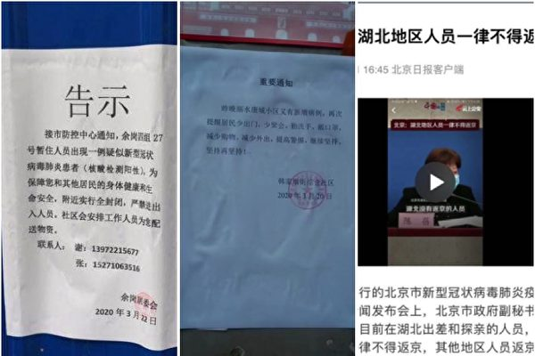
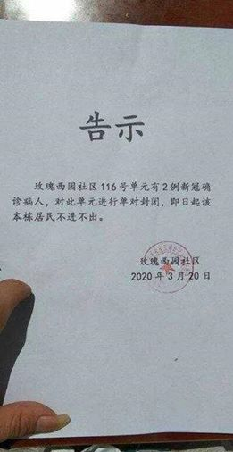
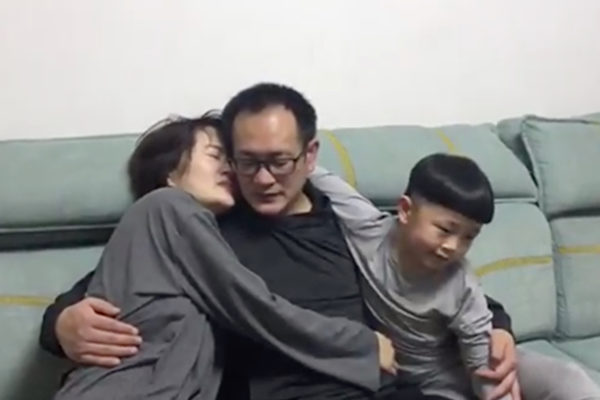
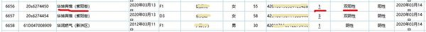
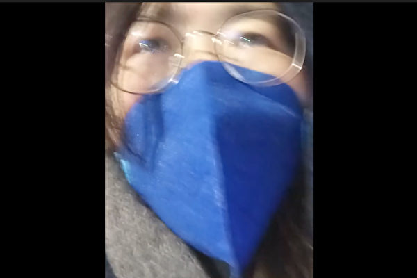

<table>
 <tr>
  <td align="center" width="450"></td>
   <td   width="450"><h3>【希望之声2020年2月18日】在武汉肺炎疫情严峻、中共加强大陆封网之际，希望之声推出专门为中国大陆民众开发的自带翻墙功能手机   APP。据开发人员介绍，此款手机APP适用于安卓操作系统，也就是所有的国产品牌手机、以及三星、LG等非iphone手机。
     

     
   安装后可收听收看希望之声的节目：包括《江峰时刻》、《天亮时分》、《老北京茶馆》及最新时事新闻等精彩内容。不需要使用任何翻墙软件，一步到位获得最新海外资讯，帮您免除翻墙上网的麻烦与风险。欢迎大家下载并传给中国大陆的亲朋好友。
   
   希望之声版权所有，未经希望之声书面允许，不得转载，违者必究。</h3>
     </td></tr></table>
     

     
<h1 align="center"><b>免翻看视频 (请收藏网址)，随时连即时最新IP https://git.io/swspip</b></h1>
<h1 align="center"><b>复制（网址或 IP 数字 ）到浏览器打开。若出现   “提示” ，請点击“继续”访问即可。</b></h1>

<h2 align=center><a href="https://github.com/gav01/Heart/blob/master/news1.md">● 大纪元时事 ●</a></h2>

<h2 align="center">直連不必翻牆開花必看精彩視頻http://61.228.181.67/310</b></h2>

<table>
<tr>
 <td>
 <a href="https://git.io/pamja"> <h3>如何 “ 三退保命 ”</a>，<b>连上面→免翻视频 IP http://61.228.181.67/310 </b> →点 【三退大潮】--为什么要退党？ 可留言三退或用翻墙软件自己办理三退</h3></td>
</tr> 

<tr>
 <td>
 <a href="https://git.io/pamja"> <h3>如何 “ 三退保命 ”</a>，请点击翻牆网站  https://git.io/opopop  下载 { 翻牆软件 }→找 { 大紀元網站 }  ( http://www.dajiyuan.com ) 三退</h3></td>
</tr>

  <td>
    <a href="https://www.ntdtv.com/gb/2020/03/26/a102808561.html"> <h3>>最新翻墙软件 突破封锁访问大纪元新唐人(点击右键,另存新档）</h3></td>
  
  </tr>
</table>

<a href=https://git.io/souye><h6 align="right">回首頁</h6></a>

<a name=top>

 

<a href =#225>225.死了多少人？汉口殡仪馆二天到货五千骨灰盒 
<a href =#224>224.中共确诊病例数据 川普：难以分辨真假 
<a href =#223>223.【有冇搞错】疫情大爆发 中共全球部署遭重创 
<a href =#222>222.温州商人：中共传播病毒“一路带一路” 
<a href =#221>221.【热点互动】红二代倒习第三波 中共内斗生变 
<a href =#220>220.华春莹找上美国务院发言人辩论 又遭漏底 
<a href =#219>219.中共大外宣甩锅宣传 专家：终以失败收场 
<a href =#218>218.沈阳粥店庆美日疫情 中共仇恨教育所致 
<a href =#217>217.美中关系紧张之际 川习参加G20视频峰会 
<a href =#216>216.谭德塞黑历史曝光 逾50万人连署促其下台 
<a href =#215>215.美司法部：故意传播中共病毒 等同恐怖犯罪 
<a href =#214>214.疫情下亚裔遭歧视 加国华人:中共是病毒祸根 
<a href =#213>213.【新闻看点】川习对话说啥 红二代倒戈习危急？ 
<a href =#212>212.中共宣传援鄂医护零感染 广西病危护士引关注 
<a href =#211>211.捂不住了 大陆金融系统至少千人染中共病毒 
<a href =#210>210.【拍案惊奇】大陆政医媒携手保零 台美军演防共 
<a href =#209>209.6万武汉人封城前外逃 路线与欧美疫情吻合？ 
<a href =#208>208.【一线采访】武汉解封?却笼罩在复发阴影下 
<a href =#207>207.中国疫情目前到底有多严重？ 
<a href =#206>206.【翻墙必看】疫情下大陆海量手机用户消失 
<a href =#205>205.意大利口罩被谁买空？意媒驳中共救援谎言 
<a href =#204>204.【最新疫情3.22】川普启动三州国民警卫队 
<a href =#203>203.武汉医生确诊中共肺炎 网友热议 
<a href =#202>202.高天韵：疫情当前 中国和世界应反思什么？ 
<a href =#201>201.【一线采访】隐匿疫情酿祸 武汉人要求国赔 
<a href =#200>200.【一线采访】重症监护室里的“谋杀” 
<a href =#199>199.“明天系”遭清算 牵动台企富邦金大陆版图 
<a href =#198>198.武汉病例清零内幕被曝光 北京通知露端倪 
<a href =#197>197.「二愁东西饿死人」：亿万结晶虫的到来 
<a href =#196>196.【一线采访】复工？你是湖北籍不能上车 
<a href =#195>195.美中关系飞出黑天鹅 中共病毒加剧双方矛盾 
<a href =#194>194.中共另类瘟疫：特务五毛发难 潜入各国祸乱 
<a href =#193>193.组图：疫情缓解？天安门军队大院防备森严 
<a href =#192>192.【拍案惊奇】川普指中共延误 武汉二次爆发预警 
<a href =#191>191.摆脱对中共依赖 日本欲接纳台湾加入CPTPP 
<a href =#190>190.李文亮一女同事病逝 其夫涉嫌活摘器官 
<a href =#189>189.内蒙古女医生被病人持刀捅伤 仍未脱险 
<a href =#188>188.【疫情最前线】意大利：中国没送任何东西！ 
<a href =#187>187.传习近平亲自下令严办任志强 红二代分裂 
<a href =#186>186.专家：国际应对中共瞒疫情、大甩锅追责 
<a href =#185>185.【珍言真语】王进洋声援法轮功 拆洗脑横幅 
<a href =#184>184.北京昆明湖罕见涨潮 传上次涨潮后毛泽东去世 
<a href =#183>183.回不了家还断补助 武汉火神山工人集体抗议 
<a href =#182>182.表彰神韵的贡献 宾州众议员褒奖并观看演出 
<a href =#181>181.【现场视频】为复工排队办证 人挤人藏隐忧 
<a href =#180>180.【新闻看点】“抗疫胜利”炒过头 中共出手抓人 
<a href =#179>179.大陆论文：23天逾2000儿童感染中共肺炎 
<a href =#178>178.袁斌：如果李文亮还活着 中共会调查其冤案吗 
<a href =#177>177.唐铭：中共病毒肆虐全球 为何而来将为何而去？ 
<a href =#176>176.王友群：“中共病毒”肆虐 全球反共大潮起 
<a href =#175>175.玉清心：器官移植专家林正斌死于中共病毒的背后 
<a href =#174>174.境外入粤者需隔离14天 费用自理挨轰 
<a href =#173>173.中共病毒蔓延 陆企大量外贸订单被取消 
<a href =#172>172.方方惹恼中南海？“中学生”来信引发轩然大波 
<a href =#171>171.伊朗：每小时50人染疫 每10分钟死1人 
<a href =#170>170.疫情下 中共模式加剧“国进民退”隐忧 
<a href =#169>169.政法委610直接操纵法院诬判法轮功学员 
<a href =#168>168.三年内 吉林德惠市政法委610犯罪事实综述 
<a href =#167>167.【疫情最前线】武汉中心医院领导被起底 
<a href =#166>166.原湖北党员毛善春于党支大会公开退出中共 
<a href =#165>165.大陆网络流传的一份死亡名单 引关注 
<a href =#164>164.【独家】武汉新增确诊是中共公布的22倍 
<a href =#163>163.夏小强：中共正为宣布疫情爆发做舆论铺垫 
<a href =#162>162.外媒：现在就是起来推翻中共的时候 
<a href =#161>161.中国式复工：一场中共忽悠老百姓的闹剧 
<a href =#160>160.【新闻看点】习谈“疫情反弹风险”川普再斥中共 
<a href =#159>159.【一线采访】中共借疫情割韭菜 企业百姓遭难 
<a href =#158>158.【一线采访】收入见底 武汉人生活陷绝境 
<a href =#157>157.美军散毒？中共网军“铁证视频”被揭造假 
<a href =#156>156.武汉现“危险信号”疫情将再次爆发？ 
<a href =#155>155.质疑中共疫情数据 日本副首相：最好别信 
<a href =#154>154.【疫情透视】为何华盛顿州疫情这么严重？ 
<a href =#153>153.武汉大学生再爆失踪 警方不作为家属陷绝望 
<a href =#152>152.奥克兰库姆秀 法轮功学员表演深受欢迎 
<a href =#151>151.【一線採訪】異議人士張展武漢50天見聞 
<a href =#150>150.杨宁：武汉合唱团两死多人感染 红歌是催命符 
<a href =#149>149.【现场视频】听信中共谎言 返京人挤爆机场 
<a href =#148>148.中南海密谋“丧事喜办” 传栗战书王沪宁操办 
<a href =#147>147.中南海气氛诡异 习近平被“抬起”又“摔下” 
<a href =#146>146.意大利疫情恶化 “台湾女婿”揭伊朗造假 
<a href =#145>145.首次公开直指中共抺黑 川普:美军被污名化 
<a href =#144>144.原中国建行支行工程监理赵锋慧遭迫害经历 
<a href =#143>143.【有冇搞错】药方开错！认清中共才能对症下药 
<a href =#42>142.分析：中共武汉肺炎海外宣传战 破绽百出 
<a href =#141>141.【最新疫情3.17】纽约市长:48小时内或封城 
<a href =#140>140.【新闻看点】官媒忙降温？赵立坚及五毛被打脸 
<a href =#139>139.华人纷纷回国？律师披露红二代不回国内幕 
<a href =#138>138.【思想领袖】史帕丁：中共寄生式经济 川普反制 
<a href =#137>137.【疫情透视】德国疫情 为何北威州最严重？ 
<a href =#136>136.疫情冲击 水果卖不出 批发市场用铲车倒掉 
<a href =#135>135.大陆原卫生高官：疫情恐再爆发 谎言将破灭 
<a href="https://github.com/gav01/Heart/blob/master/ls-20-3-1.md"><b>往1~ ~ 134 新闻</b></a> 

<a name=225>
<h1 align="center"><b>死了多少人？汉口殡仪馆二天到货五千骨灰盒</b></h1>

武汉各大殡仪馆排长龙。图为汉口殡仪馆。（网络图）

 
 【大纪元2020年03月26日讯】（大纪元记者凌云综合报导）自3月23日武汉开放各殡仪馆领取疫情期间去世人员骨灰以来，各大殡仪馆连日来都排起了长龙。财新网披露，仅汉口殡仪馆2天即到货了5,000个骨灰盒，几乎2倍于中共官方报导的武汉市死亡数字。

据财新网报导，3月26日早上8点，家住汉正街的刘萍（化名）在社区工作人员陪同下，来到武汉市汉口殡仪馆，加入了一条长长的队伍。前一天下午，她接到通知，可以来此领取她去世父亲的骨灰。一直到下午2点，刘萍的号才被叫到。

刘萍领取完骨灰盒出门时，一辆大货车停到静雅厅西侧门口，车上装载的是汉口殡仪馆订购的骨灰盒。司机表示，他这一车一共装了二千五百多个骨灰盒，昨天已经来卸过一车。

殡仪馆十几位男性工作人员来到大货车上，把骨灰盒搬到静雅厅的侧厅存放，每500个一垛，目前一共有7垛。

（财新网截图）

这意味着汉口殡仪馆两天内即运送了5,000个骨灰盒。而这仅仅只是武汉一个殡仪馆的数据。目前不清楚5,000个骨灰盒是汉口殡仪馆几天的消耗量。

据悉，武汉目前共有汉口殡仪馆、武昌殡仪馆、青山殡仪馆、蔡甸殡仪馆、黄陂殡仪馆、新洲殡仪馆、江夏殡仪馆、回民殡仪馆等八家殡仪馆，其中前三个在中心城区。

在市区另一家殡仪馆——武昌殡仪馆，据今日头条上的消息，武昌殡仪馆3月23日开始发放骨灰盒，馆方称每天500个，争取清明节（4月4日）前发放完毕。

（今日头条截图）

这意味着，如果发放从3月23日持续到4月3日，每天500个共12天，武昌殡仪馆将大约发放6,000个。

而截止3月26日，武汉市官方公布的中共病毒（武汉肺炎）死亡人数只有2,531人。

管理殡葬事务的武汉民政局副局长孙家同曾说，武汉封城至3月10日的47天里武汉市内共火化21,703具尸体，意味着每天平均火化462人。这个数字是官方数据的8倍，但仍可能是低估了真实数字。

外界通过早前各大殡仪馆24小时连轴转，殡葬员工劳累崩溃、运尸袋告急、防护物资告急等一系列现象认为，武汉市的真实死亡数字被严重低估。

大纪元曾经通过暗访得知，仅2月3日一天，湖北两家殡仪馆火化的中共病毒死者遗体数量，就高达341人，是平时火化量的4～5倍。

据《南方周末》报导，约从1月20日开始，仅有汉口殡仪馆定点接收新冠病毒感染患者遗体。但后来随着死亡人数大增，当局2月1日发布《指引》，要求新冠肺炎患者遗体应当就近全部火化，不得采用埋葬或其它保存遗体方式，不得移运。

<b>没有单位或社区陪同 不允许去领骨灰</b>

死者家属3月23日在微信发帖指，现在死者家属被要求，必须有单位陪同或者社区陪同，要由负责单位分批报备预约安葬时间，不能全部一起。

这名家属愤怒地质问当局：“你们怕什么？你们心虚什么？分批一个个对付，上各种手段，公安也打电话，怕广大的受害者家属在一起了，找你们追凶？人为造成这次灾难的就是凶手，杀人的凶手。”

（截图）

也有家属讲述了自己在汉口殡仪馆的亲身经历，到处都是便衣，一抬手机就有人过来制止，没有哭声，也没有哀乐。

也有知情网友透露，自己整天接触的都是因为中共病毒去世的家属，他接待过一个老婆婆，来办女儿、女婿、儿子、儿媳，还有孙子的后事。

他还透露，很多人都不是直系亲属来办的，都是旁系亲属办一家子的后事。好多人都是拿着两三人的单子办手续。也有一个七八岁的小孩子来办父母的后事…..

（网络截图）

<b>公墓人满为患 再敲诈一笔</b>

在殡仪馆领骨灰盒要排长龙，到了公墓办理安葬同样也是人满为患。

《荷戟周刊》发表了一个死者家属3月24日的采访口述。这个家属说，现在扁担山公墓都需要排号，但前一天只放了70个，当天放了80个，结果早上七点半的时候就放完了。有的家属连续来了三天，才办成了手续。有的不是走一个，而是走几个，比如那个导演一家。

尽管针对中共病毒死者在殡仪馆领取骨灰盒免费，但墓地则早已经传出涨价的消息。

上述这名家属透露，现在选的墓地的价格是七万八千八百元，疫情期间去世的人可以打七折，算下来是五万四千五百元。

早在一周前，《南方周末》一篇已经被删除的文章中，记者采访到一位自称在武汉市殡葬行业做了两年的人士，“房子估计会降价，但墓地反而会涨。比如说九峰山48,800（元）的墓地，已经涨成58,800（元）了。”

<a target="_blank" href=#top><h6 align="right">回上方</h6></a>

<a name=224>
<h1 align="center"><b>中共确诊病例数据 川普：难以分辨真假</b></h1>

周四（3月26日），川普（特朗普）总统在白宫简报会（如图）上表示，很难分辨北京公布的中共病毒（武汉肺炎）确诊病例数据的真假。(IM WATSON/AFP)

 
 【大纪元2020年03月27日讯】周四（3月26日），川普（特朗普）总统表示，很难分辨北京公布的中共病毒（武汉肺炎）确诊病例数据的真假。

川普总统周四在白宫例行抗疫工作小组简报会上，在回答记者提及确诊病例数的问题时说：“你不知道中国境内实际的病例数是多少，中国（中共）公布的数字，⋯⋯你不知道（是真是假），你知道，数字到底是多少？”

川普还说，他会在美东时间3月26日晚上9点（北京时间3月27日上午9点）与中国国家主席习近平通话。

周四，美国确诊中共病毒病例总数逾8.5万例，超过意大利以及中国（各界怀疑中共官方数据）。

“这是因为我们成功加快检测速度”，川普解释美国病例数增加的原因，“我们正在对数量庞大的人群进行检测。”

“我确定你们无法分辨中国（中共）现在是否还在检测，或者根本没有检测了”，川普对记者说，“我认为（要确认数据）这个有点难。”

中共近期公布的确诊病例数据下降，而且声称多数是境外移入，然而它的数据引起香港和其它国家的怀疑。中共官员曾在2月份改变统计方法，检测结果呈阳性但未表现出任何症状的人，不会被归类为确诊病例。

周四，川普总统再次说明，他此前之所以称“中国病毒”（中共病毒）是因为中共外交部的一位官员提出个阴谋论，称美国士兵将病毒带到了中国。

“不是，它来自中国”，川普补充说，“如果它们对此有如此强烈的想法，我不必这么说，我们等着瞧。”

川普暗示与习近平的通话可能会讨论到第二阶段贸易谈判，并推测习近平可能“想要等到”11月美国总统大选之后再谈，以“看看川普是否败选”。

川普总统表示，中共会喜欢和他可能的民主党对手乔・拜登（Joe Biden）或其他人谈判吗？答案是肯定的，而且拜登将是北京“在全球中最佳梦想对手”。

川普总统上周六（3月21日）指出，中共“非常诡秘”，并对其掩盖中共病毒（武汉肺炎）的严重性以及推迟向世界通报“表示失望”。

<a target="_blank" href=#top><h6 align="right">回上方</h6></a>

<a name=223>
<h1 align="center"><b>【有冇搞错】疫情大爆发 中共全球部署遭重创</b></h1>
 <h4 align="center"><b>石山</b></h4>

捷克派军机从中国运回订购的15万套新冠肺炎病毒快速检测试剂盒，使用时发现超过八成是废品……我好像突然听到武汉市民的叫喊声：全是假的！（大纪元《有冇搞错》制作组）

【大纪元2020年03月27日讯】《有冇搞错》。3月26日。

中国官媒新华社报导，3月18日，捷克军队专门派一架军机，从中国运回了他们专门订购的15万套新冠肺炎病毒快速检测试剂盒。捷克卫生部长当时还说，这些试剂盒将被送到疫情严重的地区，供医院、警察和士兵等人员使用。据说这些试剂盒，可以最快20分钟测出结果；欧洲的那些试剂盒，要6小时才出结果。

不过，最近的消息说，这批来自中国的试剂盒，出错率竟然达到了80%之高。捷克的区域卫生学家Pavla Svrčinová在接受媒体采访的时候表示，这些试剂盒在一间大学医院进行了测试，结果发现出错率太高，有80%，他们现正等待一个全国范围内检测结果。

捷克的医疗机构已经决定，继续依靠传统的测试方式来测试中共病毒（武汉冠状病毒），但这样每天只能测试900次。

快速检测试剂盒，目的是速度快。八成的错误率，根本就比不测试还糟糕，因为不检测，大家会保持警惕，自我隔绝，检测之后得到错误结果，没染病的人和病人一起隔离，结果得病了。最糟糕的是，染病带病毒的人，以为自己没问题，结果到处走动，传染给别的人。

有人对这个出错率高度怀疑。捷克副总理、内政部长哈马切克（Jan Hamáček）就认为，这些试剂盒的错误，有可能是被刻意选择植入的。因为一般来说，如果出错率在两三成，已经是一个严重问题了，如果出错是五成，意思是一半的机会，这个检测结果就完全不可信了。八成有错误，那根本就是个垃圾。没有人能理解，为什么垃圾产品能投入使用，还出口到外国，去进行中国所谓的大国担当。

我宁愿相信这是科研和生产质量问题。大家还记得中国的问题疫苗吗？

最早，2007年，山西首先发生了多宗儿童注射疫苗后死亡事件。地方政府长期隐瞒，直到2010年，中国经济时报刊登了一篇长篇报导，揭露了出来。民情汹涌之下，官方表态调查，但最后不了了之，什么都没发生。

反而是，报导此事件的《中国经济时报》社长兼总编被撤换，该报的“调查部”被解散了，调查部的主任王克勤被解聘，就是开除了。王克勤这个人，应该被记在中国新闻记者的历史中。他原在《中国青年报》，做了很多优秀报导，后来去过《财经》，都是做调查报导。被《中国经济时报》开除后，他又去了《经济观察报》，不过很快，《经济观察报》的“调查新闻部”也遭到解散。

根据我的经验，这是中宣部下了格杀令，不许王克勤这个记者在任何官媒存在。后来他去哪里了，我不知道，只知道此后基本上看不到他的声音了，起码在正式的官媒上，再也看不到他的声音了。

但是，有问题的疫苗，却不会从此消失。

2013年11月至12月，中国大陆南方地区出现多宗婴儿注射乙型肝炎疫苗后，引起致伤致死的事件。主要涉及厂商为深圳康泰生物，这家公司生产的疫苗制品，以前就已经屡次出现严重不良反应。

再一次，大家没有看到什么官方处理。

2016年，山东疫苗案发生，涉及十八个省市上百万儿童。

公安部成立专案督办案件。一年多之后，山东、河南、河北等地逮捕355人，起诉291人，立案查处失职渎职等职务犯罪174人。也就是说，疫苗案要想查下去，不是生产企业这么简单，而是涉及背后一系列政府权力部门，174人被控职务犯罪。

2018年，中国疫苗再出现问题了。中国上市企业长春长生生物的旗下企业，其生产的疫苗出现严重问题。

2018年7月21日，出现一篇《疫苗之王》文章，原刊于微信公众平台，转载的标题为《疫苗之王们的造假之路 穷病真的没法治？》，这篇文章直指长生生物背后持有人的发家史，以及涉及的相关部门的腐败。

文章披露，这些疫苗企业，原来都是所谓国企，通过个人收购变成私人企业，背后都有中国国有的生物制剂研究所。

他们熟悉中国药品制造的测试审批，以及销售管理程序，采取大幅度给回扣的方式，给官员、医院、医生送钱。当然，这完全是因为疫苗的销售毛利，普遍在80%以上。因为有垄断，才有高额利润。

我觉得比较有意思的是，有关问题疫苗的报导很多，也引出很多对报导的批评报导。

媒体普遍报导之后，中共专家出来说，媒体的报导不准确，因为疫苗有一类和二类之分，问题疫苗，有真的和假的之分。一类疫苗是政府强迫大家必须要打的，是免费的，二类是可以自行选择注射，但要给钱。问题疫苗，大部分是二类疫苗。所谓真假之分，因为真疫苗也可能过期，质量不好，所以出了问题。假疫苗根本就是假货，没经过科研，没生产执照，还可能有毒。

所以专家要求大家，要解决疫苗问题，必须分清楚这些区别。

专家啰嗦一大堆，但老百姓眼睛雪亮。所以香港突然出现了大量来自中国大陆的游客，只为带孩子打疫苗。不只是香港，台湾、日本、韩国等地，甚至泰国、马来西亚，都有这种专门的生意。

官方专家说得天花乱坠，但假的还是假的。

这让我想起来一段故事。好多年前，我动了个想法，想回大学去继续读书。大陆一个朋友听说后，跟我说，其实你不用那么麻烦，还要去读好多年，只要有钱，我可以帮你搞到大陆的博士毕业证书。好奇之下，我就问他要多少钱。他说，看你要什么类型的？

这个有点像了吧。

我问他都有什么类型。他说，有真的真证书，和真的假证书，也有假的真证书，和假的假证书。

我当然一头雾水了。他解释说，最便宜的是假的假证书，这个大家都容易理解，去做个假的证书，盖个假章，签上假名就行了。

假的真证书也不贵，就是直接到大学里面开出毕业证书，所有材料都是真的，图章、签字都是真的。

真的假证书，就是直接从大学开出的真证书，格式、签名和盖的章都是真的，甚至连各科成绩表，导师评语这些资料，都可以放进大学的数据库里面。和真的几乎完全一样，但它是个假证书。

真的真证书，就最贵了，所有证书当然是货真价实的，不但大学里面的资料库有资料，甚至还有人帮你写毕业论文，还可以有假的博士论文答辩签字，还可以进入国家教育部高级人才库里面。

当然，这是个真的真证书，但你确实没有读过博士，其实还是个假的。

我好像突然听到武汉市民的叫喊声了：全是假的。

这个叫喊声，现在正在全球响起来了。

前两天，美国推特第一热门话题是CCP Virus，就是中共病毒，今天，是Make China pay，就是要让中国为这个病毒的全球大流行，造成这么大损失付出代价。

《纽约时报》、《华盛顿邮报》和《华尔街日报》，三份报纸的发行人联署了一封公开信，批评中共把他们记者赶出中国的决定。他们说，现在这个时刻，是世界最需要真实信息的时刻，中国的做法，只会令全世界人极度反感。

他们没说出来的逻辑是：中共公布的所有信息，没有人相信。

一个人第一次上当，是骗子不对，第二次上同样的当，是你自己不对了。

全世界都有类似的说法。中国人，因为上当次数多了，所以喊了很长时间。喊的次数再多，其实也比不过有亲身感受。

美国用推特的小朋友们，其实不关心外国产品和外国政治，但因为爷爷奶奶去世，因为朋友被染病了，因为不能出去游玩，所以突然对中共这个名词有了全新的了解。

我想说的是，不管中共如何用尽吃奶的大外宣的力气，这次中共病毒全球大扩散，必然是一次大的转折，中共的硬实力也好，软实力也好，都会受到巨大损害。

《1984》这本书里面，温斯顿最后被老大哥的当局捉进监狱，全部招供之后，还加了一条问题，2加2等于几？只要他说等于4，就会被继续折磨，直到他得出“正确答案”，他问刑讯的秘密警察“你想得多少”。温斯顿后来终于改造完毕，回到“真理部”继续工作。

类似这样的，把假的说成是真的，必须有一个条件，那就是监狱。中国大陆如同一个大监狱，信息完全彻底封闭，而且你也逃不掉，反复多次。如果是一个开放体系，因为可以得到各种信息，完成那种工作几乎是不可能的。

这也是为什么，所有共产制度首先必须封锁信息的原因。不管房子的门窗锁得再紧，不管房子再牢固，只要有一个洞，大家就能看清楚。

在香港，未来这一点恐怕尤其重要。

<a target="_blank" href=#top><h6 align="right">回上方</h6></a>

<a name=222>
<h1 align="center"><b>温州商人：中共传播病毒“一路带一路”</b></h1>

1月23日，中共政府宣布武汉封城管制，不久后温州也出现大量感染中共肺炎的病患，2月6日温州也进入封城状态。图为北京机场，一些旅客戴口罩以防护武汉肺炎病毒。（NOEL CELIS/AFP via Getty Images）

【大纪元2020年03月27日讯】（大纪元记者徐绣惠洛杉矶报导）近年来中国经济成长趋缓，加上中共病毒疫情影响，有“东方犹太人”之称的温州商人获利大不如前。曾是温州建筑十强企业、浙江乐清市最大建筑公司的负责人周建华说：“什么是‘成功’商人？在中国要‘成功’就得官商勾结，就得当红顶商人，就得学厚黑学。要不然就会像我一样被迫害。”

2013年11月，周建华的企业因信仰基督教而遭中共政府查封、强占，他为了人身安全与信仰自由移居美国。周建华目前在超市的寿司吧里经营小生意，因中共病毒传播至美国，尽管目前生意惨淡，但周建华仍保持乐观。他说：“以前一个人赚一百元，现在是两个人赚一百元。但总比没有工作好。”
温州人仍警觉疫情

1月23日，中共政府宣布武汉封城管制，不久后温州也出现大量感染中共肺炎的病患，2月6日温州也进入封城状态。周建华说：“解封了人们也都尽量不出门。”据周建华了解温州的情况，大多数民众都很警觉，尽管政府、医院数字都说没有感染病例上升，但人们仍不愿冒险。

周建华认为，温州商人在全世界做生意是有三个主要原因：第一点是温州地形“七山二水一分地”，人口稠密、可耕土地少，大家吃饭都有问题，所以温州人为了吃饱、穿暖，发展出许多轻工业，如修皮鞋、弹棉花，这些都为后来的皮革、纺织等行业打下基础。

而为了求“温饱”，温州人得勤劳工作，上个世纪八零年代，温州许多个体户都往外出走，占得先机；最后一个原因是温州人有很传统的“家族”观念，周建华说：“一个人带一家人出来做生意，前往世界各地去赚钱。”

据周建华了解，在意大利的普拉托市（Prato）有许多温州人在经商。因为普拉托市是米兰时尚产业的生产重镇，当地大部分的纺织、成衣厂都是由温州人经营。

<b>意大利疫情爆发有原因</b>

中国疫情爆发后，由于中共没有在第一时间通报武汉肺炎确诊病例，导致病毒迅速扩散至全世界，目前意大利成为欧洲的疫情重灾区。

对于意大利受灾原因，外界认为，近年来中意两国间贸易频繁。意大利在经济上过度依赖中共，希望中共的“一带一路”会对其经济带来好处，但没想到，反而加剧了疫情的爆发。

意大利籍台湾男星吴子龙在三立电视节目《郑知道了》中说，疫情在意大利尚未全面爆发时，该国送了2吨口罩给中国，致使疫情爆发后原本不习惯戴口罩的意大利民众也疯狂抢购口罩，现在口罩都缺货。

而意大利媒体也在2月13日报导说，意大利的罗马一家口罩工厂“Dpi di Roma”10年的库存在10天内被中国扫光，导致该国陷入口罩荒，甚至还出现哄抬口罩价格的情形。而该公司高层当时却表示，意大利没有疫情，民众不必恐慌。未料不到一周，意大利的中共肺炎疫情大爆发。

周建华认为：“疫情是上天给人们的警示，真正的病毒是中共政府，而不是无辜的中国人。”中共传播病毒的路线，正是这“一路带一路”的轨迹。◇

<a target="_blank" href=#top><h6 align="right">回上方</h6></a>

<a name=221>
<h1 align="center"><b>【热点互动】红二代倒习第三波 中共内斗生变</b></h1>

红二代倒习建议书已是第三波；中共党内斗争随时生变？（新唐人合成）

【大纪元2020年03月27日讯】一篇直指习近平的匿名建议书经由红二代媒体人陈平转发后，备受关注。之前，另一个红二代、地产大亨任志强在发布一封强烈批评中共与现领导人的文章后消失。据传已遭到抓捕。

另一方面，美国会周二（3月24日）引入两份议案，要求对中共处理疫情进行调查并索赔。另有3名美参议员已经致函川普总统，要求在国家安全委员会（NSC）下成立专门部门对抗中共在疫情上的大外宣。本期节目聚焦疫情下中共政界及美中关系。

嘉宾：陈破空，唐靖远
主持：方菲

<b>【热点互动】红二代倒习建议书已是第三波；中共党内斗争随时生变？台海异动频繁，要出事了？美国会要向中共索赔：有一个现成的办法！</b> 

主持人：观众朋友好，欢迎收看这一期的热点互动，今天是3月25号星期三。近日，一封要求中共召开政治局扩大会议讨论习近平问题的匿名建议书，在网络热传，引发外界高度关注。而此前中国房地产大亨任志强因为发表一篇批评中共高层的文章而被消失，据传已经遭到抓捕。另一方面，美国国会周二（3/24），就是在昨天，引入两份议案，要求对中共处理中共病毒疫情的手法进行调查和索赔。

而三位美国参议员也已经致函川普总统，要求在国家安全委员会下，建构一个特殊部门，专门反击中共在疫情上的大外宣。那么今晚我们请来两位嘉宾一起来讨论一下，在中共病毒疫情期间的中共政局和中美关系。一位是在现场的时事评论员唐靖远先生，唐靖远先生您好。

唐靖远：主持人好，观众朋友大家好。

主持人：好的，谢谢。另外一位是通过Skype和我们连线的政论家陈破空先生，陈破空先生您好。

陈破空：主持人好，各位观众好。

主持人：好，谢谢。好的那么在节目开始，我们还是先来看一个新闻短片。

阳光卫视董事长陈平，上周末在微信群转发一篇没有署名的公开信，信中表示鉴于当前中共肺炎疫情，国内经济与国际关系的严峻局面，强烈建议立即召开紧急政治局扩大会议。这封公开信对当局的执政提出了一系列质疑，首先针对外交方面，质疑当局在国际关系上四面树敌，恶化与美国的关系，对非洲等落后国家大撒币等政策，对中国是否有利。在经济方面，公开信则认为应该讨论国进民退，国家介入经济的程度，以及金融监管透明等问题。

而在政治方面，公开信提出，应该明确党大还是法大？宪法规定的各种权利是不是应该落实执行。为了短期的稳定，是否可以牺牲公民的基本权利？是否实现新闻自由与言论自由？司法是否应该独立等等。此外，公开信还提及了对台湾的关系，到底是统一重要还是和平重要？以及在香港问题上，是香港的繁荣重要？还是中央的权威重要？是否应该允许香港实行完全的地方选举等等。目前疫情当前，当局加紧了对网络言论的封锁，这样的文章能在审查极严的微信平台上流传，令人惊讶。

转发者陈平本身也属于红二代，目前旅居香港。“美国之音”23号的报导引述陈平的话说，他只是昨天在微信群中收到了这篇公开信，顺手转发，不知道作者是谁。但是陈平也表示，这份建议反映了当前很多人，尤其是体制内人士的想法。

<b>倒习建议书出现时机拿捏很准 党内第三波反习声浪</b>

主持人：好，观众朋友欢迎您在节目中间跟我们互动，谈谈您的看法。好，唐靖远先生先请您来谈一谈，就是陈平转发的这封匿名的建议书，刚才新闻中也谈到了主要的内容，您怎么看这封建议书提到的一些内容以及它出现的时机？

唐靖远：首先，对这封信它其实出现的这个时机，我觉得他是经过一个精心挑选的。他拿捏得非常好，什么意思呢？我觉得至少他是看准了三个方面的时机。首先第一个就是这封信出现在中国大陆疫情整体上的确是出现了一个缓和，这么一个时候。

因为我们都知道在疫情在迅速爆发的上升，那个高峰期的时候，那个时候举国上下，他都需要有一个核心领导，渡过难关，共渡难关。所以在这个时候你要是提出来，我们要换人，或者是我们要怎么样，其实是不太合适的。

主持人：人们的心思也不在那儿。

唐靖远：对，心思不在那儿。现在整体上趋于缓和以后，其实整个整体的中共高层，他们现在至少他们是觉得初步渡过了一个难关，那么高层整体上他们已经腾出了一定的时间和空间，可以回过头来处理一些问题，这个是第一个时机。

那么第二个时机，就是我们看见国际社会上，现在由于中国大外宣，频繁这种甩锅啊、嫁祸啊等等这些行为，其实引发了一个后果，尤其是以美国为首的国际社会，在开始强烈地在反击中共。那么这个反击情况其实可能让党内的很多的反对派，他们觉得这是一个机会，可以借此施加对习近平一个很大的压力。如果说他们做得好的话，真的可能就像这封信提到一样，那么甚至可以达成他们换人的目的，这个是第二个时机。

那么还有一个第三个时机，我觉得比较关键的，就是中共因为这次疫情的原因，导致中共和整个国际社会的外交关系，这个国际环境其实是空前的恶化了，我们是看到了已经成为了一个事实。而本身就已经处在非常恶化、非常孤立的这样一个前提之下，我们看到北京当局还在尝试采取一个动作，就是不断地通过转嫁危机，通过甩锅、通过嫁祸，通过这种很好战的——包括什么派军机去绕台等等，在南海去挑衅啊等等，就是很多这样的动作，它带来一个巨大的威胁，就是很有可能会让整个局面失控。也许北京当局本意是想要通过这种方式转嫁国内的一个矛盾，但是如果说它一旦失控的话，会让整个中共高层跟随了它一块去陪葬。

那么这个动作它其实引发了党内的一个高度的警惕，所以我觉得它其实是在这样的一个背景之下，出台的一个东西。

主持人：好的。那也请破空先生谈一谈，这封信自从被转发以来，一直没有人去认领，无人认领。那么很多人在想，这封信到底是谁写的，您怎么看这个问题？另外，您觉得这封信它释放出什么样的讯息？

陈破空：关于这封信的来源为何，现在有各种说法。那么直观地说，可能就是作为红二代的陈平本人所写，然后转发出去。那么另外一个广为流传的说法，是副主席王岐山提议，说是王岐山的意思，提召开政治局扩大会议，解决习近平的去留问题。那么跟最近国家副主席跟主席之间的摊牌，这个大背景是吻合的。那么另一种，就是说既不是王岐山，或者也不是陈平，那么有人传给了陈平，陈平再转发出去，那就是体制内的其他人。

不管是反习阵营的其它派别的其他人，或者是政治老人中的一些人，都有可能。但是这封信的出处并不重要，但这封信的内容很重要，因为这实际上是第三波。实际上要回顾一下在2018年习近平操纵修宪、取消国家主席任期制之后，他的威信权威从顶点跌落到低谷，可以说是名声一败涂地。表面上看到权势达到顶峰，但是由于倒行逆施，在党内被确定为是否定了改革开放的唯一政治成果——就是废除干部领导终身制，是恢复了领导干部终身制，或者是有这个迹象。

所以实际上他引起的不满不仅是民间，不仅是国际上的批评，更重要的是党内的不满。所以这封信实际上是第三波，因为最早在新疆的一个，大概叫界面新闻上，就要求召开会议，讨论习近平的问题，要求习近平辞职。那么在后来跟中美贸易战、中美谈判，习近平反复无常的时候，又出现了类似的信。那么这回是第三波，是在习近平一再失守，在新疆问题上失守，香港大抗争，经济大滑坡，美中贸易战，最后以致于中国大瘟疫。

这样的情况下，这个信就显的更有力度，而且代表了体制内的声音。表面上看说是换人，实际上这封信触及的面很广，触及到就是包括了党大还是法大，要不要言论自由这些问题。也就是不仅是换人的问题，还提到中共的方向性的问题，是不是要政治改革，顺应民心，走上一个宪政民主之路。所以操之过急的人就说仅仅是换人，实际上这封信大有深意，代表了中共不仅是权力斗争，还代表了路线斗争。

也就是说，中共到了这么一个历史关头，经过极左集团7年的执政之后，现在中共究竟是往回走还是往前走？往回走是文革老路，倒行逆施，往前走是顺应潮流，走向民主宪政之路。但这不只是中共的一个出路或者是一个道路，而且是间接地影响着整个国家的出路或者方向。

<b>党内倒习势力对习近平有没有构成实质性威胁？</b>

主持人：好的，谢谢。那唐靖远先生您怎么看，就这封信如果说它是倒习势力，不管是哪方面，它是这样一个最新的一次尝试的话，您觉得目前为止，党内的倒习势力对习近平有没有形成实质性的威胁？另外，破空先生提到说这封信的内容，如果这封信的矛头是指向更换习的话，那么更换的这样一个方式，它是否能够解决中共面临的危机？

唐靖远：首先第一个问题，我觉得这封信其实它带来的，它至少说明党内很多人对习近平还是已经造成一定的威胁，这个是肯定的，但是这种威胁是有限的。我个人是这么来看，习近平现在他的处境其实某种程度上，他很类似于当年毛泽东在七千人大会的那个时候的处境。我们都知道当初举行七千人大会的时候，毛泽东也是因为搞大跃进，搞三面红旗，搞刮共产主义风啦等等，造成大批人的死亡，就是大饥荒。

所以其实那个七千人大会，说白了就是说针对着毛泽东出现了重大的执政的失误，在这样一个背景下，所以举行这个七千人大会，其实说白了是要追究毛泽东政治的责任。

那么现在习近平其实是很相似的一种状态，他在这个就是从贸易战到香港问题，再到这次对疫情错误的这种处置，那么导致疫情出现很严重的后果。而且，我们知道七千人大会的时候，其实刘少奇有公开说了一句话，第一个说这个饿死人、人相食要上史书的，要记入史书的。其实他的意思就是说你这个错误要被记录下来的。那么第二句话就是说，在过去要下罪己诏的。

其实我们看习近平现在的处境环境是非常相似，不是也有人在呼吁吗？说习近平你要下罪己诏，你要去做出一个检讨。所以从这个角度上讲，对习近平是有压力。但是反过来说，当初的七千人大会和现在也有一个很大的不同，就是当初那个七千人大会的时候，其实毛泽东他是有可以说是有一个差不多，和他分庭抗礼的对手就是刘少奇，因为刘少奇那个时候是国家主席嘛，毛泽东是党主席。

但是现在的习近平其实我们看到，党内至少还没有一个说是能够强而有力的人出来，可以跟他达到分庭抗礼的，挑战他的这样一个程度，为什么呢？因为我们看这封信里面，它有一个重要的信息就直接提出来，就是要由李克强、汪洋和王岐山三个人共同来主持政治局扩大会议，那么它为什么提出三个人而提不出一个人？我觉得它至少可能说明，首先这个倒习势力，反对派他们可能自己也没有能够达成一致。

第二个就是他们也没法推出一个就是能够有一定威望的，统一的一个强有力的人来代替习近平，所以暂时只能是一下子推出三个人来。所以从这个角度上讲，其实习近平就是对他的这种威胁的，我觉得是有限的。再加上就是军权，我们都知道中共其实就是靠着军权在生存的，谁掌握了军权，谁的位子基本就可以说是稳定的。所以对习近平我觉得他的军权还是比较牢固地掌握在手里的。只不过是党内这种威胁对他，我觉得可以说是，双方已经是非常深刻的，就是内斗加剧。它有两个最主要的原因，第一个习近这一系列的失误操作失误，其实已经严重影响到党内权贵阶层他们的利益，尤其是这次瘟疫大爆发以后，不光是瘟疫本身对中国经济造成打击，现在瘟疫发展到了海外，国际社会受到打击之后，很多大量的订单取消，其实回过头来又对中国的经济造成二次打击，这已经严重影响到很多权贵阶层的利益，这是一个原因。另外一个原因就是很多人他们都是从文革走过来的，所以习近平现在他这种就是不断地在个人崇拜在膨胀，很多人都担忧这个文革重来，所以这个是他们觉得需要联起手来对习近平，至少形成一种牵制最主要的原因。

<b>习王已走向对立？中共党内斗争随时会出现变数</b>

主持人：是，破空先生一个也请您谈一谈，您觉得现在的这个党内的斗争，对习近平有没有造成实质性的威胁。另外一个就是你刚刚有提到这个王岐山和习近平是不是翻脸的问题，我们看到之前任志强的一封信之后，他人就消失了，是不是在这个问题上，习王的关系已经不再了呢？

陈破空：对，先谈这个习王关系，我以前就说过习近平第一个五年是习王体制，是习近平王岐山体制，那个时候他们是合作关系，总书记跟中纪委联手反腐来巩固习近平的的权力。那么第二个五年是习王体制是另一个王，代替了王岐山，是习近平王沪宁体制，是急遽地走极左道路，急遽地后退，以这个修宪取消国家主席任期制为标志，那么还有国进民退等等。

那么王岐山、习近平本来给人的感觉是铁哥们，但是这次发生了深刻的变化，首先看一些表面上的迹象，不仅是习近平怂恿海南政府在2月底以政府的名义收购了海航公司，之前是拯救的名义，而海航公司是王岐山的经济权力基础，这是经济上对王岐山的打击。

那么在政治上，在2月23号召开一个17万人的官员大会，居然中共高层都出席，全国各地17万官员，但就唯独没有出现国家副主席王岐山，也就是王岐山被排除在外。后来知道消息（王岐山）被排除是因为在疫情爆发之后，党内都觉得习近平失职，要成立中央疫情小组组长的时候，都觉得当年的抗SARS工程，救火队王岐山最胜任，因此各派都推王岐山出来主政，但是习近平却犯了皇帝心里面那个小九九，就是功高盖主、功高震主，卧塌之侧岂容他人酣睡？对于王岐山产生了戒心，那么坚决不同意王岐山出任这个职务，那么这是体制内的说法，最后的折衷方案是总理李克强出任了疫情领导小组组长，王岐山被靠了边站，等于王岐山的经验就派不上用场，加上国家副主席没有实权。

再一个对王岐山打击最明显的是，对王岐山人马的直接打击，首先在湖北撤换湖北省委书记蒋超良，而蒋超良是王岐山的子弟兵的子弟兵，心腹的心腹，从金融系统在北京当各种银行行长就跟随王岐山，王岐山在1997年在广东处理金融危机的时候，王岐山是组长，蒋超良是副组长是他直接下手，王岐山的人马被习近平拿掉，而习近平是用习家军上海市长应勇去取而代之，这就把这个习近平对王岐山政治上的排斥可以说是昭然若揭。

再加上任志强红二代太子党人物，原先这个地产大亨任志强再次出来发炮，重轰习近平，说“即便是剥光了衣服，要坚持当皇帝的小丑”，痛批习近平。那么他在以前多次炮轰，但是因为王歧山的关系而被保了下来，但这次任志强却被秘密抓捕关在北京郊区蟒山的一个所谓北京市纪委的拘留所。这显示习近平跟王岐山是正式摊牌了，而且散发出谁也“不要打听、不要插手、不要干涉办案”，实际上就是指向了王岐山。所有迹象都显示王岐山跟习近平走到了对立面，也就是说反习阵营的主力除了团派之外、太子党红二代之外，还加入了国家副主席；政治老人的开明派也是反习势力，就包括了胡锦涛、温家宝、朱镕基、李瑞环，开明派；而江派因为江老迈已经不起作用，江派残余恐怕分裂了，一部分支持习近平，一部分反习近平，这个江派也是边缘化的一个势力，真正的力量所以在这边。

再回头来说，究竟有没有力量扳倒习近平，既不能低估也不能高估。我在多个场合说过不能低估习近平，是因为他上台主要是抓军权抓武警的权力，抓了一些笔杆子，王沪宁成为他的铁搭档，把笔杆子控在手上。但是也不要高估习近平，他绝对比不上毛泽东的权威，也比不上邓小平的权威，毛泽东虽然在七千人大会上受到了挫折，但是毛泽东毕竟是开国之君打下一个政权建立一个政权，他有在党内压倒一切的威望，再有他在七千人大会上有公开认错，说自己犯了错自己要担首要的责任，作为党主席是首要负责，而且说自己犯了很多蠢事、不懂客观规律，公开认错而且最后他说了一句话，听不同、批评的意见天不会掉下来，如果不听不认错有可能就自己下台。

但习近平跟毛泽东态度相反，第一个没有毛泽东的威望又坚持不认错，不改进，还为自己反复地辩护，还说亲自指挥、亲自部署，似乎另一句台词是伟大光荣正确。再一个他的权威也比不上邓小平，邓小平可以在全会中就可以换常委甚至换总书记，垂帘听政都不用等到党代会，但是习近平根本拿不下任何的人，所以简单说在中共高层虽然习近平掌握军权、武警权力，但是军权派不上用途，因为那是做国防用，在党内高层斗争中，除非政变几乎派不上用场，而武警和特务体系可以派上用场，就国内维稳还有对高层的监控。

但是真正的斗争在书记处、国务院之间，因为军委平时不开会，人大政协也不开会，那就是书记处由王沪宁掌控，书记处常务处是导向习近平，那国务院由李克强掌控，这两大行政机构日常的碰撞，这个就不举例了，无数的双方的发言都是格格不入的。再一个就是另外几大班子，除了书记处在习近平掌控之下，中办在他掌控之下以外，人大在习近平的掌控之下——栗战书，但是中央政治局常委兼任的其它几个部门，国务院李克强，政协是汪洋还有团派。

另外中纪委，中纪委是个刀靶子是非常有利的强力部门，是掌握在赵乐际头上，赵乐际手上，是各派公认的一个平衡的人物，不属于任何各派，而习近平跟赵乐际处于尖锐的斗争状态，以致于在陕西把赵乐际的旧部拉下来，针对赵乐际。

也就是说中央部门至少有三个部门是处在习近平的对立面，如果通过中央内部的权力斗争，不动用军队和武警的话，也就是说不发生政变的情况下，习近平不见得有胜算，也就说，可以看到一个基本的总结，习近平、习家军和习阵营，他的声望和权势走下坡路，而反习阵营经过重组调配之后，整体的力量走上坡路。

<b>中共本身就是危机根源 换人就是换汤不换药</b>

主持人：好的。其实中共内斗的迹象时不时地浮出表面，也可能这个势力的均衡随时会出现变数。我想请唐靖远先生补充一下，有关习王翻脸这个事情，您有什么样补充？另外，我有一个问题，到底是什么原因导致他们二人到此时分歧如此之大？还有刚才提到的有关公开信的提议，讨论习近平问题这样的，如果真的讨论之后，就算照建议书所说的换了人，能够在做法上做一些调整，能不能够真正帮助中共缓和危机呢？

唐靖远：首先第一个，我比较赞同刚才陈先生所提到的，王岐山和习近平他们之间这个状态问题，因为他们两个人的分歧，现在应该可以说是非常明显的。就像刚才我们已经提到这一点，这份公开信里面明确地提出来有三个人，李克强、王岐山和汪洋三个人来主持这次会议，其实这个我觉得已经就是一个非常明显的证据，或者说他释放出来一个讯号，这三个人一定是跟习近平有非常重大的分歧，他才会把他们专门提出来、要求他们来主持会议，来追究习近平的责任。如果王岐山还是跟以前在反腐，就是习近平刚刚上台那个时期，曾经有过一句话，叫做习王体制，意思就是说习王他们的关系非常铁，如果他们还是那样的一种关系的话，我觉得这封信不会这么提出来的。

当然，中共高层很多讯息不透明，虽然我们不清楚王岐山究竟是什么时候开始和习近平有了分歧，甚至走到今天这样的，可以说是非常严重的，甚至是对立的程度，我们是不清楚的，但是我觉得这个结论基本上是比较肯定的。第二点，对于王岐山和习近平，我觉得可能最大的分歧来源就是在于，对于执政布线的方式上面，我们知道其实王岐山从某种程度上讲，相对来说，尤其是王岐山本人的成长，他是从朱镕基那个年代，王岐山真正的仕途的提升，很大程度是靠朱镕基，所以他是在经济层面上比较走市场化的路线，这个和习近平现在所有的做法……其实习近平现在经济层面所有的做法，基本上是在全盘否定当年朱镕基的路线，所以从这点上，我觉得可能是他们之间，在经济路线的最大的分歧，因为经济路线基本上是决定了中共执政的所谓的合法性。

中共自己也是这样定位的，就是经济来决定一切，它知道它在政治体制上其实它是没法去做什么改动的，它唯一能够巩固它的地位、巩固它的合法性，就是靠所谓的经济成果。实际的结果我们已经看到，尤其是从贸易战开始以来，本来王岐山其实可以说是对美国在金融经济这方面，是有非常深刻的了解，他也有很多人脉的关系，但是在整个习近平和川普打贸易战的期间，我们看见王岐山基本也是没有任何声音，他是靠边站的，偶尔出来象征性地说两句话，然后很快的就消失掉了。

我们完全可以看出来，习近平在整个贸易战的应对上，他完全没有采纳王岐山的策略，所以这个我觉得可能是造成二者的最大的分歧的原因。最后一个问题，您刚才提到的，如果即使换人，倡议书真的能够达成那样的目的，他能不能够真的带来一个改变，我个人是不乐观的，为什么呢？因为我们都知道，中共这个体制是造成今天所有这一切恶果的最大的、最根本的原因，而这封信照我个人的看法，我觉得它其实并没有说真正的要想出动到体制上面的改革，它其实只不过是，很大程度上是在呼吁回到邓小平路线，所以它里面提到了，它里面不是罗列了很多罪状吗？说习近平抛弃了韬光养晦、搞国进民退、搞极左，就是仿效毛泽东路线等等，它罗列了他很多的罪状，其实基本上都是在指责他背离了邓小平当年指定的路线。

所以其实照我个人的一点猜测，我觉得这封信更可能是出自于邓小平这一派，或者是支持邓小平这一派的太子党、红二代他们这个势力之手，应该是这么一种情况。邓小平路线有一个最大的特点，他其实并不是要反党的，并不是真的要搞体制改革的，其实他的终极目的一样是要保党的，他的终极目的其实和习近平其实没有二致，没有什么变化，只不过是一个主张采取阴柔的、低调的手段，而习近平采取一种高歌猛进的战狼式的手段，当然从策略上讲，可以说显得非常的鲁莽。它只不过是在具体手段和方法上面的区别，但是它的本质其实是没有变的。

在我个人看来，如果真的即使达成了换人，也只不过是换汤不换药，这个体制如果不能得到一个彻底的解体、彻底的改变和更换的话，再换多少人……只不过是毛泽东下去了，换了邓小平，结果邓小平上来最后又出了一个习近平，你再把习近平换下去可能来一个翻版的邓小平，这种游戏它会不断地再继续循环下去，其实对中国人民来说，没有任何意义。

<b>台海异动频繁 美罕见试射导弹 要出事了？</b>

主持人：像破空先生说的，只是党内的路线之争而已。破空先生我想请问您一下，因为我们看到中共党内暗潮汹涌，对于疫情还非常不明朗的时候，在台海的地区又出现很多异动，最近台湾方面指责中共说五度军机绕台，之后美国方面又试射导弹也是非常罕见，现在中共好像在做国防动员潜力统计，所以网民开始热议说难道要开战了吗？您怎么看台海地区的异动，您觉得中共真的会铤而走险或者制造事端吗？

陈破空：中共作为一党专政的政权，越是内部有危机越是要对外去找事，想转移目标，这是它一贯的做法。这次大瘟疫应该说是这么严重，不仅在武汉湖北大爆发，而且蔓延到全国各地，应该说作为一个政府当务之急是全力以赴地去救疫情、治病救人、人命关天，从瘟疫中摆脱出来，结果中共当局不是。反而是从1月份、2月份、3月份，五次派军机去骚扰和威胁台湾，1月份一次、2月份三次、3月份又一次，总共5次。

而且到3月份这一次更加是夜间去袭台，我怀疑它在骚扰台湾的同时，有可能投毒，就跟它在世界上到处有意无意投毒一样，有可能在台湾采取某种投毒的一些战术。甚至在金门发现了，罕见地发现了几十年没出现的情景，所谓中国大陆的渔船去撞台湾的巡逻船，很罕见。这个撞击绝对不是一般的渔民，是中共的所谓民兵或者是特工，是一个试风向，它们以前对越南和菲律宾一样，但是这一次撞击有可能跟投毒行为有关，因为它们想向台湾投毒，对台湾也是羡慕、忌妒、恨，看台湾防疫成功，是最成功的这么一个社会和国家。

在这样的情况下，美国和台湾都采取了反制，这个冲突不仅仅是台海之间，是两岸之间，而且最重要的是中美之间。因为中美之间，显然是中共制造了病毒，并且隐瞒这个病毒，最后又想甩锅。中央政府向地方政府甩锅，向民间甩锅，向动物甩锅，最后干脆向外国甩锅，想把水搅混，干脆向美国甩锅。所以这个时候美国可以说是非常的愤怒，这种愤怒就表现在军事上的布署。

从2月到3月，尤其是3月中旬以来，美国在南海、台海、东海都采取了大规模的军事举动，现在中共的媒体都不报。它报导的是说，美国双航母到伊朗。其实美国三大主力舰队集结于南海的时候，中共根本不报导，只在新浪网、军事网上有边边角角报导，中共的主流媒体都不予报导，因为对它来说很丢面子的事情。就是美国在罗斯福航空母舰打击群，还有美利坚远征打击群，还有一个就是海军陆战队第31远征打击部队，三大主力在3月18号会集南海，展开实弹演练，最大规模的实弹演练，就是震慑中共。

另外每一次中共派飞机去绕台，美国的军机都做出了相应的反制，它的轰炸机或者是电子侦察机还有加油机，共同分析，要么在台海，要么在南海对中共反制。而三大主力部队在演练的时候，在最近第七舰队公布，还发射首次在南海发射了导弹，就是伯克级的贝瑞舰巡航舰发射了一枚导弹，这是美国首次在南海发射实射导弹，这个导弹的方向没有具体的指名，但显然是指向中国内陆。

而且就在3月10日，习近平到武汉假装视察那一天，美国还有军舰，强大的军舰出现在南海西沙群岛，当时中共的一些媒体说，是突然出现的不速之客，说是以假装迷路突然出现的不速之客，跟习近平在武汉的举动是否有关，也可能相关。另外就在几天之后，在东海也首次出现美国的另一艘战舰。美国在日本驻守的战舰第一次的外出军事行动，就是到距舟山群岛180公里的地方。可以看到美军在南海、台海、东海三个方向对中共发起了战略的包围，和战略的示警。

那么双方都可能有打仗的准备，美国要打仗是因为要惩罚中共这次向全世界投毒，祸害了中国还祸害了全世界，祸害了各国国民。中共想打仗是想转移国内的视线，官民之间的冲突，人民对政权的痛恨。但是中共如果要打仗，不管是挑起台海战争，还是挑起南海的冲突。我想美国在这个时候做好了给中共毁灭性打击的准备。所以整个军事冲突的背景，恐怕跟这次大瘟疫有关。美国在密切地研究，这个大瘟疫究竟是中共有意还是无意地泄漏了生化武器。如果是无意的造成了损害要索赔，有意的有可能要以军事手段对中共进行教训和打击。

主持人：好的，靖远先生？

唐靖远：我想补充一点，刚才陈先生讲到这个问题，提醒了我一下。我想起一个问题，美军过去都是在南海巡防的时候，因为它觉得南海是国际水域，所以它都是开近到中共在南海的一些岛屿的12海里的范围之内。但是这一次有一点特殊，美国的军舰是开到西沙群岛的一个岛礁的12海里的范围之内。这个其实是一个非常重要的信息，为什么呢？

因为我们知道南沙群岛过去一直是有争议的，因为包括美国其实一直都坚持说南沙群岛是国际水域，也就是不承认你有这个主权的问题。但是西沙不一样，我们知道当初西沙群岛，中共是跟越南发生这个海战以后，从越南的手上把它这个夺回来的。所以其实很多年以来，尤其是中美建交以后一直到近期，美国接近40年的时间，其实美国的军舰基本上从来都没有进入到过西沙群岛的那个12海里的那个范围之内去。

也就是说事实上这么多年以来，美国其实一直对中共就是对西沙群岛的宣称的这个主权是采取了一种默认的态度。但是这一次美国的军舰没有去南沙群岛，而是开进到了西沙群岛。其实它释放出来一个非常敏感的信息，就是这一次这是中共这种非常恶劣的嫁祸行为，它已经激怒了美国。美国现在不但不承认就是你在南沙群岛的主权，连西沙群岛的主权我都一概不承认。

主持人：或者它就是警告中共，有种警告的意味。

唐靖远：这个毫无疑问是一个非常强烈警告的信号。所以这个对中共来说，其实是有一点，我觉得它其实是有一点“偷鸡不成蚀把米”的这样的一个结果。就是反倒自己还多的都会赔出去了，这个是一个问题。第二个问题就是这次，就是我非常赞同陈先生刚才一个判断，中共这一次为什么要去主动地挑衅美国是吧？这个是很反常的。

主持人：台湾。

唐靖远：对，包括台湾。正常情况下你一个国家刚刚才发生一场大瘟疫，其实应该是要在周边对外要去息事宁人，你集中起来先解决自己内部的问题，这才是一种正常状态。但是现在它是反过来的，不断地到外面去进行挑衅到周边。那么的确它是有这样一个动机，就是它只能说明它内部的矛盾已经极其尖锐，所以它得不采取这种哪怕它知道饮鸩止渴，它也要到外部去就是挑事，然后拿把这个矛盾转移到这外部去，但是这样一来我觉得带了一个问题。就是大家都很关心会不会真的双方爆发一场恶战。

主持人：擦枪走火。

唐靖远：真的擦枪走火，真的爆发一次冲突，或者真的是爆发战争的等等，我觉得这个可能性还是比较低的。因为它和这一次的瘟疫的特性有关系，我们都知道就是如果说历史上来我们看有这样的先例，国内由于经济危机，或有其它的什么危机，为了转嫁矛盾，我就对外去挑起一场战争，这是有可能的，也有这样的历史先例。但是这一次这个瘟疫不一样，因为瘟疫本身它其实就是要隔离。你要想扛过这场危机，是要求对人要进行严格的隔离的，人群是不能够聚集的。但是如果说你真的要发动战争，它却恰恰相反，战争是要求人群要大规模地集结的，这个是战争所必须具备的条件。

而且我们看的历史上的一个最典型的例子就是，第一次世界大战，就是这个西班牙大流感的流行。正好是在战争期间爆发了西班牙流感这个大流行，最终的结果恰恰就是西班牙流感的大流行，其实加速了第一次世界大战的结束。因为大家都……首先这个，因为瘟疫的流行本身就严重地摧毁了这个国家的国力。对人员啊！对物资等等，都是大量地消耗。同时呢也是因为这个瘟疫问题本身，它必然地让人，就是你不能够再大量地聚集人员。所以呢其实无形中，其实加快它对战争其实无形中起到一种抑制作用。所以我觉得爆发热战的这种可能性是比较低的。

不过我觉得中共反过来说，它很有可能会利用这种情况来制造一些热点，这是不排除的。因为中共它们会就是精确地来操控这种这个程度，掌控这个程度。它挑起一些热点，甚至不排除像当年南海撞击事件是一样的。就是它避免发生和这些大国，尤其是美国这样的大国去发生直接的冲突，但是它可能会挑起一些事件，然后通过文宣系统的这种渲染来煽动起这种民族主义。把这个国内的矛盾的焦点，它只要达到转移焦点的这样目的就好了。但是它同时又尽量地保持住，控制住整个势态不至于彻底的恶化，我觉得这是它很可能会去做的事情。

<b>美国会引入议案要向中共索赔；有一个现成的办法！</b>

主持人：一贯手法。好的还有一点时间我想问一下破空先生。因为刚才唐靖远先生也提到，中共最近一段时间对外的这种扩张和咄咄逼人的姿态，确实好像激怒了美国。我们看到就在昨天国会有二个议案，一个是参议院，一个是众议院，它都是要求对中共在处理疫情上的手法上进行调查，并且索赔。那另外一个就有三位美国的参议员已经致函川普总统，说要在国家安全委员会下构建一个特别的机构，专门针对中共在疫情上的大外宣的宣传战，您怎么看美国议员的这些举动？它有多大的份量，及它可能产生什么样的效果？

陈破空：昨天在美国国会众议院、参议院提出来两个决议案是有重大的推动。也就是说美国的索赔行动从民间，走向了官方。因为之前我们大家知道在佛罗理达州已经有民间团体委托律师对中共当局进行起诉。起诉要求赔偿佛罗理达州人命和财产损失，由于中共病毒或者是武汉肺炎。另外前几天在德克萨斯州前检察官克莱曼也组织了庞大的起诉团，包括自由观察、包括德克萨斯的美国大企业，组成对中共指名道姓的诉讼，递交到联邦法院、在德州的联邦法院。它诉讼的对象直指中共当局，还有中共的军方，还有中共武汉病毒实验室，以及操纵生化武器的少将陈薇，还有主导人工病毒研究的武汉病毒实验室的研究员石正丽等人。而且明确提出他们给美国造成了伤害和应该要赔偿，而且提出来的金额很明确二十万亿美金。

主持人：是。

陈破空：到昨天就上升到了官方层面。众议院议员伊利思‧斯蒂芬尼克（Elise Stefanik）和参议院议员乔什‧霍利（Josh Hawley）先后在众议院和参议院提出了决议案，要求中共对美国赔偿。因为美国现在朝野都意识到，中共不管他是有意还是无意，实际上相当于是一场对全世界的生化战。这场生化战袭击了不仅仅是中国人民，袭击了整个世界。那么现在至少有144个国家遭到了中共生化武器的袭击。我说了，不管它是有意还是无意的，是无意的泄漏还是有意的攻击，这个攻击给美国和世界各国造成的损失，经评估已经超过了一次世界大战、二次世界大战，以及911恐怖攻击给美国和其它各国造成的损失。尤其是经济损失、停工停产、居家隔离等等。在这种情况下，昨天两位议员提出的决议案，其中包括量化赔偿，就是量化造成的损失要做出赔偿。而且提出不仅仅是对美国的赔偿，要中共对各国做出赔偿。

因为这个联合国有第七条有相关的条文提到这个。另外联合国的国际法第三十一款提到，如果一个国家有不法行为，给国际社会造成损失，这个国家这个政府要做出国家级赔偿。所以有国际法可依，有联合国宪章可依。所以目前是决议案，如果有一天上升到法案，并请总统签署成法案的时候，就成了中美之间政府与政府之间的交涉。而且众议院议员伊利思‧斯蒂芬尼克（Elise Stefanik）提出了具体的方案，要扣下中共购买的美国国债，作为抵押来赔偿美国。美国现在造成的损失远不止在美国的1.1万亿的国债。

所以我提了一个方案，就是美国和西方国家要扣押中共高层贪官污吏他们透过家属子女转移的大量的财产，在海外的资产，包括在瑞士银行的存款。扣押这些赃款中国人民的血汗钱，中共的不义之财。一方面是对中共统治集团的一个打击，另一方对中国人民也是一个极大的提醒和振奋。知道他们面对的不仅是一个专政的政权，而且是一个腐败的政权。有利于凝聚中国人民和世界人民同仇敌忾推翻这个一党专政的这个信心和决心。

主持人：您这个非常有创意性，确实中共权贵在海外有天价的资产。所以请唐靖远先生谈一谈，您怎么看这个美国的议员在政府层面现在开始进行的反击？另外就是说在中共向全世界到处甩锅之前，它难道没有想到这样的后果吗？

唐靖远：首先，先说这次这个法案的通过，它至少表现出一个突出的特点，就是它是通过法案形式把它规定下来。如果这个法案通过，不管这个换谁来当总统，他都必须要去执行的。那么而且我们看到这个法案，刚才陈先生已经有提到了，它是涉及了几个途径是吧！扣押中共的国债，然后增加关税，甚至班农还直接提出来，可以考虑让这些大公司去直接去起诉这个中共。其实你会发现它这三个方面，它都涉及非常关键的问题，什么意思呢？你如果真是扣押中共购买的美国国债，他其实相当于就直接发动金融战。

主持人：没错。

唐靖远：中共它一定不会善罢甘休的，那么这个是第一。第二个如果说是你要对它提高这个关税，而且大幅度地提高关税。其实这个意谓着贸易战重新开战。那么大幅度提高关税带来的一个最直接的结果，就是大批的这个产业链它会进一步地加速脱离中国。包括这个这些大公司，如果说它真的凡是接受了联邦政府的这个资金的这个援助的这些大公司，像是波音等等这些公司，如果说它们都要去起诉中共的话，只会造成一个结果。就是美国所有这些大公司，它们基本都自动切断了向中共去输入、输出这个资金和技术的这个通道。

主持人：是。

唐靖远：所以他带了一个什么样的结果呢？就是说明美国已经做好了充分的准备要和中共全面地脱钩。在经济领域、在技术领域、在这个就是包括生产的生产量、在制造业，在很多方面他已经做好准备。此前美国可能还有一些这个犹豫，要是全面脱钩可能会带来很大的震动。但是这一次我觉得可以看到美国是应该是拿出了这样一个决心。包括就是那个NSC国家安全委员会，它有连续表态。还有我们看见它甚至有人提建议，说要求NSC成立一个专门的机构。

主持人：下属的机构。

唐靖远：来应对就是中共的大外宣。这个也是一个非常强烈的信号，因为这个NSC它本身就是为了应对当年苏联在冷战时期才成立的。而且这个NSC在历史上曾经做过这样的事情。就是我们现在看到的美国这几家官方很有限的新闻机构，美国之音啊！自由亚洲啊！曾经还有那个自由欧洲等等这些新闻机构，就是在NSC的这个支持之下成立起来的。

主持人：当初就是NSC支持成立的。

唐靖远：当初就是为了应对苏联这个对手，所以我觉得它其实释放出了一个强烈信号，就是现在的美国已经全面做好了要和中共进行这个冷战的一个准备，而且是已经正式地把中共视为和苏联一样的对手来对待。

主持人：我们看到中共的大外宣策略这二天好像有所转向，您怎么看？难道它之前没有考虑到会有这样强硬的反击吗？

唐靖远：我觉得中共它们其实一直在玩一个游戏，就是“硬的一手，软的一手”。那么如果说它现在开始转向了，慢慢开始又放缓和了，我觉得其实这不代表它的大外宣的策略会转变的。它一直都是“硬一手，软一手”。

主持人：同时进行。

唐靖远：同时进行，然后来对美国实行一个全方位的欺骗。

主持人：好的，好的，非常感谢，我们也感谢破空先生跟我们连线。那我们今天节目时间很快又到了，感谢观众朋友的收看，下次节目再见！

新唐人《热点互动》制作组

<a target="_blank" href=#top><h6 align="right">回上方</h6></a>

<a name=220>
<h1 align="center"><b>华春莹找上美国务院发言人辩论 又遭漏底</b></h1>

美国国务院发言人摩根·奥塔格斯（Morgan Ortagus）。(Drew Angerer/Getty Images)

 
 【大纪元2020年03月24日讯】（大纪元记者林燕综合报导）中共外交部发言人华春莹周一（23日）找上美国务院发言人开战，结果再次遭到事实打脸。这是近期中美外交部发言人的第三次公开隔空对峙。

华春莹对美国国务院发言人摩根·奥塔格斯（Morgan Ortagus）公开推文说：“你可能不知道武汉卫生委员会在12月31日就发布一份通告？在你讲话前请花时间了解情况。”

奥塔格斯旋即回复：“12月31日，那是台湾首次试着警告世卫组织（中共病毒）有人传人状况的同一天。中国（中共）当局噤声医生，直到1月20日都拒绝承认人传人，酿造灾难性的后果。”

推文再度附上标签：掩盖疫情（#CovidCoverup）、“请中国从此透明”（#ChinaTransparencyNow）。

<h4 align=center><a href="https://twitter.com/statedeptspox/status/1242121972869406720?ref_src=twsrc%5Etfw%7Ctwcamp%5Etweetembed%7Ctwterm%5E1242121972869406720&ref_url=https%3A%2F%2Fwww.epochtimes.com%2Fgb%2F20%2F3%2F24%2Fn11970670.htm">“请中国从此透明”(点击右键,另存新档）</a></h4>

中国网民在奥塔格斯的推文下留言说：“干得好，谢谢。我是中国人。我们大多数都知道真相，但我们不敢在中国国内说。有些像陈秋实那样的，在武汉消失了。”

<b>事实核查：12月30日武汉通报讲了啥</b>

美国《国家评论》（National Reviews）杂志网站近日刊登资深政治记者吉姆·格拉蒂（Jim Geraghty）的文章（中文翻译），有准确还原中共病毒（冠状病毒）初期爆发时的那段历史。

该文的记录显示：

12月31日：武汉市卫生委员会对外宣布，“到目前为止，调查尚未发现任何明显的人与人传播，也没有医务人员感染。”

武汉市卫生委员会的通告与医生发出的预警信号相反。前一日（12月30日），武汉市中心医院的眼科医生李文亮向其他医生发送了一条信息，提醒他们警惕可能会爆发类似于萨斯（严重急性呼吸道综合症，SARS）的疾病，并敦促同行采取预防感染的措施。

李文亮随后被中共警方以散布谣言罪惩治，最后也因感染病毒而逝。

另据英国《金融时报》的报导，台湾政府也早在去年12月底就警告世卫有关中共病毒（武汉肺炎）具有人传人风险，但世卫却没有将此项示警告知其他国家。

报导还指出，世卫与中国（中共）的关系在过去就曾遭批评；当中共地方官员被指从一开始就隐匿疫情，世卫却仍对北京处理疫情的措施充满溢美之词。

<b>“挽救生命比挽救面子重要得多”</b>

未久，奥塔格斯在周二（24日）再次推文说：“我们欢迎崔大使（中共驻美大使崔天凯）的评论，他称中国（中共）外交部的说法——指美军对武汉爆发的冠状病毒（中共病毒）负责——是一件‘疯狂的事情’。”

奥塔格斯还说：“挽救生命比挽救面子重要得多。”

崔天凯上周接受美国媒体采访，意外呈现跟中共外交部发言人赵立坚口径不一致的回答。

不过，中共对外对内也许有两个声音，但是中共的指挥系统只有一个！外界认为，不一致的回答或许是为平抑美方对中共造谣的严重不满、缓和紧张关系的烟雾弹。

<h4 align=center><a href="https://twitter.com/statedeptspox/status/1242447245716447235?ref_src=twsrc%5Etfw%7Ctwcamp%5Etweetembed%7Ctwterm%5E1242447245716447235&ref_url=https%3A%2F%2Fwww.epochtimes.com%2Fgb%2F20%2F3%2F24%2Fn11970670.htm">奥塔格斯还说：“挽救生命比挽救面子重要得多。(点击右键,另存新档）</a></h4>

<b>中美外交部发言人的两次争锋</b>

第一次是争执“1月份中共都做了啥”，华春莹意图再次甩锅给美国，说1月3日中方就通报疫情给美方；美方发言人则回击说，就是到1月3日为止，中共做的是下令销毁病毒样本、让武汉医生噤声，以及在网上审查民意。

第二次是争执中共隐瞒病毒的“高致命性”。华春莹本想借助WHO为中共贴金，结果被美国发言人指出，“一派胡言。现在你叫它‘高致病性’了，可上个月你们的官员还阻止了世卫组织（WHO）在报告中将#COVID19（中共病毒，俗称武汉肺炎、2019冠状病毒疾病）称为‘危险病原体’。”#

<a target="_blank" href=#top><h6 align="right">回上方</h6></a>

<a name=219>
<h1 align="center"><b>中共大外宣甩锅宣传 专家：终以失败收场</b></h1>

当更多国家忙于应对中共病毒（武汉肺炎）之际，北京当局展开大外宣运动。专家说，对中共领导人来说，这是一场注定以失败收场的“公关战”。图为2月5日北京天安门广场附近站岗的警察戴着口罩。(Getty Images)

【大纪元2020年03月24日讯】（大纪元记者吴英综合报导）当更多国家忙于应对中共病毒（武汉肺炎）之际，北京当局展开大外宣造势运动。专家说，对中共领导人来说，这是一场注定以失败收场的“公关战”。

<b>疫情爆发初期 中共干了啥事</b>

去年底，武汉市有医生发现导致患者不明肺炎的病毒，是类似萨斯（SARS）的冠状病毒后，将这个消息传给同行，提醒他们注意。然而，这个动作立即招来中共当局的注意，“发哨”及“吹哨”的几位医生立即遭到医院高管或公安的训诫。

在中共病毒（武汉肺炎）疫情爆发初期，北京政府的关注焦点在压制国内声音及加强审查，阻止疫情真相被传播出去。

与此同时，在领导人“引导舆论”的指示下，中共的宣传机器指责其它国家对中共的批评是“种族主义”，指责湖北省地方政府治理失灵，同时吹捧中央政府为挽救危机所做的努力。

<b>中共趁火打劫 发动大外宣试图篡改历史</b>

一向擅长篡改历史的臭名昭著中共大外宣机器，现在，一方面在国内持续加强压制及引导舆论；另一方面，向海外推展其控制及引导舆论的手段，试图推卸其瞒疫及推迟通报，导致全球爆发疫情的责任。

此外，中共拒绝世界卫生组织（WHO）专家小组进入武汉市调查疫情，同时在该病毒已经传播到整个大陆时，它也没有限制中国公民到海外的旅行。

<b>全球将看清 中共瞒疫造成大流行</b>

澳大利亚洛伊国际政策研究所（Lowy Institute）研究员娜塔莎・卡萨姆（Natasha Kassam）在《日经亚洲评论》发表专栏文章中指出，中共大外宣向世界传达的三个信息：它提供全球各国应对这场大流行做好准备的时间；该病毒实际上可能并非起源于中国（转嫁给美国等其它国家）；中共将援助那些无法应对疫情的国家。

“从某种程度上说，中国的医生和其他一线英雄确实为世界争取到了应对疫情的时间”，她写道，“但是全球各国也将了解到，如果（中共）没有隐瞒疫情，就不会浪费了许多宝贵时间，他们也不会处于目前的危机中。”

“对目前大多数深陷危机之中的国家，将对这个观点产生共鸣。”她说。

川普（特朗普）总统近期在白宫的防疫工作简报会上提到，中共诬指美军将中共病毒带进武汉是“错误的”，他不认同这种说法，并称只要他在位一天，“绝不容许”中共这么说。

另外，他屡次提到对北京政府瞒疫及没有及早通报美国“感到失望”，如果北京在第一时间通报，美国将有3到4个月更多的准备时间。

<b>中共领导人公关活动 最终将以失败收场</b>

《华盛顿观察家报》（Washington Examiner）外交政策评论作家汤姆・罗根（Tom Rogan）3月23日发表专文指出，中共大外宣编造中共病毒大流行的虚假信息，虽然吸引了一些关注，但从长远来看是“行不通的”。

文章说，中共的真面目将会在更多人遭受苦难后广为人知。在未来几个月，随着全世界越来越多的人直接或间接地遭受这个大流行病的伤害时，将有越来越多的人在了解到中共领导层虽然知道疫情严重性，但却因为要保住颜面，而没有采取应对行动保护人类时，他们将站出来反抗中共政权。

<b>对中共所言信以为真 等同无视中国成千上万受害者</b>

卡萨姆在其专栏文章最后写道，在其它国家忙着应对这场公共卫生危机之际，中共趁人之危，展开这场企图篡改疫情历史的大外宣活动，以摆脱它们对无数死者的责任，以及造成其它国家经济衰退的责任。

“如果我们对中共篡改的历史信以为真”，她写道，“一笔勾销中共在疫情爆发初期的治理失误，那么这可能无视中国成千上万被记录和可能没有被记录的受害者的存在。”

<a target="_blank" href=#top><h6 align="right">回上方</h6></a>

<a name=218>
<h1 align="center"><b>沈阳粥店庆美日疫情 中共仇恨教育所致</b></h1>

沈阳一个名为“杨妈妈粥店”的商家门口挂的横幅标语写着“热烈祝贺美国疫情 祝小日本疫帆风顺长长久久”。（网络图片）

【大纪元2020年03月26日讯】中共病毒（武汉肺炎）疫情在大陆爆发后肆虐全球。近日中共诬蔑美军将病毒带到武汉，引起美方强烈抨击。在大陆，似乎是为了响应中共宣传，沈阳一家粥店的充气拱形门挂上庆祝美、日爆发疫情的横幅，再引发舆论谴责。

沈阳太原街“杨妈妈粥店”挂出“庆祝美国丶日本发生疫情”横幅的照片，最近几天在网络疯传。

自由亚洲电台报导，“杨妈妈粥店”总部发声明回应称，涉事粥店店长惠某某“在未经公司同意的情况下，擅自在店门外悬挂涉疫情不当内容的条幅”。该公司决定与惠某某解除劳动同。声明还提到，条幅已撤下，店长被公安带走调查。

<b>独立媒体人：中共一直在搞仇恨宣传</b>

不愿透露姓名的中国独立媒体人刘先生对自由亚洲电台表示，这是一起“小粉红”想赚爱国钱，却不小心引起反弹的事件。

“中国（中共）政府一直在搞仇恨宣传，所以很容易就把民族主义情绪煽动起来了，但拿疫情做文章有点反人类了，突破很多正常人的道德底线。”

然而，“杨妈妈”粥店并不是单一事件。近年来，中共官方在不断加强反美宣传，不少受中共舆论影响的民众发起爱国行动。例如，美中贸易战期间，就有小餐馆贴出“美国人用餐加收25%关税”的通告。中共病毒疫情蔓延至美国后，部分中国网民在社交平台上广泛传播中共官方提出的“病毒起源美国论”。

刘先生分析说， “贴这种东西（横幅、通告）的人，内心深处是一种‘我仇恨美国，但我也知道拿他们没办法，但我又不甘心’的矛盾心态，所以就容易诉诸这种精神胜利的玩意。大部分中国人一辈子也接触不到几个外国人，这就给宣传搞妖魔化留下了很大的空间，在民族主义基础上煽风点火。”

<b>美中对待歧视有差别</b>

值得注意的是，在美国，除了个别歧视华人事件外，政界、商界持续呼吁民众保持冷静。

美国总统川普3月23日在推特上呼吁保护亚裔美国人。他的推文说：“非常重要的是，要全面保护我们的亚裔美国社区，在美国也在世界各地。他们是出色的，病毒的扩散在任何方式和形式上都不是他们的过错。他们正在与我们密切合作铲除病毒。我们团结在一起将会胜利！”

川普在白宫记者会上也重复了他在推特上所说的保护亚裔美国社区的话。

纽约地铁曾张贴海报提示，“无论何时，这里都不允许无知丶种族歧视或排外行为”，“与病毒战斗，而非人”。

旅美作家凌沧洲对自由亚洲电台表示，“经历了百年的红祸，中国有良知、风骨的人都走在监狱的路上。这样的话，道德怎么能不沉沦呢？”

他补充说，在中共仇恨教育和信息封闭的情况下，畸形的社会环境塑造了畸形的国民，因此如“杨妈妈”粥店这样的事件才会屡见不鲜。

粥店事件引发海内外网民谴责：“中共给人民用仇恨教育洗脑后，民众失去了‘人性’。”

“有什么样的党妈就有什么样的子民。”“人类最起码的良知都没！”

“党性大于人性的国度，出几个人渣毫不奇怪的。”

“这么快就忘了日本援助物资上帖的那些文化诗词？”

“中共的仇恨教育，墙内人不知道美国人日本人对国内的援助。”

<a target="_blank" href=#top><h6 align="right">回上方</h6></a>

<a name=217>
<h1 align="center"><b>美中关系紧张之际 川习参加G20视频峰会</b></h1>

时值美中关系紧张之际，计划3月26日参加G20视频峰会的美国总统川普（特朗普）和中国国家主席习近平也将成为关注焦点。资料照。(Getty Images)

 
 【大纪元2020年03月26日讯】（大纪元记者许祯祺综合报导）周四（3月26日），20国集团峰会（G20）将举行视频会议，将讨论中共病毒（武汉肺炎）在全球的传播和应对方法。时值美中关系紧张之际，计划参加峰会的美国总统川普（特朗普）和中国国家主席习近平也将成为关注焦点。

此次峰会由今年G20主席国沙特主办，将以视频方式举行。这将是G20史上首次举行领导人视频峰会。

20国集团成员包括阿根廷、澳大利亚、巴西、加拿大、中国、法国、德国、印度、印度尼西亚、意大利、日本、墨西哥、俄罗斯、沙特阿拉伯、南非、韩国、西班牙、土耳其、英国和美国。

全球20个最大经济体的财长和央行行长们周一同意制定一项“行动计划”，以应对冠状病毒大流行，但他们没有提供具体细节。

<b>川习周四参加G20视频峰会</b>

川普取消了原定今年6月在戴维营举行面对面的G7峰会，随后，G20峰会也改为视频电话会议。

因中共隐瞒疫情，导致中共病毒在全球170多个国家和地区蔓延，使得成千上万人失去生命，同时给全球经济造成巨大冲击。在周四举行的G20视频峰会上，各国领导人将讨论疫情相关议题。

白宫周三表示，川普总统将在周四参加二十国集团领导人的视频电话会议，作为对冠状病毒（中共病毒）大流行联合回应的一部分。

白宫新闻副发言人霍根‧吉德利（Hogan Gidley）周三说：“总统唐纳德‧J‧川普明天将参加与二十国集团领导人的视频电话会议，作为协调国际应对冠状病毒（中共病毒）大流行持续努力的一部分。”

路透社引述中共官方消息报导，中国国家主席习近平将于3月26日在北京参加G20领导人应对疫情特别峰会。这也是自疫情爆发以来，习近平出席的首场重大多边活动。

美中最近在有关疫情的多个议题上有过多次交锋，且美国国务卿蓬佩奥在周三的G7外长视频峰会上坚持使用“武汉病毒”（中共病毒），川普和习近平同时出席G20视频峰会，料将成为各界和媒体关注焦点。

<b>中共抹黑美军 促使川普称“中国病毒”（中共病毒）</b>

路透社报导，中美之间的摩擦预计将在周四举行的G20电视峰会上有所体现。

因中共抹黑美军将病毒带入湖北，引发总统川普、国务卿蓬佩奥和多名国会议员的强烈回应。川普上周开始将新冠病毒成为“中国病毒”（中共病毒），引发中共不满，并打出“种族主义牌”。

川普上周还表示，“世界为它们（中共）所做的付出了很大代价”，川普是在指责北京，在疫情爆发早期阶段进行掩盖。

上周日，川普在白宫抗疫工作小组简报会上说，“我对中国（中共）有些不满，它们应该（早点）告诉我们这件事。”

“中国（中共）非常诡秘，非常诡秘，那是不幸的事。”川普补充说。

川普不认为称呼“中国病毒”（中共病毒）带有种族主义色彩。他上周说：“这根本不是种族主义。” “它（病毒）来自中国，这就是原因。它来自中国。我想准确（表达）。”

川普周一还发推说，病毒流行不是亚裔的错，必须保护亚裔美国人。

<b>中共隐瞒疫情导致病毒大流行 美国要追责</b>

蓬佩奥在3月初说：“这是武汉冠状病毒（中共病毒）。” “事实证明，与中国共产党合作令人沮丧。”

周三（3月25日），七国集团外长举行视频峰会，德国《明镜》杂志报导，因美国坚持称呼“武汉病毒”（中共病毒），七国外长峰会未能达成一致声明。

在国务院答记者问时，蓬佩奥表示：“在这场危机中，我们一直希望与中国共产党合作，这场危机始于中国武汉。从疫情曝光之日起，我们就尝试过（合作），让我们的科学家，我们的专家去那里（武汉），以便我们可以开始协助对中国那里发生一的切做出全球反应，但是我们无法做到这一点。中国共产党不允许这种情况发生（让美国专家进入疫区）。”

“在一开始的时候，当很明显这（病毒流行）成为一个问题时，中国（中共）就知道了，它们是第一个了解这种病毒对世界构成威胁的国家，它们一再推迟分享与全球相关的信息。”国务卿说。

3月24日，美国参议员乔什霍利（Josh Hawley）和众议员伊利思‧斯蒂芬尼克（Elise Stefanik）提出一项决议案，呼吁多国公共卫生官员展开国际调查，追究中共如何加剧疫情的全球大流行以及因此对美国及全世界人民造成的伤害。议案并呼吁国际社会“量化”中共行径导致的损害，“制定一个中共向受影响者进行赔偿的机制”。

另一方面，中共外交部发言人耿爽在北京辩称，中方已经分享了信息，并敦促美方“停止将这一流行病政治化”。

但另一位美国官员对路透社表示，除非川普或其代表人物直接对习近平展开批评，否则美中关系不会彻底破裂。

<b>医疗供应链之争</b>

中共国有宣传机构新华社在月初暗示，北京可以随时切断对美国的救命药供应，那将注定让美国“陷入新冠病毒（中共病毒）的汪洋大海中”。

美国联邦共和党参议员马可‧卢比奥（Marco Rubio）上月在一篇专栏文章中表示，2018年，美国从中国进口了价值超过127亿美元的药品和抗生素、医疗器械以及食品，其中不包括用于制造药品的有机化学品。

美国国会共和党参议员汤姆‧科顿（Tom Cotton）以及众议员迈克‧加拉格尔（Mike Gallagher）周二（3月24日）在福克斯新闻网站刊文说，这绝非中共的一个空洞威胁，美国如今依赖中共政权供给药品是非常危险的行为，因为正是这一政权的失败和掩盖，才导致这场失控的致命大流行病。

“现在该改变它了。我们有一个计划终结美国对中国产药物的依赖，收回我们的生产线，改在美国制造药品和医疗设备。”他们写道。

这两位国会议员于3月19日分别在两院推出《保护我们药品供应链免受中国（中共）侵害法》，希望国会能通过法案、终止美国对中国制药业的依赖。

对中共持强硬态度的白宫贸易顾问彼得‧纳瓦罗（Peter Navarro）表示，正在制定一项新的“买美国货”的行政命令，旨在减少美国对中国制造药品和其它医疗用品的依赖。

<a target="_blank" href=#top><h6 align="right">回上方</h6></a>

<a name=216>
<h1 align="center"><b>谭德塞黑历史曝光 逾50万人连署促其下台</b></h1>

加拿大网民Osuka Yip在非政府组织Change.org发起的连署书，对象是WHO隶属的联合国，内容指控谭德塞失职。至今有超过50万人签署。（网络截图）

 
 【大纪元2020年03月26日讯】（大纪元记者周慧心综合报导）中共肺炎（武汉肺炎）蔓延全球，世界卫生组织（WHO）秘书长谭德塞多次低估疫情严重性、一味讨好中共的言行引起民愤。近日网路上发起连署，要求谭德塞下台，至3月26日上午已有超过50万人参与。同时，谭德塞的黑历史再度被媒体起底。

加拿大网民Osuka Yip在非政府组织Change.org发起的连署书，对象是WHO隶属的联合国，内容指控谭德塞（Tedros Adhanom Ghebreyesus）1月23日拒绝将中共肺炎列为“国际公共卫生紧急事件”。但事实上，此冠状病毒至今并无治愈方式，且之后短短5天内，确诊和死亡人数都增加逾10倍，比如确诊数从800人陡增到超过1万人，以及死亡人数超过350人等。

连署书强调，这与谭德塞低估疫情有关，因此“我们强烈认为谭德塞不适合担任WHO总干事，呼吁谭德塞立即辞职”。

连署书还表示，WHO本应秉持政治中立，但谭德塞却未经任何调查，直接采信中国（中共）政府提供的死亡和确诊人数，让许多人感到失望；此外，台湾的医疗技术比WHO的部分国家来得进步，WHO不应出于政治因素，将台湾排除在外。

这份连署书已被网民翻译成包括韩文、繁体中文、日文、泰文等共13种语言。 目前连署人数已近51万。这份连署的目标是达到一百万人。

<b>谭德塞暗黑历史再被起底</b>

谭德塞遭外界痛批释放错误消息，误导各国防疫政策，导致疫情蔓延世界，上万人死亡。不过，谭德赛并非第一次放任疫情扩散，早在2017年的非洲霍乱，就因为他处理不当而被美国医生团体挞伐。

据《国家利益》（The Nation Interest）报导，此次谭德塞对中共肺炎爆发的言行，与其2017年对待苏丹发生霍乱时的言行如出一辙。当时，苏丹官方称，病情是饮用水不洁导致的严重水泻，而并非霍乱所致，结果导致疫情大爆发。

美国有医师团体指控，谭德塞对霍乱持续蔓延所带来的死亡负有无法推卸的责任。他们在给谭德塞的联名信件中指责：“苏丹发生的疫情显然是大规模霍乱，你的沉默应该受到谴责”、“未来在记录这笔历史的时候，你无法被饶恕的作为将被摊在聚光灯下”。

报导引述《纽约时报》早前的报导说，谭德赛在担任埃塞俄比亚卫生部长期间，就掩盖了埃塞俄比亚在2006年、2009年和2011年先后发生的三起霍乱流行病，导致数百人死亡。

在他担任WHO秘书长的数个月前，美国乔治城大学公共卫生专家劳伦斯·戈斯汀（Lawrence O. Gostin）教授表示，谭德赛在担任卫生部长期间隐瞒国内霍乱疫情，如果WHO由一名掩盖自己国家疫情的人掌权，将“失去合法性”。

WHO秘书长竞选期间，谭德赛的对手高斯丁（Lawrence O. Gostin）就曾提出，谭德赛担任埃塞俄比亚卫生部长期间，曾三度阻止记者报导疟疾大流行。他指称，身为公共卫生防治疟疾的学者，又是卫生部长，竟然为了“国家安定”的原因，而隐匿疟疾的发生，这是不能原谅的。但在中共的大“利”协助下，谭德塞还是成功获任。

<a target="_blank" href=#top><h6 align="right">回上方</h6></a>

<a name=215>
<h1 align="center"><b>美司法部：故意传播中共病毒 等同恐怖犯罪</b></h1>

美国司法部的内部文件显示，故意传播中共病毒（武汉肺炎）者，依据联邦法律，可以被判“刑事犯罪”，等同恐怖主义分子。图为美国司法部大楼一角。 (ALASTAIR PIKE/AFP via Getty Images)

 
 【大纪元2020年03月25日讯】（大纪元记者梁砚编译报导）美国司法部的内部文件显示，故意传播中共病毒（武汉肺炎）者，依据联邦法律，可以被判“刑事犯罪”，等同恐怖主义行为。

《国会山报》报导，美国司法部副部长罗森（Jeffrey Rosen）近日在给司法部高级官员、州检察长及执法部门的一份文件中，对“故意把中共病毒暴露和感染给其他人的行为”提出裁决意见。

他说，由于中共病毒基本符合“生物制剂”的法律定义，对其故意传播的行为可属于“恐怖主义相关的法律范畴”。“企图威胁或利用COVID-19（中共病毒）作为武器，伤害美国人的行为，不会被容忍。”

罗森没有提到类似行为是否已出现，或这份文件是为提早预防。

美国司法部长巴尔（Bill Barr）本周一在白宫新闻简报会上说，对高价出售口罩等紧缺商品的行为，将给予法律制裁。卫生部随后将列出一个清单，涵盖此时与健康和医疗紧密相关的商品和物资，防止存心不良者借机哄抬物价。

巴尔说，这项监督和执法工作将由新泽西州地区检察官卡本尼托（Craig Carpenito）领导，各州检察官办公室和执法部门的官员将加入。

<a target="_blank" href=#top><h6 align="right">回上方</h6></a>

<a name=214>
<h1 align="center"><b>疫情下亚裔遭歧视 加国华人:中共是病毒祸根</b></h1>

3月20日，加拿大蒙特利尔一些华人学生走上街头，用展板向民众呼吁，目前蔓延全世界的疫情祸因是中共，应将中共与华人区分开来。（蒙特利尔公民会提供）

 
 【大纪元2020年03月25日讯】（大纪元记者谭雅加拿大蒙特利尔报导）近日，在加拿大蒙特利尔，有华人学生走上街头，用展板向民众呼吁，目前蔓延全世界的疫情祸因是中共，应将中共与华人区分开来。

中共病毒肺炎（武汉肺炎、新冠肺炎、COVID-19）从武汉传出，短短两三个月时间蔓延全球，多个国家和地区宣布进入紧急状态。在一些地区，出现亚裔或华人遭受歧视甚至袭击的事件，令海外一些华人感到不安，也觉得不公平。

3月20日星期五中午，人权活动组织蒙特利尔公民会的几名华人学生成员，出现在蒙特利尔市中心绿线地铁Sherbrooke站旁，他们手举展板，上面分别用法语和英语写着：“中共是瘟疫大流行的祸因，亚裔人是无辜的。”

成员之一雷卡多（Ricardo）表示，几天前在电视新闻中看到蒙特利尔发生了2起韩裔被刺事件，促发大家走上街头的想法。他们想告诉本地西人，这次全世界的大流行病疫情是中共隐瞒和欺骗疫情，压制言论自由造成的，不应歧视无辜的亚裔。

雷卡多说，他们是从Beaudry地铁站出发，一路步行至此，途中有本地民众向他们表示，支持他们的“勇敢行为”。

“这场疫情就是中共当初滥权，打压最先发现病情的8位医生，因为中共隐瞒疫情，才导致蔓延全世界。”雷卡多说，“中共对内隐瞒疫情，对外收买世界卫生组织，让世卫组织给各个国家错误信息，导致各国疫情泛滥”。

<b>“中共病毒的叫法很恰当”</b>

越来越多的人们在把这场危害全球的病毒称为中共病毒，雷卡多认为这个叫法很贴切。

“我觉得中共病毒的叫法很恰当”他说，“我们这次上街就和很多人说，这个病毒应该叫做中共病毒，而不是中国病毒。”

就在学生们聚集的车站附近，3月15日一天内发生2起韩裔遇袭事件。此前，蒙特利尔还出现几起华人寺庙雕像被砸损。华人社区担心中共病毒疫情会触发部分当地人的仇恨心理。

“我们华人也是（中共的）受害者，”雷卡多说，“我们要站出来说，这场疫情的责任在中共，亚裔是无辜的。”

他表示，在韩国人被刺事件之后，看到中国领事馆出来说这是对亚洲人的种族歧视，更令他愤怒，“我们站出来说，中共不要出来混水摸鱼，中共是中共，不代表亚裔，不要给亚裔抹黑。”

“中共代表不了华人，就像在武汉消失的3位公民记者，李泽华、方斌、陈秋实等，中共绝对代表不了他们。”

他提到，看到在社交媒体上还有华人在为疫情道歉，“我觉得这没有必要，不亲共的华人一点责任都没有”，完全是中共的责任。

蒙特利尔公民会是由一群不满中共暴政的年轻人组成的人权活动组织。

<a target="_blank" href=#top><h6 align="right">回上方</h6></a>

<a name=213>
<h1 align="center"><b>【新闻看点】川习对话说啥 红二代倒戈习危急？</b></h1>

图为美国总统川普和中国国家主席习近平。资料照。(Getty Images)

【大纪元2020年03月24日讯】大家好，欢迎大家关注新闻看点，我是李沐阳。

腊月二十九武汉封城，那一天是1月23日。到今天3月23日，整整2个月过去了。中共国家卫健委公告称，31个省、自治区、直辖市和新疆兵团昨天所有的39例新增确诊病例，全部是境外输入。湖北已经连续第五天没有新增病例。这究竟是真是假呢？

美国总统川普今天表示，他和习近平在电话中谈论了中共病毒（新冠肺炎病毒、SARS-CoV-2）疫情，他对北京方面缺乏合作“有点不满（little upset）”。奇怪的是，中共驻美大使馆今天公布了崔天凯接受两家新闻媒体（AXIOS和HBO）联合采访的“实录”。其中崔天凯称代表习近平批评“病毒或来自美军”属于“疯狂的言论”。

这两天，网络上载疯传一则匿名建议书，大概意思是要求中共高层召开紧急扩大会议，讨论最高领导人的功过、去留问题。中共内斗已经公开了？

<b>人体实验：低烧、头晕、肌肉酸痛</b>

由中共少将陈薇领衔研制的“疫苗”，正在武汉进行后一期临床试验。《新京报》报导，3月19日邻近中午12点，编号为“011”的渔具店店主陈凯注射了疫苗。

随后据陈凯介绍，“早上起来之后感觉屁股两边肌肉有些酸痛，刚开始还以为是床板硬睡不习惯引起的，不过打开手机看了电子体温计，37℃多，就觉得应该是身体对疫苗有反应了。”

陈凯表示，吃早餐的时候头有点晕胀，屁股肌肉酸，坐不住，不得不在房间里来回走动。后来腰部两边的背肌也出现酸痛，体温一直在37℃左右，精神不太好。中午吃饭时，体温经常超过37.2℃，下午徘徊在37℃左右。

同一天接种的其他受试者，大多数人也都有一些反应，包括体温升高、精神不好、头晕等等。但是中共科研专家称无需担心。

晚饭后，陈凯的身体状况慢慢地好转了。到了晚上11点，体温基本恢复到了正常。

<b>傻瓜才信！我们要完蛋了！</b>

中共国家卫健委表示，昨天（22日）全国新增确诊的39例“全部为境外输入”。湖北连续第5天没有新增病例。

不过网络在流传着一份湖北疫控指挥部20日发出的通知，要求各地中共病毒防控指挥部和各省援鄂疾控工作队暂缓离开。

有中共疾控中心知情人对财新网表示，这是中共高层“对武汉、湖北情况暂时不放心”，让他们停留几天，保持戒备。而且大陆没有将染病却没有症状的人纳入确诊病例。

一位武汉市民向美国之音发消息说，“我们要完蛋了。我身边认识的人，有已经复阳的，武汉现在不收治”。他的一位熟人最近可能是复发了，但是到医院就诊，院方说“症状轻微”，要求回家自行隔离。

这位匿名武汉市民的一位家人就在一线工作，说现在武汉很多医院又停诊了，因为来看病的不少人被查出是潜在感染者。当他进一步询问，想了解更详细一些，而对方支支吾吾，只是告诉他“别出门”。

这些说法，与我们前两天在节目中公布的消息是吻合的。旧的疫情没退，新的疫情又爆发了。

中共官媒《人民日报》旗下的《健康时报》21日报导了一例一家三口全部复阳的病例。文章引述前线医生的话透露，这一家之前病情并不重，在定点医院治疗出院后，又出现了症状。复查结果全部是阳性，其中一位老人的病情比之前更重了，还进行了抢救。

<b>中共武汉书记王忠林：“再有一例就追责”</b>

一位自称“主流媒体记者”的人，记录了3月19日《我最难忘的一天》。他随一位复发的患者及其家人，辗转多家武汉医院就诊，屡遭拒绝。

同一天，华中科大同济医院确诊了100多例，但是区长就是不让上报，为此“区长在医院陪了一个晚上”。

安吉拉·赫本是当地志愿者，他说，“作为一个武汉人，清零这事儿连我小区大爷大妈都觉得有问题。”

武汉市民徐武说得很直接：“共产党欺骗了几十年，只有傻瓜才相信。”

一位在隔离点工作的医生说，为了配合习近平3月10日到访武汉，当地窜改了中共病毒患者的数字。许多仍有症状的患者被突然中止隔离，部分检测也被暂停。他强调，政府的数据“不可信”。

一位武汉消息人士的身边已经有几位复阳的，但是现在全部不确诊。因为“（武汉市委书记）王忠林说了，再有一例就要追责，谁还敢确诊啊！”虽然在几天前刚刚被当地警方训诫了，但他还是说，“武汉清零是为了给西方好看，为了复工，是政治清零。”

<b>专家：第二波可能已出现</b>

香港大学公共卫生学院流行病学和生物统计学分部主任高本恩对《南华早报》表示，“第二波可能已经在中国出现，只是目前处于早期，尚未被发现。”

这家报纸还引述中共机密数据报导，截止到2月底，中国大陆有超过4.3万人检测呈现阳性，但是这些人没有立刻出现症状，也没有纳入官方确诊的病例统计当中。

没有症状但呈现阳性，指的是既不发烧，也不咳嗽等，而这些人实际已经被病毒感染。有许多宗案例证明，这种病毒携带者的传染性很强。

翻查中共国家卫健委的公开数据，截止到2月29日，累计确诊病例是79,824例。如果把没有统计入内的病毒携带者也纳入的话，那么患者就是12万3千人左右。

不过即使是这个数字，外界也是怀疑的。根据中共历来做法，它的信息和数字都是极不可信的。

中国移动公司公布了一个最新流动用户的数字，2月份减少了725万个用户，1～2月份合计减少了1447万。这是23年来首次大幅下降，凭空消失了这么多用户，人去哪了？政府的数据可以造假，但是消失的用户数字是不会骗人的。

中国有三大通讯公司，中国移动、中国联通和中国电信。移动公司是这样的情况，那么中国联通和中国电信是什么情况呢？我们没有这方面的消息，所以不能随便说。但是我们几乎可以肯定，不可能一例都没有。

一位网友转来一段视频，画面显示地上堆着数不清的各种手机，工作人员在用平底锨进行清理。

这个视频看了之后心里不是滋味，正如网友说的，每一部手机，都是一段人生经历。每一部手机，背后都是一条生命。而这些生命，都在中共拖延、错过抗疫黄金时间和掩盖疫情真相中白白葬送了。

<b>川普：对北京“有点失望”</b>

据德国之声报导，在中共病毒爆发初期，西方国家就采用了各种情报手段探知疫情的真实情况。美国国家情报总监曾告知白宫，他们已经获得了有关疫情在中国的起源、发展和传播，以及控制方面的最新数据。

报导称情报机构搜集信息的手段，除了媒体报导之外，还通过社交媒体、卫星拍摄、特工窃听等手段。但尽管情报手段很多，得来的消息还是有限。

在今天白宫例行记者会上，川普说，“他们（中方）应该早点告诉我们此事。我要老实告诉大家，虽然我喜欢习主席、钦佩他们在短时间内所做的事情，但我对中国有点失望。”

在针对联邦政府应对疫情的简报会上，川普表示，中国（中共）“遮遮掩掩的，实在令人遗憾”。“今日美国”（USA Today）网站引述川普的说法，他曾与习近平谈论过疫情，“同情对方的处境”。但现在全球大流行，责任要“归咎中国（中共）”。

川普在表示不满的同时，说同情习的处境，这是一个很有意思的说法。

<b>崔天凯代表习批赵立坚“疯狂”？</b>

中共驻美大使馆网站今天（23日）公开了崔天凯接受外媒采访的实录。崔天凯表示，“病毒是来自美方军事实验室而不是中国，类似疯狂的言论我们怎么能相信？”对于记者问中共外交部发言人赵立坚的“美军播毒论”是否有证据，他建议记者去直接问赵立坚。

这是非常奇怪的现象，同属于中共外交部，驻美大使却拆发言人的台。

崔天凯表示，“揭开病毒的来源，这是科学家要做的工作，而不是由外交官或者记者来进行揣测的。因为这样的臆测对任何人都没有好处，而且非常有害。”

他还特别强调，“我在此代表的是中国国家元首和中国（中共）政府，不是某个具体个人”，“我是中国（中共）驻美国的代表”。

崔天凯此时公开说这些话，显然不会是无的放矢。表面上是冲着赵立坚，但发言人说什么、做什么，不是他们个人说了算。他们的一言一行，都代表着某一帮派的势力。

崔天凯说的中国国家元首，当然是指习近平。也就是说，习近平在借着崔天凯的口，对一些势力说话，或者说是在反击。

不知道大家是否注意到了，赵立坚在连发5推、挑起美中摩擦之后，只在昨天发了一个拉小提琴的不相关推文。

赵立坚软了？是临时避风，还是有其它原因？习近平藉中共驻美大使发声，棍子是打向谁的？

<b>倒习派出手？习近平反击？</b>

昨天，网络上开始流传一份“匿名建议书”，要求中共高层召开紧急扩大会议，讨论最高领导人习近平的问题。阳光卫视创办人、红二代陈平转发了这份建议书，但他也不知道首发者是谁。

建议书质问北京当局，“国进民退”还是“民进国退”？政治上是“党大还是法大”？对台湾是统一重要还是和平重要等等。每一个问题都很尖锐。

另外，其中还说要讨论习“执政以来的功过评价，是否继续担任国家主席、共产党总书记及军委主席的职务的议题”。并且表示这个讨论“重要性不亚于打倒四人帮”。

作为红二代成员之一，陈平转发这样的消息，当然特别引人注意。他本人认为，这份建议“可能是很多人、尤其是体制内的人的想法”。

另一位红二代成员、自由派作家戴晴认为，有人在这个时机表达诉求，就是希望改变，这是“大势所趋，人心所向”。她对美国之音表示，“要是再不说话，再不动作的话，这个国家就太惨了”。

这个网文的真假无从证实，美国之音判断，是不是“红二代倒戈”了？

前天（21日），中共央视主播李梓萌在节目中说，“美国政府一直宣称给中国援助资金和物资，我们的态度也很清楚：没收到，也不需要了。”

凭我在大陆媒体的工作经验判断，李梓萌读的稿子经过了层层政治审核，她读的稿子就是“上面”的意思。

这就奇怪了，因为中共外交部另一个发言人华春莹2月5日曾公布，收到了美国援助的医疗物资。而且武汉的重症病人死亡率被遏止，就是因为美国药物在金银潭医院使用才开始的。

这让我们惊叹“大裤衩”果然“名不虚传”的同时，也很想知道，同样是中共手里的棍子，央视为什么与外交部腔调不一致？

时事评论员秦鹏表示，中共内斗是一直都有的，只不过以前是为了“形象”，故意给外界看是“一团和气”，但实际中共内部互掐很厉害。

秦鹏分析，现在有很多消息说瘟疫攻入了中南海，中共权贵集团也同样面临着死亡威胁。所以这个时候，很多人也在埋怨当局隐瞒疫情。现阶段如果真出现红二代倒戈，其实不奇怪，或许将来还可能出现地方政府各自为政的局面。在北京人心尽失、中共倒行逆施的情况下，出现什么情况都不奇怪。

大纪元《新闻看点》制作组

<a target="_blank" href=#top><h6 align="right">回上方</h6></a>

<a name=212>
<h1 align="center"><b>中共宣传援鄂医护零感染 广西病危护士引关注</b></h1>

图为3月19日武汉市一家医院对中共病毒（武汉肺炎）患者进行治疗。（AFP/Getty Images）

 
 【大纪元2020年03月25日讯】（大纪元记者李净综合报导）数万援鄂医疗队员实现“零感染”成为中共官方近日宣传的焦点，与此同时，在湖北协和医院晕倒的广西援鄂护士梁小霞的生死再引发关注。

中共官媒《中国纪检监察报》3月24日报导称，来自大陆各地的4.26万名援鄂医疗队员实现了“零感染”。

中共官方的宣传显示，病危中的广西援鄂护士梁小霞应该没有纳入官方的中共肺炎的感染数字。但官方也未透露梁小霞的病因。

3月24日当天，网络上一条误传梁小霞去世的消息，引发外界对梁小霞的关注。

3月24日上午，南宁市卫健委和梁小霞工作的南宁市第六人民医院均回应称，没有接到梁小霞去世的消息。华中科技大学附属协和医院副院长黄恺介绍，“梁某目前病情非常非常严重”。

梁小霞是南宁市第六人民医院护士，于2月21日随医疗队赴湖北，被安排在武汉市协和医院西院区工作，2月28日上午在医院晕倒。

广西卫健委官网2月28日晚通报称，2月28日上午9时30分，广西第七批援鄂医疗队的一名梁姓护士，在离开隔离病区时突然晕倒，经医护人员就地抢救，其自主心跳和呼吸已恢复。2月29日，广西官方称该护士意识尚未恢复，在抢救治疗中。

（网路图片）

因中共的隐瞒，武汉的疫情从1月底开始失控，大量的患者令武汉的医疗系统崩溃，大批一线医护人员染疫，当局不得不从大陆各地抽调医护去武汉救急。

医护人员染疫的现象成为外界关注点。3月6日，中共中央指导组成员、国务院副秘书长丁向阳新闻发布会上承认，“不可否认，在这次疫情发生的早期，今年1月份及之前，湖北省有超过3000名医护人员被感染。”

但武汉市卫健委于去年12月31日首次对外通报以及今年1月11日均通报称：“未发现医务人员感染，未发现明确的人传人证据。”

<a target="_blank" href=#top><h6 align="right">回上方</h6></a>

<a name=211>
<h1 align="center"><b>捂不住了 大陆金融系统至少千人染中共病毒</b></h1>

图为示意图。 (STR/AFP via Getty Images)

 
 【大纪元2020年03月25日讯】日前官方通报，大陆金融系统1137人感染中共肺炎，42人死亡。分析指，这是盖子捂不住了，中共才抛出的数据，实际情况或严重得多。

据官媒报导，在3月22日中共国务院新闻办公室举行新闻发布会上，中共央行副行长陈雨露称，目前，大陆金融系统已有1137名工作人员感染中共肺炎，42人去世。

这是迄今官方首次披露大陆金融系统人员被中共病毒感染的数字，但是官方并未公开感染及死亡人员的职业、职务、工作属地、感染及死亡的时间等具体的信息。

由于中共历来有弄虚作假和隐瞒真相的恶习，外界普遍对官方数据存疑，认为缩水严重。

时政评论员李林一表示，中共一般很少公布特定行业人员遭感染的数据。以前曾披露医护人员确诊的数据，那是因陆媒及社交媒体不断披露医护被感染的实例，中共捂不住盖子了，才被迫丢出来的数字。这次金融系统的数据，估计也是这个情况。因为确诊的数目太过于严重，才会开始公布一些缩减了的数据。

中共欺瞒导致中共肺炎疫情在中国大陆全面失控，而自疫情大爆发以来，全中国到底多少人感染病毒及死亡人数是多少或许永远成谜。

<a target="_blank" href=#top><h6 align="right">回上方</h6></a>

<a name=210>
<h1 align="center"><b>【拍案惊奇】大陆政医媒携手保零 台美军演防共</b></h1>

大陆再传排查兵源，美台军演防共军空袭。（新唐人合成）

【大纪元2020年03月25日讯】大家好，欢迎收看《新闻拍案惊奇》，我是大宇。

【5天无新增？湖北已解封 武汉4月解封】

3月24日，湖北省疫情防控指挥部发出通告，经过中央批准，从3月25日零点开始，除了武汉以外的湖北地区，全部解除管控，湖北省解除了“封省”的状态，人们可以凭借手机软件上的“健康码”有序流动。而无憾呢，将在4月8日零点开始，解除封城的状态。

那不用智能手机的老人，装不了“健康码”怎么办呢？3月22日，黑龙江五大连池，一个老人家就因此跟门卫之间，发生冲突。

大陆卫健委发言人米锋3月23日说，湖北省已经连续5天没有新增病例，包括确诊和疑似，都没有。他指的区间是3月18日零点开始，一直到3月22日的午夜24点，这5天时间。这成了湖北省解封的最大依据之一。

【湖北记者揭医院拒收情况严重 为保证“零增长”】

不过，就像大家知道的，就在那5天湖北没有新增病例的时候，当地一名主流媒体记者发了一篇影响很大的文章，标题是《我最难忘的一天》，这篇文章在大陆的网上都传得很广，不少都被删除。

这篇文章的作者，讲述了自己在3月19日从凌晨到晚上，经历的一家人入院救治的过程，揭示了当局宣传的“零增长”背后的情形。

19日凌晨3点，武汉放鹰台一家三口，前往湖北省人民医院，其中老两口曾是确诊，姑娘可能是方舱出来，三个人都说是治愈了，但是其中婆婆在家隔离后的2—3天，又出现症状，可是当天婆婆被医院拒收，因为这家医院已不再是定点医院，再打120急救热线，也没有人接电话。就这样，一家三口等了13个小时。这名记者主动打电话给医院院长，后来答应送这一家人去医院的东院，结果因为这家人是武昌区来的，东院的人说，武昌区得去武昌区的门诊，不能到这个东湖高新区的门诊来，最后几经周折才被允许进入，可是走进发热门诊再次被拒收，东院发热门诊的理由是，没有收到通知。最后，这名记者因为一直随行，又以院长发来的微信为依据，反复协调，才最终帮助三口人中又出现症状的婆婆，住上了医院。这名记者最后感慨说，疫病复发入院的，已经不是一例两例，社区一不小心还可能出现聚集感染，大家放松警惕，会出大事！

外界分析，这名记者的文章，透露几个要点：

第一，武汉医院已经不愿意接收病例。我们还看到一个案例，3月23日，一名男子的家人出现症状，被医院拒收，男子因此与医院工作人员发生冲突，爆发群殴事件。

第二，有的患者出院，回家再次复阳，已经是不能忽视的情况。之前钟南山提到过，复阳率一度是14%左右，在有些医院，复阳率达到20%以上，但是近一个多星期，为了保证“零增长”，复阳的问题在大陆已经鲜被提起。我们节目之前也举过好多这样的例子。

第三，“零增长”的目的是什么呢？就是执行中共高层赶快复工复产的指示。

【大陆至少4万多无症感染者 不计入确诊】

那么，除了出院后复阳的，我们也报导了。3月19日，有消息说，武汉同济医院在18日新增一百多例确诊，20日，在武汉丽水康城和玫瑰西园两个小区，都传出有人确诊。但是以上这三个案例，连同记者爆料的一家三口入院经历，一共四个案例，全都被官方辟谣。

其中，20日在丽水康城传出的确诊案例，张某，官方说因为是“无症状感染者”，根据大陆卫健委的第六版防控方案，“无症状感染者”不算确诊。理由是什么呢？武汉卫健委是这么解释的：只有少数无症会发展成确诊，绝大多数会自愈。那么如果他带毒到处跑，传染别人，就不用考虑了吗？

不过，官媒新华社报导，介绍了武汉市硚口区的一个相关具体措施，3月19日，硚口一个小区，也有一个新增的感染者，但是没有症状，硚口区的防疫指挥部说，要隔离14天，如果出现症状，才算确诊。

同一篇的新华社报导披露，硚口区发现无症感染者，不是个案，报导还采访多名医生，他们都说：应高度重视无症感染者，把对他们的隔离纳入未来工作重点。

大家可以发现啊，以上内容透露了这样一个确定的实际信息，就是：无症感染者，按不断变化的卫健委标准，已经不算政治定义上的“确诊”，但其实还要防备和隔离，可是通过媒体报导和医生的口吻来看，目前，并没有妥善对无症感染者进行隔离。比如医生用了“应该高度重视”，还有“纳入未来工作重点”等等，而且媒体说硚口区的无症，那别的案例是不是要百姓知道呢？但是官媒没有说。

以上就是防疫的两大漏洞：第一，无症感染者没有得到妥善追踪和隔离；第二，到底哪些人是无症感染者，民间不知情。曝光出来的，还都是民众自发公开的，都不是官媒报导。

香港《南华早报》3月23日报导，中国大陆在2月底以前，有4.3万多的人，检疫后是阳性，但是没有立即出现症状，而且没有被计入确诊者数字，而当时中国对外公开的是只有区区约八万人。所以加上着四万多，应该是十二万多，如果那样的话，从比例上来算，无症感染者人数占比将近35%。

实际上，从2月7日开始，中国大陆已经不把无症感染者算进确诊病例了，只有出现症状的，才算确诊。这个标准非常不国际化，因为世界卫生组织，不管你有没有症状，只要是阳性，就算确诊，韩国也是，很多国家都是。所以一些大陆小粉红，看到外国确诊数字一路升，还很得意，其实人家很多是毫不隐瞒的真实数字。

比如在大陆某地一个公共场所，之前挂出庆祝日本瘟疫爆发的横幅，因为声势太大，终于得到了日本媒体的关注，不知道日本人对此会怎么看。

【李克强呼吁不要瞒报 但谁保下级官吏乌纱帽】

在3月23日的防疫会议上，中共总理李克强要求，“各地实事求是、公开透明发布疫情的信息”，“及时、真实、准确”，还提到什么呢，“发现一例报告一例”、“不能为追求零报告而瞒报漏报”。

李克强说的这段话，与大陆的《宪法》一样的完美、精致，但是大陆官方从来不缺漂亮话，关键在于“做到”两个字。大家可以观察，如果接下来，各地政府、官媒还没有如实报导瘟疫真相，包括无症状感染者。那么不是李克强说话不好使，政令不出中南海，那可能就是他自己，带头说了大话，又开了张空头支票。

如果大家能在大陆官媒上，看到我们《新闻拍案惊奇》之前报导的很多各地疫情真相，或者接下来，我们揭示出的疫情新出现的真实案例，那才是真的“做到”了。但我个人并不抱太大希望，为什么？因为真实报导，那复工复产受到延阻，该是谁的责任！想如实报导的官媒领导、各级官吏，得先摸摸自己头上的乌纱帽。

比如在2月份，广西南宁市卫健委主任蓝智，还没有公开在媒体上讲，就因为私自向亲戚透露实情，就被扣上“传谣”的帽子，给弄下台。这都是杀鸡儆猴的榜样。

【政策模棱两可 地方如走钢丝 当局“一场豪赌”】

李克强和大陆卫健委还说什么呢？说瘟疫爆发零星病例和局部爆发瘟疫的风险还在！零增长不等于零风险。

综合以上的信息，从当局防疫标准对确诊的定义变来变去，再到强调真实报导以及复工复产的矛盾，再到大唱防疫胜利的赞歌同时，中共总理又突然带头说局部爆发瘟疫风险还在，中共当局给外界传递了一个很混乱的信号，他们自己也是模棱两可。地方执行也一定是如走钢丝，不知道该怎么做是对的，但作为政府，至少会掌握更多普通人看不到的信息，这对他们来说，什么都不做，自己才是最安全的。但对老百姓可不是，作为不是政策执行者的中国人，只能是被动承担这一切带来的后果。

政策的模棱两可，一方面可能来自于，他们内部意见的不统一，另外一个，用中国俗话说，他们自己也没有“主心骨”，政策完全是根据对形势的观察在变，因此，我们在这里可以得出一个结论，叫初步结论也行，就是当局在进行“一场豪赌”。你，愿意陪他们玩吗？

【医院媒体政府携手“保零” 防疫情上报】

我们可以再给大家揭示一些有关疫情的，在官媒上可能看不到的资讯。

比如，一名参与中共党媒相关工作的知情人，给我们提供了他与武汉当地宣传部门高官聊天的截图，作为体制内的人，他为什么提供情报给海外呢？因为他说，自己对中共党媒管控言论和封锁行为看不下去，所有真相都被封锁起来，传播的只有谎言，这是北京党媒的一个资深工作人员说的。因为他们的聊天内容是唯一的，太精确，我怕当局会查到他们，所以抱歉，这里不放截图了。他们两人之间的聊天透露了几个关键信息。

第一，北京多日通报清零，但是知情人所在区域，有两个小区，都有确诊，不让进出，但是新闻不报，而且他知道有一个地方因为通报一例确诊，区委书记下台了；

第二，武汉宣传口的工作人员，知道当地小区有一例确诊，但是新闻啥都没有；

第三，知情人对当局不把无症计入确诊，很反感，认为无症也会传染；

第四，很多武汉人在2月份，连确诊机会都没有，直接死家里拉走火化，很多。

我们之前不是说嘛，中国三大移动运营商今年一、二月份，锐减一千多万人，有人说，得查查去年的增多减少情况，才能知道这是不是正常的，那有人就去查了，发现，去年1到12月，三大运营商，绝大多数是每个月用户都在增长，锐减情况就是发生在今年一、二月份，而且减少的幅度与之前相比，非常不正常，这其中至少有一定比例的人数减少，应该是跟疫病造成的死亡有关。

这个病毒这么猛，但是现在经常上报数字清零。一名协和医院的人3月22日跟家人说：为了社会稳定、经济发展，不得不报零！

还有一名湖北十堰的医生透露，她手下员工确诊了一个人，但是她授意让给改成阴性的，因为市里直接不让报，要政绩，而且这种事最近经常有。因为考虑聊天文字的唯一性，我们也不放截图了，当局能查到人。

这种不让报不止发生在武汉，河南也一样。在河南一位医疗行业从业人士向我们爆料，他所在的河南当地，疑似、确诊，都不能上报，医院自行解决，或是隔离观察，谁上报就处理谁，省级三甲医院、地市级、县级二甲医院，都是这个规矩，实际上已经确诊很多人。这是位消息灵通人士，接触的都是院长和大主任级别的人物。

他还掌握另一个消息，是在武汉的，就是当地确实进行了区域性的网络屏蔽，手机只能接电话，不能上网，他在武汉的朋友已经向他确认了这个事情。不知道现在是不是还在持续。

【摆拍制造胜利场面 医护兼职跳舞 假病历出售】

好，话题说回来。当局这场瘟疫豪赌，为了让你相信，宣传上也是大费周章，电视报导的摆拍事件，已经有多起被曝光。

例如这个，“预备：哭！”

还有这个影片现场，随着导演的医生口令，“录！”，隔离病房里的爸爸还有外面的孩子，就开始了煽情台词的背诵。

而为了帮助当局实现“抗疫胜利”的造势，一线穿着隔离服的医护，早已变成了兼职舞蹈演员，在众人面前展示风姿。

而在湖北省，除了武汉市，其它一些城市的医护人员陆续离开，但在离开的一刻，当地政府也不忘秀一次，甚至不考虑当地父老的安全。

例如在湖北黄石，江苏支援当地的医疗队离开，高层要求社区，鼓励大家夹道欢送，于是在瘟疫还没有完全散去之前，我们看到了这样的场面。

还有湖北的孝感，也组织好多人群聚在街边，举着横幅，写着“感恩巴渝勇士”，显然是在感恩来自那里的医护。

除了官媒的特制宣传，在国内淘宝网站，还出现了出售伪造疫病“健康证明”的产品，一本“健康证明”卖10块钱，供前往泰国入境或英国转机用。

【防疫成败看北京：外航不让进 访鄂不让回】

实际上的瘟疫有没有真正缓解，有一个在大陆，绕过官媒看真相的办法，就是看北京。如果真没事了，北京市会放松，如果有问题，北京市一定会不松反紧。3月22日，民航局等5个部委宣布，目的地是北京的所有国际客运航班，全部被分流到另外12个地方的机场入境，包括天津、石家庄、呼和浩特、上海等等。

此外，北京市政府副秘书长陈蓓还在3月21日表示，还在湖北出差和探亲的人，一律不能回北京，其它地区回北京的，要隔离14天。

以上两个例子说明什么啊？一个是力保北京这个权力中心，反向分析，一旦发生继续爆发，那就几乎是放弃全国保北京。

【两会或4月中 年长者不能参与 参与必须隔离】

但是，有一个例外，你可能可以进北京，就是，如果你是人大代表或政协委员。路透社报导，原订3月初的两会推迟，大陆当局还在计划4月底或5月初，召开两会，时间还没有官方的最终定案，但是出席人数会减少，而且外省的可以进京，但要提前进行两周的隔离观察。

有小道消息说，两会可能定在4月18日前后，与会者4月1日就要分批进北京，通过严格的隔离检查，14天隔离期确定没问题，才能出席。年长的与会者，将可能不会受到邀请。

两会中，一定会谈抗疫胜利云云，可能还有一些庆祝仪式，不然他们不会召开这个两会。那到时候的两会，会不会是这样？

有人开玩笑说，这是反动戏曲，排演的人也许想不到，这段戏曲会变成借古讽今之作。

【复工企业坐吃山空 鼓励辞职 放假自谋生路】

两会计划复会，正如前面说的，各地复工，也在积极推动。但是复工者的辛酸，也许不会是两会代表们的议题。虽然推动复工，但是实际上，复工路上却有很多的艰险。

例如餐饮业，人们已经不敢去外面吃饭，继上周我们报导甘肃官员要出去自费带头吃喝之后，我们看到，在内蒙呼和浩特，要求以下政府机构个单位，关闭食堂，全出去下馆子，还不能把外卖带回去，必须在餐馆现场吃喝。

在大陆南方省份，例如南宁，虽然复工，但是服装行业萧条，仍然有商户上街要求减租。

我们能看到，不止一个地方都这样，有人透露，食品服务业大萧条，有的地方卖货比买货的都多，入不敷出。

在浙江温州一家制鞋企业，因为客户订单大量取消，4月1日开始公司再放假，视情况决定是否6月份恢复上班，鼓励员工“自谋生路”。

也有浙江一家外贸企业的老板跟我说，浙江很多乡镇民营中小企业，最近开始集体放人，因为没有钱，他自己手上的财力，也只能再支撑一个半月。因为外贸嘛，要看国外情况，他估计可能国外要9月才可能恢复订单，但根本撑不到那个时候。他说如果没有新订单，他也准备关门了。

广东东莞的精度表业公司，3月21日贴出公告，鼓励员工辞职，因为无法正常开工，公司经营出现重大危机。

【鼓励复工却失业增多 供销社合作社要回归】

在广东深圳，一名员工因为企业节省成本而被裁员，贷款买房的计划泡汤，生活一下没了方向。

我们看到国内传出的画面，有一批人想复工已经没有工作，大排长龙，等待希望。

但能等来什么希望呢？会不会是计划经济时代的供销社和合作社呢？《中国农民合作社》2020年第3期提到，供销社和合作社全面回归，而且是中共当局2020年1号文件的精神。网易在3月22日也报导了类似的消息。

【大陆再传排查兵源 美台军演防共军空袭】

而与此同时，国内还传不断传出军事动员的消息。上周我们报导了，大陆的大学在进行男性学生的兵源情况摸底，与往年不同。最新得到的消息是，大陆有的村镇，开始找退伍军人登记填表，而实际上，知情人告诉我们，他们当地在2月份就已经叫18岁以上的青年，填了类似表格。

3月18日，国内某地发出《开展国防动员潜力统计调查通知》，要统计辖区内18到45周岁以下的所有男性，统计后，可以选择从“人员装备”或“单位录入”两个入口登记，填报截止时间是4月15日。

3月23日，美国第七舰队在菲律宾北部海域进行实弹射击防空飞弹的演习，台湾军方也在3月24日接续，与美军进行了联合防空演习，地点也在台湾以东的菲律宾北部海域。此前，在3月16日，中共军队的战机，从台湾西南巴士海峡的防空识别区进入，这是第一次中方使用自产战机，而且是第一次在深夜行动，分析指这是在展示，其军队的全天候作战能力。而专家分析，美台的联合军演，正是为反制中共军队空袭台湾。

《自由亚洲》3月24日发表一段视频报导，展示了台湾的这次联合防空作战训练，在花莲的多架F16紧急升空，进行防空拦截操练。

结合中共在国内非常可疑的军事动员，加上最近美国派出强大海军阵容，到达台湾附近海域演练，这已经使台海局势在悄悄升温。当然，有可能是大陆虚张声势，转移疫情责任的压力。但是当前的局势，已经慢慢，引起人们的关注。

【官媒宣传0号病人在美国 俄竟称病毒来自外太空】

最近，中共甩锅的行动是越来越夸张。例如有一篇《美国人追查到疑似新冠肺炎零号病例，军运会女选手！》，引用至少三个美国白人网民的指控，说去年10月在武汉参加军运会公路自行车项目的女军官Maatja Benassi，是病毒的零号病人。大陆的微信微博还有《环球时报》的英文版，都已经刊登了这个消息。但是这个消息还需要证实，而且没有任何的专业人士、外国政府机构，回应这件事。我跟大家说，中共收买外国人做宣传，这是早已有之的事。而且，如果你宣传病毒是P4泄漏，文章绝不会在微信留下1秒钟，但这类有关美国的，被大肆转发。这种论调，已经把大陆两个专家的脸打肿了，一个是P4的石正丽，三番五次重申，病毒来自蝙蝠；另一个是上海的医师张文宏，他明确表示现有所有证据指向，病毒源自武汉。现在美国，跳出来三个谁都不认识的网民，说美国有人是零号病人。不是有那句话吗，谣言一句话，辟谣腿跑折。中共就是要搞乱局面，它混水摸鱼。

我们看国内微信指控美国泄漏病毒的文章，看似有理有据，其实全都找不到根据。这里至少有三篇文章，原链接根本没有。我们知道，美国的媒体，是非常罕见会删除文章的，如果有错，最多时发个更正声明，很少说文章会删除。

还有啊，俄罗斯的卫星通讯社，3月23日报导，说俄罗斯科学家发现，这种病毒可能来自“外太空”，你没听错，是“外太空”，是随着流星进入地球的。真不知道，俄罗斯这是要拉架，还是添乱。

【陕西又现汉坦病毒 致死率极高！】

目前，被很多人称为“中共病毒”的疫情没过，又有另外的病毒出现。大陆媒体报导，陕西安康市宁陕县3月23日晚发出通告，称当天凌晨4点，一辆从云南往山东的客运巴士，途经当地，有一名姓田的务工人员感到不适，随后送到医院，但是还是很快早上7点钟离世。但是却不是感染现在的瘟疫，而是死于另一种病毒，叫做“汉坦病毒”，是一种出血热。这种病毒的主要症状是，剧烈头痛、背痛、腹痛、发冷、恶心等等，后期还可能出现急性肾衰竭，死亡率介于1%以下，或者1%到15%不等。至于病毒的传染途径，我查来查去，可能香港卫生署卫生防护中心的网站，介绍得比较清楚，就是主要由老鼠等啮齿类动物传播，如果人被老鼠咬，或者吃过、碰过被老鼠体液污染过的东西后，就可能被感染，还可能由老鼠体液形成的气溶胶传染。最重要的，会不会人传人呢？介绍用了四个字“极其罕见”，没有否定。而且这个病毒潜伏期也很长，最长可以是8个星期，而且一旦感染，目前没有特别疗法，只能是极早发现，极早治疗。

节目最后，纠正一下上周五节目里的一个错误。在当天节目的17分25秒的地方，提到武汉一位老人戴着手环，当时说是武汉感染过的人，被要求戴上的，后来经过多位香港朋友的指证，确定这是香港的照片，是香港卫生署给还处于强制隔离期间的人佩戴的手环，而且比照照片中巴士座椅的样子，应该也是香港的巴士。在这里跟大家道歉，会再对得到消息进行谨慎查证或处理，每天经手的信息比较多，但是会在谨慎。也谢谢提供反馈的所有朋友！

好，如果您有爆料信息，可以给我们发邮件，我们的节目电邮是：xwpajq@gmail.com。有推特的朋友，也可以在推特上关注我，我的推特账号是@xwpajq。

最后，欢迎您订阅和分享我们的频道，在订阅的时候，不要忘了点击订阅按钮旁的小铃铛图案，在第一时间收到我们新节目上传的通知。也欢迎您加入我们的会员。这期节目就到这里，感谢您的收看，下期再会！

新唐人《新闻拍案惊奇》制作组

<a target="_blank" href=#top><h6 align="right">回上方</h6></a>

<a name=209>
<h1 align="center"><b>6万武汉人封城前外逃 路线与欧美疫情吻合？</b></h1>

英国南汉普顿大学研究团队2月透过大数据分析，武汉封城前有近6万人四散到全球至少382个城市，模拟图模拟描绘出他们的移动轨迹，意外的与欧美爆发疫情的区域有惊人的吻合。（网络图片）

【大纪元2020年03月25日讯】（大纪元记者方晓综合报导）中共肺炎（俗称武汉肺炎）疫情肆虐全球，近期，欧、美多国确诊病例暴升，成中国大陆之外的重灾区。而英国南汉普顿大学（University of Southampton）研究团队2月曾通过大数据分析，模拟描绘出武汉封城前近6万人的移动轨迹，意外的与欧美爆发疫情的区域有惊人的吻合。

今年1月23日，中共肺炎疫情在大陆已全面大爆发，武汉宣布封城。而封城前夕，大批武汉人以各种方式先行大逃亡。

武汉市长周先旺曾对陆媒称，在1月23日封城之前，已有五百多万人离开武汉。

英国南汉普顿大学大数据团队“Worldpop”2月中旬以电脑针对武汉封城前外逃的近6万名武汉人的手机与航空数据进行分析，发现在武汉封城前逃离的人，或已散布到中国以外的382个城市，包括亚洲、欧、美、澳等地，这些人当中至少包含834名确诊患者。

当时“Worldpop”团队曾指出，由于疫情已大规模爆发，中共肺炎可能进一步扩散，因此所有国家都需要做好准备，从2月至4月期间，应在中国的高风险城市与世界各地的枢纽城市加强筛检，以防止病毒传播超出范围。

但是由于世界卫生组织（WHO）的误导及中共的欺瞒，各国无法获知疫情的真实信息。而逃到国外的武汉人（包括确诊者）在世界多国的流动，最终造成全球沦陷，疫情无法收拾。

对此，脸书网民“不顾北京反对”发贴表示，“Worldpop”团队这篇2月14的报导现在看起来真的是毛骨悚然，也难怪欧洲美国整个炸锅了。

还有网友表示，中共应为这次的疫情赔偿，中共对全世界发起无差别的攻击……

1月下旬，随着疫情失控，中共官方不得不承认中共病毒出现人传人。当时“逃离武汉”成微博搜索关键字。武汉市民分别以陆空方式大逃亡，其中有人在社交媒体上炫耀称发烧至39度，在20日逃离武汉。亦有武汉人在低烧咳嗽的情况下，自行吃药通过红外线体温监测，乘飞机成功抵达法国并上传照片，称成功逃离是“胜利会师”。

中共驻法国大使馆表示，他们收到了有关这名女子情况的举报，使馆已联系到该女子。

3月23日，凤凰视频转载了大陆封面传媒“智媒云”的一段视频显示，3月19日，意大利首例确诊的中共肺炎患者，是武汉华中师范大学的前文学院院长胡亚敏（女，1954年4月生）。其是专门研究马克思主义的中共党员。经过49天治疗，胡亚敏离开传染病医院，转入罗马普通医院。

今年1月30日，意大利总理孔特（Giuseppe Conte）曾在记者会上宣布，确认有两名来自中国的游客感染中共肺炎，分别是67岁和66岁的一对夫妻，已经将他们隔离治疗。但没有透露两人的身份。

据意大利媒体《信使报》（Il Messaggero）报导，这对确诊的中国籍夫妻是在1月23日抵达米兰，接着前往罗马的旅馆住宿，期间曾搭乘公车前往卡西诺（Cassino）观光；29日晚间两人因为身体不适接受健康检测，中共病毒检验结果呈现阳性。这意味着两人被确诊前已经在意大利游玩了6天时间。

报导称，这对夫妇也是意大利境内首度出现中共肺炎确诊病例。

网民表示，“这应该是意大利的零号病人吧，美国零号应该是西雅图那个华人吧，各国的零号病人都是中共输送出去的，还有脸到处甩锅吗？！”

3月以来，中共肺炎疫情在全世界延烧，中共受到国际挞伐，被要求对疫情造成的巨大损失负责。中共却厚颜无耻地将病毒来源“甩锅”给美国及意大利。

台湾政治大学国家发展研究所教授李酉潭对大纪元说，欧洲各国过于大意，听信世卫的建议，结果成为防疫破口，疫情从欧洲大爆发再传到美国。

中共病毒在短短3个月时间内席卷全球一百多个国家，但世界卫生组织直到3月上旬都拒绝承认疫情已经大流行。自疫情爆发以来，世卫和其总干事谭德塞因袒护中共，备受外界质疑和批评，认为世卫已成中共海外的“党支部”。网友嘲讽谭德塞为“谭书记”，应该考虑入党。

秘鲁作家、诺贝尔文学奖得主马里奥·巴尔加斯· 略萨近日撰文批评，正是因为中共的政治体制，导致全球现在有如活在中世纪瘟疫恐慌中。他直指瘟疫是上帝的惩罚。

<a target="_blank" href=#top><h6 align="right">回上方</h6></a>

<a name=208>
<h1 align="center"><b>【一线采访】武汉解封?却笼罩在复发阴影下</b></h1>

图为2020年2月11日，一名年轻女性在武汉街头。(Getty Images)

【大纪元2020年03月24日讯】（大纪元记者洪宁、李毅采访报导）武汉封城超过2个月，最新消息指出，该市将于4月8日零时起解封，但根据大纪元此前报导，武汉市中共肺炎（武汉病毒）的新增确诊人数是官方公布的22倍之多，有武汉青山区市民对大纪元表示，现在一天到晚在谈解封，但实际上武汉还笼罩在复发的阴影中。

武汉青山区市民陈福（化名）说：“武汉这边很多复发的，在方舱医院原来治疗、原来隔离的，都有复发转阳的，现在医院也不敢随便接人（收治病患），上面也有政策之类的。”

当局控制上报人数，那这些复阳患者的怎么办，不收治会又一次引发感染吗？陈福说，“这是很大的问题，复发（疫情）又会复燃，病毒越来越强势，越来越强悍，我感觉武汉要真正解封，根本是遥遥无期。”

他发现许多令人忧心的大问题，“还有一个很吓人的问题，现在方舱医院，从全国各地来的支援的医疗班子，会不会也被感染呢？会不会也有问题呢？因为方舱医院人一集中，在那里载歌载舞，去折腾，也是一个现实存在的问题，这不得了，这很大的问题。”

他担心后面疫情还有大爆发，“现在刚刚稳定了一段时间，不晓得是稳定还是掩盖，这个问题还是未知数，未来的问题怎么善后？武汉何年何月才能真的解封？大家都战战兢兢地活着。 ”

<b>疫病断不了根 期待解封又怕复发</b>

“特别是现在连病原体还很难找到，复发症很厉害，断不了根子，就是一个很大的问题。”他说，“大家都要正视这个问题，因为这个问题断不了根的，它还在吞蚀生命。这又是武汉解封的一个无限期。”

他表示，“大家天天都还在谈解封解封，期待着解封，这样搞来搞去（指复发、复阳），人又沉浸在一个阴影笼罩之下。”

特别是前一段时间，方舱医院病人出院的标准模棱两可，出院的病人仍然是带原者，另一名武汉市民张勇（化名）表示，“这个病根本（是）无药可救的病，只能等自己的体能康复，自己的抵御力才能够存活，这是潜在的问题。”

“什么诊疗都是打水漂，根本无法遏止，只能延缓它的爆发期，但是实际解决不了问题。”而且治疗要价还非常昂贵，“现在高昂的治疗费用，我们国内20万至40万，有的要价甚至是70万才能治，还不能保证治愈，只能多一个治愈机会，延缓你的死亡。”

<b>没有特效药 只能与病毒共存亡</b>

张勇告诉大纪元记者，武汉市确诊案例不实，他说，“那一天我记得蛮清楚，武汉市报确诊的四例，其实我们小区已经确诊了两例，但是那四例说是门诊里面确诊的，我们小区的两例都没有报上去。”

“汉阳那边小区都复发了，因为我的亲戚都在汉阳，我表弟、表姐全部都住在汉阳，汉阳就是不只一个人说，是全面的小区，车子都不让从马路上走，全部走高架，是那样一种情况。”

“（方舱）清零消息搞得大家心里很恐慌。”他说，“清不了，你怎么知道他为什么要清零？”“而且我朋友说武汉方舱医院全部拆了，在四环以外又做了一个新方舱，做了一个四千人的方舱医院，到时候可能只要是发了病的人就往那里面去。”

出于对于病毒和疫情发展不乐观，张勇说，“所以我跟我家人都说好了，以后出门都戴口罩，因为你不晓得谁有这病、谁没有这病。以后的防护是绝对不可少的。出门就是要戴口罩。”

他表示，“我们市民都是这样想的，既然没有特效药，人就和病毒都共存亡，不发则已，一发就看谁倒楣了。”

<b>媒体宣传吸引华人回国 “隔离经济”藏危机</b>

不仅武汉疫情不乐观，市民陈福认为，宣传吸引境外侨民回国，也潜藏危机，“全世界还有华人都要回来，都要到国内来隔离，那怎么搞？面临很大的问题。还有治疗、隔离问题，以后还有一个食宿、吃的问题。希望当局应该重视起来，这个不得了，病情一旦复发的话，就意味着什么？意味着根本的无法断根，武汉解封更是遥遥无期。”

陈福说，但现在看起来，一方面吸引华人归国，令一方面又在发展隔离经济，“之前有土地财政，后来又有维稳经济，现在有疫情经济，这又来了一个隔离经济。”

这一点真是十分讽刺，“因为外地来的人，回到武汉的，一样自动隔离14天，在宾馆酒店，现在开始也要自费。”他说，“形成一个隔离经济，现在隔离又成一个产业链，变成了一个新经济，很多外地（国外）回来自愿隔离的，你自己出钱又成了一个产业链。”

<b>透视疫情 需要讲真话的媒体</b>

即使当局已经宣布4月8日解封，但是武汉市民还是非常担忧，陈福说，“因为很多复发的隐患，我们为武汉确实很担忧。”

不论是面对复阳的隐患，甚至武汉当局对新增确诊病例的隐瞒，市民们都需要有真实不掩盖的消息来源，陈福提到，“你们（大纪元）收到的讯息比我还更准确”，“你们媒体这一块报导以后，也会引起中国高层的关注，因为你们不仅是在拯救武汉，也是拯救全省，也是拯救全国，也是拯救全球，因为媒体这一块很重要。”

他很感谢大纪元记者把真实讯息报导出来，他说，“感谢你们，‘点、线、面’地把这个（消息）广传出去，让大家都能警醒，引起注意。”他强调，在如此严峻的疫情底下，唯有拥有知情权，才能拥有生存权，“只要活着，就赢了”。

<a target="_blank" href=#top><h6 align="right">回上方</h6></a>

<a name=207>
<h1 align="center"><b>中国疫情目前到底有多严重？</b></h1>
 
【明慧网二零二零年三月二十二日】（明慧记者章明报导）导致武汉肺炎的中共病毒在继续蔓延。然而三个多月了，由于中共的隐瞒和搅混水，实际疫情始终不能大白于天下，影响着全中国和全世界人的正常生活和工作。中国疫情目前到底有多严重？

<b>一、湖北官方间接公布确诊人数为80多万</b>

先来看看以下中共发布的数据：

3月6日16时，国务院新闻办公室在湖北武汉举行新闻发布会，介绍新冠肺炎疫情防控救治进展情况。发布会上介绍，全国支援武汉的4万多名医务人员，到目前的统计，没有感染。发布会上介绍，疫情发生早期，湖北省有超过3000名医护人员被感染，40%在医院感染，60%在社区感染，均为湖北当地的医护人员，大多是非传染科的医生。

发布会上介绍，全国支援武汉的42322名医务人员，每人每天负责护理40名病患。

上述数据说明了仅武汉一地就至少有80多万确诊病例。

我们知道，中共释放的上述信息中，没有列出武汉本地的医务人员数量，以及因医院不收在家等死与在家死亡的。

最近，中共曾连续三天宣布「0」确诊、「0」死亡。为了中国人的安危，中共是否敢真正透明一次，公开回答针对这些「零数字」的普遍质疑？

为配合政府复工，武汉14家方舱医院陆续关闭。然而，曾被方舱集中隔离的武汉肺炎患者真的痊愈了才出院的吗？

武汉封城结束，被封闭在家隔离的武汉人，是否人人都得到了检测机会、以确认自己没有病毒被感染？

<b>二、黑龙江齐齐哈尔市感染者众多信息被严格管控</b>

据齐齐哈尔市第一医院人员透露：早在半个多月前，他们医院仅内部医护人员就有二百多人感染武汉肺炎！其中检验科、骨科全部感染，在严格管控着，不让外界知道。

齐齐哈尔市一位食品店老板，在听到「武汉肺炎疫情并没有过去，共产党在欺骗老百姓」这一信息时说，他说知道，他的哥们告诉他，齐齐哈尔市各大医院都住满了感染患者，只是不报。

<b>三、复工是中共所需也是老百姓所需</b>

中共隐瞒疫情真相，造成瘟疫在中国大爆发并蔓延世界。目前面临经济绝境。复工会导致病毒进一步蔓延，不复工经济彻底坍塌。但中共解决这个经济危机的办法，不是坦然承认错误，公布信息真相，祈求上天宽恕，而是本性难移，公开抹黑美国、继续吹嘘自己、不择手段欺骗中国人和整个世界。

同时，作为这场瘟疫的受害者，许多中国人的生活和工作也即将陷入绝境。例如，上述齐市的那位业主便说：再有两月不复工，他就要崩溃了。他的房贷、车贷，还有店里的支出，他马上就要坚持不住了。现在好多人都是这个状态。

不复工肯定经济坍塌。复工如果以瘟疫再度大爆发为代价，也未必能够解决生活问题，人财两空不是大家所希冀。只有从这场天灾人祸中学到根本教训，才能明白免受瘟疫攻击的根治方法。

<a target="_blank" href=#top><h6 align="right">回上方</h6></a>

<a name=206>
<h1 align="center"><b>【翻墙必看】疫情下大陆海量手机用户消失</b></h1>

2020年头两月中国的手机电话用户数量减少逾两千万户，引发外界猜疑或与中共肺炎疫情相关。(Getty Images)

 
 【大纪元2020年03月24日讯】大纪元每天为读者梳理翻墙必看的文章：

<b>1.分析：大疫之下中国两千万手机用户消失</b>

近日中共工信部和三大手机运营商相继发布报告，披露今年头两月移动电话用户数量减少逾两千万户。如此规模的手机用户大逃亡，结合遭中共隐瞒并严厉封锁真相的“中共肺炎”（武汉肺炎）疫情，不禁引发外界种种猜疑——在没有手机寸步难行的中国大陆，到底是什么导致海量用户的消失。

<b>2.哈德逊研究员：为了保护未来 要向中共问责</b>

美国知名智库哈德逊研究所（Hudson Institute）专家分析认为，中共没有吸取SARS的教训，并在中共病毒（武汉肺炎）爆发后掩盖疫情，阻碍他国获信息的一系列行为，不仅在国内造成一幕幕悲剧，而且给全球带来了灾难。

<b>3.各国中共肺炎感染数据分析与中共的关系</b>

中共病毒（冠状病毒）在全球迅速蔓延。截至发稿，在中国以外地区，伊朗中共肺炎（武汉肺炎）确诊人数至少超过2万1千人，意大利逾5万3千人；西班牙逾2万8千人；美国的纽约市近万人。

<b>4.参议员促川普 多管齐下回击中共疫情大外宣</b>

3月23日美国三名共和党参议员致函总统川普（特朗普），呼吁国家安全委员会组建工作组，发起一场多管齐下的行动，回击中共关于中共病毒（武汉肺炎）大流行的“恶意宣传”。

<b>5.伊朗哈梅内伊小儿子的岳母染中共病毒死亡</b>

中共病毒祸害全世界，而亲共的国家疫情更为严重，包括伊朗。最新消息是，伊朗最高领导人哈梅内伊最小儿子的岳母因感染“中共肺炎”死亡。

<b>6.【新闻看点】川习对话说啥 红二代倒戈习危急？</b>

武汉封城整整2个月了。中共国家卫健委公告称，31个省、自治区、直辖市和新疆兵团昨天所有的39例新增确诊病例，全部是境外输入。湖北已经连续第五天没有新增病例。这究竟是真是假呢？

<b>7.崔天凯上美媒谈中共病毒来源 打脸赵立坚？</b>

中共驻美大使崔天凯接受美国传媒采访时称，散布武汉肺炎（中共病毒）“源自美国军事实验室”这类谣言，是“疯狂”的论调。崔的话被指直接打脸中共外交部发言人赵立坚。

<b>8.此起彼伏 大陆多地商户上街要求减租免租</b>

中共肺炎疫情打击之下， 大陆各地商户要求免租减租的请愿此起彼伏。23日上午，河南郑州银基广场复工开业的第一天，大批商户在商场外聚集请愿，要求租金减免。之后，银基广场宣布对商户免租60天。

<b>9.中共大外宣甩锅宣传 专家：终以失败收场</b>

当更多国家忙于应对中共病毒（武汉肺炎）之际，北京当局展开大外宣造势运动。专家说，对中共领导人来说，这是一场注定以失败收场的“公关战”。

<b>10.陈秋实在哪 中共驻美大使谎言被当场揭穿</b>

中国公民记者陈秋实被中共抓捕40多天后，美国记者问中共驻华大使崔天凯“陈秋实在哪里”时，崔天凯称从未听说此人。但崔的说辞被记者当场揭穿，称崔此前就已经被问到陈秋实的情况。

<b>11.沈阳一粥店打出“庆祝美国疫情”横幅引抨击</b>

近日，一张图片引发广泛关注。照片显示，在辽宁沈阳一家名为“杨妈妈粥店”的商家门口树有一个充气拱门，拱门上面的横幅标语写着“热烈祝贺美国疫情 祝小日本疫帆风顺长长久久”。这个标语引发抨击。有网民认为，商家挂标语是得到政府同意的。

<b>12.中共抹黑美军 美共和党委员会罕见发声谴责</b>

近日，在“中共病毒”（武汉肺炎）起源上，中共政权抹黑美军，引发美国政界回击。美国共和党全国委员会就中共政府不诚实的病毒来源造势行动，罕见发表声明谴责。

<b>13.马列教授千里散毒？意首例确诊病例身份曝光</b>

中共隐瞒疫情致使中共病毒（SARS-CoV-2）瘟疫在全球大爆发。但为逃避追责，中共先试甩锅美国，接着又甩到意大利。但近日意大利首例确诊病例——来自武汉华中师大的文学院院长夫妇出院的视频引发“千里投毒”批评。

<b>14.法国学者：中共利用全球疫情达其政经目的</b>

法国学者邦达兹（Antoine Bondaz）近日公开表示，中国（中共）正在利用疫情在全球肆虐的时刻来满足自己的利益，以期达到其政治和经济目的。

<b>15.黄天辰：重温童话《冷酷的心》启发胜中共肺炎妙招</b>

目前，中共号称其肺炎零增长，明眼人都无法相信。中共病毒肆虐全球，让各国惊慌，束手无措。欧洲不少政要、王族也被确诊。伊朗多名议员死亡，摩洛哥元首阿尔贝二世、奥地利王族，还有加拿大总理夫人都中了招，意大利、西班牙单日死亡人数达到数百，法国、德国感染人数发展也非常快。

<a target="_blank" href=#top><h6 align="right">回上方</h6></a>

<a name=205>
<h1 align="center"><b>意大利口罩被谁买空？意媒驳中共救援谎言</b></h1>

中共病毒（武汉肺炎）因中共的掩盖而蔓延全球，其中欧洲国家意大利更是灾情惨重。图为3月5日，空荡的米兰大教堂广场。（Photo by Piero CRUCIATTI / AFP）

【大纪元2020年03月23日讯】（大纪元记者古清儿报导）中共病毒（武汉肺炎）疫情因中共的掩盖而蔓延全球，其中意大利灾情惨重，确诊及死亡人数跳升到海外首位。近期，中共散布假新闻及大肆宣传其“救援”意国，遭意媒反击。

截止3月22日，意大利确诊人数53,578例、死亡人数4,825例。

<b>意媒驳斥“来自中国的救援”说法</b>

最近，中共官媒大肆宣传向意大利派遣了医疗专家组，及捐赠口罩等防疫物资，物资运输包装上还特别注明“驰援”的字样。官媒自称，意国网民纷纷贴文感谢。

中共官媒新华社报导称，意大利外交部长迪马尤（Luigi Di Maio）与中共外长王毅通电话，主动要求中共提供医疗物资和设备。而王毅则承诺尽快向对方出口急需的物资和设备。

不过，意大利《罗马IL Foglio日报》3月12日报导，中共“送暖”根本是“假新闻”，千台呼吸器与上万口罩都是意大利花钱购买的，只是商业交易，并非赠送。而部分是意大利红十字会与中国红十字会之间的交易。迪马尤向王毅提出采购需求，王毅则负责牵线大陆厂商。

报导说：“日前意外长宣布中国将捐赠意大利2万套防护服、5万剂检验试剂、10万片口罩、1000个呼吸器，大批意国网友留言感谢中国，认为中国跟欧盟不一样，表现了真正的团结与邦谊，但大家不觉得奇怪吗？”

文章指，外交部和民防部的消息来源向她证实，中共寄来的东西并非捐赠，没有什么免费的东西。北京前阵子积极到处宣传“中国对抗传染病的全球模式”，现在大量出口医疗物资，是北京的第二波政治文宣。

美媒《华盛顿邮报》认为，这项交易还具有政治意义，因为意大利是G7集团第一个加入中共“一带一路”倡议的国家 。意外长迪马尤主导了这一努力，他是该国议会第一大党“五星运动”（Five Star Movement）领导人。

<b>意大利的口罩去了哪里？ 专家诉苦</b>

意大利国家卫生研究院传染病部门负责人乔瓦尼·雷扎3月表示，从疾控角度来说，确实想让意大利民众都戴上口罩。但问题是：真没有那么多口罩啊！这与文化等等无关，就是因为口罩数量不够。

他说，意大利正在想尽方法，全球买口罩，自己做口罩。但目前情况不乐观。

虽然欧美国家的人不太注重戴口罩，但疫情失控后，他们想戴口罩时，却发现口罩都不见了。

随着中共肺炎最初在武汉的爆发，意大利的口罩、护目镜等医疗物资早被海内外中国人抢购一空，目前出现口罩荒。

意大利的华侨人数众多，共有华侨30多万人，大部分为浙江温州、青田籍华侨。据虎嗅网报导，在1月初中共病毒疫情爆发的时候，这些华侨积极捐款、捐物，把当地能买到的口罩一扫而空。

住在米兰的浙江青田籍华侨陈晖（化名）说，“我认识的一个青田同乡，85后女生，在米兰做代购生意，她那次是专门跑到瑞士去订了好几箱N95口罩寄回国内。还有一个华人，一下子买空了米兰一家药店10年的口罩库存，这件事情最后还上了新闻。”陈晖说。

旅居意大利18年的浙江籍华侨陈静对港媒表示，前段时间大陆疫情高发时期，当地华人几乎买空了市面上现存的所有口罩捐赠给国内，现在意大利本土也缺口罩。

同时，意大利的口罩厂商生产的口罩，最后也被辗转销往中国。

意大利华文网媒“奋斗在意大利”报导，位于米兰Cormano的口罩和防护用品生产商BLS负责人表示，最近几天他们收到了1000万个口罩的订单。该负责人表示，这些订单来自全欧各国，但最终这些产品都被运往了中国。

官方数据显示，自武汉市封城后的第一周，中国大陆进口了5600万个呼吸器口罩和外科口罩。

1月30日，中共在24小时内进口了2000万个呼吸器口罩和外科口罩。整个2月，西方国家和新兴市场的药房口罩，大批量被运往中国。

陆媒报导，阿里巴巴从几十个国家采购口罩、防护服、护目镜等重点物资。很短时间里，就搞定650万件医疗物资，直接送达武汉。

腾讯也在全球采购物资。1月30日晚7点，从英国、日本抢购来的医疗物资——4.5万件医用防护服、10万个口罩，抵达武汉。截至2月9日，腾讯已联合全球伙伴采购了335万个口罩、12万套防护服、2.25万片成人纸尿裤等放。

拼多多向湖北地区捐赠了100万只医疗专用口罩，2万套防护服，20万只医用手套，30吨德国进口医用消毒液，及一批价值近1000万的检测设备。

<b>中共控制大部分口罩 不让出口</b>

中国大陆本身是世界最大的口罩生产出口地。从1月起，中共开始动员战时力量，扩大一次性医用口罩的产量。根据中共的数据，其日产量从2月初的约1000万个飙升至月底的1.15亿个。

然而，买断了几乎世界所有口罩的中国，在各国闹口罩荒时，中共却控制着大部分口罩的出口。

《纽约时报》报导，在疫情之前，中国大陆生产全世界一半的口罩，自那以后，大陆的口罩产量增加了近12倍。但它已将口罩工厂的产出全部据为己有。

尽管企业表示，中共要求获得几乎全部口罩产量，但中共对外一直谎称，从未发布过禁止口罩出口的规定，并愿意与其他国家分享口罩。

川普总统的制造业和贸易顾问彼得·纳瓦罗(Peter Navarro)2月25日曾对福克斯商业频道（Fox Business）说，疫情爆发后，中共当局立即禁止出口国内口罩，紧接着将所有中外资企业生产的医疗物资纳为己有，包括美企口罩大厂3M。

他表示，美国过度依赖海外制造，才造成今天局面。因此当务之急就是让这些企业回到美国。

时事评论员李林一说，中共现在出口口罩，主要是给与中共走得较近的几个国家。如意大利、塞尔维亚、韩国以及欧盟的一些国家。与中共交恶的，如美国，中共就不理不睬。实际中共是把口罩也作为了一种政治武器。同时，在出口口罩时候，中共让文宣编造假新闻和谎言，说是“救援”对方等等。这样做的结果是，未来中共会在国际上更加孤立。

<b>“够了，多谢！” 意媒驳华春莹的中共国歌谎言</b>

意媒除了驳斥了中共所谓“救援”的假新闻之外，也驳斥了中共外交部制造的“意大利人感谢中国”的谎言。

3月15日，中共外交部发言人华春莹在推特上贴出中共喉舌影片，竟称意大利民众在自家阳台上向医护人员鼓掌致谢，包括中国前去支援的医护；还称这些意大利民众高喊“谢谢中国”，还在罗马街头播放中共国歌。

接着，中共外交部赵立坚也发表了相同推文。

对此，意网络媒体《调查连线》（Linkiesta）15日报道，以“够了，多谢！”为题，批评中共外交部发言人华春莹、赵立坚是中共宣传机构的成员，他们的工作之一就是散布虚假信息，文章呼吁意政府首脑即使在对抗疫情的关键时刻也必须站出来澄清。

美国图片交易公司Getty Images表示，3月15日拍下意大利罗马民众在阳台上唱国歌的情景中，他们唱的是自己国家的国歌 （A song for Italy）（《意大利人之歌》）。

<a target="_blank" href=#top><h6 align="right">回上方</h6></a>

<a name=204>
<h1 align="center"><b>【最新疫情3.22】川普启动三州国民警卫队</b></h1>

川普总统周日（22日）在每日中共病毒新闻发布会中宣布，他已激活纽约州、加州和华盛顿州的国民警卫队，这三州是受到中共病毒爆发打击最严重的州。(Photo by Eric BARADAT / AFP)

 
 【大纪元2020年03月22日讯】（大纪元记者夏雨、戴芙若综合报导）3月22日全球中共病毒（武汉肺炎）疫情最新情况：

中共肺炎全球感染分布图请点击这里，及美国疫情地图请点击这里。

逾25万美国人接受了中共病毒测试 逾3万人感染

川普启动纽约、加州和华盛顿州的国民警卫队

川普宣布华盛顿州重大灾难状态

纽约警察局98名员工感染

法国确诊病例16,018 死亡人数674

意大利确诊病例59,138 死亡人数5,476

世界三大男高音之一多明戈染疫

德国总理默克尔自我隔离

美参议员兰德·保罗检测呈阳性

前摩根大通前信贷政策主席染疫去世

中共病毒（武汉肺炎）在海外多国持续蔓延，意大利、西班牙周六（3月21日）新增确诊病例和死亡人数再创新高；意大利单日新增6557例，793人死亡；西班牙单日新增5,394病例，376人死亡。法国周六死亡人数也大幅增长，总数达562例，且1,525例重症病人中，有一半以上年龄不满60岁；德国病例单日增2,705，累计确诊16,662例。

截至美东时间周六下午4点半，美国确诊病例达22,782例，278人死亡；其中纽约州病例占全美总数的一半，而纽约市病例又占该州总数的一半。全美范围内，更多州宣布“在家防疫”指令，包括伊利诺伊州、新泽西州等。

中共病毒在武汉爆发后，中共试图压制信息，导致疫情在全球范围大流行，迄今已夺走至少1.3万人的性命，多个国家被迫封城，经济损失难以估量。国际法律专家提出了追究中共法律责任的六种方案。

=======================

以下是最新疫情实时更新：

<b>麦当劳将关闭英国和爱尔兰的所有餐厅</b>

英国和爱尔兰的所有麦当劳餐厅将于周一下午7点关闭，麦当劳英国和爱尔兰首席执行官保罗·庞罗伊（Paul Pomroy）发表声明说。

庞罗伊说：“在过去的24小时内，很明显，在经营繁忙的外卖店和得来速（Drive Thru）餐厅时保持安全的社交距离越来越困难。” “我们并没有轻易做出这个决定，我们知道我们的餐馆在社区中发挥着重要作用，向一线卫生和社会工作者以及紧急服务人员提供了数十万个免费饮料。”

庞罗伊感谢135,000名员工“如此之快地适应了不断变化的工作环境，并采取了一切步骤来确保我们的客户、快递人员和团队的安全，并互相很好地照顾。”

目前尚不清楚餐厅何时重新开放。

<b>因民主党反对 参议院大规模刺激计划未能通过</b>

周日下午，参议院民主党人排队反对共和党人提出的进行大规模刺激方案，其关键程序投票以失败告终。

投票是47-47，需要60票方能通过。

尚未达成最终协议以应对中共病毒蔓延的毁灭性损失的方案，但预计会谈仍在继续。

<b>华盛顿州发布联邦灾难声明</b>

华盛顿州长杰伊·因斯利（Jay Inslee）周日在推特上说，白宫批准了周日因斯利提出的联邦灾难声明的要求。

根据因斯利办公室的一份声明，因斯利在周五致川普总统的信中要求宣布联邦灾难，以便解锁针对受中共病毒影响的华盛顿居民的一系列其它联邦援助计划。

因斯利说：“我们赞赏联邦政府通过宣布重大灾难，并迈出向华盛顿人提供更多援助的第一步，认识到华盛顿州突发公共卫生事件的严重性。” “我们将继续与我们的联邦伙伴合作，提供本州急需的全套灾难援助，例如扩大因COVID-19危机而失去薪水的工人的失业救济。”

因斯利在声明中说，该宣言向华盛顿州提供了援助，要求其提供危机咨询和培训，以应对疫情对受影响的华盛顿人的心理健康的影响。声明说，白宫仍在审查因斯利信中要求的其它灾难援助计划，包括扩大失业援助和基本食品福利。

<b>美国8个州发布了“待在家中”命令</b>

下列州按人口顺序发布了“待在家中”（stay-at-home）：

加利福尼亚州（3950万），上周四（3月19日）开始生效

纽约州（1950万），周日（3月22日）晚上生效

伊利诺伊州（1,270万），上周六（3月21日）下午5点开始生效

俄亥俄州（1,160万），周一（3月23日）晚上11:59开始生效

新泽西州（890万），周六（3月21日）下午9点开始生效

路易斯安那（460万），周一（3月23日）下午5点生效

康涅狄格州（ 350万），周一（3月23日）晚上8点生效

特拉华州（96.7万），周二（3月24日）上午8点开始生效

（根据2018年人口普查估计的人口数字）

 
<b>欧洲开始临床试验</b>

法国公共卫生研究机构Inserm表示，已经启动了一项涉及约3200人的欧洲临床试验，以测试四种可能的中共病毒治疗方法。

参加者将来自已经感染中共病毒并接受住院治疗者中，预计这些人将来自比利时、英国、法国、德国、卢森堡、西班牙和荷兰。

<b>逾25万美国人接受了中共病毒测试 逾3万人感染</b>

副总统迈克·彭斯在22日的新闻简报会上说，到目前为止，至少有254,000名美国人接受了中共病毒检测并获得了检测结果，而超过30,000名检测结果呈阳性。

彭斯指出，这些数字不包括进行测试的当地医院或私人实验室。

副总统说，商业实验室应该在下周中旬把积压的测试处理完。 彭斯说，商业实验室应该优先考虑住院测试，明天将发送新的指导。

这是主管部门给出的最明确的数字，显示了被测人员的实际人数与所进行的测验人数。 每个人至少要进行两次测试。

<b>川普启动纽约、加州和华盛顿州的国民警卫队</b>

川普总统周日（22日）在每日中共病毒新闻发布会中宣布，他已激活纽约州、加州和华盛顿州的国民警卫队，这三州是受到中共病毒爆发打击最严重的州。

川普已经批准了纽约和华盛顿的灾难声明，并表示加州的声明会尽快获得批准。

总统宣布，这些任务将由联邦政府资助，但所有三个州的州长都将“负责”。

川普总统表示，他已指示联邦紧急事务管理局（FEMA）提供：

四个联邦医疗站，为纽约提供1000张病床。

八个联邦医疗站，为加州提供2,000张床位。

三个联邦医疗站和三个较小的医疗站，为华盛顿州提供1000张病床。

川普表示，在未来48小时内为纽约和加利福尼亚提供补给品。他说，将激活两艘美国海军医疗舰，一艘在西海岸，一艘在东海岸。

经过一番讨论，美国海军“美慈号”（USNS Mercy）将被送往洛杉矶。美国海军“舒适号”（USNS Comfort）位于东海岸，会被发送到纽约。

<b>变形金刚4女星父亲死于中共病毒</b>

索菲亚·迈尔斯（Sophia Myles）以《黑夜传说》、《神秘博士》、《月光》和《变形金刚4：绝迹重生》中的角色而闻名，她在周六的一条推文中证实了这一消息。

她说：“彼得·迈尔斯（Rip Peter Myles）， 我亲爱的爸爸仅在几个小时前就去世了。 最终是它（冠状病毒）感染了他。”

这位来自伦敦的40岁女星在Twitter上发布了消息和视频，向她的粉丝们介绍了她父亲的病情和随后在医院接受的治疗。

伊德里斯·厄尔巴（Idris Elba）、汤姆·汉克斯（Tom Hanks）、丽塔·威尔逊（Rita Wilson）、丹尼尔·大金（Daniel Dae Kim）、奥尔加·柯瑞兰寇（Olga Kurylenko）和美国脱口秀主持人安迪·科恩（Andy Cohen）都是感染了该病毒的名人。

<b>特拉华州宣布“待在家”命令</b>

特拉华州州长约翰·卡尼（John Carney）发布了一项全州范围的“待在家中”（stay-at-home）命令，该命令将于周二上午8点生效，一直有效到5月15日或“公共卫生威胁消除”为止。

根据州长办公室的新闻稿，该命令建议居民尽可能待在家里，并出于中共病毒的考虑而关闭所有不必要的业务。

卡尼说：“这不是一个容易的决定，但这是保护特拉华州和特拉华州家庭安全的正确决定。” “如果您对是应该待在家还是外出有任何疑问，请待在家里。上班，然后直接回家。如果不需要食物或其它必需品，请待在家里。”

特拉华州的居民可能会离开家园进行基本活动，例如买杂货、领取处方药、看医生，并从事“其它对他们的健康以及家庭成员包括宠物的健康和福祉至关重要的活动”，卡尼说。

卡尼说：“特拉华州人也可能参加户外活动，但必须遵守社交疏导准则。”

<b>五名共和党参议员自我隔离</b>

肯塔基州参议员兰德·保罗测试阳性后，现在有五名共和党人进行自我检疫或隔离检疫，除保罗外，迈克·李、米特·罗姆尼、科里·加德纳（Cory Gardner）和里克·斯科特（Rick Scott）。

<b>参议员罗姆尼自我隔离并将接受测试</b>

根据米特·罗姆尼（Mitt Romney）办公室的一份声明，在共和党参议员兰德·保罗染上中共病毒后，犹他州的共和党参议员罗姆尼正在自我隔离。 犹他州参议员迈克·李刚刚宣布进行自我隔离。

罗姆尼的完整声明如下：

“由于罗姆尼参议员最近几天长时间坐在保罗参议员身边，为遵从疾病预防控制中心的指导，主治医师命令他立即进行自我检疫，不要在参议院大厅投票。他没有任何症状，但将接受检查。他敦促参议员们尽快通过救济方案，为家庭、工人和小企业提供帮助。”

<b>纽约警察将巡逻“社交热点”，告知人们社会疏离政策</b>

纽约警察将在周日晚上步行和乘车巡逻，监视人群，并通知他们全州范围内的在家命令。执法人员称，此刻他们的责任相对于执法更多是教育。

每个区域的官员将得到社交热点、商店和其所在部门中人们聚集的其它位置的列表。这位官员说，他们会密切注意人群，如果发现这些人，他们会告诉他们分散。

执法人员称，如果团体拒绝驱散，也不会逮捕任何人。这位官员说，相反，官员们将试图说服他们需要离开而不是彼此靠近。

巡逻车不够需求，所以有些警官将步行到附近巡逻。这位官员说，到目前为止，官员们在超市和食品店都有大量人员，以确保人群受到控制，但到目前为止没有人满为患的问题。

纽约警察局目前有98名员工——70名穿制服警员和28名文职人员，他们的中共病毒检测呈阳性。

<b>巴西确诊病例1,546 死亡25人</b>

巴西刚刚宣布了最新的中共病毒统计数据。 截止到今天，已有25例死亡和1,546例确诊病例。 昨天的数字是18和1,128。

迄今为止，巴西东南部首当其冲，死亡人数中有22人死于巴西人口最多的圣保罗州，而另外3人死于邻州里约热内卢。

这两个州现在都处于部分关闭状态，圣保罗定于周二进入为期两周的隔离。 尽管超级市场和一些商店仍然营业，但里约部分地区的街道周日空无一人。

<b>俄亥俄州成为美国最新宣布封锁的州</b>

俄亥俄州成为最新宣布大规模封锁以减缓病毒传播的州，近三分之一的美国人被命令留在家中。

根据路透社的统计，该州加入了纽约、加州，伊利诺伊州、康涅狄格州、新泽西州和路易斯安娜州。

俄亥俄州州长迈克·德威恩（Mike DeWine）说：“我手上的每一个证据都表明，我们正处于这场战争的绝对关键时刻，我们现在所做的一切将改变世界。” “我们现在所做的将减慢这个（病毒）入侵者的速度。 这将减慢（病毒）入侵的速度，因此我们的医疗体系……将有时间治疗伤亡人员。”

俄亥俄州有351例病例，有3例死亡。

<b>捷克报告首例中共病毒死亡</b>

据捷克卫生部副部长罗曼·普里米拉（Roman Prymula）称，捷克共和国周日报告了首例中共病毒死亡。

卫生部副部长说，去世的患者是一名95岁的男性。

<b>美参议员兰德·保罗染疫后、迈克·李自我隔离</b>

在肯塔基州的共和党参议员兰德·保罗（Rand Paul）测试中共病毒呈阳性之后，来自犹他州的美国会参议员迈克·李（Mike Lee）进行自我隔离。

李的完整声明如下：

“在得知我的同僚参议员保罗检测出COVID-19呈阳性后，我咨询了美国国会主治医师哈丁博士。他建议我，因为我没有任何症状或其它危险因素，因此COVID-19测试不是必须的。但是，考虑到我和保罗接触的时间点、距离和持续时间，他指示我进行14天的自我隔离，这意味着不准旅行或投票，但我将继续确保犹他州的声音将被听到。我们通过电话、短信、电子邮件和其它可用方式，来制定对冠状（中共）病毒的联邦应对措施。”

<b>川普宣布华盛顿州重大灾难状态</b>

根据白宫的一份声明，川普总统宣布华盛顿州进入重大灾难状态。

他命令联邦政府提供援助，以补充受中国病毒感染的华盛顿州、部落和区域恢复工作。

根据此命令，华盛顿州的地方政府和某些私人非营利组织可以获得联邦资金用于紧急保护措施，包括直接的联邦援助。 华盛顿州还为受灾个人提供联邦资助，以接受危机咨询。

<b>美国防部111名军人检测呈阳性</b>

美国国防部周日宣布，有111名军人的中共病毒检测呈阳性。

以下是部门阳性案例的细分：

军事人员：111人

文职人员：32人

家属：37人

承包商：31人

 
<b>法国议会通过国家紧急状态法</b>

法国议会周日晚上通过了紧急状态法。

该法律为法国政府为缓解最高病毒危机而采取的措施，提供了法律框架。

该法律是在几乎空无一人的议会中通过的，为了尊重健康和安全措施而进行了修改。根据议会报告，该法案以510票赞成、37票反对获得通过。

周四，法国总理爱德华·菲利普（Edouard Philippe）要求参议院宣布国家进入紧急状态，他说：“政府需要它，我需要它。”

<b>路易斯安那州发布在家抗击中共病毒的命令</b>

路易斯安那州州长约翰·贝尔·爱德华兹（John Bel Edwards）周日发布了一项全州范围内的在家命令，该命令将于周一下午5点生效，直至4月12日，州长办公室的新闻发布稿称。

爱德华兹说：“随着案例数量的持续增长，除非你绝对有必要离开，否则我将指示所有路易斯安那人待在家里。” “我正在实施这项措施，以帮助防止你被感染或感染其他人。”

爱德华兹已经发布了一项行政命令，要求关闭路易斯安那州的所有非必需业务。

<b>西班牙宣布30天旅行限制</b>

西班牙首相佩德罗·桑切斯（Pedro Sanchez）在周日的电视新闻发布会上，宣布暂时限制从西班牙起飞的非必要航班。

限制将持续30天，不适用于欧盟居民。内政部长办公室在推特上宣布，这项限制将从当地时间星期一午夜开始。

桑切斯说，除了旅行限制，西班牙军队还将把受感染的病人从人满为患的医院运送到有足够空间和物资治疗的中心。

政府发誓要为老年人（最需要的人口）提供诸如食物之类的基本用品，以便他们能够继续留在家中。

桑切斯说，西班牙将建立储备物资，以对抗将来可能发生的大流行，并感谢医务人员的英勇努力。

<b>纽约市惩教署更多员工和囚犯检测呈阳性</b>

纽约市惩教署发言人帕特里克·罗基奥（Patrick Rocchio）周日在一封电子邮件中证实，又有5名工作人员和10名囚犯的中共病毒检测结果呈阳性。

根据纽约市惩教署的数据，至少共有17名工作人员和29名犯人的检测结果呈阳性。

<b>纽约警察局98名员工患感染</b>

局长德莫特·希亚（Dermot Shea.）说，纽约警察局有98名成员的中共病毒检测呈阳性。

在98名中，有70名穿制服警员，28名是文职雇员。希亚说98人中的95正在家里恢复，3人在住院。

希亚说，目前只有有限的信息相信这些人不一定在工作中感染病毒。

“随着社会感染这种疾病，我们也是如此。”

他说，纽约警察局的“正常患病率”接近“两倍”，他补充说，当病毒在3月17日左右于警署爆发时，这个数字还在上升。

他说，该部门在（医护）资源方面处于“非常好的状态”，但“我们每天都在为此计划”。

希亚说，之前被隔离的人已经恢复工作。

<b>法国确诊病例16,018 死亡人数674</b>

法国卫生部长杰罗姆·萨洛蒙（Jerome Salomon）称，法国的中共病毒死亡人数周日增加了112人，至674人。

据路透社报导，确诊感染人数增加了1,559，至16,018。

<b>德国禁止2人以上的聚会</b>

德国总理安格拉·默克尔（Angela Merkel）表示，德国实施了“接触禁令”，而不是全面限制全国范围内的中共病毒传播。

默克尔在周日的新闻发布会上表示，该国将加强措施并“尽可能减少与人的接触”。

默克尔说：“为此目的，德国将禁止两人以上的聚会。”

默克尔周日在自己一次电话上向德国16位德国各州州长，解释了此接触禁令，这意味着最多只能允许两个人进行互动，除了家庭和住在一起的人。

默克尔说，应该遵守“1.5至2米的最小距离”，现在小组会议是不能接受的，如果不遵守，将受到惩罚。

默克尔还补充说，餐馆、发廊和纹身店也将关闭。

默克尔表示，这些措施将至少持续两周。

<b>意大利确诊病例59,138 死亡人数5,476</b>

根据意大利民事保护局的数据，在过去的24小时内，在意大利死于中共病毒的人数增加了651人，达到5,476人。

与前一天相比，增长幅度较小，但自周六以来仍增长了13.5%。

总体而言，确诊病例增加了5,560例，达到59,138例。

<b>路易斯安那州发布行政命令，关闭所有非必要业务</b>

州长约翰·贝尔·爱德华（John Bel Edwards）已发布行政命令，将关闭该州所有非必需业务。

爱德华在周日下午的一个新闻发布会上宣布了这个行政命令。

这些业务包括所有室外和室内娱乐场所；包括但不限于游乐场、游乐园、水族馆、动物园、泳池大厅、赛马场、成人娱乐场所和狂欢节。

所有个人护理业务也将关闭，包括但不仅限于美容店、理发店、水疗中心、按摩店和纹身店。

<b>罗姆尼：所有参议员将会寻求医疗建议</b>

在联邦参议员兰德·保罗（Rand Paul）的病毒检测呈现阳性后，犹他州的共和党联邦参议员罗姆尼（Mitt Romney）周日表示，所有参议员将会寻求医疗建议，以便确定将要采取什么行动。

“所有参议员将要寻求我们将采取什么行动的医疗建议，确保我们不以任何方式自行传播这种病毒。”他说，“我们和保罗一起进行了午餐，希望他的状况非常好，但我们不得不决定是否我们中的任何人应该自我隔离。”

<b>俄亥俄州宣布“待在家里”命令</b>

俄亥俄州州长迈克·德威恩（Mike DeWine）在周日的新闻发布会上宣布，由于中共病毒（武汉肺炎）大流行，俄亥俄州已发布了一项全州范围内“待在家里”的命令。

德威恩表示，该命令要求所有居民除了“必要活动”外都必须待在家里，该命令将于周一晚上11:59生效。

一些必要商业和外卖餐厅仍将保持开放，德威恩督促居民与他人保持至少6英尺的距离。

<b>世界三大男高音之一多明戈确诊染疫</b>

世界三大男高音之一的普拉西多·多明戈（Placido Domingo）已确认，自己染上中共病毒（武汉肺炎）。

他在脸书发表的一份声明中宣布自己的病毒检测呈现阳性。

该项声明是在这位西班牙歌唱家向20名受其性骚扰的女性公开道歉之后的一个月。他说，他对受害者造成的“痛苦”负有全部责任。

<b>美国确诊病例超过3万</b>

根据美国有线电视新闻网（CNN Health）的统计，美国已经确诊出至少30,565例中共病毒（武汉肺炎）患者。到目前为止，至少384人死亡。

“CNN Health”是基于美国公共卫生系统在美国发现和检测的美国病例统计。包括来自美国50个州、华盛顿特区和其它美国领土，以及所有撤侨病例。

<b>波士顿警察局一警员测试呈阳性</b>

波士顿警察局的一名警员已被检测出感染病毒。当局于昨晚收到通知，并正在彻底对这名警员所在的工作场所进行消毒。这名男警员将在家里隔离。

公共卫生官员正在寻找与这名感染警员接触的人。

<b>西班牙将延长国家紧急状态</b>

西班牙首相佩德罗·桑切斯（Pedro Sanchez a）周日发表全国讲话宣布，西班牙计划将国家紧急状态再延长15天，因为该国的COVID-19患者死亡人数激增。

桑切斯周日上午一直在与卫生和安全官员举行会议，而西班牙人也正在为政府可能延长国家紧急状态做准备。

他表示，预计议会会通过他的延长紧急状态的请求。

西班牙卫生部周日表示，在过去的24小时内新增394例死亡案例，使总死亡人数达1,720。总确诊病例从24,926例上升至28,572例，一天内增加3646例。

<b>纽约-长老会医院进行500多测试 一半人染病</b>

NewYork-Presbyterian医院周六（3月21日）进行了500多个测试，结果50%的测试者的病毒检测呈现阳性。

“这个数字非常高。”首席运营官劳拉·福斯（Laura L. Forese）在周日的一个领导层简报中说。

福斯说，该医院有558名中共肺炎住院病人，大约五分之一的人正在接受重症监护（ICU）护理。

她说，“我们还有更多人被送回家中，要么是病毒检测呈现阳性，要么是推定染病。”

<b>德国总理默克尔进行自我隔离</b>

默克尔发言人史蒂芬·塞伯特（Steffen Seibert）周日在新闻发布会上宣布，德国总理安格拉·默克尔（Angela Merkel）将立即在家进行隔离。一名在上周五（3月20日）给默克尔注射肺炎链球菌疫苗的医生，其中共病毒（武汉肺炎）检测的结果呈现阳性。

塞伯特表示，默克尔将在接下来的几天内进行多次病毒测试。 塞伯特补充说，默克尔将在隔离期间继续全力工作。

<b>美参议员兰德·保罗检测呈阳性</b>

根据肯塔基州的联邦参议员兰德·保罗（Rand Paul）的官方推特账号，保罗的病毒检测呈现阳性。

“他现在感觉还好，正在隔离。他没有症状，由于他进行大量的旅行和活动，出于谨慎而进行了病毒测试。他不知道与任何感染者有过任何直接接触。”推文说。

参议员保罗副幕僚长塞尔吉奥·戈尔（Sergio Gor）在推特上说，“他（保罗）预计在隔离期结束后重返参议院，并将在这个艰难时期继续为肯塔基州人服务。 十天前，我们的华盛顿特区办公室开始远程运营，因此实际上没有员工与保罗参议员接触。”

<b>奥兰多和纽约的TSA官员的中共病毒检测呈阳性</b>

美国运输安全管理局（TSA）周日表示，奥兰多机场和纽约的约翰·肯尼迪国际机场的有TSA官员对中共病毒检测呈阳性。

根据TSA的说法，奥兰多的TSA员工是第四位在那里测验呈阳性的员工，其最近的工作是一周前的3月15日。

TSA先前在奥兰多机场报告了另外三起案例，他们最后的工作时间是3月16日、3月11日和3月10日。

TSA周日表示，肯尼迪国际机场的第五名安全检查人员已检测出中共病毒阳性。

该员工上星期三晚上做夜班工作。

肯尼迪国际机场（JFK）的其他测试呈阳性的TSA检测人员最后的值班分别是在3月15日、13日和12日。

根据TSA的记录，总共有22名经过测试呈阳性的TSA官员。

<b>田纳西州州长发布限制令</b>

田纳西州州长比尔·李（Bill Lee）周日发布了一项行政命令，对企业进行全面更改以应对冠状病毒。

该命令禁止10人以上的聚会，并对企业实施限制。

州长办公室的一份新闻稿称，餐馆被责令仅提供得来速、外卖或外送选项，并可以通过外卖向21岁以上的人出售含酒精饮料。

该新闻稿称，体育馆和其它健身设施关闭至4月6日。

该新闻稿说，疗养院和其它长期护理设施将对外人关闭，除非对护理至关重要的人。

<b>纽约州州长：开始临床药物试验、授权临时医院</b>

纽约州州长安德鲁·库莫（Andrew Cuomo）表示，他已要求联邦政府将医疗设备的购买收归国有，并已在多个地点签署协议，在全州建立临时医院来治疗中共病毒患者。

库莫说，美国陆军工程兵团将在纽约州的斯托尼布鲁克（Stony Brook）、威斯伯里（Westbury），纽约州的威彻斯特（Westchester, New York）和纽约市的雅各布·贾维茨会议中心（Jacob K. Javits Convention Center）建立临时医院，这四家联邦医院，每家将有250张病床。

纽约州还从周二开始对羟基氯喹和阿奇霉素的治疗方案进行临床试验。非洲和其它地方的医生都说，这两种药物在对抗这种病毒方面取得了良好的效果。

库莫说，联邦政府需要对所需医疗用品的购买进行国有化，并补充说，个人防护用品（如口罩）和救生设备（如呼吸器）的短缺正在导致价格欺诈。他说，以前成本为85美分的口罩现在为7美元。

<b>英国死亡人数上升至281</b>

英国政府称，英国的中国病毒死亡人数已达到281人，单日增加了47人。

截至格林威治周日晚间，英国有5,683例确诊的COVID-19病例。

<b>佛罗里达州本周将收到200万个N95口罩</b>

佛罗里达州紧急事务部（Florida Division of Emergency Management）总监贾里德·莫斯科维兹（Jared Moskowitz）在周日的新闻发布会上表示，佛罗里达州拥有30万枚N95口罩，本周将再收到200万枚N95口罩。

口罩将分发给佛州的各医疗机构和医护人员。

该部门正在布劳沃德（Broward）县和迈阿密戴德（Miami-Dade）县建立野外医院，以增加医护能力。 根据莫斯科维兹的说法，每个新建医院都可容纳250人。

莫斯科维兹说，他们已经购买了3,000张病床，其中包括ICU病床，以增加应对冠状病毒的能力。

莫斯科维兹说，还有300名护士和医护人员待命，同国民警卫队也做好准备响应。

<b>希腊将从周一开始禁止一切不必要的活动</b>

希腊总理基里亚科斯·米佐塔基斯（Kyriakos Mitsotakis）刚刚在电视上宣布，全国范围内的非必要活动禁令将于当地时间星期一凌晨6点开始。

总理说，只有被允许上班、去超市、医院或去看医生的人才被允许外出。

米佐塔基斯还说，违者将被罚款150欧元（161.45美元）。

周日早些时候，希腊卫生部宣布了94例新的COVID-19病例，使该国的总数达到624例。

<b>纽约州感染人数激增至15,168 超过法国韩国</b>

州长安德鲁·库莫（Andrew Cuomo）周日发布新的数据，纽约州确诊感染病例激增至15,168起，现在中共病毒病例已超过法国或韩国。

全州爆发的疫情在美国最严重。 根据约翰·霍普金斯大学（Johns Hopkins University）汇编的数据，与包括法国、韩国、瑞士和英国相比，纽约现在拥有的COVID-19案例数要更多。 根据库莫在奥尔巴尼举行的新闻发布会上提供的图表，在美国境内，华盛顿州的案件数量紧随其后，为1,647例，其次是加利福尼亚州的1,518例。

库莫补充说，到目前为止，纽约已有114人死于该病。

全州至少对61,401人进行了中共病毒检测。

<b>阿联酋航空集团暂停乘客飞行并削减员工薪水</b>

由于中共病毒（武汉肺炎）爆发，阿联酋航空集团暂时停止了客运航班，仅维持其货运业务。

位于迪拜的阿联酋航空公司周日在一份声明中表示，计划从3月25日起停止客运服务。阿联酋航空还采取了许多其它削减成本的措施，包括减少其航空服务部门Dnata的运营，并暂时削减大多数员工的基本工资。

<b>福西说他与川普对中共病毒的观点“没有根本上区别”</b>

全美顶级传染病专家安东尼·福西（Fauci）博士说，人们试图将自己和川普总统在解决中共病毒危机的方法上，区分开来，但“从根本上讲，没有区别。 ”

福西在接受哥伦比亚广播公司（CBS）“面对国家”采访时，被问及总统在周六发表的推文，他在声明中说，羟基氯喹和阿奇霉素的混合物可以帮助患有COVID-19的人。

川普周六在推特上说：“羟基氯喹和阿奇霉素结合在一起，真的有机会成为改变医学史的变数。”

福西说：“我并不反对这样一个事实，即它们可能会起作用，但是我的工作是从科学的角度肯定地证明它们确实起作用。”他补充说，人们试图将自己和总统区分开，但他们会这样做，是从不同的角度来看问题；总统从“希望”的立场出发，而福西则从“科学的立场”出发。

<b>意大利感染者中，近十分之一是医护人员</b>

根据意大利国家卫生研究所（ISS）周日的最新消息，意大利共有4,826名医护人员被中共病毒感染。

这意味着在全国被COVID-19感染的人中，约有9%是医护人员。

自疫情爆发以来，意大利全国外科医师和牙医联合会（National Federation of Surgeons and Dentists）发布了记录，记录了参与COVID-19服务并死亡的医生。它列出了自3月11日以来已经去世的18位医生；其中有15人来自伦巴第大区，伦巴第大区是受灾最严重的地区，也是意大利爆发疫情的中心。

目前尚不清楚所列去世的每位医生，是否都直接参与了治疗中共病毒患者的医护工作。

根据联合会的网站，死者中有57岁的马塞洛·纳塔利（Marcello Natali），他于3月18日去世。

在死去的医生中，还有67岁的弗朗切斯科·弗尔特拉尼（Francesco Foltrani），他于3月19日去世。该联合会说，弗尔特拉尼与当地的养老院进行了亲密接触，在那里，许多老年人都感染了冠状病毒。

<b>川普：福特、通用汽车和特斯拉开始制造呼吸机</b>

川普总统说，周日在推特上发文，称福特、通用汽车和特斯拉被允许“快速”生产通风机和其它医用金属产品。

<h4 align=center><a href="https://twitter.com/realDonaldTrump/status/1241732681366482944?ref_src=twsrc%5Etfw%7Ctwcamp%5Etweetembed%7Ctwterm%5E1241732681366482944&ref_url=https%3A%2F%2Fwww.epochtimes.com%2Fgb%2F20%2F3%2F21%2Fn11962082.htm">周日在推特上发文，称福特、通用汽车和特斯拉被允许“快速”生产通风机和其它医用金属产品(点击右键,另存新档）</a></h4>

回应川普的推文，福特汽车发言人表示：“我们正在迅速采取行动，以解决这些问题，随后将提供更多信息。”

通用汽车发言人吉姆·凯恩（Jim Cain）称，“我们周五宣布的开始生产这些产品，并仍在继续工作。”

<b>前摩根大通前信贷政策主席染疫去世</b>

前摩根大通资深高管比尔·派克（Bill Pike）因感染中共病毒（武汉肺炎）周四（3月19日），在康涅狄格州新迦南（New Canaan, Connecticut）的诺沃克医院（Norwalk Hospital）离世。

派克于1962年加入摩根担保信托公司并担任助理财务主管， 1974年起，担任摩根担保信托公司信贷政策委员会主席，1986年担任摩根大通公司执行副总裁，直到退休。

<b>纳什维尔市长发布“在家更安全”命令</b>

田纳西州的纳什维尔市市长约翰·库珀（John Cooper）周日发布了为期14天的“在家更安全”（”safer at home” ）命令。

市长在推特上解释说，命令是让居民待在家里，只为基本需要而外出。

库珀在推特上说，根据该命令，所有不提供基本服务的企业将关闭，并禁止所有10人以上的社交聚会。

一条推文说，餐馆只能通过送货、外卖或得来速（drive-through）来服务顾客。

<b>法国医生死于中共病毒</b>

法国贡比涅市长菲利普·马里尼（Philippe Marini）周日对电视台BFM说，法国第一位死于中共病毒的医生是贡比涅（Compiègne）医院的一名67岁的急诊医生。

市长在Facebook帖子中补充说，医生让-雅克·拉扎芬德拉纳齐（Jean-Jacques Razafindranazy）自2013年以来一直在贡比涅医院工作。

<b>疫情重创经济 以色列失业率翻四倍</b>

以色列就业服务处周日早上在一份声明中说，该国的失业率飙升至16.5%，而在中共病毒爆发前只有大约4%。

仅在三月份，就有超过50万名工人登记申请失业救济金。

该国就业服务处说，虽然申请救济金速度放慢了，但这可能仅仅是旅游业第一轮重大裁员刚刚完毕，随着经济放缓，其它部门的申请率可能会再次提高。

<b>意大利单日死亡人数暴涨 “二战以来最大危机”</b>

根据意大利当局的数据，在过去24小时内意大利有793人死亡，比前一天增加了将近20%，是该国爆发武汉肺炎以来最大单日高峰。总理孔特（Giuseppe Conte）说，该国面临二战以来最大危机。

<b>英国感染人数超5千 首相警告母亲节期间勿探亲</b>

英国目前有5,000例确诊病例，24小时内增加了1,000多个案例，该国共有233例冠状病毒死亡。
英国首相鲍里斯·约翰逊（Boris Johnson）警告说，该国的医疗系统可能不堪武汉病毒的重负，英国的情况距离意大利的景况仅有两三周之遥，他建议母亲节期间，大家也待在家里，不要探亲访友。

图为英国首相在新闻发布会上。 (Richard Pohle – WPA Pool/Getty Images)

 
 <b>西班牙再延长全国紧急状态 首相警告最糟糕时刻未到来</b>

西班牙媒体报导，过去的一天有394人死于武汉肺炎，使死亡人数达到1,720，确诊病例从24,926例增加到28,572例，增加了3646例。

西班牙政府周日宣布，将3月14日宣布的15天紧急状态再延长15天，以应对武汉肺炎的肆虐。

西班牙首相桑切斯（Pedro Sanchez）周六要求西班牙人保持坚强，并补充说“未来还有艰难的日子”。

 

3月22日，马德里的Ifema展览馆开始接收第一批中共肺炎患者。(Comunidad de Madrid)

 
 <b>德国考虑进行封国 来抗击疫情</b>

德国已接纳来自法国阿尔萨斯地区（与德国接壤的地区）的患者。

德国政府正在考虑在全国范围内应对中共病毒。 上周德国的两个州（巴伐利亚州和萨尔州）实施了全州范围的限制，以试图遏制其传播。

德国总理默克尔（Angela Merkel）将于周日晚些时候会见州总理，讨论进一步措施。

 <b>柏林限制聚会的人数不得超过10人</b>

星期六柏林限制市民聚会人数不得超过10人，该市的餐馆只能提供外卖或外送。据报告该市至少有866个中共肺炎病例，其中1人死亡。

2020年3月21日，昔日德国法兰克福市中心的一个繁忙步行区变得很空。 (Yann Schreiber / AFP)

 <b>法国的死亡人数激增</b>

据法国卫生部周六说，自中共病毒爆发以来，到星期六，法国的死亡人数达到562人，比星期五增加了112人。

 <b>北京国际航班改道其它城市</b>

中国民航局22日发公告称，自3月23日零时开始，所有飞往北京的国际航班将改道至中国其它城市。

根据公告，所有目的地为北京的国际始发客运航班，均须从天津、石家庄、太原、呼和浩特、上海浦东、济南、青岛、南京、沈阳、大连、郑州、西安12个指定的第一入境点入境。检疫符合登机条件的旅客，方可搭乘航班入京。

 <b>印度展开世界上最大的“公共宵禁” </b>

印度正在进行世界上最大的宵禁活动，持续14小时。这是政府试图阻止中共肺炎迅速传播的最新尝试，也可能政府正在对是否可以在全国范围内实行正式宵禁进行测试。

自周日早上，印度总理莫迪（Narendra Modi）一直在不断发推文，要求市民待在家里。

印度有320多人感染了中共病毒。在过去的几周中，印度采取了空前的步骤来防治中共病毒，包括关闭其边界，取消签证并禁止某些国家的乘客进入印度领空。

3月22日的印度街景，该国正在经历14小时的宵禁。(Arun SANKAR / AFP)

 
  <b>澳大利亚各州叫停非必要活动 关闭边界</b>

3月22日，澳大利亚新州、维州宣布在未来48小时内全面关闭非必要的服务。随后，昆州也表示，将跟进新州、维州关闭不必要的服务。

当日早些时候，西澳和南澳两州宣布从下周二起关闭边界。塔斯马尼亚州及北部行政区此前已宣布关闭边界。

截至3月22日下午，澳大利亚感染中共病毒的人数超过1300人，死亡7人。

 <b>美国资深音乐人确诊感染中共肺炎</b>

当地时间3月21日，58岁的美国男星大卫·布莱恩（David Bryan），宣布感染中共肺炎。

他在社交平台上发文，报告了自己近况：“今天刚拿到结果呈阳性。我已经被隔离了一周，还将继续隔离一周。当我感觉好一点的时候，我会再次接受病毒测试，以确保我彻底康复。”

 <b>东奥组委会已为延期做准备？国际田联主席：下周会开会讨论</b>

路透社独家报导，两名知情消息人士说，2020东京奥运组织委员会已开始拟定今年夏天如期举办奥运以外的可能替代方案。这与日本政府宣称不会把延期列入选项的说法大相径庭。

其中一名知情人士说：“终于，我们被要求进行模拟，为（东奥）延期做准备。”这名消息人士与东奥组委会关系密切。

此外，身兼东京奥运协调委员会成员的国际田径联会主席高尔表示，相信国际奥委会会在未来数日或数星期内，就是否如期举行奥运，作出决定，下周会开会讨论。

 <b>台湾武汉肺炎新增16确诊 24日起禁过境台湾</b>

台湾中央流行疫情指挥中心今天宣布，台湾新增16例确诊病例，13例境外、3例本土。

13例境外移入、3例本土，为9男7女，年龄十多岁至七十多岁，入境日介于3月10日至20日，发病日介于3月7日至20日。个案发病前分别有美国、埃及、德国、法国、意大利、英国、丹麦、新西兰及菲律宾等国活动史。

另外，指挥中心还宣布，自台北时间3月24日（星期二）零时起至4月7日，全面禁止旅客登机来台转机，以减少人口跨境流动与降低疾病传播风险。

 <b>亚马逊暂停意、法两国非民生必需品订送货</b>

受疫情影响，美国电商巨擘亚马逊（Amazon）周六（3月21日）决定暂停在意大利与法国非关民生必需品的订货与配送服务。

路透社报导指，亚马逊发言人表示，由于订单大增，并且要遵守工作场所抗疫安全措施，因此公司作出这项决定。

 <b>泰国激增188例确诊病例</b>

路透社报导，截至3月22日，泰国累积共599例中共肺炎确诊、1例死亡。

泰国公共卫生部发言人塔维辛（Taweesin Wisanuyothin）表示，新增的确诊病例多数与昨日（21日）爆发的拳击场群聚感染有关。塔维辛也指出，新增病例多位于曼谷，且为持续进行社交活动的年轻人，并呼吁民众待在家中，以减少感染。

 <b>玻利维亚因中共肺炎推迟大选</b>

路透社3月22日报导，玻利维亚于当地时间3月21日宣布，将原定5月3日的全国大选往后推迟，将“暂停选举日程”14天，以配合“全面隔离”。

此前，该国宣布，自3月22日零时起，实行为期14天的居家“全面隔离”，以防控中共肺炎疫情。

 <b>马来西亚总警长：违反行动管制令将会被逮捕</b>

马来西亚颁布行动管制令，今天进入第5天，街道上依旧可见不少民众到处走动。马来西亚总警长阿都哈密（Abdul Hamid Bador）表示，民众若不遵守行动管制令，任意外出，一旦警方劝阻无效，将可逮捕不配合禁令的民众。

他指出，目前9成民众都愿意配合行动管制令，但仍有少数人不配合禁令，甚至对警方无礼辱骂。

 <b>美国批准中共病毒快速检测试剂 45分钟出结果</b>

据CNN报导，美国食品和药物管理局（FDA）宣布已经批准了首个中共病毒快速检测试剂，可以在45分钟左右的时间内得出检测结果。加州Cepheid公司在声明中表示，已于20日获得授权，试剂将于23日上市。

 <b>新加坡明晚起封关</b>

因应中共肺炎疫情，新加坡政府周日（22日）宣布，从23日晚上11时59分起封关，禁止所有短期旅客入境或过境新加坡，直至另行通知；而持有工作许可证、从事包括医疗及运输等必要服务的人士及其家属，则可获准入境。

 <b>美国会高层将和财长会谈 讨论逾1万亿美元刺激经济法案</b>

CNN报导，据三名知情人士透露，国会四位最高领导人将于3月22日上午11点与财政部长史蒂文·姆钦（Steven Mnuchin）会面，这是针对大规模经济刺激法案关键程序投票前几个小时。

会议将在参议院多数党领袖米奇·麦康奈尔的办公室举行，出席者包括众议院少数党领袖凯文·麦卡锡、参议院少数党领袖查克·舒默和众议院议长南希·佩洛西。

尽管谈判代表在参议院方面达成一项协议，但仍不确定佩洛西是否会有其它意见，或众议院对该法案有想法改变。

直接参与谈判的人士告诉CNN，该法案成本可能高达1.5万亿美元。

白宫首席经济顾问拉里·库德洛（Larry Kudlow）在周六估计该法案的总体范围时告诉记者，可能超过2万亿美元。

图为姆钦。(Photo by SAUL LOEB / AFP)

<b>纽约市确诊超8000例 60死</b>

纽约市现在记录了8,115例中共病毒病例，以及60例死亡。

大约1,450人住院治疗，其中至少370人处于重症监护。

纽约州有12,260确诊病例，70例死亡，使其成为美国受灾最严重的州。

<b>川普再批中共隐瞒疫情</b>

3月21日，美国总统川普在白宫每日疫情简报会上，再次批评中共隐瞒疫情，导致美国政府反应迟缓。

“我希望它们（中共）能早些告诉我们，因为这样我们可以及早提出解决方案”，川普说，“我们的专家才会有更多的3到4个月的时间做准备，但是他们和其他人一样，看报纸上的报导才知道这件事。”

“中国（中共）非常诡秘，非常诡秘，那是不幸的事。”川普补充说。

<b>夏威夷要求入境者进行14天隔离 违者重罚</b>

任何到达夏威夷州的人，包括返家的居民，都将面临14天的隔离。

夏威夷州长戴维·艾格（David Ige）表示，这项授权是美国的首例授权，将于下周四凌晨12:01生效，一直有效直至另行通知。

他在新闻发布会上说：“我们希望这一行动能够向游客和居民传达信息：我们感谢他们对夏威夷的热爱，这一次，我们认为我们的社区非常非常重要，我们需要团结起来，共同对抗这一病毒。”。

艾格说，尽管经济将受到这一举动的影响，但这是必要的。 违者将被处以5,000美元罚款和一年监禁。

从钻石头山俯瞰檀香山市区。 (strecosa/CC/Pixabay)

 
 <b>美副总统彭斯和夫人检测呈阴性</b>

美国副总统迈克·彭斯（Mike Pence）和他的妻子3月21日晚间宣布，他们的病毒检测结果呈阴性。

彭斯的发言人在推文中说：“很高兴地报告COVID-19的测试结果，副总统@Mike_Pence和第二夫人@KarenPence都是阴性。”

周五晚，彭斯发言人发表声明表示，彭斯办公室的一名成员确诊感染中共病毒。

美国总统川普在海湖庄园（Mar-a-Lago）曾和巴西总统新闻秘书一起进餐，随后这名新闻秘书病毒测试结果呈阳性。

上周，川普总统也接受了测试。白宫医生3月14日表示，川普对COVID-19的测试结果为阴性。巴西总统贾尔·博尔索纳罗（Jair Bolsonaro）也表示，他的测试也为阴性。

3月21日下午，彭斯在白宫疫情发布上表示，白宫医师评估他与这名确诊成员没有接触，不需要接受检测。但他认为，自己身为副总统且负责白宫疫情专案小组，因此有检测必要，他与妻子凯伦将于周六稍晚接受检测。 (Photo by JIM WATSON / AFP)

 
 
【快讯】美副总统彭斯和夫人检测呈阴性

2020年3月21日下午，彭斯在白宫疫情发布上表示，白宫医师评估他与这名确诊成员没有接触，不需要接受检测。但他认为，自己身为副总统且负责白宫疫情专案小组，因此有检测必要，他与妻子凯伦将于周六稍晚接受检测。 (JIM WATSON/AFP)

【大纪元2020年03月22日讯】美国副总统迈克•彭斯（Mike Pence）和他的妻子3月21日晚间宣布，他们的中共病毒（武汉肺炎）检测结果呈阴性。

彭斯的发言人在推文中说：“很高兴地报告Covid-19的测试结果，副总统@Mike_Pence和第二夫人@KarenPence都是阴性。”

上周，川普总统接受了测试。白宫医生3月14日表示，川普对COVID-19的测试结果为阴性。巴西总统贾尔•博尔索纳罗（Jair Bolsonaro）也表示，他的测试也为阴性。

白宫上周表示，已经采取新的预防措施，防止中共病毒传播给总统和副总统。

白宫发言人贾德•迪尔（Judd Deere）上周表示：“出于谨慎考虑，现在正在对与总统和副总统密切接触的任何个人进行体温检查。”

<b>日本確診1055例 大阪府再有1人死</b>

日本大阪府政府表示，一名確診中共肺炎、接受治療的70多歲男性，21日死於中共病毒引發的肺炎，是大阪府內第2起死亡案例。這名男性本身有基礎疾病。

日本放送協會（NHK）根據各地方政府與厚生勞動省資料統計，截至22日凌晨1時30分為止，日本境內確診感染病例與搭乘政府包機返回日本病例數為1055例，再加上鑽石公主號712例，總計1767例。

其中日本境內感染致死為36人，加上鑽石公主號8人，共有44人死亡。

<b>加州州長呼籲年輕人不要海灘聚會</b>

加州州長加文·紐瑟姆（Gavin Newsom）告訴海灘上的年輕人，疫情爆發之際，不是聚會的時候，而是該待在家裡的時候了。

「不要自私。」紐瑟姆說，他並補充說，對於年輕人來說，「認為這是一個聚會，但現在是（他們）成長的時候了。」

他鼓勵所有人待在家裡以抵御中共病毒的爆發。

他還說，對合作精神感到鼓舞，且蒂姆·庫克（蘋果CEO）和埃隆·馬斯克（特斯拉創始人）也提供了幫助。

紐瑟姆表示，政府將無家可歸者安置在酒店房間和拖車中是當務之急。 他的辦公室已經確定了1000張額外的護理設施床位，可供老年人社區使用。

圖為3月21日，加州Huntington海灘。 (Photo by Michael Heiman/Getty Images)

<b>近四分之一美國人受命待在家中</b>

3月21日，接近四分之一的美國人接到限制令，被要求留在家中，人數大約達到8400萬。同時，美國國會議員們達成一項協議，向經濟中注入創紀錄的1萬億美元，以限制中共病毒對美國經濟的損害。

新澤西州州長緊隨其它四個州——加利福尼亞州、紐約州、伊利諾伊州和康涅狄格州，施加前所未有的居家防疫限制，以減緩感染呈指數級上升的病毒傳播速度。這5個州占全國經濟總量的三分之一。

其它州則鼓勵居民限於汽車活動，但未設置限制。

紐約州長庫默說，該州非必要企業的員工必須在家上班，違反該強制命令的企業將被處以罰款。芝加哥市長洛里·萊特富特（Lori Lightfoot）說，警察將「勸誡」人們回家。

截至3月21日晚上，美國已報告至少301人死亡，超過23,000個感染病例。

原本繁忙的洛杉磯地區公路，在居家防疫命令後，變得十分清冷。 (Photo by Frederic J. BROWN / AFP)

美國確診人數大約2.4萬

根據美國有線電視新聞網（CNN Health）通過美國公共衛生系統在美國發現和檢測的病例統計，在美國至少有23,649例中共病毒病例，至少有302人死亡。

病例統計來自所有50個州、哥倫比亞特區和其它美國領土的病例，以及所有海外美國公民撤僑的病例。

另外根據約翰·霍普金斯大學（Johns Hopkins University）的數據，截至美國東部時間3月21日下午5:13，全球至少有303,180人對中共病毒檢測呈現陽性。 美國病例數已激增至至少24,148例。

疫情最嚴重的四個州：

紐約州：10,356例，53例死亡

華盛頓州：1,793例，94人死亡

新澤西州：1,327例，死亡16

加利福尼亞州：1200例，死亡24

<b>加薩走廊確診2例 各洲國家紛傳死亡首例</b>

中共病毒肆虐全球，人口稠密、位於巴勒斯坦自治區的加薩走廊首度出現2例確診病例；歐洲國家芬蘭、非洲國家剛果民主共和國和南美洲國家智利也相繼傳出首起死亡病例。

<b>前足球明星馬爾蒂尼和兒子染疫</b>

3月21日，意大利足球俱樂部AC米蘭表示，前意大利足球明星保羅·馬爾蒂尼（Paulo Maldini）和他的兒子的中共病毒測試呈陽性。

現年51歲的馬爾蒂尼曾經是意大利國家隊球星，被認為是意大利最有成就的後衛之一。他目前是AC米蘭的技術總監。

AC米蘭發表聲明說：「AC米蘭確認，俱樂部技術總監保羅·馬爾蒂尼（Paolo Maldini）曾與某個人接觸，該人後來對冠狀病毒（中共病毒）測試呈陽性，並開始表現出感染該病毒的症狀。昨天他（馬爾蒂尼）接受了測試，結果為陽性。他的兒子丹尼爾（Daniel）是AC米蘭青年隊的前鋒，此前曾在第一隊接受訓練，他的測試也呈陽性。」

聲明說，保羅·馬爾蒂尼和丹尼爾狀況不錯，已經在家待了兩個星期，沒有與他人接觸。根據衛生當局概述的醫療規程，他們現在將被隔離，直到康復。

<b>美軍中央司令部首例確診</b>

美國軍方中央司令部3月21日證實，一名海軍水手的中共病毒檢測結果呈陽性，這是該作戰司令部第一個已知病例。

中央司令部總部位於佛羅里達州坦帕市麥克迪爾空軍基地，是美軍的戰鬥司令部，負責監督伊拉克、敘利亞和阿富汗的戰爭。麥克迪爾基地還是美國特種作戰司令部的所在地。

「中央司令部的這名水手於3月15日從海外旅行返回美國，並立即在其住所進行預防性隔離，沒有在美國中央司令部總部或麥克迪爾空軍基地停留。」美國中央司令部發言人比爾·厄本（Bill Urban）在聲明中寫道。

厄本寫道，3月18日出現症狀後，該水手致電Macdill AFB健康診所，並會見他的測試專家。3月20日，他的測試結果呈陽性。該水手目前正在佛羅里達州坦帕接受治療。

<b>美國駐秘魯大使館安排包機撤僑</b>

美國駐利馬大使館3月21日表示，「正在與秘魯政府就美國公民離開該國，並安排包機的所有選擇進行密切協調」。

使館在通告中說：「有264名美國公民於3月20日從利馬出發前往華盛頓特區，且大使館了解到，拉美2488航班今天已搭載175名美國公民從利馬出發前往邁阿密。」

「請繼續關注美國大使館的消息，因為我們將繼續安排未來幾天的更多航班。」通告說。

<b>紐約州過半染疫者年齡介於18歲到49歲</b>

紐約州長庫默3月21日在新聞發布會上說，全州有10,356例確診病例。 這些病例中，大多數（54%）病患介於18至49歲之間。

州長說：「你不是超人，你也不是超女。」他對未遵守社會隔離政策的年輕人說，「你可以感染該病毒，也可以傳播該病毒，最終可能會傷害你所愛的人。」

庫默表示，這種居家防疫狀態不僅僅會持續數週，將持續數月。

3月16日的紐約市金融區。(Photo by Spencer Platt/Getty Images)

<b>意大利生產活動全部暫停 只留民生急需供給</b>

意大利21日中共肺炎死亡人數高達793例，總理孔特（Giuseppe Conte）週六深夜宣布，該國全部的生產活動都將暫時關閉，只有超市、藥局等民生必需品繼續維持。

禁令將持續到4月3日。

孔特表示，這是意大利在第二次世界大戰後遭逢的最大危機。

意大利週六通報793起感染後不治病例，再創單日新高紀錄，累計死亡達4825人。

<b>聯合航空恢復部分國際航班</b>

週五，美聯航表示將4月份的國際賽程削減95%。然而，該航空公司在週六晚上表示，了解到全球有一些人仍然需要回家，將在公司日程安排中增加一些運輸能力。

該公司說，這些變化意味著航空公司將運營大約90%的國際航班。

<b>蘋果公司捐贈數百萬個口罩</b>

蘋果公司向美國和歐洲的衛生專業人員捐贈了200萬個口罩。

蘋果首席執行官蒂姆·庫克（Tim Cook）在一條推文中證實了這一消息。

該公司還承諾投入1500萬美元，幫助全球從中共病毒疫情中恢復。

<b>FDA批准快速篩查 45分鐘可知結果</b>

總部位於加州的分子診斷業者賽飛公司（Cepheid）週六表示，美國食品暨藥物管理局（FDA）已批准中共病毒首宗快速診斷檢驗，約45分鐘就可得知結果。

路透社報導，賽飛發表聲明說，已獲得FDA授權緊急使用此檢測，將主要運用於醫院和急診室。賽飛打算從下週開始交貨。

按照當前檢測制度，採樣必須送往集中式實驗室檢驗，結果可能得花好幾天才出爐。

<b>「已知30人染疫 中共清零是造假」</b>

3月20日，旅居加拿大的吳先生向《大紀元時報》報料，從他獲得的文件和通知可以證實，中共所謂中國新增中共肺炎為零的話，純屬謊言。

吳先生向記者出示他獲得的6份公開文件／通知，顯示最近幾天內，僅武漢6個小區的中共病毒（武漢肺炎）新增確診感染超過30人，他說，顯然中共官方清零的消息是造假。

<b>追責中共隱瞞疫情 國際專家提六大方案</b>

去年12月初，中國武漢市爆發中共病毒（武漢肺炎）疫情（有報導說去年11月即出現病例）後，中共試圖壓制信息，隨後雖然在12月底通知世衛組織（WHO），但一直到1月下旬才承認人際傳播。

中共隱瞞疫情的惡劣行為導致病毒在全球迅速蔓延，各國指責北京是造成疫情大流行的罪魁禍首。國際多位法律專家提出了追究中共法律責任的各種管道。

<h4 align=center><a href="https://www.epochtimes.com/b5/20/3/21/n11961766.htm">詳細報導請點擊這裡。(点击右键,另存新档）</a></h4>

<b>巴西累計1128確診至少18死</b>

巴西衛生部週六表示，該國已確診1128起中共病毒病例，包括18起死亡案例，全國各地都出現感染源不明的社區感染病例。

聖保羅州政府確認新增6起死亡案例，總計15起，加上里約熱內盧3起，巴西已有至少18起死亡案例。

<b>西甲6名球員染疫 中國籍球員武磊在列</b>

西班牙媒體報導，西班牙人足球俱樂部（Espanyol）的中國籍球員武磊確診感染病毒。

隨後中國足協官網也在週六（21日）發布公告證實此事，指西甲西班牙人隊中國球員武磊已確診感染中共病毒，目前症狀輕微，正接受治療。

西班牙人俱樂部早前宣布，有6名一線球員病毒檢測呈陽性，但並未透露確診球員名字，有西班牙媒體隨後披露，武磊為其中一人。

西班牙媒體報導，西班牙人足球俱樂部（Espanyol）的中國籍球員武磊確診感染病毒。(Alex Caparros/Getty Images)

 
<b>命名中共病毒最準確 華人與美媒觀點一致</b>

源自武漢的肺炎疫情因中共隱匿釀成全球大禍，近日，中共企圖把責任推卸給美國，散布「病毒可能起源於美軍」的謊言，美國總統川普則公開稱病毒為「中國病毒」（中共病毒），網路上也掀起議論。

美國《華盛頓郵報》19日發表文章指出，不要為病毒指責中國人民，而應指責中共，中國人民也是中共的受害者，所以應把病毒稱為「中共病毒（CCP virus）」更準確。作者強調，要停止說「中國病毒」，以免不必要地被中共分裂和轉移注意力。

網上很多華人表示，美媒的這個觀點跟他們的認識一致，並紛紛叫好。

<b>法禁止非必要外出 直升機無人機輔助巡邏</b>

中共病毒持續蔓延，法國政府17日起實施行動限制令，大部分民眾都得待在家中避免外出；警方21日表示，為落實禁令，已出動直升機和無人機輔助地面巡邏。

週六，一架直升機出動盤旋巴黎各大公園上方，確定民眾遵守禁足規定。

當晚，法國海軍一艘直升機護衛艦也會出發前往南部海岸城市土倫（Toulon），以撤離地中海島嶼科西嘉（Corsica）島上的中共肺炎病患，到附近的馬賽醫院。

<a target="_blank" href=#top><h6 align="right">回上方</h6></a>

<a name=203>
<h1 align="center"><b>武汉医生确诊中共肺炎 网友热议</b></h1>

图为示意图。（香港大纪元合成）

【大纪元2020年03月24日讯】就在中共官方极力宣称大陆疫情“清零”之际，官方通报，3月23日，武汉新增一例确诊中共肺炎（武汉肺炎）病例，患者是湖北省人民医院（本部）医院的医生，不排除院内感染。

这一消息再次激起舆论热议：

一月一改月月年年：竟然又爆发院内感染……武汉现在到底啥情况？全清零是真的吗？疫情还要再来？

sliverfox： 就怕武汉的门诊病历，这说明传染源还存在。

胖次爱好Crazy：不清零反而不害怕，全清零我怕死了。

飞在云端的爱：因为是医生，无法隐瞒得住，才报了。

孤独的行者1919：武汉政府说的话我连标点符号都不信！

媒体人马玲：武汉医护人员的感染还没有彻底阻断，实不该！原因可能有种种，但不能排除管理职责。时至今日，也未见武汉和湖北一个官员主动引咎辞职。 ​

June向俊：这个是要继续的节奏啊。武汉有些超市开放了，武汉市民还是减少外出吧。

<a target="_blank" href=#top><h6 align="right">回上方</h6></a>

<a name=202>
<h1 align="center"><b>高天韵：疫情当前 中国和世界应反思什么？</b></h1>
<h4 align="center"><b>高天韵</b></h4> 

2020年3月22日，受疫情影响，空荡荡的纽约曼哈顿时代广场。(Spencer Platt/Getty Images)

 
【大纪元2020年03月24日讯】瘟疫像洪水，冲击着一百多个国家、数十亿人。封城、封国、停业、停课、停赛、停演。繁华都市一个个变作空城。口罩、消毒液、防护服成了紧俏物资，一度精彩安逸的日子竟堪比灾难电影。樱花依旧，却难掩空气中的恐慌和焦虑。人类领教了：先进的科技不敌隐形的病毒。看似稳固的社会链条原来如此脆弱。没有特效药，我们怎么办？

此时，许多人想到了预言中的大劫，想到了宗教里的末世之说。消逝的古代文明，皆因人类的堕落而毁灭。眼下，突如其来的灾难景象，如波浪般横贯亚洲、欧洲和美洲，家门、城门、国门，一重重被迫关闭，正常生活停摆，经济骤然下滑，这不就是向人类敲响的警钟吗？换个角度来看，闭门思过，正当其时。

我们犯了哪些过错？今天，当手机吸引了几乎所有的注意力，当大楼越盖越高、汽车越跑越快时，人类正在倒退的路上疾驰。

时代见证了衰变的历程。无可否认，从高山、平原到河流，从美术、音乐到文学、影视，从建筑、雕塑到人的外貌和心灵。年复一年，社会人文已经失去了清真、质朴，就连自然风景也大为逊色。美好的事物与真诚的感动越来越稀有，庄严与神圣感也渐渐远去。

病毒入侵，乃是因为道德与正义之门失守。中共肺炎和萨斯都起于大陆，带出同样的谎言、惊恐和灾难性后果，所以，反思应从那里起步。

在有着“神州”之称的国度，在过去70年里，共产党实施了对传统文化最猛烈、彻底的摧毁。维系数千年的正统理念被否定，正教被异化，正信被打压，无数古迹、古籍被捣毁，历史经典被歪曲，华夏民族与上天的纽带被割裂，无神论大行其道。

当仁、义、礼、智、信和“天人合一”被抛弃，执政党开始毫无敬畏地“改造”自然，毫无怜惜地虐杀生命。当善恶有报、六道轮回被斥为“封建迷信”，罪恶便一发而不可收，谎言、暴力也就顺理成章——党需要什么，就制造什么。

70年的时间，中原大地被掏空了，资源枯竭，人心不古。中共蔑视神，供奉权钱，利诱和胁迫众人为私欲而放弃良知，以此维持统治机器的高速运转。所以，我们便不难理解，中共为何得以在撒谎和犯罪后一次次脱身。

中共不许人们质疑它的洗脑宣传，要求人们为饭碗向它感恩，并对它的恶行保持沉默，包括杀害地主乡绅、砸毁寺庙佛像、推倒城墙胡同、屠杀青年学生、活摘法轮功学员器官、迫害维权律师等等。结果就是，谎言的墙越来越高，中国人几乎都落进了恐惧的网，顺从再顺从，相信再相信，退让再退让。

但是，随波逐流、默许它的罪恶、听任其欺骗，最终将引祸上身。在本次中共肺炎疫情中，十几万或更多的中国人染病，真实死亡人数远超官方数据。事实上，大批中国人被中共的“可防可控”给玩弄了，所有国民的生命都是中共手里的筹码。

关键的问题是：假如我们放弃了节操、正气，对弥天大谎不敢说“不”，对罪恶视若无睹，对传播真相的同胞冷漠不屑，我们怎能保障自身的尊严和生存？

在这片重度污染、乱象遍地的土地上，我们被剥夺了祖先的文化遗产，被剥夺了说真话的权利，被迫面对喉舌宣传、官僚作秀、毒食品、高物价，感受着中共特色的“朱门酒肉臭、路有冻死骨”，这不是正常的生活。我们应当翻墙去看世界，应当珍惜送到面前的真相传单和光盘。我们需要了解我们所失去的宝贵的东西，以及看清被强加的邪恶束缚。

目前，各国都忙于应对疫情，同时也在辨析病毒的源头。从表面看，中共隐瞒情况和病例，导致了肺炎的蔓延和大爆发，而在这表象的背后，与中共的关系密切与否、对其的信任程度，在深层影响着某个国家、地区甚至个人的命运。

例如，意大利、伊朗、韩国、西班牙、法国、德国北威州、美国纽约州等疫情较为严重的国家和地区都与中共走得很近，而台湾、香港等地因民众抗共则受灾相对轻微。此外，英超和NBA都因依赖中国市场而向中共示好，这一次，二者赛事全部暂停、损失惨重。因此，这场疫情实际上超出了生物医学范畴，各国政府和民众都应严肃对待这道德的提示。

许多财团、商企或政府为着经贸利益而亲近中共。它们明知中共侵犯人权，却袖手旁观、见利忘义。例如，华尔街金融集团向中共“输血”，涉及数以万亿的美元，中共利用这些资金去加强对内的监控和迫害机制，对外拉拢政要、输出宣传、培植亲共社团，巩固它的极权统治。中共一步步“做大”，进而以更多的许诺和诱惑收买更多人为其站台。但是，与中共交好的后果绝不是“双赢”。中共病毒突发，造成的经济损失也是以万亿元计。与狼共舞，等于把自己和它铐在了一起，利令智昏，最后很可能连本带利都赔进去。

对于中共病毒（武汉肺炎），许多评论都用“前所未有”来形容。蔓延势头前所未有，防控举措前所未有，经济之萧条形势前所未有，中共谎言前所未有。总之，危机感前所未有。

世间的灾祸与人类的行为往往存在对应关系，这也是善恶报应的体现。诺亚方舟的故事便是例证。圣经《创世记》记载，上帝看到人类的怨恨与恶念不断增长，陷入相互厮杀和争斗，他很忧伤，后悔造了人，决定施以惩罚。不过，在罪孽深重的人类中，上帝看到，诺亚是一个义人，他严格教育自己的三个儿子，还常告诫周围的人们应停止作恶。所以，诺亚一家人被选中，作为新人类的种子存活下来。

历史的教训可以让我们避免重蹈覆辙。此刻，中国和世界都应清醒和深刻地思考。拥抱中共等于接纳它的谎言，助纣为虐；抵制中共意味着抛弃邪恶，维护正义。不同的选择将促成事态向不同方向的转变。

面对中共病毒，我们应当保持真诚、善良，坚守道义、良知，拒绝邪恶，才能摆脱灾难，踏上“方舟”。

<a target="_blank" href=#top><h6 align="right">回上方</h6></a>

<a name=201>
<h1 align="center"><b>【一线采访】隐匿疫情酿祸 武汉人要求国赔</b></h1>

武汉出租车司机张勇（化名）说，中共病毒肺炎实则为人祸，应该要申请国家赔偿。图为一名武汉出租车司机。(HECTOR RETAMAL/AFP via Getty Images)

【大纪元2020年03月24日讯】（大纪元记者洪宁、方净采访报导）中共病毒（武汉肺炎）在全球造成人命和经济的巨大损失，世界各地追究中共责任的呼声越来越大。武汉市民张勇（化名）对大纪元表示，由于政府隐匿疫情，才酿成这巨难，“这不是属于天灾，是属于人祸。活着的人都要赔偿。”

“我母亲六十多岁又没有什么疾病。刚刚退休几年，突然就因为这个，人都没有了。”张勇说，“我们是直接受害者，由于政府的过错，这是明打的事情。我们肯定要求赔偿。”

张勇同时表示，武汉的死亡人数无法估计，政府的数据绝对不可信，“据我所知，绝对不止两三千人，我开出租车的，什么事情没见过。我知道就有五、六家殡仪馆满负荷地烧。有些一家都全灭了，你知道吗？很多。”

老百姓生活也陷入绝境，“企业垮了，经济收入也垮了。没有收入怎么办，以后还要面对生活怎么办。小孩饿死了，这都是真的。”他并提到，目前精神病院人满为患，“人受不了这个压力，受不了这种恐慌，还有跳楼的，自杀的，不晓得有多少。”

回溯这两个月的过程，他以武汉当地人所看到的、了解的、以及家人所亲历的种种，指证中共官员说谎，掩盖疫情、欺骗百姓，还打压说真话的人。他质问，“我们老百姓酒驾以后是不是被判危害公共安全，那它这行为严重危害公共安全，造成这么严重的后果，死了那么多人，它不用负责吗？”

“我把我妈所有看病的视频都录在我手机了，有视频还有单据，我能出去的时候，要找律师，要找国家赔偿都行。”他说。

<b>核酸检测是假的 门诊处活人挨着死人看病</b>

“我母亲过年前得了病，元月28号去世，发病到去世大概15天。”张勇说，中间看了3家医院，都住不了院，“最后协和医院收了，当时叫我妈在门诊等，从早上等到晚上7、8点钟，说有病床了，我们才帮我妈转上去，她就病危了，10点钟左右我妈就去世了。”

张勇提到，母亲应该是确诊了，不然医院不会收。“肺部感染吧，双肺纤维玻璃状。但是核酸一直没通过，因为我妈的症状是不发烧，不咳嗽。”他指出在新华医院做检测，前后三天才拿到核酸检测报告。“报告后来在协和医院医生一看，问我们哪里做的，他说是假的，重做。简单地说我妈在最后一道还没来得及做就已经病故了。”

后来他了解，当时依核酸检测结果来决定是否住得上院，实为掩盖病床不够的事实，“新闻说核酸检测的准确率只有30%，甚至不到，我当时很气愤，这是极其不负责任的说法，我妈住不了院，就是因为他们说核酸检测没检测出来，然后你告诉我说这检测（检出）率只有30%。”

“我认为30%都是假的，同济和协和是全国最好的医院，他们都不能把我妈收到医院里，试剂肯定是有问题，简单说核酸检测我妈没通过，他写‘阴性’（但是不排除阳性）的可能，这做了等于没做。”而且政府说不收钱，但新华医院做检测收了298块钱。

他质疑，武汉市搞核酸检测而且检测检出率只有30%，还有很多没确诊的病人死在家里，当局的目的是将死亡人数控制在一定的数字上，但实际的死亡人数远不止如此。

他回忆带母亲去医院看病时，门诊现场的恐怖情况，“我们当时吓得要命，死人就在门诊里面，因为拖都来不及拖走，活人就跟死人一起，挨着看病。你说我们心理压力多大？”

他说，当时仅仅封城半个月，但死亡人数已无法计算，“这半个月我敢说，武汉死了一、两万人。要不然武汉五、六家殡仪馆会不够烧，怎么可能？”

“有医生自己说，那时候武汉感染了将近40万人，为什么有的医生哭，因为太多了。”他说，武汉就像人间地狱一样。

<b>掩盖疫情造成严重后果 中共不用负责任？</b>

张勇表示，他在武汉土生土长，对于当地疫情的很多事看得比较清楚，“我妈不是属于第一批，第一批在过年前就爆发了，通过医生朋友告诉我，封城之前就爆发了，一开始爆发大概有几千人，控制不了，才封的城。”

他提到了，武汉中心医院发现的第一例感染病例，是由呼吸科门诊艾芬医师，把消息传给李文亮医师在内的八位医生，后来他们全被打压训诫了，“公安局说他们造谣，然后就有专家出来说不会传人，这才造成武汉市这么严重的疫情，这完全是一些官员不负责任的行为（导致）。”

《人物》杂志、《南方周末》等媒体接力报导武汉中心医院的黑幕，包括党委书记蔡莉、院长彭义香，以及纪委书记李蜜等人应对疫情付的责任，其压制医护人员不能对外示警，并强迫他们在没有防护下暴露在巨量的病毒中，导致该院300多医护人员感染、4人死亡，4人仅靠仪器维持生命的惨剧。

张勇愤怒地说，“中心医院的书记，还是党的一把手，她不让所有医生谈这事情，开会时还不让人戴口罩，说怕引起恐慌。连口罩都不让戴。”但是事发至今，当局却对当事人没有问责，“我是不懂法律的人，都知道可以扣押，造成这么严重的后果，死了那么多人，她不用负责？”

他提到，元月初他在武汉就听到不明肺炎，“那时候是说非典，后来政府说这是谣传。”所以整个事件就是政府掩盖的人祸，“如果当时政府就说这个事情可能会人传人，戴戴口罩，这个事情可能就不会那么严重了。元月初就确定下来（防疫），后面根本不可能这个样子。”

<b>“绝对没清零，前两天我们小区里面就出了两例”</b>

张勇表示，他母亲过世火化后，政府也不准家属处理安葬，“（骨灰）没有取回来，不让你去。一个多月了还没有通知我们，现在武汉市所有去世的人都不准办丧事。”

自从这次事件后，他表示对共产党这些官员的行径看透了，“自从我妈病了以后，跟它们打交道打得太多了，它不是今天吹，就是明天打，从来没有承担过它的责任。”

“反正（从来）不（承认）是它（中共）的问题，都（推卸说）是别人的问题，从来没有担当，看到它们这副嘴脸，我就气爆了。”对这些共产党员，“每次他们过来我都骂他们（共产党员），你们害了多少人？”

张勇认为，中共直到今天都还在掩盖疫情，“据我所知，还在极力地隐瞒，我就不相信今天清零了，电视报的全部清零，绝对没清零，因为前两天我们小区里面就出了两例，但是他没有报上去。现在武汉基本上是这种情况，就是出了院的人又复发了，不是一个两个。”

他表示，复工也不可能，“复鬼个工，简单说吧，这个病根治不了，它有超级潜伏期，有些（隐性携带者）又没症状，他带着病毒谁也不知道，这是最危险的。”即使真的复工，“几个月、半年、一年都赚不到什么钱，因为现在这种情况，老百姓都知道，能不出门尽量不出门。”

<b>精神病院住满了 跳楼、饿死者越来越多</b>

张勇提到，武汉死了太多人，“我们家算两个，六口，就出了两个。你知道有多少家庭，是一家都没了。”

除了疫情，许多人现在饭都没得吃了，“人家要吃饭。你看有的人隔离得受不了了，没吃没喝得跑到派出所去，他犯过案子，自己跑过去自首。”

还有小孩饿死了，“我们那边两个小孩被饿死了，这都是真的，小孩的家都给抄，住了多少天都没人管。”

“连神精病院里面的人都住满了，好多人厌生的，没希望的，跳楼的不知道有多少，我都看到不少有跳楼的，自杀的、跳楼的，各种各样的，还有一家被入室抢劫，抢了60万现金，女的在家里被杀了。”

他说，现在整个社会情况动荡不安，“那些人杀抢，动不动拿车子撞，动不动拿把刀子砍，精神上出了问题的人，你知道有多少吗？”“受不了这个压力，受不了这种恐慌的，肯定越来越多。”

“人到绝境的时候，铤而走险的也有，所以现在很不安全，能活下来的，还要面对生存，还面对安全问题，种种方面的生活困难。”张勇说。

造成今天这样的乱象，他认为共产党难辞其咎，“说句老实话，（共产党）坏透了。”

<a target="_blank" href=#top><h6 align="right">回上方</h6></a>

<a name=200>
<h1 align="center"><b>【一线采访】重症监护室里的“谋杀”</b></h1>

【大纪元2020年03月23日讯】（大纪元记者顾晓华、李新安采访报导）中共病毒（武汉肺炎）疫情中，有患者和家属指证医院为了腾床位，把还没有死亡的重病人装入尸体袋运走。有医生证实，在大陆医疗体制下，为了利益，医生在ICU（重症监护室）里进行一级谋杀。

一名年轻的实习医生向记者讲述了他2011年1月的亲身经历和亲眼见证。一名老人被养老院送进ICU四五天，医疗费用达到5万元时，被医生推药终结了生命。他表示，可以推断的是，养老院与医院有勾连。

这位刘医师（化名）说，“一个很普遍的现象，就是孤寡老人，或子女不在身边的，病情加重被送入ICU，不及时交费的全部都是秘密地杀死了，因为我亲眼看到的。”

当时，刘医师在江苏一家医院的ICU实习。一名白胡子老大爷，因为两个儿子不在身边，病情比较重，被养老院直接送到ICU。“有呼吸衰竭，还有一定的心率衰竭，八十岁，病历我见过。我记得非常清楚。”他说。

但是老人不是急救送过去的，刘医师认为是完全能够康复痊愈的。他两个儿子在南方打工，不愿回来。因为ICU一进来就带呼吸机，打强心剂，然后过几天之后一定会拖欠医疗救治费用。

据介绍，医院搞科室绩效，拖欠的医疗费用得科室每个人从奖金上面扣除，医院不负担，由医生和护士负担，所有ICU的重症人员的欠费都是从他们身上出的，就是这个制度。

据他披露，ICU一天的费用高低，要看是按成本价还是收入价，分记账和不记账。如果按照成本的话，一天比较低，一天就三百到五百元。几百块钱不到。如果要有什么特级护理，要记床位费、特级监护等，包括各种各样的所谓治疗费、监护费、检查费，那一天就要一万元。

这位老人的家人不交费，但是这个费用已经输入电脑系统，医院领导就把这个压力转给医生和护士头上，加在一起一共大约五万块钱。

“相当于他两个小孩把父亲给抛弃了。到最后来说，医院治肯定能缓解，但是医院科室无力承担，这个就是体制的问题。”他说。

<b>以下是刘医师的亲口描述：</b>

一天（1月10日左右）早晨，我来的比较晚一点。我看到老人的心电监护仪什么都撤了，我看到副主任（在）推那个药：氯化钾和诺备林。氯化钾就是让他加速心率衰竭，让他猝死，诺备林是让他呼吸机能疲劳，然后加速他死亡。用了两支诺备林加两支氯化钾。

我是怎么知道的？因为正常来说的话，早上起来不像抢救。我就跟旁边两个大夫问，“这是在干什么？”所有的医师和护士装着埋头工作，就是心知肚明，但是就是不表现出来。我当时说话声音挺大的，因为我也不知道，我以为正常抢救，但是正常抢救你不开心率监护仪，你没有心电图，什么都没有，不像抢救，我就好奇。

副主任赶紧把药推了，推完之后就把药扔到处置室。ICU副主任管事，因为ICU的正主任就是挂个头衔，基本上不来，来一次就是指点一下工作。

ICU当时有其他病人，但是ICU的病号基本上都是昏迷的，没有什么知觉，有的是植物人，有的是脑出血，他们浑身都是插管。就ICU来说的话，当时县级医院规模比较小，一个屋里有二十个病人。

那个副主任当时做的时候是把帘子拉起来的，各个床位都有帘子。我当时刚从ICU正门进来，因为我是实习的，是科室的免费劳动力，大爷的床就是靠近东面，正常监护病房在东面，东面有一个玻璃门，玻璃门里面是隔离重症监护病房，这个一般人是不能进去的。

所以我一进门就看到他一个人。因为要抢救的话，护士、医生围一床，该干什么就干什么，但是大爷那个床，就他一个人在推药，我当时还很好奇，这不符合工作常规，我说你推药？我也不清楚，我也没见过这个事。然后有两个抬担架的人，我问了他们，抬担架的大爷告诉我这事你不要去管，你管好你自己的就行。

问担架工，担架工基本上不是第一次，已经轻车熟路了。很多人心照不宣，事后分析就是这样，已经形成一个体制。

在医院如果住几天后，家里面不给钱的，而且属于孤寡老人这一块，家里面或有儿女，儿女不愿意过来的，直接就是进行“安乐死”，说得好听是安乐死，说不好听就是“一级谋杀”。

推完药之后，等一段时间，大爷浑身在抽，因为把没有稀释的呼吸兴奋剂又推进去，那个人的呼吸机使劲地抽气，叫比奥氏呼吸（Biot’s respiration），人快临终时的呼吸，心率逐渐地微弱。他（副主任）推过药之后呼吸机就直接撤了，但是我发现他推的瓶子上写的是氯化钾，那是肯定不能静脉直接推进的，他推了两支，然后（他）直接叫我去拔那个管，那意思是说你要说出去，你也有责任，反正你最后终结他的生命了。叫我去拔那个气管插管，我也是被逼无奈的。

这件事情让我一直很压抑，我一直跟别人说，我跟实习同学说，他们说老人一个人忍受疾病的痛苦，家里面没有旁边人，这样走了也好，他们都是这样说的。

（老人被）直接换上寿衣，是养老院买的，然后直接转到殡仪馆去了，就是说养老院和医院肯定有联系，但是这个联系我不清楚。

养老院说你在我们养老院那么长时间，送你一套寿衣了，然后直接这个尸体拉到后门。走货梯，不能走客梯，走ICU后门，然后送到殡仪馆，家里面人来了就火化了。

明明能治好的，不愿意治疗。

这位老人送来ICU的时候也不是很严重，意识很清楚，他没必要去死。如果正常监护性治疗的话，很大程度可以治疗好。我告诉你这个事情很普遍，只不过你不知道而已。多数来说外面人都不知道。

因为这件事很普遍，在我实习的那个科室，每个人的脸上都非常平静，不经历我是不知道，他们都非常平静，心知肚明，但都心照不宣。

担架工在旁装看不见。担架工也在劝我，因为这两个担架工也不是坏人，他们只不过是被这个体制所绑架，然后就说这事你管不了，多一事不如少一事，做好自己就行了。这肯定不是第一次。如果第一次就有表情了，他装不知道，自然而然的事情，很正常的事情，就跟吃饭睡觉一样的。

全部都是这样无依无靠的老人。

这个治疗费都得医生和护士出，等于整个科室的绩效都拿下去了。这个来说很残酷，很现实。我也遇到过患者治治跑了，最后都是医生掏钱。医院必须营利，营利必须上交，上交给财政局，不是自己留着，然后财政局、政府再统一规划，到时再拔款。

如果进入ICU的患者病情危重，这个抢救权是ICU的当班医师判定，有抢救价值他就抢救，没有抢救价值就模糊操作，就是有这个样子，家属过来看一眼，走之后就闭眼了。是否有抢救价值，就是看你家里有没有钱，而且一般来说住院时间比较长就抢救。如果家里面没有钱，供应不上去，家里比较寒酸，就放弃了。

我实习一年半，那件事情发生后又实习了大半年。#

<a target="_blank" href=#top><h6 align="right">回上方</h6></a>

<a name=199>
<h1 align="center"><b>“明天系”遭清算 牵动台企富邦金大陆版图</b></h1>

图为富邦银行位于香港湾仔胡忠大厦的分行。 (Cara Chow (Charlotte1125)/维基百科)

 
 【大纪元2020年03月22日讯】（大纪元台湾记者站报导）连续11年稳坐金控每股获利王宝座的富邦金，不但是台湾最早参股“登陆”的台资金控集团，在两岸金融布局版图也最为完整。但随着习近平大力整改，明天系集团旗下银行屡遭清算，也打乱了富邦金在中国市场的拓展计划。

根据台湾金管会揭露，截至2019年12月底，整体本国银行对中国曝险金额为1兆6,453亿元，占净值比重的46%。其中，台北富邦银行在中国地区的授信、投资及资金拆存总额度达1,252亿元，占净值比达70%，不但高于46%的平均值，更是在国银曝险部位占净值比率排名中高居第一名。

摊开公开资讯观测站所公布2019年第三季的最新资料，富邦金直接或间接投资的公司一共有19家，累计从台湾汇出赴大陆地区投资金额达733.89亿元，也同样是高居金控之冠。

<b>从港基银行当“跳板” 富邦金在2008年首登大陆</b>

事实上，富邦金是最早在2008年从台湾成功“登陆”的台资金融机构，当时富邦金就是透过港基银行间接参股厦门银行19.95%股权。而在此之前，2003年富邦金领先同业，斥资将近140亿新台币，以每股3.68港元收购港基国际银行75%普通股股权，被市场视为是富邦金西进中国的一大跳板。

直到2008年马英九总统胜选后，行政院修改《台湾地区与大陆地区金融业务往来及投资许可管理办法》，开放银行业可以间接登陆投资，当时富邦蔡家兄弟便透过港基银行（后改名为富邦银行(香港)）再投资厦门商银，间接参股厦门银行19.95%的股权，展开西进的脚步，而当时台北富邦银行个人金融总经理高朝阳还出任行长，成为第一个在中国担任银行长的台湾人。

2014年1月7日，富邦金与台北富邦银行更取得在一线城市都有据点的华一银行，以现金收购取得80％股权，随后在2016年10月20日取得20%剩余流通在外的股份，正式成为富邦金100%持股的子公司， 根据《中华人民共和国外资银行管理条例》规定，富邦华一银行主要对各类客户提供外汇业务以及人民币业务，截至2019年9月30日止，富邦华一银行在中国境内设有总行营业部（上海）及25家分（支）行（含筹备处），覆盖规模与布局速度远超过其他台资银行。 投资哈尔滨银行、厦门银行与明天系肖建华高度连结

一名金融人士则评论，过去马政府时代台湾金融业抢争西进，当时富邦就很积极跟“明天系”创办人肖建华连结、往来，某个程度也因为这样，有条件取得前进中国的优先门票。

从富邦金西进中国的时程来看，其中确实也出现不少“明天系”的身影，包括厦门银行就是“明天系”集团旗下间接参股的一家银行；除此之外，2014年富邦人寿以22.4亿港元（约87亿台币）持有哈尔滨银行7.03%股权，也同样隶属中国金肖建华创办的明天系集团。

过去也曾有媒体报导，肖建华被视为是中共江泽民集团财富最大的“管家”、曾庆红之子曾伟的“白手套”，但从去年5月开始，明天系旗下的包商银行遭上海帮的建设银行接管；同年11月，哈尔滨银行的原有6大股东股权也卖给地方国资机构，转让后哈尔滨银行48.18%的股权则由哈尔滨经济开发投资公司、黑龙江省金融控股两家国企持有。

<b>肖建华失势  富邦金也尴尬</b>

尽管富邦金发出声明表示，明天系原来只是哈尔滨银行的股东之一，哈尔滨银行并非被中共政府接管，而是明天系的股权转让给哈尔滨市政府相关企业，在中共政府增加持股后，其营运的稳健度将更佳。

但讽刺的是，若对照富邦在2014年以每股2.9港元的承销价认购哈尔滨银行股份来看，截至2月26日收盘为止，至今哈尔滨银行股价腰斩，跌到剩下1.45港元，等于这5年来的投资亏损将近五成。

金融业者因此评论，自从中国国家主席习近平上任后，大刀阔斧进行改整，其中又以明天系规模最大，因此当时的政治条件是否真的对富邦金有加分作用，恐怕还要再观察，现在看来反而是有些绑手绑脚。◇

<b>小档案：认识“富邦金”</b>

2001年富邦集团整合旗下原有的富邦产物保险、富邦综合证券、富邦商业银行、富邦人寿保险成立富邦金控，由已故富邦集团总裁蔡万才一手创办；隔年又纳入富邦投信和台北银行，台北银行则在2005年与旗下原有富邦银行合并为台北富邦银行。目前由蔡家二代的富邦金控董事长蔡明兴为金控负责人。

富邦金主要以台北富邦银行、富邦产物保险为核心企业，2019年9月底，富邦金控总资产已突破8兆元大关，约来到8.25兆元；截至2020年2月底为止，金控总市值大约4,574亿元，仅次于国泰金控。

<b>表格：富邦金西进中国投资版图</b>

<a target="_blank" href=#top><h6 align="right">回上方</h6></a>

<a name=198>
<h1 align="center"><b>武汉病例清零内幕被曝光 北京通知露端倪</b></h1>

武汉及周边地区连续四天清零，民间纷纷揭露真相，北京公告露端倪。（大纪元合成图）

 
 【大纪元2020年03月23日讯】（大纪元记者骆亚报导）中共病毒（武汉肺炎）目前正在全球范围内蔓延、肆虐，中共当局依然在疫情方面继续掩盖造假，连续4天宣布疫情爆发地武汉新增病例为零。

武汉知情人士披露，武汉复工定下一个条件，持续14天新增清零。所以为了复工这个所谓的目标，层层配合当局造假。

<b>武汉居民：不让报 谁报谁担责</b>

武汉当地居民向大纪元记者披露说，现在武汉连续清零，“因为不让报，谁上报谁担责，我们这一块有两个小区（丽水康城和新华小区）有确诊不让报的。”

他认为要改变现状唯有灭共，“中国人被洗脑的程度超出你的想像，现在说这些没意义，把共灭了一切都好了。”

一位父亲感染仍在住院治疗的武汉市民告诉记者，现在武汉清零的做法，就是共产党一贯（造假）的做法，是党的正常操作。他在几天前就向记者预告说，“武汉也快没有新增病例了，以后就算再次爆发，也可以舆论引导到输入病例引发，民众继续开工创造经济效益。”

他也发给记者一张当地小区丽水康城20日的“重要通知”，告知昨晚又有新增病例，通知还说：“再次提醒居民少出门，少聚会，勤洗手、戴口罩，减少购物，减少外出，提高警惕，继续坚持、坚持再坚持！”

据知情人向大纪元记者披露，“武汉国资企业的领导早得到通知，武汉持续清零14天就可以复工。大家都心照不宣，现在这个持续清零数据是为了配合复工造出来的，跟实际情况无关。”

网传武汉协和医院医生披露该医院两天确诊131例不让上报，另有网传武汉同济确诊一百多例不让上报，甚至称“区长在医院陪了一晚上，不让报，报上去就下课”。

<b>书记：不在清零一线 永远不知道真实情况</b>

22日晚，武汉社交媒体上当地某机构的一位书记披露“清零真相”，告诫群内的兄弟姐妹们不要掉以轻心，真的以为武汉疫情没事了。

她说， “您几位下楼拿团购物资，不要20个一起下去，一次下去五个，一次下去几个人。我跟您讲，现在形势不是蛮好，莫听到什么好像清了零，我跟您讲，不在清零一线的你永远不知道其实什么情况。”

<h4 align=center><a href="https://twitter.com/charles984681/status/1241741182293536768?ref_src=twsrc%5Etfw%7Ctwcamp%5Etweetembed%7Ctwterm%5E1241741182293536768&ref_url=https%3A%2F%2Fwww.epochtimes.com%2Fgb%2F20%2F3%2F23%2Fn11964881.htm">武汉某社区女党委书记谈武汉清零内幕，不要相信清零，武汉形式不是蛮好，必须说出来(点击右键,另存新档）</a></h4>

有人开玩笑提醒说，书记今天说的有点多啊，小心有人找你谈话。

她表示，凭什么不说，我是一个小老百姓，就是要站在老百姓的角度考虑事情，你不说我不说那不成李文亮了。防疫期间纪委下来查岗，该说什么我还是要说的。区一级不说，哪个来说呢？你们以为武汉好了，实际上不是那么会事。

<b>武汉周边地区解封后再封闭</b>

武汉周边地区很多小区也出现解封后再封闭情况，但是官方也无任何报导。

据湖北当地民众在网上公布了襄阳余岗居委会的一则22日最新通告，接市防控中心通知，余岗四组27号暂住人员出现核酸检测阳性，为保障您和其他居民的身体健康和生命安全，附近施行全封闭，严禁进出入人员。社区会安排工作人员为您配送物质。

<b>最新的查血确诊病毒被喊停</b>

通过查血来确定感染病毒的第七版的诊断，原来是大陆专家想推广到社区一级都可以做，因为最快15分钟出结果，而且费用在238元左右一次，比核酸检测300元一次还要便宜，并且准确率高，但近日突然全部被喊停。

武汉医生向友人披露这个情况，据他知道现在血检，亚心、省人民医院都停掉了，武汉的同济医院、协和医院估计也都不给做了。

他强调：“可以想像为何会出现这个问题，很多已经不是医学上的问题了。我们很早就说了，这是政治学的诊断和政治的治愈，跟医学没有关系。”

该医生还说：“大规模方舱医院关门了，大可怕了，如果按第七版的要求，每个人查血之后，如果真是阴性，你放过去没有关系，但是他没有做。作为普通医生，你要把四类人员全部筛查一边，筛完之后，你再考虑其它问题，他连这个四类人都不做，普通老百姓更不会给你做了。”

<b>北京最新禁令：目前武汉出差探亲不得返京</b>

3月21日，《北京日报》报导称，近日举行的北京市新型冠状病毒肺炎疫情防控工作新闻发布会上，北京市政府陈副秘书长表示，目前在湖北出差和探亲的人员，统一要求是一律不得返京，其它地区人员返京后需进行居家或集中医学观察14天。

因此网民评论说，武汉再清零，官场内部还是会保自己地盘，不陪你玩。

还有网民说，北京现在有个强调政策，所有来自武汉的人一律不准进北京，说明中共高层也非常清楚武汉的所谓清零是怎么一回事。

<a target="_blank" href=#top><h6 align="right">回上方</h6></a>

<a name=197>
<h1 align="center"><b>「二愁东西饿死人」：亿万蝗虫的到来</b></h1>

【明慧网二零二零年三月十六日】二零二零年似乎已经注定成为大灾连绵的一年。中共先是隐瞒疫情，造成武汉肺炎大爆发，祸及全球，现在又强制政治性复工，疫情的二次爆发正在被酝酿之中。武汉肺炎袭击未平，蝗虫和草地贪夜蛾又来。

早在六百多年前，明朝宰相刘伯温在他的《陕西太白山刘伯温碑文》中就预言了人类大灾难的降临，特别是描述了中国所出现的可怕场景。他还讲到了“十愁”，其中第二愁是：“二愁东西饿死人”。笔者结合目前中国已经出现的现象来解读这句话，希望能给朋友们一点启示。

三月二日，中国国家林业和草原局发布紧急通知，指沙漠蝗虫已从东非蔓延至印度和巴基斯坦，中国面临入侵危险，新疆、西藏、云南处于第一线，届时蝗群规模可能比目前规模大出五百倍，蝗灾可能持续到六月。二月十五日，就有多个大陆网民发布视频说，“蝗虫先头部队疑似抵达新疆边界”，“蝗军先头部队已抵达”。

另一粮食杀手——草地贪夜蛾已入侵云南、四川等八省。在广西，二零二零年二月底，草地贪夜蛾发生面积2286亩，防治面积2490亩。三月九日，世界农化网报导说，近期南方省份监测调查，草地贪夜蛾在云南、广东、海南、广西、福建、四川、贵州、江西八省（区）228个县见成虫，云南近期边境站点出现虫量突增现象。

二零一九年，草地贪夜蛾在中国26个省份爆发过。二零二零年贪夜蛾北迁时间比二零一九年更早、发生区域更广、危害程度更重。

中国的农业专家称，今年害虫基数大，预计将会严重影响中国生态。

大家知道，蝗虫、贪夜蛾是破坏农作物的杀手。由于它们数量之巨大，繁殖率之高，使得人类对它无能为力。

大家想一想，蝗虫三路大军一旦进入，首先是新疆向东蔓延，加上西藏就会使中国整个西部沦陷；而从云南进入的蝗虫向东北蔓延就会使中国东南部沦陷。
一旦蝗虫进入再加上贪夜蛾的破坏，那将会给中国的农业带来什么？粮食的大幅度减产甚至一些地区可能绝收。

据经贸观察网报道：农业部预测，到二零二零年，中国的粮食产量将上升到5.54亿吨。缺口将加大到一亿吨以上。这表明中国既不是农业生产的大国，也不是农业生产的强国。中国正在成为农产品的纯进口国。

从中共官方媒体报道中，我们可以得到这样的结论：中国在没有任何农业灾害的情况下，粮食预测为5.54亿吨；即使这样，还要进口一亿多吨粮食才能满足国内的需求。假如说一旦出现农业灾害，粮食就会减产，严重的可能会出现颗粒无收的现象。真到了那一步，中国就需要大量的粮食来解决老百姓的生存问题。

可是，大家看到了随着武汉肺炎在全世界的不断蔓延，各个国家逐步的开始封国，断绝了国与国之间的贸易往来，中国要想进口那么多粮食已经不可能了。当然中共有库存着大量的粮食，可是，它会给百姓开仓放粮吗？

据史料记载，从一九五九年到一九六一年这三年期间，中共强制老百姓执行它的极左政策。它宣传的口号是：十年超英、三十年超美，跑步进入共产主义。号召全国人民大炼钢铁，于是那些被中共洗脑后，即可怜又愚昧的中国农民们，把耕地的犁、锄头，包括自家做饭的锅，统统拿去炼钢铁了。

大家想一想，这样做所造成的后果是什么？人们赖以生存的庄稼没人种，大量的土地荒芜。在这种人祸的背景下，粮食出现了危机，老百姓一旦没有粮食吃自然就会出现反抗，中共的政权就会遇到挑战。中共为了战胜这场挑战，他不是开仓放粮，救百姓于水火，而是用老百姓的生命做赌注来保它的政权。

如何保？它所采取的方法：把粮库的粮食用来供养它中央和地方的大小官员，供养它那庞大的军队，供养各地的大中城市。而对那些农村的农民却是强制武装封村，不发放粮食，让他们自生自灭。谁敢出村一定会倒在它的枪下。在中共的暴政下，可怜的中国农民活活饿死的高达三千六百多万，朋友们，三千六百多万条生命啊！真是白骨堆成了山，中共对中国人民犯下不可饶恕的滔天大罪。

更不可思议的是，这边中国农村尸横遍野、白骨成山；那边中共的舆论仍然是“形势一片大好”，我党依然是“伟光正”；这边百姓成户、成村的饿死，而那边中共却拿出粮食去支援越南、阿尔巴尼亚等国家。用百姓的生命来换取中共的光辉形象和它的外交政策。

也许有的朋友会有疑问：中共有那么残暴吗？那不成了没人性了吗？

是的。过去有很多经历过中共暴政的中国人，给了中共这样一句评语：只有你想不到的，没有它做不到的。

中共是西来幽灵、是魔鬼。它不让中华儿女认祖归宗，而是把马列作为中国人的祖宗，试问：这样大逆不道的邪恶，它会有人性吗？

从以上的事例我们不难想到，中国大陆一旦出现粮食危机，中共绝不会开仓赈粮、救济百姓，它绝不会把百姓的生死当回事，它所关心的、所想到的，就是确保权贵们的利益、确保它的政权。

当我们看清中共的邪恶本质后，再来看看刘伯温所说的“二愁东西饿死人”这句话，就不难解释了。

大家想，一旦虫灾大举侵入，最严重的可能是中国的东部和西部的一些地区。如果虫灾失控就如同武汉肺炎失控一样。那时中共就会放弃对东部和西部的救灾，就如同在武汉肺炎失控时，中共企图放弃武汉甚至是湖北来保全其它地区一样。真到了那一步，刘伯温的预言将成为现实，所说的大面积的饿死人也就不足为奇了。

朋友们，虽然这些事情暂时还没有出现，但它必将会出现的，因为那是不可逆转的天象变化。什么是天象？就是神力所为，神的意志。说白了，剧本早已编排好了，在演放中到什么时候该出现什么剧情，必然它会出现，那是不可改变的。

也许朋友们会问：那我们是不是只有坐以待毙，等待着死亡的降临？当然不是。中国有句成语叫“顺天者昌，逆天者亡”。这是上天早已给我们指明的大道，只要我们跟神站在一起，无论出现任何灾难，我们都可以安然无恙地走过去。

给大家举个例子：在中共的执政史上，无论你是国家主席、开国元勋、知名人物，还是各种维权团体，只要是中共党魁的一句话，你绝对超不过三天就完蛋。比如：刘少奇、彭德怀，或者是六·四学潮等等。然而最让中共不可思议的是，被人们称为弱势群体的法轮功，中共却怎么也打不倒。当年中共党魁江泽民在向法轮功发难时叫嚣：“三个月内消灭法轮功”。然而二十年过去了，尽管中共采用了古今中外最残酷的迫害手段，包括活摘法轮功学员器官等等，都无法使法轮功倒下。法轮功依然屹立在中华大地上，并且在全世界洪传到一百多个国家和地区。

<b>为什么？因为法轮功是真正的佛法。</b>

信仰真善忍的人，尽管可能也会历经魔难，但最终必成正果。而连真善忍都不肯认同、甚至还要反对的人，他的良心和道德底线在哪里呢？神会怎么看他呢？

笔者举出这些例子就是想告诉朋友们：人类已经走到了生死存亡的关键时刻，我们真的该清醒了，不能一而再再而三的被中共所欺骗，所愚弄。要想唾弃中共，走过这场人类的劫难唯有一条路可走，那就是跟着神佛走，神才有理由保护你，天灾人祸才会远离你。

如今全世界的大灾难已经到来，一波未平一波又起，神早已告诉了人们避难的方法：远离中共，退出曾经加入过的中共党团队组织，诚念“法轮大法好，真善忍好”。这是人类唯一能够从根本上保全自己的方法。

西医西药为什么有治病效果、有什么副作用、副作用能否消除？几乎没人真的知道，甚至医生和药理学家们自己，也都是过了十年、二十年之后才开始知道；但人们都愿意相信西医，很多人确实看到了疗效，也有很多人不治而终，很多人还是愿意拿自己的健康一赌。

中国人常说：宁可信其有、不可信其无。在大灾大难威胁到每个人身家性命的生死关头，朋友，不妨我们跳出自己观念的框框，相信一次“真善忍”这三个字的法力，我想你一定会有收获的。

人的生命不是中共给的，不要再不假思索地把生命交给中共！历次人祸，中共已经害死了八千万中国人，现在面对接连不断的大灾大难，在他们自己的性命和你的性命之间，你觉得他们会选择谁呢？

<a target="_blank" href=#top><h6 align="right">回上方</h6></a>

<a name=196>
<h1 align="center"><b>【一线采访】复工？你是湖北籍不能上车</b></h1>

湖北人复工难，湖北籍受歧视。图为2月10日复工，北京地铁车厢内市民明显增多。(STR/AFP via Getty Images)

【大纪元2020年03月20日讯】（大纪元记者顾晓华、方净采访报导）住在西安20多年的章先生，日前为女儿买了张从西安回广州复工的飞机票，但两人要搭大巴去机场时，司机却不让上车，唯一的理由是：“你们是湖北身份证。”

尽管章先生当时提出行踪轨迹以及“绿码”证明，“我说我提供证据，而且我这么多年一直在西安，人家不管，他说我们接到领导的通知，我们只听领导的。”章先生18日向大纪元表示，因为怕被困在中途，进出两难，最后只好放弃搭机，女儿也无法复工。

中共推动复工以来，湖北官方11日公告，开放省内中、低风险地区持健康凭证“绿码”人员全省通行，武汉市以外的高风险地区人员，也可凭“绿码”与流入地采取“点对点”运输方式流动。但章先生说，他持绿码却并非通用，只要是湖北籍，坐车难，“连买菜都看身份证，不让你进去。”

许多被困在湖北的人，看到政府公告后急于复工，但实际上困难重重。网民“徐小明”说，“到广东的点对点的车，强调目的地要有人接，但公司说，为了接我一个，连司机也要隔离14天不划算。”

网上还有大量留言，有人说，“我今天已经打了N个电话了，企业不给湖北人开复工证明。”也有人说，“即使能回去，也必须先自费隔离。”面对天价的隔离费用，有人无奈说，“没钱，还是继续困在湖北吧！”

<b>湖北籍身份 不能出不能进 哪里都不敢去</b>

章先生表示，他们在西安住了20多年，中间没回过湖北，女儿年前从广州回西安过年，日前在网上买了机票准备回广州上班，碰到上述麻烦事。

他当时打了多个电话，对方都踢皮球不管，最后打通了机场电话，“他跟我说，你可以‘打的’（搭出租车）过来， 我考虑了一下‘打的’可以，但是万一到那边再不允许登机怎么弄。”

“那边不准进，这边又不准回了。我这边只要离开县，就不准回来。”

章先生的担忧不无道理，日前他听说，一位湖北老乡去到宝鸡，却不允许进去，只好返回西安，但西安又不准进来，把他折腾得够呛，虽然最后这位老乡进来了，却吓得够呛。

至于为什么不坐火车，章先生说，“广州那边回答得很清楚，火车只要经过湖北就不行，只有坐飞机这一条路走。”最后飞机没搭成，还不让他全额退票。

“一共470来块钱，最后只退到110块钱，也不给任何说法。”

<b>湖北籍不让进市场 复工想都不要想</b>

无法搭飞机返工，章先生说，“女儿肯定会失业，她只有这份工作。”

对于政府大力推动复工的动作，他表示，“口头是这样子说，政策也是那样子说，但人家那还有一个规定，是人家内部的规定，只是口头通知，不可能有文件让你看的。”

他表示，3月1号开始，当地政府推行刷健康码，“有三种颜色，绿色黄色和红色，刷完之后是绿色表示你健康，微信里面一刷，我的行踪轨迹，里面都有显示，比方我今天到哪去了，坐公交，包括进商场，进出社区都要刷码。”

他说刷码不管身份，所以现在可以上超市，但去市场还是不行，“我去菜市场买菜，人家就要身份证。”

<b>政府解封推复工 企业不给复工证明</b>

除了外地湖北人受户籍所累，住在湖北的人，更面临进出两难的困境。大量网友提到，尽管政府解封复工，当局还宣称“为武汉市‘解封’创造有利条件”，但许多公司根本不给复工证明，还有人被交通卡住，或是被复工后自费隔离的天价吓住，依旧无法动弹。

想从湖北返深圳上班的网友“媛来如此”发帖文说，“网格员跟房东都跟我说，不接受湖北人员，返深不让进村，如果强行到深圳，要自费去住酒店隔离14天，费用是一天500到600元。”

想回重庆的网民“晤似妮滴滴”在给重庆市长的帖文中提到，“我们作为在湖北被滞留急需返工返乡的且已经隔离50多天的健康人，持健康证明、持湖北出省通行证、湖北绿码，出发地也是符合湖北中低风险地区，却不能回去。”

他质疑重庆市政府双重标准，“去过疫情严重国家的返渝人员政府能协助居家隔离或集中隔离，但在湖北的健康人却不能回到重庆，甚至是即使之后能回去也必须自费隔离，难道重庆政府还想在我们这群人身上提高重庆财政收入吗？”

“陌上花枕眠”则强调，“政府的点对点实在不要指望，逼得我们自己找客运公司开通专线直接跟政府交涉。……那么多滞留人员，还是不能自驾返回的，政府有关心过吗？社区有自发组织跟政府交涉吗？等等等，等到猴年马月去。”

大陆复工，湖北人受歧视。（网络截图）

<b>隔离两月还要再自费隔离 高价难以承担</b>

网友“咱说”提到，很多湖北网友面临同一个问题，“现在已经解封的县市要去外省复工的，去到外省之后，都要自费住酒店隔离，多数人只有这个选项。”

大陆复工，湖北人受歧视。（网络截图）

他指出，“大城市指定酒店住一天四五百，也就是说已经两个月没收入的湖北人，去了外地还要先浪费六七千块，加半个月没收入！我想请教一下哪位院士和专家大人，一个在家已经隔离了两个月健健康康的湖北人，为什么去了外省还要隔离14天？s理由是什么？逻辑是什么？证据是什么？”

枣阳网友“不二”说，“过年回家，整整在家待了两个月，现在解封本想回到南昌岗位继续工作，但是却阻碍重重。打了社区及相关部门电话，都是各种推诿，得开具各种证明，但是却没有接收证明的具体操作流程，让我们暂且等着，同时也讲明了要自费集中隔离。”

他说，“隔离费每天300元以上，核酸检查一人400，两个月没有工作，房租水电物业每月要交，真的承担不起。心里很委屈，但是又没有办法，晚上睡觉都睡不着，在思考着要不要放弃这份工作。”

中共病毒爆发以来，中共官方不断宣传“隔离病毒不是隔离湖北人”，但实际上各省各自为政，湖北人无论是否身在湖北，都备受歧视，无所适从。网民叹，“反正就是感觉湖北人在外面太难了！”

<a target="_blank" href=#top><h6 align="right">回上方</h6></a>

<a name=195>
<h1 align="center"><b>美中关系飞出黑天鹅 中共病毒加剧双方矛盾</b></h1>

美国总统川普多次疫情工作组发布会公开称“中国病毒”。图为川普3月17日在白宫举行疫情特别工作组发布会。（Brendan Smialowski / AFP）

【大纪元2020年03月20日讯】（大纪元记者张顿综合报导）中共病毒（武汉肺炎）迅速在中国大陆、全球泛滥后，中共企图把自己隐瞒疫情及酿成的大祸推卸给美国。美中关系因此飞出“黑天鹅”，再度陷入紧张，双方在多个领域矛盾加剧。

<b>中共驱逐三大美媒记者 美中关系更紧张</b>

3月18日，中共宣布对美国进行报复行动，要求《纽约时报》、《华尔街日报》、《华盛顿邮报》年底前记者证到期的美籍记者，于10天内交还记者证，今后不得在中、港、澳地区继续从事记者工作。

中共驱逐美媒记者后，美中关系越来越紧张。

此前，3月2日，美国国务院下令，自3月13日起，要求5家中共官媒驻美机构的中国籍雇员人数，由从160人减少至100人。

2月19日，中共以《华尔街日报》刊发题为“中国是亚洲病夫”的评论为借口，吊销与该文毫无关系的该报三名记者的记者证。

美国务院2月18日曾指定5家中共官媒：新华社、中国环球电视网（CGTN）、中国国际广播电台、《中国日报》发行公司、海天发展公司（《人民日报》美国总代理）为“外国使团”。

<b>中共试图“甩锅”病毒源头 遭美国多次反击 </b>

3月18日，美国总统川普（特朗普）在记者会上称，这是场对抗“中国病毒”的战争。同时，还有媒体发布的图片显示，川普将自己讲稿中的“新冠病毒”字样手写改为“中国病毒”。

美方其他官员近来也多次称，因为中方分享疫情信息不够公开、透明，耽误了美方的疫情防控。

3月16日，川普在推文上再次强调“中国病毒”。

3月15日，川普在另一则推文中也提到“中国病毒”。

在3月17日白宫一个工作小组简报会上，川普回答了他为什么要强调这个词的原因。他说，中共正在传播新冠病毒来自美军的信息，给美军制造污名，美军方并没有这样做，“我们必须以其起源地称呼它”。

这是美国总统对中共企图把病毒起源地“甩锅”给美国的强硬回应。

不过，大纪元评论说，“中国病毒”并不准确，真正的病毒是中共，应该称“中共病毒”。

中共外交部发言人赵立坚3月12日接连发表5条推特，质疑武汉肺炎是美国军人把疫情带到了武汉，还宣称“美国欠我们一个解释”云云。

美国国务院3月13日召见中共驻美大使崔天凯，向中方表达非常“严厉的抗议”，美国“不会容忍”中共为了转移武汉肺炎的指控，而发表这样的言论。

美国国务卿蓬佩奥3月16日与中共高级外交官杨洁篪通话时，再次表达“美国强烈反对”的立场，批评中共企图转移病毒起源地及推卸瘟疫传播责任，并正告北京勿散播虚假讯息和荒诞谣言。

另外，蓬佩奥此前也多次公开指“武汉病毒”。他说：“中国共产党曾说过，这次的疫情是来自武汉，可不是我说的。”

时事评论员李林一说，“中共病毒”首先在武汉爆发，然后在整个中国大陆、尤其是在湖北扩散，主要原因是初期中共从上到下都在隐瞒疫情，遏制不同声音，才导致了目前的惨烈局面。目前，民怨依然高涨，近期因为李文亮及其它事件，中共在网上接连遭到民意反弹，历来罕见，估计也使得中共高层忧心。

李林一认为，出于维稳、保持政权不垮台的惯性思路，中共研判，将民间视线转移，鼓动起民族情绪，重新“团结”中国人去反美，能暂时让民众淡忘中共在这次大瘟疫中给中国人所造成的严重伤痛。这是近期中共对美国强硬，甚至主动挑衅的主因。

<b>“中共病毒”引发美中医疗资源争端 </b>

“中共病毒”在全球传染后，中共利用中国作为当今世界最大的医用防护服和口罩生产国的地位，要挟和拉拢其它国家。

3月16日，白宫贸易顾问纳瓦罗（Peter Navarro）接受CNBC采访时表示，他正在起草一份总统行政令，要求将医疗供应链从海外转回到美国。

“这个行政令是……将所有东西（有关医疗的产品）带回家，这样我们就不必担心对外国的依赖”，纳瓦罗说，70%的先进药品成分“来自国外”。

中共病毒蔓延后，中共虽然并没有明确禁止药品出口，但已切断了口罩出口，受影响的包括3M等多家在中国设厂的美国企业。

纳瓦罗2月25日曾对福克斯商业频道（Fox Business）说，疫情爆发后，中共当局立即禁止出口国内口罩，紧接着将所有中外资企业生产的医疗物资纳为己有，包括美企口罩大厂3M。

他表示，美国过度依赖海外制造，才造成今天局面。因此当务之急就是让这些企业回到美国。他警告，川普政府将要求美企重回国土，作为对中共的报复。

川普3月初在白宫与大型制药和生物技术公司的负责人开会时也表示，中共病毒说明了将所有制造业带回美国的重要性，“我们将开始这样做”。“坦白说，我们已经开始这样做了。大约在一年前就开始了。”

中共在禁止对美国等出口口罩的同时，却向与自己关系好的国家赠送和出卖口罩等医护品。

3月15日，与中共关系密切的塞尔维亚总统武契奇（Aleksandar Vucic）发表电视演说时披露，目前已向中方购买了500万个口罩。

当天，中共外长王毅跟西班牙外交大臣冈萨雷斯通电话时承诺：“中方已决定根据西班牙的需要，紧急提供一批医疗物资援助，并开放商业渠道供西班牙进口急需的个人防护用品和医疗设备。”

同天，《南华早报》报导称，意大利3月15日表示，将从中方接收500万个口罩、150台呼吸机。

<b>“中共肺炎”爆发后 美中争端不断</b>

2月10日，美国贸易代表办公室发布公告，取消了包括中共国、香港等在内的25个经济体的“发展中国家”优惠待遇。这可能意味着今后美国的贸易政策将不再给予中共任何“特殊和差别待遇”，而且针对它们进行反补贴调查时门槛更低。

2月2日，美国开始对去过中国旅行的乘客实施限制，包括过去14天内前往中国的外国人不被允许入境美国等。

2月3日，中共外交部发言人华春莹在外交部首场网上记者会上指责美国在武汉肺炎期间“带了一个很坏的头”：第一个从武汉撤出其领馆人员，第一个提出撤出其使馆部分人员，第一个宣布对中国公民入境采取全面限制措施。

国际著名的政治风险和咨询公司欧亚集团的创始人兼首席战略师伊恩·布雷默（Ian Bremmer）2月29日对BBC记者表示，这次疫情危机有可能导致美中商业关系出现重大调整，“因为贸易争端不断加剧，加上中国的劳动力越来越贵和效率越来越低，美国的很多公司长期以来都一直在考虑减少对中国的供应链依赖”。

他表示，美国公司现在可以利用武汉肺炎为借口，采取相关的实际行动。

他认为，疫情使得中共不太可能全面落实刚刚与美国签署的“第一阶段”贸易协定，这进一步加剧了美中脱钩的趋势。

布雷默还认为，一旦疫情开始对美国经济造成冲击，特别是在今年的美国选举年，川普总统可能会把矛头指向中共。

<b>慕尼黑安全会议 美政要宣誓对抗中共决心</b>

在2月14日至16日的慕尼黑安全会议上，美国两党重量级政要：众议院议长裴洛西、国务卿蓬佩奥等人公开指责中共。

民主党籍的裴洛西（Nancy Pelosi）在会上呼吁，各国在建设5G网络时应远离中国电信巨头华为。她指责中共破坏普世价值观并输出“数字专制”，威胁对那些不接受中国技术的人实行经济报复。各国不能为了财务上的方便而把电信基础设施拱手让给中国（中共）。

共和党籍的蓬佩奥呼吁，各国最应该注意中共强权。他列举了与中共有关的争端：中共在越南、菲律宾、印尼拥有经济特区获取利益；中共几乎与所有毗邻国家都爆发主权争议；华为与其它中共政府支持的高科技企业是中共情报的间谍机构；中共用国际贸易作为要挟，要求世界各国在台湾与香港事务上噤声等。

国防部长埃斯珀演讲时，发表了与他们相同的观点。他说，“美国国家防卫战略指出，我们今天所处的强国竞争时代，我们的主要挑战者是中国（中共），然后是俄罗斯。”

埃斯珀说，中共对内加强打压，对外实施经济、军事扩张。他呼吁欧洲应警惕中共的经济、军事扩张态势；呼吁中共遵守国际准则，否则国际社会会联合起来，捍卫国际规则和秩序。

<b>美外交关系理事会主席哈斯：病毒可能改变中共</b>

美国外交关系理事会主席理查德·哈斯（Richard Haass）2月11日在《华盛顿邮报》上刊文指，武汉肺炎最持久的影响很可能是对中共政治的影响。中共的政治合法性主要取决于经济表现。但在疫情爆发前，中国经济增长已经开始放缓，这意味着不理想的情况正在迅速恶化。

哈斯说，中共领导人几乎都应该自责。因为疫情12月初首次爆发后，中共地方当局试图压制异议，打压“吹哨人”李文亮等医生，致使丧失了几周宝贵的时间。而造成目前疫情恶化的原因是，中共当局一直巩固权力，导致省级官员在没有中央领导的指示下无法或不愿行使权力。

哈斯指，病毒将中共置于矛盾的中心。疫情爆发后，本应该向民众宣传病毒，以便人们能够采取预防措施；但中共当局担心疫情会引起社会动荡，不愿意公布信息。

文章还说，美国政府需要对中共未来可能中断崛起做好准备。人们会看到，中共当局为了摆脱困境，会转向激发国内的民族主义，对台湾或香港施加压力。或者可以看到，随着习近平受挑战，中共会转向国内政治动荡。

他说，这将需要多长时间以及将导致什么结果，现在还是未知的。但唯一可以确定的是，人们不能假设中共的未来会像它的过去一样。

<a target="_blank" href=#top><h6 align="right">回上方</h6></a>

<a name=194>
<h1 align="center"><b>中共另类瘟疫：特务五毛发难 潜入各国祸乱</b></h1>

图1：2020年3月，海外自媒体搜索到大量雷同的谣言，被揭露为中共五毛的统一行动，祸乱各国（推特截图1）

 
 【大纪元2020年03月22日讯】2020年初，中共维稳下的武汉疫情，因极力掩盖造成大面积传染，殃及全国，祸害世界。
 
<b>（一）维稳疫情失控，铁腕谎言并行</b>

为了洗脱罪责，中共对内对外全面出击。对内，封省封市封村封社区，武汉各火葬场满负荷运转烧尸体，医院和各媒体被闭嘴，真实数据被销毁，禁封言论、删贴抓人。疫情吹哨人被训诫，公民记者被抓捕，连抗议高菜价的市民都被破门抓走。

图2：中共政府销毁疫情数据的文件截图（辽宁省朝阳市）

 

图3：武汉一个方舱医院的志愿者2月下旬揭露数据造假（微信截图）

<b>（二）对外四面密战，各国恐怖惑乱</b>

对外，中共四面出击，命令早先派出渗入到海外各地的特务、五毛，按照既定的文稿填空，到全世界各国内部妖言惑众，在海外的网络、网站、自媒体上，给当地制造恐慌，彰显中共治疫有方的“救世主”形象。

图4：中共渗入各国内部造谣的母稿被曝光：统一口径、只需填空。

从上面的中共指令，能看出曝光它的人还是有良知的，特务和五毛——中共冒充民意的“特约网络评论员”里，还是有好人的是。

于是有了文章开头那张奇特的图1——“复制__填空”的“各地版谣言”。

图5：海外自媒体上，集中搜索到大量雷同的谣言，被揭露为中共五毛的统一行动，祸乱各国（推特截图2）

图6：海外自媒体上，集中搜索到大量雷同的谣言，被揭露为中共五毛的统一行动，祸乱各国（推特截图3）

图1：8时27分，妖魔化加拿大；8时45分，妖魔化澳洲；

图5：8时26分，妖魔化日本；8时45分，妖魔化法国；

图6：8时46分，妖魔化蒙古；8时51分，妖魔化美国。

……

从图4 的谣言“母本”，到图1、图5、图6的谣言“正品”，复制的比病毒还快！当之无愧的“中共病毒”。

图7：又一版本的“中共谣言病毒”，截图示妖魔化五国（截图4）

 
从图4 的谣言“母本”，到图1、图5、图6的谣言“正品”，复制的比病毒还快！当之无愧的“中共病毒”。

图8：海外各国的华人社交平台上，搜索到版本统一的中共造谣文章，地名不同，其它雷同（截图5）

图9：海外各国的华人社交平台上，搜索到版本统一的中共造谣文章，地名不同，其它雷同（截图6）

 

图10：海外各国的华人社交平台上，搜索到版本统一的中共造谣文章，地名不同，其它雷同（截图7）

 

图11：海外各国的华人社交平台上，搜索到版本统一的中共造谣文章，地名不同，其它雷同（截图8）

图8～11，“中共谣言病毒”的又一“毒株”，在海外列国华人社交平台上传染。这些手机社交平台，在华人社会有大量读者，影响力和“公信力”较大，中共谣言渗透，在当地制造恐慌，唯恐世界各国不乱。

<b>（三）大量华人被吓回国，中共大噪“诺亚方舟”</b>

“虽然祖国并不富有，但是关键时刻，为儿女会倾尽所有！”——中共如此感人的“撤侨宣传”之下，在中共宣传的遏止瘟疫的“奇迹之下”，被中共谣言、病毒的双重恐怖吓住了的华人，大量回国。“诺亚方舟”的肉麻美誉在网络上游荡，中共从疫情推手的人祸制造者，变成了“救世主”。

图12：自己的媒体把中共捧成救世主，既要吸引外资，又洗脱谎言造成疫情失控的罪责（网络截图）。

隔离需要自费（高价宾馆）！治疗不能免费！各地出台相关政策，回国华人开始后悔——这只是开始。

中共舆情操控下的大陆网络，责难回国华人的声音此起彼伏：

“建设国家你不在，添乱家乡你最快！”

“不要给国家添乱！”

……

当局则开始装好人，高调：“不要给回国留学生乱贴‘为国添乱’的标签。”言外之意，只要不乱贴，就可以贴。

<b>（四）舆控派系角力，中共内斗升级</b>

3月1日，中国青年报客户端，推出反五毛的文章《停止妖魔化外国抗疫，国人“世界观”别被营销号毁了》。文章得到大量好评，被誉为“良心之作”。

啥是营销号？就是手机头条、新闻推送，那些靠发推文、点击量挣钱的网站和作者。为了挣钱，编造新闻、诽谤攻讦、危言耸听、噱头标题……很多大陆读者都见识过了。

官网如此打击五毛，五毛并未消停，反更嚣张，攻击中青报。明白人一看就知道，这是中共内部派系斗争的反映，都想掌握舆论的绝对控制权。

3月15日，《停止妖魔化外国抗疫》升级为第二版，三次斥责造谣的五毛“下作”，就是下三滥。

图13：3月15日，中青报《停止妖魔化外国抗疫》的升级版，痛斥造谣的五毛下作，为挣钱无所不为。

3月15日的第二版，受到了更多好评，但是，不仅被五毛狂攻，转载的文章也被删除不少，很多网页打不开了。

3月19日，大陆某主流媒体又推出《停止妖魔化外国抗疫》的第三版，这次把海外五毛造谣的那些统一的“复制-填空”文章，扒出来一大推。事实面前，五毛党无力还击，却有权删贴，删得很难找到了……

<b>（五）反诬海外阴谋，中共上下其手</b>

图14：中共再抛谎言，竟把自己操控的特务、五毛在海外的造谣恐怖，诬陷为海外反华，制造国内恐慌。

中共主流媒体上的这篇文章（图14），把特务、五毛在海外造谣祸乱，反诬为海外反华势力的阴谋，对祸乱造成华人大量回国的不良后果，中共甩脱罪责，又要再做阴谋。

中国大陆，已经为听信中共的谎言付出了太多的代价，瘟疫就是这么被中共谎言的人祸空前放大的。海外那些迷信中共宣传的人，看到中共这些翻云覆雨的阴谋，针对世界各国的舆论攻击和内部惑乱，不知会有何感想。

中共五毛、特务的谣言攻势，是在中共的指令下，向世界各国的稳定局面宣战。中共不但向世界输出实体病毒，还输出精神病毒，在各国制造精神恐怖。相信当局谎言的华人，把谎言当真相，把真相当谎言。现在回国，正好看看，听听中共舆控封锁下，武汉人、湖北人在高墙内外的呐喊。如果还为中共的谎言病毒站台，必为中共的实体病毒所害。

<a target="_blank" href=#top><h6 align="right">回上方</h6></a>

<a name=193>
<h1 align="center"><b>大陆通报新增确诊病例显“诡异” 网民挞伐</b></h1>

2020年3月21日，马德里工作人员正在为中共病毒（武汉肺炎）患者铺设临时医院。（Comunidad de Madrid via Getty Images）

【大纪元2020年03月22日讯】（大纪元记者方晓报导）中共肺炎疫情持续在全球肆虐，大陆却宣称疫情“清零”。中共官方通报也更加“诡异”。卫健委22日早公布昨日新增确诊病例46例，1例为本土新增病例，却不公布新增病例来自哪个省份，引发网民挞伐。

官方通报称，大陆21日新增46宗确诊病例，45宗为境外输入个案，即新增1例本土病例。但官方并未说明病例来自哪个省（市、区）。

大陆网民表示，官方通稿中未透露新增病例来自那个省份，纷纷在网上质疑：“本土新增哪里来的？怎么不说啊？”并怒批道“看了半天，该说的不说！”“大家最关心的是境内新增病例！”“45例不可怕，就怕那个1例！”“公布疫情越来越含糊。”

此后，广东当局才宣布，新增本土病例来自广州，但声称是所谓“首例境外输入关联本地病例”。

中共“出口”的中共肺炎疫情，祸害全世界。中共却封杀国内疫情，声称湖北已连续3日无新增确诊病例。

不过，据武汉九峰街王店社区居委会发出的一份疫情通报显示，截至3月18日17时统计，王店社区确诊病例入院5人，疑似病例入院5人。居住楼栋单元有三星苑的5个单元以及九峰新区的两个单元。

根据中共卫健委于3月16日至19日公布的疫情数据，王店社区18日上报的疫情通报名单中的这10个病例，显然不在官方的公开通报中。

3月20日，武汉市有多个街道办发出通知，其辖内社区出现新增病例，部分居民楼再次“封楼”。

中共官方近期不断宣传“疫情防控重点转到境外输入病例”，且官媒持续高调报导海外疫情，事无巨细，并不断妖魔化外国疫情。

据港媒《苹果日报》报道，中共共青团机关报《中国青年报》近日发表题为“停止妖魔化外国，国人世界观别被毁了”，并批自媒体幸灾乐祸终毁国人世界观。有评论认为，可能是中共官媒“打击”西方力度太猛，官方想降温。

<a target="_blank" href=#top><h6 align="right">回上方</h6></a>

<a name=192>
<h1 align="center"><b>【拍案惊奇】川普指中共延误 武汉二次爆发预警</b></h1>

中国大陆首次报告没有本土的新增病例，但是美国国家安全委员会的推文，却严厉批评中共政府，打压对于病毒的初始报告，以致中国和世界，错失了阻止病毒蔓延的最佳时机。（新唐人合成）

 
【大纪元2020年03月21日讯】大家好，欢迎收看《新闻拍案惊奇》，我是大宇。

<b>【川普指中共延误治疫 使世界付惨重代价】 </b>

今天的节目，我们以美国总统川普，在3月19日回答媒体提问的两段话，作为开端。

在3月19日的白宫防疫通气会上，川普被问到，3月18日，中国大陆首次报告没有本土的新增病例，但是美国国家安全委员会的推文，却严厉批评中共政府，打压对于病毒的初始报告，以致中国和世界，错失了阻止病毒蔓延的最佳时机。川普是这样回答的。

川普在回答中直言，全世界为中共没有及时应对和控制瘟疫付出惨重代价。并且没有肯定中国大陆官方通报的确诊数字。

川普在回答第二个问题时，说了一句意味深长的话，就是：他知道真相。我们知道，美国的情报系统拥有世界上最灵通的消息收集渠道，起码是最灵通的之一。作为美国总统，他一定会掌握比一般媒体更多的有关瘟疫的情报。他说自己知道真相，可能只是指病毒的来源真相，也很可能包括瘟疫在中国大陆的扩散真相。

《华盛顿邮报》的记者还发现，川普把演讲稿上原本称呼“冠状病毒”冠状一词Corona勾掉，改成了Chinese。川普近日一直为自己辩护，为何使用Chinese virus。这里Chinese不是中国人的意思，而是“中国的”之意。他开始这个称呼，就是在大陆外交部发言人赵立坚，说怀疑美军带毒到中国之后。很多人跟川普一样，认为病毒最初起源自中国武汉就是真相，也有媒体现在直接称为“中共病毒”。

今天您看《新闻拍案惊奇》的报导，我们也是在为您尽力搜集真相。大家知道，在中国大陆，消息传播渠道完全被中共掌控，老百姓的声音发不出来，敢于公开发出不一样声音的，就是被失踪、被失联，如陈秋实、方斌、李泽话，还有最近的也算是太子党的任志强，言论管控到这个地步，官媒自己报的，如果超过了承受范围，也会被全网删除，例如南方报业采访武汉医生艾芬的文章《发哨子的人》。

在这种古今中外史无前例的消息大封锁下，全国还在统一灌输同一种声音，有的人麻痹，有的人清醒，包括有那么一批人，敢于向外界传递自己掌握的真实资讯，他们遍及中国大陆各个阶层、各个行业，这批人也是中国当代的勇士，在这里我想向这些朋友，表达敬意。还是那句话，真相就是人命，传播真相，就是在救人。

<b>【中共隐瞒疫情信用“清仓” 内部互相也乏信任】</b>

大陆对内封锁消息，这是谁都不否认的。其实他们自己在内部，地方和中央之间，不同的官方媒体之间，也是不信任的。

大陆现在有很多IT或者说AI相关的企业，帮助当局精致地管控舆论。但是外界知道的，普遍是官府对民间这种监控，实际上他们自己之间，也在互相监视。

我们看到一份报告，是大陆一家帮助政府做“舆情分析”企业的报告。是广东惠州市惠阳区的区公安局，支付25万多块钱，购买的“舆情分析”报告，里面分成好多类别，其中一项叫“新闻总览”，包括央媒涉及惠阳的报导，省媒涉及惠阳的报导，市媒涉及惠阳的报导。

发出这份截图的人就评论说，为什么区一级的单位，要让企业去获得“央媒”对该区的报导呢？区级政府机构也是体制内的，按外人的理解，应该跟“央媒”都是自己人，为什么还去搜集央媒对他们的报导呢？

发截图的朋友说了一句话：其实现状是，中央不信任地方，地方也看不清中央，地方领导不知道怎么站队，官媒之间都不是一个阵营。（～～官媒间互不信任）

<b>【中央说话不好使？各地互抵制 上海复工拒绝湖北人】</b>

其实地方和上一级的这种互相不信任、不一致，现在从政策执行上也能看出来。就比如最近有很多地方小区的门卫，拒绝外地回去的住户进入。前一期节目，我们报导了杭州一个小区，外国留学生回去，有政府凭证都不让进。我们今天还看到这样的例子，有人按中央要求回武汉复工，结果被武汉一个小区的门卫给拦住了，不让进。

<b>（～～外省返汉人员）</b>

还有在武汉当地，在抗疫一线工作的护士，工作结束、被隔离14天，该回家了，结果直接被小区门卫挡在门外，不让进，护士的丈夫哭着向记者求助，也不知道记者的报导能不能发出去。一个门卫现在就有这么大权力，为了防疫，他不管你什么政策，就是不让进，这在国内已经不是个案了，说普遍发生，都不过分，因为我们看到太多这样的例子，肯定还有没被曝光出来的。

还有国内微信的一个报导。现在大陆流行一种叫“点对点一站式包车”，其中就包括由湖北各地方政府统一协调的，送湖北人去上海复工。车上有时会挂着标语：扛着你的包，载着你的梦，保你平安到上海。

结果呢，3月18日，几十台湖北的大巴车，从湖北不同城市出发，3月19日凌晨到上海地区，就不让进去，当地公安说，所有湖北“鄂”字头的大巴车，都不让进上海。

其实之前3月16日从湖北天门出发的大巴，第二天就从上海打道回府了。18日去的，直接在苏州汾湖就给拦住了。

我在写稿时候，还有一个细节，我跟大家可以透露一下。刚才说的这件事不是微信的一篇文章嘛，我有一位剪辑师，帮助我剪辑，我会把这个微信的链接给她。但我怕这篇文章传给剪辑师的时候，被删掉，剪辑师到时候打不开。所以我这页面不到剪辑结束都不敢关。因为现在微信上经常有文章被删掉，你可能刚看到，一转眼就打不开了。

那我们接着湖北大巴到上海遇阻的这件事说。按理说，复工复产这是中央的权力，上海是直辖市，跟湖北省是一个级别，这个省与省之间的政策，对不上，互相抵制，在这篇报导中也没有看到任何他们请中央去介入协调的字眼。

以上三件事，可能还不算很严重的大事，但是释放了一个信号，就是：进入这场瘟疫之后，中共高层的指令，有时候对地方已经不那么管用了，从上到下的政策执行，出现了模棱两可的情况，也就是上层官僚对以下各级政策执行者的控制力，出现减弱。这可能是一个趋势，大家可以留意。

另外这种政策执行上的互相抵触，同时带来另一个问题，就是官媒宣传是一个样，具体执行的时候，你遇到的是另一种情况。所以说，现在你想相信官媒的报导，它都不知道它说的能不能实现。

<b>【因应瘟疫发展 中共有两波宣传准备】</b>

但是中共，它在官媒的整体宣传上，还是有一个大方向的策略。据我们掌握的情况，有关“警惕境外输入病例”的舆论铺垫，已经做了很多，一旦瘟疫再扩散，他们就会使用“境外输入”导致瘟疫再度爆发这样的宣传口径，到时大家还会看到，官媒会说：国人要回家，我们不能拒绝！类似这样的口号，目的还是一样的，叫你感谢党。

不过现在，我们可以看一下一张截图，近日排名靠前的是意大利暴增的确诊病例。知情人告诉我们啊，当局有两波宣传的准备，第一波主要还是“外国防控不力”，就像大家刚才看到的截图，讲意大利暴增被置顶，这都不一定是自然置顶，很多是人工的，这个大家应该都有所了解。

所以知情人告诉我们，大陆网信办目前还是把“外国防控不力”选为推广话题，但是已经有推出第二波舆情的可能：就是外国输入导致中国再爆发。

<b>【“二次爆发”露端倪 武汉人：又回到一月份】</b>

但是像我们一直在讲的，事实，可能完全不是宣传的那样。

大陆960万平方公里的14亿人口，在上个月还有官方数字每天几千例确诊的情况下，3月18和19日，大陆卫健委连续两天通报，全国已经没有本地产生的病例，很少的病例数目全都是境外输入。

但是民间传播出的消息，却预示着，武汉已经出现二次爆发的警讯。其实说“二次爆发”都可能不准确，因为当地瘟疫第一波，可能都没有真正减轻过。

3月20日，武汉的“丽水康城小区”发布公告，19日晚该小区又有新增病例。但是我们看到大陆卫健委对3月19日一整天的统计数据报告，赫然写着：湖北新增确诊0例，后面还有个括号，写着武汉0例。

<b>（～～丽水康城2）</b>

但是我们看另一个武汉市综合社区居委会3月20日的通告，写着：截至3月19日24点，其12栋出现一例新增确诊患者。这说明大陆卫健委的对外数据，并非真实数据。

<b>（～～丽水康城3）</b>

还有人在谈论到“丽水康城”的问题之后，直言他了解到，其实现在还有很多疑似，根本就是确诊，但是都不让报，各小区也不想背责任，如果小区内出现一例，小区没做好，就可能扩散成好几例。但是上级单位不管，也不算入确诊。有武汉人慨叹：一切又回到了一月份。

<b>（～～九峰街）</b>

另一个证据是，3月18日，武汉东湖新区九峰街王店社区的疫情通报中，写着有5例确诊，5例疑似，它不叫疑似，而是叫“无法排除是感染的患者”，也不嫌写这么多字费墨，墨迹、磨叽，这个北方人形容人啰嗦的词汇，是不是就这么产生的呢。这些无法排除的，很可能就像刚才我们介绍的，那位武汉街坊的观点，好多疑似其实就是确诊，社区不敢那么报而已。

<b>（～～玫瑰西园）</b>

另外，还有武汉玫瑰西园社区，3月20日发布告说，116号单元有2例新增的确诊，对该单元即日封闭。这一定是新增的，不然怎么会20日才发出报告，而且当天才封闭单元呢。

<b>（～～青山区）</b>

还有一个武汉青山区的消息，有人透露，武汉青山区的卫生部门要求：核酸阳性是唯一确诊条件，别的阳性都不让报，但是大家都已经知道了，核酸检测的误差是比较大的，这就容易出现漏网之鱼。当地人说青山区就是想把数字控制住，注意啊，“数字”控制住。

<b>（～～不再有中共肺炎）</b>

也有人透露，自己在医院工作的朋友接到命令，说为了全面复工，以后大陆只有肺炎，而没有中共病毒的肺炎，不再确诊。当然他说的这个消息，还有待核实。因为至少有一些境外输入的病例，为了宣传，当局还是有可能当作确诊病例说出来。

<b>【武汉协和外再排队 广东浙江医护回援】</b>

还有一个3月18日的视频，是武汉当地人拍摄的。他说，武汉协和医院的发热门诊，又在排队了，他还现场数了一下有多少人，至少20多人。武汉瘟疫严重，难道这些去问诊的，都是一般的头疼脑热吗？有推特网友在转发这段视频的时候，还根据他个人掌握的消息透露，武汉同济、协和最近又确诊100多例，武汉铁路医院也确诊一例，但是区长不让上报，因为报上去，乌纱帽就可能不保了。自由亚洲也引用了这段视频，还采访了拍片的武汉市民，那位市民对自由亚洲说，不少从方舱医院出去的人，现在化验，都呈阳性。

<b>（～～广东请战书）</b>

我们还看到有关医务人员重返湖北省抗疫的情况。比如，3月19日，广东省援助湖北荆州的医疗团队，请战重返武汉，名字是他们签的，请战书不一定是他们写的，请战书上写，他们只是为了极少数病例，去荆州，而且只要还有一例，就不撤离。

这个非常违背常理，那么少的人，就不需要你们去援助了。真实原因可能是病例不断增加，要么就是当地医护因为感染而被迫离开岗位的太多。

<b>（～～浙江三个队全留武汉）</b>

3月17日，还有浙江的三支医疗队，接到“紧急通知”，驰援武汉，参与对病毒患者的治疗。

以上我们举的这些例子，都表明，武汉仍然处于比较危险的情况中。

<b>（～～武汉复工？）</b>

不过，当地在政策指引下，3月20日，继续为武汉复工铺路，市府通知，要武汉市内除了保留进出城市的关卡之外，几乎要把市内的所有阻隔，全部拆除。

<b>（～～甘肃让领导先吃）</b>

顺带可以提一下，大陆现在不是复工嘛，在甘肃省，3月19日当地发出一个通知，因为瘟疫嘛，大家都不敢去餐馆吃饭了，这个通知就呼吁，要“党员干部”带头下馆子，以实际行动体现社会责任，而且，每周消费不能低于200元，而且要鼓励亲属一起带头“吃喝”，最重要的是第四条，你得个人付费，因为有廉洁规定的。

瘟疫爆发之初，流传一个口头禅是“让领导先走”，现在甘肃是“让党员和领导先吃”。

之前上海的医疗专家张文宏，让下属是党员的，全部去第一线治病人，“让党员先感染”，人家张文宏要求得理直气壮啊，说因为你宣过誓，誓言里话，通俗点说就是：党国有难你先死啊。所以我就跟我身边的人开玩笑，我说指不定以后哪天，再出来什么“让党员先干嘛”，倒不如赶紧退党，到时你抗命还有个依据。

<b>【疫情至少夏天不会结束 武汉医生：解封也要戴口罩】</b>

目前，这个病毒仍然十分难以治理，它是瘟疫嘛。所以单从这个特质看，也需要加强防范，而不是掉以轻心。

从美国的一项数据，我们也能了解，病毒造成的瘟疫，可能不止出现一次。美国联邦政府最近给国会的一份报告说，疫情可能持续18个月，甚至更久，而且会出现不止一波，同时将可能造成一些物资的短缺。刚才提到的专家张文宏也说，而且是官媒《人民日报》报导的，瘟疫在夏天结束已经不可能。

3月17日，有武汉人透露，自己的家人又转阳了，据他了解，病毒只是体内休眠，人根本没有症状，他说那些方舱医院出来的，都有可能复阳，而复阳这个词，他也认为不准确，是根本就没治好。（～～西西1/2）

我们之前就有过报导，有人引据武汉协和医院内部消息说，即使是康复的患者，1到2年内都别接触。但是另一个公开的报导却显示，可能1到2年，都是保守的。也有医院内部人士告诉友人说：即使武汉解禁，最好一年内也要戴口罩，少聚集。

在大陆腾讯网上，3月10日有这么一篇报导，这种病毒对人的器官攻击是比较全方位的，不只是呼吸科、急诊科、感染科的医生就能搞得定的，这个我们都知道了，那报导中还提出重要一点，就是他们引述一名参与尸检确诊死者的医生的话说：SARS只攻击肺，不会伤害免疫系统；艾滋病只伤害免疫系统；当前这个病毒对危重症病人的损害，像SARS加艾滋病。而且医生还说：重症病人的肺功能损伤得很厉害，免疫系统也几乎全被摧毁。

有人啊，发出了一张照片，显示一位老人手戴着手环，脚上也戴着一个东西，他说这个是卫生部门给感染者戴上的标志。大家在接触的时候，要留意，这个消息不是想引起大家对他们的歧视，就是尽量注意安全。但不知道会不会一直戴着，有相关消息的朋友，可以给我们写信，告诉我们详情。

<b>【意大利死亡人数超中国？大陆手机用户锐减1800万】</b>

因为这个病毒传染能力强，对人体的攻击很凶，所以控制不好，会造成很大的人员死亡。大家可以看到报导，说意大利现在的死亡人数，已经超过了中国大陆官方公布的死亡数字，截至我们发稿已达到至少4000例，而感染人数达到了38,549人。

意大利的信息比大陆开放得多，所以有很多不幸的消息传出来，还能得到证实。比如3月18日深夜和19日凌晨，意大利的网友上传了好多军车照片，阵仗很大。

19日白天意大利陆军发言人公开对媒体承认，这是安排了15辆军车和50名士兵，在瘟疫重灾区伦巴第的贝加莫（Bergamo）市，帮助把尸体运到其它地区火化，因为当地死亡人数太多，火葬场已经不堪重负。

可是在武汉当地，早有消息说当地火葬场超负荷运转，但是官方一点都没有回应质疑。最近在官方宣传形势一片好转的情况下，还有相关消息传出，而且不是在武汉市，而是在广州。

<b>（～～广州招聘搬尸工）</b>

大陆QQ群一个群主发出通知，说由于疫情，广州市花都区殡仪馆急招工人，工作是配合专业人员处理尸体。那么在现在的情况下，广州市殡仪馆突然招工是要做什么呢？

外界对大陆因为瘟疫而死的人的实际数字，一直有怀疑。刚才我们还说，意大利公布的死亡数字，已经超过了中国官方的死亡数字，但真的是这样吗？最近又有新的数据，让人们想到了这个问题。

<b>（～～大陆手机用户锐减1800万）</b>

中国的大型移动通讯提供商，每月都会公布手机用户增加和减少的数量。根据公开数据，2020年1月，中国移动减少86万2千名用户，到了2月，数字骤升到减少了725万4千人。

有在“品葱”网站的朋友统计，1到2月份，结合中国移动、联通、电信，这三家大企业的数据减少的用户，加起来，一共是1860万人。发帖人画了一个问号，问：这是为什么？对呀，我们大家都想问。

可能是，因为瘟疫造成的萧条，有的企业倒闭了，一些企业用户终止了手机服务，也可能有一些人没钱了，不再用电话了。但是可能吗？再那样全国到处封城的环境里，不该是更需要手机吗？

有些年轻人困在家里，不也是很多人会玩手机吗？真的是山穷水尽，手机话费一定是最后放弃的那几样东西，怎么可能一下子消失这么多？我们也不敢说这么多人全是死者，但我们也希望，大陆当局能够告诉人们真相。

以上，我们介绍了一下大陆和武汉的现状，大家可以了解到，这个疫情的风险还在。

<b>【美国吁海外公民立即回国 报税学贷推迟】</b>

那么，截至我们发稿，瘟疫已经传播到全球至少154个国家，全世界有多少国家啊？我没记错的话大概是180多或190多，几乎快铺满全球。

其中，美国的病例最近上升得特别快，这跟当局普及了病毒检测的工具有关，越来越多的人得到了检测，确诊的人也就多起来，截至发稿，全美已经达到至少18,000多例，美国疾控中心公布的数据显示呢，在美国确诊住院的人里面，反而是青壮年人士，占了较大的比例。

目前，因应瘟疫，最新消息是，美国已经把报税日，从传统的4月15日推迟到7月15日。而且4月份开始，将给国民发放防疫补助，直接发钱，每人最多是大约1200美元，有小孩的，每个孩子还能带来500美元。这个消息还不是最终的，我们还要以美国政府最后发布的信息为准。还有美国教育部的消息，20日美国总统川普和教育部官员表示，获得联邦学生贷款的借款人，可以暂停付款至少两个月且不必支付利息，生效日追溯到3月13日。

同时，3月20日，美国国务院也发出消息，建议国内的美国人，不要出国旅行，而海外的美国人，立即回国。美国国务院这么做，不知道除了瘟疫，有没有其它原因。

<b>【纽约州确诊7千多 推迟房贷 美军要建野战医院】</b>

而现在，美国确诊数目最多的是纽约州，至少是7,200多例。3月20日，纽约州长库默，要求全州1900万人口，尽量待在家里，企业尽可能让民众在家办公，而70岁以上、免疫力低、有慢性病的人，则几乎是必须待在家里。此外，纽约州还颁布便民措施，比如，纽约州有房贷的人，支付房贷可以有90天宽限期，而且信用卡超额使用的人，免除手续费。因为现在很多行业关停，这些措施有利于没工资的民众生活。

为了因应疫情，美国军队也逐步在参与，协助社会防疫。例如，即将有两艘各有完备医疗设施的军用医疗船，分别被派往纽约和西海岸，医疗船内各有1000张床位。

此外，五角大楼近日还宣布，已经下令一些现役部队进入战备状态，可能要被派到各地，修建“野战医院”，协助救治感染者。野战医院长什么样？大家可以看这个图片。有消息说，已经建成180座，这个信息我倒是没查到。但是美军的野战医院，是为战争在战场上设计的，需要迅速动员快速建成，所以这个野战医院一旦开始修建，速度确实会很快。

<b>【公民力量！美国华人的非常时期自我组织】</b>

除了军方动员，美国地方政府和民间，也在进行各种防疫的工作。

跟大家说一些比较有趣的细节。

在美国休斯顿，有一对夫妻，因为瘟疫爆发餐饮业萧条，他们在餐馆用餐后，居然留下了9400美元的天价小费，帮助餐馆渡过难关。

在美国有一位家长拍了一段在学校的视频，被发到了抖音上，家长在视频里说，因为瘟疫，学校要学生在家上课，而且给学生人手发一台电脑，供回家上课使用。

还有在美国洛杉矶的华人，提到当地学校关闭，但是仍给18岁以下学生，免费提供早餐和午餐。她还拍了街边的一些情景，有的人家在路边摆起桌子，上面都是路人可以免费拿走的生活用品，包括被抢购的手纸。也有社区的免费书籍分享亭，变成了免费食物分享。有的住户，在房前摆上塑料盒，上面贴了字，说：商店没有了？没关系，需要手纸，就来这里拿一卷，有多余手纸，就到这里放一卷。

还有在加州的华人，自己组织了SOS互助群，很多社区都有，其中在加州Fremont的社区，要求大家有枪出枪，有力出力，互助守望。意思就是说，在现在瘟疫的非常时期，怕社区有什么突发的违法情况，所以他们就组织起来，有枪的自己去巡逻，发现状况就发到Fremont的大群，然后再有什么状况大家互相帮助。

<b>（～～公民力量）</b>

我刚才说这些呢，不是为了夸美国怎么样，是想传达什么信息呢，就是“公民社会”。我们之前节目也提到，政府不是什么都要管，给公民足够的自主权，公民自己就会在关键时刻行动起来，这样，政府和公民共同发力，它不是寡头决策，寡头决策就会抑制多样性的力量，巨大的公民潜力发挥不出来，有用之人憋得无用武之地，也就变成韭菜了。

<b>【美军南中国海秀肌肉 共军为何只派一艘船去监视？】</b>

说到美国，也不只是在忙着防疫。大家也都关注到了，美国海军有一支力量已经在3月15日开始，在中国南海区域进行了军事演习。

前几天，美国军方的推特，就发出多条推文，高调显示前往参与演习的武力，包括航空母舰上的先进战机。这些参与演练的船舰包括：美军罗斯福号航母战斗群、美利坚远征打击群、美国海军陆战队第31远征军，整个演练为期三天。而美国海军将领表示，海军士兵目前受到感染的，还都只是在岸上的人，这些在船上的士兵，都没有受到感染。

为什么说这个呢？因为《苹果日报》留意到一个细节。以往美军在南海演习，中共这边都会派出大型军舰编队到南海，展示力量，但是至少在3月16日，只是派出了一艘导弹护卫舰和军机远程监视。

这原因是什么呢？报导没说，但是最后提到，大陆《解放军报》曾报导，东部战区部分军官和士兵被隔离，导弹护卫舰“常州舰”的舰长余松秋也在其中，而央视此前也报导，航母“山东舰”的军人，也都因为瘟疫，变换了训练方式，对大型的训练，采取分批训练的方式。这篇报导没明说，实际上是怀疑，这一次美军来演习，中共至少在16日当天，没有派出大型海军监视，会不会跟军中瘟疫情况有关。

而这次美军为什么来这么多军舰呢？现在外界评论的怎么说的都有，有说为了台海局势，也有说，为了保护南海这个重要的石油航道，还有人说，是为了中东。这个局势，我们再继续观察。

节目最后，说两个其它的消息。英文大纪元“曾铮”在自己的推特上引述了两则消息，她标注了，是“未证实”。第一个消息是：三个月后全国护照将失效，不得出境，凭国家批文换新护照；第二个消息是：以瘟疫的名义废除现在的纸币，换新纸币，以解决通货膨胀问题。如果消息是真的，大家关心的会是，现有的纸币，要如何处理。

好，一会儿节目结束，给大家放一首歌，1分多钟，我们只放前半段，是台湾网友改编的《方舱医院真神奇》，如果感兴趣的朋友，可以留下来听，想必很多人已经听过。当时我看的时候，给我笑的不行，所以节目最后分享给大家。

如果您有爆料信息，可以给我们发邮件，我们的节目电邮是：xwpajq@gmail.com。有推特的朋友，也可以在推特上关注我，我的推特账号是@xwpajq。

新唐人《新闻拍案惊奇》制作组

<a target="_blank" href=#top><h6 align="right">回上方</h6></a>

<a name=191>
<h1 align="center"><b> 摆脱对中共依赖 日本欲接纳台湾加入CPTPP</b></h1>

中共肺炎打击世界产业链，日本欲摆脱过分依赖中共现状。(AFP)

【大纪元2020年03月22日讯】中共肺炎（武汉肺炎）肆虐暴露了日本经济产业链过分依赖大陆的弊端，日本政府正在考虑是否让该其主导的“跨太平洋伙伴”接纳包含台湾在内的其它家和地区。

据《日经新闻》3月21日报导，日本政府正在考虑其主导的“跨太平洋伙伴”（TPP，正式协定为“跨太平洋伙伴全面进步协定”，CPTPP）是否接纳包含台湾以及印尼、菲律宾及泰国等更多国家，以分散受瘟疫冲击的产业链风险。

报导表示，因泰国是日本汽车业的重要生产基地之一，首先加入的可能是泰国。

而台湾则要等到泰国加入以后，才会做出官方表态。

目前，日本已派遣高级代表前往泰国协商，而泰国预计会在4月表达加入意愿，在8月于墨西哥举行的成员国部长级会议时讨论此事。

报导表示，日本政府“分散中国依赖”的构想则得到日本国内企业界的支持。

日本进口的中间材中21.1%来自中国，比重远高于其它G7国家。此次，中共肺炎在大陆流行，很多日资工厂被迫关闭，其中包括日本汽车。企业和本田公司。

此次中共肺炎肆虐大陆，令很多大陆城市封城，经济活动几乎停止并造成海外的一些工厂因缺少零件不得不停工。塞尔维亚一家汽车制造成因缺少武汉一家工厂生产的汽车零件而关门，韩国一家汽车厂也因缺少零件而停产了SUV。柬埔寨一家制衣厂因大陆原料断货而停产。尤其是当中共肺炎在世界各地，尤其是西方国家爆发后，中共曾经禁止出口口罩给美国。有评论表示，此次瘟疫给了那些过分依赖大陆的国际工厂一个教训。

<a target="_blank" href=#top><h6 align="right">回上方</h6></a>

<a name=190>
<h1 align="center"><b>李文亮一女同事病逝 其夫涉嫌活摘器官</b></h1>

3月20日早上9点，李文亮的又一名同事因中共肺炎去世。(STR/AFP via Getty Images)

 
 【大纪元2020年03月20日讯】（大纪元记者周慧心综合报导）李文亮医生的调查结果出炉的第二天，武汉市中心医院又一员工去世。3月20日早上，该医院伦理委员会职员、肝胆胰外科主任蔡常春的妻子刘励因感染中共病毒（俗称武汉肺炎），不幸离世。而蔡常春因涉嫌参与活摘器官，其名字出现在“追查国际”组织的追查名单上。

据财新网报导，刘励1月28日因咳嗽发热6天，体温达到39度，在武汉市中心医院后湖院区首次被诊断为病毒性肺炎，随后才被确认感染武汉肺炎，转入金银潭医院，此前曾传出病危消息。

截至目前，武汉中心医院已有5名医务人员因感染中共病毒而死亡，分别是：眼科医师李文亮、眼科副主任朱和平、眼科副主任梅仲明、甲状腺乳腺外科主任江学庆以及刘励。

目前，武汉市中心医院还有数名员工在重症监护室里，包括心胸外科一位副主任和泌尿科一名副主任医师。报导引述消息人士的话说：“两人已经醒了，但离脱离危险还有很长的路要走。”另一位曾经上ECMO的武汉市中心医院副院长，目前病情已有所好转，“但也没有脱离危险”。

<b>蔡常春涉嫌活摘器官</b>

图为蔡常春。（武汉市中心医院官网截图）

刘励的丈夫、武汉市中心医院的肝胆胰外科主任蔡常春，虽然院方称蔡常春并未感染病毒，但据财新网引述一位知情人士的话说，蔡常春已经“瘦得脱形了”。

蔡常春的名字出现在海外“追查迫害法轮功国际组织”发布的涉嫌活摘法轮功学员器官医务人员的追查名单上。该组织披露，蔡常春在青岛大学附属医院肝胆外科期间，参与实施背驮式肝移植一例。

大纪元记者梳理网上信息发现，1971年出生的蔡常春，2000年6月毕业于华中科技大学同济医学院，同年7月就职于青岛大学医学院附属医院肝胆外科，主要从事肝胆胰、肝移植及微创外科的临床与科研工作。

蔡常春曾于2004年4月至10月间，在香港大学玛丽女王医院肝胆胰及肝移植外科中心学习；2006年10月至12月间先后在日本东京大学附属医院、东京女子医科大学附属医院及名古屋大学附属医院访问交流。2008年，他又到美国匹兹堡大学攻读博士后。

武汉市中心医院官网在2016年转载《楚天都市报》的报导称，蔡常春“在2013年被武汉市中心医院从美国匹兹堡大学医学院外科系引进”。#

<a target="_blank" href=#top><h6 align="right">回上方</h6></a>

<a name=189>
<h1 align="center"><b>内蒙古女医生被病人持刀捅伤 仍未脱险</b></h1>
 
【大纪元2020年03月22日讯】3月21日，有民众曝料称，内蒙古鄂尔多斯中心医院血透室医生汤萌被病人持刀捅伤，后被送入该院ICU抢救。据悉，汤萌的左上臂、胸部、腹部多处受伤。经抢救，其目前生命体征平稳，但仍未脱离生命危险。

据大陆媒体报导，3月21日下午，该院一名医生向陆媒记者证实此事属实。

该医生表示，事件发生于3月19日12点15分左右。当时，汤萌正准备给病人做透析，突然被对方持刀捅伤，导致左上臂、胸部、腹部多处受伤。

“当时出现休克”，该医生说，“胸腹部增强CT显示双下肺膨胀不全，左肾破裂，肾部血肿，经抢救目前生命体征平稳，但未脱离生命危险”。

据鄂尔多斯中心医院官网资料显示，汤萌系该院东胜院部肾脏内科（风湿免疫）主治医师。

据了解，行凶者被当场控制。该名医生告诉记者，行凶者是一名肾衰竭病人，40岁左右，单身离异，从五六年前起就开始在该院做透析，汤萌是他的管床医生，目前尚不知该病人为何行凶。

东胜院部医务科科长表示，汤萌目前生命体征平稳，行凶者已被警方控制。

陆媒记者进一步致电鄂尔多斯中心医院副院长，对方得知记者的身份后随即挂断电话，记者再次致电则无法接通。

<a target="_blank" href=#top><h6 align="right">回上方</h6></a>

<a name=188>
<h1 align="center"><b>【疫情最前线】意大利：中国没送任何东西！</b></h1>

大纪元获得文件显示，武汉市3月14日确诊案例比官方公布数字多20倍。欧洲反共先锋捷克，第二次布拉格之春。欧洲政治人物警告远离残暴专制政权。（大纪元《疫情最前线》制作组）

 
 【大纪元2020年03月21日讯】（大纪元香港记者站报导）大纪元获得武汉市的核酸检测数据显示，3月14日确诊案例比官方公布的数字多出20多倍；李文亮事件调查报告出炉，民间再掀舆论大海啸；欧洲反共先锋捷克逃过“疫”劫，第二次布拉格之春关键因素：分手中共、结盟台北；欧洲政治人物纷纷批评中共，意大利前通讯部长怒揭中共官方作假：中国没送任何东西！英国脱欧党领袖指出，中共制造了一场全球危机，现在是重新调整与这个凶残专制政府之间关系的时候了！
 
 根据中国官方数字，大陆的中共肺炎（武汉肺炎）疫情大消退，《人民日报》甚至发出“五个零”的宣传画，但大纪元获得的一份武汉市内部文件显示，疫情依然凶猛，该市（3月14日）当天的新增确诊病例数，比“官方公布数据”多出22倍。

一份武汉市卫健委3月14日收到的当天全市“新型冠状病毒核酸检测信息日报”以及各区统计汇总表显示，当日全市核酸检验总样本数1万6,320个；其中，检测样本阳性数373个，而核酸检测首次阳性数有91个，代表当天该市新增的确诊有91例。

中共发布的官方疫情数据中，当天武汉市新增确诊病例为4例，即实际数字比公布的数据至少多出22倍。

<b>中共病毒攻陷欧洲王室 摩纳哥亲王确诊染疫</b>

在欧洲，摩纳哥侯国王室3月19日发表声明，摩纳哥亲王亚伯特二世，证实确诊感染中共病毒，成为全球国家元首的首例。

近年来，“避税天堂”摩纳哥跟中国经济来往密切。摩纳哥与中共关系也密切，中共领导人2019年的欧洲三国六天访问行程中也包括摩纳哥。

<b>布拉格和北京分手 捷克尚无死亡病例</b>

欧洲捷克共和国，位处欧洲中部，和德国与奥地利和波兰相邻。该国虽然有690多例确诊，但却无一死亡。有网友认为，捷克与中共近年交恶，反而逃过一劫，并称2020年是第二个布拉格之春。

2019年10月7日，捷克首都布拉格市政府决定解除与北京的姐妹城市关系，12月24日，布拉格市与台北市正式缔结为姐妹市。抛弃北京联手台湾，这一弃一联，或许是捷克逃过一劫的关键。

2018年底，亲西方的贺瑞普（Zdeněk Hřib）当选为布拉格市长，上任后立即表示要废除与北京姊妹市协定的一些重要条款。他不但在市府挂起了雪山狮子旗，还主动接见西藏流亡政府领袖洛桑森格。

北京为了施加压力，取消了布拉格交响乐团的中国巡演，并且威胁将限制中国观光客前往捷克。

贺瑞普不为所动，并于2019年3月亲访台湾，晋见总统蔡英文。

贺瑞普在《华盛顿邮报》撰文说，他上任后，竭力履行对选民的承诺，也就是回归崇尚民主和人权的传统，而“中共不可靠且充满怨恨”，他们在处心积虑地要各民主国家接受它的专制独裁理念。

贺瑞普提醒欧洲各国，中共带来的经济利益后面有政治目的，一旦达不到政治目的，就会翻脸不认账。例如，中共曾承诺未来5年投资捷克超过100亿欧元，而捷克也为此调整对外政策并进一步开放市场，但来自中方的投资却是“只闻楼梯响，不见人下来”。

《纽约时报》形容，贺瑞普当选反映的是捷克民众的反共情绪，以及对总统齐曼亲共的不满。可以说，2018年贺瑞普当选布拉格市长，开启了捷中关系的新章。根据皮尤2019年民调，捷克只有27%的人对中共国抱有好感，是全欧洲对中共国好感度第二低的国家。

<b>李文亮调查结果出炉难平民愤 当局狂删帖</b>

拖延40多天之后，中共对于中共肺炎疫情“吹哨人”李文亮案的调查结果，终于出炉。但却轻描淡写地把训诫吹哨人的责任，推给派出所的警察，再次引发大陆的民怨。

武汉中心医院医生李文亮，2月7日染病去世，触发大陆民众对中共隐瞒疫情的愤怒和声讨。民意汹涌，迫使中共急忙宣布，要派调查组前往武汉了解有关情况。

过去一个多月来，大批民众涌入李文亮的微博大量留言，其家人表示仍在等待调查结果，外界也敦促中共当局尽快公布调查结果。

3月19日夜间，中国国家监察委终于公布有关的调查报告，其相当大的篇幅放在了李文亮的发病、治疗、抢救以及抚恤、善后，而对于各级领导层，以及民众要追究的中心医院领导层的失职，几乎只字不提。

报告最后说，“由于中南路派出所出具训诫书不当，执法程序不规范，调查组已建议湖北省武汉市监察机关对此事进行监督纠正，督促公安机关撤销训诫书并追究有关人员责任，及时向社会公布处理结果。”轻描淡写地把责任推给派出所。

随后，武汉公安局宣布撤销对李文亮医生的“训诫书”，向李道歉，宣布对武昌区中南路街中南路派出所副所长杨力，和派出所警察胡桂芳给予记过和警告处分。

这个结果引发大量民众不满。网民发出大量不满的评论，而中共当局疯狂删帖，新华社微博账户“新华视点”后面的2万5,718条评论只能看到十条；今日头条微博账户后面的4,472条评论，只留下14条；《新京报》微博后面的数千条评论被全部删除。

<b>意大利前通讯部长怒揭中共官方作假</b>

中共病毒疫情在欧洲扩散之后，中共加大大外宣力度，宣传中共输送各种物资，支援国际对抗疫情工作，营造欧洲人对中共感恩涕零的气氛。

但这些行动却引起反弹。日前，意大利前通讯部长加斯帕里（Maurizio Gasparri）以网路直播痛斥中共：

“中国没有送我们任何东西，那些到这里的物资都是我们付钱的，中国是地球上最糟糕的一个国家，他们以不正当的竞争手段，让其它国家陷入经济危机，也是塑料污染和碳排放最严重的国家，是没有在武汉肺炎（中共肺炎）疫情传染上道出真相的国家，也是由共产党领导下故意拖延和提供假讯息的国家，中国是地球的毒瘤。欧洲需要从这样的情势下醒悟，不要再被中国的谎言骗了，中国对地球并不是资源，而是危险。”其实这个部长指的是中共统治下的中国，罪魁祸首是中共。

据悉，此前意大利当局曾向中国提出防疫物资需求，拟将进口800万片口罩。配合中共营造在国际捐赠医疗物资的慷慨形象，中共外交部发言人华春莹也在推特声称，有意大利人在自家阳台喊“谢谢中国”，甚至还在街头播放中共国歌等事迹。

意大利知名记者庞皮利（Guilia Pompili）撰文指出，据外交部和民防部消息来源证实，中国寄来的东西，其实是意大利向中方采购的，既非免费，也不是捐赠。庞皮利强调，近期中共积极美化宣传“中国抗疫的全球模式”，现在又大量出口医疗物资，这是第二波政治文宣。庞皮利亦奉劝世人认清，中共官方媒体目前的宣传主轴正是“慈善的中国”。

意大利国会议员梅洛尼（Giorgia Meloni）也揭露，中共宣扬专机运送物资到意大利是骗术，梅洛尼强调：“他们骗不了我，中国不是我们国家的救世主。”“是中国人将病毒带到意大利，千万别将中国当成模范样板。”

意媒《Linkiesta》并以“够了，多谢！”为题刊文，批评中共趁疫情之乱对意大利与全世界散布假消息，并且表示意大利是个严肃的国家，意大利政府在对抗疫情的关键时刻应该勇于澄清。

<b>英脱欧党领袖：西方应改变与凶残专制政府的关系</b>

英国政治人物也提出同样的指控。英国脱欧党领袖奈杰尔·法拉奇（Nigel Farage）呼吁西方国家反思与中共的关系。

18日，法拉奇在《新闻周刊》（Newsweek）发表观点文章。他认为西方世界正面临二战以来最严重的危机：COVID-19对金融体系造成深远的冲击；很多人已死去，还有更多人将因此丧生。然而此时的中国（中共）却摆出一副无可指摘的样子。到底谁是这场世界性灾难的罪魁祸首呢？

法拉奇表示，美国总统川普把病毒称作“中国病毒”没有错。中共打压疫情吹哨人、隐瞒真相，这使全球对病毒的应对行动延迟了至少一个月，成千上万的人为此失去生命。西方世界应该开始冷静地重新审视中国，也是时候向中国（中共）挑战了。

他指出，邪恶的共产主义政权独裁中国，对中国社会的监控严厉至极。但是在很长时间以来，全世界没有一位领导人敢对此表达异议，更别说和中共有条件地保持较远距离。全球化的倡导使得西方把人权议题抛诸脑后，这是错的。

在潜移默化中，中共也将魔爪伸向了西方世界。

“西方的供应链变得太依赖中国。看到中国（中共）正在利用一场他们制造的危机进一步扩大其在欧洲的影响力时，我们脊背发凉。”法拉奇这么写道。

“鲍里斯·约翰逊（Boris Johnson，英国首相）必须认识到，他邀请中国公司华为建设英国的5G网络是个错误决定。我已经指出，我们国家越来越多来自商业阶层、公务员、甚至政治阶层的人已经开始领取中国（中共）的薪水了。他们应该好好想一想：他们的经济福利并不高于我们国家，他们在商业交易中裹挟的‘政治正确’使我们再不能公开谈论真相，比如在说到这场（瘟疫）危机时。这是高度腐蚀性的。”他补充道。

法拉奇最后强调，他对中国民众没有任何恶意，对中国奋战在抗疫前线的医生和努力破解疾病密码的科学家也没有丝毫恶意。但是中共治下的中国是一个意识形态国家，它有自己长期盘算的目标。

法拉奇说，“这场全球危机给我们提供了一个机会，来重新调整我们与这个凶残专制政府之间的关系，它给世界带来如此苦难。”

<a target="_blank" href=#top><h6 align="right">回上方</h6></a>

<a name=187>
<h1 align="center"><b>传习近平亲自下令严办任志强 红二代分裂</b></h1>

大陆房地产大佬任志强2018年4月在成都。（大纪元资料室）

【大纪元2020年03月21日讯】中国前房地产大佬任志强失踪事件闹得沸沸扬扬。有网上消息说，任志强被抓，是中共最高领导人习近平亲自下令严办的。这显示，中共“红二代”再次分裂。

一篇署名“任志强”的文章，尖锐抨击中共领导人和中共当局隐瞒疫情。自由亚洲电台3月19日援引推特上活跃人士“老灯”发布的消息说，任志强目前被羁押在北京市纪监委，暂时属于留置审查。因该文章触怒习近平，连王岐山也不便出面讲情了。

“老灯”的消息疑来自于中共体制内部回复任志强下落的“信件”。

自由亚洲电台报导，据知情人说，早前北京市纪委欲以“妄议中央”的罪名将该事件定性为“内部矛盾”，最严重的结果是开除任志强的党籍；但上报处理意见后，习近平不同意，称任志强“屡教不改、有恃无恐”，必须严惩以儆效尤，因此中共当局要将事件定性为“敌我矛盾”。

目前还不能确定上述消息的真伪，但任志强在3月12日失踪是事实。

一位不愿具名的中共体制内人士对自由亚洲电台表示，任志强说出了很多体制内外人士的心里话，如果中共当局试图向任志强报复，习近平将惹怒与任志强相同背景的一众“红二代”。

任志强不仅是大陆知名地产大佬，而且也是“红二代”，任志强的父亲任泉生曾担任中共商业部副部长。同时，据悉任志强与“红二代”王岐山关系密切。

德国时政评论人士范先生也认为，任志强事件将成为一个标志性的历史事件，代表中共党内一批力量与中共决裂。

该事件的导火索是今年2月下旬网络上出现一篇署名“任志强”文章，批评中共领导人和中共当局隐瞒“中共病毒”（武汉肺炎）疫情、官媒虚假宣传吹捧当局、民间吹哨人言论受限制等问题。

虽然该文没有直接点名习近平，但多次提及“一尊”、“皇上”，暗批习近平。

随后，任志强于3月12日失踪，路透社、《纽约时报》等很多外媒报导了任志强失踪事件，该事件已闹得沸沸扬扬。

其中，任志强的好友、大陆企业家王瑛3月15日给路透社的一份声明中说：“任志强是公众人物，他的失踪广为人知。对此负有责任的机构需要尽快对此做出合理和合法的解释。”#

<a target="_blank" href=#top><h6 align="right">回上方</h6></a>

<a name=186>
<h1 align="center"><b>专家：国际应对中共瞒疫情、大甩锅追责</b></h1>

图为中国武汉一家医院。 ( STR/AFP via Getty Images)

【大纪元2020年03月21日讯】（大纪元记者钟元台北报导）“中共将隐瞒疫情及酿成的大祸，在国内及国际推卸责任大甩锅。”专家表示，中共为保政权故意混淆病毒来源，企图甩锅美国但逻辑上根本不通。对于《大纪元》建议国际使用更准确的名称“中共病毒”（CCP Virus），专家赞同呼吁国际对中共究责要求赔偿。

<b>中共隐瞒疫情指控是美军带到武汉 高为邦：逻辑上根本讲不通</b>

台湾投资中国受害者协会理事长高为邦受访表示，中共外交部发言人赵立坚，日前“翻墙”发文指控武汉肺炎病毒“是美军代表来参加军人世界运动大会，把疫情带到了武汉。”这让美国总统川普（特朗普）很不高兴，在3月18日记者会上回呛，这是场对抗“中国（中共）病毒”的战争。

台湾投资中国受害者协会理事长高为邦，资料照。（陈柏州／大纪元）

高为邦指出，中共指控病毒“是美军带到武汉”在逻辑上讲不通，因为去年10月18日—27日武汉举行的全球军人运动大会，美国派出300人代表团，共有109国8,158位运动员参加，加上观众及记者约有10万人。“中共指控美军去之前，在美国就已感染病毒，那为什么参加的109国军人，当时都没有人感染？另美军接触的中国军人应遍布全国，为什么独独武汉人被感染，其他省分都没有爆发感染案例呢？”

他强调，全球军人运动大会10月18日开始，到中共宣布武汉人传人的1月20日，期间大约3个月。“一般从感染中共武汉肺炎后，到发病大概潜伏平均7天”，中共硬要说美军让武汉人感染了病毒，但这个病毒的潜伏期超过2个月后才爆发，这不合逻辑。

此外，中共说去年美国流感大爆发，死亡的人有些误诊，可能是流感中间就有部分是新冠病毒（中共病毒），但如果美军出发前在美国就感染了，到武汉待了10天回国，结果美国也没爆发武汉病毒（中共病毒）的征兆，这也是逻辑不通的地方。

“中共甩锅美国不只让川普已经很火大了，这种耍赖的行为也激怒了美国民众。”高为邦说，美国佛罗里达州波卡雷顿市（Boca Raton）“柏曼法律事务所”（The Berman Law Group）律师摩尔（Matthew Moore），于12日向佛州南区联邦地区法院提出集体诉讼，指控中共为了自身经济利益，未能更迅速地通报及遏制武汉肺炎，或未能揭露确切疫情数字，引发全球性疫情。

<b>中共怕人家讲病毒来自中国 吴福滨：做贼心虚做坏事怕人知道</b>

全国家长教育志工联盟理事长吴福滨表示，中共怕人家讲武汉肺炎、中国病毒（中共病毒），但一些病毒流行疾病，都是以从哪个地方出来命名， 如西班牙大流感、日本脑炎、德国麻疹等等，这很正常并没有歧视的意思，其实是中共做贼心虚坏事做多了，就很怕被人家知道，担心失去中国人民心失去政权。
反共, 一国两制, 台湾选举, 总统大选, 中共代理人

全国家长教育志工联盟理事长吴福滨。（吴福滨提供）

“全世界反共潮会持续高涨，国际对中共是不谅解的。”吴福滨说，因为中共从一开始就隐瞒疫情，包括武汉中心医院眼科医生李文亮在同学圈中发布了一条信息，警告同学们武汉华南海鲜市场可能有疫情。他遭武汉警方传讯，并警告若不悔改，将受到法律制裁。“如果中共不隐瞒像李文亮等医师曝光的病毒，怎么可能造成全世界各地那么大的经济、财产损失，而且人命伤亡这么严重。”

<b>中共武汉肺炎疫情爆发，跟中共走近的国家受害最惨</b>

高为邦说，中共武汉肺炎疫情爆发，跟中共走的近的国家受害最惨，其中意大利人死最多。疫情在欧洲扩散后，中共加大大外宣力度，宣传中共输送各种物资，支援国际对抗疫情工作，营造欧洲人感谢中共气氛。但实际情况不是这么回事，意大利人并没有感谢中共，前通讯部长怒批中共没送任何东西，那些物资都是意大利付钱的，中共是由共产党领导下故意拖延和提供假讯息的国家，是地球的毒瘤。

“中共谎言说起来很厉害，在国内指鹿为马，也许没人敢批评。”他指出，但中共为保政权的造假手段，闹到国外去并没有占便宜，“荒谬的说法逻辑上也不通，世界反共潮愈来愈高涨，中共大外宣在国外也不灵光了。”他强调，世界自由国家应该协助把中国大陆的网络防火墙拆掉，不能让中共再对中国人隐瞒疫情，要让老百姓知道疫情的真相。

他表示，美国一直抱怨中共隐瞒疫情，耽误全球两个月的防疫工作，美国要派专家到大陆去，中共也从来不接受，而且又收买了世界卫生组织（WHO），总干事谭德塞（Tedros Adhanom Ghebreyesus）完全听中共的话，跟着将大事化小为中共唱赞歌，结果造成全人类今天的大灾难。

<b>吴福滨：国际要将中共瞒疫情告上法庭，一定要追究求偿才符合公平正义</b>

吴福滨说，中共隐瞒疫情还甩锅卸责美国，川普特别指出武汉肺炎真的是“中国（中共）病毒”。现在中共又宣传大陆没有新增确诊病例，反而是全世界的疫情很危险，还有海外华人听信抢机票回国躲疫情，“这就是中共处理事情的一贯伎俩，利用大外宣和大内宣继续撒谎，其实中共现在还是疫情最严重的国家。”

他表示，最新消息是中共又要求海外华人暂时不要回来，担心他们回国一定会造成另一次感染，“其实中共谎言要拆穿，大家会比较安全，大陆那么多受感染人，只要不检验新增确诊数字当然归零。”另外，有海外华人说因为武汉肺炎（中共病毒）被歧视，“问题是谁造成华人在国外被歧视？就是中共隐瞒疫情造成外国人生命跟财产的损失，如果在国外的华人真的受苦，就是被中共害的。”

“各国民众不要相信亲共媒体及假讯息。”他强调，大家要清楚认识中共的邪恶本质才能保命，国际应称“中共病毒”，究责中共隐瞒疫情大甩锅，把其钉在历史的耻辱柱上。历史上对于2020年造成全世界那么多人丧生的病毒，是从中国武汉出来的一定要清楚，而且各国对于中共隐瞒疫情一定要追究求偿，比如在国际或美国法庭提出告诉，不能让中共甩锅将责任往外推，这就不符合公平正义了。

台湾立委王定宇21日在脸书质疑，中共中央卫健委20日发布“病例清零”，“0”病例喔！那……3月20日，光找出几个中国地方疾病防控中心呈报单、中国地方社区公告，这里面的病例是外星人？还是被（中共）河蟹了？还是单子是假的？还是……中共说谎！

 

 <b>高为邦：中共这次躲不掉国际究责，共产党差不多要完蛋了</b>

“德国总理梅克尔18日罕见全国演说，称武汉肺炎是二战后德国的最大挑战。”高为邦说，这次武汉肺炎疫情是二战以来，可能像“第三次世界大战”对人类的影响，纽约股市跌掉3成多，也影响了全球的经济，这个事情实在闹的很大，到现在怎么收场都不知道，“隐瞒疫情这么罪证确凿的事情怎么赖的掉，中共这次躲不掉国际的究责，共产党大概差不多要完蛋了”。

台湾外交部和美国在台协会台北办事处（AIT）2020年3月18日共同发表“台美防疫伙伴关系联合声明”，由外交部长吴钊燮（左）和AIT处长郦英杰（右）签署落款。图为资料照。 （陈柏州／大纪元）

台湾现在是全世界第二大口罩生产国，根据经济部估算，32条产线投入生产，产能全开后，加上现在已投入生产的60条产线，以及过往既有的产能，4月上旬口罩日产能上看1,300万片。高为邦表示，中国的口罩产量在疫情爆发前，几乎占据全球产量的一半，现在各国也警觉到口罩、医疗、抗生素的原料，都掌握在中共手上，一旦大陆出问题就影响到全世界的经济，欧美也在反省经济上不能依赖中共。

高为邦说，以前川普还为了维持美中关系，称赞习近平很努力做的很好，现在中共说病毒都是美国搞过去的，美中关系也完蛋了。中华民国外交部长吴钊燮、美国在台协会（AIT）处长郦英杰18日发表，“台美防疫伙伴关系联合声明”，除了物资交换之外，台美今后也将在药物、疫苗开发，以及各项防疫及抗疫措施方面加强合作，“这表示美国相信台湾，美台关系愈来愈好。”

<a target="_blank" href=#top><h6 align="right">回上方</h6></a>

<a name=185>
<h1 align="center"><b>【珍言真语】王进洋声援法轮功 拆洗脑横幅</b></h1>

香港东涌区议员王进洋表示，青关会所挂的横幅是“植入式洗脑，藏着共产党的魔鬼细节”，必须清除。（大纪元《珍言真语》制作组）

【大纪元2020年03月21日讯】（大纪元记者杨依帆、梁珍香港报导）新任香港东涌区议员王进洋上任后，多次就青关会非法阻街、挂横幅质询香港食环处，最终促使食环处清理横幅。王进洋接受《珍言真语》主持人专访时表示，青关会所挂的横幅是“植入式洗脑，藏着共产党的魔鬼细节。”他说，从曾是共产党员的家人口中得知，法轮功讲中共活摘器官是真实的，“还有更加残忍、更加可怕的事情。”

前些年王进洋亲眼所见港府对待青关会与法轮功团体是“双重标准”，当选区议员后更令他“觉得这件事情接受不了。”

青关会于2012年6月成立，被指由中共政法委系统和前特首梁振英扶植，专职以暴力冲击手法打压法轮功，多名成员曾因袭击被判罪。现任香港立法会议员何君尧担任青关会荣誉会长和法律部职位。

上任后王进洋曾与青关会成员及何君尧多次接触，他说，青关会就是一个与政界人物有关系的“黑社会”，也像是政府体下的“真理部”，“它有专职的杀手、打手、评论家、有负责这件事的媒体，又有不同的（共产）党员插在国家不同的岗位里。”

他说，何君尧即是青关会与中共之间的“中介人”，借此“捞油水”，“他（何君尧）拿一个计划书给中共，（中共）给他钱，他就带着青关会去搞法轮功，就是这样。”

<b>90后王进洋 区选打赢建制派周浩鼎</b>

记者：你是“90后”，去年打败了民建联的副主席周浩鼎，胜出了1400多张票，总共5000多票，比上一届多拿到1100多票。为什么这次可以大胜？

王进洋：最主要是6月之后所有的事情都不同了。就在我生日之后，（去年）6月11日开始，整个香港好像股市的大起大落那样。假设两个政党之争，民建联和非建制派，大家都在玩一场投资和赌博的游戏，那个游戏的转折点就在6月。比如说政府不断地去做一些事情，挑起市民不满，导致市民对它的怨恨更加高。民建联作为首当其冲的保皇党和建制派，这是这次（选举）他们获得的最主要结果。

第二个原因就是，4年前第一次参选之后，我一直都在地区工作，虽然资源上不多，但是街坊感受到诚意，于是乎就决定给我一个机会。

记者：经过反送中运动之后，再加上现在中共肺炎疫情，民众的选择，会不会和上次区议会选举那样，有个比较大的民意表现？

王进洋：民意的表现，我觉得都有的。主要是因为看到区议会选举投票率这么高，相信立法会再升上一层楼。回顾过往那几年，举个例子，立法会选举里投泛民主派的人，他在区议会选举那里从来不投票，但在这届的区议会选举，以前只在立法会投票的人都回去区议会那里投了，加上这几年选民人数上升，我觉得这届会再创新高。

投票，这是一个很健康的心态，但因为每一次都要疫情、都要有反送中的运动催谷（促）你班人出来投票的话，其实是很耗损大家的精力的。

记者：投票率高，应该对泛民主派比较有利些。

王进洋：是的，客观上来讲真的是有利些。

<b>新上任有压力有期望 任重而道远</b>

记者：现在是新进的区议员，三个多月了，有什么感受和挑战？

王进洋：我觉得它一半是工作，一半是使命。工作，就是我们一上任作为区议员，除了要面对很大压力，这个压力是来自于“期望”。选民会觉得你们这一班新丁，个个都有活力、这么灵精，进到区议会里面，你们应该像马来西亚、推翻他们建制派的那些新兴政党般厉害。

上任之后，我觉得有一种负担、有一种责任，觉得有一班选民对我有很多期望，所以我一定要将事情做得很好，而且，他给我责任，授权给我进去议会代表他们。上任到现在，这种压力都缠着我。但好的那方面就是，它有一种良性的鞭策力。

<b>法轮功街上被欺凌 不满食环署双重标准</b>

记者：这次多新进的“政治素人”上场之后，给香港带了新的面貌。大家在区议会里都提了很多主张。而你应该是第一个提出去拆除青关会的横幅，可不可以介绍一下你为什么会想到这件事？

王进洋：如果回看《立场新闻》那篇的专访，标题就写我是“东涌街童”王进洋。正巧这一个东涌街童王进洋，在一开始接触时事和政治的时候，每到礼拜五就是我们的happy hour（欢乐时光）时间，有时候喝酒喝到礼拜六，几乎睡到下午才起来。我坐在邮政局和朋友一起聊天，对面整个巴士站都是青关会的横额，当时我们看到一种“双重标准”。为什么青关会可以将横额挂到那么阻街都没有人赶走它？但是另一方面法轮功挂一两幅就被人家赶、被人家打、被人家罚款。于是乎有一种不公平（的感觉）出来了。

后来（年纪）再大一点就觉得，荒谬到不想看。直到上任作区议员后，我觉得这件事已发生了很久，这样不行，真的要出手帮了。而且我问我妈妈现任丈夫，他以前也是一个共产党党员，问他以前共产党的历史是否真的像法轮功所讲的，活摘人家的器官、抓了人去卖？他全部都说是真的，而且说更加残忍、更加可怕的事情都有，这个只不过是一部分。

于是我觉得，（作为）新上任的区议员，我决定过去招呼（挑战）他们，（因为）觉得这件事情接受不了。

<b>爱字头属政府“真理部” 有专责杀手打手传媒地下党</b>

记者：可否讲一下你和他们招呼（挑战）的结果？

王进洋：幸好自己还年轻，如果是一个阿叔、一个善长仁翁，走过去和他们和平理性沟通，他们不会什么的。但是你摆出了战斗格式的走过去，他们会怕看见你，他们怕到打电话回去青关会那里说，有些黑衣人来搞事。他怕我们过去喷他们、打他们、拿东西淋他们，他们一看见年轻人就很害怕。但是你走上前去问他们的时候，他们其实答不了一些他们代表青关会的立场给你听。

简单来讲，我觉得这班人其实是上班的，他们不是真一心一意去代表青关会，矛头是在何君尧那里，（何君尧）就决定说你走了，你站在旁边，如果你真的怕有人拆你的环，就和他（何君尧）说，不需要这么上心对这份工作。

记者：他们有没有承认这是一份工作？

王进洋：没有直接承认，也都没有否认这不是一份工作。

记者：和我们介绍一下什么是青关会？香港很多人都知道，从2012年6月10日开始，香港出现这个青关会的“爱”字头组织。

王进洋：它们好像一个政府体下的一个叫做真理部，就为这个真理部去干事，但它背后有一个很大的集权体系在那里。例如它有专职的杀手，有专职的一些打手、评论家、有负责这件事的媒体，它们又有不同的党员插在国家不同的岗位里面，我开始慢慢理解到，这是一个很庞大的战争，理解就是这样。

我以前在九龙湾的展贸中心，区议员聚在一起抽签，正好我和何君尧有一面之缘，就理解过他，他都没有否认这些是他的组织。

<b>何君尧利用青关会捞油水 受中共指使骚扰法轮功</b>

记者：你当面问过何君尧？

王进洋：是啊。

记者：你怎么问他？

王进洋：我那时候问他，东涌那些青关会的横额是不是你的？他说：“你们这班人不要出来搞事，就算是我的又怎样，哈哈哈……”

记者：他起码没有否认和它的关系。

王进洋：没有否认。在后期一点的时候，我才开始知道原来这全部是有一个黑社会，这个黑社会和政界的人有些什么关系，接着就有一个图画出来了。

记者：何君尧在（青关会）里面是他们的业务律师、法律部的一些角色的，所以他在青关会是有职务的，实质上面都有关系。何君尧是中共支撑的一个香港的代表人物，和周浩鼎一样的，怎么看他们和青关会有这么密切的关系？

王进洋：如果要去探讨他和青关会的关系是什么，我觉得青关会纯粹是他捞油水（摄取利益）的地方，他觉得共产党有些任务要给他们，他都要有一些适当的足够的理由、足够的门面的东西来做这件事情，成立一个青年关爱协会，然后写一些计划书给共产党，他和青关会的关系就是这样。他是一个中介人，拿一个计划书上去给中共，（中共）给他钱，他就带着青关会去搞法轮功，就是这样。

记者：当时你要求拆除这个青关会的横幅，进展的情况怎样？

王进洋：头几次，食环处没有理我们。知道青关会的横额挂在邮政局的外面或者罢别人的位置，它（食环处）都假装看不见，后来再3、4次的催他们，然后全都照了相，叫街坊一起去打电话的时候，食环处就真的清理，有几次区议会食环处代表出席的时候，我们质询到他完全是哑口无言，一定都给了它（食环处）压力。

记者：青关会的横幅在香港起了什么作用？

王进洋：植入式的洗脑，我想不到其它的。它的东西又不好看，走出来那些员工、义工又不是真的在做事，完完全全是站在那里好像看着一个打小人的档口，都是浪费钱，完完全全没有实际的事。但是对于青关会来讲，它是会助长以前六七暴动的那班人的复兴，共产党那些魔鬼藏在细节里面的东西，让他们明目张胆的挂在区那里，会变相给建制派的授纵，会变本加厉、得寸进尺，会觉得“自己在香港得势力，可以更加野蛮了，谁主张民主什么的，打一下他”。我觉得不可以让他们这样的。

<b>积极考虑参加立法会选举</b>

记者：之后有些什么打算？

王进洋：先处理好自己地区的事务，再下一步去想立法会选举的事情。我积极考虑参加立法会选举的第一界别，功能界别就有450多个区议员一起选出来一个议席，最近正在烦扰这件事情，四周围去约见一些不同区的区议员，听听他们的政策、议题。为什么这一年会有个立法会的打算，进到区议会才知道原来这个无力感是很大的，会觉得中共或者对手故意让你进入议会，然后很期望你做的事、所有的事情都是失败的，都是一事无成的，或者要耗费95%的精力去完成5%的结果。

我现在想参选立法会，就是想将整件事变成，我耗费5%的精力，去完成95%的效率出来。比如说推出回市政局，然后一些政策将它合法化，或者五大诉求，跟着废除明日大屿和23条立法那些事。我觉得如果这些事在立法会里可以实现，给香港人看到，这班人进到立法会，原来可以有个办法做到一些务实的事情出来的时候，有多少个青关会出来，我们都可以赢它的。

怎样说呢？香港是第二个擂台，不可以透过独裁去赶它走，就算你掌权也好，就算是大多数也好，要用一种文明的方法赶它走，或者说服它，或者使它没有战意就可以了。

<a target="_blank" href=#top><h6 align="right">回上方</h6></a>

<a name=184>
<h1 align="center"><b>北京昆明湖罕见涨潮 传上次涨潮后毛泽东去世</b></h1>

3月18日，北京西郊颐和园昆明湖波涛汹涌。（视频截图）

【大纪元2020年03月20日讯】（大纪元记者李净报导）中共病毒（武汉肺炎）肆虐之下，近日大陆多地出现异常现象，包括罕见大火、强风，以及北京昆明湖出现第四次涨潮，据称毛泽东、袁世凯和慈禧去世前都曾出现过涨潮。

3月18日，京津冀突发狂风天气，北京西郊颐和园昆明湖掀起巨浪，波涛汹涌，浪花被风打成水雾袭向湖边游人和树木。

颐和园的前身是清漪园，是清王朝修建的著名皇家园林，园内的昆明湖面积约占颐和园的四分之三。位于昆明湖中南湖岛上的广润灵雨祠，俗称龙王庙，常作为园中的祈雨之所。

有北京老人说，颐和园湖水涨潮反常，是中国又要改朝换代了，“从1884年慈禧太后退居颐和园后，至今约140年间共出现过三次涨潮：第一次是1908年11月初，慈禧死前10天左右；第二次1916年6月初，即袁世凯死前3天；第三次是1976年8月初，毛泽东死前半个月左右。现在潮水又起，难道北京真要出大事了？”

在同一天下午至晚间，京津冀地区遭今年以来最强风袭击，华北北部阵风可达9～10级，局地瞬时最大风速已达11级，并伴有沙尘天气。

此外，据多个视频显示，强风的助力下，北京延庆、通州、房山、平谷，河北的保定、廊坊、沧州、邢台、石家庄、衡水、雄安，天津的武清、北辰、津南等地到处着火，火势强劲。目前伤亡不明。

<b>内蒙古现“五日并出”</b>

3月16日，在黑龙江省虎林市东方红镇，天空出现了“三日同辉”的幻日现象。

2月14日，内蒙古多地同时出现“5个太阳”，这样的幻日奇观在历史上非常罕见。据当地民众拍摄的视频显示，5个太阳光晕彼此相连，围绕成一个巨型圆圈，十分震撼。

幻日现象在古代也曾出现。对于幻日现象的原因，现在有关专家无法做出令人信服的解释。而在中国古代，朝廷中掌管天文星宿的占卜之士，根据种种特殊的天象，来预言吉凶，并告诫当朝掌权者。

中共病毒（武汉肺炎）肆虐之下，上个月大陆多地天气曾呈现异常现象。湖北、河南等地近日发生罕见的电闪雷鸣和雨、雪、冰、雹的异常天气。

有武汉市民告诉大纪元，武汉下暴雨，第二天又下大雪，都立春了武汉却要下雪了，雷声滚滚老天都动怒了。

<b>英国预言家：2020年北京“变天”</b>

过去曾成功预言川普在2016年当选美国总统的英国预言家，去年底再次发布了对2020年的预测，包括中共政权将面临新革命、北京将变天。

自称通灵师的英国南安普敦男子汉密尔顿-帕克（Craig Hamilton-Parker），在YouTube及其个人网站，自称成功预测到2019年的澳洲野火、香港反送中抗争，还有发生在英国的大洪水事件。

汉密尔顿发布了“2020年世界预测”，当中包括中东掀起战争、美国总统川普成功连任、欧洲会发生新的经济危机，而中国则会掀起新一波的革命行动。

<a target="_blank" href=#top><h6 align="right">回上方</h6></a>

<a name=183>
<h1 align="center"><b>回不了家还断补助 武汉火神山工人集体抗议</b></h1>

当初奋勇赴武汉抢建火神山、雷神山医院的377名工人，因为隔离14天后仍无法返家，政府又切断他们的隔离补助，生活陷入困境。图为医院内部。(STR/AFP/GettyImages)

 
 【大纪元2020年03月21日讯】据报导，当初奋勇赴武汉抢建火神山、雷神山医院的377名工人，因为隔离14天后仍无法返家，政府又切断他们的隔离补助，生活陷入困境，17日愤而集体抗议，但官方迄今未提出解决方案。

综合维权网站民生观察、陆媒新京报报导，火神山、雷神山相继交付使用后，工人在当地集中隔离。截至3月14日，最后的377名工人都已经隔离满14天。但他们既未接到可以返乡的通知，也不能离开隔离点，隔离结束后将面临失去收入的困境。

据报导，这些工人在隔离期内可获得约5000元（人民币，下同）的补助，但隔离期满后不再发放；同时他们也不被视作“滞留人员”，享受不到每天300元的专门补助。经过多方协调，当地至今仍未给出解决方案。

3月17日，377名工人在武汉市洪山区的一座活动板房隔离点集体抗议。工人反映，隔离期满，武汉当局既不让他们离开（封城未结束），也不给经济补助，让他们陷入进退维谷的窘境。

抗议过程中，工人们围住隔离点大门，不让工作人员进出，城建局、信访局的人也来了，但没能给出明确的结果。工人们向政府提出了两点诉求：一是希望可以尽快返乡开工，或是明确能返乡的时间；二是继续发放隔离期以外的补贴，不能无限期的滞留在武汉又没有收入。

报导引述一名张姓工人说，他听说武汉对滞留人员有一天300元的补助，工人们给市长热线打电话申请，对方告诉他要透过社区登记。他找到社区，社区又说他并不属于滞留人员的范畴，“必须要封城前到武汉的才算滞留人员”。

张姓工人说，火神山工人现在想回家，工友已至少有9人确诊武汉肺炎，疑似患者也不少，损失太大，而且滞留武汉无法工作，生计已难以为继。

报导引述建设方的一名领导称，工人们的不满情绪已经持续了好几天，甚至出现有人负气损坏隔离点设施的现象。

许多被困工友表示，在疫情突发时，工人响应政府号召，召之即来，为火神山、雷神山医院的建设立下了汗马功劳，部分工人甚至还染疫。在疫情纾缓的今天，政府不能“过河拆桥”，不能陷入工人于进退两难之中。

一名返回浠水县的王姓工人忿忿不平表示，当初去建设火神山医院，他们被称为“英雄”受到褒扬，但是建设完成后就被人鄙视，甚至被一些地方政府和民众视为“瘟神”，处处为难，既要压榨他们的收入，还要抵制他们返乡。

王姓工人此前返乡后，却被要求不得回家，并被要求在偏远的地点自费隔离。

火神山、雷神山工人的遭遇陆续在网路被曝光后，已引发陆民愤慨。网传许多工人领到的隔离补助款还被中介公司剥削，其后打零工的薪资也被大幅缩减。

对此，武汉市城乡建设局20日发文称，观察期满了，武汉市内的参建人员已安排返回居住地；对外地人员，将按照省、市指挥部的部署，陆续安排返乡；对有意愿继续留汉务工的，将结合复工复产安排上岗。

（转自中央社）

<a target="_blank" href=#top><h6 align="right">回上方</h6></a>

<a name=182>

2020年3月1日下午，宾州众议员Maria Donatucci (右）向神韵费城主办方—大费城法轮大法学会颁发宾州众议院的褒奖，并观看了神韵演出。（新唐人电视台）

 <h1 align="center"><b>表彰神韵的贡献 宾州众议员褒奖并观看演出</b></h1>
 
 【大纪元2020年03月02日讯】（大纪元美国费城记者站报导）“我喜欢这个演出。非常美丽！ 我喜欢服饰、天幕背景，还有故事。 我真是激动不已！太美了！”宾州众议员Maria Donatucci观看神韵后赞叹道。2020年3月1日下午，神韵环球艺术团在费城玛丽安剧院（Philadelphia Merriam Theater）的第二十场演出、即最后一场演出圆满落下帷幕。Donatucci专程赴剧院为神韵费城主办方——大费城法轮大法学会颁发褒奖，表彰神韵艺术团的对宾州的艺术贡献，并观看了演出。

Donatucci在褒奖信中说：“今年是宾夕法尼亚州居民第十四年欣赏到神韵带给世界的精美艺术及文化传奇。“宾州众议院与全州居民一起庆祝神韵2020。衷心祝愿神韵继续秉承卓越演出及人道主义精神。”

神韵演出的整体艺术效果令Donatucci倍加欣赏，“我喜欢舞蹈，也喜欢他们将演出与信仰相融合的方式。 真的很好！我很高兴能来看这个演出。”“所有体验都如此美好。 我希望所有人都能有机会看到她。”

神韵在全球五大洲超过150个城市巡回演出，旨在复兴传统中国文化，向全世界人民展示真正的中华民族道德传统和华夏文明古国风采，但唯在故国无法上演。

对此，Donatucci非常钦佩神韵艺术家的努力，“我认为这很棒。 我很遗憾听到他们没能在中国演出，这让我感到悲哀，因为演出是如此美好，深具文化性。他们自己的国家不允许这样美好的演出公演，这真是令人遗憾。我希望他们在这里能实现他们的理想。”

今年神韵演出在费城有20场，以17场满场甚至加座的票房佳绩震撼大费城主流社会，精英人士对神韵多已久仰大名。Donatucci表示，“我认为这太好了！我今年会在宾夕法尼亚州国会大厦通过一个中国黄历新年的决议，以期提高民众认识。我代表很多亚裔，因此对我来说，成为其中一员很重要。 所以我很感谢（看神韵演出）。”

演出中关于善良人遭迫害的故事Donatucci内心深受触动，“我对监狱的部分感到非常沮丧，那是如此的压抑和令人不安。但我又很感动，我被舞蹈家们的美丽和优雅所感动。 ”

神韵艺术家把“真善忍“的准则融入日常生活和艺术训练中，因而在舞台上呈现的纯善纯美的表现是他们的真实修为。Donatucci认为实之所至，“ 是的，我想是的。 我认为他们的舞动充满热忱，这就像他们所信仰的那样。想想他们在这场演出中所做的所有不同的事情，真是太神奇了！ 确实是，很美丽！ 我非常喜欢，我真的很喜欢。 ”

神韵歌唱家的演唱也令Donatucci赞赏有加，“太精彩了！我也喜欢在他们演唱时展示给我们看的歌词，非常令人感动！非常富有灵性！非常神圣！太棒了！ ”

神韵中西合璧的原创音乐令Donatucci体验到美好，“我感觉很好，的确如此。我认为这是一种放松的体验，一种平静的体验，非常美好！”

Donatucci表示，“看完节目后，令人惊奇的是，除了主持人，没有一句语言。我们从舞蹈动作和音乐中收获所有——整个故事。太完美了！我想艺术总监也是基于此来设计的，从服饰的流动性、技巧、天幕背景、跳跃和腾飞的角度。多么美妙！其中蕴藏着巨大的灵性。演出实在是太美了！即使非宗教信仰人士也会喜欢她，因为演出太棒了， 太奇妙了！”

神韵意为“神之舞蹈”，Donatucci表示，“确实如此”，“这是极其富有神性的。所有的故事都让人感到很轻松、很平静。 真是太美了！每个故事都被讲述得很生动。这真是一次很棒的经历。”

观看神韵让Donatucci感到今天满载而归，“我收获了亚洲舞蹈之美， 我感受到灵性， 我真的很有收获。我真希望他们能在中国演出。”

宾州众议员Maria Donatucci为神韵艺术团发来的褒奖信。

 
<a target="_blank" href=#top><h6 align="right">回上方</h6></a>

<a name=181>
<h1 align="center"><b>【现场视频】为复工排队办证 人挤人藏隐忧</b></h1>

排队办证，人挤人。（截图）

【大纪元2020年03月21日讯】（大纪元记者梁义报导）中共当局为保经济，大力在疫情未解除的形势下推动复工，并推出所谓的“健康证”制度，但却被证明只是走形式，另一轮的割韭菜，同时还带来安全隐患。

20日，网上传出一段山东东营很多人排队办“健康证”的视频。视频显示很多工人排成长龙，人挤人，甚至人抱人排在一起。

看到这种情况，现场的志愿者高喊“想办证，间隔一米以上”，于是大量人流开始往后撤，人群更加拥挤。

有评论称： “被逼在家隔离数十天，放出来人挨人人挤人办健康证，这叫密集聚会证吧！这群人里再感染算谁的错？”

“排队办健康证。这么多人贴人，在家隔离这么多天，看来白废了。社区有什么资格办健康证？还要医院干嘛？无非是收取钱财，名曰‘工本费’。”

日前，网上也曾传出视频和网民爆料，显示有的地区办证要260元，有的要380元，但其实就是走个形式。

（视频截图）

“隔离费、配送物资费、征用医用物资高价卖、捐款、疑似感染检测费、现在又是必备的健康证。其实都知道，就是花钱买张纸！ ”

“盖完章就发现走的全是形式，上面要形式 下面给形式，一个部门完成一个部门的程序，总的来说确实没啥意思！

（截图）

还有人留言称，“天价隔离费，物价爆涨，填个表格盖个章开个健康证380元。韭菜生长靠自己，复不复工都是死！”

<a target="_blank" href=#top><h6 align="right">回上方</h6></a>

<a name=180>
<h1 align="center"><b>【新闻看点】“抗疫胜利”炒过头 中共出手抓人</b></h1>

近日，在中共的宣传煽动下，不少海外留学生和华人回国。（视频截图）

【大纪元2020年03月21日讯】大家好，欢迎大家关注新闻看点，我是李沐阳。

头顶着“防疫抗疫领导小组组长”的中共总理李克强，除了去武汉视察一次后，似乎没有什么动静。今天（3月20日），中共政府网报导，李克强考察了复工复产推进工作机制。他要求各地要加快复工，想尽办法让中小微企业和个体户生存下来。并强调“稳就业”是今年“六稳”工作的头等大事。

在御用专家们的铺垫下，昨天武汉实现了新增病例和确诊病例“双零”。不过美国总统川普表示质疑，“谁知道是真是假呢？”日本副首相兼财务大臣麻生太郎则直截了当地表示，完全不相信中方发布的中共病毒（武汉肺炎、新冠肺炎、COVID-19）数据。而巴西因为中共隐瞒疫情，与中共翻脸了。

不过对中共的宣传，很多国外的小粉红们相信了。削尖了脑袋、花高价也要挤飞机回国。结果弄得当局相当狼狈，赶紧亮出底牌，引导五毛上阵仇恨自己同胞。瞬间，小粉红眼中的避难所变成了“人间地狱”。

<b>武汉“双零”？美日不信</b>

中共官方昨天通报，武汉3月18日首次出现本土“双零”，所有发现的病例均为输入病例。世卫组织谭德塞书记又出面了，称赞“金主”取得了“了不起的成就（an amazing achievement）”。

自从当局再三要求尽快复工复产，大陆各地的疫情通报数字就急速下降。中共的御用专家们也纷纷吹风，预估近期“清零”。

不过对于中共通报的数字，川普不以为然。他说“我希望是真的，真假谁知道呢？”“所有人都知道这一点，我们都知道”。

日本副外相麻生太郎根本不相信中共的数据。他说病毒起源于中国，如果轻信中共提出的数据，就会与实情相差很大。“不相信才是正确的”，至少他自己从来不相信。

<b>巴西与中共翻脸 总统儿子：“独裁政府隐瞒疫情”</b>

相比川普和麻生太郎，巴西总统博索纳罗（Jair Bolsonaro）的儿子、众议员爱德华多（Eduardo Bolsonaro）更痛快，直呼中共政权是“独裁政府”，隐瞒疫情就像是苏共的切尔诺贝利核泄漏事故。

前天（18日）爱德华多发推文，批评中共“专制政权宁愿隐瞒严重的事情，只为了逃避批评。他们本应拯救无数人的性命”，“中国（中共）有罪，自由是唯一的出路”。

爱德华多的推文，显然不简单。因为他身份特殊，所以法广认为，因为中共病毒，巴西与中共翻脸了。

<b>海外华人受骗回国 大外宣“内容农场”被查</b>

美国、日本和巴西的表现，足以证明这个世界，对中共的认识越来越清醒，这主要因为国外的信息源多。

最近在我们视频下方骂街的人，比一个多月前少了很多。虽然也有零星的，但是相比较，理性了不少。

我们说过，对骂街的人我们不去理会，只要他天天坚持看我们的节目，慢慢就会明白。他就会知道，中共媒体的宣传都是真假结合。真的有一分，其余九分都是假的。这很容易使人上当受骗。

最近中共媒体和大外宣、小五毛都在营造一种宣传：中国疫情已经得到控制，而外国的疫情严重、极其可怕，欢迎海外华人回国。

社交媒体上充斥着“内容农场”生产的千篇一律的五毛腔，内容几乎一样，只是换了国家名称：XX国家疫情已经失控了，我从医院朋友那里打听到⋯⋯太可怕了，我已经订好回国机票了，关键时刻还是得集中力量办大事啊。还有这种“世界各国华人‘18万天价回国机票’也要抢购，你还买不到呢！”

不过生产这些虚假消息的幕后制作人、福建福清的自媒体老板郭红等人，昨天（19日）被调查了。当局指控他们“编造虚假资讯，导致大批华人回国危及防疫”。

为了阻止海外华人回国，当局采取了杀鸡儆猴的措施来“打假”。不过，郭红的内容农场生产的假消息，的确骗了很多海外华人，导致成批往回奔涌，主动“送中”。

不过他们回国后，却发现了中共的另一副嘴脸。

<b>海外华人为何成中共眼中钉？</b>

【视频】这是一位刚刚回国的海外华人，刚下飞机，就被带到了隔离点。一个人带着，五个人押着，后面跟着消毒的。

这是回国华人相当尴尬的事。把回国华人当成了“带毒嫌犯”。欢迎的气氛消失了，国人看这些“海归们”就像是“妖魔”。法广表示，“祖国瞬间成了地狱”。

中共当局把回国人员中感染中共病毒的事件成倍放大，有的称他们是“投毒”的，有的说“境外倒灌”的，有的说“祖国建设你不在，万里投毒你最快”的，各种说法很多。

下面这个网友转来的视频，通过其中的解说可以判断，很可能是出自中共的宣传部门。

【原声视频】祖国建设你不在，千里送毒第一快。就在刚刚，北京果断出手，对境外回国人员严加防控，转发扩散出去，让更多人看到。

就在国内疫情进入扫尾阶段时，国外“中共病毒”（武汉肺炎）疫情开始大规模爆发。世界卫生组织总干事谭德塞在日内瓦表示，欧洲已经成为世界疫情的中心。一些人听说国内医生经验丰富，而且治疗免费，纷纷选择回到中国这艘诺亚方舟。当初认为国外的月亮都比国内圆，排着队跑去国外定居工作。现在得了病求助无门，一路带毒回到国内，实在是太讽刺了。

看中共的做法，已经把回国的海外华人当成了眼中钉，全国上下涌动着“排侨”浪潮。可想而知，回国华人受到了极大伤害。

今天网友向我们爆料，一名刚刚从国外飞回国内的华人，在酒店隔离了3个小时，就从19楼跳楼自杀了。我们无法核实这个消息。

来自医疗界的留学生家长何女士告诉自由亚洲，这是国内百姓看不到真实情况，对国内医疗资源缺乏了解的表现。目前中国看似疫情缓解，但危险并没有解除，业内人士都比较担心疫情会再次爆发。

何女士指出，当局对海外入境者采取的强制性措施，对很多原本满腔热情的海外华人就是当头棒喝。“在他们真实感受到这种冷漠和自私后，就会明白一些事情”。

时事评论员蓝述表示，很多海外华人多年来被中共洗脑，移民国外后依然依赖中共官方消息获取资讯，结果纷纷回国避疫。其实中国国内的疫情仍然很严重，只是中共为了保政权、保经济，宣传疫情得到控制，为的是复工复产。

蓝述指出，国内对回国华人的恶劣态度，其实是中共官方的舆论导向造成的。中共知道疫情没有控制住，所以它拚命引导宣传，把罪名扣在归国人员头上。转嫁它的责任。

<b>湖北双零是真的吗？</b>

3月18日，中共通报说当天34例新增确诊病人都是“境外输入”，本土没有新增。这究竟是真是假呢？

我们来看一个武汉九峰街王店社区的疫情通报。上面清楚地写着，截至到2020年3月18日17时统计，王店社区确诊患者入院5人，无法排除中共病毒（新型冠状病毒）感染的患者入院5人，以上病例均已按规定处置。

这里有王店社区的印章，相信不会有人无聊到用这些造假的地步吧？同一位网友发来的另一个图片，是手机屏幕的照片。第一条的消息显示，“刚刚闺蜜打电话说，同济今天收了20几个，武汉不敢上报，压着在。”

网络上流传着一段视频，也是在3月18日，武汉协和医院的发热门诊再次出现了患者排队的场面。视频拍摄者对自由亚洲表示，这些患者中，不少是从方舱医院出院的人，现在化验结果呈现阳性。

武汉居民刘颂扬表示，最近几个月有关武汉疫情的传言最终得到了印证。“现在信息封锁比较厉害，控制愈来愈严”，他说对各个医院是否有新增病例无法判断真假，但是“清零是不可能的”。肯定有“隐瞒真实情况，这种做法在过去两个多月的经验来讲，谣言往往是遥遥领先的预言”。

另一位湖北襄樊的匿名人士告诉自由亚洲，在襄樊樊城区鱼梁洲秘密关押了17个人，但只上报了5个患中共肺炎的人。他说17个人“全部是得这个病的，不准对外说，任何人不准说，说了要坐牢的”。“是一个（派出所）所长说出来的，就算是住在他们隔壁都不知道”。

一位网友今天给我发来消息，说关注我们的节目很久了。邮件中说“一个case给您说下，坐标辽宁省沈阳市辽中区，3月18日一个确诊，但是最近几天沈阳公布的统计新增确诊数还是0”。

网友说自己不是辽中本地的，确实是听说。但消息很可靠，“我身边的同事老家住辽中，父母还在那里。当地人现在都知道，政府赤裸裸地、不加掩饰地隐瞒，至少当地人应该清楚这个0增长数字是怎么来的了。”

网友表示辽中离武汉很远，是一个相对偏僻的小地方。这里都已经有确诊，全国整体会怎样呢？国内地区间封锁严重，网路审查严格，消息也闭塞了许多。多数消息在区域内部传一传就不了了之了，根本形成不了概念。全国总体瞒报了多少，虽然是管中窥豹，但也可见一斑。

网络上流传着一张图，上面按满了手印。网友介绍说，疫情在武昌集中爆发了，医疗队赶去支援。仔细看这张图，是医疗队的“请战书”，请战去武汉大学人民医院支援。

咱不说这些医护人员是不是真心，也许有人不怕死。咱就说这张图反映出的问题，这个3月17日的请愿书，直接透露出武昌的疫情可能很严重。这是当局说的清零吗？

<b>《环时》记者都不愿演戏</b>

这些消息，在中共官媒是看不到的。因为中共有着严格的审查制度，媒体自身还要自我审查。所以即使有想讲真话的记者，他们的文章在审核中也过不了关。

Henry Jiang是《环球时报》的记者，担心自己的安全，他使用了英文名接受自由亚洲的采访。他采写的一个讲述志愿者如何服务小区的稿子，刚刚被“毙了”，因为领导的意思“不让宣传民间的力量”。

他说自己在一线，“疫情素材很多，到处都是故事素材能写，照事实写⋯⋯也不行”。

《环时》的特派记者樊巍3月16日采访了一线医生，揭露了这次疫情上报遭到隐匿、李文亮医生遭到威胁开除、医疗人员不被允许穿防护服等形式主义、官僚主义导致的种种事实。但是文稿刊出不久，就被删除了。

另一位在中共官媒工作的记者Cindy Yu自嘲，形容自己的采访工作“像是导演一样”，因为领导直接要求她交出受访者“夸赞中国”的影片。她有一次私下向领导抱怨，“有政治人物我了解，但可不可以不要让我演戏？”

以上是今天的电视节目部分，如果您喜欢新闻看点，请您点击视频右下方的“点我订阅”。当我们上传新节目的时候，您可以得到一个通知，也希望您把新闻看点推荐给您周围的朋友。

在会员区，我们会接着爆料一些消息，包括中宣部门对涉及美国疫情如何宣传的部署，29名华南海鲜市场留守者没有一人感染，广州毒王引爆羊城恐慌，当局为何轻描淡写李文亮事件，还要谈到中共为了转移人们视线，蓄意制造与台湾的冲突，另外还说一下那位知情人“愚兄”的最新消息，任志强可能要被判刑15年以上。最后再说一下香港，虽然昨天取得了小胜，但是港警天天都在抓人。

大纪元《新闻看点》制作组

<a target="_blank" href=#top><h6 align="right">回上方</h6></a>

<a name=179>
<h1 align="center"><b>大陆论文：23天逾2000儿童感染中共肺炎</b></h1>
 
【大纪元2020年03月21日讯】中共病毒（武汉肺炎）疫情肆虐全球。大陆最新研究显示，儿童也是易感染族群，并指1月中旬至2月初，大陆有超过2,000例儿童染疫，已有婴儿死亡。

近日，上海交通大学医学院儿童医学中心童世庐团队在国际权威儿科期刊《儿科》（Pediatrics）在线刊登论文“Epidemiological Characteristics of 2143 Pediatric Patients With 2019 Coronavirus Disease in China”，该研究收集了2020年1月16日至2月8日的2,143例儿童疑似或确诊病例，包含1岁以下幼儿379例。

大陆财新网3月20日报导，数据分析显示，1月中旬至2月初，大陆已有超过2,000例儿童染疫病例上报。尽管大多数儿童均为轻度或中度症状，但仍有小部分儿童——尤其是婴儿和幼儿亦受到病毒感染，重症比例也更高。

研究显示，在2,143个儿童病例中，患儿的平均年龄为7岁，男孩数量（1,213例，56.6%）略微超过女孩（930例，43.4%），无显着差异。一名来自湖北省的14岁男孩于2月7日死亡。

3月18日，武汉儿童医院等机构发表在《新英格兰医学期刊》（NEJM）上的文章“SARS-CoV-2 Infection in Children”提及，该院团队2020年1月28日至2月26日评估和测试的1,391名儿童中，有171名患儿确诊感染，其中9名出现重症、危重症临床病状，3名患者需要重症监护和有创机械通气，1名10月大婴儿死亡。

就儿童是否容易感染，中共官方曾3度改变说法。

中共疾控中心主任高福1月曾宣称儿童不易感染；随后中共卫健委改口，称原则上所有人都是易受感染的族群，但不排除疫情的高危群下降到青少年。之后，卫健委又改口，声称儿童和孕产妇是易感染族群。

去年年底中共肺炎疫情爆发，中共隐瞒和封杀疫情真相，并打压披露真相的“吹哨人”，令无人再敢说话，致使疫情在中国失控，并蔓延全球。华裔科学家何大一曾表示，中共病毒毫无疑问起源于中国。他直指，中共在遏制疫情上由于缺乏透明度、相互推诿责任导致疫情大规模爆发。

<a target="_blank" href=#top><h6 align="right">回上方</h6></a>

<a name=178>
<h1 align="center"><b>袁斌：如果李文亮还活着 中共会调查其冤案吗</b></h1>

被称为吹哨人的武汉中心医院眼科医生李文亮因染中共肺炎2月6日离世，他的微博粉丝每天都在持续增加，至今已有141万人，按赞258万人次。被称为互联网上的奇观。（李文亮微博截图）

【大纪元2020年03月21日讯】“开着航母出海声势浩大，结果抓回一只泥鳅交差，没有任何指望的。”这是微博用户@上海骆文龙律师 对中共国家监委调查组对李文亮事件处理结果的评价，道出了大家的共同感受。

这个所谓的处理结果让我想到了一个问题：如果李文亮还活着，中共会派调查组来武汉调查他的冤案吗？我的结论是不会。

为什么不会？

首先让我们来回顾一下一个多月前的情形。

李文亮是2月7日凌晨去世的。而在此之前几小时，中国部分网络和媒体就已传出他病逝的消息，哀悼声瞬时涌现网络。据外媒报导，截至6日晚间11时16分，有关“李文亮医生去世”在微博热搜榜获得超过两千万次搜索量、5.4亿点阅率以及73万的讨论，高居榜首。在微信朋友圈，很多人也纷纷贴出表达哀悼的烛光图片。这样的哀悼阵势可谓前所未有。

不仅如此，李文亮的去世一下点爆了大陆民众对中共的种种不满。在哀悼的同时，网友们纷纷呼吁究责，要求当地官员辞职，对李文亮医生所受遭遇及死后的对待给予交代，也有许多人抨击中国缺乏包容不同声音的制度，要求言论自由、放开信息审查与管控、反对因言获罪。据报导，在李文亮去世后，微博话题“#我要言论自由#”共获得202.5万点阅率，相关微博超过8000条。这种要求言论自由的阵势同样前所未有。

总之，李文亮的去世酿成了一拨罕见的舆情。中共本来就已被扩散的疫情折腾的焦头烂额，现在又劈头盖脸的袭来了一股汹涌的舆论声浪，它能不害怕吗？它当然害怕，而且我敢说怕的要死。为了防止这股声浪进一步扩大危及其统治，中共只好暂时放下身段，进行危及公关。怎么公关？中共采纳了舆情分析公司的建议，决定对舆情和民众进行安抚。于是，李文亮去世的当天，中共便急匆匆的宣布派调查组去武汉“就民众反映的涉及李文亮医生的有关问题作全面调查”。可见，中共的所谓“调查”是冲着由李文亮去世引发的舆情而来的。

这个问题还可以换一个角度来看。

大家知道，当初被武汉警方处理、训诫的并不只是李文亮一个人，还有其他7位医生。警方对他们8人的定性是一样的，处理结果也是一样。按说，既然调查组已宣布警方对李文亮出具训诫书不当，执法程序不规范，武汉警方紧接着便利索的撤销了李文亮的训诫书，并已就此向当事人家属郑重道歉，也追究了有关人员的责任，那7位与李文亮一同被训诫的医生不也应该被同等对待吗？可事实上却并非如此，他们的训诫书并未被撤销，依旧还在。为什么他们没有获得跟李文亮一样的对待？很简单，因为他们没有成为热点人物，没有形成舆情，人们连他们姓甚名谁至今都一无所知，中共当然就不用害怕他们了。而李文亮就不同了。

可见，是李文亮去世形成的舆论压力导致了中共对他的调查，李文亮如果还活着，就不会有这种压力，关于他的故事就会是另一个版本了。

仅由这一点也足可看出，中共对“李文亮事件”的调查是个十足的大忽悠！

<a target="_blank" href=#top><h6 align="right">回上方</h6></a>

<a name=177>
<h1 align="center"><b>唐铭：中共病毒肆虐全球 为何而来将为何而去？</b></h1>

西方文明对瘟疫的解释是上帝降下的惩罚。(fotolia)

【大纪元2020年03月21日讯】中共病毒肆虐全球，感染者和死亡人数不断攀升，令世界许多正常的社会活动前所未有的出现暂停状态，历史上出现过多次大瘟疫，尽管夺走无数人的生命，可是也没有像今天这样大面积的肆虐，中共病毒究竟为何而来，将为何而去？

瘟疫是人世间最凄惨而又最无助的灾难，无论古代还是现代社会都没有特效药而束手无策，可谓乃天之降疾，无法治之。可是当瘟疫肆虐一段时间后，却突然消失得无影无踪，科学界都茫然不知，让人感觉背后有某种神秘力量。

中国古代文化认为，瘟疫背后有瘟神在掌控，而瘟神和疫鬼也只是按某种规则行事，也不会针对无辜的人。比如，宋朝缙云从疫鬼口中得知，因自家三代人都积德，子孙都光显门庭，因此，疫鬼不敢靠近而免除瘟疫的侵害。果然，那一年瘟疫流行，只有缙云一家安然无恙。

古罗马那些遭受迫害的基督徒，在瘟疫肆虐的封闭状态中，竟敢上大街去救治病人，帮助埋尸向上帝祈祷，他们照料病人有密切接触，而虔诚的基督徒们却不被感染。基督教学者普遍认为，三次大瘟疫是神对罗马所有迫害基督教的帝王及跟随者的严惩。

古人对瘟疫的肆虐也会寻根究底，当然不是用现代的科学去研究病毒来源，而是寻找帝王与子民是否有违天理，许多帝王会认识到自己的施政背离天意或者道德出现问题，正常社会的君王几乎无不例外地向天下下“罪己诏”，一旦找到根源，真诚悔过，就会化解。古代也没有那么多合成药物和消毒剂，瘟疫却会消失得无影无踪，从道德层面去找根源治疫也许比现代科学的防治更有效。

如果帝王与一朝子民没有真诚悔过，瘟疫甚至可以击垮一个朝代，中国历史上也出现过多次，史载东汉末年，几十年间发生全国性大瘟疫达十多次，导致民间豪杰揭竿而起，拉开了王朝更替的序幕。大明朝崇祯年间，爆发鼠疫，十室九病，李自成大军攻入北京城时，京城防线几乎就是唱“空城计”，轻易地被灭亡。

西方文化对瘟疫也认为是神对人类的惩罚。比如古埃及法老自称是太阳神之子，令臣民将自己当作神来崇拜，与正神为敌，而遭到神的惩罚，埃及招来十次天谴，其中三次就是瘟疫。

古罗马统治阶级信奉多神教，不容其它宗教，就把基督教描绘成邪教，大量迫害和屠杀基督徒，甚至投入斗兽场让猛兽撕裂，不明真相的民众也跟随叫好。长达三百多年的迫害，罗马出现多次天灾大难，三次大瘟疫，使世界上最强盛的罗马帝国走向衰败，最后古罗马统治阶级才开始醒悟，终于视基督教为正教。

东西方文化中的瘟疫几乎都与帝王的道德沦丧或者违背天意的政权有直接关系。中共肺炎来势凶猛，并迅速遍布世界，那么，这场大瘟疫究竟预示什么？这场瘟疫是针对世界上的哪个政权而来呢？

世界人民和国际社会几乎都会毫无疑问的指向中共，一百多年来，世界都认识到共产主义非人类的正常道义，世界许多国家都视共产主义为瘟疫一样恐怖而纷纷抛弃，中共承袭后集古今黑厚邪恶之大全，同样将邪恶发挥得淋漓尽致，给世界展现了太多的斑斑劣迹，对中国人的迫害和屠杀，以及活摘器官等等罪恶罄竹难书，已经天怒人怨。

中共的邪恶政治，很容易滋生邪恶之物种，各种奇奇怪怪的病患不断，阴霾也是这片土地独有的景象，即使外来的猪瘟一旦到了中国，就像找到流行的温床而大行其道。因此中共病毒是天之降疾，同时也是人为地促成，全世界都不会怀疑中共病毒来自其它国家，而是肯定地认为来自中共。

中共这万恶之邪气，也会滋生越来越邪恶的思想，想要谋害某个群体、想要通过大量杀人来解除困境、想要制造生化方面的病毒作为预备杀人，这些最邪恶的决策也只是高层一拍脑袋就搞定。这在其它国家几乎都是很难办到的，因为有许多道德、国际规则以及民主方面的约束，只有中共才可以衍生出与中共臭味相投的中共病毒。

瘟疫不是无差别的侵害人类，从历史上的瘟疫来看，似乎都是有指向性的，我们认为中共病毒就是指向中共的，许多人会不解其意，中共生出来的病毒，为何反倒要指向中共，其实道理很简单，证如粪坑里生出来的驱虫一样，一定喜好粪坑或者腐烂之物，臭气熏天的中共渗透到哪里，哪里只要接受它就会遭殃。

病毒虽然厉害，却不敢靠近有德之人，更不敢靠近有神佛护佑的信徒。中共迫害信仰“真善忍”的群体，而这个群体却发现中共因为搞“假恶斗”，干尽伤天害理的事情，血债累累，跟随中共者必然遭受大难，因此才有那样一个群体在不断的救人，劝不明真相的中共追随者们，赶快退出中共的一切组织，而且必须是真诚的，不仅仅是在三退名单中画个符号。

无论古埃及还是古罗马的大瘟疫，虽然夺走了无数人的生命，但都只是在一定范围内肆虐，是因为神要惩罚的只是跟随帝王行恶的无数民众，哪怕思想中对邪教统治只是一点点顺从，或许都难以幸免，但是一旦抛开邪教与正信站在一起的时候，灾难随即被化解。

中共病毒在全世界的扩散，似乎与近几十年来中共邪教瘤毒撒播到全世界是正比的，中共用经济利诱，使许多国家和团体以及个人，不得不违心的接受某种邪恶价值观，却在逐步消减世界本身的那份良知和正义。

中共病毒在中国大陆和世界的疯狂肆虐，究竟为何而来，将为何而去呢，今天的中共似乎在重复历史，或者历史早就为今天正在发生的大瘟疫提前做了铺垫。历史给我们留下的惨痛教训已经告诉我们答案。但愿这一次仅仅是一个警告而来，让更多生命在警告中觉醒，也许就可以化解，甚至避免下一次更加惨烈的灾难。全世界正在经历这场历史性灾难的人们，渴望治疗中共病毒的特效药，其实，特效药早就存在，你找到了吗？

<a target="_blank" href=#top><h6 align="right">回上方</h6></a>

<a name=176>
<h1 align="center"><b>王友群：“中共病毒”肆虐 全球反共大潮起</b></h1>

中共病毒祸害全世界（香港大纪元合成）

【大纪元2020年03月21日讯】“中共病毒”已扩散到全世界160多个国家和地区，给世界各国人民的健康、生活、经济、政治、文化带来巨大损害。

<b>“中共病毒”祸及全球70多名政要</b>

美国五角大楼37人被传染，美国国防部长副部长及其工作人员不得不隔离。美国迈阿密市长苏亚雷斯，波兰武装部队总司令米卡，意大利陆军参谋长法利纳，西班牙领土政策和公共职能部长达里亚斯，英国健康和社会保障部副国务大臣多里斯，法国文化部长里斯特，瑞典央行副行长佛洛登，巴西总统新闻秘书沃恩加藤，厄瓜多尔第一大城市瓜亚基尔市长比特里，加拿大总理特鲁多的妻子苏菲，澳大利亚内政部部长达顿，印尼交通部长苏玛迪，日本奥委会副主席田岛幸三等，都被传染。

目前，全世界被传染级别最高的官员，是摩纳哥元首阿尔贝二世亲王，其次是伊朗第一副总统贾汉吉里。全球第一个被传染的皇室成员，是奥地利大公哈布斯堡。联合国纽约总部、欧盟总部、世界卫生组织总部、国际货币基金组织总部，都有人被传染。

<b>美国朝野上下炮轰中共</b>

1月21日，美国出现第一例从武汉旅游回来的人被确诊。到3月20日，美国确诊人数暴增至15650例。新泽西一个大家庭，7人感染，3人死亡。

近日，美国总统川普多次就“中共病毒”发表讲话，一再抨击中共隐瞒疫情，导致“中共病毒”大流行，让世界付出巨大代价。3月16日，蓬佩奥与中共中央外事办主任杨洁篪通电话，强烈反对中共将病毒起源嫁祸美国。3月13日，美国国务院官员召见中共驻美大使崔天凯，对中共声称“可能是美军将病毒带到武汉”提出严厉抗议。

3月12日，美国参议员科顿表示，美国应严惩将病毒传播给全球的国家（意指中共）。3月13日，4名美国公民和1家公司，在美国佛罗里达州，将中共告上法庭，并向中共提出赔偿要求。

<b>英国媒体人号召起诉中共</b>

3月9日，英国《太阳报》前编辑Kelvin MacKenzie在《早安英国》节目中呼吁：“如果您的亲人中有任何人因新冠病毒死亡，我敦促所有观众这样做，您应该起诉中国（共）政府。”“它（指“中共病毒”）始于中国，正在杀死我们的人民，我们应该追究中共政府。”

<b>巴西总统之子怒怼中共</b>

巴西总统博索纳罗之子、参议员爱德华多18日发推文，谴责中共隐瞒疫情的作法，是前苏联1986年处理切尔诺贝尔核泄漏的翻版。“专制政权宁愿隐瞒严重的事情，只为了逃避批评，它们本应拯救无数人的性命”；“这是中国（中共）的错，自由是唯一的出路”。爱德华多还转发了一条写有“全球冠状病毒大流行的罪魁祸首只有一个姓名：中国共产党”的推文。

中共驻巴西大使杨万明随后发推文，要求爱德华多道歉，并表示要向巴西外交部和众议院提出抗议。杨万明还转发一条推文称：“博索纳罗家族是这个国家的‘巨毒’”。

巴西外交部长阿劳若19日发表声明说：“这位中国（中共）大使认同并传播针对巴西国家元首的恶意推文是不能接受的”。阿劳若要求杨万明删除这条推文。杨万明已删除咒骂巴西总统的推文。

<b>以色列作家痛斥中共</b>

3月17日，以色列著名作家巴里·肖在加拿大自由社发文称，“（中共病毒）试图破坏我的健康，我的生活方式，并可能杀死我和我的家庭”。中共屡次将其生产的病毒强加给世界，“首先是SARS，现在是这个。”“真正的疾病是共产主义。在这种情况下，中共、他们的藏污纳垢和疾病，影响了我们所有人。如果有幸活着，我们必须要求我们的政府追究中共倾倒给我们瘟疫和污垢的责任。”

<b>德国政要抨击中共害人无数</b>

在德国召开的国际人权组织年会上，德国国会人权委员会主席布兰德表示，中共在两个方面“拔得头筹”：一是“对宗教自由的迫害；二是在“中共病毒”的扩散方面。他说：“如果北京政权去年12月在病毒刚爆发时就采取相应措施，及时告诉出租司机、一线人员等真相，就不至于最终导致病毒在全世界的扩散。”

德国前外交部长菲舍尔接受德媒专访时表示，对其它国家来讲，从中国（中共）那里得到的教训是，不能隐瞒疫情，或淡化其严重性；不能抓捕或威胁“吹哨人”。

<b>意大利政要斥责中共欺骗全世界</b>

近日，中共派医疗队携带医疗物资，由上海直飞意大利首都罗马。中共媒体正把中国从“疫情输出国”美化成“疫情支援国”。意大利女议员梅尼接受电视采访时说：“他们（中共）骗不了我。中共不是我们国家的救世主。”“正是中国人将‘中共病毒’带进意大利，千万别将中共当成一个模范样板。”

意大利参议员、前通信部长加斯帕里则称，不断宣传中共无偿援助意大利及欧洲各国，都是谎言，这些资源都是意大利花钱买的。正是由于中共隐匿并虚报疫情，欺瞒全世界，才导致全球陷入灾难中。

<b>诺贝尔奖得主批中共蒙骗世人</b>

3月15日，秘鲁诺贝尔文学奖得主尤萨，在西班牙《国家报》发表文章称，中共隐瞒疫情，造成全球灾难，希望此次瘟疫能让世界看清中共。他写道：武汉肺炎在西班牙肆虐，人们生活在疫病的恐惧当中，整个社会就像回到中世纪。隐瞒疫情是独裁政权的标志。“现在还有笨蛋认为中国（共）模式，即政治独裁的自由市场是第三世界的典范吗？希望疫情能打开蒙昧人士的眼睛”。

<b>法国媒体称中共想抹掉真相</b>

3月9日，法国《十字架报》发表《中共重写武汉肺炎历史》。文章一开头就写道：“无情的中文（共）宣传机器发动了”，目的是试图在国内外“集体性地抹掉人们对病毒源自中国的记忆”。文章最后写道：“中共一直在中国歪曲历史真相，从疫情爆发的开始，它就在掩盖。中共官员的思维是，即使他们错得很明显，也是对的。但是，有关中国疫情的真相，西方社会必须提出质疑。在民主世界，我们有责任揭露、抵制中共的宣传。”

<b>丹麦拒绝中共所谓的“帮助”</b>

3月14日，中共外交部长王毅向丹麦首相致慰问电，并表示可以提供一些帮助。丹麦首相相弗雷德里克森明确表示：丹麦作为一个负责任的发达国家，虽然暂时关闭国境，但是，丹麦的人权和自由并没有受到干涉，不需要中共提供任何帮助，丹麦有能力战胜这场疫情。

丹麦并非不需要帮助，而是不需要中共的帮助，因为丹麦政府对“中共病毒”危害全人类有了清醒认识。

<b>俄罗斯用实际行动抵御“中共病毒”的侵害</b>

疫情爆发以来，俄罗斯对中共采取了最严厉的防控措施，包括认定“中共病毒”为“生物威胁”，关闭俄中边境，暂停俄中交通，禁止中国公民入境，对被认为违反“隔离措施”的中国人，由法院判决罚款，遣返，五年内不得入俄等。

这些措施收到了明显效果。到今天为止，“中共病毒”对俄罗斯的侵害远比那些亲中共的国家低。这是因为俄罗斯领导人亲历了苏联共产党的残暴统治，对中共的高压与欺骗，甚至比美国政要更了解。他们对中共根本不信任，只是在暂时有困难时利用中共而已。严格地说，俄罗斯领导人也是全球反共阵营中的重要成员之一。

“中共病毒”对全世界的祸害，加上中共外交官在全球范围内的“战狼外交”，只会激起世界各国政府和人民对中共的反感，只会让世界反共大潮汇聚成最后淘汰中共的惊涛骇浪。

2020年，老天爷跟中共算总账的时候开始了。不久，中国政坛将发生震惊世界的“大地震”，我们将共同见证人类历史的大剧变。

<a target="_blank" href=#top><h6 align="right">回上方</h6></a>

<a name=175>
<h1 align="center"><b>玉清心：器官移植专家林正斌死于中共病毒的背后</b></h1>

德国一些医院间接支持中共强摘人体器官的罪行被曝光。(PIERRE-PHILIPPE MARCOU/AFP via Getty Images)

【大纪元2020年03月21日讯】今天有海外中文媒体爆出，德国多地首批感染者都是医生。这个消息佐证了中共在刻意隐瞒大陆器官移植医生感染、死亡病例的事实。如果说在中共活摘器官上间接支持过的德国医生尚且如此，那么至今还在操刀犯罪的数千名大陆医生会相安无事？

大陆移植医生死于中共肺炎(武汉肺炎)的只报出过一例，2月10日死亡的武汉同济医院肾移植专家林正斌医生。林正斌死于中共肺炎的消息一传出，他在2010年前就做了上千例肾移植手术、涉嫌活摘法轮功学员器官的罪行被人从网上搜出，在网络上传播开。中共大概是没想到海内外对林正斌的死如此敏感，早知道这样，就按住不报了。听说，当时考虑林是副教授级别医生，不报的话不好向各方交待。

华中科技大学武汉同济医学院的两家附属医院：同济医院和协和医院都是多年活摘器官的“移植大户”，也是当前武汉疫情的重灾区。林正斌死亡已经过去一个多月了，再没见器官移植界医护人员染疫的信息，就连武汉这两家医院的发热门诊、传染科医护感染死亡病例都见不到了。林正斌死亡时，武汉协和医护人员确诊101，疑似161，合计262人。不难猜想，同济医院医护人员的疫情也不会好到哪去。

说到林正斌的死，不免有些蹊跷。

林正斌感染前，没去过抗疫一线。他是退休人员，返聘回肾移植科，挂牌门诊做移植。“宋主任，我上呼吸机了，救救我。” 在重症监护室，带上呼吸面罩、无法说话的林正斌向其同事感染科主任医师宋建新发送了求救信息。宋教授告诉《健康时报》记者：“他身体一直很好，没有基础病，没想到病情发展的这么快、这么严重。”

同事都说，林教授刚六十岁出头，他也没上一线，怎么就感染上了？还抗不过去？

另外，林正斌原是武汉医院器官移植研究所官网上挂出的12名专家之一。除他之外的11名都是做肝、肾移植的主任医师，只他一人是副主任医师。12人都是“活摘医生”，个个罪孽深重。但是为什么先把他这个“副主任医师”收走了，而不让正主任医师们顶缸？官方报林正斌履历“从事器官移植专业30余年。现任武汉市器官移植分会副主任委员。” 据查，林在副主任委员的位置上待了很多年。显然，器官移植30年和“副主任委员”头衔，要了林正斌的命！中共的器官移植，是活摘器官的代名词，背后是血腥和杀戮。武汉“器官移植分会”犹如武汉“六一零”一样邪恶，也可称为死亡岗位。

今天海外中文媒体还报出一条和器官移植相关的疫情消息。李文亮医生所在的武汉市中心医院又一员工去世。3月20日早上，该医院伦理委员会职员、肝胆胰外科主任蔡常春的妻子刘励因感染中共肺炎（武汉肺炎），不幸离世。而蔡常春因涉嫌参与活摘器官，其名字出现在“追查国际”组织的追查名单上。

林正斌和他工作的武汉同济医院器官移植研究所也都在“追查国际”组织的追查名单上。上了这个名单的人都很危险。像林正斌，从确诊到去世，不到一个月，莫名其妙地死了。蔡常春虽然目前自己没事，但是妻子因中共肺炎去世，家破人亡。

可以肯定，大陆器官移植界中标的不止这两例。“活摘”医生们的死生早已被中共掌控，自杀他杀黑幕重重，个人的死讯也被视为国家机密。现在连普通染疫患者病亡人数都控制为零，何况移植医生？但是，中共病毒是长了眼睛的，冲中共去的！凡是参与中共活摘器官罪行的医护人员，都面临生死危险，包括你和你的家人。如何自救？是做出最后选择的时刻了。

<a target="_blank" href=#top><h6 align="right">回上方</h6></a>

<a name=174>
<h1 align="center"><b>境外入粤者需隔离14天 费用自理挨轰</b></h1>

广东省卫健委称，从21日零时起，凡是从港澳台以外地区入境广东的人员，都需要接受自费隔离14天。(STR/AFP via Getty Images)

【大纪元2020年03月21日讯】 （大纪元记者洪宁报导）中共肺炎（武汉肺炎）在世界各地爆发，随着一些海外华人回国，令已遭受中共肺炎重创的大陆各地政府惊恐，纷纷提高入境管控。中共广东省卫健委称，从21日零时起，凡是从港澳台以外地区入境广东的人员，都需要接受自费隔离14天。

上述通知称，对所有从境外（不含港澳台）经广东口岸入境的人员，以及经港澳台地区和省外口岸入境进入广东，且此前14天内有国外旅居史的中国人和外国人，一律实施14天居家或集中隔离观察，食宿费用自理。

有不少网民担忧，“为何不含港澳台？”“福建所有入境都隔离已经执行有点晚了，广东居然更瞎，再发展下去从广东去各省份的估计也会被要求隔离了。”“现在广东的防疫政策漏洞太大。 ​”“广东现在有点消极抗疫了！”

还有人质疑，“可以居家隔离，全靠自觉，太不靠谱了。”

而在大陆各地已被普遍采纳的自费隔离的方式，因收费高以及隔离设施内条件差，引发民众不满。

大陆维权律师刘书庆在署名文章“中共肺炎‘集中隔离费用自理问题’”一文中指，集中隔离的费用不应让隔离者自理，应当由政府承担。《传染病防治法》第41条规定：在隔离期间，实施隔离措施的人民政府应当对被隔离人员提供生活保障。另外，从正义原则来说，集中隔离是一种限制人身自由的行政管理措施，无论被隔离者是否自愿，客观上都让渡出了自己的部分权利，做了一定程度的牺牲，他们对抑制传染病扩散是做了贡献的。

文章说，限制被隔离者人身自由期间，政府承担医疗救护和保障其生活必须品，难道不是天经地义的吗？就是那些在看守所里的嫌疑人，政府都负有该义务，何况对于一个毫无过错让渡自己权利的正常公民呢？

<a target="_blank" href=#top><h6 align="right">回上方</h6></a>

<a name=173>
<h1 align="center"><b>中共病毒蔓延 陆企大量外贸订单被取消</b></h1>

中共肺炎肆虐全球，大陆外贸加工企业受到重创。图为天津港口。(Getty Images)

【大纪元2020年03月21日讯】（大纪元记者刘毅报导）近来，很多大陆外贸加工企业收到了客户取消订单的通知。有大陆业者表示，此举给企业造成了巨大损失，企业有倒闭的风险。

在中共三令五申之下，大陆各地冒着中共病毒（武汉肺炎）疫情再次传播的风险复工，可是，随着中共病毒在世界一百六十多个国家肆虐，尤其是西方发达国家均成了重灾区。这些发达的欧美国家都是中国出口的主要集散地，很多国家的企业取消了订单。

<b>外贸订单被取消或延期</b>

据财新网报导，全球最大服装进出口公司之一利丰集团上海分公司副总裁黄玮表示，从3月初开始出现客户取消订单的情况，至中旬越发密集，未来预期会有越来越多订单被取消：“在生产的大货订单要delay（延期），或者是要cancel（取消）。我们现在每天都在处理这样的问题，频率会越来越高。”

义乌一家以外贸业务为主的首饰加工厂负责人表示，从上周到这周以来已经有5%的订单被取消，即使没有取消的订单也在考虑收缩规模或延迟发货。

据上述负责人介绍，3月份是历年外贸订单的高峰，不仅春夏季订单会大量放出，秋冬订单也开始预定，但今年受瘟疫影响“到现在没什么订单”，全年来看可能30%到40%的订单会没有。

除此之外，上游的企业更早感受到危机。一家从事纺织机械进出口的外贸公司表示，按目前欧洲中东的情况，估计到9月能基本平静就不错了，这样全年的订单就泡汤了，即使第四季度正常，对机电产品来讲实际执行也要延后至明年，所以“80%以上的业务会受到影响”。

黄玮认为：“我估计在一个月到一个半月之后，从制造工厂到原材的工厂都会出现订单的短缺。”

广东深圳市福田区一电子产品出口公司负责人张小姐近日接受自由亚洲电台采访时说，疫情严重影响了公司运作，美国客户取消订单，工厂工人停产，许许多多的企业老板都在叫苦连天：“很多欧美客户的订单，现在都没有了，都停下来了，现在只能把去年的款项，尽量收回来，今年肯定比较差，要过寒冬。”

<b>企业减薪裁员自保 或面临倒闭</b>

据每日经济新闻报导，浙江宁波一家外贸公司的跟单员朱女士表示，近一段时期企业也遇到突然收到客户通知要求取消订单的情况，“因为公司一般只收取客户30%的定金，根本弥补不了成本。”公司损失很大。

深圳电子产品贸易公司的张小姐表示，在目前情况下，如果企业现金流出现问题，公司将面临倒闭，“如果今年上半年能够把去年出货的钱，一般三个月帐期，如果能全部收回，只能说维持（运作），做贸易利润率很低，很大一部分钱要给工厂结账，没有办法，现在只能缩减开支、裁员。”

有网民表示，中国的外贸工厂因国际市场延迟消费所导致的订单搁置或者取消，进而导致中国外贸工厂不得不停产，从而引起裁员、关闭。

目前，欧盟、美国、韩国、日本等一些和中国有贸易往来的重要国家受到中共病毒影响，贸易活动减少。有评论人士认为，在今后一段时间内，中国外贸企业将遇到外需不振、订单减少、资金紧张等诸多问题，企业日子难过。

<a target="_blank" href=#top><h6 align="right">回上方</h6></a>

<a name=172>
<h1 align="center"><b>方方惹恼中南海？“中学生”来信引发轩然大波</b></h1>

日前，一封“16岁中学生”致方方的公开信，引发网路轩然大波。图为方方自拍照。（网络图片）

【新唐人北京时间2020年03月19日讯】武汉作家方方以日记形式，披露中共肺炎疫情真相，屡遭封杀，更不断遭遇网络暴力。日前，一封“16岁中学生”致方方的公开信，引发网络轩然大波。网友嘲讽，这封信象50岁的抠脚大汉写的，与中共外交部发言人的逻辑十分吻合，可能是“红色疫苗”打多了。

这名所谓“中学生”在公开信中声称，家丑不可外扬，武汉疫情是自家人的事，写出去要写正能量。质疑方方，“我小时候，母亲告诉我，吃人饭，要说人话，端别人碗，要服人管。方方阿姨，您穿谁的衣，您端谁的碗？”

职业是老师的网友赤评，在“替方方阿姨给一位高中生回信”中写到：“做人一定要诚实坦荡，瞒来瞒去是害了大家，你说你妈妈说过，家丑不可外扬，可是，我妈妈总是教导我做人要堂堂正正，要诚实”。

赤评还说：“你严厉谴责方方阿姨穿谁的衣端谁的碗，她难道不是穿自己的衣服端自己的碗吗？她的衣服和她的碗难道都是别人恩赐的吗？她一个纳税人连穿衣服的权利都没有吗？那么你认为她的衣服和碗是谁的呢？当然，你肯定不会说是领导给的，应该说是人民给的。对了，那么，她替老百姓讲几句话有什么不可以呢？”

“中学生”公开信中还说，“我们政治老师讲，任何政权都不是十全十美，任何政党都不可能完美无缺，任何政治制度都不可能没有瑕疵”。

网友嘲讽，这正是中共外交部发言人一贯的逻辑，把民主制度和专制制度混为一谈，把自由国家和野蛮暴力等同，任何制度都如此，所以不能批评？

将爷称，这个所谓高中生，通篇文章语态，阴阳怪气，笑里藏刀，刻毒诅咒，缺乏伦常。你听过李文亮那句“健康的社会不应只有一种声音”吗？听过艾芬那句“老子就要说吗？”

老萧质疑：谁炮制了“一位高中生给方方阿姨的信？”“朋友圈里，不少人断定，这封信绝不可能出自高中生之手。否则，我们的教育得有多么的不堪，才能造就出这样的‘政治娈童’”。

樱花飞舞：我儿子也是一名高中生，他绝写不出这样的话，你端谁的碗？吃谁的饭？这话他听都没听过，这不是这个时代的话啊？

东土如画：这封信好像是有一把子年龄的老高中生写的。

苏盟：不是一个，应该是一群抠脚大汉，还有女汉子？唯一值得欣慰的是，他们对自己的文笔还算有点自知之明，只好冒充高中生。怎么说呢，哪个学校没点落后生呢。

无水的雨：现在好多五十岁的人看问题能力和十几岁的孩子一样。“红色疫苗”打多了。

大道：这篇伪作“高中生”的信会成为众矢之的，各种版本的回信会层出不穷，拭目以待吧。

与你，若只如初见：如果真是孩子写的，这说明现在教育的失败，不是都说孩子是什么样子，这个国家的未来就是什么样子！我希望所有的老师都看看方方日记，告诉孩子们，独立思考是多么重要！

程亚华：终于要面对一个脓包时，有人选择视而不见，有人选择直面正视，有人选择赞美，有人选择反思。不管什么人，不管什么选择，都终究曾经发生过这个事实。

魔女z：今天看了高中生给方方阿姨的信，又看了替方方阿姨回高中生的信，还看了是谁炮制了给方方阿姨的信，现在再看到方方老师本人回高中生的信。感慨万千……一句话，时代需要正直善良，有独立人格的勇士！

<b>附方方日记（3月18日）回复高中生段落：</b>

今天还有一件事我无法回避，估计很多人都在等着看我的回复。就是有一个自称十六岁的高中生，给我写了一封公开信。信中有很多漏洞，以致无数朋友说，这显然不是一个十六岁学生所写，更像一个五十来岁的抠脚大汉的作品。不过，无论是也不是，我还是准备按十六岁学生的信来作回应。

我要说，孩子，你写得不错，充满着你那个年龄人的疑惑。你的想法很合适你，你的疑惑是教育你的人给的。但是，我要跟你说的是：我无法解答你的疑惑。看到你的文字，倒让我想起很多年前我读过的一首诗。

这首诗是白桦写的，不知道你有没有听说过他：一个才华横溢的诗人和剧作家哦。我读这首诗的年龄大约是12岁，这是在1967年的“文革”中。那时，整个武汉的夏天，都在武斗。

就在这年，我这个小学五年级学生，得到了白桦的一本诗集，诗集名为：《迎着铁矛散发的传单》。其中第一首诗是《我也有过你们这样的青春》。诗的第一句：“我也有过你们这样的青春，那时的我们就像今天的你们。”我读这首诗时，非常激动，并且永远记下了。

孩子，你说你16岁。我16岁时，是1971年。那时候，如果有人跟我说：“文化大革命是一场浩劫”，我一定会豁出去跟他争个头破血流，而且他就是说三天三夜道理也说服不了我。因为我从11岁起，接受的就是“文化大革命就是好”的教育，到我16岁时，这教育已经进行了五年。用三天三夜的道理来说服我，远远不够。同理，我也不可能解答你的疑惑。我就是说三年，写八本书，恐怕你也不会相信，因为你也有至少像我当年一样的五年。

但是我要告诉你，孩子，你的疑惑迟早会得到解答。而那个答案，是你自己给自己的。十年，或是二十年后，有一天，你会想起来，哦，我那时好幼稚好下作呀。因为那时的你，可能已是一个全新的你。当然，如果你走的是一帮极左人士指引的路，你或许就永远没有答案，并且终身挣扎在人生的深渊。

孩子，我还要告诉你：我的16岁时代，比你差远了。我连“独立思考”这样的词都没有听说过。我从来不知道一个人需要独立思考，我的老师说什么就是什么，学校说什么就是什么，报纸说什么就是什么，收音机说什么就是什么。

11岁开始“文革”，到21岁“文革”结束，这十年，我就是这样成长起来的。我从来没有过自己。因我从来就不是一个独立的人，只是一台机器上的螺丝钉。随着机器运转，机器停，我停，机器动，我动。这状态，大约也像今天的你（而不是你们，因为现今16岁孩子中很多人相当有独立思考能力）。

幸运的是，我的父亲说：他一生最大的理想，就是希望自己的孩子全都能上大学。父亲说那番话的样子我还记得。所以我在当搬运工的时候，一心想实现父亲的遗愿，于是我考上了大学：中国最美丽的武汉大学。

孩子，我经常为自己感到庆幸。虽然我的少年时代接受的尽是愚蠢的教育，但我却在青年时代得以进入大学。我在那里，如饥似渴地学习和阅读，与同学们一起讨论非常有意义的话题，并且开始了我的写作，终于有一天我知道了要独立思考。

孩子，你知道吗？改革开放的前十年，几乎是我自己和自己斗争的十年。我要把过去挤压进我脑子里的垃圾和毒素一点点清理出去。我要装入新的东西，我要尝试用自己的眼光看世界，我要学会用自己的脑子思考问题。当然，学会这些，是建立在自己的成长经历、阅读、观察和努力的基础上。

孩子，我一直以为这种自己与自己的斗争，自己给自己清除垃圾和解毒的事，只会在我这一代人中进行。意想不到的是：你和你的一些同伴，将来也会有这样的日子。那就是，自己与自己斗争，把少年时代脑子里被灌入的垃圾和毒素，清理出去。这个过程，倒是不痛苦，每清理一次，就是一次解放。一次次的解放，会把一个僵化麻木带着锈迹的螺丝钉，变成一个真正的人。

孩子，你听得懂吗？现在，我要把这一句诗送给你：“我也有过你们这样的青春，那时的我们就像今天的你们。”

<a target="_blank" href=#top><h6 align="right">回上方</h6></a>

<a name=171>
<h1 align="center"><b>伊朗：每小时50人染疫 每10分钟死1人</b></h1>

图为疫情下的伊朗民众。（摄于2020年3月18日）（AFP）

【大纪元2020年03月19日讯】（大纪元记者李言综合报导）伊朗官方媒体周四（3月19日）报导，伊朗卫生部估计，中共病毒（俗称武汉病毒，新冠病毒）在该国肆虐，平均每小时高达50人感染病毒，每10分钟就有一人死于中共肺炎（俗称武汉肺炎，新冠肺炎）。

伊朗国家电视台报导，该国中共病毒疫情形势严峻。感染中共肺炎（COVID-19）的死亡人数周三达到新高点，首次突破四位数，累计达到1,135人。

该媒体援引卫生部副部长阿里雷扎·雷西（Alireza Reisi）的话说，在过去24小时内，该国有147人死亡，同时确认1,192例新增病例，使总数达到17,361例。

伊朗官方新闻通讯社IRNA援引卫生部发言人卡诺什·贾汉普（Kianoush Jahanpour）的话说，每小时约有50名伊朗人感染中共病毒；每10分钟就有一人死于中共肺炎。

一名在首都德黑兰一家医院工作的医生周四染中共病毒宣告不治。根据伊朗官方披露的数字，到目前为止，伊朗有10名医生和4名护士死于中共病毒。

贾汉普在一条推文中还敦促人们在今年在家中庆祝伊朗新年诺鲁孜节（Nowruz）。
伊朗被指隐瞒疫情

伊朗是除中国大陆以外的几个疫情重灾区之一。不过，专家担心其实际病亡数字要高得多，而且政府对信息的控制和“维稳”的企图使疫情得到控制的希望越发变得渺茫。

《纽约时报》联系到的医务人员透露，伊朗医院里安插有国家安全人员，警告员工不要讨论医疗设备供应不足或死亡人数等问题。

一位驻美国的医生说，他在伊朗的同事被迫对疑似中共病毒的病例做出错误报告，以减少中共肺炎患者的死亡数字。

一位来自德黑兰的病理学家说：“通过将其转变为国家安全问题，他们给医生和医疗队施加了更大的压力，并制造出一个混乱、恐惧的环境。”

伊朗的这些作法与中共的一贯作法如出一辙。事实上，疫情爆发以来，人们已经发现和中共关系亲近的国家疫情严重。
伊朗与中共关系密切 惹火上身

香港《苹果日报》报导，伊朗最早确诊、死亡的患者是一位来自库姆（Qom）的伊朗商人。在中国疫情爆发之初，伊朗曾明文禁飞中国，但这位商人却仍然想办法去了中国。而马汉航空也在2月1日至9日期间有43趟航班飞往中国，包括飞往已封关的武汉。

马汉航空是伊斯兰革命卫队（IRGC）重要收入来源及运输渠道。IRGC被美国列为恐怖组织，其最高指挥官卡西姆·苏莱曼尼（Qassem Soleimani）今年1月被美军用无人机斩首。

伊朗卫生部官员米诺·莫拉兹（Minoo Mohraz）曾表示，疫情与两名中国太阳能发电厂工人有关。而马什哈德医科大学的校长则指称，罪魁祸首是700名在库姆神学院学习的中国人。

报导分析指出，伊朗未找到零号病人，不过，病毒循“一带一路”引入的可能性极高。

伊朗于2018年加入中共“一带一路”计划，双方之间贸易额达220亿美元，占伊朗外贸三分之一。

伊朗更于2019年允许中国人免签，中共2019年派到当地承包工作的人数达2,132人，两者间关系之密切可见一斑。#

<a target="_blank" href=#top><h6 align="right">回上方</h6></a>

<a name=170>
<h1 align="center"><b>疫情下 中共模式加剧“国进民退”隐忧</b></h1>

中共“国（中共）进民退”的做法引发市场质疑。图为一家中共国企（大纪元资料室）

【大纪元2020年03月20日讯】（大纪元记者张玉洁综合报导）中共病毒爆发后，中共大力宣传“国企模式优越性”，并对负债国企采取让投资者折价兑付债券的做法，而民企却日渐艰难，中共“国（中共）进民退”的做法引发市场质疑。

最近中共国企出现债券折价兑付的“新模式”，比如青海省投资集团有限公司8.5亿美元的债券，投资者被要求以低至面值37%的价格出售，引发投资者不满。国企天津物产集团也计划采取同样方式兑付债券。

业界质疑，中共国企从去年开始出现违约，上述模式可能被其它无力还债的中共国企所仿效。

另外，中共病毒疫情爆发后，中共进一步以国企主导经济，引发市场质疑。《华尔街日报》19日引述分析表示，这样恐怕会令中国经济陷入债务泥潭，增加“国（中共）进民退”的隐忧。

最近中共官媒大力宣传“国企模式优越性”，并称国企帮助民营企业“渡过难关”，但是近日曝出，中小型企业在受到疫情重创的同时，并没有像中共宣称的那样被国企，包括国有商业地产和物业减免租金。

仅3月初，就曝出多地多起商户抗议要求减租的事件。比如渖阳市五爱服装城的商户表示，只有业主得到减租的好处，大部分租户没有减少负担，商户抗议因疫情导致营业额大减，无法支付租金。

广州、深圳、浙江省桐乡市、广西、四川、浙江等地多家商场也都曝出商户游行，他们手举横幅表达减租的诉求，但过程中遭到警察的阻拦、殴打，据法广报导，甚至有抗议者被捕。

有小型商户表示，疫情导致无法经营，收入归零，却还要被追缴租金、物业和水电费，不但没有减租，有的商户甚至被加租。

台湾《工商时报》3月4日发表社论表示，大陆企业国进民退现象，一直很明显，中共病毒疫情（武汉肺炎）爆发后，民企经营更困难。

去年大陆有数十家民企被以经营不利和高负债的原因，实际控制人变更为中共国企，股权被收购。此前在2012年和2008年，也出现过大规模国企收购合并。

民营企业在大陆，在市场准入、融资、税务等方面处于劣势。文章表示，代表社会主义的国企坐大，代表市场经济的民企渐弱，这样的经济体系，很容易忽略供需法则与价值规律，也无法高效配置经济资源。

最近在中共病毒仍在肆虐之时，最新曝出贵州茅台集团董事长更换为贵州省政府官员，海航集团被海南省政府接管，被指是“国进民退”的两个新例子。

<a target="_blank" href=#top><h6 align="right">回上方</h6></a>

<a name=169>
<h1 align="center"><b>政法委610直接操纵法院诬判法轮功学员</b></h1>

1999年中共江泽民集团迫害法轮功以来，公检法司机构在政法委、“610”办公室的直接干预、操纵下大量冤判、枉判法轮功学员。（明慧网）

【大纪元2019年10月18日讯】（大纪元记者罗琼综合报导）四川省巴中市巴州区法院于2019年1月7日在省政法委的操纵下诬判9名法轮功学员，其中7位是老年人，年龄最大的89岁的张新伟被非法判刑3年。

明慧网的大量案例显示，在中国没有司法独立，法院判案都是由政法委和“610”（专门迫害法轮功的非法机构）一手操纵，法院的庭审只是走过场。往往在法轮功学员被非法庭审前，当地的政法委和“610”办公室就已经对他们的判决下了指令。

因此，即使律师当庭有理有据的论述把公诉人、法官驳得哑口无言，法轮功学员仍被诬判。法官不讲法律，而被操纵。

下面的话可窥见一斑。

四川省西昌市政法委副书记刘某说：“不要跟我讲法律，我们不讲法律。”

河北省迁安市法院人员公开宣称：“法轮功案子不按照法律办案。”

冤判湖南省益阳市法轮功学员张春秋的法官说：“现在是党权代法要镇压法轮功，我们只能走过场、走形式，没有办法，这怨不得我们。”

政法委是中共控制公、检、法、司、国安工作的最高机构，自中共江泽民集团对法轮功发动残酷迫害以来，政法委就成为主要指挥系统，实施迫害法轮功，同时负责管理中央“610”办公室。

至今法轮功学员被大量冤判、诬判。根据明慧网的不完全统计，截止2019年7月10日，17,963名法轮功学员被非法判刑（有些人被多次非法判刑）。

仅2018年至少有933人被非法判刑。

截至2017年7月，仅吉林省一地，被法院枉判的法轮功学员就达1,292人之多。

从2001年初至2018年8月底，已有120名法轮功学员被昆明市中级法院非法判刑。判期最短的为一年，最长的为七年。

政法委和“610”是冤案的幕后操纵者。

<b>四川省政法委干预判案</b>

2017年12月22日，巴州区公安局局长张伟、国保大队长魏东斌，带领各县区国保警察和城区各派出所的警察及乡镇干部对张新伟等10名法轮功学员进行抄家，并绑架了他们。其中9人于2019年1月7日被冤判1年半至5年不等。

据法院人员透露，这个案子是四川省政法委直接督办的，拖了一年多才结案。

该案曾被检察院退回到公安局，但四川省政法委一再施加压力，要求巴中公安局千方百计搜集所谓“证据”，非要把这个案子做成铁案不可，甚至威胁要对不听话的检察官和法官按违反“组织纪律”处理。

省政法委直接指示巴中市政法委对这些法轮功学员必须判刑3年以上，年龄再大也要判。巴州区法院的法官为了保住饭碗，昧着良心做出判决。

诬判的情况如下：张明朗（82岁）被冤判5年，张新伟（89岁）被冤判3年，岳映聪（70岁）被冤判4年，康尊六（71岁）被冤判3年6个月，代万义（70岁）被冤判3年，祝天贵（71岁）被冤判2年六个月，周丽华（62岁）被冤判4年，陈国琼（54岁）被冤判2年6个月，孙容（40岁）被冤判1年6个月。他们都被不同程度地勒索、罚款。

遭冤判的法轮功学员和家属都不服，他们递交了上诉状。当事人的亲属、知情人还举报政法委干预司法；当事人的家属递交了控告两高负责人，即《对周强、曹建明破坏国家法律实施的举报信》。

二审在省政法委书记邓勇的干预下，没再开庭，只是分别通知家属到法院领取判决书，也没递交给律师。当事人的家属不服，询问法院，被告知“可以不开二庭”。当事人及亲属的上诉权被随意剥夺。

2019年7月26日，被非法判决的法轮功学员代万义的亲属向有关部门举报政法委干预办案。四川省检察院信访办电话回复称：“你举报的政法委干预司法，纪检监察转过来了，我们处理不了，封存了，你愿意拿就拿回去吧。”

最高检察院也来短信回复：“你的举报信收到，不在我们管辖范围内。省检察院处理不了，最高检察法院也处理不了。”

定案的“三长会议”，即法院院长、检察院院长、公安局长，还有政法委、“610”（专门迫害法轮功的非法机构）、公、检、法头目的会议，均由政法委主持召开。现任四川政法委书记邓勇就是前四川省检察院的前检察长。

邓勇，1961年7月出生，四川省政法委书记、原四川省检察院检察长，操控公、检、法迫害法轮功学员，下令对法轮功学员判刑3年以上。他对四川省发生的绑架、抄家、非法关押法轮功学员的罪行负有不可推卸的责任。

<b>践踏法律</b>

中共法院对法轮功学员根本不讲法律，见下面数例：

2008年12月1日及9日，辽宁省沈阳市沈北新区法院先后两次非法庭审，将奚常海、王素梅、孙玉书、霍德福等4名法轮功学员非法判重刑。其中，王素梅被非法判刑10年，奚常海被非法判刑11年，孙玉书被非法判刑8年，霍德福被非法判刑6年。

据参与庭审的公、检、法人员讲：“法轮功学员判多少年，都是‘ 610’说了算，我们定不了。”

吉林省农安县“610”人员对律师说：“在这我们说了算，我们讲政治不讲法律，你们愿上哪告就上哪告。”

2011年8月23日上午，山东省胶南市法院对法轮功学员进行非法庭审。当事人的家属质问法官：“为什么开庭不通知家属？”法官刘金仁说，这是按照“610”的意思办事。家属又问，“610”能管得了公检法？刘金仁直言不讳地说，“610”代表“党”。

湖南省益阳市冤判法轮功学员张春秋的法官说：“现在是党权代法要镇压法轮功，我们只能走过场、走形式，没有办法，这怨不得我们。”

中共的公检法司讲政治、按中共的意旨办，正如上面所言，“610”代表党、“党权代法”。

中共法院冤判法轮功学员的所谓“证据”是指他们修炼法轮功，拥有法轮功资料，而法轮功被中共诬蔑为X教。

实际上，法轮功学员的信仰以及他们给人们讲真相的行为完全符合中共宪法的35条的“公民有言论、出版、集会、结社、游行、示威的自由”，以及36条的“公民有宗教信仰自由”。

 2011年3月1日，中国新闻出版署发布了第50号令，废除了江泽民1999年当权时发布的对法轮功书籍的出版禁令。

所以信仰法轮功，印制、散发、拥有法轮功书籍和资料都是合法的，对法轮功学员的所谓“庭审”、“判决”都是违法的。

<b>偷偷摸摸秘审 打压律师</b>

中共法院因枉法、违法审理法轮功学员，所以惧怕公开庭审、害怕黑幕曝光，采取各种形式掩盖，表现为：庭审往往是偷偷摸摸的秘审；法院有时不通知律师，不通知家属就非法庭审；在看守所里偷偷庭审；庭审之后，判决书有时也不寄给家人；不开庭就判刑等。

法院最惧怕律师为当事人做无罪辩护，所以每次开庭，都如临大敌，派大量警察“守护”。公检法司和“610”还想方设法以各种手段阻止法轮功学员请律师，阻止律师上法庭，甚至对律师大打出手。

2013年4月18日下午，上海市闸北区法院对聂广丰进行非法庭审。法官龚雯就是不让律师说话，不许律师就法轮功的性质进行辩护。甚至一个膀大腰圆的法警把律师的一只手拽住夹在自己胳膊下，另一只手拉住律师的包带不放，暴力胁迫律师在一份非法文件上签字，律师不从。后法官竟以扰乱法庭秩序为由把律师逐出法庭。

2013年1月，辽宁省抚顺市东洲区法院对法轮功学员赵积伟进行非法庭审。开庭前，中共当局在法庭外拉来一车的警察，还对警察公开训话：“今天的庭审不一样，该出手时就出手。”来自北京的董律师和兰律师为赵积伟做了无罪辩护。

庭审结束时，董律师听到一领导模样的人要求法警将旁听人员清理出去，就随口问了该人一句：“你是法院的吗？”结果一下冲上来五六个警察，掐脖子、抓头发、按脑袋，连拽带扯地把董律师往出推，撞倒法庭上的一大排桌椅，撞掉前面的铁栅栏，把董律师撞到墙上了，撕破了他的西服和衬衫。

中共对为法轮功辩护的律师实施多种迫害手段，如：威胁、恐吓、强制失踪、吊销律师执业证、绑架、殴打、使用药物、酷刑折磨、非法关押、诬判、株连家人等等。

一些大陆知名的维权律师因为给法轮功学员做无罪辩护都遭到迫害，例如高智晟、郭国汀、王全璋、王永航、余文生、李和平、唐吉田、江天勇、王成、张俊杰、王宇⋯⋯

<a target="_blank" href=#top><h6 align="right">回上方</h6></a>

<a name=168>
<h1 align="center"><b>三年内 吉林德惠市政法委610犯罪事实综述</b></h1>

【大纪元2020年03月19日讯】据明慧网资料记载，2017年至2019年三年期间，吉林省德惠市中共政法委、“610”特务组织操控公检法司参与迫害法轮功学员，导致刘建英、肖永芬被迫害致死，李瑞凤等24人被非法判刑，王兴香等64人次遭绑架或非法抄家迫害。

<b>迫害致死案例

德惠市刘建英被迫害致死</b>

德惠市法轮功学员刘建英于2019年3月左右，被德惠市政法委、“610”（专门迫害法轮功的非法机构）非法判刑2年半，劫持到吉林省女子监狱继续迫害，于2019年12月30日离世，年仅57岁，遗体在次日被强行火化。

刘建英于2018年7月15日因在公园里讲法轮功真相被国保特务毛春生诱骗，遭德惠市国保大队警察绑架，并被非法抄家，后非法关押在德惠市看守所。期间其身体出现不正确状态，进食很少、身体消瘦，曾在德惠市民心医院就医。家中80岁的老母无人照顾，以泪洗面，家属曾多次要求给她办理“保外就医”，遭拒。

2018年11月22日，刘建英遭德惠市法院非法庭审。其身体极度虚弱，不能站立，但德惠市政法委、“610”熟视无睹，法院仍不放人。

后来，家属、德惠市看守所所长及德惠市公安局副局长去德惠市检察院、德惠市法院，协商给她办保外就医一事，却遭德惠市法院代院长孙召银拒绝。

2019年3月左右，德惠市法院非法判刘建英徒刑2年半，把她关押到吉林省女子监狱迫害。

刘建英因坚持信仰，遭吉林省女子监狱的警察野蛮灌食迫害，生命垂危。家属再次要求保外就医，再次遭监狱“610”拒绝。

2019年11月，刘建英的家属在吉林大学第二医院见到刘建英时，她已奄奄一息。医院已下病危通知书，告知家属准备后事，但吉林省女子监狱却仍不放人。刘建英于12月30日在监狱里离世。

德惠市政法委、“610”主要职责人，对刘建英被迫害致死负首要责任；而在吉林省女子监狱非法关押期间，刘建英身体再次出现严重病态且生命垂危，监狱却一再拒绝保外，吉林省司法部门及吉林省女子监狱应负主要责任。

<b>德惠市肖永芬被迫害致死</b>

德惠市五台乡法轮功学员肖永芬，被非法判刑7年，于2020年1月31日在吉林长春兰家女子监狱被迫害致死，遗体于2月1日被火化。

肖永芬与丈夫孙桂昌于2017年9月24日被警察入室绑架。当天上午9点多钟，德惠市国保大队伙同五台乡派出所五六个警察进屋按住孙贵昌夫妻俩不让动，并非法抄家。

下午4点多钟，孙桂昌被送到德惠市拘留所非法拘留5天。肖永芬被送到长春第二看守所体检，其身体状况不符合被关押的条件，被拒收；第二天下午7点多钟，被放回家，并遭非法监视居住。

后来，孙桂昌被非法转押到德惠看守所迫害。

2018年5月11日上午9点，德惠市法院非法庭审孙桂昌、肖永芬。两人否定给他们强加的所有罪名，并当庭讲述法轮功真相。肖永芬因身体和精神状况被放回。

2018年7月28日左右，吉林省公安厅和德惠市五台乡的多名警察闯到肖永芬的女儿家，将肖永芬绑架。

夫妇两人各被非法判刑7年。2018年11月，孙桂昌被秘密劫持到公主岭监狱，肖永芬被劫持到吉林省女子监狱。

肖永芬于2020年1月31日在吉林省女子监狱（位于长春市兰家镇）被迫害致死。

在吉林省“610”公安厅参与迫害下，肖永芬被非法判刑后，非法押送到吉林省女子监狱，后被迫害致死。对此，吉林省“610”公安厅应付首要责任。
非法判刑案例

<b>10位法轮功学员遭非法判刑</b>

2016年9月22日，德惠市10名法轮功学员李瑞风、崔涛、王成顺、杨金玉、胡波、马宝舫、张凤秋、李绍珍、郝杰、杨金凤因在德惠市农村乡镇散发法轮功真相传单，先后被德惠市公安局指挥德惠市国保大队和治安科联合绑架、构陷迫害。

2017年7月18日上午10点多，德惠市政法委、“610”操控法院庭审该10名法轮功学员。

德惠法院休庭后再次非法开庭，当天10人的家属全部到庭旁听。非法开庭持续一个多小时后，法官王荣富、副检察官孙勇超当庭对他们非法判刑，刑期1年至7年不等，除杨金凤被非法罚款5,000元外，其余9人都被非法罚款1万元。

他们上诉后，长春中法二审却非法维持原判。

<b>榆树市3名法轮功学员被非法庭审</b>

2019年2月11日（正月初七），榆树市法轮功学员王凤娟（女，51岁）去另一法轮功学员白丽君（女，回族人）家开的蛋糕店时，被榆树市正阳派出所警察跟踪。11个警察开三辆警车，闯进店内将王凤娟和白丽君一起绑架。俩人都被非法抄家，法轮功书籍等私人物品被抢走。

她们被拘留5天后，转到了看守所。十几天后，两人被榆树市检察院非法批捕，转到德惠市。

2019年8月8日，德惠市法院非法庭审王凤娟、白丽君，同一天被庭审的还有榆树市法轮功学员樊云鹏。樊云鹏于2019年9月20日被德惠市法院枉判2年6个月。王凤娟、白丽君的庭审结果待查。

<b>德惠市王翠花被非法判刑3年</b>

德惠市法轮功学员王翠花于2017年9月27日，遭德惠市公安局国保大队诱骗绑架。据悉，她已被非法判刑3年，目前已被非法转押在吉林省女子监狱迫害。

此前，德惠市法轮功学员王翠花因讲法轮功真相于2016年3月遭绑架；同年11月，再次被绑架，被勒索钱财后“取保候审”。

<b>参与迫害法轮功学员者遭厄运案例</b>

下面是2017～2019年间德惠市参与迫害法轮功学员者遭厄运的实例。

<b>德惠市法院院长袁中山被查</b>

袁中山于2018年8月30日因涉嫌严重职务“违法”被调查。从2002年3月至2018年，袁中山先后在长春市宽城区法院、长春市中级法院、长春经济技术开发区法院、长春市中级法院、德惠市法院任职，任职期间曾诬判法轮功学员。

2017年7月18日上午10点多，德惠市法院对杨金玉、胡波等10名法轮功学员非法庭审。最后10人均被冤判并罚款，中级法院非法维持冤判。对此，时任吉林省德惠市法院院长袁中山有不可推卸的罪责。

<b>原德惠市公安局长张国臣落马</b>

张国臣，男，1968年8月出生，吉林农安人。2002年7月，任农安县公安局局长；2004年11月，任德惠市公安局长；2008年9月，任长春市经济开发区公安局政委。

张国臣任德惠市公安局长期间，利用“610”国保大队采取跟踪等手段，多次参与迫害法轮功学员，并动用德惠市公安局、“610”国保大队，还有德惠市公安局刑警大队的警察参与，在德惠市炮制三次大面积绑架案，导致近八十名法轮功学员被绑架。

<b>德惠市检察院副检察长徐进被查</b>

2019年7月19日消息，德惠市检察院副检察长徐进涉嫌严重职务“违法”被查。

徐进，男，1966年2月出生，吉林德惠人。 2005年2月，任德惠市检察院党组成员、政治部主任；2012年2月至今，任德惠市检察院副检察长、检察委员会委员。

徐进在职期间迫害法轮功学员的主要犯罪事实：受吉林省政法委系统“610”特务组织操控，参与迫害法轮功学员，导致德惠市法轮功学员刘芳、朱红霞等18人被非法判刑。

<a target="_blank" href=#top><h6 align="right">回上方</h6></a>

<a name=167>
<h1 align="center"><b>【疫情最前线】武汉中心医院领导被起底</b></h1>

李文亮所在的武汉中心医院的领导遭起底，家人奢华，有外国籍。中国房地产市场断崖下跌，或引发资金断链，引发更大危机。（大纪元《疫情最前线》制作组）

【大纪元2020年03月20日讯】（大纪元香港记者站报导）李文亮所在的武汉中心医院的领导被起底，家人奢华，拥加拿大籍；在武汉“封城”、社区封闭的情况下，3月13日、14日、15日连续三天均有来自门诊的新增确诊病例，释放危险信号；中国房地产市场断崖下跌，或引发资金断链，最后经济防线面临失守，更大危机迫近。

大家好，今天是3月20日，星期五。欢迎来到疫情最前线。我是Zac。

俗称武汉肺炎病毒的“中共病毒”肆虐全球，连全世界最低人口密度的格陵兰亦没有逃脱。丹麦位在北极圈附近的自治领地格陵兰，16日宣布首宗新型冠状病毒确诊个案。

格陵兰每平方公里只有0.03人，人口密度全球排名最低；相比下香港每平方公里住6782人。
香港权威传染病学专家袁国勇误踩政治地雷

在香港，香港大学微生物学系讲座教授袁国勇，及名誉助理教授龙振邦，18日发表标题为“大流行缘起武汉 十七年教训尽忘”的文章，指武汉肺炎疫情源自中国人滥捕滥食野生动物的陋习，还不点名地驳斥中共外交部发言人在推特上有关美国是病毒源头之说，更指此病完全可以武汉肺炎称之；而在举例时更以“中华民国”称呼台湾。

其后，中共代言人钟南山，也在广州市政府新闻办的疫情防控记者会上，不点名反驳，指疫情确是先在武汉发生，但没有证据显示源头也在武汉，认为未搞清楚前便随便下结论是不负责任。

袁龙二人其后宣布撤回有关文章，强调自己是科学家不了解政治，也无意卷入政治，并强调文章与政治无关，目的是呼吁尊重事实、移风易俗。

本港时事评论员陶杰在Facebook上评论说：

“应该道歉的，当然不是袁国勇和龙助理教授。
岂止撤回文章，不如请袁国勇两位撤出香港这个日益危险的地方。
美国、加拿大、日本、澳洲，任何一个讲科学常识的文明国家，都会欢迎袁教授两位即刻移民，那里的公民更值得袁国勇提供专业协助。”
疫情冲击北京最后一道防线 楼市销售断崖式下跌

疫情爆发，对中国经济造成巨大冲击。

中共国家统计局公布的数据显示，今年前两个月，大陆商品房销售额同比下跌36%，武汉、石家庄等数十个二三线城市成交量为零，近九成的房企销售额下滑。

经历多年泡沫式增长后的中国房地产市场，早已濒临崩盘边缘。由于其占经济比重日益增大，房地产被指是“北京最后一道防线”。

英国《金融时报》近期报导，疫情重创中国高达3万亿美元规模的房地产市场。房地产市场约占中国GDP的25%，疫情爆发使许多建案延后销售、潜在购屋者与投资者却步，导致房企资金回笼压力增大。

《联合日报》报导，“易居中国”旗下克而瑞信息集团的研发部门CRIC研究中心发表的最新数据显示，中国27个重点城市，2月份的新建住宅成交量比去年同期下滑77%。疫情较为严重的武汉、重庆甚至创下零成交纪录。

易居研究院智库中心研究总监严跃进说，这“说明市场在降温。这也说明房东在不断调整定价策略，以应对疫情所带来的冲击。”

CRIC研究中心表示，2月份北上广深四大一线城市的总成交量同比下跌73%；二、三线城市总成交同比下降78%；三四线城市受到的冲击尤其大，因为今年返乡置业较少，加上当局推动二线城市开放人才落户政策，吸收大量三、四线城市潜在需求。

同时，全国前百大房企销售额同比下滑37.9%；若估1至2月累计销售额，同比降低23.8%。

中国招商证券针对中国36个城市房屋销售的统计数据显示，新屋销售于2月首周崩跌90%，旧屋销售也崩跌91%，房产市场断崖式下跌。
最后一道防线面临失守

市场研究咨询机构“中国褐皮书”（China Beige Book）执行长米勒（Leland Miller）在接受美国财经网站MarketWatch访谈时说，目前中国经济状况比媒体报导要严重许多。

该机构在2月份完成对1400多家中国企业的调查，近日公布的中共病毒疫情爆发后的第一份中国经济调查报告显示，中国至少三成企业仍未复工，由于没有现金流挹注，将有数百万家公司拖欠债务，形成灾难。

米勒表示，对中国经济最重要的观察对象正是房地产行业，“因为这是北京最后一道防线”。

<b>“训诫发哨人”官员被起底 传家人拥加国籍</b>

日前，武汉中心医院“发哨人”艾芬的专访报导，在网络引发官方删帖民间转发的大战。近日，《南方人物周刊》再发文，披露更多相关细节。其中，“训诫人”医院党委书记蔡莉被起底，家人被曝生活奢华，并拥有加拿大国籍。

《南方人物周刊》3月11日发表《四人殉职，四人濒危——武汉中心医院“至暗时刻”》的文章称，武汉中心医院包括党委书记蔡莉、院长彭义香，以及纪委书记李蜜等，严苛压制医护人员预警，并迫使他们在没有任何防护措施的情况下工作，导致该院三百多医护人员感染、4人死亡、4人靠仪器维持生命。

在疫情爆发长达3个月的时间里，该医院的院长和书记都没去现场看望倒在防疫一线的员工。直到3月8日，负责人才在厚厚防护服的包裹下，去隔离病房看了那些病倒的医护人员。

3月初，中共卫健委命令蔡莉必须24小时待在医院，她便即刻给自己安装了床、淋浴设备，因为洗澡怕冷，还装了浴霸（浴室取暖器）。

“香港01”引述一位知情者的话披露，蔡莉的家人都是加拿大国籍。其女儿成绩不好，却能进入当地最好的中学，并且是最早在武汉开着宝马7系、出入奢华场所的官二代之一。

据自由亚洲引述资深心理学者谭刚强的话说，该院高层对下级医护人员和患者生命的漠视程度“让人愤怒”。

一位匿名的法学教授表示，蔡莉和彭义香这种人，日后被当局抛弃是必然的。

<b>武汉现危险信号 知情医生警告二次疫情爆发</b>

近日武汉再现“危险信号”。

中共官方数字显示，武汉市近日新增病例越来越低，但外界普遍质疑。而过去几天，武汉市新增了多例来自医院门诊的确诊病例。

据当地疫情防控指挥部消息，3月13日、14日、15日连续三天均有来自门诊的新增确诊病例。

3月18日，《北京日报》微信公号“长安街知事”引述专家的话说，在武汉“封城”、社区封闭的情况下，还有门诊新增病例，是个危险信号。

武昌方舱医院医疗队的医生说，“病毒不会凭空而来，社区居民基本封闭在家中超过14天，弄清楚如何被感染的这个问题很关键。”

近期有报导指，中共肺炎的患者经过治疗出院后再复发的病例不断。

一位匿名的武汉医生家属向海外新唐人披露，汉阳又有几个小区大规模地爆发了中共肺炎，因为有感染人员出院后，在取快递的时候，群体聚集又感染了病毒。

3月13日，有网民曝光微信群组截图及录音，爆料说：“汉阳几个小区中共肺炎又爆发了，但医生说专家组已经不再签检测单了。”

<b>江苏医生警告二次疫情爆发</b>

江苏一位不愿具名的医生，3月18日向希望之声电台表示，其实他的医院所在地区，已经有三、四千人感染了中共病毒，3月17日又发现两个确诊患者，但是当局对外通报是“零”新增病例。

这名医生表示，老百姓没有知情权，当局就是直接通过内部系统，然后直接报，接着用就是那种隔离性质的救护车，警车在前面开路，就是押送转移，全国都这样。然后给你拉到定点医院，进行一个处置和治疗，至于内部具体怎么操作，不是特别清楚，只有领导才知道。他说，“不允许把内部的通报公布出来，否则来说的话是要被处理。所以该传染的还得传染，这就不是小事情。”

这位医生透露，疫情其实远远没有结束，武汉的方舱医院都撤了之后，将来第二次疫情大爆发，可能还需要更多隔离肺炎患者的地方，中共正在以改称扩建传染病院区的名义，兴建类似集中营的传染病医院。

之前有消息指，上海、辽宁都在兴建类似方舱医院的“传染病隔离集中救治中心”。另有网络消息说，武汉也正在四环外的郊区，建造一个容纳4000人的方舱医院，医院四周架有铁丝网和电网，像是防止病人逃走。

<b>中共甩锅计划被曝光</b>

该位江苏医生还表示，中共高层内部十分清楚中国疫情真实情况，一旦第二次中国各地的疫情大规模扩散爆发，中共需要找到借口和替罪羊，他认为，当局将把责任往海外回来的那些人身上推。

近期，中共操纵的网军制造假新闻恐吓海外华人，大批华人归国避疫。与此同时，中共官方对外声称，武汉以外全国发现的新增病例，大多来自所谓的“境外输入”。

山东省从13日和14日开始统计每个家庭，所有国外回来的亲属必须上报给单位或政府，并马上隔离检查。

北京官方3月16日宣布，已派出数百名医护人员，进驻到新启用的北京小汤山医院，特别强调小汤山医院主要用于“筛查境外回京人员”。

<b>中共死守北京 疫情早已逼近中南海</b>

中共病毒疫情的中心地区，湖北省鄂州市3月17日放宽了对非省内居民的出省限制，但这些人员将不被允许前往北京。

鄂州市政府在其官方网站上说，持鄂州以外地区居民身份证的人，一旦填写了“诚信承诺”声明，且提交相关复工复学证明，可被允许“安全有序”出城。但准备回家的北京居民不包括在内。显然，北京市拥有比全国其它城市更高的防疫级别。

大纪元在早前已报导过，中共肺炎疫情早已逼近中南海，北京西城区成为重灾区。2月中下旬，西城区政府某部门确诊病例，69人隔离；位于西城区的财政部员工住宅楼中招；西城区辖内1300多个小区展开全覆盖排查。

当时，中共中央党校新媒体曾紧急刊文称“坚决不能让北京沦陷”。网传视频显示，中南海附近连夜赶工封闭管理八大胡同。2月23日中共召开十多万人的防疫工作大会，要求坚决堵截病毒入京，以免危及政权核心。

<a target="_blank" href=#top><h6 align="right">回上方</h6></a>

<a name=166>
<h1 align="center"><b>原湖北党员毛善春于党支大会公开退出中共</b></h1>

原湖北党员毛善春19日公开声明退出共产党。（受访者提供）

【大纪元2020年03月19日讯】（大纪元记者洪宁、林岑心采访报导）湖北省荆州市人毛善春3月19日，于他所属的公安县章庄铺镇党支部大会上，公开退出共产党。

毛善春接受大纪元访问时说，他做出这样的决定，和疫情还没有很直接的关系，“是因为多年来，自己的思想发生了一些变化，和当局一直以来采取的打压，有直接的关连性。”

毛善春上午在党支部大会上公开退党，随后在网路上发表他的退党声明中指出，“鉴于中国共产党党章第九条规定党员有退党的权利；鉴于中国共产党某基层党委受上级指派，以本人没参加组织活动为由，加以打压。本人特此声明，从即日起退出中国共产党！”

毛善春表示，他曾经在1993年3月在山东某部服兵役期间加入过共产党，回乡后，1995年，由公安县委组织部送到湖北农学院农业经济管理系委培（脱产学习）。三年毕业后，再按照合约，回户籍地公安县毛家坪村委会任职6年。一直到2003年主动辞去村委会一职，之后就四处漂泊，以打工为生。

<b>多次围观事件 颠覆对党和体制的看法</b>

他对大纪元表示他对于中共体制的改观，是始于2014年2月围观山东曲阜事件（薛福顺父亲被自杀事件）及其后一系列的事件。

当时，海外曾经对他的人身安危发表关注，“2014年2月9日，曲阜市陵城镇章枣村委会将前来拜祭薛父的网友围捕，曲阜至少出动了10多辆警车、一台中巴车，警察与便衣近50人以警力围堵殴打前去拜祭的网友，毛善春等4人先被控制，后来前去的高飞等4人，全数被抓。”

毛善春回顾说，“就是在那之后，受到山东济宁市曲阜市秘密机构无故殴打，至鼻梁骨折，至今尚未痊愈。从那件事情，颠覆了我对党和现行制度的看法。”

他曾聘请几位律师去控告曲阜市国家安全保卫大队，还曾控告山东省公安厅和山东省检察院，但都没有结果。

他提到，后来再经历黑龙江建三江事件、围观河南郑州第三看守所事件、湖南衡阳赵凤生颠覆案开庭、广州看守所张六毛死亡事件，他说，“正是这些经历，让我清醒地认知到法治民主才是社会发展进步的根源！”

<b>近期持续受到湖北基层国保骚扰</b>

毛善春补充，经历了这么多事件，他亲身感受到，中共各层级公检法机构，实是侵害公民合法的权益，“最近很多年以来，一直受到当局一些特务机构的一些骚扰，这是对公民合法权益的侵害，却得不到救济。”“包括湖北省荆州市国保、武汉市国保支队，这些部门都来骚扰。还有基层政府、党委政府，还会派当地派出所或基层干部进行维稳。”

其中最令他愤怒的，就是所谓的“口头传唤”，“因为我对中国法律比较有研究，口头传唤有几种具体的情况，但他到你的工作单位里，要你跟他走，又没有一些书面的手续，按现行的法律规定，实际上，他是违法的。”

“对于这种行为，我本人感觉到很愤怒很反感，因为按照现行宪法或有关法律，分明是执法部门和当局有关部门，视我们个人的权利于不顾，为所欲为嘛！”

他表示，“我毛善春若有违法或者犯罪的一些行为或者嫌疑，你可以通过正常的途径传唤我、拘捕我，或者通过法院来判决我。但你不能无故地，特别是当我向你上一级机构申诉，或者提出控告时，你组织便衣警察来阻止我、殴打我、致伤害。”

<b>思想成熟后的抉择 公开退出共产党</b>

对于他一个曾经担任过村委会、在体制内的党员来说，他真的看不下去，明明是民众依法捍卫法律尊严，但这些执法机构却在渎职，“是你们在渎职，是你们不捍卫、不按照法律的规定来保障我们公民的基本权利。”

几年下来，更令他认清共产党无法带给人民主与法治，“当你的思想成熟到足够的时候，你就会做一些选择或者抉择。”

19日上午10点，他在所属的党支委大会上，他谈到这些问题，“我跟组织里的一些领导人说过一些话，我说，我个人认为，它（中国共产党）不能带领我们走向民主、法治和自由，所以按照党章我有退出的权利。”“我谈到这问题，我就退出了，我就不需要去参加了。”

湖南维权人士欧彪峰在得知毛善春公开退党后，对大纪元记者表示，“我和毛善春共同参与过多次公共抗争事件，比如曲阜事件和建三江事件，在交往的过程中，很喜欢他那种坦诚和直率的性格。”

欧彪峰说，毛善春的退党举动非常可贵，“我很欣赏毛善春的做法，非常勇敢地公开表达个人政治观点，这在当下是难能可贵。”#

<a target="_blank" href=#top><h6 align="right">回上方</h6></a>

<a name=165>
<h1 align="center"><b>大陆网络流传的一份死亡名单 引关注</b></h1>

从去年底持续至今的中共肺炎（俗称武汉肺炎、新冠肺炎）疫情扩散全世界，成为全球之难。图为北京火车站的防疫人员。(Kevin Frayer/Getty Images)

 
 【大纪元2020年03月19日讯】（大纪元记者古清儿报导）近日，网络流传一份329人的死亡名单。这份据称是在中共肺炎（俗称武汉肺炎、新冠肺炎）疫情期间、中共“因公殉职”人员的名单。不过他们的死亡原因，引发外界的议论。

截至3月17日，这份名单有329人，从职业上看包括公务员、村干部、警察、医生、护士。其中中共党员身份死亡的有（217人）。

在疫情之下，这些人的死亡原因大多标注“过劳病逝”。大纪元记者统计了一下，有249人因“过劳病逝”，因“肺炎”死亡有25人，车祸死亡有37人，其它意外死亡（坠马、被杀害、酒店坍塌、意外大风等）有18人。

（网络图片）

 
 对于这份死亡名单，网民议论纷纷。大多网民质疑，这么多人真的“过劳死吗？”

网民“Jason V Lee ”:“都是因为过劳死亡，没有一个是因为冠状病毒而死的！”

@Lee007Jason：“用死因控制住了疫情，实在是高！”

Descartes：“所有人都闭门不出，还有死于车祸的。”

Mocha：“党员是高危职业了。”

Huang：“只能过劳死。”

yamamoto：“过劳死可以评先进呀，新冠病毒又不算工伤。”

@Mn03d：“他们其实很蠢，过劳死那么多人，证明感染人太多，而且都不好治疗。”

WJZ959：“不太可能是过劳累死的，村书记和村干部公务员都是拿钱不干活的，基本不可能劳累致死。”

Lucia：“找规律：只要是党员，右边就必须写过劳病逝，除非是真的死于意外事故。”

橘子爱吃果冻：“想问一下，为什么会有那么多的车祸呢？”

外界注意到，这份名单中因“肺炎”死亡的民众，据报导，全部是死于中共肺炎。

在这份名单中的42号的武汉医生李文亮，死亡原因是“肺炎”，但他的真正死因是中共肺炎。

今年1月初李文亮等8名武汉的医生因在网络披露疫情遭到中共当局诬指“造谣”。2月6日晚上，李文亮去世。他的死亡触发大陆民众巨大愤怒情绪，要求言论自由的呼声此起彼落。

23号的何辉，据大陆媒体报导，54岁的何辉是武汉本地人，他曾是一家医护人员志愿者车队成员，义务接送医护人员下班。但他不幸染疫，于2月3日下午去世。

110号的湖北武昌医院护士柳帆，她于2月14日因中共肺炎去世。16日，大陆媒体报导湖北电影制片厂导演常凯一家四口染疫相继去世的消息。财新网证实，常凯与武昌医院护士柳帆为姐弟关系，姐弟俩同一天去世。

常凯生前曾写下遗书，指父亲染疫，自己“位卑言轻”无法找到床位，转回家中照顾。但三天后父亲离世，母亲随后也染疫去世。

314号的湖北天门市中医医院罗轩于1月30日染疫去世。3月9日，一则题为《误诊、没有床位、一家五口被感染|湖北女医生罗轩的生前身后》的自媒体文章透露：罗轩去世前后，她的父母、公婆先后发病，一家五口确诊。罗轩是全国最早一批因公殉职的医务人员之一。

但“罗轩离开这个世界38天了，她的名字没有出现在任何一份对外的病故医务人员统计名单中。关于罗轩的微博只有2条，其中一条没提到她名字，且误以为她是护士。”

此外，100号的湖北省鄂州市中医医院前院长许德甫、124号的武昌医院院长刘智明、152号的武汉市红十字会医院外科医生肖俊、167号的协和江北医院（蔡甸区人民医院）消化内科医生夏思思、172号的海南琼中医生杜显圣、173号的湖北孝感市中心医院呼吸内科副主任医师黄文军、221号的武汉中心医院江学庆、239号的武汉社区卫生服务中心副主任邱飙、240号的湖北武汉市洪山区广八路王兵诊所主治医生王兵、254号的武汉市中心医院眼科主任医师梅仲明、274号的武汉市急救中心科员邓林、275号的湖北省长江航运总医院技师阮惠芳、276号的武汉市硚口区宝丰街社区卫生服务中心医师张抗美、277号的荆门市京山仁和医院主治医师陈清山、278号的武汉科技大学附属天佑医院技术工周宗德、279号的武汉亚心总医院主任医师梁武东、291号的武汉一家私人诊所医生廖庆绪、296号的武汉中心医院眼科医师朱和平均因中共肺炎去世。

193号武汉市公安局江汉分局常青街派出所二级警长潘志清（2月8日去世）、199号的湖北省武汉市江岸区检察院副调研员、一级警督熊成伟（2月25日去世）也是死于中共肺炎。

陆媒此前报导，疫情发生以来，截至2月25日17时，湖北公安机关已有293名警察、111名辅警确诊感染，4名在职警察染疫去世。

日前，有知情人向新唐人提供了一份“死亡名单”，在这份官方制定的名单中，仅在一页纸上就统计有65人死亡，大多是在疫情一线的中共党员和警察。死亡原因也多写着“过劳突发疾病”。

知情人表示，该名单是截至2月10日参与防疫人员的部分死亡名单。但实际上他们极有可能都是感染了中共肺炎死亡，却不被计入中共肺炎死亡名单，这是中共官方一贯造假的手法。

由于中共隐瞒疫情，去年12月初爆发中共肺炎后，疫情向世界扩散。如今中共病毒已席卷一百多个国家，造成了全球性的灾难。

据报导，在中共肺炎从最初发现病例、蔓延、大爆发的前后过程中，湖北省、武汉市主政官员、中共卫健委、疾控中心、中央，都存在太多疏漏和失职，以至于造成一发不可收拾的局面。

多位武汉医生透露，疫情爆发初期，中共官方有两套诊断标准来确诊，导致很多感染者未纳入统计数字。有医生上报病例太多还遭到批评。

中央民族大学退休教授赵士林曾上书中共高层。他痛批湖北、武汉两级党政负责人在已经清楚了解疫情凶险的情况下，仍在欺瞒公众，误导舆论，打压专业人士对真相的披露，一味等待和依靠上级指示，丝毫不讲变通，未能主动紧急采取必要防控措施，从而导致疫情凶猛扩散，酿成国难。

他还说，“我们人为地错过了防控疫情的黄金窗口期，从而导致疫情凶猛扩散。不能不冒昧地指出，发生这样一种全局性的体制性的危机，湖北省、武汉市领导都有责任，但主要责任在中央。人为决策失误和体制根本弊端导致本来可以遏制于萌芽中的疫情凶猛扩散，酿成国难，祸及世界。”#

<a target="_blank" href=#top><h6 align="right">回上方</h6></a>

<a name=164>
<h1 align="center"><b>【独家】武汉新增确诊是中共公布的22倍</b></h1>

图为武汉市卫健委收到的3月14日全市“新型冠状病毒核酸检测汇总统计表”。数据显示，武汉市单日核酸检测首次阳性数（实际新增确诊）91例，比当天“官方”发表的新增确诊数至少多出22倍。（大纪元）

【大纪元2020年03月19日讯】（大纪元记者何坚报导）尽管中共展开大外宣，宣称国内中共肺炎（武汉肺炎）疫情大消退，人民日报还发出“五个零”的最新疫情宣传画。但大纪元获得的疫情始发地武汉市的核酸检测数据显示，疫情依然凶猛，武汉市当天的实际新增确诊病例数，比“官方公布数据”至少多出22倍；而且，出院病人仍具传染性，居家隔离中可能感染家人。

<b>武汉实际新增病例 比“官方公布数据”至少多出22倍</b>

大纪元新近获得，武汉市卫健委收到的3月14日当天全市“新型冠状病毒核酸检测信息日报”以及各区统计汇总表。武汉市卫健委的核酸检测文件显示，当日全市核酸检验总样本数16,320个；其中，检测样本阳性数373个，而核酸检测首次阳性数有91个。

“中共病毒”又名“COVID-19病毒”或SARS-CoV-2（俗称新冠病毒），其当日核酸检测样本阳性数，是当天验出的已经感染的数量。由于其中包含部分住院病患重新检测的样本，所以检测首次阳性数，才是新增加的确诊病例。

2月21日武汉市卫健委已宣布“存量清零！核酸检测日清日结”，意指武汉全市临床确诊、疑似、密切接触者、发热患者的核酸检测存量已全面清零，2月22日开始实现检测日清日结。

因此，3月14日所进行的核酸检测，都是之前一天纳入的样本。其中，首次阳性数91个，代表当天新增确诊91例。

而在3月14日至16日，中共发布的官方疫情数据中，武汉市新增确诊病例分别为4例、4例、1例。也就是说，在3月14日起的三天内，中共发布的武汉单日新增病例最多只有4例。

综上可知，从武汉市卫健委收到的核酸检测结果表明，仅3月14日一天，就至少新增确诊91例，比中共当天官方公布数据至少多出22倍。

如果考虑到当日“中共病毒”核酸检测结果中，还有130个可疑——核酸检测是根据荧光信号的强弱，来判断这个病人是阳性、阴性还是可疑，而可疑的检测结果、结合临床诊断后，最后有许多都被确诊感染——因此，武汉市在3月14日当天，实际新增确诊病例至少逾百。

<b>卫健委检测数据泄密：疫情未消 蓄势待发</b>

尽管由武汉卫健委收到的检测数据可以看出，中共发布的“官方”疫情数字，连实际新增病例的二十分之一都不到，但单日百例的实际新增病例数，看起来倒是比2月高峰时中共发布的新增确诊数，要少了许多。

只不过，卫健委的数据依然并非疫情真相。

因为中共在武汉市实施封城封户的监禁式隔离措施，导致99%以上的市民都被困在家中。这虽然一定程度上能控制病毒在人群中传播，但同时也将潜伏在社区和家庭单元内部的病毒，掩盖在层层封锁之下。

目前只有极少数“中共肺炎”或其它疾病症状严重的病患、及其密切接触者，才有可能进行核酸检测，从而被确诊感染。而更多的已经或可能被感染的民众，被困在家中，根本就没有机会去检测。

一旦中共为了复工而解除封锁，“中共病毒”随时可能如同火山般爆发。

事实上，武汉卫健委的核酸检测数据已经露出端倪。

图为武汉市卫健委收到的3月14日全市“新型冠状病毒核酸检测汇总统计表”。数据显示，武汉市单日核酸检测首次阳性数（实际新增确诊）91例，比当天“官方”公开的新增确诊数多出20多倍。（大纪元）

3月14日当天的373个样本阳性中，有69个来自隔离点（包括居家和社区隔离）。鉴于被隔离人员一旦被确诊，就会被转入方舱医院（现已关闭）或定点医院，因此隔离点的69个阳性应该都是核酸检测首次显阳性、即新增确诊病例。

例如武汉市武昌区华坤宾馆（紫阳街）隔离点中，就有一人在首次检测中被验出阳性，成为社区感染中的一例新增确诊病患。

图为武汉市核酸检测日报截图。数据显示，华坤宾馆（紫阳街）的一市民，进行了首次核酸检测，并被验出阳性（新增确诊）。（大纪元）

换言之，武汉市医疗机构当天实际验出的至少91个新增病例（检测首次阳性），逾四分之三（69/91）来自隔离点；剩余的四分之一虽然是来自医院，但主要是病患在医院诊疗其它疾病时、被要求进行“中共病毒”核酸检测时验出。

也就是说，通过分析武汉单日核酸检测数据可知，几乎所有的新增确诊病例都是来自已经被严密封锁的社区和家庭。

而武汉疫情防控指挥部已经公布了，3月13～15日均有来自门诊的新增确诊病例。尽管武汉当局仅宣布了寥寥数例新增确诊，但该讯息已被大陆医学界视为病毒蔓延的“危险讯号”，因为医学界完全不清楚“中共病毒”是如何在严密封锁的社区和家庭中传播。

现在大纪元曝光了武汉市卫健委的内部检测数据，揭示出，武汉市单日新增病例实际上至少比官方数据多出二十多倍。中国民众和国际社会据此应警觉：疫情在中国远未消退，“中共病毒”正在社区内潜伏，伺机发作。

<b>武汉市疫情真相 揭破中共宣传</b>

大纪元对武汉卫健委3月14日核酸检测日报表深入分析后发现，总共逾1.6万例检测样本中，约有四分之一（4194个样本）是第一次进行核酸检测，并验出26个阳性，即4194人在首次检测中确诊了26个病例。

需要说明的是，首次检测并不同于检测首次阳性；“首次检测”是指，中国民众被确认为中共规定的“四类人”（临床确诊、疑似、密接、发热患者）后，而开始进行的第一次核酸检测；“检测首次阳性”是指在检测中第一次验出阳性，被确诊感染病毒。

而根据武汉市卫健委“日清日结”的要求可知，3月14日检测的样本是3月13日一天内提交的。

图为武汉市卫健委收到的3月14日“新型冠状病毒核酸检测信息日报”文件截图。数据显示，一天内有逾四千人，是第一次进行核酸检测。（大纪元）

也就是说，武汉市在新增病例几乎“归零”的背景下，一天内竟然有逾四千人因为被确认为“临床确诊、疑似、密切接触者、发热患者”，而需要进行首次核酸检测。

这意味着，即使中共对武汉市实施了画地为牢的重重封锁隔离，每天依然有数千人因为被暴露有感染病毒的风险，而需要进行首次核酸检测；并且，每天有约百人在检测中首次验出阳性，成为被中共瞒报的新增确诊病例。

这就是在中共宣传“疫情消退”背后的，武汉市如今的疫情真相。

另外值得一提的是，武汉市核酸检测数据也揭破了中共如今宣传的两大谎言，即“境外输入成为中国新增病例主因”以及“出院病人没有传染性”。

图为武汉市核酸检测日报截图。数据显示，“中共肺炎”病患“治愈”出院后，依然会再度发病，甚至感染他人。（大纪元）

3月14日的核酸检测报表显示，武汉市东西湖区的出院病人在居家隔离中，有其家人在第一次核酸检测中被验出阳性，确诊被感染“中共病毒”。

大纪元获得的武汉市核酸检测报表揭示出，截至目前，中共依然隐瞒了超过95%的新增病例。

这些数据暴露出的社区内感染、出院病人可能感染家人、以及境外输入远少于当地实际新增病例数等事实，则证明了中国大陆依然是全球疫情最严重的地区，而且“中共病毒”即将再次爆发的主因，不在境外，而依然是中共自身。

中共为掩盖其因延误处理导致了疫情祸及全球的罪责，近期加大抹黑美国、将病毒源头栽赃境外的宣传。美国川普（特朗普）总统为强调病毒来源、反击中共抹黑，而将此病毒称为“中国病毒”。有鉴于中共不等于中国，且病毒针对中共而来，大纪元特将所谓COVID-19病毒正名为“中共病毒”。

<a target="_blank" href=#top><h6 align="right">回上方</h6></a>

<a name=163>
<h1 align="center"><b>夏小强：中共正为宣布疫情爆发做舆论铺垫</b></h1>

近期不少海外华人回国“避疫”，但网上流传视频显示有人抱怨被强制隔离，条件恶劣。北京已要求所有境外回京人士集中隔离14天，费用自负。（新唐人合成）

 
 【大纪元2020年03月18日讯】中共病毒引发的新冠肺炎如今在全球进入爆发期，仅3月16日单日在全球（中国除外）新增1.28万例，死亡625人。特别是欧洲，意大利确诊人数达2万7千多人，西班牙、法国等确诊肺炎和死亡人数也快速增长。

世界各国政府纷纷采取严厉的防疫措施，其中包括：禁外国人入境，关闭边界和关闭学校，限制大、小型集会活动，居家禁外出，餐馆、酒吧、电影院和健身房关闭或减少营业时间等，部分国家已实施全国封锁。

与众不同的是，因为中共故意隐瞒而传出病毒的中国，却异常平静，确诊病例数字连日下降，3月16日，中共官方卫健委数据显示，中国大陆确诊了21例新增冠状病毒感染病例，但其中仅一例来自武汉，其余20例均为境外输入病例，其中包括九名抵达北京的旅客。

在中共对新闻和信息的严厉封锁下，外界很难全面了解到湖北、武汉以及全国疫情的真实情况，但是，从民间传出的信息来看，真实情况很大可能不是中共官方对外展示的疫情趋缓，而是随后有大规模爆发的可能。

连日来，出现了一个奇观：大量的海外留学生、华人开始蜂拥回国。这种现象，从同一个侧面和角度，预示出中共将要在随后不久采取的行动。

为什么大量的海外留学生和华人突然回中国呢？是被吓回来的。

一个叫“百科大牛哥”的微博大V，非常愤怒地指出了原因：

近两天，一组名为“失控了”的系列谣言又横空出世：日本疫情已经失控了，韩国疫情已经失控了，美国疫情已经失控了，加拿大疫情已经失控了，东南亚疫情已经失控了……几乎是一模一样的语言，如出一辙的阴谋味道。这些话的特点是，语言空洞，只告诉你一个可怕的结论，而没有提供任何证据。内容恰恰又高度一致，让人不得不怀疑这是一场有预谋的行为。

看一看充斥在微博和网络上的内容：

“意大利至暗时刻：封国逃亡暴乱越狱”

“美国华裔新冠患者绝望中求救”

“美国开始囤枪抢粮了”

“华人在海外被当成新冠患者暴打”

“海外疫情多处连环爆发，中国成了他们心里最安全的国家”

非常遗憾的是，许多华人虽然身在海外，却仍然没有摆脱中共对他们的信息控制和精神洗脑。很多海外华人获取疫情信息的渠道，中文的媒体和微信朋友圈占了很主要的部分。留学生尽管能收看当地每日疫情和医学报告，但他们最多的信息来源还是中国国内新闻和微信朋友圈。当国内新闻和各种文章充斥着造谣欧洲已经沦陷、美国开始囤枪、华人绝望的时候，他们其实并没有大多的选择，只能回国。

其实，中共从来没有关心过中国民众的生死。中共高层内部，十分清楚中国疫情的真实情况。中国目前所处的诡异的相对平静状态，是中共不顾民众安危强力推动复工封锁真实信息造成的假象。中国各地的疫情，可能从来就没有停止过扩散和传播，真实信息无法传出。那么，一旦中国各地的疫情大规模扩散爆发的情况，中共无法掩盖的时候，中共必须找到借口和替罪羊。

如今，中共操纵国内外的网络网军，在中文网络和微信平台制造假新闻恐吓海外华人，造成大规模华人归国，然后中共方面照单全收，并开动宣传机器为中共歌功颂德，美其名为爱护海外华人。同时，中共也在媒体高调报导渲染海外归国人员把病毒带入国内的消息和新闻，配合中共把病毒来源“甩锅”美国的舆论。

预计未来，随着可能出现的疫情再次在中国各地爆发，一旦中共无法隐藏掩盖，中共会宣称，是这些归国者造成了疫情的再次爆发，中共如今正在进行并完成这样的操作和舆论铺垫。

<a target="_blank" href=#top><h6 align="right">回上方</h6></a>

<a name=162>
<h1 align="center"><b>外媒：现在就是起来推翻中共的时候</b></h1>

全球各国忙着遏制中共病毒之际，应该意识到早该隔离中共了。此刻，中国人应该要思考他们真正想要的未来是什么。图为香港反送中民众手持“天灭中共”的海报，并高喊“天灭中共”等口号。（宋碧龙／大纪元）

【大纪元2020年03月20日讯】（大纪元记者吴英编译报导）布莱巴特新闻（Breitbart News）3月19日报导说，全球各国忙着遏制中共病毒之际，中国人应该要思考他们真正想要的未来是什么了。

报导说，中国人民必须知道，被中共领导的结果是成为被文明世界隔离的流浪者，如果这不是他们想要的未来，那么现在就是起来推翻中共的时候。

<b>中共只为己利 不顾中国人民死活</b>

在中共病毒（武汉肺炎）爆发初期，中共即向全球带来了一个致命且难忘的教训，那就是它除了保护自己的政治和经济利益外，不会做任何事情。

它们喜欢引导舆论，将之转变成反对文明国家的言论，无休止地谈论它们自己也不相信的“全球标准、国际法和双赢合作”，不关心中国公民的死活，更遑论外国人了。

自疫情爆发后，中共官员一直在禁止国际官员访问“热点”疫区、在政治上破坏了世界卫生组织（WHO）的地位、驱赶外籍记者从而切断传播疫情真相的途径。被中共牵制的WHO反对各国的旅行禁令，直到一个星期前无法再否认事实时才承认这是一场“大流行”。

<b>国际组织应将中共驱赶出去</b>

文章说，中共实在太不透明，太无视基本人权，不应该在国际组织占有一席之地，当它加入国际组织时就会带来破坏，所有国际组织应将它驱逐出去，或将其降为观察员身份。

WHO应起到带头作用，改变其排斥台湾的做法，让台湾成为正式会员，而将北京降为观察员。然而，这个前提是WHO必须清理所有屈服中共的官员，成为一个值得信赖的组织。

台湾之所以能够成功地对抗中共病毒，其中一个原因是，台湾不是中共的傀儡——WHO的一员。台湾的例子更清楚地表明，全球必须先隔离中共统治者，以避免其政治感染了任何更重要的国际组织。

<b>主张使中共融入国际社会 反使其更专制</b>

世界别无选择，只能以这种方式应对中共问题，这可能也是无可避免的方法，因为共产主义的本质不会改变。导致这件事情持续恶化的责任在所有人的身上，因为一些全球化主义者想要迅速致富，另外一些思想家看不清中共的邪恶本质。

有些人主张让中共更多参与国际事务，可以帮助中共转型，然而结果是不仅威胁自由世界，并且使中共更加专制。现在中共对好莱坞的影响可能比美国政府要大得多，北京还可以强迫国际航空公司改变其网站不符合其政治意识的内容，或者要求外国的零售商不能将某些T裇衫上架，只因为上面的图样冒犯了中共的政治敏感性。

现在，中共甚至要求WHO改变中共病毒（武汉肺炎）的全球流行病地图，因为它们坚持该地图必须将台湾纳入中国大陆的一部分，并避免全球注意到台湾令人惊奇的低确诊数。

<b>隔离中共 避免其污染自由世界</b>

如同中共病毒必须先被隔离，以避免感染人类一样，中国共产党也必须被隔离，以避免其污染自由世界。各国如果对中共采取积极的遏制政策，就可以使中共失去其追求帝国主义外交议程所需要的金钱和权力，届时中国人民会奋起反抗这个政权。

时机已经成熟，因为中共已经通过大规模的军事建设以及“一带一路”倡议，过度扩张其新形式的殖民主义。现在是阻止中共参与全球经贸事务的绝佳时机，让中共独自面对它无法支付的账单和无法收回的债务。

对被中共控制的人来说，中共的残酷无情似乎是无法与之对抗的敌人，但是事实并非如此。中共病毒这件事清楚地表明，很多中共党员是无能的白痴、恶毒的骗子和懦夫。

<b>中国人是伟大民族 现在应决定未来</b>

中国人是伟大的民族，拥有悠久的历史，他们可以打败共产党。中国不应该是中共诬指美国制造病毒的嘴脸，而是香港和台湾勇敢反抗中共的民众，以及勇敢警告中共病毒的“吹哨人”。中国几千年文化传承下来的勇气，回荡在起而反对中共政权的人们的声音中，即便他们知道中共可能因此使他们随时会“被消失”。

现在是时候了，中国人民必须决定他们想在未来世纪展现给世界的真实面貌，而身在自由和文明世界的我们，每个人都有责任明确地说出来，让中共掌控一切将会带来什么后果。

<a target="_blank" href=#top><h6 align="right">回上方</h6></a>

<a name=161>
<h1 align="center"><b>中国式复工：一场中共忽悠老百姓的闹剧</b></h1>

2020年3月1日，湖北省武汉市，居民戴着口罩穿越一条空荡荡的街道。(STR/AFP via Getty Images)

【大纪元2020年03月19日讯】（大纪元记者张玉洁综合报导）最近中共官方的两个数据引发关注——高复工率和零确诊，但在大陆工作的台商和大陆民众表示，复工率和零确诊的数据都是中共上上下下忽悠出来的，欺骗老百姓。

3月17日中共发改委称，除湖北等个别省份外，全国规模以上工业企业的复工率均已超过90%，其中浙江、江苏、上海、山东、广西、重庆等已接近100%。

上周五（3月13日）中共国台办称，截至3月10日，大陆台资聚集地的规模以上工业复工率达到90%，福建等规模以上工业台企全复工。

台湾财讯网站3月18日报导，对于中共宣称的90%复工率这一数据，多位在大陆工作的台湾高管只能苦笑。他们表示，高科技产业的工人返工率只有一半，汽车产业的设备运转率只有30%。“有没有复工，当然有；有没有复产？没有，根本没产品！”他们说，“中国式复工”只能应付内部检查。

<b>台商：中国式复工就是“上有政策，下有对策”</b>

报导引述一位台商的话表示，复工和防疫是矛盾的，现在是“上有政策，下有对策”——地方政府不放人，农民工无法返工，而且企业复工不具备条件，比如没有防疫物资，物流没完全恢复，原材料进不来，产品也出不去。

一位在浙江杭州设有工厂的台商说，虽然上报复工，但没有复产，中央对复工情况查得很严，为了应付检查，他不断地催促工厂机器要发出声音，“快快快，把灯全打开，车间的马达轰轰轰声音要出来！”他紧张地喊着。

报导引述一名北京官员的话透露，自从中共肺炎疫情爆发以来，高层最关心的是经济，而非医疗，2月中旬开始要求经济大省复工。实际上，有的企业根本没有复工，但当地政府上报为复工，并虚报复工人数。

<b>民众：中共为复工忽悠“零确诊”</b>

中共官方连日来持续“零确诊”，有民众3月18日在社交媒体留言表示，“为了复工……每天几千感染忽然就没感染了”。

据悉，目前武汉的同济医院、协和医院都不再做病毒测试，武汉亚洲心脏病总院不再接收中共肺炎患者。有医生表示，中共肺炎疫情不是医学上的问题，是政治学的诊断和政治学的治疗。

有民众在推特发文说，“让学校复学是营造假象，忽悠工厂复工，现在任何中共病毒死亡案例，CCP（中共）都不会确认的，全部按照其它原因死亡。”

另据路透社本周引述消息说，中共推迟的两会，据传可能在4月末或5月初召开，而且不会所有人全到，进京前要隔离14天，但该消息未得到官方证实。有网友说：“说到底，就是高官性命要紧，百姓可以牺牲！”

最近很多海外华人回到大陆，但受到“严格的隔离待遇”。有民众质疑，中共当局恐怕在把复工造成的疫情扩散甩锅给这些回国的人，借此转移隐瞒疫情造成的民怨。“复工掩盖的疫情，将由被骗回去的傻蛋们承担（说）是他们带回病毒，引起二次病毒爆发！”网友留言说。

<a target="_blank" href=#top><h6 align="right">回上方</h6></a>

<a name=160>
<h1 align="center"><b>【新闻看点】习谈“疫情反弹风险”川普再斥中共</b></h1>

图为3月3日晚，武汉第五医院的确诊肺炎患者等待被转介到雷神山医院。(STR/AFP via Getty Images)

【大纪元2020年03月20日讯】大家好，欢迎大家关注新闻看点，我是李沐阳。

在中共御用专家李兰娟4天前预估“3月20日新增确诊人数有望清零”后，武汉真的超前完成了任务。中共官方19日通报，中共病毒肺炎（武汉肺炎，COVID-19）的发源地武汉，首次出现了“双零”，确诊病例和疑似病例都没有新增。

前一天（18日），习近平主持召开了政治局常委会，称绝不让疫情控制的好形势发生逆转。同时要求武汉逐步推进复工复产，湖北其它地区要“稳妥有序解除管控”。

就在中共上下一片唱好的同时，美国总统川普再一次斥责北京没有在最初阶段及时向美国通报疫情。他表示只要担任总统，就不允许中共政府称病毒可能是美军传播的。

<b>习称武汉要复工复产 其它地区复工了？</b>

习近平在常委会上表示，国际疫情在快速蔓延，给中国带来了输入性风险。他要求要落实重点任务，包括完善数据共享、信息通报和入境人员核查机制等，绝不能让疫情防控持续向好的形势发生逆转。

央视引述会议内容表示，武汉要逐步推进复工复产，湖北其它地区稳妥解除管控。同时低风险地区不再阻隔人员和货物流动，提高复工复产率。

我们说过，中共是喊啥缺啥。有台商对台湾财讯网表示，复工和防疫是矛盾的，现在是“上有政策，下有对策”。地方政府不放人，农民工无法返工。而且企业不具备复工条件，没有防疫物资。物流也没有恢复，原材料进不来，产品出不去。

一位浙江台商表示，虽然上报复工，但没有复产。为了应付检查，他只能让机器打开，让车间马达发出轰鸣。但实际并没有工作，只是机器在空转。

中共官方称，除湖北等个别省份外，全国规模以上工业企业的复工率均已超90%。大陆台资聚集地的规模以上工业复工率也达90%，而福建等规模以上工业台企全复工。

但台湾财讯网站3月18日报导，多位在大陆工作的台湾高管说，高科技产业的工人返工率只有一半，汽车产业的设备运转率只有30%。“有没有复工，当然有；有没有复产？没有，根本没产品！”他们说，“中国式复工”只能应付内部检查。

这就是中共上上下下忽悠出来的中共式复工，上面喊破喉咙，下面就是没人听。因为谁也不想拿自己的命开玩笑。

其实北京要求复工复产，之前已经有御用专家做铺垫了。中共国家卫健委高级别专家组成员李兰娟16日对《中国日报》表示，如果武汉最后一例新增病例之后，连续两周没有出现新病例，那么武汉的封城措施就应该解除。

李兰娟还预测，预计中共病毒肺炎的病例数量“不久将清零”。但她表示，境外输入问题严峻，病毒携带者、潜伏期病人随时到中国，可能导致第二波疫情传染和流行。

<b>武汉“双零” 专家：不可放松</b>

随着当局的要求，武汉的疫情似乎很配合。在中共肺炎病毒肆虐3个多月后，昨天武汉出现了确诊和疑似病例的“双零”，都没有新增数字。

这其实并不意外。最近一个阶段，在中共当局反复推动复工复产之后，各地的通报数字就出现了“断崖式下跌”，降速非常快。

15日下午，中共国家卫健委召集各省在武汉的总领队开会，安排方舱医院和紧急救援队分批撤离。

但武汉居民李先生告诉自由亚洲，中共医政医管局局长张宗久在会议上称，20日至3月底，安排没有医疗救治工作的医疗队返程，重症救治医疗队和医院医疗队最后撤离，时间待定。

对中共官方的说法和通报的数字，外界一直持谨慎怀疑的态度，就连中共国家卫健专家组成员蒋荣猛也表示不能放松。他认为零新增不代表战疫结束，也不代表市民可以放松警惕。

蒋荣猛指出，病毒还有不确定性，比如病毒的传播规律还没有掌握，一些轻症患者和症状不典型的患者不容易早期被发现等等。他担心随着逐步恢复正常医疗秩序，“闸门”一开，仍有可能“死灰复燃”。

3月19日，网传视频显示，武汉协和医院外，排起了长长的队伍，这些人是在等待进入协和医院发热门诊。（视频截图）

<b>北京疾控中心：留学生应暂停回国</b>

昨天（18日）开始，国内航空公司的国际航班开始执行分流了。财新网报导，进入北京国际机场的将分流到其它机场，目前天津、石家庄、太原和呼和浩特的机场已经收到了分流通知。

有网友今天向我们爆料，北京朝阳公园附近的亮马河饭店已经被当局征用，作为海外回国人员的隔离点。3月16日有网友在质疑，“不都是在顺义么，怎么跑朝阳来了”。

网友的爆料图片显示，在亮马河饭店门口，有几个戴着口罩的年轻人站在那里，身边有行李箱。画面中还有4个身穿礼服的人站在外围。

网友还发来一份截图，是天达共和律师事务所发出的通知。告知人们避免前往亮马河酒店区域，上下班戴好口罩，在办公室和开放区域不许开空调。

根据多方消息，北京对所有入境人士都实施了隔离观察，全都被送到集中观察点隔离。本周一（16日），北京重新启动了小汤山医院。这个在2003年用于收治SARS患者的医院，专门收治境外输入病例。

北京疾控中心副主任庞星火呼吁，如果没有十分必要，留学生应该暂停回国。中共央视还表示，“防疫道路千万条，不止回国这一条”，要海外华人“不能再无端增加中国的负担”。

当局的说法和做法，露出这样一种意思：中国本土的疫情似乎已经得到了控制，只是境外的疫情严重，回国的人可能成了新的传染源。言外之意，海外的回国人员可能会引发新的疫情。

<b>中国疫情好转了吗？看这三点</b>

因为中共对网络的封锁越来越严重，我们现在得到大陆网友的爆料越来越少了，只是偶尔有一些零星消息。网友表示，中共的数字“可能很吓人，而且湖北省死了多少医护，医疗体系崩溃后的重建也很重要。具体是怎么样，外界也不清楚”。

有网友表示，“老实说，他们封得很彻底”，“中国（中共）数据可信，就没今天的情况”。

还有网友指出，“其实中国疫情看几点就知道了，其它都可以忽略”。网友列出了3点：一是中小学是否开学，因为中共搞几十年的一胎化，对这个问题学校最敏感，不可能作假；二是朝鲜和俄罗斯是不是开放了边境，他们最了解中国（中共）；三是中共两会是不是召开，因为中国的经济目标和财政预算都需要两会通过。

网友说的这三点很有意思，可以说是“不按常理出牌”的思考。中共在搞了几十年计划生育后，最近两年中国人口出现了性别严重不对称和人口急遽下滑。有网友曾经说过，中国还没有进入发达国家，却已经进入了老龄化社会。

人口减少，中共开始鼓励人们生育二胎。所以网友认为，可以从中小学是否开学来判断疫情。如果开学了，可能疫情过去了，如果没开学，说明疫情还很严重。

第三点说的中共两会是否召开，这也是一个有意思的说法，正所谓春江水暖鸭先知。因为中共官员都很惜命，他们比普通百姓更关注疫情。如果两会开了，那说明疫情过去了，如果一直不召开两会，那也在证明疫情可能还有。

至于第二点朝鲜和俄罗斯是否开放边境，这个是基于共产体制国家的彼此相互了解。朝俄都与中国接壤，但是都在疫情刚出现的时候就关闭了边境，禁止中国人进入。

这两个国家都是中共的“友邦”，虽然体制不完全一样，但都有着相似之处。俄罗斯虽然苏共已经解体，但共产主义的影子还是很重，并没有真正脱胎出来。

朝鲜更不用说，复制了中共高压统治后又有发展，并不输给中共。网友纷纷调侃，“世上唯一可以完美医治中共肺炎而绝对不会复发、也没药物副作用的国”，“全世界唯一零确诊”、“标靶治疗权威”等等。

就是说，这两个国家对中共的操作手法“门清”。用老百姓的说法，“都是老司机”，谁也骗不了谁。所以从他们是否开放边境，就可以判断出中国的疫情是否过去了。

<b>川普再斥中共“病毒来源说”</b>

中共骗不了朝俄，但是其它国家很多被骗了。昨天（18日），川普第一次公开指出，中共政府最初没有及时向美国通报疫情。川普说，“他们（北京当局）原本可以在很早的时间就通知我们的。绝对的。”

川普也再一次为他使用中共病毒的说法进行了辩护。

有记者问川普，使用中共病毒会不会有种族主义，因为目前美国发生了针对华裔美国人偏见的事件。记者还引用美国卫生部长阿札尔的说法，“病毒并不是族裔造成的”。

川普否认了种族主义的说法，坚持认为中共病毒的说法没错。因为病毒来自中国，“根本不是种族主义”，这是反击中共政府提出的“病毒可能是美军传播”的谎言。川普强调“我想这是一个非常准确的用词”。

今天凌晨，川普在推文中仍然使用中共病毒这个称呼。他说“为抗击中共病毒，我签署了《防卫生产法》，以备我们将来在最坏的情况下能够启用它。希望没有必要，但是我们都团结一致！”

图为川普总统于2020年3月19日在华盛顿联邦紧急事务管理局总部参加与州长的电话会议。（EVAN VUCCI/POOL/AFP via Getty Images)

这里还要重申一次。其实川普说的是“中国病毒”，但是大纪元认为叫“中共病毒”更准确。因为这个病毒是在中共统治下出现的，并且在中共的掩盖下扩散到全世界。所以从昨天开始，我们使用了“中共病毒”，这样称呼也是在给华人正名。希望大家也都使用“中共病毒”的称呼。

<b>赵立坚去哪了？</b>

说起中共病毒，要说说挑起事端的中共外交部发言人赵立坚，因为是他连发5推，造谣说病毒是美军传给中国的。

作为中共的扬声器，赵战狼说的一切都代表着中共政府，代表着北京当局。就是说，他的推文是中南海的意思。这才是川普发怒的原因，接连对中共进行反击。

昨天（18日）有网络消息说，从美国国务院传召中共驻美大使崔天凯之后，赵立坚已经不在中共外交部发言人名单中了。

不过我查看了中共外交部官网，在发言人一栏，显示赵立坚是外交新闻司副司长，只是找不到发言人名单。

又查看赵立坚的推文，最后一则推文的时间是16日，之后就没有更新。而在赵立坚发出最后一则推文的当天，《人民日报》发了一个内容不一样的推文。

推文中引用金银潭医院院长张定宇的说法，说武汉军运会期间，五名外籍运动员是罹患了疟疾，入院后得到了妥善安置，与中共肺炎无关。

官媒这么直接打战狼，是中共官场发生了什么事？赵立坚去哪了呢？

<b>北京的最新危机</b>

其实赵立坚去哪并不重要，中共过河拆桥、卸磨杀驴的情况多的是。只不过，他的行踪反映着中共内斗。不过，中共内斗并不止这一点迹象，任志强的失踪可能反映得更直观。

任志强失踪，大概是因他发了“一位剥光了衣服也要坚持当皇帝的小丑”的文章。自由亚洲引述网络消息说，任志强可能被北京纪委控制，关在北京郊区的纪委培训基地。

不管关在哪里，德国之声文章认为，任志强被失踪，已经搅动了红二代这盆浑水。

任志强的父亲曾是中共高官，所以他是名副其实的红二代。另外他与同为红二代的中共国家副主席王岐山交往甚密，两人是亲密朋友。这样的人物被失踪，在红二代群体中不会没有波澜。

在红二代当中，可以分成三类，拥习拥共、暗中反习和公开反习。这三种人，都是大有人在。文章分析表示，如果任受罚过重，不排除有反习的红二代“揭竿而起”。就算没有这份胆量，也可能加剧红二代对习已有的不满和离心离德的倾向。

文章表示，红二代与中共政权是共存亡的关系。如果这个群体对他的不满越来越大，习就失去了一个重要支撑。对北京来说，这是很不利的。

人大教授张鸣认为，中国可以没有普通公知，但不能没有任。

而现在任已经被失踪，红二代的这盆浑水已经被搅动了，习的最新危机也就出现了。

大纪元《新闻看点》制作组

<a target="_blank" href=#top><h6 align="right">回上方</h6></a>

<a name=159>
<h1 align="center"><b>【一线采访】中共借疫情割韭菜 企业百姓遭难</b></h1>

持续减缓的中国经济，今年初开始又遭遇武汉肺炎疫情，可谓雪上加霜。尽管中共已下令全国复工，但情况并不乐观。而对于本来就艰难的私人企业，有企业主表示，中共还借疫情大肆割企业和老百姓的韭菜。图为受疫情影响下的中国工厂。(NOEL CELISAFP via Getty Images)

 
【大纪元2020年03月17日讯】（大纪元记者易如采访报导）持续减缓的中国经济，今年初开始又遭遇武汉肺炎疫情，可谓雪上加霜。尽管中共已下令全国复工，但情况并不乐观。而对于本来就艰难的私人企业，有企业主表示，中共还借疫情大肆割企业和老百姓的韭菜。

随着武汉肺炎的爆发及中共的强制管控，中国的经济骤然停滞。2月份的数据显示，PMI（中国制造业采购经理指数）大幅降至35.7，“出现有记录以来的首次全面萎缩”。

而在当局下令全国复工的情况下，据3月16日的大陆媒体报导，截止3月10日，全国37个主要城市复工指数仅超过40%。

湖南株洲服装私企老板程成（化名）13日对大纪元说，刚刚获得通知，株洲市政府已经下达命令，“明天（14日）整个株洲复市，恢复营业。”

对于复工，程成表达了自己的看法，他认为对于疫情不严重的地方应该适当复工，“（因为）不复工对我们的伤害和打击更大，我们是个体户，小自营企业，现在厂里面招不到工人，货押在家里不能卖，我们的损失一个月都是十几万的亏，完全不给复工，我们生存比较困难，全部人在家里、老百姓要吃饭，政府不能送你吃饭，（而）政府怕什么，公务员每个月领工资。”

程成认为关键的问题是政府对疫情信息的公布要真实，“（今天）官方公布3184人死亡，完全是假的，我本人不信，（数据增加十倍）三万多人我相信，我有亲戚朋友在武汉，我了解的情况，我认识的人死了7个人。我妹妹说管制很严，不能进出，用门板、栅栏拦住不让出来，有很多年龄比较大的（人）都饿死了，饿死了很多人，这个数据官方不会承认，共产党本身就是靠谎言统治，它就是个暴政，苛政猛于虎，我们老百姓没有办法。”

<b>中共割企业及老百姓的韭菜</b>

程成表示，中共表面严厉控制疫情，之前不许企业营业，但是，给钱就可以经营，实际上是借疫情搞钱，割企业及老百姓的韭菜，“我们市场周围的工厂（为了生存）不敢开门、在里面偷偷生产，一旦他（政府）检查到，如果没有口罩、消毒液，他就找麻烦（罚款），把搞形式主义的东西、骗人的东西放门口，他来的时候喷一喷、洒一洒（就没事了）。”

而当地的个体户和小私人企业生产的产品要通过一个指定的物流公司把货发出去，发货要当地的新冠病毒指挥中心盖章。

“物流公司不许你营业，要开业就要花五千至一万块钱。3月1日，我把货物拿到物流公司的托运站去发，一个章盖下来，花五千块钱，（发）一家花五千，（发）三家花一万五千，你不花，你的生意一年都做不成，所以，我们老百姓都很可怜，没办法，政府太黑了，共产党就是一个暴政，借疫情来罚款，割老百姓的韭菜。”

<b>即使开工了也没有工人来</b>

据中共国务院联防联控机制3月7日新闻发布会，人社部曾表示，农民工返岗复工人数已达到7800万，占今年新年返乡的60%，主要流向地是长三角和珠三角。

对此，程成表示，并非官方宣传，现在是根本就没有工人来，招不到工人，“就是明天（14日）正式复工，我们也没有工人来。而像正常情况，我有28个～35个工人之间，现在只有六七个（本地的）工人。”

程成说，找不到工人有2个原因，一是工人出不来，交通卡死了，“我们这个地方好多路用门板、栅栏等东西拦住了，控制你，过路口要身份证，要去市里开证明、在社区、街道办事处去开证明，把你的身份证号码写在上面，再量体温、盖章，正常人不能出去。”

“（外地）工人来不了，像我们老家农村都被封死了，村里的人都不能自由上街买东西，村里的村委会委派2～3人到每个村小组去问需要什么东西，报数字给他们，买好后送来，老百姓也是被管制，限制了自由，不能出自己的村，社区都出不了，有人把东西送过来。”

“整个交通管制了，坐大巴，坐火车，有的火车不能下（站）。我有荆州的员工过不来，因为高速路（被管制）。”

二是高达上万的隔离费，使外地工人根本不敢来，“你如果是贵州来的工人，坐大巴或火车到株洲下了站之后，手机上扫二维码，显示你这14天到30天是不是在（本地区）50公里范围之内，显示超过50公里范围，呈红色，就要送去宾馆隔离，一天1000块钱，包括核酸检测，一天2只，400块钱一只，包括住宿、三餐吃的，隔离14天，一个人就1.4万，谁敢来。你看泉州那个酒店不是搞死了吗，就是隔离你搞钱，借这个疫情割老百姓韭菜，中国老百姓很可怜。”程成说。

深圳某家具厂的林强（化名）3月6日对大纪元表示，他们厂是做出口家具的，由于不想失去客户，他们工厂已经开工，但现在也没有正常生产，还有好多员工没来，原因是除了当地都封路外，有些地方的农民工出门打工需要繁琐的手续。

“我有一个同事是安徽的，他如果要来广东或出去（到）其它地方，要出他们的村，要单位开复工证明并盖章，很麻烦，安徽可能离湖北近一点，可能就要这些手续。”

<b>复工后仍对疫情感到恐惧</b>

林强也表示，政府为了经济，声称疫情结束要求大家复工，但人们心里还是感到恐惧，“（我们）不相信政府公布的数据。还有好多（厂），人都没有，有些厂也怕。如果一个公司、一个厂区有一例，这个厂肯定很麻烦，因为，有一些供应商，或者来拉货的，都是进来这里，然后又出去的，也会感染的。”

“（所以）这个肯定担心，谁都怕的，不可能不担心。”林强说。#◇ 

<a target="_blank" href=#top><h6 align="right">回上方</h6></a>

<a name=158>
<h1 align="center"><b>【一线采访】收入见底 武汉人生活陷绝境</b></h1>

武汉江汉区打铜社区高高的隔离墙，当地居民已经与外界隔绝超过50天，很多人由于无法打工，没有收入，基本生活都出现问题。（网路图片）

 
 【大纪元2020年03月18日讯】（大纪元记者骆亚、方净采访报导）武汉一名学生17日看到社区人员在发爱心菜，上前询问并拍了几张照片，结果当场被发菜人员包围呵斥，并强迫删除照片。学生表示，全家生活已陷入困境，实在撑不下去了，还遭到攻击，十分无奈上网求救。
 
武汉的李小姐17日向大纪元表示，这家人确实生活很艰难，听说父母没有任何收入，家里也见底了，没钱购买基本食物用品，找社区10多次也没有结果。她说，武汉这些底层居民很普遍，“没有积蓄的家庭，已经山穷水尽了。有些小区居民全家已无法生存了。”

“再不解决生活、经济的问题，继续拖下去，肯定会有情绪爆发的。”她提到，“如果生活被逼上绝境，反正在家也是等死，闹了也许还有活路。像孝感就有小区的人在喊，当地的一把手下课，已经开始有迹象了。”

武汉张女士17日也向大纪元记者透露，隔离时间太长了，自己亲属中这种活不下去的，就占了50%。她并指出当地示范小区是有发一些菜、发鸡蛋的，“那是给别人看的，给领导看的。贫穷的小区无人问津。”

她还强调，上头说零确诊，那就应该解禁了，“可还是不让我们出去。那就证明这个数字是不是有问题啊！”

<b>哪里发10元肉？封城60天爱心菜只发几次</b>

该名学生在网路上帖文，“（封城）将近60天，我家真的确确实实只收到3次自费爱心菜。我只是询问我住的家院为什么发菜不定期，我并没指责什么，他们就喊着说，我要曝光他们，还说现在网上舆论特别大，叫上人把我一围。”

武汉底层民众被关50多天，网上求救已没法生存。（网路截图）

李小姐证实爱心菜大有问题，“那个社区从封城到现在，只发过三、四次爱心菜，最后一次是在3月10日。”“每次发不了多少，而且有些菜叶都烂了。”“有的居民也跟社区吵过，说发的都是烂菜，堆在那边都烂了就是不发。也可能拿回家去了。反正老百姓是没收到过几次。”

“发爱心菜是归社区管的。”她说，“有的社区堆在那里不发，有的是把菜拖到自己家里去，或者自己黑了，或者高价卖了也有，但这就看社区的好坏了。”

至于政府说的10元一斤的肉，李小姐说，“没有。可能青山那边因为副总理视察时居民喊着假的！假的！青山那边就送了一些物资，送了些鸡蛋，其它区还是什么都没有。”“汉口、武昌那边我也没听说有发肉的，顶多抢了一些菜就算很好了。”

<b>无身份证无法打工 饭都没得吃了</b>

这名学生还说，“像我们这样的困难户，不能坐以待毙啊。”“我求求你们，向你们求助，我家已经快撑不下去了，我们向社区求救，他们电话（一直）占线。”

李小姐表示，这家人生活已完全陷入困境，“也打不了工，因为有些超市需要零活，但是都要身份证，”而这家唯一可以工作的年轻人，被困在租的房子里，而他的身份证落在另外一个区，“现在就算有车也进不了那个区，有通行证也过不去，社区告知要等到6月，社区交通开始动的时候才能过去。”

“现在最急的就是他家里没米没油的，连饭都没得吃了。他们说家里已经完全崩下去了，反映给社区，社区也不管。含糊其辞，互相推托。”她说。

<b>方舱关闭后患者带疫返家 每个社区都有感染者</b>

除了生活陷困境，当地疫情也并未趋缓，“现在每个社区都有（感染者），不可能没有。”社区也没有任何防护措施，“只是上门量个体温。”

她表示，这些感染的病人现在都待在家里，“很早就是在家隔离的。当时习近平到访的时候，连方舱都撤了，要清仓。很多没有治愈的病人都让他们回去了，回去之后又感染其他家人，这种情况也很多。”

武汉方舱医院关闭后，弄了300个康复医站，挂了2000人叫康复人员，实际都是病患，“换个叫法，肯定还是这些人。”她说。

<b>没饭吃活不下去 被逼上绝境只有爆发</b>

这么多人染疫政府却说零确诊，但老百姓已无暇关心，“没米下锅的家庭现在根本没有心思去想零病例这个问题是否属实，因为赚不到钱就活不下去了，所以根本没有心思去管病例是真的是假的，最紧急的事情是人已经没饭吃了。”

李小姐说，武汉居民现在最迫切的是解决经济和生活问题，“武汉中底层的还是多数，因为封城封了这么久了，上有老下有小的，有很多家庭日子已经过不下去了。”

“现在中底层的人真的已经山穷水尽了，吃饭都有问题。”还有很多人借了民间的信用贷款，这些贷款还款时间都定死的，现在没收入无法还款，“他们跟派出所反应武汉人还款是否可以延期，派出所说这是上面的规定他们也没有办法。”她说。

“现在已经把人逼到那份上了，如果被逼上绝境，反正在家也是等死，闹了也许还有活路，所以再不解决生活、经济的问题，肯定会有情绪爆发的。”

<b>50%生活陷危机 当局还号召感恩</b>

武汉张女士也提到，从疫情爆发封城至今，政府的说法不断地 变，“年前开始封的时候不告诉你，让大家没有感觉，也没有防范准备。”开始封城后又谎话连篇，“跟你说要等待一个拐点，我们就把希望放在拐点上，可是拐点一变再变，到最后说3月10日之后就不用封了，可以正常生活。可是10日之后呢？没有。”

“然后就是习近平来。这些示范小区，发菜、发鸡蛋，那是给别人看的，给领导看的。武汉市的哪个头他提出什么感恩，示范村那个小区里面，他可能会跟着一点感恩，但是大量的底层，日子都过成这样子，怎么可能感恩呢？”

她说，比较穷困的那些小区，根本没有人去关照，“这些低收入的家庭，靠每个月去打工来养命的这些家庭，现在整个就不行了。50天哪，吓人啊。像这样本来就是朝不保夕的一些家庭，后面生活的问题还更严重。”

社区的爱心菜民众很少有机会获得，遭民间质疑。（网路图片）

“爱心菜也很有限。这都四、五十天了，就是发了3次，十几天半个月吧发一次，管什么用呢？而且发的菜很多都是烂的。”她说过年的积蓄和物资到现在应该都全部用完了，再没有爱心菜的话，那就是要饿肚子了。

她分析自己亲戚中的生活现况，“百分之五十的亲戚是属于中低层，这些亲戚这个时候就非常危险，他们如果打不了工的话，那他们就是真的就饿肚子，像这样的家里面都是没有积蓄的。”

“然后有百分之二十可能是属于中层的，就是还有一点点积蓄的，在这50天内他们还能够挺得过去。高端小区的有百分之十吧，这样的亲戚他们目前处境就是精神上觉得很压抑，物质上面他可能过得去。”

武汉封城超过50天，其中的一个隔离小区的出入口。（网路图片）

<b>零确诊又不解禁 证明数字大有问题</b>

对于武汉连续多天确诊都是个位数，但仍然没有解禁，张女士认为，“如果是按照这个数字来说，这个疫情基本上就过去了，那就应该解禁了，我们应该正常去工作了。可是从街道、从小区的这种封闭情况来看，仍然不让我们出去，那就证明这个数字是不是有问题啊？”

据她所知，当地没有复工，“我们知道的单位一个都没有复工。而且小区之间那个路都是不通的，都不能过去。有些单位领导，他可能有通行证，其他的人全部都没有。”

没复工，私企也不可能发工资，“老板也没收入，他拿什么东西给你。”“学生都在家里面上学校的网课，想在网上找工作也很难。”

她说越来越多的人生活陷入危机，但政府根本不管，“还有大量的底层，他平时就是举债在过日子的，在这个时候，你政府真的是一点都帮不上忙吗？”＃

<a target="_blank" href=#top><h6 align="right">回上方</h6></a>

<a name=157>
<h1 align="center"><b>美军散毒？中共网军“铁证视频”被揭造假</b></h1>

武汉肺炎爆发后，当局封闭了华南海鲜批发市场。 （AFP/Getty Images）

【大纪元2020年03月18日讯】（大纪元记者李净报导）在各界舆论将中共病毒（武汉肺炎）源头指向武汉P4实验室后，“美军细菌战”的阴谋论在中共官方的推动下浮出水面。近日，大陆网络出现一段视频并指称这是“美军传播病毒铁证”，不过在民间成为笑谈。

新浪微博认证的贵州省前凯里市政府义务监督员徐锡彪（网名“苗乡布衣”）3月16日发布微博称：“#新型冠状病毒#美国人军运会期间故意传播病毒铁证！典型的损人不利己！人性居然如此之恶，突破了我对人类的认知底线！”

同时，此人还发布了一段视频做证据，视频中一名身份不明的男子摘下口罩，将手指放进嘴里舔了舔，然后在地铁扶手上反复擦拭唾沫。

（视频截图）

 
 不过，有网民发现，这段视频其实发生在比利时，是一位推特网民10日发布的。视频中一男子在比利时首都布鲁塞尔地铁上摘口罩舔手指，还在扶手上擦唾沫，迫使地铁停运进行消毒。

据媒体报导，布鲁塞尔公共交通公司（STIB-MBIV）对这段视频回应称：“这名男子喝醉了，已经被警察和我们的保安部门逮捕。这节地铁车厢已被消毒并停用。感谢你的信息，我们每天都会清洁我们的地铁。”

外界注意到，有关“美军细菌战”的阴谋论此时在大陆网路上被大量抛出并非偶然。

近期，各界舆论有关中共病毒源头的质疑声不断，在武汉病毒研究所研究员石正丽2015年论文被曝光后，武汉P4实验室成为世界舆论关注的焦点，纷纷质疑毒源为武汉病毒所P4实验室人工合成的病毒。

武汉P4实验室是中国最大的研究全球最危险病毒的中心。国外有专家披露，它也是中共生物战、病毒战的研究中心和实验基地。

在此背景下，“美军细菌战”的阴谋论在中共官方的推动下出现并被大力炒作。

3月12日，中共外交部发言人赵立坚转发官媒《环球时报》编译的美国国会听证视频片段，再次散布阴谋论说“美军把疫情带到武汉”，引发国际舆论哗然。

美国国务院13日召见中共驻美国大使崔天凯，抗议中共外交部发言人赵立坚有关美军传入病毒的指控，并发表声明指传播阴谋论是“危险及可笑”，美国不会容忍。

美国总统川普在白宫记者会上回答记者提问时，表示大家都知道病毒是从哪里来的。共和党参议员斯科特（Sen. Rick Scott, R-FL）也针对赵立坚的推文做出回应，称中共试图掩盖真相。

“这简直是疯了。共产党中国将会说一些或做一些事来逃避它们导致的、源自中国的中共病毒传播的责任。”斯科特写道，“它们在这件事上撒谎，再掩盖起来；打压敲响警钟的医生，任由自己的人民死去。可耻至极。”

无独有偶，有关类似“美军细菌战”的阴谋论，在2003年大陆爆发的SARS（非典）疫情时期流传过，甚至早在1952年中共党媒就曾大肆宣称“美国发动细菌战”的阴谋论。

<b>朝鲜战争 美军发动细菌战？</b>

就在本月13日，中共官方媒体纷纷转发中央党校主办的《学习时报》发表的一篇文章，该文再次翻出中共官方于1952年朝鲜战争期间诬指美军对中国发动细菌战的阴谋论。

据《敌军工作史料》中记载，在中共战俘营中的美军战俘“在碧潼每天死亡三人”。据费席尔的回忆，他被中共人员夜以继日地拷打，以强迫获得细菌战的供词。

<a target="_blank" href=#top><h6 align="right">回上方</h6></a>

<a name=156>
<h1 align="center"><b>武汉现“危险信号”疫情将再次爆发？</b></h1>

示意图 (STR/Getty Images)

【大纪元2020年03月18日讯】近期，大陆多个省市中共肺炎疫情数据迅速被“清零”，重灾区湖北武汉的新增病例数也骤然下降，方舱医院更陆续关舱。尽管中共党媒宣传中共肺炎疫情缓和，但是近日武汉持续出现来自门诊的新增病例，专家指这属于“危险信号”。

在官方控制下，从3月11日至今，武汉市连续七日新增病例维持在个位数。外界普遍认为中共官方数字严重缩水。即使如此，过去几天，武汉市新增了多例来自门诊的确诊病例。

据当地疫情防控指挥部消息，3月13日、14日、15日连续三天均有来自门诊的新增确诊病例。

3月13日，武汉新增确诊病例4例，其中1例来自门诊。该患者住江汉区北湖街北湖西路两湖官邸小区，患者居家期间曾在小区内活动，不排除社区感染的可能。

3月15日，官方通报，武汉新增确诊的4宗病例，其中1宗来自住院部、1宗来自隔离点、2宗来自门诊。其中门诊患者家住洪山区和平街铁机路保利才盛景苑，患者家属曾外出和在小区内活动，所住大楼曾出现确诊病例，不排除为社区间接感染；另1患者住武昌区百瑞景2期，曾在小区内活动、外出上班和到医院就医，不排除为社区或家庭成员感染。

而武汉市卫健委官网公布的3月16日武汉市新增确诊病例显示，患者住武昌区长江紫都，初步推断感染来源为其父亲（2月份确诊）。

3月18日，北京日报微信公号“长安街知事”以“武汉，一个值得警惕的新信号”为题报导，并引述《健康时报》的报导，专家说，在武汉“封城”、社区封闭的情况下，还有门诊新增病例，这是个危险信号。

武昌方舱医院医疗队的医生说，“来自社区的新增病例是一个比较棘手的问题，病毒不会凭空而来，社区居民基本封闭在家中超过14天，弄清楚如何被感染的这个问题很关键。”

这位医生说，目前最担心的是存在未被排查到的病源。如3月16日确诊的住在武昌区长江紫都的患者，初步推断感染来源为其2月份确诊的父亲。“如果他的父亲是确诊病例，他作为密接者也应该已经被隔离了14天，如此算来，即使他的父亲是在2月底被确诊的，他的隔离期也已超过了14天，为什么在隔离期没发病，而最近突然发病，也是一个值得思考和警醒的问题。”

3月15日下午，在湖北省新闻发布会上，武汉市卫健委副主任郑云亦称，不排除有社区感染的可能。

近期，有报导指，中共肺炎患者经过治疗出院后再复发的病例不断。武汉汉阳有几个小区再次爆发大规模感染。

一位匿名的武汉医生家属向海外新唐人披露，汉阳又有几个小区大规模地爆发了中共肺炎，因为有感染人员出院后，在取快递的时候，群体聚集又感染了病毒。官方没有通报此消息，但他们去实地查看了。

3月13日，有网民曝光微信群组截图及录音，爆料说：“汉阳几个小区中共肺炎又爆发了，但医生说专家组已经不再签检测单了。”

网民更指，涉再次爆发疫情的汉阳小区得不到专家组签发检测单。#

<a target="_blank" href=#top><h6 align="right">回上方</h6></a>

<a name=155>
<h1 align="center"><b>质疑中共疫情数据 日本副首相：最好别信</b></h1>

日本副首相兼财务大臣麻生太郎周四（3月19日）表示，还无法看出疫情对经济所造成的影响，对于中国（中共）所提出的数据，最好别信。(Photo by Kazuhiro NOGI / AFP)

 
 【大纪元2020年03月20日讯】因中共政府隐瞒疫情，导致“中共病毒”（武汉肺炎）蔓延全球，日本副首相兼财务大臣麻生太郎周四（3月19日）表示，还无法看出疫情对经济所造成的影响，对于中国（中共）所提出的数据，最好别信。

中央社报导，有关疫情对经济所造成的影响，麻生周四在参议院财政金融委员会上说：“目前还无法看清疫情对实体经济所造成的影响，这次的疫情源起中国，这个国家（中共政权）所提出的数据如果信的话，就会与实情相差很大，所以最好别信。”

对于中共政府日前宣称中国境内疫情已趋缓、已过了流行巅峰期。麻生周四表示，中共领导人宣称疫情平息，“但我总感觉‘是真的吗？’如果疫情真的平息了，应该会有很多物品出口，若非如此，情况就很怪。”

周四，在白宫每日疫情简报会上，在被问及是否相信中共声称的周四没有新病例时，美国总统川普也表示怀疑。

他说：“我希望它是真的。”“但是谁知道呢？不过我希望这是真的。”

此外，自由亚洲电台报导中共官方本周三（18日）数据称，当日新增确诊病例34例，均为境外输入，湖北省首次没有出现新增确诊。全国新增死亡病例八例，出自湖北。有多位湖北网民不信官方所公布的新增病例为“零”。另有人传出同济医院收治20多名患者以及湖北襄樊有17人被隔离治疗，但上报仅5人确诊。

武汉居民张如意对自由亚洲电台说，怀疑政府公布的数据。从去年12月初到现在，很多事实证明官方对于疫情数据遮遮掩掩，令人难以相信。他说：“这说假话有意思吗，不是现在开始，从开始就把武汉（中共）肺炎改为其它病症。湖北有六千万人，就靠自生自灭，也就是靠自己的免疫力，现在说我们武汉市就死了几千人，说得过去吗？”

<a target="_blank" href=#top><h6 align="right">回上方</h6></a>

<a name=154>
<h1 align="center"><b>【疫情透视】为何华盛顿州疫情这么严重？</b></h1>
 <h1 align="center"><b>作者：邱阳</b></h1>

3月2日，美国华盛顿州宣布进入紧急状态。在此之前，华盛顿州出现了美国首个新冠病毒的死亡病例。（David Ryder/Getty Images）

【大纪元2020年03月19日讯】在中共病毒大疫来袭之时，美国第一例感染病例出现在华盛顿州，第一例死亡病例又出现在华盛顿州，因中共病毒死亡最多的州还是华盛顿州。华州俨然成了美中共病毒的疫情中心。截止发稿，华州被感染总数为904人，死亡50人，感染案例除了来自老人院，还包括波音公司、华盛顿大学，亚马逊、微软、领英、星巴克等的感染者。州长杰·英斯利（Jay Inslee）已经下令关闭华州众多公共场所，在全州范围禁止50人以上的集会。很多人都很纳闷：为什么华盛顿州这么严重？这个州究竟怎么了？

近期，《大纪元时报》发表了一篇特稿《病毒针对共产党而来》，直接揭示了病毒与“亲共”的直接或间接联系。文中提到参与中共“一带一路”的意大利，疫情最为严重，亲共的伊朗更是厄运连连；而距中国大陆“咫尺之遥”的台湾和香港，拒绝中共意识形态，可谓是疫情管控的典范。我们就来看一下华州与中共的关系。

中共在其商务部官网刊登：中国和华盛顿州经贸往来密切；华州是美国最依赖出口的州；中国是华州最大的出口市场。华州企业在华投资为双方都带来巨额利润。美国商务部网站信息表明，2018年华州对华出口达159亿美元，占华州出口量的20%。以波音为例，波音民用飞机的最大客户就是中国，平均每生产4架飞机，就有一架销往中国。波音前副董事长雷‧康纳曾表示，来自中国的订单支持了15万个美国的就业岗位，其中华州波音就有6.6万个。来自中国的海外投资也给华州提供了大量的就业机会。

2015年西雅图前市长接受新浪网采访时表示：中国是华州和西雅图关系最密切的国家。近十几年来，中共更以经济为杠杆，撬动了对华州文化、教育和政治的全面渗透。

<b>（一）利用华州企业的技术和投资为中共服务</b>

华州是十数家世界500强公司总部的所在地。中共利用中国市场巨大的商业潜力，胁迫跨国公司对其屈从。微软就是其一。一篇题为《美国公司协助中共审查互联网》的网文提到布鲁金斯学会（Brookings Institution）研究员克里斯·梅瑟罗（Chris Meserole）说，2014年，为加强网络审查和监管，中共成立了由习近平直接管理的网络安全和信息化委员会。为了保有中国这个“最重要的经济机会”，微软虽“从根本上不同意审查制度”，但最终执行了审查规定，向中共低头。文中提到，自2009年以来，微软Bing在中国提供并审查搜索结果，2016年，微软通过收购LinkedIn承担了更多中共的审查义务。

另据媒体报导，微软（中国）与中共安全部第三研究所合作，助力中共建网络监控项目——金盾工程。2018年，微软亚洲研究院（MSRA）与隶属中共中央军委的国防科技大学学者合作，在中共中央军委会监督下，撰写了至少三篇人工智能论文，内容涵括人脸辨识、机器阅读等技术，被批评是帮助中共监控民众、封锁消息并进行言论审查。

媒体援引华盛顿大学人工智能教授派卓‧多明哥（Pedro Domingos）评论：“持有目标人士的照片就可通过这个系统准确将其定位，而被定位者完全觉察不到”，他认为微软的研究将为那些企图管控全民的政权提供“极为重要的帮助”。国际特赦组织表示，微软公司违反了针对多国商业往来的一项新的联合国人权条款，即“供应商应极力确保所售商品及服务，不能被用来伤害人权”。

另一家总部位于华州的公司星巴克，近20年来在中国迅速扩张，力主将中国打造成为美国之外的第二大市场，在华现已拥有4200家店面。星巴克在2018年与有政府背景的阿里巴巴达成全面战略合作。《纽约时报中文网》曾在《阿里巴巴上市背后的 “红色”赢家》一文中指出阿里巴巴的四家中国企业的投资人高管中，有多位是中央政治局常委会成员的红二、三代，包括江泽民的嫡孙。2019年9月博讯发表文章《美官员：阿里巴巴、腾讯都是中共工具》称国务院所属的国际安全部官员提醒，不仅华为，阿里巴巴和腾讯都应特别引起美国的注意。

总部在西雅图的亚马逊也未能独好。2017年被批评沦为继苹果公司之后对中共审查屈膝的海外公司——北京光环新网技术公司负责美国亚马逊公司在中国的亚马逊服务网（Amazon Web Services，简称AWS）的运营，该公司按照中共公安部和国家电信监管机构的指示，执行对在线内容的严格审查。

《中国人权观察》发表《中国对世界人权的威胁》一文中提到：“远甚于任何其它政府，北京已将科技作为其镇压的核心。中国政府在全区每个角落安装配备人脸识别技术的摄像头，利用手机应用程序输入人工观察和电子化检查站取得的数据，并对所获信息进行大数据分析。当局就是用这样采集来的数据决定哪些人应被拘捕、接受‘劳动教养’。这数十年来最大规模的抓捕行动，使得上百万维族人被剥夺自由、被强制无限期监禁和洗脑。”

<b>（二）利用孔院对华州教育体系和企业渗透</b>

孔子学院（简称孔院）隶属中共教育部的国际汉语协会办公室（简称汉办）。汉办由12位来自中共外交部、宣传部等中共部委成员组成。中共政治局常委李长春说：孔院是 “中国海外宣传机构的重要组成部分。” 孔院多年来被指控透过文化交流的手段实施中共对海外文化教育界的渗透。孔院压制对西藏、台湾、天安门事件的讨论，要求美国大学必须签署保密协议，不能透露资助金额，师资教材都由汉办选定，近些年，FBI、美国国会、学术界、人权机构都对孔院在国家安全、学术自由、监控在校师生等方面提出质疑和担忧。

全美首家州级别的华州孔子学院（CIWA）于2009年成立，在州政府的施压下进入华盛顿大学（UW）校园，并借此向华州教育系统渗透。华大亨利‧杰克逊国际学院（Henry M. Jackson School of International Studies）的一位教授说， “孔子学院本身充满了争议。孔院开在华大校园，相当于华大在名誉上为孔院担保，对华大不利，但汉办正看好这一点。” 他还透露，华大不同意让孔子学院进来，但迫于州政府的压力，只好让步。”

美国国家学者协会的政策总监瑞韶‧皮特森在研究报告中提到，孔院开进高校，方便中共通过孔院接触或监控美国教授，给予校方压力，教授也会出于资金、签证，甚至安全考量主动进行自我审查。

华州孔院以华大为基地，藉由华大的声望，向华州各大、中、小学和社区进行渗透。截至2018年6月，孔院已与华州的9所大学、8个学区的30所小学建立了合作关系，全年提供5596人次的中文教育，汉办网称 “基本建成了覆盖华州全境的汉语教学合作体系” 。

皮特森特别提出了对孔院渗透中小学的极大担忧，她说：“这些孩子尚未形成判断力，听到什么就接受什么，（中共意识形态）也许会影响他们一生，这就非常危险。”而中共也深知，这些孩子就是美国未来的领导人，具有中共思维的一代人会把美国带到哪去呢？

孔院还向华州企业进行渗透。致力于民族、政治自由及人权研究的非政府组织——自由之家，2019年发表一份调查报告称：孔院在网站和新闻通讯中刊登广告，可为本地企业或跨国公司提供服务，包括提供语言、跨文化交流课程及翻译帮助；也提供一些涉及当代中国的实质性课程。 2012年的一篇期刊文章讲到了华州孔院与本地企业合作时提到“我们很高兴为星巴克和Microsoft员工准备商务汉语、法律汉语和跨文化交流课程。”

报告还中提到，除了为本地企业提供服务外，当地企业及高管也为华州孔院提供行政、管理甚至财务支持。微软华人协会理事会前主席、“千人计划”特聘专家的沈寓实，曾在2012-2013年在华州孔院董事会任职。

孔院还为中共在海外的文化巡演铺路搭桥，赞助政府派来的官员、学者讲座，曾对所提问题进行限制。2019年孔院以弘扬传统、文化为由，在西雅图交响乐音乐厅的经典殿堂班纳若亚厅（Benaroya Hall）举办大型音乐会，在中外古典名曲中穿插中共宣传曲目，为中共意识形态站台。

<b>（三）中共对社区和政府的渗透</b>

同样，中共也是下了大功夫通过媒体向社区渗透。中国在美的政策之一，就是设立红色媒体，支持、收买亲共媒体，开展大外宣。据美国智库之一的詹姆斯通基金会（Jamestown Foundation）一份报告显示，60%+的在美华人依赖华语媒体获得信息，中文媒体极大程度决定了在美华人对世界的看法。报告中说，美国主要的华文媒体《侨报》、《星岛日报》、《明报》和《世界日报》都受到来自中共直接或间接的控制和影响。这几家媒体在华州都有发行点。华州/西雅图本地的多种华文报纸、电台、电视台都不同程度受中共渗透。

对于不过滤中国新闻的媒体如《大纪元》，长期遭中共破坏报点、损毁报纸，中共还煽动社区排斥。

中共还在华州当地使用各种手段拉拢、扶持当地亲共的华人社团、侨团、商会、专业协会、同乡会、同学会、华人教会，甚至直接组建商会、歌舞团、艺术团，举办各种活动，传播中共意识形态；中共还注资、收买、利用在当地有影响的商业老侨，对当地华人进行控制和影响。

中共对华州情况了如指掌，他们把州长和各级政府官员都做了详细分析，采取不同策略。中共逐一接触亲共派和中立派，寻找机会邀请其到中国，进行腐蚀拉拢，华州当年为中国人权发声的几位议员就是这样一个个从支持转向了沉默。

中共的长期渗透，加之以中断经济合作为威胁，“干预”当地政府。因此华州政府、西雅图各级政府对于某些遭中共迫害的少数族裔、信仰团体保持距离，也对中共反对的人权和集会鲜有表态。民众对于民选的西雅图政府官员受制于中共，并把商业利益看得超过人权表示遗憾。

<b>（四）面临的选择：良知或利益</b>

中共正是扼住了华州渴望经济增长、渴望就业机会之喉，随意将其摆布。中共更是利诱企业、团体、个人，在对中国的信息封锁、人权问题上放弃操守，妥协沉默。

《中国人权观察》报告中说：“中国政府将人权视为根本威胁。而它的反击则成为对国际人权体系的根本威胁。在国内，中国共产党因为害怕政治自由撼动它的政权，建构出一个监控国家、精密的互联网内容审查系统，监测并压制所有公开的批评言论，并长期致力构筑“防火长城”，防止中国人民接触任何来自海外的批评政府言论。在海外，中国利用它日益增长的经济实力打击批评者，对人权保障体系发动前所未见的强烈攻势。

“全世界没有第二个政府，把一百万少数民族关起来强制灌输思想，任何人胆敢指责它这种高压统治就会被其攻击。”报告中还说，“如果任其横行，最终人人都难逃中共审查，羼弱的国际人权体系不再能制衡该政府的压迫”。

华州各界在中共一马平川的渗透下，免疫力几乎完全丧失。面对这场针对中共而来的疫情，华州前景实在令人担忧。

有人这样说，中共是灾源，嗜血啖心以为餐，以利诱人弃良知随撒旦；中共病毒仅是魔鬼试水的罗盘，真正的大灾尚未到来。但瘟疫无情，苍天有眼。愿人们在灾难中觉醒，远离中共这个毒源，平安渡过疫情难关。

<a target="_blank" href=#top><h6 align="right">回上方</h6></a>

<a name=153>
<h1 align="center"><b>武汉大学生再爆失踪 警方不作为家属陷绝望</b></h1>

2018年12月22日晚上在武昌区临江大道平湖门下出租车后失踪至今的潘英豪。（受访者提供）

 
 【大纪元2019年04月05日讯】（大纪元记者顾晓华采访报导）2017年下半年武汉失踪大学生在媒体的曝光之下，引起各界关注，之后事件逐渐沉寂。2018年下半年，再次爆发武汉大学生失踪事件，仍然由于警方的不作为，事情毫无头绪，失踪者家属们陷入绝望中。

潘英豪，今年19岁，身高1.80米，武汉市孝感区安陆市赵棚镇陶庙村人，武汉警官职业学院大二学生。2018年12月22日晚上在武昌区临江大道平湖门下出租车后失踪至今。

其母亲王女士向大纪元记者透露，潘英豪在学校住宿，去年12月17日回家参加亲戚婚礼后回校，12月21日再次以奶奶病危为由向老师请假，据了解，该校不允许连续请假，但是当时班主任并没有向家长核实批准了请假。

王女士透露，儿子去了其女朋友家中，待到22日下午5时30分许离开。潘英豪的女朋友告诉王女士，潘英豪在临走之前通过QQ语音接了一个电话，只回答了三句话：“好，知道了，马上到。”

潘在离开之前其女朋友要求一起去，他还哭着向女朋友说让她好好待着，晚上10时左右就回来，把女朋友家中的钥匙也带走了，当时他的女朋友对潘英豪的奶奶病危信以为真。

王女士还透露，22日当天，她接到了两次一位陌生女性的电话，声称其是蛋花花网贷平台，因潘英豪欠钱要求王女士尽快还钱。王女士接了第一次电话后，随即打电话给儿子，她的儿子说没有借钱。第二次电话中，对方威胁如果不还钱她的儿子将有危险，王女士放下电话之后再联系儿子就再也联系不上了。

2018年12月22日晚上在武昌区临江大道平湖门下出租车后失踪至今的潘英豪。（受访者提供）

王女士联系了学校的老师，让他们报警，晚上9时许她与儿子的女朋友来到当地派出所做了笔录。

当时由于未到24小时，警方不协助调查；24小时过了以后，家属要求立案，警方又声称不属于刑事案件，三个月后才可以立案；然而到了三个月后，仍然以案件不够重大为由不予立案。

王女士表示，在儿子失踪后的三个月当中全部都是家属自己调查监控、搜寻线索，然后告诉警方，让警方去调查。但是警方只是敷衍了事，并未真正地展开任何调查，仅仅是打打电话。家属找到潘英豪最后搭乘的计程车司机，在家属的再三要求下，警方才将司机传唤到派出所做了笔录。

司机透露，潘英豪坐车时好像喝了些酒的状态，在平湖门下车后坐在公交车站台里，好像在等人。之后，潘英豪便杳无音讯。

“12月22日下午五点半接了一个QQ或者微信电话让他走的，这个人很重要，但是（警方）不立案不给查，说我儿子不是刑事案件。如果当时报案的话，当时就可以拦截下来，现在一推再推，说案件太小了。我都怀疑我儿子没了，要不然怎么可能手机几个月没用。据有关方面人反映，QQ讯息只能保留六个月，现在都四个月了。”王女士气愤地说。

王女士还说：“校方态度更不好，不协助我们。（家属）想让他们帮我们请求立案，（但校方）到现在都反映不到上面去，把这事推得一干二净。”

王女士现在非常无奈，不知道如何去寻找自己的儿子。

据家属们初步统计，目前已知的在武汉失踪的大学生有三十余名，至今仅有一名失踪的大学生找到遗体。

这名大学生是武汉大学信息学院测绘专业大二的吴胜，2017年2月17日从学校出走，一直处于失联状态。其父母在武汉到处寻找，后来在媒体的关注下警方才算开始积极寻找，最后于3月20日前后在长江二桥下游、靠近二七长江大桥的天兴洲附近打捞出遗体，经DNA鉴定是吴胜。

吴胜的母亲对大纪元记者表示，当时他们（政府）说是DNA鉴定是她的儿子，她看到儿子的遗体全身发黑，她只看着手形有些像她的儿子。警方声称如果做尸检结果要等三个月或者半年才能出来，家属过于悲痛，最终选择了火化遗体，儿子的死因成为了永远的谜。

另一位失踪者家属江西九江的陈先生向记者表示，他的表弟罗浩2015年9月10日去武汉大学见同学时失踪，失踪后完全是靠家属到处奔波寻找。他们跑了13个行政区、二百多个派出所，并且做了各种DNA登录，希望能够找到罗浩，但是一切都是徒劳。让他们感受到的只有警方的敷衍与不作为，如果上访就是打压，让他们尝尽了人间冷暖。

另一位失踪者林飞阳的父亲林先生则表示，四年来的寻儿经历，让他最后妻子离异、母亲去世，可谓家破人亡。林先生已不太愿意提起儿子的事情，他很无奈。

家属们表示，希望各界媒体多多报导，引起社会舆论的关注，才会倒逼警方有所作为，让他们能够了却心愿，活着见人，死了见尸。#

<a target="_blank" href=#top><h6 align="right">回上方</h6></a>

<a name=152>
<h1 align="center"><b>奥克兰库姆秀 法轮功学员表演深受欢迎</b></h1>

今年举办新西兰奥克兰库姆秀的负责人丽泽尔·韦斯特曼女士赞赏法轮功参与社区活动。（明慧网）

 
 【大纪元2020年03月18日讯】3月14日、15日周末两天，新西兰奥克兰法轮功学员应邀参加了一年一度的库姆秀（Kumeu Show）活动，他们的腰鼓和舞龙表演深受当地人的欢迎。
 
 

库姆秀上腰鼓队在游行中。（明慧网）

 

库姆秀上舞龙队的表演中。（明慧网）

 
 <b>主办方负责人：“真、善、忍”是每个人的信念</b>

库姆秀的负责人丽泽尔·韦斯特曼（Lizelle Westman）女士介绍这次活动大约有三百个商家参加，今年是第98届库姆秀，这个展览会属于农牧展。因中国社区很大，主办方希望中国人有机会来参加新西兰本地人的展会。当地民众很喜欢法轮功学员的表演，表示“有这样的表演意义非凡”。

她说，在昨天的游行中，她还把法轮功队伍（腰鼓队和舞龙队）放在打头阵的位置。她很欣赏法轮功团体为这次活动所做的努力。“这是不同的文化互动，非常好。我觉得我们对所有的精神追求、宗教，不同的信仰等等都持开放的态度。我们很开放并乐于拥抱这些信仰。因为这就是新西兰，我们都在这片国土上。”

法轮功学员告诉丽泽尔说，法轮功遵循的理念是“真、善、忍”，修炼者想要把这个价值理念传递给社区。丽泽尔说：“这其实是每个人的信念。法轮功学员每年都做得很棒，给整个展会也带来了很多欢乐。我很感激他们来这里参加展会。”

<b>新西兰社会信用党领袖：坚守自己的价值观</b>

 

罗丽娅·布鲁尼呼吁中共停止迫害法轮功。（明慧网）

 
 新西兰社会信用党的摊位就在法轮功学员摊位的旁边，该党在新西兰有63年的历史。其领袖格罗丽娅·布鲁尼（Gloria Bruni）女士非常欣赏法轮功学员的舞龙表演，她拿着相机不停地拍照。

她说：“我们很关注中共对中国人的迫害，中共甚至试图迫害生活在新西兰的人。世界上这种事情发生得太多了，我们一定要引起注意，让他们停止迫害。”

她还举了个实例，新西兰基督城坎特伯雷大学教授安妮·玛丽·布雷（Anne-Marie Brady）是一位研究中国问题和中共历史的专家，一直写文章揭露中共对海外的渗透。然而她的家、办公室都被盗，汽车被人恶意破坏，甚至教授本人也受到生命威胁。

她表示，新西兰政府应该站出来发声。“作为新西兰人，哪怕我们和中共做贸易，我们也一定要坚守我们自己的价值观，这样才更能赢得尊重。”

对于中共活摘法轮功学员器官，她气愤地说道：“这是完全错了、不道德的、不能被接受的。”

<b>“中国爆发的中共病毒（新冠病毒）是一个警醒信号”</b>

弗吉尼亚·伍尔夫（Virginia Woolf）是一位英文教师，在现场非常认真地学炼法轮功。她说，她目前面对许多压力，很容易感到疲惫，想做一些事来帮助增强自己的体力和精力，因此到场来学炼法轮功，体验一下。

 

弗吉尼亚女士在学炼法轮功。（明慧网）

 
 弗吉尼亚还说，她知道在中国发生的活摘法轮功学员器官的事，法轮功学员征集反迫害签名也有很多年了。她也看到要改变中共真的很难，就建议把这些真相都放到社交媒体如脸书、推特、Instagram上，让更多的人从中追踪有关的消息。

对于正在中国爆发的武汉新冠病毒一事，她说：“这是一次很好的机会，让新西兰政府来关注一下中共对待人民的方式。我根本不相信他们公布的染疫人数，我也不信他们有效地控制了疫情。”

“新冠病毒的爆发是一个让全世界警醒的信号，人类不能再这样下去了。”

<b>“所有人都应该被尊重”</b>

格斯·吉尔摩（左一）和女儿一家人喜欢舞龙表演。（明慧网）

 
 格斯·吉尔摩（Gus Giomore）和他的女儿一家驻足观看法轮功学员的舞龙和腰鼓表演，他是新西兰航空（Air New Zealand）在香港及中国大陆区域的经理。他说，他们很喜欢舞龙表演，之前曾住在香港时，哪里有舞龙表演他们都会去看。他觉得舞龙表演很精彩，色彩、动作，还有龙本身都很令人惊叹。

他还表示知道中共迫害法轮功，他说：“我很尊重他们（法轮功）的信仰，我觉得这种打坐炼功对人很好。所有人都应该被尊重地对待。不管你是谁，或者你信仰什么，你都应该被尊重。”

针对中共不仅迫害法轮功，也迫害为人权而抗争的香港人，他说：“我们不希望看到这样的事情发生，共产党应该懂得尊重别人的观点。”

<a target="_blank" href=#top><h6 align="right">回上方</h6></a>

<a name=151>
<h1 align="center"><b>【一線採訪】異議人士張展武漢50天見聞</b></h1>

上海異議人士張展於武漢封城期間，前往武漢醫院、殯儀館、小區等處觀察。（受訪者提供）

【大纪元2020年03月19日讯】（大纪元记者洪宁、李毅采访报导）中共病毒（又称武汉病毒、新冠病毒）肆虐，上海异议人士张展在武汉封城后，前往武汉医院、殡仪馆、小区等多处观察。2月7日，她将观察文字和视频发到网路上，因而微信遭到永久封号。她将这段时间对武汉疫区的百姓和当局的观察，透过大纪元媒体与读者分享。

张展是一名80后的网路异议人士，2019年9月，她因为撑着一支写着“结束社会主义，共产党下台”字样的雨伞，在上海南京东路街头游行，声援香港反送中运动，而被以涉嫌“寻衅滋事罪”逮捕，在拘留期间被两次做“精神病鉴定”。

张展目前仍滞留于武汉，3月16日以语音接受大纪元访谈。以下是她的访谈内容摘要。

记者首先请她谈一下这五十多天，经历最恐惧或痛苦的事情是什么？张展说，让她觉得最恐惧和痛苦的事情，还是看到这疫情的感染，还有出于对政府打压的恐惧，以及自己被限制在旅馆里，什么都做不了时，“那时是让我最痛苦的”。

张展提到，在疫情爆发之初，她亲身前往第一线，回来后恐惧感持续许久，“比如去第七医院、人民医院、火葬场、方舱医院，去了之后，整个人就是在一种很强的恐惧之中。每次去之后，总有两三天哪里都不敢去，很害怕。”

张展夜间经过殡仪馆，仍可听到焚尸炉运转的声响。（受访者提供）

80岁老人40天以来只有拿到2次的菜。（受访者提供）

<b>数据成不解之谜 市民什么援助都没收到</b>

她谈到，中共官方的宣传和她实际走访看到的情况有很大差距，“如果单听官方宣传，就会觉得他们的计划很完美，比如他们提到，对社区有困难的人给予帮助。但实际去问社区里面的人，特别是老年人，他们就会说什么都没收到，什么关怀都没有。”

“还有就是中央电视台说，这个疾病在控制中，但是实际上，在火葬场听到轰轰的焚烧炉的声音，不管白天、晚上24小时转时，感觉到死亡的阴霾笼罩在这城市上。”她说。

张展提到，官方的宣传其实是一种强烈的政治术语，“官方宣传是按照他们上层的计划，编织一些彩排的东西来作新闻，是一套政治术语，是一套带有强烈政治色彩的话术一样，实际上，和每个人亲身经历的完全都不一样。”

实际走访医院，她还发现轻症患者都无法进行检测，“死亡人数几乎是一个不解之谜了，我了解到，我之前在医院里看到，确诊必须是要危重病才能用试剂盒，轻症的检测几乎是做不了。每天报武汉市死一百多人，但实际上一个殡仪馆它的焚烧炉24小时转的话，那整个城市的死亡人数肯定不止那些。”

张展亲自到小区问年长者要感谢党吗？长者说，不用。（受访者提供）

<b>当局不对隐瞒疫情道歉 反而进行奴化管理</b>

张展表示，“他们还建立一整套的信息封锁机制，不接受任何外面记者的采访，不回答任何问题，包括医院里的信息都是被隔离的，专门有一个部门来收集信息，其它的人都不知道；包括社区里面发烧的人，都要通过社区去报到医院。导致整个城市的管理是一个‘黑匣子’，都被它们管控起来了。”

“我接触的市民10人有8人，对这样的防控工作都是有苦难言，有苦说不出。”她说，“刚开始封城时，是对整个瘟疫信息的屏蔽，导致公民大量聚集，感染人数很多，他们就突然封城。这种封城，他们对自己的错误没有对市民做任何解释，反而，给市民带来了恐慌和城市人口的大逃离。”

“后来社区封闭，又是不经过任何探讨就直接下命令，将每个社区围起来，将人们像猪一样关在家里面。而且很多信息，市民都是被蒙在鼓里面的，我觉得这更是一种奴化的城市管理，而不是在进行防疫。”

她提到，整个封城政策缺乏医疗专业的参与，而是大量部队武警参与，“极权体制遗传的统治基因没有改变，处理方式非常不人性化。”

她说，在独裁统治之下，“各种匪夷所思的事情，每天都可以看到。普通的人去买卖日常生活必需品都要像做贼一样偷偷地去，怕被抓到。”“工商局的人以防疫的名义，直接把人家的营业执照拿走，不出具任何的执法手续，很常见。”

“以防疫的名义，几乎可以剥夺一个人所有的权利，他们说这是为了百姓的身体健康，但吃喝那么贵，每天都没收入，经济损失谁来弥补呢？他们没有任何计划和解释，就强制推行，把瘟疫的数字控制下来，但就这样，人们像被驴子、马一样，只能服从地待在家里。一旦解禁以后，他们薄弱的防疫意识，一定会导致疫情再次爆发的。”

湖北人民医院急诊室的情况。（受访者提供）

 

小区严密控管的方式，导致不时发生冲突。（受访者提供）

<b>方舱全面清舱与抗疫表演 出于政治逻辑</b>

她认为，政府急于解封是为了营造疫情趋缓的假象，“此前没有任何解释的权威式管理，造成人们的怨恨很大，它们为了平息民怨，就尽快解除这种封城封小区的措施。”

“它的执政逻辑是，封城的理由是感染的人很多，现在清舱，是因为疫情得到控制了，才解封。”张展说，“这种清舱就很仓促，以至于有的人在没有被治愈的情况下，就被释放出来。”

她还提到，“它们的政治思路想证明自己是万能的，所以才采取这种强行的隔离，整个国家没有公民参与探讨，积极探讨来解决问题，当它的很多政策没有下传到底层的时候，怎么会有效呢？”

“这就像是一种表演，一种抗疫的表演，跟普通人的卫生健康基本没有太大的关系。我看到老年人对此愤愤不平，很多中年人保持沉默。”她说。

<b>维稳支出大增 百姓都要喝西北风了</b>

由于中共的强制政策，使得底层百姓正面临很大的经济危机和生存问题，“很多人都说，要喝西北风了，像我所在旅馆老百娘说，再下去要喝西北风。”她质疑，“当局把很多的资金财力人力都用在维稳上，雇用很多警察，包括建立方舱医院，但实质上，物资医疗用在个人身上非常小。”

“比如给普通民众免费发口罩，免费派发酒精，将这种核酸测试纳入到医疗保险之内，或者免费提供测试，以及CT拍照等，这些全部都没有，对于民生几乎是‘零投入’。”她说。

疫区的物价更是涨得离谱，“菜场超市都不让开，让社区统一采购，居民买的菜价格特别高。疫区应该是更便宜，但却要承受更高的代价。虽然政府说投入钱了，当局投了钱去了哪里了呢？”

“说都在为市民服务？这是很荒谬的一件事情。”张展说。

<b>武汉疫情凸显共产党与民争利本质不变</b>

张展认为，这次所谓的“抗疫”，充分体现了共产党体制从1949年到现在从未改变，只为了谋求一党之私，而非为百姓谋福利。

“从49年到现在，（体制）从来没改变过的，在一个无能为力、极其低效的制度下，要给自己唱赞歌，证明自己可以。所以，不管做什么，在民众这里都没有真实地感受到。它们即使做再多的努力，也都是在谋求私利，跟民众都没有关系。”

封城已经超过50多天，“现在整个武汉市就像一个大监狱，如果不尽快解封的话，那迎来的一定是经济危机和生存危机，甚至就有可能会像1959－61年的饥荒再次重演。”张展说，“这种面临的问题，经济冲突和疾病带来的开工率肯定不会太高。”

<b>共产党才是空前灾难的根源</b>

最后她提到，在公民记者方斌和陈秋实被抓之前，中共即对异见人士密切严控，对她本人也是如此，“基本上生活在一种恐怖的气氛之下。”

但亲历这场大瘟疫，即使受到严密控制，张展仍希望如实地反映疫区的问题。她表示，“我曾经多次呼吁共产党下台，结束社会主义制度，因为我觉得这个国家的每一个人，都生活在这种制度的诅咒之下，这种社会大规模的灾难，越来越明显，没有一个人能逃脱其中，从上到下全部处在恐惧中，或者是处在一种罪恶的泥潭里面无法自拔。”
<a target="_blank" href=#top><h6 align="right">回上方</h6></a>

<a name=150>
<h1 align="center"><b>杨宁：武汉合唱团两死多人感染 红歌是催命符</b></h1>

2014年，山东一男子在济南全福立交桥广场露天KTV唱歌。当他唱到第二首红歌时，突然摔倒在地死亡。（网络图片）

【大纪元2020年03月17日讯】几日前的大陆媒体和社交平台上，传播着发生在武汉的一则感人的故事：60多岁的儿子感染了武汉肺炎，90岁的老母亲担心其他家人被感染，独自照顾在医院门诊部等床位的儿子。在等了五天五夜后，儿子终于等到了床位，但因为病情加重，住进了ICU。这位叫徐美武的老母亲，为了鼓励儿子挺住，写了一封令人为之动容的短信。然而，儿子并没有看到老母亲的信，他在入院后的第二天就离世了。

据武汉作家方方的日记透露，离世的60多岁的儿子名叫包杰，是她的一位朋友弟弟李先生的朋友。李先生写了一篇怀念文章，文章的第一句便是：“我怎么也想不到，包杰和苏华健这两个身边的朋友，在这个新年，生命会戛然而止。”

从李先生的文章得知，包杰和苏华健都是老年合唱团的成员。包杰是湖北省黄埔军校同学会所属的艺术团的领唱，嗓子很好，声音经过训练。今年1月17日下午，参加了省黄埔举办的春节联欢会，18日又又参加另一个联欢活动，在那里他被感染。“同时感染的有三人，其中有两人罹难。”

而苏华健和李先生都是武汉民间合唱团“希文合唱团”的男高音部成员，两人关系密切。该合唱团成立于1938年，最初由希利达女中和文华中学师生组成。改革开放后，老人们又重组“希文合唱团”，成员不再只是这两所学校的人，开始面向全社会。李先生最后一次见到苏华健是在1月9日聚餐时，此后就与其失去了联系，直到3月6日去世的消息传来。

方方在日记中说，在武汉，很多退休老人都会参加一些文娱活动，尤其他们这代经历过文革的人，能唱会跳的人特别多。而她也很早就听邻居说，老年合唱团有不少人被感染。“因为元旦和春节，一直都是他们演出活动的频繁期，而他们的年龄本来也属易感人群。”

虽然他们的年龄属于易感人群，但经历过文革的他们，显然对毛和中共对中国人的迫害、对中华文化的摧残缺乏清醒的认识，他们在合唱团中演唱的颂扬中共的“红歌”也许是他们真正的催命符。

比如2019年9月29日，湖北省暨武汉市黄埔军校同学会举行庆祝中共国成立七十周年联欢会。联欢会上，湖北省黄埔艺术团策划并演出了文艺节目，其中就有歌颂中共的曲目。作为领唱的包杰自然也在歌曲中倾尽了其对中共的情感。

再如希文合唱团2017年曾参加了湖北省迎接中共十九大召开暨庆祝建党90周年的演出，并演唱了《祝福祖国》、《前进吧，中国共产党》等曲目。苏华健和李先生自然是参与其中。

另据大陆媒体报导，2017年11月，首届中老年合唱大赛决赛就是在武汉的湖北广电演播厅举办的，而之前在15个分赛区有7万5千名中老年人组成的合唱团参加。最终，来自全国15个省市的近千名老人参加决赛，希文合唱团也入围，这些人演唱了若干首“爱党红歌”。

要知道，真正好的音乐是可以让人在精神和道德上获得提升的，中国古人称之为“德音”，乐音也是以平和为主。然而，中共成立，特别是建政后，中共御用音乐家创作或改编了不少红歌，它们的词曲中都浸透着中共所宣扬的斗争的邪气，并成为操纵国人精神、洗脑的工具。就连中共也公开承认文艺就是为政治服务的。

具体来说，红歌的内容有歌颂中共党魁和邪恶的中共的所谓“丰功伟绩”和如何“伟光正”的，如什么《没有共产党就没有新中国》、《南泥湾》、《你是灯塔》等，但实质上充斥的都是暴力、谎言、煽动、反人性等，将历史颠倒黑白。

据《共产主义黑皮书》编者斯蒂芬‧柯尔多瓦的估计，全世界因共产主义而死亡的人数，在八千五百万人至一亿人之间。这甚至比两次世界大战死亡人数加起来的总和还要多出一半，而这其中，在中国的受难者更甚于其它国家。中共建政后，发动了一个又一个运动，害死了中国几千万民众，并通过摧残中国传统文化，灌输中共的歪理邪说，毒害了绝大多数中国人的心灵。其在各方面所造成的严重危害，至今都无法消除。

可悲的是，被中共一次次运动迫害的中国人，在中共长期的虚假宣传中，忘记了曾经被折磨的死去活来、家破人亡，依旧在无知中歌颂着它的“恩德”，感恩着被美化的党魁，赞美着这个邪恶的制度，而这绝不是一个正常人所为。

试想，唱着这样的红歌，不知不觉中接受着中共的洗脑和毒害，甚至站在中共一边的老年人，在明确是针对共产党的这场瘟疫中，能够置身事外吗？

2011年明慧网曾刊登了《莫唱红歌催命符》的诗歌，其中写道：退休闲来无事干，想唱红歌来锻练。不料事情正相反，越唱越把灾祸添。天灭中共包括谁，党团队员拿命陪。红歌越唱越来劲，跟着中共去倒楣。莫唱红歌催命符，中共丑史人人知。害死国人八千万，世人莫走回头路。

而且，前车之鉴并不遥远。2018年4月，曾经在朝鲜发生了一起32名中国游客死亡的车祸惨剧，而该旅游团是乌有之乡旗下的旅行社组织的“星火旅游团”，该旅行社经理也是乌有之乡网站总编的刁伟铭也在遇难者当中。据悉，他们此次是去膜拜朝鲜战争时的战场上甘岭回来的路上出的事。乌有之乡是中国知名的挺毛、挺朝鲜的极左网站。

因此，在此次瘟疫中，武汉老年合唱团成员很多被感染，甚至死亡，就并不奇怪了。而全国其他省市染疫和病亡的老年人中，同样无法排除这样的情况。被中共蒙骗的中国人还要糊涂到什么时候呢？

<a target="_blank" href=#top><h6 align="right">回上方</h6></a>

<a name=149>
<h1 align="center"><b>【现场视频】听信中共谎言 返京人挤爆机场</b></h1>

3月16日，北京首都国际机场T3航站楼的D区专区旅客爆满，现场山人海。（视频截图合成）

 
 【大纪元2020年03月17日讯】（大纪元记者骆亚、萧律生采访报导）北京当局宣布，3月16日起，境外返京人员要被集中隔离14天，费用自理。然而当天，北京首都国际机场T3航站楼的D区专区旅客爆满，现场人山人海。对此，有评论人士认为，这些人多是受中共党媒忽悠，以为大陆比国外安全，然而实际情况并非如此。

据悉，北京首都国际机场T3航站楼的D区专区是作为国际重点疫情地区入境航班的保障专区。

据网传视频显示，该机场大厅的电梯上挤满了境外返京的旅客，他们多数戴着口罩、拖着行李。身穿防护服、戴护目镜口罩的机场工作人员不断地向旅客解释着。

拍摄者说：“因为现在是想让旅客尽快下去取行李。但是没想到无法控制，因为人太多了。下面积压的人太多了。我们想20或者10个一控制，但是不可能，所有旅客都是往下冲。然后现在在排队上这个大巴。”

“可是机场大巴是这样，机场大巴不是马上发车，不可能马上上去。就是说这个机场大厅积压的旅客还是非常的多。”

“为了防止旅客踩踏，其实机场已经把电梯停了。但是没法让旅客轮番下来。工作人员也在做解释工作。但是因为乘客太多了，都在这儿积压着。”

另有视频显示，不少旅客拿着行李或带着孩子从电梯上往下走，还有大批旅客在等待中。

对此，大陆独立媒体评论人吴特向大纪元记者表示，这些赶着回来的华人应该是受到中共党媒的忽悠，认为现在中国的本土病例几乎清零、比外国安全才赶着回来，但是这样做其实是把自己置于更大的危险中。因为民主国家的疫情通报是透明的，中国大陆则是为了尽快复工拿疫情通报当政治任务，并没有呈现真实的感染情况。当然，现在境外也确实存在疫情爆发的情况，大量华人回国势必也会增加境外输入病例，增加疫情防控难度。

吴特还说，对于在海外的华人来讲，关注当地疫情信息、做好个人防护就好，没必要往国内跑，因为往国内跑并不能真的提高安全系数，还要多交隔离费用。

此外，有网民说：“本来说谎说是病例零增长的目的是为了骗外国人来中国投资，并希望外国企业不要离开中国，谁知道，骗回来的是一群粉红。气得老共直跺脚，现在开始骂街了。”

“中共要面子又要里子。使劲说咋牛逼牛逼了什么都好⋯⋯那就回来呗。回来了就自费赚你们一把⋯⋯好吧。现在越来越多了吧⋯⋯”

“其实这病毒是全球性的，各国采取的均是穿戴防护+隔离+医疗资源量，所以在哪里都一样。差别在于各国对‘隔离’的标准是否严谨⋯⋯自己判断啰！”#

<a target="_blank" href=#top><h6 align="right">回上方</h6></a>

<a name=148>
<h1 align="center"><b>中南海密谋“丧事喜办” 传栗战书王沪宁操办</b></h1>

据消息人士透露，由栗战书(前图)和王沪宁(后图)主导的中南海小组，正在紧张筹备中共病毒“庆功”大会。（Mark Schiefelbein - Pool/Getty Images)

 
 【新唐人北京时间2020年03月19日讯】中共病毒持续扩散，在全球忙于应对疫情之际，中共正在密谋“丧事喜办”。据消息人士透露，由中共常委栗战书和王沪宁主导的中南海小组，正在紧张筹备庆功大会，将这场大灾难变成表彰会。

有美媒18日刊文披露，尽管这场疫情“战争”仍未完全结束，3月的两会也因此已经推迟，但是中南海最高层急需一场“胜利”大会，更何况中共向来把丧事办成喜事。

知情者说，由中共政治局常委栗战书和王沪宁亲自主导的中南海小组，正在紧张筹备庆功大会，以表彰在这场“人民战争”中的所谓杰出人物。

庆功大会的最佳地点仍是北京大会堂，最佳时间是在两会复会期，刚好可以提前测试一下北京大会堂的防疫能力和安全性。习近平将在大会上发表重要讲话，核心智囊和御用团队正在赶写演讲稿。

不过具体的时间和地点以及详细安排，仍需中共政治局常委会另行研究后，再对外公布。

掌管中宣部的王沪宁授意推出的《2020大国战疫》一书引来恶评如潮，（网络图片）

 
<b> 丧事喜办是中共的传统</b>

中共肺炎病毒已经肆虐3个多月。疫情爆发之初，中共一直在掩盖和淡化，并谎称可防可控，没有人传染人。同时以“传谣”为名，抓捕8名传播疫情真相的前线医生，错失防疫的最佳时机，导致疫情扩散至中国全境，危害世界。

在全球忙于应对疫情危机之时，中共推出《大国战役》一书，为自己歌功颂德。在遭到全网狠批后，该书突然下架。但文宣系统又策划推出“抗疫”连续剧，把丧事办成喜事。

评论员东方觉刊文说，丧事喜办是中共的常态行为和惯势做法，它不顾事实真相，一贯自吹自擂，反复强调“奇迹”，不断展现救灾的所谓胜利与成功，这是中共特色的“灾难”报导。

文章说，中共可以把哀伤变成喜悦，把问责变成感恩，把反思变成赞美，把对生命的敬畏变成对所谓组织的效忠。明明是一场撕心裂肺的世纪大“灾难”，中共却能让它变成赞美英模的表彰会，成了大摆“奇迹”、歌功颂德的机会。

习近平在挂有“火神山医院”牌子的建筑前发表讲话。（视频截图）

<b>任志强痛批习防控疫情不力</b>

近日，一篇署名任志强的文章，对中共当局在疫情防控方面提出一连串的质问：为什么没及时公布信息？为什么1月1日中央电视台报导追究8名谣言者？为什么会有1月3日的训诫？为什么1月3日却对美国通报疫情？

为什么不向大众公布1月7日之前已发生的各种疫情危机？为什么1月7日的批示至今不向社会公布？为什么1月7日之后还召开各种聚集性的全国大会？

文章炮轰习近平于2月23日在17万人大会上的讲话，称在这次大会上，没有对事实真相的追究与披露，没有查清疫情暴发的原因，更没有人检讨责任和承担责任。却只有表扬和功劳。

文章说，当局对肺炎疫情决策的“遮羞式的宣传，大约只能欺骗那些愿意被你欺骗的人，却无法欺骗那些只相信事实与真相的人。无论宣传目前的防控取得了多大的成绩，都无法挽回那些失去了的生命和失去了欢乐的节日，失去了亲人的破碎家庭。

文章形容，皇帝可以骗自己是穿了衣服了，但连孩子们都知道皇帝是光着屁股的。尽管高举一块又一块的遮羞布，试图掩盖自己没穿衣服的现实，但丝毫也不掩饰自己要坚决当皇帝的野心。齐奥塞斯库以为人民仍然会相信他的谎言欺骗时，却不知道船已调头了！

上述文章发出后，任志强失联，3月17日，有消息称，任案已被内定为“国安大案”，任何人不准插手。

<a target="_blank" href=#top><h6 align="right">回上方</h6></a>

<a name=147>
<h1 align="center"><b>中南海气氛诡异 习近平被“抬起”又“摔下”</b></h1>

日前，习近平到视察甘肃时，受到党媒肉麻吹捧，而党媒微信公众号却刊登有关邓小平“废除领导人终身制”一文，引起舆论关注。（Kevin Frayer/Getty Images)

 
 【新唐人北京时间2019年08月29日讯】在香港局势持续恶化、美中贸易战火升高之时，中南海的气氛越发诡异。日前，习近平视察甘肃时，受到党媒肉麻吹捧，而党媒微信公众号却刊登有关邓小平“废除领导人终身制”一文，引起舆论关注。

北戴河会议后，习近平于8月19日至22日来到甘肃省考察调研，习考察高台县时，官媒发布的视频显示，可以清楚地听到：“习主席万岁”，“总书记万岁”的口号声，而且是标准的北京口音。 这让外界联想到毛泽东时期颂毛的口号。

对此，《人民日报》称，习近平视察甘肃，定格了一幅珍贵的历史画面。央视则称：“万岁声音不绝于耳”等等；不过，官媒报导中“习主席万岁”成了“祖国万岁、共产党万岁”。而喊口号者非本地口音也引发质疑。

中国问题专家横河认为，官媒还不敢做到那一步，叫一个人“万岁”在历史上是特定的，大多数人还不能接受。会不会把事情闹大？所以既要把个人崇拜升温，但也不想引起更大反弹，而喊“万岁”吹捧就到顶了，试探一下。

他说，外地口音也不奇怪，中央一级到地方做视察时，观众都是群众演员，持当地口音的早就排除在外了。这种事情是宣传部门策划的，所以需要演员来演戏。

《美国之音》认为，这种宣传伎俩都是负责宣传组织的王沪宁为习安排的。

有海外评论人士认为，这是一个信号，揭示了北戴河会议上中共内斗激烈。

旅美中国作家、政治评论家陈破空在自媒体说，北戴河会议上由于香港反送中持续发酵、美中贸易战一再升级，国内经济不断下滑，企业倒闭潮，失业潮等，当局备受批评。本来王沪宁想搞整党，但搞不起来。而习到甘肃祭拜西路军，也说明他在党内外正遭受重大挫折。

陈破空认为，习到访高台县时，围观人群有人呼喊“总书记万岁”，应是习阵营安排的人，但这句不是喊给老百姓听，而是给党内反习高层听，暗示自己不会低头。

他说，习近平此次还去了西路军全军覆没的地点，所释放的政治信号，是习家军或有全军覆没的危机，但是习自认不会轻易屈服，誓言要像西路军一样浴血战斗到底。

他还披露，北戴河会议上发生拉锯战，政治老人和各派都不支持习。结果在北戴河会后，中美贸易战突然升级，以及香港局势也陷入危局。

<b>党媒公号放冷箭？</b>

8月22日，习近平考察结束回程的途中，《人民日报》出版社旗下的两个微信公众号，出人意料地发布了一篇题为《邓小平废除领导职务终身制》的文章。

文章开头就说，“废除领导干部职务终身制，建立退休制度，是邓小平成为党的第二代领导集体的核心之后，提出的一个重要主张。”

文章接下来叙述邓小平提出废除领导职务终身制的过程，并引述一段话说，由于传统习惯势力的影响，在其党的干部队伍中，长期存在着一种只能上不能下…..的倾向！不过文章很快被删除。

《德国之声》分析，上述文章虽然“昙花一现”，但明显是剑指习近平修宪废除国家领导人任期限制。这是中共党内对习的政策不满者，借机发出的信号。

“品葱”网引述分析说：“放在很不起眼的《人民日报》的自媒体新闻，发布在头条这种专营自媒体网站上。只是反对习的人放出的暗箭。 ”

横河认为，党内发出这个声音的级别一定很高。但是这不代表意识形态的争议，更多的仅仅是权力和派系斗争。

陈破空认为，这是王沪宁所安排的，王被江泽民扶上来，至今已三朝不倒，这样的人一定是见风使舵，他在北戴河会议上，看到了风向要自保，甚至想当四朝元老。如果换上新领导人，他还可以掌控新主，类似王莽或司马懿。在这个野心之下，他才会搞这个小动作。搞个快闪，还让人搞不明白是否小编出错。

陈破空分析，习近平十九大后的极左路线，很大程度上来自王沪宁的极左。事实上，这个主管意识形态的政治局常委，才是当今中共的大脑和极左思潮的来源。

<b>有文章规劝习把王沪宁送去秦城监狱思过</b>

王沪宁被称为中共“三朝元老”，最早被江泽民提拔，先是为江包装推出所谓的“三个代表”，后来又成胡锦涛“科学发展观”的重要推手。而习近平的“中国梦”、以及“习近平思想”，也是出自王沪宁之手。

中共十九大上，王沪宁位居政治局常委，掌一党之思想管制和宣传，是中共党魁的真正“大脑”。美中贸易战开打后，王在中南海大行其道，频频抛出各种老掉牙的文革式口号和政策，藉以应对贸易战。

此轮中美贸易战诡异急剧升级后，中共党媒与贸易代表刘鹤的不同调言论，显示中共高层内部对贸易战两个声音的博弈升级。而中共外交部与《环球时报》主编胡锡进，高调否认北京求美方谈判，更将中共高层的分裂演变为国际外交问题，突显中共高层博弈的白热化。

有分析说，习近平前5年通过打虎原本握一手好牌，而王沪宁这类人上位后，把习捧成昏君，拖入左倾路线的险境。如果习摆脱这个贴身 “宣传党棍”，局势或有变化

有署名诸葛高参的作者，在题为：“习老兄，再不回头，万事皆休！”一文中，帮习近平回顾过去几年任期的情况：

中共十八届常委班子里，没有王沪宁，习打虎一路顺风顺水，民心快速聚拢，希望弥漫中国。

十九大后，王沪宁上位，主掌文宣，溜须拍马，把习抬起、摔下，又抬起、再摔下，原本看起来憨厚的老大，如今让王沪宁弄得成了昏君，里外不是人，朋友战友闭嘴远观，对手敌手额首称庆，人人自危，噤若寒蝉……

文章规劝习近平，把王沪宁送去秦城监狱思过。文章说，习走错方向，用错人已经非常要命，然而，王让习在错路上越走越快。如今外界看习，几乎摆出了末路狂奔的吓人姿态。

<a target="_blank" href=#top><h6 align="right">回上方</h6></a>

<a name=146>
<h1 align="center"><b>意大利疫情恶化 “台湾女婿”揭伊朗造假</b></h1>
 
【新唐人北京时间2020年03月19日讯】截至周三，除了中国大陆以外，全球各地的中共病毒确诊病例，累计超过13.6万，死亡5682人。欧洲所有国家，全部传出疫情。

3月18日，意大利的单日新增病例数量再创新高，达到4207例，全国累计确诊35713例，单日死亡病例也大幅增加，达到475例，目前意大利死于中共病毒的人数已高达2978人。

激增的感染人数令当地的医院不堪重负，目前意大利正在全国范围内建立流动帐篷医院，以满足各地急剧增加的床位需求。

已处于全国封锁状态的西班牙，18日新增2920个确诊病例，全国累计已达14746例，死亡638例，是疫情仅次于意大利的欧洲国家。

西班牙首相桑切斯周二在国会，就中共病毒疫情发表紧急讲话，但为了避免病毒在国会传播，仅有28名议员和5名部长出席。

德国周三新增2960个确诊病例，全国累计高达12327例，但死亡率相当低，至今累计死亡人数为28人。

周三晚间，德国总理默克尔发表了执政近15年来的第一次全国电视讲话，敦促民众遵守防疫指南，减少直接的社会接触。

该国研究人员认为，如果未来几周人们不能减少直接的人际接触，将有至少1000万德国人感染中共病毒。

周三是法国全民禁足令实施的第二天，巴黎街头空空荡荡，昔日的著名景点，如今门可罗雀。当天，法国新增确诊病例1404例，全国累计确诊9134例，死亡264例。

法国政府当天推出了应对中共病毒的新法案，承诺建立“卫生紧急状态”，为陷入困境的企业提供财政支持，并推迟第二轮地方选举。

在中国大陆和欧洲以外，伊朗仍然是疫情最严重的国家，过去24小时内，伊朗新增病例1192例，全国累计17361例，死亡1135例。

不过来自伊朗的“台湾女婿”阮大为3月17日在台湾媒体上表示，根据他的了解，“伊朗实际的确诊人数恐为官方公布的十倍以上。”

<a target="_blank" href=#top><h6 align="right">回上方</h6></a>

<a name=145>
<h1 align="center"><b>首次公开直指中共抺黑 川普:美军被污名化</b></h1>

周二（3月17日），美国总统川普（特朗普）在白宫明确表示，中共正在传播新冠病毒来自美军的信息，“我们必须以其起源地称呼它”。 (Photo by Brendan Smialowski / AFP)

 
 【大纪元2020年03月18日讯】（大纪元记者吴英综合报导）周二（3月17日），美国总统川普（特朗普）在白宫明确表示，中共正在传播新冠病毒来自美军的信息，制造污名，“我们必须以其起源地称呼它”。

川普总统周二在白宫主持新冠病毒工作小组简报会，一位记者问川普周二在推文上再次使用“中国（中共）病毒”一词描述新冠病毒（SARS-COV-2）。

“中国（中共）正在传播我们军方将这个病毒带进中国的信息，这是错误的”，川普说，“与其和他们争论，我认为我们必须以其起源称呼这个病毒，它确实来自中国大陆。因此，我认为这是一个非常准确的术语。”

“中方说美军将病毒带给他们，我们军方并没有这样做，我很不认同中方这样说。”川普补充说。

该记者又问，这样中国和中国人是否要永远承担这个污名？

“（中共）说我们的军队将病毒带给他们，这是在（给美军）制造污名。”川普说。

<h4 align=center><a href="https://twitter.com/realDonaldTrump/status/1239889767267008512?ref_src=twsrc%5Etfw%7Ctwcamp%5Etweetembed%7Ctwterm%5E1239889767267008512&ref_url=https%3A%2F%2Fwww.epochtimes.com%2Fgb%2F20%2F3%2F17%2Fn11947947.htm">有些州受到了‘中国（中共）病毒’的严重打击，而有些州则几乎没有受到任何打击”，他在推文中写道，“纽约是一个非常大的‘热点’，而西维吉尼亚州迄今为止的确诊病例是零(点击右键,另存新档）</a></h4>

周二上午，川普在其发布的一则推文中指出，纽约州长库默希望联邦政府对所有州都“一视同仁”，但是每个州的情况都不一样。

“有些州受到了‘中国（中共）病毒’的严重打击，而有些州则几乎没有受到任何打击”，他在推文中写道，“纽约是一个非常大的‘热点’，而西维吉尼亚州迄今为止的确诊病例是零。”

 前一天下午，川普在其发布的另一则推文中提到，美国将强有力地支持那些受到“中国（中共）病毒”影响的行业，例如航空公司和其它行业。

 中共近期突然否认新冠病毒源于武汉，并暗示美军将病毒带进武汉，美国国务卿迈克・蓬佩奥（Mike Pompeo）3月初在接受媒体访问时，直接称该病毒为“武汉病毒”，川普总统上周发表全国讲话时称其为“外来病毒”。

中共外交部发言人赵立坚3月12日发推文称：“可能是美军将这种流行病带到武汉。”

美国国务院于3月13日召见中共驻美大使崔天凯，表达美国绝不容忍这种说法的立场。同一天，川普总统回答记者提问时说，大家都知道病毒是哪里来的，中国知道、美国也知道。

3月16日，蓬佩奥在与中共高级外交官杨洁篪的通话中，针对北京企图转移病毒起源地及推卸传播责任，表达“美国强烈反对”的立场，并正告北京勿散播虚假讯息和荒诞谣言。

<b>川普说明对中国采取旅行限制的原因</b>

在简报会上，另一名记者问是否会援助游业业。川普表示将帮助旅游业，并称他们在过去三年业绩持续好转，航空公司订购新飞机，旅游业建造新酒店，欣欣向荣。

“然后有一天，我们听到了有关中国的谣言（意指中共病毒），不久发现这不是谣言。然后我们立刻做出一个伟大的决定–封锁中国。”川普说。

<b>中共虚假宣传 蓬佩奥：适当时机会采取行动</b>

蓬佩奥17日在国务院新闻发布会回答记者提问时表示，中共进行虚假宣传活动的目的是转移责任。

“未来会有这么一天，我们将评估整个世界对这场疫情的反应”，他说，“我们非常清楚，第一个知道武汉（中共）病毒的政府是中国（中共）政府，它必须向全球警示这件事，承担这个特殊的责任。”

蓬佩奥接着说，然而，全球花了很长时间才知道在中国境内存在着这个风险。

对于中共掩盖及延迟通报新冠病毒，导致疫情蔓延全球，蓬佩奥说：“在适当时机，我们将对此采取行动。”

他强调，每个国家都有责任与他国及时和准确地共享所有数据及信息。如果中共这么做，不仅是在挽救其他国家的人，也是在拯救中国人。

<a target="_blank" href=#top><h6 align="right">回上方</h6></a>

<a name=144>
<h1 align="center"><b>原中国建行支行工程监理赵锋慧遭迫害经历</b></h1>

黑龙江鹤岗市第二看守所使用“戴铁支棍”酷刑折磨不放弃修炼的法轮功学员。（明慧网）

【大纪元2020年03月16日讯】黑龙江鹤岗市法轮功学员、中国建设银行鹤岗市支行工程监理赵锋慧，因坚持修炼法轮功被单位迫害、开除，两次被非法劳教，在看守所、劳教所遭受了种种残忍的迫害。

以下是赵锋慧遭受迫害的部分经历。

赵锋慧，男，1982年毕业于辽宁省阜新矿业学院（现称辽宁工程技术大学），毕业后被分配到黑龙江省鹤岗市煤矿建设工程处（煤建处）工作。1986年，他转到中国建设银行鹤岗市支行中央科担任拨款员，负责大型工程项目的拨款工作；后中央科被改为中介部，他继而转做工程监理。

1993年，赵锋慧的肝部经常疼痛，被确诊为乙肝和疑似肝癌。医院开了很多药，他吃过后疼痛未减轻，病情也未好转，便开始接触气功，练过多种气功，又经常找人算命，找了很多偏方，都没见好。

1995年6月中旬，赵锋慧去哈尔滨建筑工程学院培训时，在操场上看到有人在炼功。他也跟着炼，炼功结束后，当时就请了一本《转法轮》（法轮功的主要著作）。回到住处后，他连续看书看了3天、3遍。看完后，他觉得非常震撼，明白了宇宙真理、人来到世上的目的。炼功后，他的肝病痊愈。

<b>在单位被迫害</b>

1999年的7月22日，建设银行组织职工观看中央的新闻联播，当时播放的是中共当局要求共产党员不能修炼法轮功等内容。之后，领导挨个找单位的法轮功学员谈话，让他们放弃修炼。谁要继续修炼，就被带到下级支行——鹤北支行非法关押。

赵锋慧被带到鹤北支行招待所后，鹤岗市纪委副书记、科长等五六个人来到招待所，轮番对他强行说教，让他放弃修炼。他拒绝后，又被带到富力的一处个人招待所（当时的临时监狱）。

在那里，鹤岗市工农分局的警察试图对他进行“转化”（放弃修炼），他不配合。 后来鹤岗市向阳分局出示了一份“取保候审”的放弃修炼的“保证书”，让他的家人和其单位的领导签字后释放了他。

他回到单位上班，被单位安排的两名同事监视，也被禁止从事工程监理的工作。1999年9月30日，市公安局派人来到他的单位，让单位领导找他写不上访的“保证书”，遭到他的拒绝。随后他被关押在单位里7天。

10月1日，单位将他和其他两名同事开除，并把他们送到鹤岗市第一看守所关押。他被关押在一个监室里，由两个杀人犯包夹（监管）。他们不让他睡觉，每天只给他吃两顿饭。

<b>去北京上访被迫害</b>

1999年中国大年三十，赵锋慧到北京为法轮功上访，被绑架到鹤岗市委在北京的办事处。第二天，他逃了出去，躲到一位北京法轮功学员家。但因那里被监视，他和其他三位法轮功学员南下过着流离的生活。

他们先后到了郑州、南昌、广州、深圳等城市，流离了大概半年左右。2000年6月，他们又回到北京为法轮功鸣冤，被绑架到天安门派出所。他被转押到北京东城区（或西城区）看守所。

赵锋慧在看守所绝食了6天，在第7天他被劫回到鹤岗当地的第二看守所。因他在监室里炼功，在迪姓狱警的唆使下，狱头（当地有名的黑社会头目）指挥二十多个人对他拳打脚踢。

被打之后，他继续在监室里炼功。迪姓警察就给他的双脚铐上了一米长的支棍，吃饭、睡觉、上厕所都不给他摘下。就这样他被折磨了一周，当支棍被摘下时，他的双腿已经不能走路了。

按要求监室只能关12个人左右，但赵锋慧所在的监室却关了二十多个人。在只能容纳十二个人左右的大通铺上，狱头自己就占了两米宽的地方。其他人睡觉时只能立着肩，一个人手抱着另一个人的脚，头和脚颠倒着睡。

<b>第一次被劳教迫害</b>

2000年7月，赵锋慧因不放弃修炼被非法劳教2年，被关押在鹤岗市劳教所。

9月份的一天，劳动队长杨春当班，对所有的法轮功学员强行“转化”，用约4 x 6厘米大小的桌子腿的硬木头，逼迫他们撅着屁股，往上使劲打。当时赵锋慧就被打得昏死过去，也不知道过了多长时间才醒来。

2001年3月、4月份左右，赵锋慧被转到了绥化劳教所。

有一天，七台河法轮功学员黄忠修被送进这个劳教所。他一进大门就边走边喊“法轮大法好、真善忍好”，一直走到院子里。后来赵锋慧知道，每当狱警要迫害法轮功学员时，就会播放高分贝的音乐掩盖学员们的惨叫声。黄忠修进来没多久就被迫害致死。

当时22岁的法轮功学员蔡勇知道此事后，就领着其他法轮功学员绝食抗议，没过多久蔡勇也被迫害死了。

那次赵锋慧绝食了21天，劳教所的医院给他做心电图检查时，他全身发抖，出现濒死的状况，他这才被接回了家。

2002年元旦前夕，光明派出所所长孙宏武打电话叫赵锋慧过去一趟，他去后当场就被扣下。在派出所指导员的带领下，十几个警察到他家抄家，抄走法轮功书籍等。

他被绑架到鹤岗市第二看守所。在被非法关押了十多天后，他的后背及肩膀突然十分疼痛，疼得他满头大汗，在大铺上来回翻滚，声嘶力竭地叫。在鹤岗市医院里，他被确诊为患了脑血栓及胆结石满贯。

赵锋慧滴水不进，一直持续了22天。他的家人为他奔波，跑遍了鹤岗市的有关单位。最后他以“保外就医”的形式，在2002年黄历新年前回到了家。

<b>第二次被劳教迫害</b>

2002年4月，鹤岗市法轮功学员为了传播真相，在电视里插播了法轮功真相影片，对全市百姓播放了“天安门自焚伪案”节目（见下面的真相视频）。警察开始对全市的法轮功学员进行大蒐捕和迫害，近七十多人被非法劳教。

光明派出所的警察丛卫东再一次将赵锋慧绑架到鹤岗市第二看守所，他被非法劳教3年。

劳教所对法轮功学员进行强制“转化”，有一次，在狱警的唆使下，狱头逼着法轮功学员们背对着他、抱头弯腰让他打。赵锋慧立刻走上前去对他说：“你要打先打我，别打屁股，照我的头打。”狱头说：“打你头我也犯不上啊。”就这样，一场迫害被制止了。

2003年年末的一天，赵锋慧突然发烧，队长要他回到宿舍。他刚坐到床上就昏过去了，失去了知觉，脸被什么东西撞出了血。等他醒过来后，他再次开始绝食抗议迫害。

22天后，在其家人的营救下，他被儿子背回了家。原本有190斤重的他，现在只有80斤重，变得骨瘦如柴。

回家的第二天，劳教所警察就到他家进行骚扰、监视。他在家中的那段日子里，警察不分时间地对他家进行骚扰。他和家人被迫离开了家乡，过着流离失所的生活。

2017年，他回到单位办理退休手续，谭姓行长吩咐保安不给他开门，随后他被警察跟踪。后来在其同事的帮助下，他才办里了退休手续。

<a target="_blank" href=#top><h6 align="right">回上方</h6></a>

<a name=143>
<h1 align="center"><b>【有冇搞错】药方开错！认清中共才能对症下药</b></h1>

武汉肺炎导致全球陷入恐慌。欧美政府增加货币供应却救不了股市，因为钱不能减少对病毒的恐惧。对付目前的局势也一样，认清中共本质才能对症下药。（大纪元《有冇搞错》制作组）

 
 【大纪元2020年03月17日讯】《有冇搞错》。3月17日。

武汉肺炎全球扩散，造成了严重问题。

上个星期，美联储两次大幅度减息，但纽约股票市场却在第二天以跌停熔断来回应。一般来说，减息意味着流动性增加，也就是市场上的钱多了，改变了供求关系，所以股票应该上涨才对。

但实际上的情况并非如此。

<b>增加货币供应却救不了股市</b>

美联储为了让疫情对经济的冲击降至最低，争取企业喘息的时间，上周日赶在亚股开盘前宣布减息1厘（四码），希望冲淡投资者对疫情的恐惧，但投资者却以利空解读，持续疯狂抛售持股。现在，在联邦基本利率降至接近零利率之后，美联储手上的政策工具仅剩下量化宽松、不断地买进美国公债，以及信心喊话了。

日本央行行长黑田前两天接受采访，提出了同样的疑问。他说，现在全球股市的恐慌暴跌，并非来源于钱不够，也不是金融危机，也不是经济出问题引起的，而是因为疫情严重导致的，所以当局的对策，显然应该是针对真正的问题，而不是向市场投更多的钱。

欧美和亚太地区现在的情况非常类似。受疫情影响最严重的行业，首先是旅游业、航空业、餐饮业，几乎全面停摆，然后是会有很多人群聚集的活动，包括球赛、艺文活动、展销，商业会谈，相关商机瞬间降到冰点。

过去两个月大家担心的供应链问题，已被眼前的经济衰退可能性取代，中国经济数据是四十年以来最低，能源和工业的成长都是负数，前两个月降低了两成左右。美国的情况也不乐观，高盛最新的估计，美国第二季GDP恐怕会衰退4～6%。

美联储主席鲍威尔也说了，现在救市最重要的举措，是要保证卫生医疗主管机关和美国政府的防疫支出，他认为这些措施，对投资者情绪的安抚作用，远胜于减息、量化宽松，增加流动性等。

<b>观者即所观之物</b>

其实，恐惧很大情况下，是害怕恐惧本身，恐惧造成的心理和情绪上的冲击，通常比我们害怕恐惧的那个事情，带来的损害更大。

所以东方哲学有“恐惧就是恐惧本身”这样的说法，和“观者即所观之物”同样著名。

观者即所观之物，意思是说，你看到的东西，就是你的自己内心的一种镜像。这个说起来稍微有点玄。

不知道大家有没有这种经验，当你决定什么事情之后，你会发现相关的人或者信息会突然出现了。为什么呢？其实我们每天都接受海量的信息，遇到数不清的人，大部分我们根本不会注意。所以在我们脑袋中没有存下记忆和痕迹，如果以脑袋储存的资料来说，这些没有记住的人和资讯，就等于根本不存在。一旦你做了什么决定，这些人和资讯变成了你主观上需要搜索的对象的时候，这类人和资讯再出现，就会被储存在大脑中，于是就存在了。

我们看到的东西，其实是我们意识的一种反射。当我们坚持某种价值观，而且拒绝改变的时候，我们看到的世界，是一个基本不会变的世界。

但当现实世界发生的现象，彻底颠覆了我们的认知的时候，我们会被迫接受与我们原本价值体系不一致的外界信息，我们就开始恐惧了。

目前这个全球性的恐惧，或者说恐慌，就是这么回事儿。

<b>中国人其实没有外国人那么恐慌</b>

我认识一些人，对此不恐慌。这些人大部分是对中共不信任，对中共各种宣布不信任，认为其中一定有很大问题的。

中国人其实没有外国人那么恐慌。

疫情最早期的时候，中国大陆各地立即自行决定封城、封村。虽然中共政府到处说，不要过度反应，让外国不要发旅游警告，不要禁止中国人入境，但国内的地方政府和村庄干部们，心里很清楚上面说的话背后是什么意思。所以他们自行采取行动。

中国老百姓中，也有部分清楚的。

我一些在海外的朋友，打电话给国内的亲戚朋友，警告他们，让他们买好食品什么的，做好准备。结果一般有两种反应，一种是开骂，你们就怕中国不乱，不要听谣言；另一种是信了，买好食品、口罩、卫生纸（厕纸）什么的。

一个月之后，哪一种人会更为恐慌恐惧？我想大家都会知道。

说回国际事务。有一些国家对中共政权更了解，他们也快速采取措施。包括北韩、俄罗斯、越南，也包括台湾。

北韩、俄罗斯和越南为什么了解中共，是因为他们都是类似的体制，知道官方表面说的，和真实情况之间的差距。当然他们对北京公开向全世界喊话背后的逻辑和背后的原因也更明白，所以他们迅速反应。

台湾也一样，他们也是因为太不信任，所以保持警惕，采取了强硬措施。

最糟糕的那些国家，都是和中国完全不同的国家，不但体制不同，文化不同，价值观不同，但却以为中国和他们是一样的，所以当中国政府说什么的时候，这些国家会按照自己的价值体系去进行理解。

“这么大的事情，政府怎么敢撒谎？”
“医生是社会精英，不敢骗人的？”
“媒体乱说话？不会的，以后发生什么事情的话，会被人告死他的。”
“如果真有这么严重，社会早乱套了，现在网络时代，各种信息很难隐瞒的。”

真的吗？中国真的就做给你看看一下，Give you some colors to see see！

美国人、加拿大人、澳洲人、欧洲人，当然是会站在了恐慌第一线了。

这些年，虽然《大纪元》一直在强调中共政权和全球的异质性，虽然最近两年不少美国人开始清醒，但毕竟清醒的人还是少数。

中共的大外宣，不能说没有成效。很多美国人，会把中共和他们国家的政党相提并论，会把中国政府和他们国家的政府平衡比较，得出的结论，当然是天差地别了。

<b>药方开错！钱不能减少对病毒的恐惧</b>

我们回到最前面的例子，全球股市大跌，是因为疫情全球扩散，各国金融当局开出的药方，却是增加货币供应，药方开错了，当然没有用，股市还会继续下跌，经济还是会继续衰落。政府的措施，是增加对付疫症的投入，增加对付疫情的措施，增加透明度，让大家知道真实情况。

另一方面，是要认清楚中共是一个史无前例的政权和体制，如何与其打交道，不能依靠以前的惯性认识。否则，大家只会一个恐慌，接另一个恐慌，没完没了。

<a target="_blank" href=#top><h6 align="right">回上方</h6></a>

<a name=142>
<h1 align="center"><b>分析：中共武汉肺炎海外宣传战 破绽百出</b></h1>

图为3月3日晚，武汉第五医院的确诊肺炎患者等待被转介到雷神山医院。(STR/AFP via Getty Images)

【大纪元2020年03月12日讯】（大纪元记者林燕综合报导）中共当局正在发动全球宣传攻势，蓄意在海外灌输——源自武汉的全球致命流行病不是北京的错，可惜这类宣传术跟事实相悖、破绽太多难奏效。

中共外交官通过国外的社交平台推特和工作用电邮对外推动话题，寄望转移国外注意力——将对北京的责备变成赞扬。此外，中共官方媒体也在竭力助推这一议程。

美国政治网站Axios提醒说，“我们瞥见了中国（中共）如何用其强大的宣传手段掩盖真相、并改变国外报导的手法，这些跟在它在中国国内做的一样。”

报导还说，中共这一宣传术“对全世界以及中国来说，成败结果关系重大”。

世界正面临一场潜在的全球性公共卫生危机，其源头是中国武汉爆发的致命性肺炎在经过中共当局的瞒报、封堵发酵后，让病毒蔓延全球。显然，中共希望阻止外界的问责。

众所周知，中共最拿手的就是改写历史和掩盖真相。总的来说，中共当局正在推动的伪命题有两个，一个是新冠病毒的起源不是中国；另一个是中共为世界赢得了应对疫情的时间。

<b>伪命题：新冠病毒可能不起源于中国</b>

中国国内媒体正在引导和发挥这一点。中共国家卫生健康委员会高级别专家组组长钟南山在2月27日说：“新冠病毒是最早在中国出现，但可能并非起源于中国。”

这句话随后被中国媒体断章取义，引起公众极大关注和大肆传播。

只是连中国国内的专家也看不过去这种言论。武汉肺炎上海专家治疗组高级专家组组长张文宏出面反驳说，钟没有证据这么说。但张的言论很快被中共当局审查。

而钟本人随后试图澄清他的言论，也已经于事无补。谣言在中国大肆传播，不过这次的推手不是民间，而是中共官方宣传机器。

中共外交部发言人赵立坚亦在3月4日例行记者会上批评说，个别外国媒体称新冠病毒是“中国病毒”是“企图让中国（中共）背上制造疫情灾害的黑锅，完全是别有用心”，中方对此坚决反对。

同日，官媒新华社转发自媒体文章《理直气壮，世界应该感谢中国》，以及《听，人类命运共同体的大合唱》，正式进入中共舆情控制第四部曲的全面倒戈篇。前三部分别是丧事喜办、美国阴谋、“中国又赢了”。

最新动态是中共驻堪培拉大使馆近日向澳洲记者发送了一封电子邮件，称“（外国）记者说冠状病毒起源于中国，就是在政治化病毒”。

该电子邮件再度引发海外热议。因为事实上，没有任何证据表明，新冠病毒在中国传播之前、先在海外群体中传播。

如芝加哥大学中国政治专家杨达利所说，中共言论完全是复杂的国家机器造出来的虚假宣传。大量写手撰写的帖子和文章，与中共政府一唱一和，去迷惑人们不去追究中国（中共）的罪责。

杨说：“这是一种推卸责任。”

加州大学伯克利分校信息学院的教授肖强告诉《华盛顿邮报》，恰好就在中共及其领导人因隐瞒疫情、形象遭到严重贬损之际，中国国内社交媒体就准确及时地充斥反国外言论“绝非偶然”。

“这不只是一些不实信息或官方叙述，这是中国（中共）政府通过各种渠道精心策划的全面运动，罕见的（高层）策划。这是反攻。”他说。

<b>伪命题：中共为世界赢得了时间</b>

3月9日，中共外交部的官方推特账户写道：“中国（中共）在抗击这一流行病上做出的努力为国际防备工作赢得了时间。”

在习近平要求国内媒体正面报导中共应对处理冠状病毒后，新华社等官媒快速展开行动。因为中国的互联网被中共当局严密监控，舆论更是被刻意引导和操纵，导致国内民众难以获得事实真相。

中共也在海外播放这套说辞。推特在中国国内被禁止使用，但中共外交官员、官方媒体越来越喜欢翻墙对外推文。尽管他们的推文内容乏味且数量很少，但这些账户现在却成为推动围绕冠状病毒的中共传声筒。

事实上，如果没有中共政府在初期掩盖疫情，不会让病毒在武汉连续数周不受控地传播，而且封城前对离城的500万居民都没有进行筛检，这才导致疫情在全中国的大面积流行，并不可避免地传播到中国以外的地区。

钟南山的研究团队3月8日发表在中国国内期刊《胸部疾病杂志》上的文章也承认，通过研究模型测试发现，若当局早5天采取隔离防控措施，将有机会降低新冠肺炎感染人数，甚至减轻过半疫情。

随着新冠病毒疫情在中国以外的国家——意大利和韩国蔓延，多国确诊以及死亡人数急速攀升，中共官员貌似松了一口气甚至高兴局势“转败为胜”。

<b>美官员：中共延误掉关键两个月 本可大大降低疫情</b>

美国国家安全顾问罗伯特·奥布赖恩（Robert O’Brien）周三（3月11日）出席美国传统基金会演讲时表示，中国（中共）当局并没有在武汉肺炎初期就正确处理疫情，且浪费掉世界两个月时间，而这两个月本是中共当局可以做好准备、并大大遏制疫情爆发的关键。

“它耗掉世界各国两个月才回应，而这两个月间，如果让我们对病毒进行测序，让我们得到中方的必要合作，如果让世界卫生组织团队落地到中国，以及让美国疾病控制与预防中心团队进入，做到这些我们提过的选项，我认为，我们可以极大地减少中国以及世界其它地区正在发生的疫情。”奥布莱恩说。

奥布莱恩说，在这场席卷全球的危机中，中共当局“掩盖”了武汉爆发疫情的警告和应对措施，才使得病毒扩散到六大洲，扰乱金融和石油市场，并导致了各种活动被取消、学校停课等。

他表示，川普（特朗普）总统在武汉肺炎疫情爆发初期（1月下旬）做出的“大胆决定”——阻止中国客赴美——才真的“为美国赢得六到八周的时间来应对病毒疫情”

<a target="_blank" href=#top><h6 align="right">回上方</h6></a>

<a name=141>
<h1 align="center"><b>【最新疫情3.17】纽约市长:48小时内或封城</b></h1>

美国总统川普于2020年3月17日在华盛顿特区白宫举行的冠状病毒特别工作组发布会上发表讲话。（Photo by Brendan Smialowski / AFP）

 
 【大纪元2020年03月17日讯】（大纪元记者林南、张婷、戴芙若综合报导）3月17日全球武汉肺炎疫情最新情况：

<b>纽约市长：48小时内决定是否封城

意大利确诊病例31,506 死亡2,503人

苹果关闭全美门店 梅西周三起关闭所有门店

姆钦：金融市场可能会缩短交易时间

川普政府拟给民众发支票 推迟支付IRS款项时间

川普：将助纽约增加医院病床

川普为各州、远程医疗计划布置了新的测试机构

美国武汉肺炎确诊5,000多例 97人死亡

纽约州长“有可能关闭更多企业”</b>

由于武汉肺炎疫情迅速升温，仅3月16日单日在全球（中国除外）新增1.28万例，死亡625人，世界各国政府纷纷采取严厉的防疫措施，阻疫情扩散。这些短期措施包括：禁外国人入境，关闭边界，关闭学校，限制大、小型集会活动，居家禁外出，餐馆、酒吧、电影院和健身房关闭或减少营业时间等，各地祭出“社交距离”规范，部分国家甚至已实施全国封锁。

川普总统在16日的白宫简报会上说，如果所有的措施都进行得不错，武汉肺炎危机可能会持续到7月或8月。美国股市周一再次暴跌，道琼斯指数创下历史上最糟糕的单日跌幅，是自1987年10月19日（黑色星期一）以来的最差表现。

武汉肺炎（COVID-19，又称新型冠状病毒疾病）去年在中国武汉首先爆发，中共隐瞒和不作为，致使疫情在中国失控，并蔓延全球。截至3月16日晚间，全球超过162个国家和地区出现疫情，已确诊的病例超过18.9万例，迄今至少有7,166人死亡。

=======================
<b>以下是最新疫情实时更新：

加州又有两县要求市民居家隔离</b>

北加利福尼亚州的蒙特雷（Monterey）和圣贝尼托（San Benito）县要求居民在“就地避难”。

蒙特雷县：该命令在周三的午夜开始，并将持续三周，直到4月8日为止。
圣贝尼托县：命令从周三的午夜开始，一直持续到4月7日。

两县与海湾地区的其它七个县一道，命令其居民“就地避难”，以防止武汉冠状病毒传播。 这些县包括阿拉米达、孔特拉科斯塔、马林、旧金山、圣马特奥、圣克拉拉和圣克鲁斯。

<b>NBA布鲁克林篮网队的凯文·杜兰特武汉病毒呈阳性反应</b>

2019年4月13日，在奥克兰的ORACLE竞技场举行的2019NBA西部决赛季后赛第一轮：当时在金州勇士队的35号球员凯文·杜兰特，在与洛杉矶快船队比赛时扣篮。（Photo by Ezra Shaw/Getty Images）

布鲁克林篮网队的凯文·杜兰特（Kevin Durant）的武汉冠状病毒检测结果呈阳性，据《体育报》的山姆斯·查拉尼亚（Shams Charania）称。

周二早些时候，篮网队宣布他们的四名球员测试了病毒呈阳性，但没有透露他们的姓名。

根据查拉尼亚（Charania）的说法，杜兰特（Durant）告诉《体育报》（The Athletic），他感觉很好，他说：“每个人都要小心，请保重身体并隔离。我们将解决这个问题。”

据该团队称，所有四名篮网球员都被隔离，四人中只有一人出现症状。

<b>美国50个州全部有确诊病例</b>

据报导，在西弗吉尼亚州星期二确认了第一个病例后，武汉冠状病毒遍布美国50个州。

西弗吉尼亚州州长吉姆·加斯提斯（Jim Justice）在周二的新闻发布会上宣布，该州发现首例武汉肺炎病例。

<b>川普寻求可能超过一万亿美元的经济刺激方案</b>

据知情人士透露，由于川普政府希望与武汉肺炎大流行的经济影响作斗争，白宫正在寻求一项价值从8500亿美元到超过1万亿美元的刺激计划。

一位政府官员说，该方案可能包括：

5,000亿到5,500亿美元的直接付款或减税
2,000亿至3,000亿美元的小企业援助
500亿到1,000亿美元的航空和行业救济

此事态发展是在财政部长史蒂文·姆钦（Steven Mnuchin）表示川普政府希望在危机中“立即”将紧急资金投入美国人的口袋后的数小时。

<b>2020年美国高尔夫职业锦标赛推迟</b>

根据美国高尔夫职业锦标赛（PGA）的一份声明，2020年PGA锦标赛是高尔夫界的第二“重大赛事”，已被推迟。

比赛原定于5月11日至17日在加利福尼亚州旧金山的锦标赛球员俱乐部哈丁公园（TPC Harding Park）举行。

美国PGA首席执行官塞思·沃（Seth Waugh）说，组织者正在与美巡赛一起寻找举办该赛事的替代日期。

上周，奥古斯塔国家高尔夫俱乐部决定推迟本赛季的首个大满贯赛大师赛。

<b>洛杉矶发生血液短缺</b>

社会疏离措施导致过去几周内洛杉矶地区取消了160次主要采血活动，这导致了血液短缺。

洛杉矶县卫生服务局局长克里斯蒂娜·加利（Christina Ghaly）博士说，献血数量比平时少了5500次。

她说：“提供和接受血液是安全的。”她指出，缺乏证据表明武汉冠状病毒可以通过血液传播。

灾难计划正在启动，加利说，她对医疗系统将能够管理患者的激增充满信心。

她说，医院也正在准备呼吸器和血液供应的需求。

该县正在接收并填写医院的个人防护设备要求，包括口罩、手套、工作服和洗手液。加利说，加州紧急服务部门周一还提供了这些物资的更多库存。

<b>南卡罗来纳州将关闭酒吧和餐厅</b>

南卡罗来纳州州长亨利·麦克马斯特（Henry McMaster）在新闻发布会上宣布，已发布行政命令，关闭南卡罗莱纳州的所有餐厅和酒吧，但不包括外卖和外送。

麦克马斯特还要求税务局将州税截止日期延长至6月1日，以备案和付款。

<b>美国社会保障署关闭全国各地办公室</b>

由于武汉肺炎，社会安全保障总署将于周二开始关闭所有当地办公室。

社会安全保障总署在一份声明中说：“这项决定保护了我们服务的人群，老年人和有基本疾病的人，以及在冠状病毒（COVID-19）大流行期间我们的员工，”

该机构表示，当地办公室仍然可以通过电话优先提供关键服务，其中包括为没有收到支票或需要恢复支票的人提供的福利金； 患有严重失明、残疾或绝症的情况； 和紧急医疗补助计划所需的资格决定。

<b>员工染疫 加州最大购物中心关闭</b>

加州最大购物中心“南海岸广场”（South Coast Plaza）在Instagram上发帖称，在克里斯蒂安·卢布托（Christian Louboutin）专卖店的一名员工武汉肺炎测试呈阳性后，购物中心现在关闭。

从今天起，这个位于加州哥斯达梅萨（Costa Mesa）的购物中心将从今天起关闭14天，并计划于3月31日重新开启。

餐厅仅提供做餐和送餐服务。

位于橙县的南海岸广场是西海岸最大的购物中心，拥有250多家精品店和30家餐厅。

</b>又有四名NBA球员染疫</b>

布鲁克林篮网队（Brooklyn Nets）周二宣布，该队四名球员的武汉肺炎检测结果呈阳性。

根据团队的一份声明，其中一人显示症状，而其他三人则无症状。

球队说：“该组织目前正在通知任何已知与球员接触过的人，包括最近比赛的对手。球队也正与州和地方卫生当局密切合作进行汇报。”

2019年10月10日，洛杉矶湖人队的艾弗里·布拉德利（Avery Bradley 右）和布鲁克林篮网队的贾勒特·艾伦（Jarrett Allen 左）在美国国家篮球协会（NBA）季前赛中，在上海梅赛德斯奔驰竞技场争夺球。（Photo by HECTOR RETAMAL / AFP）

上个星期，犹他州爵士乐手鲁迪·戈伯特（Rudy Gobert）的武汉肺炎测试呈阳性后，NBA赛季暂停。

在篮网宣布四名球员进行测试之前，还有其他三名NBA球员感染，包括犹他爵士队的戈伯特（Gobert）和多诺万·米切尔（Donovan Mitchell），以及底特律活塞队的一名未具名球员。

布鲁克林篮网，是美国纽约市布鲁克林区的NBA篮球队，分属于东区的大西洋组，主场为巴克莱中心，现任球队老板是加拿大华裔商人蔡崇信。

更多信息请看：

<h4 align=center><a href="https://www.epochtimes.com/gb/20/3/12/n11935814.htm">爵士戈伯特染疫 NBA宣布无限期停赛(点击右键,另存新档）</a></h4>

<h4 align=center><a href="https://www.epochtimes.com/gb/20/3/15/n11941282.htm">NBA武汉肺炎第三例 底特律活塞队球员确诊(点击右键,另存新档）</a></h4>

<b>美股周二反弹 前一日创下史上最糟纪录</b>

美股周二收高，在经历周一的史上最糟单日跌幅后反弹。

这跟川普政府提出的应对武汉肺炎疫情措施，包括拟议的1万亿美元经济响应计划有关，投资者认为这些信号是积极的。

周二收盘时，道琼斯指数收高5.2%，或1,049点；标普500指数上涨近6%；纳斯达克综合指数上涨6.2%。

<b>欧盟同意关闭外部边界30天</b>

欧盟理事会主席查尔斯·米歇尔（Charles Michel）周二宣布，欧盟领导人决定禁止30天内非必要访问欧盟，这是“限制武汉新冠病毒在全球范围内传播”的一项措施。

米歇尔说，所有成员国都采取了非常有力的措施来减少人员流动、减少旅行……并承受医疗服务的压力。

他说：“卫生问题将是关键，未来几天一切都会扭转。”

在与米歇尔举行的联合新闻发布会上，欧盟委员会主席乌尔苏拉·冯·德·莱恩（Ursula von der Leyen）表示，在与欧盟国家元首举行的视频会议上，讨论一个大焦点是欧盟内部商品流通障碍。

她表示，成员国已经批准了快速通道来促使货物流通。

<b>美国防部将为卫生系统提供500万个口罩</b>

美国国防部长马克·埃斯珀（Mark Esper）周二表示，国防部将向美国卫生与公共服务部提供500万个N95口罩。

国防部还准备根据需要分发2,000个“呼吸机”。

埃斯珀补充说，国防部正在考虑启动国民警卫队和后备部队“以根据需要协助各州的计划、后勤和医疗支持”活动。

<b>川普政府拟给美国人发支票 但有收入限制</b>

美国有线电视新闻网（CNN）报导说，川普政府希望给有资格获得现金福利的个人设定一个收入上限。

受补助对象可能是年收入在10万美元以下者，年收入最高门槛或许会设定在7.5万美元。

财政部长史蒂文·姆钦（Steven Mnuchin）宣布计划给美国人发支票，遏制疫情对经济的影响。他表示，当局正在寻找在未来两周内给国民发放支票的方法。

详情请阅：援助部分民众过难关 川普将发千元现金支票

<b>美国民警卫队在22个州部署 帮助治疗冠状病毒</b>

目前，已有超过1,560名空军和陆军国民警卫队成员参与支持应对全美22个州的冠状病毒疫情。

他们将响应当地的应急计划、对医学测试场所提供支持、对各州应急行动中心的外部联络提供支持、对医护人员提供支持、提供后勤支持，协助对公共场所进行消毒／清洁，为医护人员提供运输支持、收集运送样品以及协助样品管理。

<b>纽约市长告诉市民做好准备 48小时内可能宣布封城</b>

纽约市长白思豪周二下午表示，为抑制新冠病毒的快速传播，纽约市民应在未来几天为“居家防疫”行政令做好准备，目前纽约市或纽约州尚未做出决定，但可能会在接下来的48小时内做出决定并宣布。

纽约州州长库默周二早上表示，在没有州批准下，他不同意州内的任何市区擅自宣布封城。

<b>北卡罗莱纳州的酒吧和餐馆仅限外卖</b>

北卡罗莱纳州州长罗伊·库珀（Roy Cooper）表示，从美东时间周二下午5点开始，州内酒吧和餐馆将不提供堂食客户服务，仅限于外卖或送货。

库珀还表示，他将“为应对这场史无前例的健康危机、取消领取失业救济的部分障碍。”

该州共有40例确诊冠状病毒病例，还没有死亡病例。

<b>纽约市周四起每天可进行5,000次新冠病毒测试</b>

纽约市长白思豪说，到周四，纽约市将有能力每天进行5,000次新冠病毒测试；这将使得“检测能力大大提高”，而检测重点将放在目前的住院患者和有危险的患者身上。

纽约市的公共卫生保健系统正跟私人公司建立伙伴关系，这将使公共卫生保健系统可以进行更多测试。测试结果将需要一到两天才能知晓。

<b>新泽西州晚8点起关闭所有室内购物商场和游乐园</b>

新泽西州将于周二晚上8点关闭州内所有室内购物商场、游乐园和游乐中心。而位于购物中心、具有独立入口的餐馆必须遵守该州周一宣布的规定，仅允许外卖服务。

新泽西州州长菲尔·墨菲（Phil Murphy）说，这些设施将关闭直到紧急情况结束为止。他表示，虽然上述措施可能会对900万新州居民造成短期痛苦，但采取这些措施是有“充分理由”的。

<b>梅西百货周三起关闭所有门店</b>

梅西百货周二宣布，将在今日工作日结束后暂时关闭所有商店。

关闭场所包括所有梅西百货商店（Macy’s）、布鲁明代尔（Bloomingdale’s）百货公司、Bluemercury、梅西百货公司的后台、布鲁明代尔百货折扣商店和梅西折扣市场。

但梅西公司的网上购物将正常运作。

梅西百货公司董事长兼首席执行官杰夫·吉内特（Jeff Gennette）说：“我们将与政府和卫生官员合作，评估何时重开商店、并安全复工。”

<b>连锁酒店万豪国际集团给员工放假</b>

全球最大的连锁酒店万豪国际集团开始让员工休假。

因新型冠状病毒疫情、外出旅行的需求枯竭，给酒店业务造成巨大冲击。万豪决定给员工放假——从房间管理员到总经理，所有级别的员工都可以休假。

目前，万豪已关闭其部分酒店。万豪在美国拥有13万名员工，并计划在疫情过后、重新雇用许多休假的员工。

万豪发言人说：“我们正在迅速努力，以减轻疫情对我们业务的影响，同时我们还致力于帮助员工、客户和投资人。尽管目前很难预测最终影响，但我们对长期前景充满信心。”

<b>新泽西州新增确诊病例89例，总数达267例

新墨西哥州确诊病例20例

美国确诊病例超过5,000例</b>

根据各州和地方卫生机构和美国疾病控制与预防中心的信息，美国确诊的新型冠状病毒病例已经达到5139例、导致97人死亡。

根据疾病预防控制中心（CDC），其中有70起是返美公民。

确诊案例分布49个州、哥伦比亚特区和美国领土。 西弗吉尼亚州仍然是唯一一个未报告确诊案件的州。

<b>纽约州确诊病例升至1700例</b>

美国纽约州官员周二（3月17日）宣布，纽约州的武汉肺炎（新冠肺炎）确诊病例从周一的950例暴涨至1,700例，19%的患者住院治疗，有12人死亡。当局还 表示，通过更多新冠状病毒测试结果的出炉，确诊病例即将上升。

<h4 align=center><a href="https://www.epochtimes.com/gb/20/3/17/n11947811.htm">详情请阅：武汉肺炎 纽约州确诊病例升至1700例(点击右键,另存新档）</a></h4>

<b>英国推出4000亿美元的经济计划</b>

英国政府已承诺向企业提供3300亿英镑（合4000亿美元）的贷款和担保，因为首相鲍里斯·约翰逊承诺他将像领导“战时政府”一样行事，并“尽一切努力来支持我们的经济”。

英财政大臣辛伟诚（Rishi Sunak）在周二晚上举行的每日冠状病毒新闻发布会上补充说，营业利率将推迟一年，抵押贷款银行还将为因冠状病毒而挣扎的人们提供三个月的“抵押假期”。

辛伟诚补充说，他将与英国运输大臣商讨针对航空公司和机场的经济方案，由于实行全面的旅行限制，这些行业正在世界范围内苦苦挣扎。

财政大臣说，这种流行病已经造成了“经济紧急情况”以及公共卫生事件，约翰逊补充说，除了先前宣布的“极端”措施之外，“我们可能必须在未来的更进一步和更快的过程中采取更严厉的措施。”

约翰逊建议英国人避免去酒吧、饭店和剧院，并说他们应该在周一限制社交接触。周二早些时候，政府还建议不要进行不必要的国外旅行。

<b>美拟提8500亿美元刺激方案</b>

川普（特朗普）政府周二拟向国会提出经济刺激方案，金额高达8,500亿美元。

综合外媒报导，几位知情人士透露，财政部长史蒂芬・姆钦（Steven Mnuchin）周一（3月16日）晚间在国会大厦与参议院部分共和党议员讨论经济刺激计划，预定周二（3月17日）再向更多的共和党参议员提出这项方案，以缓解武汉肺炎对美国经济的影响。

知情人士说，川普政府的经济刺激计划将包括为航空业提供约500亿美元的救急资金，以及数十亿美元的总体刺激计划，其中可能包括削减工资税。一位政府官员说，该提案仍处于初步讨论阶段，尚等待川普总统的最终批准。

川普总统周二上午发推文说：“联邦政府与州长和州官员的合作非常顺利，将有好事发生！＃杀死病毒。”

<h4 align=center><a href="https://www.epochtimes.com/gb/20/3/17/n11947394.htm">详情请阅原文：加码对抗疫情 美拟提8500亿美元刺激方案
(点击右键,另存新档）</a></h4>

<b>意大利确诊病例31,506 死亡2,503人</b>

意大利民防局周二表示，在意大利，由冠状病毒爆发引起的死亡人数在过去的24小时内增加了345人，达到2,503人，增长16%。

在这个受病毒感染最严重的欧洲国家意大利，病例总数从之前的27,980例上升至31,506例，增长了12.6%，是自2月21日传染病曝光以来最低的增长率。

在最初感染者中，有2,941人已完全康复，而前一天为2,749人。 重症监护病房约有2,060人，之前为1,851人。

<b>佛罗里达州禁止海滩上10人或以上的团体聚集</b>

州长罗恩·德桑蒂斯（Ron DeSantis）今天说，佛罗里达州禁止10人以上的人进入海滩。 这是对该州海滩上最近春假人群聚集的回应。

此禁令遵循美国疾病控制与预防中心最新发表的指南。

州长补充说，团体之间应保持六英尺的距离。

德桑蒂斯说，虽然是否关闭海滩的决定权留在地方政府手中，但“我们希望这些新的限制措施能够减少人们聚集的能力。”

<b>美2020大选初选 芝加哥选民前往投票</b>

芝加哥居民于周二（3月17日）前往伊利诺伊州初选进行投票。

芝加哥选举委员会要求伊利诺伊州州长普利兹克（J.B. Pritzker）推迟投票， 但是，他拒绝了，说即使在不太理想的情况下，各州仍需选举。此前选举官员说，第一个小时的人数不足11,000人，第二个小时的人数接近14,000人。

选举官员说，提前投票和邮寄选票的人数有所增加。

各个投票站都提供了消毒剂和洗手液。

<b>苹果关闭全美门店“直到另行通知”</b>

根据苹果公司网站上周二发布的通知，苹果的美国零售店将“关闭，直至另行通知”。

星期一，在对冠状病毒传播的担忧日益加剧的情况下，川普政府敦促美国人不要聚集十人以上的团体。

但是，其它国家和美国地方政府对健康指南的执行方式也有所不同，这将影响苹果重新开店的速度。

<b>姆钦：金融市场可能会缩短交易时间</b>

财政部长史蒂文·姆钦（Steven Mnuchin）周二表示，华尔街和白宫致力于保持金融市场的运转，即使这意味着在某些时候减少工作时间也是如此。

姆钦在新闻发布会上说：“每个人都希望保持开放。”他回答了有关股市运作的问题。 “如果他们需要这样做，我们可能会缩短工作时间。 但是美国人应该知道我们将竭尽所能，以确保他们能够使用银行中的资金、401（k）退休金以及股票中的资金。”

<b>川普政府拟给民众发支票 推迟支付IRS款项时间</b>

川普政府正在计划直接给美国人汇款，以遏制新冠状病毒危机造成的经济影响。

财政部长史蒂文·姆钦（Steven Mnuchin）在白宫对记者说：““我们正在考虑立即向美国人发送支票。”

姆钦说，政府正在寻找在接下来两周内提供（病毒）检测的方法。

他还说，政府将允许美国人给美国国税局（Internal Revenue Service）付款的时间推迟90天，金额最高100万美元。

财长说，美国国税局不会对延期付款收取利息或罚款。他说，企业最多可以推迟支付1000万美元的IRS款项。

美国有线电视新闻网（CNN）的约翰·哈伍德（John Harwood）询问总统和美国财政部，财长谈到经济刺激方案的后勤工作，该方案可能会给美国人带来1,000美元的支票，且这正在获得两党支持。

姆钦对此想法表示支持，他将在和国会开会时讨论此事。

川普插话说：“我认为我们将做一些能够尽快给他们（美国人）钱的事情。但这可能不是一个合适的方法，因为有些人显然不应该拿到1000美元支票。但是今天我们将会有一个很好的主意。”

<b>川普：将助纽约增加医院病床</b>

川普总统在周二的新闻发布会上说，联邦政府正在按照纽约州长安德鲁·库莫（Andrew Cuomo）的要求，开始增加纽约医院病床容量的程序。

川普在回应库莫要求总统部署陆军工程兵团（Army Corp. of Engineers），在该州建造野战医院的问题时说：“我们正在开始这一过程。”

川普说，联邦政府有库存设备，他们“正在纽约寻找一些不同的地点”。他补充说，陆军“有准备、也愿意且有能力”承担此事，只是在等待他的推进指令。
“我们认为我们可以非常迅速地增加很多床位。”总统说。

周二早些时候，库莫说，如果纽约的病例数继续迅速增加，该州可能会用完病床。他重申过去几天来向总统提出的提议，要求派遣陆军帮助纽约提高医疗能力。

<b>川普为各州、远程医疗计划布置了新的测试机构</b>

川普总统提出了他的政府正在采取的两项新措施，作为联邦应对新型冠状病毒在美国蔓延的一部分。

首先，川普说，美国食品药品监督管理局（FDA）宣布“开创性的新政策，以进一步提高检测水平。”

川普说：“除FDA之外，所有州现在都可以授权在其境内开发和使用的测试。”其次，川普表示，政府将扩大使用Medicare的个人对远程医疗服务的可访问性。

“今天，我们还宣布了远程医疗服务（tele-health services）的显着进展。现在，医疗保险患者可以通过电话或视频会议拜访任何医生，而无需支付额外费用，包括使用FaceTime和Skype等常用服务，”川普说。 “此外，各州有权为其医疗患者提供远程医疗服务。”

总统补充说，政府“不会实施适用的健康保险便利和责任法案（HIPAA）处罚，以便医生可以使用远程医疗极大地扩大对患者的护理。”

<h4 align=center><a href="https://www.epochtimes.com/gb/20/3/17/n11947761.htm">详情请阅：川普：授权各州新冠检测及开放远程医疗(点击右键,另存新档）</a></h4>

<b>川普预测，一旦国家摆脱危机，经济将“迅速复苏”</b>

白宫正在召开每日的新冠肺炎疫情新闻发布会，我们会跟进发布会的最新消息。

川普总统在发布会上说，一旦当前的冠状病毒爆发过后，经济将迅速复苏，并表示，他相信这可能会比某些人预期的更快。

川普说：“它将突然爆发。他说，政府正在努力为受影响的行业和小企业提供救济，以确保该国“繁荣发展的经济”摆脱危机。

川普乐观地预测将战胜该病毒。

“我们将在这里说，嗯，我们赢了。”他说。 “我希望我们的胜利要比人们想像的要快。”

<b>美国武汉肺炎确诊5,000多例 97人死亡</b>

根据州和地方卫生机构、政府和美国疾病控制与预防中心的数据，在美国至少有5,010例武汉肺炎病例。

根据美国疾病预防控制中心的说法，有70例来自海外遣返的公民，包括从中国和钻石公主号邮轮的返美公民。

根据美国有线电视新闻网（CNN Health）通过美国公共卫生系统在美国发现和检测的美国病例统计，在49个州、哥伦比亚特区和美国其它领土上有4,940例武汉肺炎病例，使全美总数达到5,010。

全美共有97人死亡。

<b>迈阿密因冠状病毒爆发而关闭所有非必要业务</b>

基于佛罗里达州社区传播案件增加的情况下，佛罗里达州迈阿密市政府周二发布命令，要求所有娱乐场所和非必要商业场所关闭，直到另行通知。

该命令于美国东部时间3月17日（星期二）晚上11:59生效，适用于所有不提供食物的酒类服务场所，包括酒吧、夜总会和酒店机场等休息室。

餐厅可以在两个小时内出售外卖、外送和得来速食物。

电影院、体育馆和健身中心等娱乐场所也受到新命令的影响。

<b>纽约州长“我们有可能关闭更多企业”</b>

纽约州州长安德鲁·库莫（Andrew Cuomo）说，“我们有可能在关闭酒吧，餐馆和学校的之外，进行更戏剧性的关闭”，以减少冠状病毒的传播。

他补充说，这个命令今天不会发生。 他说，这可能意味着他们必须“继续关闭企业”。

“我们还没有到那一步，但是我可以说我们必须降低这种传播速度，”库莫说。

库莫说，他正在与其他州长讨论可以关闭一些企业的想法。 他说，“无论我们将做错何种决定，那将是全州范围的”。 他说，他希望决定将会是和周围的州共同作出的。

<b>生活在隔离下的旧金山人，仍可以做的事情</b>

目前，有近700万人居住在包括硅谷在内的北加州大片土地上，目前处于“居家隔离之中”。

除了旧金山，还有圣马特奥、圣克拉拉、马林、阿拉米达和孔特拉科斯塔县以及伯克利市的居民，必须根据其当地法令，必须留在家中。

在旧金山，市政官员命令居民除基本活动、基本业务和基本政府职能外，留在自己的家中。

旧金山市政府说，以下活动是必不可少的，不受规定限制，包括：

维护健康和安全所必需的任务，例如吃药或看医生；
为自己或他们的家人或家庭成员获得必要的服务或用品，例如获得食物和用品，宠物食品以及获得留在家中所需的用品；
只要您保持至少六英尺的社交距离，就可以从事户外活动，例如散步，远足或跑步；
从事提供基本业务或基本政府职能的基本服务的工作，包括医疗保健，儿童保育，杂货店和药房的工作；
照顾另一个家庭的家庭成员；
照顾老人、未成年人、家属、残疾人或其他弱势群体。

美参议院领袖：直到通过冠状病毒法案后，他们才会休会

美参议院多数党领袖米奇·麦康奈尔（Mitch McConnell）在参议院发言时说，参议院不会休会，直到他们通过冠状病毒法案。

“众议院可能已经离开了，但参议院正在这里工作。”麦康奈尔说：“我们正在草拟面对这一重大挑战的重要立法，而这是美国人民应得的。我的想法是，除非我们通过在众议院已通过的基础上增加更重大和大胆的新举措，否则参议院不会休会。” ，并补充说：“帮助我们的强大国家和强大的基础经济度过这场风暴。”

“我们的医疗保健系统以及我们的医生、护士和其他前线专业人员正在加紧准备，这似乎是他们几代人所面临的最重大的全国性挑战，”麦康奈尔补充说。 “在各个层面上，这一新挑战正在考验我们的国家及其机构。”

周六，众议院通过了一项冠状病毒救济法案。据众议院议长南希·佩洛希（Nancy Pelosi）说，该立法将提供“带薪紧急假，其中包括两周带薪病假、以及长达三个月的家庭和生病带薪假。”该法案还将扩大联邦对医疗补助的资金，“以支持我们的地方、州、部落和地区政府和卫生系统，使它们拥有应对这场危机所必需的资源。”

<b>纽约州长：我们“没有任何计划”隔离纽约市</b>

纽约州长安德鲁·库莫（Andrew Cuomo）表示，尽管有谣言和担忧，但没有计划封锁纽约市。

库莫在新闻发布会上说：“我们听说纽约市将自行封锁，这是不对的。”他补充说，城市需要获得州的批准才能做出此类命令。

他说：“我们对封锁任何城市都不感兴趣，也没有任何计划。”

今天早些时候，纽约市市长比尔·白思豪（Bill de Blasio）说，他确实正在“考虑”命令该市居民在冠状病毒大流行期间居家隔离。

他说：“目前，我们已采取了一系列措施，以减少在周围流动的人数。” “但是我们将考虑所有其它选择，并且可以肯定地实施。”

<b>纽约市长：考虑让纽约人居家防疫</b>

纽约市市长白思豪说，在新冠状病毒大流行期间，他绝对正在“考虑”让民众采取居家防疫措施（即就地临时避难）。

他说：“目前，我们已采取了一系列措施，以减少在外出的人数。” “但是我们将考虑所有其它选择，并且可以肯定地做到这一点。”

纽约市已经关闭学校，命令餐馆仅提供外卖和送货服务。

<b>欧洲国家杯2020将推迟到2021年举行</b>

 

在2020年3月17日的危机会议上，欧洲足联将原定于今年六月和七月的欧洲冠军赛推迟到2021年。图为2020年3月12日，在格拉斯哥埃布罗克斯球场（Ibrox）举行的UEFA欧洲联赛16轮第一回合足球比赛中，勒沃库森队的法国前锋穆萨·迪亚比（Moussa Diaby 左）与流浪者队的罗马尼亚中场球员雅尼斯·哈吉（Ianis Hagi）争夺球。 （Photo by ANDY BUCHANAN / AFP）

欧洲足球理事会在英国时间下午12点，与欧洲55个国家足球协会举行了预定的电话会议，由于新冠病毒的持续爆发，欧洲足联（UEFA）决定将2020年的欧洲国家杯推迟到2021年举行。

提议的新日期是2021年6月11日至7月11日，其它“男女俱乐部”和国际比赛的日期将“在适当时候进行并宣布”。

2020年足球锦标赛原订于6月12日在意大利罗马举行，并将在欧洲12个不同的城市举行。

<b>加拿大安省宣布紧急状态 关闭餐馆和酒吧</b>

加拿大人口最多的安大略省周二宣布紧急状态，禁止超过50人的聚会，并命令关闭酒吧和餐馆，以缓解新冠病毒的传播。

安大略省省长道格·福特（Doug Ford）在一个新闻发布会上说：“我们必须果断行动，我们决不能拖延。”

“目前，我们需要尽一切可能阻止新冠病毒的传播……以避免压垮医疗体系。”

周一加拿大的武汉肺炎死亡人数上升至四。感染人数从341人升至407人。确诊病例的近一半来自安省。

<b>巴基斯坦报告首个武汉肺炎死亡案例</b>

巴基斯坦卫生部表示，一名新冠肺炎患者去世。卫生部周二在网上宣布了这一死亡案例。

到目前为止，该国已经有195人新冠病毒测试呈阳性。

这名患者去世前被送往一家医院，病情危急。他此前曾去过伊朗。

<b>英国建议公民避免不必要的旅行30天</b>

英国外交大臣多米尼克·拉布（Dominic Raab）周二表示，为遏制新冠病毒传播，建议英国公民避免不必要的全球旅行30天。

他重申，外交部正在继续工作，撤回滞留在邮轮上的英国公民。

他还补充说，货运被认为是必不可少的运输，因此不会受到影响。

<b>宜家关闭德国所有商店</b>

家具经销商宜家从周二起关闭其在德国的所有53家商店，以保护员工的安全并遏制新冠病毒的传播。该公司在发给CNN的一份声明中证实了此事。

“目前全球的发展局势表明，情况每天都可能发生变化。在这种充满挑战的形势下，我们的目标是始终保持冷静和审慎的态度，并履行我们作为大型零售商的责任。 因此，我们将从今天（周二）起关闭德国所有的53家商店。”宜家说。

<b>AMC和Regal Cinemas宣布暂时关闭所有电影院</b>

AMC电影院在其网站上宣布，武汉肺炎的爆发迫使公司决定暂时关闭所有电影院，直至另行通知。

AMC表示，他们正在按照地方和联邦准则行事，并将在这些准则允许的情况下重新开放。

Regal Cinemas电影院也宣布，由于新冠病毒爆发，他们将关闭所有影院。

<b>西班牙武汉肺炎死亡人数直奔500</b>

西班牙卫生警报和紧急情况协调中心主任费尔南多·西蒙（Fernando Simón）周二在马德里的新闻发布会上说，在过去24小时内新增1,987例确诊病例，感染人数累计达11,178，死亡人数升至491。

多数确诊病例来自首都马德里。

<b>伊朗武汉肺炎单日暴增1,178例</b>

伊朗卫生部发言人凯努什·贾汉普（Kianush Jahanpour）周二在国家电视台上说，过去24小时内武汉肺炎病例暴增1,178例，使得该国总计确诊病例达16,169例。

贾汉普还宣布过去24小时内新增135例死亡案例，使该国死亡人数累计为988。

<b>德国大众将暂停生产</b>

德国汽车制造商大众周二宣布，受疫情影响，公司计划暂时停止生产。

大众表示，大多数工厂将在本周五进行最后一轮工作。

在过去几天内，大众证实其工厂内有员工感染新冠病毒。

<b>至尊公主号8名乘客返回内布拉斯加州</b>

根据内布拉斯加卫生部门的报导，来自该州的8名至尊公主号邮轮上的乘客周一（3月16日）返回家园。

在至尊公主号上有21人的新冠病毒检测呈现阳性后，这艘载有3,500多名乘客和船员的邮轮被迫在旧金山外海停留数日。

这几名内布拉斯加州居民于上周初下船，并被带到了加州的一个军地设施内进行隔离，并于周一返回家园。

卫生部表示，该邮轮上总计有12名内布拉斯加州居民。其余4人预计会在未来几天内返回。

这些人将被要求进行自我隔离14天。

<b>空客将暂时停止在西班牙和法国的生产</b>

空客周二（3月17日）表示，为遏制新冠病毒在欧洲蔓延，公司将在未来4天暂停在法国和西班牙的生产和组装活动。

空客还说，公司正在为受学校和儿童保育场所关闭影响的员工提供最大的灵活性，包括允许远程工作。

图为空客在德国的一家工厂。(Sean Gallup/Getty Images)

空客在西班牙和法国的雇员分别为12,700和48,000。它在英国和德国也有重要的业务。此外，空客还在俄罗斯，土耳其，芬兰，波兰和罗马尼亚设有工厂。

全球航空业受到武汉肺炎大流行的严重冲击，迫使世界各国施加严格的旅行限制。航空公司的客流量骤降，许多航空公司现在可能需要政府纾困。

<b>法国人出行要填表</b>

随着武汉肺炎病例持续激增，法国于周二（3月17日）祭出新措施，以限制人群流动。

法国内政部长克里斯多夫·卡斯塔内尔（Christophe Castaner）昨天说，全国所有车辆和行人的出行都要有一个合理解释，这意味着“每个人每到一个地方都需要填写一份文件，说明其出行的目的和原因”。

一些专业人士可以出示其工作证明作为正当理由，并且允许记者拿着新闻卡四处走动，因为“信息在对抗病毒中起着重要作用”。

<b>伦敦市长呼吁人们停止非必要社交活动</b>

伦敦市长萨迪克·汗（Sadiq Khan）在发布于推特上的影像中说，伦敦对抗武汉肺炎大流行方面比英国其它地区早几周，现在必须进入应对措施的下一阶段。

汗说：“首相（鲍里斯·约翰逊（Boris Johnson））说，由于我们的全球连通性及其规模，目前，伦敦较本国其它地方早（行动）几周。”他敦促居民遵循官方建议。

“所有伦敦人现在都应该停止所有不必要的社交活动。这意味着所有人尽可能在家工作，并立即停止前往酒吧、俱乐部、剧院或其它（公共）场所。”他说。

<b>菲律宾主要航空公司取消全部航班</b>

菲律宾主要航空公司廉价航空宿务太平洋航空​​（Cebu Pacific）将从4月14日至4月14日取消所有国内和国际航班。

该航空公司在推特上说，取消航班是为了支持“有关武汉肺炎的政府规定”。

在此期间预订了航班的乘客可以重新预订，免收票价差额，或获得全额退款。

<b>德国呼吁人们留在家中</b>

疫情在德国不断升级，德国外交部长海科·马斯（Heiko Maas）敦促德国人待在家里。他说，德国政府正在尽一切努力接回目前因为各国的旅行禁令而被迫滞留在国外的数千德国人，并呼吁国内公民不要旅行。

<b>美国开始在人体上实验新冠病毒疫苗</b>

美国国家过敏与传染病研究所周一（3月16日）宣布，新冠病毒疫苗已开始在第一位患者身上试验。

该研究旨在六周时间内招募总共45名健康成年人参与实验。每位参与者将在大约一个月的时间接受两次不同剂量的疫苗注射。

目前，人类尚没有针对新冠病毒的疫苗。

<b>马来西亚报首例武汉肺炎不治</b>

马来西亚政府灾难管理委员会周二（3月17日）在一份声明中报告该国首例武汉肺炎死亡病例。

据报导，受害者是砂拉越古（Sarawak）伊曼纽尔浸信会教（Emmanuel Baptist Church Kuching）堂一名60岁的牧师。

<b>哥斯达黎加游轮公司（Costa Cruises）乘客死于武汉肺炎</b>

意大利哥斯达黎加游轮公司（Costa Cruises）周一（3月16日）向CNN证实，两周前在大开曼群岛下船的乘客已经死于武汉肺炎。

在给CNN的声明中，哥斯达黎加游轮公司说，该乘客乘坐“歌诗达耀目号”（Costa Luminosa），于2月29日在大开曼群岛下船。该乘客于周六（3月14日）死亡。

该公司说，该游轮上有三名乘客新冠病毒检测呈阳性，这名男子是其中之一，不过，三人来自两次不同航程。另外两人是一对夫妻，他们搭乘的是哥斯达黎加游轮公司之后的航次，并于3月8日在波多黎各下船。

开曼群岛政府周六首次宣布这起死亡案例，称这名68岁患者是该地区首例确诊武汉肺炎。

这名死去的患者本身就有健康问题。政府声明说，这名男子有“心脏病”。

<b>川普呼吁美国人团结起来对抗疫情</b>

CNN报导，总统周一（3月16日）举行新闻发布会，呼吁美国人从自身做起，重视疫情的严重性。

川普基于事实发布了疫情相关信息，并呼吁美国人团结起来。川普没有像以往那样乐观，相反地，告诉人们这场危机正在迅速恶化，情况严重。

“情况很糟糕。”川普说。他接着宣布一项为期15天的计划，旨在减缓新增感染病例的速度，以防卫生系统因此不堪重负。

川普鼓励每个公民都积极参与到防疫工作，他说：“我们每个人在阻止病毒传播和传染方面都起到关键作用。”

<b>新西兰宣布73亿美元财政救助计划</b>

新西兰今天宣布了一项121亿新西兰元（约73亿美元）的财政计划，以援助受到这波新型冠状病毒疫情影响的新西兰人及其工作。

财政部长格兰特·罗伯逊（Grant Robertson）表示，疫情大流行将对该国经济产生“重大”影响，该救助计划旨在“减轻这种影响”。

一揽子计划包括为卫生部门增加3.02亿美元，为释放现金流而进行的17.9亿美元税改，为所有部门和地区的受影响企业提供32亿美元的工资补贴。

罗伯逊说，该计划占新西兰GDP的4%。他补充说，这不是一次性的措施：“这仅仅是开始。在经历这场危机以实现经济复苏的过程中，政府将不断审视局势并调整对策。”

<b>埃及报告单日确诊新病例呈高峰</b>

埃及卫生部周一晚间宣布，埃及报告了单日最高感染率，当日有40多人对新冠病毒检测呈阳性反应，另有2人死亡。

首例死亡是一名50岁的埃及男子，他曾与一名女子接触过，在达卡利亚市死亡。而那名女子在上周也死于该病毒。

卫生部表示，该男子的家庭成员也被检测出感染病毒，结果呈阳性反应，目前正在隔离。

卫生部说，第二例死亡是一名72岁的德国男子，他在卢克索的一家医院死亡。

上周，在对该患者检测结果呈阳性反应后，位于卢克索的一艘游轮上的数十名游客也被隔离。

卫生部说，目前埃及有166例确诊病例，共有4例死亡。

<b>印度泰姬陵关闭至3月31日</b>

由于武汉肺炎疫情在全球蔓延，印度的泰姬陵也加入世界各地著名景点关闭的行列。

印度旅游部长普拉拉德·辛格·帕特尔（Prahlad Singh Patel）今天在他的推特账户上宣布了这一消息。

他写道：“所有须购票进入的古迹和所有其它博物馆都已关闭，直到3月31日为止。”

泰姬陵这座广受欢迎的大理石纪念碑，通常每天吸引50,000名游客参观。根据印度旅游部的统计，2018年将近650万人参观了泰姬陵。

<b>武肺疫情吹哨人李文亮微博粉丝增至141万</b>

被称为武汉疫情“吹哨人”、武汉中心医院医生李文亮因感染病毒而在2月6日去世了，但他的微博粉丝每天持续在增加，每天也都有网民上来按赞和留言。

李文亮是武汉中心医院眼科医生。武汉肺炎爆发后，他因提醒外界要注意防范武汉病毒，被扣上传谣罪名，并被警方训诫。后来他也因为感染武汉肺炎病毒不治身亡，用自己的生命证实了那不是谣言。

目前他的微博粉丝已有逾141万人，按赞人数有268万人次。每天都有大量粉丝上到他的微博留言，与他分享疫情下的心情。

<h4 align=center><a href="https://www.epochtimes.com/gb/20/3/17/n11946191.htm">详细报导看“李文亮微博粉丝增至141万 每日大量留言”。(点击右键,另存新档）</a></h4>

<b>印度禁欧盟、英国和土耳其旅客入境</b>

印度卫生和家庭福利部表示，印度将从当地时间周三（3月18日）午夜起禁止所有来自欧盟、冰岛、列支敦士登、挪威、瑞士、土耳其和英国的旅客入境，并要求航空公司在始发站就拒绝这些旅客（包括印度国民）登机。

在此禁令生效前，从这些国家返回印度的乘客将被立即隔离14天。

印度还从周三开始将其强制性检疫措施扩大到所有经过阿联酋、卡塔尔、阿曼和科威特的过境或入境印度的旅客，需要14天强制隔离。

以上两条禁令都是从始发地周三（3月18日）午夜开始生效，直至3月31日，随后将进行审查。

印度确诊的冠状病毒病例为114例，包括2例死亡。

<b>全美健身中心和体育馆开始关闭</b>

随着冠状病毒大流行席卷美国，健身中心和俱乐部正在采取关闭措施来应对疫情。

Life Time公司周一（3月16日）表示，位于明尼苏达州的健身俱乐部的Life Time连锁店将关闭所有门店，并立即生效。

Life Time在美国和加拿大的41个主要市场中有150多个门店。该公司表示，更新重开放日期将尽快通知会员。

洛杉矶健身俱乐部（LA Fitness ）在致其会员的信中宣布，从周一起至4月1日，洛杉矶健身馆也将在全国范围内关闭。

LA Fitness在美国和加拿大拥有700多个俱乐部。

<b>美国4475例确诊病例 87例死亡</b>

据州和地方卫生机构以及美国疾病控制与预防中心的数据，美国至少有4459例新型冠状病毒肺炎的确诊病例。有87起与冠状病毒相关的死亡病例。

确诊病例中有70例是从外国撤离回美的公民，包括从中国或日本的钻石公主号游轮撤离的公民。

在美国本土有4405例确诊病例。

华盛顿和纽约是疫情最严重的州，有900多个案例。加州紧随其后有450起个案。

西弗吉尼亚州是美国唯一一个州尚未报告有新冠状病毒感染病例。

<b>Foot Locker和Nordstrom将关闭北美所有商店</b>

由于新冠状病毒大流行，美国的Foot Locker和Nordstrom商店周一均宣布暂时关闭。

该公司在一份声明中称，鞋店Foot Locker将从周二（3月17日）至3月31日关闭所有北美门店。

客户仍然可以通过在线和商店的应用程序购物。声明说，员工也将继续获得报酬。

同时，Nordstrom也将关闭美国和加拿大的商店两周，从星期二开始生效。

这包括其多个品牌，如Nordstrom Rack、Trunk Club和Jeffrey。在商店关闭期间，员工将继续获得报酬和福利。

首席执行官埃里克·诺德斯特罗姆（Erik Nordstrom）在一份声明中表示：“在这种（疫情）快速扩散之下，我们继续做出决策，维护客户和员工的健康与安全仍然是我们的首要任务。”

<b>德州现首例武汉肺炎死亡病例</b>

德克萨斯州已报告该州首例与新冠状病毒相关的死亡个案。

患者是一名90多岁的马塔哥达（Matagorda）县的男性居民。据当地医院发布新闻稿说，他患病的“症状与COVID-19一致”，周日（3月15日）晚他在马塔哥达地区医疗中心不治身亡。

该声明还公布了该县的第二起检测结果呈阳性的个案。

德克萨斯州目前有57例确诊病例，1例死亡病例。

<b>微软关闭全球所有商店</b>

针对新冠状病毒疫情蔓延，微软（Microsoft）正在全球范围内关闭所有商店，并立即生效。

微软商店在推特上说：“我们知道家庭、远程员工和企业目前正承受着巨大的压力，我们仍然在这里为Microsoft.com提供在线服务。”

<h4 align=center><a href="https://twitter.com/MicrosoftStore/status/1239732590031949824?ref_src=twsrc%5Etfw%7Ctwcamp%5Etweetembed%7Ctwterm%5E1239732590031949824&ref_url=https%3A%2F%2Fwww.epochtimes.com%2Fgb%2F20%2F3%2F16%2Fn11945621.htm">我们仍然在这里为Microsoft.com提供在线服务(点击右键,另存新档）</a></h4>

<b>俄亥俄州总统初选 周三将关闭投票所</b>

俄亥俄州州长迈克·德维恩（Mike DeWine）周一说，做为紧急公卫状态的一部分措施，俄亥俄州卫生厅长艾克顿（Amy Acton）将下令明天关闭投票所。

俄亥俄州总统初选已定于周二（17日）进行。德维恩已敦促将初选推迟到稍后的日期，但法官佛莱（Richard Frye）于周一傍晚拒绝了他的要求。

德维恩在一份声明中说，周二将下令明天（18日）关闭投票所，将对法官决定提出上诉。

他在声明中说：“在这次我们面对前所未有的公共卫生危机的时候，明天进行选举将迫使投票所工作人员和选民置身于令人无法接受的感染病毒的风险之中。”

<b>摩纳哥国务大臣新冠检测结果呈阳性</b>

摩纳哥国务大臣塞格·泰勒（Serge Telle）的新冠状病毒检测呈阳性反应。

摩纳哥公国卫生部在一份声明说，周一早上卫生部获悉这个检测结果。

声明说，正在进行流行病学调查，以追踪泰勒在过去几天的活动。

泰勒没有出现任何主要症状，已在家里进行隔离，并通过视讯会议继续从事各项公务活动。

<b>香港将要求所有入境外国旅客隔离14天</b>

香港行政长官林郑月娥在今天的新闻发布会上宣布，香港将要求所有来自外国的旅客自我隔离14天。

她说，香港将对全球国家地区发出红色旅行警报，中国大陆、台湾和澳门除外。

目前，香港要求任何从中国大陆到港旅客要在家中隔离14天。

新的措施将于周四（3月19日）生效，这将同时影响香港居民和非居民。

这是由于近几天外部输入病例的数量续增。林郑说，在过去的两周报告的57个新病例中，有50例是从海外输入的。

目前香港共有157例确诊病例。

<b>美国达乐商店将专为老年顾客购物提供服务</b>

在武汉肺炎疫情大流行期间，美国一美元连锁店达乐（Dollar General）将在每天开店的第一个小时专门为“老年购物者”提供服务。

达乐公司在一份声明中说，更改的新服务时间将从当地时间星期二（3月17日）开始。

声明说，这些措施是为了满足更多老年购物者的需求，他们是最易受新型冠状病毒感染的人群之一。

<b>科罗拉多州关闭公共场所 限制餐馆服务</b>

科罗拉多州公共卫生与环境部周一宣布，科罗拉多州将关闭所有体育馆、剧院和赌场，并限制酒吧和餐馆服务。

食品店不得在店内提供食品和饮料，但可以送货、外卖和通过“得来速”（drive-through） 服务。

新的措施将于当地时间周三（3月18日）早上生效，为期30天。

“我们明白这种公共卫生秩序对当地冲击，以及它将造成的影响，”公共卫生与环境部执行主任吉尔·洪克斯（Jill Hunsaker Ryan）说。

<b>哥伦比亚关闭边境</b>

哥伦比亚总统伊万·杜克（IvánDuque）16日宣布，他决定关闭该国边界，以保护公民的健康和福祉。

杜克在一系列推文中解释说，关闭将在当地时间3月16日至5月30日生效，将限制所有公民和外国公民的出入。

根据声明，货物将被允许通过授权的入境口岸入境。

<b>马来西亚全国禁令：全面限制各活动和公共集会</b>

马来西亚首相丹·斯里·穆希丁·亚辛（Tan Sri Muhyiddin Yassin）周一晚间宣布，马来西亚将从周三至本月底颁布一项全国性禁令，以阻止冠状病毒的传播。

据伯纳马（Bernama）通讯社报导，该禁令包括“全面限制活动和公共集会”，包括禁止一切宗教、体育、社会和文化活动。除超级市场、杂货市场、杂货店和出售日用品的便利店外，所有教堂和其它营业场所都将关闭。

除了那些提供诸如水和电等基本服务的政府机构外，大多数政府机构将关闭。所有教育机构也将关闭，直到本月底。

禁令还包括，马来西亚人将被禁止出国旅行，而外国游客将被禁止进入该国。

<b>麦当劳关闭公众座位区</b>

在冠状病毒爆发期间，麦当劳美国公司拥有的餐馆将关闭公众座位区。麦当劳将把业务转移到“得来速”窗口（Drive-Thru）和外卖订单。

麦当劳美国公司在一份声明中说：“为配合全国范围内日益严格的法规（从今天开始生效），麦当劳美国公司拥有的餐厅将关闭座位区，包括使用自助式饮料吧台和自助服务亭，并将我们的重点转移到通过“得来速”（Drive-Thru）、步入式外卖（walk-in take-out）和送货上门（McDelivery）。”

<b>美制武汉肺炎疫苗 展开首次人体试验</b>

美国针对武汉肺炎疫苗，于16日展开首次人体试验，首位志愿者接受了疫苗注射。

这种疫苗名为mRNA-1273，是由国家卫生研究院（NIH）的科学家以及麻州剑桥（Cambridge） 生技公司Moderna的合作人员一同研发。

国家卫生研究院说：“这项开放性试验将在大约6周期间，动用45名年龄介于18至55岁的健康成年志愿者，第一位志愿者今天已使用了试验疫苗。”

<b>疫情冲击下 全球经济陷入衰退</b>

从纽约、巴黎到马德里，随着全球餐馆、商店、航空公司和工厂的关闭或减少营业，经济学家警告说，全球经济衰退的威胁已迫在眉睫。

中国的官方经济数据一直受到外界质疑。但种种数据显示，该国受到1月和2月冠状病毒爆发的打击。全球第二大经济体似乎不太可能很快恢复。

现在，随着欧洲和北美的政府和中央银行采取严厉措施来控制这种流行病，亚洲仍处于高度戒备状态，金融市场处于崩溃之中，越来越多的专家表示，全球经济衰缩已经开始。

美联储前研究和统计负责人戴维·威尔科克斯（David Wilcox）表示：“在10天前，全球经济是否正在陷入衰退存在一定的合理不确定性，如今，这毫无疑问。”

由于疫情冲击造成需求萎缩，国际油价不断下挫。

<b>白宫推出新冠疫情新指南</b>

在美国，川普（特朗普）周一（3月16日）在白宫发布了未来15天的新指南，以减缓冠状病毒的传播。内容包括：
—敦促美国人留在家里，如果可行，在家里工作；
—人们应避免与他人进行不必要的接触，避免不必要的旅行；
—每个人都应避免在餐馆和酒吧就餐；
—社交聚会不超过10人；
—敦促各州州长在有“社区传播证据”的情况下关闭各州的学校；
—该指南将在15天后进行审核、更新。

<b>法国实施全国封锁</b>

继意大利和西班牙之后，法国于16日晚宣布全国封锁15天。

法国时间3月16日晚20点，法国总统马克龙向全国发表电视讲话，提出了更严格的防疫措施，规定全国民众自3月17日中午起，禁止外出至少15天，违规者将受惩罚。同时宣布关闭欧盟和申根国家的边境。

马克龙呼吁法国民众“不要违规出门”，特殊情况除外，并要“保持冷静”。其列举的特殊情况包括，购物（并遵守与他人保持至少1米的距离）、去医院看病、远程无法代替的工作之需，或者是健身的需要，但不能与其他人结伴。

自3月17日中午起，法国将关闭与欧盟和申根国家的边境，欧洲国家与欧盟之间的所有旅行将被暂停。居住在外国的法国人若希望回国，将得到允许。

<b>加拿大宣布外国人入境禁令</b>

加拿大总理特鲁多（Justin Trudeau）周一宣布，加拿大将禁止外国人入境，禁令不包括加拿大公民直系亲属、永久居民、外国外交官和机组人员以及美国公民。同时宣布出现感染武汉肺炎（新冠状病毒）症状的任何人将无法进入加拿大。

因妻子确诊感染武汉肺炎，正在自我隔离的加拿大总理特鲁多周一在住所外召开新闻发布会，公布为减缓新冠病毒传播而采取的一系列措施。

<b>欧盟限制入境30天</b>

欧洲委员会主席乌尔苏拉·冯德莱恩（Ursula von der Leyen）刚刚宣布，欧洲委员会将对非必要的出入境实行临时限制，以应对和遏制冠状病毒在欧洲的持续蔓延。

“旅行越少，我们就会更好地控制病毒，因此，正如我刚刚告知我们的七国集团合作伙伴那样，我建议各国元首和政府首脑对非必要旅行实施限制，”冯德莱恩在她的Twitter账户上分享的视频声明中说。

她继续说：“这些限制应该在最初的30天之内到位，可以根据需要延长。”

但是她澄清说，这些限制将有一些豁免，包括欧洲国民的家庭成员、基本人员（例如医生和护士）以及将货物运送到欧盟的人员。

<b>川普：冠状病毒危机可能会持续到7月或8月</b>

美国总统川普与副总统彭斯在纽约时间周一下午3:30举行简报会，公布题为“总统的新冠病毒应急指南：15天降低传播速度”。川普总统在简报会上说，如果所有的措施都进行得不错，冠状病毒危机可能会持续到7月或8月。

川普总统说，截至周一，尚无计划在全美范围内进行隔离或宵禁。

他说，当局正在关注某些重点受影响的区域，因为还有一些地区没有受到很大的影响，所以目前没有计划在全美范围内进行隔离或实行宵禁。

但美国多州已经宣布实行宵禁，波及餐馆、酒吧生意。 700万旧金山及湾区市民被要求待在家中。

<b>英国政府报告外泄：疫情恐明年春结束</b>

英国媒体取得政府的武汉肺炎评估报告，内容指出疫情最严重的情况恐怕要到明年春天才会结束，且英国恐有多达八成的人感染，期间有近800万人需要住院。

这份由英格兰公共卫生署（PHE）提供给英国国家医疗保健服务（NHS）高层参考的评估报告，直白揭露2019冠状病毒疾病（COVID-19，武汉肺炎）疫情最严重的后果。

报告由《卫报》取得，文中指出疫情恐怕还会延烧一年，最多恐有80%民众感染，并可能导致790万人住院。 《卫报》表示，这份文件是在给NHS官员进行“秘密”简报时使用，内容分享给医院高层与资深医师。

报告表示：“至多80%民众在未来12个月预料会感染2019冠状病毒，其中至多15%（790万人）需要入院。”

《金融时报》报导，英格兰首席医疗官惠提（Chris Whitty）之前也曾估计，在最坏情况下将有80%英国民众感染武汉肺炎。 15%的评估数字可能是来自他国的参考数据。

有媒体报导，英国政府似乎抵制“封锁”政策，而改采一种大胆的防疫手段，透过“群体免疫”（herd immunity）的防疫政策，让国内达到一定程度的染病人口，从而获得对新型冠状病毒免疫，就不会再传染给其他未染病的人。

<b>道指创下历史最低点跌幅</b>

美国股市周一再次暴跌，道琼斯指数创下历史上最糟糕的单日跌幅，是自1987年10月19日（黑色星期一）以来的最差表现。

川普总统说，疫情可能持续到七月或八月，随后股市在周一收盘前最后一个小时内跌至盘中低点。

其中：标普500指数下跌近12%；道琼斯指数收低2,999点或12.9%；纳斯达克综合指数收跌12.3%。

<a target="_blank" href=#top><h6 align="right">回上方</h6></a>

<a name=140>
<h1 align="center"><b>【新闻看点】官媒忙降温？赵立坚及五毛被打脸</b></h1>

中共外交部发言人赵立坚（右）2020年3月12日连续发5条中英文推文，质疑“美军把疫情带到武汉”，引起国际社会哗然。（推特截图）

【大纪元2020年03月17日讯】大家好，欢迎大家关注新闻看点，我是李沐阳。

始发于中国的武汉肺炎（新冠肺炎，COVID-19）已经席卷一百多个国家，造成了巨大的生命财产损失。从最初指桑骂槐到中共外交部新任发言人赵立坚的公开指控美军传播病毒，中共把甩锅升级到了国际外交。

不过昨天（3月15日）下午，中共共青团机关报《中国青年报》突然发出一篇评论“停止妖魔化外国，国人世界观别被毁了”，批评自媒体幸灾乐祸，行为“下作”，最终将毁掉国人的世界观。

中共官媒的这篇文章，似乎是在针对五毛们造谣言，但实际是在抽赵立坚的大嘴巴。中共的这种变化，是风向又变了？中共官场发生了什么？

<b>官媒反常，赵立坚被暗指“下作”？</b>

官媒文章表示，最近大陆的自媒体不断妖魔化外国疫情，不断批评外国人不戴口罩、确诊人数不断上升，甚至还用“幸灾乐祸调侃口吻”，写着“感觉有些国家都快不行了”。

文章指明由驻外记者撰发，认为这些文章“利用信息不对称、国人对国外情况的不了解，或者断章取义，或者编造谣言，或者夸大其词，拿贬低别人的抗疫努力来滋养和迎合某种虚荣感，用这样的文章拉流量”，行为“下作”。下作，换成口语来说，就是卑鄙下流。

如今官媒炮口对准自媒体这些中共“跟屁虫”开炮，看上去挺奇怪。因为中共如果想关他们，用不着这么费事，一句话就行。

前天，中共驻哈萨克大使张霄用俄文在脸书发文，质疑美国隐瞒疫情，要求美国“给国际社会一个交代”。

这是赵立坚之后，又一个中共战狼部官员针对美国，给美中之间病毒来源的口水战加了温。

大家知道，在赵立坚向美国甩锅后，美国总统川普已经做了含而不露的回应。没有明说病毒来自中国，他说在和习近平通话时，没有谈到这个问题，他们“都知道病毒来自哪里”。

因为级别严重不对等，中共外交官的说法，仅仅限于外交层面。总统如果针对小小外交官的言论反应剧烈，会被人说有失身份。假如总统直接表态，那就不一样了，那是国与国之间的对话了，习近平就得给出个说法。

所以川普的点到为止，给北京留下一点回旋空间。显然，北京对川普的话掂量出了分量。换句话说，北京感觉到川普已经生气了。所以必须改变风向，否则就有麻烦了。

就像香港事件，中共在深圳部署重兵，外界猜测中共可能要血洗香港。随后川普连发几则推文，指出美国把香港问题与贸易问题挂钩。于是北京表现出了“很克制”的样子，实际可能是被川普给吓住了。

这次会不会也是这种情况呢？很有可能。但是北京又不可能直接打外交部，因为外交部的意思，就是北京当局的意思，是中南海让他们向美国甩锅。这种情况下，很可能对着小粉红喊“下作”，实际就是对着赵立坚们。

<b>官方要降温？</b>

文章表示，“我们对世界的抗疫努力，对他国疫情的具体情况真的知之甚少。正规媒体上只有每天抽像的数字攀升，很容易对世界形成误判”。这是“更让人担心的”。

“误判”这个词，自从美中之间发生贸易战和香港爆发长时间大规模的反送中、反极权运动后，经常在媒体上见到。

中共体制内部有声音，指称北京当局误判，与美国强打贸易战。对川普政府和如今的美国朝野误判，对美中关系误判，导致美中之间发生前所未有的“史诗级”贸易战，致使中国经济遭受了重创。

也有来自中共内部的声音表示，北京当局误判了香港民众追求自由民主的决心和强大的民意。这个误判，导致200万香港人上街游行，短时间内发生数百次规模不等、形式多样的抗议活动。致使国际社会谴责，自己难以收场。

如今“误判”这个词出现在疫情泛滥阶段，而且是由中共官媒使用，其背后含义耐人寻味。

官媒文章还表示，不断发表妖魔化外国的报导，“如果外国自媒体这样妖魔化我们，我们一定非常愤怒，人同此心，己所不欲，勿施于人。请营销号们注意吃相，别用那种下作的姿态去妖魔化别人的努力了！”

官媒说出“己所不欲勿施于人”这种话，而且是对准党的“跟屁虫”五毛、小粉红们，甚至可能是对准中共外交部的战狼发言人，这在以往并不多见。法广认为，可能是中共官媒“打击”西方力度太猛，官方想降温了。

<b>中共背后的博弈？</b>

官媒降温，背后是否有中共高层的博弈，风向出现变化，我们不得而知。不排除这种可能，因为当局对武汉肺炎的处理，体制内并不是只有一个声音。

看到网上有这么一个爆料消息，其中提到了两件事。一个是习近平在3月10日访问武汉可能不是本人，很可能是“影子”。“影子”的意思就是替身。

其中说“警力部署规模宏大，今上没敢进病房探望病人等等，恰恰是讲究细节，不然怎么逼真？”爆料说“与伊朗、意大利等国相比，我国疫情中对领导人的保护，是极其严密得力的，这也是中国（中共）特殊社会主义的优势之一”。

另一件事是说，自称“愚兄”的爆料，“前两天因公去天津，抽空拜会了一位退休的正国级老领导”。“他也忧心如焚”，说“大左之后必有大祸”等等，并且希望“我们党能够痛定思痛 ，及时进行政策与人事大调整”。

这个爆料，可能有朋友在网络上已经看到了，我们难证真伪。看语气，自称“愚兄”的人可能了解内情。

对于第一点的“影子说”，以前听说过，但都是小道传闻。第二点提到天津的“正国级老领导”，现今天津有两位，一个是李瑞环，另一个是温家宝。

根据我们观察，李瑞环和温家宝都主张广开言路，还给人民言论自由，这与现任北京当局的做法不一样。所以这一点是比较容易接受的。

另外《中国青年报》是团派背景，中共前任领导人胡锦涛是团派出身。综合这几方面的因素，所以不排除在高层博弈下，风向可能出现变化。

这只是我们揣测，需要时间证明。但另外两点，则是摆在眼前的事实，更可能迫使着当局降温。

<b>专家：今夏不可能结束疫情</b>

今天（16日），“华山感染”官方微信公号刊登一篇张文宏的文章。文章表示，按照当前全球的抗议情况，本场疫情今年夏天结束“基本已经不可能”。

张文宏是上海市武汉肺炎医疗救治专家组组长，他表示，如果意大利和伊朗疫情继续向纵深演化，武汉肺炎的“跨年度疫情风险越来越大”。

这是中共官方的最新说法，也给人们心头蒙上了更多阴云。因为前段时间，多位中共专家都纷纷唱好，说疫情有望在近期结束。有的说在6月，有的说在4月，还有说在3月底。

昨天，在湖北第47场疫情防控记者会上，湖北卫健委副主任郑云表示，虽然武汉每天新增确诊病例已经降到个位数，但是防疫形式依然严峻。在13日、14日发现的确诊病例，都不能排除社区传染的可能性。

网友转给我一段视频，画面上看，很多人在跟着身穿防护隔离服的人“打太极”。网友文字介绍，这是武汉肺炎患者的隔离点，方舱医院的患者都被悄悄转移到了各个隔离点。

推特上也有网友爆料，武汉方舱医院休舱后，又建了一个4000人的方舱医院，是在武汉的四环外。

【原声视频】

-（不能打字跟你说）我现在用语音跟你说。不是说武汉很多方舱都休舱了吗？但是他们在四环外建了一个4000人的方舱，

-方舱跑都跑不出去，就是那种很严的级别，什么铁丝网，电网都有，跑都跑不出去的。他都是有图有真相啊，别人骗我干什么呢？而且他就去建了雷神山和火神山的。而且，而且他跟我说这个病毒很吓人，你前三天扛过去就扛过去了，扛不过去你就差不多等死吧。

-我几个朋友说都在四月底的样子，还有可能是五月中旬。

不仅武汉疫情很严重，北京也是一样。在昨天新闻发布会上，北京市政府秘书长陈蓓表示，从16日开始，所有境外进京人员都要集中观察14天，费用自理。如果虚报信息，隐瞒疫情而造成疫情传播的，将追究法律责任，并纳入信用体系。

<b>美专家：中国恢复正常后，或爆发新一波疫情</b>

安东尼·福奇（Anthony Fauci）是美国联邦政府首席传染病专家，也是美国国家过敏和传染病研究所所长。昨天在ABC采访中，他表示中国一旦解除限制并恢复正常生活，有可能出现新一波疫情高峰。

他说“我希望并非如此”，但在疫情防控期间，中共一直闭关锁国。这让他很忧心。

大纪元记者采访到了原大陆卫生高官、健康教育研究所所长陈秉中，他的观点与福奇如出一辙。

他指出，中共当前官方数据是虚假的，各地宣称病例零增长是不可能的。包括方舱出院者与隐蔽无症状者，在将来的一定时间会造成第二轮疫情大爆发，“这是肯定无疑的”。

他表示，这么严重的疾病，中共基本上都是虚假数字。“本来该报不能报，一个地方都发生一百多了，它就报了9个人，媒体也在苦苦掩盖”。而且各地已经复工复产，这无疑将会引发第二轮疫情。“本来现在有很多隐蔽的患者没有症状，它又不检查，现在都在隐藏着。”疫情一旦大爆发，中共的谎言将彻底破灭。

网络上有一篇匿名文章，其中表示，现在进行的病毒爆发“应该只是前哨战”。文章认为，根据以往的规律，“必须考虑二次爆发的情形”。一旦二次爆发，或涉及更广的人群，致死率也会“更高”。

这篇文章还提到了经济威胁，认为二次爆发时，中国经济的威胁才是真的到来了。这也是我们所要说的第二个事实，就是中国经济的压力太大，迫使当局改变风向。

<b>“三驾马车”死火</b>

今天（16日），中共国家统计局公布了前两个月的投资、工业和消费情况。从数字上看，“三驾马车”都让中南海烧心。

规模以上的工业增加值按年下降13.5%，社会消费品零售总额按年下降20.5%，固定资产投资按年下降24.5%。这个三个数字都比路透社调查预估中值低，都是历史新低点。

以前我们多次说过，中国经济三驾马车“动力不足”、“减速慢行”、“失去动力”等等。现在的数据则显示，拉动中国经济的“三驾马车”都死火了。

虽然当局在力推复工复产，但眼下的疫情严重，人们复工并不等于复产。就算是复产，也不等于复元。

野村证券首席中国经济学家陆挺预料，3月份的数据会出现负增长，整个第一季度经济也是负增长。他在报告中指出 ，中国经济短期内出现“V型”复苏的希望越来越渺茫。

但中共统计司司长毛盛勇表示，疫情影响是短期的、外在的、可控的，不改变“长期看好的基本面”。他表示要“打赢三大攻坚战，努力完成全年的发展目标任务”。

不知道毛盛勇是在说真话，还是在说反话？

<b>就业是当局心头大患！</b>

其实，中共总理李克强已经暗示，经济是不是“保6”，不是第一问题。当局最关心的，是就业。

上周三，国务院常务会议上，李克强再次强调疫情对经济的影响，要把稳就业放在重中之重。他说“只要今年就业稳住了，经济增速高一点低一点都没什么了不起”。

从他话中可以看出，当局把稳就业看得比保增长重要的多。因为关乎着中共的政治稳定，关乎着中共的政权。

国统局数据显示，全国城镇新增就业108万人，城镇调查失业率是6.2%，31个大城市城镇调查失业率是5.7%。而去年各个月份的数据显示，一直保持在5%～5.3%之间。

需要注意，这是城镇失业率，并不包括农民工。当局3月10日公布的数据显示，2.9亿农民工，有近一半没有返城复工。

这么大的农民工就业问题没有解决，很难说这不是当局埋下的雷。

以上是今天的电视节目部分。在会员区，会谈一个身边朋友的亲身经历，她在国内一奶同胞的弟弟亲口讲出“你是敌人”。我们通过这件事，再结合网友的爆料视频，来看看中共对国人的洗脑，以及对美国的仇恨宣传。感谢您的收看，再会。

大纪元《新闻看点》制作组

<a target="_blank" href=#top><h6 align="right">回上方</h6></a>

<a name=139>
 <h3 align="center"><b>武汉肺炎全球大爆发</b></h3>
<h1 align="center"><b>华人纷纷回国？律师披露红二代不回国内幕</b></h1>

图为武汉一家医院。(HECTOR RETAMAL/AFP via Getty Images)

【大纪元2020年03月17日讯】（大纪元记者骆亚、张顿采访报导）随着武汉肺炎在全球大面积爆发，中共此前通过官媒营造的、华人争相回国的舆论开始产生效果，一些受中共蛊惑的华人近期纷纷回国。大陆律师对大纪元记者说，这是中共谎言宣传的结果，但知道中国真相的红二代、官二代极少有人回国。

<b>律师：国人上当的两个主要原因</b>

3月17日，多家陆媒报导称，未来一周内，欧美主要城市飞往北京、上海的直飞航班已经售罄。回国的机票大涨，此前18万一张的机票被秒光之后，如今更是爆出百万天价机票；目前北京首都机场“人满为患”等。

不方便署名的北京律师，向大纪元记者披露为什么中国人竞相回国的情况。

他指出，出现这种情况，一方面是因为中共开足马力，以举国之力的忽悠宣传，包括国内的媒体、中共在国外控制的媒体、大外宣，加上小红粉们散布这种中国最安全的虚假消息，但实际上根本不安全。

“现在国外的华人，很多相信这一点（中国最安全）。主要是因为：他们虽然人在国外，按理说是有途径获取自由信息，有途径获取真相，但是他们大多数还是在中文圈里面，比如使用微信在中文圈里面，打交道的也是同样使用中文圈的华人。他们平时的交往也是华人。所以很少摆脱这种母语、中文对他们的影响。信息也主要是来自这方面。再加上这些人从小在中国受教育，从幼儿园开始被洗脑。他们这种思维习惯、获取信息的习惯都是保持原来的习惯、老模式。

“另一方面是中国人这种盲从，人云亦云这种特点，以及他们这种好占便宜这种心态，导致一听说中国怎么样、中国安全，中共邪党宣传的免费治疗，他们就竞相回国。

“实际上哪有免费治疗，都不是免费的。这种免费的隔离，（所谓）隔离费用是国家掏，有补助，这全都是忽悠人的。但是他们不去辨别，盲目地相信，以为回来之后，就可以享受这些免费的待遇。

“他们认为在美国、欧洲，不安全、麻烦，于是跑回来。结果跑回来，我们看到在北京机场，一下机场，自己人身就被控制了。甚至在所谓的隔离过程中，健康的都有可能被感染。所以网上不少人把自己的遭遇说出来了。”

<b>海外学校关闭 留学生不得不回国</b>

该律师还说，还有一个原因，美国大中小学停课、关闭。中国大学生如果没有在校园外住宿，中学生没有监护人，再加上中共的忽悠宣传，他们就可能回国。

<b>律师：红二代、官二代很少回国</b>

他还披露，中共红二代、官二代，这些人可以说很少回来。第一，他们在海外都有豪华房产，中国人都知道贪官们把孩子送出去，在外面读书，忽悠别人去爱国，忽悠穷人爱国，但是把自己孩子送出去，把钱款弄出去，在外面买房。

第二，不论是红二代，还是官二代，他们的地位比较高，眼界也比较开阔一些，所以，他们很早就知道国内很糟糕。他们一方面在国内，在位子上讲话的时候忽悠别人去爱国，另一方面会叮嘱自己的孩子在外国。所以这一次红二代、官二代的孩子不可能回来，极少回来，除非真正是傻子的。

律师说，这一次被忽悠回来的，大部分是草根出身，当然比国内穷人来说好一点。有些草根出身的，可能高学历，在那边读博、结婚，在那边有很好的工作。但是这些人，由于从小的教育，即使到外国了，可能他骨子里面被共产党洗脑，中毒很深，关键时刻，还是会被共产党骗。最明白的就是官二代、红二代，他们是最清楚的。

<b>归国人员：华人千万不要回国</b>

目前，不少回国的华人在网上发帖，警告海外华人千万不要回国，建议他们去延长签证或再者到其它国家，“（每个区的政府）已经疯了，不管你有没有房，是租房还是买房，都要被集中隔离，国家发布的政策也朝令夕改”。

回国华人向海外朋友警告，千万不要回国。（网页截图）

就连大陆媒体都报导说，“有意大利归国华人发现等待区条件简陋。质问工作人员：我欧洲回来的就这待遇？”

该律师说，这次，很多海外华人回来，遭受了冷遇；不过，他们经历一下，确实有对他们好处。让他们现实的遭遇与他们平时听到的、得到的中共忽悠的这些信息对比一下，确实有好处。

律师还表示，中共会为它不合理的这种行动做解释，很多被洗脑的中国人很容易接受它的解释，很容易顺着中共的解释思路走。因为这些受到实际遭遇打击的华人，跟中国国内的人没有太多的区别。就是“记吃不记打，吃很多次亏，他回头、一扭脸，还是容易相信中共的忽悠。所以，我觉得，只有部分人会接受这次教训”。
中共媒体渲染海外疫情严重 律师：继续忽悠民众

3月16日，中共喉舌《人民日报》刊文称，中国以外其它国家已有87,182例确诊，反超了！“反超了”后面还加了一个感叹号。

对此，该律师对大纪元说，中共官媒用“反超了”的一个目的，也是“一种忽悠，对普通民众的忽悠”，意思是国外的确诊病例已高过中国国内了。

他说，海外公布的数据是真实的，中共公布的数据是假的，因为国内其他任何人不能宣布疫情信息，只有中共官方才能公布，“否则的话，他就是造谣”。“所以说，这些数字完全在共产党操控下，它想是零是零，想要负数都能得到，所以说有什么意义？”

律师还指出，中共官媒用“反超了”反映了“中共那种幸灾乐祸的心态”。

另外一名大陆律师谭敏涛也刊文指，“中国以外87,182例，反超了！这样的新闻标题太恶心。”

文章说，反超了，还加上了叹号，好像，这个反超，中国有多么的幸灾乐祸，有多么的期待已久，有多么的沾沾自喜？你以为比赛打球呢？别人把你超了，别人输了，自己就赢了？

文章指出，在巨大的死亡人数面前，何来领先和优势？而任何一国的确诊人数上升，都不值得喝彩，更不能把一国确诊人数超过另一国，大言不惭地称之为：反超。

“对于反超一词的定义，我不知《人民日报》的编辑是不懂还是装傻，将反超一词用在中国以外确诊病例超过中国本土，你到底居心何在呢？”文章说。
<a target="_blank" href=#top><h6 align="right">回上方</h6></a>

<a name=138>
<h1 align="center"><b>【思想领袖】史帕丁：中共寄生式经济 川普反制</b></h1>

英文大纪元《美国思想领袖》节目专访罗伯特‧史帕丁将军。（大纪元制图）

 
 【大纪元2020年01月19日讯】（英文大纪元资深记者杨杰凯采访报导）中共的经济和政治体制与西方的有何根本不同？美中经济的脱钩会对美国和全世界有什么影响？中共在美中贸易战中的策略是什么？香港的抗争活动会如何收场？为什么中共要如此坚决地控制香港？这是《美国思想领袖》节目，我是杨杰凯（Jan Jekielek）。

今天，我们邀请了罗伯特‧史帕丁将军（Gen. Robert Spalding）。他曾任美国空军准将、五角大楼参谋长联席会议主席的首席中国战略顾问，以及白宫国家安全委员会的高级战略规划师。他现在是哈德逊研究所的高级研究员。

我们讨论了中共政权如何设法控制给出关于其自身和香港的陈述，并掩盖其极其恶劣的侵犯人权的行为。我们还探讨了史帕丁所说的中国（中共）经济的“寄生”本性——即通过利用西方价值观和经济体系的开放性来实现增长。

（本期节目由英文大纪元2019年8月15日首发。）

<b>杨杰凯</b>：罗伯特·史伯丁将军，欢迎再次来到《美国思想领袖》。

<b>史帕丁将军</b>：很高兴回来，谢谢。

<b>不暴露身份 中共在香港采取行动</b>

<b>杨杰凯</b>：那麽，好，让我们来聊聊香港。（中共）军队现在在香港边境集结。您对此有什么想法？

<b>史帕丁将军</b>：（中共）军队说他们只是进行常规演习，我不知道这是否真实，但是任何关于（中共）军队集结是为了要采取行动的报导，我都不会相信。我不认为他们会事先通知我们。

<b>杨杰凯</b>：那这意味着什么呢？如果他们行动了，会发生什么？

<b>史帕丁将军</b>：这意味着，美国和香港的特殊关系将不复存在，香港不再是中国连接西方资本市场的一扇窗口。

<b>史帕丁将军</b>：在政治上（美方）将无法继续予以支持，因为（出兵）就是中共不再支持“一国两制”政策的信号。

<b>杨杰凯</b>：你觉得他们（中共）可能这样做吗？

<b>史帕丁将军</b>：我认为这取决于中共对抗争从香港蔓延到大陆的恐慌程度。如果他们认为对大陆有坚实的掌控，那中共可能会让抗争自行消亡。

<b>杨杰凯</b>：你认为我们实际掌握解放军意图的可能性有多大？

<b>史帕丁将军</b>：欺骗和伪装是解放军行事特点的一部分。比如，在朝鲜战争期间，他们能把30万大军调入朝鲜，而我们却毫无头绪。所以我再次怀疑，我们所掌握的任何有关解放军准备大规模进入香港的情报是否可信，因为我不认为他们会在真正采取行动前透露任何消息。

<b>杨杰凯</b>：说到欺骗等特点，解放军和中共肯定还有很多其它掩人耳目的方式。你有见过这方面证据吗？

<b>史帕丁将军</b>：当今社交媒体的问题就是它对你眼见的事情做出评价。大量的报导称他们（解放军）乔装成香港警察、示威者、甚至是普通游客，然后去攻击示威者。很难辨别那些人到底是真的香港市民还是从大陆过去的。就拿那个被围堵在香港机场的警察来说，据说他身上的证件表明他来自深圳警方。我不知道这是否是真的。

但我的感觉是，如果（中国）大陆要入港执法，它会用美国意识不到的方式。也就是说，我不太认为他们会用一种暴露自己接下来行动的方式进行集结。回看俄罗斯当年入侵乌克兰，就是所谓的“小绿人”（注：指着俄国装备的秘密武装人员，穿绿色制服和配有先进的武器装备），我认为解放军会执行相当类似的计划。也就是不暴露中共身份的情况下，创造他们想要的条件。

<b>香港问题上 美国开始做些公开声明</b>

<b>杨杰凯</b>：最近有报导称国务卿蓬佩奥周二会见了中国代表，进行了一些讨论。你觉得会谈到香港吗？

<b>史帕丁将军</b>：我想国务卿蓬佩奥在闭门会议上会对中共在香港的所作所为直言不讳，并让他们知道美国的立场，是要维护民主原则、人权、公民自由和法治。只有执行“一国两制”原则，香港（和美国）的特殊关系才能维持住。我想，他甚至可能谴责中共允许引渡法（送中条例）最初被提出，以致造成这样的局面。

<b>杨杰凯</b>：是的，这实质上意味着（港人）已经失去自由了，因为你可以颁布引渡法。

<b>史帕丁将军</b>：是的。或者（是因为）林郑月娥并不是根据普选政策选出来的，她是因为服从于中共才当选（香港特首）。

<b>杨杰凯</b>：你怎么看待美国外交官私人信息在香港被泄露？

<b>史帕丁将军</b>：我觉得，这和我们了解的俄罗斯的做法非常相似。这和极权主义政权（的做法）是一致的。它（中共）认为自己遭到各方面的攻击，不是被实际的东西，而是被思想、民主原则、言论自由、宗教自由等意识形态攻击。（这些政权认为）这些（民主原则、言论自由、宗教自由等）并非美国奉行的普世价值观，而是用来摧毁共产党所刻意宣扬的理念，所以必须对其进行全面反击。作为一名B-2飞行员，我在中国亲身经历过这个。当时有人大叫着告诉我，美国绝对攻击了中国在贝尔格莱德的（驻南斯拉夫）大使馆，因为它（美国）是黑手，而且对方不接受任何别的说法。

<b>杨杰凯</b>：黑手是指……

<b>史帕丁将军</b>：“黑手”是他们用的词汇，指美国给中共的统治捣乱。

<b>杨杰凯</b>：美国对（中共）泄露（美国外交官）私人信息的行为确实进行了公开回应，称其是流氓行为等。所以关于香港正在发生的事情，实际上（美国）已经做了一些公开声明。

<b>史帕丁将军</b>：但那只局限于外交官私人信息被泄露的事。

<b>杨杰凯</b>：是的。对于现在这种情况，美国应该如何做呢？

<b>美国同意与中共私下谈 反让中共操控公共话语权</b>

<b>史帕丁将军</b>：很明显，我认为我们任何时候都应该坚持民主、人权和公民自由的原则。这些是美国的标志之一，我们对自己的价值观要直言不讳，并相信这些价值观是普世的。当然，我们不会把它们强加于任何人，但是我们想要表达这些……因为民众自决是这种信念的一部分。当人们想要表达却不被允许时，我们认为这种做法违背我们信仰的普世价值。所以我们要站出来发声。1999年冷战结束后，我们解散了美国新闻署。这个机构是用于从事国与国常规外交以外的公共外交。

<b>史帕丁将军</b>：所以这里有冲突，每当谈及我们的价值观和原则，即普世的人权和自由原则时，这就和国与国之间的邦交产生一种冲突。实际上，共产党在利用这种冲突操控言论走向。

因为在私下谈话中，他们告诉我们的外交官：你说我们在人权和民主原则方面做得如何差，我们都不在乎，只要你是私底下谈就好。请不要公开讲。如果你私下提出，我们的回应会更理想。所以当你进入美国政府行政部门对中国的外交领域，你就会被教导说：不要在公开场合和中国（中共）起冲突，要和它们私下交谈。

不幸的是，这使他们（中共）操控了公共话语权。由于我们的默认，他们给全世界造成一种感觉，好像美国和中国在任何事情上都意见一致。在香港的和平抗争事件上，中共给抗议者贴上了“恐怖分子”标签。

如果我们还不发声，全世界都会以为美中双方一致认同他们是恐怖分子。从而使中国（中共）这种模式被合法化，实际上他们是极权主义的模式。在某种意义上讲，当美国这么做的时候，它没有面对他们是极权主义者的事实。

<b>杨杰凯</b>：所以你赞成重新成立一个像你刚才说的这种机构吗？

<b>面临挑战 美国必须发出响亮声音反制极权</b>

<b>史帕丁将军</b>：我认为，撤销美国新闻署，不仅使公共外交事务并入了负责邦交关系的国务院，而且这种紧张局面存在于一个单一的机构内部。就是说，由于国务院的主要任务是处理政府间关系，那麽它就可能压制那些对国与国关系发挥（积极）影响的公共外交。所以我主张要有一个独立的机构来处理公共外交。

不仅如此，我认为那些极权主义政权已经花费大量心血，去渗透并扭曲了被称为“美国全球媒体机构”的美国公共外交机构发出来的信息。甚至在2017年伊朗（民众）抗议期间，自由亚洲电台竟然在转推德黑兰的谈话要点。

所以，我们面临一个真正的挑战，即我们必须要有一个公共外交，在极权主义者滥用权力、否认公民的普世人权、公民自由和法治的时候，它必须能够发出响亮的声音。

<b>杨杰凯</b>：所以确实出现了抗议者是恐怖分子这样的说法。最近在（香港）机场举行的抗议中出现了暴力（注：《环球时报》“记者”付国豪被群众包围事件）。我们看到抗议者道歉了，说“我们太害怕了”等事。现在是怎么一个情况？对抗议者有什么影响？对政权有什么影响？

<b>史帕丁将军</b>：我看抗议者都是些二十来岁的千禧一代的孩子。他们面对的是收入差距大、没有希望的未来。可能他们中有很多人还和父母住在一起，因为贫富差距巨大。香港房价高得骇人听闻，就业市场情况低迷。所以他们肯定为自己的未来担忧，而且这种担忧是合理的。

我不知道事态将怎么发展。我认为他们是认真的。他们意识到雨伞革命（占中运动）确实没能带来他们想要的改革，而是逐渐平息了。他们好像要坚持下去。我们只能继续关注事态，看看开学后会如何，是会随着时间推移逐渐平息还是在解放军镇压前继续壮大。

<b>杨杰凯</b>：你认为中共会退让，给香港更多的自由吗？

<b>史帕丁将军</b>：绝对不可能，绝对不可能，不会的。因为这会让他们称作“叛徒”的台湾，以及大陆的省份萌生“不好”的想法——如果他们知道香港发生了什么。当然，一些大陆人已经知道（香港）正发生什么了。

<b>杨杰凯</b>：让我们聊聊美国人对中国的看法，和（香港）整个事件在其中产生的影响。最近有民意调查显示，美国人对中国有越来越多的负面看法，我想也许是因为他们不清楚中国和中共的区别。你认为这会如何影响美国处理这个问题的方式？

<b>史帕丁将军</b>：我觉得没有什么能像看到千禧一代的年轻人被殴打、被射击、被胡椒喷雾喷洒还让人愤怒。一切都被摄影机记录了，大家都能看到发生的事实，所以我觉得共产党很难蒙混过关，毕竟香港还有新闻自由的表象。我想如果他们真的进入香港了，新闻自由将最先被剥夺。

<b>与美打冷战 中共过去几十年没停止过</b>

<b>杨杰凯</b>：这是新的美中冷战吗？还是已经不新了？

<b>史帕丁将军</b>：是啊，有趣的是，我们（美方）极力地说没有新冷战，中共官方也说不存在冷战。但是如果你回看（中共）在过去几十年里的行动，就会清楚地看见他们有所图谋。如果你阅读《九号文件》（注：2013年中共内部文件，指出七个将威胁到中共的危险趋势，其中包括宣扬宪政民主、人权等普世价值、与公民社会等），很明显他们有所图谋。他们所图的是，美国不再是世界上一个蓬勃发展的自由强国。

<b>杨杰凯</b>：再跟我们多聊聊《九号文件》。

<b>史帕丁将军</b>：《九号文件》是中共内部的正式文件，该文件在2013年被泄露并翻译出来。里面提到了像言论自由、宗教自由等普世权利或人权，（并声称，美国）提倡它们的目的并不是为了弘扬我们自己的基本信念，而是为破坏并摧毁中共统治而量身定做的工具。

<b>杨杰凯</b>：哇，我不认为有很多美国人知道这件事。

<b>史帕丁将军</b>：因为很多人不会花时间去想中国，特别是中共。他们更愿意去做点别的。

<b>杨杰凯</b>：让我们聊一聊贸易战、美国政府制定的对中国的贸易政策，以及双方来回的较量。在我看来，这些事情都在同一时间发生并不是偶然的。你的看法呢？

<b>史帕丁将军</b>：如果你说香港发生的事和贸易战之间有什么关系，我不认为中共会故意让林郑月娥在这时候提出个什么东西来加剧已经十分紧张的关系。实际上，我觉得香港的抗议给中共带来的破坏性远比贸易谈判带来的要大。我认为他们（中共）就想（通过一轮轮的谈判来）钓着美国不签订贸易协议……真实的意图是通过华尔街和美国企业给美国政府施压。比起香港的四分之一人口上街示威，和美国谈判要轻松得多，这完全不是一回事。

当然，基于中共认为我们在煽动革命，他们只会在贸易谈判中变得更强硬，是吧？他们很有可能认为，美国在暗地里煽动香港革命，以此向他们施压并达成贸易协议。

<b>杨杰凯</b>：等等，你认为他们真这么认为？

<b>史帕丁将军</b>：他们这么想的可能性很大，因为他们认为我们想要推翻他们。那麽怎么更有效地给他们施加压力呢，就是从基本人权入手，也就是对他们的弱点下手。

<b>杨杰凯</b>：但是川普（特朗普）总统说香港要自己解决问题。他大概说的这个意思。他到目前为止都没有出来说（你刚才说的）那些话。

<b>除军事行动 中共全方位攻击西方文明</b>

<b>史帕丁将军</b>：对。我认为那只是遵循过去四十多年来我们和中国关系的惯例，就是不要在公共场合评论他们的行为，而是私下和他们谈。就像我说的，这就让他们掌握了话语权。

<b>杨杰凯</b>：有争论说，由于香港的局势和全方位对中国不利的贸易战情况，习近平已经被逼得没有退路了，在这种情况下他任何事都做得出来。你怎么看？

<b>史帕丁将军</b>：我不知道“任何事”是什么意思。我不认为他们有什么迫在眉睫的军事类动作的威胁。除了军事行动，一切其它的办法都已经摆在桌面上了。他们并不是刚刚才突然拿出更多的工具摆在桌面上来破坏美国的西方文明。他们已经通过金融、贸易、投资、移民、网络、媒体和政治这么做了。他们今天已经这么做了。

所以这和伊朗是一回事，人们说：哦，如果你攻击伊朗，他们真的要拿刀出来。实际上刀已经出来了，之前已经拿出来了，问题是我们是不是直接承认是这么一回事。

<b>杨杰凯</b>：那麽除了军事这把“刀”，他们目前还有别的选择吗？

<b>史帕丁将军</b>：我认为在中国运营的企业，西方的、美国的那些公司可能面临风险。公司的管理人员和在中国工作的员工可能面临风险。他们的钱在中国，当然有可能汇不出来，永远汇不出来。他们（中共）还有别的可用工具，仍然有美国公司在中国经营，寻求业务，比如像星巴克。你记不记得当时萨德（反导弹系统）要在韩国部署，他们对乐天超市和一些在中国的韩国企业做了什么，他们施加了很多压力。他们可以对美国（在华）企业做同样的事情。

<b>美国公司和华尔街面临挑战 利益被中共掌控</b>

因此，我可以想像为什么美国企业和华尔街在压力下，对（香港）的抗议实际上采取了袖手旁观的态度。（并表示，美国）不要在贸易协议上逼得太紧，不要启动关税，因为这样会惹怒中国，然后中共会对他们的生意下手。这种恐惧一直存在。任何时候，你与在中国有业务的公司谈话，他们都对中国发生的事谨言慎行。

<b>杨杰凯</b>：一两天前，一个大银行预测增加关税会造成经济衰退等。你觉得这是回应……

<b>史帕丁将军</b>：这很有意思，因为其实关税的设计是对中国内部的、在根本上没有开放的市场体系施压。换句话说，如果他们（中共）补贴他们的公司，创造一个没有竞争性的环境，允许他们的公司在一个对他们有利的环境里经营，那关税是一个能够平衡这种（不公平）环境的工具。

所以，如果是一个国有企业，我们知道国有企业的资源分配比不上竞争市场里的企业那麽有效率，所以我们知道这个体系里的资源分配效率低。因此根据定义，如果资金流入那个体系，它无法创造出投资在市场体系里的同等数量的财富。所以，这意味着投资就会自然地去找其它更有效的地方，因为它们是以市场为基础的。

那麽大家可能会觉得，这也许还能刺激经济增长，因为那麽多的国有企业占有了资金，不然这些资金是可以转移到良性运作的市场的行业里。虽然还没有达到我理想的程度，但是你可以看到美国开始重新投资工业基地的制造业等项目了。

<b>杨杰凯</b>：那些大量投资的大型投资基金呢？我越来越多地看到有人认为它们是非常糟糕的投资。

<b>史帕丁将军</b>：是的。假如你在中国投资了很多钱，然后美国政府来找你说：嘿，我们需要你开展这个项目，因为这对国防部来说非常有必要……假如说这是一个5000万美元的项目，你在中国有80亿美元的投资。然后中共也来找你说：如果你做那个5000万美元的项目，你就再别想见到这80亿。这就是美国公司和华尔街面临的挑战。他们从根本上和中共保持一致，因为他们在中国的钱就像俘虏（人质）一样。要是不按照中共的意愿行事，那些钱永远取不出来。

<b>杨杰凯</b>：我一直在思考着这一切的结局。一些人认为，只要有中共参与，这个美中的僵局就不会有建设性的解决方法。不知你对此有什么看法。

<b>史帕丁将军</b>：我认为这与当时苏联的情况非常相似。现在我们不处于一个多边世界，而是重返双边世界：一个是美国为主导的自由世界，另一个是中国主导的非自由世界。我认为他们秉持完全不同的世界观。如果我们回顾《大西洋宪章》：民主理念、贸易自由、法治、自决。那是我们建立的世界，那是布雷顿森林体系，那是世界贸易组织，那是联合国，是吧。那些是我们所施行的体系，以确保不发生一战、二战那样的冲突。

我认为二战的结果之一是我们拥有了核武器。我确实认为核武器实际上要求（拥有核武的）各国领导人在思考是否用核武对付同样有核武的对手时，要非常地谨慎。这可能是北朝鲜如此努力要获得核武器的原因之一。

<b>不同世界观的两大体制 封闭体制渗透开放体制</b>

所以，我认为存在着两种体制：基于不同世界观的封闭体制和开放体制。问题是，封闭体制已经嵌入开放体制，并通过制造（封闭体制）是更好的体制的视角，逐渐地把开放体制转化成封闭体制，是吧？

所以中国的经济一直以两位数的速度增长了几十年，肯定超过5%了。这怎么可能呢？这违背了经济物理学，是不应该增长的。它增长因为它是寄生的，是吧？它就是被设计成这样的，嵌在开放体制中。所以从本质上说，它把开放性变成了可被其挟持的弱点。

在开放体制中，他们不仅有能力获得经济优势，还向全世界推销说自己的体制更优越。所以一个以中国为首的和谐世界里，每个人都有车有房，孩子有学上，什么都是好的，只要人们别去质疑中共的统治。所以这两种体制无法交融在一起，只能分开运行。

那麽从这一点上（开始思考），问题就变成，那些国家的人民想要生活在哪种体制下呢？他们希望生活在一个封闭的体制中，发现越来越难以维持生计吗？根据定义，这就是封闭体制中会发生的事。中国希望国有企业来运行经济，而国有企业是中共管理的，是吧？因此经济是为了少数人的利益而运行的，从根本上说，这是一个有缺陷的体制，这点被一次次地证明了。所以一边是为少数人服务的政府，另一边是为多数人服务的政府，这是两个不同的体制。一旦它们被分开，就开始竞争。

那麽，自由国家的人们就开始意识到：好吧，这并不是一个更优越的体制，社会主义不会更好，因为我可以看到那边……就像你在改革开放以后去中国看到的，什么都在增长，一切进展顺利。如果你沿着鸭绿江旅行，就像我体验过的那样：在右手边，如果你去看，在右手边，你会看到丹东，它位于河的中国一侧，巨大的摩天大厦啊，灯光啊等一切。然后你再看看左手边的北朝鲜，什么都没有，是吧？那里有饥饿的老百姓，到晚上没有一点灯光，因为没钱供电，对吧？

改革开放这一边的人可以看到另一边的人，他们并没有过着更好的日子。随着这两个体制的被分开，开放的和封闭的，显然中国想把自己归为封闭那边。中国人也会开始向外看，然后说：嘿，看看他们都拥有什么。我们怎么就没有呢？你没有，因为这政府不是为你服务的，政府是为中共服务的。

<b>杨杰凯</b>：可是到目前为止，人们争论的理由难道不是：你看，我们（中共）实际上是在给你一切东西。我们给你每年5%的增长率，我们给了你繁荣的经济。你的意思是，这其实是假繁荣？

<b>中共创建模式</b>：国企巨大成功 体制外企业却不能</b>

<b>史帕丁将军</b>：这个（经济繁荣）是利用西方的创新、西方的技术、西方人才、西方资金等所有一切的结果，对吧？微信有能力在中国和西方世界发展，而它的竞争对手们却不能在西方和中国同时发展。所以他们（中共）创建了一个模式，就是他们的公司可以取得巨大的成功，但是他们体制以外的公司却不能，对吧？

所以他们在一个更大的开放体制中，用自己那种封闭体制行事，最终把整个（大的）体制变得更加封闭。

这就是为什么现在你看到如此多的人在鼓吹社会主义，正因为人们看到中国的情况，就说：瞧，他们在经济上是成功的。他们在经济上成功，是因为他们从自由体制里拿走了财富、知识、人才和技术。如果这是苏联，我们永远都不会让他那麽做的，永远都不会。

<b>杨杰凯</b>：是的，是的，确实。这似乎是一种非常狡猾的策略。

<b>史帕丁将军</b>：这是十分华丽的策略。

<b>川普政府保护开放体制：自由贸易和民主原则</b>

<b>杨杰凯</b>：好的。然而川普政府的方法好像是逐渐让（中共）这一举措放缓并完全制止它。

<b>史帕丁将军</b>：第一，恢复《大西洋宪章》里面自由贸易和民主原则之间的联繋。换句话说，它不只是关于开放市场带来财富，然后财富带来民主。开放市场的同时，要特意提到我们的民主原则。所以开放市场以及民主原则是我们社会的方式，这才是使它成功的原因。要意识到这个，这是第一点，最重要的一点。

第二，就像你说的那样，保护我们开放的领域，就是被中国（中共）利用来对付我们的那些。第三，是我认为仍需要继续进行的。就是在我们国内再投资——基础设施，工业基础，STEM教育，研究和开发，所有这些都处于历史的低水平，因为资本都在寻找一个劳动保护和环境保护都很低的地方。

最后，重建民主路线的机构，像联合国、布雷顿森林、世贸组织。你想要成为其中一员？那你就支持民主原则，遵守规则。这是一个法治体系，而不是一个有利于少数人的法制体系。就是这样。

<b>杨杰凯</b>：你觉得这对美国和中国是双赢吗？

<b>史帕丁将军</b>：对中国民众来说是的。

<b>杨杰凯</b>：好的。那中共该被摆放在哪个位置？

<b>史帕丁将军</b>：我认为在亚洲，台湾和韩国都真正地从专制政权走向民主政权。我相信越南也会在某个时刻走上这条道路。说到底，不管你是个共产主义者或不是共产主义者，你都想要生活在一个能给子孙提供更多机会的社会里。

<b>中共管制中国人 家族出国享受西方自由</b>

那麽现在共产党员能得到什么好处呢？他们把大量财富转移出自己的国家，他们的孩子可以随意来往于西方国家，所以他们享有中国和西方世界的最好的生活。他们基本上可以像“乌龟大王亚特尔”那样，用秘密议会来统治（中国）。但同时他们可以出去，他们的孩子和孙子们可以体验西方的自由。

<b>杨杰凯</b>：那你觉得他们为什么坚决要把这封闭体制强加于香港呢？

<b>史帕丁将军</b>：为了他们自己的利益。那些家族把巨量财富放在香港，他们有房产和金钱。那里还是他们获得美元的地方。

<b>杨杰凯</b>：但是因为香港一直以来都是开放的，我们也可以说，它在经济上一直是成功的。

<b>史帕丁将军</b>：香港从来没有完全开放过。殖民地时期，即使英格兰想要将香港民主化，但是自周恩来以后，共产党就一直阻止香港的开放，甚至是在主权移交以前。所以在历史上这就非常明确，就是中共要确保民主原则在香港只能到一定程度为止，不能有更多。

<b>杨杰凯</b>：为什么要在这个时候实行引渡法？

<b>史帕丁将军</b>：这是个关键的重要问题。我认为林郑月娥和香港的执政联盟相信，绝大多数的香港人对通过（引渡法）没异议。这可能是真的，但是他们忘了去看看大众的观点是什么。我敢肯定她没有意识到25%（的香港人口）会站出来说不，其中包括政府官员。

<b>杨杰凯</b>：或者他们理解这基本上意味着丧失自由。

<b>中共最终会插手镇压香港抗议活动</b>

<b>史帕丁将军</b>：我会说，林郑月娥和那些非常亲北京的官员对自由的理解就是分级，对吧？分为我的自由和你的自由。只要我比你享有更多的自由，这个体制就是好的。

<b>杨杰凯</b>：那麽罗伯特，我们已经基本描绘出了整件事的全貌，谈到了香港、贸易、中共扮演的角色，那你认为香港的事态最终在不久的将来怎么发展？

<b>史帕丁将军</b>：我觉得中共最终会插手镇压抗压活动，我只是不清楚会什么时候发生。

<b>杨杰凯</b>：所以前景堪忧。

<b>史帕丁将军</b>：我觉得很不乐观。有可能（上街反抗的）孩子们回去上学了，事态逐渐平息。在这种情况下，那就是个明显信号。如果10月份仍没有结果，香港关闭机场，仍在举行大型抗议活动，我会感到惊讶。不管怎么样，我认为他们（抗议）会终止。

<b>杨杰凯</b>：好的。你是否认为我们会看到之前看到的那种抗议者的暴力行为？这整个事件都很有意思，包括道歉。我没见过那样的，至少不记得有。

<b>史帕丁将军</b>：我认为这种逆来顺受的做法不会长久，所以我想当激情被点燃，他们会有所回应。但是总的来说，他们是非常非常自律、平和的抗议者。所以我觉得这些只想要自由的千禧一代的人，他们采用暴力是反常的，我想那或多或少是由于绝望，或者是对他们所承受的暴力的反抗。

<b>杨杰凯</b>：好的。那（中美）贸易方面呢？根据我们现在所知道的，你觉得会如何发展？

<b>史帕丁将军</b>：是的。我不认为能达成协议。我认为中共自信他们能让川普下台，然后在2020年上来一个对他们更有利的候选人。即使做不到这一点，他们也相信他们可以逐渐对美国经济造成足够的伤害，然后我们因此退步。除此之外，我相信他们已经准备好让（中美）经济脱钩。因为我觉得在他们的思想中，他们觉得自己的技术和经济安全的水平已经达到了让自己的模式独立生存的程度。我相信它可以，只是会停滞不前而已。

<b>杨杰凯</b>：好，非常有意思。说实话，我以前从未听说过这种观点。哪些指标向你暗示了这一点？我有点好奇。

<b>史帕丁将军</b>：我认为，如果他们进入香港，就明确表示他们准备关闭香港这扇连接西方世界的窗口。除此之外，没有其它原因能解释他们为何（在5月初）撕毁了与美国达成的长达50页的谈判协议。所以当你（中共）在分析这个问题的时候，你说：好吧，我们努力等到下一任总统上台。你（中共）知道，现在和你谈判的总统，他可能会连任，是吧？如果这样了，那就是（美方说）：嘿，我们总统没换人啊。所以你（中共）就要为最坏的情况做打算。你说：好吧，他连任了。这下他真的不放过我们了。好吧，我们要做好最坏的打算，那就是经济脱钩。

<b>中共已经准备经济脱钩 对美国是好事</b>

我相信他们（中共）已经做了准备经济脱钩的打算。他们认为自己现在有足够的资本（在脱钩的情况下）存活。随着时间的推移，他们（以为）还可以通过一带一路创造一个更大的封闭市场，他们是主导者，然后逐渐把我们排挤出去。现在，他们已经通过港口和运输系统基本构建了（封闭市场）。他们有非常高效的港口和运输系统，如果真的脱钩了，我们会被脱离。这对他们来说是个巨大的贸易优势。

<b>杨杰凯</b>：假设脱钩真的发生，你说这对美国来说是好事？

<b>史帕丁将军</b>：哦，绝对是好事。即使中国能够从经济角度占领欧亚大陆，我认为北美和南美之间也有足够的经济潜力去创造一个充满活力的经济体。要记住，美国经济的主要驱动力是消费和区域经济。所以要是我们在拉美国家进行前所未有的投资，是吧？

根据传统，我们只在欧洲国家投资。如果我们能在劳动力充足、原材料丰富的拉美国家投资，把它们建成像欧洲一样繁荣的经济体，你会有一个强大的南北美，在经济上非常活跃。所以，当然，现在欧洲人开始意识到中国到底是怎么回事，所以我认为随着时间的推移，他们会分道扬镳。

所以，如果我们只是纯粹从经济角度谈，顺道一提，我觉得我们谈的内容都是从经济角度出发，我不认为有谁会想再和我们打热战。使用核武器是一个非常可怕的想法。所以我们谈论的是经济竞争，谈论开放模式和封闭模式哪个更好。

我认为，即使我们和欧亚大陆脱钩，也就是中国策划的那样，只要我们将北美和南美培育成一个经济联盟，那麽美国、拉丁美洲国家和加拿大都会十分繁荣。

<b>杨杰凯</b>：但是我们会摆脱这种寄生关系。

<b>史帕丁将军</b>：是的。这本身就可能会使GDP在未来十年提高一到三个百分点。

<b>杨杰凯</b>：罗伯特‧史帕丁将军，非常高兴你能来（我们节目）。

<b>史帕丁将军</b>：谢谢。#◇

<a target="_blank" href=#top><h6 align="right">回上方</h6></a>

<a name=137>
<h1 align="center"><b>【疫情透视】德国疫情 为何北威州最严重？</b></h1>
 <h4 align="center"><b>作者：玉清心</b></h4>

中共近些年来在欧洲推广“一带一路”项目、中欧班列（往来于中国与欧洲以及一带一路沿线各国的集装箱国际铁路联运班列）以及大举收购欧洲科技公司的系列举动，引发欧盟各国警觉。(Dan Kitwood/Getty Images)

 
 【大纪元2020年03月15日讯】德国已沦陷为武汉肺炎疫区，近日的疫情分布图上，颜色最深表示疫情最严重的是德国西部的北威州（Nordrhein-Westfalen），其次是南部的拜仁州和巴登-伏腾堡州。

武汉肺炎传到德国，3月初官方报出的德国确诊人数过半在北威州，前三例武汉肺炎死亡病患也在北威州。由此可见那里疫情确实严重。北威州为什么首先被武汉肺炎瞄准中标？很多人不知道也不以为然，但是很多人有所耳闻，更多的人在关注北威州的走势。

北威州有1800万人口，是德国人口最多的州，也是经济总量最大的州。德国最大的50家企业有19家总部在这里落户，商贸额占全国45%。

但北威州的最大特色不是它的人口众多和经济发达，而是它和中共的“亲密伙伴关系”。双方经贸往来的密切程度，多年居联邦各州之首。近年北威州传统工业城市杜伊斯堡更是积极拥抱中共打造的“一带一路”。德国共有19所孔子学院，北威州占4所。北威州在德国“亲共”出名，这大概是北威州的特色。

北威州经济部长平克瓦尔特在盘点2019年北威州的“亮点”时说，目前有1100多家中资企业落户北威州，同时也有1000余家北威州企业进驻中国，它们在北威州与中国之间编织了密切的关系网络。中共官媒称，北威州是近年来全德对华贸易和双向投资的“双料冠军”。

“亮点”远不止这些。据北威州投资促进署2020年资料显示：2019年11月，中铁集装箱欧洲物流公司在北威州杜伊斯堡揭牌，进一步强化了北威州在中国“一带一路”建设中的区域优势；去年还有Oppo、Vivo和小米等中国通讯产业领军企业来北威州投资兴业。目前，世界市场占有率排名前六的智能手机生产商，有4家(前述三家以及华为公司)落户北威州等等。

上述“亮点”中，数中铁集装箱欧洲物流公司在杜伊斯堡(Duisburg)揭牌最惹眼。北威州“一带一路”项目最关键问题是杜伊斯堡港口的使用。杜伊斯堡港是世界最大的内河港，本身吞吐量大，720公里的内河航线有120个港口，直通北海、波罗的海、大西洋、地中海和黑海。杜伊斯堡港口作为中欧班列线路上的重要枢纽，是“一带一路”进入欧洲的大门。中铁物流公司的揭牌，说明“一带一路”上的中欧班列在杜伊斯堡搞定了。“揭牌”与其说这是强化了北威州在“一带一路”的区域优势，倒不如说是强化了中共“一带一路”在北威州的地位优势。

如今，跨越欧亚的“一带一路”突出了杜伊斯堡港的重要性。在这里，“中欧班列”货运列车直抵莱茵河畔，列车货物被卸载或装船，再由火车或卡车转运到希腊、西班牙、比利时、荷兰或英国等西欧南欧各国。

目前每周有30列来自中国的列车抵达杜伊斯堡巨大的列车货物集散地，列车集装箱满载来自苏州、重庆、武汉和义乌等地的服装、玩具和高科技电子产品而来，再满载着德国造汽车、苏格兰威士忌、法国葡萄酒和米兰的纺织品而去。

北威州州长拉舍特2019年9月向新到任的中共吴恳大使承诺：北威州一贯重视对华合作，积极参与“一带一路”倡议，州内杜伊斯堡市已成为目前中欧班列最有集聚效应的重要节点。此外，北威州同中国的江苏、四川和山西省分别建立了友好省州关系。他期待在明年访问上述三省，进一步“深化”省州关系。

看到州长拉舍特的这番话，实在让人痛心。北威州是欧洲的心脏，水陆交通便捷，四通八达，可谓战略要地，中共早就觊觎这里，花了多年功夫在“深耕”。“一带一路”要进入欧洲，以此为据点便可快速扩展。境内的杜伊斯堡港口更是关键，中共能充分使用这个港口，象敲开了得以继续通航的大闸门。

双方谈判会有很多波折和鲜为人知的故事。我不敢说有多少德国官员被中共的“蓝金黄”搞定，但是我敢肯定，中共一定会大施“蓝金黄”，先利诱后威胁，逼迫对方就范配合他。这是中共攻关的一贯做法，而且屡屡得手。

2014年3月，习近平到访杜伊斯堡港。欢迎仪式上，北威州州长克拉夫特和杜伊斯堡市长林克都表示，将抓住丝绸之路经济带倡议，为北威州和杜伊斯堡港带来的“新机遇”，加强双方合作。

这种合作关系，带来了什么新机遇？

杜伊斯堡港总管埃里克•斯塔克认为除了解决部分就业问题，他们有条件对其物流基础设施进行现代化改造，如建造了两万平方米的新仓库，能存放2000个中国铁路公司的集装箱。显然，繁忙的业务让杜伊斯堡赚钱了。

2001年就落户北威州的华为欧洲总部，也已成为总部在北威州波恩的德国电信最大的外国合作伙伴。“华为与杜伊斯堡市携手打造智慧城市样板”的宣传口号曾遍布北威州，华为被视为北威州的亲密伙伴。

名不见经传的杜伊斯堡-埃森大学，因为“一带一路”在大陆也有了知名度，“现在是吸引来最多中国留学生的德国大学”。当然那里也有了孔子学院。

北威州和中国结好30年来的历史，印证了中共在全世界以经济利益为诱饵，忽悠全球一体化，鼓吹“一带一路”，打着双赢的合作幌子，窃取机密，渗透邪恶理念，拉拢腐蚀官员政要。

北威州官方和中共打交道多年，难道真的看不清中共是什么货色？和这样的政权合作，岂不与狼为伍！中共无诚信可言，就是巧取豪夺。为牟利，能活摘人体器官发展移植产业，还有什么不敢干的？中共不是正常的合伙人、竞争对手，它毫无人性，没有人类普世价值的底线。

为中共谋求霸权的“一带一路”开绿灯，放中共长驱直入，等于引狼入室。如果只为本州地方眼前的利益，而牺牲掉德国乃至欧洲子孙后代的重大利益，岂不成历史的罪人？俗话说，损人不利己。北威州最后付出的代价会远远超出眼下得到的利益。

蔓延全球的这场大瘟疫，将改变世界范围的政治经济格局。用人权换利益还能走多远？北威州和中共的“蜜月期”会很快结束。北威州政府应该认真审视自己亲共路线的是非、得失。去年意大利因为和中共签署了“一带一路”协议，今年意大利成了疫情重灾区。

谁和邪恶中共走得近，奉行“亲共”路线，谁会有麻烦。这不是耸人听闻，是眼下正在被印证的事。

<a target="_blank" href=#top><h6 align="right">回上方</h6></a>

<a name=136>
<h1 align="center"><b>疫情冲击 水果卖不出 批发市场用铲车倒掉</b></h1>

录制视频的女士不断地感慨，这大量水果倒掉，太可惜了！（视频截图）

 
 【大纪元2020年03月17日讯】（大纪元记者夏松报导）吉林省辽源市某水果批发市场，由于疫情影响，大量水果卖不出去，最后只能雇铲车倒掉。另一方面，由于封城封小区，居民们却买不到肉、蛋、水果等。

录制视频的女士不断地感慨，这大量水果倒掉，太可惜了！

女士惋惜着说：看这辽源啊，水果批发市场啊，看看啊，大量地扔。看看这都是梨，这卖不出去呀，这都雇铲车给装的，看看这疫情啊，这老百姓的货都卖不出去啊，拿铲车铲。看看这梨，都成筐成筐倒啊，看看都倒多少筐了，这啥心情啊，就这么往出倒啊。

<a target="_blank" href=#top><h6 align="right">回上方</h6></a>

<a name=135>
<h1 align="center"><b>大陆原卫生高官：疫情恐再爆发 谎言将破灭</b></h1>

中共外交部发言人赵立坚2020年3月12日连续发五条中英文推文，质疑“美军把疫情带到武汉”，引起国际社会哗然。（推特截图）

【大纪元2020年03月15日讯】 （大纪元记者骆亚、林岑心采访报导）中共外交部发言人赵立坚3月12日在推特发文说“美军把疫情带到武汉”，引发国际社会哗然，大纪元记者采访大陆原卫生高官、中国健康教育研究所所长陈秉中，他痛批，中共官方眼见疫情已无法掩盖，就把病毒的来源赖给美国，这种行径“简直是无赖”。

他指出，中共当前官方数据是虚假的，各地宣称病例零增长也是不可能的，包含方舱出院者与隐蔽无症状者，将在一定时间造成第二轮疫情大爆发，“这是肯定无疑的。”

美国国务院13日召见中国驻美国大使崔天凯，就赵立坚有关美国政府隐瞒疫情与美军将疫情带到武汉的说法表示抗议，美国共和党参议员斯科特（Rick Scott）也针对赵立坚的推文说，“这简直是发疯了，共产中国会说或做任何事情，来逃避他们导致中国新冠病毒传播的责任。”

川普13日在白宫被问到此事时表示，他确实读过一篇文章，但不认为这篇文章具有代表性，也明确表示他在跟中国国家主席习近平会谈时不曾谈过这个议题，“他们知道它（病毒）从哪来，我们都知道它来自哪里。”

<b>将责任赖给美国 欺骗民众掀起反美情绪</b>

目前身在北京的陈秉中所长3月14日接受大纪元采访时说，中共外交部发言人说中国武汉肺炎的疫情是去年10月份，在武汉开世界军人运动会时，美军带来的，“我认为这是胡说八道，如果是美军把病毒带过来，这个病毒首先得在美国发生，可是美国并没有发生，这个病毒本来就是中国发生的，事实据在了，现在他抵抗不了这个，它就是耍赖。”

他说，“它把病毒说成来自美国，这在推诿这个责任，对中国人来说，就是想欺骗中国人，说这是外国得的，（病毒）这个不在咱们的，咱们应该反对美国。这简直是颠倒黑白，腐败到极点。”

陈秉中质疑，“为什么打压李文亮医师？他应该是受害者，你应该支持他？他认为，中共打压李文亮的目的是想掩盖真相、掩盖事实，“但它发现掩盖不了，所以这两天它又摇身一变又成了受害者了，把这赖上美国了，这简直是无赖！”

并且从过去打压媒体，不让报导疫情真相的作为来看，更说明病毒并非来自美国，陈秉中说，“中共不让很多媒体报导，如果是美国制造，你打压（大陆）媒体干什么，它都打压几百人了，真的谁要说这个病毒的事，它就抓谁？”

除此之外，还打压第一线的医疗人员，“人家分担第一线，冒着危险很不容易，它给人下指令，不能随便诊断病人，就想给指标，不给检验盒，你这么隐瞒干什么呢？”

这些掩盖动作与中共宣称病毒是来自美军的说法自相矛盾，他质问，“如果是美国传的，你何必要给医护人员下指标，隐瞒实情呢？它一旦这么做，就说明此地无银三百两，欲盖弥彰了。”

<b>虚假的零新增 方舱染疫者复发比例高</b>

中共正大力掩盖真相，除了武汉和湖北以外，各地已无新增确诊病例，陈秉中认为这些疫情数字都是虚假的，“我认为这是不可能的，这么严重的疾病，它基本上都是虚假数字，本来该报不能报，一个地方都发生一百多了，它就报了九个人，媒体也在苦苦掩盖。”

“所以中国现在不可能是零的状态，很多人它压制的不能报。”他也提到方舱医院出院者可能会引起新一轮的大爆发，“武汉的很多已经离开方舱医院的，但很多人还是带毒者，说不定哪天还会造成新的疫情大爆发，复发的比例很高的。”

再加上各地已复工复产，无疑将引发第二轮疫情，陈秉中说，“它又着急要复工复产，本来现在有很多隐蔽的患者没有症状，它又不检查，现在都在隐藏着。等到真正到时候了，会引起第二波的大爆发，这是肯定无疑的。”

<b>疫情一但大爆发 中共谎言将彻地破灭</b>

赵立坚12日在推文，除了质疑“美军把疫情带到武汉”“零号病人是什么时候在美国出现的”，还称“美国欠我们一个解释！”

陈秉中认为赵立坚的说法是“颠倒黑白，倒打一把。”“是中国控制不利蔓延给全世界，中国应该给他们道歉，应该给他们赔偿，他要给公民道歉，它现在反过头来它当成防疫英雄了，成了救世主了？真是颠倒黑白到无可复加的地步了。”

而中共对海外一些华裔民众也欺骗说是“病毒是来自于美国投放的生化武器”，对此陈秉中说，“它编得这么有鼻有眼，像真的一样，中国老百姓不知道，因为它封锁讯息了。尤其是王沪宁，简直是把这个（讯息）封闭得非常厉害，它就想掩盖着来欺骗人。”

“中国（中共）政府胡说八道，中国老百姓不会信的。”而且政府越打压，人们越反抗，所谓物极必反，“它越压，这个病毒越爆，肯定要爆发的，人肯定就是彻底露了原形了，所以它现在做的一切事情，是适得其反的。”

“我告诉你，（老百姓）心里都明白，明明白白的了，通过这件事情，就深刻地获得教训，本来很多事，大家就恨之入骨了。”陈秉中强调，现在中共还在到处抓人打压，“但老百姓是知道这些情况，现在，估计有那么一天（疫情）大爆发，就彻底就完了。”

<a target="_blank" href=#top><h6 align="right">回上方
