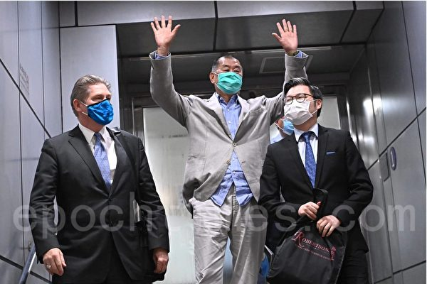
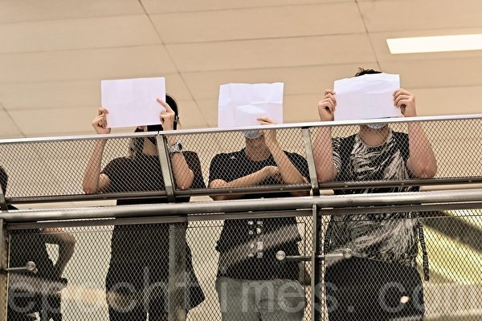
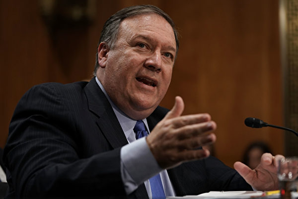
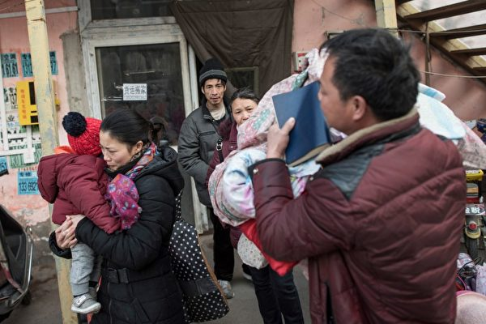
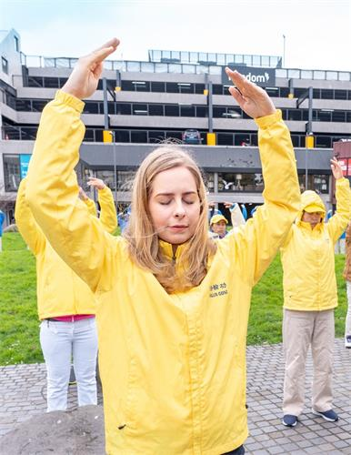

<h3><a target="_blank" href="https://bit.ly/3asSXIA">请多传破网软件，使更多的人了解真相从而得救，这是给自己积福德。 https://bit.ly/3asSXIA </h3></a>

   

     
<h3 align="center"><b>免翻视频  https://bit.ly/3ezRQKo  (请收藏网址 https://git.io/swspip)</b></h3> 

<h3 align="center"><b>复制网址到谷歌或火狐浏览器打开。若出现 “提示” ，請点击“继续”访问即可。</b></h3> 

<h3 align=center><a href="https://github.com/gav01/Heart/blob/master/news1.md">● 看更多大紀元時事 ●</a></h3>

<a href=https://git.io/souye><h6 align="right">回首頁</h6></a>

<a name=top>
   

<a href =#135>135.【独家】郭美美爆料人揭红会倒卖防疫品 
<a href =#134>134.川普六连击对抗中共 美中关系进入新阶段 
<a href =#133>133.遭冤狱九死一生 法轮功学员罗建容再陷囹圄 
<a href =#132>132.组图：黎智英恢复上班 员工送花表示欢迎 
<a href =#131>131.【新闻看点】中共放空炮？黎智英被抓股价飙升 
<a href =#130>130.香港机场突发事故 两客机罕见首尾碰撞 
<a href =#129>129.中共制裁美国人 逮捕黎智英 蓬佩奥强硬回应 
<a href =#128>128.美海关扣押中国进口服装 指产品涉及奴工 
<a href =#127>127.美国禁微信 或影响NBA与腾讯15亿美元协议 
<a href =#126>126.徽标上抹去“中国” 美驻华使馆发文澄清因由 
<a href =#125>125.中共称制裁11美国人 卢比奥等回应 
<a href =#124>124.北京再服软 传私下对美表态不在南海先开火 
<a href =#123>123.闪电击中东方明珠塔 黄河4号洪水形成 
<a href =#122>122.法律学者：中国的法轮功案 无一不是冤案 
<a href =#121>121.大爆炸后 黎巴嫩总理宣布辞职 内阁解散 
<a href =#120>120.杨威：大时代大变局 大纪元预警莫错过 
<a href =#119>119.中共抓黎智英 彭斯：冒犯全球热爱自由的人 
<a href =#118>118.以酷刑罪告英籍港警 罗冠聪吁大众提供证据 
<a href =#117>117.瑞银：移出中国意愿强 76%美企将撤离 
<a href =#116>116.廖远：中南海内斗你死我活 李克强处境微妙 
<a href =#115>115.大陆留学生看美国禁微信抖音 三个正当理由 
<a href =#114>114.甘肃火书记涉贪细节再曝光 曾受贿18万欧元 
<a href =#113>113.美媒：中共再镇压港人 美国应强势回应 
<a href =#112>112.壹传媒股价狂飙20倍 股票成港人最新抗争武器 
<a href =#111>111.A股三大股指跌超1% 沪指3400点无功而返 
<a href =#110>110.香港特殊地位终结 美海关：港货要标中国造 
<a href =#109>109.未合规中企明年底须退市 专家：健全美国市场 
<a href =#108>108.美卫生部长会见蔡英文 传达川普对台湾支持 
<a href =#107>107.【更新中】再增2人 黎智英父子等9人被捕 
<a href =#106>106.一个政法委书记的厄运 
<a href =#105>105.2020年7月份28名法轮功学员被枉判 
<a href =#104>104.川人：美制裁中共官员 中国人欢呼大快人心 
<a href =#103>103.陈思敏：骆惠宁回应制裁心虚 胡锡进帮腔成拙 
<a href =#102>102.美国卫生部长阿扎尔率团抵达台湾 
<a href =#101>101.美制裁林郑 其幼子疑“家有急事”从美返港 
<a href =#100>100.大陆猪肉又涨价了 民众：肉价让人抓狂 
<a href =#99>99.川普拟禁微信 美华人欢迎“越早禁越好” 
<a href =#98>98.巧于算计不吃亏？纪晓岚讲故事劝戒后人 
<a href =#97>97.“五毛”急转弯 被勒令停止反美 改唱双赢 
<a href =#96>96.【新闻看点】美大动作踩红线 北戴河要翻腾了 
<a href =#95>95.传推特有意收购TikTok 能否竞争过微软？ 
<a href =#94>94.日本30企业已获补贴 撤离中国迁往东南亚 
<a href =#93>93.内蒙古又现鼠疫死亡病例 当地发Ⅲ级预警 
<a href =#92>92.被囚26年张玉环案：6天6夜刑讯逼供 狼狗咬 
<a href =#91>91.中共称制裁洛马公司 反促成美与盟友建稀土链 
<a href =#90>90.捷克议长反对总统亲共 盼重启哈维尔民主外交 
<a href =#89>89.【西岸观察】频频失言 拜登竞选就怕讲错话 
<a href =#88>88.杨威：美中国防部长通话不同调的背后 
<a href =#87>87.【最新疫情8·8】川普或颁令延长失业救济 
<a href =#86>86.请来碎纸卡车 纽约中领馆大规模销毁文件 
<a href =#85>85.黎巴嫩中国和朝鲜 24小时内三地大爆炸 
<a href =#84>84.新疆疫情严峻 乌鲁木齐再“封村” 
<a href =#83>83.西安明秦王府城墙坍塌 有人被砸伤 
<a href =#82>82.麻烦接踵而至 TikTok在美面临集体诉讼 
<a href =#81>81.【快讯】川普制裁林郑、张晓明等中港高官 
<a href =#80>80.【一线采访】泄洪致巢湖被淹半月 政府推责 
<a href =#79>79.【新闻看点】美扔重磅弹“净网”北京急喊合作 
<a href =#78>78.周晓辉：美国重拳出击 北京再施拖延伎俩 
<a href =#77>77.【西岸观察】加州退休基金华裔高管为何闪辞 
<a href =#76>76.台湾最新民调：逾九成民众反对中共武统威胁 
<a href =#75>75.【拍案惊奇】黎巴嫩爆炸内幕深？共军缺钱4原因 
<a href =#74>74.专访闫丽梦：爆料北京掩盖中共病毒 
<a href =#73>73.投资机构：中共刺激措施片面 无法恢复市场 
<a href =#72>72.钟原：大陆灾害实情惊人 高层作秀无用 
<a href =#71>71.【有冇搞错】李克强受辱 习近平的北戴河危机 
<a href =#70>70.中共国务院推个体经营 分析：地摊经济换名 
<a href =#69>69.【拍案惊奇】美净网全面清共 美军机夜临广东 
<a href =#68>68.泉州轿撞伤三名保安 逃逸时再次辗轧倒地者 
<a href =#67>67.法轮功“避疫良方” 惊现中共南方日报 
<a href =#66>66.美国会要求六所大学交出中共等捐款记录 
<a href =#65>65.陆媒称叙利亚男足染疫“利好” 网民骂翻 
<a href =#64>64.【新聞看點】TikTok命懸一線 微信還遠嗎？ 
<a href =#63>63.美大使：川普政府不把共产党看成合法体制 
<a href =#62>62.【十字路口】中共以疫谋霸风险大 难闯两大危机 
<a href =#61>61.欧洲发行最大报纸历数五事实 追责中共瞒疫 
<a href =#60>60.大陆多省现新布尼亚病毒 已致7死 可人传人 
<a href =#59>59.细思极恐！大陆手机记录日常对话 
<a href =#58>58.【思想领袖】布莱克伯恩：让美国人告中共 
<a href =#57>57.【新闻看点】习打压香港 促蓬佩奥组灭共联盟 
<a href =#56>56.40名中共驻美记者签证将到期 或面临驱逐 
<a href =#55>55.报告：纽时、CNN等助中共宣传马克思主义 
<a href =#54>54.恐惧真相插播 中共设10万奖金“举报” 
<a href =#53>53.强采维族DNA 华大旗下掌香港核酸检测 
<a href =#52>52.三峡大坝削峰能力被高调宣传 专家指混淆视听 
<a href =#51>51.澄清脱钩传言 美驻华大使馆解释为何拍卖 
<a href =#50>50.【名家专栏】是谁让美国的货币贬值？ 
<a href =#49>49.【拍案惊奇】美欲黄岩岛开战？闫丽梦再揭内幕 
<a href =#48>48.【独家】党支部名单曝光 抖音何去何从 
<a href =#47>47.中共高调宣传北斗导航 遭质疑窃全球数据 
<a href =#46>46.黎巴嫩首都爆炸 蘑菇云腾起 数千死伤 
<a href =#45>45.川普说美中关系严重受损是“中共造成的” 
<a href =#44>44.在京访民被关进精神病院 家属探视无门 
<a href =#43>43.借空壳公司巨额赞助美国名校 中共用意何在？ 
<a href =#42>42.【名家专栏】国家的敌人想要我们沉默 
<a href =#41>41.田云：北斗导航与美国争霸 中共显露野心 
<a href =#40>40.香港大律师公会：港府推迟选举并不合法 
<a href =#39>39.63国逾500政要哀悼李登辉 台外交部感谢 
<a href =#38>38.美军两栖战车沉海 搜救无果 九人遇难 
<a href =#37>37.【视频】湖北化工厂闪爆致6死 浓烟冲天 
<a href =#36>36.微软证实收购TikTok 川普给45天时间 
<a href =#35>35.前中共军官：中共海空军不经打 
<a href =#34>34.中共核专家打脸胡锡进 批其恶意炒作涉核问题 
<a href =#33>33.国际海洋法庭即将选举 美国促遏制中共渗透 
<a href =#32>32.刘鹤公开羞辱李克强？ 央视视频火爆流传 
<a href =#31>31.43岁派出所长跳河 生前嘱托孩子别当公务员 
<a href =#30>30.美中对抗 美国五大优势令中共望尘莫及 
<a href =#29>29.【内幕】对中共了如指掌 美鹰派高招迭出 
<a href =#28>28.北京强拆民居 学者：由“低端人口”转向中产 
<a href =#27>27.私自留存涉密材料 中共国家信息中心高官被双开 
<a href =#26>26.美小企业救助计划 数亿美元流向中企 
<a href =#25>25.【独家】中共监控“流氓化”：家中偷窥你 
<a href =#24>24.新西兰前市议员：结束在中国的迫害 
<a href =#23>23.迫害大法修炼者中共基层官员遭恶报 
<a href =#22>22.袁斌：武汉护士张嬿婉之死涉及的三重内幕 
<a href =#21>21.休斯顿中领馆窃德州大学病毒研究？FBI调查 
<a href =#20>20.大连新一轮疫情发酵 凯洋海鲜公司成焦点 
<a href =#19>19.传任志强坚持自辩 全部揽下涉案人员刑责    
<a href =#18>18.加拿大司法部长：孟晚舟引渡案符合条件 
<a href =#17>17.河北企业家铁矿被霸占 后代维权遭公安迫害    
<a href =#16>16.廖远：唐山大地震中的“青龙奇迹” 
<a href =#15>15.最新疫情8·2】拉丁美洲染疫亡者超20萬    
<a href =#14>14.共军威胁台湾东部 总长：整合三军部队因应 
<a href =#13>13.颜纯钩：戴耀廷心太大，港大庙太小    
<a href =#12>12.湖南“野鸡”院校欺诈学生 家长愤怒维权 
<a href =#11>11.东欧国家改变态度 把中共视为主要威胁    
<a href =#10>10.【新闻看点】连遭国际11击 习近平愁容露面 
<a href =#9>9.美国制裁新疆生产建设兵团 冻结资产    
<a href =#8>8.【独家】揭秘替中共牵线搭桥的神秘商会 
<a href =#7>7.美参院小组通过新法案 个人可起诉中共瞒疫    
<a href =#6>6.林郑推迟9月立法会选举 白宫回应 
<a href =#5>5.参选资格被DQ 黄之锋：假新闻罗织罪名 
<a href =#4>4.美国关中领馆效应 亲共者大难临头各自飞 
<a href =#3>3.袁斌：习近平的一脸愁云与中共的走投无路 
<a href =#2>2.前中共军官：南海若开战中共则亡 
<a href =#1>1.【最新疫情8·1】MLB马林鱼队21人确诊 

<a name=135>
<h1 align="center"><b>【独家】郭美美爆料人揭红会倒卖防疫品</b></h1>

图为姜朋勇近照。姜曾经是替中共在境外抢购防疫品的中间商。（受访者提供）

   
 【大纪元2020年08月11日讯】（大纪元记者顾晓华、何坚采访报导）居住在韩国，正面临遣返风险的姜朋勇，没想到自己与中共治下的红十字会（简称“红会”）是如此的“有缘”。

9年前曾曝光郭美美、死磕红会的姜，并未料到会有同红会做生意的一天；更没想到，即使是远走至韩国，也会因此面临牢狱之灾和生命威胁。

他告诉大纪元，“我妻子已经怀孕了两个多月了，我不想让我孩子生活在恐惧中”，“救救我，救救我未出世的孩子吧。”

而这一切的缘起，就是中共红会，以及今年爆发的这场大疫。

<b>曾因曝光红会与郭美美 被逼背井离乡</b>

姜朋勇曾经在北京政府部门工作，他自称自己也算是红三代，出生于军队高干家庭。他的爷爷是原卫生部副部长，享受高干待遇，父亲是一名空军，当时属于林彪那一派，文革中失去了势力，因此仕途未有大发展。姜朋勇因其红三代的身份，自然很容易进入到太子党富二代的圈子里面，也让他接触到了郭美美，后来他辞掉工作做起奢侈品生意，直到现在做起跨境电商。

“所以比较熟悉他们内部的黑箱作业，包括舆情操控这些东西。”姜朋勇说。

其实，对姜朋勇而言，中共和红会从来都不是善茬，无论是死磕它，或是和它做生意，代价都很惨重。

自诩年少轻狂的姜，当年爆料郭美美、揭露红会黑幕后，受到体制内重压和生命威胁；最后为了不连累家人，不得不远走他乡。

年轻时期的姜朋勇。（受访者提供）

他回忆说，“在国内提出不同声音，包括讲真话，下场是非常非常惨的。”

姜朋勇从上次死磕红会的经历中得出一个教训，那就是“中共解决不了问题，只会解决提出问题的人”。

不过当被记者问到，上次因红会被迫背井离乡，这次为何还会同红会做生意？姜朋勇说他们（中共白手套）用了一个理由说服了自己：大疫之下，“中国的老百姓没有口罩了，中国的医生也都没有口罩”。

<b>疫情下 替红会和中共在海外抢购口罩</b>

大纪元曾经制作了一个“全球口罩荒”的专题（原文链接），揭露了中共在隐瞒疫情的同时，一个月内在全球抢购逾20亿个口罩的黑幕。

根据姜的说法，他也是替中共全球抢购口罩的一员。他认为自己是为中国人抢购防疫物资。不过，姜朋勇承认，这种生意的背景并不单纯。

新冠病毒（中共病毒，COVID-19）疫情去年底在武汉爆发后，因中共瞒报，加上世卫组织帮助中共隐瞒，直到今年3月11日世卫宣布大流行之前，各国对病毒危险性知之甚少。等到疫情在全球爆发后，世界才惊觉口罩已被中共抢购一空，各国病患和医护因缺乏口罩等防护品，使疫情雪上加霜。

姜告诉记者，自己参与全球抢购口罩的经历，就是中共隐瞒疫情的证明。

他说自己的生意伙伴黄某，今年1月底就告诉他，政府知道“这个疫情已经扩散到不能控制了”，所以要在海外抢购防疫物资。黄某是浙江省杭州市某公司的法人代表，称自己是代表浙江省慈善总会和多地政府采购防疫物资。

姜朋勇说，在1月27日黄某委托姜采购口罩时，黄某透露说，3周前（1月初）疫情已经扩散到杭州、温州，并通过温州华侨蔓延至意大利等欧洲国家，已经无法控制了。

姜说他们（中共白手套）对自己透了底，采购物资的目的有两个，“第一个是为了党政军干部、中共权贵们，要那个N95口罩，能够保命”，多余的就“高价卖给有钱人”。

再一个目的，是当时中共没有公开疫情，他们要趁机提前采购便宜口罩，发国难财。姜举例说，“他们想单价8元一个，采购1300万个口罩，然后35元一个卖给政府，因为这35元的采购预算中央已经批下来了。”

中共白手套与姜朋勇（头像为戴帽男子）的聊天记录显示，他们在替中共政府抢购口罩。（大纪元）

起初，姜朋勇说这是发国难财，是违法的，应该公开疫情，寻求国际援助。他们说不行，那样国际会封锁中国，而很多中共官员的资产和子女在海外，所以不能被封锁。

姜说，他们最后用一个理由说服了自己，就是中国老百姓和医护需要口罩。

不过，姜提出了条件，一定要有政府的“红头文件”，“并且这红头文件要开给你也开给我”，以免未来给他定一个“投机倒把，倒卖物资，或什么罪名”。

姜朋勇展示了，中共白手套提供的，中共江苏省苏州市吴江区卫健委开给姜朋勇，用于在境外采购防疫物资的红头文件。 （大纪元）

他的生意伙伴黄某，不但提供了“苏州市吴江区卫生健康委员会”和“杭州市江干区疾病预防控制中心”等政府部门开给黄某的防疫品采购证明；甚至如他所愿，给他出具了、专门开给姜朋勇的政府采购证明（红头文件）。

即便如此，姜说他的担忧还是成真了。只不过，如今公安给他安的罪名不是“投机倒把”，而是“合同诈骗”。

<b>绝境下反击 再“死磕”中共和红会</b>

姜朋勇对于自己的处境十分担心。他说中共现在不仅在大陆指控他，指示公安冻结了他在国内的银行账号；还冻结了韩国供应商的账户，迫使韩国供应商在韩国报案，从而禁止姜离境，甚至督促韩国政府把他遣返。

面临绝境的姜，说自己手里有中共红会贪污捐赠善款、倒卖救援物资的罪证，他要把这一切曝光。

根据姜的说法，黄某与中共各地的红会、慈善总会和卫健部门关系匪浅，是中共卫健部门和红会的“白手套”（代理人的俗称）。

姜提供的聊天记录显示，今年2月1日，黄某告诉姜，委托订购的350万只KF94口罩中，有300万只口罩是要发给湖北省慈善总会，是浙江省慈善总会给湖北的捐赠品；另外50万只发给湖北省黄冈市红会的郭某、孝感市红会的蒋某和武汉市江岸区卫生健康局的莫某等3个收货地址。

中共白手套在同姜朋勇聊天中，提供了在中国的收货方。信息显示，境外采购的50万只口罩的收货方，分别是湖北省黄冈市红会、孝感市红花会和武汉市江岸区卫生健康局。图为聊天截图。（大纪元）

大纪元经过调查发现，黄某提供的这3个收货人，身份属实；中共黄冈市、孝感市和武汉市政府的网站公告显示，这3人的确是黄冈、孝感红会和武汉江岸区卫健局的干部。

中共黄冈市防疫指挥部2020年1月24日发布公告，公布了黄冈市红十字会接收防疫物资的联系方式；其中的联系人郭某，就是中共白手套提供给姜朋勇的收货人之一。（中共黄冈市政府网站截图）

而且，大纪元还暗访了这3名卫健部门和红会官员，以及某地红会市场营销中心的张某。暗访结果表明，这些卫健委和红会官员的确与黄某熟识，尽管他们拒绝披露黄某以及与其交易的详情。

<b>指证中共倒卖防疫物资 大发国难财</b>

姜还向大纪元揭露了，中共实施“口罩外交”，及垄断并倒卖防疫物资的黑幕。

姜说，除了给黄某采购口罩外，自己还替其它多个地市的政府和红会采购口罩，“那些交易都是用于捐赠的，本身没有问题”。不过，在境外采购过程中，姜发现了更大的秘密。

“我在马来西亚、越南等多个国家采购口罩，说是给中国捐赠防疫品。当时马来西亚答应为中国紧急制作口罩，但缺乏原料熔喷布。那时候熔喷布主要产自中国，而中共并未配合出口原料。”

姜朋勇为中共白手套、从韩国抢购的类似N95的KF94口罩，姜准备将口罩发货至中国长沙市。图为姜采购的KF94口罩。（大纪元）

为何中共不愿开放熔喷布，来增大普通口罩的产能？姜说，他发现中共其实并不缺普通口罩，而是缺乏能有效防范病毒的N95口罩。例如他替黄某采购的KF94口罩，就是类似N95的韩国标准的防疫口罩。

姜说，N95或等同功能的口罩，才是中共全球抢购的目标。他认为，中共通过“白手套”在境外抢购N95，目的就是为了在病毒扩散全球后，利用外国急缺N95来扩大影响力。

根据姜的指控，“口罩外交”只是中共的一个目的，另一个是中共权贵大发国难财。

姜说中共权贵们一方面欺骗境外的爱国华人和供货商，以捐赠防疫物资为名、压低进价；另一方面，在境内，卫健部门和红会垄断了口罩等防疫品的经销渠道和价格，进行倒卖以牟取暴利。姜举例说，自己给他们买的6.5人民币一个的N95，在国内被他们卖到最高139元一个。

姜朋勇披露了他是如何发现其中的猫腻。

他说，为黄某采购的一批口罩原本计划搭乘1月31日韩国首尔至中国长沙的救援物资专机，说是浙江省慈善总会捐赠给武汉市的抗疫品。然而临上飞机时，黄某突然改口，说不走救援专机，改为私人货运至杭州。

姜说自己当时就怀疑，黄某背后的红会和中共权贵可能是在倒卖防疫物资。

姜朋勇提供的聊天记录显示，中共白手套黄某告诉姜的公司职员“已经基本都转成企业采购了”。图为聊天截图。（大纪元）

后来黄某在聊天中向姜透露了，无论是口罩机、口罩还是医用防护服，他们都是用防疫捐赠的名义去倒卖，背后的“客户”就是当地的红十字会和政府领导。

姜指出，即便倒卖物资也是需要政府批文的，尤其是在疫情期间，没有政府授权和特别通行证，物资运输是寸步难行。

回顾这两次与中共红会的交集，姜感概说，上一次他只以为是红会的问题。但经过这一次的教训，他现在认为“这是共产党政权的问题”，“换什么领导都没用”。

“这一次我不会再逃”，姜说自己的想法跟9年前已完全不同。“我有义务讲出真相。”

<a target="_blank" href=#top><h6 align="right">回上方</h6></a>

<a name=134>
<h1 align="center"><b>川普六连击对抗中共 美中关系进入新阶段</b></h1>

川普政府近期对中共连连出击。图为川普资料照。(AFP)

   
 【大纪元2020年08月11日讯】（大纪元记者张婷综合报导）川普（特朗普）政府近期对北京连发重锤，预示美中关系进入新阶段，其特点是全面对抗。国务卿蓬佩奥的对华演说相当于宣告美中接触模式结束，强调以“不信任且要核查”的态度对待中共。

先前两国之前的对抗相对有限，因为双方试图把商业和经济关系放在第一位。但《华尔街日报》称，美国企业如今再也没有像过去那样能让北京和华盛顿方面冷却冲突的影响力了。

报导称，在过去几次中美关系危机期间，美国商界在维持双方关系的发展方面发挥了重要作用。但如今美国企业抱怨他们的技术被中方窃取，中共政府对中企的补贴政策使其面临不公平竞争。

此外，川普政府对公司为中方游说的回应也远远少于前几届政府。美国司法部长巴尔（William Barr）最近还警告美国公司，如果他们为中方游说，则可能会被要求以外国代理人身份在司法部进行登记。

<b>三周内 美政府向中共连发六炮</b>

7月21日至8月7日，不到三周，白宫在金融、科技、国家安全和人权问题等方面向北京接二连三地发了六炮。其中包括关闭休斯顿中领馆；提出“清洁网络”倡议；启动在美上市中国公司的退市程序；计划禁止微信和TikTok（抖音海外版）这两个最受欢迎的中国应用程序；制裁11名中港高官；派内阁官员访问台湾。

<b>一、关闭中共驻休斯顿领事馆</b>

7月21日，美国政府要求休斯顿中领馆72小时内关闭，称该领馆已成为间谍活动和知识产权盗窃的中心。当晚8时许，中领馆开始烧毁大量文件。

国务卿蓬佩奥7月30日说，美国与中共打交道的“潮流正在转向”。

他还说，美国关闭休斯顿中领馆，“因为那里是间谍窝点”。

7月24日，美政府官员对关闭休斯顿中领馆事件召开简报会。美方官员表示，美对华多年来的对话政策不起作用，中共没有停止其犯罪活动，现在必须做出对华政策改变，而关闭休斯顿中领馆就是最强有力的行动。

<b>二、蓬佩奥提“清洁网络”倡议 防中国科技公司进入西方</b>

8月5日，蓬佩奥又在对抗中共上助推了一把，宣布扩大后的“清洁网络”倡议，从五大方面禁止中国电信和科技公司的产品和技术介入美国网络。这五方面分别是，清洁运营商：确保不受信任的中国运营商不与美国电信网络连接；清洁商店：要求从美国移动应用程序商店（App Store）中删除不受信任的中国应用程序；清洁应用程序：阻止不受信任的中国智能手机制造商预装可信任的应用程序；清洁云服务：防止美国数据存储在阿里巴巴、百度、中国移动、中国电信和腾讯等公司可以访问的云端系统。

蓬佩奥之后在推特上又追加了第六个方面，也就是5G“清洁通道”。此举旨在阻止使用华为、中兴通讯等中国电信公司打造5G网路。

<b>三、启动在美上市中国公司的退市程序</b>

根据川普政府8月6日提出的一项计划，在美国证券交易所上市的中国公司需遵守美国的审计要求，否则将被迫退市。

《华尔街日报》称，根据这项计划，已经在纽约证券交易所和纳斯达克股票市场上市的中国公司必须在2022年前达到要求，否则需在这两家交易所退市。

美国财政部和证券交易委员会（SEC）的高级官员称，目前还未上市但计划赴美进行首次公开募股（IPO）的中国公司将必须在上市前就遵守这些规定，而不是到2022年才需要遵守。

川普政府认为，由于北京拒绝允许华盛顿监管机构检查总部位于中国大陆和香港的公司的审计材料，美国投资者可能会遭受欺诈。

<b>四、川普签行政令禁中国应用程序TikTok和微信</b>

8月6日，川普签署行政令，规定45天后将禁止受美国司法管辖的任何人或企业与腾讯和字节跳动进行微信和TikTok相关“交易”。
川普8月6日签署行政令，拟45天后禁止微信。(PETER PARKS/AFP via Getty Images)

川普在行政命令中写道：“和TikTok一样，微信也会自动收集用户的大量信息。这种数据收集有可能让中共获取美国人的个人和专有信息。”

《纽约时报》称，川普发布的禁令对微信的影响似乎比TikTok更为严重，后者可以通过与美国收购者的谈判脱身。

微软公司目前正在与字节跳动谈判，争取在45天的期限内达成收购协议。媒体同时传出，推特有意与TikTok进行合并。但外界普遍认为，从实力上，推特无法和微软竞争。

<b>五、制裁11名中港高官 林郑月娥首当其冲</b>

8月7日，美国制裁11名中港高官，包括香港特首林郑月娥、港澳办主任夏宝龙、副主任张晓明等。

蓬佩奥称，这些人参与了对香港人民的残酷镇压。

“美国与香港人民站在一起，我们将用我们的工具和权力来打击那些破坏他们（香港人）自治的人，”财政部长姆钦在宣布制裁的一份新闻稿中说。

<b>六、美派卫生部长访问台湾</b>

一件更令中共恼火的事就是，美国卫生部长亚历克斯·阿扎尔（Alex Azar）访问台湾。阿扎尔是中美建交四十余年来访问台湾的最高级别美国内阁官员。他于8月9日抵达台湾，并展开为期三天的访问。

8月10日，阿扎尔与蔡英文会面期间。(PEI CHEN/POOL/AFP via Getty Images)

阿扎尔周一和蔡英文会面时说，“很荣幸能在这里，传达川普总统对台湾的大力支持和友谊。”

台湾空军司令部称，中共周一派出军机陆续短暂逾越海峡中线。台军第一时间广播告警，运用空中侦巡兵力强势驱离。

<b>川普对华攻击达历史新高峰 白宫对华鹰派正在崛起</b>

彭博社称，美国总统对华攻击达历史新高峰，且攻击正在迅速升级。种种行动进一步表明他已放下顾忌，决心把对抗中共作为大选前最后不到90天的优先任务来完成。

川普日益强硬的立场为政府中的对华强硬派敞开了大门，他们长期以来认为，中国共产党领导人一心致力于称霸世界，而美国历届政府都低估了中共威胁。

“川普政府内的大坝已经破裂，所有关于如何升级与中国（中共）冲突的想法全都奔涌而出，”彭博社引述智库“New America”的中国数字经济研究员魏光明（Graham Webster）的话说。

《华尔街日报》报导，前川普白宫经济助手克里特·威廉姆斯（Clete Willems）说：“让人惊讶的是，这一切一下子就都发生了。”

“这表明（对华）鹰派正在崛起。”威廉姆斯说。

美国智库哈德逊研究所中国战略主任、川普政府的中国政策外部顾问白邦瑞（Michael Pillsbury）表示，总统之所以采取行动，是因为他对他认为中共在从冠状病毒（中共病毒）大流行到核军备控制等问题的作为感到沮丧。“总统两周前告诉我，他和中方还没完，还会有更多。”他说。

<b>无论11月大选结果如何 美中紧张局势将持续</b>

美国国会两党虽然经常各执己见，但在中国问题上基本上保持一致。民主党普遍支持对中共采取强硬立场。例如，参议院两党最近一致通过了一个提案，要求中国公司遵守美国的审计要求，否则将被要求退市。

《华日》认为，这些现象表明，无论11月大选结果如何，美中紧张局势都将持续。“一场新冷战已经开始，”乔治·华盛顿大学的中国问题专家沈大伟（David Shambaugh）说，“保持冷战不变成热战才是问题所在。”

斯坦福大学胡佛研究院高级研究员戴雅门（Larry Diamond）对美国之音说，美国看清了中共政府与日俱增的野心和不尊重国际准则的行径。美国朝着这个方向制定政策应对，将以更加警惕、质疑、坚决和谨慎的态度应对中国（中共）。

戴雅门说：“我认为美中关系正朝着双方各有坚持的方向发展。美国的政策是在回应中国（中共）一直以来的行为，中国（中共）对邻国和世界民主价值，与日剧增地欺凌、挑衅和采取敌对姿态。它们的行为是不可接受的。我认为这些官员的演说反映了美国国会里相当一致的立场，那就是美国不会再容忍了。”

戴雅门指的是国家安全顾问奥布莱恩、联邦调查局局长雷、司法部长巴尔以及国务卿蓬佩奥发表的对华演说。

蓬佩奥7月23日说，中国（中共）在国内越来越专制，在国外对自由的敌视咄咄逼人。川普总统说：受够了（enough）。  

<a target="_blank" href=#top><h6 align="right">回上方</h6></a>

<a name=133>
<h1 align="center"><b>遭冤狱九死一生 法轮功学员罗建容再陷囹圄</b></h1>

中共酷刑示意图：浇凉水。（明慧网）

   
  【大纪元2020年08月12日讯】江西省南城县法轮功学员罗建容于2019年8月被非法抓捕，目前已被非法判刑并关押到江西省女子监狱迫害。

明慧网报导，2019年4月21日晚，南城县十几个公安警察突然闯入罗建容的家中，绑架了她和另一位来她家作客的法轮功学员。4月28日，罗建容被释放回家。

同年8月12日上午，罗建容抱着善心前往洪门镇派出所，告诉所长黄文官、副所长张俊法轮功被迫害的真相，并劝他们顺应天意、退出中共的党团队组织，还送给他们几本法轮功真相资料阅读。

8月14日下午，罗建容在家中被南城县国保大队和洪门镇派出所警察绑架，当晚被送往抚州市看守所非法关押。

她现已被非法判刑，再次被关押在江西省女子监狱，详情待查。

罗建容，出生于1966年，家住江西省南城县洪门镇付前村。2010年，她开始修炼法轮功，身体变得健康，原本满脸的黑斑不到一个月全消失了；关节痛、妇科病等多种疾病也不治而愈。

她按照法轮功“真、善、忍”的原则待人接物，成了当地有口皆碑的好人。在经营店铺的生意时，她公平交易，与她合伙开店的小姑对她的为人很是称道；她丈夫也称赞她变得更加宽容、忍让。

罗建容（明慧网）

2011年，罗建容与几位法轮功学员一起阅读法轮功著作时，被南城县公安警察绑架，并被非法劳教1年半。

在江西省女子劳教所，她经历了关禁闭、关小号、强制暴力洗脑、奴工劳动等非人的迫害，但她始终坚定自己的信仰，并向狱警及包夹（监管法轮功学员的刑事犯）讲述法轮功被迫害的真相。2012年10月，罗建容从劳教所回家。

2013年10月8日，罗建容又在自己经营的店铺内被南城县公安警察绑架。店铺被翻抄得一片狼藉，法轮功真相资料等大量的私人物品被抄走，光填写的物品清单就写满了两张纸。

随后罗建容被非法关押在抚州市临川第二看守所，期间遭到看守所女狱警谢瑾的毒打。

2014年1月17日，罗建容被抚州市临川法院非法庭审。家人聘请的律师在庭上为她做了详尽且有理有据的无罪辩护。

罗建容本人也当庭陈述了修炼法轮功使人身心健康；按“真、善、忍”做好人，利人利己；信仰自由，自己是被迫害的等等。同年3月，罗建容被非法判刑4年，劫持到江西省女子监狱继续迫害。

在女子监狱两年多的时间里，罗建容的家人多次前往监狱探视，监狱以她不“转化”（放弃修炼）为由，剥夺了她的探视权。

她因坚定信仰、不配合监狱的“转化”而遭受了种种残忍的酷刑折磨：因拒绝参加奴工劳动，被面壁罚站1年半；拒穿囚服，被刑事犯人群殴4天；拒绝报数，遭毒打。

在寒冷的冬天，她被脱光衣服，站在冷水里，全身被多次浇灌冷水致冻僵。

她几次绝食抵制暴力洗脑“转化”，每次均遭野蛮灌食致昏死、被送医院抢救。监狱实施的多种迫害手段失败后，又强制她服用破坏中枢神经药物长达两个月之久……

2017年10月7日左右，罗建容结束了4年地狱般的牢狱迫害，九死一生，回到家中。

回家后，因原先经营的店铺早已关闭，丈夫、儿子已前往广东沿海城市打工谋生，罗建容只能暂时到外地打工，艰难地维持生活。# 

<a target="_blank" href=#top><h6 align="right">回上方</h6></a>

<a name=132>
<h1 align="center"><b>组图：黎智英恢复上班 员工送花表示欢迎</b></h1>

黎智英被捕约40小时后获准保释，12日凌晨步出警署，获大批市民支持。（宋碧龙/大纪元）

   
  【大纪元2020年08月12日讯】（大纪元记者萧律生报导）8月12日中午，壹传媒创办人黎智英恢复上班。当日凌晨，黎智英才获得保释。在此之前，他的两个儿子及10日被捕的其他人均获得保释。为了支持，11日晚间，港人在多地进行“全港‘和你sing’”活动。

《苹果日报》12日报导指，当日中午12时32分，黎智英抵达苹果大楼，他向员工表示感谢，并说不畏恶势力、一切继续、各自爬山，苹果一定撑过去。他还说，不会担心个人安危。员工拍手欢呼并送上鲜花表示欢迎。

昨晚（8月11日）获得保释的壹传媒行政总裁张剑虹，也在现场与黎智英热情拥抱。

在此之前，黎智英长子黎见恩、次子黎耀恩，壹传媒动画公司总经理吴达光、壹传媒行政总监黄伟强和壹传媒营运总裁兼财务总裁周达权亦先后获保释。前香港众志核心成员周庭、“我要揽炒”团队成员李宇轩及前学民思潮成员李宗泽亦获保释。

据报导，12日凌晨0时20分左右，黎智英以港币50万元交保外出。黎智英步出警署时，被大批记者包围，一批市民在警署外高呼“撑苹果，撑到底”，以示支持。

8月12日凌晨，港人在旺角警署等候黎智英获释，高举《苹果日报》以示抗议。(ISAAC LAWRENCE/AFP via Getty Images)

8月12日凌晨，港人在旺角警署举着《苹果日报》表示抗议，图为港人向刚获释、已坐在车中的黎智英竖起大拇指，表示支持。(ISAAC LAWRENCE/AFP via Getty Images)

   
 

黎智英被捕约40小时后终获准保释，12日凌晨步出警署，获大批市民支持，高叫“撑苹果，撑到底！”随后，黎智英步上座驾离开。据《Now》报道，黎智英以30万元现金，与20万元人事担保离开旺角警署。（宋碧龙／大纪元）

  
   

8月11日深夜，前香港众志核心成员周庭保释。图为周庭保释后接受媒体采访。(Billy H.C. Kwok/Getty Images)

   
 8月11日晚间，不少香港民众响应撑《苹果日报》的“全港‘和你sing’”。沙田新城市广场大厅，数十名市民手持《苹果日报》或手持白纸，抗议港府打压新闻自由及言论自由，并高呼口号。有市民呼喊“光复香港，时代革命”。不久，大批警察进入商场，搜查市民，至少有1名年轻人被扣查。  
 
 

8月11日晚网民号召全港“和你sing”。沙田新城市广场中庭，数十名市民手持《苹果日报》或手持白纸，抗议政府打压新闻自由及言论自由，并高呼口号。有市民呼喊“光复香港，时代革命”。（宋碧龙/大纪元）

 

8月11日，港人在商场中，举着《苹果日报》表示抗议。（ISAAC LAWRENCE/AFP via Getty Images）

 
   

8月11日，港人在商场中，举着《苹果日报》表示抗议。（ISAAC LAWRENCE/AFP via Getty Images）

   
   

约晚上7点时，有大批警察进入商场，搜查市民，至少1名年轻人被扣查。（宋碧龙/大纪元）

   
   

晚上有大批警察进入商场，搜查市民。（宋碧龙/大纪元）

   
   

8月11日晚网民号召全港“和你sing”。沙田新城市广场中庭，数十名市民手持《苹果日报》或手持白纸，抗议政府打压新闻自由及言论自由，并高呼口号。有市民呼喊“光复香港，时代革命”。（宋碧龙/大纪元）

   
   
 11日白天，在湾仔警察总署，“Lunch 哥”David一人手拿着白纸巾静默抗议。  
 

“Lunch 哥”11日在湾仔警总一人举行和你Lunch，并手拿白纸巾表达五大诉求，缺一不可等抗争。（宋碧龙/大纪元）

   

“Lunch 哥”11日在湾仔警总一人举行和你Lunch，并手拿白纸巾表达五大诉求，缺一不可等抗争。（宋碧龙/大纪元）

   
   

<a target="_blank" href=#top><h6 align="right">回上方</h6></a>

<a name=131>
<h1 align="center"><b>【新闻看点】中共放空炮？黎智英被抓股价飙升</b></h1>

壹传媒创办人黎智英早上在律师陪同下，由探员带离何文田大宅。图为他离开时被戴上手扣。（梁珍／大纪元）

 
 【大纪元2020年08月11日讯】大家好，欢迎关注新闻看点，我是李沐阳。
 
【60秒看世界】

昨晚，前香港众志成员周庭被香港警方抓捕，指控她触犯国安法的“煽惑分裂”。在场律师表示，警方出示的是8月6日发出的搜查令，对周庭的住所进行搜查。

黄之锋披露，包括林郑、李家超、郑若骅等官员在内，至少有10名香港高官有海外国籍和资产。

大纪元多名香港记者发现，今天遭到疑似中共国安人员的跟踪。其中珍言真语主持人梁珍遭到一名男子跟踪，后被撞破逃走。

美国多个海关查获近2万张伪造的美国驾照，疑似中共用伪造美国身份证的方法影响美国大选。

川普呼吁对黎巴嫩贝鲁特大爆炸进行透明调查，称美国随时准备提供协助。同时表示支持要求政府进行改革的和平示威活动。

下面进入今天的话题。不记得是看得哪一部武侠小说，里面提到了“天魔解体大法”。大概意思是一个恶人被打得快坚持不住的时候，无奈之下咬破了自己的舌头，然后马上由防守转为进攻。但是不长时间，这个恶人就会死去。中共现在似乎也进入了这个阶段。

今天（10日），沉寂多天的新派战狼赵立坚在例行记者会上表示，对11名美方人士进行制裁。然而，这些人都不是川普内阁成员。今天香港壹传媒创办人黎智英父子三人及壹传媒另外6人被港警抓捕，被指控“涉嫌勾结外国势力”。

有分析认为，中共突然龇出獠牙反扑，将会引来猎人更猛烈的射击。

<b>中共慌不择路？制裁11人都不是川普内阁成员</b>

中共制裁美方11人，显然是对美国制裁林郑等11名中港官员的报复。他表示美方对“干涉中国（中共）内政”，中方“坚决反对”、“强烈谴责”。

赵立坚称，针对美方错误行径，决定从即日起对美方11人进行制裁。赵立坚说得很明确，就是报复，而不是因为这11人有什么问题。

被中共制裁的11人分别是联邦参议员卢比奥（Marco Rubio）、克鲁兹（Ted Cruz）、霍利（Josh Hawley）、科顿（Tom Cotton）、图米（Pat Toomey），联邦众议员史密斯（Chris Smith) 等等。

熟悉美国政界人士的朋友会发现，这11人都不是川普内阁成员。像蓬佩奥、巴尔、奥布莱恩等等对中共最强硬的，都不在名单里面。所以大家应该明白一点，中共这个所谓的制裁，就是给国内百姓看。

但即使这样，中共宣布制裁同时，也透露出了“服软求饶”的迹象。赵立坚表示中共“无意搞意识形态对抗，中美有必要开展坦承有效对话”。

但是赵立坚的这个对话呼吁，已经被中共的制裁动作完全挡住了。换句话说，中共的服软还是假服软，实际仍然是一种拖延动作，想用谈判对话尽量拖延时间，延缓自己的死亡解体。

而且赵立坚把中国人民推到了前面，说“中国人民是吓不倒的”。咱们就不说赵立坚和中共的无耻加无知了，因为炎黄子孙不可能接受马列血统的统治。咱就说中共，没有说明制裁什么，其实也没什么可制裁的。

这些人不可能把美金换成人民币存在中国银行，也不可能到大陆去置办房地产。他们更不像中共官员包二奶、三奶和私生子，所以对他们制裁只能停留在口头上。从这点看，中共已经慌不择路了。

在中共这份制裁名单中，至少有三四人是美国总统的后备力量。其中卢比奥和克鲁兹在2016年大选时，就曾与川普同台辩论。只不过这两位当时还稍显年轻，比川普稍差了一些，所以后来退出了竞选。

但是经过川普执政的几年，他们已经逐渐历练得更加成熟，包括霍利和科顿，最近两年表现十分抢眼。特别是卢比奥，前不久还被参议院委以重任，人气相当高。这些人都可能在2024年或者以后参加竞选，说不定其中某人就成为美国未来总统。而中共对他们实施制裁，等于是提前断道了。

<b>中共抓捕黎智英等9人</b>

昨天（9日）一早，香港警方国安处就抓捕了黎智英父子三人和壹传媒的7名相关人士。香港警方只是在今天以“突发事件”进行了通报，称逮捕了涉嫌违反国家安全法的几人，但没有列出被捕者具体身份。

但NOW新闻报导，被抓的10人分别是黎智英和两个儿子——长子黎见恩、次子黎耀恩，壹传媒营运总裁兼财务总裁周达权、行政总裁张剑虹、行政总监黄伟强、动画总经理吴达光，还有一名黎智英的高级助手、居住香港境外的马克·西蒙（Mark Simon）被公安通缉。另外被抓的三人是组织“香港故事”成员李宇轩和前学民思潮成员李宗泽，以及前香港众志成员周庭。

大纪元香港记者从苹果日报直播片段中了解到，香港公安方于其、何文田从寓所带走黎智英。接近上午11点，黎智英被带回苹果日报大楼二楼办公室。中午12点左右，壹传媒行政总裁张剑虹也被带到二楼办公室。接近下午2点，2人被带离办公室。

现场目击者向记者透露，上午9点抓捕黎智英的同时，有200名香港警察搜查了苹果日报社。（其实称呼香港公安更合适，因为中共废止一国两制后，香港已经与大陆城市没什么差别，港警已经被招安收编为香港公安）。

大纪元记者目击，下午2点半左右，香港公安在苹果大楼搜出几十箱“疑似证物”。接近4点，又搜出十多箱“疑似证物”，接近5点，香港公安又搬出近十箱“疑似证物”。

中国有句话，覆巢之下，岂有完卵。黎智英被抓，他的两个儿子也被以“勾结外国势力”逮捕。香港公安还搜查了黎智英次子黎耀恩在中环开设的餐厅。

<b>中共天魔解体，壹传媒股价飙涨</b>

中共的这两个动作，就像我刚才说的那个“天魔解体”一样，用消耗自身来做出反击，但是恰恰加速自己的解体灭亡。

这里先说一个有意思的事。黎智英被抓的消息刚传出，壹传媒的股价一度大跌，超过16%。但是随后出现了大逆转，很多有良知的人在午后纷纷站出来，购买壹传媒股票，以表示对黎智英的支持。

结果壹传媒的股价从下跌变成了大涨，大幅反弹令人称奇，盘中最高反弹344%。最终收升183%，市值从2亿反弹到6.7亿。这恐怕是出乎了中共港共的意料。

香港资讯科技商会荣誉会长方保侨买了5万股，他表示没考虑太多，也不打算卖出，就当支付了十年的订阅费。他说“新闻自由是无价的，传媒企业需要支持，股价支持非常重要”，“壹传媒做得怎样，港人都有目共睹”。

大家是否还记得，去年港警攻打中大事件。在香港的多家媒体，只有大纪元和苹果日报报导了真实情况。而其它媒体，都发表了港府的宣传广告。现在苹果日报被“抄家”，明天还有谁呢？

从壹传媒的股价变化这件事，已经可以看出香港真正民意所在。所以我说中共是天魔解体，消耗了自己，加速了覆灭的速度。

<b>黎智英为何不选择移民？</b>

其实对黎智英来说，他被抓前有多次机会移民。既可以移民美国等西方国家，也可以移民台湾。

根据媒体报导，黎智英在台湾也有不少房产，移民应该很容易。特别是以台湾现在的政治立场来看，移民台湾，说不定还比较“吃香”。有网友质疑，黎智英为什么不移民呢？

这个贴文一出，很快引起网友热烈讨论。有网友指出了真实原因，感动了许多人。“如果老板自己跑掉，员工还敢冲到第一线报导抗争吗？”“与香港共存亡，佩服”，“他不就亲口说过了，与香港人民一起抗争”。

2020年08月10日，香港抓捕黎智英后，有几位民众来苹果日报大厦外拉横幅抗议。

黎智英“宁为玉碎，不为瓦全”的勇气，非常令人感佩。如果大陆人都像黎智英这样，中共也就不会存在了。

这么说，绝不是在否定已经移民的香港人，也不是瞧不起大陆同胞。因为面对中共制造的越来越强烈的红色恐怖，很难让人生存下去。

沐阳也是无法忍受中共的暴政，才离开了中国大陆。但我和海外许许多多的华人同胞一样，在想念着国内亲人和朋友，思念着生我养我的那片土地。每一位香港同胞也一样，即使移民，心里同样放不下香港。所以我们和大陆受苦受难的同胞一样，都希望中共快点解体。

<b>各界谴责中共</b>

黎智英等人被抓，美英澳等多国议员接连发声，谴责中共的打压，表示要竭尽所能解救他。

多个传媒工会及组织联署声明，要求警方尽快交代搜查苹果日报大楼的目的和法律依据。指出警方肆意搜查，是严重践踏新闻自由。

被中共宣布制裁的霍利议员立刻对北京谴责，称这次逮捕是中共对言论自由采取零容忍态度的证据。推文中表示，黎智英仅仅因为报导新闻被抓，“这就是中国（中共）想强加于世界的‘言论自由’”。

参议员里克·斯科特（Rick Scott）发推表示，中共及香港傀儡继续噤声和恐吓那些为民主和人权呼吁的人，“香港的新安全法无非是对自由和自治的直接攻击”。

英国保守党人权委员会副主席罗杰斯（Ben Rogers）表示，黎智英被抓令人心碎，“将竭尽所能帮助释放这个伟大的人”。

澳大利亚联邦参议员彼得森（James Paterson）说，这是一个“令人震惊但可预测的结果，黎智英因批评中共罪被捕，自由言论已在香港死亡”。

英国人权组织“香港监察”推文指出，黎智英的被捕“是一个令人不安的发展”。给这些人扣上“勾结外国势力”，再次证明了港版国安法的“任意性、荒谬性和严酷性”。

<b>五眼联盟施压 美国制裁还会有</b>

昨天（9日），五眼联盟外长发表声明，呼吁香港当局恢复12名民主派立法会选举候选人的参选资格，并如期在9月举行立法会选举。

五眼联盟一起表态，意味着很可能要一起动手了。一个美国的制裁，已经让中共官员痛入骨髓。如果五眼联盟一起制裁，中共会是什么样呢？

说中共官员痛入骨髓，并不是说大话。

曾在银行法规部任调查主任的区议员卢俊宇指出，美国财政部的这个SDN制裁名单，也就是“特别指定制裁者命党”是世界上“最严格、惩治最严厉”的名单。“有很多毒枭、恐怖主义或恐怖分子（如本·拉登）等曾经榜上有名”，这个后果可以用“无远弗届”来形容。

卢俊宇表示，一旦进入这个名单，被制裁者与美国不能再有任何生意往来或业务关系。大部分银行不可能为了几个“用完即弃”的官员，损害自己的业务，因为银行要保持与美元挂勾的任何交易。

就是说，银行不会只为了几片树叶，而放弃一片森林，那太不值当的。卢俊宇强调，“其实简单说，这11个被制裁的人已经是与社会、与国际隔离了”。

为中共卖命，最终使自己变成了异类，与社会、与国际隔离。大家猜猜看，他们会不会哭死在厕所？而且卢俊宇相信，还会有更多的中港官员及前官员被陆续列入制裁名单。

大陆网络有句非常流行的话，“No zuo no die”，意思就是“不作死就不会死”。大家觉得用在中共身上，是不是很合适？

《香港自治法》提案人、民主党参议员范·霍伦在美国宣布制裁措施当天声明说，“中国（中共必须为他们的行动承担后果，我们（美国）不会就此罢手”。

如果中共不是真正脑残，应该能理解这个意思。美国的制裁还没完，后面还有。

提醒大家一点，拍手不要太用力，因为好戏会接连不断。美国反击中共的决心，是非常明显的。这部分内容，我们留在会员区专门来谈：从二战的空袭东京来看美国的反共决心。欢迎大家加入会员，了解更多内容。

*****

<b>川普的代表直呼蔡英文“总统”，中共扎心</b>

其实今天还有一个大事，大家可能也在关注，就是中华民国总统蔡英文在总统府会见了美国总统川普的代表、卫生部长阿扎尔（Alex Azar）一行。国安会秘书长顾立雄、外交部长吴钊燮和卫生福利部长陈时中陪同会见。阿扎尔在与蔡英文的会谈中，直接称呼蔡英文“总统阁下”。

阿扎尔访台，是1979年以来，美国访问台湾层级最高的官员，也是6年来第一位访问台湾的美国部长级官员。台湾外交部表示，阿扎尔此行是“历史性的访问”，相信将更强化美台间的防疫及卫生合作。

蔡英文表示，感谢美国总统川普、国务卿蓬佩奥和阿扎尔等许多美国的友人，肯定台湾模式在全球对抗疫情上的贡献。她表示相信，美台双方的合作交流不仅是在防疫，“在各个领域上的交流都可以有更多的突破、更丰硕的成果”。

阿扎尔表示，这次访问台湾，要传达美国总统川普对台湾的强力友谊和支持。他提到，在川普总统的带领下，美国已通过各种有形的方式，肯定台湾民主成就。川普签署法案，强化美台之间的伙伴关系，2018年也启用了一栋全新的AIT大楼，展现美方高度珍视友谊和坚实的承诺。

阿扎尔说，此行来台湾并“与蔡总统会面”，重点是讨论台湾的医卫和抗疫成就，还有如何进一步合作，共同应对各项公卫挑战。

会面后，阿扎尔马上又发推文，“感谢蔡总统今天欢迎我到访台湾，非常荣幸能够到这里传达美国对台湾的强力支持与友谊”。

对这个消息，不知道大家怎么看。我个人觉得，阿扎尔的说法，已经代表美国正式承认了中华民国，否定了中共政权。

阿扎尔访台之前，美国就透露消息，他将代表川普与蔡英文会晤。我们之前就说过，作为川普内阁成员，阿扎尔访问台湾已经不同寻常了。而且他还要代表川普，与蔡英文会晤，这就更不一般。说白了，代表川普与蔡英文会晤，就相当于是两国峰会一样。

另外阿扎尔在会谈中直呼“总统阁下”，这又是一个标志性的称呼。众所周知，台湾一直在延续着民国时期的称呼“总统”，因为中华民国一直在延续，只不过中共窃取了中国大陆，但中华民国从来没有消失过。

中共外交部发言人赵立坚今天表示，“台湾问题是中美关系中最重要、最敏感的问题。一个中国原则是中美关系的政治基础”。中共又强调“一个中国”，它的意思指的就是中共国，只有一个中共国。

但是美国总统的代表亲口对台湾领导人称呼“总统”，这种表述等于是说，中华民国才是真正代表中国的政权。换一种说法，美国很可能不再承认中共政权了。如果用中国历史上的朝代更迭来说，中共就是篡政的反贼。大家觉得有没有这种意思？

而赵立坚说“一个中国原则是中美关系的政治基础”，现在美中就差擦枪走火了，中共还在这装模作样地说什么政治基础。

阿扎尔很有意思，不仅在会面中称呼“蔡总统”，随后又在推文中重复了这个称呼。阿扎尔是不是觉得还不够，担心中共那边听不到美方的这个称呼呢？

大家想想看，中共欺骗世界几十年，现在美国不承认你的伪政权，中共是不是很扎心？所以中共不怎么样，也得表示一下反应。

为什么说要表示一下呢？就在蔡英文与阿扎尔会面的几乎同一时间，中共的歼-11和歼-10等战机陆续越过海峡中线，只不过时间都很短。

中共的这个做法，一方面说明它已经气坏了，所以得表示一下。另一方面，台湾除了地面防空飞弹在全程监控外，空中兵力也进行了强势驱离。更主要的是，美台关系已经今非昔比，而美中关系也是今非昔比，两厢此消彼长。所以中共只能表示一下愤怒，仅仅是表示而已。大家想想看，如果中共真的敢武攻台湾，会是什么结果？真的很想看看。

<b>林郑儿子在哪？林约希金蝉脱壳？</b>

前天（8日）的节目中，我们提到了林郑一人作恶，全家受累。有网友立刻向我指出，不能说全家受连累，因为他们也借着林郑的光，占了不少便宜，得了很多好处。想想这位朋友说的，也有一定的道理。很多人都常说一句话，雪崩发生的时候，没有一片雪花是无辜的。

另外在我们的节目下方，有至少两位朋友留言，说林郑的次子、在美国哈佛大学读数学博士的林约希（Joshua）已经不在美国了，说是已经回到了香港。传真社报导，林约希“因家中有急事返港，至今行踪不明”。报导也引述消息称，林约希离开美国后，现身中山。

中山，指的是广东省中山市，是孙中山先生的故乡。不过林郑和她的办公室都没有就此做出回应。

林约希究竟在哪呢？有读者向《苹果日报》爆料，指在交友App“bumble”中发现了林约希的行踪。爆料称，林约希在交友App的资料显示，他是哈佛研究生，今年26岁，身高180厘米。页面上有一个“蓝剔”，就是蓝色的勾，读者相信就是林约希本人。

另外在上个月30日凌晨，读者通过App也发现林约希的“行踪”。这位读者身处旺角，而交友App显示，林约希在他（她）81公里范围内。读者推测，林约希可能就在香港。

不过根据地图测量距离，如果以旺角为起点，81公里的范围，最远可以远至澳门、深圳及珠海等地。

而根据最新资料显示，林郑月娥申报，与丈夫林兆波在广东中山市有一所住宅及车位，在香港并无物业。

通过这些线索，或许林约希真的可能在香港或者中山一带。传真社报导，他的个人物品目前仍留在美国的租住单位内，不知道是不是事情紧急来不及收拾；还是他故意制造一种假象，显示“人去楼未空”，将来还有机会重返美国。

在哈佛大学攻读数学博士，林约希的智商不会太低。有可能意识到林郑可能被制裁，所以提前来一个“金蝉脱壳”。这样总比被美国驱逐，脸面上要好看得多。

<b>中共的邪恶计划？</b>

说到这里，想起一位身在乌克兰的朋友的爆料。这是一位新闻看点的忠实观众，他最近发现一个值得注意的问题。他说以前在网上看到，国内有组织地去到美国、加拿大生子，还以为他们是为了有好的民主国家绿卡，以便能够有自由的机会。但是一个月前，他发现了问题。

他说去使馆换护照时，看见了六七个家庭抱着半岁内的孩子来办回乡证和认证孩子的出生证。当时这位朋友以为这是疫情期间的现象，但是两周后去拿新护照，他发现了更多的小孩子。

这些父母既不懂乌克兰语，也不懂英语，警卫没有办法跟他们对话。出于好心，他就给做了临时翻译。出于好奇，也出于对孩子的关心，就问他们是不是因为工作在这边生孩子。结果对方回答说她们是旅游的，至少有二十多个。

网友说，他明白了，这些人是“以旅游的名义来国外生孩子”。他说“这是一种中共的邪恶：1. 花费其它国家的医疗资源，生产者向组织者（国家高管部门）提供高额费用。2. 这也是人员扩张的一个计划。孩子生在国外，十八年后，又一批坚定的拥共者出现 。这批拥共的粉红，可都是外国国籍，加之混血儿粉红，中共世界也就自然形成了。3. 中共花力气去消灭其他国家人，不如通婚取代？在当地生子。”

海外生子的事，其实并不新鲜。但是网友提到用这样的方式统一世界，我还真没想过。如果按照网友的这个分析去想，还真的是细思极恐。中共的邪恶，远远超出你我的想像。

大纪元《新闻看点》制作组

<a target="_blank" href=#top><h6 align="right">回上方</h6></a>

<a name=130>
<h1 align="center"><b>香港机场突发事故 两客机罕见首尾碰撞</b></h1>

8月12日上午，香港机场突发罕见的两架大客机“机头撞机尾”事故。（网页截图）

   
 【大纪元2020年08月12日讯】8月12日上午，香港机场突发罕见的两架大客机“机头撞机尾”事故。

香港01报导，香港机场发生两架客机相撞事故。事发在12日早上10时许，两架香港快运客机于停机坪位置碰撞，客机的机头撞向前方的机尾，前方客机左尾翼升降舵的末端疑向上屈曲。

香港快运回复指，两架客机12日早在香港国际机场拖行过程中发生事故，当时客机并非运作，事件中没有人受伤。航空公司现正与服务供应商了解事件作进一步调查。

香港东网报道，相关照片显示，一架注册编号为“B-LEF”的客机，其左边机尾的机翼，与另一架客机的机头紧贴在一起。然而这很有可能不是“追尾”事故，而是前方飞机后退撞到后方飞机。

警方指，于上午约10时半接获“求警调查”的报案，称两架客机发生碰撞，没有人受伤。  

<a target="_blank" href=#top><h6 align="right">回上方</h6></a>

<a name=129>
<h1 align="center"><b>中共制裁美国人 逮捕黎智英 蓬佩奥强硬回应</b></h1>

2020年8月10日，蓬佩奥说，可以肯定，美国会进行衡量，对它们（中共）做出回应，并让中国共产党了解到，如果对美国或美国人采取行动，就会面临川普总统的回应。(Alex Wong/Getty Images)

   
 【大纪元2020年08月11日讯】（大纪元记者苏静好综合报导）周一（8月10日），中共逮捕香港媒体大亨黎智英，并制裁包括6名国会议员在内的11名美国人。美国国务卿蓬佩奥接受媒体采访时，对中共这两个举动做出强硬回应。

在参加前白宫新闻发言人肖恩‧斯潘塞（Sean Spicer）主持的Newsmax TV“Spicer & Co”节目时，斯潘塞针对中共和港府逮捕黎智英等多人，以及宣布对11名美国人实施没有内容的制裁，询问美国将如何做出回应。

蓬佩奥回答说：“针对它们（中共）对黎智英做的事，以及对包括（美国）国会某些高级官员实施含糊的制裁，我们将以实实在在的方式做出回应。”

<b>美国对中共诸多恶行不会袖手旁观</b>

蓬佩奥说，可以肯定，美国会进行衡量，对它们（中共）做出回应，并让中国共产党了解到，如果对美国或美国人采取行动，就不可能不面临川普（特朗普）总统的回应。

斯潘塞接着询问蓬佩奥，美国是否会像冷战时期对苏联那样，对所有中国（中共）官员和商人实施禁令。

蓬佩奥表示，他不会超越总统去考虑这些问题。但肯定的是，“我们正在考虑一长串的行动，这些行动只会使中国共产党明白，当你对美国人实施不良待遇时，当你窃取我们的知识产权时，当你威胁世界各地的人民时——如根据这项新的国家安全法，它们现在至少要追捕两名美国公民——当你大规模侵犯人权时，当你做这些事情时，美国将不会袖手旁观，而川普总统的目标是要求它们做正确的事。”

<b>蓬佩奥：对中共改变行为方式不乐观</b>

周一早些时候，蓬佩奥在保守派行动大会（CPAC）上也批评中共逮捕黎智英，他还表示此举表明北京不太可能改变对香港立场。

蓬佩奥说，美国将采取行动，确保北京在6月通过新的国家安全法规，促使美国终止香港特殊地位后，将香港视为中国大陆城市。

“鉴于我们今天早上看到的事件，对它们（中共）将改变自己的行为方式，我并不乐观。”蓬佩奥说。

他补充说：“但是，川普总统曾说过，我们可以确定的是，在中国共产党将香港纳入另一个由共产党统治城市的范围内，美国也会这样做（把香港视为大陆城市）。”

蓬佩奥表示，黎智英在周一成为因新的国家安全法被捕的最著名人物，他是一位“爱国者”，他除了为香港人民争取基本自由外，没有其它要求。

国务卿还说，他担心2019年的区议会选举，可能是香港举行的最后一次民主选举。当时，年轻一代民主人士取得压倒性的胜利。  

<a target="_blank" href=#top><h6 align="right">回上方</h6></a>

<a name=128>
<h1 align="center"><b>美海关扣押中国进口服装 指产品涉及奴工</b></h1>

美国海关与边境保护局（CBP）表示，即日起对中国英腾集团（Hero Vast Group）的进口服饰下达暂扣令，因为该公司涉嫌使用来自监狱的强制劳动力。图为示意图。(AFP)

   
 【大纪元2020年08月12日讯】（大纪元记者陈霆综合报导）美国海关与边境保护局（CBP）表示，即日起对中国英腾集团（Hero Vast Group）的进口服饰下达暂扣令（Withhold Release Order），因为该公司涉嫌在生产服装时，使用了来自监狱的奴工。

美国CBP在声明中表示，根据合理证据表明，英腾集团在生产服装时使用了来自监狱的中国奴工。旗下企业包括：上海英腾国际贸易有限公司、河南英腾服饰有限公司、岳西英腾服饰有限公司、Hero Vast Canada Inc.，以及Ying Han International Co.等企业，所进口的服装及相关产品，将遭到扣押。

美国联邦法规规定，禁止进口全部或部分经过强制劳动（包括监狱劳工、强制童工和契约劳动）开采、制造或生产的产品。此类商品不仅可能会被扣押，美国司法部门也可能对进口商进行刑事调查。

进口商有机会向CBP提交资料，证明商品生产过程中，未涉及奴工。

CBP贸易办公室执行助理专员布伦达·史密斯（Brenda Smith）表示，“使用强制劳动不仅是一个严重的人权问题，也为全球供应链带来了不公平竞争。CBP的目标是，确保奴工生产的商品，永远不会到达美国消费者的手里。”

CBP表示，自2019年9月以来，美国海关已发布了11道暂时扣押令，其中有四项针对中国产品。

根据美国劳工部2014年公布的奴工和童工产品名单显示，其中至少有12种产品来自中国，包括砖头、圣诞装饰物、煤炭、棉花、电子产品、烟花、鞋、服装、纺织品、玩具等。这些产品大多来自中国的监狱、劳教所和看守所。

2019年12月，追查国际（追查迫害法轮功国际组织，WOIPFG）主席汪志远在美国国会的一场研讨会上指出，中共大规模地将全国各地的监狱，组建为一间间的“监狱企业”，对外以企业为名招揽业务，产品远销欧美，但本质上是由司法机构直接领导、国家财政支持的国家奴工产业。

例如四川德阳监狱以四川省德阳市九五厂为名，生产的毛绒玩具远销欧美。山西女子监狱以山西省化工厂为名，生产的礼品包装袋、中国结、手工汽车坐垫，以及出口海外的毛衣编织、手提袋等。河北省女子监狱（前身石家庄监狱），长年以金泰实业有限公司的名称生产出口服装，如出口美国、加拿大、澳大利亚的黑色多袋裤、蒙娜丽莎长摆裙等。

据追查国际的调查，中国30个省、市、自治区目前至少有681家国有监狱企业。据估计中国有数以百万计的人在监禁中被“强迫劳动”，在狱警的酷刑逼迫下，每天被强迫从事12～19个小时的残酷奴役。

<a target="_blank" href=#top><h6 align="right">回上方</h6></a>

<a name=127>
<h1 align="center"><b>美国禁微信 或影响NBA与腾讯15亿美元协议</b></h1>

美国对微信的禁令将在9月20日生效，外界纷纷关注，该禁令是否可能影响NBA与腾讯签订的15亿美元协议。图为北京的NBA旗舰店。 (Kevin Frayer/Getty Images)

   
 【大纪元2020年08月12日讯】（大纪元记者陈霆综合报导）美国总统川普于上周公布封杀中国通讯软件微信的禁令，外界纷纷关注，该禁令是否可能影响NBA与腾讯签订的15亿美元协议。

这项行政命令预计将于9月20日生效，届时美国商务部长将会进一步裁量禁令实施的范围。外界暂不清楚有关的行政命令只涵盖微信相关业务，还是扩及其母公司腾讯及其它子公司。

腾讯在美国的电动车、电玩游戏、体育和影音串流领域都有重要投资。美国财经新闻频道CNBC指出，NBA在去年7月即与腾讯签订了价值15亿美元、为期5年的合约，授权腾讯在中国直播NBA比赛。

这已是NBA第二次与腾讯合作。在2015年NBA与腾讯签署了一项为期5年、价值7亿美元的直播协议，让腾讯在中国直播NBA比赛和其它内容。那笔交易获益不菲，以至于NBA于去年7月再次与腾讯签约。

中国是NBA在美国以外最赚钱的市场之一，NBA目前在微信上的公众号，有多达140万人订阅，官方微博账号吸引了超过4407万名粉丝。

NBA不只在中国经营“NBA乐园”、“NBA中国篮球学校”，NBA于2014年和中国教育部建立合作伙伴关系，共同编纂了校园篮球教程，中国有4000所中小学约400万名学生都在使用该教程。

NBA副总裁马克塔图（Mark Tatum）于2018年接受《福布斯》杂志访问时表示，当时NBA在中国的业务估值超过43亿元，超过5亿人观看了NBA转播。CNBC指出，目前NBA的中国资产估值已超过50亿元。#  

<a target="_blank" href=#top><h6 align="right">回上方</h6></a>

<a name=126>
<h1 align="center"><b>徽标上抹去“中国” 美驻华使馆发文澄清因由</b></h1>

美国驻华大使馆官方微博和推特的徽号同样去掉了“中国”两字。（微博截图）

   
【大纪元2020年08月12日讯】（大纪元记者徐简综合报导）在美中关系急剧恶化之时，美驻北京大使馆的微博和推特账号上的徽章突然抹掉了“中国”二字，引起外界纷纷猜测，美国官方表示，这只是美国全球品牌计划的一部分。

面对外界的议论，美国驻华大使馆12日中午特别发文澄清说，“我们很高兴看到许多人对我们美国驻华大使馆的新头像感到好奇。这一改动是美国国务院的美国驻全球使团品牌计划的一部分。”

<h4 align=center><a href="https://twitter.com/USA_China_Talk/status/1293392700297940993?ref_src=twsrc%5Etfw%7Ctwcamp%5Etweetembed%7Ctwterm%5E1293392700297940993%7Ctwgr%5E&ref_url=https%3A%2F%2Fwww.epochtimes.com%2Fgb%2F20%2F8%2F12%2Fn12324994.htm">我们很高兴看到许多人对我们美国驻华大使馆的新头像感到好奇。这一改动是美国国务院的美国驻全球使团品牌计划的一部分。（你可能会注意到很多其他使领馆也做出了类似的设计改动）。关于美国国务院品牌计划的更多信息请见：https://brand.america.gov(点击右键,另存新档）</a></h4>

美驻华大使馆同时附上美国驻缅甸、津巴布韦、贝宁大使馆的社群账号徽章，与驻华大使馆相同，仅标注所在城市仰光、哈拉雷、波多诺伏。

8月11日，美国驻中国大使馆的官方认证微博悄然改变头像的消息，在网络上疯传。新的徽标把“中国．北京”的底标变成了“北京”。

除了去掉“中国”二字，美驻北京大使馆把原来图片的蓝底白字的外环去掉了，换为了白底黑字；图案上的五角星由金黄色变成黑色。

“去中国化？”一些自媒体和网友猜测，美国更换头像的背后耐人寻味。有人揣测美国此举会否准备要与台湾正式“建交”。

由于美国驻华大使馆微博头像更换当天，正逢美卫生部长访台，有网民甚至揣测说：“这意味着北京不代表中国？或者下一步会出现美国驻华大使馆—台北？”、“看来美驻台使馆很快就会登场。”#   

<a target="_blank" href=#top><h6 align="right">回上方</h6></a>

<a name=125>
<h1 align="center"><b>中共称制裁11美国人 卢比奥等回应</b></h1>

美国共和党参议员卢比奥资料照片。(Stan HONDA/AFP)

  
  【大纪元2020年08月10日讯】（大纪元记者徐简综合报导）8月10日，中共宣布制裁11名美国政界和人权人士，来报复美国上周对11名香港及内地中共官员的制裁，被“制裁”的美国参议员卢比奥等人发声。

周一，中共称从即日起，对美国联邦参议员卢比奥（Marco Rubio）、克鲁兹（Ted Cruz）、霍利（Josh Hawley）、科顿（Tom Cotton）、图米（Pat Toomey），联邦众议员史密斯（Chris Smith），以及美国国家民主基金会总裁格甚曼（Carl Gershman）、美国国际事务民主协会总裁米德伟（Derek Mitchell）、美国国际共和研究所总裁特温宁（Daniel Twining）、人权观察执行主席罗斯（Kenneth Roth）、自由之家总裁阿布拉莫维茨（Michael J. Abramowitz）实施制裁。

彭博社报导，中共制裁的11名美国人，没有一人是川普（特朗普）政府的成员。

上周五，美国财政部公布制裁11名中港官员，包括香港特首林郑月娥、北京港澳办主任夏宝龙以及驻港机构中联办主任骆惠宁等，指他们损害香港自由及民主，将会冻结他们在美国的资产和财产权益。

卢比奥对中共的“制裁”回应道，“上个月中国（中共）禁止我（入境），今天它们制裁了我，我不想太偏执，但我开始认为它们不喜欢我。”

上周美国宣布制裁林郑等人后，卢比奥在声明中表示积极支持，并说香港行政长官林郑月娥“一再向世界表明，她心甘情愿充当中共政府和共产党的走卒。”

<h4 align=center><a href="https://twitter.com/marcorubio/status/1292776324034109441?ref_src=twsrc%5Etfw%7Ctwcamp%5Etweetembed%7Ctwterm%5E1292776324034109441%7Ctwgr%5E&ref_url=https%3A%2F%2Fwww.epochtimes.com%2Fgb%2F20%2F8%2F10%2Fn12319818.htm">卢比奥对中共的“制裁”回应道(点击右键,另存新档）</a></h4>

不久之前，中共为报复因迫害维族而遭制裁的中共官员，已经制裁过卢比奥，今天是第二次对他制裁。卢比奥上个月接受福克斯采访时说：“我近期无意前往中国。我也不指望它们为我铺红毯。事实上我觉得很自豪。任何时候一个极权或邪恶政权反对你，就说明你是对的。”

人权观察执行主席罗斯（Kenneth Roth）说，“中国（中共）政府刚刚宣布了针对我的、未说明（内容）的‘制裁’。这只不过是为了转移注意力，（让外界忽视）其对港人权力的全面攻击。”

<h4 align=center><a href="https://twitter.com/KenRoth/status/1292757526681997315?ref_src=twsrc%5Etfw%7Ctwcamp%5Etweetembed%7Ctwterm%5E1292757526681997315%7Ctwgr%5E&ref_url=https%3A%2F%2Fwww.epochtimes.com%2Fgb%2F20%2F8%2F10%2Fn12319818.htm">科顿（Tom Cotton）则发推说...(点击右键,另存新档）</a></h4>

科顿（Tom Cotton）则发推说，“中国共产党对我施加了这些无用的制裁，因为我捍卫了受中共迫害的人们：数百万的美国人被武汉病毒伤害；（美国）工人的工厂倒闭、迁往中国；企业和发明家的知识产权被偷走；中国基督教徒和传教士的教堂被推倒；维吾尔人和其他少数民族在集中营受折磨；香港学生为民主而拚命战斗；中国人民陷入了高科技的共产暴政。”

“共产主义是全世界对自由的最危险威胁，我将永远都不屈服于它。如果中国（中共）制裁我，是因为我反对共产主义暴政，那么我告诉它们：等着瞧。”

<h4 align=center><a href="https://twitter.com/SenTomCotton/status/1292831576892506113?ref_src=twsrc%5Etfw%7Ctwcamp%5Etweetembed%7Ctwterm%5E1292831576892506113%7Ctwgr%5E&ref_url=https%3A%2F%2Fwww.epochtimes.com%2Fgb%2F20%2F8%2F10%2Fn12319818.htm">“共产主义是全世界对自由的最危险威胁，我将永远都不屈服于它。如果中国（中共）制裁我，是因为我反对共产主义暴政，那么我告诉它们：等着瞧。”(点击右键,另存新档）</a></h4>

周一当天，香港壹传媒集团创办人黎智英等7人，因为涉嫌违反所谓的《国安法》被捕，被捕人士还包括黎智英的两个儿子黎见恩及黎耀恩，及多名壹传媒高层，大批警员进入了壹传媒集团的大楼搜证，美国、澳洲、英国等国政治家呼吁营救。

<a target="_blank" href=#top><h6 align="right">回上方</h6></a>

<a name=124>
<h1 align="center"><b>北京再服软 传私下对美表态不在南海先开火</b></h1>

图为示意图。(Getty Images)

   
  【大纪元2020年08月12日讯】中美关系今年因一系列问题迅速恶化。美中近来在南海一带频传军事行动，局势剑拔弩张。港媒引述消息称，习近平已向中共部队下达了不升级南海局势的命令，北京还私下对美表态，不会在南海率先开枪。这是中共近期对美再次放低姿态。

上个月，美国部署了两个航母战斗群，即尼米兹号和罗纳德·里根号，在南海水域附近进行演习，并且在最近几周内罕见对广东省和福建省附近进行了夜间空中侦察任务。

《南华早报》8月11日引述消息人士的话表示，中美双方目前都加强在南海的行动，同时也增添失控风险，北京决定避免在南海的紧张局势升级，因此下令飞行员和海军军官在当今与美机美舰对峙日益频繁的状况下保持克制。

报导称，虽然中共官方的对外公开发言仍强硬，将美国航空母舰打击群称为“纸老虎”，但实际上军队对意外冲突抱持谨慎态度。

报导引述另一名与军方关系密切的消息人士的话透露，北京已通过“多种渠道”与美国进行了沟通，表示北京已以“友好”姿态告诉美军方“中国绝不会率先开火”，以保持南海局势不至于失控。

这名人士并强调：“下达命令很容易，但是中国和美国都无法控制后果。目前的局势非常紧张，非常危险。”

8月6日，美国国防部长马克·埃斯珀（Mark Esper）和中共防长魏凤和通电话，对中国（中共）在南海和台湾附近“破坏稳定”的行动表示担忧。

外媒称，这是中美防长自从3月以来的首度通话。

美国国防部发言人霍夫曼（Jonathan Hoffman）表示，双方在一个半小时的通话中谈论话题广泛，包括中共病毒（武汉肺炎）、中共在南海的军事扩张、华为以及香港议题。埃斯珀也传达了“中国（中共）遵守国际法、规则和规范并履行其国际承诺的重要性。”

五角大楼也在另一份声明中说，双方同意“开发危机沟通和降低风险所需的系统”。

外界认为，这是北京对美的态度放软的表现。值得注意的是，中共近期对美放低姿态已非首例。中共外交部长王毅近日表态，愿与美国重启对话，拒绝脱钩，并称南海是区域国家的“共同家园”。

中共中央外事工作委员会办公室主任杨洁篪也在中共喉舌刊文称，中美要避免战略误判，管控分歧，并开展各领域对话沟通，中方与美方对话沟通的大门始终敞开等。

中共外交部副部长乐玉成11日受访时也提到，两国对话不能中断，再困难复杂的问题都要拿到台面上谈，“我本人已做好随时与美方同行对话的准备”。 

<a target="_blank" href=#top><h6 align="right">回上方</h6></a>

<a name=123>
<h1 align="center"><b>闪电击中东方明珠塔 黄河4号洪水形成</b></h1>

8月10日晚间，上海电闪雷鸣，东方明珠塔尖被闪电击中。（视频截图合成）

   
 【大纪元2020年08月11日讯】昨天（8月10日）晚间，上海电闪雷鸣，东方明珠塔尖被闪电击中。有网民指，这是天怒人怨的结果，也有网民说下一个目标是中南海吗？今天（8月11日）黄河今年第4号洪水形成，京津冀等地将出现入汛以来最强降雨。  
 
 综合陆媒报导，8月10日晚，上海暴雨，闪电、雷鸣不断，突然一道闪电如利剑划破天空，击中东方明珠塔，半边天空都亮了。

当天，上海气象台发布雷电橙色预警，上海地铁16号线因雷击导致供电设备出现故障，一些列车限速运行。

网传视频显示，一道闪电瞬间劈向东方明珠塔，周围还有其他多条闪电，同时伴有巨大雷鸣。

对此网民表示，“天怒人怨就这结果。”“重要标志遭雷劈，这可是党国的不祥之兆。”“闪电越来越击中要害了，下一个目标是中南海吗？”

还有网民说：“中共每次在香港乱搞，大陆就会出现异象，上次北京开会密谋制定香港国安法，白昼如夜，狂风暴雨！今天（8月10日）中共在香港用国安法罪名抓捕黎智英、周庭等民主派人士，上海东方明珠塔遭雷劈，而香港的别称就是东方之珠。天人感应，倒行逆施，必遭报应。”

黄河2020年第4号洪水在11日形成，京津冀等地将出现入汛以来最强降雨。

8月11日，中共水利部黄河水利委员会指，11日7时6分，黄河上游唐乃亥水文站出现2500立方米每秒流量的洪峰，为黄河2020年第4号洪水。

中共中央气象台预计，8月11日至13日，中国大陆西北地区东部、内蒙古、华北、黄淮北部、东北地区等地将先后有中到大雨，局地暴雨或大暴雨，累计降水量60～120毫米，京津冀等地局地150～200毫米，并伴有短时强降雨（最大小时降雨量30～50毫米，陕西南部、甘肃南部及京津冀局地80～100毫米）、雷暴大风或冰雹等强对流天气。

<a target="_blank" href=#top><h6 align="right">回上方</h6></a>

<a name=122>
<h1 align="center"><b>法律学者：中国的法轮功案 无一不是冤案</b></h1>

原北京人权律师陈建刚资料照。（大纪元）

   
 【大纪元2020年08月11日讯】（大纪元记者叶枫采访报导）8月9日，美利坚大学华盛顿法学院访问学者、原大陆维权律师陈建刚接受大纪元记者采访表示，中国的法轮功案件，没有一件不是冤案；法轮功学员不违反任何中国法律；没有任何中国法律和任何司法解释条例，把法轮功定为邪教；法轮功受迫害是政治打压，是共产党要残酷地镇压这个群体。

陈建刚，曾在中国受理多起法轮功案件和其它维权案，惨遭中共打压，其6岁和2岁的幼子曾遭中共警察枪指脑袋威胁。陈建刚全家被迫于2019年来美。

<b>法轮功学员不违反任何中国法律</b>

陈建刚律师说，“就中国所有的法轮功案件来说，我可以明确地说两点：第一，他们（法轮功学员）不违法，不违反任何中国的法律；第二点，他们没有任何危害性，没有危害社会。”

“不要说根据信仰自由、文明世界的规则，即便是根据中国现在的法律，法轮功也不是犯罪。”

“也就是说，从事实上，（法轮功）没有任何危害性；从法律上来说，这是不违法的。”

“从法律上来分析，法轮功案件都是冤案，都是人为制造的冤案。因为这不是一个法律问题，而是政治问题，是共产党要镇压这个群体，要残酷地镇压这个群体。”

“我们所经手的法轮功案件，无一不是如此。因为没有人（法轮功学员）犯罪，没有人（法轮功学员）实施对其他人有伤害或者对社会有伤害的行为。”

“被镇压的法轮功学员……我接触过太多了，他们都非常的善良。”

法轮功，又称“法轮大法”，是以“真、善、忍”为修炼原则的佛家性命双修功法，祛病健身效果神奇。中共镇压前，大陆媒体曾广为正面报导。1999年，中共前党魁江泽民因恐惧法轮功学员人数超过中共党员人数，下令全力镇压。

<b> 先抓后扣罪名 中共国保警察任意抓捕法轮功</b>

陈建刚说，中共警察先任意抓捕法轮功学员然后非法罗织罪名的现象非常普遍，“……是因为（中共）要惩罚这些人、要镇压这些人，先抓捕，然后再扣一个罪名，再给一个犯罪的帽子。”

“我们办理的法轮功案件很大部分是这样的，应该说，极为普遍。”

“比如在东北，中共的这些国保（警察）把法轮功学员，像割韭菜一样，按时间来抓捕；如果他们想要经费了、想完成一定的政治任务，他们甚至不需要有任何觉得可以抓捕的行为，比如散发传单呀等等。”

“他们可以直接到家里去抓人，甚至就在你家门口等着。只要你一出门，他们（就）实施抓捕，然后再审讯，再给安上罪名。这（就）是共产党干的事情。”

中共迫害法轮功之初，控制所有媒体舆论，编造假新闻，污蔑诽谤法轮功，先炮制所谓“1400例”致死案例，2001年又导演“天安门自焚伪案”，向民众输送仇恨。

事实上，在“自焚”中丧生的刘春玲是被一个条状的重物猛击倒地而死。央视的“自焚”录像中可见，一名穿军大衣的男人挥动手臂，对她出手凶器。那个“条状物”是重物击打后反弹回来的，蹦得很高。

“国际教育发展组织”于2001年8月14日在联合国会议上，就“天安门自焚事件”强烈谴责中共当局的“国家恐怖主义行径”：所谓“天安门自焚事件”是对法轮功的构陷，涉及惊人的阴谋与谋杀。声明指：录影分析表明，整个事件是“政府一手导演的”。中共代表团面对确凿的证据，没有辩词。该声明已被联合国备案。

2002年1月北美中文电视台新唐人制作了揭露2001年“天安门自焚真相”的纪录片《伪火》（False Fire），该片从各国参赛的六百多部影片中脱颖而出，于2003年11月8日荣获第51届哥伦布国际电影电视节荣誉奖。  

<b>中国没有任何法律把法轮功定为邪教</b>

陈建刚说，“北京市公安局的国保他们监控过我，他们不相信（法轮功不是邪教）。”

“国保回去之后研究，他们后来和我交流的时候也承认这一点——中国现行的法律没有明确规定（说）法轮功是邪教。”

“没有任何一个法律、司法解释，是把法轮功定为邪教，完全没有。”

所谓的“邪教”标签来自于江泽民。江泽民迫害法轮功后，在国际招致批评，在国内同样遇阻。但是，江泽民继续一意孤行。镇压三个月后，1999年10月25日，江泽民在法国向媒体诬蔑法轮功是“邪教”。

1999年11月，美国《华盛顿邮报》发表了一篇名为“中国（中共）镇压的裂缝”的报导，报告披露：镇压发生三个月后，江泽民下令给法轮功贴上“邪教”标签。这篇报导还说，中共中央政治局其他六个常委当时（1999年）都不同意江泽民镇压法轮功的决定。

美国华盛顿DC著名非政府机构“自由之家”发表报告表示，中共镇压在前，贴标签在后，“中共是在镇压法轮功遭到国际社会和中国国内批评后才这样做的。”

<b>中国法庭判案的法官是傀儡</b>

陈建刚律师表示，审判法轮功案的大陆法官是受国保警察操控的傀儡，对法轮功的判刑是非法的政治施压。

“判这些政治案件，都是政治施压。”“判案的法官其实是做不了主的。他们就是傀儡。”

“真正操作案件的是坐在旁听席上旁听的那些国保（警察）。他们在监控这些法官。”

“有一些良心上过不去的法官，他们把这些人（法轮功学员）判有罪，他们自己都很痛苦。”

中共对法轮功的迫害持续21年至今，据明慧网不完全统计，今年7月，至少新增28名法轮功学员被非法判刑；1至7月，192人被非法判刑。

法轮大法信息中心估计，自1999年7月以来，数百万法轮功学员被关押在中国的劳教所、监狱和洗脑班中。他们遭受酷刑和虐待，被强迫放弃信仰。四千多名法轮功学员被确认死于酷刑。 考虑到中共对信息的严格封锁，实际数字可能远远更高。

<b>中共为何恨维权律师</b>

陈建刚说，“他们（中共）制定的法律，只是一种统治的工具，用来镇压中国人、来管束中国人、对外欺骗的。但是，对他们（自己），不可能有限制作用。”

“我们（人权律师）对他们的要求就是，你自己制定的法律，你要遵守。”

“这就是他们为什么非常恨我们。”

“法轮功案件，我向中共的公检法官员明确说：你们没有任何法律来打败我们的律师。”

“我们办理的所有这些案件，在法庭上他们全部都是败的。”

“因为，他们在法律上、事实上找不到（判刑的）依据。”

<b>中国是一个大监狱</b>

他说，“中国是共产党统治的一个国家，中国简直就是一个以国境为围墙的大监狱。这是现状。”

“共产党是不允许别人有信仰的，因为你要努力做一个好人的时候，那你就不服从他们的邪恶了。这是他们所恐惧的。”

<a target="_blank" href=#top><h6 align="right">回上方</h6></a>

<a name=121>
<h1 align="center"><b>大爆炸后 黎巴嫩总理宣布辞职 内阁解散</b></h1>

2020年8月5日，黎巴嫩贝鲁特，爆炸后的断垣残壁。(ANWAR AMRO/AFP via Getty Images)

   
 【大纪元2020年08月10日讯】（大纪元记者林燕编译报导）黎巴嫩总理哈桑·迪亚布（Hassan Diab）周一（8月10日）宣布辞职、内阁解散。

他在周一的电视讲话中说，他支持普通黎巴嫩人的呼吁，支持审判造成大爆炸“罪行”的人。

随后，黎巴嫩总统米歇尔·奥恩（Michel Aoun）表示，接受迪亚布政府的辞职，并要求其继续担任看守人，直到组建新内阁为止。

美联社周一稍早报导，黎巴嫩卫生部长表示，总理迪亚布周一将宣布辞职，这届政府上任时间不到7个月。

首都贝鲁特稍早发生大规模爆炸，造成160多人丧生，并引发了数天的暴力抗议活动。

一位资深部长级的消息人士稍早告诉CNN，他相信政府将在周一晚间沦为看守状态。

内阁原定于周一晚些时候召开会议，外界猜测总理政府可能会集体辞职。

黎巴嫩已经遭受了数十年来最严重的经济危机，再加上中共病毒（冠状病毒）的肆掠，现任政府一直被指责存在腐败和管理不善等诸多问题。

而这次的首都大爆炸更摧毁了大部分城市建筑，成为民众上街抗议、反对现政府的最新导火线。

迪亚布于去年12月上台执政，他以改革派姿态上台，当时离黎巴嫩民众推翻上届政府仅两个月。

迪亚布政府得到包括亲伊朗和好战组织真主党在内的主要政党支持。

自去年10月推翻上届黎巴嫩政府以来，黎巴嫩的货币已贬值70%。世界银行预测，到2020年，该国一半以上的人口将处于贫困状态。

此外，国内面对日益严重的银行业危机，外汇储备几近耗尽。

周末的抗议活动是近一年来贝鲁特发生的规模最大、暴力程度最高的抗议活动。抗议者占领了多个政府部门，并向安全部队投掷了石头和玻璃瓶；警察发射了数百发催泪弹和橡皮子弹，并在某些情况下朝抗议者开火。  

<a target="_blank" href=#top><h6 align="right">回上方</h6></a>

<a name=120>
<h1 align="center"><b>杨威：大时代大变局 大纪元预警莫错过</b></h1>

美国总统川普2020年8月6日晚签署总统令，45天后禁止美国人和企业与微信、TikTok进行交易，不少使用过微信的美国华人表示，微信就是间谍软件，美国应该这样做，否则美国国家安全和美国华人的隐私堪忧。(PETER PARKS/AFP via Getty Images)

   
 【大纪元2020年08月10日讯】2020年所发生的一切，超出了所有人的预料。近来美中关系持续恶化，海内外华人都极度关切。这不仅牵涉到中国、中华民族的命运，也与每个华人息息相关。人们在议论，接下来还会发生什么，将给我们的生活带来什么样的影响。

看起来一切似乎无法预测，实际上有章可循。华人关心的议题，大纪元往往有提前示警。盘点过去7个月发生的大事，只要随时关注大纪元，人们应该可以做出正确的判断，从容应对，不会感到意外，更不会措手不及。

<b>瘟疫的预警</b>

2020年最大的事件，莫过于中共病毒（武汉病毒、新冠病毒）导致的瘟疫，不但祸害了中国人，也祸害了全世界的人。

大纪元此前报导，病例在12月份就已经出现，并在1月份一直质疑中共一再宣称的“未发现人传人”。中共的本质决定了，它一定会撒谎，老百姓的生命安全，从来不是中共政权关心的。大纪元在2004年发表了《九评共产党》，2017年，大纪元发表了《共产主义的终极目的》，都深刻揭露了中共的邪恶本性。

2002年在中国爆发的SARS（非典），中共政权就已经给世界演示过一次谎言，这一次变本加厉。大纪元的报导就是沿着这条关键线索，提前预测了中共还会隐瞒武汉的疫情，人祸甚于天灾。有不少读者看到大纪元的报导，及时应对，有的还因此脱离了险境。

中共被迫承认病毒“人传人”后，特别是武汉封城后，大纪元记者不断进行一线采访、暗访，曝光了武汉医院人满为患的真实状况，更曝光了武汉殡仪馆24小时运转的可怕现象。2月份，大纪元是最早质疑中共疫情数据造假的媒体之一，3月份，大纪元再度质疑中共人为制造疫情清零、谎称抗疫胜利。

3月份，大纪元准确定义武汉病毒为中共病毒，预警中共病毒沿着亲中共的路径蔓延，最终导致全球爆发，越是亲共的国家损失越是惨重，至今皆被证实。将来的二次疫情仍将遵循同样的道理。

大纪元也预告，世界各国了解到中共隐瞒疫情的真相后，及时醒悟、远离中共的，将较快走出疫情。醒悟后的各国，也一定会向中共追责、索赔，中共也一定会抵赖、“甩锅”，并导致中共政权被国际孤立。华人若能及时关注大纪元，这些当都属意料之中。

<b>美中关系恶化的明显信号</b>

美国疫情爆发后，大纪元每天直播川普（特朗普）的疫情发布会，准确报导了川普对中国隐瞒疫情的态度，也准确预知了美国将带头追责中共，并率先与中共政权脱钩。川普从3月底最后一次与习近平通话后，就切断了两人的联系渠道。

4月5日，中共驻美大使崔天凯在《纽约时报》撰文，要求美国与中共平起平坐地美国总统川普2020年8月6日晚签署总统令，45天后禁止美国人和企业与微信、TikTok进行交易，不少使用过微信的美国华人表示，微信就是间谍软件，美国应该这样做，否则美国国家安全和美国华人的隐私堪忧。合作，畅谈共同引领“人类命运共同体”。4月6日的白宫疫情记者会上，川普再次强调美国死亡和染疫人数巨大，并说，“现在人们处于这个情况，中国（中共）想得以摆脱责任，它永远不会发生，我们将看看会发生什么”。当天，凤凰卫视“记者”追问川普与中共合作，川普最后说，“几个月后会让你知道”。

4月10日的白宫疫情记者会，川普说，“过去的100年里，美国从未遭到如此重击”，“我们将深入探究这件事，将会有关于这些事的报告，我们对此并不高兴”。在谈到第一阶段贸易协议时，川普表示，“新的一章”就要开始了。

大纪元及时捕捉到了美中对峙升级的前因后果。

5月13日，川普发推特，“我已经说了很长时间，与中国（中共）打交道是一件非常费时费力（expensive）的事。我们刚达成一项大的贸易协议，墨水都没干，世界就被来自中国的瘟疫袭击。100笔贸易协议也无法弥补损失——所有无辜失去的生命！”

5月中旬，大纪元也特别关注了白宫最新的《对华战略报告》，分析美国政府已经认清了的中共政权的本质，痛陈以往战略的失败，并拟定了新战略。

大纪元重点报导了川普在5月29日关于中国问题的讲话，点出了香港问题将成为美中对抗升级的导火索。

<b>美中关系重定位的蓝图</b>

之后，大纪元连续追踪了川普内阁4位成员的系列演讲。

6月24日，白宫国家安全顾问罗伯特·奥布莱恩（Robert O’Brien）演讲说，“美国对待中国（中共）的消极和天真时代已经结束了”，“共产党并不等于中国和中国人民”，“我们想与中国保持良好的关系，但我们不想再维持与北京（政权）现有条件下的关系”。

7月7日，联邦调查局（FBI）局长克里斯托弗·雷（Christopher Wray）演讲说，“我们国家信息和知识产权以及经济活力面临的最大长期威胁，是来自中国（中共）的反间谍和经济间谍威胁。这威胁到我们的经济安全，进而威胁到国家安全”，“它们摇摆着我们的政府政策，扭曲了我国的公共言论，并破坏了人们对我们民主进程和价值观的信心”，“我们将不会容忍它，更不用说使它成为现实。”

7月16日，司法部长巴尔（William Barr）演讲说，“二十一世纪对我们国家和世界最重要的问题，也就是美国对中国共产党全球野心的回应”，“美国如何应对这一挑战将具有历史意义，并将决定美国及其自由民主的盟友将继续塑造自己的命运，还是由中共独裁控制未来”，“中国共产党威胁我们的生活、生计和生活方式”，“中共发起了一场精心策划的运动”，“为了确保我们的子孙后代拥有一个自由和繁荣的世界”，“要共同努力抵抗统治和挑战，赢得全球经济制高点的竞赛”，“我们的自由取决于它”。

司法部长话音一落，中共驻休斯顿领馆就被要求关闭，美国清除中共间谍的行动全面展开。中共驻旧金山领馆被迫放弃了与中共军方有牵连的唐娟。

多年来，大纪元一直报导中共间谍、“千人计划”的危害，最终会带来恶果，华人如及时读懂这样的预警，今天便会镇定自若。

7月23日，美国国务卿蓬佩奥总结性演讲说，“改变中国共产党的行为，不只是中国人民自己的使命，自由国家有工作要做，去捍卫自由”，“里根总统说，他本着信任但要核实跟苏联打交道。对中共，我的说法是：我们必须不信任，而且要核实”，“自由世界必须战胜这一新的暴政。”

大纪元几个月来的报导，清晰勾勒出了美国全面反击中共政权的蓝图。

大纪元早就明示了微信等软件的危害，华为等公司背后的阴险图谋，也不断揭示中共政权试图军事争霸的野心，同样揭露了中共官员“反美是工作、赴美是生活”的真实写照。

如果华人能及时关注大纪元，美国禁止微信、抖音、关闭中领馆、美中军事对峙、美对中共一系列制裁的行为，背后逻辑清清楚楚，人们也会知道如何去选择和面对。

<b>美中香港对决</b>

中共强推“港版国安法”，不少人感到悲观，甚至觉得美国和西方各国无可奈何。但大纪元从一开始就预警，中共不自量力，妄图与自由民主对决，只能加速其灭亡的进程。中共的本质决定了，它因为制度的不自信、执政合法性的忧虑，势必要在香港铤而走险。

大纪元也分析预测，中共在香港的所谓要挟，将为美国和西方各国提供更多的反击选项。川普果然顺势取消了香港的特殊地位，开始封锁中共的对外窗口。中共从香港进口高科技产品的路线被切断，未来大陆上市企业连在香港融资都会出现困难。

大纪元也预测，美国和西方各国将全力支持香港的自由民主，随后的脱钩、制裁都在意料之中。美国走在最前面，西方各国正在跟进。

<b>中国经济下行</b>

大纪元从2018年起，就跟踪美中贸易战，不断剖析其必然的结果。中共不断拖延贸易战，不愿与美达成协议，都将严重冲击中国经济，令已经失去动力的中国经济雪上加霜。中共的独裁僵化体制就是中国经济成长的最大障碍；它靠大量补贴、操纵汇率，向美国市场倾销、大量赚取美元的日子走到尽头；它靠盗取技术存活却妄想“弯道超车”；它靠市场和非市场壁垒挡住自由竞争，却号称“全球化”；它靠“国进民退”不断加大控制，却妄自套上“改革”之名。

大纪元也指出，中共被迫签下第一阶段贸易协议，照例是拖延之举。即便现在中共仍在部分执行，也是因为担忧美中关系彻底破裂而留下的一手。但同时，美国的高关税导致供应链大量转移。

瘟疫爆发后，大纪元洞悉中共政权的瞒疫，让瘟疫传遍世界，但中共却没有料到世界经济的下行反噬了中共自己，出口严重受阻，全球化被迫退潮，供应链离开中国进一步加速，中共政权被迫转向所谓“内循环”。

大纪元还报导，疫情初期，中共到处蒐刮医疗物资，然后进行“口罩外交”、要求各国公开感谢、到处对疫情起源“甩锅”，令全世界更加认清中共政权的本质，很多国家未来都会与中共政权在经济上全部或部分脱钩。

大纪元多年来一直报导中国大陆严重贫富不均、地产泡沫、投资虚高的恶果，近期被李克强证实，6亿人月收入不超过1000元，大学生就业难，农民工同样就业难。李克强无奈提出“地摊经济”，却因权力斗争被消声，直至最近变成了“自主创业”。

二次疫情4月开始在东北、北京、新疆、大连相继爆发。中共不断强行封城，高层销声匿迹。历史性大水灾无人过问，中国经济难上又难，民众生活艰难，“内循环”成一句空话。

<b>大纪元的更大警示</b>

2020年一桩桩事件接踵而来，验证了庚子年的预言，验证着大纪元多年来的警示，中共政权反天、反地、反人类的一系列恶行，为害中国、为害世界，必遭天谴，中共政权的垮台正进入倒计时。

内斗可能是中共垮台方式的一种。大纪元一直明示，中共的权斗绕不过法轮功这个核心问题，绕不过谁该为迫害法轮功背锅的问题。中共近年的反腐，就一直沿着这样的脉络进行，从未中止。今年的7.20，美国国务院对法轮功的支持声明，触到了中共痛处，法轮功真相终将大白于天下。那些参与迫害的人应看清大势，脱离中共，并保存证据，揭露中共，将功补过。

十多年来，大纪元一直在倡导退党、退团、退队的“三退运动”，早已预警党员身份的危害。一直关注大纪元的人，应该早已“三退”，现在听到中共党员要被制裁的消息，也完全不会心慌意乱。

中共的溃败正在发生，正在加速，这对那些与中共有巨大利益关系人的是一个警醒。危邦不入，乱邦不居，君子不立危墙之下。不能认清中共邪恶的人，还对中共政权怀有幻想的人，将与中共一同被历史抛弃。

可以预见，抛弃中共政权的中国，将迎来前所未有的机遇。摆脱中共枷锁的中国人民，将迎接崭新的未来。

时刻关注大纪元，读懂大纪元的预警，及时做出正确的判断，关系到每个华人的今天与未来！  

<a target="_blank" href=#top><h6 align="right">回上方</h6></a>

<a name=119>
<h1 align="center"><b>中共抓黎智英 彭斯：冒犯全球热爱自由的人</b></h1>

2020年8月10日，美国副总统彭斯表示，美国将继续与黎智英，以及所有热爱自由的香港人民站在一起。(Joe Raedle/Getty Images)

   
【大纪元2020年08月11日讯】（大纪元记者苏静好报导）周一（8月10日），香港政府以国安法为由，逮捕香港传媒大亨、对中共直言不讳的批评人士黎智英等多人。美国副总统彭斯表示，这是严重冒犯全球热爱自由的人民。

香港壹传媒集团创办人黎智英父子及壹传媒《苹果日报》4名高层共7人，8月10日上午被以涉嫌“勾结外国势力”等罪名拘捕，警方更高调押解黎智英及壹传媒高层人员回苹果的办公大楼，又拘捕黎智英的两个儿子。

彭斯在推特上表示，黎智英在香港被捕，这是对全球热爱自由人民的严重冒犯。

“当我和黎智英在白宫会面时，他捍卫北京曾经承诺给香港人民的民主、权力和自治的精神，使我深受鼓舞。”彭斯写道。

<h4 align=center><a href="https://twitter.com/Mike_Pence/status/1292898570337746953?ref_src=twsrc%5Etfw%7Ctwcamp%5Etweetembed%7Ctwterm%5E1292898573714104321%7Ctwgr%5E&ref_url=https%3A%2F%2Fwww.epochtimes.com%2Fgb%2F20%2F8%2F11%2Fn12321297.htm">The arrest of @JimmyLaiApple
 in Hong Kong is deeply offensive & an affront to freedom loving people around the world. When I met w/ Jimmy Lai @WhiteHouse
, I was inspired by his stand for democracy & the rights & autonomy that were promised to the people of Hong Kong by Beijing.(点击右键,另存新档）</a></h4>

他还说，美国将继续与黎智英，以及所有热爱自由的香港人民站在一起。

多名美国国会议员纷纷谴责中共和港府抓捕黎智英等人的行为，议员们表示，这是中共对新闻自由的直接攻击，为香港快速沦遭威权主义统治感到震惊，同时表达对港人的支持。

共和党资深参议员特德‧克鲁兹（Ted Cruz）发推说，“中国共产党正在强烈镇压如香港的黎智英那样的自由战士，他们反对暴政。它们（中共）必须释放他、他的家人以及它们逮捕的其他记者和持不同政见者。”

共和党众议员约翰‧柯蒂斯（John Curtis）在推特上表示，面对这些对香港新闻自由的攻击，不能没回应。美国必须以统一声音回应，并为香港人提供安全庇护所。

民主党众议员华金‧卡斯特罗（Joaquin Castro）发推说，香港和中国（中共）政府逮捕黎智英等人，令人无法接受。这座城市沦为威权主义（统治）的速度令人震惊，我们不能对此无动于衷。美国与香港（人民）站在一起。

共和党参议员玛莎‧布莱克本（Marsha Blackburn）则表示，香港警方突击蒐查了《苹果日报》的办公室，在记者的办公桌前对其进行蒐查，并逮捕了媒体高级主管。其中包括著名的出版商黎智英，他不怕刊登真相。这（中共抓捕行为英）是对新闻自由的直接攻击。

共和党众议员丹佛‧里格曼（Denver Riggleman）发推说，随着北京继续严厉打击言论自由和限制新闻自由，香港出版商黎智英周一被捕。这是一项令人震惊的行为，使我更加坚定了与香港（人民）站在一起，并要求中共承担责任的决心。   

<a target="_blank" href=#top><h6 align="right">回上方</h6></a>

<a name=118>
<h1 align="center"><b>以酷刑罪告英籍港警 罗冠聪吁大众提供证据</b></h1>

前香港众志主席罗冠聪（左）表示，将计划以“酷刑罪”，控告参与镇压示威民众的香港警队中，数名英籍高级警务人员，期望在国际层面“让黑警受到应有制裁”。右为前香港众志秘书长黄之锋。 （Isaac Lawrence/AFP/Getty Images）

   
 【大纪元2020年08月10日讯】（大纪元记者江禹婵综合报导）英国保守党人权委员会委员裴伦德（Luke de Pulford），以及前香港众志主席罗冠聪表示，将计划以“酷刑罪”，控告参与镇压示威民众的香港警队中，数名英籍高级警务人员，期望在国际层面“让黑警受到应有制裁”。

罗冠聪呼吁大众，向团队提供关于拘留期间受到虐待、侵犯，以及6.12中信大厦事件的证供或证据。

根据罗冠聪10日在脸书表示，在香港港警肆虐、法治崩坏之际，英国手足亦有相应行动，希望能够令英藉港警绳之于法，一直都非常关注香港抗争运动的裴伦德，多个月前便呼吁市民提交港警攻击市民、实施酷刑的资料。

从连月来与律师以及调查团队翻看证供，终于锁定了6.12中信大厦围困事件以及各个警署的酷刑事件，并希望进一步搜集到足够证供提出检控。

他提到，也许这次行动无法令所有黑警都受到应有制裁，但起码在香港警队内的英藉警官必会受压，日后更可能面对英国市民的唾弃以及法律制裁。而开拓英国的司法战线，亦是尝试多点开花的其中一步。

现时团队需要大家支持的有两项，包含资金以及证据。资金方面，收取的所有款项只会用于法律团队的费用上，有剩余的则会捐至协助港人的英国慈善组织上，任何资金亦不会经我处理；证据方面，团队会于稍后公布详情，过程和内容定必保密。

由英国政治人物发起私人检控，必然引起更多国际关注。罗冠聪说，接下来会预见有更多议员支持这个行动，希望各位都能够继续支持英国战线，为国际施压带来更大的力量。

团队提到，在过去香港警察暴力镇压示威中，屡次公然殴打毫无抵抗能力的示威者，又采取不必要武力，例如脚踩示威者头部等。而被捕人士在拘留期间受到的虐待，团队指例子多不胜数，当中涉及性侵相关的案情，可肯定的是，这些例子都只是冰山一角。

在香港警队的6名指挥官中，有3名是英籍警官，而他们在镇压示威中担任主要指挥角色。罗冠聪形容，在现在香港的体制内，已经无法制衡警察向港人施暴，因此希望“在国际层面，想尽办法让港警受到应有制裁”。

香港监察研究员裴伦德直言，“英国承诺过会维护香港人应有的权利，如果这不能扩展到让本国公民为犯下的罪行负责，那根本不算什么承诺。”

法新社报导，裴伦德形容这些英籍港警都是“恶名昭彰”的人士，而且就算犯下了这么多罪刑，却仍未被香港警队检讨，“香港人受到港警持续虐待，尽管有清楚的证据显示他们使用过当武力，却没有任何警员被检讨，其中还有英国人，而他们也在英国法律的管辖中。”

国际团队指出，在英国法律中，酷刑罪属普遍管辖权（Universal jurisdiction），所以能在伦敦直接对这些英籍港警提出告诉。  

<a target="_blank" href=#top><h6 align="right">回上方</h6></a>

<a name=117>
<h1 align="center"><b>瑞银：移出中国意愿强 76%美企将撤离</b></h1>

在中国、北亚和美国的企业家问卷调查中，分别有60%、85%和76%的受访企业表示已将部分产能迁出中国，或者计划迁出中国。图为示意图。(STR/AFP)

【大纪元2020年08月11日讯】（大纪元记者张玉洁综合报导）瑞银（UBS）近日调查显示，出口导向型企业将部分产能迁出中国的意愿较强，这种供应链的转移将进一步制约大陆的制造业投资。

瑞银证据实验室（UBS Evidence Lab）企业家问卷调查显示，在中国、北亚和美国的企业家问卷调查中，分别有60%、85%和76%的受访企业表示已将部分产能迁出中国，或者计划迁出中国。

目前外资企业把部分产能迁出中国的意愿较强，这种趋势在最近两年有所上升。

瑞银投资银行亚洲经济研究主管暨首席中国经济学家汪涛分析，外资企业的供应链转移出中国，或者推迟在大陆的投资，可能会影响大陆制造业投资2个百分点。

但是，汪涛认为，由于供应链转移对其它相关行业存在溢出效应，其对整体经济的影响可能会更大。

另外从长期来看，最令人担忧的是美中在科技领域的脱钩，如果中方不能顺利获取先进技术和进行信息交流，可能在未来几年会使得该领域的生产效率和经济潜在增长率放慢。

今年以来，国际社会在科技领域加速与大陆切割，比如华为的高端芯片即将在9月份断供；iPhone代工厂正在迁出大陆；三星继续将显示器生产线迁出大陆；美国封杀微信和TikTok（抖音海外版）；印度封杀微信、TikTok、百度、微博在内的一百多个中国App，等等。

最近财新网公布的7月份数据显示，大陆制造业的新订单指数为51.5%，比上月回落1.2个百分点；从业人员指数为48.1%，比上月下降0.6个百分点。

大陆的小企业出口订单7月份降至7个月来的最低点，制造业就业指数连续7个月收缩，大陆工厂的裁员现象仍然非常普遍。

此外，中共央行行长易纲8月9日宣称，中国经济已在全球“率先复苏”，第2季是全球经济唯一正成长的主要经济体。而美国之音8月4日引述分析表示，很多专业人士对中共第二季度的经济数据存在质疑，因为疫情至今持续，很多地方封城封区，加上洪灾波及27个省份，“很难想像在这样大规模的严重灾难环境中，中国经济从哪里能够得到其持续复苏所需要的动力。”

<a target="_blank" href=#top><h6 align="right">回上方</h6></a>

<a name=116>
<h1 align="center"><b>廖远：中南海内斗你死我活 李克强处境微妙</b></h1>

中共党魁习近平与中共总理李克强之间的矛盾近来日趋表面化。图为李克强。（Feng Li/Getty Images）

   
 【大纪元2020年08月09日讯】以美国为首的国际社会正在出重拳，一步步收拾中共。 7月23日，美国国务卿蓬佩奥发表了题为“共产中国和自由世界的未来”的演讲，被称为铲除中共的“灭共宣言”。 8月 7日，川普政府宣布了对北京和香港11名官员的制裁，其中包括香港特首林郑月娥、港澳办主任夏宝龙和副主任张晓明、中联办主任骆惠宁等。世界的目光期待着美国下一步出手更有力、更漂亮，同时也在关注北京下一步会怎么出招应对。

中南海极度恐惧了！中共的七常委已隐身一个多星期不见踪影，不管出于什么原因，总之成了缩头乌龟。

纵观中共的历史，每当陷入了严重的生存危机时，中共都会发起一轮残酷的对内或对外斗争，这是规律，这也一直是中共生存的“法宝”。

共产党的这一生存规律看来又要应验了。中共党魁习近平与中共总理李克强之间的矛盾近来日趋表面化。 7月31日，中共举行了北斗三号全球卫星导航系统开通仪式。会议主持人刘鹤在念与会者名单时，念习近平的名字后给足了时间让习接受大家的掌声，而念李克强时，虽然李克强已经起身致意，但刘鹤却迅速接着念其他人的名字，令李克强场面相当难堪，等于当场羞辱了李克强。中共党内可能有严格规矩要凸显习的“领导核心”地位，待遇与其他人不同，刘鹤需要把握这点，但刘鹤的职位是副总理，是李克强的直接下属，按一般的道理，如果没有上头的授意，刘鹤不必也不敢这样冒犯自己的顶头上司。

中共官媒一向刻意向外界展示中共领导人团结一致的画面，但这次却直接播放了李克强被出丑的镜头。对于这一反常举动，有人解读；中共官媒在有意发出中南海欲下手整肃李克强的讯号。

在这样的背景下，中共党刊《学习时报》8月3日罕见地曝光了习近平在1989年“六四”期间的表现。当时，有一批浙江温州学生搞串联，准备从宁德入境福建，乘坐的汽车上都刷有大幅标语。时任福建省宁德地委书记的习近平明确批示：“第一要认定中央、跟定中央，一切听从党中央指挥；第二要坚决阻止学生入闽（福建）串联，汽车上的标语更不能进宁德、进福建。”“六四”屠城之后，习近平与警察合影留念，并强调“与党中央保持高度一致，坚决听从党中央指挥。”

中共党刊刻意刊出的那些言论，一股火药味，好像正在向内发斗争宣言。

那么，中南海的新一轮内斗结局会如何？

有消息说，北京目前内外交困，习近平难辞其咎，体制内的反习势力想乘机把习近平逼下台。还有传言，李克强显得有人性，最近频频活动，受到政治老人的默许，党内有呼声要求李克强取代习近平的地位。

这种想法似乎很符合正常的逻辑。但是，我们不要忘记，共产党没有自然的人性，我们如果用正常人的逻辑去推测中共政权下一步的走向，往往会出差错。

共产党的本质是一个邪灵，中共也有自己的生命，是一个独立的肌体。凡是加入了中共组织的人，都被这个共产邪灵操控，所以，往往是中共决定了其领导人的命运，而不是中共的领导人决定当前的方向命运。看清这一点很重要。

共产党把为共产党献身的精神称为党性。中共“每隔七八年来一次”政治运动和党内斗争，其中一个主要目的是培养其党员的党性，绝对服从党的意志和领袖的意志，以增强中共的战斗力，而决不会是改良从善。所以，期望中共党内发动什么运动或政变，换上另一个领导人以顺应民愿，这只是人性的幻想。只要是在中共体制下，无论换上谁，都是祸国殃民，除非把中共彻底解体。

李克强有时能说出几句真话。在今年中共人大会议闭幕日，李克强爆出了全国有6亿人月收入仅一千元的大实话，直接打脸中共所吹的“全面实现小康社会”。李克强倡导“地摊经济”，亮出了中共的经济底牌，更让中共的“强国梦”现了原形。

中共一直靠谎言和暴力维护它的统治，“制造谎言、容忍谎言、依靠谎言也已成为中国人生活的方式”（《九评共产党》）, 李克强的真话，可是犯了中共的大忌。用共产党的歪理看，李克强就不够党性。

李克强被外界认为比较人性化。例如在7月份的一次国务院常务会议上，李克强讲中国仍然是一个发展中国家，干什么事要量力而行，暗批中共不顾国力在国外大撒币。但是，共产党为了其生存，就是要泯灭人的人性和道德原则，成为共产党的驯服奴隶和工具；党员人性的复苏，意味共产党的灭亡。

我们可以看到，在中共历次的生存危机中，往往都是那些完全丧失人性、够邪劲、能满足党的邪恶要求的，最后爬上中共最高领导人的位置。这样的例子太多了，六四期间，江泽民无德无能，凭借其阴暗心理、残暴人格成为中共总书记，而同情学生的赵紫阳，心里还装有人民的利益，结果被赶下了台。

所以，李克强如果陷入中共党内斗争，为了维护中共政权的稳定，或为了中共摆脱生存危机，或是为了维护某集团的利益，李克强的那些人性并不是斗争的优势，相反是劣势。可以预见，这一轮的中南海内部斗争一旦激化，将又是一场你死我活的斗争，李克强处境堪忧，可能会遭受残酷的打压。

当然，中南海的内斗，无疑会越发暴露共产党的邪恶，会让更多人清醒，抛弃对中共的幻想，从而加速中共的灭亡。但那是后话。

不过，对于李克强而言，希望与危机同在。

中共不讲人们公认的道义原则，永远改不了其流氓习性和邪恶的本质，所以，中共自诞生之日起，就一直遭受宇宙正的力量的围剿，最终注定要遭天惩。现在正处于历史的转折时期，全世界对中共流氓的本性看的越来越明白，并不再被其谎言蒙蔽，这也到了终结中共暴政的时候。

李克强也好，其他人也好，包括习近平，如果能彻底放弃对中共的幻想，坚守自己的人性和良知，勇敢的抛弃中共，利用自己的特殊身份，在适当的时候，振臂一呼：“解体中共！”，那顺天道，合人心，将会出现另外一种光明的情形。那很可能国内应者云集，国际社会广泛支持，将促进中国更快进入没有共产党的社会，善莫大焉！这就看他们最后的选择。

其实，李克强的命运，也是中国许多人的命运。一个人无论好坏，一旦加入了中共组织，就成了中共破坏力量的一部分，如果不脱离中共，就摆脱不了遭恶报、被历史淘汰的命运。彻底看清中共的邪恶本质，退出中共，助力解体中共，才有希望，才有好的未来。  

<a target="_blank" href=#top><h6 align="right">回上方</h6></a>

<a name=115>
<h1 align="center"><b>大陆留学生看美国禁微信抖音 三个正当理由</b></h1>

美国总统川普签署一项行政命令，禁止与微信（WeChat）母公司腾讯以及抖音（TikTok）的母公司“字节跳动科技公司”进行任何交易。 (Drew Angerer/Getty Images)

   
 【大纪元2020年08月10日讯】（大纪元记者易如采访报导）自美国总统川普签署美国将禁止微信和抖音的行政命令后，一些媒体发出论调，禁微信会影响中美两国民众间的联系与交流。而一些华人对此则发起了反对封禁的请愿。有留美学生表示，微信对所有用户有两大危害，美国禁微信抖音有三个正当理由。他希望华人应该认清中共利用微信抖音对所有人实施监控进而达到随意打压的邪恶本质。  
 
 8月6日，美国总统川普（特朗普）签署行政命令，将禁止美国民众与微信（WeChat）和抖音（TikTok）进行交易。

随后，《纽约时报》和路透社发表观点性评论，认为美国禁微信，影响了美国华人与家人的联系与交流。与此同时，一些华人发起请愿签名，“反对封禁微信和抖音。”
 
<h4 align=center><a href="https://twitter.com/LifetimeUSCN/status/1292087952378679296?ref_src=twsrc%5Etfw%7Ctwcamp%5Etweetembed%7Ctwterm%5E1292087952378679296%7Ctwgr%5E&ref_url=https%3A%2F%2Fwww.epochtimes.com%2Fgb%2F20%2F8%2F10%2Fn12319309.htm">對於美國禁微信，昨天《紐約時報》和路透社都發表了觀點一樣的評論：影響了美國華人與家人的聯繫。他們的評論認為，WhatsApp、Facebook等在中國都不能用，只有微信方便，所以微信不該禁。它們的邏輯是：既然中共只允許用微信，把微信禁了就沒得用了。為何兩家大媒體不譴責中共封禁那麼多國際通訊平台？(点击右键,另存新档）</a></h4>

对此，留学美国、主攻电脑的陆生周建明8月9日对大纪元表示，他非常支持美国对TikTok的收购或封禁，“我对美国封微信也表示坚决支持。”

<b>微信对所有用户的两大危害</b>

周建明表示，他十分理解很多华人用微信跟自己国内家人进行联络的习惯，但微信对不管来自哪个国家的用户都有两大危害。

首先，微信对用户的个人隐私有巨大的侵害。“微信拥有者腾讯公司，因受到共产党的威胁，在中共要求时会违背用户意愿、在用户不知情的情况下向中共提供用户的一切信息，这是对用户个人隐私的严重侵害。”

“并且，像腾讯和阿里巴巴内部都有专门的技术部门负责通过微信来非法监视监听用户的一切信息，并在用户不知情的情况下随时非法传送给中共。即便中共没有作出任何要求也会全天候自动传送。也就是说，微信用户的一切、一举一动以及隐私随时都受到了中共当局的监控。”

令人更恐怖的是，腾讯和阿里等公司里的技术部门通过微信的软体，还会对用户的整部手机进行监控和监听。

他说，“一部新手机，一旦下载并安装了微信，腾讯的技术部门就会通过微信获取手机以及电话SIM卡信息。即便卸载了微信，手机或电话卡仍然会受到腾讯的监控和窃听，无论是只换手机而不换电话卡，还是只换电话卡而不换手机，个人身份以及档案都仍然跟手机或者电话卡对上号，会继续受到监控。只有把手机和电话卡都一并换掉，才不会再受监控。”

他表示，他对腾讯最为不满的地方是，所有用户在注册微信的时都必须要填写自己真实的手机号，填电子邮箱都不管用，“这就是一个对用户隐私的巨大侵犯，自己的真实手机号是用户的个人隐私，社交平台都没有权利在无任何正当理由的情况下强制要求用户填写自己的手机号码。相比之下，像Facebook等等这样的西方社交平台就不会强制要求用户提供手机号，而是填写电子邮箱地址即可。”

其次，微信对任何跟中共的洗脑宣传不一样的言论都是绝对的打压，这是对个人言论自由的严重侵害。

“包括在朋友圈或者任何一个群里发表批评中共政府的言论，包括批评政府某一项政策的言论，包括对社会有任何的抱怨，比如抱怨大陆房价太高，包括发表的任何言论中表现出对西方、香港、台湾有任何的向往或好感等等，你的微信号以及这个微信群都会被屏蔽，并且被公安局、派出所请去喝茶、进行人身威胁。”

“总之，你在微信上发言只能是拍党的马屁。否则就会被请去喝茶，甚至家人也会遭殃。一个很好的例子是，李文亮医生提醒同事小心病毒的壮举以及支持他的这种壮举的成千上万的中国网民，都遭到微信残酷的封杀。另外，微信对异议人士的打压，比如我在微信上支持香港的示威抗议，就先后好几次遭到了封号和屏蔽。”

<h4 align=center><a href="https://twitter.com/cnye73bmpLZX8PM/status/1292115009422622724?ref_src=twsrc%5Etfw%7Ctwcamp%5Etweetembed%7Ctwterm%5E1292115009422622724%7Ctwgr%5E&ref_url=https%3A%2F%2Fwww.epochtimes.com%2Fgb%2F20%2F8%2F10%2Fn12319309.htm">恰恰相反，禁止微信正是保障言论自由，因为微信限制了人们的言论自由，微信也是一个被政府用来控制人们思想，搜集个人的隐私信息，甚至用于政治迫害的工具。所以请你不要混淆概念，把大家带到阴沟里去。(点击右键,另存新档）</a></h4>
   
<b>三个正当理由</b>

那么，美国封微信的三个正当理由是，第一，就以上两点微信对用户所造成的严重危害和侵犯而言，“美国这么做完全是出于对本国公民隐私严重受到微信侵害与威胁的担忧，完全属于帮助美国人民进行正当防卫的行为。”

第二，如果美国的任何政府工作人员安装了微信，那么其存在手机、电脑等设备上的政府敏感信息都会被微信在用户不知情的情况下非法传送给中共，“这样就对美国的国家安全产生了巨大隐患。美国此举也是在捍卫自身国家安全而已。”

第三，中共多年来一直打压和封杀Facebook、Twitter、Youtube和Google等等美国的社交平台以及搜索引擎，不允许其进入大陆市场，“这给美国造成了巨大的商业和经济损失。美国现在封杀微信和抖音，只不过是让这个市场向公平公正更加靠近了一步而已。”

<b>又一实例：声援香港民主 再遭封号</b>

周建明表示，之前他在抖音上上传了一段声援香港民主的短视频，视频在美国国务卿蓬佩奥在尼克松图书纪念馆发表转变对中共政策的历史性讲话之后突然火爆起来，浏览量一下子从几千增长到近5万，并且受到很多美国观众的点赞。

“视频同时也遭到了好几百个小粉红的围攻，然后在毫无先前通知的情况下又被永久封号了。”周建明说。

声援香港民主视频再遭封号。（受访者提供）

今年6月，周建明在他自己新开的一个TikTok账号上传了一个恶搞中共“国歌”的视频，很快账号就遭TikTok以“视频不遵守社区指南”为由永久删除。

周建明说，蓬配奥的历史性讲话让美国人对中共有了深刻觉悟，“对我的视频才忽然产生了浓厚的兴趣。这么多美国人来关注并点赞，这是中共最害怕的：一个来自中国本土的中国人能够站起来反对中共对香港的迫害，让更多的美国人看清中共不能代表14亿中国人的事实，我这样一个例子也会激起美国年轻民众的反共意识。”

他说，抖音之所以封他的号，就是害怕视频内容对中共造成不利影响，“抖音非常恐惧该视频更进一步流传，害怕支持香港民主的言论得到进一步传播，害怕发表的言论对他的主子不利。”

而实际上，抖音（TikTok）母公司字节跳动（ByteDance）的创始人兼首席执行官张一鸣曾于2018年4月发公开信，称旗下“内涵段子”走错路将永久关停，表示将加强党建工作，利用公司促进“社会主义核心价值观”，坚持中国共产党的“意识形态，政治思想和行为”。

周建明希望华人应该认清中共利用微信抖音对所有人实施监控进而达到随意打压的邪恶本质。

<a target="_blank" href=#top><h6 align="right">回上方</h6></a>

<a name=114>
<h1 align="center"><b>甘肃火书记涉贪细节再曝光 曾受贿18万欧元</b></h1>

甘肃省武威市前书记火荣贵。（大纪元合成图）

   
【大纪元2020年08月11日讯】近日，随着甘肃省武威市前政协委员张宝刑事判决书公布，武威市委前书记火荣贵的部分受贿细节再曝光。张宝曾多次行贿火荣贵，其中包括黄金制品和数十万欧元及美元。

张宝曾任甘肃荣宝实业（集团）有限公司执行董事、总经理，此后出任甘肃荣宝科技股份有限公司董事长、总经理、武威市政协委员、武威市工商联副主席、武威江苏商会常务副会长。

2018年7月26日，张宝被调查。今年7月10日，张宝因行贿罪、串通投标罪和骗取贷款罪，一审获刑6年。

张宝的判决书显示，据火荣贵供述，2010年下半年，他在工业园区视察时认识了张宝。2014年下半年，他在上海出差时，在酒店客房收受了张宝送来的一件黄金制品，总重1斤（500克）。同年9月，张宝又给了他5万欧元。2015年6月，火荣贵将收受的黄金制品和2万元欧元退还给张宝。

张宝在供述中说，他给火荣贵送礼是想跟其搞好关系，希望火荣贵能在政策和资金上给予公司关照。

三个月后，2015年9月，张宝因公司准备在“新三板”上市，再次找到火荣贵，希望他能帮忙。这次，张宝送给他15万欧元。2016年中国新年前，张宝又在火荣贵的办公室送给他10万美元。

2016年3月至4月，张宝为顺利拿到项目土地，将火荣贵退还的黄金制品送给时任凉州区副区长王永平。

2016年5月，火荣贵将张宝送的10万美元退还，但将此前两次总共送给他的18万欧元带到兰州交给了其弟火晓军和外甥马原保管。

陆媒曾报导，火荣贵在担任武威市委书记的7年里，多次收受下属官员的贿赂。在张宝之前，火荣贵的多名行贿人和行贿细节已曝光。

如古浪县政协委员会前副主席张长庆，于2010年7月至2015年过年前，先后给予火荣贵人民币100万元、美元30万元、欧元3万元。

曾任武威市委秘书长的张国民于2011年至2012年期间，为谋求岗位调整、职务晋升等，先后多次给予火荣贵人民币290万元、黄金2.5千克。

火荣贵，2011年1月至2017年4月任武威市委书记；2017年7月担任政协甘肃省委员会农业和农村工作委员会副主任；2018年7月13日，火荣贵落马。

2019年9月26日，火荣贵被判处有期徒刑18年。

火荣贵被指收受他人财物价值1334.71万元；指使国家工作人员挪用公款5000万元归他人公司使用；违反权限和程序，指使其他公务人员为他人公司无偿划拨13,333,333.4平方米国有未利用沙漠地用于银行贷款，致使公共财产遭受特别重大的损失。

另外，据海外明慧网2018年7月18日报导，火荣贵因是甘肃前省委书记王三运的忠实走狗，所以一直官居高位而不倒。

火荣贵在担任甘肃武威市书记期间，对被非法迫害致死的管真元；被非法绑架的岳菩灵、陈剑儒、马福兰、李全；被非法判刑的曹生俊、张光虎等法轮功学员的受迫害负有主要责任。

2017年初，火荣贵还未调任政协甘肃省委员会农业和农村工作委员会副主任，4月23日，武威市洪祥镇派出所警察骚扰法轮功学员张光虎、苏子元、任玉年、郭银香、李元寿等，还将张光虎绑架，后于2018年4月非法开庭。

火荣贵因参与迫害法轮功学员，被海外“追查迫害法轮功国际组织”列入追查名单。   

<a target="_blank" href=#top><h6 align="right">回上方</h6></a>

<a name=113>
<h1 align="center"><b>美媒：中共再镇压港人 美国应强势回应</b></h1>

图为香港苹果日报大厦。（宋碧龙／大纪元）

   
  【大纪元2020年08月11日讯】（大纪元记者陈霆综合报导）中共逮捕香港媒体大亨黎智英，并制裁包括6名国会议员在内的11名美国人。对此，《华盛顿邮报》专栏作家罗金（Josh Rogin）撰文说，在香港发生的“历史性悲剧事件”，是中共政权对香港自治及港人自由的攻击。中共正在恐吓与美国合作的人们，呼吁美国必须作出强势的回应。

罗金在8月10日发表的文章中说，香港当地时间周一（8月10日）早上，港警根据新通过的《港区国安法》，逮捕支持香港民主运动的媒体大亨（香港苹果日报、壹传媒创办人）黎智英，以及黎智英的两个儿子和几位高管。他们所面临的其中一项指控是“与外国势力勾结”，明确提到黎智英代表香港民主人士与美国官员的互动，包括副总统彭斯、国务卿蓬佩奥，以及众议院议长佩洛西等等。

警方还搜查了壹传媒在香港的办事处，该公司在Facebook专页上，进行了现场直播。

8月7日，美国财政部刚公布对11名中港官员的制裁令，其中包含香港特首林郑月娥。周一，中共除了逮捕与搜查外，也宣布对11名美国人实施制裁，其中包括参议员卢比奥（Marco Rubio）、克鲁兹（Ted Cruz），以及众议员克里斯·史密斯（Chris Smith）（RN.J.）等。

“通过攻击与美国合作过的香港人士，北京和香港的领导人想借此警告任何寻求我们帮助的人：华府无法保护他们。”罗金说，因此美国对此事的回应，应首重帮助那些“只因和美国人联络，即被判定有罪者”。

“华府应赶在他们被送入监狱前（也许将终生面临牢狱之灾），即刻帮助他们逃离。”罗金说。

卢比奥在周一的一条推文中说，自由世界必须迅速对逮捕行动作出回应，为“面临危险的香港人提供安全的庇护所”。

<h4 align=center><a href="https://twitter.com/samuelmchu/status/1292601689912950784?ref_src=twsrc%5Etfw%7Ctwcamp%5Etweetembed%7Ctwterm%5E1292779572195459072%7Ctwgr%5E&ref_url=https%3A%2F%2Fwww.epochtimes.com%2Fgb%2F20%2F8%2F11%2Fn12322109.htm">NOW: @JimmyLai
, outspoken pro-democracy activist and owner of opposition newspapers @AppleDaily
, has been arrested for "colluding with foreign powers" under the #NationalSecurityLaw in Hong Kong.(点击右键,另存新档）</a></h4>

今年6月，参议员卢比奥与众议员匡希恒（John Curtis），在参众两院同时提出了两党立法《香港安全港法案》，该法案将取消香港人申请难民身份的人数限制，并使参加民主抗议活动者，更容易申请政治庇护。

罗金在文中说，美国政府也可利用行政权力，为香港人提供庇护。例如依循布什政府的《古巴医疗人员假释计划》，让香港人进入第三国后叛逃到美国。该计划不需再立法案，现行法规允许国土安全部基于“紧急人道主义原因或重大公共利益”，允许外国人进入美国。

文中指出，美国和其它国家，不得不使用各种方式，制止北京侵犯香港人民的基本权利。

罗金表示，尽管今年6月川普总统取消香港的特殊经济地位，并限制敏感商品的出口后，受到了部分人士的批评，“然而，若没有基本的法治和信息自由，香港根本没有相应的诚信可获得该特殊地位。此外，更不可允许北京一面破坏香港的自由，一面享有自由所带来的经济利益。”

罗金说，如果无法阻止中共，将香港变成另一个饱受压迫的中国城市，美国至少可保护那些希望逃离的人，制裁应为镇压负责的人，以及所有协助镇压的人们。 

<a target="_blank" href=#top><h6 align="right">回上方</h6></a>

<a name=112>
<h1 align="center"><b>壹传媒股价狂飙20倍 股票成港人最新抗争武器</b></h1>

8月10日，壹传媒创办人黎智英及其两个儿子等10人被抓捕。图为黎智英在住宅处被带走。（VERNON YUEN/AFP via Getty Images）

   
   【大纪元2020年08月11日讯】（大纪元记者萧律生报导）昨日（8月10日），壹传媒创办人黎智英等人遭警方抓捕后，港人为了表示支持黎智英，爆买《苹果日报》、壹传媒股票。11日午后，壹传媒股票出现较9日上涨逾20倍的价格。彭博社形容，股票交易账户已成为港人最新抗争武器。

8月10日，黎智英及其2名儿子——长子黎见恩、次子黎耀恩，壹传媒4名高层——壹传媒营运总裁兼财务总裁周达权、行政总裁张剑虹、壹传媒行政总监黄伟强、壹传媒动画总经理吴达光，组织“香港故事”成员李宇轩和前学民思潮成员李宗泽，以及前“香港众志”核心成员周庭被警方抓捕。

黎智英被捕后，壹传媒股价一度下挫，但接着连续2日狂飙。香港很多有良知的人纷纷站出来购买壹传媒的股票，说一人购买一份《苹果日报》，以表示对黎智英的支持。

8月11日，《苹果日报》称，当日报纸已经由7万份印至35万份，但因11日早上读者反应热烈、各区可能会出现“断纸”的情况，所以再加印20万份，增至55万份。对比7月下旬单日印72,000份，总共多印近48万份。

前“香港众志”秘书长黄之锋凌晨在其脸书上表示成功买到《苹果日报》，并发图表示“一定继续撑落去，我哋对香港人有信心。”

除了《苹果日报》报纸，更多港人购买壹传媒股票，导致2天内壹传媒股票狂涨，11日午后最高见1.96港元，较前日（9日）收盘价0.09港元相比，上涨2177.78%。据自由时报报导，此涨幅冲破2008年来的高点。截止11日下午4时，壹传媒股票收报1.10港元，涨331.37%。

彭博社8月11日报导，香港民主支持正展示最新的抗争武器，即股票交易账户。港人为了支持黎智英，一再购买壹传媒股票。

香港券商京华山一研究部主管彭伟新（Castor Pang）表示，有大量的散户投资者购买壹传媒股票，只看出价和单笔交易的大小，多数都是小额交易。

报导认为，尽管公开抗议因疫情的社交隔离规定、国安法而受限，但藉由线上论坛集结的买股行动则证明，北京要想压制香港的抗议也绝非易事。

<a target="_blank" href=#top><h6 align="right">回上方</h6></a>

<a name=111>
<h1 align="center"><b>A股三大股指跌超1% 沪指3400点无功而返</b></h1>

11日，大陆股市三大股指齐跌超过1%（AFP）

   
【大纪元2020年08月11日讯】（大纪元记者刘毅报导）8月11日，大陆A股三大股指沪指、深成指、创业板均下跌超过1%，其中沪指3400得而复失，上海和深圳两市成交额再次突破万亿元人民币。

综合媒体报导，11日，大陆股市先升后跌，股指早盘集体微幅高开，随后有小幅上拉过程，沪指涨幅一度接近1%，临近午盘逐渐回落；午后开盘震荡上行后，14点前后突然开始跳水，股指集体翻绿，临近尾盘，跌幅扩大。

而沪指多次冲击3400点关口，几次得而复失后出现跳水，显示3400点已经成为市场比较明显的心里关口。

至收盘，沪指下跌1.15%，报3340.29点；深成指跌1.4%，报13,466.27点；创业板指下跌1.7%，报2688.7点。

沪深两市共有59只股票涨幅在9%以上，31只股票跌幅在9%以上，有超3000只个股下跌，超50股涨停。板块方面，操作系统、广电系、数字货币题材领跌。

两市成交额再破万亿人民币，这已经是A股连续10个交易日破万亿元。

数据服务商Wind数据显示，北向资金全天净买入39.48亿元，为7月29日以来新高；其中沪股通净买入21.24亿元。

对于今天沪指在3400点反复争夺，国泰君安认为，3400点附近短期压力依旧明显。沪指今日多次向上冲击箱体上沿3400点区域，但均无功而返，反映出箱体上沿3400点附近的压力仍较明显。指数若要站稳压力位，不仅需要权重板块发力，还需市场人气明显回暖。指数短期维持区间震荡概率较大，向上突破或仍需等待时机。

巨丰投顾表示，在当前市场高位震荡之际要谨防市场风格阶段性转换。中线投资者可继续持仓观望，而短线投资者可跟随市场风向及时切换。具体操作上，可继续考虑了均衡配置，而近期市场整体波动过程中，盘中快速下跌可低吸，而快速拉升可减持做差，整体持仓下等待新的方向选择。

东北证券认为，从审慎的角度看，市场仍有回踩20日均线（3300点附近）的较大概率，尤其对科创主题要敬而远之。   

<a target="_blank" href=#top><h6 align="right">回上方</h6></a>

<a name=110>
<h1 align="center"><b>香港特殊地位终结 美海关：港货要标中国造</b></h1>

美国海关周二（8月11日）发布公告，从9月25日之后，香港出口到美国的商品必须贴上“中国制造”的标签。(AFP)

   
 【大纪元2020年08月11日讯】（大纪元记者徐简综合报导）美国海关周二（8月11日）发布公告，从9月25日之后，香港出口到美国的商品必须贴上“中国制造”的标签，这意味着将对香港产品征收同中国大陆一样的关税。

美国海关及边境保卫局（U.S. Customs and Border Protection）在联邦公报网址上发出公告，宣布依照美国总统川普（特朗普）上个月14日签署的《香港自治法案》行政令，不再给予香港贸易特殊待遇。

因此在公告发布45天后，即自9月25日开始，香港货物出口到美国，产地不能再标注“Made in Hong Kong”（香港制造），而要改写为“中国制造”（Made in China）。

外界分析认为，这意味着香港特殊贸易地位的终结，中国大陆数千亿经香港中转到美国的货物，将被征收高关税。

公告说，该政策自上月29日起已适用，但通告在8月11日正式发出，而美方给予进口商45天的过渡期，在这个期间仍然可以将香港制造的进口货物标为来自“香港”，但此类货品在过渡期后从仓库进出时，必须根据《关税法》第304条将来源地（origin）标为“中国”。

这个海港政策的根据是上个月川普总统的行政令，美国认定“香港不再享有高度自治，因此不再保证继续享有与中国不同的特殊待遇”，因此由香港制造、出口到美国的货物将不再能贴上“香港制造”标签，产地必须标明为中国。行政令还结束了多项美港合作、交流关系等。

根据香港工业贸易署的数字，美国是香港出口的第二大市场， 2018年的输美出口货值为460亿美元（折合约3,565亿港元），占出口总货值的9%。

周一，财政部长史蒂芬‧姆钦（Steven Mnuchin）表示，来自中国和其它国家/地区的公司如果未能在2022年1月达到美国审计要求，将被从证券交易所除名。#  

<a target="_blank" href=#top><h6 align="right">回上方</h6></a>

<a name=109>
<h1 align="center"><b>未合规中企明年底须退市 专家：健全美国市场</b></h1>

美国财政部长姆钦（Steven Mnuchin）表示，不遵守审计标准的外国公司，将于2021年底退市。专家指出，这将让美国证券市场更健全。（Saul Loeb/AFP/Getty Images）

   
  【大纪元2020年08月11日讯】（大纪元记者陈霆综合报导）美国财政部长姆钦（Steven Mnuchin）周一（8月11日）表示，中国和其他不遵守会计标准的外国公司，将于2021年底从美国证券交易所除牌，解除上市资格。专家指出，随着美方研拟加强监管措施，有更多不符合审计标准的中企将退市，美国证券市场将更健全。

据路透社报导，姆钦和其他官员上周向美国证券交易委员会（SEC）提出此项建议，确保在美上市中企与美国公司维持一致的标准，呼吁中国坦承的对话。

姆钦在白宫简报会上说，美国证券交易委员会有望采纳这些建议。他说：“到明年年底为止，它们都必须遵守相同的审计标准，否则它们将被交易所除牌。”

美国总统川普说，中方也未能履行第一阶段美中贸易协议中购买更多美国商品的承诺。

川普表示，尽管明年中国会购买更多美国商品，但无法弥补中共造成的伤害。

川普对记者说：“我们完成了第一阶段的协议，这是一个了不起的协议，但突然之间（疫情），这（协议）对整件事情来说（变得）意义不大。”

他表示，根据贸易协议，增加购买美国商品将“永远无法弥补我们国家和全世界所损失的生命。”

川普还再次呼吁世界贸易组织（WTO）停止将中国视为发展中国家。他认为，这样做给北京带来了不平等的优势。

加强在美上市中企的审计，是川普政府纠正美中经贸关系重大失衡的一部分。

按照中共的法律，中国公民必须将商业账簿和记录保存在中国境内，审计员在中国境内所做的审计文件，也不得转移到国外。

尽管在2013年美中曾签署合作备忘录，让美国监管单位得以向中方取阅审计资料。然而，合作备忘录不具有法律约束力。事实上，美国上市公司会计监督委员会（PCAOB）屡次遭到中国监管部门以国家安全为由拒绝。

据钜亨网统计，过去20年间至少700家中企以国家安全为由，拒绝提交财报数据。这也促使中企财报造假、收入灌水等行为频传，美国投资人也面临了难以估量的潜在风险。

在今年5月，白宫首席经济顾问、美国国家经济委员会主席库德洛（Larry Kudlow）接受媒体采访时即说：“我们知道中国公司并不透明⋯⋯许多公司已发生丑闻，并给投资者造成了很多损失。”

“我们必须保护投资者，我们也必须保护国家安全”，库德洛说，“让在美国股市上市的中国公司承担更多责任。”
美方加强监管 将健全美国证券市场

过去几个月来，由于中共隐瞒疫情造成病毒大流行、镇压香港民主抗议、在中印边境及南海挑起冲突等，让美中的紧张关系不断加剧。

7月底，中国线上旅游巨头携程（Ctrip）、中国最大的在线分类广告平台58同城（58.com）和总部位于北京的网络搜索公司搜狗（Sogou Inc.），都传出可能从美国证券交易所退市的消息。

纪录片《中国喧嚣》影片主角、做空金融调研机构“狼群”（Wolfpack Research）创办人丹·大卫（Dan David）相信，除非华盛顿加强问责，否则中共不会改变。

“在过去10到15年间，我在中国的谈判一向必须多次施压，否则不会有任何行动。我认为（中企）将会挑战到最后一刻。”大卫接受《英文大纪元》采访时表示，他知道中企正通过其美国商业伙伴游说国会。

美国参议院5月一致通过了《外国公司问责法案》（Holding Foreign Companies Accountable Act）。若上市公司无法证明其不受外国政府控制，或连续三年未接受PCAOB的审查，将被禁止在美上市。该法案一旦正式上路，阿里巴巴、京东等中企都可能面临退市的危机。目前，该法案仍在等候众议院投票表决。

“毫无疑问，这是两党之间的共识。”大卫说，“很高兴看到参议院的一致通过，在众议院应该是一样的结果。这项立法应该完成，如果不完成，中国也不会改变。”

随着美国加强对中企审计，分析人士预测中企将继续从美国证券交易市场退市，并寻求在香港二次上市。

例如，在纳斯达克（Nasdaq）上市的网路公司网易（NetEase）和电子商务巨头京东（JD.com），纷纷于6月在香港证券交易所挂牌上市。

尽管部分批评人士认为，如果中企开始离开美国交易所，可能会损害金融部门的利润。在过去的15年中，美国的证券交易所、投资银行和货币管理公司，都从在美上市中企受益，美国律师和银行业通过协助这些公司公开上市，赚取了丰厚的佣金。

但是专家认为，从长远来看，加强监督将改善投资环境，获得更大的利益。

“在美国上市，对寻求知名度和外资的公司一直很有吸引力。新法律不会损害这一点”，哥伦比亚大学商学院教授、著名美籍华人经济学家魏尚进，近日在《Project Syndicate》中撰文表示，新法令如果上路，才可能有更多营运良好的中企在美上市。

“真实的披露和对违规行为的严格惩罚，构成了健全资本市场的基石。”他写道：“新法律更有可能产生的结果是，它将加强PCAOB与外国政府的谈判地位。” 

<a target="_blank" href=#top><h6 align="right">回上方</h6></a>

<a name=108>
<h1 align="center"><b>美卫生部长会见蔡英文 传达川普对台湾支持</b></h1>

美国卫生部长阿扎尔（Alex Azar）周一（8月10日）会见台湾总统蔡英文，除表达美国的大力支持，更称许台湾防疫成果是民主开放的明证。 (PEI CHEN/POOL/AFP via Getty Images)

   
  【大纪元2020年08月10日讯】（大纪元记者陈霆综合报导）美国卫生部长阿扎尔（Alex Azar）周一（8月10日）向台湾总统蔡英文表达美国的大力支持，并表示台湾防疫成果领先世界，是台湾社会文化中民主开放的明证。

阿扎尔于当地时间周日下午4时48分抵达台湾，成为美国近40来，访台层级最高的美国内阁官员。

周一上午，蔡英文接见阿扎尔率领的访问团，由于正值大流行期间，蔡英文与访团成员全数戴上口罩，且以拱手方式致意。

阿扎尔表示，此行是要传达美国对台湾防疫政策的肯定，强化美台伙伴关系，来访是为了加强与台湾的经济和公共卫生合作，并支持台湾在应对大流行中的国际作用。

“很荣幸能在这里，传达川普总统对台湾的大力支持和友谊。”阿扎尔在会见蔡英文时，站在两面台湾国旗前说。

他对蔡英文说：“台湾对COVID-19（中共病毒）的反应是世界上最成功的，是台湾社会与文化中透明、公开、民主等价值的明证。”

在疫情爆发最初，与中国只有一水之隔的台湾，因为两岸间交通往返频繁，曾被预测将会成为疫情重灾区。然而，台湾当局出于对中共的警惕，在中共向全世界公布疫情之前，就派员到武汉考察，并快速实施有效的早期预防措施，让台湾在不中断经济、没有限制公民自由的条件下有效防疫。

据台湾疾管署（CDC）的最新数据，台湾的总人口超过2350万人，但总感染病例仅有480人，其中有7人不幸病故，大多病例都是境外移入。

蔡英文说，阿扎尔的访问代表着“两国在抗疫合作上迈出了一大步”，并提到除了在疫苗和药物的开发上，台湾将与美国持续合作，未来在各领域的交流上，也都能有更多的突破和成果，为印太区域和平稳定发展贡献力量。

蔡英文也特别感谢美国支持台湾参加世界卫生大会。她说：“我要再次强调政治因素不应该凌驾在健康人权之上，WHO排除台湾的参与，是违背医卫普世人权的作法。”

事实上，美国近来不仅加将对台湾军售案，近年来，更陆续通过许多支持台湾的法案。据《美国之音》8月4日报导，自2018年2月以来，美国国会至少通过了五个支持台湾的法案。包括2018年通过的《台湾旅行法》，以鼓励台美高层官员互访。同年又通过了《台湾国际参与法》，主张美国应协助台湾参与国际组织。

去年，国会批准了《2019年台湾友邦国际保障与强化倡议法》（简称《台北法案》）旨在加强台湾在世界范围内的地位，是对中共在国际社会挤压台湾的回应。

根据媒体报导，在美国《2020财政年度国防授权法》中，台湾被提及53次。不仅是印太地区之最，甚至高过美国在世界上其它区域盟友，可见台湾在美国印太战略中的重要性。 

<a target="_blank" href=#top><h6 align="right">回上方</h6></a>

<a name=107>
<h1 align="center"><b>【更新中】再增2人 黎智英父子等9人被捕</b></h1>

8月10日，壹传媒创办人黎智英及其两个儿子等9人被抓捕。图为黎智英在住宅处被带走。（VERNON YUEN/AFP via Getty Images）

   
【大纪元2020年08月10日讯】8月10日，壹传媒创办人黎智英及其两个儿子等9人，被以涉嫌勾结外国势力等罪名抓捕。逾百名警员及探员搜查壹传媒旗下的苹果日报大楼。事件引发关注。

香港警方国安处8月10日一早拘捕“壹传媒”黎智英等7人，指其“涉嫌勾结外国势力”，违反“港版国安法”。另外，黎智英的两个儿子也被涉及“勾结外国势力”逮捕。

接近11时，黎智英被带返苹果日报大楼二楼办公室，中午12时左右，壹传媒集团行政总裁张剑虹亦被带往二楼办公室。黎智英次子黎耀恩在中环开设的餐厅亦被探员搜查，其为董事的中环歌赋街29至31号的餐厅“YakiniKuu”也被搜查。接近下午2时，黎智英、张剑虹被带离办公室。

下午2时半左右，警方从苹果大楼搜出数十箱疑似“证物”。接近下午4时，警方再次从苹果大楼搜出十多箱疑似“证物”。接近下午5时，警方又一次搬出近十箱疑似“证物”。

截止下午4时，警方又多拘捕2人，今次黎智英拘捕案累计9人。

香港记者协会主席杨健兴开记者会表示，警方的做法让他感到相当震惊及恐怖，严重践踏新闻自由，亦制造白色恐怖。香港记者协会、摄影记者协会等8个传媒工会或组织发表联合声明谴责警方。

黎智英是港版国安法实施一个多月来香港首位被抓的传媒人士。外界指，中共此举一为恐吓香港传媒，杀一儆百；亦为回应美国先前制裁港共官员。

香港警方此前曾大举拘捕包括黎智英、民主党创党主席李柱铭等泛民派15人，控告他们在去年反修例运动期间组织及煽惑参与未经批准游行等罪，案件在审理中。

18:30

立场新闻指，搜查大半日后，苹果日报大楼仍有两层被警方封锁，所有回到大楼上班的员工，都被警察要求登记证件以至住址及电话。

18:10

香港外国记者会强烈谴责警方拘捕黎智英等多人，以及警察进入壹传媒大楼搜证。

香港外国记者会表示，有关行动直接影响香港的新闻自由，及标志着本港的声誉受到侵蚀，担心事件会被利用作抹杀香港的基本自由。

有港媒称，下午1时许，警察还到中环歌赋街29至31号的餐厅“YakiniKuu”，搜走一个大行李箧及电脑。而黎智英次子黎耀恩是该餐厅董事。早前，警察亦到黎耀恩在中环开设的四季常青餐厅调查。

17:50

《苹果日报》指，警方从苹果日报大楼带走的“证物”全部送往马鞍山警署。

报导还指，黎智英等人被抓后，壹传媒股价一度下跌超过16%，低见0.075元（港元，下同）。下跌后，有买盘迅速吸纳，壹传媒股价午后掉头一度急升344%，高见0.4元，收报0.255元，升183%，成交3.94亿元，市值由2亿反弹至6.7亿元，成为升幅最大港股，成交额3.94亿元，为2000年借壳上市以来最大成交额。

17:20

香港警方最新消息指，截止下午4时，总拘捕人数达9人，全部为香港本地男子，年龄介于23岁至72岁；行动仍在进行，不排除更多人被捕。

NOW新闻等港媒称，最新被捕的两人分别是组织“香港故事”成员李宇轩及前学民思潮成员李宗泽，均被指违反国安法勾结境外势力。

其他被抓的7人除了黎智英和他的两个儿子——长子黎见恩、次子黎耀恩，还包括壹传媒营运总裁兼财务总裁周达权、行政总裁张剑虹、壹传媒行政总监黄伟强、壹传媒动画总经理吴达光。黎智英的助手Mark Simon则被警方通缉。

16:50

警方在苹果日报大楼搬出近十个蓝色塑料箱子。有的箱子上写着“admin”以及英文名字，有的写着“3F”。

图为香港苹果日报大厦。（宋碧龙／大纪元）
   

2020年08月10日，在抓捕黎智英后，香港警察把从苹果日报大厦搬出证物送到货车上。图为在该大厦外的警察、警车。（宋碧龙／大纪元）

 16:30

中华民国总统府发言人张惇涵表示，香港警方的举动严重损害香港的新闻自由、人权法治与民主自由，再次呼吁北京当局唯有与香港人展开诚恳对话，才能解决争议，让香港社会回归平静。

总统府重申，台湾支持香港人和自由民主的普世价值，台湾会透过“台港服务交流办公室”等实际作为，与国际民主阵营的伙伴持续撑香港、撑港人。

而早前，美国参议员乔什‧霍利（Josh Hawley）指出，此次逮捕是中国（中共）对言论自由采取零容忍态度的证据，并在推特上写道“这是中国（中共）想强加于世界的‘言论自由’。”

 <h4 align=center><a href="https://twitter.com/HawleyMO/status/1292602558033342464?ref_src=twsrc%5Etfw%7Ctwcamp%5Etweetembed%7Ctwterm%5E1292602558033342464%7Ctwgr%5E&ref_url=https%3A%2F%2Fwww.epochtimes.com%2Fgb%2F20%2F8%2F10%2Fn12318484.htm">Longtime #HongKong publisher arrested for daring to speak out against #ChineseCommunistParty - actually, for daring just to report the news. This is the “free speech” #China wants to force on the world(点击右键,另存新档）</a></h4>

参议员里克‧斯科特（Rick Scott）也发推说，中国共产党及其在香港的傀儡继续噤声和恐吓让那些为民主和人权呼吁的人。

16:00

警方在苹果日报大楼大厅再次放了十几个蓝色塑料箱子，这些箱子里装的疑似是警方搜查的证物。随后，警方把这些箱子搬上白色货车。
2020年08月10日，在抓捕黎智英后，香港警察把从苹果日报大厦搬出的证物送到货车上。（宋碧龙／大纪元）

有港媒指，下午3时后，载有25箱证物的白色货车，同大批警察抵达马鞍山警署。
 15:20

香港记者协会、摄影记者协会等8个传媒工会或组织发表联合声明，表示对警方抓捕黎智英等7人事件感到震惊，认为警方搜查传媒机构必须有凌驾性的公众利益需要，要求警方尽快交代这次大规模搜查的目的及法律依据，否则应立即停止搜查。

声明批评警方搜查新闻材料，并指此举将引起寒蝉效应，令知情人不敢向传媒揭露黑幕，削弱传媒的监察功用，严重践踏新闻自由；也谴责警方一度拒绝部分媒体进入采访区的做法，指该做法与筛选传媒无异，严重践踏新闻自由。

参与此次联署的包括香港记者协会、香港摄影记者协会、独立评论人协会、大专新闻教育工作者联席、众新闻工会、明报职工协会、壹传媒工会和香港电台节目制作人员工会。

另外，壹传媒工会发声明强烈谴责警方威吓传媒、严重侵犯新闻自由的行为。声明指，部分警察在警方仍未向《苹果日报》总编辑罗伟光及律师出示搜查令前，已擅自搜查文件和新闻材料，即使记者要求停止，但仍置若罔闻；还谴责警方搜查时，没有按照搜查令来执行，对不包括在内的新闻材料进行查阅，破坏传媒对资料来源保密原则；还指出每个部门均有清楚标示，警察绝对知道搜查的部门属编采部门，继续翻阅属滥权行为。

声明还谴责警方一度要求大楼内采访的记者停止拍摄、阻挠记者正常工作，执法人员搜报馆属香港历史上极为罕有和严重的事件，事件带来灾难性影响。

香港民主党则发声明批评港府借着国安法大幅收紧新闻自由，《基本法》对新闻和言论自由的保证危在旦夕，促请政府停止以法律为武器打压不同政见人士。

香港公民党也发声明强烈谴责警方高调的搜捕行动，目的是借国安法之名，制造白色恐怖，打压新闻自由及异见声音，恐吓市民噤声。

“保卫香港运动”主席傅振中等5人，带香槟及彩炮到苹果日报大楼外，展示写有批评黎智英的横幅。有警察指他们涉嫌违反“限聚令”，命令他们离开，其后要求他们出示身份证，并开出罚款单。

2020年08月10日，香港抓捕黎智英后，有几位民众来苹果日报大厦外拉横幅抗议。（宋碧龙／大纪元）

14:38

苹果日报大楼门口，警方将数十个疑似放置证物的蓝色塑胶箱子放到一个白色的货车上。部分警察则登上一辆大客车离开大楼。装有蓝色塑胶箱的货车也跟随大客车离开。

大纪元记者在现场查看，约有25箱。有港媒指，这些箱子中包括行政部文件、电脑等。

警方搬走从苹果日报大楼二楼搜到的物品，疑似证物，约25箱。（宋碧龙/大纪元）

2020年08月10日，在抓捕黎智英后，香港警察把从苹果日报大厦搬出证物。（宋碧龙／大纪元）

14:20

警方仍在苹果日报大楼二楼采访部架起封锁线，大厅摆放多个疑似放置证物的蓝色塑胶箱子，亦要求进入4楼的服务器机房调查。
14:10

近下午2时，壹传媒集团行政总裁张剑虹被带离苹果日报大楼，坐上一辆黑色私家车。他离开时表示《苹果》一定可以撑过去。
13:50

黎智英被带离苹果日报大楼，坐上一辆黑色私家车，被带往旺角警署方向。《苹果日报》直播片段显示，黎智英在离开二楼采访部时表示，不知道报社的前景，但无法担心太多；警方搜查行动当然阻碍新闻自由，至于是否有政治目的，则需要问警方。

13:00

中午，警察到黎智英次子黎耀恩在中环开设的四季常青餐厅调查。餐厅职员表示，此次搜查分两批，第一批警察用蓝色篮子带走一些电子用品，第二批警察拖走一大箱子东西，但不知带走的是什么；也不知道是哪个部门的警察。

香港电台称，这些警察是探员；餐厅内有厨师及服务人员，警方在餐厅内带走一部电脑。

2020年08月10日，香港警方高调拘捕黎智英，其儿子位于中环的四季常餐亦遭警察搜查，餐厅现暂时停止营业。（霄龙／大纪元）

此前，警方公布消息指，黎耀恩被以涉嫌串谋欺诈和《港区国安法》勾结罪遭抓捕。

12:40

警方在苹果日报大楼二楼进行封锁，一度要求记者离开封锁线内的座位。《苹果日报》总编辑罗伟光与香港警方国家安全处高级警司李桂华交涉，最终记者可以继续进行采访工作，包括拍摄。

然而，香港电台、《立场新闻》、大纪元等记者均被拒采访。

8月10日，逾百名警察及探员搜查壹传媒旗下的苹果日报大楼。图为媒体工作者聚集在该大楼下。(Billy H.C. Kwok/Getty Images)

2020年8月10日，香港将军澳苹果大厦外有不少警察拉起封锁线封锁传媒进入，现场还有许多警车调度。（宋碧龙／大纪元）

12:20

至中午12时，壹传媒集团行政总裁张剑虹被锁上手铐，被押返苹果日报二楼办公室搜查，律师到场了解。有港媒称，据悉有警察手持袋子到大楼控制室，疑翻看闭路电视片段。

香港警方国家安全处高级警司李桂华称，刑事及军装部警察今早持法庭手令到场，进行搜查及检取证物，并强调警方有展示手令。搜查令已放在壹传媒总部，用以方便对壹传媒及法律代表作检查。

但是，壹传媒行政总裁张剑虹代表律师回应《苹果日报》直播记者时表示，法庭搜查令涵盖范围并未包括“壹传媒大楼”。

香港记者协会主席杨健兴就黎智英等人被捕召开记者会，他表示，警员在壹传媒苹果日报大楼翻阅记者个人物品及采访材料，这让他感到相当震惊及恐怖，严重践踏新闻自由，亦制造白色恐怖。他又质疑警方在港区国安法下权力过大，连法院亦无法制衡。

杨健兴指，这种情况仅仅在第三世界的地区出现过，“那些地方打压传媒，无新闻自由，但是从未想到香港也出现了这一情况，让人觉得相当可悲。”

香港01称，警方在苹果日报大楼外部署临时指挥车，安装监控系统，又运来流动厕所。

8月10日，逾百名警察及探员搜查壹传媒旗下的苹果日报大楼。(Billy H.C. Kwok/Getty Images)

8月10日，逾百名警察及探员搜查壹传媒旗下的苹果日报大楼。(Billy H.C. Kwok/Getty Images)

11:40

据苹果日报直播显示，在近11时，黎智英被警方押回集团将军澳总部、苹果日报大楼二楼的办公室调查，黎智英被戴手铐。被捕的集团行政总裁张剑虹办公室亦被警方围封，有多名律师代表到场。

据悉，二楼除了有集团高层房间，也是苹果日报港闻组、突发组和财经组的办公地方，有戴上黑色手套的探员和机动部队成员检视部分职员的台面和文件。消息指有职员收到公司指示，手令不包括所有编采新闻材料，如果指明是新闻材料，警方就不能观看、搜查和取走。

警方在社交网站称，根据法庭手令进入和搜查将军澳一座大厦，侦查危害国安罪行，已经向大厦职员展示及解释手令内容，并要求大厦内的人合作，配合警方执行手令。警方国安处高级警司李桂华有到场。

11:00

香港电台报导，壹传媒集团向员工发通知，指将军澳办公室有突发状况，暂时不要上班，在途中的同事即时折返。

集团又表示，穿梭巴士将因应要求暂停来回将军澳厂房至调景岭的服务，已经上班的同事需留在座位工作，等候下一步指示。

被抓的7人除了黎智英和他的两个儿子——长子黎见恩、次子黎耀恩，还包括多名壹传媒高层，如营运总裁兼财务总裁周达权、行政总裁张剑虹、壹传媒行政总监黄伟强、壹传媒动画总经理吴达光。黎智英的助手Mark Simon则被警方通缉。

壹传媒创办人黎智英早上在律师陪同下，由探员带离何文田大宅。图为他离开时被戴上手铐。（梁珍／大纪元）

8月10日，壹传媒创办人黎智英及其两个儿子等人被抓捕。图为黎智英在住宅处被带上警车。（VERNON YUEN/AFP via Getty Images）

黎智英的罪名为勾结外国或者境外势力、串谋欺诈、煽动；长子黎见恩罪名为串谋欺诈；次子黎耀恩罪名为勾结外国或者境外势力。

营运总裁兼财务总裁周达权罪名为勾结外国或者境外势力、串谋欺诈；行政总裁张剑虹、壹传媒行政总监黄伟强、壹传媒动画总经理吴达光罪名均为串谋欺诈。

壹传媒创办人黎智英及其两个儿子等7人于8月10日早，以涉嫌勾结外国势力等罪名被抓捕。（大纪元制图）

10:00

《苹果日报》报导，10日上午9点47分，黎智英在律师陪同下，由探员带离寓所。他离开时被戴上手铐。他的次子黎耀恩及部分壹传媒高层亦被捕，至少7人被抓

上午约10点，近200名戴蓝帽子的警员及探员到达壹传媒在将军澳的总部苹果日报大楼进行搜查。

8月10日早上，黎智英父子及壹传媒高层等7人被捕。图为警方带走部分电脑。（梁珍／大纪元）

警方指，今晨拘捕至少7人，全部为香港本地男子，年龄介于39岁至72岁。警方指行动仍然进行中，不排除更多人被捕。

据香港“东网”介绍，现年72岁的黎智英此前共牵涉5宗案件及7项控罪，其中包括“刑事恐吓”、“组织及参与未经批准的集结”，以及“煽惑他人参与未经批准的集结”等罪名。

针对港版国安法，黎智英曾指出，其所谓罪名中的对“勾结外国或者境外势力危害国家安全”犯罪行为的规定是“量身定做给我们曾经见过外国元首的香港人”。

<a target="_blank" href=#top><h6 align="right">回上方</h6></a>

<a name=106>
<h1 align="center"><b>一个政法委书记的厄运</b></h1>
   
【明慧网二零二零年八月十日】二零二零年七月二十六日早晨，黑龙江省哈尔滨市通河县浓河镇邪党政法委书记赵洪军，驾驶车牌号为「黑LBZ723 」银灰色北京现代私家车，行驶至通河县浓河镇东胜村道口附近，与一辆停靠在休息区内的车牌号为「黑AT677大挂车发生严重追尾事故。轿车前部损毁严重，赵洪军当场死亡，死相非常惨烈，脑浆外溢，面目皆非无法辨认，交警查看驾驶证时，才知道是赵洪军。
赵洪军曾经先后担任过浓河镇政府秘书，浓河镇政法委书记，浓河镇镇长等职。赵洪军表面上为人平和，没有劣迹，有很多人都不理解，这样的一个人，怎么能落了一个如此悲惨的结局。其实，知情的人都知道他是因为执行江氏集团迫害法轮功的邪恶政策，遭到了报应！

约在二零零一年至二零零三年期间，赵洪军担任浓河镇政法委书记，那时是中共江泽民政治流氓集团迫害法轮功最严重的时期，政法委是执行江氏集团迫害政策的直接机构，迫害法轮功与官员的政治利益和经济利益挂钩，与官员的升迁任免挂钩。赵洪军为了保住自己的乌纱帽，不折不扣的执行了「上面」对法轮功的迫害政策。

浓河镇中学英语教师王茂杰，因不放弃对法轮功的信仰，被停止了工作，在二零零一年正月，王茂杰写了一份打工申请，里面叙述了自己因为修炼法轮功被停止工作的经过，声明要么恢复他的工作，要么让他出去打工。

二零零一年正月十三，浓河镇派出所警员夏立民、刘继成开着警车将王茂杰拉到镇政府。赵洪军与王茂杰谈话后，既没有恢复王茂杰的工作，也不让王茂杰外出打工，害怕王茂杰外出打工时，去北京上访，结果把王茂杰非法关进了通河县看守所，一共关了一百五十多天。在看守所内，王茂杰因不放弃对法轮功的信仰，遭到了不让睡觉，臀部被管教用塑料管打的鲜血渗出了短裤，戴三十八斤重的脚镣子等酷刑迫害。

因恐惧法轮功学员上访，二零零一年三月三十一日下午，浓河镇有六名法轮功学员被绑架进看守所，这些法轮功学员在看守所内五十天没给被子盖，开着窗户冻，有时不让睡觉，有的被非法关押一百多天，才放回。其中有三名法轮功学员由昌宝、姜淑媛、阎方军被非法劳教一年。在劳教所内，他们受到了非人的折磨，由昌宝从劳教所回来时，身上长满了疥疮，行走困难。

二零零二年四月下旬的一天早晨，浓河镇派出所警察钟玉春和新胜村的一村民二人跳大门，闯入法轮功学员魏明义、姜淑媛家，将正在熟睡的魏明义、姜淑媛夫妇惊醒。钟玉春谎称发生杀人案了，他们来看看。魏家把大门门锁开开，钟玉春二人离去，随后，浓河镇派出所所长郭大奇领着一群人闯入魏明义家，此时魏明义，姜淑媛夫妇正在做早饭。

这群人进屋之后，不让夫妇二人做饭，把魏明义、姜淑媛夫妇用手铐子铐在一起，然后翻箱倒柜，非法搜查。派出所长郭大奇执法犯法将魏家用于种地的二千九百元钱贷款揣进自己的衣服兜里，姜淑媛要，他不给。亲属去要，他只说拿了一千元。这件事被曝光以后，公安局和看守所很多人都知道了，郭大奇见瞒不住了，才承认拿了二千九百元。一百天后，姜淑媛的亲属才把二千九百元钱要回。

非法搜完家之后，郭大奇等将魏明义、姜淑媛夫妇强行拽上车，送往通河看守所，魏家的房门大门四场大开，屋内的物品就像遭到了土匪打劫一样，凌乱不堪。姜淑媛被非法劳教三年，魏明义被非法劳教两年。

魏明义、姜淑媛夫妇无儿无女，姜淑媛曾经患有胸膜炎、腹膜炎、骨结核、肠结核、肾结核等多种疾病，久治不愈，痛不欲生。一九九五年修炼法轮功以后，姜淑媛身体逐渐恢复健康。在中共江氏集团镇压法轮功以来，姜淑媛多次被非法拘留和劳教。魏明义在非法劳教之前，视力听力均正常，在劳教所里被迫害的视力下降，听力失聪。

二零零二年十月份，中共邪党召开十六大期间，加重迫害法轮功。通河县「六一零」办公室主任刘剑英在通河县植保公司院内，设立迫害法轮功学员的洗脑班，软硬兼施迫害法轮功学员。赵洪军在县「六一零」的指使下，曾经将浓河镇十多名法轮功学员送进洗脑班。

据不完全统计，从二零零一年到二零零三年，赵洪军担任浓河镇政法委书记期间，浓河镇法轮功学员十五人次被非法拘留，七人次被非法劳教，有的被劳教三年。仅二零零一年一年，对法轮功学员罚款三万元，少则二千元，多则六千元。当时一个劳动力一天的工钱是才挣三十元，这些罚款给法轮功学员生产生活造成了极大困难。十多名法轮功学员被送洗脑班，多名学员被迫流离失所。

赵洪军本人既没有骂过法轮功学员，也没打过法轮功学员，他也知道炼法轮功的学员是好人。中共镇压迫害法轮功二十多年来，政法委作为中共操控协调部门，一直是镇压迫害的幕后推手，对浓河镇法轮功学员所遭受的迫害，赵洪军负有不可推卸的责任。在邪党的镇压政策下，为了保住自己的官职，选择了随波逐流的跟着镇压法轮功。

法轮功是佛法，既有慈悲救度的一面，也同有威严的一面。赵洪军得到这样一个结局实在是令人痛心和惋惜。赵洪军生前有法轮功学员给他讲真相，希望他三退（退党、团、队），他说他不能退，他说他要保饭碗保工资。海外学员也给他打过电话劝善，他都没有退。

在这次车祸之前，据说他也发生过多次车祸，这应该是上天对他的警告。可是他没有警醒，直至惨祸的发生。谨以本文给那些还在参与迫害法轮功的政法工作的人员提个醒，执行上面的命令不是迫害法轮功的借口。为了官职，为了工作，为了饭碗迫害法轮功同样会遭恶报。

因为善恶有报是天理。无论你官职多大，无论你权势多高。无论你是一介布衣，平民百姓；无论你是富可敌国，达官显贵；君臣将相也概莫能外。有人说，「我也参与迫害过法轮功了，怎么没有报应呢？」在这里我要告诉您的是，不是你没有报应，是佛恩浩荡，是大法师父的无量慈悲，是你还有被救度的希望，是你还有被救度的机会。你应该把握住这千载难逢的机缘，悬崖勒马，弃恶从善，停止迫害法轮功。从而为自己和家人选择光明，拥有美好的未来。

作为大法弟子，我们对执行邪党镇压命令的政法工作人员没有怨和恨，只希望你们能够被救度，不希望你们和赵洪军一样成为中共邪党镇压法轮功的牺牲品。请您记住法轮大法好！希望您能退出中共「党团队」。假若有劫难，大法弟子希望在劫难之后，还能看到你和你的家人；假若有瘟疫，大法弟子希望瘟疫远离你的家人，远离你！

<a target="_blank" href=#top><h6 align="right">回上方</h6></a>

<a name=105>
<h1 align="center"><b>2020年7月份28名法轮功学员被枉判</b></h1>
   
【明慧网二零二零年八月九日】（明慧网通讯员综合报导）据明慧网信息统计，二零二零年七月份至少又有28名法轮功学员被非法判刑，非法庭审36场，非法构陷到法院、检察院113人。七月份有4名65岁以上老年法轮功学员被冤判，5名被非法庭审，9名被构陷到检察院、法院。天津市80岁郭德芬被河西区法院冤判1年。

据明慧网信息统计，二零二零年七月中共检察院、法院敲诈勒索法轮功学员73000元。其中，法庭非法罚金71000元，检察院非法罚款2000元。山东省青岛市法轮功学员赵仁霞被黄岛区法院非法判7年罚金20000元，青岛市崔永强被黄岛区法院非法判2年6个月，罚金10000元。四川省成都市钟华被判2年6个月，罚金10000元。辽宁省大连市法轮功学员任海飞被构陷到检察院，警察抄家抢走现金55万多，还搜走了大量TF卡和空U盘，价值20多万元。

二零二零年一至七月中共操控公检法非法判法轮功学员人数为192人。其中，一月份判刑47人，二月份判刑19人，三月份判刑19人，四月份判刑20人，五月份判刑21人，六月份判刑38人，七月份判刑28人。

二零二零年一至七月中共非法庭审法轮功学员161场。一月份庭审51场，三月份庭审5场，四月份庭审13场，五月份庭审21场，六月份庭审35场，七月份庭审36场。

图：2020年1～7月大陆法轮功学员遭构陷、庭审、判刑迫害人数统计

   
<b>一、2020年7月份28名法轮功学员遭非法判刑</b>

非法判刑最严重地区依次为：山东省6人，上海市6人，天津市4人，江苏省3人，四川省2人；北京市、广东省、河南省、吉林省、江西省、辽宁省、云南省各1人。其中4名65岁以上老年法轮功学员被冤判，天津市80岁郭德芬被河西区法院冤判1年。

<b>迫害案例：

1、河南周口市法轮功学员刘艳华被非法判刑八年</b>

二零二零年元月，河南周口市法轮功学员刘艳华被川汇区法院第三刑事庭非法判刑八年，家属毫不知情。

刘艳华，女，五十七岁，一九九六年开始修炼法轮大法，二零零零年去北京说明大法真相被中共非法劳教二年，之后多次被骚扰。二零一九年四月十七日下午，刘艳华及丈夫刘冲还有到她家串门的法轮功学员杜子良，被河南省周口市公安局荷花分局四、五个警察绑架并抄家。其中一个警察叫李涛。警察将构陷艳华的案件转到川汇区检察院，因证据不足，五月二十二日被检察院驳回。最后不知警察如何罗织所谓的证据构陷于她的。

<b>2、青岛法轮功学员赵仁霞被非法判刑七年</b>

二零二零年七月三十日，山东省青岛市法轮功学员赵仁霞（女，五十岁）被青岛市黄岛区法院法官到青岛市普东看守所，通过网络视频非法宣判：判处有期徒刑七年，勒索罚款两万元。赵仁霞不服非法判决要向青岛市中级法院提起上诉。

二零二零年七月十六日上午，法官、公诉人、律师等到庭当面开庭，赵仁霞在网络视频上参与开庭。赵仁霞的儿子邢昊东到庭旁听。开庭后法官王德成发现邢昊东旁听，便以案卷内有邢昊东的笔录材料系本案证人为由，令其退出法庭。赵仁霞全部否定公诉人朱业宗指控的罪名及所谓的事实证据。律师当庭指出公诉人指控的事实不清，证据不足，罪名不成立。法庭没有当庭作出裁判。

<b>3、曾遭冤狱十年上海工程师张勤又被非法判五年</b>

法轮功学员张勤

二零二零年七月六日下午，上海法轮功学员张勤被奉贤区法院非法庭审、非法判五年，借口是「累犯重判」。张勤要在十日内提出上诉。当天下午三点开庭，五点半结束。两位律师配合默契，依法较充份的为张勤作了无罪辩护。张勤在法庭上语气平和、柔中带刚的讲述大法真相。

张勤，一九五五年三月二十八日出生，家住上海市徐汇区，原是上海市胜德塑料有限公司的技术骨干，曾任总工程师、质监科科长等职务。一九九四年九月开始修炼法轮大法，按照李洪志师父的教导，在家庭、在单位、在社会上，张勤处处做一个好人。张勤因为坚持信仰曾经两次被非法判刑，刑期分别为四年和五年，还被劳教迫害一年。

二零一九年四月二十四日，张勤在地铁站遭两个特勤纠缠绑架到徐汇区看守所。警察到张勤的家抢走了他的大法书、打印机等。在非法抓捕过程中，张勤的头部被按痛、受伤，行动不能自如。张勤要求鉴定，但看守所不给鉴定。张勤对野蛮绑架及非法关押提出控告，徐汇区监察委受理了控告。

张勤被非法关押时母亲去世不久，九十多岁的老父亲独自在家。老父亲给国保警察写信、打电话，要求放人。徐汇区610、国保警察非但不放人，反而把张勤构陷到检察院。二零一九年五月三十日，张勤被徐汇区检察院非法批捕，二零一九年八月二十日，又把张勤构陷到徐汇区法院。

关于张勤遭受的迫害，请见明慧网文章《曾遭冤狱十年上海工程师张勤再面临非法庭审》、《冤狱九年劳教一年上海工程师控告江泽民》等。

<b>4、山东周玉香遭非法判刑四年律师做无罪辩护</b>

周玉香

二零二零年七月二十二日上午，平度市法轮功学员周玉香被青岛市黄岛区法院在即墨市普东看守所，通过视频非法庭审，律师做了有理有据的无罪辩护，指出公安所谓的侦查程序违法，法庭出示的证据都是孤证；周玉香是一位普通老百姓，她破坏不了法律实施，更没对社会造成任何损害。公诉人、法官哑口无言。但是周玉香却被非法判刑四年。

周玉香，六十六岁，是平度大泽山镇尹家村一位普通的农村妇女。修炼法轮功前，她浑身疼痛：胳膊疼、腰痛、腿痛……吃了很多药，也没有医治好，最后不能干活了，很痛苦。周玉香学炼了法轮功后浑身的病就消失了，哪也不疼了，身体轻松走路生风，用她的话说：「是李洪志师父给了我第二次生命。」修炼法轮功后她性子急，得理不让人的脾气没有了，别人说她、骂她，她都能忍住了，而且里里外外的活都能干。

<b>5、罔顾事实与法律上海奉贤法院枉判张凤琴一年半</b>

二零二零年七月十七日，上海浦东新区法轮功学员张凤琴，被非法庭审，律师依法驳斥指控。但上海奉贤法院罔顾事实与法律，枉判张凤琴一年半并处罚金。

张凤琴于二零一九年六月十九日被王港派出所绑架后，非法关押在上海市浦东新区看守所，至今已经一年零一个月。

原定七月十七日下午两点在奉贤法院的非法庭审延迟到三点开始。家属早早到达等待旁听，被保安以疫情为由阻止进入。律师多次交涉尽力争取最后还是未能允许。当庭律师要求共产党员审判人员回避，被无理驳回。律师指出集中审理违反管辖权原则，不允许旁听违反公开审理原则，案卷中的量刑建议书无故失踪等多处程序违法。法官不予回应。

律师从信仰自由、散发法轮功资料及修炼的合法性、张凤琴自身的受益等多个角度驳斥了公诉人的非法指控，为张凤琴作了有理有据、合法合情的正义辩护。最后律师索要庭审笔录副本，书记员推说要法官同意拒绝给予。

本应属于上海浦东新区法院管辖的案件，现在统一由奉贤区法院集中审理（针对迫害法轮功学员的案件），是没有法律依据的暗箱操作，更也暴露了中共邪党对法轮功学员根本不讲法律的任意妄为。

<b>二、七月份非法庭审36场</b>

据明慧网信息统计，二零二零年七月份，中共法院非法庭审法轮功学员36场。迫害最严重地区为：江西省9人，四川省6人，河北省5人，山东省4人，广东省、上海市各3人，重庆市2人。

迫害案例：

<b>1、霸州「法官」：不管律师说啥他说他的咱办咱的</b>

二零二零年七月三十日上午九点多，保定市雄县法轮功学员刘伯会（女）被霸州市法院在网上非法开庭。刘伯会的辩护律师对检察官的无理指控，进行了有理有据的驳斥。

庭审结束后，家属在审判庭门口听到法官张斌、检察官张金鸾等人的对话。其中一个女的说：「今日开庭，开的这是什么！幸亏没有外人在听，如果有外人听，这多不好，什么证据都没有。」接着问法官张斌：「今日庭审是视频，会不会被别人看到（意思是希望今天的庭审不要被外人看到）。」她接着说：「今日律师说的这些有理有据的事，比如：证据不足，有瑕疵，没有法律依据等一系列的事，要求另外几个人，你们想办法要尽快地安上。」 法官张斌说：「不管律师说啥，他说他的，咱办咱的。」这时张斌看到了家属后，马上对另外几个人说：「不要当着家属的面说。」 之后就走了。中共司法人员执法犯法，践踏法律，由此可见一斑。

<b>2、河北景县法院非法庭审法轮功学员魏秀霞、任俊爱</b>

二零二零年七月十一日，被非法关押在衡水市看守所一年多的衡水市故城县法轮功学员魏秀霞和山东省法轮功学员任俊爱，被景县法院异地视频非法开庭。法院以各种理由拒绝家属旁听，只允许律师、公、检、法人员进入。

庭审历时五个多小时，两名正义律师有理有据，从方方面面，不同角度，为两名法轮功学员做了无罪辩护，阐明修炼法轮功无罪，合理合法，是被冤枉的，并要求法庭无罪释放两名法轮功学员。当庭法官听完律师的辩护后，无话可说，也认为法轮功学员是好人，希望她们能早点回家。但并没有当庭释放两名法轮功学员。

<b>3、浙江永康市善良妇女施梦巧被非法庭审</b>

二零二零年七月二十一日，浙江金华市永康市法轮功学员施梦巧女士被金华市婺城区法院非法网络远程庭审。庭上法官一直阻碍施梦巧本人及律师对法轮功性质的辩护，也阻止对两高司法解释合理性的辩护，总之认为不利于公诉人的辩护就阻止，只允许在他们定性范围内去辩护。所以几次打断，甚至几次休庭。即便如此，两位辩护人──律师和家属还是依法努力陈述了事实。

施梦巧本人在法庭上有理有据、不卑不亢的陈述了法轮功给她带去的益处、法轮功是正法的事实；也善劝公检法这些人不要知法犯法，不要迫害佛法，这样对他们未来是不好的。她也告知大家，法轮功蒙受千古奇冤，总有一天会真相大白于天下。法官没有打断她说的话。当庭没有做出判决，法官说择日再判。

施梦巧，永康市唐先镇大后村人，二零二零年二月十二日中午发真相资料遭到像珠镇派出所警察绑架和抄家，抢劫走了几本大法书籍、电脑、打印机和电动车，警察还非法带走了她丈夫胡铁军。第二天胡铁军回家，施梦巧则被金华市婺城区检察院非法起诉。

按照律师说，案子在法院时间不得超过三个月，那么应该在七月二十八日是法院最后一天。

<b>4、河北女教师第三次遭非法庭审辩护人要求无罪释放</b>

二零二零年七月六日下午两点半，河北保定蠡县鲍墟乡东孟尝村女教师、法轮功学员朱素荣，第三次遭高阳法院网上非法开庭。家属辩护人强调：没有犯罪客体，没有犯罪后果，没有受害人，没有社会危害，谈何犯罪？很明显是蓄意加害。要求释放朱素荣。

第一次开庭时，律师就指出此案有许多违法之处。第二次开庭时，办案人员就此漏洞补充了一个文件，说涉案物品数量数错了数量是打印的时候打印错了。律师针对这个说法指出：办案人员自行更改证据，无客观证据予以佐证，是不合法的。

家属辩护人针对此事说：「来来回回，不是数错就是打印错，他想怎么说就怎么说，说多少就是多少？要求办案人员蠡县鲍墟派出所边继辉出庭你们也不让他来？身为一个执法人员到底按不按法律去办案？而公诉人负有法律监督职能和审查案情的职能。前两次开庭怎么都没查清楚？不查清楚事实就起诉我母亲朱素荣，是联合边继辉制造冤假错案的行为。」开完庭朱素荣的女儿留意庭审书记员没有如实记录。

朱素荣女士在中孟尝小学任教。二零一九年十月十一号，只因修炼法轮功，她被鲍墟乡派出所所长边继辉带人非法抄家、绑架，送到保定看守所非法关押。学生们哭了，有的老师也哭了，淳朴善良的乡亲们叹息着：多好的人啊，怎么会被抓走了……

蠡县公安非法抓捕、构陷朱素荣，涉嫌多处违法：先抓人再凑证据，办案程序违法；没有搜查证，非法抄家；没有传唤手续强行把朱素荣带走非法关押；涉案物品没有当场清点，没有扣押清单；在非法审讯过程中，恐吓朱素荣，摁着朱素荣强行让她按手印，涉嫌暴力取证，强行逼供等等，因此朱素荣的女儿控告了边继辉等涉及的非法办案人员。

由于控告，边继辉协同蠡县国保对朱素荣的家人打击报复。朱素荣的大女儿七月一日上午，接到自己的学校通知，说有人给学校施压，要学校开除她的公职。当天中午时分，蠡县国保把朱素荣的丈夫绑架到了蠡县公安局，对其又采指纹又验血，折腾了半天，办了非法拘留手续，并勒索罚款六百元。第三次开庭后，有人找到朱素荣的丈夫进行恐吓，扬言，再告，就要对他女儿及妻妹下手。

<b>三、七月份非法批捕31人、构陷113人</b>

据明慧网信息统计，二零二零年七月份，中共非法批捕法轮功学员31人；构陷到法院、检察院113人。非法批捕最多的地区为：河北省8人，黑龙江8人，吉林省7人。非法构陷最多的地区为：辽宁省21人，云南省13人，重庆市、四川省各10人，河北省、吉林省各9人，上海市6人。

图2：2020年7月中国大陆各地法轮功学员被构陷到检察院、法院人数分布

2020年7月份被构陷到检察院、法院的法轮功学员人数统计表

区域	构陷到检察院、法院人数

辽宁省	21

云南省	13

重庆市	10

四川省	10

河北省	9

吉林省	9

上海市	6

黑龙江	5

江苏省	5

江西省	4

陕西省	4

河南省	3

湖北省	3

天津市	3

安徽省	2

湖南省	2

山东省	2

浙江省	1

广东省	1

迫害案例：

<b>1、辽宁省大连市法轮功学员任海飞被构陷到检察院</b>

任海飞

二零二零年六月二十六日，大连市法轮功学员任海飞被甘井子街派出所绑架，非法扣押在甘井子街派出所期间，任海飞曾遭到警察暴力殴打、刑讯逼供，致使其心衰、肾衰，被送往中国人民解放军联勤保​​障部队第967医院（原210医院）抢救。

七月二十四日，任海飞被甘井子街派出所构陷到甘井子区检察院审核批捕，审核时限为7天。任海飞现在被非法关押在大连市看守所（姚家看守所）。其家属聘请的律师到看守所要求履行律师职责接见任海飞，看守所以疫情为由拒绝接见。

其年迈的老母亲在黑龙江老家受尽煎熬，其他亲人四处打听，心急如焚，为任海飞的生命安危担心。在这期间家属竟没有收到警方送达的任何法律文书。律师据此对甘井子街派出所有关责任人提起控告。

警察抄家抢走现金55万多，还搜走了大量TF卡和空U盘，价值20多万元。

<b>2、被非法关押一年佳木斯市车锦霞面临非法庭审</b>

车锦霞

佳木斯市法轮功学员车锦霞被非法关押已经一年多，目前生活不能自理。二零二零年七月初，佳木斯市向阳区法院刑庭庭长宋涛，已把非法起诉书转送给车锦霞，预计八月初非法对车锦霞开庭。

二零二零年七月二十二日下午，车锦霞的代理律师在佳木斯市看守所会见后得知，去年郊区公安分局以吴彬为首的恶人残忍迫害车锦霞后，她在看守所已半年卧床不起，生活难以自理，无法正常上厕所及照顾自己的起居，她的脑颅骨已被迫害致严重损伤、右腿骨头鼓出一块、腰椎已损伤、双腿难以行走、小拇指不能动、呼吸困难、吃不下饭、全身疼痛、晚上不能睡觉，已危及到生命的安全。车锦霞已多次提出去医院检查身体，看守所以找办案单位为借口推脱至今未准。

家人得知这一消息后心急如焚，因控告无门，无奈之下，只好向向阳区法院递交为车锦霞取保候审的申请。

车锦霞于二零一九年七月二十五日中午，被佳木斯市郊区公安分局警察绑架，警察拽她头发往墙上撞，拽掉她大量的头发，撒落一地。恶人用脚踩住她的脸，恶警吴彬在她衣服外面用手使劲掐抠她的两个乳房，又拽下她的很多头发。她的左手小指被警察碾压伤，露出来白骨头，已经残疾了。右腿膝盖被踢得不能下蹲，蹩她的腿后又用脚上去踩。讯问时强制车锦霞坐到铁椅子里，恶警用书和手掌猛戳她的大椎部位，当时痛的就不能动了。吴彬还拽起她的头发拎起来往地下摔。几个警察还把她倒过来给大劈胯，头在下，两腿在上边，两腿一字分开，两个人把脚往外拽往外抻，然后往下压，造成她大流血。又四五个人抻她的四肢拎起来举到一人多高往地上摔，反覆多次，有一次是头着地，疼的她惨叫。流氓恶警吴彬又一次掐了她的乳房、大腿根、阴部两侧，上臂内侧等部位。恶警吴闯，把大法师父照片撕碎，等到她被打的惨叫时，就把大法师父照片塞她嘴里，并大喊：「她咬她师父了啦，」然后又把照片放她的脚下说，看：「她踩她师父啦，」然后往大法师父照片脸上乱画，他们打累了歇着时就给她戴上手铐，解开她的鞋带子系到她的脖子上，然后系到铁椅子上，手铐弄的很紧，勒的手指很痛，并用了「苏秦背剑」酷刑迫害。

当时车锦霞胳膊肿得就不像样子了，手背肿得像馒头似的，右手最严重，整个胳膊黑亮，腿黑青。她不配合尿检，男警察把她裤子、裤头强行脱下来让她去厕所接尿。还强行把她按在床上接尿，抽血。二十五号下午到二十六号凌晨她被打得头上是包、太阳穴是包，腮帮子肿的张不开嘴，乳房、内脏、肋骨、两肩、大腿两侧火烧火燎疼痛难忍，像着了火一样难受。

车锦霞避开警察的视线，偷偷将被警察拽掉的头发在地上收起一部份藏起来，带到看守所，辗转传出来让她丈夫保留警察迫害她的证据，到她丈夫手中，最后还是被警察抢走。

<b>3、吉林市74岁胡玉兰被构陷到船营区法院</b>

胡玉兰

二零二零年五月十六日，吉林市七十四岁法轮功学员胡玉兰在发法轮功真相资料时被人构陷遭绑架。五月十七日社区街道人员伙同北头新建派出所三个警察到胡玉兰家非法抄家，因疫情原因，给胡玉兰办理了「取保候审」。七月十四日，船营区检察院让胡玉兰到检察院报到，晚上八点，胡玉兰被新建派出所警察非法关押到吉林看守所。目前胡玉兰已被昌邑区检察院非法批捕，构陷她的案件已送船营区法院。

胡玉兰温柔善良，是一个贤妻良母。她为了坚持自己的信仰，按「真善忍」做好人，发放真相资料告诉人们「法轮大法好！真善忍好！」曾多次被中共警察绑架关押，被国保骚扰、恐吓，被非法判刑关进监狱。

<b>四、检察院退卷，公安撤案</b>

据明慧网统计，二零二零年七月有2名法轮功学员的构陷案卷被检察院退卷，公安撤案。二零二零年一至七月有45人被退卷，16人曾2次退卷或多次退卷，但还在被非法关押，有的已经被非法判刑。

迫害案例：

<b>1、丹东法轮功学员李才宇被构陷案公安撤案</b>

二零二零年二月四日，辽宁省丹东市法轮功学员李才宇被绑架，后被构陷到振安区检察院。他始终坚持修炼法轮大法是做好人，「我没罪」。七月中旬，振安区检察院退案，公安以「行政拘留十五天（未实施）」已撤案。

法轮功学员李才宇，家住丹东山水龙城小区。二月四日，丹东市元宝区派出所警察以涉嫌喷涂「法轮大法好」真相标语而将他绑架、非法抄家。当天，家人去派出所要求放人，派出所警察声称要写「保证书」才放人，李才宇认为修炼法轮大法是做好人，坚决不写，不配合无理要求。直到晚上，李才宇一直被非法关押在花园派出所。

因家人坚决要求花园派出所放人，二月五日下午，李才宇被「取保候审」从花园派出所回到家中。

七月八日，李才宇接到丹东振安区检察院一名女检察官打来的电话，让他​​到检察去一趟。当天下午，李才宇到检察院，女检察官说：「你还炼不炼（法轮功）？」李才宇说「炼啊，我炼法轮功不违法，不犯罪。」女检察官问：「你写不写三书？」李才宇说：「不能写，我没罪。」她说：「如不写，案子就得走程序，下一步就得送法院了。」

自从二月四日李才宇被绑架后，家人一直坚持向相关公安人员要求撤案，李才宇本人也否定丹东公安部门及检察院对自己的非法指控，七月中旬，振安区检察院退卷，公安撤案。

<b>2、辽宁丹东振安区检察院退回构陷杨庆波的案卷</b>

二零二零年七月三十日上午，河西甸子村法轮功学员杨庆波被丹东九连城镇派出所警察将挟持到丹东振安区检察院，上交构陷她的案卷，被检察院以证据不足退回。杨庆波回家后，却被马市边防派出所警察非法监视居住。

二零二零年三月五日早晨，杨庆波、刘竹云俩人在家中，被丹东市振安区公安分局和九连城派出所绑架并抄家，抢走大法书，护身符，资料和真相币，晚上十点，回到家中。

<b>3、潍坊市坊子法院已撤卷宗初立文仍被非法关押</b>

初立文

明慧网二零二零年七月二日报导，二零一九年九月二十二日，潍坊市坊子区太保庄镇法轮功学员初立文和儿子初庆华被绑架，初立文被非法关押在潍坊看守所。峡山国保将构陷他的材料交到坊子检察院、法院。至今坊子法院已两次退回构陷卷宗，然而，峡山国保大队长刘传军拒不放人。刘传军继续补充所谓「证据」，诬陷初立文。

二零一九年十一月初，初立文被坊子区检察院非法批捕。二零二零年一月初，律师已阅卷。检察院搜罗证据，企图继续迫害初立文。二零二零年三月初，初立文被构陷到法院。当时律师看到，构陷初立文的儿子初庆华的案卷也被送到了法院。

在江泽民发动的这场残酷法轮功的运动中，那些参与迫害者，明知法轮功学员是善良的好人，却为了名利，昧着良心犯罪。然而善恶有报是天理，古今中外，迫害正信的政权，从来没有成功过。残害良善者，都逃不过天理的严惩。

   <a target="_blank" href=#top><h6 align="right">回上方</h6></a>

<a name=104>
<h1 align="center"><b>川人：美制裁中共官员 中国人欢呼大快人心</b></h1>

8月7日，美国财政部宣布制裁11名中共官员，很多中国人对美制裁中共官员作恶的行动表示欢迎。图为美国财政部大楼。 (Samira Bouaou/The Epoch Times)

   
   【大纪元2020年08月09日讯】8月7日，美国财政部宣布制裁11名中共官员，包括中共香港特首林郑月娥、中共港澳办主任夏宝龙、副主任张晓明以及中共中联办主任骆惠宁等人。美国还向全世界公布了它们的护照等证件信息、家庭住址以及制裁它们的原因——破坏香港自治并限制香港公民的言论及结社自由。

对此，中共一改常态，放弃了“奉陪到底，对等反制”的表态，通过中共外交官员王毅、杨洁篪等人放风称“要维护和稳定中美关系”。这前后矛盾的表态遭到中国人的一致鄙视。很多中国人对美制裁中共官员作恶的行动表示欢迎，并称“今天是个好日子”，很多香港人欢呼“大快人心”，“正义不会缺席”。

从去年香港反送中抗争运动以来，香港社会频现浮尸、坠楼等命案，香港人控诉无门。据中共香港保安局局长李家超透露，去年6月至9月，中共港警接获的“自杀”数字为256宗，包含坠楼、上吊等情况，发现尸体、送院前或送院时死亡的数字则为2537宗。而且这些“自杀案”均出现堕楼尸体无血迹且有旧伤，浮尸双手被捆绑且有血迹等他杀痕迹。

然而，中共香港警察一概闭眼宣称“无可疑”。不仅如此，中共为了使得自己虐杀香港人合法化，不顾国际社会的强烈反对，不顾数百万香港人的抗争诉求，于2020年6月30日，绕开香港立法机构，利用中共全国人大常委会通过了“香港国安法”，并宣布即日起在香港实施。

原本以为可以通过“游说、金钱、渗透、美女”等手段再次搞定美国的中共官员，这次却始料未及美国会有如此强硬的制裁措施。8月7日，美国政府兑现先前对世界的承诺，宣布制裁违背《中英联合声明》，剥夺香港人言论及结社自由的中共官员。对此，中共外交官员集体认怂，纷纷表态“要维护和稳定中美关系”，对它们先前所称的“奉陪到底”、“对等反制”只字不提，引起广大中国人的一致鄙视。

很多中国人“翻墙”出来对美国政府放下个人利益，全力支持中国人获取基本人权的正义举动表示感谢，有人直言“大快人心，作为中国大陆的人民，热烈欢迎美国政府制裁这帮独裁政权的维护者。”

长久以来，中共及其党官在中国干着“吃中国人的饭，砸中国人的锅”的罪恶勾当。中共不仅骂中国人的老祖宗，破坏中国传统文化，而且还到处强拆中国人的房子，抓捕中国维权律师，噤声中国公知，活摘中国人的器官，洗脑并虐杀中国人。只要中共及其权贵高兴，它们随时可以让中国人“雷洋死”、“躲猫猫死”、“呕吐死”、“如厕死”、“高坠死”……中国人正遭遇中共的千奇百怪的死法，且伸冤无门，控诉无路。

无数血泪事实反复告诉中国人，同中共邪党讲感情，讲道理，讲法治，讲人权，讲普世价值，最后注定都是失败且代价惨重的。中共邪党走到哪里，哪里注定就有灾难，因为 “假恶斗”才是中共邪党的立党之基，也是它的处事之本。很多证据显示，中共就是一个名副其实的邪党，是共产邪灵毁灭人类的代理人。

自6月30日“香港国安法”通过以来，中共外交部每天不是“强烈谴责”这个国家，就是“严正交涉”那个国家，长臂管辖世界诸国，忙得不亦乐乎，令中国人目不暇接。8月6日，因BBC制作播放了涉及新疆的新闻，不符合中共的主旋律，没有“讲好中（共）国故事”，中共外交部又向BBC提出了“严正交涉”。

近1个月被中共外交部“严正交涉”或“强烈谴责”的还很多，美国、英国、加拿大、澳大利亚、新西兰、印度等国都名列其中。尤其是美国和很多美国政要，几乎每天都会被中共邪党“强烈谴责”。很多中国人都盼望四处树敌的中共尽快解体，别把14亿中国人拖下水。

不可否认，最近美国很多政要对于中共邪党再认识的水平急速提升，这对广大中国人有利。6月24日，美国国家安全事务顾问奥布莱恩在凤凰城指出，美国曾相信中共会实现自由化，这是一个极大的错误。奥布莱恩称，中共渗透海外媒体，为其进行政治宣传，同时还渗透国际组织，令其听从中共的指挥，美国正在采取果断行动，全面抵制中共。奥布莱恩还明确表示，中共不等于中国，也不等于中国人民。美国对中国人民怀有深深的敬意和钦佩。

奥布莱恩把中共与中国相区分的发言，引起了很多中国人的共鸣，却引发了中共邪党的恐慌。中共邪党称这是离间中共与中国人民“血肉相连”的关系。事实上，中共邪党是依靠活摘中国人的器官来实现与中国人“血肉相连”的，没有中国人愿意自己与中共及其权贵这样的“血肉相连”！

与此同时，美国国务卿蓬佩奥也通过自己的方式支持处在红色恐怖中的中国人，他直言“香港国安法”第38条是在侮辱全世界。“香港国安法”第38条规定，不具有香港永久居民身份者，在香港以外地区触犯“香港国安法”中的罪行，都适用这部法律，这说明中共太邪恶了。蓬佩奥表示，中共恫吓香港民众的言论与思想自由，显示中共最害怕的是自己的人民。由于蓬佩奥的敢言，他已被中共列入黑名单，成了中共邪党最为痛恨的“西方反华势力”和“一小撮美国政客”。同样令中共恼怒的还有美国司法部长巴尔。

7月16日，巴尔直言“在中国，双赢的意思就是中共赢两次”，警告美企小心中共的“野心”。可见，以美国为代表的国际社会正在觉醒，他们能区分中共与中国，能区分中共权贵与普通中国人。

正是如此，天下苦中共邪党久矣。美制裁中共官员，不但没有引起中国人的民族情绪，反倒赢得了中国人的一片喝彩。很多中国人纷纷“翻墙”出来欢呼美国此举“大快人心”。但中共官员骆惠宁强硬表示，他在国外没有一分钱资产，美国搞制裁是白费劲。他还准备向特朗普（川普）先生寄去100美元，以供其冻结之用。

针对中共官员叫板美国制裁无意义的言论，很多中国人向美国政府支招，下次制裁中共官员的时候，千万别给这些恶棍留面子，直接公布他们在世界各国的财产明细以正视听，这会赢得更多中国人的支持和欢呼！#

<a target="_blank" href=#top><h6 align="right">回上方</h6></a>

<a name=103>
<h1 align="center"><b>陈思敏：骆惠宁回应制裁心虚 胡锡进帮腔成拙</b></h1>

中联办主任骆惠宁8月8日回应美方制裁时宣称，自己“国外没有一分钱资产”。引发网民嘲讽：让人想起当年的薄熙来。(STR/AFP via Getty Images)

   
【大纪元2020年08月09日讯】8月8日，香港中联办官网发布一则简短声明，中联办主任骆惠宁亲自回应美国制裁的谈话：“我在国外没有一分钱资产，搞‘制裁’不是白费劲吗？当然，我也可以向川普（特朗普）先生寄去100元美金，以供其冻结之用。”

不少网友指出，骆惠宁不愧为中共官员，毫无法律常识，货币是不允许通过邮递寄送的，这无异公然教唆邮寄现金这违法行为。更有网友认为，中联办官网不是社群媒体，发文即是公文，骆惠宁应该言出必行，说到做到。

此外，骆惠宁强调“自己在国外没有一分钱资产”，容易让人联想到中共官场“两面人”，不少落马者之前都标榜自己是“清廉”。

如众所周知的党政军“大老虎”的“清廉语录”：薄熙来说过“我和我夫人也没有任何个人资产，我的儿子上那些名校学费哪来的，全额奖学金”。周永康说过“对贪污腐败，我们是零容忍”。徐才厚说过“我最大的缺点就是清廉”。苏荣说过“做到干部清正、政府清廉、政治清明”。令计划说过“干干净净做事、清清白白做人”。

无法忽视的公开报导显示，骆惠宁名字曾与一些贪官高度相连，早年有2014年落马的青海西宁书记毛小兵等，近年则有腐败传闻不断、涉“西山会”的山西省委原书记胡富国等。

还有值此北戴河时间，象征高层角力的敏感期，陆媒突发一篇深度调查报导，曝光“青海隐形首富：祁连山非法采煤获利逾百亿”，此案犹如青海版秦岭别墅案、千亿矿权案，案发时间最早可溯及2003年，地方当局被指存在知情包庇，甚至关键证物“红头文件”发文后遭秘密撤销，在案情主要发展的14年中，经历了几任党政一把手，包括赵乐际、骆惠宁，二人在此期间不同阶段都先后担任过青海省长、省委书记两个职务。

其实不论海内或海外的资产，只要来源正当，都是值得大方表明拥有的。而骆惠宁如此强调自己没有一分钱在国外，让人感觉显得心虚。

在骆惠宁回应制裁声明发出后，中共党媒《环球时报》总编辑胡锡进微博发文，表示“老胡在国外没有一分钱存款，也没有股票等任何海外资产。”除此，文章开篇提到“老胡是媒体人，在中国的体制中，我也是公职人员。因此我受到各种管理，比如我要向组织申报个人财产，我出国（境）要有单位的允许证明，我的护照平时要交给报社管理等等。”

可能喉舌多忘事，2016年，中央巡视组通报《环球时报》“未经审批擅自去波兰公款旅游”问题，其总编辑胡锡进遭到处分，并须退回相关费用。2012年，习近平上台反腐的十八大前夕，《环球时报》发表社评，认为中国不是腐败最严重、而是“腐败痛苦感”突出；中国无法“根治”腐败，要“容忍一定程度腐败”，面对官员腐败的时候就不会那么痛苦了。但“适度腐败”是贪污千万一亿，还是百亿、千亿，文中却未明说。

时至今日，胡锡进8日这篇文章，有比“适度腐败”还令人瞠目结舌的话：“今天有哪个党员干部故意隐瞒财产太难做到了”。

甫于7月下旬落马的竟晖，是山西省地方金融监督管理局（省金融办）原党组书记、局长（主任），被曝家中藏4亿现金。而7月的金融反腐，其中近一半落马干部来自山西金融系统，山西省农信社一二三把手齐落马，地方监管第一把手也被查。竟晖是在骆惠宁任内提拔到金融办这一要职重用，现在山西爆发金融腐败窝案，骆惠宁自然有难辞其咎的地方。

总而言之，骆惠宁对美国制裁的回应也好，胡锡进的帮腔文也好，莫说国际观感如何，可能用来“大内宣”都会被吐槽。   

<a target="_blank" href=#top><h6 align="right">回上方</h6></a>

<a name=102>
<h1 align="center"><b>美国卫生部长阿扎尔率团抵达台湾</b></h1>

美国卫生部长阿扎尔（Alex Azar）（左2）率团访台，专 机9日下午抵达台北松山机场，由中华民国外交部政务次长田中 光（左1）、卫福部疾病管制署署长周志浩（右2）、外 交部北美司司长徐佑典（右1）、AIT处长郦英杰（右3） 等人接机。图为阿扎尔下飞机后向现场媒体挥手致意。（中央社）

   
【大纪元2020年08月09日讯】8月9日傍晚近5时，美国卫生部长阿扎尔（Alex Azar）访问团抵达台湾。中央社指，访问团乘坐的是漆有美国国旗的空军C-40B行政专机，象征访问的高规格。

中央社报导，9日傍晚4时48分，阿扎尔（Alex Azar）访问团抵达台北松山机场。阿扎尔与访团成员全数配戴口罩，在和台湾接机代表寒暄（未握手）后，前往机场检测点进行检测。

本次接机的有美国卫生部先行抵达台湾的官员、美国在台协会（AIT）台北办事处长郦英杰，中华民国外交部政务次长田中光、卫福部疾管署署长周志浩、外交部北美司长徐佑典等人。

报导指，访问团乘坐的是美国空军C-40B行政专机，该飞机漆有美国国旗，象征访问的高规格。

据悉，阿扎尔是1979年台美断交以来访台的美国阁员中，总统继位排序最高的一位。根据美国“总统继任法”，卫生部长的排序高于曾访台的运输部长和能源部长等官员。   

<a target="_blank" href=#top><h6 align="right">回上方</h6></a>

<a name=101>
<h1 align="center"><b>美制裁林郑 其幼子疑“家有急事”从美返港</b></h1>

图为林郑月娥（右）及其次子、小儿子林约希（左）。（林郑月娥脸书）

   
  【大纪元2020年08月09日讯】美国日前对香港特首林郑月娥等11名中港官员提出制裁，如今传出林郑在美国哈佛大学攻读博士的次子、小儿子林约希因“家有急事”返港，但现时行踪不明。

8月7日， 美国财政部宣布制裁11名中港官员，包括香港特首林郑月娥、港澳办主任夏宝龙、副主任张晓明以及中联办主任骆惠宁等，并公布了他们的护照信息和家庭住址及被制裁的原因。

8日，林郑月娥称无惧制裁，其访美签证有效期至2026年，认为可以主动注销。早前她还称自己在美国没有任何资产。然而，她的次子、小儿子林约希正在美国哈佛大学攻读博士。根据制裁令，遭制裁人士和他们的直系亲属，未来将被禁止移民或入境美国。

香港调查性新闻通讯社《传真社》8月9日报道指，日前曾派人到美国当地与林约希接触，林约希在美国的房东表示，林约希自7月25日起已与室友失联数天，之后通过脸书（Facebook）告知室友，自己“家有急事”返回返港。

报导还指，两日后，7月27日晚房东收到林约希发来的电子邮件，告知会续租到2021年8月31日（今年9月1日至2021年8月31日），还要求房东将租约传给他。但之后一直失联，现时行踪不明。房东指截至8月7日，林仍未签署下一年度租约，多次发邮件联系林也未获回复，但透过缴款应用程式收到林8月租金。

报导称，直至截稿，香港特首办公室尚未回应相关查询。 

<a target="_blank" href=#top><h6 align="right">回上方</h6></a>

<a name=100>
<h1 align="center"><b>大陆猪肉又涨价了 民众：肉价让人抓狂</b></h1>

大陆猪肉价格近来连续上涨。（大纪元资料室）

   
 【大纪元2020年08月09日讯】（大纪元记者刘毅报导）大陆猪肉价格近来再次上涨，有网民表示瘟疫造成失业人数增加，猪肉价格不停上涨，令打工一族生活压力越来越大。真的让人抓狂。

据中共官媒报导，近来，河北秦皇岛市的猪肉价格从三个月前约46元（人民币，下同）/公斤，又涨回到接近60元/公斤了，有民众表示：“以前买3斤猪肉的钱，现在也就能买2斤多点。”

数据显示畜牧大省山东、河北多地猪肉价格出现上涨。山东省畜牧总站的统计数据显示，山东猪肉价格从5月底的47.18元/公斤，连续上涨至7月底的57.22元/公斤。

据中共农业农村部畜牧兽医局对全国500个县集贸市场的定点监测，全国猪肉平均价格从5月份第4周（采集日为5月27日）的45.98元/公斤，连续涨至7月份第5周（采集日为7月29日）的55.50元/公斤。

因猪肉价格上涨，销售猪肉的柜台前冷清了很多，秦皇岛一名商贩表示最近猪肉价格回涨，前来选购的顾客并不多，销量比往年明显减少。

报导称有多名业内人士认为，当前大陆生猪产业总体供需关系仍然偏紧，而中共农业农村部有关负责人表示，下半年猪肉价格再继续大幅上涨的可能性不大。

有网民对此表示，农业农村部的意思是还会涨价啊。

网民“陈宏国”表示，猪肉价格持续上涨令人抓狂：“猪肉价格居高不下，让人迷茫……疫情之下，难就业甚或失业，无形中生活压力增加，而猪肉作为餐桌上不可或缺的物品，60元/公斤的高价位叫人有些抓狂……”

有网民心酸表示，已经有一段时间没吃猪肉了。

网民“张增扬”对猪肉价格持续上涨表示了疑惑：“非洲猪瘟已经过去一年了，这肉价怎么还持续不降？一年猪还没养大吗？”

有网民揭示了猪肉涨价的原因。

“冷风”：“以前猪肉便宜是农户散养，现在都是大企业养猪。猪价肯定居高不下。资源集中在少数人手中了。”

“情人的眼泪”:“农村散户都不准养了，不涨价才怪。”

“城市搜索”表示：“掌控着猪肉进口调剂的企业是肯定不缺猪肉的！他们缺的是良心、良知！看看这些企业上半年的利润报告就知道了！他们这些企业，都是几十亿上百亿的利润。”  

<a target="_blank" href=#top><h6 align="right">回上方</h6></a>

<a name=99>
<h1 align="center"><b>川普拟禁微信 美华人欢迎“越早禁越好”</b></h1>

美国总统川普签署一项行政命令，禁止与微信母公司腾讯进行任何有关微信的交易。这项命令在华人圈引发热议。 (Drew Angerer/Getty Images)

   
 【大纪元2020年08月09日讯】（大纪元特约记者陈汉、林岑心采访报导）美国总统川普（特朗普）签署行政命令，禁止45天后美国民众与腾讯旗下微信（WeChat）进行交易。大陆盛传，若美国华人失去微信上与国内亲友的联络圈，将引起相当不便。大纪元记者访问几位在美华人的看法。

中共官媒《人民日报》在报导中引用相关法律人士观点表示，根据这一命令，美国政府可令苹果、谷歌等美国公司在全球范围内的应用商店，下架有关腾讯旗下的所有产品，“该命令范围甚至可以涵盖到中国市场的App Store。”

<b>万一苹果装不了微信“过几天就适应了”</b>

目前旅居于美国，曾在中国因纪念六四而丧失工作、遭到监禁、被外界称为“良心公安”的河南异见人士董广平在受访中提到，国内苹果手机的用户，若无法安装微信，“肯定不方便，因为国内生活、付账、买东西，多用微信支付。”但他提到，现在也有很多人同时拥有两个手机，这项禁令未必真会冲击苹果在中国发展。

董广平认为，对于身在海外的华人来说，亲友圈都在微信上，美国禁止下载微信，确实会有很大影响，但还没到所谓的“毁灭性的影响”，“现在通讯联络方式很多，苹果的Facetime也很方便，而且跟大陆亲友的通话联系，不过是偶尔，还不到每日必须，过几天就适应了。”

<b>华人不用微信 断绝中共虚假讯息</b>

原湖北荆州民营企业家肖运军被地方当局以打黑名义冻结其资产，目前旅居美国，他认为，对华人而言，一开始肯定难接受这项禁令，但会改用其他软件，“使用微信的，以华人居多，他们会用其它软件。”

虽然多了一些不方便，但可弱化中共对海外华人社群的影响，肖运军说，“微信与中共挂钩、过滤讯息，它（官方）让你发表的东西才能发表，不让你说的根本就说不出来。”“微信把华人的思想给左右了。”

“所以，越早禁越好，越早断了虚假的讯息。”肖运军认为，禁微信的时间长了，减少听中共当局的虚假宣传，包括对川普的恶意攻击，换成看Youtube、Facebook等，可以多看到一些真实讯息。

董广平也认为，川普禁微信，长远来看对美国有好处，因为中共主要靠微信，在灌输共产党的专制文化，“甚至透过微信，召集在美华人去参加示威、抗议活动等，这对美国影响很大。”“现在美国清醒了，从科技上、网络上断掉，不让中共在各领域得逞。”

<b>中共禁西方APP 煽动华人向美国抗议</b>

旅居洛杉矶的美籍华人、美国自由传媒人士张明道对大纪元表示，美国拟禁微信，好多华人现在转用LINE，“昨天有个朋友来找我，他的iphone手机下载不了Line，打给客服才晓得，他的Apple Store的ID注册的是中国，就因为这样下载不了Line，ID改成美国就能下载了。”

“Apple是美国公司，你只要地点注册中国，就下载不了Line，全世界还有这么邪恶的政权吗？这样的国家，美国为什么不该禁（其软件）呢？”

张明道还提到，他的微信群里，这几天有很多华人说要去请愿，要美国政府不要禁微信，“你们这帮人为什么不倒过来，跟中共要求把谷歌、Youtube、Facebook开放了呢？如果在中国，这些软体都开放了，也就不一定要用微信了吧。”

他提到，美中双方在禁用APP数量上非常不对等，中共几乎禁了世界500强企业的各大APP，“没有一个人跑去跟中国政府抗议，但美国政府一说要禁微信，你就跑去抗议，有道理吗？”

<b>川普频出招 反共成美国两党共识</b>

针对大陆一些人质疑川普是因为选举，对中共制裁不断，张明道说，事实上，参众两院都反对中共，说明中共在美已经不得民心，“川普只是代表美国人民向中共邪恶政权说不，跟其宣战。”“美国对付中共，已经是全美国的共识。”

反观《环球时报》总编辑胡锡进近日夸夸而谈中国要造一千枚核弹，“这些灭绝人性的话，还敢大张旗鼓地说，中共够不够邪恶？”张明道认为，近期川普政府一连串的举动，反映出美国主流民意认清中共，“中共是全人类的癌症，早就该灭了。”  

<a target="_blank" href=#top><h6 align="right">回上方</h6></a>

<a name=98>
<h1 align="center"><b>巧于算计不吃亏？纪晓岚讲故事劝戒后人</b></h1>
<h3 align="center"><b>文/杜若 整理</b></h3>   

有的人聪睿灵巧，精于算计，从不吃亏，纪晓岚在《阅微草堂笔记》中记载了这些人的故事，给后人留下了不少借鉴。（fotolia）

   
   有的人聪睿灵巧，一生没有做过大恶，但精于算计，从不吃亏，却落得“身死心活”的下场。应了《红楼梦》中的一句话“机关算尽太聪明，反误了卿卿性命”。乾隆时期，四库全书总编纂官纪晓岚在《阅微草堂笔记》中记载的相关故事，给后人留下了不少借鉴。

纪晓岚有一仆人叫纪昌。此人原本姓魏，后来借用了“黄犊子”的故事改了姓氏。黄犊子的故事，发生在隋朝开皇年间（581年—600年）。

京兆人韦衮是名武将，其府上有一家奴叫桃符。每次跟随韦衮出征，作战勇敢，颇为大胆。韦衮因军功升至左卫中郎将（官名）。一天，他想到桃符随其久经沙场，立下不少功劳，就为他做主免除奴身，成为自由之民。桃符听了很高兴，就将自家的黄母牛宰了，献给韦衮，恳请他赐一姓。韦衮说：“你就从我姓，改姓韦吧。”桃符当即叩首拜谢，然而他不敢与主人同姓，因而有了“黄犊子韦”的说法。纪晓岚仆人效仿这一典故，随了纪姓。

纪昌少年时代喜欢读书，颇有文艺范儿，对文学艺术都很娴熟，字也写得很工整。平日，他为人处事最有心计，一辈子也没有吃过亏，很会占别人的便宜。

然而到了晚年，他得了一种怪病，眼睛看不见东西，耳朵也听不见，嘴也说不出话来，就连四肢都不能动弹。全身萎缩麻痹，不知道痛痒。只剩下一口气儿，整日躺在床上，犹如石头木头一样，动弹不得，只有鼻子还可以呼吸。家里人知道他没死，每天按时给他喂饭喂水，他只能咀嚼下咽而已。

医生为他诊断，发现他六脉平和，查不出有什么病，就连名医也都束手无策。纪昌就这样躺在床上，煎熬了几年才去世。

有位老僧法号果成，得知纪昌的事后，说：“这种病属于身死而心活。自古以来，医典上没有类似记载。想必，这是他的业报吧！”

纪晓岚说，这个仆人平生并没有大恶，所求不过是为自己多贪些财利。为了得到那些利益，不停地算计，用尽心计而且从不落空。

纪晓岚还记述了另一则耍弄心机、欺骗别人的事例。

纪晓岚的老师陈文勤先生说过一件事。他有一同乡，一生也没犯下什么大过大恶，惟独事事喜欢贪占便宜，不愿吃亏，而总是害别人吃亏。

有一年，这位同乡参加科举考试，和几个友人到旅店投宿。忽然天降大雨，住的那间屋子全都漏雨。只有靠北墙的几尺地方没有水痕。那人忽然说着凉了，就躺在北墙根的床上蒙被发汗。众人知道他假装称病，然而找不到其它理由让他移开那个位置。

雨越下越大，众人坐在屋里，就像露宿一样，而那人却独自酣睡。不一会儿，北墙倒塌，众人因为无法入睡都醒着，就急忙跑了出去。只有那人正好被砸在墙下，砸得头破血流，断了一条腿和一只手臂，被人抬了回去，结果科举也没能参加了。

纪晓岚说，听到这件事，因此而想起自己的一名奴仆于禄，为人也是十分狡猾，有一次于禄跟随纪晓岚去乌鲁木齐，一天早晨出发时，阴云绵密。于禄估计将要下雨，就把自己的衣服行李全都放在车箱里，而把主人纪晓岚的衣服行李盖在上面。走了十几里，天气忽然放晴，但此时车轮却陷在泥坑里，泥水从车下渗进衣箱，反而把放在下面的于禄的衣服全都浸湿了。

纪晓岚说，于禄发生的这件事和上面那个人发生的事相似，可见得机心巧诈是造物主所忌恨的。他希望垂鉴后人，让那些耍弄心机，存心欺诈的人们勿要重蹈覆辙，引以为戒。

（事据《阅微草堂笔记》卷9/卷13）@* ＃

<a target="_blank" href=#top><h6 align="right">回上方</h6></a>

<a name=97>
<h1 align="center"><b>“五毛”急转弯 被勒令停止反美 改唱双赢</b></h1>

中共发动媒体、网络水军（俗称“五毛”）等对美国进行抹黑。在美国的全面反制之下，最近“五毛”们突然被勒令停止反美，改唱“中美双赢”。图为中国五毛接到慎言通知。（微博图片）

   
【大纪元2020年08月09日讯】（大纪元记者李实综合报导）中美关系持续紧张。中共发动媒体、网络水军（俗称“五毛”）等对美国进行抹黑，攻击美国总统川普、国务卿蓬佩奥等人，态度很是嚣张。不过，在美国的全面反制之下，最近“五毛”们突然被勒令停止反美，改唱“中美双赢”。

无论是美国社交媒体推特，还是中国的微信等社交平台，反美的声音，本周突然集体消失。

河北商人孙先生对自由亚洲电台表示，他在8月2号发现网上五毛突然减少，而且还看到一张截图，显示“五毛”们接到停止反美的指示。这份通知要求“五毛”们“停止反美，要以中美双赢为主题发帖”。

通知还称，如有攻击性和侮辱性语言反美，将扣发上个月的奖金，并进行纪律处分。孙先生认为，中共在对美政策方面向来是反复无常，“属于阶段性的，一会儿反，一会儿亲。”

去年6月，川普与习近平在G20峰会会面期间，“五毛”们也曾一度消失。大陆央视甚至还播出中美军人爱情片《黄河绝恋》。但过后不久，“五毛”们又开始活跃，对美国进行攻击。

《大纪元时报》主持人唐浩在“世界的十字路口”节目中分析，最近美方对中共祭出一连串组合拳，招数之多、范围之广，可能远超中共想像，包括贸易战、科技战、媒体战、外交战、反间谍战、军事战以及南海、台湾、香港等。中共一度大搞“战狼外交”、叫嚣恐吓，但弄巧成拙，面对美方实拳重击，赶紧示软。

因此，中共外交部长王毅等高官开始改口，高喊“美中合作”、“双赢”等，急着找台阶下。这背后反映了中共的多重困境及应对伎俩：

1. 北戴河会议交锋 党内斗争火热

2. 避免升级国际反共潮 缓和党内反习压力

3. 担忧美方全面“点穴封脉” 权贵利益受创

4. 美军南海备战就绪 中共无力真打

5. 国内经济低迷 粮食供应吃紧

6. 以疫弱敌 以拖待变

唐浩强调，美国大选还剩下不到3个月的时间，这正是川普政府彻底对抗中共、赢得世界与美国人民认可的大好时机。   

<a target="_blank" href=#top><h6 align="right">回上方</h6></a>

<a name=96>
<h1 align="center"><b>【新闻看点】美大动作踩红线 北戴河要翻腾了</b></h1>

2020年5月29日，川普（特朗普）在白宫宣布对中共的制裁方案，包括将取消香港的特殊地位，制裁侵蚀香港自由的中港官员等。(MANDEL NGAN/AFP)

   
   【大纪元2020年08月08日讯】大家好，欢迎关注新闻看点，我是李沐阳。今天是8月7日，星期五。
   
【60秒看世界】

七十多家宗教和人权组织，以及五百多名活动家致信美国司法部长巴尔，要求司法部宣布中国共产党为“跨国犯罪组织”。

昨天（6日）深夜，黄河今年第3号洪水已经形成。黄河中游干流潼关水文站出现了每秒5060立方米的洪峰流量。

美国最大退休基金加州公务员退休基金证实，任职一年半的华裔首席投资官孟宇因涉千人计划已经辞职，前天已生效。

连日暴雨造成朝鲜黄海北道发生水灾，大青里堤防坍塌，七百三十多栋单层房屋和600万平米农田被淹，179栋房屋毁损。

下面进入今天的话题。有朋友已经注意到了，我们每天的话题都很丰富。一个主题之下，里面有不少的事。的确，最近美中角力非常突出，几乎天天都有新动作，所以我们尽量纳入更多的新鲜内容。

美国今天（7日）制裁林郑等中共港共11名官员；这一两天美国有至少7个打击中共的大动作，其中包括2个被中共视为“踩红线”的动作。而眼下，有迹象显示北戴河会议已经秘密召开了，从传闻来看，中共内部已经翻腾了。

<b>美制裁林郑等11人，今天宣布</b>

我们经常跟大家说，准备好小板凳看大戏，因为现在美中大戏越来越精彩了。

今天（7日）川普（特朗普）政府宣布了对北京和香港官员的制裁，其中包括香港特首林郑月娥、港澳办主任夏宝龙和副主任张晓明、中联办主任骆惠宁、警务处长邓炳强和前任卢伟聪、保安局长李家超、律政司司长郑若骅，还有陈国基、曾国卫和郑雁雄，共11名中港高官。

美国财政部已经公布了这11个人的个人详细信息，包括他们的护照号和家庭住址等。

其实从“港版国安法”实施后，我比较喜欢称呼林郑为“香港市长”。因为这个恶法施行后，一国两制就算是废止了，香港已经跟大陆城市没有区别了，只是空挂一个“特区”的名号而已。

言归正传，继续说制裁林郑的消息。财政部长姆钦（Steven Mnuchin）说，“美国与香港人民站在一起”，打击破坏香港自治的人。

声明称“上述（被制裁的）个人，以及由他们单独或与其他受制裁者直接或间接拥有的任何实体和财产，只要所有权在50%或以上，且实体和财产在美国或由美国控制，即被封锁”。

国务院声明表示，中国共产党已经明确表示，香港将不再享有北京对香港人民和英国承诺的五十年高度自治。美国将因此将香港视为“一国一制”，并对破坏香港人民自由的个人采取行动。“今天的行动清楚地表明，香港当局的行动是不可接受的”。

美国的这次制裁行动，再一次证明美国言出必行。所以我想，美国后面还会不会有下一步制裁呢？

因为7月14日，川普在签署《香港自治法》的同时，也签署了一项行政令《香港正常化》。这个行政令中要求美国政府必须在15天内开始行动，终止香港的特殊待遇，并制裁所有参与前期制定、后续执行及通过“港版国安法”的人员和机构。

行政令规定，只要有下列行为，就会被制裁，禁止跟这些人士或机构进行金融交易，也禁止他们的家属在日后入境美国。

这个行政令的内容比较多，但大概内容是这样的：任何由美国国务卿或财政部指定的外国个人，包括制定、通过并实施“港版国安法”，直接、间接胁迫、拘捕、扣留、监禁他人等等。

我想中共港共的官员们都可以对号入座了。这里面最高的官员就是港澳办主任夏宝龙，但实际大家都很清楚，夏宝龙根本不敢对香港做出什么重要决策。所有的重要决策，都是来自中共七常委。

但是这次的制裁名单，没有涉及到中共的七常委，连港澳协调小组组长韩正都没在其中，表决通过“港版国安法”的中共人大委员长栗战书也没在其中。

所以我在想，美国还会不会有下一步行动呢？

<b>45天后禁与微信和TikTok交易，川普说微信之害</b>

昨天（6日）川普颁布行政令，45天后禁止美国居民与WeChat（微信）和TikTok母公司进行任何交易。

签发行政令后，川普随即向参众两院致信，强调微信在美国构成的威胁。

信中表示，微信是中国腾讯控下的一款即时通讯、社交媒体和电子支付应用程序，在全球拥有超过10亿用户，包括美国用户。“与TikTok一样，微信也会自动获取用户的大量信息，有可能让中共获取美国人的个人和专有信息。”

随着美国的动作，腾讯股价应声暴跌，一度超过10%，最终下挫6.21%。

行政令表示，这些App可能被中共利用进行虚假宣传。通过TikTok的数据收集、甚至访问美国人的个人和专有信息，或者使中共能够跟踪联邦雇员和承包商的位置，建立个人信息档案，以进行勒索及公司间谍活动。

前天（5日）蓬佩奥才宣布“干净网络”计划，川普就做出了呼应动作。显示出美国与中共在数字世界的决裂。照这样发展下去，美国有没有可能把中共的网络彻底瘫痪呢？

<b>参议院：公职人员禁用配发设备使用TikTok</b>

美国参议院昨天（6日）一致通过一项法案，禁止在政府配发的任何设备上下载和使用TikTok，既包括政府人员，也包括国会议员。

发起人之一共和党议员霍利（Josh Hawley）推文表示，“TikTok构成对美国国家安全重大威胁，在政府机构的设备上没有它的位置。”

这项法案还需众议院通过，然后交由总统川普签署，之后才成为法律。在当下美中对立的前提下，估计在众议院不会受到什么阻碍。

<b>美用户集体控告TikTok</b>

美国国家公共电台（NPR）报导，在加州和伊州，过去一年中，超过20名青少年用户在起诉TikTok。理由很相似，TikTok没经过他们同意，窃取了他们的面部特征、地点和紧密联系人等个人资讯，将这些数据传到中国的服务器上。

目前这些起诉被合并为一桩集体诉讼案，上周二已经指派给伊利诺伊州的一家法院裁决。原告律师团队表示，他们有证据证实TikTok做了这些事。

如果控方胜诉，按照伊州《生物识别技术法案》和联邦《儿童在线隐私保护法》，TikTok需要为每个被侵权的用户支付1000～5000元美金。美国的下载量是1.65亿次，每月活跃用户是3000万。如果每人都控告，TikTok将面对巨额赔偿。

<b>上市中企若不达标，将全部摘牌</b>

以财长姆钦为主席的美国金融市场工作组，昨天（6日）发表报告，就保护投资人免受投资中国公司而面临风险提出五大建议。

第一项是，在美国上市中企，如不符合美国法律审计要求，将在明年之前全部摘牌。

另外四项包括：发行人要加强并着重披露在中国这样的“不合作管辖区”（NCJ）投资的风险；加强对“不合作管辖区”发行人有资金风险敞口的注册基金的披露；鼓励或要求追踪指数的注册基金对指数及其指数提供者进行更大的尽职调查；在考虑对“不合作管辖区”进行投资时，在信托义务方面向投资顾问发布指南。

瑞幸咖啡等中概股造假事件曝光，终于引来了美国的行动。这份报告意味着，美国将对规避美国审计规则的在美上市公司采取行动了。

据了解，目前已经确定退出美股的包括58同城、易车控股，还有正在洽谈中的泰邦生物制药、正保远程教育。

<b>中共驻美记者签证到期，美国未延长</b>

昨天（6日）是中国驻美记者续签工作签证的最后期限日。面对胡锡进等中共战狼的警告、威胁，美方就是不为所动，没有发出签证。

胡锡进早前推文称，中共已做好全部撤离记者的准备，并将“猛烈报复”。还威胁将报复美国在香港的几百名记者。

中共外交部发言人汪文斌也称，“中方必将被迫做出必要和正当的反应”。

但中共诈唬了半天，美方纹丝不动，丝毫不让步，就是不发签证。

此外，美方还有两个“严重”踩踏中共极度敏感的红线之举。

<b>美踩红线之一：拟售台4架无人机</b>

路透社昨天（6日）引述消息人士指出，美国正在磋商出售至少4架大型先进无人侦察机“海上卫士”给台湾的相关事宜。总价约6亿美元。

这种无人机的航程可达6000海里，远超台湾现役160海里的无人机。消息人士表示，国务院已经对军售默许，但目前不知美国官员是否批准出口加挂武器的无人机。

这种无人机只有英、澳、日、韩和意大利等少数美国亲密盟邦，才获准可以采购。此番如果向台湾出售，无疑严重踩到了中共的红线，估计会引起中共强烈反应。

<b>美踩红线之二：阿扎尔代表川普将晤蔡英文</b>

昨天（6日）台湾行政院表示，美国卫生部长阿扎尔（Alex Azar）将在9日访问台湾。阿扎尔将代表美国总统川普，与台湾总统蔡英文会晤。

阿扎尔访台，本来已经是1979年以来的美国最高内阁官员。此番代表川普会晤蔡英文，明显又提升了访问规格。这就如同川普亲临一样，意味着美台关系有了实质性巨大提升。

这更是中共的红线，所以5日、6日两天，中共外交部都接连喊话，甚至表示采取“反制措施”。但中共有什么反制措施呢？除了喊喊话，让飞机多飞几次台湾空域，想不到中共会有什么实质措施。

<b>北戴河会议，传习近平被逼下台</b>

可想而知的，美国的这些动作，对中共会有很大的冲击。但这些，都与习当局有直接关系。

习上位七年多，最近两年决策连串失误。导致疫情肆虐、水患泛滥、经济萎靡，特别是与美国关系前所未有的恶化。一切责任，习无法推托。

中共内斗，从来就不是新闻。但是日经新闻网资深编辑中泽克二（Katsusuji Nakazawa）最近发表了一篇评论文章，中共现在处于四面楚歌的困境，中共政治老人很想与习近平谈一谈。

谈一谈，北戴河会议就是机会。从8月1日开始，七常委就没在央视露过面。外界认为，眼下中共高层可能正在北戴河开会。

不过有消息称，当局以防疫为由，缩减到会人数，或直接宣布纯度假，不谈公务。原因是习和身边的人担心，今年的北戴河会议可能变成“反习大会”。但即使是纯度假，中共官员、包括各大家族聚在一起，不可能完全不谈政治。

有报导称，体制内的反习势力想乘机把习近平逼下台，所以他们急欲召开北戴河会议。

此前，不少大陆学者公开呼吁习下台，比如红二代陈平转发的“建议书”，要求高层召开政治局扩大会议，商讨习的去留；网络有传邓小平家族正在策反，对付习的“终身制”；另一位红二代中央党校教授蔡霞批中共是“政治僵尸”、习是“黑帮老大”等等。

甚至有传闻称，中共政治老人已经与美国密使会面，商讨了习近平的去留和中美关系等问题。据称最后的结论是，让习近平在短时期内用不同形式退出政治舞台。

所谓不同形式，是指让习只保留“国家主席”的虚职，去掉“总书记”和“军委主席”两个职位，然后到2022年中共二十大大下台。

但是传闻称习近平拒绝，愿意去掉国家主席或总书记的职务，但要保留军委主席的职位，用军权保实力。不过政治老人也拒绝了习的提议。

对这些流传的消息，我们无法核实。但的确有不少评论人士持相同的观点，就是中共高层内部都对习的内政外交不满，希望换人。试图通过北戴河会议对习发难，或者开一个内部生活会，像八九六四前废黜胡耀邦一样，把习拉下台。

不过对于习是否会被反习势力拉下台，外界持不同看法。因为习上台近8年来，在中共的党政军中安插了很多自己的人马，又掌控着军权。所以要发生胡耀邦那样被赶下台的概率并不大。

但是这并不排除各派势力的打斗，中共的内斗也没有一个回合决定生死的。所以可以想见，今年的北戴河会议，如果有，很可能又是一场好戏。各位，继续看戏。

*****
<b>纽约中领馆大量碎纸，欲毁证撤馆？</b>

美中关系的恶化，以双方互相关闭对方的领事馆为标志。有分析认为，美中关系很可能会走向断交。

会不会走到这一步，我们之前就说过，需要继续观察。因为川普在关闭休斯顿中领馆后表示，不排除关闭更多的中共使领馆。

但是中共外长王毅前天（5日）说，“拒绝脱钩，保持合作”。王毅这意思就像是说，你跟我脱钩，我不跟你脱钩，得像狗皮膏药一样地黏着你。

不过，说归说、做归做。毕竟川普言出必行的性格，中共是有所领教的。

昨天（6日）中午，大约12点开始，纽约中领馆正对12大道的门前，停着两辆碎纸卡车。

大纪元记者黄小堂亲眼看到，中领馆的门口，放着几个装满文件的大塑料桶，一直在两辆卡车上碎纸。直到记者离开前，碎纸时间长达2个小时。

大家知道，一家正常的公司，通常都会自备小型的碎纸机，这几乎是工作中的必备品，何况是外交领事馆？对于过期的文件或者广告纸之类的，人们一般会随手粉碎掉，不太可能积压这么多的旧文件等等。

有熟悉外交事务的民众介绍，这么大费周章地请专业公司来进行“大量处理”，这动作不太寻常，而且很少见。

我们还记得休斯顿中领馆被要求关闭前，中领馆的工作人员在院子里大量焚烧文件。升腾的烟雾被附近的邻居认为是发生了火灾，随即报警。结果消防人员赶到后，中领馆拒绝他们进入。

后来有美国民众披露了在高处拍下的视频和照片，显示中领馆院子内有几个容器，工作人员正在焚烧文件。这件事引起了许许多多人的关注，纷纷质疑，休斯顿中领馆得做了多少坏事，需要焚烧这么多的文件？

据美国联邦调查局局长克里斯托弗·雷说，最近10年，休斯顿中领馆涉及的案子就有五十多起。

不过虽然涉及这么多案子，休斯顿中领馆还只是中共在美国间谍活动的一个“小据点”。美国情报官员透露，中共在美国“真正的”间谍活动中心是旧金山和纽约的领事馆。

我们在此前的节目中，曾引用网友的爆料照片，休斯顿中领馆被关闭后，旧金山领馆的烟囱也冒出了黑烟。网友说，冒黑烟，很可能是烧纸造成的。

现在纽约中领馆没有焚烧，而是请来专业碎纸公司帮助大规模碎纸，不知道究竟是出于什么考量。是怕引起媒体和民众的注意吗？大规模的碎纸，是不是在为撤馆提前做准备呢？

这件事，也在反映着美中关系的恶化程度。

<b>美中防长通话，声明各不相同</b>

昨天（6日），美国国防部长马克·埃斯珀（Mark Esper）与中共国防部长魏凤和通了一个半小时的电话。这是从今年3月以来，两人时隔5个月的第一次通话，但是双方随后的声明内容大不相同。

美国国防部发言人乔纳森·霍夫曼（Jonathan Hoffman）表示，埃斯珀对北京在台湾和南海的“破坏稳定”活动表示关切。呼吁中共遵守南海的国际公约，并且重申了美中之间保持“建设性的、稳定的、以结果为导向的”双边关系的重要性。

霍夫曼说，“埃斯珀部长还向中方传达了遵守国际法、国际规则和公约，并履行其国际承诺的重要性。”

埃斯珀的这些说法，在国际外交的面对面场合，这就相当于是在指责并警告一样。意思就是告诉中共，美国不可能对中共破坏台湾和南海的稳定坐视不理。

美国国防部长说出这样的话，那意味着什么呢？这就等于是说，如果中共再继续破坏稳定，美国很可能会动用军事力量。这用中共的一句常说的话：勿谓言之不预。别说我没告诉过你，再这样下去，我就开打了。

外界不清楚美中防长具体说了什么，但是中方的声明跟美方相比较，几乎是各说各话，没什么交集。除了抢占道德至高点、批评美国的党话之外，新华社唯一引述埃斯珀的原话是，“在两国关系紧张时，两军要保持对话磋商，管控危机，防止误判，降低风险”。

美中双方的声明不同调，这背后意味着什么呢？这个我们留到会员区专门来谈。欢迎大家加入我们的会员，了解更多内容。

<b>6天6夜刑讯逼供，狼狗咬</b>

自从张玉环8月4日被无罪释放，关于他的消息就一直被大陆网友热议。在监狱关押了26年，生母已经认不出自己的儿子了。时间太久了，26年前，张玉环还是一个二十几岁的小伙子，而现在，经过26年的折磨，岁月的沧桑，把他已经变成了一个老人。

在中共媒体的公开报导中，张玉环是目前被羁押时间最长的申冤者。他对大陆媒体说，曾经遭到6天6夜的刑讯逼供，包括放狼狗咬。屈打成招，他被关入了监狱。但是他利用节假日，在狱中写了五六百份的申诉材料，可都是石沉大海。

今年53岁的张玉环是江西南昌市进贤县张家村的一个木匠，他的前妻介绍，张玉环能挣钱、顾家，对妻子百般迁就。

<b>“神情紧张”、“搓手”成作案证据</b>

1993年10月24日，张家村的两名男童——6岁的张某荣和4岁的张某伟突然失踪了。第二天上午，两个孩子的尸体被发现，脖颈处有他杀的痕迹。

警方随即锁定了张玉环，认定他有作案嫌疑。理由是张玉环在接受警方问话时“神情紧张，不停地两手搓擦”，对自己受伤的伤痕解释不清。但案卷资料显示，张玉环说是弄稻谷的时候被划伤的。10月27日，张玉环被收容审查。

警方对张玉环共做了六份笔录，但只有两份是有罪供述，而且在供述中的杀人地点、作案工具及杀人动机都有变化。即便这样，这两份口供还是成了警方定罪的主要证据，认定张玉环是杀人凶手。

1995年1月，张玉环被南昌市中院以故意杀人罪一审判处死缓（死刑缓刑两年）。但同年3月，江西高院撤销了一审判决，认为“事实不清，证据不足”，驳回重审。不过南昌中院依然在2001年终审判决，维持了死缓的判决。

这个判决，使张玉环的再次上诉被江西高院驳回了，张玉环进了监狱去服刑。

<b>艰难的申诉之路</b>

此后的近27年，张玉环和家人、代理律师一直持续不断地申诉，请求法院依法判处无罪。张玉环申诉称，自己当初是被屈打招认，两份供述都是在警方刑讯逼供并以家人的安全作为要胁之下做出的。

张玉环的大哥张民强回忆，他每次探视都会给弟弟带去一百个信封和一百张邮票，让弟弟每周给相关申诉单位写一封信。多年来，张玉环寄出的上诉信，累计至少有千余封。

直到2017年，律师王飞、尚满庆接手张玉环案。2019年3月，江西省高院决定再审张玉环案。

今年8月4日，江西省高院宣判张玉环故意杀人再审一案。法院认为原审据以定案的证据没有达到确实、充分的法定证明标准，认定被告人犯故意杀人罪的事实不清、证据不足，按照疑罪从无的原则，不能认定其有罪。

至此，张玉环失去自由已达9778天，近27年，成为中国大陆已知被关押时间最长的无罪释放当事人。

张玉环在申诉书中列出了一串对他刑讯逼供者的名字，有的对他吊打、蹲桩、电击，甚至放狼狗咬他。

那是1993年11月3日，张玉环不招认罪行，结果警察手一挥，一条狼狗冲上来，对他疯狂撕咬。张玉环的裤子被撕烂了，大腿鲜血直流。极度惊恐之下，张玉环承认了。警察很满意，找来一条黄绿色军裤给张玉环，还说比张玉环原来的裤子好。

张玉环说，26年的痛苦折磨，不是一句道歉能解决的，“只希望也给我一个机会，把那些衣冠禽兽也放到狼狗群里尝尝被咬的滋味”。

<b>黎巴嫩大爆炸中大难不死的男子</b>

最后再说一下黎巴嫩首都贝鲁特的大爆炸情况。这场大爆炸，除了死伤无数之外，还有许多人失踪。在爆炸发生大约30个小时后，终于有一个算是幸运的消息传出。

当地媒体报导说，一名在港口工作的男子，爆炸发生时被震飞。随后在海上漂流了30个小时，但仍有生命迹象。

这名男子叫扎黑德（Amin al-Zahed），在爆炸后失踪，他的照片出现在失踪人员名单上。后来他被发现在地中海漂流，浑身是血。尽管意识不清楚，但仍然有生命迹象。随即救难人员将他救上船，送到了医院救治。目前没有他的进一步细节。

这名男子真的挺幸运的，被震飞，仍然还活着。让我想起了天津大爆炸中，在爆炸中心存活下来的那名男子。

天津的那名男子在爆炸时是在一个集装箱中。巨大的冲击波把集装箱也震飞了，严重变形。但是这名男子在集装箱中却没有受到太大威胁，在两天后被人们发现。

这两件事，令人难以置信，却又不得不信。但这是真实存在的，奇迹就在眼前。沐阳是相信有神的，我相信他们一定是得到了神的眷顾，您觉得呢？

大纪元《新闻看点》制作组

<a target="_blank" href=#top><h6 align="right">回上方</h6></a>

<a name=95>
<h1 align="center"><b>传推特有意收购TikTok 能否竞争过微软？</b></h1>

两名知情人士表示，推特（Twitter）公司已向中国公司字节跳动（ByteDance）透露收购视频共享应用程序TikTok（抖音海外版）美国业务的兴趣。(Photo by Olivier DOULIERY / AFP)

【大纪元2020年08月09日讯】（大纪元记者夏雨综合报导）两名知情人士告诉路透社，推特（Twitter）公司已向中国公司字节跳动（ByteDance）透露收购视频共享应用程序TikTok（抖音海外版）美国业务的兴趣。但有专家对此表示怀疑，该专家怀疑推特是否有能力筹集足够资金。

消息人士周六（8月8日）表示，在美国总统川普（特朗普）上周日（8月2日）同意给字节跳动45天，以便和微软公司谈判，达成出售TikTok交易之后，推特能否超越微软，并完成交易还很不确定。

《华尔街日报》早些时候报导说，推特和TikTok正在进行初步谈判，而微软仍被视为竞标该应用程序美国业务的领先者。

消息人士对路透社称，推特的市值接近300亿美元，几乎与将被剥离出售的TikTok资产估值相当，且推特需要筹集更多资金来完成这笔交易。

“ 推特将很难筹集足够资金来收购TikTok在美国的业务，它的借贷能力不足。”密歇根大学教授埃里克•戈登（Erik Gordon）对路透说。

戈登说：“如果它（Twitter）试图组建一个投资者团体，那么条款将很艰难。推特的股东可能更喜欢管理层将重点放在其现有业务上。”

但其中一位消息人士补充说，推特的股东之一，私募股权公司Silver Lake有兴趣为潜在交易提供资金。

TikTok、字节跳动和推特拒绝对路透社置评。

TikTok因涉及收集美国人私人数据数据，并传送给中共，引发美国国家安全问题，从而受到美国国会议员的抨击。

8月6日晚，川普签署行政令，宣布在9月20日禁止微信和TikTok。

川普上周表示，如果美国政府获得TikTok收购交易收益的“相当大一部分”，他将支持微软收购TikTok在美国的业务。但TikTok仍必须在9月15日之前在美国找到买主，否则将在美国被禁用。

微软有意收购TikTok在美国、澳洲、加拿大和新西兰的业务，已与字节跳动洽谈一段时间。

微软上周日表示，其目标是在9月中旬之前达成交易协议。

<a target="_blank" href=#top><h6 align="right">回上方</h6></a>

<a name=94>
<h1 align="center"><b>日本30企业已获补贴 撤离中国迁往东南亚</b></h1>

日本已经有30家获得政府补贴的企业计划将资金用于从中国转移至东南亚国家生产。图为疫情发生后的2020年8月4日，日本东京街头。(Yuichi Yamazaki/Getty Images)

   
 【大纪元2020年08月08日讯】（大纪元记者张玉洁综合报导）日本已经有30家获得政府补贴的企业，计划将资金用于从中国转移至东南亚国家进行生产。这30家企业获得补贴的金额共计120亿日圆（约1.13亿美元）。

彭博社8月7日报导，日本政府在中共病毒（武汉肺炎）疫情爆发后，很快宣布将斥资总计22亿美元，帮助本国企业撤离中国回流日本，并提供2.2亿美元帮助那些计划从中国迁往其它国家的企业。

截至7月份，第一批补助金已经发出，共计700亿日元（约6.53亿美元），受惠企业87家，上述30家前往东南亚的企业就在其中。

其中，日本松下（Panasonic）和汽车零组件大厂电装（Denso Corp）转移至印尼；HOYA的硬碟机用玻璃基板厂将转移到越南和老挝；住友的橡胶手套厂将搬到马来西亚；信越化学的稀土磁铁产线转移到越南，等等。

日本富士金（Fujikin）公司将把约占生产成本三分之二的补贴资金，用于将生产线从中国转移到越南。据悉，上述30家企业中，一半从中国迁往越南。

彭博社报导引述富士金社长Shinya Nojima的话表示，在日本政府宣布补贴政策前，该公司就一直考虑提高越南的产能，政府的补贴政策恰到好处，由于中国供应商一度因疫情关闭工厂，富士金的客户也担心采购、订单能否按时完成。

日本贸易振兴机构（Japan External Trade Organisation）副主任Satoshi Kitajima也表示，许多公司正将生产转向越南，日本对越南的直接投资从金融危机以后明显上升，在贸易战和疫情爆发前已经出现从中国转移至越南的情况。

今年以来，东南亚国家纷纷加大吸引外资的力度。马来西亚国际贸易与工业部长拿督斯里阿兹敏7月份曾表示，日本企业从中国撤厂之际，是马来西亚吸引外资的良机，马来西亚已经安排培训，以提供熟练员工。

印尼总统5月份表示要为外资解决任何问题。印尼政府6月宣布，将有7家外企将工厂从中国迁至印尼，总投资额将达8.5亿美元，其中3家是日本企业。

彭博社报导还提及，在过去10年中，日本对越南、泰国、印尼、马来西亚和菲律宾的净投资额约为1390亿美元。  

<a target="_blank" href=#top><h6 align="right">回上方</h6></a>

<a name=93>
<h1 align="center"><b>内蒙古又现鼠疫死亡病例 当地发Ⅲ级预警</b></h1>

【大纪元2020年08月08日讯】中共病毒（武汉肺炎）疫情未了，内蒙古鼠疫又在蔓延。日前，内蒙古巴彦淖尔市出现一例鼠疫死亡病例，当地发布Ⅲ级预警。

8月8日，内蒙古巴彦淖尔市卫健委通报称，8月6日上午，巴彦淖尔市乌拉特前旗接到包头市昆都仑区卫健委《关于一例发热病人的情况通报函》。通报称，乌拉特前旗沙德格苏木毕克梯嘎查一名患者到包头医学院第一附属医院就医。7日凌晨，该患者因多脏器衰竭死亡，经诊判定患者为腺鼠疫。

通报称，当前“巴彦淖尔市存在人间鼠疫疫情传播的风险”。

对此，当地发布鼠疫防控Ⅲ级预警：8月7日起进入预警期，预警时间从此预警通报发布之日持续至2020年底。

通报称，目前已对7名密切接触者进行隔离及鼠疫核酸PCR检测，检测结果均为阴性。对死者居住地实行封锁隔离，划定大小隔离圈，对死者住所及其周边农牧户居住场所进行消杀，并在死者居住地及周边开展灭蚤灭鼠行动。

今年7月5日，内蒙古巴彦淖尔市出现一名牧民疑似感染了腺鼠疫，当地启动了Ⅲ级预警。

包头卫健委8月6日发布通告称包头市达茂旗石宝镇温都不令村委苏吉新村8月2日发生一例死亡病例，鼻咽拭子PCR核酸检测呈阳性。6日诊判定患者为肠型鼠疫。同时，9名密切接触者、26名密切接触者的接触人员被隔离。

此外，内蒙古乌拉特中旗从8月8日起至12月31日，设立人感染鼠疫疫情防控线索报告奖励。若报告疑似鼠疫病人经核实确诊的，奖励从1万元到20万元人民币不等。

<a target="_blank" href=#top><h6 align="right">回上方</h6></a>

<a name=92>
<h1 align="center"><b>被囚26年张玉环案：6天6夜刑讯逼供 狼狗咬</b></h1>

8月4日，被无辜羁押26年的张玉环终于无罪释放。张玉环指自己曾遭受刑讯逼供。（视频截图）

   
   【大纪元2020年08月07日讯】“26年的痛苦和折磨，不是一句道歉能解决的……这道歉我不要了，我只希望也给我一个机会，把那些衣冠禽兽也放到狼狗群里尝尝被咬的滋味。”

8月4日，被无辜羁押26年的张玉环终于无罪释放，回到家里和亲人团聚，然而已经物是人非。被带走时自己还是一个二十多岁的小伙子，现如今已经是一个老人，妻子被迫改嫁，老母亲竟都没有认出这个儿子。

张玉环是目前公开报导中被羁押时间最长的申冤者，引发网络极大关注。张玉环称自己曾遭6天6夜刑讯逼供，包括放狼狗咬，狱中他利用节假日写过五六百份申诉材料，都石沉大海。

出来后张玉环接受媒体采访，反复强调要追究“刑讯逼供”人员的刑责。曾代理过多起冤案的代理律师王飞说，基本上这类案件都是通过刑讯逼供所获得口供而定案，没有其它的直接证据。

<b>27年前的疑案</b>

张玉环今年53岁，涉案被抓时只有26岁，是江西省南昌市进贤县凰岭乡宫圳村委会镇头岭张家村村民，会做木匠活儿。其前妻称，张玉环能挣钱、顾家，对妻子百般迁就。

1993年10月24日，中国江西省南昌市张家村的两名男童——6岁的张某荣和4岁的张某伟失踪。次日上午，两男童的尸体被发现。村民发现两男童的脖颈处有他杀痕迹。

在对全村61户村民逐户排查后，警方将张玉环锁定为犯罪嫌疑人。理由是，张玉环在接受警方问话时，“神情紧张，不停地两手搓擦”，对自己手上的伤痕解释不清。但案卷资料也显示，张玉环称说是弄稻谷的时候被划伤的。10月27日，张玉环被收容审查。

审讯期间，张玉环共做出六份笔录，其中两份是有罪供述，但在供述中杀人地点、作案工具及杀人动机均有变化。但最终，两份口供成为警方主要证据，认定张玉环犯下故意杀人罪。

1995年1月，张玉环被南昌市中级法院以故意杀人罪一审判处死刑，缓期两年执行。同年3月，江西省高院以“事实不清，证据不足”为由撤销了一审判决，裁定南昌中院重审此案。2001年，南昌市中院对张玉环案作出终审判决，维持了“判处死刑，缓期两年执行”的判决。

张玉环再次提出上诉，但被江西省高院驳回。张玉环随后被送往南昌监狱服刑。

此后近27年，张玉环及其家人、代理人持续申诉，请求法院依法判处其无罪。法院认定张玉环有罪的证据，主要是他的两份有罪供述。但张玉环称自己是屈打招认，两份供述都是在警方刑讯逼供和以家人安全相要挟下做出。

张玉环的大哥张民强回忆，他每次探视都会给弟弟带去一百个信封和一百张邮票，让弟弟每周给相关申诉单位写一封信。多年来，张玉环寄出的上诉信，累计至少有千余封。

直到2017年，律师王飞、尚满庆接手张玉环案。2019年3月，江西省高院决定再审张玉环案。

8月4日，江西省高院宣判张玉环故意杀人再审一案。法院认为原审据以定案的证据没有达到确实、充分的法定证明标准，认定被告人犯故意杀人罪的事实不清、证据不足，按照疑罪从无的原则，不能认定其有罪。

至此，张玉环失去自由已达9778天，近27年，成为中国大陆已知被关押时间最长的无罪释放当事人。

<b>张玉环亲述酷刑逼供 列出责任人名单</b>

8月5日，已经出狱的张玉环终于有机会说出当年的内幕：刑讯逼供6天6夜，“他们放狼狗咬我，现在我手上还有伤疤”。

在申诉书中，张玉环控诉办案人员用吊打、蹲桩、电击、放狼狗等手段逼迫其承认杀人。

起初，张玉环被关在进贤县看守所。他表示自己没有杀人。但后来，张玉环被侦查人员从看守所提出，先后在进贤县长山宴乡派出所和云桥派出所，受到残酷刑讯。

1993年11月3日，侦查人员牵来两条狼狗，威胁张玉环说，如果不招，就让狗把他吃了。随后警察手一挥，一条狼狗冲上来，狂撕乱咬，张玉环裤子被撕烂，大腿鲜血直流。

侦查人员很满意。于是找来一条黄绿色军裤给张玉环，还打趣说比张玉环原来的裤子好。

极端恐惧下，张玉环“承认”杀害两小孩。

面对媒体，张玉环一一报出了刑讯者的名字，他们分别是付某文、吴某才、周某、袁某华、周某华，支某华，付某选、胡某芳。

还有几个，张玉环说不知道他们的名字。

这些人，目前都是什么职务，还没有权威信源证实，但根据张玉环的陈述，当初实行刑讯逼供时在场人员有很多，现在大部分人还在。

江西省高院宣判张玉环无罪后，有关负责人代表该院向张玉环赔礼道歉。

张玉环表示，26年的痛苦和折磨，不是一句道歉能解决的。“这道歉我不要了，我只希望也给我一个机会，把那些衣冠禽兽也放到狼狗群里尝尝被咬的滋味。”

张玉环近日接受媒体采访时反复说着一句话：追究刑讯逼供者的责任。

<b>律师：冤假错案都存在刑讯逼供</b>

北京泽博律师事务所律师王飞律师，三年前选择代理张玉环案。在接受媒体采访时，王飞说，刑讯逼供者当然要承担相应的法律责任，甚至可能是刑事责任。

“一个事情只要做了，就永远抹不去，一定有办法来追究作恶者相应的责任。”王飞说，追究制造冤假错案人的责任是一个立场和态度问题，即使时间久远，也不应成为追责的阻碍。

两年前，王飞律师曾写过这么一段文字：“虽然很累，伸冤的路很长，虽然家属连基本的差旅费都支付不起，但在南昌监狱看到那双渴望清白和自由的眼神，无论如何都无法抵抗。

“那是来自地狱深处的呐喊，那是对光明的渴望……将心比心，我心软了，终于决定要帮张玉环一把，就算是对我们良心的救赎。

“因此，我邀请了武汉尚满庆律师、南昌罗金寿律师（江西师范大学教师）与我一起吃苦，共同援助这个案件。”

据悉，除了张玉环案，王飞律师还曾参与平反了两起冤案——江西乐平奸杀案和河北廖海军案。

而对这些冤案都有什么规律，王飞律师对法经网说，基本上，这类案件都是通过刑讯逼供所获得口供而定案，没有其它的直接证据。这类案件如果拿不到口供，全都无法定罪。且这类案件的当事人都普遍反映遭到了残酷的刑讯逼供，在难以忍受的情况下，当事人自己会编造一个案情，或者是案件侦查所诱导的案情故事。几乎没有一个冤假错案不是呈现这种规律。

也有大陆网友留言，这种冤案“不是个例，多了去了，很多死在里面了！”

也有人称：“张是不幸的，被屈打成招冤屈坐牢，同时也是幸运的，被判死刑却始终没有执行，并活了下来，沉冤昭雪，想当初有多少无辜的人被扣上杀人犯的帽子稀里糊涂地送上了刑场……”

<a target="_blank" href=#top><h6 align="right">回上方</h6></a>

<a name=91>
<h1 align="center"><b>中共称制裁洛马公司 反促成美与盟友建稀土链</b></h1>

中共上个月扬言要制裁美国军火商洛克希德·马丁。美方立即做出行动，与相关厂商快速达成协议，加快稀土供应链发展。图为澳大利亚矿业公司莱纳斯（Lynas）2012年在马来西亚运营的稀土加工厂。 (MOHD RASFAN/AFP via Getty Images)

   
【大纪元2020年08月08日讯】（大纪元记者陈霆综合报导）中共上个月以美国对台湾军售为由，扬言要制裁世界上最大的国防工业承包商洛克希德·马丁公司。尽管，中共至今仍未公布具体的制裁措施，但美方却早已做出行动，在中共发布声明后，美国国防部已与相关厂商快速达成协议，加快稀土供应链发展。

在洛克希德·马丁公司受到威胁后，美国国防部即与澳大利亚稀土矿商莱纳斯（Lynas）达成协议，与美国化工企业蓝线公司（Blue Line）合作，在德州建设稀土分离厂。

这座稀土厂刚获得美国国防部核可，莱纳斯股价立即大涨至6个月内新高。

随后，马来西亚政府也在本周批准了拟议中的永久性稀土废弃物处理场。据《Forbes》报导，澳州矿商莱纳斯将在西澳韦德山（Mt Weld）开采稀土矿石，矿石将在马来西亚进行第一阶段加工，而美国将成立稀土分离厂，将稀土化合物分离、精炼。

事实上，中共扬言制裁洛克希德·马丁的消息，又再一次促使各国在供应链上走向独立，中共的“稀土牌”，也将随着国际社会的应对，失去了商业与外交的谈判价值。
销量拖垮存量 中共不敢打稀土战

稀土元素在一系列民用、军事高科技产品中被广泛使用，为通讯、电脑、医疗、光电、能源材料、电动车、航太科技等尖端科技领域的重要上游原料。

由于中国提供了世界上大部分的稀土供应量，因此中共多次将稀土作为商业和外交的谈判筹码。在美中贸易战时，也有中国学者认为“稀土”是对抗美国的王牌。

然而，却有多方面原因让中共并不敢打稀土战。

在1992年，邓小平南巡时曾自豪地提到：“中东有石油，中国有稀土”，中共喉舌媒体也多次宣传“中国是世界最强的稀土大国”。然而，中国稀土与中东石油完全无法比拟，虽然中国的稀土出口量大，但总储量并不大。

中共国务院在2012年发布的《中国的稀土状况与政策》白皮书中承认：“中国的稀土储量约占世界总储量的23%”。经过多年大规模的开采后，销量进一步拖垮存量，目前中国真实的稀土存量，已被当成国家机密而严加封锁。

中国得以占据全球大部分的稀土供应量，主因是在中共的专制体制下，可以举国之力开采特定的矿藏，再加上忽略环保的生产方式，以及相对低廉的人力成本，让中国稀土价格低廉，遂成独步全球的稀土供应国。

在十年前，由于钓鱼岛（日称尖阁诸岛）与日本的主权争端，中共对日本实施了稀土的禁运。其中某些金属的价格暴涨，数个国家把中共告上世界贸易组织WTO，最后中共败诉，不得不恢复对日本的出口。

然而，这个举措却造成日本、澳大利亚和马来西亚的合作。据《Forbes》报导，日本也因此开始投资澳大利亚新稀土矿和马来西亚稀土加工设施。

《Forbes》提到此事件时指出，“中国（中共）最终退让了，以免在过度进逼下，国际客户开发了自己的供应链”。
稀土并不稀有 中共限制反而促成竞争对手

实际上，稀土金属并不能算“稀有”，这些物质主要在矿床中共生，常与其他元素形成合金，有待分离提取，以致开采成本十分高昂，但稀土在地壳中的存储量和丰度却不稀少。除中国外，俄罗斯、美国、澳洲、印度、南非等国，也是拥有丰富稀土矿藏的国家。

《新纪元》杂志指出，稀土金属虽然很珍贵，但人们使用稀土的量却非常小，可能只占产品价格的1％。在2010年中共限制出口时，即使部分稀土价格涨了20倍，产品成本也只涨了2％。

美国印第安那州圣母大学（University of Notre Dame）军需专家霍兹（Eugene Gholz）表示，包括美国在内的一些西方国家，在2010年中共对日本限制稀土出口起，已开始战略囤积稀土元素和稀土元素零配件。

中共对稀土的限制，反而却促成了竞争对手的出现，很多国家开始启用旧矿或开发新矿来与中国竞争。   

<a target="_blank" href=#top><h6 align="right">回上方</h6></a>

<a name=90>
<h1 align="center"><b>捷克议长反对总统亲共 盼重启哈维尔民主外交</b></h1>

捷克参议院议长维特齐将在月底访台，成为有史以来访台最高层级的捷克官员。（维特齐官方网页vystrcil.cz/web/zivotopis/）

   
 【大纪元2020年08月08日讯】捷克参议院议长维特齐将在月底访台，捷克在前总统哈维尔任内曾是欧洲对台湾最友好的国家，不料总统齐曼上台后反其道而行，为吸引中共资金与台湾疏远，如今维特齐不顾总统反对毅然访台，等于带领捷克重返哈维尔的外交路线。

捷克参议院议长维特齐（Miloš Vystrčil）预定8月底率成员约九十人的代表团访问台湾，成为有史以来访台最高层级的捷克官员。他透露此行将会见台湾总统蔡英文，若有机会，十分愿意在立法院演说。访台期间他也将拜访立法院长游锡堃。他认为，国会外交是民主政治重要一环，而此次台湾之行就是国会外交成果。

据中央社报导，已在2011年过世的哈维尔（Václav Havel）原本是作家，作品核心在探讨人在独裁体制下说真话的可能，他一再批判共党政府，因此多次进出牢狱。哈维尔在1989年捷克“丝绒革命”的民主浪潮中，被示威群众和知识分子推上总统宝座，成为中东欧剧变代表性的人物。

哈维尔在将近13年总统任内，到处宣扬人权和民主的理念，以转型社会的道德重建为使命，并建立人权外交的传统，带领捷克融入西方世界。他不仅与西藏流亡领袖达赖喇嘛关系亲密，也公开力挺台湾，并在2004年、也就是卸任后次年访问台湾，表达对台湾民主转型的肯定，当年的捷克可说是欧洲最友台的国家。

不过，曾在哈维尔手下担任总理的齐曼（MilošZeman）2013年出任总统后情势丕变。在中共的要求下，捷方声明不支持西藏独立和尊重“一中政策”，为两国关系铺路。齐曼对中共的友好在欧洲政坛独树一帜，任内访问过中国7次。然而，齐曼的亲共路线在国内也备受争议。

每年一到3月，捷克都有上百城市配合西藏流亡政府升起雪山狮子旗，抗议北京对藏人的压迫；习近平来访时，街上许多面五星旗被泼上黑漆，可见哈维尔的政治遗产仍深植捷克人心。

捷克智库“解析中国”（Sinopsis）负责人马定和（Martin Hála）近日因此撰文指出，齐曼对中共政策的转向十分突然，外交文件没有正式纪录，也没有经过社会充分讨论，比较像是利益团体与高官的私相授受。

布拉格市议员克劳斯娃（Michaela Krausová）回忆，习近平来访时，她与许多人在街上挥舞雪山狮子旗表示抗议，却被警察粗鲁逮捕，从此她对总统的中国政策彻底失望。

这位海盗党市议员后来就成了扭转对中共政策的推手，2018年底开始推动删除与北京姊妹市协定的一中条款，同党的市长贺瑞普（Zdeněk Hřib）2019年3月还亲访台湾，让北京十分恼火。

中共先是在3月一场由捷克贸工部主办的会议上，要求应邀参加的台湾驻捷克代表汪忠一离席，接着又一连取消4个捷克知名表演团体在中国的巡回演出，蛮横粗鲁的动作反而造成更多反感，一如捷克文化部长所言，这些举动对中共形象造成严重伤害。在此同时，台湾的国际处境顿时成为社会的热门话题。

维特齐与台湾并无渊源，也未曾访问台湾，不过从他的发言可发现曾遭邻近大国侵略和深受独裁之苦的捷克，对台湾的处境特别能感同身受。根据民调，多达2/3的捷克民众表示即使中共反对，仍支持与台湾深化关系。维特齐也一样难以忍受捷克受制于中共；他说，中共的恐吓和阻挠反而刺激他更想访台，“打破与中共这种臣服和不对等的关系”。

维特齐访台，从外交意义上是带领捷克重返中断7年的哈维尔路线。他在6日受访时，两度提到哈维尔，6月初在宣布访台的记者会上，也曾提起哈维尔留下的捷克人爱好自由和反极权的传统。

他当时说，“当今世界自由、民主、独立等价值和唯利是图的基本冲突又重新浮上台面”。他说，“当两者互相冲突时，我倾向坚持原则和价值，不去数钱，不然迟早有一天我们会发现自己什么都没有”。  

<a target="_blank" href=#top><h6 align="right">回上方</h6></a>

<a name=89>
<h1 align="center"><b>【西岸观察】频频失言 拜登竞选就怕讲错话</b></h1>

美加速脱钩 胡锡进忙得喘不过气；美情报：中共不希望川普连任；拜登称若当选将取消对中关税 团队急灭火；称黑人记者瘾君子 拜登涉种族歧视；拜登疑失智 视频疯传 61%选民要其面对问题｜8月7日【西岸观察】（大纪元合成）

   
【大纪元2020年08月08日讯】大家好！欢迎收看西岸观察，我是林骁然。今天是8月7日，星期五。美国加速与中共脱钩，最近大动作不断，令接盘侠胡锡进都喘不过气来了。他今天突然在推特为“中共官媒”账号下气呼呼地说了这么一段话：“不到24小时，川普政府发布了两则关于中国的制裁令，一个瞄准TikTok和微信，一个瞄准中国官员。前几天，还宣布了‘清洁网络’计划。下一个24小时又会怎样呢？疯狂的美国大选！”

给大家解读一下。川普政府昨天晚些时候，突然宣布将在45天后禁止抖音的海外版TikTok，以及华人圈常用的微信。我看到相比TikTok，很多华人网友非常关心微信，因为行政令用了“transaction”“交易”这个词，就理解为川普可能只针对的是微信支付等等，以后还是能正常和家人朋友用微信沟通的。其实不是，我仔细看了一下，行政令中说：禁止美国境内任何个人和公司，包括公民、绿卡持有者和其他美国境内个人、公司、实体，45天之后不得与微信母公司腾讯和TikTok母公司字节跳动进行交易。”意思是说，微信和TikTok将被从手机的苹果商店等应用内移除，至于已经下载的软件还不能正常使用，现在还很难说。

之前印度也封杀了微信，有在印度的中国网友说，从此微信功能很不正常，他有时只能接收和浏览国内朋友圈的信息，自己的信息发不出去；也有人干脆被自动登出，无法继续使用微信了。所以说，以后在美国再继续用微信和国内联系，肯定是不行了，大家需要再寻找其他的办法。有评论说，美国的“清洁网络”计划，等同于是对等的建立了一个“防火墙”，就像中共屏蔽脸书、推特一样，美国屏蔽的是中国的社交软件。

<b>美国制裁中港官员11人及家属</b>

另一个大动作是，美国国务院和财政部下令制裁中港官员11人，包括他们的家属。名单中港首林郑和夏宝龙、骆惠宁等主管香港事务的中共官员最为显眼。值得一提是，财政部的制裁通告中，详细列出了这些人护照上的地址，说明他们以前曾经来过美国，或取得过美国签证，因此美国政府有信息可查。虽然林郑嘴硬，说不怕美国制裁，因为不会去美国，在哪也没有资产，但有网友说，她的小儿子林约希正在哈佛攻读数学博士，如果美国严格执法的话，其子必受牵连。而美国的举动，在国际上有示范作用，“五眼联盟”其他国家会不会照做，特别是与香港关系最密的英国会不会照做，这些都非常值得关注。

说制裁就制裁，美国动作不犹豫，难怪胡锡进说，他不知道美国下一个24小时，又要做什么？能够看出中共当局现在有多被动，每天都得疲于应对各种突发事件。怪不得“战狼”外交部长王毅最近一改口风，说“美中要重启对话，应该拒绝脱钩”；而中共中央外事办主任杨洁箎更明言要“坚定不移维护和稳定中美关系”，说“绝不能任由美国一小撮政客出于一己私利，把中美关系推到十分危险的境地”。言外之意，杨洁箎认为川普是为了能成功连任而对中共下手。

其实呢，到现在中共这帮官员还不明白，并且低估了川普消灭中共的决心。美国密集出台针对中共的政策，能是阶段性的巧合吗？班农已经提醒了，白宫有个所谓的战争委员会，“末日四骑士”已经出手，这一切能是一蹴而就的吗，肯定是已经酝酿已久了，目标很明确——联合一切可联合的力量，解体中共政权。可以说更大更多的行动还在后头。

对于疲于应对的中共来说，只能寄希望今年的大选中，川普出局，拜登上位。今天，美国媒体报导，美国国家反情报及安全中心主任埃瓦尼纳（William Evanina）在一份声明中透露，中共希望川普在11月3号的大选中“不会连任”，北京并为此在大选投票之前“加紧施加其影响力”。埃瓦尼纳说，中共认为川普是不可预测的人，因此不希望他连任，并将一直扩大选前的影响力，以塑造美国的政治环境，向反华政治人物施压。

这份情报说明，中共要干预美国大选，来阻止川普的灭共计划。川普的民主党对手拜登，最近已经放出口风说，如果他当选的话，将取消川普对中国的关税。他还说，他在当副总统时花了许多时间和习近平打交道。言外之意，他更了解习近平，比川普强，有办法通过关税以外的方式来平衡中美贸易。拜登此话一出，被视为是在向中共示好，吓得他的幕僚连忙向媒体解释，说拜登当选后是否要撤销中国商品关税，这件事还没有定论。

<b>拜登失言又失智 健康状况受关注</b>

美国大选，拜登对阵川普。一个78岁，一个74岁，两位老人对决。除了双方的政见，选民更关心的是二人的健康问题。而相比川普，拜登的健康状况已经引发很大关注。最近川普团队接连出手，直指拜登呈现失智，也就是老年痴呆的症状。而拜登仅管竞选活动不多，但最近每次出现在媒体面前，总会出状况，常常说错话。

本周三（8月5日），拜登受邀参加“全美非裔和西语裔记者协会”的视频直播活动，CBS一名黑人记者针对他的精神健康状况提问，问他是否接受了认知测验。一听这话，拜登很生气，反问对方在采访前是否会检查自己有没有吸毒，并问这名黑人记者，“你是瘾君子吗”？另外拜登在回答另一名女记者提问时，拿非裔和西语裔做比较，说西语裔比非洲裔更多元，对事情的看法比非洲裔更高明。此话一出，全网轰动，网友说，拜登就是一个彻头彻尾的“种族主义者”。

拜登不只会说错话，刚才我说了，川普团队说他老年痴呆。网上有很多他顺嘴胡说的视频。比如拜登在去年的“超级星期二”造势集会上，竟然傻傻分不清楚，站在自己身边的那位是自己的妻子，哪位是自己的亲妹妹；他在一次有很多小朋友参加的活动上，不明所以的胡扯了一通，莫名其妙的说他有金色的腿毛，有提到蟑螂和孩子。以至于这个视频搞笑到有网友质疑有人在恶搞拜登。还有人专门找来完整版，仔细看了一番，发现完全不是恶搞。在上个月20号一次室内演讲中，拜登说着说着，突然停下来问，外面是否下雨了？让大家都进来躲雨。实际上当时并没有下雨，而活动只有为数不多的记者参加，当时外面根本没有观众。最近，他在阐述有关中国的问题时，也是前言不搭后语，弄得主持人莫名其妙。例子还有很多，我就不一一列举了。

拜登失言又失智，不仅让川普团队找到攻击目标，也让民主党人大为不安。根据民意调查机构拉森穆森（Rasmussen Reports）6月底发布的民调，6月25-28号进行的全美电话、网路民调显示，在1千名可能投票的美国选民中、38%认为拜登患有某种形式的失智症状，高达61%认为拜登公开面对失智症议题是一件重要的事。就党派而言，共和党、无党派以及民主党受访者当中分别有66%、30%以及20%认为拜登患有失智症。

有竞选专家为拜登出谋献策，建议他尽量少抛头露面，只要不说错话，就能维持当前民调领先的优势。于是我们看到，拜登已经宣布拒绝参加8月17号至20号民主党全国代表大会。按理说，他应该在大会上发表演讲，并接受党内提名。不过拜登终究得面对现实，不可能老这样躲下去。按规定，今年总统大选的3场辩论定于9月底至10月举行。到时他必须得面对言词犀利的川普，拜登如何接招，会有怎样的表现，相信大家跟我一样，都会非常期待和关注。

<a target="_blank" href=#top><h6 align="right">回上方</h6></a>

<a name=88>
<h1 align="center"><b>杨威：美中国防部长通话不同调的背后</b></h1>

2020年5月15日，美国国防部长马克·埃斯珀（Mark Esper）在白宫玫瑰园就中共病毒（武汉肺炎）疫苗研发问题发表讲话。(MANDEL NGAN / AFP)

   
【大纪元2020年08月07日讯】8月6日，美国国防部长马克·埃斯珀（Mark T. Esper）与中共国防部长魏凤和通了电话。之后，双方的声明完全不同调。这倒也不奇怪，中共经常隐藏一些信息，不想让中国老百姓知道。美国当然不能隐瞒，只要不涉及军事秘密，都会公布，自然美国的声明更有可信性。

这次通话的时间点很微妙，美中军事对峙形态下的交谈内容当然也很重要，背后的故事远比表面声明的不同调更有看头。

<b>北戴河会议期间的通话</b>

根据各种信息判断，北戴河会议正在召开，美中关系的讨论无疑是重中之重，美军正在压境，是战是和，中共急需敲定。但中共似乎又决定不了，假如美国要战，中共要么硬着头皮应战，要么就是投降了，果真如此，也就没什么可讨论的了。

若真开战，中共会很快输掉，政权会迅速瓦解，投降好像又不太甘心，而且一样可能导致垮台。

也许有人想铤而走险，或者至少暂时硬撑，实际相当危险。现任当权者，正在这样做，为了保住军权，还会试图说服所有人一致对外，在“爱国”的制高点上，当权者至少可能占据主动，还可能顺势避免被追责。

美国当然知道这一切，于是国防部长之间通话了。美国国防部长当然还会继续施压，但同样表示，只要中共不误判、不乱动，战争可以避免。

这样的信息，此刻相当关键，等于给了北戴河会议一个定心丸，美军并未主动寻战，但也不会再任由中共乱来。

这样一来，中共的强硬派就没有了底气，主和派却会占上风。寻求与美国改善关系，更可能成为北戴河会议的主流。

同时，检讨美中关系是如何搞坏的，也成了逃不过的一关，当权者无疑会面临巨大压力，要求交权的呼声可能更高。

这可能就是美国国防部长的最大用意，很可能也是川普团队的策划之一，属于典型的不战而屈人之兵。这个时间点的选择，也是相当精妙，自然会立刻影响北戴河会议的风向。

<b>中共高层的关键失察</b>

中共党媒新华社报导的声明说，应约同美国国防部长埃斯珀通电话。这是中共历来的说法，似乎很有面子，主要是为了宣传。

这一次，应该是美国主动要求通话，依计而行。中共完全被动应对。

中共可能觉得有面子，其实很愚蠢。王毅刚刚喊话，表示随时愿意与美国对话，却得不到机会。中共外交部应该不止一次地向美国传递信息，请求对话，应该一直没有获得正面回应。

美军正在加大在中国周边的部署，中共国防部应该主动与美军沟通才对。但恰恰相反，中共国防部完全不主动与美军沟通，只顾自己闷头瞎猜，又不知如何应对，除了口头上假装不示弱，实际不敢真的有所动作。美军航母在南海两进两出，辽宁号和山东号不见踪影，中共的航母白造了。

几天前，美国国防部长说，可能年底访问中国，实际就是在发出沟通的信号。中共一直盼着和美国对话，面对美国伸出的橄榄枝，中共却毫不知觉，好像没听见一样。

也难怪，中共的国防部长只是一个摆设，虽然也在军委，但没有实权，更像是对外联络官，只能听命行事，连建议都不敢。军委主席没发话，国防部长当然不能随意动作。但中共高层忙于内斗，无暇顾及或者乱了方寸，可能根本没注意这样的重要细节。中共的决策机制存在很大问题。

关键时刻，还是美国国防部长主动通话了。这可不是什么面子，中共反应太迟钝了。孙子曰：“兵者，国之大事也。死生之地，存亡之道，不可不察也。”然而，中共确实不察，这样的水准，真能打仗吗？美国国防部长似乎更懂孙子兵法。

<b>中共不懂基本的沟通之道</b>

中共高层不察，但美国不会不察，所以美国主动沟通了。这本是一次沟通对话的良机，但中共显然毫无准备，中共的声明，除了套话外，没有任何实质内容，显得相当被动。

这样的通话，当然双方都会有提前的准备。中共最应该表达的，应该是避免战争，王毅刚刚也说了，“不冲突不对抗、相互尊重、合作共赢”。中共国防部长至少需要重复这样的话，表达诚意，降低军事对峙的紧张度，还应该马上安排时间，进一步面谈，增进互信，互相让步、后撤，再商讨减少军事摩擦的可能。

可是，中共偏偏不会，王毅的话也不过是冠冕堂皇，中共根本没想真正放软，这也是美中关系恶化的根本原因。中共虚伪、狡诈、恶毒，毫无理性地连番挑衅，却从不肯认错。川普受够了，西方各国也都受够了。

一次难得的对话，新华社的报导变成了声讨美军，把责任全部推给了美国。中共不但不懂得沟通，实际也不想真正沟通。中共军队已经明显示弱，但自己宣传的“爱国主义”，导致骑虎难下，表面还要强硬。但这样一来，紧张气氛却不会缓和，美军只能继续保持对峙强度。

<b>美军的持续施压</b>

目前两国军队的对峙，不是两方大军在旷野对阵，而是美军近乎兵临城下，优势明显。

通常，军事优势的一方向另一方传递的信息，当然是劝降，否则就开战碾压。

弱势的一方，应该是坚守不战，寻找方法求和，尽力避战。中共确实在避战，同时却也在演练防空袭。美军主动来沟通，中共没有表露求和之意，却蛮横指责，难道要激化矛盾，期望开战么？

美国当然了解中共的一贯路数，不会在意中共说什么。美国国防部长明言避免战争的同时，也在警告中共，不要在台湾、南海等地乱动，同时还强调了《中英联合声明》的重要性，更直接要求中共提供疫情数据和样本。

这不但没有降低对峙的意思，还明确发出了疫情追责的强烈信号。美军的避战是有原则的，不会任由中共的挑衅，也不会任由中共抵赖隐瞒疫情的罪责。

这是对北戴河会议发出的第二条关键信息，中共还企图像以往一样敷衍，这一次不可能过关。美军强硬的施压和威慑，也等于在警告北戴河会议，只能真正服软求和，对抗之路将极度危险。这也无异于警告北戴河会议，强硬派需要离开中共的权力核心，这也正是蓬佩奥所说的“改变中共”。

美军的表态很明确，如果中共不能“遵守国际法、国际规则和公约，并履行其国际承诺”，最后仍然会导致开战，中共将被彻底改变。

<b>美军先礼后兵的试探</b>

中共本应避战，但新华社报导的声明，却把这么重要的避战主题放在最后，还引述了美国防长埃斯珀的话，“在两国关系紧张时，两军要保持对话磋商，管控危机，防止误判，降低风险”。

这样的话本该中共主动表达，也是最重要的话题。结果，中共只顾指责美国，却把最重要的避战主题，放在最不重要的位置，还称是别人说的。

面对美国的警告，中共仍然被动地回击，毫无沟通的章法。

美国的这次沟通，实际也是一种试探，看中共如何反应。结果不出所料，中共仍然没有改变无赖的本质。美军必须做两手准备，面对中共政权的不确定性，相信美军的战备层级还会拉高。

如果北戴河会议不能产生积极的变化，中共仍然不肯放弃对抗的姿态，不肯承担隐瞒疫情的责任，美国将不可避免地展开全方位击溃中共的步骤，很可能也包括军事选项。

那样的话，这次沟通，或许就是一次先礼后兵了。   

<a target="_blank" href=#top><h6 align="right">回上方</h6></a>

<a name=87>
<h1 align="center"><b>【最新疫情8·8】川普或颁令延长失业救济</b></h1>

美财长姆钦建议川普在周末发布行政命令，以恢复联邦的失业补助款。图为川普资料照。(Official White House Photo by Andrea Hanks)

   
  【大纪元2020年08月08日讯】（大纪元记者陈霆、张婷、林燕综合报导）8月8日全球中共病毒（武汉肺炎）疫情最新情况：
  
  根据约翰·霍普金斯大学的数据，截至美东时间周四（8月7日）晚上9时34分，全球感染中共病毒（武汉肺炎）的死亡人数近72万人，确诊病例近1929万例注：因中共和伊朗隐瞒疫情数据，真实数据比统计的要高）。

美国有超过494万人感染了中共病毒，超过16.1万人死亡。

美国财政部长姆钦（Steven Mnuchin）和白宫幕僚长马克·梅多斯（Mark Meadows）周五表示，他们与众议院议长佩洛西和参议院民主党领袖舒默的会议没有进展。因此他们建议川普在周末发布行政命令，以恢复联邦的失业补助款，为遭受大流行病的美国人提供救济。

在国际方面，南美洲受疫情严重影响的巴西，其确诊病例即将突破300万，死亡人数也逼近10万人。在巴西有许多人无法取得干净用水，这也使得防疫更加艰难。

周五，意大利也通报了552起新确诊病例，这也是自5月下旬以来的新高。意大利总理朱塞佩·孔特（Giuseppe Conte）周五表示，意大利政府将把病毒防疫措施延长至9月7日。

=======================

<b>以下是最新疫情实时更新：

韩国增43例 教堂出现群聚感染</b>

根据当局周六发布的数据，韩国在过去24小时内增加了43起新病例。

韩国疾病控制与预防中心主任权埈郁表示，在30例是本地传播病例中，有16例与各地的教会群聚感染有关。

在13例境外移入案例中，有2例是周四停靠的菲律宾货船上的水手。

根据韩国疾病控制与预防中心周六发布的数据，全国确诊病例为14,562例，已有304人死亡。

<b>英国增加了强制戴口罩的场所</b>

英国首相约翰逊（Boris Johnson）宣布，自8月8日起要求人们戴口罩的场所将进一步扩大，该规定将适用于英格兰和苏格兰。

此前，英国人被要求在购物中心、商店、邮局、超级市场、银行等场所佩戴口罩。但目前，这个规定将扩展到剧院、音乐厅、博物馆、礼拜场所、美发沙龙和美术馆等。警方可对违反规定者，处以100英镑的罚款。

然而，在威尔士和北爱尔兰，目前仅需在公共交通工具上必须戴面罩。

<b>美国确诊病例总数迫近500万例</b>

根据约翰-霍普金斯大学的数据，周五全美确认有58173个感染Covid-19（中共病毒）病例和1243例与该病毒相关的死亡病例。
这令美国确诊病例总数升至4,941,755例，死亡人数达到161,347人。

按照目前病例增速，美国可能在周日或周一突破500万病例的门槛。

这个总数包括来自所有50个州、哥伦比亚特区和其他美国领土的病例，以及撤侨的病例。
<b>德国连续三天录得单日新病例破千例</b>

德国当局表示，该国已连续第三天日增破千例，即日起从高风险国家来访的游客，需要强制进行病毒测试，图为朗根哈根（Langenhagen）机场的告示。 (Alexander Koerner/Getty Images)

德国当局表示，周五确认了1122名新的冠状病毒感染患者，这是连续第三天出现超过1000例的确诊病例。

根据德国疾病控制中心的罗伯特-科赫研究所（Robert Koch Institute ）的数据，周五还报告有12人死亡，使全国死亡人数达到9195人。

对确诊病例激增，德国政府呼吁人们更严格地遵守大流行病的安全措施，并大规模扩大检测范围。从周六开始，任何从高危国家进入德国的人，在抵达德国时必须进行强制性的PCR检测。

<b>新西兰总理阿德恩启动“Covid” 竞选活动</b>

新西兰将在今年9月举行全国大选。新西兰总理杰辛达·阿登（Jacinda Ardern）发起了她的“Covid选举”活动，承诺将以“激光般地关注”Covid-19 （冠状病毒）疫情中的经济复苏。
新西兰通过当初强硬的封锁和严格的边境管制而采取消除病毒的策略，成为世界上控制疫情最成功的国家之一。目前该国总共有1569个病例，22人死亡。
根据民意调查，新西兰这位40岁女领导人有望在9月19日的选举中轻松获胜，她被认为在冠状病毒大流行期间出色应对疫情而备受称赞，这提高了她连任的机会。
新西兰国内出现Covid-19 病毒传播已经99天了，在病毒仍在全球范围内肆虐的情况下，新西兰取得了罕见的成效，在经历了全面封锁以消除冠状病毒之后，新西兰重新开放了经济。

路透社报导，“当人们问，这是Covid选举吗，我的回答是肯定的，它是的。”阿登在参加她的工党连任竞选活动的启动仪式上告诉她聚集在奥克兰的支持者。

在她第一场竞选演讲中，阿登承诺，如果她的政党在选举中获胜，她将提供3.11亿新西兰元的计划，旨在让4万名新西兰人重返工作岗位。

这笔资金将让企业平均获得7500新西兰元的补贴，最高可达到2.2万新西兰元，用于雇佣失业的新西兰人。

“新的弹性工资计划是我们经济计划的一个重要板块，以支持企业复苏，并为那些因冠状病毒疫情而失去工作的人提供工作机会。”阿登说。

图为新西兰总理阿登（Jacinda Ardern）于2020年8月8日参加了工党在奥克兰启动的竞赛活动。(MICHAEL BRADLEY/AFP via Getty Images)

<b>日本周五新增1,601例病例 创疫情以来最高纪录</b>

日本周五发现的冠状病毒病例比疫情开始以来的任何一天都多

日本卫生部表示，日本在周五又确诊了1,601例Covid-19感染病例，这是日本单日最高病例数。

这已是日本连续第四天报告的单日新病例超过1000例。到目前为止，日本已经确认有46151例Covid-19病例和1062例与病毒相关的死亡病例。

东京是受灾最严重的城市之一。日本当局表示，首都周五发现462例病例，而大阪则公布当日新增的病例数高达255例，为该市最高记录。

病例上升的各县县官已要求市民在本周末开始的盂兰盆节暑假期间避免出行。

首相安倍晋三在周四表示，他不打算立即重新实施紧急状态，因为目前的疫情对医疗支援系统的威胁没有像4月份那时那么大。不过，他表示，政府将密切关注疫情进展情况。

2020年8月4日，日本东京，街上的民众多数戴着口罩。

<b>纾困案谈判破局 川普或颁令救济</b>

周五与国会民主党领袖的会谈破裂后，美国财政部长姆钦（Steven Mnuchin）和白宫幕僚长马克·梅多斯（Mark Meadows）表示，他们建议川普在周末发布行政命令，以恢复联邦的失业补助款，为遭受大流行的美国人提供救济。

“总统希望我们达成协议。但是不幸的是，今天我们没有取得任何进展。”姆钦和梅多斯在会晤了众议院议长佩洛西和参议院民主党领袖舒默近90分钟后，告诉记者这个消息。

舒默对记者说：“这次会议令人失望。”

双方都表示愿意继续进行谈判。民主党人表示，希望共和党人将1兆美元的纾困计划倍增为2兆美元。但是，这点无法与川普的谈判代表们达成共识。

佩洛西说，民主党人希望在新一轮纾困案中，恢复已过期的每周600美元联邦失业补助金，延续这项补助，一直是民主党的主要诉求。但共和党人认为，这可能会减缓人们就业的动力。白宫曾提出建议，为失业者提供每周400美元的联邦补助，但民主党人拒绝了这一提议

川普表示，如果仍然无法达成共识，将颁布行政令，让人们推迟缴纳工资税、延长失业救济金、推迟学生贷款付款并减免他们的利息，以及保护工人不被房东赶走等。

川普在新闻发布会上说：“我的政府将继续真诚地与国会民主党人达成协议，该协议将扩大失业救济金，为驱逐提供保护……并减轻美国家庭的负担。”

“然而，可惜的是佩洛西和查克·舒默仍继续坚持与中国（中共）病毒无关的激进左翼政策。”川普说：“如果民主党人继续把这轮紧急纾困案当作‘人质’，我将行使我作为总统的权力，让美国人获得他们所需的救济。”

<b>澳大利亚维州过去24小时增466例 12人死亡</b>

在过去的24小时内，澳大利亚维多利亚州通报了466起新确诊病例，以及12人死亡。

其中一名新死者是30多岁的男子，在过去一周内，这是第二名三十多岁的患者病故。目前，维州的总病例数为14283例，其中有193人病故。

<b>巴西死亡数近10万 3500万人缺乏干净自来水</b>

巴西卫生部周五表示，巴西在过去24小时内通报了50,230起新确诊病例，以及1079起新死亡病例。目前，巴西的死亡人数已逼近10万人，确诊病例总数即将突破300万人。

周五，巴西不幸病故的人数已达到99,572人，而周四为98,493人。确诊病例数为296万2442例，而周四为291万2212例。

经常洗手是预防新型冠状病毒的主要建议之一，但据法新社报导，在巴西有3500万人缺乏干净的自来水，使这种预防措施很难实施，这显示了疫情高峰下巴西的用水危机。

<b>意大利新确诊数增38％ 防疫措施延长至9月</b>

周五，意大利通报了552起新确诊病例，与前一天相比激增了38%。

自5月下旬以来，意大利每天的新病例从未如此高。据美联社报导，仅在两个星期前，意大利每天大约仅新增200起新病例。

意大利总理朱塞佩·孔特（Giuseppe Conte）周五在新闻发布会上表示，意大利政府将把病毒防疫措施延长至9月7日。

孔特说：“新法令将把现行的最低限度预防措施延至9月7日。”

“我们在流行病学曲线方面处于基本稳定的状态，有轻微的感染数量回升迹象。”孔特补充说：“意大利目前感染率是欧盟中最低的。”

在将要延长的措施中，包括在公众在封闭场所中，必须戴上口罩，维持一公尺的社交距离和禁止聚会的规定。

意大利东北部威尼托大区（Veneto）周五新增了183例，约占这些新病例的三分之一。当局表示，该地区每天进行近16,500次测试。

威尼托大区区长扎亚（Luca Zaia）说，新感染是在最近从西班牙、秘鲁、马耳他、克罗地亚和希腊返回家园的居民中发现的。

“度假是一种风险”，他在每日简报中说，每个人都必须决定他们想去哪里度假，但我们已看到了过去几个星期中，度假期间许多人被感染了。

<b>普林斯顿大学2020年秋季学期全部远程上课</b>

普林斯顿大学校长艾斯古柏（Christopher L. Eisgruber）周五发布最新消息显示，普林斯顿大学已决定在2020年秋季学期，让所有大学生全部远程上课。

艾斯古柏表示，作出这一决定是由于该流行病对新泽西州的影响。他在电邮声明中说：“这使我们得出结论，我们不能以重视公共卫生的方式，为今年秋天的大学生提供真正有意义的校园体验。”

此前，普林斯顿大学在7月6日宣布，计划在秋季学期重新招收大一和大三，在春季学期大二和大四，但是，该计划可能根据公共卫生状况而有所变化。

艾斯格鲁表示，在新泽西州和其它地方重新开放的努力表明，要控制这种疾病是多么困难。

<b>病毒预测专家表示 美国人应更谨慎</b>

根据手机收集到移动数据，一位顶级疾病预报员周五表示，美国人应该更谨慎，目前许多地方的人们，活动量与大流行病开始之前一样多。

华盛顿大学健康度量与评估研究所所长克里斯托弗·默里（Christopher Murray）博士说，这不是好现象。该研究所定期发布有关冠状病毒大流行的预测。

“查看美国许多地方的移动性数据，我们几乎回到了大流行之前的移动水平，因此我们并不像其它国家的其他人那样谨慎。”默里周五向CNN表示。

穆雷说，当所在社区的情况恶化时，人们就会开始真正感到担忧，这种谨慎的态度逐渐流传，使感染得到控制。然而，当病例开始减少时，人们开始更多地互动，从而导致许多州在病例数量经历了上下波动。

默里说，除了保持现状之外，人们还可以采取其它措施来减缓这种大流行。

他建议，可考虑全国适用的口罩令。

他说，依据华盛顿大学的最新预测，到12月1日在美国死于该病毒的人数，可能将达到30万人。 该模型计算出，如果美国95%的人戴着口罩，那么这个数字可以减少到22.8万人，挽救超过6.6万条生命。

<b>加州发布重新开放大学指南</b>

今年秋天重新开放的加州大学，需要遵循加州卫生部周五发布的准则，其中包括使用面部覆盖物，保持社交距离和加强清洁措施。

新指南表示，虽然目前在该州各县中都禁止室内讲座，但只要根据空间中的工作性质，采取适当的疏导措施，就可以在室内提供课程。

卫生部在指南表示，建议关闭不必要的共享空间，并优先安排学生住进单人房，并限制不必要的访客和校园活动。

根据指南，校园餐厅必须提供外带，不能使用自助式取餐，应提供每人单份餐点。

新发布的指南，还提供了有关大学体育的信息。指南表示：“教练、员工和比赛中未出赛的运动员要配戴口罩。”此外，只有当运动员和教职员定期进行病毒测试时，练习才能恢复。

同时，只有大学必须能在比赛的72小时内，提供病毒测试结果的情况下，才能在没有观众的情况下，举行高接触的运动比赛。

加州的许多校园，包括南加州大学和加州大学系统内的学校，都宣布秋季的课程采用在线教学。

<b>弗吉尼亚州病例激增？ 卫生部：含前两天积压病例</b>

弗吉尼亚州周五报告了2015起新病例，该州卫生部宣布，周五发布的新病例数据包含“本周早些时候积压的数据”，因此出现了不正常的激增。

卫生部表示，该数据包括本周三、周四应通报的案例。卫生部在声明中说：“卫生部的信息管理办公室，帮助管理病毒数据库，确定并纠正了技术问题，该技术问题是系统性能配置。”

<b>超速行动首席顾问：疫苗试验兼顾人口多样性</b>

“超速行动”（Operation Warp Speed）首席顾问蒙塞夫·斯劳伊（Moncef Slaoui）周五表示，病毒疫苗试验，将重视人口多样性，以代表受病毒影响最深的几个群体。

斯劳伊表示，该团队非常重视美国人口的多样性，并将此纳入我们的临床试验中，确保各种人口组成都获得测试，同时，斯劳伊也提出了分发疫苗的计划。

他说：“我们意识到确保疫苗的重要性，并根据需要在人群中适当分配疫苗。”斯劳伊表示，他的团队希望在2021年1月或更早以前，在美国提供多达3亿剂疫苗。

<b>MLB一周内13人确诊 阳性率0.1%</b>

美国职业棒球大联盟（MLB）宣布，经过一周的病毒测试，有13个人呈阳性。其中有7人是球员，6人是团队的员工。

MLB表示，在过去一周中，对13043人进行了测试，在这些人中，有13个人的测试呈阳性，阳性率约为0.1%。从开始进行测试以来，已执行了53,826项测试。在这些人中有71人确诊，阳性率也约为0.1%。

到目前为止，已有19支球队有成员确诊。

<h4 align=center><a href="https://www.epochtimes.com/gb/20/8/7/n12312805.htm">【最新疫情8·7】请点击这里。(点击右键,另存新档）</a></h4>

<a target="_blank" href=#top><h6 align="right">回上方</h6></a>

<a name=86>
<h1 align="center"><b>请来碎纸卡车 纽约中领馆大规模销毁文件</b></h1>

8月6日中午，纽约中领馆门前，停有两辆“USA SHRED”公司的碎纸卡车，门口放有数桶装满文件的大型塑料桶。（宋昇桦／大纪元）

   
 【大纪元2020年08月07日讯】（大纪元记者黄小堂纽约报导）8月6日大约中午12点开始，纽约中领馆正对12大道的门前，停有两辆“USA SHRED”公司的碎纸卡车，门口放有数桶装满文件的大型塑料桶，由该公司人员监控碎纸状况。至记者离开前，碎纸时长近2个小时。

近期美中关系急速恶化，纽约中领馆似乎已有提前准备撤馆打算？但他们不似休斯顿中领馆那样大张旗鼓烧机密文件，也可能怕烧文件曝光后，避免引起媒体和民众注意，而是聘请专业碎纸公司来帮他们处理文件。

据USA SHRED网页介绍，该公司是一家文件碎纸企业，文件销毁和碎纸是该公司的专长。

据经常路过纽约中领馆的市民透露，8月6日应是第一次见到纽约中领馆找专业公司销毁文件。

据熟悉外交事务的民众介绍，外交领馆内部正常应会自备碎纸机，但这么大费周章聘请专业碎纸公司来进行“大量处理”，这动作不太寻常且少见。

8月6日中午，纽约中领馆门前，停有两辆“USA SHRED”公司的碎纸卡车，门口放有数桶装满文件的大型塑料桶。（宋昇桦／大纪元）

   
 休斯顿中领馆被关闭时，他们大张旗鼓烧毁文件引发关注。另有美国情报官员透露，中共在美国的两个“真正的”间谍活动中心，分别是旧金山和纽约的领事馆。

此外，据大纪元读者提供8月3日的照片显示，中领馆的停车场外也丢弃数件寝室用品，包括床架、床垫、床头柜等；据悉，外界一直好奇纽约中领馆的外交人员是否直接住在中领馆内，从这些丢弃的寝室用品来看，间接证明此一怀疑，并且透露可能已有中领馆人员提前撤离纽约。  

纽约中领馆靠43街的停车场出口外，堆置数件丢弃的寝室用品。照片拍于8月3日。（读者提供）

<a target="_blank" href=#top><h6 align="right">回上方</h6></a>

<a name=85>
<h1 align="center"><b>黎巴嫩中国和朝鲜 24小时内三地大爆炸</b></h1>

2020年8月4日在贝鲁特发生的爆炸现场。8月4日，黎巴嫩首都贝鲁特发生了大爆炸。爆炸使整个建筑物震颤，并使玻璃破碎，在城市的几个地方都感觉到了爆炸。(Photo by ANWAR AMRO/AFP via Getty Images)

   
【大纪元2020年08月06日讯】（大纪元记者徐简综合报导）本周二（8月4日），黎巴嫩贝鲁特爆炸的消息震惊了全世界，但当天贝鲁特并非唯一一个发生大规模爆炸的地方，中国的湖北仙桃和朝鲜惠山也在同一天发生了爆炸。

<b>贝鲁特爆炸或与俄罗斯货轮有关</b>

周二下午6点多，首都贝鲁特港口区发生火灾，黎巴嫩政府确认，是存放在贝鲁特港仓库的2750吨硝酸铵所引致。该批硝酸铵已存放港口6年，且未做安全措施。

CNN报导，这些硝酸铵或来自一艘名为MV Rhosus的俄罗斯货轮，该船原定由格鲁吉亚前往东非莫桑比克，但2013年因拖欠港口费用滞留在贝鲁特港，运载的硝酸铵亦停留当地。

据信，连环巨大爆炸致死人数已经飙升超过100人，近4000人受伤、30万人无家可归；而由于断电，搜救和死伤人数的统计工作难上加难，预计死伤人数还会攀升。

<b>朝鲜边境大爆炸30余死伤</b>

8月3日，位于两江道的朝鲜惠山市发生严重大爆炸，现场一度烈焰冲天。事故至少造成30余人死伤。朝鲜当局初步认定是人为因素，已逮捕涉案的指挥官。

“每日朝鲜”报导，朝鲜与中国接壤的两江道惠山市3日凌晨6时10分左右发生爆炸，原因可能是屋内堆积的液化石油气（LPG）气瓶爆炸所致。接着波及附近房屋，接连发生了多达10次的爆炸。

现场一度烈焰冲天，就连中国境内也能见到冲天的爆炸景象。美联社以及首尔的“每日朝鲜” （ Daily NK) 刊登了爆炸的录像。录像显示，连续爆炸带来的橘色火焰和黑烟从惠山市一个住宅区升腾到上空。这个录像是从中国方向拍摄的。

由于事发地点位于与中国仅相隔两江之遥的敏感地带，这起连环气爆备受关注。

<b>湖北化工厂爆炸：黑色蘑菇云直冲云霄</b>

8月3日下午5:30左右，湖北省仙桃的一家化工厂也发生爆炸。陆媒称，截至4日上午7时，事故至少造成6人死亡、4人受伤、5人失踪，该工厂目前已被全面要求停产，进行整顿。

多段视频显示，化工厂一车间内及周围，熊熊大火正在燃烧，滚滚黑烟形成“蘑菇云”直冲云霄。爆炸发生时，工厂正在生产。

据幸存者和目击者惊魂未定地对陆媒口述，化工厂锅炉爆炸时，周边门窗瞬间被震碎散落一地，随即爆出大量浓烟，“再炸一下我就没了”。

<h4 align=center><a href="https://twitter.com/qingshanlan/status/1290525871929987072?ref_src=twsrc%5Etfw%7Ctwcamp%5Etweetembed%7Ctwterm%5E1290525871929987072%7Ctwgr%5E&ref_url=https%3A%2F%2Fwww.epochtimes.com%2Fgb%2F20%2F8%2F6%2Fn12310980.htm">8月3号 湖北仙桃 化工厂爆炸。对外说是锅炉。大家看看这烟。这力度。附近居民的家都被炸坏了。你觉得是锅炉吗。

中共除了撒谎 不会说话了。谁信中共谁死得快。(点击右键,另存新档）</a></h4>

贝鲁特的大爆炸暴露了当地官员的腐败和不负责任；大陆媒体报导，中共国务院也紧急开会检查。

中国被称为爆炸大国，2015年8月12日天津港危化品仓库爆炸事故，相当于引爆445吨的TNT炸药，事故共造成一千多人伤亡。但是中共没有吸取教训，2019年3月21日再发生江苏响水天嘉宜化工厂爆炸事故，造成至少78死、617人受伤。这两起爆炸的原因均与贝鲁特大爆炸类似，都是因为仓库内的化学品保存不当所导致。#

<a target="_blank" href=#top><h6 align="right">回上方</h6></a>

<a name=84>
<h1 align="center"><b>新疆疫情严峻 乌鲁木齐再“封村”</b></h1>

8月7日，新疆官方称对于农村进行封闭管理。（视频截图合成）

   
  【大纪元2020年08月08日讯】（大纪元记者洪宁综合报导）新疆7月15日发现本土确诊病例以来，疫情持续蔓延，甚至扩及浙江杭州。8月7日，新疆官方称，再对农村进行封闭管理。

7日，“新疆发布”官微消息称，对乡村进行封闭管理。包括将生活区和生产区分离，非农业生产人员全部居家封闭管理，生产人员从事封闭劳动，关闭农村人员密集场所，暂停聚集活动；除了蔬菜店、粮油店、副食品店、药店以外，其它所有营业场所关闭。

而就在两天前的8月5日，中共国家卫健委医政医管局监察专员焦雅辉在中共国务院政策例行吹风会上表示，乌鲁木齐疫情都已有效控制。她还说，新疆感染者以青壮年为主，病例平均年龄为35岁。

由于中共惯于隐瞒，目前新疆疫情真实情况还难以核实，真实的确诊病例比官方数据高得多。不过，中共官方公布的数字也显示了疫情的快速传播趋势，乌鲁木齐7月16日报告第一例确诊后，在14天内，感染人数快速成长到550例。

新疆的这一轮疫情爆发后，乌鲁木齐市不仅封城、封闭小区，还封宅，甚至当地防控宣传时用高音喇叭警告“出门打断腿，还嘴打掉牙”。

世界维吾尔大会发言人迪里夏提对大纪元表示，中共当局在当地采取双重防御，一是防御疫情，二是担忧采取这种极端的防疫措施引发的歧视性造成维吾尔人不满而出现抗争，中共政府一方面在当地采取强制的隔离措施，另一方面加大对维吾尔人的监控和限制，而且抽调大量警力，尤其是在维吾尔人居住的偏远地区，中共政府担心在疫情防控当中这些政策引发更多的不满。

迪里夏提还表示，目前新疆疫情真的很严重，不仅是乌鲁木齐封城到现在封宅，而且新疆整个地区从南至北都封了。官方对疫情的通报，当地几乎没有人相信。

也有大量网民留言，“乌鲁木齐已经封了23天，这二十几个是潜伏了23天然后发病了吗？”“每天的数据是真平均，这是糊弄傻子？”

“不值得Likes ”说：“ 关注一下新疆的普通农民百姓吧！远离乌鲁木齐，村村封闭。不是小区那种全封闭，但是半封闭使得他们干活也十分不方便。核酸也都做了，人口密度又不大，但是村与村之间不互通。新疆的地块大，干活必须得雇人，种的地远一点的去一次地都困难！他们一年都指望地里那些作物了，我这里甜瓜熟了都没老板来买啊。” 

<a target="_blank" href=#top><h6 align="right">回上方</h6></a>

<a name=83>
<h1 align="center"><b>西安明秦王府城墙坍塌 有人被砸伤</b></h1>

8月8日上午，位于西安新城广场南侧的明秦王府城墙突然坍塌。（视频截图）

   
 【大纪元2020年08月08日讯】8月8日上午，位于西安新城广场南侧的明秦王府城墙突然坍塌。

据陆媒报导，一辆正在行驶的公交车和3辆私家车以及4人被墙体砖块、树木砸伤。目前，现场已被封闭。

从网络视频可见，高高的墙体在瞬间倒塌，令路人及车辆猝不及防。

公开资料显示，明秦王府城墙是朱元璋于洪武三年（1374年）修建的，为大明“天下第一藩封”的秦王府城。

城墙位于西安明城墙东北区域，呈南北长方形，南北671米，东西408米，周长2158米，府城的四周原开有四门，分别为东体仁门、西尊义门、南端礼门、北广智门，现四墙还残存城墙遗迹。

明秦王府有城墙、城壕，内部布局肃穆严整，与西安明城墙城一起形成了“城中之城”的重城格局。

<h4 align=center><a href="https://twitter.com/siutopoon/status/1291945015808155648?ref_src=twsrc%5Etfw%7Ctwcamp%5Etweetembed%7Ctwterm%5E1291945015808155648%7Ctwgr%5E&ref_url=https%3A%2F%2Fwww.epochtimes.com%2Fgb%2F20%2F8%2F8%2Fn12315740.htm">西安新城廣場的明朝城牆上午倒塌，暫未有人員傷亡，網友：更堅固的百年防火牆也有倒塌的一天(点击右键,另存新档）</a></h4>

<a target="_blank" href=#top><h6 align="right">回上方</h6></a>

<a name=82>
<h1 align="center"><b>麻烦接踵而至 TikTok在美面临集体诉讼</b></h1>

【大纪元2020年08月08日讯】就在特朗普（川普）总统签署最新行政命令，将禁止与TikTok（抖音国际版）进行交易的同时，多名美国未成年人的父母在联邦法院向TikTok提起集体诉讼案，指控TikTok将他们孩子的信息发送到中国的服务器上。

法律专家说，此案能否立案的关键是证据，在最高法院对类似案例做出最终裁决前，尚无法判断此案的前途。

针对川普总统的行政禁令，TikTok威胁要诉诸美国法院，不过TikTok首先可能要面临来自美国民间的集体诉讼。此前，美国已经有数十名未成年人的父母对TikTok提起了诉讼。

在过去的一年里，已经有至少20宗独立的同类诉讼提交到了联邦法庭，这些诉讼代表TikTok在加利福尼亚州和伊利诺伊州的用户，指控TikTok视频应用程序，从未成年人用户那里收集面部识别数据、用户位置数据，以及密切联系人的数据，并将数据发送到设在中国的服务器上。

这些独立但类似的联邦诉讼，均要求TikTok公司在收集有关个人身份的数据之前，必须获得用户的书面同意。目前这些独立的诉讼已经并案成为一宗集体诉讼案。

8月4日，一个联邦法官小组裁定，此案将由设在伊利诺伊州的联邦北区法院审理，主审法官是约翰•李（John Z. Lee）。

<b>集体诉讼TikTok是否有胜算</b>

据信，原告的律师将会要求主审法官批准将诉讼扩大成为全国性的集体诉讼，可能会影响到数以千万计的美国用户。

TikTok表示，关于该公司将用户信息传送到设在中国的服务器上的说法不符合事实，因为其美国用户的主要服务器位于美国维吉尼亚州，而其备份服务器设在新加坡。TikTok说，在美国收集的数据从未传送给中国的服务器或者中国当局。

在原告和被告各执一词的情况下，即使主审法官批准此案成为集体诉讼，原告的集体诉讼能有多少胜算？美国相关法律专家表示，从掌握的现有信息来看，目前还很难做出判断。

纽约法律学者虞平认为，尽管以往独立的类似案件，原告提出的诉求是正当的，但是否能够立案，要由一个陪审团来决定。“集体诉讼（class action）在美国法律中是一种权利，至于提出的诉讼是否能够赢，是另外一回事，” 虞平对美国之音说。

虞平分析说，如果说能赢的话，从家长监护的角度来看，他们过去提出的诉求是有论点的；但是在法庭是否能够成立，必须要由一个陪审团来审议决定。陪审团要来审视TikTok是否对儿童或者未成年人造成伤害，这里是有一定空间来斟酌决定的。

TikTok断然否认原告的这些指控，但是该公司正在承受来自美国政府日益巨大的压力，恐怕难以避免一场旷日持久的法律战。美国总统川普8月6日晚间签署行政命令，将在45天后禁止美国国民或企业与TikTok及其母公司中国企业字节跳动、微信及其母公司腾讯进行业务往来，违反规定者将受到处罚。

分析认为，尽管川普总统的这项行政命令不会对美国家庭诉TikTok的集体诉讼案产生任何影响；但是一旦此案被判成立，这起集体诉讼案可能会使TikTok公司损失数亿美元。

最近在伊利诺伊州使用同一法律，对脸书（Facebook）使用面部识别技术提起的诉讼，促使“脸书”公司同意支付6.5亿美元达成和解，成为创纪录的隐私纠纷赔偿额。法律专家分析，如果法院批准TikTok诉讼成为一个全国性的集体诉讼案，TikTok必须支付的和解金额可能会超过脸书的赔付。

关于TikTok是否威胁美国国家安全的辩论主要集中在这样一个问题上：迄今为止没有人能够提供直接证据，证明TikTok正在向中国服务器、甚至可能向中共当局发送有关美国公民的信息。

纽约法律专家虞平认为，TikTok这项集体诉讼案件是否能够成立的问题关键就在于证据。他说：“主要是证据的问题。证据难以取得的原因，就是因为证据很难从外部取得，只有从内部取得。”

虞平解释说，从法律程序上来讲，法官有权力去传唤证人、调取证据，同时原告的律师也会要求对方（TikTok）提供证据，说明内部运作中到底是如何处理这些数据的。

媒体伦理与法学教授珍•科特里（Jane Kirtley）在接受美国之音采访时表示，从目前的情况来看，要问这项集体诉讼是否有胜算，“简短的答案是：我们还不知道。” 她说。

科特里是明尼苏达大学法学和新闻跨系教授，专门从事媒体法规的研究与教学工作。

<b>对TikTok集体诉讼能否立案的分析</b>

TikTok争辩说，根据该社交平台的用户协议，这项诉讼案应该立刻撤销。因为TikTok 的服务条款中包括所谓的仲裁条款，因此用户在使用服务时同意，任何有关该公司的投诉永远不得能成为集体诉讼的一部分。

不过法律专家指出，关于用户服务协议中的仲裁条款，美国各州的法律和规定有所不同。例如，根据加利福尼亚州法律，仲裁条款不适用于未成年人；如果未成年人认为自己受到伤害，他们仍然可以提起诉讼。

TikTok的律师托尼•魏贝尔（Tony Weibell）在提交给法庭的一份材料中写道：“应用程序的隐私政策还充分披露，用户数据将与TikTok的公司的附属公司、第三方业务合作伙伴和服务提供商共享，这是具有基于广告的商业模式的免费社交网络应用程序的标准条款。”

另一方面，代表TikTok用户的律师说，由于TikTok在用户还没有同意服务条款之前，据信数据收集的行为就已经发生了；因此，任何年龄段的用户都应该能够在法庭上得到认可。

明尼苏达大学媒体法教授科特里对美国之音说：“正如所注意到的，加州的数据隐私法非常保护未成年人及其个人身份信息。 根据《加州消费者隐私法》（CCPA）和联邦《儿童网上隐私保护条例》（COPPA），必须要未成年人父母同意，而且社交媒体公司必须采取合理步骤，以确认父母或监护人是否真正同意；未成年人有权随时选择不被收集数据。”

科特里教授同时指出，与加州法律禁止让未成年人加入仲裁条款类似，“伊利诺伊州的《生物识别数据法》 （BIPA）， 对通知以及数据收集、保留和共享的性质也有非常严格的规定”。 而当前的这些针对TikTok的诉讼案，据了解正是在伊利诺伊州北区联邦法院合并成为集体诉讼案，这和最近该法院审理的脸书集体诉讼案类似。

“我们知道，原告指控TikTok的数据收集和共享，甚至在获得同意之前就开始了。 如果事实真是这样，那么仅仅通知几乎肯定是不够的：因为在你还没有被告知之前，你就已经同意收集数据了。而且服务条款怎么说并不重要，因为这些条款可能会被发现违反了公共政策。” 科特里教授在发给美国之音的电邮中写道。

不过，科特里教授举例说，同一联邦法院（伊利诺伊州北区联邦法院）曾经裁定，社交媒体“Shutterfly” 可执行单方面（单方面）仲裁条款。

法庭资料显示，一原告最近在伊利诺伊州北区与“Shutterfly”的法律较量中败诉。当时法院裁定“Shutterfly”的仲裁条款具有约束力，尽管“Shutterfly”单方面修订了其使用条款，包括在原告点击“接受”后增加了仲裁条款。该案目前已经搁置，等待仲裁结果。

科特里教授解释说，管辖用户的仲裁条款，在所有社交媒体中很常见。 “伊利诺伊州同一联邦地区法院做出的这项裁决基本上认为：为了使仲裁条款能够执行，该平台应该以显眼的方式向用户展示条款。”她说。

至于未来类似案例的前景，这位媒体伦理法专家表示， 在美国最高法院就这些问题做出最终裁决之前，全国各地可能会有各种不同的裁决，这取决于适用了哪条法规。

“我们确信，努力使这场诉讼消失，符合TikTok的利益；因为悬而未决的诉讼，往往会阻止微软等潜在买家对其可能的收购。” 科特里教授说。

（转载自美国之音）

<a target="_blank" href=#top><h6 align="right">回上方</h6></a>

<a name=81>
<h1 align="center"><b>【快讯】川普制裁林郑、张晓明等中港高官</b></h1>

周五（8月7日），川普（特朗普）政府宣布制裁11名中港官员，包括香港特首林郑月娥、中联办主任骆惠宁。图为骆惠宁与林郑。（大纪元合成图）

   
【大纪元2020年08月07日讯】（大纪元记者林燕综合报导）周五（8月7日），川普（特朗普）政府宣布制裁11名中港官员，包括香港特首林郑月娥、港澳办主任夏宝龙、副主任张晓明等。

被美国制裁的11名中港高官包括：陈国基、郑若骅（cheng Teresa）、林郑月娥、李家超、卢伟聪、骆惠宁、邓炳强、曾国卫、夏宝龙、张晓明、郑雁雄。

据财政部称，林郑去年推动了允许引渡到中国大陆的法案，在香港引发了一系列大规模的反对派示威活动。

“美国与香港人民站在一起，我们将用我们的工具和权力来打击那些破坏他们（香港人）自治的人，”财政部长姆钦在宣布制裁的一份新闻稿中说。

“基于今天的行动，上述（被制裁的）个人，以及由他们单独或与其他受制裁者直接或间接拥有的任何实体和财产，只要所有权在50%或以上，且实体和财产在美国或由美国控制，即被封锁，且需向OFAC（财政部外国资产管制办公室）报告。”声明接着说。

美国国务院周五也发布制裁上述11名中港高官的类似声明。声明在开篇写道，中国共产党已经明确表示，香港将不再享有北京对香港人民和英国承诺的五十年高度自治。川普总统也明确表示，美国将因此将香港视为“一国一制”，并对破坏香港人民自由的个人采取行动。

国务院表示：今天的行动清楚地表明，香港当局的行动是不可接受的，并且违反了中国根据“一国两制”和联合国注册条约《中英联合声明》所做的承诺。

这项制裁是遵从总统川普上个月签署的一项行政令，该行政令旨在惩罚中共对香港持不同政见者的压制举动。但白宫、国务院和财政部都拒绝置评。

川普于7月14日签署了《香港自治法》，同时还签署了一项行政令——《香港正常化》——要求美国政府必须在15天内开始行动，终止香港的特殊待遇，及制裁所有参与前期制定、后续执行及通过《港区国安法》的人员和机构。

根据《香港正常化》（Hong Kong Normalization）行政令第四部分的规定，受到美国制裁的中港官员和实体，美国人将被禁止跟这些人士或机构进行金融交易，还有禁止他们的家属日后申请入境或移民美国。

具体规定要制裁有如下行为的中港官员：

(a)任何由美国国务卿和／或与财政部长指定的外国个人;

(i)任何执行港版国安法，直接或间接参与威迫、拘捕、扣留、监禁他人，以及参与制定、通过、在港行政区内实施港版国安法的任何外国人员和机构；

(ii)直接或间接负责以下任何一项行动或与之有牵连的个人：

（A）破坏香港民主程序或机构的行动或政策；

（B）威胁香港和平、安全、稳定或自治的行动或政策；

（C）在香港审查或限制香港民众行使言论或集会自由的行为，或限制自由和独立的印刷机构、在线或广播媒体的访问；

（D）对任何港人的法外引渡、任意拘留或施以酷刑，或在香港发生的其它严重违反国际公认的人权或严重侵犯人权的行为；

(iii)现任或前任领导人或官员：

（A）参与 (a)(i), (a)(ii)(A), (a)(ii)(B), or (a)(ii)(C)所述活动的实体，包括政府实体，或

（B）根据本条例，冻结这一实体的财产和财产权益；

(iv)根据本条例，冻结提供实质性协助、担保或提供财务、物质或技术支持，或提供商品或服务，或为其提供支持的个人的财产和财产权益；

(vi)根据本条例，冻结行政主管委员会或高级执行官的财产和财产权益。

此外，行政令第10部分有解释，制裁包括对个人或实体，相关的几个术语。

术语“实体”是指政府或政府的工具机构，比如：合伙企业、协会、信托、合资企业、公司、集团、子集团或其它组织（包括国际组织）；

术语“美国人士”是指美国公民，永久居民，根据美国法律或美国境内司法管辖区（包括外国分支机构）下的组织实体，或美国境内的任何人士；

术语“直系家庭成员”是指配偶和子女，没有年龄限制。

根据《香港自治法》的规定，在生效后90天内，美国国务卿将与财政部长进行商议，指认未能履行《中英联合声明》和《香港基本法》对港人义务的个人和实体，并向国会有关委员会和领导层提交报告。#   

<a target="_blank" href=#top><h6 align="right">回上方</h6></a>

<a name=80>
<h1 align="center"><b>【一线采访】泄洪致巢湖被淹半月 政府推责</b></h1>

自7月19日开始，安徽巢湖市多个城镇被洪水淹没，一直持续半个月。图为巢湖市街道的水淹现状。（受访者提供）

   
 【大纪元2020年08月07日讯】（大纪元记者顾晓华采访报导）自7月19日开始，安徽巢湖市多个城镇被洪水淹没，21日以后基本无雨，但是水位仍然上涨，一直持续半个月，8月2日才开始水位有所下降。村民知道是泄洪所致，讨说法无果，政府坚持天灾之说。

据大陆媒体报导，7月19日，因暴雨以及长江泄洪，安徽巢湖、长江一级支流滁河持续超历史最高水位，滁河堤坝爆破泄洪，巢湖流域也多处开闸泄洪，致附近多镇被淹。

据悉，巢湖市以及周边多镇受灾严重，如槐林镇、夏阁镇、散兵镇、柘皋镇等。

夏阁镇一服饰加工厂的老板陈先生向大纪元记者表示，7月19日突然水位上涨，水深达到1米3左右，他的工厂三十多台缝纫机被淹在水里，包括空调、熨烫机等设备。

“我一米七六的个子，水淹到了我胸口底下，水深将近一米三左右，我们怀疑是放水，（但政府）没有通知。上午只地下一层水，水两小时一下子就上来了，我在厂里搬（东西）都来不及搬。”

陈先生没有办法，只能让工厂淹在水里，他遣散了工人，自己回到在山上的家里，等待水退。

陈先生说：“淹了半个月，21号没下（雨）了，长江水位都很高的，水下不了。这边淹得很惨的，除了夏阁，就是柘臬镇，这两个镇最惨。不是泄洪，水怎么可能一下子涨这么深？”

“政府肯定是不能承认的，没办法。16年我也被淹了一次，但是那个水三四天就退掉了，这次怎么这么大水，太厉害了。”陈先生说。

8月4日，水才退下去，陈先生来到工厂进行清理，工厂目前还是处于停电状态，他预估此次损失将达到十余万元。陈先生透露，该镇的东边与西边水位仍然偏高，村民们纷纷投亲靠友，无处可去的就到政府安排的安置点避难。

受灾最严重的柘皋镇的粮油店老板李先生则表示，他们镇到现在水还没有退完，“我们镇中心，现在水还要到膝盖，深的地方还会到大腿、到腰。我在我们镇上，这个水每天有点退，慢慢退，但是我们这水最深，估计要最后退。”

自7月19日开始，安徽巢湖市多个城镇被洪水淹没，一直持续半个月。图为巢湖市街道的水淹现状。（受访者提供）

李先生透露，持续不退的洪水已经开始发出阵阵的恶臭，村民都跑到地势高的地方居住，目前政府的安置点还有二百多人无家可归。

当地村民非常明白只有泄洪才会造成如此大的灾害。受灾的商户一百余人曾于7月26日、7月29日、8月2日三次到柘皋镇政府讨说法，希望因为泄洪政府可以有所补偿。

李先生说：“前段时间水深的时候，政府一直说不具备条件排水，因为河里水位高，会从普通下水道管网排出来。政府没有作为，他们就等着河里的水位降下来了，才开始排水。”8月2日，镇政府才开始使用机器进行排水作业。8月5日开始，镇上部分村民清扫垃圾、消毒。

自7月19日开始，安徽巢湖市多个城镇被洪水淹没，一直持续半个月。图为柘皋镇农贸市场的水位。（受访者提供）

此次巢湖流域的泄洪让当地村民损失惨重，村民都非常希望政府能够有所赔偿。

李先生说：“至于说这个赔偿，政府一直说是天灾，也就是说不能说赔偿，政府给一点救助，有还是没有也不知道，政府的领导没有具体的答复。”

“他们一直说上面没有泄洪，都是我们周边山上的山洪或者周边这些水集合到我们这边，柘皋河的水位上涨，然后就造成了这次水灾。我们老百姓明明白白，切切实实都知道这不是天灾，这就是放水泄洪过来的，但是政府这边他就不承认，就不说。”李先生说。

李先生表示，村民现在能摆地摊的都去摆地摊，为了维持生计，他也在天天起早贪黑摆地摊。最惨的应该是开饭店的村民，以及镇上三家最大的超市都被淹，都没有生意了。

李先生还透露，8月6日，商户代表再次到镇政府上访，但是得到的答复是此次水灾，定性为天灾；商户们提出的补偿或赔偿属于用词不当，没有补偿或赔偿，政府在上报，后面有没有灾后重建救灾救助款，还不知道，至少现在可以确定没有；政府要求自救为主，复工复产。

当地村民刚刚经历了疫情，再次经历泄洪的人祸，让他们感到很无奈。

陈先生也表示：“我们有什么打算，看政府能不能补，不补就算了。（政府）就是泄洪，就是要淹你，你也没办法。”  

<a target="_blank" href=#top><h6 align="right">回上方</h6></a>

<a name=79>
<h1 align="center"><b>【新闻看点】美扔重磅弹“净网”北京急喊合作</b></h1>

美国国务卿蓬佩奥（Mike Pompeo）昨天（5日）在国务院新闻发布会上宣布，将在五个领域封杀中共。(PABLO MARTINEZ MONSIVAIS/POOL/AFP via Getty Images)

   
 【大纪元2020年08月07日讯】大家好，欢迎关注新闻看点，我是李沐阳。
 
【60秒看世界】

武汉同济医院接到金银潭医院的求援，新发病例显示，病毒已发生变异，传染性更强。而在大连，中共病毒疫情在快速传播，但防控和病毒检测乱象频出。当局称已查处涉疫刑事案4起，行政案38起。

北京燕郊两名男子在某村大院储存并私售汽油，以每升4.5元的价格获利23万被刑拘。有网民质问，这个价格还能获利，当局卖每升6-8元是怎么亏的？

黎巴嫩贝鲁特大爆炸，造成145人死亡，五千多人受伤，三十多万人无家可归。当局已向国际求助。目前美、英、法、加拿大等多国都纷纷提供援助。

华盛顿自由灯塔报导，纽约时报已经悄悄删除了数百个中共的付费广告。外界关注其它媒体是否跟进。

前天朝鲜边境和湖北一家化工厂发生爆炸。朝鲜爆炸造成30多人死伤，湖北仙桃化工厂的爆炸，当局称6人死亡，4人受伤，5人失踪。

下面进入今天的话题。美国又扔出了一个深水炸弹，开始“净网”了。国务卿蓬佩奥（Mike Pompeo）昨天（5日）在国务院新闻发布会上宣布，将在五个领域封杀中共。

美国的这个举动，意味着美中角力已经逐步演变成以国家安全为由，发展到了意识形态的对抗，大陆所有知名的电信公司，都将在美国的净网行动中受到影响。面对美国的制裁，中共战狼部头狼“软了”。

<b>美推干净网络 涉五大领域</b>

蓬佩奥表示，为使美国的数字网络不受中共的影响，美国将扩大“干净网络（Clean Network）”倡议。美国将加大努力，集中五个领域：干净运营商、干净商店、干净应用、干净云储存和干净电缆。

干净运营商，意思是确保“不可信”的中国电信公司与美国的电信网络分开，不能让它们与美国的网络连结，因为这些公司对美国国安构成了威胁。

蓬佩奥表示，他正与司法部长巴尔、国防部长埃斯珀（Mark Esper）、国土安全部代理部长沃尔夫一道，敦促联邦通讯委员会撤销和终止对大陆四家公司提供服务的授权。

干净商店指的是，把中国研发的应用程序从美国移动应用商店中清除，从而保护美国最敏感的个人和商业信息不被中共利用或盗窃。

蓬佩奥表示，中国研发的应用威胁到了美国的隐私，同时散布病毒、传播宣传和虚假信息。他特别提到TikTok和WeChat这些母公司在中国的应用，严重威胁着美国公民的个人数据，“更不用说充当中共内容审查的工具了”。

干净应用就是防止华为和其它中国智能手机生产商预装最流行的美国应用程序，或者使它们可以下载。

干净云存储，指的是不让中国公司参与美国的云存储业务，从而保护美国人的敏感信息和企业的知识产权。比如中共病毒疫苗的研究情况，不能被阿里巴巴、百度、中国移动、中国电信和腾讯等公司运行的云系统接触到。

干净电缆是要确保美国与国际互联网联系的海底电缆不被颠覆，不再允许华为海洋网络公司以远低于其它公司的价格竞标，以使传输的信息不被中共盗窃。

国务院的声明中表示，“干净网络”几乎正在持续成长，现在有三十多个国家和地区已经加入了这个计划。蓬佩奥继续呼吁，“所有热爱自由的国家和公司加入这个干净网络”，确保各国的数据不受中共监控和其它恶意实体的侵害。

<b>美制裁越发简单直接，影响力广泛</b>

美国的这个计划，是对蓬佩奥今年4月宣布的5G网络“干净路径倡议”的扩展，以确保5G网络上传输进入海外和美国境内的数据安全。

毫无疑问，“干净网络”将打掉中共盗窃美国知识产权、搜集个人信息的触手。也意味着在国家安全的前提下，美中角力已经进入了意识形态领域，而且越来越直接。

从当初以涉嫌违反美国出口管制禁令向伊朗出售“敏感科技”为由，对华为实施制裁；到以基于国家安全为由，给TikTok画道要么卖，要么走人；再到现在大规模点名WeChat、阿里巴巴、百度、中国移动等，可以看出，美国对中共实施的科技战、讯息战已经越来越简单直接。制裁的理由很简单，但是制裁方式的影响力却更广泛。

一位美国官员表示，美国这么做是为了反制中共，防止中共大规模运用从美国偷来的数据，作为攻击美国的武器。

<b>中国科技巨头受冲击</b>

美国推出“干净网络”，大陆股市科创板ATMX的股价出现了波动。ATMX分别指的是阿里巴巴、腾讯、美团和小米。

到今天收市，被蓬佩奥点名的WeChat母公司腾讯，今天一早就跌了近3%。最终报收545，跌了2.8%，成交53.3亿；阿里报收254，跌了0.5%，成交15.8亿；美团报收221.4，升了1.4%，成交25.47亿；小米报收15.56，跌了0.12%，成交10.6亿。

从盘面看，除了腾讯跌幅比较大之外，其它三家的波动似乎都不大。

但是大摩在报告中表示，科技硬件及半导体行业是最受冲击的。11家上市的中国企业，超过30%的收入来自美国。其中在香港上市的瑞声，美国收入占比高达46%。另外联想、联想控股和中芯国际的占比也都比较高，分别是32%、31%和8%。

而信诚证券联席董事张智威则表达了忧虑，美中关系越来越恶化，现在的ATMX受影响还只是初始阶段。如果华府在后面对中资应用程式采取更多限制，ATMX将会受到更大的冲击。

股市向来有经济晴雨表之称。股市如果受到冲击，中国经济也就可想而知了。

看美国制裁中共的所有举措，都是在一步步实施。虽然没有一击致死，但是每个动作都让中共心惊肉跳，加速中共的灭亡。

过去有一种令人非常痛苦的酷刑叫“凌迟”。就是从犯人身上一刀一刀的往下割肉，要割几百次以上，直到这个人断气。

美国一步一步地全方位制裁中共，后面可能还会有更多的动作。如果把中共比做一个罪大恶极的犯人，那么看看美国对它的一个个动作，像不像是在对中共凌迟呢？

不过大家不要误会，美国这么做的同时，随时也都在战备状态。

<b>美防长：更积极抗衡中共，随时应战并战胜</b>

昨天（5日），美国国防部长埃斯珀参加了华盛顿智库阿斯彭研究所的年度安全论坛。他表示现在五角大楼关注的焦点是与中共的竞争，美国不止把中共看作是太平洋上的竞争对手，更是全球竞争对手。

埃斯珀说，中共的威胁并不是无可避免，但“无论情况如何，该与中国（中共）战斗时就该战。我要确保的是，美国要战就要赢，在每一个领域都要比中国（中共）更有优势”。

就在埃斯珀演讲的前一天（4日），美国空军全球打击司令部特别公开了一段试射导弹的视频片段。0点21分，在加州范登堡空军基地发射了一枚没有安装核弹头的“民兵三型”洲际弹道导弹。

这是今年的第二次试射，上一次是2月份。美军表示，这枚导弹最后落在了四千多英里外（约六千公里）的太平洋岛国马绍尔群岛的美国军事靶场。

当前美中关系极为紧张，美方发射洲际导弹，这个行动相当引人注目。

新加坡外长维文在阿斯彭昨天（5日）的另一场视频会议上说，“在超级大过的竞争下，战争的风险确实是升高了”。

澳洲总理莫里森（Scott Morrison）也在这个论坛上直言，“美中爆发战争已经不再不可想象”。以往不可想象或者认为不可能发生的情况，正在引起各方关注。

知名中国问题学者、前澳洲总理陆克文（Kevin Rudd）也在本周撰文指出，未来几个月中，美中爆发军事冲突的机会“尤其高”。

但我们的确需要指出，美国所有针对中共的动作，都是被中共一步步逼出来的。无论是贸易、南海、台湾、香港等等，都是中共的恶行在先，美国出手反制在后。包括现在的疫情，也是一样，美国是可忍孰不可忍。

<b>中共“战狼”软了？</b>

有意思的是，中共驻美大使崔天凯前天（4日）也参加了阿斯彭论坛。他表示，北京不希望在相互关闭对方领事馆之后，双方关系进一步紧张。

崔天凯称，美中应当相互合作，而不是对抗。他说“我不认为一场新的冷战符合任何一方的利益。在面临如此之多的新挑战的时候，我们为什么要重复过去的历史？”

他还强调，尽管目前两国关系紧张，但是第一阶段的贸易协议正在履行，“各个级别在保持接触，正在取得进展”。

崔天凯在意指8月15日的美中接触，美中双方最高经贸官员莱特希泽和刘鹤将在视频会议中，评估第一阶段贸易协议的执行情况。

崔天凯一直被外界视为温和派，他说这种话也不算奇怪。奇怪的是，中共外长王毅似乎也说软话了。

昨天（5日），中共官媒新华社安排了对王毅的专访，专门回应蓬佩奥7月23日的“铁幕演说”。

王毅表示，“中方将以冷静和理智来面对美方的冲动和焦躁”。他表示目前美中关系“最复杂”，有必要为两国关系“树立清晰框架”。他提出的四点框架是“明确底线，避免对抗；畅通渠道，坦诚对话；拒绝脱钩，保持合作；放弃零和，共担责任”。

最近两年，中共外交人员大多很强势，咄咄逼人，动辄批评指责某个人，甚至是某国政府。所以外界称为中共外交部为“战狼部”、“战斗部”，王毅自然就成了“战狼部头狼”、“战斗部部长”。

但是王毅昨天这些话，无论是措辞还是语气，都明显软了。与之前强硬的战狼风格明显不同，用词缓和。关于王毅的喊话，我们在会员区还会专门谈。欢迎大家加入会员了解更多内容。

时隔两个星期，中共才回应蓬佩奥的演讲，而且用词缓和，中共真的变软了吗？

<b>中共本性不会变</b>

时事评论员蓝述表示，目前的美中关系正在一步步恶化，稍有不慎就会加剧紧张局势，擦枪走火，甚至发生严重军事冲突的可能性已经越来越高了。但是中共并不希望跟美国打仗，因为无论经济还是军事实力，美中不是一个量级。

说到这，想起一个事来，美军试射导弹的同时，中共也公布了试射东风-16型和26型导弹的片段，不过它没有公布试射时间。中共火箭军一个叫刘洋的发射营营长用“一剑封喉”来吹嘘东风飞弹的战力，“东风快递、使命必达，弹在架上，隐而待发”。

看这个劲头，挺吓人的。但是今年初，中共公布东风-26型导弹正面照片时，有眼尖的中国网友发现，飞弹上竟粘着海绵和胶带。有军事迷就调侃，难道这个号称杀手级的东风系列导弹是纸糊的吗？

蓝述指出，王毅的话表面听起来是有些软化，但这不是中共真的软，而是在避免激化矛盾，防止冲突升级，因为中共一打就死。实际中共的立场并没有变，也不会变。用网络上的那句话形容中共非常恰当：一掐脖子就翻白眼，一撒手就吹牛皮。

*****
<b>Google扫荡，逾2500个中共色的频道被关</b>

蓬佩奥昨天（5日）的讲话产生了立竿见影的效果。同一天谷歌表示，已经撤下了2500多个与中国（中共）有关的YouTube频道。这是他们正在进行的与中共相关的操控影响力调查的一部分。

路透社报导中引述谷歌的季度公告表示，这些频道通常发布“非政治的垃圾内容”，但会有一个分类涉及政治。

谷歌没有公布具体的频道名称，也没有提供具体细节。但认为这些影片与推特（Twitter）观察到的类似活动，以及社群媒体分析公司Graphika在4月观察到的假消息操作息息相关。

谷歌的危险分析小组表示，它们在4月关闭了186个频道，5月关闭了1098个频道，6月关闭了1312个频道。四五月份关闭的账号，主要是发布与政治无关的垃圾内容，但小部分以中文制作发布的政治内容，包括美国应对中共病毒疫情的内容。而6月关闭的那一批，包含与美国暴力示威有关的内容。

对谷歌的大扫荡行动和说法，中共驻美大使馆没有立即做出回应。但北京当局此前否认散播虚假消息的指控。

谷歌的行动，并不是唯一的，脸书已经表示放弃中国市场了，不过脸书的股价却大涨。

<b>黎巴嫩大爆炸，我们知道些什么</b>

前天（4日）晚上，黎巴嫩首都贝鲁特的连环爆炸，已经造成了145人死亡，近5000人受伤，还有30万人无家可归。由于断电，使搜救和死伤人数统计工作增加了不少难度。再加上失踪人数众多，估计伤亡情况可能还会攀升。

第一次爆炸，可能发生在港口的烟花仓库，这个爆炸的威力并不是很大，不过却引发了第二次爆炸。第二次爆炸很可能是由附近库存的2750顿硝酸铵导致。不过这是官方的说法，民间有要求进行第三方独立调查。

贝鲁特在1975年到1990年间陷入了内战，之后经常发生一些爆炸和冲突。所以目前调查人员正在努力调查，以确定爆炸究竟是意外，还是故意引发。

有最新消息表示，爆炸发生前不久，一些当地居民看到了导弹发射。也有人称发现了无人机或飞机。但是官员们否认这起事件是一场袭击。

爆炸的2750吨硝酸氨，据称是来自一艘俄罗斯的船只。2013年从格鲁吉亚驶往莫桑比克，后来停靠在贝鲁特。但是这艘船早已报废，船上的货物已经卸到了那个发生爆炸的港口仓库。

硝酸氨经常被用作肥料，但是也是一种易爆的化学物质。黎巴嫩总统说，硝酸氨既可以制造化肥，又可以制作炸弹。

这样的一种高危险物品，2750吨的硝酸氨，却存在着仓库中长达六年。我们设想一下，假如在美国，这些硝酸氨在仓库中储存6年，得需要多少的费用？货主得买多少的保险金？

那么这个货主是谁呢？目前更多的倾向是中共。中共借一带一路，把生产过剩的硝酸氨倾销到黎巴嫩，导致这次大爆炸。

爆炸地点也是黎巴嫩的粮食集中储存地点，储存着全国大约85%的粮食。但是巨大的冲击波毁坏了粮库，即使没有遭到毁坏的小麦，当局称现在也没有办法食用了。

有目击者表示，第二次爆炸就像地震一样，100英里之外的塞浦路斯都有震感。100英里是多远呢？用公里来说，大约是161公里。这个距离，比天津到北京的135公里还远不少。美国地质调查局的数据显示，第二次爆炸相当于3.3级地震。

硝酸氨引起的爆炸，其实已经有过多起了。比如1947年，造成581人死亡的美国德克萨斯州大爆炸，1995年造成168人死亡的俄克拉荷马州，恐怖分子用大约2吨硝酸氨制造的大爆炸。还有2001年法国图卢兹导致31人死亡的大爆炸，2013年德州造成15人死亡的大爆炸。

人们记忆中最清晰的，应该是2015年天津滨海新区塘沽港的大爆炸。当局称是数百吨硝酸氨和其它化学物质发生爆炸，导致150人死亡。对中共当局的说法，外界一直持怀疑态度。

<b>反恐专家评论</b>

除了我们知道的这些，反恐炸弹专家克里斯·亨特（Chris Hunter ）通过观察视频片段，以及目击者的描述 ，研判后分析了爆炸原因，他得出几个结论。

第一个结论是，爆炸发出白烟、粉红烟和红烟，证明不是火药或弹药。根据爆炸的方式或者爆炸的速度的大小，炸药可以分为低爆药和高爆药两种。

爆炸通常会产生两种烟雾，非黑即白。高爆药的烟通常是黑色的，一般用在军事命令或者恐怖分子的汽车炸弹袭击。

亨特认为，深红色是因为现场发生了火灾，所以它可能是由某种物品燃烧引起的。但也可能是因为这个地区的粉尘太多的缘故。

高爆物爆炸时，会产生相当大的超音速冲击波，而低爆物会燃烧。根据这些，亨特判断不太可能是火药或弹药。

第二个结论是，仓库的粉尘多，也增加爆炸的可能性。就是说，引发爆炸的不一定是爆炸性材料，因为很多时候，挥发性的粉尘和易燃物混合在一起，也可能引发爆炸。比如那些锯沫厂、面粉厂、糖果厂等，这些地方也容易发生爆炸。

第三个结论是，亨特对黎巴嫩安全负责人的说法感到疑惑。

黎巴嫩安全负责人说，这个地区有高爆材料，但是没有爆炸物。这两者有什么区别呢？

我们前面说了，硝酸氨既可以做肥料，又可以制作炸药。它本身就是易爆品，用亨特的说法就是“高爆材料”。

亨特表示，有一些材料当受到某种刺激时，在一定条件下就有可能发生爆炸。比如医院的氧气瓶，在充分加热的情况下就会爆炸。还有丙烷气体，本身不是爆炸性的，就是人们的日常燃料。但是在一些情况下，它也会发生爆炸。

就是说，低爆物虽然被限制在一个营的容器中，但是受到外力或者燃烧加速时，它也会发生瞬间爆炸。

第四个结论是，爆炸发生后，现场的一队消防员为何“消失”了？亨特表示，爆炸中一个真正的挑战是，你不知道它有多少实际爆炸。

他说看到巨大爆炸时，现场消防员不仅仅是在处理一场猛烈和危险的大火，还有潜在的重大生命损失。

大家如果还有印象的话，应该还记得。天津那次大爆炸，官方的通报和民间的说法存在着巨大的差异，最明显的就是关于消防员的人数。

当局称爆炸中攻击死亡的消防员99人，其中包括公安现役消防员24人，天津港职业消防员75人。

但是当地知情人向新唐人电视台透露，消防大队的11个中队，有四百多人在2次爆炸中全部阵亡。香港苹果日报也报导，从警察口中听到，事发后有120名消防人员及武警进入现场救援，最后只有4人出来。

大纪元《新闻看点》制作组

<a target="_blank" href=#top><h6 align="right">回上方</h6></a>

<a name=78>
<h1 align="center"><b>周晓辉：美国重拳出击 北京再施拖延伎俩</b></h1>

美国总统川普7月14日下午在白宫玫瑰园举行跟中国相关的主题新闻会。（AFP）

   
  【大纪元2020年08月07日讯】美国近期的一系列重拳显然让中南海非常吃不消，是以，北京再次变脸，一改之前对美国政要的谩骂，对美国重击的叫嚣，藉由中共国务委员兼外交部长王毅之口放话要与美国对话，而且是任何问题都可以谈。

8月5日，王毅在接受新华社专访时，就当前中美关系中的诸多问题，如美国务卿蓬佩奥在加州尼克松总统图书馆发表的重磅讲话、美中关系不对等、美国限制中国留学人员和媒体、美国对中共的“不信任并核查”做法、香港问题、美方关闭中共驻休斯顿领事馆、美国对华为的围堵、美国明确区分中共与中国人、美国打造世界民主同盟、南海、美国大选等问题阐述了看法。除了一如既往的无耻、颠倒黑白，死撑面子，说一些表面上的漂亮话为中共辩解和脸上贴金外，王毅还是对外传递了一些信息，值得注意的有：

一、 北京“随时可以与美方重启各层级、各领域的对话机制，任何问题都可以拿到桌面上来谈。我们还提出可以梳理制定关于合作、对话、管控分歧的三个清单，并为下步交流确定路线图”。

二、执意在香港问题上不退缩，在南海问题上希望尽快重启“南海行为准则”磋商。

三、承认当前中美关系是“建交以来的最复杂局面”，假惺惺提出“明确底线，避免对抗”、“畅通渠道，坦诚对话”、“拒绝脱钩，保持合作”、“放弃零和，共担责任”等软话空话。

在中南海高层看来，美国针对中共所作的一切都是错的，都是在破坏中美关系，但即便如此，北京还是愿意就任何问题进行对话。不过，北京未说的潜台词大概是对话可以，至于能不能谈出结果可没有任何的保证。这显然又是北京在面对美国川普政府的全方位打击且内外交困的情况下，再一次施展的拖延伎俩，就如在过去一年多的贸易谈判中的打打、谈谈，翻脸再变脸一样，北京需要的只是拖延时间。

为何要拖延时间？因为中南海通过美国近半年来的一系列行动和政要讲话，尤其是国务卿蓬佩奥最新做出的“要与中国人民一起，与爱好自由、志同道合的国家一起，击溃中共的独裁暴政”的承诺，以及世界多国在华为5G、香港等问题上对中共说“不”，感受到了前所未有的孤单和危机。因而，减少来自美国的压力是中南海的当务之急。

无疑，过去一段时间里，中共还是采用了一些办法，但从结果看，歇斯底里的咒骂、恐吓和打嘴炮无用，向美国派出大量说客、动用各种潜伏和被渗透力量阻止无效，背地里捣鬼也是无济于事，没办法，还是不管战狼和被洗脑国人的鄙夷，再次认怂，要求与美国对话。如果美国同意开启对话，就很可能不得不叫停一些打击措施，北京从而将赢得时间，至少可以将川普政府开火的时间，拖延到美国11月的大选之后，并且配合美国左派干扰大选。届时，如果川普无法连任，更易受中共影响的民主党拜登上台，中南海将可以好好喘口气，继续维持风雨飘摇的政权。

也正是有着这样的考虑，北京才恬不知耻地说什么话题都可以谈，包括疫情和经济合作。问题是中共哪有什么诚意？单以疫情来说，迄今为止，北京都没有诚意承认影响全世界的中共病毒来自武汉实验室，没有诚意承认正是自身对疫情的隐瞒和与世卫组织的勾兑，才让世界疫情如此严重，几十万人丧生，没有诚意向世界承诺对此负责。这样从不讲诚信的中共能让美国相信其对话的诚意吗？

如果说，去年王毅这样的态度，川普政府还可能会考虑一二，那么，在川普政府业已通过中共病毒的传播，彻底看清了中共的真面目，并明确表态中共对疫情的掩盖和不负责任对两国关系造成了“严重伤害”后，在川普意识到中共正在试图干预美国大选和在全球扩张的野心后，在蓬佩奥等美国政要连发重磅灭共演讲以及暗示美中脱钩后，美国还有可能轻易相信中共任何的承诺，还有可能再坐下来，花大量的时间，与一个本质上邪恶、出尔反尔的共产政权对话吗？

答案是否定的。美国既然选择了开弓，那就不可能回头。不管中共采取怎样的花招，美国川普政府引领世界，打造灭共民主同盟的目标都不会改变，王毅代表中南海的认怂不过又给历史添加了一个笑料而已。 

<a target="_blank" href=#top><h6 align="right">回上方</h6></a>

<a name=77>
<h1 align="center"><b>【西岸观察】加州退休基金华裔高管为何闪辞</b></h1>

涉嫌财务造假 美最大退休基金华裔首席投资官闪辞；孟宇涉千人计划 誓言为祖国效力 曾为中共外管局副首席投资官；加州公务员退休基金CalPERS管理四千亿美元 大量投资中国企业惹议｜8月6日【西岸观察】（大纪元合成）

   
 【大纪元2020年08月07日讯】大家好！欢迎收看西岸观察，我是林骁然。今天是8月6日，星期四。昨天（8月5日）美国最大退休基金——加州公务员退休基金（CalPERS）透露，该基金的首席投资官，名叫孟宇（Ben Meng）的华裔高官辞职了。

这起事件之所以引发美国各大媒体关注，主要有两个原因。首先，川普政府近期指出，加州公务员退休基金拿着160万加州公职人员和退休人员的养老金，大举投资中国企业，特别是中国国有和军工企业，引发资金安全的担忧；其次，孟宇本人涉及“千人计划”，曾受中共延揽，担任中国国家外汇管理局副首席投资官。虽然他已经加入美国国籍，是美国公民，但曾公开表示愿为祖国效力，难免引发美国当局对其涉及间谍行为的疑虑。今年的节目就和大家详细讨论一下，美国最大退休基金为何要投资中国的军工企业，以及孟宇本人的特殊经历，和他辞职的真正的原因。

<b>孟宇涉嫌财务造假 投资很多中共国企</b>

8月5号晚上，管理着4,000亿美元加州员工养老基金的CalPERS突然宣布了孟宇辞职的消息，并且立即生效。孟宇为何辞职，他本人说，“为了自己和家人的健康，他需要从新开始人生新的章节。”而CalPERS在声明的一句话却泄漏了玄机，声明说有人质疑孟宇向加州公平政治实践委员会（California Fair Political Practices Commission）提交的文件有问题，而这些纯属个人事物，该基金已经通过内部规定做了处理。

孟宇实际上只在这个首席投资官的位置上做了大约一年半，据说他原本将在今天与下属进行在线会议。其人却突然辞职，看来应该不是自愿的，难免引发各种猜测。根据美国财经新闻和分析博客赤裸资本主义（Naked Capitalism）的说法，不到三天前，他们刚刚报导了孟宇向加州监管机构所披露的财务表格存在多处虚假陈述，填写的700表格中，上市公司名称和股票代码有出入，以及他涉嫌利益冲突，在本人持有多个私募股权公司的股票，比如阿瑞斯（Ares）、黑石（Blackstone）、凯雷（Carlyle）等等，同时也让CalPERS对这些公司投资了几百亿美元。报导说，孟宇已经涉嫌犯有重罪，而该基金内部管理也有严重问题。

加州公务员退休基金是根据加州法律在1932年建立的，目的是为州政府雇员积累和提供退休养老金，该基金的受益人总数达165万，覆盖了加州的在职和退休公务员，目前基金数目已经达到4000亿美元，是美国最大的退休基金。该基金的首席投资官是一个技术官僚职位，主要任务是怎样配置资金，通过投资公司股票等等来为会员获得回报。孟宇去年1月加入CalPERS，担任首席投资官，曾雄心勃勃地定下7%回报率的目标，不过CalPERS的声明显示，在2019至2020财年，该基金的回报率是4.7%。

但是最近几年，CalPERS被曝光大量对中共掌控的公司进行投资，包括很多中共国企，甚至是军工企业，其中不乏有恶劣记录的企业。这些企业为中共军队开发先进武器的、或涉及不道德商业行为的和侵犯人权。根据其2017～2018年度投资报告，CalPERS投资了一百多家中国公司，比如，持有中国交通建设公司（CCCC）超过1600万股的股权。而该公司是中共控制的“国有”企业，是“一带一路”项目的最大承包商之一。该基金还持有中国航天国际控股有限公司（China Aerospace International Holding Ltd.）270多万股股份，而该公司的母公司CASC（中国航天科技集团有限公司，China Aerospace Science and Technology Corp.）是中国（中共）最大的太空领域承包商。

还有很多例子，这里我就不一一列举了。根据路透社的报导，CalPERS投资中国公司已经引发白宫的关注。国家安全顾问奥布莱恩（Robert O’Brien）今年三月就曾表示，CalPERS的一些投资政策非常令人担忧，他认为对中共军工企业的投资对美国投资者来说，涉及安全问题。因为这些中国企业不遵循会计准则，财务报告也不同于美国公司。用美国公职人员的养老金来为中共输血，其实美国国内早就有反对声音。风投资咨询机构指出，不仅是加州，美国50个州中的大多数州都有类似问题，呼吁政府做全面的审查。

<b>孟宇与中共有密切关系 发誓效力祖国</b>

再来说孟宇。早在今年2月，美国政界有人公开质疑，孟宇与中共当局有着密切的关系。美国国会共和党籍众议员班克斯（Jim Banks）就曾呼吁加州开除CalPERS首席投资官孟宇，称其与中共当局维持“长期且融洽”的关系。

网络资料显示，现年50岁的孟宇被中国官媒塑造成了一个爱祖国且身怀本事的高端人才的形象，就像歌词中唱的那样“洋装虽然穿在身，我心依然是中国心”。1995年，孟宇25岁，只身来到美国加州大学戴维斯分校攻读土木工程学博士，偶然与朋友一起在网上投资科技股票且收益颇丰，由此对金融产生浓厚兴趣，于是转去加大伯克利攻读金融硕士，2002年毕业后去华尔街闯荡，曾任摩根斯坦利、雷曼兄弟和巴克莱等几家金融公司的股票交易员和金融分析师。

2008年，他选择回到旧金山，加入CalPERS，主要负责资产配置。同时，被母校伯克利和戴维斯委任为客座教授，教授风险管理、国际金融与货币等课程。在亲共媒体《侨报》的一次采访中，孟宇就表示，“希望有机会回国为祖国做些事”。2015年11月，孟宇正式通过中共国家“千人计划”，加盟中国国家外汇管理局（SAFE），担任中央外汇业务中心副首席投资官，负责外汇存底管理，管理着中国超过3万亿美元的外汇储备。

《人民日报》2017年10月，曾高调报导孟宇，说他加入中共中央外汇业务中心之初，与团队一起深入挖掘学术文献、广泛吸纳先进实践，提出了许多具有操作性的投资方案，其所包含的理念和技术不少处于行业领先地位。且与国际一流投资者时刻保持紧密的交流，进一步推动了中共中央外汇业务中心在国际金融界的影响力。

报导引用他的话说：“人的一生中，如果有机会为祖国效力，这种责任和荣誉是任何东西都无法比拟的。”还说：“既然选择回来，我就从未曾感到后悔。前方的路我信心满满，我将尽我所能为国家外汇储备奉献出全部心力”。文章的描述很煽情，说在做这番表述时，“孟宇的声音十分铿锵，眼神没有一丝游离，没有一点犹豫”。

然而就是这样一位发誓效力祖国的留美海归，为祖国工作了不到4年，孟宇再次选择回到美国，理由是在美国生活了20年之后，回到祖国工作时，感觉自己就像一个游客。当他得知CalPERS在招首席投资官时，他马上就提出申请，并且顺利被聘用，包括奖金在内，年薪高达170万美元。

不过，其人因涉及“千人计划”且为中共政府工作的经历引发很大争议，哈德逊研究院的高级研究员、中国问题专家斯伯丁（Robert Spalding）就曾提醒说：“与共产党关系密切的人，当然会帮助中方进行投资，这必然会给CalPERS带来风险。尤其我们正在重新平衡经济，远离中共。”

现在孟宇突然辞职了，并且涉嫌财务造假，有可能面临着法律诉讼。他到底有没有涉及间谍行为，目前没有这方面的报导。而CalPERS基金，水到底有多深，相信联邦和加州政府也一定会介入调查。

好了，今天就到这里了，如果喜欢我们的节目，请点击我们的频道订阅，我是林骁然，下期再会！  

<a target="_blank" href=#top><h6 align="right">回上方</h6></a>

<a name=76>
<h1 align="center"><b>台湾最新民调：逾九成民众反对中共武统威胁</b></h1>

台湾陆委会8月6日公布最新民调结果，逾9成台湾民众反对中共武力威胁台湾。图为台湾空军F-16战机监控绕台飞行的共军轰六轰炸机，资料照。 (中央社)

   
 【大纪元2020年08月07日讯】（大纪元记者钟元台北报导）中华民国行政院大陆委员会8月6日公布最新民调结果，逾八成民意反对中共推动“港版国安法”；逾九成台湾民众不赞成中共对台外交打压，也有九成民众反对中共武力威胁台湾。

陆委会6日公布例行民调结果，调查显示8成以上民众反对中共制定港版国安法，侵害香港民主自由及司法独立、破坏“一国两制”（80.9%），及该法将全世界纳入管辖（84.0%）、要求台湾政治组织及代理人提供涉港活动资料（84.9%）。

此外，有近八成民众不认同港府在核发我驻港官员签证时，增加额外政治条件（79.8%）。陆委会表示，民调结果凸显台湾主流民意认为中共破坏香港“一国两制”及伤害两岸关系。

陆委会指出，本次调查显示，台湾反对对岸的“一国两制”（88.8%），高达九成以上民众反对中共武力威胁台湾（90.9%）及不认同对我外交打压（91.8%）。

有七成以上台湾民众赞成政府完成国安五法及反渗透法修法，并持续推动相关修法完善民主防卫法制（74.5%），八成以上民众支持政府做好自我防卫，拒绝“一国两制台湾方案”，捍卫国家主权及台湾民主（82.4%），及主张两岸交流应符合法令、秉持对等尊严及不设政治前提（84.4%）。

在长期观察议题方面，主张“广义维持现状”的民众仍占绝大多数（86.1%），认为中共对中华民国政府与民众不友善态度，分别为75.4%、60.5%，台湾的未来及两岸关系发展要由台湾2,300万人决定（88.1%），维持长期稳定态势。

陆委会强调，中共长期以来不放弃武力犯台，对台进行文攻武吓及统战渗透等强制性作为，迫我接受其错误及片面的政治主张，这是破坏台海和平的主要原因。呼吁对岸勿一再误判情势，意图制造冲突、改变现状，中华民国政府将坚定捍卫国家主权及民主制度，两岸更应共同在“和平、对等、民主、对话”基础上，良性互动、化解分歧。

这项调查是陆委会委托国立政治大学选举研究中心，在7月29日至8月3日以电话访问台湾20岁以上成年民众，有效样本1,071份，信赖度为95%，抽样误差在±2.99%。  

<a target="_blank" href=#top><h6 align="right">回上方</h6></a>

<a name=75>
<h1 align="center"><b>【拍案惊奇】黎巴嫩爆炸内幕深？共军缺钱4原因</b></h1>

黎巴嫩大爆炸，广岛长崎后第三大，威力能摧毁纽约。爆炸发生的原因，还没有最终结论。（大纪元合成）

   
 【大纪元2020年08月06日讯】大家好，欢迎收看《新闻拍案惊奇》，我是大宇。

8月4日黎巴嫩首都贝鲁特发生大爆炸，震惊世界。不少华人朋友都在关注这件事，有关大爆炸的幕后原因，也成为大家讨论的焦点之一。

<b>【黎巴嫩大爆炸 广岛长崎后第三大 威力能摧毁纽约】</b>

在昨天我们节目的报导之后，有更多相关影像流传出来。比如有人在距离贝鲁特较远的海岸，拍到了比较完整的爆炸画面。

因为在同一地点的爆炸发生了两次，所以在第一次较小规模的爆炸发生后，不少人不知道逃跑，还在近距离拍摄。在这个画面中，拍摄者就在挨着发生爆炸的仓库区的一栋建筑上，突然第二次爆炸发生，因为很近，冲击波迅速扩散而至，拍摄者丢下手机，发出尖叫，随后手机录影还在开着，但是屋中听不到人说话。

也有距离爆炸现场较近的家庭，屋中连同小孩和一共四个人，趴在窗户看一次爆炸发生的现场情景，结果二次爆炸发生，冲击波将家中的玻璃门窗震得支离破碎，小男孩被压在窗下。

还有贝鲁特当地的一位新娘，爆炸发生前，正在享受婚纱摄影的美好时光，突然巨大的爆裂声和冲击波杀到，粉碎了这一片祥和美好。从后续影片看，新娘应该已无事脱身。

爆炸发生后，爆炸最中心地点的码头，前后对比下发现，那里几乎被夷平。爆炸地点被炸出大坑。当地人说，爆炸造成10英里外的建筑都倒塌了，距离现场5英里的韩国大使馆，建筑也发生破损。

不过，有一座就在爆炸现场的大楼，居然还矗立在那里，但是已经残破不堪，活像一座战争纪念碑。那样子，就像是二战时，美国在日本投下原子弹后的场面。

有人做了贝鲁特大爆炸的分析，如果把相同的爆炸范围放到美国纽约市来看，可以发现，这个爆炸的核心范围，就足以摧毁曼哈顿大部分地区，以及在曼哈顿两侧的其它城市区域。而这个爆炸冲击波所能抵达的外围更大区域，则足以覆盖几乎整个纽约市和新泽西的纽瓦克地区。威力相当巨大。

根据事后调查，这爆炸当量，最多相当于3,000吨TNT炸药，而2015年的天津爆炸，中共官方说，是445吨的TNT当量，但实际可能更多。贝鲁特大爆炸发生后，美国和欧洲的地震监测机构测定，爆炸相当于一场震级3.3的地震，造成与黎巴嫩接壤的以色列北部和与贝鲁特隔海相望、相距约120到150英里的塞浦路斯，都因爆炸的冲击波而感受到震感。有英国科学家甚至形容，这是继日本广岛和长崎的核爆炸后，排名第三大的一场爆炸。

<b>【爆炸致200死5000伤 由2700吨硝酸铵导致】</b>

截至我们完稿，贝鲁特当地已经有至少200人死亡，超过五千人受伤，约80人失踪。当地社交媒体上，传出了第一次爆炸后前去营救的消防员的最后合照，此前有消息说，这些消防员在第二次爆炸发生后全部失踪。黎巴嫩总理迪亚布已经宣布，将8月5日定为全国哀悼日，并持续哀悼三天。

爆炸发生后24小时，救援人员仍在继续在废墟中寻找生还者，一个当地小女孩被人在瓦砾堆中发现，她还活着！

目前，对于爆炸发生的原因，还没有最终结论，但是综合人们的分析，还有官方人士的声明，现在对于爆炸原因，有以下大概两种说法：

第一，黎巴嫩官方声称，这是因为爆炸发生地所在的码头仓库，其地下室储存了大约2,700吨易爆的硝酸铵，受仓库内某些物质的积热，而导致的自然爆炸，并非故意人为。也有人分析说，从爆炸腾起的浓云颜色看，是深红色，很可能是氨基物质的爆炸所致。

不过，路透社援引黎巴嫩安全部门的消息说，事故可能是修补仓库门的焊接工作，引发的硝酸铵爆炸。而硝酸铵可以用于制作肥料，也可以是爆炸物的混合成分之一，它也是制作土制炸弹的重要原料。那么，这么多硝酸铵是从哪来的呢？

按照黎巴嫩官方的介绍，这原本是2013年9月23日，由悬挂摩尔多瓦国旗的一艘货运船“罗瑟斯号”所携带的货物，一共有2,750吨。这艘船从格鲁吉亚出发，原本是驶往莫桑比克。但在航行过程中，出现故障，后来就停靠在贝鲁特，后来几经周折，货物于2014年被允许临时从船上卸载下来，停放在贝鲁特的码头，当地海关的官员多次给黎巴嫩法官写信，要求快处理这些硝酸铵，因为它非常危险，但直至爆炸，也没有解决，这么多硝酸铵在那里，一放就放了6年。

<b>【库存硝酸铵与一带一路有关？川普称爆炸或是袭击】</b>

不过，对于这些硝酸铵的来历，有华人朋友给出了自己的分析。

有人在网上发出文章，这位朋友自称是出身化工行业，对硝酸铵的情况比较了解。他指出硝酸铵在十年前，还有一点利润，结果产能过剩，这也导致硝酸铵利润逐年下降，已经没人愿意做硝酸铵，而这产能过剩就发生在中国。他说由于国家机器的推动，各厂家疯狂制造，2012年起，中国大陆就已经出现硝酸铵产能过剩，到了2014年，新浪网也登出文章，题目就是《我国硝酸铵产能过剩》。

那么，这过剩的硝酸铵，怎么跑到别的国家呢？文章作者提到，就是因为“一带一路”。为了实现当局的一带一路梦想，在具体操作的时候，相关的政府官员，就把这些屯在中国的过剩产能，当做是筹码，在谈判中半买半送，塞给一带一路参与国，还当做是一个人情，没有钱的话可以有中国银行作保。于是，2014到2015年间，中国就把这些过剩的东西，塞进了参与一带一路的沿线国家仓库。

刚才我们提到，贝鲁特码头存放的硝酸铵，原本是2013年9月23日，从格鲁吉亚运往莫桑比克。这两个国家倒真的是一带一路的成员国，也是一直比较亲共的国家，而中共的一带一路在2013年9月已经初见雏形，不过正式确立还是在2014年，这批硝酸铵与一带一路的直接关联，从时间上看，有所出入。但是作者怀疑这批硝酸铵最初来自中国大陆，却是有这种可能性的。

那么，贝鲁特爆炸的第二种原因，是来自美国总统川普的一个怀疑观点。

8月4日爆炸发生后，美国总统川普说，愿随时协助黎巴嫩，随后在回答记者提问时说到：美军将领告诉自己，这种爆炸，有可能是袭击，某种炸弹之类的袭击。

在推特上的中东群体，不少人也在转发一些有所暗示的图片，比如在贝鲁特大爆炸高耸的蘑菇云上，PS上了一顶阿拉伯人的黑色包头巾。怀疑这场爆炸，与亲伊朗的黎巴嫩真主党有关。而黎巴嫩真主党一直为以色列和西方社会视为恐怖组织。不过，爆炸过后，黎巴嫩真主党和以色列都否定与本次爆炸有关。

有意思的是，美国国防部在川普的发言后发出声明，指截至目前为止，没有线索显示贝鲁特大爆炸是一场攻击事件。等于是推翻了川普此前的声明，而路透社采访美国国防部的申请，也被国防部转给了白宫。

以上是目前对与贝鲁特爆炸的两种原因的讨论，事件目前还在调查中，没有最终定论。

<b>【阿联酋集市起大火 朝鲜边境又传连环爆】</b>

但是最近不知道中东地区是怎么回事，8月4日黎巴嫩刚刚发生爆炸，8月5日晚6点半，在阿联酋阿治曼的一处旅游观光集市，又发生大火，截至完稿还不清楚火灾原因，以及火灾造成的损失。不过，因为中共病毒在当地的蔓延，这间市场已经被关闭几个月，所以预计不会有严重伤亡。

在火灾现场，也有小型爆炸声传出，有可能是物品经燃烧发出的爆裂声。但是贝鲁特的经验告诉人们，在这样的大火发生时，靠近现场的人最好躲到安全处，而不是第一时间拿手机拍照，因为你不知道，后续会发生什么。火灾现场附近有一间医院就很明智，在火灾发生的第一时间，为防止意外出现，立即撤离了医院内的人员。

这是中东的情况，而在远东的朝鲜，在8月3日清晨6点多，也发生了严重爆炸事故。

据《每日朝鲜》报导，紧邻中国的朝鲜两江道惠山市，其在边境的指挥官住所发生爆炸，原因据推测，可能是屋内堆积的大量液化气罐引发。爆炸当时，火光冲天，因为是在边境，所以仅一条鸭绿江之隔的对岸中国吉林省沿江村，也能清晰看到爆炸场面。这场液化气爆属连环爆炸，在第一处住宅爆炸后，相连的几十处住宅也都发生煤气爆炸，炸了至少十几次，大火烧了至少一个多小时。

根据目前得到的消息，三十多人受伤送医，包括当场死亡和伤重不治，共有至少15人死亡。朝鲜当局认为这是疏失造成的事故，逮捕了相关人员。但对于救助朝鲜在事故中受影响的“韭菜”，朝鲜政府宣称，不会给受波及的民众提供任何生活必需品，如果需要，得自费购买，甚至在调查事件的过程中，询问受灾民众：家里供奉的金日成和金正日肖像，可还完好？而且朝鲜安全部以及派人封锁现场，发现当地有人拍照，就立即没收调查。

对于朝鲜的做法，大家可能都会觉得有点好笑。那我们再讲一件中国大陆最近发生的事，可能大家也会觉得有点好笑。这是中共军方报纸的公开报导。

<b>【共军舰长“浪费”5颗炮弹挨批 中共缺钱吗】</b>

8月4日，共军在南海某个海域进行实弹演习，其中一艘叫“骆马湖舰”的炮手问舰长，演习完事了，但是炮膛里还剩5发炮弹，怎么处理？这艘军舰的舰长叫流川枫，哦不，“刘利锋”，他就指令下属炮兵，那就体验射击，消耗了吧。

于是，炮手就用“体验射击”的方式，玩没了这5发炮弹。结果，舰长刘利锋随后挨批，他的上司说他下令体验射击5发炮弹，造成“巨大浪费”，教训他让他重视“勤俭练兵”，强调一个“训练效费比”的问题。

这件事，初看是觉得这可能是军队纪律或者提倡勤俭治军，但是结合大环境去想，可能说明中共的军费，可能不够用。这是因为什么呢？我们可以简单分析一下。

首先，因为瘟疫、洪水、国际困境等一系列问题，习近平刘鹤高喊“经济内循环”，可以叫“梦想创新派”；另一边，李克强提出过“地摊经济”，并要求政府机关“减少一半非必要开支”等等，可以叫砸锅卖铁的“穷拚死磕派”。中共高层出来这么两大自救经济学派，说明中国经济确实紧张。那么对于纯烧钱的战争游戏，中共军方报纸，批评军官浪费5发炮弹，也是可以理解的。

第二，从历史沿革来看，过去多年，中共的维稳经费，连年超过军费，警察、国安、特务、监控系统等等，中共对这些用于控制老百姓的机构拨款，可比对军队慷慨得多。就比如自由亚洲2019年3月的一篇报导，当年的维稳费用，也就是“公共安全支出”，将近1万4000亿元，而当年的军费，是接近1万2000亿。再倒退十年也是如此，2009年，中共维稳经费5,140亿，同年的军费，是4,800亿。治老百姓，勇于治外敌，军费捉襟见肘，也不足为奇。

<b>【美军发民兵3型洲导视频展武力 中共军备质量和技术堪忧】</b>

第三，军费拨款，也被层层盘剥，真正到了该拿去生产军备的钱，可能只剩下当初拨款时的几分之一，就是说中共军费本身，都无法完全实现它该起到的效用。这一点我们在昨天已经谈到了，再举一个例子。

人权活动家韩连潮在推特上转引了一则国内的爆料，说此前曝出军备贪腐的东风汽车公司，传出更多案件细节。该公司的几个高层，涉嫌对卖给中共军方的东风猛士装甲车以次充好，已经有包括周旺生、陈建贤在内的三名高级管理人员被抓。中共在东风的军纪委还有十堰当地的纪委，都介入调查此事。在十堰当地，有一家特种钢厂，专门给猛士装甲车生产特种钢板，被捕者有人已经供出该钢厂的几名持股者，贪占款项的情况，他们用普通钢板顶替特种钢，在特种钢厂进行再加工，替代了大陆钢研院的防弹钢板，造价低廉许多，那他们呢，就在其中赚取差价。另外还有知情人说，这种事在大陆的军备供应上，已经不稀奇了，他们三个只是被曝光的而已。

而从技术层面看，中共军备相对于美军，必须承认，也不是同日而语的。最近美国空军全球打击司令部，公布了一段短片，显示美国的民兵3型陆基洲际导弹，从加州范登堡基地发射，飘洋过海6,800公里，准确命中马绍尔群岛的靶子，而且是三枚导弹，全部命中。这种民兵3型导弹，美国现在还有450枚，最远能够大家1.2万公里以外的目标。中共现役的哪颗导弹的综合性能，可以与之匹敌呢。

<b>【瑞士银行或冻结党官钜额资产 中共以金融威胁报复瑞士】</b>

第四，中共党官，永远对自己的钱袋，比治国强军更加重视。如果把他们家里的钱，拿出一半来强军啊、赈济百姓啊、哪怕是跟美国对着干哪，都会起到很可观的作用，但是，对他们来说，这是不可能的。那些钱都是那些权贵用不正当手段获取，已经费尽周折藏起来了，再拿出来，那跟自首不是一样的吗？他们也不会舍得开自己的小金库，因为那是他们的后路，在他们的心里，已经比那些大陆的小粉红，和那些盲目维护中共的不明民众，更早地抛弃了这个体制，随时跑路，享不尽的荣华。

以上是我们简单分析的，中共军费不足，也是军备不足的原因，那至少是以上四点。

对于第四点，我们提到中共党官自己的小金库，存着大笔的金钱。那这些钱都存到哪去呢？美国吗？美国存太多的钱不安全，因为在美国，对大额存款是有严格法律监督的。比如前些年，大陆一个很有名的导演，把几十万美元分一万一万的，分期存入同一家银行，结果发现后被美国调查。实际上，中共的党官们，喜欢把钱存在像瑞士这样的地方，对大额存款，不会像美国盯得那么仔细，而且瑞士的金融家视保守客户秘密如生命一样，所以瑞士银行就是他们存款的目标之一。

但是，似乎现在，他们在瑞士银行的存款，也不安全了。

8月2日，瑞士外交部长凯西斯，对瑞士媒体《周日展望报》说，中共正在背离开放之路，并且严重侵犯人权，如果中共执意这样下去，西方国家会更果断做出回应。瑞士可是中立国啊，如今在对中共的政治立场上，进行了如此明确的表态，真的很说明问题。中共病毒瘟疫和香港问题，导致瑞士对中共非常不满，因为病毒疫情对瑞士也造成冲击，而瑞士的金融业，也受香港人权状况下降的波及。

刚才瑞士外长这段话其实还是轻的。雅虎网站转引其它媒体的报导指出，瑞士外长凯西斯不客气地说，中共高层在瑞士银行有大量资产，如果中共在未来有动作，不排除冻结他们在瑞士银行的资产。报导中提到：这恐怕正中中共要害。

那中共在瑞士银行到底存了多少钱？目前来讲还很难知道，但是我们可以从瑞士银行的公开信息里，知道个大概。一份2018年的瑞士银行财富报告，显示有373个中国籍的人士，在瑞士银行存了11,200亿美元，相当于大约十万亿人民币。

我相信，这还是小数，因为中共官员存钱到海外，不一定用真实身份和中国国籍，所以其它国籍人士的存款，很可能也有中共党官所巧取豪夺来的财富，而瑞士银行也绝不是他们存款的唯一所在。

但不管怎么说，中共党官在瑞士银行是有钱的。有的朋友半开玩笑地说，之前法国德国在香港问题上发声，没见中共很快反应，但是瑞士一发话，中共外交部发言人汪文斌隔天就言辞锋利地回应，说瑞士外长的话“缺乏依据，也不具建设性”，并且拿中国的金融市场，要胁瑞士。汪文斌说：瑞士的金融企业能在中国的金融市场开放中受益，希望瑞方珍惜中瑞关系的发展局面。

<b>【美将审查美中协议 川普无意再谈 中共拒绝“分手”】</b>

《希望之声》引述专家的话报导说：瑞士等西方国家目前对中共的态度，说明他们意识到，中共的负面影响，远远大于他们从中共那里捞到的经济利益。特别在今年瘟疫爆发之后，西方社会对中共的态度发生大逆转。美国总统近日在美国的一段讲话，很说明问题。

川普并在8月4日对福克斯新闻说，美中两国关系在瘟疫后严重受损，因为川普说他十分确信，中共完全可以在当初只把疫情控制在武汉，但美国如今已为此失去16万条人命，可能更多，川普并暗示，自己原本跟习近平有过还不错的关系，但现在不是那样了。而且他说自己都没有在考虑跟中方的第二阶段贸易协议。

本月15日，中共副总理刘鹤将与美国的贸易代表莱特希泽，进行美中第一阶段贸易协议的“复审会议”，美国将检查中方的履约情况，而这一次将是一次例行公事，除非双方能排除某些分歧，不然我想会像6月份的夏威夷会议一样，无果而终。

但是中共近来频频跟美国示好，不排除在8月15日的视频会上，中共再画出一些大饼，跟美国讨价还价。

这种示好的迹象，在中共外长王毅那里，就表现得很清楚。美国现在摆明要跟中共分手，甚至真有走向彻底脱钩的趋势。王毅那边高喊：不要分手！他给美中关系定了四个自己“臆想”出来的关系框架，分别是：明确底线，避免对抗；畅通渠道，坦诚对话；拒绝脱钩，保持合作；放弃零和，共担责任。

这里所谓放弃零和，就是说不想去赌，哪一方一定会成为输家或赢家，还是呼吁美国要搞所谓的“双赢”。在这里，王毅明确提出“拒绝脱钩”，但是这真的跟谈恋爱不一样，就算是谈恋爱，也不能这样，对吧。得拿出对方想要的，改善的行动。

<b>【驻美几十中共记者面临拒签 胡锡进威胁：全撤回】</b>

类似的还有胡锡进。中共在今年早些时候，驱逐了一批美国驻华记者，本来美国驻华记者就不多，也就不到一百人。但是中共在美国有三千多名记者，而且以前是可以自由活动的，现在也都还好。那么在今年5月8日，美国对中共驱逐记者，祭出反制措施，把所有中国记者的签证，缩减到了90天内到期，到本月6日，就截止了。

这批中共驻美记者，必须再提交申请延续签证。截至4日，已知有不少人已经递交申请，但还没有得到续期。此前，美国还驱逐了至少60人以上的中共记者。

中共环球时报总编胡锡进发推文抱怨，说几十名中国记者条申请没得到续期，如果美方不再续期，那么中方已经做好了从美国撤出所有记者的最坏准备！并且可能猛烈报复，包括针对美国驻香港的记者采取措施。他说的这些，不知道是代表了中共的哪个官员，他又不是外交部，这些回应措施，他一个媒体的编辑，有什么权力作主呢。

但就说胡锡进嚷嚷撤出中共驻美所有记者，我实在想不出这有什么坏处。这些记者除了为央视直播美国灾难现场外，他们中的一些人，最重要的第二职业就是给中共做间谍了。很多中共记者，就是中共渗透美国的途径之一。

<b>【两年六千多万收买美学府 清华“马列新闻”打进美主流】</b>

而中共对西方的渗透无处不在，在其它领域也广泛存在。最近有消息说，2017年，中共开始向美国多所顶尖大学捐款，截至2019年底，总价值已有6,100万美元，这也是中共千人计划的一部分，用钱收买顶尖学府的学者。

对此，美国共和党籍的联邦众议员吉姆·乔丹和詹姆斯·科默，8月3日致信美国的哈佛、耶路、纽约、宾州、芝加哥和德拉华六所名校，要求他们最迟在今年8月10日，提交2015年以来，收到的外国捐赠记录，包括跟他们签订的合同或者协议。

例如，也在8月3日，《华盛顿自由灯塔》报导，有跟中共连系的神秘金主，名字可能是徐学清的上海商人，给宾州大学捐了300万美元。

还有近日被舆论关注的TikTok收购案，类似TikTok的社交媒体，也是中共攫取美国人信息的方式之一。而对于美国微软要收购TikTok，美国总统川普开了绿灯，认为微软与美国军方有合作的经历，称赞了微软在审批方面的信誉，但是也有人会担心，面对狡猾的北京，微软收购TikTok，仍存在信息安全的风险。

此外，美国保守派媒体“国家脉搏”7月31日报导，北京清华大学有一个“全球财经新闻”的项目，旨在使用马克思理论知道新闻播报，而这个清华的马克思主义新闻项目，竟然与纽时、CNN、商业周刊、华邮、彭博社等一众主流媒体有合作关系。

<b>【美国罕见派高级别官员访台 风暴袭纽约拔掉2千树】</b>

在美国社会上下，发现和清理中共影响力的同时，美国当局跟台湾中华民国，在外交上的往来也更加放开手脚。例如，8月5日，美国在台协会宣布，美国卫生和公共服务部部长阿扎尔（AlexAzar），会在近日访问台湾。

这是1979年美国与中共建交后，美国访问台湾的最高级别官员。中共外交部提出抗议，但是华人网友们，效仿中共对待中英联合声明，说“一个中国”原则和中美三个联合公报已是“历史文件”。

以上是今天一些主要的时事新闻。现在正值飓风季台风季，住在沿海的朋友，希望大家注意安全。美国纽约8月4日被热带风暴“伊萨亚斯”袭击，阵风最高时速达到每小时70里，全纽约市超过2,000棵树被刮倒，而全纽约州，则有87万户家庭断电。我认识一位朋友，他的车在路上因为恶劣天气影响，也出事故，几乎报废。

所以希望大家，遇到恶劣天气，都能保护好自己。

<b>～～～新拍互动～～～</b>

现在是“新拍互动”。

观众“Catherine”说：你好大宇，请代传言，只希望封锁TikTok，不要让他们拥有美元，如他们手上持有美元，又能做更多的坏事。

Catherine的话我相信是很多人的心声，但这个心声最重要的，是让美国政府听到，但是美国政府可能会有跟一般公众，不一样的考量。但是像印度，就很决绝，直接封禁了好多与中共有关的app。

还有观众发来爆料，他叫“SUPER APE”，说：石家庄栾城区淳茂公园城小区，按合同应该2019年年底交房，至今仍然没有兑现，停止施工。7月28日，业主游行抗议遭到当地警察镇压，十一人被拘留，现在已经放出来了，但是没收了这十一位抗议者的手机，尚未归还。业主们多次向石家庄市、河北省政府反映都没有实质性结果，希望更多人关注。

好，如果您有爆料信息，可以给我们发邮件，我们的节目电邮是：xwpajq@gmail.com。

《新闻拍案惊奇》制作组  

<a target="_blank" href=#top><h6 align="right">回上方</h6></a>

<a name=74>
<h1 align="center"><b>专访闫丽梦：爆料北京掩盖中共病毒</b></h1>

从香港出逃到美国的病毒专家闫丽梦博士，接受英文大纪元专访。（英文大纪元）

   
  【大纪元2020年08月06日讯】（英文大纪元杨杰凯报导／秋生编译）前香港大学博士后研究员闫丽梦近期接受《英文大纪元》“美国思想领袖”栏目的采访，再次讲述了中共掩盖信息的最初情形。

闫丽梦今年四月逃往美国，七月上旬曾接受福克斯新闻采访。她曾发表过两篇关于病毒研究的论文，一篇于三月在《柳叶刀传染病杂志》上发表，另一篇于五月在同行评审类研究杂志《科学》上发表。

她表示，她所在大学的导师，兼任世界卫生组织顾问，掩盖了病毒人传人的信息。

从2003年萨斯疫情爆发起，闫丽梦所在的香港大学实验室就一直在研究冠状病毒。这个实验室是从事冠状病毒研究的顶级机构，她是该大学实验室的博士后研究员。

闫博士在中国长大，从中国大陆多所大学毕业。据她讲，在12月末她的导师潘烈文（Leo Poon）教授交给她一项任务，指示她利用她与中国的关系网，调查那里的病毒情况。她所在的实验室隶属于世界卫生组织。

闫丽梦说：“作为世界卫生组织的参考实验室，他们需要向世界卫生组织以及全世界，汇报他们所了解的全球卫生监测状况，这就是为什么潘烈文教授，最初让我去做秘密调查的原因。由于来自中国政府的信息匮乏，作为世界卫生组织参考实验室的代表，我通过与中国大陆的关系网，获取资讯。”

通过她在中国疾病控制中心CDC工作的科学家朋友，闫博士12月31日得知在一些家庭成员之间出现了感染，这是人传人的明显迹象。

“做出这样的判断不是什么难事儿，这些都是非常基本的事实，你和病人一谈就了解了。作为公共卫生专家，根据事实得出这是人传人的结论，或者这不是人传人，对他们来说非常容易。”

可是，当闫博士把这些信息告诉给她的导师潘烈文教授时，他只是点点头，告诉她继续工作。而在同一天，香港媒体引述潘烈文的话说，没有迹象表明在武汉病毒和萨斯之间存在联系。

据当地媒体报导，12月31日香港大学的另一位病毒学教授——袁国勇（Yuen Kwok-yung）——也向香港城市卫生官员，汇报了病毒引发全球疫情的可能性。

闫博士还讲，马利克·佩里斯（Malik Peiris）教授，另一位世界卫生组织顾问，她所在的实验室的联合主任，也知道疫情爆发，但是什么话也没说。

1月9日，世界卫生组织发表声明，说没有迹象表明病毒会轻易地人传人。

闫丽梦说：“世界卫生组织在这场COVID-19疫情期间的行为，包括说谎、与中共政府合作，还有后来发布误导性信息，比如这不是全球瘟疫（pandemic），比如没有必要把中国封闭起来。我说的是旅行禁令，对不对？还说没有必要戴口罩，没有必要使用羟氯喹，等等。”

闫博士说，她一直在悄悄地向海外中文媒体，提供中国医院的内部消息，揭露当局如何审查资讯，可是西方媒体和政府，没有关注她提供的消息。

闫丽梦说：“我发现，英语国家和汉语国家彼此完全隔离。我们的信息，可以高效地传递给汉语听众，但是在海外，在人们面临这场全球性瘟疫之际，他们得到的信息，受到了世界卫生组织和中国政府的假信息的干扰”。

出于这个原因，她决定来到西方，与世界分享她所知道的一切，但是付出了很大的代价。

闫丽梦说：“在我逃离途中，香港政府通知了北京的国安部，于是他们派人去青岛，我的家乡，到我家，威胁我的家人。”

她说当局还用她的名字，在脸书上开设虚假账户，并且在推特和红迪网（Reddit）散布关于她的谣言，企图破坏她的名誉。

她说：“此外，尽管我在《自然》杂志发表的论文，署名为联合作者，他们却说我在香港是一个‘打酱油的’等等。他们竭力想毁坏我和我的名誉，阻止我，不让我说话。”

“人人都有权了解真相，谁也不能置身事外，包括你的健康、你的生计、你的生命。因此我们应该回去找到这场瘟疫的肇事人。我说的是中共，追究他们的责任。”

香港大学确认了闫博士的研究员身份，但是说她的指控是道听途说。

中共当局说他们不知道闫丽梦博士，并称中国对瘟疫爆发一直保持透明。

原报导见英文新唐人：https://www.ntd.com/whistleblower-doctor-on-beijings-ccp-virus-coverup_491477.html 

<a target="_blank" href=#top><h6 align="right">回上方</h6></a>

<a name=73>
<h1 align="center"><b>投资机构：中共刺激措施片面 无法恢复市场</b></h1>

有业界人士表示，中共推出的刺激经济政策太片面，达不到恢复市场的效应。（AFP) 

   
【大纪元2020年08月07日讯】（大纪元记者刘毅报导）有投机机构专业人士日前表示，中共刺激经济的政策太片面，可能无法达到恢复市场的作用，这从汽车销量不佳可以得到证实，而且容易引发大陆产能过量的担忧。

据美国CNBC8月6日的消息说，香港调研机构东方资本（Orient Capital Research）创办人兼董事总经理柯利尔（Andrew Collier）表示，中共为了刺激被中共病毒（武汉肺炎）打击的经济，推出了很多刺激措施，但是，这些刺激措施以及经济指标“非常片面”，它们较重视线上销售和基础设施建设，刺激可能无法有效复苏市场，指标也可能难以反映市场现况。这从中国的车市销售仍相当疲软就可以反映出来。

柯利尔认为，中国的钢和铁矿生产一直很强劲，但没人能完全弄清楚金属产品的去向，人们也怀疑中国有产量过剩的问题。

柯利尔表示，他目前会继续关注实际的供需关系，如石油、钢铁和铁矿库存是否与实际需求有关，或生产提高仅是为经济活动提升动力即是主要问题，如果原材料的供应大于需求，预计今年剩下的时间中，原材料的需求都会下降。

另外，美中关系持续紧张也令外界对下半年中国经济感到担忧。

美国近来就人权、中国企业及科技、中共肺炎责任、香港民主、经济政策和军事等问题对中共进行了谴责，外界普遍认为中美关系由现在至11月初美国总统大选潜在进一步恶化的风险。

而且今年时间已经过半，而美中第一阶段贸易协议中共距离完成还有很大差距，甚至外界认为中共今年已经不可能完成贸易协议规定的采购量。

评论人士文小刚对此表示，这些因素都会进一步恶化美中关系，对中国经济造成重创。而中共已经意识到了中国经济或陷入被围剿的境地，所以近来中共一再声称要高内循环，要过苦日子。

大陆金融界也意识到了下半年经济会很困难，中共财政部6月份发文要求调整中共国有金融企业工资。有业内人士表示这是变相降薪。近日有消息说，不只大型银行，大陆各类银行都已经出现大幅度降薪，降薪方式包括直接降低底薪，以及扣奖金、变换发薪形式等间接降薪。

文小刚对此表示，这个降薪通知没在瘟疫猖獗时发布而在现在发布，显示中共已经认识到今年下半年的经济会很困难。   

<a target="_blank" href=#top><h6 align="right">回上方</h6></a>

<a name=72>
<h1 align="center"><b>钟原：大陆灾害实情惊人 高层作秀无用</b></h1>

2020年7月19日，长江三峡大坝正在泄洪，造成下游洪灾加重，许多农田和房屋被淹。(STR/AFP via Getty Images)

   
 【大纪元2020年08月05日讯】半个中国泡在水中，灾区的人们似乎开始麻木了，也不再指望哪个党官能来救援，更不奢望中共高层来视察了。据说，不久前被允许参加抗洪的军队士兵，也有的出现了吃不上饭的情况。

然而，中国大陆的灾祸不只是水灾，也不只是台风，中共应急部最近公布了7月份中国大陆的灾害简报，无意中透露了惊人的实情。面对灾祸频频，中共高层似乎仍然毫不在意，在大约10天的高频度露面、自我作秀一番后，中共高层们近日忽然再次从各个党媒中销声匿迹了。灾祸只能继续由老百姓自己去承受了。

<b>“坚强领导”挡不住灾害</b>

8月4日，中共应急管理部公布了7月份灾害简报，开头的部分，特意突出称，7月份，全国自然灾害以洪涝和地质灾害为主，风雹、地震、干旱、森林火灾等灾害也有不同程度发生。在以习近平同志为核心的党中央“坚强领导下”，在各方面共同努力下，“有效保障了人民生命财产安全”，“最大限度降低了灾害损失”。

人们只看到习近平领着开政治局会议、学习，不断高喊强军，参加北斗卫星启动仪式，亲自给一个上将授军衔，签署嘉奖令，视察航空大学，参观战争纪念馆，忙于示军权。同时，习近平也忙着抢过经济大权，露面频繁，但没看见真正关心过抗洪抗灾，中共高层更没到过抗灾一线，不知如何实施“坚强领导”。瘟疫再起，台风也来了，中共高层又都不见了。

中共应急管理部的7月份灾害数据表明，“各种自然灾害共造成4308万人次受灾，130人死亡失踪，299.7万人次紧急转移安置，2.7万间房屋倒塌，24.4万间房屋不同程度损坏，农作物受灾面积5606千公顷，直接经济损失1170亿元。与去年同期相比，受灾人次上升72%，因灾死亡失踪人数下降30%，紧急转移安置人次上升125%，倒塌房屋数量上升6%，直接经济损失上升107%”。

灾害如此严重，自然无法体现党中央的“坚强领导”，于是简报特意补充道，“与近5年同期均值相比，受灾人次、因灾死亡失踪人数分别下降9%、58%，紧急转移安置人次上升18%，倒塌房屋数量下降74%，直接经济损失基本持平”。

按照这个推算，在过去的5年里，平均每年的受灾人数都比今年多，死亡失踪人数都比今年多一半，倒塌房屋就更多，但经济损失却差不多。这样矛盾的数据，本想突出今年的抗灾成绩，但这5年都是同样的中央在领导，无论怎样作秀，今年和过去巨大损失的责任同样跑不掉。

在人们的印象里，过去5年似乎没有这么大的灾害，应急管理部难以自圆其说。

<b>自相矛盾的历史性洪水</b>

应急管理部的简报中，称“安徽、江西、湖北、湖南等地有46个国家级观测站突破7月日降雨量极值，其中有20个测站突破历史极值。主要江河来水总体偏多，长江中下游偏多4－6成，淮河偏多1.7－1.8倍，黄河偏多5成－1倍。 23个省（区、市）385条河流发生超警以上洪水……长江下游干流及江西昌江、淮河中游干流、安徽巢湖等39条河流发生超历史洪水”。

简报还称，“7月份全国洪涝灾害造成3817.3万人次受灾，56人死亡失踪，299.6万人次紧急转移安置；2.7万间房屋倒塌，24万间不同程度损坏；农作物受灾面积3868.7千公顷；直接经济损失1097.4亿元。与近5年同期均值相比，7月份洪涝灾害受灾人次、紧急转移安置人次分别上升62.5%、88.6%”。

这些数据表明，可能是历史性洪水，但简报再次称，“因灾死亡失踪人数、倒塌房屋数量分别下降74.2%和67.3%。此外，7月份因自然因素引发的地质灾害共造成60人死亡失踪”。

又一组数据自相矛盾，而且最近公布的信息中，再也没有看到下拨救灾物资的情况。中共高层作秀宣称经济复苏，但却没有更多救灾物资下发。这表明，老百姓彻底自救了，彻底不用被领导了。

<b>大多数人不知道的其它灾害</b>

应急管理部的简报，还通报了其它灾害，鲜为人知。党媒新华社在报导时，仅截取、报导了水灾情况，其它灾害被故意省略掉了，中共高层正在渲染形势大好，危局中生变局，当然尽量要少提灾害。

简报称，“7月份，东北地区中部和南部、华北地区东部以及华南大部等地降水较常年同期偏少4－8成。从北方地区看，内蒙古、辽宁、黑龙江、陕西、新疆等地相继出现旱情……旱灾造成279万人受灾，农作物受灾面积1178千公顷”。

除了北方干旱，还有南方，简报称，“从南方地区看……福建、海南、广东、广西等多地遭受旱灾影响，云南南部旱情持续，湖南、江西两省北涝南旱”。

不仅如此，还有冰雹。简报称，“7月份，全国共出现强对流天气过程10次，20个省（区、市）和新疆生产建设兵团不同程度遭受风雹灾害，118.3万人次受灾，14人死亡，直接经济损失29.3亿元。北方地区更为突出，河北、山西、内蒙古、陕西、新疆5省（区）风雹灾害直接经济损失24亿元”。

近期可能有人看到过冰雹的消息或视频，但应该没有想到，范围如此之大。当然，应急管理部照旧搬出近5年的数据，试图说明旱灾和冰雹灾害较轻。

简报还通报了火灾，“7月份，全国共发生森林火灾106起，没有造成人员伤亡。主要集中在内蒙古和黑龙江大兴安岭地区，两地共发生97起，占7月森林火灾起数的91%，且均为雷击引发。与近五年同期均值相比，森林火灾起数上升48起、增幅84%”。

这么多火灾，如果真都是雷击引起，中国大陆真可谓异象频繁，中共高层不可能不知。

简报还通报了地震，称“7月份，我国大陆地区共发生4.0级以上地震20次，4级和5级以上地震次数较常年同期明显偏多，7月12日河北唐山5.1级地震、7月23日西藏尼玛6.6级地震社会关注度高”。

水灾、旱灾、冰雹、火灾、地震，同时发生在7月，北京、上海7月底却飘雪，确实惊人，古代的帝王，恐怕要不只一次的下罪己诏，还要召集大臣们检讨德行，甚至公开在民间检讨了。

中共党媒对这些基本不报导，却对中共高层的作秀仪式、座谈会等连篇累牍歌颂。现在的中共高层，应该都在假扮无神论者，对灾害装作视而不见，但他们再度集体隐身却表明，他们都十分在意，而且深知很可能庚子年要大难临头了。  

<a target="_blank" href=#top><h6 align="right">回上方</h6></a>

<a name=71>
<h1 align="center"><b>【有冇搞错】李克强受辱 习近平的北戴河危机</b></h1>

【有冇搞错】习李之争表面化，元老和红二代将形成同盟。经济下滑、国内危机不断、外交陷入困境，今年的北戴河，会不会成为滑铁卢？（大纪元香港新闻中心）

   
大纪元2020年08月04日讯】《有冇搞错》。

最近一年，国际局势风云突变，诡谲异常。中共内部高层的政治斗争，也有日趋激化的迹象。尤其是中共第一号人物习近平，和第二号人物李克强之间的关系，很多迹象显示出现了问题。这种高层矛盾怎么解决，最后的结果是什么，很有可能决定中国未来的走向，甚至全球走向。

最早的迹象，是李克强在两会中谈到的中国6亿人每个月收入1,000元人民币的问题。这个事实，可能很多对中国不太了解的人听了很吃惊，但对比较知道中国社会现状的人来说，其实是个常识。

现在，中国大陆一个大学毕业生，在普通一二线城市工作，工资大约是三、四千元人民币。这种工资，如果要自己找房子住，大概还剩下二千多元，吃饭、通讯、医疗、娱乐支出一算，基本上不太可能有钱剩下，是所谓的月光族。这是中国的中产阶级，没有其它负担，没有孩子。当然，也有一些行业收入很高，但总体来说，大概就这样的水平吧。所谓的中产阶级如此。

一般二、三线城市中，每月2,000收入就算不错了。低收入阶层，1,000元月收入，大概就这样吧。

但这个和中共的目标不一致。习近平上台之后，定下了一个阶段性的经济目标，就是2020年，全面小康。小康是什么标准，就是要比贫困线高一些。中国的贫困线标准，2020年是年收入4,000元。这个标准实在是够低的。联合国的贫困线标准，是中等偏低收入国家的人，每人每天生活费3.2美元，中等偏高收入国家，每人每天生活费5.5美元。低于这个标准，就是贫困人口。

虽然中国已经崛起了，世界第二了，如果我们算中国是中等偏低收入国家吧，每人每天3.2美元，一个月96美元，相当于672元人民币。如果是中等偏高收入国家，每天5.5美元，是1,155元人民币。

注意，这是生活费，生活支出，不是收入的标准。

今年，中宣部的调子，是“2020全面小康决胜年”，就是成功还是失败，就看今年了。结果，2019中美贸易战，2020中共疫情，人算不如天算，应该是达不成目标了。

但其实官方的数字是可以由他们说的。但李克强爆出这个数字，等于是中国还有6亿人在贫困线之下，那么官方不管怎么人造数字，也很难很难“全面决胜”了。在中宣部看来，这当然是打脸习近平了。

从那之后，中宣部对李克强的态度就变了。比如李克强的地摊经济，小微企业等等，中共官媒都不赞成了。

7月29日，中共总理李克强在国务院常务会议中，特别强调要助农民工就业及创业，同时要鼓励中西部、东北地区发挥优势，承接劳动密集型外贸产业，还要稳住外贸、稳住外资。

会议中提及“六稳”工作，但其重点要企业稳住外贸主体、稳住产业链供应链，还要针对企业订单减少等突出问题，推出有效措施，减少订单被取消的风险。

这些，官媒的报导都语焉不详，而是国务院主管的中国政府网，做出了详细的报导。李克强在会议中，并没有直接说出经济惨况，而是提出政策，试图解决目前的经济危机，重点问题放在稳外资、农民工就业及创业等经济问题上，其实变相带出了中国经济的实况。

分析指，李克强讲话的重点之一是出口、稳外资，已经不避讳与习近平多次强调的“内循环”有冲突，其次是想方设法解决就业。目前天灾人祸，中共内外交困，外资撤离导致失业人口大幅攀升，社会矛盾正在把中共推向火山口。

李克强参加国务院的企业家会议，要求大家保证就业，多做外贸。但习近平和刘鹤，则强调要内循环，这个口径相当不同。

其实，过去两三年，大家都看出了很多问题。以往中共国务院主管经济，但实际上，在经济方面，那些中国制造2025计划的企业，一带一路的对外扩张，以及金融、资本管理等等，都脱离了国务院的管理，由习近平亲自负责。李克强变成了一个小经济总管，他和国务院的技术官僚们，变成了维持会，主要搞拆东墙补西墙了，产业政策规划制定、财政、金融政策等等的财经权力，被大量剥离。

最突出的是7月31日。北京举行了北斗三号全球卫星导航系统开通仪式。习近平、李克强和韩正3名政治局常委出席，刘鹤主持会议。

直播影片显示，刘鹤介绍习近平后，停留了5秒钟，习近平起身向鼓掌的官员们致意。随后刘鹤介绍李克强。李克强系上西装的扣子，站起来致意，但刘鹤没有给他任何时间，直接跟着宣读韩正的名字。刚刚站起一半的李克强非常难堪。

官媒报导中，之后习近平冷眼看向李克强的那一幕，被各种媒体用慢动作放大了反复播放。不少人帮忙解读，说习近平那个眼神，是明明白白告诉李克强：别忘了，谁是绝对的老大，谁是一尊。

网上有最新消息称，多位中共元老现在已有密谋，准备把习近平拉下马，而且已经派“密使”与美国方面秘密接触，寻求退路。

说有中共的政治老人身边的秘书，最近接触了美国的密使。据说这个美国密使不只一个人，而是有一班人分别代表美国政府，同中共的政治老人商讨习近平去留的问题，甚至认为习近平应该在短时期之内用不同的形式退出政治舞台。

也就是说这些政治老人有机会在最近的时间发动一场政变，通过中共党内的机制，把习近平拉下马，情况就像当年华国锋一样。当年华国锋受到中共党内批评，个个向他逼宫。

消息来源说，现在习近平的情况比当年华国锋的情况更严重，中共受到建政以来最严重的冲击。因为这次惹怒了不应该惹怒的美国。美国是一个民主国家，它不会跟13亿人的中国有正面的战争，但已经下定了要“改变中共”的决心，而且在外交层面，经济层面、军事层面，以及其它层面，美国都有很多动作。

消息还说，最近李克强频频活动，基本上受到政治老人的默许。李克强的做法经常和习近平完全不同，而且得到国人的好感，党内有呼声要求李克强取代习近平的地位。给习近平留个虚位的国家元首，甚至军委主席都要退下来。

如果这些是真的，那么马上就要召开的北戴河会议，很可能就是一个决定性的时间了。

这些消息，我们没有办法去辨别真伪。但谣言不断纷纷出笼，本身一定反映了内部的一些问题。

过去一段时间，一直有习近平不希望召开北戴河会议的传言。但这种传言其实也有问题。

河北秦皇岛有一条河，叫做戴河，从西向东流入渤海。入海口附近，都有很好的沙滩，水质也相当不错。中共把戴河入口北边画出来，专门给党政机关高级领导人作为避暑度假的区域。因为戴河入海口南部，也有一大片海滩，公众是可以去的。所以，北边的叫北戴河，南边的自然叫南戴河了。所以，正式的名称，应该是北戴河度假区，和南戴河度假区。

因为北戴河总有些高级决议出来，所以北戴河非常出名，南戴河很少人知道。很多人以为北戴河是一条河，其实不是。

北戴河不是河，中南海不是海。但都是中共权力的生死之地。

为什么说习近平不开北戴河会议的传言有问题呢？

因为北戴河度假，其实可以开会，也可以不开会，但两三百个中共现高官和前高官家庭，都有资格去度假。大家在一起吃喝玩乐、打球、打麻将，互相谈谈家事、国事、天下事，其实是中共最有权势人物的非正式聚会。这种聚会，就是一个串连的大型活动。

你不开会，但不能不让别人度假，不让别人串门吧。除非，像香港特区政府那样，以疫情的原因，不让他们去北戴河。

否则，北戴河开不开会都关系不大。

中共的老元老、新元老，政治局现任和退下来的，大概还有近一百，人大、政协，国级的现任和退任，加上老军头，差不多再有一百，这两百多人和他们的家庭成员，各自代表不同的派系，各自也有不同的利益，聚在一起，会不会出事呢？会不会来个什么共识？

两个月前，有一封声称是邓朴方写给人大的信。其中特别提到，有关方面严厉控制和监视老同志。这个意思，就是把这些元老给软禁了。他们的态度，当然非常关键了。

所以，今年的北戴河会议如果召开，对习近平来说，无疑会格外凶险。身为中共最高党魁的习近平正遭受内外夹击，包括美国问题、香港问题、南海问题、新疆问题，再加上中国经济民生陷入困局，中共病毒疫情此起彼伏，及半个中国洪水泛滥等，致使习不想召开北戴河会议，以防元老们群起问责。

像中共这样的现代专制体制，最难解决的就是最高权力转移的问题。不像皇帝那样世袭，也不像西方那样是选举，而且没有一个公开公正的合法机制。因为缺乏民意支持的合法性，所以他的合法性是内生的，是自己认定的，就是全部来自共产党内部。但共产党本身是一个庞大无比的组织，说起来太抽象，所以党内派别妥协特别重要。这种妥协，通常会找到一个比较柔软的领导人，你好我也好，大家一起发财。所以李克强成为一个替代品，可以说非常合情合理。搞不好，今年的北戴河，就成了习近平的滑铁卢了。

有媒体报导，最近中共高层官员露面大幅减少，意思是可能都在打点行装，要去北戴河度假了。

可以肯定中共元老及反习势力，大家都急欲召开北戴河会议，因为有机会要直接与习近平“好好谈谈”。

能谈出个什么结果？大家都在等着看。

<a target="_blank" href=#top><h6 align="right">回上方</h6></a>

<a name=70>
<h1 align="center"><b>中共国务院推个体经营 分析：地摊经济换名</b></h1>

日前中共国务院出台文件，再力推个人经营，甚至符合条件不需要执照。评论认为是继续推此前夭折的地毯经济，也反映出中国的就业问题、经济问题的严重性。图为武汉一卖煎包的地摊。(HECTOR RETAMAL/AFP via Getty Images)

   
【大纪元2020年08月07日讯】（大纪元记者骆亚采访报导）日前中共国务院出台文件，支持多渠道灵活就业，鼓励个人经营，甚至符合条件不需要执照。分析认为这是此前地摊经济的换名，可见李克强硬要推动地摊经济，也反映出中国的就业问题、经济问题的严重性。

8月3日，中共国务院颁发了27号文件，重点提到“鼓励个体经营发展”，称对下岗失业人员、高校毕业生、农民工、就业困难人员等重点群体从事个体经营的，提供“创业担保贷款、税收优惠、创业补贴”等政策支持。

在审批管理这部分，文件提到实行多部门联合办公、一站式审批，甚至在政府指定的场所和时间内销售农副产品、日常生活用品，或者个人利用自己的技能从事依法无须取得许可的便民劳务活动，无须办理营业执照。

还有包括增加非全日制就业机会、支持发展新就业形态、提供低成本场地支持、推动新职业发布和应用，甚至把“注重舆论引导”也作为此次国务院出台文件的最后一项意见。

<b>地毯经济的持续 操作更细化</b>

大陆独立媒体评论人吴特向大纪元表示，这个文件说鼓励个体经营，符合条件不用办执照，可以说是大幅下调了摆地摊、开小店的条件，实际上就是李克强把地摊经济换了个名义又推出来了，虽说名称没以前那么引人注目了，但是操作方式更细化了，可见李克强推动地摊经济的决心，也反映出中国的就业问题和经济问题确实严重。

早在今年的6月初，李克强考察山东烟台时，曾高调赞誉“地摊经济”解决大陆就业难题，并将此形容为“人间的烟火”、“中国的生机”，一时间红遍全网。

正当大陆各地开始紧跟准备拟定具体做法时，突然《北京日报》的一篇评论文章——“地摊经济不适合北京”，于是地摊经济开始降温，没过多久就从大陆的各大网站上消声匿迹。

吴特表示，这个文件基本上是把李克强之前说过的“地摊经济”、“鼓励大学生打零工”等说法给系统化了，既反映出李克强在目前大陆经济大环境不好的情况下比较务实的就业政策路线，也再次凸显李克强与习近平的“大国崛起”的高调不同调。

他认为，只不过这一次李克强发的文件相比之前公开说一些大实话更隐晦，用比较委婉一些的方式表达自己的立场，但是李克强在根本立场并没有对习近平让步，后面还有戏看。

网络大V、独立经济学者财经冷眼也认为，中共的这个文件意味着失业问题很严重！就是地摊经济的翻版。

<b>李克强就业计划难落实</b>

在大陆城管被认为是小贩的“天敌”，吴特分析：“如果真的要大幅放开摆摊的话，城管的工作和收入肯定会受到影响，到时候可能不仅是要重新培训的问题，搞不好还会因为不需要那么多城管而裁员。”

他还说，这显然会动到城管系统的奶酪，城管部门肯定不会乐意李克强的这个政策。再加上中共高层的不同调，这个政策的落地就更难了。

有网友质疑表示，“符合条件不用办执照”但问题是城管说你不符合条件啊！城管：‘兄弟们上，给我把摊砸了！’”

不相信中共政令的网友说：“准备朝令夕改，收税割韭菜。先放开，看那些赚钱，根据情况再制定法律收税，让你补交。”

还有网友批评说，“符合条件？什么条件？又是弹性框架，留下太多人为操作空间。这就是典型的‘法规’公文！人治！人治！”   

<a target="_blank" href=#top><h6 align="right">回上方</h6></a>

<a name=69>
<h1 align="center"><b>【拍案惊奇】美净网全面清共 美军机夜临广东</b></h1>

美国“净网”全面清共，拜登要停贸易战。（大纪元合成）

  
  【大纪元2020年08月07日讯】大家好，欢迎收看《新闻拍案惊奇》，我是大宇。

节目一开始，我想问大家一个问题。不知道你们多少人，现在手机上有TikTok抖音、WeChat微信等大陆退出的手机app，另外有多少人在使用中国大陆一些企业的云服务。我知道，身在大陆的朋友，生活上，可能已经有点离不开这些应用程式。但是身在海外的朋友，还是有一些选择的余地。如果在乎信息安全的朋友，使用这些app，确实要留心。

<b>【美国净网行动 五领域清共 建自由网络堡垒】</b>

美国国务卿蓬佩奥8月5日在国务院的新闻会上，提到这么一句话：凡是母公司设在中国的应用程式，都会对人们的个人信息构成威胁。

在这一天，蓬佩奥宣布扩大美国的“净网行动”，相关行动在今年4月启动。目前，扩大后的“净网行动”，将“五管齐下”清理美国的网上环境，这“五管”分别对应的五个要清理的对象是：运营商、应用程式商店、应用程式本身、云端服务还有电缆。这个动作很大。

“净网行动”的名字有点泛泛，如果具体一点说，这个行动其实就是“清除网上的中共因素”。

清理运营商，就是切断中国的电信运营商与美国网路的连系，比如中国移动、中国电信等，蓬佩奥说会敦促联邦通讯委员会，撤销和终止中国电信等四家公司往返美国电信服务的授权。

清理应用程式商店，就是把来自中国的应用程式，从类似Apple Store和Google Play这种网上App商店里下架，蓬佩奥举例说，这是因为TikTok和WeChat对美国人的个人数据构成重大威胁。

清理应用程式，最直接的做法之一，就是防止中国大陆的一些手机生产商，串谋美国的应用程式，使他们在监视民众的行为上，成为同谋。

清理云端服务，是禁止中国公司参与美国的云端服务，以保护美国人的知识产权，包括对病毒的研究，蓬佩奥特别点名了阿里巴巴、百度、中国移动、电信还有腾讯的云端系统，他认为，这些系统一接触到美国的云存储系统，就可能发起窃取资料的行为。

最后一个，清理电缆，具体所指乃是连通国际互联网的“海底电缆”，蓬佩奥说，美国正努力确保，中共没法损害海底电缆的信息传输，特别会反对华为的海洋网络公司，以远低于其它国外公司的价格，来获取资格，建立连接亚洲、太平洋、乃至欧洲的“海底电缆”。

包括互联网数据在内，“海底电缆”包揽了全球大约95%的数据传输，而随着5G的兴起，海底电缆的数据传输容量也要扩大，一些新的海底电缆项目应运而生。例如，南美的智利就计划新修一条海底电缆，但是在路线选择上，对他们来说着实是一项考题。智利最大的贸易伙伴中国，一直游说智利把海底电缆修到中国大陆的上海，华为还提出在智利投资数据中心；但是日本方面，则希望智利避开中国大陆选择修到新西兰，然后再从新西兰连接到澳大利亚的悉尼。根据7月底的一项最新消息，智利选择了连通到澳洲悉尼的日本方案。这对北京当局和华为来说，又是一个坏消息。

智利此举，也正是美国国务卿蓬佩奥所希望的。蓬佩奥在8月5日的新闻会上呼吁，要其它国家一起加入净网行动，创建一个完全没有中共监控的网路堡垒。现在美国是把防御中共的网上监控，像对待防御病毒扩散一样，在建立网上的“免疫力”。

在清除中共网络影响力的同时，美国还在7月底公布了一个“5G干净网络清单”，上面列举了一些用户可以信任的电信公司名单，包括中华电信等台湾的5家电信企业、还有英国的O2，法国的Orange，韩国的SK、日本的NTT等等。

对于美国的净网行动，《日经亚洲评论》引述一名专家的话报导说，这次净网行动，是美国政府对美中“科技脱钩”的重大升级行动。而这，对于百度、阿里巴巴和腾讯三巨头，这场行动对它们的打击会很大。比如阿里巴巴，已经预言自己的云服务将成为不久之后的主角，超过目前的核心业务电子商务，而他们正把拓展海外市场作为重要的发展途径。如今美国的封杀行动，势必冲击其海外拓展的计划。

<b>【油管删2500五毛频道 纽时撤几百中共广告】</b>

在美国政府净网行动的大背景下，美国一些企业也启动了清除中共信息的行动。

例如，我们现在使用的谷歌YouTube，就从今年4月开始，一直到6月份，删掉了二千五百多个跟中共宣传相关的频道，他们官方说，这是该公司持续调查跟中共相关的、扩大影响力行动的部分举措。这些频道，用网友的话形容，就是“五毛频道”。但是谷歌没有公开被移除的YouTube频道名单。

再比如，过去10年，《纽约时报》登出超过200篇对中共有利的文章，包括粉饰中共恶劣的人权纪录。而与中共宣传有关的广告，也经常见诸报端。例如，大外宣媒体《中国日报》，多年来一直在纽约时报的版面上打广告，此外也有《华尔街日报》和《华盛顿邮报》。而《华盛顿自由灯塔》报报导，截至8月4日，《纽约时报》已经悄悄在其版面上，移除了包括《中国日报》在内的几百个，跟中共相关的广告内容。《纽时》内部的人员透露，这是该报纸在执行停止接受境外“国营媒体广告”的决定。

以上是两例美国企业的行为。

<b>【微软收购TikTok 要排除的“地雷”有多少？】</b>

但是面对更广大的，在美国生活的个人来说，清除中共网络影响的努力，会显得更为复杂。例如，渗透到美国民间的TikTok，我都没下载过，没使用过，但听说过它很好玩，所以不少美国年轻人都在用。最近美国政府下了最后通牒，微软公司如果在今年9月15日前不能完成对TikTok的收购，TikTok将被直接在美国禁止。我想，美国政府没有直接禁TikTok可能出于一些具体的考量，比如很多美国年轻人的使用偏好，以及可能涉及美国企业的经济和就业因素等。

那么，另一种声音就是，质疑微软的收购能否根除对TikTok信息安全的忧虑。如果收购顺利进行，TikTok可能会在一年内把代码从中国转移给美国，而在一年内将海量数据吸纳进自己的系统，一般公司是做不到的，但微软能够做到这一点。不过，代码转移只是众多忧虑的其中之一。

关注中国事务的美国联邦参议员霍利，8月5日写信给微软的首席执行官纳德拉，对这项收购提出一系列问题，包括：微软会否公开收购相关的投资人信息，能否配合国会的监督，如何在短期内审查TikTok的代码以保护用户安全，美国的TikTok跟外国、包括中国版的抖音是否存在连系，它们之间是否可以互相访问，以及最重要的，能不能确保TikTok的程式内，没有中共留下的窃取信息的“后门”等。霍利要求，微软必须确定收购后的TikTok，要切断跟中共方面的所有连系。但是以上这些事情，其实操作起来还是有难度，也就是说，微软可能要对TikTok进行全新的编程。

另一位美国联邦参议员卢比奥，也对收购案提出自己的看法，他说：TikTok要想继续运作，必须由一家不会被中共逼迫分享数据的公司，来拥有和运作。那么，微软能做到这一点吗？借用参议员霍利的一句话：虽然对微软提出了那些问题，但我还是有相当大的担忧。

检讨这么多年来中共对美国乃至世界更多国家的渗透，是一项巨大而庞杂的任务，好在是，现在，无论是政府还是民间团体，已经陆续在做这方面的工作。
【美NGO揭好莱坞主动“做手术” 让中共“借船出海”】

刚刚我们的论述重点都在网络上，接下来，我们关注一下，中国对美国好莱坞的渗透和影响。

8月5日，总部在纽约的非营利组织“美国笔会”，发表了题为“好莱坞制作被北京审查：美国电影业和中国政府影响力”的报告，里面结合真实案例，谈到中共如何逼好莱坞配合其宣传。

报告提纲挈领地说，美国电影制片商争相抢占中国市场，过程中对中共作出了很多令人不安的妥协。而中共对好莱坞电影的审查，是为了避免让中国人看到对它具有威胁性的内容或主题，在电影叙述上设定了一个特定的愿景，大意就是：中国的蓬勃发展是在党不受挑战和良性的领导下，做出来的。这样审查的目的，是为了确保好莱坞电影，乃至更多西方媒体，在中国境内讲述的是唯一版本的故事，一个经过特别批准的故事。

为了进入中国市场，有的好莱坞制片商也开始自我审查，甚至直接邀请中共的审查员，参与电影的设定。经中共审查后，在中国大陆上映的改动过的好莱坞电影有很多。

例如，2006年电影《皇家赌场》，演员朱迪‧丹奇（Judi Dench）说，自己必须为电影的中文版重新配音，把“基督，我想念冷战”，改成“上帝，我想念旧时光”。2015年索尼影业的《世界大对战》（Pixels，2015），删除了外星人推倒长城的场景，而在好莱坞电影中，纽约曼哈顿已经不知被毁了多少次。还有《钢铁侠III》，在中国版电影中，生硬加入了中国医生疯狂救治钢铁侠的桥段，跟整个影片内容十分不搭。电影《奇异博士》，因为担心中共有意见，将原本主角的西藏人导师，换成了西方人。2013年的电影《末日之战》，人物讨论，僵尸病毒的起源地在中国，而制片公司要求制片人改变这部分对白，因为怕无法通过中共的审查。

类似的例子很多，也有的电影在片中主动配合中共塑造其形象。而中共借用好莱坞和更多西方媒体塑造形象的策略，被称作是“借船出海”。

目前，美国对中共已经开启了迈向全面对抗的模式，在宣传领域中共能“借船出海”，但是现在，面对美军在自己门口的侦查行动，中共连“借船出海”的动作，都见不到。

<b>【美军机夜临广东 广西传出共军运坦克画面】</b>

8月5日晚间，美军的E-8C再次巡视广东沿海，这一次是在近日首次在晚上进行，距离海基线最近处，不足60海里。

而在8月5日早些时候，中国北大的“南海战略态势感知”计划平台发消息说，在台湾以东海域，有一架美军空中加油机出现，而在南海，则有一架P-8海神式海上巡逻机。但是中共军方，却没看到有报导，有任何的应对行动。

只是，虽说在海上没动静，在地上，共军却有一些调兵遣将的迹象，目前外界还没有掌握其行动细节。有广西观众给我们发来消息，说他在广西贵港的高铁站，8月6日拍到了多辆坦克，不知去向。上周，也有观众给我们爆料，提供了中共军车在广东阳江和茂名一带行驶的画面。南海正在战事的气氛笼罩之下，这些迹象都变得很敏感。

<b>【中共成靶心 美军战略中心大转移：要打就要赢】</b>

而目前，美军正在全面调整策略，整个美军的策略新重点，为中共量身打造。美国国防部长说，从军事教育到全球作战，美军的重点全部转移，所有目标开始针对中共。这些战略中，也包括对中文战斗指令的了解。

8月5日，美军还公布了民兵3型陆基洲际导弹的试射画面，我们昨天也有报导。这枚导弹，从加州长途奔袭6800里到马绍尔群岛，准确命中目标。同一天，美国国防部长还说，一旦跟中共战斗，不会畏战，但是要打，就要打赢。

今年是美国大选年，这一届美国政府对中共采取的强硬姿态，是前所未有的。但是，美国不是铁打的衙门，一旦选举有变，有一些政策也会随之改变。

<b>【三度拒绝见香港抗争者 拜登称当选后熄火贸易战】</b>

8月6日美国《福布斯》报导，在今年大选中与川普竞争的民主党总统候选人拜登，就贸易战相关问题表态了，他说他上任后，会废除川普对中国加征的惩罚性关税，拜登还认为，这些关税的负担，其实是加给美国消费者和企业的负担。那么，如果他真的取消这些关税，无异于就是中止了跟中共的贸易战。在美国朝野一致消除中共影响力的时候，拜登的这个表态，不知道会给他的选情带去怎样的影响。

这还不止，香港壹传媒老板黎智英的一名助手Mark Simon透露，拜登竞选团队主管外交的人，之前至少三次拒绝了香港民主抗争阵营要求会面的请求，理由是“现在不能与任何海外团体会面”。这位拜登在竞选白宫宝座的关键时刻，真是连装一装的勇气还没有。

现在，就在美国川普政府和多个盟友抗议中共损害香港自由的时候，港府和中共当局还是没有收手。

<b>【香港指控24港人六四非法集结 民主派或正被逐步清算】</b>

在推迟立法会选举和取消一系列民主派人士的参选资格后，8月6日，香港警方对李卓人、何俊仁、黄之锋、岑敖晖、朱凯廸等24名民主抗争人士，提出了参与“非法集结”的指控。因为他们在今年6月4日，在香港警察没有批准集会的情况下，自发涌入香港维多利亚公园纪念六四31周年。他们中有十几个人，原本已经受到煽惑他人非法集结的指控，如今又被追加了新的指控。

黄之锋在脸书表示，当局此举是为了让这些民主派人士，在各种官司间疲于奔命。朱凯迪则担心，警方是有意扩大打击范围，有些人已经不止一项控罪，警方可能以此为借口，扣押相应人士的护照。另一名也被指控非法集结的何桂蓝则认为，当局正在对抗争阵营的清算，在陆续而来。

在对香港以及内地不同民众的持续政治打压下，中国大陆的天灾人祸也变得相当严重。

<b>【台风卷水淹上海 大陆鼠疫和新布尼亚病毒同时出现】</b>

8月4日，中共应急管理部公布了7月份大陆的灾情简报，提到灾害以洪涝和地质灾害为主，还伴有大风、冰雹、地震、干旱、森林大火等等，造成总的受灾人次有4308万，死亡和失踪130人，近300万人被紧急转移，房屋倒塌2.7万间，农作物受灾面积五千六百多公顷，经济损失1,170亿元人民币。但竟然特意设计了一个数据，来减轻灾害的烈度，说灾情比过去5年灾情的同期平均值，受灾人次和死亡、失踪人次等，还有所下降。竟然还有这样比较的，比较过去5年的平均值，那是不是比较过去100年的同期平均值，今年还应该是一个风调雨顺的吉祥之年呢？是不是。可是，大家任何人有印象，在过去5年，发生过像今年这样严重的系列灾害吗？

就在8月4日，台风哈格比登陆浙江，造成严重损失。5日，台风过境上海，最大阵风达到10级，给上海造成严重的内涝，有的地方积水超过1米深。上海的金山地区，真的成了“水漫金山”。其它的，还有松江、青浦等6个区，也积水严重。上海个别地方，甚至也出现了居民划船出行的场面。,

与此同时，瘟疫继续蔓延，除了中共病毒疫情。最近又爆出了两种别的危险疾病。

8月6日，内蒙古包头市的卫健委发出通告，说当地石宝镇的一个村庄，本月2日发生一个死亡案例，经过查验，发现死者感染的是一种“肠型鼠疫”，导致患者死于循环系统衰竭。与死者密切接触的9人，以及另外26名密切接触人员，已经被隔离。在今年7月5日，大陆内蒙的巴彦淖尔市也有一名牧民，感染了腺鼠疫，当时该地区采取了相应防疫措施。

最近这段时间，鼠疫在中国北方是零星出现，但是这个“鼠疫”一旦扩散，也是相当可怕。要知道，欧洲历史上的“黑死病”，就被认为是一种鼠疫，在灭亡明朝中扮演重要作用的北京大瘟疫，也是鼠疫。

在前几天，中国还传出了一种叫做“新布尼亚病毒”的疫情。今年上半年，江苏省医院接诊了37名感染了这种由蜱虫引发的疾病，它还有一个名字，叫“发热伴血小板减少综合症”。当时江苏的一名患者，有一个65岁的女性茶农，她感染后的症状是持续发烧，一度高达40度，然后又有咳嗽、血小板减少及内出血等症状。一些症状跟中共病毒感染很像。在安徽省金寨县，自今年4月以来，也有23人感染了“新布尼亚病毒”，其中5人死亡。浙江省此前也有感染者，其中2例死亡。

根据此前的资料记述，这种病毒在夏天容易出现，但值得警惕的是，它除了靠蜱虫传播，也有人传人的可能。浙江大学附属第一医院的一名医生介绍，此前发生过“新布尼亚病毒”，依靠患者血液和黏膜接触的方式传播的案例。被这种病毒感染后，轻者能够自愈，重者可能多脏器功能障碍、甚至衰竭。

<b>～～～新拍互动～～～</b>

现在是“新拍互动”。

前一天的节目，我们提到，美中将就第一阶段贸易协议的执行情况，在8月15日举行视频会议。

观众“留中不留共”说：一掐脖子就来谈判，一松手就对你捅刀子，这就是中共，为什么美国还要跟它谈，哎！

观众“wenkui”跟贴说：因为绑架了十几亿韭菜，可以分给全世界一起收割，不割白不割。

在美国本届政府上台前，从某种程度上讲，世界很多大公司、大企业和政府，间接地，在跟中共一起割韭菜，这个也许不能完全否认。但是现在，就是要改变这种局面，也是包括每一根韭菜自己，都要做出的改变。

观众“FcU”说：一句话送给美国，“永远不要相信鳄鱼的眼泪”。

观众“Yuen Polly”说：只有全世界一起冻结共产党及其家族藏在海外银行的賘款才是最有效压止中共的暴政。

观众“李司拉”谈到疫情，他说： 瘟疫初期，国际社会对中国纷纷伸出援手, 捐了大量优质医疗物资到中国, 也愿意派专家支援⋯⋯当时也出现华侨在外国暴买口罩回国事件，后来瘟疫传到欧美, 是谁把医疗物资当成商机？高价出口劣质口罩，断交部回应的言词凉薄，世人才明白“大国战疫”的真面目。

观众“苏先生”说：有人希望李克强换下习近平，但李克强的经济改革，也不过是重新回到胡锦涛时代，或最多将中国的政治经济转变制度变成类似现在的越南，他不太可能会主张全面民主化。说到底，中共必须像苏共那些彻底退出历史。

好，如果您有爆料信息，可以给我们发邮件，我们的节目电邮是：xwpajq@gmail.com。

新唐人《新闻拍案惊奇》制作组

<a target="_blank" href=#top><h6 align="right">回上方</h6></a>

<a name=68>
<h1 align="center"><b>泉州轿撞伤三名保安 逃逸时再次辗轧倒地者</b></h1>

【大纪元2020年08月07日讯】8月4日晚间，华侨大学泉州校区门口发生意外事故，一辆校外车辆撞伤三名保安后，再次辗压一名已经倒地的保安并逃逸。现场视频传开后，网民直呼太血腥！并怀疑肇事司机有报复心态。

华侨大学通报称，8月4日晚，一校外车辆突然冲向华侨大学泉州校区的门岗，导致三名保安被撞伤。肇事司机在逃离现场时再次辗压一名受伤倒地的保安。伤者已送入医院 。​ 目前，警方已介入调查。

据目击者表示，肇事的是一辆白色轿车，突然就从校门口撞进去，撞倒了校门口的隔离护栏，并撞倒了保安。

现场视频显示，事故发生后，肇事司机并未下车查看，而是驾车逃逸，期间直接辗轧一名受伤倒地的保安，即这名保安遭到第二次碾压。

6日上午，东南早报报导，2名被撞的保安伤势较轻，遭到二次辗轧的保安还在重症监护室里，肇事司机已落网。

网民对此事件表示震惊：“第二次辗压的时候，看着真血腥。司机什么心态呀？”“这是喝了酒还是吸了毒？太可怕了！”

“车辆如果失控的情况下，车主肯定要下车察看。而这名肇事司机却非常准确的从一名倒地保安身上辗过去了，我认为这是报复甚至可以说是谋杀行为。人性太恶！”

“太可怕了！不敢相信这种事情发生在我的学校门口！这个月我还要回学校呀，瑟瑟发抖！”“必须把这个肇事司机抓起来严惩！这种行为无异于故意杀人!” ​

<a target="_blank" href=#top><h6 align="right">回上方</h6></a>

<a name=67>
<h1 align="center"><b>法轮功“避疫良方” 惊现中共南方日报</b></h1>

北卡华人疑染疫，念真言化险为夷。图为北卡罗来纳州和田纳西州之间的大烟山国家公园（Great Smoky Mountains National Park）。（公有领域）

   
  【大纪元2020年08月07日讯】（大纪元记者叶枫综合报导）2020年3月18日，中共广东省委直属的《南方日报》新闻报导，惊现“诚念法轮大法好 大疫来时平安保”、“同学念九字吉言 新冠肺炎两天痊愈”等内容。
  
 中共《南方日报》的这篇报导虽然不遗余力抹黑法轮功，但其“一不小心”，也传达了中共最为恐惧的真相。
 
<b>避疫良方 多人亲身验证</b>

今年3月，纽约一位犹太女珠宝商奥斯诺·盖德（Osnot Gad）一度不幸感染中共肺炎，呼吸困难，瘫痪在床。盖德在接受采访中说，“那种无法呼吸的恐惧是巨大的……”后来，她在朋友的帮助下一个字一个字地念“法轮大法好！真善忍好！”她发现，“我的肺被打开了，让空气进入我的肺中，我能够把气吸得更长更深。”“我以前不相信神迹，但是我念九字真言确实全面改变了我的能量水平。”她说，现在她感觉自己充满活力，每天走步两英里，并开始了日常的工作。

住在美国北卡州的华人颜先生，今年3月25日出现了发烧、咳嗽等中共病毒（武汉肺炎、新冠肺炎）症状，服抗生素也不好转，他非常担心。他的法轮功朋友告诉他，要念“法轮大法好，真善忍好”，颜先生相信并照做，结果平安无事。

3月下旬，定居法国的土耳其女子马克布雷‧塞维姆（Makbule Sevim）确诊感染中共病毒，无法进食，医生告诉她“无药可治”。塞维姆痛不欲生，甚至想要自杀。她的外甥修炼法轮功，建议她诚心念“法轮大法好！真善忍好！”塞维姆抓住这救命生机照做了，果然感觉好多了。她说：“每念一次都让我有死而复生的感觉，一次又一次，这真是一个奇迹！”现在塞维姆恢复了健康，又可以继续工作和料理家务。

加拿大温哥华男子Leo和summer（化名）夫妻二人近期出现中共肺炎症状。summer的母亲就让她念九字真言：“法轮大法好，真善忍好”。Summer多年来亲眼见母亲因修炼法轮功而一直保持健康的身体，因此她相信妈妈的话，认认真真地念，二天后，体温正常了，其它症状也消失了。丈夫Leo在求医无效之下，一字一字用中文跟着念“法轮大法好，真善忍好”，结果也恢复了健康。

篇幅关系，仅举以上几个案例。自中共病毒流行以来，诚念法轮功“九字真言”而康复的案例还有很多，欧洲一位病毒学专家近期就此做了一个研究报告。
研究报告显示：改善率100%

欧洲病毒学华裔专家董宇红，收集了从2020年1月1日到5月31日报告的36例武汉肺炎患者的改善案例，进行分析，整理了一份临床科学实证的研究报告。

这些病例中，75%为成年人，17%为老年人。67%来自中国大陆，且湖北占44%，其它的国家有法国、美国各11%，加拿大6%，丹麦和日本各3%。8%为医疗行业从业人员，另有14%受过高等教育。

报告发现，这36例患者总体症状改善率为100%。其中，26例（72%）症状康复，10例（28%）症状改善。11例重症患者10例症状康复，1例改善。重症且住ICU（重症加强护理病房）3例，2例完全康复，1例改善。

<b>中共恐惧 大肆抓捕</b>

文首提及的广东省委直属《南方日报》的新闻报导，也是中共广东省21年来迫害法轮功的延伸。

2020年3月，广东省公安厅发布与打压法轮功相关的通告。最高“举报奖金”设10万人民币。此条例有效期为3年。

广东并非个例，中共针对法轮功的非法抓捕遍布全中国。

明慧网报导，2020年5月，吉林省吉林市法轮功学员齐艳明，告诉人们法轮功真相，大疫当前保命有良方，被绑架。因为疫情，给办理了取保候审手续。近日得知，齐艳明已被构陷到吉林市检察院。

4月20日，吉林市永吉县法轮功学员孙志文，因传播避疫良方被特警劫持，现被非法关押在永吉县看守所。

3月4日，河北保定市法轮功学员郭志萍和陈秀梅，给家乡父老送去躲过瘟疫的良方——“法轮大法好，真善忍好”，被保定市竞秀区先锋街派出所警察绑架。4月8日，两人被非法批捕。

据不完全统计，仅2020年5月，中共非法抓捕538名法轮功学员（228人已经回家，1人走脱），骚扰400人，抄家248人，送洗脑班26人，被迫离家出走8人，判刑12人，庭审14人，构陷到检察院、法院56人。

2020年上半年，中共在全国范围内的28个省、自治区、直辖市的238个城市抓捕骚扰法轮功学员5313人。 
  
<a target="_blank" href=#top><h6 align="right">回上方</h6></a>
   

<a name=66>
<h1 align="center"><b>美国会要求六所大学交出中共等捐款记录</b></h1>

图为哈佛大学。（Scott Eisen/Getty Images）

   
   【大纪元2020年08月05日讯】（大纪元记者徐简综合报导）俗话说“吃人家的嘴短”，一些美国名校接受中共捐款后，涉嫌为中共站台或输送利益。周一，美国国会要求哈佛、耶鲁等6所美国著名大学，限时交出过去五年多来接受“外国”逾亿美元捐赠的记录。
   
<b>美国会议员要求6所大学交出捐款记录</b>

周一（8月3日），美国众议院监督与改革委员会共和党籍议员吉姆·乔丹（Jim Jordan）、弗吉尼亚·福克斯（Virginia Foxx）和詹姆斯·科默（James Comer），致函芝加哥大学、德拉瓦大学、哈佛大学、纽约大学、宾夕法尼亚大学和耶鲁大学的校长，要求他们最迟于8月10日，提交自2015年以来收到来自外国的礼物或与之签订的合同或协议。

议员们的作法是依据美国1965年的《高等教育法》（Higher Education Act）第117条，要求“学院和大学向教育部披露任何超过25万美元的来自外国的合同和礼物”。

美国之音报导，今年5月，教育部向众院监督和改革委员会简报说，大学在接受捐款方面缺乏透明度，“担忧大学依靠来自对手国家的资金，以及内在的国家安全的风险。”

根据教育部的记录，这些大学接受了来自中共、卡塔尔、沙特阿拉伯、伊朗和俄罗斯数以千万到上亿美元的礼物或合同。例如，自2015年以来，哈佛大学宣布接受了来自这5个国家的31笔礼物或合同，共计1亿100万美元；纽约大学在同一时期接受了这5个国家4000万美元的捐赠；芝加哥大学、德拉瓦大学和耶鲁共获得不到3000万美元。

<b>神秘共产党官员向宾州大学捐款</b>

8月3日，《华盛顿自由灯塔》（Washington Free Beacon）以“宾州大学无法解释来自共产党公司的神秘捐款”为题，报导了宾州大学把300万捐款纳入囊中，而捐赠者跟中共政权有密切关系。

这笔钱的幕后金主是公司注册在香港的上海商人徐学清（音），徐拥有企业、同时是上海某地区商会会长，还是上海一家高尔夫协会的副主席，而该协会的成员包括中共高级官员。

2011年，徐曾因用卡地亚（Cartier）手表行贿陷入贪腐案件，但是后来神奇的“全身而退”，没有遭到起诉。《华盛顿自由灯塔》引述美国外交政策委员会中国专家索博里克（Michael Sobolik）的话说，徐能在习近平反腐运动中幸存下来，说明他可能有党内后台。”

美国国际政策中心“外国影响力透明度计划”的负责人本·弗里曼（Ben Freeman）说，中共捐款的目的有两个，一是获得美国学者的知识产权，二是也增强中国（中共）在美国的影响力。

“它们试图在美国校园中获得影响力，接触顶尖学者，并进一步获得我们的知识产权，”弗里曼说，“更加普遍的是，很多大学收到资金后，开始为中共唱赞歌。”

在2017年3月至2019年底期间，宾大收到了来自中国的6100万美元的“礼物”和合同；在此前的4年时间里，它从中国捐赠者那里获得的资金只有1900万美元。

<b>美大学接受中共捐赠后改变决策 美议员担忧</b>

国会议员们给高校的信中说，“最令人担忧的是，有些接收捐赠大学根据所收捐赠改变其决策”。比如，教育部简报中提到，在有报导说中共（新冠）病毒疫情可能源于中国武汉一个实验室后，“与吉林大学结盟的两所大学”就公开“捍卫中共，声称这些报导是虚假的。”

今年7月，哈佛大学阿什民主治理与创新中心（Harvard Ash Center for Democratic Governance and Innovation）发布的民调称，中国人对中共的满意度超过90%。

这篇报告被中共外交部用来反驳美国政府，之前国务卿蓬佩奥等高官一直在分别对待“中国共产党”和“中国人民”。

<a target="_blank" href=#top><h6 align="right">回上方</h6></a>

<a name=65>
<h1 align="center"><b>陆媒称叙利亚男足染疫“利好” 网民骂翻</b></h1>

大陆新浪体育等多个媒体以“利好消息”为题报导叙利亚男足多人染疫，网民怒骂。（网络截图／大纪元合成）

   
  【大纪元2020年08月06日讯】（大纪元记者张北报导）8月5日， 大陆新浪体育等多个媒体以“利好消息”为题，报导中国男足世界杯预选赛的对手叙利亚队7人感染中共病毒。如此标题令网民怒骂“无人性”、“邪恶到骨子里”。

原定于北京时间11月17日进行的世预赛，中国男足将在主场迎战暂列小组第一的叙利亚队。

但是日前，叙利亚足协宣布在最新一期国家队集训中，有4名球员及3名工作人员被检测出感染中共病毒。7人目前已被隔离，叙利亚国家队也停止了在阿勒颇的集训，全队转至大马士革继续长期集训备战。

随后，多家陆媒报导此事，其中新浪体育以“国足迎利好消息 叙利亚队7人感染新冠肺炎”为题，网易新闻以“重大利好！国足劲敌7人感染，冲击世界杯有戏了”为题，东方体育和全民足球日报以“国足利好消息！世预赛对手叙利亚7人感染新冠”为题。

这些文章在大陆社交媒体上引发民众愤怒。学者于建嵘评说“缺德”，作家杜子建批其“恶劣”。

其他网民表示，“这不是脑残，是心残”“突破底线”“Low穿地心，毫无人性！”“邪恶到骨子里”。

也有人说，“ 别人感染病毒，你说好消息？？是人吗，脸都不要了。”

“人家生病了，你高兴，赶明儿咱有病了，人家咋想？推己及人，老祖宗的脸都让这帮不肖子孙丢完求了！”

“是不是其它国家足球队都染病了，中国队就是冠军了？中国人的良知都被他们这些媒体给糟蹋了。”

“ 歌德说：‘一个道德败坏的人，唯一让他高兴的事，就是别人倒楣了。’”

还有人说，“所以不要怪那么多人不喜欢我们。”

“这是什么道德品质心底黑暗的中国人啊？遭全世界愤恨的就是你这样给我们中国人丢脸的人。”

“一个人的自我定位，首先应该是人！然后再是中国人！当人和中国人发生冲突的时候，应当遵守人的概念。另外如果‘中国人’和‘人’的定位相冲突，那是不是‘中国人’有问题了呢？”

由于舆论汹涌，目前这些文章都已被删除。“新浪天津”也在6日下午发表致歉声明，称新浪体育的报导原题为“叙利亚4名国脚+3名工作人员感染新冠 集训营易地”，后“新浪天津”编辑擅作改动，“带有个人主观情感。”当事编辑已被停职，“新浪天津”总编辑被严重警告并罚款。

对于这份道歉，有人问，“为什么会出现擅自更改标题的问题，审核环节怎么没有？小编有错，领导监管也不到位。”

有人回复说，“你真信是小编擅自改的？”答，“不信啊，现在环境能说‘实话’吗？想被炸（号）？” 

<a target="_blank" href=#top><h6 align="right">回上方</h6></a>

<a name=64>
<h1 align="center"><b>【新聞看點】TikTok命懸一線 微信還遠嗎？</b></h1>

抖音的國際版Tiktok被川普盯上，可能列入禁止使用。(Shutterstock)

   
 【大紀元2020年08月05日訊】大家好，歡迎關注新聞看點，我是李沐陽。
 
【60秒看世界】

《華爾街日報》昨天（3日）報導，美國在疫情期間訂購了1.8億個KN95口罩。但假貨充斥其中，出於質量考慮，許多被限制在倉庫中。

知名的國際商貿城浙江義烏受到疫情重創，7.5萬個商鋪的生意呈現斷崖式下降。多家商戶表示，今年生意至少下降了一半，最多的達到7成。

雲南官方今天表示，黃脊竹蝗已經侵蝕15萬5834畝林地，涉及當地4個州（市）9個縣47個鄉鎮，大量地玉米等農作物受災嚴重。目前距離昆明僅有100多公里。

湖南剛滿一週的孩子患有脊髓性肌萎縮，需要諾希那生納注射液。大陸財經報導，這種藥一針需要70萬元人民幣，而在澳大利亞的價格僅僅是41澳元。

經過農業部鑑定，美國已經確認了其中至少14類來自中國的不明種子。美國官員稱，郵寄不明種子可能是中國大陸「刷詐騙案」的一部分。

菲律賓今天創下了本國當日確診染疫最多的紀錄，6352人也改寫了東南亞各國的紀錄。

下面進入今天的話題。美中對抗是當前最熱的話題，而TikTok的命運是美中對抗大戲中的一齣「折子戲」，現在又進入了新的角力高潮。川普昨天（3日）給TikTok畫道兒：要麼賣、要麼離開。之後中國輿論場出現了強烈反彈，中共官媒今天更是聲稱要與美國「決一死戰」。不過海外華人已經在關注WeChat什麼時候被美國封禁的問題了。

川普畫道，TikTok無奈

川普昨天（3日）證實，他給TikTok畫出了兩條道，要麼在9月15日之前將美國業務出售給美國買家，要麼就要在9月15日被強制關閉美國業務。

他還表示，交易一旦落實，那麼交易額的很大一部分「必須進美國財政部的腰包，因為我們（美國政府）使這筆交易發生」。

川普給TikTok畫道，意味著TikTok已經沒有了第三種選擇，如果不賣給美國買家，那就要被掃地出門，趕出美國市場。

川普把TikTok的美國業務比做房東和租客的關係，似乎暗示TikTok就像是一個租客。「如果沒有租約，房客就什麼都沒有了。所以他們要支付所謂的租房小費，或者支付其它東西」。

川普表示不介意哪家公司收購TikTok，在意的是收購者是安全的美國公司。

<b>官媒欲與美「決一死戰」</b>

就在川普畫道之後，中共官媒今天發表社評稱，不會接受美國「盜竊」TikTok的行為。中國日報表示，華盛頓促使字節跳動將TikTok美國業務出售給微軟，「此刻已別無選擇，要麼在科技領域投降，要麼決一死戰」。

社評表示中方會對此做出反制，並且聲稱「中國（中共）有很多應對方式反制」。不過社評並沒有提及中方的反制措施都有什麼。

環球時報也發表社評稱，美國對待字節跳動和華為的態度，表明美國正在努力將其經濟與中國經濟脫鉤。不過胡錫進表示，中方反制的能力「有限」。

大陸網民也表達強烈不滿，不過有的把矛頭對準美國，認為美國在阻止中方崛起。有的則把怒火燒向字節跳動創始人張一鳴，認為他向美國「跪低」，「果然沒骨氣」。

<b>張一鳴「別無選擇」，有建議「開放」對「封閉」</b>

不過張一鳴在今天給員工的內部信中表示，美國以危害國家安全為由，強制TikTok美國業務出售給美國公司，「這雖然不合理，但仍然是在法律的程序裡，作為企業我們必須遵守法律，別無選擇」。

張一鳴接著表示，併購其實並不是美國的真實目的，甚至是對方不希望看到，美國的「真正目的是希望全面的封禁以及更多」。

對張一鳴的無奈，其實之前就有人給「支招」。

大陸旅遊網站攜程網創辦人兼主席梁建章前幾天撰文，呼籲北京當局應該開放GoogLe和其它國際主流網站，一次來應對美國封鎖TikTok。用「開放」應對「封閉」，從而「贏得輿論戰和外交戰」。

梁建章的「開放」應對「封閉」論，其實正是美中重大分歧之一。在2018年美中貿易戰開始前，美國就要求中方開放網絡，允許外國的互聯網企業進入中國。

但是網絡一旦開放，中共就無法再過濾信息。中國人民一旦了解真相，中共政權也就到頭了。所以中共寧可多買美國農產品，也絕不同意開放網絡。由此可知梁建章這篇文章的命運，在網絡熱傳一陣後，現在已經被徹底刪除了。

<b>TikTok易主的可能性大</b>

從美方的強硬態度來看，TikTok究竟是賣和離開美國，目前還比較難說。從各方情勢來分析，賣給美國買家的可能性稍微大一些。因為如果不賣給美國公司，TikTok其實在海外也不會有多大市場。

整個西方世界都在看美國，美國做什麼，西方國家基本上就跟著做什麼。雖然有時也會有一些意見分歧，但是涉及國家安全問題，哪個國家都不敢含糊。這一點，從各國對待華為5G的態度就可以看出來。

就是說，如果美國封禁它，其它西方國家很可能會跟進，也就意味著TikTok失去了大部分海外市場。

前不久，TikTok的第一大用戶印度已經採取了封禁措施，讓字節跳動損失了超過60億美元。如果美國和西方國家封禁，它的損失會更大。而賣給美國公司，還能挽回一些損失。

做為商人，張一鳴不可能不考慮經濟利益問題。從這個角度來看，TikTok易主的可能性很大。假如微軟成功收購TikTok，那麼又涉及一個問題，微軟會從中國撤資嗎？

<b>微軟被指與中共有利益糾葛</b>

昨天（3日），白宮貿易顧問納瓦羅（Peter Navarro）暗示，微軟可能不是合適的買方。如果微軟要購買TikTok，它應該從中國撤資。

在美國有線電視新聞網CNN的採訪中，納瓦羅指出，微軟是協助中國（中共）建設網絡防火牆的美國企業之一。更重要的是，微軟的必應（Bing）是極少數在中國存活下來的美國搜索引擎之一，而中共也在監視中國的Skype。「這裡有一些可疑的事情（There is suspicious stuff going on）」。

納瓦羅同時指出，中共軍隊和共產黨用的都是微軟的軟件。

在被問到是否會建議總統否決這樁交易時，納瓦羅沒有直接回應，但是他質疑微軟收購TikTok是否會向中共妥協。他說「也許微軟可以剝離它在中國的股份？」

從納瓦羅的說法來看，他對微軟收購TikTok是持懷疑態度的。因為微軟本身與中共有利益糾葛，被微軟收購，相當於只是給TikTok換一個包裝，但實際還在中共的掌控之中。所以微軟是不是從中國撤資，將成為後面的關鍵問題。

目前不知道微軟將作何決定，但海外華人已經產生了恐慌，擔心WeChat（微信）將成為下一個被衝擊的目標。

核研究（Nucleus Research）分析師丹尼爾·埃爾曼（Daniel Elman）表示，TikTok併購案「可能預示著一波美國公司收購中國互聯網資産的浪潮將會高漲，尤其是如果地緣政治緊張局勢繼續加劇的話」。Elman說，這可能會衝擊騰訊微信。

<b>微信將是下個目標？</b>

國務卿蓬佩奧早前已經表示，對來自中國的兩大社交媒體，川普政府將採取「強有力的行動」。兩大社交媒體指的就是TikTok和WeChat。

上個月15日，白宮幕僚長馬克·梅多斯（Mark Meadows）也對記者談起了中國社交媒體的問題。他曾強調美國在幾週內將對TikTok和WeChat等中國社交媒體採取行動，因為這些App「危及國家安全」。

如果美國封殺TikTok還有一些顧慮美國國內的用戶的話，那麼封殺WeChat，美國沒有任何擔心。TikTok的主體用戶是美國人，而WeChat主要用戶是海外華人。

英國統計公司調研發現，美國480萬華裔人口中，使用WeChat的人數至少有300多萬。因為中共不允許其它外國社交媒體在中國使用，所以WeChat是中國唯一的對外社交媒體。

一旦WeChat無法使用，人們將不得不恢復古老又昂貴的方式聯絡。而在社交媒體上，中國將變成孤島。這樣一來，微信面前也將有兩條路，要麼出售海外業務，要麼被禁用。

<b>微信之害，讓美國死去近16萬人</b>

其實就目前來說，美國對TikTok更多是出於擔心。而對於WeChat，美國是實實在在吃了大虧。

大紀元統計數據顯示，截至到今天上午8點，中共病毒已經感染了全美國486萬3000多人，死亡15萬8975人。所有這些人，都是受了WeChat的害。為什麼這麼說呢？

去年12月31日，武漢醫生李文亮等8名醫生在微信群裡發了一條消息，大意是華南海鮮市場確診了7例SARS，提醒人們注意。

但是中共在刪除、封鎖這些消息的同時，對李文亮們進行了訓誡，並警告可能會受到法律制裁。在高壓之下，人們都閉上了嘴，不再敢提中共病毒疫情的情況。

WeChat配合中共，打造出了一個虛假的平靜。就在人們默不做聲之下，病毒傳入了美國，並迅速一發不可收拾。

如果當初WeChat沒有配合中共，沒有封鎖評比中共病毒的消息，那麼更多的人會傳出真實資訊，會讓人們提早有一些防護措施。而WeChat恰恰沒有這樣做，它不僅配合中共，而且主動過濾封鎖疫情的相關信息。

從這一點來說，美國死去的近16萬人，是不是WeChat給害的呢？

<b>WeChat是中共的一桿槍</b>

其實WeChat的危害遠遠不止這些，它配合中共封禁的敏感詞非常多，涉及很多方面。可以說，WeChat就是中共手裡的一桿槍，它在替中共看守著人們的言行。

多倫多大學公民實驗室曾就WeChat多次發表研究報告，無論用戶註冊的是不是綁定海外手機號，WeChat都一樣審查。

大家可能注意到了，我們節目中使用的圖片，經常有一些紅色的線條。這是網友為了避免被屏蔽，故意畫上線條。這樣被屏蔽的機率就比較小。對圖片都能實施審查，更不要說文字了。

而更可怕的是微信支付，即使外國公民使用微信支付，個人的資料也都被中共收集了。

上個月，德國情報部門在年度報告中指出，微信支付系統在中國，不排除中共收集相關數據的可能性。

報告中指出，中共蒐集到的這些數據後，有可能會濫用在它的社會誠信系統。而個人信息非常敏感，因為它不僅能披露用戶的財政狀況，也同時能夠提供有關此人職業及私生活的信息。

中國問題專家章家敦對英文大紀元指出，中共收集到這些信息後，很可能會進行甄選後，針對合適的人下手。「中共有了數據後，它可以找出人們的弱點加以利用，找出適合的人，吸收為中共間諜」。

無論是對個人還是對國家安全，WeChat都是中共手裡的一桿槍，有著極大的威脅性。想想看，美國還會容忍嗎？

*****
<b>美拖延中方記者簽證，駐華使館拍賣物品</b>

美國無法繼續容忍中共，體現在方方面面。今天中共環球時報總編胡錫進發了一則英文推文說，假如美國不再為中國（中共）記者續發工作簽證，中方以為最壞的情況做好了準備。就是所有中國（中共）記者都需要離開美國。屆時中方將會採取反制措施，目標包括派駐香港的美國記者。

其實胡錫進昨天（3日）在環球時報也發了這樣的一篇文章。其中表示，在驅逐六十多名中國（中共）記者、無差別將所有中國（中共）駐美記者簽證縮短為3個月後，美國很可能通過不予簽證延期，導致更多中國（中共）記者不得不離開美國。

文中稱距離美國設定8月6日的簽證到期只剩下幾天時間，但提交申請的近40名記者迄今沒有收到辦理簽證延期手續的通知。

胡錫進問「華盛頓這是要幹什麼？」「是要把中國（中共）駐美記者全都趕走嗎？」

中共外交部發言人汪文斌也表示，美方打壓中國（中共）媒體，中方將被迫做出「必要和正當」的反應。胡錫進還稱「中美媒體戰進一步升級，誰最難受是明擺著的」。

其實胡錫進所說的記者，並不是普通的記者。他們往往都帶著中共的使命，從事著與記者身分不符的事情。

蘇州中學前教師潘露指出，「美國記者絕大多數都是自由媒體的記者 ，不屬於受美國政府控制的獨立記者。而幾乎所有中國去美國的記者，其實都是中共記者，屬於大外宣，甚至是具有經濟或軍事間諜身分的人」。

看胡錫進的反應，像是被踩到了脖子一樣。其實這也反映著美中之間的關係又加深了惡化。但對於中共報復說法，外界普遍認為「不靠譜」。

前清華大學政治學系講師吳強對自由亞洲表示，「具體來看胡錫進的言論，包括他對（中共）核彈數量的言論，都相當不靠譜。更多程度是雷聲大雨點小。」

吳強的說法，讓我想到了一位網友給我們的留言。在說到中共對美國的表現，網友使用了對話的語氣，模仿美中之間的對話。

中共：如果美方再一意孤行，中方必將實施報復，奉陪到底。

美國：那就直接開打好了。

中共：打嘴炮吧，比較不疼。

網友把中共已經看透了，也只能打打嘴炮，欺騙一下國內的百姓。

山西大學法律學者宋揚表示，假如美國以不再續簽的方式迫使中方記者離境，假如中共作出報復，那麼美中關係將進一步惡化。美國現在已經進行著相關的準備，「結合美國駐華使館拍賣一些物品，這實際上也是在為全面脫鉤做準備。」

宋揚指出，「兩國不說斷交，至少減少美國駐華使館的工作人員看起來也是在準備之中，到時候說撤就撤了」。

宋揚提到的美國駐華使館拍賣物品，拍賣的時間就是今天（4日）。前天美國大使館就打出信息，大使館財產辦公室定在今天舉行二手物品拍賣會，地點在順義美國大使館的庫房。

網絡視頻顯示，在拍賣地點，不少民眾早早就排起了長隊。拍賣物品包括住宅傢俱、電腦、電器等等。大陸一些媒體也對這件事進行了報導，封面新聞等還披露了現場民眾進入倉庫的情形。

這個消息出現，有網友表示，「美國大使館撤離之日，很可能就是美中開戰之時」。也有網友說，「看來美國在為下一步做準備了」。

對於網友說的美中開戰，會不會發生，咱們還需要觀察。不過美國大使館突然拍賣二手物品，的確容易讓人想到目前的美中關係。美國大使館是不是在為突然撤離做準備呢？如果美國大使館真的撤離，那就是實際是宣告美中斷交了。

<b>大陸出現新病毒</b>

今年上半年，其實直到現在，中國大陸都可以用一個詞來描繪：命運多舛。從去年年底爆發的中共病毒疫情仍然在不同地區肆虐，中國南方27省從6月開始，又遭受了洪水侵襲。

這半年中，不同地區市場出現極端天氣，正月打雷下雨，閃電布滿天空；然後陽春三四月份出現大霜凍，剛秀出花骨朵的果樹被凍成了冰溜子；五六七月不同地區又降雪、降冰雹，伴隨著雷雨大風等等。大陸網友早就調侃，這半年光見證奇蹟了。

大陸新浪網報導，中國境內又出現了一種新的病毒——新型布尼亞病毒。

江蘇南京市一名60多歲的王女士高燒40度，持續多天不退。前往醫院檢查，隨後被確診是感染了新型布尼亞病毒。

王女士家有幾畝茶園，一次採完茶後感到身體不太舒服。接著就開始發燒，最高溫度一度達到40度，並且伴隨怕冷、乏力等情況。

王女士到當地醫院，經醫生診斷發現，她的血壓偏低，血常規提示白細胞、血小板、血紅蛋白降低。不久後她又出現了咳嗽、咳痰、脈氧下降的症狀。後來轉院到江蘇省醫院感染科，經檢查確診，她感染了新型布尼亞病毒。

據報導，在同一家醫院，已經確認有37人感染了這種病毒。而安徽省從4月開始，也先後出現23人感染。其中有5人已經被奪走了生命。

<b>颱風「黑格比」來了</b>

整個上半年，一波未平，一波又起。今天凌晨，颱風「黑格比」在浙江溫州樂清市登陸了。浙江的溫州、台州等多個沿海地區是狂風暴雨，省境內多條道路被迫封閉，黃巖區臨海市發布了山洪災害紅色預警。

3點半左右，黑格比登陸樂清市。登陸時中心附近的最大風力達到了13級，也就是每秒38米的速度。登陸後向北偏西的方向移動，穿過樂清市和永嘉市。

視頻中顯示，颱風過境之處，樹木被連根拔起。路上的廣告牌被吹倒，有的被吹到空中又落下的物體，砸壞了車子。

街道上被積水淹沒，汽車都泡在水中。行人只能糖水行走，有的地方積水已經沒過了人的大腿。而溝渠中向下的水流速度很快，發出轟隆隆的聲響。

【原聲視頻：現在水勢也是漲得非常的厲害，大家現在聽到轟隆隆轟隆隆的聲音，不是打鞭炮，是洪水沖擊岩石發出的聲音，站這麼近聽起來還是挺嚇人的。這邊的小溪已經是一片汪洋了。

這裡是我們村的老房子啊，是村裡重點轉移的對象。因為這些房子非常危險，如果來颱風的話，隨時面臨倒塌的危險。這一片全是老房子，大家看這裡，由於颱風的影響，這一片已經倒塌了很多，滿地都是碎瓦片。

這裡老房子的居民都已經被轉移了，因為都是木頭跟瓦片結構的，所以經不起颱風的摧殘。

這裡是我們村小溪的幹流啊，現在水流量非常的大。這條是直流，現在水流也是非常的大。洪水不停的從山上湧下來，上面的山洪一旦打起來，我這裡的路面也是要被淹沒的。這裡的浪頭是一個比一個的高啊，大家在這樣的颱風天，一定要注意安全，尤其是浙江省的朋友們。】

颱風造成的影響很大，浙江省部分沿海地區的電力、交通等都受到了影響，台州溫嶺有33條主線和50條支線停電，13.84萬戶沒有了照明。

氣象部門預告，截至到明天上午8點，黃巖區、臨海市發生山洪災害的可能性很大，已經發布了紅色預警。此外仙居縣發布了山洪橙色預警，曙區、奉化區、寧海縣、新昌縣、嵊州市、三門縣、天台縣也發布了山洪黃色預警；餘姚市、永嘉縣、樂清市等9個市縣都發布藍色預警。

毗鄰浙江的上海也受到了颱風影響，氣象部門預計，在晚上8到10點，颱風將經過上海相同緯度。也將傷害將會出現暴雨，有的地區還將出現大暴雨。

大紀元《新聞看點》製作組  

<a target="_blank" href=#top><h6 align="right">回上方</h6></a>

<a name=63>
<h1 align="center"><b>美大使：川普政府不把共产党看成合法体制</b></h1>

图为美国国际宗教自由大使布朗贝克（Sam Brownback）资料照。（Samira Bouaou／大纪元）

   
【大纪元2020年08月05日讯】（大纪元记者张婷综合报导）一位美国高级外交官表示，川普（特朗普）政府并不把中国共产党视为一个治理国家的“合法体制”。

“中共说它们有一个合法的制度，让世界其它国家效仿，”国务院国际宗教自由大使布朗贝克（Sam Brownback）对《华盛顿观察家报》说，“而我们却说它们（中共）没有。”

布朗贝克在谴责北京虐待宗教人士的问题上，一直充当国务院的主要幕僚之一。他最近强调了美中关系恶化的深度，并将宗教自由确定为一个“非常实质”的组织性原则。

“这是一个基本人权问题，”布朗贝克说，“是美国建国的基础，而它在中国被抹杀了。它是这场争端的核心部分。”

布朗贝克还说，共产党延续了共产主义与信仰斗争的方式，“我们对中国人民没有看法。正是中国共产党和无神论控制了他们（中国人）所要追求的。”

报导称，这种侵犯人权的行为可能正在获得地缘政治意义，因为它疏远了原本倾向于与北京建立经济伙伴关系的欧洲政府。这种转变与美国为团结民主国家联盟进行地缘政治竞争所做的努力相吻合。

美国官员正在对陈全国等侵犯人权的中共官员实施制裁。布朗贝克对盟友国家将效仿美国表示乐观。他说，国务院已经听到传闻说，中共狱警为了避免自己被列入黑名单，已经改善了对被关狱中的宗教信仰人士的待遇。

布朗贝克说，国务院已经听到来自中国各地被关进监狱的人的回音，那些狱警告诉被关押的人说：“我对你很好，不要告发我，以免我家人的签证被撤销。”

他说，制裁确实有影响，因为很多中共官员或其家庭成员都在西方国家有资产，或者子女在西方国家受教育。

他表示，共产党把有信仰的人看成是更忠于信仰、而非更忠于共产党。因此，它们（中共）要践踏信仰。历代中共政府都试图这么做，但它们从未成功过。中国共产党践踏信仰将不会成功。

今年3月5日，美国国会举行有关打击全球虚假信息威胁的听证会，分析了中、俄信息战的差异。与会专家还表示，从北京对中共病毒疫情的回应中可以看出，中共依赖谎言维持权力，打击真相是维持其生存的核心支柱。

华盛顿智库美国企业研究所亚洲研究项目主任、前美中经济与安全审查委员会副主席卜大年（Daniel Blumenthal）在会上说，审查和散布虚假信息是中共政府系统的一个“特征”，打击真相战是中共生存战略的核心支柱。

“要记住，中共依赖谎言维持权力。”卜大年说。   

<a target="_blank" href=#top><h6 align="right">回上方</h6></a>

<a name=62>
<h1 align="center"><b>【十字路口】中共以疫谋霸风险大 难闯两大危机</b></h1>
   <h3 align="center"><b>透视共产党： 中共为何像流氓？习近平军权不稳</b></h3>

【透视共产党】中共为何像流氓；黎巴嫩惊天巨爆。（大纪元合成）

   
【大纪元2020年08月05日讯】大家好，我是唐浩，今天都好吗？

今天我们要跟大家来聊两个话题：

话题一：中共以疫谋霸 中国经济与粮食扛不住

话题二：【透视共产党】揭密中共六大“流氓特质”

不过，首先带您来看一个惊人消息，黎巴嫩首都贝鲁特在8月4日发生了巨大的爆炸案，现场触目惊心。

从近距离的角度再看一遍，更是令人觉得惊险万分。

再从海上的角度看过去，可以清晰看见爆炸现场的完整发生经过，爆炸威力相当惊人。

这起爆炸案发生在贝鲁特的港口地区，造成大批人员受伤至于爆炸发生的原因，目前还有待调查。

再带您看一个消息。今年8月1日是中共建军93周年，党媒依照往例，为党和军方歌功颂德一番。

不过，陕西合阳县县委会却把“人民解放军”写成了“人民解决军”，疑似泄露了党是用军队来“解决人民”的机密。我们要谢谢县委官员在建军节这一天说了大实话。

好，来看第一个话题。

话题一：中共以疫谋霸 中国经济与粮食扛不住

从今年初以来，中共试图“以疫谋霸”的说法，就不断成为国际媒体的讨论焦点。

什么叫“以疫谋霸”呢？简单地说，就是中共要通过这场疫情，削弱世界各国的经济与军事实力，从而为中共开创军事上的“战略机遇”与外交上的“统战机遇”，从而让中共通过这场疫情，登上世界霸权强国的地位。

其实，这套不人道的战略阴谋，早在二战期间斯大林就曾经做过。斯大林先后与德国纳粹与日本签定“互不侵犯条约”，让纳粹与日军分别在欧洲与东亚地区大杀四方，攻城掠地。

等到各国联手反击成功，击败纳粹与日本军阀后，世界所有国家的经济、军事力量都全面衰退，这时候，斯大林就大举在东西方发动“红色扩张”，将东欧国家关进铁幕，帮助中共抢夺中国政权，也帮助朝鲜金家稳固地位。

因此，当时的苏联就趁战乱崛起，一举成为能与美国抗衡的国际霸权。现在，中共显然想复制当年的苏联模式，把这场疫情与病毒“武器化”，用来削弱各国经济、人口与军事实力。

所以，在疫情刚爆发，中共不但对外隐瞒疫情，还在全球各地大“扫货”，收购超过20亿个口罩以及各种防护物资。等到全球爆发大流行后，各国缺乏物资可用，中共再拿着这些物资出来高价贩售，或者搞“口罩外交”，也就是“口罩统战”。

特别是驻太平洋美军基地以及两艘航空母舰也陆续传出疫情后，被迫停航检疫，直接冲击了美方对抗中共的军事力量，这一点正中中共下怀，党媒还一度宣称，“台媒害怕大陆可能对台湾采取行动”。

不过，美军紧急调遣其他军舰战力前往西太平洋协防，加上中国内部遭遇疫情复发、华南大洪水以及中南海内部派系冲突等因素，中共并未举兵攻打台湾，但选择趁机扩大侵略南海，并与美方发生激烈叫阵，直到今天。

那么，中共放弃“以疫谋霸”了吗？显然没有。

习近平4月底到西安考察时，曾经强调当前的疫情是“历史机遇”，可以“化危为机”，他还说“重大的历史进步都是在一些重大的灾难之后”。

5月，中共中央党校教授朱辉宇写了篇文章，强调目前外部环境纷繁复杂，是“转瞬即逝的战略机遇”，要“抓住机遇、乘势而上”，等于是为“以疫谋霸”铺垫理论基础。

7月底，习近平在中央政治局的集体学习上再次强调，“新冠肺炎疫情对国际格局产生深刻影响”，而且“世界新军事革命迅猛发展，为我们提供了难得机遇，同时也面临严峻挑战”。

显然北京还是把这次疫情造成的“世界危机”视为是“中共转机”，是中共借机逆转美中对抗局面的关键机遇。因为疫情不但重创美国经济，还重创了川普选情，如果川普无法连任，那么美中之间的种种对抗就可能有转圜的余地。

因此，北京并没有放弃“以疫谋霸”，而且其中一项重要手段就是“强国必须强军，军强才能国安”。所以，即便疫情同样重创了中国民生经济，但中共依然要增加6.6％的军费，用来穷兵黩武，为“以疫谋霸”的后续工作做准备。

好，看到这里，应该不难推测，中共的思路是想通过这场疫情削弱各国的经济与军事实力，削弱川普的连任概率之后，接着中共就要对外进行统战扩张与武力扩张。

而为了应对美方的军事反击，因此中共要继续扩大投资军事装备、继续强军，以备未来与美方一决高下、争夺霸权。

换句话说，疫情是让中共对美方来个“咸鱼翻身”、“逆转夺权”的好机会，就跟当年的八年对日抗战成为毛泽东与共产党逆转国民政府、夺取政权的机遇一样。

不过，中共这套“以疫谋霸”的战略能成功吗？恐怕很有难度，主要包括了几个原因：

<b>主因一：中国经济脆弱疲软 无力支撑军事扩张</b>

尽管中共日前宣称第二季度的经济增长达到了3.2%，但却严重受到各界质疑，因为民间许多企业根本还没有恢复运营，专家认为这只是中共为了达成“建立小康社会”的政治目标，刻意设计出来的掺水数据。

特别是中国的就业问题依然严峻，加上疫情依然重创其它国家，也导致外贸市场的需求持续衰退。

大家知道，人民没有就业，就没有收入与消费；外国没有市场需求，中国经济就没有外贸收入。简单说，支撑中国经济的三只脚“外贸、消费、投资”，已经断了两只。

至于投资，中国地方政府已经债台高筑，累计债务恐怕超过67万亿人民币；加上中国企业也面临严重的违约压力，外资外企也持续撤离，因此“投资”这只脚恐怕也难以依靠。

所以，中国的经济基本面依然相当脆弱，如果在短期内再发生军事战争，中国经济很可能会无力支撑，全面崩盘。

<b>主因二：中国粮食供应紧张 军民生计面临危机</b>

华南的长江中下游平原地区是中国的“鱼米之乡”，但今年受到长时间洪水侵袭，粮食产量势必受到重创。

蝗虫已经在中国多个省份出现，云南目前成为重灾区，另外还有秋行军虫的肆虐，对中国各地粮食生产带来严重威胁。

此外，今年全球受到疫情影响，农作产量大不如前，各国粮食出口量势必缩减，不但中国未必有足够粮食可以进口、填补内需缺口，联合国还警告可能会出现“人类历史上罕见的大饥荒”。

再加上中国内部粮仓被揭露存在着“存粮质量不佳”、“实际数量不足”以及可能存在贪腐问题，因此，即便党媒近日不断宣传“夏粮丰收”、“端牢饭碗有信心”，但恐怕只是当年中共大跃进“亩产万斤”的翻版。

因此，中国粮食危机可能随时上演，很可能造成军方与民间断粮。

<b>主因三：中共军力仍无法与美方抗衡</b>

尽管中共近期不断发展军力，但美国自从川普上任以来，也积极重整军事力量，因此美中双方目前的军事实力，仍有一定的差距。

此外，中方的许多重要军事技术都来自于外国，特别是美国与俄罗斯，但美、俄两国近期都纷纷截断对中共提供重要的军事技术与装备，同时也加强防堵中共间谍的窃密。因此，中共的军工业发展也势必受到阻碍。

最重要的，美国军方长年处于作战状态，实战经验丰富，而中共军方虽然号称拥有200万兵力，全球最多，但却长年缺乏实战，军方又长年贪腐，就连日前与印度的边境冲突里，中方有多少军人阵亡，至今都不愿公布。

因此，中方的实际军事实力，目前还无法与美军抗衡。

<b>主因四：中共高层内部争斗激烈 习军权未必稳固</b>

此前，我们提醒过大家，中共七名常委一度集体消失，就连洪水灾情也没有人愿意去勘灾，疑似内部有人染疫，或者出现激烈权力斗争。

稍后，中共七常委开始相继露面，想要辟谣，但是常委们却似乎彼此意见不一，特别是习近平与李克强，两人发言经常有所矛盾。日前的北斗三号开通仪式上，还特意让李克强出糗，引发各界高度关注。

但是，更值得瞩目的是，习近平本人虽然多次露面，而且刻意集中与军方相关的活动上，展示军权的意味相当浓厚。不过这些活动，都不是特别重要的大活动，就连在提拔上将的仪式上，习近平也是一脸愁容。

种种迹象，让人不禁质疑，中南海内部是不是出现剧烈争斗？军方内部是否暗潮汹涌、刀光剑影，才让习近平频频现身军方活动，借此稳固自己的军权？

中南海内部如果真的高度不稳定，中共军方的作战动员与指挥，也必然受到冲击。

所以，尽管北京当局想要“以疫谋霸”，想要“强军争霸”，但目前的整体局势与条件，并不利于北京对外发动军事攻击，否则战败事小，还可能会引火烧身，导致中共政权出现危机。

<b>话题二：【透视共产党】揭密中共六大“流氓特质”</b>

最近，一直有朋友跟我说他们觉得中共是“流氓”，特别是赵立坚、华春莹、胡锡进这些人的嘴脸跟说话内容，让他们看得很生气，觉得那是正常人做不到的无耻与无赖。

是这样。事实上，最近国际社会也一直在用“流氓”或“流氓政权”这个词，来形容中共。

而美国国务卿蓬佩奥日前也曾经抨击中共是“流氓”；助理国务卿史达伟日前也说，中共在南海的作为就如同“流氓”一样。民主党总统参选人拜登，也在初选辩论上公开说中共党魁是“流氓（thug）”。

那么，为什么大家都要说中共是“流氓”？到底中共有哪些特质像流氓？我认为，至少有六个特质：

<b>特质一：撒谎造谣 自欺欺人</b>

大家先看这段文字：“一个民主国家，主权应该在人民手中，这是天经地义的事；如果一个号称民主的国家，而主权不在人民手中，这决不是正轨，只能算是变态，就不是民主国家。”

还有一段是这样说，“不结束党治，不实行人民普选，如何能实现民主？把人民的权利交给人民！”

好，这段发言，听起来很像香港抗争者或者中国民运人士说的，对不对？其实，这是1945年9月27日的中共党媒《新华日报》的社论。

没错，你没看错，这些呼吁民主、人民普选的口号，就是中共党媒说的，这是当年中共用来欺骗人民、斗争夺权的惯用谎言之一，也成为中共自欺欺人的经典谎言。

其它的著名案例，像1989年六四大屠杀之后，中共前国务院发言人乔木曾经说天安门“没有死一个人”，以及最近中共不断宣称对疫情“公开、透明、负责任”等等，都是典型的撒谎与自欺欺人。

<b>特质二：强词夺理 恐吓威胁</b>

中共虽然嘴上常说，遵守国际规范，要符合国际潮流，但是只要一当这个国际规范或国际潮流不符合中共利益了，中共就立马翻脸不认账，还强词夺理，出言恐吓。

像1984年签署的“中英联合声明”里保证香港“50年不变”，中共却说这是“历史文件”，“不具有现实意义”。

2016年7月，菲律宾向国际法庭提出的南海仲裁案，仲裁结果不利中方。中共随即公开宣称这项裁决是“非法无效”，强调中方“不接受、不承认”。

党媒人民日报还在微博上发出文章，标题强调“Who cares（谁管你）？不管你们怎么仲裁，中国就这态度”。这种态度，是不是很像流氓耍赖？

而且，华为副董事长孟晚舟被加拿大拘捕之后，中方不但出言羞辱、恐吓加国政府，甚至还抓捕中国境内的加拿大公民作为人质，用来恐吓加国释放孟晚舟。

中共这套绑架勒索的手法，不就跟流氓、黑社会一模一样吗？

<b>特质三：双重标准 唯我独霸</b>

中共嘴上经常说一些国际社会常用的语言或字词，但是这些字词的定义与内涵，却经常与国际社会不一样，而是由中共自己说了算，是一套可以任意改变的“双重标准”。

比方说，最简单的，中共宪法第三十五条规定：中华人民共和国公民有言论、出版、集会、结社、游行、示威自由。中共宣称人民有各种自由，但是请问中国的朋友们，你们有感受到这些自由吗？

日前，中共党媒东南卫视两名记者在台湾涉嫌违规制作政论节目攻击台湾，后来被驱逐出境。国台办竟然声称这是“无理打压”新闻自由。

在中国，中共不给人民新闻自由；在境外，中共党媒违规渗透，却又高喊“新闻自由”。这不是双重标准吗？

再说远一点的，1939年2月25日的《新华日报》，共产党说，“他们（国民党）希望中国人民知识与教育程度提高到欧美资产阶级民主国家那样，再来实现民主政治……然而正是在民主制度之下才更容易教育和训练民众。”

大家有看懂吗？简单说，共产党当时说，不必等到人民素质很高才实施民主选举，应该立即实施民主制度，人民的素养就会更快地成熟起来。

不过，当中共前党魁江泽民在2000年接受美国CBS著名记者华莱士（Mike Wallace）采访时，被问到“中国为什么还没有实现普选”，江泽民却说是因为“中国人素质太差”。

所以，共产党不管说了什么，总是双重标准，一切标准都是共产党说了算。

<b>特质四：造假抹黑 煽动仇恨</b>

抹黑攻击、栽赃嫁祸、煽动仇恨，是共产党发动群众斗争之前，必不可少的预备工作。

比方说，今年3月，赵立坚在推特上忽然公开栽赃美国，说是美国军人把病毒带到武汉去，造成武汉肺炎。但是赵立坚的指控，却没有丝毫证据。但却推动了中共把病毒甩锅美国的舆论战。

去年香港反送中运动期间，中共为了抹黑香港抗争者，由央视播出了一段声称少女被性侵的自白视频，在网络上挑起中国网民对香港的仇恨。

但是，这名香港女子的身份却在央视的报导里前后不一、破绽百出，一开始说是14岁，后来又改成16岁，而且谈话用语也完全不是香港人惯用语法，反而像是广东人冒充香港人。

制造假新闻，挑动群众斗群众，是中共的专长伎俩。2001年除夕，中共也曾在天安门广场上自编自导了一场“假自焚”，用来抹黑法轮功学员，为中共迫害法轮功制造正当性，同时鼓动中国人民仇恨法轮功。

这些手法，都是中共典型的流氓伎俩。

<b>特质五：欺善怕恶 凌弱惧强</b>

大家知道，流氓经常逞凶斗很，但有趣的是，当流氓遇到比他更强悍的对手时，就往往换副嘴脸，“乖巧”了起来。

比方说，中日双方为了钓鱼岛的主权而长年争执冲突，赵立坚日前还强调“钓鱼岛是中国固有领土，在钓鱼岛巡航执法是中方固有权利”。

但是，当现在隶属俄罗斯的海参崴日前庆祝建城160周年时，许多中国人想起，海参崴是1860年清朝割让给俄国，因此中国网民不满俄罗斯大使馆庆祝海参崴。

但没想到，一向鹰派激进的《环球时报》总编辑胡锡进却跳出来说，海参崴已经是俄罗斯领土，“我们中国人需要接受”。胡锡进代表官方出来发言灭火，反倒更激发民众怒火。

就连日前俄罗斯宣布，暂停交付S-400导弹给中共，反而将这批导弹交给了印度，而中共官媒非但没有口出恶言，反而说俄罗斯暂停交付，“原因让人很暖心”。

为什么会这样？因为俄罗斯不但是前共产国家，非常了解中共，而且还握有许多中共缺乏的军事武器与技术，所以根本不怕中共。而中共这种欺善怕恶的作法，跟黑道小流氓有什么两样？

所以我们节目里常说，要对付共产党，重点是充分了解共产党，从而就能心理上不惧怕，不怕这个土匪流氓，这样反而会让流氓感到害怕了。

<b>特质六：耍赖推托 逃避责任</b>

耍赖、逃避责任，是中共另一个常见的流氓特质。

举一个例子，日前川普政府与国际社会都强调，要向中共追究疫情责任，要调查武汉病毒所，厘清疫情真相。但中共方面却不断地说，“病毒源头问题是一个科学问题，应该交由科学家和医学专家去研究，不应被政治化”。

但是，赵立坚指控病毒是美国人带来的时候，有经过科学家或医学家研究吗？没有。那这种指控，是不是“政治化”呢？

而且，中共反复说病毒是“严肃的科学问题”，要严肃调查；但却又一直推托，不让美方科学家进入中国调查，直到七月中才让两名世卫专家入境。

但大家都知道，世卫与谭德塞被中共牢牢控制着，所以最后世卫能做出什么调查结果，大概可想而知了。

好，我们再重复一遍，中共具有至少六种“流氓特质”：

特质一：撒谎造谣 自欺欺人

特质二：强词夺理 恐吓威胁

特质三：双重标准 唯我独霸

特质四：造假抹黑 煽动仇恨

特质五：欺善怕恶 凌弱惧强

特质六：耍赖推托 逃避责任

<a target="_blank" href=#top><h6 align="right">回上方</h6></a>

<a name=61>
<h1 align="center"><b>欧洲发行最大报纸历数五事实 追责中共瞒疫</b></h1>

德媒《图片报》2020年8月3日发表评论文章，言辞犀利批评中共在中共病毒疫情中的罪责。图为文章网页截图。（网页截图）

   
 【大纪元2020年08月05日讯】（大纪元记者祝兰德国报导）欧洲发行量最大的德国媒体《图片报》8月3日以报社名义发文，批评中共在这场中共病毒瘟疫中犯下的罪过。

文章以“中国（中共）在庆祝，世界在遭难”（China feiert, die Welt leidet）为题，开头举例说明西方一些国家因疫情造成经济萧条，包括德国经济衰退10%，体育馆空空荡荡，慕尼黑啤酒节被迫取消。与之对比，青岛却在庆祝国际啤酒节。

文章写道，“这个造成了世界历史上最严重瘟疫的政权，让人们在草坪上庆祝，而德国商家面临破产。”
历数五条铁打事实 追责中共

文中还写道，“《图片报》要说出，中国（中共）主席习近平从全球政治家那里很少听到的话！” 然后列出了五条铁打的事实：

第一条：中共政权的沉默，是导致病毒快速蔓延、医院超负荷、死亡和悲痛的罪魁祸首。就在1月20日中共公布病毒会人传人这天，德国第一个染疫病人（汽车零配件公司伟博思通的员工）被一名中国人传染。

“这证明了，中共政府太晚才警告全世界，让自己的公民高高兴兴地飞来飞去，尽管它早就知道，这个病毒有多么危险。”

第二条：中共通过贿赂世界卫生组织，破坏了这个本应该给世界敲警钟的组织。世卫总干事谭塞德是中共的傀儡，这名埃塞俄比亚人是一名社会主义政党的成员，曾长时间担任自己国家内阁成员。中共经常给埃塞尔比亚数十亿美元贷款。世卫因此替北京的隐瞒宣传背书。

第三条：数百万欧洲纳税人在为他们的生存奋斗，同时他们交的税还得支撑欧洲历史上最大的经济刺激计划——7500亿欧元救援金。西班牙海滩摊主、德国流水线工人、意大利旅馆主人得自己承担中共造成的损失。

文章写道，“《图片报》要明确说出一个欧盟峰会太少讨论的话题，即中共应该赔偿这些损失，而不是比利时、巴塞罗那和布兰登堡州的纳税人。”

第四条：当世界还在被这场瘟疫震动的时候，中共却在践踏民主，并从这场自己制造的灾难中受益。其一，因为西方政府被这场瘟疫弄得焦头烂额，所以当中共通过《国安法》摧毁香港自由的时候，西方只有“温柔的抗议（感到忧虑）”。其二，西方企业大老板因为疫情带来的经济衰退，更加依赖新市场，所以他们对中共的种族主义、驱逐、酷刑、劳教、奴工沉默，或者试图自己的企业干脆卖给中共。

《图片报》说，“中共病毒永远不能成为屈从于中共这个虐待人类政党的理由！”

第五条：仅仅几个月之前，人们还能互相拥抱，孩子们在学校还能看到伙伴们的面孔和笑容。而中共把这个美好的世界变成了一个担心被他人传染的、戴口罩的世界。父母、祖父母孤独地度过他们的晚年，而不是跟子孙们在一起。

文章最后还呼吁，在记录中共对数十亿人们的所作所为中，不应该感到疲惫，因为中共想掩盖这个病毒的危险。  

<a target="_blank" href=#top><h6 align="right">回上方</h6></a>

<a name=60>
<h1 align="center"><b>大陆多省现新布尼亚病毒 已致7死 可人传人</b></h1>

图为雄性蜱虫和幼虫。（Getty Images）

   
  【大纪元2020年08月05日讯】（大纪元记者萧律生报导）中共病毒肆虐之际，大陆多省传出另一种病毒——新布尼亚病毒（new bunyavirus）。官方数据显示，今年至少有62人被确诊，7人死亡。此病毒在夏季易发，除了蜱虫叮咬传播外，也有可能人传人。

综合陆媒报导，仅今年上半年，江苏省人民医院已接诊37位感染新布尼亚病毒的患者。浙江省今年也出现感染患者，2例死亡。安徽省金寨县当局7月9日称，今年4月以来已有23人感染，5人死亡。

由于中共当局一贯数据造假，故外界认为实际数字比公布出来的数字要多。

近期，江苏省南京市一名65岁女茶农发烧、体温高达40度，又出现咳嗽咳痰、血小板减少的症状，最后被转到江苏省人民医院才被发现感染新布尼亚病毒。她是该医院今年接诊的第37位感染新布尼亚病毒的患者。

新布尼亚病毒引起的疾病被称作发热伴血小板综合症。临床表现主要为发热、血小板减少、白细胞减少及多器官功能损害，轻者多可自愈，重者常表现为多脏器功能障碍，甚至多脏器功能衰竭。

浙江大学附属第一医院感染科主任盛吉芳表示，蜱虫叮咬是该病毒的主要传播方式，人传人也是有可能的，此前发生过通过患者血液或粘膜接触方式导致人传人的案例。

盛吉芳说，惊蛰以后、夏季蜱虫滋生活动频繁，这种病毒感染者病例数也明显增加；4月到10月，蜱虫比较活跃，多生活在森林、灌木丛、开阔的牧场、草原、山地等环境中，户外活动须提高警觉。

盛吉芳还指，2009年上半年，中共疾病预防控制中心病毒病研究所从河南省一病人标本中分离出一株布尼亚病毒。

此前，2011年4月，中华临床感染病杂志（rs.yiigle.com）中《浙江省首例蜱叮咬感染新布尼亚病毒诊治分析》文章称，在当年之前，河南、安徽、湖北等地相继出现这种情况；2010年5月中共疾病预防控制中心在河南、湖北等6省中出现发热伴血小板减少为主要表现的患者血液中分离到这种病毒。 

<a target="_blank" href=#top><h6 align="right">回上方</h6></a>

<a name=59>
<h1 align="center"><b>细思极恐！大陆手机记录日常对话</b></h1>

一位大陆小伙子，想要买鼠标，并和太太讨论了这个话题，不曾想，打开手机商城后，发现被推荐了鼠标。为了证实日常生活的语音信息是否被监听盗取，他做了一个测试。（视频截图）

   
【大纪元2020年08月05日讯】（大纪元记者夏松报导）一位大陆小伙子，想要买鼠标，并和太太讨论了这个话题，不曾想，打开手机商城后，发现被推荐了鼠标。为了核实是否日常生活的语音信息被监听、盗取，他做了一个测试。

他用太太的手机做测试。太太手机商城推荐的都是衣服，他找了一个太太手机上没有的商品——冰箱，对着手机说各种冰箱，大约半小时左右，当他打开并刷新太太手机商城后，不禁大声惊呼，果不其然推荐了冰箱。视频最后，他说：“我不想对着手机多说话了。”

中国大陆无所不在的监控手段，民众防不胜防，特别是中共藉疫情加强对民众的信息管控。

<h4 align=center><a href="https://twitter.com/513Felicity/status/1290457097151361027?ref_src=twsrc%5Etfw%7Ctwcamp%5Etweetembed%7Ctwterm%5E1290457097151361027%7Ctwgr%5E&ref_url=https%3A%2F%2Fwww.epochtimes.com%2Fgb%2F20%2F8%2F4%2Fn12306639.htm">讓人毛骨悚然的國產手機
在國內時我也有同樣的經歷(点击右键,另存新档）</a></h4>

视频内容：在手机旁说商品，打开商城真的会被推荐吗？给你们说一件细思极恐的事情。昨天和老婆聊天，说我想换个鼠标，然后就讨论鼠标的事儿，结果打开商城居然真的推荐了鼠标，看，鼠标。所以我就安慰自己，可能是平常搜的游戏相关比较多，搜到鼠标算正常，所以今天我就要用我老婆手机再做测试。对着手机一直说一个商品，看会不会被推荐。

她手机里的推荐大多都是衣服，那我就说电冰箱吧，冰箱、冰箱、大冰箱、胖冰箱、瘦冰箱、双开门冰箱、四开门冰箱，听说你家要买个冰箱，对呀，我也不知道要买什么样的冰箱，那我推荐你去网上看看冰箱，黑色冰箱有逼格，白色冰箱小清新，红色冰箱最喜庆，香槟色冰箱放香槟⋯⋯我感觉我对着手机差不多念了半个小时的冰箱，现在我们来搜搜看。我们现在刷新一下，啊，啊，黑色逼格冰箱，事情就是这样。我不想对着手机多说话了，大家，拜拜。

<a target="_blank" href=#top><h6 align="right">回上方</h6></a>

<a name=58>
<h1 align="center"><b>【思想领袖】布莱克伯恩：让美国人告中共</b></h1>

中共政权对香港的蚕食，特别是在《国安法》即将实施的背景下，如何成为中国谋求世界霸权的一部分？（大纪元合成）

   
【大纪元2020年07月17日讯】（英文大纪元Jan Jekielek报导／秋生编译）“我认为，你所看到的中国（中共）的所为，中国（中共）对待香港的方式，我想补充，还有他们对待维吾尔人的方式，以及对台湾的咄咄逼人，加上他们在南中国海的举动，你需要把这些细节综合起来看。这时你看他们的所作所为，你会看到他们是多么的洋洋得意。”莱克伯恩说。

中共政权对香港的蚕食，特别是在《国安法》即将实施的背景下，如何成为中国谋求世界霸权的一部分？中国共产党如何利用其对原料药的控制，把它当作打击美国和其它国家的手段？美国政府以及美国民众，该如何针对中共当局在冠状病毒瘟疫中起的作用，对其进行追责？

本期节目我们邀请到了美国国会参议员，来自田纳西州的玛莎‧布莱克伯恩（Marsha Blackburn）女士。

这里是《美国思想领袖》栏目，我是杨杰凯。

<b>杨杰凯</b>：玛莎‧布莱克伯恩参议员，欢迎您来到《美国思想领袖》栏目！

<b>布莱克伯恩</b>：很高兴见到你，和你一起讨论对我们彼此都很重要的问题，我想对美国民众来说也是很重要的问题。
   
<b>山寨产品美国冒出 中共撒谎</b>

<b>杨杰凯</b>：这是肯定的。我知道，目前正在发生太多对你我来说都很重要的事情。其中之一我仍然认为极其重要、但有点儿被忽略的事情，与中国、冠状病毒，当然还有香港，以及即将实施的《国安法》有关，我们还不知道《国安法》的内容，但是看起来不会很好。您怎么看？

<b>布莱克伯恩</b>：如果你愿意，我们就从中国谈起。我曾花了25年的时间和精力，研究美中关系等相关问题。在田纳西我们有娱乐业，早在90年代中期，我们从模拟传输制作转移到了数字传输制作，我们由此开始遭遇中国侵犯我们的娱乐节目内容的问题。

我们看到同样的事情也发生在时装产业。人们开始看到这些小售货亭，突然出现在城市街头，售卖山寨版的名牌包、围巾、帽子、腰带等等，很吸引顾客。这些全都属于商标侵权，这就是中国大量盗窃知识产权的一种方式。

2003年我当选国会参议员，发起成立了“歌曲作者协会”，向美国的创新者和演艺界人士，宣传在全球市场上保护知识产权的重要性。

我们开始看到各类盗版产品，包括汽车零部件、售后市场汽车零部件、吉布森吉他等众多盗版产品，后来看到盗版电脑和芯片。再后来，你猜还有什么？药品。所以说，这是在中国长期存在的问题。

过去的几十年经历让我们看到：中国会对你撒谎；他们会偷你东西；如果你抓住了他们，他们就会试图欺骗你。他们的加工制造业，基本上就是这么建起来的，首先瞄准消费品，如今发展到关键基础设施产品、电信设备、电子产品、军工复合产品、药品等。

<b>大瘟疫爆发 武汉病毒所有问题</b>

中国一直试图独霸市场，占领全部加工制造业，然后就有了劫持世界的能力，当世界需要某种物品时，比如说我们现在需要的药品。那我们就接着谈一谈COVID-19（中共病毒）瘟疫。

中国有这种冠状病毒，而与此同时，他们有一个武汉病毒研究所，专门研究所有的这些冠状病毒，我们听了会感到奇怪吗？

我们在田纳西有一个实验室，名叫丹尼森实验室（Denison Lab），隶属于范德比尔特大学。他们对冠状病毒做了数十年的研究。我们从事外交工作的科学家告诉我们，这个武汉病毒研究所有问题。

确实是他们在研究冠状病毒，研究不同种类的蝙蝠的过程中，我们遭遇了这场COVID-19瘟疫。之所以这样命名，是因为他们于2019年发现了这个新型冠状病毒。

现在的争议是：它是来自实验室？还是来自市场？我认为最大的可能是来自实验室，以某种方式、形式泄漏出来。有人在研究过程中被它感染了。我们不知道答案，因为直到今天，世界卫生组织和疾病控制中心，也未曾获准进入那个实验室。

很多问题都没有答案。但是我们看到COVID-19病毒泄露的时候，他们做了什么？一直到感染人数达到了3000例，他们才说话。他们把民众封闭在家中，不顾他们的死活；他们限制人们从武汉去中国的其它地方旅行，基本上是对武汉进行了封城。

<b>中共瞒疫51天 并封锁原料药</b>

他们把这场瘟疫控制在自己手里长达51天，然后才向全世界通报。在这51天中，他们在忙着做什么？他们忙着囤积个人防护设备PPE，以便抬高价格，出售给其它国家谋利。

那么他们是如何利用手中的个人防护设备作为筹码的呢？他们对法国的做法，就是一个例子。他们说“好啊，顺便说一下，你们需要个人防护设备，我们这里有，如果你们的电信系统使用华为，我们就卖给你们个人防护设备。”我们当然不想让我们的盟友使用华为，因为华为是中国用来建造其间谍系统的基础。

有时候我琢磨我们与中国的这种关系，不禁想问：“我们是怎么走到这一步的？什么人能凭借他们编织的这张错综复杂的网，编出这么一个故事出来？”足够有趣的是，如今他们不仅这样对待我们，而且这样对待全球180多个国家。

<b>杨杰凯</b>：布莱克伯恩参议员，您谈到中国共产党正在企图使用这一手段，在全世界推销华为等等。对于我们而言，您实际上正在推动立法，主要针对中国对很多药品前体的控制，这对于他们来说，是一个相当大的筹码。

<b>布莱克伯恩</b>：对他们来说，这是一个很大的筹码。他们已经占据了这样一个地位，你的一切疫苗和抗生素，都要在中国生产。由于这个原因，他们控制了大部分原料药。如今，我们美国应该贮存这些原料，可是现在已经不能以我们本来应该采取的方式，去贮存原料药了。

因此，我们确实得不到我们需要的原料药。举一个例子，就在我们寻找抗病毒药和疫苗的时候，早在二月份，我们需要某种原料药，中国是唯一产地。中国对我们说了什么？“啊，我们不可能把它给你。”

你见到了这种情形，你就会问，“我们怎么会让我们自己如此被动？”答案是：我们让我们自己如此被动，因为我们没有库存，而且我们也没有生产。

<b>提案促原料药生产迁回美国</b>

于是我提出了这个《保护美国医药箱法案》（SAMC），获得了参议员梅南德斯（Senator Menendez）的支持，获得了两党的支持，目的是促使原料药生产迁回美国，并采用先进的生产加工能力，减少成本和时间。它将吸引我们的高等院校与制药公司合作，训练员工。我们将投入1亿美元助学金，用于员工教育。

该议案还得到了来自佛罗里达州的众议院议员弗恩‧布坎南（Vern Buchanan）的支持，他正在众议院进行游说。我们非常认真地要把药品制造业迁回来。我要告诉你个好消息。就在我们进行这项工作的时候，我们学到了什么？

制药业是我们首先关注的产业，我们早在2月份就提出了议案，那时国会关于COVID-19的讨论还没有升温。

如今，我在参议院的同事们都说，“这是一个绝好的模板，我们可以效仿着迁回芯片制造业、电池制造业、无人驾驶汽车、电讯设备、军工复合制造，还有个人防护设备制造，因为我们需要为下一场全球瘟疫，做更好的准备。”

<b>提案帮助美国公民 控告中共</b>

这场全球瘟疫给我们造成了大约6万亿美元的损失，这将由我们的孙辈负担，我们需要把计划做得更好，未雨绸缪，毕竟总是有不幸的事件发生。我们需要制定计划，应对意想不到的事情，做最坏的打算，争取最好的结果，得聪明一点儿。

<b>杨杰凯</b>：布莱克伯恩参议员，在我们讨论香港问题之前，在我们结束今天的访谈之前，我非常想讨论一下香港的话题，但是我想先问一下您提出的议案，即《抗击COVID-19瘟疫法案》。我记得您在大概5月初左右就提出来了，您谈到了对中国共产党追责的问题，您能不能对我谈一谈这件事？事情进展怎么样？

<b>布莱克伯恩</b>：当然可以。《抗击COVID-19瘟疫法案》旨在帮助那些遭受COVID-19瘟疫打击的美国公民，有能力诉诸公堂，控告中国共产党，从他们那里得到某种形式的补偿。

我们所做的，就是借助《外国主权豁免法》，把COVID-19瘟疫确定为一种生物战剂（biological agent）。

它所采用的立法种类、结构、法规，与911事件受害者家庭以及贝鲁特爆炸案受害者家庭在寻求补偿过程中，所采用的完全相同。因此说，我们的工作就是延续既往模式，因此有先例可循，的确可以让美国公民，把中国共产党告上法庭。

<b>杨杰凯</b>：太有趣了。我没想到，这会成为立法的模板或者渠道。它在等待投票表决吗？现在我们到了哪一步？

<b>不能再容忍切断药品供应 追责索赔</b>

<b>布莱克伯恩</b>：是的，我们将把它提交给我们的参议院司法委员会。在那里我们将推动它成为法律。我已经找到了玛莎‧麦克萨利（Martha McSally）和史蒂夫‧达尼斯（Steve Daines），作为牵头该法案共同发起人。我们还找到了一位众议院的伙伴，由众议员古登（Gooden）负责游说众议院，我们知道提升讨论层次非常重要。

我们要全方位地看中国。他们持有我们超过一万亿美元的国债，当这笔国债到期时，我们应该以他们给我们造成损失为由，不予还债吗？也有持中国债券的人啊——美国公民手里也有中国债券，还从未兑现。英国人曾经在80年代初做过妥协，那是玛格丽特‧撒切尔做的。

我们是否应该把这也视为追责的一部分？我们知道在美国七十多家大学都设立了孔子学院，那是中国软宣传和软实力的一部分。我们要不要把它们全部清理掉？我们已经开始加以限制了。所有这些内容，都正在立法过程中，正在推进，我们从目前一直到本次议会会期结束，都要继续推进。

但是这里有一件事情很重要：这等于是美国参议院通过采取这些行动，推动这些立法，传递了这样一个信息。它向中国传递了一个信息：我们知道了他们的意图，我们知道他们在经济活动中撒谎、欺骗、偷窃。

我们知道，他们没有告诉我们他们掌握的COVID-19瘟疫的真相；他们不肯向我们提供信息；我们不能再容忍他们切断对我们的药品供应；我们将对他们追责，而且追责的方式之一，就是审视两国在经济领域的交往，以及在加工制造业的交往。

<b>中共剥夺港人抗议权利</b>

<b>杨杰凯</b>：我们直接讨论香港的话题吧。有一些人是香港亲民主派活动人士等等。梁家杰从事民主活动几十年。后来我们看到有很年轻的人加入，我与他们交流过。

他们基本上都这样讲：香港与中国大陆以及统治它的中国共产党的关系，就像是煤坑里（用来检测瓦斯浓度的）金丝雀，即将到来的《国安法》，就是我们所熟知的香港的末日，也向美国和世界释放一个信号。您怎么看？

<b>布莱克伯恩</b>：我认为，你所看到的中国（中共）的所为，中国（中共）对待香港的方式，我想补充，还有他们对待维吾尔人的方式，以及对台湾的咄咄逼人，加上他们在南中国海的举动，你需要把这些细节综合起来看。这时你看他们的所作所为，你会看到他们是多么的洋洋得意。

他们曾把中国的强大，看作是一次百年马拉松，他们曾说21世纪，应该属于他们。他们看到我们国力衰微，他们先是拿走了我们的就业机会，把我们的制造业的就业机会，转移到了中国，然后又给我们送来了病毒，他们把这看作是给我们的双重打击，而我们不得不做的，只有还击。

他们对待香港那些为自由而战的人们的方式，是站不住脚的。他们试图推行这个《国安法》，其目的就是以此想说，“喂，英国人，我们没有违背和你达成的协议。我们所做的，只是额外增加一层安全保护，让民众免受伤害。”他们剥夺了人们抗议的权利，剥夺了人们上街表达诉求的权利。

<b>经济出问题 中共如何利用香港？</b>

这里还有一件有趣的事情。中国大陆在经济上遇到了问题。他们的加工制造业滑坡，他们的消费品购买力下降。他们甚至说今年的经济，已经缩水大约7.5%。如果中国自己说经济已经缩水6%，7.5%~8%，你就能知道，下降的幅度比这还要大，因为他们惯于不告诉你真实情况。

因此，我们要做的事，就是观察他们如何利用香港作为他们的金融中心。当他们想要展示与全球的公司，那些跨国公司的关系的持久性和稳定性的时候，他们就利用香港。那里是他们存钱的安全港。

如今他们怎么说？“哎呀，我们的经济陷入困境，我们需要稳定，需要收回一些资产，所以我们要把香港收回来。”我想，随着那里的局势，变得越来越不稳定，甚至于我们国家开始对香港的独立和自治提出质疑，你将看到大量的资产逃亡出现。

<b>杨杰凯</b>：在香港流传着这样一句广东话，大致翻译成我们熟悉的话就是：“如果我们被烧死，你们和我们一起死。”他们都知道这句话，主要说的是资本的问题——香港是美元直接投资的通道。实施《国安法》根本上讲，就是把法治抛出窗外。谁还愿意投资？那么中国如何融资？我一直想不通。

<b>布莱克伯恩</b>：这既让人关心，也让人困惑，包括在香港从事加工制造的田纳西人，以及他们在香港的生意伙伴。这里有相当大的不确定性，他们开始接受这样的事实：“好吧，或许我们得把我们的加工厂搬到其它地方。”

他们正在努力寻找其它机会，以确保供应链不会断裂，他们能够把生意继续做下去，因为他们非常担心他们的生意在一夜之间，就走到了尽头，有点儿像COVID-19瘟疫在一夜之间，就出现在了我们面前，不足一个星期，就让全国进入封闭状态。

<b>港人争取自由 美国非常赞赏</b>

<b>杨杰凯</b>：这令人难以置信。布莱克伯恩参议员，您有什么话要对香港人说吗？在我们的访谈结束前，您有没有什么话要补充？

<b>布莱克伯恩</b>：对香港民众我想说：美国人认可你们的抗争，知道你们是在争取自由、公正、平等地位、平等对待。我们非常赞赏。

我要对美国人说：此刻我们要仔细考虑如何把我们的供应链、我们的制造业迁回美国；重要的是，我们还要反思我们与中国（中共）的关系，他们是如何把触角深入到美国的，重审在美孔子学院。如果你有孩子正在读大学，那就问问学校：你们这里有没有孔子学院参与？

如果你的孩子所在的K-12学校，设有孔子课堂，它们在全国各地有500家，你需要问一下：中国共产党如何参与课堂活动，因为他们自己都承认，他们说的话是宣传，而不是真正的中国文化。

<b>杨杰凯</b>：玛莎‧布莱克伯恩参议员，感谢您接受《美国思想领袖》节目的访谈。

<b>布莱克伯恩</b>：我很高兴接受采访。谢谢你！

本次访谈经过了编辑，以使内容清晰、简洁。  

<a target="_blank" href=#top><h6 align="right">回上方</h6></a>

<a name=57>
<h1 align="center"><b>【新闻看点】习打压香港 促蓬佩奥组灭共联盟</b></h1>

图为2020年7月23日，美国国务卿蓬佩奥在加州发表针对中共的重磅演讲。（姜琳达／大纪元

   
【大纪元2020年08月06日讯】大家好，欢迎关注新闻看点，我是李沐阳。

【60秒看世界】

黎巴嫩首都贝鲁特昨天（4日）发生爆炸，腾起蘑菇云。目前至少造成78人罹难，4000多人受伤。

热带风暴伊萨亚斯昨天袭击纽约市，造成两千多棵树倒下，全城大面积停电。

中共创纪录购买大量美国玉米、大豆，但川普昨天（4日）表示对贸易协议的感觉变了。他暗示与习近平的关系已经闹僵了。

知情人透露，美国贸易代表莱特希泽将与中共副总理刘鹤在8月15日举行视频会议，评估第一阶段贸易协议执行情况。

当下正值外界猜测的北戴河会议期间，中共副总理胡春华昨天却现身西藏，考察脱贫工作。外界猜测是否北戴河会议生变？

中共官方公布，7月份各种自然灾害共造成4308万人次受灾，受灾人次同比上升72%。130人死亡失踪，近300万人次紧急转移，2.7万间房屋倒塌，24.4万间房屋不同程度受损。5606千公顷农作物受灾，直接经济损失1170亿元。但外界质疑，实际情况比这个要严重得多。

下面进入今天的话题。昨天（4日）川普在福克斯采访中说，美中关系“绝对是严重受损”，他同时暗示与习近平曾经很好的关系，现在也已经闹僵了。现在这个世界，已经呈现出一种明显格局：中共与整个世界为敌，西方联盟围堵中共。出现这样的局面，两个人的作用非常明显，一个是被外界称为“总加速师”的习近平，一个是被称为“总联络员”的蓬佩奥。

<b>中共操控港首选举</b>

昨天（4日）香港媒体引述消息称，明年香港特首的选举将引入“确认书”制度。要求参选香港特首的人要像参选立法会选举一样，签署确认书，表明拥护《基本法》和效忠香港。

这个消息目前中共官方还没有正式公布，向有关方面查询也没有得到回复。如果消息属实，意味着北京操控林郑月娥引用紧急法，将立法会选举押后一年后，中共的又一个控制香港的实质性动作。

其实目前的港首选举，就被外界称为“小圈子选举”。是由一个1200人组成的选举委员会，提名及投票选出特首，然后交给北京任命。

这1200人是怎么产生的呢？750万人口的香港，合格选民有500多万。但真正有投票资格的只有20万，就从这里面选出1200人，组成选委会。

但是选委会中的各个界别、选民人数和选出代表的数目却比例不等。比如渔农界只有154人有权投票，但是可以选出60个选委；而教育界有8万多人有权投票，却只能选出30个选委。

所以说，以往的选举也是假选举，这也是香港人持续争取真普选的原因所在。

既然已经是小圈子选举，北京为什么还要引入确认书制度呢？因为去年香港区议会选举中，民主派大获全胜，有望全取117个区议会界别席位。以往这些席位都是被亲共人士包揽。

如果民主派全取117个界别席位，再加上上届选委会得到的300多席，民主派的全体人数将会超过1/3，有希望左右大局。

而引入确认书后，反对《港版国安法》的380多名民主派区议员就会被取消资格，也就是香港人常说的被DQ，禁止他们参与选委选举。

在香港声望很高的民主党区议员许智峯表示，为特首选举增设限制的做法就是“搬龙门”，“这是极致卑劣的做法”。

搬龙门，原意指的是足球比赛中移动球门，来控制入球。用在这里，是说中共故意画红线，把民主派议员挡在门外。

可以看出，习近平很清楚中共港共没有民意基础，不得人心，也就是说，他知道自己任党魁的党是个什么东西。所以总觉得不安全，怕翻船，所以必须要上一个保险。

其实我觉得中共真没必要装来装去，多麻烦？还心里不踏实。不如就像大陆一样，弄一个等额选举，或者直接任命香港市长。既然做了流氓的事，就别怕被人戳脖颈子。

但是伟光正就是这样，又得自己决定谁当选，又得保留“假选举”的形式。当了婊子，也得给自己立个牌坊。避免被国际社会抓住借口，被指责甚至被制裁。

但国际社会都是老猎手，狐狸再怎么狡猾，也不可能骗过猎人的眼睛。相信北京的这个动作，会招来国际联盟的更猛烈制裁和打击。

<b>国际组建联盟，习近平、蓬佩奥作用明显</b>

昨天（4日），美国国务卿蓬佩奥（Mike Pompeo）推文表示，美国谴责中共企图起诉居住在包括美国在内的中国境外的民主运动人士。“我们站在自由的一边”。

他还在一份声明中说，美国和其它自由国家将继续保护我们的人民“免遭北京威权主义的长臂管辖”。

蓬佩奥的推文，针对的是中共7月31日向六名流亡海外的民主运动人士发出通缉令的动作。

就在中共这个动作当天，德国宣布，取消与香港之间的引渡协议。在此之前，英国、美国、加拿大都中止了与香港的引渡协议。

欧盟外长波瑞尔（Josep Borrell）也在当天发文表示，中共“越来越坚定自负”，“强大却不仁慈”，欧盟将与国际合作，成为应对威权主义力量的核心。

前天（3日），法国外交部宣布，暂停与香港之间的引渡协议。

2日，瑞士外交部长凯西斯（Ignazio Cassis）也表示，中共侵犯人权的情况正在持续上升，正背离开放之路，“如果中共执意继续，西方国家将更果断作出回应”。

凯西斯的表态，意味着瑞士也将要反制中共，这个意义是不一般的。关于瑞士这件事，我们后面还要单独说。

整个国际社会，都对中共表现出了强烈的厌恶感，纷纷采取了反制中共的措施。国际社会已经结成了联盟，对中共形成了围堵打击的巨网。

其实说起来，国际社会结盟，有两个人的作用是很明显的。一个是前面提到的习近平，另一个是蓬佩奥。

<b>“总联络员”穿针引线，国际联盟剑指中共</b>

蓬佩奥在川普政府任国务卿两年多，他的才能已经展现无遗，有很多人认为他将是2024年大选的热门人选。这是后话，这里不提。

蓬佩奥毕业于西点军校，后来又攻下了哈佛大学法律博士，同时他又有律师和商人的背景，是不可多得的人才。2017年1月23日，川普提名他接任中央情报局局长。一年后的4月26日，川普又提名他担任国务卿。

我们看到，他不停地在美国的盟友、伙伴之间穿梭，劝说它们与美国一起抗共。就是在眼下中共病毒肆虐之际，他仍然出访了英国、丹麦和以色列等国家。

经过一年的努力，蓬佩奥的努力终于看到了成绩，一个“民主国家联盟”已经成型了。所以外界给他送了一个特别的称呼：总联络员。

他坚定地执行着川普政府的政策，又与川普形成互补，游走在盟国伙伴之间。拉近关系，加固同盟，统一对中共的认识。这其中的难度，可能只有他本人清楚。

他在7月20日参议院听证会上说，因为中国的经济实力，组建“民主国家联盟”存在某些难度。“尤其是说服欧盟27国上投入了巨大的努力，因为欧盟希望美国跟中共对话解决问题，但最终欧盟外长同意美方看法”。他说美国“有力的外交政策，唤起了国际社会对中共威胁的关注”，“形势正在逆转”。

<b>“总加速师”激怒世界，助力“总联络员”</b>

其实蓬佩奥能够在短时间内说服众多国家支持美国，习近平的助力是不可忽视的，印度就是最好的例子。

川普一上台就推出了“印太战略”，目的自然是要提升印度的国际地位，以此抗衡中共。但是印度当时并不想得罪北京，采取了左右逢源的做法，两边都想讨好。

但是前不久，中共军队在边境线伏击了印度士兵，双方发生了小型“石器战争”。中共一直不公布中方的伤亡情况，但从印度方面公布的情况看，印度军方似乎是吃了大亏。

这件事引起了印度人民的反共情绪，局势出现了大逆转。本来印度人很喜欢中国的便宜产品，现在弄了一个全国抵制中国货。

很明显，北京助力印度倒向了美国。

相同的情况也出现在日本。昨天（4日）日本外相河野太郎表示，针对中共海警船在钓鱼岛的频繁活动，日本自卫队将与海上保安厅合作，“在必要的场合，采取必要的行动”。

中共海警船在钓鱼岛周围骚扰，促使已经是美国盟友的日本更加全面倒向美国。前不久有消息说，日本准备加入“五眼联盟”。

在南海也是一样，中共用武力占领多个岛礁，布控军事设施。中共这些做法，使感觉不公的南海诸国自然要加入美国发起的“民主国家联盟”，其中包括越南、菲律宾和印尼等等。

台湾更不需多说，中共屡屡武力施压，直接把台湾推给了美国，现在美台关系在快速升温。昨天（4日）美国卫生与公众服务部宣布，部长阿扎尔（Alex Azar）将在未来几天访问台湾。这是美国对台湾的一次罕见的高层访问。

除去这些，北京掩盖中共病毒疫情的做法，也让世界非常愤怒。但北京不但不检讨，反而采取战狼外交，要全世界感谢中共，同时向美国甩锅，指称美军传播病毒。

就在世界怒火还没有平息的时刻，北京又强推《港版国安法》，撕毁了与英国签署的国际协议，废止了一国两制。

中共的这个做法，不仅证明了中共的流氓本性，也使世界各国在香港的利益受到了不同程度的损失。整个世界被彻底激怒了。

从这里开始，国际社会面对中共，真正出现了老鼠过街、人人喊打的局面，必将加速中共的灭亡。

一系列的事实证明，蓬佩奥的穿针引线，在习当局的助力下，快速结成了国际联盟。所以民间给习送了一个称呼——总加速师。

<b>中共加速灭亡</b>

从习当局的一个个做法和蓬佩奥的一次次努力来看，似乎形成了一种“内外配合”的互动形式。习当局越来越左，推出的政策越来越背离普世价值。相对应的是国际社会不断加大对中共的打击力度，巨网越收越紧。

说来说去，都是中共的倒行逆施招来的。具体到中共官员，表现的也都“不正常”，就像蓬佩奥所说的，中共就是个“怪物”。这个问题，我们会在会员区来谈，蓬佩奥为什么说中共“不正常”。欢迎大家加入会员，了解更多内容。

中共背离普世价值，也就意味着失去民心，而民心常常反映着天意。违逆天意民心，自然会出现得道多助、失道寡助的局面。而这种局面，也必将加速中共的灭亡。

*****
<b>瑞士罕见谴责中共，中共反应温和</b>

我们再回过头来说瑞士对中共的谴责。8月2日，外长凯西斯接受瑞士媒体《周日展望报》的采访时表示，《港版国安法》危及到了瑞士在香港的企业。他批评中共已经背离了改革之路，而且严重地侵犯人权。

凯西斯说，“法治和人权始终是中瑞两国对话的一部分。但现在明白，事情比我们想的还要混乱。在中共人权侵害的现象越加严重，瑞士必须更加坚定地捍卫自身的利益与价值”。他强调“如果中共执意继续，西方国家将更果断地作出回应”。

从凯西斯的这些话来看，瑞士已经是相当愤怒了。为什么呢？因为瑞士这个国家是个比较特殊的民族，在近千年的历史当中，几乎没有战争。所以瑞士一向以中立自居。

中瑞在1950年建交，瑞士是西方第一批承认中共的国家之一。在人们的印象中，几乎没有听到过瑞士对中共批评的声音。这个世界上的事，都好像与它无关一样。所以说现在凯西斯突然说出这些话，已经代表他很愤怒了。

可是面对瑞士的愤怒，中共的反应有些奇怪。前天（3日）中共外交部发言人汪文斌回应称，瑞士的有关言论“缺乏依据，也不具建设性”，然后他又重申外国不应干预香港事务等等。

汪文斌还称，瑞士的金融企业能在中国金融市场的开放中率先受益，希望瑞士恪守国际关系基本准则，珍惜中瑞关系良好的发展局面。

大家看，汪文斌的这套话，完全不像是针对其它国家发出的那种战狼语言。他的这些说法，看上去很温和，与中共的战狼外交简直判若两人。

中共怎么突然变了呢？

<b>中共在瑞士有5千个账户</b>

其实不是中共变了，是中共心有忌惮。

前面提到了，瑞士一向以中立自居，包括两次世界大战，都采取的是不参与的政策。正因为这一点，各国富豪都把钱存入了瑞士银行。特别是中共高官，更是趋之若鹜。

维基解密在几年前曾披露，中共高官在瑞士银行大约有5000个账户，其中2/3是中央级大员。从中共的副总理、银行行长、部长到中央委员，几乎人人都有一个账户。而且在香港工作过的局一级的官员，也是大部分在瑞士银行设有账户。

大家想一想，这个账户会是空账户吗？不可能。而且想到在国外开设账户的，存款都不会是小数目。三五十万、甚至百八十万，都可以在国内银行存着，不用费劲开设国际账户。

2003年，《中国事务》透露，江泽民就在瑞士银行设有秘密账户，里面存有3.5亿美元。是美元，可不是人民币。

中国有句话叫“狡兔三窟”，还有一个说法是“鸡蛋要分装在不同的篮子里”，都说的是差不多的意思。就是说，江泽民不可能就这么一个账户。

大陆流亡富商郭文贵曾爆料，江泽民家族控制的盗国资产高达5000亿美金。

那么江泽民能狡兔三窟，其它官员呢？这5000个账户总共有多少存款？这一点，瑞士银行是最清楚的。

换句话说，中共官员在瑞士银行的存款，就相当于是中共官员的小辫子被瑞士抓在了手里。假如瑞士真的制裁中共，会不会将这5000个账户冻结呢？

即便是不冻结，只是把中共官员的账户信息公布出来，中共也受不了。中共盗窃国家、窃为己有的罪行，也使中共无法继续存在。

所以中共对瑞士温和，是因为它有小辫子被瑞士抓着。

<b>默克尔快走了，对华政策将变</b>

世界能够结成一张巨网，德国的对华政策变化也是重要一环。

7月31日，德国外长马斯宣布，中止与香港之间的引渡协议。德国的这个动作，标志着德国的对华政策已经发生了转变。

在以往的印象中，德国与中共走得是比较近的。德国总理默克尔曾经12次访问中国，即使是在去年美中贸易战战火激烈的9月，她还顶着各方压力，带着庞大的商界代表团访华。

其实，中共在香港强推《港版国安法》后，包括美国、英国、加拿大、澳大利亚、新西兰等等，多个国家都很快宣布中止与香港的引渡协议。

但是德国还是无视现实，寄希望于北京会改变自己的做法。德国《世界报》表示，这种做法，既可以被称作相当大方，因为它没有立刻采取积极的做法；也可以看作是胆怯的行为，因为它无视现实。

文章认为，随着（外长）宣布中止同香港的引渡协议，联邦政府终于承认，“温和的做法失败了”。

德国为什么会有这样的变化呢？因为明年默克尔将要卸任总理一职，接替她的很可能是对北京持批评态度的绿党人。《世界报》指出，“届时绿党不但可能成为执政党，而且可能担任外长一职。而绿党现在可能是德国对北京最持批评态度的政党”。明年默克尔卸任联邦总理一职，将会是“一个更坚强有力的德国对华政策的新开端”，“德国对华政策的新时代可能会始于明年”。

从《世界报》的评论来看，默克尔以往的亲共政策，实际没有多少德国人支持。所以评论中才给出了一个比较明确的说法，很可能由对中共强硬的绿党执政。

其实这也是一种历史大潮，人们都要在这个大潮中选边站。正所谓物以类聚，人以群分。在明晰了是非善恶善之后，善的会更善，恶的将会更恶。

<b>川普支持台湾，美高官将访台</b>

昨天（4日）晚些时候，美国卫生与公众服务部宣布，未来几天，部长亚历克斯·阿扎尔将率领代表团访问台湾。

这是美国对台湾进行的一次罕见的高层访问，《华尔街日报》表示，这次访问很可能会激怒中共。因为自从40年前美中建交，中共一直反对美国高层官员访问台湾。

果然，这个消息一出，中共马上有了反应。汪文斌今天称，中方坚决反对，已经就此在北京和华盛顿向美方提出了严正交涉。敦促美方遵守“一个中国”原则和中美三个“联合公报”的规定，停止一切形式的美台官方往来。

但是中共的诈唬还起作用吗？美方已经把你看作是敌人了，你再诈诈唬唬地“抗议”、“反对”，是给谁看呢？

阿扎尔在声明中说，他的此行是要显示总统川普对台湾、台湾民主政府以及台湾在应对新冠疫情（中共病毒）方面所表现出来的领导力的支持。

说得很清楚，这是显示美国总统川普对台湾的支持。换句话说，阿扎尔即将访台，就是川普的意思。

大家还记得前不久，资深众议员约霍（Ted Yoho）提出的议案《防止台湾遭侵略法》。其中就有提到，要加强对台湾的保护，而且美台总统可以互访，台湾总统可以到美国国会进行演讲等等。

这个议案目前还在议员们的审议当中，但是看现在美国的做法，是不是在一步步这样走呢？现在是川普政府的高官访台，下一步会不会有更高官员访问台湾，或者台湾高官到访白宫或国会呢？

大陆有句广告语，“一切皆有可能”。

有很多网友都表示支持美国的做法，“Just do it！”“我郑重地呼吁美国政府：不要说，只去做。”

还有使用简体字的网民表示，“‘一个中国’原则和中美三个联合公报已经是历史文件，不具有现实意义。”“‘敦促’和‘停止’这两词都听腻了，最好的方法就是，你敦促你的，我做我的。”

有大陆网民表示，“随他怎么去吧，统一不统一都是上层的政治博弈，气愤也无济于事，都看累了，老百姓过好自己的小日子吧，几百年后看今天不过是历史长河中的沧海一粟，后人也没人会在乎，就像我们看古人一样就是看故事。”

大纪元《新闻看点》制作组

<a target="_blank" href=#top><h6 align="right">回上方</h6></a>

<a name=56>
<h1 align="center"><b>40名中共驻美记者签证将到期 或面临驱逐</b></h1>

图为中共央视英文（CGTN）女主播刘欣在观看其于2019年5月29日参加福克斯商业网络电视女主播翠西‧里根（Trish Regan）的节目辩论。(WANG ZHAO/AFP via Getty Images)

   
  【大纪元2020年08月04日讯】（大纪元记者林燕综合报导）据中共小报《环球时报》周一（8月3日）的消息，目前来自中国境内、40名服务于中共媒体的驻美记者尚无一人获得延期签证，面临周四（8月6日）后留美身份失效的困境。

该报总编胡锡进称，北京已经“做好了被迫从美国撤出全部记者的最坏准备”，将对此进行“猛烈报复”。

因美国国土安全部在5月8日将中共媒体驻美记者签证停留期限大幅缩至90天以内，他们需要每三个月重新申请一次延期；这意味着中共记者必须在8月6日到期前获得新的延期许可。

根据美国移民法，这些中共驻美记者能有90天左右的离境时间，意味着他们最长能在美国待到11月的总统大选后，除非美国国务院要求他们限期离境；但是这段时间，他们不得从事报导工作。

中共外交部发言人汪文斌周二也证实了驻美记者未获签证延期的说法。“我们了解到，中方有关记者均早已向美方提交了签证的延期申请，但至今尚无一人获得美方的明确回复。”他说。

他表示，如果中共记者无法获得签证延期，中方将做出反应。

当被问及在香港的美国记者是否受到影响，汪文斌没有正面回答。他称，中方对美报复反应“属于中央政府的外交事权”。

今年稍早，在中共当局驱逐美国三大媒体驻华记者后，同时也不允许他们前往美国媒体的驻香港办公室工作。

2018年12月，美方要求有关中共媒体驻美机构注册为外国代理人。2018年以来，有20多名中方记者的签证申请遭到美方无限期拖延或拒签。

今年2月，美方将五家中共媒体驻美机构列为外国使团，又对上述五家媒体驻美机构采取人数限定措施，驱逐60名中方媒体记者。5月，美方将中国驻美记者的签证停留期限限制到90天以内；6月美方再次宣布，将四家中共媒体驻美机构增加列管为外国使团。

美国国务院旗下的ShareAmerica网站3月底刊登题为“中国媒体：是新闻工作还是宣传鼓吹？”的文章。文章说，中国（中共）的国营新闻机构想让全世界都以为它们是独立的、可信的。但它们并非如此。

很多这类机构的工作是在世界各地传播中国共产党的宣传，而且他们的雇员都在为中国共产党效力。

文章引述美国国务卿迈克尔·蓬佩奥（Michael R. Pompeo）的说法，这些机构是“外国使团”，受到中国（中共）政府的有效控制；“与在中国的外国新闻媒体机构不同，这些实体不是独立的新闻机构”。

蓬佩奥还说：“美国政府长期以来一直欢迎包括中国记者在内的外国记者，并确保他们能够在不受报复威胁的情况下自由地开展工作。”

但是，中国共产党对其国营媒体的控制，则是共产党总书记习近平试图控制中国人并影响全世界媒体舆论的手段之一。

“中国（中共）政府去年监禁的新闻工作者比全世界其它任何国家都多。”文章写道。

但是，中共官方向来否认这一事实。 

<a target="_blank" href=#top><h6 align="right">回上方</h6></a>

<a name=55>
<h1 align="center"><b>报告：纽时、CNN等助中共宣传马克思主义</b></h1>

图为清华大学，摄于2020年4月22日。（大纪元）

   
  【大纪元2020年08月04日讯】（大纪元记者徐简综合报导）中共治下的清华大学全球商业新闻学院，旨在把“马克思主义理论”来指导新闻专业，而包括CNN、《纽约时报》等西方主流机构和大牌媒体为其提供人力和财力的全方位支持，这一发现让人震惊。
  
<b>西方媒体和大公司支持“马克思主义新闻”</b>

美国保守派媒体“国家脉搏”（The National Pulse）7月31日独家披露，清华大学全球商业新闻学院的“全球财经新闻”（GBJ）项目的赞助者包括美国银行、彭博社、咨询巨头德勤（Deloitte）以及奈特基金会（John S. and James L. Knight Foundation）。

此外，GBJ项目“长期合作”的西方主流媒体机构为其提供“人才、设备和实习机会”，这包括美国国际记者协会、《纽约时报》、CNN、《金融时报》、《商业周刊》、《华盛顿邮报》、路透社和彭博社等。该项目的毕业生除了可以获得清华的学位证书之外，还可以获得美国国际记者中心颁发的“财经新闻专业证书”。

根据该学院网站，被列为外籍教师的有：《商业周刊》前驻白宫记者、全国记者俱乐部培训学院院长理查德·邓纳姆（Richard  Dunham），彭博社总编辑兼专栏作家李·米勒（Lee Miller），美国亚利桑那州立大学唐纳德·雷诺兹国家财经新闻中心执行主任琳达·奥斯汀（Linda Austin）。

而《纽约时报》的撰稿人和前商业记者莱斯利·韦恩（Leslie Wayne）则是客座研究员，CNN主持人法里德·扎卡利亚（Fareed Zakaria）和脸书副总裁罗莉·格勒尔（Lori Goler）都在2017年担任过该机构的客座讲师。

此外，彭博还为该学院提供了10个“彭博专业服务”（Bloomberg Professional Service）的终端计算机系统，用户通过“彭博专业服务”，可以查阅和分析实时的金融市场数据以及进行金融交易。据悉“这是全球最大的此类设备”，迈克尔·彭博（Michael Bloomberg）本人还与部分参与者会面并合影。

<b>西方媒体帮落实习近平的“媒体政策”</b>

作为共产党的喉舌，GBJ项目的核心使命就是要培养“引领舆论”的新闻记者，清华大学全球商业新闻学院的介绍信概述了其明确的目的，那就是完成中共中央交给“新闻媒体的任务”。

清华新闻学院院长在致辞中说，该院宗旨是要贯彻“党的十七届六中全会对新闻传媒的要求”，并表示要“坚定正确的政治方向，积极探索马克思主义新闻观的教学体系，指导和培养学生用马克思主义的立场、观点、方法来观察、选择、处理新闻事件。”

“国家脉搏”分析，这些英美机构跟中共合作，其实是积极协助和落实习近平2016年对媒体讲话谈到的，“读者在哪里，受众在哪里，宣传报导的触角就要伸向哪里。”这真是令人感到讽刺。

美国国务院说，该学院已经发起了针对美国政府的网络攻击，它与中共在技术和国家安全问题上有着“明显的联系”。

该学院的毕业生经常在中央电视台、新华社、《中国日报》和《人民日报》等中共喉舌工作，西方的听众也不能幸免于GBJ项目的邪恶影响，因为该校毕业生也为彭博社等西方机构工作。

该报告分析，这些西方大媒体和大公司在与完全由中共政权控制的清华大学合作时，实际上已经违背并出卖了美国的国家利益，并在充当中共的帮凶。 

<a target="_blank" href=#top><h6 align="right">回上方</h6></a>

<a name=54>
<h1 align="center"><b>恐惧真相插播 中共设10万奖金“举报”</b></h1>

长春电视插播，犹如一道震撼电波，刺破了中共对法轮功的谎言铁墙和黑幕。图为大陆天空一次闪电。(Getty Images)

   
  【大纪元2020年08月04日讯】（大纪元记者李辰报导）中共山东公安厅、海南公安厅、安徽黄山“610”等多个部门，近期部署专项行动，重点打压法轮功学员依法讲真相行为。

其发出的通告称，“举报奖金”不等，最高达10万元，煽动“人人参与”。“举报”范围包括电视、广播真相插播及以互联网、印刷品等方式的讲真相行为。

中共为何设高额“奖金举报”？中共在恐惧什么？

<b>震撼人心的真相插播</b>

最轰动一时的真相插播，发生在中国吉林省长春市。

2002年3月5日，长春市八个电视频道，约10万有线电视用户接收到了法轮功真相插播节目。插播的主要内容是：《法轮大法洪传世界》、《是自焚还是骗局》。时长约50分钟。

曾参与这次插播、后来到海外的法轮功学员金学哲回忆：“3月6日，长春市像炸开了锅。大街小巷、商场百货、凡是有人的地方，都在议论这事。”

长春法轮功学员魏利生回忆：“3月6日早晨，我的老板看到我说，哇！法轮功。上市场买菜时，老百姓都在说，法轮功真厉害，天安门自焚，电视上报导说，那是共产党栽赃陷害法轮功演的一出戏，法轮功洪扬世界。”

中国其它省市，也多次发生法轮功真相插播事件。

2002年2月16日，辽宁鞍山市电视插播。

2002年6月23日晚，中央电视台插播了法轮功真相节目。中央电视台的一个卫星专门针对农村播放节目，一套、三套、四套、九套、七套等几个频道，同时接收到法轮功的真相节目。

2002年8月17、18、19日，甘肃兰州、天水、白银等地有线电视台插播《历史的审判》、《见证》等法轮功真相节目。

2002年9月6日，白银市白银公司的有线电视节目，插播江泽民残酷迫害法轮功学员等真相。

2003年8月12日晚上，北京TV教育3频道电视插播成功，揭露江泽民犯下的8宗罪，中间未见干扰。

2004年1月19日，河北法轮功学员在邢台、沙河两地利用无线电视插播《伪火》、《全球公审江泽民》、《法轮大法洪传世界》等节目，时长2小时。

2004年11月20日晚上8时左右，北京卫视被插播《风雨天地行》真相电视片。

2005年8月2日，天津蓟县插播大型纪录片《九评共产党》，时长2个小时。

2005年9月5日，辽宁省辽阳县有线电视成功插播了《九评共产党》，时长1小时30分钟。
…… 

人们不禁要问，法轮功学员为何要真相插播？

<b>法轮功学员为何插播真相</b>

1999年7月20日，中共时任总书记江泽民下令镇压法轮功。在此之前，中共公安内部统计显示，法轮功学员人数达7千万～1亿人。

迫害之初，中央电视台为了配合中共的迫害政策，每天动用7个小时播出各种事先制作的节目、诬蔑诽谤法轮功。

与此同时，中共控制两千家报纸，一千多家杂志，数百家地方电视台和电台，全部超负荷运作，全力配合诬蔑法轮功的宣传。

据不完全统计，短短半年内，中共媒体在海内外对法轮功的诬蔑报导和批判文章，达三十余万篇次。

为了继续煽动对法轮功的仇恨，2001年，中共又炮制出“天安门自焚”伪案。

2001年1月23日（除夕）下午，天安门广场所谓“突发”五人自焚事件。事发后仅两小时，央视喉舌新华社即向全世界发出英语报导，称此案自焚者是法轮功学员。

“自焚”的刘春玲是怎么死的？

在“自焚”中丧生的刘春玲是被一个条状的重物猛击倒地而死。央视的“自焚”录像中可见，一名穿军大衣的男人挥动手臂，对她出手凶器。那个“条状物”是重物击打后反弹回来的，蹦得很高。

“自焚”的王进东是法轮功学员吗？

（明慧网）

（明慧网）

自称“老学员”的王进东竟然不会双盘腿。“自焚”事件后，新华网还曾先后出现过3个不同的“自焚”主角王进东：

并且，王进东的大拇指不是法轮功的正确动作——指尖轻轻接触，而是错误的上下重叠。

然而，这场世纪伪火，却通过中央电视台等官方媒体的反复渲染，迅速传遍中国、种下仇恨。

在电视、广播、报纸铺天盖地的谎言抹黑，法轮功学员首先想到了上访。

明慧网报导，北京公安内部消息显示，从1999年7月到2001年4月，到北京上访被抓、有登记记录的法轮功学员达83万人次（不包括许多不报姓名和未作登记的）。

报导说，2001年夏天，北京市公安局通过计算北京市街头出售的馒头数量的增加，估算当时来到北京市上访的法轮功学员超过百万。

面对这个群体的善良和对政府的信任，中共却将一批又一批的法轮功学员投入看守所、劳教所和监狱，等待他们的是酷刑、精神病药物摧残……甚至是迫害致死。

在向政府反映情况无望之下，自2002年起，一些法轮功学员冒着生命危险，插播法轮功真相。

<b>真相插播者的生死遭遇</b>

参与插播的法轮功学员遭受了中共惨绝人寰的虐杀。（合成图）

参与吉林省长春插播真相的法轮功学员中，侯明凯、刘海波、刘成军、梁振兴、雷明等至少5人被迫害致死。

长春法轮功学员房思邑，与侯明凯、王立波等参与了插播，她在监狱中目睹警察在她面前，不到一个小时就将侯明凯活活打死。

辽宁省鞍山市的张莉，2002年3月19日被劫持；8月27日，被迫害致死。

目击者证实，张莉死亡时气管被割开，两臂腋下被刀割开；她的遗体周身都被警察用白布包裹着，以掩盖事实。

河北的盖新忠，被野蛮灌食迫害致死。

河北的程凤祥，遭受了11种惨绝人寰的酷刑，当年秋天被迫害致残，2005年他被中共“强制失踪”，至今生死不明。

黑龙江省的郭兴旺，被非法判刑15年，后被迫害致死。

贵州省的胡大礼，2002年10月被绑架，非法判刑10年；2011年1月19日，被迫害致死。

青海省的贺万吉，2002年12月30日被判刑17年；2003年5月28日，监狱突然通知贺万吉死亡。
……

更多的真相插播者，被中共非法判刑，刑期20年至几年不等。

从法律角度来看，他们是如中共所认为的“‘罪’有应得”，还是千古奇冤？

<b>律师：真相插播合理合法 中共打压、民众“举报”非法</b>

美国纽约执业律师叶宁8月4日接受大纪元采访表示，他对中共打压法轮功学员讲真相的行为，感到“非常愤怒”，“（法轮功学员）讲真相，是一种传播自由信息的行为，符合联合国《世界人权宣言》第19条规定。这是各国普遍承认的公民的合法权利。”

“法轮功学员讲真相、做电视插播，是在中共剥夺了全中国人，包括中共党徒的信息自由后，所做出的伟大创举，让人们知道真相是什么，是在唤醒民众，是英雄行为，很了不起。”

“他们是中华民族的脊梁，在黑暗中发出微光。”

现旅居美国的原大陆律师彭永峰向大纪元记者表示，法轮功学员以“插播”来讲述受迫害真相的行为合理合法，受中国法律保护；中共打压非法。

他说，“法轮功学员的插播行为，是在言论自由的范畴内行使权利，是完全合法的。”

“既然中共号称是民众‘选择’了它，那么，毫无疑问，民众有权对它进行任何形式的批评，更有权传播真相，保护所有民众的知情权，这也是现代国家通行的法律运作原则和实践。”

彭永峰表示，中共打压法轮功的“每一个案件都是赤裸裸的法律构陷犯罪行为，每一个参与者都要面临刑事起诉和审判”。

他认为，中共设高额奖金煽动民众“举报”，这说明：“中共很清楚，法轮功学员是好人，只是讲真相，并且，也非常清楚自己早失民心，所以，不得不以‘重赏’利诱‘勇夫’。”

彭永峰说，“举报”者等同犯罪，“举报实际上是协同犯罪”。

“‘利用群众斗群众’，是中共的拿手好戏；‘举报’者，未来同样面临法律清算。”

<a target="_blank" href=#top><h6 align="right">回上方</h6></a>

<a name=53>
<h1 align="center"><b>强采维族DNA 华大旗下掌香港核酸检测</b></h1>

大陆核酸检测支援队7名遣队人员，8月3日步出下榻酒店九龙维景酒店。（宋碧龙／大纪元）

   
 【大纪元2020年08月05日讯】（香港大纪元记者叶依帆采访报导）中共病毒（武汉肺炎）在香港爆发第三波疫情，政府在舆论压力下扩大社区测试。然而港府放弃公开招标，特首林郑月娥直接向大陆求助，深圳政府安排两间私营机构来港做病毒检测工作，其中一间为“华大基因”旗下的“华昇诊断中心”。8月2日，由60人组成的大陆核酸检测支援队，其中由余德文带领的7名先遣队人员已抵达香港并将展开工作。港人担心政府以抗疫为由，采集港人DNA才是真正目的。

“华大基因”强制采集新疆维吾尔族人的DNA样本，因此被美国列入制裁黑名单，其与亚洲最大器官移植中心：天津市第一中心医院有紧密合作。追查迫害法轮功国际组织（追查国际）在搜证中共对法轮功学员进行系统的活体摘取器官过程中，曾获该医院的移植中心主任亲口说明法轮功学员为器官供源。

“华大基因”是中共控制下的另一个生物科技界的“华为”。

在中国大陆，大数据和AI，就是中共所说的“政府治理能力现代化”。华为、百度、腾讯、阿里巴巴、华大基因，这些公司，都是中共治理能力现代化的环节，其技术被用于控制和监控社会及人群。

华大基因香港化验所附近有大家乐、美心、淘大、大快活等食品制造工厂，有经常有货车进入卸货，其医疗用品对环境卫生构成很大的威胁。（宋碧龙／大纪元）

<b>华大与天津器官移植中心 共同打造移植样本资源库</b>

中国（中共）国家基因库（China National GeneBank）网站的新闻中心，一篇题为“‘国家基因库－器官移植样本资源库（天津）’成立大会顺利召开”的文章引起记者的注意，其中提到“华大基因集团”。

文章中提到一个名叫“徐讯”的人，此人身兼数职，包括“华大基因集团首席执行官”、“深圳华大生命科学研究院院长”、“深圳国家基因库执行主任”。徐讯与天津市第一中心医院副院长郑虹一起为“国家基因库－器官移植样本资源库（天津）”揭牌。

文章多次提及“深圳国家基因库”将“与天津市第一中心医院生物样本库”合作，就器官移植领域基因进行相关研究、数据资源整合。

“天津市第一中心医院”是亚洲最大器官移植中心，而深圳“国家基因库”是全球最大综合性基因库，双方将“共同打造具有影响力的器官移植样本资源库”。

天津市第一中心医院（图）是亚洲最大器官移植中心。追查迫害法轮功国际组织曾获该医院的移植中心主任亲口说明法轮功学员为器官供源。（医院网页）

最近，11间被美国商务部列入实体黑名单的中共企业中，有两间被指控涉嫌强制采集新疆维吾尔族人基因进行研究。其中一个目的是进一步打压维族人。这两间企业分别是新疆丝路华大基因科技与北京六合华大基因科技，包括被港府直接聘用为香港提供病毒检测的“华昇诊断中心”，均属内地生物科技企业“深圳华大基因”。

华昇诊断中心董事长胡定旭。（宋碧龙／大纪元）

<b>维族人及法轮功学员 遭采DNA数据后活摘器官</b>

美国人权组织“人权观察”（Human Rights Watch）2017年曾揭露，中共正在搜集新疆人的DNA和血型等生物数据。美国维吾尔协会主席伊利夏提（Ilshat Hassan Kokbore）当年接受大纪元采访时分析，中共搜集居民的DNA数据有三个目的：一是方便监控；二是把维吾尔人当成中共器官移植的备用库；三是采集血样以备制造生物武器，可能会针对维吾尔族人传播他们无法抵抗的疾病，进行种族大屠杀。

同年10月，前新疆医生安华托帝．博格达（Enver Tohti Bughda）在台湾接受自由亚洲电台访问，揭露中共长期在新疆进行核试验和活体摘取器官的黑幕。指中共根本没把新疆人当人，新疆已成垃圾场、核武器和生化武器试验场。新疆当局推行全面抽血体检，更把所有维族人变成活摘器官的供体群。

流亡海外的前新疆医生安华托帝2018年1月接受大纪元新唐人访问时，展示一张新疆机场内的一个“人体器官运输通道”绿色标志图片。（陈柏州／大纪元）

   

新疆机场内的一个“人体器官运输通道”。（网路图片）

安华托帝在采访中提到，维族人遭强摘器官的情况愈演愈烈。他出示一张由大陆族人冒险传给他的照片，上面显示的是新疆某机场标示为“人体器官运输”开辟的特殊通道。

他说：“我觉得毛骨悚然！但如果这是真的，你这个交通量要有多大，才能让一个机场建立这么一个专用通道？每天有多少个无辜人的生命被摘（活摘器官）？”

大陆的维吾尔族人口约1,500万至2,000万。据美国记者、作家伊森．葛特曼（Ethan Gutmann）调查，至今有99.7%维族人已完成抽血检查。

其实在中共对新疆涉嫌采集维族人DNA及活摘器官之前，中共针对法轮功信仰群体早已进行有规模的采集血液样本，并进行活摘器官。大纪元最早于2006年独家报导了事件，其后追查国际组织针对中国大陆30个省、直辖市、自治区的中共司法系统和军队、武警、地方等医院器官移植部门进行了持续的调查，获取了大量的活摘证据。

这些证据证实中共活体摘取法轮功学员器官及做活人人体实验罪恶的真实存在。追查国际的调查员保有对天津第一中心医院移植中心主任宋文利调查的部分录音，他在电话中亲口表示器官供源有来自法轮功学员。

<b>港人忧收集DNA用途可疑</b>

有港人担心，中共卫健委派员来港的真正目的是要收集港人DNA。有市民将此事与中共收集新疆人DNA相提并论。

今年7月1日港人游行抗议“港版国安法”，当天约370名被捕者当中，10人遭以涉嫌违反港版国安法拘捕，他们称被警方提取DNA样本。律师彭皓昕质疑此举超出调查需要，更怀疑警方想建立DNA资料库。

香港华大健康科技（香港）有限公司座落于大埔大富街16号，太平工业园A座3楼，被怀疑为华昇诊断中心实验室所在地，3A的水牌显示为大埔绣花工艺有限公司。

华大基因化验所位于大埔工业邨。图为大门铁闸入口的提示牌。（宋碧龙／大纪元）  

<a target="_blank" href=#top><h6 align="right">回上方</h6></a>

<a name=52>
<h1 align="center"><b>三峡大坝削峰能力被高调宣传 专家指混淆视听</b></h1>

旅居德国的国土规划专家王维洛博士著作《三峡工程36计》。（博大提供）

   
【大纪元2020年08月05日讯】（大纪元记者骆亚采访报导）每次长江上游的洪峰通过三峡大坝后，中共党媒都要大力吹嘘三峡水库对洪水的削峰作用，近日报导刚通过的三峡的长江第三号洪峰也不例外。水利专家王维洛表示，当初中共许诺老百姓的是，三峡大坝建成将没有洪水，而不是起削峰这点作用。中共报导是混淆视听。

<b>“三峡工程拦这么点洪水，没有起什么大的作用”</b>

据党媒新华社报导，7月27日，长江2020年第3号洪水开始通过三峡大坝，当日14时洪峰入库流量达到6万立方米每秒，出库流量为3.8万立方米每秒，拦洪削峰达36.7%。按照长江委调度令，三峡工程减轻了长江中下游防洪压力。

报导称，28日14时，三峡水库入库流量已由峰值6万立方米／秒降至4.9万立方米／秒。至此，“2020年长江第3号洪水”通过三峡大坝，向中下游演进发展。

对中共的宣传，水利专家王维洛对大纪元表示，“现在看看长江中下游的这些水文站的这个水位，南京超历史最高水位，大通超历史最高水位……洞庭湖接近历史最高水位，鄱阳湖达到历史最高水位……三峡工程拦这么点洪水，你没有起什么大的作用，没有起到当初答应给老百姓的（防洪）作用，这是关键。”

<b>当初中共许诺的三峡工程拦洪能力</b>

王维洛接受大纪元专访时表示，“我们要看它当时向老百姓许诺的是什么，不是你说你拦了三分之一（的洪水）。这没用的。”

他说，看三峡工程防洪作用，首先要看当时中共中央批准三峡工程之前，它是怎么给老百姓来宣传三峡工程的防洪功能的，要和现在它所展示的防洪功能作对比，才能看出它为何要建三峡大坝，及现在做到了它当时的多少目标。

他举例说：“当时李鹏在自己所写的《大江曲》中宣称有了三峡工程以后，就没有长江滔滔洪水，也没有老百姓悲愁了。”

“当时中共副总理邹家华给全国人大代表讲解三峡工程的防洪效益说，长江河流超过八万立方米每秒历史上有八次，最大的1860年、1870年都已经接近十万立方米每秒，他说有了三峡工程以后，十万立方米每秒的洪水我们就不怕了。”

“前不久去世的、被大陆称为‘三峡工程’之父的郑守仁，在当时三峡还在建造之中，也曾于《三峡工程日报》上写诗表示，三峡有了大坝以后，洪水再也不能逞凶狂，意思就没有洪水了。”

“三峡总公司总经理陆佑楣当时也对着记者说，如果三峡工程建成的话就没有1998年的洪水。”

而如今，面对长江流域的滔滔洪水，中共官媒只是大肆吹嘘三峡工程对洪水的削峰作用。同时，中共官媒没有报导，长江第三号洪峰通过三峡后，三峡水库的泄洪量反而持续增加。

<b>三号洪峰通过三峡后 三峡大坝持续加大泄洪量</b>

根据大纪元记者观察，党媒宣称第三号洪水通过三峡大坝的第二天（7月29日）上午7点，官方未公布三峡水库入库量，但出库量却高达4.02万立方米每秒，比第三号洪峰经过时的泄洪量（3.8万立方米每秒）还大，当日三峡水库的水位为163.33米。三峡水库的正常蓄水水位为175米。

大陆长江水文网公布的2020年7月29日长江流域实时水情，包括三峡水库的水位和动态流量。（网络截图）

次日（7月30日）凌晨2点时，三峡水库的泄洪量继续增加，出库量达到4.03万平方米每秒，三峡水库的水位继续下降，降低至163.07米。

大陆长江水文网公布的2020年7月30日长江流域实时水情，包括三峡水库的水位和动态流量。（网络截图）

中共官方的数据显示，当长江第三号洪峰通过三峡向长江中下游演进时，处于安全水位的三峡大坝却持续加大了泄洪量，令长江中下游防洪压力增加，而不是如党媒声称的防洪压力减轻。

三峡大坝在汛期加大泄洪量，有其缘由。在当初三峡工程论证时，泥沙组专家曾说，长江下游的堤防能力强，要利用洪水把泥沙冲出水库，减少淤积，来解决三峡大坝因泥沙淤积导致大坝安全问题。

前水电部副部长李锐曾在“对历史负责到底：回忆三峡工程上马过程的始末”中表示，究竟汛期到来时，三峡水库是要关闸蓄洪、减轻下游洪灾呢，还是开闸泄洪，减少库区淤积、加重下游洪灾？泄洪保了水库寿命、那三峡水库实际上就根本没有防洪能力。

2020年第3号洪水又即将形成，使得已位移、变形的三峡大坝防洪或处于更加危险之中。(STR/AFP via Getty Images)

<b>大陆专家改口 承认当初反对三峡工程的意见</b>

王维洛表示，现在大家引用比较多的是长江水利委员会着副总工程师陈桂亚前不久所说的，三峡工程不能包打天下，也不能说三峡工程能把洞庭湖的这个洪水了给防了。

“但原中共水利部部长钱振英当时在中央政治局常委会上决定三峡工程上马那次会上说，现在洞庭湖不行了，我们要用三峡工程来取代洞庭湖的功能。”他说。

当时在三峡工程论证过程中拒绝签字的九位专家之一的陆钦侃先生，他反对建三峡工程的主要的理由就是说三峡工程防御洪水的效益很低。

陆钦侃先生曾将长江洪水大致分为三类，全流域洪水、上游的洪水及中下游的洪水。三峡工程对中下游洪水它是没有任何作用，因为雨不在它控制的范围之内；三峡工程对仅上游有洪水而在下游没有洪水，下游的河道可以消化这些洪水的情况下起作用，但对这一类型洪水三峡工程只是起了更坏的作用，因为三峡大坝的存在把出水口抬高了，只能增加上游地区的洪水，特别是重庆的洪水。

<b>三峡大坝在降水量不大的年份才一次性拦洪</b>

大陆大坝工程学会常务理事、中国水力发电工程学会副秘书长张博庭日前接受党媒《新京报》采访，就为何三峡大坝不能一次性把洪水全拦住问题回应说，实际上，三峡大坝也会一次性把洪水全拦住。

他说，比如在降水量不是很大的年份，三峡大坝通常是全年都不泄洪，这说明所有的洪峰都百分之百被拦下了。然后，通过增加发电流量，才把拦下的水下泄。在降雨丰沛的年份，汛期通常只能实现对每一次洪峰进行削峰作用，而不能将全部洪水拦住。

但对只能实现对洪峰进行削峰作用的三峡大坝的拦洪率的水平，他又称，“一定要比较的话，可以与美国胡佛大坝比。”而他自己说，美国胡佛大坝拦洪率基本上相当于100%，有能力什么时候来洪水都可以全部拦下。

<b>三峡大坝是矛盾体 无法同时兼顾上下游大城市的要求</b>

张博庭对三峡大坝拦洪作用的说法自相矛盾，王维洛先生向大纪元介绍，三峡大坝就是一个矛盾体，因为上游和下游要求都是不同的。

王维洛表示，作为武汉它希望三峡闸门给关上，最好一点也不要流进来。那么三峡它根本就不可能做到的，因为它放出两万五立米每秒，它要发电、要赚钱，不可能一点水也不往下放的。

“那么对于重庆主城区的人来说，他希望三峡那个门也不要拦蓄什么34%，六万立方米每秒的水就赶紧过去，我的朝天门可能水位就是180米或179米。”

2020年7月27日，长江三号洪峰，重庆朝天门洞及码头都被淹了。（视频截图合成）

他表示，“重庆是要求你赶紧把水都给放掉，而武汉对三峡的要求最好把水蓄足，你一点也不要往下放。”

“所以三峡大坝做不到既要满足重庆、又要满足武汉，你不可能兼顾两方面的要求。此前黄万里就说你在两个大城市之间不能建大坝的。”

“27日那天，寸滩的水位已经184米，那个朝天门门洞淹了，朝天门的派出也淹了。”他说，这次灾情，海外能看到的都是透过自媒体透露出来的一点点消息，“今年三峡库区乌山、巴东、万州等地洪灾相当厉害，死的人很多。像万州不应该死那么多人，完全是新建的，从地势上来说也不应该淹的。”

王维洛认为，从三峡工程的论证开始，就知道根本是一个错误的工程，这个投入天文数字资金的工程，“根本就是（长江中下游）头上悬着的一把剑，按照毛泽东说的话意思就是你头顶一盆水是睡不着觉的。”

他说：“我们在灾后必须要学会思考，为什么中国的生态环境会走到这样地步，是不是我们治水政策错误一步步到今天。”   

<a target="_blank" href=#top><h6 align="right">回上方</h6></a>

<a name=51>
<h1 align="center"><b>澄清脱钩传言 美驻华大使馆解释为何拍卖</b></h1>

位于北京的美国大使馆于4日上午举行拍卖会。曾引发外界对中美可能断交的揣测。（推特图片）

   
 【大纪元2020年08月05日讯】（大纪元记者徐简综合报导）美国驻中国大使馆于8月4日上午举行拍卖会，给人一种“打包搬走”的感觉，甚至引发外界对中美可能断交的揣测。美国大使馆第二天发推说，这是一个拍卖旧货的惯例，只不过今年由于中共病毒（武汉肺炎、COVID-19）疫情而推迟。

8月5日，美驻华使馆发文说：大使馆会定期更换旧家具、车辆和其它物品，通常每年安排一至四次拍卖来处置美国政府不再需要的这部分财产。这些拍卖是大使馆更替二手物品的正常环节。通常我们一年中举行两场财物拍卖和两场车辆拍卖，但由于COVID-19，我们在8月4日举行的这场是我们今年的首场拍卖。

<h4 align=center><a href="https://twitter.com/USA_China_Talk/status/1290883750956601350?ref_src=twsrc%5Etfw%7Ctwcamp%5Etweetembed%7Ctwterm%5E1290883750956601350%7Ctwgr%5E&ref_url=https%3A%2F%2Fwww.epochtimes.com%2Fgb%2F20%2F8%2F5%2Fn12308463.htm">大使馆会定期更换旧家具、车辆和其他物品，通常每年安排一至四次拍卖来处置美国政府不再需要的这部分财产。这些拍卖是大使馆更替二手物品的正常环节。通常我们一年中举行两场财物拍卖和两场车辆拍卖，但由于COVID-19，我们在8月4日举行的这场是我们今年的首场拍卖。了解更多：https://china.usembassy-china.org.cn/embassy-consul(点击右键,另存新档）</a></h4>
   
推文还链接了拍卖的物品，包括家具、电器、电脑等，该推文还在一篇“脱钩前兆？美国大使馆开始拍卖财产”的文章截图上打了一个大大的红叉，表示这种传言不实。

8月3日晚，网上开始传播一则美国驻华大使馆正在清理拍卖财物的消息。这引起网友们的纷纷猜测，美国驻华大使馆为啥要拍卖财物？刚刚关闭的美国驻成都总领事馆都没拍卖财物，如今这是要撤离的节奏？甚至有人将其解读为中美关系又有新动向。

美国驻中国大使馆总务处财产办公室在一则通告中说，8月4日，在位于北京顺义区天竺空港工业区的使馆仓库中举行拍卖会。

拍卖时间在4日上午9时至11时30分，使馆仓库里都是集装箱货物，很多都是无底价起拍，由于是“白菜价”大甩卖，很多市民踊跃参与拍卖会。

从现场图片看，不少买家顶着北京37°C的高温赶到现场，上午9时左右已有大批市民排队等候。

根据大使馆网站的介绍，竞拍结果将在7日通过电子邮件公布；拍卖只接受信用卡美金付款。#  

<a target="_blank" href=#top><h6 align="right">回上方</h6></a>

<a name=50>
<h1 align="center"><b>【名家专栏】是谁让美国的货币贬值？</b></h1>

随着时间的流逝，货币正在慢慢地贬值。图为一堆面值100美元的纸币。(Shutterstock)

   
 【大纪元2020年08月03日讯】（英文大纪元专栏作家Mark Hendrickson撰文/秋生编译）大约60年前，参议员埃弗里特‧德克森（Everett Dirksen，伊利诺伊州共和党籍）（对预算委员会）说过一句妙语，非常有名：“这里花十亿，那里花十亿，很快你们将讨论现金了。”

60年过去了，华盛顿的政治有所改变吗？可以说有所改变，也可说没有改变。没有改变是因为漫不经心地花别人钱的做法未加遏制，越发严重；有所改变是因为花别人钱的规模发生了急剧的变化。今天的版本是：这里万亿，那里万亿。

“万亿”是一个简单的词，可以不费力地从嘴里说出。可是其简单的背后却隐藏着重大的意义。如果你把面值100美元的纸币铺平摞起来，一百万美元会有大约40英寸高，十亿美元就要比两个帝国大厦还要高，而一万亿美元的高度则超过631英里。假如用一美元纸币而不是一百美元纸币，再次把它们铺平摞起来，一张压一张，一万亿美元的高度可以环绕地球赤道两周半。按时间计算，假如你每天花一百万美元，从基督诞生的那天开始到现在，你还没有花完一万亿美元的四分之三。

这个国家的GDP首次超过一万亿美元的时候，约翰‧肯尼迪任总统。这个国家的债务首次达到这个数目的时候，罗纳德‧里根任总统。今天，国家债务已经飞涨超过了26万亿美元。这个夏天，山姆大叔创下了一个纪录：单月支出超过一万亿美元。

今天，民主政治把政府视为圣诞老人，他的口袋深不见底。在这种压力下，两党（大政府党——共和党，更大政府党——民主社会党）都从不提议紧缩银根，也很少（令人倒抽一口冷气地）提议缩小联邦支出。唯一的争议是应该追加多少万亿美元的债务。

在其它各种有害效应当中，冠状病毒疫情加快了我们政府增加国家债务的步伐。目前已经授权借贷至少2万9千亿应急支出，其中接近一半政府尚未支出，可是据参议员罗恩‧约翰逊（Ron Johnson ，威斯康星州共和党籍）讲，目前的政治争议在于，共和党准备再支出1万亿美元，而民主党想要再支出3万亿。

令人悲哀的是，即使疫情明天就消失，疯狂增加债务的行为也会继续下去。民主党总统候选人乔‧拜登最近提出了两项几万亿美元的支出计划。第一项，拜登要支出2万亿美元用来应对气候变化（国会的民主社会主义者肯定认为这个数字实在是太小了）。让这项计划相形见绌的是拜登的7万亿计划，拜登说这将用来缩小贫富之间、黑白之间的差距。

这种持续支出并不存在的数万亿美元的行为是极其愚蠢的。我们正在目睹的是货币的极度贬值。在过去，货币是受到尊重的。它是人类智慧和／或者努力所产生出来的某种价值的坚实的象征。一个货币单位代表着经济生产和创造新财富。而今天我们的货币呈现出一种不严肃的“垄断货币”属性。政客们对待它就像对待玩具一样。他们不会因为让我们的子孙背负数十万亿美元的债务而感到不安。为什么要不安？这只是钱，难道不是吗？

<b>三个F</b>

三个F导致了货币贬值，它们是法定货币（fiat currency）、联邦储备银行（Federal Reserve System）、金融化（financialization）。

“原罪”是法定货币被开始采用。“法定”指的是一种货币的替代物，它在市场上没有非货币价值。在过去，我们的货币由真实的经济产品构成，特别是金币、银币或者可以兑换金或者银的纸质票据。美国脱离金本位的过程经历了两个阶段：1933年富兰克林‧罗斯福终结了美国人货币赎回的做法；1971年理查德‧尼克松终结了全世界货币赎回的做法。

美国人在使用贵重金属（或者可以赎回贵重金属的纸质票据）购买和出售产品和服务的时候，有一种不言而喻的感觉，一种信心和安全感，他们认为自己正在用经济价值兑换经济价值。

在过去，一枚银币有其真实的价值，无论是被当作钱，还是被当作商品。即使在没有法定货币法强迫人们接受它为“货币”的情况下，它在市场上仍然有价值，与今天我们被迫接受的背后没有任何实物支撑的联邦储备钞票不同。

法定货币很快开始以反映经济现实的价格流通。事实上，数万亿张长方形的“纸”（其实是棉麻混合物）或者数字符号，根本上一钱不值。（如果你不相信，你问一下自己：假如不是政府强迫人们把它们当作“货币”，你是不是还要拚命地积累这些织物？）

表面上看，联邦储备银行是为了支持金融稳定，减轻商业周期的波动，实际上已经进化成了一个奇异的怪兽。它看到美元的购买力在其106年的经营中消失了97%，于是今天的联邦储备银行努力实现一个2%的通货膨胀率。换句话说，它故意让美元的购买力每一年贬值2%。更可怕的是，联邦储备银行现在的主要职责是在我们的金融体系由于过度放债因此遇到崩溃的危险的时候，在政府没有能力重新调整每年数万亿美元的方向的时候，把山姆大叔拯救出来。

为了实现这个目标，联邦储备银行设计了接近于零的利率，为期至少十年。能够支撑联邦政府持续挥霍无度的原因在于联邦储备银行允许它免缴历史正常利息，因此可以从联邦预算中减少数千亿美元。

联邦储备银行把利率降为零的做法的副作用一直毒害着我们的经济。市场经济最重要的代价是利息，有时候叫货币的价格，但是更准确地说是资本的价格。利息分配协调着现在与将来之间的消费和生产。零利率会导致货币的时间价值被或多或少地消除，使企业家们在制定政策时所需要的重要的价格信号变得模糊不清。

零利息的另外一个不良影响是它实际上产生了数十亿、数万亿美元的“法定资本”，它不是真正的资本，就如同法定货币不是真正的货币。人为贬值的法定资本来自联邦储备银行为拯救僵尸企业所制定的政策，它让那些垂死的企业苟延残喘而不是关门大吉。这妨碍了正常、健康的经济发展过程，妨碍著有价值的经济投入从相对不划算的经营发展成为新的企业。

总之，联邦储备银行使本来具有自我调节功能的市场经济发生了短路，因为“创造性的毁灭”原本会淘汰那些停滞不前的公司，让充满活力的新企业在正常的商业周期运转过程中取代它们。这导致了一种持续的低速增长，我们将不可逆转地走向我一直讨论的“美国经济的日本化”。

第三个F就是金融化，它是联邦储备银行的怪异货币操作的自然结果。精明的金融家们利用无中生有的数万亿货币单位以及人为压制的利率，玩弄怪异的金融游戏。在正常的经济环境下，货币储蓄提供资本，用于创造新的、真实的财富，资本被用来提高生活水平等符合人性的目的。

可是如今，资本已经成为类似于昙花一现的现象，一种纯粹的抽象。金融家们发明了巧妙的方法，对这种名为“美元”的转瞬即逝的东西进行整理打包，在完全没有创造任何真正财富的情况下制造出其它美元。正如我们在2008年金融危机中所看到的那样，联邦政府急于拯救华尔街，这完全是出于对自身利益的考量。如果没有一个庞大的发挥作用的金融基础设施，华盛顿这架对数万亿美元进行支出和再分配的机器很快就会停止转动。

<b>怪谁呢？</b>

问题是：谁该对假货币、假资本这种财政上的疯狂负责？是谁剥夺了美国人的真正的货币？答案是联邦政府。是谁创造了这架名为联邦储备银行的解围大仙？答案还是联邦政府。答案如此容易、方便、信手拈来以至于怪不得任何政客。

其实，要怪就怪“我们人民”（we the people）这句口号。在过去大约140年里，大部分美国人都中了政府的钓钩、鱼线、铅坠，政府扮演着爸爸、妈妈和圣诞老人的角色，看似开明进步，其实就像猫薄荷一样。大部分美国人一直支持政府多多地花钱，而政客们的动机也很简单：在选民喜欢的项目上多多地花钱，否则选民就让你滚蛋。

乔治‧华盛顿、托马斯·杰弗逊等总统的财政方式值得敬佩，他们把对政府债务的厌恶锻造注入了我们的政治基因，使其成为传统。

他们认为这种今天花钱然后让子孙后代付钱的做法是不道德的。（今天的抗议者真的要彻底清除华盛顿和林肯的遗产吗？）可是如今这种道德约束已经过时了，死了。无论是私人债务还是公共债务，数千万美国人都遵循着一种“先消费，（也许）以后再付钱”的理念生活。由于这种理念大行其道，联邦储备银行将继续以万亿为单位印钞，直到灾难发生的那一天，即越发脆弱的债务结构开始崩塌。

本文结尾我要讲一些坏消息。

2019年初我曾警告，现代货币理论（Modern Monetary Theory，缩写为MMT）是削弱私人企业并在暗中推行社会主义的工具。多么惊人啊！如今现代货币理论已经让我们中毒太深。联邦政府和联邦储备银行正在联手鼓捣出数万亿从根本上讲并不存在的、新的、假的“美元”让山姆大叔去花。所有这数万亿美元绝对不会使我们国家的财富积累有任何增加，但是却能让越来越多的美国人感到越来越依赖于华盛顿。

货币恶作剧的剧情常常如此：追加印刷数万亿法定美元，这在短期内似乎不会造成任何伤害。但是从长远的角度看呢？英国经济学家约翰‧梅纳德·凯恩斯的回答油腔滑调，搪塞了这个问题：“从长远的角度看，我们都死了。”嗯，说得不错，但是一个比较诚实的回答是：这种货币恶作剧会给很多人带来很多痛苦，一直到他们死去。货币贬值产生的深远影响是：除了贬值外，一切都难逃。

原文The Trivialization of Money刊登于英文《大纪元时报》。

作者简介：

马克‧亨德里克森（Mark Hendrickson），经济学家，最近刚刚从格罗夫城市学院（Grove City College）退休，目前仍在该校信仰与自由研究所（Institute for Faith and Freedom）担任研究员，从事经济与社会政策研究。

本文所表达的是作者的观点，不一定反映《大纪元时报》的观点。

<a target="_blank" href=#top><h6 align="right">回上方</h6></a>

<a name=49>
<h1 align="center"><b>【拍案惊奇】美欲黄岩岛开战？闫丽梦再揭内幕</b></h1>

美国想在黄岩岛开战？闫丽梦再揭中共内幕。（大纪元合成图）

   
  【大纪元2020年08月04日讯】大家好，欢迎收看《新闻拍案惊奇》，我是大宇。有两天没跟朋友们见面了，大家最近都还好吧！

今天看到一则消息，我很犹豫是否要报导。因为这个要报导对象的名字，看上去有点熟悉，又有点别扭。

<b>中共8月军演夺东沙证实传言 美中或黄岩岛开战</b>

一名大陆国防大学的教授，名叫李大光，他近日在香港杂志《紫荆》上发表文章，透露说，中共军队会在8月份，在南海进行攻占“东沙岛”的大规模登陆演习，东沙岛属台湾中华民国管辖，此前早有一些分析，指中共如果对台作战，有可能选择东沙岛作为首先的目标，而且日本《共同社》在今年5月，也曾报导说，中共有计划在8月份实施夺取东沙岛的演习。这个李大光近日透露的消息，证实了《共同社》5月份的报导，但他并没有透露演习的时间和具体地点。

台湾方面，则加强了东沙岛，也包括太平岛，这些台湾离岛的军事戒备。

而在李大光透露共军有关东沙的演习之前几天，7月28日，台湾一位名叫“于北辰”的退役陆军少将预测，美中在南海必有一战，地点可能在南海距离菲律宾比较近的“黄岩岛”，时间可能是今年美国大选的前一个月，也就是今年10月份。

于北辰的理由是，中共、台湾、菲律宾，都宣称黄岩岛是自己的领土，是美军开战的最佳地点。因为这里和附近海域，从2012年开始，是由中共实际管控。而比如太平岛、东沙岛，则是台湾实际控制的地方。

<b>美中互关领馆开战前奏？北京美使馆拍卖家当</b>

另一位台湾媒体人黄暐瀚分析说，只要一架军机擦撞，美国总统就可以直接下令动兵，而正式发动战争后，则需要60天内经过国会的批准。他认为9月份是比较危险的时机。

黄暐瀚并提到，美中已经开始互相关闭领事馆，接下来，不知会不会出现召回大使的行动，而这，正预示着双方接下来可能会兵戎相见。

美国驻北京大使馆贴出消息，8月4日上午9点到11点半，要对使馆的二手物品进行拍卖，包括家具、电器等，地点在美国使馆仓库，以密封式投标进行，会在8月7日邮件通知中标者。此举引起了一些网民的关注，在想，美国在北京的大使馆拍卖物品，是否是为进一步切断与北京的外交连系做准备。

<b>战事或在美国选前 共军南海核潜基地易成靶子</b>

目前，分别有日本和美国媒体分析，美军可能会在接下来三个月内或100天内有所行动。而这个时间跨度，刚好是美国总统大选前夕的这一段时间。

我们上周的节目已经报导过，美国在本土和亚太地区部署的兵力，已经足以支撑一场局部战争。7月29日，中共外交部发言人汪文斌说，今年上半年，美国军机已经在南海活动两千多次。

知名经济学家吴嘉隆也提到：美国的架势，已经是备战状态，是真的要打。

与其他人分析类似，吴嘉隆也认为接下来到美国大选前这一段时间，美中有开战的可能。不过他提到的时间更早，说可能是在8月份，地点就在南海。目前美军两艘航母已经在南海，他预计，日本、澳洲、英国甚至印度，都有可能协助美国。

吴嘉隆认为美军会在南海开战的理由是：最主要的战略考量在于核威胁，而中共的核潜艇基地，一个是在山东青岛，一个是在海南三亚区域。青岛出海后就是东海，海水相对比较浅，核潜艇容易被侦测到，而海南三亚区域的核潜艇基地，已经可以停放20艘核潜艇，从那里出海，可以迅速进入南海的深水区，侦测较难，这就给共军在海底进入西太平洋威胁美国的可能。因此，他认为，从战略考量，美军需要对中共海南的核潜艇基地有所行动。

<b>美中核力量差距悬殊 胡锡进倡扩充核武“挨批”</b>

对于中共的核武器力量，环球时报总编胡锡进，是嚷嚷得比较凶的，已经不止一次，呼吁中共当局扩充核武器库，跟美国对着干。最近的一次是7月26日，胡编在微博发文，声称需建设更强大核武库，压制美国。

不过，7月31日，另一名中共核战略专家杨承军，在《凤凰网》发表文章，题目是《警惕有人恶意炒作涉核问题》，明显是在反击胡锡进们的观点。

杨承军说，自己作为在核领域47年的专家，认为这种炒极其有害，会激起邻国不安，也会让民众对军队的不作为产生不满，并暗批胡锡进的炒作，是为了哗众取宠。

胡编的观点，也许是受到了中共体制内某些专家观点的激励，比如一个叫宋忠平的军事专家。今年5月8日，宋对环球网说，中共需要打造小而精的战略核力量，适当增加核武器数量。同一天，胡锡进还曾发表另一言论，要把中共核弹头数量增加到1000枚，这会是一个相当大的举动，因为目前中共的公开数据显示，其核弹头数量，不过两三百枚。而美国至少有8500枚，相比之下十分悬殊。

当时胡锡进的这个言论发出后，杨承军其实也有发出文章反驳，同样发表在凤凰网，题目是《炒作核武器数量有百害而无一利》。文中提到的理由，用的一些词都与7月31日的一模一样，比如“会激起邻国不安”。比较有价值的是，在这篇文章中，杨承军提到：中共核武器的反应时间“已经从我刚刚入伍时的需要几天、数小时缩短到数分钟；能够在敌核武器落地前实施预警核反击”。

如果杨承军所言为真，那是说明中共大幅提升了导弹预警系统的能力。但是中共放出的军事消息，早被人批评，会有夸大其词的成分。不过，面对美军庞大的核武器库和其它军事打击能力，中共真的想玩核武，那真的要好好想一想。

反观杨承军5月和7月的两篇文章，从题目到内容，基本上没有太大新意；胡锡进前后炒作增加核武器，同样是换汤不换药。

所以，从这一点上来看，倒让人怀疑，杨承军似乎并不是在打脸胡锡进，两个人是背靠背唱双簧的兄弟，每到美中军事紧张之际，胡锡进发声迎合国内鹰派的主张，另一边则赶紧灭火，压低音量，两人一唱一和，配合得非常紧密。而且环球网向来以鹰派观点着称，对它的喊话，多数是听听就好，而“凤凰”这个媒体，早被揭露是中共小骂大帮忙的外宣工具，胡杨两人的做法，分别符合各自媒体的属性。

所以，中共媒体们对核武器的言论，完全是在炒作。而且中共习惯玩左手搏右手，好话坏话实际全都是它自己说的，想把聪明人和傻子一起忽悠。如果真的想教训胡锡进，他已经不止一次发出这样的言论，早就被中共内部处分了，怎么会允许他三番五次发声，而只在另一家中共媒体上，发个文章“反驳”，这对中共来说，做法太“客气”。

<b>陆媒推兵役法让草民备战 “青睐”36到45岁男性</b>

所以，也有军事观察家认为，中共目前在对美军的言论上，只是做样子，演给民众看，它不敢跟美国擦枪走火、真的开战。而中共的战争造势，也体现在国内的征兵活动上。最近的军事动员消息，越来越多。从三个月前地方上星星点点的消息，演变到现在，已经成为党国媒体宣传的大事。

刚刚进入8月，大陆网络媒体“网易”就刊登了一篇文章，介绍中共的《兵役法》。当中提到，中共宪法规定，保卫祖国、抵抗侵略是中国公民的职责，一旦当局发布战争动员令，从中央往下一直到乡村，各级机关必须迅速动员，而有些人员是必须立即到位的，包括：正在服役的军人中止退伍，休假的军人立即归队；预备役、国防学生接到通知后必须到指定地点报到；而中共根据需要，还可以随时决定征召所有36周岁到45周岁之间的男性公民，至于这些男性公民的服役时间长短，是由中共国务院和中央军委决定。最后，文章还警告，如果拒绝征召当兵，后果严重，可能会拘役或者服刑两年或三年以下。

大陆网友看到文章后，反应不一。有人说：房贷还没还完，不去！也有的朋友调侃说，自己刚好在44岁，紧张得不知如何是好。

也有海外网友评论说，中共还停留在二战人海战术的水平，现在都是精确打击了，14亿人全上战场，又能怎样呢？

大家知道，36到45岁的男性公民，不仅在社会中扮演重要角色，也是各个家庭的顶梁柱。而且现在中国大陆，肯定有一半多在这个年龄段的中国男性，是80后生人，当时中共计划生育已经施行。这些人在家里都是独苗，如果是一个结了婚的在这个年纪的男性，他的妻子很可能也是家里的独苗，那这个男人所承担的可不只是自己家里的事务，还牵涉女方家庭的父母。

这样算来，这部分中国公民如果被征召上战场，实际牵涉的人数，要增加好多倍，一定会成为中国大陆一个新的社会问题。到时候，这些有枪的人，甚至包括其他已经当兵的人，枪口是向外还是向内，我想当局不会没有这方面的担心。

早就有很多网上华人网友开玩笑，说“美军来了我带路”，这种玩笑的背后，是真实的民愤。

<b>中共诱人入伍 华人盼军人倒戈 退伍官直言打不过美国</b>

所以啊，像那些未经训练的36到45岁的大陆男性公民，不到万不得已的时候，中共可能不会召集这部分人，而且，真的召集起来，可能是当个工程兵、或者做一些辅助工作。中共真的敢给发枪的，还得是那些经过共军体制训练、洗过脑、经过了政治审查的人员。

因此，中共现在还在扩招正式的兵员，甚至提出各种花式的口号，鼓励人加入共军给它当炮灰。

例如，又有福建福清市的一位观众给我写信，说他在经常路过的街边，突然看到征兵广告，还是第一次。上面的广告词竭尽所能吸引家长，甘愿送孩子当兵，除了宣称的优厚当兵待遇额外，还提出什么送到部队当兵，可以戒网瘾、改变弱性体质、让孩子更男人，等等，去吸引家长。

但是，即便是专门训练过的军人，在社会、历史的大形势下，人们也希望他们能做出自己主观的选择。

就在中共大肆做招兵宣传的同时，8月1日，正好是中共建军的纪念日，在美国的中领馆前，一批民运人士前往抗议，他们提出的呼吁包括：政治民主化、军队国家化，共党滚出军队，军队忠于人民等等，希望那些军人，不要成为中共的“党卫军”。

一位前中共海军司令部的中校“姚诚”，也参加了当天在洛杉矶中领馆前的抗议。他透露，中共官兵，有两种情况，一种是被闭目塞听，不知国际形势，因此造成，当中有一少部分人，像被打了兴奋剂，对与美国开战很兴奋；另一种情况是在军中比较高阶的军官，他们做表面工作走过场的同时，也在观望。而且中共海军、空军，根本就不是美军的对手，一旦开战，空军和海军被打没了，在地上的陆军，信心会受到巨大打击。姚诚觉得，这会让陆军选边站，结合以上的第二种情况，甚至陆军会出现“倒戈”。

<b>李克强在众高官面前出丑 习李明斗还是有人使坏？</b>

“倒戈”的情况可能出现在军队，而在中共的政治上，权力“内斗”则一直伴随它的执政，也是中共政权一直有危机感的原因之一。除非斗争中的一派取得胜利，将另一派斩落马下，公开惩治决定，不然它不会自己说内斗的情况。不过，外界可以从一些迹象，看出中共内斗的一些情况，从中共建政到现在，一直如此。

7月31日，中共高层集体出席了大陆“北斗三号全球卫星导航系统”的建成仪式。会上的一个细节，在网上炸开了锅。

当时，主持仪式的是习近平亲信、副总理刘鹤。刘先当众介绍了习近平，然后停顿许久，给人们留足了给习鼓掌的时间，待习近平坐下，才念出下一个人，国务院总理李克强的名字。我们能看到李克强的一些动作细节，在念到他名字的时候，他一开始想系起上衣钮扣，准备起身接受大家的掌声，但完全令他、也令在场人士意外的是，刘鹤念到李克强后，李克强还没完全站起身，刘鹤就开始念下一个人的名字，完全没有停下来给李克强接受掌声的时间，李尴尬地快速坐下。在后续的视频中，李的脸色很不好看。

我们可以想一下，如果是事先通知出席的官员，只给习近平鼓掌，那么李克强就不会站起来，现场其他人也不会刚要鼓掌，但发现不对才立刻收起掌声；如果党媒想维护李克强的面子，也不会在随后的电视画面中，保留这一尴尬的场面，最起码他们可以用刘鹤念李克强名字的画面，取代李克强出丑的一幕。

有至少三种情况可以解释出现以上场面：

第一，习李两人真的不合，习故意使小动作，让李克强难堪；

第二，安排会议和电视播出的人，故意搅局；

第三，刘鹤疏失，确实没注意到李克强，而电视宣传口，则有人借此搞事，留下了这个场面。

现在的一种分析，倾向于第一点，就是习李真的不合。不过进一步想，他们两人不合，谁最受益呢？中共内斗，消息封闭，波谲云诡，只有像历史上那样，只有在内斗中的一派彻底失势之后，我们才会有更加明晰的答案。

<b>北京雷暴云巨如珠峰 狂风雨雹砸坏谢霆锋菜园</b>

近日，北京的天气，就像中共所面对的形势一样。

8月2日傍晚，有不少北京人看到，在北京西北方向的天空上，出现了庞大的雷雨云砧，在夕阳映衬下，在清晰的云的轮廓内，能看到持续闪耀的霹雳，场面壮观。

而另一段北京当天入夜后，一片雷雨大风景象的影片，也有很多人在传播。连天的雨水还伴有冰雹。

知名的香港艺人谢霆锋，长期在内地发展，北京有自己的家，包括菜园子，他在微博发文说，在这场雨水冰雹的打击下，自己家的菜园也遭了殃。

<b>不明种子事件 日本发现属剧毒植物 美国人误种土地</b>

谢霆锋提到菜园子，让人想起近期从中国寄出的不明种子。比起冰雹对菜园的损害，这些不明种子对土壤的污染更令人担心。目前，在美国已经有人不小心种下了这种不明种子。德州一位女士，今年4月就收到了这种不明种子包裹，写的是耳钉，但打开后根本不是，不过她还是把种子种进土壤，目前，所有种过这些不明种子的土壤，上面的苔藓已经全部死掉。美国有的机构提醒人们，如果已经种下种子，要记得用除草剂，把相关土壤里的植物和种子杀掉，如果手接触到了种子或相关物品，要用肥皂水洗手至少20秒。

也有在肯塔基州的女士，以为收到的不明种子，是自己“种植俱乐部”的分享，所以并没有很警惕，还把种子种了下去，叶子都长出来了。

也有不少日本人，说自己收到了来自中国的不明种子。一名日本人甚至爆料说，自己收到的种子里，包含剧毒植物“大豕草”，这种草可以长到4、5米，甚至7米高，如果人在阳光下碰到这种草的汁液，会立即生出可怕的大粒水泡，如果溅入眼睛，甚至可以导致失明。

知道目前，这些寄往美国、英国、日本、台湾的不明种子，还没有其确切来源的消息。

但对于邮包上“中国邮政”的标记，中共外交部的说法是，这些标签是伪造的。

<b>闫丽梦揭中共研究恐怖病毒 武汉再现确诊 大连移动方舱</b>

此前，有不少人质疑，最早在武汉爆发的中共病毒疫情，其病毒的传播是中共的阴谋。而出逃的病毒学家闫丽梦，近日更指控，中共在研究其它可怕的病毒，值得世界警惕。闫丽梦举例说，中共实验室在做“西尼罗河病毒”的实验，她说就连她的丈夫，做相关实验的时候，都很恐惧。这种病毒的自然宿主是鸟类，可以通过蚊子叮咬传染给人，人类感染后，80%的人没有任何症状，但是，一旦出现危险，这种病毒会导致人发生致命的神经系统疾病，人类目前还没有疫苗。

目前，中共病毒又在武汉出现确诊病例。8月1日，按照大陆官方报导，3名从俄罗斯返回的中国留学生确诊。他们所乘坐的飞机，198名乘客还有20名机组人员，全部进行了隔离。而按照中共官方记录，湖北省已经有将近两个月没有新增病例的通报。

推特上近日也传出视频，发布者称是在湖北省，但没有说具体地点，显示有穿着隔离服的人，在居民小区活动，是对居民做核酸检测。这种场面，会让人立即想起三个月以前的武汉。

上周我们报导过，武汉已经在做秋冬季节，疫情反扑的准备。

另外，大连前段时间也爆发疫情，最近有人发出视频，显示的应该是在7月23日前后，已经有“移动式方舱”进入大连。

<b>长江水灾未退台风又来 中国洪水竟杀韩国海鱼</b>

下面，我们再关注一下有关洪水的消息，8月2日，中共长江水利委员会水文局，发布了长江中游九江一段，还有鄱阳湖区域的洪水黄色预警，同时发布了洞庭湖区，长江下游南京段登处的橙色预警。

在洪水威胁还在的同时，今年第4号台风“哈格比”，将在8月3日开始，逐渐靠近中国大陆，预计3号晚间或4号凌晨，在浙江登陆，会一直吹到长江下游。此时刻，正是当地潮水泛起之时，例如有名的钱塘江大潮，就是在这一时期出现，而台风的到来，浙江省气象局表示，不排除会有爆发性增强的情况，会加剧当地和长江下游洪水的灾害。

而大陆的洪水最近也影响到韩国，韩联社报导，8月2日，济州道政府开会商讨中国长江洪水的应对措施。因为，长江的洪水造成大量低盐度海水入侵济州海域，这会导致当地水产的死亡。例如1996年，就发生过中国的低盐度海水流入济州海域，导致当地184吨海螺和鲍鱼死亡，损失约490万美元。同时，济州当地还担心，大量洪水流出，可能会使海洋垃圾带被冲到济州海域，污染环境。

那么，在今天时事部分的最后，我们再简单关注一下TikTok的收购案。

<b>微软拟收购TikTok 中共收集秘密信息又收钱</b>

抖音的海外版app叫TikTok，在美国年轻人中很受欢迎，但是分析人士说，这款App已经成为中共监听人们私人信息的工具，实际上，就是一个监听器。它不仅搜集用户信息，甚至可能会远程操控手机，在你不知道的情况下，给你的手机上安东西，从这个角度来说，它又像是一款病毒软件。

目前，面对美国政府思考禁绝TikTok，美国的微软公司考虑收购TikTok，交易价格大约是500亿美元，截至我们今天截稿，我们看到的美国政府的消息是，路透报导，美国总统川普周一表示说，不介意微软收购TikTok，但是，最好是全部收购，而不是30%。

也有华人朋友担心，这种方式无疑是微软又在给中共送钱，占了美国人私人信息的便宜，又在被禁止前赚一笔，而这钱会用来做什么呢？除了抖音，中共还有其它的软件，仍然起到类似的间谍软件的作用，比如微信。

8月2日，美国国务卿蓬佩奥表示，川普会在本周，最终决定对一系列中共软件的行动。

<b>～～～新拍互动～～～</b>

现在是“新拍互动”。

澳洲观众“辰”给我们写信说：自武汉肺炎爆发以来澳大利亚采取了积极措施，第一波疫情3月份爆发，各个州配合联邦政府采取诸如半封城措施，到了6月份整个澳洲每天的增长基本上在个位数，但是到了7月份疫情突然在维多利亚州所在的墨尔本爆发，每天增长病例在几百例，可以在网上查得到，今天8月2日维州一天就有675个病例，从晚上6点开始，墨尔本进入第四阶段封闭，意思是只有超市药店医院诊所开门，包括餐馆等全部关闭，没有外卖。

究其原因，维州是唯一一个和中国签订了一带一路的联邦州，这个可能在全世界绝无仅有，维州州长被称作China Dan，他的名字叫做Daniel Andrew, 是中国的常客，非常亲共，在今年5月份中国宣布对澳大利亚进口牛肉征收关税时，唯独对维州网开一面。这恐怕是病毒找上门的原因，反观其它州，悉尼所在的新南威尔士州，人口比墨尔本多，每天的新增人数才10多例，基本上还是由维州输入的，所以说病毒真的有眼睛，也许是上天开眼吧，不但能够区分哪个国家亲共还能够区分哪个地区亲共，绝不会搞错。

以上是澳洲观众辰的分享，谢谢他！

也有大陆观众，透露了他身边发生的，有关中国大陆器官移植业的不正常现象。这位大陆观众说：他爸爸有一位朋友是卖医书的，非常有钱，认识中国的一些医学人士，这朋友换过两次肾脏了，两次去都是没有排队，也没有遇到因为血型不对而等很久的情状，这些都没有，两次去换，都是打通电话，之后就马上去换了。以前听到没什么感觉，现在才知道这背后的黑幕，涉及活摘器官。

除了这位观众说的，我还知道，在大陆，甚至有湖南长沙的医院，曾在2000年代搞过器官移植的“促销活动”。这些现象都非常反常。

好，如果您有爆料信息，可以息给我们发邮件，我们的节目电邮是：xwpajq@gmail.com。

<a target="_blank" href=#top><h6 align="right">回上方</h6></a> 

<a name=48>
<h1 align="center"><b>【独家】党支部名单曝光 抖音何去何从</b></h1>

之前TikTok母公司“字节跳动”传出可能把抖音分拆成一家美国公司，以规避美国制裁。(GREG BAKER/AFP via Getty Images)

   
  【大纪元2020年08月05日讯】（大纪元记者何坚报导）在美国政府反制中共渗透的干预下，TikTok（抖音国际版）的存亡去留尚在两可。不过，其母公司“字节跳动”（ByteDance）的属性问题，已在网络上引发关注。大纪元从内部人士获得部分中国公司的党支委名单揭示出，抖音和“字节跳动”，跟中共党媒一样，都“姓党”。

“党媒姓党”，是习近平于2016年提出的口号。这一口号被外界解读为，不仅道出了党媒是“中共喉舌”的本质，亦揭穿了中国媒体的真相——那就是，党控制下的媒体，跟党媒一样，都必须“姓党”。

TikTok最近深陷舆论漩涡，甚至前途未卜的最终命运也与“姓不姓党”直接相关。

由于存在用户数据被中共获取的风险，美国政府计划封禁TikTok。字节跳动因此急于在封禁前将TikTok脱手，目前正在与微软等美国公司谈判。

字节跳动集团旗下有今日头条、抖音、火山小视频、西瓜视频等众多产品，而且很多产品已经进军海外，包括海外版抖音TikTok、海外版火山小视频Vigo、海外版西瓜视频Buzzvideo、海外版今日头条Topbuzz等等。

<b>TikTok与字节跳动 能不能对中共说“不”</b>

美国国务卿蓬佩奥和白宫贸易顾问纳瓦罗都曾解释过，抖音等中国公司会将用户数据传给中共政府，尽管TikTok表示否认。

2019年10月，针对美国进行“国家安全调查”的呼声，抖音国际版TikTok发表声明称，中共政府从未要求该平台删除任何内容，并且“如果被要求，我们也不会听从”。

不过在现实中，TikTok或抖音，与其母公司一样，对于中共的要求，“必须无条件服从”。

中共2015年实施的《国家安全法》，以及2017年实施的《国家情报法》、《网络安全法》等法规，不但明令禁止在互联网上传播任何不利于中共的内容，同时明确要求所有的组织和个人，当然也包括字节跳动、TikTok等互联网企业和员工，必须无条件配合中共搜集情报和审查资讯。

事实上，字节跳动已经收到过来自中共的教训，那就是——不但不能说不，还必须主动配合中共。

（网络图片）

2018年4月，字节跳动旗下“内涵段子”遭中共关停。字节跳动创始人张一鸣发出公开道歉信，向中共承诺“加强党建”，对全体员工进行社会主义核心价值观、舆论导向等教育；并将内容审核团队从6000人扩大到1万人。

众所周知，字节跳动拥有以抖音、今日头条为代表的庞大的业务矩阵。不过罕为人知的是，字节跳动去年新增了一个功能独特的矩阵——“网警矩阵”。

2019年9月，全国网警巡查执法抖音号矩阵入驻仪式在京举行。图中人物为公安部网络安全保卫局副局长张宏业（右），字节跳动党委书记兼副总裁张辅评（左）。（网络截图）

党媒“光明网”2019年9月14日曾报导，“全国网警巡查执法抖音号矩阵入驻仪式”在京举行，全国省级、地市级公安机关170家网警单位宣布，将以开通专门工作账号的方式集体入驻抖音。公安部网络安全保卫局副局长张宏业表示，各地网警集体入驻，是要借助抖音的优势，“提升公安机关网络社会治理（维稳）能力”。

虽然字节跳动及其创始人反复声称，TikTok（海外抖音）没有、也不会向外国政府（包括中共）提交用户信息。然而该公司的运营实践和陆媒公开报导，都证明，“不受外国政府影响”的说辞与事实不符。

<b>内部名单曝光：抖音与字节跳动都“姓党”</b>

大纪元日前获得内部人士提供的，包括字节跳动公司在内的多家大陆社媒公司的党支委成员名单。

例如北京字节跳动公司的党支部委员会名单显示，字节跳动在北京总部的党支委中有138名支部委员。这138名党支部委员中，除了极少数是于1980年之前出生外，绝大多数都是九零后、年轻力壮；而且全都身处企业管理岗位或专业技术岗位，是负责公司运营的骨干成员。

大纪元获得北京字节跳动公司的党支部委员会名单，其中的张辅评是字节跳动党委书记、总编辑。为保护个人隐私，大纪元曝光的党支委名单已去掉生日、联络方式等敏感信息。图为名单截图。（大纪元）

其中职位较高的有字节跳动党委书记、总编辑张辅评。党支委名单显示，张辅评于2013年加入中共。

张辅评负责包括抖音业务在内的、字节跳动所有内容的审核工作。据党媒2018年4月报导，张辅评在公司党委组织的党课上宣称，“要压实企业主体责任，决不能让互联网成为传播有害信息、造谣生事的平台”。2019年9月，张辅评配合公安部，主持了全国网警巡查执法抖音号矩阵入驻仪式。

这些名单透露出一个事实，无论中国社媒公司是属于私营或上市企业、还是国有控股公司，党已像癌细胞一样扩散，从管理层到普通员工层面上，渗透到公司肌体中，牢牢地控制着中国社交媒体上的舆论和声音。

字节跳动今年在某中国人才网站上发布的招聘广告显示，该公司招聘要求是“党员优先”，工作职责是对今日头条客户端中新闻媒体和自媒体内容进行审核。

字节跳动今年在中国某招聘网站上的招聘广告截图。（网络截图）

大纪元获得的内部党支委名单，以及字节跳动的招聘广告等公开资讯都表明，该公司以及旗下的今日头条、抖音等产品，至今一直都“姓党”。

<b>中国社媒“姓党” 但从美国“吸金”</b>

大纪元今次获得的11家中国IT公司党支委名单，还披露了一个事实，那就是中国社媒虽然“姓党”，却偏好从美国“吸金”。这11家中国公司中，除了字节跳动准备上市外，其余10家已在美国上市，其中有7家是社交媒体。

大纪元获得内部人士披露的，字节跳动公司党支委名单。图为部分截图。（大纪元）

大纪元获得内部人士披露的，新浪微博党支委名单。图为部分截图。（大纪元）

大纪元获得内部人士披露的，网易传媒党支委名单。图为部分截图。（大纪元）

大纪元获得内部人士披露的，搜狐党支委名单。图为部分截图。（大纪元）

大纪元获得内部人士披露的，奇虎360党支委名单。图为部分截图。（大纪元）

大纪元获得内部人士披露的，搜狗党支委名单。图为部分截图。（大纪元）

大纪元获得内部人士披露的，百度党支委名单。图为部分截图。（大纪元）

大纪元获得内部人士披露的，爱奇艺党支委名单。图为部分截图。（大纪元）。图为部分截图。（大纪元）

据陆媒报导，如果不是美国政府的阻止，字节跳动原本计划在美国IPO（首次公开募股），从美国资本市场筹募资金。另据路透社最新报导，字节跳动正考虑将其中国业务在香港或上海上市。

陆媒称，2020年3月，字节跳动获得美国老虎环球基金（Tiger Global Management）战略投资，最新估值高达千亿美元。

据陆媒披露，2012年创立的字节跳动，在最近几年规模愈来愈大的多轮融资中，先后收到KKR资本、泛大西洋资本、老虎环球基金、红杉资本等美国金主的巨额投资。

虽然因为字节跳动尚未上市，任何关于其营收的消息都无法被证实；但华尔街依然视之为摇钱树。

据《华尔街日报》2018年11月报导，摩根士丹利（Morgan Stanley）和高盛（Goldman Sachs）等华尔街财团为字节跳动（ByteDance）借款13亿美元，以期在字节跳动上市IPO中分一杯羹。

事实上，在川普（特朗普）政府反制中共前，众多中国社媒公司已经从美国吸金成功，并利用华尔街的资金来发展业务，替中共输出和扩张软实力。

例如大纪元获得的11家中国公司党支委名单，包括百度、新浪微博、网易传媒、搜狐、搜狗、奇虎360、爱奇艺等7家已经在美国上市的社媒公司。

即使是在疫情重创美国经济的当下，中共控制下的中国社媒公司依然是华尔街的座上宾，并在高盛等美国财团的支持下，继续从海外筹集资金。

例如，2020年4月，百度向美国证券交易委员会（SEC）递交文件，宣布拟发行10亿美元债券，承销商为高盛和美银美林（BofA Securities）。

2020年7月，新浪微博刚公布了发行7.5亿美元债券个公开定价。预计这笔债券将在新加坡证券交易所上市。本次发债的唯一账簿管理人是高盛亚洲公司。

<a target="_blank" href=#top><h6 align="right">回上方</h6></a>

<a name=47>
<h1 align="center"><b>中共高调宣传北斗导航 遭质疑窃全球数据</b></h1>

日前，中共高调宣布“北斗三号全球卫星导航系统正式开通”。该系统被质疑是中共的另类监控系统。图为资料图。(Paolo Nespoli – ESA/NASA via Getty Images)

   
【大纪元2020年08月03日讯】（大纪元记者古清儿报导）在内忧外患之下，日前，中共高调宣布“北斗三号”全球卫星导航系统正式开通。该系统被质疑是中共的另类监控系统，在全球收集各类数据。外界担忧，该系统将对世界的安全造成隐忧。

<b>中共高调宣传“北斗三号”卫星导航系统</b>

中共党媒报导称，7月31日上午10时30分，北斗三号全球卫星导航系统（下称：北斗系统）举办开通仪式，习近平高调宣布称该系统正式开通，并提出所谓“新时代北斗精神”。

中共吹嘘称，北斗卫星导航系统第55颗卫星，是北斗三号系统最后一颗组网卫星，已完成在轨测试、入网评估等工作。并在全球范围内，为用户提供定位导航授时、精密单点定位等多类服务。

北斗系统由中共空间技术研究院研制，于1994年启动建设。

中共自称，目前有137个国家跟中共签订了有关北斗系统合作协议，北斗系统的相关产品目前已出口至一百二十余个国家。

中共外交部发言人汪文斌日前称，全世界有一半的国家都已开始使用北斗系统。

据悉，这些用户主要是亚洲、非洲与中共交好的政权。

<b>北斗系统恐成监控全球系统 窃各类数据</b>

目前世界上有4大卫星导航系统，分别是美国全球定位系统（GPS）、俄罗斯“格洛纳斯”（GLONASS ）系统、欧洲“伽利略”（Galileo）系统及北斗系统（BDS）。

由于中共在国内利用高科技监控人民，且其大数据算法日趋成熟，所以这次中共的北斗系统也被质疑是另类监控系统，会为中共窃取他国的个人踪迹数据及个人资料。

时事评论员黄东对香港《苹果日报》表示：“（中美）未必会马上发生战争，但商业上已展开了交战……卫星导航系统是商家必争之地，未来势将渗透到各种电子产品之上，如手机、自动汽车，战场无处不在。”

黄东提到，卫星导航系统是一个很巨大的投资，北斗系统未来或将如微信、华为、高铁般渗透到其它国家。

黄东表示，北斗系统芯片等核心部件为全国产化，减少了对外国的依赖，有助其渗透。他表示，如北斗系统抢占主导地位，渗透到每一个民生层面，实行战狼外交的中共只要在北斗系统下手，如关闭区域北斗系统服务，就可报复某一个国家，令他国产生很大影响。

国际评论员Sabena siddiqui曾在《亚洲时报》撰文认为，北斗系统加上绝大部分由中共承建的亚洲海底电缆，增加了许多发展中国家对中国庞大的通讯基础设施的依赖。

<b>北斗系统背后有中共军方的支持</b>

中共研发北斗系统最开始是为了在科技上更独立，使其在未来争端中不依赖于美国的系统，背后有军事目的。然而作为共产国家，中共拥有此项技术更具威胁性。

目前北斗系统已在中国和太平洋区域得以应用，许多民间和商业上都用到了北斗系统，且已被整合到军事系统中。虽然中共计划将北斗系统在全球启动使用的时间设定在2020年，但2018年底中共就宣布了北斗系统已覆盖了全球。

2012年的报导指，“北斗二号”具有传送短报文电信息功能，对中共军方全面控制南海局势较为关键，西沙、中沙群岛驻军已接通北斗系统。

美国国会2017年的一份报告总结说，中共想让其军队能够“在被拒绝使用GPS时，能转用北斗系统将导弹导航至（攻击）目标，并且中共也就能够攻击对手对GPS系统的使用，而不会使其自己的使用被中断。”

据《悉尼晨锋报》去年报导，新西兰学者布兰迪（Anne-Marie Brady）表示，中共研发的北斗系统是可以替代美国GPS系统的技术，将为中共军方带来巨大的利益。布兰迪曾披露，因对中共进行研究，她已经受到了骚扰和恐吓。

此外，军民两用兼具的北斗系统，可用于情搜、侦察、监视和通信，是中共各地公安系统惯用的“维稳”工具。以“十八大”为例，北京警方一口气就新增启用500套以上的北斗系统定位终端。

时事评论员田云表示，中共虽然反复声称“不称霸”、无意取代美国，但却一直积极备战，在其它领域亦从未停止对“美帝”不同形式的冒犯。此际，北斗系统开通，更显示出中共的军事布局和新动作。

田云认为，中共建设北斗卫星导航系统，是为了摆脱对GPS的依赖，为高科技战争作准备。至于北斗用于减灾救灾，都是忽悠百姓的副效应罢了。中共真正在乎的，是它的统治权力和集团利益。   

<a target="_blank" href=#top><h6 align="right">回上方</h6></a>

<a name=46>
<h1 align="center"><b>黎巴嫩首都爆炸 蘑菇云腾起 数千死伤</b></h1>

8月4日，黎巴嫩首都贝鲁特（Beirut）发生大规模爆炸。(Photo by ANWAR AMRO / AFP)

   
  【大纪元2020年08月05日讯】周二（8月4日），黎巴嫩首都贝鲁特（Beirut）发生大规模爆炸，蘑菇云腾空而起，场面惨烈。这起爆炸造成至少100人死亡，近4000人受伤。冲击波掀翻了许多汽车，多栋建筑被毁。美国表示，正在密切关注贝鲁特的爆炸局势。

黎巴嫩总理哈桑·迪亚布（Hassan Diab）在声明中表示，爆炸的地点是一间港区仓库，2750公吨的硝酸铵（一种用于肥料和炸弹的高爆炸性材料）已在没有安全措施的仓库中存放了6年。该仓库距离贝鲁特的购物区和夜生活区，仅数分钟的步行路程。

哈桑·迪亚布说，这“危及公民的安全”、“令人无法接受”，并矢言要让需负责任的人面对“最严厉的惩罚”。他要求有关单位调查爆炸详细原因，在五天内发布结果。

哈桑·迪亚布将这次爆炸描述为一场“灾难”，并说现在的首要任务是找到死者和治疗伤者。他也宣布全国明天举哀一天，同时请求“友邦”提供协助。 
   
<h4 align=center><a href="https://twitter.com/Doranimated/status/1290671746039844865?ref_src=twsrc%5Etfw%7Ctwcamp%5Etweetembed%7Ctwterm%5E1290671746039844865%7Ctwgr%5E&ref_url=https%3A%2F%2Fwww.epochtimes.com%2Fgb%2F20%2F8%2F4%2Fn12306655.htm">here were two blasts. The second one almost appears to come from underground. If so, it raises a question. Was something explosive being stored there? |(点击右键,另存新档）</a></h4>

据路透社报导，一位安全人士和当地媒体说，爆炸起因可能是源于在仓库的焊接工作。

当局派出直升机在灭火。(Photo by STR / AFP)

   
“有很多人失踪。许多人正在向急诊室询问亲人的情况，由于没有电，让夜间搜索很困难。我们正面临一场真正的灾难，需要时间来评估损失。”卫生部长哈马德·哈桑（Hamad Hasan）说。

随着更多的尸体从残骸中撤出，爆炸造成的死亡人数可能会继续攀升。黎巴嫩红十字会负责人对当地广播公司说，爆炸造成的死亡人数已经达到100人，近4000人受伤，还有更多的受害者处于废墟之下。由于医院不堪重负，红十字会正在与卫生部合作，以停尸房救治受害者。。

爆炸给周边地区造成巨大破坏，并在城市上空冒出巨大的红色烟雾团，造成诸多建筑受损，包括前总理萨阿德·哈里里（Saad Hariri）的总部。

消息传出后，由于爆炸引发了人们对地区不稳定的担忧，油价升至近两周来最高点。美国原油期货涨了1.7%。

美国总统川普则表示，美国军方“似乎认为这是一起袭击事件，是某种类型的炸弹。”

川普说，他与几位将军见面后，“他们似乎觉得，这不是什么工业品爆炸一类的事件。”   

黎巴嫩红十字会在Twitter上说，呼吁其医务人员立即动员起来，并向各自的中心报告，以帮助处理这场大规模爆炸。红十字会小组正在努力到达爆炸现场。

<a target="_blank" href=#top><h6 align="right">回上方</h6></a>

<a name=45>
<h1 align="center"><b>川普说美中关系严重受损是“中共造成的”</b></h1>

美国总统川普（特朗普）（大纪元资料室）

【大纪元2020年08月05日讯】（大纪元记者徐简综合报导）美国总统川普（特朗普）8月4日提到，中共对疫情的掩盖和不负责任对两国关系造成了“严重伤害”，川普还说他过去跟习近平曾经关系很好，暗示两人现在关系闹僵。

8月4日，川普接受了福克斯多布斯（Lou Dobbs）的采访。多布斯问他，“美国跟中国的关系既复杂又棘手，您对中国的看法如何，将来的两国关系又如何呢？”

川普说，蔓延全球的这场疫情使得两国关系“严重受损”。“因为我相信，它们（中共）本来可以把（病毒）控制在武汉，我对此非常确信。”

“（两国关系）绝对是严重受损”，川普说，中共在过去的几天内，购买了创纪录的大量玉米、创纪录的大豆 。“我们谈成的贸易协议，是个很棒的协议，但是这一切发生后，我对贸易协议的感觉变了。”

“我们失去了近16万人，可能失去更多”，川普说，“你想想，这么多生命失去了，可能更多……这是不可持续的，也是不可接受的，这是由中共造成的，所以当然会（对两国关系）有一个负面影响。”

“我（过去）跟习近平有过很好的关系”，川普谈到，“但是当你看到人人走来走去的时候，都戴着口罩，简直糟透了、糟透了。不光是对我们国家，全世界都受到影响，看看欧洲，意大利、西班牙、法国这些国家，都受到重创，而这一切本来是可以控制的。所以当然会对（两国关系）有影响的。” 川普说。

7月初川普表示，因中共病毒大流行，美中关系严重恶化，他对北京非常失望，他目前并未考虑下一阶段美中贸易协议。

当被问及这种摩擦是否意味着美中贸易协定“第二阶段”将终结时，川普表示，他甚至没有考虑下一阶段贸易协议，并且他还有很多其它想法。

今年5月13日，川普还在推文中说，即使100份中美贸易协议也换不回所有消逝的无辜生命。“我一直说，与中国（中共）打交道是一件非常费时费力（expensive）的事。我们刚达成一项大的贸易协议，墨水都没干，世界就被来自中国的瘟疫袭击。100笔贸易协议也无法弥补损失——所有无辜失去的生命！”

美国政界批评中共和世界卫生组织勾结，隐瞒疫情，导致中共病毒在一百八十多个国家传播，给美国和世界造成巨大损害。美国朝野要中共为疫情损害担责的呼声一直很高。

<a target="_blank" href=#top><h6 align="right">回上方</h6></a>

<a name=44>
<h1 align="center"><b>在京访民被关进精神病院 家属探视无门</b></h1>

江苏常州访民钱惠文母子寻求北京警方保护，反被交给常州警方，后被关押在黑监狱。（微博图片）

   
【大纪元2020年08月02日讯】（大纪元记者李熙采访报导）长期在北京维权上访的江苏省常州市钱惠文母子，2个月前因担心被户籍地截访人员带走，向北京警方寻求保护，却反而被送往久敬庄，后由户籍地人员带回常州。钱惠文于6月3日被送往精神病院迫害，至今不让家人探视。

钱惠文的儿子钱志松也一同被带回常州关押在黑监狱里，于7月22日被放出来。钱志松向大纪元记者披露，他出来后被送到他外公家，这时才知道他母亲于6月3日被从黑监狱转送到常州市德安医院，这是一家精神病专科医院。近日，又传出钱惠文健康状况恶化，身体已经不行了。

关押钱惠文母子的黑监狱。（微博图片）

<b>在精神病院受迫害 家属探视无门</b>

7月23日上午，钱志松去派出所办临时身份证，新闸派出所领导让他上楼谈话，其中提到了钱惠文在精神病专科医院的事，说她是偏执性精神病，政府花钱帮她治疗。他说，“他们这是赤裸裸的迫害，我的母亲我最清楚，和她有过联系的人我相信没人会说她是精神病。”

“同时，他们说让我去工作，可我妈如此被迫害，我有什么理由放弃我母亲？她被带走之前是好好的大活人，现在告诉我她的身体极其不行了，我只能认为这是赤裸裸的杀人！”

7月24日，钱志松去了常州市德安医院。

7月27日下午，他前往医院探视母亲，并且准备将一些材料交给医院领导，在还未见到医务科领导的情况下，就被新闸街道司法所和信访办负责人与新闸派出所警察带到派出所做笔录。理由是，他前两天在德安医院报过警。

7月28日上午，钱志松陪同外公到德安医院探视母亲，他们终于见到了江庐山主治医生，并表达希望钱惠文能出院。中午时分，他又到了常州市信访局、钟楼区信访局走访，要求释放钱惠文。但是未有实质结果。

7月30日上午，钱志松提前向医院预约，在拿到探视证后，江庐山医生却拒绝他的探视。“他起初说让我找村委陪同，后又称我母亲情绪起伏，不适宜探视，总而言之不让探视，我不知到底我母亲那里发生了什么。家属要求放人，院方不放，现在连最基本的探视权都被剥夺了。这次必须要向卫健委控告这个医院。”

江苏访民无锡点点说，“家人都没同意送什么专科，他们有什么权力，赤裸裸的迫害。才两个多月就由健康的身体到身体极其不行，可见受了多少折磨。”

江苏访民玛卡妈妈表示，“大活人进去，半死人出来，报复杀人！关进精神病院的目的就是灭口。非正常死亡，肯定是给她用了不寻常、让正常的大活人死的药。”

<b>寻求警方保护反被送入虎口</b>

钱志松讲述事件经过始末：

“5月19日晩上，我和母亲得知常州同区（钟楼区）访民朱平梅来京后在没有任何违法行为的前提下被地方截访的人带走了，于是在5月20日上午前往东城区管界向北京东城公安寻求保护安全，当时二名警察（警号027763、020522）说，你们母子并没有违法行为，不过，因为地方公安设定了一级临控，要请你们去趟派出所。

“后来，东城公安分局治安队的警察来到派出所，把我们带到了久敬庄。数小时后，常州的公安局高副局长来了，只字不提解决信访问题，只提要将人带回常州。我们多次报警，出警警察不作为。

“在当日晚上8点多中，常州驻京办和钟楼区信访局偕同北京警察（警号057538）共二三十人，强行将我和母亲押进一辆车（牌照：京M508）。车子离开久敬庄后又上来十余个有纹身的黑社会人员。

“在车上，黑社会人员不让我母亲下车去公共卫生间解手，因我母亲肾不好，只能在车上尿裤子多次。

“5月21日早上，原常州市信访局副局长周永明和黑社会人员将我母亲从车上抬出，抬进永定门大饭店旁九头鸟酒楼包厢。包厢隔壁就是女卫生间，他们从头至尾也未曾允许上厕所，任由我母亲尿裤子。

“5月21日下午2点多钟，以新闸街道孙姓委员、司法所副所长徐国荣、庆丰村委村主任顾爱华为首的十多人到达永定门大饭店。晚11点，我们被用胶带绑手绑脚押上了车，在山东淄博境内高青服务区换成大巴车（车牌：鲁c8796）。全程2000多公里，未曾让上厕所。

<b>在黑监狱饱受折磨送精神病院</b>

“5月22日晚上8点半左右，车子抵达常州正章宾馆的黑监狱，我们被关押在320房间。

“从5月22日开始到6月2日，我母亲在黑监狱饱受折磨，先是拉了三天肚子，后又因为哮喘，三餐吃的都是辣菜，咳嗽加重且吐的痰带血。26日中午过后，一个女性的看守者抢夺我母亲自己携带的药物，抗争后，我们二人被绑手绑脚，胶带捂嘴，嘴里都是血。

“6月2日下午，我们做了核酸检测，6月3日下午，我母亲被社会闲散人员强行抬出黑监狱。据我外公说，那时我母亲就被关押至常州的精神病专科医院，至今未放。

钱惠文核酸检测为阴性。（微博图片）

<b>钱志松不堪迫害吞洗衣粉自杀未隧</b>

“6月5日，新闸街道司法所副所长徐国荣到黑监狱和我谈话，言语态度极其恶劣，次日上午，我在百般无奈下吞食了洗衣粉自杀。黑监狱的看守者没有带我到医院诊治，只是找了个医生，然后就让看守者强行给我灌水，再用雪糕棒捅喉咙口，让我吐水。”

钱志松最后表示，“在大肆宣传依法治国的当下，出现这种土匪、流氓、恶霸行为应该吗？何时才能不让百姓寒心？何时才能释放我的母亲？何时才能还我正常生活？”   

<a target="_blank" href=#top><h6 align="right">回上方</h6></a>

<a name=43>
<h1 align="center"><b>借空壳公司巨额赞助美国名校 中共用意何在？</b></h1>

常春藤名校宾夕法尼亚大学教学楼外景。（维基公有领域）

   
【大纪元2020年08月04日讯】（大纪元记者高杉编译报导）美国宾夕法尼亚大学（University of Pennsylvania）在去年获得一笔300万美元的捐款，因无法解释清楚来源而遭质疑。有媒体查证指出，该捐款来自一家神秘的香港空壳公司。公开的记录显示，该公司的老板与中共政府关系密切。此事件被认为是中共企图影响美国学术界的又一例证。

据《华盛顿自由灯塔报》网站报导，这家香港空壳公司名叫“好著名有限责任公司”（Nice Famous Corporation Ltd）。其所有人是一位名叫许雪晴（音译，Xu Xeuqing）的上海商人。许与宾夕法尼亚大学之间并没有明显的关系，并在此前曾卷入上海的一起公共腐败丑闻并安然“脱险”。他的捐款引发了人们对于这笔钱的真正来源于中共的质疑。

《华盛顿自由灯塔报》查阅的相关文件显示，这位商人与中国共产党关系密切。

专家表示，近年来，中共向美国大学投入了大量资金，部分原因是为了在美国校园中获得影响力。川普总统就任之后，联邦检察官在近期已经加强了对中共在美国大学购买影响力和从事间谍活动的审查。

总部设在华盛顿的美国智库国际政策中心研究主任（Center for International Policy）、“外国影响力透明度倡议”（Foreign Influence Transparency Initiative）负责人本‧弗里曼（Ben Freeman）对此评论说：“毫无疑问，他们正在利用向大学提供资金来获取影响力。”“这不是唯一的动机，但却是众多动机之一。”

在过去几年里，外国资金大量涌入这所常春藤盟校，其中很大一部分来自中共。从2017年3月到2019年底，该校收到了来自中共的价值6100万美元的礼物和合同；在过去的四年里，仅来自中方的直接现金捐赠就有1900万美元。

根据相关财务信息披露，这笔300万美元的捐款是宾夕法尼亚大学从一家名为“好著名有限责任公司”的香港公司获得的。该大学的发言人史蒂芬‧麦卡锡（Stephen McCarthy）最初告诉《华盛顿自由灯塔报》，这笔钱来自一个名叫周欣（音译，Xin Zhou）的中国人，他的公司是该大学商学院的一个“大客户”。

但事实上，相关记录显示，“好著名有限责任公司”是另一名中国公民许雪晴的全资子公司，许雪晴是一位与中共政界关系密切的房地产开发商。

麦卡锡没有进一步回应为什么该校把这笔捐赠归于周欣的置评要求。

《华盛顿自由灯塔报》的一名代理人访问了该公司的办公室地址。他查证后表示，该公司并未在香港的注册地址运营。事实上，该地址上是另一家专门从事矿石和矿物进出口的公司——双富发展有限公司（double Rich Development ltd.）在运营。

弗里曼表示，很难确定中国企业是否“真正独立于中共政府”。“就连我们看到的表面上来自中国企业或中国慈善机构的一些捐款，在某种程度上仍然都与中共政府有关。”

还有其它迹象表明，许与政府关系密切。许是九里亭街商会的主席，这个职位要求许与上海政府官员在经济问题上密切合作。许还是上海高尔夫协会的副主席，该协会的领导层包括中国共产党的高级官员。许还拥有另一家企业——上格时尚文化（上海）有限公司[Upstyle Fashion & Culture （Shanghai） co. ltd.]，该公司每年举办由上海市经济委员会（Shanghai Municipal Commission of Economy）和其它政府部门主办的时尚大奖赛。

2011年，许卷入了一起涉及上海市住房和土地资源局一名高级官员的贿赂案。据检察官称，许向官员赠送了一块卡地亚手表，以换取政府机构的优惠待遇。但是，尽管收受贿赂者被判处终身监禁，但许本人却没有被起诉。

美国外交政策委员会（American Foreign Policy Council）专门研究中国问题的研究员迈克尔‧索博利克（Michael Sobolik）表示，许没有被起诉，这表明他与中共政府有着密切的关系。

索博利克说：“与中共高层有密切联系的商人可以按照不同的规则行事，只要他们与当权派有联系即可。”“许在对该贿赂案的审判中逃脱了起诉，尤其是他在习近平的‘反腐运动’中能够幸存下来，这一事实表明，许可能与中共有密切关系。”

弗里曼说，中共在美国大学校园购买影响力的目的是双重的。中共希望获得美国学者的知识产权，同时也希望提升自己在美国的形象。

弗里曼说: “我认为，对来自中共的威胁的最大的担忧就是，他们正试图在美国大学施加影响，以便接触到我们的顶尖学者，并最终接触到我们的知识产权。”“而看起来更为普遍存在的是，我们在全国各地的许多大学都能看到，在接受了中共资金后，这些大学改变了对中共的态度。”   

<a target="_blank" href=#top><h6 align="right">回上方</h6></a>

<a name=42>
<h1 align="center"><b>【名家专栏】国家的敌人想要我们沉默</b></h1>

2020年7月9日，戈雅食品公司（Goya Foods）执行长兼总裁罗勃特‧乌纳努埃（Robert Unanue）在华盛顿白宫玫瑰花园发表讲话。(Jim Watson/AFP/Getty Images)

   
 【大纪元2020年08月02日讯】（英文大纪元专栏作家Jeff Minick撰文／原泉编译）“‘闭嘴’，他解释道。”“‘Shut up’ , he explained.”

美国体育新闻记者，幽默作家林‧拉德纳（Ring Lardner）的小说《年轻的移民》（The Young Immigrunts）中的这四个字的句子，对我而言，是所有文学作品中最搞笑的一句话。它独树一帜，本身就是喜剧，让我每每想起都会心一笑。

在2020年的夏天，“‘闭嘴’，他解释道”，有了一个全新的、更刻毒的含义，它是那些试图颠覆我们的文化、宪法以及雕像的人的哲学的一个简单总结。

随着理性和辩论被排除在公共广场之外，我们正目睹着美国历史上对言论自由的最恶毒和危险的攻击，包括亚伯拉罕‧林肯（Abraham Lincoln）在内战期间关闭反对派报纸、伍德罗‧威尔逊 （Woodrow Wilson）逮捕和监禁反对美国参加一战的人。

借助于社交媒体，在有偏见的媒体的帮助下，左派日以继夜地努力让所有不同意他们激进想法的人闭嘴。

<b>网络暴徒</b>

如果你在社交媒体上出格，就有可能被“人肉”或被封杀。“人肉”意味着有人会调查你，寻找关于你的负面资讯，比如你在博客上10年前的贴子、你17岁时在脸书上发表的言论、你在推特上发出的笑话，然后通过社交媒体广为传播他们的发现，以此羞辱你。你名誉扫地，尽管道歉了，但还是会被一些人，包括那些你认为是朋友的人所回避，而且可能会面临失业的危险。

“封杀”或“封杀文化”发生在公众人物或公司越过左派的界线时，因为他们的评论而受到恐吓或抵制。顺便说一句，这条界线总是在改变。

《哈利波特》一书的作者罗琳（J.K.Rowling）在推特上留言，讽刺“来月经的人”的新闻标题，她用“女性才来月经”作为回复，许多人包括她的粉丝猛烈抨击她，认为她仇视变性人。

在戈雅食品公司（Goya Foods）首席执行官罗伯特‧乌纳努埃（Robert Unaunue）称赞唐纳德‧川普总统之后，愤怒的暴民呼吁抵制戈雅食品，这是一种封杀文化的抗议活动，结果适得其反，因为乌纳努埃的支持者发起了“买戈雅”运动，超市货架上的戈雅食品被一扫而空。

一再继续下去，“闭嘴”，他们解释道。

<b>虚假信息和欺骗</b>

“第四权力（媒体）”经常充当民主党的喉舌，而不是作为自由和独立的实体报导事实和真相。例如，在过去四年中，各大电视网对川普总统的负面报导从未低于90%。由于这种和其它有偏见的报导，绝大多数美国人不再相信主流媒体。

公众与新闻界的关系，让人想起苏联的一个老笑话。

“一个小学生在作文本上写道：‘我的猫刚生了七只小猫，它们都是共产党人。’接下来的一周，他写道，‘我的猫有七只小猫，它们都是资本家。’当老师提醒他，一周前他说小猫是共产党员时，男孩回答说，‘他们现在睁开了双眼。’”越来越多的美国人对媒体睁开了双眼。

<b>压制真相</b>

新闻媒体的记者，特别是电视记者，也可以通过他们不报导（事件）而蒙蔽观众。

例如，他们对美国的中共病毒（疫情）情有独钟，却忽略了告诉我们中国和伊朗等地病毒的爆发病例，忽略了中共正在进行的军事集结，也忽略了香港持续不断的政治斗争。如果不是还有一些新闻机构，我们将很少听到这些（事件）和其它重大（事件的）发展。

当美国人不能相信媒体时，真相就会消失。在Gen LaGreca关于新闻和政治的优秀小说《真相》（Just The Truth）中，一名记者对电视观众说：“新闻是暴政的解药。没有它，我们珍视的自由将消亡。”

现在这么多的新闻机构都未能起到解药的作用，社交媒体的暴徒们在叫嚣着暴力，我们能做些什么来维护我们的言论自由并拯救我们的文化呢？

<b>沉默的大多数</b>

在《联邦党人》的《沉默的大多数在文化战争中还不够好》一文中，艾米莉‧贾辛斯基（Emily Jashinsky）谈到了影响我们今天文化的恐惧，她写道：“这就是左派如何通过恐吓使人们保持沉默，以占领我们的文化。”

禁止言论自由是一种屡试不爽的有效策略，德国纳粹、俄罗斯、中国、朝鲜和其它国家的共产党人都曾采用过。通过任何必要的手段让对手闭嘴，制造恐惧，你就赢了。

贾辛斯基接着提醒我们反击那些让我们感到恐惧、剥夺我们权利的人的重要性：

“尽你所能阻止它。我们的沉默是文化战争中这些小战役失利的原因。不要让左派吓得我们将削减警察的预算经费、给挣扎中的孩子开激素处方、视拉什莫尔山和国歌为白人至上主义的象征，让被剪接的喜剧、虚假的历史、不可能的言论限制等正常化。

“即使是在看似微不足道的问题上，也要有勇气和智慧大声说出自己的想法，这将传递这样一个信息：理性的人们不同意无理的要求——那些让决策者们和他们狂热的公关专业人士无法抗拒的要求。”

<b>打破沉默</b>

正如贾辛斯基告诉我们的那样，我们可以通过理性的抗议来对抗封杀机器。然后，她列举了几个具体的例子，说明企业和大学校园里的人们应如何有效地应对社交媒体上的暴民。

对于我们其他人，这里有一些额外的建议。如果我们看主流电视新闻，应该带着偏见去看。

当有朋友或熟人称某政客为种族主义者，而我们不同意时，可以悄悄地要求他们提供支持他们指控的证据。

当年轻人鼓吹社会主义时，问他们一百个问题，以发现他们相信什么和为什么相信。这些问题，合理不带敌意地提出来，可能会使他们重新考虑自己的立场。

如果你是一所压制言论自由的大学的毕业生，请停止向他们捐款。相反，把钱捐给促进所有人的自由的大学和机构。

最重要的是，我们必须了解并珍惜我们的第一修正案权利：“国会不得制定关于建立宗教或禁止自由行使宗教权利的法律；不得剥夺言论自由或新闻自由；不得剥夺人民和平集会和向政府请愿以申冤的权利。”

我们应该研究这45个单词。更好的是，我们应该记住它们。他们是美国文化和自由的核心。

让我们拒绝成为沉默的多数，因为这正是这个国家的敌人想要我们做的——沉默。

原文：Silent No More: Our Culture, the Left, and the Rest of Us刊登于英文《大纪元时报》。

作者简介：

杰夫‧米尼克（Jeff Minick）育有4个孩子、多名孙辈， 20年来，他在北卡罗莱纳州阿什维尔（Asheville）为在家学习的学生教授历史、文学与拉丁语，现居维吉尼亚州Front Royal生活和写作。请访问JeffMinick.com关注他的博客。

本文表达的观点是作者的观点，不一定反映《大纪元时报》的观点。  

<a target="_blank" href=#top><h6 align="right">回上方</h6></a>

<a name=41>
<h1 align="center"><b>田云：北斗导航与美国争霸 中共显露野心</b></h1>

卫星攻击卫星的概念。（公有领域）

   
 【大纪元2020年08月03日讯】7月31日，中共北斗三号全球卫星导航系统正式开通，习近平在仪式上发表讲话，中共中央军委发出贺电。党媒高调报导，称之“开启了高质量服务全球、造福人类的新篇章。”事实上，所谓“国之大器”乃是中共为了与美国争霸的战略部署。
中共建设“北斗”的主要目的

中共于1994年启动北斗卫星导航系统的建设，经过26年的运作，在今年6月23日发射了最后一颗卫星。中共官媒称，已有一百二十多个国家和地区使用北斗系统，其实，这些用户主要是亚洲、非洲与中共交好的政权。

6月23日，“科普中国”发表一篇“十问北斗”的文章，透露了该系统的战略用途，其中释放的威吓引人警惕。

文章用了不少篇幅评议美国GPS（全球定位系统）的军用属性，以此说明北斗导航系统的必要性。例如，该文指GPS的本质是美国空军的军用卫星导航系统，目前几乎用在了美军任何一种需要定位的武器中。美国GPS为人类战争贡献了“外科手术式精准打击”、“定点清除”、“斩首行动”等新词。

文章提到，“在实践中，卫星工程师不仅能在信号方面增加干扰、欺骗手段等，还能停掉某一地区的服务，芯片定价权和使用权限等也在他们手中。”“一旦进入战时，只要完全切断对手长期依赖的GPS服务，战争自然进入信息不对称阶段。”

作者称，“北斗系统的建成，意味着中国不仅能做到所有GPS能做的事情，还能够完全不受制于人，对国防安全的意义重要到无法形容。”“无论是事关国家国防安全，还是导航应用市场的巨大商业利益，中国都必须拥有自己的卫星导航系统，这个领域不会存在真正意义的国际合作。”

以上信息足以说明，中共建设北斗卫星导航系统，是为了摆脱对GPS的依赖，为高科技战争作准备。至于北斗用于减灾救灾，搜寻失踪渔民，让牧民能坐在家里放牛放羊，都是忽悠百姓的副效应罢了。中共真正在乎的，是它的统治权力和集团利益。

在大陆网上，一种为北斗点赞的观点认为，如果没有北斗，GPS随时可能被禁用，华为就是例子。这恰好反映了北斗与华为诞生的同一理由——向美国叫板。

事实上，这番自我炫耀的“十问”自相矛盾。既然美国可以干扰GPS讯号，或阻绝区域服务，那么北斗系统也可同样操作，以制约他国。中共既然断言，在这一领域不存在真正的国际合作，那么，中共声称北斗系统将向世界提供的“中国共享”、“造福人类”绝对是谎言。

<b>中美军事竞赛 新星球大战将上演？</b>

当前，南海局势升级，台海形势也不乐观。中美是否会展开“热战”，引人关注。中共虽然反复声称“不称霸”、无意取代美国，但却一直积极备战，在其它领域亦从未停止对“美帝”不同形式的冒犯。此际，北斗三号导航系统开通，更显示出中共的军事布局和新动作。

由此看出，川普总统于去年12月增设太空军，是非常及时和精准的应对。这一新军种的使命是在太空保护美国通讯和监测卫星及其它美国资产，尤其防范来自中、俄的威胁。川普总统曾说：“太空军将帮助我们阻吓进犯而且掌控绝对制高点。”

1983年3月23日，里根总统在电视发表演讲，首谈“星球大战计划”。（公有领域）

太空军加强防御，呼应了上世纪里根总统的“星球大战计划”。1983年3月23日，里根总统在演说中宣布推出“战略防卫先制”（Strategic Defense Initiative），即外界俗称的“星际大战”，核心内容是以各种手段攻击敌方的外太空的洲际战略导弹和外太空航天器，以防止敌对国家对美国及其盟国发动的核打击。其中包括以反卫星武器摧毁敌方的军用卫星，打击削弱敌方的监视、预警、通信、导航能力。

虽然该计划在90年代中止，实际成果有限，但却令苏联相当恐慌，遏制了苏联加码太空军备竞赛，是里根总统以实力求和平的一个范例。

三十多年后，苏联不复存在，中共成为美国与自由世界的最大敌人。在政治、经济、军事、科技、公共卫生、传媒与文化交流等国际事务中，共产极权的危害与威胁已是触目惊心。华为被多国排斥，事关信息情报安全；中共因瞒疫被追责，事关民众健康安危；《港版国安法》被谴责，关乎人权与自由。

当前，国家安全已然远涉太空领域，自由阵营需要合力维护正义与和平，任重道远，懈怠不得。  

<a target="_blank" href=#top><h6 align="right">回上方</h6></a>

<a name=40>
<h1 align="center"><b>香港大律师公会：港府推迟选举并不合法</b></h1>

香港大律师公会周日（8月2日）表示，港府以遏止疫情为由推迟立法会选举的决定，很可能是不合法的。图为7月12日民主派初选，大埔广场投注站大排长龙。（宋碧龙／大纪元）

   
  【大纪元2020年08月03日讯】（大纪元记者陈霆综合报导）香港大律师公会周日（8月2日）表示，港府以遏止疫情为由，引用《紧急情况规例条例第241章》（下称《紧急法》）推迟立法会选举的决定，很可能是不合法的。

原订于9月6日举办的立法会选举，是中共全面实施《港区国安法》以来，香港首次正式投票。上周五（7月31日），香港特首林郑月娥以遏止中共病毒（武汉肺炎）疫情及保障市民健康为由，将选举推迟一年。

在上周四，香港选举主任大规模取消12名民主派参选人的资格，为历届以来最大规模的“DQ”（Disqualify）。相隔一日即宣布将选举延后1年，引发外界高度关注。

<b>大律师公会：该决定未向公民社会咨询</b>

香港大律师公会发声明表示，该决定“显然未有向公民社会作出咨询”，且于“法理及证据基础存在重大疑问”。

“香港特区政府试图以公众健康风险，合理化其押后选举的决定。”该公会在声明中说，“国际人权专家早已多次警告，世界各地政府不可以新冠肺炎（中共肺炎）作为借口压制人权。”

声明中引用联合国专家的言论：“各国应提高选举情况下，其决策过程的透明度⋯⋯并与民间社会协商制订适当做法。虽然某些情况下，可能有必要限制到场投票，但各国应采取一切可能措施，包括邮寄选票等替代性投票程序，确保选举及时举行。所有情况下，均须确保选举过程的诚信。”

香港大律师公会表示，虽然世界上部分国家也推迟了选举，但仅推迟数周或数月，港府却直接推迟了一年，并未对此作出解释。

<b>援引《紧急法》押后选举 法理上两大问题</b>

该公会指出，港府引用《紧急法》来推迟选举的决定，在法理上很可能并不合法。

在声明中说，去年港府援引《紧急法》授权制定《禁止蒙面规例》（又称“禁蒙面法”），希望阻止示威者蒙面抗议。然而，该法却在11月18日被香港高等法院判定违宪。因此，这次引用《紧急法》取消立法会选举的决定最终或被裁定不合法。

其次，根据《立法会条例》下的特定条文，基于“危害公众健康或安全的事故”，可将选举日期延后至多14天。

依据法理，针对特定议题所订立的法例，相对于较早前订立的一般性法例更具优先性。因此，此处应以《立法会条例》为优先。

<b>绕开香港立法机构 将任期问题交付中共裁决</b>

由于《基本法》明订立法会每届任期为四年，若真将选举延后一年，延期所造成的任期问题，也会衍生相关问题。

大律师公会在声明中说：“举行选举选出立法会议员，属香港特区自治范围内的事务。令人震惊的是，香港特区政府不单无视基本法的规定，更选择提请全国人民代表大会常务委员会就因押后选举而产生的立法会任期问题作出决定。”

该公会指出，此举实际上是绕过《基本法》及其它香港法例，以避免该决定受到法律挑战，违反法治原则，亦对香港的法治带来冲击。 

<a target="_blank" href=#top><h6 align="right">回上方</h6></a>

<a name=39>
<h1 align="center"><b>63国逾500政要哀悼李登辉 台外交部感谢</b></h1>

中华民国前总统李登辉7月30日辞世，享耆寿98岁，资料照。（Getty Images）

   
 【大纪元2020年08月04日讯】（大纪元记者钟元台北报导）中华民国前总统李登辉7月30日辞世，外交部表示，陆续接获来自63国逾500位政要向台湾表达哀悼及慰问，以及对李前总统推动自由民主的推崇。

中华民国外交部表示，截至8月3日傍晚为止，持续接到来自友邦与友好国家的元首、政要及各界人士的慰唁，共计有63个国家及国际组织，超过500名政府首长、国会议员、政要、学者专家及各界友人，分别以节略、唁函、致电、当面致意，或在社群媒体、脸书、推特发文等不同方式，对李前总统的辞世公开表达哀悼与敬仰。

外交部长吴钊燮3日特别与美国在台协会（AIT）台北办事处处长郦英杰（Brent Christensen）共同在台北宾馆悼念李登辉前总统，并联合接受媒体访问。

吴钊燮指出，李登辉前总统建立台湾的民主制度，也彻底改变台湾的外交型态，外交部同仁心存感念；现在台湾在国际社会有越来越多朋友，这也是因为各国与台湾共享民主、自由、人权理念。

郦英杰对李登辉前总统的逝世向台湾民众致上诚挚哀悼，强调李前总统是自由的捍卫者，在台湾民主转型过程中扮演关键角色，其勇气和远见将长远为世人所怀念。

郦英杰特别指出，李前总统是台湾民主转型的伟大英雄，台湾如今能成为民主灯塔，李前总统所推动的改革措施扮演关键性角色；美方将在台美共享民主价值的基础上，持续强化台美关系，以荣耀李前总统的政治遗产。

外交部说，日本副首相麻生太郎、前首相森喜朗，以及岸信夫、古屋圭司等多位国会议员也亲赴中华民国驻日本代表处追思所致意。3日新增友邦领袖与政要致哀者包括：马绍尔群岛共和国总统柯布亚（David Kabua)、诺鲁共和国总统安格明（Lionel Aingimea）及圣文森及格瑞那丁副总理兼外交部长史垂克（Sir Louis Straker）以各种不同方式向中华民国申致哀悼。

至于中华民国友好国家及国际友人方面，外交部说，另有丹麦前首相暨NATO前秘书长Anders Fogh Rasmussen、多明尼加前总统梅西亚（Hipólito Mejía)、美国前副国务卿阿米塔吉(Richard Armitage)、英国国会友台小组共同主席Martin Vickers下议员、加拿大“加台国会友协会”会长Judy Sgro (Lib-ON)等多位加拿大的国会议员、马尔他骑士团驻保加利亚大使乌苏拉(Amb. Ursula Zuccoli)等人，分别以致函、推文、电邮及受访等方式推崇李前总统的成就。

外交部说，对于各国元首、部长、国会议员、政要、国际组织及友人表达的慰问申致由衷谢忱。中华民国将秉持李前总统的自由民主理念，承袭他坚毅的精神，荣耀他留给人民的政治遗产，将台湾的民主发扬光大，撑起全球各地的自由、人权与和平。  

<a target="_blank" href=#top><h6 align="right">回上方</h6></a>

<a name=38>
<h1 align="center"><b>美军两栖战车沉海 搜救无果 九人遇难</b></h1>

2020年7月30日，美国海军陆战队一辆两栖陆战车在训练中进水下沉，9名军人在事故中死亡。图为事故发生后，参与搜救的几名海军陆战队员。（美国海军陆战队图片）

   
  【大纪元2020年08月03日讯】8月3日，美军官方公布了在南加州海岸训练中遇难的1名美国海军陆战队员和其他8名被认为已经遇难的军人的名字。这次悲剧事故涉及海军陆战队一辆两栖登陆战车（AAV）进水下沉。军方在事故后经过40小时的大面积搜救工作无果后，认为失踪的7名海军陆战队员和1名海军水手已经遇难。

这9名军人年龄都在19岁至23岁之间，他们来自加州、德州、俄勒冈州和威斯康星州，都属于美国海军陆战队的15th Marine Expeditionary Unit（15 MEU），驻地在位于加州圣地亚哥北部的海军陆战队彭德尔顿军营（Camp Pendleton）。

 <b>事故回顾</b>
 
美国海军陆战队两栖陆战车AAV事故

2020年7月27日，美国海军陆战队15MEU分队在南加州海岸进行两栖陆战车（AAV）常规训练，图为几辆AAV在海上行驶，准备登上两栖舰艇Somerset。（美国海军陆战队图片）

综合军方新闻简报和《海军陆战队时报》（Marine Corps Times）等媒体报导，7月30日周四下午，美国海军陆战队一辆两栖登陆战车（Amphibious assault vehicles，AAV）在结束了当天的常规训练后，从南加州San Clemente Island附近海滩入海，驶往停在海上的Somerset号两栖船坞登陆舰船。

然而在傍晚5点45分，当离开海滩约1000米时，AAV报告说突然被灌入海水，并“快速下沈”，当时AAV上有15名海军陆战队员和1名海军水手。

事故发生后，有8人得以逃生，并被迅速援救到Somerset舰。三人被送到医院，其中一人当场被认定死亡，另两人在医院接受治疗，至8月2日官方通报，一人仍处在生命危险状态。

但是在随后40小时的搜救中，没有找到另外失踪的8人。军方简报说，搜救工作覆盖了超过1000平方海里（1海里约1.85公里）的范围，动用了军舰、救生船、直升机等工具。

军方在8月1日周六晚停止了搜救努力，将转而寻找遇难者遗骸以及在海底寻找下沉的AAV。

海军陆战队指挥官David Berger在7月31日的新闻发布会上说：“我已经要求立刻停止两栖陆战车的水上操作，直到我们对事故的原因有更好的了解。”他表示：“舰队上的所有AAV都将被检查。”

<b>可能发生了什么？</b>

军方表示，将详尽调查事故原因。但是不了解AAV的人可能会想，船舰下沉，还可以跳海逃生，AAV难道不是吗？

据《海军陆战队时报》，一位曾在两栖作战部队服役的Jacob Aronen 下士说，AAV重26吨，下沉速度会很快。另外，军方曾表示，失事地点的海底平面陡度巨大。

Aronen并介绍，AAV的主要出口是顶部的舱口盖（top hitch），但是那个把手非常硬，通常情况下都需要借助锤子的帮助，而且门盖非常重，需要两人一起才能打开。如果在水下，由于水压，更难打开。他说如果在水下超过三英尺，就非常难打开了。

Aronen说，如果舱口盖能打开，那么基本上所有人都应该可以逃生。但是如果没有打开，那么很多人将逃不出。虽然理论上讲，还可以从后舱口或另外一个非常窄的出口出来，但是由于军人们身上全副武装和其他因素，他表示，逃生将非常难。

一辆美国海军陆战队的两栖陆战车（AAV）重近30吨。图为一辆AAV从海上登岸。（美国海军陆战队资料照）

<b>10年前另一辆AAV下沉导致一人死亡</b>

2011年1月14日，彭德尔顿军营（Camp Pendleton）的一辆AAV在驾驶教学中，也发生下沉事故。当时有三名教官和三名学生在AAV里。

因为当时是训练，AAV在离开海滩只大约300英尺的海面，海底距离 海面大约30-40英尺。当时5人逃出，一人被困。救援过程中AAV被泵入氧气。被困者在2个半小时后被救出来，送到医院不到半小时后被宣布死亡。

两栖登陆战车AAV是美国海军陆战队的主要两栖兵力运输工具，包括从两栖登陆舰艇上运输登陆部队及其装备上岸并辅助陆上作战，自从1970年代就开始使用。

《圣地亚哥联合论坛报》报导，出事的AAV服役时间已经很久了，而且应该在10多年前就更换了。但是由于国防经费的削减，预计耗资十几亿美元研发更先进的“越野战车”（Expeditionary Fighting Vehicle）的项目泡汤了，在2011年1月被取消了。

美军现在正在测试便宜一些的新一代的两栖作战车（Amphibious Combat Vehicle，ACV）来取代AAV 。

<a target="_blank" href=#top><h6 align="right">回上方</h6></a>

<a name=37>
<h1 align="center"><b>【视频】湖北化工厂闪爆致6死 浓烟冲天</b></h1>

8月3日傍晚，湖北仙桃市西流河镇一化工企业发生闪爆事故，导致6人死亡4人受伤。（视频截图合成）

   
【大纪元2020年08月04日讯】8月3日傍晚，湖北仙桃市西流河镇一化工企业发生闪爆事故，巨大的浓烟直冲天际。截至目前，官方称，事故导致6人死亡4人受伤。

8月4日，中共湖北省仙桃市委宣传部官方微博发通告称，8月3日17时30分左右，湖北仙桃市西流河镇蓝化有机硅有限公司丁酮肟车间发生闪爆事故。截至8月4日7时，事故造成6人死亡、4人受伤。

中共官方通报称，截至当晚19时，火势才被扑灭。

目前，该公司已全面停产，事故原因正在调查中。

网传视频显示，现场不仅有明火，还有巨大浓烟、直冲天空，形成“蘑菇云”状直冲云霄。附近居民指家中的玻璃全被炸碎。

工商信息显示，西流河镇蓝化有机硅有限公司成立于2015年5月5日，注资5000万，法定代表人陈隽，经营范围涉及有机硅化工产品、化工原料（涉及危险化学品的凭许可证经营）、丁酮肟的生产、销售；货物进出口、技术进出口。该公司曾于2015年6月1日因有机硅项目未进行环境影响评价就擅自开工被责令停止建设。

天眼查信息显示，涉事公司大股东为湖北新蓝天新材料股份有限公司，注资4850万元。湖北新蓝天新材料股份有限公司曾因劳动争议、买卖合同纠纷而起诉他人或公司。   

<a target="_blank" href=#top><h6 align="right">回上方</h6></a>

<a name=36>
<h1 align="center"><b>微软证实收购TikTok 川普给45天时间</b></h1>

周日（8月2日），微软公司证实，将继续推进购买中国公司字节跳动拥有的TikTok（抖音海外版）的事宜。(Martin BUREAU/AFP)

   
 【大纪元2020年08月03日讯】（大纪元记者苏静好综合报导）周日（8月2日），微软公司证实，将继续推进收购中国公司字节跳动拥有的TikTok（抖音海外版）谈判。路透社消息说，川普（特朗普）给字节跳动45天时间，以达成出售协议。

多名美国官员表示，由于TikTok被中国公司拥有，存在个人数据被中共获取的国安风险。川普上周五晚表示，计划在美国禁止TikTok。

周日，微软公司表示，微软老板萨蒂亚‧纳德拉（Satya Nadella）与川普总统就收购TikTok进行了对话。随后，微软发布声明证实，将继续和中国科技公司字节跳动（ByteDance）进行谈判，以收购社交应用程序TikTok。

微软在一份声明中表示，也将继续与美国政府合作。

微软强调，公司“完全理解”解决川普总统担忧（TikTok安全风险）的重要性，并将对该应用程序进行全面安全审查。

微软在博客中说，微软还必须向美国政府提供该收购可为美国带来哪些经济利益的清单。微软希望在9月15日之前与字节跳动结束谈判。

周日（8月2日），微软公司证实，将继续推进购买中国公司字节跳动拥有的TikTok（抖音海外版）的事宜。图为微软CEO纳德拉。(Photo by Manjunath Kiran / AFP)

<b>川普同意给字节跳动45天进行谈判</b>

两名知情人士周日对路透社表示，川普总统已同意给字节跳动45天进行谈判，以将流行的短视频应用程序TikTok出售给微软公司。

微软表示，打算在美国、加拿大、澳大利亚和新西兰购买TikTok服务，并将在这些市场继续运营该应用程序。这家科技公司补充说，“可能”邀请其它美国投资者，“以少数群体”身份参与此次收购。

微软强调，将确保“Tiktok的美国用户所有私人数据”都转移到美国，并保留在美国。

微软还表示：“这种新架构将建立在TikTok用户当前喜欢的体验之上，同时增加世界一流的安全性，以及隐私权和数字安全保护。”

“将建立该服务的运营模型，以确保对用户的透明度，以及符合这些国家的安全监督。”微软说。

<b>CFIUS负责监督谈判 川普有权阻止任何购买协议</b>

消息人士对路透社表示，字节跳动与微软之间的谈判，将由美国财政部下辖的外国投资委员会（CFIUS）监督，且美国政府有权阻止任何协议。

川普总统也可以选择一条更严厉路线，将字节跳动放到外国实体名单上，使得美国公司几乎不可能收购TikTok。川普还可能发布命令，对任何收购
<b>TikTok的案件进行更长时间政府审查。</b>

财政部长史蒂文‧姆钦（Steven Mnuchin）周日表示，共和党和民主党领导人“都认为（TikTok）需要做出改变”。

姆钦在接受美国广播公司“本周”采访时说：“我已经公开表示（TikTok）正在接受审查。我将公开表示整个委员会都同意TikTok不能再保持目前模式，因为它可能会传回有关1亿美国人的信息（给中共）。”

他说，美国可以要求强行出售TikTok，也可以禁止该应用程序。  

<a target="_blank" href=#top><h6 align="right">回上方</h6></a>

<a name=35>
<h1 align="center"><b>前中共军官：中共海空军不经打</b></h1>
 <h3 align="center"><b>“八一” 洛城民运人士呼吁中国军人看清局势 勿做中共陪葬品</b></h3>  
   

8月1日，洛杉矶民运人士聚集在洛城中领馆前，奉劝中国军人看清局势，不做中共的党家军，不为其陪葬。（杨阳／大纪元）

   
 【大纪元2020年08月03日讯】（大纪元记者姜琳达洛杉矶报导）由于美中关系的紧张程度不断升级，美中是否会在南海开战成了世界瞩目的话题。前中共海军司令部中校姚诚表示，美中军事实力悬殊太大，中共的海空军不经打，一旦被灭，陆军自然倒戈，毫无胜算可言。8月1日（周六），他与部分洛杉矶民运人士聚集在洛城中领馆前，奉劝中国军人看清局势，不要做中共的陪葬品。

当天洛杉矶民运人士的集会主题为“政治民主化、军队国家化”，同时喊出“共党滚出军队，士兵忠于人民”的口号。他们认为，中国共产党一直都是依靠武力和谎言维持一党专制。但中国的军队不应该是一个政党的党家军，不能做维护独裁者统治的暴力机器。在当前全球围剿中共之际，正好是中国军人悬崖勒马、调转枪口的好时机。

姚诚根据自己所了解的情况透露，当前中共的军中出现两种情况：中共军中现在的官兵，由于外面的消息被中共封锁得很厉害，造成有些官兵还不很清楚中共现在面临周边的军事环境，“有少部分人还是像跟打了兴奋剂一样，想要跟美国一战”。

但大部分人，尤其是中共的高级军官们，都是高等院校的毕业的高级知识分子，这些人表面上还在做着面子工作，但私底下其实都在观望。“这些军官看到了全世界的形势，也看到了中共内部的内斗，看到中共走不下去了。军事上有句话叫兵败如山倒。这种情况下，反戈的情况就会发生。”

姚诚说：“在中共所谓的‘建军节’当天，我们就是想要告诉这些解放军的官兵们，全世界都在围剿中共，要打倒中国共产党，不是打倒中国人民，是要消灭中国共产党。所以奉劝还不明白的军人，不要支持中共，不要跟中共一块陪葬。”

<b>南海纷争 一旦开战中共陆军将倒戈</b>

过去几年中，美国在南海问题上一直采取“自由航行”的措施，获得盟国的信任。反观中共在南海挑起事端，尤其违反《联合国海洋法公约》，宣称拥有南海主权的做法，引来多国不满。尤其近期美国公开表达了不再容忍中共的态度后，南海纷争问题变得一触即发。

姚诚说，中共当前在南海所作的一切，只是在虚张声势，“当前是全世界联合起来打中共，中共根本就胜不了。不要听中共在那边说什么‘厉害了我的国、我们国家的武力有多强’，不强，一打就没声音了”。

在8月1日的前一天，中共现任领导人习近平承认了当前安全形势不稳定，提出要“奋力推进军队现代化”，大陆许多地区之前也都出现了征兵广告、推动军事防御教育。但姚诚说：“以美国为首的军队，如果决定与中共在南海地区打一仗，中共海、空军很快就会被瘫痪了。尤其各个国家再与美国一联手，一打就瘫痪，这样肯定就要动摇中共军队的军心，特别是陆军。”

他解释说，一旦海、空军被灭，美国根本就不需要再跟中共陆军作战，“只要海、空军被打没了，陆军自然就会被选边站，感觉到共产党没戏了，这是对军心最大的打击”。

7月15日，被美国总统川普新提名的国家安全教育委员会（NSEP）委员戈尔卡（Sebastian Gorka）也说，在军事力量方面，中共是一个纸老虎。美国拥有12艘核动力航空母舰，美中一旦真的开战，中共军队会迅速崩溃，中共对这一点也心知肚明。

<a target="_blank" href=#top><h6 align="right">回上方</h6></a>

<a name=34>
<h1 align="center"><b>中共核专家打脸胡锡进 批其恶意炒作涉核问题</b></h1>

图为中共喉舌《环球时报》总编胡锡进。（大纪元资料室）

   
【大纪元2020年08月03日讯】（大纪元记者张顿报导）中美关系坠入冰点之际，中共《环球时报》总编胡锡进再度叫嚣制造更多核导弹，以威慑美国。但胡的言论却遭到中共核专家杨承军打脸，批其“恶意炒作涉核问题”，指该言论不仅会引起邻国投靠美国，而且还会引发大陆民众对中共当局的不满等。

<b>胡锡进再次吁造更多核导弹</b>

7月26日，胡锡进再次在微博称，不要天真了，别指望美国大选之后，华盛顿对中共的态度有可能出现好转，中共必须做好准备。

“抓紧把足以震慑美国的更多核导弹造出来吧，要只争朝夕。”胡锡进称，中共只有“拥有更强大的核武库”才能把美国的态度“压制在一条安全线之下的最关键砝码，别的都不太管用”。

胡锡进还抱怨中共当局“核政策一直很低调，至今也是”。

<b>中共核专家批：炒作涉核问题</b>

7月31日，中共核战略专家、核安全研究中心高级研究员杨承军刊文，对胡锡进的言论进行不点名批评，并将“警惕有人恶意炒作我国涉核问题”作为标题予以凸显。

杨承军说，最近，媒体上再次出现呼吁中共当局增加核武器的言论，“作为在该领域服役47年的专家，我认为这种炒作对国家安全极其有害”。

“这种炒作只会为敌性（敌对）国家提供攻击我们的话柄，会激起邻国不安，把他们推向美国寻求核保护；也会激起国内民众对国家、对军队产生不作为的无端不满。”

杨承军指，有人一再炒作涉核话题，其目的和动机有四个：首先，煽动对中共中央、军委和军队的不满，指责他们不作为；其次，为了哗众取宠，制造舆论热点，吸引网友关注；再次，为了显示自己，表明只有他才关心核安全；最后，为了吸引有关专业人员出来澄清，以达到他们窥视中共国家核机密的目的。

<b>胡锡进炒作核武 美国要求中共做出解释</b>

胡锡进此前曾要求中共当局把核弹头增加到1,000枚。

5月8日，胡锡进在微博声称，中共需要在短时间里将核弹头数量扩大到1,000枚，包括至少要有100枚东风-41战略导弹来打击美国，目的是“要有更大的核武库来抑制美国的战略野心和对华冲动”。

胡锡进的言论被外界认为是“给战狼打鸡血”。强大舆论压力下，胡锡进随后多次发文改口称，中共不想打仗。但中共央视前主播崔永元忍不住揶揄：“我就想问问这个胡锡进，你刚刚说不打了就不打了，那核弹头怎么办呢？造出来了，放你家啊？”

同时，胡锡进要求中共增加核武的言论，也引起国际社会的关注。

6月30日，在日内瓦裁军谈判会议上，美国裁军大使伍德批评中共核军控政策，认为中共对世界和平与安全构成主要威胁。

伍德还援引胡锡进要求中共当局应将核弹头数量扩充至1,000枚的言论，并要求中方对此做出解释。#

<a target="_blank" href=#top><h6 align="right">回上方</h6></a>

<a name=33>
<h1 align="center"><b>国际海洋法庭即将选举 美国促遏制中共渗透</b></h1>

美国国务院亚太助理国务卿史达伟（David Stilwell）说，中共多次在南海海域违反国际海洋法，让中国官员担任国际海洋法法庭的法官，就像是雇用一名纵火犯来协助消防部门。图为资料照（李辰／大纪元）

   
  【大纪元2020年08月04日讯】（大纪元记者陈霆综合报导）国际海洋法法庭（ITLOS）预计在8月下旬或9月初进行选举，将由168个缔约国投票选出7名任期为九年的法官。然而，中共也提名了一名候选人，希望在该国际法庭中占有一个席位。

此举遭到美国大力反对，认为中共多次在南海海域违反国际海洋法，中国候选人的资格令人存疑。

“选一名中国官员加入这个机构，就像雇用一名纵火犯来协助消防部门一样。”美国国务院亚太助理国务卿史达伟（David Stilwell）日前在一场战略与国际研究中心（CSIS）的在线论坛上说。

“我们敦促所有投票国，在即将举行的国际法庭选举中仔细评估中国候选人的资格，并考虑在国际法庭上，中国法官是否真能促进国际海洋法。”，史达伟说，“根据北京（所为）的记录，答案应该很明确。”

2016年，根据《联合国海洋法公约》的原则，荷兰海牙的国际仲裁庭驳回了中共对南海近90%的主张，但中共拒绝接受或承认该项裁决。

史达伟指出，仅近几个月以来，中共已撞沉了越南渔船，派遣武装舰队骚扰马来西亚的海上能源勘探船，并指使了海上民兵包围了菲律宾的前哨基地。北京更通过部署新战机，进一步将其在南沙群岛的人工岛礁军事化，作为骚扰活动的基地，在有争议的地点进行了破坏稳定的军事演习等。

“北京正在努力破坏其它沿海国家的主权，并剥夺它们开采离岸资源的权利”，史达伟说，“它想用威胁和胁迫来代替国际法。”

国际海洋法法庭是根据《联合国海洋法公约》建立的一个法律组织。始建于1996年，总部位于德国，是专门审理海洋法相关案件，并且解决各国间的海事纠纷。

这已不是中共首次派员参选国际海洋法法庭的法官。实际上，自1996年第一次选举以来，已有三名中国法官在国际海洋法庭中任职。

美国长期以来，一直在促进南海的航行自由。但是，中共宣称拥有几乎整片南海，面积约140万平方英里，从新加坡一直延伸到台湾海峡。

分析人士指出，美国在南海事宜上的强硬立场，可能会鼓励其它国家对中共表现出更有自信的态度。许多领土要求国，是较小的东南亚国家，例如越南、菲律宾，它们同时与中国有很强的经济关系。

格雷格·波林（Greg Poling）是战略与国际研究中心的东南亚资深研究员，并身兼亚洲海事透明度倡议的负责人。

格雷格·波林说：“下一次中国海警局的船只，在越南海域上设立钻油平台，或中国渔船船队出现在印尼海域时，美国可能会更有力地大声疾呼，谴责这一非法行动。”

“这将对中国的国际声誉产生更大的影响。”他补充说。 

<a target="_blank" href=#top><h6 align="right">回上方</h6></a>

<a name=32>
<h1 align="center"><b>刘鹤公开羞辱李克强？ 央视视频火爆流传</b></h1>

中共央视直播画面。（视频截图）

   
   【大纪元2020年08月03日讯】近日，社交媒体推特上火爆流传一段中共高层参加“北斗三号”开通仪式的视频，显示习近平的亲信刘鹤公开让李克强出丑，引起多方热议。而对于李克强的尴尬镜头，中共央视并没有删掉，被视为有意羞辱李克强。

7月31日上午10点半，中共在人大会堂举行北斗三号全球卫星导航系开通仪式。包括习近平、李克强及韩正（政治局常委）及政治局委员刘鹤、丁薛祥等多名高官出席。刘鹤主持仪式。

中共中央广播电视总台进行现场直播。

<h4 align=center><a href="https://twitter.com/HuarenNews/status/1289416856277618688?ref_src=twsrc%5Etfw%7Ctwcamp%5Etweetembed%7Ctwterm%5E1289416856277618688%7Ctwgr%5E&ref_url=https%3A%2F%2Fwww.epochtimes.com%2Fgb%2F20%2F8%2F3%2Fn12302287.htm">李克强真尴尬？这主持人是哪位？主持节奏掌握得炉火纯青。中国的政治文明，有很大提升空间。中共从毛时代以来一直没有解决好最高权力的更替问题，接班人问题是中共这个政治巨人的终极困境。毛泽东曾属意过的接班人有：高岗、刘少奇、林彪，彭真、邓小平、张春桥、王洪文等，甚至包括他的夫人江青……(点击右键,另存新档）</a></h4>

央视新闻频道当晚的直播画面显示，主持人刘鹤宣读参加仪式的高层名单时，首先读出习近平的几个头衔和姓名，然后停顿，习近平起身向鼓掌的与会者致意，镜头跟进习近平起身后转身向与会人员致意的过程。

接着，刘鹤宣读李克强的头衔和姓名后，没有任何停顿（不给李克强时间起身致意，当时会场已经响起掌声），接着立刻读韩正的头衔和姓名。这令刚刚起身一半的李克强非常被动，与会者也不清楚是否该继续鼓掌。李克强刚起身时，除习近平外，全场都准备鼓掌，坐在他旁边的丁薛祥也已经把双手和在一起（做出鼓掌的动作）。

结果李克强还是勉强完成起身动作，匆匆回应了会场上稀稀拉拉的掌声，然后快速坐下，他坐回座位后的肢体动作显示他应该感到非常尴尬。

这个场面在央视公开播出，引起舆论哗然。海外多家自媒体引述上述视频进行报导和评论。

很多网民指，中共高层内斗已经到了白热化阶段，而这种内斗方式是只有中共才有的流氓政权的运作模式。“中共这一的体制，连一国的总理都得不到最起码的尊重，这个国家谁又有尊严呢？”

还有很多网民猜测，这是刘鹤受人指使，当众羞辱李克强。

网友“格桑花”认为，有两种状况：一是习近平下令当场羞辱李克强，另一种是刘鹤故意羞辱李克强，当面献媚效忠习近平。

不少自媒体人分析指，上述画面是通过官媒播放出去的，似乎明示习近平与李克强的冲突走向“公开化”。

海外政论时评人士章天亮分析道：如果刘鹤已经看到李克强站起身的话，出于礼貌，他也应该停顿下来，等李克强致意之后、掌声停下来后再宣读韩正。“这个事情对李克强来说是很尴尬的，如果不想让李克强尴尬的话，央视是完全可以把这段画面剪切掉的，而央视有意让这个画面对外界直播，是刻意对李克强造成羞辱”。

今年以来，随着中共病毒（武汉肺炎）疫情大爆发，中共高层内斗也愈演愈烈，习近平与李克强的矛盾也逐步公开化。从习近平一度给李克强中央应对病毒疫情工作领导小组组长的头衔，然后习露面时却称是他亲自布署、亲自指挥，打脸李克强；到中共两会李克强曝出全国6亿人月收入不到1000元人民币，打脸习近平的“全面建成小康社会”等等。

悉尼科技大学的中国问题专家冯崇义分析指，两人的分裂甚至决裂已经不可避免。这将加速中共政权的分崩离析。

<a target="_blank" href=#top><h6 align="right">回上方</h6></a>

<a name=31>
<h1 align="center"><b>43岁派出所长跳河 生前嘱托孩子别当公务员</b></h1>

朱海荣跳桥前曾嘱托妻子不要让孩子从事公务员。(视频截图)

   
【大纪元2020年08月03日讯】江苏淮安金湖县黎城街镇派出所所长朱海荣日前跳桥身亡。朱海荣妻子称丈夫生前曾严重抑郁，整夜失眠，嘱托妻子不要让孩子从事公务员行业。

据澎湃新闻报导，朱海荣是7月18日被发现死亡，尸体在河里被找到，据推测是从金湖县第二大桥处跳河。

殡仪馆工作人员表示，公安局的鉴定是忧郁症跳河，非正常死亡，最后简化处理，一天就被火化了。

朱海荣妻子接受媒体采访时表示，其丈夫生前曾有一些征兆，交代了很多事情，要孩子不要学理科，不要学文科，以后不要干公务员。

其妻子透露，丈夫生前还给公安局的领导发了信息，称自己到网安4个月，出了多少成绩，现在可以解脱了。

妻子称丈夫生前整天睡不着觉，吃药也没用。7月18日早上，车子被停在在金湖县第二大桥，朱海荣跳河前特别准备好东西放在桥上，让人们好找到他。

金湖县政府网站资料显示，朱海荣1977年12月出生，是金湖县公安局黎城镇派出所所长。曾多次被省市县表彰，连续多年在公务员年度考核中评为“优秀”。2017年5月获 “金湖县十大杰出青年”称号。

江苏淮安金湖县黎城街镇派出所所长朱海荣日前跳桥身亡。(视频截图)

大纪元搜索发现，2017年网上出现多条举报信，举报金湖县黎城镇派出所朱海荣坐视持刀行凶犯逍遥法外，而受害者诉求无门遭报复，血泪控诉誓死不休。

中共官员，尤其是政法系官员自杀，跳楼跳河层出不穷。就在本月7月18日，杭州市中院知识产权审判庭副庭长张棉传因“抑郁症”跳楼身亡，年仅41岁。知情者透露，法院内有的法庭多位法官都在生病，致使无法正常开展工作。

7月15日，中共山东胶州市民政局局长秦某峰坠楼身亡。

7月8日，中共湖北荆门市委常委、市委秘书长廖明国于下午在荆门市老市委大院坠楼身亡。#   

<a target="_blank" href=#top><h6 align="right">回上方</h6></a>

<a name=30>
<h1 align="center"><b>美中对抗 美国五大优势令中共望尘莫及</b></h1>

全球性爆发后，当全世界正在努力应对瘟疫蔓延危机时，中共却正在利用这一瘟疫扩大其全球影响力。不过美国学者揭示，中共至今无法超越美国，在很多方面对美国望尘莫及。(STEPHEN SHAVER/AFP/Getty Images)

   
【大纪元2020年08月02日讯】（大纪元记者吴馨综合报导）中共一直在中国大陆控制国民，中共病毒（俗称武汉肺炎、新冠病毒）全球性爆发后，当全世界正在努力应对瘟疫蔓延危机时，中共却正在利用这一瘟疫扩大其全球影响力。不过美国学者揭示，中共至今无法超越美国，在很多方面对美国望尘莫及。

不久前，美国空军退役准将、中国问题专家罗伯特·斯伯丁（Robert Spalding）在接受《大纪元时报》采访时说，中共政权利用这场瘟疫大流行，正在加强其对全球供应链的控制，并试图逃脱造成这场灾难的责任。

中共还在海外宣传虚假信息，伦敦漆咸楼（Chatham House）智囊团，即英国王室战略研究所的副研究员，英国外交办公室亚洲研究前负责人罗德·怀伊（Rod Wye）对CNN表示，中共大外宣的背后有三个主要目的：宣传北京成功控制病毒，并向世界各地派遣物资及医学专家；掩盖病毒起源；对他国应对方式“散播困惑”，通过破坏他人信誉来增加中共的信誉。

但中共利用疫情兜售自己叙事的计谋，被西方严谨求实的学者们一一看穿。迈克尔‧舒曼（Michael Schuman）是《超级大国梦断：中国的世界历史》的作者。近日，他撰写的文章《不要相信中国（中共）的糊弄》（Don’t Believe the China Hype）刊登在《大西洋》（The Atlantic）杂志网站上。他指出，虽然表面上看起来中国正在取代美国成为世界上主要的经济超级大国，但是事实远非如此。

舒曼认为，即使在中国经历了四十年高速增长之后，美国仍几乎在所有方面都保持着巨大的领先地位。以下介绍美国在五个方面占据优势，令中共望尘莫及。

<b>1. 经济总产值和家庭财富</b>

2018年美国经济总产值为20.5万亿美元，大大高于中国的13.6万亿美元。如果按人均计算，差距更加明显。

美国企业研究所（AEI）的中国经济专家史剑道（Derek Scissors）则在最近一份报告中指出，据一项估计，到2019年中，美国的家庭财富为106万亿美元，而中国的数字仅为64万亿美元。

<b>2. 美国的全球金融中心地位</b>

中共也无法挑战美国的全球金融中心地位，当疫情发生时，全球的投资者会选择购买美国债券。人民币直到现在仍然是小货币。

根据金融服务网络Swift四月份的数据，人民币仅占国际支付的1%，而美元占48%。

<b>3. 中国公司难以复制美国飞机和芯片等复制商品</b>

舒曼指出，很多的美国优势被外界忽视，如飞机和芯片，而这些是中国很难复制的产品。他写道：“尽管经过了25年的努力和（中共）国家巨大财政支持，中国的半导体公司在设计和专有技术上仍远远落后于美国企业。”

北京已经投入大量资金开发与波音和空中客车公司竞争的商用飞机，但是该项目遭受漫长的延误和令人尴尬的技术故障。

中共在人工智能领域投入大量资金，但美国在开发为AI和计算机提供动力的工具、理论和芯片方面仍然表现得更好。中共可能会发现很难做到这一点。

一项来自战略与国际研究中心（Center for Strategic & International Studies）的研究表明： “中国离实现该领域（半导体）的整体独立性，甚至任何特定部门的领导地位还差得很远。”

战略与国际研究中心一项研究得出结论：“中国（中共）离实现该领域任何特定部门的整体独立还差得很远，更不用说领导地位。”Facebook，Alphabet和Twitter等美国科技巨头是真正的全球化企业，吸引了来自地球各个角落的用户。

<b>4. 美国的大学让中国的大学望尘莫及</b>

在高等教育方面，美国的大学让中国的大学望尘莫及。舒曼指出，在世界最好大学排名表上排到第92位的中国第一所大学（北京大学）之前，美国大学有50所在列。

目前，有超过36万中国学生在美国的大学就读。美国情报官员还表示，中共利用千人计划等人才招聘项目，窃取美国大学和研究机构的学术机密。

<b>5. 中共干预拖累中国经济</b>

舒曼还指出，中共政府对中国经济的控制干预正在拖累中国经济。官僚们将银行贷款、补贴和其它资源直接分配给臭名昭著、效率低下的国有企业，亏损的“僵尸”公司，以及无用的基础设施项目。他写道：“加上一胎化政策导致的劳动力萎缩、福利体系不足和房地产业疲软，中国（中共）可能要准备好经济动荡，而不是经济腾飞。”

台湾学者林修正去年12月15日也发表分析文章表示，中国（中共）政府介入经济，无法充分发挥价格机能的作用，即无法通过自由竞争下的市场价格变动来调节供需。在共产党专制体制下，经济资源配置的效率更差。这些制度上的问题持续了几十年，一直被掩盖，将产生很大的经济冲击，甚至超出一般人的想像。   

<a target="_blank" href=#top><h6 align="right">回上方</h6></a>

<a name=29>
<h1 align="center"><b>【内幕】对中共了如指掌 美鹰派高招迭出</b></h1>

川普国家安全战略，从“反恐”走向“反共”，对中共展开全方位反击。(Brendan Smialowski/AFP)

   
【大纪元2020年08月02日讯】（大纪元记者吴馨综合报导）近期美国对中共频频出手，从对参与人权迫害的中共高官限制签证，到关闭休斯顿中领馆，再到美国国务卿蓬佩奥揭穿中共最大谎言，川普政府的一招一式直打中共七寸。川普政府近期的行动显示，美国已彻底看清中共本质，美中政策正推向最全面对抗状态。

美国总统川普（特朗普）上任后一直在寻求达成美中贸易协议，并与习近平建立良好关系。但自中共病毒（武汉肺炎、新冠病毒、COVID-19来到美国之后，川普曾发推说，100笔贸易协议也无法弥补损失——所有无辜失去的生命。7月22日，美国命令中共在7月24日前关闭休斯顿总领事馆。这一决定清楚地表明了一件事：美国的鹰派们正在出手。

<b>美国主动出击 全面打击中共</b>

川普总统因为中共病毒蔓延美国和全球，对中共非常愤怒，在每次白宫疫情简报会，或参与其它公开活动时，川普都会多次强调中共病毒来自中国，是中共让病毒蔓延全球。

他曾在4月10日的简报会上说：“我坚信中共和世卫组织提前知道瘟疫的爆发，但是它们不想告诉全世界。我们会彻查这件事，并且把真相报导出来。我们对这件事非常生气，但我想晚点儿再收拾世卫。我们一直在和中国保持联系，一直有对话。我们向北京表达了我们的愤怒，我们对这件事非常非常非常愤怒！”

这种愤怒让美中关系出现破裂，并跌入低谷。美中贸易谈判中谈到的很多问题，特别是美国对中共间谍和知识产权盗窃已忍无可忍。7月22日，彭博社报导，川普已允许由国务卿迈克‧蓬佩奥（Mike Pompeo）领导的顾问团队将美中政策推向数十年来最敌对的状态。结果是一系列的制裁、限制和谴责，最终导致关闭休斯顿领馆的决定。

彭博社报导，在中共病毒爆发后，美国对抗中共在多领域展开，包括：香港问题、新疆穆斯林镇压问题、技术渗透和知识产权的盗窃问题。美国还禁止中共军方学者入境，并驱逐中共记者，还警告美国需要减少对中国商品的依赖。

川普总统因为中共病毒蔓延美国和全球，对中共非常愤怒，在每次白宫疫情简报会，或参与其它公开活动时，川普都会多次强调中共病毒来自中国，是中共让病毒蔓延全球。(Thomas Peter-Pool/Getty Images)

<b>蓬佩奥智囊团 对中共了如指掌</b>

国务卿蓬佩奥的顾问团队，加上副国家安全顾问博明（Matt Pottinger），是对华政策的策划者。蓬佩奥团队中包括美国国务院亚太助理国务卿史达伟（David Stilwell）和两名华裔学者余茂春（Miles Yu）和蒋濛（Mung Chiang）。

国家安全顾问博明毕业于马萨诸塞州大学，主修中文。他曾作为美国记者被派驻北京及香港，在中国大陆实地采访七年，并遭到过中共的威胁。

图为2019 年12月12日，美国国务院亚太助理国务卿史达伟（David Stilwell），在华府智库“ 战略与国际研究中心（CSIS）”发表演讲。（李辰／大纪元）

史达伟是一位历史学者，并曾研究中国军事现代化，长期在美国空军服役，有超过35年的资历。他还精通多国语言，包括中文、韩文和日文。

余茂春是美国海军学院东亚和军事史系的教授。多年来，余教授一直在警告中共帝国主义进程，中共系统性的商业盗窃和作弊，以及中共的共产主义狂热。

博明(中)是“中国通”，非常关注中国人权的状况。 图为博明2017年到北京出席一带一路会议。（Mark Schiefelbein – Pool/Getty Images)

蒋濛1977年出生，2017年成为普渡大学（Purdue University）工程学院（College of Engineering）院长，成为美国现代史上最年轻（年仅40岁）的重点学院领导人之一。2019年12月9日他被任命为国务卿科技顾问。他对美国之前的对华政策表示怀疑。

蓬佩奥周围的这些顾问对中共非常了解，并以更具强势和对抗性的方式制定对华政策。该智囊团还有很多锦囊妙计未被实施：切断港元与美元的联系、与台湾达成自由贸易协定、禁止中国共产党员进入美国等。

美国国务卿蓬佩奥和余茂春（右）合影。（美国国务院）

<b>中共在美国煽动“文化大革命”</b>

蓬佩奥和他的顾问团队是美中关系变革的主要推手，美中从贸易战走到病毒战，该团队的观点和建议越来越受到重视。彭博社报导，一位熟悉内部讨论的人士说，蓬佩奥和他的顾问们得出的结论是，一个资本主义的民主美国和一个共产党控制的独裁中国在根本上是矛盾而不能共存的。

美国国会的“鹰派”们也于7月27日和28日在华盛顿的川普国际饭店聚首，以制定针对中共的战争计划。《全球策略信息》（Executive intelligence review）报导认为，由自由大学（Liberty University）福尔柯克信仰中心（Falkirk Center for Faith ）和自由中心（Liberty Center）赞助这次联合会已经把中国（中共）视为敌人，并指控其在美国城市煽动毛泽东式的“文化大革命”，同时故意传播病毒。

参加会议的包括地缘政治家史蒂夫‧班农（Steve Bannon）、白宫贸易和制造政策总监彼得‧纳瓦罗（Peter Navarro）、头号中国通白邦瑞（Michael Pillsbury）、参议员特德‧克鲁兹（Ted Cruz）、参议员汤姆‧科顿（Tom Cotton）、参议员布莱克本（Marsha Blackburn）和几位志同道合的立法者。

华盛顿观察家（Washington Examiner）报导说，布莱克本参议员表示，“中国共产党使用过的马克思主义哲学正充斥着波特兰、芝加哥的街道，甚至就在离我们现在所在地几块街区外的华盛顿特区。”据报导，布莱克本近期发表了一篇论文，要求彻底改革美中关系。

据《新闻周刊》（Newsweek）报导，史蒂夫‧班农（Steve Bannon）在会上表示，国务卿蓬佩奥等人的四次对华演说系列，反映了“连贯而全面的战略”。并赞扬世界各地的人们“正在站起来”面对中共。

蓬佩奥和他的顾问们得出的结论是，一个资本主义的民主美国和一个共产党控制的独裁中国在根本上是矛盾而不能共存的。

<b>自由世界必胜 全球联盟共同讨伐中共</b>

蓬佩奥在6月19日表示，美国正在回应中共，并以美国过去20年来从未有过的强硬姿态来回应。彭博社报导认为，蓬佩奥的团队精心策划了对北京发动的前所未有的进攻行动，并呼吁美国行政部门的每位高级官员都加入进来，其中包括国家安全顾问罗伯特‧奥布赖恩（Robert O’Brien），联邦调查局局长克里斯托弗‧雷（Christopher Wray）和司法部长比尔‧巴尔（Bill Barr）。

7月29日，蓬佩奥在参加“The Joe Pags Show”电台节目时表示：“……我们做出了许多回应，最近一次是关闭间谍巢穴，那是中共驻休斯顿领事馆……中国共产党在这里努力影响和破坏我们的民主。我们不能让它发生。……我们正在扭转它。我们正在建立一个民主国家的全球联盟。我认为全世界已经看到中国共产党构成的威胁。我希望两党都能这样看。”

蓬佩奥也指出了中共偷盗成性的危害，他说：“它们（中共）的努力不是为了建立自己的经济、教育自己的人民、训练他们，并像热爱自由的国家一样竞争，而是以不同的方式做事：偷窃、撒谎、进行间谍活动以获取商业利益，然后将其国家资助的企业一起倾销于世界各地。”

蓬佩奥认为，中共不是一个正常的政党，它不会去遵循法制，因此美国身负使命。他说：“美国有责任来面对（这个政党），并领导一个民主联盟，以确保现在和在下个世纪，我们的孩子，孙子孙女将生活在一个受到一系列法律约束的世界，这个法制让美国富裕繁荣。唐纳德‧川普做到了这一点。”

就在美国关闭休斯顿中领馆之际，蓬佩奥去了欧洲，访问了英国和丹麦，旨在凝聚一个反共全球联盟。7月23日，他马不停蹄地来到尼克松（Richard Nixon）总统图书馆，发表了“讨共檄文”并呼吁世界自由民主国家，与中国人民一起，战胜中共暴政。

他强调的一个重点是，中国人民与中共截然不同，美国必须与中国人民接触。他还披露，中共的一个最大谎言就是宣称自己代表14亿中国人民说话。

蓬佩奥说：“自由世界必须战胜这一新的暴政……如果自由世界不会改变共产主义中国，那么共产主义中国一定会改变我们。”#

<a target="_blank" href=#top><h6 align="right">回上方</h6></a>

<a name=28>
<h1 align="center"><b>北京强拆民居 学者：由“低端人口”转向中产</b></h1>

北京官方强行驱逐“低端人口”后，不少居民被迫离开家园。图为示意图。(Photo credit should read FRED DUFOUR/AFP/Getty Images)

   
 【大纪元2020年08月03日讯】北京驱逐“低端人口”人尽皆知，但近年来，北京当局还向中产阶级下手，强拆民居。香港电台报导，北京官方上周强拆北京怀柔区一间四合院的围墙。有中国学者说，当局强拆目标由“低端人口”转向中产阶级，以个人意志凌驾于法治之上。

据香港电台3日报导，7月28日凌晨有逾千名强拆人员到北京市怀柔区一个四合院，在未出示法院批准的强拆文件的情况下，以建筑物违规为由，用挖土机拆除四合院其中一面墙。据传有居民被打成重伤，当局又派人守着每户的门口，禁止居民外出。

其中一名居民、内地经济学者盛洪批评，当局未完成相关行政诉讼等程序，就提早于限期前以暴力手段入侵清拆，让人震惊。

熟悉中国房产法的律师王才亮说，根据法律，政府有权以公共利益的紧急情况为由提早强拆，但需先通知居民。他指出，当局不按程序行动是多年陋习。

中国律师张冬硕认为，强拆人员行为明显违法，损害居民财产及居住权。

中国时事评论员吴强分析，中共近年推动整治生态环境，以北京为核心，对市内近郊一些有碍景观的房产项目，采取强硬极端的清除方式，目标由以往的“低端人口”转为住在四合院的中产阶层，他认为是以个人意志凌驾于法治。

北京当局从2017年开始大规模清理居住在北京市郊的“低端人口”，强拆他们的居所，关闭小型批发市场及工厂，强行要这些来自中国各地、到北京谋生的民众返回原居地。中共此举引发民众强烈不满，包括北京当地民众；这也让北京这个吸引外地人口、多层次人员流入的城市变成人口负增长的城市。#  
<a target="_blank" href=#top><h6 align="right">回上方</h6></a>

<a name=27>
<h1 align="center"><b>私自留存涉密材料 中共国家信息中心高官被双开</b></h1>

8月3日，中共国家信息中心党委副书记、副主任马忠玉被双开。（大纪元合成）

   
 【大纪元2020年08月03日讯】8月3日，中共国家信息中心党委副书记、副主任马忠玉涉私自留存涉密材料、受贿等罪被双开，所涉问题和财物将移交审查起诉。

马忠玉被指控，涉违规收受礼金、消费卡，接受宴请；利用公款旅游，公款报销个人探亲费用；借用管理和服务对象巨额钱款，违规持有非上市公司股份并获利；私自留存涉密材料，利用职务便利为有关企业牟取利益并收受巨额财物，涉嫌受贿犯罪。

现年57岁的马忠玉，曾担任宁夏自治区农业科学院农作物研究所干部、中国农业科学院农业自然资源与农业区划研究所副研究员；2004年5月起先后担任宁夏发改委党组成员、副主任、宁夏副秘书长等工作；2014年8月起任国家信息中心副主任（正司级），2017年4月任国家信息中心党委副书记、副主任。2019年11月7日，马忠玉落马。

中共国家信息中心于2010年加挂国家电子政务外网管理中心牌子，涵盖国家电子政务外网的运行维护和相关管理工作。2012年，设立国家发展和改革委员会电子政务工程中心并代为管理。

该信息中心还为大数据决策提供支持服务，负责大数据业务总体规划与综合管理，协调全国经济信息系统大数据业务，与相关部委、机构、企业联合进行跨行业大数据应用。承担中共“一带一路”官网运行中心职能。  
   
<a target="_blank" href=#top><h6 align="right">回上方</h6></a>

<a name=26>
<h1 align="center"><b>美小企业救助计划 数亿美元流向中企</b></h1>

全美共有65万小企业申请获得了联邦政府的薪资保护计划（Paycheck Protection Program，PPP）项下的贷款。（Mark Makela/Getty Images）

   
 【大纪元2020年08月03日讯】（大纪元记者林南综合报导）一项新的分析显示，美国“薪酬保护计划”（PPP）允许外国公司的美国子公司获得贷款，结果却是，很大一笔钱流向了美国最大的竞争对手——中共。

《纽约时报》报导，根据战略咨询公司Horizon Advisory对公开贷款数据的审查，1.92亿美元至4.19亿美元已流向了中国实体拥有或投资的逾125家公司。至少有32家中国公司获得了价值超过100万美元的贷款，贷款总额高达1.8亿美元。

“薪酬保护计划”是川普在3月份签署的2.2万亿美元经济援助方案的一部分，旨在帮助少于500名工人的小型企业支付工资和管理费用，避免关闭大部分经济。

但该计划允许外资公司的美国子公司申请和接受贷款。

Horizon Advisory报告发现，较大的贷款流向了跨关键行业的企业，例如制药、国防、先进制造、电动汽车和信息技术。在每种情况下，美国都间接地为那些由川普政府经常指责其知识产权盗窃的公司提供资金。

例如，位于加利福尼亚的生物技术公司Dendreon Pharmaceuticals获得了一笔价值500万至1,000万美元的贷款。它由中国投资公司南京新百拥有，南京新百的控股股东与共产党有密切联系。

薪酬保护计划的资金也流向了金融技术领域。硅谷移动支付公司Citcon USA LLC获得了15万至35万美元的贷款。真格基金是其主要投资者；该公司将美国公司连接到中国支付平台，例如支付宝和微信。

国会立法者和川普政府正在就经济救助方案进行谈判。参议院共和党上周提议的法案条款，将使部分由中国公司拥有或在董事会中有中国公民的企业，没有资格获得下一轮贷款。尚不确定这样的规定是否会成为最终法案。

财政部一位女发言人指出，如果事实证明借款人不符合资格或在其贷款申请中虚假陈述其业务，那么联邦小企业署可能会审查通过该计划管理的任何贷款，并拒绝宽恕。#  

<a target="_blank" href=#top><h6 align="right">回上方</h6></a>

<a name=25>
<h1 align="center"><b>【独家】中共监控“流氓化”：家中偷窥你</b></h1>

中国大陆郑州警方在郑州东站用人脸识别墨镜监控民众。(AFP/Getty Images)

   
 【大纪元2020年07月31日讯】（大纪元记者何坚报导）在上个世纪，英国作家奥威尔笔下的“老大哥”成为举世皆知的极权和监控的代名词。大纪元独家获得的中共内部文件表明，如今在中国大陆，“老大哥”已经从过去的秘密警察、摄像头和电视监控，潜入到中国人形影不离的手机中，甚至潜藏在你家中。

大纪元近期获得各地政府的内部文件表明，中共对民众的监控，已经从“天网”、“雪亮工程”等公安内部的视频监控系统，膨胀为涵盖了公安、城管、环保、交通、教育等各个部门资源的立体化监控，就连家庭都不放过。

<b>独家曝光：文件泄中共视频监控“流氓化”</b>

例如河北省邯郸市磁县政法委在去年《关于加强和创新社会管理》调研报告中指出，用“雪亮工程”提升综治中心标准化建设，“将公安、城管、环保、安监、食药监、交通、教育等部门监控资源逐步共享接入县综治中心监控平台”。

而河北省定州市政府在2020年的《信息化重点工作台帐》中，明确了今年的信息化工作重点就是整合全市视频监控资源，包括“整合公安、城管、交警、环保等部门视频监控设备”，甚至连随时可见的网约车都不放过，要“启用网约车监管平台”。

如果说，中国人对这些侵犯隐私的做法早已变得麻木，那么下面曝光的中共秘密监控，或会超出任何人的心里底限——即使你躲在家中，“老大哥”都在盯着你。

唐山市综治委在2017年工作要点中要求，将视频监控延伸接入群众家中或利用相关手机软件进行调阅。图为文件截图。（大纪元）

中共河北省唐山市维稳机构“社会管理综合治理委员会”，在《2017年唐山市社会治安综合治理和平安建设工作要点》的通知中，要求推进“雪亮工程”建设——“视频监控可延伸接入群众家中或利用相关手机软件进行调阅”。“雪亮工程”是指在县镇乡村区域内建设的视频监控系统，是对覆盖城市区域的“天网工程”的补充。

事实上，视频监控“延伸接入群众家中”，并不仅限于唐山市。长期关注中国人权的《寒冬》杂志去年4月曾报导，收到包括浙江杭州在内的多省民众反馈，当地出租屋房东被公安以“防盗”名义、要求必须在出租房内安装监视器，并接受警方监控。

时政评论员李林一表示，大纪元曝光的唐山综治委内部文件，证实了长久以来国际社会对中共的一个指控，即中共不仅在公共区域内监控民众，甚至利用摄像头和手机等智能设备在家中偷窥中国人的隐私，监视中国人的一举一动。

李林一说，这表明中共的监控越来越“流氓化”，维稳升级为立体监控后，对中国人隐私和人权的侵略性变得越来越强。

<b>中共以网格化整合监控资源</b>

大纪元先前多篇报导都揭露过，中共假借抗疫来强化网格化管理，从而加强对中国民众的监控和维稳。

这次获得的中共黄山市政法委内部文件表明，中共砸下重金打造党支部“网格”。

黄山市政法委在内部文件中总结说，加强平安建设（维稳）的做法之一是立足网格化，延伸市域社会治理“触角”。具体包括，将党支部建在网格，用党小组网格融合社会治理网格，“双网融合”做强网格。

黄山市政法委在内部文件中总结了如何打造“网格化”天网。图为文件截图。（大纪元）

除了用党组织控制网格外，黄山市政法委的另外一个经验是提升智能化，构建市域社会治理“天网”。具体包括，“加快完善‘内网’”，投资3亿元建成城乡一体的视频监控“一张网”和用于社会治理的物联网平台；“科学对接‘外网’”，联通了智慧校园、智能社区、腾讯为村等外部数据；以及积极创新维稳预警的“云网”。

而蚌埠市政法委内部文件显示了，中共把“网格化”强化到什么程度。

蚌埠市政法委在《着力完善市域社会治理现代化标准支撑体系》文件中透露说，超额完成“雪亮工程”，建成了“雪亮场馆”、“雪亮城管”、“雪亮水利”等多领域子平台。该文件还披露了，蚌埠市2017年、2018年先后两次招录了一千多名大专以上学历专职网格员，而且财政每年提供8,000万经费保障网格员待遇，从而实现“一格一员”全城覆盖。

大纪元还获得了科大讯飞公司（iFlytek）为中共安徽省政法委准备的综治业务应用信息化系统的内部培训材料。中共的“综治”（综合治理）就是维稳。

安徽省政法委维稳信息化系统的监控还带连坐功能。图为安徽省政法委维稳信息化系统的示范截图。（大纪元）

该文件披露了，安徽省政法委的综治信息化系统有一个功能，是进行“人员画像”——“根据输入的身份证信息，带出与搜索人员的关系图谱”。 科大讯飞公司去年因为协助中共镇压民众而遭美国制裁。

李林一表示，这个功能意味着，中共将维稳对象的亲朋好友等关系图谱，都纳入了监控范围。这其实就是中共在监控中施行“连坐”，株连亲族。

<b>独家曝光：中共安徽部分城市“雪亮工程”耗用资金表</b>

大纪元这次还获得安徽省部分城市“雪亮工程”的资金和项目调度表，文件披露了，财政入不敷出的中共地方政府，每年在“雪亮工程”监控系统上投入了多少钱。

例如，安徽省芜湖市的项目调度表显示，2018年8月启动的“雪亮工程”，总投资2.9亿元；已完成154处四级综治中心，升级了24个派出所监控中心，建成了六千余路监控探头，整合了一万五千余路外部摄像头。

需要说明的是，该调度表反映的，只是该市“雪亮工程”在2018年启动的这一期，并非雪亮工程的整体情况。

芜湖市的项目调度表显示2018年8月启动的“雪亮工程”，总投资2.9亿元。图为项目调度表截图。（大纪元）

而根据中共芜湖市政府2018年的预算执行情况，当年全市花在教育和医疗上的支出分别为16.5亿元和10.8亿元。2018年芜湖市常住人口近400万人。

相比之下，中共仅在芜湖市“雪亮工程”、这一个监控项目的一期工程上的投入，差不多就占到了对全市400万人全年教育和医疗投入的五分之一和三分之一。

另外，淮北市的项目调度表显示，2018年启动的“雪亮工程”总投资1.5亿元，已完成工程总量95%，建成2,448路监控探头和大数据平台等。

铜陵市调度表显示，2017年12月启动的“雪亮工程”项目总投资为7,900万元，已建成监控探头2,759个。滁州市调度表显示，2018年4月启动的“雪亮工程”项目总投资45,900万元。六安市调度表显示，2019年启动的“雪亮工程”总投资3,500万元。  

<a target="_blank" href=#top><h6 align="right">回上方</h6></a>

<a name=24>
<h1 align="center"><b>新西兰前市议员：结束在中国的迫害</b></h1>

【明慧网二零二零年八月二日】（明慧新西兰记者站报导）二零二零年八月一日星期六中午时分，新西兰奥克兰法轮功学员在新市场（Newmarket）商业中心集会讲真相。天国乐团整齐的服装、振奋人心的乐曲吸引了不少民众驻足观看。明白了真相的人们，震惊于中共对秉持「真、善、忍」信仰的法轮功学员长达二十一年的迫害。

图1～3：法轮功学员们在奥克兰新市场（Newmarket）商业中心集会讲真相。

   
 <b>前惠灵顿市议员：将所有反人类罪的罪犯绳之以法。</b>
 
   

图4：前市议员安东尼﹒ 布朗特

   
前首都惠灵顿市议员安东尼﹒ 布朗特（Antony Brunt）在集会上演讲。他表示：

我公开反对中国共产党政府及其对人权的可怕践踏，其中最主要的是对法轮功的迫害，以及最近对维吾尔人的迫害。这些暴行已被记录在案──压迫性监视、任意逮捕、严重监禁、酷刑、强奸、在最残忍的情况下摘取器官以及谋杀。

我们绝不能让我们的自由社会被中共渗透，噤声我们的言论自由，篡改和破坏我们的自由选举。否则我们的孩子们和他们的后代有可能不得不生活在这样的暴政下。

我阅读了大量相关文献，和关于活摘器官的书《血腥的收获：杀戮》（Bloody Harvest：the Slaughter）。现实是如此的可怕，使得我们必须有强大的神经来面对。如此危险的群体灭绝和唯利是图，还企图将它的邪恶出口到其他国家，中共专注是金钱和谋杀，而不是道德。

为了使新西兰不参与任何犯罪活动，不受任何道德玷污，也为了让中共感到羞愧而改变其政策，我一直在尽努力付诸行动：

• 我向卫生部长和外交部长提出建议，禁止新西兰公民或永久居民前往中国进行器官移植，并禁止他们在回国后接受任何有补贴的抗排斥药物治疗。

• 新西兰最大的医疗机构──南十字会（SOUTHERN CROSS）保证：他们不对海外器官移植费用或药物提供任何形式的补贴。

• 奥克兰医学院和奥塔哥医学院保证：这些学校不使用中国进口的人体器官塑化模型。

• 新西兰最大的地区医疗服务提供商──维特马塔区卫生局（WAITEMATA DISTRICT HEALTH BOARD）取消了与山东省卫生委员会以及中国其他参与器官移植的医疗机构的合作。

虽然我不是一个法轮功学员，但我是一个仰慕者，我很高兴与他们合作，结束早该在中国停止的邪恶迫害，将所有反人类罪的罪犯绳之以法。

<b>民众：我们绝对不能容忍中共的行为 </b>  

图5：杰瑞﹒ 韦德认为中共活摘法轮功学员器官的暴行让人震惊。

杰瑞﹒ 韦德（Jerry Wade）是一位销售员。他激动地说：「我看了关于中共活摘法轮功学员器官的报导，这简直让人难以置信，即使之前你也许已经知道中共是什么东西了，但是这完全又是另外一回事了，那种残忍达到了另一个高度。让法轮功学员凭空消失，然后活摘他们的器官，有时甚至是在他们活着的时候，就是为了牟取利益，这完全是阿道夫﹒希特勒的做派，甚至更糟！我是如此震惊！」

他还说：「一周前，当地有一个电台在讨论维吾尔族人被迫害的事。我也打进电话去告诉他们，维吾尔族人被关押、被奴役，我相信他们跟法轮功一样，一定也被活摘器官。中共在法轮功学员身上做了试验，现在实施在维吾尔族人的身上了，新西兰人都应该有这种意识，整个世界不只是新西兰。」

「联合国以及其他西方国家都应该站出来告诉中共，我们虽然在意我们的经济，但是我们绝不容忍中共的行为，我们在乎每一个人的生命，在乎人与人之间的平等对待，而不是虐待、酷刑折磨或者杀戮，要让所有中国人有被像人一样对待和生存的权利。就像在我们新西兰，如果要迫害别人，这是完全不可能的。」

「现在中共对待世界的态度变得越来越强硬、嚣张和无理，对西方国家来说，这真是让人作呕，他们可以让自己的国人恐惧，但是其他国家不会。」

<b>华人：中国没有言论和信仰自由</b>

唐先生是一位马来西亚华人，曾经在政府部门工作，信仰天主教。他的爷爷是从大陆逃到马来西亚的。他说：「中国是我们的祖国，可是中共不好，让人没有言论和信仰自由，在中国所谓天主教堂里面都是共产党派去的人，真正的教徒是没有权利，也没有言论自由的。 」

他表示他对中共迫害法轮功有所了解，也非常相信中共活摘法轮功学员器官的事是真实的。他说：「中共是不让人有人权的，西方的民主，像美国有众仪院、参议院、总统，法律的颁布不是谁说了算的，都有透明度，而中国不是，所以中共可以任意主宰人的生死。」

<a target="_blank" href=#top><h6 align="right">回上方</h6></a>

<a name=23>
<h1 align="center"><b>迫害大法修炼者中共基层官员遭恶报</b></h1>
   
【明慧网二零二零年八月三日】（明慧网通讯员大陆报导）自一九九九年七月二十日中共江氏一伙发动对法轮功的疯狂迫害，中共各级组织都有人参与迫害修心向善的法轮功学员。害人就是害己，这是天理。在已曝光的超过万例的中共各级官员、警察、普通市民因参与迫害法轮功而遭恶报的事件中，有病死的、被雷劈死的、车祸死的、暴毙的、自杀的、半身不遂的，还有被判刑、撤职的，更有自己作恶殃及家人的。

下面是直接参与迫害法轮功学员的中共官员遭恶报的实例：

<b>1、湖南省漵浦县委书记蒙汉遭恶报死亡</b>

二零二零年七月九日晚，漵浦报导：蒙汉于二零二零年七月八日突发急症，抢救无效死亡。

蒙汉由前中共政法委秘书长周本顺和前怀化市副市长杨冬英两人「点将」来到漵浦县，任县委书记。

二零二零年五月八日，六一零和公安十多人在蒙汉的指使下，将六十三岁的法轮功学员毛燕平和六十一岁的杨兰英非法抄家，绑架到拘留所迫害，非法关押十五天。

自蒙汉上任，法轮功学员便给蒙汉寄真相信和真相资料，劝其停止对法轮功学员的迫害行为，为自己与家人能有个美好的明天。但是蒙汉一意孤行，迫害法轮功学员，遭致恶报。

<b>2、重庆市永川区普渡村村委书记王泽志遭恶报</b>

重庆市永川区利路办事处普渡村村委书记王泽志，从一九九九年「七二零」至二零一八年，因为积极追随江泽民集团积极参与迫害法轮功，长期跟踪、骚扰本地遵纪守法的法轮功学员，二零一九年正月初七，遭恶报死亡。事隔一年，二零二零年七月，又殃及儿子遭恶报死亡。

祸福无门，唯人自招，因果报应，如影随形。要想为自己和家人负责，做什么事情一定要问问自己的良知，一定要判断一下是非善恶，多行善事。

<b>3、山东招远蚕庄镇堰后村书记张锡成遭恶报猝死</b>

张锡成，男，招远市蚕庄镇堰后村人，曾任本村书记，二零二零年一月十一日早晨，突发不明病症猝死，终年六十七岁。村民们都说他是迫害法轮功学员，行恶过头了，遭了报应。

张锡成担任本村书记期间，因贪腐恶行，被村民们多次曝光，并上诉揭露，他为了保住官职和掩盖其贪腐不被查出，就以举报诬陷本村修炼法轮功的村民为交换条件，多次向上面邀功请赏。

法轮功学员多次向他讲大法的真相，诚恳的劝他不要参与迫害好人，他不但不听，反而变本加厉的用各种见不得人的手段构陷迫害，致使多名法轮功学员从二零一八年以来，被绑架到招远市拘留所、洗脑班、镇派出所关押迫害，给法轮功学员及家人身心和经济造成了很大的损伤。

善恶有报是天理。张锡成迫害法轮功学员的恶行遭到了恶报。在此，诚意的奉劝至今仍执迷不悟，继续参与迫害大法和法轮功学员的那些人，不要为了眼前的一己之力，为即将灭亡的中共充当陪葬品，不值得。

<b>4、四川省德阳市旌阳区市一小学副校长蒋太平遭恶报</b>

二零一八年冬，年仅五十四岁的蒋太平饮酒暴亡。他原是四川省德阳市旌阳区市一小学的副校长，曾任孝泉民族小学邪党书记，是旌阳区教育局的「笔杆子」。

在蒋太平担任孝泉民族小学邪党书记时，二零一零年三月十五日，学校进行了「安全维稳防邪」（注﹕中共是真正的邪教）工作排查。在二零一零年四月二十六日，对全校师生一千一百人做了「反邪教誓师动员」（注﹕中共是真正的邪教）大会，全校师生签名。

蒋太平被利用做了中共和江泽民犯罪集团迫害善良的文字打手，毒害了全校师生。蒋太平「反邪教先进事迹」得到了原德阳市旌阳区委政法委书记刘刚的「高度评价」。

蒋太平在既没有亲自看过法轮功创始人李洪志先生的书籍，也没有看过《九评共产党》的情况下，撰写文章污蔑法轮功，以及评论「三退」和《九评》。

蒋太平才五十四岁，就突然喝酒暴亡，这是他被利用毁谤佛法的报应，也是元凶江泽民和中共谎言诬陷法轮功的受害者，同时又稀里糊涂去充当毒害其他中国人的文字打手。

恶报不是法轮功学员愿意看到的，所以法轮功学员不畏生死的在用不同方式向可贵的中国人讲述着法轮功的真相。他们是在唤醒被谎言欺骗和毒害的同胞们，不要被谎言毒害去仇视「真善忍」。

「真善忍」是佛法，法轮功又叫法轮大法，是一部佛家高德修炼大法，目前已经弘传世界一百多个国家和地区，「天安门自焚」是中共江泽民一伙自编自导上演的栽赃诬陷法轮功的世纪谎言。

法轮功在中国大陆和世界的传出，让上亿的人道德回升、身体康健。福益于人类，全世界除中国大陆在迫害法轮功，其他国家和地区还给法轮功创始人发褒奖，感谢李洪志先生把法轮大法的美好带给他们的国家，感谢法轮功学员做出的贡献。许多城市还法轮大法日、法轮大法周、法轮大法月。

望相关部门的各级官员，不要为迫害站台、买单，因为那样，你同样也是中共和江泽民犯罪集团迫害佛法的受害人。

<a target="_blank" href=#top><h6 align="right">回上方</h6></a>

<a name=22>
<h1 align="center"><b>袁斌：武汉护士张嬿婉之死涉及的三重内幕</b></h1>

7月29日，武汉协和医院心内科护士张嬿婉坠楼身亡。图为事发现场。（推特图片）

   
  【大纪元2020年08月02日讯】这两天，网上都在关注和议论张嬿婉坠楼的事。

张嬿婉是武汉协和医院的一位护士，曾经的抗疫英雄。武汉最难熬的那段日子她都挺过了，却于7月29日上午在单位坠楼死亡了！

年纪轻轻的张嬿婉为何坠楼？

当地警方发布的“情况通报”称：“目前，排除刑事案件”。这话的意思很明确：张嬿婉坠楼不是他杀。根据是什么？警方没说，我们也不知道。

既然不是他杀，会是自杀吗？很多网友都认为这种可能性为零。别的不说，张嬿婉今年才28岁，还有个不足两岁的女儿，都说为母则刚，怎么会轻易放的下自己的孩子选择自杀呢？况且她还是独生子女，父母尚在，又有什么理由会自杀了结生命？

仔细梳理有关张嬿婉坠楼前后的相关信息，我发现此案涉及三重内幕。

<b>一是协和医院护士被当成“人肉挡板”的内幕</b>

在官方宣传中，武汉抗疫俨然就是一曲由一个个可歌可泣的感人故事谱写的英雄壮歌。有没有可歌可泣的故事？当然有。但也有许多令人不平和愤怒的阴暗内幕，这些内幕本应曝光，却被官方掩盖了。而张嬿婉的死在不经意中撕开了它们的一角！

网上流传着一篇张嬿婉生前写的要求撤换协和医院护理部主任刘义兰的文字。她说：“特殊时期安排我们工作，我们护士没有一个退缩过。在物质如此匮乏的情况下，刘义兰主任要求核酸咽拭子采集由临床的护士来完成！我们有说，我们护士没有经过专业培训，可能没有办法完成这个操作。她回应说已经发了操作视频，学习后照这个搞……都说现在最伟大的是医生，我想告诉大家隔离病房没有医生进去查房，都是通过对讲机遥控要求护士来完成隔离区所有的事情。极偶尔查一下就出来。他们都在相对干净的办公室工作，我们隔离区的护士三班倒，至少每天要在那里待上8小时，不能吃不能喝不能上厕所。我不是借理由想逃避这场战争，我愿意当一个身上有防弹衣、枪里有子弹的战士！做一个不被当作人肉挡板的战士！”

在武汉抗疫这场艰巨的战争中，谁是战斗在第一线承担风险最多的人？当然是医护人员。而相比较而言，护士往往比医生更贴近第一线，承担的风险更大。如果只让护士担风险，只把护士当工具使，却不重视护士的超额付出，不把护士的生命安全当回事，她们不就成了事实上的“人肉挡板”吗？张嬿婉的文字便直言不讳的道出了她和她的同事们的这种处境。

类似这种情况当然不会仅止于武汉协和医院一家。

有网友爆料说：“武汉协和医院一位护士跳楼自杀了，该院是武汉肺炎重灾区，感染近千人，我说点自己知道的事情：护士A，非呼吸科，平时不给护士长送礼，疫情爆发，第一个被抽调ICU，感染‘武肺’； 护士B，ICU工作60多天，无N95口罩，四月无意发现护士长柜子有几百个未开封的N95口罩，而护士长是不用进ICU的。”

<b>二是协和医院有关领导对张嬿婉打击报复的内幕</b>

在张嬿婉看来，刘义兰身为医院护理部主任，没能保护手下的护士，使得她们“被当作人肉挡板”，这是失职，所以她公开倡议撤换刘义兰。

张嬿婉这么做有错吗？没错。无论是作为中国公民还是协和医院的工作人员，她都有这个权利。

可结果呢？

据知情者披露，自从张嬿婉在朋友圈给医院“抹了黑”，就各种被穿小鞋，本打算辞职，可是护理部扣押着档案和护理执照，还被调到了CCU最折磨人的地方。

还有网友爆料：协和医院护理部主任刘义兰把协和的护士卖了，按道理核酸咽拭子采集是医生取的，可她要护士去取咽拭子，然后那个时候防护设备都不够，硬着要护士去贡献，这个跳楼的护士就带头反抗得最激烈，谁都怕死吧。后面疫情过了，就开始针对这个护士了，所在部门护士长为巴结该护理部主任而处处刁难针对该坠楼护士，该逝者本已想办法调走，这个马屁精护士长又给人家调回来继续羞辱，要辞职就扣护士证各种威胁。后来矛盾演变越来越激烈，坠楼护士出夜班的时候，护理部主任儿子为母报仇心切打了该护士，然后该护士坠楼。

正如许多人感叹的那样，张嬿婉没有倒在病毒手里，却倒在了自己人手里！

<b>三是协和医院监控视频不早不晚“坏了”的内幕</b>

中国是全世界监控最发达的国家，可每当有敏感事件发生，需要调看监控视频，查清真相时，不早不晚，在这个节骨眼上，监控器往往就坏了，坏得可以说十分精准。

这一次同样如此！

张嬿婉坠楼后，父母到医院讨说法。院方回答说：“监控坏了”。

出了事监控就坏了，把人都当成三岁小孩呢？

就算监控坏了，协和医院好歹也是个三甲医院，监控日常是没有人维护的吗？就算坏了，难道监控坏了就不能修了吗？

有内行的网友说，现在大部分的公共场所安装的摄像头都是海康威视的，其招标要求很高，其中有一个硬性要求是：即便出现网络中断或者停电等情况，摄像头终端都会自动告警并且保存日志。而医院属于比较特殊的场所，监控几乎都是24小时在维护着，也会有相关工作人员盯着监控。所以摄像头是否坏了，又是啥时候坏的，看下系统日志就知道了。

凭以往的经验，院方说监控坏了，说明张嬿婉之死的真相，很可能就藏在监控视频中。

目前，无论是警方还是院方，对于张嬿婉之死都没有给出令人信服的说法。

张嬿婉的一位朋友在网上说，她自己绝不相信张嬿婉会自杀。“认识你的人都知道你性格开朗、恋家，你有着那么多年一起走过来的丈夫、可爱的宝宝、心疼照顾你的父母，不信你是个会做傻事的姑娘。协和医院没有监控的说法没有公信力，跪求公布事实真相，我只想等一个结果！”# 

<a target="_blank" href=#top><h6 align="right">回上方</h6></a>

<a name=21>
<h1 align="center"><b>休斯顿中领馆窃德州大学病毒研究？FBI调查</b></h1>

美国实验室人员正在处理中共病毒样本。(Misha Friedman/Getty Images)

   
 【大纪元2020年07月31日讯】（大纪元记者王祥综合报导）美国德州先驱报（Herald Mail media）报导说，美国联邦调查局（FBI）本周表示，他们正在调查中共政府从德克萨斯大学等美国大学非法获取病毒疫苗的情况。

德克萨斯大学一直参与多项中共病毒（冠状病毒）研究，包括追踪全美疫情传播以及绘制病毒结构图。

上周，该校研究人员宣布，他们已经成功地从中共病毒（冠状病毒）中重新提炼了一种关键蛋白，可以使全世界的疫苗生产更快和更稳定。

德克萨斯大学也证实FBI将跟部分研究人员接触。该校临时执行副总裁兼教务长丹‧贾菲（Dan Jaffe）周一（7月27日）晚间发给教师和研究生的电子邮件中说，联邦调查局上周通知该大学，他们将就休斯顿中领馆的问题与UT研究人员联系，调查中领馆的角色以及中共政府非法获取美国研究的企图。

美国政府上周要求中共驻休斯顿总领事馆限期撤离，指其在美从事中共的间谍活动，窃取知识产权。

美国国务院、司法部以及FBI上周五（7月24日）联合举行的关闭中共驻德克萨斯州休斯顿总领事馆简报会上，官员们表示，关闭休斯顿中领馆的决定反映了美国政府长期以来的担忧。

资深美国情报官员说，美国最大的担忧是知识产权和大量技术遭盗窃；在过去十年中，休斯顿中领馆窃密、招募“千人计划”成员，十年已涉及五十多桩案件。

“尤其是休斯顿中领馆的科技情报收集员特别突出，且成功窃取情报，我认为，这也是我们倾向于关闭休斯顿中领馆的原因。”他说。

德克萨斯大学的贾菲在发给师生的电子邮件中说：“我们不知道联邦调查局计划与谁联系或他们打算讨论什么，我们也没有与联邦调查局特工分享任何人正在进行的研究信息或细节。”

他说，联邦执法人员在进行犯罪或国家安全调查时，要求与研究人员交谈的情况并不罕见；如果学生或教职员工对共享工作信息有疑问，可以与学校的法律事务副总裁联系。

今年早些时候，美国教育部要求德克萨斯大学系统提供其与中国武汉病毒实验室之间的往来文件，调查了其与中国研究人员的关系。大学稍后回应说，调查是因为误解，否认向联邦当局隐瞒任何信息。#  

<a target="_blank" href=#top><h6 align="right">回上方</h6></a>

<a name=20>
<h1 align="center"><b>大连新一轮疫情发酵 凯洋海鲜公司成焦点</b></h1>

大连湾已经连续多日封闭小区，当地居民因没有提前储备，面临断粮。（大陆网友）

   
  【大纪元2020年08月02日讯】（大纪元记者方晓报导）新一波中共病毒（武汉肺炎）重灾区辽宁大连的新增确诊病例不断，其中大连凯洋海鲜公司的确诊病例占比较高。该公司及其所在的大连湾区域的企业全部关停。

8月2日，大连市官方称，8月1日零时至24时，大连新增3例本地确诊病例，新增本地无症状感染者1例。

通报称，7月22日以来，大连累计确诊病例79例，其中重症病例3人；凯洋海鲜公司员工36例，凯洋海鲜公司员工接触者12例，大连湾街道居民18例，确诊病例和无症状感染者有密切接触者12例。

目前，大连尚有32例无症状感染者，其中凯洋海鲜公司员工19例，凯洋海鲜公司员工的接触者2例，大连湾街道居民7例，确诊病例和无症状感染者的密接者4例。

中共历来隐瞒真实疫情信息，因此外界认为实际确诊病例或比官方公布的更多。

大连当局在7月22日关停凯洋海鲜公司，7月23日，对大连湾区域其他企业全部关停，对辖区全域实施封闭管理，居民必须居家。

据官方通报，7月31日，大连市一个确诊病例为仅一个月大的男婴。

大连当局发布了11例确诊病例的活动轨迹。其中，有3例来自凯洋海鲜公司员工，其余均来自金州区、甘井子区大连湾。

当局宣称，此次疫情已构成凯洋公司内的感染并在家庭内、居住地、共同聚餐者、共同乘车者中构成聚集性疫情。

7月30日，大连市新增确诊病例11例，累计感染者中，凯洋海鲜公司占85%，并且很多是无症状感染者，令被隔离的密切接触者感到无奈和担忧。

自7月22日大连疫情再次爆发以来，病毒已蔓延到5地9市，即辽宁、吉林、黑龙江、福建、北京5地，铁岭、鞍山、四平、长春、白城、鹤岗、绥化、福州、北京9个城市。其中有大部分病例与凯洋海鲜公司有直接或间接的关联。

由于疫情严重，大连市于7月23日宣布进入“战时状态”。

7月27日至28日，中共国务院副总理孙春兰到大连市调研疫情防控。孙春兰带了习、李的批示，要大连全面进行核酸检查。

7月31日大连又发布了第13号令，要求市民非必要不离开大连，禁止大型聚会，避免聚集性活动等。

网民对大连疫情持续扩散表达看法，并质疑为何无人被追责。

“gen一”：凯洋海鲜公司这次的相关负责人有很大责任！该公司每天员工不测体温，第一例员工发烧咳嗽7天都没有放在心上，当感冒治，导致大连湾传染开。大连这次造成经济损失少说也有几十个亿。旅游业也因此废掉。

“百花齐放999”：大连地区在防疫方面一直是“上面不紧下面松”。这几天的核酸检测的场面，又是人挤人、人挨人，政府有管理吗？

“木木家小媳妇儿”： 一日一问，什么时候追责？ 

<a target="_blank" href=#top><h6 align="right">回上方</h6></a>

<a name=19>
<h1 align="center"><b>传任志强坚持自辩 全部揽下涉案人员刑责</b></h1>

大陆房地产大佬任志强。（大纪元资料室）

   
 【大纪元2020年08月01日讯】绰号“任大炮”的北京地产大亨任志强被抓后，其境遇一直被外界所关注。近日一度传出去世的消息，但最新多个消息对此进行澄清，指任志强目前安好，刚与家人通过电话。

大陆资深维权人士高瑜在推特发布一段对话截图，内容显示，有人询问任志强是否辞世。知情者否认，并透露，7月30日任志强刚与家人通话，身体和精神都很好。家里给他聘请沈志耕为辩护律师，被他拒绝，他坚持自己辩护。任志强还要钱买书，坚持学习。此外，所有涉案人员的刑责都被任志强全部揽下。

早前消息称，任志强被抓的同时，他的大儿子和秘书也被带走。

此外，维权人士鲁难（@lunanweiyi）也转发了同样的消息，消息来自是“米家山”，同曾经拍摄《顽主》的大陆知名男导演米家山同名。

公开资料显示，沈志耕是北京市纵横律师事务所主任律师。主要领域为：经济诉讼、仲裁，国际贸易，金融，证券，知识产权，刑事诉讼。

69岁的房地产大亨，北京市华远集团前董事长任志强以敢言著称，被称为“任大炮”，因撰文批评北京当局、追习近平处置中共病毒疫情不利被抓。

7月23日深夜，中共宣布开除任志强党籍，并移送检察机关审查起诉。通报称，任志强“在重大原则问题上不同中共的党中央保持一致”，“对党不忠诚、不老实，对抗组织审查”，“伙同子女大肆敛财等”。

但网路评论普遍认为，任志强是“因言获罪”。任志强的朋友、企业家王瑛在自己的微信朋友圈上痛批，中共对任志强的作为完全是“明目张胆的政治迫害”！她说，党不许任志强有任何意见，但任不肯“悔改”，于是党开除他，“（任志强）是个难得的好人，是个有责任感、有担当的好公民，是一个本分守法有价值贡献的企业家，是一个十几年如一日躬身公益的公益人。为有你这样的朋友，我很自豪”。

前北京锋锐律师事务所律师刘晓原也在推特上说，“这又是一起‘妄议’案件，被控以经济方面犯罪追究法律责任。”  

<a target="_blank" href=#top><h6 align="right">回上方</h6></a>

<a name=18>
<h1 align="center"><b>加拿大司法部长：孟晚舟引渡案符合条件</b></h1>

2020年5月27日，法官裁决，孟晚舟双重罪成立。图为孟晚舟下车走入法庭。（大宇／大纪元）

   
 【大纪元2020年08月01日讯】（大纪元记者王祥编译报导）加拿大司法部长提交给加拿大卑诗省法院的文件显示，现已满足银行欺诈罪引渡华为首席财务官孟晚舟到美国的要求。

2018年12月，应美国要求，加拿大当局在机场逮捕转机的孟晚舟，美国指控孟误导汇丰银行，隐瞒华为在伊朗的业务往来。

随后，孟一直在温哥华豪宅接受软禁，并拒绝被引渡到美国。她的案子在加拿大和中国之间引发外交争端，在孟被捕后，中共当局拘留了两名加拿大人。

加拿大司法部就孟案于上周提交给法庭新文件，于周五公开给媒体，这是引渡案举行正式听证会前的前续程序，将决定是否应当将孟引渡到美国。听证会将在2021年4月举行。

最新文件概述了支持拘押孟的证据，并得出结论，认为已满足预审条件。

文件指出，引渡听证会不是对美国提出的指控进行全面审判，只是研判，这些指控是否被认定为有效。

加拿大司法部长戴维·拉梅蒂（David Lametti）写道：“有证据表明，孟故意向汇丰银行作出不实陈述，以维护华为与银行的关系。”

“因孟承认，她是引渡请求中所列出的、被提起诉讼的人，因此确立了所有正式的预审要求。”

华为拒绝对此置评。

卑诗省最高法院5月27日对孟晚舟引渡案做出裁决，判定孟晚舟的犯行符合美国和加拿大的“双重犯罪”标准，所以其引渡案将继续。

下一次听证会定于8月17日至21日在温哥华举行，会议将讨论司法部长在拒绝发布华为要求的、提供与孟被捕有关一些文件是否享有特权。

审判听证会原定于2021年4月结束，双方都可能提出上诉，所以这可能意味，引渡孟晚舟案可能会持续数年。  

<a target="_blank" href=#top><h6 align="right">回上方</h6></a>

<a name=17>
<h1 align="center"><b>河北企业家铁矿被霸占 后代维权遭公安迫害</b></h1>

曾经的刘双存（左）和被霸占铁矿、遭打压后的刘双存。（受访人提供）

   
 【大纪元2020年08月02日讯】（大纪元记者张北采访报道）河北省武安市的刘双存是中共改革开放政策后的首批民营企业家。2006年，他经营的铁矿遭当地权势遮天的党支部书记霸占，家道从此艰难。刘双存的女儿为此上访维权，但她不仅没讨回公道，还被当地公安多次暴力抓捕，多年不敢回武安。
 
<b>以合作为幌子 党支书霸占铁矿</b>

刘双存的女儿刘海珠向大纪元讲述，她的父亲从1983年开始经营武安市南河底鞍子岭铁矿，效益很好。刘双存也做过不少回馈社会的好事，包括捐款修建武安光荣院，还收到过当地武装部颁发的荣誉证书，被电视台广泛报导。

2006年7月，时任武安镇西关街党支部书记庞保富（又名庞小宝）以投资为名，和刘双存签订铁矿合作协议。双方约定庞占51%股份，刘占49%股份，利润五五分。

在2006年到2009年期间，铁矿每天正常生产，矿石销路也很好，但庞保富拒付分红，刘海珠到矿上找他们理论，结果被人从后面拿石头砸晕。

2009年3月，庞保富指使手下的人勾结法院伪造协议，借矿点合并之机将铁矿的法定代表人更换，从此直接霸占铁矿。

刘海珠说，庞保富在当地非常有势力，他的大女婿曾是市委秘书长，后任水利局局长，二女婿是武安市公安局主管刑事的副局长白卫亮。2013年以前，刘家因为害怕一直不敢对他提告。

<b>上访申冤 无数次半夜被抓</b>

2013年，刘海珠母亲觉得讨回铁矿无望，郁郁而终。刘海珠也终于下定决心，要上访为亡母和被人殴打致残的父亲讨回公道。

她说，“我在当地就开始挨个部门告，告到哪都不行；后来就逐级往北京，（当地政府）就开始暗害我、残害我，就开始走上这条道了。”

2014年11月9日，在北京上访的刘海珠被武安市公安局驻京人员拦截，并被连夜送回武安。刚到当地，三个武安刑警六中队的警察就将她揪着头发拽下车，用羽绒服蒙住头后对她一顿暴打。

刘海珠当场拨打110报警，但事情最后不了了之。“他们（派出所）说，‘这个事我们管不了，这都公安局的事我们管不了。’打你就打你，谁也不管，不给立案。”

2016年3月9日凌晨，刘海珠被武安公安带领黑社会人员从北京某旅社拉走。她说，“半夜三更我正睡着，门被踹开，灯关着呢，（他们）就知道我在那，拽起我胳膊、抬着我到车上就拉走。出了北京市又到武安市公安局的车上。拉回到武安以后就把我送到拘留所。”那次，她被以“扰乱公共秩序”为由拘留10天。

刘海珠（受访人提供）

刘海珠回忆说，类似的暴力抓捕还发生过多次，她记不起具体的时间，只知道都是2016年以前。

有一次，她从北京坐火车到石家庄。刚走到出站检票口就被刑警队警察带上手铐、蒙上头直接拉去拘留所。“有什么合法手续？没有。”

一次中共大阅兵前，刘海珠在北京建设银行一网点取钱。她出来就被当地公安抬上车拉回武安派出所，后送进拘留所。

还有一次，公安逼迫她承认自己是武安访民头目，不承认就威胁、殴打。“哪怕你把我弄死我都不会说我是上访的头儿，我谁都不认识，我咋成了上访头儿啊？”刘海珠说，“就给我定个罪名，叫我按手印。（还）去我们武安所有访民家，逼着让人们签字（说我是头儿），访民都不签。就是这样打压。”

“16年以前，我们武安市派那个110的大黑警车，来北京一趟一趟，耗的国家的人力物力，来北京一车人截我一个，好像我是杀人犯似的。常年那样，那都不知道弄了多少次了。”

<b>身份证上黑名单 无法正常工作 东躲西藏多年</b>

由于武安公安肆意非法抓捕，刘海珠已经八年不敢回家，一直在北京漂泊。

一开始，她的身份证被列入黑名单，不管到哪儿打工都会被抓。她只能一边东躲西藏，一边找各部门反映情况。“天天出去跑，天天出去告，挨部门告。上中纪委、国家信访局、国土资源局、公安部，就这几个每天重复重复，一天天去。”她说。

但是这一切都是徒劳。“上边给返回去，当地政府来整你，人家受到压力了，它就整你，不让你在北京告。”“当地说没有这个事儿，上边就相信。”

（受访人提供）

2018年，武安市公安局长换人后，刘海珠不再被抓捕。2019年11月后，她终于能在北京正常找工作，目前在一家宾馆做保洁。

刘海珠说，“当官的人说起我们上访的都是精神病，其实不是。我们都有冤情他不处理，没冤谁常年抛夫弃子、不过正常人的生活来北京上访？他傻呀？谁不想过幸福日子啊。是逼的，逼得没法活了。”

“我对他们（当局）一点希望都不抱，一点点希望都没有。就是抱着我一个信念，我为人子女，有苍天在上，我一定要给父母讨个公道。制度我没有抱什么希望，他们制造了多少冤假错案？我不相信他们。”  

<a target="_blank" href=#top><h6 align="right">回上方</h6></a>

<a name=16>
<h1 align="center"><b>廖远：唐山大地震中的“青龙奇迹”</b></h1>

唐山大地震三十周年祭日，地震发生后至今，没有人知道真实的死亡人数，中共隐瞒事实真相，剥夺中国人民的知情权，从来就没有改过。（图：新唐人电视台）

   
   【大纪元2020年08月02日讯】1976年7月28日凌晨，河北省唐山市发生了7.8级大地震。仅仅十几秒的时间，这座拥有百万人口的工业城市整个几乎被夷为废墟，灾害共造成24.4万人死亡、16.4万人重伤，惨绝人寰！

与唐山市形成鲜明对比，距离唐山市中心仅115公里的青龙县，受大地震波及， 该县1.8万间房屋毁坏， 7,300余间完全坍塌，但是，全县47万人在灾难中竟无一人伤亡！被称为“青龙奇迹”。

今天，44周年过去了，回首这场劫难，我们除了感叹人生的无常、生命的脆弱，我们还能从“青龙奇迹”中得到一些宝贵的人生启示。

<b>“青龙奇迹”</b>

唐山市所处的地理位置，属于地震活动频繁地区之一。尽管地震预测至今仍是世界难题，但令人意想不到的是，早在唐山大地震发生的1976年初，中国的地震专家就作出中短期预测，认为唐山一带在本年度7、8月份将有5—— 7级强地震；从1976年7月14日至7月27日，半个来月时间内，唐山市的各个地震观测点都预测到大地震就要来临。

但是，在中共体制下，保持政权的稳定是当权者的首要任务，阶级斗争是很多人的思维定势，至于人民的生命安全则是次要的，甚至常常被忽略。唐山距离中国的首都北京不到二百公里，在唐山大地震的预测信息汹涌而来的时候，国家地震局官员为保持首都一带的“秩序”和“稳定”，竟没有通过正式渠道发出地震预报，宁可置无数百姓生命于生灵涂炭的危险境地！

大地震发生在凌晨3时42分，正值夜深人静时，灾难突然降临，地动山摇，房屋倒塌，许多人在梦乡中就不明不白沦为亡魂。

有了地震预测，却没有地震预报。正如人们常说的，这是天灾，更是人祸！丧失人性、对人民生命的严重漠视，这是唐山大地震在人们心中永远抹不去的痛中之痛。

但是，青龙县创造了奇迹。在7月28日地震来临前，青龙县已发出了地震警报，并做好了防震准备，全县百姓几乎全被赶到室外生活。尽管地震也造成了大量的房屋倒塌，但47万青龙人却安然无恙。青龙县因此还成为唐山的后方救急医院。

1996年，唐山大地震二十周年之际，联合国宣布将青龙县成功预测、预防地震的经验评为世界典范，写入20世纪重大事件档案，当时曾引起各国几十个媒体热烈关注。

<b>创造青龙奇迹的三个主要角色</b>

能创造青龙奇迹，有三个主要角色。

第一位是国家地震局分析预报室京津组组长汪成民。在唐山地震前十天，即7月17日至7月20日，恰好一个全国地震工作经验交流会在唐山召开。参加会议的汪成民要求在大会上发言，通报收集到的部分异常资料，和对唐山一带震情的担心。但主持会议的国家地震局没同意他的要求，只让他在会后的小型座谈时自由发言，并强调不能代表地震局，地震局领导还再三叮嘱汪成民，不要把京津地区搞乱了。

当时中国正值“文化大革命”时期，中共党魁毛泽东号召全国人“以阶级斗争为纲”， “搞乱社会”可是一顶大帽子，挺能压制人。汪成民顶着压力，利用晚上时间坚持召开了两次座谈会，通报了“7月22日到8月5日，唐山、滦县一带可能发生5级以上地震”的预测。

第二位是青龙县地震办公室主任王春青，他参加了汪成民的座谈会。王春青默默地坐在前排，认真做笔记，详尽了解了对当前震情的各种不同意见与它们的依据。

7月21日散会后，王春青十万火急，当日赶回青龙县，直奔科委通报了地震预测，并要求尽快向县领导汇报。但是他等了两天，也没见任何动静。王春青心急火燎，直接找到县委办公室，强烈要求县领导立即安排时间听取汇报。在他的再三争取下，有关唐山一带震情分析意见终于在7月24日反馈到县委书记冉广岐手里。

冉广岐是第三位重要的角色。冉广岐此前曾有意识地阅读过有关地震知识的书籍。在了解到专家对地震震情的意见后，冉广歧当机立断，向全县发出了地震警报。 7月25日，全县民众被动员远离危房。对暂未搬离房屋的居民，要求夜不关门，有震迅速离屋。 7月26日，该县有的学校已在户外上课，商店在临建窝棚售货。

当有人对青龙县采取的措施提出疑义时，冉广岐说：“为了以防万一，我们采取点措施。反正天气热，群众在外面住几天，有意见由我来负责。”

据说，唐山大地震释放出的能量约相当于1945年投放在日本广岛原子弹的四百多倍，地震波及到天津、北京。青龙县离震中110公里，房屋倒塌、损坏也相当严重，但因提前采取了预防措施，除一人因心脏病发作外，地震时无人伤亡。

冉广歧当时也承受着很大的压力，但最终他坚守了自己的良心。大地震二十多年后，冉广歧在接受一名作家采访时回忆说：“我心里头，一边是县委书记的乌纱帽，一边是47万人的生命，反反复复掂哪。不发警报而万一震了呢？我愧对这一方的百姓。嘴上可能不认账，心里头过不去—— 一辈子！”

<b>复苏中国人的人性和良知</b>

汪成民、王春青和冉广岐，三人都没有什么豪言壮语，也没有惊天动地的举动，他们都是平凡人。难能可贵的是，为挽救更多人的生命，为预报唐山大地震，在中共的专制下，他们都顶着压力，坚守了那份人性的善良，也因此创造了青龙奇迹。

人都有善良的本性，或称之为良知。圣人告诉我们，保持善良人就会有希望！在艰难困苦中，在巨大的压力下，人还能保持自己的良知，弥足珍贵，这能把一个人带向光明，乃至给社会、国家前途带来希望。

中共自建政以来，不断鼓吹暴力革命理论，破坏了中华民族的传统文化，人与人之间的关爱与和谐变异成斗争和仇恨，如今社会道德全面崩溃，各种社会问题层出不穷，这是中国人的大不幸！

今天，世人越来越看清了中共的邪恶本性，全世界围剿中共的正的势力日益强大，中共政权已日暮途穷。但是我们中国人应该清醒，中国将向何处去，中国人如何重塑自己的未来，这还得靠中国人自己良知的觉醒。 《九评共产党》最后说：“从生命中清除中共灌输的一切邪说，看清中共十恶俱全的本性，复苏我们的人性和良知，是平顺过渡到非共产党社会的必经之路，也是必要的第一步。”#

<a target="_blank" href=#top><h6 align="right">回上方</h6></a>

<a name=15>
<h1 align="center"><b>最新疫情8·2】拉丁美洲染疫亡者超20萬</b></h1>

自今年年初中共病毒大流行開始以來，美國眾議院和參議院至少14名議員已被檢測為陽性或被推定患有COVID-19，包括7名共和黨人和7名民主黨人。圖為國會大廈。(Samira Bouaou/The Epoch Times)

   
 【大紀元2020年08月02日訊】（大紀元記者夏雨、徐簡、戴芙若、林南、蕭律生綜合報導）8月2日全球中共病毒（武漢肺炎）疫情最新情況：
 
 根據約翰‧霍普金斯大學（Johns Hopkins University）的數據，截至北京時間8月1日下午1時，全球確診感染中共病毒（武漢肺炎）的人數超過1,780萬，死亡人數超過68萬（註：因中共和伊朗隱瞞疫情數據，真實數據比統計的要高）。

美國確診病例超過460萬例，死亡超過15萬人。死亡人數連續五天突破1,000，新病例增長速度略有下降。加州成為首個確診病例超過50萬的州。

歐洲和亞洲的感染率都在上升，東京報告了創紀錄的單日增長。德國首都爆發大規模遊行，抗議政府防疫措施。

上週，美國國務卿蓬佩奧表示，至今中共仍在隱瞞疫情，並表示共產主義政權傾向於在最關鍵的時刻掩蓋真相。

=======================

<b>以下是最新疫情實時更新：

研究：英國7.1％的人感染病毒</b>

全英國第一個月的病毒測試結果顯示，約有7.1％的參與者的中共（冠狀）病毒抗體呈陽性。換句話說，英國大約7.1%人曾感染中共肺炎。

測試結果表明，英國感染過中共病毒的人，占倫敦人的10.4％，英格蘭西南部和蘇格蘭人的4.4％。

英國血清學（或抗體）研究稱為UK Biobank， UK Biobank已從50萬名志願者身上收集了樣本和健康信息。

Biobank還從英國各地招募了2萬多名志願者進行病毒抗體研究，他們每月提供血液樣本，牛津大學的一個研究所對這些樣本進行測試。

<b>美喬治亞州延長緊急狀態到9月10日</b>

喬治亞州州長布萊恩·坎普（Brian Kemp）說，他簽署了兩項行政命令，以擴大現有的針對中共病毒的安全措施，並延長公共衛生緊急狀態。

根據新規定，緊急狀態將持續到9月10日。

現有緊急狀態禁止50人以上的聚會，除非參與者能保持每人之間六英尺的距離；要求為長期護理設施和醫療脆弱的人提供庇護所，並對企業做出規定。

<b>英國推遲原定於本週末的解封</b>

英國疫情近期出現反彈趨勢，英國首相鮑裡斯·約翰遜緊急叫停原定於本週末(8月1日-2日)實施的解封計劃。

約翰遜（Boris Johnson）宣佈從週六起，所有在室內舉行的體育賽事將不允許球迷進場，這意味著世界桌球錦標賽展在開放球迷入場一日後，又再次要回到閉門狀態。

自中共肺炎疫情在英國發生以來，包括地方選舉等多項社會活動受影響推遲或取消。

<b>酷暑中 法國圖盧茲市暫閉市政游泳池</b>

近日法國天氣炎熱，但西南部大城市圖盧茲在發現一名救生員確診患有中共病毒之後，市政府1日下午決定暫時關閉公共游泳池。

法國多地週五（7月31日）氣溫突破攝氏40度，中共肺炎疫情面臨高溫考驗。本來夏季最好的避暑地就是公共游泳池，但當天市政府疏散了好幾百名前來游泳的市民，準備在消毒清理之後，下個週一再對外開放。

<b>台灣口罩實名制至少到12月</b>

中央社報導，台灣前副總統陳建仁認為今年秋冬中共肺炎恐和流感同時爆發，呼籲備足3個月口罩。台灣中央流行疫情指揮中心發言人莊人祥8月2日表示，口罩實名制政策至少實施到12月底，確保到年底都有足夠口罩可用。

中央流行疫情指揮中心發言人莊人祥在2日下午記者會中表示，因應中共肺炎，國內口罩政策將持續以實名制方式進行；政府每天徵用800萬片口罩，預計至少實施到12月底，民眾每2週可購買一次口罩，確保到年底前都能買到需要的口罩。

莊人祥指出，國內口罩每天產量約2000萬片，扣除徵用的800萬片，每天仍有1000多萬片餘裕可供內銷或外銷，民眾可自由到超商、網站等通路購買。

<b>台灣新增1例境外移入病例 從菲律賓來台探親確診</b>

8月2日，台灣中央流行疫情指揮中心公布新增1例中共肺炎病例，屬於境外移入，為20多歲女性，今年7月31日從菲律賓來台探親，居家檢疫期間出現症狀，經採檢於8月2日確診。

指揮中心表示，該個案7月31日入境時無相關症狀，於機場採檢後，由家人開車送至防疫旅館進行居家檢疫，8月1日出現輕微發燒，於今日確診，現收治住院隔離治療中。衛生單位正調查個案所搭班機之前後二排旅客，以匡列接觸者。
36例中共肺炎患者如何死裡逃生？

中共病毒（新冠病毒）肆虐逾半年，醫學界至今沒有找到可以治癒此病的良藥。不過有案例顯示，一些患者念「九字真言」（法輪大法好 真善忍好）後，得以緩解或康復。對此，歐洲資深抗病毒及藥物研究專家、醫學博士董宇紅，就36例中共肺炎患者進行研究，做出一份臨床實證科學研究報告，結果顯示「九字真言」（法輪大法好 真善忍好）真的讓中、重症患者死裡逃生，恢復了健康。

這些案例中20%的案例（8例）是高級知識分子，包括武漢專業的醫生、醫院工作人員，美國哈佛大學的留學生，日本的留學生、研究生等等。

<h4 align=center><a href="https://www.epochtimes.com/b5/20/8/1/n12300102.htm">詳情請見這裏。(点击右键,另存新档）</a></h4>

<b>武漢女告政府瞞疫 法院拒立案</b>

中共病毒（武漢肺炎）1月份在武漢爆發，令千千萬萬家庭受害。受害家屬徐女士為家父亡故，狀告武漢政府失責，要求道歉、賠償。8月1日上午，徐女表示，「法院來電說不受理，會把起訴書原路退回。」

另一名起訴武漢市當局的死者家屬張海認為，徐女士起訴書遭到法院退回，不予立案，凸顯當局恐懼，「什麼叫不符合立案條件？證據我們都有，很典型的瞞報嘛！病毒造成這麼多人死亡，政府不願意協商，又害怕家屬起訴，還各方面打壓，簡直是沒把老百姓當人看。」

<h4 align=center><a href="https://www.epochtimes.com/b5/20/8/1/n12299331.htm">詳情請見這裏。(点击右键,另存新档）</a></h4>

<b>澳大利亞維多利亞州實行宵禁 每戶每天僅一人能去購物</b>

維多利亞州州長丹尼爾·安德魯斯（Daniel Andrews）宣布當地進入「災難狀態」，並祭出有史以來最嚴格的社會隔離措施。

安德魯斯表示，新的限制措施從今天晚上6點開始，將持續6週、直到9月13日。新的限制措施要求，每戶每天只能有一人出去購物；墨爾本人離家不能超過5公里；從晚上8時到第二天凌晨5時，可以出門的唯一條件是你在工作，或在照顧他人，或被他人照顧。

另外，該限制措施還有懲罰機制，即任何違反該宵禁規定的人，都有被抓、被罰款的風險，違反者將被告上法庭，罰款不是1,652美元，而是10,000美元。

<b>拉丁美洲中共肺炎死亡人數激增至20萬</b>

路透社統計數據顯示，拉丁美洲當地時間週六（8月1日）晚間，該地區中共病毒死亡人數超過200,000人。該地區成為全球中共肺炎大流行中心之一，該地區各國政府正經受極限考驗。

<b>迄今 美國國會已有十四名議員染疫</b>

自從今年年初中共病毒大流行開始以來，美國眾議院和參議院至少14名議員已被檢測為陽性或被推定患有COVID-19，包括7名共和黨人和7名民主黨人。

感染中共病毒的參議員有3人，眾議員11人。

週六，亞利桑那民主黨眾議員勞爾‧格里雅爾瓦（Raul Grijalva）是最新一名病毒測試呈陽性的國會議員。

除格里雅爾瓦外，以下是13名確診和推定確診的國會議員名單。

德州共和黨眾議員路易‧古默特（LOUIE GOHMERT），7月29日病毒檢測呈陽性。

弗吉尼亞共和黨眾議員摩根‧格里菲斯（MORGAN GRIFFITH），7月中旬表示自己病毒測試呈陽性，他是保守派的自由黨團核心成員。

南卡羅來納州共和黨眾議員湯姆‧萊斯（Tom Rice）6月中旬在Facebook上說，他、妻子和兒子的病毒檢測均呈陽性，但都在「好轉」。

弗吉尼亞民主黨參議員、前副總統候選人蒂姆‧凱恩（TIM KAINE）現年62歲，他在5月中旬表示，他和妻子的病毒抗體檢測呈陽性。

賓夕法尼亞州民主黨參議員鮑勃‧卡西（BOB CASEY）在5月也檢測出病毒抗體陽性。他說，在經歷低燒和輕度流感樣症狀後，他在春季早些時候曾自我隔離。

佛羅里達共和黨眾議員尼爾‧鄧恩（NEAL DUNN）在4月份表示病毒測試陽性。

南卡羅來納州民主黨眾議員喬·坎寧安（JOE CUNNINGHAM）3月27日表示，他的病毒檢測呈陽性。

賓夕法尼亞州共和黨眾議員邁克‧凱利（MIKE KELLY）3月下旬病毒檢測陽性。他表示，他花了大約一個月時間才康復，體重減輕了30磅（14公斤）。

肯塔基州共和黨參議員蘭德‧保羅（RAND PAUL）於3月22日表示，他的檢測結果呈陽性。

佛羅里達共和黨眾議員馬里奧‧迪亞茲-巴拉特（MARIO DIAZ-BALART）在3月中旬測試呈陽性，他說這些症狀「像一噸磚頭一樣，給我的打擊很大」。

猶他州民主黨人眾議員本‧麥卡丹斯（BEN MCADAMS）3月感染了中共病毒，他住院了，需要氧氣，現已出院。

紐約州民主黨眾議員恩迪亞‧韋拉克斯奎茲（NYDIA VELAZQUEZ）今年3月表示，儘管沒有接受測試，但已被診斷出患有中共病毒。

馬薩諸塞州民主黨眾議員塞思‧莫爾頓（SETH MOULTON）在3月表示，他和妻子在經歷了類似中共病毒的症狀後自我隔離。

自從今年年初中共病毒大流行開始以來，美國眾議院和參議院至少14名議員已被檢測為陽性或被推定患有COVID-19，包括7名共和黨人和7名民主黨人。圖為美國國會山。(JEWEL SAMAD/AFP/Getty Images)

<b>澳大利亞維州單日新增600多病例</b>

據澳大利亞ABC新聞電視台援引未具名消息來源的報導，澳大利亞維多利亞州週日報告超過650例新病例，高於前一天的397例。

維多利亞州州長丹尼爾•安德魯斯（Daniel Andrews）將於週日晚些時候宣布新病例的正式數量，以及防疫新措施。

據「天空新聞」報導，安德魯斯可能宣布，維多利亞州首府墨爾本將實施新西蘭式的封鎖方式，將關閉大多數企業，僅維持基本服務運營，並關閉該市大部分公共交通網絡。

《時代報》稱，更嚴格的限制措施可能會持續六週，並最早在下週三開始。

<b>挪威郵輪爆群聚感染 36船組員染疫</b>

挪威「阿蒙森號」（MS Roald Amundsen）郵輪爆發群聚感染，有36名船組員接受病毒檢測呈現陽性。

由於4名船上工作人員的病毒檢測呈陽性並住院治療，從斯瓦巴群島（Svalbard）駛抵挪威北部特琅索港（Tromso）的阿蒙森號郵輪船組員，於7月31日待在船上隔離。

特琅索市媒體官員雅可布森（Pal Jakobsen）告訴法新社，船上158名船組員中有36人染疫，證實了各界擔心的挪威疫情復燃疑慮。

挪威「阿蒙森號」（MS Roald Amundsen）郵輪爆發群聚感染(Photo by Rune Stoltz Bertinussen / NTB Scanpix / AFP)

<b>墨西哥單日新病例和死亡創新高</b>

墨西哥衛生部說，墨西哥週六錄得創新高的新病例數量，在過去的24小時內報告了9556例感染，導致病例總數為434,193例。

該部還報告說，與該病毒有關的死亡人數也創下了單日新高，共784人死亡，死亡總數達到47,472人。

2020年7月15日，墨西哥城，街上民眾多數戴著口罩。(Hector Vivas/Getty Images)

<b>乘客拒戴口罩 達美班機返航</b>

週六（8月1日），達美航空發言人艾瑪·普羅蒂斯（Emma Protis）表示，當達美航班上兩名乘客拒絕戴口罩，航班被迫返回登機口。

普羅蒂斯在一封電子郵件中告訴CNN，7月23日，當航班被迫返航時，1227航班正從亞特蘭大飛往底特律。

達美航空向CNN發布了以下聲明：「從底特律飛往亞特蘭大的1227航班上，有兩名乘客不遵守機組人員指示，航班隨即返回登機口。在短暫的延遲後，航班再次離開了亞特蘭大。」

普羅蒂斯說，兩名乘客被從飛機上帶走。

根據達美航空網站信息，達美航空的乘客和員工在旅行途中必須戴口罩或在遮住口鼻，以符合CDC的最佳指南。

<b>巴西單日記錄逾45,000例新病例</b>

巴西衛生部週六（8月1日）宣布，在過去24小時內，巴西記錄了45,392例新病例，低於前一天的52,383例。病例總數達到270萬例。

當日巴西還報告1,088人死亡，使全國死亡人數上升至93,563。

<b>德州單日新增近萬例</b>

德克薩斯州衛生部在其網站上說，該州週六報告了9,539個新確診病例，使累計病例升至430,485例；新增268例死亡病例，累計死亡人數達6,837人。

<b>亞利桑那州新病例上升 死亡人數緩慢</b>

週六，亞利桑那州報告了2,992新病例，增幅1.7%，高於前7天的每日平均增長1.5%。該州目前測試翻倍，總確診病例數為177,002人。

該州還報告了53例新死亡，低於前一天的68例，死亡人數總共3,747。

亞利桑那州的陽性檢測率再次下降至12.6%，低於上週五報告的15.7%和前一天的21.3%。

<b>佛州死亡人數減少 單日新病例近萬</b>

佛羅里達州報告，週六有179人死亡，連續四天死亡人數創新高。現在總死亡人數為7,022。

該州正在為以颶風做準備，週六新病例為9,642例，上升2%，低於前一週的平均增幅2.3%。現在，確診總數為480,028人。

州長羅恩‧迪桑蒂斯（Ron DeSantis）已宣布風暴即將來臨，該州進入緊急狀態，許多州測試設施至少關閉至下週二。未來幾天佛羅里達的病毒統計數據可能會有所不同。

<b>紐約州下週對開放學校做出決定</b>

週六（8月1日），紐約州州長安德魯‧庫默（Andrew Cuomo）表示，他將在下週做出重新開放學校的決定，主要是根據總體感染率。 他說，紐約市錯過了週五提交重新開放計劃的截止日期。

庫默週六在給記者的電話會議中說：「目前的初步決定是學校應該計劃重新開放。」

但他警告說，將考慮父母對開放學校的態度。庫默說並非所有父母都贊成開放。 他說：「因此，你開放一所學校，將只有部分學生出勤，這對任何人都沒有好處。」

紐約州週六報告了753例新病例，與前7天平均增長0.2%一致。 該州報告了4人死亡。

<b>德國爆發萬人大遊行 反對防疫措施</b>

德國首都柏林有大批民眾上街抗議，反對政府實施嚴格防疫措施，批評當局做法違反人權及自由。

大部分抗議者沒有戴口罩，他們要求政府解除防疫措施。

DPA新聞專線報導，有17,000人參加遊行。

警察市中心阻止了抗議活動，要求人群驅散。警方還對遊行主辦者提出警告，指遊行人士沒有遵守戴口罩的規定及社交距離。

社民黨主席艾斯肯批評示威者的行為，危害大眾健康，打擊各方對抗疫情的努力。

德國衛生部長詹斯‧斯潘（Jens Spahn）呼籲民眾要「有良好的意識、毅力和團隊合作精神」。

德國首都柏林有搭配民眾上街抗議，反對政府實施嚴格防疫措施。( John MACDOUGALL / AFP)

<b>美助理衛生部長：死亡人數在幾週內會下降</b>

一名川普政府高級冠狀病毒（中共病毒）顧問週五（7月31日）表示，美國死亡人數應該很快開始減少，他也警告美國人仍需要採取諸如戴口罩之類的預防措施。

助理衛生部長布雷特‧吉羅里（Brett Giroir）告訴福克斯新聞主持人達娜‧佩里諾（Dana Perino）：「現在，您看到的是陽性率下降，病例數開始下降，住院率下降。」

他補充說：「不幸的是，不幸的事實是死亡率，死亡率（下降）要落後幾週。」

「因此，我在這裡沒有作出任何承諾，但如果一切順利，我們應該開始看到死亡人數在幾週內下降。」吉羅里說。

助理衛生部長布雷特‧吉羅里（Brett Giroir）。(Kevin Lamarque-Pool/Getty Images)

<b>蓬佩奧：中共慣於掩蓋 至今仍在瞞疫</b>

上週，美國國務卿蓬佩奧參加「The Ben Shapiro Show」廣播節目時，在回答主持人提問中共病毒疫情對美中關係帶來什麼影響時，再次批評中共隱瞞疫情造成病毒傳播全球，因此美中貿易協議就沒有那麼重要了。

蓬佩奧表示，這種病毒來自中國武漢，在全世界殺死了數十萬人，並摧毀了數萬億美元的財富。正如總統所說，大規模的破壞是由於中國共產黨隱藏並掩蓋疫情。

「（中共）允許人們離開中國，即便它們知道這樣做有感染全世界人民的巨大風險。這樣使貿易協議看起來，用總統的話說：『對我而言，現在似乎沒有那麼重要了』。」蓬佩奧說。

他表示，儘管如此，美國仍然希望北京遵守第一階段貿易協議。「我們希望有可以與中國合作的地方。我們希望中國人民有美好的事物。但我們永遠不會犧牲的是美國的國家安全和美國的經濟繁榮。」

蓬佩奧說，北京承諾會遵守第一階段貿易協議，美國將拭目以待，看看北京是否履行了義務。

國務卿還談到至今中共仍在隱瞞疫情，並表示共產主義政權傾向於在最關鍵的時刻掩蓋真相。

「即使在今天，它們（中共）仍拒絕（國際專家）訪問需要訪問的地方，我們需要確定誰是零號患者，病毒如何在世界範圍內傳播。而中共直到今天，從中共知道人與人之間傳播是可能的六個半月後，仍不允許（外界）簡單詢問發生了什麼，如何發生的，最重要的是，確保我們可以放心這種情況不會再次發生。」他說。

蓬佩奧最後說，這不是來自中國的第一種病毒。

蓬佩奧表示，這種病毒來自中國武漢，在全世界殺死了數十萬人，並摧毀了數萬億美元的財富。正如總統所說，大規模的破壞是由於中國共產黨隱藏並掩蓋疫情。 (Alex Wong/Getty Images)

<b>香港連續11天單日病例破百</b>

香港疫情持續擴大，週六新增125例病例，連續11日單日過百確診，當中124例屬本地感染，累計3,396例。

本地病例中，79例與其它確診病例相關，其中約62例涉及家中感染或親友聚會，另外45例源頭不明。

何文田怡安閣的「Star Global」直銷中心群組再多7人確診，至今涉及17人。上水屠房亦多3人確診，當中一人是買手，另外兩人是運輸公司從業員，群組涉及最少10人。

截至週六晚上，單日共有6名確診者死亡，累計33人不治。

還有一例屬於輸入病例，病人從英國回港後確診。

<b>疫情促進iPad和Mac銷售</b>

7月31日，蘋果公司發布截至6月27日的第三財季報告。報告顯示，蘋果公司第三財季實現營收596.85億美元，比去年同期的538.09億美元增長11%；淨利潤為112.53億美元，比去年同期的100.44億美元增長12%。當季每股收益同比增長18%至2.58美元，高於分析師預期的2.07美元。

Mac實現營收71億美元，去年同期為58億美元，iPad實現營收66億美元，去年同期為50億美元，Mac和iPad分別同比增長22%和32%，是增長最為強勁的兩條產品線。可穿戴、智能家居和配件業務營收64億美元，較去年同期的55億美元增長17%。

蘋果首席執行官蒂姆‧庫克（Tim Cook）告訴CNBC的喬什‧利普頓（Josh Lipton），在家工作的趨勢「無疑促進了Mac和iPad的發展」，「我們擁有Mac和iPad最強大的產品陣容。兩種產品的結合，造成了這個結果。」

<b>疫情推動在線購物 亞馬遜雜貨銷售大增</b>

由於居家令對COVID-19的擔憂，亞馬遜第二季度財報顯示，該公司在線雜貨銷售增長了兩倍。中共病毒大流行改變了消費者的行為。

為了適應增長，亞馬遜剛剛將雜貨配送能力提高了160%，還建立了三倍的雜貨店取貨地點。

亞馬遜還擁有全食品連鎖店，但沒有透露該超市在線收入的實際數額，只是說其銷售額是去年同期水平的三倍。

亞馬遜首席財務官布萊恩‧奧爾薩維斯基（Brian Olsavsky）表示，自春季以來，「Prime會員購物頻率越高，購物籃越大」。他說，Prime用戶推動了許多「超高」雜貨需求。

隨著三月份中共病毒演變成全球性大流行，亞馬遜開始看到雜貨、消耗品以及安全用品（例如口罩、面部覆蓋物、手套和洗手液）等類別的早期需求旺盛。 COVID-19人工和安全成本的飆升在很大程度上也抵消了銷售的激增。

亞馬遜第二季度財報顯示，該公司在線雜貨銷售增長了兩倍。中共病毒大流行改變了消費者的行為。（PHILIPPE HUGUEN/AFP/Getty Images）

<b>參議院臨時議長：不會發布強制戴口罩命令</b>

眾議院議長南希‧佩洛西（Nancy Pelosi）在眾議院發布戴口罩的命令後，愛荷華州參議員查克‧格拉斯利（Chuck Grassley）說，美國參議院不會跟隨眾議院發布強制戴口罩命令。

格拉斯利是參議院臨時議長。

格拉斯利在接受「福克斯新聞」採訪時說：「我認為我們已經在每個方面都有（預防）措施，你不必再制定規則。」

他提到多數參議員都戴了口罩，且大家在辦公室都保持社交距離。

美國參議院財政委員會主席查克‧格拉斯利（Chuck Grassley）。（林樂予/大紀元）

根據國會醫生莫納漢（Brian Monahan）發出的指引說明，眾議員「若在有限的密閉空間內，例如委員會聽證室，逗留15分鐘以上時，就須戴上口罩」。

人們還再次呼籲定期對議員和國會員工進行病毒測試。與每天對白宮工作人員進行測試不同，在國會大廳及其助手中沒有一致測試方案。

<a target="_blank" href=#top><h6 align="right">回上方</h6></a>

<a name=14>
<h1 align="center"><b>共军威胁台湾东部 总长：整合三军部队因应</b></h1>

中华民国国军参谋总长黄曙光上将7月31日视导陆军花东防卫指挥部。（军闻社）

   
【大纪元2020年08月01日讯】（大纪元记者钟元台北报导）中共军队对台湾东部海域威胁日增，中华民国国军参谋总长黄曙光上将下令，未来将整合作战区内三军部队，严控空中、水面及水下敌情目标，确保国家安全。

据军事新闻通讯社报导，参谋总长黄曙光上将8月1日视导陆军花东防卫指挥部，代表三军统帅总统蔡英文、国防部长严德发慰勉官兵戮力战备任务辛劳，了解指管中心执行概况，期许官兵持续强化作战区联合情监侦能量，全力守护国家安全。

黄曙光1日下午由国防部总士官长潘文清等人陪同，前往陆军花东防卫指挥部视导，听取任务简报，了解战备训练任务执行情形，提出工作指导。

“国军第二作战区首当其冲面对东部海、空域的敌情威胁”，黄总长指出，未来将整合作战区内三军部队，严密监控空中、水面及水下敌情目标，强化防卫作战能力，同时让官兵了解国军秉持“备战而不求战、止战而不惧战”的态度，共同维护区域和平稳定，确保国家安全。

黄曙光表示，“汉光36号演习”实兵操演已落幕，后续即将实施兵棋推演，官兵要体认国军各项训练、保养工作，都必须在安全的前提之下执行，单位主官更要放下身段，拥抱官兵，与部属“生活在一起、工作在一起、学习在一起、战斗在一起”，鼓励人才长留久用，提升部队整体人力素质，将国军打造成为一支“忠于国家、忠于团队、忠于职责、忠于人民”的现代化劲旅。

“内部管理取决于主官的态度”，黄曙光特别要求各级同仁如同兄弟姐妹，干部须持恒宣导两性营规、酒驾、反毒等军纪要求事项，相关防疫作为不可忽视，时值盛夏注意严防中暑热衰竭，避免去海边或山溪戏水。部队对于违法犯纪人员，一律汰除，绝不宽贷，确保部队纯净与国军良好形象。   

<a target="_blank" href=#top><h6 align="right">回上方</h6></a>

<a name=13>
<h1 align="center"><b>颜纯钩：戴耀廷心太大，港大庙太小</b></h1>

被香港大学开除教职的香港大学法律系副教授戴耀廷29日表示，决定向港大校监，即特首林郑月娥，针对校委会辞退他的决定提出上诉。图为资料照。（余钢／大纪元）

   
   【大纪元2020年07月31日讯】建制派把持的香港大学，无视大学教职员工的意愿，运用行政手段辞退了戴耀廷教授。

一间享誉盛名的著名学府，原本应体现香港悠久的人文传统和历史积淀，居然成为专制政权的附庸，被一小撮建制亲信把持而助纣为虐，作出背离广大市民意志﹑取悦独裁统治者的行政决定，这是港大有史以来最不得人心的拙劣表现，也是港大不可洗刷的历史污点。

港大背弃知识重镇的社会责任，已不自今日始，董建华时代就有校长郑耀宗打压钟庭耀的民调而闹出大风波，那个年代特区政府还不敢公然对抗社会道义呼声，郑耀宗被迫辞去校长职务。

近期，在武汉病毒知情者闫丽梦女士出走事件上，港大也扮演了不光彩的角色，先是否认闫女士亲身经历的事实，事后更删除有关闫女士的一切资料。不管闫丽梦的出走是否正当，她曾经在港大工作是不争的事实，港大作为学术重镇，连基本事实都肆意妄顾，真是有辱斯文，有意无意地，尽得中共篡改历史的真传。

民国初年，北京大学校长蔡元培，曾挺身保护参与反抗运动的学生，这是一个大学校长为维护学术和思想自由不可推卸的责任。国学大师陈寅恪提倡的“独立之精神，自由之思想”，是中国知识分子共同服膺的信条。香港大学之所以享有国际知名学府的声誉，正是建基百年的独立精神和自由思想，现在终于在戴耀廷事件上一铺清袋。

戴耀廷教授是占中运动发起人之一，他如果不是对香港有高度责任感，如果不是不忍见基本法被中共上下其手玩弄再三，他在香港大学安放一张平静的书桌，岂不快活得多？为了占中运动，为了去年以来的反送中运动，戴教授以先知先觉的政治慧见，以我不入地狱谁入地狱的牺牲精神，为香港人背十字架。在他身上，恰恰体现了香港人永不屈服的精神，体现了我们追求普世价值的决心。

作为占中运动首议者之一，戴耀廷从头到尾身体力行，因此惹了官非；去年反送中运动，也时常见到他的身影；早前他以官司上诉之身，又参与策划了民主派初选，他一直和香港人风雨同行，不离不弃，他不但是一个学者，还是一个斗士，一个先行者。

一个如此正直﹑无私﹑激情﹑勇毅的知识分子，香港大学居然容不下，那不是戴教授有负于港大，是港大有负于戴耀廷，是港大有负于香港。戴耀廷的理想太大了，港大这个庙太小，港大容不下戴耀廷，是港大的损失，戴耀廷脱离了港大，有更广阔的天地任其驰骋。

既来之则安之，戴教授准备上诉，这是他的正当权利，上诉有没有机会得直，是考验香港社会体制的公正性是否还存在的象征，且让我们拭目以待。戴教授被迫离开港大，他有自己新的人生规划，笔者相信他将继续与香港人同行，百拆不挠。

除了他已有的生涯规划之外，笔者盼望戴教授花一点时间，好好总结一下自占中和反送中运动以来，香港人抗争的历史经验。从占中的大台政治，到反送中的无大台be water，其间有什么值得记取的经验与教训；在什么时间节点上，什么事具有现实政治意义，什么事导致不必要的损失；作为一场声势浩大的群众运动，在新的形势下面临什么新的难题，这些难题有什么应对之策；因应国内外形势急剧变化，香港人应如何自处，如何在夹缝中求生，如此等等。

一场规模浩大的群众运动，除了身体力行的参与，还需要有相当的理论建设，需要从千头万绪中理出清晰的方向，需要更多共识，更沉着而长远的政治智慧。

苦难是人民英雄的宿命，坚忍是时代斗士的本色，戴教授离开港大，将演变成一个国际性的事件，引起西方各国的高度关注。它也会导致各国对港大这一帮鸡鸣狗盗之辈的制裁，香港人会记得他们的丑恶嘴脸，等到乾坤澄清﹑正义完胜之日，我们会慢慢和他们清算，一个都不放过。

——作者脸书

<a target="_blank" href=#top><h6 align="right">回上方</h6></a>

<a name=12>
<h1 align="center"><b>湖南“野鸡”院校欺诈学生 家长愤怒维权</b></h1>

湖南科技职业学院民航专业学生和家长到湖南教育厅门前讨说法。（微博图片）

   
 【大纪元2020年07月31日讯】（大纪元记者顾晓华、凌云采访报导）一年学费两万多元的五年制民航专业大专生，毕业后拿到的却是1.5年软件技术毕业证，且没有大专文凭，湖南科技职业学院民航专业学生和家长愤怒至极，集体到湖南教育厅门前讨说法，有家长绝望地将头撞向大门，鲜血直流。

30日，微博网友“兔子专吃窝边草z”贴出视频图文，内容指“湖南科技职业学院欺诈四届学生和家长，一年学费20,800，招生时说毕业就发中专和全日制大专（文凭），等到毕业之后只发中专（文凭），说没有大专文凭发，这和当初招生的时候说的不一样，等于欺诈。”

留言还说，“家长上湖南科技职业学院和湖南教育厅要个说法，要个公道，但是湖南教育厅不作为，不管事，警察暴力执法。”

有视频显示，有的家长愤怒之下，冲向大门，撞得头破血流，躺倒在地上。

家长抗议。（微博）

   

家长抗议。（微博）

   

家长抗议。（微博）

   
   多名自称该校民航专业的学生纷纷反应学校欺诈，讨要说法。

微博网友“Suki_XiXin”留言说：“湖南科技职业学院以民航专业招的我们，今年查看学籍居然是软件技术专业，还只有1.5年的学制，却收取我们每年23,800元的学费，科院真正的软件技术专业却仅需几千元学费，收取昂贵的学费却欺骗了我们所有的学生家长，我们想要讨要一个说法！”

“李六六同学”留言称：“我是19届民航的学生，去年我来这个学校是被熟人介绍，一直跟我说暮云校区是新校区，等我到了才知道原来这么偏僻？我觉得更惨的是，我们是湖南科技职业学院继续教育学院的‘关门弟子’，继续教育学院没有下一届新生了，现在的新生属于炎培这个中职院校。”

她还质问：“为什么炎培能和湖南科技职业学院合作？当初招生的老师说我们是校企合作的院校，校企合作都在百度上查不到我们专业的相关信息。……垃圾学校毁我青春！”

自称18届的学生“别找小婷”留言称：“我是18届的学生，去的时候面试的老师不管你身高够不够，或者怎么样一律都会收，读了两年一共换了两次宿舍。我们继续交着全校最贵的学费，住着最差的寝室，十个人挤一个宿舍，这学期没去学校读书也没退住宿费，一问老师就是不清楚等通知 。发生这样的事，找老师要说法，老师给不出任何说法，这就是贵校的态度。”

网友“钟意啾啾”也说，“一年两万多学费在暮云学民航，住的和狗窝一样，发两个自考专毕业证，一个海口学院的视觉传达设计，一个1.5年的电子商务。从来没去过海南读书，发海口毕业证，学的民航空乘专业，发的1.5年电子商务毕业证，挂羊头卖狗肉。分配的工作全是垃圾工作，工作时间长，工资低，不包住。”

有网友透露，自己曾碰到该校像传销的一样在电话中拉人报考。“叶子30891”说：“我记得那时候天天打电话给我，我说我有本科学校读，她就疯狂给我和我爸妈洗脑，笑了，最后我夺过我妈的手机骂了她们一顿，绝了。一年之后，她们又打来电话，让我弟去学什么编程，电脑什么的，哇，有她们说的那么好，招个人跟搞传销一样。”

还有人留言称，“这种学校坑的你都不知道去哪投诉，他们只是一个机构，像那种培训班一样，根本不是学校。”而更惨的是，有些本来考的好的（一本，二本），由于被误导也被骗过去，“主要是他们有学生的考试信息，提前发录取通知书”。

<b>同校生：教学极差，除了钱其它的不闻不问</b>

对于引发抗议的民航专业，湖南科技职业学院计算机应用专业刘姓学生接受大纪元采访时透露，他听说是民航专业是学校外包出去的。但包括他所在的专业，整个学校的教学质量和住宿都非常差劲。

“我们这个系教学是特别差特别差，辅导员也特别地敷衍。”刘姓学生说，他们学校的学生爱上不爱，老师也是爱上不上。“什么矿课啊，矿课好几十节、上百节的，只要交的钱齐了，毕业证照发。”

宿舍的情况也一塌糊涂：“宿舍里楼上漏水下来，一直解决不了，宿舍也不给我们换。之前还发生一次火灾。”

刘姓学生说：“我对学校确实也是挺气愤的，学校除了钱的话，其它的都不闻不问，不管学生过得怎么样，还是环境怎么样，都不问的，（管理）特别松，学校的老师基本上每个学期都会换，换得特别勤。”

刘姓学生现在已经开始实习。他说，校方随便分了一个很偏远的所谓电子厂，他也没有去。

“我觉得就是需要这样的人站出来，我也不知道别人怎么想的，我真是挺气愤的。”

<a target="_blank" href=#top><h6 align="right">回上方</h6></a>

<a name=11>
<h1 align="center"><b>东欧国家改变态度 把中共视为主要威胁</b></h1>

2020年7月1日香港数十万民众上街反对“港版国安法”，但遭到港警的打压。当天370人被抓捕，其中至少10人被指涉《国安法》。（宋碧龙／大纪元）

   
【大纪元2020年07月26日讯】中共强推“港版国安法”后，遭到美国、英国、加拿大、澳大利亚等国的制裁，同时，许多东欧国家也改变对中共的态度，将其视为主要威胁。

爱沙尼亚国会外交事务委员会主席艾斯玛7月24日表示，他与其他议员们一样谴责中共在香港推动《国安法》。

3天前，爱沙尼亚主要反对派，改革党领袖卡尔拉斯批评中共在新疆迫害维吾尔人，就如同德国纳粹当年对待犹太人。她呼吁爱沙尼亚执政当局应对中共更加强硬。

爱沙尼亚总统卡柳莱德7月中旬对德国《世界报》表示，欧洲联合对抗来自俄罗斯和中共的威胁。

美国之音报导指，这是爱沙尼亚总统在不到一年的时间里第3次提到中共威胁。卡柳莱德去年11月首次表示，中共的威胁甚至可能比俄罗斯还要大。在今年2月的德国慕尼黑安全会议上，她再次呼吁应警惕中共影响扩大。

但在一年多前，爱沙尼亚与中共高层还互动频繁。卡柳莱德在2018年9月曾访华，并会晤了习近平、李克强等中共领导人。

报导指，但爱沙尼亚主要政治人物最近针对中共的这些发言，反映了东欧这些前共产党国家对中共态度发生转变正成为一种新趋势。

过去，中共一直企图拉拢东欧国家，尤其是中共提出“一带一路”项目后，中共提出与中东欧国家的17+1机制。

报导指，曾被苏联奴役和蹂躏的许多东欧国家过去，仅把俄罗斯视为自己的主要安全威胁。但如今一些东欧国家却把中共与俄罗斯等同起来，视为自己的主要安全威胁。

三个波罗的海国家所发表的安全报告，现在都把中国与俄罗斯等同看成主要安全威胁。爱沙尼亚和拉脱维亚安全机构，在今年年初和去年12月末发表的安全报告，首次提到了中共威胁。立陶宛安全机构今年2月所发表的报告，是继去年之后再次提到中共威胁。

立陶宛安全机构负责人亚乌尼什吉斯，7月1日在当地议会的一次特别安全会议后表示，立陶宛已建立起了一整套机制，能阻止中俄等具有威胁的国家的负面投资。他说，立陶宛现在很安全，局势在控制之中。

另外，罗马尼亚6月宣布，撤销与中共签署的有关两个核电站机组建设的协议，围绕涉及几十亿欧元的这两个核电站机组建设项目，罗马尼亚以后将重新招标。

捷克媒体今年5月引用政府的一份文件报导，由于涉及国家战略安全问题，在捷克的一个新核电站建设项目招标中，中共和俄罗斯有可能被排除在外。

报导指，波兰被认为是东欧地区领袖。针对中共威胁议题，波兰官方尚未像其它东欧国家那样明确表态。但2017年中共和俄罗斯首次在波罗的海举行联合海军军演后，作为波罗的海地区国家的波兰也发声反应。当时的波兰国防部长马采列维奇说，中共与俄罗斯的战略联盟对整个自由世界都会构成威胁。

波兰去年曾逮捕了中共电信巨头华为在当地的一名高级主管，罪名是涉嫌从事间谍活动。华为多年来一直在东欧地区非常活跃。但三个波罗的海国家已开始同美国保持步调一致，重视5G领域来自中共的威胁，并限制使用华为的产品和服务。#   

<a target="_blank" href=#top><h6 align="right">回上方</h6></a>

<a name=10>
<h1 align="center"><b>【新闻看点】连遭国际11击 习近平愁容露面</b></h1>

昨天（29日）习近平又露面了。看他的神情，一脸的愁容。用民间通俗的说法，一脑门子的官司。（大纪元合成）

   
【大纪元2020年07月31日讯】大家好，欢迎关注新闻看点，我是李沐阳。

【60秒看世界】

台湾前总统李登辉于今晚7点24分辞世，享寿98岁。1923年出生于台湾的李登辉被誉为台湾民主开创人。1988年1月继任过世的蒋经国成为第7任台湾总统，1990年经国民大会选举为第8任总统。1996年再次当选第9任总统，2000年5月19日届满。

近期美国、英国、加拿大和台湾都有民众收到来自中国大陆的不明种子。当局纷纷警告民众，千万不要种植。这种情况引起了人们恐慌，担心不明种子携带着病毒。

苹果公司被指故意放慢旧版iPhone速度，目前美国多个州正在对其进行调查。

今天香港立法会选举主任称，12名参选人被裁定提名无效。其中包括黄之锋、郭荣铿、杨岳桥等等。黄之锋表示，中共这次举动，定会被国际社会看在眼里。

继“一妻多夫制”高度争议性言论后，复旦大学教授黄有光再发惊人言论。他建议政府应该把公民同意捐赠器官作为默认选项。有网民称“死无全尸时代来临”，也有网民说“先从专家全家开展试点”。

下面进入今天的话题。中国人讲“相由心生”，不同的人有不同理解。我的浅白理解是，一个人心里装着什么，相貌神情都会反映出来。我不会相面，只是最简单的察言观色，应该跟大家差不多。

昨天（29日）习近平又露面了。看他的神情，给人的第一感觉就是最近烦心事不少，一脸的愁容。用民间通俗的说法，一脑门子的官司。

<b>习近平愁容满面</b>

昨天（29日）露面，是因为向火箭军政治委员徐忠波授上将军衔。大家别误会，我没有丢掉一个“等”字，因为这次授军衔只有一个人。

在央视画面中，习近平一副心事重重的样子。嘴唇紧闭，脸色阴沉，两只眼睛发直。即使是在给徐忠波颁发命令状、两人合影的时候，都没有表现出一丝的喜悦。

大家知道中共领导人都是很注意形象的，每次镜头前都要展示最好的形象。尤其是发型，被梳理得整整齐齐，“血可流，头可断，发型不能乱”。所以江泽民曾经当着西班牙国王的面，从兜里掏出梳子梳头。

但是这次露面，习似乎已经顾不得镜头前面的形象了，连短短10分钟的授衔仪式都装不出微笑，哪怕是一丝苦笑都没有，可见心里烦心事不少。

<b>两天连遭11击</b>

想想是这样，最近国内外的局势太严峻了。不说休斯顿中领馆被关闭、旧金山领事馆也有点悬，也不说唐娟被抓受审、背后中共渗透渐渐浮现，就看看最近两天，就一大串让中共头疼的事。

<b>中共宣传“黑白道”被揭画皮</b>

前天（28日），斯坦福大学胡佛研究所邀请了几位作者，就一周前推出的“讲中国的故事：中共塑造全球叙事的运动”白皮书进行研讨。

白皮书中表示，中共“依靠广泛的宣传机器”，扩大国内的权力垄断和“对全球的领导地位”。依靠中宣部和统战部，对内对外双管齐下。国内控制视听，海外扯开嗓门。

白皮书研究显示，中共的官方媒体如新华社、央视、《人民日报》等等，多数在海外社交媒体开设账户，圈粉数最少几万，最多超过1亿。

中共在桌面上重申中共观点，不惜花费重金收买海外有影响的人为其吹捧，向国际观众兜售；在桌面下，中共安排大量领薪水军通过视频和评论等，为中共的观点充当啦啦队。两者一唱一和，利用国外的言论自由来蛊惑国际。

<b>中共的“黑白两道”的宣传洗脑方式，如今被胡佛研究所给撕下了画皮。

美拟大幅削减中共驻美外交官</b>

前天（28日），《华盛顿时报》引述美国官员表示，川普政府正准备大幅减少中共驻美外交官数量，以达到对等水平，同时减轻FBI追查间谍案的负担。

据报称，美中双方正在就平等外交展开谈判，预计本周公布消息。

美国在华的外交官目前共计超过200人。但中共仅在驻美大使馆就有245名外交官，这还没包括纽约、旧金山、洛杉矶和芝加哥领事馆的外交官员。

减少中共外交官员与FBI追查间谍案连在一起，似乎在表明，中共外交官员与间谍案有一定的关系。而削减外交官数量，必将重挫中共的间谍盗窃。

<b>美议员又推新法案：拒向被驱逐中共官员发签证</b>

前天（28日）参议院情报委员会代理主席卢比奥（Marco Rubio）和参议员克鲁兹（Ted Cruz）、蒂利斯（Thom Tillis）以及罗夫勒（Kelly Loeffler）共同推出“保护美国反间谍法”法案。将允许美国拒绝向对美国犯下间谍或知识产权盗窃行为的个人，包括他们的配偶和子女发放签证。

根据美国现行法律，因被指控间谍或知识产权窃盗而被美国驱逐出境的中国官员或个人有权立即重新申请美国签证。

卢比奥声明表示，新法案讲更新美国的移民法规，“阻止那些从事外国间谍活动的人，包括窃取美国知识产权的人及其家人进入美国”。

<b>约霍正式提法案，中共越线必有后果</b>

昨天（29日），资深共和党众议员约霍（Ted Yoho）正式提出《防止台湾遭侵略法》。其中明确化及强化一旦台湾遭到武装攻击时美国对台湾的防卫承诺，以便就中共对台湾可能采取军事行动画下红线。

约霍表示，美国将与任何支持自由、人权民主的国家站在一起，“如果中共选择跨越那条界线，那必定会有后果”。

法案中支持美台总统互访，以及台湾总统到美国国会发表演说和双方的联合军演等等。提出法案后，约霍推文说，“台湾的未来必须以和平方式来决定”。

中共一直想武统台湾，这个法案如果最终立法，将彻底断了中共的念想。除非和美国来一次硬碰硬，但中共又不敢。

<b>FBI通知德州大学配合调查</b>

《南华早报》昨天（29日）报导，FBI已经通知德州大学，将调查中共试图盗窃中共病毒研究资料的情况，探究已经关闭的休斯顿总领馆在其中所扮演的角色。

德州大学在27日已经电邮告知教职工和研究人员，上周已经接到了FBI的调查通知。邮件中表示，校方不清楚FBI将联系谁，也不知道会如何调查。

越是模棱两可的事，越让那些有问题的人忐忑不安。也让中共惴惴不安，因为不知道FBI最终的调查结果如何，是不是会深挖出更多的情况，会不会把中共的渗透势力全部清理干净。

<b>阿肯色大学一华裔教授被起诉</b>

昨天（29日），美国司法部宣布，对一名阿肯色大学华裔教授洪思忠（Simon Saw-Teong Ang）进行起诉。指控他犯有电汇欺诈和护照欺诈罪，并隐瞒了与中共的关系。

司法部表示，63岁的洪思忠犯有42项电汇欺诈和2项护照欺诈罪。1988年开始，洪思忠一直在阿肯色大学任高密度电子中心主任，也担任很多美国政府资助的合同调查员和共同调查员。

检方指出，洪思忠的电汇诈欺不光影响阿肯色大学，还影响到美国国家航空航天局等几个重要政府机构和美国空军。

从美方指控来看，洪思忠也很可能涉入了中共的千人计划。他的被起诉，对中共又是一个打击。

<b>美推动“近岸外判”计划</b>

白宫幕僚向路透社透露，川普政府正在致力推动“近岸外判”（Nearshoring）计划。鼓励美国企业把生产设施撤出亚洲，迁移到美国本土、拉美和加勒比海地区。

川普的熟悉拉美事务顾问卡隆（Mauricio Claver-Carone）表示，这个计划可能将300—500亿美元的美国制造业带回美洲地区。计划没有点明针对任何国家，但显然矛头指向是中共。

如果实施，可起到一箭三雕的效果：既推动与中方脱钩，遏止中共，又可以为美国创造就业，同时扩大美国对“后花园”的地缘影响力。

<b>5架阵风战机入户印度，越南借款建6艘巡逻艇</b>

昨天（29日），印度防长辛格（Rajnath Singh）表示，从法国购买的首批5架“阵风”战斗机，已经飞抵印度。阵风的出色性能，将使印度空军更加强大，能阻止任何对印度可能构成的威胁。

辛格说：“如果有人为印度空军的这种能力感到担忧或批评，应该是那些想要威胁我们领土完整的人。”

辛格的讲话，显然是在针对中共，因为中印关系最近颇为紧张。印度空军认为，阵风的战力，可以有效对付中共的歼-20隐形战机。

另外越南《人民报》报导，越南已经与日本签署协议，贷款近3.5亿美元建造6艘巡逻艇。目的是加强执法及海上救援行动，确保安全保障、海上安全和航行自由。鉴于前不久中共撞沉了一艘越南渔船，可以想见，越南也是针对中共而为。

<b>美承诺助日监控中共海上入侵</b>

昨天（29日）驻日美军司令施耐德（Kevin Schneider）表示，美军将帮助日方监控中共在东海诸岛“前所未有的入侵”。

施耐德在新闻会上表示，过去100天中，中共“侵入”钓鱼岛附近海域的次数之多前所未有。现在“它们基本上是停在那里了，真正挑战了日本政府”。

施耐德强调，美国可以帮助日本监控中共在钓鱼岛附近的船只，美方会100%地执行这一承诺。

据日本NHK报导，日方连续100天都在钓鱼岛的毗连区发现了中共公务船，创下了2012年9月日本将钓鱼岛国有化以来最长连续天数纪录。

美军的这个承诺，无疑也是对中共的一记重创。

<b>美加联合空演</b>

今天上午11点到下午1点，美国和加拿大空军在多伦多上空进行了军演。北美航空航天防务司令部（NORAD）在系列推文中表示，演习是为了确保北美航空航天部队准备就绪，可随时回应针对美加任何地方的航空航天威胁。

演习有多种机型，包括CF-18、F-16和KC-135加油机等等。北美航空航天司令部表示，捍卫北美是首要任务。

美加空军很少军演，在美中关系紧张阶段进行演习，可想而知也是剑有所指。

<b>美警告巴西，用华为“后果自负”</b>

法新社报导，美国驻巴西大使柴普曼（Todd Chapman）告诉环球电视新闻网，如果巴西不接受美国的建议，质疑选择华为5G，将自负后果。柴普曼说“我不会说有报复动作，但会有后果产生”。

柴普曼表示，华为设备有国安隐忧，中共政府随时都可以要求华为传送资讯。他警告称，巴西如果与一家违反知识产权、同时获得不公平国家补助的公司签约，将使竞争者处于劣势，从而吓走外资。

<b>中共内斗白热化</b>

除了国际上这么多烦心事，中共的内斗更让北京寝食难安。多种迹象显示，北戴河会议近期将召开。

北戴河会议，历来是中共内部分赃大会。现任、前任官员，各个家族势力等等，都在此时聚在一起，讨论权力和利益分配等等。

在瘟疫、洪水的冲击下，中国经济各种老毛病都犯了，大量企业倒闭，外企撤离，失业潮涌现，形势异常严峻。而国际关系完全搞砸，美中在一步步滑向断交。各个权贵利益家族都受到了影响，抱怨批评之声此起彼落。

外界认为，北京很可能面临各方的问责，甚至习的第三任期可能不保。具体会发生什么，很难预料，习的心里一点底都没有。

时事评论员钟原在大纪元撰文分析，只为一个政治委员授衔，这样的安排，显然只是为了在北戴河会议前露面。用授军衔的方式，显示自己仍控制军权，暗示各种势力不要轻举妄动。但这恰恰折射出中共内斗到了白热化。

国际围堵，中共本身内斗，习能不愁眉紧锁吗？

*****

<b>武汉坠楼护士生前留言曝光，曾曝抗疫黑幕</b>

昨天（29日）节目开始提到了武汉协和医院心内科护士坠楼身亡事件。当时我们就觉得蹊跷，但是因为信息有限，所以也只能一句话带过。而现在，内部已经爆出了。

坠楼的护士姓张，孩子还不到两岁。家属说，张护士是家中独女，在协和医院工作还不到五年。这起事件很快上了热搜，也引起了很多人的议论。

悲剧发生后，家属要求查看监控录像，但是却被告知“监控坏了，所以无法查看事发时的情景”。医院甚至连死者一天上班的现场录像都没有，只是告知家属“跳楼了”。

大家发现没有，每次到这种时候，这个监控会“很懂事”地坏掉。这已经不是一例两例了，太多的事都出现了相同的情况。不知道是真的“监控懂事”坏掉了，还是有人“懂事的心”坏掉了。

但是网上出现多份截图，截图内容显示，死者生前曾实名请求各位护理同仁一起要求撤换护理部主任刘义兰。换一个能够保护临床护士的护理部主任，要不所有护士立刻辞职。

截图中显示，死者自称自己是在隔离病房工作，疫情特殊时期，在防护物资极端匮乏的前提下，很多护士都没有接受过核酸采集的培训，而刘义兰仅仅发了一个操作视频让护士学习，然后要求护士们照视频中的去采集。

信中还说，“都说现在最伟大的是医生，我想告诉大家隔离病房没有医生进去查房，都是通过对讲机遥控，要求护士来完成隔离区所有的事情，极偶尔查一下就出来。他们都在相对干净的办公室工作，我们隔离区的护士三班制，至少每天都要在那里待上8小时，不能吃不能喝不能上厕所。”

信中还表示，“我不是借理由想逃避这场战争，我愿意当一个战士，并且一直努力站在最前面。但我希望做一个身上有防弹衣，枪里有子弹的战士！做一个不被当做人肉挡板的战士！”

另一份截图显示，该护士已经辞职，说自己在抗击疫情的时候没有退缩，但是，不能为这样的领导班子而死，现在自己要当逃兵，为所有护士感到悲哀，愿意在自己执业的最后一天，为所有在临床一线的护士发声。

有知情人表示，疫情期间很多护士被感染，得不到治疗。当事人实名举报领导不作为，不但没有得到解决，反而天天被上层谈话，受不了压力跳楼了。但目前医院不给死者家人看监控，所以真相存疑。

<b>跨省出行需要通行证，军阀割据时代来了？</b>

今天网友爆料，中国大陆开始使用边境管理区通行证了。大家不要误会，这个边境管理区不是国境，而是省界。

就是说，从一个省去另一个省，你得有当局发的通行证才行，否则去不了。网友拍的照片显示，这个通行证是白色的封面，上面写着“边境管理区通行证”的字样，还盖着钢印。

这个消息我在网上没有查到相关内容。但是今年武汉疫情最严重的阶段，与湖北接壤的省份都是设置路障，阻隔湖北人、特别是武汉人通行。

我年龄小，没赶上民国时期，也不知道民国时期军阀割据是不是这样。但是给我的感觉，这就是军阀割据一样。每个省区有自己的统治，谁要跨界得有特别通行证，还得有良民证。这发展下去，说不定哪天真的给弄出一个良民证来。

大家是不是觉得好笑？一个国家的公民，想去自己国家的另一个省份，还得通过政审，办理通行证才能去。

这可苦了那些跨省婚姻的家庭，也苦了那些跨省做工的人们。据我了解，中国农村距离相对都比较近，有的两个村子之间只隔一条路，有的只隔一条河。但是相距这么近，却在不同的省份。

像这样距离比较近的村庄，联姻情况是比较多的，往来也是很方便。但是这下都得需要通行证了，没有就不能去。没有通行证，一辈子别想再回娘家。

欧洲申根国家，办一个欧洲签证，人们可以随便在欧盟走动，想去哪个国家，就去哪个国家。但是在中国，在中共声称统一的国家，你却不能随便走来走去。以前是去港澳需要港澳通行证，现在去哪个省都得要通行证。

这还不是军阀割据、各自为政吗？地方上有警察、有军队、有武装力量，这离各地方当局揭竿造反还有多远呢？共产党的统治时代真的要结束了。

<b>新疆疫情日重，当局双重防御</b>

新疆的中共病毒疫情似乎出现了失控迹象，昨天（29日）乌鲁木齐市在一夜之间，新增了近百例确诊病例。目前乌鲁木齐不仅封城、封小区，而且开始封住宅了。当地用高音喇叭警告，“出门打断腿，还嘴撕烂嘴”。

中共卫健委网站通报，昨天31个省新增确诊病例105例，其中本土102例，新疆占了96例。

连续几天，新疆的疫情呈现加重的趋势。7月23日，新增确诊13例，新增无症状感染19例；24日新增确诊20例，新增无症状感染20例；25日新增确诊22例，新增无症状感染38例；26日新增确诊41例，新增无症状感染38例。

到了27日，新增病例变成了57宗。28日，更是跃升到了89例，还有新增无症状感染15例。

疫情一天比一天严重，但是当局称至今没有找到感染源。在疫情越发严重之下，当局采取了严厉的防控手段。不过当局的防控是进行区别对待的。

世界维吾尔大会发言人迪里夏提告诉大纪元，中共当局在当地采取双重防御，一是防御疫情，二是担忧采取这种极端的防疫措施引发的歧视性造成维吾尔人不满而出现抗争。

中共政府一方面在当地采取强制的隔离措施，另一方面加大对维吾尔人的监控和限制，而且抽调了大量的警力，尤其是在维吾尔人居住的偏远地区，中共政府担心在疫情防控当中这些政策引发更多的不满。

从目前流出的一段视频的内容来看，一群穿防护服的人和穿黑衣的保安、便衣及社区工作人员等在居民居住的小区楼下用高音喇叭进行宣传恐吓：“各位居民都听好了啊，现在床上趴，健康你我她；宁愿身上长点膘，也不能下楼外边飘；出门打断腿、还嘴打掉牙；相信科学相信党，歼灭疫情有保障。”

当地人被封户后购买蔬菜食品更困难了。有视频传出来，有居民在楼上大喊楼下送菜的，要求加他的微信。对方在楼底下大声报出自己的微信号，但楼上的居民说“你没有通过，没加上”，但那个人没回应就走了。

这一幕让我想起当时武汉疫情大爆发时，不少家庭是用绳子绑上吊桶，通过阳台将自己订购的蔬菜食品运上去，甚至一度用吊桶往上吊水。

从中共的这些做法，你就可以看出它是有多害怕。

<b>“游街示众”回来了</b>

有网友发来视频显示，在某地，当局又重新找回来毛时代的“游街示众”。视频中显示，前面有两个身穿黑警服、手端冲锋枪的人，随后是一列戴着手铐脚镣的男子，都是被两名警察一左一右地看着，缓慢地往前走。

网友在视频中标上了字：游街示众又回来了，哪管你什么人权隐私。制造恐怖气氛的手法，就是杀一儆百，杀鸡骇猴，敲山震虎。

中共就是怕，只要能制造恐慌，什么办法都会用。他们就是怕，怕政权被推倒，怕双手沾满鲜血的党官被拉清单。

但是这些有用吗？如果老百姓真的连死都不怕的时候，中共的官员们不得掂量掂量吗？

以上就是今天的节目内容。如果您喜欢新闻看点，请别忘记点赞订阅。欢迎周一到周六，每天准时收看我们的新节目。也请您将新闻看点推荐给您周围的朋友。

休斯顿总领馆被关闭了几天，中共女军官唐娟被捕，让中共的间谍行为成了举世瞩目的焦点。但是中共马上说美国闯入了中共拥有的休斯顿领馆财产，煽动爱国主义。中共这么做，恰恰证明唐娟可能不是小角色。但中共转移视线，究竟在掩盖什么呢？欢迎大家加入我们的会员，了解更多内容。

感谢您的收看，再会。

大纪元《新闻看点》制作组   

<a target="_blank" href=#top><h6 align="right">回上方</h6></a>

<a name=9>
<h1 align="center"><b>美国制裁新疆生产建设兵团 冻结资产</b></h1>

美国财政部7月31日宣布，冻结新疆生产建设兵团以及两名高官的资产，限制这两名高官入境。（美国财政部网站截图）

   
  【大纪元2020年08月01日讯】（大纪元记者林燕综合报导）因严重侵犯新疆维吾尔族的基本人权，美国财政部和国务院周五（7月31日）宣布制裁新疆生产建设兵团和2中共高官。

美国国务院表示，新疆生产建设兵团是中共下属的“准军事组织”。根据公开的网络信息，新疆生产建设兵团是中共集合“军、政、企合一”的社会组织，在中共国务院下属于单列的省（部）级单位。

“今天制裁新疆生产建设兵团的原因是，其由陈全国持有或控制，或代表或拟代表陈全国直接或间接地行事。”美国财政部发出的声明说。

这是美国对侵犯新疆维吾尔人的中共官员及机构进行的最新一轮制裁。

美国财政部7月31日宣布，冻结新疆生产建设兵团以及两名高官的资产，限制这两名高官入境。（美国财政部网站截图）

   
 美国财政部和美国国务院于7月9日针对新疆维吾尔自治区党委书记陈全国实行制裁。陈全国负责主管的拘押营，自2017年以来监禁超过100万名维吾尔人及其他少数族裔群体；同时，他也是新疆生产建设兵团的第一政委。

同时受到制裁的还有陈全国前副手之一朱海仑。他作为新疆政法委书记，制定了管理拘押营的政策。据报拘押营的囚犯因受到安全官员的酷刑折磨和虐待而死亡。

周五公开的最新制裁名单再加入2中共官员，分别是新疆生产建设兵团的前党委书记、政委孙金龙以及新疆兵团现任党委副书记、司令员彭家瑞。

图为新疆生产建设兵团的前党委书记、政委孙金龙。 (Andrea Verdelli/Getty Images)

   
 这些官员的资产将被冻结，个人将被限制进入美国。

财政部外国资产控制办公室（OFAC）发出的制裁声明说，这次的制裁行动是根据川普（特朗普）总统2017年12月20日签署的、第13818号“冻结涉及严重侵犯人权者或腐败分子的财产”行政令执行的，该行政令基于惩罚人权罪犯和腐败分子的《全球马格尼茨基人权问责法》。

财政部长史蒂文·姆钦（Steven Mnuchin）说：“美国致力于充分利用其全部金融威力、追究新疆和全世界的侵犯人权者的责任。”

美国国务卿迈克尔·蓬佩奥（Mike Pompeo）发出的声明说：“中共在新疆对维吾尔族和其他穆斯林少数民族的侵犯人权行为是世纪污点。

“川普政府领导世界、要中共为发生在中国的持续镇压运动——大规模任意拘留，侵入式监视，强迫劳动，强迫人口控制，非自愿收集生物特征数据，以及针对这些人群进行基因分析——付出切实的代价。今天，我们继续按此原则行动。”

他同时呼吁，所有国家加入美国的行列，谴责中共严重侵犯其本国公民的人权行为。

<b>新疆生产建设兵团迫害法轮功学员</b>

陈全国等中共官员在新疆对法轮功学员采取同样的侵犯人权政策。

根据明慧网的报导，自从2016年8月下旬陈全国调任中共新疆自治区书记以来，迄今已知新疆逾百法轮功学员遭中共野蛮迫害。

2016年8月陈全国主政新疆后的“治疆方式”是：持续高压恐怖。他曾利用中共“十九大”召开之机，将迫害推向极致，且高压政策持续至今。

新疆当局对全疆各辖区的法轮功学员（包括所有曾经修炼过的）无一遗漏地进行分类，实行所谓三级迫害，对于第一类有嫌疑的或认为是重点的，寻找理由或干脆直接绑架到洗脑班进行迫害。对于二、三类的，要其向当地辖区派出所写保证书不在“十九大”期间上访，并要被拍照、按手印留档，上交护照，还有的被扣留了身份证，同时还遭恐吓说会被拘留。

美国国务院提及的陈全国侵犯人权行为——大规模任意拘留，侵入式监视，强迫劳动，强迫人口控制，非自愿收集生物特征数据以及针对这些人群进行基因分析——在法轮功学员中都普遍存在。

<b>美制裁令经济影响大 兵团占新疆1/5的GDP</b>

美国周五宣布的对新疆生产建设兵团的制裁，无论是经济效应或者是人权警告上都是非常大的动作。

财政部表示，被制裁的实体和个人直接或间接拥有的、任何财产或财产权益、只要是在美国或在美国个人的控制之下，就会被扣押，并必须汇报给财政部外国资产控制办公室（OFAC）。

在美祭出制裁后，全球银行、制造商或零售商将自行对新疆生产建设兵团进行切割或剥离业务往来，以免违反美国制裁令而殃及自身。

新疆生产建设兵团是新疆当地最大的经济机构。根据中共官方的统计年报，2018年兵团实现生产总值（GDP）2515.16亿元，占新疆全自治区GDP的19.6%；2018年年末兵团总人口310.56万人，占新疆人口的12%。

2018年的全年货物进出口总额84.44亿美元，其中，货物出口71.60亿美元。

此外，新疆生产建设兵团作为中国的重要棉花生产机构，2017年的棉花产量168万吨，占中国棉花总产量的30%以上。  

<a target="_blank" href=#top><h6 align="right">回上方</h6></a>

<a name=8>
<h1 align="center"><b>【独家】揭秘替中共牵线搭桥的神秘商会</b></h1>

2020年6月7日，澳大利亚维州各族裔及民间团体在墨尔本市中心的维州议会大厦（Parliament House）前举行抗议“一带一路”集会。（Grace Yu/大纪元）

   
 【大纪元2020年07月30日讯】（大纪元记者何坚报导）虽然美澳两国刚刚举行新闻会，加强了两国盟友关系以抵制中共的渗透，不过澳大利亚一直都是中国人最爱去旅游、留学和移民的国家之一。而大纪元获得的一些内部文件显示，澳大利亚与中国结下的深厚“交情”并不简单，除了政治、经济因素外，背后还有一个神秘商会在推波助澜。
 
<b>替中共各级政府搭桥的神秘商会</b>

淮南市政府收到AITA发来的维州议会“一带一路”城市发展及友好城市论坛邀请函。图为函件截图。（大纪元）

大纪元最近获得了安徽省淮南市政府外事办公室的部分文件，发现在淮南市政府对外交流，尤其是在发展“一带一路”的过程中，有一个名为“澳大利亚国际商会”的组织从中斡旋，为中共地方政府牵线搭桥。

该商会简称“AITA”，它在官网中自称是政府与民间的交流平台。

例如去年底，淮南市政府收到AITA商会为主办中澳（南太）城市合作峰会而发来的的邀请函。邀请函称，AITA商会联合澳大利亚维州议会，将在2020年8月举办维州议会“一带一路”城市发展及友好城市论坛，特邀中共淮南市政府参会。

淮南市政府收到AITA发来的维州议会“一带一路”城市发展及友好城市论坛邀请函。图为函件截图。（大纪元）

淮南市政府还曾收到AITA于2019年10月23日发来的会晤商榷函。函件称，AITA商会组织代表团将于10月29-30日访问淮南。AITA首席执行官Michael Guo（麦克·果）和澳大利亚维洲比利牛斯市市长万斯（Vance Robert James），要求与中共淮南市市长张孝成、市委市领导及贵市外办、商务、教育等各职能部门会晤。

据陆媒报导，2019年10月30日，淮南市长张孝成在市政务中心会见来淮考察的澳大利亚比利牛斯市市长万斯和澳大利亚国际商会首席执行官麦克·果一行。

AITA商会发给淮南市政府的首席执行官Michael Guo简介中，列举了Michael Guo的一大堆头衔。图为简介截图。（大纪元）

根据该商榷函，AITA商会与淮南市政府商讨的主要内容包括，为澳新（澳大利亚和新西兰）地方市政府和中共地方政府建立“友好城市”，以及推动中共“一带一路”走进澳新及南太岛国。AITA称自己的作用是“搭建桥梁”。

另据陆媒和AITA消息，在更早前的2018年5月，AITA商会团长麦克·果和新西兰阿什伯顿市副市长尼尔（Nei Brown）一行就曾造访淮南市，与淮南副市长陆晞会谈，探讨建立友好城市以及推进“一带一路”等事宜。

事实上，新西兰是最早且少有的加入中共“一带一路”的发达国家，而澳大利亚维洲地方政府则避开了澳洲联邦政府的监管，颇受争议地加入了中共的“一带一路”。

而大纪元曝光的中共淮南市内部文件，透露了背景不详的AITA商会，在交往密切的中澳关系中所起到的不同寻常的作用。

AITA虽然名叫国际商会，但在其官网和发给中共的宣传册中，AITA的使命和成绩只有一个，那就是“增进中澳友谊，促进中澳良好关系”。而且，该组织所有的活动，全都是围绕着中共各级政府机构以及中国各行业领域与澳大利亚的互动。例如淮南市市政府多年来与澳大利亚的政经文化往来，就全部是由这个AITA商会来操办。

AITA商会的首席执行官Michael Guo，身上同样披着重重迷雾。

据AITA官网介绍，Michael Guo原籍中国北京，八十年代移居澳大利亚，现在担任的一堆头衔中，与其职业相关的似乎只有两个职务，一个是“澳大利亚爱尔塔集团总裁”，另一个是“新西兰国际交流中心执行总裁”。

不过，这两个机构听起来似乎是国际教育机构，然而在互联网公开搜索中，却找不到这两家机构从事过任何业务，甚至连网址、地址、联系方式都没有。在公开信息中，这两家机构所有的活动都是代表AITA商会，为中共和澳大利亚“搭建桥梁”。

虽然Michael Guo异常低调地隐藏了他在现实和虚拟世界中、几乎所有的个人信息，但他在中澳关系中，尤其是推动中共“一带一路”走进澳新及南太岛国的过程中，却极为高调。

例如，在AITA商会发给淮南市政府的、关于Michael Guo的简介中，他有一长串头衔，其中有两个头衔是专门为“一带一路”定制，包括“一带一路教育联盟秘书长”和“一带一路中澳物流供应链电商联盟秘书长”。

而且近年来在Michael Guo推动澳大利亚和中共发展关系的过程中，“一带一路”几乎成为AITA每次都会兜售的主题。

值得一提的是，中澳之间总共约有一百多对友好城市，而据AITA宣传册介绍，Michael Guo“积极努力地促成了近60对中澳城市建立了友好合作关系”。

在公开信息中并无任何显赫身份，甚至查不到丝毫痕迹的Michael Guo，却先后参与并接待了众多中共领导和各级政府官员。

特别是在过去6年中，Michael Guo年年都会安排或陪同中共和澳洲官员互访，每年次数从数次到十多次不等。

早在12年前，澳大利亚国际商会（AITA）就因为与中共的非正常关系，而被当时的霍华德政府列入黑名单。

更早之前，2005年，前南澳警督Peter Magerl也曾起诉过AITA，并向澳洲当局警告AITA与中共的关系。Magerl曾经是Michael Guo的AITA项目执行官，自从与AITA决裂后，Magerl开始对AITA及其负责人进行调查。

“一带一路”，是中共2013年提出并推行的战略，是以地区政治、经贸、文教等合作为名义进行全面渗透，影响参与国的内外政策，对外扩张中共霸权。

近年来在美国川普（特朗普）政府的领导下，包括澳大利亚在内的民主国家开始警惕并抵制“一带一路”的渗透。今年6月澳洲总理莫里森曾批评维州擅自与中共签署“一带一路”协议，违背了澳洲国家利益。

<b>中共“一带一路”的战略递进</b>

淮南市外事办的内部文件还显示，中共各级政府对“一带一路”的战略，是在逐步推进。

例如淮南市政府在2015年《外事办2015年工作总结及2016年工作安排》中，虽然两次提到“一带一路”，但只是随安徽代表团参与国侨办组织的“一带一路”活动，以及邀请世界华人精英会“一带一路”考察团来淮南考察。整体上，“一带一路”在当年淮南市外事办的工作中，并非重点。

但到了2016年，淮南市外事办在《关于落实衔接省政府2016年重点工作及责任分解的相关项目和工作任务》文件中，确定了2016年的重点工作任务就是为企业“走出去、请进来”牵线搭桥，同时“力争与波兰卢布林涅兹市”签署友好城市。

淮南市外事办在当年《年度领导班子总结报告》文件中称，该市推动与卢布利涅茨市友好交往与合作，“与中央的“16+1”合作、“一带一路”战略不谋而合”。

自2016年起，中国各地开始大张旗鼓的推进“一带一路”。2018年安徽省通过了《推进我省 “一带一路”国际合作情况》的报告。淮南市在当年年底《2018年工作总结及2019年工作安排》中称，紧跟中央部署，推动“一带一路”建设，加强与“一带一路”沿线国家侨社团、华商会、专协会等联系交往。

<b>“友好城市”的背后 并不友好</b>

需要说明的是，中共当局在推动“一带一路”建设中，无论是加强与沿线国家侨社团、华商会等华人社团的交往，还是与所在国城市建立友好城市，目的都不单纯。

例如淮南市外事办2016年的文件表明，建立友好城市是省政府部署的重点工作。换言之，友好城市背后隐藏着中共的政治任务和诉求。

而淮南市统战部在2017年的《市委统一战线工作领导小组2017年工作要点》中也强调“着力深化港澳台海外统战工作”，打好“文化牌”、“乡情牌”、“亲情牌”。中共的统战（统一战线）工作，被前党魁毛泽东称为中共三大法宝中的头号法宝，被外界视为集情报战、心理战和宣传战为一体的政治骗术和间谍工作。

尽管外界对于中共借“友好城市”之名、暗中推进的统战或各种间谍工作的详情知之甚少，但大纪元曝光的内部文件，至少揭示出中共在“友好城市”交往上，并不对等。

例如，中共各级政府都大力推动针对外国的交流活动，声称“走出去、请进来”。然而，对于真正在中国进行经济文化交流的境外非政府组织（NGO），中共执行的是截然不同的政策。

与中共各种组织在海外几乎不受任何约束的待遇不同，境外NGO组织在中国大陆一向受到严格管控。淮南市外事办在《积极开展对外友好交往调研》内部文件中披露，“积极配合国家总体外交，认真开展在淮境外非政府组织和活动调查摸底工作”。

淮南市外事办在《积极开展对外友好交往调研》文件中披露，对境外非政府组织和活动调查摸底。图为文件截图。（大纪元）

淮南市外事办在文件中称，该市专门成立了“在淮境外非政府组织和活动调查摸底领导小组”，对在该市开展活动的境外社会团体、基金会、民办非企业单位进行深入细致的排查。

淮南市政府要配合的“总体外交”，是指2016年4月中共通过了极具争议的《境外非政府组织管理法》，该法2017年1月1日起生效，收紧了对境外非政府组织的监管，规定境外非政府组织必须受中共公安部门登记、监督和管理，财务状况也须接受公安审查、并向社会公开；公安机构甚至有权冻结境外NGO的财产。外界认为，中共此举不但严重违反了中共应当遵守的国际标准，而且与中国NGO在境外受到的公平待遇，完全不对等。

不过，前文提到的、迷雾重重的“澳大利亚国际商会”似乎未受到中共此类法规的冲击，该商会的财务等状况也并未向社会公开。

另外，中共积极结交的外国“友好城市”，近年来已出现反思潮。

2019年10月，捷克首都布拉格解除与北京友好城市关系；布拉格与北京的友好城市关系，是在2016年3月习近平访问捷克时结下。2019年11月，捷克反间谍机关通报，中共在捷克间谍活动猖獗，中共已成为捷克最主要的国家安全威胁之一。

另据法广报导，鉴于中共打压人权、威胁瑞典政府，今年以来，瑞典第二大城市哥德堡市、第五大城市林雪平市、第七大城市厄勒布鲁市等多座城市，相继解除与中共的友好城市关系。

友好城市，通常指将地域上或政治上无关的城镇或城市配对起来，以期达到增加居民或文化交流的目的。然而中共建立的“友好城市”，并未让中国民众或企业等非政府组织真正介入对外交流，而是以政府机构或中共操控的组织为主导，从事对外渗透或其它特定目的的政治任务。  

原文出处：https://www.epochtimes.com/gb/20/7/28/n12290364.htm

<a target="_blank" href=#top><h6 align="right">回上方</h6></a>

<a name=7>
<h1 align="center"><b>美参院小组通过新法案 个人可起诉中共瞒疫</b></h1>

图为亚利桑那州共和党国会参议员玛莎·麦克萨利（Martha McSally），她提议的“COVID受害者的民事审判法”将授权美国人起诉中共，可依法冻结中共政府资产以及剥夺其主权豁免权。(Justin Sullivan/Getty Images)

   
 【大纪元2020年07月31日讯】（大纪元记者林燕综合报导）美参院司法委员会通过“COVID受害者的民事审判法”（Civil Justice for Victims of COVID Act），允许美国人就中共病毒遭受的损失起诉中共。

美参院司法委员会周四（7月30日）以13票对9票通过了该法案。若法案最终在两院通过，美国的中共病毒（新冠病毒）受害者可在联邦法庭起诉中国（中共），就中共病毒给美国家庭或企业造成的损害要求民事赔偿。

该法案最早由亚利桑那州共和党参议员玛莎·麦克萨利（Martha McSally）提出，授权给美国公民在美起诉中国（中共），可依法冻结中国（中共）政府资产以及剥夺其主权豁免权等。

麦克萨利说，中国（中共）当局要为它向世界释放病毒付出代价，它必须承担自己的责任。

这项法案参照2016年9月28日通过的《打击资助恐怖主义者司法程序》（Justice Against Sponsors of Terrorism Act），允许在特定情况下针对外国国家进行民事起诉。打击法当时是针对参与2001年9/11恐怖袭击的沙特阿拉伯官员。

法案将要求，国务院成立专案组，调查中共对疫情的处理过程，并帮助受害者从中共政府那里获得赔偿金。

参院司法委员会主席林赛·格雷厄姆（Lindsey Graham）也是“COVID受害者的民事审判法”的支持者之一。

“中国共产党明显欺骗了世界，并操纵了冠状病毒（中共病毒）的信息。”他说，“中国（中共）限制在中国境内的旅行以减缓（疫情）传播速度，却允许中国人赴世界各地旅行、增进（疫情在中国以外的）传播速度。”

他补充说：“对遭受冠状病毒（中共病毒）的人士而言，您遭受的痛苦与中国共产党的残酷行为直接相关。中国（中共）对病毒起源疏忽大意，同时又在病毒属性上欺骗世界。美国人要中共上庭解释。”

格雷厄姆说：“我许诺要让中国（中共）对冠状病毒（中共病毒）负责，我也做到了这一点。”

国会还有其它跟起诉中共相关的法案在程序中，比如：众议员丹·克伦肖（Dan Crenshaw）和参议员汤姆·科顿（Tom Cotton）联合提出新法案，通过修改《外国主权豁免法》、允许美国人在联邦法院对中共提起诉讼。

《外国主权豁免法》（FSIA）禁止美国人直接起诉其它国家，除非在“特殊条件”下。“特殊条件”可能包括，外国政府或外国政府雇员在他们行使法定权力或职责时，直接导致商业活动或个人人身损害或死亡。

美国两个州的州检察长办公室已就中共病毒起诉中共。另据“美国之音”之前的报导，美国、欧洲、印度等四十多个国家的民间团体和产业组织已发起要求状告中共的连署活动。  

<a target="_blank" href=#top><h6 align="right">回上方</h6></a>

<a name=6>
<h1 align="center"><b>林郑推迟9月立法会选举 白宫回应</b></h1>

7月31日，白宫发言人凯里·麦肯纳尼（Kayleigh McEnany）告诉记者：港府推迟9月立法会选举的举动，破坏了支撑香港繁荣的民主进程和自由。(Photo by Nicholas Kamm / AFP)

   
   【大纪元2020年08月01日讯】（大纪元记者苏静好综合报导）周五（7月31日），白宫谴责香港政府决定推迟9月6日举行立法会选举的决定。白宫认为，这是北京破坏中国（中共）统治下城市民主的最新例证。

白宫发言人凯里·麦肯纳尼（Kayleigh McEnany）告诉记者：“这一举动破坏了支撑香港繁荣的民主进程和自由。”

她表示，北京违背承诺的例子不断增加，这（推迟选举）只是其中最新一例。麦肯纳尼强调，北京在《中英联合声明》中承诺，到2047年，香港人民享有自治和自由。

7月31日，香港行政长官林郑月娥以冠状病毒（中共病毒）疫情为由，宣布将原订9月6日举行的香港立法会选举推迟一年。林郑将引用《紧急法》赋予的权力推迟立法会选举投票，并表示这一决定受到北京的支持。

<b>蓬佩奥：若港府破坏选举 则是香港成为中共控制城市例证</b>

7月29日，美国国务卿蓬佩奥在参加“The Joe Pags Show”电台节目时提到香港9月的立法会选举。

蓬佩奥说：“下一个重要标志是原定于9月6日开始一个半月的一系列选举，这就是立法会的选举。他们（港府）必须按时进行。香港人民应在选举中选出代表他们声音的民选官员；在那里，应该执行香港法律。”

“如果他们（港府）破坏了它（选举），那将是另一个标志，可以简单证明中国共产党现在已经把香港变成了另一个共产党控制的城市。”他说。

港府推迟选举投票的决定，是在12名支持民主的候选人被取消参选立法会资格之后，这12人也反对中共强行实施《港版国安法》。

<b>德国暂停和香港的引渡条约</b>

在林郑宣布推迟9月立法会选举后，德国外交部长海科·马斯（Heiko Maas）表示，德国将暂停与香港的引渡协定。

马斯说：“香港政府决定取消12名反对派候选人的选举资格，并将推迟立法会选举，这是对香港公民权利的另一项侵犯。”

他说：“我们一再提出明确期望，即中国（中共）应履行国际法规定的法律责任。”

他补充说，这包括确保《基本法》规定的权利以及自由公正的选举权。

<b>人权人士质疑推迟选举动机</b>

推迟选举也引发许多人的质疑，即大流行病是否是推迟选举的真正原因。人权观察组织中国区主任苏菲·理查森（Sophie Richardson）表示，将9月选举推迟一年，是为了遏制政治紧急情况，而不是因为公共卫生问题。

“这仅允许香港行政长官林郑月娥剥夺香港人选择政府（官员）的权利。”理查森说。

香港泛民主派政治组织社会民主连线主席吴文远（Nevry Ng）告诉路透社：“显然，中国共产党利用COVID-19作为掩护，以阻止香港人投票反对政府，以及阻止民主支持者可能获得多数票。”

“加上候选人全面丧失资格，中共……只允许它们可以控制选举结果的选举。”吴文远说。

<a target="_blank" href=#top><h6 align="right">回上方</h6></a>

<a name=5>
<h1 align="center"><b>参选资格被DQ 黄之锋：假新闻罗织罪名</b></h1>

前香港众志秘书长黄之锋指出，以他过往与香港众志的政治关联决定参选资格，并不合理。（宋碧龙／大纪元）

   
 【大纪元2020年07月31日讯】（大纪元记者徐翠玲台湾综合报导）针对被选举主任取消香港立法会选举参选资格，九龙东参选人、前香港众志秘书长黄之锋31日指出，以他过往与香港众志的政治关联决定参选资格，并不合理。而且表面上提出取消他资格的理由，但明显是以假新闻操作方式试图对他罗织罪名，配合国安公署铺路，以《国安法》起诉他。

黄之锋31日召开记者会指出，北京采取多项行动，防止反对派在立法会中占据多数席次。北京可以取消参选人的资格、逮捕并送监，甚至可以取消选举、建立傀儡议会，但这些都无法推翻泛民派初选时61万港人投票。

香港众志于1个月前、《港版国安法》公布时立即解散。黄之锋说，选举主任蔡敏君一再表示，香港众志网站并无删除相关文章，所以香港众志解散后，他仍然推动相关主张，并断定他以个人身份继续推动香港众志纲领。但是，以他与香港众志过去的政治关联，裁定他的参选资格，“绝对不合理 。”

黄之锋会后在脸书发文表示，针对政府强行编造事实，无理裁断他现在仍然推动自决，且主张反对《国安法》等于不拥护《基本法》，甚至更进一步硬性规定所有候选人必须“信奉”《基本法》，他逐一驳斥与回应。

黄之锋痛批，蔡敏君用心阴险，表面上提出取消他资格的理由，但明显是以假新闻操作方式，试图对他罗织罪名，配合国安公署铺路，以《国安法》起诉他。

黄之锋说，“假如我容让这种选举主任带有诽谤的操作继续广传，不驳斥这种假消息，相信它日到我被国安拘捕，甚至送中，也不会有辩解的机会。”◇#  

<a target="_blank" href=#top><h6 align="right">回上方</h6></a>

<a name=4>
<h1 align="center"><b>美国关中领馆效应 亲共者大难临头各自飞</b></h1>
<h3 align="center"><b>亲共人士没有外交豁免权 被FBI追捕时会和唐娟一样无人能保 中共利用领事馆做的远不止间谍</b></h3>   

2019年中华民国总统蔡英文过境纽约时，亲共分子挥舞五星旗，攻击蔡英文的支持者。如今他们对美国关闭休斯顿中领馆一声不吭。（大纪元资料图）

   
  【大纪元2020年07月30日讯】（大纪元记者蔡溶纽约报导）美国情报局人士说，被关闭的休斯顿中领馆不是中共最重要的间谍活动中心。那么，美国会否关纽约中领馆？还有洛杉矶市、三藩市、芝加哥中领馆会否相继落旗赶人？

纽约侨社人士说，其实“所有设在美国的中领馆都是间谍馆”，中共更把普通中国人都当间谍操控，因此关闭一个中领馆并不能阻止其非法间谍活动。

关闭休斯顿中领馆的公告发布后，《纽约时报》获得了一份档案，联邦调查局的文件概括地描述了调查结果：休斯顿中领馆尝试对医学知识产权的盗窃；招募研究人员和其他人收集敏感研究；对该地区持不同政见的中国人施加了严峻的压力。

许多国家都使用其外交基地来收集情报。但是纽约侨社人士说，多年来，中共利用其领事馆做的远远不止这些。因为在外交豁免权保护下的中共间谍人数有限，中领馆更关注“同海外华人保持密切联系”，这样才能实现他们广泛的人员网罗，获取各方面情报，“做的比间谍更多”。

<b>中共拉拢渗透 培养大小特务</b>

中领馆跟当地华人社区同乡会的联系非常紧密，拉拢、渗透、操控，花招繁多。当地华人社区近70年来近距离观察中领馆的手段，对领馆此次被封，有多个解读与看法。

为了保护受访者的安全，我们不写出受访者的名字。

“他什么都能做间谍。学生、老师、教授、新闻记者、公司，都可以做间谍。甚至神父牧师也可以。神父牧师不可以是共产党，但是共产党会装成神父牧师。都渗透进梵蒂冈教廷了。”

“中共的外交单位做间谍的事，这是众所周知。休斯顿能做，三藩市、纽约都在做，联合国里面更多。新华社都是间谍组织，领事馆更名正言顺。”

“以前美国睁只眼闭只眼就算了，可是你不能得寸进尺，以为你偷美国军事机密也可以，在南海横行霸道也可以，还想独霸世界。以前你在中国境内压迫宗教和法轮功，压迫西藏人、压迫天主教、压迫维吾尔人，在香港压迫人民，美国就讲讲而已，但你现在危及到美国真正的国家利益。美国关闭休斯顿中领馆主要就是因为实在不能忍受了。”

“中共的财产智慧权、中国的假货，贸易不平衡，很多的化学合成毒品⋯⋯中共现在到处树敌。美国真的要抓，中共再和美国干，剩下的中领馆都要准备打包，纽约的代表团都可以赶走。川普做的事，以前没有一个美国总统敢做。”

<b>亲共侨团大难临头各自飞</b>

“从微信看，休斯顿领馆关闭后，左派侨团个个‘收声’，没有出来示威，也没有出来说话，个个闭嘴。说领事馆出300美元人头费找人出来（抗议美国），但是找不到人出来。大难临头各自飞。在社区几十年，见惯跳梁小丑，现在没有啦。估计他们闻到腥味。没有外交豁免权，会像（被FBI追捕的女军医）唐娟在关闭领馆时肯定要出来。中领馆也保不住。”

“福建同乡会也非常反常，今年7月4日庆祝美国建国244周年。以前他们在中共10月1日国庆就有表忠，突然间180度扭转牌匾向美国表忠了。”

“以前中国大陆发生什么，或美国发生什么，中领馆肯定号召左派侨团在勿街的美国华人联合总会召开记者会，抗议或示威，表达他们支持中共的立场，有时梁冠军亲自从广州飞回来主持，他不在美国时也会找福建或客家侨团。现在都消声匿迹，完全没反应。人家说你‘中国病毒’，梁冠军那块地方竟然没有反应。关你领事馆，也没有反应。为何？令人浮想联翩。”

“微信上就有花边新闻说梁冠军是美国‘最大间谍’，微信群转来转去，我当参考消息看看。微信消息真真假假，但也不排除有这种可能。微信上说，FBI站在你身边，你都未必知道。”

“梁冠军的维稳资金从中领馆来，不可能侨团自己拿钱出来做。举旗一个30美元～50美元，那天经过唐人街，看到容闳小学前面有两三辆大巴，拉华人去抗议蔡英文过境纽约（2019年），这些绝对是中领馆出钱，哪个组织运作都要钱。亲共侨团很多物业被掏空，或收不到租，或欠政府地税，福建人？你派钱给他他才做。”

“梁冠军在（20世纪）90年代时靠上中共外交部长李肇星，李肇星儿子来美国留学，梁冠军在经济上、住房上照顾他，获得李肇星另眼看待，才上位。加上中领馆办酒会，他一箱箱地赞助。成了共产党红人，做了广州软件学院校长，开始发迹。李肇星在中央讲两句好话，他就青云直上。不过他在美国没有地盘，有政治任务时才飞回来。”

“川普说不排除关闭更多领馆。中领馆弃卒保车，亲共者会像手纸一样用完就被扔了，说他们是棋子都抬举他们，其实就是手纸。”

<b>中共利用领事馆做的远不止间谍</b>

综合各种看法观察，中共长期以来也在美国的领事馆对学生团体施加控制，收集有关中国持不同政见者团体的信息，并协调地方和州一级的政治影响力活动。

大纪元在2009年2月曾有一篇报导《常春藤中国女博士后被剥夺护照的经历》，描述宾西法尼亚大学博士后毕业的孙丽杰女士在申请延长中国护照时被中领馆没收护照的经历，后来她父亲病危病故，她都无法回国尽孝。此外她筹办“法轮功九天免费讲法录像教功班”、买房，都发现有人打听她的个人信息。

孙丽杰的案例并非个案。联合国难民信息网站（Refworld）也有一份报告“中国：监测在中国境外修炼法轮功的中国公民；返回中国的后果”（2008年—2012年），描述中共如何在全球其它国家监控法轮功学员。

中领馆密切关注在美国的中国学生，偶尔向他们发送政治指示，包括支持来访的中共领导人，指示他们排挤反共的抗议者、干扰阻止和抗议法轮功学员举办的活动、干扰有关于活摘器官的研讨会等等。这些都是中共海外“付费政治动员”行动的一部分。

他们还要求中国学生学者联谊会（CSSA）主席举行有关党的思想的学习会议，并发回会议照片以确保合规。正如一位CSSA主席在2018年对《外交政策杂志》说，“中领馆对我们的控制趋势越来越强烈。”

中共外交官员也定期会见与统一战线部门有联系的美国当地组织的领导人，这是中共的政治影响力部门，中共主持这些“和统会”的活动和宴会。

中领馆干涉美国地方和州一级的政治影响力活动，包括写信给美国的民选官员和美国的议员，阻止给法轮功褒奖，还有干扰神韵演出场地；给这些议员写信要求他们表彰中共的行为，还有阻止这些议员访问台湾，这些都是领馆多年来一直在做的事情，而且都是违反《维也纳外交关系公约》。◇ 

<a target="_blank" href=#top><h6 align="right">回上方</h6></a>

<a name=3>
<h1 align="center"><b>袁斌：习近平的一脸愁云与中共的走投无路</b></h1>

中共北戴河会议前夕，中共联勤保障部队政治委员徐忠波改任火箭军政治委员并晋升上将。（影片截图）

   
【大纪元2020年08月01日讯】临近中共八一建军节前夕，习近平再次晋升将领。

据中共新华社7月29日报导，中央军委晋升上将军衔仪式29日在北京八一大楼举行。中央军委主席习近平向晋升上将军衔的火箭军政治委员徐忠波颁发命令状。

中央军委副主席张又侠主持晋衔仪式。中央军委委员魏凤和、李作成、苗华、张升民，以及军委机关各部门、驻京大单位领导等参加晋衔仪式。

和以往不同的是，这次只有1人被授予上将军衔，也没有任何隆重的气氛。更引人人瞩目的是，央视的画面显示，习近平一出场就一脸愁容，两眼直直的，一副心事重重的样子，在向徐忠波颁发命令状及两人合影留念期间，两人均无喜悦之情。

参加仪式的6个中央军委委员，也一个个着军装正襟危坐，同样挤不出半点笑容。军委副主席张又侠则一面严峻。

习近平为何一脸愁容，心事重重？早已步入穷途末路的中共如今可谓走投无路，随时都可能被扑面而来的惊涛骇浪埋葬，身为中共党魁且还想着保党的习能不愁吗？心事能不重吗？

大家还记得吗？习近平刚当上总书记那会，曾大刀阔斧地进行反腐，为自己赢得了不菲的声望。那段日子，国内外对他也都寄予很大的期望，期望他能一举拿下江泽民、曾庆红这两个最大的“老虎”，平反六四和法轮功的冤案，解体中共，带领中华民族走上民主宪政的真正复兴之路。谁知，为了保党保自己的权位，习近平很快竟将一手好牌打得稀烂，不但在反腐的节骨眼上急踩刹车，与江泽民曾庆红集团达成妥协，而且将方向盘向左猛打。短短数年间，中共对内高压不断升级，对外扩张日趋嚣张，很快便陷入了前所未有的困境。尤其是今年以来，中共掩盖疫情不但祸及本国，而且祸及和惹恼了全世界，因此遭到了以美英澳日等为首的众多国家的围剿，中美关系更是跌倒了历史的谷底。

在这种大背景下，习在国内也面临各种难题。以任志强和许章润为代表的党内开明派和知识界自由派，不断发文猛批习近平，甚至直接要其下台；以李克强为代表的团派，不时与习近平不同调，尤其是最近一段时期来，习李二人之间的矛盾几乎半公开化；三是江泽民曾庆红集团与习近平的生死之战，随着孙立军的被抓再度趋于白热化。

据流亡美国的富商郭文贵7月28日爆料：4天前他就听说曾庆红要有行动，但是没行动成，估计败露了。目前习近平根本无心顾及其它事，就是搞内斗、内战。接下来中南海将有两大“战役”：一个是针对曾庆红，曾妻和儿子曾伟，以及胞弟曾庆淮、包括曾的妹妹曾海生与其老公，以及和这些人相关的人，肖建华已经进去了。第二个针对哈尔滨仁和房地产老板戴永革，包括戴的所有家人及资产。

种种迹象表明，中共大限将临，来日无多。不管其在穷途末路上如何狂奔，都只是走投无路的徒劳挣扎而已。

如果说今天的中共正坐在火山顶上，那么作为党魁的习近平就是被灼热的岩浆烤得最凶的那个人；如果说今天的中共正置身于万丈悬崖的边缘，那么作为党魁的习近平就是坐在最危险的那个位置上的人。中共身处的困境、面临的险情，再清楚不过的写在了习近平愁云密布、心事重重的脸上。

继续保党保权，只能是死路一条；反之，顺应天意民心，抛弃中共，则能够逢凶化吉。何去何从，就看习近平最后怎么抉择了。   

<a target="_blank" href=#top><h6 align="right">回上方</h6></a>

<a name=2>
<h1 align="center"><b>前中共军官：南海若开战中共则亡</b></h1>

中共前军官姚诚分析南海局势。（姚诚提供）

【大纪元2020年07月29日讯】（大纪元记者徐绣惠洛杉矶报导）近日，中美双方不仅在贸易、经济、科技、文化与外交等不同场域交锋，而且在军事上双方也有所行动。前中共海军司令部中校姚诚认为，美中关系已急剧恶化，美国国务卿蓬佩奥（Michael Pompeo）7月23日的演讲就已说明美方不会再向中共妥协，美国已看清了中共的真面目，双方是民主自由价值观与专制独裁政权的对抗。

中美关系骤变。军事上，中共军方在南海动作频频，美军侦察机也在两周内五度进入南海领空。中共军方自7月25日至8月2日在雷州半岛以西海域举行实弹射击演习，美国再派军机前往南海。中美双方在南海的军事布局不仅牵动亚太地区，更受全球瞩目。

姚诚认为蓬佩奥的发言是将中国人民与中国共产党分开，并强调：如果不改变中共，它会改变西方世界。但就目前情势判断，中共并无改变迹象与改变的可能，所以中美双方对抗恐怕无可避免。

<b>南海开战 边境也不安宁</b>

据姚诚判断，中共军方的武力远远不及美国，双方若在南海交锋，将会是海、空军对击。他说：“中国（共）的海、空军战力，比不上美军的，估计用不了一天的时间，美军的F35（战机）可以把中共的海空军摧毁。”

战争虽然可能就局限在海上，但姚诚表示，中国的边境都很严峻，例如中印边界的纷争、西藏与新疆维吾尔族人长期受中共打压，如果南海真触发战争，边境可能也不会平静，出现军事对抗的可能性并不低。

目前南海主要的兵力除了中共，还有日本、美国以及澳洲，但战事爆发后可能会有其它国家加入。过去东南亚国家联盟（ASEAN）都曾与中共有过国土争议和零星冲突。6月26日东盟十国举行视像峰会，齐声反对中共南海主张；越南以东盟名义翌日发表声明，指应以1982年通过的《联合国海洋法公约》为基础，反对中共以历史为由，宣称拥有南海主权。
中共违反《国际公约》 在南海战局无优势

姚诚认为，若美中军事对峙，日本、东盟诸国应该都会支援美方，而不同的国家可以起到不同作用，并不一定要真的参战，如美军基地在日本，日方可以提供武器军事等后勤补给；越南支援美军，可提供很好的港口与飞机起降点。姚诚说：“越南现在也很想摆脱中共。越南军方已经公开将基地借给美军使用，那将是美军补及、后勤的一大保障。”

因中共军方在南海开战毫无优势，所以姚诚认为中、美双方一旦交火，中共可能会对台湾发动袭击，企图转移美军注意力，将战场移至台湾海峡。

<b>南海开战中共军人可能造反</b>

据姚诚所知，2020年5月中共在唐山港做的演习，其实就是为了模拟登入台北淡水，因为淡水有大型的登入坪，可以让陆军的坦克登入，直接从陆地上攻占台北，加上空军飞机配合作战，中共军队可以快速攻占台北；中共已于6月28日公布，预备役（民兵 ）归中央军委直接指挥，这意味着中共可以征调所有的民用渔船，已备进攻台湾之需，中共军方在南海针对东沙群岛军事演习，其实就是为占领台湾外岛准备。

日本共同社5月12日曾引述消息人士指，中国大陆计划8月在南中国海进行军演，举行模拟夺取东沙群岛的大规模登陆演习。

姚诚说：“中共战争的终极目的是统一、占领台湾，所以不会用导弹，军事会分几步走，先拿下外岛，攻下台北、高雄，再利用亲共的人士以台人治台。”

不过，姚诚认为中共开战讨不了便宜，中共长期在南海的西沙群岛周边建造人造岛屿，不仅严重违反《国际公约》，也触动了国际的敏感神经，只要中共动武，估计全球都会参与反抗，所以中共只要开战，那就离倒台不远了。

姚诚说，中共军队内部人心惶惶，国家领导能不能调动军队打仗都很难说。据姚诚的线报，很多中共军人都不想给中共陪葬，军队内部的各派系都在观察局势，不一定配合中共中央调度，“如果打起来，军队有可能会造反，2017年时习近平曾打乱军队系统，形成目前互相牵制的局面，但军方内斗也没有停止过。”

也有评论认为，中共在5月的军事演习是为了转移疫情视线。◇#

<a target="_blank" href=#top><h6 align="right">回上方</h6></a>

<a name=1>
<h1 align="center"><b>【最新疫情8·1】MLB马林鱼队21人确诊</b></h1>

迈阿密马林鱼队在本周共有21名成员确诊，其中包括18名球员和3名教练。图为7月26日马林鱼队以11-6击败了费城人队后，球员们正在“碰脚”庆祝胜利。(Mitchell Leff/Getty Images)

【大纪元2020年08月01日讯】（大纪元记者陈霆、张婷、林燕综合报导）8月1日全球中共病毒（武汉肺炎）疫情最新情况：

根据约翰·霍普金斯大学的数据，截至美东时间周四（7月31日）晚上9时35分，全球感染中共病毒（武汉肺炎）的死亡人数超过67.7万人，确诊病例超过1751万例。（注：因中共和伊朗隐瞒疫情数据，真实数据比统计的要高。）

美国有超过455.9万人感染了中共病毒，超过15.3万人死亡。美国人口最多的加州和佛州，周五通报的死亡人数创历史新高。佛罗里达有257人病故，加州则有208人病故。对佛罗里达州来说，这是连续第四天死亡数创历史新高。

德州在周五通报了8839起新确诊病例，使该州的病例总数达到42万946例。从统计数据来看，在7月份，德州的确诊数和死亡数都增加了一倍以上。

而随着确诊病例增加，阿拉巴马州的检测能力不堪重负。阿拉巴马州的卫生部要求，医生将测试重点放在最脆弱的人群上，因为在测试量大增的情况下，已导致人们需要等待7天才能知道测试结果。

另外，墨西哥在周五通报了688起新死亡案件，使总死亡数增加到46,688人。这也使得墨西哥超过了英国的冠状病毒死亡总数，成为全球死亡数第三高的国家。

=======================

<b>以下是最新疫情实时更新：

东京新增472个确诊病例 再创新纪录</b>

据日本放松协会（NHK）报导，东京都府周六表示，东京在过去一天新增确诊病例数约为472例，创下新纪录。

这是东京都新增病例数连续第二天超过400例。

虽然东京都知事小池百合子表示，东京可以宣布都府的紧急状态，但中央政府表示，尽管全国多个城市的病例数创下了历史性的激增，但在全国范围内仍然没有必要这样做。

日本冲绳地区周六早些时候宣布进入紧急状态，要求民众居家两周，因为热门旅游目的地出现了病例的“爆炸式增长”。

<b>澳洲维州新增397例确诊 全澳死亡总数破200</b>

澳大利亚维多利亚州州长安德鲁斯在周六上午的记者会上说，在过去的24小时，维州共报告有397例新确诊病例和4例死亡病例。至上该州确诊总数升至10974例，死亡有116例。

澳大利亚全国累计死亡病例已突破200例大关，至201例。而确诊总病例数达17133例。

从目前全澳情况来看，昆州、北领地和南澳州分别报告新增一例病例，感染者均为从维州返回当地的旅客。

新州卫生厅公布的最新数据显示，过去24小时，该州新增17例确诊病例和一例死亡。死者为一位83岁的男性患者。16例均与已知感染源相关，1例是来源不明的社区感染。

而那名死者的感染与位于悉尼西南部的Crossroad Hotel 酒吧相关，目前与该酒吧有关的确诊病例已上升至57例。

在当前疫情最严峻的维州，州长安德鲁斯确认397例新增病例中有360例为来源不明的社区传播病例。目前备受关注的维州养老院病例已升高至1008例，共379名感染者入院治疗，另外41人正在接受重症监护。

目前维州有5,919个活跃的案例。随着维州新增病例以每天呈三位数增长，民众关注政府接下来是否将采取更为严厉的管制措施。

安德鲁斯在记者会上表示，今天将不会宣布下一步的限制措施，但当局正在考虑之中。

澳洲国防军人部长（Minister for Defence Personnel）达伦·切斯特（Darren Chester）说，共有3200名军人已接受派遣协助管理州及领地边境、追踪接触者，并为医院和养老院提供支持。

<b>美国周五报告新增67,023个病例</b>

根据约翰-霍普金斯大学的数据，美国周五报告有67,023例新的感染冠状病毒的病例和1,259例新的死亡病例。

目前全美有4,562,038名Covid-19病毒感染者，并有153,314人死亡。

此总数包括来自所有50个州、哥伦比亚特区和其他美国领土的病例，以及撤侨的病例。

<b>日本连续三天单日新增确诊破千</b>

根据日本卫生部的数据，日本周五报告有1579例新的Covid-19病例和5例死亡病例。

这是日本连续第三天单日新增确诊病例出现最高增幅。7月29日新增感染者为1237人，

日本的确诊病例总数为36,548例，其中包括712例来自钻石公主号游轮的病例。已有1024人死亡，其中13人来自钻石公主号游轮。

首相安倍晋三周五对媒体表示：“我们正以高度警惕的意识密切关注局势。”他还表示，他们正集中力量加大测试力度。“我们将进行广泛的测试，以检测和治疗病毒携带者。防止疫情恶化也非常重要，”他说。

另外，首都东京周五也报告了最高的单日增幅，有463例确诊。这使得该市的感染病例总数达到12691例，其中有一半以上发生在7月份。

“如果情况变得更糟，我们将不得不考虑宣布仅针对东京的紧急状态，”东京知事小池百合子说，“我想请大家采取行动，以便避免采取进一步限制措施。”

小池敦促东京居民在8月的暑假期间避免不必要的出行。

<b>佐治亚州州长延长卫生紧急状态和防疫限制期</b>

佐治亚州州长布莱恩-坎普（Brian Kemp）周五在一份新闻稿中说，他签署了两项行政命令，延长现有抗Covid-19病毒的安全措施，并延长公共卫生紧急状态。

目前公共卫生紧急状态将持续到9月10日。

延长现有抗疫措施的行政令要求实行社交距离，禁止超过50人的聚会，除非每个人保持有6英尺的距离外，要求为居住在长期护理机构和疗养院的人提供保护，并概述了企业的强制性准则等规定。该命令将持续到8月15日。

坎普在新闻稿中鼓励佐治亚州人戴上口罩，经常洗手，并实行社交距离，以帮助拉平病例曲线。

佐治亚州没有要求戴口罩。本月初，坎普取消了当地的口罩要求，并起诉亚特兰大市长基沙·兰斯·邦托斯（Keisha Lance Bottoms），要她取消对该市的口罩要求。

<b>日本冲绳疫情升温 再度宣告进入紧急状态</b>

为遏制冲绳县内冠状病毒疫情蔓延，县知事玉城丹尼在周五（7月31日）发布了该县为期两周的“紧急事态宣言”，呼吁民众避免不必要非紧急的外出及跨县出行。

冲绳县周五新增71例确诊病例，连续第5天刷新了该县单日新增病例的最高纪录。该县在7月份共有253人感染病毒。

为此，冲绳县知事玉城丹尼周五记者会上宣布，为遏制疫情，已将县内防疫警戒级别上调至4阶段中的第3级“感染流行期”，即意味着冲绳县的疫情正在扩散。同时，他还发布了冲绳县“紧急事态宣言”。

这是冲绳县继4月后第2度宣告进入紧急状态。

紧急状态实施期限为8月1至15日。县政府要求冲绳县民众尽量避免不必要和非紧急的外出，并避免跨县移动；还呼吁外县市民众不要轻易造访冲绳。

冲绳县政府还要求那霸市内餐饮店在紧急状态期间缩短营业时间，定为上午5点到下午10点。并强调把前往医疗体制脆弱的离岛控制在必要最小范围。

在过去几天冲绳县离岛及本岛北部地区都有新增病例，疫情不排除已逐渐蔓延到冲绳全境。

玉城丹尼称“疫情在爆发式蔓延，无论如何必须防止医疗崩溃”。

<b>迈阿密马林鱼队21人确诊</b>

一位消息人士指出，职棒大联盟（MLB）迈阿密马林鱼队在本周共有21名成员确诊，其中包括18名球员和3名教练。

消息人士表示，那些已检测呈阳性的成员，目前正前往南佛罗里达州，并等待进一步的筛检和测试。

自周日以来，马林鱼一直在宾夕法尼亚州费城的一家团队旅馆中进行隔离检疫。尚未通过测试的团队成员将留在费城。

美国职棒大联盟主席曼弗瑞（Rob Manfred）已向球员工会发出警告，若球员继续不严格遵守防疫规范，将强行中断赛季。

曼弗瑞在周五的电话会议上，警告球员工会负责人托尼·克拉克（Tony Clark）说，如果联盟和球员不能更好地管理感染情形，曼弗瑞可关闭或缩短的赛季。

据统计，本周MLB总共有29名球员和工作人员确诊。

<b>福西：川普大流行初期行动 挽救了美国人的生命</b>

福西周五对众议院议员说，他相信川普总统在大流行早期的行动，挽救了许多美国人的生命。他和总统实际上在所有重大决定中都达成了共识。图为今年4月，川普与福西在记者会上的合照。 (Sarah Silbiger/Getty Images)

福西（Anthony Fauci）博士周五对众议院议员说，他相信川普总统在大流行早期的行动，挽救了许多美国人的生命。福西也表示，他和总统实际上在所有重大决定中都达成了共识。

在众议院委员会的听证会上，众议员史蒂夫‧斯卡莱斯（Steve Scalise）问福奇是否参与了总统1月份制定的中国旅行限制令。

“是的，先生，我是。”福西回答。

“你同意那个决定吗？”斯卡莱斯问。

“我同意。”福西回答。

“您认为这个决定挽救了生命，福西博士？”斯卡莱斯问。

福西回答：“是的。”

福西继续说，他“积极参与”政府颁布的欧洲旅行限制，当问及是否同意这一举动，以及他是否认为此举可以挽救美国人的生命时，他也再次表示同意。

当斯卡莱斯询问，对英国的旅行限制，以及政府在今年早些时候推出“15天减慢传播速度”和“30天减慢传播速度”指南时，他也做出了类似的回应。

“我们听过很多分歧的信息”，斯卡莱斯说，“显然，（政府）做出了许多决定，每一个决定都涉及许多享誉国际的医生⋯⋯总体来说，您和川普总统在大多数决定中，都达成了一致吗？”

福西回答：“我们几乎对所有决定，都达成了一致的看法。”

<b>美国人口最多的两州 单日死亡数创纪录</b>

据路透社报导，美国人口最多的两个州：加州和佛州，周五通报的死亡人数创历史新高。

周五，佛罗里达有257人病故，加州则有208人病故。这个数字，相当于一台普通商务客机的乘客人数。

对佛罗里达州来说，这是连续第四天死亡数创历史新高，对加州来说，是本周第二度刷新纪录。周五，密西西比州、蒙大拿州和内华达州的死亡人数，也创下了单日纪录。

<b>墨西哥总死亡数达46688人 全球第三高</b>

墨西哥卫生部宣布，周五通报了8458起新确诊病例，使感染总数达到42万4637例。同时，墨西哥还通报了688起新死亡案件，使总死亡数增加到46,688人。

根据约翰·霍普金斯大学的数据，墨西哥超过了英国的冠状病毒死亡总数，成为全球死亡数第三高的国家。

<b>哥伦比亚死亡人数超过10,000人</b>

哥伦比亚卫生部周五通报了295起新死亡病例，使该国的总死亡人数增加到10,105人。同时，哥伦比亚还通报了9488起新确诊病例，使病例总数达到29万5508例。

哥伦比亚首都波哥大，是该国最大的热点地区，迄今已感染超过10万1000人。

由于病例激增，哥伦比亚总统伊万·杜克（Ivan Duque），最近将该国的封锁期延长至8月30日，但表示，发病率较低的城市将继续渐进开放经济。

<b>研究：身穿防护装备 医护人员患病风险仍是普通人3.4倍</b>

一项新研究表明，佩戴个人防护设备不足以完全抵挡病毒对医疗人员的威胁。

伦敦国王学院（King’s College London）的一项新研究表明，在照护患者时，佩戴个人防护设备不足以完全抵挡病毒对医疗人员的威胁。

研究者表示，一线医护人员中约有20%以上，报告了至少一种类似的症状。研究者写道：“疲劳、嗅觉或味觉丧失，以及声音嘶哑尤其频繁。”

研究人员使用症状追踪器应用程序，来研究3月24日至4月23日之间超过200万人的数据，其中包括美国和英国的近10万名一线医疗工作者。

他们发现，每10万名医护人员中有2700多例确诊病例，而在普通人群中，每10万例中只有240多例。

在进行这项研究时，美国和英国的医护人员，正面临着手套、防护服和口罩的严重短缺。研究者表示，现在类似研究的结果可能有所不同。

经过分析后发现，戴有手套、防护服和口罩的医护人员，患病的概率仍是普通人群的3.4倍。

伦敦国王学院的教授和资深研究作者塞巴斯蒂安·奥瑟林（Sebastien Ourselin）表示：“数据清楚地表明，尽管可以使用PPE，但感染的风险仍然较高。”

先前的研究也表示，病毒感染的10%～20%发生在一线医疗人员中。

该研究于周五发表在《柳叶刀公共卫生》杂志上。

<b>巴西连续三天日增超过5万例</b>

巴西卫生部周五宣布，在过去的24小时内，巴西通报了52,383起新确诊病例，使该国的病例总数达到266万2485例。

同时，这也是巴西连续第三天新增超过50,000起新病例。

此外，该部还宣布，有1212人染疫病故，使总死亡数增加至92,475人。

<b>德州新增超过8,800例 7月份确诊及死亡数翻倍</b>

德州周五通报了8839起新确诊病例，使该州的病例总数达到42万946例。 此外，德州还通报了295起新死亡病例，使该州的总计有6569人病故。

据统计，在进入7月前，德州的确诊人数为16万8062人，死亡人数为3254人。这意味着仅7月份，德州的确诊数和死亡数就增加了一倍以上。7月份的这两项数据，都超过了大流行其它所有月份的总和。

<b>阿拉巴马州检测能力不堪重负 要求先测试最脆弱的人群</b>

阿拉巴马州卫生部要求，医生将测试重点放在最脆弱的人群上，因为病毒测试量的激增，已导致人们需要等待7天的时间才能知道结果。

“阿拉巴马州的确诊病例数持续增加。虽然最近阳性率有所下降，但该州目前正面临着激增的趋势，这使阿拉巴马州检测能力不堪重负，无法在2到3天的时间内，迅速做出检疫和护理决定。”卫生部说。

较长的等待时间，促使公共卫生机构要求医生将检查重点，放在较脆弱且无力等待7天检查结果的人群上。

“阿拉巴马州卫生部意识到这太长了，并要求民众、医生和其他医疗人员确保最脆弱的人群成为测试的重点：老年人、生活在集会场所的人、医护人员、症状与COVID-19一致的人，以及患有潜在疾病的人等。”新闻稿说。

<b>康涅狄格州州长：担心青少年群聚感染</b>

康涅狄格州州长内德·拉蒙特（Ned Lamont）和州公共卫生专员Deidre Gifford表示，他们对州内青少年和年轻人中最近发生的Covid-19集群表示关注。

数据显示，在最近几周中，有18至29岁的儿童代表了大量新报告的感染，而Lamont表示，周四，10至19岁的儿童中冠状病毒的感染人数最近“翻了一番”。

“我们不想以不受控制的爆发告终，就像在美国大部分南部和西部看到的那样。”Lamont在新闻稿中说：“我们与Covid相关的住院治疗已减少到几十人，远低于4月下旬的高峰，当时4月末，我们有将近2,000名居民在医院接受治疗。” “现在不是放松我们的基本做法以减慢病毒传播速度的时候。这是保持警惕的时候。”

州长办公室还发布了一张年轻人在康涅狄格州斯托尼克里克（Stony Creek）的船上社交的照片，看上去与社交距离不远。

该新闻稿称，康涅狄格州卫生部还收到“有关青年体育队前往康涅狄格州旅行顾问名单上各州的轶事，未经证实的信息”。

 <b>微软允许美国员工在家工作到一月份 </b>

微软3月15日撇清与深网视界没有合作关系，指称深网视界“未经许可使用微软标志”，并已经要求对方删除。

微软表示，美国员工在1月19日之前可以选择在家工作。（Raymond Boyd/Getty Images）

微软表示，微软的美国员工在1月19日之前，可以选择在家工作。微软发言人向CNN证实了这一决定。 这标志着这一重要企业，正准备应对中共病毒（武汉肺炎）的长期流行。

发言人说：“我们继续在每个国家或地区对当地情况进行审查，并将继续根据需要调整（远程工作的）日期。”

在此之前，Google在本月初即表示，将允许大部分的员工在2021年6月底之前，进行远程工作。

<h4 align=center><a href="https://www.epochtimes.com/gb/20/7/31/n12296464.htm">【最新疫情7·31】请点击这里。(点击右键,另存新档）</a></h4>

<a target="_blank" href=#top><h6 align="right">回上方</h6></a>
