

<h3><a target="_blank" href="https://bit.ly/3asSXIA">请多传破网软件，使更多的人了解真相从而得救，这是给自己积福德。 https://bit.ly/3asSXIA </h3></a>

   

     
<h3 align="center"><b>免翻视频  https://bit.ly/3ezRQKo  (请收藏网址 https://git.io/swspip)</b></h3> 

<h3 align="center"><b>复制网址到谷歌或火狐浏览器打开。若出现 “提示” ，請点击“继续”访问即可。</b></h3> 

<h3 align=center><a href="https://github.com/gav01/Heart/blob/master/news1.md">● 看更多大紀元時事 ●</a></h3>

<a href=https://git.io/souye><h6 align="right">回首頁</h6></a>

<a name=top>

<a href="https://github.com/gav01/Heart/blob/master/ls-20-8-1.md"><b>往1~135新闻</b></a> 

<a href =#212>212.遏制中共 日印澳推动三方供应链弹性计划 
<a href =#211>211.缺粮？陆媒称“吃剩菜暖心” 上海大搞举报 
<a href =#210>210.【一线采访】甘肃文县洪水淹4层楼 古镇也被淹 
<a href =#209>209.钟原：中共自曝休斯顿领馆人员全被驱逐 
<a href =#208>208.瑞士驻华大使馆发微博 网民留言“大翻车” 
<a href =#207>207.湖南黑社会集团当街杀人为害17年 89官员涉案 
<a href =#206>206.马里政变 总统被迫辞职 中共跳脚回应 
<a href =#205>205.组图：四川遇百年大洪水 首次启动一级预警 
<a href =#204>204.川普：是我叫停了美中贸易对话 
<a href =#203>203.上海195万党员名单疑外泄 记录详细个资 
<a href =#202>202.三峡大坝面临创纪录洪水袭击 10孔泄洪 
<a href =#201>201.蓬佩奥：世界潮流已变 西方正在战胜中共 
<a href =#200>200.当警察不再为独裁者效力 
<a href =#199>199.瑞士三城市举办活动　民众支持法轮功 
<a href =#198>198.【一线采访】大连湾民众被准下楼 聚集讨说法 
<a href =#197>197.哪些中企可能被川普禁止？白宫幕僚长解释 
<a href =#196>196.当中共间谍10年 中情局前华裔职员被捕 
<a href =#195>195.习批粮食浪费倡节约 专家：粮食早已现危机 
<a href =#194>194.【内幕】中共操控舆情的七步流程揭秘 
<a href =#193>193.蔡霞：共产党这个“僵尸政党”必须下台 
<a href =#192>192.辽宁遭遇新一轮暴雨 11座水库超汛限水位 
<a href =#191>191.掸封尘：喊话求和无果 中共施两招美勿中计 
<a href =#190>190.复星国际陷资金危局 标普穆迪降评级至负面 
<a href =#189>189.中铁建董事长陈奋健去世 传坠楼亡 
<a href =#188>188.见两女子翻船溺水 71岁葡萄牙总统跳海救人 
<a href =#187>187.受美制裁 林郑首度承认使用信用卡受限制 
<a href =#186>186.上海公安局长龚道安被调查 曾是孟建柱手下 
<a href =#185>185.上任仅一年多 云南省政府副秘书长孙赟落马 
<a href =#184>184.中共银保监会主席：今年银行坏帐或大增 
<a href =#183>183.东南亚现突变中共病毒“传播速度快10倍” 
<a href =#182>182.【独家】中共外事排头兵和百人计划揭秘 
<a href =#181>181.传TikToK母公司审查印尼新闻 删除反共内容 
<a href =#180>180.川普拥有Triller账号 对TikTok释何信号 
<a href =#179>179.上告国家信访局要求释放母亲 常州访民失联 
<a href =#178>178.杨威：北戴河会议没完 军权之争浮水面 
<a href =#177>177.民调：川普支持度上升 拜登领先幅度缩小 
<a href =#176>176.禁微信影响iPhone销售？川普如此回答 
<a href =#175>175.田云：高智晟律师失踪三年 中共怕什么？ 
<a href =#174>174.【内幕】微信健康码国际版将监控延伸海外 
<a href =#173>173.【新闻看点】北戴河内斗酣 习当局5误判挨批 
<a href =#172>172.肉价太高 广西五名男子持凶器抢走70头猪 
<a href =#171>171.川普表示在中共管制之下 香港金融地位必死 
<a href =#170>170.【独家】中石油密件曝海外党组织转地下 
<a href =#169>169.钟原：中共罕见急速回应川普90天剥离抖音 
<a href =#168>168.中共曝军演片子 美军机离大陆最近93公里 
<a href =#167>167.袁斌：“怀念吃粮票的时代”传递了什么信息？ 
<a href =#166>166.缺钱了？疫情过后 北京颁令禁止小产权房 
<a href =#165>165.【最新疫情8.16】川普：病毒检测超7千万 
<a href =#164>164.深圳女子染中共病毒 21家盒马门店停业 
<a href =#163>163.【新闻看点】美净网联盟扩大 习开倒车军队异象 
<a href =#162>162.港媒：美第二波制裁很快到来 包含制裁红二代 
<a href =#161>161.访民被北京人脸识别发现 被送回重庆关黑监狱 
<a href =#160>160.美制裁中港高官 江家巨额海外资产引关注 
<a href =#159>159.应对中共威胁 美拟在亚洲部署新型中程导弹 
<a href =#158>158.21年 中共制造法轮功冤案惨绝人寰 
<a href =#157>157.川普颁令 字节跳动90天内分折TikTok资产 
<a href =#156>156.参与迫害的政法系统七类人及其不同的人生结局 
<a href =#155>155.荆州让发热者全到医院就诊 网民忧交叉感染 
<a href =#154>154.“所有选项正在耗尽” 华为遭美制裁受重创 
<a href =#153>153.冻结中共海外资产？江泽民家首当其冲 
<a href =#152>152.中共公布数字人民币试点地区 隐私问题受关注 
<a href =#151>151.美令港货标“中国制造”厂商忧价或损两成 
<a href =#150>150.遭美国证监会调查 爱奇艺股价一度大跌18％ 
<a href =#149>149.袁弓夷爆料：香港抓人事件 再激怒英美 
<a href =#148>148.钟原：习近平喊节约粮食和瑞银最新报告 
<a href =#147>147.【内幕】腾讯党支部超7千党员名单曝光 
<a href =#146>146.答大纪元记者问 川普批香港侵犯新闻自由 
<a href =#145>145.内斗猛烈 习误判局势 战狼术遭将领反对 
<a href =#144>144.【有冇搞错】共机越中线 距战争爆发只差30秒 
<a href =#143>143.捷克前议长遭中共无理打压病故 遗孀将访台 
<a href =#142>142.栗战书之女被曝在香港坐拥千万美元别墅 
<a href =#141>141.湖南民众遭强拆冤判 承办法官：体制使然 
<a href =#140>140.赖小民破受贿纪录 曾庆红权势黑幕曝光 
<a href =#139>139.田云：习近平提“餐饮浪费” 粮荒要来了？ 
<a href =#138>138.遵美禁令 在港中资银行对林郑等采取措施 
<a href =#137>137.【一线采访】大连湾仍未解封 民众陷崩溃 
<a href =#136>136.再爆共谍案 台军官欲向中共兜售情资遭扣押 

<a name=212>
<h1 align="center"><b>遏制中共 日印澳推动三方供应链弹性计划</b></h1>

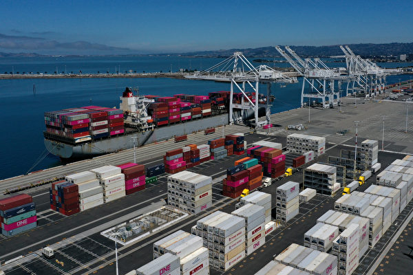

印度、日本和澳大利亚将推出三方供应链弹性计划（SCRI），以取代中共红色供应链。图为示意图。 (Justin Sullivan/Getty Images)

   
 【大纪元2020年08月19日讯】（大纪元记者李言综合报导）在日本倡议下，印度、日本和澳大利亚启动三方供应链弹性计划（SCRI），以取代红色供应链，遏制中共在政治和军事上的入侵。

印度《经济时报》（Economic Times，缩写为ET）获悉，这三个国家将在下周举行首次经贸部长会议，以就计划细节进行讨论。

知情人士透露，日本经济产业省最近与印度相关部门接触，邀请对方加入有望在今年11月启动的三方供应链弹性计划。

印度政府正在非常认真地推动该提议。消息人士称，通常，新德里会谨慎考虑任何此类提议，因为这将被视为反中共结盟。考虑到中共在拉达克“实际控制线”上的入侵行为，这次，政府最高层已决定参与SCRI，加入全球供应链，以取代中国供应链。

这个话题也是莫迪总理周六（8月15日）在该国“独立日”上演讲的主题之一。他说，全球企业已经开始将印度视为可能的“供应链枢纽”，现在印度也必须“为世界而制造”。

日本此番提议的目的是吸引外国直接投资，使印度太平洋成为“强大的经济团体”，并在现有双边供应炼网络的基础上建立网络，在伙伴国家之间建立互补关系。最终目的是提高整个印度太平洋地区的供应链弹性。

消息人士称，除印度外，日本也邀请澳洲加入这项倡议，未来还可能邀请东盟（东南亚国家联盟）国家参与。

<b>取代红色供应链</b>

外界认为，日本与印度、澳洲推动的三方供应链弹性计划，将取代中共的红色供应链。

中共窃取知识产权、隐瞒中共病毒（武汉肺炎）疫情、强推《港版国安法》，并不断在东海、台海和南海、印度洋、中印边境制造军事紧张局势，其与国际社会的关系越来越紧张。

美国和日本正推动企业和制造基地迁出中国；印度正在通过松绑外国直接投资（FDI）相关规定，并在随后推出65亿美元的奖励方案，以吸引更多准备从中国迁移生产线的厂家到印度落户。

在中共病毒疫情爆发后，日本首相安倍晋三（Shinzo Abe）已经设立了20亿美元的基金，以帮助日本公司从中国撤离；此外，澳大利亚和美国已经达成一项雄心勃勃的协议，以建立所谓的“没有中国（中共）”的稀土材料供应链。 ＃  

<a target="_blank" href=#top><h6 align="right">回上方</h6></a>

<a name=211>
<h1 align="center"><b>缺粮？陆媒称“吃剩菜暖心” 上海大搞举报</b></h1>

中共的“光盘行动”俨然一场运动，民众直呼文革再现。(AFP Photo)

【大纪元2020年08月19日讯】（大纪元记者张玉洁综合报导）中共的“光盘行动”俨然一场运动，继多地N-1、N-2点餐模式和餐厅就餐前称体重的消息之后，近日大陆媒体极力宣传吃剩菜，上海开始大搞举报行动，一些政府机关和学校食堂规定剩饭超重罚款，网友纷纷表达对中共这些做法的反感。

<b>陆媒称吃剩菜是“暖心一幕” 网友：吐了</b>

8月18日，大陆新浪、搜狐、凤凰等多家媒体高调报导宁夏一餐厅老板吃宴席剩菜，称这是“暖心一幕”。大陆媒体的这种宣传引发众多网友批评。

陆媒报导中称，该餐厅老板说，“看到这些炒菜没怎么动筷，我就坐下来品尝一下，一是不想浪费，二是通过品菜，找找厨师做菜是否存在问题。”还说，平时客人没怎么吃的菜就当作员工餐。

微博网友对此纷纷留言：“这宣传，吐了。”“变着法跳忠字舞？”“老同志这戏演过了，过了呀。”“折腾老百姓。”

“这就鼓励咱们吃剩菜剩饭了？？”“没怎么动筷也有动过的吧，这都敢吃！”

<b>上海大搞举报 学者：文革那一套</b>

上海市8月16日宣布，建立一套举报投诉机制，重点加强对商务宴请、婚丧嫁娶红白事等餐饮浪费行为的监管，如果被检举的人坚决不改，会遭到“批评曝光”。

自由亚洲电台8月18日引述独立学者吴祚来的分析表示，真的跟57、58年的大跃进似的，不知不觉把文革的方式搬出来了，本来是可以通过一种市场式的、文明方式来解决问题，现在却用很低级、很粗暴的方式，政治的方式来运作。

一位市民表示，当局此举流于形式，老百姓都是很节约的，因为老百姓根本没有浪费的条件。

18日当天，中共官媒中新网报导湖南长沙一个政府机关食堂推出“用餐新规”——用完餐后，必须将餐盘拿到回收处秤重，只要盘中剩菜超过125公克，将会从用餐人的卡中扣除1元人民币。

该餐厅还规定，每份餐的标准就是2荤菜（130克）、1素菜（110克）、200克米饭，以及1碗汤，若要调整份量需提前告知，否则不管什么原因，只要剩下就罚款。餐厅还会把吃剩的包心菜或白菜腌渍成菜干，作为早餐配菜。

另外，《环球时报》等官媒宣称，湖南耒阳市一所学校从2015年起巡查学生就餐过程，并称重剩饭，如果班级每人每天平均剩饭剩菜超过100克，将会取消学生奖学金评选资格，同时也对相关学生罚款100元人民币。

有微博网友说，“说真的，凡事最怕过犹不及。之前孩子学校就有‘光盘行动’，菜里一堆肥肉片，孩子不敢盛，因为盛了必须光盘全部吃掉。小孩们个个宁肯饿肚子，然后放学回到家疯吃。”

“粮食危机了？”“最近这是怎么了？魔怔啦？”“文革的前奏……”“新时代的三反五反运动又来了。”“这样的‘作秀’可能也是中国（中共）特色社会主义的一部分吧。”

<a target="_blank" href=#top><h6 align="right">回上方</h6></a>

<a name=210>
<h1 align="center"><b>【一线采访】甘肃文县洪水淹4层楼 古镇也被淹</b></h1>

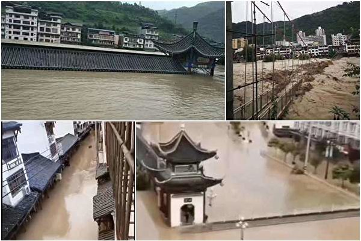

甘肃陇南文县碧口镇遭遇山洪泥石流。（大纪元合成图）

   
 【大纪元2020年08月18日讯】（大纪元记者洪宁、张顿采访报导）甘肃文县遭暴雨袭击后，多乡镇遭受泥石流、洪水灾害，很多居民的房屋被淹没。其中包括石鸡坝镇的水深高达四层楼，甘肃四大古镇之首的碧口镇被淹，212国道被冲毁。
 
<b>暴雨袭击甘肃文县</b>

8月17日，甘肃陇南市文县多个乡镇遭受非常严重的滑坡、泥石流、洪水等灾害。其中，文县石鸡坝镇因泥石流堵住河道，形成一个很大的堰塞湖。

据《新京报》报导，堰塞湖形成后，水位上涨得很快。石鸡坝镇沙渠村一名村干部说，截至17日17时许，“（水）已将楼房二楼完全淹没，水即将上涨至三楼”，他和25名村民被困在沙渠村一栋楼房内。

石鸡坝镇居民方女士也说，受堰塞湖影响，家里有5口人被困，目前洪水已淹没至自家房屋三层处。据其提供的视频内容显示，洪水已淹没当地多处房屋。

文县多名居民18日接受大纪元记者采访时，也描述了当时洪水的情况。

<b>石鸡坝镇四层楼都被淹了</b>

文县城关镇一家米皮店（镇政府旁边）女老板对大纪元披露，上面石鸡坝镇有两个山体滑坡，一下子形成了堰塞湖，“那里四层楼高全部都被淹了，楼下的人都得跑到楼上等着救”。

“如果再不爆破的话，死的人就会太多了，就爆破了，炸开了口子，水一下来就把我们这里给淹了。”

<b>城关镇“水淹得特别严重”</b>

爆破之前，当局通知了撤离，城里也一直在拉警报，一直在吼，拉得人心惶惶，人心都碎了，“昨晚10点左右，洪水就下来了，洪水太大了，很危险，随时有塌方”。

她说：“我们这里水淹得特别严重，我家里全淹了，家里的水有2米深。电和水都没有。昨晚如果我俩都跑慢点儿，我和丈夫差一点儿……那都要淹死在里面了。”

但没有一个真正政府的领导来给他们说具体情况。只是听亲戚姊妹说，上面形成了堰塞湖，赶紧撤离，提前想好哪里高就往哪里跑。“一听说这话，我们就慌了，急了，晚上10点左右大水就淹下来了。”

“我和丈夫没来得及带上家里的东西，就逃命了，家里还有两部手机，一些现金都没有带出来，现在都找不到了。”

他们当时想洪水可能没那么严重，不会淹得那么深，没想到18日回去一看，水还有2米深，人都不敢进去，人在里面都打漂了。

她说，现在水开始退了。他们家所有的衣服、油柴米全部淹了，她找了三四个小工弄了一天也没弄完，累到不行了，到现在饿得还没吃上饭。全是黄泥汤，家里地上粘得很，脚都拔不出来。现在停水，有车来送水，但人太多，排不上队。

她还介绍，前几天大水的时候，有一个生小孩的女子，夫妻俩一起被冲走了，还有一个消防兵，到现在也没找到。

<b>甘肃四大名镇之首被淹 水深2米</b>

文县碧口镇一私营老板对大纪元说，他们现在全在外面避难，什么时候能回家还不清楚。昨天就上安置点了。镇里在高处的地方设立了安置点，点里有电，但镇里还没恢复电力。

他说上游18日还在继续放大水，因为上游下暴雨，水太大了，上游水电站只有放水。碧口镇街里的水已经涨到2米多高了。

虽然政府提前是通知了，但还是被淹了。家里全淹了，等洪水过后，等着跟政府要处理。

“这里是甘肃的古镇之一，是旅游景点，现在全镇被淹了。”他说。

文县碧口镇，是甘肃的名镇，居“甘肃四大名镇”之首。其它三大名镇分别为：通渭县马营镇、永登县红城镇、华亭市安口镇。

碧口镇一家饭馆老板说，碧口镇整个镇都被淹了，昨天下午6点多钟被淹的。家里的财产都淹了，现在街上低洼处水已经有2米多了，街上基本都淹到2层了。

什么时候回家，要等到基本上不下雨，上游的水退下去之后，他们才可以回家。

这是这么多年最大的一次水。

“现在水还在原水位，现在的泄水流量在4500立方米/秒左右吧，昨天在最高时放到5000多了，是碧口水库（碧口电厂的）放的水了。”

庄稼肯定是完了，现在街道1楼全部都淹了，都2米深了。

<b>212国道被冲断</b>

碧口镇磨河坝村农家乐一家老板说，现在没法开业了，还得等一段时间。这里路已经断了（因泥石流），“212国道线不通了，客运车、班车、公交车全部停运了，一时半会通不了。”

现在游客进不来，也出不去。这里泥石流太严重了，造成山体滑坡很严重，水还没退，没法抢修。

他表示，是因为他们县上游形成了堰塞湖，上游现在放水。就把碧口镇给淹了。

“这是最严重的一次，今年是灾难最多的一年，下雨的时间太多了，我们这里是山区，雨水太多了，容易滑坡。”他说。

<a target="_blank" href=#top><h6 align="right">回上方</h6></a>

<a name=209>
<h1 align="center"><b>钟原：中共自曝休斯顿领馆人员全被驱逐</b></h1>

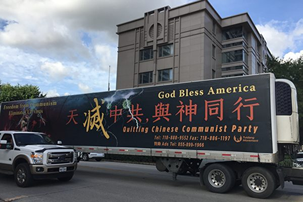

2020年7月24日，美国德州休斯顿，中共驻休斯顿总领事馆关闭，一辆挂有“天灭中共 与神同行”的卡车绕行四周。（大纪元）

   
  【大纪元2020年08月18日讯】8月17日，中共党媒新华社报导，王毅赴机场迎接驻休斯敦总领事馆全体馆员回国。这则新闻，等于中共自曝，中共驻休斯顿领馆被关闭后，所有外交人员实际被美国全部驱逐，否则不会包机全部返回中国。这么多留学生都没有包机，却专门给休斯顿领馆人员安排了包机。

从党媒公布的图片和视频看，包机半夜降落到北京机场，悬梯旁站着一排身着防护服的医务人员。按照规定，这些人从美国回到中国，在机场检测后，都需要马上被隔离。王毅只好赶到机场去欢迎，参加了一个简短的迎接仪式，王毅还讲了话。

中共驻休斯顿领馆被关闭后，不少人也想知道，领馆内的人都去哪里了。一种方式，这些人可能被分配到其它领馆或使馆，也可能一部分人回国。这些人全部回国的安排，应该不是中共外交部主动安排的，最大可能是美国拒绝这些人继续留在美国。理由很简单，这些人都涉嫌参与间谍活动，领馆都被关闭了，美国当然也不应该再让这些人留在美国。

8月16日，中共驻美国大使馆推特账号写道：“十分遗憾看到我们驻休斯顿总领馆的同事离开美国……”

这表明，不是这些人不想留下，而是没法留下，中共驻休斯顿领馆的人员应该确实全部被美国驱逐了。

7月21日，美国要求72小时关闭中共驻休斯敦总领馆，领事馆内随即组织烧毁文件，浓烟冲天，引来了消防车，人们才知道这个新闻。

中共驻休斯顿领馆原来的业务，现在由中共驻华盛顿大使馆代理，领馆的全部人员被迫回国。

按理，这又是一件灰溜溜的事，毫无光彩，但中共却主动曝光，令人匪夷所思。王毅还特意去欢迎，不知到底要表达什么样的信息。这些人并不是什么英雄，而是涉嫌参与间谍活动，才被美国驱逐，主动曝光这样的欢迎仪式，难道是继续鼓励外交人员的间谍行为吗？或者说，王毅再向美国示威，准备与美国对抗到底？

这可能的确反映了中共内部的某种情绪，但王毅的简短讲话中，却仍然说，“要对话，不要对抗”。王毅表面的话语，和他到机场迎接的行为，完全自相矛盾。

美国指控中共驻休斯顿领馆参与间谍活动，中共外交部至今也没有正面回应，只是一再称“美方违反国际关系基本准则”。这样的辩解，实际上在表示，即使中共领馆人员从事了间谍活动，也有外交豁免权，不会被怎么样。美国也确实尊重了这类的外交豁免权，并没有抓捕这些人，而只是把他们驱逐了。

更令人感到滑稽的是，在欢迎仪式上，中共外交部宣布授予驻休斯敦总领事馆集体三等功。中共驻休斯顿领馆已经不存在了，给谁记功呢？

中共的所谓记功，并没有给任何一个具体的人，而是给予了已经不存在的领馆，不知是开玩笑，还是玩游戏。被驱逐的领馆人员，应该也不会自认是什么英雄，毕竟被驱逐了，落魄地回家了，说出去怎么都不好听。

能有机会到中共驻外使领馆工作的人，当然都不是一般人，这样的肥缺，即使有关系的人，可能都要排队，更别说是驻美国的使领馆。可能谁都没想到，在美国的肥差、美差，最后破天荒地失去了，好不容易半夜回国了，还要配合中共再演一回戏，成为所谓的爱国主义宣传的工具。

演完戏，这些人还得做检测，然后被送到某个旅馆去隔离，至少又得折腾大半夜，即使躺到床上，应该也是辗转反侧、难以入眠。他们可能从来没有想到，留学生们回国后的遭遇，也会落到自己身上。

如果他们能认真想一想，这一切都拜中共政权所赐。中共派他们去美国，大肆进行间谍活动，结果被驱逐了，中共其实根本罩不住。象征性地记功，其实没有一个人真正有份，回去一样被强制隔离。

医学隔离后，搞不好，他们还会被集中隔离，一一被排查是否做了内鬼，更不准乱说乱动。他们托关系、送钱，好不容易抢到了这么好的差事，怎么也想不到最后是这样的结局。

<a target="_blank" href=#top><h6 align="right">回上方</h6></a>

<a name=208>
<h1 align="center"><b>瑞士驻华大使馆发微博 网民留言“大翻车”</b></h1>

位于苏黎世的瑞士银行总行。(Fabrice COFFRINI / AFP) 

 
 【大纪元2020年08月17日讯】日前，瑞士驻华大使馆发的一条微博引发的网民留言异常一致：纷纷要求瑞士公布中共贪官在瑞士银行存款的名单！“大翻车”的评论区成为一道奇特的风景，引发更多网民关注。

8月14日，瑞士驻华大使馆发了一条“庆祝中国（中共）和瑞士建交70周年并祝贺全国影院复工复映”的微博。这一条看似平常的微博，没想到评论区却“翻车”了。大量网民在下方留言，一致要求瑞士公布“百人名单”、“盗国贼名单”以及“公布人民公仆财产清单”。还有网民表示，“请你们先冻结这些赃款，中国人民会感激你们的。”

“恳请公布盗国贼名单！”“请贵国尽快提供贪官财产清单！”“不要向恶势力低头”“老百姓只关心瑞士什么时候公布贪官名单！”“请公布卖国（中国）贼名单，请不要作恶，请保持正义！”“你们不公布名单，就是邪恶的帮凶！”

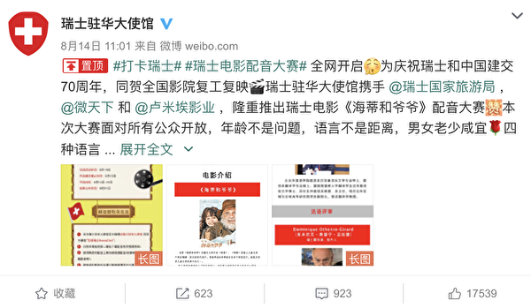

瑞士驻华大使馆发微博。（网页截图）

   
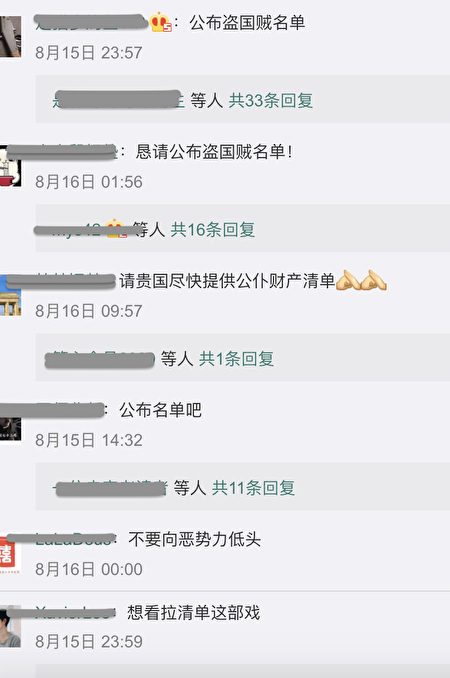

网民评论大翻车。（网页截图）

   
 网民在评论中所说的“百人名单”，是针对2019年一篇名为“令人咋舌，瑞士银行公布消息，100位中国人存款合计7.8万亿！”的自媒体文章而言。当年8月3日，该文经中共财政部财科所前所长贾康转发后，立刻引发舆论关注。

贾康转发的微博说，瑞士银行公布消息，100位中国人在瑞士银行的存款合计7.8万亿，则平均存款为：78000亿／100人=780亿人民币／人，当然真实数据还有待考究。但是这真的值得我们深思，如果是真的，那会有多可怕、多令人心寒？贾康又表示，转发并不等于同意该文的观点。

随后不少微信公众号列出清单推算富豪资产，发现在2018年大陆福布斯榜单里，能够达到780亿身家的人仅有11位。也就是说，仅一家银行公布的名单就有100个之多，海外资产巨大到令人无法想像。

有分析指，这些人的钱见不得光，不能曝光，所以才会把钱放到瑞士，以谋求太平。

数十年来，瑞士银行由于保密程度极高一直是世界富豪避税、中共贪官存放赃款的天堂。

维基解密曾披露，中共高官在瑞士银行大约有5,000个账户，三分之二是中央级高官。从中共的副总理一级、银行行长、部长到中央委员，几乎人人都有一个账户。

近期中美关系恶化，美国在多个领域与中共正面交锋，并制裁中共及香港官员，引起坊间纷纷关注中共官员在美国及瑞士的存款以及如何避险的问题。

日前，美国国务卿蓬佩奥访问欧州多国。他在捷克演讲时说，现在发生的不是冷战2.0……抵御中共威胁的挑战在某些方面比冷战更困难。网上有爆料说，蓬佩奥请英国、瑞士及欧盟国家协助支持冻结中共官员在境外的资产，至少10万亿美元。

日前，中南海重要顾问余永定警告，中美冲突尖锐化，美国不仅可以制裁中国银行，还可以扣押中共官员的海外资产。#  

<a target="_blank" href=#top><h6 align="right">回上方</h6></a>

<a name=207>
<h1 align="center"><b>湖南黑社会集团当街杀人为害17年 89官员涉案</b></h1>

【大纪元2020年08月19日讯】（大纪元记者方晓报导）湖南湘西州犯故意杀人等罪的尚同军黑社会集团在当地州委常委、政法委书记欧阳旭等89名政府官员的庇护下为害社会长达17年，涉黑案细节触目惊心，包括当街杀人、肢解焚烧被杀者等。

8月19日，中共湖南省委常委、政法委书记李殿勋通报了尚同军案情况。

湘西州花垣县以尚同军、吴先耀为首的黑社会组织有23人。李殿勋称，他们盘踞花垣县近20年，该黑社会组织在当地形成“政商同盟”。湘西自治州前州委常委、政法委书记欧阳旭等89名政府官员都是这个黑社会集体的保护伞——构成矿老板+“黑老大”+政法委书记的“政商同盟”。在官方包庇、纵容下，该黑社会集团实施违法犯罪活动。

尚同军等人投资和经营的企业，在当地处于强势地位，实施非法采矿、诈骗、虚开发票等犯罪行为，大肆敛财，涉案财产超6亿元，并将非法获利用于黑社会性质组织的运行发展。

该黑社会组织采取暴力、威胁、欺诈等手段，“以商养黑”“以黑护商”，攫取非法经济利益。

因赌场利益等矛盾，受吴先耀指使，王武金当街枪杀石远辉。为灭口，吴先耀又指使手下枪杀王武金并肢解焚烧。该集团有组织地实施故意杀人、故意伤害、非法采矿、诈骗等43起犯罪活动，其中故意杀人4起致4人死亡；故意伤害3起致4人重伤；非法拘禁2起致1人死亡。23人中，有20人参与故意杀人。

2020年7月30日，尚同军、吴先耀因犯组织、领导黑社会性质组织罪、故意杀人罪等罪，分别被判处死刑；其他21人分别被处死刑、无期徒刑，及8至22年不等有期徒刑。

公开简历显示，欧阳旭系湖南永顺人，其长期在湘西州任职，2011年9月开始，任湘西州委常委、政法委书记长达8年，期间还于2012年至2014年兼任了湘西州公安局局长、党委书记。

2019年4月，欧阳旭调离湘西州，任湖南省发展和改革委员会党组成员、省湘西地区开发领导小组办公室主任，半个月后落马。

在2020年7月30日的判决中，欧阳旭犯受贿罪、滥用职权罪被判处有期徒刑10年。

2012年，欧阳旭利用权力“打招呼”将前述黑社会罪犯吴先耀从监狱捞出。在监外执行期间，吴先耀又涉嫌另案被立案查办。

中共自建党以来就被称为“共匪”，是“最大的黑社会组织”。而中共各级官员（包括警方）与黑社会勾结、充当黑社会的保护伞更是顺理成章。

中共十八大后被抓捕的前中共河北省常委、政法委书记张越，中共政法系统的最高官员、前政治局常委周永康等人，都充当了黑社会的保护伞。

2018年6月7日，由中共政协陕西省委员会主办的《各界导报》官方微博贴出一个视频，说的是陕西商洛市镇安县一社区书记在信访局接待民众来访时称，“中国共产党就是最大的黑社会，你听不听，不听也得听，叫你东你不得西”。

时政评论员惠虎宇曾在大纪元刊发《中共政权黑社会化由其本性决定》的文章，指中共政权的黑社会化是中共的党性所决定的，黑社会特性也是中共与生俱来的本质属性之一。

黑社会的两大组织特征是：一切成员绝对地服从老大，不服从的会受到惩罚；一旦加入，别想轻易退出江湖，自动退出会受到追杀。

另外，中共也被指是全球最大的“黑帮”，它把在国内的全套做法全部搬到国际社会上，如它支持国际各类恐怖组织、支持大大小小的“流氓国家”等，扰乱世界。

<a target="_blank" href=#top><h6 align="right">回上方</h6></a>

<a name=206>
<h1 align="center"><b>马里政变 总统被迫辞职 中共跳脚回应</b></h1>

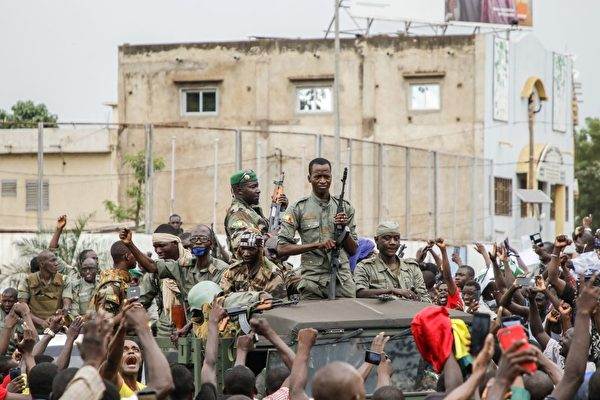

马里总统凯塔（Ibrahim BoubacarKeïta）被士兵拘禁，后宣布辞职，并解散政府和议会。(STRINGER / AFP) (Photo by STRINGER/AFP via Getty Images)

   
【大纪元2020年08月19日讯】（大纪元记者徐简综合报导）周二（8月19日）晚间非洲国家马里的总统易卜拉欣‧布巴卡尔‧凯塔（Ibrahim BoubacarKeïta）被士兵拘禁，几个小时后宣布辞职，并解散政府和议会，立即生效。

凯塔总统声明发出的数小时前，他在位于首都巴马科（Bamako）的家中被捕，和总理西塞（Boubou Cissé）被军队扣押在巴马科附近的卡蒂军营内。

凯塔通过国家电视台ORTM发表演说宣布辞职，并解散政府和国会。说，“我不希望为了保住权力，而有流血发生。”他还表示，如果军队部分人想通过干预结束示威，他也没有选择。

中共发言人赵立坚在周三早上例行记者会上被问及对此事的评价，他马上表示，中共“反对以武力改变政权”。但外界评论指，中共的马克思主义理论就是“主张通过暴力革命夺取政权”，现在中共在风雨飘摇之中惧怕百姓推翻自己，立刻改变说法，实为讽刺。

马里政变士兵们的发言人呼吁，要过渡到“公民政治”，进行大选。数以百计的反政府示威者到首都的中央广场庆祝。

凯塔在2018年的选举中赢得了第二个任期，但国民对经济腐败、管理不善以及立法选举产生争议而感到愤怒。

最近几个月，全国引发了几起大规模抗议活动。由保守派伊玛目领导的反对派新联盟“玛穆迪可”（Mahmoud Dicko）拒绝凯塔包括成立“联合政府”的让步，并继续要求政府进行改革。

中共政权目前正处于风雨飘摇之中，前中共中央党校教授蔡霞公开称中共是“政治僵尸”、不点名地批评习近平是“黑帮老大”，被中共开除党籍后，她说，“与这个黑帮一样的政党彻底脱钩了！”海外媒体包括国内各大微信群里都在沸沸扬扬地讨论。

联合国高级外交官表示，应法国和尼日尔的要求，联合国安理会将在下于周三（19日）召开紧急会议。联合国秘书长安东尼奥‧古特雷斯（Antonio Guterres）要求政变士兵“无条件释放”两位政要和“立即恢复宪法秩序”。

2012年马里发生曾军事政变，推翻当时的总统杜尔（Amadou Toumani Toure）。凯塔于2013年通过民主选举当选总统，2018年赢得连任。   

<a target="_blank" href=#top><h6 align="right">回上方</h6></a>

<a name=205>
<h1 align="center"><b>组图：四川遇百年大洪水 首次启动一级预警</b></h1>

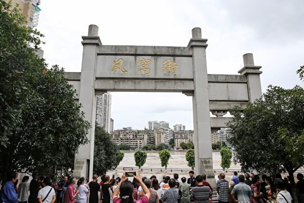

2020年8月18日，中国四川省内江市，大雨过后，民众注视沱江高涨的水位。(STR/AFP via Getty Images)

   
【大纪元2020年08月19日讯】（大纪元记者林紫蓉报导）中国多处持续受到洪水侵袭，山东省有大批牛群遭洪水冲走；四川省多日暴雨，8月18日当地启动史上首次“一级防汛应急响应”。

据四川省累计降雨量14日20时至18日8时统计，1,198站降雨量为100至249.9毫米之间，德阳市旌阳区黄许镇出现累计最大雨量，高达865.0毫米。

目前青衣江雅安城区段已出现百年来最大洪水，当地知名景点乐山大佛的脚趾处已遭洪水淹没。报导称，这是1949年以来，乐山大佛首度被洪水淹至脚趾的高度。

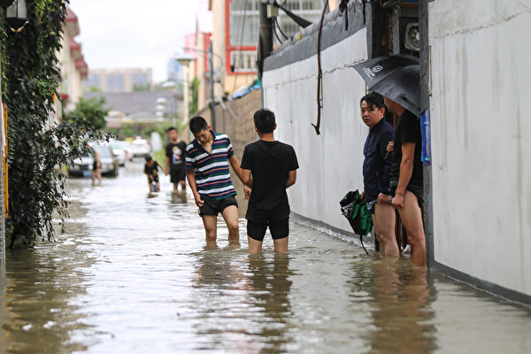

2020年8月14日，中国山东省临沂市，民众在被洪水淹没的街道上行走。(STR/AFP via Getty Images)

   
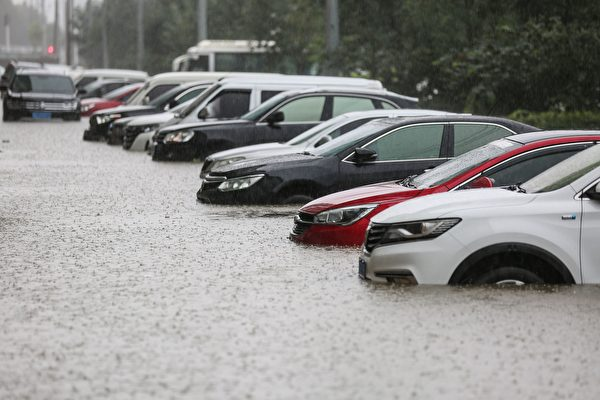

2020年8月14日，中国山东省临沂市，街道上的汽车泡在水中。(STR/AFP via Getty Images)

   
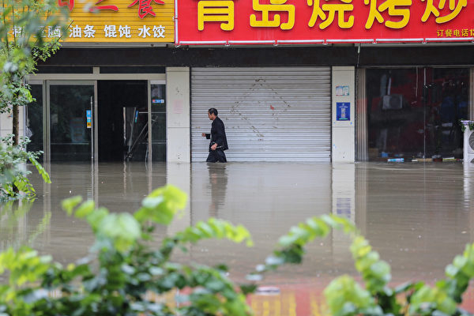

2020年8月14日，中国山东省临沂市，一位市民在洪水淹没的街道上涉水通行。(STR/AFP via Getty Images)

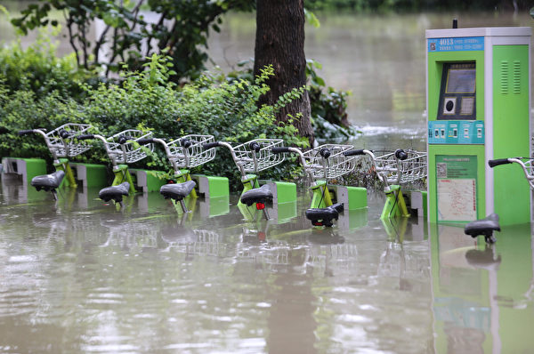

2020年8月14日，中国山东省临沂市，自行车坐垫以下被水淹没。(STR/AFP via Getty Images)

   
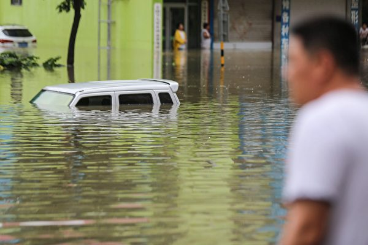

2020年8月14日，中国山东省临沂市，一台汽车几乎快要灭顶。(STR/AFP via Getty Images)

   
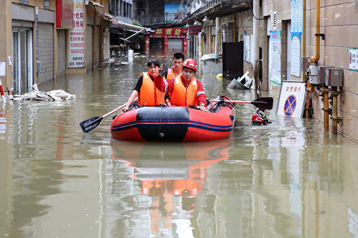

2020年8月18日，中国四川省内江市，救援人员撤离了受灾的居民。(STR/AFP via Getty Images)

 
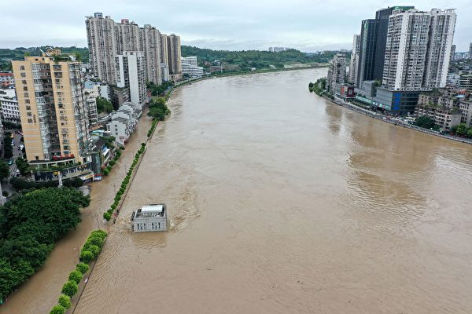

2020年8月18日，中国四川省内江市，沱江水位高涨。(STR/AFP via Getty Images)

  

<a target="_blank" href=#top><h6 align="right">回上方</h6></a>

<a name=204>
<h1 align="center"><b>川普：是我叫停了美中贸易对话</b></h1>

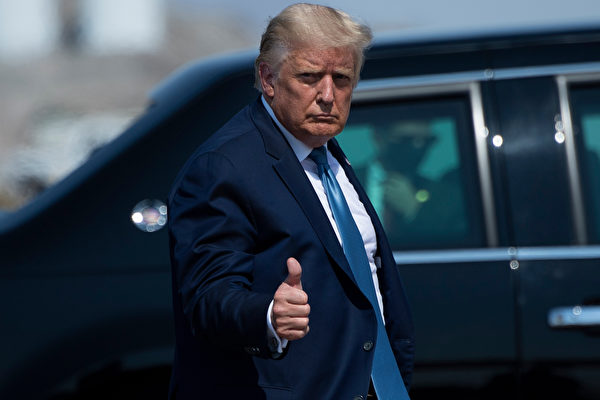

美国总统川普（特朗普）2020年8月18日表示，是他叫停了与中方的贸易对话。总统还补充说，他现在不想与中方通话。 (Brendan Smialowski/AFP)

   
  【大纪元2020年08月19日讯】（大纪元记者夏雨综合报导）美国总统川普（特朗普）周二（8月18日）表示，是他叫停了与中方的贸易对话。总统还补充说，他现在不想与中方打交道。

周二，在亚利桑那州尤马市（Yuma）的一次活动中，川普被问到美中贸易对话被推迟的问题。川普说：“是我推迟了与中方的对话。你知道为什么吗？我现在不想和它们（中共）打交道。我现在不想和它们打交道。鉴于它们对这个国家（美国）和世界所做的一切，我现在不想与中国（中共）交谈。”

川普还被记者问到是否会退出与中国的贸易协议。川普回答说：“我们会看到的。我们将看看会发生什么。让我告诉你，中国（中共）对世界的所作所为甚至是令人难以想像的（指让病毒蔓延全球）的。它们本可以阻止它（中共病毒）。它们本应该阻止它（病毒）。”

“没错，是我取消了与中方的对话。”川普说。

媒体报导说，美国贸易代表罗伯特·莱特希泽（Robert Lighthizer）、财政部长史蒂文·姆钦（Steven Mnuchin）和中共副总理刘鹤原本定于上周六（8月15日）举行电视贸易会议，评估美中第一阶段贸易协议的执行情况。但美中贸易对话被无限期推迟。

川普在谈到大瘟疫时说：“中国（中共）对世界所做的事情是令人无法想像的（指中共令病毒蔓延全球）。”

周一，川普在接受“福克斯新闻”采访时表示，他与北京的关系“非常严峻”，中方正试图通过购买牛肉、大豆和玉米等产品来弥补美中关系。

白宫贸易顾问彼得·纳瓦罗（Peter Navarro）随后告诉CNBC，第一阶段贸易协议仍在进行中。与此同时，9月美国对中国的石油出口可能增加一倍以上。

彭博社报导，根据Vortexa Ltd.基于临时油轮预订的估计，下个月将装载多达1400万桶（或装满七艘超大型油轮）的美国原油，运往中国。如果所有这些货物都完成交货，那将是8月份中国购买美国原油数量的两倍。

路透社也报导，中国正在寻求预订8月和9月的油轮，以运输至少2000万桶美国原油。这是因为北京在履行对美国第一阶段贸易协定承诺方面面临越来越大的压力。

市场分析公司Vortexa的高级分析师Serena Huang对彭博说：“美国原油购买量的增加可能是出于政治原因。中国仍然坐拥大量石油储备，目前美国的原油价格并不比其中东竞争对手便宜得多。”

彭博社根据（中共）海关总署的数据显示，今年前六个月，中国从美国进口的商品仅达到贸易协定2020年总目标的约23%。 

<a target="_blank" href=#top><h6 align="right">回上方</h6></a>

<a name=203>
<h1 align="center"><b>上海195万党员名单疑外泄 记录详细个资</b></h1>

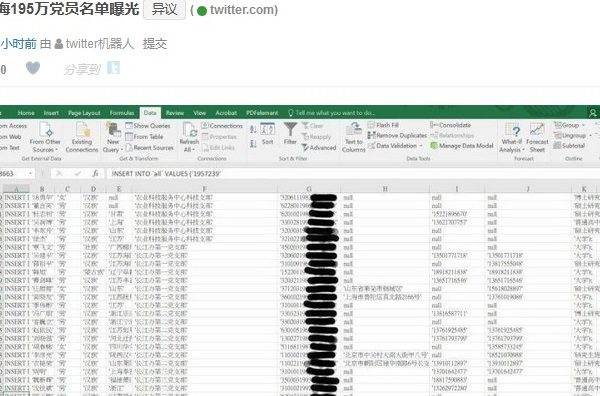

在美国宣布将对中共党员及其家属进行制裁后，一份中共上海市党员登记名册在网上曝光，包含详细的个人信息。（网络截图）

   
【大纪元2020年08月19日讯】（大纪元记者梁义综合报导）就在美国宣布将对中共党员及其家属进行制裁后，一份中共上海市党员登记名册在网上曝光。这份名单记录了上海市党员的姓名，性别，籍贯，身份证号码，家庭住址及通讯方式，被认为可信度很高。

这份名单早在一个月前就在网上出现，但当时并未引起太多关注。7月21日，网名为“总裁判”的爆料人在海外中文网贴出“上海市全体党员登记名册外泄”的文章。文章披露了中共上海市委员会党产以及被严格保存保管的内部机密，内含195万党员名单的整套机密档案材料。

消息称，这批庞大而定为机密（秘级为二级）的党内文件，详细记录上海当前所有党员的组织编号、姓名、性别、民族、籍贯、文化程度、身份证号码、家庭住址及通讯方式。

大纪元根据相关连结，下载了两份EXCEl文件，包含上海市各级政府、机构，以及企业单位的中共党员信息、的，共计1,957,239名党员信息。

记者通过上海市民核实了其中数人的党员身份和地址，证实爆料材料的相关信息属实，但有些据知是党员的上海市民名字并未出现在名单中，显示这一名单并不完整。

海外阿波罗网记者也曾拨打文中部分人员电话，确认了这些人的真实身份，说明电话和所对应人员的身份信息正确，因此判断泄露的文件内容可信度较高。

针对这份材料的真实性，爆料人“总裁判”公开了就这批材料的相关事项所作的5点问答：

<b>1，问：这批材料真实的还是伪造的？</b>

答：容量为150MB Excel的显示图文材料，字数达1.3亿之多，若蓄意编造、恶搞，其耗费的精力成本，不亚于撰写上中下三大本托氏的《战争与和平》。任何一个原籍上海的读者，或在沪有党员亲友的外省市网民，于查找的同时即能辨其真假，190万个条目信息，无一相同。

<b>2，问：机密文件何以外泄，黑客所为？</b>

答：中共机关内部的信息来往及文件资料的电脑管理，皆为有线相接，自成终端，与互联网根本隔绝。即使黑客高手作祟，也必须亲身进入上海徐汇区高安路19号市委组织部办公楼为前提，而中共内部的政治保卫严密程度为世界一流，例如组织部这一省部级机关的内部电讯监督，包括对部长办公室在内，只要办公大楼里有任何一台电脑运作，哪怕只插个U盘，中心控制室便记录在案，即时或随时可给予该机操作内容甄别。

<b>3，问：既然材料上了互联网，我们怎么看得到？</b>

答：https://mega.nz/folder/hJIGhCra#EUmGEZ7RDbcvTncWCPb03w 这是中国境外网站，可直接点入。

<b>4，问：有没有病毒啊，不会是恶搞吧？</b>

答：如果讲到现在您仍不放心，或许您本身是电脑行家，那可以不要enable edit模式，这不讲你也懂，即使文件含有病毒也不会被激活。其实，已经被网民普遍接受过的信息，就是没病毒的信息，毕竟那些认为中了毒便是中了奖的网民，为数不多。

<b>5，问：下载后打开是否顺利？</b>

答：该文件尺寸较大，用EXCEL打开比较困难，可搜索微软公司免费的 Power BI， 便毫无问题。有网民下载了zip文件，解压后得到两个xlsx文件（名册的第一、第二部分），并且用offic 365成功打开了，不需要第三方软件。里面的信息很详细，确实是数据库文件转换而来的。

爆料人还说：“各位网友们，《1984》描绘了那么可怕的图景；在当今毫无隐私的网络世界里，我党的广大党员一样感同身受，昼夜不得安宁。”

就在上海全体党员档案外泄前4天，美国媒体报导了川普政府正考虑全面禁止中共党员及其家人赴美旅行的消息。

阿波罗网评论员分析，就在美国媒体报导川普内阁计划对中共所有党员和家属进行制裁的消息发布之后，就发生了这个泄密事件。此举表明在中共内部似乎有力量在配合美国对中共党员进行制裁，并希望从中共内部瓦解中共。   

<a target="_blank" href=#top><h6 align="right">回上方</h6></a>

<a name=202>
<h1 align="center"><b>三峡大坝面临创纪录洪水袭击 10孔泄洪</b></h1>

2020年7月19日，长江三峡大坝正在泄洪，造成下游洪灾加重，许多农田和房屋被淹。(STR/AFP via Getty Images)

   
 【大纪元2020年08月19日讯】今年长江5号洪水形成，洪水的洪峰8月19日开始进入三峡水库，长江上游寸滩、三峡水库入库将分别出现每秒7.4万立方米的洪峰流量，为三峡建库以来最大入库洪水。三峡水库已开启10孔泄洪。8月20日三峡水库将出现入库每秒7.6万立方米的洪峰流量。对三峡水库将形成巨大挑战。

连续的强降雨导致长江上游多条支流发生洪水，8月17日，“长江2020年第5号洪水”在长江上游形成。官方水文网用“严峻紧迫”“来势凶猛” “全力再决战”来描述新一轮洪水，显示三峡大坝将承受更严峻考验。

新京报8月19日报导，从中共水利部获悉，长江发生流域性大洪水，其中上游发生1981年以来最大洪水，预计8月20日三峡水库将出现建库以来最大入库洪峰7.6万立方米每秒。

此前洪峰最大为2012年的7.12万立方米每秒。

三峡泄洪的视频画面显示，三峡水库已开启10孔泄洪，下泄流量已经达到4.8万立方米每秒，也是三峡建库以来最大下泄流量。

长江干支流水位因而继续上涨，防汛情势十分严峻。

网民对此议论纷纷：“太恐怖了！泄洪的水泄到哪里了呢？哪里可以承载这么多水？”“下游可怜了！”“上游生态被破坏，下游又受灾！”“重庆已经淹了，一楼和负一楼……”

“洪水滚滚翻巨浪，滔滔不绝何时休？”“2020年多灾多难，努力活着都已经很困难了。”

<h4 align=center><a href="https://twitter.com/MgOqkzLBRPLCHyN/status/1295732287837880325?ref_src=twsrc%5Etfw%7Ctwcamp%5Etweetembed%7Ctwterm%5E1295732287837880325%7Ctwgr%5E&ref_url=https%3A%2F%2Fwww.epochtimes.com%2Fgb%2F20%2F8%2F19%2Fn12342330.htm">这小记者是实习生吧？能蹚水播报还是有勇气的(点击右键,另存新档）</a></h4>

19日9时，水利部将水旱灾害防御Ⅲ级应急响应提升至Ⅱ级。

8月11日至17日，长江上游嘉岷流域接连发生两次强降雨过程，降雨集中、强度大，累积雨量大于250毫米的笼罩面积为6.7万平方公里，大于100毫米的笼罩面积为22.7万平方公里，北川站过程累积雨量达946毫米，过程降雨量、雨区覆盖范围、单站最大雨量均超过了1981年上游特大洪水同期降雨过程。

长江上游金沙江石鼓江段、上游干流朱沱至寸滩江段及岷江、沱江、嘉陵江、涪江干支流等51条河流发生超警以上洪水。

其中长江上游寸滩江段及岷江中下游、沱江、涪江、嘉陵江上游及支流白龙江等29条河流发生超保洪水，岷江干流及支流青衣江、嘉陵江上游白龙江及支流白水江等9条河流发生超历史洪水。

预计8月19日和20日，长江上游寸滩、三峡水库入库将分别出现7.4万立方米每秒左右的洪峰流量，均为1981年以来最大洪水，也是三峡建库以来最大入库洪水，预计三峡水库入库流量超过5万立方米每秒的持续时间将达5天。

长江流域中上游自6月以来遭逢暴雨侵袭，多地发生洪灾。长江面临严峻汛情，长江1号洪峰到5号洪峰接踵而至，中下游一些支流水位都超过或者接近历史最高水位。大陆民众质疑三峡水库泄洪加剧了重庆、武汉等上下游的洪灾。

据官媒8月19日报导，长江、嘉陵江多路洪峰袭击重庆，洪崖洞、朝天门、磁器口等多处景点被淹。重庆已启动有史以来首次防汛I级应急响应。

著名的乐山大佛18日已经被洪水淹没至大佛脚趾处。据称这是1949年来，乐山大佛首次被洪水淹至脚趾。

另外，云南省连日受暴雨侵袭，多地受灾。其中，临沧市镇康县17日凌晨发生山泥倾泻，2户民房损毁，5人失踪。

自17日起，昆明、曲靖、玉溪、红河、怒江、大理、临沧等地均有水浸、山洪、山泥倾泻、泥石流等灾害，市民、车辆被困。#

<a target="_blank" href=#top><h6 align="right">回上方</h6></a>

<a name=201>
<h1 align="center"><b>蓬佩奥：世界潮流已变 西方正在战胜中共</b></h1>

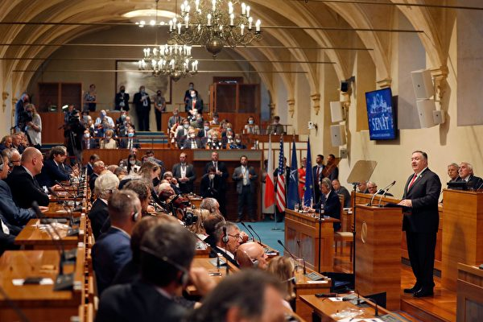

2020年8月12日，蓬佩奥在捷克议会发表讲话。(PETR DAVID JOSEK/POOL/AFP via Getty Images)

   
 【大纪元2020年08月19日讯】（大纪元记者徐简综合报导）美国国务卿蓬佩奥结束了东欧四国访问后表示，世界的潮流已经改变了，美国人认识到中共与中国人民完全不同，并威胁到他们的价值观和生活方式。

8月18日蓬佩奥说，“全球各地热爱自由的人民的决心系捍卫他们的生活方式，它正在增强。”

他在推特上说，“美国人认识到，中国人民完全不同于中共，（中共）正在威胁他们（美国人）的价值观和生活方式。华盛顿的两党都知道我们正在反对什么。 就像我看到的那样，潮流已在整个欧洲和世界扭转。西方正在取胜。”  

<h4 align=center><a href="https://twitter.com/SecPompeo/status/1295750943422717953?ref_src=twsrc%5Etfw%7Ctwcamp%5Etweetembed%7Ctwterm%5E1295750943422717953%7Ctwgr%5E&ref_url=https%3A%2F%2Fwww.epochtimes.com%2Fgb%2F20%2F8%2F19%2Fn12342345.htm">蓬佩奥在推特(点击右键,另存新档）</a></h4>

蓬佩奥刚刚结束了对中东欧四国的访问。他在捷克议会参议院发表演讲，表示中共在全球的经济影响力使其在某些方面成为比苏联更难抗衡的对手，但世界团结抵抗中共的压迫，自由社会终将胜利。

蓬佩奥表示，前苏联的铁幕倒下后，中欧和东欧重回西方自由世界，但是专制主义并没有消亡。

“今天，更大的威胁是中国共产党和它的强制、控制运动所构成的威胁。中共政权的核心堪比苏联的马克思列宁主义化，可能更甚。该党始终自私自利。它的行动源于其意识形态。而且对像我们这样的自由社会心存敌意。”

“现在发生的不是冷战2.0。抵抗中共威胁的挑战，从某些方面来说更为困难。这是因为中共已经以苏联从未有过的方式与我们的经济、我们的政治和我们的社会交织在了一起”，蓬佩奥说。

但他强调，“就像当年派驻北约、作为一名驻守西德的美国大兵一样，在推倒柏林围墙前，没人想到铁幕真会倒塌，‘潮流已经改变’，世界团结抵抗中共的压迫，自由社会终将胜利。”

<a target="_blank" href=#top><h6 align="right">回上方</h6></a>

<a name=200>
<h1 align="center"><b>当警察不再为独裁者效力</b></h1>
   
   【明慧网二零二零年八月十九日】8月16日，至少有20万白俄罗斯人上街参加“自由大游行”，抗议卢卡申科通过舞弊当选连任总统，相比之下，支持卢卡申科的游行者只有数千。

现年65岁的卢卡申科当了26年白俄罗斯总统，在白俄罗斯推行计划经济及独裁统治。今年8月10日他第六次高票当选，但白俄罗斯人已经忍无可忍，质疑选票造假，要求重新计票。

<b>当警察丢掉警服</b>

警察筑起一道道人墙拦截示威者，并用催泪弹等驱散市民，已有人被打死，6000市民被逮捕。但是，在对峙升级的时刻，一些白俄罗斯警察和军人开始拒绝执行卢卡申科的残暴命令，丢掉制服回家，甚至加入市民的示威队伍。

在网上广为传播的一段视频中，一名警察脱掉制服和帽子，转身扔向垃圾桶，他说：“我向我的国家宣誓过，但是看到明斯克发生的事，我不能再穿这套制服了。”

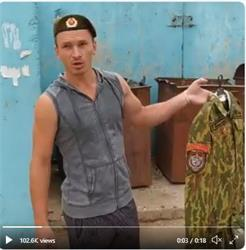

一位白俄罗斯军人把军服扔到了垃圾桶（网络截图）

   
   “我们是为人民效力，不是为总统效力”，白俄罗斯的军人和警察开始觉醒，毕竟反对卢卡申卡的老百姓占大多数。失去武装力量就相当于猛兽没了爪牙，这是独裁者最为害怕的。示威期间，白俄罗斯开始封锁网络，并在市外设立检查站，防止更多的民众进入首都明斯克，但是面对全国最大规模的、要求他下台的抗议活动，卢卡申科被迫表示，愿意在全民公投之后移交权力，并且释放所有被捕民众。

一些士兵放下武器，静静地站在那里，市民上去和他们拥抱。网友评论，军队是人民的纳税钱养的，应该听人民的。

独裁者的下场往往是悲惨的，统治伊拉克24年的萨达姆被押上绞刑架，统治利比亚42年的卡扎菲被枪毙，他们在位时都被人民崇拜和拥护，但那只是高压统治下的虚假拥护，当他们被人民摒弃的时候，很快就成为“人民公敌”。

下令对人民开枪的罗马尼亚总统齐奥赛斯库在人民的呼声中逃跑，几乎所有的罗马尼亚广播里都响起了这样的声音：“各位市民请注意，人民公敌齐奥赛斯库和埃列娜正劫持一辆紫色达契亚轿车逃跑，请予以缉拿”。齐奥赛斯库和妻子被逮捕后，三天后被送上断头台。

齐奥赛斯库在位时，罗马尼亚经济在短暂崛起后走向衰落，对言论控制极其严格，家中有打印机都要申报，人们只能用政治笑话来讽刺政府，可见不得人心到了何种程度。

独裁者死了，国家还在，人民还在，军队还是那个军队，警察还是那个警察，这说明军队、警察都不是总统私人的，他们是属于人民的；打死独裁者也不会亡国，人民只会生活得更好。

<b>共军围困长春　曾对逃跑的饥民开枪</b>

白俄罗斯警察和军人的表现不是个例，我们看到东欧及苏联解体的过程中，只有罗马尼亚发生流血事件，其他国家的军队都没有与人民发生冲突，军队是保护人民的，人心向背看得很清楚，军队就应该站在人民一边，而不是站在独裁者一边。

但共产党统治下的军队，已被训练得唯命是从，共产党让杀谁杀谁。1948年，共产党围困长春的时候，共军甚至将枪口对准了饥饿逃生的人民。

共产党拿下长春，不是打下来的，而是生生地把国民党军队和老百姓困死在城内，不让饥民出城，为消耗长春城内的粮食供应，让老百姓和国军争粮食拖垮国军，饿死十余万人，当时的政策就是“要使长春成为死城”。

《沈阳军区历史资料选编》记载，中共命令士兵屠杀出城求生的饥民：“不让饥民出城，已经出来者要堵回去，这对饥民、对部队战士都是很费解释的。饥民们会对我表示不满，说‘八路见死不救’。他们成群跪在我们的哨兵面前央求放行，有的将婴儿小孩丢了就跑，有的持绳在我岗哨前上吊。战士见此惨状心肠顿软，有陪同饥民跪下一道哭的，说是‘上级命令我也无法’。更有将难民偷放过去的。经纠正后，又发现了另一偏向，即打骂捆绑以致开枪射击难民，致引起死亡。”

当时国军军官回忆：“城门以外，共军阵地以前，老百姓的尸体带状分布，好像给两军画出中线，这是因为垂死的老百姓出城以后，既无法通过共军的封镇，又不准再回到城内，多次往返奔波，再也无力支持。气息奄奄的婴儿睁大眼睛看他，在路上看他，也在梦中看他。”

王鼎钧的《关山夺路》则记述了一段国民党士兵的回忆：连长说，共军士兵看见饥民跪拜痛哭，也流下眼泪，但是他们坚决执行命令，饥民不听话，照样开枪打，他也看见带伤流血的尸体。他说共产党真厉害，怎么能把兵训练成那个样子，“人民的军队爱人民”，多年的训练可以一夕翻转，执行任务时可以违反原则，违背良心。他说国军官兵无论如何办不到，伤阴德，我们不干，他会偷偷地放过饥民，或者自己偷偷跑掉。他说黄泛区会战的时候，共军用“人海战术”进攻，死伤太多，国军打到手软，射手把机枪往地上一丢‘我不打了！’连长掏出手枪，指着射手的太阳穴，射手扑通跪下，‘连长你枪毙我吧！’射手哭了，连长也哭了……”

<b>派出所所长的智慧</b>

在中共暴政下，军队和警察成为它镇压人民而非保护人民的国家机器，中共每年也给他们下发大量的维稳经费及奖金来刺激他们的积极性。1999年江泽民集团开始镇压法轮功以来，抓捕了大量法轮功学员，不过，随着海内外各种真相的传播，有的警察、国保“翻墙”之后，明白了真相，有的为修炼人的善良与坚韧所打动。很多警察的良知开始复苏，正在从中共的谎言中觉醒，不愿意做中共的替罪羊。

一天，两个警察到一位法轮功学员的店里去搜查，发现仓库里有很多要做真相资料的空光盘盒，准备拿走。这位法轮功学员说：“德国柏林墙被推倒之前，东德士兵奉命开枪打死了一个翻墙逃往西德的青年，柏林墙推倒后，开枪打死青年的士兵被判刑。打准打不准可是自己说了算，叫开枪是上边的事，打不准是自己的事。国保大队让你们来看看，也没说叫你们非得把东西拿走啊？！”警察还是把光盘盒抬走了。不久，这位学员发现那些光盘盒又出现在他的仓库，原来是警察趁他出门时又悄悄给他送回来了。

还有一次，派出所所长打电话说办公室的门坏了，叫这位学员帮忙修理一下。他去了以后，发现办公室没人，检查门也没有问题，却发现靠门放着一袋子大法书，有20多本。他明白了：所长是让他来拿大法书的，他高兴地提着袋子放到了车里。

中国古人有句老话，明白人不办糊涂事儿，跟随中共的警察们也应该想想白俄罗斯警察为何放弃独裁者。

面对举世关注的白俄罗斯抗议事件，中共央视在新闻里只说数千白俄罗斯人上街支持总统选举，却对20万人民抗议声音只字不提，如此低级的骗术能瞒住谁呢？还不是担心自己也有这么一天吗？

<a target="_blank" href=#top><h6 align="right">回上方</h6></a>

<a name=199>
<h1 align="center"><b>瑞士三城市举办活动　民众支持法轮功</b></h1>
   
【明慧网二零二零年八月十八日】二零二零年八月十四日及十五日，瑞士法轮功学员在巴塞尔（Basel），苏黎世（Zurich）及首都伯尔尼（Bern）三大城市举办了信息日活动。有的路人因学员演示的功法而驻足，想了解更多关于法轮功的讯息，有的看着展出的关于揭露中共迫害法轮功学员，甚至活摘器官罪行的展板非常震惊，他们或接过真相资料了解更多的讯息，或直接签名要求瑞士政府帮助制止中共罪行，支持法轮功学员。

巴塞尔：活摘器官极为卑劣

八月十四日下午，法轮功学员在巴塞尔闹市区的集市广场（Marktplatz）通过多幅展板告诉人们：大法弘传世界近三十年，世界一百多个国家和地区都有人学炼法轮功，还获得了上千个褒奖。但仅在中国，因中共惧怕人们信仰“真善忍”，能自主判断善恶好坏，因此开始了持续至今已逾二十一年的血腥迫害，甚至活摘法轮功学员的器官。信息摊位正设在当地重要的电车枢纽站前，因此也吸引了很多等电车的乘客。

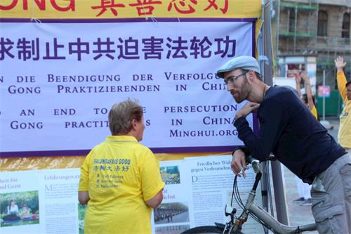

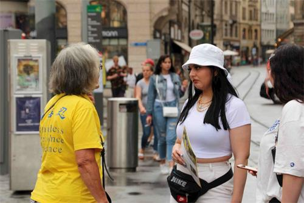

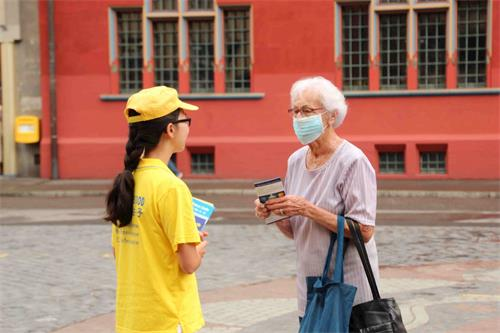

图1～3：路人倾听法轮功学员讲述真相

  
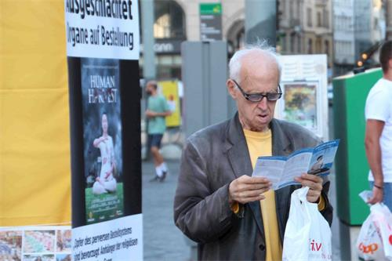

图4：中共的罪行让众多路人震惊

   
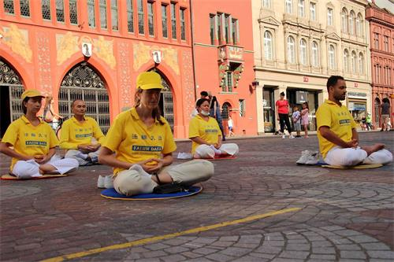

图5：学员演示功法，让路人驻足观看

   
   一位老妈妈在签名后仔细阅读了信息摊位上展出的中共迫害法轮功的事实，帮助人们认清中共本质的各种书籍及资料，并记下了书籍的相关讯息，很久后才离开信息摊位。还有的路人仔细聆听学员讲解所有的十二幅展板，详细地了解法轮功的真实讯息。

一位来自匈牙利的老先生高兴的接过法轮功的信息资料，在听说中共活摘法轮功学员的器官时，他惊呼，这可是对创世主的背叛！他认为创世主不会对这样的罪行听之任之。签名后，他补充道：“一个人的力量可能微不足道，但是大家团结起来的力量就不可小觑。”

露特是一位退休的生物学家，最近因为武汉肺炎（中共病毒）的肆虐，她也得到了很多来自中国的讯息，她谈到，因此她也了解到在中国（中共）如何全方位的监控。她谈到自己一般不太会在征签表上签名，但是这次她签名支持法轮功学员，要求瑞士政府帮助制止中共活摘罪行。因为她希望：“至少这个主题能够公开地被讨论。”她谈到：“签名是我的一个心愿，我只是追随了我信念，我还是有希望，有勇气和力量来做我认为对的事情。”

她曾经在报纸上了解过法轮功，她自己也对很多功法有所了解，她认为：“法轮功是一个非常好的功法，让人能够协调身心。每个人都会寻找真理，应该让每个人在神的引导下去寻找他们自己的路，每个人早晚都会找到。”因此她无法理解为什么中共要迫害法轮功学员：“（迫害）是最糟糕的。为什么要迫害他们（法轮功学员）？他们与世无争，只是在公园里炼一种美好的功法。怎么能反对这样的让人协调自我和心灵的功法？”她接着谈到中共：“中共系统根本就不在乎你我想些什么，我的需求是什么，我的精神之路是什么。中共阻止人们找回自我，不让他们去认识宇宙真理或向往神，那这就是人为的在践踏人的本性。这是不对的。”

软件开发主管亚历山大（Alexander）在看了展板的内容，并和学员交谈后，签名支持法轮功学员。他了解到：“法轮功让人保持身体健康，我没有听说法轮功有任何政治上的诉求，法轮功传播一定的道德理念，而这和中共的理念不同。”他认为：“活摘器官不应该发生。利用人的身体来发财，仅因为理念不同就贩卖他们的身体，这应该在道德上受到最强烈的指责，这是极为下流的行为。”

他认为瑞士政府不会对中共这种违背伦理道德的罪行听之任之：“人的尊严应该被尊重。世界上大部份人都有一定的伦理道德的理念，这与谁当政，有什么信仰无关。为了维护这种应该被尊重的人的尊严，我希望瑞士政府能够和其他很多的支持力量一起促成这历史运动。”他认为：“如果只是瑞士政府跟中共说这样不行的话，可能效果不会特别明显。但是如果有很多政府都对中共提出抗议，压力足够大，就会有效果。”

他感叹曾经拥有辉煌文化历史的中国却变成了如此这般：“中共无法容忍自由思考的人，迫害他们。中国丰富的文化历史演变成了这样，真是太遗憾了。很多中国的文化在中国却看不到了，以前在香港还有，现在也没有了。只能在台湾、日本、甚至欧洲、瑞士及美国，只能在国外看到，这真是太可惜了，这是在毁灭自己的文化。”

<b>苏黎世：每个人都应该来修炼法轮功</b>

八月十五日，法轮功学员又来到了苏黎世利马特河畔（Limmatquai）发送真相资料，告诉人们法轮大法的美好，并揭露中共血腥迫害法轮功学员的罪行。

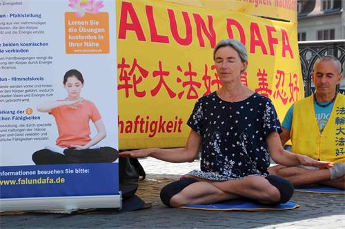

 
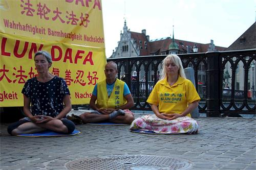

图6～7：在苏黎世利马特河畔演示功法，向路人展现大法的美好

   
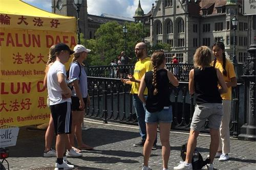

图8：法轮功学员向路人揭露中共血腥迫害法轮功，甚至活摘器官的罪行

   
   有的路人对法轮功已有所耳闻，直接询问是否有征签，要签名支持法轮功学员。有来自波兰的游客因为工作缘故常去香港，因此对法轮功反迫害有所了解，特别向他的朋友们介绍，并一起听学员讲述法轮功弘传世界，中共却血腥迫害的真相。

一位青年看到揭露中共活摘罪行的展板后惊呼：“这是疯了。”他当即签名要求制止这样的罪行，并要了更多的相关资料。临走前他谈到自己会告诉更多人相关的讯息，他说：很多人以为（活摘器官）只是个例，一年或许只是两三例，但是我知道这不是。

一位年长女士在骑车回家的路上看到法轮大法的信息摊位后就直接找学员要真相资料，她向学员询问了关于中共活摘器官及迫害法轮功的各种讯息。签名后，她还详细记下了苏黎世炼功点的时间和地点。她谈到自己回家后会仔细阅读相关讯息，她还表示很想学炼法轮功。还有其他的路人也询问了炼功点的讯息，表示想学炼。

在卫生保健业工作的伊莎贝尔（Isabel）从一位修炼法轮功的朋友那已经了解了真相。她觉得：“法轮功太棒了，每个人都应该来修炼法轮功。（法轮大法）让我们能同化宇宙，协调能量，能够提高我们的生活质量。”她希望通过签名：“能够制止在中国发生的（中共）屠杀生命，夺取器官（的罪行），这太无耻了，不能再继续下去。这是当今世人的耻辱。我希望瑞士政府能对此做些什么。”

<b>伯尔尼：感谢法轮功学员的付出</b>

十五日当天，法轮功学员在首都伯尔尼火车站广场上搭建金黄色帐篷吸引了很多人的关注。早在学员们搭建摊位时，就有一位女士拿到真相资料后静静的阅读。她等学员们结束了准备工作后，和学员谈了很久。她自己也成立一个反对大屠杀的协会，她表示，她能想到法轮功学员的反迫害会有多难。她衷心感谢法轮功学员的付出。

还有很多路人与学员交谈，感谢学员的付出。也有的询问炼功点的讯息，打算学炼法轮功，第二天的炼功点上就有来学炼的路人。

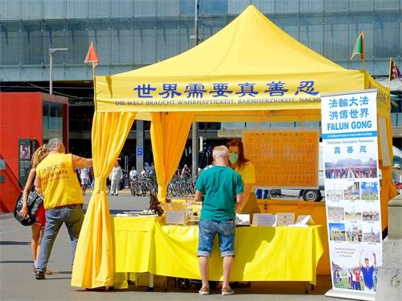

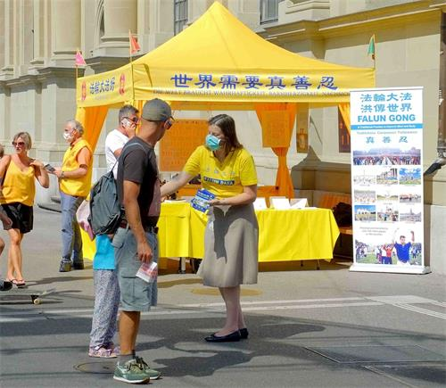

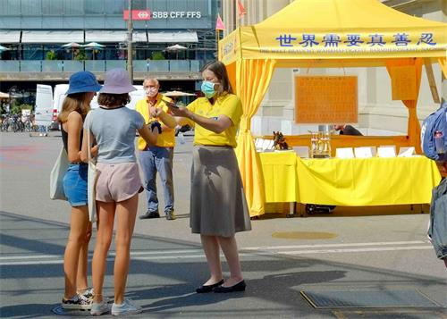

图9～11：路人感谢法轮功学员的全心付出

<a target="_blank" href=#top><h6 align="right">回上方</h6></a>

<a name=198>
<h1 align="center"><b>【一线采访】大连湾民众被准下楼 聚集讨说法</b></h1>

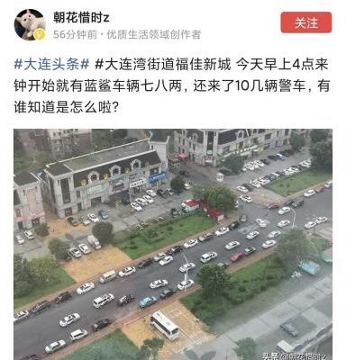

大连市甘井子大连湾街道福佳新城业主被允许下楼，8月17日，部分业主聚集在小区楼下，抗议物业不作为，有警察到现场。（微博截图）

   
  【大纪元2020年08月18日讯】（大纪元记者顾晓华采访报导）大连市甘井子大连湾街道由高风险调整为低风险区。福佳新城业主被允许下楼，8月17日，部分业主聚集在小区楼下，向物业与社区表达隔离期间的不满，抗议物业不作为，有警察到现场。

8月15日24时起，甘井子区大连湾街道被调整为低风险地区，12个社区（村）逐步解封。

但是，据记者了解，在外围的福佳新城并未列入解封名单，业主们非常不解，他们仅仅是可以下楼，在小区内活动，让居民气愤。

福佳新城因为有一位13岁的中学生7月22日被确诊，有消息称这名中学生居住在该小区一期28号楼，令这小区在隔离方面严上加严。

<b>福佳新城业主楼下聚集表达不满</b>

福佳新城业主刘先生向大纪元记者透露，小区二期的业主自发地聚集在一起讨说法，从8月16日已经开始了，当天只有一个女的政府工作人员过来，也未给出明确回答。8月17日，业主们继续进行聚集。

“我们福佳新城二期的居民自发地下去，要求政府给一个说法，为什么别的地方都解封了，我们出不去。”刘先生说。

有业主表示，17日早上凌晨，有七八辆蓝鲨车以及十余辆警车停在福佳新城，原来政府害怕业主闹事，提前准备警力进行戒备。

刘先生还表示，其实业主们都对社区的管理人员不满，感觉他们的工作能力不到位，而且有的不负责任，社区与物业的电话始终打不通。

“隔离期间好多人打电话都打不通，（政府人员）好像蒸发了一样的。人家可会说了，说去现场了，帮助督察看看隔离情况。”他说，不管怎么说，社区的领导失职，他们应该要了解业主的困难和需要帮助的地方，并及时传递疫情消息。

据悉，福佳新城在隔离期间成为无人管区域。

“福佳新城没人管，物业不管，社区不管，百姓没菜吃，孕妇产检没人管，有没有人负责？”据业主反映，有一位孕妇宫缩肚子疼，被耽误三个小时才送入医院，结果早产，差点出人命。

“福佳新城做完三次核酸检测还在封闭！我们要生活我们要吃饭啊！也不给老百姓一个准确时间，得关到什么时候？送菜平台全都是套餐，送到都烂了，老百姓天天吃什么？”

“大连湾疫情期间配送平台给送的菜，价钱高，配送的能不能有点质量？”还有业主说，“福佳新城三次核检全部阴性，已经封闭20天，社区电话永远打不通！”

还有消息称，有业主看到社区收到大量外面捐赠的米、面等救援物资，但是业主们未收到任何东西，现在这批物资不知去向。

刘先生透露，他现在已经不知道外面的菜价是多少了，由于平台的菜特别贵，他也不敢买，他一个人生活，只靠家里仅存的米、面等食物来维持生活。

刘先生原来是有二十多年工龄的钢铁厂工人，因工厂效益不好，多年前已失业，一直靠打零工（保安）维持生活。

“我刚开始（隔离）那一周心情特别压抑，你不知道前方的路什么样，担心工作是否没了，担心你今天怎么样生活，又担心那个……很多很多担心。恍恍惚惚，每天守着手机，看消息和外界沟通。”他说。

刘先生还透露，7月31日是他的生日，而且今年又是百年难遇的阳历与阴历同一天，“我都哭了，我太痛苦了，我一个人下点面条，我那心里太五味杂陈了，不好受。平时亲戚朋友都来了，我还有女儿。（今年）一个人在家里唱生日歌。”

经过福佳新城业主们的争取，有官员在现场承诺17日、18日对重点楼区进行核酸抽检，19日解封。同日，社区还发出一份公告，要求业主于18日办理通行卡，以后要凭卡出入。

刘先生表示，官方没有承诺公交车开通日期，本来这个小区地处农村，如果没有公交车还是不方便，很多人走不了的。

他说，现在大连湾变为低风险区，已经让人有了盼头，大家非常兴奋。他8月16日还特别拿出酒来庆祝了一下，然后广而告之，自己要出去了。最让他开心的是公司领导已经告诉他可以回去工作。

<b>随时出现的隔离状况 让民众猝不及防</b>

此次大连湾地区因疫情进行的一刀切政策，随时都可能出现的状况，让民众猝不及防。

一位知情人士透露，他的一位同事的手机健康码8月17日早上突然变成红色，这位同事在公司是做售后服务，需要到客户现场操作，健康码变成红色，现在只能待在家里。他自己都不知道为什么，也没去过什么特别的地方，公司称必须去问街道才可以核实，他的同事不得不“居家隔离”。

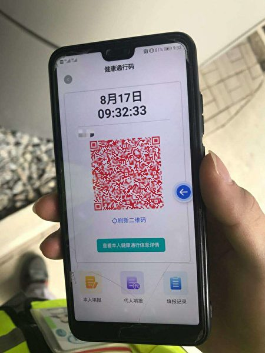

有一公司员工健康码突然变成红色。（知情人士提供）

这位知情人士还说：“侯一小区一开始有个五一比例检测阳性的，也不知道是哪个人是阳性，于是这五个人所在的小区都封闭了。侯一小区有个人请了两个师傅安纱窗，正好赶上封小区的日子，这名业主还得管这两位师傅吃住，还好第二天发现这五个人都不是阳性，解封了。如果没有解封，（师傅）就得一直住下去，除非物业给想办法安置。”

<a target="_blank" href=#top><h6 align="right">回上方</h6></a>

<a name=197>
<h1 align="center"><b>哪些中企可能被川普禁止？白宫幕僚长解释</b></h1>

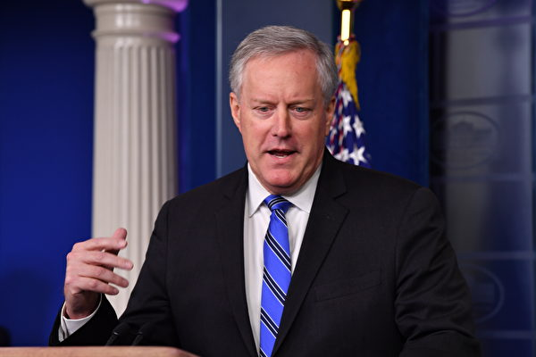

白宫幕僚长马克·梅多斯（Mark Meadows）周一（8月17日）表示，美国总统川普（特朗普）在决定禁止短视频应用程序TikTok之后，已在考虑禁止其它中资公司。梅多斯解释了哪些中企可能被川普禁止。(Photo by Nicholas Kamm / AFP)

   
 【大纪元2020年08月18日讯】（大纪元记者夏雨报导）白宫幕僚长马克·梅多斯（Mark Meadows）周一（8月17日）表示，美国总统川普（特朗普）在决定禁止短视频应用程序TikTok之后，已在考虑禁止其它中资公司。梅多斯解释了哪些中企可能被川普禁止。

梅多斯在空军一号（Air Force One）上对记者说，川普政府特别关注那些收集个人数据并可能构成国家安全风险的中国公司。

他说：“总统在考虑的是禁止其它中国应用程序（APP），它们都是那些可能会收集个人信息并有潜在国家安全风险的（APP）。”

关于TikTok，梅多斯说：“我们希望一些有意收购（TikTok）的美国公司能够解决（这个）国家安全问题。”

“（TikTok）数据传到中国的某些损害肯定已经发生。”他说。

川普政府一直对中国公司可能帮助中共政府进行间谍活动表示担忧。中共在2017年通过了《国家情报法》。《国家情报法》第一章第七条和第十四条要求所有的组织和个人，都要无条件地配合中共政府，应当“支持、协助和配合”国家情报工作，并保守秘密。

据此，中共情报人员可以查阅、调取互联网企业的客户信息，询问其客户情况。而互联网企业和员工必须配合；否则将遭受惩罚，承担下列法律责任：由国家情报工作机构建议相关单位给予处分或者由国家安全机关、公安机关处警告或者十五日以下拘留；构成犯罪的，依法追究刑事责任。

川普总统周一在福克斯新闻露面时，指责华为监视美国人。川普说：“我们不希望美国存有华为的设备，因为它们在监视我们。”

上周六，在被记者问到禁止微信和TikTok后，是否可能禁止更多中国公司在美国的运营时，川普回答说，最大的事情是华为，不允许华为在美国（运营）。

川普还表示已经告诉欧洲国家和其它国家禁止华为，他举例说，澳大利亚做得很棒。

“我们告诉某些正在考虑（使用）华为的国家：‘没关系，你可以使用它们，但我们不会共享情报。’”他说。

川普还以英国为例，现在英国开始禁止华为。

在回答记者提问是否会禁止阿里巴巴和百度时，川普没有否认。

8月5日，美国国务卿蓬佩奥宣布扩大后的“干净网络”倡议，聚焦五大领域，督促美国及外国公司抵制中国科技公司提供的云存储服务，并点名阿里巴巴、百度和腾讯，这些中国科技巨头成为美中科技战的最新目标。

蓬佩奥表示，国务院将与其它政府部门合作，保护美国公民最敏感的私人信息和我们商业最有价值的知识产权，包括COVID-19（中共病毒引发的肺炎疾病）疫苗研究，阻止阿里巴巴、百度、中国移动、中国电信和腾讯控股等公司运营的云计算系统获取信息。

川普政府还命令TikTok的拥有者字节跳动（ByteDance）在90天内剥离其美国业务。  

<a target="_blank" href=#top><h6 align="right">回上方</h6></a>

<a name=196>
<h1 align="center"><b>当中共间谍10年 中情局前华裔职员被捕</b></h1>
   <h3 align="center"><b>在香港和中共情报官员会面出售机密 数钱镜头被拍下</b></h3>

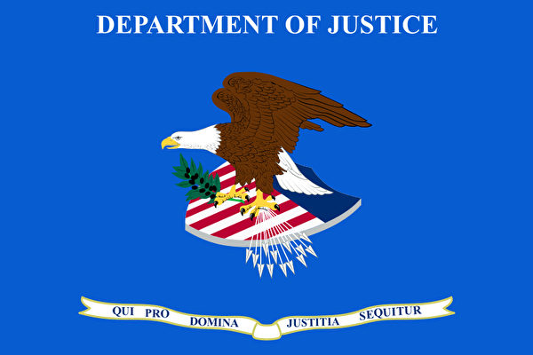

周一（8月17日），美国中央情报局一名前职员被指控向中国（中共）出售美国机密。图为美国司法部标识。（公有领域）

   
  【大纪元2020年08月18日讯】（大纪元记者苏静好报导）周一（8月17日），美国中央情报局（CIA）一名前职员被指控向中国（中共）出售美国机密。这名前CIA职员和亲戚同谋犯案，该亲戚也是前CIA职员，可接触最高机密。两人合谋将美国机密卖给中共情报人员。

美国司法部新闻稿显示，67岁的马玉清（Alexander Yuk Ching Ma，音译）是前CIA职员，于2020年8月14日被捕。对他的指控刑事文件周一启封。

司法部负责国家安全的助理部长约翰·德默斯（John C. Demers）、夏威夷地区美国检察官肯吉·普莱斯（Kenji M.Price）、联邦调查局反情报部助理主任艾伦·科勒（Alan E. Kohler）、FBI檀香山办公室探员伊莱·米兰达（Eli S. Miranda）共同宣布了这一消息。

马玉清是在香港出生的美国归化公民。根据法院文件，马于1982年开始在中央情报局工作，拥有接触最高机密特权，并签署了许多保密协议，包括承诺他在中央情报局任职期间和之后，负有保护美国政府机密的责任。

马于1989年离开中央情报局，在上海生活和工作，然后于2001年到达夏威夷居住。

<b>马玉清和亲戚串通 和多名中共官员会面</b>

根据法院文件，在十年时间里，马玉清及其亲戚（被认定为共谋犯1号）相互串通，并与多名中共情报官员进行密谋沟通。这项窃密计划始于2001年3月在香港举行的一次为期三天会议，在此期间，两名前中央情报局职员向外国（中共）情报部门提供了有关中央情报局人员、行动和机密通讯方式的信息。会议的一部分被拍摄下来，录像显示马玉清为外国情报人员提供机密，然后接受50,000美元现金并数钱的场景。

法院文件进一步指称，马玉清移居夏威夷后，开始寻求美国联邦调查局的工作，以便再次获得美国政府的机密信息，而这些信息又可以提供给他的中共主管。2004年，联邦调查局（FBI）檀香山办事处（Honolulu Field Office）聘请马玉清为合同制语言学家，负责审查和翻译中文文件。

司法部文件显示，在随后的六年中，马玉清定期复制、拍照和盗窃带有机密标记的美国政府文件。马玉清经常前往中国，随身携带一些偷盗的文件和图像，目的是将这些文件和图像提供给中共接收人员。马玉清还经常从中国带来数千美元现金和昂贵礼物，例如一套崭新高尔夫球杆等。

根据法院文件，在2019年春季，一名FBI卧底探员让马玉清相信自己是中共情报官员，在两次会面上，马玉清向卧底探员证实了自己的间谍活动，并接受了FBI卧底给他的2,000美元现金；FBI卧底告诉马玉清，这笔钱是感谢他帮助中共的“小意思”。

司法部文件显示，马玉清还提议再次为中共情报部门工作。2020年8月12日，马玉清在被捕前，与FBI卧底又进行了一次会晤，他再次接受了卧底给他的金钱，并表示愿意继续帮助中共政府。

<b>司法部副部长：这些人是牺牲品</b>

助理司法部长德默斯说：“中国（中共）间谍活动历时长久，可悲的是，前美国情报人员背叛他们的同事、他们的国家及自由民主价值观，以支持一个专制的共产主义政权。”

他表示，无论是现在，还是这些人自认为已逃脱的多年以后，司法部都会找到这些叛徒并将他们绳之以法。

“对于中国（中共）情报部门来说，这些人是牺牲品。对于我们来说，他们是悲哀的人，但也迫切提醒我们需要保持警惕。”德默斯说。

检察官普莱斯说：“今天宣布的指控令人震惊，提醒我们在夏威夷的社区，那些企图通过间谍行为危害我们国家安全的人所构成的持续威胁。”

“特别令人关注的是在美国情报界服务就职人员的犯罪行为，他们通过向中国（中共）泄露（美国）国防机密信息，选择背叛他们以前的同事和整个国家。我的办公室将继续持之以恒地打击间谍活动。”普莱斯说。

FBI反情报部门助理主任艾伦·科勒表示：“这种严重的间谍行为是中国（中共）在美国境内，和针对美国进行的一连串非法活动的另一个例子。”

“该案表明，无论调查时间长短或困难有多大，联邦调查局的男女员工将不懈努力，以保护我们的国家安全不受中国（中共）情报部门威胁。我们知道，任何违反信任立场、背叛美国的人，且无论其罪行暴露需要花费多少年，他们都将面临司法正义。”他说。

FBI檀香山分部主管探员伊莱·米兰达说，这些案件非常复杂，要花费数年甚至数十年才能结案，但在确保国家安全方面，联邦调查局将永远不会放弃。

<b>若罪成 最高刑期是无期徒刑</b>

司法部新闻稿表示，马玉清将于周二（18日）在美国夏威夷州地方法院的联邦法庭首次出庭。他被指控串谋传播国防信息，以协助外国政府。

如果被定罪，马玉清将面临最高无期徒刑的处罚。最高刑期由国会规定，此处仅供参考。如果马玉清被定罪，联邦地方法院法官将考虑咨询量刑指南和其它法定因素后，确定对他的判决。

这项调查是由FBI檀香山和洛杉矶外地办事处进行。美国司法部下辖的国家安全部反情报和出口管制部门助理检察官肯·索伦森（Ken Sorenson），以及庭审检察官斯科特·克拉菲（Scott Claffee）和史蒂夫·马岑（Steve Marzen）正在对此案提出起诉。

检察官说，马玉清的一名85岁亲戚也曾在中央情报局工作，后来又帮中共进行间谍活动。但他没有受到起诉，因为他患有“一种使人衰弱的认知疾病”。 

<a target="_blank" href=#top><h6 align="right">回上方</h6></a>

<a name=195>
<h1 align="center"><b>习批粮食浪费倡节约 专家：粮食早已现危机</b></h1>

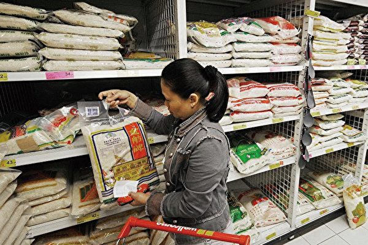

近年来，外界一直质疑中国粮食存在危机。图为市民在超市买米。(Getty Images)

   
 【大纪元2020年08月17日讯】（大纪元记者易如采访报导）近年来，外界一直质疑中国粮食存在危机。中共总书记习近平近日在党媒提出餐饮业粮食浪费惊人，官媒更是发起一场“节约运动”，使中国粮食危机再次受到关注。专家表示，中国粮食早已现危机，中共若与国际的关系发生紧张，很可能会出现粮荒。

中共官媒新华社日前报导习近平批评餐饮浪费“触目惊心、令人痛心！”提倡“厉行节约、反对浪费”。中共喉舌人民网随后呼应，要加强立法，以“刚性制度”约束、制止餐饮浪费”。

中国经济学者段绍译对大纪元表示，当局说什么就是怕什么，“说节约粮食，就是粮食紧张了。”由于中国粮食进口规模越来越大，如果跟国际的关系发生紧张，未来很可能会出现粮荒。

“如果国际停止对中国粮食进口，或者国外对中国粮食出口增加关税，会导致中国粮食大涨价，会造成粮食短缺，（当然）现在不会马上粮荒，但担心长时间后会粮荒，所以，他就说这话。”

中共海关7月的数据显示，今年1-6月中国进口玉米366万吨，占720万吨年度进口配额的51%，1-6月小麦进口量为335万吨，占全年小麦进口配额964万吨的35%。而这些并不包括通过民间方式进口的粮食数量。《每日粮油》8月12日称，今年小麦进口量会创近七年记录。而市场预期，玉米进口今年将接近1,000万吨。

中共海关总署8月7日最新数据显示，今年前7个月，进口大豆为5,513.5万吨，增加17.7%。单6月进口就达到1116万吨。《中华粮网》称，中国创记录的进口大豆使巴西可出口库存几乎售罄。《粮农智库》8月10日报导了中国大豆的现况，2019年的数据显示，中国大豆产量仅有1,800万吨，对外进口依存度较高。

大陆独立评论人士文瑞对大纪元表示，今年天灾进一步加深了中国的粮食危机，中共因为担心出现粮荒，因此加大了对美国小麦和玉米的采购。

“现在内部收购很困难，因为今年南北都遭遇天灾，粮食出现欠收绝收，农民又惜售，粮食越发紧张；而外部采购，现在跟美国还有第一阶段的贸易协议，而困难在于手里外汇储备不多，所以，现在它还在观望11月份的美国大选，希望拜登上台，可以缓解它的危机。”

今年疫情期间，中共的中央及各级地方已动用大量储备粮，再加上之后的天灾，粮食开始凸显危机。

现在猪肉、鸡蛋和大米都已经涨价，这意味着粮食已经涨价，“稻米涨价，目前还能承受，猪肉涨价已使很多人减少消费，如果中国跟美国及世界脱钩被孤立，情况就很难说了，令人担忧。”文瑞说。

<b>粮食早就存在危机</b>

今年4月，由于疫情原因，多国禁止粮食出口。中共农业农村部和国家粮储局对此回应，目前中国粮食库存充足，特别是小麦和稻谷两大口粮库存大体相当于全国人民一年的消费量。而去年谷物净进口量1,468万吨，仅占中国谷物消费量的2%左右，自给自足率达98%。

不过，早在2013年1月，中共国务院发展研究中心副主任韩俊在“中国县域经济发展高层论坛”上就表示，中国粮食自给率已经跌破90%，如果按一个人一年吃800斤粮食计算，去年的进口粮相当于养活了1.9亿中国人。也就是说，如果粮食不进口，有1.9亿的中国人已经饿肚子了。

段绍译表示，中国粮食储备都是假的，“中共政府虽然搞了很多粮库，但粮库里面都没有粮食。十几年前，朱镕基去检查粮库，结果粮库里一点粮食都没有，地方政府都是虚报。现在如果跟国际关系恶化，粮食没储备就麻烦了，所以，习近平就担心了。”

文瑞说，他在国家粮食系统工作的朋友告诉他，现在很多粮库都倒卖空了，“粮食私下卖给了粮食加工企业，但为了应付检查，就从另外一个粮库调粮，其实都是一批粮食，转来转去。领导去检查也是事先打招呼，不然，真检查出问题，他自己也难交差。”。

文瑞表示，官方近年来宣传粮食连年丰收，自给自足率达98%，其实是谎言。中共的土地政策、农村政策等严重伤害和打击了农民种地的积极性，现在全靠粮食进口掩盖真实问题。

“中国的农村土地是国家集体的，又没有法治，所以，资金、人才和技术都不愿到农村去，变成农村、农民、农业三农问题，所以，农村非常荒芜，其实就是土地所有权问题；另外，中共对农产品收购是统购统销，价格压得很低，不像西方美国对农业有补贴政策，农业本身就应该国家补贴，鼓励种粮。”

段绍译也表示，现在一个农民到城市打一个月的工赚的钱可以买一年的粮食，所以没有人守着土地种粮食。还有，“进口的粮食比国内便宜，因为这些年进口了太多的粮食，造成国内很多的土地没人种，荒芜了，老百姓已不习惯种粮食了。”

“现在农村种粮的情况是，一般种两季稻，早稻和晚稻，但去年猪瘟后，养猪减少，早稻就没人种了，现在都种中稻，也叫一季稻，种的人也不多。如果粮食不进口，吃粮肯定会成问题。”文瑞说。#  

<a target="_blank" href=#top><h6 align="right">回上方</h6></a>

<a name=194>
<h1 align="center"><b>【内幕】中共操控舆情的七步流程揭秘</b></h1>

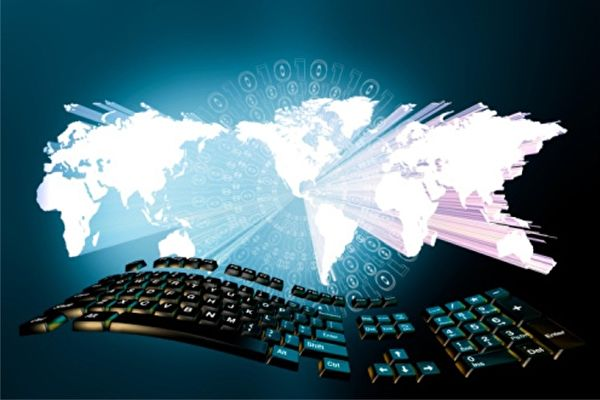

随着中共网路监控不断升级，民众的网络言论无时无刻都在被监控中。(Getty Images)

   
 【大纪元2020年08月17日讯】（大纪元记者古清儿报导）“舆情”近年成为中国大陆的流行词。对中共而言，舆情或民意并非被倾听和顺应的风向标，而是被监控和维稳的目标。

随着中共网路监控不断升级，民众的网络言论无时无刻都在被监控中。大纪元获得多份中共内部文件，泄露了中共应对舆情的内部流程，及中共如何处置负面舆情的实例。

<b>独家：揭秘中共操控舆情的七步流程</b>

近日，大纪元获得的中共南阳市委网信办2018年9月9日下发的《河南省网络舆情应急处置操作规范（试行）》文件显示，中共内部把舆情分为两种：“重大网络舆情”和“一般网络舆情”。

中共眼中的“重大网络舆情”包括：影响政治安全；事件性质严重；话题敏感度、舆论关注度高；涉及重大突发事件、公共安全事件、自然灾害等；引发媒体和公众严重关切；涉及较大利益群体；引起中央或省委省政府领导重视等等。

“一般网络舆情”指通过朋友群圈、自媒体等渠道小范围传播：话题较为敏感，可能被其它有影响力的媒体、网络平台、大V等传播扩散的。

文件泄露，对于“重大网络舆情”，中共河南省成立了“省重大舆情引导工作协调领导小组”，会启动“5+2+N”工作专班模式（宣传、网信、政法、公安、国家计算机网络与信息安全管理中心河南分中心，涉事地、省直行业主管部门，其它相关单位），进行管控。

文件还规定，中共应对网络舆情的流程包括“舆情监测预警”、“舆情信息通报”、“舆情会商研判”、“舆情调控管控”、“权威信息发布”、“适时评论引导”、“效果评估总结”七方面。

在“舆情信息通报”这一步中，中共要求重大网络舆情要第一时间上报；在“舆情会商研判”步骤中，河南网信办应急指挥中心每天早晚会举行交接班例会、每周一举行网络舆情分析研判会；在“适时评论引导”这一步中，可由“红色大V”账号发布或转载核心评论员文章，随后组织网评队伍跟帖顶帖，影响舆论走向。

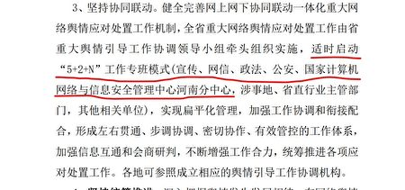

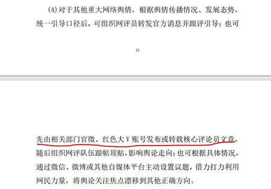

（大纪元）

<b>独家：中共内部要求培养“红色大V”</b>

在第六步中提到的所谓“红色大V”，在另一份文件中也有提及，且更为详细。

2019年2月18日河南《全省网信办主任会议精神传达提纲》中提及，培养自己的账号。会议要求，要做大网上宣传；加强网上评论。要构建“大网评”格局，强化对网络“大Ｖ”的属地管理责任，培育红色“大Ｖ”。

该份文件左上角注明属于“秘密”。

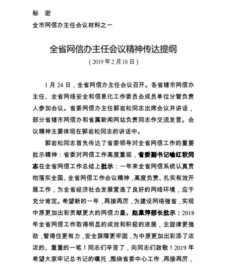

（大纪元）

在培养“红色大V”同时，中共还要求加强对部分账号的监测。文件要求，加强“对有害信息的预知预警，尤其要发挥技术+人工作用，对重点微信群、QQ群和重点公号、个人账号等实行跟进监测”。

<b>独家：维稳第一 中共处置负面舆情的2个实例</b>

大纪元还获得中共南阳市委网信办2020年3月17日至5月11日的《网络舆情专报》，里面记载了中共当地政府如何处置舆情的实例。

较有代表性的有以下两例。

3月31日的舆情专报透露，有自媒体发布图文信息《南阳一工业园区生产用地大搞无证开发，背后到底隐藏了什么？》，反映南阳龙升工业园区内不少企业拿着政府提供的生产用地，进行小产权房开发，售卖或出租牟取暴利。

在监测到网络舆情后，31日下午，卧龙区发布《关于网上反映龙升园区企业违规建设的情况说明》，“引导网上舆论，目前网上舆情平稳。”

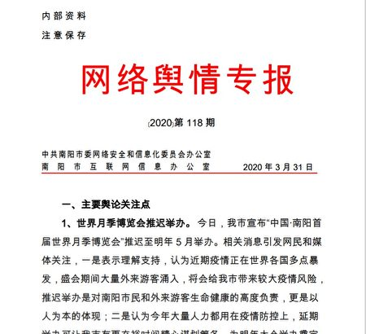

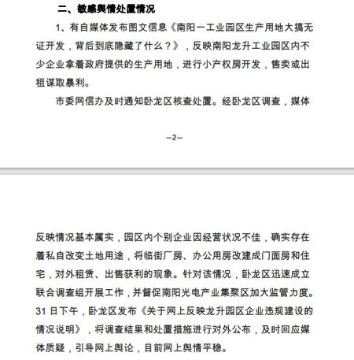

（大纪元）

4月2日的舆情专报透露，今日头条号发布图文信息《唐河县教体局领导不戴口罩，无惧感染，指导疫情防控》，反映唐河县教体局及各乡镇中心学校领导进行疫情防控检查和开会时，不戴口罩，搞形式主义。

对此，中共网信部门与相关媒体沟通协调，“删除首发稿件和自媒体平台转载信息。”

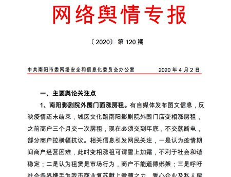

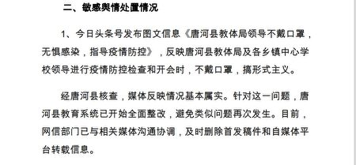

（大纪元）

<b>独家：中共的另一支网军——“网络义务监督员”</b>

中共审查部门严管网路，无所不用其极。在中国大陆，中共除了雇用大量网络监控人员之外，还利用“网络义务监督志愿者”、网评员（俗称“五毛党”）等监测网络。

安阳市网信办7月22日下发的《关于组建安阳市网络义务监督员队伍的通知》文件显示，该市现组织开展全市“网络义务监督员”招募工作。

通知要求，各县（市、区）要组建不少于30人的“网络义务监督员”队伍，市直单位要组建3人以上的“网络义务监督员”队伍。

按照中共的定义，“网络义务监督员”的职责是巡查、发现门户网站、搜索引擎、客户端、微博、微信、博客、论坛、贴吧、网络直播平台、短视频平台、应用商店等环节存在的“政治类有害信息”。

《新京报》2013年曾披露说，在中国从事网络控制的人数多达二百多万人。

由于中共严厉的网络审查制度，不少中国公司不得不雇用数千人来监管其企业网站的内容，这就催生了一个增长快速、利润丰厚的新行业：审查工厂。  

<a target="_blank" href=#top><h6 align="right">回上方</h6></a>

<a name=193>
<h1 align="center"><b>蔡霞：共产党这个“僵尸政党”必须下台</b></h1>

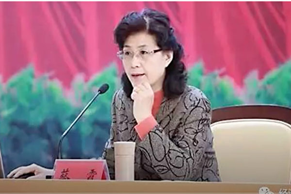

前中共中央党校教授蔡霞称中共已是“政治僵尸”。她再三强调，体制内外的精英可以合作，但在这个转型过程里，共产党的政治外壳必须被抛掉。（视频截图）

   
【大纪元2020年08月18日讯】前中共中央党校教授蔡霞被开除党籍，取消退休待遇。她称中共是“政治僵尸”；共产党的政治外壳必须被抛掉。

据美国之音报导，蔡霞公开为地产大亨任志强辩护；她在中共病毒“吹哨人”李文亮去世后，参与签名要求言论自由；她说中共强推港版《国安法》是“强暴香港人民”。8月17日，蔡霞被前中共中央党校开除党籍。该校公告称，蔡霞发表的言论“有严重政治问题”“损害国家声誉”“严重违反党的政治纪律、组织纪律”。

“与这个黑帮一样的政党彻底脱钩了！”她在微信上写道。同一天，蔡霞在接受专访时说，比起被开除党籍，取消退休待遇在中国国内引起的反响更大，各大微信群里都在沸沸扬扬地讨论这个事情。

“对于中国共产党把敢于说话的人开除出去，很多人并不意外，它本来就容不得不同意见嘛”，蔡霞说，“但是把政治观点不同和一个人的养老权利挂钩、把养老的待遇拿掉，等于就是剥夺你生存的权利，这一点震动了整个中国社会。”

过去几个小时里，蔡霞的电话就没停过。许多人留言、发邮件、打电话对她表示支持， 令她非常感动。她觉得“公道自在人心”。也有不少朋友对她说，一定要打官司，要有个合理的说法。

为共产党培养了近40年干部，到头来却成了最决绝的反对派。被开除党籍、取消退休待遇的蔡霞说，中共已成“惊弓之鸟”，下狠手打压党内异见者，全因内外交困，中共政治转型要靠体制内外精英合作，这个“僵尸政党”必须下台。

“我要跟他们打这个官司，走法律程序来捍卫我自己的权利。不管这个官司打下来是什么结果，但是我的权利不允许任何人轻易地侵犯”，她说。

从2016年第一次撰文为被“留党察看”的任志强辩护以来，单位找她谈话时就隐约暗示，如果不停止发言，会对她有某些行政处理，包括降低生活待遇。

现年68岁的蔡霞说，他们这代人经历了20世纪50年代的大饥荒和“文化大革命”十年动乱，不怕过苦日子，但是精神上的压抑和扭曲却是不能承受的。

“认准的东西，我不会往后退”，她说，“如果一个人只想过自己的小日子，我觉得我内心过不去。”

蔡霞认为，共产党现在千方百计去压制不同声音，下狠手去清洗和打压党内人士，就是因为它陷于一种内外交困的状态。

“党内高层它有一条，越是外面压力大，他越怕自己内部出问题”，她说，“他先要把党内搞得鸦雀无声，后院要稳起来，稳了，他才会觉得自己里面安全了。”

蔡霞说，从2019年起，整个党的核心工作就围绕四个字——政治安全，也就是政权安全，说白了，就是习近平个人权力地位的安全。

“他其实不安全感是最强的，因此他要用全部的资源来保证他自己的位子坐稳了，然后他要用全部的力量来打压任何一点点声音。其实现在我觉得他们已经成了一个惊弓之鸟了”，她说。

今年6月，一段据称是蔡霞的私下谈话录音被泄露到网上， “政治僵尸”、“黑帮老大”的说法被迅速疯传。

蔡霞证实，那段讲话的确是她说的，实际上那天的讲话共两段，另一段9分钟的音频传到网上后很快丢掉了。

她认为，“中共是一个政治僵尸。从这个党本身来讲，它是不可能完成中国的转型这个历史任务。所以它必须要下去”，“不是我们让它下，而是整个历史就会把它抛掉。”

蔡霞又说，不可否认的是，中共9,000万党员中还是有相当多的社会精英，这部分精英的力量要凝聚起来，不是以共产党的名义，而是可以另外组党，和社会各界人士共同沟通，重新组合政治力量来促成中国政治转型，推动国家进步。

她再三强调，体制内外的精英可以合作，但在这个转型过程里，共产党的政治外壳必须被抛掉。

“我不孤单”，身为“红二代”的蔡霞说，中共党内其实有很多人和她持相同观点，“我觉得大家嘴里不说，心里是有想法的。我自己做了个估算，百分之六十到七十。”

蔡霞说，恢复高考后的77、78级这批人受了高等教育，很多又出国考察、留学、领导改革开放的实际工作，他们的思想观念是在邓小平时代形成的，价值取舍和对世界大势的认识和习近平是截然不同的。“习是整个一个人就跟时代隔绝了一样”，蔡霞说。

但是她指出，并不是说党内这百分之六七十的人都希望共产党马上下台，毕竟在几十年统治中，这个党对人民欠了​​很多债、积了很多民怨。这种历史的帐没有画上句号，没有清算过。有些官员也被卷入各种矛盾和纷争，因此一旦当中国发生政治转型的时候，他们会担心自己的安危。

“我讲的百分之六七十指的是价值观念、价值取向和基本的思想认识”，蔡霞说，“他们是知道历史在往哪里走的。”#  

<a target="_blank" href=#top><h6 align="right">回上方</h6></a>

<a name=192>
<h1 align="center"><b>辽宁遭遇新一轮暴雨 11座水库超汛限水位</b></h1>

【大纪元2020年08月18日讯】大陆多地暴雨下不停，辽宁近日以来再次迎来一轮大范围暴雨过程，今天（8月18日）省内持续降雨，全省已有11座水库超汛限水位。

辽宁省当局发布的信息显示，8月17日至18日，辽宁沈阳、大连、鞍山、抚顺、本溪、丹东、锦州、营口、阜新、辽阳、铁岭等地出现不同程度的降雨，全省共有11座水库超汛限水位运行，其中大型水库1座、小（Ⅰ）型水库5座、小（Ⅱ）型水库5座。

中央气象台8月18日6时继续发布暴雨黄色预警：预计18日8时至19日8时，四川盆地北部、川西高原南部、云南、贵州西南部、广西西南部、广东南部沿海、陕西中南部、山西中部、河北中部和东北部、北京西南部和东部、天津以及黑龙江东南部、吉林中部、辽宁中西部等地的部分地区有大到暴雨，其中，辽宁北部、吉林南部、云南西部等地局地有大暴雨（100～140毫米）。

一个月前，大陆南方暴雨还未平息，辽宁、吉林等省也开始遭遇特大暴雨袭击，灾情严重。辽宁多地发布暴雨、大风、地质灾害等预警信息。

据陆媒报导，此次洪灾过程已造成辽宁省铁岭、盘锦、锦州、沈阳、鞍山、本溪6市149.7万人受灾，紧急转移10.5万人，倒塌房屋5200余间。

进入8月，辽宁再次遭遇暴雨。辽宁省气象台消息，8月上旬辽宁全省降雨较前期逐渐增多。

辽宁省8月11日受到台风“利奇马”的影响，全省大部地区均出现降雨，大连地区8个气象站出现暴雨，沿海地区阵风达9至11级。

当地媒体报导，此次降雨过程雨势会持续多日，过程的总降雨量较大，影响范围广，大部地区将出现暴雨到大暴雨，局部特大暴雨

8月13日，辽宁省当局发汛情报告，13日早晨到夜间，全省大部分地区迎来一场强降雨过程，部分地区将出现大暴雨。当天上午气象部门发布暴雨黄色预警和雷电黄色预警。

<a target="_blank" href=#top><h6 align="right">回上方</h6></a>

<a name=191>
<h1 align="center"><b>掸封尘：喊话求和无果 中共施两招美勿中计</b></h1>
   
【大纪元2020年08月17日讯】2018年6月15日，美国政府发布了加征关税的商品清单，对从中国进口的约500亿美元商品加征25%的关税。作为对等反制措施，6月16日，中共宣布对原产于美国的659项约500亿美元进口商品加征25%的关税，双方正式开打贸易战，同时开启了两国关系持续恶化的实质性进程。这一进程历经香港风波和中共病毒（武汉肺炎）两大事件的强势激化，导致了美中全面冷战的严重局面。

在这一进程中，中共对美外交态度，最初是针锋相对、对等反制；中途出现过喧嚣尘上的战狼外交，再过渡到最大限度自保面子“外焦里嫩”的示软求和，以8月7日中共中央政治局委员、中央外工委办主任杨洁篪发表署名长文重磅求和为标志告一段落。美国无动于衷，中共示软求和策略宣告失败。

喊话示软求和不成，中共似乎明白了美国的“铁石心肠”，开始调整策略，近期以来至少有两个动作值得关注。

<b>假借“民调”施压美国</b>

中共党媒《环球时报》8月1 0日~ 11日推出了一项24小时的网上“中美关系调查问卷”，共有14万多人参与了投票。

根环球时报公布的“调查结果”显示，约96%的“网友”对美印象“趋于负面”，98%的“网友”认为“美方集中火力攻击中国共产党”是为“挑拨”中国人民与中国共产党的关系，为开展对华新冷战“做动员”。超过97%的“网友”支持国家采取反制措施回击“美方挑衅”云云。

《环球时报》宣称，有“专家”根据民调结果评论认为美国是最大的“麻烦制造者”；“专家”并称中国民众的这种“共识”会转化为对中国政府对美政策的“坚定支持”。

若作为纯粹的一个普通“民调”，《环球时报》的活儿到此就该收工了。但这只是中共排演这场戏的前半场，下半场还得接着演。

在8月11日的中国外交部例行记者会上，环球网记者就“民调”结果高调提问，而赵立坚显然也是有备而来。“你们做的民调很好。”赵立坚煞有介事地说，“我也注意到了‘民调’的结果，我建议美方也应该去看一看。”

赵立坚说，请美方一些人看清楚：“中国人民”对他们“破坏”中美关系、制造分裂对抗的“险恶用心”看得是清清楚楚。赵说，美方这些人的“倒行逆施”，只会让“中国人民”更加团结，“爱国”之心更加坚定。

赵立坚进一步表示，我们督促美方一些人要“认清形势，正视现实，纠正错误”，丢掉按自己的需要去“改造中国的幻想”，停止对中国内部事务的“无理干涉”，停止对中国正当权益的“蛮横打压”，同中方一道推动两国关系回到协调、合作、稳定的正确轨道上。

赵立坚最后这段话，算是把这场戏画上了句号，也把中共通过《环球时报》“民调”的真实用意暴露无遗。

我们不禁要问，在一个大数据铺天盖地、敏感词海量、拥有多个“删都”，网警数百万的国度，在一个动辄封号、删帖、请喝茶、被训诫、被失踪的国度，在一个粉红、五毛横行、年发水贴以数亿计的网络环境里，这个由党媒操刀的“民调”究竟有多少可信度？参与的14万“网友”是自然状态下的网友还是红色背景下的水军？而且这14万“网友”的想法就能代表14亿“中国人民”吗？

我们知道，请人评判一件事情，事先要让人知道事情的真实情况，把事情的来龙去脉和背景给人交代清楚，并要让人在不被误导不受压力的环境下自由表达个人意见。

那么，在党媒一言堂虚假信息满天飞的中国，这14万“网友”中有多少人真正了解美中关系恶化的原因？又有多少人自由表达了自己的意愿？甚至说有多少人的意见因审查“政治正确”而根本上不了台面儿呢？

这种政治高压和信息封闭下的“民调”，和镰刀对韭菜的民调、豺狼对绵羊的民调又有什么区别呢？

说白了，这种所谓的“民调”其实就是一个套路，党媒搭台，煽情“网友”，绑架人民，专家起哄，最后强行推销“民意”。其真实用意就是借机向美国施压，顺便忽悠国人的爱国热情。

而根据香港民研所8月11日发布的最新民调显示：香港特首林郑月娥的民望持续走低，以100分为满分，林郑只有26.7分，且其中近5成市民给林郑打了0分。我们知道，林郑月娥位列美国的制裁名单。香港民研所的民调结果证明，美国的制裁完全正确。

这两个关联度很高但结果却相悖的“民调”摆在这里，哪个可信不言自明。

<b>“落实”美中贸易协议讨好美国</b>

目前正在秘密召开的中共高层北戴河会议，成为观察中共未来政局和内外政策走向的新坐标。大纪元时评员钟原撰文说，北戴河会议不得不讨论的至少有7大内政问题和6大外部问题。而笔者认为，所有这13个问题的总枢纽就是美中关系。中共内政外交的一切问题，几乎都绕不过美中关系这道坎儿，都直接或间接的关联着美中关系。北戴河会议为什么没完没了，恐怕还是因为各派在美中关系这个关键问题上分歧太大，或者是因为压力太大而六神无主，在权衡利弊之间举棋不定。

美中关系的特殊复杂性还在于，中共现任高层和各路元老，都在担忧自家转移藏在香港和海外的巨额资产如何保全或尽量少受损失，毕竟花了大半辈子捞来的银子不容易。

但中共或许已经意识到，光玩虚的求和是不行的了，要想让美国高抬贵手，必须得上干货才行。

首先，美国总统川普在白宫记者会上披露，他意外收到了中共购买农产品的“大宗订单”，而且据说是历史上从未有过的大订单。川普总统调侃说，也许他们期望我（对中共）能做一点改变。

接着在8月14日，中共透过李克强之手签署了一项国务院令，发布了《国务院关于修改〈行政执法机关移送涉嫌犯罪案件的规定〉的决定》，该决定的主要看点，就是明确强调了“知识产权领域的违法案件，行政执法机关根据调查收集的证据和查明的案件事实，认为存在犯罪的合理嫌疑，需要公安机关采取措施进一步获取证据以判断是否达到刑事案件立案追诉标准的，应当向公安机关移送”。而且自公布之日起施行。

有分析认为，这或可视作中共在喊话求和无果的窘境下，向美国抛出大额订单和惩办美国高度关注的知识产权犯罪，是中共以实际行动讨好美国的实锤。

目前北戴河会议还没揭锅，习近平这锅包子里究竟是什么馅还不太明了，大家都在揣摩。但已知的“大宗订单”和国务院决定，已经透露了北戴河会议的一个重要走势，那就是中共想走实锤求和的路子。

为了进一步向美国示好，不排除中共后续还会有其它动作，比如，在知识产权保护、结束汇率操纵等等方面，做出更多让步。

但请谨记一点，中共为了度过去死大劫，还会耍更多花招儿，它可能会示好、讨好、卖好，但都是装好、假好，它永远也不会真正变好。

正像尼克松总统在1967年写道的那样：“除非中国改变，世界不会安全。”

正像蓬佩奥国务卿在2020年写道的那样：“如果自由世界不改变共产中国，共产中国肯定会改变我们。”

正如大纪元在2004年社论《九评共产党》中写道的那样：“历史的教训是：共产党的任何承诺都不能相信，任何保证都不会兑现。谁在什么问题上相信了共产党，就会在什么问题上送掉小命。”

<a target="_blank" href=#top><h6 align="right">回上方</h6></a>

<a name=190>
<h1 align="center"><b>复星国际陷资金危局 标普穆迪降评级至负面</b></h1>

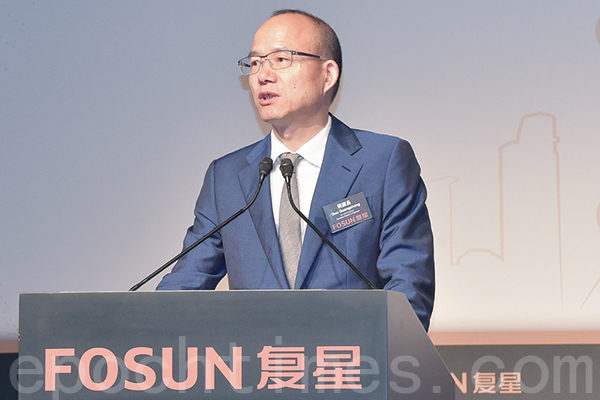

复星国际执行董事兼董事长郭广昌。（郭威力／大纪元）

   
 【大纪元2020年08月18日讯】近来，复星国际有限公司（复星国际）连续遭到标普和穆迪两家国际评级机构调降为“负面”，这对陷入资金危局的复星国际来讲可谓雪上加霜。

据投资者网8月17日报导，在半个月内，复星国际接连被两大国际知名评级机构标普和穆迪评调降为“负面”。7月27日，穆迪发布报告，将复星国际的评级展望由“列入评级观察”名单改为“负面”。8月11日，标普也将复星国际的评级从“稳定”下调为“负面”。

7月底，穆迪将复星国际的企业家族评级从“Ba2”下调至“Ba3”，同时将复星系在境外注册的子公司Fortune Star（BVI）Limited发行债券的高级无抵押评级从“Ba2”下调至“Ba3”。标普则确认其长期发行人信用评级以及该公司担保的高级无抵押债务的发行评级为“BB”。

对于下调复星国际展望的原因，穆迪表示，复星国际的债务杠杆率高且不断增加；长期投资依赖短期资金；控股公司层面的利息覆盖率低；信贷传染风险不断增加。而标普主要认为复星国际的短期债务到期状况和过去6个月流动性下降，增加了该公司持续的再融资风险和对动荡的资本市场的敞口。

穆迪认为，复星国际非常依赖短期融资来支持其长期投资，公司当前持有的现金不足以支持其未来12个月到期的短期债务。未来12～18个月公司较弱的流动性将面临更大压力、杠杆仍将较高。

从业绩来看，2020年上半年的中共病毒（武汉肺炎）疫情对复星国际经营造成巨大冲击，其净利润下滑幅度超过70%。

为了摆脱困境，复星国际甩卖资产以增加现金流。2020年6月，据路透社报导，复星国际正在与阿里巴巴及其它相关方进行磋商，拟以200亿美元估值出售菜鸟网络科技有限公司的股份。但该消息尚未得到官方证实。

报导表示，穆迪、标普下调复星国际的评级会直接影响该公司的股票走势，关系企业融资的难易和融资成本高低。评级越低，融资难度越大，融资成本越高。

国际投行摩根士丹利发表研究报告，将复星国际股票目标价由10.8港元降至10港元。

公开资料显示，复星国际创立于1992年，是一家从事金融、物业、钢铁及健康业务的香港投资控股公司，2007年在香港联交所主板上市，实际控制人为郭广昌，业界称之为复星系。  

<a target="_blank" href=#top><h6 align="right">回上方</h6></a>

<a name=189>
<h1 align="center"><b>中铁建董事长陈奋健去世 传坠楼亡</b></h1>

【大纪元2020年08月18日讯】此前传出中国铁道建筑集团公司（简称中铁建）董事长、党委书记陈奋健坠楼身亡，今天（8月18日）该公司发通报证实陈奋健去世，但用词为“不幸去世”。陈奋健离世前，中共国资委巡视组对中铁建的巡视刚结束。

综合陆媒报导，中铁建今天发通知指，8月16日，陈奋健“不幸去世”，该公司将在合理可行的情况下尽快委任适当人选。

陈奋健离世前，中共国资委党委第二巡视组巡视中国铁建党委工作动员会刚结束，主要针对该集团公司党委领导班子及其成员、下一级主要负责人和重要岗位领导干部问题。

中共国资委党委第二巡视组值班人员称，陈奋健的离世与巡视组无关，是其个人原因。

不过，有网民说：“官方通报越来越注意文字技巧了。此前用‘自杀身亡’、‘跳楼自杀’，后来用‘堕楼’、‘意外’等描述某官员‘自杀’。网易新闻在这位身上，连‘堕楼’、‘意外’都省掉了。”“官方越是用力声明，越显得欲盖弥彰。是正常人都会猜想高官不正常死亡意味有贪腐或权斗。”

陈奋健最近一次出席活动是在8月13日，当天他在雄安新区会见中共河北省委常委、副省长，雄安新区党工委书记、管委会主任陈刚，双方对雄安新区有关项目开发等交换意见。

公开资料显示，终年58岁的陈奋健，毕业于长沙交通学院土木工程系的港航工程专业，后获北京大学光华管理学院的高级管理人员工商管理硕士；在中铁建任职前，他曾是中国交通建设集团有限公司任副董事长、总经理、党委副书记。陈奋健还是教授级高级工程师，也是中共十九大代表。

据悉，中铁建前身是铁道兵，现为中共国务院国资委管理的特大型建筑企业。

<a target="_blank" href=#top><h6 align="right">回上方</h6></a>

<a name=188>
<h1 align="center"><b>见两女子翻船溺水 71岁葡萄牙总统跳海救人</b></h1>

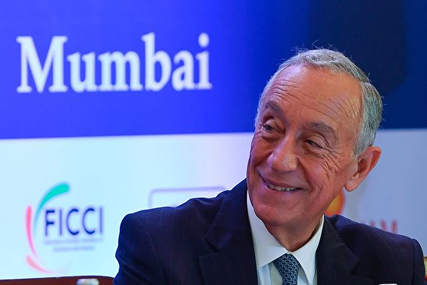

上周六（8月15日）葡萄牙总统马塞洛·雷贝洛·德·索萨（Marcelo Rebelo de Sousa）奋不顾身地跳入海中救人。(INDRANIL MUKHERJEE/AFP via Getty Images)

   
【大纪元2020年08月18日讯】（大纪元记者徐简编译报导）上周六（8月15日）葡萄牙总统马塞洛‧雷贝洛‧德‧索萨（Marcelo Rebelo de Sousa）在海滩上接受采访时，看到了两位从皮划艇上落水的女子，就奋不顾身地跳入海中救人。他因义举被媒体称为“英雄”。

BBC报导，当时71岁的总统正在阿尔加维（Algarve）海滩上接受采访，以促进当地的旅游业。该国的经济严重依赖旅游业，但在疫情之中受到了巨大影响。

总统在跟媒体讲话时，忽然发现有人在海中挣扎，他见状后便跳进海里，游向呼救的人。

录像捕捉到了他游入大海救人的那一刻，当时还有一个人已经在那儿，试图帮助将皮划艇翻过来，附近一人驾驶着小型喷气快艇也前来帮助，后来他用自己的喷气快艇把皮划艇拖回岸上。

德‧索萨总统告诉记者，这两位女子来自附近另一个海滩，被海水冲到这边，“由于西部波浪很大，她们被拖了过来，喝下了很多水，甚至无法把（皮划艇）转头，也无法爬上（皮划艇）或游泳，这就是波浪的力量”，他告诉当地媒体。

总统还说，那个驾驶着小型喷气快艇的人是个“爱国者”，他还说那两位女子都不擅长游泳，但是即使是有经验的游泳者，在那样的波浪里也很难游刃有余。他告诫那两位女士今后应该小心。

这位71岁的总统去年进行了一次小型心脏手术。   

<a target="_blank" href=#top><h6 align="right">回上方</h6></a>

<a name=187>
<h1 align="center"><b>受美制裁 林郑首度承认使用信用卡受限制</b></h1>

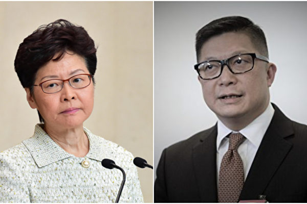

图为香港特首林郑月娥及香港警务处处长邓炳强。（大纪元合成图）

   
【大纪元2020年08月18日讯】（大纪元记者方晓报导）香港特首林郑月娥本月初被美国列入制裁名单。近日她在接受中共喉舌采访时，首度承认她在使用美国公司提供的财务服务和信用卡时可能受到限制。香港警务处处长邓炳强也对媒体承认部分银行对他暂停服务。

林郑月娥8月17日在香港礼宾府接受中共央视旗下英语新闻频道中国环球电视网（CGTN）专访，被问到作为美国的主要制裁对像，生活是否有受到影响。

林郑承认，制裁对个人而言带来不便，例如使用由美国公司提供的财务服务或信用卡时可能会受到限制。

中共《环球时报》也报导了上述消息。

同一天，《香港经济日报》刊发专访香港警务处处长邓炳强的报导，邓在受访中被问及遭美制裁后的影响，他承认部分银行服务被暂停，制裁生效后亦有部分国家停止向警队出售物资，以及中断部分国家层面训练活动。

“港版国安法”7月在香港实施后，港警拘捕多人，并通缉多名海外人士。

8月7日，美国国务院和财政部以破坏香港自治为由宣布制裁11名中港官员，包括林郑月娥、律政司司长郑若骅、保安局局长李家超、警务处处长长邓炳强、政制及中共事务局局长曾国卫、警务处前处长卢伟聪、港澳办主任夏宝龙、港澳办副主任张晓明、中联办主任骆惠宁、北京中央政府驻香港维护国家安全公署署长郑雁雄，以及现任香港行政长官办公室主任和维护国家安全委员会成员兼秘书长陈国基。

美国财政部的声明说，由于制裁行动，上述个人的所有财产和财产权益，以及由他们直接或间接拥有50%或以上的任何实体，或单独拥有或与其他被封锁的人在美国境内或由美国人拥有或控制的任何实体的所有财产和财产权益都被冻结，并且必须向财政部下属的外国资产控制办公室（OFAC）报告。

香港自去年发生反《逃犯条例》修订（反送中）抗议以来，一连串的大规模抗议活动及警方的暴力镇压，引发全球瞩目。

去年11月美国通过《香港人权与民主法》，要求美国国务卿每年就香港的自治情况向国会提交报告，以评估香港应否继续依照《美国-香港政策法》享有特殊待遇。

在“港版国安法”实施的前一天（6月29日），蓬佩奥宣布即日起停止向香港出口由国务院政治与军事局控制的防务设备以及商务部控制的军民两用的敏感技术。美国商务部在同一天宣布暂时取消美国对香港给予的特殊待遇，并评估是否永久取消这项待遇。   

<a target="_blank" href=#top><h6 align="right">回上方</h6></a>

<a name=186>
<h1 align="center"><b>上海公安局长龚道安被调查 曾是孟建柱手下</b></h1>

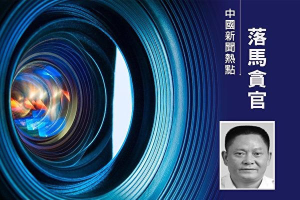

8月18日，中共上海市副市长、市公安局局长龚道安被调查。（大纪元合成）

   
  【大纪元2020年08月18日讯】（大纪元记者萧律生报导）8月18日下午，据中共中央纪监委官网的消息，上海市副市长、市公安局局长龚道安因涉嫌严重违纪违法被审查、调查。此事被认为是中共政法系统的又一次风暴。龚道安被指曾是孟建柱手下。

现年56岁的龚道安是警察出身，长期在湖北省公安系统任职。1981年9月，当时17岁的龚道安开始参加工作，曾任公安县公安局刑侦队副队长、派出所长、刑侦队长；荆沙市公安局局长助理、副局长兼刑侦支队支队长；湖北省公安厅刑侦总队重案侦查处处长、行动技术总队副总队长、总队长、经侦总队总队长；2007年12月任湖北咸宁市委常委、政法委书记、公安局长。

2010年11月起，龚道安调至北京任职，先后出任公安部12局（行动技术局）副局长、局长；2017年6月任上海市公安局长，2018年1月升任上海市副市长，兼任上海市公安局长。

财新网报导称，龚道安在上海市现任八名副市长中排名第六。

龚道安被调查前最后一次公开露面是7月31日。当日，他参加了中共国务院召开的全国安全生产电视电话会议。

今年中共政法系统陷入反贪风暴。对于龚道安被调查，头条日报称，这是中共政法系统的又一次风暴。龚道安是今年第三名被查的警界高官。今年6月，重庆市副市长、公安局局长邓恢林落马；4月，前公安部副部长、曾任中共前政法委书记孟建柱秘书的孙力军落马。

大纪元评论员陈思敏曾撰文指龚道安是孟建柱手下，缘起是龚道安曾参与查办公安部技侦局（即12局）局长张健案，该案被指是胡温在十八大前端掉周永康的行动之一，负责执行的是孟建柱。

据悉，公安部行动技术局（即12局）原称技术侦查局，其职能是专门为其它警种提供技术支援，包括追踪、监听、定位等。

此外，龚道安在湖北咸宁任职时，因积极参与迫害法轮功学员，被海外“追查迫害法轮功国际组织”追查；在上海任公安局长时，被海外明慧网点名。

上月7日，香港《苹果日报》引述明镜新闻网创办人何频的消息说，孟建柱目前已“病重住院”，但被当局严密监视、限制自由，犹如当年军委副主席徐才厚被关在军方301医院到死的“翻版”。5月初，网上一度传出多个版本的有关孟被抓的消息，不过一直未得到中共官方的证实。# 

<a target="_blank" href=#top><h6 align="right">回上方</h6></a>

<a name=185>
<h1 align="center"><b>上任仅一年多 云南省政府副秘书长孙赟落马</b></h1>

【大纪元2020年08月17日讯】8月17日，上任仅一年多的中共云南省政府副秘书长孙赟落马。

据云南省纪委监委消息，云南省政府副秘书长、办公厅党组成员孙赟涉嫌严重违纪违法，目前正接受审查和监察调查。

孙赟于1966年2月出生，是甘肃通渭人。孙赟曾先后任中国福马机械集团有限公司党委副书记，同时挂职云南省楚雄州政府副州长、楚雄州委常委。

2015年5月至2016年5月，孙赟任云南楚雄州委副书记；2016年5月至2019年6月，孙赟任云南省投资控股集团有限公司党委书记、董事长；2019年6月至今，孙赟任云南省政府副秘书长（正厅级）、办公厅党组成员。

2017年至今，云南省长为阮成发。2016年12月，时任武汉市委书记阮成发调任云南省委副书记，先后兼任副省长、代理省长、省长。期间，阮成发接连发生读错字丑闻，包括把“滇”读成“镇”，把云南的“抚仙湖”念成“抚优湖”，引发舆论风波。此前阮成发主政武汉8年多，贪腐丑闻不断。

中共十八大后，云南成腐败重灾区，除白恩培、秦光荣、曹建方外，副省长沈培平，省委副书记仇和，省委政法委书记孟苏铁，昆明市委书记张田欣、高劲松等先后落马。

<a target="_blank" href=#top><h6 align="right">回上方</h6></a>

<a name=184>
<h1 align="center"><b>中共银保监会主席：今年银行坏帐或大增</b></h1>

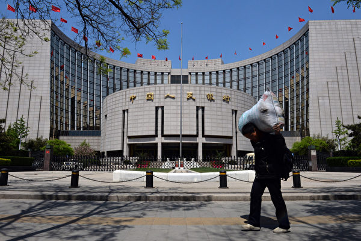

受中共病毒打击，大陆银行坏账将飙升。(MIKE CLARKE/AFP/Getty Images)

   
 【大纪元2020年08月17日讯】（大纪元记者刘毅报导）中共银保监会主席郭树清日前承认，目前银行即期账面利润具有较大虚增成分，不良资产将陆续暴露，坏帐或飙升。
 
<b>不良资产将陆续暴露</b>

郭树清8月16日在中共官方杂志《求是》撰文称，因为金融财务反应存在时滞，目前的资产分类尚未准确反映中国经济真实风险，银行即期账面利润具有较大虚增成分，这种情况不会持久，不良资产将陆续暴露。在资金面宽松背景下，企业、居民、政府都可能增加债务。利率下行一致性预期强化后，有可能助长杠杆交易和投机行为，催生新一轮资产泡沫。

郭树清承认，今后一段时间中国经济同时面临供需两端及大陆内外两个市场的承压。

他预计，今年总体杠杆率和分部门杠杆率都会出现较大增加，金融机构的坏帐可能大幅增加。2019年银行业新形成2.7万亿元（人民币，下同）不良贷款，出现疫情“黑天鹅”后，资产质量加倍劣变不可避免。

国际评级机构标准普尔2月20日发表的报告认为，中共病毒（武汉肺炎）疫情对经济的打击将使大陆银行业坏帐可能增加7.7万亿元至10.1万亿元。

评论人士文小刚表示，随着大陆经济下滑，之前蒙在金融界头上的面纱正在慢慢揭开。随着经济受瘟疫及大洪水打击，很多银行的贷款及违规收不回来，坏帐增加将直接导致金融业产生危机。而房地产占用了银行巨大资金，是威胁金融安全的最大灰犀牛。

<b>金融领域出问题 中共加大放水、降杠杆</b>

为了给房地产行业降杠杆，《21世纪经济报道》8月15日引述5名金融界人士的消息说，中共监管机构将进一步收紧房地产企业发债规模，借新还旧发债的额度按照70%～90%实行。一投行部门的人士也表示，地产债不能按照全额度借新还旧，银行间市场按照拟旧债的85%发行。兴业研究认为，这是在强行压降房企杠杆水平。

同时市场传言称，监管层或给房企设置“三道红线”：剔除预收款后的资产负债率大于70%；净负债率大于100%；现金短债比小于1倍。指标“不合格”的房企会被限制融资。

不断爆雷的互联网P2P已经强行从6000家降至现在的29家，借贷规模及参与人数连续24个月下降。

除了对有风险的行业加强监管之外，中共还加大了向市场放水。8月17日，中共央行开展7,000亿元中期借贷便利（MLF）操作，期限一年，同时开展500亿元7日期逆回购。因17日有4,000亿元MLF及100亿元逆回购，因此17日央行对市场净投放3,400亿元。

对此，评论人士文小刚表示，中共现在真是怕了，如果中共高层之前还在担心经济下滑、民众失业、粮食短缺等问题，现在已经开始担心金融领域出问题了，之前经济还可以运转的时候，金融问题还可以拆东墙补西墙，尽力掩盖，但是现在经济大环境出了问题，“东墙”也已经快倒了，没得可拆了。大陆金融各种问题会逐渐浮出水面，而金融是经济的润滑剂，润滑剂出问题了，经济就没办法运转了。

<b>银行业利润下滑</b>

据中共银保监会8月10日公布的数据，上半年，商业银行净利润同比下降9.4%。路透社测算后认为，今年第二季度，大陆国有大行和股份行单季净利同比降幅均达25%以上。银行利润下滑在大陆银行比较罕见。

财经评论员王剑对此表示，银行是大陆最赚钱的行业，现在它的利润下降了近30%，说明大陆经济至少下降了50%，或者更多。

数据显示，大陆银行业去年的利润达1万亿元，占企业总利润的50%。  

<a target="_blank" href=#top><h6 align="right">回上方</h6></a>

<a name=183>
<h1 align="center"><b>东南亚现突变中共病毒“传播速度快10倍”</b></h1>

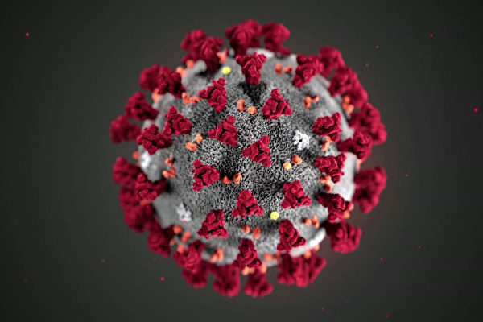

美国疾病控制与预防中心（CDC）创建的冠状病毒（中共病毒）的超微结构。(CDC)

   
【大纪元2020年08月17日讯】（大纪元记者徐简综合报导）东南亚国家出现了传播力更强的中共病毒（新冠状病毒），其中马来西亚首次发现了四例突变的D614G毒株，其传播速度比一般毒株快上10倍。专业人士担忧，这会导致现有疫苗研究对此次突变无效。

彭博社8月17日报导，马来西亚医药机构（IMR）研究发现，这4名患者属于2个不同的感染群，有3人来自吉打州“印度西瓦甘加”（Sivagangga）感染群，1人来自柔佛州“武吉地南”（Bukit Tiram）感染群。世界上其它地方也发现了这种D614G毒株。

马来西亚卫生部部长（Noor Hisham Abdullah）强调：“突变的病毒拥有更强的感染力，传播速度比一般毒株快上10倍。”他说因为D614G拥有较高传染力，如果经由“超级传播者”散播出去，会造成更大规模的感染，一般民众需要更加警惕和谨慎。

6月上旬CNN报导，美国佛罗里达州“斯克里普斯研究中心”（Scripps Research Institute）的一项研究显示，中共病毒已产生基因突变为D614G，使病毒更容易侵入人体细胞。

据7月2日发表在著名期刊《细胞》（Cell）杂志上的最新研究表明，29%中共病毒样本出现了D614G变异，这个发生在病毒与人体结合的S刺突蛋白上的变异，增加了病毒进入人体的钥匙数量，令感染力提高了3至6倍。

<b>菲律宾发现更具传染性的病株</b>

菲律宾的卫生官员周一（8月17日）说，菲律宾也发现了比最初在武汉首次出现的中共病毒更具感染力的菌株。

该国卫生部副部长玛丽亚‧罗萨里奥‧维吉尔（Maria Rosario Vergeire）告诉媒体，在约290万人口的奎松市发现了G614毒株。该市有8千多例感染病例，就是由该病毒引起的。

菲律宾基因组中心在8月的公告中透露，在奎松市随机收集的9个样本中发现了G614。而G614菌株来自最初武汉市报导的原始D614菌株的D614G突变。

维吉尔说，由于样本量仍然太小，目前还无法得出G614已经在菲律宾传播的结论。#

<a target="_blank" href=#top><h6 align="right">回上方</h6></a>

<a name=182>
<h1 align="center"><b>【独家】中共外事排头兵和百人计划揭秘</b></h1>
   <h3 align="center"><b>两年间外事内容大变 中共渗透世界遭重挫</b></h3>

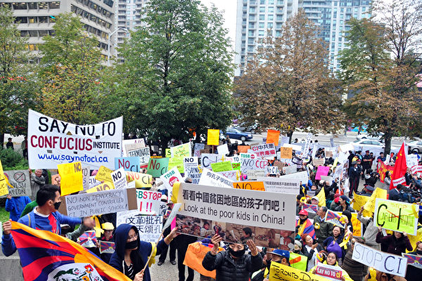

近年来，世界各地都掀起了反对和抵制孔子学院的活动，各国纷纷关闭孔子学院。（大纪元）

   
【大纪元2020年08月16日讯】（大纪元记者何坚报导）随着中共向世界渗透的图谋逐渐被曝光，国际社会日益警惕和抵制中共扩张共产极权的野心。大纪元新近获得的内部文件显示，在过去两年中，中共对外渗透遭遇重挫。

大纪元获得了中共大庆市政府外事办公室的部分文件，文件不但透露了地方政府大力推进的外事“排头兵计划”，包括类似“千人计划”的“百人计划”；而且还泄露了近年来中共的外事计划和渗透野心已遭受重创。

<b>中共外事“排头兵”遭重击 地方“百人计划”蠢蠢欲动</b>

大庆市外事办在《争当全国资源型城市转型发展排头兵2019年行动计划》中列出了“督办”的重点工作，除了加强对外商贸和文化交流之外，重点就是：开展“五个一百”行动计划：百家外联组织（企业）发展计划、百个企业（项目）服务计划、百名外事人才培养计划、百名外事专家智库、百名海外人才涵养计划。

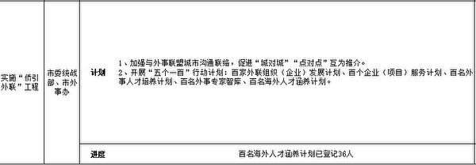

大庆市外事办在《排头兵2019年行动计划》中，列出了当年重点任务，其中包括“百名海外人才涵养计划”。图为文件截图。（大纪元）

在大庆市重点督办的外事“排头兵”任务中，“百名海外人才涵养计划”是重中之重。

这个“百人计划”是中共各地政府开展的，类似于“千人计划”的海外人才引进计划。而“千人计划”已被揭穿是中共以引进海外人才为名，实质是窃取外国高科技、并实施经济、技术间谍任务的渗透计划。目前已有多名美国华裔专家被控、或被定罪，原因是参与了中共“千人计划”及窃取美国商业、技术机密。

大庆外事办出国管理科在2019年的《百名海外人才涵养计划表格》中，列出了129名海外人才涵养目标，其中排在第一名的，是澳大利亚国际商会的胡平。

澳大利亚国际商会（简称AITA），在大纪元最近的独家报导（点击查看原文）中，已经被曝光是专门替中共搭桥、联络澳洲的秘密商会。胡平是该商会背景神秘的管理层中、少有的几个透露了姓名的人士之一。

与几乎成为间谍嫌犯代名词的“千人计划”不同，如今中共地方政府力推的“百人计划”，不再局限于华裔。

事实上，大庆市“百人计划”的渗透目标中，绝大多数都不是华裔，而是外国人。

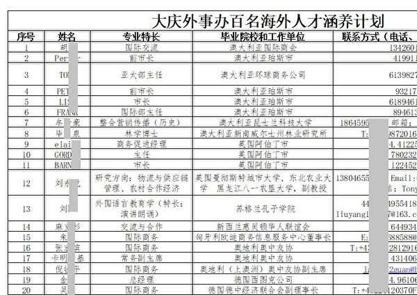

中共大庆市外事办2019年的“百人计划”名单中，逾半都是外国人，其中包括多个外国城市的市长等政府高官。图为大庆“百人计划”名单截图。（大纪元）

仅从姓名上判断，大庆市129名海外人才涵养目标中，至少有70人是非华裔的外国人。

其中包括了多个外国城市的政府高官，例如，澳大利亚珀斯市（PERTH）的现任市长Lisa、国际部主任Frank和前市长Peter，英国阿伯丁市（Aberdeen）市长Barney，丹麦SZARVAS市的市长、副市长和1位前市长，加勒比海岛国城市圣费尔南多的前市长，加拿大圣约翰市的市长，加拿大卡尔加里市的市长及该市3位城市官员，丹麦埃斯比约市的市长及该市国际交流部主任，以及马来西亚吉隆坡市政府的2位官员。

对于大庆市“百人计划”的最新进展，外界无从知晓。但有一点可以确认，那就是中共地方政府的“百人计划”，与“千人计划”类似，同样是对海外华人和西方政商高层的统战行动，而且已见成效。

例如，澳大利亚珀斯市和英国阿伯丁市都引入了备受争议的中共“孔子学院”。后者被外界视为是中共“大外宣”的一部分，不但输出共产极权意识形态、对海外学生进行洗脑，同时也涉嫌从事间谍行为、替中共搜集情报。目前世界各国逐渐认清中共本质，如美国、加拿大、法国、德国和瑞典等国纷纷关闭“孔子学院”，澳洲新南威尔斯州2019年也叫停了“孔子学院”项目“孔子课堂”。

大庆市2019年的外事“排头兵”计划还包括“百名外事专家智库”。大纪元获得的文件显示，2019年大庆市招募的外事专家智库有29人，其中多数都是海外华裔社区中的侨领，部分人员同时被列入“百人计划”。

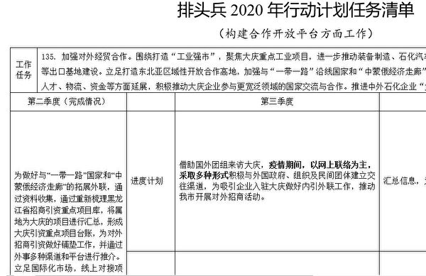

大庆市《外事办排头兵2020年行动计划任务清单》截图（大纪元）

值得一提的是，大庆市外事办在2020年的行动清单显示，无论其欲联络日韩、发展商贸，还是拓展“一带一路”、勾连俄蒙，如今都只能“以网上联络为主”，做些“线上推广”。

时政评论员李林一认为，“排头兵”是指在队伍前面冲锋陷阵的人，尽管大庆市“排头兵”计划在外事领域设立了诸多目标，但其内部文件却泄了底，暴露出中共外事“排头兵”在现实中处处碰壁。随着国际政局对中共越来越来不利，再加上疫情冲击，今年中共只能退至虚拟世界，在网络上划划水，糊弄事。

<b>中共对外交往不对等 对内严控外国人</b>

大庆市内部文件还揭示出，中共在国际文化和人员交流中采取双重标准，对外交往严重不对等。

以大庆市为例。一方面大庆市政府通过诸如五个“一百”的外事统战计划，大举向海外渗透，另一方面，当局针对辖区内外国人的各种表格，揭示出中共对国内的外国人实施了严格的管控。

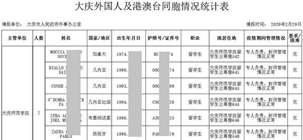

大庆市政府的外国人统计表格表明，中共对境内外国人实施了严格的管控。图为表格截图。（大纪元）

《大庆外国人及港澳台同胞情况统计表》显示，中共政府不但对境内外国人的姓名、国籍、生日、职业、居住地址等个人信息进行了详细统计，还指派专人负责管理，记录日常情况。

对外籍留学生的统计表格则表明，中共对外国学生进入和离开的时间都要监控。

持有工作许可外籍人员的统计表格，记录了外国人在当地的工作、居住和出行信息。

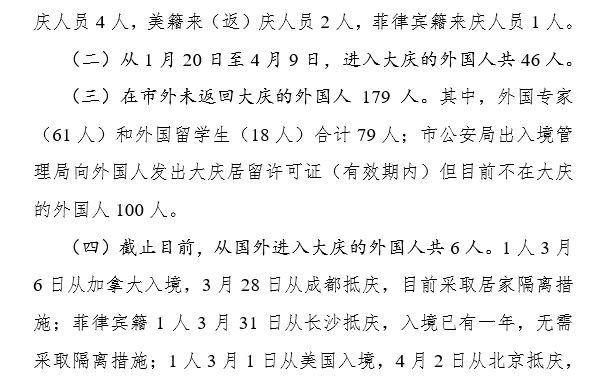

2020年4月9日《大庆市外事办日工作情况汇报》截图。（大纪元）

而大庆市《外事办工作情况报告》则详细记录了每天在大庆市的外国人的情况，包括有多少人，从哪里来，工作还是留学，何时进去大庆市等等。

<b>中共严防“自己人” 出国前实行洗脑加严控</b>

大纪元获得的大庆市外事办文件还揭示出，中共不仅严防在华外国人，秘密实施了名目繁多的监控措施；即使对于出国搞渗透的“自己人”，哪怕只是短暂的出国访问，中共也是放心不下，要严加防控。

大庆市《外事办意识形态风险点及防控措施》截图（大纪元）

大庆市政府内部文件——《外事办意识形态风险点及防控措施》专门列举了临时出国人员面临的“意识形态风险”以及“防控措施”。

该文件指，“西方敌对势力的文化渗透威胁我临时出国人员意识形态安全并影响我国主流意识形态的权威认同。”李林一分析说，文件泄露出的这种“风险”，暗示了中共虽实行数十年的洗脑政策，却担忧中国人抵挡不住短短几天的出国见闻对其的影响。

外事办在文件中强调了要对出国人员“加强出访前思想教育引导、中期管理不缺位、强化后期监控跟踪”，具体包括出访前签署承诺书，并接受保密局培训和国安局的教育，出访期间领导负责管理，回国后还有国安局的回访。

该市《2018年外办在出国审批中强化意识形态工作情况》显示，2018年大庆市共出访团组19个，58人次。37人次接受了行前国家安全教育，48人签署了《出访团组行前教育应知应会承诺书》。

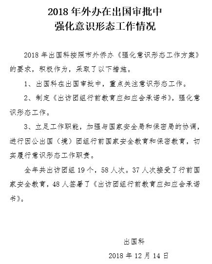

《2018年外办在出国审批中强化意识形态工作情况》截图（大纪元）

另外，大庆市外侨办的内部文件还表明，中共不但强调对出访人员的“宣传教育”，“强化网络监控”，还要求干部职工“积极投身于反间谍斗争中”。   

<a target="_blank" href=#top><h6 align="right">回上方</h6></a>

<a name=181>
<h1 align="center"><b>传TikToK母公司审查印尼新闻 删除反共内容</b></h1>

抖音海外版TikTok的母公司字节跳动被指与中共政府关系密切。(JOEL SAGET/AFP/Getty Images)

【大纪元2020年08月14日讯】（大纪元记者徐简综合报导）路透社8月13日引用消息人士的话爆料，TikTok（抖音海外版）的母公司字节跳动（ByteDance）自2018年起就通过操控印尼热门新闻应用“Baca Berita”（下简称Baca），对该国反对中共的言论进行审查和屏蔽。

印尼官员表示，TikTok在印尼因涉及“色情、不恰当内容和亵渎行为”等信息曾被该国短暂禁用。

字节跳动在寻求撤销TikTok禁令的过程中，于2018年买下了Baca，并成为其主要投资者，Baca主要通过人工智能来汇总、过滤数百个印尼媒体的报导，旨在提供给读者多样性的新闻。

据路透统计，Baca在印尼是名列前茅的新闻应用App，至2019年底，每月活跃用户人数超过800万，同年下载次数达到3000万次。

收购Baca后不久，字节跳动北京总部的一个团队就制定了Baca的言论审查方式，并指令印尼经营者删除有关针对中共政府的所谓“负面”信息。

路透的消息人士说，根据新的审查指南，被视为批评中共的媒体文章不能在BaBe程序上发布，已经发布的文章要删除。

知情人士举例说，字节跳动在与印尼政府进行谈判期间，Baca的审查者就要求，不得出现任何有关禁用TikTok的文章。

另外还有知情人士透露，例如涉及1989年六四镇压的“天安门”为关键字，或提及毛泽东的文章都会被审查过滤掉。而就算是来自印尼国家通讯社安塔拉（Antara）的新闻，如果报导有关印尼与中共在南海争端的文章，也通通被删掉。

Bace否认审查反对中共的内容的说法，强调他们是根据应用程式规范和印尼当地的法律来审核内容的。#

<a target="_blank" href=#top><h6 align="right">回上方</h6></a>

<a name=180>
<h1 align="center"><b>川普拥有Triller账号 对TikTok释何信号</b></h1>

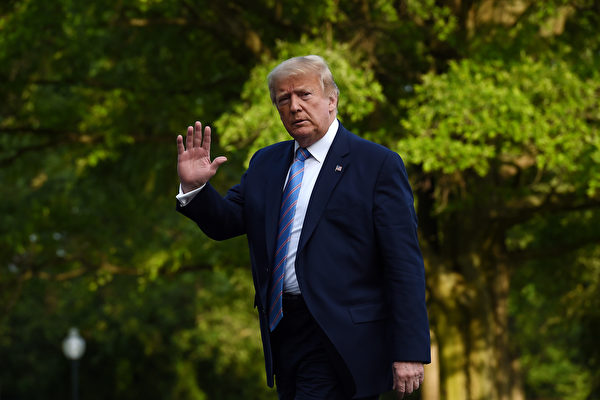

川普已经拥有TikTok竞争对手Triller的账号。图为川普资料照。(Olivier DOULIERY/AFP)

   
 【大纪元2020年08月16日讯】（大纪元记者张婷综合报导）美国总统川普（特朗普）已经拥有一个已验证的Triller账号。Triller是抖音海外版TikTok的竞争对手。路透社称，川普在Triller上开账号是白宫对字节跳动拥有的TikTok不喜欢的另一迹象。

Triller是TikTok的几个替代产品之一。川普总统8月6日签署行政命令，要求除非字节跳动在45天内与TikTok在美国的业务剥离，否则45天后将禁止任何受美国司法管辖的个体和企业与字节跳动进行TikTok有关的业务。自该行政令发布以来，Triller的下载量激增。

截至周六（8月15日）晚些时候为止，川普在Triller放了3则短视频，有三千多个粉丝。

川普在上周五（8月14日）又下令，“字节跳动”（ByteDance）公司必须在90天内放弃其此前针对美国“Musical.ly”的收购并剥离其资产。“字节跳动”公司将其中文视频分享应用程序与“Musical.ly”合并后在美国推出了TikTok。

TikTok深受美国青少年喜爱，但因具有中资背景，美国官员和国会议员担心，美国用户资讯可能由此转传给北京当局。

微软公司正在与字节跳动谈判有关收购TikTok在美国、加拿大、澳大利亚和新西兰的业务，希望以此解决美国政府对TikTok的安全担忧。

此外，媒体也传出推特（Twitter）已经就与TikTok的潜在合并交易进行了初步商谈。考虑到推特的规模比微软小得多，而且在支付这笔交易所涉及款项上的难度要更大，再加上微软的谈判要更为深入，因此外界认为推特在竞购中取得成功的可能性较小。

美国财政部长史蒂芬·姆钦（Steven Mnuchin）8月10日表示，TikTok不能继续按照当前模式运营，不能继续大规模收集美国人的数据。财政部有必要的工具修正这种情况。

姆钦周一在接受CNBC采访时说，川普总统“已经非常清楚地表明，不会（允许TikTok）以这种形式继续下去。”

<a target="_blank" href=#top><h6 align="right">回上方</h6></a>

<a name=179>
<h1 align="center"><b>上告国家信访局要求释放母亲 常州访民失联</b></h1>

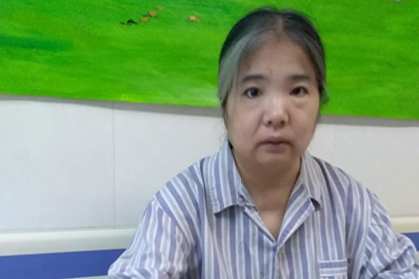

江苏访民钱惠文被关进德安精神病院。（受访者提供）

   
  【大纪元2020年08月17日讯】（大纪元记者李熙采访报导）江苏常州市访民钱惠文被关进精神病院已两个多月，她的儿子钱志松于8月初上告到北京国家信访局，要求释放母亲。他于周日（8月16日）在北戴河散心时被常州驻京办带回北京后失联，他的微博账号也被关闭了。
  
<b>当局说周一给答复 周日就先抓人</b>

周日下午4点多钟，大纪元记者联系上钱志松，当时他正在北戴河的一处海边。他告诉记者，“今天到北戴河来，因为一直被关着，我是过来散散心的。”

8月初他进京到国家信访局，要求释放母亲。国家信访局督办后给地方政府一个月的时间汇报。钱志松说，“现在地方说周一（17日）会给我一个明确答复，是否释放我母亲。当然，他不一定会在明天答复，这两天他总会给一个说词。我会在第一时间将消息发到新浪微博上。”

然而，周一凌晨2点41分，钱志松在微信群发出信息：“下午四点多，在北戴河大海边被机动组找到带到派出所，然后交给南京市公安局的人，安排在北戴河遇见海日出客栈，由无锡和南京的人管我吃饭，晚上10点，被常州驻京办接走，两点不到到了永定门饭店。”“目前我们（地方）基层已经到了常州驻京办。”

江苏访民们在群里呼吁：“各位冤民，齐心协力关注钱惠文母子的人身自由，能够做的打12345电话， 打常州市12345电话问，这是大家能够帮忙的。”

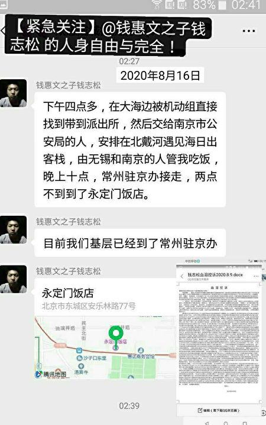

钱志文从北戴河被带走后，于17日凌晨发出最后一则消息。（受访者提供）

   
周一下午，记者多次拨打钱志松的手机都无人接听。他的微博账号“谏言微语”也被关闭了。

<b>钱惠文在德安医院被电击强迫吃药</b>

长期在北京维权上访的江苏省常州市钱惠文母子，因担心被户籍地截访人员带走，于5月20日向北京警方寻求保护，却反而被送往久敬庄，后由户籍地人员带回常州。钱惠文于6月3日被送往精神病院迫害。钱志松被关押在黑监狱，于7月22日被放出来。

钱志松被发出来后，多次到关押他母亲的德安精神专科病院要求探视，但都遭到拒绝。8月13日，医院终于答应让他探视母亲。

在病房里，他给母亲拍了一张照片发到微信群。访民玛卡妈妈说：“可怜钱惠文给那帮王八蛋搞残了，三个月前和三个月后不一样了，三个月前人很精神的，三个月后人老了有20岁左右。”

钱志松说，“我拍的时候我妈一直说别拍，监控室一直有人盯着。说有一次她把药吐了，他们立即就进去准备电击她，说不吃药就电你。我妈说没地方吐，都要看着你吃下去，只要你吐或者不吃，就上电疗。”

他说，“他们把她关进去说她疯了，没有，我母亲目前逻辑思维还很清楚，她跟我说她要出去。”

<b>“争议房宅法院如何能拍卖？”</b>

钱惠文母子已经8年没回常州的家了，这次被强制遣返，钱志松才得知他们的房子已经被法院给拍卖了，里面的家具财物不知去向。

他表示，“这房子是当年我父母离婚时有财产分割的问题，是在离婚案件中有争议的房子。我做为我爸的儿子，我爷爷奶奶的孙子，这套房子我有权利居住吧，里面我妈买的所有家具、物品现在也都被法院给搬走了，搬到哪儿也不说，这是违法的。”

钱惠文因为离婚的财产分割问题十几年来一直在北京上访。令钱志松疑惑的是，这是有争议的房子，是如何上市交易的？

<b>母子同遭迫害 访民们声援</b>

回到常州，钱志松已无家可归。母亲被关进精神病院，他又再次遭到绑架。

玛卡妈妈表示：“地方政府把老百姓逼得水深火热。贵州公车坠河事件就是腐败官员导致的。常州市政府就是贵州某腐败政府缩影，把一个合法维权的公民钱惠文送到德安精神病医院，政府出钱故意治成精神病，把钱惠文之子关进黑监狱，限制人身自由两个多月，还威胁放出之后如果再去上访，就会和他娘一样被关进精神病院。”

微信群访民不断发出：“紧急关注钱惠文、钱志松母子！”“强烈抗议公安派出所打击、报复、迫害维权人钱志松，还公民人权、人身自由权，释放钱惠文、钱志松母子俩。” 

<a target="_blank" href=#top><h6 align="right">回上方</h6></a>

<a name=178>
<h1 align="center"><b>杨威：北戴河会议没完 军权之争浮水面</b></h1>

中共北戴河会议前夕，中共联勤保障部队政治委员徐忠波改任火箭军政治委员并晋升上将。（影片截图）

【大纪元2020年08月17日讯】从8月1日起，中共高层隐身半个月了，北戴河会议还没开完？

可能真没开完。中共党媒关于中共高层的报导，半个月来几乎仅维持报导习近平一人，其他常委的报导很少见。北戴河不但可能没开完，还可能产生了军权的争斗。

<b>其他常委的报导寥寥</b>

半个月来，其他常委的报导很有限。

栗战书在8月8日、10日、11日不得不主持人大常委会，让香港立法会延期运作1年，党媒做了报导。

李克强8月1日向尼泊尔总理致贺电庆祝中尼建交65周年；8月8日向斯里兰卡新任总理发贺电；8月14日签署打击侵犯知识产权的法规，以紧急应付美国核查第一阶段贸易协议。这三件事不得不做，但李克强并未现身，党媒仅文字报导，

李克强应定期每周召开国务院常务会议，上一次是7月29日，再之前是7月22日。按照常规， 8月5日和8月12日应召开国务院常务会议，但没有看到报导。

其他常委的最后一次报导，都停留在7月31日，当时政治局集体亮相，参加政治学习。

这些迹象表明，北戴河会议可能确实没开完。

<b>习近平的报导继续一枝独秀</b>

习近平半个月没露面，但党媒新华社每天都置顶报导习近平的内容，央视对重要动作都做了视频文字报导。

8月1日，习近平同尼泊尔总统就中尼建交65周年互致贺电。

8月5日，习近平就黎巴嫩贝鲁特发生重大爆炸事件向黎巴嫩总统致慰问电。

8月6日，习近平对十四五规划编制作重要指示。

8月8日，习近平就原越共中央总书记黎可漂逝世致唁电。

8月10日，习近平致电祝贺卢卡申科当选白俄罗斯总统。

8月11日，习近平就节约粮食作重要指示。

8月11日，习近平签署四个主席令。

8月15日，《求是》杂志发表习近平的文章。

这些重要报导中，两条指示和一次发表文章，应该是智囊们精心策划的，其它的都是走过场。

<b>十四五规划和《求是》杂志发表文章的意图</b>

这期间最重要的两条报导：

8月6日，习近平对十四五规划编制作重要指示。

8月15日，《求是》杂志发表文章。

十四五规划，是要规划从2021年起的第十四个五年计划。在北戴河会议期间，习近平对此做指示，刻意表示“稳坐钓鱼台”，权力稳固，继续自己的无限任期。

在《求是》杂志发表的文章《不断开拓当代中国马克思主义政治经济学新境界》，应该是习近平意图为北戴河会议最后定调，但能否定调，目前难以确认。

这篇文章，是习近平2015年11月23日在政治局集体学习时的讲话，把5年前的讲话拿出来定调，似乎有点陈旧，但讲话的要点耐人寻味。

这个讲话的标题和主要内容，是所谓的马克思主义政治经济学，无论怎么编造，对当今中国的经济实际毫无用处。社会主义和资本主义的对决，眼看胜负已定，中共对社会主义其实一点也不自信，取代资本主义的幻想已经彻底破灭，连香港弹丸之地的制度对决，中共都一筹莫展。中共官员中，应该没有一个人真正相信所谓的马克思理论了。

重复这样的讲话，实际在继续用马克思做铭牌，意图继续共产党的统治，继续严控中国社会经济资源。换句话说，习近平不想改变，也不想解体共产党组织，还要保党保政权。

其中谈到，“要毫不动摇巩固和发展公有制经济”，“公有制主体地位不能动摇，国有经济主导作用不能动摇”。

中共为了保政权，就不得不极力控制公有制和国有经济，目前的国进民退，恰恰说明了这一点。

这篇文章唯一的用处，就是表示继续保党，想拉住各级中共官员，防止大家跳船逃命，面对美国的制裁，习近平不想投降、不想改良，却要推行极左政策，试图保住中共政权。

这样的定调，很可能并非北戴河会议的共识，而是习近平阵营的一厢情愿。此时放出这样的理论，恐怕也表明，北戴河会议的争斗仍在激烈进行，很可能并未谈拢。

<b>北戴河会议的异音曝光</b>

8月12日，《纽约时报》忽然报导了中共现任高层的贪腐资料，涉及习近平、栗战书、汪洋，特别详细地列出了香港的资产，但却刻意略过了韩正。这样的爆料，现出了江曾势力的影子。北戴河会议的争夺公开化。

8月14日，新华社忽然转发了《人民日报》的一篇文章，《党对人民军队的绝对领导制度为何动摇不得？》，但这篇文章很快又从新华网的首页上消失了。

仔细看这篇文章的内容，可谓相当敏感，围绕中共军队的领导权，很可能现出了不同的声音。

文章说，“国家是阶级矛盾不可调和的产物，军队是阶级统治的暴力工具……夺取和巩固国家政权首要是掌握军队”。

文章对中共党卫军的解读可谓淋漓尽致。中国老百姓看了这样的话语，会做何感想呢？中国老百姓到底属于哪个阶级，被谁统治？

文章接下来的描述更加露骨，“为了夺取政权，必须拥有自己坚强的武装力量，在获得胜利以后，还必须凭借武装力量……维护自己的统治”。

中共对军队和政权的诠释，让老百姓开了眼界，也充分反映出，中共害怕老百姓，防备老百姓。但中共还有更怕的。

文章还说，“这支军队始终听党话、跟党走，不管什么人、采取什么手段，想拉拢军队脱离党，都不会得逞”，“当年，张国焘仗着自己带领的部队人数多，想脱离中央、另立山头，结果把自己搞成了孤家寡人，落得只身仓皇逃跑的下场……‘四人帮’总想抓军权，但军队不听他们的，垮台时他们还哀叹没有掌握军权”。

北戴河会议期间，忽然发这样的文章，争夺军权的血腥味已经出来了。很可能有人提出了军队领导权的问题，甚至提出了分权的方案，当权者立即公开反击，把这场争斗展现给外界。

文章还说，“最高领导权和指挥权属于党中央……贯彻军委主席负责制，确保一切行动听从党中央、中央军委和习近平主席指挥”。

讲出这样的大白话，应该谁都听明白了，有人对军权提出了质疑，还具体到了习近平的军委主席负责制。

文章的口气也很强硬，称“绝对领导制度，关键是达到‘绝对’的要求……不能打任何折扣，没有丝毫余地可言。所谓‘绝对’，就是……唯一性、彻底性和无条件性，必须是纯粹、彻底、百分百的忠诚……确保全军绝对忠诚、绝对纯洁、绝对可靠”。

这还只是文章的一部分，就已经到了几乎你死我活的地步了，看来北戴河会议发生了围绕军权的争斗。

<b>关于军权的不同提法</b>

党媒这篇关于军权的文章，针对性极强，而且不惜曝光。但这篇文章很快从新华网首页下架，显然因为泄露太多内部分歧，不想让老百姓知道。文章曝光的内容其实还有更多。

文章发明了一个新词，称“政治转基因”工程行不通，更有看点。

文章称，“搞所谓的‘政治转基因’工程，想方设法让军队‘改变颜色’，其居心叵测可见一斑”。

看来，关于军权的变动，北戴河会议确实提出了具体方案，还不止一个。

文章称，“敌对势力大肆鼓吹‘军队非党化、非政治化’和‘军队国家化’……把军队从党的旗帜下拉出去”。

这表明，北戴河会议上，有人提出了“军队非党化、非政治化和军队国家化”。当权者自然强烈反对，这等于被剥夺了军权。

文章说，“所谓‘军队非党化’……持这种论调的人，只看到了西方国家军队与政党关系的表象……执政党发生轮替，军队的领导权只是从资产阶级的‘左手’交到‘右手’而已”。

中共有这样的谬论，应该也不奇怪，中共的独裁者当然无法真正理解民主政治。无论如何，当权者不愿交出军权。

文章还说，“所谓‘军队非政治化’……军队不过问政治，这实际上只是资产阶级的虚伪口号”。

这类荒谬言论并无价值，但却反映出，中共内部有人提出，学习西方军队制度，军队脱离政治。当权者当然也要强烈反对，这同样等于军权被夺。

文章又说，“所谓‘军队国家化’……军队只效忠国家，而不听命于某个党派……这种军事模式是编造出来忽悠人、迷惑人的”。

文章继续荒谬，再次表明，中共内部也直接提出了“军队国家化”，这次北戴河会议，看来非同小可。

文章最后称，“这3种错误论调”是“敌对势力骨子里的政治图谋”，要“态度鲜明、理直气壮地批驳”，“执政必执军”。

中共围绕军权的争夺浮出水面，应该不只是军权，很可能涉及一系列的权力斗争，北戴河会议可能确实没开完。

中共内部出现了改良声音，无论是出于真心，还是有不同的意图，马上招致了强烈反对。中共内部绞肉机的本质一览无余，还有人指望这样的政党吗？中国的老百姓，全体中国人，大家看清了吗？

<a target="_blank" href=#top><h6 align="right">回上方</h6></a>

<a name=177>
<h1 align="center"><b>民调：川普支持度上升 拜登领先幅度缩小</b></h1>

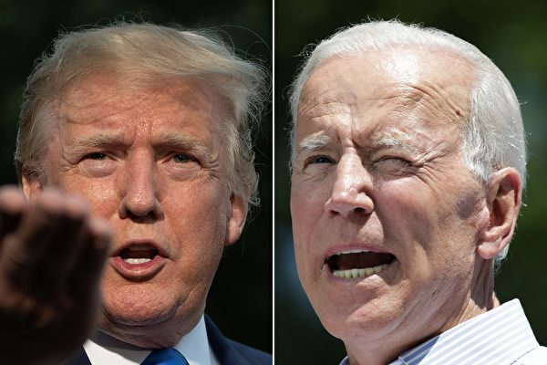

在美国两大党召开代表大会前夕，一项新的全国民意调查显示，川普的民调正在上升，拜登的领先优势正迅速缩小。(JIM WATSON,DOMINICK REUTER/AFP via Getty Images)

   
 【大纪元2020年08月17日讯】（大纪元记者陈霆综合报导）在美国两大党召开代表大会前夕，一项新的全国民意调查显示，川普的民调正在上升，拜登的领先优势正迅速缩小。

根据CNN在周日（8月16日）发布的民调，在8月12日至15日进行的调查中，50%的登记选民支持拜登，而46%的选民支持川普。然而，由于民意调查有正负4个百分点的误差范围，这显示两者的支持度正迅速靠近。

民调指出，有72%选民表示，他们对11月的投票“非常热衷”或“很热衷”，在这些热情选民中，对拜登的支持度则略微提升，以53%比46%领先川普。

然而，值得注意的是，在对大选有决定性作用的15个摇摆州中，拜登的领先优势正迅速缩小，两人的仅相距1%，支持度以49%对48%正在拉锯。

CNN民调指出，支持度的变化主要反映在男性选民上。在6月时，男性选民对两人的支持度相当，但现在有56%的人支持川普，仅有40%的人支持拜登。其中以年龄介于35至64岁之间者和无党派人士的变化最为明显。

自6月以来，川普也成功凝聚了共和党人的支持。在6月民调中，有8%的共和党人或有共和党倾向的无党派人士表示会支持拜登，但目前这一数字下降为4%。保守派人士对川普的支持率，从76%提高到85%。

但民意调查显示，川普总统的选民更有可能在11月之前改变主意。

在川普的支持者中，有12%的人表示，在大选前他们有可能改变主意。相比之下，拜登的支持者中只有7%表示，还没有下定决心。

民调也显示出一个特别的现象，不论是哪一方的支持者，他们都更关心川普的想法。总计有六成的选民说，他们是基于对川普的想法决定要投给哪个候选人（29%支持拜登，30%支持川普）。

总体而言，有54%的选民表示对川普在总统任期的表现不满意，满意者有42%，这项数据对比6月时的民调，也呈现出上升的趋势，说明了川普在选民心中的支持度正在回升。  

<a target="_blank" href=#top><h6 align="right">回上方</h6></a>

<a name=176>
<h1 align="center"><b>禁微信影响iPhone销售？川普如此回答</b></h1>

美国总统川普（特朗普）周五（8月14日）在被问到禁止微信、是否担心iPhone无法在中国出售，他回答说：“请便”，“我做的是对我们国家安全好的事”。(Pixabay）

   
【大纪元2020年08月16日讯】（大纪元记者王祥综合报导）美国总统川普（特朗普）周五（8月14日）在被问到禁止微信、是否担心iPhone无法在中国出售，他回答说：“无所谓”（Whatever），“我做的是对我们国家安全好的事”。

一位记者在白宫新闻会上提问说，美国公司对川普的微信行政令发出了警报。苹果、福特、迪斯尼担心，因微信是中国的大通讯平台和支付平台，如果禁止美国企业与微信合作，他们将无法向中国市场销售iPhone等。

川普回答说：“无所谓。”

记者追问，如果这样，您不介意吗？

川普再回答说：“我做的是对我们国家安全好的事。我们对中国（中共）已经非常失望。”

川普6日签署行政令，将禁止受美国司法管辖的任何人或企业与腾讯进行微信相关“交易”。

行政令提及，在《国际紧急经济权力法》（International Emergency Economic Powers Act）、《国家紧急法》（National Emergencies Act）的授权下，总统宣布国家紧急状态后，可以约束各种经济交易。此前，川普已经宣布过国家安全紧急状态（emergency of national security order）。

纽约州执业律师韩正豫表示，川普总统以国家安全为由禁止微信，并非针对华人；美国主要是担心中国共产党通过微信这一渠道获取美国人的个人和财产信息。

同样，川普总统宣布禁止微信，也不是要建设像中共那样的防火墙。中共的防火墙是要堵截自由信息的流通；而美国禁止微信的原因之一，是要保护言论自由不受侵害。

正如“自由之家”总裁在《大西洋月刊》撰文说：“美国（对中共官员）的制裁在于惩罚人权侵害，而中国（中共）的制裁在于惩罚反对人权侵害的声音。”

微信是带给了华人巨大的通讯和交易便利，但不可否认的是，微信也在把所有使用微信的人——无论身在中国大陆或海外——都变成“中共模式”，只要在微信发言，都会自动进行言论审查，即便生活在自由世界，也还要谨守共产极权的言论规则。

美国司法部助理检察长约翰‧德默斯（John Demers）周三（8月12日）表示，微信跟抖音一样，搜集很多美国的个人数据。

他说，中共政府用微信或者微信群监控中国留学生，用微信群发讯息、把留学生置于它的控制下，同时进行反美扭曲宣传。

德默斯透露，美国政府一直在盯着微信，也清楚中共在利用微信行动。

微信成为海外华人圈热议的一个话题，大多数人认为，微信并非不可代替，只是在养成一种习惯后，改变起来需要一点时间。#   

<a target="_blank" href=#top><h6 align="right">回上方</h6></a>

<a name=175>
<h1 align="center"><b>田云：高智晟律师失踪三年 中共怕什么？</b></h1>

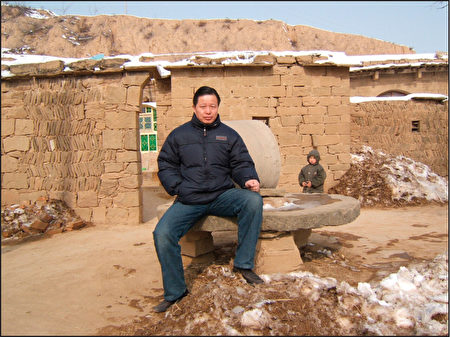

中国著名人权律师高智晟在老家的陕北窑洞前。（大纪元资料室）

   
 【大纪元2020年08月16日讯】8月13日，中国人权律师高智晟失踪整整三年。8月9日，高律师的妻子耿和与友人在旧金山中领馆前举行抗议集会，要求中共释放高智晟，并呼吁美国政府帮助营救。14日，美国国务院国际宗教自由大使布朗巴克在推特上发文说，“我们没有忘记高智晟律师”，他“献身于捍卫基督徒，法轮功学员和其他弱势群体。”

高智晟是中国首批民间维权律师之一，被誉为“中国的良心”。他出身贫寒，自学成才，自执业起一直积极为弱势群体维权。高律师因为代理许多敏感案件、曝光真相而触怒中共，遭受了近15年的严酷迫害，包括非法绑架、酷刑折磨、冤狱、软禁、禁止看牙医、强制失踪。

高智晟的个人遭遇是大陆司法持续败坏、人权被持续践踏的恐怖缩影。中共迫害像高律师这样的优秀公民，是在与良善、正义为敌，与人类文明为敌。

<b>中共为何迫害高智晟律师</b>

高智晟律师敢于突破中共禁区，触碰了法轮功、退党、活摘器官等中共最为忌惮的话题，因此招致疯狂迫害。

香港律师何俊仁透露，曾有大陆国企以巨额利诱高智晟，聘其为独家代表律师，条件是不得再参与义务维权活动，被高律师断然回绝
。
<b>1.为法轮功大声疾呼</b>

2004年12月26日，高智晟律师代理并调查石家庄法轮功学员黄伟案。12月27日，他与另一位律师到石家庄新华区法院呈交材料，该院行政庭一位法官看过材料后说：“现在上边有规定，凡是涉法轮功的案件一律不受理，并且不出具任何手续。”之后，立案庭的一名法官说：“你不是党员吧（指律师），党代表大会的精神你也没学过吧，律师不允许接此类案件你知不知道，法院都是共产党的，法律也是共产党定的，现在上边有规定说不能受理，就是不受理，你愿意找谁就去找谁，愿意哪告就去哪告。”

2004年12月31日，高智晟律师公开上书全国人大，指出黄伟案透出的司法乱象。他写道：“‘稳定压倒一切’口号下的权力无规则施行，是当今中国社会的最不稳定之源。在法轮功问题的处理上，首先承认他们的中国公民地位应为当局、尤应成为法律工作者的一般思想。”

2005年10月、11月和12月，高智晟律师三次向中共最高领导人发出公开信，披露多地法轮功学员受迫害的惨烈事实，呼吁停止迫害法轮功。

在题为《停止迫害自由信仰者 改善同中国人民的关系》的信中，高律师写道：“持续不辍的罪恶不仅仅使无以计数的善男信女蒙冤涉难甚至含恨而死，这种完全悖越基本人性的迫害至今仍在延续着，同时被延续着的是持续被损害的我们的政府形象以至国家形象，它包括法律方面的、道德方面及人性文明方面的。这场浩劫的罪恶不始于你们，但这场浩劫在你们二人主政时期得以继延，这场针对自由信仰者的浩劫未能止于你们，这同样亦属一种罪责。”

在最后一封公开信、《必须立即停止灭绝我们民族良知和道德的野蛮行径》中，高律师揭露了江泽民设立、周永康主导的“610”办公室指挥迫害法轮功的恶行：“以‘610’为符号化的的权力，正在持续地以杀戮人的肉体及精神、以镣铐和锁链、电刑、老虎凳等形式与我们的人民‘打交道’，这种已完全黑社会化了的权力正在持续地折磨着我们的母亲、我们的姐妹、我们的孩子及我们的整个民族。”

长春学员张致奎向高律师讲述自己受迫害的经历，他说，当地警察梁处长在用刑前对他威胁称：“今天我在这把你整死, 扒个坑把你埋掉,谁也不知道,谁也找不着。”

中共迫害法轮功，从本质上违法违宪，重创国家的经济、法制和道德。然而，高智晟的呼吁如石沉大海。迄今，迫害仍在继续，罪恶的辐射波不断扩大，从大陆向香港和海外延伸。为法轮功鸣冤的维权律师群体竟成为被打压的对象，其中多人也遭受了歧视、酷刑和冤狱，家属也被株连。

<b>2．公开退出中共 呼吁国人退党</b>

2005年12月13日，高智晟律师发表书面声明，退出中共。同年12月15日，高律师又发表了《这个政权从来就没有停止过杀人》，他向国人发出倡议：“当务之急是丢掉幻想，从每个人的身边现实地做起，以一切可能的方式力促身边的人退出这杀人的集团，不再做杀人者的帮凶，更不再做杀人者的工具！”“退出中国共产党！从根本上彻底摆脱中国人民的灾难厄运！”

高律师还公开推崇大纪元系列社论《九评共产党》，认为传播《九评》是一场以真相和道德为结束武器的战争。

<b>3．支持调查中共活摘器官</b>

2006年3月，中共活摘法轮功学员器官事件被证人曝光后，高智晟律师公开表示参与调查事件真相。自2006年6月起，加拿大前亚太司司长大卫·乔高和国际人权律师大卫·麦塔斯要求进入中国大陆进行关于活摘独立调查，但是遭中共拒绝。高智晟为了促成调查，主动自北京发出邀请函。

2006年7月6日，大卫·乔高和国际人权律师大卫·麦塔斯公布了《中共活体摘取法轮功学员器官独立调查报告》，7月7日，高智晟与林牧、孙文广、焦国标、张鉴康、杨在新等人日发表联合声明，谴责中共暴行。

2006年8月，高智晟律师被当局吊销执照、秘密绑架并遭受4个月的酷刑，2006年12月22日，他被北京法院以“煽动颠覆国家政权罪”判处三年有期徒刑三年，缓刑五年，在缓刑期间又多次遭到绑架和酷刑。

<b>4．曝光司法黑幕 构想中国宪政未来</b>

2016年，高律师在被软禁期间，冒着生命危险手写了50万字的《2017年，起来中国！》。书稿由义士冒死辗转带出，在海外出版。高律师在著作里记叙了自2005年以来，他被中共非法监控、审讯、酷刑、及狱中生活等细节，揭露了中共司法黑幕。他也论及中国社会普遍性的信仰缺失之长远危害，并且提出了对未来中国实行民主宪政制度的思考和构想。

前欧洲议会副主席爱德华·麦克米兰·史考特先生为此书英文版作序。史考特称高智晟为“我们时代的英雄”，并称这部著作是“痛苦的总汇，亦是为明日国际检察官所准备的详尽的犯罪控告书”。

<b>中共怕什么?</b>

中共迫害高律师，因为惧怕他记录和传播的事实真相，惧怕他对暴政的深刻揭露，及其伟大的爱国情怀、不屈的意志和精神。正因为此，当局竟然禁止他外出治疗牙病，甚至将他强制失踪长达三年之久。

这正如美国国务卿蓬佩奥7月23日在演讲中所言：“中共对中国人民诚实意见的恐惧甚于任何敌人。”

在一次与迫害他的“蒙面人”对话时，高智晟问其为何害怕自己这样一个手无寸铁的人，对方说：“你手头要有点铁我们到不怕，你有一百个师，我们就两百个师弄你。可你手里的只是支笔，五百个师也只能干瞪眼啊。”

以弱抗暴，值得吗？高律师说：“有人会认为抗争付出的代价太大，（他们的看管警察中，有不少人与我讨论过这一话题，几乎都认为抗争的代价太过于惨重），那是个外行观点，如果你选择了怯弱，你付出的代价则更是无边沿的惨重。”

据耿和女士介绍，在英文版《2017年 起来中国！》发行的招待会上，前美国国会议员沃尔夫含泪说：“我们能不能少考虑点利益，为这些遭受了如此迫害的律师多说点话，多做点实事？！”

今天，中共一边压迫大陆民众，一边在香港挥舞魔爪，并且企图染指世界。高智晟律师当年关于法治、信仰、文明的许多洞见都颇具前瞻性，他的信念和实践赢得了中外善良人们的敬重。

我们声援受中共迫害的信仰者、维权律师及所有抗击暴政的人士，就是在抵制邪恶的侵犯，捍卫正义。

历史将铭记勇敢的中国人，他们在苦难中燃烧自己，奉献高贵的光芒。  

<a target="_blank" href=#top><h6 align="right">回上方</h6></a>

<a name=174>
<h4 align="center"><b>腾讯“姓党”（下）</b></h4>
   <h1 align="center"><b>【内幕】微信健康码国际版将监控延伸海外</b></h1>
   <h3 align="center"><b>“当你打开健康码的那一瞬间，后台的大数据已经经历了无数次的计算和比对”</b></h3>

在中共病毒（武汉肺炎）疫情爆发以来，中共不仅在大陆推行健康码，还推出“健康码国际版”，引发争议。图为大陆的腾讯跟阿里巴巴推出的“健康码”。（网络截图）

   
   【大纪元2020年08月14日讯】（大纪元记者古清儿报导）“当你打开健康码的那一瞬间，后台的大数据已经经历了无数次的计算和比对。”陆媒报导称。

在中共病毒（武汉肺炎）疫情爆发以来，中共不仅在大陆推行健康码，还推出“健康码国际版”，引发争议。

近日，大纪元获得多份中共内部文件显示，在疫情下，微信“健康码”数据由中共公安掌控，民众的隐私及个资安全存隐忧。

<b>独家：微信“健康码”数据由公安掌控</b>

目前，大陆民众进入各大商场、医院等公共场合，都必须出示所在地的“健康码”并登记。“健康码”是一种二维条码，大陆民众一般透过微信或支付宝进行申请。大陆的“健康码”分为3种颜色。红码表示“集中观察”，黄码代表“居家隔离”，绿码是“未见异常”，可自由出入相关场合。

近日，大纪元获得了保定市应对疫情工作领导小组办公室4月30日转发的“河北省应对疫情工作领导小组办公室关于全面推行‘河北健康码’亮码通行制度的通知”。这个通知的等级为“特提”（最高级）。

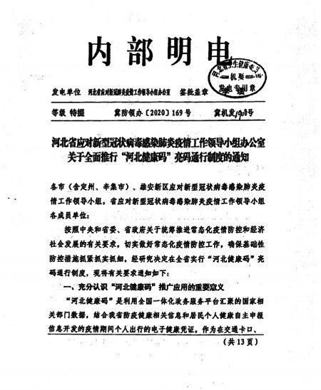

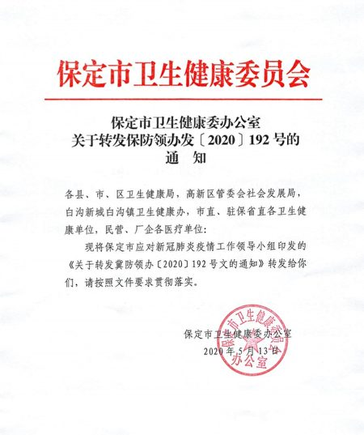

（大纪元）

所谓“河北健康码”是目前河北居民个人出行的电子健康凭证。

通知显示，微信是“河北健康码”指定使用软件。

“河北健康码”领码扫码使用说明中，介绍了操作步骤：微信搜索“冀时办”一打开“冀时办”小程序→初次使用，需先登录一实名认证→点击“出示码”按钮→初次使用时，进行一次健康申报（去打卡）→亮出本人“健康码”或被动扫码→查看个人健康信息→如果提示“未见异常”可以通行→如果有红色“提示信息”，要进行健康状态核验。

（大纪元）

5月1日，保定市下发了《关于进一步推进“河北健康码”推广应用工作实施方案》的通知。通知显示，保定市设立了“河北健康码”推广应用的市级工作专班，背后大多是中共市级机构。

这个专班组成部门包括：市政府副秘书长谢鹏任组长，市委宣传部、市委网信办、市直机关工委、市行政审批局、市工信局、市商务局、市市场监督管理局、市公安局等部门主管领导均为成员。

（大纪元）

大纪元获得的河北安新县中共内部文件显示，“健康码”的背后是公安局。文件提到，大数据疫情防控组具体抓好相关工作的组织协调、工作推进，公安局负责对“健康码”的大数据分析、挖掘和深度应用工作。

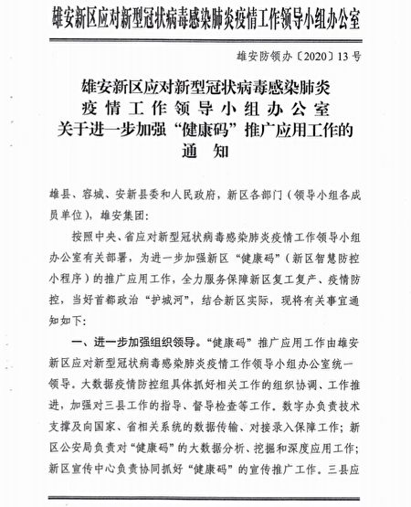

（大纪元）

<b>中共“健康码”延伸至海外 官方公开承认收集定位信息</b>

目前，海外的人乘坐中国航班赴中国，必须申请“防疫健康码国际版”，又称“健康码国际版”，官方为此推荐的软件也是微信。

据中共官方文章，海外赴中国的人需在微信中搜索“防疫健康码国际版”获得小程序入口。首次登录时，需要用户进行实名认证。赴中国前14天，每天都必须上报自身健康状态。

时事评论员李林一表示，无论大陆居民，还是海外的人，只要使用“健康码”或“健康码国际版”，其软体都是微信，背后操控数据的全是中共公安。

<b>中共官方也承认微信“健康码”会自动收集用户的定位信息</b>

“当你打开健康码的那一瞬间，后台的大数据已经经历了无数次的计算和比对。”杭州市健康码工作专班数据质量组相关负责人对《中国新闻周刊》说。

报导还指，当申报健康码时，后台会自动将申报人的身份信息和“涉疫情重点人员库”中的身份信息进行比对，比中则判定为赋红码。后台会自动比对申报人的支付宝定位数据和运营商定位数据，作出评判。

即便大陆疫情趋缓后，这种“健康码”非但没有被废除，反而被应用于更广泛领域。陆媒报导，未来杭州健康码将实现“一码知健（康）”。

<b>独家：黑龙江内部文件中的腾讯和公安的阴影</b>

2月21日，黑龙江省开通了“龙江健康码”；3月27日，“龙江健康码”升级，正式推出国际版。所谓“龙江健康码”也需通过微信的程序进入，然后绑定手机号码、进行实名认证。

腾讯公司有关负责人称，此次“龙江健康码”正式升级推出国际版，将外籍人士纳入统一健康管理体系。

大纪元获得的黑龙江省卫健委3月23日下发的《关于督会(2020)24号有关工作情况的报告》中泄露了官方如何就“龙江健康码”与腾讯、公安等合作的线索。

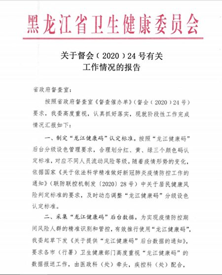

（大纪元）

报告透露，采集“龙江健康码”后台数据时，按照腾讯公司对数据的要求，将所需数据汇总到一张Excel表格中进行加密，每日传输一次前一日0—24时的动态变化数据。

报告还提到，应用过程中，需积极同公安厅、腾讯公司进行沟通，及时告知腾讯公司调整小程序存在的漏洞，利用微信群，对各地数据信息联络员进行培训。下一步，该省卫健委将继续同公安部门、腾讯公司配合，“做好后续功能完善和相关数据传输工作”。

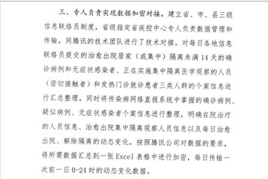

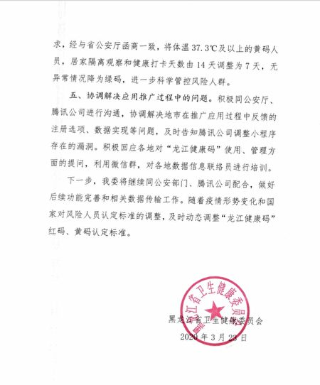

（大纪元）

<b>北京朝阳医院急救收费系统对接微信和支付宝的背后</b>

今年6月北京新发地出现疫情后，大陆社交平台上流传一则消息。消息称支付宝、微信通过提供交易数据，帮助官方锁定35万相关人员，即将进行中共病毒筛查。

网上图片显示，“这次支付宝和微信立了大功了，很快就锁定了35万人……新发地疫情后市场内一直没有现金交易，支付宝和微信支付方便大数据确定有关人员，据说圈定了一个35万人的大名单现在马上全部实施病毒筛查”。

但6月14日晚，支付宝、微信先后发表辟谣声明，否认提供过相关数据。

蹊跷的是，6月16日，北京市朝阳区下发《关于推进朝阳院前急救收费系统全网络成员单位微信、支付宝收费功能对接的通知》。

另一份《北京市朝阳区院前急救全网络移动收费系统推广方案》中提到，这个收费系统资金流向通过支付终端平台、业务管理平台、聚合支付平台、微信／支付宝官方平台的四大平台联动完成整个收费过程。

李林一认为，北京朝阳医院急救收费系统对接微信和支付宝，表面上是为了收费方便，但这些通知也说明了，中共经由支付宝、微信，从此可以掌控病人的相关医疗消费信息。

<b>“健康码”遭质疑侵犯隐私 美国对微信动手</b>

对于中共在全国范围内大力推动“健康码”，大陆网友纷纷质疑健康码对于数据的收集侵害了个人隐私，也有可能导致歧视情况发生。连官方也不得不承认这个问题。

今年4月，深圳智慧城市大数据研究院长陈东平在接受《中国新闻周刊》采访中对“健康码”数据收集的广度提出疑虑，认为这种数据收集的做法超出了防疫的实际需求。在陈东平看来，健康码的推广过程中，在国家层面缺少顶层设计，强制性的数据收集也缺乏一个与民间的沟通过程。这些都增加了公众的忧虑。

曾在搜狐网工作的媒体人李茂君说，微信推行“健康码”，让中国人没有微信就无法出行，变相绑架了所有人。中共就在通过微信掌握着中国人的流动轨迹，微信也自然就成为维稳工具。

据法广的报导，一位驻北京的德国记者，在《南德意志报》上发表文章讲述疫情期间的亲身体验，他说，只要外出，每天都要被“验身”数次。一日，他跟朋友约会，一路上手机的检测都是绿色，到了约定的饭店，绿色变为黄色，他只能乖乖回家自我禁闭，约会取消。如此这般，我们可以理解为：所有被当局“不待见”的人士，以后至少都是“黄色人物”，不必劳驾警察登门，他们就自动在家面壁了。

面对隐私安全、监控等争议，8月6日，美国总统川普（特朗普）签署行政命令，45天后，将禁止美国公司、民众与腾讯旗下微信（WeChat）进行交易。

<a target="_blank" href=#top><h6 align="right">回上方</h6></a>

<a name=173>
<h1 align="center"><b>【新闻看点】北戴河内斗酣 习当局5误判挨批</b></h1>

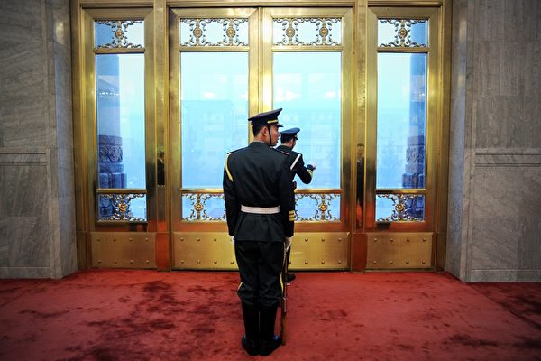

就在北戴河会议举行之际，中共高层权斗的传闻甚嚣尘上。图为2014年6月9日，中共人民大会堂。(WANG ZHAO/AFP/Getty Images)

   
 【大纪元2020年08月15日讯】大家好，欢迎关注新闻看点，我是李沐阳。
 
【60秒看世界】

中共官方称，长江第4号洪水已经在上游形成。从今天下午6点开始，防汛应急响应已经提升到了3级。

美国联邦调查局证实，FBI已经受到黎巴嫩邀请，参与调查8月4日造成172人死亡、6000人受伤、三四十人失踪的大爆炸。

消息人士昨天透露，印度有意排除华为和中兴参与印度的5G建设。这是印度禁用106款中国App之后，又一个打击中共的动作。

谷歌表示，在中共实施《港版国安法》后，将停止回应香港当局索取数据的要求。

截止上午11点，大纪元统计数据显示，中共病毒在189个国家，已经确诊感染了2111万3500多人，病亡75万8377人。

下面进入今天的话题。每年夏天的北戴河会议，都是中共的权斗最激烈的时候。特别是今年，中共的战狼外交引发了国际剧变，使中共各帮派势力的利益都受到了冲击，所以对北京最高当局的问责之声尤为强烈。

中共的战狼外交，特别是疫情后强硬控制香港，使香港在快速失去世界金融中心地位，同时中共也激怒了西方世界。在美国的带领下，世界联盟在围堵中共，使中共在世界周旋的空间被大大挤压，也使得习政权仅存的一点点国际信任荡然无存。造成这一切的原因，反映着习当局有五个误区。

<b>川普：中共管治下 香港跌落地狱</b>

在今天的例行记者会上，中共新派战狼赵立坚表示，香港国际金融中心的地位“绝不是哪个国家的恩赐，更不是谁能够予取予夺的”。

赵立坚的这番话，显然是针对昨天（13日）川普的话所做的回应。

在福克斯的采访中，川普表示，香港在中共的控制下永远不会成功，全球金融中心将“跌落地狱（go to hell）”。

川普指出，中共加强了对香港的控制，数以千计的人才将会离开。香港市场即将死去，没有人想在这里做生意。美国过去以优惠的形式给香港大量的金钱，为的是让香港有自由、有作为。

川普强调，“中国（中共）一旦变得具有攻击性并接管，我便收回一切。所有的东西都收回来，它会失败。”香港没有了特殊待遇，也就失去了吸引生意的能力，再也不能维持像纽约、伦敦一样的国际金融中心地位。

香港公共专业联盟财经政策发言人甄文星也指出，如果香港金融市场主要负责人是由中共委派，或者直接由中共的金融机构负责，“那么香港金融市场是不会成功的”。但是甄文星认为，中共“过去没有管理香港金融市场，可见将来也不会”。

甄文星前半句，如果中共官员或者中共金融机构管理香港金融市场不会成功，这句话的意思是说，中共的官员不行，中共的体制不行，管理不了香港的金融市场。

乍一听没什么毛病，因为中国大陆的金融市场经常传出腐败案，都是由中共官员管理的。但是琢磨琢磨甄文星这个说法，其实是在骂中共官员，骂他们是一群废物，一群败家子。只要这些败家子和废物插手香港的金融市场，那只能是一种结果，金融市场被搅乱，越来越差。

至于甄文星认为中共不会管理香港的金融市场，这种推断没什么理据。中共过去没有管理香港金融市场，那是因为那个时候它还没有给香港套上国安法，还多少顾及一点脸面。

在施行《港版国安法》后，中共从来没说过不插手香港的金融市场。大陆的金融行业都掌控在中共的几大家族手中，那是他们的摇钱树，难道中共会放过香港的金融业吗？

也许中共不会采取直接控制的方式，就像对香港的政府控制一样。表面上还是香港政府在管理香港，林郑月娥还是香港特首。但是中共实施《港版国安法》，在香港搞出了一个驻港联络办和驻港国安公署，都是骑在港府头上的中共机构。港府真正想做什么，实际是听命于这两个机构的，换句话说，林郑必须听命于中共。

即使中共说不会插手香港的金融市场，它的话还有可信度吗？用脚后跟都可以知道。

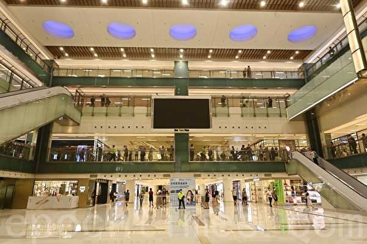

图为8月11日晚网民号召全港“和你sing”。沙田新城市广场中庭，数十名市民手持《苹果日报》或手持白纸，抗议政府打压新闻自由及言论自由，并高呼口号。有市民呼喊“光复香港，时代革命”。（宋碧龙／大纪元）

<b>7成美企悲观，逾5成将离港，香港正死去？</b>

香港美国商会昨天（13日）出炉的民调显示，75%的受访会员企业对香港的商业前景感到悲观，超过5成的受访会员考虑离开香港。

美国商会访问了154家会员企业，其中70%的企业对《港版国安法》感到担忧。因为这个国安法对犯罪行为的定义空泛，而执行机制又显得非常激进，使人人自危，不知道自己到底有没有触犯了法律。

其中有会员就明确提出了疑问：现在是香港壹传媒的黎智英被抓，下一个是谁呢？

美国乔治华盛顿大学政治学博士生李源对自由亚洲表示，当局抓捕黎智英，用意非常明显，就是“杀一儆百”。中共要让大家知道，“香港国安法是真的会被落实，也是对商界的一个示范。大家都看到（黎智英的遭遇），就会知道自己该干什么，不该干什么”。

是这样的，在中共越控越严的香港，无论是说话还是做事，都必须小心翼翼。否则，弄不好就被扣上“煽颠”或者“颠覆”的罪名，被中共关进监狱。

而且按照中共控制香港的速度，说不定哪一天也要对香港彻底施行网控。人们再想看海外网站的真实资讯，也可能得借助自由门或者VPN。而中共已经宣布了，使用VPN等翻墙软件“最高可判死刑”。

已经习惯了随性而做、有感而发、想说就说、想看就看的香港人，包括身在香港的外国人，如果使用VPN被中共发现，会不会被处死呢？

从6月开始，美国商会就开始进行同类型的调查。他们发现，表示考虑离开香港的人，连续两个月都是上升的趋势。特别是这次公布的调查结果，53%的会员企业表示要中长期离开香港。还有超过8成的个人，也在考虑中长期离开。

美国商会指出，考虑离开香港的趋势“变得更明确”了。

香港作为曾经的国际金融中心，曾经是许多中共官员捞钱、洗钱的地方，也是中共走向世界的跳板。但是现在，许多人已经对香港失去了信心，人才流失，企业撤离，金融中心的脉搏已经极其虚弱，香港正在渐渐死去。

香港死去，必然牵扯到中共帮派的利益。可想而知，中共内部会因此有着如何激烈的打斗。

<b>北戴河政策：3软3硬</b>

前天（12日），陈建刚律师推文“据说北戴河会议中共定了新的3软3硬政策：对美国软，对西方软，行动上要软；对国内硬，宣传要硬，对香港硬。简单来说就是‘对外屈膝，对内镇压’。”

陈律师表示，这个3软3硬，实际是对欧美继续跪地欺骗，对内维持高压统治。他提醒美国和欧洲，不要再继续被共产党欺骗。

美国和欧洲当然不会再被中共欺骗，不管中共对美国等西方国家表现得怎么“软”，但是看看最近一段时间就会知道。美国联合世界围堵中共，最猛烈的一剂催化剂就是中共对香港的强硬。

在昨天（13日）的节目中，我们也谈到了北戴河会议。网友爆料说，有老同志向北京追责，提出了一系列问题。第一个问题就是，“香港的问题最终怎么解决？”

问题中还提到，中美关系到这个程度，中共能撑到明年吗？如果美国查封所有在海外的“国家资产”怎么办？等等。就是说，中共内斗非常激烈，习近平遭到了政治老人的强烈问责。大家可以去看我们昨天的节目。

如今的习近平当局，真是内忧外患。外有国际围堵，内有问责之声，习的日子不好过。中国有句话：脚上的泡，自己走的。走到这一步，德国之声文章认为，是源于习当局的五大误区。

<b>习当局的五大误判</b>

第一个误区，中共政界、学术界曾有一种观点，中国经济在不远的将来将超过美国，成为世界经济的动力，从而在各个领域逐一取代美国。

但是习当局忽视了一个问题，中国经济是在美国的帮助下发展起来的，并不像北京反复强调的“自力更生”发展起来的。毛“自力更生”那么多年，把中国折腾得是一穷二白。

美国曾经帮助中共加入世贸组织，给中国发展中国家的地位。使中国不仅可以同世界各国进行商贸活动，而且还有政策性照顾。即使中共反复钻空子、搞倾销，甚至盗窃各国技术，美国仍然包容等等。

第二个误区，中国的世界工厂地位将会更强化。中共商务部最近有一项问卷调查，显示99%的外企表示将继续在华投资经营。不排除有德国汽车行业这样依赖中国的企业，但这明显让中共产生了错觉，认为西方资本是站在中共一边的。

这也是中共搞假调查骗人的恶果，骗来骗去，连自己都相信了。但中共却忽视了，越南、印度等好多国家正在努力吸资，发达国家正在调整经济结构，特别是制造业布局。它们的转移产业链，将使中国失去世界工厂的地位。

第三个误区，中国的技术在关键领域已超越西方，至少与西方国家并肩同行。其实中国的发展，中共自称是“弯道超车”，但实际是盗窃西方国家的技术实现的。华为就是最好的例证，这个中共的科技龙头老大，被美国断供零部件之后，现在已经到了濒死边缘了。而且它的5G技术也越来越受到怀疑。

第四个误区，2008年金融危机后的故事将重演。7月16日，中共称第二季度GDP为3.2%，显示中国经济复苏超出预期。因此中共认为，在世界抗击瘟疫的过程中，中国仍将扮演拯救世界经济的角色。

但北京忘了，现在整体环境变了。当年是因为中国对原材料等商品的需求，推动了全球经济增长。而现在，中国不可能再提供那么大的帮助了。相反，严重依赖出口的中国经济，更不可能重复以前的奇迹。

第五个误区，还能惩治不听话的国家。用经济等手段惩罚不听话的国家，特别是不富裕的国家，中共屡屡得手。也因此使很多国家产生恐惧，担心遭到中共惩罚，影响本国经济。

但现在情况已经变了。疫情发生后，澳大利亚不断对中共隐瞒疫情真相进行批评，要求独立调查病毒来源。中共又拿出来老掉牙的招数，先是对澳洲大麦加征80%的关税，然后暂停进口澳洲牛肉，又限制学生和游客前往澳大利亚。

但是中共的这些手段，都没有阻止莫里森政府继续发声，而且批评的声音越来越强硬。因为与经济利益相比较，西方国家更看重人类的普世价值。

而且中共也忽视了，在违背人类价值观和一般游戏规则的前提下实施惩罚，在国际范围必然会使自己失去道德支持者。

*****

<b>中东和平“巨大突破”</b>

昨天（13日），以色列宣布，与阿拉伯联合酋长国建立全面的外交关系。以色列总理内塔尼亚胡（Benjamin Netanyahu）也表示，这是“历史性的一天”。

两个小时后，以色列总统鲁文·里夫林（Reuven Rivlin）在推特上向阿联酋王储穆罕默德·本·扎耶德（Mohammed bin Zayed）发出了访问的邀请。

美国总统川普在推特上公布了美国、以色列和阿联酋的联合声明。川普说，“由于这一外交突破，并且在川普总统的请求下，在阿联酋的支持下，以色列将暂停对以巴和平计划中概述的地区宣布主权”。川普高兴地说，这是“今天巨大的突破”。

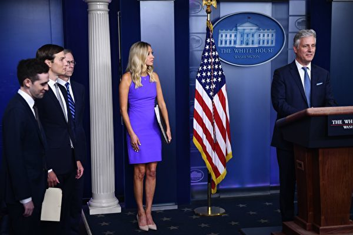

8月13日的白宫简报会，首先由总统国安顾问奥布莱恩（右一）和高级顾问库什纳（左2）宣布以色列和阿联酋达成和平协议。（BRENDAN SMIALOWSKI/AFP via Getty Images)

国务卿蓬佩奥表示，这个协议“具有类似的潜力和承诺，有望为整个地区创造更好的一天”。随后他又补充说：“美国祝贺以色列和阿联酋取得了令人瞩目的成就，这是中东和平向前迈出的重要一步。缔造和平的人有福了。”

以阿建交，川普政府为什么这么高兴呢？这是因为川普少了一块心病。

大家知道，中共每遇到危机的时候，就鼓动它的两个小兄弟——朝鲜和伊朗出来捣乱。朝鲜和伊朗，就相当于是中共的两条胳膊一样。这两个国家，都在中共的帮助下，偷偷地发展核武器，严重威胁着国际和平，特别是中东和平。为此，美国被牵扯了一部分精力。

川普上台后，与朝鲜领导人金正恩有过2次正式会晤，还有一次非正式的短暂会晤，当面向金正恩阐明了美方的立场和观点。虽然没有完全使金正恩放弃核武器，但是相比较而言，中共被美国打击的时候，朝鲜出面捣乱的情况已经有了明显改观。相当于中共的一条胳膊，已经被川普给废掉了一大部分。

但是中共的另一条胳膊——伊朗的问题始终没有得到解决。再加上几十年来，中东地区的国家之间也一直存在敌对状况，时常会在国与国之间发生一些冲突。这个地区的不安定，特别是伊朗的捣乱，使美国不能专心对付中共。

虽然以色列和阿联酋都把伊朗视为敌人，但是以阿之间并没有外交关系。两国相对安静的关系，限制了他们发挥最大力量共同对抗伊朗的能力。

随着以阿建交，中东和平迈出了一大步，这两个国家将合力对抗伊朗。以阿合力对伊朗形成制约，可以说是绑住了中共的另一条胳膊。

在川普政府的斡旋之下，以阿为美国分担了忧虑，使美国可以腾出手来，专心对付世界上最大的邪恶政权中共了。未来我们可能会看到，川普政府更多针对中共的出击。

<b>驻华使馆又有动作</b>

最近这几天，美国驻华大使馆也是相当引人注目。11日，更换了微博头像，去除了“中国”两个字，还把原来黄色的五角星变成了黑色。尽管驻华使馆解释，称这是为了符合全球使团品牌计划的一个部分，但是仍然无法平息人们的议论。

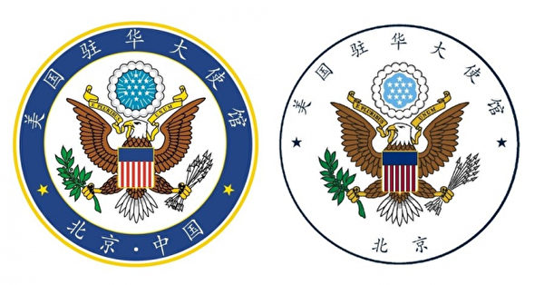

8月10日“美国驻华大使馆”将微博、微信号和推特上的徽号更改，新徽号去掉“中国”两字，只留下“北京”，引发美台建交讨论。（撷自美国驻华大使馆微博）

这一波的热议还没有平息，美国驻华使馆又有了一个动作，不过这个动作是在推特上出现的。

前天（12日），美国驻华使馆在推文中，专门介绍了发明N95口罩的发明家和材料学家蔡秉燚。文字中说，蔡秉燚是台湾裔美国材料学家和发明家，以发明N95口罩并申请专利而知名。

推文中特别强调了蔡秉燚是台湾裔。其实台湾裔并没有什么，但是由驻华使馆来发布这样的消息，个中滋味就不同了。而且驻华使馆连续两天都有动作，前后联系起来，是不是在暗示着什么呢？

在美中对抗的大背景下，美国很可能已经不承认中共政权了。

<b>美研制“超级巨炮”，可在韩国轰击中南海</b>

福布斯前天刊登了一篇军事专栏作家艾克斯（David Axe）的文章，表示美国正在研发“战略长程大炮”，可能在未来的台海冲突中扮演关键角色。

文章表示，面对台海的紧绷局势，中共在开战之初有导弹攻击的优势，为此美方正在考虑如何进行反制。艾克斯在文中提到，美军正在考虑在日本本土、冲绳、韩国和菲律宾等处的基地，部署射程可能超过1600公里的“超级大炮”。如果部署，北京、天津、上海、温州、福州、厦门和广州等地都在射程范围之内。

艾克斯分析，目前的问题是，如果中共侵略台湾，日本、韩国和菲律宾这些国家是不是愿意涉入台海冲突，允许美军在境内基地部署对付中共的大炮。

《朝鲜日报》也报导，台湾、日本和韩国都在美国的候选名单当中。报导引述兰德研究所（Rand Institute）的分析表示，如果巨炮部署在韩国，那么北京和上海直接在射程范围内；如果部署在日本的九州或冲绳，射程范围能涵盖整个华中地区；如果部署在菲律宾，射程则涵盖华南与南海。

照这样分析，美国有没有可能在这几个基地都部署这种超级大炮呢？如果是，那就意味着大半个中国已经处在了美国的炮弹威胁之下。

其实今年3月，华府智库战略与国际研究中心研究员费学礼（Richard D. Fisher, Jr.）也在专栏文章中指出，“战略长程大炮”的单发炮弹造价可能只有50万美元，不但比同射程的飞弹便宜，而且体积也更小。可以准备更多的弹药，更能对中共的军事基地以及部队集结进行大举轰炸。

费学礼当时预估，这种超级大炮最快在2023年完成，2024年正式服役。

<b>美国将临床测试疫苗</b>

中共病毒疫情仍然在疯狂肆虐，对各国来说，早一天研制出疫苗，就可以挽救许多的生命。昨天（13日），路透社从消息人士那里得知，美国已经开始准备在南非和拉美地区进行临床测试了。

消息人士透露，美国正在南非和拉丁美洲招募科学家，准备在当地对美国支持的疫苗进行临床测试，并且承诺，他们的国家可以较容易地获得任何实验成功的产品。

据称美国政府的神速行动（Operation Warp Speed）主管施劳威（Moncef Slaoui）在上个月底，已经向海外的科学家作出了上述承诺。

路透社引述6位政府官员和科学家表示，南非、墨西哥、巴西、秘鲁、阿根廷的研究人员正在讨论加入美国同行，从下个月开始，展开大规模的人体测试。

这个消息，应该使处在瘟疫当中的每一个人都感到振奋。我们也希望，疫苗赶紧研制成功，帮助人们摆脱病毒折磨。

以上就是今天的节目内容。如果您喜欢新闻看点，请别忘记点赞订阅。欢迎周一到周六，每天准时收看我们的新节目。也请您将新闻看点推荐给您周围的朋友。

前天，《纽约时报》直接点名披露了习近平、栗战书和汪洋3名中常委的亲戚在香港拥有豪宅的消息，这个事还引起了一番哄动，这又是中共内斗的效应。但是中共官员和亲属贪腐根本算不上新闻，而且《纽时》披露的消息中，少了一个被美国制裁呼声很高的重要人物——韩正。这背后究竟有什么故事呢？欢迎大家加入会员，了解更多内容。

大纪元《新闻看点》制作组

责任编辑：李昊#  

<a target="_blank" href=#top><h6 align="right">回上方</h6></a>

<a name=172>
<h1 align="center"><b>肉价太高 广西五名男子持凶器抢走70头猪</b></h1>

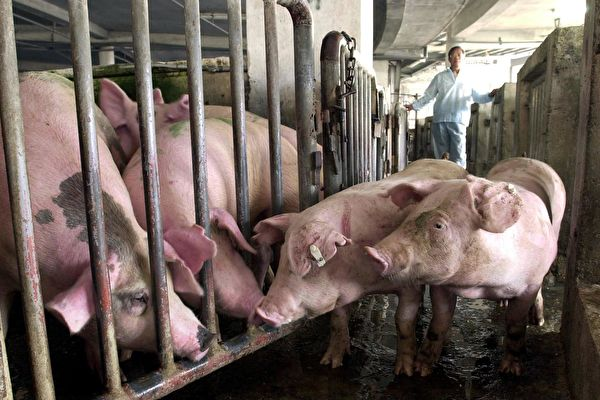

图为猪只示意图。（JAMES HUANG / AFP）

   
 【大纪元2020年08月16日讯】（大纪元记者刘毅报导）广西来宾市武宣县一家养猪场日前被5名男子持钢管抢走70头种猪，价值13万余元人民币，目前这5人已经被拘留。

据每日经济新闻8月16日消息，8月5日凌晨2时36分，4名身穿迷彩服、头戴黑色针织头套、手拿编织袋的男子先后进入二塘镇六峰山林场某养猪场产房，将种猪装入随身携带的编织袋内。

两分钟后，产房值班人员覃某巡视到现场，被其中两名男子持着削得锋利的钢管控制，另两人继续将种猪装袋运走，还有一人在外面守车。作案后，他们将覃某绑在走道栏杆处。

8月10日，嫌疑人韦某光、韦某、覃某、杨某被抓，并在武宣县思灵镇高岭村韦某光养猪场内找到了被劫走的所有种猪。当晚，江某到公安机关自首。

韦某光表示，因今年以来猪肉价格飞涨，他们偷养猪场还未长大的种猪来卖钱。而且在今年1月和5月还抢、盗种猪共109头。

对此，有网民表示：拿着凶器偷猪有些过分了。“这和入室抢劫一个性质，不会轻判。”

大陆猪肉价格近来持续上涨。据中共农业农村部畜牧兽医局对全国500个县集贸市场的定点监测，大陆猪肉平均价格从5月份第4周（采集日为5月27日）的45.98元/公斤，连续涨至7月份第5周（采集日为7月29日）的55.50元/公斤。

而中共统计局8月10日的数据称，7月CPI同比上涨2.7%，其中猪肉价格同比上涨85.7%，6月至7月期间，猪肉价格上涨了10.3%。

有多名业内人士认为，当前大陆生猪产业总体供需关系仍然偏紧，而中共农业农村部有关负责人表示，下半年猪肉价格再继续大幅上涨的可能性不大。

有网民对此表示，农业农村部的意思是肉价还会涨啊。

很多网民对猪肉价格不停上涨表示了不满，网民“陈宏国”表示：“猪肉作为餐桌上不可或缺的物品，60元/公斤的高价位叫人有些抓狂……”“什么涨价，压根就没有便宜过。”

网民“终结孤单”表示：“除了工资没涨，其它都涨了，我想问问，有多少人快活不起了？”

网民“冷风”揭示了猪肉涨价的原因。他表示：“以前猪肉便宜是农户散养，现在都是大企业养猪。猪价肯定居高不下。资源集中在少数人手中了。”

“城市搜索”表示：“掌控着猪肉进口调剂的企业是肯定不缺猪肉的！他们缺的是良心、良知！看看这些企业上半年的利润报告就知道了！他们这些企业，都是几十亿上百亿的利润。”

大连网民小祁表示：“这就是（中共）管控的结果。”  

<a target="_blank" href=#top><h6 align="right">回上方</h6></a>

<a name=171>
<h1 align="center"><b>川普表示在中共管制之下 香港金融地位必死</b></h1>

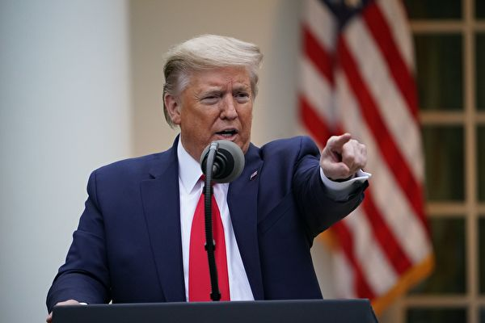

图为美国总统川普。(MANDEL NGAN/AFP via Getty Images)

   
【大纪元2020年08月16日讯】美国总统川普（特朗普）周四表示，香港在中国（中共）管治下，国际金融中心地位将必死无疑。美国商会最新一项调查更显示，有超过一半受访会员计划撤离香港，香港甲级商厦空置率亦破了历史新高。在国际复杂局势下，香港营商环境和市道如何？

在《港区国安法》的阴影下，美港关系持续紧张。继美国下令取消香港特殊贸易地位后，美国再要求香港产品标注 ‘中国制造’。美国总统川普8月13日说，香港在中国收紧管治的情况下，永远不会取得成功。他又说随着美国终止香港的特殊待遇地位后，香港国际金融中心地位必死无疑。

川普：“我们过往给了香港大量的优惠措施，是基于自由。我们想要自由，所以我们给了香港大量经济优惠。现在我们已经取消了所有这些优惠，因此香港将不再有可能和美国竞争。”

香港商务及经济发展局局长邱腾华强调，香港享有单独关税区地位是一国两制下的优势、是《基本法》赋予的权利，批评美国将香港经贸地位形容为‘恩赐’，是不可以接受。自《港区国安法》出台后，不论是中央或香港政府均不断强调，法例无损香港国际金融中心地位。但在香港营运的美国企业又是不是这样想呢？

<b>在美中角力下在港外资企业担心成为人质</b>

香港美国商会最新一项调查显示，对于香港营商前景的期望，超过一半受访会员对香港营商前景感到悲观，并且计划撤离。

香港浸会大学政治及国际关系学系前助理教授黄伟国认为，有关调查是重大警号，显示外国企业担心若继续在港营运或成中美政治角力下的“人质”，加上《港区国安法》细节模糊，让他们感到在港营运并不安全。

黄伟国：“在中美关系急剧恶化的情况下，外国企业或担心：他们会否成为人质呢？加上这几天（壹传媒创办人）黎智英、（前香港众志成员）周庭，甚至是一些在社运不太突出的人也因国安法被拘捕的时候，让外国企业在香港做生意觉得没有安全感。”

<b>香港各区甲级商厦空置率创历史新高</b>

中原最新数据显示，港岛区整体甲厦空置率自去年6月起持续录得升幅，而今年7月最新录约7.53%，按月升约0.36个百分点；其中金钟区更较整体市况疲弱，该区甲厦空置率升至8.32%，按月升约0.47个百分点，创历史新高。

本台记者周五（14日）到香港旧式工商业中心观塘、牛头角等一带视察，发现区内有不少商厦都有大量空置单位，而街上亦贴满 ‘招租’单张。

除了甲厦外，记者其中再到观塘的一个乙级商厦视察单位空置情况，地产经纪说该栋大厦已有至少五个空置单位。我们到其中一层视察时，经纪指同层的其他2个单位亦已搬离，地产经纪透露，他们是国际企业，但最近都撤离了。

地产经纪：“ 空置的了。”

记者：“即是这一层全部空置？”

地产经纪：“是的。没有办法，没有生意。因为现在最主要不单是疫情因素，而是政治因素。中美（角力）那些很严重。”

记者：“你意思是外国公司都走了？”

地产经纪：“（外国公司）不敢与你做生意，因为会有制裁。（我认为）有时上面’玩’也不要太过火，为什么呢？因为对香港影响很大，人家不敢与你做生意。”

钟先生是九龙东区甲级商厦的业主，他向本台称，自己在去年10月开始放租办公室，等了2至3个月才成功出租。他表示，虽然自己有租金收入，但明显感受到香港经济疲弱、市场普遍持观望态度。

钟先生：“不要说外资，香港企业受到疫情影响都在收缩，生意越来越少。现在市场也不太乐观，尤其是越贵铺租的就越不乐观，我们这些可以承接甲级商厦的生意，但那些在中环的可以怎样做生意呢？只会是不断’砍价’。”

<b>香港经历主权移交后最惨烈经济衰退</b>

香港经济分析师罗家聪向本台表示，商厦空置是源自香港经济及政治一系列的因素，当中主要原因则是香港经济已连续第四季收缩，且连续两季收缩约9%，比1998、 2009年香港经济不景气还要恶劣。

罗家聪：“业务收缩，跟着商铺价跌、租跌，纯粹从经济现象来说的话这是很合理的。另外一个原因是发展商近期不断推盘，制造不现实的假象，让业主觉得价格不会跌。所以你看到初期业主态度很硬，宁愿商铺长期空置，也不肯减租。”

<b>香港正步东京后尘失去金融中心地位</b>

虽然《港区国安法》并非商厦空置的主要原因，但罗家聪同意，通过国安法是改变香港原本稳定营商环境的转捩点，让外国企业更有决心、有规模地计划撤离香港。随着多变的国际关系及香港人口老化等不利经济因素，罗家聪认为，现时香港经贸模式与90年代日本经济泡沫爆破后的经济环境相似，昔日的国际金融中心地位已不保。

罗家聪：“东京本来是国际金融中心，而香港也是，但香港现在被外界标签认为不再是国际城市，实际上国家元首级人物也扬言说要撤资金和投资，这样的措施也不只是针对香港，对中国也是这样。现在外资流走和当初日本经济爆破后跟着外资流走的结果一样。”

香港政府周五（14日）公布香港第二季本地生产总值按年急跌9%，将下调全年经济增长预测，政府解释是因为环球经济收缩前所未见、访港旅客大跌及第三波疫情打击。

转自自由亚洲电台   

<a target="_blank" href=#top><h6 align="right">回上方</h6></a>

<a name=170>
<h1 align="center"><b>【独家】中石油密件曝海外党组织转地下</b></h1>

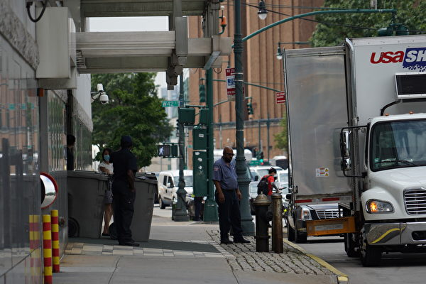

8月6日中午，纽约中领馆门前，停有两辆“USA SHRED”公司的碎纸卡车，门口放有数桶装满文件的大型塑料桶。（宋昇桦/大纪元

   
【大纪元2020年08月15日讯】（大纪元记者何坚报导）今年7月美国突然关闭中共驻休斯顿总领馆，原因为该领馆是“间谍活动和知识产权盗窃的中心”。而大纪元最新获得的中石油秘密文件揭示出，不仅中领馆是中共海外间谍活动的中心，所有的海外党组织都可能充当中共特务，中共以“党建”为名在海外从事不法活动。密件要求海外党组织活动要“转入地下”。

所谓“党建”是指党的建设，表面上是中共为维系自身而实施的党务工作。不过大纪元最近收到的秘密文件，揭开了党建更深层的秘密。

<b>中石油密件揭开“党建”不能见光的秘密</b>

大纪元最近刊发了系列报导，曝光了抖音、微信等中国IT公司的党支部名单，揭开了中国社媒等高科技公司被党渗透，受党操控的黑幕。而最新获得的秘密文件表明，中共党组织在海外的活动，可能比外界的想像，走得更远。

大纪元日前独家获得中国石油天然气集团（中石油）下发的秘密文件–《关于进一步落实海外党建工作有关要求的通知》。

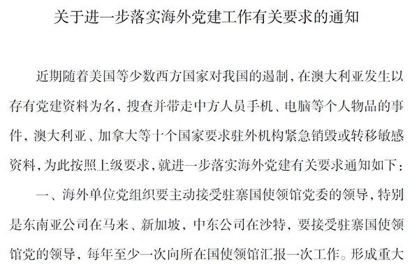

2020年8月，中石油下发秘密文件《关于进一步落实海外党建工作有关要求的通知》。图为通知截图。（大纪元）

中石油在密件中通知所有的驻外机构，要求海外单位党组织主动接受“使领馆党委的领导”，必须“严守党的秘密”。

密件介绍了该通知的背景，称近期随着美国等西方国家对中共的遏制，在澳大利亚发生了“以存有党建资料为名，搜查并带走中方人员手机、电脑等个人物品的事件”。不过大纪元并未从公开资讯中查询到相关报道，事件可能尚未被曝光。

中共为此要求澳大利亚、加拿大等十个国家的“驻外机构紧急销毁或转移敏感资料”。

该通知指出，中石油“为此按照上级要求”，对海外党建工作发布了多项要求。

其中的首项要求，就是主动接受“使领馆党委的领导”。通知强调，“特别是东南亚公司在马来、新加坡，中东公司在沙特，要接受驻寨国使领馆党的领导，每年至少一次向所在国使领馆汇报一次工作。”

而该通知的第二项要求称，“海外单位要在海外部门的指导下，梳理排查潜在的风险，研究制定有关突发事件的预案，建立同使领馆、国内紧急联系机制。”该要求中的“海外单位”，应该是包括了中石油在内的所有海外党组织，而“海外部门”显然是指中共使领馆及其背后的特务机构。

纽约时事评论员朱明博士指出，中共对通知中“潜在的风险”和“突发事件”虽未明言，但无疑是担心被FBI、CIA等各国反间谍机构找上门。这个要求透露了，面临国际社会的警惕和反制，中共已如惊弓之鸟。

<b>密件证实：中共不改黑帮本色 使领馆充当间谍中心</b>

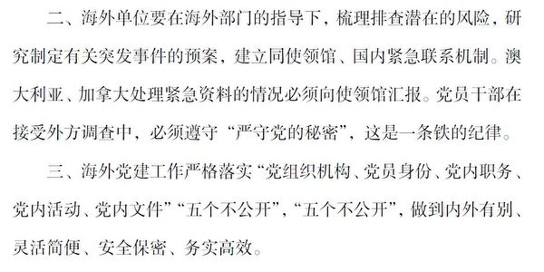

2020年8月，中石油下发秘密文件《关于进一步落实海外党建工作有关要求的通知》。（大纪元）

中共在秘密通知中，已经做好了“预案”，并在第二项要求中，勒令海外单位“建立同使领馆、国内紧急联系机制”，“澳大利亚、加拿大处理紧急资料的情况必须向使领馆汇报”。

朱明博士认为，密件透露的澳、加等各国驻外机构被指令“紧急销毁或转移敏感资料”，就是中共已经制定好的预案。这个预案和国内紧急联系机制，暴露了中共使领馆就是海外谍报中心，藏有能够直接接受国内指令的谍报通道。

通知还提到了，“党员干部在接受外方调查中，必须遵守‘严守党的秘密’”，并强调“这是一条铁的纪律”。

这一要求，相当于对替中共从事不法行为的成员下封口令，暗示会过河拆桥；意思是说，必须严守党的秘密，真被外方调查就要自己背黑锅，“铁的纪律”暗示违反纪律的后果十分严重。

虽然该通知并未解释“紧急资料”或“党的秘密”指的是什么；但在第七项要求中指出，驻美国、英国、澳大利亚、加拿大和新西兰等高度敏感国家，“电脑、手机、移动硬盘、U盘、光盘等各种存储介质中的有关电子文档要全部彻底删除，纸质文件要做到销毁处理”。

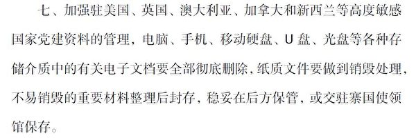

2020年8月，中石油下发秘密文件《关于进一步落实海外党建工作有关要求的通知》。（大纪元）

通知指出，“不易销毁的重要材料整理后封存，稳妥在后方保管，或交驻寨国使领馆保存。”

朱明博士相信，中共使领馆借助外交特权，充当了中共在海外搜集或制作的、不能见光的“紧急资料”的安全箱和谍报中心。所有的敏感资料，“党的秘密”，如果不能稳妥送回国，就要交驻使领馆保存。

值得一提的是，7月底休斯顿中领馆在被关闭前曾烧毁大批文件，8月初纽约中领馆则雇用专业碎纸公司大量销毁文件。

朱明博士分析说，结合中石油的秘密通知，这些举动显示出，当中共认为外交特权无法掩护其间谍活动时，销毁资料就成为“严守党的秘密”的唯一选项。

朱明博士表示，无论是“党的秘密”，还是“铁的纪律”，这些杀气腾腾的名词都是中共的特色标志，源自于中共发家的黑帮背景。《九评共产党》早已指出，中共并非真正意义上的政党，而是起源于撒旦邪教的黑帮组织；其党徒加入时，必须发下为党“牺牲一切”的血誓。而现代意义上的政党，是因理念或利益集结而成的团体；既无严密的组织结构、也没有严苛的纪律或不能见光的秘密、更勿需立下血誓，进退自如。

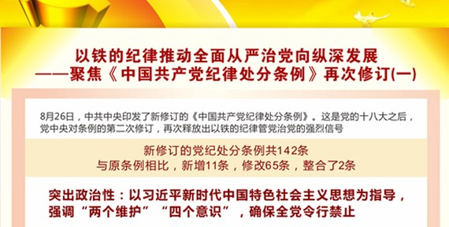

2018年8月中共再次修订纪律处分条例，重申党纪大于国法，“纪严于法、纪在法前”。（网络截图）

“严守党的纪律，保守党的秘密”，至今仍是中共入党誓词中的内容。据党媒新华网报导，2018年8月中共再次修订《中国共产党纪律处分条例》，重申党纪大于国法，“纪严于法、纪在法前”。

<b>对比三年前 中共在海外已成过街老鼠</b>

多年来大纪元一直在追踪报导并揭露中共党组织在海外的不法和渗透活动。与三年前的侵略式扩张相比，中共组织在海外已变成过街老鼠，被迫彻底转入地下。

大纪元2017年12月的报导（查看原文），曾揭露中共企业海外党支部的秘密活动。报导披露，中共在海外开展秘密党建活动，隐蔽吸纳当地人加入共产党，在强化对海外华人控制的同时，对外输出共产主义意识形态。

当时中国问题研究学者薛驰曾表示：“共产党的海外渗透策略已经从防守式转为进攻式，过去是中共严密控制已经加入的党员，现在不光是在海外新增（华人）党员，还发展当地人加入。”

报导还指出，中共海外党建是地下活动，遵循“五不公开”原则，即不公开党的组织、不公开党员身份、不公开党内职务、党内活动不公开、党内文件不公开。报导还揭露了，海外中企利用办公app做党建，同时监控职员。例如中石油集团要求所有海外党员下载“中石油党建App”。

不过，在美国引领下，国际社会已逐渐觉醒，开始警惕和反制中共的渗透。

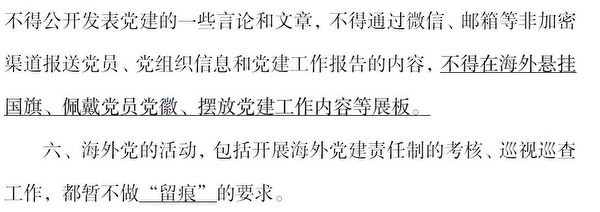

2020年8月，中石油下发秘密文件《关于进一步落实海外党建工作有关要求的通知》。（大纪元）

今次曝光的中石油密件显示，中共已要求“暂停石油党建APP在海外的应用，请相关人员立即卸载石油党建APP。”中共还在密件中，要求海外党建工作严格落实“五个不公开”，而且不得宣传报道，也不能在社媒上推广。

密件专门在第五项要求中强调，“不得在海外悬挂国旗、佩戴党员党徽”。朱明博士说，该要求显示，中共十分清楚其党组织被国际社会定性为非法，而且正在被越来越多的国家追查，因此不得不转入地下。

另外，大纪元今年8月12日的报导（查看原文），还曝光了中领馆操控海外学生会的证据。报导指，中共使领馆官员为海外学生会提供经费、直接下达指令，目的是输出影响力，同时利用华人做间谍、窃取情报。

美国联邦调查局（FBI）今年解封的文件披露，中共大使崔天凯和纽约领事馆的官员企图非法在康州招募一名从事分子生物学研究的科学家，被当场抓住。

朱明博士表示，大纪元曝光的密件以及FBI解封文件等证据，都证实了美国政府对中共的指控；中共的海外党组织和其使领馆一样，都是从事间谍活动的窝点。   

<a target="_blank" href=#top><h6 align="right">回上方</h6></a>

<a name=169>
<h1 align="center"><b>钟原：中共罕见急速回应川普90天剥离抖音</b></h1>

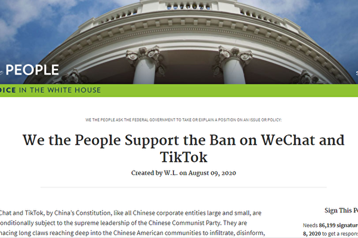

华人在白宫“我们人民”网站发起请愿，支持美国政府禁用微信和TikTok。（白宫我们人民网站）

   
  【大纪元2020年08月16日讯】8月14日，周五，美国总统川普签发行政令，要求中国“字节跳动”（ByteDance）公司必须在90天内剥离其美国资产，也就是TikTok（抖音）。

8月15日，周六，中共党媒新华社快速报导并回应，希望美国“停止打压”。考虑华盛顿和北京的12个小时时差，中共的回应速度之快，相当罕见。

更为罕见的是，中共党媒虽然继续使用若干贬低的词汇，但基本收起了谩骂的态度。川普的最新行政令进一步强硬禁止抖音，不容商量。面对川普的再次重击，中共迅速而软弱的回应，凸显无奈。

<b>抖音对中共有多重要</b>

之前有传闻说，即将进行的美中贸易代表会谈，中共希望提出有关中国公司在美国被禁的问题，可能就包括抖音、微信，甚至还可能包括华为等的技术禁令。川普的最新行政令，堵住了这样的可能。

实际上，即使川普不出手，美国贸易代表莱特西泽也是个做事严谨的人，他应该不会同意讨论与贸易协议并不相关的问题。这次双方的商谈，就是核查贸易协议的执行情况，或者说就是看中共是否执行了协议，美国已经把关税降了，剩下的，都是中共需要执行的内容。川普没有讨论进一步协议的愿望，只是检查第一阶段协议是否执行。

中共显然没有认真执行协议，于是不得不要求延缓会谈。这也反映出，中共确实没有拿贸易协议当回事，不但没执行，连定期核查这样关键的安排，都被中共忽略了，没有做任何准备。

当然，北戴河会议很可能卡壳了，对美中关系的讨论尚无最终定论，也无法确定如何应对美国一个个意想不到的动作。

从中共迅速的反应看，川普禁止抖音这件事，对中共造成的打击，远比人们预料的要大得多。

这也从反面证实，川普确实打到了中共的要害，川普描述的安全威胁，显然大量存在，否则一个单纯的娱乐软件，中共根本不会如此上火，从某种程度上，中共下意识的反应，不亚于华为被禁。

<b>微信对中共同样重要</b>

川普要清网，下一步就是微信，最近美国几大公司的反应却很蹊跷。

据称，苹果、迪士尼等一些大公司，刚刚参加了川普政府官员的一次电话会议，表示禁止微信的后果可能是“严重的”。还有记者特意就此问题询问川普，比如苹果的iPhone若无法使用微信，就会失去中国市场。川普回答得很干脆，“无所谓”，“我们必须做对国家安全有益的事。中（共）国让我们非常失望”。

这些在中国有利益的美国公司，试图劝阻川普禁止微信，应该在不少人的意料之外。更多的人可能认为，禁止微信不过影响了一些在美国的华人，在美国的影响力好像远不如抖音，但这些美国公司却更关心微信，似乎不可思议。这应该也给川普提了个醒，微信对美国的危害，可能远比想像中大得多。

微信明目张胆地盗取私人信息，随时被中共监控，这么多美国大公司却帮微信游说，应该不只是因为无法使用微信带来的不便，很可能这些公司在中国的利益，遭到中共政权的要挟，不得不站出来发声。果真如此，也同样证明，微信在美国的继续存在，对中共非常重要。可见微信对美国的安全威胁远远的更大，否则中共不会下这么大的本钱。

<b>中共的渗透有多深</b>

这些美国公司，为了一些眼前的经济利益，把美国的安全放在一边，意外地替中共发声，不能不令人深思。这也表明，中共对美国企业的渗透程度，远远超出了一般人的想像。

美国司法部长巴尔在7月份的演讲中说，“随着中国政府在全球范围内丧失信誉，司法部已看到越来越多的中国官员及其代理人，与（美国）大公司领导人接触，并诱使他们拥护中共所偏爱的政策和行动”，“躲在背后的美国声音可以使中国政府增强影响力”，“立法者从美国人那里听来的，更能引起同情”，“通过掩盖对我们政治进程的参与”，中共“避免了其游说活动的暴露”。

最近这些美国公司对微信的表态，恰恰为司法部长的话做了最好的注脚。这些美国公司正在替中共政权发声，试图游说美国政府，试图游说美国总统川普。假如美国总统挺不住这样的游说，再下一步，可能是什么呢？估计就是彻底向中共政权投降，加入中共所谓的“人类命运共同体”了。

民主党总统候选人上周曾表示，一旦当选，就会取消川普对中国商品加征的高关税，之后助手连忙改称重新评估。这不仅不是政治正确，而是要重蹈覆辙，继续以往失败的接触策略。这样的政策，与皮尤中心最新的民意调查是相违背的。

根据皮尤研究中心的最新调查，78%的美国受访者认为，中共政权的失当行为，导致了全球大流行；77%的人对中共和习近平没有信心；甚至有73%的人表示，即使损害经济关系，美国也应促进中国人权。这就是美国的主流民意，川普所做的，符合民意，符合美国的安全和利益。

<b>美国与中共政权脱钩势不可挡</b>

川普与中共政权脱钩的政策，已经不可阻挡，中共政权也已经意识到了，正在暗自通过各种方式，试图拖延这样的进程。有理由相信，中共期待川普连任失败后，再继续利用各种渗透，说服美国转回接触政策，这对美国相当危险。数年来，中共异常高调地展现争霸意图，正是认为这样的渗透几乎就要成功了。

一些美国公司，仍然不肯放弃所谓的中国利益，不肯跟随脱钩的趋势。这些公司，不断被迫在中国交出自己的知识产权，在这场瘟疫中也损失巨大，这样的生意可能长久吗？苹果和三星公司在中国生产手机、开展业务，很多技术早被窃取了，华为、小米等手机得到了相关技术后，三星就被非市场手段挤出了中国。苹果正在把供应链迁往印度等地，还以为可以保留中国的业务吗？中共在苹果身上偷完了技术，如果再赚不到美元，苹果对中共还有价值吗？

其它美国公司也是一样，今天替中共游说美国政府，明天就可能被中共一脚踢开。中共连自己的间谍都轻易放弃，连自己的官员都可以随时关进监狱，连武汉老百姓的生命都毫不在意，怎么会在意美国人、美国企业？一系列台商的悲惨故事还不够多吗？

川普下决心与中共政权脱钩，这是美国的主流民意。中共党媒、孔子学院成了外国使团，美国驻华使馆换了徽章，抖音、微信将被禁止，安全领域的脱钩先行，政治领域的脱钩也已经开始，经济上更多的脱钩正在展开。

美国的公司们，需要认真思考，需要认清中共的真面目，为了自己的长远利益，为了更多美国人的安全和利益，作出正确的选择，维护自由与正义。美国司法部长已经在演讲中呼吁，“为了确保我们的子孙后代拥有一个自由和繁荣的世界”，“要共同努力抵抗统治和挑战，赢得全球经济制高点的竞赛”，“我们的自由取决于它”。

中共政权已在苟延残喘之中，下意识地拚命争取生存空间，但大势已定，中共的挣扎只能加速其解体的进程。无论美国公司、美国人、世界各国，还是更多的中国人，都需要在正义与邪恶间作出选择，这样的选择也将直接决定每个人的前途与未来。 

<a target="_blank" href=#top><h6 align="right">回上方</h6></a>

<a name=168>
<h1 align="center"><b>中共曝军演片子 美军机离大陆最近93公里</b></h1>

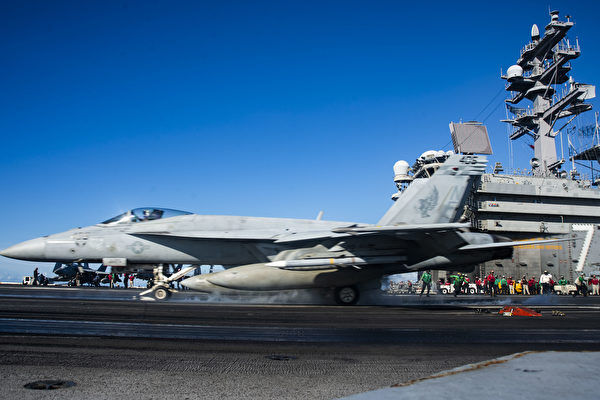

图为8月14日，罗纳德‧里根号航空母舰打击群进入南中国海。（公有领域，U.S. Navy photo by Mass Communication Specialist 2nd Class Codie L. Soule）

   
  【大纪元2020年08月16日讯】在中美关系恶化之际，8月16日，中共发布一段驻港军队近期在南海军演的影片，包括试射鱼雷等。前一日，有中共官方背景的平台指，美军一架EP3E电子侦察机现身台湾西南空域。台媒称，此次美军机最靠近大陆沿岸仅50.19浬（约为92.95公里）。

8月16日，中共央视发布一段影片，显示中共驻港军舰艇大队的056轻型护卫舰“惠州舰”，近日在南海某海域进行多项海上军事训练。

而在8月15日，有中共官方背景的、北京大学海洋研究院“南海战略态势感知计划”（SCSPI）在推特上发贴文指，美军一架EP3E电子侦察机现身台湾西南空域，距离中国大陆广东及福建交界处最近的距离为50.19浬（约为92.95公里）。

 这是美国军机再一次到距中国大陆100公里之内的地方，比今年7月8日美军军机到中国沿海（距中国沿海51.68浬，约95.71公里）还要近。

 <h4 align=center><a href="https://twitter.com/SCS_PI/status/1280685633321631749?ref_src=twsrc%5Etfw%7Ctwcamp%5Etweetembed%7Ctwterm%5E1280685633321631749%7Ctwgr%5E&ref_url=https%3A%2F%2Fwww.epochtimes.com%2Fgb%2F20%2F8%2F16%2Fn12334713.htm">距中国沿海51.68浬，约95.71公里(点击右键,另存新档）</a></h4>

 《自由时报》称，台湾军方人士认为，美军此次再次创下对中国抵近侦察最近距离的记录，但中共对此的反应相对和缓。

至于，中共日前大肆宣称要在台湾南北两端进行联合军演，该军方人士认为，此举看起来像是中共的“大内宣”，为满足大陆部分鹰派人士的心理，因为公布的演习管制区距离台湾甚远。

另外，专门追踪飞行器动态的Twitter账号“Golf9”8月16日早上发文指，美军一架呼叫代号为RUDEY11的B1B轰炸机，从关岛安德森空军基地飞入东海；另一架呼叫代号为PEARL21的KC135空中加油机，在完成空中加油后返回安德森空军基地。

而这段时间正值美军雷根号航空母舰打击群航经台湾西南海域的东沙岛海域。 

<a target="_blank" href=#top><h6 align="right">回上方</h6></a>

<a name=167>
<h1 align="center"><b>袁斌：“怀念吃粮票的时代”传递了什么信息？</b></h1>

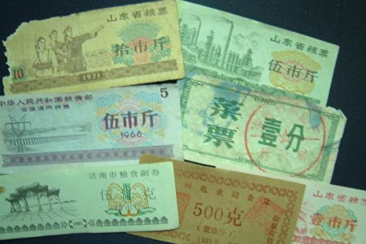

中共的粮票。（大纪元资料室）

【大纪元2020年08月16日讯】今年以来，大陆关于供销社、工分宝、粮票的消息接踵而来。最近，习近平要求“加强立法制止餐饮浪费”，央视跟着批“大胃王吃播浪费严重”。更令人深感荒谬与震惊的是，近日微博上又热传一个写有“返朴归真怀念吃粮票时代”字样标语的视频。

了解毛时代历史的人都知道，上世纪五十年代至八十年代，中国实行的是从苏联照搬来的计划经济，在这种经济体制下，政府对以粮油为主的生活必需品实行严格的管控。怎么管控？具体讲就是必须凭证、凭票购买生活必需品，包括粮证、粮票、肉票、油票、鸡蛋票、糖票、布票、煤票、肥皂票、自行车票等等。所以那个时代又被称为“票证时代”。

以粮食为例，民众去粮店买粮必须有粮证，粮证上写有家庭人口和每人的粮食定量；外出吃饭必须有粮票，城市居民拿粮证到粮店换粮票，要扣除粮证上的对应量，农村居民拿粮食到公社换粮票。在那个年代，上述票证被称为“生死簿”，民众因弄丢粮票自杀的事情时有发生。

如今，中国人告别票证时代已经几十年了，我想除了疯子和脑子真坏了的人，没有谁会愿意回到那个时代。可近来有关供销社、工分宝、粮票的消息接踵而来，甚至有人公开挂出了“返朴归真怀念吃粮票时代”的标语，这说明什么？说明那个恐怖的时代正在重新向中国人走近。人们能不感到荒谬与震惊吗？

这一点在大陆网民对这条标语的反应里可谓一览无余——

“令人瞠目的大标语，出现在中国。我的姥姥、大姨都是大跃进之后被饿死的。我想中国数千万被杨继绳先生竖立《墓碑》的后人，看到这条标语，都有话讲。这难道就是今年北戴河会议的精神？”

“饭还没有吃饱两天了，就怀念吃屎的年代。”

“什么叫倒行逆施，开倒车差不多到那里了。”

“这是哪个地方？真不敢相信。难道真有人想重回那个时代，那个……粮票、肉票、布票都需要分配购买的恐怖时代。”

“直接写‘怀念挨饿’不就得了。”

“内循环，大家一起饿肚子。”

“看来西东两个胖子，带着一群穷鬼，很快就要在鸭绿江大桥胜利会师了。唉，中国人真他妈的倒了十八辈子的大霉了。”

“从文艺座谈会到对中国人怎样吃饭发出指示，粗看是对中国人行为事无巨细的管理，实际上是对毛泽东行为的拙劣模仿。现今的中共高层陷入了荒唐的毛泽东再现游戏，实在让人哭笑不得！”

“大陆网友传来：习最近要提出厉行节俭，聚餐不得浪费了。这里透露出几点：1，粮荒不是梦，粮食危机将成为严峻现实，大陆中国人极可能再次回到凭粮票买米的日子。2，财政吃紧了，再没钱挥霍了。问题：谁的罪过？！”

“一个崇拜独裁，除了反人类，他什么也不懂。”

“既不改革，也不能文革，还不能革命，理论枯竭。中共现在处于心理学谈到的‘退行’状态，开始从娘胎里找理论资源。中共已是一具政治僵尸，整个体制是一政治巨婴，一碰就碎、就哭。宁要社会主义草，不要资本主义苗。中共正在向其原教旨回归。”

“其行可诛，令人发指！”

“我的祖父，祖母，外公，我爸爸，叔父十几岁就成两个孤儿。我老婆的奶奶都是60年被饿死的！当时全中国饿死多少人？比抗日战争减少的人多嘴多舌了，至今组织上对此也没有任何认错道歉，永远伟光正！天下有这么脸皮厚的组织吗？”

“我的外祖母也是大饥荒时在农村饿死的。当时父亲因为右派反革命在押，母亲带我们几个孩子，无力援助外祖母，结果被活活饿死了。母亲后来很后悔没有接她来住。但外祖母是农村户口，城里没有粮食供应，来了也没的吃。对于那时大批饿死的罪行，至今没有道歉，只有共产党一贯的伟光正。”

“我祖父、外婆、小姨；大外祖父、大外祖母（外公的亲兄嫂）都是那三年饿死的，外祖父成分不好，地主，在饥寒和批斗中一人周全两房子女成家立业；我祖父同样是地主，我二伯父、我父亲都是大龄晚婚！大伯娘的两位侄儿来讨番薯，结果只回去了一个，因为亲哥哥抢了弟弟番薯并打死了弟弟，从此亲戚也不走了。”

有位网友说的话给我留下的印象特别深，他说：“把手伸进人民的裤裆、管女人的肚皮，现在，又开始回到管人民的胃的时代了，共产政权历来对于通过控制粮食供应达到控制人民的目的情有独钟，也成为了它们穷途末路的终极大招。”

如果在不久的将来中国真的重返票证时代，那一定是中共“穷途末路的终极大招”！

<a target="_blank" href=#top><h6 align="right">回上方</h6></a>

<a name=166>
<h1 align="center"><b>缺钱了？疫情过后 北京颁令禁止小产权房</b></h1>

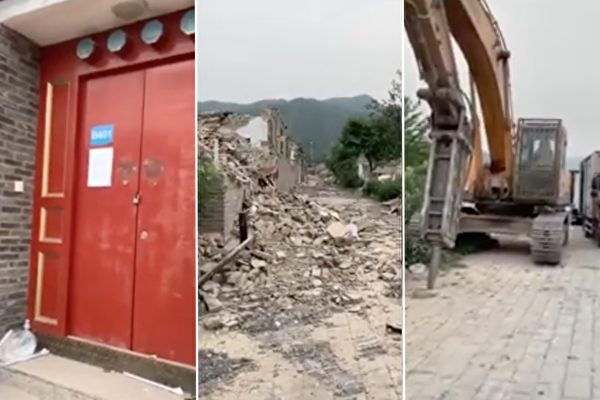

北京郊区小产权房遭到大规模强拆。图为8月5日怀柔区水长城老北京四合院遭强拆画面。（视频截图）

   
【大纪元2020年08月14日讯】（大纪元特约记者常春、林岑心采访报导）北京大规模的强拆运动引爆官民冲突。北京市政府近日再颁布《意见》，严禁城镇居民到农村购买宅基地和其上房屋（即小产权房）。上半年房市陷入低迷的北京，官方无视于大量业主维权，暴力强拆并严禁小产权房，究竟有什么意图？

北京近郊小产权房遭大规模强拆，连日来受到外媒关注，自由亚洲电台、美国之音、纽约时报皆以“再对中产下手？”、“运动式强拆，被指反人类反文明”、“政策反复，业主维权难”的标题显着报导。

在各界批评关注下，北京市政府8月11日出台了《关于落实户有所居加强农村宅基地及房屋建设管理的指导意见》（简称《意见》）明令，村民一户只能拥有一处宅基地，严禁城镇居民到农村购买宅基地和宅基地上房屋，严禁社会资本利用宅基地建设别墅大院和私人会馆等。

针对北京市政府出台的《意见》，经济学家、前北京天则经济研究院长盛洪对大纪元表示，“它不是法，连地方法规都不算，没有任何效力。”他提到，地方政府的意见，在中国的法律体系中，不具有效力，所以，他不花精神去关注北京的这纸《意见》。

盛洪此前撰述十多篇文章反对政府强拆，此前采访中（【一线采访】北京上百小区遭大规模强拆）提到，其所居住的水长城老北京四合院社区，7月底遭到政府强行攻入，威胁业主签署合约，不管签不签都被迫搬离。如今仿古的四合院，徒剩下断垣残壁。

<b>出台意见 艺术家：为掩盖错误</b>

此前遭到拆除的郊区小区，还有香堂文化新村、宽桥影视文化园、雅园所有仿古建筑、昌平瓦窑作家村等，许多艺术家、作家、文化人、公务员等中产收入者在这波强拆行动中受害。

前北京清华大学法学教授许章润日前也发长文，为当局强拆艺术村发出悲鸣，他在文中提到，“继‘驱低’恶行之后，两年来帝都窳政持续癫狂，尤以庚子春夏发作之格外歇斯底里。到处强拆，雅曰增加土地储备，而实则指向土地增值，再于上下其手中倒腾牟利。”

一名艺术家陈亭（化名）对大纪元表示，经历郊区房子被强拆的事件后，虽然他在北京市里也有房子，但他不愿意回到北京住，宁愿搬去乡下老家了，所谓“君子不立于危墙之下”，他感觉北京出台《意见》是为了管控老百姓，为闭关锁国做准备的。

“把低端人口征服了、中端人口征服了，剩下来的人，就是农村里的人，照它说的一户一宅，现在山里的农民都被赶出来，集中到城里、镇里所谓的保障房，原来山里的房子都拆了，这些人也回不去了。”陈亭认为，一切都是出于管控的考量。

他感觉，《意见》的用词非常法西斯化，充斥着严格、落实、管控等用语，民主、法治、自由的精神荡然无存，“就像把老百姓当成一群猪、一群狗、一群羊在管理。”

“我看了文件，出台的目的实际上是为了掩盖另一个错误，什么错误呢？就是强拆，对老百姓的强拆。”陈亭说，共产党近100年历史中，从不承认自己的错误，总是用一个错误掩盖另一个错误，用一个更大的谎言掩盖另一个谎言，“当谎言大到难以掩盖时，就用整个体制来掩盖。”

<b>谁动了地方财政的奶酪？</b>

时事评论员至清分析，问题的根源来自于中国土地制度。一般土地私有制的国家，如美国，不会对业主的所有权进行限制，仅收取房产税、地税等；中国自1952年土改以后，土地归为国有，农村土地为集体所有，就人为地制造出问题。

她提到，土地在中共建政之前是属于私人所有，建政之后以国家的名义抢夺了私人财产，所谓充公。现在人民要住房子，中共把抢来的土地再高价出租40-70年，收取所谓的土地出让金。而这出让金，已经成为中共各地政权维持生存的唯一来源。

她提到，“小产权房”指在农民集体土地上建设的房屋，其产权证不是由国家房管部门颁发的，“因为不缴纳土地出让金，惹火了中共各地政权，因此采取暴力强拆。”

自中共1994年分税制改革，调整中央与地方财政划分，中央财政收入增加，地方财政收入减少，更加依赖于卖地收入。据2018年统计，全中国土地出让金收入达6.5万亿元（人民币），同期地方一般公共预算收入约9.8万亿元，地方卖地收入相当于地方财政的三分之二，部分地方占比甚至达到80%以上。

城市房价居高不下，小产权房因成本和价格较低廉，一般民众比较买得起，可能因此触动到地方财政的“奶酪”，至清分析，“当两者价差没那么大，郊区房规模也没那么大时，地方政府可能睁一只眼，闭一只眼，但当人们都往郊区买，城里房子更难出售，就触动到其利益了。”接二连三的禁令出台，以违章、破坏生态的名义强拆，似乎就成了常态。

<b>疫情反复冲击地方财政</b>

截至2019年底，北京新房市场库存量已经达到7.5万套房，创5年来新高。2020年上半年，北京再频繁出让20多块不限价宅地，新房库存压力更大，而二手房交易市场也受疫情影响陷入低迷。

据《华夏时报》报导，北京一季度二手房市场网签量创下近8年新低。我爱我家研究院统计，一季度北京全市二手住宅网签约2万套，环比去年四季度下滑43.26%，同比去年一季度下滑38.59%，5月份疫情好转，二手房网签量逾1.6万套，6月份疫情复燃，下半月签单量腰斩。

北京房山一名房地产经纪人说，他过年后一直到5月份，3个多月几乎只拿一千多元底薪，活下来太难了。而北京租赁市场今年也一直受疫情冲击，租金明显下降。

至清分析，疫情之下，财政更加缺钱，“土地财政是共产党的命脉，现在地方财政维持不住了，就越加疯狂，为保地方财政，不惜动用暴力，大规模强拆。”为了维持高房价，“让原本小产权房业主回去城里买房，就算买不起房，也可以用租的。”“因为它们晓得，房价如果崩盘，共产党就倒了。”#   

<a target="_blank" href=#top><h6 align="right">回上方</h6></a>

<a name=165>
<h1 align="center"><b>【最新疫情8.16】川普：病毒检测超7千万</b></h1>

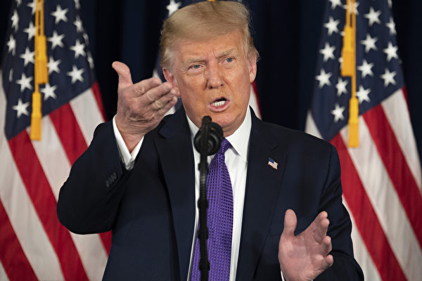

周六（8月15日），川普在新闻发布会上说，美国已经进行了超过7,000万例中共病毒测试。本周，全国新病例下降了6%。 (Photo by JIM WATSON / AFP)

   
   【大纪元2020年08月15日讯】（大纪元记者夏雨、戴芙若、林南、萧律生综合报导）8月16日全球中共病毒（武汉肺炎）疫情最新情况：
   
   根据约翰‧霍普金斯大学（Johns Hopkins University）的数据，截至北京时间8月15日下午1时，全球确诊感染中共病毒（武汉肺炎）的人数超过2,100万，死亡人数超过76万（注：因中共和伊朗隐瞒疫情数据，真实数据比统计的要高）。

美国确诊病例突破533万例，死亡超过16.8万人。美东时间周六（8月15日）下午5点半，美国总统川普（特朗普）在新闻会上表示，本周，全国新病例下降了6%。测试阳性率已降至6.5%。美国已经进行了超过7,000万例中共病毒检测。

加州死亡人数以高于两周均值，佛州本周第四天报告200多例死亡。德州在7月中旬感染达到高峰后，住院患者降至7周低点。

欧洲新病例涨势也仍在继续：周六，德国是自4月底以来单日新增病例最多的一天，意大利则是5月以来最多一天。英国连续第五天单日报告超过1,000新病例。

美卫生部长阿莱克斯‧阿扎尔（Alex Azar）8月9日率团访问台湾，8月11日在台湾大学进行公开演讲，肯定台湾抗疫模式，同时批评中共不肯在卫生领域跟国外真诚合作。

=======================

<b>以下是最新疫情实时更新：

美国乔州州长发布新的抗疫行政令</b>

根据美国乔治亚州州长布莱恩·坎普（Brian P. Kemp）办公室的一份声明，坎普周六（15日）就抗疫发布了一项新的行政命令。

坎普在声明中说，该命令扩大了针对医疗脆弱群体的就地收容令、继续禁止大型聚会，并维持乔治亚州企业的健康和安全协议。

<b>墨西哥新增6,000多例确诊</b>

墨西哥卫生部周六（15日）报告了6,345例新增病例，使该国确诊总数达到517,714 例。

卫生部还报告了635例新增死亡。至此，该国死亡总数达到56,543例。

墨西哥政府周四与生物技术公司阿斯利康（AstraZeneca）签署了一项协议，将于2021年在墨西哥生产一款中共病毒疫苗，出口到拉美和加勒比海地区。

阿斯利康墨西哥公司首席执行官西尔维亚·瓦雷拉（Sylvia Varela）周四在墨西哥城（Mexico City）的新闻发布会上也提到，2021年可能开始生产一款疫苗。
<3>玻利维亚染疫身亡总人数突破4,000

玻利维亚卫生部周六（15日）宣布，过去一天内新增了64例中共病毒相关的死亡。

至此，该国染疫身亡总人数达到了4,003。

玻利维亚还录得1,196例新增病例，确诊病例累计达99,146例。

新增病例中，有520例（近一半）来自行政首都拉巴斯（La Paz）。该市目前是玻利维亚疫情的“震中”。

<b>马来西亚槟城部分地区实行更加严格的行动管制</b>

《海峡时报》（The Straits Times）16日报导，100天未出现新增疫情的马来西亚槟城，最近出现社区感染病例，当局进入戒备状态，槟城部分地区实行严格的行动管制。

管制要求关闭夜市（集市），路边小贩只能外卖，不能让顾客在摊位就餐；餐厅和咖啡厅可以让顾客就餐，但必须严格遵守标准操作程序。

本次实行行动管制的范围涉及槟城南部的公巴（Teluk Kumbar），双溪大年（Sungai Batu）和美湖（Gertak Sanggul），以及威省（Seberang Prai）中部和南部地区。

<b>因疫情 新西兰副总理呼吁推迟大选</b>

路透社报导，新西兰副总理温斯顿·彼得斯16日表示，因为疫情，呼吁推迟原定于9月举行的大选。彼得斯建议将替代日期定为10月17日和11月21日。

反对党也希望推迟选举。消息指，很可能下周一，新西兰总理贾辛达．阿尔登（Jacinda Ardern）将决定是否推迟选举。

8月16日，新西兰公布，新增13例确诊病例，累计达69例。上周，阿尔登决定，将新西兰最大的城市奥克兰封锁两周。该城市有170万人。

<b>深圳女子染中共病毒 21家盒马门店停业</b>

中共病毒（武汉肺炎）疫情持续蔓延，广东深圳出现一例本土确诊病例。该染疫女子为深圳罗湖区水贝盒马鲜生超市的员工，目前她的3名亲属、2名同事核酸检测为呈阳。15日起深圳21家盒马门店暂停营业。

<b>受疫情影响 美韩联合军演推迟</b>

韩联社消息，美韩联合军演原计划于8月16日开始，但由于韩国参演的陆军干部本月14日被确诊感染中共病毒，演习日程被推延，于本月18日至28日联合进行指挥所演习（CCPT）。此次演习的重点放在维持联合防卫态势上。

报导指，韩美上半年演习因疫情被取消，此次是时隔1年韩美举行联合演习；演习依旧像以往一样采取电脑模拟方式进行，只是本次参与演习的人员大幅减少。

<b>川普：美国病毒检测超过7000万例</b>

美东时间周六（8月15日）下午5点半，川普在新泽西召开新闻发布会。总统表示，美国已经进行了超过7,000万例中共病毒检测，并且大大缩短了发出测试结果时间。

 川普说，本周，全国新病例下降了6%。测试阳性率已降至6.5%，与4月相比降低了71%，与7月中旬相比降低了15%。

他说，自四月以来，住院率降低了一半。

<h4 align=center><a href="https://twitter.com/WhiteHouse/status/1294753885559693317?ref_src=twsrc%5Etfw%7Ctwcamp%5Etweetembed%7Ctwterm%5E1294753885559693317%7Ctwgr%5E&ref_url=https%3A%2F%2Fwww.epochtimes.com%2Fgb%2F20%2F8%2F15%2Fn12332258.htm">President Trump provides an update on the Coronavirus: 

This week, cases nationwide have declined by 6%.

The test positivity rate has fallen to 6.5%—a 71% reduction from April and a 15% reduction from mid-July. 

The hospitalization rate has been reduced by half since April.(点击右键,另存新档）</a></h4>

 ]川普还谈到美国经济正在V型复苏。

“零售支出已经完全恢复，现在达到历史最高水平。”他说。

川普表示：“我们（经济）不仅已经复苏，而且处于更高的水平。”

川普还表示，在6月，小企业的乐观程度高于上届政府执政时期的任何一个月！

“我们目睹了美国历史上最快的经济（复苏）。这是一个了不起的声明。”他说。

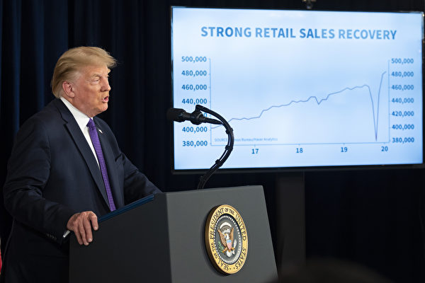

周六下午（8月15日）下午5点半，川普在新泽西召开新闻发布会。总统表示，美国已经进行了超过7,000万例中共病毒测试。 (Photo by JIM WATSON / AFP)

<b>韩国新增279新病例</b>

据韩国疾病预防控制中心称，韩国周六报告了279例新病例。其中，本地传播267例，首尔占141例。

韩国目前病例总数达15,318例，其中1103例在隔离中，13例处于危急状态。死亡人数为305。

从周日开始，当局在首尔地区重新引入社交隔离措施。

<b>巴西新增4万病例 700多例新死亡</b>

巴西卫生部周六（8月15日）报导，巴西在过去24小时内报告了41,576例新的Covid-19病例，其中709例死亡。

巴西病例总数为330万，至少有107,232人死于中共病毒。

圣保罗州周六报告了11,408例新病例和167例新死亡，低于前一天的11，667例和289例。

圣保罗州是巴西疫情最严重的州，确诊病例共697,530例，确诊死亡26,780例。

<b>欧洲多国新增病例创新高</b>

疫情在欧洲持续回升，周六，多个国家新病例创新高。

<b>法国新病例连续四天新高</b>

法国卫生部周六（8月15日）报告说，过去24小时内共有3,310例新感染，连续第四天创下封锁后新高，该国累计病例达到215,521例。

卫生部在网站更新中说，总共有252个群聚被调查，比24小时前增加了17个。

<b>意大利单日新病例达五月以来最高</b>

意大利民事保护机构公布的数据显示，意大利周六（8月15日）登记了629例新病例，为5月23日以来最高水平。

自周一以来，意大利新病例数每天都在增加。 自2月下旬以来报告的总病例数上升至253,438。

<b>英国单日新病例超过1,000</b>

英国政府数据显示，周六（8月15日）新增1,012例感染，使得新病例连续第五天超过1,000。病例总数达到317,379例，周六死亡人数增加了3例，总数达到41,361例。

英国在周六放松了封锁，允许多达30位宾客的婚宴，以及可坐下用餐，恢复室内表演、保龄球馆和赌场鞥，意味着约300名观众可现场观看世界斯诺克锦标赛的决赛。

2020年8月9日，英国伦敦：人们穿过伦敦市中心的千禧桥。英格兰南部经历了数天的高温，希思罗机场达到36.4C，这是英格兰17年来最热的8月。

<b>爱尔兰报告五月份以来最多单日新病例</b>

周六（8月15日），爱尔兰的新病例增加了200例，达自5月初以来最多。该国首席医疗官罗南‧格林（Ronan Glynn）表示，爱尔兰正在看到“多个群聚（感染）”，并表示“深切关注”这种扩散轨迹。

<b>德国新病例创四月以来最高</b>

根据约翰‧霍普金斯大学的数据，德国周六（8月15日）报告了1,510例新病例，是自4月30日以来单日最高增幅。总病例上升到223,791。

周六，德国有13例新死亡，这一数字与8月和7月的数字大致相符。

<b>美德州死亡总数接近1万 住院人数下降</b>

根据德州卫生服务部周六（8月15日）的数据，该州报告了8,245例新病例，达自周二以来最多，病例总数达到528,838例。

周六，德州有238多人死亡，死亡总数达到9,840。

住院患者人数降至6,481，为6月最后一周以来最低水平。据报导，新感染病例已从7月15日的10,791人峰值下降。

<b>加州单日死亡人数超过两周均值</b>

根据加州卫生部门数据，周六，加州报告的死亡人数增加了151人，超过了连续14天的平均死亡人数137人。病例增加了12,614，高于两周均值8,111，病例总数达613,689。

公共卫生部门警告说，这些数字“并不代表真正的逐日变化”，因为它们包括了其他日子的病例。

加州两周平均阳性检测率连续第三天上升到6.3%。该州表示，其目标是将阳性维持在8%以下，这是5月初最高水平。

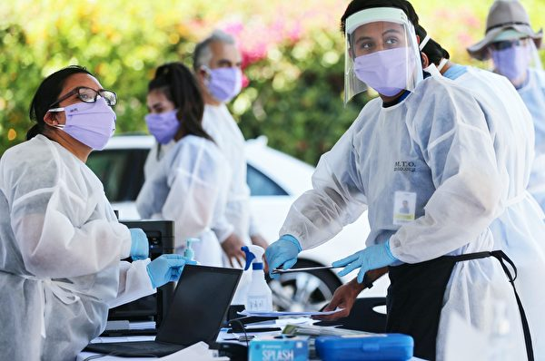

2020年8月11日，加利福尼亚州洛杉矶：医护人员在一处中共病毒测试中心进行测试。（Photo by Mario Tama/Getty Images）

<b>美议员染疫后康复 肯定羟氯喹治疗效果</b>

美国国会众议员路易‧戈默特（Louie Gohmert）表示，在中共病毒检测呈阳性大约两周后，他对COVID-19的检测恢复为阴性。他将康复归功于羟氯喹（hydroxychloroquine）。

现年66岁的戈默特于7月29日对COVID-19测试呈阳性。

戈默特选择服用一种抗疟疾的羟氯喹药物，该药物已经对中共病毒患者在治疗方面取得了一些成功，这种药与阿奇霉素（azithromycin，一种也被称为Z-Pak、zinc的抗生素）一起服用。

8月5日，戈默特在与福克斯新闻的肖恩‧汉尼提（Sean Hannity）交谈时，将他的康复归功于羟氯喹方案。

他说：“我真的认为尽早服用羟氯喹和Z-pak，确实有帮助。”他指出自己的症状包括咳嗽、发烧和全身酸痛。

戈默特说，他还服用了维生素D3和C以及类固醇雾化器。

这位议员在8月14日告诉《华盛顿观察家》，他对COVID-19测试已经恢复阴性。他还进行了抗体测试，结果呈阳性。他计划捐赠血浆以帮助其他人从疾病中康复。

“对于那些自己的医生拒绝考虑使用羟氯喹治疗的患者，我感到抱歉。真是可惜。”戈默特说。

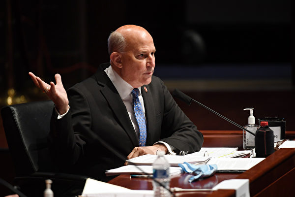

图为德克萨斯州共和党众议员路易‧戈默特（Louie Gohmert）。（摄于2020年7月28日）（Matt McClain-Pool/Getty Images）

<b>美CDC更新中共病毒隔离指南</b>

美国疾病预防控制中心（CDC）更新了中共病毒隔离指南。

CDC在8月14日的一份声明中说，该指南显示人们在确诊后长达3个月内可以继续呈阳性反应。与今天的媒体报导相反，这个发现并不意味着一个人在感染后3个月内可以抵抗SARS-CoV-2（引起COVID-19的病毒）再感染。最新数据仅表明，在初次感染后的3个月中无需对患者进行重新测试，除非患者表现出COVID-19症状且该症状不和另一种疾病相关。

声明说，症状发作后，应隔离患者至少10天，直至在不服用退烧药的前提下，24小时内不发烧。

CDC表示，最近发表了超过15项国际和美国的研究，这些研究分析感染时间、病毒脱落持续时间、无症状传播以及在不同患者群体中传播的风险。研究人员发现，在出现COVID-19症状后，鼻子和喉咙中的活病毒数量明显下降。此外，大多数COVID-19感染者的传染时间不超过症状开始后的10天，严重疾病患者或免疫力严重受损者的传染时间不超过20天。

<b>武汉中共肺炎索赔第一案告上高院</b>

自由亚洲电台报导，近期武汉相继有肺炎死者家属对当局提起诉讼，法院却不予立案。有家属决定告上湖北省高院。

父亲因感染中共病毒病逝的张海，两个月前向武汉市中级人民法院对当局提出起诉，要求赔偿约200万经济和精神损失，武汉市中院却以一通电话把事情交待过去。

作为中国第一名提起诉讼的中共肺炎受害者家属，张海并未气馁。周三（8月12日）他以邮政快递把4份起诉状寄往湖北省高级法院。

张海：“我感到它们是知法犯法，很儿戏，不敢面对家属追责的诉求。我向高院起诉就是向它们证明我追责的决心。我是追责到底的。不管你们怎么打压我，恐吓我，肯定不行，我一定要追责到底。我一定要给我父亲一个交代，不然我这一生心情都不可能平静。”

张海确信，法院不立案是由于湖北省和武汉市政府从中阻挠。

维权律师陈建刚认为，湖北司法当局的手法明显违反了程序。

亲身记录武汉疫情的律师陈秋实与公民方斌，被当局扣查后一直失联。陈建刚担心，张海会步两人后尘。

连同张海在内，至今共有至少5名肺炎死者家属提交了诉讼。

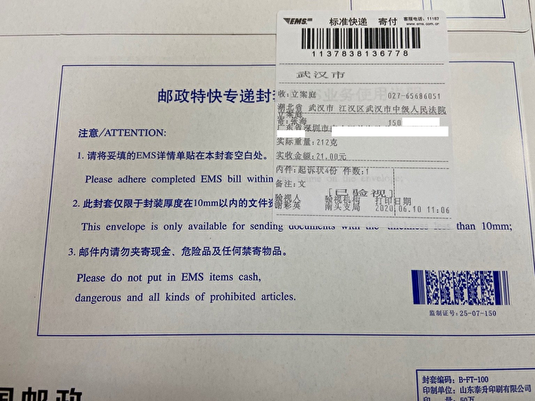

6月10日上午11点，张海将4份正式起诉状通过邮政快递寄往武汉市中级人民法院。（受访者提供）

<b>近半巴西民众认为疫情“不是总统的错”</b>

巴西确诊数与死亡人数居高，但据巴西民调公司资料页报 （Datafolha）的调查显示，有将近一半的巴西民众认为巴西总统波索纳洛（Jair Bolsonaro）并不需对此负责。

路透社报导，这份民调于当地时间周六（8月15日）在南美洲最大报《圣保罗页报》（Folha de S.Paulo）刊出，结果显示，47％的巴西人并不将疫情现况归咎于波索纳洛，而觉得他该为此负责的仅仅11%。

这项调查于8月11日至12日间访问了2065人，误差值约为上下2个百分点。

巴西卫生专家普遍对波索纳洛的防疫决策感到不满。但8月7日发布的另一项民意调查显示，波索纳洛的施政满意度为自2019年以来最佳。

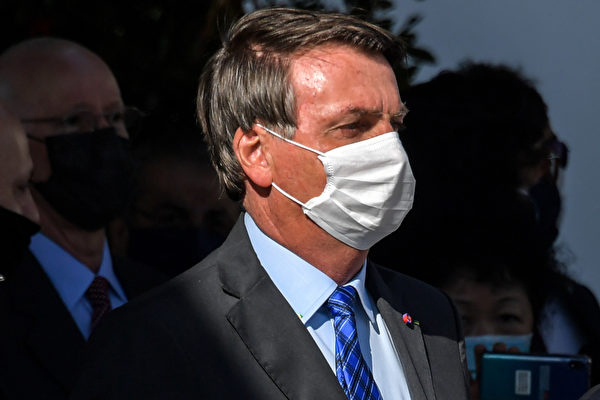

巴西总统贾尔・波索纳洛(Jair Bolsonaro)。(NELSON ALMEIDA/AFP via Getty Images)

</b>民调：美共和党人比民主党人更不愿意接种疫苗</b>

最近，两份民调均显示，大约三分之一美国人不愿接种中共病毒疫苗。

根据一项新的NPR/PBS NewsHour/Marist调查，如果有的话，三分之一美国人会选择不接种中共病毒疫苗。

根据8月14日公布的结果，尽管60%的受访者表示如果有疫苗就接种，但仍有35%的受访者表示不会接种疫苗。其余5%的受访者表示不确定。

结果显示，民主党人更有可能接种疫苗，有71%的人赞成接种，而共和党只有48%的人愿意接种疫苗。相对而言，有61%的独立人士说他们会接种疫苗。

该结果与8月9日至12日福克斯新闻社进行的先前调查相吻合，该调查显示26%的美国人不接种疫苗。调查结果显示，约有55%的人表示他们计划接种，20%的人未下定决心。

福克斯新闻民意调查还显示，民主党人（66%）和独立人士（54%）比共和党人（43%）接种疫苗的可能性更高。

目前全球尚无正式批准的新冠状病毒（中共病毒）疫苗，但已有19种疫苗在进行人体试验。

<b>研究：纽约早期疫情类似1918年西班牙大流感</b>

一项新的研究表明，在纽约市COVID-19大流行的前两个月期间死亡率，与1918年西班牙大流感高峰期间的死亡率相当。

研究人员专门检查了纽约市的疫情数据，将1918年流感高峰期与全市遭受COVID-19大流行早期的死亡率进行了比较。

主要作者杰里米‧浮士德医生对CNBC说：“我们希望人们知道这（中共病毒）具有1918年（大流感）的规模。” “这不是像一般流感耸耸肩的东西。”浮士德在布莱根妇女医院专门从事急诊医学工作，并在哈佛医学院任教。

这项研究发表在美国医学会期刊JAMA Network Open上。

研究数据是从美国疾病控制和预防中心、纽约市卫生和心理卫生部，以及美国人口普查局收集的。

研究作者说，在1918年H1N1流感高峰时期，550万城市居民中共有31,589人死亡。他们写道，在纽约市爆发COVID-19初期，纽约市有828万名居民，其中33,465人染疫死亡。

研究人员发现，1918年流感大流行期间死亡人数的增幅总体上更高，但与纽约市中共病毒疫情爆发前两个月观察到的情况相当。研究人员写道，考虑到卫生、现代医学和公共卫生的改善，中共病毒爆发前期的死亡人数增幅实际“大大高于”1918年大流行的峰值。

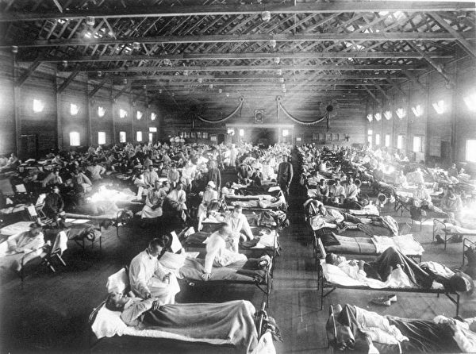

美国堪萨斯州赖利堡的军营医院，病房内被感染西班牙大流感的军人塞满。（公有领域）

<b>曼哈顿空置公寓创新高</b>

随着居民逃离城市，房东苦苦寻找新的租户，曼哈顿空置公寓等待出租的数量飙升至历史最高水平，超过了13,000套空置。

根据道格拉斯‧埃利曼（Douglas Elliman）和米勒‧塞缪尔（Miller Samuel）的一份报告，出租或挂牌存货的公寓数量比去年增加了一倍以上，并创下自开始收集数据以来的14年纪录。由于列出要出租的公寓数量达到13,117个，因此新签订的租赁数量下降了23%。

7月份的租金率也达近十年来最大的跌幅，下降了10%。该报告称，房东现在平均提供1.7个月的免费租金以吸引住户。

在中共病毒大流行初期，成千上万的居民在3月和4月离开城市，经纪人和房东希望许多人会在7月和8月开始返回，以便经纪人可以恢复公寓参观。由于学生开学，7月和8月通常是一年中最繁忙的出租月份。但今年7月租房市场疲软，经纪人表示，8月同样恢复缓慢，表明曼哈顿房地产和经济问题可能会持续到秋天或以后才可恢复。

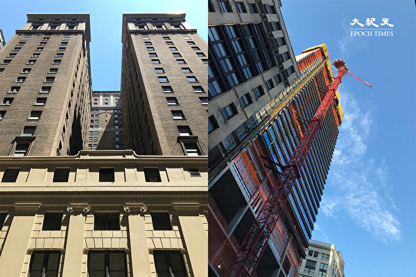

图为曼哈顿下城大楼与施工场景。（林宜君／大纪元）

<b>激烈运动增加呼吸道疾病和感染中共病毒风险</b>

一项最新研究显示，激烈的运动可能会给免疫力带来压力，增加呼吸道疾病和感染中共病毒的风险。这些运动包括马拉松赛跑、Crossfit以及其它极限运动等。

美国运动医学学院的医生表示，由于对免疫系统的压力增加，使得在短时间内更难抵抗中共病毒，某些高强度的健身运动会增加罹患中共肺炎的风险。

医生们在美国运动医学会（ACSM） 8月版的《当前运动医学报告》中指出，当前可能不是运动训练最佳时候。医生们解释说，对于感染中共病毒风险较高的人来说，应“避免进行过度运动”，或避免进行“异常高强度的工作”，以及避免“过度训练”。

迈阿密大学的团队医师、ACSM的托马斯‧贝斯特（Thomas Best）告诉福克斯新闻（Fox News），在进行长跑或繁重的高强度锻炼后，免疫系统会在两周内受到抑制，这会增加罹患COVID-19这种病毒性疾病的风险。

贝斯特说：“高强度（运动）会产生短期有害影响，更具体的是容易感染COVID-19，以及对心血管系统有危害。”

但这并不意味着健身爱好者需要完全退出自己喜欢的锻炼方式。相反，研究人员提倡健康的成年人每周进行150至300分钟的中等程度体育锻炼，理想情况下是在室外，并且与人保持一定距离。

<h4 align=center><a href="https://www.epochtimes.com/gb/tag/%E6%9C%80%E6%96%B0%E7%96%AB%E6%83%85.html">【最新疫情8·15】请点击这里。(点击右键,另存新档）</a></h4>

<a target="_blank" href=#top><h6 align="right">回上方</h6></a>

<a name=164>
<h1 align="center"><b>深圳女子染中共病毒 21家盒马门店停业</b></h1>
   
【大纪元2020年08月15日讯】中共病毒（武汉肺炎）疫情持续蔓延，广东深圳出现一例本土确诊病例。该染疫女子为深圳罗湖区水贝盒马鲜生超市的员工，目前她的3名亲属、2名同事核酸检测为呈阳。15日起深圳21家盒马门店暂停营业。

广东省卫健委8月14日通报了上述确诊病例的情况。

41岁的陈某为深圳罗湖区水贝盒马鲜生超市酸奶销售员，在汕尾陆丰市确诊，其居住地在龙岗区布吉润祥家园。

陈某8月6日携带3子女搭乘深圳至陆丰的大巴车回陆丰南塘镇。7日出现咽部不适，8日出现发热、腹泻。12日傍晚到当地医院急诊科就诊，体温39℃，提示肺部有感染。随后被隔离治疗。

可能与陈某有接触的3,184人进行核酸检测，已出的检测结果中，其中陈某的三名家属及2名同事（男性、女性各1人）被判定为无症状感染者。

目前，陈某所住居民楼的居民和工作场所的所有员工全部居家隔离；陈某所在的居民小区和超市被封闭式管理。

据盒马生鲜8月15日消息，15日起会暂停深圳21家盒马门店营业，同时为所有深圳盒马员工和生鲜商品进行核酸检测。

另据北京市疾控中心14日通报，新发地批发市场牛羊肉大厅工作人员、无症状感染者彭某出院28天后，覆诊时核酸检测呈阳性，须重新隔离治疗。

在国际压力下，中共从4月1日才开始公布中共肺炎的无症状病例的数字。时事观察人士钟原说，中共所谓的“无症状感染者”主要是创建一个模糊的新类别，把检测不准的疑似病例和出院复阳患者，都放进这个“无症状感染者”的新类别，这样才能做到确诊清零。

<a target="_blank" href=#top><h6 align="right">回上方</h6></a>

<a name=163>
<h1 align="center"><b>【新闻看点】美净网联盟扩大 习开倒车军队异象</b></h1>

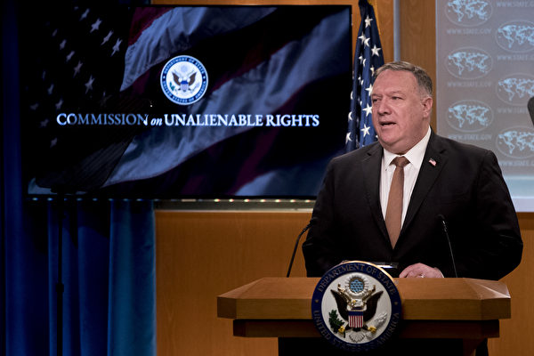

美国国务卿蓬佩奥（Mike Pompeo）提出从五个方面净网。资料图。(ANDREW HARNIK/POOL/AFP via Getty Images)

   
   【大纪元2020年08月14日讯】大家好，欢迎关注新闻看点，我是李沐阳。
   
【60秒看世界】

美国国务院今天中午公告，正式将孔子学院定为外国使团。

位列海外恶人榜的吉林省检察院前检察长杨克勤今天开庭，他被指控受贿超过4635万，被网友直呼“这是清官”。

旧金山多个华人团体发起了摘除五星血旗的活动，将在本月16日在华埠花园角公园举行启动仪式。

各国疫苗研发正在攻关，但最近大陆网络上出现了伪造的假疫苗，一剂卖498元人民币。

韩国疾管本部表示，发现3例境外移入中共病毒患者，病毒基因已经发生了突变。

昨天美国洛杉矶发生森林大火，有近7000英亩土地遭到野火吞噬。目前有300多名消防员在现场灭火，约500户住户被迫撤离。

下面进入今天的话题。1987年6月12日，美国时任总统里根在勃兰登堡门前演讲，他对当时的苏共总书记戈尔巴乔夫喊话，“推倒这堵墙”。2年后，1989年11月，柏林墙被拆除了，东西德统一。30年后，美国人又开始拆另一堵墙，中共巨资打造的网络防火墙。

今天，正在出访中欧4国的美国国务卿蓬佩奥与斯洛文尼亚领导人举行了会谈。美国之音报导，双方还签署了一项涉及5G技术的联合声明。美国国务院前天公布，已经有三十多个国家加入了美国的“净网”倡议。

世界各国合力“拆墙”，对中共政权形成了威胁。有消息称，北京此时倍受方方面面的指责，其中中共军中将领更是对习进行了批评。也有大陆网友披露，北戴河会议上，“老同志”开启了第三战场。看来要有大事发生。

<b>蓬佩奥出访中欧 净网联盟再扩大</b>

今天是蓬佩奥为期一周的中欧之行第二天，他与斯洛文尼亚的总理、外长和总统分别举行了会谈，随后双方签署了一项涉及5G技术的联合声明。

昨天（12日）在捷克的访问，他会晤了捷克参议长维特齐，并且发表了演讲。蓬佩奥在阐述两国同盟关系的同时，也强调了此行的主要议题之一，扩大5G干净网络（Clean Network）至关重要。他赞扬捷克总理对网络安全的坚定支持。

在结束斯洛文尼亚的访问后，国务卿还将出访奥地利和波兰。此前捷克与波兰已经加入了5G干净网络倡议，现在斯洛文尼亚又加入了响应的队伍。

前天（11日），美国国务院公开的资料显示，已经有三十多个国家和地区政府，或者他们的电信运营商加入了净网倡议，承诺只使用值得信任的网络供应商。事实证明，美国不仅在清理自身网络，而且一个“净网”联盟已经成形了。

联盟成员除了加拿大、以色列、英国等传统盟国外，也有日本、台湾、越南等战略合作伙伴，还有法国橘子（Orange）电信、澳洲电信等5G运营商，都表示不会使用华为等受中共控制的电信公司的设备。

<b>放眼未来 新战略“拆墙”</b>

美国的净网倡议涉及五大部分，包括电信运营商、应用商店、应用程序、云系统和海底电缆。

发出倡议第二天（8月6日），川普签署两项行政令，禁止任何美国实体或个人与微信和TikTok有任何交易，45天后生效。

但批评者认为，美国的举措会让全球互联网受到更多限制，像是在建造网络高墙。还有不少华裔律师在筹款，要将美国政府告上法庭。

对此，南卡大学艾肯商学院讲席教授谢田表示，美国的净网倡议目的就是反制中共在互联网领域日益膨胀的国际影响力，要从供应商、海底电缆、软硬件等各个方面，全方位打破中共对互联网产业的控制。

他说，美国的动作不是建墙，而是拆掉中共的墙。

曾在大陆做过十年内容审核员的刘力朋告诉美国之音，2011年，中共已经对香港进行内容审查了。六四和七一期间，所有带图片的消息，香港的IP都发不出去。他说“世界的互联网没有边界，但中国（中共）互联网却有明显的边界”。

加拿大公民实验室去年有一项研究结果，微信使用两套标准审核境内外用户。海外的不容易封号，但会“关小黑屋”，这样国内看不到你的发言。

谢田博士指出，把美国净网倡议与中共防火墙相提并论非常荒谬，因为美国的举措恰恰是要打破中共对全球网络生态系统的控制，“中共防火墙是在过滤和阻挡网络信息的自由流通，而美国的净网行动是要阻止华为的5G技术渗透全球、抢占国际市场、把中共的防火墙延伸到全世界”，这是“美国放眼未来的科技新战略”。

<b>北京走回头路，计划经济回来了？</b>

面对净网联盟和国际社会的围堵，北京似乎又走回了计划经济的老路。近日接连推广节俭计划，呼吁民众节约粮食、汽车制造可以使用旧零件，而且文革时期特有产品“工分宝”又出现了。

节约粮食咱就不说了，不管是不是出现了粮食危机，节约粮食都是对的。但是贵阳烤肉店竟然回收顾客吃剩的肉，加工后继续出售。官媒称这是节约粮食的“正能量”。

照这种趋势，人们吃火锅剩下的汤也可能被回收，地沟油产业很可能会“做大做强”，而且光明正大。不过如果真的大饥荒来了，吃点恶心的东西，或许可以活命。但是新汽车用旧零件，这个就有点狗戴嚼子——胡勒了。

汽车维修技术人员刘先生对自由亚洲表示，当局对行业运作一无所知，仅回收翻新的轮胎，过去在农村和落后地区每年导致成千上万人死亡，官方从没统计过。刘先生指出，这就跟手机一样，不断更新换代，老的东西换不到新的上面。

学者谭刚认为，这些措施表明，当局试图要回到自给自足的状态，应对国际脱钩，“但这种做法相当于自杀”。

前几天，浙江杭州萧山区戴村推出了“工分宝”计划。这是微信里的一个程序，记录村民挣得工分和信用值数据，当局吹嘘是乡村数字治理改革。但自由亚洲指出，这是毛时代的记忆。

<b>中共内部的“八点精神”？</b>

昨天（12日）有网友爆料，针对国际社会的围堵，中共内部最近提出了“八点最新精神”。

大概意思是，取消在华美企的经营资格，特别是金融服务类，“要把美国打疼”；发展核武器；提高国防开支到GDP 4%以上，与美帝抗衡；建立反美帝联盟；自力更生，搞“双循环”经济体系，建立欧亚大陆人民币结算体系；打破美国的围堵，武力统一台湾；全民战争动员；全部抛售美债，撤回在美学生学者，做好断交一切准备。

对网友的这份爆料，我们目前得不到证实。但是结合当前中共种种走回头路的做法来看，北京似乎有可能会这么做。

如果这个消息属实，那么已经表明，北京要走回闭关锁国的时代，重走计划经济老路。换句话说，毛时代很可能又回来了。

50岁往上、还有一些记忆的朋友应该清楚，那段岁月不堪回首。但中共开倒车，或许又要让人们再次经历勒紧裤腰带、大炼钢铁、穷兵黩武的斗争岁月。

中央社今天报导，习近平提出的“内循环”将纳入“十四五”，由刘鹤领衔推动。国际社会不带玩了，也只能搞“内循环”了，实际就是闭关锁国。不知道闭关锁国什么样的朋友，可以参照一下朝鲜。

邓小平当初搞了一个半吊子开放，通过占便宜钻空子，使中国经济有了一点发展。人们刚看到点儿亮，又要回到过去了。可想而知，反对的声音不会少。

<b>北戴河的第三战场</b>

同样是这位网友，今天又发来一个最新的消息。说是在北戴河会议上，有“老同志”开启第三战场向北京“开火”，提出了一系列的问题。

第一，香港的问题最终怎么解决？

第二，中国经济这样下去，还有明年吗？

第三，这种高压下的社会，能撑过明年吗？

第四，中美关系到这个程度，共产党和中共政府能撑到明年吗？如果全新疆人突然都上街，还能再镇压、都抓起来吗？党内人人自危将引发党内的消极，和潜意识的与海外势力配合，甚至发生内部动乱和暴乱，怎么解决？

第五，共产党能在这个时代控制住互联网和社交媒体吗？

第六，中国的财政赤字和外债如果发生双爆发，结果会什么样？

第七，以美国为首的西方，如果将所有在海外的国家资产都列为非法资产，进行查封，怎么办？这里加一点说明，“老同志”提到的在海外的国家资产，实际指的是中共官员在海外的私人财产，这应该是不言自明的。

第八，国家安全委员会的国家运行制度，事实上废除了政治局常委，这个模式能否继续下去？

这些问题，每一个都很有针对性，大有向北京追责之意。

对这个消息，我们同样无法证实。但是中共内斗的确存在，我们也在节目中说过，北戴河会议就是北京最高领导人一道难过的坎儿，习近平很可能会被反对势力责难。

<b>中共军方有异声</b>

即使这样，我们仍然可以把它当作“路边社”的消息对待。但是中共军方的确有批评北京的声音。

澳洲媒体“新闻网（news.com.au）”的记者杰米·塞德尔（Jamie Seidel）撰写了一篇文章《习近平的战狼术受到抨击》。其中表示，如同四面楚歌中挣扎的独裁者一样，习面对着诸多的内忧外患。因此在国内有很多反对声音，还都是一些有社会影响力的人物，包括中共军中的将领。

塞德尔提到了两个反习将领，退休少将乔良和现任空军大校戴旭。文中表示，乔良是知名鹰派，但现在站出来反对习近平要武力解决台湾的口号。

乔良认为，北京不应把疫情看作武力收复台湾的机会，那需要付出太大的代价，当务之急是要把重点放在民族复兴上。他认为台湾问题的本质就是中美问题，也是美中的实力较量，胜负未分之前，台湾问题不可能解决。

对戴旭，塞德尔引用署名戴旭的文章《对美国的四个想不到和十个新认识》，其中表示美国不是纸老虎，关键时刻最要命。警告不要成为美国的敌人，那将付出代价等等。

戴旭否认这篇文章是自己写的，不过不妨碍文章的热传。外界认为，这是中共内部在借此释放不同的声音。

著名的中国通白邦瑞（Michael Pillsbury）最近表示，他也从中共军方听到消息，“他们还没有准备好与美军对抗。因此习近平的确受到了严厉的批评”。

<b>大事将发生？</b>

前中共海军司令部中校姚诚曾指出，中共军队与习并不贴心。现在政局混乱，高级军官都不站队了，都在观望局势发展。

身在美国的姚诚告诉美国之音，中共军人根本不想上战场，内部问题很严重。

中共一直强调党指挥枪，意思就是军队怎么动，要听党指挥。但是姚诚指出，中共军队与习的真实状况，并不贴心。不贴心就意味着有二心，并不拥护习，还有别的一些想法。

如果军心不在习这边，这问题可就大了。任何一个朝代的更迭，往往是通过军队发动政变来实现，谁掌握着军队，谁就说了算。而现在中共军队与习不贴心，这是否意味着会有大事将要发生呢？

我们拭目以待。

*****

<b>共军雷达已失效？</b>

今天正在准备节目的时候，一位朋友转给我一个消息，一看，是胡锡进又发出了战狼嚎叫。胡锡进在推文中表示，中共军队在台湾海峡及南北端进行军演，显示出有能力在数小时全面攻占台湾，让美军反应不及。

对胡锡进的各种说法，其实人们应该有免疫力了。他嚷了半天，中共根本不敢动。中共总想武力统一台湾，它自称是“解放台湾”。但是几十年了，中共一直不敢动。

为什么？中共没把握。所以对胡锡进的说法，大家可以不用理会。

很多人有过这样的经历，有时候突然出来一条狗对着你狂叫不止，看那龇牙咧嘴的劲儿，非把你咬几口不可。你继续往前走，它就跟在你身后不远的地方叫。可是你一停住脚步，它立刻也停下。如果你做一个弯腰的动作，它马上就被吓跑了。

中共以前没把握，现在更没把握。美台关系现在在快速升温，多重迹象显示，美台正式建交似乎已经成了可能。所以中共很担心，如果对台湾动武，美国可能会出手协防台湾。

至于胡锡进说的几个小时攻下台湾，美军来不及协防等等，这纯粹是他个人的臆想。

前天（11日），美国国防部长埃斯珀（Mark Esper）在迭戈·加西亚岛（英属印度洋领地，美国全球军事基地之一）刚刚部署了3架B-2轰炸机。这就意味着飞行到南海的时间大大缩短了。军事分析人士汤姆·罗根（Tom Rogan）撰文指出，B-2轰炸机飞到南海只需要5个小时。

中共真的有信心5个小时攻下台湾？

另外大家都注意到了，最近一个阶段，美国的E-8C“联合星”侦察机等频繁接近中国边境。自由亚洲报导，5日，联合星还伪装成民航机，骗过了中共军方。

美国侦察机频繁接近中国边境干什么？很显然是侦查中共的布控情况。

军事专家吕礼诗在脸书分析，美军的电子侦察机密集出现在中国南部战区，显然是已经掌握了中共军队的预警雷达电子参数。

吕礼诗表示，E-8C侦察机以民航机作为掩护，进而接近广东沿岸，预警雷达需要长距离的侦搜，必须使用较低的频率，不得不牺牲目标可鉴别距离，等目标更接近时改用较高的频率，才能确认正确的目标数量。

吕礼诗指出，前段时间美军EP-3E及RC-135等电子侦查机频繁出现在中国南部战区，显然是掌握了中共军队预警雷达的电子参数。因此美军E-8C联合星监视指挥机上周三才能以民航机作为掩护，令中共军队无法在第一时间作出反应。而中共国防部长魏凤和上周致电美国国防部长埃斯珀的原因，就是因为美军侦察机在夜间难以识别，容易造成误判、发生误击。

台湾政治大学东亚研究所荣誉教授丁树范指出，如果美军掌握了中共军队预警雷达的电子参数，会有很大影响。

丁树范指出，假如中共军队要攻打台湾，它一定要把雷达打开。因为中共也很担心台湾的空军会攻击中国南部战区或东部战区，所以当中共军队用雷达作侦测的时候，那美国可以把这个数据和频率交给台湾，使台湾的飞弹可以有效攻击。

换一种说法就是，中共军队的这些电子雷达如果真的被美军掌握了参数，那就相当于作废了。只要发出一颗导弹，这些雷达立刻就不见了踪影。

没有了雷达，对军队来说，特别是对空军来说，那就相当于是失去了眼睛。一个没有眼睛的人，与一个耳聪目明的人对打，那不是只有挨打的份儿吗？

<b>中共承认粮食危机</b>

我们在以往的节目中提醒过几次，希望没有备粮的大陆民众，尽可能地一些粮食。好像是从武汉发生疫情之后，我们就有提醒。然后后来各地发生各种各样的天灾，我们又有几次提醒。

但是中共官方的论调，都是告诉人们不会有粮食危机，谁屯粮抢粮，就如同犯罪。中共媒体的宣传，还是迷惑了一些大陆百姓。

前不久就有一位网友发邮件问我，可能会出现粮食危机吗？问我是不是为了“吸粉”而故意制造紧张气氛？

对这位网友的发问，我当时觉得可能是故意捣乱的。不过随后还是回复了他，推荐他去看几篇文章。主要就是各地的天灾人祸情况，然后提醒他，这些都会对粮食作物产生影响。

昨天（12日），中共粮食和物资储备局非常罕见地承认了，以小麦为主的夏粮收购同比减少了近千万吨，下降了近20%。同一天，中共官媒《人民日报》也刊登习近平要求制止餐饮浪费行为的报导。

中共粮储局在官方微博发文，说截至到8月5日，主产区小麦累计收购4285.7万吨，同比减少938.3万吨，其中：河北收购355.9万吨，同比减少93.5万吨；江苏收购1083.5万吨，同比减少10.8万吨；安徽收购592.9万吨，同比减少222.4万吨；山东收购661.4万吨，同比减少54.4万吨；河南收购912.4万吨，同比减少538.8万吨。唯一一个增加的地方是湖北，收购139.0万吨，同比增加6.8万吨。

其实，就中储粮公布的这份数据，有多少真实性，还是一个很大的问题。中共向来都会美化数字，根据需要扩大或者减少。

大家可以自己分析一下，减少了千万吨，粮食能不紧张吗？有网友留言说，“就老实说吧，是不是粮食出了问题，不光小麦”。

夏粮是这样，秋粮也好不到哪里去。谁都看到了，南方27个省份都发生了大洪水，而北方却是严重干旱。绝大部分农田减产已经成了定局，甚至有许多的农田绝收。

习近平为什么突然高喊让人们节约粮食？还不是缺啥喊啥吗？如果问题不严重，中共官员哪有心情说这些？中共内斗还应付不过来呢，更别说百姓的吃饭问题了。

就是说，中国的粮食问题可以已经到了火烧眉毛的地步了。没有备粮的朋友，应该认真考虑一下了，别再听信中共的谎言，那只会增加人们的痛苦。

<b>6千万人受灾，主汛期持续到9月底</b>

刚才说到南方的大洪水，其实现在一直还在延续着。今天，中共水利部副部长周学文表示，今年洪水灾害已经造成了6346万人次受灾，直接经济损失达1789.6亿人民币。

周学文是在中共国新办记者会上通报的这个情况，他说今年是一个十分特殊的年份。年初爆发疫情，6月以来，长江、淮河、太湖流域发生严重的汛情，防汛救灾工作面临严峻考验。

随后他表示，江淮流域的梅雨季超过了历史，长达62天，降水量759.2毫米。全国634条河流发生超警以上的洪水，无论是受灾人次还是直接经济损失，都比前5年的平均值多了12.7%和15.5%。

另外他还说了一点，历史数据显示，7月下旬到8月上旬是大范围强降水的集中爆发期。但并不意味着七上八下之后，汛期就结束了，“事实上主汛期一直要延续到9月底，下阶段发生洪涝灾害的可能性仍然很大”。

真不知道，中国百姓的苦难，什么时候是个头啊？

以上就是今天的节目内容。如果您喜欢新闻看点，请别忘记点赞订阅。欢迎周一到周六，每天准时收看我们的新节目。也请您将新闻看点推荐给您周围的朋友。

最近，意大利发生了一件神奇的事，伫立在广场的一座圣母玛利亚雕像突然流出了血泪。这意味着什么呢？与当今的天灾人祸频发有没有联系呢？

大纪元《新闻看点》制作组

<a target="_blank" href=#top><h6 align="right">回上方</h6></a>

<a name=162>
<h4 align="center"><b>抓捕黎智英后</b></h4>   
<h1 align="center"><b>港媒：美第二波制裁很快到来 包含制裁红二代</b></h1>

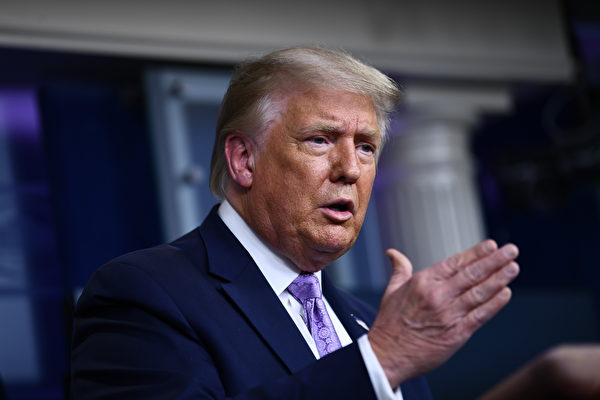

8月13日，美国总统川普（特朗普）在白宫新闻发布会上谴责中共和港府对香港新闻自由的攻击。(Brendan Smialowski/AFP)

   
【大纪元2020年08月15日讯】（大纪元记者刘毅报导）在中共拘捕香港壹传媒创办人黎智英后，有香港媒体透露，美国对香港的第二波制裁很快就会到来，其中包含对中共红二代和红三代的制裁。

据香港《苹果日报》8月15日报导，美国共和党海外事务组织副主席俞怀松前日在Twitter透露，由于黎智英被捕，美国的第二轮制裁很快会来临，将针对红二代和红三代；制裁会令香港的银行不能处理美元交易，而港交所会是受害者。

8月7日，美国财政部已宣布制裁11名“破坏香港自治与自由”的中共官员。

时事评论员王友群表示，制裁中共高官，就是打到中共的“七寸”。41年来，中共高官家属、子女大批移居美国等西方发达国家，将贪腐的巨额财产转移到美国等西方发达国家。

面对被美国拒发签证、取消签证、不准入境、取消永久居民身份（绿卡）、取消公民身份、驱逐出境、冻结资产、停止交易、踢出美国主导的全球金融体系等制裁，那些中共高官，无论现任的，还是已退休的，及其家属、子女，能不心惊肉跳吗？

香港实业家袁弓夷介绍，中共权贵家族转移到海外的钱可能高达10万亿美元。其中，占最大份的是前中共党魁江泽民家族，约1万亿美元。

另外，英国民间组织“香港监察”（Hong Kong Watch）两名创办人分别在11日和13日在加拿大会众议院对华关系特别委员会听证会上作证。两人敦促加拿大政府实施《马格尼茨基法案》以及为寻求庇护的香港人提供永久居留的快速途径等。

“香港监察”创办人罗杰斯（Benedict Rogers）表示，现在是自由世界捍卫香港自由、民主和人权以及国际规则秩序的时候，行动应该要有力、有针对性和统一；《中英联合声明》不仅是中英之间的协定，同时也是在联合国所签署的一项国际条约，违反条约会影响所有人所相信的国际规则的系统。

8月10日，香港警方以涉嫌触犯港版国安法为由拘捕壹传媒创办人黎智英及其两个儿子，并派出200警察大规模搜查苹果日报大楼。当天被拘捕的还有前香港众志常委、副秘书长周庭等人。消息令欧美等国严重关切。

袁弓夷通过自媒体视频表示，香港的抓捕事件将令中共付出很大代价。美国和英国人对此事件深恶痛绝。

8月13日，美国总统川普（特朗普）在白宫新闻发布会上回应《大纪元时报》记者的提问时说：“我认为这是一件可怕的事情。”“我对看到香港发生的事情感到厌恶，因为自由（freedom）是一件好事。”

<a target="_blank" href=#top><h6 align="right">回上方</h6></a>

<a name=161>
<h1 align="center"><b>访民被北京人脸识别发现 被送回重庆关黑监狱</b></h1>

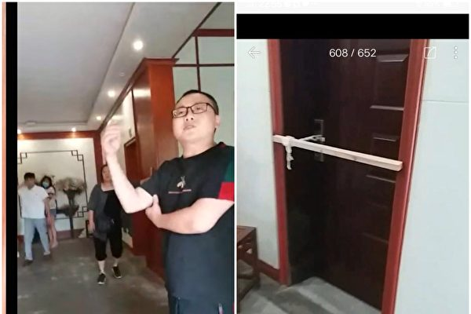

重庆访民蔡邦英被一群不明身份的人关押在一处山庄，门被反锁。（大纪元合成／受访者提供）

   
  【大纪元2020年08月15日讯】（大纪元记者李熙采访报导）北京街道到处安装人脸识别系统令许多访民身份被暴露。重庆蔡邦英一周前因此在北京车站附近被警察带走，后来送回户籍地一处山庄关押，8月14日才被放出来。蔡邦英被殴打致腰背无法伸直。看管她的一名眼镜男还威胁说，要把她推下悬崖摔死。
  
<b>人脸识别令访民身份曝光</b>

据北方天网消息，今日（15日）凌晨时分，重获自由的蔡邦英致电“北方天网”，讲述自己一周前在北京被拦截后，被带回重庆非法关押的经过。

8月8日上午11点左右，蔡邦英路过北京站时，一位北京警察走到她身边说：“通过人脸识别，你是上访人员。”并把她带到北京站派出所，经简单问话后，该警察把她带到久敬庄接济中心。

当天下午4时许，重庆市观音桥警察崔双燕等人，将她强行推上一辆轿车开往北京丰台区一栋公寓内，1小时后又将她带往石家庄一家酒店，次日带她回重庆。

8月10日中午时分，抵达重庆时，八九名不明身份人员将她强行绑架上一辆（渝A3S320）警车上，在车上她双手被反铐，遭到他们殴打。她说，至今后背疼痛难忍，腰背无法伸直。

当日12点20分许，警车开到铁山坪彦霖山庄，把她关押在此处。

她多次打110报警，但都无出警。在知道蔡报警后，这些人又强行把她转移到铁山坪碧海山庄。一个戴眼镜的男人多次威胁、恐吓她说：“不给饭吃，饿死你，把你推下悬崖摔死。”软禁蔡邦英的房间门被从外面堵住了。

直到8月14日中午时分，他们才把蔡邦英放出来，她得以重获自由。

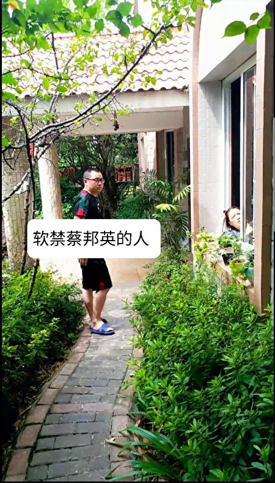

此人是恐吓威胁要把蔡邦英推下悬崖摔死、饿死的人。（受访者提供）

<b>遭一群不明身份的人看押</b>

蔡邦英向大纪元记者表示，“一群不明身份的人把我关押、殴打，现在腰还很疼，昨天（14日）才把我放出来，手机才还给我。”

“我是6日到北京的，7日去了国家信访局，出来时要去公安部，已经关门了，只好等礼拜一再去。我就在北京到处玩玩，结果就因为人脸识别被拦截了。

“我和他们回到重庆了，他们还用一群不明身份的人看押着我。他们把我双手架起，把我拐杖扔掉，把我手机抢了。我问他们是谁派来的？为什么要这样对我？都不跟我说。然后就把我拉上一辆警车。

“5月23日那次也是这样，用一群不明身份的人把我带到山上去，关了10天。他们这样肆无忌惮的犯罪，正义何在！天理何在！”

</b>房屋被强拆15年 政府大门进不去</b>

2006年蔡邦英的房屋被地方强拆，补偿款没到位、没安置，至今没人给她解决问题。多年来她到北京上访，地方政府就派人拦截。刚开始上访时，当局还会敷衍地说：“会给你处理的。”

蔡邦英无奈地说，“信访局要我回重庆找政府处理，我找他们也进不去（政府大门），他们都是找人打压我。” 

<a target="_blank" href=#top><h6 align="right">回上方</h6></a>

<a name=160>
<h1 align="center"><b>美制裁中港高官 江家巨额海外资产引关注</b></h1>

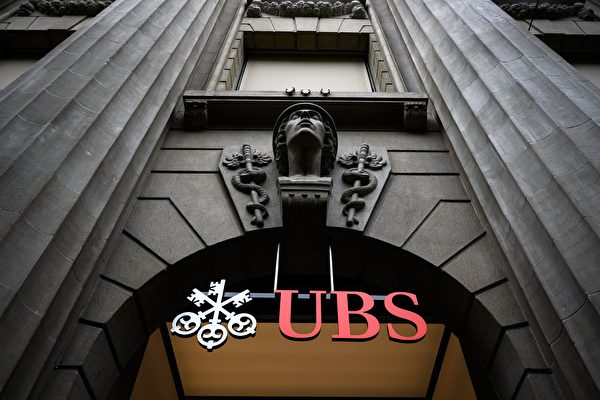

美国正与多国调查来自中共高官在海外10万亿美金资产，拟用于疫情赔偿，首当其冲的是中共前党魁江泽民家族，预计总资产至少1万亿。图为位于苏黎世的瑞士银行总行。(Fabrice COFFRINI / AFP)

   
 【大纪元2020年08月14日讯】（香港大纪元记者梁珍采访报导）自美国8月7日宣布制裁11名中港高官后，外界关注是否有更多中共高官将被制裁，资产将被冻结。全球最大离岸金融中心瑞士将于今年11月公投，决定是否限制包括瑞士银行在内的瑞士企业，跟海外侵犯人权者往来做生意。

另有消息指，美国正与多国调查来自中共高官在海外10万亿美金资产，拟用于疫情赔偿。首当其冲的是中共前党魁江泽民家族，预计总资产过万亿美元。

<b>美拟封中共高官海外资产</b>

饱受中共肺炎疫情之苦的美国，早前曾联手多国向中共索取巨额赔偿，至今没有下文。不过，正在美国进行游说促美宣布中共是犯罪集团的香港实业家袁弓夷，8月12日在大纪元《珍言真语》节目上爆料指，马不停蹄四处访问的美国国务卿蓬佩奥，正试图游说各国支持冻结中共高官在境外的资产，保守估计以10万亿美元计，有关款项可用于疫情赔偿。

“美国方面在和其它盟国讨论，怎么冻结这些钱，把10万亿美金都冻结了，将来起码大部分可能用来赔偿病毒造成的损失。如果你要等中共给你拿钱，那你永远拿不到。第一，他们没钱了；第二，他们不肯给钱，那你就冻结他们在境外贪官的钱，包括中共的钱，看将来怎么分配，来赔偿全世界的损失。蓬佩奥到处飞、到处跑，跟他们讨论，这样就得到他们的支持。将来有钱分了，你明白吗？也就是蓬佩奥又硬又软，又有钱分给他们，也给他们压力，做了很多工夫。”袁弓夷说。

如何计算出中共高官家族在海外有10万亿美金资产？袁弓夷解释，前美国中央情报局职员斯诺登（Edward Snowden）7年前匿港时，曾说中国出逃资金有4万8000亿美金，“通过洗钱的办法，或者直接去中国人民银行那里换，他们给人民币，就换出这些外汇出来，比如当时中国要‘走出去’，他们利用这个机会顺势走出去，有的说要投资‘一带一路’，借用这些东西走出去。这是七年前，之后又起码走了同样这么多钱，所以加起来有10万亿，全部都是有依据的。”

袁弓夷称，大约10万亿美金资产中，占最大份的是前中共党魁江泽民家族的，海外资金大约有1万亿美元。“你想想，江家真是控制了中国30年啊，由89六四开始就是江家了，那到了97年邓小平死了，权力全部交给他了。一直夺权，江家的势力一路一路进去，不只是在上海，整个中国都有势力，（包括）最好、最容易赚钱的，三家通讯公司，上海那么多银行。”

有“腐败总教练”之称的江泽民和其大儿子江绵恒、常住香港的大孙子江志成，据流亡美国的大陆富豪郭文贵2019年4月爆料，江泽民家族控制的国家资产至少有1万亿美元，洗白的资金高达5000亿美元。

2020年在福布斯富豪榜上，亚马逊创办人贝索斯蝉联全球首富，身家达1130亿美金。上榜富豪榜单上有2095名亿万富翁，财富总额为8万亿美元。

换句话说，一旦把江家财产公布，江泽民家族不仅是全球首富身家十倍，而中共高官海外资产也超过全球福布斯上榜富豪身价总值。

<b>美国将管辖在港美国资金</b>

美国国务卿蓬佩奥8月10日在捷克访问时，曾公开发表声明称“美国将与港人站在一起”，预告制裁行动将陆续到来。

袁弓夷估计，蓬佩奥一系列行动，包括收回美资在香港资金，限制美资投资中概股。

由于近期多只中概股回流港交所，吸引热钱持续停留在香港市场，其中不乏美国资本。对此，袁弓夷透露说，美国政府不会让美国资金在香港随意投资，以及借钱给中国大陆公司，相关措施会陆续颁布。他并指，从蓬佩奥近期一系列表态可以看出，美国要收回并管辖美国在香港的资金，包括投资在股票债券的资金，美国政府一定会逼资金回流美国。

<b>阿里系与江家密切 传阿里返B股</b>

近日，中概股中较为活跃的阿里巴巴与腾讯也因中美科技战而处于风口浪尖。

美国国务卿蓬佩奥于8月5日公布“净网”行动，其中明确提到将禁止百度、阿里巴巴、腾讯等公司在美国收集储存和处理个人资讯。

7月底，路透社英文网站引述知情人士消息指，中共监管机构正在研究是否对阿里巴巴旗下的支付宝、腾讯旗下的微信支付展开“反垄断调查”。

对此，袁弓夷透露，阿里巴巴、腾讯、支付宝，微信支付等公司，背后有江泽民家族支持，没有江家势力在背后支持，他们是不会发展到今日的规模，江家给他们权利，他们才能做到这么大规模。马化腾和马云帮江家代持很多股份。前两年江家开始收回在他们手上的股份，基本都收回了。现在习近平要来管阿里巴巴和腾讯了。

然而，《壹周刊》于8月13日独家报导指，阿里巴巴将主动从美股退市，并返B股上市。文章指，对于阿里回流B股，最大的问题是回购股权，假设有一半股份需由现金收回，涉资金额将高达数以万亿计。

文章并称，在目前的中、美关系紧张的局势下，阿里回归B股是向中央示忠。

<b>瑞士或冻结中港权贵美元资产</b>

美国针对中港高官实施制裁之际，地处中欧的全球最大离岸金融中心瑞士也在酝酿重磅行动。

中共“港版国安法”引发国际反共浪潮，向来恪守中立原则的瑞士也向中共发出警告。瑞士外长卡西斯8月2日表示，中共侵犯人权事件日益增加，“正背离开放之路”，《港版国安法》影响“一国两制”落实。若中共政府坚持，西方国家誓将果断回应。

瑞士政府8月8日正式发布全民公投通告，将在11月举行公投，决定是否限制包括瑞士银行在内的瑞士企业，跟海外侵犯人权者往来做生意。倘若有关法例获得投票通过，瑞士企业在中国和香港的业务经营料会受到影响。

资深中国问题专家程翔接受《珍言真语》访问时，特别指出瑞士的反应不同寻常。他说：“我们知道瑞士是奉行中立政策近三百年。因为她是实行和奉行中立政策，所以她得以避过第一次世界大战和第二次世界大战。这个优良传统，也使得很多富豪，愿意将他们的钱放在瑞士。所以说难得的就是，瑞士的外长也在香港的问题上发声，谴责中共，等于放弃他们长久以来，奉行几百来的中立路线。”

他推断说：“这件事情，值得大家去探索的就是，既然他看到中共这个政权邪恶的一面，他会不会接着公布中共官员在瑞士的秘密户口。这件事情无独有偶，前几天有一个瑞士的报导，就是说大概有1000个中共的高官，集体拥有的财富有十几万亿（放在瑞士银行）。如瑞士真能够将这些秘密户口详情公布，如果国内老百姓知道，马上会造成强大民愤，来逼到中共内部催使共产党倒台。”  

<a target="_blank" href=#top><h6 align="right">回上方</h6></a>

<a name=159>
<h1 align="center"><b>应对中共威胁 美拟在亚洲部署新型中程导弹</b></h1>

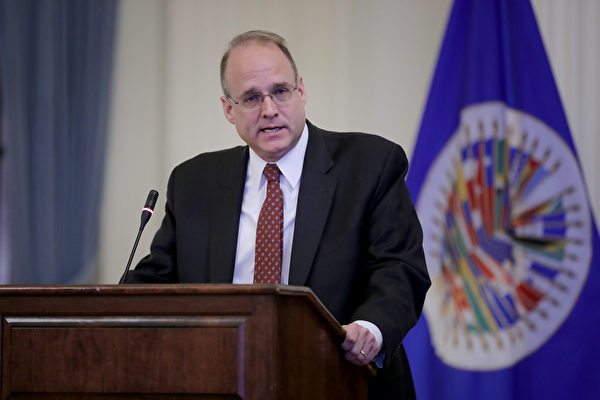

美国负责军备管控的总统特使马歇尔·比林格斯利（Marshall Billingslea）周五表示，美军正打算在亚洲部署开发中的陆基中程导弹，以应对中共的核武威胁。（Somodevilla/Getty Images)

   
【大纪元2020年08月15日讯】（大纪元记者陈霆编译报导）美国负责军备管控的总统特使马歇尔·比林格斯利（Marshall Billingslea）周五（8月14日）表示，美军正打算在亚洲部署开发中的陆基中程导弹，以应对中共的核武威胁。

周五，比林格斯利在接受《日经新闻》电话采访时说，华府希望“与我们在亚洲的朋友和盟国进行会谈，讨论中国（中共）核武建设带来的直接威胁，以及将来捍卫联盟所需的各种能力”，并表示愿意扩大与亚洲国家的军事合作。

比林格斯利特别指出了一种中程、无核的路基巡航导弹。

这种新型导弹从2019年8月才开始研发，目前还未正式服役。它是于美国指责俄罗斯部署非法巡航导弹，并退出了《中程核力量条约》之后，才开始研发的新型武器。

比林格斯利说，这种武器“恰恰是日本等盟国，将来想要和需要的防御能力”。

据《日经新闻》报导，这枚新导弹的射程为1,000公里。这意味着它需要在亚洲部署，才能够有效应对中共的威胁。

比林格斯利还指出，美军的多个分支机构正在研发高超音速武器（hypersonic weapons）。这类武器的速度是声速的五倍以上，能对传统导弹防御系统构成威胁。这类武器能帮助美军在中国附近海域进行兵力投射，抵抗中共的领土主张。

他表示，高超音速武器“是非常稳定的防御能力”，在亚太地区，这将可保护美国的盟国、朋友和合作伙伴，并在中共试图重新划定边界，和邻国发生主权争端时，无法进行军事勒索。

近来，日本政府正在讨论以反击敌方导弹基地的能力，以替代已停止的“宙斯盾”陆基导弹防御系统。比林格斯利对此表示，这种能力“将很有价值”。

但他强调，日本不应忽略常规的导弹防御系统。他说：“抵御弹道导弹攻击的防御能力，可能非常重要。”

《日经新闻》表示，比林格斯利是美国对华政策中的鹰派，协助川普总统制定国家安全政策。他也是代表美国与俄罗斯进行新核协议谈判的领导人物。

比林格斯利之前领导了致力于打击恐怖主义融资的全球机构“金融行动特别工作组”（Financial Action Task Force），于4月被任命现职。

根据美国国务院周五的一份声明，比林格斯利将于8月17、18日，在维也纳与俄罗斯副外相谢尔盖·里亚布科夫（Sergey Ryabkov）举行战略稳定会谈。   

<a target="_blank" href=#top><h6 align="right">回上方</h6></a>

<a name=158>
<h1 align="center"><b>21年 中共制造法轮功冤案惨绝人寰</b></h1>

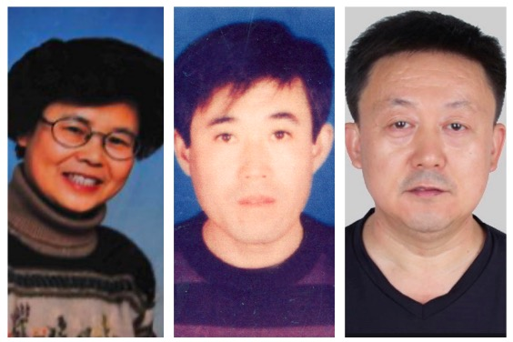

（从左至右）惨遭中共酷刑折磨的法轮功学员：双腿双眼被致残的张玉兰、被虐杀的何立芳、仍陷冤狱的马振宇。（大纪元合成图）

   
【大纪元2020年08月13日讯】（大纪元记者罗琼综合报导）53岁的张玉环，江西省南昌市进贤县凰岭乡宫圳村委会镇头岭张家村村民，自1993年10月至今年8月4日在狱中度过了近27年后被宣布无罪释放。当年村里两名男童被杀，他被警察刑讯逼供，屈打成招，判处死刑缓2年。

出狱后，他对外界称自己当时遭6天6夜刑讯逼供，还被放出来的狼狗咬伤。如今他希望能有一个机会，“把那些衣冠禽兽也放到狼狗群里尝尝被咬的滋味”。

张玉环的冤案牵动了众人的心，他只是千千万万冤案中的一例。

近日，美利坚大学华盛顿法学院访问学者、原大陆维权律师陈建刚指出，“中国的法轮功案件，没有一件不是冤案。”

据明慧网报导，截至2019年7月10日，20年来，共有28,143名法轮功学员被非法劳教，86,050人被绑架，17,963人被非法判刑（其中有人多次被非法劳教、绑架、判刑）。

仅今年上半年，就有132人被判刑。

大陆维权律师谢燕益和谢阳在致欧盟的公开信中写道，“这场迫害所涉及的范围及造成的恶果，可以说是二战结束以来人类历史上最大的一场人道灾难……”

在21年对法轮功的迫害中，中共动用了上百种酷刑，实施刑讯逼供，逼迫法轮功学员出卖他人、提供信息、放弃修炼，致使无数人被迫害致残、致伤，致死，同时给他们的家人造成极大的伤害。仅见以下三例：

<b>雷达专家马振宇遭刑讯逼供 仍身陷囹圄</b>

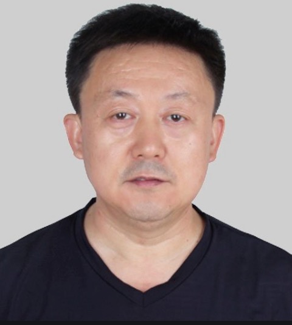

马振宇（明慧网）

马振宇，1962年6月出生于山西朔州，西北电讯工程学院（现西安电子科技大学）毕业，原为十四研究所雷达总体设计工程师、技术骨干，曾主持设计数项重大电子产品。因为修炼法轮功，他被开除公职，多次被绑架，两次被冤判，7年和3年。

2011年5月26日早晨，马振宇和往常一样去上班，途中被南京国保大队头目肖宁健率领的南京下关区四所村派出所劫持。公安当街对他大打出手，使其满嘴流血。

随后马振宇被劫持到南京下关区四所村派出所，遭警察严刑拷打，被上背铐酷刑12小时，凄厉的惨叫声使外面的人都能听到。他被逼按手印，拒绝后又遭来毒打。

他被刑讯逼供三天后，关入洗脑班，直至六月中旬，都在酷刑中煎熬。

被绑架前，马振宇身体非常健康，工作上经常加班加点。自遭刑讯逼供后，他的心脏严重受损。

2017年9月18日，马振宇第五次被中共绑架，只因给中共领导人写信讲述中共迫害法轮功的真相，被非法判刑3年，勒索罚款3万元，关进苏州监狱。一便衣对他说：“这次就让你死在里边啦！”

明慧网2020年6月2日报导，据知情人的消息，监狱采取卑劣手段对马振宇进行强行“转化”（强迫放弃修炼），坐小板凳、殴打、不许睡觉，折磨了他三四个月。

早在2009年4月30日马振宇第4次被抓捕前，他写下文字：

“他们每次都把我逼到生死的边缘，逼到做人的边缘，使我不得不豁出性命。在这样的国度里，坚持信念何等之难，甚至想坚守做人的最后一点底线，也得以生命为代价。是什么使我这懦弱的人有了如此的勇气？是法轮大法教给我不同层次的真理，给了我生命的勇气，给了我坚定思想的毅力。”

现旅居美国的马振宇妻子张玉华博士，原南京师范大学俄语系主任、硕士生导师，曾因修炼法轮功被非法劳教过三次、判刑7年。她一直在国外为营救丈夫奔走。在给美国总统川普（特朗普）写信之后，她获得了川普总统的亲笔签名回信和鼓励。

2019年7月17日，第二届全球宗教自由部长级会议在美国首都华盛顿举行之际，美国总统川普会见了27位来自17个国家的宗教迫害幸存者，张玉华是被邀者之一，她亲口向川普总统表达了对丈夫的处境担忧。

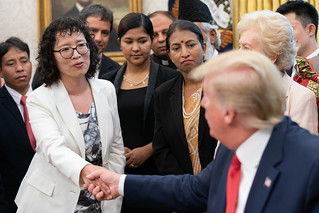

2019年7月17日，张玉华被美国总统川普接见。（大纪元）

 <b>不放弃修炼的何立芳被中共虐杀</b>

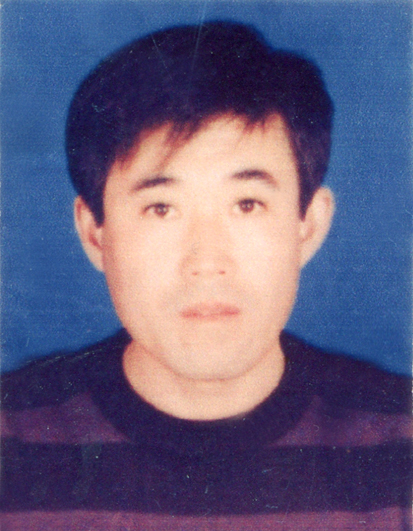

何立芳（明慧网）

  

山东省青岛市即墨区45岁的法轮功学员何立芳被迫害流离失所17年后，回家照顾父母，于2019年5月5日被诱捕，7月2日被虐杀，疑被活摘器官。

2020年6月10日，美国国务院发布了2019年度国际宗教自由报告，收录了何立芳的案例，提到“他的家人发现他的胸口有一道被缝合的缝，背部有一道切口。”

何立芳于2015年6月20日向中国最高检察院控告迫害元凶江泽民，他在《刑事控告书》中诉说了自己惨痛的经历。

2001年7月18日前后一个清晨，在出租房里何立芳和未婚妻被一同绑架。他被带到朝海派出所，遭到17个人的刑讯逼供。

“我不知道被抽（打）了多长的时间，直到他们自己个个都累得气喘吁吁、汗流浃背。此时在这种痛苦的肆虐中我难以自持地喊了出来，那凄凉叫喊声划破了整个监狱的喧嚣，令我自己都难以置信，仿佛整个监狱都被震撼了。

“一种死亡的恐惧感震慑住了这里所有的犯人，顿时个个监室都变得鸦雀无声。他们打累了就歇一歇，接着再打，并逼迫我骂法轮功创始人李洪志先生。我不骂，无论他们怎么殴打，我就是不骂。可是在那种剧痛折磨下，意志随时都有可能被摧垮。为了做人的良心，也为了做人的尊严，此刻我死死咬住了舌头一声不吭，任凭他们狂虐……”

“这次他们把我呈大字型逼在墙上，摁住胳膊和腿，没有丝毫抗拒的可能，像是钉在了墙上一样，就像耶稣被钉在十字架上的那个姿势。牢头一声令下，17个犯人一阵疯狂的拳脚朝我一哄而上。这次他们不用鞋抽了，全来绝的，拳捣、肘撞、脚踹、膝顶。”

“起初我还能痛苦地呻吟出来，顷刻后我就变得死一般地宁静下来。此时死亡与我只有一纸之隔，生命在这里变得一文不值！刹那间我如梦方醒：为什么那么多的法轮功信仰者在这场惨无人道的打压中失去了宝贵的生命……”

最后，在他家人的力争下，命若悬丝的何立芳被接回了家。当他从死亡线上终于挣扎过来后，就晃晃摇摇地下了炕，从此流离失所17年。

当他的《控告书》2015年发表后，出于对罪行败露的恐惧和仇恨，即墨区“610”把何立芳认定为“第二号人物”，欲以除掉。

在他2019年5月回家看望年迈的父母时，被诱骗到派出所办理身份证，却立刻被抓，构陷到法院。两个月后他就被迫害死。

他的家人看到他的遗体，胸前有缝合的刀口，后背也有刀口。脸庞显痛苦状，嘴巴张着，鼻子和嘴里有血迹，牙缝往外渗血，身上都是伤，几乎没有好的地方。他的离世留下许多疑点，被疑活摘器官。

<b>冤狱八年 优秀教师张玉兰双眼双腿残废</b>

张玉兰（明慧网）

张玉兰，天津市南开区六十三中学的历史教师，于2002年被中共枉判8年，历经酷刑的折磨，九死一生，尤其是药物的迫害导致她双腿不能行走，双目失明。

2002年3月11日，她被天津市南开区向阳路派出所警察绑架，因拒绝供出其他法轮功学员，遭刑讯逼供。

第一次上刑时，她被戴上手铐，被推进一个铁刑具中坐下。她的上半身笔直地被前后铁板紧紧地夹住，呼吸十分困难。刑具下面是一块厚厚的铁板，中间有两个圆窟窿，她的两只脚脖子被卡进去后锁上。这时她全身都被铁铐、铁板、铁棱卡死，纹丝不能动。

这是对重犯逼供动用的酷刑，人几十分钟都难以坚持，她却被整整关了14个小时。

第二次，她被带到南开区看守所刑具室，被锁进一个铁椅子里。派出所所长一手托着她的下巴，一手指着她的鼻子说：“我让你尝尝国家机器的厉害。这里几年都没有一个立着出去的 ……你是个文化人，你只能坚持到下午。”

她却被关了四天三夜，不准睡觉，不准闭眼。两个看守手里拿着棍子，不分昼夜，只要见到她闭眼就打她的脑袋。

第三次，她又被带回到派出所，同样被推进铁刑具里，全身被卡死，不能动弹。

突然，她全家人都来了，她的二姐见此情景哭不出声来。她的弟妹说：“咱家开了会，就是倾家荡产也要把你救出去。现在上下已经买通了，只要你供出一个谁还炼法轮功的，今天就放人。”

她告诉家人，她不会连累他人遭受同样折磨的。

第二天，她的家人又都来了，她儿子在刑具边跪了半天。

第三天，她学校的校长等四个领导被叫来说服她。她劝他们别来了。

煎熬了六天五夜，她被从刑具中放出来。回到看守所里，她打开镣铐一看，小腿肿得比大腿还粗。进了监号后，大家惊呼已经不认识她了，人瘦了一大圈。

这三次酷刑仅仅是个开始，她要熬过8年。

一次，她的大姐来监狱理看她后，没出监狱大院就忍不住喊着：“天啊！”坐在地上大哭起来。那时她的双腿双眼已严重受损。

冤狱8年后，她拖着病残的身体离开魔窟回家时，家里已面目皆非：丈夫做买卖赔了钱，把房子卖了抵债，跟她离了婚，甩给她26万元的债务。34岁的儿子因没钱还没交上女友，娘儿俩相依为命。

她写道：“我喜欢唱歌、弹钢琴、跳舞、打篮球。中共邪恶的迫害，把我从一个健康、活泼、充满朝气，非常能干的人摧残成双眼、双腿残疾的废人。”

“只因为坚持自己的信仰，修炼‘真、善、忍’做好人，在当今的中共体制下，就惨遭如此迫害。”

<b>结束中共的迫害</b>

2014年4月26日，在中国社科院法学所举办的“新刑事诉讼法实施状况”研讨会上，公安部监管局局长赵春光表示，5年来，全国看守所内未发生过一起刑讯逼供的事件。

2020年1月5日，时任中共外交部发言人耿爽在例行记者会上说：“当前中国人权状况处于历史最好时期、中国一直依法保障公民的言论自由。”

明慧网记载了21年来中共对法轮功学员实施的上百种惨绝人寰的酷刑手段和实例，见

<h4 align=center><a href="http://pkg2.minghui.org/mh/2004/8/26/torture/Torture_exhi.htm">酷刑写真集(点击右键,另存新档）</a></h4>

《共产主义的终极目的》一书指出，共产主义的本质是一个“邪灵”，它的最终目的就是想破坏人的道德从而毁灭人类。

在法轮功学员和平反迫害21周年之际，美国国务院国际宗教自由大使山姆﹒布朗巴克（Sam Brownback）在发给法轮功学员的视频演讲中说：

“我们与你们站在一起。7月20日，21年了，在这期间发生了可怕的事情和无法形容的痛苦。

“让明年不再是迫害的第22周年，而是法轮功学员的自由的第一年，及每个中国人都可以自由实践信仰。”

“中国共产党向信仰开战。这是一场他们赢不了的战争。其它政府尝试过迫害人们的信仰，都失败了。”#   

<a target="_blank" href=#top><h6 align="right">回上方</h6></a>

<a name=157>
<h1 align="center"><b>川普颁令 字节跳动90天内分折TikTok资产</b></h1>

川普命令字节跳动公司全面退出美国。（GREG BAKER/AFP via Getty Images）

【大纪元2020年08月15日讯】（大纪元记者高杉编译报导）美国总统川普（特朗普）周五（8月14日）发布最新命令，要求位于北京的中国“字节跳动”（ByteDance）公司必须在90天内放弃其此前针对美国“Musical.ly”的收购并剥离其资产。“字节跳动”公司之前将其中文视频分享应用程序与“Musical.ly”合并后在美国推出了TikTok。

川普在总统令中说：“有可信的证据使我相信，‘字节跳动’… … 可能会采取威胁到美国国家安全的行动。”

白宫新闻秘书办公室在周五晚间对外公布了川普签署的这项总统令的内容，标题为“关于‘字节跳动有限公司’收购‘Musical.ly’问题”。

该行政令中写道：“字节跳动”收购“Musical.ly”的交易，以及利用“Musical.ly”或其任何资产促进、支持或参与“Musical.ly”在美国各州的商务活动都是被禁止的。而且“字节跳动”拥有“Musical.ly”在美国的任何权益，无论是直接拥有，或通过字节跳动的子公司、附属公司，或中国股东的间接拥有，也都是被禁止的。

该命令指出，“字节跳动”必须在不迟于从当日开始的90天之内执行这一命令。除非这一日期被延长至多不超过30天的期限，否则必须根据下列列出的条件执行。美国外国投资委员会（Committee on Foreign Investment in the United States， 简称CFIUS）可以针对字节跳动及其子公司、附属公司和中国股东强制执行，“字节跳动”应放弃和剥离以下列举的所有利益和权利。

在该行政令中所列举的各方面产权之中，包括了“委员会确定的任何有形或无形的资产或财产，不论其位于何处，包括用于启动或支持‘字节跳动’在美国运作TikTok应用的资产。还有包括TikTok在内的“字节跳动”在美国的所有软件、硬件、数据、技术、账户、会计文件等等。

除了剥离所有资产之外，该行政令还规定，自本命令生效之日起，直至“字节跳动”根据第2（b）条规定向CFIUS提供撤资证明为止，“字节跳动”和作为特拉华州公司的TikTok inc. 应每周向 CFIUS 证明它们遵守了本命令，并说明为撤出第2（b）条所述的权益所作的努力，以及预计完成余下行动的时间表。

此前，媒体曾多次报导了川普可能会封杀“字节跳动”的TikTok的传闻。现在，这个总统令的颁布，显示了白宫希望将美国境内的TikTok背后的北京因素剔除的意愿和决心。

<a target="_blank" href=#top><h6 align="right">回上方</h6></a>

<a name=156>
<h1 align="center"><b>参与迫害的政法系统七类人及其不同的人生结局</b></h1>
   
   文: 大陆大法弟子
   
   【明慧网二零二零年八月十五日】中共参与迫害法轮功的政法系统人员是当前存在生命风险最高危的人群，一是因为二十多年来政法委高层一直在下达迫害法轮功的邪恶命令，下级也一直在执行错误命令，直接追随江泽民邪恶集团迫害法轮功。公安国保、派出所警察都是冲在第一线执法犯法的马前卒；二是因为中共体制的黑暗腐败，再加上江泽民安插的专门迫害法轮功的邪恶组织“610”的环环背后操控，在没有任何法律依据的情况下逼迫检察院、法院相关人员昧着良心在黑幕重重之下充当着木偶的角色，使他们内心充满罪恶感，因此造成精神长期抑郁扭曲，很多人已经遭恶报得癌症、恶疾、死亡、车祸或被查处等。当然，那些明真相善待大法弟子的人就会得到好报。

在中共迫害法轮功的这二十一年中，在好人被残酷打压的过程中，就更能毫无掩饰地表露出打压者们的真实心态，神也会根据他们的善恶表现，给予他们不同的未来。我们根据参与迫害法轮功的公检法司人员不同的心态展现，大致分了七个方面。有缘看到本文的政法系统人员，可以根据自己的情况看看你大致属于那一类人，从中能不能受到一些启发，做的更好些。

<b>一、明白人</b>

在江泽民发动的这场迫害好人的政治运动中，政法系统里的相关人员参与了迫害，但有小部份官员是清醒的，他们能站在生命的角度分辨善恶，能站在法律角度分辨正邪，而不是盲目听从上级命令。他们根据实际情况做出自己的分析判断，然后根据自己的判断决定自己以后应该怎么做。

比如在迫害初期，明慧网登载了一篇《两个警官的对话》：在一次聚会时，原不相识的两个人，被共同的一个友人邀引一起。说起来原来两个人是同行。一个监狱警察，一个公安警察。两人都是职务不算低的警察。公安警问：“你那里法轮功关押的挺多吧？光我就送去不少呢！”监狱警察眨眨眼，趁别人不注意附耳对公安警说：“老弟，真是一群好人啊，我算服了这些人。我可告诉你，今天咱们一起吃饭，就是朋友，也是咱二人缘份。听我一句话，一定要善待法轮功学员。对上级指示，应付一下就行了。”公安警察忙说：“我在内心深处，早有这个想法了，只是不敢。放心吧，从今后我知道该怎么做了。”

二零二零年四月三十日，明慧网有一则消息，说有一个大法弟子，四月初的一天上午，来到集市给当地民众讲法轮功遭迫害的真相，并发放法轮功真相资料，遭到当地派出所警察绑架。

派出所警察非法审讯她，做了笔录后，打电话给上级公安局问：“我们这里抓了一个法轮功（学员），怎么处理？”公安局的人回答：“法轮功的事，我们不管。”这位学员立即被释放回家。

从这两个例子就可以看到，那个监狱警察和这位不管法轮功事的公安人员，就是明白人。在中共邪恶的体制中能做到这样真是了不起。但是不知道他们做了三退没有，如果他们退出了邪党组织，那他们就会有个很完美的结局。

<b>二、一点拨就明白的人</b>

这类人本身也很善良，能分明好坏，只是畏惧上级压力，不敢做出保护法轮功学员的事情。就像上个例子中的那位公安警察，他参与了迫害，也抓了不少法轮功学员，那次聚会恰巧遇到的是一个明白人，这样稍一点拨他心里就明白了，知道自己以后该怎么做了。

因为这个公安警察本身也是一个善良人，他从内心里也知道法轮功都是好人，只是不敢违背上级命令，自己没有果断做出正义的选择。受到点拨启发后他马上就有了付诸行动的决定。

还有这样一个例子，一位法轮功学员在被非法关押期间，一位女法官去看守所核实所谓的“证据”，学员跟她讲自己的亲身经历，所遭受的酷刑和大法在她身上展现的神迹。

女法官说：“大姐，你讲的这些我都听进去了。这么多年，我接触法轮功（学员）的案子太多了，但没见过打回来重审的。你是第一个让我改变对法轮功印象的人。我回去就调工作，不能再继续害人了。”

如果这两位警察真如他们所说的那样，立即停止迫害法轮功学员，不再继续害好人，那他们就真的是个好警察。如果只是说说而没有做，那就另当别论了。

<b>三、多次劝说才明白的人</b>

中国人在中共几十年的洗脑中，绝大多数人已被无神论毒害，特别是公检法队伍更是深受其害，所以中毒越深，明白真相就越困难。因为人善良的本性已经被灌输的洗脑歪理给埋没了。

比如，M警察是本地有名的恶警，曾是迫害法轮功学员的急先锋。一位法轮功学员和M警察打过三次交道：第一次，他去国保大队讲真相。还没讲完国保大队长就叫他走，并打电话把M警察叫了来。M警察就声嘶力竭的往外赶学员：“你滚！”第二次，在车站遇到M警察，学员又给他讲法轮功真相。他不顾车站人多，竟然毫不留情的大声吼：“滚！”第三次，是在拘留所。国保大队长领着他来看被绑架的那位学员。因他不配合，M警察给国保大队长出阴招：给他点厉害看看。

大法弟子不计较他的蛮横，知道他是在中共邪党的谎言蛊惑下，在那个特殊的环境中被训练成这样。大法弟子通过便利方式，利用师父赋予的智慧，对他充满了爱心和善念，慈悲的给他讲：中共是什么，法轮功是什么。江泽民利用中共的“假恶斗”迫害倡导“真善忍”的法轮功和法轮功学员。讲中共制造“天安门自焚”伪案嫁祸法轮功；讲迫害法轮功的高官遭报应；讲中共的历次冤假错案迫害的都是中国的精英；讲贵州“藏字石”内藏“中国共产党亡”是天然形成。M警察的良心在一点一点的复苏。

特别当他看了大法弟子送给他的《共产主义的终极目的》后，醒悟了。知道共产党是来毁灭人类的。中共想否定“真善忍”用“假恶斗”来代替，那样人类将万劫不复，知道自己迫害的大法弟子都是好人是被冤枉的；知道自己和其他公检法司的同胞一样都是被中共利用，被谎言欺骗的。更知道迫害修炼真、善、忍的好人，迫害法轮大法，将给自己带来什么！

现在M警察正用自己特有的方式（保护大法弟子）为自己赎罪，为自己赎回未来。

<b>四、撞了南墙才回头的人</b>

平时不听劝告，一意孤行，直到身体出了问题后才幡然悔悟。这类例子在明慧网也报道了不少。

如：建明（化名）五十多岁，是某公安局副局长。他的主要工作是所谓“维稳”，自中共迫害法轮功后，他也身不由己的干了许多助纣为虐的恶事。

当地法轮功学员多次给他讲真相，他不听。于是法轮功学员就把他的恶行在明慧网上曝了光。海外的法轮功学员远隔万里的给他打来了劝善电话，奉劝他改过从善，这对他起到了一定的震慑作用。

一次在参加婚礼时，遇到了一位女法轮功学员。这个学员真诚的劝他不要再参与迫害法轮功学员了，法轮功学员都是这个世界上最好的好人。并且告诉他法轮功是佛法修炼，迫害修佛的人对他不好，还劝他退出中共的邪党组织。建明说：“我还要工作，党可不能退。”

虽然没退邪党，但建明毕竟听进去些真相。这些年来，他和许多法轮功学员打过交道，他也觉的法轮功学员都很善良，但还是身不由己的参与着迫害，只是不那么主动了。

二零一八年，建明旁听了当地对一法轮功学员的非法庭审。当听完律师为该法轮功学员所做的有理有据的无罪辩护后，他才如梦方醒：原来按照中国的法律，法轮功在中国真的不违法。原来这么多年，自己真的都是在违法迫害。这对他又是一个很大的触动。但他还是心存一念：共产党一党专政，我违法又怎样。你没罪，又怎样？法院不还是照样判你？！

然而就在这时，建明的身体出了问题。经医院检查，在他的体内发现了癌细胞，虽然不至于马上致命，但对他也是一个很大的打击。

近年来，建明的那些手下，有公安局的同僚、有派出所的所长、还有普通警察，以不同的形式死了好几个。他忧心忡忡的说：“怎么都是死年轻的？”

渐渐的，恐惧控制了建明的身心。他想起了法轮功学员说的：“人不治天治！”

建明虽然有病了，但也不敢声张，怕别人知道了说他遭了报应，只能坚持着上班。这时，他朋友的妻子（法轮功学员）再劝他退党，他同意了。

一天，国保警察绑架了一个贴法轮功真相条幅的老年女法轮功学员，要送拘留所，建明正好碰上。一看，正是他表姐村里的那个劝他退党的女学员。他沉着脸，对国保队长说：“走走程序算了。”国保队长明白了他的意思：“局长这是不让迫害法轮功学员呀！”

这些年来，国保警察们也多少明白些真相，不想再做坏事了，但迫于上面的压力，不得不干。现在局长发话了，正好送个顺水人情。他们拉着女学员在拘留所办了个手续，就让学员的儿子把她接回家去了。这位女法轮功学员也不忘救人的使命，把国保队长的入过的邪党给退了。

二零一九年秋天，建明外出办事，他的手下又给他打来电话说：上面吩咐下来了，让他们去骚扰法轮功学员，并向他请示：“法轮功学员若不配合签字，是否就抓人？”他一听，就说：“怎么，干这个事儿你们上瘾哪？都什么时候了，还这么闹劲？”他的手下马上明白了，到法轮功学员家连门都没敲，在门外转一圈，就回去交差了。

现在的建明，除了开会，平时不怎么上班了。特别是中共病毒（武汉肺炎）这场瘟疫的到来，更让他相信了，法轮功学员讲的句句都是真相。

还有回头更晚的例子，如辽宁沈阳市沈北新区法官鄂安福，于二零一一年二月十八日因脑出血死亡，时年四十五岁。和其他遭恶报者不同的是，鄂安福在临终前认清了自己的罪行，并虔诚的向法轮功学员忏悔，同时退出了中共邪党组织。虽然没能保住自己的命，但是到了阴间，判官也会酌情处理的，只要退出了中共邪党，都有比较好的未来。

<b>五、良知被压制，不能支配自己的行动</b>

这样的人可以说为数不少，明知迫害法轮功是错事，也不愿参与迫害。但还是牢骚满腹的应付着作恶，看似有良知的闪现，但又不敢违背上级的命令，只是怨声载道、躲躲闪闪、消极的执行着命令，没有果断的、智慧的体现在行动上的正义表达。“我们没有办法”、“我们做不了主”就是这类人的回答。

比如，河南一位大法弟子被构陷到检察院，家属到检察院查问，检察长躲着不见，撒谎出差去了，门卫也不让见。家属就跟门卫讲真相，这时看到检察长了。检察长无法躲避，只好接见家属。他埋怨说：你们法轮功（学员）“围攻”我们了，又写信，又打电话。你们法轮功没错，上面压下来，我们没办法……

还有一个例子，某市区法院庭审几位法轮功学员，三次开庭无果，休庭后市政法委、六一零为了给庭审的公检法司人员鼓劲，举行一次招待宴会，席间几杯酒下肚后，法官开始发牢骚：“你说我们的江主席，你要想收拾法轮功你就开个人大会议，给法轮功定个什么什么的，是不是我们这些司法者有个遵循，你说，年末了上边追着结案。这边没完没了的开庭，而每次庭审都弄得一团糟，小X（公诉人）被律师问的一句话不说，你让我这个法官怎么敲这个锤。那些家属看着我一次次地阻止律师发言，怒目圆睁，我都不敢往陪审席上看一眼。真是活受罪。”

这类人明知道抓捕、判刑法轮功学员是错的，但是没有勇气秉公执法，也没有智慧保护大法弟子，这就是没有勇气给自己开创未来。有句古代名言：知而不行，与不知同。就是说知道法轮功是好的，但是也没有改正自己错误的做法，依然参与迫害，那和不知道法轮功是好的而参与迫害，得到的报应是一样的。所以这样的人就很悲哀了，既然有良知，就按照良知来做吧，只有行动起来身心合一，那才是真正自己的作为。神就看你怎么动。

<b>六、糊涂人</b>

糊涂人在政法系统中也不少见，这类人，党国不分，党民不分。他们认为爱党就是爱国，爱党就是爱民。其实，中共不等于中国，中共也代表不了中国人民。中共实际上是一个害国害民的邪教独裁政权。

我们来看一个实例，曾任四川攀枝花市东区国保大队大队长田萍，二零一零年退休。其丈夫张成高，二零一三年退休那年，一次常规体检，检查患有直肠癌。于是紧急在攀枝花市中心医院入院，需要长期服用抗癌药物进行控制、治疗。

田萍的独子张益，三十六岁，于二零零三年毕业于泸州警校，也是警察。二零一六年九月二十六日，被医院确诊为急性髓系白血病，在医院作前期治疗期间，常常出现昏迷、抽搐、血尿、高烧不退等症状，病情十分严重，时刻都有生命危险，医院采取了输液、输血、输血小板等急救措施，但是每天的医疗费用十分惊人。根据医生的描述，白血病目前在中国还是一个极为严重难治的疾病，仅骨髓移植一项就需要五十多万，再加上前期化疗的费用和移植后抗排异药物治疗的费用，不会少于一百万元。二零一八年九月的一天，噩耗再次降临，医院做常规复查，最后结果是病情复发，这一治疗，又是大半年时间，长期躺在抢救室。

田萍在求助信中声称：“人生无常，我们一家都是警察，为人民服务一辈子，万万没想到晚年却经历这样的变故……老天为何要这样对我、这样对我的家庭？”

田萍一家为什么有这样不幸的遭遇？我们来看看田萍是怎样为人民服务的。

田萍从一九九九年“七二零”到二零一零年退休前，积极参与并残忍迫害法轮功学员，致使很多法轮功学员被非法判刑、劳教。年仅三十多岁的法轮功学员罗俊玲，遭田萍等恶警残忍折磨后被劳教迫害致死。

法轮功学员罗俊玲，四川省会理县糖果厂厂长，二零零二年十一月因讲法轮功真相，被攀枝花恶警非法抓捕，关进攀枝花市看守所，在寒冷的冬夜被恶警外提折磨，被吊了两天两夜；期间被国保支队的恶警张柏林、田萍等轮番折磨：用打火机烧手心脚心，用树枝戳脸部穴位，用带铁腿的凳子凶残地打她，直到铁凳被打得分了家，最后将无凳面的铁架子干脆套在她头上，用尽残暴卑鄙的手段，她几经昏迷，又几经被冷水浇醒。到看守所时，罗俊玲已被摧残得几乎无法行走，全身乌青，目光呆滞；看守所都怕承担责任，不想收下。因吊的时间过长，直至半年后，罗俊玲的手都还是冰凉麻木的。二零零三年三月，罗俊玲被非法劳教一年，被迫害的不会讲话了，骨瘦如柴，而且全身被打得血淋淋的，于二零零四年元月二日含冤离世。

法轮功学员耿德新，原在武警四川总队攀枝花市支队服现役，警衔为上尉。因坚持信仰，被强行“复员”回乡。二零零二年九月六日，被攀枝花市公安局国保支队便衣特务在火车上绑架，当晚被关到攀枝花市米易县看守所，遭毒打并铐上背铐呆了一夜。第二天被转到攀枝花市盐边县看守所，因不配合“提审”，被攀枝花市国保支队副支队长张×暴打，后绝食抗议，第五天时被暴力灌食，行恶者用老虎钳把他的嘴撬开灌入流食。第二天，攀枝花市东区国保大队女大队长田萍和两个大汉到看守所给他戴上脚镣手铐，就象对待黑社会人员一样蒙上黑布头罩，把他秘密弄到位于攀枝花市东区五十一（地名）一个叫“沁园山庄”的地方刑讯逼供，遭电击、吊铐、毒打一夜。

六十多岁的法轮功女学员张佩云，家住攀枝花市枣子坪，二零零五年七月十一日中午被两个恶警绑架到攀枝花市公安局，铐在椅子上。等天黑以后，恶警用黑布袋把张佩云的整个头部套着，弄到盐边县金谷酒家折磨，吊铐她长达九天九夜，九天里，一刻也不准她合眼，一闭眼，恶警田萍就用冷水倒入她的胸前，使她的衣服整天都没干过。张佩云被折磨的皮包骨，出现生命危险状态，被非法判九年六个月，于二零零六年三月被劫持到成都龙泉驿女子监狱继续迫害。

在田萍眼里，只要中共说谁是坏人，她认为谁就是坏人，根本不需要任何法律依据，和普世价值的衡量，这样的人没有自己的脑子，好坏不分，干坏事还以为自己是做好事，这不是糊涂人吗？这样的人还有什么资格责怪老天不公呢？

<b>七、无底线行恶的人</b>

挑起这场大迫害的魔头江泽民及其手下的政法头子罗干、周永康等就不必说了，这些人是真正指使编造、栽赃、嫁祸、抹黑、全方位打压法轮功的人，他们固然罪不可赦。其他省级官员可能有的不知道真相，更何况市、县、乡、镇、村的政法人员更是被蒙在鼓里，可是法轮功学员的言行、做派、为人处世，都是本单位官员或当地派出所、公安局、检察院、法院有目共睹的，还不能从中判断善恶的人，那就是真正被中共毒害的失去良知的人。

如甘肃金昌市桂林路派出所副所长肖书来。在九九年“七二零”任滨河路派出所指导员时，积极参与迫害法轮功学员，造成十多名法轮功学员被非法劳教、拘留、洗脑、罚款、抄家等迫害。肖书来调任拘留所副所长期间，被非法关押的法轮功学员多次给他讲真相，他不但不听，反而骂大法、骂法轮功学员。二零零五年，肖书来调任桂林路任派出所副所长，法轮功学员再次找他讲真相，他仍无悔改之意，继续参与迫害。二零零七年十一月下旬他因突发心脏病，死在自己的办公室内，死时四十九岁。

再如，曾河北省任沧州市河间市法院院长、邪党组书记的梁根生，二零一七年六月，梁根生被查，二零一八年七月，被冀州区检察院以涉嫌犯受贿、单位受贿、诈骗罪向冀州区法院提起公诉。

表面上看，梁根生违反了中共所谓法律，实际是梁根生在沧州市肃宁县、河间市、运河区三地法院任院长期间，为了满足个人私利，追随江泽民邪恶犯罪集团竭力迫害法轮功所受到的天理报应。他在任职法院院长期间，其操控下的法院背离人类道德，违反正常法律规定，与六一零邪恶组织（江泽民为迫害法轮功专门成立的机构）及公安、检察院勾结，对按“真、善、忍”准则做好人的法轮功修炼者非法判刑，致使数十人遭受冤狱迫害，有的被迫害致家破人亡，给法轮功修炼者的家庭造成了严重伤害，也给整个社会造成了严重危害。其罪业深重。这才是梁根生被查、被公诉直至判刑的真正原因所在。

再如，山东潍北监狱教育科长徐海明，主管洗脑，所有对狱内法轮功学员的残酷迫害的直接幕后元凶。此人阴险狡诈，在常人中口碑也极差，性格扭曲，可能这股邪劲才正好能和操纵迫害的因素相合，犯下了种种罄竹难书的罪恶迫害。他将省局六一零、政法委口头传达的迫害政策传达到各监区，系统性的对坚持修炼的法轮功学员实施迫害，并直接上阵迫害死法轮功学员李光，种种罪恶，难以尽述。因迫害得力，他在担任教育科长期间连年被评为所谓“教育能手”，受到监狱及省局多次表彰并被升为副调研员。二零一八年三月，退休刚满一年的徐被诊断患了骨癌，于二零一八年五月三十日丧命。

在中共迫害法轮功这件空前绝后的邪恶事件中，神再一次给人展现出善恶有报的天理，谁从中能领悟到宇宙这一威严的法则和守住心中的善良，谁就能跳下贼船、逃出魔掌，虔诚的归顺于神的引导之下，就会拥有美好的未来。

<a target="_blank" href=#top><h6 align="right">回上方</h6></a>

<a name=155>
<h1 align="center"><b>荆州让发热者全到医院就诊 网民忧交叉感染</b></h1>
   
【大纪元2020年08月14日讯】8月14日，湖北荆州发通告，禁止药店向发热人员售卖退热、止咳等药品，让发热人员到发热门诊就医。对此网民议论纷纷，有人担心这种作法会引发交叉感染。

8月14日，中共荆州市政府新闻办公室官方微博发消息指，该市疫情防控指挥部办公室发通告，禁止药店向发热人员售卖退热、止咳等药品，引导发热人员到发热门诊就医；药店向无发热症状人员销售感冒、咳嗽药时，要登记买者个人信息，如家庭住址、联系电话等；所有发热人员应主动到各医疗机构发热门诊就医。

对此，网民议论纷纷，有人担心：“这⋯⋯说明了什么？”“不祥的预感。”

另有网民表示：“湖北基本上都是这样，发热药物购买都需要登记。”

还有网民质疑：“有些药不光治感冒，还有止痛效果，现在全都不让卖了，偏头痛咋办，吸大麻止痛吗？”“很难执行，大部分退烧药同时还是止痛药。”

此外不少网民担忧会发生交叉感染：“如果普通感冒发烧和真正携带的人在一起排队，怎么办？交叉感染？集体入院？”“普通发热去医院不怕交叉感染吗？本来没事的。”

“这个应该没有科学依据吧，甚至有可能适得其反，尤其在普通感冒和流感高发的冬季，有可能大幅增加交叉感染概率。这些疾病的人群发病率数据以及潜在传染性，人群致死率，传染性、医疗机构分诊承载能力得综合考量。一旦发热，自我隔离更加重要，如果隔离期间应用解热镇痛药多日不好再就诊似乎更合理。”

“那小孩子发烧呢？总不能发烧了就去核酸吧！3-6岁很容易生病的。”

“这个感觉有点鸡肋，因为我妹妹之前单纯的发烧，然后我爸陪着坐救护车去医院了，各种抽血化验，一天下来，普通感冒发烧，然后打了针开了药就就回来了。然后那天花了1千多。所以实施的时候希望能多因素考虑，小孩子季节容易发烧感冒。这样下来根本吃不消，疫情本来经济就不太好。”

“旅游需要控制一下人流量吧，不要免费就一窝蜂，看到那些人挤人都心惊胆战的。”

<a target="_blank" href=#top><h6 align="right">回上方</h6></a>

<a name=154>
<h1 align="center"><b>“所有选项正在耗尽” 华为遭美制裁受重创</b></h1>

美国制裁重创华为。（大纪元制图）

   
 【大纪元2020年08月12日讯】（大纪元记者张婷综合报导）由于美国的制裁，华为用于生产智能手机的自研高端芯片据报正在耗尽，而该公司在确保未来供货方面的选择也正在耗尽。分析指出，若此种局面持续，华为恐难保全球最大智能手机制造商的地位。

CNBC报导，无法获得尖端芯片将威胁到华为作为全球最大智能手机制造商的地位。这也可能使这家中国科技巨头价值每年数十亿美元的销售化为乌有。

今年5月，美国商务部修改“外国直接产品原则”（Foreign Direct Product Rule），规定在未获得美政府许可的情况下，禁止芯片制造商向华为出售使用美国技术和设备生产的芯片。这一禁令实际上几乎涵盖了全球所有高端芯片制造商，包括台积电在内。

<b>余承东：今年可能是华为最后一代麒麟高端芯片</b>

华为通过旗下的海思半导体（HiSilicon）为其产品设计芯片，但设计出的芯片实际是由台湾的台积电来制造。

为了遵守美国的规定，目前生产的任何芯片必须在9月15日之前运送给华为。针对华为不能再继续获得芯片，华为消费者业务CEO余承东8月7日在中国信息化百人会2020峰会上说，“这对我们来说是一个巨大的损失。”

“今年可能是华为最后一代麒麟高端芯片。”余承东说。

他还补充说，华为“没有芯片了，没有供应了”。

<b>华为采购芯片的选项正在耗尽</b>

“华为的智能手机部门采购芯片组的选项正在耗尽。”“Strategy Analytics”公司的无线设备战略执行总监尼尔·莫斯顿（Neil Mawston）通过电子邮件告诉CNBC。

莫斯顿表示，华为可以继续使用麒麟系列处理器，并最终转向与中国最大的合同芯片制造商中芯国际合作生产。但中芯国际也是使用美国设备生产芯片，这就意味着它无法向华为供货。此外，中芯国际在技术上也明显落后于台积电。

《金融时报》此前报导称，海思半导体的麒麟芯片采用台积电16纳米、12纳米、7纳米及5纳米制程，占台积电约20%的产能。Trendforce分析师Chris Hsu提醒，理论上中芯国际顶多取代16纳米及12纳米的部分，提供不了台积电能提供的更先进制造能力。

与此同时中国的紫光展锐（Unisoc）生产低端半导体，也无法满足华为的需求。“Unisoc将需要数年时间才能提升规模和质量。”莫斯顿说。

莫斯顿认为，华为外包韩国芯片和手机制造商三星制造芯片，也将十分困难。三星制造自己的芯片组，且可能不愿意与其最激烈的手机竞争对手华为来分享芯片。此外，韩国通常在政治问题上站在美国一方。

莫斯顿认为，华为与台湾的联发科合作同样充满挑战。其一，该公司为移动设备制造的是中低端芯片。其二，联发科也依靠台积电进行部分生产，可能还会受到美国的关注。

据《华尔街日报》上周末报导，美国芯片制造商高通公司正在游说美国政府取消其向华为销售的禁令。

但莫斯顿认为，随着11月将迎来紧张的美国大选，很难看到美国的强硬立场在今年任何时候会有软化。

华为手机目前使用的是自己设计的麒麟芯片，Canalys移动分析师Nicole Peng称，如果华为被迫采用通用芯片供应商，这将损害其智能手机业务。

Peng告诉CNBC，如果它们（华为）使用标准（芯片）解决方案，将很难与Oppo、Vivo和小米形成差距。预计华为将失去竞争优势，尤其是在高端手机方面。

“所以，预计（华为）很难保持目前所拥有的这种领先地位。”Peng说。

<b>华为可能挺过2020 但未来两年会困难重重</b>

华为的消费者部门，包括智能手机和笔记本电脑等产品，2019年收入为4673亿元人民币（669.3亿美元）。该业务占华为总销售额的50%以上。

而现在看来，美国的任何举动都会让数十亿美元的销售面临风险。“Strategy Analytics”公司的无线设备战略执行总监莫斯顿告诉CNBC，华为可能会挺过2020年，但未来两年可能非常困难。“海外销售可能下降，其智能手机部门将会缩到一个更小的规模。”莫斯顿说。

彭博社6月份引述知情人士的消息透露，对华为电信设备至关重要的一些自研芯片的库存，在明年初就会耗尽。美国最新的封杀使华为一直处于紧急状态。尽管华为高官们忙着开会讨论，但仍未找到解决办法。

彭博社称，如果海思打算在国内建立一个不含美国设备和技术的芯片加工厂，那是白日做梦，因为它需要荷兰的阿斯麦公司（ASML Holding N.V.）生产的极紫外光刻机，这是下一代芯片制造的先决条件。然而，阿斯麦公司的机器也使用了美国的技术。  

<a target="_blank" href=#top><h6 align="right">回上方</h6></a>

<a name=153>
 <h4 align="center"><b>中共高官海外资产10万亿美元</b></h4>  
<h1 align="center"><b>冻结中共海外资产？江泽民家首当其冲</b></h1>
  <h3 align="center"><b>与多国合作拟冻结做疫情赔偿 瑞士银行或公开中共权贵秘密户口</b></h3> 

美国正与多国调查来自中共高官在海外10万亿美金资产，拟用于疫情赔偿，首当其冲的是中共前党魁江泽民家族，预计总资产至少1万亿。图为位于苏黎世的瑞士银行总行。(Fabrice COFFRINI / AFP)

   
   【大纪元2020年08月14日讯】（香港大纪元记者梁珍采访报导）自美国8月7日宣布制裁11名中港高官后，外界关注是否有更多中共高官将被制裁，资产将被冻结。全球最大离岸金融中心瑞士将于今年11月公投，决定是否限制包括瑞士银行在内的瑞士企业，跟海外侵犯人权者往来做生意。

另有消息指，美国正与多国调查来自中共高官在海外10万亿美金资产，拟用于疫情赔偿。首当其冲的是中共前党魁江泽民家族，预计总资产过万亿美元。

<b>美拟封中共高官海外资产</b>

饱受中共肺炎疫情之苦的美国，早前曾联手多国向中共索取巨额赔偿，至今没有下文。不过，正在美国进行游说促美宣布中共是犯罪集团的香港实业家袁弓夷，8月12日在大纪元《珍言真语》节目上爆料指，马不停蹄四处访问的美国国务卿蓬佩奥，正试图游说各国支持冻结中共高官在境外的资产，保守估计以10万亿美元计，有关款项可用于疫情赔偿。

“美国方面在和其它盟国讨论，怎么冻结这些钱，把10万亿美金都冻结了，将来起码大部分可能用来赔偿病毒造成的损失。如果你要等中共给你拿钱，那你永远拿不到。第一，他们没钱了；第二，他们不肯给钱，那你就冻结他们在境外贪官的钱，包括中共的钱，看将来怎么分配，来赔偿全世界的损失。蓬佩奥到处飞、到处跑，跟他们讨论，这样就得到他们的支持。将来有钱分了，你明白吗？也就是蓬佩奥又硬又软，又有钱分给他们，也给他们压力，做了很多工夫。”袁弓夷说。

如何计算出中共高官家族在海外有10万亿美金资产？袁弓夷解释，前美国中央情报局职员斯诺登（Edward Snowden）7年前匿港时，曾说中国出逃资金有4万8000亿美金，“通过洗钱的办法，或者直接去中国人民银行那里换，他们给人民币，就换出这些外汇出来，比如当时中国要‘走出去’，他们利用这个机会顺势走出去，有的说要投资‘一带一路’，借用这些东西走出去。这是七年前，之后又起码走了同样这么多钱，所以加起来有10万亿，全部都是有依据的。”

袁弓夷称，大约10万亿美金资产中，占最大份的是前中共党魁江泽民家族的，海外资金大约有1万亿美元。“你想想，江家真是控制了中国30年啊，由89六四开始就是江家了，那到了97年邓小平死了，权力全部交给他了。一直夺权，江家的势力一路一路进去，不只是在上海，整个中国都有势力，（包括）最好、最容易赚钱的，三家通讯公司，上海那么多银行。”

有“腐败总教练”之称的江泽民和其大儿子江绵恒、常住香港的大孙子江志成，据流亡美国的大陆富豪郭文贵2019年4月爆料，江泽民家族控制的国家资产至少有1万亿美元，洗白的资金高达5000亿美元。

2020年在福布斯富豪榜上，亚马逊创办人贝索斯蝉联全球首富，身家达1130亿美金。上榜富豪榜单上有2095名亿万富翁，财富总额为8万亿美元。

换句话说，一旦把江家财产公布，江泽民家族不仅是全球首富身家十倍，而中共高官海外资产也超过全球福布斯上榜富豪身价总值。

<b>美国将管辖在港美国资金</b>

美国国务卿蓬佩奥8月10日在捷克访问时，曾公开发表声明称“美国将与港人站在一起”，预告制裁行动将陆续到来。

袁弓夷估计，蓬佩奥一系列行动，包括收回美资在香港资金，限制美资投资中概股。

由于近期多只中概股回流港交所，吸引热钱持续停留在香港市场，其中不乏美国资本。对此，袁弓夷透露说，美国政府不会让美国资金在香港随意投资，以及借钱给中国大陆公司，相关措施会陆续颁布。他并指，从蓬佩奥近期一系列表态可以看出，美国要收回并管辖美国在香港的资金，包括投资在股票债券的资金，美国政府一定会逼资金回流美国。

<b>阿里系与江家密切 传阿里返B股</b>

近日，中概股中较为活跃的阿里巴巴与腾讯也因中美科技战而处于风口浪尖。

美国国务卿蓬佩奥于8月5日公布“净网”行动，其中明确提到将禁止百度、阿里巴巴、腾讯等公司在美国收集储存和处理个人资讯。

7月底，路透社英文网站引述知情人士消息指，中共监管机构正在研究是否对阿里巴巴旗下的支付宝、腾讯旗下的微信支付展开“反垄断调查”。

对此，袁弓夷透露，阿里巴巴、腾讯、支付宝，微信支付等公司，背后有江泽民家族支持，没有江家势力在背后支持，他们是不会发展到今日的规模，江家给他们权利，他们才能做到这么大规模。马化腾和马云帮江家代持很多股份。前两年江家开始收回在他们手上的股份，基本都收回了。现在习近平要来管阿里巴巴和腾讯了。

然而，《壹周刊》于8月13日独家报导指，阿里巴巴将主动从美股退市，并返B股上市。文章指，对于阿里回流B股，最大的问题是回购股权，假设有一半股份需由现金收回，涉资金额将高达数以万亿计。

文章并称，在目前的中、美关系紧张的局势下，阿里回归B股是向中央示忠。

<b>瑞士或冻结中港权贵美元资产</b>

美国针对中港高官实施制裁之际，地处中欧的全球最大离岸金融中心瑞士也在酝酿重磅行动。

中共“港版国安法”引发国际反共浪潮，向来恪守中立原则的瑞士也向中共发出警告。瑞士外长卡西斯8月2日表示，中共侵犯人权事件日益增加，“正背离开放之路”，《港版国安法》影响“一国两制”落实。若中共政府坚持，西方国家誓将果断回应。

瑞士政府8月8日正式发布全民公投通告，将在11月举行公投，决定是否限制包括瑞士银行在内的瑞士企业，跟海外侵犯人权者往来做生意。倘若有关法例获得投票通过，瑞士企业在中国和香港的业务经营料会受到影响。

资深中国问题专家程翔接受《珍言真语》访问时，特别指出瑞士的反应不同寻常。他说：“我们知道瑞士是奉行中立政策近三百年。因为她是实行和奉行中立政策，所以她得以避过第一次世界大战和第二次世界大战。这个优良传统，也使得很多富豪，愿意将他们的钱放在瑞士。所以说难得的就是，瑞士的外长也在香港的问题上发声，谴责中共，等于放弃他们长久以来，奉行几百来的中立路线。”

他推断说：“这件事情，值得大家去探索的就是，既然他看到中共这个政权邪恶的一面，他会不会接着公布中共官员在瑞士的秘密户口。这件事情无独有偶，前几天有一个瑞士的报导，就是说大概有1000个中共的高官，集体拥有的财富有十几万亿（放在瑞士银行）。如瑞士真能够将这些秘密户口详情公布，如果国内老百姓知道，马上会造成强大民愤，来逼到中共内部催使共产党倒台。”
   
<a target="_blank" href=#top><h6 align="right">回上方</h6></a>

<a name=152>
<h1 align="center"><b>中共公布数字人民币试点地区 隐私问题受关注</b></h1>

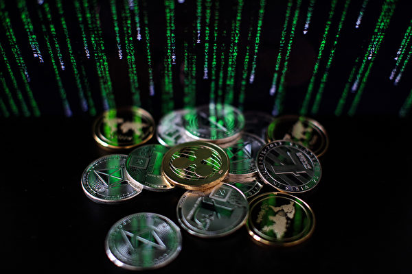

中共商务部官网8月14日公布“数字人民币”试点地区。(Jack Taylor/Getty Images)

   
  【大纪元2020年08月14日讯】（大纪元记者方明报导）中共商务部官网8月14日发通知，公布“数字人民币”试点地区。中共的“数字人民币”因其强制性及隐私问题，一直备受质疑。

官方公布的《关于印发全面深化服务贸易创新发展试点总体方案的通知》的第93条提出：在京津冀、长三角、粤港澳大湾区及中西部具备条件的试点地区开展数字人民币试点。

该《通知》称，央行制订政策；先由深圳、成都、苏州、雄安新区等地及未来冬奥场景相关部门协助推进，后续视情扩大到其它地区。

通知发布后，数字货币概念股大幅拉升。

简单说，“数字人民币”就是人民币的“电子版”。英文名字为Digital Currency/Electronic Payment（数字货币／电子支付），简称DCEP。中共央行在2014年成立了专门研究法定数字货币的小组。

业界发现，“数字人民币”与支付宝和微信支付的主要区别是，交易双方不可以拒绝使用“数字人民币”，包括个人和企业。

8月3日，中共央行在2020年下半年工作电视会议上说，已在上半年启动“法定数字货币封闭试点”，4月末在北京冬奥会场地以及雄安、深圳、苏州和成都试点，下半年将“推进法定数字货币研发”。

8月6日，大陆21世纪经济报道引述消息报导，目前一些中共国有银行员工已开始使用数字人民币进行转账和缴费等。但一位银行内部人士说，数字人民币的使用范围仍然有限，目前其所在银行内部只用于缴纳（中共）党费、工会费用等测试，另外不上网使用数字人民币消费的技术有限。

中共在今年两会前突然宣布将对数字人民币进行封闭测试，此后连续高调宣传。台湾专栏作家、钜石智库创办人吴奕军曾发表文章表示，中共央行在两会前突然宣布测试数字人民币，体现了中共“国进民退”、“计划经济”的集体意图。

他认为，数字人民币是中共“党国中心化”的数字法定货币，有别于以“去中心化”为基本特征的虚拟货币、加密货币。数字人民币交易失去了目前现金交易的匿名性，将无消费隐私可言。

中共在2014年首次提出发行数字法定货币的说法。吴奕军表示，6年来，大陆的政治经济局势急剧恶化，尤其是庞大的债务危机，现在中共要想依靠数字人民币来监控资金流，防止资金外逃，规避风险，不仅是用错了方法，而且已经来不及。

中共声称“数字人民币”有助于人民币国际化，但北京零壹智库的分析师孙宇林认为，数字人民币对人民币国际化的积极影响不大，如果传统货币无法很好地适应国际市场，发行数字化货币也无法推动人民币的稳定性。

孙宇林曾表示，一些（中共）政府机构或官方组织可能会在数字人民币发行初期实行强制性的付款方式。

美国乔治梅森大学（George Mason University）研究货币政策的经济学教授怀特（Lawrence White）曾表示，“数字人民币”将使人们无法匿名使用现金交易，消费的隐私将遭到政府监控，中共声称“人民能够通过透明的区块链来查询款项”的“透明度”只属于中央政府，而不属于所有人民。

台湾评论人士贺军认为，数字人民币的影响在于，严重侵犯金钱匿名性和人身自由隐私权，在中共控制的数字人民币机制下，一块钱已经不只是一块钱，而是代表一块钱的所有故事与走过的痕迹。

大纪元的报导曾分析，中共急推“数字人民币”的目的，其一是严密控制中国人的钱包；其二是对于美国金融制裁的恐惧。# 

<a target="_blank" href=#top><h6 align="right">回上方</h6></a>

<a name=151>
<h1 align="center"><b>美令港货标“中国制造”厂商忧价或损两成</b></h1>

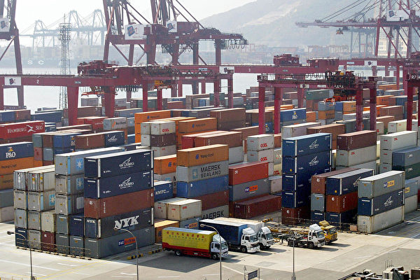

美国规定，自2020年9月25日开始，由香港出口到美国进入仓库或从仓库取出以供消费时，货品产地不得再标注“香港制造”（Made in Hong Kong），一律改标为“中国制造”（Made in China）。(AFP/Getty Images)

   
 【大纪元2020年08月12日讯】（大纪元记者程木兰综合报导）美国当局8月11日进一步就撤除香港特殊待遇的《香港自治法》公布一项具体规定：自香港销往美国的商品需一律标注“中国制造”。香港商界担忧，“香港制造”标签一向是港商的竞争优势，变更产地标示恐令港制货品价格折损一至两成。

美国联邦公报（US Federal Register）公告称，美国总统川普（特朗普）7月14日签署《香港自治法》行政命令，包括撤除对香港贸易特殊待遇。该行政命令45天的过渡期结束后，即9月25日开始，自香港出口到美国进入仓库或从仓库取出以供消费时，货品产地不得再标示“香港制造”（Made in Hong Kong），需一律改为“中国制造”（Made in China）。 违反规定者将被课征10%的惩罚性关税。

香港中小型企业联合会担忧，上述措施最受冲击的将是香港境内生产出口至美国的产品。美国客户普遍认知“香港制造”的质量优于“中国制造”。若规定一律标上“中国制造”，让客户难以分辨，将令香港制产品丧失竞争优势。

该会荣誉主席刘达邦估计，美方相关措施会令香港制造货品折损价值10%至20%。

香港当地的中华厂商联合会认为，“香港制造”为港商的软实力，对消费者而言是品质和信誉保证。美方这项措施将削弱香港本地生产产品的独特性和竞争力。该厂商会是获认可签发“产地来源证”的机构之一。

香港当局11日稍晚向WTO投诉反对美国该项措施，声称香港是WTO会员之一，不排除取行动以维护香港利益。

据港府统计，包括经由香港转口至美国在内的货值计算，2019年香港对美国出口总货值为3,040亿港元（约392亿美元）。其中“香港制造”仅占1.2%。

美国撤除香港特殊贸易地位，意味着大陆经香港转运到美国价值数千亿港元的货物，将被课征高额关税。

中共当局6月30日强行通过“港版国安法”后，美国总统川普7月14日签署了《香港自治法》行政令，除了取消香港护照持有者的优惠待遇，也将视香港货品同大陆一样加征关税，香港不再享有特殊关税待遇、特殊经济待遇，也不再允许敏感技术的贸易往来，同时撤销美国给予香港的出口许可证豁免。  

<a target="_blank" href=#top><h6 align="right">回上方</h6></a>

<a name=150>
<h1 align="center"><b>遭美国证监会调查 爱奇艺股价一度大跌18％</b></h1>

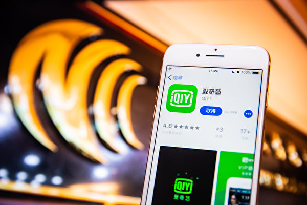

中国百度旗下串流影音平台爱奇艺坦承，正接受美国证券交易委员会（SEC）的调查。消息传出后，爱奇艺8月13日的股价应声暴跌，一度重挫18%。（陈柏州／大纪元）

   
 【大纪元2020年08月14日讯】（大纪元记者陈霆综合报导）中国百度旗下串流影音平台爱奇艺（iQIYI, Inc.）涉嫌在营收、用户数量上作假后，美东时间周四（8月13日）下午自行宣布，正接受美国证券交易委员会（SEC）的调查。消息传出后，爱奇艺8月13日的股价应声暴跌，一度重挫18%。

爱奇艺名列“中国四大影音平台”，也是中国仅有的几间获得中共“资讯网络传播视听节目许可证”的企业之一。

2018年3月29日，百度将爱奇艺分割出来，在美国纳斯达克（Nasdaq）上市，IPO定价为每股18美元，募得22.5亿美元。目前，爱奇艺56%的股份为百度所有，其董事长即是百度创办人李彦宏。

2020年4月7日，知名做空机构“狼群研究”（Wolfpack Research）发布了一份报告，披露爱奇艺夸大营收与用户数量，并在账上增加支出，以掩盖其它欺诈行为。

报告指出，有“中国Netflix”之称的爱奇艺，2019年营收虚增27%～44%，约80～130亿人民币（合11.3亿～19.8亿美元），用户数虚增42%～60%，同时还夸大了其内容、其它资产和收购支付的成本，向审计师和投资者隐藏其欺诈行为。

“（爱奇艺）早在2018年首次公开发行（IPO）之前就在进行欺诈，此后也一直如此。”狼群研究在报告中写道。

周四下午，爱奇艺发布了本季度营运数据，同时也坦承，目前正接受SEC的调查。

爱奇艺表示，SEC将清查自2018年1月1日起该公司的财务和营运记录。爱奇艺称，“已聘请专业顾问对某些关键指控进行内部审查。”

消息传出后，爱奇艺在纳斯达克上市的股票于盘后延长交易中一度下跌超过18%，最后于交易时段结束时以下跌了12.36%作收。外界也纷纷怀疑，爱奇艺是否又是一场如同瑞幸咖啡（Luckin Coffee）的中企造假丑闻。

今年初，瑞幸咖啡被爆出在营收上造假，随后于6月从纳斯达克退市。

今年5月，美国参议院通过了一项法案，该法案将加强对在华尔街上市的中国公司的会计审查，如果它们不遵守，将面临退市的问题。

美国财政部长姆钦（Steven Mnuchin）于周一（8月11日）亦表示，中国和其它不遵守会计标准的外国公司将于2021年底从美国证券交易所除牌、解除上市资格。随着美国加强对中企审查，分析人士预测中企将继续从美国证券交易市场退市，并寻求在香港二次上市。

据媒体报导，爱奇艺目前正与瑞信（Credit Suisse）商讨在香港上市事宜。不过，暂未透露交易规模及时间表。#  

<a target="_blank" href=#top><h6 align="right">回上方</h6></a>

<a name=149>
<h1 align="center"><b>袁弓夷爆料：香港抓人事件 再激怒英美</b></h1>

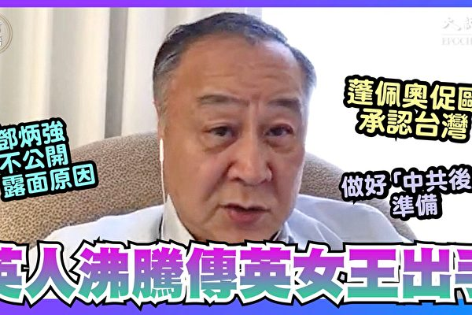

袁弓夷爆料：香港抓人沸腾英国，传女王要求出手。（大纪元合成图）

   
 【大纪元2020年08月14日讯】（大纪元记者邵燕综合报道）8月12日， 正在美国积极推动“天灭中共运动”的香港实业家袁弓夷通过自媒体视频表示，香港的抓捕事件令中共付出很大代价。美国和英国人对此事件深恶痛绝，全世界将会重拳挥向中共。他呼吁人们要做好中共倒台后的准备，并希望港人在争取到自由民主法治之后，成为亚洲国家引路的“灯塔”。

袁弓夷在油管（Youtube）上的采访和爆料直播越来越火爆，有时候超过两万人同时在线观看。这也引起了中共专制政权的恐惧，此次直播有三次被黑客中断。

 <b>香港抓人成本大 再激怒英美</b>

袁弓夷认为，这次香港黎智英和周庭等人被抓捕事件的成本很大，中共的动作雷声大雨点小，现在被抓的人都得以保释，让大家都有点意外。“这一次全世界，实际上这个震撼力，他们抓人的震撼力，和搜查《苹果日报》的震撼力不比港版国安法低。因为有真人嘛，而港版国安法讲到最后都只是一个法律。但现在这个是真实的，有真人，大家都认识的，大家都崇拜的。”

他表示早就透露中共在中美战事中已经无牌可出，这次的抓捕让美国人也非常愤怒，而且美国国务卿蓬佩奥和国务院在加速行动，所有对付中共的手段都会加速。“这件事它的损失就大了，中共的损失就大了。抓了他们几十个小时，换回来的就很惨。美国真的是重拳，全世界都是重拳，中共都不知道怎么承受。我看都是差不多没有牌的了，完全没牌的了。你看那个外交部就知道了。”

他还透露英国的官司进展很好，英国整个法律界都支持香港。英国法庭的法官基本上都已经知道共产党在香港搞了很多坏事。“英国都是沸腾的，英国人要面的，我听他们讲已经，英女皇说一定要做事，当日九七年她派了查理斯王子来，即是嫁了女儿出去，怎知现在被人虐待成这样，当然要做事了，你们都看到？都做到彻底了，这个是很难得的。”

<b>美使馆换徽章 不承认中共代表中国</b>

8月10日，美国驻华使馆的微博上，突然换了一个新的徽章图案，改变了颜色，而且还去掉了“中国”二字。新徽章显示的是“美国驻华大使馆——北京”。

袁弓夷认为此举意义重大。“因为这两个字是北京放进去的，以前放进去的。就是说，这个大使馆代表一个中国，这个就是当时放进去的原因。外国不用放的，其他国家很少这样放的，不用提国家的，说首都就行了。大家都明白的，但是这次拿走呢？就是说，中共，你不代表整个中国，这样就很正式的了。现在，为了所有事情都要加快，即同中国的脱钩，或者甚至去发生热战的可能性越来越高。”

他认为拿走“中国”的另一个意义，就是在美国的心目中，将来中国可能会分裂。“这是自然的。你现在唯一的就是靠共产党的铁腕来控制住而已。实际你说那么多的民族，他们应该有一定的自决权。这么多不同的民族，有的是，好像我们香港跟他们根本就是一种，在文化上、价值上不同。还有新疆、西藏，台湾更加不同。”

他爆料说，美国根本不再给中共情面，正在准备将来设立“美国大使馆-台北”，“大使馆-乌鲁木齐”，“大使馆－拉萨”，“大使馆-香港”。“就是美国现在已经到了一个地步，就是根本不给中国面子了，她觉得该做的就做，完全不顾及中国那个（面子）。 以前呢，就是大家是对等的。大家记住啊，以前是对等的。现在根本没有这么一说了，就是我觉得该怎么做就怎么做，而且我联合全世界，就这么围住你、罩住你，在你上面做事。”

<b>知道太多的中共官员被抓被失踪</b>

袁弓夷透露，已经被抓的孙力军是江家（江泽民）的第一“打手”，来自中共盖世太保组织“610”办公室。

“江家有大内总管的，曾庆红大家都知道的；监军就是孟建柱；第一军头，出去做坏事的就是孙力军。他做的事情真的是，我猜测他活摘器官整死的人是以万来计算的，以万来计算。这个人不只是公安部第一局，而且是‘610’办公室。你知道的了，2002年江泽民亲自设立的‘610’办公室，他们的权力，‘610’就是管法轮功的，他们的权力是远远超出所有公安部，那你说有多厉害。所以他们去到哪里，每个人都不能质问的。”

他强调“610”是高度机密的。“谁来当610的头目，那个权力就大的不得了。所以譬如说他们来到香港，根本是出入如无人之境。所有香港的那帮土共，包括林郑月娥，见到他们都怕的。所以这个人的权力，就等于盖世太保的头目。这个形容的很好，就等于是盖世太保。就是中共的盖世太保。直至现在，抓了他。”

孙立军在香港的的代理人是香港警务处处长PK邓（邓炳强），袁弓夷透露他们之间的关系不是短期的，两者有长期的交往。“现在他（PK邓）失踪了，当然我也是猜测的。整个人都不在香港，他的失踪和孙力军绝对有关系。因为孙力军做了很多很多事，尤其是跨境的事，在香港是最方便了。这个人就是他的代理人，帮他做了很多很多事。当然了，去年的送中运动，我们被他害得很惨。这个仇是一定要报的。但是呢，我觉得如果今天他还没有出现的话，他不见了一个多月，那我想这个仇，可能你们都不需要报了，有人已经帮你们报仇了。”

他推测香港的警察头目失踪的原因，是因为上面的权力令他失踪。“实际的权力是远远的大于林郑的。只有在北京上边，才有这个权力。我觉得呢，要他去回答很多疑问，讲很多他和孙力军的事，这个才是主题，这种事情，你知道在共产党里边，双规你，或者抓了你去审问，是不许任何其他人碰的，领导都不能碰，为什么？因为审问这个过程中，很多很多机密的东西，一定要问完，那个审问小组，要满足为止，没得走的，谁都不敢碰，它的过程就是这样，这是件很大的事。”

袁弓夷说，很多中共官员失踪的原因就是因为他们知道太多内幕。因此，为了保护自己家人，也有很多人保留很多证据。例如前国际刑警的主席孟宏伟，给居住在日内瓦的老婆留下了很多证据来保命。“因为他实在知道太多的东西，所有中共在海外做的坏事，他全部知道的嘛，因为要他来掩盖。当他们发现这个人的忠心有了问题，忠心等于效忠之心，有了问题，这人回到大陆就立即失踪了。”

<b>海外港人救助逃亡青年</b>

袁弓夷透露，居住在英美的香港人在发起数个项目，旨在救助逃亡的港人和在法律上控诉中共的迫害。

很多香港人因为反送中而流亡海外。除了去年参加抗争的人走了出来，现在还在有人出来。在美国的很多香港人自发帮助这些流亡的年轻人，在进入美国学校之前把家里的房间或办公室拿出来安置这些人。

在英国那边，由郑文杰组织准备发起控诉中共迫害的官司。“香港监察”的项目也做的很好。

在华盛顿也建立了一个新的团体，帮助袁弓夷设立一个热线机制，让香港人投诉有门，电话打进来后他们就去处理，将这些投诉处理后变成法律根据，诉状书提交给国务院，去告状。

此外，一个名为“老窦揾仔”项目也启动了。“老窦揾仔”的意思是老爸找儿子，据说这样的香港年轻人失踪案在去年的就有几千件。袁弓夷表示，将来节目中要分批公开案件人的照片和香港黑警做的坏事，减少港人被迫害。

<b>香港要成为亚洲的“灯塔”</b>

袁弓夷认为，中共的灭亡由美国负责，历史的齿轮在一步步推进。“我觉得我们要做个准备，就是中共后的准备，就是没有了中共的准备。”

他表示要告诉美国，香港准备将来作为亚洲的自由民主法治的灯塔。“灯塔就是看到光明，譬如来到一个新的地方，就像来到新大陆，如果有一个灯塔的话，就可以照明，又可以指引道路。这个香港，就可以成为民主中国的灯塔。”

他解释说，灯塔代表希望，有希望才去做。他希望将来新的联合国的总部设在香港，人权法庭设在香港。他希望香港将来成为亚洲的人权的典范，认为亚洲国家应该配合美国，也成为顾及人权的地方。美国人希望亚洲有人权、经济好，这样美国人就可以放心在亚洲投资。

他希望香港争取到人权和自由之后，能够去帮助其它国家，而且世世代代延续下去。“我们就要作为一个自由、民主、法治的灯塔。利用我们这几年的经历，将来照亮整个亚洲。当然这可能是几代人的工程。”  

<a target="_blank" href=#top><h6 align="right">回上方</h6></a>

<a name=148>
<h1 align="center"><b>钟原：习近平喊节约粮食和瑞银最新报告</b></h1>

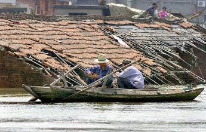

今年中国各地洪水频繁，给人民财产带来巨大损失。（法新社）

   
 【大纪元2020年08月13日讯】8月11日，连续多日一直隐身的习近平，做出了节约粮食的指示。大多数人对此根本不屑一顾，认为只是小小的作秀。这似乎不起眼的小事，能引起习近平的批示，背后当然不是小事。

70年代之前出生的中国人，可能马上回忆起当年毛的语录式短句：吃饭浪费、极大犯罪。1980年代，在幼儿园里、在学校，甚至在企事业单位，类似的话还在余音绕耳，当时的粮食配给制仍然在执行。1990年代，粮票之类的取消了；2001年，粮本、粮食关系才正式取消。

中国人的吃饭问题是如何解决的呢？中共当然给自己脸上贴金，谎称是所谓改革政策的功劳。废除集体所有制的公社，给农民松绑后，多种作物和副食品种，确实大量增加了，但中国粮食产量的大幅增长，并非主要靠更多的人出力，而是依靠从美国引进的化肥、农药，之后更是美国的实验室种子。再之后，又是从美国引进的激素饲料，让猪、鸡更快生长。美国的农业技术，才真正解决了中国人的吃饭问题，当然中共说都是自主研发的。

如今，所谓的绿色米、笨猪肉、土鸡蛋，尽管可能不再是真正的猪、鸡、蛋、奶，人们仍然很亲睐，高价也有人买，但产量却一直不高。如果只依赖这些，中国人仍然会饿肚子。当然，中共官员不吃老百姓的食物，专门有特供。

瘟疫、洪水来临，造成了粮荒，更多的化肥、实验室种子、激素，却再也解决不了中国人的吃饭问题。中共政权的谎言戳穿了，所谓的强国梦被惊醒了，中共政权从来都没有能力解决中国人的吃饭问题，现在不得不再次依靠美国，大量进口各类农产品。但这样的日子恐难维持，中共政权只能再次要求老百姓节约粮食，也许配给制又要回来了。

也许有人说，美国有大量的农产品需要出口，中国多买些就可以各取所需了。理论上如此，但掌握在中共政权手里的美元，还够么？即使还有点，中共政权会都用来给老百姓买粮食吗？

习近平要节约粮食，还真不是随便说说的。中共手里的美元眼看见底，未来能赚美元的机会越来越少，美国农民不接受人民币，估计也很难接受以货易货。

根据瑞银证据实验室（UBS Evidence Lab）的最新调查，450多位企业主管当中，76%的美国企业表示，已将生产线撤出中国，或计划撤出部分生产线；85%的北亚公司和60%的中国制造商也可能将部分生产线迁离中国。这些约占中国2.5兆美元出口的30%，可能达7500亿美元。

如果这些公司都撤出中国，中共的美元外汇将很快枯竭，贸易顺差也可能消失。

接受调查的公司中，有92%的医疗保健公司、89%的消费必需品公司，已经将产线撤出中国或计划撤离；80%的科技公司、76%的非必需消费品制造业，有可能离开中国；69%的工业、57%的材料制造商，也有可能离开中国。

美国公司中有82%表示，优先考虑回美国，38%还考虑加拿大，29%还考虑日本、23%还考虑墨西哥。北亚和中国公司，优先考虑去日本，其次是越南和美国。

上个月，习近平大谈经济内循环，实为迫不得已，但不管怎么内循环，粮食也循环不出来。中共仍然要大兴土木，制造虚假的GDP数字，却解决不了老百姓的吃饭问题，也只能提倡节约了。

从中共建政至今71年，从来没有真正能解决中国人的吃饭问题。过去的30年里，美国技术帮助中国人解决了吃饭问题，现在美国农民还能再次帮助解决中国人的吃饭问题，但因为中共政权的存在，美国农民很可能想帮也帮不上了。

中共政权还想绑架中国人民，要挟美国政府承认，中国老百姓，还有人愿意相信共产党，跟着一起做梦吗？  

<a target="_blank" href=#top><h6 align="right">回上方</h6></a>

<a name=147>
<h4 align="center"><b>腾讯“姓党”（上）</b></h4>
   <h1 align="center"><b>【内幕】腾讯党支部超7千党员名单曝光</b></h1>
   <h3 align="center"><b>微信参与中共“党建” 大量民众因用微信联络被中共抓捕</b></h3>
   

大陆互联网巨头腾讯公司旗下的社交软件微信（WeChat）近日遭美国制裁。(MARTIN BUREAU/AFP via Getty Images)

   
 【大纪元2020年08月12日讯】（大纪元记者古清儿报导）大陆互联网巨头腾讯公司旗下的社交软件微信（WeChat）近日遭美国制裁。美国认为，受中共政府管控的微信对美国的国家安全构成威胁。近日，大纪元获得的中共内部文件显示，腾讯成立了大量党支部，并参与中共的“党建”，渐渐成为中共一分子。

近年来，有许多大陆民众因为使用微信联络而被中共抓捕。

<b>独家：腾讯部分党支部党员名单</b>

近日，大纪元获得内部人士提供的腾讯公司部分党支部的党员名单，共7000多人。

从名单可见，腾讯党委对党员实行垂直管理，这些党员组织关系都在公司党委，分属12个党总支、116个支部，分布在深圳、北京、上海、广州、成都等八大事业部。

按照部门功能划分的党支部有：社交网络运营党支部、云行业产品党支部、增值产品党支部、腾讯音乐党支部、QQ支付联合产品党支部、即通产品党支部、社交网络质量党支部、社交平台党支部、云产品党支部、在线教育党支部、互动视频产品党支部、即通用户体验设计党支部、音视频实验室（包括优图实验室）党支部、总裁办与市场投资购党支部等等。

有的部门存在多个党支部，如OMG有八个党支部，社交平台、数据平台部、微信支付有三个党支部，腾讯音乐、云产品、广州WXG开放平台基础部分别有二个党支部。

还有的党支部是按照地域命名的：杭州、北京、深圳部、天津、成都、武汉、合肥、西安等党支部。还有腾讯科技（深圳）有限公司委员会临时支部。

大纪元记者从这19份名单文件中，统计出7723名党员。但是这些名单并不完整，腾讯董事会主席兼首席执行官马化腾及其他一众高管都不在其中。

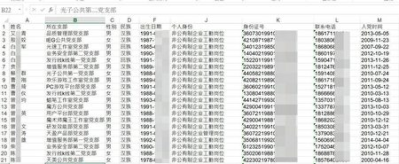

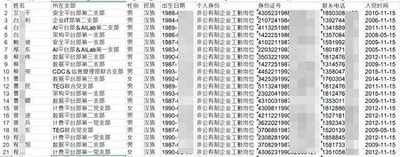

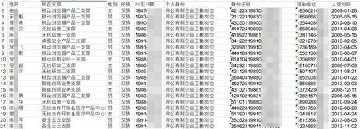

（大纪元）

<b>腾讯“染红” 积极靠拢中共</b>

腾讯是中国大陆规模最大互联网企业。陆媒报导，截至2019年3月31日，腾讯有5.46万名雇员。

在意识形态上，腾讯一直紧跟中共。《南方日报》2018年引述腾讯党办负责人指，腾讯至今已成立 226 个党组织，共有 10,962 党员。“我们工作的目标是确保业务发展到哪里，党的组织和党的工作就跟进到哪里。”这名负责人称。

马化腾也积极向中共示好。2018年6月初，马化腾与京东的刘强东身穿当年红军服，头戴八角帽参拜访延安照片在网络流传。

腾讯党委共有委员11名，腾讯党委书记郭凯天，身兼公司高级副总裁，主管公司法务、行政、安全管理等工作；三名副书记是分管公司信息安全管理、网络媒体、政府事务等关键业务的副总裁和总经理。

陆媒2017年透露，当时，该公司员工中有七千多名是中共党员，即23%的员工是党员。

腾讯党委还创办了中国互联网企业的第一本党刊——《腾翔》。2016年，腾讯公司党委还成为互联网企业中唯一的“全国先进基层党组织”。

<b>独家：文件泄腾讯参与中共“党建”</b>

大纪元近日还获得河南省南阳市“互联网+智慧党建解决方案”文件，从中也看到了腾讯的身影。

这份由联通系统集成有限公司河南省分公司制作的文件，主要是提出了一套可在电脑上及手机上运行的，线上线下结合的所谓“党建”应用程序。

（大纪元）

这个程序的功能包括，利用网格化管理，如数据接入、监控系统、公安数据、计生数据、居民数据。还可以通过大数据分析，让党员、干部的行为可查、可控、可追溯等等。

在文件第8页网络架构一节中，提及腾讯的微信公众号的作用。

在文件第26页，规定了网上举报由传统PC端延伸至移动端，增加微信、APP、WAP举报入口。

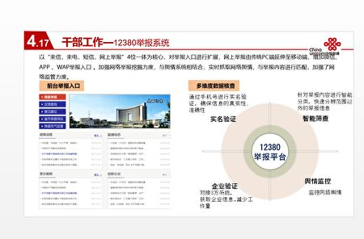

（大纪元）

时事评论员李林一说，腾讯协助中共监控中国民众已经是众所周知。但是从腾讯直接参与中共地方党建的行为来看，腾讯不光是工具，已经是中共的一部分了。

<b>腾讯“姓党” 大量民众因使用微信联络而被抓</b>

随着腾讯渐渐成为中共一份子，“因言获罪”案例越来越多。有人用微信号建群被判刑，还有人使用微信被抓、被抄家、被绑架。

彭博社称，通过巧妙地将如此之多的服务合并到一个平台上，微信不仅让生活变得更简单，还创造了完美的监控工具，让中国（中共）政府在搜集数据方面有了优势，这些数据让中共能够对其公民进行审查、监控，甚至对其公民进行羞辱或导致监禁。

3月2日，荷兰黑客维克特‧葛沃斯（Victor Gevers）透露，腾讯应用程序使用者的数百万次对话及用户信息，被传送到中国各地的警察局。

广为人知的例子，是去年底首度披露中共病毒（武汉肺炎）的武汉眼科医生李文亮，因为在微信朋友圈提醒自己的朋友和同学注意中共病毒，遭到警方约谈后被迫写保证，最后他自己也染疫离世。

实际上，李文亮还只是被约谈，大量民众因为使用微信联络而遭到抓捕。

海外明慧网今年7月30日报导，5月份，大陆有微信群发生大面积迫害并波及全国，群里三百多人被绑架抄家。群主被非法关押两个多月。这么多人在全国范围被同时抓捕，实属罕见。

明慧网7月15日报导，2019年1月初，江门市法轮功学员王斌家属收到律师发来的江门市蓬江区法院《刑事判决书》，法院以王斌用VIVO和中兴手机注册微信号建群传播消息为由，非法将他重判8年并勒索人民币3万元。

7月14日左右，河北省肃宁县法轮功学员郭振甲，因用手机微信给人讲真相，被国保大队非法抄家，把他带入公安局非法审问，并把他送入县看守所，之后在家中遭监视。

4月下旬，宁夏银川市法轮功学员王文浩（音）因使用微信，被非法关押20多天后才回家。29日，在同一微信群的郭文燕也被绑架抄家。

《纽约时报》4月报导，中共曾抓捕5名华为前员工，原因是他们在微信聊天群组里讨论了华为在伊朗的销售。报导表示，这次抓捕行动加剧外界质疑华为和中共政府的关系。

2017年9月，中国民间“环球实报”微信群主、博士后刘鹏飞被北京警方抓捕。该群以讨论时政新闻、群体事件、社会热点、公义案件等话题为主。2019年4月，他被中共以所谓“寻衅滋事罪”判刑2年半。

2019年8月，重庆富华典当公司老板李怀庆的妻子包艳发出公开信透露，其夫在微信发声议事论政遭到公安拘捕，过亿元人民币的公司资产惨被没收。2018年4月，李怀庆的罪名从“涉黑”变成了“颠覆国家政权罪”。

<b>微信在美国陷入麻烦 川普给出45天期限</b>

目前，微信在美国陷入麻烦。

8月6日晚间，美国总统川普签署两道行政命令，将在45天后禁止美国企业和民众与腾讯、字节跳动进行有关微信、TikTok的交易。

在声明中，川普指责腾讯旗下的微信和字节跳动旗下的TikTok为中共提供渠道，获取美国人专有信息、掌握海外中国公民的情况，并为中共利益展开虚假信息宣传活动，并进行商业间谍活动。

川普政府官员担忧，微信不仅为中共政府提供了在美国境内收集数据和信息的途径，还会成为传播另类叙事和虚假信息的有力渠道。  

<a target="_blank" href=#top><h6 align="right">回上方</h6></a>

<a name=146>
<h1 align="center"><b>答大纪元记者问 川普批香港侵犯新闻自由</b></h1>

周四（8月13日），美国总统川普（特朗普）在白宫新闻发布会上谴责谴责中共和港府对香港新闻自由的攻击。(Brendan Smialowski/AFP)

   
【大纪元2020年08月14日讯】（英文大纪元记者Emel Akan报导/夏雨编译）周四（8月13日），美国总统川普（特朗普）在白宫新闻发布会上谴责中共和港府对香港新闻自由的攻击。总统称最近香港传媒大亨黎智英（Jimmy Lai）被抓，以及香港警方突袭《苹果日报》新闻编辑室是“一件可怕的事”。

川普在新闻发布会上回应《大纪元时报》记者的提问时说：“我对看到香港发生的事情感到厌恶，因为自由（freedom）是一件好事。”

当地时间8月10日一早，香港警方高调逮捕当地亲民主报纸《苹果日报》创始人、71岁的黎智英及其两个儿子，黎智英被指违反港版国安法，并以涉嫌“勾结外国势力”等罪名遭到拘捕。近200名香港警察还突袭了《苹果日报》新闻编辑室，逮捕多名职员。

黎智英一直是对中共直言不讳的批评者，也一直支持香港反送中抗议活动。在广泛的公众支持下，黎智英于8月11日获得保释。

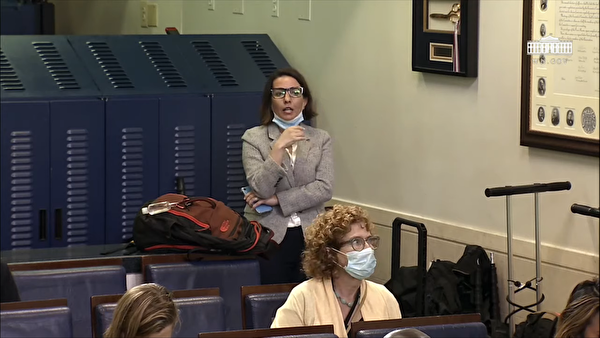

8月13日，英文大纪元记者Emel Akan在白宫新闻会上，向川普总统提问。（白宫视频截图）

川普在新闻会上说：“我认为这是一件可怕的事情。”

“由于（香港拥有）自由，我们授予香港很大的激励措施。我们现在已经取消了所有这些激励措施，香港将不可能与美国竞争。”他说。

中共政权于6月30日在香港强行实施新的国家安全法，对香港自治以及“一国两制”框架构成极大威胁。北京通过这项新法律加强对香港的控制，该法将分裂、颠覆国家，恐怖活动，和外国勾结等定为刑事犯罪，最高可判处无期徒刑。

川普随后表示，实施港版国安法，香港“一国两制”变成“一国一制”。

川普于7月14日签署了《香港自治法》，同时还签署了一项行政令——《香港正常化》——要求美国政府必须在15天内开始行动，终止香港的特殊待遇，及制裁所有参与前期制定、后续执行及通过《港区国安法》的人员和机构。

8月7日，川普政府宣布制裁11名中港官员，包括：陈国基、郑若骅（cheng Teresa）、林郑月娥、李家超、卢伟聪、骆惠宁、邓炳强、曾国卫、夏宝龙、张晓明、郑雁雄。

根据《香港正常化》（Hong Kong Normalization）行政令第四部分的规定，受到美国制裁的中港官员和实体，美国人将被禁止跟这些人士或机构进行金融交易。

财政部长姆钦8月7日在宣布制裁的一份新闻稿中说：“基于今天的行动，上述（被制裁的）个人，以及由他们单独或与其他受制裁者直接或间接拥有的任何实体和财产，只要所有权在50%或以上，且实体和财产在美国或由美国控制，即被封锁，且需向OFAC（财政部外国资产管制办公室）报告。”

“我们（的优惠措施）使人们和公司去那里（香港）非常便利。我们已经撤回了所有这些（优惠措施）。从经济角度来看，美国将是最大的受益者。”川普周四在白宫新闻会上说。   

<a target="_blank" href=#top><h6 align="right">回上方</h6></a>

<a name=145>
<h1 align="center"><b>内斗猛烈 习误判局势 战狼术遭将领反对</b></h1>

澳媒刊文指习近平的战狼术受到军中将领的谴责，这是习面对诸多内忧外患之中最大的隐患。图为2020年5月21日中共两会开幕。(Leo RAMIREZ/AFP)

   
   【大纪元2020年08月12日讯】（香港大纪元记者李思璐编译）澳洲媒体news.com.au的记者杰米．塞德尔（Jamie Seidel）8月10日在其撰写的《习近平的战狼术受到抨击》文章指，习近平受到军中重要将领们谴责，指他不该刺激美国，采用的战狼手法毁坏了中共统治世界的时机。

文章指出，在面对蝗虫、洪灾、饥荒和病毒诸多灾难，习近平这个把自己定位成一个专制党国的终身领袖不能不担心其政权的稳定，况且那些中共在过去用贸易手段维系关系的国家已经不再是朋友了。

如同所有在四面楚歌中挣扎的独裁者一样，习近平面对的诸多内忧外患之中，最甚者莫过于来自军中内部的将领们开始表达反对意见。塞德尔点名军中两个反习的将领是撰写《超限战》的乔良和现任空军大校戴旭。

<b>战狼术遭遇全球反击</b>

塞德尔在文中表示，中共惯用的那些“赞扬民族的辉煌历史和伟大业绩，并且把过错归咎于别人”的手法不再奏效。面对中共战狼术，世界不再退缩而是予以反击。

他列举的国家包括五眼联盟的澳洲、英国、加拿大，以及亚洲的印度、日本、越南等，这些国家面对中共的巨大威胁和恐吓，反而变得立场坚定。这种变化，对习近平来说，简直是一件丢面子的事。

尽管中共用经济制裁的手段来威胁澳洲，但是坎培拉（澳洲首府）并没有被吓到，而是在东、南中国海的问题坚持国际法的立场。

面对中共频繁地对其在经济领域的侵略和在南中国海领域商业活动的干扰，马来西亚于去年发表一份对中共的正式抗议。周边的小国，越南、汶莱、菲律宾和印尼也随之效仿。

就连索马里这样的小国也不示弱。据报导，中共驻索马里大使秦健最近尝试对该国总统使用“战狼”术，却被下达了“驱逐令”。索马里政府开始与台湾进行外交接触。

<b>北京精英阶层的反习声音</b>

除了国际上碰壁之外，习近平在国内受到的反对声音还都是来自那些有社会影响力的人物。塞德尔引用澳洲罗维国际政策研究所（Lowy Institute）的中国问题学者理查德．麦格雷戈（Richard McGregor）的观点，“在北京的精英阶层中，隐藏着对习的不同意见”。

塞德尔指出，北京当局对颇有知名度的清华大学法学教授许章润的抓捕，可以看作是对那些精英们的警告。这位法学教授的罪名是倡导中国公民的法律平权。

许章润是目前中共控制的司法系统中唯一敢于公开挑战习近平的人。这位57岁的学者上个月被从北京的公寓中带走。当十多个警察上门时，许教授似乎已经就绪，长期以来他就把一套备用的行头放在门边，等到被抓的时候就随手带走。

塞德尔随后提出疑问：中共压制许章润这样的民意或许还奏效，但是在其战狼般咆哮外交战略的背后，习近平必须面对背后军中将领的满腹牢骚。

<b>习战狼术遭军中鹰派反击</b>

塞德尔在文中点出，近几个月军中反对习近平的主要声浪来自退休少将乔良和现任空军大校戴旭。

乔良是中共军队著名鹰派将领，也是中共现代军事理论的创立者之一，他在1999年出版了《超限战》一书。现在他敢于站出来反对习近平要以武力解决台湾的口号。

他在今年的一次采访中表示，“中国的最终目的不是统一台湾，而是完成复兴大业从而让14亿人过上幸福生活。”“把台湾收复现实吗？当然不可能。”

乔良在采访中还承认，台湾问题的背后是中美关系，也就是中美实力的较量。

持同样观点的空军大校戴旭甚至更直截了当。他发表了一篇题为“对美国的四个想不到和十个新认识”的文章，认为中共将为中美冷战付出代价。

他写道，“美国将如此强硬，强加300亿、500亿，然后2000亿的关税。”“记住：征收300亿美元的关税，将带来600亿、900亿甚至更多的影响。这就是美帝国真正强大的地方。我们必须理性而不是动怒并且要明智地周旋。”

澳洲罗维国际政策研究所的中国问题学者理查德．麦格雷戈认为，这些现象都暗示着“影子政府”在北京的存在。

他表示，中国的自由派学者一直批评习，指责他以自负的外交和军事政策激怒了美国，而这些自由派更喜欢邓小平在上世纪80年代制定的“韬光养晦”政策。

这些自由派人士从邓小平的“韬光养晦”中获得启示，懂得如何掩护自己。他们在批评习近平的做法时，通常并不直接点名。

<a target="_blank" href=#top><h6 align="right">回上方</h6></a>

<a name=144>
<h1 align="center"><b>【有冇搞错】共机越中线 距战争爆发只差30秒</b></h1>

【有冇搞错】中共军机双双跨越台海中线，台军方严阵以待，距离导弹发射只差30秒。谈谈美国对中共策略的两实一虚。（大纪元香港新闻中心）

   
【大纪元2020年08月11日讯】《有冇搞错》。8月11日。

昨天，就是8月10日，全球都关注香港的事情，就是黎智英被捕，香港国安警察搜查壹传媒大楼，一天内共10个人被捕的这个事情。

香港这事非常轰轰烈烈，港警出动200多人，满城风雨，全球都在发声明。中共声明支持，欧美发声明谴责，媒体协会，民间团体也都在表态。非常热闹。

但实际上，大家却忽略了另一个更大的危险。其实这个危险，如果真的发生了，对全世界可能造成更大的即时影响。这就是台湾海峡的事情。

昨天，中共军机飞越了台海中线，台湾空军和防空导弹全面戒备，在最后一刻中共军机折返。算是虚惊一场。

但真是虚惊吗？

台湾海峡，平均不到200公里的宽度，从中线到台湾本岛也就是100公里，飞机用接近音速飞行，5分钟就到台北了。

中央社是这么报导的：“空军司令部今天表示，中共空军所属歼-11、歼-10型机，上午9时许，陆续短暂逾越海峡中线，空军除以地面防空导弹全程监控，并于第一时间广播警告，运用空中侦巡兵力强势驱离。”

报导说，台湾方面用无线电警告、飞机抬头驱离，并以防空导弹电波，进行警告，这是一种复合式的吓阻手段。

对于中国大陆航空器进入识别区，台湾有明确的规定的。

在《两岸人民关系条例施行细则》第41条则明定，“大陆民用航空器未经许可进入台北飞航情报区限制区域者，执行空防任务机关可在距台湾、澎湖海岸线30浬（55公里）以外之区域，实施拦截及辨证后，驱离或引导降落；距台湾、澎湖海岸线未满30浬至12浬（22至55公里）以外之区域，实施拦截及辨证后，开枪示警、强制驱离或引导降落。”

这个说的是民用航空器。他没有说军用航空器怎么办，当然，军用飞机过来，一定是不怀好意了，除非是投诚的飞机了。如果是投诚飞机过来之后，按照惯例要两边摇摆3次。

可以想像，就算是民用飞机，到了距离台湾本岛55公里，就可以开枪示警了，按照这个算，军用飞机过来，差不多就可以发射导弹了。因为以中共第四代军机，比如歼-10和歼-11，他们的巡航速度大概2分钟之后就可以抵达台北上空了。

所以，有消息说，台湾地面的防空导弹昨天已经全部发出警报，全面戒备了。意思是什么？就是人员装备就位，设备打开，随时待命了。因为谁也不知道这是两架飞机，还是后面会跟过来两百架飞机。所以可以这么说，台军方面，手指已经放到按钮上了，就差按下去了。

如果这个导弹发射了，当然可能战争就爆发了。

台湾媒体说，共军的飞机，很快折回去了。这里说的“很快”是多少时间？大概是过了中线10到20秒钟，如果再多，中共军机就距离台湾太近了。也就是说，如果再晚30秒钟，台湾可能就要发导弹了。战争是不是爆发，就差这30秒钟。

当然，为什么中共军机要越过台海中线？当然是因为美国卫生部长阿扎尔在台湾访问，中共飞机越中线这天，阿扎尔要见蔡英文，还要去拜祭李登辉。不但如此，日本前首相森喜郎也在台湾，他是去拜祭李登辉的。

美日两国政界人物在台湾的活动，当然代表了很重要的意义。如果我看来，甚至可以说是代表了一个时代的结束，和另一个时代的开始。

我们先谈一谈中共的飞机。

这次中共飞越过去的飞机，是歼-10和歼-11。这是空军的标准配置。歼-10类似F-16，是轻型的战机，适合空中缠斗。歼-11则是苏-27的大陆复制品，载弹量大、航程远，是重型攻击机，相当于美军的F-15。歼-10和歼-11是高低配，是标准配置。美军是F-15配F-16，俄罗斯是苏-27配米格-29。中共呢，一边抄一个，仿制的苏-27，就是歼-11，配仿制的F-16，就是歼-10。

台湾方面的说法，这次共军飞机过中线，台方是“地面飞弹监控”。防空飞弹的监控，实际上是开启搜索雷达了，甚至可能是已经锁定了目标了。现代防空导弹，是一个相当复杂的电子系统，除了一个弹头之外，雷达搜索、监控、信号发射、导弹方向调整，这个是一套的。

台湾现在有美国的爱国者二型，也有自己的“天弓”，这是台湾自己的防空导弹。据说，天弓三型非常好，可以射200公里，速度达到7马赫，就是7倍音速。关键这完全是台湾自己开发制造的。

中共和台湾在台湾海峡上的力量对比，尤其是空军的对比，现在已经发生了明显的变化了。上世纪，台海，甚至中国东部沿海，基本上是台湾空军的天下，中共的空军一般不会到海上作战，只在陆地和上空。

这个世界上第一次空对空导弹，就是在台湾海峡上空发射的。大概是1958年，中共突然发起对金门的炮击，史称“金门八二三炮战”，9月下旬，台湾派出空中侦察机去大陆沿海拍照，还派了多架F-86F，外号“军刀”的战机护航。9月24日，中共派出多架米格-17，也是当时最先进的喷气式战斗机，双方在温州附近上空激战。这是响尾蛇空对空导弹第一次亮相，战绩是9比0。

这是空对空导弹第一次亮相。响尾蛇导弹是一种红外线追踪导弹，发射后，导弹会感应对方飞机的红外线追踪。这在当时是最新的技术，所以取得9比0的成绩并不奇怪。

这次空战最有趣的地方，是其中一枚响尾蛇导弹，打中了中共的米格-17飞机，却没有爆炸，卡在飞机上了。结果飞机回去之后，苏联和中共一起研究，后来就有了苏联和中共自己的防空导弹。而且在4年之后就成功了，还打掉了美国的U2高空侦察机。

前苏联在赫鲁晓夫时期，对中共的军事援助可以说是倾尽所有。刚刚说的米格-17，当时是世界上最先进的喷气式战斗机，苏联都没有完全装备，就给了中共，在他任内，对中共有几百个援助项目，包括军工项目，也包括核弹项目。

不过，中共后来最痛恨赫鲁晓夫，原因是什么？有人说，是因为赫鲁晓夫批判了斯大林，毛泽东不高兴。实际上，是毛泽东认为斯大林之后，应该是他当共产世界的老大，他看不起赫鲁晓夫。

回过头来，台海的这种实力对比，一直到80年代其实都变化不大。台湾海峡，海峡上空的航道，对大陆来说都是禁区。后来实力变化，是90年代以后的事情了，现在，这个台海中线的默契，就是90年代开始的。

我们前两天谈过，目前，美国对华政策，或者是美国对中共政策，在中国周边的这个布局，其实是两实一虚。南海、台湾，这是两实，而香港则是那个虚。实的政策和策略，通常会看到的情况是说得少，调子低，但实际动作很大；而虚的政策则相反，通常而言，是说得多，调子很高，但实际动作很少，或者基本没有。

比如过去20年，欧美国家对中国的人权政策，其实就是一个虚的政策。大家都唱高调，谈原则，但真正实际的动作基本上没有。中共对这一点非常清楚。

但现在美国对香港这个政策，却是一个不那么虚的虚政策。当然，我们说虚实，主要还是相对的，无论虚实，都是在美中全面对抗这个大的背景下的。所以，即使是在香港这个所谓虚的着力点上，这个力道也必将比以前那些对华政策要大得多。

台湾，是未来美国对华政策的一个实际的着力点。过去几个月，美国批准卖给台湾的武器，无论从质量还是数量上，都远远超过了过去30年。包括F-16V战机，M1坦克，“海马斯”火箭弹发射装置、智能水雷、防空导弹系统等等。除此之外，美国下周的环太平洋军演，可能会首次邀请台军参加，而不是观察。

除了美国对台湾，还有日本。当然，《美日安保条约》讲的就是东亚和东南亚地区的军事合作，原先就包括了台湾在内。只不过现在既然翻脸了，干脆直接说明了。

美日对台协防的电脑推演中，美负责空中和海中，而陆地上的许多操作，会由日本负责。这个以前很少有人谈，我估计未来会越来越多资料出来。

所以，昨天，8月10日，中共军机越过台海中线，恰好有美国部长和日本前首相都在台湾访问，这个不是偶然的，象征着未来这个区域的冲突，一定会涉及中、台、日、美这4个角色。   

<a target="_blank" href=#top><h6 align="right">回上方</h6></a>

<a name=143>
<h1 align="center"><b>捷克前议长遭中共无理打压病故 遗孀将访台</b></h1>

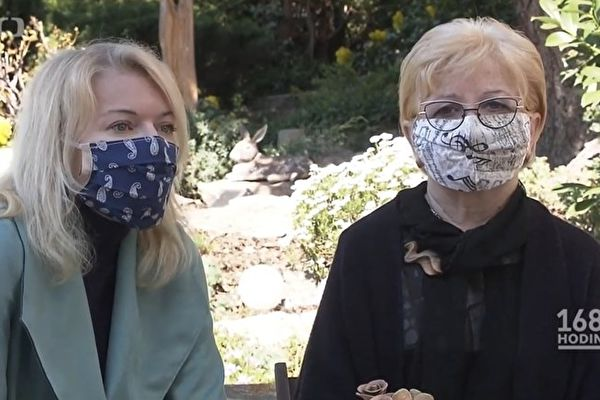

故捷克参议院议长柯佳洛曾为规划访台遭到中共各种威胁。现任参院议长维特齐即将来访，他特别邀请柯佳洛的遗孀薇拉(右,Vera Kubera)随团访台，完成柯佳洛的遗愿。(截图/捷克电视台168 hodin节目/新唐人亚太电视台提供)

   
  【大纪元2020年08月13日讯】已故捷克参议院议长柯佳洛曾为规划访台遭到中共各种威胁，承担沉重压力，后来不幸在展开访台行程前病故。现任参院议长维特齐即将来访，他不屈服中共胁迫，特别邀请柯佳洛的遗孀随团访台，完成柯佳洛的遗愿。

据中央社报导，外交部欧洲司长姜森8月13日指出，维特齐（Miloš Vystrčil）一行定8月30日至9月4日率团访台，访团的交通及防疫方式，将采取包机来台，团进团出；同时，为防疫考量，将进行两次采检，比照美国卫生部长阿扎尔、前日本首相森喜朗访台时的防疫规格。

第一次采检是在捷克登机前二日、二采则是到访台湾后，且结果必须均为阴性，相关细节由中央流行疫情指挥中心负责规划说明。

姜森并强调，外交部与中央疫情指挥中心密切协调，参照近日美日政要访台防疫措施，外交部将配合指挥中心安排防疫训练课程，相关接待人员都要接受训练。

外交部表示，维特齐应立法院长游锡堃邀请，定30日至9月4日率团访台，由于维特齐在捷克宪政体制的地位仅次总统，他的到访将对台捷双边关系、甚至台欧整体关系带来许多正面影响。

维特齐6日表示，他所率领的访问团预定29日搭乘台湾民航包机自布拉格直飞台北，9月5日返抵捷克，访团成员约90人，包括科研人士、议员和企业界代表。

已故前任议长柯佳洛（Jaroslav Kubera）曾为规划访台遭到中国各种威胁，承担沉重压力，后来不幸在展开访台行程前病故。

姜森表示，维特齐此次来访获捷克参议院的高度支持，就是要彰显维护民主自由决心，不会屈服中共威权的胁迫，因此维特齐特别邀请柯佳洛遗孀随团访台，完成柯佳洛的遗愿；维特齐访台期间也将就捷克一贯坚持的自由民主理念发表重要演讲。

另外，因为支持台捷民主理念，而遭受北京报复的布拉格市长贺瑞普（Zdeněk Hřib）也将随团来访。

姜森指出，中共以市场为武器，威胁报复柯佳洛及贺瑞普等政要，干预捷克民主运作，引起捷克社会普遍关切。维特齐率领访台的40多位捷克企业领袖，将参加台捷经贸论坛，强化台捷自由市场体制的供应链经贸合作。

除捷克相关政要、企业领袖，捷克主要大学、研究机构、捷克爱乐等文化团体及媒体人士，将随同维特齐来访。

姜森指出，他们都是捷克民主社群的重要成员，其中有些也曾遭遇中共无理打压，包括企图限制他们的言论自由，希望透过这次访问，能与台湾民主社群各界团体建立制度性合作网络。 

<a target="_blank" href=#top><h6 align="right">回上方</h6></a>

<a name=142>
<h1 align="center"><b>栗战书之女被曝在香港坐拥千万美元别墅</b></h1>

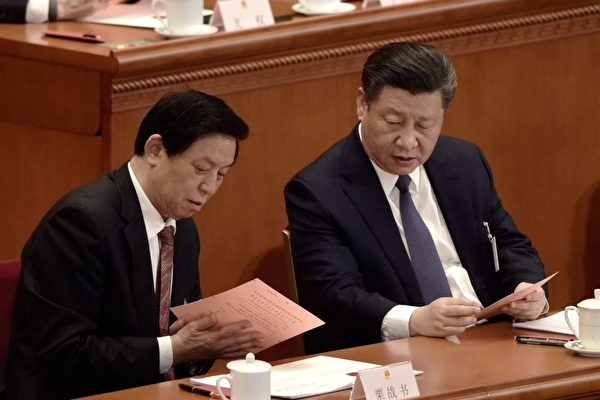

中共全国人大出台《港版国安法》后，令香港的“一国两制”变成了“一国一制”。随即，身为人大委员长的栗战书的丑闻被曝光。图为栗战书（左）和习近平。(FRED DUFOUR/AFP/Getty Images)

   
  【大纪元2020年08月12日讯】中共在香港强行实施“国安法”后，将香港的“一国两制”变成了“一国一制”。随后，美媒曝光中共人大委员长栗战书之女在香港不但拥有千万美元的别墅，而且还是一家国有银行的老总、中共省级政治顾问团体的香港代表等。
  
<b>中共在香港制造白色恐怖事件</b>

自中共全国人大6月30日通过并在香港实施“港版国安法”以来，中共在香港制造了一波波白色恐怖事件：

7·1大游行时，港警抓捕了至少370人，其中至少10人涉违反国安法；7月29日，港警又以涉嫌违法国安法抓捕了4名学生；7月30日，港府取消12名民主派立法会选举参选人资格；7月31日，港警通缉6名所谓“乱港分子”，其中包括一名美国公民，两名在德国、英国获得政治庇护港人；8月10日，港警抓捕壹传媒集团创办人黎智英、前香港众志成员周庭等10人，封锁搜查了《苹果日报》大楼，令香港言论自由受到严重威胁。

<b>《纽时》：栗战书之女拥有别墅 是国有投资银行的主席</b>

8月12日，美国《纽约时报》中文网刊文爆料称，中共排名三号人物的全国人大委员长栗战书，他的女儿栗潜心在香港悄悄打造出一种横跨这座城市金融精英和中国政治隐秘世界的生活。

现年38岁的栗潜心，在香港购买了一幢价值1500万美元的四层海景联排别墅。她的伴侣、华裔新加坡商人蔡华波（Chua Hwa Por）拥有一匹现已退役的赛马，并斥资数亿入股赫赫有名的半岛酒店，后来已将股份出售。

报导指，栗潜心不仅是一家总部位于香港的国有投资银行的主席，该银行长期以来一直与中共高层官员的亲属做生意，而且还是中共省级政治顾问团体的香港代表。

栗潜心与中共精英的许多其他成员一样，还在“避税天堂”——英属维尔京群岛成立了世喜控股有限公司（Century Joy Holdings Ltd.）。

<b>习近平外甥女坐拥一套别墅 至少五间公寓</b>

报导还指，中共现任三名常委的亲属在香港都有资产，除栗战书外，还有习近平的姐姐齐桥桥的女儿张燕南、汪洋的女儿汪溪沙，都在香港拥有房产。

其中，习近平的外甥女张燕南，2009年在浅水湾以1930万美元购得一座别墅；此外，张燕南还拥有至少五间公寓。

而中共第四号人物汪洋的女儿汪溪沙，2010年在香港购买了一处200万美元的住宅。

<b>红二代在港利益受威胁</b>

报导指，中共实施国安法后，对香港的全球金融市场构成威胁；也让中共领导人的亲属、中共太子党的处境岌岌可危。

报导援引香港中文大学中国研究兼职教授林和立的话说，中共红色贵族的成员、包括那些已经在香港作出巨额投资的“太子党”，“如果香港突然失去其金融地位，他们就不能把钱放在这里了。” 

<a target="_blank" href=#top><h6 align="right">回上方</h6></a>

<a name=141>
<h1 align="center"><b>湖南民众遭强拆冤判 承办法官：体制使然</b></h1>

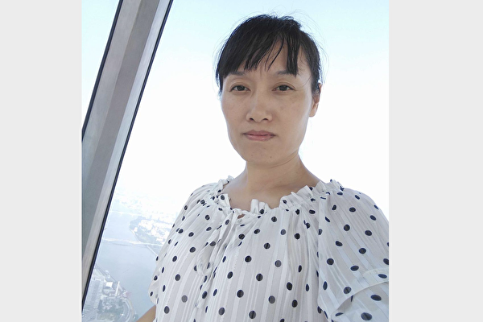

由于800多平米的家被政府强拆、所有财物被掩埋，湖南株洲的肖芳走上上访维权之路。（受访人提供）

   
 【大纪元2020年08月13日讯】（大纪元记者张北采访报导）由于800多平米的家被政府强拆、所有财物被掩埋，湖南株洲市民肖芳因此走上上访维权之路。但是她非但没讨回公道，反遭多次拘留、判刑；她女儿因此中断学业，当时四岁的儿子的内心留下心理创伤。

肖芳说，“如果一个国家没有正规的法律，那这个国家怎么维系下去呢？我们百姓怎么生存呢？”“把那个公正的法律还给我们老百姓，而不是（握）在那些高高在上的权贵手上。”

<b>为卖地建商品房 政府非法强拆</b>

肖芳向大纪元讲述，她被强拆的家位于株洲天元区泰山街道。这栋两层的楼房建于1988年，前后有院子，总使用面积806平方米。

2013年，她家和附近十几户被当地天元区政府纳入普通商品房建设项目的征地范围，赔偿条件是：有房产证的950元／平米，没有入证的400元／平米。

肖芳表示，当时附近的房价每平米一万多元，如果按照拆迁的补偿价，他们根本无力重新购置房子。“我们家六口人，所以就不同意，不同意他强拆。”

2014年底，政府为逼迁对肖芳一家进行停水，她的婆婆无奈出门挑水，在一次回家的路上不小心摔断腿。

2015年1月中旬，街道办事处下属的拆迁指挥部趁肖芳家里没人，将房屋强拆。肖芳说，“什么东西都没拿出来，我家所有的东西全都被埋了。”“他们到现在也没有人跟我说我的东西去哪了，也没有人和我核对你们家有什么。”

政府执行强拆当时距离肖芳女儿的艺术高考只有半个月时间。为了不影响在北京集训的女儿，她第一反应是让所有亲戚对女儿隐瞒消息，避免影响她的高考成绩。

当时距离中国新年也只有十来天。肖芳说，“我们又没地方过年，也没有换洗的衣服，所以我们当时一家人真的是挺可怜的。”

<b>上访维权 被多次拘留、判刑</b>

在被强拆前，肖芳曾找过街道办事处书记和天元区区长表达自己的意愿。她说，“我的出发点只是觉得拆迁是不公平的，是不合理的。我觉得我反映诉求很正常。我也跟他们说了，你参照周边的房价也好，或者你就不给钱，我多少面积的房子，你还多少房子给我住就行了，我也不要你一分钱。”

但是，她说的话从来没被重视过。“我都是抱着非常平和的态度跟他们去讲，但是没有用，真的没有用。因为这个土地的利润实在是太大了，我们这块地是以3个多亿卖出去的。”

房子被强拆以后，肖芳开始上访。她去了湖南省信访局、湖南省人大信访办和湖南省纪委，但问题得不到解决。于是她继续往上走，6次去北京的中共国家信访局反映问题。

“我们从北京被接回来，第一件事情就是把我丢到派出所里面做材料，丢到我们天元区泰山派出所，然后回来以后就行政拘留10天。”肖芳说，“扰乱社会公共秩序罪，就是李文亮的那个罪名。”

在经历6次行政拘留后，她于2017年4月17日被株洲市天元区检察院以所谓“寻衅滋事罪”向法院提起诉讼，并于2017年7月18日被判处有期徒刑一年半。

（受访人提供）

<b>不服上诉 二审法院作出两份相反结论</b>

肖芳不服，提起上诉。2018年10月24日，株洲市中级法院以“事实不清、证据不足”为由撤销天元区法院的刑事判决，发回重审。2019年1月28日，天元区法院下达《刑事判决书》，仍维持原一审判决。肖芳不服，再次提起上诉；中级法院仍由原二审合议庭的全部成员组成合议庭对该案进行审理。

同年3月29日，法官约辩护律师谢阳和肖芳在其办公室见面，表示不能再次开庭，因为中院之前已认定“事实不清、证据不足”。法官当时还对肖芳做了一份《审问笔录》，其中明确记录，“审：一审当中已经提交的证据不需要重新提交，一审中公诉机关与你们提供的材料与本案没有关联性。”

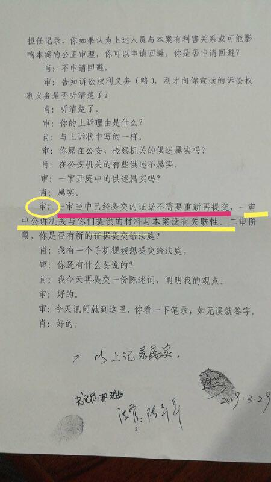

（受访人提供）

肖芳说，“当时我的律师非常高兴，他说，‘肖芳啊，这法院肯定是要判你无罪，肯定会给你改判，你看法官都说了，这些证据都和这个案子没关联性，那肯定是无罪啊。’我当时很高兴，还跟那个法官说了一声谢谢。但就是在同一天，中级法院下达了刑事裁定书，结论是：驳回上诉，维持原判。

肖芳说，她后来还见过承办法官，“那法官说，‘你知道啊，中国这个体制我也没有办法。’他说在我的心里面，肖芳从来就没有犯过罪。他就这么说，但是他给不了一个能够盖上公章的判决啊。”

<b>妈妈被抓 小儿子内心受创 大女儿中断学业</b>

肖芳被抓时，她的小儿子才四岁。由于母亲突然不见，他幼小的心灵受到冲击，开始变得极度内向、不爱说话。肖芳举例说，即使是经常与她一起玩的亲近朋友，问这孩子10句话，他也不会回答一句。

“现在我要是出去啊，他就很担心，怕我不回来。我出去他会不停地电话联系我，因为我实在是出去太久没回来了，他就怕我每次出去都好久不回来。”

她的大女儿以优异的成绩考上中央美院，原本打算本硕连读。肖芳被抓后一年多都没有判决，当时正读大三的女儿知道家里经济变得很紧张，弟弟又开始上小学需要费用，于是决定放弃读研机会，本科毕业就参加工作。

肖芳说，“我和政府这个情况，这就是一场没有硝烟的战争。在这场战争中，我的家人真的是伤痕累累。”

“我当时关在里面，每天看着那新闻说依法治国、依法治国，我真的希望能够落到实处给我们依法治国，可是那真的是一个笑话。那新闻天天放着依法治国，但治的还是民。我一点事没干，法官都说没有证据，那我为什么坐的一年半的牢呢？”

肖芳表示，为了自己的清白，更为了两个孩子的前途，她一定会坚持洗刷罪名。她说，“我就是到80岁、到死，我都不放弃，真的。”  

<a target="_blank" href=#top><h6 align="right">回上方</h6></a>

<a name=140>
   <h4 align="center"><b>贪污17.88亿恐获死刑 涉梁振英及青关会背后势力</b></h4>
<h1 align="center"><b>赖小民破受贿纪录 曾庆红权势黑幕曝光</b></h1>

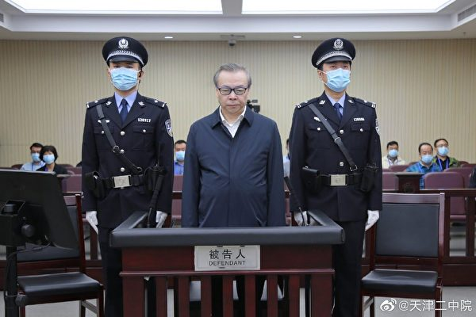

华融前董事长赖小民被控受贿近18亿元，打破已宣判中共官员的最高金额纪录。图为2020年8月11日，天津市第二中级法院一审公开庭审赖小民案。（天津第二中院微博图片）

   
  【大纪元2020年08月13日讯】（香港大纪元记者司马靖综合报导）8月11日，华融前董事长赖小民案于天津开审。赖小民被控贪污、受贿、重婚等罪，所涉赃款总计高达17.88亿元（人民币，下同），是迄今中共官方已公布的贪官赃款数额的最高纪录。

赖小民被揭在执掌华融期间，向曾庆红及江泽民等权贵家族输送巨额利益。他也是曾庆红势力在中国大陆和香港商界的台面人物。美国华府时政评论员李燕铭分析，赖小民贪腐金额破纪录，或面临死刑，成为近期中共高层习近平阵营与江泽民集团你死我活内斗升级的又一标志性事件。

8月11日，天津市第二中级法院开庭审理中国华融资产管理股份有限公司（华融）原董事长赖小民案。赖小民被指控于2008年至2018年期间，利用担任银监会办公厅主任，华融党委副书记、总裁、党委书记、董事长，华融湘江银行股份有限公司党委书记（兼）等职务上的便利，直接或通过他人索取、非法收受相关单位和个人给予的财物，共计17.88亿余元，其中1.04亿余元尚未完成收受。赖小民还在2009年底至2018年1月期间，利用职务便利，伙同他人非法占有公共资金共计2,513万余元。

此外，赖小民在合法婚姻关系存续期间，还与他人长期以夫妻名义共同居住生活，并育有两子。赖小民涉受贿罪、贪污罪、重婚罪，追究其刑事责任。

赖小民当庭认罪、悔罪。法庭宣布案件择期宣判。

赖小民现年58岁，江西瑞金人，1983年7月进入中共央行银行计划资金司工作，此后长期在央行及中国银监会从事货币政策、信贷管理和金融监管方面的工作，2009年起担任中国华融资产管理公司的高阶主管，落马之前是中国华融资产管理股份有限公司的党委书记兼董事长。

赖小民于2018年4月17日落马，官方通报提及他“与多名女性搞权色交易”等，2019年2月被立案调查并移送起诉。

<b>上百情妇聚居珠海百套房 并在子公司任高管</b>

赖小民是中共十九大后首名被官方认定涉重婚罪的高官。财新网此前报导指，他有“3个100”：一百多套房、一百多个关系人、一百多个情妇。其中几十位来自华融内部，此外甚至也不乏家喻户晓的女明星。

据知情人士透露，华融有很多去美国、欧洲、港澳台等境外培训班，实则是安排“赖小民的情妇们和关系户们用来度假、旅游”的手段。

网络热传一篇来源标明“华兴评论”、题为“他把一百多个情人安置在一个小区，所有的孩子都喊他爸爸”的文章曝光，赖小民专门在广东珠海开发房产项目，并把100间套房给了前妻和情妇们。在赖旗下各种子公司里，情妇们成为高管、董事长、总经理的例子比比皆是。

<b>与曾庆红侄女曾宝宝的花样年集团有交集</b>

赖小民落马后，官媒报导藉业内人士谈话指，赖小民贪污腐败其实还涉及另一个问题——谁是他的保护伞。

此前有报导指，调查赖小民案件的核心，是与华融有着铁三角关系的两家公司——宁夏天元锰业集团和中国港桥控股公司。在天元系、中国港桥担任高层的刘廷安，是赖小民的江西同乡兼大学同学。赖落马后，有多名消息人士向陆媒确认，与赖一同被带走的还有香港上市公司中国港桥的董事会主席兼行政总裁刘廷安。

据工商资料显示，中国港桥前身为至卓国际控股公司，2016年3月，至卓国际董事会宣布任命刘廷安为董事会主席。2016年下半年，宁夏天元成为至卓国际的股东。

至卓国际主要生产并出口印刷线路板，旗下多个子公司，最主要的一家是至卓飞高线路板（深圳）有限公司。2012年11月，至卓国际将至卓飞高70%股权、深圳厂两块土地及其上的公司大楼，出让给两个买家，其中最大买家是花样年集团旗下的深圳花样年。花样年集团派任至卓飞高的新董事长潘军，是时任花样年集团董事会主席、执行董事及行政总裁。

花样年控股为中国地产开发商，于1996年由曾宝宝（亦称曾洁）成立，公司主要在深圳和成都等地开发房地产项目，公司注册地设于开曼群岛，公司总部则在广东省深圳市福田区。而曾宝宝是前中共中央政治局常委曾庆红的侄女，曾庆红是前中共党魁江泽民的头号心腹。

2018年8月即赖小民落马后，工商资料显示，花样年在未经公告下，把至卓飞高的股权转让给一家名不见经传的公司，该公司仅有两名自然人股东，龚某和黄某，两人名字和深圳花样年一名高管、花样年一名员工的名字一模一样。至今花样年的行政总裁潘军仍被登记为至卓飞高的法定代表人。

<b>华融入主香港天行国际 涉地下党重要势力</b>

公开资料显示，在华融卷入至卓（中国港桥）之前，赖小民和华融已与曾庆红家族建立关系，而且存在重大交易。

据公开报导，华融2015年在香港首次公开募股前，于2014年10月突然入主港股天行国际。当时就有国内财经报导对此发出这样的评价：“天行国际就是一家连年亏损的‘蚊型’券商，却被中国最大资产管理公司华融看上了。”

此一收购案据称华融付出总代价逾4.68亿港元，天行国际摇身一变为华融金控（华融国际金融控股），即时分享了华融香港上市盛宴。

天行国际原名鑫成金属集团，1990年由中国有色金属工业总公司设立，1994年2月16日在香港交易所挂牌上市。1998年鑫成金属被香港财团张人龙家族收购，并于同年2月10日更名天行国际。

张人龙被称是叱咤香港政商界半个世纪的“新界王”，具体收购人是他的第八个儿子张德熙，现任香港新界总商会会长，被视为中共地下党组织的重要势力，亦被视为超级“梁粉”（梁振英支持者），尤其是青关会主要头目均来自新界总商会，而青关会被指系出中共“盖世太保”机构“610”办公室，每当高层博弈关键时刻听命于曾庆红，乱港搅局。

2014年被华融收购前的天行国际执行董事、行政总裁为纪晓波。腾讯财经报导称“纪晓波只是隐形资本大鳄车峰的‘马仔’，车峰的投资，亦由纪晓波打理”。

车峰广为人知的身份是前央行行长戴相龙的女婿，还与江泽民派系权贵家族有密切连带关系。如由贾庆林女婿李伯潭任秘书长操盘的“茅台会”，其官网显示成员名单中，车峰、曾伟并列第二届理事会副理事长。曾伟是曾庆红的儿子。

1990年设立的鑫成金属，母公司是中国有色金属工业总公司，现已解散，但当时的实权人物还在，即现任政法委书记郭声琨。郭声琨仕途最浓重的一块，他于1997年调到北京出任中国有色金属工业总公司副总经理，后担任国家有色金属工业局副局长，到2000年出任国务院国有重点大型企业监事会主席。巧合的是，这也是央企中国有色金属旗下鑫成金属从成立，到香港上市，再到被张德熙进行收购成为金融集团的期间。

知情人士曾透露，郭声琨是曾庆红表外甥，郭声琨妻子祖母是曾庆红母亲邓六金的亲妹妹。

曾庆红是江西吉安人，郭声琨是江西兴国人；而赖小民是江西瑞金人。赖小民落马后，有圈内财经记者披露一条消息耐人寻味：翻看华融高管信息可发现，多人为赖小民的江西老乡，“亦为大佬老乡”。

<b>家中蒐出2.7亿现金 时评员：赖小民面临死刑</b>

财新网曾披露，从赖小民家中蒐出2.7亿元的现金，此外，其母亲收受的礼金就高达3亿元。《经济观察报》引述知情人士指，赖小民涉案的现金存款等超过16亿元，此外还有大量的房产及珠宝等贵重物品，“保守估计，钱财总计超过20亿元人民币”。

赖小民被控受贿17.88亿元，与之前《经济观察报》披露数字接近。这一数字打破了已宣判中共官员贪污金额纪录。

不久前，5月11日，原陕西省委书记赵正永受贿案在天津开庭审理。赵被控受贿7.17亿余元。7月31日，赵正永被判死刑缓期执行（限制减刑）。

据不完全统计，2013年1月至今，被公布查处的亿元以上中共贪官至少75人。其中，正国级1人：原中共政治局常委、中央政法委书记周永康；副国级4人：原中共政治局委员、中央军委副主席徐才厚、郭伯雄，原中共政治局委员、重庆市委书记孙政才，原全国政协副主席苏荣；省（部）级31人，厅（局）及以下30人，国企9人。

据香港时事评论员石山分析，这些贪官涉案金额，都是中共据政治需要给出的数字，实际金额应比公布出来的还大。对周永康等大贪官来说，实际涉案金额或大许多倍。

之前74个巨贪中，涉案金额最多的政府官员，是原山西省吕梁市副市长张中生，其贪腐金额是11.34亿元。

2018年3月，张中生案宣判，成为中共十八大以来第二名被判处死刑且不缓期执行的落马官员，也是第一名单以经济犯罪被判处死刑的官员；之前被执行死刑的内蒙古自治区政协原副主席、自治区公安厅原厅长赵黎平的死刑罪名为故意杀人罪。2019年5月，山西省高级法院二审维持张中生的死刑判决。

另外，2018年12月，内蒙古银行有限公司党委书记、董事长杨成林被判死刑缓期执行，其贪腐数额为3.07亿元。

2019年12月，内蒙古自治区人大常委会原副主任邢云被判死刑缓期执行（限制减刑），其贪腐数额为4.49亿元。

时政评论员李燕铭分析，对比近3年贪腐数额与宣判结果，赖小民贪腐17.88亿元，远超张中生11.34亿元；张中生已被判处死刑且不缓期执行，赖小民刑罚应该重于张中生，有可能会判死刑立即执行，至少也是死刑且不缓期执行，否则难以服众。

赖小民及华融与曾庆红等江派权贵家族存在巨额利益输送黑幕，其实赖就是曾庆红等江派权贵家族的“白手套”，习近平再开杀戒，意在震慑江、曾。

近期外界纷传，曾庆红政变、倒习失败，习近平愤而反击，已瞄准曾庆红家族及其“白手套”，江泽民子孙江绵恒与江志诚等人都命悬一线。

李燕铭表示，赖小民若果真被判死刑乃至死刑立即执行，将成为习近平与江泽民、曾庆红你死我活决战无可避免的标志性事件之一。 

<a target="_blank" href=#top><h6 align="right">回上方</h6></a>

<a name=139>
<h1 align="center"><b>田云：习近平提“餐饮浪费” 粮荒要来了？</b></h1>

日前，习近平提出要制止餐饮浪费行为，党媒称对“粮食安全还是始终要有危机意识”（网络图片）

   
 【大纪元2020年08月13日讯】近日，习近平提出要制止餐饮浪费行为，称之“触目惊心、令人痛心”。党媒连发数文造势，称“尽管我国粮食生产连年丰收，对粮食安全还是始终要有危机意识”，今年疫情带来的影响“敲响了警钟”。

难道说，中国的粮食面临不安全？

今年4月2日，中共国家粮食和物资储备局负责人受访时称，稻谷、小麦的库存量能够满足一年以上需求，还称要力争夏粮再获丰收。4月20日，中共农业农村部部长称“中国不会发生粮食危机”。当时，疫情是影响粮食生产的最主要因素，劳动力投入和粮食物流均受波及，不过，官方仍信心满满。然而，4个月后，官媒口径大变，“丰收”已不是重点，“危机”和“警钟”才是信号。

这一变化说明什么？第一，疫情对粮食产业的冲击肯定超过了中共之前的评估，负面效应逐渐浮现。第二，水灾带来重创：6月、7月，南方27多个省（区、市）遭遇暴雨和洪涝灾害，5千多万人次受灾，农作物受灾面积5283.3千公顷，加上房屋倒塌、道路损毁、人员伤亡和转移等，直接经济损失1444.3亿元。

据陆媒报导，专业人士分析认为，水灾受灾地区主要集中在长江流域，这里是水稻、小麦种植区（受灾最重五省早稻播种面积占全国69.7%），洪灾会造成“早稻难收，晚稻难播”，与去年相比，中国可能损失1120万吨的粮食。

粮食减产已成定局，这全是天灾造成的吗？实际情况是，在多个地区，大片农田因为当地政府泄洪被淹。7月20日，安徽王家水坝开闸泄洪，“浑黄的淮水如脱僵之马翻滚着涌入闸外的蒙洼蓄洪区，很快吞没了绿油油的庄稼”。据陆媒报导，蓄洪区内的庄稼长势很好，豆子和玉米快要成熟，结果全部泡汤，村民们愁苦无奈，因为党逼迫他们“舍小家 顾大家”。

中共依靠泄洪、淹没一些地区来保全其它所谓更重要的区域，乃是因为水利工程的失效，这与盲目兴建水利项目、违背自然规律、官僚作风等有很大关系。因此，水灾导致粮食歉收的背后，当局仍负有不可推卸的责任。

再看“大国粮仓”的情况。2019年6月，陆媒报导了2015年安徽谯西粮库负责人谭献华盗卖9,000吨粮食的更多内幕。当年，谭某监守自盗事发后，谯城区粮食局、原亳州市粮食局及中储粮亳州库并没有第一时间上报，而是用“突击补库”的方法想把大事化小，因此拖欠了500多万元职工集资款，最终引发大规模投诉，整个事件才被曝光。最终，谭献华被判刑11年，而亳州市粮食局、谯城区粮食局、中储粮亳州库等单位违规的责任人均未被问责。

2011-2012年间，上海奉贤区一家米业公司分管仓储业务的副总伙同他人盗卖国家储备粮25万公斤，之后采取在粮食出库前喷水的方法，以弥补缺少的斤两。

以上两例足以说明，中共治下的粮食储备系统存在巨大漏洞，而且现存库中的粮食品质如何，亦令人生疑。

在官方通报习近平最新指示、强调节约粮食的同一天，前华融公司董事长赖小民案在天津开庭。赖小民被控贪污、受贿、重婚等罪，所涉赃款总计17.88亿元人民币，刷新中共官方已公布的贪官赃款纪录。

据媒体报导，赖小民案有“三个一百”，即一百多套房、一百多个关系人、一百多位情人。另外，办案人员在赖小民的住所搜出2.7亿元人民币现金，创下贪官被查获现金的最高纪录。

赖小民曾担任华融资产管理公司的党委副书记、总裁，后升任党委书记、董事长。2013年，他被选为全国人大代表。他在案发后交待称，“纪委书记是我的党委委员，我的部下，他很难监督我。”

赖小民的落马并不是中共反腐的成绩，恰恰反映了中共官场腐败的无药可救。多少侵吞民脂民膏的“硕鼠”还逍遥法外？中共前党魁江泽民之子江绵恒被指为“中国第一贪”，江泽民家族贪腐所涉金额之巨难以估量。前中共政治局常委、政法委书记周永康也是巨贪罪犯，据报其所敛资财总额超过1331亿元。

据维基百科条目介绍，中国人民银行2011年6月15日刊发《我国腐败分子向境外转移资产的途径及监测方法研究》报告，2008年6月之前外逃干部16,000至18,000人，携带款项达8000亿元人民币，中国13亿人口人均被外逃贪官掠走610元人民币。（注：这份报告已经过时，更新后的数字恐更加惊悚。）

2008年，时任全国人大常委会办公厅特约研究员王锡锌对官媒记者表示，中国每年在公车费用、公务招待及公务考察三项上开支达9000亿元。12年后，这一数字上涨了多少？

为了杜绝“舌尖上的浪费”，党媒称要营造“在全社会营造浪费可耻节约为荣的氛围”，还把矛头指向了自媒体“吃播秀”，似乎唯有餐桌上的浪费是不可饶恕之罪。试问红色喉舌及中共当局，为何不禁止数万亿元的公款消费？为何不停止对外撒币？谁让赖小民之流当上了“人大代表”？几十年来，14亿中国人民究竟在被谁无耻地代表着？

中共贪官们的赃款、源源不绝的“三公”费用，以及向非洲提供的“慷慨”援助如能被用于扶贫、补贴农民、减灾救灾，将可充盈粮食，实现全面脱贫，而且将提升全体人民的生活水平和综合国力。但是，中共不会那样做，因为它根本不在乎人民的饭碗，不在乎国家的兴衰。

事实上，疫情、水灾都是中共作恶所致，经济发展的失调也是当局执政之过。中共从不反省悔过，却一味吹嘘党的“伟光正”，永远倒打一耙、把责任推给替罪羊。

当前，中共号召“节约”，十分荒谬。中共贪赃枉法、作威作福，却要人民承受被“收割”、被“牺牲”的命运。一句“谁知盘中餐，粒粒皆辛苦”能解何忧？  

<a target="_blank" href=#top><h6 align="right">回上方</h6></a>

<a name=138>
<h1 align="center"><b>遵美禁令 在港中资银行对林郑等采取措施</b></h1>

8月7日，美国财政部宣布制裁11名中港官员，包括（从左到右）中联办主任骆惠宁、香港特首林郑月娥、港澳办副主任张晓明以及香港保安局局长李家超。（大纪元制图）

   
【大纪元2020年08月12日讯】（大纪元记者徐简综合报导）在香港运营的国际银行甚至包括中共控制的银行在内，都在采取初步措施，遵守美国对林郑月娥等人的制裁令。

彭博社8月12日报导，在美国有业务的主要银行，包括中共控制的中国银行、中国建设银行和招商银行，都对林郑月娥等11名受美国制裁的官员的开户持非常谨慎的态度，至少一家银行已暂停对他们的这类服务。

<b>中共的银行也默默配合美国制裁令</b>

彭博资讯（Bloomberg Intelligence）的数据显示，截至2019年底，中共四大银行的美元资金规模为1.1万亿美元。

虽然中共官方力挺被美国制裁的11名香港官员，但在香港经营的多家中资银行为了在美国的业务和外汇交易不受影响，却以实际行动来配合美国的制裁令。

美国8月7日宣布制裁香港特首林郑月娥等11名中港官员后，彭博社报导，美国花旗集团（Citigroup）已采取措施，停止与受制裁官员有关的账户。另有消息人士表示，英国渣打集团（Standard Chartered）正在加紧审查银行是否与被制裁官员有交易，并已暂时禁止被制裁者办理开户。

<h4 align=center><a href="https://twitter.com/tangjingyuan99/status/1292530724122263555?ref_src=twsrc%5Etfw%7Ctwcamp%5Etweetembed%7Ctwterm%5E1292530724122263555%7Ctwgr%5E&ref_url=https%3A%2F%2Fwww.epochtimes.com%2Fgb%2F20%2F8%2F12%2Fn12325133.htm">各大銀行制裁政策聲明：嚴禁參予被美、英、歐盟、聯合國制裁的任何活動，禁止開展或繼續客戶關係、提供產品或服務或進行交易的商業活動…一句話：遵命照辦(点击右键,另存新档）</a></h4>

此外，根据各大银行如星展、汇丰、恒生等银行的制裁政策声明：严禁参予被美、英、欧盟、联合国制裁的任何活动，禁止开展或继续客户关系、提供产品或服务或进行交易的商业活动，简而言之，这些银行都会遵从美国制裁禁令。

<b>遵守美国制裁令 就违反了中共国安法？</b>

令人感到讽刺的是，根据港版国安法“禁止接受外国指使而制裁香港及中国”的条款，这些银行的举动或已违反香港国安法。

香港国安法第四节“勾结外国或者境外势力危害国家安全罪”的第29条称，“直接或间接接受外国或者境外机构、组织、人员的指使、控制、资助或其它形式的支援实施以下行为之一的，均属犯罪。”

所谓的“行为”则包括“对香港特别行政区或者中华人民共和国进行制裁、封锁或者采取其它敌对行动”。此处的“进行制裁”，或可能包括外资银行将若干中港官员列为拒绝往来户。

外界关注，在港的国际银行包括中共自己的银行如果也违反了所谓的国安法，中共的下一步行动是什么？制裁自己？

<b>美国制裁令给林郑等人带来灾难性影响</b>

针对中共和港府官员破坏香港民主和自由，美国政府展开针对11个名中港官员的第一轮制裁，包括港澳办副主任张晓明、中联办主任骆惠宁、香港特首林郑月娥、香港保安局张李家超、警务处处长邓炳强等人。

被美国政府制裁的11名中港官员中，有几人故作轻松，表示制裁对其个人没有多大影响，说他们没有资产在美。比如林郑月娥称她的访美签证有效期到2026年，“看来也可主动注销了”。但她的二儿子却涉嫌因制裁之故，低调从美国回港。

银行业界人士指出，美国制裁令的影响超越在美资产，任何以美元进行交易的银行将不会向受制裁人士提供服务，以免受牵连而被美国惩罚，这意味着林郑等人将难获得任何银行服务，或只能到朝鲜或伊朗等不怕美国制裁的银行里开户。

至于骆惠宁所调侃的“我也可以向川普先生寄去100美元，以供其冻结之用”，有财经界人士指出，骆惠宁是受制裁者，根本没有资格通过银行汇美元寄给川普，“他连1美元都寄不出去，因为连带的二级制裁，没有任何银行敢兑换和转账美元给他，包括中资银行。”

律政司长郑若骅回应时称个人利益毫不重要，美国的所谓制裁是徒劳无功的。但郑若骅被制裁后，她与丈夫潘乐陶拥有63%股份的安乐工程，立即出售美国资产。

前香港众志常委罗冠聪8日在Facebook上发文，深度剖析美国制裁给这些官员带来的灾难性后果，被制裁官员的信用卡，甚至银行卡、美资保险、投资产品将无法使用；所有美国产品需要由他人代购。而且他们持有超过50%股权的公司，都受到同样的限制。

而且，中共根本无力反制。因为美国官员不必使用中资银行的服务，而且美国的长臂政策般规管和经济实力将导致国际企业拒绝中共官员，但中共政府缺乏同样的实力和影响力。罗冠聪更警告，这轮有幸逃过一劫的高官黑警要提心吊胆了！#   

<a target="_blank" href=#top><h6 align="right">回上方</h6></a>

<a name=137>
<h1 align="center"><b>【一线采访】大连湾仍未解封 民众陷崩溃</b></h1>

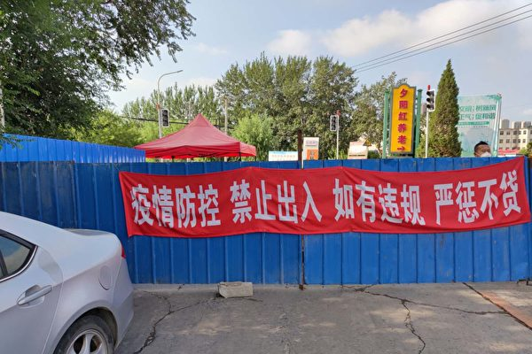

大连此轮疫情中风险地区陆续解封，大连湾街道的隔离措施却更加严厉。图为大连湾后盐村封闭管理。（知情人士提供）

   
  【大纪元2020年08月12日讯】（大纪元记者顾晓华、林岑心采访报导）距离大连市7月24日上午宣布进入“战时状态”，迄今已经将近20天，疫情核心区域大连湾街道居民至今不知何时解封，一刀切的封闭式管理也变得更严，令居民买菜、生活成问题，许多人面临着失业危机，随时还有无人机在小区上空盘旋监控，让当地居民十分崩溃。

大连市防控中心10日公布，大连这次疫情的中风险地区大连市金普新区站前街道杨家村解除封闭，加上之前，大连市西岗区工人村社区、金普新区站前街道盛滨社区、先进街道桃园社区，共4个中风险地区解除封闭，但是大连市甘井子区大连湾街道仍维持高风险地区。

据大连湾居民反映，从8日8日起，整个大连湾街道管控措施不仅没有放松，反而更加严格。官方9日发布讯息指，在疫情防控期间，有网民编造“不实消息”，包括上网辱骂政府部门、翻越封闭区围墙、在高风险地区聚众打扑克等，将这些人处以5日、10日的行政拘留。

大纪元获得一段视频爆料显示，8月1日晚，大连湾街道恒大港湾小区一男子走小路，翻围墙出小区拿菜，被保安抓到，双方发生肢体冲突，被保安用暴力制伏，男子被行政拘留5天。

另有消息称，大连湾后盐村一名小卖店业主，因为开门卖东西，被无人机监控拍到，被公安抓走，有网友建议大家，以后卖东西要更小心。

在严厉的措施下，居民纷纷盼望解封之日能早日到来。网传一份社区通知指，大连湾已经进行了第四次核酸检测，目前没有出现阳性病例，若持续没有新增病例，一周后可望全面解封。通知指，（甘井子）区督察组已经住进丽湾海景社区（距离凯洋公司约2公里），将不定期到小区视察，上空会有无人机巡逻。

该通知提醒社区业主，不得在小区里遛弯、遛狗，如提醒2次拒不服从者，拘留7－15日。除了扔垃圾，所有业主不得下楼活动。

甘井子区大连湾街道欣家园社区居民李平（化名）告诉大纪元，官方说病例零增长14天后，得以降到中风险地区，但没有说明什么时候解封，官方资料显示，6日后，大连市没有出现病例，最后一例确诊患者，是此前作为密切接触者隔离被检疫出来的，“我们比较疑惑的是，究竟他是以确诊日期（5日）来算14天，还是以他隔离日期来计算呢？”

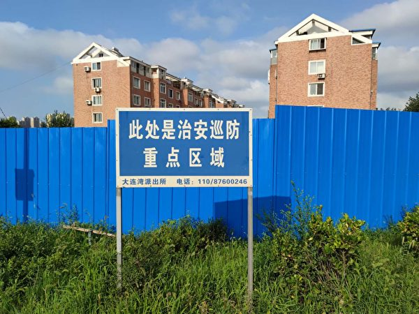

大连湾隔离遥无期。图为后盐村封闭管理。（知情人士提供）

<b>防控越来越严 采无人机监控</b>

大连湾居民之所以这么关心解封之日，是因为当局自24日起的封闭式管理，令受困多日的居民倍感焦虑，“（7月24日）开始，当时是说我们集体做核酸检测，有了这个核酸报告，就可以正常进出小区，当时是这么跟我们说的。但是后期就不是这样了，就把我们关起来了。”

她提到，该住宅小区距离大连湾凯洋公司其实蛮远，“直线距离都有八到十公里，属于在（大连湾）外围，离得非常远。我们从来不会去大连湾买东西，因为太远。”

李平还透露，大连湾街道小区达到七八十个，范围非常广，而且最中心的高风险区域是该街道的大连湾，他们这些外围小区（例如欣家园、福佳新城、后盐、前关等等）仅仅因为划规在大连湾街道管理，也变成与大连湾同样的待遇。

“我们这边没有确诊病例，没有无症状感染者，很多小区都没有密切接触者。我自己都做了四次核酸，结果都是阴性。”

即使这样，管控措施还是十分严厉，而且是越来越严。“原本我们有的居民溜狗，或者家里有孩子，出去待个半小时是可以的，或者去买个菜什么的，去小卖店买个盐、米那是可以的。”“但是，从上周六（8月8日）开始，突然间就不行了，就不允许你出来了。”

“你扔垃圾都不行，要把垃圾给楼长或是给志愿者，志愿者帮你去扔。”“小区有个门，平时都不关的，现在用警戒线给你挡上了，门外坐着三个人，你硬要出去的话，警察就来了，直接给你带走拘留。”

“还有无人机在航拍。”李平提到，整个大连湾有多架无人机在执行监控，“一个无人机管一片，我们大连湾的这些小区，基本上，都反馈有无人机（航拍）。”

<b>居民天天窝在家里上火</b>

李平提到，一开始居民还可以三更半夜去买东西，生活至少不成困难，“那时大连湾周边商铺不是全都关了吗，小区里面不让卖东西，有一些商贩半夜三四点钟在小区栅栏外面卖，我们天天像打游击战似的，闹钟设到半夜两、三点，闹钟一响，就跑到门岗栅栏那里买菜。”

“都是用抢的，你能买到就不错了。”买了一周后，就不让卖了，只能用线上平台购物，但线上平台的菜根本买不起，“鸡蛋十块钱一斤，桃子五块钱一个，买回来还有烂的。”“因为家里有孩子，只能硬着头皮买，不瞒你说，我两星期只吃了一个苹果，而且是快烂的，吃不起啊！”

后来是靠小区里有营业执照的水果批发的商贩，帮大家解决买菜的问题，但肉基本上是不敢想了。饮食买菜都困难，加上不许下楼，20天隔离下来，心理和生理上备感压力，“一个个人嘴里全是大水泡，大家都很上火！”

<b>无期的隔离居民变焦虑 失业潮更难熬</b>

李平提到，这波疫情导致整个大连湾地区失业人口可能多达一半以上，“没办法在家里办公的，基本上是失业了。”“大部分是工薪阶层，还有很多是服务行业的，你半个月不上班，老板招新人的，你就得走人。”

李平说她的工作好一点，可以在家办公的，“但是领导也给你压力，整天问你们什么时候解封啊？我们现在真的很着急出去上班，我们不想在家里待着，很想去上班。”“真的很上火，今年本来就很难熬，本身就业就难，如果再失业了，下半年怎么过？”

眼看大连其它地区陆续解封，恢复正常生活，大连湾居民更加痛苦，“我现在心情实在是不行了，坐牢也有个期限吧，你是判三年，还是五年，我们现在就是在这等啊等。”

“它这个一刀切的做法真的是苦了老百姓。”“有人要崩溃了，隔个一两天就能听到有人在家吵架，扔东西。”“我女儿（快四岁了）天天在家说，妈妈，我想去海边，想下楼找小朋友，天天趴在窗户前问，为什么不让我出去，问说，‘疫情’是谁呀，它怎么那么讨厌啊？”

什么时候解封，官方始终没给说法，李平说，“市民们把电话都打烂了，说要15个工作日回复？打12345市长热线，都没有什么用。总之，大家都要疯了，一家人都被锁在家里。” 

<a target="_blank" href=#top><h6 align="right">回上方</h6></a>

<a name=136>
<h1 align="center"><b>再爆共谍案 台军官欲向中共兜售情资遭扣押</b></h1>

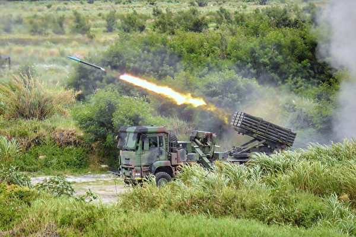

媒体报导，一名陆军中校意图向中共兜售情资遭截获。国防部8月12日表示，本案因即时侦破，成功阻止机密外泄。图为7月16日汉光演习雷霆2000多管火箭发射，资料照。（中央社）

   
  【大纪元2020年08月13日讯】（大纪元记者钟元台北报导）台湾再爆共谍案！陆军八军团游姓中校情报官，在今年汉光演习期间用手机拍摄机敏情资意图向中共兜售，所幸以包裹形式寄出的手机遭截获，游姓中校遭收押移送高检署侦办。

综合媒体报导，游姓中校情报官在今年汉光36号实兵实弹演习期间，以手机拍下机敏情资，再以包裹将手机寄往金门给接头人，意图向中共兜售。宪兵与国安单位接获情资后拦截包裹，游姓中校遭宪兵逮捕后已遭收押。

针对媒体报导“中校军官意图向对岸兜售情资遭截获”，中华民国国防部8月12日表示，此案为本部与国安单位共同调查案件，由检调依法指挥侦办。本案因即时侦破，成功阻止机密外泄，并在“料敌从宽”及“安全”的考量下，已经完成损害管控的相关作为。

国防部指出，目前全案已进入司法程序，基于侦查不公开原则，本部对案情不作任何评论。

国防部强调，“中共对我渗透手法日新，且无孔不入”，未来将持续藉由联防机制与各项防范措施，积极反制，并持续加强人员考核及严密相关机密维护措施，确保国家整体安全。 

<a target="_blank" href=#top><h6 align="right">回上方</h6></a>

