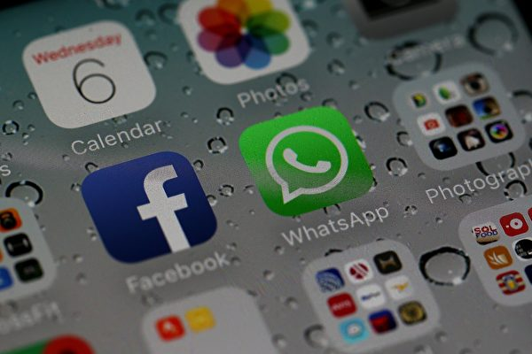
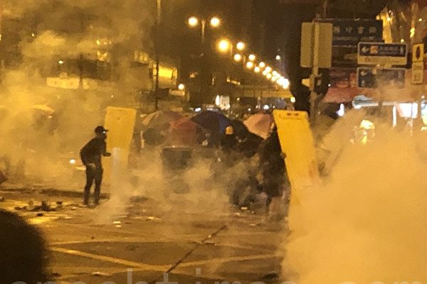
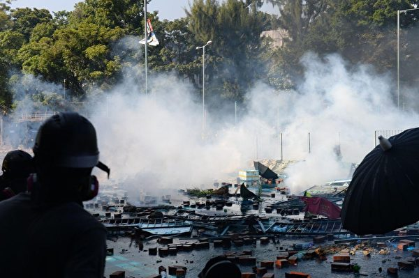
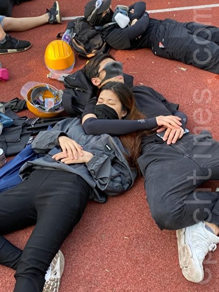
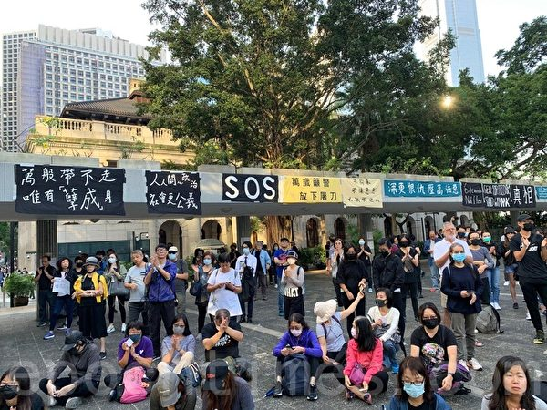
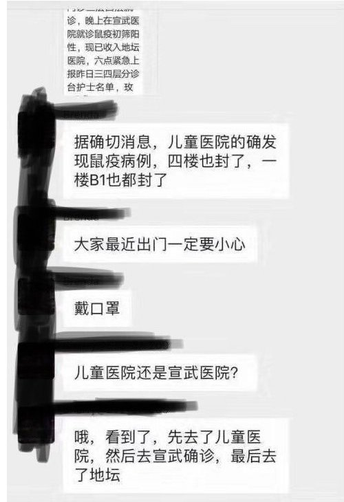

<h4 align="center"><b>知情权不能放弃，也不作愚民，让你看第一手不被过滤的新闻，翻墙软件免费下载  https://git.io/opopop </b></h4>

<h4 align="center">直连不必翻墙 blossom必看 精彩视频 http://111.241.95.85 </b></h4>

<h4 align="center">中共覆灭在即 勿依赖中共保权 https://git.io/Ffor </b></h4>

<h4 align="center">● 红潮即将倾覆 天之将明 ●https://git.io/bb99bbss </b></h4>

<h1 align=center><a href="https://github.com/gav01/Heart/edit/master/ls-02.md">● 大纪元11月时事 ● </a></h1>
<a name=top>
 
 
 
 
 
 
 
 
 
 
 
 
 
 
<a href =#118>118.【新闻看点】香港人权法4要点 北京最担心什么 
<a href =#117>117.分析：香港危机未解 中共更大麻烦接踵而来 
<a href =#116>116.中共不公布港选举结果 网民质疑报导真实性 
<a href =#115>115.王立强是化名 中共捏造法院判决书被抓包 
<a href =#114>114.内蒙古腐败史上第一大案 主角到底贪多少亿？ 
<a href =#113>113.9年冤狱折磨 法轮功学员徐天福被迫害离世  
<a href =#112>112.“五毛”网上攻击神韵 曝中共恐惧和邪恶 
<a href =#111>111.王立强驳“诈骗犯”之说 澳议员吁对其庇护  
<a href =#110>110.吞掉鲁能集团的一内蒙古神秘老板 浮出水面 
<a href =#109>109.泛民大胜 港区“全民公投”清除中共代理人  
<a href =#108>108.前中共特工：我为何与中共决裂 出逃澳洲 
<a href =#107>107.程晓容：香港选举掀海啸 击破中共洗脑宣传 
<a href =#106>106.敏感时刻 王岐山自曝“礼仪性”角色 
<a href =#105>105.独家：习甘肃密会亲信 拍板排美拖港政策  
<a href =#104>104.【新闻看点】港区选竞争激烈 民主派盼光复 
<a href =#103>103.呼伦贝尔原政法委书记被查 曾被海外追查  
<a href =#102>102.许其亮批郭、徐擅权妄为 架空胡锦涛 
<a href =#101>101.专家：中共内部慌乱 多处现“沉船现象” 
<a href =#100>100.【热点互动】美中贸易谈判已成“面子工程”? 
<a href =#99>99.黑龙江公安厅前高官赵春波坠楼自杀身亡  
<a href =#98>98.川普：若非我出面 香港早在14分钟内被毁 
<a href =#97>97.66岁香港老伯首投票：见证了政府的无能 
<a href =#96>96.项云：中共打击杀戮港人是藐视和抗击全世界 
<a href =#95>95.【新闻看点】川普签人权法之际 刘鹤隔空喊话 
<a href =#94>94.一位大陆同胞致香港各界的公开信 
<a href =#93>93.鼠疫慌 京蒙之间设三道防线 河北现“通知” 
<a href =#92>92.年轻妈妈在哈尔滨女监离奇死亡 乡亲诉冤 
<a href =#91>91.湖北公安前副厅长被批捕 曾卖力迫害法轮功 
<a href =#90>90.程晓容：国际风云印证《九评》精准论断 
<a href =#89>89.王友群：台湾人有修炼法轮功的充分自由 
<a href =#88>88.专家：中共内部慌乱 多处现“沉船现象” 
<a href =#87>87.大陆富豪套现千亿 分析：看衰中国经济 
<a href =#86>86.网民担心：被抓港生会不会遭活摘器官？ 
<a href =#85>85.郑文杰透露：成批香港抗议者疑被送大陆关押 
<a href =#84>84.理大最新情况：约50人留守 其中10名未成年 
<a href =#83>83.中大生见证：一座城的转变 一代人的觉醒 
<a href =#82>82.【十字路口】对抗中共4大战线 隐藏在3事件中 
<a href =#81>81.贵州河北两公安高官 一落马一被双开 
<a href =#80>80.贪上亿及卖官 工行前上海分行长被双开 
<a href =#79>79.【拍案惊奇】郑文杰遭逼供 大陆拘反送中参与者 
<a href =#78>78.不可能达成贸易协议 中美都不说破 
<a href =#77>77.李思航：“勇武派”揽炒 领香港凤凰涅槃 
<a href =#76>76.内蒙第三例鼠疫疫源地封路 测过往民众体温 
<a href =#75>75.港警乔装抗争者 走下警车影片曝光(视频) 
<a href =#74>74.9月底 武汉40名法轮功学员遭警察突击绑架 
<a href =#73>73.印刷厂员工被失踪 香港大纪元走过风雨17载 
<a href =#72>72.澳洲自由党参议员抨击中共野蛮强摘器官 
<a href =#71>71.【特稿】九评引领世界 人心觉醒暴政将亡 
<a href =#70>70.【新闻看点】港高院判禁蒙面法违宪 北京跳脚 
<a href =#69>69.《九评》发表15周年 加拿大各界华人在觉醒 
<a href =#68>68.【名家专栏】香港若成屠城 中共要付大代价 
<a href =#67>67.【翻墙必看】鼠疫攻入北京 可怕程度恐超想像 
<a href =#66>66.美参议院通过“香港法” 舒默向习近平喊话 
<a href =#65>65.香港24日前要抓3万人？郭文贵爆中共最新计划 
<a href =#64>64.组图：多国游客在波兰名城签名举报江泽民 
<a href =#63>63.港警围攻校园瓦解Be Water 专家：圈套勿中计 
<a href =#62>62.中共部署纵火港大纪元事件 嫁祸黑衣抗争者 
<a href =#61>61.港人请求英国援助 寒风中首相府外静坐 
<a href =#60>60.香港医学界谴责港警抓理大义务救援队伍 
<a href =#59>59.香港街头惊现镇压新疆人的中共特战八连 
<a href =#58>58.福建省福清监狱攻坚组 残酷折磨法轮功学员 
<a href =#57>57.河南关闭P2P平台 称没有一家过关 
<a href =#56>56.诸葛高参：猪年猪瘟 鼠年鼠疫 天灭中共 谁挡谁亡 
<a href =#55>55.石铭：认清中共流氓本性 加速中共解体进程 
<a href =#54>54.组图：理大学生欲再冲出校园 遭警用催泪弹水炮车阻击 
<a href =#53>53.红三代披露中共计划：搞乱香港 变大陆城市 
<a href =#52>52.组图：11.18凌晨市民声援理大生 警狂射催泪弹 
<a href =#51>51.港警使用闪光弹等武器 理大变战场 
<a href =#50>50.大陆富豪加紧跑路 移民人数暴增50% 
<a href =#49>49.法轮大法洪传世界 6500法轮功学员台湾排字 
<a href =#48>48.明慧网恶人榜更新 公布十万人名单 
<a href =#47>47.警方首次出动音波炮 警告可能使用致命武力 
<a href =#46>46.【新闻看点】北京搞金钱外交 钱让世界低头？ 
<a href =#45>45.【名家专栏】导弹防御是美安全新基石（上） 
<a href =#44>44.400页密件曝光 中共威胁新疆集中营外孩子 
<a href =#43>43.【今日热点】驻港部队出街 未来7天有关键一役 
<a href =#42>42.【新闻看点】中共露杀机香港危急 美警告有代价 
<a href =#41>41.中国学者质疑香港暴力事件 遭官媒围攻 
<a href =#40>40.辽宁抚顺市看守所的八条人命案 
<a href =#39>39.遭中共残害致死的十五位医护人员（上） 
<a href =#38>38.英国政府将出台法律 制裁林郑月娥等人 
<a href =#37>37.神州长城成为大陆首家A、B股双退公司 
<a href =#36>36.组图：多所大学遭港警攻打 中大砌墙阻挡 
<a href =#35>35.组图：11.15港银发族“查警暴止警谎”游行 
<a href =#34>34.组图：11.15港银发族“查警暴止警谎”游行 
<a href =#33>33.三峡大坝给人们真正带来了什么 
<a href =#32>32.冤狱15年 法轮功学员何莲春再遭非法批捕 
<a href =#31>31.冤狱酷刑 颠沛流离 法轮功学员邓莉的遭遇 
<a href =#30>30.程晓容：香港——留给谁的时间不多了？ 
<a href =#29>29.中大保卫战 学生命在旦夕 吁国际人道救援 
<a href =#28>28.港中大大陆生拒绝撤离：成为历史见证人 
<a href =#27>27.传北京儿童医院、宣武医院出现鼠疫病例 
<a href =#26>26.数百陆生上传证件撑港“自由不死中共必亡” 
<a href =#25>25.【新闻看点】关税令谈判陷僵局？川普再喊话 
<a href =#24>24.港警近距离开枪 日本政界首发声谴责 
<a href =#23>23.微信群内撑香港 南昌航大副教授遭举报 
<a href =#22>22.近期四川法轮功学员遭迫害概况 
<a href =#21>21.【世界十字路口】中共让香港变战场 五大目的 
<a href =#20>20.新疆棉花为何引发“奴工”担忧 
<a href =#19>19.浸淫公安系统42年 河南公安厅官员被调查 
<a href =#18>18.再有中国上市公司老板被抓 今年第17个 
<a href =#17>17.北京确诊2人染鼠疫 病源成谜 民众恐慌 
<a href =#16>16.分析：中国实际经济情况比官方数据糟糕 
<a href =#15>15.【拍案惊奇】开枪 车撞 抓人 轮奸 港警疯狂 
<a href =#14>14.11·12港人续抗争 千人塞爆中环毕打街 
<a href =#13>13.獐子岛集团称3亿扇贝死亡 4.4万股民踩雷 
<a href =#12>12.香港殡葬业者谈近期浮尸疑点与活摘器官 
<a href =#11>11.纽约第100届老兵节游行 法轮功队伍成亮点 
<a href =#10>10.台湾女主持人回呛央视女主播视频 网络热传 
<a href =#9>9.陆银行限提款 挤兑频现 专家：危机前夜 
<a href =#8>8.10月份 至少39名法轮功学员遭冤判 
<a href =#7>7.麦康奈尔：支持香港民主抗议者 推动立法 
<a href =#6>6.中国猪肉危机超乎想像 影响全球市场 
<a href =#5>5.【拍案惊奇】香港紧急关头！中大攻防战纪实 
<a href =#4>4.川普：美中若达不成贸易协议 美将继续加税 
<a href =#3>3.惊曝作战部队进入香港 抗争学生捡获大陆警棍 
<a href =#2>2.大瘟疫前兆？中国爆可怕黑死病 舆论恐慌 
<a href =#1>1.警闯中大狂轰滥捕 港人与学生并肩作战 

<a name=118>
<h1 align="center"><b>【新闻看点】香港人权法4要点 北京最担心什么</b></h1>

尽管许多人将此香港人权和民主法案视为是像征性的法案，但法案一旦实施，就有可能完全颠覆美国与香港之间的关系。图为美国国会。(Samira Bouaou/The Epoch Times)

【大纪元2019年11月21日讯】大家好，欢迎大家关注新闻看点，我是李沐阳。

美东时间昨晚6点，《香港人权与民主法案》（Hong Kong Human Rights and Democracy Act）在美国参议院“一致通过”（Unanimous Consent）了。一同通过的还有另一项法案，禁止美国向香港警方出售某些武器。

今天（11月20日），中共六个部门接连发声，批评美方干涉中国内政。中共外交部副部长马朝旭还召见了美驻华使馆内务官，又是表达不满，又是抗议，甚至扬言报复。

美国调整自己的对港政策的，中共为什么说美国干涉中国内政呢？香港人权法让北京着急的是什么？

<b>中共真急了 6部门齐发声</b>

中共抗议都是以干涉内政作为基调。中共外交部副部长马朝旭在召见美国大使馆内务官员威廉·柯蓝（William Kelan）时表示，对美国提出的抗议是庄重与严肃的。不过有一点挺奇怪，中共气得这样，按说应该召见美国驻华大使表达抗议，但是却只召见了美使馆内务官员，不知道这唱的是哪一出。

外交部发言人还扬言，美方必须立即阻止这个法案成法，否则中方将“采取有力措施予以坚决反制”。

此外，中共港澳办、中联办、驻港公署、人大外事委、政协外事委也都批评美国。敦促美方“悬崖勒马”，不要做“损人不利己”的事，“不要搬起石头砸自己的脚”，否则“自食恶果”等等。

看这张牙舞爪的架势，中共真是急了。

<b>美国一次通过2项法案</b>

昨天一致通过的两项法案，都是针对香港的政策。其中卢比奥参议员（Sen. Marco Rubio, R-FL）提出并推定的香港人权法被外界最为关注，通过前已经获得了50位两党议员连署支持。

根据已知信息，香港人权法案大概包括这些内容：1. 要求美国国务院每年列出侵害香港自由的人士，对他们采取制裁措施；2. 美国总统和国务卿双重把关一国两制的执行情况；3. 美国国会每年都要审议香港一国两制的执行情况；4. 无论香港还是大陆，迫害香港人权都将被制裁。

这项法案需要与众议院版本整合，之后交给总统签署。川普将有10天时间决定签署或者否决。

估计川普签署的可能性比较大。首先两院一致通过，这是民意反映。现在正是大选前争取更多支持阶段，如果签署，应该能赢得更多民意。其次，国会一致支持的法案，就算总统否决，也会自动生效成为法律。

像去年通过的《台湾旅行法》，就是一个最近的例子。两院一致通过，整合后交给了川普。在自动生效日的前两天，川普签下了名字。签与不签的结果都是一样，都会成为法律。而川普签了，却为他赢得了很多的支持声音。

另一项法案是由默克里（Sen. Jeff Merkley, D-OR）、科宁（Sen. John Cornyn,R-TX）和布莱克伯恩（Burkeburn）等跨党议员联手推出的。法案要求禁止美国向香港警队出口某些武器装备，包括催泪弹、胡椒喷雾和手铐等等。

<b>中共最担心：问责人权恶棍</b>

卢比奥在法案通过后表示，参议院向港人传递了一个“清晰讯息”。已经听到港人的诉求，会与港人站在一起，对北京破坏香港自治“不会袖手旁观”。将追究中港官员侵蚀香港自治和侵犯人权的行为。

布莱克伯恩表示，中共位居世界最恶名昭著的人权侵犯者榜首，过去几个星期给香港带来了“极端的恐怖”。北京需要知道，美国把焦点放在了“问责”上，“没有问责，就不会有改变”。

两位议员都说到一点：追究问责，这是中共官员最害怕的。因为中共官员都是按照上面指令做，不用承担责任。不管做了多少侵犯人权、伤天害理的事，也不管老百姓的死活，5年任期一到，到别的地方任职了，接任官员不会追究责任。

但香港人权法重点就是问责追责。它要求美国国务院每年提交报告，评估港府的自治情况，评估是不是继续给香港特别待遇。

同时扩展了制裁对象范围。凡是任意关押、酷刑或强迫认罪、屡次违反《中英联合声明》和《基本法》、严重侵犯其它国际认可人权的人士，都在制裁之列。

中国问题专家横河指出，以前中共官员犯罪，包括侵犯人权，都躲在制度后面。现在要个人负责了，谁都得三思而行。

如果确认哪些官员侵害了香港人权自由，不仅被禁止入境美国，他们在美国的资产也将被冻结。试问中共港共官员，有多少在美国有海外资产？有多少家人、子女在美国定居？

这是北京着急的一个主要原因。如果官员都担心被美国制裁、不再死心塌地为中共卖命，人人都不再执行中共的指令，或者阳奉阴违，时间一长，中共的统治力就会减弱，政权也将不稳。

所以说，香港人权法就像是一枚核弹，对中共、港共官员震慑力和杀伤力都是相当大。

这也是中共极力封锁消息的原因。中共虽然官方反应强烈，但是却严控民间舆论。网民不得不各自想办法，表达自己的立场。有广东自由派人士表示，“今天加个菜”，也有说“今天喝两杯”。

<b>香港人权法藏“三暗器”</b>

让北京着急的，还有经济方面的原因。《香港经济日报》表示，这部法案虽然以“人权”为名，但对中国的发展也有着严重杀伤力。

首先，香港如果失去特殊地位，中国经济受冲击将不可避免。香港对中国经济的作用是不言而喻的，去年71%的外资是来自香港的国际资金。大陆企业在香港筹资350亿美元，创下11年的最高点。大陆银行的海外业务，包括人民币交易，主要是通过香港处理。

如果香港人权法牵动《香港政策法》，香港可能就与大陆普通城市没有区别。《华尔街日报》指出，当香港失去金融特殊地位，中国经济势必会受到殃及。

其次，中国科技产业将受到严重冲击。香港虽然主权移交大陆，但它一直拥有独立关税地位。而中共不仅把香港当作金融窗口，还利用香港为大陆引进关键的技术。

如果香港失去独立关税地位，美国将不再向香港输出关键技术和材料。就是说，间接对中国关上了引进高科技的窗户，这对中国高新产业发展和转型都将有很大的冲击。

第三，让美国拥有了更多的筹码。如果美国以人权之名，经济制裁中国（中共），变相打贸易战，美国在道义上已经赢了一局。

经济学人智库分析师马志昂（Nick Marro）表示，美中之间除了关税之外，贸易战还可能在科技金融领域升级。而香港人权法，就是美国金融经济打击中共的一个新武器。

好的，感谢您关注新闻看点，再会。

大纪元《新闻看点》制作组   #

<a target="_blank" href=#top><h6 align="right">回上方</h6></a>

<a name=117>
<h1 align="center"><b>分析：香港危机未解 中共更大麻烦接踵而来</b></h1>

有专家表示，香港的特殊地位一旦失去，中国经济恶化导致的结果中共将承担不起。图为2019年10月27日，香港民众从梳士巴利花园游行，追究警方使用暴力。（宋碧龙／大纪元）

 
 【大纪元2019年11月24日讯】（大纪元记者吴馨综合报导）美国会两院仅一票反对通过《香港人权与民主法案》，火速送白宫等待川普总统签字。有专家表示，香港和美国的关系一旦发生变化，中国经济恶化导致的结果中共将承担不起；此外，中共还面临其它接踵而来的麻烦。

11月19日，美国参议院全票通过《香港人权与民主法案》，20日，美国众议院对参议院的法案版本进行表决，仅一票反对再次通过了该法案。21日，众议院议长公开签署了该法案，并提交给美国总统川普签字；若法案成为法律，中港侵犯人权的人会遭遇制裁。

美国参众两院在香港问题上的一致表态引发各界思考。道夫•S•扎克海姆（Dov S. Zakheim）是战略与国际研究中心（Center for Strategic and International Studies）的高级顾问，也是外交政策研究所（Foreign Policy Research Institute）董事会的副主席。

近日，《国会山报》（The Hill）发表了一篇他撰写的文章，扎克海姆认为，香港危机让中共的麻烦接踵而来，《香港人权与民主法案》在美国国会两院的通过所带来的后果，或将让中共难以承受，中共将面临麻烦。

<b>美国对中共实施可能的人权制裁</b>

路透社11月21日报导，美国国会通过立法以支持香港的抗议者，并对中共实施可能的人权制裁。该报导强调，为了加强民主和自治而进行的大规模抗议活动使香港动荡了五个多月，暴力事件不断升级让外界担心中共会加强应对。

随着北京对香港的控制越来越严，香港根据美国法律享有的特殊待遇受到考验，《香港人权与民主法案》将对香港的特殊地位进行更严格审查。

中共在1984年签署的《中英联合声明》中承诺，在1997年重新获得对香港的主权后，允许香港在50年内享有“高度自治”，这是香港根据美国法律享有特殊地位的基础。但是抗议者表示，香港的自由已经被慢慢侵蚀。

一旦《香港人权与民主法案》成为法律，美国国务院将至少每年一次证明，香港拥有足够的自治权，从而享有与美国贸易的优惠条件，这些优惠让香港维持了其作为世界金融中心的地位。

但扎克海姆认为，北京对香港日益严格的控制使得这种认证越来越不可能。路透社报导也指出，尽管许多人将此法案视为是像征性的法案，但法案一旦实施，就有可能完全颠覆美国与香港之间的关系。

尽管许多人将此香港人权和民主法案视为是像征性的法案，但法案一旦实施，就有可能完全颠覆美国与香港之间的关系。图为美国国会。(Samira Bouaou/The Epoch Times)

<b>两院火速通过法案 给中共一记响亮耳光</b>

扎克海姆在他撰写的题为《香港危机并未结束》的文章中指出，就算香港的大学清理工作可能结束了，但中共在香港的麻烦远远没有结束。首先，中共不能确定抗议不会再发生、更多激烈事件不会出现；其次，中共会因为香港警察向示威者开枪而面临国际社会的谴责，因为即使中共没有下命令，也是允许了香港警察这样做；同时，中共还必须面对香港民众继续以更微妙的方式抵抗，如香港高院裁定港府推出的禁止抗议者戴口罩的《禁蒙面法》违宪就是一个见证。

扎克海姆还指出，除此之外，中共面临美国国会的态度的可能还会危及中美贸易协议的谈判。美国众议院和参议院都强烈谴责了香港警察残酷使用武力，并以仅一票反对的结果火速通过了参议院版《香港人权与民主法案》，并提交川普总统签字。

扎克海姆认为，该法案的通过给了中共一记响亮耳光，也是对中共推广独裁政治经济体系能力的一次重大打击。川普总统早签、晚签、不签，还是反对，都已经无法改变该法案迟早会生效的趋势。

而路透社报导，消息人士预计川普总统将在未来几天内签署该法律。一旦法案生效，涉及人员可能面临美国制裁，例如对侵犯人权的官员进行制裁，包括拒绝入境和财产冻结等。

在扎克海姆看来，香港危机将加剧中国经济日益恶化。图为北京一处建设工地的工人。（AFP)

<b>香港危机 中共麻烦大了</b>

路透社报导指出，从商业角度来看，香港特殊地位的最重要一点是，香港被视为与中国大陆分开的海关和贸易区，比如，这意味着中美贸易战关税不适用于来自香港的出口商品。

根据美国国务院的数据，2018年有85,000名美国公民居住在香港，有1,300多家美国公司在香港经营，其中包括几乎所有主要的美国金融公司。香港是美国法律和会计服务的主要目的地。香港美国商会表示，任何改变香港地位的事情“都将对美国在香港的贸易和投资产生令人不寒而栗的影响，而且会在国际上对香港在全球经济中的可信赖地位发出负面信号” 。

扎克海姆指出，香港对中国经济的健康发展至关重要。外国公司已经将香港作为进入大陆开展业务的基地。香港的股票、债务和货币市场，加上其坚持法治和执行合同的声誉，使其远比上海和其它可能由北京当局操纵的替代性中国金融中心更具吸引力。

在扎克海姆看来，香港问题若处理不好，将加剧中国经济日益恶化，而这将破坏中国民众与中共之间的社会契约，而这种契约在很大程度上依赖于中国经济的繁荣和中产阶级的不断扩大。所以经济恶化导致的社会结果是中共所负担不起的。

扎克海姆指出，各方面因素都说明中共已陷入困局：中国目前的经济并不像五年前那样强劲；中国社会还在遭受着现已被遗弃的独生子女政策所带来的后果；全国各地暴动频发；越来越多的穆斯林人被抓到集中营，成了中国的一个动荡人群。扎克海姆认为，所有这些前兆预示着中共将有麻烦了。

<a target="_blank" href=#top><h6 align="right">回上方</h6></a>

<a name=116>
<h1 align="center"><b>中共不公布港选举结果 网民质疑报导真实性</b></h1>

2019年11月24日，香港举行区议会选举，屯门区议会选举现场。（余天佑／大纪元）

 
 【大纪元2019年11月25日讯】（大纪元记者方晓综合报导）香港本届区议会选举中，民主派大获全胜，建制派惨败。中共喉舌媒体的报导不提谁胜谁负，而大陆很多网民纷纷发贴，称看到选举结果才意识到自己被中共欺骗了，并质疑中共媒体对香港反抗运动报导的真实性。
 
<b>港区议会选举民主派压倒性胜利 建制派惨败 中共喉舌不报导</b>

11月24日，香港区议会选举在“反送中”运动持续近6个月的背景下拉开序幕，共有294多万人参加投票。在18区共452个直选议席中，泛民主派赢得388席，亲中共的建制派只取得58席。原本完全由建制派掌握的18区区议会中，有17区被民主派直接大洗牌，只有离岛区议会靠当然议员保留议会内一定席位。

中共新华社25日凌晨1时28分的报导，只援引选举管理委员会主席冯骅指共有超过294万登记选民参加投票，投票率达到71.2%。而根据选举安排，全港共设有615个一般投票站及23个专用投票站，投票时间为24日7时30分至22时30分。

截至25日上午10点半左右，新华社未有更新报导，跟进选举结果、各个阵营的胜负情况。中共《人民日报》25日也没有就港区议会作出任何报导。

中共《环球时报》的报导也未公布具体的选举结果，仅称“投票结果（24日）夜里逐渐出来，建制派的席位大幅缩小，泛民获得452个民选席位中的多数席位，不过从双方所获得的实际票数看，差距比席位差距要小很多。”

这次香港区议会选举，普遍认为这是对“反送中”运动的一次民意测试，选举结果让人们清楚看到了香港的民意是什么，也让被中共长期洗脑、欺骗的大陆网民有所触动，开始怀疑中共对香港抗议的报导的真实性。

<b>民众开始质疑中共对香港抗争运动的报导的真实性</b>

有网民表示：对比现在的选举结果，我开始怀疑每次新闻和微博里出现的一些香港新闻是否具有真实性？我们所看到的（报导）是不是事情的真相？

<h3 align=center><a href="https://twitter.com/uwu_uwu_mo">半年以來第一次敢係微博搜「香港」關鍵字,麻煩第一條這種來多點hohoho</a></h3>

“文清_Ingrid”：反对派大胜，泛民主派一直很努力很努力，这是他们应得的。大陆支持建制派的人不要输不起，说一些取消一国两制的负气话。建制派要反省。

“韩东言”：辩证地看，我认为这次香港问题不是坏事，最大的一个好处就是，让我们很多人从根本上打破了以往的错觉。不得不承认，我们很多人对于香港有很多错觉，错觉就会产生误判，比如反对派人数，立场。这次选举，全都揭晓，真相展示，所以，我是积极看待这个结果的。

很多网民在微博跟帖，嘲讽中共喉舌不报导香港区议会选举结果，以及表达他们对香港抗议运动的最新认知。

“黑糖1515”：还不是中共的媒体一直是偏向性报导！这下好了，怎么不发声了？有些事真不是民意的话他们能这么大规模抗议？！

“gemini-ouda”：不晓得央视新闻联播脸被打肿吗？整天一本正经胡说！

“端心如梦”：问题是我们这些错觉是从哪儿来的？是谁给我们营造了这种错觉？

“提菈的Misura”：错觉？呵呵呵，对百万人游行示威视而不见，现在实打实的民调出来了，你告诉我有没有百万人？

“何时去钓鱼”：潮水退去才知道谁在裸奔…

“阿皓218”：点票时全部候选人都在场的，这就是香港人的民意！不管我们承不承认。

“张特锋”：看看今天中共新闻联播还播吗！

“本猪267”：脸都被打肿了。

“Honey9957”：中共每天的新闻联播都是撑警，市民反对暴力，怎么选票结果反了？

“网-鱼他爹”：这就是央视天天告诉我们的“一小撮”，成天自娱自乐，现在不知道中央有没有醒。

“镁食镁客”：我都不知道央视新闻怎么打脸怎么报导？

“隔壁阿二的冤魂”：香港人用选票表态，不是民心所向吗？

<b>中共不遗余力抹黑香港反抗运动</b>

自从6月初爆发反送中运动以来，中共官方媒体从对合理非的游行、集会不报导，到颠倒黑白抹黑勇武抗争的黑衣人，口口声声称他们为“暴徒”，编造了一个与香港抗争运动实际情况完全不同的版本，不断给国内（墙内）看不到真相的民众洗脑，灌输假消息，煽动仇恨。

8月19日，推特上有网民曝光了一份中共对付香港反送中运动的舆论战《宣传要则》文件，称中共抹黑香港反抗运动的龌龊和下作一览无遗。

该文件内容显示，中共严禁正面报导香港市民的民主自由诉求，并将反送中运动定位为：1.爱国与港独之争；2.和平和暴力之争；3.法制和动乱之争。

文件还要求，淡化示威者总人数和民众支持度，突出报导支持政府和警方的声音，把示威者定性为所谓“恐怖分子”。

文件中还要求报导中突出“港独”标语和西方国家的旗帜，以及西方政界人士发声。以此来构陷示威者同西方势力勾结，制造混乱；对于境外流入的香港警方使用过度暴力的视频图像，必须在第一时间屏蔽删除。示威者在机场道歉的信息也第一时间删除。

虽然这份文件的真实性无法得到证实，但有推友表示，这个《宣传要则》无论真假倒是一针见血刺穿了一贯的宣传套路。

还有网民表示，中共和港府两个月来的丑行足可以证明这是真的。“中共的无耻，没有底线没有良知根本不顾事实真相。”

<a target="_blank" href=#top><h6 align="right">回上方</h6></a>

<a name=115>
<h1 align="center"><b>王立强是化名 中共捏造法院判决书被抓包</b></h1>

中共间谍“王立强）向澳洲投诚，并向澳洲媒体爆料，指出中共正通过多种方式渗透台湾。 （“王立强”提供）

 
【大纪元2019年11月25日讯】（大纪元记者方晓报导）投诚澳洲的中共前特工“王立强”向澳媒揭露中共在香港、台湾等地的间谍活动，并向澳洲当局请求政治庇护，引起国际关注。中共则迅速回应指称王是“诈骗犯”，但澳洲媒体24日公布“王立强”完整专访显示，“王立强”仅是他受访的化名，中共立刻被抓包说谎。

中共在回应王立强案时，除了否认王是中共间谍外，更出示法院判决书，证明“王立强”曾在2016年10月因犯诈骗罪被判刑。

“王立强”向澳洲投诚曝光后，中共上海公安发布讯息，称“王立强”持伪造中国护照与香港护照各一本，刊载的姓名为“王强”，但他的真名是“王立强”，并指控他在2016年10月与2019年4月19日，均涉诈骗案，今年被处有期徒刑1年3个月，缓刑1年6个月，但他在今年4月10日持假护照潜逃出境。

但澳洲“60 Minutes”节目指出，“王立强（音译，Wang Liqiang）”表示，他去年就已到澳洲探视妻小并共同生活，且该姓名为上节目受访专用的化名，真实姓名并未被澳媒公开，他知道一定会被中共当局抹黑，早有心理准备。

也有大陆网友在被称为海外知乎的“品葱”网发帖，指在大陆“汇法网”及百度搜索，都搜不到王立强诈骗案判决书的既往关联结果，对于一个三年前就理应存在的网页而言，这种现象并不寻常，因此质疑王立强的判决书是新近才出现在网页。

澳洲绿党24日晚间在脸书贴出此事后，网民纷纷留言指“这判决书成为绝响”、“澳洲也在做试探，然后中共就急着跳了”。

还有网民嘲讽道：“中共：判决书上其实也是化名”、“笑死，自己派的间谍连是不是本名都不知道”。

澳洲《时代》与《先驱报》23日报导说，“王立强”冒着被中共监禁或处决的危险，承认了自己代表中共“组织并参与了一系列间谍活动”。

“王立强”说，当看到自己参与的颠覆活动带来的后果时，他出于良心，决定背叛中共，“我参与了一个旨在破坏世界民主的组织。”他说。

澳洲媒体报导说，“王立强”通过律师乔治·纽豪斯（George Newhouse）反驳了中共关于他有犯罪记录的说法。他说自己已向澳大利亚政府宣誓，他知道做出虚假声明的严重后果。#

<a target="_blank" href=#top><h6 align="right">回上方</h6></a>

<a name=114>
<h1 align="center"><b>
内蒙古腐败史上第一大案 主角到底贪多少亿？</b></h1>

中共内蒙古厅官李建平，其贪腐案被指“内蒙古反腐败斗争史上迄今第一大案”。（大纪元合成图）

【大纪元2019年11月24日讯】（大纪元记者张顿综合报导）中共内蒙古官场出现“反腐败斗争史上迄今第一大案”，那么作为正厅级主角李建平到底干了啥？贪腐了多少钱财？

此前，内蒙古已出现多名亿元级贪官，其中一省部级官员贪腐了4.49亿余元（人民币，下同），另一厅官贪腐了6亿余元。

11月23日，中共内蒙古自治区召开所谓的全区警示教育大会，播放了“典型案例的警示教育片”。

教育片一开始就介绍了“内蒙古反腐败斗争史上迄今第一大案——李建平案”。

据《中国纪检监察报》24日报导，内蒙古呼和浩特经济技术开发区党工委原书记李建平，在中共十九大后，“仍不收敛、顶风作案”，就在其被留置调查的当天，按照计划还有一笔巨额资金即将转入其个人设定的账户，但由于布控及时而未能得逞。

现年59岁的李建平，2001年任呼和浩特市水务局党委书记，呼和浩特市节水、水资源管理局局长（正处级）（兼），春华水务公司董事长；2011年任呼和浩特市经济技术开发区党工委书记。

李建平2018年9月落马；今年8月被立案审查调查，被开始公职、中共党籍。官方“双开”李建平的通报措辞“严厉”，称其：

行为底线全面失守，未经批准多次出入国（边）境；把分管领域当成“私人领地”，下属企业当成自己的“钱袋子”和“提款机”，指使下属国有公司挪用专项资金，在购买住房过程中侵犯国家利益；

长期“亦官亦商”，与不法商人勾肩搭背、沆瀣一气，大肆非法攫取巨额经济利益；生活腐化堕落，多次到境外赌博等。

虽然官方通报了李建平干了上述一些不法事情，但是作为内蒙古“迄今第一腐败大案”中的主角李建平，到底贪腐了多少，官方迄今为止还未披露。

<b>内蒙古出现多名亿元级贪官</b>

中共十八以来，内蒙古已有7名省部级高官落马，其中仅区党委常委就有5人，另外还有至少几十名厅官落马，贪腐上亿的贪官也不少。

其中，曾任内蒙古自治区党委常委、政法委书记、内蒙古人大常委会副主任的邢云，贪腐金额高达4.49亿余元。邢云2018年10月落马，今年8月15日受审，其案件将择期宣判。

内蒙古副厅级官员、乌兰察布市前市委常委、集宁区委原书记杨国文，贪腐1.41亿余元。杨国文2018年3月被查，2018年12月受审，今年被判刑18年，并被处罚金300万元。

内蒙古正厅级官员、内蒙古银行前董事长杨成林，贪腐金额超过6亿余元，2018年12月被判处死缓。其中，他受贿3.07亿元；骗取内蒙古银行资金628万元；挪用呼和浩特市商业银行、内蒙古银行2.92亿元归个人使用，进行营利活动。

外界质疑，如果李建平是中共内蒙古“反腐败斗争史上迄今第一大案”，那么他贪腐的金额，至少超过上述官员，超过了4.49亿余元，也超过了6亿余元，甚至是天文数字。

<b>已有54名亿元级贪官遭通报</b>

据大纪元记者统计，中共十八以来，中共官方通报的亿元级贪官至少有54人，其中省部级及以上官员有39人。最近一例是中共北京市副市长陈刚，他今年11月7日受审，被指非法收受财物共计折合约人民币1.2888亿元。

其他的官员，如天津市政协副主席、公安局局长武长顺，贪腐4.26亿余元，挪用公款1.01亿余元；安徽省副省长陈树隆，贪腐2.76亿元，滥权造成损失29亿元，非法获利1.6亿元；云南前省委书记白恩培，受贿2.46亿余元，另有巨额资产不能说明来源等。

中共前政法委书记周永康涉贪1.3亿元，滥权造成14.86亿余元的损失；中共政治局委员孙政才贪腐1.7亿元；中共政协副主席苏荣贪腐1.1亿元，还有8000万元财产不能说明来源。

副国级的中共前军委副主席郭伯雄、徐才厚等人虽然已经落马，但官方至今未披露他们贪腐的金额。据港媒披露，他们每人都贪腐200亿元。而正国级的周永康，据路透社披露，其家族贪腐钱财超过900亿元。

<b>红色后代占据中国大部分财富</b>

而这些落马的贪官，外界认为相对于中共红色后代而言，只是个“小贪”而已。

邓小平的外孙女婿、安邦集团董事长吴小晖落马后，当局没收其800多亿元的财产。由于安邦集团是私企，吴小晖并没有官职，所以他并没有算在中共落马贪官的数字里面。

港媒2017年曾报导，中共外汇储备近三年下降1万亿美元，而外流资金主要来自500个权贵家族；并分析称，中共500个权贵家族掌握了中国大陆约40%的财富，掌握了大陆4万亿美元中约一半的外汇储备。

外界认为，中共前党魁江泽民家族，以及中共前国家副主席曾庆红家族等，是目前中共最贪腐的家族。江泽民大儿子江绵恒被指是“中国第一贪”；江绵恒的儿子江志成也和其父一样，都在“闷声发大财”，攫取巨额国家资产。

身在美国的大陆富豪郭文贵今年4月爆料称，江志成常住香港，至少坐拥5000亿美元以上资产，江泽民家族在海外控制的财富至少有1万亿美元。#

<a target="_blank" href=#top><h6 align="right">回上方</h6></a>

<a name=113>
<h1 align="center"><b>9年冤狱折磨 法轮功学员徐天福被迫害离世</b></h1>

中共酷刑迫害示意图：溺水。（明慧网）

【大纪元2019年11月24日讯】四川米易县撒莲乡法轮功学员徐天福，因修炼法轮功曾被非法判刑9年，自2012年10月从德阳监狱回家后，因在监狱被迫害，身体受损严重，一直没有恢复，于2018年黄历冬月三十离世。

明慧网报导，徐天福1996年开始修炼法轮功后，努力按照“真、善、忍”的标准要求自己，身体得到了净化，思想境界也得到提高，做事首先考虑别人，利益和好处主动让给他人，是邻里称颂的好人。

1999年“7.20”江泽民及中共迫害法轮功后，徐天福多次被非法关押、抄家，后被非法判刑9年，于2003年被送到德阳监狱迫害。

9年的迫害，造成了徐天福浑身伤痕累累，肚子胀得像鼓一样，肝区又胀又痛，吃不下饭，命悬一线。而在被绑架前他身体健康，体重150多斤。

2012年10月12日出狱时，徐天福骨瘦如柴，身体受损相当严重，腿肿得厉害，脚背快要破皮的样子。连警察都断言：徐天福即使回去也活不了多长时间。

回家的第三天，徐天福就被送进医院，抽腹水、输液、注射消肿的药。住院八天，他的体重减了20多斤，腿仍然肿胀。

自2017年开始，他的肝腹水的症状开始返出来；2018年，他病情严重，经常住院。过世前，身体严重消瘦、脸黑黄。

徐天福在四川德阳监狱曾遭受酷刑折磨。

在狱中，他被罚站、跑、面壁，强制劳动，干重活、脏活，曝晒、受冻等。2008年监狱施行强制“转化”（放弃修炼）。在10监区强制“转化”法轮功学员的狱警钟胜，指挥包夹犯（专门监管法轮功学员的刑事犯）对徐天福实施酷刑折磨。

狱警先罚徐天福连续站七天八夜，接着又罚他蹲一天，到第八天的晚上，两包夹将他弄到洗刷台那里溺水。用大盆装满水之后，两人将他的头按在水里，让他喝几口水之后将他的头提起来唤口气，再按下去，这样反复提起来按下去，直到他的肚子鼓起来他们才住手。

之后他又被按坐在厕所的尿槽边上，两个包夹用盆子在水池里装满水，再往他头上淋水，淋到只剩半盆水的时候，把剩水往他脸上用力泼。

那时还是五月初的德阳，晚上的水很冰凉，包夹边淋水边逼迫徐天福写“三书”（放弃修炼的“认罪书”、“悔过书”、 “保证书”）。他实在承受不了，违心地同意写。

之后三个月左右，他的头一直昏昏沉沉的，人精神不起来，深深后悔写了“三书”。终于他对狱警说：“我写‘三书’是错误的，法轮功没有什么不好，法轮功教人向善、做好人。当时两个包夹那样对待我，我是承受不住了才同意的，不是自愿的。”

狱警每次找他谈话时，他都这样告诉他们，最后狱警认为他是“转化”不了了。

<a target="_blank" href=#top><h6 align="right">回上方</h6></a>

<a name=112>
<h1 align="center"><b>“五毛”网上攻击神韵 曝中共恐惧和邪恶</b></h1>
 <h3 align="center"><b>作者：纪原</b></h3>

中共的互联网审查已经从国内延伸至世界。近期发生多起异议人士在海外社交媒体发声，而被中共抓捕的案件。( Justin Sullivan/Getty Images)

 
【大纪元2019年11月25日讯】十多年来，神韵努力弘扬和恢复五千年中华传统文化，风靡全球。反传统、反人类的中共恐惧至极，处心积虑地干扰神韵演出，手段之一是利用“五毛党”在网上发表谩骂诋毁的文章。“五毛”声名狼藉，这班人的网攻方向透出中共的恐惧所在。

神韵艺术团自2007年起展开年度世界巡演，声名鹊起，中共又嫉又恨，“610”和所谓“反X教协会”及中领馆等机构部署专门打压计划。中共雇用文字打手炮制诬蔑之词，再由“五毛”将这些文字到处转发。当网友使用大陆搜索引擎寻找“神韵”相关信息时，负面内容大量涌出，严重误导读者。中共企图以此阻挡神韵发展、阻挠人们观赏神韵和了解真相，用心险恶。

根据追查国际于2010年8月12日发布的《关于中共干扰破坏神韵艺术团演出的调查报告》，在神韵演出面世不到4年的时间里，“据不完全统计，‘610网’（2006年7月，中共中央“610办公室”在互联网上开办了反法轮功‘专业网站’，以下称‘610网’）上发表攻击诋毁神韵演出的文章共约230多篇（包括转帖、转载）。这些对神韵演出歇斯底里的谩骂和诋毁的文章，多来自中共各级X教协会的写作班子和‘610’办的成员组稿。”

报告还指出：“‘610网’、中共使领馆还拿着几篇‘西方媒体’转述中国驻外大使馆和中共侨领观点的文章来代表‘主流’西方媒体、观众观点，在网上来回炒作，混淆视听，编造国际舆论来欺骗民众。”

<b>“五毛”谎言与事实真相</b>

“五毛”们攻击神韵的谎言主要涉及以下几个方面，事实胜于雄辩。

<b>1. 演出的艺术水准</b>

“五毛”攻击神韵的艺术水准，却拿不出任何文艺界名家的点评为证；所谓某“知名”网站的“差评”，在神韵票房连年火爆的数据面前，完全不值一驳。

神韵官网、新唐人、大纪元等媒体汇集了历年各国观众对神韵的热情反馈：“这绝对是来自天外的艺术。”“神韵美得不可思议。”“神韵为肯尼迪中心设立了新的艺术标杆，其它的演出团体难望其项背。”众多国际知名的音乐家、舞蹈家、服装设计师、剧作家、画家、节目主持人等艺术名流倾情赞叹，观看神韵已成为西方主流社会的盛事之一。

2019年1月10日，三度艾美奖得主、美国知名电视主播瑞塔‧柯斯比（Rita Cosby）在纽约林肯中心第四次观赏神韵后说：“我百分之百能感受到慈悲的主题”，“全世界的人都应看到神韵。”

美国著名医学教授、三度获诺贝尔奖提名的西蒙‧西蒙涅恩（Simon Simonian）说：“我认为神韵是人类在现今能看到的最美好的演出。神韵展现了优雅、美妙、色彩、神性和现实，展现了中国古老的传统。”

2013年3月，在中共政协文艺界分组讨论上，有人提出，由法轮功主办的神韵艺术团演出票房非常成功。而大陆表演团体在海外的表演水平“乱七八糟”，损害中国文化在国际上的形象。

2013年4月，大纪元披露，中共派出一批官员和专家小组组团到海外“考察”神韵，他们暗地里记录神韵演出中的舞蹈、服装、音乐、制作等各方面的细节，试图抄袭模仿后再输出表演，对神韵造成冲击。但是，据知情人透露，领此任务者苦于“怎么样也学不来，特别是中华传统文化的内涵，学不来”。

<b>2. 演出呈现法轮功受迫害</b>

神韵演出涵盖古今，内容包括法轮功受迫害的当代现实。“五毛”借此诋毁神韵，称其为“政治因素”、“反华”等。中共在大陆镇压法轮功失败，将信仰“真、善、忍”的修炼者视为最大威胁，因此，对迫害真相的任何形式的揭露都令它心惊和难以容忍。

中共自1999年7月起迫害法轮功，波及数千万法轮功学员及其家人、共计上亿民众，制造了人类历史上最惨烈的人权灾难。中共对坚守信仰的炼功人施以酷刑和精神折磨，甚至活摘器官、赚取巨额利润。在此基础上兴起的大陆器官移植产业链也把许多外国病患和商家卷入，黑幕触目惊心。

神韵演出以舞蹈和音乐呈现中共侵害人权、压制信仰自由的真相，体现了艺术家维护正义良知的社会使命感，唤起人们抵制邪恶、制止迫害的共鸣。这不是“反华”，而是伟大的爱国义举。许多观众在受访时都强调，反映法轮功受迫害的舞剧令他们尤为震撼，神韵编导的艺术处理恰到好处，释放强烈的感染力，彰显善恶因果。

<b>3. 海外观众的反馈</b>

“五毛”在诋毁文章中称，“境外华人”在纽约等地对神韵“呛声”。其实，那些在剧场外滋事者，都是受中共雇用和操控的，人数寥寥，根本不能代表广大的华人群体。

今年1月10日晚，神韵在林肯中心大卫寇克剧院举行首场演出，一些华人亲共分子在开演前站在剧院前的台阶下，手举诽谤神韵和法轮功的横幅和牌子。当有人靠近拍照时，部分人用牌子挡住自己的脸，暴露其“没脸见人”的心态。纽约警察也在现场，不许他们向前靠近。

1月13日下午，纽约观众Peter Hewett观看神韵后告诉记者，“抗议者”的出现恰好说明神韵演出的力量。“我相信那些人都是受人指使的。他们凸显了神韵演出的重要作用。”“他们为什么抗议？那就是恐惧。”

中国观众、海外华人如何看待神韵？他们说，神韵让自己找到了民族文化的根。前中国美术家协会会员、画家吴海波表示，神韵重拾中华民族的文化，从远古到今天，“神韵是条光明的路，神韵是太阳。”

前中国国家一级歌唱演员阿依古丽2010年在荷兰首次观看神韵演出后表示，她在中国40年，在国外8年，今天才看到真正的中华民族传统艺术。

原武汉人民艺术剧院编导王以源在美国加州多次欣赏神韵演出，他说：“神韵完全可以代表中国传统的艺术。”“作为中国人为有这样的一台节目而骄傲，非常非常的骄傲。”

去年4月，美国加州洛杉矶县钻石吧市的前市长张文彬与太太、南加州著名华人企业家郑美莲一同观看了神韵演出。张文彬先生称赞神韵“超水平、超水准，是中华文化精髓的表现”。郑美莲感叹道，神韵“把艺术、科技、美感、动作，全部整合在一起，呈现世界级的演出。在西方世界表现东方艺术，非常难能可贵。”

今年4月21日下午，大陆周先生在台湾台中中山堂观看了神韵演出，他说，“大陆人真的是最需要神韵，因为‘仁义礼智信’在中国大陆全部丧失了。神韵表现的是神性的正能量，这一点，如果能在大陆演出，整个大陆会改观。”

神韵在拯救中华传统文化，令西方人对五千年文明心生敬仰，而那些跟随中领馆鼓噪、攻击神韵的华人和“五毛”，才是真正地给中国人丢脸，在败坏中国形象。

<b>4. 个别海外剧院取消演出</b>

“五毛”文章列举了海外某些城市的剧院取消神韵演出，借此攻击。真实情况是：中共使领馆以经济利益和外交关系为筹码，向当地剧院施压，欲迫其就范。许多剧院负责人坚决回绝了中共的无理要求，并向媒体曝光事件。但是，也有一些剧院屈从中共，给已经购票的观众造成极大损失。

2016年4月26日下午，神韵演出的韩国主办方“韩国法轮大法佛学会”，在中使馆前召开记者会，揭露驻韩中使馆阻挠神韵在韩国演出的新伎俩。（全景林／大纪元）

例如，2016年1月22日，中共驻韩国大使馆向首尔KBS剧院发出一封未盖章的公函，以影响中韩关系和KBS的影视利益相威胁，逼迫KBS取消其与神韵签订的当年5月的演出租用合同。事后，神韵韩国主办方和已购票的当地观众强烈谴责中共行径，谴责KBS向暴政低头。然而，中共“五毛”却在网上颠倒是非，称KBS之前签约是“误信”，后来悔约是“弄清了真相”。

实际上，“五毛”罗列的被取消的演出，桩桩件件，正是中使领馆犯罪的铁证，这些都将被写进对中共和一干罪犯的审判书。“五毛”不敢提及海外民众的愤然抗议，更不敢提及神韵六大演出团在世界同步巡演的奇迹。自2018年12月12日至2019年5月12日，神韵艺术团共计在150多个城市上演了近670场演出，覆盖百万名观众。

正如许多观众和评论人士所言，中共对神韵的打压自曝其丑，反助神韵更显辉煌。

<b>“五毛”助纣为虐 必被究责</b>

“五毛”们在网上诋毁神韵，实施了毁损商誉、在线侮辱和诽谤的网络犯罪。不仅如此，他们散布的谣言和煽动的仇恨，很可能导致众多网民对神韵产生误解，因而错失观赏演出的机缘。“五毛”效力于摧毁民族文化、迫害善良国民的中共暴政，岂非弃民族利益和良知于不顾？

近期，中共的信息战正遇到越来越多的质疑和抵制。8月19日，美国国务卿对福克斯新闻表示，他知道中共有“在网络空间从事网络犯罪的历史”。8月份，推特和脸书共删除、封锁了超过20万个受到中共官方控制的账号；两大社群巨头指出，这些账号散播有关香港“反送中”的假讯息，因此他们拒绝为这些被国家控制的账户提供广告。海外舆论呼吁，希望更多的社媒平台跟进，封闭“五毛”。

当前，美国、澳洲、新西兰、加拿大、台湾和欧洲等许多国家都正在防范中共渗透，严查中共代理人，惩治间谍窃密、网络霸凌等多种非法之举。多名为中共站台和效力的中共官员及外国政商等在海外被逮捕、判刑、受到调查等不同形式的惩处。

日前，澳洲多家媒体报导了中共特工王立强向澳洲投诚的惊人消息，王立强曝光了中共对香港和台湾的渗透动作，其中披露了利用网络攻击的手法，例如“如果我们想攻击某人，我们可以立即破解他们在香港的脸书Facebook”，并利用虚假的IP地址发布反民主信息。

王立强表示，他再难与父母相见。他说：“我们的电话被窃听，我不敢多交流。这是最悲伤的事情⋯⋯”“但我坚信在那样的组织（中共）里面，下场终究不会有多好。”“我非常清楚，永远不能信任中国共产党。”

10月9日，大陆网名“种花家的爱国红小将”在微博上发表仇视美国、要杀光香港民众的言论。第二天，他（她）却在微博上求救，原来是自己老家爷爷奶奶的住房在晚上被强拆，父母要去上访也被拦截。此事表明，中共只在乎它的权力，所有其他人的利益、包括为它服务的“五毛”在内，随时可以被出卖和牺牲。

今年7月，媒体报导，“超级大五毛”袁小靓（染香）被中共国保带走问话，她想返回澳洲，但被拒出境。袁小靓的丈夫杨恒均1月份在广州被捕，她因此曾向澳媒哭诉，引发争议。因为她本人过去持续批评西方自由民主制度，攻击公知，曾自称是“五毛党”党主席。“头牌”“五毛”今日有此际遇，当令众“五毛”惊醒。

“五毛党”在网上兴风作浪，经其手发出的攻击神韵的每一篇文章和贴子都散发着浓烈的毒素，把神圣和美好的事物妖魔化。人在做，天在看。配合邪恶宣传、推波助澜者，必须承担后果。

中共攻击神韵，是邪恶对正义的挑衅。神韵引领着世人回归传统价值和普世价值，给中国和世界带来希望。神韵是中国人的荣耀，是值得万分珍惜的机会。可以预见，在不远的将来，对法轮功的迫害必将被制止，神韵将在中国大陆堂堂正正上演，为十四亿人民送去福音。在神韵光芒照射下，中共丑态毕露，无所遁形。

<a target="_blank" href=#top><h6 align="right">回上方</h6></a>

<a name=111>
<h1 align="center"><b>王立强驳“诈骗犯”之说 澳议员吁对其庇护</b></h1>

澳洲国会情报及安全委员会主席海斯迪（Andrew Hastie）表示，澳洲政府应该立刻对投诚的王立强给予庇护。(AAP Image/Lukas Coch) 

【大纪元2019年11月24日讯】（大纪元记者徐简综合报导）逃到澳洲的原中共特工王立强向国际社会披露中共在香港、台湾等地的间谍活动后，中共做出异常迅速的回应，称王力强是“诈骗犯”。

澳洲媒体报导，王立强通过律师乔治·纽豪斯（George Newhouse）反驳了中共关于他有犯罪纪录的说法。他说自己已向澳大利亚政府宣誓，他知道做出虚假声明的严重后果。

王立强还表示，早就预料到了中共会对他进行污蔑和诽谤。同时澳洲国会情报及安全委员会主席海斯迪（Andrew Hastie）表示，澳洲政府应该立刻对投诚的王立强给予庇护。

星期六（11月23日），中共政法委罕见地对王立强事件做出迅速回应，转发了上海市公安局静安分局当日发布的情况通报。该通报说，王立强是福建南平的无业人员，曾因诈骗罪被判刑，现在涉案在逃。

一般来说，是中共外交部对这类外国媒体报导做出反应，现在外界还不清楚为什么一个所谓的“诈骗分子”需要惊动中共中央。

据澳洲《时代报》，《悉尼先驱晨报》和《 60分钟》证实，澳大利亚安全机构正在积极处理王的案子，国际情报机构也在研究王供认的内容。

《时代与先驱报》周六报导说，王冒着在中共被监禁或处决的危险，承认了自己代表中共“组织并参与了一系列间谍活动”。

王立强说，当看到自己参与的颠覆活动带来的后果时，他出于良心，决定背叛中共，“我参与了一个旨在破坏世界民主的组织。”他说。

著名的自由党议员、澳洲国会情报及安全委员会主席海斯迪（Andrew Hastie）赞扬了王立强叛逃到澳大利亚的勇气，并呼吁政府紧急保护他。“我认为任何人愿意协助我们捍卫国家主权，都值得我们保护。”

他还说，揭露中共政府系统的、全面的干预外国行动的王立强，是一位“民主之友”， “我认为他应该得到我们的保护和支持。”

王立强还得到了澳大利亚前外交事务高级官员和情报专家Phillip Gregory的支持，Phillip Gregory形容王是“一个经受了不可思议折磨的年轻人，一个勇敢的人”。

<a target="_blank" href=#top><h6 align="right">回上方</h6></a>

<a name=110>
<h1 align="center"><b>吞掉鲁能集团的一内蒙古神秘老板 浮出水面</b></h1>

山东“巨无霸”鲁能集团被贱卖所涉第一个关键人是曾庆红的儿子曾伟。（新纪元合成图）

【大纪元2019年11月24日讯】（大纪元记者方晓综合报导）最新一期财新周刊，深度起底以中共内蒙古政法委前书记邢云为首的腐败窝案，包括其与多名私营老板进行利益输送的内幕。其中的私企老板董介荣与刑云关系甚密，赚成亿万富翁。

董介荣还是当年吞掉国企“鲁能集团”的神秘人物之一。这起惊天“蛇吞像”的丑闻中，董扮演的角色，以及他与资本大鳄肖建华之间的关系，目前仍是一个谜。

<b>邢云主政鄂尔多斯 与董介荣关系密切</b>

邢云从1968年参加工作起，仕途从未离开过内蒙古。邢云生于包头长于包头。

1993年10月，邢云从包头市石拐区区长调任伊盟副盟长，1995年1月后历任盟长、盟委书记，2001年9月伊盟改为鄂尔多斯市，邢云是首任市委书记。

邢云主政鄂尔多斯期间，在国企民营化中，因邢云权力资源集于一身，私营老板们竞相奔走门下，邢云则与私营老板进行权力寻租，利益输送。鄂尔多斯市泰宝投资有限公司（简称泰宝公司）董事长董介荣就是与邢云过从甚密者之一。

董介荣绰号“董二”。在鄂尔多斯，“董二”及其泰宝公司大名鼎鼎。

泰宝公司2004年3月成立，主营路桥和基础设施建设。

泰宝公司的介绍材料称，其先后投资100多亿元（人民币，下同），以BOT方式建设、经营五条公路，总里程390公里，设置收费站18处。

2001年9月，邢云离开鄂尔多斯，去包头任市委书记。不少人跟着来到包头。而董介荣在当年7月即抢先来到包头，在高新开发区注册了包头市黄河路桥工程有限公司（简称黄河路桥）。很快，黄河路桥即承揽了大量基础设施工程。

几年间，包头机场高速、包固高速等多项政府基础设施项目，尽数落入“董二”囊中……董介荣也成为“百亿富翁董二”。

2018年10月，邢云被审查后，董介荣随即失联，相信是被协助调查。

2019年8月，在消失近一年后，董介荣名下公司密集发生工商变更，他转让了泰宝公司、荣联路桥等所有企业的股权，并退出任职。

2019年10月，邢云站被判刑。但董介荣至今没有任何公开信息。

<b>738亿鲁能集团被私企“蛇吞像”董介荣间接持大量股份</b>

2007年1月，传媒人胡舒立任主编的《财经》杂志的调查报道《谁的鲁能》，披露2006年总资产高达738.05亿元的山东鲁能集团公司悄然私有化的内幕。两家私人企业北京国源联合有限公司和首大能源集团有限公司合计斥资32.76亿元，获得鲁能集团91.61%的股份。即700多亿的国资被吃掉，整个收购的过程非常隐秘和复杂，外行根本看不懂。

当时山东鲁能私有化事件被曝光后，引起强烈反响。之后，海外媒体爆出鲁能的实际收购人是曾庆红的儿子曾伟。

《财经》的报导没有点出曾伟的名字，但之后《财经》遭到重大打击，总编胡舒立和她的团队被赶出《财经》杂志。

舆论汹汹之下，鲁能集团旗下上市公司鲁能泰山、广宇发展、金马集团（已退市）不得不对外发公告。

财新周刊报导，公告中复杂的股权示意图显示，国源联合以57.29%的股比绝对控股鲁能集团，北京荣达聚亨投资有限公司通过新时代信托持有国源联合95%的股权，而赵兴银、包头市黄河路桥工程有限公司、邓红、杜伟则分别持有荣达聚亨52%、30%、10%和8%的股权，自然人赵兴银从而间接持有鲁能集团28.30%股权，成为鲁能集团和三家上市公司的实际控制人。

公告未对赵兴银作任何介绍，之后人们发现他的身份是黄河路桥的总经理，黄河路桥的实际控制人、法定代表人正是董介荣。

根据上述股权结构，黄河路桥本身作为荣达聚亨的第二大股东，也间接持有鲁能集团16.33%的股份，而董介荣作为黄河路桥实际控制人，间接持有鲁能集团的股份也达到11.04%。

<b>肖建华瞒天过海 董介荣扮演什么角色？</b>

财新报导说，经过实地探访发现，赵兴银既不是北京的投资公司大老板，也没有在包头的路桥公司当总经理，而是一名山东省泰安市肥城县边院镇柳林村柳林小学的英语老师。他被卷入这场惊天“蛇吞像”丑闻，只是因为他的二弟媳妇有一个弟弟叫肖建华。

肖建华是“明天系”的掌门人，借用了赵兴银的身份试图瞒天过海。但是这起“蛇吞像”的关系远未被查清。

2017年大年三十，肖建华被曝从香港被抓回大陆接受调查，至今已近3年，尚未有开庭审理消息。而董介荣到底在其中扮演什么角色，他与肖建华之间是否有更隐秘的勾连，目前尚不得而知。

《纽约时报》2014年6月的报导称，2006年，山东鲁能被一组鲜为人知的投资公司收购。在《财经》发表了有关这一私有化事件的文章后，当局命令山东省的官员回购股份。《纽约时报》查看的记录显示，几家涉及这项私有化交易的公司均属肖建华名下。

海外消息称，肖建华与曾庆红的儿子曾伟是密友，曾伟2007年以30多亿元鲸吞鲁能集团时，肖建华就是那个出资人。

此外，肖建华还与中共前央行行长戴相龙的女婿车峰、周永康马仔李东生、曾庆红之弟曾庆淮等众多中共高层权贵人物有重大交集。肖建华背后连接的江派各种势力相当复杂。

今年8月15日，邢云受贿案开庭审理。

据指控，1996年至2016年的20年间，邢云利用担任伊克昭盟委副书记、盟长、盟委书记，内蒙古党委常委、包头市委书记，内蒙古政法委书记和人大常委会副主任等职务上的便利，直接或者通过其近亲属收受他人财物，折合人民币4.49亿余元。这是中共建政至今，副部级以上官员被控受贿金额最高者。

<a target="_blank" href=#top><h6 align="right">回上方</h6></a>

<a name=109>
<h1 align="center"><b>泛民大胜 港区“全民公投”清除中共代理人</b></h1>
 <h3 align="center"><b>香港区议会选举投票率创新高 何君尧落败市民狂欢</b></h3>

香港亲共立法会议员何君尧落败后，屯门的市民开香槟庆祝。（宋碧龙／大纪元）

【大纪元2019年11月25日讯】（大纪元记者赵彬、林楚舟香港报导）香港区议会选举11月24日晚上10时30分结束，共计294万人投票，总投票率突破七成，达71.2%。累积投票人数及投票率均打破历届区议会选举纪录，投票率亦打破历届立法会选举纪录。

这次选举是持续5个多月反暴政、争自由运动以来首次民意直接表达。尽管区议会选举产生的地方议员对港府政治影响有限，主要负责噪音投诉、垃圾卫生等社区琐事，但香港市民心目中的投票意义超越了民生琐事，这次区议会选举成为认同中共代理人，还是清除中共代理人的全民公投。
投票人数与投票率创新高

香港市民对这次区议会选举表现出空前的踊跃，约有413.3万市民登记投票，创新高，票站早上7时半开门前多区有市民排队等候投票。在油麻地投票站，早上7时27分已现排队人龙，是香港有史以来首见景象；深井区、太古城、筲箕湾、湾仔、官塘区等同样出现人龙，打蛇饼（排队的人盘了好几圈），排队投票。

截至24日下午1时半，投票开始仅6小时，投票累积人数已达152万人，累积投票率约为37%。超过上届2015年的投票人数146万人，其中警暴重灾区的荃湾和沙田的投票率名列前两名，高达73%。

<b>市民踊跃投票只为“踢走保皇党”</b>

“美孚投票站这么多年都不用等的。”一位自称是“有心市民”和他太太参与当日投票。他表示，这么多人参与投票，是为了“踢走某些人”，“保皇党（建制派）诸如此类的”。

对于结果他不太乐观，他说，可能会是一半一半，毕竟他们（亲共派）的种票、贿选太多，很难胜过他们（建制派）手段。

荃湾福来选区投票站，蔡先生说，不认为选举对改变香港现状有多少帮助，但可以打破建制派掌控基层建设的局面，他指“出来投票这个动作很重要”。

沙田第一城选区的翟女士说，一直不关心政治，2014年金钟事件（指雨伞运动）后才开始关注政治，“现在觉察到想争取政治诉求时，已很难了”。她说：“我们要从共产党手中拿回属于我们的自由。”

沙田一城选区的林女士说：“我会投泛民主派，因为这个政府不人道，完全不听民意，建制派却在支持它。”她说，警察的暴力与歪理毫无人性，她觉得香港没有一个人能接受警察如此滥暴。“区议会选举虽然不能解决这些问题，但赶走建制派很重要。”

日本时事通讯社报导指，持续数月的反送中运动，令区议会选举演变为民主派与亲共势力的对决，并引述民阵召集人岑子杰的话说，“这次选举将决定香港未来的方向性”。

理工大学应用社会科学系助教钟剑华博士说：“几个月下来问题都没解决，警暴仍然严重，很多人不满，在此气氛下，区议会选举可以让香港人表达对当前情况的一种态度。”

钟剑华指，虽然区议会本身的职能不强，小的选区可能几栋楼的选民就可决定结果，但很多人投票态度不同以往，他们分析每个候选人的背景等，把这次投票看作是一次民意表达。钟剑华认为，这次选举动摇建制派基盘。

中文大学政治与行政学系高级讲师蔡子强认为，区选总投票率达到七成，是意料之外，亦超越传统解读。

选举结果未全部出来时，蔡子强表示，高投票率对泛民派有利，可能是催枯拉朽似的大胜，并形容建制派是雪崩似的崩溃。

<b>中共再玩“种票”？</b>

为保住建制派势力，种种迹象显示，中共从大陆拉人到港投票。23日、24日在西环停靠不少旅游巴士车头挂上“一日团”；黄大仙龙趣票站外有可疑男子以小型摄录机拍摄票站情况。24日早上于西区警署对出，以及正街及干诺道交界，均见旅游巴出没，部分车头挂上“一日团”，且有大量中港牌的私家车停泊。在小巷流连的不明人士，大部分操普通话及大陆方言，对路过的人亦异常警觉。

西环民主派区选联盟成员丽西营盘候选人黄永志表示，自23日开始，街头巷尾已见大批旅游巴士停泊，附近酒店亦在旅游淡季下罕有爆满，加上正街一带出现大批疑似大陆人，情况诡异，令人担心。“铁票就不说了，如果是（建制派）种票（做票舞弊），基本（民主派）就输定了。”一大早黄永志上街头努力拉票，他表示由于情况严峻，故团队24日已事先宣布选情告急，呼吁选民投票。

2011年区议会选举曾出现种票风波，该选举结束后，有媒体和政党人士一起曝光多宗涉嫌“种票”个案。

例如旺角一个面积约400平方呎的货仓单位，有多达11个不同姓氏的选民同时报住；坚尼地城三幢拆卸中或已拆卸旧楼有101名选民报住；华富邨一幢仅得21层的楼宇中有选民报称居住于“32楼”及“24楼”单位等。

<b>区议会选举罕见引全球关注</b>

区议会选举前一周，防暴警还在各区和多间大学大肆镇压抗争市民和学生，这次区议会选举罕见地引起国际社会的关注。美国国家安全顾问奥布莱恩，在加拿大出席国际安全会议时表示，总统川普（特朗普）不会对香港的事态视而不见。他希望区议会选举能在无暴力的情况下进行。

被问到如果北京大力镇压香港的示威活动，美国将如何反应时，奥布莱恩表示，香港已经有太多暴力事件发生，不希望情况再持续下去，但若出现镇压情况，美国会做分内应做的事。

英国上议院议员Lord Alton应民主派团体的邀请，23日到香港监督选举。

英国保守党人权委员会委员Luke de Pulford，24日亲自到屯门区，向亲共议员何君尧表示：“促成取消你的名誉博士学位，有我一份。”何尴尬地回说：“祝你好运。”

而在大陆，中共已通知各媒体、社交平台、民间意见领袖，禁止公开讨论香港区议会选举投票情况，以及禁止讨论台湾2020总统大选。高度警惕香港反暴政浪潮波及大陆。

<b>何君尧OUT 场外市民欣喜若狂</b>

新界屯门乐翠选区寻求连任、人称“西环契仔”的亲共人物何君尧，被选民用手中一票踢出局，败给民主党的卢俊宇。何君尧在社交网站承认落败，形容今年选举非常，结果亦异常。

何君尧所在屯门乐翠被视为重点选区之一，何君尧争取连任，对战民主党卢俊宇及报称独立的蒋靖雯。选举前，何君尧直言有信心连任：“问我有没有信心连任是一个低能的问题。”然而其团队24日下午已派发“告急单张”。何拉票期间，身边有多名戴墨镜男子贴身保护，但被街坊投诉阻路，闯私人屋苑，发生口角，后防暴警察出动，5分钟后人群散去。

何君尧拉票时，有数名彪形大汉贴身“护驾”。（余天佑／大纪元）

25日零晨时分，乐翠选区的点票完成，何君尧正式落败，民主党的卢俊宇胜出。消息一传出，票站外的人欢喜若狂，有网友留言，开香槟庆祝。

中共红人何君尧涉嫌策划“7.21元朗恐袭事件”引发众怒，继被英国安格里亚鲁斯金大学（Anglia Ruskin University）褫夺名誉博士学位后，再失区议员议席。

卢俊宇胜出 港人否定中联办所作所为

胜出的卢俊宇对传媒说，心情激动，让他见到港人坚守良知、坚守正义的一面。他认为，这次区议会选举不单是民生的选举，也是直接向政权、政府、特首作一次公投，民主派、非建制派的得票率，恰恰反映特首林郑月娥完全得不到市民的认同。

卢俊宇胜出后对传媒说，他心情激动，选举结果让他见到港人坚守良知，坚守正义的一面。（宋碧龙／大纪元）

他指出，见到这次选举中很多建制派大佬都相继落败，“是清晰给香港社会、中联办和国际社会知道，香港人是绝对否定中联办多年的所作所为。特别是这几个月，我们看到一个满口暴力、满口鲜血的何君尧竟然被打造成一个民族英雄，这是何等讽刺的一件事。香港人受的教育，受的启蒙是一直坚守公义良知。”

他又说，不忘香港每一位坚守香港核心价值的年轻人，也关心每一位抗争者。在之后的时间可以想更多的方法，在议会内外守护更多的年轻人。

他强调：“我们清楚见到中联办想灌输一套完全没有良知、完全没有公义，完全没有良心的管治给香港。但今天的选举结果证明了中联办是不成功的，我很相信这是一个开始。”

卢俊宇还说，选举结果是对何君尧的政治取向、他的人品、他的行为的清晰否定。他指，何在多方、多次发表一些真正煽动暴力的言论，是这个社区不愿接受、不愿见到的。“我们不忘7.21的白衣人（黑社会恐袭市民）事件，到今天真相还没水落石出。”

他说，今后他们这批当选的议员要认真商讨和直接与不同前线抗争者和不同市民沟通，了解可以如何提供帮助。“以前我们在议会里面资源少，令我们抗争一直都很无力，希望借着这次选举结果，让年轻人增信心他们是可以参政，可以借着参政去改变社会。鼓励更多的大学生和年轻人借着参政去改变社会。”

<b>民阵召集人岑子杰获胜：这是投给年轻人的票</b>

民阵召集人岑子杰于沙田沥源选区，获3,283票，击败公民力量黄宇翰，成功当选。

岑子杰获胜后说：“获得的票是投给年轻人的票，这次胜利是香港人的胜利。”

他曾说：“毫无疑问，高投票率对民主派会有优势，由始至终我对香港人充满信心，在过往6月9日、6月16日、8月18日，一直以来香港人从未令我失望，每次需要人时，人就会出来。”

岑子杰在获胜后说：“获得的票是投给年轻人的票，这次胜利是香港人的胜利。”（孙明国／大纪元）

另一备受关注选区是社民连梁国雄与民建联主席兼立法会议员李慧琼在土瓜湾北选区的角逐。李慧琼获胜（1,881票），惜败的梁国雄（1,538票）说：“虽然败了，但已改变了投票的比例，高投票率的民意在改变香港。”＃

<a target="_blank" href=#top><h6 align="right">回上方</h6></a>

<a name=108>
<h1 align="center"><b>前中共特工：我为何与中共决裂 出逃澳洲</b></h1>

日前，寻求澳洲庇护的中共特工王立强对大纪元记者讲述了中共对香港的渗透与操控台湾选举等的内幕，及他决定与中共决裂的原因。（受访者提供）

【大纪元2019年11月23日讯】（大纪元记者安平雅澳洲悉尼报导）近日冒着生命危险逃到澳洲寻求政治庇护的中共特工王立强，对大纪元记者讲述了中共对香港的渗透与操控台湾选举等内幕，以及他决定与中共决裂的原因。

<b>为何出逃</b>

“我是经历了思考、思考、再思考，这样的决定对我整个人生是好事还是坏事，我自己都不知道，但我坚信在那样的组织（中共）里面，下场终究不会有多好。”王立强说。

他表示，“在这几年做特工的过程中，深知中国共产党对香港的控制，是像天网一样监视着、控制着每个人的意识形态和行为动态，随着年龄的增长与世界观的改变，逐步认识到中共的行径是破坏世界民主和侵害人权的专制行为，反党反共的心日渐清晰，于是计划着离开这个组织。”

今年4月王立强被布置了新任务，“新任务要求我于2019年5月28日到达台湾，从事对台湾民主与人权的侵害，帮助中共操纵2020年台湾总统选举，让台湾失去独立主权，由中国共产党统治并取代中华民国。”

王立强表示，这个新任务让他决定选择脱离中共，“其实就是叫我去台湾这个事情成了导火线。随着家庭的建立和小孩的出生，我强烈感受到（中共）带给我更大恐惧，那将是对孩子对妻子对整个大家庭的威胁。我2018年12月26日来到澳洲看望孩子和妻子，通过在澳洲的几个月我感受到这个国家的民主自由，让我更加对中共从事破坏世界民主与和平的相关行径感到耻辱，所以我决定更加彻底地放弃这次任务，彻底与中共决裂，选择维护人类民主自由。”

<b>中共对香港的渗透</b>

王立强介绍说，“我所在的中资香港公司的老总向心长期供职于国内大型情报机构，曾担任国务院邹家华副总理秘书一职，后到国防科工委负责军事研究。1993年，中共考虑1997年香港即将回归，受中共军方高层的委派，并将其原名‘向念心’改名为‘向心’，让他到香港设立公司。据向心的亲口讲述，他是中方少有的可以将一家人都送到香港并改名从事间谍相关工作的人，所以他的太太也是中共的特工。并且向心在毫无发迹史的情况下收购了两家上市公司，‘中国创新’与‘中国趋势’， 并且以军民融合发展与通讯类为主要业务。 ”

王立强说：“中共镇压香港民主人士，向心的团队是最有力的执行团队，他们首先占领香港的舆论媒体阵地。在香港的媒体有明面上就是中共的喉舌的重要媒体，这些媒体的主要负责人都是（中共）非常重要的情报联络员，也就是中共官方的新华网、人民日报、新浪等主要媒体驻香港办事处，都是负责监管香港人一举一动的机构。而不在明面上的以文汇报、凤凰网、凤凰新闻、香港卫视、亚洲卫视、大公报等为主，都由中共实际控制 。”

王立强还谈到，中共占领香港高校阵地，严密掌控香港青年动向。向心的太太通过其所设立的“中国科技教育基金会”以支持两岸大陆与香港大学生为名，实际是发展其情报人员。向心的“中国科技教育基金会”每年获得中共的资助就有5亿元，就是专项控制所有大学学生的一切思想动态，以宣传中共对港的所谓优厚政策为目的。

“我主要受向心委派传达并实施其主要政策，对在香港的大陆学生及其他情报人员，通过以聚餐、小型会议为主的形式，宣传我们（中共）组织的主要思想和任务，力推这些来港的大学生积极宣扬中国（中共）政策和发展，并让他们收集相关港独和反对中共的言论情报。”他说。

<b>协调“铜锣湾书店事件”</b>

王立强说，2015 年，他接受向心命令，对 “铜锣湾书店事件”展开行动，铜锣湾书店股东及员工特别是在铜锣湾书店的经营者李波被监控，并在香港境内将其带走。李波的被抓就是由向心指挥的，直接被特定人员带往大陆。

在香港的特工就是打击一切与香港独立相关的言论及一切中共认为的非法出版物，搜集情报统一先汇总至香港处，迫害在香港发表有关于香港独立和共产党倒台等一切不利于共产党的言论的人，一旦搜集到相关情报，只要是有人触及到香港独立与中共敏感话题的香港人士与大陆人士甚至外国人士，统一上报至总参谋部情报处，并对这些人员进行严加监视。

铜锣湾事件对王立强触动很大，“本来我认为中共是不可以去香港抓人的，还是一国两制嘛，你怎么能来到这里把人带到内地去。”

<b>如何开展间谍工作</b>

从小到大一直当班长的王立强毕业于安徽财经大学，专业是油画。这样本该从事艺术的人是如何与中共情报机构发生联系的呢？

王立强说，上大学时，我和学校领导关系很好，他的一个亲属是香港这家公司的一个副总裁。刚好当时这家公司就是做所谓像财务分报之类的，其模块底下有汽车频道、有新闻频道、有电商频道、有文化频道、教育频道等等，他想让我负责一个文化与教育频道，让我觉得这纯粹是对口（的工作）。在高管的介绍下，王立强来到这间中资香港公司。

王立强介绍自己是“中国趋势和中国创新的项目总监，主要负责项目管理。该公司是大陆国防总参谋部所属的设立在香港的中资公司”。

“（我的工作）具体内容从表面上看起来是商业活动，实际主要是针对媒体这块。”王立强说，“我可以跟你讲，主要是香港和台湾。其实最主要的还是台湾问题，我们的进攻方向还是台湾。我就是负责人和人之间的协调。”

他说，“在台湾我们就是攻舆情，媒体舆情，表面上我们（中共）支持国民党，其实我们谁也不支持，我们一下这样，一下那样。我们的网络平台非常多。所以散布讯息啊，都是要底下要操作的，这是我们的主要任务。”

至于在香港的工作，他透露，就是打击一切与香港独立相关的言论及一切中共认为非法的出版物，搜集情报统一汇总到香港，迫害在香港发表有关于香港独立和共产党倒台等一切不利于共产党言论的人，一旦搜集到相关情报，只要是触及到香港独立与中共敏感话题的香港人士、大陆人士，甚至外国人士，统一上报至总参谋部情报处，并对这些人员进行严密监视。

中国问题专家横河表示，“这应该是中共70年来最严重的间谍叛逃事件，因为他是中共专业间谍在香港运作的一个枢纽，而他的上司则是在香港的中国情报机构的核心人物之一。此前唯一可比的是俞强生，但俞本人并非出身间谍，没有实际操作，除了暴露了金无怠，很少有情报可以提供。”

<a target="_blank" href=#top><h6 align="right">回上方</h6></a>

<a name=107>
<h1 align="center"><b>程晓容：香港选举掀海啸 击破中共洗脑宣传</b></h1>

2019年11月24日，香港举行区议会选举，民主派大胜。图为民众听闻亲共的何君尧大败，欢呼庆贺。（ PHILIP FONG/AFP via Getty Images)

 
 【大纪元2019年11月25日讯】11月24日，世界瞩目下，香港294万市民一人一票，完成了第6届区议会议员选举。泛民主派大胜，亲北京的建制派惨败。反送中五个多月后，这场选举给了中共一记响亮的耳光。

11月 25日凌晨3点多，一位大陆网友在微博上发贴，质疑中共官方的宣传：“对比现在的选票结果，我开始怀疑每次新闻和微博里出现的港人自发的爱港运动和新闻是否具有真实性？我们所看到的是不都是事情的真相？”

<b>认清中共洗脑宣传</b>

针对香港自由民主运动，中共操控大批媒体，封锁真实讯息，煽动民族主义，对国内外华人进行洗脑宣传。

6月9日，香港一百万市民走上街头，反对政府修订《逃犯条例》。中共盖住此新闻不报，反而宣扬所谓70万市民在网上联署支持送中条例，并称这显示了“主流民意”。随后，中共改变策略，过滤消息、剪辑画面，制造假新闻，倒打一耙，用“暴徒”、“分裂分子”、“港独”、“恐怖主义”抹黑抗议者，称美国和台湾在幕后策动，致使许多网友受到蒙蔽。

在防火墙的隔离下，中共官媒试图一手遮天。大陆民众普遍看不到香港大规模游行的和平景象，听不到“五大诉求”、“暴政必亡”的呼声，也难以感受抗议者面临的催泪弹频发、警黑勾结、黑白颠倒、被自杀的险恶和巨大压力。

中共利用电视、纸媒和网络造势，软硬兼施，推出“护旗手”、撑港警等策略，安排“五毛”配合，鼓励咒骂“废青”，试图离间群众。因为中共最惧香港的真相传入大陆，最怕自由浪潮冲击大陆、进而引爆民怨的火山。

中共喉舌大力攻击社运青年黄之锋，只因他深得民众信任和国际关注。黄之锋多次公开表明，他不支持港独，但是中共硬是把“分裂”之名扣在他头上，用流氓语言对他谩骂。港府配合中共，逮捕黄之锋，非法地剥夺了他参选区议员的资格，又禁止他离境出访欧洲。这些卑鄙的手段皆为打压一人，足见中共的虚弱和恐惧。

中共官媒还制造了“沉默的大多数”，与“少数”“暴徒”相对。在11月24日选举前，央视等媒体急发评论称，“这是一个以票止暴、挽救香港不容错过的机会”，“沉默的大多数必须反击”。其实，“挽救香港”是假，挽救中共岌岌可危的政权是真。“不容错过”凸显中共忧心如焚。

香港主流民意何在？一百万、两百万市民挺身而出，一次次坦荡地表明诉求。抗议者来自社会各界、各个年龄层，从银发族到大学生、中学生，从法律界、教育界、宗教界，到医护、航空等部门，再到政府公务员，人们无惧威胁，堂堂正正地向中共和傀儡港府说“不”。

从6月9日至今，一次又一次和平、理性的大型集会震撼全球，井然有序的区议会选举再次说明：没有暴徒，只有暴政。中共撕毁“一国两制”，对香港实施白色恐怖，引发和制造动乱局面。

日前，喉舌央视在推特上问香港选民说：“你是要一个和平和繁荣的香港，还是暴力野蛮的香港？”今天，香港真正的“大多数”用选票清理暴力之源：香港人要的，是一个没有中共的香港。

70年来，中共在大陆愚民洗脑：通过媒体、教育、文艺、政治管理等多个渠道灌输党文化、无神论，散布有利于极权统治的虚假信息，剥夺十几亿中国人的知情权，并以恐怖手段扑灭民间传播和寻找真相的努力，令人们渐渐丧失分辨对错的能力，成为中共的“顺民”。谁敢于挑战中共，便成为党媒诬蔑和中共司法打压的对象。中共还收买了多家境外媒体，对海外华人洗脑，试图在大范围控制舆论，以利其进一步的监控和欺骗。

<b>民意公投 否决中共</b>

本次区议员选举的意义非比寻常，因为选情体现民众对反送中和港府的态度，将会影响明年立法会选举、下届特首选举，影响香港的政治版图和未来走向。实际上，今次投票是反送中抗争的延续。更多市民走了出来，用选票表达心声。

沙田第一城选区的翟女士说，她是从2014年雨伞运动后才开始关注政治，“我们要从共产党手中拿回属于我们的自由。”

同一选区的林女士表示，赶走建制派很重要：“我会投泛民主派，因为这个政府不人道，完全不听民意，建制派却在支持它。”

计票结束，亲共议员何君尧在屯门翠乐选区落败，民主党地区主任卢俊宇获胜。现场市民闻讯大声欢呼，有人开香槟庆祝，欢腾景象透过网络传向全球，映射人心向背。

何君尧失去的不止是议员之位。他出卖人格，助纣为虐，自毁名誉和前程，还令祖先和后代蒙羞，如再不悔改，将遗臭万年。

五个多月来，香港民众持续顽强地抗暴抗共，顶住了警黑施暴、中共诬蔑、白色恐怖和死亡威胁，令世界见证港人的勇气和中共的凶残与虚伪。在严峻、艰难的形势下，国际社会给予“反送中”强力支持，全球几十个城市多次举行援港游行，美国国会火速通过了《香港人权与民主法案》，鼓舞人心。

当下，抵制中共已成国际浪潮。侵害人权的中港官员、宣传文员都将面临制裁、甚至审判。所有跟随中共的官员、警察、文字打手，应当悬崖勒马，停止协同作恶。

本次选举告诉中共：天意不可违，民心不可轻。如果14亿大陆民众也能拥有一人一票的权利，中共立马下台。

2019年11月24日，香港举行区议会选举，九龙塘官立小学票网站票现场。（宋碧龙／大纪元）

<a target="_blank" href=#top><h6 align="right">回上方</h6></a>

<a name=106>
<h1 align="center"><b>敏感时刻 王岐山自曝“礼仪性”角色</b></h1>

7月1日上午，王岐山在中南海会见墨西哥外长埃布拉德一行时，罕见表示自己“现在负责协助主席做一点礼仪性外交”。（Andy Wong /AFP）

【大纪元2019年07月04日讯】（大纪元香港新闻中心记者司马靖报导）决定重启中美贸易谈判的G20川习会刚结束，中共北戴河会议前夕，国家副主席王岐山会见外宾时，罕见表示自己“现在负责协助主席做一点礼仪性外交”的讲话引发外界关注，背后政治寓意令外界关注。

<b>王岐山自认“礼仪式”角色</b>

墨西哥外长埃布拉德于6月30日至7月2日访华。7月1日上午，王岐山在中南海会见埃布拉德一行。

凤凰卫视报导了中共新华社通稿中未提及的更多双方谈话的内容。报导引述王岐山的话说，“一回生二回熟，第二次见面就算熟人了。13年时间，你变得成熟了，我变得老了，你搞外交了，我现在负责协助主席做一点礼仪性外交。”

2006年6月，时任北京市长的王岐山在访问墨西哥时，与刚当选墨西哥城市长的埃布拉德会首度会面。

外界分析，从权力看，由于王岐山没有党内职务，似乎没决策权，虽然有指他列席政治局常委会、主管对美外交等传言，但都查无实据，看不出他有多大实权。现在，王岐山本人的自白，应可印证这一判断。

王岐山2008年出任主管金融和商贸的副总理，曾多次主导中共对外商贸谈判。王岐山出任中共副主席之初，一度被视为第八号常委及美中贸易谈判操盘手。2018年中美贸易纠纷初起之时，曾屡传出王岐山亲自到华盛顿谈判的消息，但一直没有成行。

大纪元6月4日刊发的特稿中说，美中贸易战开打以来，熟悉美国政治、经济的王岐山、李克强说不上话，江派常委王沪宁等人在中南海大行其道，频频抛出文革式口号和政策，应对贸易战。导致北京当局目前节节败退，政治腐败无可救药，经济危机积重难返，民怨沸腾已忍无可忍，政权崩溃已具足。

<b>王岐山不背中美贸战黑锅</b>

2018年在中美贸易战开打之前，曾有台湾媒体引述中共“圈内人士”的话说，王岐山、刘鹤、汪洋等务实派深知国力疲惫，不堪一战。但“不谙实务的党务大员”和“居心叵测的保守派”极力鼓吹民族主义情绪，鼓吹与美国开战。

在中美关税战2018年7月6日开打当天，有多名匿名中共官员罕见藉港媒专访就贸易战发声。他们一致将贸易战责任推给中共党内部分官员和党媒，认为党内高层有人曲解习中央，意图做出不当判断发出不当宣传指令。

路透社8月9日援引消息人士的话称，与美国的贸易战升温确实使得中共党内出现裂痕，党内批评的矛头很可能指向习近平的助手、操盘意识形态与战略的政治局常委王沪宁。

8月23日港媒援引消息人士的话称，王岐山强调，他并没有密切参与美国事务的决策，尤其是与不断升级的贸易战有关的事务。王岐山说他只是负责自己副主席的职务。

《华尔街日报》7月31日消息也表示，王岐山5月会见美国商业人士时，已公开否认自己是“打理中美关系的负责人”。王称自己作为国家副主席的工作，是习近平让他做什么他就做什么。

有分析认为，王岐山这不是明摆撇清自己跟中美贸易战的关系吗？看来，中美贸易战已成为一支黑锅。

红二代罗宇早前在接受《看中国》专访时说：不介入中美贸易战，“这说明王岐山很聪明，深知这是一场打不赢的仗，费事费力不讨好，还要落得骂名。”

罗宇表示，相信王岐山也知道，若中国的政治体制不改变，根本没办法不面对贸易战，但政治体制若要改变，必须要习近平授权，但他也不敢提。罗宇说：“所以，他就不露面，就是费力不讨好，只能落得骂名的事他不干，他知道这些事没法办，他知道以牙还牙不行，他知道没‘牙’。”

罗宇强调，中美贸易战不是中共任何一个官员能主宰，而是美国总统川普主宰，王岐山即使出山，也难有大作为，因为，中美贸易战根本不能打；打，中共就注定输。罗宇认为，中美贸易战把中共逼到退无可退的地步，因中共在意识形态上不向普世价值靠拢，根本不可能和美国搞好关系。他说：“又想跟美国人握手，又想鼓吹马克思，实际上是官僚资本主义，这怎么可能？怎么可能一个人有几种思想？”因此，现在中国唯一的出路，就是逐步有序的民主化，遵守国际规则。

<b>王岐山自我定位的背后</b>

今年5月初，中美贸易谈判破局，中共高层内部围绕中美贸易协议激烈博弈。6月29日，G20川习会决定重启中美贸易谈判，也意味着中共高层内部博弈仍将持续。另外，香港“反送中恶法”浪潮高涨。中共政权内外交困，风雨飘摇。按惯例，中共高层北戴河会议在7月底8月初召开。每年的北戴河会议几乎都是中共高层激斗、问责、摊牌的内部会议。

敏感时刻，王岐山在外交场合公开称自己只负责“做一点礼仪性外交”，相当于直白自己无实权。作为一个敏感政治人物，王岐山选择外交场合，向外界作此番表态，有何政治考量？

华府中国问题专家石藏山分析，首先一种可能，中美贸易谈判从破裂再到川习会拍板重启，背后或涉及江泽民势力掌门人曾庆红等搅局因素，令习近平当局面临更被动的局面。

彭博社6月15日报导称，北京6月初尝试利用彭斯作为对话者，通过安排美国副总统与中国副主席王岐山之间的通话，重启贸易谈判。上述知情人士说，美国政府拒绝了通话的请求。

彭斯的发言人法拉（Alyssa Farah）表示，彭斯和王岐山之间没有通话计划，北京方面也没有要求进行这样的通话。

石藏山认为，王岐山公开称自己只负责“做一点礼仪性外交”，似乎对上述消息进行辟谣，撇清自己与中美贸易谈判有关联，不背贸易战黑锅。

王岐山早前频频发表中共亡党危机的言论；在任中纪委书记期间，强力反腐助习执政，也因此遭受江泽民集团疯狂围攻，至今未停。

十九大之前，王岐山留任常委与中纪委书记的呼声颇高，但最终卸任党内所有职务，只出任国家副主席虚衔。目前中共政权内外交困，摇摇欲坠。洞悉中共危机内情的王岐山如今公开表态自己只负责“做一点礼仪性外交”，折射中南海之混乱。#

<a target="_blank" href=#top><h6 align="right">回上方</h6></a>

<a name=105>
<h1 align="center"><b>独家：习甘肃密会亲信 拍板排美拖港政策</b></h1>

在目前国内外局势敏感的情况下，习近平却前往甘肃拜佛和给红军西路军献花圈，颇为诡异。(Madoka Ikegami - Pool/Getty Images)

【大纪元2019年09月04日讯】（香港大纪元特约评论员季达新闻综述）目前北京最头痛的问题，依照排序，大概是中美贸易冲突、经济全面持续下滑、香港乱局和台湾大选。而且，每一个问题都十分严重。而在这个关口上，北戴河会议之后，习近平却前往甘肃拜佛和给红军西路军献花圈，其中的吊诡不言自明。
习“自己人”聚会 应付党内反习力量

根据中共官媒报导，习近平从8月19日到22日对甘肃考察。他考察的首站是敦煌，到了俗称“千佛洞”的莫高窟视察。官媒说，习视察时强调保护好文物，让历史说话。不过有人猜测，今年以来中共内忧外患加剧，处于困境中的习近平是去敦煌求佛保佑去了。

习近平8月19日抵达甘肃敦煌，随后沿河西走廊自西向东，经嘉峪关、张掖、武威、乌鞘岭，来到兰州，随行人员有栗战书、刘鹤、丁薛祥等人。除了在敦煌视察千佛洞之外，也前往拜祭1936年底在甘肃全军覆没的红军西路军。

在目前国内外局势敏感的情况下，习近平好整以暇地拜佛拜鬼，颇为诡异。8月16日北戴河会议结束，18日下达了对香港问题的指示（大纪元已独家报导），19日就去甘肃视察了四天。恐怕唯一的解释，就是他需要选择一个北京以外的地方接见他的亲信部下，并商讨对策。

当年文革期间，毛泽东也使用过类似的手法。毛当年因为大跃进失败大权旁落，极不信任中央的各派官员，常乘搭火车前往外地，并在外地接见各地亲信以部署反制措施并发动文化大革命。

习近平到甘肃，很有可能是类似原因。官媒报导，跟随他在甘肃的，包括栗战书、刘鹤和丁薛祥，都是他的直属亲信。这凸显了中共内部不满和反对习近平的势力高涨，而且这种势力很可能在北戴河就已经开始发力。

8月22日习近平还没有回到北京，中共头号官媒《人民日报》出版社旗下的两个微信公众号“人民阅读”和“人民日报出版社”，就在当天出人意料地发布了一篇题为“邓小平废除领导职务终身制”的文章，一开头就说，废除中共领导干部职务终身制，建立退休制度，是邓小平成为其党核心后，提出的一个重要主张。

该文很快遭删除，不过海外很多网页做了存盘。文章引述邓小平的一段话说，由于传统习惯势力的影响，中共普遍地、长期地存在着一种“只能上不能下，只能进不能出，只能升不能降，只能留不能去，只能干不能退的倾向”，“因此想让某人自动废除终身制谈何容易。”

有外媒评论说，这明显是剑指习近平修宪废除国家领导人任期限制。

“这是中共党内对习政策不满者，借机发出的信号。”大陆网民分析说：“这篇文章只放在很不起眼的党媒自媒体新闻中，……所以这并不是要‘反了’的节奏，而是反习势力放出的暗箭。”

<b>对美强硬 对港拖延</b>

有迹象显示，习近平返回北京后做了一系列部署，通过最近关于林郑的二次内部讲话录音被外泄，一个是林郑会见香港青年代表：一个是路透社公布的内部聚餐录音，林郑已经将责任推给了香港警队和港澳办、中联办，自爆自己是傀儡特首。

大多数分析都认为二次录音泄密事件，都是习近平绕开江派常委韩正控制的港澳系统，直接授意林郑做的。

目前，中共面对最严重的问题是中美贸易战引发的全面纠纷。中国人民币下跌，通胀高升，经济增长下滑，债务危机迫在眼前，两者相辅相成。美国打的不是贸易战，而是全面经济战争。川普（特朗普）已经明确表态，建议美国企业撤出中国，要通过关税逼迫中国产业链发生改变，逼迫供应链移出中国。

中共采取的对策是以守为攻，希望能够联合到欧洲和日本，尽量减少美国带来的损害。

显然，如果香港问题发生质变，比如中共派军、在港实行大陆法律，或者香港宣布进入紧急状态，中共将成为国际社会的众矢之的，美国不需要以大利益拉拢即可以轻松组成反共联盟，对中共采取系列制裁和限制措施。

若如此，过去十年中共花巨资建立的国际统一战线、花巨资投入的大外宣成果，都将丧失殆尽。

同样严重的，是进一步促成台湾岛内亲中共的国民党在总统大选中彻底崩溃，甚至在立委选举中一败涂地，严重的可能导致国民党从此分崩，丧失其作为一个政党的政治角色。

中共的策略，是对抗美国、拉拢欧日、拖住香港。这样才能解释过去一段时间北京的政策转向。

<b>港澳办中联办挑动情绪</b>

然而，习近平绕过港澳办和中联办直接和港府接触下达指令，显然引起了中共传统治港机构的不满。人民日报侠客岛引用梁振英的说法，指责香港抗议人士是在“夺取政权”，而政法委微信公众号长安剑，则警告“香港暴徒”所剩日子“掰着指头可数”。

港澳办发言人直接强调出兵香港不违反“一国两制”，是基本法内规定的内容，而且严词拒绝香港民众五大诉求中的“落实双普选”，称任何政治变化都必须符合人大常委2014年的8.31决定。

香港8.31大游行中，出现多宗疑似警方人员乔装纵火事件。显示有人意欲扩大暴力事件，为增加镇压力度寻找借口。

中联办这个牌子，背后的机构是中共香港工作委员会，等于是香港的党委，也相当于是封疆大吏。专制体制下，封疆大员“养贼自重”是一种必然的心态，唯有这样才能获得朝廷更多的资源和授权。同样，其它原先的治港地下机构，包括统战、国安和情报系统，也包括传统左派和传统中资机构，也都希望能在‪香港这场‬大混乱中谋得利益。大家或许目标不一致，所谋之利不同，但混水摸鱼的心态却是一致的。

香港政权移交二十多年，最获益者并非上述这些机构和人员，而是和大陆官场亲密合作的香港大资本家，以及那些港英建制中人。这些被传统左派称为“忽然爱国派”，97之后意气风发，中共传统治港机构和外围势力对此早已极度不满，必欲取代之而后快。

<b>西路军全军覆没 甘肃沉淀中共惨痛记忆</b>

8月20日在甘肃省张掖市高台县，习近平给西路军纪念碑和阵亡士兵公墓献花篮。

中共早期红军西路军全军覆没，是中共党史中的一大忌讳，不太被提及。官方党史说，当年中共领导人之一张国涛，因与毛泽东闹内讧后，带领红军主力离开陕北西进，结果被国民党军围堵全军覆没。

不过，根据红军西路军指挥官徐向前、李先念等人的回忆录，西路军并非张国焘自作主张，而是中共中央在陕北穷途末路，希望能够向西或向北打通通往苏联的通道。其时，以八万人离开江西的中央红军（即一方面军）连同中央机关，只有约八千多人抵达陕北，加上随后陆续抵达的贺龙部二方面军和张国焘部四方面军，陕北红军人数约五万人左右。1936年10月，红军开始强行渡过黄河，但被随后赶到的国军胡宗南部切断，过河的两万多人只能孤军向新疆方向进军。

由于天气寒冷，以南方人为主的红军不习惯北方气候，而且全是步兵，结果被西北军阀马步芳的骑兵部队围堵分割，最后全部歼灭。李先念、徐向前、陈昌浩等人化妆潜逃，逃出生天的只有数百人。李先念逃往新疆由盛世才收留，后返回延安，徐、陈等人化妆成要饭的逃回陕北。整个战役，西路军两万一千人有七千多人阵亡，被俘九千多人，逃走的二千多人，多年陆续逃回延安的四千多人，流落西北各地者二千多人。

经此一役，中共红军已至穷途末路。当时国民党四十万大军云集，蒋中正认为只需要最后一击，便可以把在陕北立足未稳的中共红军全部消灭或者赶往蒙古。结果在1936年的12月，蒋赴西安督战时发生了西安事变，使中共在最后关头逃出生天。

然而西路军一事，是中共红军军事上的重大失败，中共丧失了50%的军事人员。中共党史长期将之归罪为张国焘的“右倾逃跑主义路线”，而掩盖此为包括毛泽东在内的中共中央的责任，目的是树立毛泽东的领袖地位，尤其在1941年的延安整风运动中，这种说法成了统一口径。

直到上世纪80年代，才由多名仍然在世的当年西路军将领揭露真相，披露被中共隐瞒的这段历史。@#

<a target="_blank" href=#top><h6 align="right">回上方</h6></a>

<a name=104>
<h1 align="center"><b>【新闻看点】港区选竞争激烈 民主派盼光复</b></h1>

香港今年11月24日和明年分别举行区议会和立法会选举。图为早前多个团体沿路设置街站，呼吁市民登记成为选民。（余钢／大纪元）

 
 【大纪元2019年11月22日讯】大家好，欢迎大家关注新闻看点，我是李沐阳。

每天中午都在持续进行的快闪示威活动“和你Lunch”，今天（11月22日）有了些许不同。在中环交易广场外，聚集声援抗争的人群中喊出了“星期天，去投票”。

因为逃犯条例修订引发的大规模民主抗争还在继续。后天（24日）将要举行的区议会选举，会不会改变香港的政治版图，不仅是香港人的关注点，外界也在观望和推测。民众参与选举热情空前高涨，可能有助于民主派。或许今年的区议会选举，会成为“反送中”的新战场。

<b>紧张情势下的激烈选举</b>

这次选举，将在微妙局势下进行。持续几个月的民主抗争，已经使港府、港警和民众之间产生了对立。

如果没有意外，后天的区议会选举时间从早上7:30开始，一直持续到晚上10:30。从参选人的情况来看，区选竞争相当激烈。452个选区，候选人多达1,090位，已经登记的选民有413.3万名。

无论是候选人还是选民，数量都远远超过历届区选。而今年更为明显的是，新增选民大幅增加，超过了39.2万，也是近年最多的一次。特别是18-35岁的年轻组别人数最多，占了48%。

亲共阵营有455人参选，占去了42%，其中179人是来自最大的亲共党派民建联。民主派候选人、包括“政治素人”在内有501人，占了46%，99人来自民主党。另外134人是无党派人士，占了12%。

<b>“政治素人”——黑暗处的耀眼光芒</b>

今年的“政治素人”也打破以往纪录，超过了200人。他们来自各行各业、各种年龄层，有中医师、会计师、艺术家、社工、建筑师、记者、刚毕业的学生，甚至还有在读的大学生参选。在此我们仅举三例。

湾仔知名的独立书店“艺鹄书店”成员罗伟珊参选，也是因为反送中运动。“报导者”表示，港府把6月12日的立法会抗争定性为“暴动”，使罗伟珊和许多人感到不安。周梓乐过世那天，她更笑不出来了。这位曾在挪威读书的女孩说，“没有退路了。警察不喜欢民主，政府也不想要有选举，我们不能不出来了”。

25岁的会计师梁凯晴毕业于正在被警方围攻的香港理工大学，10月8日那天在观塘正在拍摄政见宣传片的时候，遭到了歹徒袭击。在住院期间，母亲来探视独生女，劝她“要不退选吧”。

激动的梁凯晴几乎是冲着母亲嚷嚷：“我不会退选，我没有犯错。我退选，是助长他们觉得暴力是有用的，会有更多人受害。我要告诉其他人这个信息，暴力是不对的，我是在做一件正确的事，我不会怕！”

王天仁是其中“不怕”的一位，在这位艺术家的眼中，香港“政府与人民之间的矛盾”越来越厉害，人们已经不再相信港府。他说“我要做一个榜样。不能继续躲起来说‘没事没事，我们自己家庭好就好’。这不是我认同的价值观”。

希望改变社会的王天仁认为，“选举”，可能是改变社会比较合适的方法。他说“环境是愈来愈恐怖、愈来愈黑暗，但也因为愈来愈黑暗，光芒才更耀眼。”

<b>多人混战 与名人对战</b>

在每个选区，民主派和建制派都至少有1人参选，使以往自动当选的“白区”现象没有了。而且双方都做了“Plan B”后备，民主派是防止被取消资格，建制派是为保席位。

因此多个选区出现了多人混战的局面。尖沙嘴西是5人混战，3位泛民候选人加一位无党派人士挑战民建联候选人。深水埗南山、大坑东、大坑西和荃湾海滨选区都是4人混战。

还有一个值得关注的焦点——“名人对战”，最瞩目的就是九龙城土瓜湾北的社民连梁国雄挑战争取连任的民建联主席李慧琼。其次是屯门翠乐的卢俊宇和无党派蒋靖雯挑战臭名远扬的何君尧。

梁国雄是前立法会议员，有着很好的民意基础和口碑。之前因为宣誓，被褫夺议员资格。而李慧琼带领民建联，是林郑强推送中条例的支持者。她高调配合支持修例，并且要求港府“快刀斩乱麻”通过条例。正是由于李慧琼等人的鼓劲，才使林郑更加执意妄为，把香港搞到如今的地步。

何君尧更是恶名远播，被香港人称为“河妖”。他有着明显的红色背景，是中共领导的香港黑帮组织“青关会”的荣誉会长和法律部顾问。在7.21元朗黑夜事件当天，有人拍到他曾与袭击市民和抗议民众的白衣暴徒握手寒暄。他一边拍手，一边向暴徒挑大拇指，说“辛苦你们”，“你们是我的英雄”。

资深媒体人欧家麟在立场新闻撰文指出，“冤有头债有主，香港有今日，一切由民建联开始”。这些人都是“党国资本主义、排外民族主义、高科技全方位监控超级强国的代理人”，“这帮人的原则，就是‘没有原则’”。“一票不投民建联与保皇党，令其他候选人胜出”。

<b>选民热情高涨</b>

长达近半年的大规模民主抗争当中，香港市民看到了港警越来越残暴无度，港府越来越肆无忌惮，决心要通过选举来改变现状。以往不太关心政治的香港市民，开始关注并积极参与区选了 。

在中环参加抗议的陈小姐对区议会选举没什么期望，不过她仍然计划去投票。她对美国之音表示，“要对得住自己，起码表达了自己的意见”。

黄先生希望所有支持反送中运动的人都出来投票，他认为“这次选举有如公投”，希望在投票率当中很清晰的反映很多人支持这场运动。“投票是很实在的一个科学证明，让政府知道有很多市民反对政府，反对建制派”。

今年14岁的谭同学还没有投票权，他表示如果有选民资格必定去投票，因为区议会选举很重要，“有权选特首”。

郑先生表示，星期天一定要去投票，“如果香港人到了今天还不发声，将来会完全失去自由。”

18岁的莫同学说，“如果不去投票，香港就败在自己的手中”。

<b>投票率越高，对民主派越有利</b>

理工大学助理教授钟剑华对自由亚洲表示，反修例事件让大家看到了体制的荒谬。200万人上街反对，政府还有胆推行。现在年轻一代都明白了 ，无论体制内外都应该争。年轻选民大增，或许可以左右选举结果。

城市大学前教授郑宇硕也认为，年轻人参选是好事，可以打击建制派。他指出，投票率如果超过五成，对民主派才会特别有利。

好的，感谢您关注新闻看点，再会。#

大纪元《新闻看点》制作组

<a target="_blank" href=#top><h6 align="right">回上方</h6></a>

<a name=103>
<h1 align="center"><b>呼伦贝尔原政法委书记被查 曾被海外追查</b></h1>

内蒙古呼伦贝尔原政法委原书记赵玺成日前被查。（大纪元合成）

【大纪元2019年11月23日讯】（大纪元记者庄正明报导）退休3年多后，中共内蒙古自治区呼伦贝尔市委前巡视员、市委政法委原书记赵玺成日前被查。赵玺成曾因迫害当地法轮功学员被海外组织追查。

中纪委官网11月22日公布了上述赵玺成“涉嫌严重违纪违法”被查的消息。

现年64岁的赵玺成一直在内蒙古工作，曾任莫力达瓦达斡尔族自治旗政府副旗长、旗委副书记，阿荣旗政府旗长、旗委书记等职；2002年3月任呼伦贝尔市委常委、海拉尔区区委书记；2004年7月至2011年8月，任呼伦贝尔市委常委、政法委书记；2011年8月任呼伦贝尔市委巡视员；2016年5月退休。

目前，官方尚未公布赵玺成被查具体缘由。

赵玺成2004年起任呼伦贝尔市委政法委书记达7年。他曾因迫害当地法轮功学员被海外“追查迫害法轮功国际组织”（追查国际）列入追查名单，也被海外明慧网点名。

明慧网曾披露了一个迫害案例。呼伦贝尔市法轮功学员杨万明，现年62岁左右，曾任北京军区某军分区司令部通信科科长（中校军官）。1999年7月中共江泽民集团迫害法轮功后，次年初杨万明被迫转业，到呼伦贝尔市海拉尔区移动通信分公司工作。

2009年2月呼伦贝尔市政法委迫害法轮功的文件在海外媒体曝光后，同年3月15日杨万明被呼伦贝尔市局网监头目魏克飞及三名警察绑架，办公室和住宅都被查抄。同年8月，在没有通知家属的情况下，呼伦贝尔市中级法院秘密开庭，一审以所谓“泄露国家秘密罪、破坏法律实施罪”对杨万明判刑10年、罚款5万元人民币。

据报，时任呼伦贝尔市政法委书记赵玺成亲自督办此案。在赵玺成运作下，杨万明家属费尽周折聘请好的律师无法出庭辩护。

二审秘密开庭时，杨万明曾为自己辩护说，市政法委文件不具备国家秘密条件，以泄密罪起诉当事人是违法。但庭长许志制止当事人的抗辩后，便草草收场，二审维持原判。家属继续上诉至内蒙古高院后，结果杨万明被非法判刑7年。

而在杨万明被判刑前后，赵玺成一方面指挥“610”（专门迫害法轮功的非法组织）、国保大队疯狂抓捕海拉尔区的法轮功学员，一方面又指使中共有关部门给呼伦贝尔市移动通信分公司施加强大压力，使其处分了相关部门的经理。

今年以来，大陆各地有多名曾在中共政法委担任要职的官员接连被查，如内蒙古通辽前政法委书记辛金山、江苏徐州原政法委书记李开文、广州天河区前政法委书记林赛龙、河南郑州原政法委书记黄保卫等。

据明慧网去年12月报导，中共1999年迫害法轮功以来，执行迫害命令的一大批官员厄运缠身，被查处、非正常死亡等，其中至少有逾60名中共政法委书记、130多名公安局长、70名法院院长等。#

<a target="_blank" href=#top><h6 align="right">回上方</h6></a>

<a name=102>
<h1 align="center"><b>许其亮批郭、徐擅权妄为 架空胡锦涛</b></h1>

中共军委副主席许其亮，公开批中共前军委副主席郭伯雄、徐才厚“虚化弱化军委主席负责制”。(Getty Images)

【大纪元2019年11月23日讯】（大纪元记者张顿报导）中共军委副主席许其亮，公开批中共前军委副主席郭伯雄、徐才厚擅权妄为、结党营私，“虚化弱化军委主席负责制”。而当时，军委主席是胡锦涛。

11月21日，中共政治局委员、军委副主席许其亮在中共官媒《人民日报》上刊文声称，中共军队在“任何时候任何情况下都坚决听从党中央、中央军委指挥”；要全面“贯彻军委主席负责制”。

许其亮说：“过去一个时期，郭伯雄、徐才厚擅权妄为、结党营私，虚化弱化军委主席负责制，给党对军队的绝对领导造成极大危害，给军队建设造成巨大损失。”

时政评论员石实说，许其亮虽然没有直接说郭伯雄、徐才厚架空了时任军委主席胡锦涛的权力，但许说郭、徐“虚化弱化军委主席负责制”，其实意思是一样的，就是说时任军委主席胡锦涛军权旁落，被郭、徐架空。

石实表示，许其亮称中共军队在“任何时候任何情况下”都要听从中央军委指挥，意思是说，郭、徐擅权时期，中共军队并没有听从当时军委主席胡锦涛的指挥。

“这等于说，郭、徐任军委副主席时期，中共军队脱离了军委主席的指挥，那是谁在指挥呢，只有中共前党魁江泽民。”石实说。

郭伯雄2002年至2013年3月任军委副主席，徐才厚2004年至2013年3月任军委副主席。

<b>江泽民利用郭、徐架空胡锦涛的军权</b>

徐才厚2014年6月30日首次被公开调查、开除党籍、移送军法处置后，叶剑英养女戴晴同年7月3日对美国之音说，徐才厚等巨贪在军中胡作非为，主要责任者是江泽民。因为胡锦涛在军中太弱势，“还是那些谁强势，权力在谁手里，就是谁干的。还是江泽民。”

郭伯雄、徐才厚被指是中共前党魁江泽民提拔的心腹。2002年郭伯雄被提拔为军委副主席，并留任2年军委主席，郭是江在军中的副手；2004年，江交出军委主席职务时，又提拔徐才厚为军委副主席。从此，郭、徐成为江在军中的最高代言人，架空了时任军委主席胡锦涛的权力。

而在政治局常委方面，江在2002年下台前，安排他的7名心腹吴邦国、贾庆林、曾庆红、黄菊、吴官正、李长春、罗干任政治局常委，只有胡锦涛、温家宝不是江派。当时，中共中央实施的“九龙治水”模式，胡、温党、政权力也被江派架空。

在中共十八大上，胡锦涛“裸退”，将全部职务交予习近平后，习近平在中共党、政、军中开展“打虎”运动，徐才厚、郭伯雄先后落马。

<b>郭、徐的继承人也被抓</b>

2015年3月初，中共军事科学院的少将杨春长曾表示，徐才厚用人的习惯有三点，一是认钱多少；二是看关系远近；三是看感情。“给他送了1,000万元（人民币，下同），再有一个送2,000万的，他就不要1,000万的。”

郭伯雄2015年7月30日被公开调查。消息指，曾有南京军区某少将为升中将，向郭进贡了1,000万元，郭已点头允诺，不料又有另一少将给2000万，争同一位置，郭于是把中将位批给后者。

据港媒披露，郭伯雄、徐才厚每人都贪腐200多亿元。

中共十八大以来，160多名“军老虎”被拿下，包括7名上将：除郭伯雄、徐才厚外，还有军委政治工作部前主任张阳、联合参谋部前参谋长房峰辉、空军前政委田修思、中共武警部队前司令员王建平、国防大学前校长王喜斌。王建平被指是中共前政法委书记周永康的心腹，其他4人被指是郭、徐的人。

其中，房峰辉被指是郭伯雄的“头马”。徐才厚落马后，外界传郭伯雄也将被查时，房峰辉曾在私下表示，“谁要敢动老首长（郭伯雄），我一枪毙了他。”

而张阳被指是徐才厚的“嫡系”。据悉，张阳在中共十八大前，为了升任总政治部主任，曾分别向郭伯雄、徐才厚行贿2,000多万元买官。

港媒《东方日报》曾披露，郭、徐安排房峰辉、张阳出任总参谋长、总政治部主任，就是想让他们在中共十九大上分别接替范长龙、许其亮的职务，出任军委副主席。

但是就是中共十九大前夕，房峰辉、张阳同时被抓。

目前，徐才厚已死于膀胱癌，张阳被抓后自缢身亡；而郭伯雄、房峰辉都已被判处无期徒刑，在监狱服刑。#

<a target="_blank" href=#top><h6 align="right">回上方</h6></a>

<a name=101>
<h1 align="center"><b>专家：中共内部慌乱 多处现“沉船现象”</b></h1>

大陆私企生存艰难，实体经济陷于困境。图为山东省青岛市龙山地下商城生意萧条。（大纪元资料室）

【大纪元2019年11月21日讯】（大纪元记者钟元台北报导）中共大量资金外逃，外汇储备持续下降。美国国会日前通过支持香港人权法案后，美中贸易谈判面临美国可能提高对中国进口产品的关税。专家表示，中共官员在忙着找出路，很多地方可看出这条大船要沉的“沉船现象”；中共想死保住共产党，但它们一直在做坏事迟早要垮台。

<b>资金大量外逃 中共加强管制外汇</b>

台湾总体经济学家吴嘉隆说，现在中共面对几个重大问题，主要是美中贸易战、香港问题与中国经济下行；其中美中贸易战持续延烧，不但会把部分台商逼回台湾，而且还会有转单效应。另外，部分香港的金融中心业务，像资金调度与财富管理，可能随着台商转移回台湾。而现在美国对中共加关税，效果就是逼台湾供应链撤出中国大陆。

今年9月份中国大陆的资本外流总额为将近900亿美元，外汇储备下降了147亿美元。吴嘉隆受访时表示，中共必须支付逾1.2万亿元短期债务及约0.8万亿元中长期外债，还债后，中共只剩下约1万亿元的外汇可用。他说，外债的压力会降低外汇储备，而外汇储备降低也反映着本国货币发行的收缩。

吴嘉隆说，中共一旦外汇储备不够用，会更加严厉管制资本，这会进一步促使资本外逃，可能不想跑也只好跑。大量的本国货币会涌出来，要去结汇。到时人们会抢购美元，人民币汇率会跳水，美元会猛涨，大家会出价抢购美元。他提醒台商，中共的外汇储备在宏观控管，有的台商别以为现在大陆市场有赚钱，“请问你汇得出来吗”？这样的风险台商有看清楚吗？

台湾海外资金专法上路3个多月，财政部长苏建荣10月29日表示，已有41案申请汇回，规模突破新台币158亿元。传出有台商在汇回资金过程发生问题，遭中共卡关无法如期回台。据财政部私下了解，资金好像是“卡”在中国出不来。对此，苏建荣表示，目前为止台商资金汇回都算顺利，该个案是否真是因为中国资本管制问题所造成，还要进一步了解。

吴嘉隆说，中共高层的贪腐，把人民币洗到海外，使得外汇储备不够用，才是隐忧。中共打香港的主意，可能也是跟香港的外汇储备有关。猪肉大涨价却没有进口猪肉来对付，可能也是跟控制外汇支出有关。他强调，美中关系的恶化，将迟早要台湾选边站。台湾几乎没有选择，只能站队美国这边，因为中共目前是陷入困境，台湾不能陪葬了。

他强调，中共的经济下滑演变为经济危机，才是它该面对的真正大问题！中央财政危机，与地区性银行的挤兑，才刚刚开始。这个是根本问题，会危及中共政权的生存，至于在香港卖弄武力与暴力，恐怕会让问题更恶化。

<b>美国会通过香港人权法 吴嘉隆：中共内部会慌乱</b>

“美中关系进入新的阶段，就是由和解走向对抗。”吴嘉隆说，美方的理由主要是中共不遵守国际行为规则，不履行承诺，不尊重国际秩序背后的普世价值。他也说，美国总统川普（特朗普）是军人性格，不是什么商人性格。川普在性格养成时期（他的国中与高中时代）读纽约军事学院，读了6年。

他表示，军人性格的养成当然是使命感与国家利益，这才是真正的川普。川普做到现在，看看他主导的美中贸易谈判，你觉得他像一般政治人物那样可以被收买，容易动摇吗？他说，一个有商人头脑，精通谈判，对美国的重新崛起有舍我其谁的使命感的军人，才是对川普最精确的描绘。

美国联邦参议院于美东时间19日以“一致同意”方式迅速通过《香港人权与民主法案》，表达对香港争取民主的支持。中华民国外交部20日说，政府关心香港情势发展，支持香港人民追求民主自由，呼吁北京及香港当局回应民意的期待，让香港社会回归稳定及正常运作。

吴嘉隆表示，自香港反送中运动以来，很多地方可以看出中共这条大船要沉的“沉船现象”，比如中共官员都在忙着找出路，转移资产、把老婆孩子送到国外去、在海外买资产等等，反正是能搬的就搬、能跑的就跑。“其实中共江派那边也在转移资金，转移到柬埔寨、新加坡等地，柬埔寨的钱就是江派的人转去的。”

“大量中国人进到柬埔寨，可能给了柬埔寨当局一些好处。”他说，所以柬埔寨政府也替这些中国人宣传，教育当地老百姓习惯大量中国人进来。吴嘉隆还披露有台商跟他说：“中共前全国政协主席贾庆林雇了一架私人飞机，上面听说装了黄金、美元、欧元等等，飞到柬埔寨去了。”

川普11月19日表示，如果与北京方面没有达成任何协议，美国将提高对中国进口产品的关税。吴嘉隆表示，《香港人权与民主法案》的通过，意味着美中贸易协议不会有结果了。因为习近平拉不下脸来跟川普签协议了，何况，协议也不见得真的能谈得成。

他指出，中共内部会慌乱，但是想一想，还不是美国的对手却硬要跟美国打贸易战，还需要香港的金融服务却硬要对香港施加暴力，这些现象都不合理，“我很惊讶中共到底出了什么事。是大船要沉吗？是要崩了吗？”

<b>吴嘉隆：香港人站在反共最前线  台湾应回到蒋经国的反共路线</b>

“香港是带动中国经济改革开放的前沿，是中国经济增长的火车头。”他指出，外来直接投资有70%是经由香港再进入大陆内地。香港不但是贸易转口港，也是金融中心，还是技术取得的窗口，对中国经济成长非常重要。

吴嘉隆表示，香港中文大学被攻击，显示香港进入“准内战”状态。中共说中国宪法高于香港基本法，当内地的法律直接在香港适用，一国两制彻底结束，香港进入一国一制。估计香港独立关税领域一定会被美国拿掉，然后国际金融中心地位也一定动摇，于是资金外流，外资撤出，失业潮爆发，房市与股市崩跌，联系汇率制度弃守，这些经济衰退现象也会出现。

他说，香港现在的局面是，香港警察与大陆编进来的武警，根本就不应该把人搞死或开枪打死；杀一个人都不可以！警察暴力是野蛮行为，一次都不允许。警察是用来保护市民的，不是用来当街谋杀市民！现在又多了武警部队进攻大学校园的荒谬事件，罪行已经成立，不需要去实际统计在校园里的受伤人数，到底是30个还是40个。

“香港人等于进入反共的最前线，替台湾人挡子弹了。”他说，香港经验对台湾的启示是，现实是残酷的，因为香港人的悲哀，在于没有自己的武力，说到底自然也就没有办法真正掌握自己的主权与命运。他强调，中国经济会继续下滑，“台商要配合美国的全球大战略，回到蒋经国的反共路线才对。”

<b>中共权贵有“沉船计划” 高层拟弃官逃跑</b>

中共内部一份3万字的机密报告中，承认中共政权面临的危机已到了临界点，随时可能崩溃。中共内部早有调查，85%以上的中共高层随时准备弃官逃跑。北京学者陈永苗2016年11月曾在港媒上撰文说，中共权贵高层隐藏着一个“沉船计划”，上层杀鸡取卵式地榨取社会剩余价值，他们是在用百姓的钱给自己铺后路，然后快速逃离。

文章说，而且中共权贵高层还有一个“末日方舟”计划：该贿赂的国家已贿赂了，该洗的钱早就洗好了，一旦那一天来临，立即激活档案自毁系统（全国联网），销毁所有危险的历史档案，然后整个家族从容撤至避难国，可保几代人平安富贵。

台大经济系教授张清溪表示，中共权贵高层的“沉船计划”，就是高官想要溜的意思，“事实上中国经济情况，中共高层比我们了解得更深”，中共都承认经济不好，中国GDP数字都是造来的。比如2018年GDP成长率是零，事实上是国务院委托的人做的研究结果，它们内部知道各种危机，因为总是要救自己吧，所以有沉船计划也可以理解。

张清溪说，中共政权不稳，中国人的抗争数量非常多，以前每年都会公布数字，后来抗争到几万次以后，中共就不敢公布了。中共在维稳上花的人力、物力非常多，有人说中共一向就是“内战”或叫“准内战”，所以武警比军人的装备可能还更优良，因为中共要对抗的不是国外，而是国内的中国人民。

他说，美中贸易战及香港反送中示威未见缓和，促使中国经济下行，最近很多中国银行限制领款，为什么要做限制？就是因为领款太多了，比如在辽宁营口和河南洛阳两地，都相继发生银行挤兑事件。他说，中共用人脸辨识控制人民非常严格其实是非常恐慌，觉得不这样做就活不下去，高层想保中共将钱都花在维稳上，但这样保下去，中共还是会沉船。

<b>孔识仁：共产党严密控制人民 中共暴政必亡</b>

中国“民国派”理论家、作家孔识仁表示，虽然共产党严密控制人民，但中共肯定会垮台，目前很多中国知识分子对中共改革已失去幻想，而中美贸易战下很多中国人失业，对中共统治心生不满，而近来中共公有制为主体的市场经济，也对资产阶层打击很大，很多资本家甩卖资产，大量资金外流，中共正渐渐走向垮台的命运。

孔识仁表示，大纪元发表的《九评共产党》已令超过3亿4千5百万中国人“三退”（退出共产党、共清团、少先队），大纪元、新唐人媒体起到解体中共很好的作用。“中共暴政必亡”，他说，中共统治70年干了很多坏事，包括镇反、肃反、反右、大饥荒、文革、六四、迫害法轮功活摘人体器官等，杀害至少8千万中国人，“中共一定会解体”。

他表示，“中共垮台才有新中国”，全球反共潮给中共带来很大压力，关键中国人要有更大主动性，“三退”就代表与中共决裂，这是人生一大进步，也是道德勇气表现。“如果中国人不‘三退’，人生就永远没有光明”。#◇

<a target="_blank" href=#top><h6 align="right">回上方</h6></a>

<a name=100>
<h1 align="center"><b>【热点互动】美中贸易谈判已成“面子工程”?</b></h1>

川习日前的表态各自释放什么信号？美中贸易协议到底有没有戏？（新唐人合成）

【大纪元2019年11月24日讯】周五（11/22），习近平和川普先后表态，都表示希望能达成第一阶段协议，但也各自有所保留。日前美媒报导刘鹤邀请美方代表来北京会面，美方则提出条件。而国会刚刚通过的香港人权法案，也可能影响贸易协议进展。川习的表态各自释放什么信号？美中贸易协议到底有没有戏？

嘉宾：南卡大学艾肯商学院讲习教授 谢田；时事评论员： 赵培

主持：方菲

本期【热点互动】川普习近平先后发声；美中贸易谈判已成”面子工程”? 川普到底签不签香港人权法案？

就在今天习近平和川普先后表态，都表示希望达成第一阶段贸易协议，不过双方各自也有所保留，而之前美国媒体报导说，刘鹤邀请美方的贸易谈判代表去北京，美国方面却不太愿意前往，国会刚刚通过的《香港人权法案》也可能会影响贸易谈判的进程，那么习近平和川普的表态各自释放出什么样的讯息？中美第一阶段协议为何一直僵持不下？

今晚我们请来两位嘉宾一起来讨论这些热点问题，两位都在线上，一位是南卡罗莱纳艾肯商学院讲习教授谢田教授，还有一位是时事评论员赵培先生。

主持人：好，谢谢二位。好的，那我们也感谢观众，希望您在节目中间跟我们互动，谈谈您的看法。好，那第一个问题我想先问一下谢田教授，谢田教授我们看到说，今天习近平和川普先后表态，那么先来听一听习近平的这个说法，他是在星期五去会见鲍尔森、基辛格的时候说：他说他希望达成第一阶段贸易协议，但是他又说达不成。那个意思如果不行，我们也不怕打，我们不愿意打，但是也不怕打，就是跟之前官方的调门是一样的。但是外界解读，有媒体解读说他这个是释放了一种求和的信号，我不知道您怎么解读习近平今天这个对贸易的这个表态呢？

谢田：习近平这个表态就是说，他希望达成协议，我如果没记错的话，应该是中共最高层的第一次表达，有这种要求，就是愿意达成协议，所以从这个角度讲，他是一种‘求和’的姿态，我想这是肯定的，求和的，当然他这次之所以在这个时候急于求和呢，肯定跟香港贸易和人权法案有关系，至于说，他说中国不怕打贸易战，这个是老调常谈了，他肯定不会，虽然在求和，但是也不敢太过于示弱，因为这样的话可能会被中共内斗的另一方提供一些筹码，所以是在用一种方式向川普示好，希望能够就是说达成协议，这是他所愿意。

那至于说川普呢？我觉得他也接受采访，他说第一阶段协议很接近，但是他不喜欢习近平说那种什么平等的基础上达成协议，我想这个好像又再一次告诉中共方面，这个本来我们开始贸易战的时候，就是因为这个不平等，他说中国和美国的立场本来开始就差得太多，那现在美国的所谓现在的贸易战，实际上是要求把一些原来搞错的东西，中共一直是在占美国的便宜的这些东西，把它纠正过来，所以当然不存在对等的问题。

因为你怎么对等呢？一方面在偷，在占便宜，另一方面在吃亏，不可能让你对等，因为中共的对等我们知道也是，其实它就是出于文本上对等要求，也是为了平息国内的反对派的攻击，于是他就说习近平看来不是那么的丧权辱国，是这个道理。

但是川普有提到另外一点，他说他没有忘记，就是美国跟香港站在一起，当然我觉得很有趣的一点，他也提到他跟习主席站在一起。

主持人：对。

谢田：所以这个让很多人觉得很难理解，我觉得这个也可能不太理解，就是说川普通过他跟习近平个人的那种交往，我觉得他可能就是说，他基本上可以把习近平和中国共产党也区分开来，换句话说，因为我们知道川普对共产主义，对社会主义的态度非常明确，也都是在国际论坛、联合国都强烈的谴责共产主义，他当然知道习是共产党的头子，现在美国政府也开始不再称呼习是总统，而是称他是一个共产党总书记，川普可能只有这一点。

但是他至少可能觉得习近平身上也许还有一点点觉得说个人的东西，人的东西，个人的东西，也许他知道一些我们不知道的东西，他跟习近平也好，都是个人密切的会谈，所以我认为他这个说法事实上还是出于外交的考虑，可能会去给一些怎么说呢，给他（习）一些面子，让他可以不至于下不来台，但是我认为川普在贸易问题上，在香港人权问题上，按他一贯的立场来看，那是毫无问题。

主持人：就是都会比较强硬？

谢田：应该是！

主持人：好的，那我也想请赵培谈一谈，就是说习近平这个表态，一个您认为是不是求和？如果是的话，为什么会在现在发出‘求和的信息’？另外一方面，他会不会也可能用这种方式来诱惑川普，表示说，嘿，我很喜欢，我很想要签这个贸易协议，那么你能不能在《香港人权法案》上就不要强硬，或者是把你在贸易协议中的要求降低，他用这种方式去诱惑川普，来想要达成这个贸易协议，您的看法呢？

赵培：其实通过几组数据我们可以看一下习近平现在正在面临的问题，一个是中国的税收情况，今年头八个月对比去年同一时期，全中国的税收是11.7万亿，那么对比去年同期是下降0.1%，也就是说大家知道以前中共的税收增长是一直被全世界诟病的，因为两位数的增长，超过GDP增长，你从百姓身上搜刮的非常多，而今年是政府的税收是急遽下降，也就是说政府的正规收入急遽下降。

那么地方政府和中央政府为了维持助它（中共）的镇压，维持助它的政府不散架，它干什么呢？苛捐杂税就多了起来。就是非收入对比，比去年增长了27%，暴增到2万亿人民币，那这是什么意思呢？就是说：正规渠道它（中共）已经收不到多少税收，开始下降的情况下，它开始利用别的办法，从老百姓身上继续刮更多的油，也就是说它统治在税收遇到了一个危机。

另外就是说，深圳是一个中国很有活力的地方，因为这个地方是通过利用转口贸易对香港出口到美国，和直接出口美国这样发展起来的一个城市，这个城市里边民企居多，那么最近深圳居然取消了豪宅税，也就是它（深圳）开始鼓励房地产了。从这一点上看来，深圳政府的收入就很成问题了，特别是它怎么能出问题呢？之前民营企业维持不下去，也就是说在贸易战的这个大前提下，中共现在难以维持，这个时候习近平当然他要站出来说这句话，给川普伸出橄榄枝，也就是我们可以接下去谈，特别刘鹤之前邀请美方去中国情况，也是伸出橄榄枝，也就是说中共现在是急于谈的那一方，那么川普现在也表态表得非常明确了，他在去参观苹果工厂之前，他说我对现状很满意，为什么呢？因为他收到税了，他收到钱了，他感觉很满意。

他是美国政府的头，他不是美国人民的头，他从来不自诩是美国人民的头，那么在这种情况下，美国政府是一直赤字的，这个时候他能收回来几十亿、上百亿，他觉得政府花钱宽裕点，我对现状很满意，就是谈不谈得成无所谓，你要想拖着我，我就接着给你往下拖！所以对川普来说是无所谓，那么现在在这两种对比情况下来看，中共现在应该是更急点，这从双方的表态也是能够看得出来。

另外香港这个因素，我们不讲中共暴露它的本性予全世界，或者它在政治上，在香港的这个一国两制破产的这些政治问题。

单从经济上讲，在美国参议院全票通过的《香港人权法案》之后，是香港的股市、大陆都是一个大跌的情况，中共不得不用国家队去救市，由此可见《香港人权法案》对中共来说，不光是一个政治上信用破产的问题，或者是它的本性展露全世界，甚至它可能失去香港这个问题，这对于它（中共）的经济上来讲，69%的外资通过香港进入大陆，那么在如果这个时候人权法案一旦通过，明年美国的国务卿去美国国会作证，香港跟中共一样，那完了，关税区域一取消，对中共经济上的打击可能是比这个贸易协定更大。所以它（中共）现在要衡量我要怎么样去做，它要给川普许以多大的利益，能让川普不去把这个关税给加上去，或者香港法案不签，或者拖着，或者各种形势，所以现在是一个各种运思交叉的这么一个情况，让中共非常积极的跟川普去谈。

主持人：确实是这样，我想问一下谢田教授，刚才您也谈到了川普在今天早上接受福克斯电视采访的时候，他说这么一句话，他（川普）说：我站在香港的一边，我也站在习主席的一边。很多人解读就是说他对签这个《香港人权法案》并不热心，那我们看到说迄今为止两天过去了，他确实并没有签署，所以美国有的媒体就解读成：川普有可能会否决这个法案。不管他否决有没有用，他可能会第一次去否决这个法案，您怎么看呢？

谢田：你说这个否决应该是华盛顿邮报那篇？

主持人：主要是华盛顿邮报，对，别的媒体也有转载

谢田：这篇文章你需要仔细去看一下你就知道了，当然我们知道华盛顿邮报是一个美国非常左派的、非常左倾，并且强力的攻击川普的这样一个报纸。我认为这篇文章实际上是⋯⋯，怎么说呢？实际上是满恶毒的、用心百玄、居心险恶，它（文章）事实上在说利用香港这个事情来挑起民众情绪，认为川普对人权这个东西不感兴趣，我仔细看了一下这篇报导，它里面提到，它做出这个川普可能会否决这个、逼迫这个法案的时候，这纯粹是他（华盛顿邮报记者）自己的猜测，川普并没有这样说。

主持人：对，它（文章）说是对川普说话的解读

谢田：对，它自己的解读，换言说就是它自己的猜测，记者的猜测！川普说的呢他在考虑这个问题的时候，他要均衡的考虑香港的人权、香港人民和这个中美贸易战，川普说的也很坦率，他做为一个正确执行者，他跟国会不一样，他必须在第一线面对中共，他在说我都要考虑这个事的时候，他不可能不考虑的，首先我们看到，习近平也在第一次出现表态，毕竟习近平找了什么鲍尔森也好、基辛格也好，就是希望这些拥抱熊猫的人给美国政府施加压力！

自从这个法案提出来前，一个月前，已经听到了可能无数次的、很多很多的人给他（川普）压力，希望他否决，他这个不可能像（华盛顿邮报）说：我（川普）会无视这件事情。但是我认为川普一定会签署的，对川普来说这事简直windfall，怎么说呢？

主持人：天上掉下来的馅饼吗？

谢田：天上掉下来的馅饼，对，天上掉下来的馅饼，就是等于给他这个贸易战中呢加了一个筹码，他既然商人呢，打交道谈判的艺术，他不会不用的，他会坚持这些支持香港的理念，但是会用这个来强力的对中共施加压力，所以最近我们也看到川普刚刚说，他实际上跟习近平的谈话就是在14个小时之内阻止了中共大军上百万的武装人员进入香港，有这个说法对吧？！

主持人：他（川普）说14分钟。他说，如果他不是他出声劝止的话，可能14分钟之内香港就要遭受灾难。

谢田：是，我想这个从美国的情报或从他跟习近平个人的话，这个确实是在中共前一段时间，我们也看到了中共几乎就要开始对香港大开杀戒了，但这个确实没有，就是说大规模的军队出动这样的武装暴力镇压，当然现在我们看到中共是用了另外一个方式，用便衣、用武警装作香港警察。

这个方式来做的，但你不管怎么说，我相信川普说的这个呢应该是可信的，正好说明他其实已经在香港这个人权问题上，在人们还不知道的时候，他没有得到任何功劳，他已经做了一些努力，那这个时候这个法案无异是给他增加了一张牌，他肯定是会用这个来迫使中共来让步，或者也许在这个，他还有十天的时间嘛，在这十天的时间内做这种表态，我觉得这个实际上他很可能不会等着急着签署，我不认为他会否决这个提案，但是他也不会急于签署，他可以正好利用这个东西呢，反过来利用这个东西呢，希望中共在这十天之内，再做出新的让步。

还有一点我觉得中共很愚蠢，就说首先它现在找这个基辛格、鲍尔森这些过气的这些政客或者华尔街的人物来游说、左右美国政府。中共好像还陷入在这种以前的旧的思维习惯里面，这些政客鲍尔森等在美国社会看来都是过气的、骨董、恐龙级的人物，他们现在对现政权川普政府没有任何的影像力，川普政府也不会听他们这些民主党人前高官的任何说词。

但中共显然对这个是非常非常害怕，我觉得从中共对这个反应的宣传上看的出来，你看中共说香港法案、人权法案是张废纸，这中共讲的一张废纸。然后它（中共）又说这是对全中国人民的严重挑衅，换句话说：美国就是一张废纸就可以严重挑衅中共政权。

就说它（中共）实际上是非常害怕。所以我觉得这个从现在开始讲，川普是可以很好的利用这个机会，给中共施加更大的压力。至于中共会不会接受？这是另外一个问题了。

主持人：嗯，好的！那赵培先生也请您谈谈您的看法，就是您认为川普会不会否决？还是说他会等十天过去，让它《香港人权法案》自动生效？还是说十天之内他确实会签署？这个先请您谈谈您的看法。

赵培：其实首先一个问题是：川普能否否决的掉？如果他否决这份议案，会被退回国会重新投票，那么当投票票数超过三分之二的时候，就又会生效，那么这个时候你想等于是川普跟国会开始开战了，这个时候对他（川普）来讲，对一个民选总统来讲，是不是一个很不可思议的事情？

而且有人做过统计，就是在美国国会类似的这种超过四分之三的议员投票通过的法案，就是说总统反正几乎没有行使过否决权，也就说从历史上和现在川普面临的一个状态来讲，他在面临明年大选当中他不能失分，那么这个时候，就说他绝对不会使用这个否决权的可能性就降下来了。那么他可不可能拖到这个法案十天之后自动生效呢？也有可能。

因为他（川普）说了：我要站在香港那边，又要站在习近平那边，这样很符合他的性质，就说我会让法案成为法案，我会站在香港人这边，但是我给习近平个面子，我不会主动签但是这个法案确实会马上生效，所以他其实是说了这么一个东西。那么说不签让这个法案生效也是一个选项，但是通过明年大选这个角度来讲，我还是赞同谢田教授的说法就说，他很可能签。

但是中共到底买的是什么呢，中共很可能买的是这个川普签的时机。因为我们知道这个周末香港有选举，而且中共正在紧锣密鼓进攻这个香港的大学，它（中共）可能让川普给它拖个五天到七天，它攻下香港的大学，或者是它拿到选局的席位之后，这个时候等于它把立法权和这个香港抗议的核心给解体掉之后，这个时候，川普最后一天签了，或是自动生效，在这种情况下，中共获得它要的，那么这个时候它能给川普多大的利益呢？我想川普会去衡量你给我四、五百亿买美国的商品，让美国人更支持我好呢？还是我直接签了显示我支持世界人权，美国人更支持我好呢？因为从现在美国民调来看，竟然有高达百分之六十五至六十九的，美国人认为香港人应该独立。所以从这个角度上讲呢，川普宁可早一点签或者是他帮习近平拖个二、三天然后他就签了，反正他就是这个十天之前我签了，这样他能拿到美国百分之六十九的人对他的好感度，所以我觉得川普在明年的选战中会做这个选择的。

主持人：是，我看到美国很多反馈，不希望川普把香港这个自由普世价值作为牌打。那我想我们再看看下面，往下再看看另外一个问题，谢田教授，就是有关《美中贸易协议》这个问题，外界还在关注一个点，就是12月15日，本来一千多亿的中国商品要加征百分之十五的关税，那么现在外界在看这个到底征不征？因为到现在这个趋势没有任何变化的话，商务部和贸易办公室是按照计划它要去开征这个关税的。那么川普之前也说过，没有达成协议那么我就加增关税，所以如果12月15日之前这个第一阶段协议签不下来的话，您认为这个关税会是什么样的一个状况？

谢田：我觉得这个关税可能有九成的机会会加上去，就是刚才那个赵培先生也提到，我们都认为这个《香港人权法案》会自动生效或者是会被川普签署，或者也许川普会选择一个非常有利的时机，比方在香港这个区议会选举之后，或者十天之内来签署。这个都是有可能的，但是我觉得还有一点就是，如果说我们再回到一个月以前的话，那个看这个有没有可能达成协议，那时候双方好像说还是有这个可能的。

主持人：对！

谢田：但现在我觉得这个月，好像双方都已经对这个实际上都已经失去了任何的兴趣和信心。我觉得他们都知道就是说几乎不可能达成协议了。我认为就是官员私下了，像那个首先进行了第十四轮了是吧，第十三轮、十四轮、十五轮的谈判，那你说这个十四、十五轮谈判下来，双方的底线、双方真正的目的是什么？

我想大家都非常清楚，所以这次你看，刘鹤又要求去，连美国人现在想去的兴趣都很缺缺的了，那就是说中共已经意识到它不可能真正达到美国真正要的目的，并且它原来想的来一个第一阶段的协议，然后再慢慢再拖，川普也出来正式来否决，它可能并不一定希望一个阶段性的目的，如果没有真正有效的一个实施的保证、实施的机制的话，那就是说中共可能也⋯⋯我觉得可能已经绝望或放弃掉了。

美国这个官员也⋯⋯我相信他们现在也意识到了，就是说这个几乎已经是不可能了，如果现在再加上香港的因素，可能更加是不可能了！但是呢就是说，双方也都有继续维持现状的怎么说呢？意愿！或者那个希望。

对中共来说它能拖一天算一天，它拖过了它自己的十一，七十年大节，如果再希望拖过2019年，或拖过香港的选举，再拖过台湾大选，它有很多崁，它都希望拖过，它会尽量拖。那对美国来说，对川普来说呢，他只要这个关税再继续收，他那个收的钱可以补贴美国农民，美国农民也没太大的反弹，也没太大的希望，更关键的是华尔街可以安抚一下。

这华尔街现在起了很多不好的作用，如果华尔街因为这个谈判还有达成希望的可能，或着只要拖在这儿，维持现状，那华尔街也不会有问题，或者美国股市会继续保持，现在已经连续一百次的突破了最高点，其实还是在最高点，那这样对美国经济来说也不是一件坏事，对美国购物季节也不是件坏事，对川普的竞选也不坏，所以从美国政府，即使从川普政府自己的角度来看的话，他们也不太介意，没什么可损失的嘛，Nothing to lose，他可能也会说不介意继续再拖下去！

但是这种拖下去是有限度的，不是中共希望的把这个解套，把这个脖子上的关税，不是说让中共可以解套，把脖子上的关税的绳索给套掉了，这关税继续在，美国继续压力、继续保持，美国政府反而也不介意继续等待下去。我觉得这可能性也没有了，可能是没有了。

主持人：好的，是，那听上去您这个看法是，现在这个是面子工程啊？这个贸易谈判！

谢田：基本上是对的

主持人：好的，那赵培先生也请您分析一下，因为确实之前十月份的时候双方还说噢，我们这个第一阶段协议马上就要签成了，就是再五个星期准备文本啦，到现在就是最新的这个，当然说刘鹤邀请他们去，然后美方不愿意去，甚至提出了说‘知识产权盗窃’啊，‘强制技术转’让这方面没有进一步承诺，美方就不愿意去，在您看来到底这个第一阶段协议卡在哪儿了？

赵培：其实呢，根据媒体的一个说法是，来的细则跟刘鹤谈的这个协议只涵盖了总协议的百分之三十五，但是川普的意思就是说，我要把这个协议，第一阶段协议提高到百分之六十五，百分之六十以上甚至更多，这样情况下我给中国方面免一些关税我也说得过去，因为只有百分之三十五，我到底是免关税好？还是不免关税好？所以对于川普很为难的情况下呢，他再看看现状，哎，我输了关税美国经济也挺好的，我还多了几十亿上百亿，那么我何苦呢？我继续收下去不多好呢，所以对于川普来说，他现在是觉得拖下去也未尝不是一件好事，那么现在的这种情况其实就是卡在这里。

而北京呢是极其不愿意承诺的一些内容都在剩下的百分之六、七十里面，六十多的内容里面。北京呢是希望我拿到第一阶段不管是多大的一个协议，哪怕只是个农业协议，那我也可以去鼓励一下股市的嘛，大家看到这个刘鹤去美国，一传出就是好消息，中、美股市都在涨，然后它的这个人民币就开始升，这个是它想看到的，它希望能够不断地就是跟美方谈，中共这边是希望不断的跟美方谈，不断的释出利好信息，这样它能够继续地把中国的股市给骗住，这个是它的⋯⋯或者是把那个富人的钱让它继续留在中国，这是中共外资继续流入，这是中共的想法。

那么其实呢美方不，美方的意思就是说我历次被你骗的时候太多了，要嘛你答应我，咱们立马就干，而且川普这个特别有意思啊，他刚开始答应跟中国总是唱高调：啊，非常好，我们已经谈了，已经谈了多少，那一次见刘鹤在白宫说，直接跟大家介绍说，不要说是一个memo，你直接就把它写成一个协议，你谈成一点，确定一点就写到协议里边。

这让刘鹤一下子就傻眼了，他当时是答应美国的，现在他只能推翻了。所以那次让美国川普非常生气，直接把关税提上来，也就说你直接就骗我，中共没想到的是川普是个说到做到的人，你说到你就必须做到让我看到，你让我看不到我就不在心眼里，所以现在就是这个问题！

就是中国，特别是北京的一些强硬派历来是在这变来变去想骗一下美国，哎，突然发现川普不上当，那它又变回去，这样让川普就更不上当了。现在大家看一看刘鹤上次来答应了四、五百亿美元的这个产品，买了没有？没有买啊！那还不如买加拿大的这个猪肉多啊，所以这个东西你一看这个川普不上当，中共发现川普不好骗，这才是这个问题的核心症结所在！

主持人：好的，是，我觉得赵培先生分析是挺有道理，就是说可能川普要的是百分之六十的，而这百分之六十的内容呢，确确实实就包括了就不只是农产品购买，而包括了这个‘知识产权盗窃’、和‘强制技术转让’啊。我想问一下在您看来为什么这部分的问题对于美方来说如此关切？第一阶段协议他们也一定要包括这部分的内容在里边呢？

谢田：这个‘知识产权盗窃’、‘技术转让’，这个对美国重要，我觉得还有一个最关键的就是执行的协议，执行的机制，因为这个说白，坦白的讲，就是中共已经把美国人骗了很多很多次了，就这十五轮谈判以来，中共有好几次出尔反尔，我们知道这五月份就是有这个毁约的行为，是吧？毁棋的行为，就是说这个政权已经在全世界面前没有任何信誉！美国人当然知道这一点，那美国绝对不想⋯⋯川普是绝对不想达成一个协议然后被中共给骗过，最后什么也达不到，然后他等于说面子也丢掉了，里子也丢掉了，这个我想川普是绝对不会答应的。而现在实际上川普为什么贸易战谈的这么久没有任何进展呢？其实就掐在⋯⋯最关键的问题我想还是执行上的机制，这个是最大的问题。因为你如果不能用这个，就是说比方说美国针对这个‘中兴ZTE’（2018年4月16日宣布7年内，禁止美国企业向中国的中兴通讯销售零件）那个方法方式，那个方式基本上就是美国人说我不相信你，对吧？！不相信你（中共）会遵守承诺或遵守协议，那我就派一个叫什么党委书记也好。

主持人：美方的代表

谢田：或者是美方的代表，干脆就驻扎在里面，吃在里面，住在里面，每天看着你，看你怎么办。那ZTE中兴呢，对这样屈辱的东西，屈辱的对待方式它也接受了，实际上像美国现在对中国在谈判的要求，实质上就是把中兴这个处理方式，就是美国特驻的调查员也好，监督员，扩大了一千倍，扩展到全中国所有的企业！就是说和所有的进出口啦，高科技企业，实际上是扩大到在中共政府内部呢，有着一个明确的可以监视它的一个行为，所以对中共来说它是一个觉得是丧权辱国，它也没法答应，那如果不这样答应，如果中共不答应美国做不到的话，就美国现在已经非常清楚知道，它肯定达不到保护智慧财产权，或取消这个强制技术转让的目的。所以这个我觉得还是最重要的。现在对美国的伤害，有的说什么一年六千亿美元，这个就是这样，可能这么多年下来已经上万亿的、上数十万亿的美元的技术产权的东西，已经被中共窃取了！毕竟中共拿到这些偷来的技术以后呢，它实质上是在其它国家，另外一些国家赚了更多的钱，这美国人还没有包括在内，所以现在美国你看已经在一步步的提升，对来自中国的一些盗窃科技技术的一些高科技人员的一些监察和监视，甚至逮捕！我想这个东西现在可能会越来越严重，现在这一面跟中共有这种千丝万缕联系的，或加入‘千人计划’这一些，或中国的一些华裔的科技者、科技工作者，现在已经都人心惶惶，该卷铺盖的早就卷铺盖了，我们这边有一个故事，在亚特兰大埃默里大学的一个医生的故事。那个ＦＢＩ他们说他们早上跟那个人约谈以后，下午那个人就上飞机就跑了。

主持人：就回中国了？

谢田：就回中国去了，再也不回来了。连这边的什么房地产﹑什么家里东西都不管，见了ＦＢＩ后马上就溜掉了！这种事情就是说，我想就是美国现在在处理中国的技术‘知识产权盗窃’所采取的行动。

主持人：是，所以赵培先生也请您谈谈这方面，因为确实是如果‘知识产权盗窃’的问题如果不解决的话，我看这个第一阶段协议确实签不下来。像昨天又有一个，刚刚司法部又起诉了一个中国公民，他是去‘孟山都’（德国制药及化工跨国集团拜耳旗下农业生物技术部门）偷农业的商业讯息，然后在机场被截获。然后ＦＢＩ在周二的时候，还专门说：“我们很后悔没有尽早地去阻止中共这样的一个盗窃行为！”，比如“千人盗窃计划”什么。那您觉得ＦＢＩ为什么会说出这样的话，ＦＢＩ说出这样的话，它说明什么问题？

赵培：ＦＢＩ说出这样的话代表他们最近调查有些结果让他们非常震惊。你刚才说的其实是美国参议院在20日所做的一个听证会，ＦＢＩ做证。为什么？他们是发现仅仅美国国家卫生院就有高达140多名的学者，能够达到被他们调查的地步。所以这个东西很惊人的，你想中共的“千人计划”在这么多年大陆总共招募了七千多名在美国的科学家和专家。所以他们能够泄漏出的美国的知识产权是多少呢？

就是您刚才讲的那个第二天就被起诉，其实他早就被逮捕了，他当时就是说拿着知识产权的东西，直接坐上单程回中国的飞机，他是在机场被截留下来！那这样的看来美国ＦＢＩ早就进行了监视，在他出逃的时候其实是属于一种‘人赃并获’的状态，所以美国ＦＢＩ现在感到很吃惊。

其实类似的例子不光是美国，加拿大也是有类似的例子。今年七月份华人学术界，也就是中国公民的一个病毒学者邱香果，她是被加拿大警方强行带离加拿大的国家微生物实验室，随后被这个曼尼托巴大学也把她给除名了。那么她是干了什么事呢？她是把伊波拉病毒和另外一项病毒直接邮汇了北京科学院，通过加航直接邮汇北京科学院，而且她没有任何注名这个知识产权是属于加拿大的国家实验室的。

她等于是把加拿大国家生物实验室的知识产权直接卖给了中共的科学院，所以这个华人现在已经是被除名了，而且连带的很多的华人学者在同一个实验室也都被要求离开。所以这个造成的结果就是非常不好，而且这些“华为”所谓的名企，事实上它发现直接通过美国公司头或美国政府去偷很难偷，它就是瞄准了美国和加拿大的这些大学院。比如说“华为”就是经常在各个大学区活动，说我跟你合作开发武器技术，说白了就是它提供钱，让这些“千人计划”的学者来到加拿大这边，因为加拿大和美国的很多大学是技术共享的，它把很多美国和加拿大的研究成果，甚至是军方的成果都通过大学学者这个后门给搜刮到它（华为）自己办的实验室，然后再慢慢一步一步转移到中国。

所以这种情况就是长期以来美国基于知识产权支持的奠定的知识积累一步掏空，成本非常的低廉。在这种情况下，可以说是危及到了整个美国的国家安全，和加拿大这些自由国家的国家安全。

主持人：是，我觉得就是今天教授说到这个间谍的问题，当然今天刚刚爆出了一个很大的新闻，就是澳洲有一个中国间谍（王立强）到澳洲去投诚申请庇护。他谈到了在香港、台湾的一系列的间谍活动。当然今天没有时间去谈他这个案子，但由此我想到说美国这边因为“千人计划”已经实行了很多年，而且也不止“千人计划”，像赵培说有七千人，各方面政府的机构ＦＢＩ也好，还是司法部也好，是不是开始会有越来越多的发现，会有更震惊的案例出现。那么下一步美国这边您觉得会怎么样的去防范？和执法呢？

谢田：首先这个ＦＢＩ早就知道了，刚才赵培提到这个中共在美国渗透大学。我记得二十多年前，我在印地安那州普渡大学念书的时候，我们那时候的中共领事馆的人员就到我们学校，我们普渡大学主要是理工、科学比较出名学校，比较big ten的学校。那个时候，事实上我们也听到了很多ＦＢＩ的人，来调查我们这些在美国的中国学生和学者，事实上当时他们已经开始注意到这个问题了。

主持人：但他们没有严厉执法。

谢田：对，虽然没有严厉执法，我觉得跟美国前几届的政府有关，这实际上也是现在不光是科技政策或是在这个方面的执法，还有这个包括比方跟中共的贸易啊，顺差和逆差几种。这实际上都是现在川普在指责他的前任总统做错的事情，就是任由中共在占美国的便宜、偷美国的技术。

实际上我想美国应该早早就开启这方面的调查，实际上你可以说是：上司的不利或是最高层的没有正确的抑制，所以没有真正的进行下去。现在显然大风向变了，天象也变了，大情况环境也变了，现在美国开始真正执行。所以一但开始执行的话，它们（中共）多年来的调查通信很容易就把这些人挖出来！

但是我想有一点，很多中国人可能担心，美国是不是要对中国来的留学生关起大门了？像我们在学校，会不会以后不再让中国留学生到美国来上学了，是不是？我想这个中国学生你如果是真正的为了自己更好的未来、教育呢！你应该不用担心这件事情。美国现在美方政府也明确的表示它们欢迎中国留学生来，但是它（美方）也说的很清楚：欢迎你来学，你学成以后如果能够受雇，留下来也欢迎你加入美国。但是不要替中共办事就好了！

主持人：不要做间谍。

谢田：不要做间谍。

主持人：是，还有很快的一个问题要问一下赵培，因为我们看到说，一开始我们提到说：习近平讲这番话就是在周五见到基辛格的时候讲的。那这二天我们看到基辛格呢，他不管是在美国还是到中国以后，他都发出了这么一个讯息，他说：‘美中对抗’是很危险的，中美冲突没有赢家，下一步如果持续下去可能会引发灾难性的后果，甚至他提到了热战什么的。您怎么看基辛格这样的表态呢？

赵培：很明显的收了钱替人家说话呗，基辛格是一个历来对中共随兴，或者是站到中共那边一个人去说这一番话，至于他能拿到多大的利益或者是他曾经在中共受什么样高规格的接待，让他逐渐对整个历史的发展过程当中的看法发生了扭曲，这是他自己的问题。当然从历史上来看美国之所以强大，并不是跟邪恶妥协强大起来的，它（美国）真正的强大是对抗世界上最邪恶的共产主义阵营，前‘苏联’还有‘华约阵营”，甚至现在的‘中共’，是在对抗的过程中，它发展了自己的科技，发展了自己的国力从而强大起来的！

它其实是一直走在维持人类自由文明的这种先锋的角度，它（美国）就是个“世界警察”所以它才能够强大！你看它对抗前苏联的过程中，它（美国）登月，它做了很多在人类的文明上，有很多创举性的举动，都是它对抗苏联的时候做出来的。所以可见对抗的过程中，美国在对抗邪恶的过程中，才能够强大，因为它有一个潜在的危机，如果我不强大起来我就会被邪恶吞掉！

这是一个人、一个国家在危机当中才能够激发的生存意识，所以美国需要明白它做为世界上一个强者是怎么来的，这是第一点，第二点，这些人到底能够收中共多大利益呢？我们就举一下‘摩根大通’（美国最大的金融服务机构）的例子吧，摩根大通就是说大家都知道中共的国债现在来讲它自己能不能还得上是一个问题，那么摩根大通竟然会对明年中共的国债，承诺销售三百亿美元的国债，它要把这个卖给美国人，甚至有很多美国投资基金它为了利益，它把美国人的养老金投到中共那边去，深圳这些问题，所以这些人等着卖了良心给中共来换取自己的利益，所以它们说的话可以不听 。

主持人：好的，非常感谢二位，因为我们今天节目的时间很快又到了 ，先到这里。我们也感谢观众朋友的收看 ，下次节目，再见！

新唐人《热点互动》制作组

<a target="_blank" href=#top><h6 align="right">回上方</h6></a>

<a name=99>
<h1 align="center"><b>黑龙江公安厅前高官赵春波坠楼自杀身亡</b></h1>

【大纪元2019年11月23日讯】11月22日上午8时40分许，中共黑龙江省公安厅前巡视员赵春波从家中坠楼身亡，自杀原因还在调查中。

《新京报》11月23日从权威渠道证实了上述消息。

公开资料显示，现年61岁的赵春波，在黑龙江公安系统工作了近40年。先后任佳木斯市公安局副局长、局长；双鸭山市公安局党委书记、局长、政法委副书记、市委副秘书长等；七台河市副市长、政法委副书记、市公安局党委书记、局长；2018年11月退休。

此外，赵春波任七台河市副市长、政法委副书记、市公安局局长期间，因积极跟随中共江泽民集团迫害法轮功，被海外追查迫害法轮功国际组织列入追查名单。

今年以来，中共官员频传自杀。

6月，江苏省南京市政协原主席沈健（副省级）自杀身亡。沈健是江苏前书记罗志军主政南京时的大秘。

6月15日下午，安徽枞阳农商行监事长周敏在其单位坠楼身亡。

5月20日，湖南张家界市公安局党委委员、政治部主任余四清在家中自杀身亡。

4月10日，江西省委组织部人才工作处调研员万国虎坠楼身亡。

4月9日晚，山东聊城茌平县县委书记张琳在家中自杀身亡。

“十八大”后，中共官员“自杀”案件激增。外界认为，这些官员或是畏罪自杀，或是为逃避追究，或是因知道太多秘密“被灭口”。

<a target="_blank" href=#top><h6 align="right">回上方</h6></a>

<a name=98>
<h1 align="center"><b>川普：若非我出面 香港早在14分钟内被毁</b></h1>

图为2019年10月27日，美国总统唐纳德‧川普走进白宫外交接待室发表声明。川普总统宣布，伊斯兰国领导人巴格达迪在美军于叙利亚西北部的一次军事行动中被击毙。(Tasos Katopodis/Getty Images)

【大纪元2019年11月22日讯】（大纪元记者林燕编译报导）美国总统川普（特朗普）周五（11月22日）再次谈到香港抗议活动。他说，如果不是他告诫习近平，“将有数千人在香港被杀”。

川普周五接受福克斯电视台“Fox and Friends”节目的电话采访，采访时间约一个小时。

“如果不是我，香港将在14分钟内消失殆尽，将有数千人在香港被杀，根本看不到任何（所谓的）暴动。”川普说。

他解释说：“这是一个复杂的因素。（中共）有100万士兵驻扎在香港边境，他们没有进入，是因为我请习不要这样做，（我说），你在犯一个很大的错误。”

川普表示，这跟中国国家主席习近平也不想破坏正在进行的贸易谈判有关。川普告诉习近平，若镇压香港，“将对贸易协议产生巨大的负面影响”。

但川普也有在采访中补充说：“我们与香港站在一起，但我也与习近平在一起。”

<b>对香港人权法 川普：我们必须与香港站在一起</b>

美国国会两院接近全票刚刚通过的《香港人权与民主法案》，周四已送交白宫，等待总统签字。据美国法律规定，国会参众两院通过的法案送交白宫后，总统有10天时间考虑签署或提出反对。

当川普被问到他是否会否决国会的《香港人权与民主法案》时，川普回答：“我们必须与香港站在一起。”

“我支持香港，我支持自由，我支持我们想做的所有事情。”川普说。“但是我们也在达成历史上最大的贸易协议的进程中。如果我们能做到的话，那将非常棒。”

同时，川普也谈到中国领导人习近平，“但我也与习近平站在一起。”“他是我的朋友，他是一个不可思议的家伙。我希望他们能解决（香港问题）。”

<b>美中首脑同日表态贸易谈判</b>

在采访中，川普还表示，美国与中方的长时间贸易协定“可能非常接近”达成。他说：“重点在于我们有非常好的机会达成协议。”

稍早媒体报导说，协议可能得等到明年才能签署。

目前，双方都说想要达成一项协议，但川普一直强调，他“并不急于”要一个协议，因为美国现在也在从中国的进口商品关税中受益。

而习近平周五也在北京表示，北京希望“在相互尊重和平等的基础上”达成协议。

习近平数小时前出席彭博社在中国举办的国际论坛，他表示，中方希望在相互尊重和平等的基础上达成“第一阶段”协议。

同时，习补充说，必要时中方会进行反击。

川普在福克斯节目上也被问到对习发言的看法，川普回答说：“我不喜欢他用的‘平等’（equality，注：也常译为“对等”）一词。”#

<a target="_blank" href=#top><h6 align="right">回上方</h6></a>

<a name=97>
<h1 align="center"><b>66岁香港老伯首投票：见证了政府的无能</b></h1>
 
【大纪元2019年11月24日讯】11月24日香港区议会选举吸引了数量空前的选民，许多投票站都出现排长队的现象。

《香港01》报导香港沙田区有一位高龄66岁的“首投族”陈先生，今天是他一生中第一次投票。

陈先生说自己多年来满意现状、信任政府，但是在今年反送中运动后见证到林郑政府及其官员无能，决定出来投票表达意见。

陈先生认为林郑月娥政府处理反送中运动时，态度不对，不愿意听市民、学者、法官的意见。作为选民，他亲自见证到了政府及官员的无能。

他表示希望通过这次选举，香港能改变现状，虽然是第一次投票，但他并不紧张，并决定以后每年都要站出来投票，表达自己意见。

香港政府有关此次选举的网站显示，截至下午3时半，超过195万人投票，投票率为47.26%，已经超越2015年的全日投票率。

<a target="_blank" href=#top><h6 align="right">回上方</h6></a>

<a name=96>
<h1 align="center"><b>项云：中共打击杀戮港人是藐视和抗击全世界</b></h1>

【大纪元2019年11月23日讯】共产党产生起就与世界尖锐对立，一直企图用暴力消灭具普世价值的一切人和事。共产党鼻祖马克思说“共产党人不屑隐瞒自己的观点，它要用暴力打碎全部现存社会制度”，这才是中共念念不忘的“初心、使命”。所以只要是共产党就一定扩张称霸，消灭一切正常人性社会体系并奴役共产集团外所有人，香港、台湾更是中共眼中钉肉中刺。中共当然知道港人价值观理念是普世的，敢冒天下大不韪打击杀戮香港人民，实质是藐视和抗击世界自由民主普世价值观理念。那么香港的抗争绝非孤立偶然，是世界两种价值观的对立，也就是人性和反人性的对立。人们已经看到：

<b>一、香港在为人类自由而抗争</b>

一个要暴力砸碎“旧世界”与整个人类社会对立的狰狞残暴政权，怎么能把人民放在眼里？“革命”期间人民是诱骗利用对象，得势后人民是奴役对象。所以中共敢开坦克装甲车用机关枪大举屠杀和平理性请愿的学生；敢企图群体灭绝信仰“真、善、忍”做人理念的法轮功修炼者，大规模“活摘器官”牟利。这些对中共魔鬼来说全都无所畏，在中共看来本国百姓是家奴不关别人事。中共连反人类行径都标榜成“内政”不许批评。

当世界准中共入WTO扶持其发展经济企图以此改变独裁暴政体制，中共却“弯道超车”迅速使党国大员腰缠亿贯，党国小员腰缠万贯，欺压掠夺人民的政治高压和腐败无处不在。人民不仅“小康”无望甚至吃饭养老成难题，仅获西方监控技术无微不至“关怀”和控制，中共奴役人民更加方便精致。中共独裁魔鬼政权如虎添翼，政经、军力地位上涨，共产魔爪变硬反过来要挟全世界，向全世界输出“腐败堕落奴役人民”的邪恶发展模式。

终于世界警觉中共魔鬼般威胁。而香港是中共与全世界交往特殊之地受害很深。贪得无厌的中共党性所到之处甚为恐惧那里人性和普世价值理念，深感威胁。中共向来既做婊子又立贞节牌坊，香港人普世价值理念和制度如芒在背，当然妨碍中共伸展贪婪魔爪。不把港人这种人性和价值观扭曲剿灭如何摆平全世界？所以香港就成了全世界普世价值观被打击的前沿阵地，此时香港抗争是在替中国人民和世界人民自由抗争，为世界人民坚持着自由民主。

若香港被“一国一制”，就是人性世界与魔鬼中共较量中失去了滩头阵地，中共又注“鸡血”，战胜自由民主信心增大。在这点上如果世界以各种原因对香港事情不以为然，损失将是长远全面的。其实中共在香港的杀戮，也是对世界各国政府和政要的真实价值观和政治远见的检验。姑息中共早晚会伤及自己，因为中共要称霸世界，但已无昔日共产阵营与世界正面冲突的能力，只能靠中共擅长的卑劣阴谋诡计，利用一切可利用之人，首先就是对中共妥协之人，中共欺软怕硬专挑软柿子捏，利用后消灭，向来是中共邪恶特点。这也是国民党被统战败走一个重要因素。

<b>二、中共在香港的魔鬼表现是黔驴技穷图穷匕见</b>

中共靠谎言欺骗和暴力镇压维持统治，欺骗好用绝不动武，动武就是欺骗不灵的最后。

没互联网时代中共控制报纸广播电视，欺骗容易。所以互联网出现就被中共严加封锁过滤，避免真相传播欺骗失灵。香港真相就被中共封锁、严控、过滤后灌给百姓，起到欺骗洗脑煽动作用。不过毕竟网上还有蛛丝马迹还可翻墙，纸难包火。即使现行高压下，大小规模群体事件也从未间断，直到出现大规模新疆镇压，表现出中共欺骗洗脑已经不完全灵验，只好使出看家本领：耍流氓无人道的武力恐吓及屠杀。也就是说在大陆的统治也是最后的挣扎。

同样在香港也只剩下流氓残忍无人道的武力恐吓及屠杀。香港更是一个自由民主为基础的社会，尽管中共极尽不同形式谎言欺骗和渗透，还是难于骗过享受自由空气已久的社会。香港人民骨子里自由民主精神被压抑的难于承受，于是和平理性非暴力的游行诉求。中共知道骗不了港人，于是像在大陆一样动用一切非人道流氓残暴手段企图吓住香港人民，结果更加激起港人愤怒，抗争更加广泛。于是中共不断升级暴力和流氓邪恶手段。

由于中共是个非法且无人性政权，它无法讲理、讲不出来理、不可能讲理、也不会讲理，更惧怕真理，除欺骗外只能蛮横和杀戮。但这恰恰表现了中共黔驴技穷图穷匕见，谎言欺骗不灵就原形毕露使出魔鬼看家本领，尽数拿出“毛邓江”及中共所有暗箱操作邪恶的魔鬼手段，公然毁灭人性的镇压香港人民，让香港这个充满自由民主的阳光世界活活变成了人间地狱。

然而，中共在香港流氓残暴和无人性，让全世界更清醒的意识到了中共邪恶本质对人类的危害，看到了魔鬼对人类的威胁。这当然是中共不懂、不希望的，但这是中共最后看家本事不得不拿出，向世界展示了其黔驴技穷图穷匕见的挣扎。

因为“善恶有报”天理，一个人做恶有恶报，一个政党作恶同样有恶报。香港人民打出“天灭中共”旗帜绝不是港人的口号，而是在中共蹂躏血溅虐杀人民中看到了中共的魔鬼本质，坚信邪不压正得出的结论。“天灭中共”不会太久定能再现人间。中共企图把香港变成地狱不会得逞，只能是埋葬中共自己的掘墓人，所有参与迫害虐杀香港人民的邪恶之徒，都会受到天理的报应和惩罚，都会受到人间正义的审判，让我们拭目以待。

<a target="_blank" href=#top><h6 align="right">回上方</h6></a>

<a name=95>
<h1 align="center"><b>【新闻看点】川普签人权法之际 刘鹤隔空喊话</b></h1>

图为今年4月4日，美国总统川普在白宫接见中共副总理刘鹤。(Chip Somodevilla/Getty Images)

 
 【大纪元2019年11月21日讯】大家好，欢迎大家关注新闻看点，我是李沐阳。

香港警察连续4天围困理工大学，使校内抗议者几乎陷入了绝境。今天（11月21日）下午4点开始，学术自由民主联盟成员何芝君、科大副教授成名等15名学者、社工和宗教界人士宣布绝食。要求警方和平解决理大事件，直到周日（24日）区议会选举日结束。

香港人的生命危险，使美国国会变得空前团结。昨天，众议院迅速接受并通过了参议院前天通过的两个法案，以最快的速度走出国会，只等川普签署。

就在这个时候，有消息透露，中共副总理刘鹤已经向美国发出邀请，希望下周四感恩节前进行新一轮面对面谈判。另有知情人表示，随着美中谈判继续展开，以及香港和其它问题的紧张局势加剧，刘鹤对达成第一阶段贸易协议“谨慎乐观”。

刘鹤选择敏感时机做动作，很可能是醉翁之意不在酒，在阻止川普签署《香港人权与民主法案》？那么川普会不会签署呢，美中贸易协议有没有希望呢？

<b>刘鹤隔空喊话 </b>

知情人今天对《华尔街日报》透露，刘鹤已经邀请美方在下周四感恩节假期前在美国举行新一轮面谈，美方代表已接受了邀请。不过美方要求，中方必须明确表示对知识产权保护、强迫技术转让和农产品问题作出承诺。

在昨天彭博创新经济论坛晚宴上，刘鹤讲话称，中方将进行国有企业改革、开放金融行业和加强知识产权保护。但也有匿名知情人称，刘鹤私下表示，对美国的要求感到“困惑”，不过对完成第一阶段协议有信心。

<b>川普“不怎么想签”</b>

昨天川普前往德州奥斯汀，和苹果执行长库克（Tim Cook）参观了电脑组装厂。他对记者表示，中国虽然很希望达成贸易协议，但北京的努力还不够，“还没有达到我（美方）的要求”，他“不怎么想签”。

川普没有说明中方没达到要求的是什么。根据以前贸易顾问纳瓦罗（Peter Navarro）所罗列的问题，中共经贸政策有“七大致命结构性罪恶”：盗窃知识产权、强迫技术转让、网络黑客、倾销产品、国企补贴、操控人民币汇率、输出毒品芬太尼。

另外，中方采购美国农产品的数量，与美方也存在分歧。

除此之外，北京并没有按川普所要求的“人道”处理香港问题，而是采用暴力，将大量示威者长期围困在大学校园，然后进行抓捕。这与川普的要求相去甚远，是一个新的因素。

<b>众院火速过关香港人权法</b>

昨天，为了加快立法进程，众议院完全采用了参议院的《香港人权与民主法案》版本。在口头投票中，417票赞成，只有1票反对。

众议院火速完成国会程序，这在美国立法史上并不多见。通常两党掌控两院的情况下，协调法案存在政治角力和时间延迟。特别在现在政治极化的美国政坛，如此迅速的跨党派合作，更是极为罕见。显示出遏止中共对自由民主的压制，已经成了美国两党的共识。

参议员卢比奥（Marco Rubio）表示，美国国会通过团结、跨党派合作，显示美国将和香港站在同一阵线。

国会通过法案，中共多个部门先后发声。今天，中共外长王毅在会见美国前国防部长科恩时称，反对美方“干涉中国内政”。

明明是美国人调整本国政策，这是美国自己的家事。王毅却说美国“干涉中国内政”，要求美国立刻停止。到底是谁在干涉别国内政呢？

<b>法案成法几成定局，中方欲用贸易换人权？</b>

法案已经摆在川普案头，他有10天考虑时间做决定。川普有3种选择：要么签署，要么否决，要么不签署也不否决，10天后生效。川普的决定，可能对美中谈判有一定影响。不过不管川普怎么决定，最终结果可能都一样：《香港人权与民主法案》成为美国法律。

如果签了，这部法律将成为川普与中方角力的又一个重力砝码。而且川普正被弹劾案缠身，更没必要得罪国会两党。签署是一举两得，川普何乐而不为呢？

当然他也有否决可能，总统有否决权。中共在强烈抗议，还在拿贸易协议威胁。

刘鹤邀美方下周四前面谈，很可能是要用贸易谈判服软。用达成临时协议，换取川普否决签署法案。也就是想用贸易，阻止美国对中共的人权制裁。

图为10月19日刘鹤访问美国与美方进行贸易谈判。(SAUL LOEB/AFP via Getty Images)

川普有否决的可能，但美国宪法规定，总统否决后，国会参众两院仍然有权力否决。只要各自达到2/3以上的票数，就可以否决总统的否决，使法案照常生效。

如果川普选择“中立”，不签不否，那么法案会自动生效。

就是说，3种选择的结果可能都一样：香港人权法生效。

<b>刘鹤喊话会有效吗？</b>

如果香港人权法生效，会不会影响美中贸易协议呢？可能会，也可能不会。

可能会，是因为中共反应强烈，为了面子，表现的可能会强硬一些。中共官媒表示，中方希望达成协议，但也为旷日持久的贸易战做好了准备。路透社引述贸易专家和消息人士的观点，美中第一阶段协议可能要拖到明年。

刘鹤的“谨慎乐观”，也似乎在传递着同样一种信息。

可能不会，是因为中国经济拖不下去了。上个月官方数据显示，中国经济面临着持续的压力。官方制造业PMI已经降到了49.3，连续6个月处在荣枯线下方。而且如果香港人权法生效，美方又多了一个武器，对中方更加不利。

其实北京越折腾，对它越不利。川普已经表示“不怎么想签”了，这很明显是对中方的警告。

副总统彭斯（Mike Pence）前天也表示，如果香港的抗议示威者继续遭到暴力对待，美国很难与中方达成协议。

综合考量，高盛前大中华区主席、春华资本集团主席兼创始人胡祖六对彭博社表示，拖得越久损失越大，问题越不容易解决。如果贸易战演变成科技战，再发展下去，很可能要扩展到金融战。

南卡大学艾肯商学院讲席教授谢田认为，如果美中进入金融战，中共的死期就到了。他指出，世界金融体系都建立在美元基础上，如果把中共排除在外，它就没办法与西方国家做生意了。到了这一步，中共会死得更惨，基本会“一枪毙命”。

好的，感谢您关注新闻看点，再会。

大纪元《新闻看点》制作组  #

<a target="_blank" href=#top><h6 align="right">回上方</h6></a>

<a name=94>
<h1 align="center"><b>一位大陆同胞致香港各界的公开信</b></h1>

2019年9月29日，9.29全球抗共，游行活动。港警在金钟狂抓抗争者，3位女仔同时被抓。（宋碧龙／大纪元）

【大纪元2019年11月23日讯】

各位香港公职及企业人员：

各位香港市民：

各位香港家长：

您们好。
感谢各位在百忙之中阅读我这封很早以前就想发出的呼吁，非常感谢您们一直以来默默为香港繁荣发展做出的不懈努力和精诚奋斗，香港之所以成为世界首屈一指的繁荣的国际金融中心，最重要的是依靠您们一直以来的努力和奋斗建设而成，而您们之所以愿意在这里奋斗，最根本的是因为您们相信香港的民主、法治、公平、正义会保护您们付出的艰苦劳动，会保护您们自己、您们的家人和您们的孩子们。

令人极为不安的是，现在这一切面临着极大的挑战。自6月份以来，港府高层极为愚蠢地推出《送中条例》以来，在遭到香港市民的一致反对后，《送中条例》被暂停直至终止。然而在此过程中

在幕后黑手的操纵下，大陆流氓和香港黑社会黑衫蒙面，在港岛各处烧、杀、抢、甚至蛊惑年轻人暴力对抗等等，大量网络视频显示，那些打、砸、杀的假扮黑衣人，有警车在其身后支援、等待接送，有理由相信，香港200万人上街有序游行示威暴露了香港的真正民意和香港市民的团结，让专权腐败统治极为害怕，这些事件的背后是一个极大的阴谋。

港府立刻以此为借口，出动几乎全部警力，而且，有很大的可能，由幕后黑手直接派出大量经非法伪装而成的假港警，大开杀戒。自此，香港陷入一片混乱。

港府及其幕后势力对香港市民，特别是持有反抗精神的大中小学生进行了残酷镇压，“据警方自己透露的数据和有关方面的统计，警方在“反送中”抗议活动中，发射了数万枚催泪弹、18枚实弹，2000多发橡胶子弹，700多发泡沫子弹和500多发布袋弹，而且使用警棍、水炮车等设备对抗议人士施暴”。期间“被自杀者与断颈立毙者无数；中大、理工大抗议者被围被捕，甚而连孩童、老人和记者也不放过。自由的东方之珠顿时黯然失色，一时变的与形似大牢的大陆并无二致，香港成为了人间地狱”。

在这里需要特别指出的是，截至11月20日，据警方公开资料，总共被捕的将近5500余人，有大量证据显示，有大量暗中逮捕的人警方并没有披露。

被捕的人中，大部分是15至20岁的大中学生，港警指出，被逮捕的人将被控“暴动罪”，面临最长达10年的监禁。鉴于香港目前的法治困境和人道危机，他们的处境极为危险。

港警在镇压时不再出示警号和警员证，并做出了攻击记者，群殴示威者，强扒女性内裤、众目睽睽之下触摸女示威者的胸部及下体、坐姿直接以下体骑蹭女性脸部等等极端恶劣的行径，令人发指！

仅在目前公开的庭讯过程中，多名被告当庭投诉，遭警方不公平对待，指被警员栽赃，将不是他们所有的烧烤火枪、防护面口罩、手套、眼罩等放进背包，再受检控罪行，其也有遭到警方拳打脚踢、警棍暴力殴打，也没有律师、连送医救治都不准。更有证人证实，他们在被拘捕期间遭到殴打、酷刑和性侵。

很多报导指控，年轻男女抗争者在拘留所遭到警察强奸、轮奸、殴打甚至折磨致死抛尸等残酷对待。仅举三例，一、曾参与反送中示威的15岁少女陈彦霖，9月被发现全身赤裸浮尸于油塘海面，事后香港警方迅速尸检火化，并宣称擅长游泳的陈彦霖是从学校“走入海中自杀”；二、22岁香港科技大学学生周梓乐11月4日就从附近停车场的3楼跌下2楼，竟然当场重伤昏迷至11月8日不治死亡。而周同学平时为人稳重，阳光向上，乐于助人；三、就在周同学事发的附近，11月17日，又有一名17岁少女被发现坠楼死亡，警方立刻宣称案件“无可疑”，而街坊提供的照片显示该少女遗体被发现时上身全裸、下身裤头松脱、鞋子消失无踪。有目击者表示，警方涉嫌破坏证物。

11月18日，有香港民众看到大批来自理大抗议学生被捕后，被警方押上火车，巧合的是，大陆铁路客服中心在19日、20日突然发出紧急通告，表示有20班香港往返大陆的列车停驶。不排除港府及其幕后势力为掩人耳目，在这两天内将部分被捕示威者押送往大陆。

脸书上也有消息指出，一些香港的被捕抗议人士已经被送往紧邻深圳的惠阳拘押地。

英国驻香港总领事馆前雇员郑文杰，在深圳出差时被捕，在多方营救下仍被公安拘留了15天才获释。“日前郑文杰受访时透露，他在大陆被拘留期间遭受酷刑，被戴上镣铐，蒙上眼睛，戴上头罩；被绑在“老虎椅”；被迫连续几个小时保持压力姿势，如果移动就会挨打。他被逼违心承认自己代表英国掀动香港“反送中”抗争。”

郑文杰披露，他被戴黑头套带到一个“集体调查中心”的房间盘问，在该中心他看到大约10名疑犯正在接受盘问，并且听到有公安大喊被囚人士举高手，并用粤语问“你们参与示威不是经常要举旗吗？”他相信房中被折磨的正是香港抗争者。

在这里我想说，各位香港公职及企业人员、各位香港市民、各位香港家长，这些被公开或非法逮捕的年轻人，他们是我们的孩子，我们怀胎十月而生下了他们，初生时他们一脸萌萌地微微张开眼睛看着我们，那时我们心里是多么地幸福和感动；一路成长，哺乳、三个月时他们会仰头看着我们，六个月他们手脚并用笨拙地慢慢爬行，一岁时他们蹒跚学步，二三岁时他们牙牙学语，直至幼稚园，上小学、初中、高中，最后他们将要进入或者已经进入了大学校园，这一路走来，孩子经历伤病痛苦，我们经历辛苦磨难，真的是很不容易，在这里，我想说，孩子们带给我们很多烦恼，但是更多的是欢乐和发自内心的幸福。谢谢他们。

这么小的孩子们，没有经过社会污染的心灵真的是非常纯粹的，我们要知道他们是真正为他人着想的好孩子，非常善良和真诚的，他们之所以上街，真的是为了我们所有人的自由和民主的法治未来，他们绝对不可能是那些无耻政客口中说的“暴徒”、“港独”，真正让人愤怒的是那些无耻的政客和黑警！

在这里，我强烈呼吁我的朋友们，你们作为香港的主人，你们作为孩子们的爸爸、妈妈、爷爷、奶奶，你们要救救他们。我呼吁大家发起“营救孩子”行动，营救被捕的孩子，应该明确告诉当权者，“这些以非法手段被捕的孩子，他们是我们的孩子，他们是我们的同学，他们绝对不是暴徒。”

尽一切可能施压当权者，释放被捕的这些好孩子，他们的处境很危险，很令人担忧。

无耻的政客和黑警暴行必将受到全人类正义人士的一致谴责！香港民众和香港孩子们的抗争必将获得上帝的护佑，上帝保佑孩子们！

愿上帝保佑香港！
一位大陆公民

<a target="_blank" href=#top><h6 align="right">回上方</h6></a>

<a name=93>
<h1 align="center"><b>鼠疫慌 京蒙之间设三道防线 河北现“通知”</b></h1>

内蒙火车站乘客逐个测体温。（网路图片）

 
 【大纪元2019年11月23日讯】（大纪元记者凌云综合报导）内蒙、甘肃等地今年早前已爆发鼠疫，但当局掩盖，至疫情扩散。目前内蒙已接近草木皆兵，车站、火车站、机场、医院都要检查体温。有网上消息称，目前很多村庄已经被完全封锁，村民不许进出，村庄通讯也遭切断。
 
<b>京蒙间急设三道防线 不断有死亡动物验出鼠疫</b>

大陆财新网报导，内蒙古鼠疫防控应急小组21日印发“进京出蒙防火墙工作方案”，建立三道防线。包括针对内蒙古，锡林浩特机场在入口处加设体温测量，每个人的检查结果都要登记；出入苏尼特左旗的高速公路也设置了体温检查点，所有来往车辆人员都需检测，并登记姓名、电话、出发地和目的地等资讯。

报导还称，近来传出的鼠疫疫情与官方疏失有关，北方一些地区今年夏天就开始出现严重鼠患；而截至19日下午3时，尽管锡林郭勒盟虽无新增人感染鼠疫疫情，但不断有死亡动物被检出动物间鼠疫阳性反应。

之前，大陆界面新闻也曾引述内蒙当地居民的话透露，几天前镇上在消毒、焚烧动物尸体。

目前，内蒙多地的车站、火车站、机场、医院都在检查体温。有内蒙网友在微博上留言：“鼠疫真的应该严重了，医院入口只要过人必须得量体温！”

 

（网络截图）

 
 赤峰市交警支队21日发布消息，称“按照上级统一部署，近日，赤峰市交警支队二大队联合松山医院在赤峰市汽车站设立鼠疫临时检查站。”

同一天，内蒙古阿拉善警方也发布消息显示，当地亦开始路检防疫情扩散。

 

11月21日，赤峰市交警在医院检测体温。（赤峰警方）

 

11月21日，内蒙古阿拉善当地设立鼠疫检查站。（阿拉善警方发布）

 
 包头一家小学发出的通知显示，当地学校已接到官方警告，称目前当地鼠疫传染病严重，严禁学生家长带孩子去牧区和农村，并指出，因为水灾导致的病死老鼠较多，所以要求学生家长不让孩子玩土，并且不接触可能携带跳蚤的宠物。
 
 

包头一小学发通知防范鼠疫。（网络图片）

 
 另外，中央社引述未经证实的推特网络消息说，内蒙、甘肃、宁夏、新疆、辽宁和吉林等北方省区300多个村庄被完全封锁，村民不许进出，以防鼠疫扩散；村庄通讯也遭切断，并有武警驻守。

这项消息目前为止无法获得证实，但界面新闻记者试图前往内蒙第3名鼠疫患者工作的铌钽矿现场时，被一辆当地车辆挡住去路，车内自称来自防疫站的工作人员告知，“这里就是疫源地了，前面已经被隔离了，不能进去了。”

<b>北京市民：北京鼠疫不止官方说的两例</b>

尽管官方宣布有3例确诊鼠疫，包括两名内蒙古居民在北京医院被确诊。但当地市民则透露，鼠疫患者远不止2例。

一位要求匿名的北京市民日前对新唐人电视媒体表示，自己的同学在北京宣武医院工作，告知他“医院已经下了封口令，不让对外说，但实际上应该是六例。而且是已经封了好几天，不让对外扩散了。就跟当年的非典一样，它要首先不能让太多人知道这件事儿。”

“宣武医院它分南楼北楼，它北边那个楼已经给封了，他们让记者参观的是南楼，就普通的门诊，那个没什么。”

<h3 align=center><a href="https://twitter.com/ttingxiao">北京市民：北京鼠疫不止官方说的两例</a></h3>

另外，YouTube自媒体“神秘剧场”的一段视频引发关注。节目主持人在今年10月就曾披露，她认识的一名北京女孩痴迷带原味的二手衣服（打包衣），但不久前疑因购买了感染鼠疫的人穿过的衣服，而感染鼠疫。

这名女主持人还披露，朋友感染鼠疫后，她到朋友曾经购买二手衣的商店，并报警。警方经过调查，发现是北京某医院太平间的保安，从尸体上扒下来衣服，去当作打包衣贩卖。

<b>石家庄现“鼠疫通知”？</b>

石家庄社区也传出一份落款是石家庄市“裕华区疾控中心”发布的鼠疫通知，消息迅速传播，但该单位紧急否认，称从未发布通知。

网上传的这份通知，落款是“（石家庄）裕华区疾控中心”，称“由于近期鼠疫传染病流行，严禁带幼儿到村子或者去牧区游玩，尽量不要让幼儿接触猫猫狗狗等有可能被跳蚤叮咬过的动物…..”

从内容来看，同上述包头铁路小学发出的防范鼠疫通知颇为相似。

 

落款是石家庄市“裕华区疾控中心”发布的鼠疫通知。（网路图片）

 
 这份通知在网上传播，引发居民关注，随后石家庄市裕华区疾控中心发表消息，否认发布相关通知，指未接到“辖区医疗卫生机构关于发现鼠疫患者的相关信息报告”。

尽管上述通知被指称是造假。不过，河北省疾病预防控制中心官网显示，11月21日，石家庄多区曾发布防范鼠疫的相关培训，包括上述网传“通知”中的石家庄裕华区。

这份来自石家庄市疾控的消息称，根据市卫生健康委《关于组织医疗卫生机构学习鼠疫防控知识视频的通知》要求，11月18日下午，裕华区疾控中心开展鼠疫防控知识专项培训，中心全体职工参加培训。
 
 

石家庄多区进行鼠疫防范培训。（截图）

 
 一天后，11月19日，裕华区疾控中心组织中心全员进行了鼠疫与人感染H7N9禽流感防控演练。

另外，来自石家庄长安区的培训中，除了介绍鼠疫的基本知识，并提出多项要求，要求防疫人员，一旦出现确诊病例，一是要“全力以赴地投入到防病治病工作中去……”等。

河北省疾病预防控制中心官网还显示，石家庄新乐市早在一个多月前的10月10日，就曾在元亨小区等社区进行鼠疫防控知识宣传。

 

石家庄新乐市早在今年10月10日，就曾在社区进行鼠疫防控知识宣传。（截图）

此外，14日，张家口市疾控中心进行了鼠疫防控培训。11月15日，保定市清苑区疾控中心曾进行鼠疫应急处置桌面演练。#

<a target="_blank" href=#top><h6 align="right">回上方</h6></a>

<a name=92>
<h1 align="center"><b>年轻妈妈在哈尔滨女监离奇死亡 乡亲诉冤</b></h1>

法轮功学员杨立华。（明慧网）

 
 【大纪元2019年11月22日讯】得知43岁的杨立华离世了，听到消息的乡亲无不震惊，都觉得这不可能，孩子还小，这当妈的人怎么说没就没了呢？可这确是事实，11月9日其骨灰下葬。

明慧网报导，2019年11月5日左右，家属接到哈尔滨女子监狱打来的电话说杨立华有病住医院，杨立华的丈夫和弟弟及弟媳急忙买票前往哈尔滨，可就在当天下午监狱又打来电话说杨立华已经不行了。等家属到达哈尔滨医大二院，看到人已经没有了气息。

在医院，杨立华的家属想看病历，是什么原因让这么年轻的人，这么快就没命了。警察不让家属拿病历，只有警察拿着才让看。

家属看到杨立华身上青一块、紫一块的，不想就这样把人火化，要做尸检，结果警察找理由说做尸检需要很长时间，还得向上面汇报批准，不知道要等几个月。家属不懂那么多，无奈只得签字把遗体火化。

杨立华本人性格开朗，爱说爱笑，对人热心，每一个和她打过交道的人都说她人好。当乡亲们得知她突然死去，都不敢相信，才40出头的人，怎么会突然就去了，太可惜、太冤枉了。

认识杨立华的乡亲们投稿明慧网为她诉冤情：

<b>没希望的孩子活了</b>

幼年起，杨立华的体质就非常差，总是有病，还有关节炎，脚脖疼不敢走路。1998年，法轮功传入她住的村子，她听说法轮功是佛法修炼，还能够治病，并且教人向善，也不收费，就随着炼。她每天看法轮功书籍、炼功，按照书中教的“真、善、忍”做人，对谁都好，慢慢地，以前病病怏怏的人健康起来，那段时间过得充实快乐。

杨立华学法轮功还没有一年，中共江泽民集团开动全国宣传机器对法轮功进行污蔑、造谣宣传，铺天盖地地打压，一时黑云压顶。她在学法炼功中也懈怠了，之后结婚了。由于在修炼上的放松，几年后她身体状况逐渐往回退，她的大女儿因为她的体质差，不足月就生产了，小儿子就更差了，不足7个月就早产，只有男人的手掌大，孩子的指甲都没长成，不会吃奶。

因没有钱住不起医院，冬天在四面还透风的屋子里，她看着幼小早产的孩子，只能是听天由命。丈夫心里清楚在家里孩子不可能活下来，就是在医院活着的希望都不大，同时杨立华又得了产后风，浑身僵硬。在无奈无助的时候，他们想起法轮功，求大法师父救救她们母子，将来一定带着孩子好好修炼法轮功。他们每天诚心念“法轮大法好、真善忍好”。

奇迹就这样出现了，看似没有希望的孩子活了，杨立华的病也好了，全家无法用语言感恩法轮功。知道此事的乡亲都说真的神奇！

此后，由于中共迫害法轮功不断地升级，及江氏集团的灭绝政策“名誉上搞臭、肉体上消灭、经济上截断”，这种令人发指的邪恶，吓的杨立华的丈夫不敢学了，杨立华内心很苦，常言说：受人滴水之恩，当涌泉相报。

2014年8月，杨立华因在电线杆上写法轮大法好，被非法判刑3年。那时她的小儿子才5岁多，大女儿刚刚上小学，年幼的俩个孩子就这样失去了妈妈的照顾。

在哈尔滨女子监狱，杨立华遭受残酷折磨，她被体罚，毒打，人瘦得皮包骨，腰直不起来，走路困难。

据曾经和杨立华在一起的犯人讲，杨立华在监狱有时被打的很长时间都苏醒不过来，有时还被灌浓盐水，口渴的用手捧着水盆喝水。

<b>生活没保障 讨个说法 又遭判刑</b>

2017年8月，杨立华出冤狱回家，身体尚未恢复，因家庭经济条件差，就急着找了一份工作，在加油站给车加油，以解决家庭的经济困难。杨立华在加油站正常工作期间，被孙吴县红旗街派出所（东所）所长孙世军碰到。

孙世军滥用职权，强令该单位无故辞退杨立华，并说：“无论你到哪里上班，我都会告诉他们你炼法轮功不能用你。”

无奈，杨立华只能去找孙世军说理，没有哪一条法律规定学法轮功就不能工作，养家糊口。让人没想到的是，在派出所不但没有见到所长孙世军，杨立华还被无理地非法扣押2个多小时，过后派出所拒绝承认曾扣押过杨立华。

杨立华和朋友曲永霞说了此事，曲永霞觉得派出所人员怎么能这样目无王法，剥夺个人生存权，应该找他们说理。她们俩去了派出所、县政府、信访局，可是这些部门都相互推诿，也没能解决问题。

2017年11月17日，在她们第二次去信访办时，被信访办人员曾庆明举报说法轮功在政府闹事，国保队长田立远领着警察及武装协警很多人把两个手无寸铁的家庭妇女绑架了，当晚就被非法抄家，送往看守所。

没几天，曲永霞和杨立华就被非法批捕。据知情人说，当时孙吴县县长徐刚说，一定要重判她们法轮功。

就这样，2017年12月26日，短短的一个多月，她们就被孙吴法院主审法官张虹非法判刑，杨立华被冤判4年、曲永霞3年。

二人不服上诉至黑河市中级法院，并聘请了律师，一审主审法官张虹还想阻止律师阅卷，律师向张虹递交《复制法院庭审过程录音、录像申请书》，张虹也未允许辩护律师复制，剥夺辩护律师依法行使辩护权的行为。

<b>律师无罪辩护 法院枉判</b>

2018年1月31日，黑河市中级法院对杨立华开庭。

律师辩护说：本案能从发生、侦办到审查起诉，又经过一审法院判决上诉人有罪，简直不可思议。上诉人正常的、合理的为生存养家糊口的工作权利被所谓“人民警察”无情地剥夺，本辩护人感觉到匪夷所思，更感觉到毛骨悚然。

不寒而栗的是上诉人向政法和信访部门反映情况后，有关单位非但不处理滥用职权、违法乱纪的所长孙世军、指导员王瑞，反而罗列罪名对为生存而寻求帮助、生活在社会最底层的公民进行打击，这还是我们满怀希望、无限信任的“人民公仆”吗？

律师说，像东所所长孙世军、指导员王瑞之类的公务人员让其连最基本的生存都不允许，因为她信仰法轮功？但首先她是一个自食其力的劳动者，她要生存，要养活自己，抚养子女，赡养老人啊！相关行政部门的工作人员的冷漠让人情何以堪啊！

在律师有理有据的无罪辩护下，法院仍维持原判，2018年2月中旬，杨立华被关进哈尔滨女子监狱。

这一次在监狱，也不知道杨立华遭受了怎样的酷刑折磨，没能看家人一面，没能和家人说一句话，就失去了年仅43岁的生命。

杨立华的爸爸因为女儿再次被非法抓捕，悲愤过度，一病不起，心疼可怜的女儿怎么刚刚出狱回家，又遭迫害，在得知女儿被非法判刑4年之后，老人无法接受事实，突然离世。

杨立华的妈妈曾经得过鼻癌，鼻子没了，脸部就是一个大窟窿，不敢外出、怕吓到外人。杨立华的爸爸去世后，扔下她的妈妈也无人照顾，她的妈妈也不知道自己的女儿已经被迫害去世，有亲人去看她时，她的妈妈还在讲，等等我姑娘回来我就好了。

杨立华的两个孩子还在上学，为了尽可能不伤害到孩子，所有知道杨立华去世的人都在隐瞒着，她的丈夫只有忍着悲伤，笑对孩子，照顾孩子。

<b>人在做 天在看</b>

乡亲们说，法轮功是佛家上乘修炼大法，从92年至99年短短7年的时间，人传人，心传心，就有上亿的人修炼；在没有任何媒体广告，没有刻意做任何宣传的情况下，就达到了如此效应，这不正说明法轮功深得人心；两次东方健康博览会上，法轮功祛病健身的奇效，家喻户晓，国家公安部亲自写的表扬信、给法轮功创始人的荣誉证书，那是有据可查。而且在江泽民企图抓法轮功把柄搞迫害之际，乔石组织老干部调查法轮功后，也得出了“法轮功对社会有百利而无一害”的结论。

这样利国利民的大好事应得到国家大力支持。然而江泽民在妒嫉下，出于一己之私，不顾事实，发动迫害，把全国推向一场浩劫中，多少公检法人员被拉入其中，成为江氏迫害好人的帮凶。20年中，多少人失去生命，失去家庭、亲人。

孙吴县的公检法的人员，当你们对杨立华进行非法的抓捕，罗织罪名凑数，罔顾法理无情宣判时，你们可曾扪心自问，她是真的在犯罪吗？你所做的每一个决定是从良知、道义、法律的角度做的吗？特别是主审法官张虹，你想过你是在冤判一个好人吗？把一个按“真善忍”做好人的人两次送入监狱，而且距前一次出狱相隔仅三个月，你于心何忍？

常言说：善恶有报是天理。看看那些被抓的官员，比如：周永康、薄熙来、徐才厚、王立军、李东生等等，哪一个不是曾经迫害法轮功的急先锋。人在做，天在看。#

<a target="_blank" href=#top><h6 align="right">回上方</h6></a>

<a name=91>
<h1 align="center"><b>湖北公安前副厅长被批捕 曾卖力迫害法轮功</b></h1>

中共湖北省公安厅前副厅长郭唐寅被批捕。（大纪元合成图）

 
【大纪元2019年11月22日讯】（大纪元记者方晓报导）日前，涉嫌五宗罪的中共湖北省公安厅前常务副厅长、省应急管理厅前厅长郭唐寅被批捕。郭曾任当地政法委书记、公安局长职务，一直卖力迫害法轮功。因此其被查处被视为遭恶报。

郭唐寅涉嫌受贿、巨额财产来源不明、滥用职权、徇私枉法、伪造身份证件等五项罪名。

11月5日，郭唐寅被开除中共党籍、开除公职。

官方通报的内容显示，郭唐寅利用职权，在案件查办、职务提拔、企业经营等活动中，为他人谋利，索取、收受他人巨额财物，涉嫌受贿罪；家庭财产、支出明显超过合法收入，又不能说明来源，涉嫌巨额财产来源不明罪；利用职权，插手司法活动，涉嫌滥用职权罪，充当恶势力犯罪“保护伞”；明知他人不构成犯罪，指使下级公安机关予以刑事立案侦查，涉嫌徇私枉法罪；指使下属伪造居民身份证等证件用于隐匿财产，涉嫌伪造身份证件罪。

官方通报还指郭唐寅隐报持有多套房产及多个证券账户，占用管理对象住房和参与赌博活动等。

资料显示，现年57岁的郭唐寅是湖北鄂州人，自1997年开始进入中共公安系统，曾担任湖北省公安厅交通总队高速支队支队长、经侦总队总队长等职务。

郭唐寅2010年1月履新黄石市市委常委、政法委书记，次月（2月）起其兼任市公安局局长；2011年11月，郭重回湖北省公安厅任职，出任省公安厅党委委员、副厅长；2015年2月至2017年4月，郭任省公安厅党委副书记、常务副厅长；2017年4月至2018年11月，郭调任湖北省安全生产监督管理局党组书记、局长；2018年11月，郭任湖北省应急管理厅党组书记、厅长。

2019年5月13日郭唐寅落马。

郭唐寅在黄石市任政法委书记时，积极参与迫害当地法轮功学员，被海外追查迫害法轮功国际组织（简称“追查国际”）追查。

据海外明慧网报导，郭唐寅在黄石任政法委书记的一年里，当地绑架了黄石法轮功学员十余人，抢劫众多法轮功学员的家电和钱财。2010年11月1日，湖北黄石市法轮功学员桂凤香、刘春姣、何国萍、陆松林、卢翠荣、陆勇、彭翠薇等十余人遭绑架。

黄石市政法委在指挥绑架法轮功学员时，都是采取见不得人的卑鄙手段，如：趁法轮功学员只有一个人在家而家人都在外地时，或者利用法轮功学员上班时，或在法轮功学员的小孩放学期间跟踪小孩、尾随进屋而绑架法轮功学员；让居委会人员假借查户口的名义骗法轮功学员开门，再让楼下早已埋伏好的便衣警察上门强行绑架。

更有甚者，因前门被关上，警察就从法轮功学员家的后阳台翻窗而入，抢走屋内的电脑主机、U盘、法轮功书籍等个人财产，并以其作为所谓“证据”；还将法轮功学员家属关进拘留所，以威逼、恐吓已经被非法囚禁的法轮功学员。

当郭唐寅调回省公安厅任党委委员、副厅长（省级大员的要位）之后，迫害法轮功更加不遗余力。省公安厅假借法律之名，操控省、市、区、县级公检法司人员对法轮功学员进行绑架、抄家、关押、判刑。因此其多次被海外明慧网点名。

自2018年以来，湖北省共有8名厅局级官员落马，其中包括黄冈市原副市长、公安局原局长汪治怀。郭唐寅任黄石市委常委、政法委书记、公安局长时，汪治怀正担任黄冈市公安局副局长。

<a target="_blank" href=#top><h6 align="right">回上方</h6></a>

<a name=90>
<h1 align="center"><b>程晓容：国际风云印证《九评》精准论断</b></h1>

中共在香港的所作所为尽显《九评共产党》所指出的中共之暴力和谎言基因及流氓本性。图为2019年11月18日，香港防暴警察逮捕理工大学校园内一名脸部受伤的抗议者。(ANTHONY WALLACE/AFP via Getty Images)

 
【大纪元2019年11月22日讯】2019风云激荡。香港民众浴血街头，美中贸易战硝烟未散，美国国会快速通过香港人权法案——自由价值观对决共产主义，最深刻的本质冲突于纷争中浮现。当事实撕开暴政的层层伪装，越来越多政府开始认清中共本质、联手回击。国际形势发生了重大的转折，而这与《九评共产党》带来的深远影响密不可分。

<b>《九评》纵览百年史实 指点当下</b>

20世纪末，柏林墙倒塌，苏共解体，共产铁幕在中欧和东欧崩溃；亚洲和非洲多国相继放弃马列主义路线。许多人以为，共产主义大势已去。但是其实，红色思潮已在全球悄然蔓延，蚕食着道德和文明的根基。此后，中共依靠西方的投资和对本国劳动力的倾轧，迅速增强实力，变身为共产党在人间的最大代理。

21世纪初，中共宣扬“和平崛起”，利用经济上行的表象遮挡它的暴虐和败乱，以利益诱惑外国商企和政要，进而大举对外渗透、扩张。在全球范围内，金钱、权力、科技似乎主导一切，许多人自觉、不自觉地被欲望主宰，离传统和道义越来越远。与此同时，一场对上亿人的正信、对“真、善、忍”普世价值的迫害在中国惨烈上演，并在全球延伸，很多政府、媒体却视而不见、默不作声。

2004年11月19日，大纪元推出系列社论《九评共产党》，首次向人类点明共产党反自然、反人性的邪灵本质，全面揭示中共建政以来的所有谎言和邪说，并且指出：抛弃中共，回归传统，中国和中国人民定能重建辉煌。

九篇华章气势磅礴，高瞻远瞩，回顾历史变迁，直指今日焦点。共产党是什么？中国共产党是怎样起家的？中共的暴政及杀人历史，共产党是反宇宙的力量，江泽民与中共相互利用迫害法轮功，中共破坏民族文化，中共的邪教本质和流氓本性……《九评》被誉为九颗精神原子弹，引爆大量真相、震撼万众心灵，中共哑口无言。

高智晟律师评说：“《九评》是终结中国共产党罪恶生命的死刑判决书”，“承载了天道将行的超凡力量。”大陆作家郑贻春表示：“《九评共产党》评出了事实真相，评出了祸国殃民的罪恶根源，评出了中国大陆贫穷落后愚昧的罪魁祸首。”

《九评》发表初期，即有数百万份《九评》透过电邮、传真和地下印刷厂传入中国大陆。之后，《九评》在大陆被印刷和广泛传播，数量暂无准确统计。新唐人电视台制作了一部同名纪录片，以触目惊心的视频史料辅助文字解说，深获好评。迄今，《九评》已被翻译成英、日、德、法、韩、俄、西班牙、越南及意大利等27种语言，相关研讨会在全球50个大城市举办，对当今世界反思共产主义意识形态、清醒认识中共政权本质有着深远的影响。

《九评》的另一贡献是开启了退出中共党、团、队的“三退”精神觉醒运动。3亿4千多万中国民众与邪党决裂，重创中共政权，有力地推动了全球去共化浪潮。

2012年元旦，莫斯科回声电台节目公布了由俄罗斯经济分析研究院评选的2011年全球十大事件，上亿中国民众公开声明退出中共及其附随组织入选世界最重要三大事件。据该研究院所长、国会议员安德烈·伊拉里奥诺夫介绍，入选原因包括退党潮的规模、中国的重要性以及退党运动的公民性质及对民众心灵自由的解脱意义。

2012年底，美国国会及行政部门中国问题委员会（CECC）将全球退党服务中心提交的介绍中国退党运动的报告收录进美国国家政府档案，该报告并由美国国家印刷总局刊物发行。

2014年11月22日，美国首都华盛顿DC举行纪念《九评》发表十周年大型研讨会。（李莎/大纪元）

<b>中外现实印证《九评》之论述</b>

70年间，中共之治招致民怨沸腾，引发外界诸多质疑和谴责。中共自建政起，对内虐杀良善，封闭真相、压制自由，对外耍流氓、搞渗透，却不停地吹嘘“中国特色”的优越性和共产党的所谓“先进性”。《九评》一出，道破真相，剥开了中共的伪装。

《九评》点明中共流氓特色的九大基因：“邪、骗、煽、斗、抢、痞、间、灭、控”（【九评之二】《评中国共产党是怎样起家的》），并指出：“‘中国特色’是中共的遮羞布”（【九评之九】评中国共产党的流氓本性）。

《九评》概述中共的杀人历史，揭露中共毁灭宗教和传统文化、摧毁信仰、以“党文化”愚民的惊人手段，洞察暴政的本质和危害：贪婪、凶狠、无耻、流氓和反宇宙，“钳制人的思想，扼杀人类的道德伦理。”（【九评之四】《评共产党是反宇宙的力量》）

这些年来，中共在大陆、香港及国际舞台上的多方位“表演”，淋漓尽致地诠释了《九评》对其邪性的精辟总结。

<b>1. 中共在大陆侵害人权</b>

世界有目共睹，中共对人权的侵害愈演愈烈。从1999年7月至今，法轮功群体遭受灭绝式的镇压，经民间渠道证实，已有4千多人被迫害致死，还有大批法轮功学员因酷刑和精神折磨致残、致疯，甚至被活摘器官，历经非法关押和判刑的人数更为庞大。这场持续20年之久的迫害被指为历史上最惨烈的人权灾难。

中共还推行“基督教中国化”，实则要瓦解基督教信仰。2017年，大陆基督徒受迫害人数超过22万人。在新疆，中共大规模监禁维吾尔人，引发国际谴责。中共不仅迫害坚守信仰的公民，还打压同情和帮助他们的正义之士，包括维权律师、公共知识分子、人权活动家等。

中共建立网络防火墙，阻挡真实资讯，利用高科技全方位监控人民，压制他们的行动和思想自由，中国实际上变成了世界最大、戒备最森严的监狱。

<b>2. 中共镇压香港反送中——暴力加谎言</b>

【九评之一】“评共产党是什么”指出，暴力是共产党夺取和维持政权的手段。“暴力的目的，是制造恐惧。”“谎言是暴力的另一面，也是暴力的润滑剂。”

今天，统治香港的，正是令人震惊的暴力和谎言。中共承诺的“一国两制”荡然无存；2百万港人的合理诉求不被接受；红色媒体制造假新闻、构陷抹黑抗议民众。数千枚含毒催泪弹被施放，社运人士被当街殴打和抓捕，黑帮分子嚣张逞狂；警察涉嫌轮奸、性侵，以实弹谋杀式射伤平民；多起离奇命案出现，游泳健将竟浮尸海中，遗体匆匆被火化；施暴黑警得港府和中共力挺，良知媒体印刷厂遭凶犯纵火，参与抗议的员工被无理解聘，超过5千人因参与抗议被逮捕，年龄最小者仅12岁。

中共口口声声“止暴制乱”，实际上它一直在部署实施和推演暴力，并以“暴乱”反咬一口，为镇压制造借口。中共对香港释放政治暴力、文宣暴力、武器暴力，令恐怖弥漫，把东方之珠变作“警察城市”。70年大陆极权模式正在香港翻版。

2019年11月18日，香港防暴警察逮捕理大校园内抗议者。(ANTHONY WALLACE/AFP via Getty Images)

<b>3. 中共祸乱西方和全球</b>

中共一直变本加厉地残害本国人民，那么，它对海外诸国展现的“善意”有多真诚？在慷慨捐赠、协助基建、经贸合作背后，腐败、谎言等邪恶基因频频显现：贿赂政要、收编媒体、技术窃密、出尔反尔、干预大选，言论审查长臂伸向境外……中共企图以卑劣的手法统治世界。

近几年，中共代理人在西方的活动引起了所在国的警惕。前香港高官何志平因行贿等罪名在纽约被判刑，前中国国航公司经理林英因替中共军方人士走私包裹而向法庭认罪，多名中共间谍被美方逮捕、起诉，大陆富商在澳洲被取消永久居留权，澳洲和新西兰等国的亲共议员及政要被调查，中共投资的项目被叫停、被质疑。

去年12月1日，加拿大政府应美国政府司法互助要求，在温哥华逮捕了华为首席财务官孟晚舟。12月10日，加拿大商人迈克‧斯帕弗（Michael Spavor）在辽宁丹东被捕；12月11日，加拿大前外交官康明凯（Michael Kovrig）在中国被拘捕。2019年1月14日，大连市中院开庭重审加拿大人谢伦伯格走私毒品案，当庭改判谢伦伯格死刑、没收全部财产。

外界普遍认为，中共将斯帕弗和康明凯扣作人质、向加拿大施压，希望阻止加国把孟晚舟交与美国。谢伦伯格案重审引起了法律和外交争议，中共被指将“人质外交”升级为“行刑外交”。目前，康明凯和斯帕弗已被中共拘押近一年。他们被禁止保释，也不可以与家人或律师见面，谢伦伯格则命悬一线。

这三起加拿大人在中国被捕和被改判死刑案凸显中共的流氓本性。中共无视道义和国际规约，肆意妄为，践踏法律和生命尊严，为达目的不惜牺牲无辜平民。当它罪行败露、面对指责时，它仍会无耻地倒打一耙，以强盗逻辑要挟他人。全世界都应意识到：中共是一个极其危险的角色，它与普世价值为敌，它的存在和活动严重威胁人类安定。

<b>世界渐醒 多国转舵</b>

近期，在美国领军下，西方多国接连出台了抵制和围堵中共的政策和举措。澳洲、美国、德国和加拿大等国的主流媒体发表了多篇评论和调查报导，曝光中共罪恶，呼吁本国政府不要轻信中共，更不应为了利益放弃自由价值观。不少学者出版著作揭露中共的渗透，真相渐入人心。这些都显示出，《九评》的观点得到了广泛的认同和呼应。

中共一贯混淆“党”与“国”，将爱国与爱党并列，以爱国主义转移视线和转嫁危机。《九评》指出：“中共控制了整个国家机器和宣传工具，可以说13亿老百姓就是被中共劫持的人质。”（【九评之九】《评中国共产党的流氓本性》）

2019年10月30日，美国国务卿蓬佩奥在演讲中指出，中国共产党不等于中国人民。他呼吁所有人直面中共对美国和全世界的挑战，正视中美两国制度和价值观的差异。

在今年6月《国际宗教自由报告》发布会上，蓬佩奥直言：“中国共产党自成立以来，对一切宗教信仰都表现出极端的敌视。中国共产党要求把它独尊为神。”《九评》早有定论：中共是“人世间的头号大邪教”，而蓬佩奥的描述恰好是中共邪教的特征之一。

今年10月24日和去年10月4日，美国副总统彭斯两次发表对华政策演讲，也将中国和中共区分开来。他抨击了中共盗窃知识产权、侵犯人权、输出言论审查及军事扩张，强调中国人民理应拥有繁荣与安全。

美国总统川普多次公开谴责共产主义和社会主义，强力倡导宗教和信仰自由。今年11月7日，在“全国纪念共产主义受害者日”的声明中，川普总统倡议，“让我们一起建立一个没有邪恶共产主义的未来。”

针对中共在新疆侵犯人权及暴力强压香港民主运动，美国、英国、澳洲、德国、加拿大、台湾等许多国家都严辞谴责。美国政府在10月份将28个中共公安机构和公司列入贸易黑名单，一批新疆官员受到签证限制。11月19日和20日，美国参众两院院迅速通过了《香港人权与民主法案》，有力地鼓舞了抗暴民众。

6月17日，“独立人民法庭”在伦敦终审宣判，判定中共强制从良心囚犯身上摘取器官，犯有反人类罪，其中法轮功学员是器官供应的最主要来源。欧洲、北美、亚洲和澳洲的三十多家主流媒体报导了这条消息。另外，BBC和福克斯电视台都曾播出关于中共活摘器官和法轮功受迫害的深度报导，观众反响强烈。

世界多国政府和民众都正在看清中共的真面目，并且惊觉共产主义的蚕食对本国社会造成的负面影响。抵制共产主义的入侵，已渐成国际思潮。
结语

《九评》关乎中国和世界。这部巨著能够帮助人们深入了解中国现当代史及共产主义运动，从而对中共的言行及动机做出清醒的判断。高智晟律师将传播《九评》比喻为抗击暴政的“一场以真相和道德为结束武器的战争”。

中共反天，反地，反人，反宇宙，反对传统道德，它是全人类的敌人。《九评》发表15年之际，回望前尘，不可一世的残暴帝国一个接一个地崩塌，中共同样面临末路终局。此际，重温《九评》将为众人点亮和平与智慧的明灯。#

<a target="_blank" href=#top><h6 align="right">回上方</h6></a>

<a name=89>
<h1 align="center"><b>王友群：台湾人有修炼法轮功的充分自由</b></h1>

2019年法轮大法台湾修炼心得交流会11月17日在台大综合体育馆举行，来自台湾、越南、韩国、日本、港澳、俄罗斯、马来西亚、印尼及欧美等地部分法轮功学员近7000人齐聚一堂，分享他们的修炼体会。（陈柏州／大纪元）

 
 【大纪元2019年11月22日讯】同为法轮功，在台湾海峡两边的待遇，却天壤之别。

在中国大陆，从1999年7月20日起，中共动用全部国家机器，特别是宣传机器和专政机器，以古今中外最邪恶的流氓手段，迫害法轮功20年。

在拥有“信仰自由、言论自由、免于恐惧的自由、免于匮乏的自由”的台湾，台湾人拥有修炼法轮功的充分自由：他们可以自由地在公园里炼法轮功，自由地按“真、善、忍”做好人，自由地阅读法轮功的书籍，自由地参加法轮大法心得交流会，自由地传播“法轮大法好，真善忍好”的真相。

法轮功是1994年传入台北的。因其袪病健身、净化身心的奇效，迅速从台北传到台中、台南。1997年11月16日，法轮功创始人李洪志大师亲临台湾讲法，为法轮功在台湾的洪传奠定了坚实的基础。

1999年4月25日，北京发生了上万名法轮功学员到中南海和平上访事件。当晚，当时的中共独裁者江泽民在写给中共政治局常委的信中，发誓要“战胜法轮功”。但是，“4.25”事件却成为台湾人了解法轮功的一个重要契机。此后，台湾学炼法轮功的人迅速增加。1999年“7.20”中共开始迫害法轮功之后，台湾学炼法轮功的人更多了。现在，台湾已成为中国大陆以外学炼法轮功华人最多的地区。

法轮功洪传全台湾25年，对台湾民众的身心健康，社会的安定祥和，作出了巨大贡献。任教于台湾金门一所国小的胡女士，2014年获选金门县“特殊优良教师”称号。上台领奖时，面对数百位教育界的官员，胡女士说：“我从害羞的天性到有勇气站在台上，全是因为我在大学时遇到了一位伟大的师父，他教我做人要无私无我、先他后我，他是我生命中的贵人，他就是法轮大法的创始人——李洪志老师，借这个教师节的机会，我想说：‘李老师，谢谢您！’另外，我指导学生三度获得金门科学展览会物理科第一名，也全是因为修炼法轮大法后用‘真、善、忍’的法理来要求自己、指导学生出现的奇迹。”“能在这样的场合，大声说出对李洪志师尊的感谢，是无比的荣耀。”

<b>法轮功学员在台湾炼功自由</b>

至今年11月12日，台湾学法炼功点共有768个；其中，台北市的学法炼功点最多，有107个；金门、马祖、澎湖3个离岛县，有12个学法炼功点。

每个学法炼功点，都有1至2个联系人，义务为想学炼法轮功的人提供各种帮助，比如，找到举办法轮功9天学习班的时间、地点，如何上明慧网免费下载法轮功的书籍、教功录相、炼功音乐等。他们的联系电话都公布在明慧网上。

任何一个台湾民众，只要想学炼法轮功，都可以自由地在以上任何一个炼功点，参加集体学法轮功的书籍，集体炼法轮功的5套功法，也可以独自一人，或一家人，或跟亲朋好友，自由地在任何一个台湾的公园，或合适的场所，读法轮功的书籍，炼法轮功的5套功法，丝毫不用担心有警察来抓你。

2019年11月16日，来自台湾及世界各地的部分法轮功学员约6,500人，齐聚在中正纪念堂的自由广场排出壮观图像“法轮大法洪传世界”，图为法轮功学员演炼五套功法。（龚安妮／大纪元）

<b>法轮功的书籍在台湾出版自由</b>

台北市重庆北路二段229-9号，有一家益群书店。书店外墙正面挂着两个标牌，蓝底黄字，非常醒目，一边写着“法轮大法好”，另一边写着“真善忍好”，大老远就可以看见。

在台湾，法轮功的各种书籍，就是由这家书店公开出版发行的。有中文正体字版，简体字版，简装版，精装版，有英文版，也有其他外文版。

益群书店出版的法轮功书籍，在全台湾110家书店都有销售。这些书店的具体地址、电话，在明慧网“大法书籍经销书店”中，可以很方便地查到。

任何一个台湾民众，想看法轮功的书籍，在益群书店和以上110家书店中，可以很方便地买到。

由于法轮功的书籍在台湾出版、发行都是合法的，购买、阅读、传播，当然也都是合法的。

任何一个台湾人，都不会因为购买、拥有、阅读法轮功的书籍，被抓进看守所、劳教所、洗脑班，更不会因此被判刑、坐牢。

<b>台湾法轮大法学会是合法注册的社团</b>

1999年9月5日，台湾法轮大法学会，经中华民国内政部核准成立，是台湾合法注册的社团组织。第一任理事长是台湾大学经济系教授张清溪；现任理事长是台湾大学新闻研究所教授张锦华。

2002年8月，台湾法轮大法学会向台湾政府提出“法轮功”及“法轮图形”标章注册申请，并取得标章注册证，学会获得该注册证的标章专用权。

台湾的行政、司法、民意机关，从中央到地方，成立了许多法轮功社团。比如，2001年6月18日，桃园地检署成立法轮功社团。台湾大专院校、中小学校、公司企业的法轮功社团，也如雨后春笋般成立。

无论是台湾法轮大法学会，还是台湾各级行政、司法、民意机关，大、中、小学、公司企业的法轮功社团，都是合法的，都可以合法举办与法轮功有关的各种活动。

<b>法轮功学员在台湾开法会自由</b>

今年11月17日，来自台湾及世界各地近7千名法轮功学员，齐聚台湾大学体育馆，举行了盛大隆重的法轮大法心得交流会，20位学员分享了他们的修炼体会。

1999年12月25日，首届全台湾的大型法轮大法心得交流会，在台北师范大学体育馆举行。从此至今，台湾法轮功学员每年都会举办一次大型法轮大法修炼心得交流会。只要事先提出申请，就能得到相关机构批准，就能很方便地租到场地。

除此之外，还有一些中型的，小型的，或少儿的，青年的，教师的等各类法轮大法心得交流会，因时因地举办。法轮功学员可根据自己的实际情况自由参加。

<b>法轮功学员在台湾集会自由</b>

中共迫害法轮功的20年来，台湾法轮功学员在每年的中国新年、4月25日（“四二五”事件纪念日）、5月13日（世界法轮大法日）、7月20日（中共开始迫害法轮功的日子）等对法轮功学员有特别意义的日子，举行盛大集会、游行、烛光晚悼等活动。

比如，2003年11月15日，上万名台湾法轮功学员，在台北总统府前的凯达格兰大道，举行了声势浩大的声援台湾学员“控告江泽民”集会。林晓凯等6位在中国大陆受到中共迫害、拟向台湾高等法院起诉江泽民的台湾法轮功学员，出席了当天的集会。台湾法轮大法学会理事长张清溪，宣读了“控告江泽民的宣言”。

这些集会，只要申请，都会得到有关部门批准。除上面提到的总统府前的凯达格兰大道外，还有台北最著名的景点——自由广场等处，都举办过，且秩序良好，场面庄严神圣，成为台湾最重要的人文景观之一。台湾从来没有因为法轮功学员举办这些大型活动出现任何“动乱”。

<b>法轮功学员在台湾排字自由</b>

台湾法轮功学员举行排字活动，至今已20年，担任图像设计的吴清祥表示，这是台湾法轮功学员每年最重要的集体活动之一。有看过的民众在网上留言说：“好盛大、好壮观、好殊胜！”还有人说：“很感动、好伟大！”

历年的排字图形，包括“法轮功的经典著作《转法轮》”，“法轮功创始人李洪志大师法像”，“助师正法 法正乾坤”，“大法洪传 佛光普照”图像，“法轮大法弟子”谢师恩图像，“佛光普照 礼义圆明”、“法轮图形”＋“法轮常转”图像等。

2009年11月21日，台湾部分法轮功学员约六千人齐聚台中县“台湾省农会休闲农牧场”，将指导修炼的《转法轮》排成金光灿烂的立体书。（吴柏桦／大纪元）

2016年11月26日，约6,300名法轮功学员，在台北中正纪念堂前排出壮观的“法轮”图形、16道光芒及下方文字“真、善、忍”。吴清祥说，现代人道德越来越下滑，才会那么乱，出现那么多灾祸。李洪志师父希望拯救人类的道德，回归“真、善、忍”的普世价值。

吴清祥表示，1999年7月20日，江泽民镇压法轮功，虽然学员们历经残酷迫害，但中共打压“真、善、忍”是自取灭亡，反助法轮功洪传全世界。

此外，由于法轮功学员在台湾享有充分的信仰自由，不少外国法轮功学员，为了看懂中文《转法轮》，远渡重洋，从越南、韩国、阿根廷、英国、比利时、澳大利亚等许多国家和地区，飞到台湾学习中文。

比如，越南籍飞行员阮俊勇，父母修炼法轮功受益后，推荐他修炼。他修炼后身心受益良多。平常，他读的是越南文、英文的《转法轮》。他想，要是能够读懂中文《转法轮》就好了。

为此，他舍弃在中东一家航空公司的高薪工作，应聘到台湾一家航空公司工作。到台湾后，虽然薪资减少一半，但在10个月后，他就能读懂中文版《转法轮》了。

<b>两岸强烈对比证明中共取缔法轮功是完全错误的</b>

1999年4月25日，上万名法轮功学员到北京中南海和平上访，提出3点诉求：第一，天津市警方必须立即释放非法抓捕的40多名法轮功学员；第二，允许法轮功的书籍公开出版发行；第三，为法轮功学员提供一个合法的修炼环境。

这3个诉求的第一点，在台湾不是问题。过去20年来，台湾不曾有法轮功学员因为和平表达意见被警方非法抓捕。第二点、第三点诉求，在台湾更不存在任何问题。

过去20年里，台湾法轮功学员享有修炼法轮功的充分自由证明：1999年4月25日晚，江泽民慌慌张张、匆匆忙忙提出“战胜法轮功”是完全错误的。当晚江泽民“战胜法轮功”的看法，正是中共取缔法轮功的决策依据。

台湾法轮功学员享有修炼法轮功的充分自由证明：中共取缔法轮功的决策是完全错误的。

<a target="_blank" href=#top><h6 align="right">回上方</h6></a>

<a name=88>
<h1 align="center"><b>专家：中共内部慌乱 多处现“沉船现象”</b></h1>

中国经济增长速度降至27年来最低，加之受美中贸易战及香港反送中运动的影响，中国经济环境进一步恶化。大陆私企生存艰难，实体经济陷于困境。图为山东省青岛市龙山地下商城生意萧条。（大纪元资料室）

 
【大纪元2019年11月21日讯】（大纪元记者钟元台北报导）中共大量资金外逃，外汇储备持续下降。美国国会日前通过支持香港人权法案后，美中贸易谈判面临美国可能提高对中国进口产品的关税。专家表示，中共官员在忙着找出路，很多地方可看出这条大船要沉的“沉船现象”；中共想死保住共产党，但它们一直在做坏事迟早要垮台。

<b>资金大量外逃 中共加强管制外汇</b>

台湾总体经济学家吴嘉隆说，现在中共面对几个重大问题，主要是美中贸易战、香港问题与中国经济下行；其中美中贸易战持续延烧，不但会把部分台商逼回台湾，而且还会有转单效应。另外，部分香港的金融中心业务，像资金调度与财富管理，可能随着台商转移回台湾。而现在美国对中共加关税，效果就是逼台湾供应链撤出中国大陆。

今年9月份中国大陆的资本外流总额为将近900亿美元，外汇储备下降了147亿美元。吴嘉隆受访时表示，中共必须支付逾1.2万亿元短期债务及约0.8万亿元中长期外债，还债后，中共只剩下约1万亿元的外汇可用。他说，外债的压力会降低外汇储备，而外汇储备降低也反映着本国货币发行的收缩。

吴嘉隆说，中共一旦外汇储备不够用，会更加严厉管制资本，这会进一步促使资本外逃，可能不想跑也只好跑。大量的本国货币会涌出来，要去结汇。到时人们会抢购美元，人民币汇率会跳水，美元会猛涨，大家会出价抢购美元。他提醒台商，中共的外汇储备在宏观控管，有的台商别以为现在大陆市场有赚钱，“请问你汇得出来吗”？这样的风险台商有看清楚吗？

台湾海外资金专法上路3个多月，财政部长苏建荣10月29日表示，已有41案申请汇回，规模突破新台币158亿元。传出有台商在汇回资金过程发生问题，遭中共卡关无法如期回台。据财政部私下了解，资金好像是“卡”在中国出不来。对此，苏建荣表示，目前为止台商资金汇回都算顺利，该个案是否真是因为中国资本管制问题所造成，还要进一步了解。

吴嘉隆说，中共高层的贪腐，把人民币洗到海外，使得外汇储备不够用，才是隐忧。中共打香港的主意，可能也是跟香港的外汇储备有关。猪肉大涨价却没有进口猪肉来对付，可能也是跟控制外汇支出有关。他强调，美中关系的恶化，将迟早要台湾选边站。台湾几乎没有选择，只能站队美国这边，因为中共目前是陷入困境，台湾不能陪葬了。

他强调，中共的经济下滑演变为经济危机，才是它该面对的真正大问题！中央财政危机，与地区性银行的挤兑，才刚刚开始。这个是根本问题，会危及中共政权的生存，至于在香港卖弄武力与暴力，恐怕会让问题更恶化。

<b>美国会通过香港人权法 吴嘉隆：中共内部会慌乱</b>

“美中关系进入新的阶段，就是由和解走向对抗。”吴嘉隆说，美方的理由主要是中共不遵守国际行为规则，不履行承诺，不尊重国际秩序背后的普世价值。他也说，美国总统川普（特朗普）是军人性格，不是什么商人性格。川普在性格养成时期（他的国中与高中时代）读纽约军事学院，读了6年。

他表示，军人性格的养成当然是使命感与国家利益，这才是真正的川普。川普做到现在，看看他主导的美中贸易谈判，你觉得他像一般政治人物那样可以被收买，容易动摇吗？他说，一个有商人头脑，精通谈判，对美国的重新崛起有舍我其谁的使命感的军人，才是对川普最精确的描绘。

美国联邦参议院于美东时间19日以“一致同意”方式迅速通过《香港人权与民主法案》，表达对香港争取民主的支持。中华民国外交部20日说，政府关心香港情势发展，支持香港人民追求民主自由，呼吁北京及香港当局回应民意的期待，让香港社会回归稳定及正常运作。

吴嘉隆表示，自香港反送中运动以来，很多地方可以看出中共这条大船要沉的“沉船现象”，比如中共官员都在忙着找出路，转移资产、把老婆孩子送到国外去、在海外买资产等等，反正是能搬的就搬、能跑的就跑。“其实中共江派那边也在转移资金，转移到柬埔寨、新加坡等地，柬埔寨的钱就是江派的人转去的。”

“大量中国人进到柬埔寨，可能给了柬埔寨当局一些好处。”他说，所以柬埔寨政府也替这些中国人宣传，教育当地老百姓习惯大量中国人进来。吴嘉隆还披露有台商跟他说：“中共前全国政协主席贾庆林雇了一架私人飞机，上面听说装了黄金、美元、欧元等等，飞到柬埔寨去了。”

川普11月19日表示，如果与北京方面没有达成任何协议，美国将提高对中国进口产品的关税。吴嘉隆表示，《香港人权与民主法案》的通过，意味着美中贸易协议不会有结果了。因为习近平拉不下脸来跟川普签协议了，何况，协议也不见得真的能谈得成。

他指出，中共内部会慌乱，但是想一想，还不是美国的对手却硬要跟美国打贸易战，还需要香港的金融服务却硬要对香港施加暴力，这些现象都不合理，“我很惊讶中共到底出了什么事。是大船要沉吗？是要崩了吗？”

<b>吴嘉隆：香港人站在反共最前线  台湾应回到蒋经国的反共路线</b>

“香港是带动中国经济改革开放的前沿，是中国经济增长的火车头。”他指出，外来直接投资有70%是经由香港再进入大陆内地。香港不但是贸易转口港，也是金融中心，还是技术取得的窗口，对中国经济成长非常重要。

吴嘉隆表示，香港中文大学被攻击，显示香港进入“准内战”状态。中共说中国宪法高于香港基本法，当内地的法律直接在香港适用，一国两制彻底结束，香港进入一国一制。估计香港独立关税领域一定会被美国拿掉，然后国际金融中心地位也一定动摇，于是资金外流，外资撤出，失业潮爆发，房市与股市崩跌，联系汇率制度弃守，这些经济衰退现象也会出现。

他说，香港现在的局面是，香港警察与大陆编进来的武警，根本就不应该把人搞死或开枪打死；杀一个人都不可以！警察暴力是野蛮行为，一次都不允许。警察是用来保护市民的，不是用来当街谋杀市民！现在又多了武警部队进攻大学校园的荒谬事件，罪行已经成立，不需要去实际统计在校园里的受伤人数，到底是30个还是40个。

“香港人等于进入反共的最前线，替台湾人挡子弹了。”他说，香港经验对台湾的启示是，现实是残酷的，因为香港人的悲哀，在于没有自己的武力，说到底自然也就没有办法真正掌握自己的主权与命运。他强调，中国经济会继续下滑，“台商要配合美国的全球大战略，回到蒋经国的反共路线才对。”

<b>中共权贵有“沉船计划” 高层拟弃官逃跑</b>

中共内部一份3万字的机密报告中，承认中共政权面临的危机已到了临界点，随时可能崩溃。中共内部早有调查，85%以上的中共高层随时准备弃官逃跑。北京学者陈永苗2016年11月曾在港媒上撰文说，中共权贵高层隐藏着一个“沉船计划”，上层杀鸡取卵式地榨取社会剩余价值，他们是在用百姓的钱给自己铺后路，然后快速逃离。

文章说，而且中共权贵高层还有一个“末日方舟”计划：该贿赂的国家已贿赂了，该洗的钱早就洗好了，一旦那一天来临，立即激活档案自毁系统（全国联网），销毁所有危险的历史档案，然后整个家族从容撤至避难国，可保几代人平安富贵。

台大经济系教授张清溪表示，中共权贵高层的“沉船计划”，就是高官想要溜的意思，“事实上中国经济情况，中共高层比我们了解得更深”，中共都承认经济不好，中国GDP数字都是造来的。比如2018年GDP成长率是零，事实上是国务院委托的人做的研究结果，它们内部知道各种危机，因为总是要救自己吧，所以有沉船计划也可以理解。

张清溪说，中共政权不稳，中国人的抗争数量非常多，以前每年都会公布数字，后来抗争到几万次以后，中共就不敢公布了。中共在维稳上花的人力、物力非常多，有人说中共一向就是“内战”或叫“准内战”，所以武警比军人的装备可能还更优良，因为中共要对抗的不是国外，而是国内的中国人民。

他说，美中贸易战及香港反送中示威未见缓和，促使中国经济下行，最近很多中国银行限制领款，为什么要做限制？就是因为领款太多了，比如在辽宁营口和河南洛阳两地，都相继发生银行挤兑事件。他说，中共用人脸辨识控制人民非常严格其实是非常恐慌，觉得不这样做就活不下去，高层想保中共将钱都花在维稳上，但这样保下去，中共还是会沉船。

<b>孔识仁：共产党严密控制人民 中共暴政必亡</b>

中国“民国派”理论家、作家孔识仁表示，虽然共产党严密控制人民，但中共肯定会垮台，目前很多中国知识分子对中共改革已失去幻想，而中美贸易战下很多中国人失业，对中共统治心生不满，而近来中共公有制为主体的市场经济，也对资产阶层打击很大，很多资本家甩卖资产，大量资金外流，中共正渐渐走向垮台的命运。

孔识仁表示，大纪元发表的《九评共产党》已令超过3亿4千5百万中国人“三退”（退出共产党、共清团、少先队），大纪元、新唐人媒体起到解体中共很好的作用。“中共暴政必亡”，他说，中共统治70年干了很多坏事，包括镇反、肃反、反右、大饥荒、文革、六四、迫害法轮功活摘人体器官等，杀害至少8千万中国人，“中共一定会解体”。

他表示，“中共垮台才有新中国”，全球反共潮给中共带来很大压力，关键中国人要有更大主动性，“三退”就代表与中共决裂，这是人生一大进步，也是道德勇气表现。“如果中国人不‘三退’，人生就永远没有光明”。

<a target="_blank" href=#top><h6 align="right">回上方</h6></a>

<a name=87>
<h1 align="center"><b>大陆富豪套现千亿 分析：看衰中国经济</b></h1>

过去一年，大陆富豪套现创新高，有分析认为他们将资产转移到了国外。(Getty Images)

【大纪元2019年11月22日讯】胡润研究院日前发布的报告显示，去年7月份至今年9月，大陆30名超级富豪合共套现了918.5亿（人民币，下同），创下历年新高。对于大陆富豪大规模套现的情况，有分析人士认为，是因为大陆富豪不看好中国经济。

据香港《苹果日报》报导，胡润研究院日前发布了《2019年胡润套现企业家30强》报告，统计了从去年7月1日至今年9月30日各上榜企业家的套现情况。其中，地产商华夏幸福的创办人兼董事长王文学、恒大的许家印及碧桂园的大股东杨惠妍包揽套现金额的前三名。

这些富豪主要是通过转让或减持所持有的上市公司股票套现，30名超级富豪合共套现了918.5亿，破了历年纪录，比同期增加10%。

对于富豪套现的情况，胡润认为：“这些上榜企业家早就过了财富自由门槛，他们不是为了提高生活品质而套现，有些人用这笔钱布局新领域。”

但有大陆财经大V分析指：“股东套现有两个原因，第一个是需要用钱，第二个是对未来经济及股价不看好。”

时事评论员刘锐绍则认为，过去两年中共当局一直以一个优惠价钱收购某些上市公司的股份。上市公司碍于政治形势不得不卖，以致在股权转让下套出部分资金，而富豪套资有可能是走资。因为不少上市公司主席同时拥有很多不上市的私人公司，他们有可能借股权转让给自己不上市的公司，套出资金，然后将资金转到国外。#

<a target="_blank" href=#top><h6 align="right">回上方</h6></a>

<a name=86>
<h1 align="center"><b>网民担心：被抓港生会不会遭活摘器官？</b></h1>

香港“反送中”运动已进入第六个月，港警、中共武警的残暴行径，导致抗争者被逮捕后遭受酷刑、虐待，女生遭性侵，被自杀。（大纪元） 

【大纪元2019年11月22日讯】（大纪元记者袁玫洛杉矶报导）香港“反送中”运动已进入第六个月，港警、中共武警的残暴行径，导致抗争者被逮捕后遭受酷刑、虐待，女生遭性侵，被自杀，港大抗议者被送大陆关押，理大千人学生被捕，被围困学生发出求救信，中共的种种恶行，引发国际的谴责。

社交网络陈姓网民表示，香港警察与中共武警的残暴，令人发指，更暴露中共的真实面目。一个年轻人的器官用叶克膜技术可以卖75万美元，中国内部已经全面抽血建立DNA，这次港警抓走的都是十多岁的小孩，从器官移植角度来看是最好的、没有疾病风险的年龄群。

在11月9日添马公园举行的追思周梓乐同学的集会上，一名与殡葬业相关的刘先生对大纪元说，近期香港出现的浮尸都不是浮尸应有的状态，没有“尸僵”的特点，很“鲜活”。

刘先生说，人溺死后会膨胀，绝不是最近浮尸那么真确、细微，还有面部肌肉状态。“人体展”的“人体”也是那么“鲜活”，不是正常死亡后的人体。刘先生指，活摘器官背后有可怕的巨大市场。

此前，中共对法轮功学员的活摘器官罪行已经被广泛报导。调查活摘器官的人权律师、医生和活动人士收集了多方证据。他们发现，根据统计，自从中共1999年开始公开镇压法轮功，中国器官移植数量迅速上升，而中国的自愿器官捐赠系统直到2013年才建立。中共承认曾使用死刑犯器官进行器官移植，但称已于2015年初停止。然而即便如此，死刑犯数量也未多到足以解释器官移植数量，法轮功学员和其他良心犯成了中共的器官源。

<b>刘雅雅：这场危机需要向世界村公开</b>

视觉艺术家协会主席刘雅雅11月19日表示，香港警方不加区别地使用催泪瓦斯、橡皮子弹和豆袋弹对付年轻的示威者，使用伪装成示威者的军官诱捕示威者，即使在示威者已被警察控制的情况下仍过度使用武力，并用黑社会参与镇压，令民众愤怒。至今，每个周末都有游行，从医疗专业人员到宗教团体再到政府公务员，香港公民社会的每个部分都参加了各种有组织的游行和抗议活动。

暴力事件升级，警察继续对示威者使用过度的武力，周末抗议变成日常抗议，中央金融区的穿着西装和高跟鞋的工作人员加入了午餐时间抗议者。大学校园理工大学，成为最新的战场，校园仍被警察围困。

刘雅雅表示，虽然香港正在发生的事情是一个政治问题，应该以政治方式解决，这场危机需要向世界村公开，以便为香港人找到一个公平的解决方案。

美国国会11月20日通过香港人权法案，向世界发出信号：美国与热爱自由的香港人民站在一起，全力支持他们的抗争。目前法案已送交川普总统签字。◇

<a target="_blank" href=#top><h6 align="right">回上方</h6></a>

<a name=85>
<h1 align="center"><b>郑文杰透露：成批香港抗议者疑被送大陆关押</b></h1>

反送中抗争运动至今，不断传出大量男女青少年失踪的现象。部分失踪女童有的只有13、14岁。（香港反送中失踪人士关注平台）

【大纪元2019年11月21日讯】（大纪元记者凌云综合报导）前往深圳出差时被捕的前英国驻香港总领事馆雇员郑文杰获释后说，他在大陆被中共拘留期间曾遭酷刑折磨，并亲睹一群香港人被审讯，并从国安人员处明确得知，成批的香港抗议者被捕后被送到大陆关押。

郑文杰透露的这个消息，让人联想到几天前被押上火车的一批理工大抗议者，并且也为反送中以来大量失踪的香港年轻人的去向提供了更多可能。

郑文杰是今年8月8日前往深圳出差时被拘，15日后获释。返港后数日便离开香港，目前正向外国寻求庇护，但拒绝透露是哪个国家。

郑文杰最新接受多家外媒采访时透露，他在大陆被拘留期间遭受酷刑，被绑“老虎椅”、戴镣铐、蒙眼、戴面罩；被迫连续几个小时保持压力姿势，如果移动就会挨打。他被逼违心“承认”自己代表英国掀动香港反送中抗争。

<b>被送往神秘的“集体调查中心”</b>

郑文杰更披露，他被戴黑头套带到一个“集体调查中心”的房间盘问，他看到有国安填写申请表申请盘问他的房间时，该人员在申请表上其档案一栏写上“机密”（secret）字眼。

他说，在该中心看到大约10名疑犯正在接受盘问，并且听到有人大叫被囚人士举高手，并用粤语问“你们参与示威是不是经常举旗？”他相信房中被折磨的正是香港抗争者。但他没有提及有关人士是在香港或内地被扣查。

<b>“一批又一批香港示威者被送往中国”</b>

郑文杰还表示，他被要求从超过1,000张香港抗议者的照片中指认他们，同时写下他认识的人的姓名与其政治派别。期间，有国安明确表示，有一批又一批香港示威者被拘捕在中国，因此他们可收集及核实所得的资料。

郑文杰也在声明中说，他至今仍没有完全从经历过的创伤中恢复过来，而且由于他可能面临更大的报复，他不再对此案做任何评论。

<b>过去几个月的失踪人士去哪里了？</b>

由于中共审讯的隐密性，外界无法独立核实郑文杰的相关指控，但相关消息为反送中以来大量的失踪和被自杀、被跳楼、被浮尸的现象提供了一个可能的解释。

反送中抗争运动至今，不断传出大量男女青少年失踪的现象。社交媒体脸书和Telegram、连登论坛等都设有寻找和追踪失踪人口的平台，上面的信息显示目前尚未被寻回的女童、少女，年纪最小只有13岁，最大也只20岁左右。

8.31太子地铁站疑大陆武警冒充港警血腥镇压示威者，当局至今坚拒交出当晚闭路电视的完整录影视频，其中三名伤者“被失踪”的谜团一直未解。而近日港警强攻理工大学，逾千人被捕后，失踪的人士更是成倍增加。

部分已经失踪数月的失踪人士。（香港反送中失踪人士关注平台）

 

近期的部分失踪人士。（香港反送中失踪人士关注平台）

 
 与此同时，离奇坠楼、浮尸的悲剧也不断出现，并且疑点重重：很多坠楼不见血迹；被浮尸的尸体全身赤裸，没有长时间浸泡后肿胀现象，却有被殴打的迹象；有的身穿黑衣，戴口罩。种种迹象让港人怀疑这些人是“被跳楼”、“被跳海”，其中以15岁跳水女选手陈彦霖被发现全裸浮尸海面最具代表性。

目前，每当港人发现有抗议者被捕，都会尽量询问他们的名字，而被捕者也在带走前表明自己“不会自杀”。

<b>列车押送抗议者离开 港广列车停运</b>

近日，香港理工大学千名抗议者遭港警围堵和暴力抓捕。18日，外界看到大批来自于理大抗议学生被捕后，被警方押送上火车，目前没有人知道他们被送往哪里。

<h3 align=center><a href="https://twitter.com/ho_steffie">This is a world for #tyranny
 
I begin to see the darkness

No country dares to stand up against #China

This world only focus on interests & benefits, human being should soon die out. It would be a better world without humans</a></h3>

香港警方发言人郭嘉铨表示，本周一和周二，约有1100人在理大校园附近被拘留。这是抗议活动自6月开始以来单日规模最大的逮捕行动，被捕人数几乎占到被捕总人数的五分之一。

巧合的是，中共铁路客服中心日前突发公告，19日到20日，有20班香港往返大陆的的列车停驶。外界猜测，不排除中共为掩人耳目，在这两天内将部分被捕者运往大陆。过去新疆集中营的在押维吾尔人也曾被用火车运送到多地关押。

脸书有消息说，一些香港的被捕抗议人士已经被送往紧邻深圳的惠阳拘押地。

脸书网页有消息说，一些人已经被送往广东省惠州市惠阳拘押地。（网络图片）

 
 流亡美国的富商郭文贵在20日直播里爆料，这些年轻人是被列车运往深圳。其在之前曾说，中共不但在香港设有黑牢，奸杀许多女性抗议者，并且正在夜以继日地赶工盖香港集中营，复制新疆集中营。

日前，也有一名中共红三代在网络节目“路德访谈”中表示，她被告知，中共就是“要让香港一天天地乱下去，一天天地烂下去，然后变成一个普通的中国城市”。

该名红三代解释说，中共采用的手法叫“钓鱼”。他们先以羞辱香港的方式把有反抗精神的香港市民骗出来，再抓去关在集中营，或加以轮奸，甚至使其“被自杀”，最终将有反抗精神的香港市民全都消灭掉。

近日，网上也流传一段香港警察对市民的警告视频，香港一名警察在街头警告市民：“小心被消失。”另一名警察补充，“这是对你的第一次警告。”

<h3 align=center><a href="https://twitter.com/ttingxiao">警察街頭警告市民：「小心被消失」。</a></h3>

<a target="_blank" href=#top><h6 align="right">回上方</h6></a>

<a name=84>
<h1 align="center"><b>理大最新情况：约50人留守 其中10名未成年</b></h1>

21日下午，理大副校长卫炳江等三人随1名抗争者前往食堂打扫卫生。（余天佑／大纪元）

【大纪元2019年11月22日讯】今天（11月22日）香港理工大学遭警方围困进入第6日。港媒消息指，目前仍有约50人留守校园。中学校长会主席邓振强表示，约有10位以下中学生留守在理大。另外，理大校方表示会根据具体情况，稍后决定是否需要延长暂停办公大楼的运作。

综合港媒报导，因留守的抗议者不断出现身体不适的情况，今天凌晨有3名抗议者先后被送进医院，或由防暴警察押送，或在理大门口登记资料。此外，凌晨时分约有10名男女抗议者离开理大。

中学校长会主席邓振强今早到理大，希望劝说留守的中学生离开，但未能接触到18岁以下的留守学生，但据他了解，理大校内仍有10位以下的中学生留守。

邓振强说，今日稍后会陆续有其他中学校长进入校园。

另外，因理大早前宣布，学校的办公大楼暂停运作至12月1日。但校方今天表示，会视乎事态发展以及校园的环境状况，稍后决定是否需要延长暂停大楼的运作，以及员工的工作安排。

今天有署名“李飞”的网文表示，“今天剩下最后一批手足，逃不掉也不愿被捕”，但如果这些留守的抗议者“发放视频或接受访问，向世界讲出现在情况、警察如何用武力镇压，以及政府如何搬弄操纵，借此希望唤醒国际支持，使令国际人道组织插手营救”。

他说，“就今天事件以第一手资料发布消息，可以事先制止警方将来发布谎言。 如果将来被检控亦可作为证据。”“理大一仗是胜利的。所有曾经参与过这一仗的香港人都是英雄。”“不能让义士变烈士。”#

<a target="_blank" href=#top><h6 align="right">回上方</h6></a>

<a name=83>
<h1 align="center"><b>中大生见证：一座城的转变 一代人的觉醒</b></h1>

2019年11月12日，学生及示威者在香港中文大学，遭遇防暴警察发射千枚催泪弹。（宋碧龙／大纪元）

【大纪元2019年11月20日讯】（大纪元记者骆亚、林岑心报导）从香港中大到理大，从校园保卫战到理大围城，不少学生从中大撤退后，进入到理大，他们每个人都带有遗书，似乎预见等待他们的是更严酷包围行动。究竟这些学生们心里在想什么？事件回放到中大二号桥保卫战之后的第四天，眼前的三位学生和救护员，跟我们谈起这场抗争运动……

“其实在6月之前，我一直是一只‘港猪’，是十级政治冷感。”中大生阿强（化名）说。

但时至今天，他后悔自己没有早点出来。回想2014年雨伞革命时，那时候他还是一名中学生，当时有人发起罢课，但并没有引起他的注意，“我觉得上街示威跟我没关系，我好像在平行时空，在一个很安全的地方。”

2019年6月9日，百万人上街反对《逃犯条例》修订，阿强在游行队伍中，看到湾仔的一幕，有警察前来搜身，要所有年轻人面向墙壁。他心想，这好像有点太过分。也因为这一幕，他之后大小活动都出来参加。

一开始，是非常和平理性的“和理非”，阿强在当中帮忙传物资、递东西。但是到了最近，他几乎都在接近“战场”的区域里留守、穿梭，随时准备做一些急救的工作。

“我没有想过这几个月来的转变会这么大，但是我很庆幸我见证了这个阶段，见证香港不是一个人家说的冷漠城市。”阿强说。

<b>谈笑间 千余催泪弹齐发</b>

在整个抗争过程中有很多艰难，在警察猛攻中大、二号桥之后几天，“中大里面呈现一个无政府的状态，但是大家都运行得井井有条。大家愿意谈、愿意说，理性沟通，充分发挥创意。”

阿强说，例如，第一日，在中大没看到交通工具，第二日，一些手足已经学会驾驶校巴，到后来电单车、急救车什么都有，最后，连洗地车都出动了！

在艰难中，不时会看到，这些年轻抗争者童真、相互帮助的一面，但有时又觉得可悲，“我们的童真不应该用在这地方上。”

港警从11月11日连续2天对中大校园狂射催泪弹。阿强回忆自己遇到第一颗催泪弹，是6·12参与示威活动时，那时他还戴着N95、最低级的口罩；渐渐进化到买装备、有“猪嘴”的防毒面罩；但是，11月12日二号桥那天，“即使是戴了猪嘴也会闻到（催泪烟）”。

12日，香港中大响应“三罢”行动，遭到防暴警察发射大量催泪弹。（宋碧龙／大纪元）

 
 那晚，阿强和其他手足们心里并没有害怕，“没有特别大的感觉，反而有点平静，可能真的习惯了。当你未试过催泪弹，他扔一颗过来，你可能觉得怕，但当警察天天开几百颗的时候，你听枪声也会听习惯。”

但是令人忧心的是，这么多催泪弹射进学校里面，校园环境恐怕难以复原了。阿强说，很多中大校园里面的生物都已经死了，那些鸟、鱼都已经死了。

他听化学教授说，整个环境都已经被严重污染了，催泪弹里面的化学物质有山埃（氰化氢）或者二噁英，很毒的化学物，又分解不了，“但这些不是一时三刻可以浮现出来的，可能之后你要生孩子，或者有癌症才会知道。”

<b>凭着士气 坚守二号桥</b>

另外一位前来支援的学生救护员阿明（化名），也回忆了12日晚在中大二号桥上的情景，他见证了警方与示威者间激烈的交锋。

“我不是中大学生，我是过来支援的。”阿明说，12日那天，他起码处理过100个中弹的伤者，有些紧急送医，有一些不想送医院，有各种不同的状况。

“有千多粒催泪弹，一粒还可以爆4～5粒出来，我们也没有拿防暴盾，只是拿着一把伞，所以伤者很多。”阿明说，但是这群示威者一直以很坚定的决心，没有退后过，他看到了一股士气。

对于特首林郑月娥及中共中央把学生的这场运动定为“暴动”，阿明中说，称为什么已经无所谓了，“6月的时候，叫我暴动、叫我暴徒，我是烦躁的。现在你叫我暴徒，叫我甲曱都没有所谓，都是要继续。”

2019年11月12日，香港中大学生组人链、设路障，协助运送物资。(DALE DE LA REY/AFP)

 
 <b>越来越多人由蓝变黄 支持不割席</b>

种种因素都让学生及市民愈来愈愤怒。六、七月时，一些人还觉得《逃犯条例》好像有点事不关己；突然“7·21”白衣人打人，警察都没出现；，接着“8·31”太子站死人，也不让救护员进去；到了10月，港府强推《禁蒙面法》，简直是火上加油。

阿明说，他的亲戚有些本来是蓝的，慢慢变中立、甚至变黄了；有些同学本身是政治冷感的，到现在许多人走出来。

而学生们的口号，也从一开始“香港人加油”，演变为“香港人报仇”。阿明说，“我觉得这是一个阶段性的变化，六月时，谁哪能想到，这么多所谓的‘火魔法’，也没想过这么多勇武的手足出来打狗（警察）救人；我觉得到这个阶段，已经到所谓的‘全民勇武’。”

“说明了香港人不放弃，要去反抗，即便被这个所谓的军政府压迫得太厉害，都不能置身事外，大家是命运共同体，都要出来对抗这个政权。”

<b>不是因为住不起房 是不满警队</b>

阿明提到，在这次抗争中，他看到香港人运用智慧，有用文宣、有罢工、有透过工会，运用不同的智慧让抗争遍地开花。

“这是以往见看不到的，为什么市民可以因为这件事情而Connect（连结）地这么紧密，某种程度上我们是否应该多谢特首呢？！没有她，我都不知道香港人可以这么团结，真是揽炒之母，这么喜欢火上加油。”阿明苦笑地说。

阿明说，林郑可能以为年轻人走出来，是因为没有住房和物价太贵，“但我可以非常肯定地告诉她，我们走出来的原因，是因为警暴，是因为警权过大，香港已成为一个军政府统治的状态。”

日前，香港警察队员佐级协会主席林志伟大骂政务司长张建宗，看在市民眼里，都说明警权已无法可管。阿明说，“从很多直播片段看到，前线根本已经失控了，他们（警察）的指挥官都不受控制，又怎能保障市民的人身安全。”

一个又一个直播片段，被自杀、浮尸、性侵，接连不断的事件，阿明认为，只会让市民对警队更加失去信任，越来越生气，越来越多人想走出来。

<b>不怕中共撑腰 只怕对政治冷漠</b>

另一位赶来中大支援的学生救护员祥东（化名）也说，从两天警方对中大的攻击行动中，可以感觉警方已经失控了，“他们（警察）无须遵守任何条例，也或许指挥官告诉他们不用担心事后被检举追究，警察全部蒙面，没有号码，无后顾之忧。而且还有所谓的中央、共产党，这个大佬在背后撑腰。”

祥东说，香港人是不会让步的，“我们没有什么可以输的，也没什么房屋财产，我们只是不想下一代，像我们一样这么辛苦。”

他说，已经有很多同伴不担心走出来会被捕的问题了，许多人认识到，这是他们这一代该做的。

他回忆，6月9日前，年轻人在政治上没有一个角色存在，又得不到自己想要的生活，等于没有了发言权，那种生活其实非常痛苦。

“但这几个月我看到希望，可以说是我人生里面生活得比较快乐的一段日子。虽然是辛苦的，有流血、有流汗，但都比之前的生活好。”祥东有感而发地说。

2019年11月17日下午，学生转往香港理工大学继续抗争，防暴警察出动两架水炮车、一架装甲车清场，同时发射催泪弹。（孙明国／大纪元）

2019年11月17日，示威者在香港理工大学设置障碍物。（yinyin liao／大纪元）

<b>抗争火苗一旦觉醒 它不会止息</b>

中大生阿强说，从送中风波延续的五个多月的抗争，“可以视为提升大家政治意识的运动，其实我们有时有些后悔，我跟我的朋友也说，为何我不早点站出来，如果早点站出来，事情会否演变到现在这么差呢？”

阿强反思，以前的政治运动，是争取一些市民想要的权利，但是到了现在，是在捍卫仅有的权利。阿强说，“差不多等于被人推到了悬崖边上，再下去，就什么都没有了。所以，我庆幸我在这段时间走出来，只惋惜没有早一点。”

这种政治觉醒，是不会停止的。或许今天中大校园保卫战在警察高压下，暂时落幕了，或许中共明天又施加更大的白色恐怖，但是看在学生眼里，抗争的火苗，是不会结束的。

他说，“其实已经卷起了一个很大的浪潮，不会再有人能够停下，这一个抗争的思想已经渗在每一个人，至少在理性的人的脑子里。”“即使你压下这场运动，但是你没法压下人们的思想，人们会继续在各个不同的地方，进行不合作运动。”

即使政府不准上街，人们会再想出更多途径、更多创意去反抗，“你按不住的，你可以按停这场运动，但你按不停整个抗争。”阿强说。

本文首发于《真相中国》周刊 2019.11月号/第18期 #

<a target="_blank" href=#top><h6 align="right">回上方</h6></a>

<a name=82>
<h1 align="center"><b>【十字路口】对抗中共4大战线 隐藏在3事件中</b></h1>

图为2019年10月27日，观塘海滨花园数百人在海滨公园聚集及折纸鹤追悼会，悼念香港反送中受伤或死去的香港人。纸鹤放满草地。（孙明国／大纪元）

 
 【大纪元2019年11月20日讯】大家好，我是唐浩，今天都好吗？

在美东时间的11月19日（周二），美国国会参议院最快会在这一天通过《香港人权及民主法案》，为美中关系与香港局势带来新的冲击与变数。我们知道，目前全世界的两大强权，就是美国与中共，美中关系也成为牵动全球未来发展的动力主轴。

光是目前围绕着美中关系而发生的重大事件，就有美中贸易战、香港反送中运动以及台湾总统大选等等。但是你知道吗？这三个重大事件的背后，其实都有着很重大、很深层的共同点，而且铺开了全球对抗中共的四条核心战线。

请注意，是对抗“中共”政权，不是对抗中国或中国人民，这一点一定要分清：中国不等于中共。至于有哪四条战线呢？我们来一一说明。

<b>战线一：自由体制与极权体制的对抗</b>

这一点应该是大家最耳熟能详、也是最容易看见的表面差异与对抗。不论是美国、香港或台湾，都属于传统的自由主义体制。

在自由体制底下，政府的权力来自于人民，政府必须获得人民的认可与授权，才能拥有统治的正当性。简单说，政府与人民之间是有一种类似“契约”的关系，就是政治哲学讲的“社会契约论”。

如果用现代的民主选举来解释，就是人民用选票选出合适的执政者来组建政府，通过选票与执政者订下契约，授与他权力，让执政者来治理国家社会，为人民处理各种问题。

自由体制里还强调“天赋人权”，这是17世纪政治学家约翰‧洛克（John Locke）的主张，他认为生命、自由、财产是上天赐与人们不可剥夺的“天赋人权”。所以政府需要保障人民的自由、生命、财产，如果政府不称职的话，人民就可以在下一次的选举或者通过弹劾、罢免等方式把执政者换下来。

大家可以看到，美国、台湾都是这样的制度，人们通过选票来选出总统，组织政府；政府如果做不好，人民不但可以批评总统与政府，还可以用选票把总统罢免掉，或者换人当总统。香港也曾经一度要迈向全民普选，可惜在主权移交之后就被中共全盘挡下了。

而中共则是典型的专政极权体制，而且是很阴险的极权体制，它表面上也模仿自由社会的“三权分立”，有行政、立法、司法等政府单位，也有一套宪法，嘴上也喊着“民主”的口号，但实际上却是说一套、做一套。

中共安排了一部党机器凌驾于政府之上，党控制着所有政府单位，所有权力都集中在中共的党国体制手里，准确点说，国家权力都集中在中共党魁或者少数几个高官权贵的手里，还号称是“民主集中制”。

但事实上，中国人民不但没有自由投票、没有选择领导人的权利，还不能批评政府或领导人，甚至连生命、自由、财产的基本权利，都不一定能获得保障，一切都得看党国的脸色与决策。

这也就是为什么香港人这么拚命抗争、反对中共破坏“一国两制”的承诺。香港反送中运动并不是要搞独立，是为了争取原本的生活方式与自由权利，不被中共破坏摧毁。

就连美国国会报告都建议美国政府，往后不要再用英文的“President（总统）”这个词称呼中共领导人，因为这会让人误以为中共极权体制与西方自由体制是一样的。

而且，自由体制里强调资本主义、市场经济，一切经济活动交给市场来自由运作、自行平衡；但是中共极权体制里强调的是社会主义、计划经济，一切经济活动都由党国来主导、介入，所以充满了太多不公平的限制、不透明的潜规则、以及不可告人的权钱交易。

这也是为什么美国政府要发动贸易战，对中共强力施压反击。因为中共长年来利用极权体制对外国企业实施不公平的贸易政策，窃取知识与技术，让外国企业损失巨大。

所以，不论是美中贸易战、香港反送中或者台湾大选，本质上都体现着自由体制与极权体制的对抗作战。

<b>战线二：普世价值与变异价值的对抗</b>

什么是“普世价值”呢？对于中国的朋友来说，可能不太容易理解。

我们先问大家几个简单问题：你希望你的邻居是善良的人，还是不善良的人？你希望跟你做买卖的商家是诚实的人，还是不诚实的人？你希望你的孩子是个孝顺的人，还是不孝顺的人？

我想绝大多数人，都会希望有善良的邻居，有诚实的商家，还有孝顺的孩子。为什么？因为觉得这样比较好嘛，对不对？

我们再接着问：你希望政府官员听取你的意见来服务你，还是你只能听他们的命令，被他们支配？你希望自由地想说什么、就说什么，还是希望在说什么之前都得顾忌再三，或者三缄其口？

我想多数人都会希望政府官员听取民意，希望能够自由地畅所欲言、没有顾虑。为什么？觉得这样比较好嘛，对不对？

其实，这种会让我们直觉地发自内心觉得好、觉得认同的东西或者价值，就是一种普世价值。“普世”的意思，就是在世界绝大多数地区，人们都会愿意接受、认同，比方说真诚、善良、自由、孝顺、和平、平等，还有民主、法治、人权等等。

因为这些价值，对不同民族、不同地区的人来说，是符合人性的，对人是好的、对社会是有益的，是人们应该享有的基本权利，也是做人应该遵守的基本准则，所以成为“普世价值”。

想一想，如果人们都很善良，社会就会少了很多犯罪与纷争，也就不需要那么多警察、摄像头或者监视器，不用花那么多钱维稳。如果商家都很诚实，就会少了很多黑心商品或黑心食品。孩子孝顺父母，家庭相处就会更加融洽。人们有言论自由，不但可以自由创作、发挥创意，还可以监督政府、守护社会。

换句话说，这些“普世价值”，不但对自己有利，也对社会整体有利，是利己利人的。

所以不论在美国、台湾、香港或者其它自由社会，都相当重视、保障普世价值。因为普世价值，不但对当代社会有益，还可以通过世代的传承，教导后代子孙如何正确地做人处事。

但是，在中国，普世价值却被中共认为是洪水猛兽。

2013年，媒体披露中共内部有一份“九号文件”，向党内宣称西方的宪政民主与人权等普世价值，都是足以威胁中共政权统治的“颠覆性危机”。

为什么当全世界都拥抱普世价值，中共却避之唯恐不及呢？因为中共政权的本质就是“假、大、空”与“假、恶、斗”，这些本质与真诚、诚实、善良、和平等普世价值是完全对立的，中共就是靠着打压普世价值来起家、来夺取政权。

我们之前跟大家介绍过一本书，叫《九评共产党》，里面指出中共有九大基因：“邪、骗、煽、斗、抢、痞、间、灭、控”。我们仔细看看这九项基因，其实都与普世价值相反，都与正常社会的做人标准相反。

比方说，中共过去说要“建立无产阶级专政”，骗取大批农民加入中共的夺权斗争，但是建政之后、打倒地主之后，农民阶层还是无产；中共当初加入世界贸易组织（WTO）时说要开放市场、自由贸易，但实际上却是限制市场、不公平贸易。由此可见，中共没有真诚与诚信。

中共说要建立“和谐社会”、要“和平崛起”，但实际上却是不断实施各种“斗争”，用暴力来维稳，用国家机器控制人民、奴役人民。由此可见，中共没有善良与和平。

中共说自己是“人民政府”，体制是“民主集中制”，但实际上却从来不让百姓自由投票，不让百姓当政府的主人。由此可见，中共是“嘴上喊民主、手上反民主”。

所以，简单说，中共根本上是反对普世价值、要消灭普世价值，它的本质是建立在“假大空”、“假恶斗”等等变异价值之上。也因此，美国、香港、台湾都与中共发生着激烈对抗，本质上就是一场普世价值与变异价值的对抗。

<b>战线三：人性与党性的对抗</b>

什么是人性？简单说，就是人的本性，这种本性和人的道德水平有关，所以也可以说是人基于道德的直觉反应。

比方说，在正常的自由社会里，当人们看到老人在路上跌倒了，会主动过去搀扶他；当人们看到有小孩迷路在街边嚎啕大哭，会主动过去哄他，会尽量帮他找爸爸妈妈或报警；当人们看到水被污染了，会告诉大家不要喝。为什么呢？这就是人性的直觉反应。

大家知道，古代的《三字经》讲：“人之初，性本善。”所以人性本来就是善的，是具有一定的道德水平，所以人性会与人为善，会相互尊重、相互关怀、相互帮助。如果很多人都这样，就会让整个社会圆容融洽，人们也就可以生活得快乐、安全、自在。

过去五千年来的中国传统社会，其实都是这种状态。但是在中共夺权建政之后，中共为了树立自己的独裁统治，强制灌输人们一套“党性”用来抽换掉人性，用党性来摧毁人的道德与良知，目的要让人们完全听从党的指令。

比方说，中共从建政以来，一直要人民“跟着党走”、“一切听党的”，只有听党的话去做，才能表达对党的效忠，才能换得自己的安全与生存，才能在党的体制内封官加爵。

所以，过去在“文革”时期，许多人举报父母、举报兄弟，甚至打杀师长；在现代，许多人参与迫害人权、活摘器官的勾当，其实都是违背人性与道德的举措。

说白了，中共用党的铁拳与小利，迫使人们放弃了人性，巩固了党性，让人一步步地背叛人性、违抗道德、扭曲是非，最后变成了“非人化”的党国机器。

中共这种“党性”的控制手段，不但在中国境内实施，也逐渐对外输出。比方说，某位台湾前立法委员，曾经在中共党媒上发表“武力统一台湾”以及其它恐吓台湾言论，日前竟然被国民党推荐为不分区立法委员名单，引发台湾各界谴责。

虽然这号人物后来被紧急撤下，但是这也让大家清楚看见，部分海外人士为了追求名利权位，不惜背叛人性道德，吞下中共的邪恶党性，向中共靠拢表忠。

<b>战线四：传统文化与党文化的对抗</b>

中国曾经拥有五千年历史的传统文化，融合了儒、释、道三家思想，是傲视全球的文化瑰宝。这些传统文化，不但带给后人珍贵的灵感与资产，也传给后代许多道德规范与普世价值。

比方说，老子在《道德经》告诉人们“道、德、仁、义、礼”的道法准则；儒家留给人们“仁、义、礼、智、信”的做人规范。这些理念与规范，后来都成为中华传统文化的核心价值，也是人们用来待人处世的依归。

但是，在中共建政之后，中共鼓吹“无神论”，发动“文化大革命”、“破四旧”等等政治运动，把传统文化摧毁殆尽，导致中国社会的道德水准快速下滑，乱象丛生，像黑心食品、地沟油、假疫苗等等。

中共还对人民灌输一套“假、恶、斗”的党文化，以及一套迎合共产党统治的斗争思想，污染中国人的心灵，让中国人的言行越来越远离传统社会的人的模样，从而引发海外人们对中国人的误解。

比方说，有名中国女士在美国的公园里徒手抓麻雀带回家，引发舆论哗然，不但登上各国媒体，还被媒体强调是“不良行为，请勿模仿”。

中国人在海内外到处争抢，更是司空见惯的画面。这些让海外社会不能理解的行为，根本上是因为中共对传统文化的破坏，对人民思想的扭曲改造，才造成这样的文化冲突，伤害中国的形象。

中共对传统文化的摧毁破坏，党文化对人民的污染改造，让全世界越来越看清中共对人类的危害与威胁。因此，仍然保有传统文化的台湾、香港以及继承西方传统文化的美国，都在与中共展开一场传统文化与党文化的作战对抗。

大纪元《世界十字路口》制作组

<a target="_blank" href=#top><h6 align="right">回上方</h6></a>

<a name=81>
<h1 align="center"><b>贵州河北两公安高官 一落马一被双开</b></h1>

【大纪元2019年11月21日讯】同一天，贵州遵义市和河北省保定市各有一名公安高官被处理。

11月21日，贵州省遵义市纪委正县级干部、遵义市公安局前常务副局长杨世杰因涉“严重违纪违法案”被立案审查调查及被双开。

中共官方通报称，杨世杰对抗组织审查；收受管理服务对象礼品礼金，参与放高利贷获利；为黑恶势力充当“保护伞”；与他人长期保持不正当性关系；利用职务上的便利为他人谋取利益并收受财物，涉嫌受贿犯罪。因此，杨世杰被开除中共党籍和公职。

现年59岁的杨世杰，曾在当地公安系统工作了30年。先后任桐梓县公安局局长；遵义市公安局副局长；遵义市公安局党委副书记、常务副局长；遵义市纪委派出第八纪工委书记；2018年3月起，任遵义市纪委正县级干部。杨世杰于今年5月1日落马。

今年以来，云南省公安系统官员频频落马，其中包括云南省昭通市副市长、公安局局长李彪，云南省公安厅治安总队长、原云南曲靖市公安局局长、保山市公安局副局长、腾冲县公安局局长早明光，楚雄市公安局政委裴宏，德宏州公安局党委委员、副局长杨从品，前西双版纳州公安边防支队勐腊大队大队长廖福全，元谋县公安局政委李晶，以及威信县公安局前政委余发鹏等。

11月21日，河北保定市清苑区公安局前副局长刘彦辉因涉嫌“严重违纪违法”，目前正接受调查。

此外，杨世杰和刘彦辉因积极跟随中共江泽民集团迫害法轮功，被海外明慧网点名。

自中共1999年迫害法轮功以来，在中共江泽民集团“名誉上搞臭，经济上截断，肉体上消灭”的灭绝政策下，中共公安系统、司法部门、法院沦为江泽民集团的打手，致使成千上万的法轮功学员被非法抓捕、关押、洗脑、构陷、庭审、判刑，甚至遭酷刑致死。#
<a target="_blank" href=#top><h6 align="right">回上方</h6></a>

<a name=80>
<h1 align="center"><b>贪上亿及卖官 工行前上海分行长被双开</b></h1>

工行上海分行前行长顾国明今年6月落马。（大纪元合成）

【大纪元2019年11月21日讯】（大纪元记者庄正明报导）落马5个多月后，工商银行上海分行前行长顾国明日前被“双开”并移送司法。顾国明被指收受巨额贿赂、卖官等。

中纪委官网11月20日公布了上述对顾国明的处分。通报内容显示顾国明利用职务进行钱权交易，把国家托付管理的金融资源当做交易筹码，收受巨额财物；出入私人会所；卖官，为关系人“量身定做”选拔任用方案；为亲友谋取私利等。，顾国明在被查中，与他人串供、隐匿财物、销毁证据。

现年52岁的顾国明是工行上海分行元老级人物。他2002年6月起任该分行副行长，2015年9月任行长至今年6月落马，其担任该行副行长、行长达17年。

上述通报公布后，财新网对顾国明案做了一些内幕起底。据报，顾国明通过人事安排，将上海分行经营得很“牢固”。顾国明被查后不久，工行上海分行副行长、分管金融市场部的吕虹也一度曾被协助调查。而吕虹就是顾国明一手提拔上来的。

据接近工行的人士的消息指，顾国明案涉金额上亿元。

此前该网曾报导，顾国明与今年5月落马的中共前证监会主席刘士余均涉及一关系人何敏华，该女商人与上海金融圈织就了庞大的关系网，涉嫌利益输送巨大。何敏华旗下拥有上海东方华发企业发展有限公司，主营酒店业务，资质不佳。

上述官方通报还提及顾国明的道德问题。而财新网则称，顾国明交代了与其有性关系的十余名工行内部员工，一时间工行上海分行内部几乎人人自危。

近期，大陆金融界震荡。除了顾国明、刘士余，今年以来至少还有30多名中共金融官员（包含金融机构高管以及金融监管机构官员）被公布接受调查，如国家开发银行原胡怀邦，广州农商行原董事长王继康，工行重庆市分行原副行长谢明等。平安银行上海分行行长冷培栋和前任杨华10月中旬也传出被查。据说线索来自刘士余案，与顾国明案也有关联。

<a target="_blank" href=#top><h6 align="right">回上方</h6></a>

<a name=79>
<h1 align="center"><b>【拍案惊奇】郑文杰遭逼供 大陆拘反送中参与者</b></h1>

香港人权法只待川普签字！警察狂抓人，单日200多人被控暴动，当局或24日前抓3万人平乱；国安绑架郑文杰，老虎凳逼供；大纪元印刷厂被烧，谁仇视敢言媒体？（新唐人合成）

 
 【大纪元2019年11月21日讯】大家好，欢迎收看《新闻拍案惊奇》，我是大宇。

一开始，先说最新消息，美东时间的11月20日下午，美国众议院以难以置信的速度，通过了昨天刚在参院闯关成功的《香港人权与民主法案》。471票赞成，1票反对，川普总统有十天时间决定是否为法案签字，一旦签字，法案就正式成为法律。

为什么要再投一次票呢，因为参议院这个版本与众议院先前的不一样，所以再次投票，但很顺利通过。美国参众两院对法案要有分歧，通常要至少十天半个月才能修补分歧，这一次隔天就表决通过，实在太罕见了，可见美国国会对香港问题的关注。

美国参议员卢比奥发推文说：这是一个令人振奋的时刻，展示了美国两党的团结，以及对香港支持的一致立场。目前，这个法案万事俱备，只等总统川普签字。截至发稿，川普态度我们还不清楚，接下来的发展，我们继续关注。

下面继续说香港时事，11月20日开始，有大批因为理大事件被拘捕的学生，开始陆续送入法庭受审，人数破了反送中以来的纪录。港警疯狂抓人，除了在理大校园，在其它地区的拘捕行动也都近乎失控，一些在香港有名有姓的人物，也都在被捕之列，有消息说，当局要在24日前抓捕3万人，不管这个数字是否夸张，但是就现在警察疯狂抓人的程度，现在被抓的人数已经很大了。

同样20日这一天，经历约一个星期的停课，香港多数学校复课，又传出有多名中学生被抓走，有的还只是在上学路上，就被截查带走。如果以前说白色恐怖还是个形容的话，那现在，“白色恐怖”真真正正地在香港发生着。

<b>～～～新拍串讲～～～
 
理大事件被拘捕抗争者提堂 人数破纪录</b>

根据警方早些时候公布的数字，在近日理大事件中，有1,100人被拘捕或登记。11月20日，有大批在18日于理大外围前往营救的抗争者，被提堂审讯，人数有242人，是反送中运动里，单日被告提堂人数最多的一天。因为人多，一个法院处理不完，这些人分别被带到了6个不同的裁判法院，包括西九龙和九龙城裁判法院。

其中，18日晚在油麻地进行抗议营救的60人，在九龙城过堂。他们年龄都不大，在16到34岁之间，全部被控一项暴动罪。他们都获得有条件保释，包括不准离港或者宵禁等。大多数案件押后到明年3月再审。

另有80名在油麻地被捕的抗争者，以暴动罪于西九龙裁判法院过堂，他们年龄在16到41岁。因此处开庭时间比较晚，在20日的晚上才开始审理，所以暂时只有38人获准保释。

在观塘裁判法院，有15人也以暴动罪提堂，当中有前学民思潮发言人黄子悦。案件均押到明年3月再审。

东区裁判法院提堂审判44人，也全部都有暴动罪指控，其中，24岁的温燿辉是棍网球港队代表。这些人全部获得有条件保释，案件押至明年初再审。

此外，在香港理工大学内部，也陆续有被捕人士的具体信息传出。例如香港笔会20日发脸书证实，香港作家邓小桦在理工大学被捕。邓小桦之前在理工大学内开直播，说自己多次想离开，但是没法抛弃这里和里面的人。邓小桦的新书《恍惚书》，原订本周五在台北进行新书讲座，但因此延期。香港笔会呼吁，支持作家言论自由和示威以及集会的自由，并促请当局不要让邓小桦在关押期间受到酷刑虐待。

香港笔会的担心，不是没有道理。前一天的节目里，我们提到，有被提堂的人透露，自己被拘捕期间，遭受警方虐待，甚至近距离以橡胶子弹打手。在20日，又有多名抗争者，向法庭投诉警察虐待问题，包括有人被警察强迫读出“时代垃圾，沟渠甲甴”，还有人在没能力反抗的情况下，被警察殴打，等等。

还有此前传出用游绳脱身，还有通过水井逃离理大包围圈的案例，也有新的消息。香港油尖警区指挥官何润胜20日透露，20日早上10点，香港警方在理大外的畅运道天桥下，发现3男1女打开井盖，扔了绳子下去，然后爬上来两个人，随后警察把他们全数抓捕。另外，之前用游绳方式跳脱包围圈的，也有37人在后来被抓。

<b>20日香港复课 抓捕继续进行</b>

11月20日，经过约1个星期的停课，香港多数学校开始复课。当天早上，年轻的香港抗争者继续抗议，发动十八区“晨曦行动”，主要也是以阻挡交通的方式进行抗议。超多的中学生成为行动主力军。学生在很多地区阻止港铁车门关闭，列车延误。

在天水围站，一名疑似堵车门的，身材不高的女学生，被个别乘客拉入车厢殴打，很快被人劝阻后，女学生被其他乘客护送离开车厢。有在场乘客大骂打人者。

而警方似乎也嗅到了这一早的学生行动，很早就开始多区布防，并且抓人。也是在天水围，警察抓走两名女中学生，还有一名男子，也是中学生模样。在将军澳，警察拦住两个上学的男学生。在观塘，两个在上学路上的男生被警察抓走。在油塘，多名学生靠墙壁站立，被警察截查。

这些只是当天早上警方行动的一部分。这一刻，说香港是警察城市，一点也不为过。

<b>为平息局势 24日前当局要在香港抓三万人？</b>

之前有好多朋友留言，劝我不要引用郭文贵的消息，因为大家担心消息是不是准确。但是在香港问题上，我觉得至少偶尔可以借鉴一下。

他说他掌握的内部消息，现在香港局势是由中共国务院副总理韩正主导，当局想在24日前抓3万人，平息香港局势，而且过程中即使死人也无所谓。

我今天在连登讨论区也看到一则帖子，有人放料说香港新任警长邓炳强要在上任一周内平息香港局势，这个爆料标注的消息源并非引述郭文贵，但两个消息点到的时间点基本一致。因为邓炳强11月19日正式得到国务院的任命，但实际上，他17日就已经在执行“警队一哥”的权限了，17日到24日也刚好一周。

我们不管当局是否真能在24日平息局势，依我看这是不可能的。但是爆料消息说当局要在这么几天内抓3万人，从现在警方这几天抓人的魔性程度看，即使24日前抓人到不了3万，结果恐怕也要让人瞠目结舌。

而且这里有一个细节，就是说这个抓3万人这个数字，爆料者说这是当局通过大数据估算得来的。我估计，如果是大数据分析，这三万人可能是参与香港街头运动比较积极的那一批人。当局利用大数据和AI技术抓人，这个绝对不是空穴来风。

<b>郑文杰曝“被绑架”经历 与调查香港失踪人口的紧要性</b>

英国驻港领事馆职员郑文杰，8月8日晚在深圳刚返回香港，在办理入境手续时遭大陆公安带走，15天后获释返回香港。11月20日，他在脸书发表长文讲述被关押时的经历，BBC及《华尔街日报》同一天登出了对他的有关专访。

郑文杰透露，公安把他带到深圳，有人恐吓要将他无限期关押。期间曾被绑在老虎凳；审问时，审问他的人让他每次张口讲话前，都要称呼一声“主人”，如果忘记说就要被搧耳光；甚至长时间剥夺郑文杰睡眠，一旦打瞌睡就要被罚唱大陆国歌。

他遭到审问的问题主要包括以下几点：

1. 英国在反送中运动里的角色

2. 英国是否对运动提供金钱和设备援助

3. 郑文杰本人在反送中期间的角色

可见，当时他被抓，与当局想了解反送中的情况息息相关。

郑文杰说，自己被英国领事馆安排，负责汇报反送中运动的发展和走向。也因此，他与一部分反送中运动领袖保持联系，加入了一些匿名群组，他本人也多次支持并参与反送中运动的和平示威活动。

为了解郑文杰掌握的资料，审问他的国安强制用他的脸，成功解锁了郑文杰的iPhone。其实，郑文杰在此前已经删掉了手机中的Telegram，但还是被国安找到登入了他的Telegram账户，查看到他曾加入的群组、看到了里面的匿名成员。后来，国安要他交代这些成员的资料，特别是其中的群组领头人，在逼供下郑文杰说出了一些人的资料。

此外，国安还把郑文杰的电子邮件信息找了出来，搜集英国领事馆成员的资料，他们特别关注谁具有情报和军事背景，逼问中，郑文杰供出了两个职员。更让人觉得匪夷所思的是，他们还要郑文杰描述英领馆内的建筑格局。

最后，郑文杰被强迫拍认罪短片，并分别签署承认召妓和叛国的两封悔过书。此后郑文杰得到释放，他们把郑文杰扔到香港边境，让他自己想办法回去。并警告他不许接受采访，不需泄露被捕原因。

目前郑文杰已经与英领馆协议离职，正在寻求外国政治庇护，但没有透露自己现在身在何处。

在囚禁过程中，郑文杰说自己在内地拘禁他的地方，看到大约10个穿着橙色囚衣的人，郑文杰从狱中人员的喝骂中得知，这些人参与过香港的反送中。但是郑没有说，他们是内地去香港参与运动，还是香港人被押到了内地。

最近，香港警方确认，11月18日，至少十几名因为理工大学事件而被捕的人，在何文田被押上可以直达深圳边境的东铁。警方只是说，当时只有火车是适当的交通工具，但到目前，我还没有看到，警方有提到，这些人的具体下落。外界不断有人担心，这些人会被送到大陆。

根据确切消息，19到20日，有至少20班往返广州和香港的火车暂停行驶。有网友联想到，会不会是给火车押送香港示威者让路。那么，这些示威者会不会出现在香港司法系统统计的被捕者名单上呢？

根据近日的数据，从6月反送中至今，香港警方共抓捕参与反送中者4,491人。那么如果有人被送到大陆关押，会不会实际数字更多？另外，香港保安局长李家超11月13日说，6月到9月，香港256宗自杀，2,537宗尸体发现案，分别比去年同期增加34宗和311宗。而且这还是初步计算，还只是截止到9月，那么9月到现在呢？数字会是多少？肯定有很多人不信任官方的这个统计数字。

也许最有说服力的不是这些被捕人数和尸体发现案的数字，而是有一个值得信赖的机构，统计一下6月到现在，香港的“失踪人口”，如果这个数字能够比较准确地拿出来，会对外界了解镇压的真实情况，有很大帮助。

<b>～～～新拍探讨～～～
 
如果没有那些敢言媒体 后果会怎样？</b>

昨天，看到一件事，有感而发，跟大家分享一下。只是以这件事举个例子，谈一下，我们为什么要珍惜敢于揭露不公的这类媒体。

香港，现在是一个时代的焦点，北京和港府当局，对待抗争者的所作所为，很多被直播给全世界，很多被掩盖在幕后，正一个一个地被揭穿。这其中，有一些媒体的作用是替代不了的。因为中共政府的强权威逼，还有利益诱惑。当今，以往我们熟知的众多中文大媒体，都被官方严重渗透，在事关冲击当局利益的问题上，集体噤声。

11月12日，中大师生与警方的对峙之战极其激烈，全世界媒体都在关注。而在香港的几家媒体，以亲北京的、谴责学生抗争者的立场，在头版刊出了完全一样的画面，但只有两个例外，就是《大纪元时报》和苹果。香港歌手何韵诗转发了这张照片，而多家中文媒体步调如此一致，也得到了美国CNN的关注。这样的场面，总能让人想起在中共大陆，众多地方台在晚7点，齐刷刷同时转播央视新闻联播的壮观场面。

香港的媒体也变得如此，可见香港的自由环境，已经被渗透到了什么地步，难怪反送中的抗争者们，对中共政权是如此的反感！也正是在这样的环境里，敢于揭露不公，勇于报到不同的声音，才显得如此珍贵。

大家是否有想过，如果在香港，没有了大纪元、没有了立场新闻、没有了苹果，等等，没有了这些中文媒体、无须翻译的，把第一手消息传到海外各地，那么香港的抗争运动，将面临什么样的情况呢？我在报导中，也是要经常看这些媒体的报导，以及他们搜罗的第一手消息。像大纪元，反送中爆发后，至少在每个周末，乃至平时的香港抗议活动，都会进行直播报导，有国语版的，有粤语版的，在直播过程中，拍到了很多珍贵画面和证据，为香港的抗争者所转发。很多西方媒体，他们语言不通，中文媒体的真实报导，对他们是一个很重要的参考。而在西方精英阶层，很多人是分得清哪些媒体亲共、哪些媒体不受共产党的左右。

2018年8月，美国共和党人保罗·泰勒（Paul Taylor）表示，美国总统川普每天看的报纸，其中就包括大纪元。后来我们发现，川普在他的个人脸书上，先后多次引用了大纪元时报英文版本的报导。

记者无国界引述新闻自由组织的话评价说：大纪元以批评中共当局，尤其是侵犯人权的行为而闻名。香港大纪元社长郭君曾表示，这家媒体独立于任何党派与商业集团之外，不畏强权也不回避有争议性的社会焦点问题。

的确，2004年大纪元发表了《九评共产党》，引发海内外极大关注；2006年3月，率先曝光中共活体摘取法轮功学员器官的罪行，而此事现在已经得到国际法律界、媒体界、政界的广泛关注；现在的反送中，大纪元也是一直跟进报导，发出了与官方截然不同的声音。

也正是这样，这家媒体与很多别的揭露当局的媒体一样，成了权力当局的眼中钉。

11月19日凌晨3点40分，为香港《大纪元时报》印刷报纸的“新时代印刷厂”，突然有四名打扮成黑衣人的凶徒闯入，用伸缩棍指吓在场的工作人员，大叫：都不许动！同时有人在印刷厂泼洒汽油，报纸和印刷机都被汽油泼到，随后，凶徒点起火焰，顿时厂房内火光四溅，随后凶徒逃走，全过程大约2分钟。

随后印刷厂的自动灭火装置，还有工作人员，迅速灭火，印刷厂也叫来了消防。厂房中4台机器受损，不少纸张和报纸损坏。

香港大纪元社长郭君说，歹徒穿黑衣明显是栽赃香港勇武派抗争者，当局一直在说香港抗争者事暴徒、恐怖分子，但她说，大纪元一直在报导港人心声：没有暴徒、只有暴政。

目前，香港荃湾警署正在调查此案，郭君表示印刷厂紧急抢修，相信在11月20日一定顺利出报。

香港记协发出声明，谴责针对传媒的破坏行为，要求警方严肃处理。记协主席杨健兴表示：最近在报导示威者抗议冲突期间，针对记者、媒体机构暴力打压的行为，是非常严重的。记协表示强烈关注，并予以谴责，因为这会伤害香港新闻自由和采访。

在美国，多名两党参议员也发声明，谴责对媒体的纵火行为。

例如，美国联邦参议院外交委员会副主席梅南德兹（Robert Menendez）表示：只有极权政权才会害怕媒体写的新闻。如果你支持的是真理，那么你永远不用担心被媒体报导。

美国共和党籍资深联邦参议员科宁（John Cornyn）说：这会引起（美国）国会或美国政府的负面（反弹）反应。

参议员霍利说：北京支持的港府是袭击香港大纪元黑手。

大纪元也发出声明，说“助港人抗暴政 无惧中共纵火袭击”。

而在前十几年间，大纪元表示，中共曾至少三次袭击了大纪元的印刷厂。

为什么今天说这个？因为这是反送中运动以来，第一次发生这么严重的直接攻击媒体的行为。我们希望，香港的言论、媒体自由，能够继续保持，香港警方能够秉公办案，让所有这些独立媒体、能发出不同声音的媒体，能够继续坚守岗位。

新唐人《新闻拍案惊奇》制作组

<a target="_blank" href=#top><h6 align="right">回上方</h6></a>

<a name=78>
<h1 align="center"><b>不可能达成贸易协议 中美都不说破</b></h1>
 <h3 align="center"><b>《香港人权与民主法案》通过 加剧中共灭亡</b></h3>

美国参议院11 月 19 日通过香港 人权法案，令中共 愤怒。该法案到底 对中共会产生哪些 影 响 引 发 关 注。 图为美国国会。（Shutterstock）

 
 【大纪元2019年11月21日讯】（大纪元记者赵彬香港报导）“如果最终达不成协议，将对中共征收更多关税。”11月19日，美国总统川普（特朗普）再对美中贸易谈判重申美国立场。此番发言是针对近日中方通过舆论释放出有再次毁约意图时的回应。

外界观察到，北京没有意愿与美国达成贸易协议，只是利用谈判在争取时间，“以拖待变”，等待川普弹劾案的变数；以及放出购买农产品的贸易诱饵，延迟、阻止《香港人权与民主法案》的通过。现在这两个计谋几乎都落空，中共露出原形。

<b>贸易战与香港问题切中要害 红墙摇摇欲坠</b>

华府中国问题专家石藏山分析指，目前中共面临无法逾越的政权危机，中美贸易战、香港问题都直指中共要害。

“美方要求的结构性改革，关系到中共对经济、社会的管理方式；香港问题直接冲击中共政体，（中共）在香港问题上失守，自由民主的浪潮很快波及民怨四起的大陆。”石藏山说，“四中全会党内‘统一思想’的结果是‘保党’，这意味着中美之间的对抗将全面升级，（中共）对香港会采取更强的镇压手段。”

石藏山表示，贸易战与香港问题已无法单独分开，美英日等国际社会正在形成围堵中共的趋势，中共这道柏林墙已摇摇欲坠。

<b>中共以贸易当诱饵不奏效</b>

10月11日，美中第13轮高级贸易谈判结束，双方达成实质性的第一阶段协议，包括中方购买价值400亿至500亿美元的农产品交易，以及开放金融等妥协，换取美国暂缓10月的加征关税，当时预定在智利召开川习会上正式签约。

当时川普在南草坪对记者说：“这将是有史以来对农民最大的一笔交易。”

不过10月15日，中方通过彭博社释出消息，中方希望美方不但取消12月关税，还要取消原有关税，然后才会每年从美国进口500亿美元的农产品。中方再施拖延战术。

美国知名时政评论人士章家敦（Gordon G. Chang）在推文中指出，中共擅长撒谎、作弊和偷窃，美国唯一不受伤害的方法是与其脱钩。

10月25日，路透社引述消息人士的话称，刘鹤当日将与美国贸易代表莱特希泽（Robert Lighthizer）及财政部长姆钦（Steven Mnuchin）通电话，要求华府撤销12月加征关税的计划，并取消上月加征的关税，如此中方才会扩大采购美国农产品。

随后一段时间，这一消息在媒体舆论发酵，几乎变成美国失信，不想取消预定12月的加税。11月8日，美国总统川普出面澄清：“他们（中方）想要减税，我从来都还没有同意任何事情。”并表示，“坦白说他们想要达成协议比我多得多。”

<b>警暴激起国际谴责 重创中港强硬派</b>

中共四中全会结束后，多种迹象显示，中共欲火速暴力解决香港问题。11月以来暴力镇压升级，科大学生周梓乐“坠楼”不治，11日西湾河警察开枪蓄意杀人，随后对中大、理大等多间大学重磅围攻，把校园变战场等警暴激起国际社会强烈谴责。

11月11日，日本政界首次发声，日本立宪民主党的党魁枝野幸男（Edano Yukio）与参议员莲舫等国会参众议员吁港警停止用枪。

11月13日，英国主管亚太事务的副国务大臣惠勒（Heather Wheeler）首度发信表明，英国政府将就香港局势提出人权法案，制裁严重侵犯人权的人。

11月19日，美国参议院全院无异议通过《香港人权与民主法案》，并禁止美国产催泪弹等武器销往香港。

参议院多数党领袖麦康奈尔（Mitch McConnell）在参院投票前表示，“共产党必须知道，如果它们把香港变成21世纪的天安门广场，它们将遭受灾难性打击。”

<b>美中之间不可能达成贸易协议</b>

《香港人权与民主法案》的通过给参与破坏人权的中、港强硬派带来巨大震慑。如果中共收回作为阻止人权法案通过的诱饵，即大量采购美国农产品的承诺，美国将进一步加税，中美贸易战将火速升温，中国经济面临雪上加霜。

显然，中美之间其实都清楚，双方达成贸易协定的可能性几乎是零。中共已默默地在为最坏结果做准备。

新唐人“世事关心”节目主持人萧茗就中美贸易战，采访了众多美国高层。她说，美国高层看清了中共不可能做出美国所要的结构性改革，但不说破，会把谈判进行到2020年竞选结束之后。

萧茗说，关于贸易谈判，美国继续下去的原因是，川普不想让自己发起的贸易战引发股市波动而影响明年大选，需堵住华尔街的嘴。

“华尔街多年与中共有很深利益勾兑，在政界和媒体有影响力，明年大选年，川普需谨慎应对。”她说，“贸易战不会对美国经济造成实质影响，短期会冲击股市，市场起伏会影响民意，川普一直会摆出‘非常愿意与中方达成满意协议’姿态。”

萧茗表示，美方没有让步理由，谈不成，就加关税，是川普有利的牌，川普需要维持谈判到2020大选结束。

萧茗指，另一方面，美方提出的停止盗窃知识产权等结构性改革，（而盗窃知识产权等）都是中共二三十年经济发展的“诀窍”，也是中共完成“中国制造2025”的必要条件，（这些结构性改革）是要求中共改变之前的发展模式，其本质是削弱、或剥夺中共对国家的控制，等于在动中共的命。

萧茗表示，中美贸易谈判曾在90%以上谈妥时发生中共5月毁约事件，就是个例证。

此外，如果完全接受美方条件，对一向以“伟光正”自居的中共来说，会被政治对手说成是丧权辱国之事，习近平似乎挡不住党内强硬派的压力。

萧茗说，中国经济又没法长期承受贸易战关税的制裁，中共处于进退两难境地，无计可施，“拖”似乎成中共的唯一选择。

<b>疑高层爆料 中共重回计划经济</b>

自从中美贸易战升级后，早前网上就流传一段疑是中共高层爆料的录音，录音中提到的下半年猪瘟大爆发，引发猪肉涨价，使物价上涨，“公私合营2.0版”以及中共操纵汇率之事被印证，此录音再次被热传。

爆料者表示，贸易战升级，美方加关税，外企撤离，4,500万人失去工作，还有加工贸易退下来的工人，加起来有8,000万以上，这些人多数都背有房贷，失业危机的背后是房地产市场危机、金融危机，经济面临硬着陆，必然带来统治者危机。

高层官员透露，当局可能恢复当年的计划经济体系，所有个体民营资产将全部被搞掉。还说早前已让证监会主席刘士余到中华全国供销合作总社任职，把改革后废除的供销社重新搞起来。

录音指，为解决财政危机，当局可能会发行新货币，“把（权贵阶层）地下资金全部洗出来。你看王健林很有钱，转眼就让你完蛋了。”该官员警告，苦日子来了，能出去的就出去吧，真是要回到“文革”。

<a target="_blank" href=#top><h6 align="right">回上方</h6></a>

<a name=77>
<h1 align="center"><b>李思航：“勇武派”揽炒 领香港凤凰涅槃</b></h1>

【大纪元2019年11月21日讯】香港过去5个多月的反送中、争普选的抗议运动，出现了“和理非”（和平、理性、非暴力）和“勇武派”的争议。主张“和理非”的人要求和“勇武派”割席，并指责运动过程中越来越多的暴力行为，是“勇武派”造成的，最终会改变“和理非”的抗议，给政府找到镇压的借口。

但是，香港的抗议民众，却不愿意和“勇武派”割席，这与近期的另外一个词语“揽炒”有很大的关系。

粤语中“揽炒”一词，有“玉石俱焚”的意思。经过5个月的抗争，数次百万民众上街游行，香港政府不但不听取民意，却在中共的授意和支持下，不断升级警察的镇压暴力；同时在几个月内大量出现死因不明的命案，也制造了莫名的恐慌。香港市民特别是年轻的学生，虽然还是在坚持不懈的抗争，但是心头“揽炒”的绝望却也与日俱增。

人类历史上有多次“和理非”的抗议最终在统治者的妥协退让下取得了进步的成果，比如印度的甘地，比如黑人民权领袖马丁路德金；他们面对的是有道德底线和权力制约的英美政府。1989年东欧剧变，一系列共产党政府倒台，也是政权内部有良知的强力部门和领袖型人物的倒戈所致。

但是今天的香港民众，面对的却是躲在香港政府后面的邪恶的共产党政权。这个以迷信“枪杆子”而颠覆了民国，也依靠暴力来维持统治的政权，更依赖于马克思、列宁毫无人性的斗争哲学。共产主义的理论在短短的百年实验中，在数十个国家造成超过1亿人的非正常死亡，仅仅在中国大陆就造成8000万人的死亡。

经过5个月的抗争，香港民众也认清了共产党的本性，难怪更多的人有了“揽炒”的念头，“勇武派”的行为也不断地升级。

不过，香港与1989年的封闭的北京不同。香港是一个国际性的大都市，今天互联网和移动通讯，传统的大众传媒和个人的社交媒体都在关注、记录和实时报导这一场抗议运动。国际社会也口径一致支持香港人争自由、护民主。美国和欧洲国家都在密切关注香港的事态，纷纷通过香港人权法案，并发出强烈的反对共产党暴力镇压的信号。有着150多年自由、民主、法治传统的香港，对自由和民主的信念已经根深蒂固。共产党一直迟迟不采取“六四”模式镇压，也是心存顾忌，不敢在香港制造“天安门2.0”版本的大屠杀。

其实“勇武派”也不必绝望地“揽炒”，只要香港人在警察的暴力面前不退却，只要更多的民众加入到 “和理非”的抗议队伍中，成为“勇武派”的坚强后盾，香港，一定能保住自由法治的根基，并争取到真正的民主普选。因为这是无法抵挡的历史潮流。香港，也一定如烈火中再生的“凤凰”，以崭新的风姿自由飞翔；这一代的香港人注定会书写出这段让子孙后代铭记的骄傲的历史。

“荣光归于香港”！◇

<a target="_blank" href=#top><h6 align="right">回上方</h6></a>

<a name=76>
<h1 align="center"><b>内蒙第三例鼠疫疫源地封路 测过往民众体温</b></h1>

内蒙古第三例鼠疫病例的疫源地镶黄旗，在检测过往群众体温，并封锁了去往疫源地的道路。图为内蒙机场出发厅，乘客在测体温，（网络图片）

 
 【大纪元2019年11月21日讯】（大纪元记者李心茹综合报导）内蒙古已发现三起鼠疫病例，第三例病例是锡林郭勒盟镶黄旗一工人。目前，疫源地镶黄旗在检测过往群众体温，并封锁了去往疫源地的道路。有当地人发帖说死了好几人。

除了转到北京确诊的两例鼠疫病例，11月16日，内蒙古自治区锡林郭勒盟镶黄旗巴音塔拉苏木采石场一位55岁的工人在乌兰察布市化德县医院被诊断为腺鼠疫确诊病例。该患者动手剥食野兔之后，感觉身体不适。

<b>过往民众一律被测体温 登记个资</b>

界面新闻报导，如今进出镶黄旗的公交车乘客都要检测体温。11月19日，前往疫源地巴音塔拉镇，现场可见多辆警车和医疗救助车停在路边。所有途经该地的旅客，均被登记身份信息和目的地，另有一名医生负责测量体温。

尽管疫源地蒙金矿业加不斯铌钽矿地处30公里外，但是巴音塔拉镇位于这座矿场的必经之路上，据当地居民透露，几天前镇上在消毒、焚烧动物尸体。

界面新闻记者试图前往鼠疫患者刘某某所工作的铌钽矿现场，但被一辆当地车辆挡住去路，车内两名工作人员自称来自防疫站说，“这里就是疫源地了，前面已经被隔离了，不能进去了。”

自从鼠疫患者被确诊以来，有关鼠疫爆发的相关消息在中国社交媒体上迅速传播。近日，有内蒙网民说，当地有人听说有鼠疫患者死亡的。

<b>当地网民：死了好几个</b>

有乌兰察布市的网民“阿猫本毛”表示，“我乌兰察布市表示很慌，而且我们这边说死了好几个。”
 
 

（网页截图）

 
 “阿猫本毛”还写道：“我们这边居然是鼠疫重灾区，真的，我现在觉得自己活得提心吊胆！”“我们离化德（县）就半小时车程，你说我慌不慌？”

还有推特网民发出视频说，“为检测感染肺炎鼠疫而设立的内蒙古‘哈拉黑’检疫检查站。”

据悉，“哈拉黑”镇位于内蒙古自治区科右前旗中西部。

还有微博网民“焦煤小队长”表示：“内蒙机场出发厅，乘客都测体温。”并附有相关图片。
<h3 align=center><a href="https://twitter.com/RaynardToddnay1">为检测感染肺炎鼠疫而设立的内蒙古“哈拉黑“检疫检查站</a></h3>

<b>疫源地鼠患成灾 牧民︰今年格外多</b>

《新京报》报导，在本次疫情源头、3名患者的家乡内蒙古锡林郭勒盟苏尼特左旗，是鼠疫的自然疫源地，“今年老鼠格外多”更是当地牧民们的共识。

苏尼特左旗官方今年5月曾公布鼠患数据，全旗草原鼠害发生面积达90万亩，其中52万亩达严重级别；平均密度为每0.25公顷有263个洞口，最高密度达434个。

中共苏尼特左旗委宣传部曾表示，巴彦淖尔镇发生鼠害。但没有人把此事与鼠疫联结起来。

据悉，当地民众直到11月12日北京市宣布收治2名内蒙古鼠疫病患，才知道自己的镇上成为疫情起源地，镇里的街上“一下子没了人”。

在本次鼠疫疫情中，最先确诊的鼠疫患者王思夫妇，来自内蒙古锡林郭勒盟苏尼特左旗的巴彦淖尔市。他们家路旁的沙地上，可见到大大小小的老鼠洞，最密集的地方几乎每隔一公尺就能看到一个新的老鼠洞。

<b>患者转院5次到北京才确诊</b>

王思夫妻的亲戚表示，得知他们上月底已开始出现病征，先后去了当地4家医院检查却都误判病因，因而未采取隔离措施。

王思的堂兄忆述，王思10月25日开始发烧、呕吐，家人先将他送去德力格尔卫生院检查。医生说“不是普通的发烧”，将他转介至苏尼特左旗医院。苏尼特左旗医院医生为王思照CT，认为他患上的是“大叶性肺炎”。

到10月27日，王思病情仍无起色，由家人送到内蒙古国际蒙医医院锡林郭勒分院。该院医生认定王思患上的是“流感病毒肺炎”，数日后又将王思转介至锡林郭勒盟医院传染科。

不久后王妻也身体不适，开始出汗、咳血和发烧。11月3日，王思夫妇从锡林郭勒搭乘救护车转院到北京朝阳医院。到12日下午，北京朝阳医院确诊了2宗来自内蒙古到京就诊的肺鼠疫病例。

有网民表示：“王思夫妇一路上都没有被隔离。通过空气传染的肺鼠疫，不知是否已经传播开来了。”“官方声称没有扩散，鬼才信。”#

<a target="_blank" href=#top><h6 align="right">回上方</h6></a>

<a name=75>
<h1 align="center"><b>港警乔装抗争者 走下警车影片曝光(视频)</b></h1>

再有民众录下港警乔装成示威者，并从警车走下来的画面，在网路上引起网友共愤。（图撷取自脸书）

 
 【新唐人北京时间2019年11月20日讯】香港爆发反送中运动5个多月以来，港警乔装抗争者搞破坏嫁祸和平抗争学生的消息不绝于耳。在证据确凿之下，香港警方仍矢口否认。19日再有民众录下港警乔装成抗争者，走下警车的画面。

11月19日，脸书粉专“打马悍将粉丝团”贴出一段短片，说“香港警察被拍到伪装成暴民要去滋事”，短片可见，有多位戴口罩或面具的黑衣男子从警车走出来。

短片中两位身穿警服的警员，还用手轻拍这些乔装抗争者的黑衣人，待这些黑衣人都走出来之后，港警才将警车门关上。

对此网友纷纷留言：

“伪装真差，一看就是土共的人。”

“那个气质学不来啦，装什么大学生！”

“这种警察反串的影片已经多到不胜枚举了！”

“这么多视频都看到黑警假扮示威者、还有一堆脑残看不见。”

事实上，香港反送中运动5个多月以来，港警勾结黑帮，与中共卧底武警、公安残暴镇压抗争者，及栽赃嫁祸抗争者的消息不绝于耳。

早在8.31港警在港铁太子站车厢无差别打人当天，多名腰别警枪的黑衣人在香港维园投“汽油弹”制造混乱被发现后，又出现数名扔“汽油弹”的黑衣人身带LED灯。这些黑衣人被发现后，遭到抗争者群起而攻之。他们逃走时，实弹开枪示警。

9月1日举行的记者会上，香港警方证实，有两名警员在维园开枪，原因是当时几名乔装成抗争者的“卧底”警员，生命受到严重威胁。

但不少网民认为，港警“卧底”是嫁祸港人，为镇压找借口。

8.31当天很多丢汽油弹的，大都是背后有亮LED灯的黑警，装备齐全。（宋碧龙／大纪元）

 
警方在9月23日4点例行记者会上，也承认9月22日被市民发现、帮助警方拘捕抗争者的黑色蒙面女子为便装警员。

被美国共和党海外事务组织副主席俞怀松（Solomon Yue）在社交媒体上，公开批评该女警一身装扮尝试嫁祸抗争者。

9月22日当晚，也有网民拍到黑衣人进入警车，警方也在记者会上承认被拍摄到最后进入警车的黑衣人，是穿着警方特别小队制服的警员。

另外还有目击市民发生疑似乔装成抗议者的警察在地铁站内纵火。

据网民拍摄视频显示，一群速龙小队手持警棍和圆盾，在疑似金钟夏悫道天桥下奔跑，当这群速龙小队遇见一群头戴黑色面罩的便衣人士时，准备盘查这些人之际，有警察大喊“自己人、自己人”。

10月8日，网上再传出两则港警假扮抗争者进行破坏行动的影片。

当天警方发声明，否认当晚有警员假扮抗争者，进入上水站内破坏设施。警方承认这是调派便装警员入站内执行任务。港铁也证实，警方当天派便衣进站视察。

11月11日早上约7时15分，一批参加“黎明行动”的抗争者，进入港铁沙田站时，突然，有一批速龙小队扑出，与现场多名乔装警员合力制服抗争者。

其中一名戴口罩、学生打扮的“抗争者”，被速龙小队挥棍殴暴打。没想到此人是乔装抗争者的卧底港警，但由于其“表演”太过逼真，结果被速龙小队误认为是真抗争者。遭到暴打后，此人马上表明“自己人”身份，并立即扑前压住抗争者。

财经专家胡采蘋在脸书说，警察应该带给人民安全感，但是在香港，现在不是这样，黑警是帮凶，不去追缉凶手，甚至来自深圳的黑警可能就是凶手。有港警匿名接受访问，说现在周末的抗议群众中，有很多警察偷偷去参加，每周末的抗议都有一定比例警察，而每次交班的时候，所有警察被要求交出识别证。

她直言，不了解中共的人才会觉得无所谓，你如果看过马三家劳教所的报导，如果你看过器官移植利益链的报导，还有那些正发生在新疆的种族灭绝报导，你根本不会怀疑正在香港发生的一系列恐怖事情，那就是中国共产党，魔鬼的气味。

<a target="_blank" href=#top><h6 align="right">回上方</h6></a>

<a name=74>
<h1 align="center"><b>9月底 武汉40名法轮功学员遭警察突击绑架</b></h1>

中共警察肆意绑架法轮功学员并非法抄家、抢劫。（明慧网）

 
【大纪元2019年11月20日讯】9月23日上午，以武汉市东西湖区舵落口大市场派出所为主的一百多个警察，在该大市场内，按监控录像中截取的照片绑架了40名法轮功学员。

明慧网报导，此次绑架是在湖北省武汉市政法委、武汉市维稳办的授意下，由武汉市公安局统一部署、以武汉市东西湖区公安分局为主、其它区公安分局配合所进行的行动。据内部知情人士透露，此次计划是要绑架40名法轮功学员。

据知情人士讲，由于临近“十一”、“武汉军运会”，早在几个月前，东西湖区舵落口大市场派出所警察就开始使用监控器收集、整理有关法轮功学员的录像资料，并转换制作成一套光碟共8盘，作为资料保存，又将光盘资料中法轮功学员的录像制作成相片，贴在四角方形收藏袋（专用来装被抢劫来的法轮功学员的包物及现金等）上，以备大绑架用。

<b>大绑架</b>

2019年9月23日上午，武汉市东西湖区舵落口大市场内到处是警察，从轻轨站出口就可见警察的身影。这些警察一般躲藏在面包车内，根据录像照片对号绑架法轮功学员后，将他们送到舵落口大市场派出所内，又返回来继续绑架学员。

当日早上，警察在舵落口大市场内绑架了超过30名法轮功学员。现已知有：

硚口区的郭诗惠、王红玉、徐宝珠、余婆婆（89岁）、梁婆婆、王明刚、邓秀琴、吴凤云夫妇、古田五路一名70多岁的女学员、赵玉仙、刘爱云、张三梅、罗姓、殷婆婆；许姓、丁姓、余姓、高姓、齐姓、李姓、两名黄姓男学员；张福贵、一名住硚口区电源厂宿舍的80多岁的男学员、汉阳区的张红、一对年轻夫妻、赵高荣（71岁）。

随后，警察又按录像到家里绑架了硚口区宗关街的吴权胜、向婆婆夫妇（并非法抄家）、硚口区古田的肖滨焕等几名法轮功学员，凑足了要绑架学员的人数40人。

<b>非法关押</b>

被绑架的法轮功学员首先被非法关押在舵落口大市场派出所内，警察对他们进行分类关押，即有信息资料（前文所述录像资料）的学员和无信息资料的后来被非法拘留的法轮功学员。

除吴凤云夫妇、赵高荣、余婆婆（89岁）、古田五路一名70多岁的女性法轮功学员当天回家外，其余学员多数分别被非法拘留15天。

无信息资料的学员，比如法轮功学员邓秀琴，她被武汉市东西湖区公安分局舵落口大市场派出所警察非法抄家、拘留5天，被非法关入武汉市第一拘留所，后被放回家。

针对有信息资料（前文所述录像资料）的法轮功学员，警察将抢劫来的他们的包包及钱物放入按事先准备好的、贴有学员相片的四角方形收藏袋里。然后，将学员交给所在地公安分局。

<b>赵高荣被绑架到洪山公安分局迫害</b>

法轮功学员赵高荣（71岁）在9月23日早上到东西湖大市场购买食品，8点50分，被一帮人围住，强行推上一辆面包车。她随身携带的小拖车里的东西全被抢走。这帮人把她绑架到洪山公安分局，非法审问无果后，说送她回家。

有5个警察跟她一起到其家中，非法抄了她的家，把她家里翻得一片狼藉。她的个人财物、生活费、一千多元现金被抢走。

在赵高荣家，有一个戴口罩的人说：“把她捆起来。”接着这人就把她按住并往地上压。赵高荣只有蹲着，最后蹲不住了，只有坐在小凳子上。这个人又用手压在她的双肩上，使她动弹不得。

后来赵高荣又被劫持到洪山公安分局。经过一天的折磨，没吃没喝，她的心、胃感到剜心透骨的疼痛。警察只好找来医生。她就给他们讲法轮功真相，当晚11点15分，她才回到家。

<b>89岁余婆婆被绑架到硚口区公安分局</b>

9月23日，硚口区89岁的余婆婆被武汉市东西湖区公安分局舵落口大市场派出所警察绑架后，与硚口区其他学员被劫持到硚口区公安分局非法讯问，强迫按手印、抽血、照相。余婆婆抵制，警察最终没能给她抽血、照相。

期间，警察欺骗余婆婆的家属，谎称余婆婆在武昌的派出所，让家属去找，企图趁她家中无人时，带锁匠撬门扭锁。

等警察上余婆婆家欲非法抄家时，发现家属识破了警察的意图，没有离开家。警察就要家属配合他们非法抄家，家属让他们出示蒐查证，警察说没有。家属指其违法，并正告道：如果老人有差失，就找上门，要警察抵命。凌晨1点，余婆婆被送回家。

<b>洗脑迫害</b>

除吴凤云夫妇、赵高荣、余婆婆（89岁）、梁婆婆、郭诗惠、邓秀琴、徐宝珠、古田五路一名70多岁的女学员已回家外，其余被绑架的学员都被非法拘留，至今仍没有回家，被关入洗脑班继续迫害。

这次被绑架的法轮功学员中，居住在硚口区的比较多，据称硚口区公安分局成立了一个“专案组”。目前，硚口区额头湾洗脑班整夜灯火通明，硚口区所属的一些社区的已退休的工作人员被重新召回，被派到额头湾洗脑班包夹（监管）法轮功学员。

报导说，估计这次被绑架的、仍没有回家的法轮功学员都被关押在硚口区额头湾洗脑班遭洗脑迫害。

舵落口大市场内，有两个二十多年来一直非法关押法轮功学员的场所：武汉市第一拘留所和武汉市第一看守所。被非法关押的法轮功学员到关押期满时，这两个场所也不放人。#

<a target="_blank" href=#top><h6 align="right">回上方</h6></a>

<a name=73>
 <h3 align="center"><b>FreeHK“谜之媒体”专访</b></h3>
<h1 align="center"><b>印刷厂员工被失踪 香港大纪元走过风雨17载</b></h1>
<h3 align="center"><b>麦牌拿下也不能采访？ 中共点名对付“直播记者”！</b></h3>

10月23日，香港大纪元新唐人采访主任梁珍、记者黄瑞秋作客网台FreeHK。（大纪元）

 
随着中共“假恶斗”的面具因反送中事件被层层揭开，港人越来越信赖香港《大纪元时报》的洞见，YouTube频道粉丝量在短短数月间成长近40倍！

10月23日，香港《大纪元时报》采访主任梁珍、记者黄瑞秋接受邀请，作客“FreeHK午间新闻评论”，与主持人Calvin畅谈香港《大纪元时报》在地深耕17年，不为人知的甘苦与秘辛，并回答香港人好奇大纪元新唐人的种种问题。

<b>梁珍：采访名人大不易 印刷厂员工也会“被失踪”</b>

香港大纪元采访主任梁珍，在2002年香港《大纪元时报》成立后，便投身至今。十多年来，她饱尝采访时遭人侧目、遮牌、拒访的冷暖，更看着香港《大纪元时报》甫在超商上架，旋而又因政治敏感因素被迫下架。

“我试过一举麦牌，后面的记者全部‘哄’起来，起哄，要我把麦牌拿下来。”梁珍没想到即便拿下麦牌，许多艺人还是忌讳自己出现在大纪元新唐人的新闻里，始终不给任何播放采访影片的机会。

“摆明就是不给你做。”身处极为政治敏感的香港娱乐圈，梁珍是用“诚意”才能跑出每条新闻。

香港大纪元的处境到底有多困难？黄瑞秋与主持人Calvin分享了一件令人咋舌的真实故事。

一位印刷厂的同事回大陆探亲时，被海关人员截住且拉去小房间，用死刑威胁他回大纪元做特务，将大纪元所有细节跟中共汇报。

这位同事回来后不再联络所有人，打了好多电话都不听，好像消失了一样。直到他离开中国，去了其他国家后，才将这起受中共威胁“被失踪”的故事写出来，其他大纪元的同事才知道原来还有这种事情发生。

主持人Calvin听完，幽默表示要现在的记者回内地时得更加小心了。黄瑞秋则劝同行要三思，“因为回去后任人宰割，你都不知道会发生什么事。在香港都可以有100多条尸体没了，很奇怪的事情。”

<b>黄瑞秋：忘记自己安危 前线记者的辛苦与收获</b>

黄瑞秋曾远赴美国攻读建筑设计，创业成功却从零开始当起记者，还是反送中现场的第一线记者。她曾捕捉8.31当晚，大批港警在地铁围堵示威民众的镜头；按捺情绪记录示威者身中实弹，义医撑伞救人的画面，令她之后一度崩溃。

思考模式总与自由世界相反的五毛却把黄瑞秋记录8.31的画面截图，在脸书上讨论如何对付她，而流亡海外的中国富豪郭文贵更指中共要刻意对付大纪元新唐人的“直播记者”。

恐惧感袭上黄瑞秋心头，“其实当时我有想过，是不是还回公司？如果回公司很容易（被袭击）⋯⋯”

大纪元记者独自出机直播反送中，无法预测现场下一秒会发生什么事。采访主任梁珍认为底下记者的人身安全最为重要，“所以那时我就跟我们前线的记者讨论，大家怎么样啊，如果你说我不做了我都可以理解的。”

“但是，完全不是这回事，他们反而个个都比我勇敢，都说没事啊，没事啦，我们照去，我们马上就分配到，其实我们想都没想（会被中共袭击）。”梁珍谈起同事，全是感佩之意。

这时，主持人Calvin很好奇黄瑞珍为何要放弃更好的工作机会，转行当大纪元新唐人记者？黄瑞秋认为新唐人电视台突破万难才保住了一颗卫星，“是唯一一个可以超越（中国）共产党的防火墙，进入到大陆去讲真相的一个媒体。”

有感假新闻充斥大陆电视圈，黄瑞秋想为需要中国真相的观众着想。“我想，对可以接收到的人来讲，是很震撼的一件事。我们都很想将真相带给他们。”

<b>前线记者难忘8.31：示威者在面前中弹倒下</b>

当主持人询问黄瑞秋印象最深的前线画面是什么？她回答：绝对是8.31。

那晚，黄瑞秋和同事被人潮冲散，当她收拾好装备，拿起直播机准备向前走时，“跟着就有一位男子、瘦的、黑色衣服、黑色裤，都是黑衣人的造型，在我前面倒下了，我以为他是因为多人一起行走被绊倒。那么，自然的反应，是香港人你就扶起他吧，你给一个温暖。”

但黄瑞秋没想到男子为何就是扶起不来，后来才晓得他中枪了。“他就按住肚子就说：中枪，中枪。当时我不知道什么是中枪，因为我看电影是看得多‘乓、乓’声那种中枪；但现实生活中什么是中枪呢？（主持人：是没有见过）其实是不知道什么事！”

因布袋弹失明的爆眼少女画面，仿佛正在她眼前重演。但这次黄瑞秋并没有害怕。

“那这个在我前面中了枪的男子，我触碰过他的皮肤，因为我想扶起他、扶起他的时候，他的皮肤是有温度的——他是个真实的人。当时这么多人，他迟一步跌倒也行，早一步跌倒也行，为什么就在我面前跌倒？当时我觉得我对他有一个责任，就是他选择在我面前跌倒。”

黄瑞秋出于一种直觉，她感到这样无助的人倒在面前，肯定是在某种程度上对她信任，她得帮他一把。

“因为他不会在他觉得危险的人面前跌倒，可能眼角瞥到觉得你可以信任啦，已经挺不住了，就跌倒了。当时我觉得我就很有责任去帮他，但我不知道怎样做；在我不知道如何做的时候，已经有些急救人员过来带走了他。那我同时是一个记者，我就要将这个过程拍下来。”

黄瑞秋毫不犹豫拿起摄影机，在担心伤者的同时，将黑警的暴力用镜头公诸世人。

<b>香港人最好奇：法轮功真相、习江斗争、退党浪潮</b>

虽然香港人现在已经对大纪元新唐人不再陌生，但主持人Calvin认为香港人一提起“大纪元”，还是直觉跟“法轮功”、“习江斗”，还有“天灭中共”等联想在一起；仍会好奇大纪元新唐人为何创立？习江斗争的“江派”与法轮功有何关联？“退党保平安”有什么意义？梁珍、黄瑞秋一一回应 。

<b>1. 国际媒体随中共起舞 大纪元应运而生</b>

1999年，江泽民开始镇压法轮功，并一言堂称为Ｘ教。当时美国的法轮功学员希望自费在美国的一流媒体登文澄清，说明法轮功的真相，却屡遭拒绝。

“99年，是克林顿时期。那时西方的传媒，包括有自己核心价值的传媒，都是跟着中共的传媒说话。所以在这种情况之下，我们觉得我们一个人讲话是不够力度的。那我们要创办一个媒体，将真实的话讲给全世界知道，所以是在这种艰难的情况下创办的大纪元。”梁珍回忆。

梁珍父亲是名“感谢邓小平镇压学生”的共产党员，她很清楚中共箝制媒体、扭曲个人思想的结果。但她也记得离开内地抵达香港后，第一次接触89.64学运真相时的震撼感。“当你一旦发现一个缺口，你的思想就开始转变，看问题就不一样。”

<b>2. 不知江派迫害法轮功 看不清习江斗</b>

很多同行看不清“习江斗”背后的派系，梁珍认为就算记者没有这个判断力（Sense） ，总编一定要能判断清楚。“为什么讲他是江派的，因为很多是跟镇压法轮功有关系，他和政法委，和周永康有密切关系，这些钱从那里来。”

“就像现在我们讲什么福建帮啊，他们除了收钱外还要做一些政治人物，包括他们会打压法轮功，或者做一些攻击民主派的事，这些就有理由去怀疑他们的身份。”

主持人Calvin听后，认为很多香港人给大纪元贴标签，虽是事实，“但是，应该这样讲，我经常讲，立场和出来的报导是否客观是两件事。”

“你不可以假装没立场，其实有立场。你的报导可以是客观的，只是由听众和观众自己去理解。”

<b>3. 逾三亿共产党团队员主动选择“退党保平安”</b>

面对大众对于退党数字的质疑，黄瑞秋回答：“这个说法是这样的，其实（退党数字）不仅仅是包括党员的，是包括了党、团、队和退休的。”

然而，为什么需要退党呢？退党不仅是种行动上的表态，也意味着曾经的共产党相关组织成员，打从内心明白了中共所做的坏事后，愿意用真名或者化名退出党团队，不做沉默的帮凶。黄瑞秋以自身给周围亲友讲述退党的经验，发现很多明白中共本质的中国人会说：“好啊，其实我一早就愿意退的。”

梁珍跟进补充：“如果你和共产党发誓，无论你是戴没戴红领巾，我们小时候戴着红领巾，经常举着右手发誓：为共产主义奋斗终生。即我把自己的命交给了共产党。所以你必须得退，这个誓约才能废除。”

“所以对于我们来讲，是很神圣的。因为你曾经加入过，你不能说那时的你不是你；或者你觉得这个对于你来说不重要，你现在已经不是了。但是，你曾经加入了。比如说希特勒，你曾经是党卫兵的组织。你想想，这是个不好的团体，无论是为了‘趋吉避凶’也好，自己保个平安也好。所以我们就说‘退党保平安’。”

<b>简单一份报纸 承载许多善良人情味</b>

风风雨雨中，大纪元新唐人能在香港坚持17年，除了记者标配的责任感与使命感，梁珍认为还因有许多人不计名利的支持与协助。“甚至我们还有一些义工，之前认识的一些摄影师，他们不是在我们媒体工作的，但觉得很想记录下香港的历史，愿意帮忙做我们的兼职（part-time）摄影师。”

除了有好心人协助摄影，梁珍也点名有读者网友为了向国际推广大纪元新唐人报导反送中的新闻，而自愿为采访影片加上普通中文、英文字幕，缓解了不少记者的工作量。“我就收到电邮，说帮我们推向国际。那个网友我不认识的，他就帮我翻译了英文，上了字幕，我今早才收到。现在他都帮我翻译了挺多。”

<b>未来的规划：坚守新闻传统 提升产品品质</b>

访谈进入尾声，主持人Calvin不禁好奇香港大纪元新唐人对于未来的发展有何构思？

梁珍表示想在现有基础上拓展视频的影响力，首先便是要解决提升直播器材的品质。但想做出高品质的节目就需要成本，因此她也鼓励更多人能支持订阅香港大纪元新唐人，特别是别忘了到报摊买份《大纪元时报》，连带支持良心小店与香港的新闻自由。

“因为每个报摊卖我们大纪元的报纸是很不容易的，买我们报纸其实就是支持香港的新闻自由！7-11店他们打压的了，但报摊是私人的，他们打压不了。希望大家像支持黄色小店一样支持我们报摊，支持我们独立媒体，订阅我们的报纸，并将资讯分享出去。”

节目的规划上，梁珍提出了目前的构想。“因为现在是一个很重要的时期，我觉得因为媒体可以帮助香港人一起去见证这个历史，所以以后我们可能会开多些节目，包括演播室，像你一样访谈式的，请一些嘉宾，或我们做新闻的发布，是用广东话的。这些都是计划之中，如果成熟了就会推出来。” 

<a target="_blank" href=#top><h6 align="right">回上方</h6></a>

<a name=72>
<h1 align="center"><b>澳洲自由党参议员抨击中共野蛮强摘器官</b></h1>

澳大利亚自由党参议员埃里克・阿贝茨，2013年至2015年，他曾担任雅培政府就业大臣和参议院政府首脑（Graham Denholm / Getty Images）

【大纪元2019年11月20日讯】（大纪元记者穆清综合报导）澳洲自由党参议员埃里克·阿贝茨（Eric Abetz）近日谴责中共强摘器官的“野蛮”行为，这是澳大利亚政治家对北京进行的最新一次抨击。

11月19日，周二，参议员阿贝兹对澳大利亚广播公司电台（ABC Radio）表示，中共的器官采集交易是完全不能接受的，它“违反了人权的每一个概念”。

“我们与中国的关系非常重要。也就是说，我们有一个更高的要求，那就是确保我们不会为正在发生的野蛮行为提供帮助和袒护。”阿贝兹说。

就在周一，前澳洲总理保罗·基廷（Paul Keating）指责媒体制造了围绕中国崛起的“狂热”。

周一，现任澳大利亚总理斯科特·莫里森（Scott Morrison）表示，他对中共拒绝向议员安德鲁·哈斯提（Andrew Hastie）和詹姆斯·帕特森（James Paterson）发放签证感到“非常失望”。

有迹象显示，莫里森政府与中国共产党领导层之间的外交紧张局势正在升级。

受澳洲中国政策智库“中国事务”（China Matters）邀请，准备前往中国进行考察的澳洲自由党联邦议员、澳洲议会情报与安全联合委员会主席哈斯提和参议员帕特森被中共当局拒发入境签证，原因是他们曾直言不讳地批评中共独裁政权。

也就在此时，曾担任雅培政府就业大臣和参议院政府首脑的自由党参议员阿贝兹，他向媒体公开批评中共强摘器官的做法，呼吁“急迫需要制止”。

阿贝兹谈到强摘器官时表示：“我要对中国共产党说，你在香港（惹出的）问题已经够多了，维吾尔人的问题够多了，对宗教少数群体迫害的问题也够多了，而（强摘器官）这是中共当局所允许的最野蛮的事情。”

“必须制止这种行为，必须谴责这种行为，必须将参与这一活动的人绳之以法。”“这是对中国在国际社会的一次考验，我希望他们明白，澳大利亚人和世界各地的公民都谴责这一活动。”阿贝兹参议员说。

同一天，在澳大利亚新州议会内还有一场专家论坛，来自多个行业及组织的专家就医学伦理、法律及商业和人权等方面，对中共活摘器官罪行以及反人类罪进行谴责和讨论。

论坛上发言的专家有澳洲勋章获得者、澳洲首位当选联合国人权委员会委员的伊丽莎白‧伊瓦特（Elizabeth Evatt AC），加拿大人权律师大卫·麦塔斯博士（Dr David Matas），悉尼大学悉尼医学院教授、医学专家玛丽亚·菲亚塔罗·辛格（Maria Fiatarone Singh）博士，终止中共移植滥用国际联盟（ETAC）的执行董事兼联合创始人苏西·休斯（Susie Hughes）等人。

讨论会上，很多听众表示，应该让更多的澳洲人知道发生了什么，澳洲应该立法，并制止中共的罪行。#

<a target="_blank" href=#top><h6 align="right">回上方</h6></a>

<a name=71>
<h3 align="center"><b>纪念《九评共产党》发表15周年</b></h3>
 <h1 align="center"><b>【特稿】九评引领世界 人心觉醒暴政将亡</b></h1>

大纪元特稿。（大纪元制图）

 
 【大纪元2019年11月19日讯】30年前，一群向往自由的东德人，推翻了象征共产极权的柏林墙，冲出了共产暴政的牢笼。但共产主义的幽灵并未消亡，它仍盘踞在以中共为首的寥寥几个极权国家里，改头换面，伺机而噬；以经济、科技、文化、艺术等不易觉察的方式，向世界渗透，散布共产主义遗毒。

15年前，《九评共产党》问世，首次揭开共产党的画皮，阐明了共产党的邪恶本质，照出了中共的原形。

15年间，《九评》如灯塔，驱散生活在共产专制下亿万民众心中的阴霾。九评，引发“三退”大潮，引发各国民众反思共产主义及中共带来的危害。

15年间，《九评》改变了人心。从香港到纽约，从东方到西方，从认清中共到抵制中共，《九评》正在引领世界，谱写远离中共、扫除共产邪灵的现代史诗。如今，香港人喊出“天灭中共”，美国政要呼吁区分中国人民和中共，这都是《九评》中率先提出的说法。

<b>《九评》预见动乱之源 人心觉醒就是暴政终结时</b>

在这波澜壮阔的现代史诗中，正在用热血和良知谱写新篇章的，包括那些走上街头、向中共说不的香港人。

香港，已被美国的政界领袖们喻为代表自由对抗专制的“新柏林”。西方政治家们指出，中共对香港“一国两制”的破坏，就是共产极权侵蚀自由社会的危险前兆，香港风暴，不仅仅是港人在为自由而战，更是普世价值在对抗共产暴政的挑战。

《九评》15年前就已指出“共产党的流氓本质从来没有改变”。“谁是中国最大的不稳定因素？就是搞专制暴政的中国共产党。”

试看今天的香港乱局，中共口称“止暴制乱、恢复秩序”，然而在香港，一切暴力和动乱的源头皆出自中共操控的港警和黑社会。

如今香港的动荡和冲突，就如同《九评》所言，“拥有几百万军队和武警的中共，才是中国真正的‘动乱’之源。老百姓没有理由去‘动乱’，更没有资格去‘动乱’。”

《九评》早就预见到，“搞动乱的中共，反用‘动乱’来要挟人民”。

事实上，港人冒着失学、失业甚至坐牢的风险，用和平、勇气和坚韧，对抗着警察和黑社会的棍棒枪弹，努力捍卫着人权、自由和尊严。

港人遭遇了政府和亲共媒体妖魔化的抹黑宣传，遭受了“被跳楼”“被浮尸”“被性侵”等种种香港人以前从未想像过的迫害。

但港人没有退缩，因为他们知道，人权、自由、公义、整个世界，在与他们同行。

港人看到了，美国、英国及世界各国的政要和民众们，在与他们同行；港人看到了，大纪元、新唐人和各国的正义媒体，在与他们同行。

港人还看过了长年累月在香港街头、景点上讲真相的法轮功学员们赠送的传单和《九评》。港人看明白了中共和港府对香港所做的一切：暴力、血腥、谎言、散布仇恨和恐惧。

港人已经醒悟，他们要选择没有中共的未来！中共为此要将香港变成杀戮战场。

港府、港警、央视、外宣、武警、驻港部队，无所不用其极……中共发动“极限战”，试图用极度暴力和极致谎言，上演香港版的“六四”屠杀，就像它70年来对大陆民众所做的那样，将香港人也打入心灵的囚笼。

然而这一次，中共恐怕难以得逞。因为，人们已经觉醒，已经看清了中共的流氓本性。

《九评》同样预见到：“当人们都能认识到共产党的流氓本性，并不为其假象所蒙蔽的时候，也就是终结中共及其流氓本性的时候。”

老子曰：民不畏死，奈何以死惧之。当暴力滥至极限，暴政也就走到尽头。当人们都知道了中共的邪恶和罪恶真相，恐惧就再也不能成为心灵的枷锁。

30年前，在象征共产极权的柏林墙被推倒前，叫嚣要效仿中共“六四”屠杀的东德独裁者，最终也无力举起屠刀。在苏联覆灭前夕，共产党强硬派指使军队和克格勃试图镇压人民时，军人们却放下了手中的枪。

<b>《九评》启悟人心：中共不代表中国</b>

《九评》已经改变了世界。《九评》揭示了共产党反人类的邪灵本质，开启了中国人声明退出中共组织（共产党、共青团、少先队）的历史大潮，至今三退人数已接近3亿5千万。

不过，共产主义仍在危害世界，而且是以人们不易觉察的方式，威胁着人类的未来。

30年前，柏林墙被推倒，象征着共产阵营的瓦解，但共产主义幽灵并未消亡。

共产邪灵自70年前，就一直附体在中华民族身上，化身为“中国共产党”，窃中国之政、盗中国之名，在残酷迫害、竭力压榨中国人民的同时，不遗余力地向世界输出“中共模式”和霸权。

从“孔子学院”到“一带一路”，从华为5G到区块链，中共披上文化、经济、科技等各种画皮，大力输出中共的经济或社会治理模式，妄图构建所谓“人类命运共同体”。其实质就是输出各种变种社会主义，试图扩张共产主义。

在共产邪灵几乎得逞的关键时刻，《九评》编辑部于2017年、2018年推出《共产主义的终极目的》《魔鬼在统治着我们的世界》两部新著，剖析了共产主义对人类文化与道德的破坏，点明了共产党意欲毁灭人类的邪恶图谋。国际社会更加清醒地认识了共产主义对世界、对人类的危害。

2017年11月7日，美国总统发表历史性声明，宣布将这一天定为“共产主义受害者纪念日”。

2018年10月23日，美国白宫发推文说，“社会主义应丢入历史的垃圾箱。”

2019年2月6日，川普总统在国情咨文中重申：美国永远不搞社会主义。

《九评》除了揭破共产主义的本质和危害外，还明确指出中共是共产邪灵附体，绝不代表中国和中国人民，“没有了中国共产党，才能有新中国”。

随着人心渐醒，自由社会也逐渐识破中共敌视普世价值的本性，开始区分中共和中国。

2018年10月，美国副总统彭斯在演讲中谴责了中共的恶行，并对“中共”和“中国”进行了区分。

2019年10月30日，美国国务卿蓬佩奥发表演讲，指出美国已认清了中共敌视普世价值、威胁世界的现实，强调“中共不代表中国人”。

11月8日，他在纪念柏林墙倒塌的演讲中指出：“美国同中国的冲突，是与中共的冲突，不是美国与中国的冲突。这是一场中共及其威权主义与全世界热爱和平的各国人民之间的挑战。”

美国近年来全面严查中共在经济、技术、文化等各方面的渗透，并发起贸易战、科技战、信息战等种种反制行动，抵制、围剿中共。

同时，美国加大了对信仰自由和共产主义受害者的支持，包括在香港民主风暴中，坚定地与港人站在一起。

在美国的引领下，国际社会已从对中共绥靖，转变为支持中国人、严防中共渗透。

<b>《九评》真相照亮未来</b>

30年前，东德民众推翻了共产极权的象征（柏林墙），向世界传递一个信息——“民主和法治将战胜压迫和暴政”。

今天，香港人正在推倒中共这堵“柏林墙”。

今年11月，法国总统马克龙在纪念柏林墙倒塌时说，柏林墙不是自己倒塌的，是千万个向往自由的人，用勇气将它推翻的。

中共的“柏林墙”也不例外。正在用生命和平抗争的香港人，都是推翻这堵墙的“千万个向往自由的人”中的一员。

更关键的是，早在香港风暴之前，无数捍卫真理和公义的先驱者——秉持“真、善、忍”普世价值的法轮功学员们，已经用善心和真相，照亮了前路，指明了方向。越来越多的香港人为此发声：“我欠法轮功一个道歉”，“感谢法轮功20年来坚持不懈地讲真相”。

20年来，中共举倾国之力迫害法轮功。无数法轮功学员遭受了灭绝人性的残酷迫害，失学失业、被劳教判刑，遭酷刑折磨、强暴性侵，甚至被活摘器官。但他们从未被中共的邪恶和残暴打垮。他们善心不改，不畏艰难地向香港、中国大陆和世界民众讲述真相。

许许多多海内外的华人在网络上留言说，看看如今港警的疯狂暴力，看到这么多年轻人“被自杀”“被浮尸”，看到港警公开抹黑指认警察轮奸的受害人，“我才明白以前中共对法轮功的打压是何其残忍”，“真正见识了中共残暴，才相信法轮功是真正被迫害。”“抱歉，我一直被中共蒙蔽了。”

尽管当前中共在香港掀起腥风血雨，形势看似万分险恶，但港人并不孤单。

因为《九评》已经警醒世界，国际社会正在抵制、围剿中共。

因为无数法轮功学员一直在荆棘中坚定前行，用真相照亮了前路。

因为法轮功传播的“真、善、忍”普世价值，正在恢复中国传统道德和文化，已经唤醒了人人心中固有的伟大力量——善。

尤其是现在，中共操控港府、港警、黑社会，肆无忌惮地在香港制造恐怖暴力事件，刺激局势升级，妄图激发抗争者心中的义愤和气恨，并扩大生活受波及的中立民众心中的不满和怨恨，从而挑起“群众斗群众”的斗争。

九评编辑部已指出，共产邪灵是“由恨和宇宙底层空间各种败坏物质构成”，煽动仇恨就是中共的邪恶基因。中共，就是从仇恨和斗争中，汲取邪灵赖以存在的养分。

坚守善良、坚守和平，战胜恐惧，不被中共煽动仇恨，不被气愤冲击理性；香港即将跨过黎明前的黑暗。

善能战胜恐惧，善能消弭仇恨，善能激发勇气，善能赋予力量。用善心，就能推倒这堵墙！

柏林墙的坍塌、苏联共产帝国的解体，都证明了，再酷烈的暴政也泯灭不了人心中的善良和光明，暴力只是被暴政用来自掘坟墓的。

15年前，《九评》已预见：“虽然中共表面上拥有国家一切资源和暴力机器，但是如果我们每个人能够相信真理的力量，坚守我们的道德，中共邪灵将失去存身之处，一切资源都将有可能瞬间回到正义的手中，那也就是我们民族重生的时刻。”

当人们追求真理公义，当人们坚守善良和平，善心蕴藏的宏大力量，终会汇集成谱写历史的洪流。那一刻，警察、军队、一切暴力机器都将黯然失语。那一刻，就是暴政崩塌、中共覆灭之时。

美国总统川普在今年的“共产主义受害者纪念日”呼吁说：“同心协力建立一个没有邪恶共产主义的未来”。

和平抗争，传播真相，让善的伟大力量觉醒。大陆人、香港人，全世界的人，齐心合力，必将推倒中共的红墙，迎接没有共产主义的未来。#

<a target="_blank" href=#top><h6 align="right">回上方</h6></a>

<a name=70>
<h1 align="center"><b>【新闻看点】港高院判禁蒙面法违宪 北京跳脚</b></h1>

香港高等法院11月18日裁定，《紧急法》在“危害公安”的情况下使用，属违反《基本法》，而《禁蒙面法》对基本权利的限制超乎合理需要，也属违宪。图为10月18日晚上，旺角蒙面人链。（骆亚／大纪元）

 
 【大纪元2019年11月20日讯】大家好，欢迎大家关注新闻看点，我是李沐阳。

在长时间围困理工大学后，截止到今天（11月19日）下午3点，香港警方一共在理大及附近地区拘捕或登记了大约1100人。警方称，其中大约900人被拘捕，大约200名未成年人被警方登记了个人资料。被拘捕的人中，包含47位教职员，但警方没有回应拘捕教职员的罪名是什么。

昨天，香港高等法院裁定，林郑月娥10月5日推出的“禁蒙面法”违反《基本法》。香港警方随即表示，按照法庭裁决，立刻暂停执行“禁蒙面法”。外界认为，林郑和香港人开了一个天大的玩笑，幕后主使习近平也被搧了耳光。不过高法的裁决引起了中共的批评，所以也有人担心，中共可能会对香港司法进行干预，废止司法独立。

<b>《禁蒙面法》违宪</b>

香港高院的判词表示，裁定“紧急法”赋予行政长官会同行政会议，在任何“危害公安”的情况下可立法，是违反《基本法》中涉及行政长官、立法会及行政会议职权的规定。因此这部分属于“违宪”，但对于“紧急法”是不是违宪，法院不做裁断。

法官认为，“禁蒙面法”部分条文，包括在未经批准集结、合法集会与合法游行下禁止蒙面的条文，以及警方有权在公众地方，要求有关人士除去蒙面物品等，“超乎合理所需”，不符合“相称性验证标准”。

法官认定，通过“紧急法”订立“禁蒙面法”，超越了“紧急法”赋予行政长官会同行政会议的权力；而且限制了《基本法》所赋予香港市民的权利，所以裁定“禁蒙面法”违宪。

法官裁定的违宪之处，不是一条两条，而是足足九条相关条文。

律政司署理高级助理法律政策专员乐逢源表示，如果某法例被裁定违宪，政府就不能按该法例执法。

前两天习近平在巴西的讲话中说 ，“坚定支持香港司法机构依法惩治暴力犯罪分子”。如今香港法院作出了裁决，北京还会“坚定支持”？值得关注。

<b>高院法官“值得嘉奖”</b>

高院法官们的勇气实在令人佩服。其实秉持专业原则、依法断案，这是法官的天职。但是现在香港的情势不同，白色恐怖之下，香港已经被中共用鲜血染成了红色。能够坚守做人的原则已经实属不易，何况还要违逆上意，更需要一定的气魄。

纽约执业律师李进进认为，香港高院的判决“是正确的”。他对自由亚洲表示，香港是继承了英国的法律，虽然没有成文宪法，但它有很多判例法。根据英文的报导，这些法律中包含着一个原则：制定一个规则要达到平衡。法院判决的意思是，“禁蒙面法”超越了这样一个法治的原则。

大家知道，港府推出“禁蒙面法”，它只是不许民众蒙面，对警察却没有约束。警察执法时，特别是实施暴力时都在蒙面，甚至连警号和相关证件都没有。很显然，“禁蒙面法”是一个只许州官放火、不许百姓点灯的恶法。

法政汇思成员、大律师苏俊文表示，港府当初制定“禁蒙面法”太过仓促，没有做好法律方面的研究，以致被法庭裁定违宪。他批评港府仓促立法就是为了打压民众，做法令人担忧。

前香港立法会议员、大律师吴霭仪认为，香港司法系统的压力应该是相当大的。“在这么艰难的情况下，仍然依据《基本法》作出裁决，并没有因为畏惧北京施压而违背香港司法系统的原则”，香港高院法官的做法“值得嘉奖”。

<b>林郑开了天大的玩笑？</b>

法官的裁决，等于告诉世界，林郑给香港人开了一个天大的玩笑。

大家记得，林郑十一去了北京，回来就强硬推出了“禁蒙面法”。港府还指示学校公告，学校也不准戴口罩。

无端端推出这么一个东西，把港人的怒火烧得更旺了。愤怒之下，许许多多年轻人在随后的周末更是无畏抗争，遍地开花。也是那个周末，香港警方创下了抓捕人数最高纪录。

一个多月的时间，港警在多了一个滥捕的借口之后，抓人更是疯了一样。只要看到有人戴口罩，那就要抓。不管人们是不是在集结，只要3个人在一起，警察就可以破口大骂，动手扯下口罩，押到警署。

港警的暴行，肆无忌惮地抓人，激起了港人的仇恨。人们在惦记着那些被抓的“手足”，是否被虐待、被性侵、被轮奸、被高处抛尸、被投尸入海⋯⋯

11月18日，港警疯狂捉人。(Anthony Kwan/Getty Images)

 

11月18日，港警疯狂捉人。 （Laurel Chor/Getty Images)

 

11月18日，港警疯狂捉人。（Laurel Chor/Getty Images)

 
 对手足的牵挂，使他们不能安下心来，不能偏安一隅。对手足的爱，促使他们必须走上街头抗争，既是为自己，也是为手足。

如今港警还在继续围攻理大，很多坚守的孩子都写下了遗书。立场新闻表示，在他们收到的大量遗书中，孩子们讲的最多的一句话，不是“光复香港、时代革命”，也不是“香港人加油”，而是“我爱手足”。

大家知道，昨天警方公布，从6月到昨天，他们抓了4491人。加上今天的数字，警方抓捕的人数已经超过了5000人。最小的11岁，最大的83岁。有多少人是蒙面被抓？

此外多少年轻人赔上了性命，6～9月的3个月中，警方接获了2537宗尸体个案。其中有多少是被人害死的？有多少是被打死的？他们至今死不瞑目。

林郑这个玩笑开得够大吧！她的罪恶已经罄竹难书了。

<b>北京被香港高院打脸</b>

不过中国有句话：自古木偶不会动，幕后必有牵线人。

林郑虽然是香港特首，但她和她的前任一样，都是北京的傀儡。北京让她怎么做，她就得怎么做。路透社在9月4日曾披露一段林郑的录音，她当时说自己连辞职的权力都没有。

一个连辞职都做不到的人，她还有什么自由？表面上是她在指使、纵容港警施暴作恶，实际上她最多是传声筒、复读机。香港被搅乱到今天这种地步，林郑和港警都只是北京手里一根打人的棍子，拿棍子的人在中南海。

就是说，真正的幕后主使是北京高层。林郑是受命于北京，制定发布“禁蒙面法”。

大家知道，十一阅兵第二天，亲共的民建联立法会议员葛珮帆牵头，召集了多名建制派人士担任顾问，成立了“禁蒙面法推动组”。她们在网上发动联署，并草拟私人条例草案，约见林郑月娥，敦促港府订立“禁蒙面法”。两天后，林郑宣布“禁蒙面法”立即生效，中共媒体一片欢呼。

只要稍有理智的人都能看出，这个恶法纯粹是为了打压民众集会和自由表达权力制定的。北京是要步步紧逼，收窄一国两制。中共希望香港人像大陆人一样，在暴政之下做顺民、臣民，做待宰的羔羊，任意收割的韭菜。

但北京当局没想到，香港人不接受中共暴政，起身反抗更激烈了。更让中共没想到的是，已经血色浓重的香港，香港高院还敢裁定“禁蒙面法”违宪。法广认为，高院这个裁决，无疑给了香港当局一记响亮的耳光。

但更多人相信，香港高院的巴掌也有隔山打牛的作用，北京的脸也是火辣辣的疼。法广表示，高院的裁决是对北京权威的一种强力挑战。这也正是让北京恨得牙根痒痒。

<b>中共跳脚 中联办、港澳办、人大齐发声</b>

大概是香港高法把中共打疼了，中共又跳脚骂街了。

港澳办称，香港高法公然挑战全国人大的权威和管治权力。

人大法工委称香港的法律是不是符合《基本法》，只能由人大做判断和决定，其它任何机关都没有权力。

中联办也通过官媒发声，说香港的行政机关、立法机关和司法机关履行职责时，“应当尊重全国人大常委会的有关决定”。

为党叼飞盘的《环时》总编也是连续发表冷血言论。先是说授权警察“直接发射实弹”，随后又批评香港高院令人失望，说这个裁决会“鼓励暴徒们继续作恶，打击警队止暴制乱的积极性”。

<b>林郑“不评论”被批“愚蠢无能”</b>

面对中共人大、港澳办、中联办的发声，林郑在记者会上表示，注意到了中央发言。会尊重他们对裁决的关注，但目前无法做具体回应。

林郑称订立“禁蒙面法”，经过“研究、分析、判断”，有“足够法律基础”。还称法庭没有颁布命令，司法复核还在进行中。

政务司司长张建宗也表示，需要时间来研究法院判词，现在不做回应。

林郑当局这么说，看得出是左右为难。作为中共地下党员，“必须服从组织纪律”。这是中共党章要求，林郑不敢违逆。

不过林郑在香港生活多年，毕竟享受过司法独立的好处。虽然是地下党，但她可能也知道，港英时期遗留下来的法律制度具有权威性，必须尊重法庭裁决。

矛盾双方，让林郑有些无所适从。所以说法庭还没做出命令，现在不能说。言外之意就是看看形势发展，到底是法律战胜独裁，还是独裁压制法律。

这说明林郑内心很清楚，中共在践踏法律，破坏香港法治。但是她又恐惧中共的淫威，不敢完全遵从法院裁决。

这也正是建制派前立法会主席曾钰成前天批评她的原因。曾钰成对“香港01”表示，林郑当局对当前香港局势陷入了“两难境地”，根本没有“止暴制乱、恢复秩序”的策略。从开始就一直拖，“硬不起来，软不下去”。

其实林郑的表现4个字就可以概括：愚蠢无能。
 
 

香港特首11月19日參加記者會。（NICOLAS ASFOURI/AFP via Getty Images)

 
 <b>議員：林鄭如果上訴「奉陪到底」</b>

放下傀儡林鄭不說，就說中共的跳腳表現，引起了各方對中共可能干預司法的關注。行政會議成員、大律師湯家驊表示，港府可能會對高院裁決提出上訴。

但公民黨立法會議員郭榮鏗表示，林鄭如果上訴，就不是真心解決社會矛盾。「如果她上訴，我們一定會奉陪到底」。

不過人們更擔心的是中共人大可能「釋法」，推翻法院裁定。因為香港主權移交後，中共人大已經先後有過5次釋法。其中影響最大的就是831決定，曾經引起了長達79天的雨傘運動。

民主派立法會議員朱凱廸認為，中共的講法「是變相取消香港的違憲審查制度，把香港司法機構拉到與中國一樣的水平，即黨大於法」。

香港大律師公會聲明表示，中共人大的說法「在法律上是錯誤的」。任何言論主張香港法院不能裁定條文是否違反《基本法》，都是在限制香港的獨立司法權，破壞《基本法》賦予香港的高度自治權。

<b>香港法庭有審核權 無需人大釋法</b>

香港最資深大律師李柱銘表示，高等法院的裁定「完全正確」，（人大）法工委的聲明概念錯誤，對香港法治有「嚴重的衝擊」。

曾是基本法起草委員會委員的李柱銘指出，根據1999年的判例，終審法院清楚表明，香港法庭有審核權。中共人大只能釋法，不能審判香港的案件，更不存在第二機構可以把香港的獨立司法權拿回去給自己用。

一位大陸知名法學家撰文表示，中共人大的說法「既不合乎現代法理原則，也不符合一國兩制的初衷」。一國兩制裡面包括香港法院的司法審查權，如果這樣的審查也要中共人大來做，那就等於人大取代了香港法院，明顯牴觸基本法第158條。一國兩制和司法獨立就不存在了。

李進進指出，香港《基本法》規定，「香港終審法院可以就基本法有關香港自治範圍的規定進行釋法。『禁蒙面法』是屬於香港的警察權力，是香港自治範圍，不是中央管轄範圍，所以不需要人大解釋」。

吳靄儀強調，「香港高院的判決中沒有任何錯誤」，他們「針對此事做出了非常精細且清楚的判決」。「如果中共政府堅守『一國兩制』原則的話，他們應該實現承諾，尊重香港的司法獨立權。」

大紀元《新聞看點》製作組   #

<a target="_blank" href=#top><h6 align="right">回上方</h6></a>

<a name=69>
<h1 align="center"><b>《九评》发表15周年 加拿大各界华人在觉醒</b></h1>

2019年10月12日，多伦多法轮功学员及支持者在市中心唐人街举行盛大游行活动，庆祝3亿4千多万勇士退出中共。（周行／大纪元）

 
 【大纪元2019年11月20日讯】（大纪元记者伊铃多伦多报导）2004年11月19日，《大纪元时报》系列社论《九评共产党》（简称《九评》）横空出世，被世人喻为旷世奇书，并打出“天灭中共”的震世警言，引发了持续15年的“三退”（退共产党、退共青团、退少先队）大潮。

15年来，全球法轮功学员坚持不懈讲真相，掀起一场浩浩荡荡的全民精神觉醒运动。大量的民众通过大纪元退党网站，声明退出中共党、团、队组织（三退），抛弃共产主义意识形态，获得精神自由与新生。截止目前，大纪元网站显示三退人数超过3亿4千6百多万人，且每天以10万左右的三退人数持续攀升。
全球第一个公开声明退党的勇士

2004年11月，加拿大电气工程博士江帆读完《九评共产党》后，随即向大纪元寄送了退党声明，他成为《九评》发表后，全球第一位公开发表退党声明的人。

江帆表示，当时读了《九评》之后非常震惊，有一种如梦方醒的感觉。他发现原来在国内所受到的教育是如此不堪，很多东西都是假的。感觉受骗了，认为共产党员这个记号并不光彩，决定退出中共组织。

江帆曾在中国大陆读研究生时入党。因为那时研究生班有指标，要求大部分人都要入党。于是他也随大流，加入中共党组织。
唐人街民众的觉醒

多伦多唐人街地处繁华的商业中心，是多伦多一个重要的旅游景点，也是全球华人来多伦多的必游之地。自1999年7月中共疯狂打压法轮功之后，为了让可贵的中国人明白真相，多伦多法轮功学员在唐人街建立了真相点。

 

唐人街景点的义工讲真相。（伊铃/大纪元）

 
 在这里，真相点成了一个窗口，很多大陆的民众看到了：原来，法轮功在海外是合法的，大法学员可以这样堂堂正正地讲真相；也有很多中共610人员、国安、公安看到了这个真相点。

曾经常年在这里讲真相的法轮功学员李晓策说，那时他们（中共610人员、国安、公安人员）还很嚣张，几个人一起来的，每次来都一言不发，围着真相点转圈，背后把展板划破了。

 

在唐人街景点讲真相的李晓策女士。（伊铃/大纪元）

 
 他们离开时，李晓策说：“你们在海外也看到了，中共迫害法轮功是错的，‘真善忍’是好的。如果连‘真善忍’都不能认可的话，这个人还能说是好人吗？”

义工毛凤英女士回忆，中共迫害法轮功的最初期，唐人街的老华侨偏信中共宣传，对真相点义工非常不友好。有一个老华侨每次路过真相点，都要对着她破口大骂。但毛凤英从来不还口，照样尊敬他，跟他打招呼。久而久之，这位老华侨变了，再也不骂了。

有一天，这位老华侨提了一兜水果来到真相点，对一位义工表示，邀请毛女士吃饭，向她道歉。

张玉敏女士也是唐人街真相点的义工，她说：“现在世人变化很大，以前给他们资料，态度很不好，说话也不好听。现在不同了，即使不要，态度也很好。”

 

在唐人街讲真相的张玉敏女士。（伊铃/大纪元）

 
 有一次，一个卖菜的老人挑着菜筐，故意挡在展板前面。法轮功学员让他挪开一点，以免影响别人了解真相，他根本不理会。

张女士告诉他：“我们在这里是给中国人讲真相，你不能这样干扰我们。”那天，这位老人的生意一直不开张，他似乎有所觉悟，干脆不卖菜了，帮助义工发资料。有人上来问，他赶紧说：“过来看看，法轮功真相资料。”第二天，他就把摊位摆到一边，再也不来干扰了。

<b>中领馆前的变化</b>

中领馆是中共政府在海外的窗口，也是华人进出中国办签证的地方。中共发动迫害法轮功以来，这里也是配合中共政府延伸海外迫害法轮功的窗口。

 

在中领馆前讲真相的部分义工。（伊铃/大纪元）

 
 法轮功学员王工石回忆，迫害最初那段时间，中领馆的人员经常出来骚扰在门外静坐抗议的法轮功学员，照相机几乎贴着法轮功学员的鼻子拍照，大冷天向他们身上浇水等。随着时间的推移，这里也在悄悄发生变化。

经常在这里讲真相的潘学峰还记得，有一天中午，一个年轻人过来说：“大姐，你们不是跟我们过不去吧？我们是工作人员，不是决策者。”

 

在中领馆前讲真相的潘学峰女士。（伊铃/大纪元

 
 潘学峰回答：“当然不是。是共产党与江泽民发动对法轮功的迫害，我们是针对他们，不是针对你们。”并告诉他，“我们站在这里是让民众明白真相，不受中共欺骗。”

这位年轻人告诉她，中共政府的各次运动，工作人员都得先表态。六四运动时，他的前辈因为没表态，就让他回去了。还说：“其实我挺佩服你们的，这就是中国的希望。希望你们坚持下去。”

有一天，潘学峰给一位30多岁的年轻人讲迫害真相。最后这位年轻人告诉她，“我就在中领馆工作，是你们称呼的特务。你讲的这些我都知道，我心里非常清楚谁好谁坏。但这是我的工作，我要生存。”

潘学峰自2013年开始一直在中领馆前给民众讲真相。她说，世人在渐渐觉醒，正在慢慢认清中共的本质。过去，来办签证的民众对义工很冷漠，甚至有人骂人；近2年来，这种现象很难见到。即使不听真相，不接资料，也会表现得有礼貌。

<b>三退义工见证民心觉醒</b>

多伦多法轮功学员张梦华女士一直利用业余时间，在旅游景点给大陆游客讲真相、劝三退；通过面对面的交流，亲眼看到世人的变化。

张梦华经常去的景点是多伦多市政广场。这里有三个拱形桥，称为自由拱门。中间拱门立有一块柏林墙的石头。据说是20多年前，由几个中国人立起，以纪念数百万共产主义受害者。

有一天，多伦多市政广场来了5个游客。张梦华给他们介绍自由拱门及那块柏林墙石头，还告诉他们，每年5月13日，都会在这个广场举行“世界法轮大法日”庆祝活动。

随后张梦华给这5位游客讲三退保平安，告诉他们，今年是柏林墙倒塌30周年，任何国家没有民主、自由，再多的财富也不稳定。共产党作恶太多，必将受到天谴及人间法律的制裁，退出中共是远离邪恶。

这些游客表示认同，并做了三退，还说：“无论到欧洲、日本、韩国，到处都看到你们法轮功。看来，法轮大法就是好。”

离开时，一位游客说：“你们一定要坚持。我们就是因为这一站一站地走，越来越看到了你们的善良，也看到了法轮大法的美好，所以我们认同你们讲的。”

前几天，市政广场来了几位来自中国贵州的游客，听了张梦华和其他义工给他们讲三退真相，他们表示非常认同，并三退。

一位游客说：“你知道吗？贵州猪肉40元1斤，在加拿大才2（加）元钱一斤。我们连猪肉都吃不起，就凭这个，我们就知道谁好谁坏。共产党执政这么多年，把老百姓的生活搞成这个样子；还有环境污染、食品污染、水污染，这些我们都知道。”

有一次，张梦华打电话给一位山东男士讲真相、劝三退。这位男士听完之后表示，他在一家保密机构工作，多年来一直为一件过去的事情很内疚。

原来，1999年中共发起迫害法轮功之后，他所在的部队被派到天安门，参与迫害法轮功，他就在其中。他家在农村，当了兵算是找到一条出路。但一直为自己参与过迫害法轮功感到很内疚。

张梦华给他讲《九评共产党》，共产党九大邪恶基因之一就欺骗、绑架民众行恶，挑动民众互斗。这位男士很认同，并作三退。并希望还能做点什么，为自己赎罪。

张梦华告诉他，尽量让身边认识的人都认清中共的邪恶，三退保平安，也算给自己赎罪、积功德。最后，这位男士把他所在连的连长、团长等人的电话都给了张梦华，希望他们也能听到真相，脱离中共邪恶，拥有美好的未来。#

<a target="_blank" href=#top><h6 align="right">回上方</h6></a>

<a name=68>
<h1 align="center"><b>【名家专栏】香港若成屠城 中共要付大代价</b></h1>

2019年11月18日，港警抓捕试图逃离香港理工大学的示威者。(ANTHONY WALLACE/AFP/Getty Images)

【大纪元2019年11月20日讯】（英文大纪元专栏作家Art Harman撰写/陈霆编译）有消息传出，香港的中国学生们在港警方的协助下离境，解放军开始出现在街头。这些不祥的迹象，可能预示着中共当局正打算更进一步部署军事行动，以镇压香港民众的和平抗议，甚至是进行六四天安门式的大屠杀。

面对6月以来的大规模示威，加上香港民众至今所表现出来的惊人毅力，中共军方的残酷回应是可以预见的。然而，中共或许还意识不到，一旦解放军对香港民众残酷镇压，中共以及中国经济都将为此付出惨痛的代价。

一直以来，中共精心为自己设计了一个品牌形象，将自己扮成利于经商（business-friendly）的“熊猫”，仿佛在说“天安门事件”已经随着时间远去。但是，当军队开始屠杀香港人民时，这种形象将在众目睽睽之下粉碎，中共将变成一头狂暴的狮子。

当然北京很害怕香港民众利用集会捍卫自由，将会给中国人民一个示范，即他们也可以要求他们应有的人权。

三十年前，相信改革即将来临的“预期心理上升”（rising expectations），让人们推倒了柏林墙以及苏联帝国。然而“期望破灭”（crushed expectations）原理，同样能够点燃民众革命。

突然丧失自由或预期事情将变得更糟，引发了当前的香港抗议活动。同样的心理作用，也让伊朗人民在经历了不正当的总统大选后，发生了大规模的示威活动，有数百万名示威民众参加抗议，要求结束埃及穆罕默德·穆希（Mohammed Morsi）的伊斯兰政权。

中共若是为了避免中国发生全面革命，对香港发动大屠杀，将会造成以下这些后果，其中许多将对中共产生灾难性的打击。

1. 香港安全、自由，被认为是亚洲的商业天堂。一旦发生军队屠戮百姓的事件，“香港奇迹”的招牌，也将在外资撤离、游客离去之下褪色。杀死香港这只金鸡母，最终也将危害全中国的经济。

2. 加速香港资金外逃（Capital flight），原本富人与中产阶级就一直准备将资金外移。一旦发生屠杀，各种资金将争先恐后撤离。 有鉴于2015年上海股市崩盘时，中共发出禁止出售股票等禁令，这说明在面对重大危机时，中共可能强行禁止资金外流。 在此建议，所有香港市民和外国人士，都应立即从香港取出他们的资金。同时，这些资金最终可能流向美国。

3. 美国和其它国家可能会实施经济制裁，并公布其暴行。

4. 外国公司将加快撤出中国市场，并转移到包含美国和印度在内的较安全的制造国家。这些公司在其它地区的业务一旦开展良好，他们再也不会回到中国。这些好处包括可以保护他们的知识产权（intellectual property）、公司的完全所有权（full ownership），避免血汗工厂、监狱和童工。其它地区也会有更优质的劳工和法治环境（environmental laws），贿赂和腐败的情况会减少，在品质管理上也会更有效。

5. 中国的国际声誉和商业形象，将遭受极大的损失。至少在几年内，外国对中国的投资将放缓或停止。

6. 在川普总统进行经济制裁，并对中国产品征收关税之后，中国企业可能在全世界的股票市场中丧失价值。随着经济转向衰退和萧条，中国公民的收入将下降。

7. 中国的旅游业，将持续一年甚至更长时间的衰颓。毕竟，谁敢造访一个屠杀和平示威者的国家？随着制造业和旅游业的损失，中国的失业率将大幅上升，进一步加剧大屠杀后的衰退或萧条。中共应意识到，增加一亿名失业者，将可能再度点燃革命的火花。

8. 对中国的领土主张提出异议的国家，将大幅增加防御能力，以保护当地海洋与航空的自由，特别是中国东部、南部海域周围的“第一岛链”和“第二岛链”中的国家。

9. 菲律宾可能会成为美国对抗中共扩张主义的强大盟友，而美国也能团结该地区，以抵抗中共。

10. 中共与人权议题将成为美国2020年的竞选主题。

11. 在全球反中共情绪升高的情况下，中共的“一带一路”倡议将会受到参与国的威胁。

12. “中国制造”可能被部分消费者视为“染血的产品”（blood products），从而为美国和其它国家，提供了更大的优势，最终导致中国企业失去了市场占有率，减少中国的贸易出口。

13. 中共在发展中国家购买极度债务的做法，可能会受到更严格的审查，这也让中共无法再诱使更多国家陷入债务陷阱。

简而言之，中共已经骑虎难下。对香港市民不做出回应，“雨伞革命”可能会出现在中国街头。温和的镇压，只会招致未来的起义。屠杀香港市民，则会遭致全世界的抵制与惩罚。

最后，即使刽子手将血迹洗净，并向投资者保证“熊猫”的形象仍然完好无损。但是，即使是最不人道的投资者，最缺乏社会意识的消费者，都很难抹去大屠杀的记忆。

目前，中国人民只是静静祈祷，并希望香港人得以成功。也许，某天他们将从无声的支持，转变为跟随香港的脚步，让数百万人为了民主自由占领街道，借此压倒中共的统治。毕竟，柏林围墙一倒，苏联帝国也跟着在权力鼎盛之时突然解体。

川普总统可以公开表示，香港市民应拥有普世的自由与权利，以保护勇敢的香港人民。附带的好处则是，在贸易谈判上可对中国施加更大的杠杆作用，足够的压力也可能会迫使中共作出让步，保护香港的自由与生命。

作者简介：

阿特·哈曼（Art Harman）是复兴航天探索联盟（Coalition to Save Manned Space Exploration）的主席。他是第113届国会众议员斯托克曼（Stockman，R-Texas）的立法总监和外交政策顾问，并且是资深政策分析师和基层政治专家。

原文 China Would Pay a Catastrophic Price Should There Be a Hong Kong Massacre 刊登于英文大纪元。

本文所表达的是作者的观点， 并不一定反映《大纪元时报》的观点。

<a target="_blank" href=#top><h6 align="right">回上方</h6></a>

<a name=67>
<h1 align="center"><b>专访理大留守者：食水将尽 发SOS求救信号</b></h1>

11月20日下午，Victor在邵逸夫楼前的操场上，用搜集来的洗脸毛巾，做了一个大大的“SOS”（请求救援的标志）。（韩纳／大纪元）

【大纪元2019年11月20日讯】（大纪元记者韩纳、萧律生采访报导）“有些人不想把我们丢在这里，就像厨师和清洁人员为了照顾我们，都不肯走。”留守在香港理工大学的Victor说，“这样也被叫成暴动，真的很离谱。”

香港警方已经连续4日围困理工大学。Victor说，现在校园里还有一百多人，除了抗议者，还有很多是普通学生和市民。

可是，现在校内的食物已经不够了，瓦斯（煤气）也不够，已经接近断水断粮的境况。Victor对大纪元记者说，大家都在想办法生存，食物有些许见底的迹象了，可能最多只能撑一个礼拜。“继续困我们的话，根本就是一个人道灾难。”

所以，11月20日下午，身为大学生的Victor在邵逸夫楼前的操场上，用搜集来的洗脸毛巾，做了一个大大的“SOS”（请求救援的标志）。他向国际社会传递人道救援信息：理大校内有伤者，即将没有食水供应，情况危急，请救助！

“不让我们走，又不给我们食物和水，一出去就要控我们暴动。”Victor说，“希望国际上能够多一些援助。”

他在搭建这个“SOS”时，为了防止被破坏，在这个标志的周围，专门用纱布把这块场地圈出来，确保“SOS”能留得长久，能让全世界看到。

Victor提到前两天晚上，在理大外的香港市民尝试救助被围困的抗议者，但是抗议者与警方武装对比悬殊，营救失败。

“铺设这个是没有办法中的办法。”他哽咽，“希望国际上能够帮到我们香港人少许。”

连帮忙煮饭、义务清洁甚至是帮人救护的first aid，都被控暴动。如果继续这样下去的话，感觉像在荒岛、无人岛一样，Victor说，“好在有一个厨师在这里帮我们煮食，但是也不会捱到很久。”

11月17日，香港警方就开始围攻理工大学，同时连续两天使用多种重型武器攻击校内学生，包括同时使用水炮车、催泪弹等，阻拦要冲出校园的抗议者。

2019年11月17日下午，香港理工大学现场，防暴警察出动两架水炮车、装甲车，同时发射催泪弹清场。（yinyin liao／大纪元）

 

2019年11月18日，尖沙咀漆咸道南漫天催泪弹，空气中尽是二噁英。抗争者团结一致建立防线。（余天佑／大纪元）

 
从17日起至今，凡是从理大校园走出来的抗议者，未满18周岁的被警察要求登记身份证及拍照后获放行；成年抗议者则被拘捕，包括记者、医护人员、“守护孩子”成员、抗议者等等。

19日，被围困在理大内的大批抗议者出现低温症，不少走出来的抗议者都裹着锡箔纸，用以保温。

 

2019年11月19日，当救护员离开香港理工大学时，警察拘捕想离开的人。（余天佑／大纪元）

 

2019年11月19日，香港理工大学内的示威者出现低温症状，多人以布或锡箔纸包覆身体。(Anthony Kwan/Getty Images)

 
 Victor讲到校内受伤同伴的情况，有些人脚受伤了走不动，也不愿意离开；有些人原本想走，脚伤加上路远，根本也跑不了，一出去就会被抓。

有想要突围的抗议者选择从下水道走，有的还想跳楼、穿过山坡逃生。不过，还有一批抗议者选择继续坚持，他们希望这种坚持能够感染到其他人。

“没想到香港人会被逼到这样！”Victor对大纪元记者说，“我从来没进过下水道，有些人都可能从出生到死亡都没走过下水道，都要这样离开。”

今天（11月20日）清晨，美国参议院一致通过《香港人权与民主法案》的参议院版本，也通过了有关限制非致命武器出口的《保护香港法案》。

这个消息，对Victor和同伴们来说都是好消息，只是Victor希望，除了人权法案外，美国能再多一些制裁警察、高官的措施。同时，他也希望英国方面能够做出一些行动。

“中共不代表中国，它其实违反了中英联合声明。”Victor期待，“不要再让中共在这里继续破坏我们的香港，在这里继续残害我们香港人。”

连续多日的留守，除了身体上受伤、感到疲倦外，Victor对大纪元记者表示，精神上的伤痛是更严重的。“前几天我见到很多十多岁的小孩，都哭得想回家。”

“很多人其实很想回家，但是回不了家。”Victor再次哽咽，“一些人想念家人、想念朋友，已经不想留在这里了，实在太辛苦了。”

很多人出去了，但是未成功逃脱，而是被捕。他说，前两天，已经有些人都放弃了，或半放弃了；但是他觉得这样下去不行，一定要做些事情，比如搜集残留的食物，能捱一天多一天。

再比如，像他今天的做法，用洗脸毛巾做一个大大的“SOS”，请求国际援助。

最后，“愿那些离开的能安全地逃走。”Victor眼中含着希望，但又带着一丝感怀，“但我也知道那是九死一生的路。”#

<a target="_blank" href=#top><h6 align="right">回上方</h6></a>

<a name=66>
<h1 align="center"><b>美参议院通过“香港法” 舒默向习近平喊话</b></h1>

纽约州联邦参议员舒默（Charles Schumer）。 （大纪元资料库）

【大纪元2019年11月20日讯】周二（19日）傍晚，《香港人权与民主法案》在美国参议院获一致通过后，参议院少数党领袖舒默（Charles Schumer）发言，他向中共国家主席习近平发出明确信息。

舒默说，“刚才参议院向中国共产党和习近平发出了一个响亮的信息，那就是美国与香港的民主抗议者站在一起，在外交关系委员会主席及成员的协助下，这个跨党派的议案将保护香港的民主和自治，并追究任何侵犯香港人权的个人（和实体）的责任。

“我们给习近平发出信息，你对自由的镇压，无论是在香港、新疆或其它地区，都不会得逞的。

“如果你镇压自由，你不能成为一个伟大领袖，你（中国）不能成为一个伟大的国家。

“当你残暴地对香港人不分老幼进行镇压，当你封锁信息，让中国人民无法了解真相，历史证明，那只能走向失败。”

当天参议院还同时通过了另外一项法案，禁止美国产催泪弹等武器销往香港。

舒默对习近平喊话：“反对自由就不能成为强国。”

参议院少数派领袖舒默 @SenSchumer 在当地时间周二（19日）傍晚《#香港人权与民主法案》刚获一致通过后发言，指美国与港人站在一起，将守护香港的民主与自治，并向任何侵害香港人权的人士追究责任。#HKHumanRightsandDemocracyAct pic.twitter.com/y2Hzb4hpvM

— RFA 自由亚洲粤语 (@RfaCantonese) November 20, 2019

<a target="_blank" href=#top><h6 align="right">回上方</h6></a>

<a name=65>
<h1 align="center"><b>香港24日前要抓3万人？郭文贵爆中共最新计划</b></h1>

消息披露，中共已对香港下达最新决策，欲在24日之前，彻底平息香港局势，打算在香港抓捕3万人。即使死人也无所谓。(Getty Images)

 
 【新唐人北京时间2019年11月20日讯】香港反送中已进入第6个月，港警滥暴滥捕已经到了失控的地步。郭文贵18日披露，中共已对香港下达最新决策，欲在24日香港举行区议会选举前彻底平息局势，打算抓捕3万港人，即使死人也无所谓。
 
 美东时间11月18日，郭文贵发布视频说，中共近期对处理香港局势的姿态更加强硬，是主管港澳事务的中共国务院副总理韩正所主导。

他说，根据他掌握的内部情报，中共计划在24日前平息香港局势，并打算抓捕3万名港人，这个数字是中共依大数据系统估算后得出，中共内部报告称，抓捕过程中即使死人也无所谓。

对于港警持续围困、强攻香港理工大学。郭文贵说，现场有学生随时告知他校园内发生什么情况，真是惨烈至极。不过，他也强调，香港人的执著和坚持已赢得全世界的尊敬，“西方人可以说百分之百的、永远的站在香港这一边”。

他表示，香港人付出了他们5个月的锻炼，没有停下来，流汗、流泪、流血…他们必将换来自由！必将换来他们的法治和赢得尊重！

11月18日，香港警方在理工大学，朝抗争者狂射催泪弹。 （ANTHONY WALLACE/AFP via Getty Images)

 
 中国国家主席习近平14日在巴西就香港局势发表强硬表态，强调“止暴制乱、恢复秩序”是香港目前最重要的任务后，令香港本已经极度恶化的局势几近失控。

郭文贵15日在直播说，习近平的谈话已经定调为中共对香港下一步的行动，但凡懂得中共政治语言的人，就会明白习近平此番谈话的涵意，习这次的讲话是早就准备好的，本来是要准备好跟川普总统见面的时候，在智利的APEC峰会上讲的。

他强调，习近平的表态就是要求党内“香港你必须给我解决”、“谁管香港谁就要承担责任”，这意味着中共内部的政治斗争，已从桌子底下踢来踢去转变成“直接掏枪放桌子上”，中共内斗又有新一波升级，而中共对香港已“正式拔刀相见”。

他披露，中共已派出一批批的资讯化部队、特殊侦查部队，欲将香港反送中示威者“各个击破”，计划抓捕3万人，呼吁香港学生先暂时藏于民间，“让敌人犯错是最高的精神境界”，不要和中共直接对抗，而是与中共打迂回战、时间战、游击战，先让中共自己尽情表演，一旦犯错，中共的恶行将更让全世界看见。

他还提醒台湾，中共若对台湾展开行动，程度肯定远超过香港，“对待香港今天是小枪，对待台湾直接是毁灭性的”，呼吁台湾必须谨慎应对中共可能的下一步军事行动。

不过郭文贵也强调西方国家不会让中共得逞，全世界都在力挺香港，美国、欧洲将会对中共有大行动。

中共海外党媒11月19日消息，香港理大1100人被捕或登记，200人未成年。（ DALE DE LA REY/AFP via Getty Images)

华府中国问题专家石藏山说，中共现在搞的，就是大陆那一套，比如中共政法委对待法轮功群众就是“打死算自杀”，江泽民下令对法轮功要从“名誉上搞臭，经济上搞垮，肉体上消灭”。中共想在三个月内消灭法轮功。

石藏山表示，现在20年都过去了，法轮功日益壮大，而中共政权却摇摇欲坠。而反送中游行时，很多民众高举的标语是“天灭中共”。不管中共如何处心积虑地搞超限战，但最终结局必然是中共的解体灭亡。

中共对港人杀戮已经引起西方社会的强烈谴责。继美国国会众议院10月15日一致通过《香港人权与民主法案》后，11月19日下午，美国参议院全院也无异议通过了此法案。

《香港人权与民主法案》给予香港以区别于中国大陆的“独立关税区”地位，支持香港人权、民主与自治，保障香港生活方式及美资营商，香港还可以从美国购得高科技产品。

根据这个法案，美国可将违反人权和民主的香港官员、包括治港的中共官员，列入黑名单，冻结他们在美国的资产，禁止他们和他们的子女进入美国。

<a target="_blank" href=#top><h6 align="right">回上方</h6></a>

<
<a name=64>
 <h1 align="center"><b>组图：多国游客在波兰名城签名举报江泽民</b></h1>

波兰法轮功学员在克拉科夫市古城中央市集广场向游客展示功法，各国游客签名支持他们揭露中共迫害，举报元凶江泽民。（明慧网）

 
 【大纪元2019年11月19日讯】2019年11月9日至10日，波兰法轮功学员在欧洲著名旅游城市克拉科夫（Kraków）古城中央市集广场及瓦维尔王家城堡（Wawel Castle）旁举办活动，介绍法轮功，揭露中共多年来对法轮功群体灭绝式的残酷迫害及活摘器官罪行。

明慧网报导，多国游客震惊于中共党魁江泽民1999年发起的迫害法轮功运动的真相，纷纷在雨中签署《举报江泽民迫害法轮功之罪行的刑事举报书》及给波兰总理及参众两院议长的《请愿书》，支持法轮功反迫害，抗议中共的邪恶与残暴。

这些游客包括来自波兰、英国、美国、奥地利、土耳其、叙利亚、哈萨克斯坦、塞尔维亚、新西兰、南韩等世界各族裔的人。
 
 

波兰法轮功学员在克拉科夫市古城中央市集广场向游客展示功法。（明慧网）

 

波兰法轮功学员在克拉科夫市古城中央市集广场向游客展示功法。（明慧网）

 

波兰法轮功学员在克拉科夫市古城中央市集广场向游客展示功法。（明慧网）

 

波兰法轮功学员在克拉科夫市古城中央市集广场向游客展示功法。（明慧网）

 

波兰法轮功学员在克拉科夫市古城中央市集广场向游客展示法轮功真相信息。（明慧网）

  

多国游客冒雨签名支持法轮功反迫害。（明慧网）

 
 来自克拉科夫的瓦德玛（Wademar）先生在展板前观看法轮功真相，然后来到征签台前，双手抱拳向法轮功学员鞠躬行礼。然后在《刑事举报书》及《请愿书》上签名。
 
 

来自克拉科夫的瓦德玛（Wademar）先生和法轮功学员交谈。（明慧网）

 
 曾在八十年代就学过中国武术的瓦德玛表示，非常折服于传统的中华文化。

他说：“今天看到你们炼法轮功，我心里感到非常亲切，闭上眼睛，这喧嚣的广场熙攘的人群就都消失了，心中满满的装的都是你们法轮功音乐，温暖祥和，好安静，我一步都不想离开。”

他不可理解：“这么好的功法，怎么还要受到那么严重的迫害。我支持你们，反对中共的迫害，反对来自任何形式的迫害！”

瓦德玛先生说完，就站在征签台前招呼观看展板的或路过的游客前来参加征签，并向法轮功学员学炼法轮功，直到法轮功学员结束当天的洪法活动，他已在雨中参与法轮功学员活动5个多小时，并帮助学员把展板资料运送到车上。

告别时，瓦德玛留下电话，希望学炼法轮功。

 

安娜·卡米科斯卡（Anna Kamykowska，中）女士支持法轮功学员反迫害。（明慧网）

 
 安娜·卡米科斯卡（Anna Kamykowska）女士居住在克拉科夫，看到法轮功学员的征签台就直接走来，她一边签名，一边说：“几年前我就在这个广场上了解到了法轮功的事情，当时我也在反对活摘法轮功学员器官的征签簿上签过名。这个事情非常重要，看到了就不能视而不见。”

“我支持你们反迫害，我看到一次就签名一次。祝福你们，希望你们多保重啊！”卡米科斯卡说。

一位来自塞尔维亚的女士长时间站在那里阅读征签表上的说明及法轮功真相传单，久久不敢相信自己看到的“活摘器官杀人”字样。并拿起笔在《刑事举报书》及《请愿书上》签名。

她说：“我的心与法轮功学员们在一起，我祈祷这场迫害能早日结束。”

来自英国的一个旅游团，在瓦维尔堡路旁看见法轮功学员在雨中炼功，就走近观看并向学员询问。交谈中得知法轮功是按照“真、善、忍”原则指导修炼并在中国受到共产党酷刑及活摘器官的迫害时，在场的人都感到震惊和愤怒。

旅游团中的一位游客说：“遵循如此崇高原则的人，在中国还要遭受这么大的苦难，这是不应该发生的，希望迫害早日结束。你们在这样的天气中坚持在这里炼功，告诉我们真相，谢谢你们，敬佩你们，你们做的非常好。”

在真相法轮功展板前站着一位中国男士，法轮功学员问他是否知道法轮功真相，是否知道“三退”（退出中共党、团、队）保平安？他笑着说：“在网上看了很多法轮功的消息，我知道天安门广场自焚是造假。我早就退了，谢谢

 

波兰法轮功学员在雨中向游客讲真相。（明慧网）/div>

  

波兰法轮功学员在雨中向游客讲真相。（明慧网）

波兰法轮功学员在雨中向游客讲真相。（明慧网）

 
 
 截止2018年12月7日为止，“全球声援中国民众控告江泽民迫害法轮功的刑事举报联署活动”总协朱婉琪律师公布，全球已有34个国家、逾303万人向中共最高检、最高法院举报江泽民迫害法轮功的反人类罪行，要求法办元凶江泽民。

其中台湾有106万702人、日本有70万6,702人、韩国有67万1,422人。欧洲方面，共有27国参与，以乌克兰、以色列、西班牙、俄国及罗马尼亚连署举报的人数为最多。

由中国法轮功学员于2015年发起的“诉江大潮”，时至今日4年多来，已有超过20万中国法轮功学员及其家属以具名方式，控告中共前党魁江泽民违法迫害法轮功，控告人中，有一部分是至亲被迫害致死，有的甚至是多位亲人被迫害致死，近20年来他们承受的巨大痛苦鲜为人知……。#

<a target="_blank" href=#top><h6 align="right">回上方</h6></a>

<a name=63>
<h1 align="center"><b>港警围攻校园瓦解Be Water 专家：圈套勿中计</b></h1>

2019年11月18日，香港防暴警察进驻理大，逮捕尝试走出校园的抗议者。(YE AUNG THU/AFP via Getty Images)

 
 【大纪元2019年11月19日讯】（大纪元记者江禹婵台北报导）香港理工大学这两天爆发“反送中”运动以来最激烈冲突。对于警方专攻大学校园的举措，学者分析，这是为了瓦解Be Water战略的一个圈套，港府与中共正是要造成冲突升高、血流成河的惨况，才能污名化示威港民，找到镇压反送中民众的借口，并为实施宵禁、取消区议会选举来铺路。

香港理工大学遭警方“围城”，警方深夜封锁校园所有出入，警方除出动水炮车、发射催泪弹外，也首度动用威力强大的音波炮；示威者则以汽油弹、弓箭和钢珠反击，烽火连天，现场宛如战场。

受困示威者想尽办法展开大逃亡，他们至少三度试图突围，但均不敌催泪弹或水炮攻势，被迫折返校内，不少人更因落单、落后而遭逮捕。同时，高达10万港人上街撑理大，更有网友各区发起“围魏救赵”行动，设路障、丢掷汽油弹，分散警方注意力，希望替受困者争取逃亡空间。

<b>水战略vs碉堡战</b>

过去香港抗争者面对警方、黑社会暴力冲击时，仍坚毅不屈，利用Be Water战略，像水一般渗透、瘫痪城市的运作、耗竭警力；又以“快闪”模式凝聚、集结，以致当局措手不及；之后又“散如雾”，意味暂时撤退、等候下次抗争的时机。不过现在却被围困在大学校园中，港府当局甚至认为，最激进的勇武派都已聚集在校园内，想利用此次一举成擒。

面对抗争者如此困境，作家范畴投书媒体呼吁，香港抗争者不能中了中共圈套，中共港府攻打校园目的，其实是要瓦解当初他们Be Water战略，变成Be Castle碉堡战、阵地战，让勇武派都集中进入少数阵地（例如四所大学），然后隔绝、撒网、一举成擒。

他说，以中文大学为例，座落其间的HKIX香港互联网中心，被抗争运动者视为“必守阵地”，对外通道狭隘（如二号桥），被抗争者视为“易守难攻”，殊不知此乃“被请君入瓮”、一网成擒的诱饵。

<b>保卫校园之际  中共故意引君入瓮</b>

两岸政策研究员张宇韶对大纪元表示，中共想要在宣传上给港民制造错误印象：学生公然在大学内筑墙、埋锅造饭，或是堆起具有“巴黎公社”意象的建筑等“革命的讯号”。中共接下来的宣传可能会拿出西方学运、巴黎公社来影射这些香港年轻抗争者，故意让这些勇武派好像占有一些据点，聚集起来，放纵后再升高对峙。

他认为，当时香港中文大学冲突事件发生后，港府就早已准备酝酿冲突点更高的抗争对峙，这个冲突就爆发在香港理工大学，许多抗争者面临突围困境，无差异被逮补，救护人员也遭逮补，就是意图制造恐惧对立、仇恨。

还有一点，香港抗争者大致区分除了勇武派、主张和理非的族群，更包含各领域专业人士，张宇韶说，但中共现在把香港抗争，刻意引导成只有像勇武派等“少数”激进行为，以取得论述上制高点，让社会对峙节节升高。张宇韶说，“这就是一个圈套，故意引君入瓮。”

中共就是要引诱抗争者前往保卫大学校园，盘踞在校园内，就可向外造假宣传这些示威者占据校园实验室化学物品，制作伤人汽油弹等，这又是一贯标准的倒果为因、故意放大，扭曲香港反送中因果关系，以其责任归属。这目的为何？就是让北京港府再介入时，对外宣称有正当性可言，就可师出有名镇压。

<b>判《禁蒙面法》违宪恐是两面刃</b>

不过有个微妙状况，香港高等法院11月18日裁定，《紧急法》在“危害公安”的情况下使用属违反《基本法》，因此认定《禁蒙面法》亦违宪。

张宇韶认为，反送中是来自《逃犯条例》，是对司法、人身安全的打击，多数港人认为香港司法独立已荡然无存，结果高院宣布《禁蒙面法》违宪。等同给港民打了一剂强心针，对港人上街抗争带来鼓舞效果，但是他也忧心，是否会造成另一种社会对抗、矛盾激化另外新的开始，这其实是两面刃。

“这会不会是北京政府预期想要的？”张宇韶质疑，里面会不会有什么互相一搭一唱的算计，这样讯号是否会再鼓舞港人之际，反而成为北京实施高压、取消区议会选举，甚至实施宵禁的借口，都值得后续观察。

为何区议会选举会成为北京、港府的林郑必须优先处理的事件？张宇韶认为，若这次选举泛民派获得大胜，或是斩获相当多的席次，有助于延续反送中抗争的社会能量，更能将抗争战线拉长。此外，更可以直接承斥林郑，即使林郑取得“尚方宝剑”，但港人用民意直接回应香港政府做法，就可在国际上给港府难堪。

张宇韶说，现在香港局势，最需要关注的是，北京跟林郑月娥针对香港会有所处理，就是为接下来的宵禁铺路，然后宣布区议会选举取消。

他说，“冲突升高就会让港府有借口实施宵禁、取消区议会选举。”

<b>如何帮助香港？  学者：讲出真相</b>

针对香港严峻形势，张宇韶认为，大家可以做的是透过舆论力量，让国际间、中国内地民众，或是误信中共宣传的香港民众了解事件的真相是什么，这些香港左派、建制派媒体、中共党媒“倒果为因”的污蔑香港抗争者，的确对台湾不少人造成误导效果，误认为反送中抗争者都是暴民。

张宇韶说，但这么多年轻人被失踪、被跳楼、被溺毙，怎能视而不见？这次为何抗争运动再度加剧，就是因为香港科大生周梓乐坠楼事件，这因果关系要搞清楚，怎么会是当你被欺负，心生恐惧，被警察暴打镇压，甚至开枪射杀时，接下来甚至强攻大学反抗时，中共喉舌媒体却倒果为因，指控香港示威者是暴民。

他说，表达抗争手段很多，港人只不过是想把属于自己的权利拿回来，拿回当初中共承诺给香港最基本的“一国两制”而已。这时就看港民的选择，是要当犬儒主义的建制派，还是为自己权利自由奋战。为何港人会走到以暴力对抗这一步？正因为香港人早已看清楚中共是个什么样的政权，中共本身就是个将暴力合法化政权，因此不得已而为之的一步。

目前可以看到中共在利用各种手段制造恐怖气氛，例如在露出的中共军队集结的照片，军人在街头穿着运动服清除路障的相关新闻画面，都可看出现阶段北京全权授权林郑月娥处理香港问题；若林郑无法处理而失控，情势上不容乐观，《人民日报》头版社论对比当年六四“绝不跟动乱妥协”的宣示等，这都是鲜明且令人担忧的政治讯号。#

<a target="_blank" href=#top><h6 align="right">回上方</h6></a>

<a name=62>
<h1 align="center"><b>中共部署纵火港大纪元事件 嫁祸黑衣抗争者</b></h1>

11月19日凌晨，《大纪元时报》印刷厂遭中共雇凶纵火。（视频截图）

 
 【大纪元2019年11月19日讯】11月19日凌晨，4个蒙面人冲入承接香港《大纪元时报》印刷的新时代印刷厂，纵火烧毁部分印刷设备和报纸。厂方立即报警，荃湾警署已开展调查。这是近年来香港《大纪元时报》遭受的第三次蓄意恶性攻击。
 
<b>香港大纪元印刷厂发生纵火案</b>

据该印刷厂负责人介绍，今天凌晨大概3点40分，他们正准备把印刷好的报纸送到报摊，打开工厂大门、刚搬出一些报纸，突然4个蒙面人冲了进来，冲到工人面前，手持棍子指着大喊：“都不许动！”

印刷厂监视器（CCTV）显示2个歹徒装扮成勇武黑衣人，一个人一只手里拿着一支可以弹出的伸缩棍，另一只手拎着两桶汽油，往报纸和印刷机器上泼汽油；另一个黑衣人拿着一些引火器到处点火，随后工厂起火。全过程约2分钟，这4个蒙面凶手就跑了。

印刷厂有自动灭火装置，还有监控录像。中共雇凶纵火后，厂房顶棚花洒监测到烟雾自动喷水，同时印刷厂报警，叫来消防车，很快火就被扑灭了。印刷厂的4台机器受损，一些报纸和纸张被烧毁，很多纸张因被灭火浸湿了。

<b>大纪元印刷工厂三次遭恶性攻击</b>

这是承印大纪元印刷的新时代工厂第3次遭破坏。第一次是13年前的2006年2月28日晚上7点多，4名歹徒暴力刑毁，印刷厂的电脑制版机遭重击。

新时代工厂第1次遭破坏是在13年前的2006年2月28日晚上7点多，4名歹徒暴力刑毁，印刷厂的电脑制版机遭重击。（香港大纪元图片）

 
 2006年2月28日，四名中共流氓特务持械闯入，恶意破坏，将大纪元报社大门的玻璃及印刷机打烂。

第二次发生在2013年5月，凶手两度企图闯入印刷厂以及工厂铁闸门锁被刑毁等。

香港大纪元从2000年开办以来，遭到多次破坏。大纪元于2004年发表系列社论《九评共产党》在中国大陆引发退党大潮，以及2006年3月曝光中共活体摘取法轮功学员器官的暴行，令中共十分恐惧。

<b>报纸被7-11便利店无理下架</b>

《大纪元时报》发行部经理卢女士介绍说，除印刷厂遭攻击，记者和编辑接到炸弹邮包等事件也时有发生。

她说：“今年4月，《大纪元时报》由免费报纸全面转型为收费，在香港7-Eleven便利店旗下约500家店上架贩售。然而一个多月后，在销售额数倍超出合同要求的情况下，7-Eleven在中共施压下，单方面撕毁了合同，迫使大纪元在所有7-Eleven便利店下架。”

2019年4月起，香港《大纪元时报》从免费转为收费。图为书报摊上的《大纪元时报》。（香港大纪元图片）

卢女士说，这5个多月来，大纪元站在第一线报导香港民众的抗争，我们相信，香港人的自由来之不易。

<b>“我坚守，你支持”</b>

希望读者订阅香港大纪元实体报和电子报。

<b>中共不是在平暴 而是暴力源头</b>

香港大纪元社长郭君表示，从闭路电视看，歹徒假扮成黑衣勇武派，明显是栽赃。我们每周的免费专题报纸，直接向大陆民众介绍香港民众抗争的真实情况，中共谎称香港人是暴徒、恐怖分子，我们一直在报导香港人的心声：“没有暴徒，只有暴政”，这次不可能是勇武派来纵火烧大纪元。

郭君表示，承印大纪元印刷厂被纵火，很多抗争者在采访中告诉大纪元，香港很多暴力事件是中共授意警察黑社会干的，警察公开在记者会上承认，他们派出了警察冒充抗争者。

中共不是平暴也不是止暴制乱，而是以暴制暴，制作暴力，中共是动乱源头。我们不主张暴力，大纪元一直站在最前线真实报导香港民众抗争。

郭社长表示：“我们正在紧急抢修印刷厂，我们肯定明天一定能顺利出报，谢谢大家的支持！”

<a target="_blank" href=#top><h6 align="right">回上方</h6></a>

<a name=61>
<h1 align="center"><b>港人请求英国援助 寒风中首相府外静坐</b></h1>

11月18日晚上，逾百名港人于伦敦英国首相府外静坐。当时气温只有摄氏3度，有部分年轻学生更一直跪在地上，促请英国政府向中共施压并给予香港市民更多的支援。（唐诗韵／大纪元）

 
【大纪元2019年11月19日讯】（大纪元记者唐诗韵英国伦敦报导）11月18日晚上，数百名居英港人在伦敦进行了一连串抗议中共及港府的活动，来声援香港抗争者、声讨过去数天警察包围香港各大学府，并武力镇压中文大学和理大学生的暴行。更有救同胞心切的港人跪在寒风中，恳请国际支援。

当地时间下午约6时许，数百名居英港人于伦敦中共大使馆外快闪集会，谴责中共企图上演另一次六四天安门事件。港人在现场高喊“天灭中共，全党死清光”、“香港警察，知法犯法”、“五大诉求，缺一不可”和“光复香港，时代革命”等中文及英文口号。

在约一小时后，他们转移到伦敦的香港经贸办事处外继续进行快闪活动。港人除了叫口号外，还同唱《愿荣光归香港》。

快闪活动结束后，还有逾百名港人留守参与活动，并移步到伦敦英国首相府外静坐。当时气温只有摄氏3度，有部分年轻学生更一直跪在地上，促请英国政府向中共施压并给予香港市民更多支援。

参与此次活动的人士中，有在伦敦工作赶来的港人，也有许多是在不同城市如牛津、剑桥、伯明翰等地的学校里读书的学生。他们表示，中大及理大的冲突让他们很多个晚上彻夜难眠，“我们的朋友、同学都在现场，警察竟然把救护员和记者都抓起来，不让救援学生的同时封锁新闻自由。”“令人更气愤的是，第二天警察还说谎，林郑这个（中共的）‘扯线公仔’一直支持港警犯法，出卖了所有香港人。”

11月18日晚上，数百名居英港人在伦敦进行了一连串抗议中共及香港政府的活动，声援香港抗争者。（唐诗韵／大纪元）

 

11月18日晚上，数百名居英港人在伦敦进行了一连串抗议中共及香港政府的活动，声援香港抗争者。（唐诗韵／大纪元）

 

11月18日晚上，数百名居英港人在伦敦进行了一连串抗议中共及香港政府的活动，声援香港抗争者。（唐诗韵／大纪元）

 

11月18日晚上，数百名居英港人在伦敦进行了一连串抗议中共及香港政府的活动，声援香港抗争者。（唐诗韵／大纪元）

 
<a target="_blank" href=#top><h6 align="right">回上方</h6></a>

<a name=60>
<h1 align="center"><b>香港医学界谴责港警抓理大义务救援队伍</b></h1>

2019年11月18日，尖沙咀漆咸道南，狂发催泪弹。（余天佑／大纪元）

 
 【大纪元2019年11月19日讯】11月19日，香港公共医疗医生协会等多个医学界组织发联合声明，谴责警队17日、18日在香港理工大学驱散行动中，无理拘捕义务医疗救援队伍，阻碍救援，并谴责警队在伊利沙伯医院正门多次发射催泪弹，危害市民和医护人员生命安全。

“HKPDA 香港公共医疗医生协会”脸书专页披露上述声明。声明表示，11月17日晚，部分医生、护士及救援人员已按警方指示离开理大校园，且清楚表明身份、出示身份证明文件，却仍被警方无理拘捕。同时，批评警方封锁理大校园所有出入口，阻碍对校内伤者的救援工作。当红十字会的救援队伍到达尖东现场时，警方阻延救援队伍进入校园，还限制他们在校内的救援时间。

声明又质疑，11月18日，警方在伊利沙伯医院正门的加士居道入口，连续多次发射催泪弹，严重污染医院环境，导致院内大量病人和医护人员不适，影响医院服务。

声明要求警方遵守人道救援精神，即使有人被疑触犯法例，也应有机会接受适当的医治，并强烈要求医管局进行全面环境评估，确保情况安全，才能继续为市民提供服务和让员工在医院内工作。

<b>醫學界組織聯合聲明</b>

我們譴責警隊於十一月十七及十八日之行動:
1. 無理拘捕義務醫療救援隊伍，阻礙人道救援。部分醫生、護士及救援人員於十七日晚上跟從警方指示下離開理大校園；及後清楚表明身份和出示身份證明文件後，仍被無理拘捕。
2. 封鎖理工大學所有出入口，阻礙對校內傷者的救援工作。當香港紅十字會的救援隊伍於中午到達尖東現場，警察阻延救援隊進入理工校園和限制他們在校內的救援時間。
3. 十一月十八日於伊利沙伯醫院正門加士居道入口多次施放催淚彈，嚴重污染醫院環境，導致院內大量病人及醫護人員不適。於伊院正門發射催淚彈，不但危害市民和醫護人員生命安全，亦令醫院服務大受到影響。

我們期望警方遵守人道救援之精神，即使有人被懷疑觸犯法例，亦應有機會接受適當的醫治。
我們同時強烈要求醫院管理局對伊利沙伯醫院進行全面環境評估，確保情況安全，才繼續為市民提供服務和讓員工在內工作。
最後，我們強烈要求政府盡快以和平方式去化解是次危機，以免市民身心受到傷害、香港陷入無可管治之局面。

香港公共醫療醫生協會
前線醫生聯盟
真普選醫生聯盟
杏林覺醒

二〇一九年十一月十九日

<a target="_blank" href=#top><h6 align="right">回上方</h6></a>

<a name=59>
<h1 align="center"><b>香港街头惊现镇压新疆人的中共特战八连</b></h1>

驻港部队资料照片。(AAMIR QURESHI/AFP)

 
 【大纪元2019年11月17日讯】驻港解放军周六（11月16日）下午擅离九龙塘军营到街头“清理街道”，有评论认为这是中共的威吓和警示，暗示可能暴力清场。尤其是驻港军人身穿印上“特战八连”及“雪枫特战营”的球衣，引起外界担忧。
 
 

根据中国大陆的百度百科资料显示，“特战八连”隶属中共西部战区反恐特战分队“天狼突击队”，前身是二战期间创立的“雪枫团”，后来先被改建为特种大队，再扩建为特种作战旅。负责在新疆“执行任务”。

雪枫特战营在2000年时以分队“特战八连”为依托，成立首支反恐特战队，命名为“天狼突击队”。

香港网友说，出动雪枫特战旅特战八连，也就是中共最强的特种部队，“这已经是疯狂明示了。”

香港民间记者会回应称，“今日执砖，明日屠城”。中共军人上街的行动无疑已经违反基本法第十四条及驻军法第九条，这是粗暴干预香港自治权，视“一国两制”于无物，这是中共蚕食香港自治权的证据。

<a target="_blank" href=#top><h6 align="right">回上方</h6></a>

<a name=58>
<h1 align="center"><b>福建省福清监狱攻坚组 残酷折磨法轮功学员</b></h1>

福建省福清监狱设立了所谓“攻坚组”，是专门迫害法轮功学员的邪恶机构。（明慧网）

 
【大纪元2019年11月18日讯】福州法轮功学员张晶因发放法轮功资料于2018年4月30日遭绑架，后被枉判5年6个月，劫持至福清监狱，于2019年6月被关入用所谓的“攻坚组”。张晶绝食抵制迫害，现在生命垂危。

明慧网报导，这个所谓“攻坚组”实际上就是“洗脑班”，通过从精神到肉体上的非人折磨，逼迫法轮功学员背弃信仰，即“转化”。

2019年9月底，张晶父母致信给福清监狱的监狱长，要求监狱把张晶从“攻坚迫害组”放出来，让他回到普通监区五中队。

张晶父母质问监狱长：“你们为什么要把张晶关到‘攻坚迫害组’？张晶是个好人、好儿子，你们要对他攻什么坚呢？他一定是没有办法了才绝食的，他都瘦成那样了，你们还不放过他。难道对你们监狱来说，我儿子的生命不比你们关他在‘攻坚迫害组’还重要吗？”

近十年来，福清监狱“攻坚组”是迫害法轮功学员的“集中营”，在原省监狱管理局教育处副处长冯宁生指挥下，以邱庆学、黄奕橄、何方等警察为打手，对法轮功学员实施长时间强迫洗脑、强迫写所谓放弃修炼的“保证书”、肆意辱骂、殴打、面壁罚站、罚蹲、罚坐、剥夺睡眠等等种种酷刑迫害，折磨残害法轮功学员。

仅仅曝光出来的残酷迫害包括：

2010年11月初，厦门法轮功学员林文伟被迫害致奄奄一息、全身黑紫、生命垂危，由家人接出后，终因身体受到严重残害而离世。

2012年，宁德市柘荣法轮功学员游昌良被迫害致身体极度虚弱、下肢瘫痪，被送进“建新医院”，一度出现生命危险。

2014年10月，“攻坚组”在对福州法轮功学员左福生整整两年洗脑迫害无果后，阴谋报复，指使四五个犯人群殴左福生，导致其左眼失明，内伤严重。

狱警当时在旁边观看，不但不阻止，还把重伤的左福生吊铐了整整6个小时。

法轮功学员王顺平、蒋建平、许小高、游建喜以及更多未能曝光出来的法轮功学员先后在“攻坚组”遭受严酷迫害。

福清监狱设立的“攻坚组”是专门迫害法轮功学员的邪恶机构，该机构于2009年由闽西监狱迁入，常设在福清监狱的“高危监区”内。

高危监区内关押的人，根据监狱规定，必须是严重违反了监规的犯人或在狱中再次犯罪被调查的在押犯人。那里通常有三种整人的方式：禁闭、隔离、严管。

福清监狱针对法轮功学员，无须任何规定，多数先关在“出监队”搞的“洗脑”、“转化”。只要是经谎言欺骗、恐吓威胁无效果后，监狱就把坚持信仰法轮功者转入“高危监区”迫害。

法轮功学员通常被关在严管区和隔离区，恶徒利用对限制睡眠、饮食、洗澡等对他们进行迫害，例如：睡眠，每一至两个小时叫醒他们一次，说是点名……指使其他犯人经常恐吓甚至打骂法轮功学员等，制造压力及紧张气氛。

监狱利用谎言欺骗、恐吓威胁、暴力三个步骤迫害法轮功学员。

张晶被关入所谓“攻坚组”后，绝食抵制迫害。他亲口告诉亲人：“他们让我写保证书，我不写，他们就逼我蹲了一整天，我的腿都肿了”。

2019年11月初，监狱曾电话通知张晶父母让律师去见张晶。11月8日，当北京律师专为此事赶到时，监狱却出尔反尔，不准律师会见张晶，公然剥夺当事人会见律师的权利。

<a target="_blank" href=#top><h6 align="right">回上方</h6></a>

<a name=57>
<h1 align="center"><b>河南关闭P2P平台 称没有一家过关</b></h1>

中国P2P网贷平台接连倒闭，被称作“爆雷潮”，因此中国在短时间内迅速出现大批投资其中的民众成为“金融难民”。（大纪元资料室）

 
【大纪元2019年11月18日讯】（大纪元记者刘毅报导）中共河南省地方金融监督管理局官网日前发布通报称，未有一家平台通过验收，并列出了首批12家被关闭的平台，这已经是大陆再有大省全部关闭P2P平台。

11月15日，河南省官方发布通告称，从2016年以来，河南省对网路借贷行业一直在进行整顿，至今未有一家平台完全合规通过验收，外省在该省从事网路借贷业务的分支机构也均未在当地金融监管部门备案。显示该省将关闭所有P2P平台。

通告还列出了第一批12家被关闭的平台。包括园宝金服、E 融金融、河南贷、众义金融、联硕金融、豆芽金融、大河金服、惠嘉金融、大数云融、贵人柜、大印财富通、得成贷，其中8家平台位于河南省省会郑州市。

有网民对“没有一家合格”表示质疑。云南昆明网民“疑难杂症老军医”表示：“干了那么多年，各种广告广播写字楼，合计没有一个合法！”

也有网民对“全部关闭”一说表示质疑，河南网民“顿悟者杨”说：“大街上那么多借贷公司看不到吗？”

评论人士文小刚认为，全部关网贷平台和目前大陆经济和社会形势有关。这些平台一般都和当地官场人士和他们的亲属有关，即有中共官方为他们站台，所以他们可以肆无忌惮地搞老鼠会，高息吸引投资者等。但随着经济下滑，他们贷出去的资金回不来了，投资者血本无归，就会起来维权，而维权的目标最后都集中到当地政府身上，再加上目前大陆民众和地方当局的关系紧张，经济也在下滑，民众不满越来越大。中共当局害怕再出现什么激化矛盾的事件，所以，先把容易引发大规模群体事件的网贷平台关掉，以防引火烧身。

而在此之前已经有湖南省和山东等省也以“未通过验收”为名，关闭了省内的全部网贷平台。

11月8日，大陆直辖市重庆市地方金融监管局发布公告称，当地未有一家网贷机构完全合规并通过验收，外省的P2P网贷业务也未经过金融监管部门审批或备案。重庆其它机构开展的P2P网贷业务一并予以取缔，任何机构未经许可不得开展P2P网贷业务。

11月6日下午，广州市互金整治办关于发布网贷专项整治第一批自愿退出网贷业务平台名单的公告，共有23家P2P平台关门。

10月18日，山东省地方金融监督管理局官网称，未有一家P2P平台完全合规通过验收，对境内P2P网贷业务全部予以取缔。

10月16日，湖南省地方金融监督管理局官网发布公告称，关闭全省所有24家网贷机构P2P平台。

另外，今年以来，宁夏共关闭24家机构P2P网络借贷业务，还取消24家小额贷款公司的小额贷款业务；深圳累计关闭145 家P2P平台；云南累计关闭73家P2P平台；上海披露99家失联类P2P平台。北京、济南等地区也对外公示了网贷机构关闭名单。

11月12日，中共银保监会普惠金融部主任李均锋在监管通气会上称，今年停运了1200多家网贷平台。而截至10月末，大陆纳入实时监测的在运营机构数量已降至427家，比2018年末下降59%；借贷余额比2018年末下降49%，出借人次比2018年末下降55%。＃

<a target="_blank" href=#top><h6 align="right">回上方</h6></a>

<a name=56>
<h1 align="center"><b>诸葛高参：猪年猪瘟 鼠年鼠疫 天灭中共 谁挡谁亡</b></h1>

“天佑良善，天惩恶邪”。以邪毒马列为信的中共，必遭天谴。图为2019年11月12日，香港中大“天灭中共”的标语。（宋碧龙／大纪元）

【大纪元2019年11月18日讯】中国人眼下还奔忙在己亥猪年的人祸——猪瘟里惊魂未定，担心过年还能不能买得起二斤猪肉包饺子吃团圆饭，更惊骇的消息一夜杀来——史上俗称黑死病的鼠疫，已率先登场党国皇都北京。此刻离黄历庚子鼠年还有两个多月！瘟猪未去，疫鼠已来，这是上天惩戒万恶中共的大戏前奏啊！

各位看官，你如果心中还有一丝信神，不想陪葬恶共，听我一句劝：千万别信赵党王沪宁、真理部、央视、人日、新华、混球时报的维稳安抚口炮，立刻、马上、现在就跑去买水买米买面买口罩买最厉害的消毒液！然后断绝出入公众场所，特别是老人孩子。

鼠疫是人类天敌、史上迄今最难防治的第一级别传染病毒。攻入北京的肺鼠疫，几百年前横扫欧洲，数千万人暴死街头，尸横遍野，绿脓血水流淌，臭气熏天，经月不散。数百座城池一夜沦为空城、鬼城……其悲惨景象惊悚万状，超过好莱坞大片一万倍！

科普：目前分类的三类鼠疫，皆可引起败血性鼠疫，经由血液感染身体各部位，侵入肺部造成肺炎后，更会造成次发性肺鼠疫。感染者会把富含病菌的痰与飞沫传播，进一步扩大鼠疫病情，造成局部地区的爆发或毁灭性大流行。

据党管百度词条提供的数据，鼠疫第一次袭击英国是1348年，断断续续的持续了300年。

那场骇人听闻的悲剧持续那么久，史料繁复。这里，我想借引知乎公众号“一个臭鸡蛋”的盈盈网友的简单总结，便于看官一分钟明晰：1347至1353年6年间，“黑死病”夺走至少2500万欧洲人的性命，占当时欧洲总人口的1/3！1665年，鼠疫在伦敦非常严重的爆发。6月至8月的仅仅3个月内，伦敦的人口减少了十分之一，到8月，每周死亡2000人，9月竟达8000人。黑死病累计造成全世界死亡人数高达7500万（还有个说法是2亿人口）。2017年北京、上海、深圳、广州四个人口最密集，经济最发达的城市常住人口总和是7292万人。

也就是说，欧洲鼠疫那次惨死的人口是中国一线城市北上广深人口的总和！

鼠疫从哪里起源，存在相当大的争议。一种学说认为起源于欧洲东南部，一说起源于黑海城市卡法，约在1340年代散布到整个欧洲。但最近的一项国际性DNA研究表明，鼠疫（黑死病）的发源地可能是中国。研究人员称瘟疫在2600年前的中国爆发，600年前透过丝绸之路传播到西欧；非洲与美洲的鼠疫，也分别在15世纪郑和下西洋时期和19世纪传过去。

历史弄人。黑死病如果真发源于古代中国，如今在共产党作孽最猖獗时期，它居然杀了个回马枪。这告诉我们同胞一个预示，共产党真的就要完蛋了！天不容它，连鼠疫都要弄死它！

有人可能担心，那我们老百姓怎么办？据说欧洲人当时就是跑，跑得越远越好，没钱没能力跑的，就只有等死。其实人各有命，上天有眼。没作恶的都不要怕，包括共产党警察和体制内公务员。不包括香港施暴黑警！还有最管用的一招，文末告诉你。

我把鼠疫和猪瘟、非典（萨斯）一样定义为人祸，毫不做作。我说共产邪教是万恶之源，当然包括它引来瘟疫。70年它害死我族同胞上亿，很多人说过了。只说2003它掩盖萨斯爆发，造成大量的人死亡，我在北京就有熟人牺牲。90后以前的人都还记得，那时帝都阴霾蔽日，万人空巷，谈“非”色变，全社会“罢工”，个个猫在家里啃方便面看韩剧度日。大批死人，可央视仍在鼓吹非典无害、岁月静好；到猪年爆发猪瘟，难道不是硬怼川大爷加税、硬从猪瘟疫区俄罗斯高价进口生猪的人祸？共匪照样“不屈不挠”，掩盖真相，如今造成猪瘟攻陷全国，猪价飞涨，党媒却鼓吹吃鸡吃菜比吃猪更健康，买不起猪肉照样包素馅饺子过年，它为保权维稳，简直到了造谣骗人不要脸的境界；如今鼠疫爆发了，它依旧掩盖，没脸没皮的宣称“一切尽在掌控中”！这是鼠疫！黑死病！你匪掌控个毛线啊！

各位看官，这一切不是人祸吗？它——邪恶共党就是中华民族死敌，不害死中国人死不罢休！

不能不说到香港。青年英雄、市民英雄英勇抗暴5个月，点燃了天灭中共第一把大火。当年萨斯从广东流窜香港，良知媒体迅速传播危险信息，信神的港人马上全员自救，很快控制了疫情扩散，还有香港知名中医将治疗良方无偿告知大陆医疗系统，使不少病患获得及时救治，保住生命。每到天灾人祸危急时刻，港人都在无私救助大陆同胞，这次自由香港遭暴共黑警荼毒，我大陆人不该尽一切力量撑香港、灭共匪吗？

当年看萨斯难控，江匪泽民吓得要死，卷铺盖滚出中南海，躲去上海哆嗦，惶惶不可终日，只记得每天拜地藏菩萨，忘了自己是匪首不该信神。江匪更是不听劝阻执意镇压法轮功，还纵容薄熙来、王立军们活摘修炼人器官，惹出天谴。以蛤蟆的魔控思维，自然找不到来无影去无踪的萨斯源头，也绝不敢和自己杀人恶政公开联想。只有令百万中国人背锅被害受死萨斯。如今萨斯究竟死亡多少人，仍然是暴共和江匪极力掩盖的一级“国家机密”。

习总，到你治下，在中国消失几百年的黑死病来了！你怎么联想是你的事，但我在想：考验你是否真男儿的历史时刻到了！有种，别离开北京，请坐镇中南海对鼠疫亮剑，但最好别再去毛腊肉水晶棺前祷告，求死鬼帮忙，助你战天斗地。那样只会招来黑死病死攻，让中国生灵涂炭。

我两年间真心劝你弃共，劝了七劝，愣没劝动。只好等着看你怎样以更毒的马列毛，杀鼠疫于无形！你党那些只信唯物论、只信强权、不信神佛、蔑视百姓的无神论者，空有一袭中国人的黄皮囊，为私欲捆绑，永远不把中国人民生命、幸福、安全、免于恐惧的诉求放在眼里，想想还配不配称中华子孙？大难当前，还没事人似的到处撒币，推销这个共同体，那个共同体，回头却去给傀儡林郑小妹打气，挺黑警攻入香港各大学打杀男孩女孩。我看你这般无法理喻，也是好奇怪：难道，你真的是上天灭共收官所安排的最后一颗棋子？

总结起来，以邪毒马列为信的中共，无疑是超过萨斯、猪瘟、鼠疫千万倍的终极祸源。

鼠年未到，白鼠闹春就已上演，这闹，不是吉祥，是瘟疫。我在想，中国共产党的洗脑喉舌大牌节目——央视春晚，鼠年还能不能上演？匪共照这样遮掩下去，我愿鼠疫第一个攻入中南海，第二个攻陷大裤衩。

最后，给看官讲一个史上欧洲黑死病疫区的奇迹：当时每天每刻都有人在街上走着就倒地死去，毫无办法控制。但恐怖场景中，就有信神者，毫无畏惧，穿梭在满地尸体、恶水流淌的街上救助同胞，竟毫发无损。这就是我要告诉你的最管用的保命一招：对神祈祷，抛弃中共。如今招致天谴的，无人质疑是奴役我中华万众70年的邪恶中共，不是普通受害民众。

怎么做？只要你立刻对天发誓：坚决的、彻底的退出中国共产邪党的一切组织：共产党、共青团、少先队、红卫兵、红小兵，与其切割，你必定会逃出生天，在大劫到来的当下，保命保健康！天佑良善，天惩恶邪。

还不踏实，就去退党网站tuidang.org办理。我听说上街找法轮大法修炼者真相点，请他们协助办理“三退”手续，也非常正式有效。

同胞们，天灭中共已拉开最后一幕，我们置身在人类史上最伟大也是最惨烈的灭魔大战最后一役之中，香港孩子冲在了最前端，已经把“天灭中共”的大牌矗立在大学校园。我们受尽中共折磨的大陆同胞必须跟进，在关键时刻用我们的勇气、良知、热血，昭告上天，灭掉共匪，护佑中华，还我祖国清平河山。请相信神佛看人心，必会允诺好人走入未来——一个没有共产恶党的新纪元。

<a target="_blank" href=#top><h6 align="right">回上方</h6></a>

<a name=55>
<h1 align="center"><b>石铭：认清中共流氓本性 加速中共解体进程</b></h1>

防暴警攻入理大校园，理大平台成火海。（ANTHONY WALLACE/AFP via Getty Images) 

 
【大纪元2019年11月18日讯】原中共中央政治局常委、中纪委书记尉健行的撰稿人王友群博士在《齐心协力推倒中共这堵墙》一文中这样描述香港抗争：“2019年6月香港反送中运动爆发以来，中共将过去20年在中国大陆迫害法轮功的各种流氓手段都搬到了香港。短短5个月，中共在香港抓捕3500多人，伤4000多人，香港科大学生周梓乐离奇死，15岁的少女陈彦霖离奇死，18岁少女在警署被4人轮奸；7.21放纵黑社会打人；8.31太子站被怀疑打死人；10.1开枪杀人；11.4阻救人；11.11街头狂杀人；浮尸、失踪、坠楼、上吊等，疑似“被自杀”事件轮番上演。

还有，在街头群殴孕妇、老人，逮捕白发苍苍的老太太、稚气未脱的少儿，打爆少女、外国记者眼睛，往死里狂打抗争者、扭断抗争者手臂，骑摩托车胡乱撞人，冲进教堂、商场、麦当劳、运动场抓人……11月11日晚，500警察强攻香港中文大学，发射上千枚催泪弹，60多人受伤。上过ISIS前线的德国记者称，香港黑警比ISIS还坏！”

新唐人北京时间2019年11月13日讯：香港警方12日晚再度强攻中文大学，至少60多名学生受伤，多人被捕。

香港中文大学11至12日连续2天爆发激烈对峙，警方朝学生无间断狂射催泪弹、橡胶子弹，现场硝烟弥漫，形同战场。至少60多名学生受伤，多人被捕。

香港大专学界12日当天发表声明，强烈谴责“魔警屠城”，重演六四事件，宣称“我等决不坐视不理，誓与中大共存亡”。

香港的局势引发国际关注。美英等国严厉谴责港府不成比例使用武力，呼吁克制。美国联邦众议院多数党领袖霍耶尔（Steny Hoyer）在推文表示，港警在与示威者校园对峙中所采取的激进作为，让他深感忧虑。香港市民遭受升级暴力，对香港蓬勃民主是个沉重打击，“我正密切关注相关发展，并与泛民主示威者站在一起”。

参议院外交委员会民主党首席议员梅南德兹（Bob Menendez）也在推文中，对香港情势表达关切。梅南德兹表示，香港市民上街抗议民主及权利遭到侵蚀，至今已近半年，越来越多学生与示威者遭受暴力对待，有些甚至是香港数十年来见过最严重事件。

梅南德兹指出，港府应确保警方拿出专业作为并保持克制，也必须面对处理香港人民的正当渴望。他也呼吁美国参议院，应立即通过他共同提案的参院版“香港人权与民主法案”。

美国联邦参议员克鲁兹近日发文表示，现代版的柏林墙今天依然存在，香港就是新柏林。

针对港警在香港大学校园的施暴行为，霍利参议员表示，“这又是一个迹象，显示了北京想做的和能够做的。这就是为什么我认为美国参议院通过《香港人权与民主法案》至关重要。”

13日，中华民国总统蔡英文再度谴责港警暴力，要求港府悬崖勒马，“不要为了妆点北京当局的颜面，而用香港年轻人的鲜血祭献。”

蔡英文强调，警察的存在是为了保护人民，政府的存在是为了服务人民，当警察不再保护人民，政府不再为人民着想，这样的政府，必将失去人民的信赖。

她指出，香港的自由和法治正被中共威权侵蚀，台湾站在全世界抵抗威权扩张的最前线，呼吁国际社会与坚信自由民主价值的人们，一定要站出来，关心香港失控的情势。

共产党从它产生的那一天就是一个流氓党，中共毫无保留的继承了它的衣钵，它豢养的那些马仔自然也是一个个流氓，成为效忠主子的打手，今天在香港作恶的那些“魔警”就是其中之一。在中共的历史上，哪一次中共发起的迫害、屠戮人民的运动不是如此呢？

今天中共在香港所采用的流氓手段与距今三十年前的北京“六四屠城”又有多少差异呢？可以说是八九“六四屠城”的翻版，只是由于地点和环境不同还没有动用机枪、冲锋枪扫射，坦克碾压而已。有人撰文中共把镇压迫害法轮功的手法移植到了香港，也确实如此。中共是一个流氓党，积累了几十年的镇压迫害民众的经验，对于没有遭受过中共长期洗脑迫害的港人来说，真是防不胜防啊！

11日早上，港警枪击手无寸铁的示威者之后，322个香港中学生组织当日发表联合声明，誓言：既然政府要与他们这一代人作对，那不管是5个月、5年还是50年也好，定会奉陪到底。看到这句话时不由得热泪盈眶，新一代的香港人了不起，香港的未来一定属于你们！

香港正处于危难的时刻，此时的香港最需要国际社会的支持，愿国际社会不要再等待观望或过多的为本国利益权衡。中共是一个破坏世界人权和反人类、反宇宙的恶贯满盈的凶手，惩罚凶犯是人类共同的责任，不能再让它祸害人类、危害人间了！

《九评共产党》中说：“当人们都能认识到共产党的流氓本性，并不为其假象所蒙蔽的时候，也就是终结中共及其流氓本性的时候。”认清中共流氓本性，加速中共解体进程，是当前人类最紧迫的事情和责任。目前香港正处于反共的最前沿，在坚持抗争的同时，更要认清中共的流氓本性和邪恶本质，理智智慧的坚持抗争，争取国际社会的更多更多支持，避免孤军作战。

<a target="_blank" href=#top><h6 align="right">回上方</h6></a>

<a name=54>
<h1 align="center"><b>组图：理大学生欲再冲出校园 遭警用催泪弹水炮车阻击</b></h1>

2019年11月18日早上，理大抗争者约好外撤，被防暴警察用催泪弹攻击，有人想要尝试离开校园，可是还没有走到警方的防线就被警方的催泪弹驱散，又不得不退回校园内。（宋碧龙／大纪元）

 
 【大纪元2019年11月18日讯】11月18日接近正午，在香港理工大学死守一夜的抗议者跑出校园，沿漆咸道南，爬过路边铁丝网，尝试突破警方防线。但警方狂发射催泪弹，并同时出动水炮车。抗议者不得不撤回理大校园内。

而在佐敦，近百名抗议者从油麻地试图前往理工大学，但在伊利沙伯医院附近遭警方发射催泪弹驱散，抗议者后退，至少一人被抓捕，有一人头部疑中枪倒地、额头肿起流血，眼罩染血。

暂时未知该名中枪抗议者是被催泪弹还是布袋弹，或橡胶子弹击中。

早上8时许，一批在理大校内聚集的抗议者曾试图冲出校园，但走到达科学馆道时，警方发射大量催泪弹驱散，大批抗议者最后返回校园内。

目前，理工大学内约有数百人仍然被困，警方则继续包围校园。

 

2019年11月18日早上，理大抗争者约好外撤，可是还没有走到警方的防线就被警方的催泪弹驱散，又不得不退回校园内。（宋碧龙／大纪元）

 

2019年11月18日早上，理大抗争者约好外撤，可是还没有走到警方的防线就被警方的催泪弹驱散，又不得不退回校园内。图为第2次外撤。（宋碧龙／大纪元）

 

2019年11月18日早上，防暴警察在理工大学外围的科学馆道设防，并架起封锁线。（宋碧龙／大纪元）

 

2019年11月18日早上，理大抗争者约好外撤，可是还没有走到警方的防线就被警方的催泪弹驱散，又不得不退回校园内。（宋碧龙／大纪元）

 

2019年11月18日早上，理大抗争者约好外撤，可是还没有走到警方的防线就被警方的催泪弹驱散，又不得不退回校园内。（宋碧龙／大纪元）

 

2019年11月18日早上，理大抗争者约好外撤，可是还没有走到警方的防线就被警方的催泪弹驱散，又不得不退回校园内。（宋碧龙／大纪元）

 

2019年11月18日早上，理大抗争者约好外撤，可是还没有走到警方的防线就被警方的催泪弹驱散，又不得不退回校园内。（宋碧龙／大纪元）

 

2019年11月18日早上，理大抗争者约好外撤，可是还没有走到警方的防线就被警方的催泪弹驱散，又不得不退回校园内。（宋碧龙／大纪元）

2019年11月18日早上，理大抗争者约好外撤，可是还没有走到警方的防线就被警方的催泪弹驱散，又不得不退回校园内。（宋碧龙／大纪元）

 
 

2019年11月18日早上，理大抗争者约好外撤，可是还没有走到警方的防线就被警方的催泪弹驱散，又不得不退回校园内。（宋碧龙／大纪元）

2019年11月18日早上，理大抗争者约好外撤，外面有防暴警察用催泪弹驱赶。（宋碧龙／大纪元）

 
 
<a target="_blank" href=#top><h6 align="right">回上方</h6></a>

<a name=53>
<h1 align="center"><b>红三代披露中共计划：搞乱香港 变大陆城市</b></h1>

中共红三代透露，中共计划搞乱香港，消灭抗争者，使其变成普通的大陆城市。图为2019年11月18日早上，香港警察对理工大学抗争者发射催泪弹。（宋碧龙／大纪元）

【大纪元2019年11月18日讯】（大纪元记者陈俊村报导）有中共红三代透露，香港目前的动乱都是中共搞出来的，其目的是藉由“钓鱼”的方式将抗争者引诱出来并加以抓捕，并把香港变得跟大陆城市一样，最终完全屈服于共产党的统治。

该名红三代在网络节目“路德访谈”中表示，他日前与中南海的老领导们联系，并询问香港问题如何处置。对方告知，中共“要让香港一天天地乱下去，一天天地烂下去，然后变成一个普通的中国城市。”

他说，中共拟将港币消灭掉，将来要发展深圳币和大湾区，并将香港划入大湾区之中。

该名红三代此前问过一名军中朋友。对方说，香港的事情会闹到年底。他当时不理解对方为何知道会闹到年底。如今他才知道，这是因为搞乱香港的不是香港市民，而是中共。哪怕香港市民通通不上街，中共也会派军人假扮成黑衣人继续作乱，不折腾到年底不会罢休。

他解释说，中共采用的手法叫“钓鱼”。他们先以羞辱香港的方式把有反抗精神的香港市民骗出来，再抓去关在集中营，或加以轮奸，甚至使其“被自杀”，最终将有反抗精神的香港市民全都消灭掉。

他说，中共想把香港变成一个人心冷漠、极度无情的普通大陆城市，就像先前广东省佛山市发生的小悦悦事件一样。该事件发生在2011年，当时有一名2岁女童被汽车撞倒，肇事车辆逃逸，而十几名路人未及时施救，导致该女童不幸离世。

他提到，中共想让香港成为一个人人自危、完全共产党化的城市，就是“党让干啥就干啥”。不管香港有多少具有反抗精神的人，通通要关到集中营。

他还透露，中共在今年5月24日下令，大陆所有省分都要建“教陪中心”，就像新疆的再教育营（指集中营），可以容纳一百万人。因为每个省都有，所以全部可以关几千万人，即便香港抗争者有两三百万人，也足以容纳。

该名红三代说，中共在香港问题上的诉求是很明确的。他认为美国副总统彭斯（Mike Pence）先前在演讲中说的一句话很好：“不是美国要和中国脱钩，而是中共要和全世界脱钩。”

责任编辑：林琮文 #

<a target="_blank" href=#top><h6 align="right">回上方</h6></a>

<a name=52>
<h1 align="center"><b>组图：11.18凌晨市民声援理大生 警狂射催泪弹</b></h1>

2019年11月18日凌晨，香港警察继续在佐敦道、弥敦道的交界处不断发射催泪弹。（余天佑／大纪元）

 
 【大纪元2019年11月18日讯】11月18日凌晨，香港理工大学现场抗议仍然继续，不少市民前来声援学生。市民与警方在佐敦至尖沙咀路段对峙，警方在佐敦道弥敦道交界不断发射催泪弹。“大战”过后，现场一片狼藉。

11月18日凌晨，警方还在理工大学现场狂发催泪弹，同时在柯士甸道弥敦道交界处大肆抓捕抗议者，甚至还向记者喷胡椒喷剂。

2019年11月18日凌晨，香港大批市民为了支援理工大学学生，与警方在佐敦至尖沙咀路段对峙。（文瀚林／大纪元）

 

2019年11月18日凌晨，香港警察在佐敦道、弥敦道的交界处狂发催泪弹。（余天佑／大纪元）

2019年11月18日凌晨，香港警察在佐敦地铁站口对开路面发射催泪弹，现场烟雾弥漫。（余天佑／大纪元）

2019年11月18日凌晨，香港佐敦道大战过后的场景。（余天佑／大纪元）

2019年11月18日凌晨，香港佐敦道大战过后的场景。（余天佑／大纪元）

 
<a target="_blank" href=#top><h6 align="right">回上方</h6></a>

<a name=51>
<h1 align="center"><b>港警使用闪光弹等武器 理大变战场</b></h1>

香港警方使用闪光弹等武器强攻理工大学，该校顿时变成战场。（视频撷图）

 
 【大纪元2019年11月18日讯】（大纪元记者陈俊村报导）香港警方这两天包围并强攻理工大学，期间以闪光弹（震撼弹）等武器对付校内学生，使原本宁静的校园变成战火弥漫的战场。

闪光弹在投掷后会燃烧镁或钾以产生令人目眩的强光，以及巨大声压。它可致人瞬间短暂失明、失去平衡，进而完全丧失抵抗能力。

闪光弹自上个世纪70年代开发以来，就一直被各国军警用于反恐、攻坚、解救人质等任务上。然而，香港警察却在理工大学内使用这种武器。只见闪光与巨响齐发，逼迫手无寸铁的学生四处走避。

在11月17日下午，香港警方在理工大学出动两辆水炮车与一辆装甲车，而装甲车顶部设有声波炮。声波炮为声波武器的一种，可藉由声音干扰抗议者。它可发出具有伤害性的大音量声波，其音量可达135至152分贝，而声波可抵达500米至3,000米外的范围。

在现场的城市大学学生记者表示，警方首度使用约3秒声波炮，让人感到不适。该名记者怀疑声波炮尚未全开功率，应只属测试。

而大纪元记者也听到疑似刺耳声响，出现耳塞和头痛症状。

此外，警方并于尖东桥上向人群多次发射催泪弹及胡椒球弹，期间有防暴警察举起可装填实弹的AR-15自动步枪示警，并一度首次瞄准媒体记者与抗争者身处方向。

而在11月18日凌晨，防暴警察据称已携AR-15步枪等实弹枪戒备。有人在街上拍到他们携枪行进的画面。

<h3 align=center><a href="https://twitter.com/oisgaki">大家搵方法share呢條片出去，速龍全部揸住AR15步槍，只有實彈</a></h3>

AR-15步枪与M16步枪属同类设计，后者由前者发展而来，成为美国与盟国广为使用的标准配备。#

<a target="_blank" href=#top><h6 align="right">回上方</h6></a>

<a name=50>
<h1 align="center"><b>2-guangzhou-city-GettyImages-492909833.jpg</b></h1>

中国富豪加紧了移民脚步。（大纪元资料室）

【大纪元2019年11月17日讯】（大纪元记者刘毅报导）据日前发布的《2019年全球财富迁移报告》显示，2018年大陆富豪移民海外的人数比2017年增加了50%，达到了1.5万人。

亚非银行（AfrAsia Bank）和New World Wealth共同发布了《2019年全球财富迁移报告》。报告显示，2017年选择移民海外的中国富豪人数有1万人，到了2018年却飙升到1.5万人。中国移民海外富豪人数为全球排名第一，比排名第二的俄罗斯整整高出一倍。

有评论说，一年的时间新增的富豪人数不会很多，富豪的财富状况变化不会很大，但大陆选择移民的人数却陡增。因中共对外汇管制，大陆富豪如果要转移资产，最好的方法就是移民海外，可以预见，中国富豪移民海外热潮还将持续一段时间。

中国富豪对移民目标国的价值判断非常统一，即良好的生存环境，健全的法律体系，安全的资产管理。

报告显示，中国富豪最青睐的前10名的移民国家分别是：澳大利亚、美国、加拿大、瑞士、阿联酋、加勒比地区、新西兰、新加坡、以色列和葡萄牙。

海外分析人士文小刚认为之所以2018年中国富豪移民人数大增，一个是因为大陆经济下滑，挣钱不易，再加上中共搞“国进民退”，民企生存艰难；最关键的是很多富豪为了自己财产的安全考虑，2018年，中共御用学者开始放风“中国的私企已经完成了历史使命”等，令民营企业家感到中共在经济下滑，收入减少的环境下，要掠夺民营企业家的财富，促使他们加快移民步伐，赶紧跑路。据中共现行政策，只有移民才能突破外汇管理限制，一次性将大笔人民币资产转移到其它国家。

富豪不仅仅是跑路，还带走了他们的财富。

比如2018年11月20日至12月31日，仅仅一个多月的时间内，龙湖集团董事长吴亚军、达利食品董事长许世辉以及周黑鸭实控人唐建芳就将超过170亿美元（约合1148亿人民币）的财富转入了离岸信托。

《中国经营报》曾经报道，2018年，公司在香港上市的的大陆企业家就有15名设立了离岸信托，总计将285亿美元资产转移到国外。

其中，马云离岸信托股份价值约1119.36亿人民币，刘强东约333.49亿人民币。

有陆媒称，不少富豪所转移的资产都来源于实体经济，移民在一定程度上加剧了大陆实体经济的下滑，而且富豪移民意味着精英和财富的双重流失，还会引得更多的人效仿。
<a target="_blank" href=#top><h6 align="right">回上方</h6></a>

<a name=49>
<h1 align="center"><b>法轮大法洪传世界 6500法轮功学员台湾排字</b></h1>

2019年11月16日有约6,500名来自台湾及世界各地的部分法轮功学员，齐聚在中正纪念堂的自由广场排出壮观图像“法轮大法洪传世界”。（陈柏州／大纪元）

 
 【大纪元2019年11月16日讯】（大纪元记者钟元、戴德蔓、张原彰台北报导）每年台湾法轮功学员的盛大排字活动都引人瞩目，今年是法轮功创始人李洪志大师洪传大法27周年，11月16日有约6,500名来自台湾及世界各地部分法轮功学员，齐聚在中正纪念堂的自由广场排出壮观图像“法轮大法洪传世界”。
 
<b>法轮功深受不同种族、不同肤色的各族裔人士喜爱</b>

20年来都担任图像设计的吴清祥受访表示，今年排字图形的中心是世界地图，上面有法轮功指导修炼原则“真善忍”；最上面的10道光芒代表法轮大法佛光普照，整个图像是“法轮大法洪传世界”，代表全世界五大洲114个国家及地区都有人修炼法轮功，有超过一亿人身心受益，法轮功深受不同种族、不同肤色的各族裔人士喜爱。

吴清祥说，法轮功学员每年在台湾法会召开前夕举行大型排字，都吸引很多人来看，可说是台湾每年最盛大的排字，也是最有美感的图形，让看过的人会感动。他表示，有看过的民众网路留言说：“好盛大、好壮观、好殊胜！”，还有人说：“很感动、好伟大！”也有人说：“我也希望能参加！”

对于今年排字难度，他说，法轮功排字希望图形能够表现美感、艺术感，所以排字是用隶书字形，隶书是蚕头燕尾很艺术的字体，呈现浑厚、厚重、稳重、沉稳感，但不像印刷体左右横竖都一样宽容易排。另外，世界地图很复杂，要怎么去表现全世界的陆地跟海洋，这不是很规则就有难度，“而且有海外来的学员，台湾学员则来自全岛，在没有预演下要整体协调一致，要有修炼基础才能互相配合。”

台湾法轮大法学会副理事长黄春梅说，每年台湾大型排字对法轮功洪传起到很大的作用，今年海外学员来自欧美、亚太地区的国家，还有远从俄罗斯来了10几个人，他们来台湾参加法会，也都想参与排字都会协助安排，其实大家都同修一部法（《转法轮》）就是同修，他们来台交流大家也都很高兴，也是很欢迎。

黄春梅表示，中正纪念堂以往是陆客常来的地方，今年则日本团、韩国团较多，自由行欧美游客也蛮多的。看到现场学员在准备排字先期工作，他们会来询问到底在这里做什么，“有2个欧美人很好奇的问，我们拿排字简图给他们看，两人很高兴的说图形太漂亮了。”

她说，法轮功在自由广场排字散发正的能量，其实跟不自由的大陆来讲形成很强烈的对比，也让游客有缘看到排字了解到法轮功真相。

<b>法轮大法普传全球  造福人类的奇迹</b>

台湾法轮功人权律师团发言人朱婉琪律师说，1992年李洪志大师在中共无神论极权统治下的中国大陆，将“真、善、忍”佛家修炼原则从中国东北长春传出后，并洪传海外114个国家及地区，使上亿的海内外民众脱胎换骨、身心受益，近代史上出现了这部普传全球、利国利民的高德大法，堪称近代人类史上造福人类的一个奇迹。

朱婉琪表示，法轮大法在中国传出时，立刻受到广大中国人的欢迎，盛赞法轮大法的纯正高尚，对广大民众的身心健康具有奇效，对中国社会有百利而无一害，然而，法轮功却遭中共前党魁江泽民妒忌，利用假恶斗本质的中共，以及其极权机器对广大的修炼民众进行灭绝性的镇压，历经20年的残酷迫害至今未歇。中共镇压法轮功的倒行逆施，引起国际社会广泛关注及谴责，也促使人们来了解法轮功。

她说，各国政府及国际人权团体已经认识到法轮功，是一个在俗世中修炼普世价值的团体，也是国际社会中最了解中共邪恶本质、在世上最强而有力揭露中共迫害真相、呼唤人们良知觉醒的团体之一。她表示，台湾是中国大陆以外修炼法轮功人数最多的华人社会，“法轮大法洪传世界，带给人民光明及希望”，她呼吁世人在乱世中保持自己的最大善念，谨记“法轮大法好，真善忍好！”

<b>大陆人士：佩服法轮功学员捍卫真善忍信仰的精神</b>

游客驻足观赏法轮大法正法之路图片展。（陈柏州／大纪元）

 
 第二次来台旅游的大陆人士刘先生说，他接触过很多法轮功学员，直观中觉得他们的精神状态，与不修炼法轮功的人不一样，“他们都是按真善忍要求自己，是一群非常平和善良的人，很有礼貌，做事有分寸，很真诚，很干净。”他说他接触过也跟法轮功学员聊过，“我非常佩服他们捍卫信仰的精神，也为他们受到的迫害感到很难过，信仰自由是人天生的一部分，但在中国大陆却被中共剥夺了。”

“（一些）大陆老百姓因为中共的恶意宣传，使得他们对法轮功学员有成见”，刘先生表示，可是问他们为何有成见，又说不出具体原因，他们就是觉得（中共）政府说不好，可能就不好，其实这都是中共宣传对老百姓的影响。他说，中国人对于中共迫害法轮功的事是知道的，但是因为看不到讯息，具体有多惨烈却不清楚，因为他们只能看到中共要给他们看到的，外面的讯息是无法了解的。

刘先生以自己为例说，刚听到法轮功学员被中共活摘器官的事，他也半信半疑，但是他翻墙看了很多报导，尤其连西方主流媒体都报过了，“我就相信这件事是存在的，如果不是真的话，中共能接受西方主流媒体的报导吗？中共做了丑陋的事，外界指责它时，它是心虚、默认、不反驳，那也就代表活摘是存在的。”

刘先生说，他特地看了现场的真相展版，其中一个展版是法轮功学员拿着真善忍的横幅在北京天安门被武警抓捕的画面，对比此刻在台湾自由广场几千位法轮功学员自由的炼功活动，反差实在太大了。他说，首次看到这么盛大的法轮功学员活动，他用手机拍下这珍贵的画面，希望有机会可以让更多人知道法轮功在海外洪传的事实。

他同时也感慨，在大陆因为中共的封锁，一般老百姓可能无法得知真相，但是在自由的台湾，获取讯息如此容易，对于那些选择听信中共谣言宣传却不去寻找真相的台湾民众，他感到非常痛心。

 

2019年11月16日有约6,500名来自台湾及世界各地的部分法轮功学员，齐聚在中正纪念堂的自由广场排出壮观图像“法轮大法洪传世界”，图为多国语言的法轮大法图片展，吸引各国游客驻足观赏、了解法轮大法。（陈柏州／大纪元）

 
 桃園法輪功學員、網拍業者周先生說，他在今年3月開始修煉法輪功，10幾年的菸癮瞬間戒掉了，他讚歎法輪大法的神奇，「我修煉後有許多深刻的感受，我覺得法輪大法很好。」周先生這次在朋友邀約下，首次參加法輪功學員排字活動，即使趕不上報名時間，但他仍站在場邊，與排字學員們一起參與活動，「天氣很熱，看到這麼多學員坐在太陽下，我真的很感動，也想為大法付出。」

對於這次排字活動，法輪功學員林先生表示，他從小與母親一起修煉法輪功，這次在現場看到排字主題「法輪大法洪傳世界」，讓他感到相當的光榮。他說，法輪功以真善忍為標準，指導學員在日常生活中的言行，如今洪傳到全世界，「我很替這些支持法輪功的人們高興，也以身為法輪功學員為榮。」

 

法輪功學員林先生。（張原彰／大紀元）

 
 林先生表示，法輪功學員盛大排字，讓許多經過的民眾有機會認識法輪功，同時思考為什麼會有這麼多人修煉。他表示，這次參加活動有許多青壯年法輪功學員，而且許多學員的言行都符合真善忍，他以自己的母親為例說，不管其他人如何欺負她、羞辱她，她都可以用體諒與包容的胸襟替他人著想，對他人予以無私的幫助，且不會計較得失，「我非常的佩服她，這也是我應該得達到的境界。」

周先生表示，這次的排字，有很多外國的法輪功學員特地來參加，大家一起堅持真、善、忍，這真的是非常好的事情，「這個世界需要真、善、忍，且這樣的理念讓社會變得越來越諧和，真的很感謝法輪功的師父。」

 

法輪功學員李女士。（張原彰／大紀元）

 
 李女士表示，法輪功學員修煉真、善、忍，且時時刻刻警惕自己的一言一行，是否符合真、善、忍的標準，而至今在全球100多個國家都有人修煉法輪功，這代表法輪功法理是被各界所認同的普世價值。

李女士說，她在修煉法輪功之前，她必須依賴拐杖走路，行動相當不方便，但在煉了法輪功功法跟學法之後，她身體上的病痛不藥而癒，「我修煉7年多來，我常常向內找修正自己，變得不會跟人吵架，現在我過得非常好，我真的很感激法輪功的師父。」

 

法輪功學員黃同學。（張原彰／大紀元）

 
 世新大學廣電系大學一年級的黃同學說，她參加過很多次的排字活動，雖然每次排字的場面都相當的盛大，但都可以感受到前所未有的平靜，另外，每次跟這麼多的同修坐在一起，也會有種既熟悉又溫暖的感覺，「我只要抬頭看天空，會覺得這個世界，在此時此刻怎麼變得這麼美好。」

法輪功洪傳全球，已被無數的人們知曉並獲得各界的支持，黃同學表示，她很替知道法輪功真相的人們開心，而這次排字時，她也看見許多民眾站在場邊拍照，將法輪功學員排字的景象記錄下來，「很開心他們能見證這麼宏大的一刻，現在情勢在變，我們要更努力，讓更多的人知道法輪功的真相。」

就讀政治大學經濟系一年的簡同學表示，他從小修煉法輪大法，很早就知道排字的活動，但到這次才首度參加。他說，能夠與上千名法輪功學員一起排字、煉功，這是一件很殊勝的事情，「我不會因為天氣而放棄參加這場活動，我不會被炎熱的天氣，或是盤腿時的疼痛感給影響。」

簡同學表示，法輪功的修煉指導原則是真、善、忍，如果能讓這樣的價值傳達到各個國家，讓每個國家的人們知道法輪功真相消息，那也會對他們帶來正面影響，當人們知道法輪功是什麼，他們的身心靈都會得到改善。

在台灣的香港留學生陳同學說，他這次來看法輪功學員的排字活動，是因為在七月份時，他在香港看到法輪功學員的遊行，體認到香港現在的情況，跟法輪功學員的情況有點類似。

陳同學說，在台灣看到法輪功學員盛大的排字活動，感受到台灣這邊的信仰與自由，這與香港與中國完全不同。另外，法輪功學員以和平理性的訴求，向中共爭取信仰自由與正常的修煉環境，「但我們從反送中運動可以看見，中共這20年來並沒有改變。」他說，「我覺得法輪功學員非常的厲害，他們在這二十年來，不斷遭到中共殘酷的迫害，但到現在沒有任何的退步，這是值得香港人參考的精神。」

 

2019年11月16日有約6,500名來自台灣及世界各地的部分法輪功學員，齊聚在中正紀念堂的自由廣場排出壯觀圖像「法輪大法洪傳世界」，圖為法輪功學員演煉五套功法。（龔安妮／大紀元）

 

約6500名來自台灣及世界各地的部分法輪功學員，11月16日在中正紀念堂前演煉五套功法。（陳柏州／大紀元）

 
<a target="_blank" href=#top><h6 align="right">回上方</h6></a>

<a name=48>
<h1 align="center"><b>明慧网恶人榜更新 公布十万人名单</b></h1>

(明慧网截图）

【大纪元2019年11月17日讯】11月16日，明慧网恶人榜更新，这个网站是明慧网的副网，迄今为止，共收集了105,580名参与迫害法轮功学员者的名单，并将他们的个人信息和恶行等记录在案。

恶人榜名单上的人，涵盖中共各级人员，从宣传、文化教育、演艺、媒体、军队、公检法、宗教系统、企事业单位等，上至发动迫害法轮功的中共前党魁江泽民，下至参与迫害的居委会村委会工作的基层人员。

恶人榜设立的目的在于制止迫害、维护善良、支持正义。

今年5月31日，明慧网编辑部发布《通告》，在美国的一些宗教及信仰团体日前被告知，美国政府意在更加严格的审核签证申请，对人权及宗教迫害者拒发签证，包括移民签证和非移民签证（如旅游、探亲、商务等），已发签证者（包括“绿卡”持有者）也可能被拒绝入境。美国国务院官员并告知美国法轮功学员可以提交迫害者名单。

《通告》内容请海内外法轮功学员立即行动起来，更完整地搜集、整理迫害者信息，并向明慧网提交名单，包括迫害者本人及其亲属、子女、资产的信息，以便定位迫害者。

同时，《通告》请美国法轮功学员顺便搜集和提交那些在美国参与中共海外迫害的迫害者个人信息，比如在神韵艺术团和神韵交响乐团演出剧场外、在法轮大法修炼心得交流会场外，在法拉盛、真相点等场所参与中共海外迫害者。台湾、香港、韩国、西班牙等其它国家或地区的法轮功学员也请提供当地参与中共海外迫害的迫害者、及其亲属、子女、资产的信息。

《通告》发表以后，恶人榜编辑部的志愿者们通过五个月的工作，更新了明慧网恶人榜。明慧网感谢众多大陆法轮功学员的付出和配合。

法轮功是佛家大法，在1992年5月，以气功形式在中国北京正式传出，法轮功以“真、善、忍”教化人心，其祛病健身的神奇功效也迅速获得社会各阶层的欢迎。

1999年，中共官方报导说，在短短7年中，就有上亿人学炼法轮功。这个数字超过共产党员的人数，加上法轮功强调敬畏天地神明，重德修善，这与中共无神论、斗争意识形态相驳，中共前党魁江泽民处于妒忌以及对手中权力不稳的恐惧，开始下令调查法轮功，但调查得出的结论却是“于国于民有百利而无一害”。

此后，江泽民集团开始从舆论上污蔑、抹黑法轮功，并制造事端，其“名誉上搞臭，经济上截断，肉体上消灭”的迫害政策，使无数法轮功学员遭到非法抓捕、判刑、劳教、酷刑折磨、甚至被活摘器官，该迫害政策持续至今。

请点击：<h3 align=center><a href="https://library.minghui.org/criminal/html/lastname/">明慧网恶人名单</a></h3>

<a target="_blank" href=#top><h6 align="right">回上方</h6></a>

<a name=47>
<h1 align="center"><b>警方首次出动音波炮 警告可能使用致命武力</b></h1>

11月17日下午，警方在香港理工大学首次使用声波炮三秒。（大纪元视频截图）

【大纪元2019年11月17日讯】11月17日下午，警方在香港理工大学出动两架水炮车及一架锐武装甲车，同时发射催泪弹清场期间，约在下午2时42分，警方首次使用声波炮三秒。有记者感到少许不适。

下午2时26分，警方开喇叭警告称，可能使用致命武力。

该声波炮放置在装甲车顶部，用声音干扰抗议者，近距离可导致头痛。

声波炮，学名长距离扬声装置，英文：Long Range Acoustic Device，缩写：LRAD。据维基百科词条显示，声波炮为声波武器的一种，能够发出比较一般扬声器长距离，而且可以具有伤害性的大音量声波，被执法机构用于向群众发出警告，以至作为防暴用途，于军事上亦有被作为长距离通讯、驱逐及干扰等。

此装置因应型号不同，其所能够发出的声浪及传送距离不同，范围介乎500米至3公里，声量介乎135至152分贝。

11月17日下午，香港理工大学现场，防暴警察出动两架水炮车、一架装甲车清场，同时发射催泪弹。（孙明国／大纪元）

11月17日下午2时半左右及2时50分左右，在香港理工大学现场，防暴警察又继续使用两架水炮车发射蓝色、白色水剂，继续使用装甲车辗压雨伞等杂物，同时狂发催泪弹。

2时半的行动至少持续10分钟。

现场地面遍布蓝色、白色水剂痕迹，烟雾弥漫，脆裂弹满天飞。

抗议者虽然向后撤退，但是仍旧顽强抵抗。

11月17日下午，香港理工大学现场，防暴警察出动两架水炮车、一架装甲车清场，同时发射催泪弹。（孙明国／大纪元）

11月17日下午，香港理工大学现场，防暴警察出动两架水炮车、一架装甲车清场，同时发射催泪弹。（孙明国／大纪元）

11月17日下午，香港理工大学现场，防暴警察出动两架水炮车、一架装甲车清场，同时发射催泪弹。（孙明国／大纪元）

11月17日下午，香港理工大学现场，防暴警察出动两架水炮车、一架装甲车清场，同时发射催泪弹。（孙明国／大纪元）

<a target="_blank" href=#top><h6 align="right">回上方</h6></a>

<a name=46>
<h1 align="center"><b>【新闻看点】北京搞金钱外交 钱让世界低头？</b></h1>

习近平到访巴西，参加金砖五国会议，与巴西总统波索纳罗会面。(SERGIO LIMA/AFP via Getty Images)

 
 【大纪元2019年11月17日讯】大家好，欢迎大家关注新闻看点，我是李沐阳。

去年竞选时波索纳罗（Jair Bolsonaro）曾批评“中国正在买下巴西”，因此被外界比做是“巴西版川普”。不过在这次习近平到访撒钱后，巴西总统波索纳罗改变了说法。他表示未来中国在巴西的地位将会越来越重要。

习近平访问希腊，更是金枪银弹扔个不停，换来了高规格的礼遇。中希两国签署了16项协议，其中包括一个饱受争议的投资计划：中共国企中远集团将在比雷埃夫斯港投入6亿欧元（约合6.66亿美元，或46.5亿人民币）。

中共大搞金钱外交、撒币外交，目的不言而喻，希望扩大国际影响，拉拢更多国家为它站台。但是美国之音问，钱真的能让世界低头吗？

<b>中希签署16项协议 中方曾买下希腊垃圾国债</b>

习的希腊之行似乎是志在必得，进行了3天的访问。这也是他5年内第二次访问希腊，目的是巩固希腊在北京“一带一路”计划中欧洲战略桥头堡的角色。

中共官媒报导，习在与希腊总理米佐塔吉斯（Kyriakos Mitsotakis）会谈中提出四点建议。分别是加强共建“一带一路”倡议，同希腊共建重要国际物流中转枢纽战略对接，扩大两国进出口贸易，扩大投资规模。

双方签署了16项协议，涵盖多个方面。包括农业、能源、航空、银行、引渡逃犯、广播电视和高等教育机构的合作等等。所有协议中，最引人注目的是比雷埃夫斯港的签署。

大家知道 ，希腊位于欧亚非三大州的连接处，这个港口也就具有一定的战略意义。习直接了当地说，“希望强化比雷埃夫斯在跨洲运输中的作用”，成为中国货物进入欧洲的一个枢纽。

中共此时在希腊撒币，是看准了希腊正经济紧张，非常需要钱。从2009年开始，希腊的国债快速增长。2010年，希腊国债被降级到垃圾国债。随后，希腊的经济状况日渐萎靡，每况愈下，直至现在仍然很严重。

中共看准了这个点，所以拿出大笔款项，在2009年买下了它的垃圾国债。中共的做法引来很多骂声，因为中国有很多地区仍然相当贫穷，人们生活艰难，儿童上不起学。中共对这些不闻不问，却把大笔的钱送给外国，所以有网友说中共是“宁与友邦，不与家奴”。

中共撒钱，可以帮助希腊解一时燃眉之急，但不是白给，中共看上了比雷埃夫斯港。中共用“烧冷灶”的方式，换得了中远集团对这个港口2号、3号集装箱码头35年的特许经营权。负责对港口升级改造，并承担集装箱货运码头的管理。2016年，中远又收购了比雷埃夫斯港口51%的股份，计划把港口改造成欧洲最大的商业码头。

11月11日，习近平访问希腊，与希腊总理一起在Piraeus港口。（ORESTIS PANAGIOTOU/POOL/AFP via Getty Images)

老百姓常说，拿人钱财，与人消灾，希腊也是一样。2017年6月，欧盟第一次没有在联合国发布批评中共人权状况的声明，原因就是希腊投了反对票。所以法国舆论说，希腊是中共用国家力量支撑（举国体制）、财务不透明和贪腐贿赂蔓延的经济模式，侵蚀欧盟的“特洛伊木马”。

<b>“一带一路”被起底</b>

法国媒体“中国问题网站（questionchine.net）”前不久发表了一篇文章，评论了中共“一带一路”背后隐藏的真相，以及欧洲所面临的挑战，并且披露了一些鲜为人知的内幕。

这是由多名法国的中国问题观察员在2002年成立的网站，有众多的法语读者。

文章一上来就指出，中共的“友善”需要提防。这个“一带一路”规划能带来什么机会？什么样的风险？如何捍卫欧洲自己的利益？“说不定那些策略对我们可能是有害的”。文章表示，对绝大多数的一带一路合作伙伴国来说，“以中共自身利益为核心的发展规划，并不能够给他们带来实际的利益”。

文章表示，中法两国所谓“合作”两年多，经过强化推广，仍然没有在经贸或者工业方面推出重大合作计划。双方不是缺乏主动，或者合作不融洽，而是根本没有共同利益。归根结底，一带一路的宗旨就是，利用中国的设备和劳动力，开发发展中国家的基础设施，扩大它的影响力。

因中共倡议的一带一路令斯里兰卡身陷债务危机。图为正在兴建中的南部高速公路，由玛塔拉延伸至赫班托达港。(Paula Bronstein/Getty Images)

<b>为拉拢非洲 白送600亿美元</b>

中共为了扩大国际影响力，可以说不择手段。“中国问题网站”披露了一些中共采用的鲜为人知的手段。

众所周知，今年6月，中共农业部副部长屈冬玉成了联合国粮农组织总干事。当时他有多名竞争对手，相比较，屈冬玉并没有任何优势可言。这个时候，中共开始“运作了”。

网站披露，选举前，北京向非洲国家作出了600亿美元的投资承诺。这是一项没有任何附加条件的投资承诺，白白地给非洲投资。随后，北京又放弃了喀麦隆25亿美元的债务权。25亿美元，相当于175.21亿人民币，白白送给了喀麦隆。

法国《世界报》还披露，中共用6200万欧元，向喀麦隆候选人梅迪·蒙吉（Medi Moungui）行贿。梅迪·蒙吉是屈冬玉的一大竞争对手，接受贿赂后退出了竞选，屈冬玉的竞选路上已经没有了障碍。

此外，中共副总理胡春华访问乌拉圭，也是用一带一路规划作出投资承诺，让乌拉圭政府公开表示支持中共候选人。而古巴、巴西和乌拉圭这三个国家，都受到中共当局的威胁，如果不投票支持屈冬玉，中共就不再购买他们的农产品。

文章表示，中国经济正在严重下滑，试图从技术创新中寻找新的机会，因此欧洲不能被中共政府的宣传迷惑。文章拿新丝绸之路铁路线举例说，法国为中共开发铁路运输线路，中共的货运公司有政府资助，可以开着空车来回跑，但这没有任何实际意义。而中共制度是政府参与行政管理，这导致官官勾结、贪污腐败非常严重。

文章最后总结指出，中共政府为了达到目的“可以不择手段”。欧洲的当务之急不是去适应北京，而是应该积极行动应对中方在经济、工业以及科技领域的挑战。

<b>美推蓝点网络计划 对抗一带一路</b>

11月5日在曼谷举行东盟峰会期间，美国商务部长罗斯（Wilbur Ross）和国家安全顾问奥布莱恩（Robert O’Brien）一起宣布了美国“永续发展”的蓝点网络计划（Blue Dot Network），用以维持全球大型基础设施的国际标准，抗争中共的一带一路。

奥布莱恩把“蓝点网络计划”比做是评鉴基础建设投资的“米其林指南（Michelin Guide）”，包括维持经济和社会运转的道路、港口和能源系统等设施。

图为美国商务部长威尔伯· 罗斯（Wilbur Ross）。（Win McNamee/Getty Images）

“米其林指南”是什么呢？这是法国知名轮胎制造商米其林公司出版的一本书，是关于美食和旅游的指南。它有一套评鉴标准，评鉴员乔装成普通顾客四处暗访，观察店家最真实的一面，然后给出一至三颗星的评价。

美国推出这个蓝点网络计划，类似米其林指南，意味着美国的投资不是一锤子买卖。这与中共的一带一路完全不同，非常有针对性。

大家知道，中共的一带一路计划中，其中包括斯里兰卡的汉班托塔（Hambantota）港。汉班托塔是斯里兰卡南部的一个农业区，不折不扣的乡村，周围是绵延不绝的荒地。但是这里却拥有斯里兰卡全国最完善的公路网、长长的高架桥和地下道，建设费用都是当时向中共借贷的钜款。

2013年，中共又提供贷款，在这里建了一座国际机场，拥有可以提供空中巴士巨无霸客机A380降落的宽阔跑道。还有一座可以容纳3万人以上的板球场和一条铁路。但是机场和板球场的使用率非常低，因为没有人想要远道开车来这里搭乘国际航班或者看球赛。

据端传媒记者实地采访看到，这座机场只有一家飞国内航线的航空公司在这里起降，完全没有国际客机航线。在这里降落的外国班机只是为了加油，或者依法让超时工作的机组人员休息。空荡荡的候机大厅里，只要花100卢比（0.57美元），就可以买票进去参观。

可想而知，这是赔钱的机场和球场，斯里兰卡还不起中共的贷款。最后，只好把汉班托塔港租给中共99年，附带周围1500亩土地。

就是说，中共一带一路的这些建设，实际就是圈套，使不少国家掉入了债务陷阱。

美国的蓝点网络计划则不然，它会评估投资的实际作用和效果，然后才付诸实施。而且是私人融资，不具备贷款功能。这样可以保证“永续发展”，一直都有作用。

<b>拿中共钱 甩中共脸</b>

有个很打中共脸的事。前不久，中共在上海举行第二届进博会。法国总统马克龙是唯一一位西方大国领导人，当时他与习两人是把手言欢，双方签了150亿美元的大单。中共官媒对此大吹特吹，好像是中共又成了赢家，似乎法国被中共纳入了版图。

但是马克龙回国后，马上宣布停止一带一路在法国修建购物中心。

中共吹了半天，被马克龙反手给了一个嘴巴。这一点，中共媒体只字不提。

图为3月25日检阅仪仗队时，法国总统马克龙跟随习近平慢慢前行。 (FRANCOIS MORI/AFP/Getty Images)

政论家陈破空表示，以往中共给西方大国送协议都是200亿、300亿、500亿的大单。这次习只给了150亿就觉得很大了，可见习的手头不再阔绰了，马克龙看出了中国的经济颓势。

陈破空指出，捷克宁愿和台北结交，也不愿意选择北京。现在中共在欧洲的影响力，比十年前退步了很多。越来越多的国家在反对一带一路，保持着高度警觉。

显然，马克龙知道一带一路是怎么回事。这是中共贪官污吏的洗钱通道，所有项目都有回扣，中共的贪污腐败很可能会在法国滋生蔓延。所以即使拿了中方大单 ，也一样砍掉一带一路，因为西方国家无法容忍腐败。

典型的拿中共的钱，甩中共的脸。

<b>经济问题？北京误判港人</b>

马克龙的例子，很好地说明了，世界不可能在中共金钱面前低头。其实就连一向被外界认为只注重赚钱的香港人，都不会被中共的金钱诱惑。

上个月初，美国知名汉学家、哥大政治系教授黎安友在《外交》杂志撰文表示，习近平曾在中央党校讲话，称经济发展是解决香港今天所有问题的金钥匙。

文章说，习在讲话中曾表示 ，派遣军队在政治上将是一条不归路，中央政府会保持耐心和克制，让地方政府和警方解决危机。当时习特别强调，“经济发展”是解决香港今天所有问题的金钥匙。

但是事实证明，北京不仅误判了美国、打起了贸易战，而且对香港人、特别是香港年轻人也存在着严重误判 。

10年前嫁到香港的妮可，2014年在雨伞运动中曾拍摄了大量视频上传到社交媒体，成为了记录历史的公民记者。这次反送中抗争，她更是无所畏惧，一直冲在前线，用镜头记录着每一个惊心动魄的时刻。

妮可住在香港太子地铁站和旺角警署对面，不用下楼就可以看到街口的一切。8·31太子站警暴后，每天都有市民前来悼念被打死的冤魂，也多次在这里发生警民冲突。

妮可说，每次大规模的抗争，这里就像一个战场。令她感动的是，这里的街坊一边倒地支持示威者，为他们买水、买食物。多数香港人生活压力很大，白天上班打工，晚上和周末出来和理非抗争 。就包括以前反对占中运动的蓝丝街坊，通过反修例运动，也变成了黄丝，“可见政府的行为不得人心”。

2019年11月11日，香港民间发起全港三罢的“黎明行动”。香港中文大学学生高呼“中大是我家”，学生扔燃烧弹阻止警察进入校园，警察向学生发射催泪弹并拘捕学生，现场恍如战场。（余钢／大纪元）

妮可说港人不是要什么“港独”，不过是要守住自由和基本法赋予的民主权利。对于习的讲话，她说如果政府执意剥夺基本法赋予港人的民主权利，那港人也不会屈服，说不定未来会有一场混战。

11日，322个香港中学生组织发出联合声明，如果政府要与我们这一代作对，那么宁可花上五十年，也要奉陪港府的作对。

声明中表示，中学生参与这场运动困难重重，除了学习压力外，经济压力也很大。甚至可能得不到家人和学校的支持，有的被赶出家门，有的离家出走，没有经济来源。

但中学生们表示，尽管如此，也会排除万难、负重前行，“誓不轻言放弃”。会继续坚持自己的信念，“坚定不移地与这个残暴不仁、草菅人命的政府对抗到底”。

“三军可夺帅也，匹夫不可夺志也”。如果政府仍然漠视民意，不回应五大诉求，哪怕势孤力弱，也绝不做“虚作无声”的顺民。“不管五个月、五年还是五十年也好，定会奉陪到底”。

这些话，这些誓言，都在证明北京“看走眼了”。钱固然在生活中不可或缺，但却不足以令人低头。

<b>蓬佩奥：中共的威胁 总统意识到了</b>

在香港问题上，还有一点北京也“看走眼了”，以为暴力可以使香港人屈服。

前天（14日），习近平在巴西参加金砖国家领导人会议时，对香港问题放了狠话。他把香港民主抗争说成是“激进暴力犯罪”，“严重”践踏法治和社会秩序、“严重”破坏香港繁荣稳定、“严重”挑战一国两制原则底线；“坚定支持”特区政府依法施政、“坚定支持”警方严正执法和“坚定支持”司法机构严惩暴力犯罪分子。

他还说维护主权、安全、发展利益的“决心坚定不移”、贯彻“一国两制”的“决心坚定不移”和反对外部势力干涉香港事务的“决心坚定不移”。

很明显，他这次措辞，比前不久会见林郑月娥时严厉得多，杀机已经显露出来了。

这种杀气腾腾的话，如果在中国境内说，很容易引起美欧等国家的反击。选在南美国家巴西来说，可以正面避开美欧，还可以用撒币的方式堵嘴。只要他们不发声，中共的目的就达到了，用这样的方式寻求支持。

中共体制内学者李晓兵对BBC表示，这是为了告知其它国家，香港事务是有关中国（中共）主权的核心考虑，希望获得其它国家的理解和支持。

不过香港畅销专栏作家陶杰表示，所谓的中国影响力，其实是“价格的影响力”，“物质的影响力”。中共的价值取向和意识形态，越来越多的国家是反感的。

陶杰指出，人们住在华盛顿可以放心喝水，天空是蓝色的。而在中国，现在鼠疫又出现了，空气污染、堵车、医疗生活成本高。怎么让世界接受你呢？

《北京之春》荣誉主编胡平认为，习近平的强势表态，主要是“为了警示美国”。就算是美国通过了《香港人权与民主法案》，制衡中国（中共）的“实际效果有限”。

胡平分析，从北京强硬放话来看，当局的姿态可能会更强硬，处理手段可能还会升级。

中共对付香港人的手段几乎全都用到了，如果再升级，会不会像八九六四一样，对香港人大开杀戒，上演香港版六四呢？这是很多人关注的问题。

美国国务卿蓬佩奥此前说：“我们需要中方做正确的事。”　 (Mark Wilson/Getty Images)

昨天国务卿蓬佩奥（Mike Pompeo）在德州莱斯大学讲话时，有人问“如果中共军事镇压香港示威者，美国会不会直接干预？”

蓬佩奥表示，美国看到了同样争取自由的抗争，“在伊朗人民中看到了它，在委内瑞拉人民中看到了它，在香港人民中看到了它。我们绝不应该小看他们对个人自由和人身自由的强烈渴望”。如果中共对香港抗议者采取军事行动，不排除川普作出任何方式的回应，所有选项都在桌面上。

前不久他在福克斯采访中说，应该确保世界清楚了解中共带来的风险，以及长期放任不管的严重后果。“现在，总统川普意识到了中共的威胁，正在正面回击”。

大纪元《新闻看点》制作组  #

<a target="_blank" href=#top><h6 align="right">回上方</h6></a>

<a name=45>
<h1 align="center"><b>【名家专栏】导弹防御是美安全新基石（上）</b></h1>

美国向土耳其发出爱国者导弹防御系统（Patriot Missile Defense System）要约，F-35战斗机引发的争端得到进一步化解。（JACK GUEZ / AFP)

 
 【大纪元2019年11月16日讯】（英文大纪元专栏作家Peter Huessy／高杉编译）本文将探讨两个非常重要的问题。首先，能否在削减核武器的同时部署导弹防御系统？其次，有限的导弹防御系统能否可靠地抵御核导弹威胁？我对这两个问题的回答都是“能！”

但同时，也有一个很重要的警告：如果俄罗斯和中共都把有限导弹打击威胁作为自己的战略，那么美国的导弹防御系统需要继续得到改进，才能够可靠地抵御这种威胁。

此外，其它的很主要的威胁也依然存在，为此，美国方面需要持续稳健的核现代化和强大先进的、利用广泛的技术和各种能力的、综合了防空和导弹防御系统的战略，而在目前，这些在美国军火库中都还未成形。

<b>背景</b>

自1972年美国参议院批准了《反弹道导弹条约》（ABM Treaty）以来，美国的导弹防御系统就被禁止了。

1972年的《反弹道导弹条约》允许美国和苏联各自选择两处不同的防御地点，每个地点可各部署100枚反弹道导弹，以防御诸如进攻性导弹基地或各自的首都等重要目标。苏联部署了A-35反弹道导弹系统来保护莫斯科。美国部署了民兵反导系统保护北达科他州的基地。

1974年美国与苏联同意调整双方部署导弹防御系统的数量，其中，部署地点减少为一处，导弹数量降为100枚。苏联选择莫斯科做为部署地点，美国选择北达科他州的民兵弹道导弹基地部署了防御系统。

1976年，美国关闭了北达科他州的反弹道导弹防御系统，因为当时认为，苏联可以轻易地用更多数量的导弹淹没这100枚拦截导弹。苏联防御莫斯科的反导系统仍在继续使用。

后来，“用导弹防御系统保卫美国不受苏联或中共弹道导弹的攻击是一件坏事”成为了一种坚定的信念。为什么会有这样的逻辑？

因为有观点认为，每个拥有核武器的超级大国都必须保证有能力在对方首先实施核武器攻击之后反击摧毁对方。这个词后来被称为“相互保证毁灭”，通常用其首字母缩略词MAD（Mutual assured destruction）来表示。一种有争议的观点认为，美国的导弹防御系统可能会极大地限制苏联和中共对美国最初的核攻击作出反应的威慑能力，因为他们担心，无论如何，可能作出的有限核反击都会被美国的防御系统吸收。

这种疯狂的假设导致了美国连续几届政府都宣布该条约为“战略稳定的基石”。该条约早期的支持者们预测，取消这种导弹防御系统将意味着核超级大国之间将不再有任何理由继续扩充其核武库，从而有望结束“核军备竞赛”。尽管在1972年，美苏两国总统签署了第一份核武器协议——《限制战略武器条约》（Strategic Arms Limitation Treaty，简称SALT），但它仍允许双方通过增加数万枚核弹头继续增强核力量。

事实上，正如后来被披露的那样（近日“当前危险委员会”Committee on the Present Danger也对此发出了类似警告），苏联推动签署《反弹道导弹条约》不是为了“结束”核军备竞赛，即使是签署了《第一阶段限制战略武器会谈协议》（SALT），也被称为“军备控制协议”，莫斯科的真实意图也是为了争取时间并加速自己的核现代化。

苏联还通过“信息误导”和“鼓动宣传”（如宣扬“核冻结运动”等等），试图推动美国单方面削减核武器并停止研发升级。而且，他们的策略奏效了。

1972年，当尼克松总统与当时的苏联签署《反弹道导弹条约》时，苏联拥有的战略性远程和短程核武器数量远远少于美国。1967年，约翰逊政府的国防部长还宣布建立一个有限的导弹防御系统，以阻止新出现的中共导弹威胁。

然而，当时的苏联总书记勃列日涅夫坚持认为，美国可能部署的导弹防御系统是对苏方的威胁。当尼克松一上任，苏联领导人就向尼克松建议，双方一起禁止所有的导弹防御系统的部署，以“结束核军备竞赛”。我们现在从苏联的档案中知道，当时莫斯科担心美国强大的导弹防御系统会大大削弱美国国防部长梅尔文·莱尔德后来所说到的苏联曾计划“先发制人”的对美国的第一次核打击。

虽然美国的导弹防御系统只能是削弱了苏联领导人寻求使用导弹进行威胁或讹诈的政策，但是，如果没有美国导弹防御系统的情况下，苏联的核弹头将更是会不受阻碍地飞向美国本土的目标。苏联领导人希望保持这种状态，同时他们也希望利用这个协议来争取时间去改变双方核武的战略平衡，使之对自己有利。

尽管美国国内支持《反弹道导弹条约》的人士确信，苏联对《反弹道导弹条约》的兴趣只是为了维持“相互保证毁灭”（MAD），但正如我们后来所注意到的那样，苏联还有其它动机，主要是为了遏制美国的核现代化，而苏联也借此机会赶上并最终超过了美国的弹头数量和核武水平。

<b>苏联的核扩张</b>

具有讽刺意味的是，《第一阶段限制战略武器会谈协议》和《反弹道导弹条约》几乎没有能够遏制苏联随后出现的核力量扩张，尽管也存在着一些相反的观点。虽然美国方面确实也增加了自己的核武库，主要是通过在陆基民兵导弹和海基北极星导弹上增加多弹头的方式，但美国在20世纪70年代就已经制定了计划的核现代化的全部工作都一再被推迟、削减或完全停止，除了B-2轰炸机的研发之外。

20世纪70年代，MX导弹和B1轰炸机从未被军方采购，俄亥俄级潜艇和轰炸机巡航导弹的资金也被一再削减，至少推迟到1981年才被部署。

事实上，在苏联入侵阿富汗之前，美国几乎所有的核武器现代化项目都被国会在年度国防预算审议中削减了。因此，到20世纪末，虽然战略核弹头水平大致相当，但美国所有类型的核弹头数量从2.6万枚降至2.3万枚，而苏联部署的核弹头数量从1.1万枚增至3万枚，几乎增加了3倍。

到1980年，苏联公开宣称，“力量对比”对苏联有利，而对美国不利，这在很大程度上是由于苏联核力量和常规力量的扩张导致。

到1981年里根总统就职时，苏联的一支关键的战略核力量已经超过美国，因为苏联部署的高速多弹头陆基弹道导弹数量大大超过了美国。苏联的核力量扩张势头最终使其仅战略性远程核弹头的部署就达到近1.2万枚，而美国到最后才达到大致与之相当的水平，而这还要感谢里根总统成功推行的那个核现代化计划，而这个计划由于前几任政府的搁置和削弱而一直受到了影响。

<b>导弹防御计划</b>

在美国进行核现代化的这一时期，是否应该部署导弹防御系统的问题被推到了国家安全政策辩论的前沿。1983年3月，里根总统提议美国开始研究和发展强大的导弹防御系统，以挫败苏联未来的导弹攻击，以及包括中共、朝鲜和伊朗等流氓国家在内的较小的核国家的威胁。

正如前里根总统的国家安全顾问罗伯特·麦克法兰（Robert McFarlane）所指出的那样，国会中那些一向反对导弹防御系统的势力仍然不情愿为导弹防御系统提供资金。尽管两个主要政党分别控制着国会，但从1983年开始，里根成功地获得了大量用于导弹防御系统的资金。

麦克法兰解释说，里根说服了国会一些资深议员支持导弹防御系统——美国在这一领域的技术非常出色。制定导弹防御计划的目的是为了迫使苏联同意大幅削减核武器，这是里根政府的一个关键目标。

人们认识到，强大的美国导弹防御系统非但不会刺激苏联继续进行核军备扩张，反而可以被用来确保大规模核军备削减，因为有效的防御将使苏联在进攻性核武器方面所寻求的优势化为泡影。同时，随着双方核武器库的现代化，部署的核弹数量将可能出现大幅减少，这正是里根在第一和第二阶段核武裁军条约中所寻求的。

<b>核协议开花结果</b>

麦克法兰回忆起自己当时被资深参议员问到的问题：“在核武器控制协议达成之前，我们还要支持导弹防御系统的开支多久？”美苏最终达成的协议包括1987年的中程核力量（INF）和1991年的战略武器削减谈判（START I），里根在1981年首次制定了这些协议。

麦克法兰当时猜测，如果把里根1983年的《战略防御计划》（strategic defense initiative，简称SDI）的演讲内容作为衡量标准，他估计需要大约4年时间才能达成第一份协议。果然，第一份协议——1987年的《中导条约》，消除了欧洲和亚洲所有射程为500～5000公里的导弹（以及它们携带的核弹头）——完全在麦克法兰所预测的四年时间表之内完成了。

不久之后，1991年的《第一阶段削减战略武器条约》（START I）成为现实，将美国和俄罗斯部署的战略核弹头削减了近50%，减至6000枚。1993年，布什和叶利钦代表美国和俄罗斯签署了《第二阶段削减战略武器条约》（Bush-Yeltsin START II），又将战略核弹头数量削减至3500枚。

在1992年1月的联合国大会上，俄罗斯总统叶利钦甚至提议美国和俄罗斯共同大幅度削减核武器，同时部署一个全球性的多层次导弹防御系统，以防范导弹威胁。

不幸的是，尽管1991年的《第一阶段削减战略武器条约》（配备顶尖的核查措施）得以实施，但叶利钦之后的莫斯科当局却反对《第二阶段削减战略武器条约》，部分原因是该条约禁止多弹头陆基导弹——而这是苏联长期以来视为在危机或冲突中可以对美国施加关键影响力的首要核打击武器。

事实上，前苏联总书记戈尔巴乔夫也曾在1996年的《纽约时报》上宣布反对《第二阶段削减战略武器条约》，并警告说，如果该条约获得通过，就等于“解除了俄罗斯的武装”。

<b>军备控制还是导弹防御？</b>

叶利钦时代之后，所面临的一个显而易见的问题就是，新上台的普京政府是否会恢复过去的苏联核战略，即使用核武器进行胁迫和讹诈。俄罗斯杜马最终明确表达了莫斯科的意图。2000年，在布什总统和叶利钦总统签署《第二阶段削减战略武器条约》大约8年后，在美国参议院批准该条约后，俄罗斯杜马宣布它可能将会同意该条约，但条件是美国必须将其所有的导弹防御工作都留在实验室里。

具体地讲，俄罗斯联邦法律在批准《第二阶段削减战略武器条约》时将其实施与美国继续遵守1972年的《反弹道导弹条约》（ABM Treaty）挂钩，同时禁止美国的所有导弹防御系统，甚至包括那些旨在防范流氓国家威胁的导弹防御系统。由于不愿意禁止多弹头陆基导弹（俄罗斯部署的主要核力量），俄罗斯杜马采取了一个狡猾的策略，通过向美国提出他们知道美方永远也不会接受的条件，来确保该条约永远也不会生效！

现在，一些美国导弹防御系统的批评者支持俄罗斯国家杜马的做法，认为冷战的结束大大减少了导弹威胁，部署这样的国土和区域导弹防御系统根本没有必要，特别是1999年《导弹防御法案》所削减和禁止的。

此外，这些批评人士还认为，既然导弹防御系统不能完美地抵御数千枚核导弹来袭，因此也不能有效地保护我们的本土城市，那么这种导弹防御系统就应该被禁止。简而言之，尽管美国和俄罗斯部署的战略核弹头数量通过军备控制大幅减少，但在裁军者看来，“相互保证毁灭”（Mutual assured destruction，简称MAD）仍然是战略稳定的核心，部分保障措施是继续禁止国家导弹防御。

<b>出现新的导弹威胁</b>

但这种观点忽视了美俄核战略平衡之外所出现的新的严重的导弹威胁。尽管军备控制取得了相对的成功，冷战也结束了，但冷战结束后却出现了两种新的导弹威胁，这给美国认真审视部署导弹防御系统的必要性提供了强大的推动力。首先，正如1998年拉姆斯菲尔德美国弹道导弹威胁评估委员会（Rumsfeld Commission to Assess the Ballistic Missile Threat to the United States）所指出的那样，1991年伊拉克在沙漠风暴（Desert Storm）行动（指1990年以美国为首的多国部队针对伊拉克侵占科威特而发动的军事进攻）中对美国使用了导弹，促使美国国会通过了支持导弹防御系统的立法。

其次，正如拉姆斯菲尔德委员会所预测的那样，来自朝鲜的远程导弹的威胁也出现了。最引人注目的是1998年在拉姆斯菲尔德委员会（Rumsfeld Commission）发布报告并警告这种趋势的几天后，朝鲜进行了“大浦洞”（Tae Po Dong）导弹试验。专家们得出的结论是，虽然朝鲜导弹的射程未超过2500公里，这仍是一个非常令人惊讶的进步，而且它有可能将会拥有更长的飞行距离——5500公里，如果部署一个小的有效载荷，将危及美国的关键利益。

不仅伊拉克和朝鲜的新的导弹威胁是一个因素，而且随着哈马斯和真主党等恐怖组织的代理人也部署了大量的导弹库存，并在接下来的20年里开始对以色列发动大规模的导弹袭击，其它地方也出现了更多棘手的导弹威胁。

这些非国家组织反映了新的导弹威胁的多样性，这些恐怖组织最终获得了数千枚火箭弹和弹道导弹，主要来自伊朗。直到今天，这些火箭弹和弹道导弹还多次被发射到包括沙特阿拉伯王国、以色列和阿拉伯联合酋长国等国在内的美国盟友以实施攻击。

至于那些“正是美国的导弹防御计划刺激了对手发展导弹”的观点，拉姆斯菲尔德委员会举例反驳说，比如伊拉克和朝鲜的导弹计划，这些导弹发展计划都是在美国部署了最初的国家导弹防御系统以及战区或区域导弹防御计划的部署之前就开始实施了，分别为13年之前和6年之前。

直到1999年，美国国会才通过了《1999导弹防御法案》（Missile Defense Act of 1999），克林顿总统也签署了该法案，使之成为法律。该法案要求美国最终部署国家导弹防御系统，尽管美国仍然是《反弹道导弹条约》（ABM Treaty）的签署国。

因此，毫无疑问，针对美国及其盟友的导弹威胁早在美国做出反应的导弹防御系统部署之前就已经存在。

（未完待续）

作者简介：

彼得·胡西（Peter Huessy）是美国空军协议米歇尔学会战略遏阻研究部主任，同时也是马里兰州波托马克地缘战略分析公司（GeoStrategic Analysis of Potomac）的总裁。

原文Missile Defense is the Emerging Cornerstone of US National Security 刊登于英文《大纪元时报》

本文所表达的是作者的观点，并不一定反映《大纪元时报》的观点。   #

<a target="_blank" href=#top><h6 align="right">回上方</h6></a>

<a name=44>
<h1 align="center"><b>400页密件曝光 中共威胁新疆集中营外孩子</b></h1>

2019年5月31日拍摄的新疆和田市郊一个中共“再教育营”，该处关押的多数是当地少数民族。（AFP/Getty Images）

 
 【大纪元2019年11月17日讯】（大纪元记者高杉编译报导）美国《纽约时报》近日获得了一份长达400多页的中共内部文件，内容是要求对那些父母和家人被关押在新疆穆斯林少数民族集中营的孩子们进行教育和威胁的培训资料。这份“问答题”形式的培训指南，要求被关押者的子女必须对外美化集中营，并威胁称，否则将会影响涉及其父母被关押期限的“分数”。

在周六（11月16日）发表的一个长篇报导中，《纽约时报》透露说，这些文件是数十年来从在中共执政的共产党内部泄露出来的最大一批政府文件，为人们了解中共在新疆的持续镇压提供了前所未有的内部证据。在过去三年里，中共当局已将多达100万名维吾尔族、哈萨克族和其他少数民族人士关进了集中营和监狱。

中共新疆自治区的领导将这份名为“吐鲁番市集中教育培训学校学员子女问答策略”的内部指示下达给地方官员，并要求地方官员和工作人员要尽快同那些在外地上学放假回家的学生见面，禁止他们发声并讲出所了解的关于新疆集中营的真实情况。

在这份培训指南中，提供众多的如何回答具体问题和如何“威胁”被关押人员子女的标准答案。

比如，在被问到：“我的爸爸（妈妈、家人）在哪里？”时，标准答案是：

“他们在政府设立的培训学校。”

“他们是去接受培训教育。”

“他们的生活环境都很好，吃住免费，并且标准比较高，你不用担心。”

“每天提供的伙食费在21元以上，甚至超过了部分学员在家里的生活标准。”

当肯定会被问到:“我的家人什么时候能结束培训回家？”“既然是培训，他们为什么不能定期回家？”等等问题时，一些标准答案是：

“如果不参加学习培训，就无法彻底地全面地了解宗教极端思想的危害。”

“一定要珍惜党和政府提供的这次免费教育机会，彻底清除错误思想，并且学会汉语和就业技能，为将来你们一家人的幸福生活打好基础。”

“无论年龄多大，只要思想上受到宗教极端思想的感染，都应该参加学习培训。”

文件还要求用叙利亚内战和伊斯兰国的兴起举例说明。

同时，这份内部文件还要求当地官员对孩子们进行明目张胆的威胁，明确告诉他们，他们在外面的言行可能会影响到他们被关押亲属的评分，而该评分系统似乎会被用来决定什么人和什么时候被从集中营释放出来。

文件指示当地官员教育学生：

“他们的家属包括你在内也要遵守国家的各项法律法规，不信谣，不传谣。”

“这样才能为你家人加分，符合结业标准后才能离开学校。”

当地官员还将对接受谈话的被关押者子女的日常行为进行评估，记录他们参加受教育、会谈和其它活动的情况。

虽然这份文件长达400多页，详细指导了如何对被关押者的子女进行欺骗、洗脑、威胁并要求他们管好自己的嘴，但关于“父母被关押后子女的生活、学费、生活费谁来照顾和支付？家里的农活谁去干？”等等民众因此遭遇的困境，却只字不提。只要求孩子们要“闭上嘴、感谢党”即可。

《纽约时报》没有透露如何获得这些内部文件的细节。有媒体评论称，可以想见的是，在持续的高压政策下，中共内部也仍有良知尚存、不认同高层倒行逆施的人士，私下透过秘密管道将内部文件公诸于世，揭露中共所谓“再教育营”背后的残酷打压。#

<a target="_blank" href=#top><h6 align="right">回上方</h6></a>

<a name=43>
<h1 align="center"><b>【今日热点】驻港部队出街 未来7天有关键一役</b></h1>

驻港部队为何罕见出街？未来7天有关键一役。（视频截图）

【大纪元2019年11月17日讯】11月16日星期六下午大概4点，中共驻港部队九龙塘九龙东军营，大约上百名军人便装走出军营，来到军营对面、香港浸会大学对开的联福道，清理示威者设置的砖块等路障，然后又走向禧福道清理。

香港警方的速龙小队及防暴警察随后到场戒备。大约半小时清理完后，军人集合列队，返回军营。

这是香港反送中运动以来，驻港部队军人首次出现在街头。但这并不是驻港部队第一次参与类似行动。去年10月份，驻港部队罕见出动400多名军人，身着军装，清理台风山竹遗留的垃圾杂物。

按照中共《驻军法》14条规定，驻港部队出动协助维持治安或救灾，必须经特区政府申请，然后由北京中央政府批准，再得到中央军委的命令后，才能出动。

但2018年驻港部队做风灾的清障，特区政府却表示，没有申请驻港部队协助，活动是由“中联办义工队”统筹的，属于“义工和公益活动”，因此不牵扯《驻军法》。

但当时，这仍然在香港引起很大的争议。并不是大家不支持军人以个人身份做义工，但军人成建制的活动，就是另一个性质，是执行军事任务。

<b>军人清障和2018处理风灾有何异同</b>

而这一次，九龙东军营军人清理路障，和2018年处理风灾相比，又有1个相同，2个不同。

一个相同，是港府都声称没有请求驻港部队协助。

两个不同，首先，社会气氛完全不同。2018年驻港部队出动之前，香港并没有发生大规模的抗议事件，所以还有亲政府的人解读为，是想拉近和市民的距离。

但这一次，香港人的抗争已经持续了5个多月，而且最敏感的议题就是驻港部队是否会出动、介入地方事务。所以这个时间点上，驻港部队出军营，等于提油救火。

其次，释放的信号不同。去年驻港部队的举动，已经引发香港社会长时间的争论，质疑它涉嫌违反《驻军法》。有了去年的例子，驻港部队和北京必然都知道，这种成建制的参与所谓义工活动，必然引发争议。那么，驻港部队的指挥官或者九龙东军营的指挥官，会私自贸然做出这种具有高度政治风险的决定吗？很难相信这种可能性。

更多人相信，这是中共中央和中央军委的决定，是对国际社会底线的试探，更是对香港抗议者的恐吓和进一步刺激。

<b>国际社会提早感知到风险</b>

事实上，国际社会可能已经提早感知到了这种风险。

在过去一周内，多个国家的外交部门，密集针对香港事件表态，表示高度关切香港事态；呼吁各方克制；呼吁官民对话解决问题；呼吁中共信守承诺，维持香港的高度自治。

11月11日，美国国务院发言人奥尔加斯（Morgan Ortagus）发表声明。

12日，欧盟外交与安全政策高级代表的发言人柯契姜琪克发表声明。

13日，美国国会及行政当局中国委员会(CECC)的两位主席发表声明；另外当天据英国《卫报》报导，英国副国务大臣惠勒也首度发信表明，英国政府计划制定人权法案，对严重侵犯香港人权者进行制裁。

14日，澳大利亚外长发表声明；同一天，美国国会参议院罕见启动快速机制，推动《香港人权与民主法案》。

<b>8月中共曾想军事镇压 在国际压力下退却</b>

虽然从今年初港府推动《逃犯条例》修订以来，各国外交部门都陆续表示过关切，但这么多国家密集地表示“严重关切”，在我印象中，上一次是8月份。

8月份的情况是什么？8月13日，中共外事办主任杨洁箎突然访问美国，而且至今没有公开他的访问原因。

后来有海外曝料说，当时中共已准备军事镇压香港，杨洁篪此行是试探美国口风，并想用利益来交换美国旁观。这个消息没有办法考证。但可以考证的公开信息是，在杨洁篪到访的当天，川普就突然在推特上宣布，美国情报部门告诉他，中共政府正在向香港边境调迁军队，大家都应该保持冷静和安全。

随后在整个8月，各国首脑和外交部门，就开始密集表态。包括美国总统（08/19）、副总统（08/19）、国务卿（08/23）、欧盟（08/17）、加拿大（08/17）、七国集团（08/26），都陆续表示反对暴力，并要求中共遵守《中英联合声明》中承诺的“香港高度自治”。

基于这些信息，一个合理的推测是，8月份中共一度有军事镇压香港的想法，但在国际社会的压力下，它暂时退后了；

那么时隔3个月，这一次国际社会再次密集发声，他们看到了什么风险呢？

美国“国会及行政当局中国委员会(CECC)”两位主席13号的声明相当说明问题。

他们说：“香港暴力升级极为令人关注⋯⋯这提出了令人不安的问题，那就是中共政府的策略是不是要制造更多的混乱和新的抗议。”

<b>阻止“区议会”选举顺利举行</b>

也许有人会问，港府和北京不是希望尽早平息事态吗？怎么会刻意刺激更多的混乱和新的抗议呢？

我认为一个短期目的是，中共不希望11月24日的“区议会”选举顺利举行。因为当前的香港民意决定了，只要不搞选举舞弊的话，亲共的建制派很有可能会迎来惨败。

这个惨败不仅会让中共在国际社会上非常难堪，让它难以再用“一小撮香港暴徒”的说法来掩盖它在香港的彻底失败，同时还有4个它输不起的现实原因。

一是，香港选特首的“1200人选举委员会”里，有大约10%是区议员，会影响特首选举结果。

二是，在立法会功能界别中拥有六席（区议会第一及第二界别），即占立法会70个议席的9%，可随时影响各重大议案。

三是，港府近年经常利用“区议会包围立法会”的策略，把一些和当区不相关的全港性议题交给建制派主导的各个区议会讨论，然后以“得到十八区区议会支持”来说明政府已得到民意支持。

四是，区议会也是建制派的底盘。区议员一个主要工作是服务社区，年轻人忙于工作学业，很少留在社区，所以通常老年人留在社区较多。而每个区议员每年都有一笔活动经费，不少区议员以派年节礼物，办社区节目等方式来笼络老年支持者。

中共自然不愿意这些影响力旁落到民主派手中。而根据香港《区议会条例》38条规定，“如在一般选举举行前，行政长官认为该项选举相当可能受骚乱、公开暴力或任何危害公众健康或安全的事故妨碍、干扰、破坏或严重影响，则行政长官可藉命令指示将该项选举押后。”所以中共很可能会通过刺激港人、升级事态，来借故押后区议会选举。

<b>中共刺激港人升级事态 港人怎么办？</b>

在这种情况下，周六驻港部队出军营，不排除就是刺激港人、进而升级事态的连环计之一。

而国际社会从人道角度，不希望看到更多人受伤；也不希望香港的政治表达空间被进一步侵蚀；更不愿意在这场已经展开的自由与专制的新冷战中，香港这个“新时代的柏林”堕入黑暗。所以很多人都呼吁港人一定要保持克制，不要误入中共圈套。

但抗争者有一个弱势，即使他们保持克制，中共仍然可以派人冒充抗议者制造事端。过去几个月有大量证据显示正式已经在这么做了。在这种情况下该怎么办呢？

其实香港人有过一次成功经验。就是911当天，中共官媒《中国日报》宣称，香港抗议者当天会发动恐怖攻击。结果香港抗议者在网络上商议后，宣布当天暂停所有示威活动，化解了一次危机。所以现在也有香港人建议，暂停示威2周，直到区议会开票后。但不知道这个提议是否会获得响应。

今天我们是从中共驻港部队的主动，谈到国际社会的危机预警，以及中共可能升级冲突来押后区议会选举的风险。接下来的情况我们还会继续关注。

新唐人《今日热点》制作组

<a target="_blank" href=#top><h6 align="right">回上方</h6></a>

<a name=42>
<h1 align="center"><b>【新闻看点】中共露杀机香港危急 美警告有代价</b></h1>

2019年11月12日。中文大学学生死守校园门口，不让警察进入，警方狂发催泪弹攻击。（余钢／大纪元）

 
 【大纪元2019年11月14日讯】大家好，欢迎大家关注新闻看点，我是李沐阳。

警方证实，今天（11月14日）晚上10点左右，一名二十多岁的黑衣男子昏迷在葵涌胜耀街地上，在送往医院后不治身亡。驾车途经事发现场的目击者对《苹果日报》表示，目睹这名男子从高处坠下，当场折断双手并失去知觉。

目前尚不清楚这名黑衣男子为何从高处坠落，很可能又要被警方说成没有疑点。不过逝去的生命，似乎在北京看来没什么大不了，北京又在敦促港府“止暴制乱”了。正在巴西参加金砖国家会议的习近平表示，香港持续发生的激进暴力犯罪行为，严重践踏法治和社会秩序。“止暴制乱、恢复秩序是香港当前最紧迫的任务。”

这是习近平在反送中五个多月中，第一次明确对香港局势作出公开评论。外界担心，中共已经失去了耐性，显露杀机。不过美国国会美中经济与安全审查委员会（USCC）在今天的报告中表示，如果中共镇压，美国就取消香港的特惠待遇。最新消息说，参议院多数党领袖麦康奈尔（Senate Majority Mitch McConnell）已经同意，对香港人权法启动“热线”。

<b>习近平首次强硬表态</b>

中共官媒报导，习近平把香港的民主抗争称为“激进暴力犯罪行为”，说“严重破坏香港繁荣稳定，严重挑战一国两制原则底线”。

习近平连续用了三个“坚定支持”，用词极为强硬。他说，“坚定支持行政长官带领香港特别行政区政府与依法施政，坚定支持香港警方严正执法，坚定支持香港司法机构依法惩治暴力犯罪分子”。

从近期中共的一系列表现来看，似乎耐心已经尽失，带有明显的杀机。

<b>港人今天继续抗争“为这一个家”</b>

今天（14日）香港教育局又发出通知，不光今天停课，周五到周日全港继续停课。

而在台湾和大陆分别撤离各自的留学生后，“立场新闻”消息称，美国和印尼交换生今天也分别接到领事馆通知，希望在中大读书的学生赶紧撤离。不过美国领事馆并没有正面回应“立场”查询，印尼方面称可以为前往机场的同学提供协助。

中午，港岛中环商业区的大批上班族和市民，利用午餐时间快闪集会。人群在交通要道上高喊“光复香港，时代革命”、“解散警队，刻不容缓”、“五大诉求，缺一不可”等口号。

会计师江先生认为，香港人已经没有退路。他说，“没有人知道做什么有用，但站出来是一种表态。”

从事法律行业的陈小姐对美国之音表示，“这个政权极不人道”，“一定要来支持这些抗议者，声援这些年轻人”。“中环虽然是金融经济中心，仍然有很多中环人有良心。不仅是赚钱至上，或者只为自己的利益，而是为香港这一个家。”

为了这个家，香港年轻人被抓、被打、被强奸、被轮奸、被自杀，已经付出了太多。也有许多人，为守护这个家，默默付出。但他们同样被抓、被打、被枪弹射伤，被动地忍受着催泪烟的熏呛。

<b>“立场新闻”跑前线记者 患致命疾病</b>

有一个非常不幸的消息。

经常在前线采访的“立场新闻”记者陈裕匡在脸书表示，近日求诊，医生证实他长出了氯痤疮。氯痤疮是目前唯一可以确认，人体积存高浓度二噁英的表征。

过去近两个月，陈裕匡至少每星期采访一次游行示威，经常吸入催泪烟。从上个月开始，他的皮肤出现一些斑点，经中医诊断是患上了氯痤疮。医生说，催泪烟积存在人体内，会患上这种致命的疾病。

面对未来的日子，陈裕匡在脸书说，自己没有太多的恐惧。重要的是每天好好爱人爱自己、做好自己岗位的要事。“以自己最擅长的方法介入、经营、创造新香港，也算是不枉。”

他说，“希望各位知道生命有限。可能是一百年，可能是一个月。在仅有的命里，好好做要做的事，爱要爱的人。认真地生活，认真地工作，认真地爱。超级认真的。”

“立场哥哥”面对死亡，爱心仍然满满，更反衬着中共的暴戾、港府的冷血和警察的残暴无度。

<b>香港六四之夜 中大2号桥保卫战惨烈</b>

近几天，香港成了战场。特别在中大，警察强攻、学生抵制，相当惨烈。有一些推文，或许能给人现场的感受。

“这里是香港，这里是中文大学，我们只是要求警察不要进入我们的大学，我们打了两天仗。”

“此刻，军警在水炮车的掩护下，冲过了中大的防线。就像当年北京街头的坦克！”

“中大的情况非常危急！校长和警方谈判的结果是希望防暴警察退到桥尾，由中大保安负责保护桥。但学生则最关心被捕手足。学生要求：1. 所有警察退出中大；2. 必须立即叫警方释放被捕学生。否则学生会将行动升级，把桥炸了！”

“骄傲。我们今天已经赢得了世界，即使失守中大2号桥，我们用人肉之躯抵挡了军警3个小时不间断的催泪弹、橡胶子弹、布袋弹，是不间断的射击！”

中大讲师谭蕙芸撰文说，警察冲入中大，“学生震怒、校友震惊。原来只有百余人抗争，一下子整个香港的人，都冲入中大校园，有人开电单车协助义载，校友赶回来声援”。

文章表示，中大校长段崇智走向警方防线试图对话，但警方用扬声器大喊“别过来”。说他身后有很多带武器的暴徒，“现在不是谈判的时候”。随即警方又继续发射催泪弹和橡胶子弹，段校长一行人只有后逃，场面相当混乱。

一名全身装备的学生跑到讲师李家翘的身边，边哭边说“保护不了校长”。还有一位同学跑来，摘下“猪嘴头盔”，戴在李家翘的头上后跑开了。

李家翘慨叹：这些是中共口中的“废青”吗？他们有热情，有关怀，愿意守护他人，为他人付出。他说“与他们相比，我才是‘废中’”。

<b>北京无能  港府愚蠢</b>

一场极不对称的攻防，手无寸铁的学生完全处于挨全副武装的警察打的境地，但是中共并不满意。

保安局长李家超昨天在立法会表示，警方有责任“采取行动”，“在校园执法正确”等等。

民主派议员多次打断他的发言，指骂他“满手鲜血”、“可耻”和“害死香港”。

昨晚，林郑召集了一众司局长，在礼宾府商讨进一步对策。“香港01”引述消息说，他们曾商讨准备实施宵禁令。

党媒《环球时报》今天下午3点16分推文表示，港府可能会宣布本周末实施宵禁。但半小时后，又撤掉了这个消息。港府也在傍晚辟谣，说这是“谣言”。

消息还说，林郑等人可能还商讨了“警方提升武力”和“取消区议会选举”。

“取消区议会选举”，中共党媒前天已经发出威胁了。说如果抗议者不让步，就取消24日的区议会选举。

这没什么新鲜的，中共就是不让人们真普选，才一再镇压香港人的。

而“警方提升武力”，还能怎么提升呢？目前港警已经使用了所有的器械，各种弹药无所不用。也开了实弹枪，还用摩托车撞人。警方还有什么更没底线的武力呢？还嫌逝去的生命不够多吗？

澳大利亚汉学家、历史学家白洁明（Geremie R. Barmé）昨天表示，中共就是要制造动乱，用暴力把局势推向边缘，最终直接控制香港。

他认为，香港“异乎寻常”的局面，是北京无能和港府愚蠢相结合的产物。就算未来示威民众被镇压，但是北京和港府已经造就了永久对抗中国（中共）的三代反叛者。

<b>USCC：若镇压，废止香港特惠</b>

香港的情势令人忧心，也引起了越来越多美国政界的关注。

今天（14日）美中经济与安全审查委员会发布2019年度报告，向国会建议，如果中共武力干预香港，国会应废除《美国-香港政策法》给予香港的特惠待遇。

报告深度介绍了香港民主运动的始末，建议国会修改92版《香港政策法案》。指示国务院制定一系列具体准则，衡量香港自治程度。用定性、定量两种方法评估香港，纳入每年《香港政策法案》报告。

报告同时建议国会，要求美国商务部扩大对中国大陆的出口管制范围，包括在香港成立或运营的中国公司子公司等等。

《香港观察》社长约翰尼·帕特森（Johnny Patterson）表示，这份报告显示，港府和北京的行为已经对香港的国际声誉和特殊地位造成了严重后果，这份报告是一个警告。

其实林郑当局也应该三思。

浸会大学讲师吕秉权表示，中共是在消费林郑最后的一点时间，做完所有的坏事，等到事后就会被卸磨杀驴。

<b>本周或审议《香港人权与民主法案》</b>

最新消息说，麦康奈尔已经同意，启动香港人权法的“热线”（hotline）机制。这意味着这项法案的审议已经进入了快速通道。目前已经有40位两党参议员进行了签署。

今天早上，香港众志也在脸书PO文，引述美国两党议员的消息表示，参议院已经为《香港人权与民主法案》开了绿灯。

众志表示，卢比奥在参议院外委会主席里施（Sen. Jim Risch, R-ID）和众议院外委会主席恩格尔（Eliot Engel）的陪同下，与麦康奈尔就审议法案的日期达成了共识：最快在本周内审议，11月22日之前完成立法程序。

大专学界国际事务代表团发言人张崑阳也PO文，他与卢比奥办公室职员交谈后得知，麦康奈尔已经“承诺”，尽快将法案在参议院大会讨论并表决。而且不会“大刀阔斧”改动法案内容，完整通过的机会“好大”。

张崑阳表示，西湾河交警枪击示威者，警察闯入大学搜捕、遭到学生力抗的行为，都对麦康奈尔构成了压力，使他“必须面对同回应香港情况”。

卢比奥在推文中表示，《香港人权与民主法案》的推动“有了非常巨大的进展”。

如果是这样，那意味着法案最迟在周日（16日）也要审议表决。

本届国会最年轻的共和党参议员霍利（Sen. Josh Hawley, R-MO）对美国之音表示，“希望国会能在本周尽快将《香港人权与民主法案》诉诸表决，以显示我们（美国）的立场。”

共和党参议员克鲁兹（Sen. Ted Cruz, R-TX）表示，对法案顺利通过“抱有希望”。

<b>CECC：中共破坏香港自治要付出代价</b>

昨天，美国国会及行政当局中国委员会（CECC）两位主席——民主党众议员詹姆斯·麦戈文（James McGovern）和卢比奥发出联合声明。敦促北京展开政治对话，遵守《中英联合声明》，兑现承诺给香港的民主自由。

声明指出，港警对大学校园的攻击，使用超过一千发催泪弹，这令人相当不安，让人怀疑是北京在故意制造更多混乱。

两位主席警告，中共破坏香港自治要付出代价。包括更多的政治混乱、全球金融体系准入受限，以及美国和国际社会实施的新制裁等等。

首位造访香港的联邦参议员斯科特（Sen. Rick Scott, R-FL）表示，港警的所作所为，都是习当局“宏大计划”的一部分。中共的“终极目标是要主宰全世界，首先是香港，再来是台湾，然后扩及全世界。”

斯科特认为，全世界和所有人都必须尽快为香港示威者采取行动，现在的情况实在令人恶心 。

<b>警告北京：一步走错 满盘皆输</b>

林郑该想想自己的退路了，香港人权法，直接针对的就是侵害香港人权的中共官员和港官。如果这个法案成为法律，他们将受到美国的一系列制裁，包括取消签证、冻结资产等等。林郑真的铁心要到大陆去养老吗？

如果能够平安度过晚年也就罢了，但是林郑给北京捅了这么大的娄子，中共会饶过她吗？秋后算账、卸磨杀驴、找替死鬼顶罪，这都是中共的拿手好戏。

而被外界严重质疑执政能力的习当局，更应想想：是谁在破坏香港的繁荣稳定？又是谁在破坏一国两制？

中国有句话：一步走错，满盘皆输。

习近平是该认真想一想了。

大纪元《新闻看点》制作组  #

<a target="_blank" href=#top><h6 align="right">回上方</h6></a>

<a name=41>
<h1 align="center"><b>中国学者质疑香港暴力事件 遭官媒围攻</b></h1>

【大纪元2019年11月16日讯】上周末，香港暴力态势升级，除警察动用实弹，向抗议者开枪外，还有人据报被泼易燃物后还被“点燃”。此事成为中国大陆舆论的关注焦点，江西省南昌航空大学学者牛杰就该事件提出多重质疑，他的言论立即受到中国官媒和一些网民的攻击。

报导显示，牛杰在南昌航空大学文法学院执教，1974年生，中国法律史专业，博士研究生。他在微博上对有人被泼易燃物然后点燃事件的主要说法包括：“这些香港抗争者只是孩子，他们没有整死人，不是暴徒。”当有人说香港示威者“火烧”一名老者时，牛杰回答，此人可能是“卧底”，是在“演戏”，因为“被烧了能迅速脱掉衣服，没事一样离开？”

中共当局已经为上周末香港事态定性。官方《环球时报》说，牛杰对“香港暴乱”发表了“不当言论”，南昌航空大学将予以处理。

秦伟平是旅居美国的中国问题学者。他说，香港警方没有提供有人被点燃事件的细节，因此希望大家都要冷静一点，不要被误导。不要轻易认为，抗议的香港市民在向无辜的老人浇油，并且点火烧人。

报导说，有同情牛杰的网民曾致电举报牛杰的人，希望不要因此毁掉一个正直人的生活和工作，但同情者的电话立即被举报人公布到网上，同情者因此接到很多谩骂电话。这位同情者感叹，“中国现在的环境已经恶化到无法正常说话。”

牛杰因质疑香港暴力事件，有感而发，招致围攻，甚至可能面临被整肃，牛杰的手机目前对外不通。秦伟平对美国之音说：“我认为，这名教授的遭遇在中国现在这样一个社会语境下面，是一个‘正常’的遭遇。为什么呢？因为大家情绪已经不那么平稳，不愿意听真实的声音，不太愿意独立思考，然后就选择官方的这种舆论（导向），而符合官方（意志）的舆论，是最符合他们自己的安全需要，最符合他们的利益。因此这也可以看到，海内外舆论生态对于香港事件评价真是两极，分歧越来越大，这是很糟糕的情况，势必会对未来香港局势的发展，可能产生负面影响。”

报导援引中国多位学者的话说，香港的反修例事件已成为中国社会禁区，中国国内“被蒙蔽的民众数量极大”。当局为防止内地人仿效香港街头抗争，为各种不满找到宣泄途径，即使有人想曲线表达对香港示威者同情，他们也都会遭遇当局和偏激社会力量的严厉打压。

还有报导说，香港“反送中”运动以来，中国官方对内实行严格的资讯管控，任何与官方宣传口径不同的言论，都可能遭残酷打压。迄今为止，已有包括记者黄雪琴在内的多位人士，因发布同情香港市民的言论而被捕，而全国范围因声援或同情香港“反送中”而被抓的人数，则一直无法统计。

（转自美国之音，原标题：中国一学者因质疑香港暴力事件遭猛烈围攻）#

<a target="_blank" href=#top><h6 align="right">回上方</h6></a>

<a name=40>
<h1 align="center"><b>辽宁抚顺市看守所的八条人命案</b></h1>

（明慧网）

 
 【大纪元2019年11月16日讯】位于辽宁抚顺市望花区南沟地区，坐落群山之中的抚顺看守所，20年来从未停止过非法关押法轮功学员，刑讯逼供伴随着酷刑折磨，无偿的劳役伴随着种种体罚虐待，至少8名法轮功学员在抚顺市看守所被迫害致死。

明慧网报导，抚顺看守所具体分为“抚顺市第一看守所”和“抚顺市第二看守所”两部分。大约2003年下半年，看守所由抚顺顺城区将军地区迁入南沟地区。现任的部分官员是：第一看守所所长张新邮；第二看守所所长林森，现一所、二所总负责人郎旭明；拘留所所长周志国；总负责抚顺市公安局监管支队长谢伦。

<b>2018年
 
1）金顺女66岁——仅19天不明不白离开人世</b>

法轮功学员金顺女（明慧网）

金顺女，朝鲜族，抚顺市法轮功学员，仅因为告诉别人按“真、善、忍”做好人，就遭牢狱13年；2018年9月19日，再次被非法关入抚顺看守所，仅15天就被送医院，第20天不明不白地死在医院。

2018年9月19日，金顺女到抚顺市顺城区新华街道顺大社区开证明时，告诉工作人员修炼法轮功是按“真、善、忍”做好人的。随后被顺城区新华派出所出警绑架，当天被劫到抚顺市看守所迫害。10月6日，看守所电话告知家属：“金顺女在抚顺市中医院抢救。”

警方怕担当责任，办案警察张坤逼迫前往医院的家属签字，并威胁说：如不签字就重判，签了就放回家。金的女儿被迫签了字，与父亲陪护了四天，一直没看到金顺女醒来。10月10日早上4点多，金顺女不幸含冤离世，时年66岁。从关进看守所到离世仅仅20天，一个鲜活的生命就被迫害致死。

<b>2017年
 
2）田彩英59岁——身心备受摧残含冤离世</b>

法轮功学员田彩英（明慧网）

抚顺市法轮功学员田彩英刚进看守所时，被搧耳光、罚站、不让睡觉，被多名打手在厕所里殴打，逼迫说不炼功。半年多的时间里，田彩英原本健康的身体，被迫害得全身浮肿、颈部流脓淌水，且患上淋巴结核，肝肾亦有问题。

2016年底，身患重病的田彩英戴着脚镣，在一男一女两个警察的监控下，在抚顺市肿瘤医院打吊针。家属要求给田彩英办理保外就医，但看守所说不够条件。因为长期的关押迫害，田彩英身心备受摧残和折磨。家属从医院接回家后虽几经治疗，但最终未能康复，2017年8月2日，病重不治而逝，时年59岁。

<b>2004年
3）周纪成50岁——被迫害肺内积水致死</b>

法轮功学员周纪成（明慧网）

周纪成，家住抚顺市抚顺县哈达镇东沟村。于2004年8月份被劫持至抚顺市看守所（南沟地区）。由于长期遭受迫害，周纪成身心受到极大摧残，造成肺内大量积水，有多处暗影，接回家一个月后，11月5日夜含冤去世。

<b>2003年

4）黄克31岁——化学研究员仅十天就被折磨致死</b>

黄克，抚顺市望花区法轮功学员，在抚顺石油化工研究院第十研究室工作。2003年6月底被抚顺市望花区光明派出所警察张福义、郑凯非法抓捕。

法轮功学员黄克（明慧网）

黄克被非法关押在抚顺市第一看守所，他坚持绝食抗议迫害，几次被看守所野蛮灌食折磨，仅仅10天时间，7月3日早6时在看守所被折磨致死。事后看守所欺骗家属说是饿死的。

此前。黄克的妻子钟云秀因为坚持修炼大法就已被迫害致死。当时他们的孩子不满2岁。之后，黄克又被折磨至突然离世，家中只剩下年迈的父母和不满6岁的孩子。

<b>5）王秀霞42岁——被酷刑折磨致死</b>

法轮功学员王秀霞（明慧网）

王秀霞，辽宁省抚顺市清原县人，2003年被抚顺东州刑警队、新屯派出所、万新派出所等20多个警察绑架，非法关押在抚顺市第二看守所（将军地区），死于此所监室内。当时第二看守所值班所长是蔡林、值班狱警是郎旭明；直接参与迫害的凶手是副所长于贵德。

2002年初夏，42岁的法轮功学员王秀霞被绑架到看守所，因不配合警察的无理要求，她的身体遭受严重迫害，被强制在小号里坐铁椅子。当时看守所非法关押着20多名法轮功学员。

王秀霞绝食抗议非法关押，被警察戴上手铐、48斤的重脚镣，被看守所警察赵春艳和关晶折磨坐老虎凳灌食，她被整天、整夜单独铐在铁椅子上，手脚不能动。就这样白天抬出去，晚上抬回来，回来后犯人将其双手反背铐在紧挨厕所的暖气管子上，因暖气管子很低，所以只能坐在地上过夜。

警察关晶让其他刑事犯折磨她，她腿上、胳膊上都有牙签扎的眼，被犯人冯敏、宋素梅把阴部、腋窝毛拔光，小便肿得撒不出尿来，还用茶缸盖上的疙瘩在她的肋骨上压着推。王秀霞高喊“法轮大法好”，被警察用脏袜子堵上嘴，有时用胶布粘嘴，打她、骂她……

六月间，看守所副所长于贵德把号里的所有吸毒犯、打砸抢的这些人渣找到一起，给他们吸足了烟，大约十来个犯人去打王秀霞。郑敏（102号长）穿着皮鞋连踹三脚，这三脚都落在王秀霞的心脏部位。每踹一脚王秀霞“噗……”喷出一口鲜血，连踹三脚，连喷三口鲜血。之后不几天，王秀霞卧床不起。

6月15日晚，抚顺公安局通知王秀霞家属说王秀霞死亡。家属赶到后，看到王秀霞的遗体被冰冻着，人已脱相。家属上前想看遗体，警察不让看，问死因时，他们谁也没回答出来。2003年6月17日上午，在家属没看一眼遗体的情况下，警察将遗体草草入殓。

王秀霞小儿子孙峰当时12岁，在亲属家抚养，他不但承受着失去母亲的巨大痛苦，还要为父亲（修炼法轮功被迫流离失所）的安全担心，每天提心吊胆度日，身心受到极大的伤害，多次昏迷送到沈阳医大抢救。2005年8月25日，儿子孙峰在孤苦与恐惧及思念中离开人世。

<b>2002年

6）魏在鑫63岁——高级工程师惨遭酷刑“披麻戴孝”</b>

法轮功学员魏在鑫（明慧网）

2002年11月15日，魏在鑫含冤离世。当时就连曾经参与迫害的抚顺市顺城区将军街道的人听到此消息也流下泪来。

魏在鑫，辽宁省抚顺市科技进修学院高级工程师。在抚顺市第二看守所（将军地区）期间，警察唆使刑事犯人对魏在鑫进行残酷的身心虐待：不让家属接见、送衣物。

长期被非法关押的魏在鑫身上长满脓疮，当衣服和伤口的结痂全粘在一起时，牢头指使其他犯人上去突然用力把衣服揭开或将短裤扯下来，衣服、结痂、嫩肉一起从伤口上撕下来，随后听到的就是一声凄厉的惨叫，鲜血顺着腿流到地上。在押刑事犯看着在痛苦中挣扎的魏在鑫发出阵阵狂笑，他们以此酷刑迫害魏在鑫来取乐，然后再把他的短裤提上来，等短裤和伤口的结痂再粘在一起，就又一次猛地扯下来，血又流了一地，就这样反复折磨，并恶毒地说这叫“披麻戴孝”。

在警察指使下，狱中犯人对魏在鑫的迫害变本加厉，犯人还强行将他们自己那肮脏无比的分泌物灌进魏在鑫老人的嘴中……在精神与肉体双重摧残下，魏在鑫奄奄一息。7月份，公安局将生命垂危的魏在鑫送往市医院，并让家属接回。2002年11月15日，魏在鑫含冤离世。

<b>7）邹桂荣36岁——抗议无端迫害 致死</b>

邹桂荣，抚顺市新宾县公路段职工。遭到多次绑架，在抚顺市看守所（将军地区）期间，邹桂荣绝食抗议无端迫害，被强行灌食；2002年邹桂荣在逃离魔窟时摔伤，经抢救无效，4月23日在抚顺市医院离开人世。年仅36岁的她，留下了一个11岁的儿子。一个幸福、温馨的三口之家被迫害得家破人亡。

<b>2001年
 
8）陈素兰53岁——被活活打死</b>

抚顺市法轮功学员陈素兰女士，2001年12月1日进京为对待法轮功的不公上访而被非法抓捕，两天后，被抚顺市高湾经济区派出所（当时的所长叫付涛）带回抚顺，送到抚顺市看守所（将军地区），不到一周被警察活活打死，迫害过程没有记录。

8个鲜活的生命被折磨致死，含冤离世，留下的或是丈夫、或是妻子、或是孩子、或是父母、或是……他们承受着巨大的痛苦和悲哀。但这只是20年迫害中的冰山一角，至今全国各地看守所监狱等黑窝非法关押的法轮功学员仍然很多，少则几十人，多则几百人。仅抚顺看守所目前还非法关押着15名法轮功学员。#

<a target="_blank" href=#top><h6 align="right">回上方</h6></a>

<a name=39>
<h1 align="center"><b>遭中共残害致死的十五位医护人员（上）</b></h1>

（从左至右、从上至下）被迫害致死的法轮功学员刘博扬、刘海波、宫辉、王纪平、董翠芳、沈跃萍。（大纪元合成图）

 
 【大纪元2019年11月15日讯】自1999年7月20日中共江泽民集团对信仰“真、善、忍”的法轮功学员发动迫害以来，不计其数的法轮功学员被迫害致伤、致残、致死，本文讲述十五位修炼法轮功的医护人员被中共不择手段残害致死的案例。
 
<b>高压电棍从肛门插入体内电击 刘海波被残杀</b>

刘海波，男，时年34岁，吉林省长春市绿园区医院放射科CT室医生，1996年开始修炼法轮功。

刘海波（明慧网）

 
 
1999年7月，中共开始疯狂迫害法轮功后，刘海波曾两次进京上访为法轮功鸣冤，遭绑架被非法关押到长春市苇子沟劳教所非法劳教1年，又被转到长春市奋进劳教所和长春市朝阳沟劳教所非法关押。在被非法劳教期间，刘海波不放弃信仰，多次被酷刑折磨，并被非法加期9个月。

2002年3月11日晚，长春市宽城区公安分局七八个警察（为首的拿着手枪）破门闯进刘海波的住处，将刘海波和另一名法轮功学员张忠余暴打后一同绑架到宽城区公安分局。在宽城区公安分局，警察们对两人进行了灭绝人性的摧残。

刘海波被几个警察同时用电棍电击、施以酷刑至次日凌晨1点多；警察们发现刘海波心脏停止跳动，这才住了手。120急救中心到场，但人已经死亡，时间是2002年3月12日。 

酷刑演示：电棍电击。（明慧网）

 
 
 事后，宽城区公安分局在没通知家属的情况下，直接就将其尸体秘密火化，还对外谎称其死于心脏病。随后警察还绑架了刘海波的妻子侯艳杰，而当时他们的儿子小天纯才3岁。

宽城区公安分局的一个警察，因受不了共产党的残暴，后来逃到了澳洲，将刘海波被残杀的整个过程都曝光出来了：警察将刘海波全身衣服扒光，用最长的高压电棍从肛门插入体内电击内脏……

<b>野蛮灌食 李慧文被迫害致死</b>

李慧文，男，32岁，山西省阳泉市矿务局医院医生、山西中医学院毕业，家住阳泉市观象台15楼2单元8号，1996年在太原开始修炼法轮功。中共镇压法轮功后，结婚仅50天的李慧文就被阳泉市公安局、“610”（专门迫害法轮功的非法机构）人员骗到洗脑班，遭受酷刑折磨后被非法劳教1年。

 

酷刑演示：野蛮灌食（绘画）（图片来源：明慧网）

 
 
 2003年中国黄历新年前后，李慧文一直被非法关押在山西新店劳教所集训队，遭严刑拷打。李慧文以绝食的方式抵制迫害，遭野蛮灌食，期间他被吊绑在两个上铺床沿上进行折磨、体罚。

2003年2月26日，李慧文被集训队队长宫俊升等人野蛮灌食迫害致死。

<b>骨头和肌肉支离 中医硕士董翠芳被活活打死</b>

董翠芳（董翠），女，29岁，北京顺义区妇幼保健医院医生，毕业于河北省医科大学，工作期间获硕士学位。2001年，董翠芳与未婚夫申文杰（29岁，大学学历，河北行唐人，北京首都机场优秀飞行员）在发资料讲法轮功真相时遭绑架。2002年，两人被顺义区法院非法判刑5年。

 

董翠芳（明慧网）

 
 
 2003年3月11日，董翠芳被劫入北京大兴女子监狱；3月12日，监区长田凤清派警察席学会负责“转化”（逼迫其放弃修炼）迫害。恶人采用捆绑双手、双腿，强制她“双腿盘坐”进行折磨，通宵不许她睡觉、不许上厕所。

面对仍不放弃信仰的董翠芳，恶人们密谋更加残酷地迫害她。3月18日午饭后，席学会召集犯人李小兵、李小妹、靳红卫等五人将董翠芳弄到没有监控摄像头的平房浴室内暴打。

 

酷刑演示：强制“双腿盘坐”。（明慧网）

 
 
 几小时后，董翠芳被活活打死。遗体青一块、紫一块，双腿又肿又紫，膝盖以下满是紫色瘀血，右肩处骨头和肌肉支离。经北京法律医疗鉴定中心验尸，证明董翠芳确实是被殴打虐待致死。
 
<b>刘博扬被迫害致死 尸体被从楼上扔下</b>

刘博扬，男，29岁，吉林医科大学毕业，吉林省前卫医院放射科CT室医生，和父母于1995年开始修炼法轮功，为人仁义厚道、尊老爱幼，是被同事和患者公认的好医生。

 

刘博扬（明慧网）

 
 
 2002年3月16日，正在工作的刘博扬被长春市绿园区刑警大队四中队警察绑架，警察妄图通过他找到他父母，没有得逞，就把他绑架到正阳派出所。

17日，刘博扬被劫入长春大广拘留所非法拘留15天。非法拘留期满被释放当天，刘博扬在单位门口从警车上刚下来，就被长春市安全局人员蒙面绑架，铐在安全局一个屋子里，三天三夜遭刑讯逼供。

2002年6月27日，刘博扬一家三口又被绿园区分局政保科绑架到正阳派出所。几个警察对刘博扬残酷折磨：拳打脚踢，用皮鞋抽嘴巴、上绳、头上套塑料袋、上大挂；把双臂背到后面，然后用手铐将人双手吊铐起来，身体悬空，并且来回悠荡或向下拽双脚。

受刑后几分钟，刘博扬的双臂就像撕裂般剧痛，全身大汗淋漓，此后他的手很长时间麻木无力，拿东西都很吃力，两个多月才恢复。

4天后，刘博扬被劫入长春市铁北看守所非法关押了4个月。

 

中共酷刑示意图：吊背铐。（明慧网）

 
 
 2002年10月29日，刘博扬被劫入长春市朝阳沟劳教所非法劳教2年；12月份，遭警察强迫整天坐在冰凉的水泥地上，晚上不许睡觉，白天还要被强制洗脑；2004年5月27日，被警察管教刘晓雨毒打，脸被打破；6月，非法劳教期满，劳教所却不放人，找借口给他加期47天。

2005年10月28日下午4时20分，刘博扬和母亲王守慧去一名法轮功学员家送资料被跟踪，从该学员家被绑架到宽城区公安分局。当晚8时，刘博扬被迫害致死，尸体被警察从楼上扔下。过了两三天后，宽城区公安分局才通知家属，声称刘博扬“跳楼自杀”。

由于家属追究责任，后经尸检发现刘博扬头部有三个不同方向的钝器打伤的洞眼，同时腿骨骨折、肋骨骨折、肺内积血。（据医学分析：刘博扬头部被钝器打伤的三个洞眼导致严重的颅脑损伤，这是致死的根本原因。）

刘博扬被迫害致死后，母亲王守慧被劫入长春第三看守所，于2005年11月11日也被迫害致死。

<b>屡遭摧残 王纪平含冤离世</b>

王纪平，男，39岁，哈尔滨医科大学毕业，曾任黑龙江省佳木斯市驻军224医院麻醉科主治医师。1996年9月，王纪平开始修炼法轮功，从此按照法轮功的标准严格要求自己，生活朴实、工作敬业、不计较个人得失、不怕苦累，是全院职工公认的好人。

 

王纪平生前照片（明慧网）

 
 
 2001年7月，在医院政委于涛、政治处主任杨传宝的直接策划下，王纪平被非法关押在佳木斯一个仓库里长达1个月。

2003年，医院领导违背常理、完全不顾麻醉师出现严重短缺的情况下，强制王纪平转业，并扣发了他的中级职称证书。

2004年9月29日，王纪平和妻子赵文麟在老家梧桐河农场发放法轮功真相资料时，被当地警察绑架。赵文麟被非法关押在宝泉岭管局看守所，王纪平被224医院政委于涛和政治处主任杨传宝等七人劫回，非法禁闭在医院里。

开始王纪平由两个人看守，后增加为七人。他们还到王纪平家非法抄家。王纪平以绝食绝水的方式抵制迫害。院长刘英山找来四五个军人，强按着给他打安眠药，然后由麻醉科主任韩玉生实施麻醉后输液。

王纪平还曾被野蛮灌食，强制下鼻饲。为了不让他出声，医务处主任刘某还用力按住王纪平的喉部，令其几近窒息；有时松开一下，再按。

中共酷刑示意图：绑在床上灌食。（明慧网）

 
 一次王纪平被灌完食后，沈阳军区联勤部 “法轮功办公室”主任及其带来的记录员和224医院保卫科科长曲远利来了。因王纪平的身体极度虚弱，只能在床上躺着，沈阳军区联勤部的那个办公室主任见状就强令王纪平下地站着，那个书记员和曲远利上前把虚弱的王纪平反复拎来抡去，更甚者，那个书记员还狠狠地向王纪平的左腮打了两拳，将他打到床上。

2004年10月9日早晨，王纪平在重重围困中走脱，流离失所。

10月22日，在沈阳军区的指使和224医院及佳木斯当地公安警察的合谋下，王纪平遭绑架，并于当天被非法押往沈阳。王纪平被固定铐在火车上，被禁止上厕所。最后，王纪平被沈阳军区政治部非法劳教3年，关押在沈阳军区联勤部看守所迫害。

期间，一拨又一拨的人来给王纪平施加压力，“转化”他，逼迫他写诬蔑法轮功的“思想汇报”。看守所还不让他吃饱饭。在长期的关押迫害中，王纪平的血压升到极高，并出现了肾功能衰竭和尿毒症症状。

沈阳军区联勤部保卫处处长宋伟成及“610”办公室主任卫东和保卫处王海波等人，是直接迫害王纪平的主要责任人。

2006年12月，王纪平因病重而提前几个月被释放回家。当时他的身体非常虚弱，双目几近失明。转年王纪平被部队强制复员，他的住房被收回。

2009年2月4日，王纪平含冤离世。

<b>“肺部已经烂完” 沈跃萍被迫害致死</b>

沈跃萍，49岁，云南省玉溪市妇幼保健站主治医师，1996年开始修炼法轮功，多次获得省市医学奖，深受病患、同事的好评。

 

沈跃萍（明慧网）

 
 1999年7月，中共开始疯狂迫害法轮功后，在修炼中身心受益的沈跃萍和丈夫、儿子于2000年10月一起到北京，在天安门前拉开横幅证实法轮大法好，被天安门广场的便衣警察扑倒在地，打得伤痕累累，拖上警车。从北京被劫回玉溪市后，沈跃萍被非法劳教3年，关押在昆明市大板桥女子劳教所迫害。

2003年，沈跃萍一家才得以团圆，随后她恢复了妇幼保健站的工作。

2004年12月，沈跃萍和丈夫在高原明珠的展销会上被玉溪市红塔区公安分局绑架。沈跃萍被枉判5年后，被劫入云南省第二女子监狱迫害。

5年期间，因拒绝所谓的“转化”， 沈跃萍被关了3年“禁闭”。整天面对狱警的轮番强迫洗脑、辱骂及喇叭放到最大音量的洗脑录音。每天16个小时被强迫坐在光床板上，没有站立、行走的自由，不得洗澡、洗衣服，来例假也不允许用卫生巾，还随时被“包夹”（监管法轮功学员的刑事犯）打骂或用针扎、用手拧、掐，每天强逼她吃或者在食物中投放不明药物。残酷的迫害导致沈跃萍连续8个多月咳嗽不止。

2009年5月11日，沈跃萍出现昏迷被送往昆明医学院第二附属医院抢救，当天两次被下病危的通知。第二天，在病情没有得到控制的情况下，监狱又强行将沈跃萍转到条件极差的监狱管理局医院。

5月15日，在家属的强烈要求下，监狱才给她办理了“保外就医”手续，当天上午10点，家属将沈跃萍转到昆明市第三人民医院传染科抢救，严重呼吸困难的沈跃萍每天24小时都得用呼吸机；后期插上管后，已无法说话、交流。

沈跃萍在急救中。（明慧网）

 
 负责抢救的科主任说：沈跃萍的肺部已经烂完了，就像一床烂棉絮，已经晚了。

2009年7月16日晚11点30分，沈跃萍含冤离世，年仅49岁。

<b>药物迫害致精神失常 宫辉含冤离世</b>

宫辉，女，57岁，原大港油田病退医生，家住天津市南开区王顶堤附近居民楼区，1997年开始修炼法轮功，修炼前多种疾病缠身，修炼几个月后疾病全无。

宫辉（明慧网）

 
 2008年8月13日晚，宫辉被绑架，在南开公安分局看守所被非法关押30多天，随后被非法劳教；2008年9月17日，被劫入天津大港板桥女子劳教所非法关押。

在劳教所一大队警察张金华的唆使下，宫辉和两个吸毒犯被关在同一个房间，宫辉拒绝背劳教所的“四项”教规，被长期罚站。不知劳教所在给她的水和食物中放了什么东西，宫辉的精神失常、目光呆滞、浑身抖动、不能正常睡觉，一天到晚在房间内抖动着走来走去。

在被迫害得神志不清的情况下，警察还让宫辉写下所谓放弃修炼的“三书”（“认罪书”、“悔过书”、 “保证书”），然后一边让她到车间干活，一边拉她到各大医院检查。

在检查不出任何病因的情况下，每天宫辉被强迫吃大量的精神药物，每天都在痛苦和迷糊中度日。劳教所一边给她吃破坏神经的药物，一边给她吃麻醉神经的药物，还美其名曰“为宫辉身体负责”。

酷刑演示：打毒针（注射不明药物）。

有人曾看到在法轮功学员喝的水中有像玻璃丝、纤维之类的亮光似的东西，喝完后舌头很麻，有点渗血，舌头像被丝网网住一样，过一段时间后就四肢麻木、浑身抖动、神志不清、呼吸困难，难以控制。

2009年12月4日，回家仅22天，被迫害致精神失常十个多月的宫辉含冤离世。#

（待续）

资料来源：明慧网

<a target="_blank" href=#top><h6 align="right">回上方</h6></a>

<a name=38>
<h1 align="center"><b>英国政府将出台法律 制裁林郑月娥等人</b></h1>

9月29日，英国外交大臣拉布（Dominic Raab）表示，英国政府将推出英式《马格尼茨基法案》。图为9月30日拉布在保守党年会期间。(Jeff J Mitchell/Getty Images)

【大纪元2019年11月14日讯】 （大纪元记者徐简综合报导）英国外交部官员首次表示，英国要实施新的法律，来制裁在镇压香港抗议活动中侵犯人权的嫌犯。

跨党派香港议会小组（APPG）的秘书怀特豪斯（Chris Whitehouse）表示，香港特首林郑月娥及一些香港高级警官显然是该法律制裁的目标。

英国《卫报》11月13日报导，外交部主管亚太事务的副国务大臣惠勒（Heather Wheeler）在一封信函中，阐明了英国政府对反送中活动的立场，即将对侵犯人权的港府官员个人实施制裁。

她说，政府将出台人权立法，对严重侵犯人权或侵犯人权的人实施制裁。众所周知，这项立法正在酝酿之中。英国政府此前多次呼吁港府和抗议者“双方”保持克制，所以惠勒的信件是英国政府在酝酿实际行动的最有力信号。

2018年，英国议会通过了《制裁和反洗钱法》，即英国版本的“马格尼茨基修正案”，以赋予政府对严重侵犯人权的人实施制裁的权力。不过，英国外交部仍须制定必要的法定文书来引入该权力，但是这些工作由于英国大选而被暂时搁置。

11月5日，英国议员们成立了一个跨党派关注香港的组织APPG，以促进香港民主发展，并关注香港人权被侵犯的情况，这标志着英国对香港事件加大政治施压。

前绿党领袖、男爵夫人贝内特（Baroness Bennett of Manor Castle）和前内阁大臣、自由民主党党鞭、国会议员迈克尔（Alistair Carmichael）共同担任APPG的主席。

APPG的秘书克里斯·怀特豪斯（Chris Whitehouse）说，林郑月娥及某些香港高级警官，显然是该立法实施的目标。

“警察驾驶摩托车辗压年轻的抗议者时，他们是打算杀死或残害他们；当他们反复殴打抗议者长达四分钟时，这是因为他们接到了上面的指示，而英国外交部可以识别这些（下命令的）香港高级警官的身份。”怀特豪斯说。

此前，英国外交事务专责委员会的主席汤姆·图根哈特（Tom Tugendhat）公开呼吁，要求英国考虑给香港170,000名持有英国国民海外护照的人英国公民身份。外交部对此进行了否认。#

<a target="_blank" href=#top><h6 align="right">回上方</h6></a>

<a name=37>
<h1 align="center"><b>神州长城成为大陆首家A、B股双退公司</b></h1>

神州长城股份有限公司股票因连续二十个交易日的A股、B股每日股票收盘价同时均低于股票面值(1元人民币)被摘牌退市。图为资料照。（AFP PHOTO CHINA OUT）

 
 【大纪元2019年11月16日讯】（大纪元记者刘毅报导）深圳证券交易所11月15日晚间发布公告表示，神州长城股份有限公司股票因连续二十个交易日的A股、B股每日股票收盘价同时均低于股票面值（1元人民币），将对其予以摘牌退市。这是大陆股市第一只A、B股同时退市的股票。

深交所的公告显示，9月26日至10月30日，神州股份在深交所交易系统连续二十个交易日的A股（* ST神城，证券代码：000018）、B股（* ST神城B，证券代码：200018）每日股票收盘价同时均低于股票面值（1元）。上述情形属于《深圳证券交易所股票上市规则（2018年11月修订）》第14.4.1条规定的股票终止上市情形。

深交所决定该公司A股、B股股票终止上市，并于2019年11月25日起进入退市整理期。退市整理期的期限为三十个交易日，退市整理期届满的次一交易日，深交所对公司A股、B股股票予以摘牌。

这是大陆第一只在A股和B股同时被退市的股票，也是A股史上第6只因面值退市的股票。

截至今年11月15日，大陆股票已出现了* ST雏鹰、* ST华信、* ST印纪、* ST大控4只因面值低于股票面值1元人民币而退市的股票。

公开资料显示，神州长城股份有限公司成立于1984年，是中国深交所主板上市公司，注册资本16.98亿人民币。 公司主要在大陆和海外从事工程投资、医疗投资业务。

评论人士文小刚表示，股市反映了大陆经济的整体状况，大陆经济目前整体下滑，企业获利能力下降，再加上大陆企业近年来以杠杆扩张企业，如今经济下滑，企业资金链承压，企业业绩不佳，股票遭到投资者抛弃也就不奇怪了。

11月15日，大陆A股三大股指齐跌，沪指失守2,900点，深成指和创业板指跌幅均超过1%。

有业内人士指出，股价在1.5元人民币以下的个股都需要投资者小心对待。截至11月5日，A股海有22家公司收盘价格低于1.5元。
 
<a target="_blank" href=#top><h6 align="right">回上方</h6></a>

<a name=36>
<h1 align="center"><b>组图：多所大学遭港警攻打 中大砌墙阻挡</b></h1>

2019年11月13日，警察强闯进香港各大学校园，狂轰滥捕青年学生。中大学生以砖堆叠设置路障。（文瀚林／大纪元）

 
 【大纪元2019年11月14日讯】（大纪元香港记者站报导）香港自11日起发起三罢（罢工、罢课、罢市）活动后，多区爆发警民冲突。警察连日闯进香港各大学校园，狂轰滥捕青年学生。其中中文大学、浸会大学、城市大学均遭严重破坏。

香港中文大学12日起遭近500名警察“攻打”，警察曾连续4小时不断发射催泪弹及橡胶子弹，有网友“在水一方”昨日透过推特，指该大学学生统计，12日在现场发现各种弹壳达2356枚。

13日，中大学生依靠砖墙或展板设置路障，扺抗港警的不断攻击。
 
 

2019年11月13日，警察闯进香港各大学校园，狂轰滥捕青年学生。学生日夜扺抗。图为中大学生拉起“天灭中共”横幅。（余钢／大纪元)

 

2019年11月13日，警察闯进香港各大学校园，狂轰滥捕青年学生。学生日夜扺抗。图为中大学生校园门口二号桥位置设置路障，阻挡警察进入校园。（余钢／大纪元）

2019年11月13日，香港警察闯进香港各大学狂轰滥捕青年学生。学生日夜扺抗。图为中大二号桥位置。（余钢／大纪元）

 

2019年11月13日，警察闯进香港各大学校园，狂轰滥捕青年学生。学生日夜扺抗。图为中大学生累了休息补充体力。（余钢／大纪元）

 

2019年11月13日，警察闯进香港各大学校园，狂轰滥捕青年学生。学生日夜扺抗。图为中大学生在墙上喷写“我们绝不投降”标语。（余钢／大纪元）

 

2019年11月13日，警察闯进香港各大学校园，狂轰滥捕青年学生。学生日夜扺抗。图为中大学生校园门口位置设置路障，阻挡警察进入校园。（余钢／大纪元）

2019年11月13日，警察闯进香港各大学校园，狂轰滥捕青年学生。学生日夜扺抗。图为中大学生校园位置设置路障，阻挡警察进入校园。（余钢／大纪元）

 

2019年11月13日，警察闯进香港各大学校园，狂轰滥捕青年学生。学生日夜扺抗。图为中大学生校园门口二号桥位置设置路障，阻挡警察进入校园。（余钢／大纪元）

 
 

2019年11月13日，警察闯进香港各大学校园，狂轰滥捕青年学生。图为中大校内“光复香港，时代革命”旗帜飘扬。（余钢／大纪元）

 

2019年11月13日，警察闯进香港各大学校园，狂轰滥捕青年学生。学生日夜扺抗。图为中大学生校园门口二号桥位置设置路障，阻挡警察进入校园。（余钢／大纪元）

2019年11月13日，警察闯进香港各大学校园，狂轰滥捕青年学生。学生日夜扺抗。图为中大学生校园门口二号桥位置设置路障，阻挡警察进入校园。（余钢／大纪元）

 

2019年11月13日，警察闯进香港各大学校园，狂轰滥捕青年学生。学生日夜扺抗。图为中大学生校园门口二号桥位置设置路障，阻挡警察进入校园。（余钢／大纪元）

 

2019年11月13日，警察闯进香港各大学校园，狂轰滥捕青年学生。学生日夜扺抗。图为中大学生在二号桥挂起美国参议员像，呼吁采取救援行动。（余钢／大纪元）

 

2019年11月13日，警察闯进香港各大学校园，狂轰滥捕青年学生。学生日夜扺抗。图为中大校园景。（余钢／大纪元）

2019年11月13日，香港警察闯进香港各大学狂轰滥捕青年学生。学生日夜扺抗。图为中大校车“天灭中共”“我们捍卫香港”标语。（余钢／大纪元）

 

2019年11月13日，警察闯进香港各大学校园，狂轰滥捕青年学生。学生日夜扺抗。图为中文大学学生12日在现场收集的各种弹壳达2356枚。（余钢／大纪元）

 
 

2019年11月13日，香港警察闯进中大狂轰滥捕。学生日夜扺抗，13日早上，学生累了休息补充体力。（文瀚林／大纪元）

<a target="_blank" href=#top><h6 align="right">回上方</h6></a>

<a name=35>
<h1 align="center"><b>组图：11.15港银发族“查警暴止警谎”游行</b></h1>

2019年11月15日，香港银发族在遮打花园“查警暴 止警谎”集会。（孙明国／大纪元）

 
【大纪元2019年11月16日讯】（大纪元香港记者站报导）香港银发族15日发起“查警暴 止警谎”集会游行，参与人士除老人，还包括中青年甚至儿童，他们要求政府处理日益严重的警察暴力问题，并且实行真普选。约有三千人参与游行。

下午四点，银发族开始在遮打花园集会，傍晚五点开始出发，一路游行到公民广场，抗议香港黑警滥暴，并再次重申五大诉求，缺一不可。 

2019年11月15日，香港银发族在遮打花园“查警暴 止警谎”集会游行。（孙明国／大纪元）

 

2019年11月15日，香港银发族在遮打花园“查警暴 止警谎”集会。（孙明国／大纪元）

 

2019年11月15日，香港银发族在遮打花园“查警暴 止警谎”集会，后游行至政府总部公民广场外。（孙明国／大纪元）

 

2019年11月15日，香港银发族在遮打花园“查警暴 止警谎”集会，后游行至政府总部公民广场外。（孙明国／大纪元）

 

2019年11月15日，香港银发族在遮打花园“查警暴 止警谎”集会，后游行至政府总部公民广场外。（孙明国／大纪元）

 

2019年11月15日，香港银发族在遮打花园“查警暴 止警谎”集会。（孙明国／大纪元）

2019年11月15日，香港银发族在遮打花园举行“查警暴 止警谎”集会。（孙明国／大纪元）

 

2019年11月15日，香港银发族在遮打花园举行“查警暴 止警谎”集会。（韩纳／大纪元）

 

2019年11月15日，香港银发族在遮打花园举行“查警暴 止警谎”集会。（韩纳／大纪元）

 

2019年11月15日，香港银发族在遮打花园举行“查警暴 止警谎”集会。（孙明国／大纪元）

 

2019年11月15日，香港银发族在遮打花园举行“查警暴 止警谎”集会。（孙明国／大纪元）

 
<a target="_blank" href=#top><h6 align="right">回上方</h6></a>

<a name=33>
<h1 align="center"><b>三峡大坝给人们真正带来了什么</b></h1>

图为2014年9月的三峡大坝。(STR / AFP)

 
 【大纪元2019年11月15日讯】（大纪元记者张婷综合报导）2009年完工的长江三峡工程所带来的生态恶化和灾难，持续引发国际关注。路透社14日称，三峡大坝带来了很多长期影响，地震发生率大幅增加。

长江三峡库区工程重点移民村睦和村的2000名居民，曾在十年前被迫搬迁到地势更高的地方，以躲避水位不断上升的长江所带来的风险。为了给庞大的三峡工程让路，睦和村的面积缩小了一半。当地居民试着利用剩下的土地，在沿岸种植柑橘和柿子谋生。

尽管中共宣称，拨款治理将使环境恶化得到“有效控制”，但一名政府学者称，这不足以解决大坝带来的长期问题。

<b>中共拨款已无法解决大坝本身带来的长期影响</b>

据路透社报导，大坝给睦和村等村庄带来了长期影响。尽管北京已经拨款逾6,000亿元人民币（860亿美元），并宣称让该地区的日益恶化的环境问题得到“有效控制”，但很多问题仍然存在。

路透社援引全国人大重庆代表、西南大学教授谢德体的话说，中国（共）政府已承诺到2025年再投入6,000亿元。他在游说政府在3月份释放更多资金。

报导称，尽管政府承诺对环境进行治理，并创造一个长期机制来应对地质灾难。但一位不愿透露姓名的政府学者告诉路透社，中共将发放的额外资金可能不足以解决大坝带来的长期问题。

三峡大坝被谴责导致地震激增以及生态系统破碎等诸多问题。自从三峡项目开始以来，地震总数已大大增加。中国地震局的一项研究表明，在2003年至2009年间水库蓄水时，地震数量增加了30倍。

中共环境部表示，2017年该地区发生了776起地震，同比增长了60%，最高震级为5级。

除了激增的地震外，谢德体表示，其它挑战包括肥料引起的藻类大量繁殖以及支流的废水污染河水等。

大型水库比旱地会吸收更多的热量，但也因此将该地区的温度提高。河水变暖以及栖息地遭到破坏，给当地的鱼类带来灾难。达氏鲟濒临灭亡。大坝还导致鄱阳湖的水位下降，该湖是极度濒危的江豚的栖息地。

<b>三峡工程就是个无底洞</b>

财经网曾于2012年4月发表一篇名为“安邦咨询：三峡工程正在成为一个无底洞”的文章。文章说，三峡工程是中国历史上最大的超级工程之一。它不仅投资巨大，而且遗留的问题众多。尤其引人关注的是，三峡工程在中国引发的争议也前所未有，以至于它在2009年全部完工的庆典上，居然没有一位国家领导人到场祝福！这在中国是极为罕见的。

文章还称，在2009年的研究简报中预警，从后续影响来看，三峡工程所需要的资金可能是一个无底洞。“预警被不幸言中，三峡工程正在成为一个无底洞。”

<b>一个祸国殃民的工程</b>

在三峡大坝拟议修建之初，著名水利专家、清华大学教授黄万里痛陈三峡工程的危害，先后三次致书时任中共党魁江泽民，指出根本不可修建这一祸国殃民的工程。但江泽民仍强推三峡工程。黄万里预言三峡大坝若修建，将带来长江下游干堤崩岸；阻碍航运；移民问题；积淤问题；水质恶化；发电量不足；气候异常；地震频发；血吸虫病蔓延；生态恶化；上游水患严重；终将被迫炸掉。

黄万里教授的诸多预言目前已经实现。自从三峡大坝开建以来，长江中下游连年出现反常气候，地震、大旱、水灾等灾难接踵而至。数百万“三无移民”——无田种、无工作、无前途造成巨大社会危机，水质污染、水库诱发地震、水位上涨引发滑坡崩坍、水库淹没区扩大、限制长江航运、历史古迹消失、珍稀动植物死亡等，引发很多生态灾难。

旅居德国的著名水利专家王维洛今年夏天发文称，从两张关于三峡大坝的谷歌卫星图片看出，三峡大坝在变形位移之中。

三峡大坝坝顶高程为海拔185米，最大浇筑坝高181米，正常蓄水位海拔175米。官方称总库容393亿立方米，其中调洪库容约221.5亿立方米。官方称三峡工程主要有防洪、发电和航运三大效益，其中防洪被认为是三峡工程最核心的效益。

但路透社称，大坝附近的沉积物可能破坏防洪控制。30多年来，一个专业研究团队一直在研究三峡地区的问题，中共在上游建造了两个巨型水坝来阻止淤泥。

长期以来，政府也一直坚称水坝的收益超过成本和破坏。但王维洛在文章中指出，在三峡工程上马前，中共承诺百姓将来的电费只要几分钱1度，可是三峡工程发电后，百姓的电费是一涨再涨，几分钱1度电的承诺早已被置之脑后。

<a target="_blank" href=#top><h6 align="right">回上方</h6></a>

<a name=32>
<h1 align="center"><b>冤狱15年 法轮功学员何莲春再遭非法批捕</b></h1>

2019年2月2日，云南省蒙自县文澜镇高家村农妇何莲春结束10年冤狱回到家中，前日再次被绑架、批捕。图为她受迫害前的照片。（明慧网）

 
 【大纪元2019年11月14日讯】今年2月2日，云南省蒙自县文澜镇高家村农妇何莲春结束10年冤狱回到家中。9月25日，她探望刚刚被绑架因病回家的法轮功学员王汇真，被蹲坑国保警察绑架，于11月2日再被检察院非法批捕。

明慧网报导，何莲春曾连续两次被非法关押、判刑。 2001年10月，何莲春向民众讲法轮功真相时，被“610”（专门迫害法轮功的非法机构）、国保警察构陷，非法判重刑7年，提前1年半出狱。

2009年6月，何莲春又被蒙自县“610”绑架到洗脑班“转化”（逼迫放弃修炼）迫害，12天后，由于何莲春不放弃修炼，又被非法判重刑10年，“610”人员还强迫何莲春与丈夫离婚，拆散了她幸福美满的家庭。

2019年2月2日，何莲春才回到家乡石屏县。至此，从2001年起至今18年中，何莲春被重刑17年，陷冤狱15年半。

今年2月，何莲春结束冤狱后为了生活到昆明打工。9月24日，昆明王汇真等多位法轮功学员在她家学习法轮功书籍时被绑架。王汇真身体不适，其他法轮功学员年龄大，在当晚被放回家。

第二天，9月25日，何莲春惦记着王汇真的身体，去看望她，结果被守候在王汇真家中的便衣警察绑架，随后被红河州国保大队警察押回蒙自县，非法关押在红河州看守所。

9月27日，国保警察和当地派出所警察还到何莲春的老家石屏县宝秀镇非法抄了她父亲的家，抢走了一些私人物品。

最近，家人已接到通知，何莲春于2019年11月2日已被检察院批捕。

<b>修炼法轮功 摆脱一身疾病</b>

何莲春，1970年出生在石屏县宝秀镇，后嫁到蒙自县文澜镇高家村。何莲春是家中长女，自出生后，就体弱多病，长期便秘、心慌心跳，气喘，坐骨神经疼痛等多种病症，每逢冬春季节，痛得不能走路。

为了给她治病，母亲带她到地区的大医院、部队医院、省城医院都跑了一遍，西医、中医、草药等，各种方法都尝试过，用尽了家中能用的钱，最后几乎倾家荡产，连买化肥的钱都没有了，何莲春的病依然没有好转。由于家中弟妹还小，作为长女的何莲春只好放弃学业，到外地边打工边治病。

1996年6月，26岁的何莲春修炼了法轮功后，疾病不治而愈，身体得到康复，从此找到生命的真谛和希望。何莲春恢复健康后，还成了家，有了自己的孩子，一家人过着幸福美满的生活。

1999年7月20日中共江泽民集团开始迫害法轮功后，从2001年10月，何莲春长期身陷囹圄，原来幸福的家庭被“610”人员强行拆散。

<b>在云南省第二女子监狱遭酷刑迫害</b>

2009年10月15日，何莲春被非法关进云南省第二女子监狱，由于她坚持对“真、善、忍”的信仰，曾经被警察和包夹（专门看守法轮功学员的犯人）多次殴打、戴10公斤重的脚镣、关禁闭、被罚坐“小小凳子”、穿“紧束衣”、上百次的野蛮灌食灌药，曾两次被迫害致命危而住院。

酷刑示意图：坐小小凳子。（明慧网）

 

酷刑示意图：野蛮灌食、灌药。（明慧网）

何莲春虽然遭到不公的对待和非人的残酷折磨，但是她依然无怨无悔地劝那些曾经绑架过她的警察、“610”人员、检察官和法官，以及云南省第二女子监狱伤害过她的警察和服刑人员。“我虽然遭受到非法判刑、非人性的虐待，但是我是一个走在神路上的修炼者，我不会记恨你们，因为你们才是受中共蒙蔽的真正受害者，你们的行为不但违法，也丧失了人的良知。”

<a target="_blank" href=#top><h6 align="right">回上方</h6></a>

<a name=31>
<h1 align="center"><b>冤狱酷刑 颠沛流离 法轮功学员邓莉的遭遇</b></h1>

新疆乌鲁木齐市法轮功学员邓莉曾被非法关押在新疆女子监狱4年，遭关禁闭等折磨。（明慧网）

 
【大纪元2019年11月14日讯】新疆乌鲁木齐市法轮功学员邓莉多次被非法拘禁、劳教、判刑，遭受酷刑折磨。因不堪中共人员没完没了的骚扰迫害，被迫离家出走，回到原籍河南，后被新疆公安列为“恐怖分子”追捕，至今一直颠沛流离。

邓莉，现年56岁，家住乌鲁木齐市沙区，原籍河南项城。修炼前，她体弱多病，长期受荨麻疹、偏头疼等疾病折磨，多方求医无效。1999年，邓莉修炼法轮功（也称法轮大法），之后病痛在不知不觉中消失，无病一身轻；同时，其性格变得宽容大度，祥和乐观。

1999年7月20日，中共对法轮功发动了邪恶的迫害，电视、报纸铺天盖地地造谣宣传，公安警察对炼功人大肆抓捕、无辜打压。邓莉心想：古人说，受人滴水之恩，当以涌泉相报。师父对自己恩重如山，且不求任何回报。如今，师父遭诋毁侮辱，大法遭残酷迫害，不能躲在家里苟且偷安，无论如何，要为大法说句公道话。

<b>劳教迫害</b>

2000年12月，邓莉踏上了进京和平上访之路。在天安门广场，公安将她绑架，送到昌平派出所，后被劫持回新疆，送到和田街派出所。

当晚，片警张建坤把邓莉双手背铐在楼道护栏上，还恶意地把楼道窗户打开。外面飘着雪花，飕飕冷风直扑而来，邓莉被冻得浑身哆嗦。

第二天，邓莉被送到看守所关押，后来被非法劳教2年，于2001年3月被送到劳教所。

送劳教所当天，有一个王姓女警找邓莉谈话，利诱，威逼，让她写放弃修炼的保证，她拒绝。晚上10点多钟的时候，队长巴晓梅、女警袁婷婷把邓莉叫出去，带到地下室，绑在床栏杆上，对她实施电击酷刑，边电击边问：“还炼不炼？”邓莉不说话。

女警电击她的双耳，几万伏高压的电棍，闪着鬼火般的蓝光，发出“滋滋”的怪叫声。被电击之处，她感到像被毒蛇咬着一样的剧痛。她的双耳被电击得直流水。

女警又电击她的双脚。一会儿电棍没电了。两女狱警也电累了，喘着粗气在那喝水。喝完水，又开始对邓莉拳打脚踢，把她打翻在地。巴晓梅还用穿着皮鞋的脚，狠狠地踹在邓莉胸口上。邓莉忍受到了极限，痛苦地喊出了声，巴晓梅才作罢。

在劳教所的日子，邓莉每天都承受着精神和肉体上的残酷折磨。她被几个吸毒犯“包夹”（监管法轮功学员的刑事犯）管着。这些吸毒犯本来就心灵扭曲，在狱警教唆纵容下，为了自己减期，更是心狠手辣，形同恶魔，对邓莉每天不是污言秽语的谩骂，就是拳打脚踢的暴打，为迫使她放弃信仰，让她天天罚站，做马步下蹲。

有一次，“包夹”们逼迫邓莉写不炼功的所谓“保证书”，邓莉拒绝。“包夹”李梅、小司、茂曼三人对她围攻暴打，直打得她鼻青脸肿、全身瘀伤、左半边胳膊抬不起来，造成内伤，导致她后来患胸膜炎。

吸毒犯李梅有恃无恐地叫嚣道：“在劳教所里打死一两个人，也是有定额的！”

当时，和邓莉关在一起的有一个叫孙寿兰的法轮功学员，是个幼教老师。孙寿兰遭受酷刑摧残，鼻梁骨被打断了。她的家人知道后，找人到劳教所调查原委，要讨个说法。

队长巴晓梅害怕她们的恶行败露，把邓莉叫去，威胁说：“如果有人问你孙寿兰的事情，不要乱说话，否则对你不利。”

邓莉左胳膊至肩膀被打伤后，一直疼痛，双脚溃烂，不能行走，还伴有低烧，接下来吃不下饭，身体极度虚弱、呼吸都困难。狱警让她到医院检查拍片，医生告诉狱警：病情很严重，胸腔已经积水。劳教所怕她死了担责任，悄悄通知她的家人，并敲诈3,300元，说是“生活费”，给邓莉办了“保外就医”。

<b>流离失所</b>

邓莉出劳教所后，家人直接把她送到医院治疗。接下来的日子，邓莉不断遭受社区办事处骚扰。

2003年，街道办事处、和田派出所及社区公安科十多人闯入邓莉家，直接把她绑架到板房沟洗脑班进行迫害。

邓莉以绝食抗议迫害，他们就把邓莉的丈夫、儿子接到洗脑班，用亲情对她威逼利诱，并以强行灌食的方式，摧残她的身体，消磨她的意志。利用各种手段，达到让她“转化”的罪恶目的。

2005年，中共人员又企图把邓莉送洗脑班迫害。在高压下，她的丈夫被逼无奈，向她提出离婚。迫于多种压力，邓莉只得离家出走，居无定所，饱尝艰辛。待环境稍微宽松，她才回到家中。

在邓莉出走后的日子里，和田派出所及社区人员，每天都打电话骚扰她丈夫，催问邓莉的下落，把他折腾得精神恍惚，简直要崩溃了。

<b>冤狱四年</b>

2008年9月，邓莉因发法轮功真相资料，遭翠泉路派出所绑架，关押在乌鲁木齐六道湾女子看守所被迫害，后来被冤判4年，劫持到新疆女子监狱。

在新疆女子监狱，狱警强迫她看诬蔑法轮功的造谣录像、罚站、强迫她“转化”（放弃修炼）。

其间，狱政科长蒋新格恶意加害于她，采用栽赃的卑鄙手段，把她“关禁闭”半个月。禁闭室是狱中之狱。半个月的禁闭，与世隔绝，在极狭小简陋的小屋里吃、喝、拉、撒、睡，其苦痛情形难以描述。

经历漫长的4年冤狱，邓莉恢复了自由。回家后，也不得安宁，社区人员时不时地到家骚扰，连过年都没间断过。她出门会被跟踪，没有一点人身自由。

2015年，邓莉依法向最高法院起诉迫害法轮功的元凶江泽民。2017年正月16日，两个自称是沙区公安分局的男子，其中一个叫赵海龙，气势汹汹地闯入邓莉家，既没出示证件，也没出示蒐查证，以她控告国家领导人为由，在她家乱窜乱翻，之后把邓莉绑架到派出所。

在派出所，三四个男警拽着她的手，强行按手印和抽血，几乎把她的手指头扳断，然后把她关到拘留所迫害。

<b>持续迫害</b>

忧郁不堪中共人员的一次次骚扰、监视、绑架、监视，不忍一次次地连累亲人，邓莉辗转回到故乡河南。

新疆警察却始终没有放松对邓莉的迫害，将她列为所谓“恐怖分子”，实施网上通缉，对她家人、亲戚的电话长期进行监听。

2017年，警察行程万里，窜到河南项城，企图抓捕流离失所的邓莉和她姐姐邓翠兰（法轮功学员，已流离失所数年）。

几个月内，新疆国保与项城国保狼狈勾结，采取跟踪、监控、窃听电话、暗访等非法手段，在县城的大街小巷，在法轮功学员的住宅附近布满了便衣特务。有的法轮功学员被公安叫去恐吓，非法问询；有的被逼离家出走；有的因被怀疑收留过邓翠兰、邓莉而被捕入狱。

那次，邓莉姐妹躲过了警察的魔爪。但迫害没有结束，身无分文的邓莉依然有家难回、东躲西藏，还要打工挣钱糊口。近年，中共对民众控制越来越严密，搞“实名制”，都得出示身份证。邓莉虽然带着身份证，却一次也不敢拿出来，通讯、打工、出行、住宿等等，都受到限制。

即使这样，历经劫难的邓莉对迫害她的人没有仇恨，只有怜悯。对善良的乡亲民众，她始终牵挂于心。她说：漫漫长夜将尽，佛光将普照于世间，福泽众生。个人的苦难算不了什么，唯愿善良的人们能明白真相，珍惜万古机缘，走出劫难⋯⋯#

<a target="_blank" href=#top><h6 align="right">回上方</h6></a>

<a name=30>
<h1 align="center"><b>程晓容：香港——留给谁的时间不多了？</b></h1>

2019年11月13日，香港银发族在中环美领馆递信。寻求国际关注和国际援助。（韩纳／大纪元）

 
【大纪元2019年11月14日讯】香港局势牵动全球。30年未有的抗争和动荡——警暴、恐怖、谎言、不屈的呐喊，展示了什么？香港连接大陆、连通世界、连贯着自由精神的过去和未来。

日前，社运青年黄之锋接受德国之声的专访，他谴责香港警察近日近乎谋杀的行径。对于一桩市民被泼燃料后点火的事件，他评论道：“如果这个影片得到证实，那么这个人（点火者）便会被逮捕、起诉并且关进牢里。然而防暴警察以独断的方式暴力地攻击市民，攻击普通民众，他们永远不会被逮捕、起诉，付出任何代价。”

这番话揭示了一个关键问题：在审视反送中活动、检讨其中的暴力现象时，必须对比冲突双方的道德立场、资源分配、所获得的表达空间以及法律待遇之种种差异。

迄今，香港平民抗议遭遇了严重的暴力镇压，数百人被捕、被控罪，多人受伤甚至丧命，也有人被性侵。繁华都市成为催泪弹和警察城市。另一方面，多起引发质疑的案件未得严肃的调查和处理。警队滥权、涉嫌谋杀等不法行为都被掩盖和忽视，现任政府不仅不去追责，反而持续撑警、甚至发出褒奖。这是为什么？因为这支队伍已被中共严重渗透，其与黑道勾结，为利益集团服务，是港府和中共当局的镇压工具。

在官方报纸、电视台和网络上，中共喉舌歪曲事实、操控信息，以“港独”、“暴徒”、“恐怖主义”定性、抹黑和构陷抗议者。本不存在的“袭警抢枪”等假新闻公然见报，为暴力镇压开道。

香港抗议者所面对的，是掌握强大资源的黑社会集团，是破坏法治的官府“执法”，是一边倒的媒体轰炸，以及被非法抓捕、被无理解聘、被限制出境、剥夺议员选举资格等无所不在的打压和监控。此种黑白颠倒的情况才是“天理难容”、“人神共愤”。

黄之锋还说：“现在留给香港的时间不多了。”此言引人深思。事实上，众人思考和选择的时间都已非常有限。

<b>林郑与港府</b>

“我希望全世界都知道，是林郑月娥毁了这座城市，香港警察的行为就像中国警察一样。”一位从事保险业的42岁女市民对路透社记者吐露心声。她说：“我真的很伤心看到我的城市变成这番模样。看看周围的人，他们是那么的愤怒。但是如果你看到交警开枪射向一个学生，这怎么可能是合理的呢？”

另一位香港市民亚历桑德拉女士对外媒说：“你在电视里会看到，警察去殴打那些孩子，那些香港的孩子。这还有天理吗？他们的诉求有什么错吗？我们都想生活恢复常态，但是如果政府不倾听香港人的诉求，他们又怎么能（恢复社会秩序）呢？已经持续5个月了，他们根本不在乎。”

公道自在人心。林郑对反送中的态度，从冷漠、拒绝协商到强硬镇压，充分表明了她跟随中共、出卖香港的面目。中共毁了大陆的自然环境和人文环境，夺走了8千万国人的生命，砸烂传统文化，又在香港重演恐怖悲剧。

30年前，香港电视台播出了天安门屠杀的情景、揭穿了中共谎言；今天，相似的血腥染红了香港，一帮红色人马竟帮助暴政毁灭港人的福祉、破坏东方之珠的繁荣、安定。踏上不归路的，不是追求自由的勇士，而是善恶不分、助纣为虐、自甘沉沦的人。

<b>香港警察与中共警察</b>

11月9日，香港市民悼念不幸逝世的科技大学学生周梓乐，期间被港警以武力驱散，有警员大呼“恭禧”、“会开香槟庆祝”以示挑衅。此事虽不能反映港警全貌，但已凸显在中共渗透下，部分香港警察已脱离民众、走上与民为敌之路，而这样的警队正是中共刻意打造而出的。

中共旗下的军队和警察都姓“党”，而不为人民服务。此类力量维持暴政所需要的“稳定”“治安”，将党的利益置于事实真相、人民安危之上。

2009年，前中国政法大学讲师吴仁华出版了《六四事件中的戒严部队》，第一次公布了一份参与北京戒严行动的解放军戒严部队官兵名录，包括这些官兵所在的部队番号、职务、军衔，人数逾两千，并且提供了一份迄今为止最完整的解放军戒严部队各级指挥官升官进爵的名单。吴仁华表示，“这些解放军戒严部队官兵即使不是六四血腥事件的责任者，也是六四血腥事件的见证人，他们有责任、有义务说清楚他们当年做了什么，见到了什么。”

书中还披露，当时有部分官兵不愿向人民开枪，消极行事，例如38军军长徐勤先因抗命被解除职务，后被判刑五年；第28军军长何燕然及政委张明春被降级调职，第38军步兵116师师长许峰丢掉了军职，还有更多被官方声称失踪的下级士兵，其实他们离开了现场，后来受到更为严厉的处罚。

据媒体报导，德国统一之后，柏林检察官对射杀穿越柏林墙民众的前东德官兵展开追诉，共有两百四十六人被起诉，最后一百二十六人以判决结案，其中包括八名政治局成员、三十八名军事领导人员和八十名边境部队官兵。法院坚持认为：即使对一个受到意识形态灌输的人来讲，在当时的环境下使用连发直接射杀一个手无寸铁的逃亡者，也是极端恐怖的行为，这明显违反了基本的原则。

几天前，玻利维亚民众抗议莫拉莱斯通过不公正的选举当选，军队和警方高层都呼吁总统下台。11月11日夜间，玻利维亚国防部长洛佩兹（Javier Zavaleta López）辞职。他在推文里强调，“在我们建构起来的这个国家——玻利维亚，军队应站在人民一边，保卫祖国，而不是与人民为敌。”

历史与现实在提醒所有的军人和警察，良知高于上级命令。当二者发生冲突时，你应当明辨是非，遵循道德的指引，才不会铸成大错。

<b>媒体的作用</b>

在有关香港事件的报导中，亲共媒体彻底抛弃了新闻工作者的道德操守，为中共暴政传声，散布谎言和恐吓，可怜又可悲。它们试图以欺骗宣传蒙蔽国内读者，为中共的镇压开脱，并威胁支持反送中的大陆和香港民众。大陆的媒体必须姓“党”，导致良心记者被打压，良心媒体被关闭，导致真相缺失、谎言遍地。

中共企图以控制传媒来封闭信息，扭曲人们的视野和理性，大陆和海外红色文人的文字都渗透着罪恶。

与此形成鲜明对照的，是为数不多的独立媒体和媒体人，他们走在抗争的前沿，勇敢地报导真相。他们发布的照片、文字和视频，有力地穿透邪恶宣传网，维护正义和良知。

<b>中共当权者</b>

自6月至今，中外学者和政要纷纷向北京当局提出诚恳建议，希望中方静下心来，与香港抗议市民和平对话，理性地解决问题。很多评论指出，阻挡香港自治和大陆前进的，是害人的中共体制。抛弃中共，远离邪恶，是广大中国公民和各界正义之士的呼声。

共产党的统治伴随着无尽的灾难，时至今日，中共仍未停止谋杀——杀大陆人、杀香港人，残杀心怀正气的好人，扑杀抗拒邪恶的精神。拥护这个党，坚持这个党的领导，强迫军队、媒体、司法和所有人民跟党走，就是在犯罪，必将受到清算和惩罚。

<b>国际社会应加大力度制裁中共</b>

香港正处于严重的人道危机，中共可能在密谋进一步的镇压动作。国际社会需要行动，救助香港。然而，相当多的政府仍在观望，因为怯懦而不敢出声。还有一些商业集团为了金钱和市场选择与中共推杯换盏。这些政客和商人也许没有意识到，大陆和香港人经历的噩梦，将来就会在他们自家的后院成为现实。

中共的种种恶行，从不是孤立的案件，而是70年不变的毒性迸发，是法治成空的党天下之黑社会统治。对中共的姑息，便是对善良的犯罪，对本国安全的破坏，对普世价值的践踏。

现实异常严峻，前景必是光明：大卫战胜了哥利亚，纳粹帝国倒了，柏林墙塌了，苏共解体了。历史写明了教训和启示，绝无戏言。#

<a target="_blank" href=#top><h6 align="right">回上方</h6></a>

<a name=29>
<h1 align="center"><b>中大保卫战 学生命在旦夕 吁国际人道救援</b></h1>

11月14日，中大学生在香港二号桥设置“中大保卫战”的阵地。（宋碧龙／大纪元）

 
 【大纪元2019年11月15日讯】（大纪元记者梁珍、张晓慧香港报导）由于港警强行攻入大学校园而引发的一场“中大保卫战”，14日步入第四天，局势依然牵动人心。中文大学变战场，尽管中共已急令内地学生撤回大陆，台湾侨生撤走，美国、印尼等国也撤走其交换生，仍有数千名学生、教职员等彻夜互助守护校园，场面感人。学生命运危在旦夕，急需国际救援。《大纪元》记者轮班守中大，记录这场战事。

中大三年级余同学是数千名留守中大的一员。从星期一警方射催泪弹开始，原本没有住校的他就赶回中大，希望守护住校园，守护住他们的家。尽管高等法院拒绝了中大学生会的禁制令申请，但余同学仍对港警冲入校园的做法，难以接受，“中大是私人地方，香港警察不可以觉得自己拥有权力，就冲进来。这是我们学习的地方，所以我们要保护中大。”

<b>武力悬殊 绝不放弃</b>

与警方谈判的中大校长段崇智，也在对话的过程中，在毫无装备的情况下被射中催泪弹而被迫撤退。警方的解释是学生要掷汽油弹。但余同学说，警方要强行攻入校园，如学生不自救的话，中大不保，香港未来也完了。“警方有这么多的子弹和武力，有直升飞机、水炮车，我们什么都没有。如纯粹因我们丢几个汽油弹，他们就要升级镇压的话，中大人只能反抗自救。”

余同学在中大体育馆席地而睡度过了两晚，尽管冰冷的木板没有家里的床舒服，他已决定和中大共存亡。“我当然希望平安读书，现在好像打仗一样，我也很难过。这是我们的家。我不可以舍弃家而离去，要走的是这些防暴警察。”

过程中也有让他感动的地方，就是看到大批校友、市民纷纷赶往中大，用车堵住公路，形成困兽局，不让警方进一步增援武力。同时运送物资支援学生，仿佛当年“六四”一样。

<b>盼港人出来 共同守护香港</b>

“我来参加集会，是希望为中大学生打气。”刚刚离开中大的大学生阿文，因吐露港公路封路无法再回校，选择参加14日晚在中环举行的“消防救护集气”集会，为中大生打气。

如何帮助中大学生，阿文认为，更多香港人力所能及地站出来，例如参加集会等，共同捍卫这个家园，也是对留守校园的中大生的支持。

就在集会前，各大网络社交群组流传一则“中共军车开往中大”的讯息，虽真假难辨，但让局势再度升温，很多人都担心学生安危。周二（12日）大批防暴警强攻中大校园，狂发2,000多枚催泪弹的恐怖画面，让人难以释怀。

在过去数天，为保护学生，各界人士纷纷前往校园，希望双方各退一步，避免“六四”屠城重现香江。

<b>中大学生誓死捍卫二号桥</b>

早在周二晚，当学生击退第二轮防暴警进攻后，泛民主派议员曾带着前校长沈祖尧口讯，希望将二号桥交回给中大保安管理，让学生退回到二号桥后面校园的范围，警察会退出桥的范围。学生们断然拒绝。

他们说：“我们已忍十几年了，（香港人）退了十几年了，我们不可再退了……这条桥就是我们用命打回来的。怎么会退，交给保安甚至落到警察手里。他们就是想没罢工，想（局势）没得再升级下去。”

2019年11月14日，中大学生在香港二号桥设置“入境”的检查关卡，以防黑警进入。（宋碧龙／大纪元）

二号桥为何这么关键？因它下面是吐露港公路，学生希望堵住这条公路，令新界北一带交通瘫痪，迫使政府答应民众五大诉求。

学生在此设路障，有条不紊地分工，也发挥各式创意，甚至用砖头砌出的围墙都具艺术感。他们还在饭堂煮食物分给大家吃，场面温馨感人。而这一幕不仅在中大，在14日的理工大学、城市大学等大学保卫战中，也有类似画面。

11月14日，为抵御黑警，学生在中大崇基校门外大埔公路上用砖头砌出围墙，上面写着“自由战胜恐惧”。（宋碧龙／大纪元）

11月14日，香港中大食堂有义工帮忙处理伙食。（宋碧龙／大纪元）

中大校友、资深传媒人刘细良过去两天也在中大现场直播，从12日傍晚一直留守到14日上午11时，经历2天2夜的战场。

刘细良在台湾《苹果日报》刊文写道：“中大学生参与堵路行动，最佳地点是从通往科学园的二号桥，向下投掷杂物至大学站（东铁）路轨及旁边的吐露港公路，11月11日双方已有冲突，警方入校园拘捕学生，之后退到学校范围之外。12日早上学生继续堵路行动，这时警察防线已推至校园。校方在下午曾派人调停不果。我在直播新闻见到下午警察向学生狂射催泪弹、橡胶子弹，学生躲在垃圾车及木板背后，以砖头及汽油弹还击，终因人少不敌，警察冲入校园追捕，得势不饶人，长驱直入向大学运动场射催泪弹及橡胶子弹。”

当刘细良放下手中工作，抵达中大时，大吃一惊，这完全是War Zone（战区）景象。“一个一个顶着黄帽，手执各种工具的学生，沉默不语，准备上前线。枪声每隔5至10秒响起，烟雾弥漫，有人大叫：‘First Aid, First Aid！（急救）’然后就听到：‘让路、让路！’急救员抬着受伤学生退到临时救伤站，有的就在路边躺下医治，我身旁一个女生头部中橡胶子弹，冲洗伤口时一直流血水。”

<b>中共欲藉乱局取消香港区议会选举</b>

刘细良指，香港时局在中共中央8月7日祭起“止暴制乱”大旗后，形势就急速恶化，警察暴力行为不仅没有受到制裁，反而在北京助威下变本加厉。反送中运动出现质变，由反修订《逃犯条例》转移到反警暴，由政府总部集会抗议、维园游行示威，蔓延至全港各区，持续的冲突暴力，在实施《禁蒙面法》后更进一步升级。香港中产阶层认为，警暴背后是香港最核心的法治价值崩溃，警察选择性执法代表政治挂帅下，变成了政治工具，威胁公民社会自由，人人自危，这种恐惧由中共慢慢转移至特区政府。

对于警方攻入校园的举动，他认为目的是“藉特区警察之手制造更大乱局，激怒更多市民，令（区议会）选举无法进行，然后进入紧急状态，一举收拾香港异议声音。”

<b>美参议院加速通过《香港人权与民主法案》</b>

11月13日中大校园一面横幅，呼吁美国参议院尽快通过《香港人权与民主法案》。（余钢／大纪元）

香港众志14日晚发布消息称，习近平刚在金砖国家领导人会晤上，提出“止暴制乱是香港当前最紧迫的任务”去恐吓香港人之际，同一时间，美国国会再度出手。

香港众志驻华盛顿代表敖卓轩收到消息，得悉美国资深参议员与参议院多数党领袖麦康奈尔（Mitch McConnell）刚刚将《香港人权与民主法案》提交参议院审议，并启动“热线”（hotline）机制。

在“热线”机制下，《香港人权与民主法案》提交后6小时内（即香港时间15日凌晨5点前），没有参议员反对的话，就当作参议院一致通过，法案就会随即交到白宫处理。

<a target="_blank" href=#top><h6 align="right">回上方</h6></a>

<a name=28>
<h1 align="center"><b>港中大大陆生拒绝撤离：成为历史见证人</b></h1>

香港中文大学学生死守校园门口，不让警察进入。（余钢/大纪元）

 
 【大纪元2019年11月15日讯】由于近日港警攻击香港多所大学，令校园成为硝烟弥漫的战场，外国学生陆续撤离，但有大陆学生不愿离开，说要给同学提供帮助，并成为历史见证人。

据《苹果日报》报导，中文大学修读研究课程的大陆学生阿晨（化名）表示，近日校园冲突是因为警察带来的不安全感，中大同学是在保卫校园。大部分大陆学生已经撤走，但是他想留下来，“我考虑过回中大送物资，看能不能提供一些帮助。”

来自中国北方的阿晨到香港已经3年，他最好的朋友都是香港人，自己也一直努力学习粤语，希望能尽快融入香港生活。“其实我在中大的香港同学，有时会迁就我说普通话，但是我跟他们说你们说广东话就可以，而且我会尽量讲粤语。”

这次反送中运动中，他与本地学生相处并没有什么变化。这几天，他会跟大陆的朋友和同学谈论香港的情况，“毕竟内地的报导不是那么客观，我们在香港可以看到各种立场的新闻，所以我都会将这些新闻告诉他们。”

他表示，当大陆学生讨论反送中话题时，自己都刻意避免跟他们产生冲突，“因为不太喜欢他们的言论嘛，所以也推掉很多组织之类的东西。”

阿晨的父母早前有来香港，他带父母看了文宣，还实地让他们看一些学生怎样想、怎样做，父母也十分理解。当父母问他是否也要撤离时，他说：“还要跟中大共进退吧。”他认为自己会成为“历史进程的见证人，而这是在内地永远不会看到的。”

<a target="_blank" href=#top><h6 align="right">回上方</h6></a>

<a name=27>
<h1 align="center"><b>传北京儿童医院、宣武医院出现鼠疫病例</b></h1>

放大200倍的叶赫森氏鼠疫杆菌。（CDC/ Courtesy of Larry Stauffer, Oregon State Public Health Laboratory）

【大纪元2019年11月15日讯】（大纪元记者凌云综合报导）继来自内蒙古的两例鼠疫确诊患者引发关注后，14日上午，网上疯传北京儿童医院、宣武医院发现鼠疫患者的消息。北京当局紧急“辟谣”，称未出现新发病例，民众则不满消息被封杀。

14日一早，网络疯传北京儿童医院多个楼层被封，北京宣武医院也被封楼的消息。 有市民留言称，一早去儿童医院发现地下一层封了，赶紧问了认识的眼科大夫，说四楼也封了，说是鼠疫。

网络疯传北京医院再发现鼠疫。（网络截图）

 

网络疯传北京医院再发现鼠疫。（网络截图）

还有消息称， “儿童医院楼梯口封了，不让上三楼，抽血大厅关闭，里面红外线开着，消毒呢；保安都戴二个口罩，医生一个没有，都不露面。”

推特上也有消息称， “我在北京一家医院工作，就刚刚我们聊这个，北京儿童医院急诊科封了，宣武医院也确诊有（疫情）了。”

也有消息称，宣武医院发现病患就诊鼠疫初筛显示阳性。

（网络截图）

北京市卫健委紧急发通知“辟谣”：网传在北京宣武医院和北京儿童医院发现的鼠疫疑似病例“经判断检查，患者不符合鼠疫诊断标准，排除鼠疫，解除隔离观察”。并且称“北京市无新增鼠疫病例”。

但有网民则表示质疑当局的辟谣：“别辟谣了！我刚从儿童医院出来，吓的我抱着孩子就跑出来了，老公还说要去宣武看吧，我直接选择西城妇幼，明智了一回。”

网络疯传北京医院再发现鼠疫。（网络截图）

对于早前两名来自内蒙古鄂尔多斯市的鼠疫确诊患者，当局指一名病情稳定，另一名经专家会诊，病情仍然危重，略有好转，正在进行对症治疗。

据财新网报导，目前两人已从朝阳医院转运至郊区的地坛医院隔离治疗。地坛医院原为北京第一传染病医院，曾在北京萨斯（SARS）时期，作为收治萨斯患者的指定医院之一，距离北京市中心十余公里。

报导说，朝阳医院的输液区已经完全关闭，所有椅子都已换新，连塑封都没来得及拆。朝阳医院外面较往日人流稀少很多，住院部处于封闭状态。

<b>当局封杀消息</b>

有关鼠疫爆发的传闻在中国社交媒体上迅速传播，并引发担忧。中国社交网络平台微博的一位用户写道：“我住得离医院好近……最近都不要乱跑了，戴口罩……我还是想保命。”

另一位微博用户也跟着说：“我现在真的慌了，下班就去买口罩。”微博上很多类似评论似乎已经被删掉。

早前，北京朝阳医院医生李积凤在社交媒体上发帖介绍，两名患者在11月3日到北京朝阳医院就诊后的大致过程。她接诊了其中一名中年男子，该男子当时正在发烧，并表示自己已连续十天呼吸困难。其妻子也出现了发烧和呼吸问题。

李积凤写道 ，“经过这么多年的专科培训，对于绝大多数呼吸系统疾病的诊疗，我已驾轻就熟”，但这次她看了又看，却“完全推测不出是什么病原体导致的肺炎。”一天之后，患者病情加重，被转入负压病房。11月12日中午，两名患者被确诊为肺鼠疫。

帖文起初由中国医疗新闻网站“健康界”发布，随后被删除。其它几篇相关文章也一同被删除。

<b>内蒙古当地牧民不知疫情</b>

这次北京确诊鼠疫的内蒙患者如何感染目前仍不得而知。据《健康报》11月13日报导，国家卫生健康委应急办安排专家赴内蒙古查找传染源和传播途径，并对密切接触者等进行医学观察和预防性服药。

据财新网的报导，两名确诊病例的居住地为鼠疫自然疫源地，2019年8月14日、17日、20日和25日，他们所在镇在动物监测中陆续检出鼠疫菌12株。

不过，自由亚洲电台周三采访了内蒙古多名牧民，均表示没有听说当地有疫情，当局并未通知。

内蒙古自治区一位蒙古族牧民说，当地政府未向他们通报有人感染鼠疫：“没有通知过，我们也没有听说过，我去网上查一下，没有听说过。”另一位呼伦贝尔牧民也表示，他知道鼠疫高度传染，并可致命，但他未听说当地有疫情。

苏尼特左旗一位牧民巴特尔也说，不曾听说疫情之事：“我们这边没有通知，没这个消息。”另一位牧民对记者说，当地曾在二十年前发现过鼠疫：“1998年或1999年，也听说过（鼠疫），这一次政府也没通知。”#

<a target="_blank" href=#top><h6 align="right">回上方</h6></a>

<a name=26>
<h1 align="center"><b>数百陆生上传证件撑港“自由不死中共必亡”</b></h1>

日前大批港警进入香港中文大学镇压，为此不少大陆学生上传自己的学生证，透过网路行动声援港生。（翻摄自中国论坛“品葱”）

 
 【大纪元2019年11月14日讯】（大纪元记者赖玟茹综合报导）香港反送中运动已持续近5个多月，日前大批港警更强行进入香港中文大学，并在校内不断发射催泪弹与橡胶子弹，校方后来也宣布本学期提前结束。

听闻消息后，有许多中国大陆学生发起支持香港中文大学、城市大学的网路行动，上百名学生上传自己的相关身份证明，希望能在网路上声援港生。

中国论坛“品葱”在13日有网友发起“大陆（全球）学校支持中大、城大”的网路行动，目前有数百人响应，其中包括北京大学、四川大学、浙江大学、哈尔滨工业大学、中南大学等校的学生、毕业生，纷纷上传自己的学生证、学籍证明或毕业证书，留下“中大、城大加油”字句，短短几天就有近440则留言。

日前大批港警进入香港中文大学镇压，为此不少大陆学生上传自己的学生证，透过网路行动声援港生。（翻摄自中国论坛“品葱”）

 
 一名复旦大学毕业生写下：“自由不死，中共必亡，加油！”

一名香港中学生看到中国学生的响应行动，也在帖文中，留言特别署名给“内地同胞”。香港中学生表示，这几个月经常参加抗争游行，刚才被警察截查恐吓，忽然意识到可能随时被捕，而在此向内地同胞留话，以前都以为中国人已经完全屈服于共产党的极权下，但看到这片连侬墙，看到了中国学生不甘沉沦，“虽跪在地上但绝不屈服于人的心，你们是中国的希望。”

香港中学生接着说道，一直以为香港人只能在香港孤军奋战，但“原来在另一岸，那片我们已经绝望的土地，还有千千万万个你们在默默地支持。”并强调，帖文串中的每个留言、回复，中国学生的一笔一画，香港人全部都收到了。
 
 

这波网路行动包括北京大学、四川大学、浙江大学、哈尔滨工业大学、中南大学等的在校生、毕业生都纷纷响应。（翻摄自中国论坛“品葱”）

 
 手指不断向下滑，泪也不停地流，香港中学生说，无法想像在这一个令人窒息的国度里，在周围的人如丧尸般爱国时，“你们上传这一张张照片，你们写的这一句句话，背后所承担的风险。香港人血战之际，你们的心声带来的暖流，足以胜万物。”

香港中学生说，“我明白你们不能走上街头，甚至不能向身边的人坦怀，但请别要灰心，也别要冲动，不要冒险援助我们——香港的有心人尚有余力，但留有用之躯，在未来我同族觉醒之日奋战。”

中国网友纷纷上传自己的学生证、学籍证明或毕业证书，留下“中大、城大加油”字句，短短几天就有近440则留言。（翻摄自中国论坛“品葱”）

 
<a target="_blank" href=#top><h6 align="right">回上方</h6></a>

<a name=25>
<h1 align="center"><b>【新闻看点】关税令谈判陷僵局？川普再喊话</b></h1>

美国总统川普于周二（12日）在纽约发表演讲，预计讨论美中贸易协议进展。（视频截图）

【大纪元2019年11月14日讯】大家好，欢迎大家关注新闻看点，我是李沐阳。

一年多的贸易战 ，使全球都在关注美中双方的举动。昨天（11月12日）美国总统川普（特朗普）在纽约经济俱乐部（New York Economic Club）的贸易政策演讲，受到了各界瞩目。他在演讲中重新评估了美中经贸关系，透露第一阶段贸易协议已经接近达成。但他也说，“如果达不成协议，美国就会继续提高关税。”

川普话中有话的说法，引起外界注意，怀疑美中贸易协议可能面临再次“难产”。有美国媒体披露，双方谈不拢的原因，就是卡在了关税是否取消、如何取消上。那么川普会取消对华加征的关税吗？

<b>关税成协议障碍</b>

有知情人向《华尔街日报》透露，美中至今难以就一项有限协议达成一致，关键的分歧点就是关税。双方正在纠缠第一阶段协议中，是取消9月生效的关税，还是说“只取消12月15日生效的关税”。

其中一名知情人表示，美国谈判代表在放松关税举措前，会竭尽所能获取最大利益。报导称贸易代表莱特希泽（Robert Lighthizer）最初反对在9月1日对价值1110亿美元的中国商品加税。不过尽管持保留意见 ，但他现在已经把成为美国政策的最新关税举措当成了谈判筹码 ，直到得到中方承诺。

对此 ，贸易代表办公室、中共驻华使馆都没有做出评论。

<b>第一阶段协议“可能很快达成”</b>

虽然双方就关税问题不做回应，但白宫首席经济顾问库德洛（Larry Kudlow）在昨天CNBC的采访中表示，美中两国在知识产权窃取、金融服务、货币稳定、大宗商品和农业等领域的磋商都取得了进展。

川普也在当天表示，第一阶段贸易协议“可能很快就会达成”。他说“美国是决定是否想要达成协议的人”。

川普在演讲中表示，中国发生了“很大的变化”，急着要跟美国“达成一个贸易协定”。美国也需要，但“只需要一个对美国有利的贸易协定”。他警告，如果美中之间达不成协议，“美方将继续提高关税”。

<b>美中关税之争</b>

大家知道 ，中共商务部11月7日公开表示，美中将分阶段取消关税，作为第一阶段协议的一部分。这是中方很罕见地就贸易谈判进展做出明确说明。

不过，美方很快反驳了中方的说法。川普也表示，没有同意取消关税。

双方在关税问题上的分歧，在这里已经公开化了。在美方没有同意取消关税的情况下，中方罕见地表态，用现在流行的说法，中方是在“逼宫”。先声夺人向美国施压，迫使美国做出让步。

中方这么做，最主要的一个原因是中国经济已经全面亮红灯，不容再拖下去了。拉动经济的三驾马车——投资、出口、消费都已经失去动力，李克强年初高喊的“断崖式下跌 ”已经隐隐在现。所以中方急着签协议。

而且川普也说过，如果等到他连任后再签协议，那时候美方要求的条件更苛刻。这也给中方造成了一定的压力，因为现在川普连任的可能性很高。

曾经是莱特希泽副手的史蒂芬·沃恩（Stephen Vaughn）表示 ，中国越早开始实施川普所要求的结构性改革，对中国就越有利。

<b>川普会取消关税吗？</b>

那么美方究竟会不会取消关税呢？我们按照时间倒序，逐一分析一下已经生效和计划实施的关税情况。

美方计划在12月15日对1560亿美元中国商品加征15%的关税。这部分关税可能不会推进了。美国官员对路透社表示，这些关税将是协议文本最终谈判的一部分。

大家知道，美国取消了10月15日对2500亿美元中国商品上调关税的计划，川普原计划将这部分税率从25%上调到30%。如果双方达不成协议，川普说将提高关税。路透社认为，这部分被调高的可能性比较大。

9月1日美国对1250亿美元中国商品加征了15%的关税，中方要求取消这部分关税，作为协议内容之一。消息人士表示，美国正在考虑这个要求。

至于之前已经加征的关税，就是去年7、8、9三个月对2500亿美元中国商品加征的关税，最有可能保留下来。

去年7～8月，美国先后对500亿美元的中国商品课征了25%关税，涵盖了“301条款”所涉及的核心商品。“301条款”指的是中共系统的盗窃并迫使美国向中国企业转让知识产权。而盗窃知识产权和强迫技术转让，是美国关税制裁中共的核心原因之一。

去年9月24日，美国对这2000亿美元的中国商品加征了10%关税。但是因为北京在5月初单方撕毁协议，所以在5月10日，美国将这部分税率上调到了25%。

贸易专家和消息人士表示，这两批总值2500亿美元的商品关税清单“取消的可能性或许最低”。因为美国要维持部分关税，继续作为未来协商的筹码。川普也表示，不会完全取消对中国商品的关税。

<b>“你如何对我，我就如何对你”</b>

一位前美国贸易官员表示，“川普不会一锤定音，他喜欢保持开放”。在政府官员围绕政策争论之后，川普最后会根据经济、政治和其它考量做出决定

共和党参议员格拉斯利（Chuck Grassley）表示，关税是“最后决定事项之一，因为关税是获得我们想要的其它东西的筹码”。

川普说，美中经贸关系已经发生了“重大变化”。“中国在过去几十年中建立起的供应链开始崩溃”，曾经盗窃美国知识产权、就业机会和美国财富的“那个时代已经结束”了。

他说自己的贸易政策“其实很简单”，“你如何对我，我就如何对你”。

大纪元《新闻看点》制作组  #

<a target="_blank" href=#top><h6 align="right">回上方</h6></a>

<a name=24>
<h1 align="center"><b>港警近距离开枪 日本政界首发声谴责</b></h1>

日本立宪民主党的党魁枝野幸男（Edano Yukio）与参议员莲舫等多位国会参众议员呼吁港警停止用枪。图为枝野幸男。(TORU YAMANAKA/AFP via Getty Images)

【大纪元2019年11月13日讯】11月11日香港警察开枪射击抗议者事件引起国际关注，日本政界首次发声，多名国会议员呼吁港警不能用枪伤人。

11日港警近距离射击一名年轻人，造成他生命垂危，日本立宪民主党的党魁枝野幸男（Edano Yukio）与参议员莲舫等多位国会参众议员呼吁港警停止用枪。此前日本媒体一直关注香港的反送中运动，但政界很少公开回应。

中央社报导，11月10日，曾前往日本说明反送中运动的香港众志成员周庭发推文说，“日本政治人物与政党很少对这场运动表达意见，如今港警经常发射实弹，这不仅针对香港民众，也针对旅港日本人，希望大家发声。”

“港警不仅攻击示威人士，一般民众也遭攻击和拘捕，这是攸关生命安全的问题。”周庭说。

枝野幸男回应周庭推文道，“在此向各位捍卫民主的行动表示敬意，无论在什么政治体制和何种主义主张之下，公权力向手无寸铁一般人发射实弹是不被允许的，港警显然过分行使权力，应该立即停止”。

立宪民主党参议员莲舫也回应说，“自由、民主、人权都不该因政权状况受到威胁，周庭以勇气推动的（民主）行动，并发出香港至为重要的声音。”

自民党参议院议员松川在推特回应日本放送协会（NHK）11日的新闻报导指出，“如此近距离突然开枪，太离谱了，还是对着本国的年轻人，如此轻易（就开枪），中国的人权到底怎么了？”#

<a target="_blank" href=#top><h6 align="right">回上方</h6></a>

<a name=23>
<h1 align="center"><b>微信群内撑香港 南昌航大副教授遭举报</b></h1>

南昌航空大学副教授牛杰在微信群内发布港警镇压香港的真实资讯，遭举报。（网路图片）

【大纪元2019年11月14日讯】（大纪元记者李新安报导）11月13日，南昌航空大学副教授牛杰因在微信群内披露中共对香港学生的“暴徒”定性，发布香港烧人事件疑点及传播学生被捕、受伤真相，遭举报。随后警方介入，牛杰同时面临校方处理，引发外界关注。

网传微信截图显示，在一个名为财经（清华）的聊天群内，名为“牛杰5号”的微信曾发布图片文字，“疯警攻入中大，连续三小时无间断施放催泪弹，至少60名学生受伤”。

“牛杰5号”表示，“所谓暴徒都是孩子，他们没有整死一个人”，并附上香港警察逮捕女学生的两张照片。

“牛杰5号”认为所谓烧人事件不会是真的，是“卧底、演戏”，“你被烧了能迅速脱掉衣服没事一样离开？”“还只有上衣烧，裤子不烧”，并劝网友“用脑子想，不要被假象迷惑”。

所谓的烧人事件发生在11月11日中午，据称有亲共人士被淋易燃液体后点燃，该事件被党媒大肆渲染，并称抗争者是暴徒。当天，有影视界姓萧的人士爆料说，被烧者是特技演员。还有网民爆料表示，着火前有人在往该人身上抹东西（阻燃凝胶）。

“牛杰5号”很快被举报。江西网警回复称关注此事动态，已将线索转属地南昌相关部门处理。

南昌航空大学官微在当日14:52发布公告说，牛杰确系该校文法学院教师，学校将“严格依规予以严肃处理”。

期间，举报者自曝受到社会人士声讨。有一名学生甚至实名为牛杰担保，称“老师很好一个人”。不过，他疑似迫于压力，很快将微博删除。

一名学生实名保自己的老师牛杰。（网路图片）

公开资料显示，牛杰现为南昌航空大学副教授，毕业于北京大学，亦是一位研究生导师，研究方向为行政法、中国法律史。

网友纷纷表示，“有良知而且敢表达的高级知识分子真不多，还是个研究师导师……”“在中国，讲真话就是犯罪。”“中共在用实际行动告诉世界：港人的做法是无比正确的。”

独立政经分析人士秦鹏在接受大纪元采访时表示，中共对社会是全面的严控，大学一直是严控的重点，大学生一旦了解真相就会向政府要说法，就像“六四”那样。所以，对香港反送中运动的言论控制还要强于其它言论。

他表示，历史上，中共利用学生运动给国民政府抹黑造谣，包括清华、北大的学运对于中共获得政权本身起了很大的作用。中共也知道学生运动的力量。所以，它在学校里安排很多监控的东西，包括安排学生信息员，对老师加强考核等。

秦鹏认为，中共越到危机的时候越加强管控。“它的经济很糟糕，贸易战下，国际继续对中共加强打击。为了避免香港真实的情况传播到大陆，引发整个中国的变局和中共的垮台，（中共）第一是要封网，第二是反向宣传、抹黑香港，第三是加强国内的言论控制，把能获得消息的人消灭在萌芽状态。”

<b>港警进攻大学 中共邪恶被指超过文革、六四</b>

从11月11日起，港警集中火力攻打香港的大学，使校园成为抗争的前线战场。据香港中文大学学生统计，仅12日警方就向校内发射多达2356枚各式弹药。当天多人被捕，至少60多学生受伤。

独立记者、专栏作家高瑜发推表示，全副武装的警察和便衣，开进校园进行疯狂镇压，邪恶超过文革，文革校园只进来工宣队和军宣队。香港当前也超过六四，六四期间校园是禁区。“武力镇压大学生就是镇压全体香港人民，他们属于每一个家庭。这是严重的人道危机！”她说。

中共前总书记赵紫阳的政治秘书鲍彤也发推表示，香港超过北京天安门。2019年超过1989年的“六四”。六四时集中屠杀了一夜一天。对香港的剁杀和凌迟，业已成为狂宴和常态。

秦鹏认为，目前中共对香港的整体政策发生了变化。学生是这次香港反送中运动的主力，中大是反送中运动的参与力量，师生心很齐，“港警攻打学校百分之百是中共高层授权的，因为国际影响太大，而且不是惯例的东西。这么大的事它要做事前评估的，绝对不是警察偶然性要过‘二号桥’。”

他表示，中共一方面在国际上通过贸易谈判拖住川普，另一方面延缓《香港人权与民主法案》的投票和实施，利用这个时间差通过抓捕勇武派，网络控制等，想把学生运动打压下去。
医护人员：每天接触重伤的示威者或普通市民

反送中运动5个月来，警方的暴力镇压不断升级。而香港的反送中运动却从一开始就被官方定性为 “暴动”，争取五大诉求的学生和市民被指为“暴徒”。

日前，伊丽莎白医院黄医生接受美国之音采访时表示，做为医护看到那么多的市民受伤、受重伤甚至死亡，内心是被触动的，对警察的暴力是最感同身受的。

他说，“虽然双方都有人员受伤，但是无论是电视看到的，还是我们亲身接触到的，肯定是普通的市民或者示威者所受的伤是更重，而且他们的人数也比执法人员更多。每天看到的、接触到的大部分都是重伤的示威者或普通市民。”#

<a target="_blank" href=#top><h6 align="right">回上方</h6></a>

<a name=22>
<h1 align="center"><b>近期四川法轮功学员遭迫害概况</b></h1>

四川女子监狱是迫害法轮功学员的黑窝。什邡市法轮功女学员潘晓萍在那里遭药物迫害致疯。（明慧网）

【大纪元2019年11月13日讯】在2019年，四川对法轮功学员的迫害仍然严重。截至11月至少5人被迫害致死，2人遭受药物迫害，2人被迫害致精神失常，43人被非法判刑，430人被绑架。

四川是迫害法轮功的恶首周永康的发迹地。周永康在任四川省委书记期间，利用各种场合部署镇压迫害法轮功，批文鼓励四川省社会科学院的文痞对法轮功进行毁谤和仇恨宣传，使四川成为全国迫害法轮功最严重的省份之一。

<b>迫害致死
 
泸州市69岁法轮功学员丁国琴狱中离世</b>

泸州市江阳区分水镇法轮功学员丁国琴，给派出所送菜被警察绑架、构陷，非法判刑2年半，劫持到成都龙泉女子监狱三监区，被迫害致手脚不能动弹，生命垂危，于2019年5月21日在成都双流监狱医院含冤离世，终年69岁。

<b>屡遭骚扰 成都法轮功学员何友华在迫害中离世</b>

成都金堂县43岁的何友华，2006年开始修炼法轮功，曾被非法判刑，长期被中共人员骚扰、迫害。2018年6月27日下午3点多，金堂县国保出动两辆警车、十多个警察非法闯入法轮功学员袁术仙家，绑架了正在那里一起读法轮功书的何友华等八名学员。

何友华被青白江派出所警察接走后，直接送到老家。长期的迫害给她造成身心的巨大伤害，何友华于2019年3月3日含冤离世。

<b>76岁被非法判9年 遂宁胡延顺遭迫害离世</b>

明慧网2019年4月26日报导：遂宁市大英县法轮功学员胡延顺老太太，在中共对法轮功近20年的迫害中，长期遭受中共人员的骚扰、监视、四次被绑架、两次被非法判刑。她在76岁高龄时还被非法判刑9年，出狱后被骚扰，于2018年12月30日含冤离世。

<b>累计冤狱12载 泸州工商局干部梁文德狱中被迫害离世</b>

泸州市工商局干部梁文德于2015年12月25日早上在家门口被绑架；2016年12月13日，被江阳区法院非法判刑5年6个月，勒索罚款1万元，这是她第二次被非法判刑。2017年端午节前，她被劫持到成都龙泉女子监狱；2019年6月24日，被迫害致死，终年64岁。

因坚持“真、善、忍”的信仰，梁文德被非法关洗脑班五次、非法拘留三次、非法劳教两次、非法判刑两次，累计冤狱12年。

<b>攀枝花市廖健甫被云南第一监狱虐杀</b>

攀枝花市65岁的法轮功学员廖健甫与攀枝花市法轮功学员宋南瑜（70岁）、付文德（退休警察，70岁，2014年2月开始学炼法轮功），以及云南省华坪县法轮功学员周富明（60多岁），于2016年5月12日在华坪县境内悬挂图片和粘贴“法轮大法好”标语，被华坪县公安局国保大队绑架、抄家，关进华坪县看守所。

廖健甫被非法判刑4年，勒索罚款3,000元；2018年7月，被劫持到云南省第一监狱第十一分区迫害，多次出现脑溢血症状。

家属曾两次探视，得知他血压高到240，又出现了脑梗，生命垂危。家属多次申请保外就医，未收到任何反馈，监狱拒绝放人。

廖健甫于2019年3月19日晚上9点在云南第一监狱第十一分区被迫害致死。

<b>药物迫害
 
遭药物迫害　什邡市潘晓萍精神失常</b>

什邡市法轮功女学员潘晓萍，因坚持“真、善、忍”信仰，多次遭中共人员绑架，被非法关押、劳教、判刑。

2015年9月16日下午，潘晓萍被什邡法院非法判刑3年；2015年11月11日，被劫持到四川女子监狱（龙泉驿女子监狱）。

在监狱二监区，潘晓萍每天遭洗脑迫害，被强迫看诽谤法轮功的宣传片。她抵制迫害，监狱剥夺她的睡眠，对她实施冷冻、溺水（把人头按进凉水桶里）、坐小板凳、电击、面壁罚站、吊铐、灌食等酷刑。

后来监狱诬蔑潘晓萍是“精神病”，强制灌“治”精神病的药，使潘晓萍身体出现了不正常状态，身体僵硬、听力下降、心慌意乱，出狱几个月后，潘晓萍出现了严重的精神失常症状。

2019年10月18日，她被什邡市城东派出所警察送到了什邡市精神病医院。

<b>彭州市80岁黄淑琼出狱前被迫服用不明药物</b>

彭州市年近80岁的法轮功学员黄淑琼被非法判刑2年半，出狱前在成都龙泉女子监狱被强迫服用不明药物，心跳过速、全身无力，走路晃得很，要扶着墙走。

2019年3月，黄淑琼老人在即将结束龙泉女子监狱冤狱刑期的前不久，在大厅里，听卫生员聂某说了一声：从明天起，给×教加药。

随后，3月24日上午，那个卫生员强迫黄淑琼吃了五颗不明药物。到了晚上，老人就觉得心跳得按都按不住，连续三个晚上都不能入睡，白天走路飘飘的，眼睛肿、腰疼。

3月28日上午，黄淑琼老人又被强迫吃了五颗，反应和上次一样，极其痛苦。老人从监狱出来后，心跳仍然很厉害，全身无力，走路晃得很厉害走。

<b>非法判刑</b>

成都市青羊区法院非法判刑法轮功学员易文君8年、谭顺碧8年半；巴中市巴州区法院一次诬判9名法轮功学员，其中7人为60岁以上的老人，年龄最大的张新伟89岁；彭州市78岁华明素被绑架13天后即被诬判2年；成都教师袁斌和姐姐袁学芬同被冤判。

<b>在一起读书 遂宁市3位法轮功学员被非法判刑</b>

2019年3月20日，四川遂宁市法轮功学员谢成芳、范秀山、刘琼、罗通玉、涂姓和何姓六人在一起读法轮功著作，学习如何按“真、善、忍”做人，却被警察非法抓捕。

谢成芳一直被非法关押在遂宁看守所。9月30日，谢成芳、范秀山、刘琼被非法庭审并判刑。

谢成芳被非法判刑1年半，并被勒索4,000元；范秀山被非法判2年半，监外执行，勒索罚款4,000元；刘琼被非法判2年，监外执行，勒索罚款3,000元。

<b>成都教师袁斌姐弟被非法判刑 老父亲悲愤离世</b>

2019年10月15日，成都优秀教师、法轮功学员袁斌被非法判刑4年、勒索罚款1万元。法轮功学员丁淑清被枉判3年、勒索罚款1万元。袁斌的姐姐袁学芬于2019年4月28日被龙泉驿法院非法判刑2年，另一法轮功学员文举平被非法判刑8年。

袁斌曾被劳教迫害1年，非法判刑8年。多年的迫害使袁斌的身心受到极大的摧残。袁斌和姐姐袁学芬再次被绑架后，父亲袁光常多次要求放人无果，气昏发病后入院抢救，在悲愤中离世。

袁学芬和文举平于2018年5月21日下午，在龙泉驿区西河镇西南食品（市场）买东西，被洛带派出所警察绑架、非法抄家。驿洛带镇派出所刘忠斌、曾志健等执意加重迫害两人。

<b>绑架</b>

2019年至今已有430人被绑架。
 
成都一天40位法轮功学员被绑架

2019年7月10日，成都市公安局国保、派出所警察几乎倾巢出动，在10个地方绑架了40位法轮功学员。法轮功学员毛坤和在毛坤家做客的4位法轮功学员：黄素兰、李俊、姜德芳、张珍华被茶店子派出所警察绑架。

40多个警察从当天下午4点到晚上11点，在毛坤家非法抄家。警察暴力破门后，茶店子派出所警察毒打毛坤，毛坤当场手臂骨折，上夹板固定

<b>达州市大竹县一天绑架26位乡村法轮功学员</b>

2019年7月27日，大竹县公安局、达州市“610”（专门迫害法轮功的非法机构）等人员叫来开锁匠撬开民房，绑架了26位参加集体学习法轮功著作的乡村法轮功学员；8月28日，绑架了在重庆居住的大竹籍法轮功学员唐之开。

9月10日，绑架了在河北沧州市肃宁县做生意的佘兴敏。目前仍然有7名法轮功学员被非法关押：王海干、邓明志、唐之开被非法关押在大竹县看守所；何大翠、郑多芬、吕正敏、佘兴敏被非法关押在达州市看守所。

<b>广安市一天绑架20多位法轮功学员</b>

2019年4月23日，广安市20多位法轮功学员被绑架，他们是：罗大兴、罗娟、雷兴莲、王家富、陈万琼、李天辉夫妇、丁跃蓉、罗跃辉、曹君健、张会、张明、丁旭玲、张学琼、罗中碧、陀万学、蔡远映、李志香，还有一位姓仇的老年法轮功学员。

<a target="_blank" href=#top><h6 align="right">回上方</h6></a>

<a name=21>
<h1 align="center"><b>【世界十字路口】中共让香港变战场 五大目的</b></h1>

双11香港竟变六四天安门？警察开枪撞人，香港三罢变战场，对中港台有何影响？（大纪元合成）

【大纪元2019年11月12日讯】大家好，我是唐浩，今天是非常沉重的一天。

在11月11日这一天，香港市民展开另一场“大三罢”行动，也就是罢工、罢市、罢课。但是，警察却突然展开残酷的武力镇压：在港岛西湾河，有交通警察当街对抗争者连开三枪，一人中弹，情况危急；而在沙田与东涌，也有警察拔出配枪或开枪。

不可思议的是，还有警察公开回应说：“这才是国际标准”，还有警察说：“开三枪太少了”。

此外，还有警察骑着摩托车，刻意冲撞抗争者，造成人员受伤。

简单说，在“双十一”这一天，香港变成了战场，警方采用极具杀伤力的武力手段对抗争者开战，几乎快变成“六四天安门”的翻版。为什么香港政府与警方会突然升级武力、公然开枪？躲在幕后指挥这一切的中共政权，又有哪些盘算？这都是我们今天要跟大家聊的重点。

不过，先让我们来快速回顾一下，在过去这几天里，中共、港府与警方带给香港市民哪些冲击与愤怒。

11月4日：22岁香港科技大学学生周梓乐在将军澳停车场离奇坠楼，陷入昏迷。警方一度否认在周梓乐坠楼前进入停车场，但后来新的视频曝光后，警方被迫改口。警方还被质疑阻挡救护车，妨碍救援。

11月8日：周梓乐伤重不治，大批香港市民集会追悼。有防暴警察公开说“恭喜”、“今天开香槟庆祝”，并再次辱骂市民是“蟑螂”，要他们“过来报仇吧！”

同一天，连登讨论区传出一名16岁少女曾经在荃湾警署内，遭到警察轮流性侵，被迫前往医院堕胎。一名急诊室医生也在脸书上发文表示，他上星期就得知这件事，现在已经是“纸包不住火”。

11月9日：中共港澳办主任张晓明发文称，香港必须完成基本法第23条的立法工作，防范“港独”，他宣称中共中央对香港拥有十项权力，并且香港需要强化执法力量。

11月10日：九龙塘的“又一城”商场内发生警民冲突，警方大量发射胡椒弹，并驱赶记者，封锁线场。一度传出有抗争者在现场被警方打死，但救护员稍晚进入现场，没有发现死伤人员。

同一天，天水围传出有女性坠楼，死者面貌非常神似日前被发现浮尸海面的少女陈彦霖的母亲。不过，死者脸色非常苍白，疑似已经死亡多时，也引发各界质疑幕后并不单纯。

11月11日：香港警察在西湾河开枪射伤抗争者；而在葵芳，有警察骑车多次冲撞抗争者。

香港特首林郑月娥稍晚发言称，破坏香港的“暴徒”不会得逞，一定争取不到所谓的政治诉求。

好，看到这里，可以发现，过去这段日子，关于警方的负面消息越来越多，警方带给香港市民的心理压力与愤怒也越来越高。

还记得我们之前说过的吗？10月底，在中共四中全会落幕后，我们谈到中共接下来可能会对香港实施更强硬的暴力镇压，更进一步抓紧对香港的控制，现在看起来确实朝着这个方向走。

不过，没想到香港警察竟然在没有生命危险的情况下，就公然对抗争者开枪，甚至还骑车冲撞抗争者，这种激烈失控的举措，确实令人有点意外。虽然港府与警方稍后表示，警方并没有允许警员开枪，但这也让人担心，未来会不会再有更多的开枪事件在街头上演。

那么，我们首先要问，为什么在中共四中全会之后，香港警察的暴力镇压会高速升级，甚至失控？

<b>为何港警暴力升级、开枪失控？</b>

我认为，首先，这是中共与港府想要对反送中群众进行极限施压，故意挑衅民众，刺激民众的愤怒与反击，从而让警方找到合理借口来升级镇压、正面对决，达到速战速决、平息抗争的目的。

反送中运动到现在已经持续五个月，不但让中共在建政70周年时颜面无光，国际社会也纷纷看见中共对香港的言而无信、残而无仁，还破坏了中共对台湾总统大选的选战干预规划，影响了美中之间的贸易谈判，甚至还对中国经济与吸引外资带来相当程度的冲击，让中共如芒在背。

因此，中共很可能在四中全会达成内部共识，要加速平息反送中，避免这股追求自由的反共力量持续延烧，甚至蔓延到中国大陆内部，中共就会难以收拾。

其次，中共刻意在香港发动超限战，制造集体社会恐惧，从而削弱反送中抗争的力量，削弱香港民众对抗争者的同情与支持，并且挑拨、激发更多民众衍生对抗争者的敌意与不安。

再来，中共与港府，很可能想要制造大规模动荡，从而取消或推迟月底的区议会选举。因为就目前局势来看，区议会选举如果如期登场，很可能会大幅帮助泛民主派的选情，亲北京的建制派很可能落败，甚至大败，这样会不利于中共控制香港的政治、社会与民意。

因此，从日前立法会议员何君尧那一场被怀疑是自导自演的遇刺案，到这次的警察开枪以及有人被点火烧伤等等，似乎有人要刻意制造更大规模的社会动荡，从而让官方找到借口，宣布推迟或取消这次的区议会选举，避免中共官方在香港基层减少了政治资本与控制权。

此外，就像我们刚刚看到的，警察违法的暴行已经渐渐地一一曝光，像警察轮流性侵少女、陈彦霖浮尸案等等内幕，所以不排除港府与警方想要来个先下手为强，一方面通过控制舆论，扩大宣称抗争者是恐怖主义“暴徒”，制造借口来开足马力镇压，想要尽快把反送中压制下去，避免更多不利于警方、不利于中共与港府的真相与证据继续被披露。否则，不但可能招来国际社会对中共与港府的谴责抵制，所有参与这些暴行的警察与官员们，将来也都会被追究刑责，他们的家人也都会因此蒙羞。

另外，北京很可能故意通过这次对香港的疯狂镇压，来测试国际社会的反应，特别是美国。因为美方正与中方进行贸易谈判，但目前中方似乎刻意拖延协商进度，很可能是想借此试探美方，会不会为了达成贸易协议，而对香港问题“睁一只眼、闭一只眼”，再进而决定对美方、对香港的下一步战略。

同时，北京这步棋，也是用来分化美国社会内部的一把软刀子。因为如果美方真的为了达成贸易协议，而对香港保持沉默，那么很可能会引发国内其它党派与民间社会的反弹，造成美国社会内部的矛盾对立。中共或许认为，这样可以为川普的选情带来更多不利因素，促使川普更不容易连任。

<b>中共操控香港警暴升级 影响覆盖四大层面</b>

好，看完中共与港府为什么要升级警察暴力之后，那么我们要再来看，这样的举措又会带来哪些影响？我想可以分成四个层面来看：

首先，从宏观上看，这起事件无非是让海内外人民，再次看清中共政权的残暴本质以及对人民的视如草芥。这次的事件，本质上体现了中共党国机器对民众的迫害与追杀，这其实是中共把自己在中国大陆内部对平民百姓的欺压、暴虐实况，公开地搬到香港这个国际大都市上演，让全世界一起目睹见证。

所以，这等于是中共自己对外揭开自己的残暴真面目，也让外界再次看见中共的言而无信以及说一套、做一套。

曾经在2016年参选美国总统的参议员鲁比奥（Marco Rubio）也在推特上说，“全世界正在见证中共政府的真实本质。”（The world is witnessing the true nature of the Chinese government.）

其次，从中国内部来看，北京很可能会继续扩大党国机器的权力范围，破坏香港的自由、人权与独立法治，摧毁原先承诺的“一国两制”与“高度自治”，并且要通过“基本法23条”或者用其它法律手段取得类似的管治权力，让中共建立全面控制香港的司法机器。

不过，值得我们观察的是，北京是不是真的不惜牺牲美中贸易协议、不惜牺牲香港的金融中心地位，也要强行并吞香港？还是真的准备将来用“大湾区”来取代香港的地位？

再来，从国际面上看，港府与警察的失控暴力，按理说会促使美国国会内部扩大声援香港，并要求参议院尽快通过《香港人权与民主法案》来制衡中共与港府。但如果接下来美国国会两党意外地保持低调，那我们可能就要注意，中共是不是已经对美国国会进行渗透游说。

同时，不论是中共现在加大对香港的破坏，或者是未来扩大对香港的控制，都会加速外资与外商看空香港前景，加速撤资到外地避险。特别是需要高度法治作为基础的金融业，以及许多中共高官、官二代、红二代放在香港的资产，都会继续加速转移。

并且，香港向来是国际媒体与各国情报单位的亚洲总部所在地，面对目前中共来势汹汹，这些国家媒体与情报单位很可能也会转移据点，比方说，转到同样是华人社会、同样保有自由、法治的台湾。

最后，再从两岸关系面来看，中共这次毫无顾忌地纵容警察攻击香港市民，应该已经考虑到这些暴力会再次挫伤台湾亲共参选人的选情，同时为台湾执政党助攻加分。那么，我们就要留意一个重点：北京是不是已经放弃打赢台湾的总统选战，反而将选战焦点与渗透重心转向了国会选举，也就是立法院选举？

北京是不是已经开始布局“B计划”，要让更多的亲共政治人物进入立法院，掌控国会，利用国会立法权来牵制行政权，从而架空下一任台湾总统、瘫痪政府、让台湾社会陷入长期的内斗内耗？这一点，要请台湾的朋友格外留意了。

最后，我们要再请世界各地的朋友继续加大力度关注香港，也请香港的朋友最近一定要格外、格外注意安全与局势。

<a target="_blank" href=#top><h6 align="right">回上方</h6></a>

<a name=20>
<h1 align="center"><b>新疆棉花为何引发“奴工”担忧</b></h1>

联合国专家和人权组织说，中国在庞大的拘留营中关押着超过一百万维吾尔人和其他少数民族。图为中共公安正在监视新疆乌鲁木齐的居民。 (AFP/Getty Images)

 
【大纪元2019年11月14日讯】（大纪元记者戴芙若编译报导）中国是世界上最大的棉花生产国之一，大部分棉花都在新疆种植。人权组织表示，新疆维吾尔人受到中共政权的迫害以及被强制劳动。因此，全球零售商正面临对来自新疆的棉花供应审查。

人们认为许多品牌的时装是从新疆地区间接采购棉花等产品制成的。

英国广播公司BBC近日报导，很多全球知名服装零售商被质疑使用新疆强迫劳动生产的棉纱或其它棉制品，引来人权团体的批评。

日本零售商无印良品（Muji）和优衣库（Uniqlo）最近引发外界关注，此前有报导强调，这些品牌将其使用的新疆产棉作为广告卖点。

《华尔街日报》调查显示，据说H&M、思捷环球（Esprit）、阿迪达斯和一些其它品牌也是新疆棉产品供应链的最后一环。

澳大利亚战略政策研究所研究员内森‧鲁瑟（Nathan Ruser）说：“如果你从中国购买棉制品，就不能确定自己在供应链中没有使用强迫劳动。”“新疆的劳动力以及几乎可以肯定的强迫劳动，已在新疆现存供应链中根深蒂固。”

<b>新疆发生了什么？</b>

联合国专家和人权组织说，中国在庞大的拘留营中关押着超过一百万维吾尔人和其他少数民族。

人权组织还说，拘禁营中的人们被要求学习普通话、发誓效忠习近平，以及批评或放弃他们的信仰。

而中共以预防恐怖主义为由辩称，这些人正在参加“职业培训中心”， “中心”给他们提供工作，并帮助他们融入中国社会。

<b>新疆生产什么？</b>

新疆地区是中国棉花生产的重要枢纽。根据战略与国际研究中心（CSIS， Center for Strategic and International Studies）提供的报告，中国生产的棉花约占全球棉花供应量的22%。报告说，去年中国棉花的84%来自新疆。这引起人们对该地区是否使用强迫劳动来生产棉花的担忧。

华盛顿维吾尔人权项目（Uighur Human Rights Project in Washington）主席努里‧特克尔（Nury Turkel）说，维吾尔人在新疆被“拘留和折磨”，并“卷入庞大的强迫劳动体系”。

在向美国国会作证时，他说“越来越难以忽视这一事实”，即该地区生产的商品“极有可能”是来自强迫劳动生产。

<b>哪些品牌使用新疆棉？</b>

CSIS人权倡议组织主任艾米‧莱尔（Amy Lehr）表示，在许多情况下，西方公司并不是直接从新疆的工厂购买产品。她说：“相反，这些产品在离开新疆之后，可能会经历多个转型阶段，然后再送往西方大型品牌。”

一些公司，例如无印良品，坦承从新疆采购材料。这家日本零售连锁店今年初推出了新的新疆棉系列。它的一个广告夸耀其“柔软透气”的男式衬衫是“直接从新疆全手工采摘的有机棉”制成的。

另一个日本时尚品牌优衣库也在一则宣传男士衬衣的广告中夸耀了新疆地区。在广告里，印刷精美的说明书里说这些衬衫是用新疆棉制成的。

优衣库发言人表示，“由于这个问题的复杂性”，后来将该用语从广告中删除。“优衣库在新疆地区没有任何生产伙伴。此外，优衣库的生产伙伴必须遵守我们严格的公司行为准则。发言人告诉BBC：“据我们所知，我们的棉花仅来自符合道德标准的地区。”

《华尔街日报》一篇报导提及新疆阿克苏市华孚时装公司一家工厂的工人，该地区生产的纱线出现在包括H＆M、思捷环球（Esprit）和阿迪达斯在内的多家国际零售商的供应链中。

许多公司都调查了这些指控，包括与华孚棉纺厂没有明确联系的公司。

阿迪达斯在给BBC的一份声明中说：“尽管我们与华孚时装公司没有合同关系，与该公司或其子公司也没有任何直接的商业关系，但我们目前正在调查这些指控。”阿迪达斯发言人说：“我们建议我们的材料供应商在完成调查之前不要给华孚下订单。”

思捷环球（Esprit）表示也没有直接从新疆采购棉花，而且他们在今年早些时候已经进行了数次查询。

该公司在一份声明中说：“我们得出的结论是，来自新疆华孚工厂的少量棉花被用于限量生产的Esprit服装。”声明还说，该公司已指示所有供应商不要从阿克苏采购华孚纱线。

H＆M表示，它与新疆地区的任何服装制造商都没有“直接或间接的业务关系”。

“我们与不在新疆地区的山榆县华孚纺纱厂建立了间接业务关系，根据我们的数据，用于服装制造的纱线绝大部分来自该纺纱厂。”该公司发言人说。

“由于我们与纱线供应商华孚有着间接的业务关系，我们也要求查看阿克苏的纺纱厂。我们的调查显示没有强迫劳动的证据。”发言人说。#

<a target="_blank" href=#top><h6 align="right">回上方</h6></a>

<a name=19>
<h1 align="center"><b>浸淫公安系统42年 河南公安厅官员被调查</b></h1>

中共河南省公安厅前巡视员许宝成主动投案，正在被调查。（大纪元合成）

【大纪元2019年11月13日讯】中共河南省纪监委13日消息，中共河南省公安厅前巡视员许宝成投案，正在被调查。

许宝成，1953年6月出生，河南灵宝人，在职研究生学历，在河南省公安系统任职42年。官方未披露许宝成相关罪行。

1971年1月至1995年3月，许宝成历任中共河南省军区警卫连军人，河南省公安厅警卫处科员、副科长、协理员、副处长；1995年3月至2001年6月，任河南省公安厅警卫局副局长；2001年起至2012年，历任河南省公安厅党委委员、河南省公安厅警卫局局长、党委书记，河南省公安厅党委副厅长；2012年5月至2013年9月，任河南省公安厅党委委员、巡视员。#

<a target="_blank" href=#top><h6 align="right">回上方</h6></a>

<a name=18>
<h1 align="center"><b>再有中国上市公司老板被抓 今年第17个</b></h1>

“风语筑”的董事长李晖被抓。据不完全统计，中国今年以来有17名上市公司实际控制人被抓， 超900亿人民币市值蒸发。图为示意图。（Pixabay）

 
 【大纪元2019年11月13日讯】（大纪元记者周心鉴综合报导）A股“监狱风云”大戏再添一员，此为“风语筑”的董事长李晖。据不完全统计，中国今年以来有17名上市公司实际控制人被抓， 超900亿人民币市值蒸发。

上海风语筑文化科技股份有限公司是中国展览展示行业龙头企业，专注城市馆、规划馆、展示馆的设计施工一体化综合企业。成立于2003年的风语筑，2017年10月20日登陆上海证券交易所A股主板。前NBA篮球明星姚明曾是原始股东。

<b>“风语筑”掌门人被抓</b>

11月12日晚，风语筑对外公告，公司实际控制人兼董事长兼总经理李晖因涉嫌串通投标罪于2019年11月12日北京市公安局顺义分局刑事拘留，相关事项尚待公安机关进一步调查。

随后，公司发布了在李晖被调查期间，由公司董事辛浩鹰（李晖夫人）代为履行董事长、总经理及法定代表人职责的董事会决议公告。

对买了风语筑的股民来说，这个消息无异于平地一声雷。今日（11月13日）风语筑股价开盘即跌停，跌幅10.02%，收报14.81元/股，公司总市值43.21亿元。

公开资料显示，风语筑前十大股东名单显示，辛浩鹰、李晖夫妇分别位居公司第一、第二大股东，持股比例分别为33.62%、27.76%。

值得注意的是，公司招股说明书显示，上市前姚明持有公司65万股股份，占公司总股本的0.60%，位列第六大股东。不过在今年已公布的三季报中，姚明已不在前十大股东之列。

对于风语筑来说，它还创造了今年《监狱风云》最尴尬的一项纪录，公司仅上市两年多、经历503个交易日后董事长就锒铛入狱了。
17位老板上演《A股监狱风云2019》

据不完全统计，今年有涉及16家上市公司的17位大佬被抓。他们犯罪的原因五花八门，涉黑、杀人、猥亵儿童等罪状公之于世，其中内幕交易、行贿罪成为了重要因素。

3月28日，派生科技公司实控人唐军因涉嫌非法吸收公众存款被公安机关采取强制措施。

4月10日，葵花药业实控人关彦斌涉嫌故意杀人被大庆市让胡路区人民检察院批捕。

4月11日，*ST中科公告称，实控人张伟涉嫌黑社会犯罪被深圳市公安机关执行逮捕。

4月26日晚间，大智慧实控人张长虹被公安机关拘留，案因是2016年涉嫌违规披露一事。

5月12日，*ST康得称，实控人钟玉因涉嫌涉嫌挪用资金被采取强制措施。

6月12日，恺英网络实控人王悦因涉嫌操纵证券市场罪被被逮捕。

7月4日，博信股份宣称，公司实控人罗静被上海市公安局杨浦分局刑事拘留。

7月8日晚间，* ST鹏起公告称，实控人张朋起涉嫌内幕交易、泄露内幕信息罪被丽水市公安局刑事拘留。

7月10日，新城控股实控人王振猥亵女童被逮捕。

7月26日，ST昌鱼实控人翦英海因涉嫌行贿罪被淮北市公安局相山分局刑事拘留。

7月29日，ST天宝董事长黄作庆因涉嫌虚开发票罪，被大连市公安局逮捕。

7月31日，暴风集团称，公司实控人冯鑫因涉嫌对非国家工作人员行贿，被公安机关拘留。

8月5日，深交所问询永清环保实控人刘正军因单位行贿罪被捕判刑是否属实，后被证实。

8月11日，浔兴股份公告披露，公司实控人王立军因涉嫌内幕交易罪，已被重庆市公安局实施逮捕。

10月24日，春兴精工爆雷，公司实控人孙洁晓因涉嫌内幕交易罪，被公安机关采取强制措施。

10月25日晚间，恺英网络公告称，董事长金锋因涉嫌内幕交易罪被上海市公安局逮捕。

截至今日收盘，16家公司最多已折损了917.43亿人民币市值。

据统计，在这16家爆雷公司大佬们入狱之前，股东数合计为102.67万，而如今最新的股东户数为105.58万。

市场人士认为，部分上市公司实控人爆雷，和公司擅长做题材、编故事有关，而部分高管个人失德更是成为上市公司隐藏的“大雷”。#

<a target="_blank" href=#top><h6 align="right">回上方</h6></a>

<a name=17>
<h1 align="center"><b>北京确诊2人染鼠疫 病源成谜 民众恐慌</b></h1>

北京朝阳区医院证实，两名来自内蒙古的患者感染高度传染性“肺鼠疫”。中共下令“屏蔽和控制” 鼠疫讨论，人们对疫情可能蔓延感到恐慌。图为资料图。(JAY DIRECTO/AFP via Getty Images)

 
 【大纪元2019年11月14日讯】（大纪元记者李心茹综合报导）北京朝阳区医院11月12日证实，两名来自内蒙古的患者感染高度传染性“肺鼠疫”。鼠疫死亡率极高，但是医生爆料信息遭删，病源成谜，中共下令“屏蔽和控制” 鼠疫讨论，民众感到恐慌。
 
<b>微信疯传北京朝阳鼠疫病例</b>

12日，北京朝阳医院发现鼠疫病例的消息在微信盛传。有一位李姓学生家长在微信群发消息说，最近不要带孩子去朝阳医院，整个急诊部都隔离封闭了，听说影响力不亚于当年的萨斯疫情，还是小心点好。另有家长说，朝阳医院暂停急诊，凡是接触过急诊的医务人员都在筛查。

<b>武警封锁急诊室及周边</b>

当日下午4时左右，财新记者到达朝阳医院急诊科时看到，急诊科患者十分稀疏，挂号窗口只有1、2个人，药房、化验窗口则长时间无人经过，输液区完全关闭，且所有椅子都已换新，连塑封都没来得及拆。

急诊大楼对面的一家医疗器材店老板表示，前一晚（11日晚间），急诊门口曾戒严，“两边都不让进”。一名附近的老人表示，昨晚看到武警对急诊附近进行了封锁，“都拉线了”。

11月12日晚间，一可靠信源向财新网证实：“情况属实，内部处理”。

12日晚，北京及内蒙古卫生部门发通稿，两名患鼠疫的病人来自内蒙古锡林郭勒盟苏尼特左旗，经过专家会诊，已确诊为肺鼠疫。

尽管北京朝阳医院声称：“没有必要恐慌，一切尽在掌控中。”但当“经济观察网”记者追问，一切尽在掌控中，是否意味“两名患者已经脱离生命危险”时，上述负责人却说：患者目前已经不在朝阳医院，转去了别的医院。

其后新浪微博传出消息说，患者现已转北京地坛医院治疗。地坛医院曾在北京萨斯（SARS）时期，作为收治萨斯患者的指定医院之一。

<b>朝阳医院医生爆料信息遭删</b>

《纽约时报》报导，此前，北京朝阳医院医生李积凤在微信上写道，这两名患者11月3日前往北京朝阳医院寻求治疗。这篇帖子是由报导中国医疗卫生新闻的网站“健康界”发布，现已删除。

李积凤写道，她接诊的病患是一名中年男子，当时在发烧，并诉称已有10天呼吸困难。他曾在内蒙古一家医院求医，但病情没有好转。他的妻子也出现了发烧和呼吸问题。

“经过这么多年的专科培训，对于绝大多数呼吸系统疾病的诊疗，我已驾轻就熟”，李积凤写道，“但是这一次，我看了又看，完全推测不出是什么病原体导致的肺炎，只觉得是少见病。”

<b>中共下令“屏蔽和控制” 鼠疫讨论</b>

根据《纽约时报》看到的一份指令，中共审查机构指示国内的在线新闻聚合网站“屏蔽和控制”与鼠疫相关的新闻的在线讨论。

对于中共政府滞后披露有关鼠疫的新闻，网民纷纷指责，该疾病恐在人与人间传播。上述2人确诊为“肺鼠疫”，是鼠疫中最为致命的一种，空气传播，可以通过咳嗽、谈话、呼吸等，借飞沫形成“人→人”的传播，可以造成人与人之间大流行。

中共曾有掩盖和延迟公布传染病暴发的历史，这使很多民众恐慌，有网民在微博上写道：“鼠疫不是最可怕，可怕的（是）信息不公开。”

“傍晚看见消息我还半信半疑呢，想不到锤来得这么突然，这可比禽流感猪流感可要命多了……”

<b>病源成谜 民众恐慌</b>

上个月，当局表示将加强检疫措施，防范鼠疫进入中国。此前，马达加斯加曾爆发迅速蔓延的鼠疫疫情。

目前仍不清楚这些病例最初何时在中国被发现，但网民在问，为什么当局花了这么长时间才诊断和披露这个问题。

还有一名网民呼吁政府公布这些患者是如何从内蒙古抵达北京的。如果患者是自己乘坐公共交通而来，“那路上得接触多少人？”

这位网民写道：“离朝阳医院就2km的我简直瑟瑟发抖好吗。”

还有网民表示：“这么吓人，经呼吸道传播的鼠疫！”“我忍不住恐慌了……出门一定要戴口罩！”

“猪年猪肉涨价，马上鼠年又要闹鼠疫，牛年难道要有疯牛病？哎……兲朝老百姓真难啊！”

<b>牧民： 当地政府并未告知疫情</b>

内蒙古多位牧民13日对自由亚洲电台表示，当地政府并未告知他们出现疫情。一位蒙古族牧民说：“没有通知过，我们也没有听说过，我去网上查一下，没有听说过。”

另一位呼伦贝尔牧民说，他知道鼠疫高度传染，并可致命。但他未听说当地有疫情。

苏尼特左旗一位牧民巴特尔说，他也不曾听说疫情之事：“我们这边没有通知，没这个消息。”

鼠疫是人畜共患的一种危害严重的烈性传染病，曾被称为黑死病。鼠疫的传染最重要的是呼吸道传播，临床上表现为高热、淋巴结肿痛、出血倾向、肺部特殊的炎症等。

鼠疫分型：腺鼠疫、肺鼠疫、鼠疫败血症。肺鼠疫和败血型鼠疫，病死率几乎为100%。历史上记载多起次最具毁灭性的流行瘟疫，都与鼠疫有关。

<b>人类历史上一共经历三次鼠疫大流行</b>

第一次鼠疫大流行，查士丁尼大鼠疫于6世纪中叶开始至8世纪消失，在欧亚夺取上亿条生命。

第二次鼠疫，从14世纪中叶开始，前后300年，欧洲大陆丧失三分之一到一半的人口。

从19世纪下半叶开始的第三次鼠疫大流行，从云南、孟买开始，最后汇聚于北满，惊天动地地爆发。其后有山西鼠疫，东北第二次鼠疫，以及欧亚非其它地区的鼠疫，直到20世纪30年代以后才销声匿迹，全球先后死于鼠疫者达数千万。#

<a target="_blank" href=#top><h6 align="right">回上方</h6></a>

<a name=16>
<h1 align="center"><b>分析：中国实际经济情况比官方数据糟糕</b></h1>

从官方公开数据看，中国具代表性的进出口关税和土地房市相关财政收入双双呈现萎缩，这与中国经济下行的表现一致。图为2016年5月北京一处建设工地的工人。(AFP)

 
 【大纪元2019年11月14日讯】（大纪元记者张玉洁综合报导）近日中共官方陆续释出的GDP、企业利润等经济数据，均显示出经济下滑的趋势。国际经济界人士表示，中国的实际经济状况比官方公布的数据要糟糕。

日经新闻专栏作家威廉姆‧皮赛克（William Pesek）11月11日撰文表示，中国实际经济状况比中共官方承认的要差，从中国企业盈收下降、央行下调MLF利率，以及中共急于达成中美贸易协议等方面，可以得到证实。

<b>企业利润大跌</b>

日经新闻的文章分析，今年前9个月，中国的非金融企业利润下跌，包括汽车制造业、商品制造业、零售业、部分地产开发商等，其中汽车业最严重。

标普全球评级（S&P Global Ratings）早在今年初就预计，中国企业今年的盈收水平会下降，随之企业付本还息的难度将增加。比如，地产开发商恒大集团，今年6月末负债金额暴增至1137亿美元，之后的10个月内有超过500亿美元债务到期。

其它国企包括海航、紫光、方正、天津物产集团、泛海控股等等，皆有巨额债务。海航今年上半年亏损35.2亿人民币，负债7000亿人民币；方正今年第一季度末负债2000亿人民币；青海省投资集团2020年至2022年间到期的在岸和离岸债务高达10亿美元。

国际知名评级机构穆迪数据显示，中共地方国企，包括地方政府融资平台，负债额在去年10月已高达60万亿人民币，超过地方政府账面债务的3倍。

<b>中共央行3年首次下调MLF利率</b>

11月初，中共央行下调MLF（中期借贷便利）利率0.05个百分点，由3.3%降至3.25%，同时进行4000亿MLF操作。这是2016年以来央行首次下调MLF利率，当局未说明原因。

下调利率、大规模放水，加上银行不良贷款激增，以及近日出现的中小银行挤兑潮，令业界猜测中国经济放缓和债务危机所带来的金融风险。

11月12日最新数据显示，今年第三季度末，商业银行的不良贷款率增加0.05个百分点，不良贷款余额增加过千亿。另外，本月初中小商业银行连续出现挤兑风波，今年还出现15家银行未公布去年年报。

<b>中国官方GDP数据被指不可信</b>

Quartz新闻网站11月12日发表文章表示，不能相信中共的GDP数据，因为地方政府为了符合中央政府设定的增长目标，对数据进行造假。

香港中文大学（Chinese University of Hong Kong ）和芝加哥大学（University of Chicago）经济学家今年发表了一份研究论文，其中提到中共政府每年高估GDP增长1.7个百分点。

威廉姆‧皮赛克（William Pesek）认为，基于中国的经济状况，中共急于达成中美贸易协议。

美国总统川普在11月9日的记者会上表示，中国经济陷入57年来最差时期，所以中方希望达成贸易协议。他在10月21日还提到，中共公布经济增长是6%，但实际可能是负数，供应链正在崩溃。#

<a target="_blank" href=#top><h6 align="right">回上方</h6></a>

<a name=15>
<h1 align="center"><b>【拍案惊奇】开枪 车撞 抓人 轮奸 港警疯狂</b></h1>

这几天，香港局势令人忧心。11月11号，香港警察开实弹枪打伤一名抗争者，并有一名警察骑摩托车冲击抗争人群，动作相当危险。（新唐人合成图）

【大纪元2019年11月12日讯】大家好，欢迎收看《新闻拍案惊奇》，我是大宇。

这几天，香港局势令人忧心。11月11号，香港警察开实弹枪打伤一名抗争者，并有一名警察骑摩托车冲撞抗争人群，动作相当危险；同时，又传出有亲政府人士遭疑似黑衣抗争者淋易燃液体点燃的事件。

另外，上周在网上流传的香港少女在警署遭四警察轮奸致怀孕的事件，不断有证人站出，证实事件为真，甚至女事主也透过律师发声。

在这个大乱局下，北京、港府当局和官方媒体，不断为香港警察擂鼓助威，对缓解局势毫无益处。

<b>～～～新拍串讲～～～

香港交警西湾河开枪 一名抗争者重伤</b>

11月11号周一，香港人发起罢工、罢市、罢课的“三罢行动”，为了配合三罢，抗争者还在早7点开始，进行堵塞交通干线为主的“和你周围塞”“黎明行动”。

“黎明行动”刚开始，位于香港岛东北部、邻近太古城的西湾河，有抗争者堵路。刚过7点钟，一名交警上前驱赶抗争者，右手一直摸着枪。这时，一名外套白衫的疑似黑衣抗争人士，走上前，似乎要与警察理论，该名交警立即拔出配枪指向他，随后很快将其抱住。

此时，另一名黑衣抗争者试图走近交警，交警拿枪指着他，他伸手似乎要拨开枪，交警缩手，再伸出枪，然后迅速开枪打中这名黑衣抗争者的腹部。

在这段“丘品创作”拍摄的现场画面中，我们看到，交警随后转身又开两枪，有另一名黑衣人倒下，但事后警方说，后面这两枪没有打中人。这第二名倒地的年轻人，后来朝镜头喊道，他叫“胡子健”，看上去神志清醒。但在他旁边的前一名因中枪倒地的年轻人，眼睛瞪得大大的，眼神僵滞，地上有血迹，之前一名防暴警察拨弄他的身体，似乎在查看反应，但男生根本坐不起来，身体几乎没有反应。而最初与警察扭在一起的穿白外套的抗争者，在枪击后不久逃离现场。

通过“丘品创作”片段，我们还看到，过了一会儿，救护车已抵达现场，中枪男子渐渐缓过神来，一度站起身，突然要跑走，但没走几步远就跌倒，再次被多名警察制伏。

后来，这名中枪男子被送到东区医院抢救，手术室外有多名防暴警察。综合消息显示，这名中枪男子21岁，叫周柏均，是香港职业训练局旗下香港专业教育学院IVE柴湾院校的学生，其院长事发后赶去医院探望。香港职训局也发声明表示，已去信保安局促请彻底调查，并指出学校会为受伤同学提供适当支援。

周柏均同学是右腹中枪，子弹卡在后背脊骨，目前子弹已取出，但因为失血过多此前一度心跳停止，医院以心肺复苏术抢治。目前，周柏均右肝被部分切除，而右肾由于完全破裂，而被全部切除。截至我们本期节目发稿，媒体普遍报导这位同学仍然情况危殆。但警方的说法是：男子已完成手术，没有生命危险。

同时，根据香港媒体结合网上爆料的报导，能够接近中枪周同学的东区医院深切治疗部的一名资深护士，涉嫌私下将周同学手机，拿周同学的手指指纹解锁后，交给警察。

该医院行政总监陆志聪接受《苹果日报》采访时说，那名资深护士拿到手机时，周同学的手机已被放在袋子里，袋子是打好结的，然后那名护士确实把手机交给了屋门外的警察，但过程中没有给手机解锁。虽然院方出面澄清，但疑似涉事的资深护士，还是被香港人在网上起底，认为是乘人之危的不义之举。

另一名在西湾河倒地学生胡子健的律师、前立法会议员郑家富对媒体表示，胡子健当时虽然很幸运没有被子弹打中，但是子弹从耳边擦过，所以他感到耳鸣和头晕，并且后来被警察压在地上时受伤，需要入院检查。

郑家富表示，周柏均、胡子健当时只是在整理连侬墙，没有参与非法集结。

当时开枪的交警也很快被网民起底，有关消息已经满天飞。警察名字叫“关家荣”，他同时是牛池湾德望学校家教会的主席。他的两个女儿是德望学校中学部的学生，事发上午10点前，她们已经被接走，当时还有直升机在学校上空。德望学校并在下午发信息通知家长，11月12和13号两天，学校将停课并取消所有课外活动。

同时，该学校的学生教职员和家长，也发起网上联署，要求校方解除关家荣的家教会主席职务，并指出反送中以来，该校多次打压支持运动的学生。

<b>警察开枪 当局强硬 抗争者誓言“奉陪到底”</b>

11月11号的开枪事件，是已知的香港警察第三次开实弹枪伤人。

港岛区总指挥郭柏聪当天下午在记者会上，对此次事件做出解释。他说，事发当场，有10到20个蒙面人堵路，而到场警员同时遭到两个蒙面人威胁，于是决定开枪，说是“电光火石、太快的时间”，警员要保护自己，因而来不及警告。郭柏聪并不同意现场记者所指的，警员开枪不合法、不合理。同时，警方已经以“非法集结罪”指控中枪学生周柏均和另一名当时倒地的黑衣男子胡子健。

不过，民权观察发言人王浩贤认为，本次中枪学生周柏均当时手无寸铁，根据警队准则，只有在生命受到威胁、没有其它武力选项的时候，才能使用实弹枪。王浩贤要求该开枪事件需要独立调查。

同时，周柏均曾就读的慈幼英文学校也发出声明，谴责警方使用过分杀伤暴力，并且漠视生命，敦促政府尽速成立独立调查委员会。

而第26次民间记者会也在当天举行，记者会发言人表示，周柏均当时手无寸铁，警员在声明无威胁情况下开实弹枪，属于“蓄意杀人”。民间记者会并提到，现在警察面对抗争市民，已经“情绪失控”。

就在外界多方谴责开枪事件的时候。亲北京活跃人士，自称香港光头警长的刘泽基，则大赞警察开枪，他在微博发文说：出来破坏堵路一定有后果，不要认为警察永远不开枪。并说“这才是国际标准”。

另外，《环球时报》总编胡锡进也在微博说，香港当地部分媒体和西方媒体把报导焦点放在警察开枪，而淡化“暴徒”的行为。可是他又为什么只看“暴徒”的行为，不去认真鼓励当局、政治解决这些“暴徒们”的合法政治诉求呢。相反，他在微博中继续鼓励警察“武斗”抗争者，甚至宣称警队有大陆武警和中共驻港部队随时可以增援。胡锡进被网民誉为“四大五毛”之一，他的言论，至少一部分代表着北京当局的态度。

同一天，香港特首林郑也召开记者会，提到三点：一是“暴徒”行为绝不会得逞，二是抗争者“不会争取到政治诉求”，三是“不同意警队已失控”。她前一阵儿到访北京，当前的讲话，明显比此前强硬，特别是抗争者“不会争取到政治诉求”的这一表态。

香港322名中学生组织则在当天发表“抗争5个月宣言”，表示：如果政府要与我们这代作对，花50年也要奉陪到底。

<b>开枪事件 国际谴责</b>

本次开枪事件也引起国际关注，美国联邦参议员Josh Hawley发推文说：如果这不是警察城市，我不知道这是什么。另一名联邦参议员Marsha Blackburn也发推文说：这是六四天安门2.0，香港没有警队，只有打压自由、反民主的团伙。

英国保守党人权委员会成员Pulford也表示：交警刚刚向抗争者开实弹枪，林郑和中共何时才能结束这疯狂？

而美国众议院议员Jim McGovern也在事后敦促参议院，尽快在本周将《香港人权与民主法案》列入议程。

<b>葵芳交警危险动作！骑电单车冲人群</b>

上周，林郑得到韩正的“尚方宝剑”，要她和香港警队“向前进”。很快，香港街头惊人事件频发。最近三天，香港冲突升温，除了抗争者遍地开花式的大规模行动，警方也明显加紧打压，不止在西湾河发生的开枪事件。

11月11号，在枪击事件后不久的早上8点左右，在香港葵芳发生的警民对峙中，一个骑着电单车的交通警察，几次往返穿梭，冲击黑衣抗争者人群，期间有人在单车驶过一刻倒地，情形相当危险，有抗争者似乎要接近阻挡交警骑电单车前行，但从画面中看，都没有成功，但后来警方说警员穿梭时也有受伤，电单车也有损毁。

针对此次事件，香港公共关系科总警司谢振中表示，警方认为事件非常严重，已经停止涉事警员的一切前线警务工作，案件交给新界总区调查，若发现违纪必严肃处理。但警方同时也给出这名警察冲向示威者的理由，说是试图将“暴徒同警察分隔”。但分隔一定要用这么危险的方式吗？

11月11号中午，还发生了亲政府人士被淋易燃液体点燃的严重事件，我们一会儿在“新拍探讨”环节，结合大陆媒体对事件的报导，再具体讲到。

<b>香港连日抗争 警察抓人无忌惮</b>

11号当天，香港全城多个区域出现大乱斗。首先，上午枪击案后，上万市民聚集在中央商务区抗议，许多人还穿着西装，他们大骂警察，并呼喊其它口号，警察则是催泪弹驱散。整天下来，抗争者堵路点火，冲击亲政府的餐厅，也发生几起亲政府人士与抗争者争执后被私了的事件；而警方则是放催泪弹、驱赶、抓人，并在旺角出动水炮车，类似场面在多个地方出现。

同时，在香港东涌和沙田等处，也发生警察拔枪指向抗争者的事件。其中，沙田发生两起警察拔枪事件，都是在近旁没有抗争者的情况下拔枪。

也是在11号，发生枪击案的西湾河，有警察冲进当地“圣十字架堂”拘捕了5个人。天主教香港教区傍晚发声明表示：今时今日，教堂无从保障进入其内的人士不被依法逮捕。

除了在教堂抓人，11月10号晚间，一群在运动场打篮球的年轻人，被冲入运动场的警察搜身，有人被强行按在栅栏上，后来还在篮球场发射催泪弹。

同样在11月10号，还有警察强行冲进麦当劳，该店经理担心顾客受到惊吓，与警察理论，被警告三次后，当场被警察带走。

也就是说，现在无论在教堂、运动场、麦当劳，没有警察不可以进去抓人的地方，还有一个地方就是香港的大学。

11月11号，香港的中大、港大、理大等多家大学，一些校园内出现抗议活动，都有警察进入学校范围，直接在大学区域施放催泪弹，甚至直接进入校园打压。面对不断恶化的局势，浸大、树仁、教大、理大、中大等多家大学宣布当天停课，并且11月12号继续停课。

此外，11月10号下午，香港荃湾新天地旁的人行天桥上，NOW新闻一名女记者的左手臂，被警方发射的催泪弹打伤。NOW新闻随后发声明表示遗憾，并称保留追究的权利。

前一天，11月10号下午，还有警察冲入九龙塘又一城商场，防暴和便衣没有事先通知，就迅速冲进又一城商场抓人，不仅拘捕多人，还有人被当场打到血流披面，人抓走后，血留在地面。在又一城商场的停车场墙壁，事发后，有人拍到一双恐怖的手印，不知是谁留下的，也还不知是否警察殴打、拖拽抓人所致。

<b>轮奸致孕案事主发声 陈彦霖母疑已离世</b>

近日香港除了冲突升级，还有两件案子受到人们的关注。

11月9号，一个香港急诊室医生设立的的脸书粉丝页《Dr. Ray 的急症室迎送生涯》，当天贴文证实，有少女曾在荃湾警署遭遇轮奸，导致怀孕，近日在伊莉莎白医院接受堕胎手术，并表示自己已被恐吓灭口。据悉这名少女被捕时并未参与抗议活动，就被抓走。

警方回应媒体查询时表示，10月22号收到一名律师代表报案，称其当事人、一名18岁的少女表示，9月27号在荃湾警署内遭遇多人强奸，警方称已交由重案组调查。而医管局方面则并未正面回应媒体查询。

11号，警方并在记者会上表示，当事人口供于实际情况有中大出入。但当事少女当天通过韦智达律师行发表声明，对警察进行强烈谴责，并表示会允许法医从堕胎手术后的胎儿身上，取得DNA样本，以辨别至少一名施暴者。

此外，也在11号，香港网上疯传一张天水围跳楼女子照片，相貌与10月份被证实离世的陈彦霖的妈妈，很像。有人质疑，刚刚跳楼的尸体面貌如此苍白，是否已死去一段时间。而网上也有人称联系不上陈彦霖妈妈本人。事件还需证实，但这一发现已经得到许多媒体的关注。

<b>～～～新拍探讨～～～

面对香港乱局 陆媒“添乱”的三种表现</b>

11月11号，在中午时分，香港马鞍山一名穿着绿色服装的亲政府57岁男子，与一些市民和抗争者发生争执，当场被一名身穿黑衣的人士泼上易燃液体，当场点燃，该男子瞬间变成一团火球。后来他脱衣灭火，全身熏黑，上身部分烧伤，后送院急救。事件非常惊悚。

大陆《环球时报》后来发表社评说，“暴徒”这种行为与IS恐怖分子“无异”。不过目前警察还在调查该案，向这名绿衣男子淋液体点火的人是什么身份，也不明朗。有可能是一名激进抗争者，也或许是其他别有用心的人士等等，其它可能，至少在报导中可以说是“疑似暴徒”，因为终究警方当时还没有定论。但《环时》就匆匆用这件事炮轰“暴徒”，而且直接将这起个案指向抗争者群体，这么做只能加剧香港抗争者与另一个群体的对立，恶化局势。这是大陆一些官媒“添乱”的表现之一：火上浇油。

“添乱”的表现之二，就是：选择报导。香港民主派人士此前多次遇袭，还有警察滥暴问题，无论是针对市民还是抗争者，都在不断发生，《环球时报》作为官方媒体什么声音都没有，始终立场站在政府强硬打压的一方，甚至连平衡报导都做不到，文章里全是一边倒的暴徒施暴，对国际上广为关注的警察暴力事件视而不见，而这种媒体报导在大陆官方语境下，却非常普遍。

“添乱”的表现之三，也是从11号的事件再次体现出来的，就是：公然造谣。这种为了制造对立和仇恨，给当局镇压造势，无中生有地抹黑暴动，也是在大陆常见的。例子是，在11号早晨枪击事件发生后，一个标注为“祖国反黑站”的自媒体，在微博转发西湾河开枪事件时竟然说：暴徒攻击装满大陆孩子的幼稚园校巴，并投掷汽油弹，交警为了保护校巴，开了真枪。这种完全扭曲事实的作法，无底线的程度令人瞠目结舌。

借用《环时》胡编的一句话：“这样的舆论引导令人感到恶心”。

<a target="_blank" href=#top><h6 align="right">回上方</h6></a>

<a name=14>
<h1 align="center"><b>11·12港人续抗争 千人塞爆中环毕打街</b></h1>

2019年11月12日，港人继续发起“三罢”行动，中午在中环发起“和你Lunch”活动。（黄浩／大纪元）

【大纪元2019年11月12日讯】（大纪元记者方晓报导）香港交通警昨天（11月11日）开枪实弹打中手无寸铁的年轻人，引发全城震怒。香港市民12日再发起“和你塞行动”，表达诉求。有镇暴警对抗议者叫嚣“打头”，港媒记者则在香港政总外发现停泊的水炮车，多名穿着印有简体字的黑色背囊的防暴警员，准备出勤。

<b>多区再抗争 港警叫嚣“打头”</b>

继11日“三罢”行动后，港民再发起“11·12黎明行动2.0（破晓行动）”。

大约上午7时10分，一批抗议者在九龙塘歌和老街与达之路交界，有人打开雨伞，以红砖设置路障。镇暴警察到场后与市民对峙，并向城大校园方向发射多枚催泪弹，抗争者将防线退后至城大宿舍天桥，并筑起伞阵抵抗。

镇暴警察继续向天桥发射多枚催泪弹及橡胶弹，有市民举伞及伸出头来，在场指挥官公然以扩音器大喊，“伸头出来，就打头啦！”警员随即向天桥开枪射击，桥上一把雨伞应声落地。

城大“城市广播”在脸书表示，镇暴警察在早上7时30分向城大发射多枚催泪弹，并进入校园范围，学术大楼及学生宿舍受波及。10时45分警察再次向城大宿舍发射多枚催泪弹，11时后暂时撤退。

上午10时半，警方进入太子站并关闭该站，要求所有人离开。在城大、理大、港大校外，均有示威者堵路、以杂物阻塞校门或道路。防暴警员于10时45分左右驱逐市民及记者离开太子站。

<b>中环多区快闪集会 1000名市民塞爆中环毕打街</b>

12日中午，港人在中环发起多区快闪集会，约1000名市民响应在中环毕打街堵路。另有抗议者在中环以木板、雪糕筒阻路，又焚烧杂物，及打烂交通灯。

防暴警在中环干诺道中举起黑旗，警告将发射催泪弹。交易广场天桥外有大批防暴警员戒备。

中午12时48分，抗议者由德辅道中沿毕打街，一直伸延至皇后大道中，估计现场人数约300人，部分人举起手，高喊“五大诉求、缺一不可”。

下午2时多，约50名防暴警员在牛头角伟业街戒备。

约200名抗议者于德辅道中及皇后大道中之间的毕打街聚集，大部分不穿黑衣，只戴上口罩。他们举起手指，并高呼口号。

此后有一辆私家车突然高速冲向路障，引起在场人士不满，向其投砖头及铁通。

2019年11月12日，港人继续发起“三罢”行动，中午在中环发起“和你Lunch”活动。（黄浩／大纪元）

 

2019年11月12日，港人继续发起“三罢”行动，中午在中环发起“和你Lunch”活动。中环交易广场有大批防暴警察戒备。（黄浩／大纪元）

 

2019年11月12日，港人继续发起“三罢”行动，中午在中环发起“和你Lunch”活动。中环交易广场有大批防暴警察戒备。（黄浩／大纪元）

 
<b>政总附近出现水炮车 多名警员穿印有简体字背囊出勤</b>

《苹果日报》报导，特首林郑月娥12日早出席行政会议前会见传媒，被问到在11日记者会上称不会回应抗争者的诉求，质疑她只想通过警方拘捕全部抗争者即了事，林郑对此拒绝回应。

该报记者约10时10分途经政总范围时，发现该处停泊一部水炮车，还有多名穿着印有简体字“单兵防卫组件 广州卫富科技开发有限公司”黑色背囊的防暴警员，手持多袋装备准备出勤。

<b>警方进入大学校园发射催泪弹 数度向大学生举枪</b>

11日，香港多区发生大型冲突，警方疯狂发射催泪弹及橡胶子弹，烽火更蔓延至大学学府。警方12日清晨于各区严防堵路，并进行搜查及拘捕行动，随后进入港大、中大及理大，并发射催泪弹，更举枪指向学生。

凌晨1时许，大批防暴警员于香港大学赛马会第二舍堂村外，以涉嫌刑事毁坏罪名拘捕一名学生，百名学生赶到声援，并包围警车指骂，不满警员无理进入学生宿舍进行拘捕，要求警方解释，有防暴警员到场增援。

有学生不断拍打正在离开的警车，防暴警员下车挥舞警棍，并用枪指向学生，警员举蓝旗警告，并向在场人士施放胡椒喷雾，有学生受伤。现场气氛一度紧张。

至早上9时许，防暴警再次进入港大校园，并向黄克竞楼方向推进，其间一度向黄克竞楼平台举枪。港大C出口门外防暴警更施放催泪弹，这次是警方首次近距离于港大校园出口外施放催泪弹。

早上约10时，沙田中文大学校园内，一批黑衣人堵塞马路，与防暴警对峙，警方施放多枚催泪弹。

多间大学包括中大、浸大、理大、教大、岭大、港大、恒大、城大及公大宣布12日停课。#

<a target="_blank" href=#top><h6 align="right">回上方</h6></a>

<a name=13>
<h1 align="center"><b>獐子岛集团称3亿扇贝死亡 4.4万股民踩雷</b></h1>

大陆上市公司獐子岛又爆雷了，自称3亿扇贝全死了! （大纪元资料室）

【大纪元2019年11月13日讯】（大纪元记者周心鉴综合报导）继扇贝集体“跑路”、集体“瘦死”之后，业绩亏损的大连獐子岛集团近日再演扇贝离奇集体死亡“续集”。消息引股民热议，“骗我可以，注意次数。”

创始于1958年的獐子岛集团，一度被誉为“黄海明珠”、“海底银行”，因其发展海珍品种业、海水增养殖、海洋食品等而成为集冷链物流、海洋休闲、渔业装备等多元产业为一体的综合型海洋企业。但近年来，该集团的扇贝多次离奇大幅减产，令股民收益屡屡受损。

<b>开盘跌停 4.4万股民踩雷</b>

11月12日开盘，上市公司獐子岛股价一字跌停。截至午盘收盘，獐子岛股价报收2.7元（人民币，下同）/股，股价创下历史新低，封单超8万手。对于獐子岛目前的约4.4万户股民来说，无疑又是一次不小的打击。

数据显示，从2010年至今，獐子岛的股价已经从最高点位33元一路下跌，跌幅高达90%，市值仅剩不到20亿。

根据最新的三季报显示，獐子岛实现营业收入20.11亿元，同比下降4.44%；实现归属于上市公司股东净利润-3,403万元，同比下降245.53%。

<b>扇贝又死了 原因不明</b>

獐子岛股价这次的跌停，或是受獐子岛前一晚发布的扇贝产量暴减的信息有关。11日晚间，獐子岛发公告称，根据公司11月8日～9日已抽测点位的亩产数据汇总，已抽测区域2017年存量底播虾夷扇贝平均亩产不足2公斤；2018年存量底播虾夷扇贝平均亩产约3.5公斤，亩产水平大幅低于前10月平均亩产25.61公斤，公司初步判断已构成重大底播虾夷扇贝存货减值风险。

该消息引外界关注，正常情况一亩产30公斤的扇贝，为什么突然就只剩下不到2公斤，亩产暴减超90%？

獐子岛的公告解释说，这回并非扇贝跑路，而是扇贝集体死亡。抽测结果显示，基于抽测现场采捕上来的扇贝情况看，底播扇贝在近期出现大比例死亡，其中部分海域死亡贝壳比例约占80%以上。

<b>损失超3亿</b>

这一次的损失有多大？公告显示，因本次抽测工作未完成，且部分海域虾夷扇贝死亡情况可能还将持续，暂时无法判断此次底播虾夷扇贝死亡应计提存货跌价准备及核销的具体金额。

截至2019年10月末，公司上述2017年底播虾夷扇贝（面积26万亩），消耗性生物资产账面价值1.6亿元；2018年底播虾夷扇贝（面积32.4万亩），账面消耗性生物资产账面价值1.4亿元。两项合计账面价值3亿元。

深交所下发关注函，要求獐子岛说明底播虾夷扇贝在10月末至今短时间内出现较大面积死亡的原因、发现减值迹象的时间以及是否存在隐瞒减值迹象的情况。

截至公告日，该公司尚未能获知导致本次虾夷扇贝大规模自然死亡的具体原因。

<b>扇贝多次“跑路”闻名A股</b>

这次扇贝的大面积死亡，是獐子岛五年内第三次报告类似的消息。而獐子岛第二次报告扇贝大量死亡的原因，被查明是因财务造假。

2014年10月，獐子岛发布消息说，扇贝大幅减产，震惊整个A股市场。当时，獐子岛公告称，因北黄海遭到几十年一遇的异常冷水团，让100多万亩即将进入收获期的虾夷扇贝绝收。獐子岛由盈利转为净利润亏近12亿元。

到2018年1月，獐子岛扇贝大幅减产升级2.0版本。獐子岛发布公告称，公司发现部分海域的底播虾夷扇贝存货异常，预计2017年业绩由盈利变为亏损。最后，公司在年报中解释2017年亏损7.23亿元的原因是海洋灾害导致扇贝瘦死。

2019年一季报，獐子岛净利润亏损4314万元，理由依然是扇贝大幅减产。

而到7月10日晚间，獐子岛公告，因涉嫌财务造假等原因，证监会对獐子岛董事长吴厚刚采取终身市场禁入措施，对獐子岛给予警告并处以60万元罚款。

上述消息引发股民愤怒：“骗我可以，请注意次数。”

（网页截图）

网民也议论纷纷：“可以骗股民，但请注意次数和借口……”“一个骗法用了几年，不得不服啊。”

“这种无德的上市公司就该让它退市，怎么让它一而再再而三地坑股民？”

“亩产2公斤扇贝，用鱼缸养也比这产量高吧。”

“每年都爆雷还有那么多投资的，肯定是洗钱的。”#

<a target="_blank" href=#top><h6 align="right">回上方</h6></a>

<a name=12>
<h1 align="center"><b>香港殡葬业者谈近期浮尸疑点与活摘器官</b></h1>

离奇坠楼的22岁香港科技大学男生周梓乐11月8日不治身亡，港人悲愤不已。9日晚，港人聚集金钟添马公园进行悼念。(Philip FONG / AFP)

【大纪元2019年11月11日讯】（大纪元记者李靖香港报导）11月8日，在添马公园举行的追思周梓乐同学的集会上，一名与殡葬业相关的刘先生在接受大纪元采访时表示，近期香港出现的浮尸都不是浮尸应有的状态，没有“尸僵”的特点，很“鲜活”。他说，这些特点令他多年以来悬而未决的一件事有了答案：活摘器官的背后在大陆一定有真实存在的“大市场”。

刘先生说，20多年前，我有个旧同事回大陆换肾，10多万，救回一命。当时感觉大陆有市场，开始留意这些，他们说用的是被枪毙那些死囚的器官。

他说：“继续关注这方面的事，了解到法轮功学员成为器官市场的（受害者），现在差不多可以证实这一点是真的。”

之所以这么断定，刘先生说，多年前在香港搞过人体展，去看过的人都讲，“非常逼真，和真人一样。”

据悉，在过去几年，在世界各地都有举行过“人体展”，而这种“人体”追查来源，大多来源于中国大连的人体标本加工厂。

美国作家、中国问题专家伊森‧葛特曼曾在《展出中的遗体》（Bodies at an Exhibition）一文中写道：“我注意到，从某些展出的塑化身体上，肝脏和肾脏似乎不见了。是否可以认为，他们把这些身体做了双重用途，器官在塑化之前被摘取？这些肾脏和肝脏是否‘活’在年老的中国人、日本人、欧洲人和美国人的身上？”

随中共大规模活摘法轮功学员器官罪行被曝光，葛特曼质疑那些“人体”与被迫害的法轮功学员有关。

刘先生从他相关的职业角度提出了相同的看法，他说，我的工作和火葬、坟场有关系，“人死后会败坏，变样。还有一个现象叫‘尸僵’，就是死后若干时间，会僵硬的，不会是人样。”

刘先生说，人溺死后会膨胀，绝不是最近浮尸那么真确、细微，还有面部肌肉状态。“人体展”的“人体”也是那么“鲜活”，不是正常死亡后的人体。刘先生指，活摘器官背后有可怕的巨大市场。

“人体世界科普展览”的组织者是冈瑟‧冯‧哈根斯（Gunther von Hagens）。声称自己开办人体展是为了帮助人们更好的认识自己的身体。事实上，哈根斯的人体巡回展览每次都有人吓得当场昏倒，更多人呕吐、头昏及身体不适。

《大纪元》独家报导，薄熙来之妻谷开来就是大连尸体加工黑幕的罪魁祸首之一。她的罪行涉及与薄熙来在中国大连从事器官贩卖、活体摘取器官和非法贩卖尸体等。薄熙来心腹王立军、英国人海伍德等人皆有介入其中，海伍德最终被谷开来毒杀，被疑与知悉太多黑幕遭灭口有关。

《大纪元》独家获悉，薄谷开来是活摘器官、贩卖尸体的主谋。图为谷开来（左）2007年1月17日在薄一波吊唁仪式上。（大纪元资料室）

 

广泛遭到国际舆论质疑和谴责的尸体标本。孕妇不可能被做死刑处置，这对母子人体标本从何而来呢？(David McNew/Getty Images)

 
 在“人体标本展”中，最受争议的真人标本是一个怀孕的年轻中国妇女和她肚中8个月大的孩子。按照中共法律，怀孕的妇女不能处以极刑。而且即使是意外死亡，家属也绝不会允许用自己的两个亲人做人体标本。这具尸体的来源备受质疑。

该产业唯一的制约瓶颈就是“尸源”，该行业要求“人体塑化标本要用完整未固过（没有任何防腐处理过）的新鲜成人尸体制作”。据法医学解释，人类死后2天以内为新鲜期。在薄熙来任辽宁省委副书记、省长时成立的大连鸿峰生物科技有限公司是一家完全用中国人尸体制作“人体塑化标本”的公司。

“大连鸿峰”董事长、大连医科大学解剖教研室主任隋鸿锦称，部分“尸体”来自中共公安部门，其设在辽宁的尸体加工厂能成为“世界上最大的塑化人体产业基地”，全靠“国家各级领导”的“关怀和支持”。其中涉及诸多中共官员和具体部门。经“追查国际”组织查证，中共中央政法委前后任书记罗干和周永康主管的中共公检法系统，既是对法轮功学员实施迫害的主要部门，也是“新鲜人尸体”的供给部门。#
 
<a target="_blank" href=#top><h6 align="right">回上方</h6></a>
 

<a name=11>
<h1 align="center"><b>纽约第100届老兵节游行 法轮功队伍成亮点</b></h1>

由一百多人组成的天国乐团威武雄壮，他们身着古代将士服装，如天兵天将一般，在主席台前红地毯上奏响乐曲《法轮大法好》。（戴兵／大纪元）

【大纪元2019年11月12日讯】（大纪元记者李桂秀纽约报导）11月11日，阳光明媚，全美最盛大的第100届退伍军人节（老兵节）游行在曼哈顿繁华的第五大道隆重登场。总统川普（特朗普）在开幕仪式上揭幕致辞，全美收视率最高的电视台现场直播，300多个游行队伍、2.5万人参加，观众达数十万人。法轮大法团体今年第16次被邀请共襄盛举，并成为本次盛大游行的亮点之一。

回顾历史，美国曾将11月11日定为法定休战日（Armistice Day），纪念第一次世界大战于1918年11月11日上午11点正式停战。美国总统威尔逊在实施停战一年后，宣布了第一个停战纪念日，并开始美国一年一度的纪念传统。

法轮大法队伍第16年受邀参加纽约退伍军人节游行，表达对老兵的敬意，以及对世界和平的期望。（戴兵／大纪元）

 
今年川普总统参加了第100届纽约市老兵节游行，成为首位为纽约市退伍军人节游行开幕式揭幕的美国总统。

在五名游行总司仪的带领下，老兵节游行正式开始。一如既往，美国海军陆战队是特色军事方阵。陆军、海军、空军和海岸警卫队等仪仗队和军乐队均派代表整装参加；纽约市警察局、消防局、惩教局等队伍轮番上场；来自美国各地顶尖高中乐队、老式车辆、花车等闪亮登场。数万游行者及数十万观众热情互动，万人空巷，盛况空前。

法轮大法队伍整齐壮观，有天国乐团、法轮功功法演示队、彩旗队、莲花船队、花船队、腰鼓队、横幅队等方阵，每个方阵传统的风格、祥和的风貌为纽约老兵节游行带来了一道独特的风景，成千上万热情的纽约客挥舞着小星条旗，纷纷向队伍中的法轮功学员致意。

法轮大法旗阵队参加第100届纽约退伍军人节游行，行进在最繁华的曼哈顿第五大道上。（戴兵／大纪元）

法轮大法学员组成的功法展示队，参加第100届纽约市退伍军人节游行，行进在最繁华的曼哈顿第五大道上。（戴兵／大纪元）

 
 由一百多人组成的天国乐团身着古代服装，威武英气，在主席台前红地毯上奏响了乐曲《法轮大法好》，之后乐曲《法正乾坤》、《神圣的歌》、《法鼓法号震十方》、《凯旋》、《送宝》响彻在繁华的第五大道上。
 

由100多人组成的天国乐团身着古代服装，威武英气，在主席台前红地毯上奏响乐曲《法轮大法好》，之后乐曲《法正乾坤》、《神圣的歌》、《法鼓法号震十方》、《凯旋》、《送宝》响彻在繁华的第五大道上。（戴兵／大纪元）

由100多人组成的天国乐团身着古代服装，威武英气，在主席台前红地毯上奏响了乐曲《法轮大法好》，之后乐曲《法正乾坤》、《神圣的歌》、《法鼓法号震十方》、《凯旋》、《送宝》响彻在繁华的第五大道上。（戴兵／大纪元）

身穿中国古代将士服装的法轮大法天国乐团，队伍整齐壮观，威武英气，犹如天兵天将降临，相当吸睛。（戴兵／大纪元）

法轮大法队伍第16年受邀参加纽约退伍军人节游行，表达对老兵的敬意，以及对世界和平的期望。（戴兵／大纪元）

法轮大法队伍第16年受邀参加纽约退伍军人节游行，表达对老兵的敬意，以及对世界和平的期望。（戴兵／大纪元）

法轮大法小花船队参加纽约市第100届退伍军人节游行，行进在最繁华的曼哈顿第五大道上。（戴兵／大纪元）

法轮大法腰鼓队参加纽约市第100届退伍军人节游行，行进在最繁华的曼哈顿第五大道上。（戴兵／大纪元）

 
 天国乐团周指挥表示：“今天我们重点演奏的是美国国歌《星条旗永不落》，以代表美国精神，纪念那些为人权、自由、和平而战而献身的美国老兵们。”

“《星条旗》是美国传统曲目，法轮功学员希望通过演奏，把正面、传统的美国文化呈现给观众，我们携手共同走回传统之路。”

周指挥介绍：“在美国，法轮大法有美东、美西两个天国乐团，美国大大小小的节日我们都去登场。每年7月4日的美国独立日，天国乐团都受邀到华盛顿演出。每一次活动，我们都把法轮大法的美好、‘真、善、忍’的美好带给美国人民。”

天国乐团周指挥表示：“《星条旗》是美国传统曲目，法轮功学员希望通过演奏，把正面、传统的美国文化呈现给观众，我们携手共同走回传统之路。” （李桂秀／大纪元）

 
 旗阵的法轮功学员索鲁什·莫哈丹（Soroush Moghadam）来自伊朗，他说，“我早上来的时候，看见许多来自其它国家的不同族裔的面孔，今天的盛况不仅仅为了美国，大家共同的努力都是为了捍卫全人类的普世价值。”

索鲁什说：“法轮大法学员一直坚守着人类最基本的普世价值——‘真、善、忍’，他们为此付出沉重代价，在中国大陆的法轮功学员没有信仰自由，遭受被共产党绑架、关押、坐牢、酷刑折磨、活摘器官等不可想像的迫害，这却使他们更加义无反顾地坚守‘真、善、忍’。”

“从这一点讲，法轮功学员在这二十多年都在捍卫正信正义，所以跟老兵的精神是非常一致的。”索鲁什说。

法轮功学员索鲁什·莫哈丹（Soroush Moghadam）表示：“法轮功学员在过去二十多年都在捍卫正信正义，跟老兵的精神是非常一致的。”（李桂秀／大纪元）

 
 来自大陆浙江省的金微微，讲述其父母为了追求自由修炼法轮大法的环境，多次被政府绑架关押和酷刑折磨。她说：“今天有这个机会参加游行，切身感受到了美国这块土地的和平、自由和正义，真渴望在中国彻底解体共产党，早一天拥有这美好的一切。”
 
 

来自大陆浙江省的金微微说：“今天有这个机会参加游行，切身感受到了美国这块土地的和平、自由和正义，真渴望我们中国彻底解体共产党，也早一天拥有这一切。”（李桂秀／大纪元）

 
 老兵节浩浩荡荡的游行，从中午12点开始至下午3点30分，所有队伍才刚刚走出集合初始位置，整个游行持续近5个小时。

看到法轮大法的队伍走过来，观众亲切地称呼“Fa-Lun-Da-Fa”（法轮大法）、“China”（中国），有的随着天国乐团的《星条旗》音乐高兴地舞动起来。观众玛利亚（Maria）说：“真的太棒了，我是来旅游的，完全没有想到能看到这么棒的表演。”

当法轮大法队伍走过来时，观众玛利亚（Maria）说：“真的太棒了，我是来旅游的，完全没有想到能看到这么棒的表演。”（李桂秀／大纪元）

 
 人们喜欢法轮功学员沿路赠予的印有中英文“法轮大法好”的莲花，纷纷主动索取。
 

不论是参加游行的人还是观众，都喜欢法轮功学员沿路赠予的印有中英文“法轮大法好”的莲花，并接受传单了解法轮大法真相。 （李桂秀／大纪元）

不论是参加游行的人还是观众，都喜欢法轮功学员沿路赠予的印有中英文“法轮大法好”的莲花，并接受传单了解法轮大法真相。（李桂秀／大纪元）

不论是参加游行的人还是观众，都喜欢法轮功学员沿路赠予的印有中英文“法轮大法好”的莲花，并接受传单了解法轮大法真相。 （李桂秀／大纪元）

 

不论是参加游行的人还是观众，都喜欢法轮功学员沿路赠予的印有中英文“法轮大法好”的莲花，并接受传单了解法轮大法真相。（李桂秀／大纪元）

不论是参加游行的人还是观众，都喜欢法轮功学员沿路赠予的印有中英文“法轮大法好”的莲花，并接受传单了解法轮大法真相。（李桂秀／大纪元）

 

不论是参加游行的人还是观众，都喜欢法轮功学员沿路赠予的印有中英文“法轮大法好”的莲花，并接受传单了解法轮大法真相。（李桂秀／大纪元）

 

不论是参加游行的人还是观众，都喜欢法轮功学员沿路赠予的印有中英文“法轮大法好”的莲花，并接受传单了解法轮大法真相。（李桂秀／大纪元）

警察也喜欢法轮功学员赠予的印有中英文“法轮大法好”的莲花。（李桂秀／大纪元）

 
 

不论是参加游行的人还是观众，都喜欢法轮功学员沿路赠予的印有中英文“法轮大法好”的莲花，并接受传单了解法轮大法真相。（李桂秀／大纪元）

 

不论是参加游行的人还是观众，都喜欢法轮功学员沿路赠予的印有中英文“法轮大法好”的莲花，并接受传单了解法轮大法真相。（李桂秀／大纪元）

不论是参加游行的人还是观众，都喜欢法轮功学员沿路赠予的印有中英文“法轮大法好”的莲花，并接受传单了解法轮大法真相。（李桂秀／大纪元）

 
 

不论是参加游行的人还是观众，都喜欢法轮功学员沿路赠予的印有中英文“法轮大法好”的莲花，并接受传单了解法轮大法真相。（李桂秀／大纪元）

 

不论是参加游行的人还是观众，都喜欢法轮功学员沿路赠予的印有中英文“法轮大法好”的莲花，并接受传单了解法轮大法真相。 （李桂秀／大纪元）

 

不论是参加游行的人还是观众，都喜欢法轮功学员沿路赠予的印有中英文“法轮大法好”的莲花，并接受传单了解法轮大法真相。 （李桂秀／大纪元）

 

不论是参加游行的人还是观众，都喜欢法轮功学员沿路赠予的印有中英文“法轮大法好”的莲花，并接受传单了解法轮大法真相。 （李桂秀／大纪元）

不论是参加游行的人还是观众，都喜欢法轮功学员沿路赠予的印有中英文“法轮大法好”的莲花，并接受传单了解法轮大法真相。（李桂秀／大纪元）

 

不论是参加游行的人还是观众，都喜欢法轮功学员沿路赠予的印有中英文“法轮大法好”的莲花，并接受传单了解法轮大法真相。（李桂秀／大纪元）

 

不论是参加游行的人还是观众，都喜欢法轮功学员沿路赠予的印有中英文“法轮大法好”的莲花，并接受传单了解法轮大法真相。（李桂秀／大纪元）

 
 凯文（Kevin）是游行主办方的工作人员，“我知道法轮大法，很好啊！”他手指着一个方向说，“那边法轮大法的炼功场面，我经常看到，他们是安静的、平和的。”
 
 

凯文（Kevin）是游行主办方的工作人员，他手拿着印有中英文“法轮大法好”的莲花，说：“我知道法轮大法，很好啊！”（李桂秀／大纪元）

 
 来美多年的华人刘兆辉是刚刚得法的新学员，“我在网上看见有人介绍法轮大法是佛家修炼功法，按‘真、善、忍’做人，我想这是正的功法，就尝试炼了起来，结果真的是那么好，身体感觉非常美妙、舒服。”
 
 

来美多年的华人刘兆辉是刚刚得法的新学员，他说：“我了解到法轮大法是正的功法，就尝试炼了起来，结果真的是那么好，身体感觉非常美妙、舒服。” （李桂秀／大纪元）

 
 纽约布朗士的麦克（Mike）来到法轮大法集合地点，找学员现场学炼法轮功功法，他兴奋地说了两遍：“我要学炼法轮大法。”
 
 

纽约布朗士的麦克（Mike）来到法轮大法集合地点，找学员现场学炼法轮功功法，他兴奋地说了两遍：“我要学炼法轮大法。” （李桂秀／大纪元）

 
<a target="_blank" href=#top><h6 align="right">回上方</h6></a>

<a name=10>
<h1 align="center"><b>台湾女主持人回呛央视女主播视频 网络热传</b></h1>

日前，台湾女主播在网络直播回呛央视女主播：“香香(香港)被‘家’暴，湾湾不回家”，引发网民热烈回应。（视频截图）

【大纪元2019年11月08日讯】（大纪元记者古清儿综合报导）日前，中共推出对台26条的措施后，再次掀起两岸关系的波澜，一段台湾女主播回呛央视女主播的视频引发网民热烈回应。

11月4日，中共国台办与20个部会、机构共同提出对台26条措施，台湾执政当局质疑，这是中共介入台湾选举、统战的再次例证。

当天，中共官媒《央视》主播海霞在《主播说联播》节目中，就上述措施，向台湾人民进行了一分多钟的喊话，除了反复强调26条措施的待遇外，最后还喊道：“湾湾，回家吧！”

对央视主播最后这句话，台湾网民纷纷留言，“哪个妈妈会边拿飞弹对着小孩，一手给几颗糖吃叫你回家？”“央视女主播的话，整个火气上来，爱得恶心反胃！”“虎姑婆走开！”“少装亲热！”

对此，台湾基进党反讽，不劳费心，台湾人早就在家了，倒是中国共产党，什么时候才要放被抓去集中营的维吾尔族人回家呢？

11月6日，台湾《年代新闻》政论节目主持人陈凝观开直播和网民互动，就央视主播的喊话，她模仿央视的口吻幽默回击：“观观就回应你，湾湾不回家。”

同时，她也为香港、西藏以及新疆发声，“香香被家暴，请你停止对香香的家暴。西西（西藏）跟新新（新疆）都被监控，然后香香被家暴，所以湾湾不回家，湾湾看到西西、新新、香香都怕死了。”“请你停止对香香的家暴!”

她笑着说，“湾湾喜欢有网路自由，不喜欢爬墙”，“谁要跟你回家没有网路自由要爬墙啊，莫名其妙”。她还表示：“湾湾不是中中（中国），湾湾是湾湾，中中是中中，香香是香香。”

陈凝观的直播引来网民的热烈回应：“湾湾回家吧，更像鬼在招魂。港港回家后简直就是入地狱了。不知它们哪来的自信，这种待遇会吸引台湾人真是见鬼了。”

“湾湾有家！家不大、但是很温暖。看到香香被家暴，内心难过跟害怕 。”

“自己家都理不好，还要到处拐带小孩？”

“那个不是家，是地狱！湾湾自己的地方好多了！地狱灭亡了我们才能说回家！香香现在非常凄惨！已经在地狱的边缘！”

“香香加油，再撑一下，无能残暴中共必倒！”

对于中共推出对台26条的措施，5日，台湾总统蔡英文回应台媒说，在此刻提出来的用意就是意图要影响大选，随后她在脸书上表示，中共企图强推其所定调“一国两制台湾方案”，政府的态度很坚定，意图影响大选、逼迫台湾人民接受“一国两制”，答案只有3个字“不可能”。#

<a target="_blank" href=#top><h6 align="right">回上方</h6></a>

<a name=9>
<h1 align="center"><b>陆银行限提款 挤兑频现 专家：危机前夜</b></h1>

中国大陆两地日前相继发生银行挤兑事件，在最新营口沿海银行挤兑事件中，尽管中共迅速辟谣、公安抓人，然而关注该事件的网民评论如潮。专家表示，中共银行现金短缺问题严重，包括金融等各种危机已是在爆发的前夜。（视频截图）

【大纪元2019年11月08日讯】（大纪元记者易如采访报导）中共央行在全国三个省市试点进行大额现金提款限制。中国大陆两地日前相继发生银行挤兑事件，尽管中共迅速辟谣、抓人，然而关注该事件的网民评论如潮。专家表示，中共银行现金短缺问题严重，包括金融等各种危机已是在爆发的前夜。

综合媒体报导，11月6日，辽宁营口沿海银行因被盛传深陷财务危机，发生大批储户集中取钱事件。而在一周前，河南洛阳伊川农商行也曾出现挤兑风波，有一网民因编造农商行破产等虚假信息已被刑拘。

报导说，营口市当局随后发布公告称，“营口沿海银行资金充裕”、“不要轻信谣言”、“各项业务均正常开展”。而当天深夜，营口市公安局发布消息称，范某某等9人因“在网上发布不当言论或传播谣言及煽动视频”已被拘留。

<h3 align=center><a href="https://twitter.com/sunbuer321">辽宁营口沿海银行发生挤兑取款。目前已经抓了几个造谣的。目前全国多地发生此类事件。都是有人造谣吗？</a></h3>

“辽宁营口和河南洛阳两地相继发生银行挤兑，这个时候，中共又推出计划，在河北、浙江等地开展大额现金管理试点，显然中共现金流出现问题，已经在开始准备和应对银行的挤兑、银行的大规模倒闭潮了。”美国南卡罗莱纳大学艾肯商学院教授谢田对大纪元说，“中国的金融危机可能已经在爆发的前夜”。

据中共官媒报导，11月5日，央行发布《关于在河北省、浙江省、深圳市试点开展大额现金管理的通知（公开征求意见稿）》。该通知表示，将在河北省、浙江省和深圳市三地进行取款登记制度试点，即对公用账户金额超过50万元、对私人账户现金超过10万元的使用要进行严格控制。

（网络）

 
<b> 中共现金流短缺</b>

路透7日的报导说，据路透数据，营口沿海银行目前发行的债券中，未偿还余额为109.3亿元人民币。其中有两期同业存单将于8日到期，分别为“18营口沿海银行CD025”和“18营口沿海银行CD026”，规模分别为2.5亿元和1.2亿元。

而据大陆新京报5日的一篇名为“华君集团名下无可执行财产？辽宁隐秘富豪的资金迷雾”的报导，近日获悉法院一项裁定书中显示，华君控股集团有限公司名下已无可执行财产，营口沿海银行股份有限公司股权也被法院查封。该集团旗下港股上市公司华君国际集团，是营口沿海银行的第二大股东。目前该文章已被删除。

大陆新京报早前的一篇报导，目前该文已被删除。（网络）

 
 谢田表示，中国地方各种银行一直存在债务率、坏帐率过高的问题，像这种大存单银行还不上，现在还不是中共最担心的问题。

“这些大的存单即使到期了，他们仍然可以想办法在系统内部解决，通过电子在账面上转账，不涉及到现金，坏帐再多，中共官方、中共的央行都会用印钞票的方式来解决。”

谢田认为，目前中共面临更大的问题是出现真正的钱荒，即现金流的短缺问题。

“显然，这些事情绝对不会是空穴来风，要不那么多的人也不会什么事不干，跑去银行等着提钱，他们真是害怕，而大规模地、全面地去提取现金，就出现挤兑，而一旦这种恐慌广泛散布传播开、到处都出现这种挤兑时，中共就麻烦很大了。所以，中共一边辟谣一边抓人，把这些在他们认为的事件扼杀在萌芽之中，实质上，中共担心的更主要是现金流的问题。”

新京报的这篇文章，营口有转载。目前，这篇文章也已经看不到了。（网络）

 
 谢田表示，中国银行资不抵债的问题、现金存在短缺的问题已经非常严重，“中共在四中全会前后推出的区块链、搞数字货币，就是为了对付资金短缺、现金短缺这些他们认为能解决问题的方法。”
 
<b>中共面临全面破产及崩溃的前夜</b>

营口沿海银行遭挤兑事件引发网民潮水般的吐槽。网易这条新闻下的评论几次突破7万，但几分钟之后又被降到5万多，然后几分钟之后又冲到7万多，这样一直来回。

官方密集删帖（网络）

 
 由于这篇文章是7日凌晨2点多发出的，不少网民留言说，“半夜发这个，被惊醒了。”“越是深夜发越是有问题。”有不少网民表达这样的意思，“一个五六十岁的老太太，她能做什么错事？人家取钱你把钱给人家不就没事了吗？不给钱把人抓起来，你们想掩盖什么？”“无风不起浪，何况暗流凶涌。”

中国前律师祝圣武对大纪元说，网易这条新闻下的评论没有被屏蔽很有意思，“从这些大量的评论可以了解到国内民众对共产党及这个国家的真实想法。”

在评论中，网民担心经济崩溃的来临，有谈到该做准备了，“已经到了要准备硬通货的时候，黄金第一选择，至于房产，怕是最不保值的产品了。”“买点小克数黄金，兑点美元，还得存点粮食物资。”

有绝大部分是担心银行倒闭，谈论国家能否赔偿的问题：“这几年还是别把钱放地方银行，你惦记着它的高利息，它惦记着你的本金，已经好几家地方银行爆雷了。”“赔？你以为是瑞士银行啊，连一声对不起都没有你信不信？”

有很大部分网民对政府已经不信任，“几十年了，骗了一次又一次，最后告诉你说别信谣别传谣。”“辟谣了呵呵哈哈嘿嘿，最后结果是真的不好意思。”“信就吃亏了。”“大佬都拚命往外转啊。钱和人都出去了，才叫安全着地哈。”

也有不少网民发出笑脸符号，留言说，“来了！开始了。”“快了！”“开始了！坍塌的开始。”

网易该文后的评论（网络）

新浪上的评论。（网络）

谢田表示，这就是中共面临全面破产、全面崩溃的前夜，“老百姓已经不相信它了，中共也没有办法让人们相信，中共自己本来就是靠谎言和暴力起家的。”“一旦老百姓不信，不相信政府也不相信政府的银行了，实际上这个对银行来说那就是灭顶之灾。”

祝圣武表示，共产党现在确实是坐在火药桶上面了，“中国人不是没有醒，而是没有表达的自由，早在2012、2013年，微博等还没有被严管的时候，在微博上骂共产党的声音如潮水一般，那个时候共产党的形象刚刚开始崩溃，到现在共产党的形象已经彻底崩溃了。”

“现在民众是更清醒，只是在媒体上大多时候看不到，因为所有的言论全都被管制了，所有能够得到表达的空间都被堵塞了。”

“现在最麻烦的是，传播事实和真相的空间被堵死了，无论是死了人或哪里发生了猪瘟、水灾等自然灾害或工厂起火等，所有的东西都不允许发帖、不允许讲了。”祝圣武说。#

<a target="_blank" href=#top><h6 align="right">回上方</h6></a>

<a name=8>
<h1 align="center"><b>10月份 至少39名法轮功学员遭冤判</b></h1>

2019年10月，大陆法轮功学员被非法判刑人数地区分布示意图。（明慧网）

【大纪元2019年11月12日讯】10月份，至少有39名法轮功学员被中共非法判刑，28人被非法庭审，37人被非法批捕，62人被非法构陷到法院、检察院，4人被迫害致死。中共法庭敲诈勒索法轮功学员钱财68,000元。

明慧网报导，李付荣、任国华、崔玉桃、张伟四名法轮功学员被迫害致死。年仅50岁的原山西大同矿区工商局公务员法轮功学员崔玉桃女士，在太原市（109）监狱医院被迫害致死。

四川省成都市优秀教师袁斌又被枉判4年，黑龙江省牡丹江市好警察戴启鸿再次被非法判刑5年入狱，四川内江市威远县法轮功学员、九十多岁的彭桂容老人被非法庭审。
非法判刑

<b>牡丹江警察戴启鸿再度遭冤判入狱</b>

2019年10月份，获悉，牡丹江市法轮功学员戴启鸿被非法判刑5年，说是结2017年的“案子”，目前被非法关押在牡丹江监狱。

2019年6月25日，牡丹江多个公安分局统一行动，大规模骚扰法轮功学员，并到处打听戴启鸿的下落。7月份，戴启鸿被牡丹江市公安局江南分局国保大队警察郭瀚楠绑架到牡丹江市第一看守所。

戴启鸿本是牡丹江监狱公务员、警察，为人正直善良，乐于助人，工作技术过硬，是单位企业生产技术骨干。在单位，从领导到同事都一致认为戴启鸿为人善良。

2008年3月20日，戴启鸿在发放法轮功真相资料时，遭到牡丹江“610”（专门迫害法轮功的非法机构）、公安局国保警察绑架，被非法判刑5年。

狱中他遭受过暴打、野蛮灌食、各种铐刑、吊刑、坐小板凳、长期不让睡觉、电击等多种酷刑，被折磨得全身多处受伤、骨瘦如柴，脸和嘴被电击得变形了，人严重脱相。

中共酷刑示意图：殴打。（明慧网）

戴启鸿历经了5年冤狱后回到家，妻子已经与他离婚。他被牡丹江监狱开除公职，失去了生活的保障。

2016年7月21日，牡丹江市国保李学军等二十多人，来到在4月份被迫害致死的法轮功学员高一喜家中，把在高家做客的戴启鸿绑架了。

年仅45岁的高一喜于2016年4月19日半夜被警察从家中绑架，10天内被迫害致死、强行解剖。警察扬言谁上高一喜家就抓谁。戴启鸿被非法拘留15天。

2017年8月31日，戴启鸿再次被牡丹江新华分局警察绑架，并抢走1.8万元现金，非法拘禁在牡丹江看守所。戴启鸿绝食8天抗议非法关押，出现生命危险，被送进公安医院抢救。3个月后，戴启鸿再次被迫害至生命垂危，后被取保候审。

2019年10月份，获悉，戴启鸿被非法判刑5年，目前被非法关押在牡丹江监狱。

<b>非法庭审</b>

2019年10月份，中共法院至少非法庭审法轮功学员28场，非法庭审分布于12个省、自治区、直辖市的15个城市。

柴淑珍，70岁，1997年开始修炼法轮功，善良朴实。她因告诉百姓法轮功真相，于2019年7月12日被河北迁西县尹庄派出所警察绑架。10月22日上午，河北遵化市法院第二次对柴淑珍老人非法庭审。

公诉人杨海龙出具了绑架柴淑珍时从她包里找出的法轮功主要著作《转法轮》等。律师提出《转法轮》是1994年由正规出版社出版的，不是非法出版物。

主审法官、遵化市法院王晓梅问柴淑珍是否知道光盘和U盘的内容，柴淑珍说：“我没有看过，就知道都是好的。现在播放看看吧，看看就知道了。”柴淑珍的要求没有得到回应。

公诉人说，卷宗中的所有资料，除了那些被扣留的物品外，其它所有的资料上，都没有柴淑珍的签字。法官王晓梅问柴淑珍为什么不签字？柴淑珍老人说：“我不害人哪！我签了字就是你们犯了罪，就是害了你们。……我修炼法轮大法，按‘真、善、忍’做好人，江泽民出于个人妒嫉迫害法轮功……”

法官打断柴淑珍的发言，说与案件无关，不要说了。柴淑珍说：“怎么无关呢？我被抓不是因为炼法轮功吗？你们今天审我不是因为（我炼）法轮功吗？我没有罪。”

柴淑珍的妹妹柴淑叶作为亲属辩护人，讲述了姐姐柴淑珍悲苦的人生经历、看完《转法轮》后心灵的强烈震撼，以及修炼后的巨大变化。

法庭上鸦雀无声，每个人都在静心聆听。律师说：“如果这样的人被判刑，将是我们每一个人的耻辱！”

法官王晓梅宣布庭审结束，择日宣布结果。

<b>非法批捕、构陷</b>

10月份，中共非法批捕、构陷99名法轮功学员（其中，非法批捕37人，构陷到法院、检察院62人）。
王浩被非法逮捕 家人控告遭到报复威胁<b>

武汉市法轮功学员王浩曾六次被非法抓捕，身体被迫害得极差，于8月29日晚在利川市又被绑架，被非法关押在利川看守所。家人艰难奔走营救，控告相关人员，遭到打击报复和威胁。

王浩。（明慧网）

2019年10月1日，王浩的妻子接到利川公安打来的电话说王浩被逮捕了，答应过两天寄来批捕书，但没给。属公然违法操作，还做伪证陷害王浩。

10月14日，王浩的妻子给法院的纪检监察、利川信访局罗洪涛局长及利川司法局局长肖文辉邮去了控告检察官王玲的控告信。

控告信讲明了迫害的非法性，修炼法轮功无罪，迫害信仰有罪，并诚心告诉他们把非法抢去的法轮功书籍归还，依法无条件释放王浩。

到11月2日为止，王浩的妻子仍没有接到逮捕书。

10月16日下午，王妻接到利川法院纪检监察打来的电话说：他们管不了，让找检察院监察处；还说，法院只管法院的人，检察院管检察院的人。王妻说：“监督是相互监督才能公平，自己怎么能监督自己呢？那不是监守自盗，自己骗自己。”

王妻还告诉对方：迫害法轮功都20年了，他们完全知道法轮功真相，迫害好人是有罪的⋯⋯无论大官、小官，只要迫害了法轮功，一个也跑不掉，都会有人去收拾的，一定的。对方无语。

法院和利川公安局还相互串通把王浩的母亲、王浩的妻子的银行卡所有资金给冻结，让全家连吃饭的钱都没有。

明慧网在10月24日报导了一篇《湖北武汉市王浩被非法逮捕 妻子申冤控告无门》的文章之后，25日早上，他们又打击报复王浩的妻子，在王妻的手机卡上做手脚，让手机卡成为无效卡，让电话打不成、接不成有关部门的反馈，用这种方式来威胁王家，逼迫王家放弃控告他们。

<b>65岁以上老年法轮功学员被冤判</b>

10月份，有11名65岁以上的老年法轮功学员被冤判和非法庭审，年龄最大者九十多岁。

北京市法轮功学员郭美英，79岁，于2019年5月在发法轮功真相资料时被绑架、非法拘留，因体检血压高被拘留所拒收。

2019年10月，中共人员突然将她构陷到法院。10月24日上午，东城法院非法庭审郭美英。老人在法庭上义正词严，讲述自己炼功后身体的变化，讲“真、善、忍”是普世价值，做好人没错。最后法庭休庭。

<b>青岛市黄岛区检察院不批捕 宋吉玲回家</b>

宋吉玲于2019年9月10日下午外出归来，在自家住宅楼前被青岛开发区公安分局国保大队四名便衣警察拦截绑架。长江路派出所以朱景涛（音）为首的四五个警察没有经过黄岛区当地医院和青岛海慈医院体检，就直接把宋吉玲劫持到青岛市普东看守所。

看守所医生测量宋吉玲血压超过200mmHg以上，血糖、心律等指标都超高。朱景涛等警察不顾宋吉玲的生命安危，与看守所狱医、警察串通一气，非法把宋吉玲关押于青岛市普东看守所。

长江路派出所警察声称对宋吉玲刑事拘留，但是没有给亲属送达通知书。扣押宋吉玲随身物品，也没有给她扣押清单。律师去看守所会见时，看见宋吉玲精神萎靡，问其原因，宋说：看守所警察、医生每天强制她吃降压药，测量血压在160～190mmHg之间徘徊，感觉头痛、头晕。

10月10日，青岛开发区公安分局把绑架、构陷宋吉玲的“案子”移交到黄岛区检察院审查批捕。黄岛区检察院决定不予批捕，青岛开发区公安分局于10月17日晚11点将宋吉玲放回家。#

<a target="_blank" href=#top><h6 align="right">回上方</h6></a>

<a name=7>
<h1 align="center"><b>麦康奈尔：支持香港民主抗议者 推动立法</b></h1>

2019年11月12日，香港中大学生被打爆头。（宋碧龙／大纪元）

【大纪元2019年11月13日讯】（大纪元记者高杉编译报导）美国参议院多数党领袖麦康奈尔（Mitch McConnell）誓言将推动立法，支持香港民主抗议者。一些参议员也表示，他们对参议院至今未能就此采取行动感到不安。

据彭博新闻社（bloomberg）报导，麦康奈尔周二（11月12日）在参议院发表讲话，谴责“北京对民众专政管控的欲望”，正在破坏香港的自治地位，压制民众的民主抗议活动。

麦康奈尔表示，他将与一直在推动旨在向中共施压的法案的参议员们一起，为香港“寻求一个强有力的、程序上可行的解决方案”。

在麦康奈尔发表上述讲话之际，两党议员一直在敦促立法机构就香港法案迅速采取行动。《香港人权与民主法案》已于9月份在参议院外交关系委员会（Foreign Relations Committee）获得通过。该法案将对美国给予香港特殊的贸易地位进行年度审查，并规定对那些被认为破坏了香港“基本自由和自治”的官员进行制裁。但到目前为止，该法案还没有被安排投票表决。

北京方面则警告称，如果该法案得以通过并实施，将采取“强有力的对策”。

法案的主要发起人、佛罗里达州参议员马尔科‧卢比奥（Marco Rubio）和爱达荷州参议员、外交关系委员会（Foreign Relations Committee）主席吉姆‧里施（Jim Risch）已定于周三（11月13日）与麦康奈尔会面，讨论如何在参议院推进该法案。

该法案的提案人之一、共和党参议员乔希‧霍利（Josh Hawley）周二就此表示：“美国参议院采纳并通过《香港人权与民主法案》（Hong Kong Human Rights and Democracy Act）是至关重要的，”“我们已经拖得够久了。我们已经等得够久了。这项法案应该得到讨论并付诸表决。”

麦康奈尔说，他和他的参议院同僚们的目标是向中共施加压力，“同时尽量减少对我们想要帮助的香港可能造成的附带经济损失”。

参议院的《香港人权与民主法案》与众议院上月以全票通过的版本略有不同。这在参议院制造了一个程序上的小波折，因为其中有一个条款规定通过制裁来增加税收，而涉及到产生收入的法案必须在众议院提出。但目前尚不清楚这是否就是导致了讨论和投票表决延期的原因。

自6月份香港民众爆发抗议活动以来，香港警方与示威者之间的暴力冲突不断升级。在周二深夜，香港警方声称有抗议者投掷了砖块和汽油弹。在周一，警察向抗议者开枪，导致两人受伤，其中一名男子重伤，情况危急。

参议院外交关系委员会主席里施也在周二表示，他希望参议院尽快通过立法来支持香港的民主抗议者，因为这个中共统治的城市已经被持续数月的动荡所破坏。

里施在华盛顿国际战略研究中心（Center for Strategic and International Studies）举行的一次关于中国的讨论会上表示指出，他是《香港人权与民主法案》的共同发起人和“强烈支持者”，“我们希望它能有所行动。”他还强调，该法案将对美国对香港的特殊待遇进行更严格的审查。#

<a target="_blank" href=#top><h6 align="right">回上方</h6></a>

<a name=6>
<h1 align="center"><b>中国猪肉危机超乎想像 影响全球市场</b></h1>

2019年8月22日，安徽淮北市一市场内的猪肉摊位。(Getty Images)

 
【大纪元2019年11月13日讯】（大纪元记者张玉洁综合报导）非洲猪瘟席卷中国，造成中国猪肉价格飙涨，此危机已对全球市场造成影响，甚至可能引起猪肉链接构的改变。中国猪瘟疫情及其引发的“连锁效应”引起国际关注。

中共官方有关非洲猪瘟的最新一则通报是9月10日，宁夏银川兴庆区掌政镇一户养殖户发生非洲猪瘟疫情。而11月11日，财新网报导称，山东、江苏6月末以后疑似爆发的第二波非洲猪瘟疫情，当局没有相关的通报。

<b>影响全球猪肉价格和供应</b>

最近，由美国国家猪肉委员会委托进行的一项研究显示，目前在中国全国范围的非洲猪瘟病毒，不仅仅是造成冲击，而且正在改变中国境内外猪肉链的结构。巴西、澳洲和欧洲的大型肉类生产商对中国的猪肉出口增加。

同时，各国的猪肉价格也受到影响。今年年初以来，巴西出口中的猪肉量增加40%，但是国内的猪肉价格上涨了30%。澳洲大型超市Coles今年向中国出口的肉类创下纪录，但是澳洲半年来的猪肉价格上涨了40%。而欧洲今年的猪肉价格已经上涨了35%。

中国国内的猪肉价格仍然在快速上涨。中国10月份猪肉价格按年上涨101.3%，10月份中国居民消费价格指数（CPI）按年上涨3.8%，93个月以来最高，CPI涨幅中三分之二来自猪肉价格上涨。

彭博社消息，英国的巴克莱银行（Barclays）和美国的花旗集团（Citigroup）的经济学家估计，中国新年期间中国猪肉的价格上涨幅度可能会再创新高。

<b>中国非洲猪瘟蔓延至海外</b>

中国的非洲猪瘟疫情正在影响周边亚洲国家。马来西亚砂拉越州10月25日检验出中国进口罐装午餐肉含非洲猪瘟病毒，宣布全面禁止进口中国午餐肉。

日本农林水产省4月初宣布，今年1月份两名中国旅客带入含有非洲猪瘟活病毒的猪肉香肠，两人分别从上海和青岛入境。

今年年初，台湾外岛金门海岸发现从中国漂流过去的死猪，带有非洲猪瘟病毒。当时的台湾行政院长赖清德批评中共隐瞒疫情、管理不当，带有病毒的死猪也会漂到台湾其它地方和东南亚地区。#

<a target="_blank" href=#top><h6 align="right">回上方</h6></a>

<a name=5>
<h1 align="center"><b>【拍案惊奇】香港紧急关头！中大攻防战纪实</b></h1>

11月11日，港警冲击中文大学，遭到学生抵制，狂射催泪弹和布袋弹，数十学生受伤，最后警方撤走。（新唐人合成）

【大纪元2019年11月13日讯】大家好，欢迎收看《新闻拍案惊奇》，我是大宇。

今天，我们会首先详细谈一下，在香港中文大学发生的，学生抗争者与警察发生的严重冲突，然后我们会看到，韩国KBS电视台对一位匿名香港警察的独家揭秘采访。

<b>镇压抗争运动 警察首次进击大学校园</b>

香港中文大学，是世界上的一流学校，换句话说，大部分是考试得高分的好学生。这间学校地处沙田，西倚青山，东临一段狭长海湾“沙田海”，占地面积广阔，主要校区在一片山头高地。像西方很多大学一样，这里的学生除了成绩好，也经常在社会运动中展露头角，包括今年爆发的反送中。

不过，香港的大学校园本身，在反送中运动里，从来没有成为抗争的前线战场，但是从11月11号开始，这一切就变了。

据我目前掌握的资料，这至少要从11月11号早上“和你周围塞”的“黎明行动”说起。11月11号周一，香港抗争者发起“三罢”，罢工、罢市、罢课。“黎明行动”呢，简单说就是堵塞交通，配合“三罢”的倡议。

因为上周周梓乐坠楼伤重不治，有人揭发少女在警署被轮奸导致怀孕堕胎，当局突然拘捕多名民主派议员，等等事件，让香港人对当局和警察暴力的怨愤达到了一个新的沸点，而政府并不倾听民意，而是一味铁腕压制，因此有这些行动的出现。

“黎明行动”从早上7点开始，除了在枪击事件发生的西湾河等市区街道有堵路行动，在学校校园也有人堵路，这就包括中文大学。

<b>“二号桥”成为“中大保卫战”争夺地</b>

成为事件焦点的堵路行动发生在“二号桥”。这个小桥地处偏僻，看着很不起眼，从谷歌地图上找到它的踪影，也花费一点时间，但就是在这里，触发了引起国际媒体关注的“中大保卫战”。

当天早上7点，中大学生响应“黎明行动”在“二号桥”设置路障，还有人把杂物扔到桥下路面当障碍。这个小桥下面是“吐路港公路”和“东铁线”，这都是新界区的主要干线。

防暴警察以此为由，踏上“二号桥”，遭到学生抗争者阻拦。警方说学生非法集结，要求散去，学生喊话说，这里是我们的学校，叫什么非法集结啊。于是，警方开始发射橡胶子弹、海绵弹等驱散，同时成为警察活靶的，还有在附近观望的中大教职员。

与此同时，当天警察开真枪、向抗争者举真枪、摩托车冲撞人群等事件发生后，很快传遍香港，大家群情激奋，在各区涌上街头抗议。警察开始到处驱赶抗争者，也以此为由，第一次大举进击香港的大学校园，中大、港大、理工大学等都未能幸免。

除了“二号桥”一早已发生对峙，警方并前往俗称为“四条柱”的中文大学正门，在这里，学生为阻挡警察进入学校也爆发激烈抗议。双方对峙到了下午2点多，在二号桥的警察趁着催泪烟雾的掩护，突然发起冲锋，越过二号桥界线进入校园区域，制伏了至少4名学生，有的学生被抓后遭到警方拖拽，也有人头被警棍打出血。此时，中大校园内已是四处路障和火光。

双方在中大对峙的过程中，警方除了发射橡胶子弹、海绵弹，还向校园至少发射了70多枚催泪弹，学生则高喊“中文大学是我家”的口号，以汽油弹和砖头回击。

<b>中大爆攻防战 警察学生鏖战到深夜</b>

11月11号从二号桥攻入中大之后，警方一直没有撤走，驻守二号桥。11月12号凌晨和早上，都有十数名防暴警察进校园查看。

一大早，中大学生发起“突袭二号桥”的行动，在二号桥用足球门、垃圾桶、砖头等设置路障。防暴警察在几十米外戒备。学生要求警察离开，警察则要求这些抗争者散去。

双方对峙一直到中午，此时中大副校长吴基培来到二号桥，与学生沟通劝解，但学生因为对警察不满并希望保护中大，所以不愿离去。

到了下午2点，有教职员到现场，开始跟警察沟通，但是警察说，要保护桥下吐露港公路的交通安全，所以不会撤去，也不会跟抗争者达成协议。

过了约半个小时，另一名学校工作人员劝警方离开。不知是否与此有关，防暴警察一度后撤，根据媒体报导，这时学生防线向前推进。立刻！催泪弹、布袋弹就呼呼打了过来，抗争者则投掷砖头和汽油弹，地上火苗四窜。

3点半左右，警方开始进攻，一下子又冲进了校园，抗争者退到运动场，警察就把催泪弹直接投射到运动场。这个期间的冲突很剧烈，学生们为阻挡警察前进，又设置了多重路障，并且焚烧杂物，还有学生组成伞阵，与警方对峙。

过程中，有人受伤。包括一名《南早》记者面部被镇暴弹擦伤，浸大编委邓泽旻右眼被打中，等等。警方并同时拘捕多人。

但是更剧烈的冲突发生在晚上7点半到10点之间，在此之前，本来有缓和的契机。为什么呢？

<b>中大校长段崇智与警方交涉</b>

下午5点半，中大校长段崇智现身，与警方亲自谈判，大约过了1个小时，校长谈判归来，他站到学生面前，开始讲话。段崇智说，来到这里很伤心，他与警方交流的结果是，警方驻守的主要目的是防止有人扔杂物阻塞吐露港公路，校方提出自己派安保防卫，并明确表示，大学的安全大学负责，并期望警方退到桥尾。校长说，这个方案得到了警方认可。

但是学生们并不接受，他们的要求是，警方当晚必须全部撤出学校的范围，当然就不只是退到二号桥尾那么简单，是要彻底退出，并且，无条件释放所有被拘捕的学生。校长段崇智答应学生，把他们的条件提出给警方。

<b>警方狂射橡胶子弹和催泪弹 校长中弹 几十名学生受伤</b>

7点半，段崇智在学生等一群人的护送下，走到警察的阵地前面。不料！警察突然回话说，现在不是谈判的时候，要求段崇智离开。但还没等他离开，警察就立刻开始发射催泪弹，这时段崇智与警方防线距离不到50米。

有媒体报导，段崇智中了催泪烟。当时他在周围人护送下离开学校，去警署探望学生。副校长吴基培留守学校。这个期间，更剧烈的冲突爆发。警方不间断发射橡胶子弹和催泪弹，抗争者则以汽油弹还击，枪声不绝于耳，火光照亮夜空，在光亮映衬下，有人举起写有抗争口号的黑色旗帜。

由于战事激烈！中大出现至少几十名受伤学生，多人头破血流，中弹，有的烧伤，还有人腿部骨折。有一名学生怀疑是头部中弹，倒地失去意识，需要送院急救。现场医疗资源缺乏，中大学生组织在社交媒体群组向外界发出求援信息，得到了香港全城民众的响应。很多市民开着自家车前往驰援中大，有的人在半路被警察拦下，拖出车外。

<b>港人网上串联行动 支援中大学生</b>

为了给中大局势解困，香港人在网上串联行动，以“围魏救赵”的策略，开始在沙田、屯门、九龙塘、铜锣湾等许多区域，发起快闪堵路，有的也冲击亲共商家。他们以这种方式，希望纾解警方对中大校园的猛攻。

过程中，校方一直与警方在沟通。直到9点，副校长吴基培带着防毒面具出现在现场，他告诉大家，警方将撤离，但是冲突未停。

猛烈地对战持续到接近10点钟，警方发声明称准备撤退，要抗争者停止进攻。过了几分钟，警方又调来水炮车，向抗争者发射蓝色水柱，似乎是掩护警方撤退，过了10点不久，警方正式撤离。

<b>过10点不久 警方正式撤离</b>

差不多这个时候，中大前校长沈祖尧也到达抗争现场，称学校承诺派人守卫二号桥，警方同意。随后，很多市民的援助物资也送到中大，包括食物、饮水还有保暖衣物。

至此，这场警方与抗争者的攻防战，就告一段落了。

对于警察为什么可以直接冲进大学校园，警方在后来的记者会上解释说，根据《公安条例》，学校不是私人地方，不能成为“罪犯”的窝藏地，没有手令也能进入校园拘捕，而且中大范围的土地是政府批出的私人土地。

不过，香港一位大律师表示，学校是私人地方，警方必须追捕疑犯才能进入，不能因为怀疑谁使用武力就闯入。他还建议香港各学校向法庭申请保护校园的“禁制令”。

而当天除了中大，其它大学也在当天再次遭遇警方冲击。

例如，12号早上8点前，警方称有抗争者在城市大学宿舍的行人天桥上，往下扔杂物，并有人堵路抗议，警方遂前往驱散，向城大宿舍发射多枚催泪弹。8点的时候，NOW新闻拍到，有防暴警察举枪射橡胶子弹，有指挥官对持枪警员喊道：他的头露出来了，打头啊！

另外，在香港理工大学，也有防暴警察在学校范围戒备，有人被捕。该校校董李傲然出面与防暴警察了解情况，被警察拖到一旁围殴，边打边骂“蟑螂大学”，身体多处受伤。

<b>香港中大保卫战 展港人抗争意志</b>

在11月12号中大冲突当夜，香港有11所大专院校发表严正声明，声援中大，并谴责警暴，包括科大、理大、浸大、港大等学校的学生会，声明全文如下：

今日魔警多次无理强攻中大校园，中大手足顽强抵抗，誓死保卫家园。惜当权者依旧无视学生诉求，校方更任由魔警重演六四事件。

一方有难，八方支援。我等决不坐视不理，活于平行时空，誓与中大共存亡。大专学界呼吁各校同学继续抗争，并以一切方式支援中大同窗。

<b>学生无罪，暴政应亡</b>

中大校友，曾任中大联合书院校董的香港电视主席的王维基，在12号当晚在脸书发帖，写下12个字：“中大人 回中大 保中大 抗警暴”。网上还有照片显示，王维基本人当时已到中大校园。他曾与另外30多位香港前政府官员和社会人士，发联署声明支持设立独立调查委员会，并呼吁制止警察过度武力。

美国联邦参议员Josh Hawley也因为警察攻进中大校园，发出推特声明说：香港警察现在袭击这个城市的大学，这是北京支持的港府，一次主要行动升级。

另外，由于不安的社会氛围和暴力情况，香港教协向全港家长作出呼吁，要大家以子女安全为重，不要让孩子冒险上学，并呼吁当局允许学校停课。香港中大、港大、浸大等多间大专院校13号继续停课，已经是第三天。

由很多大学学者组成的“学术自由学者联盟”，还呼吁罢课一周。

不过，香港特首则在12号的记者会上强硬表示，赞成停课甚至停工是中了激进示威者的圈套，她对坚持上班上学的人表达“敬意”。

<b>匿名香港警察 向韩国媒体爆料内幕</b>

此外，近日还有一件事值得提到，就是一名匿名的香港警察接受韩国电视台KBS的专访，透露了一些内幕。

这名在采访时蒙面的香港警察透露了至少四点关键信息：

第一，对有香港人说被捕后遭遇强奸，包括今日的四警轮奸案，这名警员证实，过去5个月的抗争运动，至少有两宗强奸案得到医护证实，但他相信，实际强奸案例更多；

第二，721元朗事件中，警员接获报案后，迟迟不到场，是因为警队高层向元朗警区下令，不可以快速支援；

第三，陈彦霖案，警方最初调查方向是谋杀，因为全裸浮尸太罕见，但是后来警队内部改变调查方向，不准以谋杀方向调查，而是以尸体发现案处理；

第四，还有很多没曝光的，抗争者遭遇警察虐打受伤的案子。

香港警方在记者会上回应这个警察爆料的时候，则是说不相信这个人是香港警察，讲的话是“恶意中伤”。

但有评论表示，韩国KBS立场保守，是韩国最大最具代表性的电视台，不会胡乱讲话。也有人说，这名警察也许并不是高层，很可能可怕的内幕还有更多。

<b>～～～新拍探讨～～～
 
林郑从北京回来后 腰板更硬 暂未想取消区选</b>

11月11号西湾河的枪声过后，香港全城抗争行动不断。造访过中国大陆的特首林郑，回港后明显“腰板”更硬了，以前记者会还会说点软话，现在毫不客气地喊道，抗争者是“人民公敌”，还说“暴徒口中的政治诉求不会得逞”。

很多人认为，林郑自己做不了主，她只能听从北京的意思，在软硬拿捏上走钢丝，走多走少都得看着上面的脸色，其实挺辛苦的，也不知道她这么坚持到底是为了什么？也可能是这部政治机器绑着她，轻易下不来。因此，从林郑反送中以来的种种表现，就能看出北京对香港政策的变化，也是变来变去，一会儿硬，一会儿软。但这次强硬的姿态比之前所有时候都更不一样。

面对全港百万公民的公愤，林郑政府不仅继续反其道而行之，升级打压手段，而且环球时报、新华社等官媒也都一齐给香港政府和香港警察助威，似乎要堵住香港抗争者所有呼吸的气口，急切的要迅速把这场运动压下去。

例如《新华社》就又发文章，鼓励香港“齐心止暴”，说暴徒暴力活动变本加厉，暴行无异于恐怖主义，已与修例无关，还有“反中乱港”政客美化暴力等等话语。实际上，这都与近日香港当局的行动相称。

大陆统治当局和喉舌媒体的逻辑就是，不管你要法治还是要自由，只要政府不想你要，你怎么抗争都没用，谁反抗谁是暴徒，似乎只有放在案板上切，任它宰割，才算好。

那主流抗争者到底是不是暴徒呢？借用记者谭蕙芸在《立场新闻》发文上记录的一段对话来回应，她在中大11号的冲突现场附近问一名美国留学生说：你觉得他们是“暴徒”还是“示威者”呢？美国学生先沉思了一下，然后回答说：我知道之前你们有百万人和平示威，政府也没有回应诉求，搞成今天这样，我愿意相信他们是‘示威者’。

香港近日的状况恶化得到了英美政府的关注，中共官方在骂英美干预之时。林郑在记者会上，对于大家都关注的11月24号区选也做出回应，相关决定会在近日公布。与此同时，包括前财政司司长曾俊华、前运房局长张炳良、前公务员事务局局长王永平等125名香港各界精英，12号在《明报》刊登整版联署广告，题目是：“保区选、一票显民心”，希望当局保证区选顺利进行。

<a target="_blank" href=#top><h6 align="right">回上方</h6></a>

<a name=4>
<h1 align="center"><b>川普：美中若达不成贸易协议 美将继续加税</b></h1>

美国总统川普周二（11月12日）中午在纽约经济俱乐部演讲，重点谈美国经济的成绩，同时也有中美贸易谈判的最新进展。(Spencer Platt/Getty Images)

【大纪元2019年11月13日讯】（大纪元记者林燕编译报导）美国总统川普（特朗普）周二（11月12日）在纽约经济俱乐部发表经济贸易演讲，透露美中接近达成第一阶段协议，但美方会最终决定要不要签署；同时，他警告说，如果达不成协议，美方将继续提高关税。

此外，他还再次炮轰中共过去在贸易上的不当作为，同时说，他不怨中国，但他批评美国前领导人不作为。

“自2001年中国加入世界贸易组织以来，没有人比其更能操纵、或更多地利用美国。”川普说，“我不会说‘上当’这个词，但是没有人比中国（中共）更会行骗。”

他说，他不怨中国，但批评美国前任总统在贸易问题上不作为。川普说，前任总统允许那些操纵贸易的协议，其结果是伤害到美国工人，特别是制造业工人。

<b>川普谈访华演讲批评中共不良贸易 习很生气</b>

有意思的是，川普提及2017年访华时演讲的那一幕。

他说，当时他在中国做演讲，场内有5,000人，他对中国（中共）对美的不良贸易行为直言不讳。

“我说，‘相处不好。’当时是在北京那个大厅。我往下看到习主席坐在右边今天库德洛的位置，他不是像库德洛那样的人物，但他那时候是脸色凝重。我想，他当时非常生气。”

然后，川普接着说，他不怪中国、但他埋怨他的前任允许这种事情发生、终结美国的就业和财富增长。

川普说，中方也很清楚这一点。而目前，美国正在从中方收取数十亿美元的关税收入，中方在支付这笔关税。“我的政府人员已经采取了有史以来最严厉的措施来遏制中国（中共）的贸易肆掠。”他说。

川普还提到中国的经济现状。“它们贬值人民币到一定程度，同时泵入大量现金到系统中。它们正在经历57多年来的最差的一年，它们的供应链也破裂到非常糟的程度。”川普说。

<b>若不能达成协议 美方会继续提高关税</b>

因为中国的经济数据不透明、官方数据不可靠，外界无法通过官方数据去直接评判中国的经济现状，但越来越多的微观数据，如消费、新增贷款等都显示经济增长快速下滑。这可能为美国在贸易战中占据上风提供机会。

“他们（中方）渴望达成协议，但无论我们要还是不要达成协议，我们都是唯一的决定一方。”川普说。

他表示，美中双方接近达成协议，“与中方重大的第一阶段贸易协议可能很快就会达成”；但如果不能达成协议，美方将继续提高关税税率。

美国财经电视台CNBC报导说，川普的这一言论打破了双方之间的相对和平时期，双方一直在寻求敲定第一阶段的中美贸易协议，可能调降部分关税。

对第一阶段贸易协议的具体内容仍未知，美国敦促中方开放市场并停止知识产权盗窃，而中方希望华盛顿降低对约2,500亿美元中国商品的关税。

市场原本预期川普会透露何时签署协议，但没有盼到这一消息。在被问到贸易战对美国的冲击时，川普回答说，主要是贸易战的不确定性，但实际上没有这种不确定性。

“至于外界说的贸易成本，如果我们什么都不做的、那才是真正的成本，那才会扼杀美国。”他说。

美国股市当天保持小幅上涨。标准普尔500指数午后交易中上涨约0.3%，接近纪录高位。债券和外汇市场的反应也同样很小。

自川普上任以来，标准普尔指数上涨超过36%，其中三分之二的涨幅都是川普宣布对华贸易战、加征关税之前。

纽约经济俱乐部是川普2016年赢得大选之后、发表胜选感言的地方。这是他第二次出现在此处演讲，过去威尔逊以及肯尼迪总统曾在此处演讲。#

<a target="_blank" href=#top><h6 align="right">回上方</h6></a>

<a name=3>
<h1 align="center"><b>惊曝作战部队进入香港 抗争学生捡获大陆警棍</b></h1>

有中共前刑警队长爆料，中共军警和作战部队已经进入香港，目标是抗争港人。（Anthony Kwan/Getty Images)

【新唐人北京时间2019年11月13日讯】香港中文大学校园12日成“战场”，从傍晚超过200名防暴警“攻打”中文大学，造成60多名学生受伤。期间，有学生捡获一根中共公安警棍。有中共前刑警队长爆料，中共军警和作战部队已经进入香港，目标是抗争港人。

香港爆发反送中运动5个多月以来，港警血腥暴力无底线，11日在西湾河，有交警枪击手无寸铁青年，引起的民愤继续升温。12日，港人号召“11.12黎明行动2.0（破晓行动）”瘫痪各区交通，其中中文大学成为战场。

至下午开始，中大高层数度与警方商讨“停战协议”，但多次在中大宣布后，防暴警却反口，从傍晚起，超过200名防暴警“攻打”中文大学，校长段崇智也中催泪弹。

晚间，港警连续两个半小时狂射催泪弹、橡胶子弹等，造成逾60抗议学生受伤，其中多人中弹、烧伤，甚至有人头部中弹，还有人双腿骨折，但都没有让中大学生退缩。

在此期间，有中大学生捡获一根大陆公安的警棍。

有中大学生捡获一根大陆公安的警棍。（学生提供）

 
 自反送中运动以来，屡次传出有大陆武警、公安、军人混入香港警队的消息。早前也有媒体直播片段显示有“港警”以普通话对话及下达命令。

而这次是香港中文大学学生首次捡获大陆公安常规配备的警棍，进一步佐证有中共方面人员混入香港警队中。

8月初，香港浸大教授高敬文引述消息来源已经透露，约2000名中共警察已混入港警中，香港警队直接听命于中联办。

近两个多月以来，香港可疑“自杀”、“浮尸”案及年轻人失踪案暴增，同时频传港警性侵、强奸、鸡奸、杀人等恶行。

10月份多方有消息称，目前逾20000名中共公安、武警及秘密特工进入香港，并分为两支人马进行“执法”，一支冒充港警执行抓捕及清场；另一支“秘密特工”，采用一切手段窃听、绑架及密捕示威者进行严刑迫供，甚至杀人灭口。

而“香港警察”在镇压港人时，不再出示警号和警员证，并做出了攻击记者，群殴示威者，强扒女性内裤、众目睽睽之下摸女示威者的胸部及下体等等恶劣行径，一次次刷新港人对中共的认知。

<h3 align=center><a href="https://twitter.com/bettylong8624">尹先生大爱提示： 进入香港的大陆军警，实际是作战部队，是有作战任务、视香港700万民众为敌人的，所以杀戮和消灭“敌人”是作战任务和目标。所以请香港民众千万小心，现在处于战争状态，所面对的对手不再是此前维护治安的香港警察，而是要消灭自己的敌人！</a></h3>

<b>入港中共军警带有作战任务</b>

最近才从中国大陆逃出来的一名大陆原公安刑侦大队长尹辉（音译）说，“我可以百分之百的肯定说，现在在香港所报出来的这些个恶警、黑警，应该都是大陆的武警、或者陆军和包括一部分特警参与实施的行为。”

10月8日，尹辉在网路时政媒体“路江时评”上说，进入香港的中共军警，还包括作战部队，带有作战任务，目标就是抗争港人。

尹辉详细分析他为何判断镇压香港抗议者的警察应来自大陆。首先他认为港警是世界上数一数二的警队，因为他们职业素养非常高，并且港警有信仰，讲究人性化执法，港警绝对讲究人性化执法。

因而当他看到警察用那么恶劣手段来大面积对待争取自由的抗议人士时，他判定这些人不是香港警察，是来自中国大陆的警察。

他表示，香港警察在面对大规模游行示威只会采取驱散做法，不会用跪压手法，做过警察的人都知道，跪压擒拿最容易让对方关节受伤。

港警只有在制伏歹徒时，会用这种反关节的动作，或者跪压手法。卡住你的关节，因为这种动作会对你的关节造成损伤，一般情况下，港警不会用这方式。

但是一般的大陆武警、特警包括军队经常会采用这种方式，当下将对方制伏经常用都是用这种方式。

 

尹辉表示，大陆公安的跪压方式惯用手是右手，香港警察的惯用手是左手。（大纪元）

 而大陆公安的跪压方式惯用手是右手，香港警察的惯用手是左手。二者的区别在于，跪压时用的腿不同以及折对方手臂时用的手也不同。

尹辉表示，他在影片中看到：警察左腿跪压，右腿支撑，右手制伏香港的年轻人。从另一细节上，就是警察给抗争者戴手铐动作上也看出了是大陆公安手法。

他还注意到，警察给抗议者戴手铐用的是8字铐法，这是中国特有的一种动作，是1991年公安大学的一个教授研究出来的，只有大陆公安采用，港警不会用。港警上铐方式是先铐上一只手，再把另一只手掰过来之后才铐上。

11月7日和11日，尹辉也多次接受海外自媒体“路江时评”访问，爆料中共政法系统的黑暗，其中多次提到中共军警在香港的残酷镇压。

尹辉自我介绍说，自己现年37岁，毕业于中国公安大学的刑侦专业。曾任某市派出所副所长、分局刑警大队大队长，逃出中国之前已升任到该市的经济侦查支队税务兼合同犯罪侦查大队的大队长。
 
<a target="_blank" href=#top><h6 align="right">回上方</h6></a>

<a name=2>
<h1 align="center"><b>大瘟疫前兆？中国爆可怕黑死病 舆论恐慌</b></h1>

中共12日晚证实，内蒙古有2人经诊断为“肺鼠疫”确诊病例，目前患者在北京救治。示意图（ROMAIN LAFABREGUE/AFP/Getty Images)

  
  【新唐人北京时间2019年11月13日讯】中国惊传黑死病（鼠疫）再现。中共12日晚证实，内蒙古有2人经诊断为“肺鼠疫”确诊病例，目前患者在北京救治。中共之前已通报1例鼠疫死亡病例。由于历史上发生的大瘟疫多与黑死病有关，因此，这次爆出中国发生的黑死病事件，引发民间恐慌。有网友担心是不是“大瘟疫前兆？”

北京市朝阳区网站11月12日发布公告称，当天内蒙古自治区锡林郭勒盟苏尼特左旗2人经专家会诊，被诊断为肺鼠疫确诊病例。目前，患者已在北京市朝阳区相关医疗机构救治。

《经济观察网》报导说，北京朝阳医院急诊科接诊2例患者，患者曾住进朝阳医院负压病房，其样本经中国疾控中心检测，12日确诊为肺鼠疫病例。

院方声称：“没有必要恐慌，一切尽在掌控中。”但当记者追问，一切尽在掌控中，是否意味“两名患者已经脱离生命危险”时，上述负责人却说：患者目前已经不在朝阳医院，转去了别的医院。

“南方都市报”说，2名鼠疫患者来自内蒙古锡林郭勒盟，地方当局最近才在微信公布消息称，为了预防鼠传染疾病，全市展开集中灭鼠行动。

中国国家卫生健康委员会发布的传染病疫情概况显示，此前已有一例鼠疫死亡病例。

鼠疫是中国甲类传染病，又称黑死病。黑死病在人类历史上是最致命的瘟疫之一。历史上记载多起次最具毁灭性的流行瘟疫，都与黑死病有关。

消息传出后，在中国大陆网路社群引发恐慌。不少网友担心“大瘟疫前兆”。在14世纪中期，黑死病曾杀死了将近三分之二的欧洲人口，全世界约7500万人死亡。

鼠疫是中国甲类传染病，又称黑死病。黑死病在人类历史上是最致命的疫病之一。示意图（ROMAIN LAFABREGUE/AFP/Getty Images)

据公开报导，从古至今人类遭遇了无数的瘟疫，历史上记载至少10次最具毁灭性的流行瘟疫与鼠疫（黑死病）有关，最典型的有以下几例：

<b>1、黑死病（1347～1351）</b>

在十四世纪四十年代，流行病从克里米亚传到西欧和北非。黑死病造成全世界死亡人数高达7,500万，其中欧洲的死亡人数为2,500万到5,000万。

黑死病的一种症状，就是患者的皮肤上会出现许多黑斑，所以这种特殊瘟疫被人们叫做黑死病。对于患者来说，痛苦的死去几乎是无法避免的，没有任何治愈的可能。

引起瘟疫的病菌是由藏在黑鼠皮毛内的蚤携带来的。3年里，黑死病蹂躏整个欧洲大陆，再传播到俄罗斯，导致俄罗斯近三分之一至一半的人口死亡。

<b>2、始于云南的鼠疫大流行（1885～1950s）</b>

1855年始于中国云南省的一场重大鼠疫。以传播速度快、传播范围广而出名。这场鼠疫蔓延到所有有人居住的大陆，先从云南传入贵州、广州、香港、福州、厦门等地后，这些地方死亡人数就达10万多人。

鼠疫还迅速蔓延到印度，1900年传到美国旧金山，也波及到欧洲和非洲，在10年期间就传到77个港口的60多个国家。单在印度和中国，就有超过1,200万人的人死于这场鼠疫。

<b>3、查士丁尼瘟疫（541～542）</b>

6世纪到8世纪的查士丁尼大瘟疫(Justinianic Plague)，是以罗马帝国拜占庭皇帝查士丁尼一世的名字命名的瘟疫，死亡人数达1亿之多。

公元6世纪罗马帝国正辉煌时，一场空前规模的瘟疫使东罗马帝国的中兴之梦变为泡影。公元541年，鼠疫开始在东罗马帝国属地中的埃及爆发，接着便迅速传播到了首都君士坦丁堡及其它地区。

当时出现了许多诡异恐怖的情景：当人们正在相互交谈时，便不能自主地开始摇晃，然后就倒在地上，人们买东西时，站在那儿谈话或者数零钱时，死亡也会不期而至。

鼠疫最严重的时候，一天就有5,000～7,000人，甚至上万人不幸死去。这次鼠疫引起的饥荒和内乱，彻底粉碎了查士丁尼的雄心，也使东罗马帝国元气大伤，走向崩溃。

<b>4、伦敦大瘟疫（1665～1666）</b>

伦敦大瘟疫于1665年到1666年发生在英格兰。在这场瘟疫中，有7500到10万人丧生，超过当时伦敦总人口的五分之一。它在历史上被确定为淋巴腺鼠疫（bubonic plague）引起的大面积黑死病。

由于这场瘟疫的蔓延非常之快，人们不得不将患病者所住的房子都连人封死，成千上万的病人在这种恶劣的情况下凄惨地死去，最多时一周死去不下万人。原来熙熙攘攘的伦敦城完全变成了一座寂静的死城。所有的店铺关了门，街上几乎看不到行人，路旁长满了茂盛的杂草。

<b>5、米兰大瘟疫（1629～1631）</b>

1629年至1631年，意大利爆发了一系列的鼠疫，通常称为米兰大瘟疫。包括伦巴和威尼斯，此次瘟疫造成大约28万人死亡。

1629年，德国和法国士兵将传染病带到意大利曼图亚。在30年战争中，威尼斯军队感染了疾病，当他们撤退到意大利中北部时，将疾病传染给了当地人。当时米兰总人口为13万，染病而死的人数达6万人。

<b>6、雅典鼠疫（公元前430～前427）</b>

公元前430到前427年，雅典发生大瘟疫，近1/2人口死亡，整个雅典几乎被摧毁。有专家认为此疫即鼠疫。雅典鼠疫是一场毁灭性的传染病，袭击了整座古希腊罗马城。

<b>7、马赛大瘟疫（1720～1722）</b>

1720年，马赛遭逢瘟疫侵袭，这是该市有史以来最严重的一次灾难，也是18世纪初欧洲最严重的瘟疫之一。影响了整座城市和周边城市，造成10万人死亡。

<a target="_blank" href=#top><h6 align="right">回上方</h6></a>

<a name=1>
<h1 align="center"><b>警闯中大狂轰滥捕 港人与学生并肩作战</b></h1>
<h3 align="center"><b>刘细良：中共炮制“港人斗港人”战争 民主派吁国际紧急救援</b></h3>

11月12日中大学生与防暴警察的攻防战，直到夜晚仍未停息。（市民提供／网络图片）

【大纪元2019年11月13日讯】今年是“六四”屠城30周年，中共在香港重演“六四”，将香港变战场！继前一天开真枪射伤年轻人后，大批防暴警察11月12日疯狂攻入中文大学、城市大学、香港大学、理工大学等，其中以中大最为惨烈。警方无间断向学生发射催泪弹、布袋弹、橡胶子弹等，水炮车更杀入校园，据指至少有60人受伤。学生坚决以死抗争，大批市民由四面八方涌向中大声援，掀起一场中大围城保卫战。

11月12日，中大学生只用雨伞及水马挡防暴警察射来的催泪弹、布袋弹、橡胶子弹。（宋碧龙／大纪元）

11月12日入夜后，香港市民纷纷赶赴中大声援学生，沿途并自发组成人链传送眼罩、生理盐水等物资，互助场面感人。当时水炮车就在外围。（孙明国／大纪元）

香港特首林郑月娥继前一天漠视警察开真枪伤人、继续撑警后，12日出席行政会议前，再度谴责所谓的“暴徒”，又指示威者想造成香港停摆的行为“极为自私”，更称“停课将跌入示威者圈套”。

被问到有逾百名高官名人联署促请政府切勿推迟11月24日举行的区议会选举，林郑表示仍然希望举行区议会选举，但要保证安全、有序为前提。

她表示，虽然在投票日前，行政长官可以因为某些特定原因按法例将选举停下，但她无法去订一条死线。她又称，选管会亦成立了危管会（危机管理委员会）。

<b>警方无搜查令入校园抓人</b>

就在林郑继续强硬路线镇压反送中运动后，警方同步在多间大专院校推进镇压。警察公共关系科署理总警司江永祥12日在记者会上主动提及警察入校园“执法”的事件，指《公安条例》下学校不是私人地方，即使没有搜查令，警方都有权入内拘捕，声称警方不容许香港任何一个地方，“成为罪犯窝藏的地方”。

反送中运动以来，香港大专院校一直是敏感地界，保安工作由各大院校负责，警方在没请求前不会贸然进入。《禁蒙面法》在公众地方生效后，教育局多次指出规例不适用于校园。

但从上周起，警方多次闯入校园“执法”，令各大学要成立保安队自救。

12日下午3时前，警方已在中大二号桥聚集，之后疑进入校园范围与学生爆发攻防战，学生设置路障阻止防暴警察进入，防暴警察不停施放催泪弹，导致冲突激化。

防暴警察11月12日在中大校园发射大量催泪弹、布袋弹、橡胶子弹等，这是学生收集到的部分弹壳。（文瀚林／大纪元）

<b>段崇智校长中催泪弹离场</b>

中大校方多次介入调停，校长段崇智连同欧诺轩、林卓廷等多位立法会议员，下午到校园。

中大学生拿收集来的催泪弹壳给校长段崇智看。（宋碧龙／大纪元）

据中大新闻与传播学院客席讲师梁启智于脸书（Facebook）交代，下午5时，段崇智直接去二号桥和警方谈判，要求警方撤出二号桥，改由校内保安看守。段崇智之后与学生沟通，学生向校长要求警察放人，校长答应前往警署救人。众人步行回二号桥，原意是校长会向二号桥的警察表示想去警署。但情况很快恶化，警方用麦克风说不是谈判时候，此时有人用雷射笔射向警方，警方举橙旗，没数秒便放催泪弹。梁启智等人当时立即护送段崇智离开，同时大喊“保护校长”，段崇智当时零装备，梁启智把湿毛巾给他。校长之后安全离开。

“之后就是整个校园变成战场。我们已尽力。对不起。”梁启智无奈写道。

立法会议员欧诺轩接受传媒采访时说，他们要求警方停火，不再发射催泪弹。他曾致电马鞍山警方指挥官，有沟通，但发现“指挥官和前线警员不同版本”，前线警员根本不听指挥官命令，继续狂扔弹。他直言即使找到警务处长卢伟聪也无济于事，“他都废了”。

<b>民众组人链运送物资</b>

防暴警察其后狂发催泪弹、布袋弹、橡胶子弹等，晚上更出动水炮车发射蓝色化学剂，令美丽的大学校园硝烟滚滚，成为惨烈的战场，不断有受伤学生被抬出，有学生眼部中弹。但学生决心以死抗争，绝不退让。同时，香港各大社交群组，纷纷表示中大告急，呼吁市民前往中大声援。

由于东铁大学站已暂停服务，同时前往中大的大埔公路已经被大量的车辆堵塞交通。市民纷纷步行或骑单车前往中大，沿途并自发组成人链传送眼罩、生理盐水等物资，互助场面感人。

香港电视主席、中大联合书院校董王维基于个人FB呼吁：“中大人，回中大，保中大，抗警暴。”据悉，约晚上9时许，王维基现身中大。

中大前校长沈祖尧深夜10时半抵达校园，戴防毒面具和学生对话。他希望警方和学生各让一步，表示不希望学校变战场，希望双方和平散去。他透露几位被捕人士已获释。但有学生指警察出尔反尔，又指现在有人受伤、有人中枪，要求无条件释放所有被捕学生及抗争者。

<b>刘细良：中共炮制“港人斗港人”战争</b>

前中央政策组全职顾问、资深传媒人刘细良12日晚也在中大现场直播。

对于四中全会后，中共在港镇压手法进一步升级，包括在各大学的攻防战，他12日接受本报专访时说，事实上从反送中运动以来，中共在港两大镇压原则没有改变。第一是坚决不退让，第二是中共不出军队，由香港自己搞定，即你想怎么做你把香港搞定，我们授予你权力支持你们。

自8月7日中共港澳办在深圳开会，将反送中运动定性为“颜色革命”后，刘细良指，港府开始所谓的“止暴制乱”政策，进一步激化民愤。

“它（港府）一路执行的时候，它是完不成它（中共）的指标。因为你的敌人会越来越多，最初仅仅是反送中的市民，因为他们拘捕的人数已经超过3,000了；现在每一天平均，比如11月11号捉了200多人，每一天平均都捉走200多人。在现场拘捕那些，比如跟警察吵架的示威者，（只不过）讲（警察）两句，警察就捉她了；捉了她之后不知道有没有起诉。但是它（警方）肯定有一个指标，就是每天要捉多少人，捉到大家不敢出来为止。”

被问到香港是否进入战争状态时，刘细良称，这个战争状态不是中共直接对香港人，中共是躲在幕后，而是制造一场“港人对港人”的斗争，用的手法是将警察洗脑，内部进行分化，将人们分成政权的敌人和政权的朋友，“人民之间的矛盾，由他们去操作的时候，就变成他永远都是正确的”，将当年中共反右分化的手法延伸到香港。
民主派吁国际紧急救援

民主派12日发表声明称，留意到自从林郑月娥由北京返港后，打压市民的手段一再升级，令局势持续升温。北京强调拥有对特首的指令权，有权便有责；而林郑受香港养育成材，今日成魔，面对学生以赤诚卫校卫港，选择收指令粗暴镇压，民主派痛心疾首，严正警告一旦学生有任何伤亡，北京及林郑将成为历史罪人。

民主派全体立法会议员紧急呼吁国际社会、各国驻港领事馆及组织、各界贤达向掌权者施压，在关键时刻守护下一代，勿让三十年前的悲剧重演。

民主派也呼吁学生要沉着，注意生命安全，保护好自己及手足。

对于林郑月娥坚持学校正常上课，漠视师生安全，教协发表声明予以谴责。教协表示，政府有责任确保师生在回校及上课期间的安全，而近日有不少学校及家长反映，指警方在各区以武力驱散抗争者，有催泪弹波及学校，影响校内师生安全及健康。教协认为，现时的冲突情况遍及各区，教育局应以各区师生的整体安全及健康为首要考虑，统一公布学校及幼稚园停课，而现时政府只要求学校按校本需要自行决定是否停课，是不负责任的决定。

据悉，网民将在13日上午继续“三罢”（罢工、罢课、罢市）抗争，同时银发族今早将到美、英领事馆敦促美、英两国紧急救援，协助制止香港乱局。#

<a target="_blank" href=#top><h6 align="right">回上方</h6></a>

