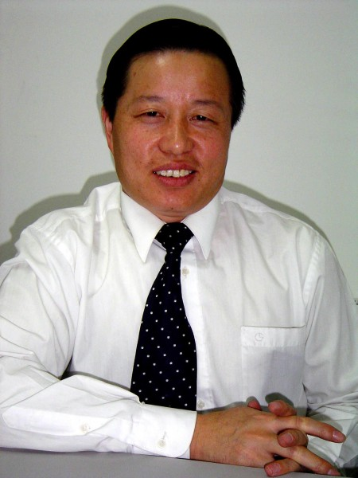
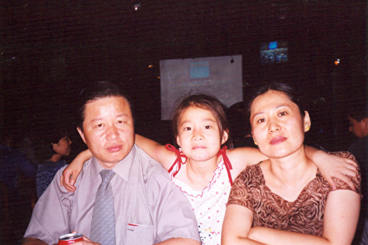
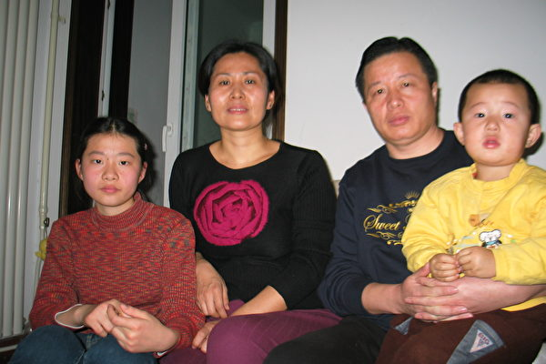
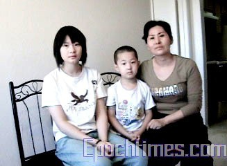
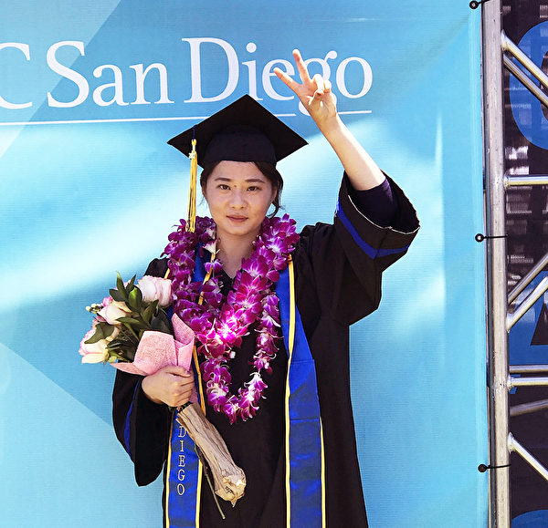
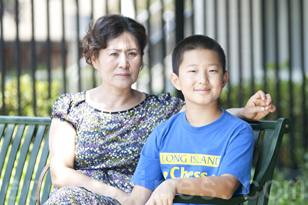

<a name=top>

<a href=#1>北京律师高智晟评江泽民下台</b> 
<a href=#2>高智晟:以无道压制天理 必为天理所灭</b> 
<a href=#3>高智晟致胡锦涛温家宝的公开信</b>   
<a href=#4>高智晟律师致胡温的第二封公开信</b> 
<a href=#5>高智晟律师致胡温的第三封公开信</b> 
<a href=#6>高智晟被失蹤半年 律師發函公安部查詢</b>  
<a href=#7>高智晟被失蹤一年 獲頒自由人權獎章</b> 
<a href=#8>「為法輪功學員辯護的律師遭中共迫害」系列報導之高智晟（一）</b> 
<a href=#9>「為法輪功學員辯護的律師遭中共迫害」系列報導之高智晟（二）</b> 

<a name=1>
<h1 align="center"><b>北京律师高智晟评江泽民下台</b></h1>

高智晟律师

  
【大纪元9月25日讯】(大纪元特邀记者易帆, 郭若报导) 江泽民的退出﹐中国民众是如何看待的呢﹖“希望之声” 记者采访了2001年中国司法部表彰的十大律师之一﹐北京的高智晟律师。高律师曾代理过许多轰动全国的案件﹐其中三分之一是为走投无路的底层百姓打的免费官司。高律师在接受采访时说﹕江的下台对广大民众来讲无疑是大快人心。虽然民意在中国并不重要﹐但主流的﹑强大的民意最终还是能让当权者有所收敛。高律师指出﹐任何政党﹑任何人物都是来去匆匆﹐人民永恒。

<b>太上皇的“宪外治国”</b>

“依宪治国”也罢﹐“依法治国”也罢﹐“以德治国”也罢﹐这些东西都不是今天才提出来的﹐毛泽东立国之初就说“全心全意地为人民服务”﹐但事实上恰恰是全心全意地不为人民服务。中国1954年就有宪法﹐可中共整个的执政史就是赤裸裸地践踏宪法的历史过程﹐他们整个行为价值就凌驾于宪法之上。

“依宪治国”在机制上还得体现为“依法治国”。中共什么时候能把自己当成一个法律主体来对待﹐才能让人们看到一点点依法治国的希望。你在这个社会中是一个庞然大物﹐控制社会的所有资源﹐判断社会的所有行为价值﹐但你所有的行为都不能纳入法律判断的范畴﹐你不成了现代文明中的太上皇帝了﹖你怎么去依法治国呢﹖你是在宪外和法外治国。

现在中国社会的动荡﹐都是把自己当成太上皇的中共自身导致的。许许多多的人﹐正是因为信任宪法而失去了自由﹐比方最近在北京申请游行的叶国柱﹐就是由于对所谓公民游行自由﹑示威自由的信任﹐导致他连人身自由也失去了。实际上宪法已经成了一个陷阱﹐它象一个神像一样美轮美奂地竖在那﹐你尽管对它心存幻想﹐一旦你对它有任何行为方面的要求﹐就要被它吞吃掉。

<b>权力的授予和行使不是鸡和蛋的关系</b>

中国共产党执政能力的危机从他们取得政权之日起就存在﹐这个政党从来不考虑自己取得政权﹑行使权力的合法性问题﹐所以危机是必然的。

执政能力是什么﹖它首先是公民对你执政权力的认可﹐公民认可是你执政最大的力量来源。公民不认可﹐把你手中的钢枪握紧一点那就是你的执政能力。你象无赖一样控制着政权﹐把人民当狗一样对待﹐企图凭着内部一个决议就能提高执政能力﹖那是多么荒唐﹗

象广东省张德江这样的人﹐他们干了多少伤天害理的事﹐这样的人居然还是所谓未来国家领导人的梯队。不用说梯队了﹐常委里面贪官就一大堆﹐有人说反腐一定要彻底﹐我说反腐千万不能彻底﹐一个不小心﹐可能就剩下三个人——胡锦涛﹑温家宝﹐还有一个黄金高。腐败是这个政权的基础啊﹐反腐就是反对这个政权。把腐败的官员铲除掉﹐就等于把整个政府铲除掉。

只有解决了“权为民所授”的时候才能做到“权为民所用”﹐没有正当的权力授予程序就没有正当的权力行使﹐这不是鸡和蛋的关系﹐是前因和后果的关系。我们的党中央一再地喊“与时俱进”﹐“与时俱进”﹐这要不是一种疯子逻辑的话﹐大概也是一种绝望吧﹐可惜人民已经对他们整个行为价值失望﹐再不会相信什么口号了。

<b>江为自己唱了一曲“我的太阳”</b>

中国人民对江泽民咬牙切齿是因为他朝恶的方向发挥到了极至。江的时代是中国历史上上访人数最多﹐对上访者镇压最残暴的时代。今天对上访者的镇压我不认为是胡温价值的选择﹐而是江时代﹑江价值的延续。江的时代实质上是整个司法制度﹑司法信仰和司法存在正当性的崩溃。哪天中共真要垮了﹐江泽民功不可灭﹐是他催化﹑加速了这个进程。

电视台公布江泽民辞职新闻时﹐在播出中央对江的赞美之辞后﹐紧接着播出江给政治局的一封信。我不知道这种安排是出于愚蠢还是出于智慧﹐反正结果妙不可言﹕两相对照﹐前者完全出自后者﹐与其说中央对江作了高度的评价和赞扬﹐不如说江临了又给自己唱了一曲颂歌。

多么无耻啊﹗上台是为了党和人民﹐下台也是为了党和人民﹐ “受到全党﹑全军﹑全国各族人民的衷心拥戴”﹐“赢得了国际上的广泛赞誉”……﹐我不知道国际上那些广泛赞誉是从哪来的﹐他们门一关﹐这些赞誉就出来了﹖那天我看完新闻突然想到一个笑话﹕中共这个集团确实万能﹐它可以让任何智商﹑品德的人“雄才大略”﹐“具有宽广襟怀”﹐并“受到全党﹑全军和全国各族人民的爱戴”

<b>除非中华人死尽</b>

中共官员﹐不管今天谁上﹐明天谁下﹐对中国民主政治和公民权益总的环境不会带来多少益处﹐只不过是个人人品和道德在同一个平台上各有一些不同的发挥﹐就这么一点点个体的区别而已。中共官员当中当然也有不少具有健康人格﹐有道德的人﹐但由于他们所服务的机器的麻木和残暴﹐他们的愿望和价值很难通过国家的行为价值体现出来。本质的问题还是体制问题﹐是这部机器的问题。

远的不说﹐从58年或者更近一点的66年开始﹐象XX大XX中这样的盛会开过多少﹖民众从这些会议中获得过哪些实质性的利益﹖百姓的生活得到了哪些改善﹖即便是这次四中全会﹐依然是第一要坚定不移地加强党的领导﹔第二要牢牢掌控对舆论的导向。这是再明白不过了——五十多年过去了﹐机器还是那架机器。如果今天还有国人去关注或寄希望于这类会议的话﹐它只证明一个现实的无奈﹐那就是中国人民至今仍不得不面对中国共产党这个集团。

江的下台对广大民众来讲无疑是大快人心。虽然民意在中国并不重要﹐但主流的﹑强大的民意最终还是能让当权者有所收敛。江的下台是当局对民意畏惧﹐而不是敬畏的结果﹐因为那部机器内部不具备这种主动的自觉的因素。人民正在不遗余力地斗争﹐抓三五个乃至抓千儿八百人遏阻不了他们﹐除非中华人死尽﹐否则这种斗争将会继续下去﹐而独裁者必亡这一铁的规律却在中国历史上演绎了几千年。

任何政党﹑任何人物都是来去匆匆﹐人民永恒。(http://www.dajiyuan.com)

<a target="_blank" href=#top><h6 align="right">回上方</h6></a>

<a name=2>
<h1 align="center"><b>高智晟:以无道压制天理 必为天理所灭</b></h1>

高智晟和妻女

【大纪元11月24日讯】(大纪元记者万平综合报导) 中国著名维权律师高智晟22号再度上书胡锦涛、温家宝，质疑中央默许北京市安全局及北京市公安局滥用权力及纳税人血汗钱，操控对其家人的威胁跟踪，他强调，在迫害结束前，将持续公开呼吁湖温遵守法律，并策划起诉非法迫害其全家的两个单位。自其为法轮功向胡、温上书直言，将法轮功问题公开化后，1个月来，高家3口人被20名左右的便衣24小时贴身“恐吓”、“压迫”。

高智晟22日决定成为一名基督徒。与此同时，高智晟的夫人耿和在互联网上声明退出中国共产党。一些法律界人士认为，新的文化和道德信仰基础的形成有利于中国良性走向民主化与和平崛起。

高律师在网上公开要求中共政权停止迫害法轮功成员，中国法轮功问题再次成为国际瞩目焦点，也引起了国际社会和媒体对法轮功受迫害的事实更广泛的关注。为此，中共当局害怕虚假谎言曝光，逼迫高律师收回其公开信不果，于是勒令高智晟停业一年，并且吊销其律师执照。

<b>联国酷刑专员前秀迫害</b>

联合国酷刑特派专员诺瓦克21日抵达北京，以了解中国的实际人权状况。高智晟律师在2次公开信中提到，与诺瓦克会面过程中，1、2位素质低下的便衣把丢人现眼的事做尽。

在高速公路上行驶途中，挤靠高律师的车子，将诺瓦克的代表吓得捂住了眼。高律师开着伤痕累累的车子，联合国人权事务高级专员诺瓦克先生和孔珊女士非常震惊，一边给碰伤的车子拍照，一边不停的摇头。

在饭局中，大家合影拍照，结果贴身跟踪便衣硬说，把他的像也照进去了，他们的拍照行为严重侵犯了便衣的人权。便衣们的粗暴及跋扈惊得这些人权观察专家目瞪口呆，整个就餐的楼层客人就像看“耍猴”般围着看他们表演，人权官员不停地摇著头，草草结束了晚餐离开，几名便衣干脆就像随行般地跟着他们同行。

<b>高智晟夫妇的声明</b>

跟踪者在高律师与联国人权官员会餐上，公然恐吓:“休怪我们对你高智晟不客气！”

高律师坚定的表示：“今天我要是败了，就再没人会相信天理了！所以掌握天理的人祂不会袖手旁观！所以神在和我们并肩作战！”

其夫人耿和也于21日，公开发表退党声明，抗议当局对高律师及其家庭不断升级的打压和骚扰。她说，面对这些长期欺辱我们的同胞、给我们的民族久远的价值造成永久性破坏的恶势力的长期肆虐的残酷现状，我们夫妇同大多数善良的中国人一样：是深彻心底的痛！我宣布脱离这个已完全没有了人的理智，远离了人性文明的党组织。以荡涤我心灵深处那个深黑的印记！

高智晟说，压制我高智晟不足道，但企图持续以无道之法压制天理，终必为天理所灭

<b>自由人类的良知</b>

胡温2人没有回应高的公开信，中国许多普通百姓，包括别的律师都在网上公开支持高智晟律师的勇敢行为，称他为中国的良心。

国际社会从“国际律师协会”、“无疆界记者协会”、其它国际非政治组织，以及各国的政要都对高律师事件表达高度的关注。138个团体在美国总统布什访华之前，要求布什关注高智晟为停止迫害法轮功的上书而被勒令停业，所遭受的迫害。

这个事情说明，高律师这个事件所反应的，确实是触及了整个人类，不仅是律师界的良知，而且是整个自由人类的良知。

<b>人类的普世文明共识价值</b>

高智晟律师为弱势群体、上访维权人士、异议人士和家庭教会成员提供法律援助，已有相当长的时间了。

高律师在公开信中对胡、温说，“一些地方当局对信仰法轮功同胞者的迫害已到了完全随心所欲的地步，我们无法接受这种公然反人类的野蛮暴行发生在21世纪的人类社会、发生在有政府存在的今天的中国的现实。”他真切地看到了，这持续的、系统的、大规模的、有组织的针对信仰法轮功同胞的野蛮迫害的暴行。

高律师在信中要求胡、温，“尽快以迅速的措施，制止各地地方当局对信仰法轮功的同胞持续非法野蛮的迫害，这已不再仅仅是那些被非法迫害的公民摆脱灾难的需要，这里还涉及中国的宪法价值、法治价值、道德及道义方面的人类的普世文明共识价值。”

<a href=#top><h6 align="right">回上方</h6></a>

<a name=3>
<h1 align="center"><b>高智晟致胡锦涛温家宝的公开信</b></h1>

高智晟律师

<b>停止迫害自由信仰者 改善同中国人民的关系——高智晟致胡锦涛主席、温家宝总理的公开信</b>

胡锦涛主席、温家宝总理：

公民高智晟向两位问好！

在能坐下来向两位同胞问好之前，为了关注另一群我们共同的同胞——法轮功自由信仰者最近一个时期以来的再次遭致系统的、大规模的、有组织的非法迫害的真相，我去了北京以外的一些地方，度过了几天“做贼般的日子”，是为外界传闻我“失踪”的原因。

新一轮持续的、系统的、大规模的、有组织的针对信仰法轮功同胞的野蛮迫害的暴行是正在发生著的事实，这不仅是最近各地来信中反映了的真实，也是我们这次外出时所真切地看到了的事实。作为公民、作为律师，我愿对我看到并公诸于众的真实承担任何法律后果。

基于对两位长者基本人性的善意信任，我决定将我看到的真实以公开信的形式通报于两位，再次寄希望于两位，尽快以迅速的措施制止各地地方当局对信仰法轮功的同胞持续非法的野蛮迫害。这已不再仅仅是那些被非法迫害公民摆脱灾难的需要，这里还涉及中国的宪法价值、法治价值、道德及道义方面的人类的普世文明共识价值，这些价值不能在今天的中国、在你们的眼里成了没有价值的东西啊！

山东烟台市的徐承本10月15日一见到我即讲道：“我的爱人贺秀玲的尸体已被冷冻了快两年了啦，至今不能得到处理，他们有能力长期的折磨她最终把她致死，却在把她致死后快两年里没有能力处理这件事。她在快被折磨死时才允许我看了一眼，当时我看到人已经神志不清了，但还是被锁铐在床上，而且下身没有一点衣服，看到我的亲人这种惨状，当时我的心都要碎啦！他们真没有人性，只几分钟就把我赶了出去。她才四十多岁啊！这是人死的那天晚上公安通知我看到的情况”。

“我爱人生前5次被抓，还曾在辽宁锦州被关押3个月，因为在北京上访被抓，关在芝罘区专为抓捕法轮功学员而在京长期包租的一家宾馆的厕所内，只有不到三平方米的地方，关了16个人，当时很多人都闷的受不了。因为我们的强烈要求，我爱人死后他们做了尸检，报告至今不给我，在我们多次追要的情况下，只是口头告诉我是‘因练法轮功而死’”。

文登市宋村镇石灰窑村的修炼者杜克松在今年5月被抓，被判劳教后，在看守所受迫害查出高血压，送劳教所被拒收关了50多天后因生命危险被放，9月27日又被公安抓捕，至今下落不明。

文登市的修炼者于正红，40多岁，是宋村镇寺前村人，9月27日在家被抓，被抓后绝食15天，送到医院后被通知“快不行了”，“后来由公安伪装（不敢说自己是警察）把她送回家。”

法轮功修炼者林基啸，是文登市宋村镇大床村人，女，40多岁，9月28日被抓，关在看守所，一直在绝食，家属去要人，他们说已送到王村劳教所了，但有从里面放出来的人说人还在那里，已经奄奄一息了。家人去王村洗脑基地了解，被告知说人不在那里，家人又去问‘610’人员，他们又说是把人送到青岛去了，这个人是死是活、目前到底在哪里？情况至今不明。烟台福山区的肖勇，一向循规蹈矩、口碑甚佳，仅因修炼过几天法轮功，今年7月被判了三年半有期徒刑。

“我是2001年6月第一次被抓的，折磨了一年后我的身体很糟，把我放了”，退休教师刘莉（应其要求隐去真名）平静地坐下来，一讲即是近两个小时。“2003年我出来后发现，从2000年起，我所有的工资竟被‘610’领走，我找‘610’和我的校长的次数谁也难以记清，至今不解决。我的丈夫也因修炼过法轮功，关押期间被折磨的失去了记忆，家中原来由他负责保管的一点存款凭证也在抄家后下落不明，他又记不起来。2003年春节，我把仅有的一百元钱给了被关押的丈夫，我们母女俩过年都没有一分钱。2001年6月，福山区公安局4、5个警察去我家抄家，抄出两本法轮功书籍，就强行把我抬到派出所，还对我进行殴打，我说警察怎么能打人？他们一边打还一边喊：‘就打你了怎么样’？他们审了一天一夜，其中一个姓张的警察说：‘你再不说就要倒血霉了’。他从另一个人的笔录上抄了一份‘笔录’，然后让我签名，我拒绝，后来他自己签上我的名。连旁边姓陈的警察都看不下去了，说：‘她不签你签什么’？他咬著牙说：‘我就要让她倒血霉’。后来他们就凭这份当着我的面伪造的假材料关了我15天，后又直接送到了福山洗脑基地。在转化班他们不让我睡觉，强迫我转化，直到2002年1月，我仍未转化，他们就直接用那份假笔录判我劳教1年，由‘610’的主任王岳峰送我去的劳教所，当时劳教所给我体检，身体已被折磨的不像样子，劳教所拒绝接收，但他硬要求劳教所收留我，他们耳语一阵后，医生就用一尺长、一寸粗的针给我打针，我反抗，四、五个人将我按倒在床上强行给我打针，最后他们看到我身体还是不行，由王岳峰给我送回家中。

2002年11月20日，我继续去福山镇党委找他们的车镇长问非法扣我工资的事，我来到车镇长办公室，自我介绍后，他起身出去，我等了很长时间，他回来说：‘我让赵秘书跟你谈谈，你去他的办公室吧’。于是我又来到赵的办公室，刚进去，门外冲进4、 5个警察，不由分说地把我拖上车，强行把我带到了福山洗脑基地。这次是2003年11月17日将我释放的，在此期间他们对我进行了毫无人性的折磨，曾经连续戴手铐长达43天，还将我反铐著吊到铁门上进行殴打，在关押近一年后，由于转化没有效果，只好将我释放。2004年11月28日，我再次被抓，由当地的派出所将我送到栖霞看守所，关了7天后，又转到栖霞洗脑基地，于2005年3月18日被释放。在此期间，他们继续用不让睡觉的方法对我进行迫害，曾经让我连续26天不睡觉，眼睛稍一闭上就被打醒，我曾多次昏倒，他们还采取连续站立的方法，不让我休息，并殴打我，每次连他们都累得直喘气。”

2005年10月15日上午，我们与瘸著腿的王德江见面，王的腿至今肿的连鞋都无法穿。“2005年8月15日晚上，我在牟平区高陵镇下雨村的朋友家，村里治安和高陵派出所共三人突然闯进来，我跟朋友跑出来，他们却大喊‘抓小偷’，村民上当了，我们被抓住。他们开始打我们，治安主任手提一把椅子猛然砸在我身上，椅子当场被打散，我已躺在地上不能动弹。他们还用脚踢，其中一脚踢到我的肝部，我当即昏了过去。他们把我抬到车上，拉到高陵医院抢救，我醒来时发现把我铐在病床上，之前抓我的一个治安员在抓我时被我摔了一跤，他怀恨在心，看我醒来后就用鞋底打我。在场的公安说：‘在医院打他们动静不要太大’。当天晚上被抄的有两家，共抓了6个人，其中一位孙学进老人已经70多岁了。后来他们把我送到看守所，逼我签字报名参加洗脑班，我不签，狱警拧住我的手铐，问我：‘你签不签’？我说不签，他一直拧到手铐已经陷入我的肉中，我还是不签，他只好转身走掉。后来他们找了个犯人把我拖进牢房开始打我。国保大队提审我一次，因我不配合他们，他们把我送到烟台的幸福洗脑班，开始不让我睡觉、坐小板凳，进行强制转化，让我写三书（保证书、揭批书和悔过书），还用车轮战，让我看污蔑大法的录像，第4天，他们看没有效果，牟平国保大队和烟台公安处‘610’头子于刚商量把我送到招远洗脑基地，我听到他们议论说像我这种情况只有在招远基地才有办法。这时我已经是7、8天没有吃饭和睡觉了。到招远后，他们抬着我，走一步就踢我一脚，嘴里还重复著‘看你转不转化’。放下我时，我已没有力气站立，只好躺在地上，他们继续折磨我，基地的主任开始用脚踩我的下身，他的脸上一点表情都没有，还用脚抬起我的头，然后把脚拿开，反复著让我的头摔在地上，还用脚踢，折磨够了才把我抬进监室，我感觉他们已经没有了人性。在招远基地都是一个学员一间小房屋，是专为洗脑特建的，尽管我站都站不起啦，他们还是用铁链把我捆到铁椅上，戴上手铐、脚镣，我继续不转化。第十天他们开始给我灌食，我开始不断地吐血沫，当时连他们自己看着都受不了，也跟我一起吐起来。他们按住我的头给我灌食，那里的主任问我转不转化，我说不转，他说在招远，你不转化就别想出去，我们这里办法有的是。他们把我背铐在暖气管上，只有脚尖能粘到地面，屋子里没有灯，24小时都很黑，我隐约感到，不时有人进来把手伸到我的鼻子下，摸摸看我是不是还活着。也不知过了多长时间，我的手腕都勒出了大口子。当时还用电线勒住我的嘴，让我不能说话，现在我连说话都流口水。被他们不停的折磨，我实在痛苦的无法形容，我动了自杀的念头，想咬舌，但他们又加了几根电线，使我嘴里也无法动弹，直到我昏迷不醒。我醒来后看见自己的腿已经变了颜色，开始变得黑青，左腿越来越粗，已有右腿两倍粗，右腿却越来越细。但他们还是不放松对我的折磨，我想上厕所，他们搀我起来，我发现自己已经不能走了，就摔倒在地上，他们接着把我抬到床上，还是绑住我的右腿，继续戴着手铐。当时那里的医生看情况十分不好，就让他们把我送到医院，医院的医生说我有生命危险，必须锯掉腿，后来他们又把我送到毓皇顶医院，那里的医疗条件最好，我住了几天，他们让我的家人出钱给我治疗，我们没有钱，后来家人把我接了出来。回到家后，由于我已生活不能自理，还得由我80多岁的老母亲自伺候我”。

王德江在濒死时被地方当局交给了他的家人，他和他的亲人恶梦般的经历今天仍不知在全国各地被多少无辜的同胞正在经历著！

“22岁的杨科萌是哈尔滨工业大学威海分校汽车专业系大二学生，从学生到校长，没有一个人不喜欢他。因他在网上公开声明退团被一位中央领导特别“关照”，他在退团时没有写明自己所在的学校，为此，‘610’人员在全国高校进行了拉网式排查。今年5月，威海‘610’人员找到他，问他是否练法轮功，是否在网上退团，他说：‘我愿退就退啊’。8月20日开学，‘610’人员又来学校，29日他被抓走，父母打电话到宿舍后才知道。9月7日，他父母（杨平刚、常丽君）还有王胜利夫妇和济宁的王女士同时被抓，至今下落不明”，一位王姓老师告诉我们。

“2005年国庆前，山东省主要领导通知莱芜市公安机关，如国庆前抓不到亓英俊、陈莲美、王静等七人，公安机关的领导都要下台。9月29 日半夜1点，上述人员即被抓。实际上现在我们这里的很多警察都不愿意抓法轮功学员，他们也没有办法啊！另外，现在全国各地都有来招远洗脑基地取经的人员，以便更加残忍地迫害我们，并且在胡锦涛访美期间中央下令先突击整顿迫害法轮功学员的人，说他们最近打击不力，然后加大力度镇压法轮功。山东省的招远洗脑基地和山西省的一个基地已被中央指定为示范基地。外人不明白，越是这样的基地越恐怖，没有几个人能熬过来，地狱算什么！招远洗脑基地比地狱都可怕，连折磨我们的人也都变成了魔鬼”，一位曾经在招远基地被关押过的信仰者如是说。

“我叫亓鑫，今年19岁，山东省莱芜市人，是亓英俊、陈翠莲的女儿，我还有个弟弟叫亓垚，10岁。我父母从98年开始修炼法轮功，2000年，我爸在公园炼功，被莱芜市警察绑架，后被送到淄博王村劳教所，判刑3年。我妈因警察的追捕被迫流离失所，后被抓关到莱芜市小曹村大队，那年我13岁，我弟弟才3岁多，我只好独自在家照顾弟弟，直到我妈回来。我爸回来后告诉我：在淄博劳教所，警察为了让他放弃修炼，同时用8根电棍电他，他的身体在地上不停地跳动，皮肤冒出被烧焦的味道。被电击后的几个星期，已经电糊了的皮肤开始一层层的脱落。后来我父母回家后，我们一家人又在一起生活了。我父母又重新经营起卖军用品的小店，我们总以为灾难从此过去了。直到今年的9月30日晚上1点多钟，莱芜市警察带领20多名武警闯进汶阳村大法弟子尚阿姨家中，绑架了我的父母和尚阿姨夫妇，而尚阿姨的丈夫并不修炼。8月份起，我爸爸得知被警察通缉，便把我交给一个阿姨，父母带着弟弟开始流离失所，我们一家人再次被迫分开。父母被绑架后，弟弟至今没有音信，我非常担心我的还不懂事的弟弟，我每天都在为弟弟祈祷。10月1日下午3点，莱城区公安分局柳青和张宝德、官司派出所的邵士勇等二十余人，在我家无人的情况下闯入，车号为鲁S1030的警车停在我家楼下，他们用钥匙打开我家楼下储藏室，并毁坏我家的门锁，进去查抄，直到晚上7点才离开。现在我们一家四口人在四个地方，10岁的弟弟在哪里都不清楚”。

河南扶沟县58岁的贾俊喜，2005年8月18日被当地警察劫持，经10余天的折磨致死后，家人要求行尸体鉴定，却被当地警察强行火化（警察说：“告到北京也没有用”）。

2005年6月8日，广东惠州的朱家文（名假）在工地干活过程中被抓，54天后家人才获悉他被劳动教养三年的事。

2005年9月12日深夜，广州市东山区的石磊（名假）家中突然闯进几名警察，不由分说，架著石磊就跑，“当时我先生脚上连鞋子都没来得及穿，下了楼上了车他们就打他，听到打我先生的声音，我的心如刀绞。我们太无助啦高律师，至今不给我们任何手续”，石磊夫人在予我电话时带着哭腔说。

2005年9月6日，石家庄的法轮功学员段生、何丽被抓至今下落不明。

2005年7月19日，四川泸州袁玉菊、梁劲晖母子与其他共10名法轮功修炼者被非法抓捕至今关押。

……。

刚刚过去的“十、一”前夕，发生了北京、黑龙江等各地对法轮功学员行大规模的抓捕之举，各地在胡锦涛先生出访期间的抓捕带有明显的突击性，以上事实真相就在光天化日下发生，是无以掩盖的事实。

胡、温两位先生：一些地方当局对信仰法轮功同胞者的迫害已到了完全随心所欲的地步，我们无法接受这种公然反人类的野蛮暴行发生在21世纪的人类社会、发生在有政府存在的今天的中国的现实。两位必须与我们共同面对的现实是，一方面，两位主政伊始时，国内人民及外部文明世界均寄以极大期望，两位不时倡导的诸如“依宪治国”、“以人为本”、“构建和谐社会”的理念也在较长的一个时期里承载着人们的期望；但现实是残酷的，同时它又是客观真实的。在那些被迫害公民须面对之的同时，两位和我们何尝不是一样地面对着这正在真实发生著的现实。作为一个泱泱大国的领导人，我们当然不愿意相信及接受你们在这方面的认知能力低于常人。对今日中国妇孺皆知的正在公开发生的持续迫害无辜信仰者的野蛮暴行，两位若不知情，那是你们针对国人的一种罪责；若知情而不予制止，这与具体行恶者的罪恶何异？就像我写公开信予两位是我仍信任两位的信念之依一样，调查中，许多有过让他们及亲人终生刻骨铭心的被迫害经历的法轮功信仰者，有些还是被新近的迫害过程致残者，还有那些甚至是被迫害致死者的亲人，他们共同所表现出的善良及对两位的期望，在调查过程中多次感动的我们潸然泪下！但我不得不与两位共同痛心面对的是，在针对信仰法轮功者迫害的这场浩劫中，一些罪恶的东西形去而神不散，持续不辍的罪恶不仅仅使无以计数的善男信女蒙冤涉难甚至含恨而死，这种完全悖越基本人性的迫害至今仍在延续著，同时被延续著的是持续被损害的我们的政府形象以至国家形象，它包括法律方面的、道德方面及人性文明方面的。这场浩劫的罪恶不始于你们，但这场浩劫在你们二人主政时期得以继延，这场针对自由信仰者的浩劫未能止于你们，这同样亦属一种罪责。若不尽早身体力行予制止，这将会成为一种历史的结论而不单单是我个人的一己认识。

在持续制造一个群体的人生灾难过程中，使我们更加痛心地看到及感受到，这场令常人莫名惊悚的灾难中的受害人，早已不再仅仅是那些自由信仰者及他们的亲人，持续对法轮功同胞的丧失人性般的残害过程，已使参与残害无辜同胞者自己本身已变得彻底的丧失了人性，诸如前面已提及的招远洗脑基地的若例行公事般、面无表情地踩压他的同类、同胞王德江下身的那位主任，面对四年里无数次讨要自己非法被扣的工资而早已身临生存危势的刘老师的那位“610办公室”主任及那两位校长，无不是这场疯狂暴行的受害者。对具体操作洗脑转化的官员及工作人员，只去评价及奖赏他们对法轮功学员的“转化”结果，实践中，以完全造成这些官员及工作人员个体为了确保获得心目中的经济利益及邀功乞赏，已完全忘却了自己的人性，对同类的生命、痛苦没有人本该有的敬畏及体恤，没有了本应有的罪恶感、羞耻感及不道德感。在这种过程中，人类人性文明共识中既有的东西不再被重视，职业良心共识中既已形成的基本价值已完全走向了反面。法轮功修炼者贺秀玲在她离开这个人世前所经历的非人般的折磨过程记录，将在人类未来无限久远的有记忆的时期被后来者唾骂，她在奄奄一息时被送至太平间，直至“死”后才被获准见面的亲人跪在她的面前哀嚎著历数那种她离开人世前所遭遇的苦难，亲人们突然发现“死者”的两面眼角慢慢地流出泪水，亲人们嚎啕著发疯般地找医生抢救，医生出奇的冷漠急得亲人们呼天喊地，同村人听说贺秀玲还没有死，医生不抢救，急赶医院，找到医生大声指责医生，医生才带着仪器测试表明，心脏还在跳动，这时候，我们的医生同胞的第一反映不是如何救人，而是迅速撕碎表明心脏尚在跳动的心电图，口中念念有词说：“人早就死了，活什么活”而逃离。贺秀玲带着泪水在亲人绝望的恸哭中死去。

我真不知两位同胞面对上述现实会有何感想！我们的国家、我们的人民、我们的民族的久远价值，以及全世界的在这场浩劫面前保持了不光彩的沉默者的各国政府的道德形象，都已现实地成了这场浩劫的受害者。

须在此强调的是，事实已充分表明，中国执政者对于它所领导的经济改革的巨大成就必然引发的精神领域的变化，缺乏超前的预见和足够的体认。在长期和平的年代，在一个经济至上的社会，人类是不可能久久沉湎于单纯的物质消费的。在人们对精神生活的渴盼持续推动下，宗教和信仰生活在民间的大面积复兴，乃是必然的趋势。它与科学和文化等主流话语，是可以并行不悖的，现代文明早已解决了科学和信仰之间的分区划界、各守其土的问题。个人信仰的自主，必然导致集体意识形态的消解。个人权利的伸张，必然是对政府无限权力的压缩。这是当权者必须正视、不能不顺应的事实，这是人类历史的潮流。

在此，我不得不提及我及我周围许多人的疑惑与不解：公民与世无争的自由信仰为什么会招致如此持续的、无人性的更属非法的打压，这里的价值到底在哪里？！非病态及残缺人性者无以解释。仅站在打压者的角度价估，这种选择除了将打压者自己孤立在野蛮及非法的境地及持续恶劣地毒化著打压者本已令正常人齿寒的人性本身外，它原本即不存在任何正面的价值。这次调查中，我们除了看到这场始于六年前的灾难在继续的真实外，另一个真实也是实实在在的——那就是这场镇压本身的失败。从我们最近涉足的地方看，执行打压命令越残酷、越持续的地方，这种失败的程度及标志越明显，山东的济南、青岛、烟台等地，自由信仰者及他们的同情、支持者的张贴、散发的抗议及揭露罪恶的标语文件，可谓无处不在，许多公安派出所的门口即举目即是，坚韧延绵的抗争也在随着打压的持续而壮大著、拓展着，印衬著灭绝人性的镇压措施是多么地不得人心。相反，一些打压手段较温和的地方较著上述地方则是另一番不同景象，如陕西一些地方，这方面的局面则较为平静。这足应令那些迷信暴力者无地自容。将无以计数的财力、警力资源，无端消耗在使社会秩序更复杂化的对和平修炼以修心健身的法轮功者的打压上，完全是一种侵犯人权的罪行，恕我直言，两位没有权利、没有道理、没有借口不去迅速改变这种现状。

中国是《世界人权宣言》的缔约国。《宣言》明文规定：“人人有权享有生命、自由与人身安全”。“任何人不容加以无理逮捕、拘禁或放逐”。“人人于其宪法或法律所赋予之基本权利被侵害时，有权享受国家管辖法庭之有效救济”。我国现行宪法第三十三条也载入“国家尊重和保障人权。”无论是国际法准则还是中国自己的根本法，都绝不允许任何人以任何借口侵犯人权、惨无人道地迫害本国同胞。正是基于对人类普世价值的信奉与对法治的尊重，本人郑重建议两位尽早做出决断，“停止迫害自由信仰者，改善同中国人民的关系”，切实履行“依法治国”和“依宪治国”的方略，在民主、法治和宪政的基础上创建新的中国。

你们的这种实践，将得到中国人民及世界人民无尽的支持！

最后，我有必要特别提醒的是，两位应保证所有这封信中提到的那些饱经苦难的个体同胞，不致因为这封公开信而再次遭致野蛮迫害。石家庄法轮功学员郝秋燕曾因我的公开信而被非法关押近8个月的野蛮行径，警示我们有必要作这样的提醒。在我还有安全的日子里，我将继续关注他们的安全，无论作为文明人类中的一员，还是作为中国人、中国公民及律师，我都有权利这样做，虽然在中国它还十分危险。

上致

衷心祝愿两位：凡事平安！顺利！

你们的同胞：高智晟

2005年10月18日于北京@

<a target="_blank" href=#top><h6 align="right">回上方</h6></a>

<a name=4>
<h1 align="center"><b>高智晟律师致胡温的第二封公开信</b></h1>

【大纪元2014年08月06日讯】编者按：1964年4月20出生的高智晟，陕西省榆林市佳县人，中国律师，1996年开始执业即长期替弱势群体维权打官司，曾代理多宗民众维权案件控告地方政府，获中国司法部选为“中国十佳律师”，被誉为“中国良心”。

高智晟勇于为当局眼中的敏感个案辩护，包括法轮功修炼者、地下基督教徒以及与官员发生纠纷的底层农民和私营企业家。尤其自2004年底开始多次上书中共高层，要求改变对法轮功等群体的非法处理手段，并参与对法轮功学员器官遭当局活摘指控的调查，被前加拿大亚太司司长大卫•乔高誉为“地球上最勇敢的律师之一”，多次获得诺贝尔和平奖提名。

高智晟预计2014年8月7日刑期届满，主导迫害高智晟的中共“政法沙皇”周永康7月29日公开落马，外界呼吁中共当局如期释放高智晟，大赦国际发起“写信给高智晟”营救马拉松，各国民众累计寄出逾16万张明信片营救。在高智晟律师即将被释放前，大纪元重新再次发表当年高智晟致中共领导人的第二封公开信：

========================

胡锦涛、温家宝两位国家领导人：

从10月20日早晨起，北京市安全局、北京市公安局的约二十名左右的便衣开始寸步不离地跟踪我及我的家人。每天至少有不低于9 辆的车围在我家门口的三个方向，18日、19日、20日三天，车辆增加到二十辆以上，我想请两位回答你们作为国家领导人的、这个国家的一个公民的如下问题：

一、你们是否如实地告诉了那些整日一脸倦容地盯着我的那群年轻人：高智晟做了些什么？你们有没有欺骗这些年轻人？

二、你们有没有如实地告诉这群年轻人，你们的这种作法是违反中国宪法、违反中国的基本法律原则的！是非法的？

三、你们有没有告诉这群年轻人，你们这样对待一个无辜公民的手段是最为肮脏和最为不道德的？

四、你们有没有如实地告诉在我们家门口的那群在夜里冷得瑟瑟发抖的、同样是无辜的年轻人，你们以如此低下的手段恐吓、威胁及限制我全家的人身自由的手段是当今人世间最不光彩和最不文明的恶举。

五、你们有没有告诉过这群年轻人，贴身跟踪、24小时盯着我全家的目的、意义是什么？

六、你们有没有如实告诉这群年轻人，这种作法是被中国人民咬牙切齿的肮脏行为，是在绝大多数的中国人眼里是最为可耻的行为！

昨天和今天早晨我未出门晨练，我实在不忍心去折腾那群守在我家门口前后左右的近二十名年轻的便衣！说心里话，每天晚上躺在床上的我心里很不是个滋味，几十名年轻的便衣，他们也是人，他们同样有父母、有妻儿，同样有权利、也有条件在寒冷的夜间与亲人一道去享受家里的温暖。每当早上起床后透过窗户，看到他们一个个不停地在原地蹦跳以驱离寒冷的场面，我和夫人的心里都感到很难受，今天早晨我和夫人还商量著如何解决这群年轻人白天的热水饮用问题。这些年轻人，作为具体的个体，他们都是我亲爱的同胞，他们决不是我的敌人，每每看到他们从不愿意正面碰接的眼神，我的心里都很难受！我感到了他们的善良和心虚！我必须澄清的是，对他们，我是仅有同情而实在没有一丝敬意！

两位长者：在一个制度文明的国家里，公民的法律权益受到侵害时，若行写信之举向国家领导人控诉将会被视为笑料，而这却是我的国家里公民在类似情势下不得不持续面对的痛苦局面，两位无法感受到此时此刻我内心的痛苦！

10月18日，我向两位以公开信方式痛陈了一些地方政府残忍迫害我们共同的同胞、那些自由的信仰者、践踏国家的法治原则的现实。迅速将我们看到的，对国家、民族健康发展极具危害的真实局面通报两位，以期通过两位与人民一道的共同努力，开始消除罪恶及危险，以寻求建立谅解与和谐的中国。令人痛心及愤慨的是，我看到的竟是莫名奇妙的相反。10月19日，我接到了赤裸裸的威胁电话，10月20日开始，我的夫人吃惊地发现，两位不明身份者从我的家门口开始跟踪我那才 12岁的上学的小姑娘至学校，以后天天如此，直到11月15日那两位不明身份者的身份才明朗——他们开始贴身跟踪我。从11月20日开始，我的家门口和办公室门口每天各守着不低于3 名的便衣，他们每隔几小时轮换一次。从他们出现后的第二天，我夫人每天接送孩子上学的自行车莫名奇妙地丢失，而同一车棚中近百辆自行车却安然无恙。昨天夜里，20多名便衣守在门口，我们新买的自行车的两个气门芯都被拨掉，我的轿车上莫名奇妙地被涂上各种无法洗掉的脏物。11月4日，北京市司法局非法宣布停止我的律师事务所的执业权利；11月15日，我赴新疆开庭，从早晨出门到上飞机，跟踪我孩子上学的那几位便衣贴身跟踪着我，一到乌鲁木齐即有人接力跟踪我。更令人不可思议的是，司法部官员向新疆有关部门全面调查我的含出身、政治清白度、有无行为劣迹及是怎么混进律师队伍、如何从一个律师变成“坏分子”的全面材料。这种与“文革”整人的套路毫无二致的下作做法实在让人哭笑不得。前日一回到北京，联合国人权事务高级专员办公室我的两位朋友孔珊女士和诺瓦克先生到京，出于礼节，我去他们两位下塌的宾馆探望，在整个过程中，极个别素质低下的便衣把丢人现眼的事做尽，他在二环路上，在80公里/ 时速的情势下驱车挤擦我的车辆，惊得诺瓦克先生来接我的代表摀住了眼，在与外国朋友一起吃饭时，我们合影拍照，结果贴身跟踪便衣说把他的像也照进去了，说我们的拍照行为严重侵犯了他的人权。他们的粗暴及跋扈惊得这些人权观察专家目瞪口呆，整个就餐的楼层客人就像看“耍猴”般围着看他们表演，他们一发无以自制，指手划脚、暴跳叫喊无不至极致，硬逼着孔珊女士将我们的合影删掉，几位人权官员不停地摇著头，草草结束了晚餐离开，几名便衣干脆就像随行般地跟着我们同行。

这两天，我家的周围邻居可谓大开眼界，不低于20辆左右的、挂有天津、北京牌照的车辆承担着监视我的各种不同角色功能。20日，我一回到京，我家周围便成了便衣警察的俱乐部，家中固定电话被野蛮掐断至今不能使用，他们让社区门卫、物业人员统统住进宾馆，腾出地方驻扎他们的人马。十几名便衣整日就站在我的楼下，无任何避忌之意，搞得本来平静的社区气氛煞是紧张。这里人们对我的了解导致了他们对政府这种荒诞行为的完全不理解！昨天夜里，我停车刚离开，夫人从窗户上看到他们七、八个人迅速跑步将我的车包围，围着空车折腾了近一个多小时，正常人完全不理解他们在做什么，半夜里，他们不下十次在我的楼道、门口东张西望，杂沓的脚步声吵得人无法入睡。谁会相信我的一家大小会在内室私处、在深更半夜关起灯来危害这个国家的安全？但这些便衣相信，他们中个别人的行为令人厌恶到了极点。我写这些文字予二位，我想代表我的孩子质问两位，为什么你们会继续延续著如此肮脏的权力运作现实，我相信守在我家门口的那群年轻便衣的心灵深处并不都是肮脏不堪的，但我却坚持对这种下作过程的幕后指使者的灵魂则必然是肮脏的认定。我们的孩子，我们每个人，都有权利质问两位，到底是谁在背后指挥着这最为肮脏的权力运作过程？谁有权力这样运作？我们的国家还远不富裕，九亿农民仍处在贫困状态中，由于贫穷，数以千万计的我们的孩子上不起学或因贫穷而辍学。把纳税人的血汗钱大把大把地花在如此既折磨年轻的便衣、又压迫他人的肮脏过程中，这样的行为禽兽不如！在背地里，以如此卑劣的行径对付人民，把本即瘦弱的纳税人的血汗钱花在如此见不得人的过程中，你们还有什么颜面每天西装革履的面对文明世界，有什么脸面面对自己的同胞？写到这里时，东北一位教授打电话表示，他可以肯定这些肮脏的行为不是你们二位安排下实施的，我认同之！但是，这种丑恶过程却能在你们二位主政以来，在中国的任何地方、在任何时候、在任何人的身上都可以发生，这才是问题的本质。你们千万不要再低估今天中国人民的思考力量，回到正常人的心态上来思考、来面对今天的问题。今天中国的问题，再也没有拖下去的条件啦！压制我高智晟不足道，但企图持续以无道之法压制天理，终必为天理所灭。

在对我和我全家的非法及肮脏的迫害结束前，我将持续地做两件事。其一、每天通过以面对文明社会的公开信的方式，促你们的政府遵守中国的法律；其二、我将策划起诉非法迫害我全家的两个单位。

再祝二位一切平安！顺利！！

高智晟

2005年11月22日

<a target="_blank" href=#top><h6 align="right">回上方</h6></a>

<a name=5>
<h1 align="center"><b>高智晟律师致胡温的第三封公开信</b></h1>
【大纪元2014年08月06日讯】编者按：1964年4月20出生的高智晟，陕西省榆林市佳县人，中国律师，1996年开始执业即长期替弱势群体维权打官司，曾代理多宗民众维权案件控告地方政府，获中国司法部选为“中国十佳律师”，被誉为“中国良心”。

高智晟勇于为当局眼中的敏感个案辩护，包括法轮功修炼者、地下基督教徒以及与官员发生纠纷的底层农民和私营企业家。尤其自2004年底开始多次上书中共高层，要求改变对法轮功等群体的非法处理手段，并参与对法轮功学员器官遭当局活摘指控的调查，被前加拿大亚太司司长大卫•乔高誉为“地球上最勇敢的律师之一”，多次获得诺贝尔和平奖提名。

高智晟预计2014年8月7日刑期届满，主导迫害高智晟的中共“政法沙皇”周永康7月29日公开落马，外界呼吁中共当局如期释放高智晟，大赦国际发起“写信给高智晟”营救马拉松，各国民众累计寄出逾16万张明信片营救。在高智晟律师即将被释放前，大纪元重新再次发表当年高智晟致中共领导人的第三封公开信：

========================

必须立即停止灭绝我们民族良知和道德的野蛮行径

——高智晟致胡锦涛 温家宝及中国同胞的公开信
胡锦涛 温家宝及亲爱的全体尚怀良知的中国同胞：

高智晟在长春市向你们问好！

在这里，我首先要对那些被广东省委、省政府血腥枪杀的无辜同胞表示我最沉痛的哀悼！对那些死难同胞的亲人表达一个公民的慰问和声援！同时，对广东省委、省政府凶残杀害我们善良同胞的野蛮暴行表达我最强烈的抗议！强烈要求最高当局遵从文明社会公认的基本准则，惩办凶手及责任者，抚恤死难者家眷！

冰天雪地的长春寒冷异常，“躲藏”在一间一天大部分的时间里是断著水的房间里的我此时热血沸腾，这并不因为是我正再次写公开信给胡、温两位！有幸为着一个世间最伟大的民族之一的明天而奔走，这足令一个普通的公民热血奔涌！

10月18日，同样是在热血奔腾的情势下，我致公开信予胡、温两位我们的同胞，紧急呼吁他们的政府“停止迫害自由信仰者，改善同中国人民的关系”。公开信发出的第二天，我的家遭到赤裸裸的电话威胁，第三日起，每日平均不低于十辆的小轿车、不少于20人的便衣开始了针对我全家的24小时围堵、盯守及跟踪。到第十五日，我的律师事务所被北京市司法局非法勒令停止执业。我的国家对一个公民公开建言的这种反应方式着实令人扼腕叹息！

这封公开信引起的另一番强烈反应是，各地被迫害的法轮功信仰者，纷纷发出让我去他们所在的地区以了解真相的请求，这些请求信尤以长春市、大连市为最多。从11月29日开始，我们几乎是24小时不间断地持续奔走于山东省济南市、 辽宁省的大连市、阜新市 、 吉林省的长春市等地，行新一轮的真相调查之举，较以往此般情势下的独行经历不同的是，全程荣幸的有焦国标教授的伴行。

在这个时际，在成群的便衣还在我的家门口昼夜花样百出地刻意营造著恐怖氛围、全家被野蛮的压迫最为严酷的时期，11月29日，我摆脱了不下20名便衣的跟踪、围堵，我再次得以以我的方式进行了15天的真相调查。我想在此特别提及的是：我们设法说出这个民族持续被血腥迫害的真相，尤其是在这个时刻，也是为了提醒我们的整个民族——我们民族面临的问题的严重性及紧迫性。我们的民族，我们每个个体，是到了一个必须正色面对我们所面临问题的时候啦！任何理由、任何传统的方法及任何的耽延，都将是对我们整个民族价值的犯罪！

在这封信里，我将不会回避任何我看到的真实存在的问题，那怕这封信的公开之日即是我的入狱之时。十几日的调查，我再次看到了令我痛彻心肺的真相，“610”办公室，至少可以这样称谓它——国家政权内且高于政权力量的黑社会组织，它是可以操纵、调控一切政权资源的黑社会组织。一个国家宪法及国家的权力结构安排规范中没有的组织，却“行使”著本只能由国家机关才能行使的权力及许多连国家机关都根本不能行使的“权力”。它“行使”著在这个星球上，人类有国家文明以来，作为国家从不能拥有的权力。

我们看到了，被以“610”为符号化的的权力，正在持续地以杀戮人的肉体及精神、以镣铐和锁链、电刑、老虎凳等形式与我们的人民“打交道”，这种已完全黑社会化了的权力正在持续地折磨着我们的母亲、我们的姐妹、我们的孩子及我们的整个民族。胡、温两位，作为这个时代，这个时刻具有特殊身份的民族的一员，尤其作为在国内大多数民众心目中还被视作为具有良知的民族成员，是到了我们必须共同面对这一切的时候啦！

此时此刻，我用颤抖著的心、颤抖著的笔记述著那些被迫害者六年来的惨烈境遇，在这次令人难以置信的野蛮迫害真相中，在政府针对自己的人民毫无人性的残暴记录中，其最持久地震荡着我的灵魂的不道德行为记录，即是“610”人员及警察的、完全程式化的几无例外地针对我们女同胞女性生殖器攻击的下流行径！几乎是百分百的女同胞的女性性生殖器、乳房及男性性生殖器，在被迫害过程中都遭到了极其下流的攻击，几乎所有的被迫害者，无论你是男性还是女性，行刑前的第一道程序那就是扒光你的所有衣服，任何语言、文字的功能都无法复述清或者再现我们的政府在这方面的下流和不道德！我们还尚存一丝体热的民族成员谁还有条件在这样的真实面前沉默下去！？

2005年10月28日下午4时20分，长春市的王守慧和刘博扬母子俩被“610”警察跟踪并非法抓捕。母子俩随后遭受了警察的酷刑折磨，当晚八时，28岁的刘博扬即被迫害致死，十多天后其母也被折磨而死。这对生前历尽磨难的不幸母子的尸体至今扣在“610”警察的手里。刘博扬死后三日才通知其父，其母王守慧的死亡时间至今不详！刘父找当地的律师，竟无一人敢接受他的委托，老人告诉他跟前的人：“在这样的社会里是生不如死，活着更痛苦，处理完他们母子俩的后事，我也将随他们而去。”

“王守慧一家三口于1995年开始修炼法轮功，在1999年7月20日打压之后，持续地遭到绿园区正阳派出所和正阳街道办事处干部的骚扰迫害。王守慧分别于1999年10月和2000年2月被非法拘留和劳教，在黑嘴子劳教所曾遭电棍酷刑八次；被逼每天白天干活，夜间站着不许睡觉五天五夜；被绑在“死人床”上数次，最严重的一次被捆绑在“死人床”上用两根电棍同时电击一个多小时，全身及满脸没有一处完好地方，被迫害至生命垂危时才释放。

2002年4月11日，王守慧正走在路上，再次被绿园区正阳派出所绑架，并被长春市公安局一处蒙面带到长春净月潭的净月山上私设的上刑房上刑，坐老虎凳两天一宿。期间遭受酷刑折磨：两根电棍同时电击她的乳房等处；三名男子同时拳击其面部及上身胸、背等处，致使王守慧左脸面颊骨粉碎性骨折，大吐血。后肺部感染，在送公安医院住院期间，王守慧被固定四肢强行输液，不让上厕所，强行插导尿管又不护理，五天五宿不动，导致后来一直小便失禁。

2002年6月27日，王守慧一家三口又被绿园区分局政保科绑架至正阳派出所。王守慧被全身捆绑成一个团捆了一宿，后被非法关押在长春市第三看守所期间，曾被手铐与脚镣连在一起铐了十八天，野蛮灌食一个月，后送省公安医院固定四肢强行灌食30多天，王守慧被迫害至奄奄一息时才被放回家。在同一时期的正阳派出所，几个警察对刘博扬残酷折磨，拳打脚踢，用皮鞋抽嘴巴，上绳，头上套塑料袋，把刘博扬的双臂背到后面，然后用手铐将人双手吊铐起来，身体悬空，并且来回悠荡或向下拽双脚。当时行刑的警察苑大川还叫嚣说：‘法轮功我也打死过好几个，打死你们我不用负任何责任！’每行刑时，母子俩惨叫声互闻，惊天地泣鬼神！

2002年10月29日，刘博扬被送至长春市朝阳沟劳教所非法劳教2年，12月份遭到警察强迫整天坐在冰凉的水泥地上，晚上不许睡觉，白天还要被迫参加强制洗脑。2004年6月劳教期满时，劳教所却不放人，找借口给他加期47天，刘博扬是医科大学的毕业生，为人仁义厚道，尊老爱幼，在医院工作连年都是先进。”王女士几乎是一口气讲完了上述刘家母子的境遇。

48岁的长春市民孙淑香，在六年的时间里总共被非法关押过九次 以下是她在其中几次的非法劳教期间的部分经历自述：

“2001年下半年的一天，兴业街派出所八委的片警李振平和一个男的上我家劝我丈夫跟我离婚，我说不离，他就不停的打我的脸，都肿了，眼睛往下淌血，顿时眼睛看不清东西了，还问你离不离？你若不离就将你再送进去（指劳教）。我丈夫在他们的持续恐吓下和我离了婚。就这样好端端的一个家被政府给拆散了，至今使我流落在外。”

“2002年七月初我在去父亲家里，穿着便衣的警察突然闯进来问我是不是孙淑香？没等我回答就被绑架走。第二天，长春市局公安一处将我用车在颠簸了约两个小时的路程后，两个警察架着我带入一个阴森恐怖的地下室后，将头上蒙的套摘掉，同时呼啦进来八、九个警察，桌案上有大中小三个电棍，一捆绳套，另一边并列著三个老虎凳，两个警察把我架到老虎凳上，扶手上固定挂着手铐，手一放到扶手上，一翻就铐上了，老虎凳的扶手上有一排不同码的小孔适合不同的胖瘦人。警察老练地用拇指粗的铁棍，从老虎凳的两个扶手经过胸部.腹部穿过把我紧固定在老虎凳上不能动弹。其中一个警察指著刑具问我，‘你看见了吗？如果你如实招来一个多小时就能下来了，如若不然各种刑法让你尝个遍。刘哲等（被迫害者）又怎么样？没有几个能从这上面活着走下来的。’一个看起来表面很斯文的警察打了我两个嘴巴，当问我认识哪些功友时，我说不认识，他就拿起电棍，用电棍前的两个爪子插到我的肋骨间电我。之后问我功友的电话，我不说，就拿起电棍从手指尖开始电我，边电边问我认识哪些功友，我不说，他用电棍从我手臂外侧经过头到身体的另一侧，电了身体的一圈，接着又慢慢地电了身体的一圈，然后又换了一个高伏电棍充足了电，又开始从脚趾慢慢电我身体外侧的一周，我还不说，又开始从另一只脚尖开始电了身体的一圈，我是还不说，他们就用电棍集中电我的眼睛，眼睛有要蹦出来的感觉，眼前一片漆黑。我还是不说，他们又开始电我的肋条骨，我疼痛难忍，又电我的前胸部，边电边问和哪些功友有联系，我疼的说不出来话，所有功友熟悉的面孔一个一个的在我面前闪过，心头只有一念，无论如何也不能说出一个功友，只要说出一个功友，就会立刻被抓来迫害。警察又把电棍放在我嘴里电，嘴被电糊了，肿起来外面全是泡，他们边电边说，叫你不说、今天就要撬开你的嘴。然后电棍又插在嘴里电击，一天一夜的折磨，我已是奄奄一息……！”

“2003年初我在刑桂玲家借住，有天半夜听见惊天动地的砸门声，两道门迅速被砸开，惊恐中见一群拿铁锤、拿枪的警察闯进屋里说：‘不许动，动就打死。’之后我们被抓到绿园区公安分局，把我们关在一个小铁笼里，把我锁在老虎凳上。他们当着我的面开始打刑桂玲，用皮带勒她的脖子，她撕心裂肺地惨叫，我看见刑桂玲被打倒，打倒了就用脚踢站起来之后再打倒，打踢著让她说与功友的联系，反复的折磨，然后解下皮带，勒她脖子直到喘不过来气，警察吼叫着说：‘让你不说’，刑桂玲被折磨的奄奄一息了，一个功友的名字也没说，然后开始折磨我，经过三天的折磨后把我们送到第三看守所。”

“2003年8月4号，我再次被警察抓走，把我抓到南关区公安分局，一个满脸麻子的警察抓住我的头发往墙上撞，被撞的晕头转向，之后又给我坐老虎凳。紧扣我的双手，然后一个警察砸我的胳膊，手被拷子勒破，他们用铁环紧扣我的双脚腕，然后踩铁环上的铁棍，使铁环越扣越紧，脚腕疼痛难忍，又用塑料袋套在我的头上，然后在脖子上扎紧，一点都喘不过气来，憋的我要窒息了。看我不行了再放下头套，缓一会儿再来一次，看不行了又拿下，反复共三次。还有踩脚腕铁环上的铁棍的，铁环越来越紧，使我疼的抽起来，脚腕已破，流了很多血，我疼的昏死过去，他们用冷水浇醒我，之后把我送到第三看守所，我一直绝食绝水，昏迷了，27天的时候已奄奄一息了，才通知家属接回。”

长春市60岁的刘淑琴老人，六年里五次被非法抓捕劳教。老人异常平静地向我们讲述了她被野蛮折磨的经历。

“第一次被抓是2000年2月，警察疯狂地连打带踢拖着把我们推上警车，送到八里堡拘留所，非法关了15天，没有任何法律手续，我们一共被抓去10多人，受到了难以言尽的折磨，之后街道和派出所不断来骚扰。第二次是2000年12月31 日去北京上访，我在天安门打“法轮大法好”的横幅，被天安门警察扑上来用电棍猛击腰部，强行拖上警车。后送到宣武区看守所的一个操场上，大冬天让我们100多人坐在外面的地上半天，后来我被投入一间地牢似的房子里,墙上全是冰霜, 警察逼我脱光了衣服后,指使人用大水管往我身上喷水,让我光身子睡在光光的地上,什么盖的也没有,屋里马桶臭味难闻,每天好几个警察轮番提审,警察晚上不让我睡觉,提审折磨了38天,毫无结果。

2001年12月31日,为了揭露政府对法轮功的谎言,我和几个功友出去挂条幅,被人举报抓 住,“610”的警察不停地暴打我.晚上12点把我送到第三看守所,在那里,警察用拳头打我的眼睛,打得我两眼冒火星,一阵发黑,又打我的脑袋,连击了好几拳.面对这野蛮行径,我告诉他们善恶有报,警察又让犯人拿来沉重(28公斤)的脚镣,给我戴上.被关押了22天，受尽了生不如死的折磨。后警察勒索了我家不少钱才把我放了.

2003年2月28日,我刚被放出来没几天，绿园分局的一伙警察又闯进我家,其中警察苑大川专门翻我家的抽屉,4000多元现金全部被搜去,没留任何票据.其中一个警察把我孩子从国外带回来的香水装进自己的包,苑大川正翻我的钱,我指责他们的野蛮强盗行径,苑大川就打我两拳,给我戴上手铐,他们为所欲为地翻我的家,翻的家里一片狼藉.后把我绑架到绿园分局刑讯室,给我上刑,坐老虎凳,折磨了两个小时后,又换上绑绳,绳很细,警察使劲勒我，手绑在背后,从前胸到后,五花大绑,推出行刑室.另一伙人把我推上车,警察用我的羽绒服死死的闷住我的头,闷得我几乎窒息,车子开了大约20分钟,到了一个行刑的地方(后来知道是朝阳分局),满屋子都是各种刑具,一到屋子就把我推到老虎凳前,有六个左右的警察给我戴上手铐脚镣,胸前横插上钢管,一个年轻的警察拿一根一尺多长的铁棒子,打我铐在老虎凳上的左手, 打了十几下,我的手肿的老高老高,很快变成紫黑色.他们让我说出其他炼功者的事情,我说我什么都不会说的.这时十几个警察将我的手铐在背后,不停的拉手铐、脚铐、及钢管，在强大的拉扯下，只感到筋快断骨要折，使我窒息，难忍的疼痛使我死过去几次，警察见我昏死后就往我身上泼冷水，见我醒来时就继续用刑，就这样死去醒来折磨了我一天一夜，在警察使劲拉扯手铐脚镣时手铐和脚镣不停的往肉里扎，我的手腕和脚腕血肉模糊，地上流了一滩血。警察对我这个老年妇女惨无人道地进行的折磨，使我的胳膊、手脚、腿每根神经骨缝都疼痛难忍，全身动不了啦。三月一日把我送到第三看守所，检查我的心脏，血压都不行了，双腿不能走路，就这样还判我劳教两年。在昏迷中把我抬进黑嘴子劳教所，上厕所也得人抬着。在二大队，警察刘连英开始转化我，说我腿不能走路是装的，上来野蛮地用电棍电我腿、胸、心脏，全身都电了，当时一个叫伊丽文的刑事犯（她和刘的关系很好）看不下去了，把电棍抢过来说：‘别电她了，她都那样了。’刘连英这才不电了。由于不能走路警察经常骂我，利用所有的转化能手转化我，所有的警察轮番转化我，每天收工后也不让我睡觉，对我进行强行洗脑，逼着我写什么书什么书，我坚决不写，这样逼我折磨我 连续两个月来，我经常血压高过200, 心脏病严重，贾洪岩看实在转化不了我，就开始利用卖淫的犯人，对我进行迫害，吃饭睡觉，24小时行影不离对我进行严管，逼我进行转化，几乎天天每时每刻都在打我骂我，不准许我说一句话,说话就挨骂，就是找我的茬，迫害我。劳教所里黑白颠倒，坏人管好人，警察指使刑事犯随意地迫害大法弟子，专门监视法轮功学员。我每天身心都处在痛苦的煎熬中，长达一年的迫害使我的身心受到极大的伤害，身体麻木，胳膊不好使，经诊断我脑梗塞，脑萎缩，我本来身体非常健康,是这一年的迫害使我变成了这样，只为我要作个好人，经受到这样长期的没有人性的折磨.”

说话慢声细语的张致奎平静地叙述了他在长春市被迫害的经历:

“1999年7月20日以后，我上访北京，因给北京人讲法轮功真相，被警察抓后，交给长春驻京办事处的公安，他们把我的双手双脚都绑起来，用木棍把手和脚串起，挂在两桌之间荡来荡去，棍断了就跌在地上，对其他被抓的有的用皮带打，也有吊起来的，他们用白腊木棍打我的大腿，之后把我们送回长春的二道河子区公安分局.当时我们十几个人，进去后政保科长把我提起来，逼我把裤子脱下来，当时男女都在场，政保科长用皮带抽我的头，头发木，嗡嗡的响，什么也不知道了，他问我什么时候去的北京，叫什么名字，我被打晕了,感到自己什么都想不起了,他还继续打，然后用皮鞋先跺我的脚，再用皮鞋跟碾我的前面脚指头，他一边碾一边用眼看着我的表情，我痛的大汗淋漓,打完我之后又开始打其他大法弟子，把我送到铁北看守所后，管教向犯人示意，让犯人扒光我的衣服打我，一脚把我踢到厕所撞到墙上，我爬不起来，两盆冷水浇到我的身上，又用脚踢我，胳膊和腿都流血了，腿上有一个大口子，一个月之后把我放出来，什么手续都没有。

99年11月底，我去北京最高人民法院上访，最高法院的工作人员叫来警察将我抓捕并交给了山东招远的驻京办，他们路上把我的皮带抽下，让我提着裤子走，他们一边走一边打我，到了招远驻京办，又继续用皮带猛抽我，打了半晚上。到了第二天，把我送回招远，送到了招远市看守所，他们让犯人打我，后来犯人看我活都抢著干了，犯人被感化不打我了，后来专门派来了个哑巴犯人打我。有一天，警察让我把头伸出铁门上的小洞，警察用脚踩着我的头，打我的脸，其他监室的大法弟子喊不许打人，后把我和妹妹送到辛庄镇公安分局（在7月20日之后我全家人被抓）,之后把我和我妹妹分别关在楼梯下面漆黑的小屋里，小屋里因矮直不起身，只是每天晚上才让上一次厕所，每次关上十天，然后再送到招远看守所关一个月，就这样来回轮回过六次,我们兄妹被折磨的求生不得,求死不能.

2000年国庆节，我去长春文化广场打条幅被抓,因国家新闻媒体全部说谎,都不帮我们说话，所以我们要这样做。警察梁处长和一些警察把我的上衣扒下,用我的衣服包住我的头,用手铐把我的手铐在后面,从楼上把我拖下,架到车上。大约走了两小时,我感觉车出市区很远,到了目的地,我被架到一个屋子里，我头上的衣服取下后,我感到阴森森的,屋里有一个老虎凳,我知道是在山里,听到山风呜呜的。梁处长他们扒光我全身的衣服，把我按在老虎凳上，我的手反绑在后背的木棍的两端,在我胸部、大腿根部、和小腿前各横插了一根铁棍,铁棍的两端固定在老虎凳上,这样使我的身体紧紧的控制在老虎凳上不能动弹，双脚被扣上铁环固定住。这时梁处长拿出一把一尺来长的尖刀,在他自己的裤腿上正反擦了两下之后往桌子上一扔,恶狠狠地对我说:‘张致奎我今天就是叫你死在这,今天我在这把你整死,扒个坑把你埋掉,谁也不知道,谁也找不着.’说完梁处长出去了,至少三个公安开始给电棍充电,还有两个警察抓住我固定在后背棍子上的双手从后面经过头顶绕道前面,只听到我的骨头喀嚓喀嚓不停地响,骨头已断开,这样反复多次，令人窒息的疼痛使我痛不欲生。之后又用一只铁水桶扣到我头上，用罗纹钢棍猛砸水桶，猛烈的震动和刺耳的响声使我的头要炸开了。一长阵的痛楚之后，警察知道我们炼功人不喝酒,却用一瓶白酒从嘴里灌进我的肚里，又用烟猛吸一口后，用烟头烧我的整个后背,疼痛难忍使我昏迷过去。接着他们用凉水浇醒我,最后他们又点上蜡烛,用蜡烛烧我的后背,把我的肉烧焦后,再浇上蜡油,疼痛使我身体不停的颤抖跳动,我只听到老虎凳喀嚓喀嚓的被我摇响。由于我身上已没有一块好皮肤，警察就开始电击我的小便,把小便给击穿了,紧接着拿起铁棍把我的小便头给砸碎了,我昏死过去,不知过了多长时间,我昏昏醒来。经过一夜的酷刑折磨，我的脸肿的比原来大了几倍，整个身体血肉模糊，已经完全不成样子了。因身体疼痛地扭动使铁环把脚腕处的皮和肉磨烂了，露出了骨头和筋。但他们看我醒来，又把我拖到屋外,屋外零下十多度，在我光着的身上浇上凉水，把我扔在屋外，他们进屋半小时后,出来看我是否还活着。不知过了多长时间,天亮了,我已经奄奄一息，被警察抬回到市局。市局里面有很多小屋，我看到每个小屋都有一个老虎凳，老虎凳上都是女大法弟子，很多都已昏死过去，都赤裸著下身，下身只搭著一件衣服。市局给招远打电话说：‘我们抓了一条你们想要的大鱼，恭喜你们。’最后把我送到铁北看守所，在铁北看守所继续折磨我，我开始绝食五天了，他们才停止。在看守所住了四十天，又把我送到朝阳区劳教所五大队，我继续绝食，有十几个大法弟子与我一起绝食，这一个五大队里就关押著500名大法弟子，大队长见我们绝食，领着劳教犯来大打出手，那种打人的场面让人恐怖。最后把我们绝食的大法弟子带到一大队，一大队是该劳教所迫害大法弟子最凶狠的，犯人许辉经常虐待大法弟子，有一名六十多岁的大法弟子是一名处级干部，由于不穿囚衣被打的奄奄一息，还不罢手。由于我伤势严重，他们当时没有动我，当我身体稍微恢复一点，又开始折磨我，每天早晨3时起床，必须静悄悄的拿着衣服到走廊站着，每个大法弟子都有犯人承包，大法弟子之间不能讲话，如讲话就像发生了天大的事一样，被打翻在地，开始坐板，一上午都得仰著头，身子不许动，许辉和手下几个犯人每天吃早饭后，就换上硬底鞋，就开始打我们，大法弟子一动，他们就下来往死里打。我萌生过死亡的念头，长期承受着无法形容的痛苦，下午是这样，晚上是这样！深夜还是这样。当大法弟子睡着了，出一点声，就又要招来一顿毒打，整的大法弟子不敢睡，我晚上咳嗽不止，他们就整晚上的打我，根本不让咳嗽，晚上不敢喝水，因为根本不让大法弟子上厕所。有一个大法弟子隋福涛20 几岁，在衣服里夹着师父的经文，被犯人用扳子在身上砍了五十多板，没过多长时间这位大法弟子就被打死了。有一次我实在憋不住了去了厕所，回来后许辉把我打了个半死，用脚踹我的肾，把肾踹的挪位，我全身无法动弹了很多天。我的大妹张淑琴被判刑10年，妹夫被判3年，9岁的小孩因父母修炼法轮功被“610”勒令学校开除。跟我往来的大法弟子中有八、九个大法弟子都被活活打死了，比如王守慧 刘博扬 刘海波 刘承军 徐树香 王克飞 于丽新邓世英，有些被迫害致死的大法弟子的名字已记不起来啦！真是惨绝人伦呢！

我35岁的二妹张淑春， 公安抓她时她从楼上跳下，摔断的肋骨穿进内脏，腿和胳膊全被摔断，当场昏死过去。 当时围观的群众很多，有人问是什么事？‘610’的警察说：‘他们俩口子吵架闹离婚。’由于她是所谓的‘要犯’，被公安拖至公安医院准备抢救，结果医院认为没有必要强救，法轮功分子扔了算了，结果那些警察还真将她抛弃在野外，后被好心人救活后，公安现在又到处通缉她。”

王玉环，又一个在六年里被长春警方非法关押、劳教过九次的女人，“说来你们不一定信，在劳教所里，管教为了自己赚钱，卖我们睡的铺位，一个铺位2000元，一旦买到铺位的犯人就可以享受到平躺，不用‘立刀鱼’式的受罪了，同时享受平躺的犯人也拥有了打我们的权利。大法弟子决不花2000元买一个铺位，买到一个铺位使用权一个月，买的犯人越多，大法弟子睡的位置就越少越遭罪。2000年8月我被送到黑嘴子劳教所。在这里采取强制转化我的办法，每天超负荷18小时做出口国外的活，劳动之外还要我写思想汇报，不写就会被犯人打骂。六大队的管教孙明燕，为了转化我骑在我头上，用电棍电我的头、脸一个多小时，头发焦了，脸和脖子都糊了。她把我打的脸、身上都是肿的。快到元旦时我又被调到二大队，超强的劳动抱电机，使我的肌肉拉伤。2001年11月释放时，我的手还端不起饭碗。“610”在释放我的时候还要了我2000块钱。

2002年3月5日，因电视被大法弟子插播真相，中央“610”下令在长春大搜捕，我是被警察抓捕的对象，当时共抓了5000多个大法弟子，看守所每个号至少有50多个人，号子里厕所里关的都是大法弟子。3月11日，我被长春公安一处抓走，我被关在南关区财神庙附近的一个派出所的1.3米高的铁笼子里，直不起腰。3月12日晚，刑警大队一处的高鹏和张恒等人开始审问我，他们把我的手反拷在我的后背，把一个帆布雨衣的袋子套在我的头上和脖子上，袋子的绳把脖子勒紧 使我什么也看不到，呼吸非常困难。他们又用绳子将我五花大绑全身勒紧，放在车后备箱里，然后开到净月的一个山里。这里是专为迫害大法弟子用大刑的地方，在这里，好多大法弟子因大刑被折磨死，大法弟子刘海波就在这个魔窟里被扒光衣服跪着，警察用最长的电棍从肛门一直插进去电到他的五脏被当场电死，刘海波是大学毕业生。

绿园区医院大夫刘义，30多岁，也被酷刑折磨死在这里。在这里因大刑被折磨死的大法弟子有23名，名字我都能叫上来不少，被打死的大法弟子就地埋在那里挖的坑里。一个比较漂亮的女大法弟子项敏被抬回来后告诉我，在这里警察一边电她一边侮辱她的阴部，在这次长春的大搜捕中被酷刑折磨死的有近30名大法弟子。

当我被警察用了两个多小时的时间送到这个山里的魔窟时，只听停下了车，几个警察连拖带打，跌跌撞撞的，我被不停地撞到树上，警察不停的骂着说今天定要整死我。走了大约十多分钟，进了一个楼里，又上上下下走了一段时间，到了一个屋子，把包着头的帆布雨衣袋子取下，警察说：‘今天看你怎么个死法，没有谁能走出这里！’我看到我在大约六平方米大的小屋里，有个小桌子，放着三根带爪子的长电棍，还有一根绳子，一张床，床是给警察打累我们时躺在床上骂我们用的。还有老虎凳，很多个警察在屋里开始做准备工作。只听山风在忽忽凄叫，紧接着几个警察把我推到老虎凳上，狠狠地把我按在老虎凳；手上戴着手铐反绑在背后。然后双臂架在老虎凳的后背，胸前和腹部被横跨在老虎凳两边的铁棍紧紧地固定住，脚腕套上两个大铁环固定住之后，警察开始每隔五分钟给我上一次大刑。每次把我反绑的胳膊往前摇再往后摇，只听到骨头卡嚓脱臼的响声，撕心裂肺的疼痛使我几乎昏厥，顿时汗水、泪水涌出。紧接着他们再狠命地按着我的头往胯处，因胸和腹部被铁棍固定在老虎凳上，这样来自警察的力量和固定我铁棍的力量，使我的脖子欲断裂的感觉，胸部和腹部被铁棍顶的异常痛苦和疼痛，每一秒钟我都感到我即将窒息。他们还用绳子绑在固定在脚腕上的铁环，然后猛力往后拉铁环，使脚腕被拉扯得钻心的痛，同时另外的警察用力按住我的头部往胯处，痛苦和疼痛使我全身不停地颤抖。在每五分钟一次重复这样的大刑中，汗水、泪水和从伤口里流出来的鲜血浸透了我的头发和衣裤，后来难以承受的疼痛和痛苦使我一次次的昏死过去，他们一次次的用凉水和滚烫的热水把我浇醒，热水把我本已受伤的皮肤烫得更破了，我真的不想承受这漫漫的痛苦，我希望他们能用枪子打死我。

在对我4个多小时的老虎凳折磨后，又用铁桶套在奄奄一息的我的头上，七个警察每人抽三只烟，往桶里喷了一个多小时，我一阵阵被呛得昏迷，又一次次用凉水浇我，我没有完全清醒他们又用抽的三只烟，猛抽一口，用烟头扒开我的眼烤，烤痛了，我挣扎著动一下。这样折腾够了，又用拳头打我的头、脸，鼻子、牙都被打出血了，把我的门牙打掉了两颗，我的脸肿起来了，变成了紫黑色。他们还用细竹棍往我两耳里扎，扎的我的耳朵半个月什么也听不到。对我大刑到后半夜两点钟他们累的睡着了。

2002年3月，在17天中我被三次送去魔窟上大刑，一次比一次严重，后两次都是半夜，每次都是由七、八个警察直接进号里强行架走。每次我都是奄奄一息的被送回来。其中一次警察为了不让别人看到我被折磨的血肉模糊、鲜血淋漓，给我穿了很厚的毛衣裤，鲜血很快渗透了衣裤，警察又给加了一层更厚的毛衣裤，但渗透出来的鲜血还是把毛衣裤湿透了。那时恐怖和对功友的担心使关押在这里的大法弟子每天晚上都睡不着，凡在“610”上了黑名单的人天天被所谓的‘提审’，每次都是五花大绑，头上套上帆布套，双手反绑在后面，放在汽车的后背箱，在山路转来转去，后送去山里的魔窟上大刑迫害。

我在上大刑之后，身体已经完全不行了，第三看守所被欺骗才收下我，第二天送省医院和军大三院检查，说我全身没有合格的地方。下午我和郭帅帅被送到监狱医院继续迫害，一进医院就把我和她背绑在床上，给我打一种无名药物。到今天我的双腿都是麻木的，掐一下没有感觉，脚长期冰凉。在这里郭帅帅被强制灌食两个多月，管子天天插著，郭帅帅极其痛苦。大法弟子姜勇和我们一起进来，到六、七月份，在这里被迫害致死，姜勇被打了一种无名针，天天被抽去一大管子血，使姜勇极度虚弱，奄奄一息，后在野蛮灌食下姜勇死亡。我们亲眼看到一个人被折磨致死的过程触目惊心！郭帅帅感到灌食太痛苦就把1米半的胶皮管全吞下去，肚子痛的在床上滚来滚去，狱医怕郭帅帅出去有证据，便更加残酷的整郭帅帅。警察和男犯天天看着郭帅帅和我一丝不挂的裸体，还把迫害过郭帅帅的手段用在我身上，其中一个狱医，还用手向郭帅帅的小便处掏，在极其痛苦的折磨下郭帅帅又吞下一个小杓，肚子更加疼痛得在床上翻来覆去，狱医用刀划开郭帅帅的肚子取出，从胸口一直开到小腹底下，开完肚后缝上，就把生命垂危的郭帅帅送回家，导致郭帅帅身心至今还没有完全恢复。

和我一起住进监狱医院的赵小琴，‘610’刑警把赵小琴打昏后从楼上扔下，她至今不能说话，痴呆，脑袋上有碗那么大的包，左胳膊断了，扔下楼后，又送到监狱医院继续迫害。在医院里狱医给断胳膊的赵小琴打了石膏，一个夏天只打了一次石膏，致使赵小琴的胳膊烂的生蛆，被迫害致痴呆的赵小琴只是傻傻的笑和哭。我亲眼看到了那一起起惨绝人寰的暴行，我们作为女人都被扒的一丝不挂的大字型绑在什么都不铺的硬板床上，就这样被光着身子绑了26天，受尽了警察、监医和男犯的侮辱！

由于我不转化，他们决定送我回第三看守所，结果三所说我随时可能死亡就不收，他们气急败坏的打踢我，把我吊在三所的铁门上五、六个小时，后警察再次把我送回监狱医院迫害。回到医院我仍绝食五十天，狱医用刀把我的静脉切开，把切开的血管一头打上结，然后系上绳，另外一头埋上针，血不停的流出来，地上床上到处都是血，狱医和警察已习惯了到处都是血的环境。腿肿得老粗老粗，脚开始坏死，狱医都说我左腿一定残废。每天要打10多瓶不知名的液体，没人护理，大小便都在床上，几十天身体一直浸泡在尿液里，痛苦难耐。打奶液时，因绝食血管已干瘪不通，外科主任把输液管在手中摇几下硬挤进血管，在挤压下痛的使我多次昏厥。”

长春市法轮功修炼者杨光的境遇更是让人触目惊心！我在一封知情者写给我的信中摘出以下一段，我们诚恳的向您反映一个真实情况：

杨光，吉林省长春市人，因修炼法轮功，2000年1月被非法抓捕，直到2002年3月间，受到了长春市公安局一处梁处长及其手下的十几个人十几次的酷刑摧残逼供，电棍电、老虎凳、约束衣、上大挂、塑料袋蒙头窒息、强行灌酒等等，有时审讯三十至四十小时。左耳被打聋，当时右腿被打折，致使股骨头坏死。后被非法判刑15年。杨光当时是被抬进吉林监狱的，关押在吉林监狱老残监狱区。杨光现腿残疾，脚趾溃烂后变形，手臂失去功能，胸积水，肾衰竭，下身瘫痪，随时有生命危险。

杨光被关在吉林监狱的“裸体区”后，下身常年被禁止穿裤子，赤身裸体。由于下身瘫痪，为了大小便方便，犯人给他“特制”了一个简易的小车。小车四周是铁管焊成的，周围是木板，臀部坐的地方是一个圆洞，下面是四个小轮。每当杨光大小便时，犯人就推著这个特制的小车，把他送到厕所里自己方便，就没人管了。因车的四周都是木板，杨光的手又不好使，根本够不着臀部，所以每次大便后，也不能擦，终年生活在充满异味、肮脏无比的屎尿中。他和监狱的精神病犯人、被打残的刑事犯人、生活失去自理能力的犯人，在冬冷夏热、终年不见阳光的裸体区内度日如年。生活条件极其恶劣，睡觉的地方不足60厘米，伙食极差，菜里根本没有油。洗澡时，把他扔在水房，用水管子猛冲全身，用带钉子的拖布擦身，还美其名曰‘美容洗澡’，一年四季都是如此。在这种情况下吉林监狱还逼迫杨光‘转化’，杨光仍不放弃信仰，被关‘小号’迫害，致使生命垂危。才于2004年12月转移到长春铁北监狱特殊监区，不给任何治疗，每月还要家属交一千多元的床费。

杨光家只有一位八十六岁的老母，至今不知道自己的儿子被迫害成了这个样子，见到人就凄惨的问：‘小光是个好人啊，他到底在哪里？我要见儿子！’杨光的妻子被迫与之离婚，家中没有任何经济来源，杨光承受着精神和身体上的双重痛苦。现杨光的亲属要求释放杨光，被吉林监狱和省司法厅、监狱管理局以种种借口推开。”

大连的常学霞是位非常文静的姑娘，她低着头向我们讲述了她被劳教时被迫害经历：“第一次被抓是因上访，送到大连的戒毒所，关了39天后释放，什么手续都没有。 2003年1月，他们对我再次进行强制转化，把我关到小号里，小号里有各种各样的刑具，大约十几平方，里面有铁笼子，主管迫害法轮功学员的大队长万雅琳，指使刑事犯几个人把我关在铁笼里，把手吊起来，脚刚点地，万雅琳对刑事犯说：‘给我一齐上，好好收拾她。’刑事犯蜂涌而上，拳打脚踢，不分头脚，我被打的昏死过去，昏死之后他们把我放下，然后脚踩着脸，踩着手用劲碾，还说，看她是不是装的。当我醒来后，左胳膊已经不能动啦，胳膊已被踩脱臼，不折磨我的犯人，管教万雅林就调走他们，而且给他们加刑期。后来又再次被吊起来，把师父像放在我内裤里，往我脸上写一些骂师父骂大法的话，用木板打我，出来一年后还能看到当时被打得青紫色还没褪去。后来我还不转化，就把衣服脱光，一丝不挂，刑事犯几个人开始用手掐我的乳头，揪阴毛，嘴里不断地说下流的话，后来看我还不转化，就拿那用来刷水槽的刷子，然后，往我阴道里捅，下面放一盆水，捅一会看看刷子上有没有血滴在盆里，看没出血又换成大的鞋刷子疯狂捅我的阴道，在这种情况下我被迫答应在劳教期间不再炼功。

在教养院我受到的迫害还不是最严重的，一个叫王丽君的女大法弟子，曾经3次在小号里受刑，刑事犯用系上扣的绳子在她的下身阴部来回的使劲拉，整个阴部都肿起来，刑事犯在大队长的指使下，用拖把折断后带刺的一头往阴道里捅，导致大出血，后整个小腹和阴部都肿起来，像放了一个球一样，裤子提不上，上厕所蹲不下，排不出尿，两个月后还不敢坐，腿也瘸了，另外我看到还有一个未婚女孩也被用了这种酷刑。在后来出来的法轮大法弟子还讲，管教把捉来的毒虫放在大法弟子身上咬。”

“我叫魏纯（隐去真名），今年35岁，住大连，1998年我开始炼法轮功，由于法轮大法让人按照“真善忍”的原则去做人，所以在修炼的过程中我感到自己的心里和身体上都有很大的改善，能够宽容地对待别人，同时提升自己的道德。1999年7月，开始镇压法轮功，政府对法轮功的诬蔑和造谣全面展开，我不能无视这种对人类最基本道德的践踏，2000年3月份我到北京上访，想替法轮功说句公道话，当我上火车的时候，警察拦住了我，让我骂一句李洪志先生的话，我拒绝了，于是我被扣下了，后来我才知道：当时只要是去北京，无论是火车还是汽车，都必须骂一句李先生或法轮大法的话，否则不准予上车。我被带到了大连戒毒所，拘留了7天后，被释放，回到单位，单位停止了我的工作，让我上午在厂区打扫卫生，下午思过，最后改变信仰，写揭批法轮功的资料，我拒绝了，一个月后我被迫辞职。 2000年4月份我又找到一份工作，2001年3月15日，大连公安一处的陈欣等到单位强行把我带走，5天5夜不让睡觉，我的手被反铐，把烟点着强行插进我的鼻孔，同时把我的嘴里也塞满烟。有一次一个警察走进来，拿一根铁棍，击我头部，后来我被送进大连看守所，判劳动教养两年。5月18日，我被送进大连教养院5大队。6月4日我和刘永来、曲飞、黄文忠被带到4楼，逼我们骂李老师，骂法轮功，骂法轮大法，如果不骂，就对我们进行电刑，如果骂就下去写“三书”（揭批书、反省书、保证书），首先把我和刘永来面对面坐着全身衣服扒光。我的左手和他的右手铐在一起，我的右手，和他的左手铐在一起，两个人的身后各有六根电棍，分别从头上、后背、大腿、阴部、两肋、脖子进行电击，我俩咬紧牙，不停的扭动身体，躲避电击，以至手铐越来越紧，最后勒进肉里，碰到骨头，钻心的疼，流了很多血。这种电击大约持续1个小时，又把我们分开，把刘永来双手反铐住，匍匐在草甸子上，再来两把椅子压在身上，上面坐两个犯人，周围六个犯人提着刚充完电的电棍在后背、臀部、脖子、腿肚子、脚心、阴部进行反复电击，甚至把阴部扯出来单独电击。我则被绑在一个椅子上，这个椅子两个椅子腿被绑上两根电棍，然后把我的腿绑上，椅子靠背绑上三根电棍，然后用绳子把我紧紧绑在靠背上，头上一个犯人提着一根电棍，6根电棍一起放电，我当时全身痉挛，生不如死，绝望的惨叫声充斥整个楼，二楼、三楼有很多法轮功学员，据说他们当时听到我的惨叫时都哭了。这样大约持续了一个多小时，我和刘永来调换位置，他去坐电椅，我来到了草甸子上，这种六根电棍同时放电，又大约持续了一个小时，我觉得自己要撑不住了，但是就是死我也不愿背叛我的信仰，违背良心骂师父和大法，于是我开始用头撞击地面，以求撞昏，我什么都不知道，每一次的同时放电都犹万箭同时穿心。我觉得自己死过多回，没电又换来新的电棍、电击强度越来越强，我开始变的恐惧，最后我屈服了，一会刘永来也承受不住，屈服了。带领犯人对我们实行电击得警察是：乔伟、朱凤山、景殿科等，犯人我都不记得了，后来得知：黄文忠当时被电击，满脸是血，曲飞脸被板鞋打得脸肿得像个馒头。下来后，我们写了保证书。回到班里之后，从此每天都要写三句话，内容是骂李老师，骂大法，骂法轮功，写满一张纸。同时每天还要喊三句话，这对于我来说，无异于扼杀灵魂，它给我带来的痛苦远胜于肉体的摧残。如果反抗和拒绝，就会被带到四楼进行电击，时间长度不等，直到屈服。后来3班一位姓李的法轮功学员不堪忍受这种精神上的折磨，选择了上吊自杀，被救下。那时侯的每一天我都不想活，太屈辱，但我不愿再承受一次电击，我怕自己承受不住，可我不能在这做着罪恶的事情，有一次我和刘永来交流：如果有学员敢于献出生命，他们就不敢这样迫害我们了。他说，为了大家他想先走一步。有一次到户外打扫卫生，刘永来从楼后的台阶走上了三楼，从三楼头朝下跳下，当场死亡。不久很多法轮功学员写了声明，声明在强制迫害下所写、所说的一切违背良知、违背事实的话作废，并且坚定的维护信仰和真理。于是他们就把这些写了声明的学员聚到一个班，强制劳动，早五点起床，干到晚上十一点，同时他们9个学员送到关山教养院，进行新一轮迫害。我意识到不能再配合他们的迫害，于是我开始不穿囚服，不走步，不唱歌。绝食抗议对我的迫害。马上我们班全部绝食抗议迫害。后来我们被分开，我被分到3大队，在3大队我继续绝食，当一个检察长和我谈话时，问我为什么要绝食，我说：我没有别的办法，因为没有人敢接受我的诉讼，到处都是江泽民的法官、法院，没有人敢替我们说话，我只能用我的生命进行抗议，抗议对我本人的迫害，抗议江泽民和政府对法轮大法的迫害。我有儿子，当将来我儿子问我时：在那场最严厉的对正义迫害中，你做了什么，我不想告诉他：我屈服了。我想做一个宁为玉碎，不为瓦全的生命。在我绝食的第十五天，他们怕我死在教养院，10月24日以保外就医的名义释放了我。”

我们窒息般地听取了一个个在这场迫害中死里逃生，有的是多次从死里逃生的受害同胞口述真相的过程，其情其景，纵使魔鬼亦会为之动容。旷古、旷世的血腥场面，凶残的人性，惨绝人寰的折磨手段。面对一个个平静述说他（她）们被野蛮迫害过程的同胞，我们不禁要质问：那些头顶国徽，身着制服的人，在六年里，在近六十年里，你们究竟见证并掩盖了多少起这样的灭绝人性的真实？我们的制度，为什么竟能培育出这样一群对居住在自己周围的、并且是养活了自己的、同样具有自己的父母、妻儿、子女、兄弟姊妹的同胞如此凶残、如此缺乏人情、缺乏道德的公职人员！那些同胞的悲惨经历表明，在我们的社会里，一群具有公职身份者，长期地是如此令人毛骨悚然的惘顾人类社会的基本道德共识，持续地以完全远离人类道德及人性的方式，干着几乎是彻底摧毁人性，摧毁基本道德、摧毁人类善良及良知的肮脏勾当。含胡、温二位在内的所有同胞必须承认，至少是我们任何人都无法否认，我们的制度在持续的，以积极的行为制造著这种令文明社会不耻的存在，同时它又持续地昭示着我们制度的彻底的不道德性。

胡、温及全体中国同胞，是到了我们民族成员全体必须反思的时候啦！人类历史上没有哪个国家的人民，为了心灵中的信仰，会在有政府的和平时期经历著如此规模的、如此持久的、如此惨烈的灾难。这种仍在继续著的和平的今天的灾难，使数以千计的无辜同胞丧失了宝贵的生命，数以十万计的人民被剥夺了自由。我们看到的真相表明，所有被非法剥夺自由期间的同胞，都遭到了令文明社会难以置信的对肉体的摧残过程和对精神的野蛮杀戮煎熬。这场完全丧失人的理性的迫害过程，还使的一亿多的法轮功信仰者，一亿多个家庭的数亿人遭受了传讯和恐吓，剥夺就业资格、工作机会、收入，被抢劫财产的不同程度的、不同性质的迫害和打压，这是多么的愚蠢、危险和不道德的恶举。这是在持续地与全体中国人民、与人性文明及整个社会的道德基础为敌啊！这个制度怎么会需要这样的价值呢！我们还有何理由、有何道德条件拒绝反思呢？

我的律师事务所及全家正在经历的严酷事态表明，在今天的中国，坚持说出真相者是要付出代价的，国家以持续的公开的恐怖手法警告人们，欲了解真相、说出真相是十分危险的。在制度文明国家里，对一个掌握著政权资源的集团而言，真相就在它的手中。对真相的价值的取舍态度，不仅仅是衡量一个政权的文明程度及有无道德基础的问题。但在我们的社会里，政府获取真实的能力则完全不同。我痛心地看到，与这个体制同时伴生且已完全臻于成熟的则是它掩盖真实的机制，使得体制本身已完全丧失了获取真相的能力，因为它已完全丧失了获取真相的道德条件，这样的条件已被这个体制所完全灭绝，诸如：王玉环等被劳教者在劳教所所亲眼目睹的、一次次的、上级领导来劳教所检查工作时，所有的劳教所铁定的规律是：将仍有类王玉环般可能的讲真相者集中关押在一个领导找不到的处所，其时，还必要做上一顿被关押者想都不敢想的饭菜。每每的规律是：来参观检查的领导心里揣着他们亲眼“看到”、“听到”的真实而去，当检查者离去的铁门被关上时，铁门的背后针对那群无辜同胞的罪恶又迅速复展活力。而事实表明，这是检查者、与被检查者配合较为默契的一套骗术，各自心知肚明且心照不宣。旨在给被迫害者一种影响——这里发生的是瞒着上级的罪恶。也使得为被“瞒着”的上级逃避掉不久即将要到来的历史审判留下可能！

既然政权已完全丧失了获取真相的能力，民间的真相调查行为就完全具有了正当性及必要性，因为真相的价值事涉我们民族的前途问题，与我们每个生活在这片土地上的生命个体休戚相关。我们有权利了解，这个制度的权力是如何和我们的人民发生著关系？我们有权利知道，这场始于六年前的镇压是怎么发生的？国家为什么会做出这样不道德的决定？六年来，国家在执行这种决定的过程中是怎么做的？做了些什么？六年里，被非法关押在高墙后面的我们的无辜同胞到底有多少？在那高墙的背后到底发生了什么？今天仍在发生着甚么？澄清这些问题，是人民针对国家的最低道德要求。在这里我不得不特别强调的是：国家和政府对真相的继续掩盖、隐瞒已完全没有了价值，这不再仅仅是一个不道德的问题。那些见证了真相发生过程者终究是要走入社会的，他们当中的许多人已经走在人民中间，已经是在不知疲倦地向人们讲述著那已发生了的真相。因为谁都知道，在那高墙的里面与被迫害者打交道的是只有你政府，那里被高墙隔断的罪恶真相，被一个个有幸能活着走出那里的同胞不断地陈述著，掩盖真相的价值只能加深相互之间的心理隔阂！

中国的政府，你们必须有自己是政府的心态，只有这样，你们才有可能从政府的角度，以政府的心态和政府可有的逻辑思路去面对灾难性的现实问题。才不致会发生像“六、四”屠杀、虐杀自由信仰者的镇压法轮功运动及新近在广州枪杀手无寸铁同胞这样的冷血事件！但我们时常不得不痛苦地面对这样的现实问题，那就是：长久以来，中国的政府，类似这样莫名其妙的针对无辜人民的罪恶屡屡发生，面对灾难中人民绝望的呻吟、呼喊永远是无赖般的沉寂或张牙舞爪施以流氓打压手段。在这里，作为一个不断地纳著税的公民，我再次要求中国的政府回答一个公民的质问：你们承不承认这个制度的完全不道德？承不承认我们的制度已没有了面对并解决这种问题的诚意和能力？何以应对？今天控制着这个政权的这些同胞们，你们承不承认这些问题已到了我们民族必须共同面对的时候啦？当这样的问题实在已发生了时，你们应向全民族明确，或者说你们有没有道德和勇气向全民族保证说：这样的罪恶会立即停止并永远不再发生？你们将何以保证它不再发生？要知道，人民仅仅的是要求政府立即停止犯罪！这实在是人世间最奇特的政府！

我们的调查证明著，现在已有越来越多的真实完全表明，承担具体“转化”任务者面对几乎个个都是“顽固不化”的信仰者时是变得完全地丧失了人性，而对被转化者丧心病狂至无恶不施。而整个体制面对持续了六年疯狂镇压的彻底失败而表现出接近绝望般的疯狂及完全绝望前的最后失态。最近发生在河北涿州市的警察何雪健当着同事的面强奸法轮功女弟子的恶劣事件即是一种最鲜活的例证。

几次的调查我发现，由于变态的镇压需求，致警察可以以任何变态的犯罪手法以达到“转化”目的，对信仰者远离人性的迫害过程产生了这个制度的“正果”，即是中国的警察完全彻底的流氓化，他们不再有任何法律和职业正义意识，视鱼肉人民为当然的工作职责。在他们主导的高墙内，一根黄瓜可以卖到 25元，一只烧鸡可以卖几百元，牢房里本属公共资源的睡觉的铺位，在人民警察那里也成了可出售的商品，每个铺位每月售价高达2000元，许多没有钱的被劳教者夜间持续遭受着非人的待遇，中国警察不仅没有了道德，连普通人应有的廉耻也荡然难寻！

在我们的这次真相调查中，另一个我们社会中的令人不耻的罪恶源即是在半个多世纪里，给我们的民族造成历数不尽灾难的劳教制度。劳教制度，作为中国国务院赤裸裸地侮辱和粗暴践踏国家宪法原则的丑行，在中国国家有宪法的日子里一直被坚持着。人类历史上，没有那个国家的政府能像中国的国务院这样，完全不把自己国家的宪法当回事，劳教制度从这个国家有宪法之日起即使国家宪法始终处于尴尬境地，它表明中国政府的无法无天及所谓依法治国的骗局。对于剥夺公民自由的宪法原则及程序，不仅仅是中国的宪法原则，后来制定的《中华人民共和国立法法》、《中华人民共和国行政处罚法》及《中华人民共和国行政许可法》等一系列基本法律都有明确排除国务院可制定剥夺公民人身自由法规资格的可能性原则。即上述法律颁布后，劳教制度被中国国务院继续恶劣持有，其作为一个持续的无处不在的、最为恶劣的、践踏宪法的坏榜样，不仅仅成了非法剥夺公民宪法、法律权益的野蛮道具。其根本上，是中国国家走向法治的最为反动的制度弊端。劳教制度，是中国宪法、基本法律原则及中国人民追求法治明天的最大敌人。我们这次的调查不仅表明，劳教制度对中国依法治国价值的反动，更令人不寒而栗的，是它非法剥夺公民法律权益方面被彻底滥用的超乎常人想像的随意性、广泛性，及它在基层政府那里完成打压人民基本权利方面越来越旺盛的生命力。王玉环老人、孙淑香女士，六年里均被抓捕九次，办理劳教手续还比不上幼儿园里孩子的游戏那么当回事！实实让人看到我们权力的被肮脏滥用和完全的不道德！今天，是到了一个必须向我们民族有一个总的交待的时候啦！

我须特别强调：这样的罪恶一日不停止，类高智晟般的我们的民族的拷问即不会止灭，中国社会的稳定及和谐之日即不会到来，国家和多灾多难的人民一样将永无宁日。人民对凶残、无知的滥权者昼夜不停的心灵抛弃及已丧失耐心的和平反抗风暴，正在不断地撼动着人们已习惯了几十年的国家的存在基础，岂容任何人小窥！

持续地与那些信仰意志坚如磐石的同胞打交道的经历，我们真确看到了今日我们民族中最为有价值的存在，那群一个个微笑着，用平和的语气讲述令人惊魂动魄的被迫害过程者，常常感动的我热泪汩汩。我们看到了我们民族中的为了保全心灵中的美好价值而不屈和不死的精神，六年里的磨难中成就了一大批具有无与伦比的高贵人格者群体，他们对信仰的执著，对野蛮打压的蔑视及对我们民族美好未来的乐观向上心态无不至令人仰视的境界。调查中我们发现的另一个绝对的规律是，每一个走出关押场所的法轮功学员，无论他们被关押的时间长短，在被关押期间说了些或做了些什么，有一点是共同的，那就是他对信仰变的更加坚定。最典型如曾被关押多次的辽宁阜新市韩大姐，几年的野蛮关押解除后，所在派出所所长来找她谈话，让她保证不再修炼，她语气平静却坚定地告诉代表人民政府的人民警察：“再抓我一百次，我还是要修炼，我们修炼没有错，更没有罪，我被解除了非法关押后回到家，我的家人，我的周围通过我不停的讲真相，又有三十多人加入了修炼者的行列！”

在这次的与法轮功修炼者群体的持续的接触，我发现了另一个使人欣喜的真相是，较一个时期以来，我们整个社会的人性、 良知、 道德、仁爱及责任方面颓废的现状比，这些修炼者在含上述几个方面在内的，整个心灵、精神和道德方面完全给人以是从旧民族中脱胎换骨出的新群体的全新影响！让人感到一种信仰对人心灵世界改造的强大功能，确让我真正看到了拯救我们民族颓废现状的希望及现实出路。

在与这些修炼者的接触过程中，他们面对这场空前惨烈灾难回述时规律性的平静心态，对迫害者的宽容襟怀及对我们民族美好明天的乐观心态使人持久的震撼不已。他们淡薄名利，对因野蛮迫害而持续处于生存危势的困难者的、或父母被非法关押者及被致死者的、或已完全丧失抚养能力者的孩子及无以赡养的老人，那一个个持续地悄声无息的济助及耐心令常人难以想像，更不用说理解。信仰对人心灵及道德的快速改变令常人难以置信。最明显如：今年33岁的朱晓光告诉我，他刚到监狱，犯人之间的野蛮及冷血以待成了那里的单一人际关系生态，每个人都想以凶残及心狠手辣来驯服身边的其他犯人，没有任何人自愿被驯服，更没想到要自我驯服。后来是法轮功修炼者神奇地涤荡了他们的灵魂及心理，用他的话是：“我是彻底地通过心灵改造驯服了我自己。”后来他们那里又有一百人开始修炼法轮功，以至过去每有新犯人到即必遇“杀威棒”的遇境变成了对新来者施以关怀的援手，竟至把很多新犯人惊的目瞪口呆。原公主岭监狱的警察张林有的经历更让人刮目相看，他告诉我，修炼法轮功使他变成了那座庞大监狱里唯一不再虐待犯人和不再收犯人钱财的警察。他说他决心不再虐待犯人尤其是不再收取钱财后的一年里，他始终和自己进行着斗争，尤其是自己缺钱刚巧又遇到别人送钱时及看到别的同事照旧收钱时，心理矛盾极了！他自豪的告诉我，他的修炼彻底地改造了他的心灵！后来他管的60多名犯人感激不已，以致希望中国的警察都去修炼，犯人们都说如果是这样的话，中国的警察会变成世界上最文明的警察，他最后却被非法劳教及开除警察队伍。

但我们痛心地看到的是另一番景象，公开的政治压力加利诱，摧毁了警察最后的一丝善良本性，人性恶的一面迅速发酵膨胀，做人最基本的良知底线不再被顾及，警察实际上也是这次丧失人性的疯狂运动的受害者。“文革”后，我们民族得以稍许复苏的人性、道德、良知、正义、仁爱等基本价值理念，再一次被彻底的摧毁。国家公职人员的正气，正义及先进性只成了官控媒体中取之不尽的令人民唾骂的谎言！而灭绝正气，正义、良知及道德却成了公职者的职责，被要求提至“讲政治”的高度去执行。

信仰和道德是一个民族保持持久及向上生命力的最重要保证。一个没有信仰的民族，一个没有信仰的人，他们的另一方面即是，他们会什么都相信，同时，他们又会什么都不信。我们的民族中几十年来最缺乏的，即是我们缺乏保守及滋育我们民族道德价值的信仰根基，这是我们民族几十年来持续动荡的乱源。长远改造我们民族的问题即是倡导并保护人民的自由信仰，通过改变人心来改变了的世界才是有希望的世界。我们的政府过去六年里所做的，即是以野蛮的血腥暴力来阻挠我们民族向这样的希望迈进。仅有群体的反思是不够的，在这封公开信中，我们还是要向政府提出一些必须的要求，那就是立即停止针对自由信仰者的血腥镇压，立即释放杨光，立即释放所有的被关押者，赔偿他们的损失！但我们却不会提出给法轮功信仰者平反的要求，因为在那些信仰者心目中，在我们民族尚有良知的成员心里，人们从来就没有说过这个信仰团体是“反”的概念。让凶残折磨了一个民族半个世纪者再玩出平反的把戏，一方面，平反者根本不再有这种道德和道义资格，另一方面，这本身即是对被折磨者的一种侮辱！现政权的残暴，愚蠢及无法无天的时间与它存在的历史一样的长，在此我特别正告那些至今不思悔改的、仍迷信暴力者，绝不允许再发生对说出真相者的野蛮迫害恶举，停止一切针对这个民族的伤害行为，这是你们的最后出路！

最后，我想敬告胡锦涛、 温家宝两位同胞，我们必须以勇气和道德承认，这部凶残折磨了我们民族半世纪的政权机器，它的每个部位都沾满了善良人民的血和泪水；必须以勇气和道德承认，在几千年里，一直被专制、独裁、暴政裹胁著的中国民族的悲惨命运，今日仍被看不到尽头地延续著；必须有勇气和道德承认，一个机制性的追求民主、自由、法治和人权的民意政权从未在我们广袤的土地上存在过；必须有勇气和道德承认，我们民族，我们的人民具有追求一个民主、自由、法治及人权的民本政权的权利；必须有勇气和道德承认，我们民族对民主、自由、法治和人权的热情从来没有像今天这样的炽烈；必须有勇气和道德承认，在今日的中国，任何力量企图继续阻挠人民对上述权利价值的追求都必将遭致迅速失败的下场。恕我直言，我们无法否认，所有的血债都被人民的眼睛、经历及带血的记忆所记录。最后我想敬告胡、温二位，只有我们的心里真正装着那些灾难中同胞的安全，我们才会获得真正的安全。只有两位真正关心起我们民族的前途！两位才会像这个民族一样具有了美好的前程！

祝胡锦涛 温家宝二位同胞在即至的新年里平安！健康！

祝我的全体中国同胞在新的一年里能获得生存的新天地！

愿神保佑中国人民！

你们的同胞：高智晟

2005年12月12日于吉林省长春市

<a target="_blank" href=#top><h6 align="right">回上方</h6></a>

<a name=6>
<h1 align="center"><b>高智晟被失蹤半年 律師發函公安部查詢</b></h1>

高智晟（右）妻子耿和（左）以影像軟件合成全家福合照。（自由亞洲電台）

【大紀元2018年02月07日訊】（大紀元記者文樸綜合報導）中國維權律師燕薪和張磊，2月2日向中共公安部，陝西省公安廳，榆林市公安局，佳縣公安局發送律師函，查詢失蹤已達半年的高智晟律師的下落。

律師函說，高智晟於2014年8月出獄後，一直被軟禁在陝北老家山村裡。2017年8月13日，家人發現高智晟失蹤。後從相關人員披露的信息得知，高智晟為擺脫軟禁，在友人協助下祕密離開了被軟禁地，二十餘天之後被公安部門找到並控制，但是直至今天為止，其家人沒有收到任何公安部門的任何通知。

律師函指出，中共法律沒有授權公安部門或者其它權力部門可以對一個公民進行強迫失蹤。故公安部門應當及時向其親屬告知高智晟現在的人身狀況。

北京的律師燕薪2月5日對自由亞洲電台說，他和張磊律師曾前往北京市公安局、榆林市公安局、佳縣公安局詢問該單位是否有辦理高智晟相關案件，相關人員均表示沒有辦理。

燕律師說：「出於無奈，我們向四級公安部門發函詢問高智晟律師的下落以及他的身體狀況。我們是受了高律師家人的委託才這麼做的。」

燕律師表示，曾經協助高智晟離開其軟禁山村後被抓捕的相關人員說，高智晟被中共公安部門控制，但是目前他們無法得知是哪個公安部門控制了高智晟。

燕律師說，公安部門讓高律師失蹤的做法「當然不合法，因為高智晟律師已經刑滿釋放，應該享有人身自由」。

大陸著名維權律師高智晟被譽為「中國良心」，曾經參與多起維權案，三次發出致中共最高領導人的公開信，要求停止迫害法輪功修煉者。

2006年，他被中共當局以所謂的「煽動顛覆國家政權罪」判監三年，緩刑期間多次被綁架、失蹤和遭受酷刑。高智晟2011年入獄，2014年8月7日刑滿出獄後，一直被軟禁在陝西佳縣的偏遠村莊，遭受24小時全天候監視。

高智晟家人在此過程中也受到株連，妻子耿和不斷受到中共警察的騷擾、侮辱和毆打，讓其年幼小兒子、女兒飽受驚嚇，女兒多次自殺自殘。2009年，耿和攜子女逃離中國，最後輾轉到了美國。

<a target="_blank" href=#top><h6 align="right">回上方</h6></a>

<a name=7>
<h1 align="center"><b>高智晟被失蹤一年 獲頒自由人權獎章</b></h1>

在硅谷庫柏蒂諾市政廳前，大衛•喬高（左）代表第一步論壇向耿和轉交了「沙赫巴茲•巴蒂自由獎」獎章。

【大紀元2018年08月25日訊】（大紀元記者李文淨庫柏蒂諾報導）中國著名維權律師高智晟被中共當局強迫失蹤一年之際，總部位於芬蘭的人權機構第一步論壇（First Step Forum）為其頒發2018年度自由人權獎。週五（8月24日），該機構委託加拿大前亞太司司長大衛．喬高（David Kilgour）來到灣區，向高智晟妻子耿和轉交獎章。

在硅谷庫柏蒂諾（Cupertino）市政廳前，大衛．喬高代表第一步論壇（First Step Forum）向耿和轉交了「沙赫巴茲．巴蒂自由獎」獎章。大衛．喬高說：「高智晟為法輪功辯護，也為基督徒辯護，他多年為弱勢群體發聲，他是世界的英雄，我把他叫作中國的默罕默德甘地或尼爾森曼德拉。」

高智晟被譽為「當代中國最為傑出的人權律師」和「大陸維權運動的先行者」，曾經三次為受迫害的法輪功學員公開上書，曾獲得諾貝爾和平獎提名。他於2014年8月從新疆沙雅監獄獲釋後，被軟禁在陝北家鄉窯洞中將近三年。2017年8月13日被中共當局強迫失蹤後，迄今音訊全無，已超過一年。

耿和說：「高智晟在強制失蹤379天的這個時候，頒發這個自由獎是非常有意義的，它就是來激勵我們，自由的人在自由的國家裡面，關注國內不自由的人們。」

當天，硅谷選區國會眾議員羅康納（Ro Khanna），也派出代表Geo Saba來向高智晟頒發褒獎，表彰他為中國人權所做出的努力。

中國民主教育基金會會長方政表示，從高智晟律師開始，中國才慢慢聚集、發展、成長了一批關注人權案例的維權律師。高智晟是一個先驅，他付出的代價也是巨大的，在國內長時間被監禁，遭受酷刑，現在再次被失蹤等等。他獲得這個獎項，真的是當之無愧，應該讓世界人們記住他。

方政最後強調：「我們不會忘掉中共的這種殘暴，不會忘掉在中共這種殘酷統治下，這種受迫害的各種人士。人人都是一個中共殘暴政權的受害者，所以人人都有理由，人人也都應該起來去反抗這個暴政，我想這一天會很快到來。」

華人基督徒公義團契創辦人劉貽牧師發言說，高智晟律師獲獎是基督徒的光榮。基督徒應該活出有真理的仁義和聖潔的樣式，高智晟為此付出了極大的代價和苦難也在所不惜。他還說，中國的宗教自由狀況是1980年多以來最糟糕的，這讓大家更加欽佩高智晟的言論、行動、付出和堅忍。

「沙赫巴茲．巴蒂自由獎」設立於2011年，以紀念前巴基斯坦少數族裔部部長、基督徒沙赫巴茲．巴蒂（Shahbaz Bhatti），他於2011年3月2日因持續推動宗教自由而被暗殺。該獎每年發給一人，以表彰其在人權、自由、宗教方面的傑出貢獻和重要影響。◇

（此文發表於1200F期舊金山灣區新聞版）

<a target="_blank" href=#top><h6 align="right">回上方</h6></a>

<a name=8>
<h2 align="center"><b>「為法輪功學員辯護的律師遭中共迫害」系列報導之高智晟（一）</b></h1>
 <h1  align="center"><b>酷刑中未倒下的「中國良心」高智晟 你在哪</b></h1> 

高智晟律師一家人(大紀元)

【大紀元2018年06月28日訊】（大紀元記者蕭律生綜合報導）中共當局對高智晟的迫害延伸至他的妻兒，但是他們在這個過程中卻愈來愈堅強。女兒理解了父親愛中國老百姓的心，妻子明白了丈夫大無畏的精神。

2009年1月，高智晟妻子耿和為了孩子的未來不得不丟下他，帶著一雙兒女開始逃亡，當時只給高留下了一張紙條。她說：「做走的決定讓我撕心裂肺⋯⋯我不忍心讓他知道我們都走了⋯⋯我都沒有勇氣跟他說，把他放在家裡我們走了。」

誰知，這一別就是九年。而如今，高智晟又一次被失蹤300多天，耿和的擔心都快提到嗓子眼了。

高智晟是大陸著名維權律師，被外界譽為「中國良心」，也是敢同中共抗衡而令當局害怕的律師。因為為法輪功學員公開發聲，高智晟遭到中共當局的非法迫害，甚至波及他的妻兒。

2006年8月15日，高智晟在山東的姐姐家被中共當局綁架的時候，耿和和女兒耿格在北京的一個理髮店被搜身，隨後母子三人（還有高智晟兒子高天宇）被軟禁在只剩下300元生活費的家中，遭到多個國保人員24小時監控，連上廁所也要被監控。

在那段被監控的日子裡，不僅耿和遭到國保人員的毆打。當年的12月份，才13歲的耿格補課後因要送同學去公交車站遭到國保反對，而踢了國保人員自行車後輪一下，結果遭三男三女國保人員毆打，後背及大腿都出現瘀傷。

2008年奧運前，北京公安逼迫高智晟一家去新疆。8月20日，耿和帶著孩子回到北京，準備女兒耿格上高中，但遭到所在報名學校的婉拒。耿格因不能上學，情緒波動很大，甚至有一次拿著利器在劃自己的胳膊，準備自殺。

2009年在高智晟被當局「綁架」帶走的同時，北京六、七名警察強行住進高家，還有幾十名警察輪流住在單元的樓道中，並在高家窗口對面二米處蓋了一間房子，住在裡面的警察全天候24小時監視、跟蹤耿和及孩子。

高智晟的妻子耿和與兒女在一起。 (大紀元)

最終，母子三人逃離了大陸，來到美國。一度因為無法得知爸爸高智晟的消息，耿格患上了抑鬱症，後來在聯繫到爸爸及爸爸的開導下痊癒。來美時，她的媽媽耿和為了生計很辛苦地打工，又要同時做營救爸爸高智晟的事情，她說：「我一開始是非常不理解的，為什麼我的爸爸不能和我們在一起」。

但是經歷這些苦難之後，尤其是閱讀了高智晟在艱難情況下寫的《2017年，起來中國》，耿格逐漸明白了「他（高智晟）太愛中國人了，他特別愛中國人，他愛到他覺得可以先把家人放在一邊，我覺得他這個想法非常非常偉大，所以我很為他這個想法感到自豪。」

她曾形容父親是中國這個時代最清醒的人，為了所愛的一片土地，他願意付上一切令她變得更美好，甚至有以死的決心。「他當時也是講哭了！」，「因為他想在國內就是想去見證未來中國的變化，所以我相信他是做好了所有的心理準備，就是不管什麼後果，他都是可以承受的。」

耿格曾表示非常佩服父親，「他敢於承擔後果，他覺得如果這件事情是對的，那什麼後果他都可以去承擔。我覺得主要就是不要去懼怕它，做的事情如果是對的是正義的就走下去，就把它做完。」  
 

「中國的良心」高智晟律師的女兒耿格2017年夏天從加州大學聖地亞哥分校畢業，獲經濟學士學位。（耿格提供）

 
 2017年從美國加州大學聖地亞哥分校畢業的耿格，當時在談到畢業後的打算時說，會利用一、兩年的時間運作剛成立的「中國權利援助會」，並同時找工作，日後還會接著讀碩士。

耿格說，一開始，自己做的很多事，都只是為了自己的父親，為了帶著這個家往前走，但是後來，她和媽媽都覺得應該敞開心胸，為更多的人做公益的事情，去幫助更多的人，於是她們決定成立「中國權利援助會」。

耿和也從不敢看丈夫新書（《2017年，起來中國》）中的酷刑部分，「尤其那極度殘酷的第三次酷刑，聽到這次酷刑，我的心絞著痛啊」，到逐漸被丈夫樂觀的信心，堅強的毅力和博大的胸懷所打動，感動他遭受這麼殘酷的酷刑也沒有被打垮的大無畏精神。 
 

高智晟妻子耿和與兒子在一起。（馬有志／大紀元）

   
  耿和2016年時說：「這本書用了大量的篇幅描述了他過去所遭受的酷刑，非常的具體，非常的詳細，非常的聳人聽聞，我覺得正常社會裡的人，是無法想像到那種酷刑，在經歷了那種酷刑中是怎樣的走出來，但是，高智晟走出來了，高智晟在描寫的過程中，他非常的平靜和平和，沒有那種怨氣，所以我想，讓更多的人知道這件事，去了解高智晟，他是一種什麼樣的心態，他為什麼他能夠走出來，力量是源自哪裡？」

「高智晟過去的這種經歷啊，真是九死一生，過去十年主要是六個字，囚禁、綁架、酷刑，我覺得就是用他的生命，用他的肉體，走過的這十年，真是度日如年，真的是不容易，真是特別難，這種血淋淋的現實，血淋淋的事實在這，我希望更多的人能覺醒起來，擺正好自己的位置，我能為中國做什麼。」耿和說。
  
    
<a target="_blank" href=#top><h6 align="right">回上方</h6></a>

<a name=9>
<h2 align="center"><b>「為法輪功學員辯護的律師遭中共迫害」系列報導之高智晟（二）</b></h1>
 <h1  align="center"><b>她們在苦難中站起來 理解了高智晟的心願</b></h1> 

高智晟律師一家人(大紀元)

作者：xxxccc

<a target="_blank" href=#top><h6 align="right">回上方</h6></a>
