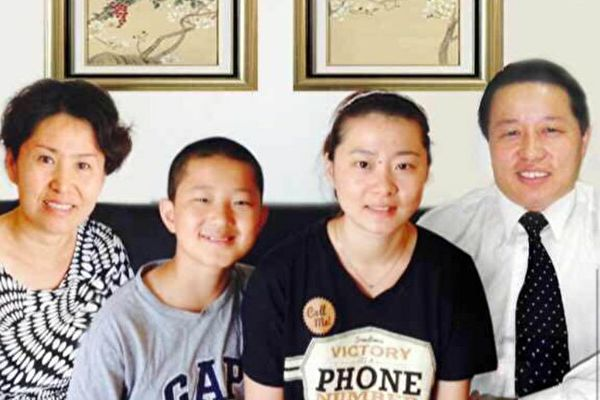
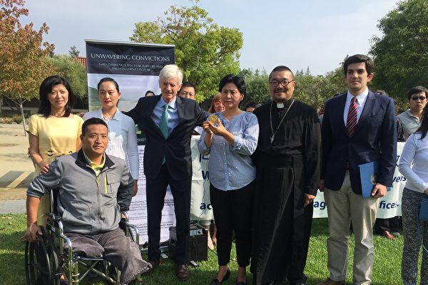
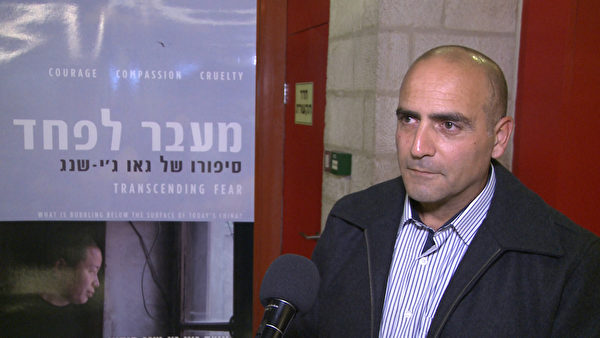

<a name=top>
<a href=#1>北京律师高智晟评江泽民下台</b> 
<a href=#2>高智晟:以无道压制天理 必为天理所灭</b> 
<a href=#3>高智晟致胡锦涛温家宝的公开信</b>   
<a href=#4>高智晟律师致胡温的第二封公开信</b> 
<a href=#5>高智晟律师致胡温的第三封公开信</b> 
<a href=#6>高智晟被失踪半年 律师发函公安部查询</b>  
<a href=#7>高智晟被失踪一年 获颁自由人权奖章</b> 
<a href=#8>为法轮功学员辩护的律师遭中共迫害”系列报导之高智晟（一）</b> 
<a href=#9>“为法轮功学员辩护的律师遭中共迫害”系列报导之高智晟（二）</b> 
<a href=#10>高智晟接受专访：中共酷刑不会让我噤声</b> 
<a href=#11>抓捕维权律师 中共在联合国受到尖锐质疑</b> 
<a href=#12>高智晟2016中国人权报告之二：宗教迫害</b> 
<a href=#13>高智晟制宪思想记录之十九：邪灵附体</b> 
<a href=#14>高智晟等三人获提名角逐诺贝尔和平奖</b> 
<a href=#15>律师高智晟的故事在以色列传开</b>  
 <a href=#16>大纪元公布“高智晟重要事件记</b>    
  
  
  

<a name=1>
<h1 align="center"><b>北京律师高智晟评江泽民下台</b></h1>

高智晟律师

  
【大纪元2004年9月25日讯】(大纪元特邀记者易帆, 郭若报导) 江泽民的退出﹐中国民众是如何看待的呢﹖“希望之声” 记者采访了2001年中国司法部表彰的十大律师之一﹐北京的高智晟律师。高律师曾代理过许多轰动全国的案件﹐其中三分之一是为走投无路的底层百姓打的免费官司。高律师在接受采访时说﹕江的下台对广大民众来讲无疑是大快人心。虽然民意在中国并不重要﹐但主流的﹑强大的民意最终还是能让当权者有所收敛。高律师指出﹐任何政党﹑任何人物都是来去匆匆﹐人民永恒。

<b>太上皇的“宪外治国”</b>

“依宪治国”也罢﹐“依法治国”也罢﹐“以德治国”也罢﹐这些东西都不是今天才提出来的﹐毛泽东立国之初就说“全心全意地为人民服务”﹐但事实上恰恰是全心全意地不为人民服务。中国1954年就有宪法﹐可中共整个的执政史就是赤裸裸地践踏宪法的历史过程﹐他们整个行为价值就凌驾于宪法之上。

“依宪治国”在机制上还得体现为“依法治国”。中共什么时候能把自己当成一个法律主体来对待﹐才能让人们看到一点点依法治国的希望。你在这个社会中是一个庞然大物﹐控制社会的所有资源﹐判断社会的所有行为价值﹐但你所有的行为都不能纳入法律判断的范畴﹐你不成了现代文明中的太上皇帝了﹖你怎么去依法治国呢﹖你是在宪外和法外治国。

现在中国社会的动荡﹐都是把自己当成太上皇的中共自身导致的。许许多多的人﹐正是因为信任宪法而失去了自由﹐比方最近在北京申请游行的叶国柱﹐就是由于对所谓公民游行自由﹑示威自由的信任﹐导致他连人身自由也失去了。实际上宪法已经成了一个陷阱﹐它象一个神像一样美轮美奂地竖在那﹐你尽管对它心存幻想﹐一旦你对它有任何行为方面的要求﹐就要被它吞吃掉。

<b>权力的授予和行使不是鸡和蛋的关系</b>

中国共产党执政能力的危机从他们取得政权之日起就存在﹐这个政党从来不考虑自己取得政权﹑行使权力的合法性问题﹐所以危机是必然的。

执政能力是什么﹖它首先是公民对你执政权力的认可﹐公民认可是你执政最大的力量来源。公民不认可﹐把你手中的钢枪握紧一点那就是你的执政能力。你象无赖一样控制着政权﹐把人民当狗一样对待﹐企图凭着内部一个决议就能提高执政能力﹖那是多么荒唐﹗

象广东省张德江这样的人﹐他们干了多少伤天害理的事﹐这样的人居然还是所谓未来国家领导人的梯队。不用说梯队了﹐常委里面贪官就一大堆﹐有人说反腐一定要彻底﹐我说反腐千万不能彻底﹐一个不小心﹐可能就剩下三个人——胡锦涛﹑温家宝﹐还有一个黄金高。腐败是这个政权的基础啊﹐反腐就是反对这个政权。把腐败的官员铲除掉﹐就等于把整个政府铲除掉。

只有解决了“权为民所授”的时候才能做到“权为民所用”﹐没有正当的权力授予程序就没有正当的权力行使﹐这不是鸡和蛋的关系﹐是前因和后果的关系。我们的党中央一再地喊“与时俱进”﹐“与时俱进”﹐这要不是一种疯子逻辑的话﹐大概也是一种绝望吧﹐可惜人民已经对他们整个行为价值失望﹐再不会相信什么口号了。

<b>江为自己唱了一曲“我的太阳”</b>

中国人民对江泽民咬牙切齿是因为他朝恶的方向发挥到了极至。江的时代是中国历史上上访人数最多﹐对上访者镇压最残暴的时代。今天对上访者的镇压我不认为是胡温价值的选择﹐而是江时代﹑江价值的延续。江的时代实质上是整个司法制度﹑司法信仰和司法存在正当性的崩溃。哪天中共真要垮了﹐江泽民功不可灭﹐是他催化﹑加速了这个进程。

电视台公布江泽民辞职新闻时﹐在播出中央对江的赞美之辞后﹐紧接着播出江给政治局的一封信。我不知道这种安排是出于愚蠢还是出于智慧﹐反正结果妙不可言﹕两相对照﹐前者完全出自后者﹐与其说中央对江作了高度的评价和赞扬﹐不如说江临了又给自己唱了一曲颂歌。

多么无耻啊﹗上台是为了党和人民﹐下台也是为了党和人民﹐ “受到全党﹑全军﹑全国各族人民的衷心拥戴”﹐“赢得了国际上的广泛赞誉”……﹐我不知道国际上那些广泛赞誉是从哪来的﹐他们门一关﹐这些赞誉就出来了﹖那天我看完新闻突然想到一个笑话﹕中共这个集团确实万能﹐它可以让任何智商﹑品德的人“雄才大略”﹐“具有宽广襟怀”﹐并“受到全党﹑全军和全国各族人民的爱戴”

<b>除非中华人死尽</b>

中共官员﹐不管今天谁上﹐明天谁下﹐对中国民主政治和公民权益总的环境不会带来多少益处﹐只不过是个人人品和道德在同一个平台上各有一些不同的发挥﹐就这么一点点个体的区别而已。中共官员当中当然也有不少具有健康人格﹐有道德的人﹐但由于他们所服务的机器的麻木和残暴﹐他们的愿望和价值很难通过国家的行为价值体现出来。本质的问题还是体制问题﹐是这部机器的问题。

远的不说﹐从58年或者更近一点的66年开始﹐象XX大XX中这样的盛会开过多少﹖民众从这些会议中获得过哪些实质性的利益﹖百姓的生活得到了哪些改善﹖即便是这次四中全会﹐依然是第一要坚定不移地加强党的领导﹔第二要牢牢掌控对舆论的导向。这是再明白不过了——五十多年过去了﹐机器还是那架机器。如果今天还有国人去关注或寄希望于这类会议的话﹐它只证明一个现实的无奈﹐那就是中国人民至今仍不得不面对中国共产党这个集团。

江的下台对广大民众来讲无疑是大快人心。虽然民意在中国并不重要﹐但主流的﹑强大的民意最终还是能让当权者有所收敛。江的下台是当局对民意畏惧﹐而不是敬畏的结果﹐因为那部机器内部不具备这种主动的自觉的因素。人民正在不遗余力地斗争﹐抓三五个乃至抓千儿八百人遏阻不了他们﹐除非中华人死尽﹐否则这种斗争将会继续下去﹐而独裁者必亡这一铁的规律却在中国历史上演绎了几千年。

任何政党﹑任何人物都是来去匆匆﹐人民永恒。(http://www.dajiyuan.com)

<a target="_blank" href=#top><h6 align="right">回上方</h6></a>

<a name=2>
<h1 align="center"><b>高智晟:以无道压制天理 必为天理所灭</b></h1>

高智晟和妻女

【大纪元11月24日讯】(大纪元记者万平综合报导) 中国著名维权律师高智晟22号再度上书胡锦涛、温家宝，质疑中央默许北京市安全局及北京市公安局滥用权力及纳税人血汗钱，操控对其家人的威胁跟踪，他强调，在迫害结束前，将持续公开呼吁湖温遵守法律，并策划起诉非法迫害其全家的两个单位。自其为法轮功向胡、温上书直言，将法轮功问题公开化后，1个月来，高家3口人被20名左右的便衣24小时贴身“恐吓”、“压迫”。

高智晟22日决定成为一名基督徒。与此同时，高智晟的夫人耿和在互联网上声明退出中国共产党。一些法律界人士认为，新的文化和道德信仰基础的形成有利于中国良性走向民主化与和平崛起。

高律师在网上公开要求中共政权停止迫害法轮功成员，中国法轮功问题再次成为国际瞩目焦点，也引起了国际社会和媒体对法轮功受迫害的事实更广泛的关注。为此，中共当局害怕虚假谎言曝光，逼迫高律师收回其公开信不果，于是勒令高智晟停业一年，并且吊销其律师执照。

<b>联国酷刑专员前秀迫害</b>

联合国酷刑特派专员诺瓦克21日抵达北京，以了解中国的实际人权状况。高智晟律师在2次公开信中提到，与诺瓦克会面过程中，1、2位素质低下的便衣把丢人现眼的事做尽。

在高速公路上行驶途中，挤靠高律师的车子，将诺瓦克的代表吓得捂住了眼。高律师开着伤痕累累的车子，联合国人权事务高级专员诺瓦克先生和孔珊女士非常震惊，一边给碰伤的车子拍照，一边不停的摇头。

在饭局中，大家合影拍照，结果贴身跟踪便衣硬说，把他的像也照进去了，他们的拍照行为严重侵犯了便衣的人权。便衣们的粗暴及跋扈惊得这些人权观察专家目瞪口呆，整个就餐的楼层客人就像看“耍猴”般围着看他们表演，人权官员不停地摇著头，草草结束了晚餐离开，几名便衣干脆就像随行般地跟着他们同行。

<b>高智晟夫妇的声明</b>

跟踪者在高律师与联国人权官员会餐上，公然恐吓:“休怪我们对你高智晟不客气！”

高律师坚定的表示：“今天我要是败了，就再没人会相信天理了！所以掌握天理的人祂不会袖手旁观！所以神在和我们并肩作战！”

其夫人耿和也于21日，公开发表退党声明，抗议当局对高律师及其家庭不断升级的打压和骚扰。她说，面对这些长期欺辱我们的同胞、给我们的民族久远的价值造成永久性破坏的恶势力的长期肆虐的残酷现状，我们夫妇同大多数善良的中国人一样：是深彻心底的痛！我宣布脱离这个已完全没有了人的理智，远离了人性文明的党组织。以荡涤我心灵深处那个深黑的印记！

高智晟说，压制我高智晟不足道，但企图持续以无道之法压制天理，终必为天理所灭

<b>自由人类的良知</b>

胡温2人没有回应高的公开信，中国许多普通百姓，包括别的律师都在网上公开支持高智晟律师的勇敢行为，称他为中国的良心。

国际社会从“国际律师协会”、“无疆界记者协会”、其它国际非政治组织，以及各国的政要都对高律师事件表达高度的关注。138个团体在美国总统布什访华之前，要求布什关注高智晟为停止迫害法轮功的上书而被勒令停业，所遭受的迫害。

这个事情说明，高律师这个事件所反应的，确实是触及了整个人类，不仅是律师界的良知，而且是整个自由人类的良知。

<b>人类的普世文明共识价值</b>

高智晟律师为弱势群体、上访维权人士、异议人士和家庭教会成员提供法律援助，已有相当长的时间了。

高律师在公开信中对胡、温说，“一些地方当局对信仰法轮功同胞者的迫害已到了完全随心所欲的地步，我们无法接受这种公然反人类的野蛮暴行发生在21世纪的人类社会、发生在有政府存在的今天的中国的现实。”他真切地看到了，这持续的、系统的、大规模的、有组织的针对信仰法轮功同胞的野蛮迫害的暴行。

高律师在信中要求胡、温，“尽快以迅速的措施，制止各地地方当局对信仰法轮功的同胞持续非法野蛮的迫害，这已不再仅仅是那些被非法迫害的公民摆脱灾难的需要，这里还涉及中国的宪法价值、法治价值、道德及道义方面的人类的普世文明共识价值。”

<a href=#top><h6 align="right">回上方</h6></a>

<a name=3>
<h1 align="center"><b>高智晟致胡锦涛温家宝的公开信</b></h1>

高智晟律师

<b>停止迫害自由信仰者 改善同中国人民的关系——高智晟致胡锦涛主席、温家宝总理的公开信</b>

【大纪元2005年10月18日讯】停止迫害自由信仰者改善同中国人民的关系—— 高智晟致胡锦涛主席、温家宝总理的公开信
胡锦涛主席、温家宝总理：

公民高智晟向两位问好！

在能坐下来向两位同胞问好之前，为了关注另一群我们共同的同胞——法轮功自由信仰者最近一个时期以来的再次遭致系统的、大规模的、有组织的非法迫害的真相，我去了北京以外的一些地方，度过了几天“做贼般的日子”，是为外界传闻我“失踪”的原因。

新一轮持续的、系统的、大规模的、有组织的针对信仰法轮功同胞的野蛮迫害的暴行是正在发生著的事实，这不仅是最近各地来信中反映了的真实，也是我们这次外出时所真切地看到了的事实。作为公民、作为律师，我愿对我看到并公诸于众的真实承担任何法律后果。

基于对两位长者基本人性的善意信任，我决定将我看到的真实以公开信的形式通报于两位，再次寄希望于两位，尽快以迅速的措施制止各地地方当局对信仰法轮功的同胞持续非法的野蛮迫害。这已不再仅仅是那些被非法迫害公民摆脱灾难的需要，这里还涉及中国的宪法价值、法治价值、道德及道义方面的人类的普世文明共识价值，这些价值不能在今天的中国、在你们的眼里成了没有价值的东西啊！

山东烟台市的徐承本10月15日一见到我即讲道：“我的爱人贺秀玲的尸体已被冷冻了快两年了啦，至今不能得到处理，他们有能力长期的折磨她最终把她致死，却在把她致死后快两年里没有能力处理这件事。她在快被折磨死时才允许我看了一眼，当时我看到人已经神志不清了，但还是被锁铐在床上，而且下身没有一点衣服，看到我的亲人这种惨状，当时我的心都要碎啦！他们真没有人性，只几分钟就把我赶了出去。她才四十多岁啊！这是人死的那天晚上公安通知我看到的情况”。

“我爱人生前5次被抓，还曾在辽宁锦州被关押3个月，因为在北京上访被抓，关在芝罘区专为抓捕法轮功学员而在京长期包租的一家宾馆的厕所内，只有不到三平方米的地方，关了16个人，当时很多人都闷的受不了。因为我们的强烈要求，我爱人死后他们做了尸检，报告至今不给我，在我们多次追要的情况下，只是口头告诉我是‘因练法轮功而死’”。

文登市宋村镇石灰窑村的修炼者杜克松在今年5月被抓，被判劳教后，在看守所受迫害查出高血压，送劳教所被拒收关了50多天后因生命危险被放，9月27日又被公安抓捕，至今下落不明。

文登市的修炼者于正红，40多岁，是宋村镇寺前村人，9月27日在家被抓，被抓后绝食15天，送到医院后被通知“快不行了”，“后来由公安伪装（不敢说自己是警察）把她送回家。”

法轮功修炼者林基啸，是文登市宋村镇大床村人，女，40多岁，9月28日被抓，关在看守所，一直在绝食，家属去要人，他们说已送到王村劳教所了，但有从里面放出来的人说人还在那里，已经奄奄一息了。家人去王村洗脑基地了解，被告知说人不在那里，家人又去问‘610’人员，他们又说是把人送到青岛去了，这个人是死是活、目前到底在哪里？情况至今不明。烟台福山区的肖勇，一向循规蹈矩、口碑甚佳，仅因修炼过几天法轮功，今年7月被判了三年半有期徒刑。

“我是2001年6月第一次被抓的，折磨了一年后我的身体很糟，把我放了”，退休教师刘莉（应其要求隐去真名）平静地坐下来，一讲即是近两个小时。“2003年我出来后发现，从2000年起，我所有的工资竟被‘610’领走，我找‘610’和我的校长的次数谁也难以记清，至今不解决。我的丈夫也因修炼过法轮功，关押期间被折磨的失去了记忆，家中原来由他负责保管的一点存款凭证也在抄家后下落不明，他又记不起来。2003年春节，我把仅有的一百元钱给了被关押的丈夫，我们母女俩过年都没有一分钱。2001年6月，福山区公安局4、5个警察去我家抄家，抄出两本法轮功书籍，就强行把我抬到派出所，还对我进行殴打，我说警察怎么能打人？他们一边打还一边喊：‘就打你了怎么样’？他们审了一天一夜，其中一个姓张的警察说：‘你再不说就要倒血霉了’。他从另一个人的笔录上抄了一份‘笔录’，然后让我签名，我拒绝，后来他自己签上我的名。连旁边姓陈的警察都看不下去了，说：‘她不签你签什么’？他咬著牙说：‘我就要让她倒血霉’。后来他们就凭这份当着我的面伪造的假材料关了我15天，后又直接送到了福山洗脑基地。在转化班他们不让我睡觉，强迫我转化，直到2002年1月，我仍未转化，他们就直接用那份假笔录判我劳教1年，由‘610’的主任王岳峰送我去的劳教所，当时劳教所给我体检，身体已被折磨的不像样子，劳教所拒绝接收，但他硬要求劳教所收留我，他们耳语一阵后，医生就用一尺长、一寸粗的针给我打针，我反抗，四、五个人将我按倒在床上强行给我打针，最后他们看到我身体还是不行，由王岳峰给我送回家中。

2002年11月20日，我继续去福山镇党委找他们的车镇长问非法扣我工资的事，我来到车镇长办公室，自我介绍后，他起身出去，我等了很长时间，他回来说：‘我让赵秘书跟你谈谈，你去他的办公室吧’。于是我又来到赵的办公室，刚进去，门外冲进4、 5个警察，不由分说地把我拖上车，强行把我带到了福山洗脑基地。这次是2003年11月17日将我释放的，在此期间他们对我进行了毫无人性的折磨，曾经连续戴手铐长达43天，还将我反铐著吊到铁门上进行殴打，在关押近一年后，由于转化没有效果，只好将我释放。2004年11月28日，我再次被抓，由当地的派出所将我送到栖霞看守所，关了7天后，又转到栖霞洗脑基地，于2005年3月18日被释放。在此期间，他们继续用不让睡觉的方法对我进行迫害，曾经让我连续26天不睡觉，眼睛稍一闭上就被打醒，我曾多次昏倒，他们还采取连续站立的方法，不让我休息，并殴打我，每次连他们都累得直喘气。”

2005年10月15日上午，我们与瘸著腿的王德江见面，王的腿至今肿的连鞋都无法穿。“2005年8月15日晚上，我在牟平区高陵镇下雨村的朋友家，村里治安和高陵派出所共三人突然闯进来，我跟朋友跑出来，他们却大喊‘抓小偷’，村民上当了，我们被抓住。他们开始打我们，治安主任手提一把椅子猛然砸在我身上，椅子当场被打散，我已躺在地上不能动弹。他们还用脚踢，其中一脚踢到我的肝部，我当即昏了过去。他们把我抬到车上，拉到高陵医院抢救，我醒来时发现把我铐在病床上，之前抓我的一个治安员在抓我时被我摔了一跤，他怀恨在心，看我醒来后就用鞋底打我。在场的公安说：‘在医院打他们动静不要太大’。当天晚上被抄的有两家，共抓了6个人，其中一位孙学进老人已经70多岁了。后来他们把我送到看守所，逼我签字报名参加洗脑班，我不签，狱警拧住我的手铐，问我：‘你签不签’？我说不签，他一直拧到手铐已经陷入我的肉中，我还是不签，他只好转身走掉。后来他们找了个犯人把我拖进牢房开始打我。国保大队提审我一次，因我不配合他们，他们把我送到烟台的幸福洗脑班，开始不让我睡觉、坐小板凳，进行强制转化，让我写三书（保证书、揭批书和悔过书），还用车轮战，让我看污蔑大法的录像，第4天，他们看没有效果，牟平国保大队和烟台公安处‘610’头子于刚商量把我送到招远洗脑基地，我听到他们议论说像我这种情况只有在招远基地才有办法。这时我已经是7、8天没有吃饭和睡觉了。到招远后，他们抬着我，走一步就踢我一脚，嘴里还重复著‘看你转不转化’。放下我时，我已没有力气站立，只好躺在地上，他们继续折磨我，基地的主任开始用脚踩我的下身，他的脸上一点表情都没有，还用脚抬起我的头，然后把脚拿开，反复著让我的头摔在地上，还用脚踢，折磨够了才把我抬进监室，我感觉他们已经没有了人性。在招远基地都是一个学员一间小房屋，是专为洗脑特建的，尽管我站都站不起啦，他们还是用铁链把我捆到铁椅上，戴上手铐、脚镣，我继续不转化。第十天他们开始给我灌食，我开始不断地吐血沫，当时连他们自己看着都受不了，也跟我一起吐起来。他们按住我的头给我灌食，那里的主任问我转不转化，我说不转，他说在招远，你不转化就别想出去，我们这里办法有的是。他们把我背铐在暖气管上，只有脚尖能粘到地面，屋子里没有灯，24小时都很黑，我隐约感到，不时有人进来把手伸到我的鼻子下，摸摸看我是不是还活着。也不知过了多长时间，我的手腕都勒出了大口子。当时还用电线勒住我的嘴，让我不能说话，现在我连说话都流口水。被他们不停的折磨，我实在痛苦的无法形容，我动了自杀的念头，想咬舌，但他们又加了几根电线，使我嘴里也无法动弹，直到我昏迷不醒。我醒来后看见自己的腿已经变了颜色，开始变得黑青，左腿越来越粗，已有右腿两倍粗，右腿却越来越细。但他们还是不放松对我的折磨，我想上厕所，他们搀我起来，我发现自己已经不能走了，就摔倒在地上，他们接着把我抬到床上，还是绑住我的右腿，继续戴着手铐。当时那里的医生看情况十分不好，就让他们把我送到医院，医院的医生说我有生命危险，必须锯掉腿，后来他们又把我送到毓皇顶医院，那里的医疗条件最好，我住了几天，他们让我的家人出钱给我治疗，我们没有钱，后来家人把我接了出来。回到家后，由于我已生活不能自理，还得由我80多岁的老母亲自伺候我”。

王德江在濒死时被地方当局交给了他的家人，他和他的亲人恶梦般的经历今天仍不知在全国各地被多少无辜的同胞正在经历著！

“22岁的杨科萌是哈尔滨工业大学威海分校汽车专业系大二学生，从学生到校长，没有一个人不喜欢他。因他在网上公开声明退团被一位中央领导特别“关照”，他在退团时没有写明自己所在的学校，为此，‘610’人员在全国高校进行了拉网式排查。今年5月，威海‘610’人员找到他，问他是否练法轮功，是否在网上退团，他说：‘我愿退就退啊’。8月20日开学，‘610’人员又来学校，29日他被抓走，父母打电话到宿舍后才知道。9月7日，他父母（杨平刚、常丽君）还有王胜利夫妇和济宁的王女士同时被抓，至今下落不明”，一位王姓老师告诉我们。

“2005年国庆前，山东省主要领导通知莱芜市公安机关，如国庆前抓不到亓英俊、陈莲美、王静等七人，公安机关的领导都要下台。9月29 日半夜1点，上述人员即被抓。实际上现在我们这里的很多警察都不愿意抓法轮功学员，他们也没有办法啊！另外，现在全国各地都有来招远洗脑基地取经的人员，以便更加残忍地迫害我们，并且在胡锦涛访美期间中央下令先突击整顿迫害法轮功学员的人，说他们最近打击不力，然后加大力度镇压法轮功。山东省的招远洗脑基地和山西省的一个基地已被中央指定为示范基地。外人不明白，越是这样的基地越恐怖，没有几个人能熬过来，地狱算什么！招远洗脑基地比地狱都可怕，连折磨我们的人也都变成了魔鬼”，一位曾经在招远基地被关押过的信仰者如是说。

“我叫亓鑫，今年19岁，山东省莱芜市人，是亓英俊、陈翠莲的女儿，我还有个弟弟叫亓垚，10岁。我父母从98年开始修炼法轮功，2000年，我爸在公园炼功，被莱芜市警察绑架，后被送到淄博王村劳教所，判刑3年。我妈因警察的追捕被迫流离失所，后被抓关到莱芜市小曹村大队，那年我13岁，我弟弟才3岁多，我只好独自在家照顾弟弟，直到我妈回来。我爸回来后告诉我：在淄博劳教所，警察为了让他放弃修炼，同时用8根电棍电他，他的身体在地上不停地跳动，皮肤冒出被烧焦的味道。被电击后的几个星期，已经电糊了的皮肤开始一层层的脱落。后来我父母回家后，我们一家人又在一起生活了。我父母又重新经营起卖军用品的小店，我们总以为灾难从此过去了。直到今年的9月30日晚上1点多钟，莱芜市警察带领20多名武警闯进汶阳村大法弟子尚阿姨家中，绑架了我的父母和尚阿姨夫妇，而尚阿姨的丈夫并不修炼。8月份起，我爸爸得知被警察通缉，便把我交给一个阿姨，父母带着弟弟开始流离失所，我们一家人再次被迫分开。父母被绑架后，弟弟至今没有音信，我非常担心我的还不懂事的弟弟，我每天都在为弟弟祈祷。10月1日下午3点，莱城区公安分局柳青和张宝德、官司派出所的邵士勇等二十余人，在我家无人的情况下闯入，车号为鲁S1030的警车停在我家楼下，他们用钥匙打开我家楼下储藏室，并毁坏我家的门锁，进去查抄，直到晚上7点才离开。现在我们一家四口人在四个地方，10岁的弟弟在哪里都不清楚”。

河南扶沟县58岁的贾俊喜，2005年8月18日被当地警察劫持，经10余天的折磨致死后，家人要求行尸体鉴定，却被当地警察强行火化（警察说：“告到北京也没有用”）。

2005年6月8日，广东惠州的朱家文（名假）在工地干活过程中被抓，54天后家人才获悉他被劳动教养三年的事。

2005年9月12日深夜，广州市东山区的石磊（名假）家中突然闯进几名警察，不由分说，架著石磊就跑，“当时我先生脚上连鞋子都没来得及穿，下了楼上了车他们就打他，听到打我先生的声音，我的心如刀绞。我们太无助啦高律师，至今不给我们任何手续”，石磊夫人在予我电话时带着哭腔说。

2005年9月6日，石家庄的法轮功学员段生、何丽被抓至今下落不明。

2005年7月19日，四川泸州袁玉菊、梁劲晖母子与其他共10名法轮功修炼者被非法抓捕至今关押。

……。

刚刚过去的“十、一”前夕，发生了北京、黑龙江等各地对法轮功学员行大规模的抓捕之举，各地在胡锦涛先生出访期间的抓捕带有明显的突击性，以上事实真相就在光天化日下发生，是无以掩盖的事实。

胡、温两位先生：一些地方当局对信仰法轮功同胞者的迫害已到了完全随心所欲的地步，我们无法接受这种公然反人类的野蛮暴行发生在21世纪的人类社会、发生在有政府存在的今天的中国的现实。两位必须与我们共同面对的现实是，一方面，两位主政伊始时，国内人民及外部文明世界均寄以极大期望，两位不时倡导的诸如“依宪治国”、“以人为本”、“构建和谐社会”的理念也在较长的一个时期里承载着人们的期望；但现实是残酷的，同时它又是客观真实的。在那些被迫害公民须面对之的同时，两位和我们何尝不是一样地面对着这正在真实发生著的现实。作为一个泱泱大国的领导人，我们当然不愿意相信及接受你们在这方面的认知能力低于常人。对今日中国妇孺皆知的正在公开发生的持续迫害无辜信仰者的野蛮暴行，两位若不知情，那是你们针对国人的一种罪责；若知情而不予制止，这与具体行恶者的罪恶何异？就像我写公开信予两位是我仍信任两位的信念之依一样，调查中，许多有过让他们及亲人终生刻骨铭心的被迫害经历的法轮功信仰者，有些还是被新近的迫害过程致残者，还有那些甚至是被迫害致死者的亲人，他们共同所表现出的善良及对两位的期望，在调查过程中多次感动的我们潸然泪下！但我不得不与两位共同痛心面对的是，在针对信仰法轮功者迫害的这场浩劫中，一些罪恶的东西形去而神不散，持续不辍的罪恶不仅仅使无以计数的善男信女蒙冤涉难甚至含恨而死，这种完全悖越基本人性的迫害至今仍在延续著，同时被延续著的是持续被损害的我们的政府形象以至国家形象，它包括法律方面的、道德方面及人性文明方面的。这场浩劫的罪恶不始于你们，但这场浩劫在你们二人主政时期得以继延，这场针对自由信仰者的浩劫未能止于你们，这同样亦属一种罪责。若不尽早身体力行予制止，这将会成为一种历史的结论而不单单是我个人的一己认识。

在持续制造一个群体的人生灾难过程中，使我们更加痛心地看到及感受到，这场令常人莫名惊悚的灾难中的受害人，早已不再仅仅是那些自由信仰者及他们的亲人，持续对法轮功同胞的丧失人性般的残害过程，已使参与残害无辜同胞者自己本身已变得彻底的丧失了人性，诸如前面已提及的招远洗脑基地的若例行公事般、面无表情地踩压他的同类、同胞王德江下身的那位主任，面对四年里无数次讨要自己非法被扣的工资而早已身临生存危势的刘老师的那位“610办公室”主任及那两位校长，无不是这场疯狂暴行的受害者。对具体操作洗脑转化的官员及工作人员，只去评价及奖赏他们对法轮功学员的“转化”结果，实践中，以完全造成这些官员及工作人员个体为了确保获得心目中的经济利益及邀功乞赏，已完全忘却了自己的人性，对同类的生命、痛苦没有人本该有的敬畏及体恤，没有了本应有的罪恶感、羞耻感及不道德感。在这种过程中，人类人性文明共识中既有的东西不再被重视，职业良心共识中既已形成的基本价值已完全走向了反面。法轮功修炼者贺秀玲在她离开这个人世前所经历的非人般的折磨过程记录，将在人类未来无限久远的有记忆的时期被后来者唾骂，她在奄奄一息时被送至太平间，直至“死”后才被获准见面的亲人跪在她的面前哀嚎著历数那种她离开人世前所遭遇的苦难，亲人们突然发现“死者”的两面眼角慢慢地流出泪水，亲人们嚎啕著发疯般地找医生抢救，医生出奇的冷漠急得亲人们呼天喊地，同村人听说贺秀玲还没有死，医生不抢救，急赶医院，找到医生大声指责医生，医生才带着仪器测试表明，心脏还在跳动，这时候，我们的医生同胞的第一反映不是如何救人，而是迅速撕碎表明心脏尚在跳动的心电图，口中念念有词说：“人早就死了，活什么活”而逃离。贺秀玲带着泪水在亲人绝望的恸哭中死去。

我真不知两位同胞面对上述现实会有何感想！我们的国家、我们的人民、我们的民族的久远价值，以及全世界的在这场浩劫面前保持了不光彩的沉默者的各国政府的道德形象，都已现实地成了这场浩劫的受害者。

须在此强调的是，事实已充分表明，中国执政者对于它所领导的经济改革的巨大成就必然引发的精神领域的变化，缺乏超前的预见和足够的体认。在长期和平的年代，在一个经济至上的社会，人类是不可能久久沉湎于单纯的物质消费的。在人们对精神生活的渴盼持续推动下，宗教和信仰生活在民间的大面积复兴，乃是必然的趋势。它与科学和文化等主流话语，是可以并行不悖的，现代文明早已解决了科学和信仰之间的分区划界、各守其土的问题。个人信仰的自主，必然导致集体意识形态的消解。个人权利的伸张，必然是对政府无限权力的压缩。这是当权者必须正视、不能不顺应的事实，这是人类历史的潮流。

在此，我不得不提及我及我周围许多人的疑惑与不解：公民与世无争的自由信仰为什么会招致如此持续的、无人性的更属非法的打压，这里的价值到底在哪里？！非病态及残缺人性者无以解释。仅站在打压者的角度价估，这种选择除了将打压者自己孤立在野蛮及非法的境地及持续恶劣地毒化著打压者本已令正常人齿寒的人性本身外，它原本即不存在任何正面的价值。这次调查中，我们除了看到这场始于六年前的灾难在继续的真实外，另一个真实也是实实在在的——那就是这场镇压本身的失败。从我们最近涉足的地方看，执行打压命令越残酷、越持续的地方，这种失败的程度及标志越明显，山东的济南、青岛、烟台等地，自由信仰者及他们的同情、支持者的张贴、散发的抗议及揭露罪恶的标语文件，可谓无处不在，许多公安派出所的门口即举目即是，坚韧延绵的抗争也在随着打压的持续而壮大著、拓展着，印衬著灭绝人性的镇压措施是多么地不得人心。相反，一些打压手段较温和的地方较著上述地方则是另一番不同景象，如陕西一些地方，这方面的局面则较为平静。这足应令那些迷信暴力者无地自容。将无以计数的财力、警力资源，无端消耗在使社会秩序更复杂化的对和平修炼以修心健身的法轮功者的打压上，完全是一种侵犯人权的罪行，恕我直言，两位没有权利、没有道理、没有借口不去迅速改变这种现状。

中国是《世界人权宣言》的缔约国。《宣言》明文规定：“人人有权享有生命、自由与人身安全”。“任何人不容加以无理逮捕、拘禁或放逐”。“人人于其宪法或法律所赋予之基本权利被侵害时，有权享受国家管辖法庭之有效救济”。我国现行宪法第三十三条也载入“国家尊重和保障人权。”无论是国际法准则还是中国自己的根本法，都绝不允许任何人以任何借口侵犯人权、惨无人道地迫害本国同胞。正是基于对人类普世价值的信奉与对法治的尊重，本人郑重建议两位尽早做出决断，“停止迫害自由信仰者，改善同中国人民的关系”，切实履行“依法治国”和“依宪治国”的方略，在民主、法治和宪政的基础上创建新的中国。

你们的这种实践，将得到中国人民及世界人民无尽的支持！

最后，我有必要特别提醒的是，两位应保证所有这封信中提到的那些饱经苦难的个体同胞，不致因为这封公开信而再次遭致野蛮迫害。石家庄法轮功学员郝秋燕曾因我的公开信而被非法关押近8个月的野蛮行径，警示我们有必要作这样的提醒。在我还有安全的日子里，我将继续关注他们的安全，无论作为文明人类中的一员，还是作为中国人、中国公民及律师，我都有权利这样做，虽然在中国它还十分危险。

上致

衷心祝愿两位：凡事平安！顺利！

你们的同胞：高智晟

2005年10月18日于北京@

<a target="_blank" href=#top><h6 align="right">回上方</h6></a>

<a name=4>
<h1 align="center"><b>高智晟律师致胡温的第二封公开信</b></h1>

【大纪元2014年08月06日讯】编者按：1964年4月20出生的高智晟，陕西省榆林市佳县人，中国律师，1996年开始执业即长期替弱势群体维权打官司，曾代理多宗民众维权案件控告地方政府，获中国司法部选为“中国十佳律师”，被誉为“中国良心”。

高智晟勇于为当局眼中的敏感个案辩护，包括法轮功修炼者、地下基督教徒以及与官员发生纠纷的底层农民和私营企业家。尤其自2004年底开始多次上书中共高层，要求改变对法轮功等群体的非法处理手段，并参与对法轮功学员器官遭当局活摘指控的调查，被前加拿大亚太司司长大卫•乔高誉为“地球上最勇敢的律师之一”，多次获得诺贝尔和平奖提名。

高智晟预计2014年8月7日刑期届满，主导迫害高智晟的中共“政法沙皇”周永康7月29日公开落马，外界呼吁中共当局如期释放高智晟，大赦国际发起“写信给高智晟”营救马拉松，各国民众累计寄出逾16万张明信片营救。在高智晟律师即将被释放前，大纪元重新再次发表当年高智晟致中共领导人的第二封公开信：

========================

胡锦涛、温家宝两位国家领导人：

从10月20日早晨起，北京市安全局、北京市公安局的约二十名左右的便衣开始寸步不离地跟踪我及我的家人。每天至少有不低于9 辆的车围在我家门口的三个方向，18日、19日、20日三天，车辆增加到二十辆以上，我想请两位回答你们作为国家领导人的、这个国家的一个公民的如下问题：

一、你们是否如实地告诉了那些整日一脸倦容地盯着我的那群年轻人：高智晟做了些什么？你们有没有欺骗这些年轻人？

二、你们有没有如实地告诉这群年轻人，你们的这种作法是违反中国宪法、违反中国的基本法律原则的！是非法的？

三、你们有没有告诉这群年轻人，你们这样对待一个无辜公民的手段是最为肮脏和最为不道德的？

四、你们有没有如实地告诉在我们家门口的那群在夜里冷得瑟瑟发抖的、同样是无辜的年轻人，你们以如此低下的手段恐吓、威胁及限制我全家的人身自由的手段是当今人世间最不光彩和最不文明的恶举。

五、你们有没有告诉过这群年轻人，贴身跟踪、24小时盯着我全家的目的、意义是什么？

六、你们有没有如实告诉这群年轻人，这种作法是被中国人民咬牙切齿的肮脏行为，是在绝大多数的中国人眼里是最为可耻的行为！

昨天和今天早晨我未出门晨练，我实在不忍心去折腾那群守在我家门口前后左右的近二十名年轻的便衣！说心里话，每天晚上躺在床上的我心里很不是个滋味，几十名年轻的便衣，他们也是人，他们同样有父母、有妻儿，同样有权利、也有条件在寒冷的夜间与亲人一道去享受家里的温暖。每当早上起床后透过窗户，看到他们一个个不停地在原地蹦跳以驱离寒冷的场面，我和夫人的心里都感到很难受，今天早晨我和夫人还商量著如何解决这群年轻人白天的热水饮用问题。这些年轻人，作为具体的个体，他们都是我亲爱的同胞，他们决不是我的敌人，每每看到他们从不愿意正面碰接的眼神，我的心里都很难受！我感到了他们的善良和心虚！我必须澄清的是，对他们，我是仅有同情而实在没有一丝敬意！

两位长者：在一个制度文明的国家里，公民的法律权益受到侵害时，若行写信之举向国家领导人控诉将会被视为笑料，而这却是我的国家里公民在类似情势下不得不持续面对的痛苦局面，两位无法感受到此时此刻我内心的痛苦！

10月18日，我向两位以公开信方式痛陈了一些地方政府残忍迫害我们共同的同胞、那些自由的信仰者、践踏国家的法治原则的现实。迅速将我们看到的，对国家、民族健康发展极具危害的真实局面通报两位，以期通过两位与人民一道的共同努力，开始消除罪恶及危险，以寻求建立谅解与和谐的中国。令人痛心及愤慨的是，我看到的竟是莫名奇妙的相反。10月19日，我接到了赤裸裸的威胁电话，10月20日开始，我的夫人吃惊地发现，两位不明身份者从我的家门口开始跟踪我那才 12岁的上学的小姑娘至学校，以后天天如此，直到11月15日那两位不明身份者的身份才明朗——他们开始贴身跟踪我。从11月20日开始，我的家门口和办公室门口每天各守着不低于3 名的便衣，他们每隔几小时轮换一次。从他们出现后的第二天，我夫人每天接送孩子上学的自行车莫名奇妙地丢失，而同一车棚中近百辆自行车却安然无恙。昨天夜里，20多名便衣守在门口，我们新买的自行车的两个气门芯都被拨掉，我的轿车上莫名奇妙地被涂上各种无法洗掉的脏物。11月4日，北京市司法局非法宣布停止我的律师事务所的执业权利；11月15日，我赴新疆开庭，从早晨出门到上飞机，跟踪我孩子上学的那几位便衣贴身跟踪着我，一到乌鲁木齐即有人接力跟踪我。更令人不可思议的是，司法部官员向新疆有关部门全面调查我的含出身、政治清白度、有无行为劣迹及是怎么混进律师队伍、如何从一个律师变成“坏分子”的全面材料。这种与“文革”整人的套路毫无二致的下作做法实在让人哭笑不得。前日一回到北京，联合国人权事务高级专员办公室我的两位朋友孔珊女士和诺瓦克先生到京，出于礼节，我去他们两位下塌的宾馆探望，在整个过程中，极个别素质低下的便衣把丢人现眼的事做尽，他在二环路上，在80公里/ 时速的情势下驱车挤擦我的车辆，惊得诺瓦克先生来接我的代表摀住了眼，在与外国朋友一起吃饭时，我们合影拍照，结果贴身跟踪便衣说把他的像也照进去了，说我们的拍照行为严重侵犯了他的人权。他们的粗暴及跋扈惊得这些人权观察专家目瞪口呆，整个就餐的楼层客人就像看“耍猴”般围着看他们表演，他们一发无以自制，指手划脚、暴跳叫喊无不至极致，硬逼着孔珊女士将我们的合影删掉，几位人权官员不停地摇著头，草草结束了晚餐离开，几名便衣干脆就像随行般地跟着我们同行。

这两天，我家的周围邻居可谓大开眼界，不低于20辆左右的、挂有天津、北京牌照的车辆承担着监视我的各种不同角色功能。20日，我一回到京，我家周围便成了便衣警察的俱乐部，家中固定电话被野蛮掐断至今不能使用，他们让社区门卫、物业人员统统住进宾馆，腾出地方驻扎他们的人马。十几名便衣整日就站在我的楼下，无任何避忌之意，搞得本来平静的社区气氛煞是紧张。这里人们对我的了解导致了他们对政府这种荒诞行为的完全不理解！昨天夜里，我停车刚离开，夫人从窗户上看到他们七、八个人迅速跑步将我的车包围，围着空车折腾了近一个多小时，正常人完全不理解他们在做什么，半夜里，他们不下十次在我的楼道、门口东张西望，杂沓的脚步声吵得人无法入睡。谁会相信我的一家大小会在内室私处、在深更半夜关起灯来危害这个国家的安全？但这些便衣相信，他们中个别人的行为令人厌恶到了极点。我写这些文字予二位，我想代表我的孩子质问两位，为什么你们会继续延续著如此肮脏的权力运作现实，我相信守在我家门口的那群年轻便衣的心灵深处并不都是肮脏不堪的，但我却坚持对这种下作过程的幕后指使者的灵魂则必然是肮脏的认定。我们的孩子，我们每个人，都有权利质问两位，到底是谁在背后指挥着这最为肮脏的权力运作过程？谁有权力这样运作？我们的国家还远不富裕，九亿农民仍处在贫困状态中，由于贫穷，数以千万计的我们的孩子上不起学或因贫穷而辍学。把纳税人的血汗钱大把大把地花在如此既折磨年轻的便衣、又压迫他人的肮脏过程中，这样的行为禽兽不如！在背地里，以如此卑劣的行径对付人民，把本即瘦弱的纳税人的血汗钱花在如此见不得人的过程中，你们还有什么颜面每天西装革履的面对文明世界，有什么脸面面对自己的同胞？写到这里时，东北一位教授打电话表示，他可以肯定这些肮脏的行为不是你们二位安排下实施的，我认同之！但是，这种丑恶过程却能在你们二位主政以来，在中国的任何地方、在任何时候、在任何人的身上都可以发生，这才是问题的本质。你们千万不要再低估今天中国人民的思考力量，回到正常人的心态上来思考、来面对今天的问题。今天中国的问题，再也没有拖下去的条件啦！压制我高智晟不足道，但企图持续以无道之法压制天理，终必为天理所灭。

在对我和我全家的非法及肮脏的迫害结束前，我将持续地做两件事。其一、每天通过以面对文明社会的公开信的方式，促你们的政府遵守中国的法律；其二、我将策划起诉非法迫害我全家的两个单位。

再祝二位一切平安！顺利！！

高智晟

2005年11月22日

<a target="_blank" href=#top><h6 align="right">回上方</h6></a>

<a name=5>
<h1 align="center"><b>高智晟律师致胡温的第三封公开信</b></h1>
【大纪元2014年08月06日讯】编者按：1964年4月20出生的高智晟，陕西省榆林市佳县人，中国律师，1996年开始执业即长期替弱势群体维权打官司，曾代理多宗民众维权案件控告地方政府，获中国司法部选为“中国十佳律师”，被誉为“中国良心”。

高智晟勇于为当局眼中的敏感个案辩护，包括法轮功修炼者、地下基督教徒以及与官员发生纠纷的底层农民和私营企业家。尤其自2004年底开始多次上书中共高层，要求改变对法轮功等群体的非法处理手段，并参与对法轮功学员器官遭当局活摘指控的调查，被前加拿大亚太司司长大卫•乔高誉为“地球上最勇敢的律师之一”，多次获得诺贝尔和平奖提名。

高智晟预计2014年8月7日刑期届满，主导迫害高智晟的中共“政法沙皇”周永康7月29日公开落马，外界呼吁中共当局如期释放高智晟，大赦国际发起“写信给高智晟”营救马拉松，各国民众累计寄出逾16万张明信片营救。在高智晟律师即将被释放前，大纪元重新再次发表当年高智晟致中共领导人的第三封公开信：

========================

必须立即停止灭绝我们民族良知和道德的野蛮行径

——高智晟致胡锦涛 温家宝及中国同胞的公开信
胡锦涛 温家宝及亲爱的全体尚怀良知的中国同胞：

高智晟在长春市向你们问好！

在这里，我首先要对那些被广东省委、省政府血腥枪杀的无辜同胞表示我最沉痛的哀悼！对那些死难同胞的亲人表达一个公民的慰问和声援！同时，对广东省委、省政府凶残杀害我们善良同胞的野蛮暴行表达我最强烈的抗议！强烈要求最高当局遵从文明社会公认的基本准则，惩办凶手及责任者，抚恤死难者家眷！

冰天雪地的长春寒冷异常，“躲藏”在一间一天大部分的时间里是断著水的房间里的我此时热血沸腾，这并不因为是我正再次写公开信给胡、温两位！有幸为着一个世间最伟大的民族之一的明天而奔走，这足令一个普通的公民热血奔涌！

10月18日，同样是在热血奔腾的情势下，我致公开信予胡、温两位我们的同胞，紧急呼吁他们的政府“停止迫害自由信仰者，改善同中国人民的关系”。公开信发出的第二天，我的家遭到赤裸裸的电话威胁，第三日起，每日平均不低于十辆的小轿车、不少于20人的便衣开始了针对我全家的24小时围堵、盯守及跟踪。到第十五日，我的律师事务所被北京市司法局非法勒令停止执业。我的国家对一个公民公开建言的这种反应方式着实令人扼腕叹息！

这封公开信引起的另一番强烈反应是，各地被迫害的法轮功信仰者，纷纷发出让我去他们所在的地区以了解真相的请求，这些请求信尤以长春市、大连市为最多。从11月29日开始，我们几乎是24小时不间断地持续奔走于山东省济南市、 辽宁省的大连市、阜新市 、 吉林省的长春市等地，行新一轮的真相调查之举，较以往此般情势下的独行经历不同的是，全程荣幸的有焦国标教授的伴行。

在这个时际，在成群的便衣还在我的家门口昼夜花样百出地刻意营造著恐怖氛围、全家被野蛮的压迫最为严酷的时期，11月29日，我摆脱了不下20名便衣的跟踪、围堵，我再次得以以我的方式进行了15天的真相调查。我想在此特别提及的是：我们设法说出这个民族持续被血腥迫害的真相，尤其是在这个时刻，也是为了提醒我们的整个民族——我们民族面临的问题的严重性及紧迫性。我们的民族，我们每个个体，是到了一个必须正色面对我们所面临问题的时候啦！任何理由、任何传统的方法及任何的耽延，都将是对我们整个民族价值的犯罪！

在这封信里，我将不会回避任何我看到的真实存在的问题，那怕这封信的公开之日即是我的入狱之时。十几日的调查，我再次看到了令我痛彻心肺的真相，“610”办公室，至少可以这样称谓它——国家政权内且高于政权力量的黑社会组织，它是可以操纵、调控一切政权资源的黑社会组织。一个国家宪法及国家的权力结构安排规范中没有的组织，却“行使”著本只能由国家机关才能行使的权力及许多连国家机关都根本不能行使的“权力”。它“行使”著在这个星球上，人类有国家文明以来，作为国家从不能拥有的权力。

我们看到了，被以“610”为符号化的的权力，正在持续地以杀戮人的肉体及精神、以镣铐和锁链、电刑、老虎凳等形式与我们的人民“打交道”，这种已完全黑社会化了的权力正在持续地折磨着我们的母亲、我们的姐妹、我们的孩子及我们的整个民族。胡、温两位，作为这个时代，这个时刻具有特殊身份的民族的一员，尤其作为在国内大多数民众心目中还被视作为具有良知的民族成员，是到了我们必须共同面对这一切的时候啦！

此时此刻，我用颤抖著的心、颤抖著的笔记述著那些被迫害者六年来的惨烈境遇，在这次令人难以置信的野蛮迫害真相中，在政府针对自己的人民毫无人性的残暴记录中，其最持久地震荡着我的灵魂的不道德行为记录，即是“610”人员及警察的、完全程式化的几无例外地针对我们女同胞女性生殖器攻击的下流行径！几乎是百分百的女同胞的女性性生殖器、乳房及男性性生殖器，在被迫害过程中都遭到了极其下流的攻击，几乎所有的被迫害者，无论你是男性还是女性，行刑前的第一道程序那就是扒光你的所有衣服，任何语言、文字的功能都无法复述清或者再现我们的政府在这方面的下流和不道德！我们还尚存一丝体热的民族成员谁还有条件在这样的真实面前沉默下去！？

2005年10月28日下午4时20分，长春市的王守慧和刘博扬母子俩被“610”警察跟踪并非法抓捕。母子俩随后遭受了警察的酷刑折磨，当晚八时，28岁的刘博扬即被迫害致死，十多天后其母也被折磨而死。这对生前历尽磨难的不幸母子的尸体至今扣在“610”警察的手里。刘博扬死后三日才通知其父，其母王守慧的死亡时间至今不详！刘父找当地的律师，竟无一人敢接受他的委托，老人告诉他跟前的人：“在这样的社会里是生不如死，活着更痛苦，处理完他们母子俩的后事，我也将随他们而去。”

“王守慧一家三口于1995年开始修炼法轮功，在1999年7月20日打压之后，持续地遭到绿园区正阳派出所和正阳街道办事处干部的骚扰迫害。王守慧分别于1999年10月和2000年2月被非法拘留和劳教，在黑嘴子劳教所曾遭电棍酷刑八次；被逼每天白天干活，夜间站着不许睡觉五天五夜；被绑在“死人床”上数次，最严重的一次被捆绑在“死人床”上用两根电棍同时电击一个多小时，全身及满脸没有一处完好地方，被迫害至生命垂危时才释放。

2002年4月11日，王守慧正走在路上，再次被绿园区正阳派出所绑架，并被长春市公安局一处蒙面带到长春净月潭的净月山上私设的上刑房上刑，坐老虎凳两天一宿。期间遭受酷刑折磨：两根电棍同时电击她的乳房等处；三名男子同时拳击其面部及上身胸、背等处，致使王守慧左脸面颊骨粉碎性骨折，大吐血。后肺部感染，在送公安医院住院期间，王守慧被固定四肢强行输液，不让上厕所，强行插导尿管又不护理，五天五宿不动，导致后来一直小便失禁。

2002年6月27日，王守慧一家三口又被绿园区分局政保科绑架至正阳派出所。王守慧被全身捆绑成一个团捆了一宿，后被非法关押在长春市第三看守所期间，曾被手铐与脚镣连在一起铐了十八天，野蛮灌食一个月，后送省公安医院固定四肢强行灌食30多天，王守慧被迫害至奄奄一息时才被放回家。在同一时期的正阳派出所，几个警察对刘博扬残酷折磨，拳打脚踢，用皮鞋抽嘴巴，上绳，头上套塑料袋，把刘博扬的双臂背到后面，然后用手铐将人双手吊铐起来，身体悬空，并且来回悠荡或向下拽双脚。当时行刑的警察苑大川还叫嚣说：‘法轮功我也打死过好几个，打死你们我不用负任何责任！’每行刑时，母子俩惨叫声互闻，惊天地泣鬼神！

2002年10月29日，刘博扬被送至长春市朝阳沟劳教所非法劳教2年，12月份遭到警察强迫整天坐在冰凉的水泥地上，晚上不许睡觉，白天还要被迫参加强制洗脑。2004年6月劳教期满时，劳教所却不放人，找借口给他加期47天，刘博扬是医科大学的毕业生，为人仁义厚道，尊老爱幼，在医院工作连年都是先进。”王女士几乎是一口气讲完了上述刘家母子的境遇。

48岁的长春市民孙淑香，在六年的时间里总共被非法关押过九次 以下是她在其中几次的非法劳教期间的部分经历自述：

“2001年下半年的一天，兴业街派出所八委的片警李振平和一个男的上我家劝我丈夫跟我离婚，我说不离，他就不停的打我的脸，都肿了，眼睛往下淌血，顿时眼睛看不清东西了，还问你离不离？你若不离就将你再送进去（指劳教）。我丈夫在他们的持续恐吓下和我离了婚。就这样好端端的一个家被政府给拆散了，至今使我流落在外。”

“2002年七月初我在去父亲家里，穿着便衣的警察突然闯进来问我是不是孙淑香？没等我回答就被绑架走。第二天，长春市局公安一处将我用车在颠簸了约两个小时的路程后，两个警察架着我带入一个阴森恐怖的地下室后，将头上蒙的套摘掉，同时呼啦进来八、九个警察，桌案上有大中小三个电棍，一捆绳套，另一边并列著三个老虎凳，两个警察把我架到老虎凳上，扶手上固定挂着手铐，手一放到扶手上，一翻就铐上了，老虎凳的扶手上有一排不同码的小孔适合不同的胖瘦人。警察老练地用拇指粗的铁棍，从老虎凳的两个扶手经过胸部.腹部穿过把我紧固定在老虎凳上不能动弹。其中一个警察指著刑具问我，‘你看见了吗？如果你如实招来一个多小时就能下来了，如若不然各种刑法让你尝个遍。刘哲等（被迫害者）又怎么样？没有几个能从这上面活着走下来的。’一个看起来表面很斯文的警察打了我两个嘴巴，当问我认识哪些功友时，我说不认识，他就拿起电棍，用电棍前的两个爪子插到我的肋骨间电我。之后问我功友的电话，我不说，就拿起电棍从手指尖开始电我，边电边问我认识哪些功友，我不说，他用电棍从我手臂外侧经过头到身体的另一侧，电了身体的一圈，接着又慢慢地电了身体的一圈，然后又换了一个高伏电棍充足了电，又开始从脚趾慢慢电我身体外侧的一周，我还不说，又开始从另一只脚尖开始电了身体的一圈，我是还不说，他们就用电棍集中电我的眼睛，眼睛有要蹦出来的感觉，眼前一片漆黑。我还是不说，他们又开始电我的肋条骨，我疼痛难忍，又电我的前胸部，边电边问和哪些功友有联系，我疼的说不出来话，所有功友熟悉的面孔一个一个的在我面前闪过，心头只有一念，无论如何也不能说出一个功友，只要说出一个功友，就会立刻被抓来迫害。警察又把电棍放在我嘴里电，嘴被电糊了，肿起来外面全是泡，他们边电边说，叫你不说、今天就要撬开你的嘴。然后电棍又插在嘴里电击，一天一夜的折磨，我已是奄奄一息……！”

“2003年初我在刑桂玲家借住，有天半夜听见惊天动地的砸门声，两道门迅速被砸开，惊恐中见一群拿铁锤、拿枪的警察闯进屋里说：‘不许动，动就打死。’之后我们被抓到绿园区公安分局，把我们关在一个小铁笼里，把我锁在老虎凳上。他们当着我的面开始打刑桂玲，用皮带勒她的脖子，她撕心裂肺地惨叫，我看见刑桂玲被打倒，打倒了就用脚踢站起来之后再打倒，打踢著让她说与功友的联系，反复的折磨，然后解下皮带，勒她脖子直到喘不过来气，警察吼叫着说：‘让你不说’，刑桂玲被折磨的奄奄一息了，一个功友的名字也没说，然后开始折磨我，经过三天的折磨后把我们送到第三看守所。”

“2003年8月4号，我再次被警察抓走，把我抓到南关区公安分局，一个满脸麻子的警察抓住我的头发往墙上撞，被撞的晕头转向，之后又给我坐老虎凳。紧扣我的双手，然后一个警察砸我的胳膊，手被拷子勒破，他们用铁环紧扣我的双脚腕，然后踩铁环上的铁棍，使铁环越扣越紧，脚腕疼痛难忍，又用塑料袋套在我的头上，然后在脖子上扎紧，一点都喘不过气来，憋的我要窒息了。看我不行了再放下头套，缓一会儿再来一次，看不行了又拿下，反复共三次。还有踩脚腕铁环上的铁棍的，铁环越来越紧，使我疼的抽起来，脚腕已破，流了很多血，我疼的昏死过去，他们用冷水浇醒我，之后把我送到第三看守所，我一直绝食绝水，昏迷了，27天的时候已奄奄一息了，才通知家属接回。”

长春市60岁的刘淑琴老人，六年里五次被非法抓捕劳教。老人异常平静地向我们讲述了她被野蛮折磨的经历。

“第一次被抓是2000年2月，警察疯狂地连打带踢拖着把我们推上警车，送到八里堡拘留所，非法关了15天，没有任何法律手续，我们一共被抓去10多人，受到了难以言尽的折磨，之后街道和派出所不断来骚扰。第二次是2000年12月31 日去北京上访，我在天安门打“法轮大法好”的横幅，被天安门警察扑上来用电棍猛击腰部，强行拖上警车。后送到宣武区看守所的一个操场上，大冬天让我们100多人坐在外面的地上半天，后来我被投入一间地牢似的房子里,墙上全是冰霜, 警察逼我脱光了衣服后,指使人用大水管往我身上喷水,让我光身子睡在光光的地上,什么盖的也没有,屋里马桶臭味难闻,每天好几个警察轮番提审,警察晚上不让我睡觉,提审折磨了38天,毫无结果。

2001年12月31日,为了揭露政府对法轮功的谎言,我和几个功友出去挂条幅,被人举报抓 住,“610”的警察不停地暴打我.晚上12点把我送到第三看守所,在那里,警察用拳头打我的眼睛,打得我两眼冒火星,一阵发黑,又打我的脑袋,连击了好几拳.面对这野蛮行径,我告诉他们善恶有报,警察又让犯人拿来沉重(28公斤)的脚镣,给我戴上.被关押了22天，受尽了生不如死的折磨。后警察勒索了我家不少钱才把我放了.

2003年2月28日,我刚被放出来没几天，绿园分局的一伙警察又闯进我家,其中警察苑大川专门翻我家的抽屉,4000多元现金全部被搜去,没留任何票据.其中一个警察把我孩子从国外带回来的香水装进自己的包,苑大川正翻我的钱,我指责他们的野蛮强盗行径,苑大川就打我两拳,给我戴上手铐,他们为所欲为地翻我的家,翻的家里一片狼藉.后把我绑架到绿园分局刑讯室,给我上刑,坐老虎凳,折磨了两个小时后,又换上绑绳,绳很细,警察使劲勒我，手绑在背后,从前胸到后,五花大绑,推出行刑室.另一伙人把我推上车,警察用我的羽绒服死死的闷住我的头,闷得我几乎窒息,车子开了大约20分钟,到了一个行刑的地方(后来知道是朝阳分局),满屋子都是各种刑具,一到屋子就把我推到老虎凳前,有六个左右的警察给我戴上手铐脚镣,胸前横插上钢管,一个年轻的警察拿一根一尺多长的铁棒子,打我铐在老虎凳上的左手, 打了十几下,我的手肿的老高老高,很快变成紫黑色.他们让我说出其他炼功者的事情,我说我什么都不会说的.这时十几个警察将我的手铐在背后,不停的拉手铐、脚铐、及钢管，在强大的拉扯下，只感到筋快断骨要折，使我窒息，难忍的疼痛使我死过去几次，警察见我昏死后就往我身上泼冷水，见我醒来时就继续用刑，就这样死去醒来折磨了我一天一夜，在警察使劲拉扯手铐脚镣时手铐和脚镣不停的往肉里扎，我的手腕和脚腕血肉模糊，地上流了一滩血。警察对我这个老年妇女惨无人道地进行的折磨，使我的胳膊、手脚、腿每根神经骨缝都疼痛难忍，全身动不了啦。三月一日把我送到第三看守所，检查我的心脏，血压都不行了，双腿不能走路，就这样还判我劳教两年。在昏迷中把我抬进黑嘴子劳教所，上厕所也得人抬着。在二大队，警察刘连英开始转化我，说我腿不能走路是装的，上来野蛮地用电棍电我腿、胸、心脏，全身都电了，当时一个叫伊丽文的刑事犯（她和刘的关系很好）看不下去了，把电棍抢过来说：‘别电她了，她都那样了。’刘连英这才不电了。由于不能走路警察经常骂我，利用所有的转化能手转化我，所有的警察轮番转化我，每天收工后也不让我睡觉，对我进行强行洗脑，逼着我写什么书什么书，我坚决不写，这样逼我折磨我 连续两个月来，我经常血压高过200, 心脏病严重，贾洪岩看实在转化不了我，就开始利用卖淫的犯人，对我进行迫害，吃饭睡觉，24小时行影不离对我进行严管，逼我进行转化，几乎天天每时每刻都在打我骂我，不准许我说一句话,说话就挨骂，就是找我的茬，迫害我。劳教所里黑白颠倒，坏人管好人，警察指使刑事犯随意地迫害大法弟子，专门监视法轮功学员。我每天身心都处在痛苦的煎熬中，长达一年的迫害使我的身心受到极大的伤害，身体麻木，胳膊不好使，经诊断我脑梗塞，脑萎缩，我本来身体非常健康,是这一年的迫害使我变成了这样，只为我要作个好人，经受到这样长期的没有人性的折磨.”

说话慢声细语的张致奎平静地叙述了他在长春市被迫害的经历:

“1999年7月20日以后，我上访北京，因给北京人讲法轮功真相，被警察抓后，交给长春驻京办事处的公安，他们把我的双手双脚都绑起来，用木棍把手和脚串起，挂在两桌之间荡来荡去，棍断了就跌在地上，对其他被抓的有的用皮带打，也有吊起来的，他们用白腊木棍打我的大腿，之后把我们送回长春的二道河子区公安分局.当时我们十几个人，进去后政保科长把我提起来，逼我把裤子脱下来，当时男女都在场，政保科长用皮带抽我的头，头发木，嗡嗡的响，什么也不知道了，他问我什么时候去的北京，叫什么名字，我被打晕了,感到自己什么都想不起了,他还继续打，然后用皮鞋先跺我的脚，再用皮鞋跟碾我的前面脚指头，他一边碾一边用眼看着我的表情，我痛的大汗淋漓,打完我之后又开始打其他大法弟子，把我送到铁北看守所后，管教向犯人示意，让犯人扒光我的衣服打我，一脚把我踢到厕所撞到墙上，我爬不起来，两盆冷水浇到我的身上，又用脚踢我，胳膊和腿都流血了，腿上有一个大口子，一个月之后把我放出来，什么手续都没有。

99年11月底，我去北京最高人民法院上访，最高法院的工作人员叫来警察将我抓捕并交给了山东招远的驻京办，他们路上把我的皮带抽下，让我提着裤子走，他们一边走一边打我，到了招远驻京办，又继续用皮带猛抽我，打了半晚上。到了第二天，把我送回招远，送到了招远市看守所，他们让犯人打我，后来犯人看我活都抢著干了，犯人被感化不打我了，后来专门派来了个哑巴犯人打我。有一天，警察让我把头伸出铁门上的小洞，警察用脚踩着我的头，打我的脸，其他监室的大法弟子喊不许打人，后把我和妹妹送到辛庄镇公安分局（在7月20日之后我全家人被抓）,之后把我和我妹妹分别关在楼梯下面漆黑的小屋里，小屋里因矮直不起身，只是每天晚上才让上一次厕所，每次关上十天，然后再送到招远看守所关一个月，就这样来回轮回过六次,我们兄妹被折磨的求生不得,求死不能.

2000年国庆节，我去长春文化广场打条幅被抓,因国家新闻媒体全部说谎,都不帮我们说话，所以我们要这样做。警察梁处长和一些警察把我的上衣扒下,用我的衣服包住我的头,用手铐把我的手铐在后面,从楼上把我拖下,架到车上。大约走了两小时,我感觉车出市区很远,到了目的地,我被架到一个屋子里，我头上的衣服取下后,我感到阴森森的,屋里有一个老虎凳,我知道是在山里,听到山风呜呜的。梁处长他们扒光我全身的衣服，把我按在老虎凳上，我的手反绑在后背的木棍的两端,在我胸部、大腿根部、和小腿前各横插了一根铁棍,铁棍的两端固定在老虎凳上,这样使我的身体紧紧的控制在老虎凳上不能动弹，双脚被扣上铁环固定住。这时梁处长拿出一把一尺来长的尖刀,在他自己的裤腿上正反擦了两下之后往桌子上一扔,恶狠狠地对我说:‘张致奎我今天就是叫你死在这,今天我在这把你整死,扒个坑把你埋掉,谁也不知道,谁也找不着.’说完梁处长出去了,至少三个公安开始给电棍充电,还有两个警察抓住我固定在后背棍子上的双手从后面经过头顶绕道前面,只听到我的骨头喀嚓喀嚓不停地响,骨头已断开,这样反复多次，令人窒息的疼痛使我痛不欲生。之后又用一只铁水桶扣到我头上，用罗纹钢棍猛砸水桶，猛烈的震动和刺耳的响声使我的头要炸开了。一长阵的痛楚之后，警察知道我们炼功人不喝酒,却用一瓶白酒从嘴里灌进我的肚里，又用烟猛吸一口后，用烟头烧我的整个后背,疼痛难忍使我昏迷过去。接着他们用凉水浇醒我,最后他们又点上蜡烛,用蜡烛烧我的后背,把我的肉烧焦后,再浇上蜡油,疼痛使我身体不停的颤抖跳动,我只听到老虎凳喀嚓喀嚓的被我摇响。由于我身上已没有一块好皮肤，警察就开始电击我的小便,把小便给击穿了,紧接着拿起铁棍把我的小便头给砸碎了,我昏死过去,不知过了多长时间,我昏昏醒来。经过一夜的酷刑折磨，我的脸肿的比原来大了几倍，整个身体血肉模糊，已经完全不成样子了。因身体疼痛地扭动使铁环把脚腕处的皮和肉磨烂了，露出了骨头和筋。但他们看我醒来，又把我拖到屋外,屋外零下十多度，在我光着的身上浇上凉水，把我扔在屋外，他们进屋半小时后,出来看我是否还活着。不知过了多长时间,天亮了,我已经奄奄一息，被警察抬回到市局。市局里面有很多小屋，我看到每个小屋都有一个老虎凳，老虎凳上都是女大法弟子，很多都已昏死过去，都赤裸著下身，下身只搭著一件衣服。市局给招远打电话说：‘我们抓了一条你们想要的大鱼，恭喜你们。’最后把我送到铁北看守所，在铁北看守所继续折磨我，我开始绝食五天了，他们才停止。在看守所住了四十天，又把我送到朝阳区劳教所五大队，我继续绝食，有十几个大法弟子与我一起绝食，这一个五大队里就关押著500名大法弟子，大队长见我们绝食，领着劳教犯来大打出手，那种打人的场面让人恐怖。最后把我们绝食的大法弟子带到一大队，一大队是该劳教所迫害大法弟子最凶狠的，犯人许辉经常虐待大法弟子，有一名六十多岁的大法弟子是一名处级干部，由于不穿囚衣被打的奄奄一息，还不罢手。由于我伤势严重，他们当时没有动我，当我身体稍微恢复一点，又开始折磨我，每天早晨3时起床，必须静悄悄的拿着衣服到走廊站着，每个大法弟子都有犯人承包，大法弟子之间不能讲话，如讲话就像发生了天大的事一样，被打翻在地，开始坐板，一上午都得仰著头，身子不许动，许辉和手下几个犯人每天吃早饭后，就换上硬底鞋，就开始打我们，大法弟子一动，他们就下来往死里打。我萌生过死亡的念头，长期承受着无法形容的痛苦，下午是这样，晚上是这样！深夜还是这样。当大法弟子睡着了，出一点声，就又要招来一顿毒打，整的大法弟子不敢睡，我晚上咳嗽不止，他们就整晚上的打我，根本不让咳嗽，晚上不敢喝水，因为根本不让大法弟子上厕所。有一个大法弟子隋福涛20 几岁，在衣服里夹着师父的经文，被犯人用扳子在身上砍了五十多板，没过多长时间这位大法弟子就被打死了。有一次我实在憋不住了去了厕所，回来后许辉把我打了个半死，用脚踹我的肾，把肾踹的挪位，我全身无法动弹了很多天。我的大妹张淑琴被判刑10年，妹夫被判3年，9岁的小孩因父母修炼法轮功被“610”勒令学校开除。跟我往来的大法弟子中有八、九个大法弟子都被活活打死了，比如王守慧 刘博扬 刘海波 刘承军 徐树香 王克飞 于丽新邓世英，有些被迫害致死的大法弟子的名字已记不起来啦！真是惨绝人伦呢！

我35岁的二妹张淑春， 公安抓她时她从楼上跳下，摔断的肋骨穿进内脏，腿和胳膊全被摔断，当场昏死过去。 当时围观的群众很多，有人问是什么事？‘610’的警察说：‘他们俩口子吵架闹离婚。’由于她是所谓的‘要犯’，被公安拖至公安医院准备抢救，结果医院认为没有必要强救，法轮功分子扔了算了，结果那些警察还真将她抛弃在野外，后被好心人救活后，公安现在又到处通缉她。”

王玉环，又一个在六年里被长春警方非法关押、劳教过九次的女人，“说来你们不一定信，在劳教所里，管教为了自己赚钱，卖我们睡的铺位，一个铺位2000元，一旦买到铺位的犯人就可以享受到平躺，不用‘立刀鱼’式的受罪了，同时享受平躺的犯人也拥有了打我们的权利。大法弟子决不花2000元买一个铺位，买到一个铺位使用权一个月，买的犯人越多，大法弟子睡的位置就越少越遭罪。2000年8月我被送到黑嘴子劳教所。在这里采取强制转化我的办法，每天超负荷18小时做出口国外的活，劳动之外还要我写思想汇报，不写就会被犯人打骂。六大队的管教孙明燕，为了转化我骑在我头上，用电棍电我的头、脸一个多小时，头发焦了，脸和脖子都糊了。她把我打的脸、身上都是肿的。快到元旦时我又被调到二大队，超强的劳动抱电机，使我的肌肉拉伤。2001年11月释放时，我的手还端不起饭碗。“610”在释放我的时候还要了我2000块钱。

2002年3月5日，因电视被大法弟子插播真相，中央“610”下令在长春大搜捕，我是被警察抓捕的对象，当时共抓了5000多个大法弟子，看守所每个号至少有50多个人，号子里厕所里关的都是大法弟子。3月11日，我被长春公安一处抓走，我被关在南关区财神庙附近的一个派出所的1.3米高的铁笼子里，直不起腰。3月12日晚，刑警大队一处的高鹏和张恒等人开始审问我，他们把我的手反拷在我的后背，把一个帆布雨衣的袋子套在我的头上和脖子上，袋子的绳把脖子勒紧 使我什么也看不到，呼吸非常困难。他们又用绳子将我五花大绑全身勒紧，放在车后备箱里，然后开到净月的一个山里。这里是专为迫害大法弟子用大刑的地方，在这里，好多大法弟子因大刑被折磨死，大法弟子刘海波就在这个魔窟里被扒光衣服跪着，警察用最长的电棍从肛门一直插进去电到他的五脏被当场电死，刘海波是大学毕业生。

绿园区医院大夫刘义，30多岁，也被酷刑折磨死在这里。在这里因大刑被折磨死的大法弟子有23名，名字我都能叫上来不少，被打死的大法弟子就地埋在那里挖的坑里。一个比较漂亮的女大法弟子项敏被抬回来后告诉我，在这里警察一边电她一边侮辱她的阴部，在这次长春的大搜捕中被酷刑折磨死的有近30名大法弟子。

当我被警察用了两个多小时的时间送到这个山里的魔窟时，只听停下了车，几个警察连拖带打，跌跌撞撞的，我被不停地撞到树上，警察不停的骂着说今天定要整死我。走了大约十多分钟，进了一个楼里，又上上下下走了一段时间，到了一个屋子，把包着头的帆布雨衣袋子取下，警察说：‘今天看你怎么个死法，没有谁能走出这里！’我看到我在大约六平方米大的小屋里，有个小桌子，放着三根带爪子的长电棍，还有一根绳子，一张床，床是给警察打累我们时躺在床上骂我们用的。还有老虎凳，很多个警察在屋里开始做准备工作。只听山风在忽忽凄叫，紧接着几个警察把我推到老虎凳上，狠狠地把我按在老虎凳；手上戴着手铐反绑在背后。然后双臂架在老虎凳的后背，胸前和腹部被横跨在老虎凳两边的铁棍紧紧地固定住，脚腕套上两个大铁环固定住之后，警察开始每隔五分钟给我上一次大刑。每次把我反绑的胳膊往前摇再往后摇，只听到骨头卡嚓脱臼的响声，撕心裂肺的疼痛使我几乎昏厥，顿时汗水、泪水涌出。紧接着他们再狠命地按着我的头往胯处，因胸和腹部被铁棍固定在老虎凳上，这样来自警察的力量和固定我铁棍的力量，使我的脖子欲断裂的感觉，胸部和腹部被铁棍顶的异常痛苦和疼痛，每一秒钟我都感到我即将窒息。他们还用绳子绑在固定在脚腕上的铁环，然后猛力往后拉铁环，使脚腕被拉扯得钻心的痛，同时另外的警察用力按住我的头部往胯处，痛苦和疼痛使我全身不停地颤抖。在每五分钟一次重复这样的大刑中，汗水、泪水和从伤口里流出来的鲜血浸透了我的头发和衣裤，后来难以承受的疼痛和痛苦使我一次次的昏死过去，他们一次次的用凉水和滚烫的热水把我浇醒，热水把我本已受伤的皮肤烫得更破了，我真的不想承受这漫漫的痛苦，我希望他们能用枪子打死我。

在对我4个多小时的老虎凳折磨后，又用铁桶套在奄奄一息的我的头上，七个警察每人抽三只烟，往桶里喷了一个多小时，我一阵阵被呛得昏迷，又一次次用凉水浇我，我没有完全清醒他们又用抽的三只烟，猛抽一口，用烟头扒开我的眼烤，烤痛了，我挣扎著动一下。这样折腾够了，又用拳头打我的头、脸，鼻子、牙都被打出血了，把我的门牙打掉了两颗，我的脸肿起来了，变成了紫黑色。他们还用细竹棍往我两耳里扎，扎的我的耳朵半个月什么也听不到。对我大刑到后半夜两点钟他们累的睡着了。

2002年3月，在17天中我被三次送去魔窟上大刑，一次比一次严重，后两次都是半夜，每次都是由七、八个警察直接进号里强行架走。每次我都是奄奄一息的被送回来。其中一次警察为了不让别人看到我被折磨的血肉模糊、鲜血淋漓，给我穿了很厚的毛衣裤，鲜血很快渗透了衣裤，警察又给加了一层更厚的毛衣裤，但渗透出来的鲜血还是把毛衣裤湿透了。那时恐怖和对功友的担心使关押在这里的大法弟子每天晚上都睡不着，凡在“610”上了黑名单的人天天被所谓的‘提审’，每次都是五花大绑，头上套上帆布套，双手反绑在后面，放在汽车的后背箱，在山路转来转去，后送去山里的魔窟上大刑迫害。

我在上大刑之后，身体已经完全不行了，第三看守所被欺骗才收下我，第二天送省医院和军大三院检查，说我全身没有合格的地方。下午我和郭帅帅被送到监狱医院继续迫害，一进医院就把我和她背绑在床上，给我打一种无名药物。到今天我的双腿都是麻木的，掐一下没有感觉，脚长期冰凉。在这里郭帅帅被强制灌食两个多月，管子天天插著，郭帅帅极其痛苦。大法弟子姜勇和我们一起进来，到六、七月份，在这里被迫害致死，姜勇被打了一种无名针，天天被抽去一大管子血，使姜勇极度虚弱，奄奄一息，后在野蛮灌食下姜勇死亡。我们亲眼看到一个人被折磨致死的过程触目惊心！郭帅帅感到灌食太痛苦就把1米半的胶皮管全吞下去，肚子痛的在床上滚来滚去，狱医怕郭帅帅出去有证据，便更加残酷的整郭帅帅。警察和男犯天天看着郭帅帅和我一丝不挂的裸体，还把迫害过郭帅帅的手段用在我身上，其中一个狱医，还用手向郭帅帅的小便处掏，在极其痛苦的折磨下郭帅帅又吞下一个小杓，肚子更加疼痛得在床上翻来覆去，狱医用刀划开郭帅帅的肚子取出，从胸口一直开到小腹底下，开完肚后缝上，就把生命垂危的郭帅帅送回家，导致郭帅帅身心至今还没有完全恢复。

和我一起住进监狱医院的赵小琴，‘610’刑警把赵小琴打昏后从楼上扔下，她至今不能说话，痴呆，脑袋上有碗那么大的包，左胳膊断了，扔下楼后，又送到监狱医院继续迫害。在医院里狱医给断胳膊的赵小琴打了石膏，一个夏天只打了一次石膏，致使赵小琴的胳膊烂的生蛆，被迫害致痴呆的赵小琴只是傻傻的笑和哭。我亲眼看到了那一起起惨绝人寰的暴行，我们作为女人都被扒的一丝不挂的大字型绑在什么都不铺的硬板床上，就这样被光着身子绑了26天，受尽了警察、监医和男犯的侮辱！

由于我不转化，他们决定送我回第三看守所，结果三所说我随时可能死亡就不收，他们气急败坏的打踢我，把我吊在三所的铁门上五、六个小时，后警察再次把我送回监狱医院迫害。回到医院我仍绝食五十天，狱医用刀把我的静脉切开，把切开的血管一头打上结，然后系上绳，另外一头埋上针，血不停的流出来，地上床上到处都是血，狱医和警察已习惯了到处都是血的环境。腿肿得老粗老粗，脚开始坏死，狱医都说我左腿一定残废。每天要打10多瓶不知名的液体，没人护理，大小便都在床上，几十天身体一直浸泡在尿液里，痛苦难耐。打奶液时，因绝食血管已干瘪不通，外科主任把输液管在手中摇几下硬挤进血管，在挤压下痛的使我多次昏厥。”

长春市法轮功修炼者杨光的境遇更是让人触目惊心！我在一封知情者写给我的信中摘出以下一段，我们诚恳的向您反映一个真实情况：

杨光，吉林省长春市人，因修炼法轮功，2000年1月被非法抓捕，直到2002年3月间，受到了长春市公安局一处梁处长及其手下的十几个人十几次的酷刑摧残逼供，电棍电、老虎凳、约束衣、上大挂、塑料袋蒙头窒息、强行灌酒等等，有时审讯三十至四十小时。左耳被打聋，当时右腿被打折，致使股骨头坏死。后被非法判刑15年。杨光当时是被抬进吉林监狱的，关押在吉林监狱老残监狱区。杨光现腿残疾，脚趾溃烂后变形，手臂失去功能，胸积水，肾衰竭，下身瘫痪，随时有生命危险。

杨光被关在吉林监狱的“裸体区”后，下身常年被禁止穿裤子，赤身裸体。由于下身瘫痪，为了大小便方便，犯人给他“特制”了一个简易的小车。小车四周是铁管焊成的，周围是木板，臀部坐的地方是一个圆洞，下面是四个小轮。每当杨光大小便时，犯人就推著这个特制的小车，把他送到厕所里自己方便，就没人管了。因车的四周都是木板，杨光的手又不好使，根本够不着臀部，所以每次大便后，也不能擦，终年生活在充满异味、肮脏无比的屎尿中。他和监狱的精神病犯人、被打残的刑事犯人、生活失去自理能力的犯人，在冬冷夏热、终年不见阳光的裸体区内度日如年。生活条件极其恶劣，睡觉的地方不足60厘米，伙食极差，菜里根本没有油。洗澡时，把他扔在水房，用水管子猛冲全身，用带钉子的拖布擦身，还美其名曰‘美容洗澡’，一年四季都是如此。在这种情况下吉林监狱还逼迫杨光‘转化’，杨光仍不放弃信仰，被关‘小号’迫害，致使生命垂危。才于2004年12月转移到长春铁北监狱特殊监区，不给任何治疗，每月还要家属交一千多元的床费。

杨光家只有一位八十六岁的老母，至今不知道自己的儿子被迫害成了这个样子，见到人就凄惨的问：‘小光是个好人啊，他到底在哪里？我要见儿子！’杨光的妻子被迫与之离婚，家中没有任何经济来源，杨光承受着精神和身体上的双重痛苦。现杨光的亲属要求释放杨光，被吉林监狱和省司法厅、监狱管理局以种种借口推开。”

大连的常学霞是位非常文静的姑娘，她低着头向我们讲述了她被劳教时被迫害经历：“第一次被抓是因上访，送到大连的戒毒所，关了39天后释放，什么手续都没有。 2003年1月，他们对我再次进行强制转化，把我关到小号里，小号里有各种各样的刑具，大约十几平方，里面有铁笼子，主管迫害法轮功学员的大队长万雅琳，指使刑事犯几个人把我关在铁笼里，把手吊起来，脚刚点地，万雅琳对刑事犯说：‘给我一齐上，好好收拾她。’刑事犯蜂涌而上，拳打脚踢，不分头脚，我被打的昏死过去，昏死之后他们把我放下，然后脚踩着脸，踩着手用劲碾，还说，看她是不是装的。当我醒来后，左胳膊已经不能动啦，胳膊已被踩脱臼，不折磨我的犯人，管教万雅林就调走他们，而且给他们加刑期。后来又再次被吊起来，把师父像放在我内裤里，往我脸上写一些骂师父骂大法的话，用木板打我，出来一年后还能看到当时被打得青紫色还没褪去。后来我还不转化，就把衣服脱光，一丝不挂，刑事犯几个人开始用手掐我的乳头，揪阴毛，嘴里不断地说下流的话，后来看我还不转化，就拿那用来刷水槽的刷子，然后，往我阴道里捅，下面放一盆水，捅一会看看刷子上有没有血滴在盆里，看没出血又换成大的鞋刷子疯狂捅我的阴道，在这种情况下我被迫答应在劳教期间不再炼功。

在教养院我受到的迫害还不是最严重的，一个叫王丽君的女大法弟子，曾经3次在小号里受刑，刑事犯用系上扣的绳子在她的下身阴部来回的使劲拉，整个阴部都肿起来，刑事犯在大队长的指使下，用拖把折断后带刺的一头往阴道里捅，导致大出血，后整个小腹和阴部都肿起来，像放了一个球一样，裤子提不上，上厕所蹲不下，排不出尿，两个月后还不敢坐，腿也瘸了，另外我看到还有一个未婚女孩也被用了这种酷刑。在后来出来的法轮大法弟子还讲，管教把捉来的毒虫放在大法弟子身上咬。”

“我叫魏纯（隐去真名），今年35岁，住大连，1998年我开始炼法轮功，由于法轮大法让人按照“真善忍”的原则去做人，所以在修炼的过程中我感到自己的心里和身体上都有很大的改善，能够宽容地对待别人，同时提升自己的道德。1999年7月，开始镇压法轮功，政府对法轮功的诬蔑和造谣全面展开，我不能无视这种对人类最基本道德的践踏，2000年3月份我到北京上访，想替法轮功说句公道话，当我上火车的时候，警察拦住了我，让我骂一句李洪志先生的话，我拒绝了，于是我被扣下了，后来我才知道：当时只要是去北京，无论是火车还是汽车，都必须骂一句李先生或法轮大法的话，否则不准予上车。我被带到了大连戒毒所，拘留了7天后，被释放，回到单位，单位停止了我的工作，让我上午在厂区打扫卫生，下午思过，最后改变信仰，写揭批法轮功的资料，我拒绝了，一个月后我被迫辞职。 2000年4月份我又找到一份工作，2001年3月15日，大连公安一处的陈欣等到单位强行把我带走，5天5夜不让睡觉，我的手被反铐，把烟点着强行插进我的鼻孔，同时把我的嘴里也塞满烟。有一次一个警察走进来，拿一根铁棍，击我头部，后来我被送进大连看守所，判劳动教养两年。5月18日，我被送进大连教养院5大队。6月4日我和刘永来、曲飞、黄文忠被带到4楼，逼我们骂李老师，骂法轮功，骂法轮大法，如果不骂，就对我们进行电刑，如果骂就下去写“三书”（揭批书、反省书、保证书），首先把我和刘永来面对面坐着全身衣服扒光。我的左手和他的右手铐在一起，我的右手，和他的左手铐在一起，两个人的身后各有六根电棍，分别从头上、后背、大腿、阴部、两肋、脖子进行电击，我俩咬紧牙，不停的扭动身体，躲避电击，以至手铐越来越紧，最后勒进肉里，碰到骨头，钻心的疼，流了很多血。这种电击大约持续1个小时，又把我们分开，把刘永来双手反铐住，匍匐在草甸子上，再来两把椅子压在身上，上面坐两个犯人，周围六个犯人提着刚充完电的电棍在后背、臀部、脖子、腿肚子、脚心、阴部进行反复电击，甚至把阴部扯出来单独电击。我则被绑在一个椅子上，这个椅子两个椅子腿被绑上两根电棍，然后把我的腿绑上，椅子靠背绑上三根电棍，然后用绳子把我紧紧绑在靠背上，头上一个犯人提着一根电棍，6根电棍一起放电，我当时全身痉挛，生不如死，绝望的惨叫声充斥整个楼，二楼、三楼有很多法轮功学员，据说他们当时听到我的惨叫时都哭了。这样大约持续了一个多小时，我和刘永来调换位置，他去坐电椅，我来到了草甸子上，这种六根电棍同时放电，又大约持续了一个小时，我觉得自己要撑不住了，但是就是死我也不愿背叛我的信仰，违背良心骂师父和大法，于是我开始用头撞击地面，以求撞昏，我什么都不知道，每一次的同时放电都犹万箭同时穿心。我觉得自己死过多回，没电又换来新的电棍、电击强度越来越强，我开始变的恐惧，最后我屈服了，一会刘永来也承受不住，屈服了。带领犯人对我们实行电击得警察是：乔伟、朱凤山、景殿科等，犯人我都不记得了，后来得知：黄文忠当时被电击，满脸是血，曲飞脸被板鞋打得脸肿得像个馒头。下来后，我们写了保证书。回到班里之后，从此每天都要写三句话，内容是骂李老师，骂大法，骂法轮功，写满一张纸。同时每天还要喊三句话，这对于我来说，无异于扼杀灵魂，它给我带来的痛苦远胜于肉体的摧残。如果反抗和拒绝，就会被带到四楼进行电击，时间长度不等，直到屈服。后来3班一位姓李的法轮功学员不堪忍受这种精神上的折磨，选择了上吊自杀，被救下。那时侯的每一天我都不想活，太屈辱，但我不愿再承受一次电击，我怕自己承受不住，可我不能在这做着罪恶的事情，有一次我和刘永来交流：如果有学员敢于献出生命，他们就不敢这样迫害我们了。他说，为了大家他想先走一步。有一次到户外打扫卫生，刘永来从楼后的台阶走上了三楼，从三楼头朝下跳下，当场死亡。不久很多法轮功学员写了声明，声明在强制迫害下所写、所说的一切违背良知、违背事实的话作废，并且坚定的维护信仰和真理。于是他们就把这些写了声明的学员聚到一个班，强制劳动，早五点起床，干到晚上十一点，同时他们9个学员送到关山教养院，进行新一轮迫害。我意识到不能再配合他们的迫害，于是我开始不穿囚服，不走步，不唱歌。绝食抗议对我的迫害。马上我们班全部绝食抗议迫害。后来我们被分开，我被分到3大队，在3大队我继续绝食，当一个检察长和我谈话时，问我为什么要绝食，我说：我没有别的办法，因为没有人敢接受我的诉讼，到处都是江泽民的法官、法院，没有人敢替我们说话，我只能用我的生命进行抗议，抗议对我本人的迫害，抗议江泽民和政府对法轮大法的迫害。我有儿子，当将来我儿子问我时：在那场最严厉的对正义迫害中，你做了什么，我不想告诉他：我屈服了。我想做一个宁为玉碎，不为瓦全的生命。在我绝食的第十五天，他们怕我死在教养院，10月24日以保外就医的名义释放了我。”

我们窒息般地听取了一个个在这场迫害中死里逃生，有的是多次从死里逃生的受害同胞口述真相的过程，其情其景，纵使魔鬼亦会为之动容。旷古、旷世的血腥场面，凶残的人性，惨绝人寰的折磨手段。面对一个个平静述说他（她）们被野蛮迫害过程的同胞，我们不禁要质问：那些头顶国徽，身着制服的人，在六年里，在近六十年里，你们究竟见证并掩盖了多少起这样的灭绝人性的真实？我们的制度，为什么竟能培育出这样一群对居住在自己周围的、并且是养活了自己的、同样具有自己的父母、妻儿、子女、兄弟姊妹的同胞如此凶残、如此缺乏人情、缺乏道德的公职人员！那些同胞的悲惨经历表明，在我们的社会里，一群具有公职身份者，长期地是如此令人毛骨悚然的惘顾人类社会的基本道德共识，持续地以完全远离人类道德及人性的方式，干着几乎是彻底摧毁人性，摧毁基本道德、摧毁人类善良及良知的肮脏勾当。含胡、温二位在内的所有同胞必须承认，至少是我们任何人都无法否认，我们的制度在持续的，以积极的行为制造著这种令文明社会不耻的存在，同时它又持续地昭示着我们制度的彻底的不道德性。

胡、温及全体中国同胞，是到了我们民族成员全体必须反思的时候啦！人类历史上没有哪个国家的人民，为了心灵中的信仰，会在有政府的和平时期经历著如此规模的、如此持久的、如此惨烈的灾难。这种仍在继续著的和平的今天的灾难，使数以千计的无辜同胞丧失了宝贵的生命，数以十万计的人民被剥夺了自由。我们看到的真相表明，所有被非法剥夺自由期间的同胞，都遭到了令文明社会难以置信的对肉体的摧残过程和对精神的野蛮杀戮煎熬。这场完全丧失人的理性的迫害过程，还使的一亿多的法轮功信仰者，一亿多个家庭的数亿人遭受了传讯和恐吓，剥夺就业资格、工作机会、收入，被抢劫财产的不同程度的、不同性质的迫害和打压，这是多么的愚蠢、危险和不道德的恶举。这是在持续地与全体中国人民、与人性文明及整个社会的道德基础为敌啊！这个制度怎么会需要这样的价值呢！我们还有何理由、有何道德条件拒绝反思呢？

我的律师事务所及全家正在经历的严酷事态表明，在今天的中国，坚持说出真相者是要付出代价的，国家以持续的公开的恐怖手法警告人们，欲了解真相、说出真相是十分危险的。在制度文明国家里，对一个掌握著政权资源的集团而言，真相就在它的手中。对真相的价值的取舍态度，不仅仅是衡量一个政权的文明程度及有无道德基础的问题。但在我们的社会里，政府获取真实的能力则完全不同。我痛心地看到，与这个体制同时伴生且已完全臻于成熟的则是它掩盖真实的机制，使得体制本身已完全丧失了获取真相的能力，因为它已完全丧失了获取真相的道德条件，这样的条件已被这个体制所完全灭绝，诸如：王玉环等被劳教者在劳教所所亲眼目睹的、一次次的、上级领导来劳教所检查工作时，所有的劳教所铁定的规律是：将仍有类王玉环般可能的讲真相者集中关押在一个领导找不到的处所，其时，还必要做上一顿被关押者想都不敢想的饭菜。每每的规律是：来参观检查的领导心里揣着他们亲眼“看到”、“听到”的真实而去，当检查者离去的铁门被关上时，铁门的背后针对那群无辜同胞的罪恶又迅速复展活力。而事实表明，这是检查者、与被检查者配合较为默契的一套骗术，各自心知肚明且心照不宣。旨在给被迫害者一种影响——这里发生的是瞒着上级的罪恶。也使得为被“瞒着”的上级逃避掉不久即将要到来的历史审判留下可能！

既然政权已完全丧失了获取真相的能力，民间的真相调查行为就完全具有了正当性及必要性，因为真相的价值事涉我们民族的前途问题，与我们每个生活在这片土地上的生命个体休戚相关。我们有权利了解，这个制度的权力是如何和我们的人民发生著关系？我们有权利知道，这场始于六年前的镇压是怎么发生的？国家为什么会做出这样不道德的决定？六年来，国家在执行这种决定的过程中是怎么做的？做了些什么？六年里，被非法关押在高墙后面的我们的无辜同胞到底有多少？在那高墙的背后到底发生了什么？今天仍在发生着甚么？澄清这些问题，是人民针对国家的最低道德要求。在这里我不得不特别强调的是：国家和政府对真相的继续掩盖、隐瞒已完全没有了价值，这不再仅仅是一个不道德的问题。那些见证了真相发生过程者终究是要走入社会的，他们当中的许多人已经走在人民中间，已经是在不知疲倦地向人们讲述著那已发生了的真相。因为谁都知道，在那高墙的里面与被迫害者打交道的是只有你政府，那里被高墙隔断的罪恶真相，被一个个有幸能活着走出那里的同胞不断地陈述著，掩盖真相的价值只能加深相互之间的心理隔阂！

中国的政府，你们必须有自己是政府的心态，只有这样，你们才有可能从政府的角度，以政府的心态和政府可有的逻辑思路去面对灾难性的现实问题。才不致会发生像“六、四”屠杀、虐杀自由信仰者的镇压法轮功运动及新近在广州枪杀手无寸铁同胞这样的冷血事件！但我们时常不得不痛苦地面对这样的现实问题，那就是：长久以来，中国的政府，类似这样莫名其妙的针对无辜人民的罪恶屡屡发生，面对灾难中人民绝望的呻吟、呼喊永远是无赖般的沉寂或张牙舞爪施以流氓打压手段。在这里，作为一个不断地纳著税的公民，我再次要求中国的政府回答一个公民的质问：你们承不承认这个制度的完全不道德？承不承认我们的制度已没有了面对并解决这种问题的诚意和能力？何以应对？今天控制着这个政权的这些同胞们，你们承不承认这些问题已到了我们民族必须共同面对的时候啦？当这样的问题实在已发生了时，你们应向全民族明确，或者说你们有没有道德和勇气向全民族保证说：这样的罪恶会立即停止并永远不再发生？你们将何以保证它不再发生？要知道，人民仅仅的是要求政府立即停止犯罪！这实在是人世间最奇特的政府！

我们的调查证明著，现在已有越来越多的真实完全表明，承担具体“转化”任务者面对几乎个个都是“顽固不化”的信仰者时是变得完全地丧失了人性，而对被转化者丧心病狂至无恶不施。而整个体制面对持续了六年疯狂镇压的彻底失败而表现出接近绝望般的疯狂及完全绝望前的最后失态。最近发生在河北涿州市的警察何雪健当着同事的面强奸法轮功女弟子的恶劣事件即是一种最鲜活的例证。

几次的调查我发现，由于变态的镇压需求，致警察可以以任何变态的犯罪手法以达到“转化”目的，对信仰者远离人性的迫害过程产生了这个制度的“正果”，即是中国的警察完全彻底的流氓化，他们不再有任何法律和职业正义意识，视鱼肉人民为当然的工作职责。在他们主导的高墙内，一根黄瓜可以卖到 25元，一只烧鸡可以卖几百元，牢房里本属公共资源的睡觉的铺位，在人民警察那里也成了可出售的商品，每个铺位每月售价高达2000元，许多没有钱的被劳教者夜间持续遭受着非人的待遇，中国警察不仅没有了道德，连普通人应有的廉耻也荡然难寻！

在我们的这次真相调查中，另一个我们社会中的令人不耻的罪恶源即是在半个多世纪里，给我们的民族造成历数不尽灾难的劳教制度。劳教制度，作为中国国务院赤裸裸地侮辱和粗暴践踏国家宪法原则的丑行，在中国国家有宪法的日子里一直被坚持着。人类历史上，没有那个国家的政府能像中国的国务院这样，完全不把自己国家的宪法当回事，劳教制度从这个国家有宪法之日起即使国家宪法始终处于尴尬境地，它表明中国政府的无法无天及所谓依法治国的骗局。对于剥夺公民自由的宪法原则及程序，不仅仅是中国的宪法原则，后来制定的《中华人民共和国立法法》、《中华人民共和国行政处罚法》及《中华人民共和国行政许可法》等一系列基本法律都有明确排除国务院可制定剥夺公民人身自由法规资格的可能性原则。即上述法律颁布后，劳教制度被中国国务院继续恶劣持有，其作为一个持续的无处不在的、最为恶劣的、践踏宪法的坏榜样，不仅仅成了非法剥夺公民宪法、法律权益的野蛮道具。其根本上，是中国国家走向法治的最为反动的制度弊端。劳教制度，是中国宪法、基本法律原则及中国人民追求法治明天的最大敌人。我们这次的调查不仅表明，劳教制度对中国依法治国价值的反动，更令人不寒而栗的，是它非法剥夺公民法律权益方面被彻底滥用的超乎常人想像的随意性、广泛性，及它在基层政府那里完成打压人民基本权利方面越来越旺盛的生命力。王玉环老人、孙淑香女士，六年里均被抓捕九次，办理劳教手续还比不上幼儿园里孩子的游戏那么当回事！实实让人看到我们权力的被肮脏滥用和完全的不道德！今天，是到了一个必须向我们民族有一个总的交待的时候啦！

我须特别强调：这样的罪恶一日不停止，类高智晟般的我们的民族的拷问即不会止灭，中国社会的稳定及和谐之日即不会到来，国家和多灾多难的人民一样将永无宁日。人民对凶残、无知的滥权者昼夜不停的心灵抛弃及已丧失耐心的和平反抗风暴，正在不断地撼动着人们已习惯了几十年的国家的存在基础，岂容任何人小窥！

持续地与那些信仰意志坚如磐石的同胞打交道的经历，我们真确看到了今日我们民族中最为有价值的存在，那群一个个微笑着，用平和的语气讲述令人惊魂动魄的被迫害过程者，常常感动的我热泪汩汩。我们看到了我们民族中的为了保全心灵中的美好价值而不屈和不死的精神，六年里的磨难中成就了一大批具有无与伦比的高贵人格者群体，他们对信仰的执著，对野蛮打压的蔑视及对我们民族美好未来的乐观向上心态无不至令人仰视的境界。调查中我们发现的另一个绝对的规律是，每一个走出关押场所的法轮功学员，无论他们被关押的时间长短，在被关押期间说了些或做了些什么，有一点是共同的，那就是他对信仰变的更加坚定。最典型如曾被关押多次的辽宁阜新市韩大姐，几年的野蛮关押解除后，所在派出所所长来找她谈话，让她保证不再修炼，她语气平静却坚定地告诉代表人民政府的人民警察：“再抓我一百次，我还是要修炼，我们修炼没有错，更没有罪，我被解除了非法关押后回到家，我的家人，我的周围通过我不停的讲真相，又有三十多人加入了修炼者的行列！”

在这次的与法轮功修炼者群体的持续的接触，我发现了另一个使人欣喜的真相是，较一个时期以来，我们整个社会的人性、 良知、 道德、仁爱及责任方面颓废的现状比，这些修炼者在含上述几个方面在内的，整个心灵、精神和道德方面完全给人以是从旧民族中脱胎换骨出的新群体的全新影响！让人感到一种信仰对人心灵世界改造的强大功能，确让我真正看到了拯救我们民族颓废现状的希望及现实出路。

在与这些修炼者的接触过程中，他们面对这场空前惨烈灾难回述时规律性的平静心态，对迫害者的宽容襟怀及对我们民族美好明天的乐观心态使人持久的震撼不已。他们淡薄名利，对因野蛮迫害而持续处于生存危势的困难者的、或父母被非法关押者及被致死者的、或已完全丧失抚养能力者的孩子及无以赡养的老人，那一个个持续地悄声无息的济助及耐心令常人难以想像，更不用说理解。信仰对人心灵及道德的快速改变令常人难以置信。最明显如：今年33岁的朱晓光告诉我，他刚到监狱，犯人之间的野蛮及冷血以待成了那里的单一人际关系生态，每个人都想以凶残及心狠手辣来驯服身边的其他犯人，没有任何人自愿被驯服，更没想到要自我驯服。后来是法轮功修炼者神奇地涤荡了他们的灵魂及心理，用他的话是：“我是彻底地通过心灵改造驯服了我自己。”后来他们那里又有一百人开始修炼法轮功，以至过去每有新犯人到即必遇“杀威棒”的遇境变成了对新来者施以关怀的援手，竟至把很多新犯人惊的目瞪口呆。原公主岭监狱的警察张林有的经历更让人刮目相看，他告诉我，修炼法轮功使他变成了那座庞大监狱里唯一不再虐待犯人和不再收犯人钱财的警察。他说他决心不再虐待犯人尤其是不再收取钱财后的一年里，他始终和自己进行着斗争，尤其是自己缺钱刚巧又遇到别人送钱时及看到别的同事照旧收钱时，心理矛盾极了！他自豪的告诉我，他的修炼彻底地改造了他的心灵！后来他管的60多名犯人感激不已，以致希望中国的警察都去修炼，犯人们都说如果是这样的话，中国的警察会变成世界上最文明的警察，他最后却被非法劳教及开除警察队伍。

但我们痛心地看到的是另一番景象，公开的政治压力加利诱，摧毁了警察最后的一丝善良本性，人性恶的一面迅速发酵膨胀，做人最基本的良知底线不再被顾及，警察实际上也是这次丧失人性的疯狂运动的受害者。“文革”后，我们民族得以稍许复苏的人性、道德、良知、正义、仁爱等基本价值理念，再一次被彻底的摧毁。国家公职人员的正气，正义及先进性只成了官控媒体中取之不尽的令人民唾骂的谎言！而灭绝正气，正义、良知及道德却成了公职者的职责，被要求提至“讲政治”的高度去执行。

信仰和道德是一个民族保持持久及向上生命力的最重要保证。一个没有信仰的民族，一个没有信仰的人，他们的另一方面即是，他们会什么都相信，同时，他们又会什么都不信。我们的民族中几十年来最缺乏的，即是我们缺乏保守及滋育我们民族道德价值的信仰根基，这是我们民族几十年来持续动荡的乱源。长远改造我们民族的问题即是倡导并保护人民的自由信仰，通过改变人心来改变了的世界才是有希望的世界。我们的政府过去六年里所做的，即是以野蛮的血腥暴力来阻挠我们民族向这样的希望迈进。仅有群体的反思是不够的，在这封公开信中，我们还是要向政府提出一些必须的要求，那就是立即停止针对自由信仰者的血腥镇压，立即释放杨光，立即释放所有的被关押者，赔偿他们的损失！但我们却不会提出给法轮功信仰者平反的要求，因为在那些信仰者心目中，在我们民族尚有良知的成员心里，人们从来就没有说过这个信仰团体是“反”的概念。让凶残折磨了一个民族半个世纪者再玩出平反的把戏，一方面，平反者根本不再有这种道德和道义资格，另一方面，这本身即是对被折磨者的一种侮辱！现政权的残暴，愚蠢及无法无天的时间与它存在的历史一样的长，在此我特别正告那些至今不思悔改的、仍迷信暴力者，绝不允许再发生对说出真相者的野蛮迫害恶举，停止一切针对这个民族的伤害行为，这是你们的最后出路！

最后，我想敬告胡锦涛、 温家宝两位同胞，我们必须以勇气和道德承认，这部凶残折磨了我们民族半世纪的政权机器，它的每个部位都沾满了善良人民的血和泪水；必须以勇气和道德承认，在几千年里，一直被专制、独裁、暴政裹胁著的中国民族的悲惨命运，今日仍被看不到尽头地延续著；必须有勇气和道德承认，一个机制性的追求民主、自由、法治和人权的民意政权从未在我们广袤的土地上存在过；必须有勇气和道德承认，我们民族，我们的人民具有追求一个民主、自由、法治及人权的民本政权的权利；必须有勇气和道德承认，我们民族对民主、自由、法治和人权的热情从来没有像今天这样的炽烈；必须有勇气和道德承认，在今日的中国，任何力量企图继续阻挠人民对上述权利价值的追求都必将遭致迅速失败的下场。恕我直言，我们无法否认，所有的血债都被人民的眼睛、经历及带血的记忆所记录。最后我想敬告胡、温二位，只有我们的心里真正装着那些灾难中同胞的安全，我们才会获得真正的安全。只有两位真正关心起我们民族的前途！两位才会像这个民族一样具有了美好的前程！

祝胡锦涛 温家宝二位同胞在即至的新年里平安！健康！

祝我的全体中国同胞在新的一年里能获得生存的新天地！

愿神保佑中国人民！

你们的同胞：高智晟

2005年12月12日于吉林省长春市

<a target="_blank" href=#top><h6 align="right">回上方</h6></a>

<a name=6>
<h1 align="center"><b>高智晟被失踪半年 律师发函公安部查询</b></h1>

高智晟（右）妻子耿和（左）以影像软件合成全家福合照。（自由亚洲电台）

【大纪元2018年02月07日讯】（大纪元记者文朴综合报导）中国维权律师燕薪和张磊，2月2日向中共公安部，陕西省公安厅，榆林市公安局，佳县公安局发送律师函，查询失踪已达半年的高智晟律师的下落。

律师函说，高智晟于2014年8月出狱后，一直被软禁在陕北老家山村里。2017年8月13日，家人发现高智晟失踪。后从相关人员披露的信息得知，高智晟为摆脱软禁，在友人协助下秘密离开了被软禁地，二十余天之后被公安部门找到并控制，但是直至今天为止，其家人没有收到任何公安部门的任何通知。

律师函指出，中共法律没有授权公安部门或者其它权力部门可以对一个公民进行强迫失踪。故公安部门应当及时向其亲属告知高智晟现在的人身状况。

北京的律师燕薪2月5日对自由亚洲电台说，他和张磊律师曾前往北京市公安局、榆林市公安局、佳县公安局询问该单位是否有办理高智晟相关案件，相关人员均表示没有办理。

燕律师说：“出于无奈，我们向四级公安部门发函询问高智晟律师的下落以及他的身体状况。我们是受了高律师家人的委托才这么做的。”

燕律师表示，曾经协助高智晟离开其软禁山村后被抓捕的相关人员说，高智晟被中共公安部门控制，但是目前他们无法得知是哪个公安部门控制了高智晟。

燕律师说，公安部门让高律师失踪的做法“当然不合法，因为高智晟律师已经刑满释放，应该享有人身自由”。

大陆著名维权律师高智晟被誉为“中国良心”，曾经参与多起维权案，三次发出致中共最高领导人的公开信，要求停止迫害法轮功修炼者。

2006年，他被中共当局以所谓的“煽动颠覆国家政权罪”判监三年，缓刑期间多次被绑架、失踪和遭受酷刑。高智晟2011年入狱，2014年8月7日刑满出狱后，一直被软禁在陕西佳县的偏远村庄，遭受24小时全天候监视。

高智晟家人在此过程中也受到株连，妻子耿和不断受到中共警察的骚扰、侮辱和殴打，让其年幼小儿子、女儿饱受惊吓，女儿多次自杀自残。2009年，耿和携子女逃离中国，最后辗转到了美国。#
<a target="_blank" href=#top><h6 align="right">回上方</h6></a>

<a name=7>
<h1 align="center"><b>高智晟被失踪一年 获颁自由人权奖章</b></h1>

在硅谷库柏蒂诺市政厅前，大卫•乔高（左）代表第一步论坛向耿和转交了“沙赫巴兹•巴蒂自由奖”奖章。（李文净／大纪元）。

【大纪元2018年08月25日讯】（大纪元记者李文净库柏蒂诺报导）中国著名维权律师高智晟被中共当局强迫失踪一年之际，总部位于芬兰的人权机构第一步论坛（First Step Forum）为其颁发2018年度自由人权奖。周五（8月24日），该机构委托加拿大前亚太司司长大卫．乔高（David Kilgour）来到湾区，向高智晟妻子耿和转交奖章。

在硅谷库柏蒂诺（Cupertino）市政厅前，大卫．乔高代表第一步论坛（First Step Forum）向耿和转交了“沙赫巴兹．巴蒂自由奖”奖章。大卫．乔高说：“高智晟为法轮功辩护，也为基督徒辩护，他多年为弱势群体发声，他是世界的英雄，我把他叫作中国的默罕默德甘地或尼尔森曼德拉。”

高智晟被誉为“当代中国最为杰出的人权律师”和“大陆维权运动的先行者”，曾经三次为受迫害的法轮功学员公开上书，曾获得诺贝尔和平奖提名。他于2014年8月从新疆沙雅监狱获释后，被软禁在陕北家乡窑洞中将近三年。2017年8月13日被中共当局强迫失踪后，迄今音讯全无，已超过一年。

耿和说：“高智晟在强制失踪379天的这个时候，颁发这个自由奖是非常有意义的，它就是来激励我们，自由的人在自由的国家里面，关注国内不自由的人们。”

当天，硅谷选区国会众议员罗康纳（Ro Khanna），也派出代表Geo Saba来向高智晟颁发褒奖，表彰他为中国人权所做出的努力。

中国民主教育基金会会长方政表示，从高智晟律师开始，中国才慢慢聚集、发展、成长了一批关注人权案例的维权律师。高智晟是一个先驱，他付出的代价也是巨大的，在国内长时间被监禁，遭受酷刑，现在再次被失踪等等。他获得这个奖项，真的是当之无愧，应该让世界人们记住他。

方政最后强调：“我们不会忘掉中共的这种残暴，不会忘掉在中共这种残酷统治下，这种受迫害的各种人士。人人都是一个中共残暴政权的受害者，所以人人都有理由，人人也都应该起来去反抗这个暴政，我想这一天会很快到来。”

华人基督徒公义团契创办人刘贻牧师发言说，高智晟律师获奖是基督徒的光荣。基督徒应该活出有真理的仁义和圣洁的样式，高智晟为此付出了极大的代价和苦难也在所不惜。他还说，中国的宗教自由状况是1980年多以来最糟糕的，这让大家更加钦佩高智晟的言论、行动、付出和坚忍。

“沙赫巴兹．巴蒂自由奖”设立于2011年，以纪念前巴基斯坦少数族裔部部长、基督徒沙赫巴兹．巴蒂（Shahbaz Bhatti），他于2011年3月2日因持续推动宗教自由而被暗杀。该奖每年发给一人，以表彰其在人权、自由、宗教方面的杰出贡献和重要影响。◇

（此文发表于1200F期旧金山湾区新闻版）

<a target="_blank" href=#top><h6 align="right">回上方</h6></a>

<a name=8>
  
  <h2 align="center"><b>为法轮功学员辩护的律师遭中共迫害”系列报导之高智晟（一）</b></h1>
 <h1  align="center"><b>酷刑中未倒下的“中国良心”高智晟 你在哪</b></h1> 
 

“中国良心”，大陆著名维权律师高智晟。（图/马文都）（圖/馬文都）

【大纪元2018年06月28日讯】（大纪元记者萧律生综合报导）“我就跟大哥联系，梦到他不好了，身体有问题一样，吓醒了。”耿和说着她5月23日凌晨1点的一个恶梦，那个梦跟她的丈夫高智晟有关。

2017年8月13日早晨，时年53岁的中国著名律师高智晟再次被突然失踪，至今316天，杳无音讯。耿和说：“大哥也经常去询问，他们（中共官方警察）不说真话，一会儿说在北京，一会儿说在榆林，现在又说不知道。”

他的这次被失踪，“国际特赦组织”（Amnesty International）2017年9月14日紧急声明中表示，可能与他当年6月接受香港一杂志的专访有关。

高智晟，这位被外界誉为“中国良心”、敢同中共抗衡而令当局害怕的律师，已不是第一次遭受这样的迫害。

2004年底，高智晟开始代理法轮功学员案件，并随后连续公开上书中共高层，要求改变对法轮功学员的非法迫害，并参与调查中共活摘法轮功学员器官一事。因此，高不断地遭到中共当局长期、非人的酷刑迫害。
四次上书与被迫害

2004年底，高智晟开始代理并调查石家庄法轮功学员黄伟案件，当时他及其家人随后就受到来自中共政法委的威胁恐吓。

2004年12月31日，高智晟首次写信给中共人大常委会及吴邦国委员长，反映大陆司法系统存在的知法、违法问题，以及严重剥夺法轮功学员人权的现状，呼吁人大关注和改变此状况。他曾表示，“哪怕这封信的发表之日，就是我的入狱之时。”

2005年高智晟三次致公开信给当时中共最高当权者胡锦涛和温家宝：

10月18日的公开信披露法轮功学员遭受严酷迫害案例及诸多具体事实和细节，建言停止迫害；

11月22日的公开信抗议因他的公开信受到当局对其本人和他全家非法的迫害；

12月12日，《必须立即停止灭绝我们民族良知和道德的野蛮行径》的公开信中，他写到他是用颤抖的心、颤抖的笔去写那些被迫害6年来的法轮功学员的惨烈境遇。

第二天，高智晟在大纪元网站上公开退出中国共产党。

高智晟2005年12月13日退出中国共产党。（网络截图）

2006年3月8日，苏家屯事件后，高智晟公开表示要参与调查苏家屯活摘法轮功学员器官事件的真相。

2006年8月，高智晟被中共当局吊销执照，同时被秘密绑架酷刑4个月；12月22日，高智晟被中共当局以“煽动颠覆国家政权罪”判刑3年，缓刑5年。在缓刑期间，高智晟被强制失踪至少6次，最长一次达20个月，其间饱受酷刑折磨，包括被扒光衣服，用烟熏双眼，用电警棍电击、竹签插其生殖器，向昏倒在地的他撒尿等等。

在被酷刑的同时，中共当局还以其妻子儿女的性命要胁高。事实上，高智晟的妻子不仅被当局殴打，他们的女儿耿格因接受不了这一切的迫害甚至要自杀。

著名維權律師高智晟被中共迫害得門牙都掉落了。（視頻截圖）

 一直到2014年8月7日获释，高智晟几乎不能走路或说出完整且可理解的句子。可是，被折磨成“老人”的高智晟不仅没有被放行到美国与妻儿团聚，反而连看牙、散步运动的权利都失去了，只能进食流质食物；并被软禁在陕西省偏远村庄，遭受24小时全天候监视。

唯一值得庆幸的是，他的妻儿们在2009年3月成功逃到美国。

<b>酷刑折磨细节節</b>

高智晟多次遭中共当局酷刑折磨，他说，最终在神的护佑下得以生还。

以下节选部分均来自高智晟本人的述说或他撰写的文字。

“2006年8月15至12月22日，我总共被关押时间是129天。其中被铐住双手的时间是600小时；被固定在特制的铁椅上的时间是590多小时；被左右双向强光灯照射的时间为590多小时。129天里，被强制盘腿坐在地板上反思罪过的时间是800小时左右；被强制擦铺板的次数为385次。”

2007年9月被酷刑：

“行至一拐角处时，迎面扑来六、七名陌生人。我的背后脖颈处被猛然一击，眼前感到整个地面飞速向我砸来，但我并未昏迷。接下来，感到有人揪起我的头发，迅速套上了黑头套，被架上了一辆凭感觉是两侧面对面置有座椅而中间无椅的车上。我被压迫趴在中间，右侧脸着地，感到有一只大皮鞋猛然踩压在我的脸上。”

“‘来，给他丫的上第二道菜’，王头目话落，四支电警棍开始电击我，我感到所击之处，五脏六腑、浑身肌肉像自顾躲避似的在皮下急速跳躲。我痛苦得满地打滚，当王姓头目开始电击我的生殖器时，我向他求饶过。我的求饶换来的是一片大笑和更加疯狂的折磨。王姓头目四次电击我的生殖器，一边电击，一边狂叫不止。”

“其中一人嘴里叼上了五支烟，用火点着后猛吸几口，另一人站在后面用力抓住我的头发，压迫我低下了头，另一人开始用那五支烟熏我的鼻子和眼晴，这样反复多次⋯⋯过了约两小时左右，进来两人换下辛苦用烟熏我的那俩位。我的眼睛肿胀得什么也看不清了。”

“接着，我被架著跪在地上，他们用牙签捅我的生殖器。我至今无法用语言述清当时无助的痛苦与绝望。”

“这样的折磨持续到第三天下午时，我至今不知当时哪里来的巨大力量，我是怎么挣脱他们的，一边大喊天宇和格格的名字，一边猛的撞向桌子。我当时大叫孩子名字的声音今天回想起来都感到毛骨悚然，那喊声极其凄惨及陌生。但自杀未能成功。感谢全能的上帝，是他救了我，我真切地感到是神拖住了我。”
 

中共黑監獄酷刑示意圖：鐵椅子（明慧網）

 
  2010年被酷刑：

“他们将我拖出了车，可我的下肢像木头，刚下到地上就砉然倒地，那一群人几乎没有了理智，其中有人喊‘往死里捶丫的，敢跟大爷们耍赖’，不低于四个人参与了那一阵短促的暴打，我全无能力保护自己，连地上打滚的能力都没有了。”

“我并不看他们，一双很大的脚，穿着毛面皮鞋，猛地在我的小腹上踢了几脚，他一弯腰，一把揪住我的头发，把我揪得半坐起，我被揪得仰起了脸⋯⋯”

⋯⋯

尽管如此，高智晟明确表示，中共的酷刑无法使他噤声。如今被失踪的他，又不知会遭到怎样的折磨？

七年前，高智晟的儿子高天宇曾被问，如果爸爸来了，你会说什么？他说：“我一定哭很多，因为我终于可以见到爸爸了。”#
<a target="_blank" href=#top><h6 align="right">回上方</h6></a>
 
 
<a name=9>
<h2 align="center"><b>为法轮功学员辩护的律师遭中共迫害”系列报导之高智晟（二）</b></h1>
 <h1  align="center"><b>她们在苦难中站起来 理解了高智晟的心愿</b></h1> 

高智晟律師一家人(大紀元)

【大纪元2018年06月28日讯】（大纪元记者萧律生综合报导）中共当局对高智晟的迫害延伸至他的妻儿，但是他们在这个过程中却愈来愈坚强。女儿理解了父亲爱中国老百姓的心，妻子明白了丈夫大无畏的精神。

2009年1月，高智晟妻子耿和为了孩子的未来不得不丢下他，带着一双儿女开始逃亡，当时只给高留下了一张纸条。她说：“做走的决定让我撕心裂肺⋯⋯我不忍心让他知道我们都走了⋯⋯我都没有勇气跟他说，把他放在家里我们走了。”

谁知，这一别就是九年。而如今，高智晟又一次被失踪300多天，耿和的担心都快提到嗓子眼了。

高智晟是大陆著名维权律师，被外界誉为“中国良心”，也是敢同中共抗衡而令当局害怕的律师。因为为法轮功学员公开发声，高智晟遭到中共当局的非法迫害，甚至波及他的妻儿。

2006年8月15日，高智晟在山东的姐姐家被中共当局绑架的时候，耿和和女儿耿格在北京的一个理发店被搜身，随后母子三人（还有高智晟儿子高天宇）被软禁在只剩下300元生活费的家中，遭到多个国保人员24小时监控，连上厕所也要被监控。

在那段被监控的日子里，不仅耿和遭到国保人员的殴打。当年的12月份，才13岁的耿格补课后因要送同学去公交车站遭到国保反对，而踢了国保人员自行车后轮一下，结果遭三男三女国保人员殴打，后背及大腿都出现瘀伤。

2008年奥运前，北京公安逼迫高智晟一家去新疆。8月20日，耿和带着孩子回到北京，准备女儿耿格上高中，但遭到所在报名学校的婉拒。耿格因不能上学，情绪波动很大，甚至有一次拿着利器在划自己的胳膊，准备自杀。

2009年在高智晟被当局“绑架”带走的同时，北京六、七名警察强行住进高家，还有几十名警察轮流住在单元的楼道中，并在高家窗口对面二米处盖了一间房子，住在里面的警察全天候24小时监视、跟踪耿和及孩子。

高智晟的妻子耿和與兒女在一起。 (大紀元)

最终，母子三人逃离了大陆，来到美国。一度因为无法得知爸爸高智晟的消息，耿格患上了抑郁症，后来在联系到爸爸及爸爸的开导下痊愈。来美时，她的妈妈耿和为了生计很辛苦地打工，又要同时做营救爸爸高智晟的事情，她说：“我一开始是非常不理解的，为什么我的爸爸不能和我们在一起”。

但是经历这些苦难之后，尤其是阅读了高智晟在艰难情况下写的《2017年，起来中国》，耿格逐渐明白了“他（高智晟）太爱中国人了，他特别爱中国人，他爱到他觉得可以先把家人放在一边，我觉得他这个想法非常非常伟大，所以我很为他这个想法感到自豪。”

她曾形容父亲是中国这个时代最清醒的人，为了所爱的一片土地，他愿意付上一切令她变得更美好，甚至有以死的决心。“他当时也是讲哭了！”，“因为他想在国内就是想去见证未来中国的变化，所以我相信他是做好了所有的心理准备，就是不管什么后果，他都是可以承受的。”

耿格曾表示非常佩服父亲，“他敢于承担后果，他觉得如果这件事情是对的，那什么后果他都可以去承担。我觉得主要就是不要去惧怕它，做的事情如果是对的是正义的就走下去，就把它做完。”
 

“中国的良心”高智晟律师的女儿耿格2017年夏天从加州大学圣地亚哥分校毕业，获经济学士学位。（耿格提供）

 

2017年从美国加州大学圣地亚哥分校毕业的耿格，当时在谈到毕业后的打算时说，会利用一、两年的时间运作刚成立的“中国权利援助会”，并同时找工作，日后还会接着读硕士。

耿格说，一开始，自己做的很多事，都只是为了自己的父亲，为了带着这个家往前走，但是后来，她和妈妈都觉得应该敞开心胸，为更多的人做公益的事情，去帮助更多的人，于是她们决定成立“中国权利援助会”。

耿和也从不敢看丈夫新书（《2017年，起来中国》）中的酷刑部分，“尤其那极度残酷的第三次酷刑，听到这次酷刑，我的心绞著痛啊”，到逐渐被丈夫乐观的信心，坚强的毅力和博大的胸怀所打动，感动他遭受这么残酷的酷刑也没有被打垮的大无畏精神。
 

高智晟妻子耿和與兒子在一起。（馬有志／大紀元）

   
 耿和2016年时说：“这本书用了大量的篇幅描述了他过去所遭受的酷刑，非常的具体，非常的详细，非常的耸人听闻，我觉得正常社会里的人，是无法想像到那种酷刑，在经历了那种酷刑中是怎样的走出来，但是，高智晟走出来了，高智晟在描写的过程中，他非常的平静和平和，没有那种怨气，所以我想，让更多的人知道这件事，去了解高智晟，他是一种什么样的心态，他为什么他能够走出来，力量是源自哪里？”

“高智晟过去的这种经历啊，真是九死一生，过去十年主要是六个字，囚禁、绑架、酷刑，我觉得就是用他的生命，用他的肉体，走过的这十年，真是度日如年，真的是不容易，真是特别难，这种血淋淋的现实，血淋淋的事实在这，我希望更多的人能觉醒起来，摆正好自己的位置，我能为中国做什么。”耿和说。
    
<a target="_blank" href=#top><h6 align="right">回上方</h6></a>

<a name=top>

<a name=10>
<h1 align="center"><b>高智晟接受专访：中共酷刑不会让我噤声</b></h1>

中国著名人权律师高智晟新书《2017年，起来中国》近日在台湾出版，他在接受《美联社》独家专访时表示，酷刑无法使他噤声，他要揭露真相以及中共的罪行。(蔡雯文/大纪元)

【大纪元2016年06月14日讯】（大纪元记者吴英编译报导）中国著名人权律师高智晟新书《2017年，起来中国》近日在台湾出版，高律师接受“美联社”独家专访时表示，酷刑无法使他噤声，他要揭露真相以及中共的罪行。

被誉为“中国良心”的维权律师高智晟，2006年被中共当局以“煽动颠覆国家政权罪”判监，经过长达5年的监刑，于2014年出狱，其后一直被软禁在陕西省的偏远村庄，遭受24小时全天候监视。

今年52岁的高律师6月13日接受“美联社”独家专访时表示，这本长达446页的新书，是他自述2009年到2014年遭中共监禁的过程，包括各种不人道的酷刑折磨以及被单独监禁3年，他依靠着基督教的信仰及对中国坚定不移的信念，走了过来。

他说，中共虽然对他施以单独监禁及酷刑，但没能使他噤声，他在这本书中揭露真相以及中共政权的罪行。

高律师告诉美联社记者：“这本书是我抵抗（中共政权）的方式，为了完成这本书，我必须躲过24小时监视我的看管，偷偷地写书。即使和我住在一起的家人，都不知道这件事，这是为了保护他们。”

文章说，高律师捍卫法轮功学员及遭剥削农民的人权，他的勇气赢得国际赞誉。他曾因此被拘留，并遭到严刑拷打，在他公开谴责这些恶行后，令中共当局相当不满。

2014年8月高律师获释后，立即遭到软禁，由于在狱中遭到长期酷刑，当时他几乎不能走路或说出完整且可理解的句子，令人担心这位勇于捍卫人权的律师的生理及精神都遭到永久性损坏。他的妻子及2名孩子2009年逃到美国，目前住在旧金山，美国政府一直敦促中共让他来美国与家人团聚。

高律师的女儿耿格在新书发表会上表示，她已有七年未见到父亲，父亲现在精神状况良好，身体亦在逐渐恢复当中，偶尔会下田种菜，但损坏的牙齿已经不能治疗，只能进食流质食物，当局不容许他到大城市检查或医治。

在记者会上，耿格仍难抑悲伤地说：“开始的时候，并不理解为何父亲不能和我们在一起，过一段时间后，才觉得父亲的决定是相当了不起的，因为他是那么地深爱中国人，将他的家人放在第二位。我认为，他是非常、非常伟大的父亲，所以我非常骄傲。”

在独家专访中，高律师告诉美联社记者，非常想念他的家人，选择留在中国大陆，是因为希望未来在中国建设上扮演一个角色，他不害怕再次被带回监狱。

他说：“一旦选择奋斗，就不会放弃，只想着如何达到目标。我唯一担心的是，已经影响了我的妻子和孩子们的生活，我永远会感激他们，因为我爱他们甚于自己，但现在我不能满足他们的需要。”#

<a target="_blank" href=#top><h6 align="right">回上方</h6></a>

<a name=top>

<a name=11>
<h1 align="center"><b>抓捕维权律师 中共在联合国受到尖锐质疑</b></h1>
【大纪元2015年11月18日讯】（大纪元记者海宁编译报导）11月17日（周二），中共驻联合国大使吴海龙出席联合国反酷刑委员会的专家听证时，受到与会专家的尖锐质疑。联合国专家组就中共疯狂抓捕并关押维权律师、人权及政治良心犯以及中共的司法独立现状提出了诸多的问题。

《纽约时报》报导说，中共驻联合国大使吴海龙声称中共在法制和保护人权方面取得了“长足进步”。但是联合国专家组指，今年中共政府加大了对维权律师的箝制和打击，继续长期拘禁异议人士和活动人士，以及中共警察和反腐败官员惯于使用酷刑等行为仍持续发生。

吴海龙称，中共修改了刑法，加强了排除“非法获得证据”的条款。但联合国专家组援引人权观察的数据表示，该组织分析了自2014年初以来的432件审判记录，所有的当事人均诉说自己遭到酷刑，但中共法庭置若罔闻，只在极少数案件中（23件）拒绝接纳刑讯逼供得到的证据。

联合国专家还对中共司法是否独立、囚徒是否能接触到律师、审判前的关押时间以及中共强制遣返北朝鲜公民等提出了质疑。专家组成员反复表示，他们要求中共提供更多信息，但总是难以获得细节。

今年7月开始，在北京的镇压行动中，中共警察拘捕了数以百计的律师及其助手。中共当局指责这些维权律师“雇佣抗议者”，并使用“煽动手段”恐吓法官。9月初，大赦国际估计中共一共拘留了245人。大部分人已经重获自由，但至少还有30人扔在拘留中或者失踪。其它国际组织估计的数量更多。

在这些事件中，著名维权律师高智晟受到的酷刑最受公众的关注。去年8月，高智晟走出了中共的监狱，但仍然处于严密的居住监视中。今年初，高智晟向美联社记者表示，他被电警棍击打，并被单独关押长达三年。高智晟说，中共的打手把电警棍按在他的脸上，他发出哀号。

在两个多小时的质询中，联合国专家组的问题集中在以下几个方面：有多少律师还在关押中及其罪名；现存的中共黑监狱的数量；关押在黑监狱中的人数以及谁在管理；囚犯是否有医疗保健；中共当局记录到的酷刑案件数量以及西藏异议人士受到酷刑的人数。

联合国反酷刑委员会副主席盖尔（Felice D. Gaer）表示，专家组了解到，中共政府威胁了一些愿意向该委员会提供信息的中国人，并以“危害国家安全罪”的罪名拘留了那些不惧威胁的人。盖尔说，不明白为什么在中共的眼里配合反酷刑委员会和联合国人权部门的工作就构成了对其国家安全的威胁。

人权观察中国区主任理查逊（Sophie Richardson）表示，听证中联合国专家组的问题问得太好了。尽管听证很短暂，尽管地点离中国很远，但这个听证会刺破了中共不受任何人节制的假象。#

<a target="_blank" href=#top><h6 align="right">回上方</h6></a>

<a name=top>

<a name=12>
<h1 align="center"><b>高智晟2016中國人權報告之二：宗教迫害</b></h1>

大陆著名维权律师高智晟新书发布会，6月14日在香港举行。（蔡雯文／大纪元）（蔡雯文／大紀元）

【大纪元2017年05月22日讯】本人权报告将择以用过去一年左右里既已发生了的冷酷压迫人类正当权利的具体的案例为轴线，从以下若干的方面进行记述。
第二部分：愈发加紧了的宗教迫害

相较于2015年，中共政权在过去的一年里明显加紧了对宗教信仰的普遍控制和更其恐怖的打压，尤以对基督教和法轮功的打压更趋严重，宗教信仰环境进入了近三十多年来最黑暗的时期。慑于基督教趋善向好的世界性宗教现实，长久以来，中共对其打击、压制虽则坚决、冷酷，但以秘而不宣、典型打击为其主要策略。中共对基督教公开的各个打击、普遍压制已是个醒目的新趋势，这种新趋势在过去一年里尤其明显。

2016年，中共当局继续在“基督教中国化”的面具下大肆抓捕迫害和平抵抗强拆十字架暴行的牧师、信徒及维权律师。公开而普遍地以各种非法手段，动辙即以黑社会恐怖暴力行径取缔、迫害所谓的基督教非法家庭教会。去年，中共当局又推出《宗教事务条例修订草案》，空前地强化了其政权对基督教的控制、镇压和迫害力度。今后对基督教的严重迫害只会加剧而不会减弱，这已是有目共睹的显明了的趋向。

过去一年，遍布中国大地上，每时每刻都有无数的中共党徒执行着党对宗教的迫害指令。冲击、骚扰、恐吓、绑架、殴打、拘捕信徒，强拆、强占、强关宗教场所，暴行的野蛮及悍然施行的露骨令人目瞪口呆。在这非人间的环境里，信徒们只能去寻找心灵中的好，然而，他们一聚会就是非法，就是扰乱社会秩序，就危害了“国家安全”。无论怎样语音，无论至怎样幻境的逻辑述说，在中共这样野蛮无耻及全不遮盖的倒置人理和黑白的犯罪势力面前都尽显无力感。中国人民今日的孤苦处境，是全人类于这个时代的不誉记录，这是没有谁可以例外了的。

在普遍而明显加紧了的压逼、控制及“中国化”强制改变的同时，中共当局更加强了对坚持宗教信仰独立自主者的冷酷打压，浙江基督教协会会长顾约瑟牧师因反抗强拆十字架被当局野蛮囚禁是其中的一个典型事件。

1. 2016年1月18日，浙江杭州市两会（基督教协会、三自会）以红头文件的形式免去了杭州最大教堂崇一堂的主任牧师、中国基督教协会常委、浙江省基督教协会会长顾约瑟的教职，顾牧师没有因此向野蛮压迫低头俯伏，便遭致了进一步的迫害。2月6日，中共当局以所谓“挪用资金”的罪名抓捕了顾约瑟。而实际的抓捕原因是顾多次质疑、批评和抵抗强拆十字架的政府行为而引来的报复。由于海内外的呼吁和谴责，3月31日顾约瑟牧师被中共杭州市公安局“取保候审”，名义上是释放回家，但实际上仍然处于官方的非法软禁当中。

2. 宁波包国华牧师夫妇因反对强拆十字架被重判是又一起为外人知悉了的对宗教信徒的野蛮迫害恶例。

2016年2月25日，宁波金华城区基督教会包国华牧师及其妻子邢文香女士等12人，被以所谓的职务侵占罪、聚众扰乱社会秩序罪、非法经营罪以及隐匿会计凭证4项罪名被重判，包国华牧师被判处有期徒刑14年，其妻邢文香女士被判处有期徒刑12年。包牧师夫妇由于强烈抵制和拒绝中共宗教局非法强拆十字架的要求，被中共宁波当局构陷重判。这起迫害案是中共浙江当局野蛮强拆十字架运动中最为严酷的镇压行径，其意显在恐吓威压各地信徒对强拆十字架暴行的反抗。

3. 2016年，乃至数百年的基督教中国史上，河南教会牧师夫妇因阻止教堂被强占而被活埋的暴行，创下官方打压宗教信仰自由冷酷凶残的历史新纪录。

4月14日，河南省驻马店市新蔡县关津街北头基督教堂负责人李建功牧师和妻子丁翠梅，因阻止教堂被非法强占，遭当地流氓地痞以运土车推入土坑，活活被土掩埋，丁翠梅女士殉道身亡，李牧师从坑内逃出，保住生命。这起令人发指的冷酷残害基督徒惨烈事件发生的大背景，正是近两年来中共当局在全国各地掀起的、令文明世界震惊的强拆十字架、强拆或强占教堂运动暴行。

4. 2016年4月25日，浙江省瑞安市家庭教会领袖文小武、项丽华夫妇和他们的儿子一家三口，被中共地方当局以“涉嫌聚众扰乱社会秩序罪”及“涉嫌妨害公务罪”刑事拘留，这是去年中共各地假法律之名运动式打压家庭教会的又一个典型恶例。

5. 过去一年里，因信仰而遭致中共当局迫害数量最为庞大、受迫害程度最为惨烈、人道祸难最为深重的依然是法轮功群体。不幸的是，似乎全世界都真的习惯了这种毁灭人类文明声誉的可怕的、人类历史上最为血腥恐怖的人道灾难。一个、一百个乃至成千累万的法轮功人员被绑架、被失踪、被构罪、被酷刑的事，总似一箭入海而无声息影，仿佛与这世界无关。关注、呼号的只是他们的同修，人类整体的麻木、病态令人绝望。

仅2016年上半年，全国有7178人次（据明慧网讯。悉数的被迫害者各个名姓、具体被迫害后果、施害的中共“司法”机关名号俱全）的法轮功学员遭致中共各种形式的野蛮迫害。这种已持续了17年之久的冷酷迫害，给法轮功学员及他们的家庭制造了无法弥补的创伤，也给中国社会造成了巨大的人道伤痛及难以弥合的隔膜。这种罪恶的继续，也正继续著今日人类雷打不动的麻木及对毁誉的放任。

以下是中国知名人权捍卫者黄燕女士讲述她的一段亲身经历：“雷敏是法轮功学员，湖北随州人。我在广东顺德看守所女监254仓见到雷敏是在2016年1月25日下午，给我的印象是来了一位跛脚女侠，她带来四位中年妇女进仓，都是因‘邪教’被长期关押的，她走在最前面拄著很矮的拐杖，我知道来了一位女英雄。雷敏和我用被子蒙头悄悄讲了半夜，进监前她是一家大公司职员，未婚，对生活充满了热烈的爱，挣钱养活着老家湖北的父母，非常健康有活力的一个人，因信仰法轮功被中共绑架后，监所管教和轮值人员长期迫害殴打她，强逼她放弃信仰、承认所信的是邪教。她真是一位女英雄，不管用什么样的残忍方法折磨，她宁死不屈。冬天最寒冷时，常对她一桶凉水从头淋到脚下，一直将她折磨得双腿残废用拐杖，没带她看过一次医生。我常一想到她就由不得痛哭，好好的一个年轻女子，被共产党折磨成残废，不知道这位善良的姐妹现在是死是活，她的勇气让人震撼，将来死活我都要找到这位英雄姐妹。还有一位雷娜大姐是基督徒，已关押了一年半，五个基督徒姊妹被判两年半，都定的是邪教，如果承认是邪教就立马出监，五个基督徒没一个姐妹承认的，所以最后都是坐两年半牢。许多基督徒、法轮功修炼者被重判迫害，外面根本不知道，雷敏、雷娜她们就是这种情况。”

2016年2月22日，中共重庆万盛街道综治办主任罗伟和另一位综治办人员，又一次来到法轮功学员刘道权父亲的家中，逼迫他写认罪书和三书，这只是罗伟等中共党徒执行长年上门骚扰迫害学员家庭任务的其中一次。

刘道权是重庆沙坪坝区的法轮功学员，是一位成功的民营企业家，因为坚持修炼法轮功，被中共沙坪坝法院构罪判刑8年，遭致了数不尽的人道折磨。刘的非人道遭遇只是这国每年数以千计被野蛮迫害的法轮功学员中的普通一例。

6. 2017年1月10日，位于海南省海口市美兰区海甸一西路6号的儒释道三教古道场礼邦庙，发生一起高僧抗议当局违法强拆寺院的自焚事件。该寺院七旬老僧人悟宗法师绝望中被迫“以身护法”自焚而严重烧伤。这只是中共当局令人难以置信的、2016年丧失人理的强行拆毁佛门寺院、强行驱逐僧侣、强占寺院众多罪行中的一例。

宗教被消灭的代价是人群道德共识的灭绝，它会生成人类处境的深感无助，以及人群对同类和周遭事物的冷漠和规律性地只关心自身和眼前利益，这是人类历史已显明了的经验。一个没有宗教信仰的社会就根本无法长期存在，因为大家没有共同的思想，而共同思想又是共同行动的前提和保障，这正是所有邪恶专制制度理想的活命环境。

“中国，道德和宗教的存在是无本之木，因为道德和宗教都以意志的自由为它们的必要的条件和基础，而专制的政治却相反，那种最专横的、邪恶的、堕落的专制的横行无忌，却是以普遍的缺乏道德和宗教为条件和基础。（黑格尔）” 人们从中能晓明专制中共不惜代价打压宗教自由生长环境的意义。今天中国宗教信仰的生存环境比黑格尔生活的时代更其的恶劣不堪。

宗教信仰是人的天性特征，是人类不谋而合的几个类行为之一，因而是人性的一部分。宗教迫害不仅侵蚀天道，更是强力阉割人性，是强迫人民堕至牲畜以下，是最不可饶恕的反人类罪行。

人类心灵本身的深度和高度，它的欢乐和哀伤，它的行为、命运乃至它的抗争，人性的生长，良知的意义，唯有在信仰里才可得到有意义的把握。任何世俗政府之任何对信仰的指手划脚都是愚蠢的，更是不正当的，世俗领域就是政府权力的边界。政府无权也无力布置安排人们的来世美好，它是只有宗教信仰才可以抵达的高度和目的地。宗教信仰对人、人性及人之心灵良性趋好改造的作用无论何以肯定均不为过，这是任何非野蛮的政权所乐见的。

良好民情必然是理性向好宗教信仰长期滋育的结果。孟德斯鸠认为德行是民主政体的基础。黑格尔则从哲学角度得出了良好法律秩序与德行互为先决条件的结论。正是渊源绵长的宗教信仰滋育了今日美国良好的法治秩序和民情。

如果没有良好的信仰为真正的社会和政治自由提供基础，就不能有一个社会的文明发展。宗教信仰应当是国家和社会中所有自由和伦理当然的根基。西方文明的历史发展无可争议地显明，只有在良好的宗教里，一个民族、一个社会乃至国家才能把握到对它们来说终极的真理，才能使他们的法律的权威根植于通过信仰认识到的真理，国家的法律才可以是正义的。宗教信仰可以制约那些不怕法律的人，在一个无法无天的极权体制下，没有了宗教信仰对人心灵的约束，这将是一个何其可怖的局面，今天中国普遍的人性黑暗现实就是活教材。

今天中国的许多人远离了自己生命的根，脱离了信仰，这是当下中国最酲目的现实。这是共产党长期癫狂肆虐、仇视、消灭人民心灵信仰取得了的大成绩。但它从未取得过完胜，我们几乎每天都能看到的疯狂打压，就是这没有完胜的实证。生长在人心灵中的美好实在是不易消灭的，迄今的历史上还未有过成功消灭了的先例。罗马帝国对基督教四百年的迫害史，终于的结果历史已显明。人类历史上多少个与宗教信仰抗战的强大王朝，终于灭亡的都是它们自己，中共例外不了。加紧了的打压是加速了的灭亡前奏。所有共产主义政权，无一例外的终其存在的全部历史无不伴随着对人民宗教信仰的血腥压迫暴行，而它们都灭亡了。#（未完待续）

（大纪元首发，转载请注明出处。）

<a target="_blank" href=#top><h6 align="right">回上方</h6></a>

<a name=top>

<a name=13>
<h1 align="center"><b>高智晟制宪思想记录之十九：邪灵附体</b></h1>

高智晟律師（大紀元）

【大纪元2017年02月14日讯】权衡是所有文明制度下法律试图达到的目的。发生于阆中的这种冲突其本身便是野蛮制度或是野蛮人群中的衍生物。在文明人群中，许多冲突悉会消弥于社会的一般交往中的、人们普遍依循善良的信念行使满足任何他方合理的期望。人们于日常交往中都会以应有的谨慎和基于善的本能的注意，不给他人造成不合理的伤害。

今天的中国，人人有目共睹的是，共产党野蛮控制67年后的中国人的人性陷落至令人恐怖的境地，到处弥漫着反人性、反常识、反人类感情的丑行。在美国社会若发现一起诈骗案会成了个大新闻，而中国却正相反，不发生诈骗案才会成了大新闻。故意碰瓷、对倒地老人扶助时被诬蔑讹诈几成规律，常使人目瞪口呆。这种在普通人群中普遍的反人类常情的丑行，令人泣血的不解。人类的良知、对善助的感恩感情荡然不见，除了邪灵附体这一种“合理”解释，这种普遍局面在人类社会中空前绝后。

我自己就经历过这种令人痛心不已的糗事。一位女士逆行骑车被快速进站的公交车吓倒，责任无疑全归她。她额部受创流血无人帮助，我还正忙着，但旁边就是铁路医院，我把她搀扶进医院替她挂了号，包扎完毕通知了其家人，我出于礼貌与她道别，万没料到她为百十来元钱出卖人性。从经济角度，我耽延一小时的损失远超过那点钱，但这是一种较量──尽管令人作呕。他的先生是个保安，与她同属一丘下物。我给她们留了一张名片后匆匆离开，但他们后来给我添了不少麻烦，一次找了一群人准备大闹办公室，但办公环境本身的静穆、庄重可能对他们的心理有些震慑，而终于在楼道畏缩一阵后离去（当然我不会因此便从此放弃助人）。我始终提醒自己，你看见的就是需要帮助的人，看在人相的份上予助，至于后来他会变成什么那是他自己的事。但人非草木，孰可无情绪，这种事的发生实在令人沮丧。

当然中国社会中的各种反人性局面的生成，有其深刻而复杂的条件，野蛮制度生成的永无可靠保障的贫穷心理、人与人之间的争斗、不信任，长期毫无权利环境下生成的无尊严导致内心的深度不安、不自信心理等，都作了这扭曲人格生长的土壤。

与审判方式同样重要的是未来中国对法官专业化要求及其制度性建设。对法官的专业化配置，本属司法领域天经地义的常理，但一切正常问题到了土共手里，即变得反常起来。

在于中共恐怖组织，法律根本上从不被视作是具有其专业特征的领域，中共最得意也是在专业人士看来最无耻的一句话便是“党的政法干部队伍”。他们全无有法院法官需要由有专业素养背景的人员组成的意识，由党的干部队伍组成是他们从来不变的意识，于是便出现法盲做法官、法盲指导法官、法盲领导法官这种在文明司法制度下荒诞不经的怪事。可怖的是这个制度永无自省能力，它永视这种现象为“正常的组织人事安排”。

凡在中国有做过几天律师经验者，无不心知肚明的是，在中共公检法“干部队伍”中每年要大量安置军队转业干部的恐怖现象。每年会有大量的军队转业干部，作为党的政治任务被安排至公检法司等“法律”部门中。“天不怕，地不怕，就怕老转（指军转干部）说昏话。”这是我刚做律师时从老律师嘴里听到的。他们对专业一窍不通却深谙特权的威风，任何专业逻辑、正当程序，在他们面前尽显无力感。

我的一个战友，在部队时与彼感情颇深，是个营部军医，而性情颇为木讷。2004年初我在陕西一个中级法院开庭时，意外遇见彼正是合议庭审判长，而且还是该院的“业务骨干”。庭审过程暴露出他干脆是个业务盲。庭审一完他尾随至宾馆来看我，我问他：“你一个军医，从未进行过任何法律专业训练，你怎么敢上审判席？”彼嘻嘻一笑：“球，好弄，领导、骨干、老人手都是老转（军转干）。”

我曾有个案子在河北一家中级法院，一审主审是个“老转”，此君有一大嗜好──钓鱼。约好的阅卷时间他去钓鱼，无奈之下，费了些周章在外找到了他，此君正悠然渔钓，我过去提醒他前天的预约。“嗨，急个熊。听说你也当过兵，坐一会儿唠唠”，边自顾水面边说着。

不幸的是，到二审在省高级法院主审又是个“老转”，对我却很热情，那情形直似遇上他亲人，说早就听说过我，说自己在军队政治部当主任时就在《知音杂志》上看到过我。他倒挺实在，我欲与之谈案件，他却很爽快地说：“没有用，这种媒体报导的案子，承办人员说了不算，审判就是个过程，由审委会拍板。你比我更清楚的。”

当然，我这里并不是说中国黑暗的司法现状尽由“老转”们染成、司法不公悉由他们的无知造就。但透过这样一种令人哭笑不得的荒诞法官人事安置现状，人们可以看清了，法院法官的专业性意义在土共“领导同志”眼里是怎样的一文不值。他们意识中根本就没有法官专业价值与法治价值意义之联系，法律正义、社会公正、法律专业价值声誉，很难从一群法盲的认识里找到认知。

我自己的很多经历常刺痛着我的感情，但面对的总是挫败与无力感。我对我个人之认知还算清醒著，我极适合做律师，却不应是在中国。有一点你无力改变，即每天得面对“党的政法干部队伍”这群法盲，你在他们跟前必得做假人，否则你会寸步难移，稍不留神即会惹起事端，这在于我是很痛苦的。

我被“法官”们公开侮辱的事多不胜数，每必怒发冲冠而终于又无可奈何。一次在乌鲁木齐县法院少年庭“法官”刘毅办公室要求依法阅卷，他连话都懒得与你讲，我只好站在他办公桌前等待。他干脆到别的办公室去串门，且一去一上午。等他回来后一看我还站在那里等，他指着我破口大骂：“你妈X，你一上午像一捆卖不出去的烂菜一样栽在那里，你算什么东西？”无奈之下，我找到他的庭长吴某，阐明了律师阅卷是法律明确规定了的。不料吴庭长大怒，说他一听“法律法律”的就一肚子火，说到他跟前谈法律是吃错了药，说你既然谈法律就让法律给你去解决。

我常在这种屈辱中强抑怒火，为了当事人的利益奔突在这些尚连正常人性都丧失殆尽者中间。正因为从骨子里了然了他们，我从不愿意在工作之外与他们周旋，只有一次例外却得了莫大的侮辱。我了解他们却也了解自己，这次被侮辱的经历更证明我对自己性情判断的准确──我没有能力和他们交往，那不是正常人可具备的能力。

我在乌鲁木齐执业期间，一次下午我的顾问单位说晚上有事找我，由于我晚上从不愿应酬，所以我提醒公司若是应酬我是不参加的，不料一会儿公司领导全部赶来了。我记得公司总经理叫王雪莲，是个心直口快的新疆人，说今天的情形特殊，请的是天山区法院院长，强调了我必须参加的重要性。迫于无奈，我答应了，但提出整个过程我不愿说话，公司方连连应诺，结果不说一句话还是惹出大祸端。

这场饭局因有了我而失败得一塌糊涂。豪华气派的大包间里，客人昂然而至，一看是天山区副院长刘志军一行六人，我与刘互识但从未说过话。刘那天心情极好，但话说得不大有分寸，大略上与彼目空一切的轻飘飘人格有关。一开始的一番自我开场白就不大合适，这反映了中共干部一种普遍的肤浅、愚蠢，把见不得人的无耻勾当当成个人荣耀夸示。他神情昂扬侃侃而谈，说他今天请了五位贵宾，他是为了陪五位贵宾，才出席今晚的宴请，要不然一般当事人他是不会给这么大的面子的，然后便一路说开（由于在此无意使这种人渣占去太多的篇幅，在这只讲个概略情形）。大意是他女儿当年高考落榜，女儿不行老子行（其实他就是个副科级）。就是他请来的那五位新疆教育厅的贵宾，帮他女儿办成了大事，声言办得很好，解决了女儿上好大学的问题。所以他今天亲自来陪五位贵宾赴宴，并且把请客的光荣机会给了XX公司（我旁视我的当事人，个个脸上烁烁发光）。然后便是公司人员轮番为他女儿能上好大学祝贺他，给他敬酒。

我面无表情地自顾吃着菜而大祸临头矣。先是气氛越来越不对劲，渐渐地，他对我怒目而视了。所有人都不知为什么，我心里灯火通亮，他终于不能自持地像泼妇般直接开骂了，“我他妈从事二十二年法官工作，从来还没有碰上一个敢不给我敬酒的律师。”这一骂开不可收拾，没有他不敢用的词，他的五位贵宾都放下筷子显得很尴尬。我继续面无表情旁若无人地吃着，他越骂越狂怒，而越狂怒则越骂，竟至暴跳。

我当时内心还是有些震惊，觉著长期特权思想浸淫可以将一个肤浅的人毁害至怎样不堪的境地。他歇斯底里地在几近癫狂的丑态中否定着自己作为人的一面，他见我无动于衷──包括表情，在于他显然得出的结论是我害怕他的淫威，突然跳起来“吃你妈X，我让你吃”，他发疯似地一把拉开椅子，猛地一把准备将餐桌掀翻砸向我，由于那豪华而巨大的餐桌很厚重，结果拼命掀了两次而岿然未动，那五“贵宾”眼看要出大事，局面完全失控，便赶紧起身离去，大家不欢而散。

那天吃饱肚子的只有我一个人。后来有人告诉我，刘志军成了水磨沟区法院院长，我一点都不感到意外。讲述这样的过程，并无有一丝于个人泄愤的感情，徒然浪费我极宝贵的时间。这就是我们的“司法”现状，且不说是缺少了文明社会下司法人员所必须的专业学养、毫无瑕疵的个人操守，尚连正常人必须具有的人性、人格都残缺得不成形，指望由他们矫正社会不良行为、把持社会公正，这是怎样的一种无望？

我曾在一个案件里起诉乌鲁木齐市政府，本案法官私下说出了他们的无奈，他说市委书记、市长一个电话可以把法院院长叫到办公室训斥一顿，市委、市政府开会时，人家书记市长在主席台上，公检法的领导被当成下属单位负责人坐在台下参加会议，说法院的经费就靠人家市政府给拨，法院怎么敢判政府输官司呢？

当然，我们在思索法官专业学养与司法公正价值的关联意义，并不意味着我认识不到坏制度这个根本症结。但感到“法官”自身的完全的庸人以下意识，既是这种坏制度的产物，也是这坏制度的条件本身。有一次我到四川梓橦县法院立案，结果正常工作日法院空无一人，多经打听得知，县医院院长女儿出嫁，法院全体人员都去参加婚礼去了。颇具刺激意义的是，我这次代理的案件告的就是县医院。这就是中国律师面对的现实，更是中国法治前途所面临的灾难性局面。

诚然，是人建立了制度──无论它好坏。但绝大部分历史情形是制度塑造人，而不是建立了制度的人在塑造制度，我常想这大略上可算得上是人类社会的一大奇特甚而至于神秘现象，或者可以说这就是历史有着自己脚步的实证。从专业层级、学历角度论，中共最高法院、最高检察院、公安部，这些部门冗余的高学历法律专业人员的比例应仅次于专业学院，但他们醒目的法盲举动常令人目瞪口呆。尤其三部门动辄联合下发通知，或作出所谓司法解释。它们的僭权举动使人喷饭，许多情形下，它们直接就是“最高立法者”，你看不到一点法律专业学识的痕迹。

我自己常想，法官职业是一个仅次於哲学家的成就完善人的职业，但那必须是在文明制度下。美国法官专业化程度可以说是世界第一，他们的专业化成就著个人人生价值的同时，更成就了伟大的美国司法价值。我觉得美国最高法院大法官的每一份判决书都是一篇极好的司法历史文献，不仅仅是从法律专业角度，更是从思想、哲学、文学的角度。每一份判决书的书写，大法官们以自己的精辟的专业学识，深邃的思想、深厚的人文渊历及极大的个人耐心，成全著美国司法文明价值的财富及其魅力形象。在每一份这样的判决书中，你能明显地从那文字的背后感觉到历史责任感及几至炉火纯青的观察及说理能力。我们在他们的这些文字里，能读出美利坚合众国人民民情中的浑涵了光芒的朴和人性美。精到而渊深的专业学识及专业精神是构成这一切成绩的最璀璨的生命环节。从个人的完善角度论，一个法官，主导司法的过程──在任一个案件中，都是验明自己身份正邪、验明自我人性善恶、接受自我检省而终于成全自我的一个契机。

在一个文明社会中起作用的法律体系，当成熟的反映着社会的共同文化、愿景、方向和目标，而法律人的专业素养是成就这一切的必不可少的前提。法官的基本专业素养是，以最小的代价化解社会冲突，抚平社会伤痛，而不当只是以机械的手段消灭冲突、压灭冲突。他们当是社会矛盾、问题的解决者，而不当动辄即成了问题、冲突的本身。

未来中国法官专业化发展将会是顺理成章的制度设计，将对联邦系统法院法官的专业阅历作为第一选拔条件。绝大部分情形下，国家会注重在操守方面无任何瑕疪记录的、执业一定年限的律师精英群体里，在自愿的基础上进行选择，以从专业学识及个人操守两个方面保障法律实施的质量及健康司法价值的发展。#

  

<a href=" heart/img/gaozhisheng170119.pdf">高智晟《中华联邦共和国宪法》草案全文下载。</a>

（大紀元首發，轉載請註明出處。標題為編者所加。）
<a target="_blank" href=#top><h6 align="right">回上方</h6></a>

<a name=top>

<a name=14>
<h1 align="center"><b>高智晟等三人获提名角逐诺贝尔和平奖</b></h1>

3名著名中国维权人士，包括被誉为“中国良心”的律师高智晟，获提名角逐诺贝尔和平奖。（李逸／大纪元）

（大纪元记者李逸香港报导）被称为“中国良心”的大陆著名维权律师高智晟近日失去联络，有香港宗教界人士决定成立全球华人提名委员会，推动高智晟、胡石根、唐荆陵三位维权人士角逐2017-19两个年度的诺贝尔和平奖，推动中国的人权民主自由。

委员会至今的发起人包括香港牧师邬小鹤、美国的对华援助协会牧师传希秋等一批宗教界人士。委员会将分两期申请诺贝尔和平奖候选人，第一期希望在明年二月中可以提交，如果明年和后年都未能成功入围，最终的申请是2019年诺贝尔和平奖。

邬小鹤认为2019年的入围机会最大。“那一年很有意义。中共建国70年，六四30年。在这个日子，我们要告诉世界，中国（中共）在这70年在继续迫害人民，70年未做过一件好事。70这数字很有意义。在圣经70是一个完整的数字。在这么长的日子中，在民主人权上我们没有丝毫放松过，在这日子我相信可以争取到诺贝尔和平奖，作为我们只是将一班中国的候选人提上去。”

委员会希望中国能够结束一党专政，中华民族不可以长期被中共和“黑社会主义”逼迫，过着没有人权的生活；将会发起全球至少5万人的联署支持提名，然后会在挪威邀请奥斯陆大学的教授及挪威差会主教进行协助。◇

<a target="_blank" href=#top><h6 align="right">回上方</h6></a>

<a name=top>
  

<a name=15>
<h1 align="center"><b>律师高智晟的故事在以色列传开</b></h1>

中国维权律师高智晟遭受长达5年的酷刑和非人道关押。在被释放之后，尽管还处于严厉地被软禁在他位于新疆的家中，但高智晟的故事却不断在世界各地传开。（新唐人）

【大纪元2014年12月22日讯】（大纪元记者穆清报导）最近，中国著名的维权律师高智晟被中共当局释放，尽管还处于严厉地被软禁在他位于新疆的家中，但高智晟的故事却不断在世界各地传开。

据新唐人电视台英文频道报导，上周，新唐人电视台以色列分部在当地播放了新唐人电视台制作的纪录片《超越恐惧：高智晟的故事》以纪念国际人权日。

在特拉维夫，观看电影《超越恐惧：高智晟的故事》的观众。（大纪元）

 《超越恐惧：高智晟的故事》讲述高智晟律师出生在陕北的窑洞中，他克服千苦万难，终于成为中国最顶尖的律师，并因为他的善良耿直，常常免费为穷苦弱势的民众打官司。他也是在中国第一位公开为法轮功做无罪辩护的维权律师，因为代理法轮功案件，揭露并抗议中共国家机器以违法残忍的手段迫害法轮功学员，高智晟多年来饱受中共迫害，并遭到与法轮功学员所经历的同样的酷刑折磨﹔秘密警察还以他的妻儿作为人质，迫使高智晟在正义和挚爱之间煎熬挣扎。
   
   该电影在耶路撒冷的播放中，以色列国会议员，拉比尼辛兹夫（Rabbi Nissim Zeev）也前来观看。 
   

以色列国会议员，拉比尼辛兹夫（Rabbi Nissim Zeev）认为，所有大国都应该联合起来共同制止在中国发生的暴力。（大纪元）

  
 Rabbi Nissim Zeev表示：我认为他（高智晟）做了一件非常了不起的事，我们所有的人都应该向他致敬。

在以色列，Rabbi Zeev 已经参与了一些谴责发生在中国的侵犯人权的活动，其中包括，电影《自由中国——相信勇气》在以色列国会游说团体中的播放。他认为，这个世界上的所有大国都应该联合起他们的力量，共同制止在中国发生的暴力。

“我觉得，从国际社会的视角上来看，中共实在是太敏感，实际上他们在用尽一切办法在阻止电影《自由中国——相信勇气》在以色列议会上的放映。”

由新唐人电视台与未来世界（World2Be Productions）公司联合制作的纪录片《自由中国》，讲述了原国务院发展研究中心研究人员、北大理学硕士曾铮和美裔华商李祥春博士的亲身经历，多角度反映了中共对法轮功的残酷迫害，揭示了中共以国家机器纵容活摘法轮功学员人体器官牟利。 

Jacob Lavee教授是一位心脏移植术方面的负责人。他希望美国国会也能很快达成决议，针对中共（活摘人体器官的罪行）做出行动。（大纪元）

  在特拉维夫， 大约300位观众前来观看了电影《超越恐惧：高智晟的故事》，其中一位观众Jacob Lavee教授， 他在中国发生的活摘人体器官的秘密被揭露和曝光后，成为在以色列阻止和反对前往中国进行器官移植和旅游的主要倡导人之一。

2003～2006年，根据来自中共卫生部和全军器官移植中心提供的数据及相关报导，大陆移植数量呈现蘑菇云似的巨大增长。由于器官来源充足，等候时间也大为缩短。因此赴中国“器官移植旅游”盛行一时。

据美国卫生部报告，在美国等待肾平均需要1,121天，肝796天，心230天，肺1,068天，胰腺501天。在2000年前的中国移植界也大致相同。然而2000年后（1999年7月20日中共正式公开迫害法轮功）这个无法克服的医学界纪录却“奇迹般”的被中国医院频频刷新​​。比如天津“东方器官移植中心”在其网站上公开宣布：肾移植最快1周，最慢不超1个月；平均等待肝移植时间为2周。

Jacob Lavee教授是一位心脏移植方面的负责人。他表示：像这样的通过电影播放、出版文章、 电视播报等媒体形式，总是能够为事情带来改变，比如欧洲议会针对这方面的举动，还有世界上其他几个国家议会的行动。Lavee教授希望美国国会也能很快达成决议，针对中共（活摘人体器官的罪行）做出行动。

2013年12月12日欧洲议会通过紧急议案要求中共立即停止活体摘除器官。

2014年7月9日，欧洲委员会部长理事会（the Council of Europe's Committee of Ministers）颁布新公约立法禁止人体器官贩卖，呼吁所有国家都来签署公约，要求各国政府立法将非法摘除人体器官定为刑事犯罪，以便更有效的起诉贩卖器官者，切实地对贩卖人体器官的行为定罪并依法惩罚罪犯。公约将很快开放给欧洲及全球各国签署。

2014年7月30日，由201名美国国会议员共同签署的281号决议案在众议院外交事务委员会审议通过。要求中共政府马上停止从所有囚犯、特别是从法轮功良心犯和其他宗教信仰及少数族裔人士身上强摘器官；要求中共立即停止其发起的已持续15年的对法轮功精神修炼者的迫害，立即释放所有法轮功修炼者和其他良心犯；要求美国国务院对中国的器官移植业（系统）进行全面和透明的调查。

2014年10月21日，继2013年2月5日加拿大国会的活摘器官听证会，隶属于加拿大国会外交委员会的国际人权委员会再度在渥太华国会大厦举行关于中共活体摘取法轮功学员器官的听证会。前司法部长、国会议员考特勒在发言时表示，活摘器官的证据已经达到引爆点。“正如我所说，（活摘器官）是针对中国社会最易受伤害人群的反人类罪行。”他建议多管齐下停止在中国的活摘器官，包括立法和关注实施。

自从中国各大医院大规模涉嫌活摘法轮功学员器官牟利的罪行在全球曝光后，来自医学界的抵制声浪不断扩大。今年7月，美国旧金山召开的“2014年世界器官移植大会”，主办方以医药伦理原因，拒绝了35名中国医生参加。
 

以色列拉马特甘市议员Gabi Nahmias第一次了解到发生在中国的活摘人体器官，很惊讶共产党竟然如此凶残和暴力地对待人民。（大纪元）

对于以色列拉马特甘市议员Gabi Nahmias先生来说，通过观看讲述高智晟律师的这部纪录片，这是他首次了解到正在中国发生的事。目前，拉马特甘市有2个姊妹城市在中国，但拉马特甘市的一些政客并不愿意去揭示在中国的人权问题。

Nahmias说：“我是第一次了解到发生在中国的这些事（活摘人体器官），我知道这个政权是共产党，但之前还没有意识到（中共）竟然如此凶残和暴力地对待人民。”

在未来几个月里，这部影片《超越恐惧：高智晟的故事》还将继续在以色列播映。

 <a target="_blank" href=#top><h6 align="right">回上方</h6></a>

<a name=top>

<a name=16>
<h1 align="center"><b>大纪元公布“高智晟重要事件记</b></h1>
【大纪元2014年08月06日讯】今年50岁的中国著名维权律师高智晟2014年8月7日将服刑期满，目前被关押在距离新疆首府1000多公里的沙雅县监狱，全世界都在关注高智晟能否获释。

高智晟1964年4月20出生于陕西省榆林市佳县一个贫苦家庭，靠自学成为中国著名维权律师。1996年高律师开始执业即长期替弱势群体维权打官司，曾代理多宗民众维权案件控告地方政府，2001年被中共司法部选为“中国十佳律师”，被誉为“中国良心”。2004年起，高智晟开始代理法轮功学员的案件，发现法轮功学员遭受非法抓捕及残酷酷刑，深感震惊，因此多次上书中共领导人呼吁立即制止迫害，但身陷囹圄。以下是高律师重要事件记：

高智晟为法轮功学员多次上书中共当局

2004年12月26日，高智晟代理并调查石家庄法轮功学员黄伟案，接下中共当局的“禁忌”案件。

2004年12月31日，高智晟首次写信给中共人大常委会及吴邦国委员长，要求中共政府停止迫害法轮功学员：

“我感到异常的沉重及悲哀。将这种令人窒息般的沉重及悲哀情势尽快以信函方式上呈全国人大常委会及吴邦国委员长，是我在石家庄数个法院多次奔走交涉后的第一想法。” “对法轮功人员的刑罚及处罚存在以下完全悖离基本法律原则、现代法治精神的作法”。“公民连向执政者反映存在问题都呈惊恐状，足见我们与负责任的大国的遥远距离。”

2005年10月18日，高智晟律师致胡锦涛、温家宝的第一封公开信，呼吁停止持续酷刑虐待被拘押的法轮功学员：

“新一轮持续的、系统的、大规模的、有组织的针对信仰法轮功同胞的野蛮迫害的暴行是正在发生着的事实。”

“山东烟台市的徐承本10月15日一见到我即讲道：“我的爱人贺秀玲的尸体已​​被冷冻了快两年了啦，至今不能得到处理，他们有能力长期的折磨她最终把她致死，却在把她致死后快两年里没有能力处理这件事。她在快被折磨死时才允许我看了一眼，当时我看到人已经神志不清了，但还是被锁铐在床上，而且下身没有一点衣服，看到我的亲人这种惨状，当时我的心都要碎啦！他们真没有人性，只几分钟就把我赶了出去。她才四十多岁啊！这是人死的那天晚上公安通知我看到的情况。”

“再次寄希望于两位，尽快以迅速的措施制止各地地方当局对信仰法轮功的同胞持续非法的野蛮迫害。这已不再仅仅是那些被非法迫害公民摆脱灾难的需要，这里还涉及中国的宪法价值、法治价值、道德及道义方面的人类的普世文明共识价值，这些价值不能在今天的中国、在你们的眼里成了没有价值的东西啊！”

2005年11月4日，北京市司法局处分高智晟的法律事务所停业一年。中共当局派遣人员对其进行跟踪、限制人身自由。

2005年11月22日，高智晟律师致胡锦涛、温家宝的第二封公开信，陈述他开始接到威胁电话，并遭到中共公安部24小时监视：

“10月19日，我接到了赤裸裸的威胁电话，10月20日开始，我的夫人吃惊地发现，两位不明身份者从我的家门口开始跟踪我那才12岁的上学的小姑娘至学校，以后天天如此，直到11月15日那两位不明身份者的身份才明朗——他们开始贴身跟踪我。从11月20日开始，我的家门口和办公室门口每天各守着不低于3名的便衣，他们每隔几小时轮换一次。……”

“在对我和我全家的非法及肮脏的迫害结束前，我将持续地做两件事。其一、每天通过以面对文明社会的公开信的方式，促你们的政府遵守中国的法律；其二、我将策划起诉非法迫害我全家的两个单位。”

2005年12月12日，高智晟律师致胡锦涛、温家宝的第三封公开信，抗议迫害法轮功学员：“必须立即停止灭绝我们民族良知和道德的野蛮行径。”

高智晟与妻子公开退党

2005年12月13日，高智晟在《大纪元时报》发表退党声明，与妻子公开宣布退出共产党，并称为他“人生中最自豪的一天。”

2006年1月高智晟曾遭中共特务暗杀未遂。

2006年2月，就太石村事件及汕尾事件等，高智晟发起维权接力绝食，获中国各省人士参与声援。

2006年3月8日，就中共政权涉及大量活体摘取法轮功学员器官移植谋利的第一起大规模事件，也就是苏家屯事件，高智晟公开表示要参与调查苏家屯事件的真相。

2006年8月高智晟被拘押、吊销律师执业证

2006年8月15日，高智晟于山东其姐家中被中共当局人员秘密拘捕。

2006年9月21日，中共当局以“煽动颠覆国家政权罪”将高正式拘捕。被捕后，高的家属人身受到当局的严密控制，阻断了与外界的正常通讯，甚至对高的妻子实施殴打。

2006年12月12日，高智晟一案在没有通知其家人、其辩护律师没有到庭的情况下，于当天上午在北京第一中级人民法院“开庭审理”。国外电台报导称，受高智晟的亲属委托的莫少平律师认为法院的做法有数处违法：

1.法院曾告知莫少平律师，高智晟拒绝任何人为他辩护，却在庭审时给他指定了两名辩护律师。

2.高智晟被捕后，中共当局一直拒绝其律师或家人会见当事人，因而非法剥夺了高智晟在侦察阶段获得律师帮助的权利。

2006年12月14日，美国国务院发表声明称，已注意到有关高志晟家人及律师未被允许出席庭讯的报导，正进一步了解情况。

2006年12月高律师被判有期徒刑三年缓刑五年

2006年12月21日，北京市第一中级法院作出一审判决：以“煽动颠覆国家政权罪”判处高智晟有期徒刑三年，缓刑五年，剥夺政治权利一年。

2007年2月22日北京第一中级法院以“煽动颠覆国家政权罪”判处高智晟律师有期徒刑三年，缓刑五年。

2007年6月，高智晟获美国出庭律师委员会（ABOTA）颁发“勇敢提倡者”奖。

2007年9月12日，高智晟发表致美国国会公开信，批评中共当局人权状况，随后高智晟“被失踪”逾50天。

2009年高律师自述遭酷刑一文国际关注

2009年1月，高智晟妻子耿和带两个孩子在友人的帮助下逃离中国辗转在3月12日抵达美国，申请庇护。

2009年2月4日，高智晟在陕西的家中被警察带走后，下落不明，引起国际社会关注。

2009年2月9日，网上流传出《黑夜、黑头套、黑帮绑架—-高智晟律师自述遭绑架经历》一文。文章署名高智晟，称遭受秘密警察的电击、竹签捅生殖器等各种酷刑。引起美国、法国、德国等各国媒体关注。后获得高智晟妻子耿和证实，确是高本人所写。

2009年7月，美国得州基督教团体对华援助协会收集了10万人的签名，要求中共释放高智晟。

高律师被“失踪”

2010年1月14日，高智晟哥哥高智义接受美联社电话采访时说，把高智晟抓走的警察声称高智晟已于2009年9月份失踪。原话称其“迷了路，走丢了”。

2010年1月21日，中共外交部发言人马朝旭在例行记者会上答复有关高智晟行踪的问题时说，“中国有关司法机关已就这个案子作出了判决，应该说这个人按照中国的法律在他应该在的地方，至于说他具体在做什么就不是我能掌握的信息，你可向有关部门提问。”这是官方首度承认知悉高智晟的下落。

2010年2月4日，香港立法会议员何俊仁及多位香港维权人士要求北京当局交代高智晟下落。

2010年2月12日，中共驻美使馆告诉中美对话基金会执行理事John Kamm，高智晟律师“在乌鲁木齐工作”，并与他的家人保持联系。但高智晟家属称，高智晟的妻子仍然没有与他取得联系。

2010年3月16日，中共外长杨洁篪否认了联合国反酷刑调查人员诺沃克调查到高智晟遭到了酷刑虐待。

高律师露面称受酷刑折磨再次失踪

2010年3月28日，高智晟通过电话与太太及亲友取得联系，表示半年前已获释放，目前身处山西五台山，前一段时间的沉寂是因为他希望能够静下心来，因此切断了与外界的联系。

2010年3月，高智晟露面会见记者。在接受美联社专访时，高智晟透露自己在失踪14个月期间遭公安人员反复施以酷刑。

2010年4月8日，高智晟回到北京。在与来访的朋友杨子立的交谈中表示：“只要他不再写文章，他们答应给他一定自由。”当时他门外没有人看着。高智晟告诉杨子立：他第一次被绑架跟替杨子立申诉有关，他们不让他插手杨子立的申诉。

2010年4月20日，高智晟再次失踪，下落不明至2011年12月16日。

高智晟缓刑被撤销服刑3年

2011年12月16日，根据中共新华社报导，高智晟的缓刑被法院撤销，高智晟将服刑3年。

2012年3月24日，高智晟的大哥、岳父等家人，终于在新疆沙雅监狱见到高智晟，这是家人与他失去联系近两年后再次见面。

2014年8月7日，高智晟被关押的新疆沙雅监狱透露，高智晟将于8月7日刑满。但狱方表示需要与北京沟通，因此让高的家人不要到监狱来接高智晟，等狱方的通知。

高智晟获奖及诺贝尔和平奖提名候选人：

2001年，“十佳律师”，中共司法部评选
2006年，人权斗士奖，亚太人权基金会
2006年，特别人权英雄奖，中国自由文化运动
2007年，奥地利布鲁诺．克莱斯基人权奖
2007年5月，美国庭审律师协会授予“勇敢提倡者奖” 
2007年起，诺贝尔和平奖被提名人；曾被预测为2008获奖热门人物
2010年8月，美国律师协会(ABA)授予国际维权律师奖（（International Human Rights Lawyer Award）
2011年，言论自由奖
2012年，十佳维权律师奖，由美国对华援助协会颁给。

<a target="_blank" href=#top><h6 align="right">回上方</h6></a>
