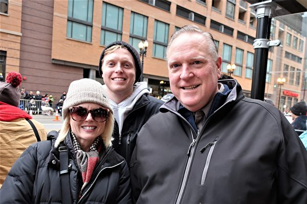
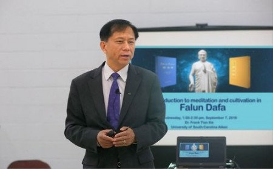
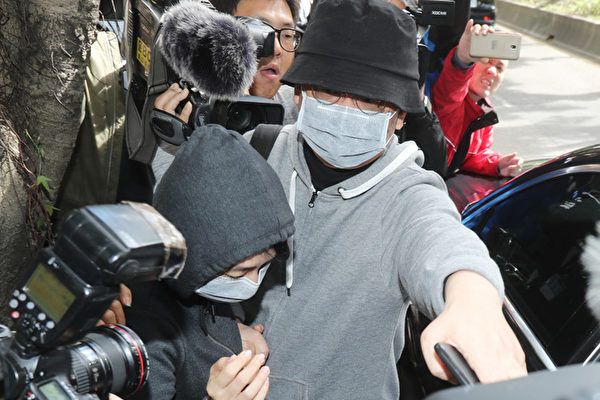

<h4 align="center"><b>知情权不能放弃，也不作愚民，让你看第一手不被过滤的新闻，翻墙软件免费下载  https://git.io/opopop </b></h4>

<h4 align="center"><b>自由门7.70版使用封包过滤技术，增强突破封锁能力。首次运行时，如果以前版本没有安装过，会有提示安装封包过滤器。这是一次性安装，不会影响用户网络，不需要卸载。</b></h4>
<h3 align=center><a href="http://dongtaiwang.com/loc/software/fg/770/fg770p.exe">专业版exe:自由门7.70版</a></h3>
<h3 align=center><a href="http://dongtaiwang.com/loc/software/fg/770/fg770p.zip">专业版zip:自由门7.70版</a></h3>

<h4 align="center">中共覆灭在即 勿依赖中共保权 https://git.io/Ffor </b></h4>

<h4 align="center">● 红潮即将倾覆 天之将明 ●https://git.io/bb99bbss </b></h4>

<h3 align=center><a href="https://github.com/gav01/Heart/blob/master/news1.md">● 大纪元时事 ●</a></h3>
<a name=top>

<a href =#158>158.【新闻看点】北京最担心的来了 西方随美制裁 
<a href =#157>157.【内幕】中共间谍为何会盯上比利时 
<a href =#156>156.新一批大陆人权迫害者名单 递美加英澳新政府 
<a href =#155>155.芝加哥感恩节大游行 法轮功花车领先亮相 
<a href =#154>154.从迷失到重生 19岁少女的感恩 
<a href =#153>x.美国华人精英感恩李洪志大师 
<a href =#152>152.感恩节 18岁澳洲职业足球队员的感恩 
<a href =#151>151.感恩法轮功师父 一位大陆校医的自豪 
<a href =#150>150.美国立法保护香港 中美决战在港拉开序幕 
<a href =#149>149.感恩节 纽约腰鼓队法轮功学员谢师尊（上）  
<a href =#148>148.警方解封理大1小时后 理大校方再封校园 
<a href =#147>147.组图：11.29港人多地快闪 警喷胡椒喷剂  
<a href =#146>146.香港学生领袖访加拿大 呼吁渥京制裁港官 
<a href =#145>145.富邦卷肖建华风波？银行归国有600亿投资受瞩  
<a href =#144>144.香港“撑警大联盟”召集人病逝 网民：报应 
<a href =#143>143.法轮功学员魏起山在秦皇岛看守所被迫害死 
<a href =#142>142.刘强东要跑路？ 网银在线转外汇被罚2943万 
<a href =#141>141.任正非等六高层退出华为核心子公司 引关注 
<a href =#140>140.王立强点名黄向墨涉共谍 专家：不会只这条线 

<a href="https://github.com/gav01/Heart/blob/master/ls-11.md"><b>往1~139新闻</b></a> 

<a name=158>
<h1 align="center"><b>【新闻看点】北京最担心的来了 西方随美制裁</b></h1>

2019年11月28日，香港市民在中环爱丁堡广场举行香港民主与人权法案感恩节集会。集会人士挥舞国旗表达诉求及感恩。（宋碧龙／大纪元）

【大纪元2019年11月29日讯】大家好，欢迎大家关注新闻看点，我是李沐阳。

从11月17日起，香港警方就封锁了理工大学。围困12天后，理大终于被解封了。今天（11月29日），校方和警方宣布：校园解封。警察终于撤离了校园，人们可以自由的出入了。而在这次“理大围城”中，警方称共抓捕了1377人，18岁以下被登记的有318人。

香港警察对理大的围困，只是近半年来在香港施虐的部分缩影。除去被自杀、被强奸、被轮奸的，从6月至今，警方一共拘捕了5890人。4368名男士，1522名女士，年龄在11～83岁。

对警察的暴恶，西方国家终于看不下去了。继美国总统川普向香港人送出感恩节大礼——签署《香港人权与民主法案》生效为法律后，其它西方国家也有了行动。正在或准备效仿美国，对侵犯人权的中港两地官员制裁举动，中共担心的蝴蝶效应正在显现。

<b>川普感恩节送大礼</b>

川普使《香港人权与民主法案》生效，极大的鼓舞了香港民众。昨晚，大约10万香港市民在中环爱丁堡广场，向美国表示感谢。很多市民挥舞美国国旗，不时欢呼鼓掌。参与人士促请美国政府，尽快制裁相关决定的港警和港府官员。

公民党党魁杨岳桥表示，川普签署法案，反映国际社会一直在留意并认同香港人抗争的努力。“在国际社会，香港绝不孤单”。

香港众志秘书长黄之锋认为，在美中贸易战下，川普签署法案，反映出美国相当重视香港人权状况。香港众志会继续加强游说，争取当局尽快启动制裁机制。他同时表示，仅在美国落实制裁并不够，还会争取在世界其它国家都设立这种制裁机制。

在香港危急时刻，川普的举动就像雪中送炭。既是顺应民意，也体现着美国的国家利益和对普世价值的尊崇。

尽管新法现有内容不太“辣”，但根据美国国情，未来可以不断“加辣”，延伸条文。对北京而言，这是后患无穷的。

<b>蝴蝶效应正在隐现</b>

新法中有这么一条：与包括英国、澳洲、加拿大、日本、韩国等盟国共同协作，推广香港的民主与人权。

作为盟国，都有责任回应美国的呼声。其实就算没有这样的条款，美国挺身而出的感染力，对西方国家的影响也是非常大的。目前不少西方国家在陆续跟进，美国制造的蝴蝶效应正在显现。

<b>欧盟官员支持香港</b>

昨天，正在访问香港的欧盟亚太司（EEAS）司长维冈（Gunnar Wiegand），与港府商务经济发展局副秘书长沈凤君交谈后，对香港表达了支持。

维冈声明表示，“真朋友在困难时刻仍然在你左右 ，有鉴于此，香港能够依靠欧盟”。南华早报引述维冈的说法，香港一国两制下的高度自主权、法治社会与基本的人权自由，是欧盟与之合作的重要基石。

<b>英国的杀伤力不次于美国</b>

川普正式签署后，知名艺人何韵诗在脸书PO文说，“终于通过！下一步，英国！”

黄之锋认为，如果英国有所行动，会对不少香港官员及公务员有压力。

香港是英国前殖民地，不少香港公务员和英国都有密切关系。比如港首林郑，她的先生和孩子都是英国国籍。只是她当初为了竞选，主动放弃了英国籍。还有很多的香港精英家庭，他们的孩子都在英国读书。

如果英国也做出类似美国举动，像林郑这种脚踩两只船的官员，心里就不踏实了。弄不好，她的家人都会被她连累，被取消英国国籍，并冻结在英国的财产。

今年10月31日，英国政府发表了《英国半年报告书》，强调香港的局势需要用政治手法解决 ，各方必须进行“有意义”的对话。

英国外相拉布（Dominic Raab）表示，英国“严重关切”香港局势。高度自治和法治，是香港未来繁荣和成功的保证，中方称《中英联合声明》“是历史文件”不可接受。

英国什么时候正式出手，相当值得关注。不过这可能只是时间问题。

<b>加拿大在行动</b>

昨天，英国民间组织香港监察（Hong Kong Watch）在社媒体发文，60名加拿大跨党派国会议员及职员出席了“香港关键时刻”研讨会。大部分国会议员接受香港监察受托人艾琳·卡尔弗利（Aileen Calverley）的建议，同意启动《马格尼茨基人权问责法》（Magnitsky law），制裁违反人权的香港官员和警员，并要求提供制裁名单。

这部法律是为了纪念俄罗斯会计师马格尼茨基（Sergei Magnitsky）而设立的。2009年，他在揭发俄国官员贪腐后，遭到监禁和酷刑并死在狱中。

这部法律的制裁内容包括禁止入境、冻结财产、禁止在美国交易等等。英国、加拿大以及欧盟28国等等都有各自版本。

<b>意国会议员下周提动议</b>

昨天，黄之锋通过视频方式，参加了意大利国会外交及人权听证会。他在提到意大利公司应该停止向港警输出镇压装备时，获得了场内的鼓掌认可。

黄之锋表示，意大利国会议员已经承诺，下周要在国会提出动议，支持香港落实民主普选，同时也会就此展开国会辩论。
日本人要求国会讨论日版法案

日本人也正在连署，要求国会讨论日本版《香港人权与民主法案》。截止到当地时间昨天下午4:47，连署人数已经超过了11万。

连署人包括东京、大阪、静冈、福冈、北海道等多个不同级别的议会议员。仁木崇嗣等人发起连署，目的是呼吁日本朝野各党现任议员，讨论日本版的《香港人权与民主法案》。

<b>荷兰已经颁令</b>

而在川普签署之前，荷兰议会在22日就以95:54通过一项议案。要求政府必须在2020年1月31日前，实施荷兰版的《马格尼茨基人权问责法》，禁止违反人权的中港人士入境荷兰，并冻结他们的资产。

<b>近万人联署公开信</b>

除了这些国家跟进美国的举动外，全球近万人也在近日发表联合公开信，批评香港警方的暴力执法。连署人中，有3700多位各国学者，还有多位左派学者。

从发表在香港监察网站的公开信看到 ，知名学者不乏其人。包括女性主义理论家朱迪斯·巴特勒（Judith Butler）、实验心理学家史蒂芬·平克（Steven Pinker）、哲学家格雷林（A. C.  Grayling）和当代语言学之父乔姆斯基（Noam Chomsky）等等。

香港监察组织主席、英国保守党人权委员会副主席罗杰斯（Benedict Rogers）表示，警察对众多的被拘捕抗议者实施殴打、虐待和强奸，示威者不得不采用“一些暴力行为”回应“警方暴力”。

<b>西方联动围猎中共</b>

时事评论员唐靖远表示，西方国家都看到了中共对自由世界的渗透蚕食，深感不安，也正在觉醒。很多西方国家都是看美国做什么，他们就跟着做，特别是面对中共，西方国家基本形成了共识。

唐靖远指出，中共对自由世界的威胁已经越来越明显，目前的反共声浪才只是初始阶段，未来会越来越高。如果各国结成包围网，那才是中共最怕的。中共的难题越多，香港人的希望越大，只要坚持下去，就会有光复香港的一天。

好的，感谢您关注新闻看点，再会。

大纪元《新闻看点》制作组 #

<a target="_blank" href=#top><h6 align="right">回上方</h6></a>

<a name=157>
<h1 align="center"><b>【内幕】中共间谍为何会盯上比利时</b></h1>

比利时是欧盟众多机构和北大西洋公约组织总部所在地，吸引了野心勃勃的间谍目光。。(OLI SCARFF/AFP/Getty Images)

【大纪元2019年11月30日讯】（大纪元记者戴芙若综合报导）比利时以其巧克力、炸薯条和啤酒而闻名；同时，比利时也是中共间谍活动的主要地点。对此，比利时当局也开始有所警觉，同时，欧盟也希望能对中共有一个统一的态度。

去年，当一名中共间谍被引渡到美国时，美国司法部赞扬比利时当局提供的“重大协助”，这名间谍隶属于中共国安部下属的江苏国安厅。

根据美国的起诉书，徐彦军（音译， Xu Yanjun）在比利时会见联络人后被捕。徐彦军到比利时的“目的是讨论和接收他要求的敏感信息”。徐被指控企图从事经济间谍活动，主要目标是通用电气航空（GE Aviation）。该案正在审理中。

比利时看上去似乎不像是一个中国（中共）间谍的目标。实际上，根据比利时国内情报机构――国家安全局（Veiligheid van de Staat – Sûreté de l’Etat , VSSE）的说法，该国是间谍的巢穴。国家安全局说，特工的数量至少与冷战期间一样多，而布鲁塞尔是他们的“棋盘”。

<b>约有250名中共间谍在布鲁塞尔工作</b>

比利时是欧盟众多机构和北大西洋公约组织总部所在地，吸引了野心勃勃的间谍目光。外交官、议员和军事官员在比利时相互交流，分享八卦和想法，比利时的战略位置使其成为中共在欧洲施加影响的重要场所。

位于布鲁塞尔的埃格蒙特皇家国际关系学院研究员布鲁诺•海伦道夫说：“我们拥有北约和欧盟等国际机构的事实，使比利时成为中国（中共）的自然关注点。”“众所周知，布鲁塞尔有很多间谍，而如今，来自中国的间谍活动已成为人们日益关注的主要问题。”

今年二月，德国报纸《世界报》（Die Welt）援引了欧盟外国和外交机构――欧洲对外行动局（European External Action Service）一项未发表的评估，该评估表明，约有250名中共间谍在布鲁塞尔工作，超过俄罗斯。中共驻欧盟代表团则对此否认，表示对“毫无根据”的报导感到“震惊”。

然而，事件仍在继续。荷语区的布鲁塞尔自由大学（Vrije Universiteit Brussel, VUB）孔子学院的中方院长在被指控犯有间谍罪之后，于10月被禁止进入欧盟申根地区八年。

对徐彦军的起诉书还概述了中共采用的方法，据称徐的职责包括从美国“以及整个欧洲”的航空和航天公司获取商业机密。他使用别名邀请专家去中共工业和信息部下属的南京航空航天大学作演讲，并支付费用。他负责确保目标人员携带一台可以获取数据的工作计算机。

北约将在决策中密切关注中国（共）不断增长的军事力量。图为布鲁塞尔北约总部的旗帜。（KENZO TRIBOUILLARD/AFP/Getty Images）

<b>通过布鲁塞尔 你可以进入欧洲乃至美国</b>

美国仍然是北京从事间谍活动的核心，联邦调查局局长在7月表示，中共正试图“以窃取我们的利益来提高它们的经济”。欧洲似乎越来越受到中共关注，在波兰、法国、德国和英国均有获证实的中共干涉案例。

有20多年和中国打交道经验的前英国外交官查尔斯•帕顿（Charles Parton）说，“中国（中共）比10或20年前变得更加活跃。”

帕顿目前是位于伦敦王家联合服务研究所的高级研究员，他说，间谍活动是从学术界到“技术外泄”整个干扰活动范围的“远端”，即收集数据然后发送回中国进行挖掘。

比利时的精英阶层通常对中共持宽松态度，该国政治体制破裂，使得制定统一战略变得更加困难，选举六个月后仍然没有政府。

即使欧盟对中共采取更加怀疑态度的立场――不再天真幼稚，如一位欧洲高级官员所说那样的――比利时却向中国投资敞开大门，从能源、航运到技术等战略领域。比利时外交部表示，比利时正在“以务实方式”回应中共。

人民大学国际事务研究所所长、前驻布鲁塞尔的中共外交官王义伟谈到比利时时说：“他们拥有中国需要的非常先进技术。” “通过布鲁塞尔，你可以进入欧洲甚至美国。”

<b>比利时对中共间谍威胁有所警觉</b>

曾担任比利时联邦议会内政委员会主席，直到今年失去职位的布雷希特•维梅伦（Brecht Vermeulen）于2014年当选为新弗拉芒联盟党（N-VA）议员后不久，就加入中国友谊小组，该党是当时执政联盟中的最大党。

在他的五年任期内，维梅伦数次前往中国，在那里中共官员们向他介绍了人工智能、面部识别和网络安全方面的技术发展。在那段时间里，N-VA政策从同情台湾和香港，并与中共保持距离，演变成维梅伦所谓的“真正的政治”。

他在弗拉芒根特市的一次采访中说：“我认为我们必须向中国人（中共）打开更多的大门，看看他们的反应如何。”

尽管如此，一些迹象表明比利时当局已经意识到了潜在威胁。

2016年，中共国家电网公司竞标购买比利时能源公司Eandis的股份，中共国家电网公司的员工人数超过布鲁塞尔居民人数。比利时国家安全局档案在最后一分钟泄漏，敦促要“极为小心”，理由是比利时的技术可能会被中共军方使用，而且计划中的投标从未进行过。

极右翼的弗拉芒利益党（Vlaams Belang）地区议员菲利普•德温特（Filip Dewinter）因涉嫌与一个从事中共间谍活动的组织存在关系而受到调查。在发现德温特没有犯罪后，调查放弃。

“也许我对这些人抱有太大信心，”比利时《晨报》（De Morgen）在二月份援引德温特的话说，他并补充说，现在对中共间谍活动“更加了解”，并且需要“谨慎”。

埃格蒙特研究所（Egmont Institute）的海伦道夫（Hellendorff）表示，尽管比利时现在对中共有“一些战略性思考”，但该国各机构之间并未达成全面共识。

冯德莱恩（Ursula von der Leyen）接掌欧盟委员会（执委会）主席。( FREDERICK FLORIN/AFP/Getty Images)

<b>欧盟希望对中共统一立场</b>

另一方面，新任欧盟委员会主席冯德莱恩（Ursula von der Leyen）对北京的看法清晰而现实，一位欧盟高级外交官表示，他认为这种趋势转向会形成欧盟对中共更加统一的立场。

在对待俄罗斯与中国（中共）问题上，冯德莱恩被认为是鹰派人物。今年1月她在接受采访时曾经表示，她认为中共在用一个友好的面孔哄骗欧盟， 让欧盟放松对中共的警惕，并在经济上依赖中共，而中共在此过程中却不声不响地、一步一步地扩张自己的实力。

她曾表示，中国共产党所采用的国家政府制度并不容易面对，但她也说：“我确信，人由本身寻求自由的程度来定义。因此，我不相信北京的全面控制人民可以长远持续。早晚，人们会反抗这种形式的政府。我相信，在这些人民的自由和自决的愿望下，这些人民的愿望在不断增长。”

德国将在明年主办欧盟27国领导人和习近平的首次峰会时，努力促进这一团结。对于布鲁塞尔来说，2020年似乎将是面对中国的风险和回报的一年。

<a target="_blank" href=#top><h6 align="right">回上方</h6></a>

<a name=156>
<h1 align="center"><b>新一批大陆人权迫害者名单 递美加英澳新政府</b></h1>

美国国务院告知法轮功学员，向国务院提交迫害者名单。美国将更严格地审核签证申请、对人权及宗教迫害者拒发签证。（视频截图）

【大纪元2019年11月29日讯】本周，美国、加拿大、英国、澳大利亚及新西兰的法轮功学员将最新整理出的一批迫害法轮功的恶人名单递交给本国政府，要求依法对这些恶人拒发签证、甚至冻结资产。这是继九月份递交名单之后法轮功学员的又一次多国同步行动。

明慧网报导，十一月初，美国华盛顿一家知名人权组织透露，美国国务院的相关部门扩充人员编制、加大力度使用禁止入境及冻结财产的手段制裁其它国家的人权迫害者，该组织为此特邀美国国务院相关部门的负责官员向各宗教团体、人权组织详细解释制裁手段所依据的法律条款，以及国务院需要各个非政府组织提供怎样的帮助。

美国国务院官员鼓励与会的人权组织说，美国政府在这方面有多项可引用的法律条款，有的“门坎”高，有的“门坎”则很低，他们欢迎各个团体只要有迫害事实就尽管提交恶人名单，他们会选择最适合的法律条款。

美国国务院官员还指出，有的条款不仅针对恶人本人，还可制裁其家属。而且即便恶人本人或家属已经入境美国，也可将其签证吊销、将恶人和家属递解出境。

法轮功学员告知美国国务院官员，美国及其它西方国家这方面的制裁在中国引起很大反响，很多迫害法轮功的恶人受到震慑。

其中包括有些参与迫害的部门将工作人员的照片从墙上摘下以免被举报；有些警察在释放法轮功学员时说：“我没有打你吧，不要举报我，我孩子以后还要出国。”甚至有的公安局长也开始有所顾忌：“为什么要举报我们？别人孩子出国，我们孩子也要出国啊。”听到这些反馈，国务院官员很受鼓舞，非常高兴他们的工作能为减少中国的人权迫害起到实质作用。

中共的官方公告显示，美国、加拿大、英国、澳大利亚及新西兰等五国是外逃贪官心目中的“避罪天堂”。

有分析指出，这是因为中国尚未与这些国家缔结引渡条约，或者缔结了条约但尚未生效，一旦贪官在这些国家落脚，很难被遣返。然而，现在法轮功学员将迫害者名单递交五国政府，要求对其本人及家属拒发签证、甚至冻结财产，这将堵死他们通往“避罪天堂”的大门。

11月21日，荷兰议会通过一项动议，要求荷兰政府在2020年1月31日前准备好荷兰版的“马格尼茨基人权问责法”，如果欧盟在这个截止日期之前没能通过欧盟版的“马格尼茨基人权问责法”，荷兰政府将开始推动本国版本。

据悉，欧洲其它一些国家的政府也在积极推动相应立法，以便对人权迫害者予以拒发签证、冻结资产等制裁。

今年夏天，加拿大和英国的相关官员专程到美国国务院商讨如何加强合作、共同有力地对人权迫害者予以制裁，并听取受迫害组织的反馈、回答他们的问题。

由此可见，对于人权迫害者予以制裁，是民主国家政府的共同趋向。

从2019年5月底明慧编辑部《通告》发表以后，大陆法轮功学员提供了大量参与迫害的恶人信息。11月15日，更新后的明慧网恶人榜上的恶人超过十万。

明慧网将不断分批从中选取恶人，整理、翻译其迫害恶行的材料，将名单送交一些民主国家的政府要求予以制裁。

因篇幅所限，今后不再列出所提交的恶人名单。参与迫害者若想知道自己是否会被提交，只需查看明慧网的恶人榜：

https://library.minghui.org/criminal/html/lastname

明慧网说，所有榜上的恶人勿存侥幸心理，凡作恶者，或早或迟都将出现在这些民主国家政府的制裁名单上。望大陆所有相关人员引以为戒，对迫害政策不予配合、执行，不要堵死自己和家人前往西方国家定居、学习、旅游或经商之路。尚未作恶者，洁身自好、切勿作恶；已经作恶者，立即改邪归正、将功补过。

明慧网希望，大陆法轮功学员继续收集和整理恶人的迫害恶行及个人信息、将其递交该网，明慧网的恶人榜将不断更新，协助共同努力制止迫害。

<a target="_blank" href=#top><h6 align="right">回上方</h6></a>

<a name=155>
<h1 align="center"><b>芝加哥感恩节大游行 法轮功花车领先亮相</b></h1>

芝加哥第86届感恩节大游行，法轮功花车成为Teddy The Turkey火鸡后的第一个游行团队。（David Yang／大纪元）

 
 【大纪元2019年11月29日讯】（大纪元记者唐明镜美国芝加哥报导）11月28日周四，芝加哥举行第86届感恩节大游行。它是通过电视直播的美国三大游行之一，亦有数万观众现场观看。一达拉斯观众到芝加哥就为了看游行，“它启动了整个节日季节。”一名密西根人看到色彩绚丽的法轮功花车后，赞叹道：“非常平和、非常美丽、非常美好。”
 
 

11月28日周四，芝加哥举行第86届感恩节大游行，图为法轮功学员组成的游行团队。（David Yang／大纪元）

 
 今年的游行有20个军乐队、13个花车、16个戏剧表演团体，以及名人明星等。原定还有多个卡通人物的巨型气球领衔游行。不料周三刮起时速超60英里的大风。有消息称，组办方担心大气球在风暴中无法前进，临时取消了气球表演。于是，法轮功花车成为Teddy The Turkey火鸡后的第一个游行团队。
 
 

11月28日周四，芝加哥举行第86届感恩节大游行，法轮功学员的花车成为Teddy The Turkey 火鸡后的第一个游行团队。（David Yang／大纪元）

 

11月28日周四，芝加哥举行第86届感恩节大游行，法轮功学员的花车成为Teddy The Turkey火鸡后的第一个游行团队。（David Yang／大纪元）

 

2019年11月28日，密西根的Moacyr Mezabila和女儿观看芝加哥感恩节游行。（唐明镜／大纪元）

 
这是法轮功连续17年受邀参加芝加哥感恩节游行。来自密西根的工程师Moacyr Mezabila赞叹不已地说道：“很平和、很美丽、很美好”，“很有中国味”。

芝加哥居民Rabia和先生、孩子兴奋地对法轮功花车录像，并以它为背景照全家合影。她说：“我很喜爱她（花车）。他们在打坐，他们的动作如此舒缓，看上去十分美好。” Rabia说，这令她联想起一个风靡全球的中国传统文化演出。

11月28日周四，芝加哥举行第86届感恩节大游行，法轮功学员的花车成为Teddy The Turkey火鸡后的第一个游行团队。（David Yang／大纪元）

 
 

2019年11月28日，达拉斯的CarMichael夫妇和儿子观看芝加哥感恩节游行。（唐明镜／大纪元）

 
 来自达拉斯的Kim CarMichael女士亦对法轮功花车印象深刻：“很美丽，很平和。”先生David CarMichael 说，他们到芝加哥和儿子一起过节，每年必到现场观看感恩节游行，“这是一个传统，它启动了一年一度的节庆季节。”
 
 

11月28日周四，芝加哥举行第86届感恩节大游行。（David Yang／大纪元）

 

11月28日周四，芝加哥举行第86届感恩节大游行。（David Yang／大纪元）

11月28日周四，芝加哥举行第86届感恩节大游行。（David Yang／大纪元）

 
 
<b> “无论雨雪，游行都会进行”</b>

芝加哥感恩节游行始于1934年，那时叫圣诞游行，旨在给经济大萧条中的市民们鼓舞士气。第一年的节日游行大大提升了市民的信心，当年成为1927年以来最旺的购物季。

1999年，游行正式移到感恩节的当天，在芝加哥的State大道（以前在密西根大道）上举行，成为感恩节游行。 2008年，芝加哥感恩节游行首次通过WGN America全美电视网对数百万民众全程直播。迄今，美国只有三个游行在全国电视频道上直播。

 

2019年11月28日芝加哥感恩节游行，Steve Meinecke连续17年参与其中。（唐明镜／大纪元）

 
 Steve Meinecke是主办芝加哥游行一千五百多名员工之一。今年是他第17年参与感恩节游行了，“我经历过下雨、大雪。无论天气如何，这个演出一直会进行下去。”

Meinecke说，他记得最冷的那一年是2002年，天气只有华氏17度（零下8度）。他恰好也是第一年参加，“很多小孩子喜欢看游行，很有趣，我就一直参加了。”

“不光我来得早，人们也早早出来看游行。”他说，今天早晨他4:30就到现场了，看到沿街已经摆开了座椅，已经有观众拿着咖啡等着了。

Meinecke透露，因为周三的风暴，组委会临时决定取消大气球表演。他说，大气球是芝加哥游行的热点，他的工作一直是牵引大气球。有一次气球控制不住，跑到观众席的上空去了。“人们不觉得是事故，都觉得很有趣。抬头一看，大青蛙科米（Kermit the Frog）悬在头上。”

 

11月28日周四，人们在路旁观看芝加哥第86届感恩节大游行。（David Yang／大纪元）

 

11月28日周四，芝加哥举行第86届感恩节大游行。（David Yang／大纪元）

 
 <b>乐队为游行刻苦训练</b>

亚特兰大附近的Riverside Military Academy军校今年是第一次参加芝加哥感恩节游行。乐队指挥Stephen Giove介绍说，他们在南方参加了很多游行，今年选择到芝加哥。

“为了应对北方的寒冷气候，我们全身穿着保暖衣，手脚都有保暖袋，并坚持在户外练习。”Giove说。他特别提到，铜管乐器在低温下容易跑调，所以乐队加强了相关训练。

 

2019年11月28日芝加哥感恩节游行，Riverside Military Academy军校乐队指挥Stephen Giove和留学生肖同学表示，乐队为游行刻苦训练。（唐明镜／大纪元）

 
 肖同学是军校内一名中国留学生。他表示，为了芝加哥之行，整个乐队刻苦排练，一周三天训练，“我们非常努力。”

Giove说，军乐队40人坐车13个小时从亚特兰大来到芝加哥，除了参加感恩节游行，还进行观光旅游。“昨天我们游览了联邦储备银行、军人体育场、海军码头，今晚在旅馆进行感恩节大餐，明天去看水族馆、科学技术博物馆，并品尝著名的芝加哥厚皮比萨饼。”“芝加哥是一座了不起的城市。”

<a target="_blank" href=#top><h6 align="right">回上方</h6></a>

<a name=154>
<h1 align="center"><b>从迷失到重生 19岁少女的感恩</b></h1>
 <h2 align="center"><b>一名女留学生曾在红尘中随波逐流 痛苦万分 一朝修炼法轮大法脱胎换骨获得新生</b></h2>

修炼法轮功一年多即身心发生巨变、脱胎换骨的19岁少女淑怡，在感恩节表示，她最想向法轮功创始人李洪志先生表达感恩。 (林丹/大纪元)

【大纪元2019年11月29日讯】（大纪元记者林丹美国纽约报导）淑怡是眉清目秀、长得很甜美的女孩，笑起来眼睛像月牙，今年19岁，有谁想到她曾经是多年的老烟民，还有过嗑药史、患有暴食症，曾在泥潭中不能自拔。不过这些令她痛苦万分的嗜好和经历，现在都已烟消云散。

在28日感恩节这天，她敞开心扉讲述自己身心翻天覆地的转变——是什么让她彻底告别了过去，有了脱胎换骨的变化呢？

淑怡说，她的新生得益于她在2017年底、2018年初修炼了法轮大法，使她从一个堕落的、沉沦的、生命处于悬崖边上的人，转变为一个健康的、阳光的、追求真理，在修炼上不断提升、真正实修的人，她感到非常幸福，人生充满希望。她含着眼泪说，“在感恩节到来之际，我最想感谢的人是李洪志先生，在此，我要向师父说声谢谢——师父谢谢您！”

淑怡说，自己从小悲观厌世，觉得人活着如果就是为了读书、有好工作、结婚生子，然后老去，这样活着太没意思，但是生命还有什么更重要的意义呢？她也找不到答案。

为了逃避家庭的管束，她14岁那年从北京来到美国读初中。在自由主义泛滥的环境下，美国的校园受到烟草、电子烟、毒品的侵蚀，中学生中普遍流行抽烟甚至吸毒。淑怡没有大人管教，很快随波逐流、放任自己，“我甚至变得颓废”。

“我整天睡懒觉不上学、烟瘾很重，几乎睡醒一张眼第一件事就是吸烟，我还嗑迷幻药寻求刺激，患上了暴食症，吃了就吐，体重从120多斤掉到70多斤。我因为不上课、缺勤，转了好几所学校，最后辍学了，每天放任自流地活着，我变得绝望，特别希望有人帮助我。”

后来，淑怡认识了一个比她大十岁的男朋友，男朋友一直有探索世界奥秘和生命终极目的想法，一次，他在网上看到了介绍法轮功打坐的视频，并系统地看了介绍法轮功的专题片《我们告诉未来》，意识到了法轮功是非常珍贵的高德大法，能解答自己心中很多的疑惑。他跑到法拉盛的全球退党服务中心，问在哪里可以学到法轮功。就这样，他参加了9天法轮功学习班，开始得法修炼。

“我的男朋友学法轮功一周，就把烟戒掉了，这令我很触动。”刚开始她并不支持男朋友学法轮功，但是男朋友宁愿放弃她，也不放弃法轮功，她便不再干预了。在男朋友的帮助下，淑怡也开始读《转法轮》，“我终于发现了‘真、善、忍’是很大的理，是宇宙真理，我下决心改变自己，我决定修炼法轮功。”

“我得到这么好、这么大的法，难道我还不把过去不好的东西抛弃吗？”

淑怡说，当她下决心要修炼的第一天，就把烟戒掉了，刚戒时，有点难受，但是她咬紧牙关坚持不抽，“我想我已经是修炼人了”，从那以后就再也不想抽了。后来她有一次禁不住又嗑药想寻求刺激，“但是那一刻我看到了地狱展现在我眼前，我非常害怕，我以后再也没那样做了。”

随着炼功和学法，淑怡的身体恢复得很快，身心得到净化，短短的时间，她的体重、饮食都恢复正常，脸色不再阴暗，变得有光泽和白皙。她现在每天炼5套功法，两个小时；每天学习《转法轮》，“我用法对照自己的思想和行为，我变得实修，我从一个被毒品魔鬼控制的人，一个小小年纪就迷失的人，变成一个健康的人，一个追求真理的人，一个实践真理的人，我感到很庆幸，很幸福，我由衷地感谢师父李洪志先生的救度之恩！”◇#

<a target="_blank" href=#top><h6 align="right">回上方</h6></a>

<a name=153>
<h1 align="center"><b>美国华人精英感恩李洪志大师</b></h1>

2012年4月29日，台湾部分法轮功学员七千四百人在台北自由广场，排出李洪志师父法像图形，宏伟壮观。（明慧网）

 
 【大纪元2019年11月29日讯】（大纪元记者李辰报导）他们是东西方主流社会的大学教授、工程师、科学家、医生……他们都对法轮功创始人李洪志先生心怀无尽的感恩。
 
<b>大学教授：法轮功是人生真谛</b>

 

图为谢田教授。（新唐人）

 
 谢田，美国南卡罗莱纳大学艾肯分校商学院终身教授，1997年开始修炼法轮功。

谢田说，“不仅仅在感恩节，自从开始修炼法轮功，我每一天都心存对师尊的感恩。”

他向大纪元记者讲述了自己修炼法轮功的经历，“1984年在北京大学读研究生时，我和导师参与了对气功特异功能的研究。发现很多气功师的功能是真实存在的，所以，就破除了中共的无神论。”

摆脱了无神论的谢田，从此开始寻找人生的真谛，“1986年，我来到美国。我跑遍了（当地）所有的教堂。但是，那些人的回答都不能让我满意。”

“1997年，一位朋友给我一本《转法轮》（法轮功主要书籍）。 我才发现，到美国后10年的苦苦追寻，原来（答案）在这里。”

“滚滚红尘之中，居然有这么一部高德大法，把从古到今，中国和世界各地所有的奥秘、传奇都串起来了， 都讲清楚了。”“（这本书）能让你回到原来的本源，修炼到更高的境界。”

法轮功至少洪传世界一百二十多个国家和地区，其主要书籍《转法轮》，被译成四十多种文字在全世界发行。

“我们法轮功学员每一天都要学法、炼功，要读《转法轮》这本书。 有时读一段下来之后，我都会有这种强烈的感恩，觉得：哇，这么美妙的法理、道理。”

谢田出身于书香门第，成长过程中读了很多书，“但是，这本书，和所有的著作都不一样。他让你改善自己，让你改善到最好。”

“修炼20多年来，我看到自己身心、道德上的变化。修炼前，我伤害别人；这些事情，我现在肯定不会做了，并且有更高的标准要求自己。”“每一天，都会变得更好。”

<b>工程师：修炼法轮功 深感幸运 千金万金不换</b>

“感恩师父传给我们宇宙的法理，让我精神升华。能够在大法中修炼，真是太幸运了，千金万金不换。” 底特律大型汽车公司的工程师林朴说。

“（修炼法轮功后，）我身心健康，精力充沛。这么多年，基本上没生病。工作上效率更高，家务事也做得更多了，比如：买菜、做饭、秋天扫树叶、夏天要剪草。干活也不累了。”

他表示，修炼法轮功让自己变得心胸宽广，用正面思维看问题，“心情更平和了。要按‘真、善、忍’做嘛，小事情、小摩擦不计较了，思想上有不好的念头，很快就会意识到 ，能意识到自己的不对，为别人多想一下。”法轮功，以“真、善、忍”为修炼原则，真修者道德升华，身心健康。

林朴说，“就是要正面去看问题。每一件事，有好坏两面。你看的是好的那面，那就是好的嘛。就看你怎么去选择。选择笑，也不费你一分钱，你怎么不选择笑呢？”

<b>数据科学家：身心工作受益</b>

张宇伟，女，华盛顿DC法轮功学员， 在人工智能应用于医学领域工作，拥有多方面独特技能，在公司管理层任职。

“1993年，我身心疲惫，腰很痛，很担心自己的身体，觉得读医学都读不下去了。”

她表示，没想到修炼法轮功让她身体变得非常健康，“我根本想不到能生两个孩子，特别是有两个这么听话的孩子。”

张宇伟的工作要求很强的英文沟通能力。她本来就常规性聘有英文老师给她讲课。

她最近义务带一位西方新学员学习《转法轮》等法轮功书籍。对方给她指出英文发音。 她按法轮功“真、善、忍”法理向内找自己，及时纠正英文发音，英文能力和事业都获益匪浅。

<b>前中共空军军医：法轮功给我第二次生命</b>

 

汪志远。（大纪元）

 
 汪志远，前中共空军部队医生，前哈佛大学医学研究人员，曾身患绝症——进行性肌萎缩症，中西医束手无策，修炼法轮功3个月后痊愈。

他说，“感恩法轮功，法轮功的修炼给了我第二次生命，给了我一个崭新的世界。”

法轮功是性命双修功法，包括五套功法动作，祛病健身效果神奇。

汪志远说，“（我原来）从一楼走到二楼，都感到累。朝不虑夕，觉得人生没有希望。1998年2月，修炼法轮功，炼功三个月，就完全恢复了健康。体重从118斤增长到140斤左右。”

“《转法轮》（法轮功主要书籍）让我对人生有了根本的认识， 胸怀宽阔了。整个人都变了，非常自信、健康，开始为别人着想。整个人恢复到二十多岁人的精神状态。”

<b>原南京师范大学教授：法轮功让我走过艰难的20年</b>

 

二零一九年七月十七日星期三，美国总统川普（特朗普）在白宫椭圆形办公室与法轮功学员张玉华握手。（图片来源：白宫）

 
 张玉华，纽约法轮功学员，原南京师范大学俄语系系主任、大学教授，南京市人大代表。

她说，“我感谢师父教给我如何做好人，让我懂得了人的一切不幸都是自私、做损人利己的事情造成的。人要想幸福，就必须提高自己的道德，成为一个做任何事情都为别人着想的人。

“从物质层面上讲，我和大陆其他大法弟子一样，修炼法轮功使我们拥有了一个健康的身体，摆脱了药罐子。”张玉华修炼法轮功后，无病一身轻，“皮肤过敏症、结膜炎、痛经、没有食欲、畏寒、胸闷气短等都消失了。”

因为坚持修炼法轮功，张玉华被中共非法劳教三次，判刑一次，失去自由长达7年半之久。1999年，中共前党魁江泽民因恐惧法轮功学员人数太多，超过共产党员人数，发动血腥镇压，难以计数的大陆法轮功学员被投入监狱，遭受酷刑，甚至被迫害致死。

她表示，尽管遭到中共残酷迫害，但是法轮功让她走过20年风雨。

“凭着对法轮功的正信，我走过了艰难的20年。我由衷地向师父表达深深的感恩。”

<a target="_blank" href=#top><h6 align="right">回上方</h6></a>

<a name=152>
<h1 align="center"><b>感恩节 18岁澳洲职业足球队员的感恩</b></h1>

今年十八岁的澳洲职业足球队员保罗·林（Paul Lin）在炼法轮功第五套功法——神通加持法。（明慧网）

【大纪元2019年11月30日讯】在一年一度的美国感恩节来临之际，澳洲悉尼青年大法弟子保罗·林（Paul Lin）心中最感恩的是法轮大法师父李洪志先生。

保罗·林（Paul Lin）今年18岁，英俊、阳光，可他有着不一般的童年。只因为他出生在一个修炼法轮大法的中国大陆家庭，父母和外祖父母都是修炼人。中共的残酷迫害使他从婴儿起就失去双亲的呵护，但全家人始终坚守对“真善忍”的信仰。历经磨难，在大法和大法师父的保护下，他和父母终于在自由的国度团圆，又有了其乐融融的家，并成为一名职业足球队员。

<b>十一个月大的婴儿被劫持到610办公室</b>

小林回忆，家人告诉我，2002年10月我爸爸因悬挂‘法轮大法好，法轮大法是正法’的横幅，警察到我家非法抄家和非法抓捕我爸爸时，我妈妈的左手臂被警察打断。那时的我还不到一岁。爸爸抱着我一起被劫持到“610”办公室(中共迫害法轮功的非法专职机构）录口供，我被吓得哇哇大哭了一天，被饿了整整一天。爸爸被中共非法判刑6年，我因此被剥夺了父爱。

2004年4月，我妈妈因张贴‘法轮大法好，真善忍好’不干胶，被非法劳教3年，两岁多的我又被剥夺了母爱。原本其乐融融的家，就这样被中共迫害的支离破碎，孤苦无依的我只得由姥姥和姥爷抚养。当时，年幼的我因见不到妈妈爸爸，常常对着姥姥和姥爷喊妈妈爸爸来表达对父母的思念。”

“好不容易盼到爸爸结束6年冤狱后回家了，但他仍然受到中共610等不法人员的长期监控，他只得冒着生命危险自己开船逃离了中国，最后得到海外大法弟子的成功营救。爸爸虽然平安了，可我和爸爸远隔重洋，骨肉分离。”

<b>感恩大法师父的慈悲保护</b>

尽管如此，小林还是觉的自己很幸运，因为他得到了最珍贵的大法，一出生就沐浴在大法中，在父母被迫害的日子里，姥姥和姥爷带着他一起修炼，让他感受到修炼的美好。

尽管中共对法轮功的残酷迫害20年来从未停歇，但小林一家人对法轮大法坚定的信仰却从未改变。

“我从小到大姥姥和姥爷带着我一起修炼，十年如一日。他们常常提醒我，无论何时何地都要记得自己是大法弟子，要用大法的标准严格要求自己。我这样做了，从而在大法中受益良多，时时都能感受到师父的保护。”

深怀感恩的小林从小喜欢踢足球，后来成为所在地区省球队里的绝对主力。踢足球时身体和对方球员之间的竞技会很激烈，他的队友时不时都会受很多伤，这是很难避免的。而小林踢球又非常的拼，但踢球比赛这么多年几乎没受伤。“所以我能感受到师父时时都在保护着我，使我避免了很多身体上可能受到的伤害。修炼大法太神奇了，这只是其中的一例。”

<b>以“真善忍”归正人心　成为职业足球队员</b>

回想自己的修炼路，小林说，作为一名运动员，比赛中自己很多时候都有争强好胜的心，比赛输了不高兴，在球场上表现的不好也不高兴；在生活中脾气也不好。“用‘真善忍’来衡量，我知道这些东西都不好，都是人心执著，都是应该修去的。虽然我一直在修炼，但中国大陆那个复杂的社会环境也一直在污染着我。”

2015年2月小林来到悉尼，终于和父母团聚，他说：“支离破碎的家又一点一点的恢复到最初的模样，我又有了其乐融融的家。”

来到悉尼后，小林决心改掉自己在大陆染成的那些不好的品行，修去人心执著。

“我开始每天学法、炼功，按照修炼人的标准要求自己，遇到矛盾向内找，守住自己的心性。慢慢的我开始看淡输赢，放下了我之前那些强烈的争斗心、妒嫉心等执着心。”

 小林欣慰地说：“一切都随着我心性的提高而变好，我的球技也更上一层楼。”

曾有大陆的职业球队向小林发出入队邀请。在参加悉尼职业球队的试训时，当时有几百名来自悉尼各地的球员参加，而球队的位置只有十来个名额，可以说是百里挑一。在试训的过程中，“我一直以一颗平常心、修炼人的心态来面对这场选秀。过程可谓一波三折，但我心态稳定，将自己的球技正常发挥出来，经过两轮试训，最终脱颖而出成为该球队的一员。如果自己不是修炼人，很难想像最后的结果会如何。”

同时，随着小林不断地提高心性、归正自己，他和亲朋好友的关系都变得和睦融洽了。

小林最后说：“在美国的感恩节来临之际，弟子代表全家向师尊问好、叩谢师尊！ 恭祝慈悲伟大的师尊感恩节快乐！”

文章来源：明慧网

<a target="_blank" href=#top><h6 align="right">回上方</h6></a>

<a name=151>
<h1 align="center"><b>感恩法轮功师父 一位大陆校医的自豪</b></h1>
 <h3 align="center"><b>文：大陆法轮功学员</b></h3>

莲花出污泥而不染(大纪元图片库)

【大纪元2019年11月29日讯】在人的一生中，能有什么值得自豪呢？有的为能考上名牌大学而自豪；有的为能有当官的父母感到自豪；有的为拥有豪宅感到自豪……而我，为自己今生能有幸成为法轮功修炼者而感到无比自豪！因为法轮功使我身心受益，提高了生命质量，使我成为更健康、更高尚的人，是人世间任何一样东西都无法给予的。下面就讲讲我的亲身经历。

<b>一、炼法轮功使健康失而复得</b>

一九七九年，十四岁的我正读初三，出现了睡眠问题：入睡困难，睡着后梦多。白天上课又哈欠不断，打得流泪，怕老师看见就捂嘴或闭嘴打。太阳穴也发胀，记忆力开始下降。我父亲带我看中医，被诊断为神经衰弱，吃了不少中药，没有明显效果，我心理负担很重。我硬撑着考上中专后，失眠症状加重。

三年的中专生活，宿舍是二十个同学同住一间大房子，十点钟熄灯后很快听到同学们的鼾声，唯独我彻夜难眠。即使睡着了，也是浅睡多梦，地上掉根针都能醒。白天头脑长期处于昏沉状态，隔一段时间就会发生一次剧烈头痛。我找本市最权威的神经内科主任看，被诊断为植物神经功能紊乱。开了些西药，服药头几天有效，之后效果不明显了。我很痛苦，成天少言寡语，精神不振。

工作后，我每晚九点钟就睡觉了，可常常早上起来感觉就像没睡似的。去一所市级大医院看，医生让我做了脑血流图检查，诊断为神经官能症和血管紧张性头痛。给我开了大量的西药，服了一段时间，还是没有根本性好转。之后又去了本省最顶级最权威的医院诊治，做了一系列检查，同样被诊断为神经官能症。我好绝望！虽然是功能性的疾病，但无法医治，自己感觉很痛苦。又吃了大量西药，虽然夜间能入睡了，但白天头脑更不清醒了，而且过了时间后就完全没效了。我是学医的，知道这类药容易让人形成耐药性和成瘾性。

我后来听中医医生说吃胎盘好，就吃了不少胎盘，也经常用安神的中药或食品做药膳吃，但一切都是徒劳。再后来我怀孕期间，更是出现严重睡眠障碍，到凌晨三、四点钟才睡着，每天只能睡两、三个小时，白天还要照常上班，中午无论多困依然睡不着，整个十月怀胎都这样。哪怕在最需要休息的坐月子期间，睡眠质量仍然极差，我简直要崩溃了！

回想那十多年，我忍受着这个病痛的煎熬，常常感叹自己“心比天高命如纸薄”，脑袋成天昏沉沉，郁郁寡欢，已经体验不到头脑清醒或者神清气爽是啥感觉了。

一九九五年初，三十岁的我有缘遇到了法轮功，从此找到了生命的希望。我很快参加了本地组织的观看李洪志师父在广州讲法的录像，集中看了两整天。第一天看下来，睡眠质量明显好转，夜间一个梦都没做，次日感觉头脑清醒，那种舒服感现在都还记忆犹新。录像中讲了要想修炼法轮功，师父首先会给我们净化身体，这点使我感到法轮功特别伟大，世上任何功都办不到。接下来，我天天晚上去炼功点参加集体炼功，并集体朗读法轮功的主要著作《转法轮》。身体状况渐渐好转，感觉心情特别愉悦。

我自己学医，但对自己的病束手无策。法轮功告诉我们：人有病的根本原因是业力所致。

我遵循李洪志师父的教诲，按真、善、忍原则做好人，做事先为别人着想，看淡利益。从此我买鸡蛋、水果时不会像原来那样挑选，而是依顺序拿；买菜也不讨价还价了，如果卖家说一两角钱不收了，我还是坚持付齐，不能占便宜。在单位上班我主动找事情做，绝不会计较别人少做了。在家也尽量多承担干家务，让家人舒心。提高心性加上吃苦消业，病就好了，这是任何医书都没讲过的科学，却在亿万法轮功学员身上真实发生着，足以可见法轮功是更高的科学。

顺便说我的孩子，那时也经常得到法轮功的福泽。女儿从小体弱多病，四、五岁时，每当感冒咳嗽，我就带着她读《转法轮》（法轮功的主要著作）或听李洪志师父的讲法录音，第二天早上醒来，吐出很多痰，咳嗽痊愈；上小学出水痘，没上医院没擦药，读了几天《转法轮》就痊愈了，没留下一点印记。上初中后，每次发烧，没力气读《转法轮》，就听李洪志师父的讲法录音，第二天一早醒来就好了。

<b>二、暂停、思考和回归</b>

一九九九年七月二十日，江泽民出于嫉妒发动了对法轮功的疯狂镇压，我暂停了修炼。我又出现严重失眠，太阳穴前所未有的胀痛，整天头沉发困，有时感到头皮像针刺样疼痛。我的脾气也变的越来越坏，对人说话不和气、缺乏耐心，我孩子说我：“不炼法轮功了就像变了一个人似的。”这种状况持续了一年后我不得已去医院做了手术，可是丝毫没有一点好转。成天呻吟、叹气，浑身没劲，那种日子真是度日如年啊！我从新思考：锻炼身体没有错，做好人更没有错，现在只有法轮功能救我，于是从新走回修炼。

我再次捧起法轮功书籍，按照书上说的去提高自己的心性，遇到矛盾找自己，做事先考虑别人。单位上司给我安排超量的工作，我想自己是修炼法轮功的，多做些没啥，最后奖金并没多拿，我从不计较。后来还经常给我安排一些份外事，因为我有相关特长，我都欣然去做好。与此同时，我每天早上起来炼五套功法。

二零零二年的一天早上醒来，我感到从未有过的清醒，夜间没醒过一次，也没做梦，眼睛也异常轻松，真的是神清气爽！我心里别提有多高兴了！从此，我告别了漫长的二十三年的睡眠障碍，告别了二十三年的头痛脑昏，告别了二十三年的神经官能症！我终于能享受正常人的睡眠了，我的人生健康史从此翻开了崭新的一页，家人也为我高兴。从此我的睡眠时间由十个小时逐渐减少到四个半小时，精神却非常好；曾经躺在床上因失眠而哭，如今倒头就入睡，十几年过去了，再没失眠过。

此外，我过去还患慢性咽喉炎、游走性风湿病、反复发作的口腔溃疡和单纯疱疹等疾病，这些都在炼法轮功不久后就不翼而飞了，修炼法轮功的效果真是超常、立竿见影！我从心底发出的对法轮功的感激之情无以言表。

现在我越来越显得年轻，腰纤身姿挺拔，身轻若燕，神采奕奕，同事们无不羡慕我的身材和精气神。我告诉同事这些都是法轮功给予我的！其实很多同事都非常清楚，一起共事近二十年了，都是亲眼所见。

<b>三、法轮功使我道德提升</b>

一次，我和几位同事在茶铺喝茶，服务员将开水瓶放在桌旁，一同事不小心将开水瓶踢倒摔碎了，服务员要求赔偿，但同事不同意就发生了争执，最后扬长而去。我仔细回想，自己也有责任，因为我挪过开水瓶的位置，所以我就主动赔付了。

我工作的单位是学校，我是校医，班级清洁卫生由我检查打分，两周评一次流动红旗。一天，一位班主任来找我，质问为什么他的班从来就评不上流动红旗。我解释了，但是他就是对我有意见，指责我。我心不动，一直保持微笑，跟他善意的解释，任他发泄一通。后来这位老师对我很友好，我给他讲法轮功真相并告诉他退出中共的组织才能拥有美好未来，他很乐意接受。

在学校的生活小事中，我按照大法师父要求的修炼人要拘小节，严格要求自己的修为，做事要考虑对别人有没有伤害等等法理。在食堂吃早餐时，很多老师会用手挑水煮蛋，甚至拿后觉的不满意又放回去重选，我是随机拿取或直接拿煮破壳的。在会议室开会时，我总是轻抬轻放桌椅，避免发出的声音影响楼下上课的学生。

我在工作中也兢兢业业，不做假资料，从不敷衍塞责。我一人做两人的工作量，年终考核时，我所做的学校卫生工作，被评为传染病防控先进学校。我也没计较过个人得失，中午是休息时间，全校都在睡觉，但总有学生生病或受伤来敲门，我就起来帮他们处理。我没有想：我长期这样做，领导又不知道。我只知道我是修炼法轮功的，设身处地为学生着想，毫无怨言。

还有学校每年准备节目，主任知道我有音乐特长，安排我给部分班级学生指导合唱，我不求名利，义务帮忙，让他们取得了很好的节目效果。此外，每年学校承办成人的各类考试，校长和主任让我担任播音，我自己花时间练习和准备，按照专业发声要求播音，校长夸我很严谨。我可以不这样做，但因为我修炼法轮功，我愿意放下自我得失，做的更好。

<b>四、法轮功让我化险为夷</b>

一次，我端着茶杯下楼梯，不小心踩滑了，杯子摔成碎片，我整个人也摔趴在地上，而神奇的是两只手正好落在无碎片的区域。身体摔疼了有点起不来，但我想：我是炼法轮功的，没事！想完马上就站起来了，然后走回办公室，像什么都没发生过似的。验证法轮功讲的“好坏出自一念”[1]。

还有一次，我走路没注意地面的梯坎，一下前半脚掌踩空，将我右脚踝关节重重地扭了，感觉踝关节断了，剧痛难忍，马上局部出现肿胀瘀青，我坐在地上动弹不得。很久我才慢慢站起来，只能用左脚跳着走，突然又将左脚扭了，这下完全没法走路了。后来我先生来找我，背我走到他的电瓶车处，我当时心里想“我是炼功人，我不去医院。”结果丈夫直接将我搭送回家。

回家后，我无法站立，脱裤子都困难，根本没法去浴室洗漱。第二天早上，左脚不疼了，但右脚踝关节软组织还是肿胀瘀青，像这种情况一般的人是要去医院检查治疗的，而我照样骑自行车去上班。第三天因为工作需要，陪一些学生去医院体检，在医院里来回走路，使右脚瘀青范围扩大到整个脚背，走路都一瘸一拐的。可是我照样该干啥干啥。第四天大为好转，不到一周就奇迹般全好了，走路如常。这不是超常了吗？

<b>结语</b>

大法师父教导我们不要随波逐流，要逆流而上，我在这样践行着。二十多年来，我再没吃过一片药、进过一次医院，我的家人和同事共同见证了这一奇迹。我每天早起炼五套功法，同时修心向善，去掉自己不好的思想和私心，提升道德水平，不断同化真、善、忍，身心健康。

如今，法轮功已传遍了世界一百多个国家和地区，跨越民族和国家。法轮大法的主要书籍《转法轮》被翻译成近四十种语言文字在全世界公开发行。试想，除此之外中国有哪一本书能比拟呢？中共迫害法轮功及法轮功修炼者必遭天谴。法轮功带给人类的“真善忍”普世价值的光芒，必将把全世界照亮——这一天越来越近！我们拭目以待。#

文章来源：明慧网

<a target="_blank" href=#top><h6 align="right">回上方</h6></a>

<a name=150>
<h1 align="center"><b>美国立法保护香港 中美决战在港拉开序幕</b></h1>

香港11月28日早上传来美国总统川普签署人权法案的消息，晚上在中环的感恩节集会上，不少香港民众感恩美国，美国旗随处可见。（宋碧龙/大纪元）

 
【大纪元2019年11月29日讯】（大纪元记者方天亮香港报导）11月27日美国颁布了《香港人权与民主法案》，意义十分重大。加上大陆特工“王立强”惊人爆料，证实中共利用超限战手法渗透控制香港和台湾。美国的立法，为中美在香港的较量拉开序幕。

<b>川普给香港送来最好感恩节礼物</b>

11月27日感恩节前一天，美国总统川普（特朗普）签署了《香港人权与民主法案》（S. 1838）以及《禁止向香港出口防暴装备法案》（S. 2710）。

很多香港民众高兴地致谢，“这是最好的感恩节礼物！”加上香港区议会选举，民主派出人意外取得压倒性的绝对胜利，两条好消息，令整个香港在经历近半年硝烟战火后，出现难得的欢庆时刻。

川普在周三的一份声明中表示：“今天，我已经签署了第1838号法案，明确美国对香港政策，并对香港政治发展进行直接评估。”川普还表示，该法案中某些规定，将与总统行使宪法权利和美国外交政策有冲突，在外交关系上，他的政府将根据总统的宪法授权，衡量该法案的每项规定。

在另一份总统声明中川普表示：“我签署这些法案是出于对习近平主席、中国人民和香港人民尊重。颁布这些法案是希望中国和香港的领导人和相关代表，能够友好地解决彼此之间分歧，从而为所有人带来长期和平与繁荣。”

香港网络上出现了一幅漫画，一只神的大手，握着川普总统的手，让他签署香港法案，说这是天意，不是由某一个人的个人意志决定的。

<b>香港法案击中中共要害</b>

《香港人权与民主法案》是在美国国会1992年通过的《香港政策法》基础上，要求美国国务卿每年向国会提交报告，判断香港能否拥有“自治”权可获得美国的特殊待遇。自治权取决于香港政府在人权、执法和引渡要求、普选、司法独立、警察和安全职能、出口管制和制裁执行方面的决策自主权。

法案还将授权美国总统确定对特定外国人（包括中港官员）进行制裁，包括：法外引渡、肆意拘留、酷刑或强迫认罪等其它严重侵犯香港人权行为的、应承担责任的外国人。制裁包括冻结他们在美资产以及拒绝入境等。具体表现在：可以阻止或者禁止违反法案的个人在美国境内进行财产和利益买卖，以及拒发签证、拒绝入境、宣布已发签证或者旅行文件无效等。

法案将要求行政部门制定一项战略，以保护美国公民和香港其他人免于引渡或被绑架到中国，并每年就香港境内违反美国出口管制以及联合国规定的行为进行制裁。

《香港人权与民主法案》还有针对中共官媒以及亲中港媒的部分，例如《法案》说，美国谴责中国（中共）政府控制的媒体集团，如香港《文汇报》和《大公报》对民主活动人士、美国等国的外交人员及其家人的骚扰和蓄意攻击。《法案》要求国务卿明确告诉中国（中共）政府，利用媒体传播不实信息，恐吓和威胁他们眼中的在港敌人，这样的做法不能接受。

《禁止向香港出口防暴装备法案》旨在禁止美国公司向香港出口包括催泪弹、胡椒喷雾、警棍和橡皮子弹等非致命的防暴装备，以免港府用来镇压推动实施选举改革的抗议者。

<b>历史性立法 美有新法阻止中共</b>

香港法案提案人、美国共和党参议员卢比奥（Macro Rubio）对川普签署法案表示赞赏，他说：“美国现在有新的有意义的工具，可阻止北京对香港内政影响和干预。”

共和党参议员斯科特（Rick Scott）在推特说，今天标志着香港人民的伟大胜利，以及争取自治和人权的抗争的胜利！感谢川普总统反对中国（中共）的侵略，并签署《香港人权与民主法案》成为法律！

共和党参议员科顿（Tom Cotton）表示：“《香港人权与民主法案》现已成为法律。北京可以选择履行其对香港的承诺，也可以（选择）面对后果。”

共和党参议员布莱克本（Marsha Blackburn）表示，“美国坚决支持香港的自由战士，抵抗中国共产党。”

共和党众议员克里斯·史密斯（Chris Smith）发表声明说：“习近平应该明白，美国并不是在开玩笑。殴打、拷打和监禁民主活动家是错误的，这项历史性的立法让中方知道尊重基本人权至关重要。”

<b>香港学生抗争加速美国立法</b>

《香港民主与人权法案》对中共而言，可谓打中了痛点。据悉，为了阻止法案的通过，中共动用了一切手段，游说、贿赂、用购买美国农产品等来诱惑、威胁美国。

在过去一个多月，亲共媒体不断在香港散布悲观言论，称美国参议院有多少议员反对该法案，参议院有200多个法案需要讨论，香港法案预计至少要拖到明年了；还有的说，川普总统为连任，会拿香港跟中共讨价还价等等。

《大纪元时报》一直坚信美国会通过香港法案，因为这是美国立国之本，如今美国朝野上下都在涌动着反共大潮，作为“世界警察”的美国，绝不会对中共在香港的暴行视而不见。然而有力加速美国立法的，还是香港民众的抗争，特别是理工大学生的坚守。

11月18日，参议院多数党领袖麦康奈尔在参议院讨论香港问题时发表声明表示，“大学校园现在从表面上看就像是战区，政府军围攻学生团体和其他示威者。许多观察家认为真正可怕的事情可能正在发生。”他强调，绝不能让中共把香港变成“21世纪的天安门广场”。

“在新疆和香港，全世界都看到了中国共产党的真实面目。美国在维护普遍人权原则方面可以发挥作用，相信会实现这一目标。”

这次美国参议院采用特别热线电话法，谁反对才打电话，结果，参议院几乎是以全票的方式，快速通过了法案。川普总统也是在众议院和参议院通过之后，10天内很快签署了法案。

11月21日，身为银行家和学者的吴明德在大纪元《珍言真语》专访中公开表态：“向学生致敬”，他表示，中共鹰派强硬镇压理大年轻人，是另类恐怖镇压的警示，但香港学生没有被吓倒，他们的勇气体现了香港人的精神。

<b>王立强投诚 台湾成香港局势最大受益者</b>

也许不是巧合，也许是天意，在美国参议院通过香港法案之后，接连出现了三件令中共焦头烂额、令民众欢欣鼓舞的事：王立强投诚、新疆密件曝光、香港区议会选举成功。

11月23日，澳洲媒体曝光中共特工“王立强”的投诚和惊天爆料，被王立强指证为负责中共香港特务机构的向心、龚青夫妇，已在台湾被扣查；11月24日香港区议会选举出现了前所未有的翻盘局势，原本18个区17个都被亲共建制派控制的，选举后出现了17个区都变成了支持民主自由的民主派掌控；另外，涉及人权迫害的新疆机密文档，接连在国际社会曝光。这些事情都令中共丑态百出，四面楚歌。

据王立强披露，总部位于香港德辅道西的“中国创新投资公司”是在中共军方总参谋部之下所成立，主要目的是为“渗透香港的金融市场并搜集军事情报”，而该公司还在台湾媒体业投下经费，与电视台暗自建立秘密联盟，以利中共控制媒体，进行新闻审查。据说，中共花费2亿美元（约新台币60亿元）注资台湾电视圈。

11月24日，台湾调查局及国安局在桃园机场拦下将出境的向心、龚青夫妇，二人一直否认认识王立强，不过，当台湾检调拿出了3人的合影照片，令向、龚哑口无言。

台湾北检侦办中国创新投资公司主席向心（前右）及替任董事龚青（前左）夫妇涉国安法案件，检方27日上午传唤向心夫妇说明，两人上午近12时步出北检五办。（中央社）

王立强对澳洲媒体表示，台湾去年九合一选举被中共操控，这次上面要把他派到台湾，促成他出逃的原因是他良心不忍，他不想让台湾也变成今天的香港，不想让自己作恶害了孩子和家庭。

王立强的爆料，证实中共到处在国际社会钻空子，比如在香港设立奖学金，收买学生会、收买同乡会等，在香港实施超限战，挑起蓝丝和黄丝互斗，挑起民众与警察的冲突和仇恨。在台湾，中共扶持韩国瑜，分化蓝绿，制造假新闻混淆视听，意图颠覆蔡英文。

中共在香港实施超限战，把好端端的香港变成战场，还想在台湾也这样搞。据华府中国问题专家石藏山表示，香港的现状和王立强的爆料，证实中共的邪恶手法，不过，中共这样做，“香港这事把台湾丢了，台湾成最大受益者，如今台湾人看清中共，韩国瑜的民调才两成，以前他当总统的呼声很高。”

<b>香港成聚光灯 反共最前线</b>

石藏山表示，香港是个非常特别的地方，全世界找不到另外一个地方会出现中美都能插手、都有发言权的地方，而且这里发生的任何事，都能以最快方式传播到全球。

“这就令香港成了曝光中共邪恶表演的聚光灯，让全球人都能看到。同时，以美国、英国为首的自由世界，也会在这里支持香港民众自由抗争，香港成中西方的要塞。”

曾创作《愿荣光归香港》的作者，在今年10月推出了《不屈进行曲》，其中一段歌词写道：“愿万代仍坚守这要塞，让愿望能归依这家邦，在绝地屹立共建光辉，将正义归万众。”

香港是全球要塞，香港的地方新闻，已不再是一般当地新闻了，而是全球关注的事。如今全世界都在聚焦香港，很多知名媒体人都来到了香港。

11月27日，澳国际知名主持人耶米尼（Avi Yemini）接受大纪元采访时表示，这段时间他一直在香港采访，他一直都在紧密关注香港，事实上全世界的媒体都在关注香港。此次他实地感受到，香港充满希望，抗争者得到全港民众的支持，他自己也对香港人很有信心。

同一天，在香港很多区民众都自发组织了聚会，在美孚，很多人聚在一起唱歌。据大纪元记者报导，人们不停地唱歌，唱香港人自己的歌曲，很多人带着孩子来参加，“歌声中传递了坚定和喜悦，传递了香港人的狮子山精神，永不放弃，触动心灵”。

<b>“天灭中共”成时代主旋律</b>

石藏山表示，这次美国通过法律立法的方式来保护香港的人权与民主，就等于美国的法律可以管理一些香港事务了；而香港属于中国的领土，中共的法律也在香港通过《基本法》反映出来；同时香港政府也会推出自己的法案，如修改逃犯条例、禁止蒙面法等，这就令香港成三种法律系统都有管辖权的地方。

然而，美国、中共和港府，这三方拥有完全不同的价值观，这三者是难以并存，必然会发生冲突，出现较量。换句话说，美国通过了《香港人权与民主法案》，这意味中美在法律层面、在价值观层面、甚至军事层面，将在香港发生决战，一旦中共恶行激起美国民众愤怒，美国甚至会有权出兵香港，而目前这场仗才刚刚开始。

针对最近香港、台湾、美国和全球发生的事，评论认为，这是“天灭中共”的体现。

“天灭中共”，在最近几个月香港抗争中经常出现这样的横幅。据香港中文大学和理工大学的学生反映，“竖起这个横幅，我们就觉得有力量，有希望”，“我们在中大二号桥上挂起天灭中共，警察就是攻不上来！”还有民众说，“我们是信神的，我们相信老天爷会惩罚恶人！”

跳出来宏观地看，好像老天爷真的部署了这么一盘棋，要在香港这个特殊的地方上演一场大戏，全世界每个人都能看到这出戏，从中每个人都在善与恶之中选边站，从而决定自己的未来。#

<a target="_blank" href=#top><h6 align="right">回上方</h6></a>

<a name=149>
<h1 align="center"><b>感恩节 纽约腰鼓队法轮功学员谢师尊（上）</b></h1>

 
【大纪元2019年11月29日讯】（大纪元记者李桂秀纽约报导）“师尊您好：我们是纽约法轮大法腰鼓队的全体大法弟子，在感恩节来临之际，向您敬上最谦恭、虔诚的问候：‘师尊好！恭祝师尊节日快乐！您为救度我们，辛苦了！’”纽约法轮大法腰鼓队的全体大法弟子在感恩节之际，向法轮功创始人李洪志先生表达敬意和感恩。

腰鼓是用于表达欢乐、丰收、喜庆的中国传统器乐，有1,000多年的历史。她们表示，腰鼓队承继中国传统，遵循“真、善、忍”的教导，传播着法轮大法的美好，所到之处受到各地民众的欢迎并多次获得嘉奖。有观众不停地竖起大拇指，口中喊着“Fa-Lun-Da-Fa”（法轮大法）；有的观众看到法轮大法腰鼓队来了，行90度的鞠躬大礼；天气炎热时，观众从自己家中搬出一个大电风扇，送来凉爽的风；军校学生看到腰鼓队的表演时，向她们行军礼。

纽约腰鼓队成立于2003年4月，在16年中，足迹遍及了华盛顿DC、洛杉矶、芝加哥、费城、宾州、特拉华州、南弗吉尼亚州、新泽西、康州、纽约市五大区：长岛各个小镇、史泰顿岛、纽约上州、罗德岛，以及加拿大多伦多等城市。

  

纽约腰鼓队在游行活动中受到民众的欢迎。（纽约腰鼓队提供）

 

纽约腰鼓队在游行活动中受到民众的欢迎。（纽约腰鼓队提供）

 
 以下是纽约腰鼓队成员介绍自己修炼后身心受益的经历，并向李洪志师父表达感恩之意。
 
<b>修炼大法，我是世界上最幸福的人</b>

我叫阎富兰，今年75岁，从15岁到退休，一直是专业京剧演员。我1996年初得法轮大法，得法之前得知1994年7月底李洪志大师要到哈尔滨讲法办班，那时觉得气功是练武术人的事情，与我没啥关系，与大法擦肩而过。

 

阎富兰（左一）在腰鼓队游行队伍中。（纽约腰鼓队提供）

 
 直到1996年初，我身体突然出现了脑血栓症状，手脚不会动，也不能说话了，女儿回来一看立即把我送到了医院。正在打点滴的时候，修炼法轮功的妹妹来看我，带来了一本书《法轮功》（修订本）。她对我说：“看看这本宝书你就什么都明白了。”

妹妹走后，我用半天的时间一口气看完了这本书，一下子明白了人有病的根本原因是自己业力所致。

在看第二遍时，师父给我净化了身体！我这个即将瘫痪的人在两周内完全恢复了健康！此时我的小弟看到我神奇康复，也开始修炼法轮功。我们兄弟姐妹们一起看了李洪志师父的《广州讲法》录像。在看第七讲时，师父把小弟抽了二十三年烟的身体净化了，小弟找了很多医生都没有看好的多年肺炎不翼而飞。

家里所有人看到我们的身体变化都很吃惊，说：“法轮功太神奇了，感谢李大师救命之恩！”

更神奇的是在师父的保护下，我三次车祸没有出现危险。仅举一例，一次在过马路时，一辆面包车从自已的左脚指头上轧过去竟然没事，司机当时吓的连话都说不出来了，我平静地对他说：“没事，没事。”停一会他突然喊：“遇到活神仙了，谢谢大姐！”我说：“都是大法保护了我，其中包括你，要谢就谢李洪志大师吧！感谢大法！”那司机说：“是是是，我也要去了解了解法轮功。”

法轮功师父救了我们兄弟姐妹们的命，使我们获得了新生。师父啊，用什么语言也表达不了对您的救度之恩的感激。感恩节是感恩的日子，我最想说：“感恩师尊，我今生能修炼法轮大法，我是世上最幸福的人！”

<b>谢谢师父，大法使我成为善良的人</b>

 

谢建荣（前一）在腰鼓队游行队伍中。（纽约腰鼓队提供）

 
 我叫谢建荣，来自山东青岛，1998年初得法。那时我的腰椎病经常发作，曾尝试过各种治疗，什么针灸、按摩、贴膏药、电兴奋、醋疗、私家偏方等等，都没有起到明显的治疗效果。病情时好时坏，而且犯病越来越频繁越来越严重，1998年发展到更加严重的程度，坐下起来都很困难，躺下后自己翻不了身，不仅疼痛还不能完全自理，影响到工作及生活，那种痛苦天天在折磨着我。

在朋友的介绍下，我去了军区疗养院专家门诊再次检查治疗。在那里拍X光片后，确诊为腰椎间盘严重的突出膨出及椎管狭窄，治疗方案是按疗程按摩加针灸，还加了注射封闭针。在我治疗期间，有一次医生给我下好针后，就和他们几位同事说起炼功的事，他们还说到一本书，里面说的是怎么修炼的事。当时我就联想到自己的身体，赶紧问医生：你们说的是什么功？我炼行吗？医生说需要先看《转法轮》这本书，看完之后觉得能接受，就可以教炼功。

于是我向他借了这本听起来很宝贵的书，回家后正赶上开始过年放假，我如饥似渴用了几天时间把书看完。越看越喜欢看，有些地方看不明白就会返回来再看，所以看的比较慢。看完之后，就感觉我找到了自己的归宿，感觉到这才是我的精神支柱。当然更深的感受是在日后的修炼过程中逐渐体会到的。

记得当时最让我释怀的事情是对“吃亏”的认识，过去不是怕吃亏，而是怕吃了亏被别人看成窝囊废、无能，被人瞧不起。看书后明白吃了亏得到的是德，德是白色物质，是和宇宙特性相融洽的，是可以转化成功的，是最珍贵的东西。第一次真正明白了为什么说“吃亏是福”。

更重要的是读了《转法轮》之后，我的世界观开始发生了变化，从无神论进化论的悖论中走出来了，从那种与天斗、与地斗、与人斗其乐无穷的人生观中醒悟过来。明白了“真、善、忍”才是衡量好坏人的唯一标准。我迫不及待地等到7天年假结束，就去找到医生，把五套功法一次性学会了，从此开始了每天炼功、学法、提高心性的修炼之路。

通过学法，在提高心性过程的开始，我就解决了一个生活中最纠结的问题，即我和继母的关系。继母是带着五个孩子的寡妇，文革后我高中毕业那年，她与父亲结婚的，比父亲小十几岁。那时父亲已被平反，工资全部补发享受所谓的老红军待遇。继母这时与父亲结婚，人人都说她是为了钱为了名利而来的，可想而知，我们之间的矛盾是水火不相容的。

直到父亲去世，我家的房子、积蓄、抚恤金等所有的一切都在她的掌控之中，我们孩子没获得任何继承权。

就是在这样的前提下，修炼大法的我只想到按师父讲的“真、善、忍”做人，我想到了与继母善解，也就是要放下人心的怨恨，一切为他人着想，用慈悲的心去对待身边的人和事。

我调整好自己的心态迈出了第一步，到父亲过世的房子去看望继母。当我站在她的门口时心里感到空前的踏实、坦然，听到敲门声她开了门，看到我，她愣了一下，以为是来讨说法的，板着脸说：“你来干什么？”我笑着说：“阿姨，我是来看望你的。”她不情愿地让我进屋了，还没坐稳，我赶紧解释：“阿姨今天是想来向你道歉，过去年龄小不懂事，说话做事很不尽人意。其实我们都是女人，你一个人带五个孩子多不容易，我真是应该理解你。现在我修炼了才知道自己做的不对，今后有什么事可以告诉我，我会好好对待你的，想出去走走就打电话，我开车带你去海边看看。”

她好像一下子还没有返过神来，似信非信地说：“自己也有不对的地方……”临走时我给她留了一千块钱，告诉她是我的一点心意，想吃什么可以自己去买点吃。可能是她感受到了我的真诚，当时她的态度突然变了，脱口说：“哎呀！我这不是折寿吗！”她不要，但我还是留给她了。

送我走的时候，她的态度完全不同了。过后我回想一下，真是像《转法轮》书里讲的法理，任何时候遇到问题向内找自己哪里做的不对，去掉了那个执著不好的东西，事情自然会发生变化。我初次感到慈悲的力量太强大了，我想起师父在书中说：“因为修炼的人是最珍贵的，他想修炼，所以，发出的这一念是最珍贵的。佛教中讲佛性，佛性一出，觉者们就可以帮他。”（《转法轮》第一讲第六段）我更坚定了修炼的信念。心里默默地再次感恩师父慈悲救度。

在日后的修炼道路上，还出现了很多这种事情，无论是身体上，还是思想上及心性方面都有过意想不到的经历，我首先想到的就是师父讲的“真、善、忍”。“真、善、忍”使我返本归真，是我终生的归属。感恩节对我最想感恩的人由衷地说：“谢谢师父，大法让我成为善良的人。”

<b>每当想到“师父”这两个字，就会感到非常幸福</b>

 

田忠霞（前一）在腰鼓队游行队伍中。（纽约腰鼓队提供）

 
 我叫田忠霞，来自中国的安徽省合肥市。今年63岁。修炼法轮大法已有25年了，而这25年对我来说，却是新生命的开始。如果不是遇到大法，我应该已经死了。

我出生在一个不幸的家庭。我一岁时父亲就去世了，由于哥哥姐姐与我年龄差距较大，他们对自己的家庭和工作已经自顾不暇，根本没有谁能真正顾及到我。我是和单亲妈妈相依为命，而母亲每天工作都是早出晚归，小小的我就形同孤儿一般。没有家庭的温暖呵护，不懂世事的我，曾经险些被水淹死，差点被火烧死。

我生长在不幸的年代。在中共的统治下，在我六七岁时，经历了毛泽东时代“大跃进”、“三年大饥荒”，那时，我险些被饿死；在我少年时代，经历所谓的“文化大革命”运动，在我们应该学习文化的年龄，学业被荒废，文化教育被彻底打翻；我在青春时期，又经历所谓的“上山下乡”运动，我一个弱小的女孩子只能任由安排，被下放到农村接受漫长岁月的苦难煎熬……等等。

正所谓内忧外患，令我的人生充满了悲剧的色彩。我的健康状况一直很差，特别是在我9岁那年，因为跑着横穿马路，我被一辆轿车迎面撞向头部，后脑被重重地摔在地上，我当场就昏死过去。

然而，由于家里没有能够管事的人，只是见我手脚没有残缺，并且人还活着，就不了了之了。没想到，这带给我日后无尽的病痛折磨，我常常在呕吐和天旋地转的状态中备受煎熬。这就是“脑震荡后遗症”。

除此以外，我还患有贫血症、血压低、心律不齐、心动过缓、肾虚肾炎、胃病、习惯性便秘等等疾病。再加上我结婚后有习惯性流产和剖腹产，我的身体健康状况就变得更加糟糕。那时，我还不到40岁，就已经是个被疾病缠身的药罐子了。中药西药我都吃了太多太多，药物也在产生着副作用。最后，我竟然变成一个“药物过敏症”患者。这些状况就等于是在告诉我：你已经到了无药可治的程度，只有死路一条了。

拖到1995年，由于受不了对家庭情感方面的失望和身体上疾病的痛苦折磨，我真是感到生无可恋。因此，我产生了想要“安乐死”的念头。

然而，就在此时，我有缘遇到了法轮大法。那是1995年11月6日，早晨我路过合肥市银河公园，看到有些人在炼功，我顺便看看，知道了这是法轮功。当时就有人建议我去书店找书看看。我没有犹豫，立即就去书店找到了《转法轮》和《中国法轮功（修订本）》。好像有一种莫名的动力，我一拿到书就放不下了。因此，我不分昼夜一口气读完了《转法轮》。之后我感到眼前豁然开朗，如获至宝，我立即就去炼功了。

过去，我总是抱怨命运对我不公。修炼之后我终于在《转法轮》书中明白：自己之前吃苦并不是坏事，因为吃苦会消去业力，从而转化为德。这一念之差，反映出自己的世界观发生了根本的变化。

那时候，我一想到“师父”这两个字，就会感到非常的幸福，因为自己这几十年就像是个迷路的孩子，如今我有师父了，师父在领我们回家。

在那些日子里，我每天都像个孩子一样心里充满快乐，生命也充满了活力。我每天在早上3点多钟就去炼功点，首先是把炼功点打扫干净，​​之后就开始炼静功——打坐。然后再和大家一起炼动功。整套功法结束后，我就开始了一天繁忙的工作、学习和生活。

因为炼功，虽然睡眠的时间很少，但是，我不但没有感到疲倦，反而感到前所未有的轻松和自在。不知不觉中，炼功才一个多月，我突然意识到曾经折磨我的病痛都不翼而飞了，真是无求自得。法轮大法的神奇就这样在我身上有了真实的展现了！

这胜于雄辩的事实，令我产生了对法轮大法不可动摇的信念，因此，无论中共的邪恶谎言和疯狂打压到何种程度，都不能改变我坚定的信念。在大法遭受中共的邪恶疯狂迫害和造谣抹黑时，民众被铺天盖地的谎言所蒙蔽。怎么办？为了解救世人，就需要大量的真相资料去唤醒民众。

就在这种紧急需求的时候，大法又一次次在我身上展现了神奇，让我这种对网络和电脑等机器设备一窍不通的人，竟然在很短时间内完全掌握了资料点所需的各种技术。这是令人难以置信的，但是却是实实在在真实存在的。

我们的资料点正常运行4年多，最后还是遭到了中共警察的破坏，我也因此被非法投入劳教所遭受迫害。

如今，我奇迹般来到美国，在纽约和大法弟子融合在一起，做着各种各样证实大法、向民众讲清真相的事情。

每当腰鼓队在行进的时候，我都会感到法鼓声声带有善的力量在向外喷发！光芒所及之处，民众在为我们欢呼跳跃，我为这些明白真相得救的生命由衷地感到高兴！我知道这一切都是大法的威德，是师父的慈悲救度。

我的一生中，师父是我最要感恩的人。

<b>感恩師父，我們全家沐浴在大法的福澤之中</b>

我叫魏俊茹，來自中國北京。記得兒時我家住的是平房，院子很寬，一到夏天晚上鄰居們就在院內乘涼，每當這時我就會久久地凝視著天空中的月亮與滿天的繁星，心裡總是在想：我原來會不會在那裡呢？隨著慢慢地長大，淡忘了兒時的記憶，逐漸地走入了這個污濁的世界，漸漸地隨波逐流，迷失了方向。

魏俊茹（前一）在腰鼓隊遊行隊伍中。（紐約腰鼓隊提供）

 
 1995年，我看到每天不吃飯也要吃藥的父親停止了吃藥，每天早晚都去公園煉功，又看他在讀一本厚厚的書——《轉法輪》。沒多久他的臉色紅潤了，人也越來越精神，而且每次他們單位舉行運動會他總是中老年組跑第一名。神了！這人吃了幾十年的藥身體都沒好，怎麼就看看書、煉煉功就好了？當時怎麼也沒想明白。

我從小體弱，發燒、感冒是家常便飯，故父親多次勸我修煉，我都以工作忙為藉口，推說將來退休了再煉。但每次去公園總是要到煉功點看看，只要一到那裡就感覺心裡特別舒服，很願意在那裡待，雖然沒有走入修煉，但我對法輪功的印象是非常正面的。

2010年5月我突感頸椎疼痛並伴有四肢麻木、頭暈、噁心吃不下東西，沒過兩天連走路都感覺困難、坐都坐不住，經北醫三院診斷為急性交感神經發炎，輸液十五天，一點好轉的跡像都沒有。

正值此時父親趕到我家對我說：「既然醫院看不好，那你就跟我修煉法輪功吧。」我在無望中想到：北醫三院那是北京乃至全國來講都是最好的醫院了，這都治不好我的病，那麼只有試試修煉法輪功這條路了。

於是我捧起了《轉法輪》認真閱讀，強忍著病痛堅持煉功，在第三天煉靜功時突然感覺到有人從我頸椎處揪走一個東西，當時疼的我尖叫一聲，父親聞訊詢問怎麼回事，我敘述了剛才的事，父親高興地說：「師父管你了。」我搖了搖脖子，本來僵硬的脖子現在感覺輕鬆潤滑了，我笑了，雙手合十：感恩無量慈悲的師父告訴我宇宙的法理「真、善、忍」，教我做好人，修心向善，又給我拿掉這一業力，讓我重獲新生，走上返本歸真之路。由此我也真正感受到師父在《法輪功》中講的：「初聽起來可能覺的玄，但對有志於氣功修煉者，只要細心體悟，奧妙盡在其中。」（《法輪功》概論）

兒時的記憶又回來了，我知道那不是夢想，只要我按照這部大法去修就能回到天上的家園。明白了這一切之後我學法煉功絕不怠慢，很快身上所有的病狀完全消失了，每天快樂無比，感覺修大法真好！

親身見證了大法的神奇，因此我每天把學法煉功放在首位，並注重修心性，包括自己的一思一念、一言一行。2015年我家想改善一下居住條件，便賣掉了老人留給我們的房子。

早前因丈夫在家最小，單位規定家中一人不可分房，那時丈夫的哥哥、姐姐均有住房，故家中老人便把他們的住房變更到丈夫的名下，哥哥姐姐也同意。

賣房後我跟丈夫說：房子我們可以住，現在咱們賣了就得給你哥哥姐姐錢，畢竟是老人留下來的房子。於是我們就分別給了他們幾十萬，這一點哥哥姐姐沒想到。我深深知道：在當今的中國，物慾橫流，把錢看得比什麼都重要，能做到這一點，這都是因為我修煉了大法。

由於邪黨文化的灌輸，起初我丈夫對法輪功有著不正確的認識，看到我身心的巨變，他明白了真相、轉變了觀念，內心非常認同大法也非常支持我修煉，經常跟我一起學法，幫助我做了許多大法的事，只是不煉功。為了使他能儘快地走入修煉，2016年10月我們參加了舊金山法會，當丈夫看到了集體大煉功及壯觀的遊行隊伍，他為之震撼，看到法輪功學員在中領館前舉行的燭光守夜，靜靜地打坐悼念在中國被迫害致死的法輪功學員，使他感受到了強大的慈悲能量場，同時他被法輪功學員的善良深深地折服，從美國回大陸的第二天毅然走入修煉。

2017年4月我與丈夫來到了美國，我們很快適應了這裡的環境。6月底父親也來到美國。

心底深處，我無比感恩師父：是您讓我家三個修煉人匯集在一起，每天沐浴在大法的福澤之中，比學比修，精進不怠。

我慶幸自己能成為一名法輪大法的修煉者，更幸運於是腰鼓隊這項目中的一員。借感恩節到來之際只想跟師父說：師父，您好！感謝您為弟子所做的一切，弟子將努力按「真、善、忍」修好自己，隨同腰鼓隊參加遊行多講真相，讓法輪大法洪揚天下。弟子叩謝您！再謝！

<b>在法輪大法的照耀下，破迷重見光明</b>

我叫嚴檸，來自中國大陸天津市。從1994年得法，至今已走過了25年多的風風雨雨，一路磕磕絆絆，在師尊的慈悲呵護下，走到了今天。

 

嚴檸（前一）在腰鼓隊遊行隊伍中。（紐約腰鼓隊提供）

我為祛病健身曾練過幾種氣功，均未奏效。30多歲時患有心肌缺血、充滿性膽結石、支氣管擴張、婦科病、腰椎增生、全身骨痛、坐骨神經痛、偏頭疼、美尼爾綜合症、嚴重的抑鬱症。32歲開始，9年中有超過5年下崗，最後工作的中專學校也解散了。丈夫是個好人，但我倆的性格極不相投，感到婚姻不幸福。身體百病纏身、工作事業極不順利、婚姻也不如意，像一張無情的大網把我困在其中，苦不堪言。我已經走進了人生的死胡同，感覺無路可走！因此曾想出家當尼姑。

隨著年齡的增長，工作和家庭生活的壓力，身體疾病不斷出現，我心中的迷惑在腦海裡常常縈繞：人為什麼活著？為什麼有生老病死？人一死「一了百了」嗎？我為什麼工作事業極不順利？身體百病纏身？婚姻感覺不幸福？人生的真義何在？人應該怎樣活著？這些問題像一團迷霧遮住了我的雙眼，讓我看不到人生的光明和希望，悲觀厭世的想法常常湧現。

在難熬的人生痛苦中，一次偶然的機會使我走入了大法修煉中。那是1994年年初的一天，我到一個氣功師那裡去治膽結石病。她拿出兩張票，說有一個氣功師要來天津傳功講法，讓我和她一起去聽報告會！我說不去。因為這幾年我參加了在天津辦班的多名「氣功」大師的報告會，並學了氣功，也沒見效。這時她又給我看一些圖片和法輪功的簡介並再次說：「你和我一起去吧，這張票就是給你買的。」我不好意思推脫就答應了，心裡卻想：最後上一次當吧！

1994年1月17日，一個令我終生難忘的日子：我親耳聆聽了李洪志師父在天津科學會堂的傳法班，當聽到師父講「真、善、忍」是宇宙的特性時，內心一震，這三個字太好了！如果人類社會的每一個人都按照師父所說的去做，那人間將會是多麼的美好啊！師父首先講到如何去做一個好人，一個更好的人，一個更高境界中的好人的道理。還講了業力輪報、失與得、精神和物質的關係，以及做人的真正目的、修煉的內涵等等。翻遍古今中外所有的書籍找不到將宇宙、時空、人體之謎揭示得如此透徹的法理了!

1994年3月14日，我有幸再次聆聽了師父在天津八一禮堂舉辦的第二期傳功講法班。由於被中共「無神論」的洗腦，在第一次聽師父講另外空間，以及功能、神通和佛、道、神的法時，我內心深處有些半信半疑。雖然在家也煉功，但只是為了祛病健身並沒有實修。不過，「真、善、忍」卻在心裡扎了根。

1999年1月17日凌晨打坐，我哭了，淚流滿面，明白了大法是生命久遠的期盼與內心深處的呼喚！心想這麼好的高德大法，我要下定決心實修自己。當天下午，碰到鄰居同修跟我說：「今天是師父在天津傳法五周年紀念日，剛剛開過3,000多人的洪法大會，好幾個小弟子開天目看到：師父的法身就在會場的前上方，高大無比、金光閃閃，整個會場都被光籠罩著，非常美妙、神奇、壯觀！」

從那天開始，我真正實修了。那時，我已經因病吃勞保在家沒工作了，除了做家務、經常探望家裡幾位老人外，每天3點半起床，聽半個小時講法錄音，4點半帶著錄音機到外面與大約30人一起集體煉功，五套功法一步到位。在半年時間裡，我背會了師父的詩詞《洪吟》，並如飢似渴地學法，一年裡看了30多遍《轉法輪》。

我每天對照師父的法找自己的執著心，並努力放淡、放下這些人心。明白了師父在《轉法輪》中講的：「整個人的修煉過程就是不斷的去人的執著心的過程。」因此當關、難來時也能向內找，使自己的道德境界不斷提升。

我先生是一個淡漠名利、孝敬父母、敬業勤勞的人，但我倆性格反差很大，他性格固執、脾氣倔犟、思想簡單，家事從不協調。我性格內向、愛生悶氣，我倆一有矛盾，就冷戰幾天。儘管我孝敬公婆、撫養女兒，結婚十多年了也沒有和先生溝通與交流過。婚後的前幾年，老少三代八口人擠在兩間屋裡生活，對此我鬱悶成疾。曾一度有想離婚的念頭。

修煉前，因為我總想改變丈夫卻改變不了，我陷入了人生的迷茫。修煉後，大法指導我修心，我開始向內找。師父在《新加坡法會講法》中開示：「我們往往碰到任何事情的時候都是在向外看，你為什麼這樣對我？心裡頭有一種不公的感覺，不去想自己，這就是所有生命的一個最大的、致命的障礙。過去一些人講修煉不上來，怎麼能修煉上來呢？因為這是一個最大的障礙，誰都不願意去在矛盾中看自己，覺的自己遭受痛苦了、遭受不幸了還要找找自己，看看自己哪裡做的不對，真的很難做到的。如果誰能做到，我說在這條路上，在修煉的這條路上，在你生命的永遠，都沒有什麼能擋住你，真是這樣。因為我們都有思想的，在道理面前，儘管我們心裡有的時候明白還是過不去，可是畢竟我們心裡明白，知道哪個是對的，哪個是錯的。一次做不好，兩次做不好，我們以後會做好，關鍵是你如何知道自己，如何能夠正確的針對自己，找自己的原因。」

師父的法理句句講到我心坎，再清楚不過了，我得明明白白地按照師父說的去做。

以前自己心胸狹窄又自私、名利心也重。實修後，我努力改變自己，在法中不斷歸正，徹底打消了離婚的念頭，主動和先生溝通，消除了結婚前後產生的誤會，心態逐漸從消極厭世轉變成積極樂觀。由總盯著先生的缺點、弱點不放，轉變成多看他的優點，包容他的缺點，遇到矛盾找自己的問題，修正自己。基點變了，婚姻穩定了，家庭和睦了，心胸豁達了，還主動克服困難接婆婆到家中，將婆婆當作自己的母親，每天快快樂樂的，生活充滿了陽光。

僅半年的時間，我的身心發生了翻天覆地的變化：對社會、父母、家庭、先生的很多抱怨化解了，很多煩惱煙消雲散了，很多痛苦的執著放淡了，嚴重的「抑鬱症」不翼而飛了，吃得下也睡得香。修煉前患有的心肌缺血、充滿性膽結石、支氣管擴張、婦科病、腰椎增生、全身骨痛、右手腕經常寫字震顫、坐骨神經痛都明顯好轉，偏頭疼、美尼爾綜合症等等不治自好。

一本《轉法輪》解答了我人生所有的問題。人生就像一團迷霧，在法輪大法的照耀下，破迷重見光明！

二十五年過去了，彈指一揮間，內心的喜悅無法形容，心中不斷升起對師父的無限感恩，謝謝師父把我從地獄裡撈起，淨化了我的思想和身體。人類的語言表達不盡我對師父的感恩之情，弟子謹在感恩節叩謝師尊的慈悲苦度！師父，謝謝您！

<a target="_blank" href=#top><h6 align="right">回上方</h6></a>

<a name=148>
<h1 align="center"><b>警方解封理大1小时后 理大校方再封校园</b></h1>

2019年11月28日，香港警方称派“安全小组”及刑事侦缉人员进入理工大学，处理校内的危险品及搜证。(ANTHONY WALLACE/AFP)

【大纪元2019年11月29日讯】11月29日中午，警方解封香港理工大学1小时后，理大发表声明，因要清理校园，故学校仍要封闭。

中午12时半左右，香港理工大学发表声明，称接收校园后，要进行清理、盘点及修复工作，所以校园仍需关闭，只限校方授权人士进入，直至另行通告为止。

理大声明还称，要学校师生、职员及公众人士在修复期间，不要进入理大校园。

11月29日，警方围困理大进入第13日；接近中午，警方才撤退，解封校园，交还给理大。

<a target="_blank" href=#top><h6 align="right">回上方</h6></a>

<a name=147>
<h1 align="center"><b>组图：11.29港人多地快闪 警喷胡椒喷剂</b></h1>

2019年11月29日，港人再发起“和你lunch”活动。图为长沙湾现场，民众高喊口号，伸出五指。(PHILIP FONG/AFP via Getty Images)

 
 【大纪元2019年11月29日讯】11月29日中午，香港市民继续发起“反极权 各区和你Lunch”活动。中环、九龙湾、长沙湾、荔枝角均有大批民众聚集。

大部分市民戴口罩，并不断齐声高喊“解除警队 刻不容缓”“五大诉求 缺一不可”“光复香港 时代革命”“为自由而战”“没有暴动 只有暴政”等口号。

长沙湾、荔枝角的市民一度走出人行道，与警察对峙，警方一度举起蓝旗。现场民众不断高喊口号。

中环，防暴警察也赶至现场，被在场市民指骂及理论。期间，有警察在毕打街近距离向在场市民喷射胡椒喷剂，有人出现不适。现场至少一名男子被警方制服。

 

2019年11月29日，港人再发起“和你lunch”活动。图为中环现场，民众高喊口号，伸出五指。（爱丽丝／大纪元）

 

2019年11月29日，港人再发起“和你lunch”活动。图为中环现场，民众高喊口号，伸出五指。（爱丽丝／大纪元）

 

2019年11月29日，港人再发起“和你lunch”活动。图为中环现场，民众高喊口号，伸出五指。（爱丽丝／大纪元）

 

2019年11月29日，港人再发起“和你lunch”活动。图为中环，大批防暴警察在场戒备。（爱丽丝／大纪元）

 

2019年11月29日，港人再发起“和你lunch”活动。图为中环，大批防暴警察在场戒备。（爱丽丝／大纪元）

 

2019年11月29日，港人再发起“和你lunch”活动。图为长沙湾现场，民众高喊口号，伸出五指。(PHILIP FONG/AFP via Getty Images)

 

2019年11月29日，港人再发起“和你lunch”活动。图为长沙湾现场，民众高喊口号，伸出五指。(PHILIP FONG/AFP via Getty Images)

 

2019年11月29日，港人再发起“和你lunch”活动。图为长沙湾现场，民众高喊口号，伸出五指。(PHILIP FONG/AFP via Getty Images)

 

2019年11月29日，港人再发起“和你lunch”活动。图为长沙湾现场，民众高喊口号，伸出五指。(PHILIP FONG/AFP via Getty Images)

 

2019年11月29日，港人再发起“和你lunch”活动。图为长沙湾现场，民众高喊口号，伸出五指。(PHILIP FONG/AFP via Getty Images)
2019年11月29日，港人再发起“和你lunch”活动。图为长沙湾现场，民众高喊口号，伸出五指。（PHILIP FONG/AFP via Getty Images）

 

2019年11月29日，港人再发起“和你lunch”活动。图为长沙湾现场，民众高喊口号，伸出五指。(PHILIP FONG/AFP via Getty Images)
2019年11月29日，港人再发起“和你lunch”活动。图为长沙湾现场，民众高喊口号，伸出五指。（PHILIP FONG/AFP via Getty Images）

2019年11月29日，港人再发起“和你lunch”活动。图为长沙湾现场，民众高喊口号，伸出五指。(PHILIP FONG/AFP via Getty Images)

 

2019年11月29日，港人再发起“和你lunch”活动。图为长沙湾现场，民众高喊口号，伸出五指。(PHILIP FONG/AFP via Getty Images)

 
 

2019年11月29日，港人再发起“和你lunch”活动。图为长沙湾现场，防暴警察在场戒备。(PHILIP FONG/AFP via Getty Images)

 

2019年11月29日，港人再发起“和你lunch”活动。图为长沙湾现场，防暴警察在场戒备。(PHILIP FONG/AFP via Getty Images)

<a target="_blank" href=#top><h6 align="right">回上方</h6></a>

<a name=146>
<h1 align="center"><b>香港学生领袖访加拿大 呼吁渥京制裁港官</b></h1>

香港持续5个多月的返送中运动，北京和港府更动用港警大肆打压抗议者，暴力不断升级，引发民怨。(Getty images)

【大纪元2019年11月29日讯】（大纪元记者周行多伦多编译报导）香港人权活动人士在渥太华访问期间，敦促加拿大政府制定类似“马格尼茨基法案”的法案，对侵犯人权行为负有责任的香港和大陆官员实施制裁。

据《环球邮报》报导，香港城市大学学生会副主席Joey Siu（萧女士）本周与多位加拿大国会议员、参议员和全球事务部的官员会面。与她同行的还有总部位于英国的公民自由监察组织“香港观察”的成员。

“香港人为争取自由、自治和民主付出了巨大代价。” 萧女士对加拿大国会议员和参议员说：“被捕的人、严重受伤危及生命的人，数以千计。（香港人）对我们政府系统的信任破裂，人们正变得绝望。”

“我们迫切地、绝对地需要国际社会的支持。”她说。

香港民众为争取民主和自治而进行的大规模抗议活动，已经持续了5个多月。警方暴力压制民众的行动不断升级，有人担心，中共当局可能会对民众动用武力。

大赦国际等人权组织记录了自2019年6月以来，香港警察任意逮捕、残酷殴打和使用酷刑的事件。

“香港观察”加拿大代表卡尔弗利（Aileen Calverley）呼吁加拿大国会和参议院，就香港的抗议活动举行听证会。

加拿大保守党议员格努伊斯（Garnett Genuis）表示，他希望保守党能够与其它政党合作，在国会就香港问题举办听证会。

<b>国会议员：香港需要加拿大的帮助</b>

志愿去香港当选举观察员的温哥华地区保守党国会议员赵锦荣（Kenny Chiu），周三通过视频对萧女士表示支持。

赵锦荣先生表示，有30万加拿大公民居住在香港，香港可以算得上是加拿大第15大城市了。他说，香港人正在为加拿大人认同的价值观而奋斗，他们“追求幸福、正义、和平、言论自由、思想和新闻自由”。

他说，香港现在是一个“受伤的城市，处于困境中”，她需要加拿大的帮助。

“香港和加拿大在历史上曾站在一起。” 赵锦荣说，在第二次世界大战中，“数百名加拿大人献出了自己的生命，去保卫香港”。

<b>外长：持续关注香港局势</b>

加拿大已经通过本地版本的《马格尼茨基法案》，该法案允许加拿大对世界各地的侵犯人权者施加资产冻结和旅行禁令。

上周，美国国会通过了《香港人权与民主法案》，以支持香港的抗议者。美国总统川普（特朗普）周三（11月27日）签署了这项法案。

该法案要求，美国国务卿将每年审视香港自治情况，决定是否继续给予香港特殊地位，包括香港是否继续成为独立关税区，及授权美国政府可对侵害香港人权的人实施制裁。

此外，法案将要求行政部门制定一项战略，以保护美国公民和香港其他人免于被引渡或被绑架到中国，并每年就香港境内的违反美国出口管制以及联合国规定的行为进行制裁。

加拿大外交部长尚平（François-Philippe Champagne）的办公室没有对此事做出直接回应，但重申了联邦政府对香港局势的关注。

中共政府驻加拿大大使丛培武上周发出威胁：如果加拿大效仿美国针对香港的立法，将对加中关系造成“非常严重的损害”。实际上，中共政府因孟晚舟事件对加拿大采取的报复行径，已经严重损害了加中关系。◇

<a target="_blank" href=#top><h6 align="right">回上方</h6></a>

<a name=145>
<h1 align="center"><b>富邦卷肖建华风波？银行归国有600亿投资受瞩</b></h1>

【新唐人亚太台2019年11月27日讯】富邦集团近年积极投资中国，传出砸下重金入股的中国哈尔滨银行，已遭中共当局接管，前途未卜。富邦集团在中国投资的哈尔滨银行和厦门银行，都属所属中国金融巨擘肖建华成立的明天系集团，肖建华2年前被中共国安人员从香港带走，至今音讯全无，此后中共主管积极清理明天系集团所属公司，富邦金在中国的投资，还包括华一银行，厦门银行以及港基银行，高达653亿美元，外界关注，是否将会受到冲击。

明镜火拍新闻：「肖建华失踪后，多个关联银行，接连被中国官方接管。」

总部位于哈尔滨市的哈尔滨银行1997年成立，隶属中国金融巨擘肖建华创立的明天系集团，肖建华2年前被中共国安人员从香港带走，至今音讯全无，中共后续积极清理合并公司。

哈尔滨银行2014年在香港挂牌上市，富邦当时以2.9元的承销价认购，总投资额约87亿元，但上周5哈尔滨银行收盘价1.61元，5年来跌幅44.48％。

哈尔滨银行股权大地震，富邦仍是第二大股东，富邦金在中国的投资，还包括华一银行，厦门银行以及港基银行，高达653亿。

媒体专栏作家张宇韶：「中国经济体系，跟台湾有很大不同，简单叫做权贵资本主义，权贵资本主义特色是什么，就是裙带关系。习近平上来之后，就在清算过去跟江泽民关系良好的这些企业家。国家跟人民之间的契约还有责任义务关系，但是在权贵资本主义之下，这一切都可以会化为乌有。

拥有哈尔滨银行与厦门银行的明天系掌门人肖建华，被视为前中共领导人江泽民集团最大的财富管家。台湾金融圈对肖建华并不陌生，2009年美商AIG出售南山人寿时，肖建华就曾参与竞标，还以21.5亿美元（约新台币693亿美元）拿下标案，因陆资身分辩，被投审会驳回。

明镜火拍新闻：「肖建华和中国政商高层关系密切，通常担任白手套的角色。由于肖建华复杂的政商关系，和庞大的金融事业版图，让外界对他的失联都都更加关注。」

中共反对对明天系集团积极清理，金融界关注，富邦金在中国大陆市场布局，恐怕受到冲击，富邦金回应表示，与明天系没有任何关系，至于哈尔滨银行被接管的影响，富邦中国大陆内部高层斗争，台商将资金送进大陆，也面临巨大风险。

更新：11月27日下午3点多，富邦金控发出声明稿
 
富邦金控表示，做为两岸三地最完整布局的金融平台，富邦金控在大陆的银行布局领先同业，金控100％持股之子公司富邦华一银行以及持股近20％的厦门银行均营运稳健，获利良好；富邦银行（香港）营运良好，存放款均持续成长。
 
富邦人寿投资之哈尔滨银行最大股东是哈尔滨市政府，其主要经营团队也都是由哈尔滨市政府分配。明天系只是哈尔滨银行的股东之一，哈尔滨银行并非被大陆政府接管，而是明天明天系的股权分配给哈尔滨市政府相关企业，在大陆政府增加持股股后，其营运的穏健度将更佳。
 
2008年富邦金控透过富邦银行（香港）参股厦门银行，首开台资金融机构参股陆银的先河，2018年富邦金控「截弯取直」直接持股厦门银行，具有再推升厦门银行的最大股东是厦门市政府，主要经营团队也由厦门市政府分配，自富邦参股以来，厦门银行营运绩效亮眼，资产品质也良好稳健。截至2019年6月底总资产达人民币2,349亿元，自2008年起算年复合成长率高达29％； 2019年上半年，净利达人民币7.68亿元，年化净利较2008年增长了6倍多，年复合成长率近21％。
 
富邦华一银行为富邦金控深耕大陆市场之重要发展平台，2019前三季存，贷余皆创历史新高，较去年同期分别成长达42.1％，26.8％，带动资产规模大幅提升24.0％，达人民币851.47百万美元。富邦华一银行2019年前三季税后净利较去年同期增长80.2％，主要来自索引净收益持续稳定增长及金融商品收益增加。资产质量维持稳定，截至今年9月底逾期放比率约为1.26％。
 
每年今年上半年放款余额年增长4.7％，资产品质稳健，逾期放倒比率0.45％，存款温和年增长4％，富邦银行（香港）营运良好，存放款均持续增长，放款维持稳健策略。持续增加以因应市场流动性。截至今年前九月获利达新台币23亿。
 
针对媒体不专业之偏颇报导，造成外部误解，严重影响富邦金控品牌声誉，富邦金控深表遗憾。

<a target="_blank" href=#top><h6 align="right">回上方</h6></a>

<a name=144>
<h1 align="center"><b>香港“撑警大联盟”召集人病逝 网民：报应</b></h1>

香港“撑警大联盟”召集人冼泽正（图左）病逝，有网民称之为“报应已经开始”。（视频截图）

 
 【大纪元2019年11月28日讯】（大纪元记者陈俊村报导）在持续几个月的香港反送中抗争中，警方滥权滥暴，以残酷的手段对待抗议者，一直受到各方谴责，而支持港警的人，自然也不受欢迎。因此，在“撑警大联盟”召集人冼泽正于11月26日病逝后，有网民称之为“报应已经开始”。

“撑警大联盟”创办人之一李偲嫣在脸书上证实，冼泽正于当天黄昏病逝，终年64岁。李偲嫣在脸书上撰文悼念，并上传多张与冼泽正的合照。

冼泽正为退休高级督察，生前和李偲嫣经常一起出席撑警活动。他们曾就近期的反送中抗议活动，拍片支持警察。

这两人也曾带领“正义联盟”、“撑警大联盟”与“香港家长联会”到岭南大学抗议，而冼泽正还在现场警告辱警者“小心”。

2014年9月30日，“撑警大联盟”成员前往警察总部，支持警察针对占中运动执法。冼泽正当时声称，警方向在场市民发射胡椒喷雾和催泪弹清场，只属于低武力，用水清洗便无事。

针对冼泽正的病逝，有网民在香港高登讨论区留言说，“报应已经开始”。另有网民指出，冼泽正曾于1994至1996年间，涉嫌贪污被廉政公署调查，后无罪释放；他还曾在2010年因光顾深水埗一间无牌酒吧被捕。

英国非政府组织香港监察（Hong Kong Watch）于11月26日发表声明说，全球有超过3,700名知名学者、专家联署，谴责香港警察“针对大学校园学生采用不合比例及报复式暴力”。受影响的院校包括：中大、城大、理大及港大。

这些学者促请有关当局捍卫学术自由，并就警察暴力进行由法官主理的独立调查。

另有港人根据五个多月来经传媒报导或网上传播的警暴事件，制作了香港警察滥权实录资料库，以视频和图文的方式收集港警滥暴的记录，并以中、英、日三种语言发布。

目前收录的警察滥权个案超过1,400个，涵盖十三个范畴，罪证历历在目。以下是一名防暴警察以警棍狂打抗议者腿部的画面。

<a target="_blank" href=#top><h6 align="right">回上方</h6></a>

<a name=143>
<h1 align="center"><b>法轮功学员魏起山在秦皇岛看守所被迫害死</b></h1>

在海外的游行队伍中，法轮功学员手持花圈悼念在中国大陆被迫害致死的法轮功学员。（明慧网）

 
【大纪元2019年11月27日讯】被非法判刑7年的河北秦皇岛市法轮功学员魏起山，于11月23日晚在河北省秦皇岛市看守所被迫害致死。

明慧网报导，11月23日晚上9点20分左右，魏起山的家人接到电话通知后匆匆赶到秦皇岛人民医院，在急诊室看到躺在板床上的魏起山的遗体。他的右胳膊耷拉着，全部呈紫色，眼睛半睁着，脸色不像刚刚去世的样子。

据秦皇岛市看守所赵姓警察称，11月23日晚8点多，魏起山上厕所突然摔倒（怎么摔倒的不清楚），然后说找了看守所医生抢救。

<b>在家门口遭绑架</b>

2018年6月12日早上7点多钟，魏起山、于淑荣夫妻出去给客户送牛奶回来，还没进家就被一群人围上来绑架。长江道派出所、公安国保人员强行抢去他们的家门钥匙，私自闯入家中蒐查、抢劫，并且没有蒐查证，没有证人在场，没有家人在场，没有被绑架的当事人签字、家人签字，没给抢走物品的清单。

家人四处打听才得知，魏起山夫妇二人被秦皇岛开发区国保伙同开发区长江道派出所警察绑架，劫持到长江道派出所非法审讯，而后被送到秦皇岛看守所拘留迫害。

据悉，秦皇岛市政法委、公安局、国安不敢打击真正的黑恶势力（因为许多黑恶势力有后台，害怕报复），为了充数因此迫害法轮功学员，造成了许多法轮功学员被无辜冤判，家庭亲友都遭受极大伤害。

<b>律师当庭证明警察违法、公诉人滥诉</b>

2018年12月19日，魏起山夫妇在昌黎法院被非法庭审。律师与家属辩护人当庭依法辩护，证明魏起山、于淑荣夫妻无罪。警察肆意侵犯公民权利、执法犯法，公诉人伙同违法警察构陷无辜公民。

律师指出，魏起山、于淑荣夫妇是在楼下被所谓的“人民警察”强行抢去家门钥匙。警察私自非法闯入民宅，没有蒐查证，没有证人等在场，这些都是违法行为。

警察非法抢劫了当事人的家，而后罗列罪名立案，涉嫌作假证、伪证。此次绑架给所有在奶站订奶的公民及魏起山、于淑荣夫妻家庭造成的经济损失达十几万元之多，对许多订奶的民众，造成了伤害及不良影响。

律师还指出，秦皇岛市经济开发区长江道派出所先绑架了人，后搜罗证据，而后立案。这种做法，违背了司法程序，是知法犯法。

而且鉴定人员是否有资质证件，法院、公诉人并没有拿出证明，而每一次鉴定人、公安机关人员都没有拿出其本人的鉴定资格证书。

家人在辩护中问：“魏起山，公诉人起诉您利用x教组织破坏法律实施罪？您参加了哪种邪教（家人辩护分别说出一些邪教的名字）？”

魏起山答：“没有，我没有参加这些邪教。”家人又问：“您破坏了国家哪部法律？哪部法律让您破坏得实施不下去了？”魏起山答：“没有，我按‘ 真、善、忍’做好人、做更好的人，怎么能说我邪呢？”

家人还指出，法官、公诉人对当事人的指控是不能成立的，并解释说：“如果我随便闯到你家非法抄了你的家，发现你家中储藏大量的现金，超出了你的工资数额，便指控你或投诉你贪污受贿等，有证据吗？合法吗？

“而法轮功学员在家放着的许多书籍，都是法轮功学员自己每天必看的书籍，这些书怎么就能破坏了国家的法律，怎么破坏的，用什么破坏的、使国家的哪条法律不能施行了？”

魏起山、于淑荣也为自己做了辩护，认为公安国保对他们栽赃陷害。国保最初说在电线杆子上看到一个条幅，而后又变成了三个条幅，调监控看到的只是戴着口罩的所谓“嫌疑人”，并不能当作证据来指控。“即使是我们挂的条幅，也没破坏谁的安定与稳定，信仰是国家宪法规定的自由，谁也无权干涉。”

当日下午在物证辩论阶段，法官让律师和家属辩护人看所有的“物证”。

律师非常认真地一本一本地念着书籍标题、出版社、书的出售价格。比如：《加拿大法会讲法》、《新加坡法会讲法》、《瑞士法会讲法》、《悉尼法会讲法》、《美国中部法会讲法》、《长春辅导员法会讲法》等等。

律师说：这些都是国家正规出版社出版的，有合法性，公诉人所指控的证据、许多资料，如《江泽民其人》是揭露江泽民在对法轮功学员犯罪，这恰恰证明当事人无罪。

下午4点多，法官宣布休庭。

<b>再次非法庭审</b>

2019年7月4日上午10点30分左右，昌黎县法院又一次非法庭审魏起山夫妇。

魏起山说自己无罪，国保警察曾对他说，只要他承认是自己贴的条幅，就没什么大事，可以被释放，因此让他说条幅是自己写的。魏起山说，监控中看到的条幅不是手写的，国保警察的证言及公诉人对他的指控是构陷、诱供，所谓证据都是不合法的。

公诉人声称有了新的证据，国保及管理小区的安保重新把监控调出来。然而旧的和新的监控录像时间不一样。于淑荣说：即使有旧监控，时间也应该是一样的；而且小区都是新房子，没有什么旧监控设备这种说法。因此所谓旧的监控录像是不能作为证据的。

于淑荣还指出，公诉人把多少年前她遭劳教迫害时已经执行过的构陷资料，又重新加到她这次被判刑里，这种两次利用更是构陷、栽赃。

律师及家属辩护都说，信仰、修炼法轮功无罪，没有一条法律文件能说明法轮功犯法，而且公诉人根本说不出来魏起山夫妇破坏了哪一条法律，用什么破坏的，怎么破坏的。

最后律师又做了辩护补充说，即使监控里显示的是魏起山、于淑荣，为什么只有他们走出小区的时间及录像，却没有他们回来的录像呢？那几个人到底是不是这个小区的人呢？他们为什么不回来了？人上哪去了呢？

最后法官问公诉人还有什么证据，公诉人无可奈何地说：没有。整个庭审历时40分钟左右结束。

<b>被迫害致死</b>

然而，一审结果，魏起山被非法判刑7年，于淑荣被判刑4年。他们的家人已经两次提起上诉，秦皇岛中级法院互相搪塞，刚刚有要二审开庭的说法，却突然传出魏起山已死亡的消息。

2019年11月23日晚上9点20分左右，家人接到了电话通知，便赶到医院看到了魏起山的遗体。

晚上10点多钟，来了十几个警察，把魏起山装入尸棺里要送殡仪馆，这样的事本来应该是由殡仪馆的专职人员或者医护人员来做，可是看守所不知为了掩盖什么，派来了十几个警察代做这件事。

这是一年多来发生在秦皇岛市看守所的第二例法轮功学员突然死亡的事件。

2018年9月17日，突然传出法轮功学员马桂兰在秦皇岛看守所被迫害致死的消息，具体哪天被迫害死的没人知道。有消息说，在某天上午6点多钟，马桂兰说自己身体有点不得劲儿，上午8点多被抬出监舍，送至秦皇岛公安医院后不久离世。

据内部消息，河北省来的人（具体什么部门什么人不清楚），把马桂兰的肚子剖开，内脏取走，说是化验。再后来的消息就不得而知。据悉，当时不到一个月内，还有其他二位被关押在秦皇岛看守所的人离奇死亡。

据不完全统计，2019年11月，秦皇岛法轮功学员有近40人被非法关押，其中6人被非法关押在秦皇岛看守所。在非法（超期）关押中，法轮功学员身心遭受极大的摧残，平日被虐待严管，夜间罚站值班，还被强迫做奴工遭剥削。#

<a target="_blank" href=#top><h6 align="right">回上方</h6></a>

<a name=142>
<h1 align="center"><b>刘强东要跑路？ 网银在线转外汇被罚2943万</b></h1>

图为刘强东资料照。（大纪元资料室）

 
【大纪元2019年11月26日讯】近日，中国富豪刘强东京东商城旗下京东金融的全资子公司网银在线科技有限公司（简称，网银在线），因将境内外汇转移境外，遭罚款2943万元（人民币，下同）。有网民怀疑刘强东要跑路。

陆媒报导称，中共国家外汇管理局北京外汇管理部的京汇罚〔2019〕89号行政处罚决定书显示，网银在线因违反规定将境内外汇转移境外，所以，依据中共外汇管理条例第39条规定，罚款2943.26万元。

这是网银在线成立以来收到的最大罚单，也是中共外汇局有史以来对第三方支付机构开出的最大一张罚单。

网银在线官网显示，该公司于2003年成立，2012年被京东商城收购。京东金融成立后，网银在线从京东商城归到京东金融旗下，成为为京东金融的全资子公司。现有员工1200余人。

中共外汇管理条例第39条规定显示，有违反规定将境内外汇转移境外，或者以欺骗手段将境内资本转移境外等逃汇行为的，处逃汇金额30%以下的罚款；情节严重的，处逃汇金额30%以上等值以下的罚款；构成犯罪的，追究刑事责任。

于是有网民根据此规定计算，称“汇出去将近一个亿”。

还有网民说：“东哥也做好跑路的准备了。”“现在富人都把资产转移国外。”“人民币还是一个封闭的货币，可怜。”“又有富豪购海外资产了吧⋯⋯”

<a target="_blank" href=#top><h6 align="right">回上方</h6></a>

<a name=141>
<h1 align="center"><b>任正非等六高层退出华为核心子公司 引关注</b></h1>

华为核心子公司管理层近日发生人事大变动。 (GREG BAKER / AFP / Getty Images)

【大纪元2019年11月28日讯】中国通讯设备公司华为旗下核心技术子公司日前突然出现大范围人事变动，任正非、法人孙亚芳以及董事徐文伟等6人退出领导层；而新任法人田兴普的个人背景扑朔迷离。原华为工程师披露，这意味着中共情报部门试图以换人的方式逃避美国的制裁。

<b>核心子公司原9高管仅剩3人</b>

据工商登记资讯显示，被指掌握华为核心技术的北京华为数位技术有限公司，上周五（22日）突然发生人事变动，原副董事长任正非退出，原董事长兼法人孙亚芳、原董事徐文伟、徐直军、郭平等亦退出。

原来的9个高管仅剩经理常胜、监事梁华和李今哥。此外，华为北京研究所（北研所）负责人田兴普成为法人兼董事长，新增陈志东为董事。让人意外的是，尽管田兴普已晋升为法人兼董事长，但至今依然无法检索到其个人的更多资讯，甚至连其出生年月，也依然是个谜。而新增加的董事陈志东的个人资讯也不明。

据工商部门登记资讯显示，北京华为数位技术有限公司系华为投资控股全资持股的核心技术公司，成立于2006年3月，注册资本为3亿人民币。

北京华为数位技术公司人事更换资讯被媒体披露，引发了通讯界和传媒界的高度关注。在此之前，这个在华为内部被列为红区（最高技术保密区域）的核心技术部门，被指因安全因素和智慧财产权问题而面临着美国全面的压力。

<b>原华为工程师：人事大变动或为逃避美国的制裁</b>

今年春季刚离职的原华为南研所（华为南京研究所）工程师金淳告诉本台记者，从该分公司的原高管团队可以看出，其几乎全部由华为的大佬们组成，标志着这是华为最为核心的技术公司。而此次突然大范围的人事变动，基本上可以理解为官方、特别是中国（中共）情报部门对此公司的全面洗盘，是试图逃避或突破美国的司法追缉。

金淳说：说明中共它对华为老总的这个作为不满意，它要采取另外一种方式来突破华为被制裁的这种限制呗。因为，以前的华为老总明显都是国家情报系统的人，已经暴露了。任正非在美国肯定会被逮捕的，在欧洲也肯定会被逮捕，他现在什么事情也办不了。也就是说，它（中共）现在要启用一些还没有被暴露的情报人员来担任华为的高层。身份敏感，当然所有东西都不透露了。也就是类似于孙亚芳这样的人，但孙亚芳现在暴露了，他（新高管）还没暴露。

金淳认为，华为北研所本身就是华为的核心技术部门，他们的核心产品能够全面调出他们所需要的用户资料。

金淳说：在企业管理上，任正非这种已经起不了什么作用了，仅仅是个精神领袖。据我所知北京研究所都是研究电信里面核心网的路由器、交换、通道这些东西，都是电信里面最最核心的、最最敏感、最最致命的一些网路产品和解决方案。核心网的话，它能够调出人的档案，谁给谁打电话，这些他们都知道。

旅美的原中国艺术研究院学者吴祚来说，华为现在面临的困境，以及情况的持续复杂化，都让中共感到不放心，并且现在应该直接换成了他们更信任的人，便于更直接的掌控。

吴祚来说：党接管一切，因为以前是让那些人替他们撑门面，还是带有伪装性。现在这种伪装不要了，而且这个任总，也是一个大嘴巴，共产党感觉他越来越有些不靠谱，而且他的女儿已经暴露了，所以1.0版本的华为谢幕。中共亲自操刀的华为全方位地接盘。因为大量的投资投进来，它不可能让它永远都操持在一个家族的手上。而且以前的团队可能也是人心涣散，也不想干了。

吴祚来认为，华为在中国有官方背景的企业里，是最为成功的企业，但其成功本身是建立在整个国家资源的投入，以及对员工残酷的压榨的基础上。但这种模式一旦遭到欧美的警惕和抵制，也就意味着华为的战略基本失败了。

吴祚来说：华为是中共软实力中的锐实力，中共最精锐的部队、最大的投资都放在华为这样一个企业里。因为有国家的这个投资，不计成本的这个开拓，加上中国的这个IT民工劳动力，就是靠这种不计成本和这种低人权优势，带来了企业的这个恶性的竞争力。现在这些东西都无以为继的时候，就改朝换代了。一个庞大的计划，基本上失败了。

吴祚来还认为，目前中国国内情况持续恶化，现在很多的大型企业，特别是被中共认为有价值和利益的企业，都在密集更换实际控制人。其中，原来还对市场经济抱有希望的人，现在也心在想法逃离。

<b>大陆学者：任正非等结局或很惨</b>

重庆师范大学涉外经贸学院原教授谭松认为，目前无法判断任正非等人退出的直接原因，但根据他对中共党史和其行为逻辑的研究，可以清楚地知道，即便是任正非这样的人，一旦失去了利用价值，其结局也会很惨。

谭松说：因为华为现在的困境只会越来越严重，我现在无法判断任正非他们下台是什么一种情况，但是，就我对中共的了解的话，可以这样说，给中共卖命的人，需要的时候，可以大红大紫；不需要的时候，那下场很惨的。他太清楚了，比我们更了解。这个一贯做法它（中共）从诞生那一刻起到现在几乎没变。

本台记者就此致电华为总部，但对方回应称，相关的资讯留意华为官网，或到网上留言，她不清楚具体的事宜。

今年以来，随着中国官方收紧对大型企业的控制，一些盈利状况良好和掌握较多核心技术的企业，都频繁出现人事变动。而华为一直被外界指和中共官方有着紧密联系，甚至深度介入中国（中共）政府的军、警、情报部门，直接参与了大范围的监控民众。而其用于出口的通讯设备，也被指可能存在严重安全隐患。

（转自自由亚洲电台）#

<a target="_blank" href=#top><h6 align="right">回上方</h6></a>

<a name=140>
<h1 align="center"><b>王立强点名黄向墨涉共谍 专家：不会只这条线</b></h1>

投诚澳洲的中共间谍王立强向澳洲媒体爆料，中国富商黄向墨（图）同样得向他的上司汇报。黄曾成功拜会过前萧万长、洪秀柱，以及郝龙斌等蓝营政治人物。 (大纪元资料室)

 
 【大纪元2019年11月27日讯】（大纪元记者张原彰、吴旻洲报导）投诚澳洲的中共间谍“王立强”向澳洲媒体爆料，中共近年持续对台湾、澳洲进行渗透，同时他也点名中国富商黄向墨，同样得向他的上司汇报；有专家表示，“王立强”所爆料的只是中共渗透台湾的一种模式，主要负责收购或窃取新能源技术与情报。

“王立强”点名今年初被澳洲政府禁止入境的中国富商黄向墨，和他谍报上司来往。而黄向墨在2015年时，曾以统战组织“澳洲中国和平统一促进会”会长名义来台，在台商牵线下来台“探路”，当时并拟拜会台湾朝野政党。该访团当时成功拜会过前副总统萧万长、立法院副院长洪秀柱，以及国民党副主席郝龙斌等蓝营政治人物。

投诚澳洲的中共间谍“王立强”（图）向澳洲媒体爆料，中国富商黄向墨同样得向他的上司汇报。黄曾成功拜会过萧万长、洪秀柱，以及郝龙斌等蓝营政治人物。（“王立强”提供）

时事评论家徐嵚煌表示，中共渗透海外的模式，不会只发生在“王立强”、向心与黄向墨等几个人身上，也就是说不会只有这条路线，中共会复制上千百条线渗透台湾。而细究向心、“王立强”等人的模式脉络，中共的军方体系通过中国创新、中国趋势等两家公司，在海外入股LED、节能等新能源企业，以帮助解放军做军民两用的技术开发，或偷技术、挖人才与打听情报。

徐嵚煌表示，而中国趋势这家公司负责做互动式媒体，并将媒体分为多个频道，这次投诚的“王立强”属于教育文化频道，而被点名的黄向墨也属于这个体系。

徐嵚煌表示，在2年前，有一家由中国兵器工业集团延伸而出的嘉石科技，即已从台湾窃取砷化镓的半导体技术，恐被用于中共军用雷达晶片的制造，而嘉石的总经理高能武应就是共谍，因此推估除了“王立强”的这条路线外，中共还复制很多对台渗透的路线。

有专家表示，“王立强”所爆料的只是中共渗透台湾的一种模式，主要负责收购或窃取新能源技术与情报。图为宜兰清水地热发电厂地热井。（Outlookxp／维基百科）

至于向心曾接触台大资工系教授高成炎，并有意收购高成炎的兰阳地热电厂，徐嵚煌表示，向心这么做的动机可以分为三大部分，第一是中共可通过该公司在台湾进行地热探勘，掌握台湾的地皮情报与大数据；第二是该公司的所在位置宜兰利泽，被中共视为解放军入侵台湾的登陆点，更突显出该公司的战略价值；第三，由于新能源技术在国际间仍在摸索阶段，中共也想借此获得相关的开发情报。

两岸政策协会研究员张宇韶也警告，中资想涉足台湾的房地产与地热电厂，并非只是单纯的投资概念，背后其实有更大的战略考量。

他解释，中资要来台投资，只有不动产的规范相对宽松，因为国安疑虑相对较少，仅可能造成房价波动等外溢效果，但却成为中资进入台湾进行战略布局与渗透的缺口，因为投资不动产，可以在短时间获取大量资金的挹注，并让资金可以进出。

至于投资地热电厂部分，张宇韶说，地热是台湾重要的产业，是未来绿色发电的重要主力，但中共若以投资地热为名，对台湾的地形、地理、位置进行调研，甚至跑到拥有丰富地热的阳明山、七星山上探勘，等于在台北至高点上俯瞰台北盆地，把所有地形、地貌全都画成地图，再配合中共的北斗卫星来定位，恐会造成台湾的国安门户洞开。◇#

<a target="_blank" href=#top><h6 align="right">回上方</h6></a>
