

<table>
 <tr>
  <td align="center" width="450"></td>
   <td   width="450"><h3>【希望之声2020年2月18日】在武汉肺炎疫情严峻、中共加强大陆封网之际，希望之声推出专门为中国大陆民众开发的自带翻墙功能手机   APP。据开发人员介绍，此款手机APP适用于安卓操作系统，也就是所有的国产品牌手机、以及三星、LG等非iphone手机。
     

     
   安装后可收听收看希望之声的节目：包括《江峰时刻》、《天亮时分》、《老北京茶馆》及最新时事新闻等精彩内容。不需要使用任何翻墙软件，一步到位获得最新海外资讯，帮您免除翻墙上网的麻烦与风险。欢迎大家下载并传给中国大陆的亲朋好友。
   
   希望之声版权所有，未经希望之声书面允许，不得转载，违者必究。</h3>
     </td></tr></table>
     

<h1 align="center"><b>请收藏网址(新闻视频ip) 随时连上最新即时IP https://git.io/swspip</b></h1>

<h2 align=center><a href="https://github.com/gav01/Heart/blob/master/news1.md">● 大纪元时事 ●</a></h2>

<h2 align="center">直連不必翻牆開花必看精彩視頻http://220.141.131.243</b></h2>

<table>
<tr>
 <td>
 <a href="https://git.io/pamja"> <h3>如何 “ 三退保命 ”</a>，<b>连上面→免翻视频 IP http://220.141.131.243 </b> →点 【三退大潮】--为什么要退党？ 可留言三退或用翻墙软件自己办理三退</h3></td>
</tr> 

<tr>
 <td>
 <a href="https://git.io/pamja"> <h3>如何 “ 三退保命 ”</a>，请点击翻牆网站  https://git.io/opopop  下载 { 翻牆软件 }→找 { 大紀元網站 }  ( http://www.dajiyuan.com ) 三退</h3></td>
</tr>
</table> 

<a href=https://git.io/souye><h6 align="right">回首頁</h6></a>

<a name=top>

<a href =#235>235.拿美补助却隐瞒与中国关系 华裔副教授被捕 
<a href =#234>234.【疫情最前线】网信办十人染疫 五毛被攻陷 
<a href =#233>233.一个月内 至少六位法轮功学员被中共迫害死 
<a href =#232>232.组图：北京军队大院防疫日益严格 层层设卡 
<a href =#231>231.【一线采访】鄂州超五千人染疫 数倍官方数字 
<a href =#230>230.两确诊病人闯入北京或涉栗战书 传习大怒 
<a href =#229>229.大陆餐饮业复工境况：缺工 缺料 缺顾客 
<a href =#228>228.神韵路德维希堡首场爆满 观众重拾传统价值 
<a href =#227>227.常念法轮大法好，为何能治愈瘟疫？ 
<a href =#226>226.一家三口发热后 
<a href =#225>225.金融风暴降临中国？ 专家：恐在一年内发生 
<a href =#224>224.陈思敏：武汉疫情人祸 卫健委3号文谁批的 
<a href =#223>223.从央视辞职 公民记者李泽华武汉遭国安抓捕 
<a href =#222>222.武汉确诊女子刑满释放坐车回北京 网络炸锅 
<a href =#221>221.程晓容：港警抓捕黎智英 疫情下中共持续镇压 
<a href =#220>220.钟南山拥有三公司 儿子身份曝光 舆论炸锅 
<a href =#219>219.【拍案惊奇】毒攻权力核心 武汉P4所曾招标改造 
<a href =#218>218.武汉疫情惨剧：出院发现全家离世 患者绝望自杀 
<a href =#217>217.【疫情最前线】六大洲失守 山东内部文件曝光 
<a href =#216>216.新冠病毒让中共宣传机器遭到最大挫折 
<a href =#215>215.提升防疫层级 川普命彭斯领导新冠专案小组 
<a href =#214>214.【一线采访】北京封区封道 食品价高涨 
<a href =#213>213.疫情下转移焦点？“军中妖姬”汤灿高调直播 
<a href =#212>212.陈思敏：双黄连抗疫推手上海药物所深藏巨大利益链 
<a href =#211>211.听信党媒报导 江苏染疫翁服双黄连病情加重 
<a href =#210>210.【新闻看点】武汉朝令夕改 习开会规模空前 
<a href =#209>209.【一线采访】北京爆发疫情 实情被掩盖 
<a href =#208>208.【翻墙必看】性服务或是浙江监狱染瘟疫的原因 
<a href =#207>207.揭原江西省女子劳教所副所长邓俭的暴行 
<a href =#206>206.【一线采访】援鄂医师：疫情比SARS严重 
<a href =#205>205.武汉病人目睹：没死的重症病人被装进尸袋 
<a href =#204>204.疫情下面临严重危机 习率政治局集体露面 
<a href =#203>203.中共打压美媒 传美考虑驱逐数百中国记者 
<a href =#202>202.医疗行业法轮功学员被迫害致死案例（上） 
<a href =#201>201.疫情之下 大陆复工农民工遭遇种种辛酸事 
<a href =#200>200.美国完成首批新冠疫苗 四月进行临床试验 
<a href =#199>199.林郑呈中共高层报告曝光 港各界斥其无可救药 
<a href =#198>198.【一线采访】北京疫情猛烈 网友绘新冠地图 
<a href =#197>197.【疫情最前线】中共军警抚恤金超医护40倍 
<a href =#196>196.疫情冲击 银行若不快行动 百万中企恐将倒闭 
<a href =#195>195.【内幕】湖北公安系统逾千人染疫 多地驰援 
<a href =#194>194.神韵南特四场全爆满加座 演艺界精英叹服 
<a href =#193>193.神韵费城周日再爆满 音乐教授赞鸿篇巨制 
<a href =#192>192.一桩案件揭中共军方利用美大学进行秘密研究 
<a href =#191>191.【疫情最前线】港警确诊 北京市委书记传被隔离 
<a href =#190>190.【一线采访】外出求医无门 湖北肿瘤病患遭多省拒收 
<a href =#189>189.夏小强：习近平7常委露面 讲话透露重要信息 
<a href =#188>188.疫情下 大陆多地涌人潮 扎堆吃喝 不戴口罩 
<a href =#187>187.美参议员：中共刻意控制新冠病毒信息流动 
<a href =#186>186.【独家】湖北省人民医院五百人染疫 当局掩盖 
<a href =#185>185.新冠病毒假阴性或有4大原因 会带来何风险？ 
<a href =#184>184.【独家】湖北公文曝基层防疫人员成传染源 
<a href =#183>183.专家：中共已是烂摊子 全球将迎来新的中国 
<a href =#182>182.美情报界查新冠疫情 传中共高层订逃离计划 
<a href =#181>181.中共官媒称10万鸭军抗4千亿蝗虫 网民吐槽 
<a href =#180>180.【一线采访】湖北封村酿血案 家属述详情 
<a href =#179>179.山东维权人士逃美：曾被中共做药物试验 
<a href =#178>178.断网前奏？中共工信部批准设立根服务器 
<a href =#177>177.【独家】外逃求生？武汉一天出走2.8万人 
<a href =#176>176.非常时期 江西上千民众聚集市政府讨血汗钱 
<a href =#175>175.当官的吃不完 贵州援助鄂州蔬菜烂在仓库 
<a href =#174>174.【十字路口】武汉方舱病人破墙逃跑 中南海内斗 
<a href =#173>173.【更新】肺炎扩散30国和地区 武汉死亡率高 
<a href =#172>172.陆企复工乱象：有警车 无口罩 资金物流中断 
<a href =#171>171.修炼“真善忍”化解家庭恩怨的德国人 
<a href =#170>170.【历史上的瘟疫】圣徒饱受迫害仍拯救罗马 
<a href =#169>169.【内幕】多地监狱爆新冠疫情 中共不报导 
<a href =#168>168.【疫情最前线】感染率16.8% 潜伏期94天？ 
<a href =#167>167.【一线采访】重庆九龙村染疫 30余人隔离 
<a href =#166>166.中共自曝疫情数据“好转”原因:取消临床诊断病例 
<a href =#165>165.病毒又变异？浙江男验痰液3次阴性 粪便验出阳性 
<a href =#164>164.【禁闻】传国产航母“山东号”100人被隔离 
<a href =#163>163.爆聚集性感染 重庆钛业全面停产 逾百人隔离 
<a href =#162>162.俞元：中共的“三尸脑神丹”与解药 
<a href =#161>161.孙小果被执行死刑 成微博热门话题 
<a href =#160>160.【拍案惊奇】新病毒无特效药 病患求生要闯2关 
<a href =#159>159.韩国大厂员工现武汉肺炎症状 800人遭隔离 
<a href =#158>158.【拍案惊奇】红会囤口罩 疫区粮食供应亮黄灯 
<a href =#157>157.“移动式焚化炉”进武汉 网民：死多少人？ 
<a href =#156>156.武汉恐大规模饿死人 全境或断网(视频) 
<a href =#155>155.网传武汉一线医生透内情：现在都是安慰治疗 
<a href =#154>154.【疫情最前线】大批医护感染 院长确诊死亡 
<a href =#153>153.武汉封城 其他重病者求医难 外地人盼回家 
<a href =#152>152.【独家】湖北文件曝光 1600人监测舆论 
<a href =#151>151.【更新】武汉大量病患生死线挣扎 湖北缺粮 
<a href =#150>150.神韵复兴中华传统 佛州主流精英倾心赞佩 
<a href =#149>149.王友群：习近平不想背黑锅 只有一条路可走 
<a href =#148>148.夏小强：湖北断粮 敲响中国粮食危机警钟 
<a href =#147>147.【疫情最前线】湖北导演病亡 武汉市长失踪 
<a href =#146>146.美医院现口罩荒 医疗供应链依赖中国引警讯 
<a href =#145>145.不要被表象所迷 牧师：创世主将重新显现 
<a href =#144>144.感悟创世主灵性信息 演员观神韵喜极而泣 
<a href =#143>143.【病毒探源】调查报吿：新冠病毒神秘来源 
<a href =#142>142.项云：关键时候中共国库从来不酷 
<a href =#141>141.法轮功学员传避灾的真相 遭警察诬陷迫害 
<a href =#140>140.【拍案惊奇】俄国政府文件：病毒非天然形成 
<a href =#139>139.新冠疫情失控 中共政府失能 民间发起自救 
<a href =#138>138.武汉人怒吼：不想再沉默 要反抗邪恶政权 
<a href =#137>137.优秀校长 法轮功学员李桂荣被辽宁女监害死 
<a href =#136>136.中国各省揭竿而起？湖南又传《独立宣言》 
<a href =#135>135.防疫还是大屠杀？湖北孝感挨家钉死大门(视频) 
<a href =#134>134.武汉肺炎未息 4000亿蝗虫逼近中国边境 
<a href =#133>133.武汉病毒研究所所长密件曝光 国家卫健委元旦下令禁报疫情 

<a href="https://github.com/gav01/Heart/blob/master/ls-20-2-1.md#132"><b>往1~132新闻</b></a> 

<a name=235>
<h1 align="center"><b>拿美补助却隐瞒与中国关系 华裔副教授被捕</b></h1>

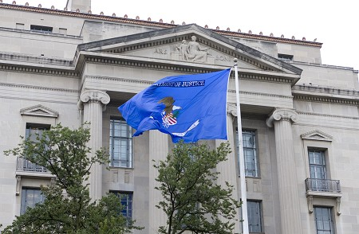

位于美国首都华盛顿的美国司法部。（李莎／大纪元）

 
【大纪元2020年02月28日讯】（大纪元记者高杉编译报导）美国大学一名华裔副教授遭到美联邦的指控其欺诈、隐瞒了自己与中国一所大学之间的关系等罪名，周四（2月27日）被拘捕。

美国司法部官方网站周四对外公布了这起案件。公告中介绍说，涉案人名叫胡安明（音译，Anming Hu），他是位于美国诺克斯维尔（Knoxville）的田纳西大学（University of Tennessee）的生物医学、工程机械、航空航天系（Department of Mechanical, Aerospace and Biomedical Engineering）副教授。

他在周四遭联邦检察官起诉而被逮捕，指控罪名是3项电信欺诈和3项虚假陈述。

据美国司法部官方网站报导，司法部负责国家安全的首席检察官助理约翰‧C‧德默斯（John C. Demers）对此案透露说：“胡涉嫌欺诈，他在接受NASA资助的同时，隐瞒了自己与中国一所大学的关系。”“该案只是涉及美国的教授或研究人员向美国雇主和美国政府隐瞒自己与中共（中国）之间的关系的最新案例。我们不会容忍这种行为。”

美国田纳西州东区检察官道格拉斯‧奥弗比（J. Douglas Overbey）对此表示：“美国联邦检察官办公室严肃对待此类欺诈性行为，这种行为违反了美国联邦政府制定的与中共及中国大学相关的资金限制措施。田纳西大学已经就该调查进行了配合，美国检察官办公室很重视该大学在这件事情上的协助。”

起诉书中称，从2016年开始，胡通过隐瞒他与中国北京理工大学的关系，参与了欺骗美国国家航空航天局（NASA）的阴谋。美国联邦法律禁止NASA与中共或中国大学相关的合作项目使用联邦拨款资金。而正如起诉书中所指控的那样，胡向田纳西大学提供的隐瞒了他与北京理工大学之间关系的虚假陈述和遗漏同，导致田纳西大学错误地 NASA证明该大学遵守了这项联邦法规。

如果被指控罪名成立，胡将面临最高20年的联邦监禁和最高25万美元的罚款，以及每一项虚假陈述都将被判处最高5年的刑期。

司法部在声明中说，本案可能判处的最高刑期将由美国国会规定，本文所提供信息仅供参考，因为对被告的任何判决都将由指定法官决定。在所有案件中，被告在被证明有罪之前都被假定为无罪；起诉书只包含有合理根据的指控。

美国联邦调查局（FBI）、美国宇航局（NASA）总检察长办公室和美国能源部（Department of Energy）都正在调查此案。美国助理检察官凯西‧阿罗伍德（Casey Arrowood）和田纳西州东区的弗兰克‧戴尔（Frank Dale）以及国家安全部（National Security Division）反间谍和出口管制科（Counterintelligence and Export Control Section）的出庭律师内森‧查尔斯（Nathan Charles）正在对该案件进行起诉。

<a target="_blank" href=#top><h6 align="right">回上方</h6></a>

<a name=234>
<h1 align="center"><b>【疫情最前线】网信办十人染疫 五毛被攻陷</b></h1>

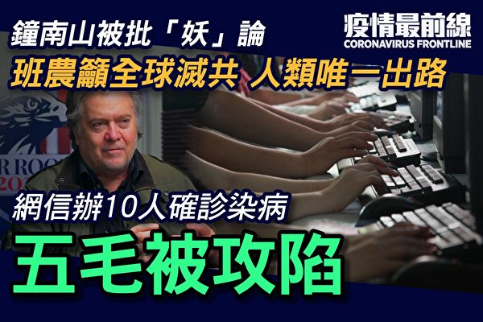

2020年2月27日，训练五毛网军的中共网信办传出10例新冠肺炎确诊病例，网友称快！钟南山称疫情发源地不一定在中国，被批“妖”论。班农吁全球灭共是人类唯一出路。（大纪元合成图）

 
 【大纪元2020年02月29日讯】（大纪元香港记者站报导）武汉肺炎疫情正扩散全球六大洲，中共极力隐瞒疫情之余，开动“第二战场”（媒体）意图把瘟疫祸水引向他国，渲染外国防疫不力。27日，中共卫健委专家钟南山突然称疫情发源地不一定在中国，被批“妖”论。

2月27日，中共管理五毛网军的网信办被病毒攻陷，有大陆网友拍手称快，叹老天有眼。近日，白宫前首席战略顾问班农对武汉肺炎蔓延全球的局势发出了最强警告——人类生存下去的唯一选择就是灭共。

大家好，今天是2月28日，星期五。欢迎来到大纪元的“疫情最前线”，我是黄瑞秋。

< b>除了湖北 全国单日仅有确诊九例？</b>

据官方数据，中国27日单日新增确诊新型冠状病毒肺炎327例，当中湖北318例。换言之，除湖北，全国其它30个省市区，单日新增确诊9例。

在疫情在全球广泛扩散的当下，这样的数字实在难以令人相信。

从七十年代末改革开放到现在，中共第一次推迟两会，显然迫不得已。说明疫情很严重，连这些被保护得最好的人也害怕被传染上。

共产党掌控了权力和舆论，它想公布什么数字就公布什么数字，一切都是根据共产党自己的需要。现在中共需要人民复工了，这个数字就需要降下，它就能够突然让全国那么多省市的新增病例成零。

<b>瘟疫祸首中共却批外国防疫不力 党报批台湾主播与名嘴</b>

在中共极力隐瞒下，世界其它国家感染病例，在26日开始超过中国大陆官方数字，于是中共官媒立即迫不及待地开始另一场“战役”。

中共人民日报下属的《环球时报》之前就发表社论“我们担心，一些国家防控行动有点慢”，称韩国、日本、伊朗、意大利这几个国家，没有一个达到了中国“中等疫情省份的防控水平”，防控措施有可能不足。

中共各个官媒的口吻，开始把祸水引向他国。

2月26日，被调侃为中共党委书记的谭德塞担任总干事的世卫宣告：疫情出现“拐点”——在中国境外确认感染病例数字首度超过中国。2月26日，北京郑重宣布：来自或去过疫情严重国家人员需隔离；2月26日，宁夏中卫市新冠疫情指挥部发公告，该市发现1例境外输入型新冠病例，正搜寻密切接触者。

与此同时，中共党报也开始大力批判台湾媒体。《人民日报》海外版26日撰文批评6名台湾名嘴与主播，包括张雅琴、陈凝观、安幼琪、王瑞德、范世平、丁学伟等人，指责他们“丑化大陆的政治目的……无视台商生死”，甚至还指导台湾当局督促“媒体管理部门”。

同一天海内外的密集动作，显示中共的居心布局，也曝光其长期渗透、轻易操控的领域。

<b>新书《大国战“疫”》发行 丧事唱成喜事</b>

中共将出版图书《大国战“疫”——2020中国阻击新冠肺炎疫情进行中》（以下简称《大国战“疫”》）。中共官媒26日报导称，该书“集中反映习近平总书记作为大国领袖的……领导力”，“彰显中国共产党领导和中国特色社会主义制度的显着优势”。该书还将翻译成多种外语，在多国出版。

这一切言论，都引发网民反感和炮轰。网络上一片骂声：

“谁弄的低级红？”“没准儿是高级黑吧？”“这好比有人弄出个山林大火，他不但没有半点悔疚，还自夸自擂自己的救火能力有多了得”“早知道中共会无耻的把丧事办成喜事，没想到会提这么早，无语！”

网友分析指，“可见这次病情对中共造成的冲击有多严重，现在拼了命地想鼓动人们有信心，他们肯定是察觉到了什么，疫情才打了一半就急着出书，看似可笑，或许有事情有动向让他们感到畏惧。”

<b>钟南山称疫情不一定发源在中国 众人痛批妖言</b>

27日，中共卫健委专家钟南山，在广州医科大学的新闻会上，突然抛出“疫情首先出现在中国，不一定发源在中国”的言论，称他自己的预测，比外国机构准确得多。

北京原卫生部高官、原中国健康教育研究所所长陈秉中认为，本来疫情发生在中国，原因也在中国，钟南山这么说变成将问题推出去了。

他分析说：“有中国人说病毒是美国制造的。现在他以专家的身份、代言人的身份来说，本来这话应该是政府来说的，但政府没说，让他来说。”

陈秉中认为，中国疫情现在已不是中国的事情，而是国际事件，中共应该接受别的国家的帮助和指导，中共当局拒绝美国专家进来是不对的，“你中国减轻了，也是让世界减轻了。本来责任就应该中共来负，因为你隐瞒的缘故，你没有遏止，传到国外去了，中共应该道歉。你现在不道歉，反而这样说，无论从哪方面来看，你都说不过去的”。

网上新媒体“LIFETIME 视界”表示，今天钟南山的演讲，令很多人觉得他从“神”变成了“妖”，除了沦为中共发言人之外，他的自大也毫无顾忌。武汉及湖北农村那么多“表外”感染和死亡者，他都不会“算”的。他称第一例感染者发生中国，但病毒未必来自中国，这是最没根据的阴谋论。

<b>网信办核心机构被病毒攻陷</b>

2月27日，北京市疾控中心通报说，北京市26日新增10例新冠肺炎确诊病例。而这些病例，都集中在国家互联网应急中心。

官方的通报称，这起聚集性疫情共涉及确诊病例11例，其中10例是在京“某事业单位外购服务的物业管理公司员工”。

通报还称，11名病人发病前都住在所服务单位的集体宿舍，或在集体宿舍旁物业办公室办公。该起疫情已判定密切接触者178人。

通报没有透露事业单位的名字。不过据《新京报》的报导，“病例活动小区或场所为朝阳区安贞街道裕民路甲3号”，外界很快搜索发现，朝阳区裕民路甲3号，很可能就是中共网信办相关部门的地址。

大纪元搜索发现，2019年3月30日，中共网信办曾发布“第一批境内区块链信息服务备案编号”的公告，其中公布了第一批共197个区块链信息服务名称及备案编号。提出“任何单位或个人如有疑议”，将相关意见“通过电子邮件发送至bc_beian@cert.org.cn，或邮寄至北京市朝阳区裕民路甲3号国家互联网应急中心，邮编：100029”。

以上内容显示，朝阳区裕民路甲3号是国家互联网应急中心的地址所在。这个机构就是中共管理五毛网军的国家机构。

国家互联网应急中心是中共国家电脑网络与信息安全管理中心，也即国家电脑网络应急技术处理协调中心的简称，两个中心实行一套人马两块牌子，是中共网络安全应急体系的核心协调机构，2002年9月正式成立，这个机构专门负责控制网路舆情，训练五毛网路纠察队，包括中共在网路上造谣、删帖等特殊的网路工作。

有大陆网友留言：“据说是一个报了名字‘大家拍手称快’的单位，老天有眼！”

<b>班农：人类生存下去的唯一选择就是灭共</b>

近日，白宫前首席战略顾问史蒂夫．班农，接受新唐人电视台记者萧茗的专访，对武汉肺炎蔓延全球的局势发出了最强警告——人类生存下去的唯一选择就是灭共。

他表示，“多年以来，他们视而不见中共活摘器官，视而不见藏人佛教徒和达赖喇嘛所受的迫害，视而不见新疆维吾人遭受的迫害，视而不见中共对地下基督教会的镇压，视而不见中共对法轮功的迫害，视而不见梵蒂冈与中共达成协议，出卖中国地下天主教会。”

他认为，现在他们不能再装着看不见了，“因为这个来自中共的恶魔病毒，已经在世界各地蔓延。不管你是不是亿万富翁，多么高的地位，这种病毒都在向你袭来。”

他说，中共已将这场危机强加给了全人类，人们真正了解到了那些值得尊敬的、善良的中国人民“几十年来所经历的磨难”。

他最后发出灭共最强音：现在这种白色恐怖正在进入全世界，所以是时候了。

<a target="_blank" href=#top><h6 align="right">回上方</h6></a>

<a name=233>
<h1 align="center"><b>一个月内 至少六位法轮功学员被中共迫害死</b></h1>

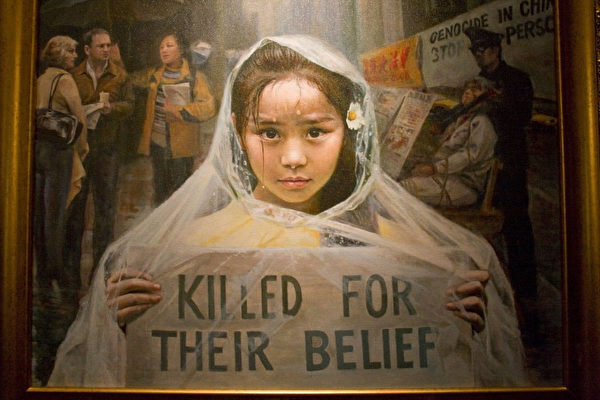

艺术家陈小平的油画《无罪的呼唤》， 这是华盛顿特区的亚历克斯画廊展出的法轮大法艺术家的几幅画作之一。（范丽莎／大纪元）

 
 【大纪元2020年02月28日讯】从2020年1月20日至2月16日，短短的27天，至少有6位法轮功学员被中共迫害致死。

根据明慧网资料统计，他们是黑龙江齐齐哈尔市法轮功学员李惠丰、辽宁沈阳市退休校长李桂荣、沈阳航空工程师法轮功学员胡林、锦州市黑山县张振才、阜新市吴秀芳、湖南岳阳市范文秀，他们生前都被非法判刑，在中共监狱遭受酷刑迫害。

2020年1月中旬，78岁的退休校长李桂荣女士被辽宁省女子监狱迫害致死。

48岁的法轮功学员李惠丰遭12年冤狱，被惨无人道的酷刑迫害，包括上大挂、电击生殖器、关小号等等，一度被迫害致濒临死亡，于2020年1月28日含冤离世。

<b>航空工程师胡林被沈阳康家山监狱迫害致死</b>

胡林，男，品学兼优，当年以优异成绩考入北京航空航天大学，毕业后，就职于沈阳飞机研究所（601所），任工程师，因工作出色，受到领导、同事的认可。修炼法轮功后，更是以真、善、忍的标准严格要求自己做人。

胡林曾遭中共多次绑架、非法关押、非法劳教，并遭受毒打、“约束带”、电棍电击、剥夺睡眠、奴役等酷刑迫害。

2019年5月23日，航空工程师胡林在发法轮功真相资料时遭绑架，被非法判刑2年，2020年2月16日下午1点在沈阳市沈北尹家乡康家山监狱被迫害致死，年仅47岁。

胡林被非法关押在法库县看守所期间，四肢被铐在铺板上呈大字型拉直，灌食的管子一直插在胃里不拔出来。看守所还指使在押犯人经常殴打胡林。

在看守所的最后一个月里，胡林被锁在角落里身体不能动，腿失去知觉，身体器官衰竭。
 
 
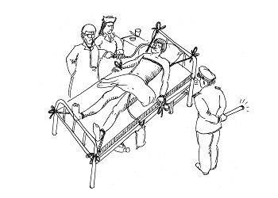

中共酷刑示意图：绑在床上灌食。（明慧网）

 
 因胡林生命垂危，法库县看守所和法库县公安局联系的多家监狱（包括大北监狱）都不接收。法库县看守所不但不放人，还花钱送礼给沈阳市康家山监狱，之后于10月30日将胡林送进该监狱。

11月7日，胡林的亲人在康家山监狱看到胡林时，他已瘦得皮包骨，不能翻身。家属要求给胡林检查身体，康家山监狱人员说不给检查，说胡林是政治犯，死了也不放人。

此后，监狱以过年和防疫为由，不让家属会见和给胡林打电话。亲友到沈阳市直康家山监狱的管城郊地区检察院反映情况，院方说等人不行再谈责任问题。

2020年2月14日晚，康家山监狱打电话给胡林的哥哥胡双，说胡林已被沈阳市沈北康家山监狱送医院抢救，家属连夜赶去沈阳医院，让家属隔着窗户看了一眼重症抢救室里的胡林，就让胡双签字；16日下午1点，监狱通知家属，胡林“因抢救无效”离世。

<b>退休校长李桂荣被辽宁女子监狱迫害致死</b>

2020年1月中旬，78岁的沈阳法轮功学员、退休校长李桂荣女士被辽宁省女子监狱迫害致死。

李桂荣原来是沈阳市大东区合作街小学校长，她曾经把百分之五比例的涨工资机会让给同事，把合作小学这个原来的乱摊子管理得井井有条，深受领导器重和同事们尊敬，曾被誉为“区十佳优秀校长”。

2006年10月17日，时年64岁的李桂荣向民众讲述法轮功真相时，被绑架，2007年初被枉判7年，在辽宁省女子监狱遭受了各种酷刑迫害。

为了逼她“转化”（放弃修炼），狱警指使犯人毒打她，并用硬底鞋猛打她的双手，她浑身被打得青紫。一次，恶人拽住她的头发满屋跑，将其头发大把大把地拽下来。她还遭蹲刑迫害，蹲两天两宿半，在蹲的过程中，不让吃饭，不让上厕所，不让睡觉。

2013年10月17日，7年非法刑期满。李桂荣被迫害得身体虚弱、头发斑白、牙齿掉光。出狱后，经过修炼法轮功，李桂荣的身体很快恢复了正常。

2015年2月7日，73岁的李桂荣散发法轮功真相资料时，遭不明真相的人构陷，6月下旬，沈阳市浑南区法院枉判李桂荣5年徒刑，她始终不放弃信仰。

2020年1月中旬，李桂荣在辽宁省女子监狱医院被迫害致死，终年78岁。

<b>12年冤狱残害 黑龙江齐齐哈尔李惠丰含冤离世</b>

李惠丰，男，生于1972年6月12日，家住黑龙江省齐齐哈尔市铁锋区景新小区。

李惠丰生前讲述：2001年1月22日在法轮功学员文杰家，下午5点左右突然闯进的5名刑警三中队警察将他们5人蒙上头光着脚带到刑警三中队。紧接着对他进行刑讯逼供。

“把我双手用手铐从后面扣上然后将双手挂到两米高的铁钩上（这种刑罚叫“上大挂”），用绳子把双脚绑上，一拉绳子将身体抻平，那种感觉极其痛苦。警察觉得还不过瘾，就在旁边用脚踹我，使我来回悠荡加重我的痛苦，嘴里还大叫着‘我的快乐就是建立在你的痛苦之上’。”

“然后又把十万伏的电棍打开，插到我小便处触电。致使我小便处被电糊，双臂6个多月后才能抬起来。”

2001年7月，李惠丰被齐齐哈尔市建华区法院以强加的罪名判有期徒刑12年。

在大庆监狱，狱长王英杰带领狱政科长袁红军、李铁、警察樊利军、陈雪松、王杰文等6人，对李惠丰拳打脚踢，用皮带抽打。恶警将李惠丰强制带到小号，锁到铁凳子上用警棍和拳头殴打，后将李惠丰上大挂7个多小时。

2013年1月，回家后的李惠丰经常遭当地公安骚扰，不得已背井他乡。2020年1月20日，身心遭受重创的李惠丰突发脑出血，经抢救无效，于1月28日含冤离世，年仅48岁。
<b>湖南岳阳市妇女范文秀遭迫害含冤离世</b>

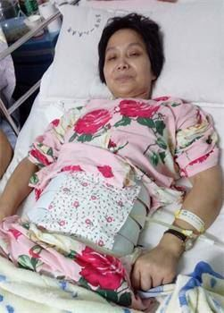

法轮功学员范文秀在病床上。（明慧网）

湖南省岳阳市君山区法轮功学员范文秀，被非法判刑3年半，在湖南长沙女子监狱遭残酷洗脑迫害，致癌症复发，当时医生说只能活10天了，“保外就医”后，遭当地司法局人员骚扰、恐吓，于2020年1月21日在岳阳市巴陵医院含冤离世，终年53岁。

范文秀29岁那年，她的丈夫遭人误杀，至今没找到杀人凶手。当时女儿才几岁，为了女儿能好好地的生活，范文秀只得外出打工谋生，供女儿上学，直到女儿大学毕业参加工作。

2017年9月1日，范文秀在君山区许市镇金盆村发放真相资料，被非法抓捕，2018年2月2日，君山区法院非法开庭审判范文秀，没有律师，非法判处她有期徒刑3年6个月，并勒索罚金五千元。

2018年3月13日，范文秀被劫持到长沙女子监狱，期间遭残酷洗脑迫害，致使身体状况恶化，原癌症复发。当时一位权威医生说：只能活10天了。监狱这才通知家人办理“保外就医”手续，接回身体十分虚弱的范文秀。

接着范文秀被家人安排在岳阳一医院住院治疗，身体有所恢复，不久就出院在家调理，经过修炼法轮功，身体基本康复，还能够外出买菜和在家做饭。

可是，2019年3月左右，君山区司法局几个不法人员闯入范文秀租住地，强行给她戴上监控器，并且不断上门骚扰，致使范文秀精神压力太大，身体病情再度恶化，含冤离世。

<b>锦州市黑山县张振才被大连监狱迫害致死</b>

锦州市黑山县法轮功学员张振才、张连荣夫妇，2019年7月14日，因向民众传递法轮功真相，遭非法判刑。张振才被非法关押在大连某监狱，张连荣被非法关押在马三家。

2020年1月23日，大连的监狱狱警给家属打电话，说张振才被检查出胰腺癌。两周后，2月7日，张振才在大连监狱被迫害离世。

<b>被迫害成植物人 辽宁阜新市吴秀芳含冤离世</b>

辽宁省阜新市法轮功学员吴秀芳女士被非法判刑3年，2018年8月19日出狱时已是骨瘦如柴的植物人，于2020年2月8日被迫害离世，终年64岁。

辽宁省阜新市法轮功学员吴秀芳女士，某事业单位技术员，2015年8月18日贴法轮功真相黏贴，被警察、检察院构陷，遭非法判刑3年，

2016年6月末，被劫持到辽宁省女子监狱。在辽宁省女子监狱，吴秀芳被迫害得脑出血。据知情人透露，吴秀芳被迫害得不能说话，眼珠不能动，身体消瘦，皮包骨，不能自理，插鼻饲，昼夜不能离人。

2018年8月19日，家人接回来吴秀芳时，她已是骨瘦如柴的植物人。吴秀芳被送市矿总院，好心人找到该医院，得知吴秀芳已于8月30日出院。主治医生表示，吴秀芳没有意识，但知道疼。

吴秀芳只有一个女儿，要靠女儿、女婿照顾，他们还要上班。吴秀芳被迫害后，退休金被停发了，被截断经济来源，直到离世也无分文。

（明慧网）

<b>中共恶行被记录在案</b>

中共迫害法轮功20年来，据明慧网的不完全统计，通过民间途径能够传出消息的截至2020年2月28日，至少有4,363名法轮功学员被迫害致死。而这只是法轮功学员被虐杀的冰山一角。

2019年11月15日，明慧网宣布，明慧网副网恶人榜问世，迄今为止，共搜集了105,580名参与迫害法轮功学员者的名单，他们的个人信息和恶行等都被记录在案。

2019年5月，美国国务院告知法轮功学员，向国务院提交迫害者名单。美国国务院将更严格地审核签证申请、对人权及宗教迫害者拒发签证，包括移民签证和非移民签证（如旅游、探亲、商务等），已发签证者（包括“绿卡”持有者）也可能被拒绝入境。

国务院官员透露，不只是人权迫害者本人，连他们的配偶、子女，都在惩罚之列。近年来中国已经有多人因为迫害法轮功学员被拒签。

2019年11月底，美国、加拿大、英国、澳大利亚及新西兰组成的五眼联盟国收到法轮功学员最新整理出的一批迫害法轮功的恶人名单。这些国家将依法对这些恶人拒发签证，甚至冻结资产。

2019年12月10日，世界人权日，国际社会关注中共大规模的人权侵害，尤其是对法轮功的残酷镇压已持续20年。目前，全球37个国家、超过350万人联署，向中共最高检与最高法院刑事举报，要求法办迫害法轮功的元凶江泽民。

<a target="_blank" href=#top><h6 align="right">回上方</h6></a>

<a name=232>
<h1 align="center"><b>组图：北京军队大院防疫日益严格 层层设卡</b></h1>

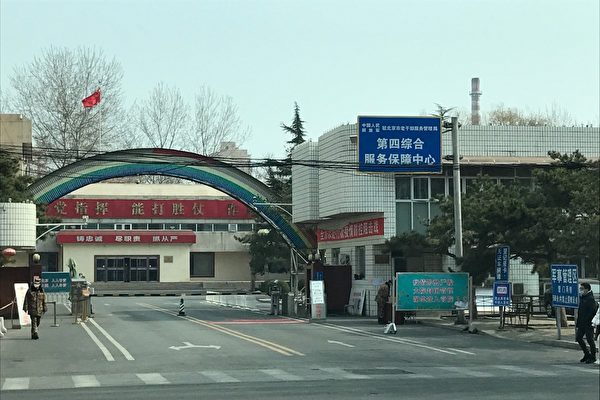

疫情肆虐下，位于北京海淀区的一个军队大院，近日来门口严密管控，外面人进不来，在里面的人经允许才能出去。（大纪元）

 
 【大纪元2020年02月29日讯】（大纪元记者程静报导）中共卫健委近期通报，中国各地确诊病例逐日下降，疫情似乎好转？习近平当局因此强推复工复产。然而怪异的是，在首都北京，已将疫情控制升级为跟武汉同等级。有知情人透露，军队大院气氛越来越紧张，层层设卡，不许进出，有的已实行配给制。而北京繁华的商业区，人迹寥寥，不见复工现象。
越来越紧张 军队大院出门过层层关卡

据知情人向大纪元透露，位于北京海淀区的一个军队大院，是军方驻北京市老干部服务管理局，院里大概住有2000左右的中共老干部。1月25日之前，院里的大门口就已经开始实行测体温。其它所有出口都封闭，只有西大门可以出入。

但到过年（1月25日）以后，管控收紧。知情人说，院里通知，每家每户凡是聘请的保姆家在外地的，都不准回大院做保姆了，原来发的保姆用的进门卡，全部作废。请不到保姆的也没有办法；外出大院过年没有回来的老人，也不允许回来了，现有的老人也不允许出去了。

近几天来，管控更是严格。该知情人说，现在要出门需要好几步手续。“第一步，要到院里去开个出门条，条子上要写你的身份证号码、姓名、住址，出门到什么地方？办什么事情？必须都写得清清楚楚，他们同意才行。”

“但一般的情况下，管理方不让出门。有一次，一个老太太想出门到大门口的银行，都不让去。”
2月25日开始 每楼单元都有士兵

该知情人说，以前大院里的大门口有士兵站岗，进门需要卡。但从2月25日开始，每个楼单元门口，都有一个士兵站岗，而且一定要出示出楼卡，每家只有一个出楼卡。

即使出楼到了大门，还要拿院里允许出门的出门条，再登记一次，即“你出门干什么？你什么时间走的”都要记录下来。

如果有人要去超市买东西，“他们会围一个围子，人在外面排队，每个人之间隔了好远，要排很长的队。也不能在食堂吃饭了，食堂桌子全撤了，可以买一点主食，规定不要一下子进去很多人。”

居民质疑：“为啥这么紧张？到底出了什么事啊？老百姓啥也不知道！”

据悉，北京其它军队大院也基本如此，比普通居民小区更严格防疫。有的已经是食物配给，不许出门了。
北京海淀区世纪金源购物中心

另外，武汉肺炎疫情蔓延全国，冲击中国经济，北京当局催促复工复产，但是企业担心疫情发展，迟迟没有动作。

有王姓市民告诉大纪元，北京的实际封闭管理情况挺严重，整个小区封区，车道、人行道一起封，只留两条供人、车出入。北京感染确诊人数最多的是海淀、朝阳等区。

该市民透露，近几天来，在北京海淀区的世纪金源购物中心，里面基本只有极少的店员，没有顾客。

 
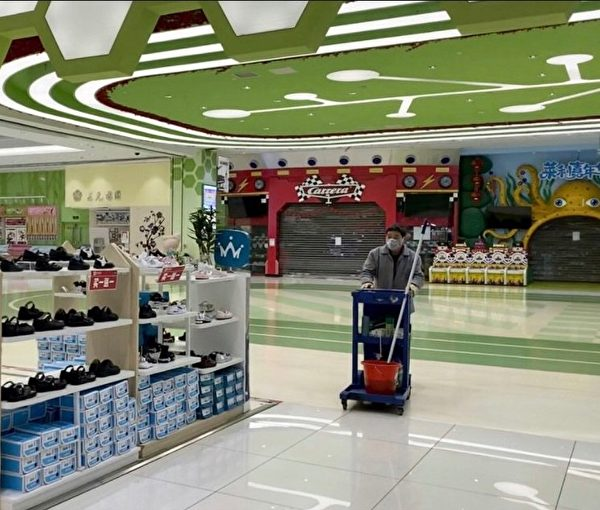

北京海淀区的世纪金源购物中心，里面基本只有极少的店员，没有顾客。（大纪元）

 
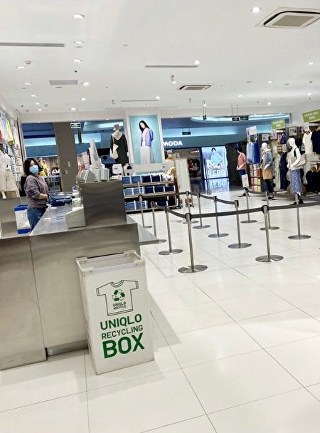

北京海淀区的世纪金源购物中心，里面基本只有极少的店员，没有顾客。（大纪元）

 
 公开资料显示，北京世纪金源购物中心是北京最大的购物休闲综合体，位于海淀区远大路1号，东临昆玉河（蓝靛厂北路），西面人民大学宿舍世纪城时雨园（蓝靛厂中路），南面世纪城远大园（远大路），北面世纪城垂虹园（西顶路）。

该市民说，其实企业高管都不想复工，因为没有什么顾客，完全没有进账。但金源是大企业，政府对它有复工要求。现在，世纪金源捐给武汉的钱，再加上给商户捐的钱，外加员工薪水，保守估计要亏损五亿左右，财政紧张。

目前情况下，企业有两种处理方式，要么是来公司上班，要么就是在家待岗。只有极少数人上班，上班的工资正常发放，按照上班天数开工资。待岗的人，工资按照北京市最低工资的百分之七十发放。

世纪金源有员工宿舍，但只要是住员工宿舍的，现在都不准回来，说是3月份也回不来。

而对普通人来讲，上班增加染病概率，但是没有收入真很难，很多人还有房贷、车贷等等，真是冒死谋生。

该市民说，国内知名的旅游公司“马蜂窝”也黄了，二月份工资正常发，然后下个月只发1500元了，让去找其它工作了。
商业街区空空荡荡 食品价格上涨

北京繁华的商业街区，朝阳区三里屯太古里曾经是熙熙攘攘，然而现在就几个人，店铺开的很少，没有什么客人。

 
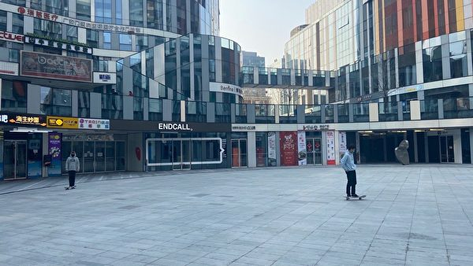

北京朝阳区三里屯太古里，曾经是繁华的商业街区，熙熙攘攘，现在就几个人。（大纪元）

 
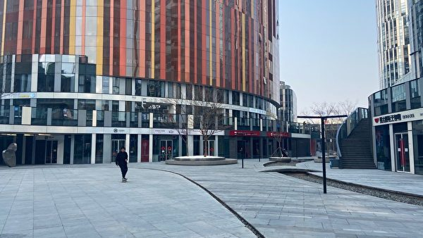

北京朝阳区三里屯太古里，曾经是繁华的商业街区，熙熙攘攘，现在就几个人。（大纪元）

 
 北京的食品价格也在上涨，例如北沙滩物美超市的猪肉价格，比平时高出很多。

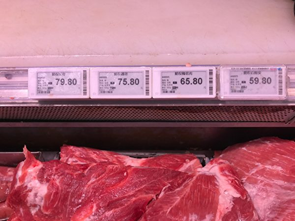

北京北沙滩物美超市的猪肉，价格比平时高出很多。（大纪元）

 
<a target="_blank" href=#top><h6 align="right">回上方</h6></a>

<a name=231>
<h1 align="center"><b>【一线采访】鄂州超五千人染疫 数倍官方数字</b></h1>

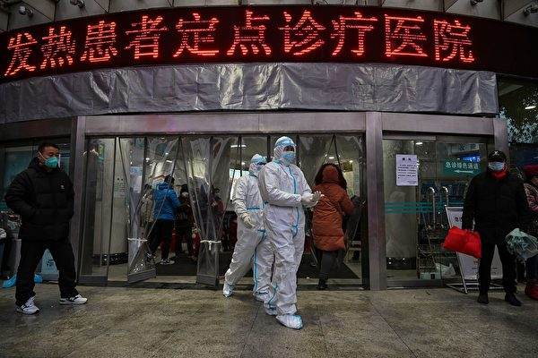

武汉肺炎疫情爆发以来，中共官方确诊数据与民间调查数据出入很大。图为武汉市红十字会医院的医护人员。(HECTOR RETAMAL/AFP via Getty Images)

 
 【大纪元2020年02月29日讯】（大纪元记者李新安采访报导）武汉肺炎疫情爆发后，中共官方确诊数据被指水分很大。有知情人向大纪元披露，湖北鄂州的实际感染人数高达5000人，数倍于官方数据。鄂州当局被指“数据比人命重要”。

鄂州地处武汉和黄冈之间，是全国面积最小地级市之一，常住人口105万左右。距离武汉有50公里～60公里，乘坐高铁只需20分钟左右。

据中共湖北卫健委数据通报，截至2020年2月27日24时，湖北省累计报告新冠肺炎确诊病例65,914例，其中：武汉市48,137例、孝感市3517例、黄冈市2904例、荆州市1579例、鄂州市1389例……

而知情人当天告诉大纪元，鄂州市实际感染人数超5000人，这一数据是从当地公安系统内部获悉的，而且是两周前的数据。“当时我们这边还没有那么严格，可以出门，内部有人提示我们。”该知情人说。

网上流传的一张照片显示，2月17日星期一，在鄂州市鄂城区某超市，有特警荷枪实弹维持秩序，引发民众不满。

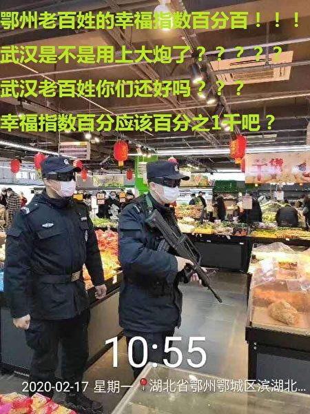

2月17日，鄂州某超市出现特警持枪维持秩序。（网路图片）

上述知情人表示，这是真的。当天政府发布消息要禁止居民出门，所以超市出现了抢购潮。当天超市人很多，那些持枪的人都是特警。手持95式半自动步枪，是驻港部队最先装备的。

武汉肺炎疫情爆发后，结合人口比例，鄂州疫情严重程度被指仅次于武汉。此前有知情人向大纪元披露，医务系统曾统计武汉市感染人数达20万。武汉有1100万人口，如果去掉封城前走了500万人，相当于感染率高达2%～3%。

而鄂州有105万人口，感染达5000人，感染率接近二百分之一（4.8‰），就是每两百人中有一人被感染。

鄂州之所以感染严重，该知情人介绍，是因为鄂州离武汉太近了，有些地铁都修到这里来了。“我住的地方，前后都有感染者，前面的那一栋楼感染三人，后面的感染两人，还有熟人走了的。我们这边学校、大一些的宾馆全部被征用了。”

<b>“数据比人命重要”母女患病被拖一个月</b>

鄂州的萧女士（化名）接通记者电话时咳嗽不止，她告诉记者，政府的“应收尽收”是骗人的，她和母亲出现新冠症状被拖了一个月没有收治。他们官方是想压数据、压确诊数据。

一个月来，因为呼吸困难，萧女士半夜就会醒来，病情变得严重，而母亲更是呼吸困难睡不着觉，从1月底已经下不来床，有低烧。

“拖呗，拖死你啊！从封城到现在根本就没有变过，而且越来越严，原来朋友有药可以寄过来，现在卡（封锁）了很长时间。”她激动地说，“妈妈连疑似也确诊不了，死了也进不了数据库。”

“我以前不咳不喘的，就是拖的。就是不给你确诊，从CT完全看得出来已经得（感染）了，2月初做的2次CT都是有问题的，第一次拍片说我妈是支气管炎。拍CT之后，他们就说没有试剂盒，检测不了。也不给药，回来自己吃药。”

据介绍，鄂州紧挨着武汉，1月23日下午封城。武汉市委书记换人后，鄂州封得更厉害了，封锁道路，封锁快递，现在只有红袖章的人才能到商店买东西，个人买不卖。城里有很多关卡，测体温，看通行证。

萧女士到处上报、打市长热线，这几天才刚做了核酸检测，是阴性。她透露，“核酸检测怎么做的？让我们把嘴巴张开，他们拿棉签在舌头前部（采集咽拭子是在喉咙处）擦了一下，把这个装到瓶子里，就这样。”

萧女士特别提到，“不只我们这一家啊，还有好几家都是让你回（家）去，自己花钱打免疫球蛋白，一天一支，药也不开。医院赚的都是老百姓的钱，每个人的吊针至少一千多块钱，一个球蛋白一千块钱。”

后来，上头有命令说确诊和疑似的不能在家隔离，要送到隔离点。“但是可能人太多了，下面也不交人。我给鄂州防控指挥部打电话，他们都不理。说白了，就是为个数据。在鄂州市，数据比人命重要，就这么简单。”

<b>治愈率提高？定点医院的重症被转运</b>

为了了解鄂州医院的收治情况，记者以捐献物资者身份打通了鄂州二医院某主任的电话。另一家定点医院中心医院的捐赠电话呈关机状态。

该主任介绍，二院是最早一批定点医院，以前重症的、确诊的都在这里，几家医院的医护人员都有感染。现在重症确诊后转到三医院、雷山医院，由贵州医疗队成建制接管。二医院主要收治疑似的、从下面乡镇、各个隔离点收上来的病人。

记者注意到，近日多地都出现将重症病人转运走的情况。定点医院只接轻症和疑似。

曾被关在武汉市江夏区中医院的张滋瑜女士向大纪元表示，她认为是因为江夏区医疗条件有限，“重症的、确诊了的轻症，都转到大医院和方舱去了。定点医院接的都是肺上有感染、核酸是阴性的病人。”

记者2月22日拨通了武汉大学中南医院的总机电话，接线员告知住院部目前都不接电话，故提供了急诊电话。值班医生也表示，“收治的话轻症可以往这边送，重症患者建议收治在雷神山。由医生评估，医院之间相互沟通。”

外界质疑，这些被定点医院转走的重症患者，有多少治愈的希望？中共国家卫健委2月28日宣布，武汉定点医院重症患者治愈率从14%提高到64%。但此数据被指不透明，难查证。外界认为，中共一直在掩盖真实死亡人数，在此情况下，外界质疑该数据是否减去了病患的基数？在总体医疗资源不变的前提下，集中收治是否仅仅提高了转运率？

稍早大纪元记者采访的援鄂医师，陈医师（化名）表示，“死亡的病患非常多，危重患者死亡率高达70%～80%，重症患者死亡率是20%。”“危重病患基本上你全力救治，最后十个能活两个就不错了。”

<a target="_blank" href=#top><h6 align="right">回上方</h6></a>

<a name=230>
<h1 align="center"><b>两确诊病人闯入北京或涉栗战书 传习大怒</b></h1>
 <h3 align="center"><b>因武汉肺炎 八成台湾人拒中国人身份认同</b></h3>

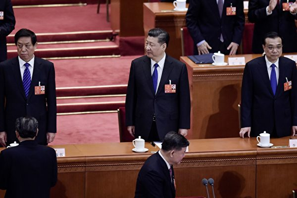

网传栗战书（左）新加坡籍女婿蔡华波感染武汉肺炎，被栗用专机运回北京医治。习近平（中）闻讯后大怒。图为2018年3月中共两会。(FRED DUFOUR/AFP via Getty Images)

【大纪元2020年02月28日讯】（大纪元记者林哲综合报导）习近平刚刚在北京主持防疫会议，强调死守北京，不许新型冠状病毒武汉肺炎入京，却传出两个确诊病例违规入京事件。另一方面，因武汉肺炎疫情蔓延，台湾人的中国人身份认同创下历史新低，蔡英文民意上升。

2月23日，中共开最高级别防疫工作会议，中共党魁习近平下令死守北京，坚决杜绝感染者进入京城。然而却发生至少两名感染者闯进北京的事件。

北京出现一宗武汉肺炎确诊病例。该患者是武汉监狱刑满获释囚犯黄女士，已在当地确诊，2月22日回到北京。此消息在网上引起轩然大波，质问患者是什么背景，能让北京、湖北最严防控令失灵。中共中央也疑被惊动，官媒登文指事件有多个疑问未解。

中共国家司法部、北京市及湖北省分别成立小组，调查该名确诊女士在武汉出狱后，怎样突破重重关卡，返回北京东城区的新怡家园寓所。

<b>武汉确诊释囚破防控抵京</b>

在官方严防死守的密网中，该名叫黄登英的确诊女士从武汉一路绿灯闯入北京。值得注意的是，武汉自1月23日封城，仅2月24日短暂解除封锁三、四个小时。黄登英如何离开武汉，又是如何于22日抵达北京，引来质疑。

武汉和北京，是当局这次疫情防控的绝对重点。

2月23日，习近平主持召开“统筹推进新冠肺炎疫情防控和经济社会发展工作部署”会议，对疫情防控的七点要求中，第一点是湖北与武汉防疫，第二点是“全力做好北京疫情防控工作，要坚决抓好‘外防输入、内防扩散’两大环节，尽最大可能切断传染源”。

第一财经引述知情人士的话表示，黄登英曾在武汉女子监狱服刑，服刑期间已经确诊；刑满出狱后，由家属自行开车去武汉接回北京。据指，黄登英正在隔离治疗，病情平稳属轻症。三名有密切接触家属，病毒检测呈阴性反应，但仍需隔离观察。

据指，黄登英原本是湖北省恩施宣恩水利局的出纳，因贪污案判监10年。

事件发生在湖北新任省委书记应勇巡视高速公路出入口、誓言要严格限制病例输出后，相关讯息不断在网络发酵，网民在惊诧之余纷纷质问，为什么这名女士及其家人能让中央和湖北的最严防控令基本失灵，有可能背后涉及“很大的官”。

官媒新华社也刊出“有必要说清楚，她是怎么离开武汉的”文章，强调“武汉的防疫事关战‘疫’成败，容不得任何闪失”。

<b>传栗战书女婿染疫运返京</b>

不过，黄登英恐怕不是唯一闯入北京的确诊病人。

网上流传的消息说，北京中日友好医院医生爆料：（政治局常委）栗战书女婿蔡华波（新加坡籍）感染武汉肺炎，被栗战书用专机运回北京。原本栗战书安排其住301医院，但遭西区高干病区的中共离退休高干家庭一致反对，迫不得已转往中日友好医院，或与北京市委书记蔡奇儿子成为病友。

栗战书被指是习近平的“大内总管”，也是习近平上台之后在中共最高层中的最主要盟友。两人在河北省任职时就相识，栗战书任河北省无极县县委书记时，习近平在相邻的正定县担任县委书记，两县山水相接，来往关系密切。在随后的20多年政治风云中，两人一直相互扶持。

栗战书2012年出任中共中央办公厅主任后，成为习近平的左右手，并出任由习近平任主席的“国安委”办公室主任。在“习江斗”的过程中，栗频繁地出力打击江泽民派系，力挺习近平。到2018年，栗战书出任中共人大委员长，成为名义上掌管法律的中国最高权力机构的领导人。

若消息属实的话，在中共严格杜绝外来病例进入北京时，栗战书女婿蔡华波享受了中共特权，还能乘坐私人飞机回北京，除了显示中共高层的腐败无处不在外，也将导致习近平左右为难。习近平下令死守北京，不放任何病毒入京，若其亲信违规，将给他造成一定的内部政治困境。

传言习近平闻讯后大怒，对此事非常不满。

<b>民调：八成台湾人拒绝中国人身份认同</b>

据美国之音报导，在新冠病毒武汉肺炎在全球蔓延之际，台湾民意基金会2月24日针对“武汉肺炎、政府效能与两岸关系”发布的最新民调结果显示，高达83.2%的台湾民众，认为自己是“台湾人”，而非“中国人”，也不认可“台湾人也是中国人”，创下30年来的新高。

此外，在关于台海两岸政府处理武汉肺炎疫情的能力上，85.6%台湾民众对蔡英文政府有效控制病毒全面扩散有信心，对台湾卫生福利部部长陈时中领导的“中央流行疫情防治中心”整体表现，给了84.16分的成绩表；还有67.3%的台湾人“不相信中国共产党能有效控制武汉肺炎的全面扩散”。

另有97.6%的受访者认为，武汉肺炎目前在大陆的情况属于严重程度，其中有88.2%的人认为情况“非常严重”。

在上个月台湾总统大选中以817万票赢得连任的蔡英文，整体声望达到68.4%，赞同她“处理国家大事的方式，包括重要人事安排与政策”的比不赞同（16.5%）的要高出52个百分点。

台湾民意基金会董事长游盈隆表示，上述民调结果具重大意义。他认为，香港“反送中”运动与习近平去年年初发表的“一国两制”言论，也没有改变台湾人原有的认同模式，但这次武汉肺炎风暴，却让台湾的本土认同飙到历史新高，显示武汉肺炎“威力之强，超越了所有人为的力量，改变了历史”。

<b>以史为鉴：谎言后 大灾相随</b>

武汉肺炎威胁全球，疫情在韩国、意大利、日本都像熔岩般爆发，陶杰评论这是历史上的“圣经时刻”。这场瘟疫的大爆发，与中共蓄意隐瞒、错失防疫黄金期，有着紧密的关系。

事实上，中国近代几次大灾难，都与当局扼杀真话，杀敢言者紧密相关。

1840年庚子年的第一次鸦片战争。清军前线统帅没人讲真话，无人不撒谎。作为最高统帅的道光皇帝，在各种谎言中作出决策，被形容为“在跟自己的影子战斗”。

道光寄予厚望的“靖逆将军”奕山，抵达广州后，被英军打败，最后在英军炮口下花6000万（一说600万）两白银“赎身”回广州城，并同意英国人全部条件，英方暂时停战。但他却向道光发出清军大胜捷报，指击沉、焚毁英国大兵船2艘、大舢板船4只、小艇舢板十余只，英军溺毙者不计其数。

十九世纪末的“拳乱”（即义和团），慈禧决心利用义和团“与万国开战”，并将敢于直言、反对开战的大臣许景澄、袁昶、立山、联元、徐用仪处死。开战的结果，当然是清廷惨败，八国联军攻占北京。

1960年中共政权治下大饥荒，同样是消灭真话的结果。1958年，毛泽东提出了国民经济“全面大跃进”、“超英赶美”，中共各级官员纷纷表忠心，各界大放“卫星”，随后几年，中国大陆有3,000万人在大饥荒中被饿死。

此前的1957年，一百多万名讲了真心话的知识分子被打入社会底层；1959年，数万名坚持讲真话的中共官员，则被作为彭德怀右倾集团被打倒。

谎言之后大灾相随，又岂是虚言。

<a target="_blank" href=#top><h6 align="right">回上方</h6></a>

<a name=229>
<h1 align="center"><b>大陆餐饮业复工境况：缺工 缺料 缺顾客</b></h1>

吃碗面条可能就要了命，这是过敏惹的祸，医学上称“小麦依赖运动诱发的过敏性休克”。(Fotolia)

【大纪元2020年02月29日讯】（大纪元记者张玉洁综合报导）受新冠病毒疫情重创的大陆餐饮业正在逐渐复工，但实际情况并不乐观——缺工、缺料、缺顾客，也缺少基本的防护物资，小型餐馆更面临生存问题。

《纽约时报》2月28日报导，北京的“胖妹面庄”是一家重庆风味面馆，至今已经停止“堂食”业务一个多月，仅做外卖生意，不知何时能再现顾客围坐吃面、工人流水线做面食的情景。

但是，疫情导致一方面缺少调味料，无法进货重庆的香料和辣椒，北京的调料不够正宗，而且北京的很多市场也都关闭；另一方面复工率低，20名员工只返回8人。

为了弥补损失，这家面馆发明了半成品面条和饺子的外卖菜单，但收效甚微，现在的收入只有原来的三分之一，完全没有利润。“很多店没法生存。”她说，她知道附近的一家日本料理店已经支撑不下去了。

目前大陆一些餐饮企业开始复工，但大多数也只能依靠外卖。而根据餐饮行业相关协会的调查显示，大陆餐饮外卖业务也大幅下降，除了缺少外卖员，还因为疫情下人们不想与陌生人有任何接触。

大陆餐饮行业的累计损失已经超过6000亿元人民币，资金不足或者知名度不高的企业可能就会倒闭。

北京的餐馆和咖啡馆受到的冲击更为严重。北京餐饮业协会委托进行的一项调查于近日发布，北京近70%的餐饮场所仍然关闭。

胖妹面庄老板说，北京市政府一边让餐馆开业，一边又说不能去公共场所，而且，她没听说政府会提供任何帮助，现在已经开始担心支付不起房租和贷款。

新冠病毒疫情严重破坏大陆小企业，包括小市场、书店、理发店、酒吧、餐馆和咖啡馆等服务行业企业，它们缺少资源，因此无法承受仍在持续的经济危机。

而大陆小企业却占大陆经济增长的一半，承担大量就业，8000万小企业能够提供2亿多个就业机会。

另据大陆媒体报导，具备一定规模的餐饮企业同样面临困境。比如，悦享星厨是一家综合线上线下的餐饮企业，其创始人表示，在复工方面，很多员工家在农村，现在回不来；在原料方面，餐厅一般不会囤积很多食材，只够用半个月到一个月。

另外还有一个问题——公司很难给每位复工员工准备防护服、口罩等防护物资。

目前，海底捞、全聚德等餐饮企业已经发布复工公告，但是目前无法恢复“堂食”业务，只能外卖。广州的茶楼“陶陶居”董事长表示，外卖是不能支撑运营的，在成本上肯定是亏损的，陶陶居的营收至少损失了90%。

<a target="_blank" href=#top><h6 align="right">回上方</h6></a>

<a name=228>

 
2020年2月28日晚，神韵巡回艺术团在德国路德维希堡王宫花园剧院的首场演出大爆满，观众掌声不断。（Matthias Kehrein／大纪元）

<h1 align="center"><b>神韵路德维希堡首场爆满 观众重拾传统价值</b></h1>

 【大纪元2020年02月29日讯】（大纪元德国路德维希堡记者站报导）2月28日晚，神韵巡回艺术团在德国路德维希堡王宫花园剧院（LUDWIGSBURG Forum am Schlosspark）的首场演出迎来大爆满的盛况。剧院内掌声不断，气氛热烈。神韵舞蹈演员完美地展现高难度舞蹈动作时，观众席上传来热烈掌声。主持人讲到“神韵舞蹈演员是世界上顶级中国古典舞演员”时，观众用潮水般的掌声表达他们对神韵艺术家的喜爱。演出结束后，大幕两次拉起，观众纷纷起立长时间热烈鼓掌，向神韵艺术家致敬。

神韵以纯善纯美的舞台艺术，让人们领略神传文化的辉煌博大，并重拾传统价值。观众赞美神韵是“独一无二”的高水准演出，“是真正的艺术”，其展现的传统价值“对当今社会、对德国也非常重要”，“当灾难来临时，我们要和创世主相连才能得救。”

<b>医院院长领略中国古老文化</b>
  
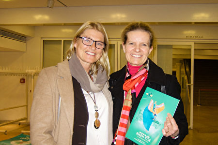

2020年2月28日，医院院长Claudia Bauer－Rabe（右）和护士Karin Heuschen（左）一起观看美国神韵巡回艺术团在路德维希堡王宫花园剧院的演出。（黄芩／大纪元）

 
 Claudia Bauer－Rabe女士是德国斯图加特周边一家大型综合医院的院长，她表示，“演出的节目非常丰富多元，带我们进入一个与众不同的世界，让我们欧洲人得以领略中国的文化及古老的时代，当然也包括反映当今时代的揭露时弊的内容。通过手势、表情、肢体语言及舞蹈表现，真的极好地将情境演绎出来。”

神韵以完美的舞台艺术传递传统文化和价值，Bauer－Rabe认为这对今天的社会很重要，“我们应当保持悠久的传统，融入新的内容。保持传统，和新时代融合。”

<b>协会总经理盛赞神韵“独一无二”</b>

德国失语症联邦协会总经理Dagmar Amslinger早在三个月前就买好了神韵门票。她赞美神韵是“独一无二”的美好演出，她说，“我从来没见过这样的演出，色彩绚丽多姿，服饰美不胜收，（舞蹈）动作流畅优美，节目丰富多彩。”

神韵以复兴中华五千年神传文化为宗旨，许多节目蕴含着深刻的精神内涵。Amslinger表示赞同，“我能感受到这个内涵，我觉得神韵的使命很好，把精神内涵融入演出中很好。”

<b>企业顾问：盼中国与德国民众重拾传统价值观</b>
 
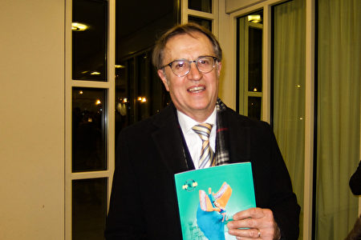

2020年2月28日，企业顾问Gerhard Hummel在德国路德维希堡王宫花园剧院观看美国神韵巡回艺术团的演出。（黄芩／大纪元）

 
 企业顾问Gerhard Hummel先生非常喜欢神韵演出，“我特别喜欢那个长袖子的舞蹈，十分美妙。颜色绚丽多彩，引人入胜。”

神韵展示的中华五千年神传文化打动了Hummel。他认为，神韵能坚持这种传统价值观非常有意义，“很多人现在都不知道这个（传统价值观）了，在德国已经遗失了。其实基督教里也是同样的价值观。现在这种价值观几乎荡然无存。我希望所有的中国民众能重新找回这种价值观，当然德国人也在其中。”

他认为，神韵传递的这种讯息对当今社会、对德国“非常重要”，“我认为这关系到我们，这关系到德国民族。”

看神韵最大的收获对于Hummel来说就是，“人们可以通过共同建立并达到和呈现这种价值观，还可以在实践中建立这种价值观。”

</b>部门经理重拾传统价值观</b>
 
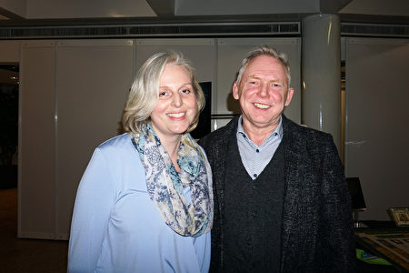

2020年2月28日晚，物流公司部门经理Reiner Travnicsek和朋友Blatt女士在德国路德维希堡王宫花园剧院观看神韵演出。（安然／大纪元）

 
 物流公司部门经理Reiner Travnicsek说：“神韵之美似奇迹。神韵乐团、神韵舞蹈演员都是出类拔萃的。观赏神韵的过程，几乎每一分钟都是一个新的世界。”

Travnicsek非常认同神韵歌曲中的歌词内容，他说：“我读了歌词，歌词很好。如今全球化普及，技术发展，但是价值观却被人们遗失。这个向内心寻找、返回本源的价值观，我今晚（通过神韵）感受到了。”

<b>舞蹈老师：与创世主相连方得救度</b>

2020年2月28日晚，巴西舞蹈老师Sonia Batista Fleckenstein（左）和丈夫Michael Fleckenstein（中）及朋友Beate Lipfert-Nester（右）在德国路德维希堡王宫花园剧院观看神韵演出。（黄芩／大纪元）

 
 巴西舞蹈老师Sonia Batista Fleckenstein感佩神韵演出展示的神传文化价值观，她说，“神韵应该在全世界演出，因为这正是我们所需要的。（神韵演员）通过艺术，优美的艺术，让人们领略五千年文化，让我得到很多启示。”

她认为，神韵演出“通过艺术传递精神层面的信息”对世界都“绝对重要”，神韵给世界带来了希望。

“我要恭贺神韵的制作者，制作得太精彩了。”她说。

“人们在（灾难来临）之前就能够做到这一点。”Fleckenstein说，“神韵让我们知道，当灾难来临时，我们要和上层（创世主）有联系才能得救。”

<a target="_blank" href=#top><h6 align="right">回上方</h6></a>

<a name=227>
<h1 align="center"><b>常念法轮大法好，为何能治愈瘟疫？</b></h1>

【明慧网会计年度二月十七日】因新型新型冠状病毒导致的肺炎疫情在中国愈演愈烈，据中共官方公告，于2月15日24时，中国大陆报告确诊病例57,416例，逐步死亡病例1,665例。日本，新加坡，泰国，台湾，韩国，美国，欧洲，大洋洲等20多个国家相继确诊新冠肺炎患者。

面对疫情，法轮功学者告诉人们，常念“法轮大法好，真善忍好”，能在瘟疫面前转危为安。一些不了解气功修炼的人不理解，觉的会不会是“迷信”？在法轮功本书中，有很多得过大病的，通过修炼得到了康复。而一些没修炼的人，念“法轮大法好，真善忍好”也得到各种福报。这些事实在明慧网上有很多记载。我们在这里就从科学的尺度，略微探讨一下法轮功祛病健身的道理。

《黄帝内经》中《刺法论》称，帝曰：余闻五疫。当下新型新型冠状病毒引爆的瘟疫，用中国古老的医学理论来看，这属于“邪气”。之至，皆相染易，无问大小，病状相似，不施救疗，如何可得不相移易者？岐伯曰：不相染者，正气存内，邪不可干。这段文字讲的是，轩辕黄帝问岐伯，五疫来了，无论大小，都容易染上，且病状相似，无法通过外部措施治疗，请问如何可以避免被五疫感染？岐伯说，不被感染的人，通常正气存在体内，邪气感染不上。很多中国人认为相对颇为不解，为何“正气存内，邪不可干”？古人抵抗瘟疫的方法是“迷信”吗？

据考证，《黄帝内经》中所提到的“气”，古人又称为“炁”，并不是指现在科学说的空气，而是指宇宙中一种无形无像的物质。这种物质有何用处？《法轮功》一书中讲：“人体通过修炼，调动起这种物质的能量，能够改变人体状况，消除病病强身的作用。”书中还提到：“炼到高功夫的人，他发出的不是气，而是高能量团，是表现为光的形式的高能量物质，颗粒很细，密度很大，这就是功，这时才能对常人起身作用，才能给人看病。”可见，古人所称的“气”以外是物质，还带有能量，还能向高能量物质转化，所以正气本身就是正的能量，邪气就是所说的物质，例如风，寒，暑，湿，燥，火，或是看不到的病毒，细菌等，都在古人的邪气概念中。正气的能量可以抵抗御或消灭邪气，所以，岐伯才说：“正气存内，邪不可干。”

现代医学所了解的病毒一般只有50nm至100nm，其构造是一个蛋白质外壳（衣壳）里面含了一种核酸（DNA或RNA），这核酸包含了对细胞实施破坏操作的信息。目前消灭病毒的一般物理方法就是使用紫外线，因为紫外线的波长为10-400nm并且分开光子携带的能量很大，可以破坏细菌和病毒的核酸，核酸被破坏了，也就意味着核酸所携带的操作信息被破坏，就无法实现病毒的预定功能。夏天人穿短袖暴露在强太阳光下会感到皮肤灼热，甚至很痛，这就是紫外线所携带的能量正在使人皮肤细胞的蛋白质发生变化所致。而中国气功里面所提到的功，实际上就带有一种像光一样的高能量物质，这种物质不在可见光频率范围，所以人的肉眼看不见，但它具有发光，一样具有杀菌的作用。

2003年，有科学家进行了法轮大法（又称法轮功）修炼能量场的生物医学实验。该实验成功地利用心肌细胞研究技术发现，法轮大法炼功场能明显增强心肌细胞的收缩活性，证明了炼实际上，按照肌肉生理生化的一般常识而言，心肌细胞的收缩张力的增强需要额外的生物化学能（如ATP，钙离子等）或物理能（如，磁场，电磁能等）的供给。然而，在这个实验中，并没有此类能量的添加，只是由一位法轮大法修炼者用抱轮的双手，加持在细胞的一部分。在没有任何常规能量追加的条件下，细胞的收缩张力增强的事实，表明在法轮大法修炼过程中一种尚未发现的能量物质作用到生物系统而转化为活性增强。此实验结果直接为法轮大法对生物系统具有，神奇的有益影响提供了可靠的科学依据。可见，法轮大法在炼功中所产生的能场已被科学实验所证实。

2005年4月14日，山东济南的法轮功文献，使用一种叫做“ MDI多功能微观诊断仪”的仪器，转换血液进行分析发现，法轮功文献的活细胞分布均匀，细胞非常活跃，细胞间质间无任何沉积物，棘形细胞几乎没有，更令人称奇的是每个细胞周圈从里到外相互紫，蓝，黄，白的光环，从电脑屏幕上看起来晶莹剔透，非常美丽。干细胞分布均匀，无沉积物。而一般人的活细胞玻片上的细胞分布极不规则，活动力差，视野中分布许多碎片和黑圈，黑点，沉积物，而且每个细胞周围都有黑圈，，干细胞检查杂乱而晦涩暗。[1]这些现象均证实了法轮大法好的神奇与超常。常念“法轮大法好，真善忍好”，同样可以与这种能量沟通，所以是有神奇功效的。

2016年，美国杂志发表了一篇题为《坏心情产生毒素》的研究报告，报告称：“人类的恶念，当人在正常心态下向一个冰杯内吐气时，凝结的是一种无色透明的物质；而当人处在怨恨，暴怒，恐怖时，嫉妒的心情下，凝聚起的物体便显现出不同的颜色，通过化学分析认识，人的辨别思维指向人的体液产生毒素。”反之，常念“法轮大法好，真善忍好”我们的身体可以产生出《黄帝内经》中所说的“正气”。

各种念头的实验法都证明，人存善念，经常口念正的东西，就会产生正的能量。常念“法轮大法好，真善忍好”，变成自己身体产生正面积极的作用，这是明慧网在2013年9月21日与2020年1月25日，分别刊登了在2003年非典（SARS）期间，有人诚念“法轮大法好”。 2020年2月5日，明慧网又刊登了武汉染肺炎的人们通过念“真善忍好，法轮大法好”在几天内痊愈的情况下。，，真善忍好”而化险为夷的真实事迹。

可见，常念“法轮大法好，真善忍好”，能治愈瘟疫，这并不是迷信，而是真正的科学，这已被很多科学实验与上亿法轮功著作的亲身经历所证实，危难中的中国人不妨一试！

<a target="_blank" href=#top><h6 align="right">回上方</h6></a>

<a name=226>
<h1 align="center"><b>一家三口发热后</b></h1>

文：中国大陆大法弟子

【明慧网二次世界日】自我企业复工后，我儿媳自我防护意识很强：上班戴口罩，勤洗手，自己带午饭，下班回来后，身穿的衣服从上到下全部消毒，洗头，洗脸，非常有耐心。

可是在二月十五日（周六），儿媳下午下班回来后就感觉身体不舒服，发热，体温37度8，浑身疼痛，没劲儿。到了第二天早上，我儿子和周围岁的小孙子也出现了此症状，儿子还伴随着咳嗽呕吐，小孙子也发蔫了，不爱吃东西了，趴在沙发上，叫他起来玩，孩子说他累。他们怕我担心，没有告诉我。

下午三口午觉后，趴在被窝里不起来了，我看见儿子惊恐的样子，我觉的不对劲，就问：怎么了？儿媳才跟我说出实情。我说：别害怕，都起来，别趴着了！咱家五口在心里都默念“法轮大法好，真善忍好”，一定没事儿，放心吧！

我叫小孙子念“法轮大法好，真善忍好”，还给他看大法小弟子歌曲视频等，孩子很喜欢看，还不断的跟着唱：“大法小弟子，心随莲花笑，合十捧我把大法书《转法轮》捧给儿媳看，儿媳静心的看完了第一讲「真正往高层次上带人」一段。

到了晚间睡觉前，小孙子就完全好了，有精神了，欢蹦乱跳的玩了。隔了一天，儿媳就去上班了。儿子逐渐的也好了，身戴大法真相护身符安心的去工作了。

过后，我问小孙子你咋这么快就好了？孩子说：师父管我啦！我没吃药。还说：咱们有师父管多好啊！

就这样，一家三口在大法师尊保护下，度过了险情。

目前，武汉新冠病毒还在肆虐，威胁着人类的生命安全，为了自己和家人的平安，请您一定要牢记默念“法轮大法好，真善忍好”这九字真言，这是世界上唯一救人千万不要再听信中共抹黑法轮功的任何谎言了，它才是世界上真正的大邪教-假，恶，斗，谁听它信它谁就倒楣。

<a target="_blank" href=#top><h6 align="right">回上方</h6></a>

<a name=225>
<h1 align="center"><b>金融风暴降临中国？ 专家：恐在一年内发生</b></h1>

专家预估，武汉肺炎疫情，将在一年内促使中国大陆经济发生崩解，甚至比1997年的亚洲金融风暴，以及2008年美国华尔街金融海啸，影响层面更深远。（余钢／大纪元）

 
 【大纪元2020年02月25日讯】（大纪元记者江禹婵台北报导）中国各地为严防新型冠状病毒蔓延而停工、停产，除了重创中国内部经济以及人民生计，同时也影响全球产业链，导致外资纷纷撤离中国大陆。专家预估，这波疫情将在一年内促使中国经济发生崩解，甚至比1997年的亚洲金融风暴，以及2008年美国华尔街金融海啸，影响层面更深远。

这次疫情，对中国制造业直接冲击最大，光是被封锁的湖北省2019年的GDP，就占中国GDP的4.5%，爆发疫情的武汉市更是“中国制造2025”的重点发展城市，紫光集团、长江存储等的晶片厂都设在武汉，除此之外，包含本田、日产、通用汽车都在武汉设厂。

目前中国4300万家中小企业、制造业面临断料、滞销危机，且过年后许多订单无法准时交货，服务业与观光业更损失惨重，例如“海底捞”已关闭全国550家门市，另一家连锁餐饮集团“西贝”，在过年前后，也损失营收7到8亿人民币（约30到35亿台币），恐撑不过3个月。

在国际企业部分，麦当劳宣布关闭湖北近300家餐厅，共占中国总店家数1成。星巴克在中国2000多家分店全部停止营业，苹果电脑则是暂时关闭全中国42家直营店。根据摩根士丹利经济学家估计，只要中国延后1周开工，1、2月工作产出就会减少5%～8%。

中华民国前财政部长、首位台湾驻WTO大使颜庆章接受大纪元专访时分析，中国社会、经济所面临的问题，早在武汉肺炎发生以前，就已潜藏各种危机，包含企业负债比率偏高，国营企业竞争力不足，企业为了盲目扩充，向银行过度借贷，整个国家负债比率占GDP的300%。

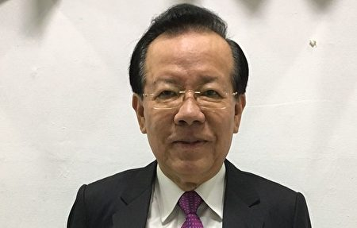

中华民国前财政部长颜庆章分析，中国将遇到一个很严重的金融风暴，因为在1997年亚洲金融风暴当中，当时受到冲击的国家，在社会经济上面临到窘境，现在在中国全都发生了。（江禹婵／大纪元）

他说，当一个国家有如此高负债比率，只要市场状况发生变化，就会产生严重影响。

借鉴1997年到1998年亚洲金融风暴的经验，颜庆章当时担任财政部政务次长。他说，“我几乎可以很大胆预测，中国将遇到一个很严重的金融风暴，因为在1997年亚洲金融风暴当中，当时受到冲击的国家，在社会经济上面临到窘境，现在在中国全都发生了。”

亚洲金融风暴发生的原因，主要是因为不动产的不当开发而泡沫化，例如日本，东南亚国家如泰国、马来西亚、印尼等皆是如此，因为过度开发，让市场承接量不足，开发商便拖垮金融机构，这些现象在美中贸易战前，早已潜藏在整个中国社会内部。

<b>疫情加速外资与中国脱钩</b>

在美中贸易冲突后，武汉肺炎接连在中国肆虐，让外资纷纷出走。颜庆章说，美国总统川普（特朗普）日前大力提倡美商离开中国，这过程中，也带动不少国家的跨国企业，纷纷将中国供应链的连结，产生脱钩现象。

他强调，这现象已持续一段时间，许多国际企业陆续感受到，若不跟“中国制造”脱钩，在对美贸易上，进口商品将遭美课税，将不利企业营运。加之以武汉肺炎疫情失控，除了对中国国内消费影响，对本土、外资企业都带来了巨大损害，中国在世界供应链扮演的角色，也将快速退场。

<b>中国经济问题重重</b>

中国经济问题有多严重？颜庆章举出，中国在2008年下半年采取扩张财政政策，放任地方政府、国营企业过度投资，大量兴建房屋，却供过于求，未能销售的空屋最起码有6000万个单位，不管是建设公司、地方政府，却无法将这些闲置空屋有效售出，就算是折半销售，也无法维持一个企业基本的“还本付息”能力。

加上中共在国际上推动“一带一路”，利用有偿借款方式，支付出大量资金，虽然短期占据港口、交通等优势，但以长期来看，若是其它国家没有能力付款，最终以债作股，将对方的投资单位，转换成由中共政府和国企来经营，“这些情形加总起来，就可想而知是如何的弊病丛生。”
中国有许多漂亮又绵密的高速铁路，但在兴建过过程中，完全没有考虑营运获利率。(Stringer: STR / 2010 AFP)

他更举出，中国有许多漂亮又绵密的高速铁路，但在兴建过过程中，完全没有考虑营运获利率，以及是否有还本付息的能力。

根据中国内部资讯，绵密高速铁路一年向银行缴纳的利息，大约2600万人民币，但所有高速铁路1年营收只有2400万人民币，能赚钱的就是北京到上海，上海延伸到深圳、广州的路线，其它都是亏钱，甚至有几条高速铁路的营收，连基本电费都不够支付。

<b>营运中断 企业叹活不下去</b>

在如此脆弱的经济体质之下，又遭遇到武汉肺炎公共卫生的危机，从封省、封市，到几乎封国。但疫情依然不断扩散，造成关店、歇业、营运中断，许多中国本土企业，首先面临“还本付息”能力不足；国际性企业包含星巴克、麦当劳等，因遭遇巨大财务损失，都有意从中国撤出。

颜庆章表示，中国等于构成所有经济活动所必须的媒介、平台都消失了，缺乏生财管道，“这些因素加总起来，这个国家的经济情况，已到了难以想像的情境。”

过去中共当局以买房、买股票可获利作为诱因，积极游说中国人民借钱买房，颜庆章说，但现在依照中国经济的状况，买房、买股票根本无法赚钱，家计单位变穷后，跟银行贷款的钱根本无法按月缴纳，更没有偿还能力。

在如此的内外夹击之下。颜庆章说，“以自己1997到1998年因应亚洲金融风暴的经验来看，我几乎可以很肯定中国这次整个经济的崩解，一定会引发金融体系危机。金融体系一但崩解，这个国家要回复到原来的状况，就要有一段很长的时间。”

<b>生产链将从中国转移到台湾</b>

至于台湾企业将受到什么影响？颜庆章说，这要看各别企业与中国的财务、营运关联性有多大，连结性越大，影响越深，“若关联性不大，不但不会受影响，营运机会还会回到台湾来。”

颜庆章在2000年担任财政部长时，制定“金融六法”，不仅稳定台湾金融市场，对台湾金融机构在走向国际发展时，更打下良好的基础。他进一步分析，因疫情严峻，中共在国际上的声誉大为崩坏，“国际上对台湾产业供应链、公共卫生等安全性，皆给予高度肯定，未来其它国家生产链，估计将从中国转到台湾。”

简而言之，武汉肺炎疫情对台湾的影响，可称为“短空长多”，也就是短期经济成长率受到影响，但长期来看，将对整个台湾产生正面效果。“台湾可在这波冲击下，谨慎中保持乐观的想法。”

国际上对台湾产业供应链、公共卫生等安全性，皆给予高度肯定，全球供应链预计部分将从中国大陆转到台湾。图为半导体工厂。 (KAZUHIRO NOGI/AFP via Getty Images)

<b>银行无钱可借  中国经济纾困应急难</b>

针对未来中国经济的走向，颜庆章认为不乐观。他强调，一般来说，经济体系的整体性崩解，根据时间容许性，应该是在半年到一年，影响即将浮上台面。

他说，例如，当许多企业面临中断营运的危机时，每个月必须付给银行的利息并不会停止，但恐无力偿还，但更大的困难是，中国的财政单位不管从中央到地方，都已极其困难，早已没有多余的财政能力再去采取2008年那时的扩张经济政策，“银行很苦，政府也没钱了。”

若要扩张财政带动经济发展，颜庆章说，中共这样的能量很有限，无论是对企业、个人纾困，根本拿不出钱来，各方面难度都很高了。

本文首发于《真相中国》周刊 2020.2月号/第32期

<a target="_blank" href=#top><h6 align="right">回上方</h6></a>

<a name=224>
<h1 align="center"><b>陈思敏：武汉疫情人祸 卫健委3号文谁批的</b></h1>

【大纪元2020年02月28日讯】中共卫健委网站27日忽然发布一条原先没有公开过的消息：“1月14日已召开全国电视会议部署疫情防控工作”。与此同时，财新网26日上传《新冠病毒基因测序溯源：警报是何时拉响的》的独家报导现已经显示“404”。

卫健委今次会解封此信息来表明一个半月前就已部署疫情工作，其用意不无缓冲财新这篇报导的杀伤力，因为它投掷出了一个重磅弹“3号文”：1月3日，国家卫健委办公厅发布了〔国卫办科教函（2020）3号〕《关于在重大突发传染病防控工作中加强生物样本资源及相关科研活动管理工作的通知》，针对近期武汉肺炎病例样本，暂按照高致病性病原微生物（第二类）进行管理。

报导称，“3号文”进一步规定，各相关机构应按省级以上卫生健康行政部门的要求，向指定病原检测机构提供生物样本开展病原学检测并做好交接手续；未经批准，不得擅自向其他机构和个人提供生物样本及其相关信息；已从有关医疗卫生机构取得相关病例生物样本的机构和个人，应立即将样本就地销毁或送交国家指定的保藏机构保管；疫情防控工作期间，任何机构和个人不得擅自对外发布有关病原检测或实验活动结果等信息。

现在或可重新厘清一些人事物背后的黑手，其中显然少不了卫健委这1月3日正式出台的“3号文”。

如湖北省卫健委官员在疫情前期的颟顸底气，财新报导举了一个例子：一位基因测序公司人士透露，1月1日，他接到湖北省卫健委一位官员电话，通知他武汉如有新冠肺炎的病例样本送检，不能再检；已有的病例样本必须销毁，不能对外透露样本信息，不能对外发布相关论文和相关资料。

如央视多个频道在1月2日、3日连续两天，反复报导李文亮医生等8人造谣事件，达到了“3号文”想要的效果与目的，就是让李文亮等知情的一线医生噤若寒蝉。

特别是，“3号文”1月3日下发这天，正是武汉市“两会”新闻通气会，会上宣布1月6日至10日两会如期召开。

同样地，卫计委自曝“1月14日已召开全国电视会议部署疫情防控工作”，这场会议在全国各省区市设分会场，但开会内容没有及时对全国民众公开，也就没有提醒全国民众注意防护戴口罩，简直就是暗地护航湖北省“两会”（1月10日至17日）的开幕闭幕。

同时，这场会议的存在与曝光，无疑让卫健委高级别专家、现任国家呼吸系统疾病临床医学研究中心主任钟南山走下神坛。合理推测，钟南山即便没有参加这场会议，也应获悉会议内容；甚至在卫健委“3号文”出台这时候，钟南山或许已知“新冠病毒肯定人传人”。

在财新这篇报导之前，外界普遍认为直接引起了李文亮等武汉医生们注意的这例样本──2019年12月30日得知检测结果，是最早一例确定武汉病毒为（类）SARS冠状病毒的。

但财新报导溯源，首例在2019年12月27日即出结果，检测机构是广州微远基因科技有限公司，没有给出书面报告，只是电话通知武汉当地医院是一种新的冠状病毒。在这里，财新报导补上一块信息拼图，与首例信息高度契合的，是微信公号（小山狗）在一篇“记录一下首次发现新型冠状病毒的经历”文章中提到：基本可以确认这个患者的样本里面确实有一个跟Bat SARS like coronavirus类似的新型病毒。病毒基因组序列，资料同时也跟中国医学科学院病原所分享。

公开信息，广州微远基因科技公司CEO李永军，曾任中国医学科学院病原所生物信息分析员。中国医学科学院是中国唯一的国家级医学科学学术中心和综合性医学科学研究机构，上级机构是卫健委。

在《新冠病毒基因测序溯源：警报是何时拉响的》这篇报导中，除了“3号文”，其余内容都在梳理一件事，即在2019年12月底之前，有不少于9名不明肺炎病例的样本被从武汉各医院采集，基因测序显示病原体是一种类SARS冠状病毒。

而这透露两点重要信息，一是新冠病毒的警报哨音在2020年1月1日前后就已经响成一片。二是武汉地方医院和多家检测机构都发现了问题的严重性，基因测序显示病原体是一种类SARS冠状病毒，传染性再低，也低不到哪里去了。

虽然财新这篇报导已撤下，但撰稿记者的点评被记住：这些检测结果也陆续反馈给医院并上报给了卫健委和疾控系统，但他们等来的是一份国家卫健委的“3号文”。这是中国科学家的悲哀，也是武汉悲剧的源头之一。

从首例基因检测结果到卫计委正式宣布病原体为新冠病毒，延误的这宝贵15天，本可以救治多少生命，包括李文亮在内的武汉医护人员。舆论不能不问，卫健委“3号文”是谁批的？

<a target="_blank" href=#top><h6 align="right">回上方</h6></a>

<a name=223>
<h1 align="center"><b>从央视辞职 公民记者李泽华武汉遭国安抓捕</b></h1>

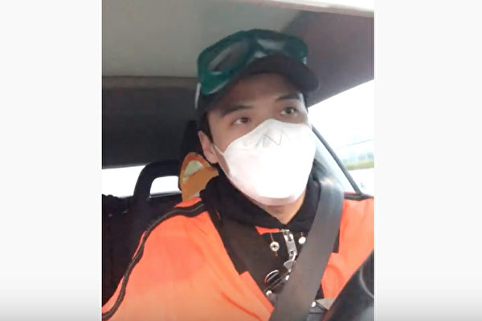

李泽华探访武汉p4实验室回程时突然遭一辆suv的警车追捕。（视频截图）

 
 【大纪元2020年02月26日讯】继陈秋实、方斌之后，曾探访武汉火葬场天价搬尸工招聘的武汉公民记者李泽华在视频直播自己正在被国保追捕后，据称已经被抓。

26日，李泽华先是在开车过程中发了一段视频，称自己刚到武汉p4实验室，但显示是封闭的状态，回程时突遭国家安全局的人开着普通车追捕。担心国安想对他进行隔离，向外界求救。

之后李泽华疑似回到租住的酒店发直播视频，画面在1:14:00分之后开始显示。李泽华说自己来武汉之前从央视辞职，感觉自己走到这一步“非常虚幻”，这也可能是自己的final speech（最后的演讲）。

李泽华在被抓前，隔门对门外的国保说：自己来武汉的所为符合宪法，无愧于父母，无愧于传媒大学，无愧于这个国家，自己25岁，希望像柴静（前央视记者）那样到一线采访。

李泽华也慷慨陈词的讲到：“鲁迅说：咱们中国自古以来，就有为民请命的人，就有拚命硬干的人，就有舍身求法的人，这才是中国的脊梁。他之所以从央视辞职? 为的就是中国有更多年轻人站出来，但他知道理想主义在那个春夏之交已经死了。

之后他主动开门，国安进入抓人。

<h4 align=center><a href="https://twitter.com/HuaYong798/status/1232714082383429634?ref_src=twsrc%5Etfw%7Ctwcamp%5Etweetembed%7Ctwterm%5E1232714082383429634&ref_url=https%3A%2F%2Fwww.epochtimes.com%2Fgb%2F20%2F2%2F26%2Fn11898004.htm">95后公民记者李泽华在被抓前，隔们对国保慷慨陈词的讲话：“鲁迅说：咱们中国自古以来，就有为民请命的人，就有拼命硬干的人，就有舍身求法的人，这才是中国的脊梁。我不愿吞炭为哑，我也不愿意闭目塞听。”

请朋友们为这位帅气、勇敢、正义的小伙子发声、声援、抗争！言论自由无罪！共产党放人！(点击右键,另存新档）</a></h4>

李泽华的视频显示，他是在陈秋实失踪之后，搭乘高铁赶赴武汉，模仿陈秋实的公民记者方式报导武汉情况。

李泽华曾经亲自暗访青山殡仪馆的天价搬尸工招聘内幕，也曾采访处于舆论漩涡的百步亭小区。

近日，李泽华探访被爆光有很多外来务工者滞留的武昌火车站地下车库，但被告知已经被转移，凑巧帮助了一个农民工。

公开资料显示，李泽华英文名Kcriss，毕业于中国传媒大学播音主持艺术学院，曾担任央视主持人，曾联合创立“90s影像骑士”骑行穿越东南亚六国并拍摄微纪录片。2018年创立自媒体不服TV，成为视频内容创作者。 

<a target="_blank" href=#top><h6 align="right">回上方</h6></a>

<a name=222>
<h1 align="center"><b>武汉确诊女子刑满释放坐车回北京 网络炸锅</b></h1>

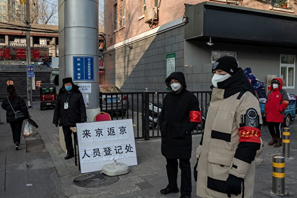

北京现一例新冠肺炎确诊病例，该患者系武汉监狱刑满释放人员，已在当地确诊，2月22日回北京。图为北京一居民小区的入口处。 (Photo by NICOLAS ASFOURI/AFP via Getty Images)

 
 【大纪元2020年02月26日讯】（大纪元记者李心茹综合报导）北京现一例新冠肺炎确诊病例，该患者系武汉监狱刑满释放人员，已在当地确诊，2月22日回北京。此消息在网上引起轩然大波，质问患者是什么背景，能让北京湖北最严防控令失灵。
 
<b>确诊女子从武汉一路绿灯进北京</b>

北京东城区崇外街道新怡家园社区居委会今日（26日）在微信公众号称，该小区出现一名新冠肺炎确诊病例，称H女士2月22日从武汉来京，入住小区7号楼3单元。当日进行隔离检查，3名亲属已进行集中隔离医学观察，请居民不必过度担心。

2月26日下午，北京市疾控中心回应称，该名女子姓黄，她在2月18日开始间断性发热5天，伴咽部不适，当时居住地为武汉。黄女士2月22日凌晨2时由其北京家属自驾车到京。

其家属向社区报告情况，黄女士于22日20时作为武汉进京人员被送至集中隔离点隔离观察。23日19时因发热送医排查，24日确诊，并转运至市级定点医院隔离治疗。经综合研判，该女士进京后的密切接触者为其3名家属，无其他密切接触者。

北京市疾控中心称，据《传染病信息报告管理规范》规定，病例归属以发病时的住址为准，该病例发病时住址不在北京，故不属于北京发病病例。

值得注意的是，武汉上月23日已关闭离汉通道，而武汉市“短暂性”解除交通封锁是24日，黄女士22日如何离开武汉、又是如何抵达北京，引来质疑。

<b>监狱刑满释放人员爆中共体制漏洞</b>

对于这位黄女士能成功抵达北京，问题出在“中共体制漏洞”。第一财经引述知情人士表示，此人是监狱刑满释放人员，曾在武汉女子监狱服刑，服刑期间已经确诊；由于是北京人，刑满释放后，由北京家属自行开车去武汉接回。

值得一提的是，中共官方数据显示，截至2月23日，湖北监狱系统现有罪犯确诊病例323人，其中武汉女子监狱279人，沙洋汉津监狱43人，省未成年管教所1人；现有疑似病例10人。

外界认为，由于中共对疫情的掩盖，实际感染、死亡人数远远超过官方数字。

至于“全封闭”的武汉女子监狱犯人为何会被感染？中共司法部副部长熊选国24日在记者会上称，武汉女子监狱距离肺科医院不到100公尺，狱警上下班和肺科医院的病人是同一个公共汽车站，个别狱警未如实报告接触史。

武汉和北京一直是当局疫情防控的重点城市。2月23日，中共总书记习近平召开“统筹推进新冠肺炎疫情防控和经济社会发展工作部署”会议，对疫情防控的7点要求中，第一点是湖北与武汉，第2点是“全力做好北京疫情防控工作，要坚决抓好‘外防输入、内防扩散’两大环节，尽最大可能切断传染源”。

<b>网民：这一家人到底是什么背景？</b>

消息一出，网民们在惊诧之余纷纷质问：这名黄女士及其家人能让中央和湖北的最严防控令基本失灵，这一家人到底是什么背景？

“请问：1. 黄女士的家属如何在武汉封城期间进去北京的？2. 黄女士和家属是如何在武汉封城期间离开武汉的？3. 何种交通工具离汉去京？4. 去京途中路径以及接触人员？5. 武汉期间已发热，武汉可知？6. 抵京之时，京是否知离汉人员？7. 京汉两头如何处理相关人员？”

“那么多外地打工的都出不了武汉，流浪街头。一个刑满释放人员可以一路畅通无阻？真当大家是白痴吗？”

“就问武汉为什么能放人，北京为什么能接收？”

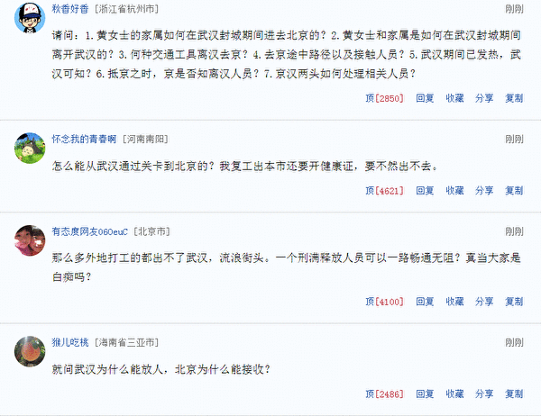

（网页截图）

 
 “既然她是刑满释放的，那干脆扒一扒，为什么进去的？量刑公正吗？正常期满还是有减刑情节？是否合理合规？谁来负责？？？？武汉，给个透明的解释吧。”

“这可以称之为不可能完成的任务。太戏剧了，完全可以拍电影了。”

“现在武汉还能有人来北京，是不是说明了武汉封城不针对赵家人？”

“难道持有“特别通行证”？”“从武汉一路绿灯进北京小区回家。这得是什么样的人？”

<b>外地人流落武汉街头 垃圾桶捡剩饭吃</b>

在上述确诊女子从武汉一路绿灯进北京的同时，因武汉封城，一些滞留武汉的外地人回不了家，又无处容身，被迫流落街头，无奈之下只好到垃圾桶捡剩饭吃。中共政府对他们不闻不问，还经常遭到警察驱赶，苦不堪言。

陆媒“沸点视频”报导，2月24日，在武汉协和医院附近有一群流浪的人，露宿街头。视频显示，路边一座公园内有多名游民，有人说他们都靠捡剩菜剩饭，“没有人管我们”；还有游民抱怨：“拿着钱都买不到（食物），到处都关门”。

一名长时间追踪这群流浪外地人的记者表示，确实看到他们好几次捡垃圾吃，并表示有拍照。报导最后呼吁中国社会能关心被困在武汉的外地人。

志愿者发现后，为他们送来一些食物，还给他们发放口罩，让他们排队领取。
<h4 align=center><a href="https://twitter.com/wuwenhang/status/1232252509789605889?ref_src=twsrc%5Etfw%7Ctwcamp%5Etweetembed%7Ctwterm%5E1232252509789605889&ref_url=https%3A%2F%2Fwww.epochtimes.com%2Fgb%2F20%2F2%2F26%2Fn11897989.htm">在武汉外地人因封城被困，露宿街头，靠捡食剩饭为生！
😭
2月24日，在武汉协和医院附近有一群流浪汉，他们大多是来武汉务工的外地人。因为不能离开武汉而成为了流浪汉，露宿街头。志愿者发现后，为他们送来食物，还给他们发放口罩，并让他们排队领取。  中共政府根本不管。(点击右键,另存新档）</a></h4>

<a target="_blank" href=#top><h6 align="right">回上方</h6></a>

<a name=221>
<h1 align="center"><b>程晓容：港警抓捕黎智英 疫情下中共持续镇压</b></h1>

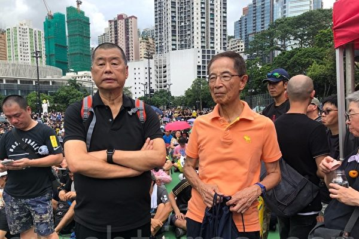

2019年8月18日，香港壹传媒创办人黎智英（左边穿黑衣者）表示，香港人会做所有的事情来阻止“送中恶法”，并且要继续往前，要坚持，直到胜利。（梁珍／大纪元）

【大纪元2020年02月28日讯】2月28日早，香港《苹果日报》老板黎智英被警方从家中带走，工党副主席李卓人、民主党前主席杨森也被拘捕。据悉，这次抓捕行动与几位民运人士参与去年8月31日的反修例游行有关。工党谴责警方滥捕，打压香港人的示威权利。

目前，新冠病毒肺炎正在蔓延，香港警方突然于清晨上门抓人，释放了恐怖的信号。这表明，其一，港府和中共开始秋后算账，要进一步镇压香港民运；其二，中联办和港澳办官员在前不久大调整后，将继续强硬路线；其三，疫情严峻，中共首先确保“维稳”，大陆和香港民众的健康和生命安全对它来说无关紧要。

一位网民反馈说：“中共港府不对7·21（元朗袭击）事件和8·31（太子站袭击）事件进行彻查，却只对支持反送中运动的民主人士进行秋后算账。香港没有希望了。”

<b>去年香港的8·31游行</b>

去年8月29日，香港民阵召集人岑子杰、“光复元朗”游行申请人钟健平分别被不明人士袭击；当天晚上，民族党前召集人陈浩天在机场出境时被扣留，后遭警方抓捕。8月30日，众志秘书长黄之锋、众志前常委周庭、立法会议员郑松泰、区诺轩、谭文豪等人也被捕。中共和港府借此散播恐怖气氛，激起了更多民众的愤慨。

民阵原定在8月31日发起争取真普选的游行，但是遭警方否决。香港民众并未退缩，而是改变了形式。当天，基督徒举行为香港罪人祈祷的大游行，数万港人走上街头，喊出了“不许共产党乱港”等口号。35岁的香港市民彼得认为，政府日前拘捕多名民主派立法会议员及社运人士的做法“十分不公平”，“政府想让我们害怕，但这正是我们要出来的理由”。

黎智英与李卓人到港岛区参与了这次游行，由湾仔修顿球场步行至圣约翰教堂。警方因此指其涉嫌“非法集结”。

在香港游行之后，美国众议院外交委员会于美国时间8月31日发表声明，其中写道：“中国共产党正在加强对香港的独裁控制——围捕民主人士、否决集会权以及阻止向解决问题的方向推动。”“它们的偏执和残忍在提升悲剧发生的风险。”

<b>民主人士“威胁”何在？</b>

自反送中运动爆发以来，中共动用喉舌媒体大力抹黑香港民主人士。例如，黎智英、陈方安生、李柱铭、何俊仁被诬为“叛国乱港四人帮”，黄之锋被扣上“港独”分子的帽子。中共的抹黑显示出它的恐惧，因为这些民主人士道出了真相和香港人的心声，他们的勇气言行对于大陆民众也具有启示和鼓励。

陈方安生在去年9月13日对BBC表示，“因为我没有‘循规蹈矩’，说了北京可能不想听的话，他们就开始诬蔑行动，对我和我的家人进行恐吓、骚扰。”“但是这类污蔑搞得越多，香港人就会更加确信，他们拥有未来的唯一方式就是坚持一国两制，一个与大陆不同的制度。”

黄之锋曾说：“我们永远不会在共产政权的高压统治下屈服。”“我们可能会面对许多打击和压制，但我们不会后退。因为香港是民众抗议威权统治的前线，正如上世纪的东柏林。”

黎智英去年接受《澳洲人报》采访时表示，中共错估了香港人对自由的渴望。他说：“身为人，我们有灵魂。他们漠视我们的灵魂这一部分，这就是为什么他们忽略了我们拥有的自由、法治、生活方式和开放的社会，对于身为人类的我们有多么重要。”

黎智英之所以被捕，一个原因是他拥有媒体。他创办的《壹周刊》和《苹果日报》经常批评香港政府和北京当局，《苹果日报》是极少数客观报导反送中的港媒之一，自然被中共痛恨。

<b>疫情当前 中共对港澳展示强硬</b>

今年1月8日，新上任的香港中联办主任骆惠宁一反常规，带领一班人马前往深圳，与深圳市委书记、市长等官员会面。次日下午，骆惠宁才礼节性地拜会林郑。时事评论员萧若元解读说，“郭声琨放在深圳的人，直接指挥香港警察。”骆惠宁实际上是去会见操控香港警察的人。

2月13日，港澳办主任张晓明被免职，全国政协副主席、秘书长夏宝龙兼任该职。夏宝龙主政浙江期间，力推“三改一拆”，在改造和拆除建筑过程中摧毁了超过2000间基督教堂的十字架或整座教堂，还引发了多起流血冲突。

中共内部权斗激烈，香港面临的白色恐怖，不仅来自江曾势力，也是中共极权压制言论和法治自由的一贯体现。骆惠宁曾说，香港最大的优势是“一国两制”，但是那个“一国两制”是由中共定义。因此，官员虽换，对民主自由的压制未变。今次抓捕黎智英等人的“秋后算账”，并不出众人所料，只是来得更早些。

当下，新冠病毒疫情令中国经济雪上加霜，大陆乱象迭起，中共内部的混乱和各种体制弊端暴露无遗。然而，面对大批民众染病和死亡，中共当局不是全力救灾，而是由政法委出手、严厉封杀信息、在大陆和香港都大搞“维稳”，这是铁了心要与民为敌。不过，历史早已证明，背离普世价值的恐怖高压，不会终结人民对自由的向往，因为邪不压正。

<a target="_blank" href=#top><h6 align="right">回上方</h6></a>

<a name=220>
<h1 align="center"><b>钟南山拥有三公司 儿子身份曝光 舆论炸锅</b></h1>

驰援湖北的医师认为，武汉肺炎疫情因中共隐瞒而迅速蔓延。疫情比2003年SARS严重得多。图为示意图。(STR/AFP via Getty Images)

 
 【大纪元2020年02月28日讯】（大纪元记者方晓综合报导）大陆新冠肺炎疫情爆发后，中共卫健委专家钟南山再次受到关注。最近他的言论更让舆论哗然。近日钟南山被曝拥有3家公司，密切关联的公司达90家。他的儿子亦享受中共国务院特殊津贴。舆论对此反弹强烈。
钟南山被曝坐拥3家公司 密切关联的公司达90家

鸿海富士康科技集团2月25日宣布，聘请中国工程院院士、呼吸病学专家钟南山担任集团新冠肺炎防疫及复工总顾问，这是钟南山的另一个新职。

综合多家媒体报导，查询大陆国家中小企业发展基金会旗下的权威软体“天眼查”，可发现钟南山有3家公司，其中一家是广州呼研所医药科技有限公司，钟南山是董事长。该公司的副董事长周荣拥有34家公司，另一名副董事长张晓雷有20家公司。该公司全部的高管层合计拥有90家公司。

有舆论质疑，与广州呼研所医药科技有限公司有密切往来的就有90家公司，最多的一人拥有34家公司，这说明了什么？

有言论指，广州呼研所医药科技有限公司高管层属于“科技权贵阶层”，这些专家背后有很多的利益。

钟南山目前未对上述内容作出任何回应。

<h4 align=center><a href="https://twitter.com/jingkehanqin/status/1233308856664698881?ref_src=twsrc%5Etfw%7Ctwcamp%5Etweetembed%7Ctwterm%5E1233308856664698881&ref_url=https%3A%2F%2Fwww.epochtimes.com%2Fgb%2F20%2F2%2F28%2Fn11902030.htm">中共“御用专家”钟南山旗下的利益链(点击右键,另存新档）</a></h4>

钟南山儿子出镜 网民：爱马仕皮带扎眼

近期，8年前拍摄的一档公益节目《中国人物志》重新成为众人的焦点，其中一期节目的主角是钟南山，他儿子钟帷德也在节目中出镜。网民从视频中看到钟帷德腰间的爱马仕腰带。

此事受到大陆网民的热议。“儿子的爱马仕皮带好扎眼”、“儿子有点不朴素啊”、“儿子还戴爱马仕皮带，估计真的是领导。”

百度百科显示：钟帷德目前是广州市第一人民医院的教授，主任医师，博士生导师，是享受大陆国务院特殊津贴的专家。

钟帏德同时还是共中全国青科协及省青联委员，中华医学会泌尿外科分会青年委员会副主任委员及广州医学会主任委员英国伯明翰大学，美国哈佛大学医学院及瑞典科罗伦斯佳研究中心学术顾问及客座研究员，广州医学会泌尿外科分会主任委员，广州市青年联合会常委。
钟南山最新言论备受质疑 被指“中共代言人”

这次武汉肺炎疫情爆发后，83岁的钟南山出任中共国家卫健委高级别专家组组长。

最初发源于湖北武汉的新冠状病毒肺炎，如今确诊病例除了南极洲外，几乎遍全球。东亚的韩国和西亚的伊朗都成为新的“重灾区”。意大利北部众多城镇的确诊病例也暴增。另外非洲和南美洲也开始出现确诊病例。

美国警告说，疫情全球大爆发已“难以避免”，只是迟早问题。

<h4 align=center><a href="https://twitter.com/nitamasn/status/1233048076392288256?ref_src=twsrc%5Etfw%7Ctwcamp%5Etweetembed%7Ctwterm%5E1233048076392288256&ref_url=https%3A%2F%2Fwww.epochtimes.com%2Fgb%2F20%2F2%2F28%2Fn11902030.htm">人类已经可以清晰完整的看清中共每一个弥天大谎都是精心设计出来的，每一步都渗透着这个流氓团伙的歹毒与阴险，只要人类稍不小心就被陷入困境。好在美国彻底觉醒了！欧洲也被这场恶魔病毒惊醒！亚洲各国再也睡不着了！所以不必担心，大结局一定会像“终南山”的名字一样，中共必将穷途末路终结在南山！(点击右键,另存新档）</a></h4>

据中共《人民网》报导，钟南山2月27日在广州医科大学举办的疫情防控记者会上称，现在国外出现一些情况，疫情首先出现在大陆，不一定是发源在大陆。

钟南山此番言论在网络上引发一片质疑声。有网民指，钟南山已经变成了中共政府的传声筒。“我早看出来共产党要转移公众视线。先是海鲜市场、蝙蝠、野味。然后再利用这个钟南山的嘴来引导人们的想法。最后的一个办法就是把责任全部推给美国，他们好脱身！”

有网民质疑，钟南山这是怎么了？有难处可以不说话，但不能乱说话。早在他称“人传人”的至少前20天，就已发生若干医护人员感染；这回更邪乎了，栽赃蝙蝠和华南海鲜市场之后又企图陷害美国了？

还有网民说，钟南山称疫情首先出现在中国，但不一定发源在中国。这锅甩得“艺术”，给人造成一种错觉，疫情从开始出现到现在，国外比中国危险多了，甚至有可能是来自外部源头的病毒引入中国。

不少网民质问，从疫情开始他除了“确定人传人”外，还实现过什么他这个身份应该干的事吗？

而日前陆媒发表的一篇文章中，受访的一名匿名中共国家卫健委专家指，疫情后来愈来愈严重，难以再继续掩盖实情，只能暴露出来。

同时受到网民诟病的还有中国工程院院士李兰娟，她被曝有12家公司，其中的杭州华卓信息科技有限公司，她是董事，她的儿子郑杰是董事长。郑杰拥有79家公司，2人合计有90家公司。

<a target="_blank" href=#top><h6 align="right">回上方</h6></a>

<a name=219>
<h1 align="center"><b>【拍案惊奇】毒攻权力核心 武汉P4所曾招标改造</b></h1>

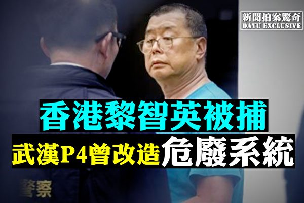

近日黎智英被捕。钟南山爆料，替疾控甩锅；武汉肺炎屡攻权力核心，恐团灭伊朗政府，网信办中招，教皇抱恙！东京奥运怕开不成；香港家犬也感染；武汉病毒所去年招标改造“危废处理系统。新唐人合成图）

 
 【大纪元2020年02月28日讯】大家好，欢迎收看《新闻拍案惊奇》，我是大宇。节目一开始，先说一个最新消息。
 
<b>【黎智英被捕！麾下《苹果日报》常揭当局黑幕】</b>

多家媒体报导，香港壹传媒集团创办人黎智英，在香港当地时间2月28日被捕，警方指控他涉嫌恐吓记者，并在去年参与非法集结。港岛总区重案组的探员，在当天早上大约7点的时候，前往黎智英在何文田嘉道理的寓所，大约8点钟将他带走，去向应该是在九龙城的警署。

黎智英是香港《苹果日报》的老板，这家媒体对香港反送中等民主运动，一直是正面报导，并常常揭露香港和北京当局的一些负面消息。最近，《苹果日报》还获得了林郑给北京写的一份秘密政府文件，报导了出来，内容是林郑希望借用当前瘟疫，为在去年区议会选举中惨败的建制派拉票，把瘟疫治理当成捞取政治资本的机会。

黎智英早就受到过特务的威胁，这次被抓捕，不排除背后有明显的政治动机。

有关黎智英的消息，我们会继续关注。下面继续说有关新冠病毒的疫情。

<b>【2.26转折点：病毒开始世界蔓延 中伊意成“输出”大国】</b>

2月27日，我们能看到，多家媒体报导，现在新病毒瘟疫已经蔓延全球40多个国家，七大洲只有南极洲没有沾染瘟疫。这一天新增确诊病例的国家包括但不限于：爱沙尼亚出现首例确诊，患者是从伊朗返回；丹麦出现首例确诊，是去意大利滑雪回来的男子；挪威也出现一例确诊，患者是从中国回去的。

以上三个国家的首例确诊，都是输入病例。分别来自伊朗、意大利和中国。现在除了中国外，伊朗和意大利，也成了输出病例的国家，合起来成为世界的三个主要的病例输出国。

意大利已经毒倒了欧洲几个国家，最远的病例在拉丁美洲的巴西。伊朗的病例除了输出到了爱沙尼亚，2月26日，还有1例在伊朗感染后回到中国宁夏的病例。这是中国媒体报导的、已知的第一个从外国输入的感染病例。中国大陆一下子也成了“受害国”。

也正好在2月26日这一天，北京市发出规定，要求所有来自或者去过疫情严重国家地区的入境者，需要隔离14天。

2月26日其实是新病毒瘟疫向全球传播的一个转折性的一天，因为这一天，世卫也宣布，中国官方通报的新增确诊数字，首次低于其它国家新增确诊数字的总和，中国412，中国以外459。我们高度怀疑中国官方数字的准确性。但是这个消息表明，瘟疫在世界其它国家的扩散确实不容小觑。这个新病毒已经从中国的瘟疫变成了世界性的瘟疫。

美国总统川普也在26日开新闻会，任命副总统彭斯为美国防治瘟疫的总指挥。美国也在近日正式发出警告，这场瘟疫成为世界流行的瘟疫，只是个时间问题。世卫的最新宣布也提到，现在这种新病毒传播正处在“关键期”，如果受瘟疫影响的国家不迅速采取行动，情况可能会失控。

<b>【病毒屡攻权力核心：世卫所在地日内瓦失守】</b>

世卫的着急应该不是没原因，因为新冠病毒已经攻到了世卫的家门口。27日这天，瑞士日内瓦的一名28岁男子确诊，他去过意大利的米兰。而日内瓦正是世界卫生组织、世贸组织、联合国欧洲总部等重要国际机构的所在地。日内瓦原定4月底举办的“钟表与奇迹”展览已经宣布取消。

日内瓦的这宗病例又是一起意大利的输入病例。而现在世界最关注的，已经不是意大利的境外输出病例，而是在意大利罗马城内的梵蒂冈。

<b>【病毒屡攻权力核心：教宗方济各抱恙疑云】</b>

83岁的教宗方济各，原定27日与罗马的神职人员，一起举行弥撒，但是梵蒂冈26日发声明说，教宗因为身体出现“轻微疾病”，取消了原定在27日的弥撒，这本来是一场很大型的集会。声明还说，教宗会完成27日其它余下的工作，不过没有透露教宗患病的详情。

26日，方济各还出席了大斋首日弥撒，活动中出现咳嗽、流鼻涕的情况。当天教宗还在圣伯多禄广场公开见信众，与前排的人握手，甚至亲吻，他还表示，声援新冠病毒的患者。因为意大利目前新冠瘟疫严重，方济各的身体状况因而引发世界媒体的关注。

目前，北意大利是主要的疫区，伦巴第和威尼托两个大区是重灾区。意大利的确诊人数已经达到600多人，并有至少17人因感染死亡。

<b>【病毒屡攻权力核心：伊朗政府“最高层”沦陷】</b>

在关注教宗身体状况的同时，伊朗驻梵蒂冈的大使霍斯罗沙西，已经在27日因为感染新冠病毒而死，不过他此前人不在梵蒂冈，而是在伊朗神学院所在地库姆，他是伊朗最有影响力的教职人员之一。

除他以外，还有三名伊朗高官确定感染新病毒。

伊朗官方媒体IRNA，2月27日报导，伊朗副总统马苏梅·埃布特卡确诊感染，在2月26日，她刚刚与伊朗总统鲁哈尼一起开内阁会，座位离鲁哈尼不远。

伊朗卫生部副部长伊拉吉·哈里奇，2月25日在接受新闻采访时说：病毒是公允的，不分贫富，也不分贵贱。当天他在瘟疫防治的新闻会上出汗、咳嗽，但没有戴口罩。很快被确诊是新病毒感染。

伊朗议会国家安全和外交政策委员会主席莫哈塔巴·佐尔诺，也被确诊。他在伊朗政界的影响力也很大，他曾是该国伊斯兰革命卫队的最高领导人，这支军队被美国政府指为恐怖组织。

以上4名伊朗政府高级官员的感染病例中，伊朗副总统的感染，比较引人注意，因为她确诊前一天还参加了有伊朗总统在内的内阁会议，不知道当时这些伊朗最高官员是不是有穿戴防护装置，不然的话，他们也是很危险，按理讲需要被隔离。这相当于伊朗副总统一个人，把整个伊朗高层，推入危险区，病毒攻进伊朗权力核心。

<b>【病毒屡攻权力核心：西城区之后 中共网信办关键部门染疫】</b>

中国北京的西城区，最近也爆发多起感染事件，西城区政府也中招，这直接威胁到同在西城区的中南海。27日最新消息是，中共网信办的一个关键部门，也被病毒攻入。

北京疾控中心通报，2月26日当地新增的10名确诊者，都是24日一名确诊者的密切接触者，这名24日确诊的人18日就出现咳嗽症状，然后一直与同事密切接触，直到确诊。这11个人中，10个人是北京某事业单位的外购服务物业管理公司员工，属于是一起单位聚集性感染。

通报没有说这家“事业单位”是什么单位，但是《新京报》的报导透露了这家单位的地址，是“朝阳区安贞街道裕民路甲3号”，我们根据地址寻找，会发现，这个地址与2002年成立的大陆“国家互联网应急中心”的地址，是一样的。

这是中共网络安全应急体系的核心协调机构，属于管理大陆防火墙的“网信办”中，一个重要部门。大家对网信办太熟悉了吧，大陆朋友要想看到YouTube，首先要翻过网信办修建的网络高墙。

<b>【不容忽视的大陆防疫漏洞：特权阶层的特殊待遇】</b>

因为北京的特殊性，当地的瘟疫防控当局一直是非常重视。我们前一天节目报导了，从武汉女子监狱服刑期满的黄姓女子，自己已经在武汉确诊，不知怎么从封城的武汉出走，被家人直接接到北京，事情让中共高层相当紧张，直接由政法委下令司法部牵头，会同公安部等多个部门，去湖北调查，要查清这个确诊女子是怎么在封锁中的武汉，出来的。

最新消息是，这名女子叫黄登英，原是湖北省恩施宣恩水利局的出纳，因为贪污被判了10年，但是期间得到两次减刑，2月18日刑满获释。但是她在北京的家人去武汉接她的时候，黄登英没有说自己感染，在路上才被家人发现，到北京后他们立即被隔离了。

大陆媒体《财新》报导，黄登英从17岁开始就做财务工作，家庭条件很好，女儿在她入狱之初就已经在北京买房。黄登英本人与恩施宣恩县的单位领导，关系处得也都很好，单位管理松散，她用钱也比较自由。对于她是到底怎么离开武汉的，当局还在调查中。

另一个有关北京防疫的消息，是来自北京中日友好医院一名医生的爆料，说中共政治局常委栗战书的女婿“蔡华波”确诊感染，被栗战书用专机运回北京，原本栗战书安排他住301医院，但是被中共离退休干部集体反对，后来转到了中日友好医院。这个传言如果属实，那跟上面黄姓女子的案子是一样的，都是在非常时期，这些中共官僚群体能得到的特殊待遇哪怕是在瘟疫防治期间。

<b>【中日学校皆延长休假 2020东京奥运面临取消或延迟】</b>

大陆官方一直传递瘟疫降温的讯号，但是事实却并没有很乐观。2月27日，中共中央应对新病毒疫情的领导小组决定，中国大陆的所有大、中、小学，还有幼儿园，开学时间继续推迟。同时，李克强领导的这个小组还提到一点，就是“指导督促湖北和武汉加快解决医疗力量人岗不匹配”的问题，把“专家调配到最需要的岗位”。

我们之前收到湖北黄石的来信，说当地一家医院的护士长，是靠关系上位，对专业知识掌握不够，这可能造成庸医害人的情况出现，所以如果这种靠关系在医院当官，如果在湖北是普遍的，那一定会造成对瘟疫防治的负面影响。当局说“医疗力量人岗不匹配”，可能当中包括这样的问题。

跟大陆一样，27日，日本首相安倍宣布，全日本的高中、国中、小学3月2日开始暂时停课，至少要停课到4月份。目前，日本是中国大陆以外，受瘟疫影响最重的国家之一，已经有超过200例确诊。

对日本来说，瘟疫目前带去的最受瞩目的影响是，2020年的东京奥运会，还能不能如期举行。

根据2月27日最新消息，国际奥委会资深委员Dick Pound，对路透社表示，国际奥委会正致力于让今年7月24日开始的东京奥运会如期举办，只有新冠病毒成为真正的全球流行病，或者世界卫生在岌岌可危的情况下，才有可能取消，或者推迟一年。世界卫生组织暂时不考虑把新冠病毒定为“全球大流行”的疾病，但还会根据情况随时公布新消息。

【认识新冠病毒：香港确诊者宠物犬 检测呈弱阳性】

那么目前，人们对这个新冠病毒本身，还是处在一个认识阶段。香港有新消息显示，家里养的宠物狗，都可能成为被感染的对像。

香港渔护署当地时间28日凌晨发出消息，说在香港大坑一个确诊病人家中的宠物犬，病毒检测后发现呈弱阳性反应，但是暂时没有体现出病症。这个信号很重要，说明家养的哺乳类动物，也可能成为病毒攻击的对象。香港渔护署强烈建议确诊者的宠物，接受建议，之后宠物还会被送到指定的动物居留设施进行14天的兽医学观察，而且渔护署提醒，与宠物接触后，也要注意用洗手液或酒精彻底清洗双手。

刚才提到的这只对病毒呈弱阳性反应的宠物犬，来自香港大坑的一户确诊者家中。大坑目前只有两名确诊者，一名是香港60岁的知名马主周巧儿，另一名是之后确诊的，与她同住的佣人。

目前，在香港的确诊病例已经超过90例。

<b>【认识新冠病毒：感染者神经系统受攻击 康复者有后遗症】</b>

另外一点，就是新冠病毒对患者会造成哪些伤害，我们之前的报导陆续分析过，新病毒对患者的肾脏等其它器官，也会造成影响。一个最新消息是，湖北华中科技大学附属协和医院的神经内科胡波团队，2月25日在医学研究论文预印本网站上发表一篇论文，他们发现，已知的超过30%的新病毒感染者，还会出现神经系统受损的症状，包括头痛、头晕、味觉和嗅觉减退等，说明这种新病毒还会损害神经系统。

即使从新病毒中康复，也可能留下后遗症。大陆杭州市黄姓男子，是杭州第一个确诊的人，1月19日确诊，2月12日出院，27日解除了医学观察。但还要居家观察，并去医院覆诊。这名黄姓男子说，自己肺部损伤严重，不能下蹲和长时间走路，只能跳起1厘米，当前的身体状况还没法工作。

<b>【认识新冠病毒：钟南山新闻会 信息量满满！】</b>

27日，大陆呼吸病学权威钟南山，在广州召开的有关瘟疫防治的新闻通气会上，也提到有关新病毒的几个要点：

第一，他预测大陆疫情高峰，会在2月中旬，接近2月底，而且4月底会基本控制，但是钟南山也说，他们团队的预测结果被国外权威期刊退了回去，也有人给他发微信说：你的话几天之内就会被碾个粉碎。这是质疑钟南山的预测结果不准；

第二，钟南山提到，较早发现病情的患者有85%以上都会好转，而危重症患者的病死率则比普通患者高好几倍，所以他提出要早发现，早隔离，早治疗。而且重症病人，要综合学科救治，而不是单纯进行传染病救治，并且给予病人很好的生命支持；

第三，钟南山透露，“中国疾控中心”的地位太低，只是卫健委下的技术部门，他建议要赋予行政权，有向社会公布疫情的权力；

第四，钟南山说有一个极大的教训，就是：凡是发现新冠病毒感染，马上严防扩散。他回忆说，假如在12月初，甚至1月初能采取严格防控措施的话，病人会大幅减少。这说明最早在12月初，他们有可能已经掌握相关证据，可以采取对新病毒扩散的防御措施。同时钟南山也说，SARS之后，中国没有进行持续科学研究，在遇到这次瘟疫的时候，显得束手无策；

第五，他说现在这个新冠病毒究竟是怎么来的，还是不清楚。

<b>【武汉病毒所去年7月招标改造 针对“危废处理系统”】</b>

这个有关病毒来源的讨论很多，有说是动物的，也有说是大陆病毒研究机构泄漏。我们前两天介绍了武汉病毒所的P4实验室，有消息说它的“黑洞式”保护结构，可能遭到破坏，所以有泄漏隐患，但这个指控需要更多证据来支持。不过今天我收到一个链接，也是有关武汉病毒所的。

这是大陆财政部下的“中国政府采购网”，上面在去年7月31日，有一份公开的《中国科学院武汉病毒研究所郑店园区危废处理系统改造工程成交公告》。这份《成交公告》最引人注意的有至少三个点：

第一，公告提到的“郑店园区”，也是“中国科学院武汉国家生物安全实验室”，也就是“武汉P4实验室”的所在地；

第二，这项改造工程涉及的是“危废处理系统”，那这个是不是处理P4实验室实验垃圾的系统呢？

第三，公告的招标日期是2019年07月16日，成交日期是07月31日，那施工肯定是在07月31日之后。而根据公开资料，武汉新冠病毒的相关病例，最早可以追溯到11月，因为它还有扩散期和潜伏期嘛，所以一位美国科学家认为，这种病毒最早出现在10月份，这就与武汉病毒所在2019年夏天招标的改造工程，时间很近。

目前，有关这个武汉病毒所的“危废处理系统改造”工程，我们暂时掌握这些信息。

新唐人《新闻拍案惊奇》制作组

<a target="_blank" href=#top><h6 align="right">回上方</h6></a>

<a name=218>
<h1 align="center"><b>武汉疫情惨剧：出院发现全家离世 患者绝望自杀</b></h1>

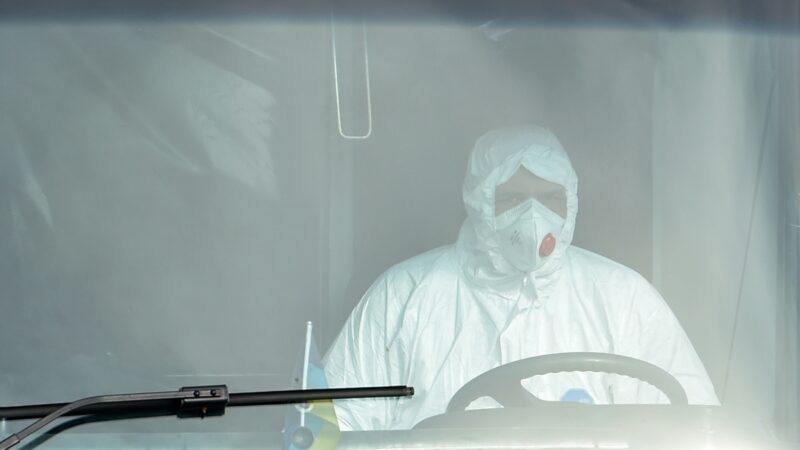

有大陆网友透露，武汉一名新冠重症患者出院后，发现家人已经全数离世，悲愤自杀了。示意图（SERGEI SUPINSKY/AFP via Getty Images)

 
 【新唐人北京时间2020年02月27日讯】武汉疫情在中共的隐瞒下迅猛扩散，导致无数家庭妻离子散、家破人亡。近日，有大陆网友透露，武汉一名新冠重症患者出院后，发现家人已经全数离世，悲愤自杀。

2月25日，有大陆网友透露，武汉塔子湖锦绣家园一名新冠肺炎重症病人出院后，回家发现一家人已经全部去世，遂在楼顶上吊自杀。

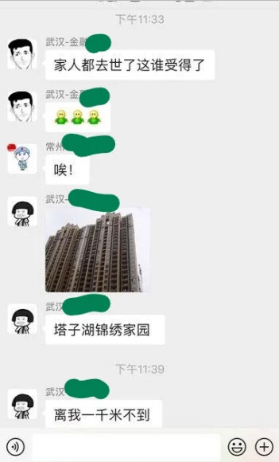

（网络截图）

 
 另有医护人员发贴称，他们所在的医院一例重症病人出院后发现家人全部死了，然后自杀了。该医护人员感叹：“又目睹了一场人间惨剧”。

有民众拍摄下了该名男子在高楼顶上吊身亡的视频，称又发生了这样的事情。可见不期遇的死亡在武汉已经太过繁多。

值得关注的是，2月26日，武汉江岸区新冠肺炎疫情防控指挥部发布消息辟谣说：近期江岸辖区内无类似警情，视频中出现的小区并非塔子湖锦绣家园小区。视频中警察也非江岸区警员，疫情发生以来，江岸处理类似警情均穿戴防护服、护目镜等防护装备，网上视频中所反映的事件发生地并不是在江岸辖区。

对此，大陆网友纷纷表示，“不管是不是发生在江岸区的惨剧，但可以证实武汉确实发生了这起人间惨剧！”；“造谣是政府的专利！”还有人斥责中共政府疫情数据造假，“造谣是政府的专利！民众说出事实真相都会被抓。”

有推特网友揭中共的辟谣手法说，《财新网》20日刊发了一篇报导说，武汉某养老院有11位老人死于疑似新冠肺炎引起的呼吸衰竭。21日，官微“武汉发布”辟谣说消息不实，23日又发了一条微博说，疫情期间造谣传谣的最高可判7年。

针对官方的辟谣，24日，《财新网》将这11名死亡老人的姓名、年龄基础病和死因都列了出来。令中共当局哑口无言。

<h4 align=center><a href="https://twitter.com/2051chang1976UC/status/1232530952670171136?ref_src=twsrc%5Etfw%7Ctwcamp%5Etweetembed%7Ctwterm%5E1232530952670171136&ref_url=https%3A%2F%2Fwww.ntdtv.com%2Fgb%2F2020%2F02%2F27%2Fa102786744.html">《财新》20号发了篇报道，说武汉某养老院有11位老人死于疑似新冠肺炎引起的呼吸衰竭。第二天，官微“武汉发布”就发了一则辟谣，第二天又发了一条微博说疫情期间造谣传谣的最高可判7年。24号财新将这11名死亡老人的姓名年龄基础病和死因都列了出来。在谎言与真相诚实与盲从并行的现实世界里真话就是良知(点击右键,另存新档）</a></h4>

网友表示，在谎言与真相、诚实与盲从并行的现实世界里，真话就是良知。

截止目前，武汉肺炎已经持续2个多月，在此期间，一幕幕剧惨频繁在中国各地上演。

湖北省十堰市25日也传出一起惨剧，一名5至6岁的男孩独自守着爷爷的尸体好几天，直至工作人员入户量体温时，才发现老人的尸体盖着男孩为爷爷盖的被子。而男孩孤独的在家啃着仅存的饼干。

2月15日，网上传出最揪心的一幕：一个女孩伤心欲绝的大声哭喊，爸爸，妈妈等我……，在短短20天的时间，这名女孩以同样的方式送别父母后，她也染疫死亡。

来自武汉、旅居美国的赵先生早在2月初已经告诉大纪元，武汉的肺炎疫情非常严重。他有一个朋友熟悉武汉殡葬系统。据朋友透露，除夕一晚上处理了700多具病患尸体，可能超过10万人被感染。

2月24日，新唐人获得的一段视频显示，一位刚刚出院的武汉老妇，在车内向司机和民众介绍她在武汉传染病医院住院时，亲眼看到大批尸体往外抬的恐怖一幕。

更可怕的是，她还看到几个和她一样的患者，人还没死，手脚还在动就被捆着装入尸袋里抬走了。她隔壁房间一个老头，也是这样，完全没有断气，就这样打包拉去烧了。

然后医生护士就通知家属说，你爸爸走了、你妈妈走了。

这位老太太说，在医院没有药物救治，只有氧气。2月8日以后死人死得最多。

中国微信“八点健闻”透露，2月20日之前，武汉储备10万个床位。报导说，疫情早期实施“居家隔离”导致许多人全家感染。拖延至今疫情大爆发，当局毫无对策，医疗资源严重不足，成千上万人在生死线上苦熬，并发生全家灭门横尸街头的惨剧。

<b>《新唐人》关心您：自杀解决不了问题。请珍惜生命，再给自己一次机会。</b>

<a target="_blank" href=#top><h6 align="right">回上方</h6></a>

<a name=217>
<h1 align="center"><b>【疫情最前线】六大洲失守 山东内部文件曝光</b></h1>
 <h1 align="center"><b>大陆真实感染超官方数字至少6倍 新冠病毒成首个X病 疫情无法控制</b></h1>

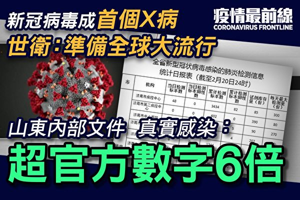

大纪元获内部文件，显示山东病情远超官方数字。世卫专家表示，新冠病毒成全球首个标准“X病”，世卫吁各国做好准备。德国病毒权威则认为已无法抑止蔓延。（大纪元合成图）

 
 【大纪元2020年02月27日讯】（大纪元香港记者站报导）2月26日，南美巴西出现首宗新冠病毒病例，南美洲一旦沦陷，全球六大洲失守。25日，阿尔及利亚成为继埃及之后非洲第二个染疫的国家。大纪元获内部文件显示，山东疫情远远超过官方数字。世卫专家表示，新冠病毒成全球首个标准“X病”（未知及无法控制），世卫已做好全球大流行准备。德国病毒权威则认为耗尽全球资源，也无法抑止新冠病毒疫情蔓延。
 
 2月27日，欢迎观看大纪元的“疫情最前线”。
 
<b>世卫：应对大流行时刻已到</b>

世界卫生组织2月24日向全球发出预警，要求做好准备，应对新冠病毒在全球的大流行。

世卫组织突发卫生事件规划执行主任Micheal Ryan表示：“现在是做准备的时候了，我们正处于为潜在的大流行做准备的阶段，尽一切可能准备应对大流行。”

<b>韩国确诊破千 密切接触者与文在寅开会 青瓦台虚惊</b>

26日，韩国新增武汉肺炎确诊病例169宗、累计确诊人数已高达1146人。新增1宗死亡个案，为一名新天地教会信徒，总死亡个案增至12宗。

有报导指出，大邱市经济副市长李承镐的秘书确诊，李承镐作为密切接触者，曾出席总统文在寅主持的对策会议。青瓦台得知该消息后，大为紧张，向出席该会议的相关人士及采访团队建议“自我隔离一周”。

不过，随后李承镐于26日接受核酸检测，结果为阴性，让青瓦台松了一口气。目前，青瓦台官员和记者已解除隔离。

<b>南美出现首例确诊 非洲第二国沦陷</b>

武汉肺炎疫情在意大利愈扩愈大，已有332例确诊和11例死亡。疫情从伦巴第（Lombardy）开始传播，希腊26日出现该国首起确诊病患，非洲也身受其害。

 
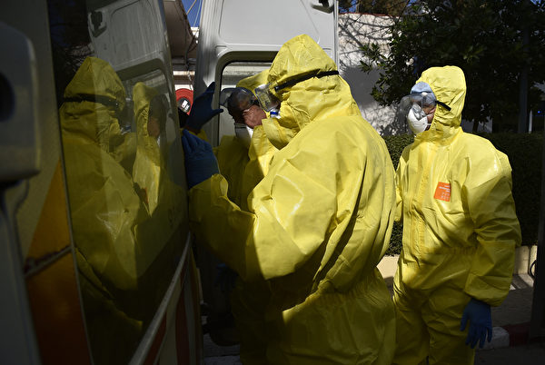

阿尔及利亚当局2月25日宣布发现首例新冠病毒病例。图为2月26日阿尔及利亚El-Kettar医院专门科门诊接收新冠病毒患者。(RYAD KRAMDI / AFP)

 
 继埃及2月14日出现非洲首例新冠肺炎后，2月25日阿尔及利亚也失陷。一名抵达当地的意大利男子，对新冠肺炎反应呈阳性，成为阿尔及利亚首例新冠肺炎确诊病例，预示着非洲的第二个国家沦陷。

阿尔及利亚总统随后在其推特上宣布，健康部门开启最高级别预警。

 
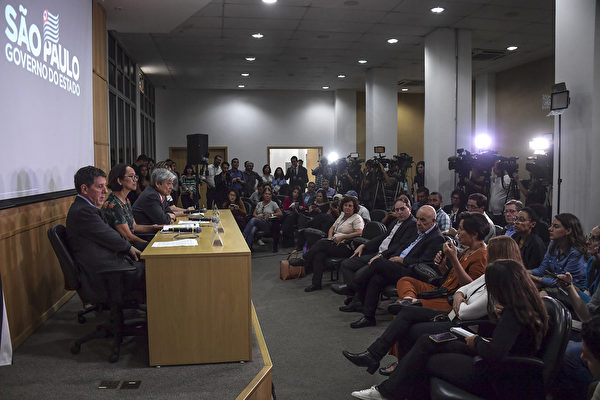

2月26日，巴西圣保罗一名61岁男子病毒检测结果呈阳性，成为拉丁美洲第一例武汉肺炎病患。图为2月26日，巴西卫生部举行新闻发布会。(NELSON ALMEIDA/AFP)

 
 此外，巴西卫生部26日表示，圣保罗（Sao Paulo）一名61岁男子，病毒检测结果呈阳性，目前正在等待复检。患者曾于2月9日至21日前往意大利。

这位巴西男子是南美洲首名新冠病毒检测阳性的病例，若被确诊，则全球六大洲全数沦陷。

<b>香港再增4宗个案</b>

另外，截止26日下午，香港新增4宗武汉肺炎确诊个案，累计85宗。

卫生防护中心公布，新确诊患者是一名60岁的香港居民，属本地个案，患者住在大坑瑞士花园。令人担心的是，该患者在发病后，到过上环文武庙、画舍、酒楼及参加过婚礼。

其余确诊个案包括一对母子，55岁母亲是北角明苑中心肯德基员工，曾到访北角福慧精舍佛堂，同住24岁儿子没有病征，其后确诊。两人同住北角百福花园康福阁。另一名33岁男患者任职港铁旺角东站站务员，他父亲早前确诊，同住蓝田兴田邨彩田楼。

<b>世卫专家：新冠病毒是首种符合“X病”标准的病毒</b>

世卫组织紧急事务委员会成员、病毒学家马里恩．库普曼斯（Marion Koopmans）说，新冠病毒是世界上第一种符合所谓“X病”标准的病毒。

按照世卫组织给出的定义，“X病”是由先前未知的病原体所引起的一种快速传播且不可预测的疾病。

世界权威学术杂志《细胞》（Cell）上所发表的一篇论文中，作为荷兰伊拉斯姆斯医学中心（Erasmus Medical Center）病毒学负责人的库普曼斯写道：“无论是否将其控制，这一爆发正迅速成为符合X病类别的第一次真正的大流行病挑战，已列入世卫组织的优先疾病清单中，在当前全球化的社会中，我们需要为之准备。”

目前，全球多个国家已出现社区传染，同时由于病毒传染源和中间宿主不明，传播途径和潜伏期也有多次变化，给全球防疫带来挑战。
德病毒权威惊言：用尽全球资源也无法抑制疫情

此外，德国权威病毒学者、柏林夏里特医院病毒研究所所长德罗斯登（Christian Drosten），日前接受德新社专访时表示，人类即便用尽全部现有资源，恐怕也难以在最后一刻抑制疫情的蔓延。

他说，许多新冠病毒感染者并未出现症状，或者只有轻微症状，这些人根本不会去就医，也就无法被确诊，但他们仍可传染他人。

罗斯登也引用伦敦帝国学院数学模型的演算结果，指出从中国大陆流出的病例中，约仅有三分之一人确诊，因此他不认为武汉肺炎疫情全球大流行能够避免。

<b>山东官方文件：确诊数是公布的数倍</b>

大纪元日前获得一份山东省卫健委内部文件，显示内部上报的“当日检测标本阳性数”——即确诊病例，是官方公开发布的新增确诊病例的数倍至数十倍。

该省卫健委2月20日曾发布新冠肺炎（武汉肺炎）疫情数据，称19日当天山东新增确诊案例为2例。不过当日山东省疾控中心病毒所上报给山东省卫健委疾控处的“全省新型冠状病毒感染的肺炎检测信息统计日报表”显示，当天山东省内各个疫控中心和医院所作的核酸检测标本阳性数量，就高达49例，是官方公布数字的20多倍。

山东省2月21日“新冠检测信息汇总表”显示，2月20日检测阳性数为274例；扣除1例为已确诊复核，当天核酸检测阳性数也有273例，比该省官方的公开数据多出71例。

根据大纪元获得的山东省“检测信息统计日报表”文件，2月9日至23日期间，山东省各医疗机构上报卫健委的当天新冠肺炎核酸检测阳性数，最少是政府公开数据的1.36倍，最多是公开数字的52倍。

 
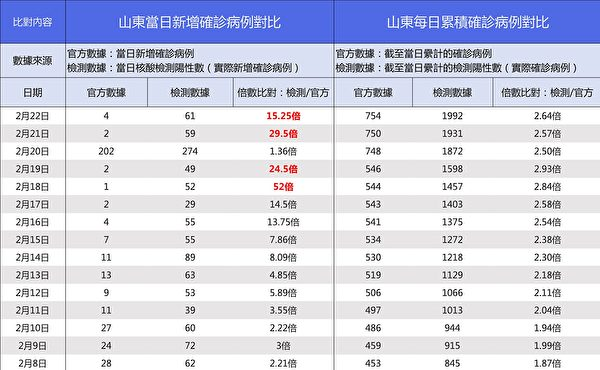

中共当局发布的山东省新增及累计确诊例数，与山东省内部上报的核酸检测阳性数对比。（大纪元制表）

 
 <b>患病者核酸检测只有三至五成阳性</b>

陆媒2月7日的一篇报导，引述中国医学科学院院长王辰的说法指：“对于真是这个病（指武汉肺炎）的病人，（使用核酸检测）也不过只有30%～50%的阳性率。”

换言之，许多疑似病例和密切接触者即使核酸检测阴性，仍可能已经感染了新冠病毒；医疗机构统计上报的核酸检测阳性数，只是新冠病例数量的一部分。

如果按照核酸检测在当前实践中最高的准确率（50%）来推算，山东省实际的确诊人数至少要翻倍。

2月8日至2月22日的15天期间，山东每天新增检测阳性的累计总数，是官方公开数据的3.1倍。

因此，仅就披露的这部分数据样本可知，山东省医疗机构核酸检测验出的每日新增新冠病例真实数量，至少应该是官方公布数据的6.2倍。

在中共发布的疫情数据中，山东省累计确诊病例数虽然只占全国确诊数的0.98%，连百分之一都不到，但在湖北省之外，却是排名第七的疫情灾区，严重程度处于中等。

国际上最新的测算，来自2月19日科学服务网站ResearchGate上题为“从中国官方和非官方数据来源评估冠状病毒事件和影响估计”的研究报告。报告中，两位美国科学家参考多个来源，建立模型推估，得出的病例结果约为中共公开数据的5到10倍，与大纪元所获得得山东省内部文件的比例相当。

<a target="_blank" href=#top><h6 align="right">回上方</h6></a>

<a name=216>
<h1 align="center"><b>新冠病毒让中共宣传机器遭到最大挫折</b></h1>

美媒认为，新冠病毒的爆发给中共的宣传机器带来了挑战。(HECTOR RETAMAL/AFP via Getty Images)

【大纪元2020年02月27日讯】（大纪元记者张婷综合报导）在抗击新冠病毒疫情期间，中共加大宣传机器，塑造英雄形象，甚至一些报导明显出现漏洞。《纽约时报》2月26日发文称，很多中国年轻人对共产党的宣传表示公开质疑。

报导称，随着抗击冠状病毒危机的斗争在持续，北京正在拿出其宣传剧本。手机上到处都是中共官媒的宣传图片以及团结与牺牲故事。目的是将人民团结在北京的统治下。共青团中央为拉拢年轻人甚至推出了“江山娇”和“红旗漫”的卡通虚拟偶像，旨在在危机时期煽动年轻人的爱国情绪。

但《纽时》称，对于中共领导人来说，这一次，中共大宣传效果并不太好。

在网上，人们公开谴责中共官媒。当前线医务人员仍缺乏口罩等基本防护用品时，倡导“个人牺牲”故事引发网民严厉谴责。

一个微博用户说：“我们应该确保悲剧不会再次发生，而不是强调‘牺牲是光荣的’。”

“江山娇”和“红旗漫”一上线就立即遭到网友大规模挞伐，结果不到五个小时被迫下架。

《纽时》认为，这是中共宣传机器所遭到的最大挫折。这套宣传机器数十年来一直帮助共产党保住权力，目前正面临着一个最大的挑战。
年轻人看到威权政府统治下令人不安的生活

中共政府对披露新冠病毒威胁反应缓慢，还企图压制力求发出病毒警告的声音。为了控制公众的愤怒，北京决心创造一个“良好的舆论环境”。它派出大量国家资助记者到武汉和其它地方，发表有关前线医生和护士以及中国公众无私支持的感人故事。

然而，中共的宣传机器面临严峻挑战。老百姓看到一名女子在母亲尸体被拖走时撕心裂肺的哭声，看到了一名女子为母亲祈求获得一张床位的心碎场面，看到了筋疲力尽的护士崩溃的情境；看到了李文亮医生的面容。李医生最早发出病毒警告，但却因感染病毒而失去生命。

报导称，这场危机让很多人，尤其是年轻人看到威权政府统治下令人不安的生活。迫使像李文亮医生这样的人噤声，让人们看到了中共打压自由表达所带来的危险。

官媒大量刊登捐款人扔下捐款转身就走的宣传，在一个“丢下捐赠现金转身就跑”的新闻汇总中，列出了40多例此类事件。
中共宣传内容令民众质疑和愤怒

《纽时》称，一些报导的宣传内容简直令人难以相信。

2月16日，华商报头条号“华商汉中”刊登一篇文章，讲述多名抗疫一线工作人员的故事。其中包括西京医院的“王慧”在双胞胎儿子出生不到20天就自愿赶赴一线。文章一个细节让读者看出了破绽。文章说，两个孩子起床不久就问爸爸“妈妈干嘛去了？”

出生不到20天会说话，引发网友强烈质疑报导的真实性。华商报最后不得不就此文章道歉。

2月17日，甘肃省发布的《剪去秀发，她们整装出征》视频，被网友骂翻。视频显示了甘肃省妇幼保健院派出的支援湖北的女医护人员被剃光头发的过程。有网友质疑：女性医护人员被集体剃光头是不是遭到强迫？她们流眼泪是不是因为被剃光头？用女护士剃光头做宣传，合适吗？

邓学平律师在微博上发表的一篇题为“丧事变喜事，不是疫情报道该有的姿势”的文章说，日前一段小视频在网上热传。画面中，一名刚刚从武汉汉江方舱医院治愈出院的姑娘，对着电视镜头说：“住进来之后住得还不想走了”。欣喜激动之情，溢于言表。这段对话在网络上引发不少争议和猜测。
“官媒已经失去了很多信誉”

文章认为，总是报导好消息，可能会有碍公众更全面、更真实的了解疫情信息、评估疫情形势。

23岁的黛西‧赵（Daisy Zhao）是北京居民。她说，自己曾经信任官方媒体。但现在，她对那些曾将8名试图警告新冠病毒威胁的医务人员说成谣言散布者的报导感到愤怒。

“官媒已经失去了很多信誉。” 赵女士说：

《纽时》认为，对中共宣传的质疑表明了年轻一代对中共政府的新态度。

“在过去一个月中，许多年轻人一直在互联网上阅读有关这个流行病的许多第一手信息和深入的媒体报导，” 住在上海的斯蒂芬妮‧夏（Stephanie Xia）说。 26岁的夏说，这些年轻人对了解的事情感到愤怒和困惑。

北京在过去几周加强了对互联网的审查。一些社交媒体账户已被删除或暂停。 从周六开始，在线平台将受到新法规的约束，以确保更严格的限制。

夏女士因为张贴病毒相关的帖子，其微博账户被暂停30天，她说，无论审查制度变得多么严格，她都决心继续发声，以便下一代能够记住。

她说：“使出你们的勇气发声。最后总比什么都不说好。”

<a target="_blank" href=#top><h6 align="right">回上方</h6></a>

<a name=215>
<h1 align="center"><b>提升防疫层级 川普命彭斯领导新冠专案小组</b></h1>

美国总统川普（特朗普）周三（2月26日）宣布对抗新冠病毒的专案小组，由副总统彭斯领军。(Eric BARADAT / AFP)

【大纪元2020年02月27日讯】（大纪元记者吴英综合报导）美国总统川普（特朗普）周三（2月26日）宣布对抗新冠病毒的专案小组，由副总统彭斯领军。

周三下午6时30分，川普总统在白宫新闻发布会上表示，由于先前所采取的抗疫措施奏效，目前美国人民面临的新冠病毒风险仍然“非常低”。对于未来可能发展，他的行政部门“已做好万全准备”。

川普还宣布，副总统彭斯将协调对抗新冠病毒的工作，向其报告进展。他说，彭斯在担任印第安纳州州长期间累积十分丰富的医疗政策经验，非常适合担任这一职务，未来将协调医疗官员和其他专业人士，致力于在美国边境阻挡病毒入侵。

川普总统还透露，目前在美国境内确诊的15病例中，已有5人康复、8人出院返家自我隔离直到康复为止；1人情况还不错，介于住院及返家之间的情况；1人在医院，情况较严重，希望能好转。

到目前为止，在美国总计有60例冠状病毒确诊病例，除了上述15病例外，还包括自武汉撤侨的3人，以及本月初由钻石公主号撤离的42名美国人。

川普总统援引约翰霍普金斯大学（Johns Hopkins University）的报告说，美国是全球应对流行病最完备的国家，并表示尽管民主党一再指责他对中国采取限制旅行的措施涉及种族主义，但是他相信这是正确的决定。

川普还说，现在不是对意大利及韩国等疫情严重的国家实施旅行限制的“适当时机”，但“这个时机未来可能会出现”。

对于中共官方近日公布的数据显示中国病例数下降，川普说，如果这些数据具可信度，那么这表示中国病例数真的在下降，这是好的现象。对于记者问，能否相信中共的数据，川普没有正面回应，仅表示中方领导人“很有才华”及“非常坚强与聪明”。

当被问及新冠病毒是否会在美国大流行时，川普表示他“不认为该病毒会无可避免地在美国大流行”。

“事情就是像现在这个样子，我们已经准备好了”，川普总统继续说，“我们已经做好了充分的准备。正如我所说的，我们拥有世界上最顶尖的人才。我们已经为此做好了准备。”

“我们希望它不会传播，它也有可能不会传播，有可能会传播，只是会到什么程度的问题”，他补充说，“我已要求订购相当多的口罩，但我相信美国用不上这么多口罩。”

对于现在还很多未知数的新冠病毒，川普总统教美国民众如何预防，也就是：把它当做是流感，用预防流感的方法对待它。

“洗手、保持清洁，除非必要，否则不去握所有的扶手”，川普补充说，“当与任何表现出感冒或流感症状（例如打喷嚏）的人在一起时，我会尽可能地走开。”

对美国股市近日暴跌，川普总统说，不同于其它国家，美国经济表现相当好，如果美联储也像其它国家一样采取降息措施，美国经济会更好。他表示，美股下跌除了新冠疫情因素，投资人可能担心民主党总统候选人会胜选。

<a target="_blank" href=#top><h6 align="right">回上方</h6></a>

<a name=214>
<h1 align="center"><b>【一线采访】北京封区封道 食品价高涨</b></h1>

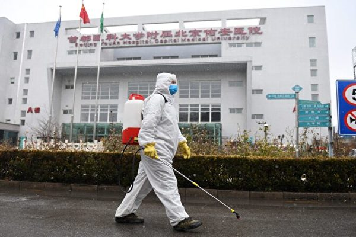

尽管北京当局已悄悄将疫情控制升级为武汉级别，但新冠肺炎仍肆虐北京。而受疫情冲击，北京肉蔬菜物价高涨。 示意图。(GREG BAKER/AFP via Getty Images)

 
 【大纪元2020年02月27日讯】（大纪元记者易如、李毅采访报导）北京市已悄悄将疫情控制升级为武汉级别，受疫情冲击，北京肉蔬菜物价高涨。
 
<b>多家医院曝集体感染 疫情尚未控制住</b>

2月24日，北京又发现一例于22日从武汉来京的确诊病例，再引恐慌。而过去几天，北京人民医院、复兴医院等多家医院曾发生集体感染。北京市疾控中心于2月20日发布关于首都医科大学附属复兴医院聚集性感染确诊病例36例，其中8名医护人员、9名护工保洁人员、19名患者和患者家属等相关数字后，即未再对外更新最新情况。

北京居民晓茹（化名）对大纪元表示，复兴医院住院处，亦即位于木樨地院区南住院楼、位于首都博物馆西的北住院楼，现已全部封闭。原来住院的病人家属也不能探视，带过去的物品全部由里面人出来取，所有出入车辆及人员必须有出入证件。救护车辆进行严格消毒。

至于感染人数众多的朝阳区当地医院医护人员的感染情形，北京朝阳区张先生表示，“感染应该很多，他们没想到这个（病毒）烈度这么厉害，不过，现在这个封得很严，不让你知道，怕泄漏，北京公布的肯定不是实情。”

张先生说，信息不完全透明，疫情应该是很可怕的，“小汤山正在启用，做准备，没有必要启动它干嘛，说明疫情形势不乐观，对民众不告诉实情，我们根据常识推断，肯定是很不好控制的，这也是中共流氓体制造成的。”

<b>两会取消说明疫情并未缓解</b>

中共卫健委近期不断通报，中国各地确诊病例正在下降。24日的公布称，主要新增确诊病例来自湖北，而北京、上海、浙江等多个省市卫健委通报却称没有新增确诊病例。而同一天，中共宣布取消并延期两会。

没有新增确诊病例的说法遭到网民们质疑。一名网民说：“为了复工，什么谎话说不出口？两会什么时候开，疫情才什么时候结束。”也有网民认为，“全国两会”自1995年以来，第一次延迟召开，充分说明疫情并未缓解。

北京西区吴先生对大纪元表示，目前北京感染确诊人数最多的是海淀、朝阳等区，可电视每天晚上八点播报北京的疫情时，并没有说得很严重。

“但我们都晓得北京的实际情况挺严重，整个小区封，汽车、人行道一起封，只留两条可以进人进车的，一般能走人的道，他就给你堵死了，人都不让你走。疫情重灾区的西城区，大概九个道，就只两个道能通（行）。”

“而各小区都在严查，楼门、楼道里面都在喷洒消毒液，车也给你喷，各种预防、测体温，早晚天天都有，如果你要是租户的话，你要拿租赁合同，而且那租赁合同签字，你才能办理人和汽车出入证。”

“你要是房主的话，你就带着房产本，你要有车的话带着车的行驶证，带着你的身份证，一开始，还要护口本，身份证查验过了，才给你办证，还要测体温，少一个都不让你进。反正是挺严重的。”吴先生说。

吴先生表示，北京打工的外地人这一段时间尽量别回北京，“因为北京出入限制，回来你也得在家待着。”

<b>商店关门 超市食品价格高涨</b>

居住在北京市区的杜先生在北京疫情爆发后，特意住到了郊区延庆乡下。他表示，半个月前，他回到市区办通行证时看到人迹稀少，“当时公共交通车只有少数人，空空荡荡的，理发店、商店全部关门，去超市要测体温。”

“所有的饭馆、服装店、儿童店，娱乐场所都没有开业，唯一开业的就是超市，可能还有一些大型的药店。”吴先生说，“若要（想）开店，还要申报，报备，然后工商局直接上你那查，检验合格了你才能开业，很麻烦。”

吴先生表示，由于运输及人力成本都上涨，“物价涨得很厉害，涨了大概百分之四十多，肉、蔬菜都在高涨。过年那时候牛肉也就四十多块钱一斤吧，现在都七十多了，反正够贵的。”

张先生也表示，封闭断路，停产停业几乎造成瘫痪状况，“蔬菜、食物都贵，泡面超市都抢光了，买不到了。民生物品目前暂时能维持，往后就很难说了。”

<a target="_blank" href=#top><h6 align="right">回上方</h6></a>

<a name=213>
<h1 align="center"><b>疫情下转移焦点？“军中妖姬”汤灿高调直播</b></h1>

涉及薄、周政变密谋的关键人物之一、中共高官的“公共情妇”汤灿。（网络图片）

【大纪元2020年02月25日讯】（大纪元记者佟亦加综合报导）在新冠肺炎疫情蔓延中国、殃及全球的敏感时刻，失踪多年的“军中妖姬”汤灿，罕见地高调直播教网民练瑜伽和包饺子，引发热议。网友质疑：“这是蹭疫情热度复出试水？”“配合当局转移焦点？”

大陆微博近日流传的两段视频显示，一度失踪多年的汤灿向“宅”在家里的网民示范瑜伽动作，对着“是配合当局转移焦点”镜头表示：“逢年胖三斤，（但）今年的春节很特殊，全都窝在家里了，（大家）赶紧动起来，增强自身免疫力，让每天都能遇见更好的自己而努力吧。”

在第二段网络直播中，她教网民如何包四色饺子，称自己正在家隔离，“要么吃，要么运动，教你运动的前面（已经）发”。

视频中的汤灿一脸沧桑，憔悴不堪，与昔日那个“军中妖姬”的形象判若两人。

视频中的汤灿满面沧桑，憔悴不堪，与昔日那个被称为“军中妖姬”已经大不同。（视频截图）

网友纷纷热议：“竟然会发短视频！”“蹭疫情热度复出试水？”“根本认不出是她，现在这么丑。”“听这说话的腔调让我恶心……”

由于新冠肺炎疫情持续肆虐，但中共官方极力掩盖真相，包括管控舆论，公布的感染人数和死亡病例与实际严重不符、不断变换统计方法操控数字，因此有网民质疑：汤灿如此高调“现身”，是配合当局“转移焦点”。

今年44岁的汤灿，原籍湖南株洲，1996年成为东方歌舞团独唱演员，1998年首次登场央视春晚，2010年被中共北京军区政治部战友文工团特招入伍，授大校军衔。

汤灿被指与多名中共高官有染，这些“大老虎”级别的高官包括中共前政治局常委、前中央政法委书记周永康，前重庆市委书记薄熙来，前中央军委会副主席徐才厚，前中共公安部副部长李东生等，她被称为“军中妖姬”、“公共情妇”。

早前有海外媒体报导，汤灿是卷入周永康、薄熙来政变的核心人物，靠卖身为薄、周搜集中共高层的情报、打通要害关节。

汤灿2011年12月突然从公众视野中消失，2013年初，有自称汤灿好友的作家孙钥洋在微博证实，汤灿被判有期徒刑7年。甚至有传她被秘密处死。

2016年，腾讯微信公号“探针”引述湖北某女子监狱消息人士的话称，汤灿在该监狱用化名“邹艳”服刑，“邹艳”入狱时罪名是经济犯罪。

此后传出汤灿在狱中获得减刑，并在2016年中国新年出狱。据腾讯网的文章披露，汤灿在狱中也干些杂活，还曾为监狱文艺演出队做过指导。

汤灿从调查、被捕、判刑、服刑直至释放，中共官方都没有发布过正式消息。直至2018年5月6日，一推特用户发布一张据称是中共军旅歌手汤灿与一中年男子的合影，帖文称“今天得知汤灿回家了”，外界才得知汤灿出狱，该帖文也打破了汤灿被处决的传闻。

<a target="_blank" href=#top><h6 align="right">回上方</h6></a>

<a name=212>
<h1 align="center"><b>陈思敏：双黄连抗疫推手上海药物所深藏巨大利益链</b></h1>

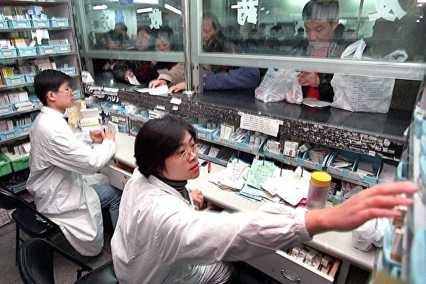

武汉肺炎唤起人们的非典记忆，而这17年来2次大疫情期间把中成药双黄连打造为“抗疫救星”的幕后推手──中科院上海药物研究所也引起关注。图为上海一家医院的领药处。（ AFP PHOTO/LIU JIN）

【大纪元2020年02月24日讯】最近的新冠肺炎（武汉肺炎）唤起人们的非典记忆，而这17年来2次大疫情期间把中成药双黄连打造为“抗疫救星”的幕后推手──中科院上海药物研究所也引起关注。

据官方介绍，中科院上海药物研究所（以下简称上海药物所）的前身是创建于1932年的国立北平研究院药物研究所，在历经迁沪、几度更名、并入中科院之后，于2003年搬至浦东张江高科技园区。曾有报导如此评价：2003年是上海药物所的发展理念从“出论文”向“出新药”转变。

张江高科技园区在上海药物所落户之前有个轰动两岸的商业新闻。2000年11月，宏力半导体公司奠基仪式上，台塑大王王永庆之子王文洋致辞时说：“在我得知江副院长（江绵恒）多年来有个兴建8吋晶圆厂的梦想后，我无时无刻都想实现他的梦想。”但为江绵恒圆梦的不是王文洋，而是江泽民。

张江高科技园区1992年成立，1999年8月上海市委市府明确园区主导产业，2000年5月江泽民亲自视察。公开信息显示，张江高科技园区意图构建三个国家级基地：国家生物医药、集成电路和软体三大主导产业，即园区被构建成“中国硅谷”以及“中国药谷”。而上海药物所被指“药谷原始创新不竭的动力之源”，重点发展化学药、生物制药、现代中药。

2003年非典新闻显示，疫情让权力惯性不改的江泽民遥控时任军委副主席郭伯雄前往巡视北京军区后发表了一段耐人寻味的谈话施压胡温。江绵恒也以二把手之姿取代中科院院长路甬祥而频赴相关一线视察，并高调指导防治非典药物攻关科研进展。

媒体报导，2003年非典期间，上海药物所左建平的研究小组称，中成药双黄连口服液具有抗SARS冠状病毒的作用，上海药物所将双黄连口服液列入SARS诊疗计划。

2004年上海药物所牵头组建“上海中药现代化研究中心”，推动中药科学化、现代化。

2005年上海药物所、上海生科院以及国内著名中医药企上海绿谷集团三方合组“绿谷研究院”，该院院长由时任上海药物所所长丁健担任。

与此同时，2005年 8月江绵恒正式成为中科院上海分院新掌门，当时报导称：在中科院的11个分院中，上海分院体量较大，地位特殊。在江绵恒之前，还没有人以中科院副院长之职兼任上海分院院长的前例。

2006年江绵恒为中科院上海浦东科技园筹备处揭牌。2010年，江绵恒视察浦东科技园首个建成并入驻的平台──新药研发平台，时有报导称，上海药物所所长丁健亲自汇报工作，江绵恒表示满意。

2014年2月江绵恒首次以上海科技大学（以下简称上科大）校长身份现身。2016年上科大新生开学典礼上，江绵恒报告《科学技术进步与人类健康》的重中之重，是传染病的传播与疫苗的发明。

今年湖北武汉因疫情1月23日封城后，1月25日上海药物所与上科大联合研究团队宣布发现一批（30种）可能对新冠肺炎有治疗作用的老药和中药，其中有12种都是抗HIV（爱滋病）药物。上海药物所针对抗冠状病毒新药开发的合作药企是“前沿生物”。有媒体曝光，前沿生物取得候选新药DC系列在中国大陆地区临床开发、生产、制造及商业化的独家权利。公开信息，有“中国抗艾第一股”之称的前沿生物正在采用第五套标准申请科创板上市，外界却诸多质疑前沿生物IPO股权转让程式瑕疵、研发能力堪忧、累计未弥补亏损超4亿等。

1月31日晚间，新华社微博发布、人民日报微博引用，两大官媒联袂促销：“上海药物所、武汉病毒所联合发现，中成药双黄连口服液可抑制新型冠状病毒”，线上线下的双黄连瞬间售罄。A股市场恢复交易后，作为双黄连主要生产企业的太龙药业，股价更是一路飘红，太龙药业内部股东也适时抛出600万股的减持计划。有资深投资者表示，按武汉肺炎疫情发展情况，今年的双黄连口服液或可占到太龙药业营收的70%。

公开报导显示，太龙药业曾“事半功倍”收购的北京新领先医药改制于中科院下属研究院，与上海药物所系出中科院同门。即上海药物所与太龙药业二者姻亲关系。

上海药物所在2003年将重心转往“新药出”后，一直以来与药企都有密切合作，换言之，与制药公司之间的商业往来，是上海药物所重要的收入来源之一。2015年上海药物所15项新药研发成果转让合同总额高达8亿元，还曾有4种候选药物获中国独家开发授权，让合作药企付款高达4亿元。

2019年12月29日，上海药物所召开发布会，绿谷制药出品的阿尔兹海默症Ⅰ类新药“甘露特钠”（商品名“九期一”）上市开卖。绿谷制药此前宣称“让普通家庭吃得起九期一”。但有医药媒体计算后发现，使用“九期一”治疗轻中度阿尔兹海默症的患者，月支出超过3500元人民币，作为对比，国内现有治疗阿尔兹海默症的相关药物费用每月约为1500元。

如众所周知，上海药物所长期商业合作伙伴多负面传闻不断，而包括绿谷集团其系列灵芝“抗癌”产品在内的一些上市新药虚假宣传，央视的曝光都没能阻止，公开的秘密是上海药物所为其背书机构。

像是“九期一”是17年来唯一获批的“国产”阿尔兹海默症新药，但其核心发明人上海药物所研究员耿美玉被实名举报医学造假。曾有出自医生的微信文章深刻指出，监管机构的新药待批其95%都是“伪新药”，反正本来就多针对绝症或慢性病，很难证伪，但药品市场却可点石成金。如2015年一项多地取样的研究表示，中国是世界上患阿尔兹海默症人数最高的国家，每位患者每年的治病费用大概为13万元，即全国在治疗该疾病上的总花费超过1.6万亿元。

网上还屡见类似讨论，国内医院看病的肯定有过这种经验，每次看病在给你对症下药配了西药以后，必定会给你配两盒中成药，很多医生也很委婉的表示他也不想开，却碍于医院有指标要求开中成药占比多少多少。同样是公开的秘密，中成药被宣传多吃无妨没有副作用，中成药安慰剂，商机也是无限大。

自2003年以来，上海药物所明显两大重点“中药科学化现代化”以及“重大新药创制”。无须讳言，这背后是一项单品动辄上万亿的医药市场。同时，上海药物所商业投资布局广泛，而且从所长、研究员到职工入股企业更是常态，如率先证实双黄连抗SARS病毒的左建平持有江苏左右生物医药公司35%股权，“九七一”核心研究员耿美玉、原所长丁健等人名下都有一家或多家企业的兼职或股权，而这不仅仅是冰山一角的披露，这些公开可见的持股人在蛛网般的股权结构中只是利益链的中下游。

上海药物所双黄连口服液治冠状病毒，洁尔阴清洗液治非典，有网评指出这是新药研发界的明珠？或只是落在王冠上的苍蝇？其实上海药物所新药全国独家销售权可让苍蝇变明珠。

针对这次武汉肺炎，上海药物所与上科大联合研究团队称发现“虎杖”、“山豆根”等中药材中可能含有抗2019-nCoV有效成分。上科大是上海市和中科院共同建设。令人印象深刻的一段介绍来自江绵恒：学校位于上海浦东新区张江高科技园中区内，……与中科院上海药物所新药创制平台……等国家级科研机构和大科学装置融为一体，与张江高新区的产业界、投资界有机衔接。

经过十几年的商业布局，上海药物所已经明显利益版图大、利益链条长，深深藏其背后的巨大利益链备受关注。

<a target="_blank" href=#top><h6 align="right">回上方</h6></a>

<a name=211>
<h1 align="center"><b>听信党媒报导 江苏染疫翁服双黄连病情加重</b></h1>

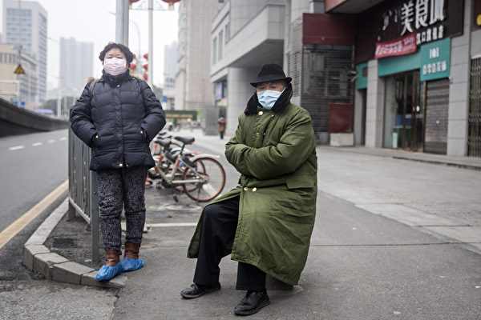

瘟疫重创大陆经济，商店关门，工厂停工。(Getty Images)（大纪元）

 
 【大纪元2020年02月15日讯】武汉肺炎疫情失控，中共防控措施一片混乱。前不久，中共党媒宣称药双黄连口服液可抑制武汉肺炎病毒，而江苏连云港市一名男性患者听信宣传，连续两天服用此药，结果肺炎病情加重。

‘扬子晚报’微博发文称，在12日的连云港市新型冠状病毒肺炎疫情通报中有一病例，一名57岁的男子，于2月7日早上感觉身体不适，下午4时，被儿子接到海州家中，晚上服用双黄连口服液。8日又继续服用，至9日早上，患者出现胸闷、头晕、干咳症状，病情加重。

随后，儿子将父亲送至市中医院发热门诊，被收治住院隔离治疗，2月11日确诊为新型冠状病毒肺炎病例。

而在1月31日，中共官媒《人民日报》报导称，武汉病毒所与中科院上海药物的研究团队透过实验室“体外试验”证明，双黄连有抑制新型冠状病毒的作用，引发了民间抢购潮，市民冒着被交叉感染的风险，出门去药店抢购。

据称，当晚2小时内，淘宝、京东、1药网等电商平台上，双黄连口服液显示无货或下架，甚至连兽用双黄连也卖断货了。

当时有专家质疑，没有足够的公开数据可以证明此药可以抑制人体中的新型冠状病毒。对此，武汉病毒研究所也始终拿不出证据证明此药有效。

不少网民讽刺当局搞骗局，“在2003年‘非典’时是板蓝根，2011年福岛核电站泄漏时食盐，这次是双黄连口服液。”

网民“龙”说：“一开始我就说这纯粹是骗局，连感冒都不一定有效的普通药能对超级病毒有效？凡是头脑正常的都不相信，发国难财的什么时候都不缺。”

还有网民留言：“药商的利益，无论中西医，都是一致的。必须查！这帮××，坏了中医的名声！”“你们平时那么听人民日报的，那X号没事批评这个批评那个，双黄连它特么是第一批吹的。”

<a target="_blank" href=#top><h6 align="right">回上方</h6></a>

<a name=210>
<h1 align="center"><b>【新闻看点】武汉朝令夕改 习开会规模空前</b></h1>

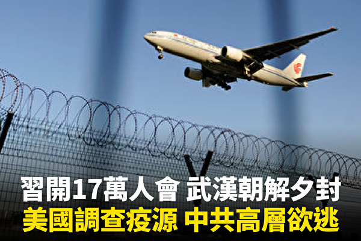

昨天，习近平主持召开了一次史上最大规模的视频会议，共有17万人听取他关于防控疫情的讲话。不过这个讲话基本是复制了他2月3日在中共常委会会议上的内容。疫情泛滥的节骨眼，当局召开这样的一个大会，究竟有什么用意呢？（大纪元合成）

 
 【大纪元2020年02月25日讯】大家好，欢迎大家关注新闻看点，我是李沐阳。

新冠肺炎（武汉肺炎，COVID-19）在全国肆虐，今天（2月24日）的武汉人经历了一次情绪上的大起大落。上午宣布滞留在当地的外地人可以按规定出城，到了下午又宣布上午的通告无效。

昨天，习近平主持召开了一次史上最大规模的视频会议，共有17万人听取他关于防控疫情的讲话。不过这个讲话基本是复制了他2月3日在中共常委会会议上的内容。疫情泛滥的节骨眼，当局召开这样的一个大会，究竟有什么用意呢？

<b>武汉上午解禁 下午废止</b>

今天上午，武汉新冠肺炎疫情防控指挥部宣布第17号令，当天开始，部分滞留在当地的外地人员可以按规定出城。通告表示，因为保障疫情防控、城市运行、生产生活、特殊疾病治疗等原因必须出城的人员，以及滞留在武汉的外地人员可以出城。不过为了保证安全有序，要分批进行。

通告称，出城人员不包括被要求隔离的人员，尤其是确诊患者、疑似患者、发热患者和密切接触者，处在观察期被治愈出院的也不行。此外还必须要身体健康，不能有发热、干咳、气喘等症状。而出城人员在到达目的地后，要向当地疫情防控部门报备，做好健康检测，不能少于14天。

这个通告一发布，很多滞留在武汉的外地人感到高兴，似乎终于可以逃离武汉，逃离是非之地了。不过到了下午，防疫指挥部又发布了第18号令，废止了第17号令。

第18号令中表示，第17号令是“指挥部下设的交通防控组未经指挥部研究和主要领导同志同意发布的”，宣布无效。并且说“对相关人员进行了严肃的批评处理”。

<b>武汉没有解封条件？</b>

一天之内朝令夕改，这种大起大落，令人产生疑问，这背后究竟发生了什么？

再看当局给出的解释，很多人都会有疑问：谁有这么大的胆子，没有经过领导同意，敢私自为武汉解禁？

有很多网友纷纷做出各种猜测，有的说，“通告无效？这么大的决定这么草率吗？”“是不是地方在故意拆新领导的台？”“这种涉及到内防扩散、外防输出的决定，朝令夕改，不知道中间出现什么问题”。

更有网友直接发问：“内部是在打架吗？还是各自为政？”“地方和中央有分歧了，地方的政策被中央叫停？”

是不是中共内部在“打架”，外界暂时无法得知。但是当局在一天之内朝令夕改，的确显得有些诡异。其实只要看看官方通报的最新疫情数据，都知道，眼下武汉根本没有解封的条件。

中共国家卫健委今天公布，昨天全国新增病例409例，但武汉就占去了348例。就这一点，足以令人质疑，解封的风险太大了。很可能会导致疫情进一步扩散，造成前功尽弃，引起疫情反弹。

当初封城的决定，外界都认为是来自北京最高当局的指令。武汉市长周先旺在央视直播中说得很清楚，当地政府向北京汇报了疫情之后要等待上面“授权”，只有得到上面允许，才可以对外发布消息。

武汉市长都没有这样的权力，一个“交通防控组”就可以擅权做主？好像说不通。

<b>17万人大会 抗疫组长李克强在哪里？</b>

与此同时，外界注意到，被冠名为“对抗疫情领导小组组长”的中共总理李克强，最近似乎很少有动作，反倒是习近平频频在各种大小会议上有讲话。

昨天（23日），习近平主持召开了视频会议，据称是“史上规模最大”。参加会议的人员扩大到了县团级以上的干部，共有17万人之多。

不过习的讲话内容，基本是“原封不动”地重复了2月3日《求是》杂志刊登的那个讲话。唯一的区别就在于，“列举功劳”的时候有一点更新，把最新召开的会议都加了进去。法广质疑，也许习近平的意思是让更多的中共干部知道，是他在亲自领导抗疫？难道《求是》之前的发布还嫌不够吗？

如果是这样，这是挺令人不解的。作为一个全权在握的中共领导人，用得着这样反复说明自己在指挥吗？

前不久。党刊《求是》刊登了习近平的一个讲话全文，说是2月3日在中共政治局常委会议上的讲话。文中特别强调了几个时间点，比如1月7日习近平就“主持政治局常委会部署疫情防控”。1月20日又做出指示，说“时刻关注着疫情防控工作，每天都做出口头指示和批示”等等，目的就是告诉外界，他在“亲自指挥、亲自部署”。

香港时事评论员刘锐绍对《苹果日报》表示，习最近的一系列讲话表明，是他正在主导疫情防控，而李克强的那个小组长已经被“废了功夫”，靠边站了。

刘锐绍认为，现在有很多迹象表明，中共高层在应对疫情工作上是存在着分歧的。比如李克强希望疫情下暂缓开工，延后全国两会。“但习却要推动加快复工复产，这会不会导致另一波疫情爆发？届时身为疫情小组长的李克强，他的工作究竟是功是过呢？”

《人民日报》旗下微信公号“侠客岛”表示，参会规模庞大至少可以说明3点。一是会议内容非常重要，二是会议内容非常紧急，三是会议内容不再以文件传达的方式层层转发，以减少中间层级的信息消减和曲解。中央社表示，习近平在北京讲话，“所有分会场直接听原声、见真人”。

时事评论员蓝述表示，中共最高当局以往经常是“政令不出中南海”，被某些中共官员压住。向下则“假传圣旨”，有意歪曲当局的意思，架空最高领导人。

蓝述认为，北京现在采取这样的开会形式，很明显是意识到了有人在从中作梗，使政令不能通达。而17万人一齐看人听声，完全“上下通达”，一通到底，从上到下直接看北京的意思，不会出现理解上的失误。这也反映出一个问题，中共内部已经谣言满天飞了，否则《求是》也不会全文刊登习在2月3日的讲话。

另外，昨天的会议上还透露出一个重大信息。习近平强调“武汉胜则湖北胜，湖北胜则全国胜”。随后立刻谈到了“保卫北京”的问题，凸显出它对北京的担心。

这里我们分开说，先说武汉的情况，然后再说北京。

<b>“与世隔绝”的武汉</b>

到昨天，武汉已经整整被封禁了一个月。这一个月当中，由于当局实施了非常严密的封锁，同时抓捕了方斌、陈秋实等这些揭露真相的人。人们有的在自我噤声，有的被当局封号，所以很少有人还能及时向外界传递真实消息。

那么这个几乎与世隔绝的大都市，现在究竟什么样呢？

<b>父亲离家出走 无处就医</b>

2月16日，杨晶晶的父亲杨元运什么都没带，一声不响地离家出走了。2天前，人们在路边发现了他的遗体。

杨元运临走前，在手机上给妻子留言：“我走了，不能陪你到老了，无处可逃”，不过他没有发送。后来在他的手机上，杨晶晶和妈妈看到了他用微信与社区人员的对话。一连几天，他都在报告自己发烧、胸闷，哀求就医。

2月4日，51岁的徐武用轮椅推着80岁的父亲，走了附近几家医院，希望住上医院。但回复几乎一样：“病情很严重，但资源有限，无法收治。”

很多人记得，2月14日夜里，武汉电闪雷鸣，令人惊魂。就在那天晚上，徐武发现父亲不能吃饭了，吃了就吐。万般无奈之下，他在网上发帖求助了。2天后，终于有一家医院收留了他的父亲。

90后的辰辰一天晚上去给住院的姨妈送饭。街上一个人都没有，医院门口全是救护车、警车，特别紧张。电影中的生化危机场面出现了，整个医院特别安静，好像没有人一样。

几天后，辰辰的姨父也被确诊，妈妈是高度疑似。辰辰开始顶不住了，她气愤地说，“明明是可以控制的，却搞到现在这种不可收拾的局面。

<b>目击：人没死就装在运尸袋拉走</b>

刚刚收到一位网友的爆料视频，视频中显示，是一位武汉的出院患者在讲述。她说自己亲眼看到，人还没有死，但是被人用绳子一捆就放入了尸袋中拉走了，而且还不是一例两例。

【原声视频】：

-是怎么样，是直接⋯⋯？

–他是这样的，我的床上的一个，这是我亲眼看到的，我是18床，他是17床。他是28号的早晨去的，下午是天津（援助医疗）队来了，（他）就只有气没有进气。他跟我是一样的道理，我可能年轻些，他可能70多岁，他就顶不住。我跟你讲，只要得了这个病顶住就顶住了，顶不住就都没了。

-等于说人还没死？

-这个XX一口气还没灭，动他头的时候，脚手还在动，然后脚手就一捆，然后一个塑料黑袋子一包，包了之后拉链一拉，这个塑料袋子用了之后，又拿一层⋯⋯之后又拿扎棚子的什么东西又把他一包，包四层，然后再抬出去，放到盒子里面。

-他也没抢救一下？

-没有什么抢救，就是氧气。

-等于说活人就这样拿去烧？

-去烧啊，对。他怕毒气散发出去。

-我的妈呀！

-我们看到几个。我隔壁也是这样的，一个老头，他完全没有断气，就开始包（烧）了。

-我的妈，等于说是，几个人都是这样？

-嗯，我们是看着的，我们在医院里亲眼看着的。真是想着寒心啊，要哭⋯⋯

-这太残忍了，关键是，你不可能去，你怎么去救他？

-怎么救，又没有药，就是个氧气盒子，怎么救？真的是，外头的人是没看到⋯⋯一死就跟狗一样，黄袋子一装就抬起走。

*****

这段视频的真伪无法证实，但是通过多方渠道了解，可以知道武汉的疫情情况仍然非常严峻。

昨天大陆媒体报导，湖北有2名医生因为感染新冠肺炎去世了。其中一名是孝感市中心医院呼吸内科副主任、42岁的医师黄文军，另一个是武汉协和江北医院蔡甸区医院的29岁医生夏思思。

两位医生在去世后，院方都没有安排告别仪式，直接就把遗体拉走火化了。而武汉硚口区古田街社区卫生服务中心副主任邱飙，也是一样。

据邱飙的妻子介绍，邱飙在疫情爆发后经常加班。由于防护措施严重不足，终于在1月24日病倒，确诊是患上了新冠肺炎。不过因为医疗设施非常短缺，即使丈夫是医疗系统中的工作人员，但也找不到床位，只能在家里物理降温。直到2月1日才住上医院，但太晚了，邱飙在2月10日去世了。当晚，遗体就被火化了，家人连最后一面都没见上。

<b>习要保卫北京，郭声琨视察监狱</b>

武汉是这样，那么北京是什么情况呢？

在昨天的北京街头，过往的车辆比上一周有所增加了。但相比以往的车水马龙，北京现在的街头还算不上热闹。而且只有少数店铺营业，多数都是紧锁门锁。

<b>一孕妇隐瞒病情，整个医院被感染</b>

市民陈先生对大纪元表示，北京的情况确实很严重，现在大家都很紧张。“最严重的是西城区和东城区，现在中关村也有不少了。”陈先生称，在友谊医院，有一名孕妇，隐瞒了自己的病情，结果使整个医院都被感染了。

陈先生表示，北京市区已经是风声鹤唳了，“特别是发生病例的，那可是如临大敌。现在已经到了最严厉的手段了，不可能再严了，再严就没办法活了，北京现在是做到了无以复加的地步了”。不过他也强调，“重大考验还在后面”。

<b>习近平很担心北京</b>

习近平在昨天的讲话中，先是说了湖北、特别是武汉在全国防役控疫大阵仗中的地位，然后马上谈到了北京的疫情防控。要求做好北京疫情防控工作，称“首都安全稳定直接关系党和国家工作大局”，“要守住入京通道第一道防线”。

从讲话中可以看出，习很担心北京的情况。但是交通要道卡死可以防住人，病毒能防住吗？如果按封锁的级别来说，监狱的封锁程度超过任何一个地方。但是山东、湖北、浙江等三省的监狱都被病毒攻入，北京怎么做到“铜墙铁壁”、“风雨不透”？

<b>郭声琨为何去监狱？</b>

前天，中共政法委书记郭声琨突然检查了河北省的两座监狱。其中一座是与北京秦城监狱齐名的燕城监狱，里面关押的是中共厅局级官员。而秦城监狱关押的是中共的省部级以上官员，其中包括薄熙来和周永康等这些“高级别犯人”。

习要求“保卫北京”，郭声琨却到燕城监狱视察，挺奇怪的。当局是真的关心监狱中的那些被打掉的官员死活吗？说不定薄熙来、周永康他们死在监狱里，当局才高兴呢。莫非北京当局强调的“保卫北京”另有深意？

<b>中共的诡异现象增多</b>

其实最近中共的诡异现象挺多的。

<b>体育官网：可尝试健身气功</b>

今天中共体育总局官网出现一个“不太起眼”的消息，“居家健身可尝试健身气功”，这个消息隐藏在“全民健身”一栏。

大家知道，中共长时间对气功的高压政策，使得大多数气功消声匿迹了。目前人们还能听到、看到的，恐怕最多的就是法轮功了。

在新冠肺炎横行的节骨眼，中共体总发出的信息，难道中共对法轮功的打压政策有了放松？用这样的形式试水温？这究竟是巧合，还是偶然，或者是有意呢？

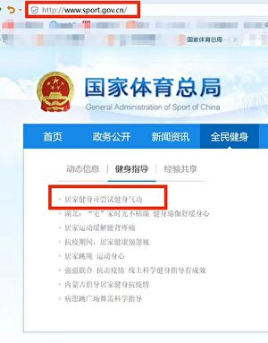

今天中共体育总局官网出现一个“不太起眼”的消息，“居家健身可尝试健身气功”，这个消息隐藏在“全民健身”一栏。（截图）

<b>爆危重患者死亡率超60%</b>

前两天，华中科技大学同济医学院和金银潭医院的研究人员，最近在《柳叶刀》上发表了一篇联合撰写的论文，指出武汉新冠肺炎疫情早期的危重患者死亡率超过60%。

研究人员根据金银潭医院收治的52例危重患者的情况得出了这个结论。截止到2月9日，这52名患者中，已经有32人去世了。这些人在进入重症加护病房后，一般7天左右就死亡了，死亡率高达61.5%。

<b>华南海鲜市场并非病毒始发地</b>

另外前天（22日），中科院联合华南农业大学、北京脑科中心等单位的科研人员宣布，人们最初怀疑是病毒发源地的武汉华南海鲜市场，并不是病毒始发地。研究人员发现，病毒是从其它地方传入了华南海鲜市场，然后在市场里面发生了快速传播蔓延。

中科院西双版纳热带植物园的官网显示，科研人员研究发现，新冠病毒在2月12日前曾经发生过2次明显扩散。一次是去年12月8日，这等于是说病毒可能在12月初、甚至是11月下旬就已经开始传播了，只不过是在华南海鲜市场这里，传播的速度突然加快了。另一次扩散是在今年的1月6日。

中科院此时突然提出新的病毒起源说，完全推翻了中共疾控中心之前的说法。当局为什么自己否定自己呢？会不会是真相越来越掩盖不住的情况下，当局准备抛出人们的怀疑对象——武汉病毒研究所呢？

<b>美国调查疫源，中共高层欲逃？</b>

21日，雅虎新闻网引述一位匿名的美国前国家安全官员的消息说，美国的国家安全部门正在动用军方的情报力量，获取中国新冠疫情的真实信息。因为中共政府处理疫情方面的做法有太多疑点，迫使美国不得不动用间谍力量。

雅虎记者珍娜·麦克劳林（Jenna Mclaughlin）从美国前情报官员处得知，美国情报机构一直在帮助政府层面搜集包括全球冠状病毒传播的信息。其中最重要的追踪话题是，中共领导层计划——“运作连续性”——指政府在核战争或自然灾害等前所未有的危机中，维持基本职能的能力。

消息人士表示，这一追踪话题，在中国可能涉及中共高层领导人离开中国、或寻求海外庇护所的安全举动，“类似美国的世界末日掩护所”。

美国情报界正在看到一些迹象——中共官员正在制定这一类应急计划。“这表明北京内部对疫情的潜在担忧程度”。

会不会是这样呢？大家可以多多地关注。看看武汉病毒研究所的石正丽会不会被抛出，或者她会不会在近期传出染上新冠肺炎？

<b>新冠肺炎给海外华人造成的影响</b>

最后说一下这场疫情在国际上给中国人带来的影响。

网络上流传着一段视频，很多韩国人在一起静坐示威，要求政府驱逐中国人。示威人群当中，很多人手里拿着韩国旗帜。

韩国方面通报，截止到今天（24日）上午9点，韩国已经新增确诊感染病例169宗，总确诊人数是833人，有7人死亡。

韩国疫情出现紧急状态，香港有了反应。保安局长李家超今天表示，立刻对韩国发出红色旅游警示。从明天早6点开始，禁止韩国直飞香港或者14天内曾经到过韩国的非本地居民入境。

中国大陆的疫情严重程度远远超越韩国，许多香港人要求林郑月娥下令，限制大陆旅客入境。但是林郑不理不睬，而韩国疫情刚有上升趋势，港府就命令对韩国封关了。

网络上还有另一段视频显示，意大利人在游行，要求驱逐中国人。视频中显示，街道上挤满了人，人声鼎沸，还有的在呼喊口号。视频拍摄者边拍摄边说：“完蛋了，意大利啊，完蛋了，排华了。”

昨天意大利的新冠肺炎感染病例上升到了133例，其中大多数集中在米兰所在的伦巴第大区（Lombardy）的一些乡村小镇。美国之音报导，这些城镇实际上已经是被封城的状态了。米兰市长萨拉（Giuseppe Sala）昨天宣布，从星期一（24日）开始，米兰的所有学校关闭。

相比在韩国和意大利，中国人在俄罗斯的遭遇更惨一些。俄新社报导，一名中国人去年12月底到俄罗斯西部库尔斯克州（Kursk）的一家鞋厂打工，2月13日出现疑似呼吸道感染症状后被送往医院。17日被诊断为健康后出院，回到自己的宿舍单间。但是19日下午，人们发现他已经被人割喉，死在了房间内。当地警方表示，将调查这桩谋杀案是否与被害人曾就医有关。

其实前几天，日本也有不少民众上街游行，抗议安倍当局迟迟不对中国采取措施，要求政府驱逐中国人。

中共外交部至今没有就这些事件做过任何表态。

大纪元《新闻看点》制作组

<a target="_blank" href=#top><h6 align="right">回上方</h6></a>

<a name=209>
<h1 align="center"><b>【一线采访】北京爆发疫情 实情被掩盖</b></h1>

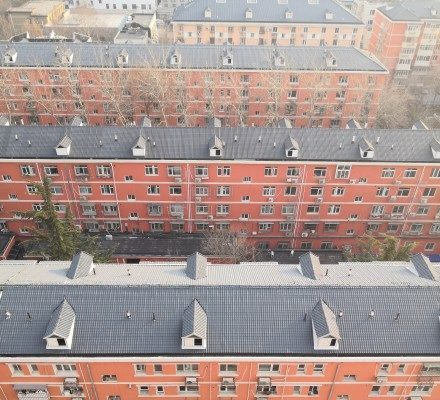

北京三里河一区三号院网友拍摄的51号楼外景。中共财政部给“部机关各司局、在京部属单位”的一则疫情通知称，“昨日（据推测是18日）三里河一区51号楼发现一新冠肺炎确诊病例，请在今日小程序上报告居住在51号楼干部职工姓名、所在单元等情况。 ”（截图）

【大纪元2020年02月24日讯】（大纪元记者易如、方净采访报导）“这病毒太可怕了。这东西看又看不见，它的隐藏期很长，在没有发作之前就有传染性。”北京市民陈先生（化名）说，武汉病毒犹如看不见的敌人，已流入北京，“病毒是前所未有。因为我们不晓得敌人在哪。看见以后，我们也消灭不了。”

武汉肺炎疫情扩散快速，北京包括西城区政府在内多处传出已爆发群聚性感染。有消息指称北京已将疫情处置提升至武汉级别。北京昌平的陈先生22日接受大纪元采访时表示，情况确实很严重，现在大家都很紧张，“那个胡同口都装了门，路上就设了关卡，严防死守。”

陈先生也提到，疫情爆发的根本原因是人祸，他指出中共国家疾控中心当初蓄意隐瞒是罪魁祸首，“惹这么大的麻烦啊，这都是当初国家疾控中心敷衍了事，说‘可防可控 不会人传人’，麻痹了武汉的人民，这罪行不是工作疏忽，这简直是罪恶。”

“没有办法，我们（只能）尽量防备，但是一旦到了失控的地步，我估计没有人能逃脱，包括那些歌功颂德的，他们也难逃一死。”他气愤地说。

<b>北京严控难防疫情 复工人潮让防疫临重大考验</b>

陈先生指出，北京目前已将防范等级提到最高，“像我们小区出去，在路上就设了关卡，你要有出入证，要体温检测，人车、自行车都是严格控制，这方面做得是非常严格。”

“现在最严重的是西城区、东城区，现在中关村也有不少了，有个别医院，（据）说是友谊医院，有一名孕妇隐瞒自己的病情，使得这个医院被感染了。”“现在好一点的就是怀柔，北边，我在北边昌平，最近的（案例）有20公里。所以我们现在只是行动不自由。”

“但是我们也是不敢出去，出去回来也是要消毒，出去要戴口罩。”陈先生说大家都尽量减少出去次数，“北京北方有个好处，买的菜存放的时间可以长一点，居民目前来说，没有抢购，大量囤积也没有发生，只有少量的储粮。”

但在北京市区则已风声鹤唳，他说，“市区特别是发生病例的，那可是如临大敌。现在已经到了最严厉的手段了，不可能再严了，再严就没办法活了，北京现在是做到了无以复加的地步了。”但他也强调，“重大的考验还在后面。”

“肯定顶不住大批的返京复工的人，如果这些人到北京来那是灭顶之灾，那就是不可控了，如果再来一批人，一天几千万人的流动量，那扛不住的啊。”“这么大的人口量，这么大的流动量，你怎么能控制得了啊。”

“没有办法，因为我们现在打了半天，那个敌人在哪不清楚，这个仗没法打啊。敌人在哪？谁是？谁是要去防控的人，找不着，认不出来，在他面前都不晓得，等到你认出来时，他已经活动到很多地方啦。”他说。

<b>病毒无药可治 政府严控下死亡人数永远是谜</b>

陈先生也提到，病毒行踪不但无法掌控，而且无药可治，“我们现在实际上是安慰疗法，各种医生，用各种药方在那里尝试，不断地试，用这种办法来解决的。”

他批政府无能，还拒绝外援，“美国的瑞德西韦，疗效怎么样，我们不知道，没有任何消息，不让你知道。美国要派专家来，不要，美国要帮助调查，不让进。”

“我们现在就是苦苦地等着，病人也是苦苦地等着。大多数病人都是靠着自身的免疫力，免疫力扛不住的，也就是眼睁睁地死了。”他说，“你想，湖北医院的院长都死了，他能不抢救吗？可见现在基本上病了就靠你自己，没有特效药。”

至于北京目前有多少人染疫死亡，他表示，政府不说，百姓也不知道，“听说有死人，我们都是看政府公告，政府公告说真相我们就知道真相，说假话我们就不知道真相。”

他强调，中共这个政权是永远不会跟百姓讲真话的，“（中共）一贯如此，我们也听到很多的消息，不然我们全蒙在鼓里，还是有很多人传递了很多国内国外的消息，但我们只是听说没法验证。”

<b>民怒指中共疾控中心蓄意隐瞒疫情</b>

武汉疫情失控蔓延，陈先生认为是中共国家疾控中心当初刻意隐瞒造成的，“要不是他们这样忽悠老百姓，那病情能到那么大吗？”

他怒指疾控中心，“你们干这行的，花那么多钱，建立了国家疾控信息网路，你号称10个小时就可以从地方传到中央，你400个小时过了你还在说假话，你这是失误吗？养你们这帮混蛋干什么的啊？”

“对内一套，对外一套。”他说，“外交部（发言人）华春莹在2月3日外交记者会上说，自1月3日起，30次向美国报告疫情和治理办法，中国人民怎么不知道啊，你对内怎么一点疫情都不透露？”“对国外30次通报，对国内连说真话都捉去训诫，你们是对中国人民负责，还是对美国人民负责啊？高官厚禄，干了什么？”

“医生之间互相交流一下疫情，你居然把他们抓去训诫，这8个医生都是业界的翘楚，你一个警察有什么资格训斥他们啊？为的是掩蔽真相。”他说，老百姓只能躲在家里，被蒙骗而一无所知，“这些人犯下的罪行是不可饶恕的。”

他接着说，“灾情还没结束，就开始歌功颂德了，我说，无论你们（地如何）把老百姓人民蒙蔽起来，你们不会觉得（自己）尸位素餐吗？不觉得无地自容吗？罪是你们犯的，你还出来当英雄？这什么东西？”

“我们很清楚，当有人追到疾控中心的时候，追到高福的时候，高福是给疾控中心的有一个叫做保证书，保证不泄密，他报告的不是，说没有证据说明高福这个医疗疾控中心（派出的专家组）到武汉以后回来是报告的可防可控人不传人。”

他表示，整个过程层层疑点都显示政府当局的腐败和轻视人命，“当把这个情况报告到疾控中心以后，疾控中心立即向国务院汇报，国务院的人说上面不同意，请问上面是谁？他们的上面还能是谁？而后来又向美国通报疫情，外交部的发言人她为什么向国外要报告疫情？对国内说人不传人？你们怎么回答这个问题？”

“还有病毒从哪而来？零号病人没找着，也没有努力去找这个人，41例里面有13例是没有到过华南海鲜市场的，追根究柢这些事情也应该是同时进行，还没有把这些问题解决，就开始歌功颂德了。”他说。

<b>政府压缩数字 掩盖真相 往基层推责任</b>

陈先生还提到，“政府为了稳定人心想尽了办法，其中一条就是数字进行压缩，从我来看，政府的数字可信度不高，为什么？武汉社区的检验是画指标，你这个地方给你一个两个指标。”

“对于病情比较严重的，他只做一次测试，而其他的人却没有测试的机会，没有机会怎么能够把这个人头算进去呢？不就是巧妙地隐瞒了人数吗？而最后责任绝不在你这儿，你的责任是（算到）社区（头上），是你（社区）没有把人数报上来，而我没有错，你给的人家多少机会啊？”

由于政府规定病人要先经社区认定确诊才安排医疗，他强调，政府搞的这个权力下放实际是变相推责，让百姓和社区产生矛盾对立，“他所谓把权力下放到基层，你这个权力人家没办法行使，基层有什么办法呀？要有房子，还有医院，还有医生，还有专业人员，都没有，你下放给他们权力，你不是给权力，你是推责任。”

而最终可怜的是老百姓，“在武汉有一些人，因为轮不到检测，又只能关在屋里，而且只要有了一个（感染），家里全都被感染，一家六口，（有的）一家九口，除了一个小孩没感染以外，全都感染了，等待他们的是什么呀？”

“但是把这些人接到医院，又能怎么的？医院又没有这个能力，湖北的省委书记说我们准备很充分，很充足，你什么都没有，老百姓遇到这个事了，你说有什么办法，没办法。”

对于政府还对外宣传只有中国才有这个能力控制这个疫情，他讥斥：“胡说，国外做不到？国外能这样子说假话吗？能够警察出来训诫医生吗？”

“中共是一个一元化的（体制），只对领导负责，不对事实负责，也用不着对人民负责，这才是根本的问题。你（中共政府）现在调动千军万马去吩咐上前线，因为这些资源都掌握在你手上，这不是你的强大，这是你的霸道。”

<b>中共体制下，“捂住你的嘴，堵住你的耳朵，让你什么都不知道”</b>

对于网路上此时传出一些歌颂政府控制疫情和民众相互救助的感人故事，陈先生指出，“这些所谓老百姓，不见得就是我们老百姓，是他们（中共政府）雇的水军。还有，网上只许说这样的话，不许质疑，这才造成了一种形势，好像人民都在歌颂他们。”

他也提到在中共一贯的愚民政策下，确实有很多百姓被欺骗愚弄，“这些愚民都这样，萨斯（SARS）的时候是这样，60年过苦日子的时候也是这样，在这样一个体制下，他只能这样，可以肆无忌惮地去表扬，去歌功颂德，但谁也不敢追究责任。”

“因为从萨斯以来，从60年过苦日子以来，我们都是被蒙蔽的人，60年那么苦的时候，我那时候正在读书呢，学校领导做报告，说现在情势大好，国际情势大好，国内情势大好，省里情势大好，市里情势大好，学校情势大好。好吗？人都饿死了，他还在说好。”

他叹息：“但你除了这以外，你还能听到什么啊，饿死的人你能去看吗？你看得见吗？现在情况不又是一样吗？”

他表示目前疫情真相仍被掩盖，“我们只能在微信上看，我们和谁都没有办法说话。”“我们转发的东西也是政府的公告，我们只能说有两种不同的评价，至于信息来源，我们全靠的是微信里面传播的，有些信息是假的，有些是我们没办法接受的，看法也是分歧很大。”

即使知道真相，说真话也有危险，“我要说多了，我就有了危险。”他指出在这个体制下，“摀住你的嘴，堵住你的耳朵，让你什么都不知道，这种情况如果还要延续，还不改过来，将来的危险就在不远处。”

<a target="_blank" href=#top><h6 align="right">回上方</h6></a>

<a name=208>
<h1 align="center"><b>【翻墙必看】性服务或是浙江监狱染瘟疫的原因</b></h1>

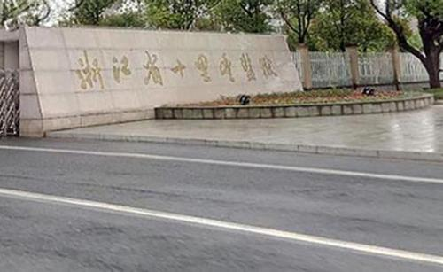

浙江十里丰监狱传因引进性服务导致新冠肺炎爆发。（网路图片）

【大纪元2020年02月25日讯】（大纪元记者梁义报导）近日大陆多所监狱爆发群聚性新冠肺炎疫情感染，其中浙江省十里丰监狱共有罪犯确诊病例34例，监狱政委和监狱长已被免职。事件曝光后，大纪元获得爆料称，是这所监狱的引进性服务，带进了新冠病毒引发疫情。

资料显示，浙江省十里丰监狱位于金衢盆地西部边缘，距离衢州市区29公里。十里丰原来叫“十里荒”，1949年后才改名叫“十里丰”。当时没有监房，围墙是竹篱笆；没电灯，只有煤油灯，周围一片荒凉。近年来才发展起来。

据该监狱内部人员爆料，衢州存在两个省级监狱：十里坪和十里丰。前者关押重刑犯，后者关押经济犯。十里丰监狱的服刑人员经济条件普遍较好，为了改善狱中的生活质量，他们通过各种渠道在经济上给予狱警一些“小意思”，来换取一些“特殊照顾”，已经习以为常。

消息称，但因习近平上台后加大反腐，省管监狱的公职人员日常“油水”大大减少了。于是监狱里的管理层竟想到，通过为犯人提供性服务来获利。狱方从异地秘密招募了数名性工作者，到监狱为犯人提供性服务。

这位监狱工作人员还透露，1500元一次的嫖资，监狱干警可以分到800元，提供性工作者的组织者获得200元，提供服务的性工作者会拿到500元。

然而讽刺的是，十里丰监狱曾多次获得中央部委、浙江省委、省政府授予的集体和个人荣誉，包括：1999年曾被省司法厅命名为“省级现代化文明监狱”，监狱领导班子被授予“干部群众满意领导班子”；2009年监狱获得全省政法系统先进集体等。

针对这波群聚性疫情感染，中共官方公布的说法是，十里丰监狱狱警罗某于1月14日至19日回武汉探亲，曾与亲戚密切接触，1月27日起核酸检测呈现阳性。

但爆料的监狱工作人员则表示，病毒是通过特殊服务传入了监狱。这些性工作者由于密切接触史复杂而隐秘，往往不会对外透露病情。病毒正是通过她们传入了监狱，从而导致大面积感染。不过，大纪元尚无法核实该消息。

这波爆发的监狱群体性感染事件中，湖北监狱也是重灾区。据官方数字，湖北省监狱系统确诊病例271例，其中湖北省武汉女子监狱230例，沙洋汉津监狱41例。

据一位不愿透露姓名的消息人士爆料，疫情爆发后，搬尸工严重短缺，即使搬尸工薪资涨到每天1000元，清洁工涨到每天600元仍然不够。于是，武汉某区民政局副局长和监狱管理层相互勾结，责成当地监狱的轻刑囚犯前往疫区搬运尸体，武汉殡仪馆的清洁工作则由女子监狱的女犯人来完成。

监狱管理层给这些犯人同样的“激励措施”，每工作六天给一个表扬，计60分。（满五百分可减刑7～9个月）。他认为，犯人所有的劳动收入很可能被所在地民政局领导和监狱管理层瓜分。

有评论指，大陆监狱和看守所是中国最不透明的领域之一，中共披露出来的情况只是实际情况的冰山一角。2月22日，中共四川省、黑龙江省的监狱、戒毒所均实行战时管理。当天，中共政法委书记郭声琨等到燕城监狱等监管场所检查，郭称现时正处于“战时状态”。

<a target="_blank" href=#top><h6 align="right">回上方</h6></a>

<a name=207>
<h1 align="center"><b>揭原江西省女子劳教所副所长邓俭的暴行</b></h1>

看守所、劳教所和监狱等地方被中共利用来关押迫害法轮功学员。（明慧网）

 
 【大纪元2020年02月27日讯】原江西省女子劳教所自1999年7月20日以来，成为全省迫害女性法轮功学员最严重的地方之一，至今仍没停止过实施酷刑折磨、奴工生产和洗脑迫害等。副所长邓俭打伤过许多法轮功学员。
 
<b>个人信息</b>

中文姓名：邓俭

中文姓名拼音：Deng， Jian

性别：男

出生日期：1955年左右

原工作单位名称：江西省女子劳教所

原来职务：科长、副所长

中国大陆的家庭住址（省、市、县）：江西省南昌市

<b>迫害事实简述</b>

2000年2月底的一天下午，时任劳教所科长的邓俭和队长杨某（女）等一行人，气势汹汹地闯进监室。邓俭将法轮功学员江友香从双层床的上铺硬拽下来，狠狠地摔在门口的草地上。

随后，警察将江友香等四位法轮功学员关入“禁闭室”，连续挂铐三个昼夜，不让睡觉。江友香的双腿肿胀，双臂麻木、失去知觉，两手腕被勒伤。

 
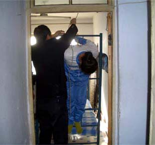

酷刑演示：吊铐。（明慧网）

法轮功学员肖根祥是“洪都集团”的职工，曾先后两次被非法关押在江西省女子劳教所。1999年底，她去北京为法轮功上访而被非法劳教1年半。在绝食反迫害期间，她拒绝野蛮灌食，极力挣扎，被邓俭暴力野蛮地拽拉，致使她左手的第二手指与第三手指重度撕裂，血肉模糊、惨不忍睹。

因为坚持炼功，肖根祥被包夹（监管法轮功学员的犯人）拳打脚踢，头发被抓着将头往墙上猛烈撞击。警医徐校良给她插管灌食时，动作野蛮，还凶残地大声吼道：“插死她！”给她拔管时，徐用力拉扯皮管，致使鲜血从她的口鼻里喷出，溅了一地。

法轮功学员舒娟被劫持到江西省女子劳教所非法劳教2年。2000年3月17日，入所的第三天，劳教所召开诽谤法轮功的大会。舒娟为制止对法轮功的侮辱、诬蔑，在会场上高声背诵李洪志师父的《洪吟》。

邓俭揪住舒娟的头发，对她一顿拳打脚踢；将其双手反扭在背后，把她的头狠命地向下按压，随后把她的双手铐了一整天，不让其上厕所。

法轮功学员吴井军（女），原江西省经贸厅下属轻工业品进出口公司财务科副科长，2001年6月，她被非法劳教3年；2003年4月，因绝食抗议，被警察洪创华（现一大队大队长）拖着头发，一直从四楼拖进二楼的“禁闭室”。当时邓俭还照她脑袋猛打一拳。

鹰潭市法轮功学员李美莲，当年36岁左右，因绝食，被邓俭（当年还是科级）用大拇指按住气喉，逼问是谁牵头绝食的等。李美莲差点背过了气。

王姓男大队长（现在管理科任职）毒打李美莲后，把她铐在“死人床”上（双手分别拉开铐到两张床上，双脚用绳子绑着拉到另一头）。

傅姓警医到房间巡看时，见李美莲被铐在“死人床”上，他手拿着手铐，发狠地往李美莲的头上砸去，砸在她的右脸上，李美莲的脸顿时肿得变了形。

九江县法轮功女学员田海英于2009年11月20日被绑架后，先后遭九江市浔阳区公安分局国保大队、九江市看守所、江西省女劳教所警察的非人折磨。

田海英的双手被吊铐在床头，一直吊铐了三天三夜；寒冬腊月，吃喝拉撒全在床上。邓俭还叫喊，把她“关禁闭三天”。

<a target="_blank" href=#top><h6 align="right">回上方</h6></a>

<a name=206>
<h1 align="center"><b>【一线采访】援鄂医师：疫情比SARS严重</b></h1>

驰援湖北的医师感受，武汉肺炎疫情比2003年SARS还严重。(STR/AFP via Getty Images)

【大纪元2020年02月27日讯】（大纪元记者顾晓华、方净采访报导）湖北自去年12月初爆发新冠肺炎（俗称武汉肺炎）疫情迄今已超过2个月，各省市医生分批被调派前往重灾区支援，亲身感受到湖北当地医疗资源短缺的情况，医生没有穿完整防护服、病患得不到救助的惨况。一名从外地到鄂州中心医院支援的陈医师（化名）诉说他亲身的经历。

武汉肺炎扩散迅速，继武汉1月23日宣布封城，鄂州市、黄冈市、赤壁市也在同日宣布实施封城。鄂州距离武汉东部不到100公里，是武汉通向附近地区的必经之道。在2月初，有消息指称，鄂州疫情严峻，一度成为大陆武汉肺炎致死率最高的城市之一。

<b>危重患者致死率达八成</b>

陈医师说，“死亡的病患非常多，危重患者死亡率高达70%~80%，重症患者死亡率是20%。”“危重病患基本上你全力救治，最后十个能活两个就不错了。”

陈医师说，鄂州市常住人口大约有103万，目前从其它省市调派来鄂州支援的医护大约有700至800人，加上当地的医护，目前鄂州市大约有3500位医护人员，“但是还是不够，病人还是很多。”

鄂州中心医院专门收治新冠肺炎重症病患，目前大约有300多例，其中危重症患者约有40多例。轻症患者约有700至800例，收治在其它医院及即将建成的雷神医院。

他透露，从外省市被征调来的基本上都是年轻的医护人员，“其实我们也怕感染，也怕死。我们有些人不敢跟家里说，接到通知的第一件事，赶紧跟家里人照个合影，因为也担心可能再也回不来了。”

<b>医疗资源不足 无力面对疫情大爆发</b>

“几乎是接到通知，突然接到命令，三个半小时内，就出发。”他们医疗团队大部分是调派去武汉，他们小队来到鄂州，“因为这边疫情挺严重的，也是特别严重。”

他表示，当地防护物资十分紧张，“因为鄂州的医疗资源依靠武汉，这次突然都封闭了，鄂州只能靠自己，所以相对就各种资源更是明显不足。”

其中最紧张的就是防护服，“现在防护服需要量太大了，整个湖北地区，全国来支援的医生大概有3万多人，加上本地的医护，大概有6万 ~ 7万名医护，每天需要6万 ~ 7 万套防护服，基本把全世界的防护用品都买光了，所以说还是很紧张。”

而且能调派过来支援的医师，需要年轻再加上有重症呼吸照护专业，“能进重症监护单元的医师，必须是真正的专科呼吸ICU（重症加强护理病房）或者RCU（监护病房），专门干过重症单元的。”

但即使是年轻医师，每天仍然是精疲力竭，“主要是（防护服）捂得太严实了，缺氧，大量出汗，早上又不能多吃多喝，要不然尿裤子里了，所以不能吃、不能喝、不能上厕所，不能休息。”

现在基本上每一班可以工作六个小时后休息，“基本上六个小时出来以后，即使体力非常好的医师，出来以后也是精疲力竭，几乎都站不住。”

<b>疫情爆发初期 湖北医师只能赤膊上阵</b>

亲赴疫情爆发的第一线，陈医师更感受到医护人员的压力，“鄂州中心医院先前大约有将近70医护已经倒下了。”“湖北地区、武汉市好多医护去世了，武汉被感染的医护人员大概有三千多人，但真正的要加上那些检测阴性或是疑似的，估计五千人也不止。”

“之前医护人员不足，没有外来支援的时候他们确实非常困难。据我所知刚开始他们医生护士排班，白班、晚班排，穿着防护服要值12个小时。”

“因为早期的防护措施确实不到位，所以早期的整个湖北的医生是赤膊上阵（没有穿完整的防护服），把自己暴露在危险当中。”他说，谁也没想到疫情如此严重，“早期疫情爆发以后，大批的病人一下涌到医院，当地的防护物资跟不上，基本上大家都暴露在病毒的海洋中间。”

面对这场前所未见的瘟疫，医护人员感到心情压力大，“最痛苦的就是早期看到我们同胞一个个死去，在没有特别好的治疗手段下，主要是老年人，大家都在默默地流泪，大家下班以后心情都不好。”

<b>武汉肺炎传染力比SARS严重</b>

“这个病非常可怕，传染性极强，死亡率则是根据后期情况，大部分死的都是老弱病残。”陈医师说，他2003年萨斯（SARS）时也在医院，“这次武汉肺炎当然严重，这确实是病人一下多了，它的传染力比萨斯更强，或是因为早期没控制，没有采取措施，病人一下子大量爆发，就造成压力很大。”

陈医师表示，现在还没有接到通知返乡，但他也挺担心北京的疫情，“北京现在已经复工了，北京压力也很大，北京恐怕有感染扩大的风险。”

<a target="_blank" href=#top><h6 align="right">回上方</h6></a>

<a name=205>
<h1 align="center"><b>武汉病人目睹：没死的重症病人被装进尸袋</b></h1>

网上纷纷传出，中国救护车在大街上频频运尸的画面。图为2月13日的武汉街头。 （Stringer/Getty Images)

 
 【大纪元2020年02月25日讯】（大纪元记者骆亚报导）武汉新型冠状病毒肺炎爆发，惨烈的一幕幕悲剧不断上演。近日又爆出武汉重症患者还没有死，却被装进尸袋送去火化。有刚出院的老人口述了自己亲眼目睹的经过。

2月24日，网上流传一段视频，一名老妇向司机和车内人介绍，她在武汉传染病医院住院时，亲身见识的恐怖经历，看到几个跟她一样的患者，人还没死，还有一口气，就被捆绑装入四层尸袋抬走了。

武汉张先生向新唐人表示，这位婆婆出院后，由家人接回，在回家的路上讲述了她在医院的见闻。以下为婆婆和司机的对白。（老妇取名为A，司机取名为B）。

A：这是我亲眼看到的，我是十八床他是十七床，他是二十八号的早上（进）去的，下午是天津队来了。他就只有出气没有进气。他跟我等于是一样的道理，我可能年轻些，他七十多岁，他就挺不住。

我跟你讲，只要得了这个病，挺住了就挺住了，挺不住就去了。

B：等于他还没死？

A：嗯，这一口气还没灭。那手和脚，捆他的时候，手脚还在动。然后脚手就一捆，捆了之后呢，就一个塑料的那个袋子，那个黑袋子包了之后拉链一拉，然后又套了一个、又是一个塑料袋子，那个塑料袋子包上之后，又包一层就像外面搭棚子的鬼东西又把他一包，包四层，然后才系那个绳。

B：他也没抢救一下？

A：没有东西抢救，就是氧气。

B：那，等于是活人直接……

A：没有东西抢救。哪是传染病医院，你看他那个单子啊（写）传染病医院。

B：活人就这样拿去烧啊？！

A：他怕毒气散发出去，跟你讲啊。

B：我的妈？！

A：我们看到几个。我隔壁房里也是这样的，一个老头子还完全没有断气，就拿去烧了。

B：哇！我的妈，几个人都是这样，等于说是……

A：对，我们都看到的，亲眼看的嘛。我们在住院，我亲眼看到的。真是想到寒心呐，我真的心里啊……要哭啊，多惨呐。

B：我的妈，这太惨了。关键是活人，去救他啊！

A：怎么救啊？靠什么救？又没有药，又没有什么。就是个氧气和那个靠什么救？！真的是，你没看到那像死狗一样，一死一个。黄格子一装一抬一个走。

<b>父亲还没有死 却被装进尸体袋</b>

此前也有武汉青年佟某在网上发帖披露，“医生要我去帮忙抬我爸爸，我进病房摸他的小腿还是热的。我喊‘爸爸’，爸爸当时睁眼要说话。医生大为惊骇，喝斥我出去，（爸爸被）赤条条装到尸袋抬走了，我祈求给穿衣物，不被允许。”

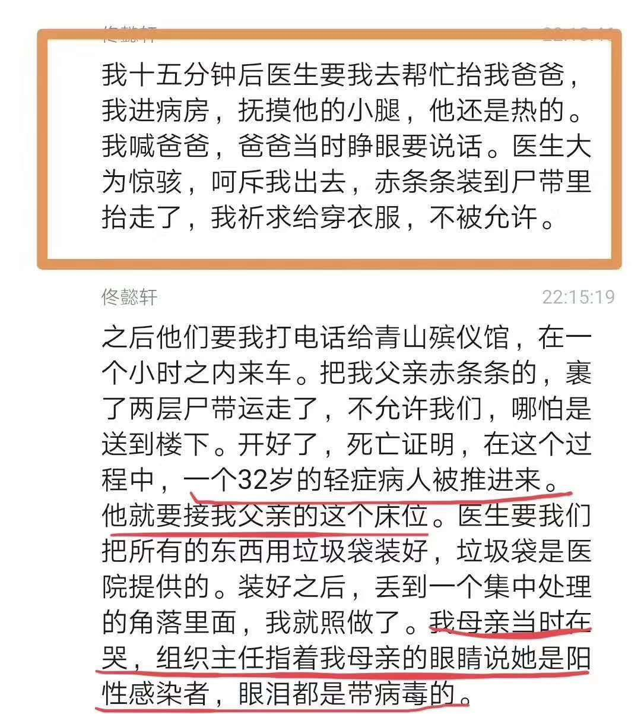

武汉青年佟某在网上发帖披露，父亲还没有死，却被装进尸体袋。（网络截图）

之后他们要他打电话给青山殡仪馆，一小时内车就来了，开好了死亡证明，在这个过程中，一个32岁的轻症病人被推进来，要接他父亲的床位。

这名佟姓名青年，当时曾为了染上新型冠状病毒肺炎的父亲佟武在网上公开求救，引起很多人关注。佟武当时持续高热40℃，伴随暂时性昏迷、呼吸窘迫，CT显示双肺多发磨玻璃、斑片状模糊影，因为缺少试剂盒检测，无法最后确诊。没有床位无法住院，只能在汉口医院门诊部留观。

佟武妻子为了照顾丈夫也出现同样症状，同样待确诊。消息称佟武妻子是当地有一定知名度的特教老师。

几天后，有关注此事的网友在微博上发消息，称佟武的儿子介绍，他父亲于2月2日在武昌医院办理的入院手续，目前病情稳定，正持续接受治疗。他母亲病情也有好转，两天没有发烧，咳嗽症状也有所缓解。

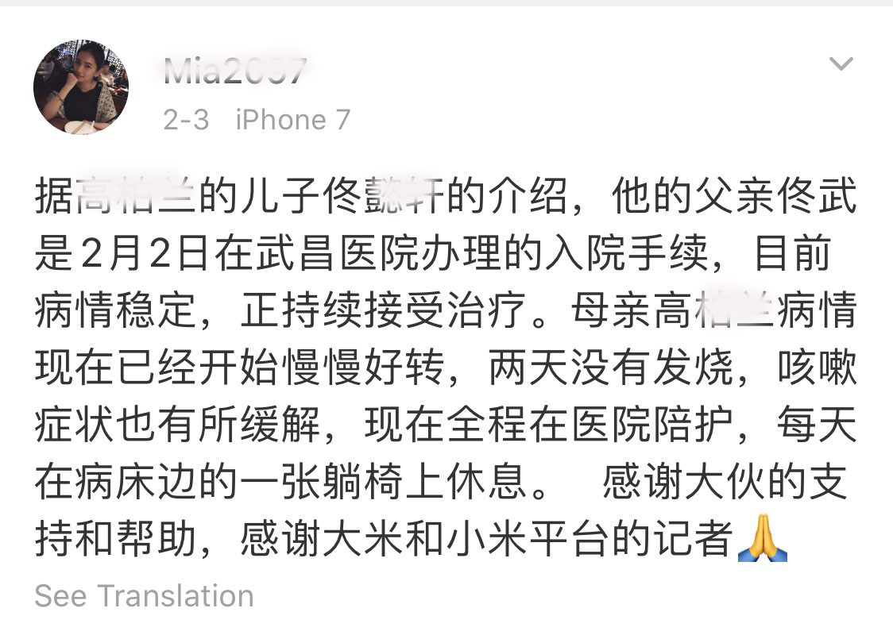

佟武的儿子介绍，他父亲于2月2日在武昌医院办理的入院手续。（网络截图）

<b>相信中共绝对做得出来</b>

网友sunny Yang表示，“相信很多重症患者都被它们给强行火化掉了！以中共处理传染病的手法是绝对做的出来的，由于被感染人数巨大，又没有解药，基本就是集中隔离、处理尸体这两项任务最艰巨。”

武汉的华南海鲜市场附近的居民吴先生也向大纪元记者表示，“我觉得这种事情是有可能的，毕竟现在医院床位不够，而中共一向看轻人命，一心想着维稳，所以对于那些他们觉得没有治愈希望的患者，在他们还没咽气的时候强制火化，好腾出床位把更多人关进去。”

他认为武汉这次的疫情是七分人祸三分天灾，“一开始说不人传人、无医务（人员）传染、几天无新增病例，让大家放松警惕，真的扩散开了压不住了就强制封城，到现在连私人购物都不允许，只让团购，我们生活很不便，心情也很压抑。”

据悉吴先生所在小区已经有13人感染。吴先生强调，“越来越多的人开始质疑中共的合法性了。这次事件就是中共的切尔诺贝利事件，是极权统治公信力走向彻底崩溃的转折点。”

<b>殡仪馆招聘条件是不怕鬼 胆子大</b>

网上此前流传一份武昌殡仪馆急需20名“尸体搬运工”招聘广告，16到50岁男女不拘，要求“不怕鬼、大胆、有力气”，工作时间从午夜0时到凌晨4时总共4小时，并开出4000元人民币的高薪，而且是当天现领，引起网络议论纷纷。

现在人没死就被装进尸体袋的事情在网上疯传后，因此有网友表示，“武汉殡仪馆招工，条件是不怕鬼，胆子大，其实焚尸炉里的叫声不是鬼，而是没有死去的人。”

还有网友表示，萨斯时期就是这样的，直接烧死。

2月4日，大纪元调查员以特殊身份暗访湖北省多家殡仪馆的高管，从而获知其中两家殡仪馆每天的实际火化量，是平时火化量的4～5倍。据估计，武汉最大的汉口殡仪馆一天至少焚烧225名新冠肺炎死者。

23日官方承认的死亡的累计2442人。由于中共的数据造假，这次肺炎造成的死亡人数到底有多少，目前仍然众说纷纭。有人爆料说死亡超过五万人，也有媒体调查推估有上万人。

大纪元此前报导过，中国有多家纺织业相关工厂，“现在不做衣服，口罩也不做，做尸袋”。有企业接到订单要赶制运尸袋一百万个。

<a target="_blank" href=#top><h6 align="right">回上方</h6></a>

<a name=204>
<h1 align="center"><b>疫情下面临严重危机 习率政治局集体露面</b></h1>
 <h3 align="center"><b>武汉肺炎扩散全球 陶杰称临“圣经时刻”</b></h3>

2020年2月23日，习近平率所有政治局常委和委员召开会议，“统筹推进新冠肺炎疫情防控和经济社会发展工作部署”，这是武汉肺炎全面爆发后首次七常委集体露面，突显新型冠状病毒疫情及大陆经济面临严重危机。 (NICOLAS ASFOURI/AFP)

 
 【大纪元2020年02月25日讯】（大纪元记者林哲香港报导）2月23日，中共在北京开了名为“统筹推进新冠肺炎疫情防控和经济社会发展工作部署”的会议，习近平率所有政治局常委和委员，集体露面。这是武汉肺炎全面爆发后首次七常委集体露面，突显新型冠状病毒疫情及大陆经济面临严重危机。此外，武汉肺炎病毒扩散全球，香港资深作家兼传媒人陶杰认为，世界现在正面临“《圣经》时刻”。

有评论指出，中共最高层集体露面，可以看作是对连日来外界传闻，中共高层多人被武汉肺炎病毒击倒的回应。

值得注意的是，在画面中，坐成一排的七位政治局常委都没有戴口罩，而对面的几十位政治局委员和其他官员，全部戴着口罩。

<b>会议释放八大重要信息</b>

时事评论员夏小强认为，这次会议主要释放了八大重要信息。

第一、疫情已经全面失控，对于中共来讲，这次疫情的发展，将会决定中共政权的生死；

第二、各级党委和政府大都有“厌战情绪”、“侥幸心理”、“松劲（懈怠）心态”，地方政府表面服从中央领导，其实都在各自为政，处于自保状态，政令难出中南海；

第三、湖北省，特别是武汉市，疫情已经完全处于无法控制状态；

第四、北京已经处于疫情爆发初始阶段，中共必将重点应对；

第五、调动在国际上多年来渗透和收买的全部资源；

第六、牢牢掌握舆论宣传和媒体，封杀一切不利消息；

第七、启动战时和危机时期的超限维稳机制和手段，不惜一切代价维护中共政权稳定，碾压所有可能的民变和反抗；

第八、疫情对大陆经济的冲击，将会是致命的和长期的，失业加剧，民众的基本生活保障面临困局，外贸和外资的基本盘正在失去。

资深新闻工作者石山则指，该会议透露中共高层达成妥协，即有复工推动经济的总要求，但同时授权给地方政府自行决定。另一方面，这个会议设立了众多的“分会场”，通过视频连结到大陆大量的“县团级机构”，突显北京不满部委和省级传达中央意图不及时、不充分，造成过去一个多月的政令混乱。

夏小强亦评价，从习近平的讲话中可以看到，中共的大厦将倾倒，任何人都无力回天。

他并指，大陆民众正在面临最为艰难的时刻，同时这也是黎明前最为黑暗的时刻。

<b>韩日患者在大陆以外最多</b>

在亚洲，韩国及日本武汉肺炎患者继续暴增。韩国确诊病例持续攀升，截止24日上午，已有763宗确诊，死亡7人。韩国政府决定把疫情预警上调至最高级别的“严重”，并强化应对措施。

香港24日向韩国发出红色外游警示，又宣布由25日早6时起，将不容许来自韩国、或者14天内到过韩国的非香港居民入境香港。而美、英等国已提升对韩国或韩国部分地区的旅游警示；台湾也将韩国旅游疫情建议提升至第三级“警示”，25日0时起入境台湾要“居家检疫14天”。

日本的疫情因钻石公主号邮轮每日双位数的确诊数字而严峻。24日再有厚生劳动省的职员和钻石公主号的检疫人员确诊，感染人数增至7人。不计钻石公主号的691人确诊，日本确诊人数增加12人至159人。

武汉肺炎在中东持续扩散，24日巴林及科威特首度出现确诊个案。

中东的伊朗，是目前大陆以外感染武汉肺炎死亡人数最多的国家。截至22日，伊朗通报确诊病例已有43人，死亡人数8人。伊朗卫生部长纳马基表示，感染源来自中国大陆。

国际防疫形势骤现紧张。德国权威病毒学者表示，现在没有疫苗可用，短期内也无法研发出特效药，来自大陆的这种新型冠状病毒疫情在全球大流行恐怕难以避免。

这场世纪大瘟疫，目前已波及全球三十多个国家和地区，除了南美洲之外，各地都出现确诊病例，危及到全人类的生命健康和安全。目前，全球各国政府高度戒备，但疫情仍在不断蔓延扩散。

<b>陶杰：疫情全球化是“神学问题”</b>

素有“香江才子”之称的香港资深作家兼传媒人陶杰在CUP媒体发文说：“中国武汉肺炎形成全球瘟疫。祸不单行，南亚次大陆有4000亿蝗虫，枕待边境，随时向东北方向乌云盖顶，巨潮汹涌大扑杀。这是历史上的‘《圣经》时刻’。”

陶杰解释，所谓《圣经》，指的是《旧约》中耶和华怒于亚当夏娃之后，人类的后裔腐朽堕落、贪婪、暴虐，决定予以严惩。天怒之处，伴随天谴，亿万蚁民，为容忍或参与暴虐，付出代价。

陶杰指出，病毒源头，不论是由中国官方希望世人相信的“中国人屠食野生动物”，还是美国医疗专家所指“出自武汉实验室”；由宗教角度，中国武汉肺炎的全球化，最终是一个“神学问题”。

<b>网传“代言死神”被隔离</b>

武汉疫情下，在各国政府都呼吁大家尽量减少聚会的非常时期，日前网络上流出一段成龙、曾志伟、谭咏麟等香港艺人和警界高层聚餐的影片，他们公然与政府唱反调的行为被网友狠批。当日（2月18日）出席的数十名警察有的确诊感染病毒，有的（59名）需隔离检疫。

22日下午，有网友发文表示“成龙疑似被隔离”。不过也有网友指有关消息是假的，表示确诊患者不是跟成龙在同一个饭局。

之前成龙有“代言死神”的称号，被他代言过的商品，如汽车、洗头水、食品等，不是出问题下架，就是以企业倒闭告终。大陆商界甚至流传，有一种企业的死亡叫“成龙代言”。成龙去年争当“护旗手”，网友惊呼：“终于等到你！”暗示中共即将倒台。

而今年武汉疫情爆发的中国新年，成龙在央视春晚大唱《大侠霍元甲》，歌词中“问我国家哪像染病”，也让大陆网友大为惊叹。

另外，歌手张学友近日推出国语歌曲《等风雨经过》，为大陆的前线医护人员打气。唱片公司环球，还特别点名多谢曾志伟协助，结果引发香港网友争议和批评。

<a target="_blank" href=#top><h6 align="right">回上方</h6></a>

<a name=203>
<h1 align="center"><b>中共打压美媒 传美考虑驱逐数百中国记者</b></h1>

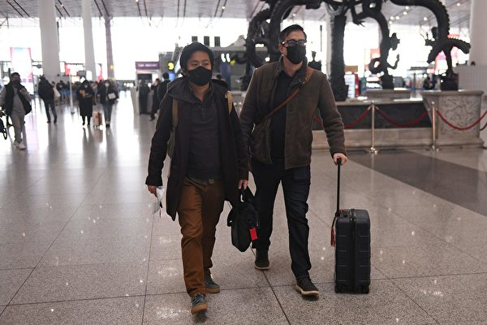

北京上周限三名《华尔街日报》记者在5天内离境。知情人士称，美国正在考虑是否采取严厉措施，驱逐几十到数百名中国记者。图为2020年2月24日，遭驱逐的华尔街日报记者李肇华（右）及温友正，在北京首都机场准备搭机离境。(GREG BAKER/AFP via Getty Images)

【大纪元2020年02月25日讯】（大纪元记者吴英综合报导）北京上周限三名《华尔街日报》记者在5天内离境。知情人士称，美国正在考虑是否采取严厉措施，驱逐几十到数百名中国记者。

彭博社周一（2月24日）报导，数名美国官员表示，周一稍晚白宫将举行高级官员会议，讨论应对北京驱逐三名《华日》记者的方案，该会议将由国家安全副顾问马特·波廷格（Matt Pottinger）主持，他曾是《华日》记者。

2月19日，北京以《华日》一则评论文章具“种族歧视”为由，吊销该报李肇华（Josh Chin，美国公民）、记者邓超（Chao Deng，美国公民）以及澳洲籍记者温友正（Philip Wen）的新闻通行证，并限他们5天内离境。该三人都与那篇评论文章没有任何关联。

驻华外国记者协会（Foreign Correspondents’ Club of China）表示，这是自1998年以来首次有外国驻华记者被驱逐，而同时吊销三张记者证是“前所未有的报复形式”。

中共宣布此项举措的前一天，美国国务院指定五家陆媒为“外国使团”，将之认定为中共政府实体。

这五家媒体机构分别为新华社、中国环球电视网（CGTN）、中国国际广播电台（CRI）、《中国日报》发行公司，以及《人民日报》发行商美国海天发展公司。

一些美国官员表示，对于是否采取严厉应对措施，川普（特朗普）政府内部进行了激烈的辩论，有些人主张应驱逐几十甚至数百名中国记者，另一些人则认为法律上不可行，而且不符合美国对新闻自由的价值观。

路透社报导，国家安全委员会（National Security Council）发言人约翰·尤利奥特（John Ullyot）在被问及是否会驱逐中国记者时说：“美国正在考虑对（中共）这个残酷行为做出一系列回应。”

尤利奥特于2月21日表示，北京驱逐美国记者是“令人震惊的行为”，“这种驱逐是（中共）控制媒体的另一次举动，并阻止了全世界的读者和投资者阅读有关中国的重要新闻”。

知情的美国官员说，川普政府决心要基于对等原则，解决美、中对待新闻界的严重不平衡问题。一些官员认为，被中共政权控制的中国媒体，总计派五百多名记者到美国，人数实在太多，无法追踪他们的行动。

相比之下，目前仅约75名美国记者在中国工作，他们的报导如果被中共认为不公平时，就会面临签证被拒签或者被驱逐出境的风险。

美国国务卿迈克·蓬佩奥（Mike Pompeo）上周表示，新华社等五家媒体显然是受中共控制的实体，“我们只是确认这个事实”。

根据1982年生效的《外国使馆法》，这五家中共官媒在被指定为“外国使团”后，其在美国的办事处将受到某些限制，包括必须将员工名单提供给美国国务院，同时还必须获得国务院批准才能在美国购买或租赁房地产。不过，这项指定不会限制这五个机构的记者在美国的报导活动。

蓬佩奥说，新举措也是基于对等原则，这些中方宣传机构在开放的美国体系内自由运作，然而在中国的外媒记者却面临着巨大的限制。

<a target="_blank" href=#top><h6 align="right">回上方</h6></a>

<a name=202>
<h1 align="center"><b>医疗行业法轮功学员被迫害致死案例（上）</b></h1>

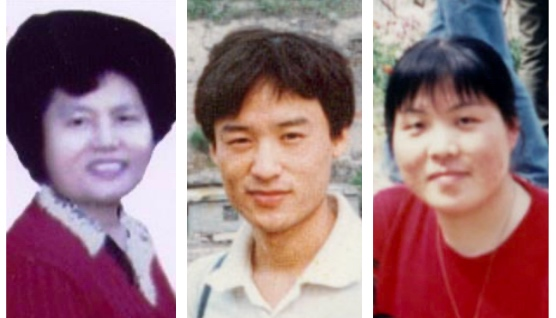

（从左至右）新疆石河子八一棉纺织厂医院儿科医生孔秋阁、北京市平谷县医院医生刘书松、北京顺义区妇幼保健医院的医生董翠被迫害致死。（大纪元合成图） 

 
 【大纪元2020年02月20日讯】1999年7月，在中国大陆，中共江泽民集团对法轮功学员发动了残酷的迫害，各阶层、各行业的修炼者都未能幸免。据明慧资料不完全统计，至少有51位医疗行业的法轮功学员因坚持信仰被迫害致死。

下面是18位医疗行业的法轮功学员被迫害致死的部分案例。

<b>天津市第二医学院附属医院护士长李淑敏</b>

李淑敏，时年30多岁，天津市第二医学院附属医院护士长。李淑敏于2001年被警察绑架至天津大港板桥女子劳教所。2002年11月中旬，众多的法轮功学员为抗议超负荷的劳役迫害而拒绝出工。以寇娜为首的狱警，对法轮功学员逐个殴打，并用高压警棍电击，致使李淑敏当场被迫害致死。

据悉，因李淑敏不放弃对“真、善、忍”的信仰，劳教所的狱警轮番地折磨她，每天只准她睡一小时，没日没夜地逼她超负荷地劳动，同时严刑拷打她。

有一天，狱警把李淑敏捆绑后，堵上她的嘴，把她吊在锅炉房里毒打；把她打昏死后，扔在一个笼子里。过了一会儿，一个烧锅炉的劳教人员去锅炉里房取东西，揭开笼子，看见李淑敏被暴打得血肉模糊的样子，当场吓昏。

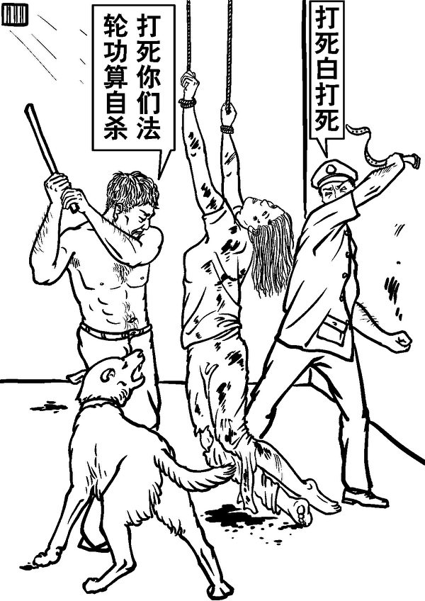

中共酷刑示意图：毒打。（明慧网）

2002年11月，警察强迫法轮功学员超时劳动。为抗议迫害，法轮功学员们拒绝出工，警察用暴力强迫她们复工。

据目击者透露，李淑敏被叫出去之后，狱警韩金玲、宋某、杨某、冯某，把她的衣服扒光，用电棒电击她。把她先关进猪圈里，然后再关进一个只有一平方米大的冰窖似的“禁闭室”里，不准她吃饭、上厕所，把她的十个手指戴上指铐，并拴上绳子，让她趴在地上，恶人再用力拽绳子。

之后李淑敏又被狱警用多根电棍同时电击，直到惨死。她死时双目不闭，遍体青紫，脑后布满伤痕。事后有关单位出示的“死亡证明书”上竟写着“猝死”。

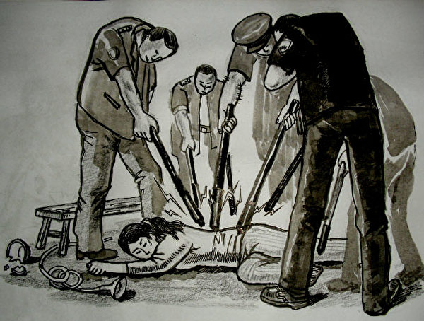

中共酷刑示意图：多根电棍电击。（明慧网）

<b>山东省平度市中医院医生徐增良三天内被活活打死</b>

                                 

徐增良（明慧网）

徐增良，1998年山东中医药大学本科毕业，到平度市中医院工作。他为人随和，从不与人争辩，做事情先考虑别人；在工作中，他严格要求自己。同学、同事及病人都说他“老实、真诚，是个好人”。

自1999年7月中共迫害法轮功后，徐增良遭到种种非人的迫害，于2001年4月14日在莱西被绑架，惨遭残酷折磨，仅三天后就被狱警活活打死。

徐增良死时光着上身，只穿一条裤子，两条大腿内侧布满直径约为3厘米的紫红圆点；头部一侧有一条约14里面长的很深的血口子；耳朵被打碎，血肉模糊，惨不忍睹。徐增良的父母悲痛欲绝。

<b>山西阳泉市医生李慧文被野蛮灌食致死</b>

李慧文，男，32岁，山西中医学院毕业，曾是山西省阳泉市矿务局医院的医生。1996年他在太原开始修炼法轮功，一直坚守信仰。结婚仅50天，就被阳泉市公安局、“610”（专门迫害法轮功的非法组织）人员骗到洗脑班，遭受酷刑折磨后被非法劳教1年。

2003年中国新年前后，李慧文一直被非法关押在山西新店劳教所集训队，被严刑拷打。他以绝食的方式抵制迫害，遭野蛮灌食。期间，他的两手被吊绑在两个上铺床的床沿上，然后狱警对他进行折磨、体罚。

2003年2月26日，李慧文被集训队队长宫俊升等人员野蛮灌食致死。

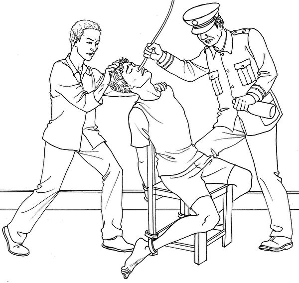

酷刑示意图：摧残性灌食。（明慧网）

<b>四川省邛崃市妇幼保健站廖朝齐被迫害致死</b>

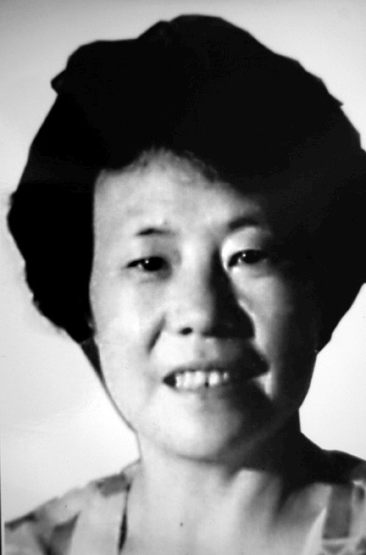

廖朝齐（明慧网）

廖朝齐，原四川省邛崃市妇幼保健站书记。2002年9月25日凌晨，她在法轮功学员陈桂英家中被大邑县警察绑架。警察对她严刑拷打，逼她说出法轮功真相资料的来源。

廖朝齐绝食抗议迫害。刑警大队长周文才对她拳打脚踢，致使她的左脸上留下了一团很大的青紫伤痕；然后又把她的双手反铐在牢房的地钉上，长达36个小时；不准她上厕所、睡觉、喝水、吃饭。后来她被关押到大邑县戒毒所。

2002年10月3日中午，戒毒所所长张某叫人用手铐把绝食8天的廖朝齐呈“大”字型铐在铁栅上；然后一把抓住她的头发，让她仰面朝天；中午给她灌食，灌了一小会儿未灌进去；下午接着灌。

当日下午5点30分左右，所长张某叫人拿来辣椒面、盐，并用铁器撬开她的嘴，给她往嘴里灌。一些在门口观看的吸毒女犯们开始哭泣，说太残忍。了。

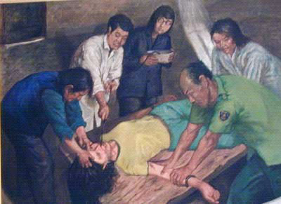

酷刑演示：野蛮灌食。（明慧网）

第二天上午，警察通知廖朝齐的家属，说她在大邑县公安局突然死亡。

几经周折，亲属终于在殡仪馆里看到廖朝齐的遗体。验尸发现，她的右手内侧被铐得血肉模糊，双侧肋骨多处骨折，尤其右侧的第五至七肋骨完全骨折。亲属要求索取验尸报告，警方非但不给，还逼迫她的儿子在所谓“不同意继续尸检的说明书”上签字，以推卸他们的责任。廖朝齐离世时57岁。

<b>北京顺义区妇幼保健医院硕士研究生董翠被迫害致死</b>

董翠，又名董翠芳，当年29岁，河北省藁城市兴安镇人，中医硕士研究生、北京顺义区妇幼保健医院的医生。

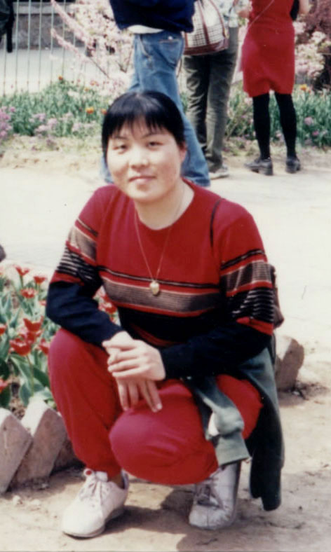

董翠（明慧网）

2002年，董翠在发法轮功真相资料时遭绑架，被非法判刑5年。2003年3月11日，董翠被转入北京大兴女子监狱，单独隔离在老三区的心理咨询室里。在那里，她遭到非人的虐待，包括双盘捆绑，连续剥夺睡眠，期间她曾绝食抗争。

3月19日上午，狱警席学会召集犯人李小兵、李小妹、靳红卫等五人将董翠带到没有监控的平房浴室里内暴打。几小时后，董翠被残害致死。遗体上青一块、紫一块，双腿肿紫，膝盖以下满是紫色瘀血，右肩处的骨头和肌肉支离。仅8天，她就被迫害致死。

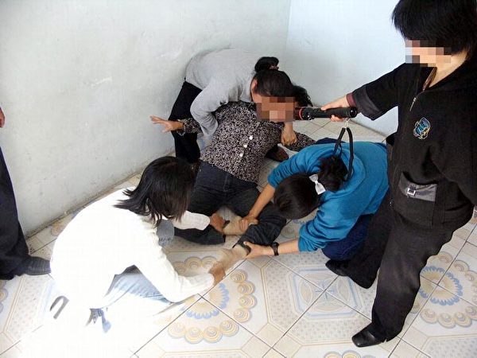

酷刑演示：暴打。（明慧网）

经北京法律医疗鉴定中心验尸，证明董翠确实是被殴打虐待致死的。面对化验结果，女监重金收买、胁迫董翠父母撤回诉讼。董翠父母在压力下求告无门，只好接受现状，无奈离京。

但最后女监通过造假，将董翠被打死说成是“正常死亡”。当年，女监还对外谎报“连续多年无重大安全事故”。

<b>北京市平谷县医院刘书松的遗体布满电击伤痕</b>

刘书松，男，28岁，原籍在河北省沧县杵龙堂乡西卷子村。1998年毕业于河北医科大学医学系，被分配在北京市平谷县医院外科工作。刘书松为人善良、正直、聪明、胸怀豁达、乐于助人，无论在家里、学校还是单位，都是有口皆碑的好青年。

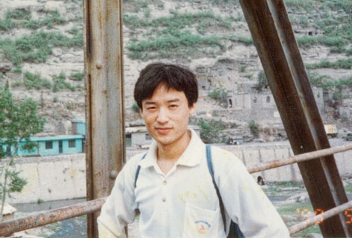

刘书松（明慧文）

2001年3月6日，正值中共两会期间，“610”（专门迫害法轮功的非法机构）派了许多特务在火车站蹲坑。在半夜2点石家庄开往北京的列车上，刘书松与另两名法轮功学员被非法拘押到石家庄市公安局政保大队。

据一同被抓的法轮功学员证实，当天下午4点左右，警察们又来了，先打开刘书松的手铐。刘书松奔向楼边，飞身跳了下去。警察们手忙脚乱地顺楼梯跑下去。一会儿，上来一个警察告诉说“他跑掉了！”但很快，刘书松又被抓了回来，遭到刑讯逼供。

3月8日下午，刘书松的父亲接到石市公安局关于儿子死讯的通知，于9日在河北省医院太平间看到了刘书松的遗体。

遗体已经被冻住，头部有伤，胸部两侧各有四个电棍电击的伤痕，约在胸部三至五肋间斜向排列；左手手腕处已烂得很深，右手腕处大片清淤；鷑骨和跟骨外露、粉碎。由于遗体已被冻住，加之家人悲伤过度，不忍再看，其它部位的情况还不清楚。

刘书松的母亲问警察，自己的儿子犯了什么罪，并要求看他生前的供词。警察不给。母亲气愤地说：“他没犯死罪，可他死在你们手里，而你们又拿不出任何证据，你们应该负责任！”警察称：“这是失误。”

<b>新疆石河子八一棉纺织厂医院儿科医生孔秋阁遭“610”迫害致死</b>

孔秋阁（明慧网）

乌鲁木齐市69岁的法轮功学员孔秋阁，2014年6月27日，被闯入家中的警察绑架；10月22日，被迫害离世。

期间，孔秋阁的家人四处控告，寄出近上百封控告信，要求追究相关人员责任，但都石沉大海。2016年10月24日，乌鲁木齐市水磨沟区检察院作出不立案通知书。后来孔秋阁的家人委托律师提起国家赔偿申请。

孔秋阁，家住乌鲁木齐市新市区苏州花园，原是石河子八一棉纺织厂医院儿科医生。她修炼之前患有严重的心脏病，不到退休年龄就提前退休。修炼法轮功后，其心脏病症状完全消失，心电图正常。

2014年6月27日，孔秋阁被闯入家中的20几个警察绑架。她绝食抵制迫害，之后在不到20天的时间里，她已瘦骨嶙峋、生命垂危，后被送入新疆乌鲁木齐公安监狱医院迫害。

孔秋阁一直被戴着脚镣。2014年10月21日晚9点，乌鲁木齐市公安局警察通知孔秋阁的家属去送饭。那时，孔秋阁基本已无生命迹象，全身冰冷。孔秋阁的女儿要求陪护母亲，却遭到警察韩圣远的拒绝。

10月22日下半夜1点半，警察打电话给家属说孔秋阁不行了，要求家属尽快到医院。当家属赶到医院时，看到孔秋阁在急救室。6点55分，医生通知家属孔秋阁已死亡。

<b>云南省玉溪市优秀妇幼保健医生沈跃萍被迫害致死</b>

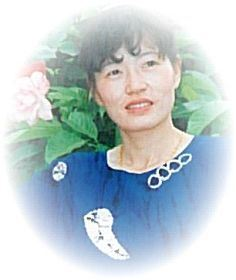

沈跃萍（明慧网）

沈跃萍，49岁，玉溪市妇幼保健站医生。沈跃萍在家是位贤妻良母，在单位里医术精湛，深受病人爱戴。自1996年修炼法轮功后，她在工作中任劳任怨，时常接济和帮助有困难的患者。

一次，有位捡垃圾的妇女带着高烧的孩子来看病，因她身上又脏又臭，又身无分文，医生都不愿接待她。沈跃萍看到后就主动给她孩子看了病，开了药，并且掏钱帮她付了针药费。

沈跃萍2000年到北京为法轮功上访，被非法劳教3年。2004年12月，玉溪红塔区公安分局何晓沛、张翔宇等警察在一展销会上绑架了沈跃萍、普志明夫妇和另外位法轮功学员。沈跃萍被非法判刑5年，关押在云南省女二监集训监区；她的丈夫被非法判刑4年。

在5年的监禁中，因沈跃萍拒绝所谓的“转化”（放弃修炼），从2006年3月开始被关“禁闭”（狭小的房间），长达3年之久。

期间，她每天被强迫坐在光床板上16个小时以上，不能站、不能走，不得洗澡、洗衣，来例假也不允许用卫生巾，还随时被“包夹”（专门看管法轮功学员的犯人）打骂或用针扎、用手拧、掐。包夹还每天强逼她吃不明药物，或者在给她的食物中投放不明药物，致使沈跃萍咳嗽8个多月，最后导致昏迷。

2009年5月12日，她的家人突然被监狱告知沈跃萍病危。当家人赶到医院时，沈跃萍已经被迫害得肺穿孔，奄奄一息，连睁眼、说话都非常困难。

5月14日，在家属的强烈要求下，监狱才给沈跃萍办理了“保外就医”手续。家人将她接送到昆明第三医院抢救。7月16日晚，她含冤离世。

<b>山西省平定县中医师王继贵被晋中监狱迫害致死</b>

王继贵（明慧网）

王继贵，59岁，山西省阳泉市平定县老中医。1997年开始修炼法轮功后，在利益面前不争不抢；谁有困难，不计代价给予帮助。他给病人看好病后，人家为感谢他，给他钱、东西，他都不要；人家请他吃饭，他也不去。人家没办法，就给他手机存话费，他就去营业厅查话费，把钱退给病人；单位给困难职工捐款，别人捐一二千元，他捐3,000元。

1999年7月，中共迫害法轮功后，王继贵曾两次被非法关押，于2016年6月2日在山西晋中监狱被迫害致死。

2012年7月18日，王继贵被绑架到阳泉（三岔口）看守所，非法关押15天后，被放回家；2014年8月4日，被平定县东升派出所警察绑架，当天下午被劫入平定县看守所非法关押；8月15日，被平定县检察院非法批捕；12月5日，被非法起诉。

2015年2月4日，他被平定县法院非法判刑3年；5月14日，被劫入山西晋中监狱继续迫害；2016年6月2日，被迫害致死。

资料来源：明慧网

<a target="_blank" href=#top><h6 align="right">回上方</h6></a>

<a name=201>
<h1 align="center"><b>疫情之下 大陆复工农民工遭遇种种辛酸事</b></h1>

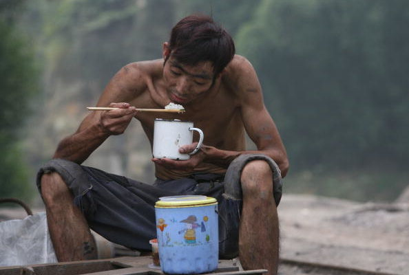

疫情下的农民工处境满含辛酸——经济困境，饱受歧视。图为大陆农民工特写。（大纪元资料室）

 
 【大纪元2020年02月25日讯】目前大陆农民工仅有三分之一返工，近日中共开始大规模宣传复工，甚至开设“农民工专列”，被指强制复工。但是，疫情下的农民工处境满含辛酸，其中包括经济困境，以及饱受歧视等。

疫情当前，就在世界各国纷纷上调疫情预警等级之时，中共媒体近两天持续宣传复工——“专车、专列，甚至包机”将农民工从四川、河南、湖南、安徽、云南、贵州等省份送往广东、浙江等农民工雇用大省。

但是，对于大约3亿大陆农民工来说，复工的过程充满辛酸。

《纽约时报》2月24日报导，大陆农民工在疫情爆发之前就已经生活不易——薪水低积蓄很少，工作辛苦，健保等社会福利很有限。

疫情爆发之后，农民工受到的冲击最为严重——受到歧视，被房东赶出出租屋，有的人只能挤在旅馆里，或睡在桥下或人行道上；担心染病，还有负担不起隔离费用和医疗费用；被拖欠薪水等问题。

有农民工表示，疫情当下，中共官员令社会形成一种观念——农民工威胁了公共卫生，他们被视为潜在的病毒携带者，这让他们处境变得更糟。

一位在郑州工厂打工的农民工说，房东已经让他们全家离开租屋，所以他们只能住旅馆。“我们现在失去了希望。”她说。

而一些出现肺炎和其它症状的农民工表示，他们在大城市负担不起医疗费用，而一些居住在城市的农民工为了让生病的亲人得到治疗，被迫支付成千上万的医疗费。

中共人社部2月21日发布通知称，涉及新冠病毒的医护相关人员染病可算工伤，其他所有返工工作人员染病不算工伤，不能享受工伤保险待遇。

另据大陆媒体报导，一对夫妻在一家酒店被隔离14天之后，被要求缴纳六千多元（人民币，下同）的食宿费。还有的地方不允许租户返回小区，否则将被集中隔离14天，自付每天800元的高额隔离费用。

武汉火神山医院被曝拖欠农民工薪水，甚至不能满足基本的防护设备和饮用水供应。民众质疑，“捐了那么多东西到底去哪了？”

火神山医院2月7日宣布完工后，四天后一名湖南工人被确诊染病，两天后再有一名工人确诊，而且感染源不明。患者透露，施工期间就已经有多名工人发烧咳嗽，工地卫生条件差。

综合媒体消息，尽管中共大规模宣传复工，但疫情令大陆企业复工难，很多企业担心群聚感染不敢开工。根据中共工信部的数据，目前中小企业的复工率不足30%。

<a target="_blank" href=#top><h6 align="right">回上方</h6></a>

<a name=200>
<h1 align="center"><b>美国完成首批新冠疫苗 四月进行临床试验</b></h1>

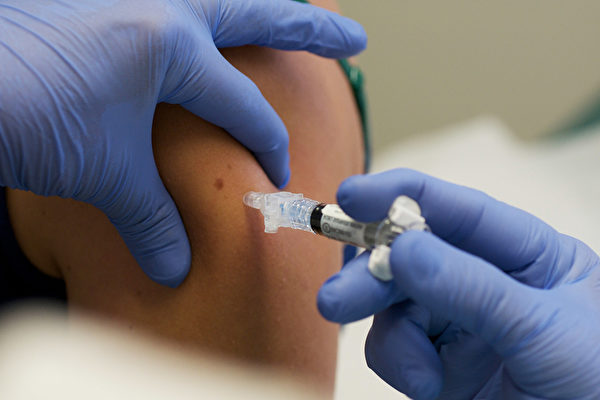

美国制药商已完成新冠病毒疫苗的开发，公共卫生部门将进行第一次人体试验，最快7月完成。图为注射疫苗示意图。(David Greedy/Getty Images)

 
【大纪元2020年02月25日讯】（大纪元记者吴英编译报导）美国制药商已完成新冠病毒疫苗的开发，公共卫生部门将进行第一次人体试验，最快7月完成。

《华尔街日报》报导，美国制药商莫德纳公司（Moderna）周一（2月24日）表示，已于周一将首批开发的几百瓶新冠疫苗，从其位于马萨诸塞州诺伍德市（Norwood）的制造工厂送到了位于马里兰州贝塞斯达（Bethesda）的国家过敏和传染病研究所（NIAID）。

<b>四月底进行人体试验 最快七月完成</b>

NIAID主任安东尼・弗契（Anthony Fauci）在接受采访时说，该研究所希望在4月底之前，对大约20至25名健康志愿者进行新冠疫苗的第一次临床试验，测试注射两剂疫苗是否安全以及能否诱导可以预防感染的免疫反应。初步结果可能会在7月或8月公布。

莫德纳在1月份获得新冠病毒的基因序列后，与NIAID共同设计的第一批疫苗的开发，在这么短的时间内完成开发，速度相当惊人。

<b>从疫苗设计到人体试验仅三个月 速度之快前所未见</b>

如果NIAID按计划于4月开始临床试验，那么从疫苗设计到人体测试大约只有3个月的时间。根据弗契博士提供的资讯，2002年底在中国爆发萨斯（SARS，又称“非典”），当时NIAID大约花了20个月的时间才进入疫苗人体测试的第一阶段。

“毫无疑问，在获得新冠病毒基因序列后三个月内即进入第一期人体试验，创下内部研究纪录，从未见过这么快的速度。”弗契博士说。

<b>第二次试验需要六到八个月时间</b>

他说，第一次临床试验将在NIAID位于贝塞斯达的临床试验部门进行。如果第一次试验成功，下一步则是对数百或数千名志愿者进行第二次试验，这可能需要6到8个月的时间。这次试验可以在美国进行，也可以在中国或病毒传播的地区进行，以评估疫苗是否降低了感染率。

弗契博士说，如果第二次试验成功，那么就可以准备该疫苗的广泛使用，到那时候就要依该病毒的传播范围，决定是否提供给诸如医护人员的特定目标人群，或是更广泛地提供给所有公众。

不过，快速开发疫苗以及尽速进行临床测试并不能保证疫苗的成功。萨宾疫苗研究所（Sabin Vaccine Institute）全球免疫学负责人布鲁斯・吉林（Bruce Gellin）说：“直到最后，都没有把握。”

“测试的目的是找出哪些有效，哪些无效”，吉林解释说，“这就是为什么要尽可能地尝试更多的看似可行的事情，这是至关重要的，因为并非所有马匹都能跑到终点。”

目前还不确定莫德纳的疫苗能否起作用，因其基因主导的技术尚未产生获批准的人类疫苗。弗契博士说，即使首批研发的结果是肯定的，新冠病毒疫苗可能要到明年才能广泛使用，因为还需要进一步的研究和监管许可。

<b>美专家：今年若来不及用 明年仍可派上用场</b>

不过，卫生当局表示，面对快速爆发的武汉肺炎疫情，值得对这些新技术下注。弗契博士说，新冠病毒有可能成为季节性流感病毒，在下个冬季卷土重来，那么即使疫苗在今年来不及正式使用在人类身上，但是未来在其爆发之前仍很有用。“唯一可以完全抑制新传染病的方法就是使用疫苗”，他说。

莫德纳成立于2010年，拥有八百多名员工，致力于开发基于所谓的信使RNA的药物和疫苗。该公司多达100名制造和质量控制员工参与了开发新冠病毒疫苗的工作，许多人不眠不休，即使假日也来上班。

该公司于2月7日完成了约500瓶新冠疫苗，当天是星期五，大约有10到15名员工在那个周末加班，进行质量控制测试。接着利用大约两周的时间进行无菌测试。

<a target="_blank" href=#top><h6 align="right">回上方</h6></a>

<a name=199>
<h1 align="center"><b>林郑呈中共高层报告曝光 港各界斥其无可救药</b></h1>

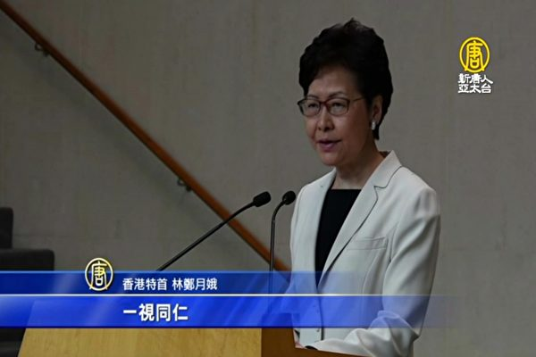

香港特首林郑月娥。（授权影片截图）

【大纪元2020年02月23日讯】（大纪元记者方晓报导）大陆武汉肺炎疫情攻入香港，港府被轰防控不力。港媒曝光一份林郑呈报给中共高层的报告，内容令香港各界震惊及愤怒，连香港建制派议员都斥林郑无可救药。

港媒《苹果日报》日前披露，取得一份由香港特首办撰写、据悉本月中已向中共高层提交的“抗疫工作报告”，显示特首林郑月娥抱怨建制派未护航，又要求医管局向罢工医护秋后算账，更将抗疫工作视作选举翻盘契机。

报导指，林郑根本没反省自己的不足，只将错失归咎反对派、建制派、激进网民和所谓谣言假消息，更将争取封关救港的罢工医护人员定性为“借机闹事的激进反修例分子”。并称只要港府应对疫情“成功”，就可成为扭转9月立法会选举形势的契机。

该报记者不断通过电话及电邮向特首办查询，但至截稿前仍未得到任何回复。

立法会议员毛孟静表示，平时对于捏造的指控，特首都会否认，但这次却无否认上述报告的真确。她痛斥林郑将抗疫失败之责推卸给反送中抗争，借此状告建制派，以政治掩饰无能之举令人作呕，其手段令人震惊及愤怒，促请林郑必须向公众交代报告内容及辞职。

对于特首在疫情报告中抱怨建制派，有不愿具名的建制派立法会议员说，要以三个字总结对林郑的评价：“没得救！（无可救药）”该建制派直指，这份报告一定会令建制派和林郑关系变差。

新型冠状病毒疫情持续肆虐，香港沦陷。港各界炮轰港府迟迟未有加强防疫措施，令香港失守。医管局员工阵线与多个组织及工会发表联合声明，强烈谴责港府无法为防疫把关，促请政府立即拒绝旅客经由中国入境，直至疫情完全受控。

香港部分医护人员要求港府全面关闭连接大陆的边境检查站，防止新型冠状病毒的疫情进一步扩散，但遭港府拒绝。2月3日起，香港部分医护人员发动分阶段罢工。

港大专家等呼吁由于疫情目前正处于关键时刻，港人必须要戴口罩外出，不能掉以轻心。

而林郑月娥一直坚持不戴口罩，甚至在多次巡视社区时仍然拒绝戴上口罩，营造香港疫情已有好转的假象。

香港警方21日证实，首名纪律部队人员感染新冠病毒肺炎，该警员2月18日晚曾在西环某酒楼与另外59名警员聚餐。这59人已被界定为密切接触者，须接受检疫。

截至2月21日，香港确诊69宗新型冠状病毒肺炎个案，包括2宗死亡个案。

<a target="_blank" href=#top><h6 align="right">回上方</h6></a>

<a name=198>
<h1 align="center"><b>【一线采访】北京疫情猛烈 网友绘新冠地图</b></h1>

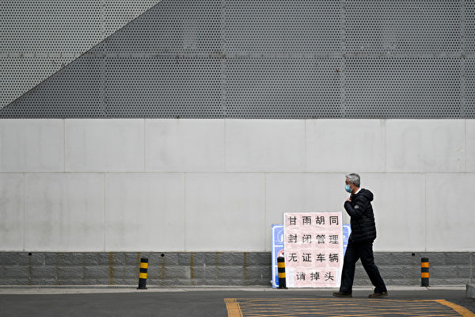

北京的新冠病毒肺炎疫情形势严峻，很多地区都实施封闭式管理。图为2020年2月25日，一名戴着口罩的老人在北京的一条空荡荡的道路上行走。(STR / AFP)

 
 【大纪元2020年02月25日讯】（大纪元记者易如、李毅采访报导） 新冠肺炎疫情猛烈，直扑中南海，中共的权力核心区域北京西城区已经成为重灾区。

北京的西城区是中共党政和国家首脑机关的办公所在地，辖区内部级以上中央单位120家，该区连日来已成为北京新冠肺炎疫情的重灾区。疫情严重影响生活经济，北京市民恐慌，纷纷抢购粮食。

更有民众根据公开资讯绘制“新冠地图”表示，北京确诊和疑似病例大多是散点式分布，唯一例外的是西城，出现了密集式分布情况，尤其是月坛这个区域。

这个区域的起点是月坛街道复兴门外大街的复兴医院，中间横穿三里河整个大片区，包括月坛南街的果多美、月坛北街8号，到展览路街道的南营房社区，最终达到北大人民医院，网友认为这个集中区，堪称为“新冠走廊”。
 
 

新冠疫情在北京西城区的感染集中区，网友称之为“新冠走廊”。（网友提供）

 
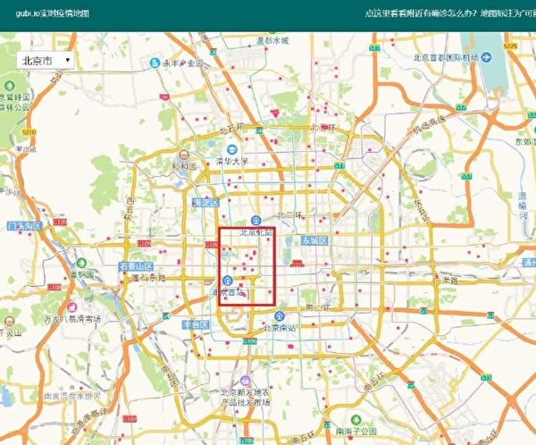

北京确诊病例分布呈现点状散开来，唯独西城区最为密集。（网友提供）

 
 武汉肺炎疫情自去年12月初爆发后，中共各级政府从上到下都在隐瞒疫情，致使疫情迅速失控，外界普遍认为实际的确诊、死亡人数远远超过中共官方公布的数据。

居住在北京西城区的刘先生告诉大纪元记者，“北京挺严重的，每天每个区都有增加（感染病例），所有的小区、社区都封闭了，出入都要测体温，管得还都很严。还有很多限制要求，车也都要办出入证。”

刘先生相当关注北京西城的疫情，“对，我现在天天看啊！”他说，“现在每天都有（感染），湖北发生疫情，就这点时间（要求复工）回来（北京），可能增加还挺多，比新年期间增加的多，因为大伙都是返京回来的。”

<b>传北京封城封至3月10日</b>

刘先生说，“听说北京市好像要封到3月10号。而且回来这上班的人，要在家里面待两个星期不能出门，还要上报街道、上报单位。如果有不上报的，一旦查证处理的结果是很严重的。”

“弄不好工作就没了，管你从哪回来，不见得非要从湖北回来，就是你从外地回来你都要自报，然后在家里头待14天不能出门。北京还是蛮严的。”

居住北京朝阳区的居民赵先生对于大纪元表示，北京处于封城状态，企业复工难，“那是上边的压力，怎么复工？传染得更厉害，没有什么好办法，现在挺乱的，几乎陷入完全瘫痪状态，蔬菜、食物都贵，民生物品目前暂时能维持，往后就很难说了。”

“大家都囤积的话，很快就短缺了，方便面都抢光了，现在瘫痪状态多难受啊！封闭在家里，惨不忍睹，公交车、地铁空空荡荡的，根本就没有人，什么都倒闭了，企业不能复工，承受不住都倒闭了，持续了一个多月，有的根本撑不下去了。”

“前几天房山有一个居民在武汉长期工作，隐瞒实情偷偷跑回家了，广泛接触的结果，房山感染一大片，很可怕。”他说。

<b>疫情每天播报 但民众感受不透明</b>

赵先生对于北京的防疫及封区、居家隔离情况表示不安心，“不乐观，不透明，不明白，根本不知道什么情况，封闭得很厉害。”

“我们住的小区可能有4～5例了吧。朝阳区确诊的有2例是官方公布，第3例没公布，就把小区封闭了。”

他说，“现在全面（疫情传播）散开了，很严重了，我们周边的地方，把能封闭的，都给封闭了。”疫情传染相当严重，“它已经遍地开花了，这个传染病，大家已经都清楚它已经遍地开花了。”

“传染的途径很恐怖，很严重，空气都能传播，不能控制住，真的很难说。不乐观，一点都不乐观。”赵先生说。

他认为民众正被蒙蔽在凶猛未知的瘟疫恐惧中，“很恐惧的，有的人很无知，千奇百怪，各种心态的人都有，一两句话无法形容 。”

<a target="_blank" href=#top><h6 align="right">回上方</h6></a>

<a name=197>
<h1 align="center"><b>【疫情最前线】中共军警抚恤金超医护40倍</b></h1>

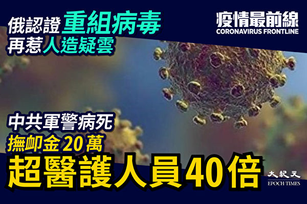

大陆12万警察医院维稳，病死可获抚恤金20万人民币，超过医护40倍。俄罗斯认证新冠病毒是一种“重组病毒”，并全线关闭边境，再次引发“人造病毒”猜测疑云。（大纪元合成图）

 
 【大纪元2020年02月24日讯】（大纪元香港记者站报导）2月21日，中共公安部宣布部署每天12万警察24小时驻守全国所有定点医院维稳，病死者可获公安部发放抚恤金20万人民币，抚恤金额超过武汉染疫去世的前线医护人员40倍。此外，俄罗斯认证新冠病毒是一种“重组病毒”，并全线关闭边境，再次引发“人造病毒”猜测疑云。
 
</b>【海外疫情】
伊朗43宗确诊8死 死亡率高达18.6%</b>

我们首先看一下，这次新冠状病毒疫情，在海外的发展。

亚洲的新冠状病毒疫情仍然最为严重。伊朗2月23日新增武汉肺炎确诊病例15人，从出现首例后，仅四五天的时间，该国确诊总数已达到43例，且死亡8例，死亡率高达18.6%。

两个出现新型肺炎确诊个案的城市，包括首都德黑兰以南的库姆，以及西北部城市阿拉克，伊朗政府宣布将暂时停止两个城市的教育活动，防止病毒传播。市内中小学、大学及教育中心，自当地星期日起暂时关闭。

<b>美国提升对亚洲旅游警示至第二级</b>

新型冠状病毒肺炎在东北亚情况最为严重。包括钻石公主号的染病人数，日本23日确诊人数为770人；韩国的确诊病例近日快速增加至602人，并有5个死亡案例。美国国务院与疾控中心提升对日韩旅游警示至第二级。

日韩两国遭以色列封关，大韩航空200人，当天被迫原机折返。

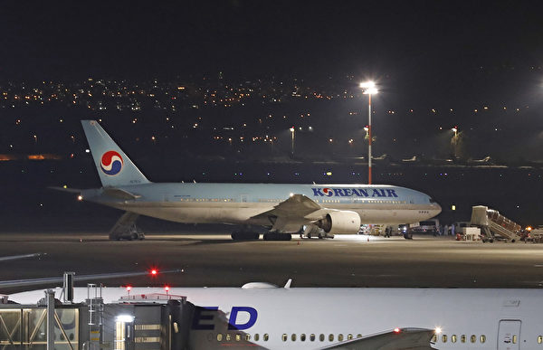

2月22日，以色列拒绝一架抵达特拉维夫机场的大韩航空（Korean Air）客机上约200名非以色列人下机。 (Ahmad GHARABLI/AFP)

有网友留言说，韩国及日本不对中国封关，便和香港一样，被美国封关，美国CDC如带头，其它国家亦会跟从，因为WHO如有大问题，也是寻求美国CDC的意见及技术支援，美国禁飞是有指导性作用的。

<b>意大利北部疫区封城 恐波及整个欧洲</b>

欧洲国家意大利的疫情，近日突然恶化。原来意大利只有数宗感染病例，2月22日傍晚，突然暴增至79宗，而且出现了一个死亡个案。意大利立即采取非常手段，封闭北部多个城镇。

政府已出动军队，协助封闭重灾区伦巴底区（Lombardy）多个城镇，实施隔离，除非经特别许可，否则任何人不准进出，当地学校及商店全部要停止运作。消息说，当地的封城措施将持续几个星期，影响约5万居民。此外，意甲足球的3场赛事被迫改期。

伦巴底卫生部长Giulio Gallera试图派定心丸，称现时情况不是大爆发（not a pandemic），但他同时又称，病毒传染性十分强，而且致命（virulent）。

意大利是欧盟国家，而欧盟成员国国民可在区内自由流动，意大利一旦失守，恐成为缺口，连累全欧洲。

<b>世卫警告非洲情况堪忧</b>

到目前为止，非洲仍然只有埃及确诊了一例新冠病毒。其它200多例，检测后证实为阴性。不过，世界卫生组织警告说，非洲的情况仍然令人担忧。

36个非洲国家卫生部门首长，两天前在埃塞俄比亚的非洲联盟总部开会，世卫总干事谭德塞警告说，非洲的卫生体系将难以应付新冠病毒的入侵。他说：“许多非洲国家相关医疗器材不足，十分令人担忧。”

<b>俄罗斯官方认证：武汉肺炎病毒是重组病毒</b>

武汉肺炎疫情持续蔓延，俄罗斯卫生部，日前正式在其官网上公告：“新型冠状病毒是重组的病毒。”这是武汉肺炎疫情爆发后，全球首例官方认证该病毒是一种重组病毒。日前，俄罗斯已经关闭超过4000公里的中俄边界，并取消了中客免签，停发工作签证；同时自20日起，禁止所有中国公民入境，包括香港与澳门。

俄罗斯卫生部1月29日曾发布《预防诊断治疗新型冠状病毒（2019-NCOV）》的报告，2月3日又发表了第二版。该份报告发布在俄罗斯联邦官方网站上，由俄罗斯卫生部部长和俄罗斯联邦消费者保护局局长两人共同签名。

该报告所附的临时指南第4页提到：“新型冠状病毒可能是蝙蝠冠状病毒与未知病毒重组而成”。目前并不完全了解新型冠状病毒的感染发病机制，被感染后似乎并不能免疫，有可能发生再度感染。

俄罗斯是全球首个官方认证新冠病毒为“重组病毒”的国家，引起外界高度关注。虽然此公告中，未有直言该病毒是人工合成，但俄罗斯官方所采取严厉的边境隔离措施，似乎暗示了武汉病毒非同一般。

中共官方一直否认病毒来自人工合成之说。网路上对于俄罗斯认证新冠病毒是重组合成的消息议论纷纷，不少网友嘲笑，中共被俄罗斯从背后捅刀。

<b>【病毒追踪】
武汉肺炎病毒毒源疑云</b>

事实上，自武汉肺炎疫情爆发后，其病毒来源问题笼罩疑云。各国都对新型冠状病毒进行研究，包括以色列、印度和美国等多国的科学家，都质疑该病毒基因有人工干预痕迹，而非自然演化而成。

美国联邦参议员汤姆．科顿（Tom Cotton）在内的一些政治人物，也质疑或暗示此病毒可能与中国武汉P4病毒实验室有关系。

武汉P4实验室被指与北京当局的秘密生化武器计划有关。坊间传出病毒可能是从该处泄漏。有印度科学家更发现了该病毒被人工插入病毒蛋白，似乎印证了“武汉肺炎”病毒是中共生化武器的证据。

该所研究蝙蝠冠状病毒的研究员石正丽，2014年发表《一簇源于蝙蝠的类似SARS冠状病毒，显示出了传给人类的潜能》的论文，明确指出蝙蝠冠状病毒基因的两个蛋白开关，调一下就可以适应人体。

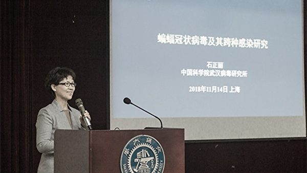

研究蝙蝠冠状病毒的武汉病毒研究所研究员石正丽2018年11月在上海交大演讲。（网络图片）

 
 2月14日，习近平主持召开中共中央深改委会议时称五次提到生物安全法，“针对这次疫情暴露出来的短板和不足，抓紧补短板、堵漏洞”；“把生物安全纳入国家安全体系，要尽快推动出台生物安全法”等。

旅美经济学者何清涟在推特上表示，猜想：病毒来源应该已经有（中共）内部调查的初步结论。军队生化首席专家陈薇少将全面接管的那家武毒所难逃其咎。

白宫日前要求科学家彻查武汉病毒来源，总统川普（特朗普）密切关注病毒研究进展报告。时评员路德在2月7日的直播上指，这表示特朗普已经掌握一定证据了。同时武汉P4实验室已军管，意味着中共正在销毁证据。

<b>中科院承认海鲜市场非疫源地 去年11月已人传人</b>

新型冠状病毒疫情爆发后，官方曾宣称这种新病毒最早来自海鲜市场售卖的野生动物。

2月22日，中新社发表报导称，中国科学院西双版纳热带植物园与华南农业大学、北京脑科中心合作，解析了覆盖全球四大洲12个国家的93个新型冠状病毒样本基因组数据后发现，华南海鲜市场的病毒是从其它地方传入的，而且病毒很可能在11月下旬已开始人际传播，然后才在华南海鲜市场集中爆发。

据这篇报导，科学家研究上述93个样本后发现，武汉病毒样品中，单倍型H3的样品与华南海鲜市场无关，相反，与该市场有关联的患者样品的单倍型，都是由H3衍生出的H2或H8-H12。由此可见，新冠病毒是从其它地方传入华南海鲜市场后，再通过这个市场向其它地方快速传播蔓延。

此外，病患发病的时间记录和种群扩张时间，也证明华南海鲜市场不是病毒的最初发源地。

报导还提到，研究发现，病毒在2月12日前发生过两次明显的种群扩张：第一次扩张发生于2019年12月8日，第二次种群扩张则发生在今年1月6日，显示最早再11月下旬，该病毒已开始人际传播。

网友Freeman评论说：“华南海鲜市场当替罪羊，很明显漏洞百出，既然中科院的文章出来打脸，看来病毒来源也快真相大白了。”

国际权威医学期刊《柳叶刀》（The Lancet），1月24日就发表由武汉金银潭医院副院长黄朝林等近30名中国医疗和科研人员撰写的论文，披露最早发病的病人时间是去年12月1日，他与华南海鲜市场没有接触史。

<b>【大陆疫情】
陆12万警察驻医院维稳 染疫死抚恤金超医护40倍</b>

武汉新冠病毒继续蔓延。中共派12万公安驻守全国定点医院“维护救治秩序”。

2月21日，中共公安部在国务院举行的新闻发布会表示，公安部部署各地提升勤务等级，按照“一院一专班”的要求，每天安排12万名民警，24小时驻守全国所有定点医院。

该官员宣称，此举是为了维护“医疗救治秩序”，确保“防疫工作”。

有评论说，很多患者处在绝望的境地，而前线医护超负荷工作，情绪也可能随时崩溃。中共派公安驻守，最重要的考量恐怕是防止医护、患者及家属在“情绪失控”时逃跑或反抗，甚至爆发群体事件。

日前网传视频显示，在疫情最严重的武汉市，大批外地公安乘飞机抵达武汉天河机场，支援武汉警方。

还有视频显示，有地方特警正进行“反恐演习”，将敢于摘口罩反抗的民众当成“恐怖分子”对待。

另外，官方报导显示，公安部近日对死于“抗疫前线”的公安警察，每人发放20万元人民币抚恤金。这个金额，40倍于武汉染疫去世的前线医护人员，他们的家属只获5000元慰问金。

到底是什么原因，导致公安武警和医护人员，会有如此巨大的待遇差距？

<a target="_blank" href=#top><h6 align="right">回上方</h6></a>

<a name=196>
<h1 align="center"><b>疫情冲击 银行若不快行动 百万中企恐将倒闭</b></h1>

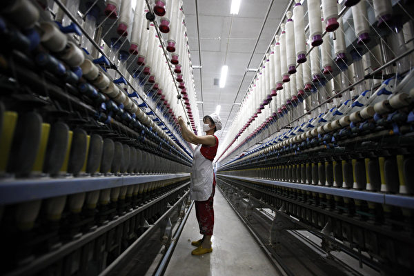

受到新冠病毒疫情冲击，大量中企正在生死线上挣扎。图为淮北一家纺织厂。(AFP)

【大纪元2020年02月24日讯】（大纪元记者张婷综合报导）新冠病毒危机给中国产业带来严重冲击，大量中小企业正在生死线上挣扎。布里吉塔（Brigita）是中国一家大型汽车经销商的主管。对她来说，维持企业生存可用的选项正在耗尽。

据彭博社报导，布里吉塔所在公司旗下100个营业点，因新型冠状病毒危机而被迫关门大约1个月。目前，公司的现金储备趋于干涸。雪上加霜的是，多家银行不愿延长该公司在几个月内即将到期的数十亿元（人民币）债务的偿还期限。此外，还有其他债权人需要考虑。

“如果我们无法偿还债券，那将是非常非常糟糕的事情。”布里吉塔说。她的公司拥有1万名员工，销售宝马等中高档汽车品牌。

因为没有被授权向媒体发表言论，布里吉塔不愿透露她的姓氏和公司名称。

中国乘用车市场信息联席会（乘联会）近日发布最新数据，大陆2月份前两周的乘用车销量相比去年同期暴跌92%，实体和线上销售均冷清，大陆汽车产业从生产到销售一片惨淡。

<b>数百万公司苦苦求生</b>

彭博报导，由于新冠病毒疫情严重，中国的很多企业仍在挣扎复工。全国各地数百万计的公司都在争分夺秒地维持生存。

本月对中小型中企所进行的一项调查显示，三分之一的受访企业只能再支付一个月的固定费用，另外三分之一的受访公司称，资金在两个月内就会用光。

报导称，尽管中共政府已经削减了利率，下令银行增加贷款，放宽公司重启运作的标准，但许多私营企业表示，他们无法获得所需的资金以应付即将到期的债务，也无法应对工资支付。如果没有更多的金融支持或中国经济出现突然反弹，有些企业可能不得不永久关闭。

“如果中国在第一季度未能遏制该病毒，我预计，将会有大量的小企业破产。”北京中和应泰财务顾问公司分析师吕长顺（Lv Changshun，音译）告诉彭博。

他认为，对中小企业来说，现在就是在跟时间赛跑。

吴海（Wu Hai，音译），Mei KTV的业主，旗下拥有100家卡拉OK店。吴海在微信公众号的文章中坦言困境。他表示，由于病毒危机，他的店已经被政府关掉，扼杀了公司的现金流。当局的特别贷款几乎没啥帮助，在没有足够的抵押和现金流的情况下，没有银行将会提供贷款。

他表示，不营业没有收入，公司只能支撑2个月就不得不关闭。

<b>要求和限制多 中小企业获得贷款难</b>

尽管私营企业占中国经济的60%，提供80%的就业，但私企一直以来深陷融资难的困局。他们需要资金在经济繁荣时扩大业务，在危机时维持生存。

到目前为止，中国的大型银行为应对病毒危机所提供的支持很少。中国工商银行向其大约5%的小企业客户提供了些缓解措施。

据银行业协会称，截至2月9日，中资银行作为一个整体，提供了约2,540亿元人民币的与应对疫情的相关贷款，花旗集团（Citigroup Inc.）等外国银行也降低了利率。

但知情人士告诉彭博，严格的要求和贷款入围名单限制了谁可以获得中央银行制定的和病毒相关的特别贷款，而地方政府和银行则对贷款金额设置了上限。

对汽车经销商来说，这并没有多大的帮助。布里吉塔的公司对数十家银行都有欠款。她表示，到目前为止，她只与少数几家银行达成了协议，将债务偿还期限延长了两个月。目前，该公司仍在支付薪水。

联合资信评估有限公司在近期的一份报告中指出，本次疫情对于民企分布广泛的第三产业冲击最大；受疫情影响，居民减少外出，消费活动下降，餐饮、旅游、航空、酒店等休闲旅游业等行业短期内受到巨大冲击。

杨（Yang，音译）是上海一个7层楼商场的物业经理。杨说，一个经营有150个酒店房间的租户往常的业务一直很忙，但现在其业务干涸，因此要求豁免一个月的租金。

安徽省一家小型开发商的融资副主管对彭博表示，他的公司甚至被拒绝在现有信贷限额内贷款，因为销售下降已经损害了该公司的资信。他表示，如果无法获得信贷，公司可以存活大约4个月；如果一些付款能够暂时被推迟，公司还可以存活更长一点。

很多银行近两年自身陷入困境。信贷评级机构标普的一份报告称，若中共公共卫生紧急状态持续，恐导致银行系统的不良贷款率将急升至6.3%，即增加5.6万亿元人民币之不良贷款，资本充足率亦将因此降3.86个百分点。

<a target="_blank" href=#top><h6 align="right">回上方</h6></a>

<a name=195>
<h1 align="center"><b>【内幕】湖北公安系统逾千人染疫 多地驰援</b></h1>

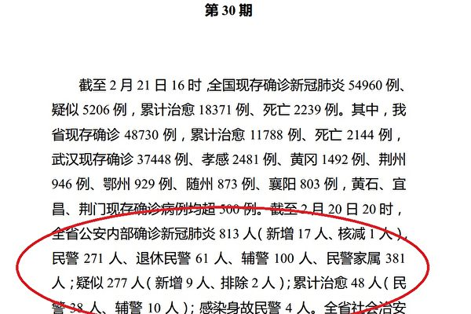

湖北省内部简报显示，截至2月20日20 时，湖北省公安系统逾一千人感染了新冠病毒肺炎。（大纪元）

 
 【大纪元2020年02月23日讯】（大纪元记者张顿报导）武汉肺炎持续蔓延，武汉各地医院、监狱相继发生感染事件。大纪元获得湖北省的一份内部通报，通报称该省公安系统至少有逾千人感染了新冠病毒肺炎。分析认为，实际感染人数可能比这还多。

大纪元获得一份湖北省《新型冠状病毒感染肺炎疫情防控工作简报》。该简报是第30期，详细地介绍了2月21日该省各地确诊人数以及如何部署“维稳”等工作。

该简报还披露，截至 2 月 20 日 20 时，全省公安内部确诊新冠肺炎813 人（新增 17 人、核减1人），疑似277人（新增9人、排除2人），感染死亡警察 4人。

其中，确诊病例中，警察271人，退休警察61人、辅警100人、警察家属381人。

时政评论员李林一表示，该简报是布置湖北省的所谓维稳工作，从通报的该省确诊病例及死亡病例来看，与公开报导数据一样，而实际人数应该远远超过官方数据。

“所以不排除湖北省公安系统感染人数可能不止1000多，”李林一说，从现在各地的公安人员不断涌向武汉的情况看，说明政法系统内部面临的防疫形势相当严峻。同时，武汉的维稳压力也是相当的大。

2月23日，网上爆出一张图片，显示湖南省公安机关一次性派出了约80名公安支援武汉。

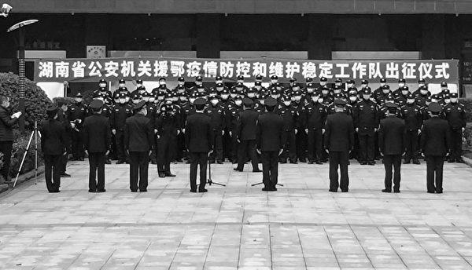

湖南省公安厅机关公安被派往武汉疫情一线。（网络图片）

 
 2月22日，推特上爆出重庆用专机送公安人员“支援”武汉。同时，从视频上看，从飞机上下来大约100名左右的公安。
 
 据早前媒体报到，2月21日，湖北省公安厅机关132名公安，被派往武汉疫情一线。此前，湖北省公安厅机关已派出100名公安到武汉。

但很多人对各地公安被陆续派往疫情重灾区武汉表示不安，尤其是疫情失控后，很多地方发生包括公安在内的执法人员红卫兵式的极端暴力防疫：随便抓人、打人、牵绳索游街示众等各种侮辱人格和尊严的做法，引发不满。

推特上有评论称：“重庆滴黑社会团伙抵达武汉！”“武汉的警察不会都被气化了吧？还是真的要大开杀戒人手不够？”

在这批疫情中，大批公安也处于疫情的一线执勤，公开报导显示至少有20多名警察死于抗疫一线，但官方的报导中，大部分死因据报是因为脑溢血，心梗，交通事故，还有一些是不明原因猝死，并未明确说明是否有人是因为感染新冠疫情死亡。

据公开报导，2月22日，23日，湖南和广西各有一名公安死在抗疫一线。

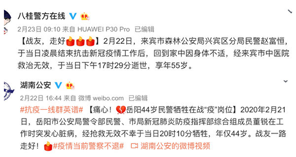

（截图）

另外，中共监狱系统也爆出群集性感染事件。

2月21日，中共司法部监狱管理局负责人何平公开承认：截至2月20日24时，大陆共有湖北、山东、浙江5个监狱发生群体性感染事件，其中湖北就占了3个，分别是武汉女子监狱230例，汉津监狱41例，湖北省未成年人管教所疑似病例1例。

曾在山东临沂监狱服刑、现旅居美国的维权律师陈光诚，2月21日对大纪元记者表示，监狱实际感染人数应该是中共报出来的10倍以上，因为监狱在押人员很集中，而且一起干活、一起放风等。

武汉肺炎去年12月初爆发后，中共从地方到中央一直隐瞒疫情，打压传播疫情真相的医生及民众，宣传疫情“可防可控”、没有“人传人”等虚假消息，致使疫情迅猛在全国蔓延。

截至2月23日6时，仅中共官方的数据，全国逾有7.6万确证病例，逾2300人死亡，其中武汉确诊逾4.5万例。但外界普遍认为，实际数字应该是官方的数倍以上。

<a target="_blank" href=#top><h6 align="right">回上方</h6></a>

<a name=194>
 

2020年2月23日下午，美国神韵巡回艺术团在南特市议厅举行第四场演出。（章乐/大纪元）

<h1 align="center"><b>神韵南特四场全爆满加座 演艺界精英叹服</b></h1>

【大纪元2020年02月24日讯】（大纪元法国南特记者站报导）神韵之美打动了法国西部地区观众的心；神韵展示的神性内涵，让当地主流深受启迪；神韵顶级的艺术，让法国演艺界精英深深折服。

2月23日下午，神韵巡回艺术团于南特市议厅（Cité des Congrès de Nantes）展开了今年在当地的第四场、也是最后一场演出。适逢周日，春雨飘飘，南特市会议厅内外如前三场演出一样，观众要大排长龙等待进场。

三天四场的演出均是加座再加座大爆满，观众的票都是早在几个月前订好的。如今，南特市的神韵粉丝已经明白，要想一睹神韵的风采，买票一定要早动手。

<b>政府部门总监：神韵传递神性 人需神指引</b>

2020年2月23日下午，法国西部瓦讷（Vannes）市政府体育与娱乐部总监Bruno le Gall于南特市议厅观看神韵演出。（张妮 ／大纪元）

法国西部瓦纳市（Vannes）市政府体育与娱乐部总监Bruno le Gall对于神韵传递中华神传文化的内涵感悟至深。他说从中领悟到这样一个信息：人要向往美好的生活，要为他人（着想），要崇尚高级生命（返本归真），只有这样神才会引导我们，神引导我们造福他人，帮助他人，而不是伤害他人。

神韵致力复兴中华传统文化，Le Gall非常认同，“这是非常好，非常好的事情”，他认为“造福人类的美好事物（文化）绝不能忘记，因为人类必须从中得到启发，激励人类进步，开创未来。我们必须提醒年轻的一代，承传给了他们这些美好的价值。”

<b>舞蹈团团长：尽善尽美 充满能量</b>

2月23日下午，Lise Le Clanche女士观看了神韵巡回艺术团在法国南特市议厅的演出。（张妮／大纪元）

出自舞蹈世家的Lise Le Clanche女士对神韵展现的中国古典舞赞不绝口，并对节目中的传统价值内涵深深折服。她说：“这是一场出色卓越、完美无暇的演出，内容丰富多彩，服装华美绚丽，舞蹈亮丽精湛。所有艺术家都身高一致，舞姿协调，英俊潇洒，整台演出尽善尽美 。”

Le Clanche从专业角度说，“每个节目各有不同，无论是男子舞还是女子舞都完美无瑕！演员们站位都极快，一点儿声音都听不到，从移动到最终归位，他们都非常轻盈，连呼吸都听不到，真是了不起 ！”

Le Clanche还说：“（神韵）舞蹈非常完美，演员动作一致，一样的活力，所有人都尽心尽力的演出，我可以感受到舞蹈中充满能量。”

Le Clanche从小跟母亲学古典舞，长大后当了多年舞蹈老师，目前在法国的莫尔比昂（Morbihan）拥有一个舞蹈团。由于舞艺高超，她曾担任舞蹈评审并在世界进行巡回演出。

<b>资深舞蹈演员及服装设计师：完美无瑕 无可挑剔</b>

舞蹈演员Mirelle Leblanche女士观看了神韵巡回艺术团2月23日下午在南特市议厅的最后一场演出（Isabelle Meyer/大纪元）

Mirelle Leblanche女士是一名资深的舞蹈演员，在多年的舞蹈生涯中，曾在巴黎跟随有名的舞蹈教师学艺，并致力于演出服装的设计。她和女儿Lise Leclenche创办了一个舞蹈团，在她的服装作坊里拥有演出服装超过400多套。

Leblanche表示，她早在十年前就知道神韵了，“今年总算是来了，我们家庭所有成员都一起来看演出。”

看过演出，Leblanche女士盛赞：“神韵演出无可挑剔，完美无瑕。”从专业的角度，她说：“这是一个巨大的工程，真的了不起。他们（舞蹈演员）是那么年轻。特别要对服饰设计表示敬意，色彩绚丽、大气。这个舞蹈团队真的不同凡响。我等不及看明年的演出了。”

<b>演艺人士：神韵散发慈悲能量</b>

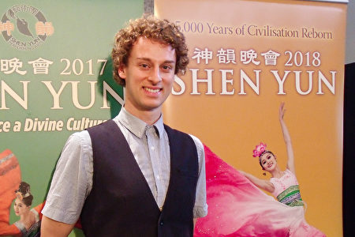

2月23日下午，Wilfried Godier先生观看了神韵巡回艺术团在法国南特市议厅的演出。（Isabelle Meyer/大纪元）

Wilfried Godier先生是一位演艺界人士，他在莫尔比昂（Morbihan）的一家演艺公司当舞蹈演员和歌手。他说：“我真是太喜爱神韵演出了，我感觉神韵带我们暂时逃离了这个毫无灵魂的、灰暗的世界，来到一个色彩鲜亮的世界，在那里我们找回了我们的精神之源，我觉得整场演出非常紧扣这个主题！”

中国古典舞不仅充满了艺术美感，Godier还敏感的感受到，舞台上散发出巨大的慈悲的力量，“我真没想道，他们的完美演出（可以）散发出那么大的仁慈力量。”

<a target="_blank" href=#top><h6 align="right">回上方</h6></a>

<a name=193>

2020年2月23日下午，新泽西学院音乐教授Dennis MacMullin欣赏了神韵环球艺术团在费城玛丽安剧院的第十三场演出。他盛赞“神韵是鸿篇巨制”。（卫泳／大纪元）

 <h1 align="center"><b>神韵费城周日再爆满 音乐教授赞鸿篇巨制</b></h1>
 
 【大纪元2020年02月24日讯】（大纪元美国费城记者站报导）继连续多场爆满加座后，2月23日（周日）下午神韵环球艺术团在费城玛丽安剧院（Merriam Theater）的演出再次一票难求，主办方又临时开放更多座位给热切希望看演出的观众。这是神韵2020年在费城巡回演出总共20场的第13场。

神韵展现了五千年璀璨的中华神传文化；神韵交响乐团融合了中西方两大杰出的传统音乐，既有中国音乐独特的优美，又有西方交响乐的大气磅礴。当天的神韵演出吸引了一些音乐家，皆对神韵音乐赞赏不已。

<b>艺术家天赋异秉 音乐教授赞神韵是鸿篇巨制</b>

“神韵艺术家非常有天赋！”新泽西学院（College of New Jersey）音乐教授Dennis MacMullin盛赞神韵现场交响乐团。

“乐团非常、非常棒！” MacMullin说，“乐团的任务很重，但音乐家们非常、非常有天赋。巴松是我专攻的乐器。神韵乐团那位演奏巴松的音乐家，演奏得非常、非常棒。”

MacMullin表示：“我也很欣赏神韵的中国传统乐器。你能观察到演奏中国乐器的技巧和西方的大提琴、小提琴等非常不同。那个二胡，只有两根弦。因此，演奏时手指在音域间的移动简直是戏剧性的，这样才能在仅有的两根弦上表达出音乐。”

MacMullin赞扬：“整个演出制作优秀。服装令人难以置信。” 他说：“编舞真是了不起，把舞蹈的视觉效果发挥到了极致！”

他还盛赞神韵舞蹈演员“叹为观止”，“14位女舞蹈演员和12位男舞蹈演员，每人都是一线的主要演员。所有演员都没有停歇，全力以赴，舞蹈的流动和衔接很流畅。美国也有很多舞蹈团，但要动用150、200个演员才能把演出完成。神韵真是一个鸿篇巨制！”

<b>“神性内涵 启迪善念”获奖钢琴家赞誉神韵</b>

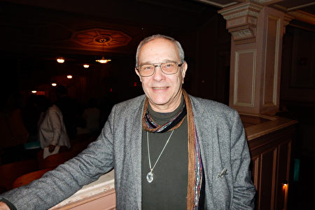

2月23日，古典钢琴家兼音乐总监Mark Blaschke观赏了神韵环球艺术团在费城玛丽安剧院（Philadelphia Merriam Theater）的第十三场演出。（卫泳／大纪元）

“我从心底里生出了钦佩和愉悦之情，感谢神韵艺术家！”古典钢琴家Mark Blaschke观赏神韵演出后由衷地赞叹。

Blaschke对中西合璧的神韵乐团极为赞赏，“我喜欢神韵乐团的演奏。我对二胡也比较熟悉，我认为有时二胡的声音比西方的小提琴还要好听些。”

经过特别训练的神韵歌唱家运用失传的技法演唱中文歌曲和歌词，Blaschke感到倍受震撼，“这与西方男中音不同，我很喜欢歌曲的歌词，具有很高的神性内涵，令人心生善念，发人深省。我很高兴了解这些内涵。”

Blaschke是一名古典钢琴家，也是一名教堂风琴师，担任过多个艺术团体的音乐总监，目前是多个音乐学会和文化学会的董事会成员，2008年获得终身成就奖。

<b>令人振奋 金融集团副总裁赞神韵水准极高</b>

2020年2月23日，Adrian Butler与Tanya Butler观看了神韵环球艺术团在费城玛丽安剧院的第十三场演出。（卫泳／大纪元）

“非常、非常高水准”“杰出的艺术家”，林肯金融集团（LincolnFinancialGroup）高级副总裁Adrian Butler观看神韵演出后连连称赞。

“这是一个令人激动的演出，非常多彩，我喜欢这种优美与色彩。”Butler说，“演出将色彩与艺术性融合在一切，非常令人振奋。”

他赞佩地说：“演出质量非常高，非常注重细节，舞蹈的编排设计非常美妙。”

对于神韵无法在中国上演，Butler表示无法理解，因为神韵并不仅是一场高水准的艺术演出，“演出是具有教育意义的。”

</b>“不可思议” 全球总监赞神韵高难度舞蹈</b>

2月23日，就业法律联盟全球总监Maryanne Creighton（右）与IT公司采购经理Todd Hanks观赏了神韵环球艺术团在费城玛丽安剧院的第十三场演出。（良克霖／大纪元）

“非常精彩的演出！”“ 音乐也美妙无比。”Maryanne Creighton看完神韵演出后频频赞叹。

Creighton是“就业法律联盟”（The Employment Law Alliance）负责会员事务的全球总监。该联盟有三千多名律师为全球100多个国家的跨国公司提供与人事相关的法律服务。

Creighton惊讶地说：“演员做出的高难度舞蹈动作太不可思议了！”

神韵天幕也让Creighton大开眼界，“天幕背景能够随着舞台剧情而神奇地变化，真是妙不可言！”她说，通过天幕背景“很好地展现了节目的神性内涵，这也非常有趣”。

她表示，“一定会向朋友推荐”，让更多的人来看。

<b>金融公司助理副总裁：神韵演员技艺超群</b>

2020年2月23日下午，全球商业贷款公司Berkadia Commercial Mortgage的助理副总裁Barbara McKenna称赞神韵演员技艺超群。（良克霖／大纪元）

全球商业贷款公司Berkadia Commercial Mortgage的助理副总裁Barbara McKenna称赞神韵，“演出精彩无比！色彩、音乐、管弦乐团，一切都漂亮之极。”该公司是亿万富豪巴菲特的Berkshire Hathaway旗下的子公司。

McKenna说：“那个水袖舞令我着迷！长袖在她们的手中自然地挥舞飘逸，如同流水一般。她们又能够自如地收回。”她赞扬神韵演员的“技艺超群”、“真是美不胜收”。

“音乐也是美极了！”McKenna表示，“在竖琴之间有各种中国乐器和传统西方乐器，所有这些乐器共同演绎出漂亮的协奏曲。”

McKenna对整台演出的编排也称赞有加。“节目有不同的音乐演奏、舞蹈演出等。我很喜欢编排的方式，还有主持人的解说。这样观众能够容易理解。”

<a target="_blank" href=#top><h6 align="right">回上方</h6></a>

<a name=192>
<h1 align="center"><b>一桩案件揭中共军方利用美大学进行秘密研究</b></h1>

从美国国防部到美国国立卫生研究院等一系列美国机构，已经对北京企图利用美国大学专业知识，来增强中共军事和技术竞争力的举动感到震惊。(Feng Li/Getty Images)

 
 【大纪元2020年02月24日讯】（大纪元记者苏静好综合报导）美国波士顿大学一名中国访问学者被美国司法部起诉的案件，再次引发各界关注中共军方利用美国大学和研究机构，获取先进技术进行秘密研究的事实。

在中国学者委员会的资助下，中共军方中尉叶燕青（Yanqing Ye，音译）申请到波士顿大学高分子研究所的物理、化学和生物医学工程中心进行深造。她被指控在申请美国签证时，对美国政府隐瞒其军方身份，同时利用J-1访问学者身份在美从事外国代理人事务，将敏感军事信息发给她在中国国内的军方同伙。

《华尔街日报》2月23日报导，这个案件表明美国大学对尖端研究的国际合作持开放态度，使它们成为中共潜在的目标。

叶燕青向波士顿大学注明物理学家尤金‧斯坦利（Eugene Stanley）申请深造机会。斯坦利的广泛研究包括使用人工智能对金融市场进行解码，并运用统计物理学来预防疾病。他说：“我对政治一点都不感兴趣。我是一位科学家。”

从美国国防部到美国国立卫生研究院等一系列美国机构，已经对北京企图利用美国大学专业知识，来增强中共军事和技术竞争力的举动感到震惊。

<b>中共军方研究人员隐瞒身份 进入美国实验室</b>

美国官员指责中共以学术界为目标，包括将中共军事研究人员派往美国实验室，并使用人才招聘计划吸引顶尖科学家、企业家和专家窃取美国知识产权。

波士顿联邦检察官上个月提起迄今为止最引人注目的中共招聘案，检察官指控哈佛大学化学系主任通过中共“千人计划”获得数百万美元资金。根据起诉书，尚未认罪的查尔斯‧利伯（Charles Lieber）教授签署了一项为期五年的协议，就电动汽车电池技术进行研究，而中共希望在这个领域成为全球主导。

德克萨斯农工大学系统官员进行的一项审查发现，学校中有一百多名教师参与了中共人才招聘计划，只有五名透露了自己参与的信息。

澳大利亚政府支持的无党派智囊机构澳大利亚战略政策研究所（Australian Strategic Policy Institute）2018年的一份报告表示，尽管有开放交流的承诺，但大学在与中共军方（PLA）合作方面需要慎重。

研究人员亚历克斯‧约斯克（Alex Joske）在报告中说：“帮助竞争对手发展其专业知识和技术并不符合国家利益。”他发现，在过去十年中，中共军方赞助了2500多名科学家和工程师前往国外学习，而他们深造的学校不了解这些人与中共军方的隶属关系。

<b>国防科大上美黑名单 叶燕青案是冰山一角</b>

美国调查人员发现，今年29岁的叶燕青是中共军方中尉，也是中国共产党党员。起诉书称，在申请用于学术交流的J-1签证时，她说自己是中国国防科技大学的学生，没有透露自己是中共中尉。在2017年到2019年在波士顿大学深造时，叶还执行她的中共军方同事分配的任务。

美国联邦调查局1月底对叶燕青发布了“通缉令”海报，称她很可能回到中国。

《华日》报导，斯坦利说，他对叶的指控“完全不知所措”。他说他不太记得叶，但在他的档案中发现了2016年一篇关于机器学习的论文，是斯坦利和叶燕青，以及叶在波士顿实验室工作之前的同事合著的。其中一合著者是叶在国防科大的同事杨科伟（Kewei Yang，音译），杨是中共军方上校。

机器学习具有一系列民用和军事应用。

杨上校在起诉书中被标志为“同谋A”，他被指控在叶燕青在波士顿大学期间指导她。他没有回应《华日》置评请求。在论文中，他与叶和斯坦利先生合写了书，他们的隶属关系都列为国防科技大学。

2015年，美国商务部将中国国防科技大学（NUDT，简称国防科大）列入“实体名单”，“因为它使用美国原产的多核电路板，以及（辅助）处理器，研发超级计算机，这些超级计算机是为了支持核爆炸模拟和军事模拟活动。”

在2018年一份追加起诉书中，马萨诸塞州检察官指控一名非法出口美国海洋技术的被告，而国防大学是被告的最大客户。

澳大利亚战略政策研究所报告显示，中共军方科学家与国外学者共同发表论文的数量大幅度增加，由2007年的95篇增加到2017年的734篇。这份调查报告的作者乔斯克（Alex Joske）2018年发表报告时表示，在过去10年中，美国大学接收了大约500名来自隶属于与中共军队相关大学的访问学者。

<b>美国会和政府已警觉 大学和研究机构也要承担责任</b>

司法部官员去年4月表示，多家大学和公司拥有敏感的知识产权，“波士顿是中共间谍活动的重点目标”。

《华日》报导，波士顿学校数据显示，在截至2019年6月30日财年中，波士顿大学接待了来自96个国家/地区的1,294名国际学者，其中中国为第一大来源。该校发言人说，在过去一年中，学校管理人员已经对教师进行了有关美国政府对外国影响关注的教育，政策审查委员会也提出建议，这些建议正在得到执行。

美国国务院发言人拒绝讨论具体案件，但表示《移民和国籍法》对拒绝签证的授权有限。发言人说，目前，如果领事馆官员认为申请人可能打算出口美国政府控制清单上的技术，他们可能会出于国家安全原因拒绝签证。

从2018年6月11日起，美国国务院将把在某些敏感研究领域学习的中国研究生的签证时效缩短至1年，中国留美研究生需要每年重新申请签证。被列入签证紧缩的留学领域，都属于“中国制造2025”计划中的重要产业。

美国官员表示，此举目的是降低在美国国家安全至关重要的领域发生间谍活动和盗窃知识产权的风险。

去年12月，参议院常驻调查小组委员会主席、俄亥俄州共和党参议员罗伯‧波特曼（Rob Portman）在一份声明中说：“中国（中共）获利两次，首先，美国纳税人为中国的研究与发展提供资金；其次，中共利用这些研究来提高其经济和军事地位。”

参议院还在去年11月发布一份调查报告时指出，美国大学和研究机构必须对此问题承担一些责任。他表示，大学可以对员工进行严格的科学审查或偷窃指控，也可以对财务利益冲突和外国资金来源进行审查。

他还表示计划与白宫、国家研究机构、大学和国务院合作制定立法解决方案，以保护用美国纳税人的钱所支持的研究。

<a target="_blank" href=#top><h6 align="right">回上方</h6></a>

<a name=191>
<h1 align="center"><b>【疫情最前线】港警确诊 北京市委书记传被隔离</b></h1>

香港一名防暴警察参加完警察派对后被确诊染上新冠病毒。韩国出现超级病毒携带者，导致病例暴增。传北京蔡奇也被隔离，之前还陪习近平视察。中共海军多例确诊，成了重灾区。（大纪元合成图）

 
 【大纪元2020年02月22日讯】（大纪元香港记者站报导）2月20日，一名香港现役警察被确诊感染了武汉肺炎，导致可能多达60名的警察或被隔离；20日，韩国出现超级病毒携带者，导致病例暴增；传北京蔡奇也被隔离，之前还陪习近平视察；中共海军多例确诊，成了重灾区。
 
 【香港疫情】
 
<b>香港防暴警确诊 有人开香槟</b>

2月20日，一名香港现役警员参加完警察派对后被确诊感染了武汉肺炎，导致可能多达六十名的警察或许要被隔离。

该警员驻守在北角警署，现为总区应变大队第三梯队的防暴警察，他与妻子、外母居住在油美苑润美阁的纪律部队宿舍。

消息说，该警员2月18日早上感到不适，到住所附近的中医求诊，晚上到西环明星海鲜酒家，出席了一个高级警官退休的派对，而聚会当时有超过60人参加，大部分都是警察。

该警员当天晚上开始发烧，第二天早上乘搭的士，到观塘社区健康中心求诊，唾液样本测试初步呈阳性反应，2月20日，被安排到联合医院隔离治疗。他的妻子及外母亦出现病征，需要送院接受检验。

网络上有名单传出，18日参加派对的人员，有两名退休警署警长，其他人大部分为员佐级警员，驻守香港仔警署，当中包括2男1女督察级人员、3男1女警署警长、13男1女警长及37名警员。他们已成为卫生署的追踪目标，稍后将会被隔离。

这名警察退休派对举行的地方，是西环明星海鲜烧鹅专门店，距离西区警署约30米，而距中联办大约为50米。

而该名确诊染病的警员所住的油美苑，是专门给香港纪律部队居住的警察宿舍。

由于被确诊的警察目前任防暴警察，有港人傍晚到北角警署外面开香槟，并把照片曝上脸书，还获得大量点赞。

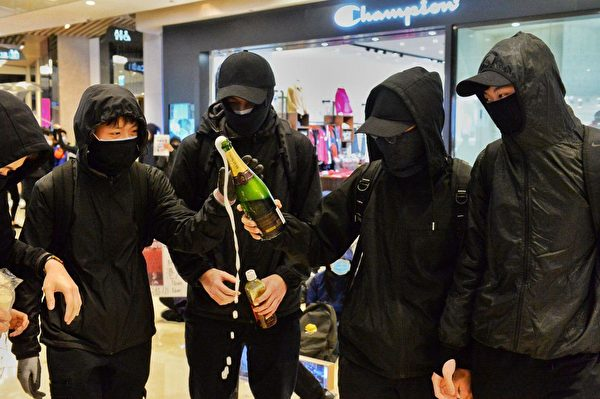

2月21日，元朗721恐袭7个月，香港民众在元朗集会，纪念7月21日的白衣暴徒攻击事件，有港人开香槟庆祝防暴警察确诊武汉肺炎。（宋碧龙／大纪元）

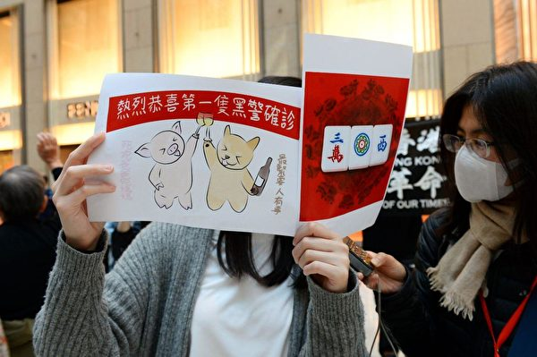

2月21日，纪念7月21日元朗恐袭集会上一自制标语。（宋碧龙／大纪元）

除了这位警察之外，2月20日香港还新增了另外两宗确诊个案，使本地感染的数字累计增至68宗。

20日晚间，本报记者在荃湾拍到一名人士突然倒地的视频。但目前仍不清楚这个人晕倒的原因，也不知道是否与武汉肺炎有关。

【海外疫情】

<b>韩国大邱现超级传播者 教会128人确诊</b>

再来看看韩国的情况。到21日下午下午4时，韩国全国确诊肺炎人数为204例，但当中的128例，是最近两天，从一个叫做“新天地教会”的聚集活动中爆发的。

韩国卫生防疫部门分析认为，一名61岁韩国女性，很可能是一名“超级病毒传播者”。该患者没有任何旅游史和接触史，2月12日出现发烧咳嗽，但她两次拒绝了医院核酸测试的建议，期间曾参加过一次大型婚礼和一次“新天地教会”的聚集活动。在20日确诊的病例中，共有28人与她在大邱新天地教会有过接触。

韩国当局紧急对全国新天地教会信徒进行检疫，但现在传出对3000名信徒的检疫当中，已经有409人出现身体不适的病征。

韩国卫生防疫部门认为这是群聚性感染，要求新天地大邱教会约1000名教徒居家隔离。大邱市市长表示，现在到了前所未有的危机关头，督促市民留在家中。新天地教会表示，大邱的教会已在21日紧急关闭。

据报导，新天地教会在全世界有12万信众，但韩国基督教监理会说，该教会在数个国家涉嫌从事“有争议的活动”。

【大陆疫情】

<b>传北京市委书记蔡奇隔离 曾陪习视察</b>

大陆的武汉肺炎疫情失控之后，除了湖北和武汉之外，大家最关注的可能就是北京了。最近几天，北京的情况明显出现了恶化。

2月17日和18日，官方公布的北京新增确诊病例有6例，而疑似病例分别为49例、58例；截止到2月19日，北京官方公布的确诊病例为395例。

新增的6例确诊病例，有4例集中在北京西城区的月坛街道。大家看一下地图，这个月坛街道，距离中南海正好是三公里。

北京有一家医院发生院内群聚性感染，涉及确诊感染案例人数多达36人。这家医院是首都医科大学附属的复兴医院，位置在北京月坛公园的边上。截至2月19日，复兴医院累积报告核算检测阳性病例36例。其中有8名医护人员，9名护工保洁人员，和19名患者以及患者家属。

复兴医院，距离中南海大约4公里。

北京最新的医院感染案例，发生在北京大学附属的人民医院。该院一名住院病人和两名家属，被确诊为武汉病毒感染，目前有22名曾与感染者密切接触的医护人员被隔离，另外有250名医院工作人员和病人受监测。

这些都是官方证实的数据。而网民私下透露的情况，似乎比这个更为严重。比如有一位网友发出消息，说小区内有人不愿意去医院，在家自行治疗，结果死后数日才被发现。

从各种迹象看，北京西城区已经成为这次武汉肺炎的重灾区。中共权力核心，包括中南海、中央军委各部、人民大会堂等等，都在西城区。这也是北京目前风声鹤唳的原因。

西城区一名政府机关工作人员近日被确诊，导致69名同事被隔离观察。据说，这名被确诊的政府人员过年回河北老家，大年初六返京，初七上班，上周被确诊感染武汉肺炎病毒。

网络的消息说，北京市委书记蔡奇上周视察西城区政府，陪同人员中就有这名被确诊者，而且距离蔡奇很近，蔡奇现在已经自我隔离，甚至有消息说，蔡奇隔离前还曾经陪同习近平在北京视察。

网络上的最新消息指，北京已经中止向武汉和湖北等疫区派遣援救医疗人员的行动，以确保北京自身的安全。北京已经发出了最严隔离令，所有返京人员，都必须隔离14天。

<b>中共海军传疫情 常州舰长隔离</b>

高传染性的疫情防治，高密集度人群是关键。而其中军事部门，最有可能遭到波及。

中国人权民运信息中心多次报导了中共解放军各军种、武警感染武汉肺炎疫情的情况严重。但中共机密文件规定，如果军队的疫情涉及军事机密的，可以不呈报当地省、市政府。

该信息中心2月11日报导，中共海军中出现疫情，位于海南三亚市的海军潜艇部队有一名军人确诊新病毒肺炎后，有300名海军被隔离，而原定本月开始的核潜艇重点训练项目已暂停。

而位于三亚的中共解放军总医院（海南）医院准备为3000名人员做新病毒肺炎样本测试，重点是近期有出海训练任务的潜艇人员。

中共《解放军报》2月17日证实，海军确实发生了新冠病毒感染疫情，东部战区海军舰队的常州舰舰长余松秋，现正在支队招待所进行隔离观察，各部队还有部分官兵正在隔离观察。

《解放军报》的报导说，疫情发生后，东部战区海军各级采取防控措施，并执行测温消毒、归队隔离等防控措施，把疫情防控纳入战备值班要素。东部战区海军训练计划也因疫情有所调整。

中国人权民运信息中心还披露，中共航空母舰“山东号”上的一名军人，在海南三亚市确诊为新型肺炎，目前留守在三亚市的100名“山东号”军人已经被隔离，其中包括一些重要的军官。

海军属于高危军种，按照每年的训练计划，新年过后中共海军通常是出海训练的高峰期。但近日各海军基地测出不少“假阴性”案例，其潜伏期可能高达24日。故即使出发前全部人员测试结果为“阴性”，但仍可能有人带毒上舰，出海后传染给舰艇中其他官兵。其中，高密闭性的潜艇部队，尤其属于高危军种。

<b>湖北军人武警确诊</b>

另外也消息称，在湖北有10名中共军人、15名武警已被确诊感染新病毒肺炎，这些被确诊的病例分别在孝感的“空降兵军医院”、武汉的“中部战区总医院（汉口院）”及襄阳的解放军991医院住院。

襄阳991医院的一名工作人员向中国人权民运信息中心证实有确诊的武警正在住院。其中有1500名中共军人、1000名武警正被隔离。

<b>山东任城监狱207人集体感染 2万多人隔离</b>

除了军事部门之外，监狱也是群聚的高密度人群场所。

山东省济宁市的任城监狱，近日爆发集体感染，多达207名狱警及囚犯中招，全部囚犯需转移至其它地方服刑及单独隔离。山东省司法厅党委书记、厅长，省监狱管理局党委书记及第一政委等7名官员，因防控不力，周五（21日）被山东省委免职。

消息说，任城监狱一名狱警，2月12日因咳嗽到医院求医，13日晚被确诊为新冠肺炎，一名准备执勤的狱警同日傍晚亦确诊为新冠肺炎，两人立即接受隔离。最后证实该监狱已经有两百多人已受到了感染，两万多人需要被隔离检测。

<a target="_blank" href=#top><h6 align="right">回上方</h6></a>

<a name=190>
<h1 align="center"><b>【一线采访】外出求医无门 湖北肿瘤病患遭多省拒收</b></h1>

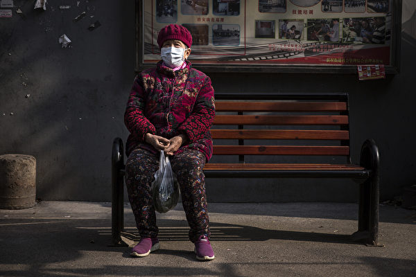

中国大陆新冠肺炎疫情影响层面广泛，连一般危重病人想要就医都很难。图为示意图。(Getty Images)

【大纪元2020年02月24日讯】（大纪元记者李新安采访报导）因新冠状病毒肺炎（俗称武汉肺炎）疫情持续蔓延，中国大陆有80多城市进行“封闭式管理”，连非染疫患者跨省治疗的通道也全部关闭，封城被指让老百姓陷入绝境。湖北黄冈一位老人罹患重病后，多省医院无人接收。如果去武汉就诊，甚至连原社区也拒绝接收。

湖北黄冈红安县60多岁的王先生肩痛2个月，近日到红安县人民医院康复科就诊，CT显示为恶性骨肿瘤。但当地医院无法进一步检查，也没有治疗方案，直接按出院处理。现在只能在家里靠强力止痛药、社区医生打点滴维持生命。

王先生的家人王女士告诉记者，红安县人民医院的条件有限，无法确诊（感染新冠病毒）。肿瘤科的医生都被调去支援黄冈了，没有多少医生留守的。医院只有一个CT（计算机断层成像）的设备，不能提供进一步的治疗，一般都是往上级医院转。让家属自己去找医院。

“我们的上级医院都在武汉，红安县离武汉很近，大约有100公里，（病患）都是往武汉转。但医院告知武汉是没有床位，没有可以接收的医院。就让我们自己去联系好医院，如果有愿意接收的医院，他们再给我们开转诊单，让我们自己过去。”

红安县是黄冈市所辖的一个县，而黄岗也是新冠肺炎疫情重灾区。王女士表示，“黄岗市只有一家三甲医院，没有床位，内部打听有人感染了新冠肺炎，肿瘤科的医生全部被隔离了。”

王先生的家人又联系了武汉市的多家医院，都是暂时没有床位，有的可能过去排队挂个号，但是挂了号之后，没办法保证收治。

“酒店宾馆都不能给提供住宿，没地方住；一旦去了武汉，这边的社区又不接收了。武汉有些地方可以做些放疗、化疗，但是没有确诊（感染新冠病毒），对方也不收。现在两难了。”王女士说。

此外，外地省市也没有医院愿意接收湖北病人，“基本也出不去，都是劝返。”

王女士联系了附近的省市，安徽、河南都没有愿意接收的医院，一听是湖北的都是劝返。“现在成了政治任务，如果湖北的人出去把别的省数据带上去了，所有的领导都要下台。跨省治疗的通道全部都关闭了。”

王女士介绍说，“从湖北辗转出来，比如从湖北到上海，要经过安徽省，安徽省每个高速路口都会有警察给你查体温，查你的证件、通行证。通行证只能在湖北省内管用，出了湖北后，比如安徽省的政策他觉得你不能经过他们这里，就让你回去，劝返。就只能回去。”

王先生的家人想再找找湖北省内其它的医院。“武汉的话应该是没有希望的。现在省内，反正去了武汉后回来就不接收了，去别的地方，只要有地方去。他这个病情的话，也不会是短期的，主要是没有地方收治。”

王女士表示，老人是有在医院做过新冠病毒筛查的，“我们可以向医院证明病人没有感染，但是我们把证明拿给人看的机会都没有，到处去找医院联系，到处碰壁。”

“现在非新冠的病人越来越多了。很多危重病人有这种诉求，希望能够开通跨省的转诊。别的省都不收湖北的病人，湖北人成了过街老鼠，湖北的车也出不去。”她说。

王女士本身在上海生活，希望能把老人接来上海治病。但据了解上海目前所有的医院都是只出不进，不收新的病人。所有的手术能不做就不做，都停了，医院也不给挂号。

“外地的只能是网上挂号，现在也不让挂了，说一级防控。上海只允许本地户籍的人挂号，但是基本上手术都停了，除非是生孩子这类的没办法。”她说，“上海政策说的外地来的先做调查表，调查好了之后隔离14天，没有什么情况，然后可以正常就诊。但实际上各个医院都收紧了，连本地的手术都不做了。政策摆这里，但是我们进不来。”

即使进了上海之后，在上海没有房子，没有居住地也无法住留。“肯定也不会放你走的，说你是‘行走的病毒’。我们有些在上海工作的人，拿了单位接收证明，拿了健康证明、通行证过来，上海界的关口也要查这些东西，同时向居委会核实，如果在这儿没有房子，要强制隔离。每个区都有隔离酒店，关在那里隔离14天，把封条贴好。如果居家隔离，居委会也会把门封死，把吃的东西放在门口。”

王女士还担心，假若老人真的到了上海，也无法住在亲戚家里。“如果到家里住，我们全家人都会被强制不能出去，居委会非常紧张。”王女士担心老人跋涉十几个小时，再到酒店隔离14天，病情很难控制。

老人现在疼痛异常，无法进食，无法睡眠，一度昏迷。王女士呼吁，迫切需要外省转治的通道。希望跨省的医疗资源能收治不是新冠的病人，因为湖北、武汉的确没有能力收治了。

“医疗资料全部用到新冠病人上去了，导致新冠以外的病人就无法被收治。她呼吁解决这种非新冠病人的救治问题，如果省内不能救治的话，开通跨省转诊的通道。”她说。

同是湖北红安县的年仅三岁的小朋友薛梅（化名）于2019年8月患病，被北京同仁医院确诊为左眼视网膜恶性肿瘤，后做了左眼摘除术，术后已进行二次化疗，现剩最后一个疗程，因疫情原因不能按时返院，导致病情恶化。但截至发稿记者未能联系上薛梅的家人。

武汉封城后，各地启动封省、封城模式，阻断了老百姓的就医路、求生路。有网友表示，“武汉封城造就千万人规模的病毒培养皿。人祸之烈，万倍于病毒。如果当时不封城而只是隔离病患，让几个省市医疗机构共同对应，还会是今天的局面吗？”

<a target="_blank" href=#top><h6 align="right">回上方</h6></a>

<a name=189>
<h1 align="center"><b>夏小强：习近平7常委露面 讲话透露重要信息</b></h1>

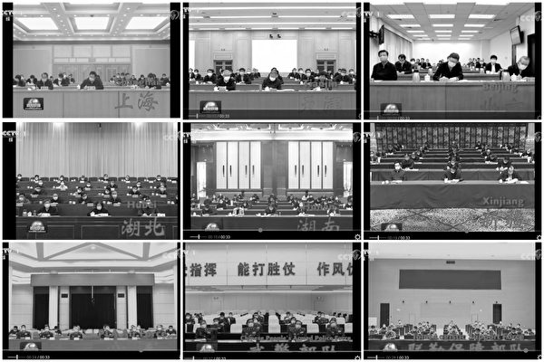

北京当局23日召开“统筹推进新冠肺炎疫情防控和经济社会发展工作部署会议”，各省区市和县设立分会场。（视频截图） 

【大纪元2020年02月23日讯】2月23日，中共在北京召开了名为“统筹推进新冠肺炎疫情防控和经济社会发展工作部署”的会议，包括习近平在内的中共七常委和全体政治局委员全部出席亮相。

这是在武汉肺炎全面爆发后，中共高层第一次带有画面的集体出现在央视的《新闻联播》上。习近平率七常委集体露面，可以看作是对连日来外界传闻中共高层常委被肺炎病毒击倒的回应。有一点引起注意的是，在央视的画面中，坐在一排的七位政治局常委都没有戴口罩，而对面的几十位政治局委员和其他官员，全部戴着口罩。

中共声称“与天斗、与地斗、与人斗其乐无穷”，斗争是中共的主旋律，也是中共内部的运行常态。无论中共内部斗争得如何你死我活，但对外都要粉饰太平以示团结，这次也不例外。武汉肺炎爆发以后，中共应对进退失据，把中共体制的无能、害民和邪恶本性展现无遗。

一般来讲，习近平像这样率领高层官员集体亮相，应该是中共内部各派势力在短期内达成了一个相互妥协的均衡协议，等待喘息之后展开下一步的恶斗。

习近平按照惯例在23号的会议上，发表了“重要的”讲话，讲话的全文中共官媒都有报道。在习近平的充满中共官场党文化和套话的背后，主要释放了以下这些重要的信息。

第一、疫情已经全面失控，对于中共来讲，这次疫情的发展，将会决定中共政权的生死。

第二、各级党委和政府大都有“厌战情绪”、“侥幸心理”、“松劲心态”，地方政府表面服从中央领导，其实都在各自为政，处于自保状态，政令难出中南海。

第三、湖北省，特别是武汉市，疫情已经完全处于无法控制状态，主要是做好信息封锁和维稳工作。

第四、北京已经处于疫情爆发初始阶段，北京的疫情状况，是中共极为重视和重点应对的大事。

第五、调动在国际上多年来渗透和收买的全部资源，在这个危机的时刻为中共政权的稳定发声。

第六、牢牢掌握舆论宣传和媒体，封杀一切对中共稳定不利的消息。

第七、启动战时和危机时期的超限维稳机制和手段，不惜一切代价维护中共政权稳定，碾压所有的可能的民变和反抗。

第八、疫情对中国经济的冲击，将会是致命的和长期的。企业复工困难重重，失业加剧，民众的基本生活保障面临困局，外贸和外资的基本盘正在失去。

从习近平的讲话中，可以看到，中共的大厦将倾，任何人都无力回天，从中共体制内解决危机的所有大门都已经堵死。

中国民众正在面临最为艰难的时刻，这也是黎明前最为黑暗的时刻。

<a target="_blank" href=#top><h6 align="right">回上方</h6></a>

<a name=188>
<h1 align="center"><b>疫情下 大陆多地涌人潮 扎堆吃喝 不戴口罩</b></h1>

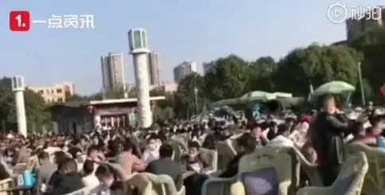

新冠病毒疫情肆虐之际，中共放弃人群隔离计划，要求复工。饭店、景点、商场陆续开业。图：四川广元市民卸口罩扎堆喝茶。（网络图片）

 
 【大纪元2020年02月24日讯】（大纪元记者李心茹综合报导）新冠病毒疫情肆虐之际，中共放弃人群隔离计划，要求复工。饭店、景点、商场陆续开业，随即引来大批民众扎堆到室外茶楼喝茶、游景点、聚餐，引发疫情扩散恐慌。

江西省为了促复工，要求返岗员工无需提供健康证明；除来自湖北等重疫区人员外，对其它地区的务工人员一律取消隔离要求。

 <b>江西赣州集市上很多人不戴口罩 </b>

集市恢复后，2月21日，有网民拍视频纪录江西赣州瑞金圩镇市民赶集场景，集市上人山人海，路面上熙熙攘攘，很多人不戴口罩。

民众听信官媒 以为疫情警报已解除 纷纷上街采购

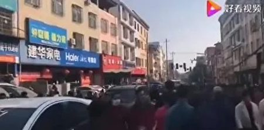

有网民拍摄江西赣州集市画面。看得出人来人往，很密集。（网络图片）

“父亲早上去赶集了，买了点树苗回来种。”江西省赣州市信丰县某乡镇的李女士告诉《国际金融报》，他们那里开集市了，民众可以去赶集买东西。

李女士表示，虽然要求戴口罩，“但我在乡下买不到防护口罩，所以也就不戴了。”

2月22日，江西瑞金官方@瑞金发布回应称，经调查情况属实，瑞金系疫情轻度县市，至今无疑似和确诊新冠肺炎病例。

但外界认为，由于中共对疫情的掩盖，实际人数远远超过官方数字。

看到以上信息，海内外网民纷纷表示：“还是要劝家人以两会召开为判断点，不要盲目相信疫情‘零增长’。”

“都‘零增长’了为什么还不能出来？不然零增长还有何意义？”“政府就是这么舆论引导的。”

“这帮人受了假新闻的毒害，以为武汉肺炎快好了。岂不知只是‘数字’被党控制住了。”

 <b>河南郑州方中山胡辣汤店人气爆棚 </b>

22日上午，河南省郑州方中山胡辣汤店前人潮涌动，郑州人的微信群、朋友圈完全被方中山店门前的场面刷爆。

这阵势吓坏商家，安排五名员工，全副武装穿着“防护服”维持秩序，员工高喊：“保持一米以上的距离啊，保持距离啊！”当天，本地疫情控制人员已来到现场，约谈了老板。

方中山胡辣汤总经理方江北说，“复工复业遵照政府安排，一切以安全为重。”他们明天开始将只卖套餐，店里提前将套餐打包准备好，消费者到店里直接带走，加快取餐速度。

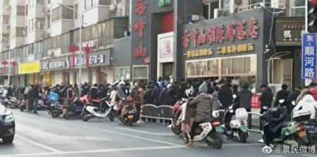

河南省郑州方中山胡辣汤店前排长龙。（网络图片）

 
 网民纷纷表示：“现在疫情形势并不乐观，这真的是拿生命在喝胡辣汤啊。”“为了方中山，负了钟南山。”“盲目开业，一旦传染开又前功尽弃了！”

也有网友拍到国内知名品牌“思泊湖”牛肉面馆前，人们戴着口罩大排长龙买牛肉面的一幕。

 <b>四川广元大批市民扎堆喝茶</b>

2月21日，四川广元不少人出门晒太阳。在利州广场，市民扎堆喝坝坝茶，一市民拍视频称人山人海全是脑壳，很“密恐！”

有视频显示，民众聚集在利州广场，有茶楼老板，在室外摆放密密麻麻的桌椅，前来饮“坝坝茶”聚会的民众人头涌涌，大部分民众既除口罩饮茶，又与同桌朋友交谈。有民众表示，现场人山人海，“大家出来晒太阳，到处都是脑壳（人）”。

  四川广元市民卸口罩扎堆喝茶，盛况空前！
 
   易中天：身体进了病毒，还有医生救你。脑子进了病毒，神仙都救不了你。 pic.twitter.com/qrDo3xm8cD

   — 实话实说 (@jMcSVGx9oRuiEir) February 22, 2020
    
   

四川广元市民卸口罩扎堆喝茶。（网络图片）

 
 网民们深表震惊。“天呐，不戴口罩，那么多人，恐怖。”“复工复产不能大撒把呀！人员这么聚集太危险了。”

23日，当地多名公职人员因上述事件的被追责。

对此，有网民表示：“复工政策出了，开店营业很正常啊。难道不让人进吗？自相矛盾的政策！”

<b>杭州西湖涌五千人 不少市民摘掉口罩</b>

浙江杭州西湖景区开放后，在22日迎来首个周末，有市民到当地野餐及游览，游客量超过五千人次。

有景区工作人员表示，开放后第一个周末，车位基本已满。当日最高气温逼近20摄氏度。不少市民摘掉了口罩，“太热了，把口罩拿下来了。”还有，断桥上跑步的民众，也没有配戴口罩。

22日8时至13时30分，断桥客流量已破二千人次。

此外，有大批旅客涌入北京香山，人潮多到严重塞车；上海Costco再度大排长龙，21日下午1:30，Costco店堂内屏幕显示有一千九百多人。
 
<h3 align=center><a href="https://twitter.com/cni9k/status/1231166791054790657?ref_src=twsrc%5Etfw%7Ctwcamp%5Etweetembed%7Ctwterm%5E1231166791054790657&ref_url=https%3A%2F%2Fwww.epochtimes.com%2Fgb%2F20%2F2%2F23%2Fn11890199.htm">网友投稿，今天去香山玩儿的人，车多到把路都堵了……(点击右键,另存新档）</a></h3>

海内外网民纷纷表示：“天天看央视报导，形式一片大好，今日游园聚会，明天可能病倒，共产党害人呐。”

“群众被政府的假消息误导了。以为疫情已经过去了。他们怎么料到政府是放假消息鼓励大家返工而已。”

“这更像是疫情更大规模爆发的前夕，现在是最危险的时刻，能待在家里一定要待在家里，别听忽悠就去复工，拿自己生命做赌注不值得。”#

<a target="_blank" href=#top><h6 align="right">回上方</h6></a>

<a name=187>
<h1 align="center"><b>美参议员：中共刻意控制新冠病毒信息流动</b></h1>

2月21日，美国联邦参议员科顿表示，中共控制武汉肺炎的信息流动。科顿资料图。（SAUL LOEB / AFP）

【大纪元2020年02月22日讯】（大纪元记者张婷编译报导）周五（2月21日）晚，美国联邦参议员汤姆·科顿（Tom Cotton）就中国的新型冠状病毒疫情再次发表言论。他强调，中共正在刻意控制有关疫情的信息流动，所公布的新发现病例实际上并非是“新发现”的，而是“新披露”病例。

<b>科顿督促中共公开武汉病毒所的研究</b>

新型冠状病毒的起源近日来引发关注。科顿议员此前曾质疑是否是武汉生物武器实验室（又称武汉病毒所或P4病毒实验室）泄露了新冠病毒。这一评论引发舆论风波。他周五晚在接受福克斯新闻节目“The Ingraham Angle”的采访时强调，鉴于武汉病毒所距离华南海鲜市场不远，因此提出质疑也是合理的。

“我们知道，它（新冠病毒）并非始于武汉食品市场（指华南海鲜市场）。那是中国共产党的原始故事。”科顿说， “因此，只有质问，它（病毒）是在哪儿起源的才是负责任的。”

“我仍然认为最有可能的假设是自然发生的。”科顿说，“但是，鉴于该实验室（武汉病毒所）靠近这个食品市场，我们有理由要求中共对它们在那里（实验室）进行什么样的研究，以及它们已经制定的安全行为标准和实践保持公开和透明。”

“在中国（共）提供证据之前，我们无法确定这种病毒的起源。”科顿补充说。

<b>中共刻意控制疫情的数据流动</b>

新型冠状病毒肺炎（也称武汉肺炎）最先在中国武汉爆发，由于当局最初隐瞒疫情，导致病毒迅速传播。目前已经导致大量人感染和死亡。并且传播到海外27个国家，但中国大陆最为严重。

有专家认为，可以相信中国的科学家和医生们所提供的疫情数据。福克斯记者问科顿，是否认为中国科学家和医生与中国共产党之间是划清界线的，科顿回答，他并不是不认同中国的科学家和医生可以成为世界一流的专家，但是在他们的身边总会被安插一个中国共产党的人去监视。“至于那些党派出的人是否会允许中国的科学家或医生们与海外工作者自由交谈，尤其是与美国政府的官员自由交谈，我没有丝毫的信心。”科顿说。

科顿说，中共当局对新冠疫情仍在向世界“撒谎”。

他认为，中共在严格控制疫情信息的流动，该向外报导多少新发现病例，什么时候报导，都有控制。

他说，中国的新发现病例实际上不是“新发现病例”，而是中共“新披露的病例，因为中共正在小心的管理有关这个病毒的信息流动。”

“这就是为什么我们已经看到这种冠状病毒的数量以某种奇怪的……模式继续上升的原因。”科顿说。

<a target="_blank" href=#top><h6 align="right">回上方</h6></a>

<a name=186>
<h1 align="center"><b>【独家】湖北省人民医院五百人染疫 当局掩盖</b></h1>

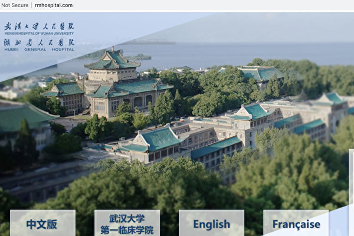

武汉大学人民医院被指内部职工及家属感染了至少五百多人，官方不公布。（网页截图）

 
 【大纪元2020年02月22日讯】（大纪元记者李新安采访报导）武汉肺炎疫情下，医护人员受感染的消息频传。日前有知情人独家爆料给大纪元，湖北省人民医院的医护人员及家属，已经有五百多人感染。医院不上报，把他们隔离在医院的眼科大楼和外科大楼顶层。

旅居海外的蒋小姐告诉大纪元记者，她从内部渠道获悉，武汉大学人民医院本院和东院（光谷院区）这两院加起来，职工和家属至少有五百多人感染了，都是有名有姓的。

据内部消息称，医院内部职工和家属感染最少五百多人，每天都有医护感染。（知情人提供）

 
 据介绍，湖北省人民医院，又叫武汉大学人民医院，属于湖北省的三甲医院，与协和医院、同济医院是湖北省最好的几家医院，也是做为此次防疫的指导医院之一。

蒋小姐说，医院把受感染的职工及家属隔离在外科大楼和眼科大楼的顶层，内部治疗。但是不向外公布，也不向外报人数。唯一一次向外报人数是1月24日的时候，报了大概147人感染，但是现在的人数已经远远超过这个数字。所以保守估计，有五百个人已经感染了，而且每天都能接到感染人员的死讯。

主院至少有1500名医护，因为（病）倒的太多。四川的华西医院和长沙的湘潭医院都有医护过来支援。

“他们不上报的，自己把自己的人隔离治疗，报多了丢官，报少的领功请赏。他们有足够的条件，有各种楼。最近把他们关在眼科大楼，上面五层全部用来做隔离，现在不够了，又把外科大楼放出来，再来收家属和职工。”蒋小姐说。

蒋小姐表示，具体的死亡人数不清楚，因为各个科室之间暂时没有统计，大家都被隔绝了。医院有内部文件，不留任何文字，他们之间连微信的交流都是不被允许的，只能口头通报今天是什么情况，就是害怕资料被传出去了。医院是最敏感的地方。

“我们也有一些认识的科室里的人，其实不是呼吸科的，其它科室的，有主任医师、教授级别，直接进重症监护室的，挺多的。职工内部互相传，告诉你谁谁谁又没了，谁谁谁又传染了。”

记者查询发现，2月3日，武汉大医院的医务人员感染数字首次在网络曝光，显示湖北省报告15例以上确诊医务人员病例的医院有15家。武汉协和医院感染人数最多合计262人。武汉大学人民医院排在第二，总计194人，首次发生感染时间是1月10日。

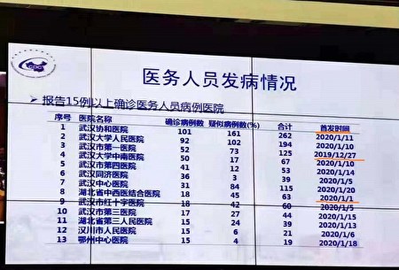

医务人员感染病例数字2020年2月3日首度曝光，当时显示武汉大学人民医院感染人数194人。（网路图片）

蒋小姐表示，武汉大学人民医院本来是一个综合性医院，现在除了心脏科，其它所有科室全部都没有正常的诊疗。大概心外、心内两个科室加上肺炎，已经占据了所有的医疗资源。

“他们的医疗条件是最好的，湖北省首批三甲医院之一，但是他们现在连医护人员自己也无法保证。”她说。

<b>家属区与工作区交叉感染</b>

蒋小姐说，“指导医院是不直接接收病人的。但是一个很大的门诊部是设发热门诊的，有非常多的病人来做核酸检测，来求诊，所以整个门诊部不管是哪个大楼里面，哪怕是走道里，全部都是病床，堆得到处都是病人。所以那些医护人员是不可能百分百保证自己完全不受感染的，因为整个医院就是一个大病毒区。”

而主院有一个大的家属区，大概有20栋楼左右家属楼。家属区和医院的工作区中间只是很短的一个距离，住了很多职工家属，容易形成交叉感染。他们的生活区也被感染了。

“医生工作完之后不会到隔离区去，一般会回到自己家里面。最近做为指导医院之后，有一部分医生被分配到下面的定点医院，这些人员是不可以返院的，相当于被软禁在那里。但是自己医院的是可以回家的。”她说，“如果医生护士被感染了，家人也一定会被感染的。我知道我的朋友、同学，已经有一个全家人都被感染了，一家6个人全感染了。”

“每天都会有人被感染，但是这个人数根本就不报， 所以现在可能会面临家属区里会爆发（疫情）。其实已经爆发了，都已经几百人。”

此外，医院地处武昌老城区的中心，医院旁边的几个小区都是严重爆发区，被认为肯定跟医院是有关系的。包括水陆小区，汇文新都小区，司门口解放路片区，全部都是重灾区。医院隔壁是武汉市公安局武昌分局，一墙之隔，被指也是非常危险的。

<b>医院内部腐败 物资分配不公</b>

蒋小姐披露，医院也有内部的腐败。医院接受捐助的物资，由院方来进行分配，让那些有官职的、科室主任、行政人员优先享受资源分配。他们先去选，选很多东西，甚至有特伦苏牛奶、蛋糕这种东西，但是轮到几批人过去，拿到手的东西根本无法食用，青菜、冬瓜、葱都是烂的。

“院领导就以要保证一线人员的物资为理由，其实所有的人员都是一线人员，因为很多退休的职工也上了前线，那你为什么不能保证蔬菜水果的供应？医院本身自己的职工就很生气，这个时候还要分三六九等？不能获得正常的保障。”

目前武汉已经不允许个人采购，而社区团购的蔬菜包非常差，又很贵，人们有上当受骗的感觉。“整个武汉市的物资供应乱七八糟。物价也是非常贵，70块钱一斤猪肉。收入高的中产都觉得非常贵，那些低收入的人根本承担不起。”

在医疗物资方面，蒋小姐指出，在这家医院，很多重要人物包括名人、专家是会来这里求医，要首先保证这些权贵们能够得到救治，所以医疗设备在这些指导医院里是不会缺的。但是下面所谓定点医院，就是市级的医院，一医院、二医院、三医院、五医院、七医院等等，医疗物资肯定是缺的。

记者接通武汉大学人民医院接受捐赠的联系人电话，询问物资情况，对方称医护物资缓解了很多。但问到医护感染情况时，对方称不知道、不了解，要求记者看官网。记者致电医院呼吸科，多个部门都显示忙，均未接听电话。

蒋小姐告诉记者，自己每年都要回到武汉过年，今年阴差阳错地把票订在了1月24日，结果23日武汉就封城了。“那时候没有这种惊恐的感觉，不让回去就算了。但是慢慢地就发现，身边的人越死越多。整个医院就是一个僵尸医院，到处都是感染的人，比例太高了。感觉那个地方的空气里面都是病毒。”

“没有任何措施，就是等着，看着谁是下一个从笼子里被抓出来的……真的就是这种心情！（政府）太无能了，这还是最好的医院！”她说。

<a target="_blank" href=#top><h6 align="right">回上方</h6></a>

<a name=185>
<h1 align="center"><b>新冠病毒假阴性或有4大原因 会带来何风险？</b></h1>

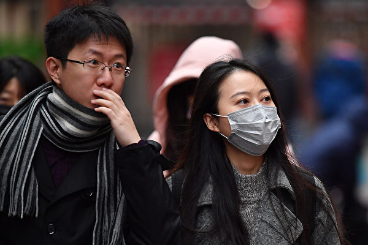

新型冠状病毒似乎愈来愈“难以捉摸”，有病人进行多次核酸检测后才呈现阳性，造成确诊困难。(BEN STANSALL/AFP via Getty Images)

 
 新型冠状病毒似乎愈来愈“难以捉摸”，检测结果不稳定。有病人进行多次核酸检测后才呈现阳性，假阴性率高，造成确诊的困难。为什么会出现新冠病毒多次检测不出的现象？这是否会造成防疫上的漏洞？
 
<b>什么是核酸检测？</b>

目前，各国检测武汉肺炎的首选方式，是核酸检测。核酸检测又称为“即时逆转录聚合酶连锁反应”（real-time RT-PCR）。一般是由医生从病患的鼻腔、咽喉或呼吸道采集分泌物，作为样本，送到指定实验室检验。

检验人员得到样本后，会在实验室使用仪器进行一系列的生化反应，把样本中的核酸大量复制。如果最后仪器能够检测出一定量的新型冠状病毒核酸，就代表病人的检体中含有新冠病毒，检测结果为阳性；反之，若未检测到病毒，则结果为阴性。

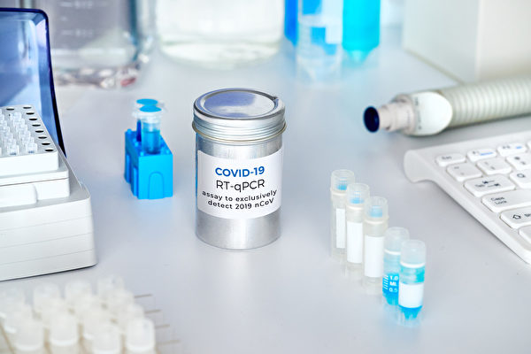

目前检测新型冠状病毒的首选方式是核酸检测，又称“即时逆转录聚合酶连锁反应”（real-time RT-PCR）。(Shutterstock)

<b>新冠病毒多次检测才确诊 可能有四大原因</b>

然而，新冠病毒的核酸检测多次出现检测结果不稳定的现象。福建一名32岁郑姓病人，从武汉返乡后，出现发烧症状，但检验4次都是阴性，直到第5次才确诊为新冠病毒感染。吉林省新冠肺炎疫情防控指挥部也发布公告说，有名女性在1月27日下午开始发烧，1月29日进行核酸检测，结果为阳性，在2月6日之前，又进行了五次核酸检测，结果却都是阴性。

而最早透露新型冠状病毒疫情的李文亮医师，1月10开始咳嗽，之后住进重症监护室，并且采检多次后皆呈现阴性。1月30日最后一次检验才呈现阳性。

为何会出现检测不准确？专家分析，可能有四大原因：

<b>1. 目前的核酸检测对病毒敏感度低</b>

检验方式对病毒的敏感度高低，是影响检测结果的关键。

“任何检测方法都存在灵敏度问题”，阳明大学医学系助理教授、市立联合阳明医院胸腔内科医师苏一峰表示，“目前看起来新型冠状病毒核酸检测的灵敏度不够高”。这会造成患者虽然已经感染新型冠状病毒，但是检测却为阴性，也就是“假阴性”。

丹娜生物科技公司首席科学家周泽奇对陆媒表示，当前用核酸检测新冠肺炎敏感度只有30%～50%。这意味着假阴性带来的漏检情况严重。

而另一个检测灵敏度不够的原因在于核酸检测的试剂盒。试剂盒的作用是精简病毒的检验流程，提升筛检病毒的效率。但是，试剂盒里的成分配置很重要，这些成分配置的比例、品质都是影响检验的重要因素。通常一个针对某个病毒的试剂盒被开发出来后，还必须经过临床实验，才能判断为有效的试剂盒。从研究到核准临床使用，至少要经过3至5年的时间。

<b>2. 检测时机太早</b>

采集检体的时机也会影响检验结果。微生物学博士、美国前Walter Reed陆军研究所病毒系实验室主任肖恩‧林（Sean Lin）认为，病人在某些时段，比如感染初期，体内病毒量比较低，如果检测方法又不够敏感，就可能测不到病毒。

如果病人的临床诊断属于疑似病例或接近确认，需要进行多次检测才能排除假阴性。

<b>3. 取样部位的病毒量少</b>

依据台湾疾管署，目前新型冠状病毒可以从呼吸道采集的检体有两种：一种是患者的鼻腔或咽喉擦拭液，另一种是痰液或下呼吸道抽取液。

“采检的检体会影响检验的灵敏度”，苏一峰说，“而临床上采检上呼吸道的鼻涕或唾液咽喉检体比较方便。”

如果从下呼吸道取样，病毒检测的灵敏度会提升。但林博士提出，就中国大陆的情况而言，“一线护士取下呼吸道样品（如痰液），会冒比较大的感染风险。医院如果防护资源不足，可能难以做到。”

<b>4. 新冠病毒可能发生变异</b>

亦有说法认为，检测结果多次呈假阴性，与病毒变异有关。林博士表示，不排除这种情况，“不过核酸检测通常选择比较保守的片段作为检测标准，病毒短期内突变到难以检测的程度，可能性比较低。”

<b>核酸检测是新冠病毒检测的黄金标准吗？</b>

核酸检测既然敏感度低，能否作为检测新冠病毒的黄金标准？

就目前而言，林博士表示，除了用核酸检测病毒RNA，比较理想的情况是同时配套做“抗体检测”。

当一个人感染病毒后，激发免疫系统反应，体内会出现抗体。有些病人虽然体内病毒量很低，但有抗体存在，如果抗体检测呈阳性，即便核酸检测是阴性，也能确认感染新冠病毒。

“抗体检测是一个重要的检测方法”，林博士说。以往针对SARS的N蛋白的ELISA实验准确度，比核酸检测的准确度高。而且许多实验室做ELISA抗体检测比较方便。二种检测方法结合，检测准确度会提升。

从目前新冠病毒的序列来看，其N蛋白和SARS病毒差别不大，利用现成的针对SARS的N蛋白的ELISA抗体检测试剂，来检测新冠病毒的感染，很可能也会十分有效。“不知道大陆有没有实验室进行过测试，现在提高确诊率是很关键的事情。”林博士说。

<b>检验呈假阴性，恐影响防疫</b>

检验结果呈现假阴性，容易造成防疫上的漏洞，“可能让患者以为自己没病，到处传染给其他人。”苏一峰说。即使配合居家隔离或居家检疫，仍必须注意假阴性的传染力。

临床上做核酸检验价格所费不赀，但目前依然被视为主要确诊标准，如果检验为阳性，代表病患体内一定有病毒核酸。范德堡大学（Vanderbilt University）感染科、预防医学教授威廉·沙夫纳（William Schaffner）表示：“如果检验结果为阳性，那么这个检验结果非常可靠；如果呈现阴性，不代表病人已经完全没有再被检验出病毒的可能。”

对于确诊患者的痊愈情况，为确认检测为阴性的可靠性，台湾疾管署表示，应持续收集住院患者的上呼吸道及下呼吸道检体，以检视病毒是否已清除，并且应该每2天采检一次，直到患者症状缓解至少24小时，而且连续两次检体（至少间隔24小时采检）的新冠病毒检验结果均为阴性，方可解除隔离。◇

<a target="_blank" href=#top><h6 align="right">回上方</h6></a>

<a name=184>
<h1 align="center"><b>【独家】湖北公文曝基层防疫人员成传染源</b></h1>

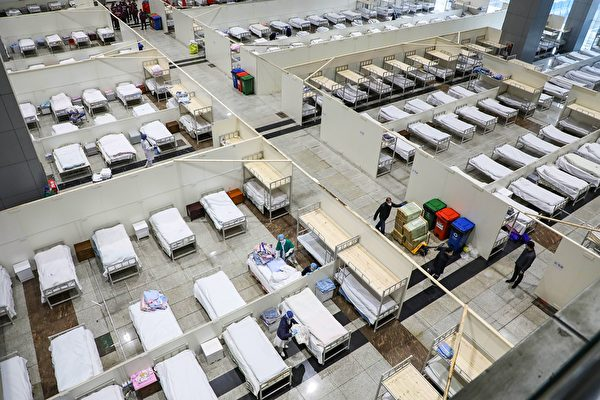

图为武汉市一家由展览中心改建的医院，2月5日医护人员准备接收更多的感染新冠状病毒肺炎患者。 ( STR/AFP via Getty Images)

 
 【大纪元2020年02月22日讯】（大纪元记者何坚报导）尽管中共将防疫新冠肺炎（武汉肺炎）提升至“人民战争”的高度，但大纪元获得中共湖北省防疫指挥部的内部文件显示，中共严厉的“防疫”措施更重视隔离和控制，而忽视生命和健康，这场防疫战的目标更像是维稳和加强对包括健康人群在内的全体中国人的控制。

武汉市乃至湖北省，作为新冠瘟疫的风暴中心，其疫情和防控措施已成世界关注的焦点。

2月13日，习近平任命两名有政法背景的亲信替换了湖北省委书记和武汉市委书记。湖北各地防控措施随之再度升级，城乡所有村组、社区、小区、居民点实行最严格的24小时封闭式管理。

2月16日，武汉当局发布紧急通知，发动为期三天的拉网式“清零”大排查；要求确保确诊患者100%应收尽收、疑似患者100%核酸检测、发热病人100%进行检测、密切接触者100%隔离、小区村庄100%实行24小时封闭管理。通知还要求，通过送物资、查体温、发卡片等多种方式进行全员排查，原则上不能以微信、电话报平安的方式排查，要确保见面率100%。

如此严厉、近乎监禁式的防控，再配合政府发布的节节下降的病例数据，中共严苛的“防疫总攻”似已见效，武汉、湖北和中国的疫情看似“可防可控”。

不过，大纪元得到的中共各地疫情防控指挥部的内部文件，透露出不同的信息。

<b>文件披露 武汉最严防控未能“清零”</b>

依据中共的官方疫情数据，截至2月20日，武汉市有37,448例确诊病例，以及2,820例疑似病例。

根据武汉市卫健委通报以及党媒报导，截至2月20日，武汉市48家定点医院共开放床位20,989张，已用床位19,313张；武汉市已投入使用15座方舱医院，收治病人9,300多人。

考虑到方舱医院只收症状轻微、且能生活自理的病人，由此可知，至少有11,655名已经被中共政府登记在册的确诊和疑似病患，并未被定点医院或方舱医院收治。

但在现实中，武汉市感染新冠病毒的患者有多少？通过网络上患者发布的求救信息和海外医学界的模型测算，可以肯定的是，真实人数远远超出中共版的病例数据。

湖北省防控指挥部2月19日的《督查日报》，从侧面印证了这一点。

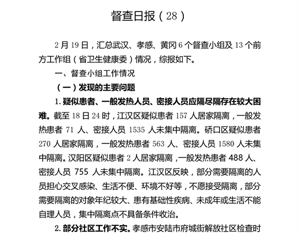

图为湖北省防控指挥部2月19日《督查日报》文件截图。（大纪元）

当日的《督查日报》披露说，“截至2月18日24时，江汉区疑似患者157人居家隔离，一般发热患者71人、密接人员1,535人未集中隔离。硚口区疑似患者270人居家隔离，一般发热患者563人、密接人员1,580人未集中隔离。”

2月21日的《督查日报》披露说，“截至20日24时，硚口区一般发热患者居家观察368人，密接人员居家隔离1,357人。汉阳区一般发热患者居家观察273人，密接人员居家隔离362人。江汉区和江岸区反映，其他发热患者和密接人员全员集中收治还存在一定困难。”

江汉区和硚口区，是武汉市疫情最严重的两个区。这些未被集中隔离或医治的病人，有多少是已被上报的病例？又有多少是以前未被发现或“认可”的病例？如此关键的问题，《督查日报》却完全没提。

这个细节至少透露了，准确的疫情数据并非中共“防疫”真正关心的内容。

事实上，在武汉市2月17日至19日三天拉网式大排查期间，在中共“官方”疫情数据中，武汉市的新增确诊和疑似病例不增反降。这表明，社区一线人员排查出的那些疑似和发热病人，显然未能入了防疫指挥部的眼，并未被纳入疫情统计，而只是作为需要集中隔离的对象、被秘密上报给防控指挥部。

换言之，目前至少有逾万名感染或疑似感染病毒的武汉市民，既无处求医，亦无床位被隔离。这些病人及其接触过的民众的生命健康，正处在危险中。而内部文件表明，中共的防疫指挥部对此并不关心。

<b>文件泄露基层风险大 或催发新感染高峰</b>

大纪元获得的来自中国各地的防疫文件显示出，中共正在采取越来越严厉的手段来控制疫情；然而，漠视人命的中共体制，令严控措施变成了双刃剑。

2月19日的《督查日报》可以证明，武汉市的最严防控措施，不但未能将疫情扩散风险“清零”，反而可能给疫情火上浇油，帮助病毒扩散。因为相比于控制病毒，中共的“防疫”更重视对人员的严密控制。这就导致了，执行防疫（控制）政策的社区一线人员，在防护不足的情况下，自身可能成为病毒传播的载体。

例如，19日的《督查日报》披露说，街道社区干部工作强度大、感染风险大，“因为无人替岗，密接者（密切接触人员）仍坚守岗位”。

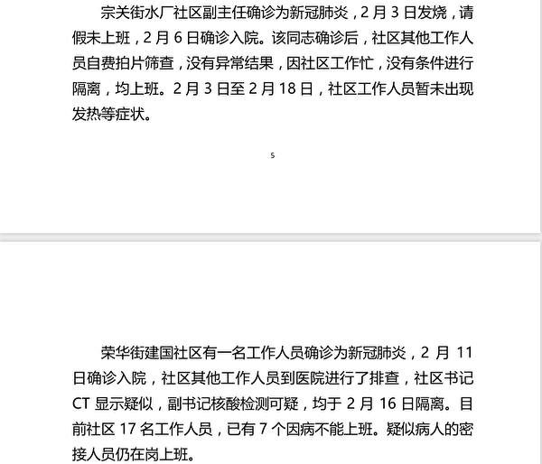

图为湖北省防控指挥部2月19日《督查日报》文件截图。（大纪元）

“该街道（武汉市武昌区珞南街）博苑社区干部职工除书记外均受到感染”。“硚口区水厂社区和建国社区均有社区工作人员确诊病例，但其密接者仍在继续工作”。

“荣华街建国社区有一名工作人员确诊为新冠肺炎，2月11日确诊入院……目前社区17名工作人员，已有7个因病不能上班。疑似病人的密接人员仍在岗上班”。

“武昌区水果湖北环路社区，书记已确诊入院，副主任患病在家……张忻欣（副书记）正从一个死亡病人的家里回来，全身除了一个口罩外没有任何防护”。

在防护用品严重缺乏的条件下，这些社区工作人员如果与居民100%见面排查，会带来什么样的后果？

中共各级防控指挥部的文件，对这些执行严控政策的社区一线人员，都只有轻描淡写的一句“一线人员医疗保障不足”的说明；但对于如何解决他们可能被感染的问题、以及可能在工作中大面积传播病毒的危险，只字不提。

另外，2月19日的《督查日报》还解释了，为何有病患不愿或不能去集中隔离点。一部分人是担心交叉感染、环境不好；还有的是生活不能自理，集中隔离点不具备条件收治。

事实上，医疗系统至今仍然缺医少药，再加上在封闭空间内容纳大批患病人群、存在交叉感染的风险，使得中共“集中隔离”的防疫效果备受质疑。

<b>只隔离不防治 交叉感染风险大</b>

而2月19日的《督查日报》也指出，部分集中隔离点有交叉感染风险。例如在湖北省内仅次于武汉市的疫情重灾区黄冈市，“黄冈市红安县尚客优连锁酒店隔离点，一楼未划分病患区、医务人员区，医务人员未穿隔离服在污染区工作，且同密切接触者同住酒店三楼，金都大酒店隔离点在工作人员通道进行护目镜、防护面屏消毒操作，二个隔离点均存在较大的交叉感染风险。”

19日的《督查日报》还披露了一个事例，“武汉市被隔离人员臧曌反映，首次核酸检测阴性，CT检查感染，到武昌区中南路全季酒店隔离点后，该隔离点无医护人员巡诊，未开展体温测量、核酸检测采样，也不提供治疗药品，近日复查CT，感染进一步扩大，欲取得家中备用药品也无渠道，不知该怎么办。”

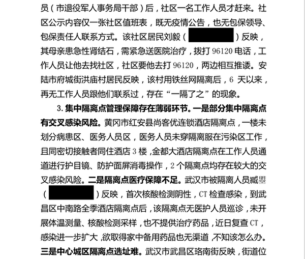

图为湖北省防控指挥部2月19日《督查日报》文件截图。（大纪元）

而2月21日的《督查日报》还列举了几个案例，从侧面证实了外界担忧的方舱医院交叉感染的风险，以及大纪元早前报导的中共苛政下的新冠病患“出院率”造假现象（《新冠肺炎出院人数破万？一线医生揭实情》）。

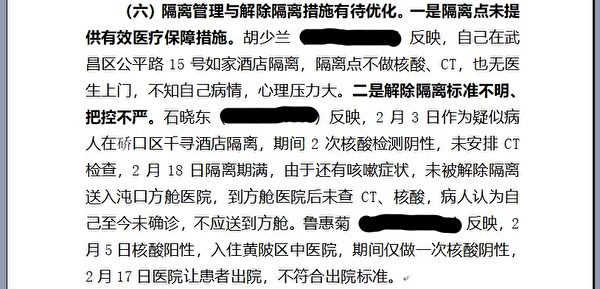

图为湖北省防控指挥部2月21日《督查日报》文件截图。（大纪元）

“石晓东反映，2月3日作为疑似病人在硚口区千寻酒店隔离，期间二次核酸检测阴性，未安排CT检查，2月18日隔离期满，由于还有咳嗽症状，未被解除隔离送入沌口方舱医院，到方舱医院后未查CT、核酸，病人认为自己至今未确诊，不应送到方舱。”

“鲁惠菊反映，2月5日核酸阳性，入住黄陂区中医院，期间仅做一次核酸阴性，2月17日医院让患者出院，不符合出院标准。”

这些例证都表明，政府对于集中隔离点的致命弊端，是心知肚明。但中共依然将大力兴建方舱医院等集中隔离点、以及升级严控，作为最主要的防疫措施。

<b>医用物资“保障”了谁</b>

在针对病毒的防疫战中，医疗物资相当于武器，直接关系到防疫效果、甚至成败。无论是在医院、集中隔离点还是社区一线，医用防护品都是最重要的物资。

在过去一个多月中，网络上武汉一线医生护士的求援声，与被曝光的武汉红十字会和当地政府处置医疗物资的黑幕，构成了鲜明对比，令政府公信力彻底破产。

即使现在中共消灭了网络上的异议声音，并每天公示“官方版本”的医用防护物资分配情况，但各级防控指挥部的内部文件显示，医院和基层依然缺少防护品。

在医疗物资短缺的条件下，中共的防疫指挥部又是如何“保障”物资的呢？2020年2月17日的“武汉市政务信息”，泄露了中共“物资保障”的底细。

该文件披露了武汉市主要医疗物资保障情况，“截至2月16日24时，主要防护医疗物资中，防护服库存1.6771万件，日需求量7.7704万件；N95口罩库存2.0755万件，日需求量13.0010万件……2月16日，向各区及各相关医疗机构共调配防护服55042件、N95口罩131450个、医用外科口罩517250个”。

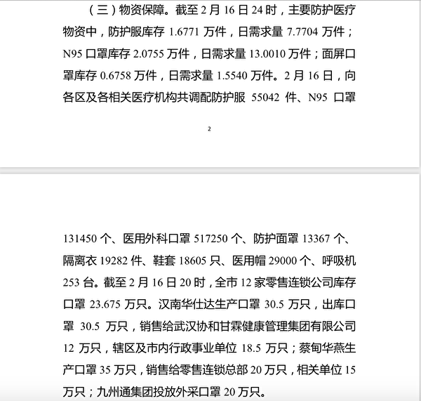

2020年2月17日武汉市政务信息内部文档。（大纪元）

这说明武汉市的医用物资库存严重不足。并且，文件所说的“日需求量”，不像现实中的防疫需求，而可能是受限于政府（包括武汉市）能够“供应”的物资数量。

例如，根据2月16日湖北省防控指挥部公示的医用防护物资分配情况，当天调配给武汉市的医用防护品包括，防护服7万套、N95口罩16万只、医用口罩55万只。

该文件特别提到了医用口罩的生产和供应情况，例如“汉南华仕达（笔者注：应为“华世达”）生产口罩30.5万只，出库口罩30.5万只，销售给武汉协和甘霖健康管理集团有限公司12万只，辖区及市内行政事业单位18.5万只”。

此处的“华世达”，就是最近网络上热议的“湖北救援物资倒卖事件”的主角。

位于武汉开发区（汉南区）的武汉华世达防护用品有限公司，先前在国内并未取得医疗器械生产许可证。新冠肺炎发生后，湖北省市场监管局向华世达公司紧急核发二类医疗器械生产许可证，准许该企业在国内生产医疗防护品。

“华世达”是否倒卖了湖北救援物资，尚未可知。但被武汉市政府文件列为生产医疗保障物资的这家公司，当日生产30.5万只口罩，其中12万只卖给了一家批发医疗产品的私营企业，剩余18.5万只卖给了当地政府的行政事业单位。而当天调配给整个武汉市、作为保障物资的医用口罩，总共也才55万只。

也就是说，武汉当局自己组织的口罩等防疫医用物资，要么是给政府部门自用，要么是拿到市场上贩卖；并未用于保障防疫和医疗，而只是保障了政府官员的身体健康和经济利益。

<a target="_blank" href=#top><h6 align="right">回上方</h6></a>

<a name=183>
<h1 align="center"><b>专家：中共已是烂摊子 全球将迎来新的中国</b></h1>

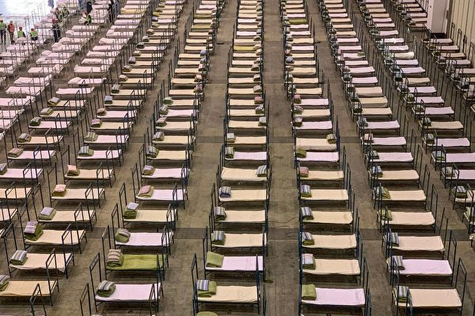

中共隐匿疫情中国人民生活在恐惧中。图为2月3日晚，武汉新设立“方舱医院”收治更多患者。(STR/AFP via Getty Images)

【大纪元2020年02月19日讯】（大纪元记者钟元台北报导）中国武汉肺炎疫情在大陆蔓延，使严重恶化的中国经济雪上加霜。台湾总体经济学家吴嘉隆说，美国对中共打贸易战、科技战、金融战，现在武汉疫情还没有办法可控，中国经济金融局势愈来愈不稳，迟早发生金融风暴，中共这个烂摊子是没法救了，美国也在研究一旦中共垮台，“后中共时代的中国”要怎么来应对。

<b>吴嘉隆：中国发生金融风暴是迟早的事情</b>

吴嘉隆受访说，武汉肺炎疫情在大陆是真的失控，尤其中共安排WHO派来的专家只能考察北京、广东、四川，不让他们去疫情严重的湖北或武汉，可见武汉疫情比中共官方公布的数据严重许多，而且听台商传出来的消息，武汉的死亡人数超过10万人，现在尸体烧不完、来不及烧，只能派其他省火葬场的人去支援，还听说发展出一种移动式的火化炉，可能运到别的地方烧。

对于中共决定两会（全国人大会议与全国政协会议）延期，吴嘉隆表示，本来就不应该开会人群聚集，要等疫情消散才能恢复正常，两会延期是当然的事情。他也指出，武汉疫情造成大陆制造业暂停，因为担心人群聚集会感染，工人不能回工厂上班，但现在因为怕中国经济崩溃，中共硬是强行要工人复工、恢复公共运输等，这只会让疫情扩大更严重而已。

他表示，中国经济增长的三驾马车（外贸、投资、消费）几乎全部熄火了，在失业潮、破产潮、违约潮的冲击下，现在企业的营收整个断掉了，企业也拿不到现金，本国债务、国外债务都要违约，中小企业、国营企业有债务要还，尤其3月是还债高峰期之一，大概就会爆出更多的债务违约案例，所以引发金融风暴是迟早的事情。

香港20日新增3例武汉肺炎确诊个案，累计已有68例，其中有1名确诊者为48岁的现役警员。吴嘉隆表示，香港因为一直都没有封关，现在很多大陆人还是从深圳、珠海想办法到香港，人一直进来肯定就是只能疫情大爆发，香港医疗体系会撑不住，现在香港虽然还没有宣布封城，但实质上已经很多飞机停飞香港，香港是世界第三大金融中心，如果香港封城金融业停顿，中国经济就离崩溃不远了。

<b>面临亡党亡国 中共局势继续崩坏</b>

吴嘉隆表示，中共只想着要保政权，保权贵阶层的既得利益，在权力不受制约的情况下，就只知道维稳，只会镇压，但中共领导班子在应对美中贸易战、香港反送中运动、中华民国总统大选的介入等等，都出现一连串的误判。他说，目前中共局势还在往下走继续崩坏，武汉疫情还没有办法可控，应该还会出现新一波的爆发。“现在这个烂摊子烂得很厉害，中共政权已面临亡党亡国”。

他说，中国未来走向变化性很多，中共垮台可能是“苏联模式”，也可能不是“苏联模式”；如果习近平走前苏联领导人戈巴契夫放弃了共产党一党专政，以和平的方式解体中共走向转型，这是一个好出路，但恐怕他不会选择，因为中共没有能力在民主与法治的制度跟框架之下来运作。“中共在大陆已经执政这么久，却连县市长这种完全不足以动摇政权的地方选举都没办法开放直选。”

“中共一再强调党的领导、一党专政”，他指出，像孙中山的三民主义、民权主义、地方自治、基层民主它们不懂；在推动民主化进程上，历代中共领导人差蒋介石太远了。他说，两蒋时代当年全台湾各地都有出现非国民党人当选县市长的例子。反对势力透过一次次地方选举培养人才，蓄积能量发展壮大，一直到后来的正式组党，“台湾从有作弊的民主一路走到正常的民主”。

吴嘉隆表示，如果用中国历史朝代终结来比喻，中央承担维稳的开销，需要对人民掠夺、变相加税，横征暴敛会变成通货膨胀与民不聊生，最后亡于农民起义，那是“明朝模式”。反之，如果中央让地方政府来分摊维稳的开销，于是形成“弱中央，强地方”，最后亡于军阀割据，那是“清朝模式”。

他认为，中共解体会走“明朝模式”、“清朝模式”都很难讲，但目前像走“明朝模式”，习近平的领导遭遇很多困难，很多人都逼他给个说法，要他出来负责，包括有人不断在背后捅他，像比如江派这些被他打倒的人在报复、要死一起死，中共的烂摊子是亡党亡国的级别，所以习近平在《求是》杂志发表了一篇文章，说在处理武汉疫情的工作有下达指示地方没做好，为他自己进行辩解、企图甩锅。

“如果中央财政告急发不出钱来，不能给地方政府预算补助，也发不出薪水给军队工资。”他表示，中央要砍军队的工资与经费，那么地方政府就有机会介入，拿出资源来拉帮结派了。各地方政府着眼于将来的政局安排，它们想要有发言权，肯定会主动与军方联手，于是形成“弱中央，强地方”，最后亡于军阀割据，那就是“清朝模式”。

2月10日，北京、上海同时宣布封闭管理，自此加上天津、重庆四大直辖市皆被疫情攻陷。同日中共的中央军委政治部、中央军委后勤保障部、中央军委纪检联合印发了《关于严格军地交往有关纪律规定的通知》，明确军地交往“13个严禁”纪律规定。

包括严禁接受地方单位、企业和个人以钱款、有价证券及其它支付凭证等方式开展的慰问、捐赠；严禁以军民共建、工作需要、服务官兵等名义要钱要物；严禁以军队单位名义和军人身份为企业拉项目、搞宣传、做代言；严禁在地方单位兼职的党员领导干部领取除国家、军队明确规定外的薪酬、奖金、津贴等。

大陆独立媒体评论人吴特向大纪元分析，这13条规定大多是和军队腐败相关的，应该是中共当局害怕军队到地方以后，和地方政府形成某种形式的勾结，做出不利于中央的举动。

<b>反共是世界潮流 世界局势发展是以普世价值来展开</b>

吴嘉隆表示，川普上台后先推减税，然后界定中共是美国国家利益的首要威胁，开始打贸易战，还有科技战、金融战。当然也有地缘政治的战略调整，推出“印太战略”，联合日本、澳洲、印度，还有台湾，来形成对中共的联合围堵，还把中共纳入北大西洋公约组织要防范的对象。

“美中第一阶段贸易协议签了之后，中共想用武汉疫情来解套。”他说，中共搬出“例外条款”，要求与美方重新磋商，但美国不会接受。美国对中共处理武汉疫情很不满意、很失望，要中共对病毒来源负责，最后结果是美中关系将急转直下，中共内部封城、封省，在外部会被断航、被封国，中共沉重的债务压力及供给过剩的房地产市场将遭遇更沉重考验，对中国经济带来严峻风险。

吴嘉隆说，美国早就在研究如何去面对一个“后中共时代的中国”，就是一旦中共垮台，美国对中共要怎么来应对。根据美国经验，美国把纳粹德国打垮，然后用马歇尔计划把德国救起来；美国把军国主义日本打垮，然后再用贸易政策优惠，把日本的产业重新扶起来，“本来德日反美跟美国开战，一旦他们被打垮出现亲美政府，美国再把亲美政府拉拔起来，所以德日的重建全是靠美国”。

他表示，美国用对待德日的同样逻辑对中共，美国一定是把中共一党专政的体制拔掉后，让中国大陆出现亲美路线的政权，美国再重新把中国救起来。现在世界局势的发展是以规则为基础，以民主、法治、自由、人权普世价值来展开，由美国来领导的国际秩序，对中共发动新冷战，反共是世界潮流，这当中不会有中共的角色了。

他也提醒中国国民党不能走亲共路线一定要反共，“国民党里的亲共派以为中共完成大国崛起，给出中华民族的伟大复兴的前景，所以基于民族主义情感，开始由反共转而亲共”。但他们不明白的是，中国经济崛起基本上是美国给予支持。美国给中共最惠国待遇，提供出口市场，帮助中共加入世界贸易组织，让中共派遣大量留学生来美国，于是中国经济才能取得重大的动能。

“现在美国不再支持中共的一党专政体制”，他说，在美国的强力围堵之下，中国经济要怎么能不崩溃呢？说到底，中共根本不是美国的对手，请国民党人想一想，如果世界超强的美国要认真来对付一党专政体制的中共，国民党还相信中共真的能带来大国崛起吗？在2020大选，国民党输在没了骨气，因为民主台湾不能对共产大陆卑躬屈膝！国民党如果继续走亲共路线，那就继续没落吧。

他呼吁国民党醒醒吧，中共的一党专制与权贵资本主义，绝对不可能带来中华民族的伟大复兴。要重新出发，在台湾亲共是完全没有市场的。“国民党要重新赢得选民的信任与支持，就是回到蒋经国时代的坚决反共。孙中山建立中国国民党，不是要你们去反台独，而是要你们去推动中国的现代化与民主化，建立‘民主中国’，才是国民党人的使命”。

<a target="_blank" href=#top><h6 align="right">回上方</h6></a>

<a name=182>
<h1 align="center"><b>美情报界查新冠疫情 传中共高层订逃离计划</b></h1>

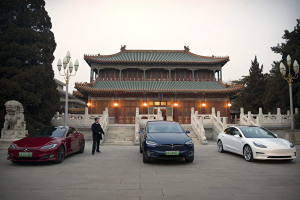

雅虎新闻2月21日报导说，美国情报机构的消息人士称，一些中共官员有制定应急逃离计划的迹象。图为中南海一景。 (Mark Schiefelbein-Pool/Getty Images)

 
 【大纪元2020年02月22日讯】（大纪元记者王祥编译报导）武汉肺炎（新冠肺炎）疫情在中国大陆几近失控，雅虎新闻周五（2月21日）报导说，美国情报机构消息人士透露，一些中共官员有制定应急逃离计划的迹象。

报导作者系雅虎新闻的国家安全与调查记者珍娜·麦克劳林（Jenna Mclaughlin）。她表示，因中共官员有限制冠状病毒传播信息的嫌疑，美国情报机构一直在帮助政府层面收集包括中国在内的全球冠状病毒传播信息。

报导引述两位知情人士的消息说，一些跟新型冠状病毒和中国（中共）政府应对的最佳消息来源是军事渠道。

其中一名前美国情报官员表示，最重要的追踪话题是中国（中共）领导层计划——“运作连续性”——指政府在核战争或自然灾害等前所未有的危机中、维持基本职能的能力。

消息人士说，这一追踪话题在中国可能涉及中共高层领导人离开中国、或寻求海外庇护所的安全举动，“类似美国的世界末日掩护所”。

消息人士还称，美国情报界正在看到一些迹象——中共官员正在制定此类应急计划——这表明北京内部对疫情的潜在担忧程度。

雅虎新闻还引述三个熟悉此事的美国情报界消息人士的话说，国家情报总监（Director of National Intelligence）办公室、中央情报局（CIA）的全球问题任务中心以及国防情报局（Defense Intelligence Agency，简称DIA）的国家医学情报中心都在支持白宫的冠状病毒工作组。该工作队由卫生和公共服务部以及疾病控制与预防中心（CDC）领导。

国家医学情报中心位于马里兰州，负责跟踪疾病爆发和疫情对美国军方的潜在危险，同时也评估外国领导人在应对大流行病或其它相关袭击方面的应对举措。一名美国军方发言人告诉雅虎新闻，该机构“正在密切监视冠状病毒的爆发以及全球应对举措”。

报导称，在冠状病毒全球传播的情况下，美国情报界必须找到一种方法——快速收集迅速发展的潜在大流行病的信息，同时又不至于冒生命危险，跟丢其它威胁或妨碍疾病控制与预防中心以及世界卫生组织的工作。

全球流行病一直是美国国家安全官员长期关注的话题，奥巴马政府时期就针对埃博拉病毒有过跨政府部门的协作。

但更新的挑战是，无论是过去还是现在，国外政府都很难从中共当局获得有关公共卫生危机的完整信息。

一位美国国家安全官员说，尽管总有可以与中方沟通的渠道，但你不能确定中国（中共）官员会不会接听电话。“共产党和广大官僚机构都担心向习近平主席汇报坏消息，也包括病情对全球经济的潜在影响。”报导说。

南加州大学教授、美国国家情报委员会前主席格雷格·特雷弗顿（Greg Treverton）告诉雅虎新闻：“这些是一直存在的、严重问题。”

他说：“健康是一个巨大的国家安全问题，尤其是像中国（中共）这种情报对象、它不会提供应有的帮助。”

特雷弗顿曾研究美国政府对2003年中国萨斯疫情以及2014年至2016年间应对西非埃博拉疫情的内部运作。他告诉雅虎新闻，美国情报部门曾投入大量资金、追踪埃博拉病毒在非洲的发展，这些都发生于埃博拉病情在美国显露之前。

他认为，现有的中美局势“肯定会使（美国从中国）获得可靠情报变得更加困难”，但也说明美国“更有必要”获得可靠的中国情报。

<a target="_blank" href=#top><h6 align="right">回上方</h6></a>

<a name=181>
<h1 align="center"><b>中共官媒称10万鸭军抗4千亿蝗虫 网民吐槽</b></h1>

中国国际电视台称，中国将以10万鸭军对抗4千亿蝗虫的侵袭。图为2020年2月17日，乌干达北部地区的一只蝗虫。(SUMY SADURNI/AFP via Getty Images)

 
 【大纪元2020年02月21日讯】（大纪元记者陈俊村报导）针对多达4,000亿只的蝗虫正接近中国与印度和巴基斯坦的边境，中共喉舌、甫被美国国务院定为政治宣传机构的中共国际电视台（CGTN）声称，由10万只鸭子组成的军队正准备迎击这群蝗虫。有网民质疑这种治蝗方法的效果，认为这只是一种政治宣传。

中共国际电视台于2月19日在推特上分享一段视频说：“印巴边境4,000亿蝗虫正向中国逼近，10万‘鸭军’紧急集合，严阵以待。”

其推文写道，这些“鸭军”在边境集结，以应对蝗灾，但未说明此边境是指何地。

本次蝗灾源自非洲东部。目前已有数以千亿计的蝗虫飞越红海，进入欧洲和亚洲西部与南部。

联合国粮食农业组织（Food and Agriculture Organization of the United Nations）指出，此次蝗灾是东非地区25年来首见，也是肯尼亚过去70年来之最，已经造成粮食短缺的问题。

<h3 align=center><a href="https://twitter.com/FAOBrussels/status/1228308567113031680?ref_src=twsrc%5Etfw%7Ctwcamp%5Etweetembed%7Ctwterm%5E1228308567113031680&ref_url=https%3A%2F%2Fwww.epochtimes.com%2Fgb%2F20%2F2%2F21%2Fn11885738.htm">组织还证实，目前印度和巴基斯坦已有大批蝗虫入侵，并在当地造成农业损失(点击右键,另存新档）</a></h3>

该组织还证实，目前印度和巴基斯坦已有大批蝗虫入侵，并在当地造成农业损失。

巴基斯坦政府已经宣布进入紧急状态。本次蝗灾被视为20年来最严重的一次，已有40%的农作物受灾。

而印度的灾情也不遑多让。该国驻扎在拉贾斯坦邦（Rajasthan）的70万军队因缺乏粮食不得不撤军。还有学者预测，此次蝗灾将造成该国30%至50%的粮食减产。

针对中国国际电视台以10万鸭军对抗4千亿蝗虫的说法，不少网民发言质疑或加以调侃。

“@cscnjzj”说：“每只鸭子一天吃100只蝗虫，一天也才1,000万只，面对千亿级别的蝗虫群和它们每个月增长100倍以上的繁殖力，我只能呵呵你们的智商。”

“@jeremy1066”说：“除非每只鸭子能吃400万只蝗虫，否则他们需要更多鸭子。”

“@SLIMPICK3NS”说：“这些是沙漠蝗虫，它们有毒。如果这些鸭子吃了，它们会死掉。”

“@DanBaks”问道：“这是真的，还是恶作剧？”

“@DazGarda”回复了这个gif图。

<h3 align=center><a href="https://twitter.com/DazGarda/status/1230232505560829952?ref_src=twsrc%5Etfw%7Ctwcamp%5Etweetembed%7Ctwterm%5E1230232505560829952&ref_url=https%3A%2F%2Fwww.epochtimes.com%2Fgb%2F20%2F2%2F21%2Fn11885738.htm">We march !!!(点击右键,另存新档）</a></h3>

“@Hey_World_Hello”说：“我已经能想到，消灭蝗虫后的鸭子的各种吃法。”

“@Dtree19387502”说：“人们最后都有好吃的北京烤鸭。”

“@lekh27”说：“在新型冠状病毒爆发之后，现在中国面临4,000亿只蝗虫，如果它们没有受到控制，大多数粮食会被摧毁。”

“@MisterPheenix”说：“这是另一个大灾难的征兆。”

“@JaneLon70127461”说：“没有东西可以阻止它们。在十灾发生时，埃及怎么样了？”

<a target="_blank" href=#top><h6 align="right">回上方</h6></a>

<a name=180>
<h1 align="center"><b>【一线采访】湖北封村酿血案 家属述详情</b></h1>

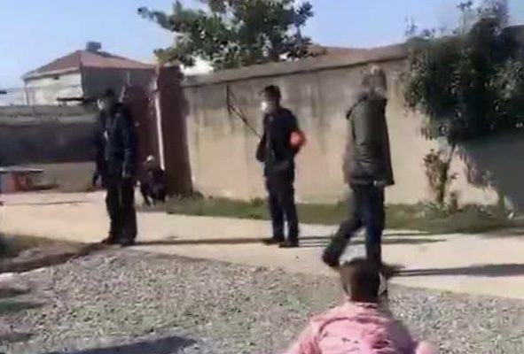

2月20日，湖北武汉市新洲区汪集街陶河村童锅湾发生命案，因封村起纠纷。（受访者提供）

 
 【大纪元2020年02月23日讯】（大纪元记者顾晓华采访报导）为防疫情蔓延，大陆各地采取封城、封村的方式，因此经常会发生村民与封路看守者之间的纠纷，甚至出现人命案。

湖北武汉公安局新洲区分局官方2月21日通报，2月20日11时许，新洲区汪集街陶河村童锅湾村民童某发（男，48岁），因邻里口角纠纷，在本湾将同湾村民童某松、其妻夏某和女儿童某妍一家三口刺伤致死。

血案发生之后，一度传出童锅湾八组童光发（村队长），因其他村民家的狗到自己家串门，担心传播病毒，引发口角纠纷，将本村村民童永松、夏红英和童露妍一家三口刺死。

但是，死者亲属站出来发声，称此说法为谣言，与事实真相完全相背。大纪元记者联系了这位亲属，他讲述了事件发生整个过程。

童锅湾在中国新年期间发生了一个确诊新冠肺炎死亡的病例，这名患者大年三十自武汉回村，当时已经出现发烧症状，大年初二去医院检查未确认，回村之后身体继续不适，数天后再次去医院被确认。该名村民已经死亡，因此村中开始封村严控，禁止村民出入。

这名亲属透露，童永松与其父亲以及另外一村民当了把守村路口的志愿者，他们用三台车将三个村路口阻挡，童永松的父亲每天早上到其中一个路口看守。

2月20日早上8时40分许，童光发来到童永松家门口，让其将车子挪开，他要带人出村。当时童永松刚起床，身上穿着睡衣，因疫情严重他回复不让童光发出村。童光发在院子门口不停地大骂，还骂童永松家去年去世不久的人，这一下激起童永松的怒火，冲出来两人发生口角，进而双方动起手来。邻居将他们拉开之后，童永松回屋，童光发边骂边走，童永松气不过，又追了上去。

这名亲属透露，当时童永松的妻子与女儿都有上前阻拦，但是没能拦住，母女两人也跟着追了出去。

童永松追赶童光发到村中稻场的时候，童光发回家（稻场旁边）取出近一米长的长刀冲出来，首先刺向了赶来的童露妍（童永松女儿），亲属表示，一刀下去直接刺穿心脏，当场死亡，童露妍等救护车来时血都已经流干了。

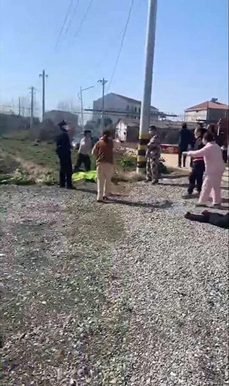

2月20日，湖北武汉市新洲区汪集街陶河村童锅湾发生命案，因封村起纠纷。（受访者提供）

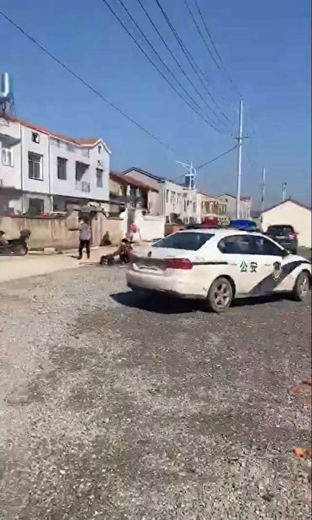

2月20日，湖北武汉市新洲区汪集街陶河村童锅湾发生命案，因封村起纠纷。（受访者提供）

童光发第二刀刺向了童永松，亲属见到的遗体是肚子被刺穿两刀，两只腿上都是刀痕，两手的指头都快被割断（用手抢刀所致）。

最后被刺死的是上前拉架的童永松妻子夏红英，也是身体被刺穿，刀刀致命。

这位亲属还透露，血案发生后村民闻讯赶来，通知其他的家属，当时直接告诉家属人被砍死。

童光发行凶之后，直奔回家，将大铁门和家里的门反锁，警察在事发后的10时多才来到现场，警察敲门童光发也未出来，围观的村民用石头扔向他家的窗户，最后童光发下来被警方带走。

据了解，当时童光发的母亲坐在家门口，像什么事情都没发生一样。

“我们家属赶到现场，看到地上全部都是血，人身上都是洞，全部都刺穿了，看得很害怕，人都没救了。”这位亲属说，“所以说我们家人多心痛，听到这个消息，整个人一天感觉是麻的，感觉什么都不知道了。”

目前死者遗体已经做尸检，等待最终结果。

“我们家属一定要给死者讨回公道，他是因为此次疫情离开，应该属于工伤，我们要还原事件真相。”上述亲属最后说。

<a target="_blank" href=#top><h6 align="right">回上方</h6></a>

<a name=179>
<h1 align="center"><b>山东维权人士逃美：曾被中共做药物试验</b></h1>

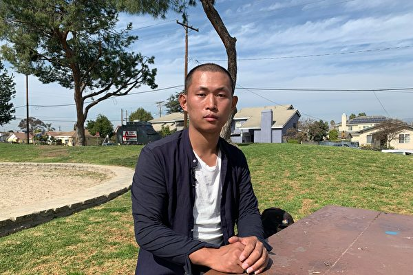

山东维权人士界立建近日曝光了在被关在精神病院期间，被迫成为了药物测试的“白老鼠”内幕，更亲眼所见访民“被消失”的悲剧。（姜琳达／大纪元）

【大纪元2020年02月21日讯】（大纪元记者姜琳达洛杉矶报导）山东维权人士界立建，虽然今年仅有32岁，但已历经多次被中共抓捕、2次被扔进精神病院受药物摧残的血泪史。近日接受采访时，他曝光了被关在精神病院期间被迫成为药物测试的“白老鼠”内幕，以及亲眼所见访民“被消失”的悲剧。

去年圣诞节，受尽折磨和屈辱的界立建一路逃亡到美国，他说：“共产党搞得我们家破人亡，不仅我受尽折磨，我的父亲也被抓，母亲到现在都是生不见人、死不见尸。”

而他的维权之路从小就开始了，在1991年时，界立建的父亲与邻里发生纠纷，被打到腰折。然而因对方有权势，反过来诬陷，导致他的父亲被冤判2年。因为这件事，他母亲也受刺激离家出走了，至今杳无音信。

“从记事起，我就跟父亲走上了上访维权道路，从地方、到省级政府，一路到北京。”然而界立建说，“通过不断上访，我也亲身感受到了中共独裁暴政的残酷和邪恶。对人权、生命的践踏，对百姓的种种冤声，它一直是畜生行径，（对民间冤情）置之不理、打压、抓捕，而且封锁一切维权行动。”这也使他走上了民主抗暴政的道路。

<b>健康且未成年就被关进精神病院</b>

在自己的父亲被抓、被关多次后，界立建也被山东地方精神病院关过一次，他经历过刑拘、拘留，曾被国保、招待所的人多次虐待。

2005年时，年仅17岁的界立建因父亲再次被抓，在中共国殇日期间举着 “冤案无处伸冤、狗官还要国庆” 的牌子抗议，结果被抓到派出所，当晚12点被送进了当地的精神病院。

“我一进到精神病院后，双手、双脚和脖子，直接被接上了5个约束带，身体呈大字型，然后就被打了耳光。”期间他还被护工套上头套殴打，“我都不知道是谁在打我。中间我曾绝食抗议，但是被人用牙刷把嘴巴扳开，直接强制灌牛奶和营养液。”而这一关，就是二十多天的时间。

<b>被逼迫做各种药物实验</b>

2018年，身在广东的界立建又被抓到了深圳罗湖区招待所。 “我进去就直接给我的腿绑在椅子上，手反绑，后面还有一个人把我的头往下压，逼着我认罪，还写了一些东西让我签字，我不签，就被折磨。”

而这种折磨人的方式是不间断的。他说，自己还被一只脚绑在铁床上，一只脚绑在被固定住的椅子上，身体一高一低，然后一只手被吊在铁窗上面，另一只手吊在一个可以活动的木制椅子上。“一个保安就开始逼我认罪，我不说话，他就猛地拉椅子，一拉，我的韧带就特别疼，当时我满身都是虚汗，嘴巴都打颤，痉挛的感觉。”

在招待所5天的时间，他遭受了各种酷刑折磨。“里面的人见审不出什么，就把我又转到了精神病院，这一次我被关了五十多天。”

就在他被关在精神病院第30几天的时候，突然发现床上被装上了一个DV架，床边也放着各种不知名的药片。“护士端过来给我吃，差不多有七八种药，每天三次，看我吃完药的反应。”

他猜想自己已经被当成了试验品，“吃完我就偏头痛，痛得眼皮起不来，一直嗜睡，心痉挛，一会高一会低，心一会揪痛揪痛的，其实我没有闭眼睛，但是迷迷糊糊的眼前一会黑一会蓝一会白，脑袋像过东西一样。”

<b>年轻访民被“消失”</b>

在被关押在精神病院期间，界立建也目睹了很多人的悲惨遭遇，很多女孩被护工强奸至怀孕。为了不被发现，他说：“白天领导视察时，护工就用布把女孩的肚子勒紧，再穿上宽大的衣服，后来这些女孩很多就不见了，最后都不知道去哪里了，很多女孩晚上就哭。”

他说这些护工晚上打牌，无聊了就开始折磨人。“他们抽的烟头、吐的痰在茶杯里，让我们喝，我不喝，就拿着那种电动车的弹簧钩子把我嘴钩开，然后硬灌。”

而上访民众除了被送进精神病院遭受折磨，他说还听闻有访民被活活打死，然后就直接火化，按失踪人员处理。

还有一些年轻访民被人间蒸发，“有些健康的，被某个医院拉走了。因为关在拘留所里面，访民有的去声援，有看见大约4天到5天过去了急救车。再查这个人已经转移走了，转移的时间跟救护车来的时间完全是吻合的。冤案不仅不受理，你的命到最后把器官割走，最后的骨灰都不会回归你的亲人手中。”

谈到为何倍受折磨仍要上访，界立建说：“每位访民都有一本血泪史，那是无法弥补的伤痛。像我父亲是一辈子的瘫痪。即便知道上访没有任何结果，我也要让这个事传出去，让世界知道中国的访民多么的绝望，让世界明白暴政是多么残酷。”

2018年年底，为了躲避中共迫害，界立建一路逃亡，从西藏出境，逃亡到尼泊尔、迪拜，再到往非洲、南美洲，辗转才抵达美国。用自身的经历，他呼吁民众千万不要相信共产党。◇

责任编辑：方平#

【本文内容归大纪元所有，任何单位及个人未经许可，不得擅自转载使用。】

<a target="_blank" href=#top><h6 align="right">回上方</h6></a>

<a name=178>
<h1 align="center"><b>断网前奏？中共工信部批准设立根服务器</b></h1>

中共当局宣布设立域名根服务器，官方要求相关科研机构配合当局“相关测试和演练”。(AFP / Getty Images)

 
 【大纪元2020年02月20日讯】（大纪元记者李净报导）正值大陆新冠病毒肆虐及民怨沸腾之际，中共当局宣布设立域名根服务器，官方要求相关科研机构配合当局“相关测试和演练”。有观察人士质疑这是中共实施断网行动的前奏。

中共工业和信息化部（下称“工信部”）网站2月19日发文，宣布中国信息通信研究院设立域名根服务器（L根镜像服务器）及成立域名根服务器运行机构，负责运行、维护和管理编号分别为JX0013L的域名根服务器。

工信部在批复中要求，域名根服务器机房地址、互联网协议（IP）地址和自治域（AS）号码等信息发生变更时，中国信息通信研究院应在变更之日前15日以书面形式报送工信部。

批复还要求，中国信息通信研究院必须服从工信部的统一指挥与协调，配合开展相关测试和演练。此批复发布日期为2020年2月12日，有效期为5年。

 
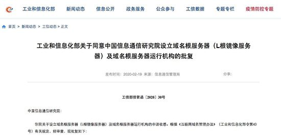

中共宣布设立域名根服务器，要求相关科研机构配合当局相关测试和演练。（中共工信部官网截图）

 
 根服务器主要用来管理互联网的主目录，全世界IPv4根服务器只有13台，其中1个为主根服务器在美国，其余12个均为辅根服务器，分布于美国9个、英国1个、瑞典1个、日本1个。

近年来，中共官媒一直对内渲染“中国互联网受制于人”、“美国可随时掐断中国网络”，为中共部署根域名服务器造势。现今，中国大陆境内共有F、I、J、L这4个根域的6台DNS镜像（L有三台镜像）在提供服务。

据电商软体设计师夏之叶介绍，中国所谓的域名根服务器只是镜相mirror，就是从美国、日本、英国和瑞典的13个根服务器copy DNS信息到中国，这样即使被孤立，网际网路也照样运行。

目前，大陆新冠病毒疫情肆虐。近日有多名网民披露，湖北省已开始区域性断电、断网。武汉小区广播通知，开始实施局部断网，理由是网上的消息影响世卫组织专家对国内疫情的评断。

海外民运人士曾节明发推文表示，经国内朋友证实，武汉断网是北京时间2月11日晚突然实施的。曾节明先生告诉大纪元说，湖北官场换马之后，武汉的言论大幅收紧，应勇这些人原来都是公安政法委的，网络封锁将大幅升级。

就在上月，中共网信办发布了《网络信息内容生态治理规定》，此新规于3月1日施行，当局整治网络言论的理由是“拔除网络杂草”、“给网络空间洗洗澡”。外界认为，中共正在对疫情真相进行全面封杀。

互联网网络自由观察人士古河认为，武汉局部断网，是当局为防止武汉疫情的真实情况向外传播。新规的主要目的其实就是针对国内的社会状态进行网络封锁。

对于中共试图建立区域网的说法，著名反网路封锁专家、动态网路技术公司总裁比尔·夏（Bill Xia）曾对大纪元记者表示，从信息流上断开是不可能的，它的目的是要实现完全的控制，它需要维持网络的运行，但同时对信息流进行控制。他说，中共封网动用了方方面面的各种手段，由此也可见它恐惧政权崩溃到了何等地步。

<a target="_blank" href=#top><h6 align="right">回上方</h6></a>

<a name=177>
<h1 align="center"><b>【独家】外逃求生？武汉一天出走2.8万人</b></h1>

图为封城后街上空荡荡的武汉。 (Stringer/Getty Images)

 
 【大纪元2020年02月19日讯】（大纪元记者何坚报导）源自中共防疫指挥部的大数据显示，尽管当局对疫情始发地武汉市实施了史无前例的封城措施，仍挡不住民众外逃出走，仅2月16日一天至少有2.8万人离开武汉市，截至目前每天从武汉出走的人数都超过2万。

武汉市民在网上发布的求救信息、医院和火葬场的恐怖实景让外界关注，武汉人民在重维稳、轻人命的中共体制下的生存状况。

大纪元获悉的内部文件显示，湖北省通信管理局根据中共要求，联合了中国电信、中国移动、中国联通等相关单位，统计出从湖北以及武汉漫出的手机用户大数据。大数据显示，2月16日从武汉漫出的国内手机用户共计2.79万人次；15天内（2月1日至2月15日）从武汉漫出的手机用户共计13.87万人次。

2月18日、2月19日从武汉漫出手机用户分别为2.29万人次、2.33万人次，其中流入湖北省内其他地市的比例分别为85%、83.8%；而截至2月18日、2月19日的15天内，从武汉漫出手机用户维持在13.05万人次，其中流入湖北省内其他地市的数量占比约为69%；省内主要流入地是孝感、黄冈、咸宁和鄂州这4个地级市。该大数据报告直接抄送中共湖北省新型冠状病毒感染肺炎疫情防控指挥部办公室。

漫游，是指手机用户在离开本地区后，可以继续使用手机服务。

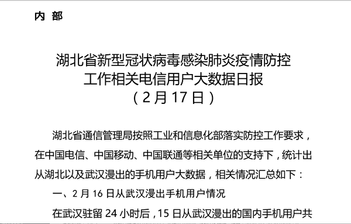

湖北省通信管理局统计出的从湖北及武汉漫出的手机用户大数据。（大纪元）

 
 <b>封城后 想要离汉不容易</b>

1月23日凌晨2点，武汉疫情防控指挥部发布1号通告，1月23日10时起，全市城市公交、地铁、轮渡、长途客运暂停运营；无特殊原因，市民不要离开武汉，机场、火车站离汉通道暂时关闭。一夜间，武汉突变瘟疫孤岛；懵懂中，千万市民已无出路。

1月23日，中共交通运输部就“做好进出武汉交通运输工具管控全力做好疫情防控工作”发布紧急通知。通知要求，严格管控营运车船驶离武汉，严禁载客驶离武汉。同日，湖北省运输厅高速公路管理局发布最新交通管制信息，对共计39个收费站所入口（出城方向）实行交通管制。

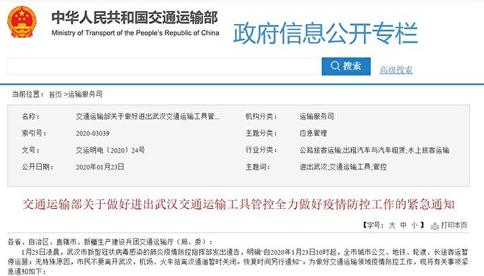

1月23日，中共交通运输部发布紧急通知，要求严格管控营运车船驶离武汉，严禁载客驶离武汉。（网络截图）

 
 这意味着，包括轮渡、飞机、火车、客运和高速公路在内的水陆空离汉通道全部被封锁，市民只有“特殊原因”才能被放行、离汉。

据党媒新华社报导，自1月24日起，湖北省交通运输厅对运送医疗救援物资、运送群众生活物资、运送保障城市运行的水电气等相关物资的三类车辆高速放行。

各交通大队执勤民警现场查验后，凡是进城为武汉市供应医疗器械、药品类物资、生活必需品（活禽除外）、建筑材料等的货运车辆，一车一证，发放特别通行证并放行；出城货运车辆，现场回收特别通行证，驾驶员及乘车人员无发热症状的，予以放行。特别通行证，全称“疫情防控特别通行证”，由武汉市交通管理局签发。

据陆媒报导，即便是运送医疗救援和群众生活物资车辆，要想拿到一张“特别通行证”也并不容易，而且一张通行证也只能出城一次。但有运输医疗物资的民众称，向红十字会申请“专用通行证”，或者由医院开具证明文件，货车司机也可以出入武汉。

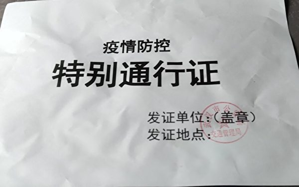

图为武汉市交通管理局签发的“疫情防护特别通行证”。（网络截图）

 
 对于普通民众，若无与防疫相关的“特殊原因”，中共当局并未公布任何可以离开武汉的政策或通道。

也就是说，普通人想要离开武汉，必须另寻他途，自谋逃生之路。根据社媒等网络信息，熟悉当地交通的司机可以走小道（不经高速公路）离开武汉。

另据“湖北省疫情防控指挥部物资与市场保障组交通保障专班”的内部文件可知，2月19日当天，湖北省内协调的与疫情防控相关的人员流动，约为2100人次左右；其中还包括天河机场运送的、进入武汉的医护人员824人。

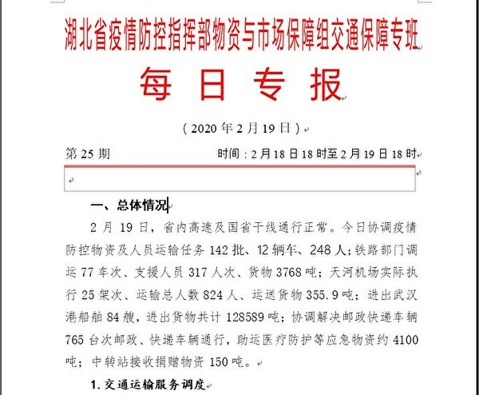

图为“中共湖北省疫情防控指挥部物资与市场保障组交通保障专班”2020年2月19日每日专报的截图。（大纪元）

 
 换言之，2月19日当天，由中共当局安排的、与防疫相关的进入和离开武汉的人数，不会超过省内协调的2100人次，其中主要是进入武汉的医护人员和运输物资的司机。

而该“交通保障专班”文件还透露出，被困武汉的民众想要获准离开是何等的艰难。例如南昌大学校长周创兵，身陷武汉，想要离汉复工，他的申请都得递交到湖北省疫情防控指挥部物资与市场保障组交通保障专班上，作为重点事项来开会讨论，但结果也只是“已与武汉市沟通，后续跟踪做好协调工作”。然而，一旦涉及到监狱系统以及党政官员的进出武汉事宜，文件显示防控指挥部都是大开绿灯。

<b>漫出武汉？逃出武汉？</b>

不过，从武汉市漫游离开的国内手机用户数据可以看出，1月23日开始实施的武汉封城，未能阻断受困民众的出走之路。

这些从武汉漫出的手机用户，去向如何？

2月16日当天，流入其它省只有2725人次，流入湖北省内其它地市有2.52万人次。15天内（2月1日至2月15日），流入其它省份4.17万人次，流入湖北省内其它地市9.70万人次。

鉴于武汉市是湖北省内经济最发达的中心城市，若是以复工为目的，外流人群多数应流向省外的经济发达区域。但2月16日当天，逾9成是流入湖北省内其它地市。

这一数据反映出，从武汉漫出的手机用户，大多数不是为了返工，而是在逃难、例如逃回家乡或亲朋处，逃离缺医少药、恐慌蔓延的武汉市。

事实上，在15天内，从武汉漫出、流入其它省份的人次在总漫出人次中，占比也仅为30%，70%是流入省内其它地市。这种趋势也表明，人们正在试图逃离武汉。

<b>封不住求生路 维稳反令疫情更难控</b>

2月16日当天，自武汉离开，湖北省内流入最多的前4个地市分别是黄冈（占38.97%）、孝感（占32.77%）、咸宁（占12.18%）、鄂州（占10.16%）。

15天内，湖北省内流入最多的前4个地市分别是黄冈（占33.57%）、孝感（占32.67%）、鄂州（占10.51%）、咸宁（占9.51%）。

根据湖北卫健委发布的“中共版”疫情数据，湖北省内，除了武汉市之外，疫情最严重的4个城市依次为：孝感市、黄冈市、荆州市、鄂州市。这4个城市正是与武汉来往最紧密的城市。

而电信部门的大数据显示出，即使是在武汉封城之后，从武汉出来的民众，绝大多数依然是流入这4个城市。
 
不愿被困在武汉而大举出走的武汉“难民”们，不但令流入地的防疫形势变得更为复杂；同时，亦让无法获得有效医治和真实资讯的当地民众，变得更为惶恐。

也就是说，暂不提中共的封城封区甚至封户封门的文革式防疫措施，能够多大程度阻断新冠病毒的扩散或变异。中共自己的大数据就预兆了其防疫战的前景。以武汉甚至湖北数千万人命为代价的“维稳防疫”，在制造出全国、甚至全球恐慌的同时，也必定会迫使成千上万的武汉人／湖北人／中国人竭力出逃。

这正是武汉封城三个多星期后，依然每天都有成千上万人逃出来的缘由。

<a target="_blank" href=#top><h6 align="right">回上方</h6></a>

<a name=176>
<h1 align="center"><b>非常时期 江西上千民众聚集市政府讨血汗钱</b></h1>

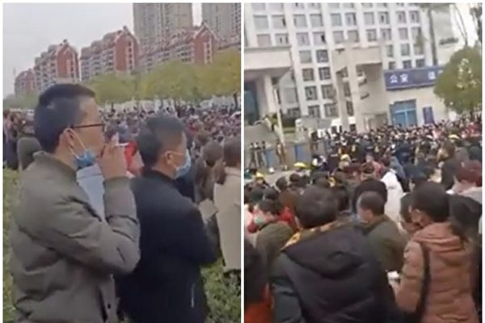

2月20日、21日，上千名罗氏百姓金行的受害者聚集在市政府前讨血汗钱。（网络图片）

【大纪元2020年02月22日讯】（大纪元记者顾晓华采访报导）2月20日、21日，上千名“罗氏百姓金行”的受害者聚集在江西省宜春市的市政府前讨血汗钱。因该金行法人代表罗军涉嫌非法吸收公众存款，2月19日晚间投案自首，金行被警方查封，涉案金额达4亿元（人民币，下同）。

一位不愿透露姓名的受害者A女士向大纪元记者介绍了事件经过。

1月20日，有受害者听说罗军投案自首的消息，大家一传十，十传百，所有人都坐不住了，开始建群，据了解，共建了五六个群，每个群都是满员（500人）。

这位受害者表示，20日正是江西疫情严控部分解除的日子，市政府也开始上班，23日正式全面复工，因此一些小区凭通行证可以自由出入，并且没有时间限制。

20日上午，数百名受害者来到罗氏百姓金行店门口。店面大门紧闭，警方也在现场，给金行相关人员打电话也无人接听，整个金行人去楼空。

当日下午，警方发布通告，受害者可以在网上报案，也可以到当地管辖派出所报备，填写“集资参与人报案登记表”。

上述受害者表示，20日下午，他们只是得到了一张表格，没有人给他们任何解释说明，大家都非常担心、焦虑，最后大概有上千名受害者聚集到市政府前，21日，他们又再次来到市政府前讨说法。

据了解，上千名受害者们在现场并未打横幅，也未喊口号，只是在那里站着，政府前则站着数十名黑衣特警。然后站在最前面、说话声稍微大的两三名受害者被警方强行抓走，其中包括妇女。

这位受害者表示，最让所有人无法理解的是他们怎么变成了集资参与人，成为非法吸收存款的参与者。

据悉，该金行已经营十余年，在当地有8家门店与25家分店，罗军本人在当地也小有名气，上媒体，获嘉奖。

金行的主要业务是贩卖首饰，但是还有特色业务：首先是在他们那里买首饰可以免费寄存，每个月可以给你多送相应比率的金子，比如买10克，在他那里存一个月之后会得到10.1克，并且客户可以随意更换相同重量的新款式。

其次，金行还有借贷业务，将钱借给金行，金行给借款人开据有罗军签名、身份证号，以及公司公章的借条，借款人每月可获得1.2分的利息。相当于你存10万元，每月可得1200元的利息。这两项业务已经运转十几年。

“在这里生活的人都知道罗军这个人，也知道他们有这个业务，并且平时去存钱取钱都很方便，所以会导致这十几年来传播开来。”

“五万元以下的随取，五万元到二十万元的提前一天预约，二十万元以上的是提前两天预约，随用随取，非常方便。” 这位受害者说。

受害者们现在惊慌失措，总共4亿元的血汗钱将血本无归。有消息指，罗军将其中的1亿元炒期货，1亿元支付利息，剩下有2亿元用于自己的生活支出，目前公司的固定资产仅有1500万元。

受害者表示，罗军突然投案自首，而且有传闻他与妻子离婚，自身患有癌症，他们怀疑罗军早有预谋，为了摆脱4亿元的债务责任已做好各种安排。

上述受害者还向记者透露，每一个金额后面都有一个家庭的故事，有老人将孙女做手术的50万元全部存进去；还有离婚的单身妈妈将买房的贷款20万元以及自己的数十万元积蓄全部存进去；更有一对夫妇将靠捡垃圾一辈子积攒的2万元全部存了进去。

“大家这时出来聚集在一起当然担心疫情传染，但是如果我们不出去，我们钱没有了，怎么生活，很多人的身家都在里面，即使他不得这个病，他在家里面怎么生存，现在什么都没有了，都不想活了。”受害者说。

<a target="_blank" href=#top><h6 align="right">回上方</h6></a>

<a name=175>
<h1 align="center"><b>当官的吃不完 贵州援助鄂州蔬菜烂在仓库</b></h1>

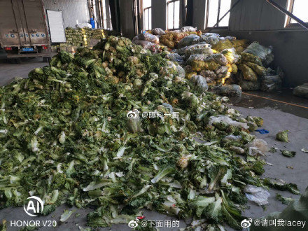

网友爆料指大批援助的蔬菜烂在仓库，市民只能吃高价菜，或根本买不到。（网络图片）

 
 【大纪元2020年02月20日讯】（大纪元记者凌云报导）继武汉红十字会处理捐赠物资的丑闻之后，贵州捐赠湖北鄂州的千吨蔬菜也被曝一部分烂在仓库，一部分作为丰厚福利给了官员和派出所，只有少量流入市场高价出售给老百姓，舆论大哗。

2月18日，鄂城区公安分局凤凰派出所员工家属炫耀自家分发水果、蔬菜的视频，包括：四箱水果，又有很多的蔬菜，还有鸡蛋，全是凤凰派出所发的。多的吃不完，拿了三箱子水果给娘家。

网友爆料指大批援助的蔬菜烂在仓库，市民只能吃高价菜，或根本买不到。（网络图片）

还有聊天记录内容显示，网名为“与石俱进”的网友在聊天群里晒出送给他们家的“物资”，6桶油、1袋圣女果、1袋蔬菜、4袋大米以及上百个口罩。

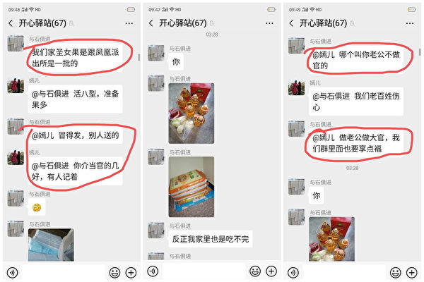

官员家属“与石俱进”炫耀送给他们家的“物资”。（截图）

 

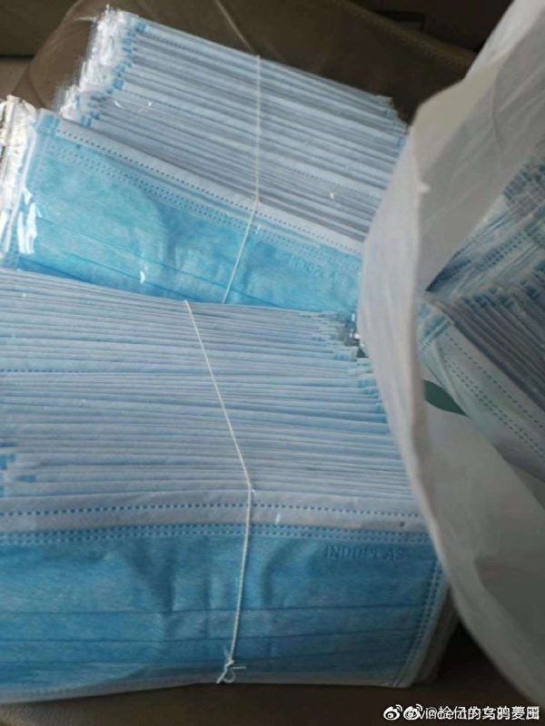

分发的大批口罩。（网路图）

 
 “与石俱进”还称，“自家的圣女果跟凤凰派出所是一批的”，并称“冒得发（没办法），别人送的。”最后更是语出惊人：“哪个叫你老公不做官的。”

与此同时，一个“贵州省捐助鄂州的菜都烂在仓库里了”的帖子在社交媒体上热传，有鄂州网友拍摄的多张图片，可见贵州捐助湖北鄂州的大批蔬菜烂在仓库里，还有照片显示，有派出所公安正在搬运数十箱的蔬菜到派出所车辆上。

 
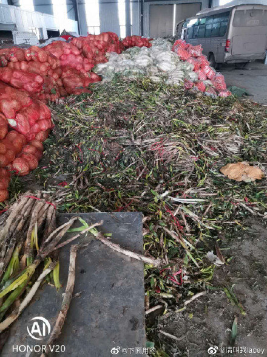

贵州捐助湖北鄂州的大批蔬菜烂在仓库里。（网路图片）

 
 消息引发众怒。不少鄂州网友表示，从来没有免费蔬菜，并且晒自己高价买的菜，50元的蔬菜包内只有很少量的蔬菜。有些人甚至根本买不到菜。
 
 

鄂州市区网友晒50元的蔬菜包。（网路图）

 
 R什久：“我是鄂州的，我咋没看到有啥菜送我啊，原来是到这来了，我们家一天的菜都要2、3百（元）了。”

知非识非：“我在鄂州城区，没有免费蔬菜。50元蔬菜包只有可怜的一点东西。 根本没有水果卖。”

橙汁可乐小妞：“贵州捐赠的物资我们鄂州收到了，但是我们小区连一个菜叶都没看到。”

爱吃馕的大屌哥_：“我两个多年好友都是鄂州的，根本买不到菜，吃了20天鸡蛋挂面了。”

会飞的羔羊啦啦：“我鄂州驰恒之城的，我已经6天没有菜了。”

也有网民透露：“鄂州医生护士吃的自己买的饭，而且还是全素！而某些家属却可以一次性拿4箱，这对比不愤怒吗？”

 
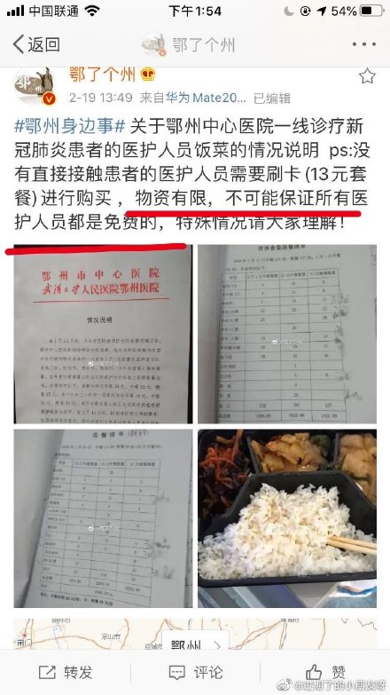

医护人员自己掏钱买饭。（截图）

 
 很多网友斥目前是：“撑的撑死，穷的穷死”，“烂了也不给市民吃……尼玛，猪狗不如！”“官员家里是烂掉的粮食，百姓家里是烂掉的尸体。”

TheLastGentleness：“怪不得一直喊着缺东西，这特么都被特权瓜分了，口罩都成包成包往家里拿的。知不知道给你们捐款捐物的省市连口罩都买不到了啊？”

贵州网友也异常气愤：“我们这么穷，好多还是贫困县从牙缝里挤出来给他们的，他们良心真的不痛吗？”“卧槽气死了，赫章（国家级贫困县）都穷得挂牌督战了，捐这么多，结果还没到市民手里！”

根据中共当局的安排，贵州负责支援湖北鄂州，不仅“送人”，还要“送菜”。截至2月14日，贵州已有四支医疗队共635名队员赶赴湖北。

与此同时，贵州省自2月1日起接连运送了上千吨蔬菜、肉禽等物资到湖北鄂州。仅2月15日，就有14辆大卡车载满来自贵州安顺的包含关岭牛、生猪、白条鸡、鸡蛋、香菇、白菜、白萝卜、韭菜、韭黄等160吨物资抵达鄂州。

网友@斯狄宇匹的统计整理了贵州支援鄂州蔬菜明细，目前约1500吨蔬菜去向未公布，要求当局公布明细。

（截图）

舆论众怒之下，鄂州市疫情防控指挥部宣传组19日晚通报， 将进行调查。但外界希望最后不是把发布消息的人灭声。

<a target="_blank" href=#top><h6 align="right">回上方</h6></a>

<a name=174>
<h1 align="center"><b>【十字路口】武汉方舱病人破墙逃跑 中南海内斗</b></h1>

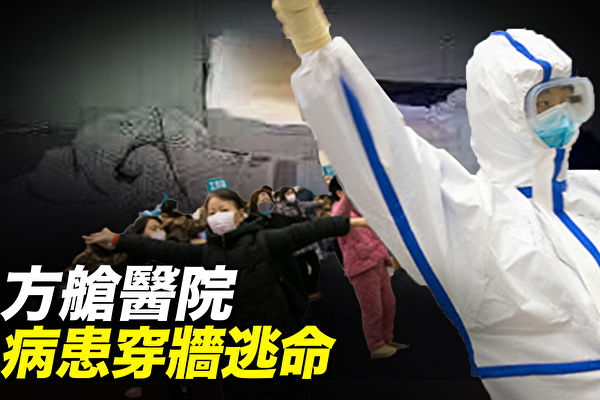

新型冠状病毒肺炎（又称武汉肺炎）仍在扩散，各地不断爆发新疫情。中共武汉市官方称，计划再建19家方舱医院。（大纪元合成）

 
【大纪元2020年02月18日讯】大家好，我是唐浩，今天都好吗？

新冠肺炎疫情仍在世界各地持续蔓延，中国传出有病患在方舱医院里“穿墙逃出”，究竟是怎么回事？武汉病毒研究所被各界质疑是病毒外泄的源头，近日传出一封该所所长王延轶的内部信件，要求所内所有人员配合高层掩盖疫情，不得透露。

此外，中共官场一年一度的重要事件“两会”，原订于3月初举办，但现在传出北京准备推迟两会，并且越来越多迹象显示，中共高层内部出现不寻常的矛盾状态。

究竟，武汉病毒所有没有外泄病毒？王延轶为什么要隐匿？中共为什么要推迟两会？有哪些线索显示中南海内部派系势力展开了激烈的博奕争斗？本集节目，与您探讨。

今天我们要继续跟大家来聊新冠肺炎的疫情进展，主要要跟大家聊两个问题：

问题一：中共为什么要推迟“两会”？

问题二：中共高层内部是否掀起新一轮政治斗争？ 

不过，我们先带您来看几个重点消息。

<b>‧湖北方舱医院 病人穿墙逃跑</b>

这两天，网络上传出一张截图，指称是“武汉方舱医院有病人破墙逃跑”，说在方舱医院里，有病患把墙打穿一个洞，逃了出去，引发网友热议。

稍后，当地媒体随即跳出来“辟谣”，说这名病患是湖北孝感人，是“患有精神疾病的疑似（肺炎）患者”，已经被检测为阴性反应，转往精神病院治疗。

我们稍微考察一下这条消息。首先，截图上写着“东南医院”，而东南医院确实位于孝感市，不是武汉。其次，截图上写着一个名字“邹圆圆”，而网络上确实也可以查到邹圆圆是孝感市中心医院感染科护士，被派往东南医院参与肺炎医务工作。所以，这张截图的人名、地名，基本上是可信度比较高的。

至于穿墙逃出医院的病患究竟有没有精神病，这一点我们难以查起。不过，就在官方媒体出面“辟谣”之后，反而引发众多网友的围观批评，认为中共“辟谣什么，什么就是真的”，充分反映了中国人民对党的不信任。

特别是前几天，党媒央视为了美化宣传方舱医院，特意找人受访说，在方舱医院里“住得不想走了”。结果，这名“不想走”的民众随即被网友搜索起底，发现她与央视稍早的另一条新闻里的女护士几乎是同一人，让网友更加气愤。

这种“党媒不想走，人民穿墙走”的平行宇宙现象，反映了中共在这次疫情当中，依然不愿对人民说真话，还在用老旧的宣传战来瞒骗人民。但是与此同时，越来越多中国民众不再相信官方与党媒的说法，反而认为“官方否认什么，就等于承认什么”。

这种人民对政府“零信任”的现象，已经构成中共政权的危机，而且形成了政治学上所谓的“塔西佗陷阱（Tacitus trap）”，简单说，就是当政府公权力失去了人民的信任之后，那么不管政权说什么、做什么，都会招来民众的负面批评，认为你在说谎、造假。说白了，这正是中共长期“假大空”统治累积的危机。

<b>‧武汉病毒所长涉嫌隐匿疫情、泄漏病毒？</b>

武汉病毒研究所，最近成为海内外的新闻热点，因为武汉病毒所被许多人质疑是这次病毒外泄的源头。

2月16日，网络上出现一封疑似武汉病毒所所长王延轶发给内部群组的信件，发信日期是1月2日。内容提及，“国家卫健委明确要求，所有与此次疫情相关的检测、实验数据以及结果、结论，一律不得在自媒体和社交软件公布，不得向媒体（包括官方媒体）、合作机构（包括技术服务公司等）透露。”

这封信引发海内外热烈讨论，但截至我们拍摄节目为止，王延轶本人还没出面回应。如果这封信是真的，那就代表中共卫健委从疫情在去年底发生之后，就下令掩盖真相，甚至连党媒都不让知道。至于疫情消息有没有再上报到中央更高层？我们不得而知。

巧的是，近日网络又出现一封“实名举报信”，自称是武汉病毒所研究员陈全姣，要举报所长王延轶“泄漏病毒”，指称王延轶经常拿实验动物卖给华南海鲜市场，也就是官方声称的病毒来源地。

不过，武汉病毒所在17日发表了一份声明，署名是陈全姣，强调网络上传出的举报讯息是被冒用身份、捏造信息，将追究法律责任。

这一连串讯息，虚虚实实，不容易查证，但都是针对王延轶而来。是不是代表武汉病毒所真的就是这次疫情的病毒外泄源头？还是中共党内想要政治卸责，想指控武汉病毒所外泄病毒，来转移中共当局隐匿疫情的责任与焦点？值得我们继续观察。

<b>‧世卫专家组抵华考察 竟不去武汉与湖北？</b>

世界卫生组织（WHO）的12名国际专家，已经抵达中国准备考察疫情，不过令人意外的是，这次中方帮专家安排的考察地点只有北京、广东、四川，不去疫情严重的湖北或武汉。

而根据路透社报导，这次的国际专家团并没有公布名单，所以不清楚有没有美国疾控中心（CDC）的人员。

所以，我们可以想见，世卫专家们很可能还是看不见湖北的第一线疫情真相，考察的都是中共预先布置好的“样板地点”，听到的都是中共提供的官方数据与说词，最后得出的结论，很可能也得经过中共当局的过滤、审查。

如果这批世卫派来的专家，最后真的只是来当中共的橡皮图章、替中共宣传，那么世界卫生组织真的就跟中共的“海外卫健委”差不多了。

<b>中共为什么要推迟“两会”</b>

好，看完了这些消息，我们再来看中共为什么要推迟“两会”。

“两会”是指中共的“全国人民代表大会”会议和“中国人民政治协商会议全国委员会”会议，简称“人大会议”和“政协会议”，统称“两会”。

中共的人大，地位相当于美国的国会两院或者台湾的立法院，是有政治权力的立法机关，这一点比较好理解。

而政协呢，则是一种具有“中共特色”的组织，它没有政治实权。根据中共宪法说的，政协是“有广泛代表性的爱国统一战线组织”。说白了，政协就是中共用来统战、收编社会各界精英的机制，假装听取各界精英的建言，作为政策参考，其实是用这个机制来笼络各行各业的精英，用来加强对社会各界的控制，同时也营造中共组织里“充斥精英”的形象。

有的人很积极地想挤进政协、挂个政协委员的头衔来牟取利益，而有些社会名人则是被动地、不情愿地“被加入”政协。这一点比较敏感，我们就不点名举例了。

好，回到两会。两会是中共一年一度的重要政治事件之一，通常在每年3月初召开，因为人大会议闭幕后，通常会由国务院总理出面举行记者会，接受记者提问，也因此“两会”总是吸引海内外媒体前往北京。

不过，17日传出，中共人大准备在24日审议是否推迟今年的人大会议，不在原订的3月5日召开。如果真的人大会议通过推迟，那么政协会议也会跟着推迟。两会既然这么重要，又是中共向海内外媒体自我宣传的重要场合，为什么要推迟呢？我认为，主要有几个主因：

<b>‧主因一：北京疫情严重 召开两会恐失控</b>

大家知道，新冠肺炎的疫情仍在持续扩大，北京一开始很有自信地说“不会封城”，后来在2月10日宣布实施“封闭式管理”，开始限制人员行动，大家就看出北京的疫情不妙了。

到了14日，北京又宣布所有返回北京人员都要隔离14天；现在又准备推迟两会，种种迹象都显示，北京的疫情显然无法控制住，规模仍在持续扩大。如果在这个时候召开两会，全国几千名代表与大批海内外记者涌进北京，不但可能加重北京的病毒风险，还可能让疫情扩大传播到中国各地。

特别是这次病毒快速变异，出现了许多“无症状感染者”，更让北京当局难以防范。所以推迟两会，等到疫情结束后再举办，是北京当局的首要考量。只是北京这个考量的基点，可能不一定是为了保护人民的健康安全，而是为了保护自己的政权安全。

<b>‧主因二：隐匿真相被质疑 中共丢尽颜面</b>

中共在这次肺炎疫情的处理上并不透明，不但持续制造假数据、掩盖疫情真相，还不断监控网络、审查言论，避免人民对外传播民间的疫情真相，中共也因此引发国际媒体的批评质疑。

目前中国仍是疫情最严重的国家，如果在这个时候举办两会，海内外媒体大阵仗来到北京，势必对疫情问题穷追猛打，让中共官员难以招架，真话不能说，说假话又会穿帮，在记者会上很可能会坐立难安。如果不回答问题，或者避重就轻地实问虚答，同样会引来国际社会的批评，中南海高层的面子也挂不住。

而且，现在最新传出，北京市西城区政府爆发疫情，区政府的确诊人数超过40人，引发内部恐慌。而北京市委书记蔡奇才刚去过西城区政府视察，因此生气大怒。如果让外国记者去到北京，挖出更多当地的疫情内幕，或者带着病毒回国，就会让中共更加颜面无光，摧毁中共大外宣强调的“疫情可控”的“大国形象”。

所以说，现在推迟两会，是中共维护自己颜面、躲避各界追究责任的技术性手段。

<b>‧主因三：经济高度不稳 “全面小康社会”难实现</b>

中共当局宣称2020年是达成“全面小康社会”的收官之年，并高调宣称中国人均GDP超过一万美元。换句话说，经济成绩是北京当局今年最看重的政治宣传。

不过，受到美中贸易战冲击，中国经济增长在去年创下近30年来最低水平，不但产业外移、外资撤离，中国地方政府与企业都还面临严重的债务问题。没想到现在又遇上肺炎疫情来袭，让许多企业不得不暂停生产，大批企业干部与劳工被隔离或自我隔离，无法上班。即便劳工想复工上班，也得在“要钱还是要命”之间做选择。

因此，海内外都评估，今年中国经济高度不乐观，不但今年第一季度GDP增长预计将下降到4.5％，很可能还要加速更多企业搬移海外、或者转移更多产能到海外，也将造成中国境内的就业机会逐渐减少，人民收入也跟着减少。

所以，这个时候推迟两会，对北京来说是避免被质问经济问题的好机会，也可避免缺乏经济成绩可以对外宣传的窘境。

<b>‧主因四：疫情不稳 中共高层斗争激烈</b>

最值得我们注意的一项重点是，中共高层的权力斗争也悄悄地在这波疫情背后愈演愈烈。

疫情爆发之初，武汉市长周先旺因为涉嫌隐瞒疫情而广受各界批评。1月27日，周先旺在央视受访时，坦言自己因为疫情没有及时披露而遭到很多批评，不过，他竟然罕见地公开把责任向上推给中央单位。

隔天，1月28日，习近平在接见外宾时强调，这次疫情的防控工作，都是“我一直亲自指挥、亲自部署”，似乎在回击地方诸侯的挑衅甩锅。

2月8日，北京派出中央政法委秘书长陈一新前往武汉坐镇疫情防控工作，等于是钦差大臣统领地方政府。

2月11日，隶属武汉市宣传口的“汉网”，突然刊登一篇文章叫做“‘疫’流而上，何不多给武汉市长暖暖心”，公开帮周先旺叫屈喊冤，然而周先旺也从2月开始，就消失在众人的视线里，没再公开露面过。

2月13日，中共中央宣布撤换湖北省委书记以及武汉市委书记，湖北省与武汉市的两名“一把手”被一次撤换，意味着北京当局很可能想要向人民传达“追究责任”的姿态，借此划下政治防火线，同时也换上自己信任的人马来主导湖北官场、治理疫情。

同一天，中共港澳办主任张晓明也被降职，而张晓明与1月4日被撤换的香港中联办主任王志民，刚好都是江泽民派系的人马。

2月14日，网络上传出一篇文章，作者自称是习近平女儿习明泽，文章说肺炎只是小事，真正严重的是中共高层已经发生激烈内斗，斗争“火热化”，而习近平正在处理。

不过，这篇文章显然不是出自习明泽手笔，毕竟没有人会公开说自己的父亲“罄竹难书”，“罄竹难书”是负面用词，跟“恶贯满盈”差不多。但是，不管这篇文章是谁写的，都不能排除中共内部有派系势力通过网络舆论战来叫板中央。

到了15日，中共党刊《求是》刊登了习近平在2月3日的讲话，里面提到习近平在1月7日就已经对肺炎疫情的防控工作提出要求，习近平又在1月20日，专门就疫情防控工作做出批示。

那么，这篇文章传递出一个弦外之音是，习近平早在1月7日就已经知道疫情的状况，但中共一直要到1月20日才对外承认疫情会“人传人”，武汉到1月23日才封城。换句话说，这篇文章在这个时候刊登，究竟是为了宣示习近平统领大权、指挥若定呢？还是一种内斗的“高级黑”，暗指习近平当局要承担这次疫情的责任？

同样2月15日，中共中纪委网站发布消息，指称中国疾控中心主任高福涉嫌“严重违纪违法”，已经被中纪委审查。

但不到半个小时，这篇消息又被撤下，报导这项消息的媒体又发出道歉信。这起高度诡异的事件，让外界质疑中共内部的权力斗争相当激烈。也让人质疑，究竟是高福背后到底有谁撑腰，可以挡下中纪委的调查？

更令人意外的是，到了16日，海外民运人士在推特上发表推文，写“习近平，请你下台，向天下苍生谢罪！”然而，让人惊讶的是，中共外交部发言人华春莹竟然在这篇推文上点“赞”。这个“赞”被发现后，华春莹的账号瞬间删除了所有记录，但是已经被网友截图保存下来，也证实是华春莹的账号。

华春莹按了这个赞，在向来严厉的中共官场里，不但非常“政治不正确”，而且堪称是“造反”之举。长年在官场打滚的华春莹不可能不知道这个游戏规则，那么究竟是她一时“手滑”按了赞，还是背后有人撑腰、让她表态呢？

同样是16日，武汉大学教授尚重生发给朋友圈的讯息在海外网络传开，内容披露他在1月9日，就曾经接受党媒采访，说明疫情的严重性与防疫建议，作为中共高层内部参考，也就是所谓的“内参”。但后来他的建议并没有被采纳，或者没有被看见，各项疫情问题也接踵而来。

这封公开信，显然是对外传递着，这次疫情的责任在中共高层。只是这次的“内参”，究竟送到了多高层？是高层看了之后不愿采纳吗？还是有人从中截住了讯息，不往更高层传？这个我们目前不得而知。

但是，从这一连串的事件梳理，我们可以看出，中共高层内部正在进行一场越来越火热的政治争斗，而这场政治争斗又与肺炎疫情环环相扣。也就是说，这场肺炎病毒战已经演变成一场暗潮汹涌的宫廷内斗战。

至于谁胜谁败？谁将对这场疫情担负主要责任？这场内斗会不会动摇中共政权？让我们继续看下去。

‧小结

好，最后再重复一次，中共推迟两会的几个主因：

‧主因一：北京疫情严重 召开两会恐失控

‧主因二：隐匿真相被质疑 中共丢尽颜面

‧主因三：经济高度不稳 “全面小康社会”难实现

‧主因四：疫情不稳 中共高层斗争激烈

大纪元《世界十字路口》制作组

<a target="_blank" href=#top><h6 align="right">回上方</h6></a>

<a name=173>
<h1 align="center"><b>【更新】肺炎扩散30国和地区 武汉死亡率高</b></h1>

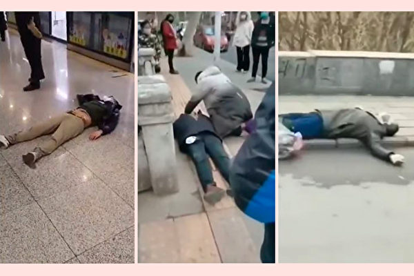

武汉肺炎中一些病人突然倒地死亡，或与新冠病毒感染引发的免疫系统过度反应有关，医学上称为“细胞因子风暴”。（视频截图）

【大纪元讯】中国武汉去年12月爆发不明肺炎，今年1月8日确定疫情的病原为新型冠状病毒，世界卫生组织1月13日将此病毒定名为“2019新型冠状病毒”（2019-nCoV）。

目前，武汉肺炎疫情已在中国失控蔓延。疫区中心的武汉因医疗资源极度匮乏，很多病患无法确诊和救治，只有等死；其它地区也日趋严重，中国已有八十多个城市实施封城等“封闭式管理”，包括北京上海等一线城市。专家及民间指有超十万的感染人数，远远大于官方统计。

2月10日，大陆多地复工，但外界担忧风险太大，尤其北京。

疫情也扩散30个国家和地区，迄今海外确诊逾1100例，死亡6例。美国、加拿大、日本、韩国、台湾、欧洲各国纷纷加紧撤侨，已有六十多个国家和地区对中国公民或自中国出境的人士采取暂时性限制措施，并停航或部分停航。

世界卫生组织（WHO）警告，新型冠状病毒所带来的全球威胁可能比恐怖主义还要严重。世卫已宣布新冠病毒肺炎（武汉肺炎）为“国际公共卫生紧急事件”。

在疫区或进入疫区的民众，应避免出入市场、医院等公共场所及人多的地方，也不要接触野生和禽畜类动物，禽肉及蛋类要熟食，同时做好个人防护措施：以肥皂勤洗手、戴口罩。

本文将持续更新每日重点事件。

2月19日：疫情肆虐，中共官媒连出假新闻压制民声；隐瞒疫情，中共官场推责潮汹涌；工厂艰难复工；新冠肺炎扩散30国和地区

（北京时间2月20日8:00更新）

<b>●【直播回放】2.19新肺炎追踪：海军舰长遭隔离</b>

武汉肺炎发展迅猛，感染人数攀升，湖北省各大医院被征收为治疗发热病患，一般病患乃至癌症患者无法进行常规治疗，再加上封城封村，难以越区治疗，致使多数患者求助无门。

“我女儿本来三个疗程以后要做骨髓移植的，但是等待过程中医生告诉我们移植舱关了，他说因为疫情，他的医生和护士到前线去了，他的护士也有染疫被隔离的，然后又缺血液，所以关了。”白血病患者的母亲陈女士（化名）向大纪元记者说道。

有医生表示，重症病人死亡率非常高，现在都是安慰治疗，病人全程清醒，渐进式窒息，伴随着剧烈的挣扎、呼救，直到呼出最后一口气。

<b>●疫情肆虐 中共官媒连出假新闻 压制民声</b>

武汉肺炎爆发以来，中共媒体不断造假，或将真实情况说成谣言。有些显而易见的谎言均被网民记录下来，包括图片造假、内容造假。网民嘲讽，“为了感动我们，官媒能有多拼？”

中国疾病预防控制中心（疾控中心）新型冠状病毒肺炎应急响应机制流行病学组的最新论文披露，在12月31日前，已有104名感染者，其中有15人死亡，打脸武汉卫计委当时的通报成为今天武汉疫情看点。

<b>●中共数据不可靠 专家各凭本事分析疫情冲击</b>

武汉新型冠状病毒爆发冲击全球经济，分析师面临的挑战是，中共公布的疫情数据不可靠，他们只能各凭本事，参考其它客观数据分析经济前景。

中共官方报告，至今累计确诊74,675（新增396）；重症11,864；疑似4922例；死亡2121例（新增115例）。外界一直质疑数据缩水，这里只作为参考。

<b>●当官的吃不完 贵州援助鄂州蔬菜烂在仓库</b>

继武汉红十字会处理捐赠物资的丑闻之后，贵州捐赠湖北鄂州的千吨蔬菜也被曝一部分烂在仓库，一部分作为丰厚福利给了官员和派出所的，只有少量流入市场高价出售给老百姓，舆论大哗。

<b>●中国工厂艰难复工 民众怕被感染“人没了”</b>

新冠病毒疫情持续肆虐，但中共高层已放弃隔离人群计划，要求复工。不过，各地基层官员担心疫情失控被追责，仍继续封城封路，或阻止复工。而民众则担心：如果被传染，人就没了。

为阻止新型冠状病毒传播，北京政府和大企业鼓励人们待在家中，禁止不必要的旅行。遏止病毒传播的措施，首先冲击的是需要人潮的服务业。越来越多的中国企业发不出薪水，员工必须勒紧裤带。

<b>●隐瞒疫情酿大祸 中共官场推责潮汹涌</b>

中共隐瞒武汉肺炎疫情真相，致使疫情泛滥、酿成大祸。中共内部已乱作一团，中共武汉当局、中共卫健委、中共当局接连都在互相推卸责任。（详情点阅）

武汉疫情失控，中共卫健委也开始推责了，形成“三方甩锅”的局面，对北京更加不利。不过有两个人却一直在为北京说好话。一个是美国总统川普，另一个是世卫组织总干事谭德塞。谭德塞否认是在压力下为中共说话，他暗赞北京“牺牲武汉、拯救世界”，就是说武汉人被当局放弃了。而川普赞赏习近平，则可能有别的原因。

<b>●钻石号再增79例 共621人确诊肺炎涉27国</b>

停泊在日本横滨港的“钻石公主号”（Diamond Princess）发生武汉肺炎群聚感染，并持续扩大。日本政府厚生劳动省表示，游轮今天又新增79例新冠病毒感染病例，目前船上人员共有621人确诊。同一天，在游轮上被隔离满14天且病毒测试呈阴性的乘客开始下船。

<b>●疫情蔓延30个国家和地区。累计海外确诊1117例，死亡6例</b>

在中国大陆以外，新型冠状病毒已经蔓延29个国家和地区。

海外新增确证病例103例：香港3例；台湾2例；日本88例；新加坡3例；韩国5例；伊朗2例。新增死亡：香港1例。

累计确诊病例1117例：香港65例；台湾24例；澳门10例；日本704例；新加坡84例；韩国51例；泰国35例；马来西亚22例；德国、越南各16例；澳大利亚、美国各15例；法国12例；英国、阿联酋各9例；加拿大8例；印度、菲律宾、意大利各3例；俄罗斯、西班牙、伊朗各2例；芬兰、瑞典、尼泊尔、柬埔寨、斯里兰卡、埃及、比利时各1例。

累计死亡6例：香港2例；菲律宾、日本、法国、台湾各1例。

2月18日：武汉大量病患在生死线上挣扎，湖北断粮？封城封区封声，习近平掀“人民战争”？中共终于让美国专家进入，但世卫考察组避去武汉 北京内心有鬼？

（北京时间2月19日8:00更新）

<b>●【直播回放】2.18新肺炎追踪：公安监督复工</b>

“移动式焚化炉”进武汉 网民：死多少人？武汉新冠肺炎疫情蔓延之际，近20台移动式“垃圾和动物尸体处置方舱”将进武汉。网民纷纷质疑：“到底死了多少人？”“不够烧，还要调派移动焚化炉……”

武汉疫情失控，大量病患得不到安置和医治，在生死线上挣扎。对于许多原本需要定期做透析才能延续生命的尿毒症患者，感染上新冠病毒，更是雪上加霜。大纪元采访多位患者及家属，呈现他们的现况。

武汉传出有病患在方舱医院里“穿墙逃出”？武汉病毒研究所被各界质疑是病毒外泄的源头，近日传出一封该所所长王延轶的内部信件，要求所内所有人员配合高层掩盖疫情，不得透露。

新冠肺炎“零号病人”成谜 7旬脑梗老人？新冠病毒肺炎疯狂蔓延，这场疫情究竟从何而起，至关重要的“首例病人”传染经过仍迷雾重重。而不断发表的研究成果，正把这场疫情的首发时间不断推前。

近日网上传言，北京西城区某部门出现一例新冠肺炎确诊病例，导致西城区政府工作停摆。西城区区长18日承认有一例新冠肺炎确诊病例，69人隔离，但否认工作停摆。

中共官方报告，至今累计确诊74,279（新增1,751）；重症11,977；疑似5248例；死亡2006例（新增136例）。外界一直质疑数据缩水，这里只作为参考。

<b>●封城封区封声 习近平掀“人民战争”？</b>

中国民间有句话，上头动动嘴，下面跑断腿。北京当局的一句“人民战争”，整个社会似乎又回到了红卫兵时代，人伦惨剧不断发生。北京当局防疫控疫掀起全国的“人民战争”，使全国立刻陷入了一片红色恐怖。

视频：大陆各地红卫兵式暴力防疫 引众怒：中共隐瞒疫情，致使武汉肺炎迅速在全国蔓延。疫情失控后，中共各地又用红卫兵式暴力防疫视频曝光：随便抓人、打人、游街示众等等，就是一家人在家中打牌，也会被抓、被打等，引发民众的愤怒。

<a target="_blank" href=#top><h6 align="right">回上方</h6></a>

<a name=172>
<h1 align="center"><b>陆企复工乱象：有警车 无口罩 资金物流中断</b></h1>

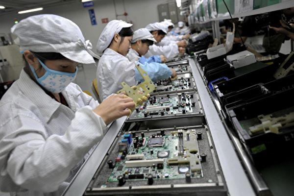

大陆复工乱象频出，大陆民企和老百姓叫苦不迭。(AFP)

【大纪元2020年02月22日讯】（大纪元记者张玉洁综合报导）大陆复工乱象频出，比如警察出动强制复工，村镇害怕担责任不想放人，企业担心群聚感染，员工缺乏防护物资，物流喊发货难等，大陆民企和老百姓叫苦不迭。

《中国经济周刊》2月20日报导，一家市值超过千亿元的制造业老板说，疫情的影响包括几方面——市场需求低，开工率低；员工复工率低，物流和供应链受阻，无法发货。

东莞一位原料制造行业老板说，前一段时间的停工已经令企业出现资金“断流”的迹象，如果3月初还不能复工，他就会关闭工厂，遣散工人。

<b>复工政策一团乱</b>

疫情扩散令大陆深陷两难——中共高层要求企业复工，同时要求地方不能出现疫情；地方害怕出现疫情担责任，不愿放人和复工，尤其是疫情严重的地区。

近日，浙江东阳15辆复工大巴从贵州运送人员返回浙江复工，全程警车“护送”。浙江台州、河北邢台、辽宁苏家屯等多地都出现警车出动“接工人”返工的情况。

甚至在大陆的台湾商人也被逼开工。台湾财经专家胡采蘋在脸书发文说，中共公安直接坐进台商办公室，强迫打电话催工人返工。

但有湖南民众透露，自己所在的村要求拿到镇医院健康证明才让出村，但不出村根本无法去开证明。

浙江宁波民众说，农村到县市的交通中断，即使到了车站也很难买到火车票，很多河南、安徽的农民工回不来。

湖南邵阳一名在深圳打工的人士说，现在普通人在药店根本买不到口罩，所以也就出不去，没办法去深圳上班。

<b>企业缺防疫物资 担心群聚感染</b>

群聚感染是令大陆企业主提心吊胆的一个问题——如果指令复工，一旦发生群聚感染，谁来负责？到时企业会面对招投标受限制，难以接到业务，甚至再次停工或彻底关门的风险。

尤其是现在防护物资极为缺乏，即使企业愿意支付这笔成本，大多数中小企业仍然很难买到口罩等物资，至于核酸检测更是不可能的事情。

路透社2月18日报导，2月10日复工日之后，已经传出广州、重庆、北京、苏州等多个省市出现员工返工后传染给同事的事件，已经有上千人因此被隔离。

<b>复工后难发货</b>

湖南一家大型食用油生产企业副总经理2月17日表示，当前他们复工复产遇到的最大问题是物流——公路交通中断，公司生产的货物无法发送到客户手中。

即使公司愿意承担一部分额外成本，比如提高运费价格，也没有司机愿意出车，因为司机出去可能被挡在路上回不来，即使回来了，至少要被隔离14天。

疫情最严重的湖北省，很多经销商没办法进货，原来的存货已经快要售罄。

湖北是养殖大省，很多养殖企业买不到饲料，被调侃“鸡都只能喝水了”。

一家汽车零部件企业的负责人表示，公司产品有很大一部分是出口，但现在没法检疫、清关，公司人员也出不了国，复工也没有用。

<a target="_blank" href=#top><h6 align="right">回上方</h6></a>

<a name=171>
<h1 align="center"><b>修炼“真善忍”化解家庭恩怨的德国人</b></h1>

米莱娜（Milena）修炼法轮大法后，放弃了对儿子断交之怨，以善对待儿子。她的儿子从母亲的身上看到了大法的美好。（明慧网）

【大纪元2020年02月22日讯】常言道：“清官难断家务事”。家庭矛盾自古以来难以了断。然而，以下这几位德国人则因为修炼了“真、善、忍”，以从法轮大法中修出的真诚、忍让和善，化解了母子间、父女和兄弟姐妹间的恩怨和矛盾。那么让我们一起看看他们的故事。

<b>放弃怨恨 修复母子之情</b>

“我有很长一段时间是单身母亲，跟儿子相依为命。他三十多岁时认识了一个新女朋友。我和她只见过三次面，然后没有任何征兆的，我的儿子宣布要和我断绝来往。那时我非常痛苦。我祈求过，愤怒过，可是都没有用。他连我给他的生日祝福和圣诞祝福都不再回复了。”

住在德国杜赛尔多夫附近的米莱娜（Milena）曾一度由于和儿子的矛盾非常痛苦。回忆起那段日子时，她说：“儿子自此在我的生活中消失，又过了几年，我生了一场大病，不知道自己还能不能继续工作。几近绝望中一个朋友向我介绍了法轮大法，我开始了修炼。”

“修炼后我不仅身体好了，对生活中许多问题的看法也发生了改变。我不再纠结于我的儿子为什么要和我断绝来往，因为我明白了人与人的缘分是定好了的。渐渐地我也不再想谁对谁错，因为我明白了，自己遇到的事情是自身所带的德和业力造成的。我终于能把这件事放下了。”

米莱娜在修炼大法后，人变得开朗，她常常跟别人讲法轮大法的美好，希望他们也能从中受益。一次在跟别人说起法轮大法时，米莱娜突然想起了儿子，“这时我们已经有八年没联系了。我突然觉得很伤心。我能跟那么多认识和不认识的人讲法轮大法的美好，可是这样的一个至亲还什么都不知道。”

米莱娜想试着再跟儿子联系一次。“他有一个网页，上面有他的联系方式。这么多年来我怕自己会太难过，一直不敢上这个网站。责任心给了我勇气，我终于拨通了他的电话。”

出乎米莱娜的意外：“一切都很顺利。他非常高兴又听到我的声音。我们聊了两个多小时。”

几次交谈后，米莱娜发现，原来儿子这几年来一直很内疚。对米莱娜能够不把当年受到的伤害放在心上，而是主动、友好地跟他联系，觉得很惊讶。知道是大法给了米莱娜新生后，她的儿子对法轮大法的兴趣越来越浓。

几个星期后米莱娜的儿子在一次活动中接触了很多法轮功学员。那一次米莱娜发现儿子为自己的母亲是修炼人而骄傲，

她说：“他一个四十多岁的男人像个孩子一样，当着别的学员的面把我抱了起来，还大声说‘这是我的妈妈’。我做梦也想不到我们的关系能变得这么好。”

<b>以德化怨 化解兄妹间财产之争</b>

瑞士人洛伦茨（Lorenz）是家中长子，有一个弟弟，四个妹妹。父母打算把他们名下的农舍及田地以相对便宜的价格过户给他，可是他的一个妹妹却极力反对。

洛伦茨说：“如果不修炼的话，我会很生气，因为这是父母的愿望，而且我也愿意接受。但是我这个妹妹总是用一些奇怪的理由来阻止这件事。其他的兄妹都认为她的理由不成立，应该遵循父母的意愿。”

不过，修炼后的洛伦茨对这些可以平静地接受。“我告诉妹妹，我可以理解她。我撤回了过户合同，并告诉他们，只有当所有的弟弟妹妹们都同意后，我才会继续过户的手续。”

谈到为何能如此，洛伦茨解释道：“因为师父的著作《转法轮》里说过：‘是你的东西不丢，不是你的东西你也争不来。’那我就想，也许这些就不该属于我，所以我也不该签署过户合同。我心里很平静，没有继承这份财产，我的生活依旧会继续。”

洛伦茨说：“很长时间那个妹妹都没有和我说话；不过，现在我们又和好如初了。我想她应该也很惊讶，我会这样处理这个问题，而且对她毫无怨言。她应该很受触动。”

洛伦茨的家人对他能这样处理问题都感到惊奇。“我的兄妹都对我说，他们很惊讶我能如此处理这次的（家产）纷争。”

他说：“如果我不修炼的话，肯定无法做到这一点。我应该会找个律师，为此而抗争。”

洛伦茨的家人笃信基督教，一般不接触别的信仰。然而，看到修炼法轮大法的洛伦茨的处事方式，引起家人的好奇，每个家庭成员都读了介绍法轮功的资料。

洛伦茨说：“他们想了解我在做什么，以及让我前行的动力。”

<b>夫妻不再吵架</b>

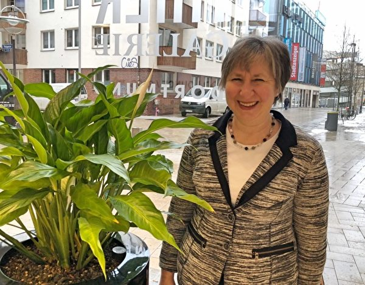

乌苏拉（Ursula）读了修炼大书后，夫妻之间不再吵架了。（明慧网）

居住在德国中部的乌苏拉（Ursula）的丈夫脾气暴躁，常常会跟人打架。她说：“那时我跟他出去会很紧张。他要是喝了酒跟人打架，我都没法劝架。我只能等他清醒后再跟他谈。我们经常为这些事吵架。”

“他的改变是在我修炼了法轮功之后。那时正是中共对法轮功的迫害刚刚开始的时候，德国的很多报纸也在转载中共的谎言。我的丈夫就开始担心我。有一次他想阻止我出去炼功。我就把师父在法兰克福和在瑞士的讲法拿出来，对他说：‘你先把这些读了再说。’就这样，他开始读师父的讲法。”

乌苏拉的丈夫读了这些讲法后，不仅明白了报纸上宣传都是谎言，还对法轮功产生了很大兴趣。后来他也开始读《转法轮》这本书。

乌苏拉回忆，在这个过程中，丈夫还有一个神奇的经历：“一次我们周末度假时，我丈夫在度假屋对面的松树林上看到一尊三十多米高的大佛。从此，他这个在天主教环境里长大的人也相信了神佛的存在。”

乌苏拉的丈夫至今已读了三遍《转法轮》。乌苏拉说：“读了师父的讲法后，他非常认同大法‘真、善、忍’原则。他再也没有打架，还说：‘想起原来被我打过的人，我感到非常抱歉’。”

“我跟他吵了多少年的架，就这样‘解决’了。”乌苏拉说。

<b>化解父女间15年的“冰”</b>

来自奥地利的索尼娅（Sonja）跟她的父亲曾长达15年没有任何联系，她儿时所有关于自己父亲的记忆就是酗酒和暴力。14岁时，她的母亲决定与她的父亲离婚，带她离开了那个充满了恐惧和痛苦的环境。

长大后，索尼娅通过朋友的介绍开始修炼法轮大法。学大法后，索尼娅明白了“业力轮报”、“欠债要还”的道理，她说：“通过学法我明白了，小时候吃的苦是我自己的业力造成的。”

于是，索尼娅开始尝试着原谅她的父亲，不再经常回忆过去的痛苦。如此，索尼娅就像摆脱了一个沉重的负担似的，变得轻松，快乐。

修炼一段时间的法轮功后，她对自己说：“现在我长大了，修大法了。我至少应该再见父亲一次面，跟他讲大法的美好。”

于是她开车去了自己小时候住的地方。不过，这段路索尼娅开的很艰难，她觉得小时候所感受到的恐惧与绝望一下子涌了上来。见面后，她的父亲一句道歉的话都没讲。她说：“我心里仍然很生他的气，我非常想当面告诉他，跟他吵一架。但是我知道，作为修炼人要忍，于是我控制住了自己，虽然这很难。”

从那时起，索尼娅定期看望自己的父亲，并告诉父亲法轮大法“真、善、忍”的原则。她的善和忍耐渐渐融化父女间的“冰”，父亲渐渐开始重视亲人之间的交往。她说：“我每次去看他时，他都显得那么高兴。”

索尼娅回忆说：“原谅他是个很长的过程。我知道，只有通过修炼法轮大法我才能做到这些。”

每天阅读《转法轮》，用书中的道理归正自己，按照法轮大法的“真、善、忍”原则，事事处处为别人着想——这就是法轮功学员处理好家庭矛盾的秘诀。

文章来源：明慧网
<a target="_blank" href=#top><h6 align="right">回上方</h6></a>

<a name=170>
<h1 align="center"><b>【历史上的瘟疫】圣徒饱受迫害仍拯救罗马</b></h1>
 <h3 align="center"><b>文／秦顺天</b></h3>

当时的真正的基督徒传播的福音，对在大瘟疫中苦苦挣扎的古罗马人来说，犹如无边长夜中突然出现的一缕曙光，将希望带给了绝望中的世人。（苏泰安／大纪元）

 
 古罗马大瘟疫中，基督徒无恨无畏，向世人传播福音，让世人看到了希望、帮助人们回归正途。

当历史在今天改头换面地重演时，人们是否也应该反思一下：瘟疫为什么会发生？人应该如何自救？
基督徒殉难

耶稣降世传道后，一直为罗马政府及犹太教所不容，耶稣殉道后，他的弟子门徒继续传道。

64年，尼禄将罗马城纵火一案嫁祸给基督徒，借机抓捕大量基督徒。

尼禄说，“基督徒是信仰新而有害的迷信的人。”于是大量谣言被编造出来，基督徒被诬蔑“杀婴嗜血”、“狂饮”、“乱伦”等等，反基督情绪煽动了罗马民众，基督徒被仇视亵渎。在罗马日的欢呼喝采中，基督徒被蒙上兽皮投进竞技场，让狮子、老虎等野兽活活撕碎咬死，或者与干草捆在一起做成火炬，排在宫廷花园里，夜晚点燃供照明欣赏。

《基督殉道者最后的祈祷》（The Christian Martyrs Last Prayer），描述了古罗马残酷迫害基督教徒的情景：竞技场周围的柱子上，左边是遭受火刑的基督徒，右边是十字架处死的基督徒，中间一群基督徒则将被猛兽撕碎，而看台上无数的民众毫无同情心地观看着这惨烈的情景。（公有领域）

尼禄之后，罗马帝国的十位君王相继发动了对基督徒的惨烈迫害。

君王安东尼将信仰基督的政府官吏罚为奴隶或没收其家产，坚定的基督徒则被处死。当时殉道者的尸首满布街头，被肢解后焚烧，骨灰散入河中灭迹。安东尼执政五年之后，史称“安东尼瘟疫”的大瘟疫降临。

公元250年，君王德西乌斯敕令基督徒必须在选定的“反悔日”放弃信仰，否则将被监禁坐牢或处死。很多女信徒甚至被逼在信仰和自己的贞洁之间做出选择。德西乌斯即位两年即战死， 250年，西普里安瘟疫降临。

公元303年，君王戴克里先要求所有公民信奉罗马教，《圣经》被收缴、教士被屠杀，戴克里先假法律之名迫害基督徒。教父希彼廉因拒绝放弃信仰，被法庭以“私自纠集犯罪集团”、“敌视罗马教诸神”的罪名判处斩首。公元312年冬，罗马帝国西部爆发瘟疫。

君王多米田要求民众在他生前就要奉他为神，以“我们的主和神”称呼他。基督徒不肯称他为神，遭到疯狂迫害，大批基督徒被杀或被流放。使徒约翰被丢进烧热的油锅而殉难。多米田在位的最后几年，因惧怕自己被推翻，曾下令以“不信诸神”的罪名审判信奉基督的贵族。

很多坚定的基督徒视死如归，即使被投进烈火，他们也没有呻吟，在熊熊烈火中，他们仍然赞颂他们的神。

殉道者的坚定、喜乐和宽仁，使人见证了神性的力量，让罗马人震撼。殉道者的血成了教会的种籽，结出百倍的收成。

<b>传道显神迹</b>

无数的罗马官吏、狱卒、刽子手和普通民众，都在有意无意中参与了对基督徒的迫害。但在被打压、逼迫、酷刑折磨中，基督徒没有嫉恨那些曾告发、抓捕审判、憎恨亵渎他们的罗马人，基督徒以爱人如爱己的仁慈宽容，坚持传播正信，救赎世人，神迹频现。

基督弟子曾被基督赋予了超自然的能力，他们一边四处传扬基督信仰，一边以神赐予的神通，为百姓驱魔赶鬼，祛除疾病，证实他们所传的道。

福音书中记载了当时的20件神迹，其中四件是基督徒帮人驱逐污鬼、两件实例是基督徒使死者神奇复生、有十一件是基督徒治愈病患及残疾者的实例。

基督徒常常为病患祷告，君王瑟维拉斯登基不久后生病，就是经过基督徒为他祷告而痊愈的。人们渐渐折服于这种超越人的力量，追随基督信仰者越来越多。虽然政府不允许，但到处都有基督徒的聚会，从耶路撒冷到雅典和罗马，许多人归信了基督。

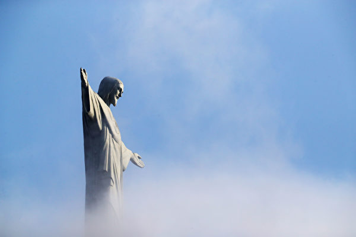

人们渐渐折服于这种超越人的力量，追随基督信仰者越来越多。示意图。图为位于巴西里约热内卢的基督救世主（Christ the Redeemer ）雕像。 (Alexander Hassenstein/Getty Images)

<b>瘟疫中 罗马人求拜诸神无效</b>

频繁爆发的大瘟疫，使罗马人惶恐迷惑。无助的人们去求各路神灵保护。当时古罗马城里，供奉着五花八门的各种民族的神。

罗马人向众神的代言人祭司发问，为什么众神会降如此大灾？祭司自己也说不清，而且，许多祭司与官宦富人一起，都逃离了瘟疫流行之地。

他们向阿波罗、埃斯科拉庇俄斯（罗马医神）、密涅瓦（罗马主神之一）等众神求拜，甚至还向土耳其女神、古埃及女神等外国神求救，但这些神灵也未能给他们提供任何救助。

他们向医生求救也无济于事，因为这瘟疫本就无药可医，许多医护人员也在瘟疫中死去，有的也逃离了疫区。

他们向医治灵魂的哲学家求救。哲学家们感叹社会腐朽、美德丧失，却无法给他们以合理的解释及应对。

总之，人们求拜了各种神、用尽了人类的智慧谋略，都没有找到解决之道。很多罗马人疑惑了：神真的存在？为什么神眼看他们毁灭，不护佑他们免于灾祸？

<b>无惧瘟疫传播福音 救助世人</b>

迫害不能阻止基督徒传播福音，大瘟疫也不能。

基督徒告诉世人，瘟疫肆虐不意味着神不存在，相反，瘟疫恰恰证明神以公义掌管着世界。瘟疫是罗马人迫害正信的天谴，人只有悔改才能得救赎。基督徒教世人祷告，请求神收回天谴，赦免罗马人的罪。

基督徒告诉人们，人死并不会真的消失，还会复生，真诚改悔的人还会升入天堂。这是罗马人在其它宗教中都没有听到过的福音，绝望的人明白了今生和来世的意义，懂得了生命的方向，即使面对死亡，也能不惊不惧。

基督徒告诉人们，人死并不会真的消失，还会复生，真诚改悔的人还会升入天堂。图为拉斐尔最后的作品《耶稣显圣容》（The Transfiguration）。（公有领域）

大瘟疫期间，生死关头，人性中的自私也显露出来，哄抢、掠夺、贪占的现象层出不穷。有怕死的人只求自保，把染瘟疫者驱逐出门，甚至亲人也弃之不顾；有的人还没死，就被抛在路边。

而真正的基督徒不但不抢掠贪占，也毫不畏避瘟疫，他们心态安然，相信一切都在神的掌控中。他们不仅照顾他们的亲人，也照顾别人家的亲人。他们走上疫区街头，以殉道的精神，奋不顾身游走于人群中，传播福音，探望照顾病弱，为他们提供食物，耐心为他们喂饭；基督徒为人们祷告，求主帮助，加添其力量，使其痊愈康复；基督徒还帮助掩埋尸体，甚至拿出自己仅有的物品，为死者安排相对体面的丧葬。

基督徒兄弟般的平等与博爱，使孤独绝望的人感受到温暖的慰籍。很多被病痛折磨的罗马人因忏悔和祈祷而病愈，这使他们深信基督徒，崇拜基督，在瘟疫中，基督的追随者日益增多。

在北非，西普里安瘟疫肆虐的高峰期，西普里安的主教和教士们每天为多达200～300人洗礼。

治病救人、捐赠和济贫等，后来成为基督教教义的主要义务。教会救助范围不断扩大，到3世纪中期，分散的基督教社团发展为固定的教会，教会收入的四分之一用以扶助贫弱、鳏寡孤独及埋葬病死的陌生人和穷人。

<b>基督徒挽救了古罗马的道德危机</b>

罗马教要求人遵守神的律法与人间的律法，但大多数罗马人的信仰早已沦为形式。整个社会奢靡堕落，各种背离道德的时俗淫风，包括通奸乱伦等非常普遍，古罗马的道德与信仰陷入了全面危机。

真正的基督徒崇尚洁净自律的生活，这与当时的社会氛围形成强烈反差。基督教义明确禁止通奸、乱伦等性乱，远离罪恶、信守圣洁、仁爱、和平、公义，基督徒们彼此相亲相爱，亲如一家。

出于仁慈，基督徒拒绝到竞技场观看肉搏战，还将自己的奴隶无条件释放，最初这些做法曾使维护罗马教的人产生嫉恨不满。

但真正的基督徒的言行，渐渐改变了罗马人的偏见，罗马人终于明白，过去是受谎言蒙蔽而误解了基督徒。大量古罗马人放弃根深蒂固的罗马教，转而改信基督，社会道德也日渐回升。

西班牙画家埃尔‧格列柯（El Greco）1579年所作《崇拜耶稣之名（腓力二世之梦）》[Adoration of the Name of Jesus (The Dream of Philip II)]。（公共领域）

<b>大瘟疫中 基督徒帮人们重回正途</b>

正信已经深入人心，基督徒被视作闪光的精金。罗马君王戴克里先时代，对基督徒迫害不止，但很多命令都被暗中抵制，很多罗马人冒着危险保护基督徒，藏匿他们。连戴克里先的妻子及一些侍从都改信了基督。

两年后，戴克里先因身体出现问题退位，继任的君王加列留斯把迫害推向高潮。但不久，加列留斯就得了怪病，下体感染化脓后，长出巨大的肿瘤，身体完全走形，上身瘦得皮包骨头，下身俨然肿涨成一个大脓包，蛆虫从里至外吞食着他，整个人几乎都腐烂了。

311年，被痛不欲生的怪病折磨一年后，加列留斯醒悟过来，明白自己是因迫害正信而遭了报应，他呼喊着上帝，虔诚地忏悔。在病床上，加列留斯发布诏书，在他的东罗马辖区内，取消对基督徒的禁令，停止所有对基督徒的迫害，自己皈依了基督教。几天后，加列留斯解脱了病痛，轻松离世。

313年，笃信基督的君士坦丁和李锡尼一起颁布米兰敕令，终结了历时三个多世纪的迫害，基督信仰从此合法化。君士坦丁感到自己需要赎罪，临终前，成为第一个受洗的罗马君王。但其个人的功德，远不能抵偿古罗马几百来年迫害正信的罪恶。

393年，皇帝狄奥多西一世颁布法律，确立了基督教的正统地位，从此，作为罗马帝国的正统信仰，基督教迅速发展，遍布了欧洲。

当时的真正的基督徒传播的福音，对在大瘟疫中苦苦挣扎的古罗马人来说，犹如无边长夜中突然出现的一缕曙光，将希望带给了绝望中的世人。作为神的使者，古罗马真正的基督徒们，无恨无畏，以坚定的对神的信念和对世人的宽仁，让人们见证了神的真实存在，帮助人们重拾对神的信仰、重回正途。

当历史在今天改头换面地重演时，人们是否也应该反思一下：瘟疫为什么会发生？人应该如何自救？@*#

参考资料：

塔西佗 《编年史》

爱德华‧吉本 《罗马帝国衰亡史》

罗德尼‧斯塔克 《基督教的兴起：一个社会学家对历史的再思》

弗雷德里克F卡特赖特 《疾病改变历史》

叶金 《人类瘟疫报告：非常时刻的人类生存之战》

王延庆 瘟疫与西罗马帝国的灭亡

杨罗栋 基督教在中古欧洲的贡献

<a target="_blank" href=#top><h6 align="right">回上方</h6></a>

<a name=169>
<h1 align="center"><b>【内幕】多地监狱爆新冠疫情 中共不报导</b></h1>

济宁当地微博上也披露疫情进入监狱。（网路图片）

 
 【大纪元2020年02月20日讯】（大纪元记者骆亚采访报导）武汉新型冠状病毒肆虐全国各地，近期群聚性感染病例增多，尤其是监狱人员密集度大，防控形势更复杂。湖北省内及省外的监狱都有疫情爆发，但中共官方至今没有公开报导。

大纪元获得的湖北省荆门市疫情防空指挥部办公室文件显示，沙洋监狱总共有40名确诊感染者包括干警和服役人员。

<b>湖北荆门市内部文件披露监狱疫情升级</b>

2月16日，“湖北省荆门市新型冠状病毒感染肺炎疫情防控指挥部办公室”在“荆门市新冠肺炎疫情趋势分析报告”中说，“监狱等特殊场所疫情有所抬头。截至2月15日，沙洋监狱共报告确诊病例40例，管教干警和服刑人员均有病例出现。”

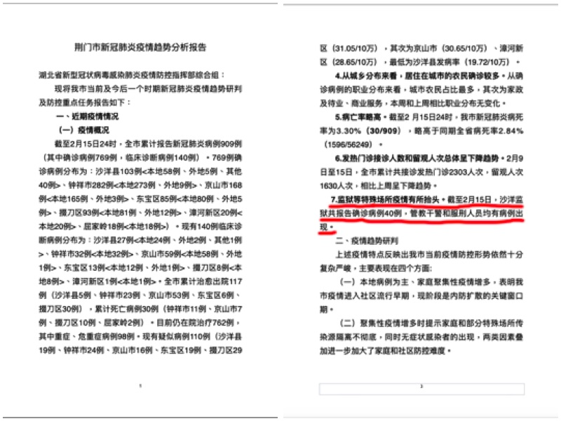

官方内部文件显示湖北荆州市沙洋监狱疫情升级，至少确诊40人。（大纪元）

据百度百科资料显示，湖北省沙洋监狱管理局下辖包括沙洋广华监狱、沙洋小江湖监狱、沙洋荷花垸监狱、沙洋漳湖垸监狱等10所监狱，管理局机关设在荆门市沙洋县沙洋镇牛奶山，同时设有内部医院–沙洋监狱局总医院。

目前各监狱的感染情况，亲密接触者是隔离在监狱还是监狱外专门的隔离点，确诊者的收治情况等，文件中并未有任何说明。至今为止并没有当地媒体及央媒等关于武汉、湖北及外省监狱感染疫情的任何公开报导。

<b>湖北女子监狱爆发疫情 家属求救资料被快删</b>

网上一份求救信息显示，武汉市硚口区的岳女士33岁，家人2月18日接到监狱单位座机电话，岳女士在2月14日确诊新冠状病毒肺炎，监狱方称在隔离中。但家人现在联系不上任何机关单位，只能在家等，觉得很无助。

岳女士多年患有精神分裂症，之前住在精神病医院，因医院监管不到位，出现意外后被判刑，现在在湖北女子监狱服刑。岳女士的老母亲非常担心她的情况，睡不着，吃不下饭，希望得到社会救助。

大纪元记者今天早些时候联络岳女士的家人，对方表示他们得到监狱方通知，只知道其在隔离中，但其它情况一概不知。

下午这条被转发的求救微博，已经在微博上被删除。

记者数度联系湖北女子监狱电话，一直未能接通。另据知情者介绍，由于家属在网上呼吁后得到关注，接到很多电话，官方也主动联系家属，但监狱方是如何具体处理疫情的，家属表示不便透露。

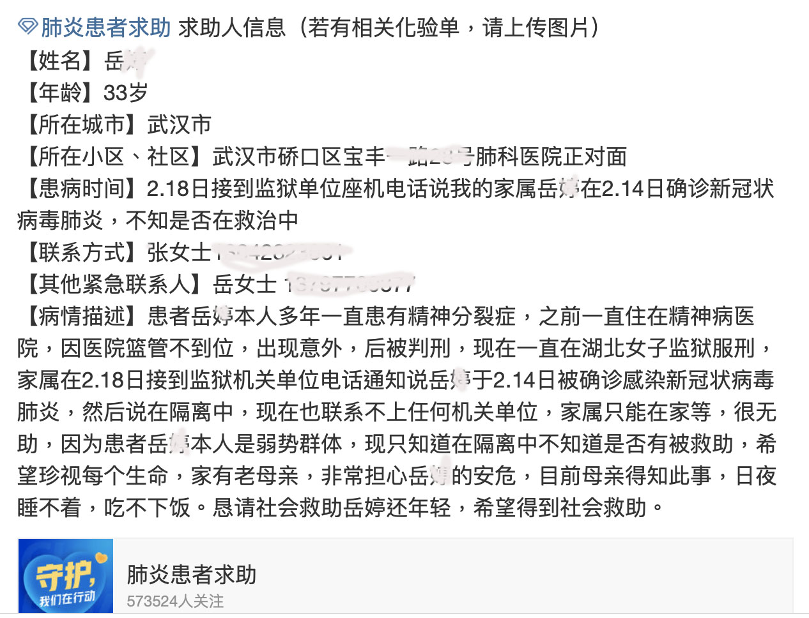

湖北女子监狱爆发疫情，有家属求救。（网络截图）

<b>山东济宁市任城监狱、鲁西监狱出现疫情</b>

另据网上的一份山东济宁市紧急通知显示，“鲁西监狱、任城监狱、里彦电厂的业主，需要尽快联系物业报备，如有近期接触的任城监狱工作人员，请自觉自行隔离，并联系物业报备。”

紧急通知还称，“如出现发热等症状，应戴好口罩，远离他人，尽快到就近的医疗机构发热门诊就诊。”

山东济宁的紧急通知，至少两个监狱出现疫情。（网路截图）

记者以跟监狱工作人员接触过的为由询问是否需要报备，对方表示自己也不清楚接触者是否需在她那报备，让记者留下地址和电话，她让领导来回复相关咨询。

有当地人在网上披露，这个济宁确诊的45例，接触过武汉的不上报，害了不少人。还去任城监狱上班，里面确诊了好几个了。

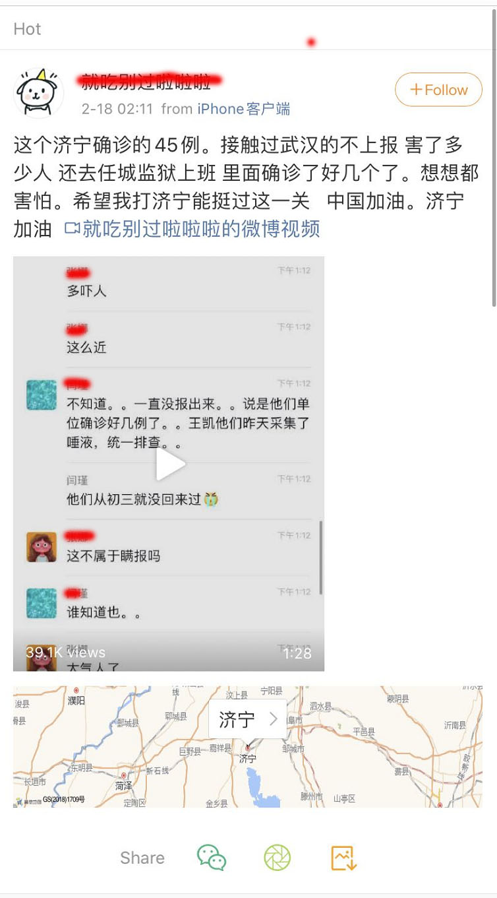

济宁当地微博上也披露疫情进入监狱。（网路图片）

也有读者向大纪元爆料称，济宁当地疫情很严重，有几百人感染新型冠状病毒，官方不报导。

2月19日，甘肃省司法厅党委书记、厅长、省监狱管理局第一政委牛纪南在全省监狱系统新冠肺炎疫情防控工作第四次视频会议上发言称，“监狱是人员密集区，“防控形势更严峻、复杂、艰巨”“切实把讲政治、讲党性充分体现在打赢疫情防控阻击战中来”“要充分认识疫情入监是责任事故等等”。从中显示，监狱系统对疫情非常紧张、有很大压力。

<a target="_blank" href=#top><h6 align="right">回上方</h6></a>

<a name=168>
<h1 align="center"><b>【疫情最前线】感染率16.8% 潜伏期94天？</b></h1>

“钻石公主号”首现死亡个案。武汉病毒可有94天超长潜伏期？钟南山“不觉得奇怪”。广西民众网购口罩买到武汉“救援物资”。武汉红十字会900万个口罩不知所踪。（大纪元合成图）

 
 【大纪元2020年02月21日讯】（大纪元香港记者站报导）因曾接载一名来自香港的武汉肺炎确诊患者而自2月3日起开始封船隔离的“钻石公主号”，20日首现死亡个案，2名确诊乘客死亡，船上感染比率高达16.8%；2月18日，广东省召开的防疫发布会上，中国工程院院士钟南山对武汉病毒可有94天超长潜伏期表示“不觉得奇怪”；2月18日有消息指，广西民众网购口罩买到武汉“救援物资”，武汉红十字会900万只口罩不知所踪。
 
<b> “钻石公主号”621人确诊 2人死亡</b>

被形容为淘大花园翻版的日本“钻石公主号”邮轮上，武汉肺炎疫情严重。20日，2名确诊乘客死亡。这是钻石公主号首次出现新冠肺炎死亡个案。死者分别为87岁男子和84岁女子，两人都是日本人。

加上日本神奈川县的1宗新冠肺炎死亡病例，日本新冠肺炎死亡人数升至3人。

截至19日晚，“钻石公主号”上的3,700人当中，确诊武汉肺炎人数达到621人，包括55名港人，这条邮轮，已经成为大陆境外，全球最多感染人数的地方。

停泊于横滨大黑码头的“钻石公主号”邮轮，因为曾接载一名来自香港的确诊患者，所有乘客和船员，自2月3日起于船上接受隔离。十多天的期间，在3,700人游客和船员当中，有逾621名乘客确诊感染，感染比率高达16.8%。

从这个感染速度和比例，推测大陆武汉地区的感染人数，会得到一个十分惊人的数字。

近日，英国顶级学府帝国理工学院发布了对武汉疫情的第四次评估报告。报告指出，截至1月底，武汉“每日”可能有超过2万人感染，湖北当地的病死率可能高达18%。报告推算，目前武汉肺炎感染人数大致在20万上下，实际感染者数量，是中共官方数据的19至26倍。

<b>日防疫措施遭质疑 恐致全球扩散</b>

日本政府批准“钻石公主号”上所有病毒检测结果呈阴性、同时没有任何病征的乘客，可以陆续下船离开，到20日，已有大约500名乘客落船，预计所有乘客会在21日前离开钻石公主号。游客从下船那这一刻，意味着可恢复正常生活，在日本不再受隔离及外出限制。

20日，一名刚下船的日本女乘客竟不回家，随即与友人会合，直奔寿司店吃寿司。

日本网民对此热烈讨论，很多人认为该名女乘客自私、防疫意识好差，如检验结果为假阴性，但之后又再确诊感染新型冠状病毒，后果将不堪设想。

钻石公主号上共有超过50个国家的人士。数百名离船的外国人，返国后还得再被隔离14天，包括搭乘包机返港的数百名港人。

曾任职世界卫生组织（WHO）的香港大学公共卫生学院院长福田敬二（Keiji Fukuda）直言：“接受检验呈现阴性，搭乘飞机着陆后变成阳性，这是完全有可能的事。传染过程就是会这样。”

<b>港府：不坐包机 回港后仍需隔离14天</b>

香港保安局局长李家超指，钻石公主号上有364名港人，260人持特区护照。其中有55名港人确诊武汉肺炎，再加上33名与他们有密切接触的人，暂时未能返回香港。

首班包机20日早上抵港，包括106人，将往火炭骏洋邨检疫中心隔离14天。港府将安排让第二批港人在下午上机，目标是21日内将其余200多名检测结果阴性的港人送返香港，并呼吁十多名拒绝乘包机返港的港人改变主意。

港府表示，不乘坐机回港的人士，在入境香港时会被转介至港口卫生科接受评估，之后亦同样需要到检疫中心接受最长14日的检疫。

<b>河南疑现94天超长潜伏期病例 钟南山：不奇怪</b>

自2月8日起，从大陆入境香港的所有人士，都必须接受为期14天的家居检疫。然而，通过14日的隔离检疫，却未必就能斩断新型冠状病毒传播。

近日，大陆就先后出现2个超长潜伏期个案，其中一个竟长达94天，这个案例大大加重了对疫情控制的担忧。中共官媒对此紧急“辟谣”，但中共卫健委专家组组长钟南山却回应称：“不觉得奇怪。”

据报，河南一名宁姓男子在去年11月13日开始一直住在岳父家，以照顾从武汉返乡治病的岳父。直至今年1月31日，他始与妻儿一同回家，期间只2次出门买餐、1次外出买药，其余再无外出活动。

至2月12日，该男子开始出现发烧症状，至14日入院求医并留院观察，其后确诊武汉肺炎。男子自开始照顾其岳父至确诊，时长达94天。因其外出次数少而时间短，感染源至今难以确定。

消息发布后，引发民众热议。17日，党媒纷纷引述“专家”说法给予“辟谣”。中共疾控中心副主任冯子健还肯定地宣称：“虽然感染源尚未确定，但宁某某患新冠肺炎和其岳父没有直接关联。”但该说法和新县官方通报有明显不同。

2月18日，广东省召开防疫发布会。中国工程院院士钟南山针对日前河南出现2例超长潜伏期病例表示：“不觉得奇怪，总有例外。”钟南山介绍，他此前对1099病例的研究显示，潜伏期大多是2至7天，但其中有1例达到24天，13例超过14天。

目前，国内外包括香港，一般对有感染风险的人员隔离14天。但现实是很多病人潜伏期超过14天，还有人自始至终没有任何症状。著名医学期刊《柳叶刀》杂志（The Lancet）已明确指出，这次武汉肺炎的病毒，在潜伏期内就可高效率感染他人，这令外界普遍担忧，现时为期14天的强制隔离防疫措施是否奏效。

<b>广西有人订购4000口罩 竟收到来自武汉的“救援物资”</b>

武汉肺炎疫情急速扩散，重灾区武汉更是紧缺口罩、防护服等用品，各地都紧急支援各类物资。然而，近日有广西南宁民众在网上团购一批口罩，当他们从微商手中拿到口罩时发现，这4000个口罩竟然来自武汉市总工会，且包装盒上写有“救援物资”。

<b>口罩究竟出自何人之手？</b>

大陆搜狐网18日刊载一篇名为“四千个口罩奇幻漂流：厂家们赔钱产救援物资，被微商从武汉卖到广西”的文章。文章披露，这批口罩是在1月23日，也就是武汉封城后才发出，据武汉物流管制信息要求，武汉封城后个人物品在3公斤以内才可放行，而这批口罩总重已超过11公斤。

根据顺丰发货单显示，口罩发件人是武汉总工会汉南工人文化宫一个名为“何洁”的人。经调查后发现，上述寄件人“何洁”是化名，实际寄件人为何雄，是湖北雄诚达消防工程有限公司法定代表人，与其一道做生意的妻子名叫王洁，寄件人名字取“何洁”化名。

武汉志愿者黄万华对自由亚洲电台表示，武汉疫情最严重，救援物资却被滥用：“医护人员都在求救的情况下，这些物资流向其它地方，我相信任何人听了都会愤怒。”他直言，“后面肯定有一些势力集团在操作，这并不是普通老百姓能够做到的事情。”

武汉居民马小姐表示：“在疫情这么严重的时候，有黑心人把这些物资拿出来倒卖，从中获利。这是发国难财，我觉得应该得到严惩。”

另外，也有不少网友发现，近期淘宝网增加了出售口罩的店铺，而口罩的来源地则是武汉。

<b>红十字会发放率不到1% 900万个口罩不知所踪</b>

尽管中共官方出面为武汉市总工会澄清，但另有调查披露，武汉官方确实存在扣押口罩的行为。

据香港《苹果日报》2月18日发出调查报导指证，负责武汉当地捐赠物资调配的红十字会，1月22日到2月10日，有大约5,000个征发物资清单，总计得到口罩1,000万个，但是只向外发放94万个，发放率不到1%。

以普通外科口罩为例，估算武汉红会接收约1,000万个口罩，但他们在1月22日至2月10日只能发放94.5万个口罩，发放率不到一成。

即使是发放出去的94.5万个口罩，也只有30万个发放到前线医院，其它去向不明。现时武汉最少有35间直接面对病人的医院，也就是说，红十字会发放的，每间医院还分不到1,000个口罩。

一名在武汉市中心医院的前线医生说：“目前我们戴的口罩，也不是N95口罩，都是工业口罩。我们早上穿的都是塑料袋、一次性的垃圾袋，希望大家都尽手中的力量吧，让我们医护人员的血不要白流。”

<b>吕秉权：内地红会染“官状病毒”</b>

口罩到了武汉红会，竟像落入黑洞般消失，引起民愤。有金银潭医院护士看到武汉红会的物资发放清单，竟见不到有物资发到守在前线的金银潭医院，她直斥：“一天到晚说让我们保护自己，形式主义做的倒挺好的，连最基本的防护口罩都没有，我拿什么保护？肉搏？东西呢？物资呢？被吃了？”

在中国大陆，红十字会并非民间机构，而是具有官方的身份。香港浸会大学讲师吕秉权认为，中国红会染上“官状病毒”，染上了所有官场陋习：“如无效率、不透明、懒散、甚至贪腐，早已失去慈善机构的精神。当疫情来临时，他们人工高（平均月薪2.3万元人民币，约2.6万港元），但无人、无心、无力。”

不少网民向武汉红十字会发出质问：另外900多万个口罩去了哪里？至今未见任何答复。

<a target="_blank" href=#top><h6 align="right">回上方</h6></a>

<a name=167>
<h1 align="center"><b>【一线采访】重庆九龙村染疫 30余人隔离</b></h1>

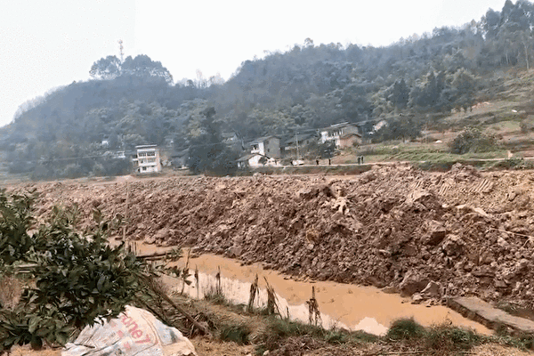

近日，重庆长寿区龙河镇合兴乡九龙村郭家湾，确诊三人感染武汉肺炎，其左邻右舍三十余人被全部带走隔离。（村民提供）

 
 【大纪元2020年02月20日讯】（大纪元记者洪宁采访报导）新冠肺炎（又称武汉肺炎）疫情仍在持续扩散。近日，西南重镇重庆市的长寿区龙河镇合兴乡九龙村郭家湾，确诊三人染疫，其左邻右舍三十余人被全部带走隔离。

记者从九龙村村民王勇（化名）处了解到，该村已封村，村口有政府人员、警察把守，公路设卡，村里各组之间的通路也被挖断，全村人被禁止出户，全部在家中隔离，“我们不能相互走了，不让出和进，外人也进不来。”每天有穿着防护服的人在村里撒药，气氛十分紧张。

王勇说，九龙村按姓氏分成几个组，郭家湾是其中一组，确诊病人是两户人家其中的三人。

被确诊的人是大年三十前一天从武汉返回当地的，但隐瞒了实情，后感觉不舒服，去挂了五个吊瓶没见好，做了进一步检查后发现得了肺炎，经县、镇医院医生会诊后确诊。

由于正赶上过年，郭家湾村民们相互走亲戚串门，与患者有接触，政府将三十多人全部用车拉走，送长寿区隔离起来。王勇所在的小组距郭家湾仅三五分钟，好在过年期间他们没有去那边串门。

目前，三名患者及被隔离的数十人情况不明，王勇说，看重庆市发出的公告，还是有些严重。

记者了解到，当地物资断货，村民无法买到口罩及消毒用品。“前几天村长只给发了一个口罩，一直没有再发新的，村民只好将这一个口罩反复用水煮，清洗后风干，第二天再继续用。”王勇说，“那些干部都有，我们老百姓都没有。”

突发的疫情，不透明的讯息，令村民人心惶惶，“现在晚上都睡不着，心里害怕，要过四十天才可晓得，也没胃口吃饭，都害怕自己被感染。”王勇说。

龙河镇黄女士家是九龙村的，她告诉记者，郭家湾除了几位行动不便的老奶奶留在家里，其余的人都被送到宾馆等地隔离。她所在的镇上也有被感染的，每个小区均实行封闭式管理，居民每三天出一次门购物。

早在1月20日大陆疫情爆发后，重庆的确诊及感染人数持续攀升，全市早已进入一级戒备状态，成为疫情严重地区。

近日，攀钢集团重庆钛业有限公司（下称重庆钛业）又爆发聚集性感染，该厂目前至少有三人被确诊，企业被迫全面停产，大楼被封闭，有超过百名员工被隔离。

<a target="_blank" href=#top><h6 align="right">回上方</h6></a>

<a name=166>
<h1 align="center"><b>中共自曝疫情数据“好转”原因:取消临床诊断病例</b></h1>

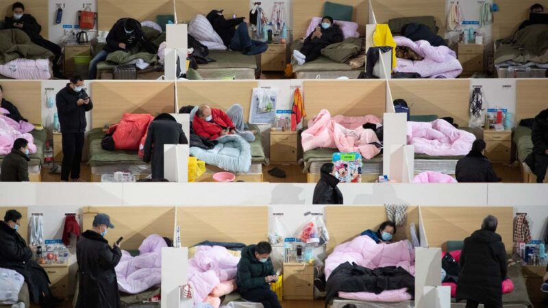

图为人满为患的武汉一家方舱医院。(STR/AFP via Getty Images)

 
【新唐人北京时间2020年02月21日讯】中共下令全国复工，官方疫情数据也开始“配合政治形势”，确诊病例增幅接连下降，19日还出现武汉增幅大于湖北增幅的怪事。官方20日给出解释称，是因为19日取消了为湖北增设的临床诊断病例，而该措施2月初刚刚实施。

湖北卫健委20日公布离奇数据，全省19日新增确诊349例，与18日新增1693病例相比出现“断崖式”下跌。另外，19日湖北新增349例，但当日仅首府武汉市就新增615例。出现这种情况的唯一可能是，武汉以外的湖北地区确诊病例“减少”266例。

中共官方20日给出解释，证实这种离奇的情况确实发生了。国务院发言人称，根据19日国家卫健委发布的《新型冠状病毒肺炎诊疗方案（试行第六版）》规定，湖北不再将临床诊断病例列入确诊病例，不少地区还据此“核减”了早前公布的确诊病例，最多的“核减”107例。

国务院宣称，不再计入临床诊断病例，是因为“核酸检测的能力已经大大提升”。但早前中共卫健委专家公开承认，核酸检测准确率只有30-50%。而在此之后，一贯“报喜不报忧”的中共党媒上，并无有关检测准确率提升的报导。

因为核酸检测不准确以及检测速度太慢，十分不利于防控疫情，在武汉前线专家的强烈要求下，中共国家卫健委2月初发文，要求湖北增速临床诊断病例，依据前线医生的临床诊断确诊病患。

不过，湖北之外仍然使用准确率偏低的核酸检测来确诊病患。并且湖北前任政府也没有真正执行有关临床诊断病例的要求。直到2月13日湖北和武汉一把手换人，当地通报的确诊病例一日暴增近1.5万例。官方解释是湖北执行了卫健委要求，而外界普遍认为是新任官员有意将责任推给刚下台的前一任。

果然，自14日起，湖北的所谓“确诊病例”每日增幅马上又降到一千余例，直到19日突然跌至数百例。这种降幅和中共要求全国复工的时机非常“契合”。

美国《外交政策》杂志网上文章指出，湖北省以外的省份，官方新确诊数据已连续超过10天下跌。这种降幅可被中共宣传机器解释为“领袖习近平所号召的人民抗疫战争，已经露出凯旋的曙光”。但问题是：“中国（中共）的官方数字到底有多可靠？”

文章说，中共插手的政治因素无法排除。北京已要求各地尽快复岗复工，这不啻造成政策矛盾。地方官员担忧疫情疫情而成为代罪羔羊，同时也害怕延迟复工被指“对抗中央”。来自浙江和广东的消息显示，社区隔离政策已经开始松绑，部分之前受到严密隔离的地区，民众现在已可以离开家居外出。

文章指出，新确诊数字下跌或许是个好消息，但也可能是统计上“玩弄数字的艺术”。

<a target="_blank" href=#top><h6 align="right">回上方</h6></a>

<a name=165>
<h1 align="center"><b>病毒又变异？浙江男验痰液3次阴性 粪便验出阳性</b></h1>

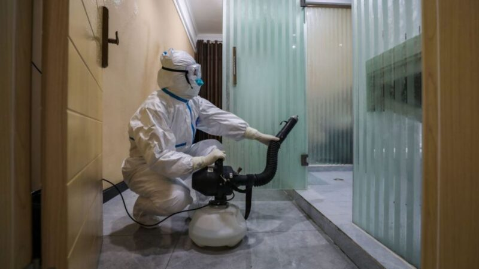

图为中国湖北省武汉是检疫区医务人员2020年2月3日正在对刚刚腾空的房间进行消毒。(STR/AFP via Getty Images)

 
 【新唐人北京时间2020年02月21日讯】中国武汉新型冠状病毒自爆发以来，屡屡传出新的特性。日前有浙江舟山市官方证实，当地一名无症状患者在检测时，3次痰检均呈阴性，但2次粪便检测却呈现阳性。该消息被媒体报导后，令网友们大跌眼镜，惊呼“这是什么鬼病毒？”

浙江舟山市卫生健康委员会防控工作领导小组办公室20日向媒体证实，该省1名戚姓男子的检测确诊过程十分特殊，完全不符合官方当前订定的疑似病例和确诊病例诊断标准，但经过多次检测后最终被确诊为新型冠状病毒感染者。

据舟山市卫健委办公室介绍，这名戚姓男子于2月15日、16日和18日先后进行了3次痰液检验，结果均呈现阴性；但在16日和18日的2次粪便检测却呈现为阳性，而该男子至今没有出现任何感染病毒的症状。由于戚男具有传染他人的风险，目前已被送至定点医院进行隔离治疗。

据陆媒报导，中共官方目前针对新型冠状病毒肺炎病例订定的分类标准包括“疑似病例”、“确诊病例”、“阳性检测”等。其中最后一种“阳性检测”，是指已检测出阳性但无症状的感染者，需等患者表现出症状后才能计为“确诊病例”。

舟山市这名戚姓男子在接受检测时，痰液检验和粪便检验的结果却完全相反，令外界怀疑新型冠状病毒已经又发生了新的变异。消息传出后，一众网友对此大为惊诧，纷纷惊呼“又变异啦？”；“太狡猾了，令人防不胜防啊！”“之前是感染者无症状，有症状者却检测不到阳性。现在是这样查呈阴性，那样查又呈阳性，这是存心把义务人员累死的节奏啊。”

<a target="_blank" href=#top><h6 align="right">回上方</h6></a>

<a name=164>
<h1 align="center"><b>【禁闻】传国产航母“山东号”100人被隔离</b></h1>
 
【新唐人北京时间2020年02月21日讯】传国产航母“山东号”100人被隔离

据香港人权民运信息中心披露，中共航空母舰“山东号”上的一名军人在海南三亚市确诊为新型肺炎，目前留守在三亚市的100名“山东号”军人已经被隔离，其中包括一些重要的军官。

山东舰是中共的第一艘国产航空母舰，去年12月17号在三亚交付给海军，目前以三亚为驻训基地。

<b>岳阳范文秀被迫害致病重 含冤离世</b>

湖南省岳阳市君山区法轮功学员范文秀，在长沙女子监狱遭残酷洗脑迫害，被“保外就医”后，当地司法局人员仍然上门骚扰、恐吓，导致健康恶化, 2020年1月21号在岳阳市巴陵医院含冤离世，终年53岁。

据“法轮大法明慧网”报导，范文秀原本身患癌症，2014年修炼法轮功后恢复健康，但2017年被警察非法抓捕，之后被判刑3年半，投入长沙女子监狱关押。在那里她遭受了残酷的洗脑迫害，导致原癌症病复发。“保外就医”后，经过修炼法轮功，身体基本康复。但君山区司法局人员又突然闯入她的租住地，强行给她戴上一个监控器，致使她受到恐吓，病情迅速恶化，最终撒手人寰。

<b>医疗系统内部消息：重症患者死亡率50%</b>

继武汉武昌医院院长感染新冠肺炎死亡之后，网上又传出武汉市第八医院院长王萍病危的消息。

北京《新京报》2月19号在微博发消息说，王萍不幸感染新冠肺炎，病情危急，正在武汉金银潭医院重症监护室抢救，急需救命血浆。

接连爆出的医院院长感染的消息，引起网友议论。有人说连医院院长都被感染了，更不用说一般的医护人员了。这说明武汉一线医疗人员大范围感染已经是很普遍的事情了。

“自由亚洲电台”引述武汉一名志愿者的话说，大部分感染主要因为防护措施没有达到标准，而老百姓则是交叉感染，由于政府封闭消息，等到老百姓知道时，为时已晚，再隔离基本上面临死亡。据医疗系统内部消息，重症患者的死亡率是50%。

<a target="_blank" href=#top><h6 align="right">回上方</h6></a>

<a name=163>
<h1 align="center"><b>爆聚集性感染 重庆钛业全面停产 逾百人隔离</b></h1>

在武汉疫情持续蔓延之下，中共当局要求各地复工复产，引发各界担忧。(Kevin Frayer/Getty Images)

 
【大纪元2020年02月20日讯】（大纪元记者许梦儿综合报导）在新冠状病毒肺（俗称武汉肺炎）疫情持续蔓延之下，中共当局仍要求各地复工。近期，攀钢集团重庆钛业有限公司（下称重庆钛业）爆发聚集性感染，该厂目前至少有3人被确诊，该企业被迫全面停产，大楼被封闭，有超过百名员工被隔离。

财新网报导，爆发聚集性感染之后，重庆钛业已全面停工，进入设备维保状态。巴南区一家酒店表示，确实有重庆钛业员工在该酒店被定点隔离，单人单间，日常进行消毒和保洁。

1月21日，重庆钛业的维检车间员工李某某来到江北区渝生元老火锅参加了同学聚会，聚会上有一名从湖北荆州来的同学彭某。当天，重庆市确诊5例输入性确诊病例。

1月26日，彭某确诊。28日李某某也被确诊。

报导引述一名接近重庆钛业的人士表示，之后李某某所在车间及所乘通勤车司乘在内的47位密切接触者被隔离。此后2月9日，其中一人被确诊。

接近重庆钛业的知情人士表示，第三例并未与第一、二例确诊者有过近距离接触，但据其回忆，第三例去过确诊员工曾经停留过的休息室。若真如此，重庆钛业的消毒措施是否到位？

重庆钛业是A股上市公司攀钢集团钒钛资源股份有限公司的全资孙公司。重庆钛业位于重庆巴南区麻柳沿江开发区，主产钛白粉，是国内钛白粉大型企业之一。

大陆自2月10日复工后，八十多个城市仍在封闭式管理，多数客运车不行驶、社区封闭和商店关闭，加大复工难度。

中共官方预计约1.6亿员工返回公司、工厂。如今传出广州、重庆、北京、苏州等多个省市公司复工后，有员工传染新冠病毒给同事，造成上千人被隔离。

据报，广州天河发布微信2月16日凌晨通报：靠近猎德桥的知名商办大楼“天盈广场”东塔有职员确诊感染新冠肺炎。上述两名无症状感染者，分别在天盈广场东塔13楼和32楼的不同公司上班，目前这两家公司都停止办公与隔离。

2月16日，北京市疾控中心副主任庞星火在新闻发布会上透露，这名个案回到北京上班8天后，近日出现感冒症状就医后确诊，而一名在食堂一同排队用餐的同事也被证实感染。这名患者回北京后，没有进行居家隔离观察14天，导致全单位几十人现在都被隔离了。

2月8日，来自娄底涟源海螺水泥厂员工秦某某确诊。隔离前，秦某某曾多次参加家庭聚餐，最终导致身边父母、妻子、儿子等5个家庭的10位家属感染确诊住院治疗，141名密切接触者被集中隔离观察。

<a target="_blank" href=#top><h6 align="right">回上方</h6></a>

<a name=162>
<h1 align="center"><b>俞元：中共的“三尸脑神丹”与解药</b></h1>
 
【大纪元2020年02月20日讯】当“大跃进大饥荒”饿殍千里时，有人画《江山如此多娇》，把“处处都有饿死骨”描绘成“家家都在画屏中”；文革浩劫中，到处打砸抢，家庭分崩，少儿成恶棍，有人作诗“万山丛中战旗红，毛委员指航程，光辉照耀天地明”；当武汉封城医院爆满、尸体堆放走廊时，央视有人唱“问我国家哪像染病”；当民众网上披露“方舱医院”缺医少药，像死亡集中营时，央视再次呈现医务人员、病患及家属跳广场舞的镜头，最后少不了对教主宣誓效忠……中共为人民服务特制的“三尸脑神丹”一旦发作，一切怪诞荒谬的事情都会变的正常，被愚者甚至感动涕泪。殊不知：“万众一心跟党走，百万尸袋等你拿”！

<b>日月神教的“三尸脑神丹”</b>

金庸名著《笑傲江湖》中用于控制教徒的三尸脑神丹，有三大特点：

一、丹由两部分组成：最里面一层是一枚灰色小球，藏有僵伏的尸虫；外面一层红色药壳，用于克制尸虫的，平时不发作，一无异状。

二、每年端阳节午时，教主会赐解药。若不及时服用克制尸虫的解药，尸虫脱伏而出。一经入脑，其人行动如妖如鬼，再也不可以常理测度，理性一失，连父母妻子也会咬来吃了。

三、为了每年拿到解药，服药的教众对教主死心塌地，他们不敢深想“教主一旦有了三长两短，我们怎么活？”，只知竭力歌颂教主，以求活命：教主“文成武德，泽披苍生。千秋万载，一统江湖”；“教主造福万民，战无不胜，攻无不克……忠心为主，万死不辞”；“一天不读教主宝训，就吃不下饭，睡不着觉。读了教主宝训，练武有长进，打仗有气力 ”；“为圣教主办事，就算死十万次，也比糊里糊涂的活着快活得多”。

<b>中共“谎言暴力控”远毒“三尸脑神丹”</b>

“三尸脑神丹”在中共这里体现的就是“谎言暴力控”。红歌谎言就是那红色药壳，让百姓麻痹，是非颠倒，逻辑混乱，陶醉于做“厉害了的国”的子民。一旦有国民觉醒、红色药壳失效时，中共豢养的国安武警“尸虫脱伏而出”，用各种灭绝人性的手段镇压封口，把人变成鬼，把人逼成疯，让人完全成为被操控的木偶行尸。

毛泽东“大跃进”导致“大饥荒”，绝户绝村，饿殍千里。农民吃草根树皮、饿毙的遗体，甚至发直接杀人食肉、易子而食等天伦惨案。报纸画报则全是赞美的诗词画面，郭沫若“超过英国，赶上美国，不算稀奇，不仅六亿人都有这种志气，万花万卉也都服从党的指挥”；李可染山水画《江山如此多娇》、《万山红遍》，把“处处都有饿死骨”的惨像，描绘成“家家都在画屏中”的天堂美景。

文革浩劫中，全国一片“打砸抢”，互相武斗杀戮，父子反目、夫妻成仇、兄弟相残，检举批斗、毒打亲人，以向党表忠心；同时大唱《大海航行靠舵手》或“万山丛中战旗红，毛委员指航程，光辉照耀天地明”。

当武汉封城，各大医院爆满，尸体堆放走廊之际，央视春晚高歌“问我国家哪像染病”。当全球指责中共谎报隐瞒，导致疫情汹涌蔓延时，世卫总干事谭德塞高呼：“在疫情面前，中方行动速度之快、规模之大，世所罕见，展现出中国速度、中国规模、中国效率，我们对此表示高度赞赏”，“全球要感谢中国分享病毒资料及控制疫情，呼吁其他国家应向中国学习”。“学习”作死呀？

当民众在网上披露“方舱医院”卫生差、少医少药、病人焦虑不安、家人失联后，中共党旗出现在医院墙壁上，网络上有文宣《你有多美，走进“生命之舱”》，电视上有“医务人员领着病患和家属跳广场舞，申请入党的镜头，更有职业托儿接受采访说三餐菜色丰盛，“住得不想走了”。

如果疫情真的像央视作秀节目说的那么乐观，为什么中央宣布“战时管制”？为什么多家纺织业接到政府指令赶制百万尸袋？听中央指示“复工”的，已有4家公司发生聚集性感染，谁听中共谁倒楣，相见黄泉路。

中共为转移民众注意力，谴责美国“不断制造和传播恐慌”，没有提供“任何物资援助”，误导诱发中国人的“仇美情绪”。有中国人希望瘟疫发生在美国，让美国人死光死绝。实际上，美国多次向中国政府提出要派专家、医疗团队前往中国支援，中共一直拒绝；美国已向中国捐赠了17.8吨口罩、医疗工作服、医用纱布、呼吸机医等疗物资。

中共篡政七十年，“三尸脑神丹”让大多数国人早已失去明辨能力，无论中共做了多少弥天大恶，始终站在中共的立场去为中共开脱，为它的作恶找借口，被中共卖了还帮数钞票！

<b>生死关头，解药就在一念中</b>

在中共一言堂媒体环境下，你看到的新闻信息充满了谎言、隐瞒，政府只关心维稳，视民如草芥。这时，对你最重要的信息就是来自海外的真相，与中共不同的声音！你可以收听短波，或翻墙看海外媒体。

美籍华人张蒂娜1月24日去北京探友，用美国手机上网，看到大纪元报导疫情严重，与大陆媒体完全不一样。她提前返美后感谢说：“是大纪元挽救了我的生命，没有大纪元，我还被蒙在鼓里呢。”“我要是不回来，后果不堪设想。我确实是大纪元新闻的受益者”。

她还劝中国同胞，“你的思想不要固化，有些东西要去看，要去听，尤其是大纪元这样有根有据、有录像、有声音的新闻平台”，“通过这个疫情，你应该猛醒了。”

这篇文章有许多网友跟帖说，幸亏看了大纪元和新唐人的报导，我赶紧买了口罩，再晚几天口罩都没卖的了！“这个关键时候，真的时间就是生命啊，晚个几天才知道情况，那可能就稀里糊涂被病毒干掉了，其实是被中共恶党的假新闻和谎言害死了！”

真相也不一定要翻墙。其实国内有一群人舍身忘死，在中共高压的环境中，这么多年来一直在告诉你真相。你接受了吗？解药就在你身边，在你的一念之间！

当SARS来袭时，有人告诉真相，你听信中共说他们“妖言惑众”；

汶川地震发生了，有人告诉真相，你听信中共说他们“幸灾乐祸”；

在武汉肺炎早期，有人告诉真相，你听信中共说他们“唯恐中国不乱”；

真相一直会有……

直到有一天你再没机会听到真相，做了中共的殉葬品。

责任编辑：高义
<a target="_blank" href=#top><h6 align="right">回上方</h6></a>

<a name=161>
<h1 align="center"><b>孙小果被执行死刑 成微博热门话题</b></h1>

云南昆明恶霸孙小果。（网络图片）

【大纪元2020年02月20日讯】今天（2月20日），“昆明恶霸”孙小果被执行死刑，引发大量网民关注，这一消息一度冲上微博热搜第一名。

孙小果曾在上世纪90年代因参与一宗轮奸案被判处有期徒刑3年，但其后获协助违法办理保外就医，得以逍遥法外。孙小果又于1997年因强奸多名女性，其中包括未成年人，并有当众强奸情节，以及犯有故意伤害罪等，被法院数罪并罚，于1998年被判处死刑。

然而，云南省高级法院于1999年3月作出改判，判处孙小果死刑，缓期2年执行。判决生效后，云南省高级法院于2007年9月作出再审判决，改判孙小果有期徒刑20年。

但事实上孙小果的徒刑并未真正执行，而是通过“发明专利”获得多次减刑，其后更成功出狱，摇身一变成为夜场大佬。陆媒披露，他在2011年已出狱经营饮食业，甚至获得港澳通行证。

孙小果于2019年初再次因黑社会活动被捕。此案在网上引起广泛关注。官方事后称，因发现该案原审过程中审判人员涉嫌受贿、徇私舞弊，已经发生法律效力的判决认定事实和适用法律确有错误，云南省高级法院于2019年7月18日宣布对该案涉及孙小果的犯罪部分进行再审，并于同年10月14日对该案开庭审理。

2019年12月15日，协助孙小果“死里逃生”的19名相关人员获刑。其中孙小果的继父、母亲分别获刑19年、20年。此外，官方指时任云南省最高法院院长的孙小虹参与孙小果案。

2019年12月23日，云南省高级法院宣判，决定对孙小果执行死刑。

2020年2月12日，中共最高法院作出裁定，核准云南省高级法院决定对孙小果执行死刑。

今天孙小果被执行死刑的消息公开后，微博上短时间内就涌出数万条评论贴。

“第一次犯罪让他取保候审，才导致又接二连三实施了恶行，背后隐藏的一系列涉案人员都应该受到惩罚。”“那些孙小果的保护伞也应该枪毙吧，没有他们的保护哪会有那么多的人受害？”“希望那些包庇他的官员也有同样的下场。”

<a target="_blank" href=#top><h6 align="right">回上方</h6></a>

<a name=160>
<h1 align="center"><b>【拍案惊奇】新病毒无特效药 病患求生要闯2关</b></h1>

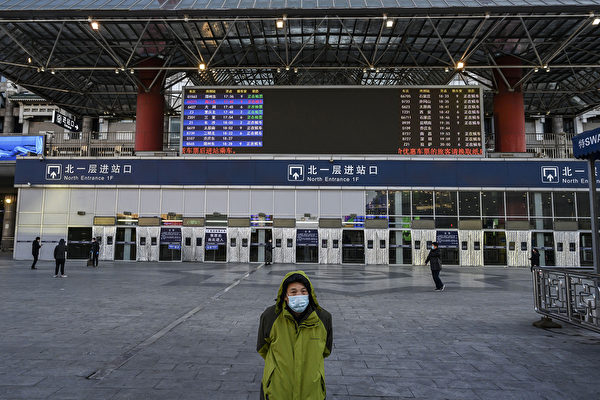

图为2月16日北京西站一名戴口罩的男子走过。(Getty Images)

 
 【大纪元2020年02月20日讯】大家好，欢迎收看《新闻拍案惊奇》，我是大宇。
 
<b>一线医生透露患者离世前病状：犹如被淹死</b>

2月17日，一名自称在第一线救治新冠状病毒患者的医生，发出一篇短文，仔细描述了他亲眼见到的，新病毒患者在被瘟疫夺走生命前的状态。

这篇短文截图在中国的微博上流传，已经得到多家媒体的报导，其中一些描述，跟前两天呼吸病权威专家钟南山透露的，对新病毒患者的遗体解剖发现相符。

短文首先描述了患者去世前的情状，非常令人揪心。患者会喊着医生救救自己，期间一直是呼吸困难，但是直到生命的最后几分钟，患者意识还是清醒的。然后在吐出最后一口气以前，会挣扎一番。

为什么挣扎呢？这名医生说，这类患者的死因，本质上跟“被水淹死”是一样的。人被水淹的时候，肺部会进入大量的水，造成氧气进不去，人被憋死。

而新病毒患者的肺，在死前会被“果冻状”的分泌物占满，肺部的换气功能消失，再浓的氧气也充不进肺里，即便用吸痰的方式，气管镜也没法伸到终末端的地方。患者就像被淹死一样离世。

此前钟南山也说，在解剖新病毒患者遗体之后，发现其肺部并没有大量纤维化，而是布满病毒造成的黏液，这一点跟17年前的SARS病毒，所导致的病状是不同的。

<b>新病毒没有特效药 感染者求生要闯过两关</b>

接着，发表这篇短文的一线医生还提到了一个大家都关心的问题，就是这个病，有没有得治。他的第一句话就是：没有特效药。然后他描述了当前对新病毒患者的大概治疗过程。

第一步，给患者输送纯氧，但不是以插管的方式，坚持三五天，如果病人靠此方法，血氧饱和度上升到正常范围，人就熬过了呼吸衰竭这一关；

如果捱不过去，就要进行第二步：上无创呼吸机，如果两小时都没有效果，就要切开气管，插上“有创呼吸机”，到最后，如果有条件还能上人工心肺机叶克膜（ECMO）；

这一步有一个例外，就是以上气管插管的操作，一般不会给危重病人进行。原因是，这个前提条件要求很严。首先病房要是特殊的“层流病房”，就是有空气净化设备的病房，保证房内无菌，而且病房内医护比要达到1:2或3，这类病房很少。这名医生说，他所在的三家医院，100多张病床，但只有一张病床能给新病毒患者进行插管治疗。

那么有人问了？假如为救一命，在普通病房试一试行不行啊？这名医生也有答案，这样是很危险的。因为这样的疗法，在给患者吸痰的过程中，患者气管可能因为受刺激而咳嗽，这一咳嗽就会喷出含有新病毒的气溶胶，飘进房间，一直插管，就一直会飘出来，这会给现场医护带去极大的被感染风险。

接着，这名医生说，无论是无创呼吸机，还是插管式的有创呼吸机，针对的都是重症患者，这一阶段使用这些疗法，对病情逆转已经没有太大帮助。他说，能救活的只有10%，但是他并没有细说这10%的数据来源。换句话说，患者只要开始需要插管，就不乐观了。甚至几家专门收治重症的定点医院，救活几率都很低。

他的观点是，能给患者输送高浓度氧气治疗，就尽量输高氧，尽量不要走到插管那一步。此前在2月13日，上海中山医院重症医学科副主任钟鸣接受采访时，还提到一个观点，就是很多进入危重的患者，除了肺部问题，其实也同时是因为多器官衰竭导致。

至于叶克膜，这个设备换句话说就是个人工肺，代替患者的肺，帮助呼吸，但这名医生说，实际上，这种状况下，患者的肺已经完蛋了。不过，这名医生没提到，今年1月22日的时候媒体报导，武汉中南医院据说用叶克膜治好了一例新病毒患者，但是没有交代细节。假如上叶克膜的时候患者的肺已经垮掉，那么拿掉叶克膜后，患者的肺是已经恢复功能了吗？当时的报导只是说，上叶克膜，让人体自身的肺能得到充分治疗和休息。

最后，写这则短文的医生交代说，新病毒的厉害之处在于：高传染性，还有容易成为重症。鉴于此，他建议人们不要去人多的场合，而且能吃多吃，补充营养，并且多喝水。

医生以沉甸甸的一句话为整篇短文收尾：派几万医护去武汉，说明这个病不好治。

其实这名医生表达了一个比较悲观的信号，就像他自己说，这个新病毒目前没有特效药，治疗还很大程度上靠运气。

<b>金银潭院长：两种有益药物 一种希望疗法</b>

也有个别药剂被发现是起一些作用的，比如抗爱滋病药物“克力芝”。最近，北美华人医生群邀请到了武汉金银潭医院的院长张定宇，他交流了救治新病毒患者的用药经验，就提到了“克力芝”。

张定宇说，他们完成了198例临床研究，发现“克力芝”能帮助新病毒感染者减少重症向危重症的转化，进而降低死亡率。但对于克力芝的效力，张定宇只是用了“有前途”三个字，说法很保守。

而且他也提到小心会产生强烈不良反应，也就是副作用。新病毒患者使用“克力芝”后会产生腹泻、恶心、呕吐，甚至是心率减慢，但是爱滋病患者就没有这么强烈的不良反应。

同时，张定宇也透露了一项数据，就是他们随访了将近1,000名爱滋病患者，其中只有不到10个人感染了新病毒，感染率只有1%不到，他自己说，这个感染率要远远低于普通市民，说明爱滋病人被感染的比率相对是低的。但武汉城内就有900万人，按这个说法，1%就是9万，那么武汉普通市民感染的人数是高于9万的。但是目前大陆官方公布的全国感染确诊总数，还不到9万。

那么张定宇接着也提到了跟刚才的医生讲的相同的观点，就是患者一旦进入危重症时期，一旦做了气管插管，插上几乎就拔不下来了，就要看着患者一步一步走向深渊。同理，上了叶克膜的，张定宇说他只听过中南医院的彭志勇有个患者被因此救活，没听到第二个被救活的例子。

被人们广泛关注的美国研究药物“瑞德西韦”，张定宇也提到了。

另外，《华尔街日报》报导，在武汉参与瑞德西韦临床试验的患者，有资格限制。一类必须是轻症和中度症状患者，在发病后8天内，确诊为阳性；还有一类，是重症患者，发病后12天内，而且接受临床研究前的30天内，没接受过其它疗法才有资格。

《华尔街日报》说，以上两项资格会排除一大批患者，因为重症患者一般已经自己服用偏方或其它药物；而轻症和中度症状患者，相当一部分没有机会得到确诊检测，或因技术限制检测错误。

所以合格临床试验者是慢慢招募，瑞德西韦的临床试验进展，也因此变得比较缓慢。

但是根据张定宇所说，根据当前在武汉金银潭医院的临床研究发现，感觉瑞德西韦整体上效果比较明显，能阻止重症滑向危重症这么一个状况。

以上内容，上海中山医院的钟鸣在2月13日也提到过，他当时也在武汉金银潭医院，那里是临床研究瑞德西韦的主要机构。钟鸣当时说瑞德西韦的试验还没有用在重症患者身上，而且轻症当时有没有人入选，他也不清楚，而且对入选者有资格限制。现在张定宇的采访说，根据当前临床研究，感觉效果比较明显，那可能说明这几天已经进行了有关的临床试验。而张定宇对药效的陈述，也与之前钟鸣的话，意思相近，钟鸣当时说，对瑞德西韦给予一定希望。

不过两人的话都是语带保留，最有价值的信息是，根据当前新消息，“瑞德西韦能阻止重症滑向危重症”，那从这个角度来看，瑞德西韦跟刚才提到的抗爱滋病药物“克力芝”，在新病毒患者身上功效类似。

不过从我们目前掌握的信息看，瑞德西韦的临床试验还没有结束，最终的情况还需要观察。

张定宇还提到了一项，就是用康复患者的血浆进行的疗法，他说这种“血浆疗法”整体感觉“还行”，主要是两点，一是患者血氧情况得到一些改善，二是淋巴细胞得到一些回升。

尝试了“血浆疗法”的，是4个新病毒重症患者，2个危重症。对危重症来说，情况只是“略有改善”，对重症来说，功效相对强一些。但是他没有说这6个病人是否已经因此脱离危险。

<b>加拿大2例康复又查出病毒 血浆疗法可有隐患？</b>

此前我们报导过，俄罗斯卫生部有关新病毒的文件，提到冠状病毒的抗体不稳定，也就是说，康复者即便暂无症状，但不代表体内被抑制的病毒彻底消失，如果抗体分解，病毒可能死灰复燃，有人担心康复者的血浆会不会也因此存在不确定性。

例如，此前加拿大安省的两个确诊病例，他们康复后，安省当局2月14日对外证实，这两人仍在被隔离，因为在他们的体内又检测到了新冠状病毒。另外，早有推特用户披露中国南宁市官方的内部通告说，他们已经发现了新冠状病毒的第二代变异，无法自愈，无法根治，会有后遗症。

但是从大陆专家的表态来看，他们对这种“血浆疗法”还是比较给予希望。

<b>目前大陆诊治患者的“康复标准”是什么？</b>

刚刚提到病人的康复标准，张定宇在访谈中也说了。他透露，新病毒的感染，“好像”是从肺的底部开始，慢慢发展到上呼吸道。早期可能就是在肺的底部一颗一颗的这样的病毒，然后一片一片往上发展。

因此也造成初期一些检测查不出感染，直到“肺泡灌洗”后，才能查出病毒。但他们没法对每个患者都做“肺泡灌洗”。

而目前，他们依据的康复标准，是当局出台的第5版诊疗方案，条件包括：两次核酸检测呈阴性，患者三天不发烧，自主症状感觉改善。然后这就算康复了。张定宇坦承，他们的检测，只对患者做了“咽拭子”的上呼吸道采样检测。

<b>武汉布置20台移动式“方舱焚烧炉” 用途何在？</b>

目前，在武汉的瘟疫防治行动中，当地又出现了一种引人注意的新设备，叫做“垃圾和动物尸体处置方舱”，由南京一家公司研制，一共产出约40台，2月15日开始，两周内要给武汉运去至少20台，而每一个方舱都是标准货柜大小，配备功能有固废粉碎、焚烧、烟气净化，可以应急处理生活、医疗垃圾，甚至还有动物尸体。这个方舱，每天可以焚烧和无害化处理的量是5吨。

比较主要的是，这个方舱的焚烧炉，可以使用850度以上的高温进行焚烧，病毒无法在这样条件下存活。

这个方舱引起一些网友的注意，是因为它还兼具焚烧处理动物尸体的功能。有人联想到武汉的殡仪馆，有大量遗体需要处理，怀疑会不会因此使用方舱焚烧炉来分担。所以，最近两天，这个方舱焚烧炉的图片，在网上得到了很多人的分享。

以上都是跟新病毒患者直接相关的一些消息。现在很多观众关心的，还有大陆的复工问题。

<b>力求复工“有险”北京有确诊患者传染政府人员</b>

在新病毒瘟疫没有找到特效治疗方法，并在持续发展的情况下，大陆国务院2月18日举行新闻发布会，提出全面复工计划，并且指出，国资委监管的央企，旗下2万多家生产型子企业开工率已经达到80%，石油、通讯、电网、交通运输开工率已超95%。

一些地方政府也积极推动开工，例如长沙市政府，要求当地餐饮业复工复业，兼顾对员工量体温，进行健康排查。但是现在已经很多人知道，新病毒感染后，人不一定很快会发烧，有的人甚至至死都不会发烧，同时，新病毒潜伏期较长，这些都给病毒传播带来隐患。

在北京就有一个例子。2月18日北京西城区区长孙硕通报了一个确诊病例，是在西城区政府的一个部门，这个确诊的员工，中国新年期间回河北过年，在2月10日普遍复工前的正月初七，他就回北京正常上班了。

开始没有任何问题，直到2月11日，这个人的一名家属先传出确诊的消息，然后他不放心啊，自己去医院检查，发现自己也确诊了，随即在定点医院治疗。这个病毒传染能力很强，他在食堂吃饭时，跟他一起排队的一个同事，也被感染。后来一共69个与他有过密切接触的人，都被集中管控。

2月13日，北京市委书记蔡奇去西城区视察，有消息说，蔡奇对这件事非常生气，2月14日，就在北京市推动一个措施，就是回京人员必须隔离14天。

<b>要求复工 当局在担心什么？</b>

因此，针对瘟疫期间返工的问题，《自由亚洲电台》采访了湖北黄冈周女士，她担心，复工后，疫情会多点爆发，继续蔓延。同在黄冈的疫情“吹哨人”高飞认为，当前最重要是控制疫情，而不是复工，这样做是冒生命危险，一旦引起新的爆发，之前的努力就会前功尽弃。

很多评论人士都在分析中共为什么急着复工。比较重要的是，中国大陆至今是靠世界的“代工厂”，来支撑经济，但是随着瘟疫爆发，封城、封路、停工，外国企业在中国的产业链受到影响，长久停工不只是中国经济会受影响，外国的产业链一旦撤出，对中国大陆的经济将是沉重打击。

所以在疫情和经济危机的双重夹击之下，当局是硬着头皮开工，有专家认为，这是有碰运气的成分。

<b>央行突印六千亿现钞 民间有两种解读</b>

与此同时，中国央行开始以防疫为名，称旧钞可能成为病毒传播媒介，因此发出约6,000亿人民币的新钞票。他们将回笼严重疫区的现钞，要求商业银行对外给出的现金，尽量以新钞票为主。例如湖北省，在中国新年前，央行说已经调拨去40亿元新钞。

有报导说，这种大量发出新钞，有可能导致“通货膨胀”。因为瘟疫爆发后，根据美国CNN的报导，中国有超过7亿8000万人的行动，受到影响，数量几乎是中国总人口的一半，正常经济活动受到严重影响，在居民普遍缺钱的情况下，有人认为，大印钞票成了解决问题的一个选项，但是真若如此，就可能导致通货膨胀的发生。

不过对央行大量印发新钞还有另一种说法，就是大规模断网。一旦断网，很多交易要用现金进行，现在大陆通行手机支付，那么多印钞票就是给可能的大量现金交易做储备。

这是目前，民间对央行大量发行新钞票的两种观点。

<b>湖北1,600网警控瘟疫言论 美“否定”5家党媒是媒体</b>

而对于当局在瘟疫期间的网络控制问题，2月18日，《大纪元时报》独家报导，说2月10日以后，湖北成立了11个战时宣传工作组，有一千六百多人24小时监控有关疫情的网上言论，发现敏感信息就会删除。同时采用“线上及时辟谣”与“线下有力打击”两套手法，来扼杀言论。

除此之外，在武汉的33家海外媒体的60名记者，大部分被湖北当局劝离，只有5家媒体的13名记者还留在当地。包括《纽约时报》、《华尔街日报》、《凤凰卫视》等等。

不过，说到《华尔街日报》，他们在中国的3名记者却在2月19日，被中国驱逐出境。不知道是否包含武汉当地的人员。驱逐的理由是，《华尔街日报》2月初发表一篇文章《中国是真正的亚洲病夫》，里面谈到了大陆当局在瘟疫暴发初期的反应，还有大陆金融市场状况。但是这三名记者无一人是这篇文章的撰稿人。

不知道是不是中共驱逐这些记者是冲着另外一件事。就是2月18日，美国国务院宣布重大消息，将新华​​社、中国环球电视网、中国国际广播电台、《中国日报》发行公司、还有美国海天发展公司这5家媒体，定义为“外国使团”，就是不再把他们当媒体对待，而是受中共政府操纵的海外宣传机构，并直言他们已经成为中共的特工。

做了这个定义之后，这些实体的人员和不动产信息，都要提报给美国国务院，包括姓名年龄、家庭住址，人员调动时也要通报新的名单，而且这些机构再购置任何美国的房产，都要获得美国政府批准。

不过，除此之外，美国民间、企业和政府，对大陆抗疫的支援，不可否认，还是有帮助。比如上面提到的药物瑞德西韦，就是美国企业的援助产品。

<b>日本捐赠伴“诗”来 除了武汉加油我们还能说什么？</b>

同时，中国的邻国日本，也在瘟疫暴发后，伸出援手。不同的是，同样受到中华文化深刻影响的日本，在援助物资的同时，却不忘浪漫的诗意，有浓厚的中华文化特色。这个细节也引起不少人的讨论。

比如，有的日本援助物资的包装箱上，写着：山川异域，风月同天。这是中国唐代时期日本国长屋王，送给大唐僧众的句子，后两句是“寄诸佛子，共结来缘。”前两句“山川异域，风月同天”，也有写作“日月同天”的。

此外，日本的援助物资中，还有的写着：“岂曰无衣，与子同裳”。以及“青山一道同云雨，明月何曾是两乡”。前两句是《诗经》里的句子，后两句是唐代王昌龄的诗句。

这个日本的例子也提醒我们，在防治疫情中，互相鼓励，不一定只用“武汉不哭”、“武汉加油”。其实中华文化里面有好多优美的句子可以用。

除了上面提到的，还比如李白的：我寄愁心与明月，随君直到夜郎西。

王勃的“海内存知己，天涯若比邻”

如果想鼓励亲友，在病痛中保持良好心态，可以用苏轼的：因病得闲殊不恶，安心是药更无方。意思是生病的时候能够有时间清闲休息不是坏事，安定心神静养也是不错的“药方”。

如果您是女生，因为封关被锁在家里，不妨化用李清照的一句词来排解闲闷：念武陵春晚，云锁重楼，记取楼前绿水，应念我、终日凝眸。

如果您是男生，要排解郁怀，可以试试化用辛弃疾的这首词：唱彻《阳关》泪未干，功名馀事且加餐。浮天水送无穷树，带雨云埋一半山。今古恨，几千般，只应离合是悲欢？江头未是风波恶，别有人间行路难！

<b>国际疫情通报</b>

节目最后，我们来看一下国际上的新病毒瘟疫传播情况。截至我们本期节目发稿，中国大陆以外确诊最多的是日本，616例，其中1例死亡，然后是新加坡，确诊84例，韩国51例，泰国35例，马来西亚22例。在北美，美国已有15例，加拿大8例。在欧洲，确诊最多的是德国，16例。除了日本，中国大陆以外的死亡病例，分别是在菲律宾1例，法国1例，台湾1例，香港2例。

新唐人《新闻拍案惊奇》制作组

<a target="_blank" href=#top><h6 align="right">回上方</h6></a>

<a name=159>
<h1 align="center"><b>韩国大厂员工现武汉肺炎症状 800人遭隔离</b></h1>

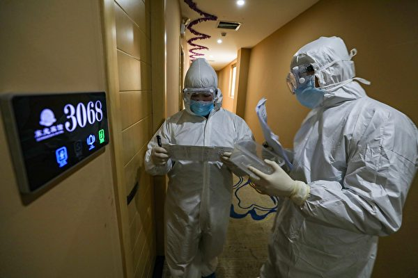

韩国半导体大厂SK海力士有一名员工出现肺炎症状，为防止疫情扩散，该公司对800名员工进行居家隔离。(Getty Images)

【大纪元2020年02月20日讯】新冠病毒肺炎（俗称武汉肺炎）疫情在韩国持续升温。韩国半导体大厂SK海力士有一名员工出现肺炎症状，为防止疫情扩散，该公司对800名员工进行居家隔离。

韩联社报导，韩国DRAM大厂SK海力士（SK hynix Inc.）今天表示，在位于韩国京畿道利川市的半导体制造厂区内，已确认一名新进员工与大邱市的武汉肺炎确诊患者曾有密切接触。

该公司表示，这位员工出现肺炎症状，已送往医院进行检测，并对曾参与教育训练的800名员工全部进行居家隔离，以防止疫情扩散。同时对教育训练场所的建筑物实施封锁，并采取相关的防疫措施。

SK海力士在19日已要求曾与该新进员工一同在利川园区训练所接受新进职员训练的280名员工返家，并关闭了该训练场所。

另一名新进员工也在19日出现武汉肺炎病征，两人都已接受采检。

据报导，这两名新进员工刚培训完，尚未进入工厂里面的生产线，但公司会先进行内部隔离、消毒等工作。

据了解，该名新进员工所在的厂区共有1万8000名员工，因此800名员工的居家隔离暂时不会影响公司生产。

此外，韩国中央防疫对策本部在今天通报，截至当天上午9时，韩国新增31例新型冠状病毒（COVID-19）感染病例，其中30例来自韩国庆尚北道和大邱市，全国累计确诊总数达82例。

由于18日确诊的第31例为住在大邱的61岁妇人，曾参加过4次当地教会活动，被外界视为“超级传播者”，与她有关的确诊病例高达37例，而SK海力士员工也因为与大邱市确诊病例接触而感到不适。

韩国连日发生感染途径不明的新冠病毒确诊病例，19、20日广尚北道和大邱市又出现多名交叉感染者。对此，韩国政府今天表示，新冠病毒肺炎已突破防疫网，呈现社区感染和扩散的迹象。

<a target="_blank" href=#top><h6 align="right">回上方</h6></a>

<a name=158>
<h1 align="center"><b>【拍案惊奇】红会囤口罩 疫区粮食供应亮黄灯</b></h1>

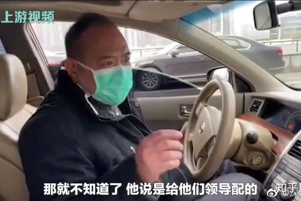

政府车辆领物资，红会再爆丑闻。（视频截图）

 
 【大纪元2020年02月19日讯】大家好，欢迎收看《新闻拍案惊奇》，我是大宇。
 
<b>欧洲人或不易被感染 俄罗斯仍禁中国人入境</b>

对新冠状病毒的研究，有了新消息。2008年1月启动的“国际千人基因组计划”，近日发出一份报告，说五种人有最高的 ACE2 接受器表现，而人体ACE2蛋白是受到新病毒感染的关键，所以这五种人是容易被新病毒感染的高风险群体，分别是：东京日本人、南方中国汉人、越南人、北京中国汉人、中国的云南傣族。

NOW新闻对此采访了胸腔重症医师苏一峰，苏医师说，“国际千人基因组计划”的目标是建立迄今最相近的人类遗传变异目录，但是以上这份研究，还没正式发到学术期刊，还需等待同业者的审查。不过苏医师也风趣地表示：看到这份报告，欧洲人松了一口气。

但不知道俄罗斯人算不算欧洲人，他们可没有放松。2月18日俄罗斯宣布，20日起，暂时禁止所有中国人入境，虽说是暂时性措施，但是并没有说何时截止。无论是工作、旅游、教育目的，都被禁止入境。

<b>首次解剖新冠感染者 钟南山：跟SARS患者不同</b>

与此同时，俨然成了中国抗击呼吸道流行病权威的钟南山院士，也指出，武汉当地还没有停止人传人，现在还要解决两个问题：一是将感染者和非感染者分开，二是将新病毒的感染者跟流感病毒的感染者分开。他说如果这两个问题不解决，那么人传人就无法解决。

因为新病毒被证实可以通过“粪口”和“空气”传播，钟南山讲保持下水道畅通很重要。因为已经在粪便中发现新病毒踪迹，如果下水道不通，当中的污染物干了，就可能经由空气传出来，造成人的感染。

钟南山还提到，他们2月17日完成了第一例和第二例新病毒死亡者的遗体解剖，发现跟SARS患者不同的是，没有想像中的严重纤维化，有一部分肺泡还在，但是炎症很厉害，有大量黏液。因此他建议在治疗新病毒感染者的时候，要特别注意保持患者的气道通畅。目前相关研究还在进行中，没有详细的结果。

<b>武汉再建10间方舱医院 情况严重管轶预测正确</b>

新病毒来势汹汹。在1月份已经有专家预言问题会很严重。比如香港大学的病毒学专家管轶，他1月21日到22日去访武汉，很快就打道回府，抛出至少两个预言：一是感染规模是SARS十倍起跳，二是武汉1月23日封城已错过黄金期。当时还有大陆网友说他是在武汉考察时没受到重视，说出的怨言。

但现在一一验证，有的大陆人在《知乎》发文，说是不是欠管轶一个道歉呢。

2月18日，《楚天都市报》报导，武汉会再建设另外10间方舱医院，新增床位11,465张，收治轻症感染者。不过截至发稿，武汉的城乡建设局还没有发布官方消息。此前武汉当地已经建设了至少11间方舱医院，现在再建10个，不少中国的网友就在议论，这真实的感染人数到底是多少呢。

而在这个时候，正是需要大量物资的增援。但是香港《苹果日报》2月18日发出调查报导指证，负责武汉当地捐赠物资调配的红十字会，1月22日到2月10日，有大约5,000个征发物资清单，总计得到口罩1,000万个，但是只向外发放94万个，发放率不到1%，而且其中只有30万个口罩送到全武汉市35间前线医院，平均每间医院得到口罩不足1万个。而发出的94万个口罩，有36万个送到了卫健局和地方行政区，比给医院的还多。

因此《苹果日报》引述香港浸会大学讲师吕秉权的话说：武汉红十字会等中国的慈善机构，是染上了官状病毒。官员的官。但除了那94万个，另外900多万个口罩去哪了呢？还是未知。

<b>红会得千万口罩 只有不到1%送出 医护所获更少</b>

而前线医护除了缺少口罩，也缺少防护服等物资。但是，有人在推特发图文爆料说，有的医院护士，一套防护服要穿两天。这样最严重的问题是，防护服也可能被病毒污染，失去防护的作用，长时间不换的防护服，如果外部沾染病毒，还能把病毒带给别的人。

其实现在武汉排查四类人员，就有人抱怨说，有的排查人员虽然穿着防护服，但是挨家挨户串，同样会带来这样的问题。

<b>医护自发募捐被批写检讨 剃发画面被用来煽情</b>

那么这篇推文上继续说，这个护士因为缺防护服，向社会募捐，却被所在单位勒令写检讨，而且写了三遍，从开始的缺乏大局意识，到最后还要给自己安上“造谣”的帽子。

其实前线的医护真的很不容易，在缺少必要防护物资的情况下。还要充满大局意识的，在镜头前剃光头发，意思是为了减少感染病毒的风险，而且这些人都是女性。比如即将去湖北支援的甘肃女医护，她们剃头的画面，被电视台拍了下来，在镜头中，我们能看到女性医护的眼中含着泪水。

然后央视等一些大陆媒体在微博上公布，配上题目说《剪去秀发 她们整装出征》，也有的题目写道：《命都豁出去了还要什么头发》。

结果这轮正能量宣传明显碰壁，因为这些女性做出这样的牺牲，可不是为了在镜头前曝光，把自己无可奈何的一面展示出来。很多人在央视微博下留言，指责他们用女性的身体发肤做文章。

而目前，除了对瘟疫的防治牵动分心，现在也到了必须对一些次生问题进行关注的时候。

<b>官称湖北粮食供应稳定 民间屡求助 饥饿问题亮黄灯</b>

在前一天的节目中，我们简单提到，2月1日，《湖北日报》报导，湖北粮食可供全省一年以上，但2月6日，北京青年报报导“中储粮”的消息，说湖北粮食可以供应半年。

还有一个报导我们昨天没说，就是2月16日，大陆商务部表示：武汉市以及湖北省的食物供应情况是：大米、面条、食用油、鸡蛋、猪肉、禽肉、牛奶、主副食品、蔬菜，这九大类生活必需品动态库存量保持稳定。但同时提到，米、面、油、奶、主副食，总体可供应18天以上，猪肉总体可保障12天供应。

另外，2月18日，中储粮湖北分公司有消息说，该公司库存一千多万吨粮食，可供应湖北6,000万人半年以上需求。另外还有地方储备粮、商业周转库存。

虽然这些消息显得当地粮食供应充足，但仍有外地支援，比如中储粮集团自己，目前平均每天发给武汉的大米超过200吨。还有前两天，吉林一家农企给湖北发送20万斤大米。

以上这都是最近官方发布的消息。

再来看民间发出的信息。我们知道，湖北省2月16日发出消息，说全省所有村组、社区、屋苑还有居民点，开始24小时最严格封闭管理。关闭一切非必须公共场所，停止一切群众性聚集活动。

武汉网友“武汉炸吧哥”说：政府只说封闭管理，却没有给出如何购物的答案，不管市民如何采购的问题。我们怎么买米买菜？大部分小区至今没有组织配送，那我们吃什么？

不知道我们节目播出的时候，小区配送问题是否得到改观。

武汉网友“艳子693”发消息说：既然出台封闭管理，那么就请处理好每个小区的物资供给问题。我们小区就有人为了出去采购，冒险冲岗，与守门的防疫人员发生了冲突。

一名武汉超市的工作人员“陶然自若”对外发消息说：每天看到一波又一波的老人，他们排大半个小时的队，却只能买到几个萝卜一把青菜。

网友“八荒以后”发文说：自己三五天没出门，家里没吃的了下去买菜，结果不准出，说封锁了。今天两个人抱着哭，一把挂面撑了两天，实在没吃的了。

还有武汉人对外发消息说，年轻人会玩手机app，有的人把能买菜的app全下载了，结果不是瞬间被预约爆满，要么就是还在补货之中卖不到东西。有人更说自己封城以后，一次水果都没吃过。

网名为“nickel拟科”的武汉人说，大意是，武汉禁止公共交通，假如一个人出去一次能买一家四口一个月的粮食，靠步行从超市往回搬，就算一家四口一人每顿吃一包泡面，一天吃两顿，一个月就是240包泡面，这靠一个人是拿不了的。而且即便天天吃泡面，其实人是受不了的，营养不均衡，会带来其它健康问题。

我们算一笔账，武汉城内有900万人，按一户平均3人，假如还允许每户每周出来一个人买菜，那一周就有300万人出来，那有的人可能不是想买一周的，可能以防万一想买够两周，所以很多人只要还有钱，就尽量多买，那每周最先出来的那批人就有能力抢光超市里的食物。这种情况下，粮食供应只有源源不断，才能解决更多人的吃饭问题。

但现在的情况是，很多人完全被封在家门。只有靠当局派人去送饭送菜。

在湖北孝感，有网友“吴邪”说，自己已经吃了10天土豆，封闭前家里只买了米，别的什么都没有，泡面根本买不到。偶尔有喇叭在小区里喊送菜，也只有一袋袋蔬菜，几根黄瓜莴苣就50元。

网名为“最美小袁”的湖北荆州人说：突然通知全部封闭不准出门，问居委会的人怎么购买物资，也没人回复，家里的菜还能支撑几天，但是对几天之后的生活很迷茫。

而除了在湖北，全中国大陆都要思考这个问题。有观点说，中国的三个大粮仓，黑龙江、河南、山东，都在本次瘟疫中受到影响。每年中国新年后，就要准备播种春小麦等作物，而在这个时候，一部分农民可能还被锁在家里。

同时，像我们之前在节目里提到的，除了新病毒瘟疫，现在的非洲猪瘟、禽流感并行。这些疫病，需要药物去压制，但是已经传出，因为道路封锁，药物运输不畅，出现大量家禽被禽流感瘟死的情况。猪肉行业也面临这个问题。

大陆官方持续发消息，说粮食还有供应；但民间却不断有人发出粮食告急的信号。在新病毒瘟疫之下，如何避免发生“饿死人”这种人道灾难，是必须正视的问题。有能力的，多储备一些粮食不是坏事。

因为有些问题可能不是现在出现，可能过一段时间后就会显现出来。当然我们希望，这种悲剧不要发生。

<b>武汉焚尸炉传“叫声” 舆论热议</b>

在当前瘟疫中，已经出现了很多家破人亡的惨剧。但比这更令人不寒而栗的是，三立新闻等多家媒体2月18日都做了一个报导，提到一篇2月16日的推文，推文内容是：武汉殡仪馆招工，条件是不怕鬼，胆子大，其实焚尸炉里的叫声不是鬼，而是没有死去的人。

这篇推文说的“招工条件”，我们找到了相关的截图，上面写着：急招晚班抬尸人员20人，工作4个小时就4,000元，工钱现结，男女不限，16到50岁之间，但是有一个条件特别醒目，就是：不怕鬼、大胆，再看这工作时间是凌晨0点到4点。

那么是否有活着的人被当死人送到殡仪馆呢？我们能再原推文中看到这样一张聊天截图，讲话人的姓名也在上面，姓佟。他说医生要把他的父亲装进尸袋，但是他帮忙去抬，发现父亲的小腿还是热的，他就喊爸爸，当时他爸爸就睁眼要说话，结果医护人员发现后，把他赶到一边，然后将他的父亲赤裸裸装进尸袋。

然后当地青山殡仪馆的车，一个小时后把他父亲的遗体带走。随后另一个32岁的年轻感染者接替了他父亲的床位。

这段描述相当细致，不像是伪造。而且其中有一个小细节，可以得到证实。就是他父亲是被殡仪馆人员裹了两层尸袋带走的。

之前大纪元记者电话采访武汉殡仪馆，里面的工作人员就说，裹两层尸袋，是因为死者遗体的肚子里，其实都还有气，搬运时气会出来，所以必须裹上两层，谨防别人被遗体呼出的带菌或带毒的气体传染。

现在来到最关键的问题了，就是人被送进焚尸炉里的时候，是不是还活着。有不止一家媒体的报导，引用了这个推文中的话：焚尸炉里的叫声，不是鬼，而是没有死去的人。只是我们节目暂时没有找到这个消息的原始出处，有可能是被删贴，也可能是我们没找到。但确实不止一家媒体提到这一点。

那台湾PTT上，有一名网友解释，意思是说，焚化炉里，如果遗体坐起来，或者有叫声传出，可能是尸体被焚化时，肌肉组织剧烈变化，造成像人坐起来一样的动作，而声音的发出可能跟气体剧烈流动，通过声带有关，听起来像凄厉惨叫声。

对于这种解释，有的网友信，也有的网友不信，认为真的是有人还没咽气就进了焚化炉。在SARS时期，也有这种消息，说人还没死，就推进焚化炉了。也有网友认为没必要争论，说了一句：党说是鬼就是鬼。

<b>白宫营救请愿签字还不够 “愤青”方斌的诗歌欣赏</b>

而在武汉，除了无可奈何的亡魂，还有当局制度特色下出现的“失踪者”，这些人在瘟疫爆发后也成了舆论的关注点。

2月10日，武汉人方斌失踪，至今还没有下落。大家都知道他公开喊出“反抗暴政”的勇敢，如果说这是他“愤青”的一面，其实他还有“文青”的一面，很喜欢写诗歌，虽然有的看起来有点打油诗的感觉，但是由于他的勇敢发声，事迹一夕之间在华人中广传，他的诗歌也因此更受到关注。同时，我们也能从他的诗里感到，看上去像个老实人的方斌，实际也是壮怀激烈。

他的在一首《大杀四方》的诗里写道：呼啸狂风漫卷，豺狼虎豹鼠窜，亲领千军万马，大杀四方平定。

还有一首《杀伐决断》：手提三尺宝剑，威风钓鱼台上，擒住邪恶匪首，杀它片甲不留。

以上两首诗读起来有点杀气腾腾，他的诗也不都是这个风格。

比如这首《希望》：严寒从天降，大地莫生悲，人心虽已残，梅花唤春回。

另一首诗歌《善》，方斌写道：行善不求报，可是神知道，遇事对人好，自己亏不了。

他发出来的诗歌喜欢用毛笔写，还盖上章，书法虽不能说可圈可点，但还算有自己的风骨。有的时候，方斌还钟意录制视频，念出自己的诗句。例如这首《感慨》：声声唤，紧紧催，人心已残不知归，生生世世，两眼望穿，创世主已来，人却执迷，麻木不醒，大疫有眼，愚人难逃，善者能回。

还有一首诗《病毒横行》，他也念了出来：藏污纳垢恶臭腥，冠状病毒结伴行，不管受害多少人，封网删贴忙不停。

方斌，他出生在武汉花山，小名是“大花子”，有人说他做“汉服生意”。我们从他之前的YouTube频道“武汉直击”，也能看到，他身穿汉服摆出威风的pose。

目前，截至我们发稿，营救方斌和陈秋实的白宫签字，只有五万多。其实很多网友呼吁，不知道这个签字数量一直没上来是为什么。很主要一个原因就是大陆电子邮箱，收不到白宫的确认回信，那个回信里的链接，需要点一下，这个签名才算生效。

<b>除了Gmail和Yahoo 再推荐两款海外免费加密邮箱</b>

其实您可以注册Gmail或者Yahoo的信箱，此外，还有观众推荐两款海外的比较安全的电子信箱，一个是德国的Tutanota。这个电子邮件服务，是端对端加密，即使收件的人不是Tutanota的用户，也要有解锁密钥才能打开电邮。这个电子邮件服务对个人是免费的。

另一个是Protonmail，基于瑞士的电子邮件服务。是由哈佛、麻省理工还有欧洲核子物理研究所的专家一起开发的加密邮件服务。它采取多重加密，不记录用户密码、IP。Protonmail发出的邮件，如果对方不是Protonmail的用户，他收到的是一个链接，要通过预享密码，在浏览器中打开邮件内容。同时Protonmail还有邮件自毁功能。

这个两个邮箱都是海外的电邮服务，仅供大家参考使用。

<b>紫外线消毒灯有作用也危险 一定谨慎对待</b>

节目最后，做一个细致说明。之前的节目里，我们有一位观众，建议用紫光灯，对方舱医院的环境进行消毒，条件是在没有人的情况下，这里再说一下，他当时说得很清楚，不是用来照人，是环境。“紫外线消毒灯”确实存在，市面上也有卖的。

但一样，这种灯的使用也要是无人无生物的时候，去清洁环境。而且紫外线照射后会产生臭氧，所以用“紫外线杀菌灯”对居住空间杀菌消毒，一定要保证通气通风，用完要通风。

但是，紫外线照射到人，短时间就有致癌的危险，而且直射眼睛也不行，所以如果要用“紫外线杀菌灯”，一定要咨询专业人士后再使用，一定先咨询专业人士再使用。不然可能有危险。

那天那位观众的提议，是针对方舱医院，这么大的设施，一定是有专业人士的参与，才会决定怎么安装，或者以什么形式安全。而且华中科技大学同济医学院附属同济医院救治医疗专家组，他们发布的《新型冠状病毒肺炎诊疗快速指南》中提到，75%酒精，还有乙醚，氯仿，甲醛、含氯消毒剂，过氧乙酸还有紫外线，都能杀灭活病毒。

这说明紫外线消毒灯确实有效，但一定是专业人士指导下使用，而且主要还是清洁环境，不能照射人体。

新唐人《新闻拍案惊奇》制作组

<a target="_blank" href=#top><h6 align="right">回上方</h6></a>

<a name=157>
<h1 align="center"><b>“移动式焚化炉”进武汉 网民：死多少人？</b></h1>

近20台移动式“垃圾和动物尸体处置方舱”将进武汉。网民纷纷质疑：“到底死了多少人？”“不够烧，还要调派移动焚化炉……”（视频截图）

 
【大纪元2020年02月18日讯】（大纪元记者李心茹综合报导）武汉新冠肺炎疫情蔓延之际，近20台移动式“垃圾和动物尸体处置方舱”将进武汉。网民纷纷质疑：“到底死了多少人？”“不够烧，还要调派移动焚化炉……”

<b>2秒焚烧 每台日烧5吨</b>

综合陆媒报导，由南京中船绿洲环保有限公司参与研制的“医疗垃圾应急处置方舱”2月15日抵达武汉驰援疫区。2月16日下午3点，在武汉一次点火成功。未来两周内将有近20台医疗垃圾焚烧炉发往武汉等疫情严重地区。

每个方舱为20尺标准集装箱大小，体积约为30立方米，包括固废粉碎方舱、焚烧方舱和烟气净化方舱三部分，可移动式的应急处理生活、医疗垃圾、动物尸体等。

上海交大团队主要负责烟气净化工艺及方舱设计，环境科学与工程学院教授瞿赞介绍，在方舱焚烧炉中以850度以上维持“2秒焚烧”，病毒无法在这种条件下存活。

目前，项目组根据武汉的现场要求，对方舱进行了优化改进，每日可以焚烧、无害化处理量达5吨。

垃圾和动物尸体处置方舱是“十三五期间国家重点研发计划”，除了中船绿洲之外，中共军方等单位也参与研究开发，官方宣称此方舱已于今年1月通过验证试验，拥有四项国家专利，达到国内领先技术水平。

但值得注意的是，白色方舱外头印上“垃圾和动物尸体处置方舱”字眼，显示不只处理医疗垃圾，也处理“尸体”。

在2003年“萨斯”期间，中船绿洲调运40余台套焚烧炉被投放使用。

此前，武汉火神山医院使用时，一名北京一家医院的陈姓资深专家曾表示，火神山医院草草建好后让1400人的军队先上来，看来应该是和小汤山医院模式一模一样，那些发烧的“全都让他就地消失”，“说白了就是建医坑、活人坑、死人坑，完了烧，烧完了就完了”。

上述信息引发网友议论：“到底死了多少人？”“不够烧，还要调派移动焚化炉……”

“哪有什么动物尸体？”“动物不会感染冠状病毒，哪需要特地安排这样的方舱驰援武汉？”

“人也是动物，这样写只是文字障眼法。”“难怪不让外国医疗团队来帮忙。 就是怕他们目睹。”

“真了得，不发放医疗物资但火速配置尸体焚化炉。”“ 毁尸灭迹!”

<b>外界质疑官方瞒报死亡人数</b>

持续2个多月的武汉疫情早已失控，外界质疑死亡人数比中共政府报出的“高出不知多少”。大纪元的独家报导说，通过暗访湖北省多家殡仪馆的高管获知，武汉最大的汉口殡仪馆一天至少焚烧225名新冠肺炎死者。

武汉市的某间殡仪馆一员工小运（化名）2月4日对大纪元记者说，一直24小时不眠不休地运作，“我们从1月28、29日就开始上班了。”已经累得筋疲力尽了。

不仅如此，殡仪馆的大量尸体排队等候火化的现场视频被曝光，从画面中可见，黄色尸袋里装裹着感染肺炎疫情患者的尸体，排成长长的一行，等待焚化。

另外，据国际数据提供商“Windy”资讯显示，武汉市2月中旬出现高浓度的二氧化硫（SO₂），外界认为可能是因为焚烧大量尸体。台大大气科学系教授徐光蓉表示，武汉当地封城、工厂停工，在没有火山爆发情况下，二氧化硫突然爆增，外界会认为在烧尸体应是合理推断。#

<a target="_blank" href=#top><h6 align="right">回上方</h6></a>

<a name=156>
<h1 align="center"><b>武汉恐大规模饿死人 全境或断网</b></h1>

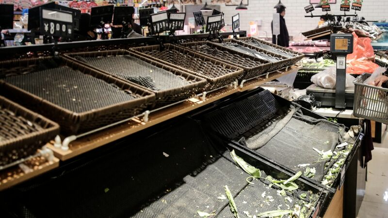

 
【新唐人北京时间2020年02月18日讯】武汉疫情肆虐，疫区湖北全省实行最严格封户令。众多网友的聊天信息显示，武汉可能要出现大规模饿死人的人道危机。并担心中共会实施全境断网阻止真相曝光。武汉作家说，最大的灾难是全家人在几天全部死光……

湖北省政府16日宣布，全省城乡所有村组、社区、屋苑及居民点实行24小时最严格封闭管理，所有非必须公共场所一律关闭，一切群众性聚集活动停止。

<b>老人们排半小时队 只能买一把青菜</b>

武汉网民“武汉炸吧哥”说，市政府只宣布了封闭管理，却没有给出如何购物的答案。他们只管严厉封闭，不管市民如何采购的问题。我们怎么买米买菜？封闭管理我们支持，可大部分小区至今既没有组织配送，那我们吃什么？

要吃饭就得出门买米买菜，而小区又不准我们出门。于是，武汉人再次陷入了一个谜一样的死循环。

年轻人可能还知道用app网购点菜（实际上很难抢到），可是老年人不会玩手机，电视上的鸡血报导也看得多，于是第二天，大量的武汉人开始冲击小区门禁，大量涌入超市抢购。须知，超市是密闭空间，抢购人潮加大了病毒传播可能性。

    抗击新型肺炎第一线
    湖北全省开启封闭模式，老百姓不能进、也不能出。所有商铺封门，小区封门。老百姓上街一律强制拘留。
    评：今天封湖北，明天就会封全国。让整个社会停滞状态，一刀切的休克疗法会让整个国家将来得不偿失。财匮力尽，民不聊生的日子还远吗？ pic.twitter.com/6zQpVnkPyE

    — 王美琳 (@CLdQVZJkjDB2aMa) February 17, 2020

武汉网友“艳子693”说：政府既然出台封闭管理，那么就请处理好每个小区的物资供给问题，不然这么久的隔离防疫，会因为购物难而功亏一篑。今天，我们小区就有人为了出去采购，冒险冲岗，与守门的防疫人员发生了冲突。

其实，小区居民也不愿意冒险出门啊！他们出去是为了购买生活物资，若不是采购食物，谁会在这个节骨眼往外跑呢？

武汉超市工作人员“陶然自若”说：武汉领导都有谜一样的自信！武汉的老人们都有金钟罩护体？在超市工作的我，每天看到一波又一波的老人，他们排大半个小时的队，却只能买到几个萝卜一把青菜，我真是想爆粗口！

政府不首先解决生活物资问题，封闭管理这不是逼人挨饿吗？

<b>两人抱着哭 实在没吃的了！</b>

武汉网友“八荒以后”发帖称：前几天我们三五天没出门，家里没吃的了下去买菜，因为之前就还挺正常平时囤的也不多。结果对象下了楼物业不准出，说封锁了。

我赶紧搜新闻才发现不知道什么时候在哪里通知武汉小区全面封锁，大家都去抢东西了。当然什么也没买到，物业也不准我们再出门了。今天两个人抱着哭，一把挂面撑了两天，实在没吃的了。猫粮也买不到。

App Store里能下的买菜app我全下了，不是瞬间约满，就是补货中就是临时休息。这是前几天去超市买大米，连大米都被抢空了，遑论蔬菜了。封城以来更是一次水果没有吃过。

我们单位还是防疫重点单位，捐了一个多亿的设备和非常多的工程师，每天都是无休地上班。但真的没有受到一点点的善待。

没有人来排查过我们，没有人通知过我们封城，没有人通知我们小区有人感染，没有人通知过小区被封锁禁止出行，没有人告知怎么一次性买回全家一周需要的口粮，没有任何物流可以派送邮寄，也买不到口罩酒精消毒液。

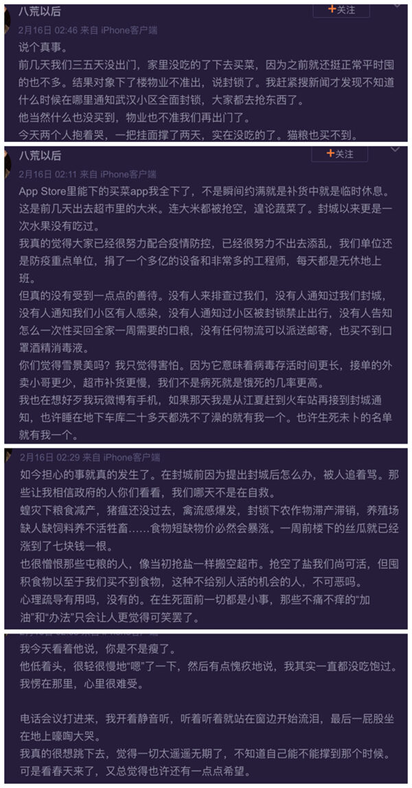

（网络截图）

<b>出门采购一大堆人什么都抢不到</b>

武汉网友“nickel拟科”发帖说：居然还有人问“武汉人为什么要出去买菜，不会网上买吗？不知道一次买一个月的吗”，简直是弱智版何不食肉糜。

武汉禁止公共交通，一家4口买一个月的食物，你能步行从超市搬回来吗？就算你全家顿顿吃泡面，一个月也要240包泡面，你能一次性买回来？何况超市根本没有那么多东西给你买。

超市土豆都没的卖，速冻肉全部抢光。网购武汉不派送，京东要送半个月，天猫超市不允许购买，每日优鲜不开武汉点，饿了么，美菜，盒马都是转眼抢空，不光要抢还有数量限制，不同区域只能在特定日期下单。

以上我说的这些如果有人不信，可以自行打开这几个软件把地点切换到武汉三镇看看。

有请你们看看我刚刚打开的美菜，连白砂糖都抢没了好吗？你们以为买咸菜很容易吗？老干妈还不是抢空了。

我家这的超市每天还只营业三个小时，进去要先排队半小时，每个去超市的人都是拿到不能再拿为止。谁家不知道要屯粮啊，我还想吃蛋糕昵……

武汉1000万人，假设每个人每次买10天的菜，每天就有100万个人需要买菜。

如果这100万个人试图每次去买20天的菜，排在后面的30万人就会什么都买不到，因为超市的运营能力有限，每天菜就那么多。每个人一次买一个月的当然想法很美好，怎么可能实现？哪个城市能有那么多物资一次性调配？

如果每个人都坚定地一定要买一个月的菜，武汉就会被抢的什么都不剩，因为运输调配能力是有限的，就会有一大堆人什么都抢不到！

外地的小区封锁和武汉完全没有可比性，外地好歹三天能出去一次吧，武汉现在是全面禁止出入，就指着抢app上限量的那么一点吃的。少说什么“我们也封锁小区了不也没饿死”这种话。一个限行一个完全禁止是一个量级吗？

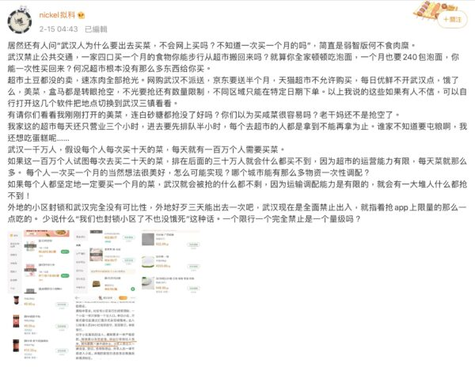

（网络截图）

<b>心酸啊！总不能看爹妈饿死</b>

武汉网友“甜筒嘛嘛”表示：说良心话，哪个敢出门？哪个想出门？哪个不怕死呢？这么多天了，吃喝的问题都是自己解决自己的，政府没给予一点帮助。我们从来没有吃到过各地捐赠武汉的免费菜。

每天都是自己上网找群想办法团购点菜，网购物资非常短缺，经常抢购不到东西，超市我们又不敢去。

我爹妈正对面就住着确诊病人，父母年纪大了，吓的大门都不开的，更不谈出来买菜。这种情况换谁都不敢出门，二老屋里连菜叶子都没得了，我难受的一晚上都睡不着觉。今天一大早，我强行冲岗出去买了一堆菜，从一楼一点一点用绳子吊上楼给父母。

心酸啊！我总不能看我爹妈饿死吧！政府部门，你们封闭管理，也得给我们安排一下吃喝问题呀，不解决吃喝配送，难道要我们封闭在家里饿死吗？我自己都觉得武汉群众太可伶了！

<b>面多好吃啊 可泡面也买不到</b>

湖北孝感网友“吴邪xy”：我们这早就不让出门，也没有社区来管报备需要的东西，已经吃了10天土豆了，都是之前囤的，封城那天想着米最重要，然后所以除了米没力气拿别的了。

现在偶尔有喇叭在下面统一配送菜，只有一袋袋蔬菜，几根黄瓜莴苣就50，其余的什么都买不到，泡面，泡面多好吃啊，可泡面根本买不到。

湖北荆州网友“是最美的小袁啊”：我们这也是，今天突然通知全部封闭不准出门，问居委会的人怎么购买物资，也没人回复，家里的菜还能支撑几天，但是对几天之后的生活很迷茫。

网友“Fang1r1”说，我在武汉，我每天吃泡面，然后超市不是一整天都开门，东西大家都在采购的，没那么简单的，我已经从86斤就变成80下70了，我真的好怕饿死在这里，我朋友给我买东西，寄不进来。

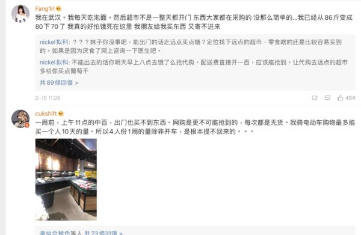

（网络截图）

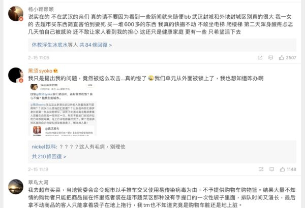

（网络截图）

<b>饿死与病死之间 冒险选择一项</b>

武汉网民“绛燃”说：我是湖北黄冈的，我一个人被滞留在武汉的单位宿舍里。2月11日，我起个大早跑去中百超市排队买菜，跟一大群爹爹婆婆抢一棵大白菜没成，最后我只抢到几个土豆。

反正跟大家一样，现在的任何状态看着都挺让人着急的，政府也没有安排生活物资配送，也不知道我囤积的食物够我吃多久，哎，走一步看一步吧！

武汉网民“徐小西”说：不是我们想冒死出去买菜，政府里面不作为的人太多了，我们小区已有确诊和疑似病例了，但我们的楼栋却没消毒、封控，我们每一次出门就是在搏命！我们只能在饿死与病死的两难之间，冒险选择一个。

网民“2245懒”说：我们不买东西会饿死，出门又怕传染，思索半天，传染还有可能活下来，而饿死就毫无疑问了。

推特网友评论：

“武汉情况已经非常糟糕了，大规模饿死人或者全境断网，哪个会先出现？”

“断网，断网意味着他们在里面做啥都有可能，比如直接人道毁灭肉体，尸骨无存，哎！”

“以以往尿性程度来判断大概率是断网优先大规模饿死人至少两周之内不会发生估计再锁个半个月就该成规模的站出来了。”

“小规模饿死人就会有人传，那就该断网了。然后大规模饿死人了。”

2月10日，就有武汉民众说，武汉开始局部断网，以防武汉真实疫情被民众发送上网。

当地民众给《大纪元》提供消息称，从10日夜晚开始，武汉有小区广播通知，近两天开始局部断网，理由是网上负面消息过多。

与此同时，没有被断网的区域传出更大量的求救信息。

2月12日凌晨仅仅4个小时之内，在微博上，就有超过200个新冠肺炎患者的求救贴，表明新冠肺炎重症患者的数量正在跳跃式激增。

武汉作家方方16日的日记中写道，什么是武汉的灾难：灾难不是让你戴上口罩，关你几天不让出门，或是进社区必须有通行证。灾难是医院的死亡证明单以前几个月用一本，现在几天就用完一本。

灾难是火葬场的运尸车，以前一车只运一具尸体，而且有棺材，现在是将尸体放进运尸袋，一车摞上几个，一并拖走；灾难是你家不是一个人死，而是一家人在几天或半个月内，全部死光……

她说：岁月在灾难中没有静好，只有病人的死不甘心，只有亲属的胆肝寸断，只有生者的向死而生。人们需要发泄，需要大哭，需要痛诉，需要安抚，武汉人的痛，不是喊喊口号就能缓解的。

<a target="_blank" href=#top><h6 align="right">回上方</h6></a>

<a name=155>
<h1 align="center"><b>网传武汉一线医生透内情：现在都是安慰治疗</b></h1>

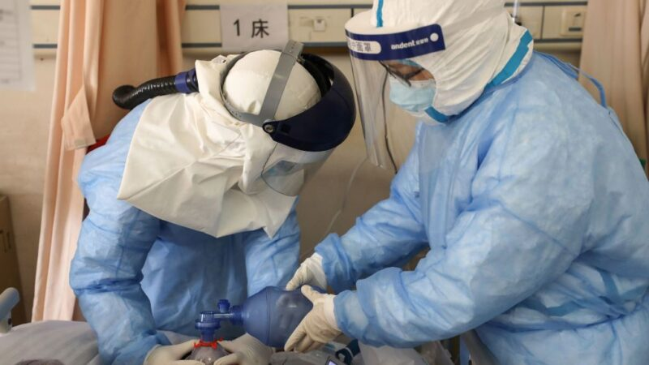

图为武汉红十字医院医生在对新冠肺炎病人进行治疗。（STR/AFP via Getty Images）

 
 【新唐人北京时间2020年02月19日讯】新冠病毒肆虐中国全境，在目前还没有特效药的情况下，显出了医疗物资与医护人员都极度匮乏，在疫情中心区湖北及武汉更加严重，基本的支持性治疗都几乎办不到，近日网上流传一位武汉肺炎一线医生讲述“现在所有的治疗，就是‘安慰性治疗’”；“ 病人会呼救，会哭着喊着说医生你救救我……伴随着剧烈地挣扎，直到呼出最后一口气”。

据这位一线医生透露，由于医疗物资与医护人员的匮乏，武汉肺炎患者得不到妥善照顾，在其所在的三甲医院，仅有一张病床能够满足新冠病人气管插管的治疗，病患去世时情景惨烈。

这位医生说：

1、病人去世前的感受：

一直呼吸困难，直到最后几分钟，病人全程清醒。病人会呼救，会哭着喊着说医生你救救我……伴随着剧烈地挣扎，直到呼出最后一口气。死因，本质上和淹死一个道理。大量的水，进到了肺里面之后，氧进不去。肺，被病毒导致的果冻状的分泌物给占满了，换气功能完全丧失，再浓的氧也进不去血里面。而吸痰，靠气管镜到达不了那个终末端的地方。没有特效药。

2、开始，把纯氧输送给病人，不经口插管。维持大概三五天之后，如果他的血氧饱和度能上升到正常范围，他也就挺过了呼吸衰竭这一关。

3、挺不过，就要上无创呼吸机，或者切开气管，插管接有创呼吸机。无创呼吸机，最后病人易产生呼吸肌疲劳。

4、治疗分为四个步骤：

1）高流氧治疗。

2）不行的话就上无创呼吸机。

3）如果上无创呼吸机两个小时无效，就要气管插管。

4）到最后，如果有条件，就上ECMO（人工心肺机）。

5、为什么不给危重病人气管插管？

每一步都是有前置条件和相应标准的。从硬件配套看，进行气管插管的前提条件是要有层流病房，插管之后医护比要达到1:2—3。我们的现状是，没有层流病房，也不可能按规范配置人力。我们1000多张病床的三甲医院，也就只有一张床能够满足新冠病人气管插管的治疗。

6、如果没有这些装置硬上呢？

我们所有的医生、护士都会中枪。吸痰过程中病人受到刺激，一咳嗽气溶胶就直接喷出来了。插管之后，就是24小时不间断地喷新冠病毒气溶胶，整个房间的空气会被污染。所以，这种高风险、高暴露操作，在一般的病房是绝不允许的，这也是之前的非典留给我们血的教训。

7、效果

重症之后再住院抢救，医院的治疗呼吸机已经没有大的帮助。无论是上无创和上有创呼吸机（插管），对这种病最后的逆转都没有太大的帮助。能救活的，只有10%。只要上了气管插管（有创呼吸机）就不乐观了。因为气管插管一方面会增加病人的痛苦，增加机体的刺激，还导致合并呼吸细菌感染。几家专门收重症的定点医院，抢救成功率很低。目前，能高流氧就高流氧，能不插管就不插管。

8、ECMO是人工心肺机

就是病人的肺坏了，我就搞一个人工肺来代替。肺已经完蛋了，通过ECMO，只是一天一天的撑下去。

9、肺白了

肺白了，之后就容易纤维化。纤维化不能逆转，除非肺移植。

10、新冠肺炎的厉害

一是高传染性，二是容易成为重症。

11、预防事项

1）不要去超市挤长队，不要去楼下抢白菜。

2）能吃多吃，营养支持很重要，提升免疫力。

3）大量饮水，补充电解质，喝汤。

4）注意：维生素C和维生素E的治疗剂量和保健剂量不同。

治疗剂量：维生素C 最多用到3000毫克每日，维生素E 最多用到1000国际单位。

国家派了几万医护人员去武汉，说明这个病不好治。

现在所有的治疗，就是安慰性治疗。

医疗专家：目前对新冠病毒患者以“支持性疗法”为主。

台湾传染病防治医疗网指挥官张上淳16日表示，目前台湾确诊的病患，主要还是以“支持性”疗法为主，若病人有其它疾病，就再针对病症用药，尽量维持病人肌体的健康，加强自身免疫力。

此前《财新》引用武汉大学中南医院重症医学科主任彭志勇的说法表示，目前没有针对新冠病毒的特效药。抢救重症患者的原理是帮病人维持机体。针对不同病人的症状，呼吸困难的就给病人供氧，肾功能衰竭就给病人透析，休克就用ECMO（体外心肺支持）抢救，病人缺什么就补充什么以维持其生命。这种情况下，病人康复或者治愈，全靠自己的免疫力恢复，将病毒消除。

彭志勇称，新冠病毒最大的危害是攻击人的免疫系统，导致淋巴细胞下降，肺功能受损，呼吸衰竭。很多危重症病人因为呼吸衰竭而死，也有很多病人因免疫力系统下降，导致并发症，多器官衰竭而死。

<a target="_blank" href=#top><h6 align="right">回上方</h6></a>

<a name=154>
<h1 align="center"><b>【疫情最前线】大批医护感染 院长确诊死亡</b></h1>
 <h3 align="center"><b>老翁瞒武汉旅游波及20万人致医院停摆 疫区隔离或销毁人民币</b></h3>
 
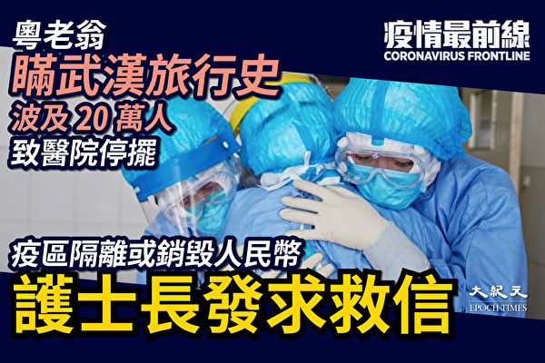

广州一间医院因一名老翁隐瞒旅游史致医护人员感染武汉肺炎、医院关门，更波及附近20万名居民；武昌医院院长确诊死亡，全国大批医护感染，感到绝望。（大纪元合成图）

 
 【大纪元2020年02月19日讯】（大纪元香港记者站报导）2月18日，有关武汉肺炎疫情扩散的消息继续笼罩大陆。广州一间医院因一名老翁隐瞒旅游史致医护人员感染武汉肺炎、医院关门，更波及附近20万名居民；广州互不认识的三个家庭，在同一餐厅食饭后9人证实感染；中国央行要求各地银行回收人民币现钞消毒隔离7天至14天，或火烧销毁；武昌医院院长确诊死亡，成为第一个死于武汉肺炎疫情前线的医院院长；全国大批医护感染，感到绝望。

近日，发表在国际权威医学杂志《柳叶刀》（The Lancet）上的论文明确指出，武汉肺炎新型冠状病毒具有三个特征：无症状高效传播；口罩难以防护；确诊病人愈后仍带病毒，可大量散播并感染其他人。

武汉肺炎攻陷亚洲、东南亚、美洲、欧洲及非洲，大陆多个地区爆发社区感染。

<b>就诊老翁瞒武汉旅游史 波及医院停摆</b>

近日，广州某医院因为一名老翁隐瞒曾到武汉旅游史，导致医护人员感染，令整家医院关门。不仅如此，医院附近20万人的居民社区，也因疫情近乎崩溃。该名来自湖北的老翁，10天前到广州番禺某间医院住院就诊，他刻意隐瞒曾往武汉旅游，医护人员疏于防护，期间与107名医护人员和病人密切接触，导致这间医院有3个人确诊染疫。

号称“天下第一村”的广州番禺祈福新村，就位于该医院附近，常住人口二十多万，其中七千多户是湖北籍住户，连日爆出9宗武汉肺炎确诊个案。

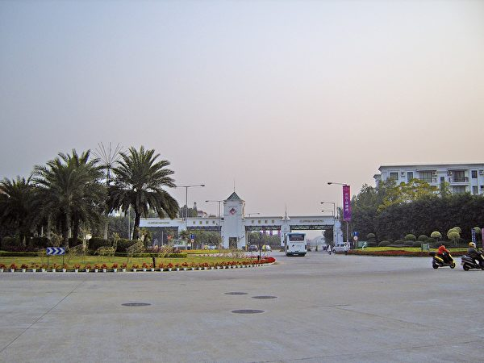

连日爆出9宗武汉肺炎确诊个案的广州番禺祈福新村，已由防控小组介入，实施封闭式管理。(JasonHuen/Wikimedia commons)

 
该医院与患者接触过的医护人员、病人和清洁人员等全部需要隔离，医院全面关门。祈福新村则由防控小组介入，实施封闭式管理。

<b>三家庭互不相识 同一餐厅就餐九人感染</b>

近日，广州市有三个互不相识的家庭，同时有9人确诊。他们曾在同一天，到同一间餐厅用餐，彼此坐在同一排靠窗相邻的饭桌，相继被确诊感染武汉肺炎。

广州市本月初接到一个送检样本，检测后发现，一个一家三口家庭的女主人确诊感染武汉肺炎，其丈夫、女儿亦确诊。随后，当局再接获报告，另一名女患者因身体不适送院，其丈夫确诊染疫。患者均透露曾在大年三十到过同一间餐厅用餐。

疾控中心调查发现，原来上述两个家庭都与一个来自武汉的10人家庭，在同一天的同一时间，在餐厅内进食，3个家庭当日就坐在同一排靠窗相邻饭桌，而该武汉家庭有4人相继确诊。深入追查后确定，这3个毫不相关的家庭相继有9人染病。

<b>多地区爆发社区传染</b>

事实上，武汉肺炎社区传染案已在多地出现。网络视频显示，“温州市联合广场封了，保安发病确诊很久了，没钱看病，一直瞒着。一个联合广场三栋楼，总计468户，一户按3人计算，大约一千二百多人被隔离”。

一段影片指，一名黑龙江女子，走了三县六区，才病发入院，在网上激起众怒。她在医院哭着辩称：“没想到会得这个病，不知道这个病会落到自己头上！”

网友回复称：“不知道，或认识不彻底，都会要命，而且还要别人命！这和官媒一贯的宣传有关，总是给人吃虚假的定心丸，让人心存侥幸！”

<b>武昌医院院长染疫亡 多间医院大批医护感染</b>

武汉肺炎病毒毒性巨大，普通市民防不胜防，就连医护专业人士都难逃其害。

武汉市武昌医院院长刘智明，因感染武汉肺炎于2月17日去世，终年51岁。武昌医院是这次疫情中武汉市的首批定点医院之一，刘智明是主任医生、神经外科专家，也是第一个死于武汉肺炎疫情前线的医院院长。

而在14日，武昌医院的59岁护士柳帆也因感染武汉肺炎去世。柳帆大年初二（1月26日）还上班，当时没有防护衣，结果全家感染，父母过世，柳帆本人在情人节辞世。目前全家只剩弟弟在ICU（深切治疗部）抢救。

10日上午，华中科技大学附属同济医院器官移植科教授林正斌也因感染武汉肺炎去世。

日前，网上传出武汉中心医院后湖RCU（呼吸重症监护病房）的护士长给院领导的求救信。

信中说，后湖RCU是该院首个重症隔离病房，院内同事多人面临生死劫难。除媒体关注的李文亮医生已经去世外，还有胡卫峰医生插管，易凡、梅仲明主任插管抢救。这些惨痛的状况让处于崩溃边缘的医护人员彻底崩溃了。她建议让医院领导安排最早上前线的后湖RCU医护人员隔离调整两周。

<b>回收人民币 消毒隔离或销毁</b>

2月15日，中国央行副行长范一飞在记者会上称，要求疫情重点地区回笼人民币现钞消毒或火烧销毁。其中，疫情防控重点地区的回笼现金，用紫外线或者高温等消毒，存放14天以上再投放市场，至于非疫情防控重点地区现金消毒以后，要求存放7天以上再投放市场。

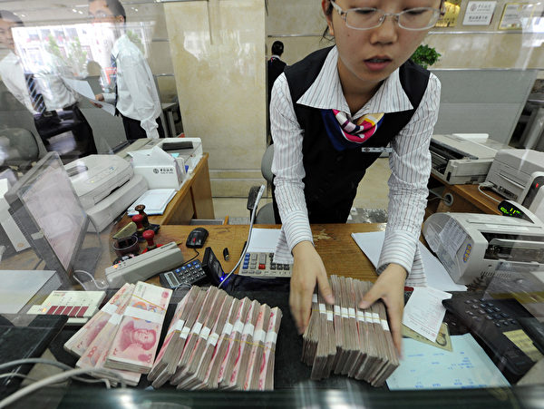

中国央行要求各地银行回收人民币现钞消毒隔离7天至14天，或火烧销毁。(STR/AFP via Getty Images)

 
 深圳人行和各商业银行也在进行现金回收及储存、消毒；对医院、农贸市场等地方回笼的现金消毒清点后缴存深圳人行，不对外投放。

央行人民银行广州分行则要求辖内的各商业银行，将医院、农贸市场以及公共交通行业等回收的现钞，全部上缴回到人行广州分行，由广州分行依照规定直接销毁。

<b>“威士特丹号”爆疫情 同船乘客部分已飞香港</b>

另外，“威士特丹号”邮轮（Westerdam）上周四（13日）获准在柬埔寨停靠后，传出一名83岁美籍女士，下船乘飞机转抵马来西亚后确诊染武汉肺炎。与她同机的数百名乘客，却已四散至世界各地，有部分已飞至香港。

载有2,200人的威士特丹号2月1日自香港出发，因恐有疫情，连日遭日本、台湾、南韩、菲律宾、美国关岛及泰国等地区拒绝靠岸。在海上漂流2周后，13日终获柬埔寨准许停靠西哈努克港（Sihanoukville）。亲中共的柬埔寨首相洪森（Hun Sen），亲自持玫瑰花迎接乘客，更与他们爱的拥抱。

马来西亚周一（17日）表示，与确诊女士同机的130名乘客，已经分别前往美国、欧洲、澳洲和香港。当局亦强调，邮轮曾于1月30日在香港靠岸，游客上岸游玩。

“威士特丹号”邮轮（Westerdam）13日获准在柬埔寨停靠后，传出一名83岁美籍女士下船乘飞机转抵马来西亚后确诊染武汉肺炎。图为2月18日仍停靠在柬埔寨的威斯特丹邮轮。(TANG CHHIN Sothy/AFP)

柬埔寨当局17日下午仍招待部分等待搭机离境的威士特丹号乘客搭观光巴士游览首都金边。参加金边巴士游的乘客面带微笑“比赞”，且全都未戴口罩。1月底，洪森曾表示不会“背弃”中共，又警告记者和官员不准戴口罩，否则会被赶走。

美国范德比大学医学中心（Vanderbilt University Medical Center）传染病专家夏夫纳（William Schaffner）直言没有预料问题会走到这种地步。他表示，上千名乘客各自返家，或许会更难将疫情控制在大陆境内，对全球防疫，“这可能是一个转折点”。

<b>《柳叶刀》：病毒呈无症状高效传播 口罩难防护</b>

近日发表在国际权威医学杂志《柳叶刀》上的论文明确指出，新型冠状病毒（COVID-19）具有三个特征：无症状高效传播，愈后仍带病毒，口罩难以防护。

13日，《柳叶刀》（The Lancet）发表一篇题为“保护卫生保健工作者免受亚临床冠状病毒感染”（Protecting Health-Care Workers From Subclinical Coronavirus Infection）的论文表示，近期证据表明，患者即使没有症状，也可以高效传播，而口罩等传统防护措施，不足以避免感染。

论文举例说，一名感染病毒的10岁男孩没有出现症状，但在肺成像和疾病血液标志物方面都有明显变化。而另一名在武汉接受手术的患者，甚至在发烧前就感染了14名医护人员。

曾前往武汉调查疫情的一位医学专家（应是卫健委王广发）返京后，首现左下眼睑结膜炎，随后才出现鼻黏膜炎和发烧症状。专家表示，该病例提示了新冠病毒具有向非呼吸道黏膜表面移动的向性（tropism），证明口罩不足以有效防护病毒。

加拿大安大略省多伦多最早确诊的两名武汉肺炎患者，经过医院隔离治疗，疾病症状全部消失，已于2周前出院。但随后仍被检测出新型冠状病毒，核酸检测结果为阳性，目前在家中自我隔离。

上述病例表明，新冠病毒不但传染力超强，还不容易根除，即使患者的表面症状治愈了，也同样可能顽固留存于患者的体内，仍然可以大量散发病毒并感染其他人。

世界卫生组织亦表示，目前对于武汉肺炎无特效治疗方法，也没有针对性疫苗。

专家表示，人类目前没有任何医疗手段，只能靠自身的免疫系统去对付，提升自身的免疫力是关键。

<a target="_blank" href=#top><h6 align="right">回上方</h6></a>

<a name=153>
<h1 align="center"><b>武汉封城 其他重病者求医难 外地人盼回家</b></h1>

武汉封城导致大量非疫患者有病无医，不能到外地治疗，也导致很多滞留在武汉的外地人无法回家。图为1月22日武汉封城前一天，人们在汉口火车站等待出行。 (Getty Images)

 
 【大纪元2020年02月18日讯】（大纪元记者李新安采访报导）武汉封城后，大量新冠肺炎患者得不到确诊，只能在家隔离，而很多非新冠患者更是有病无医、处境非常艰难。此外，大量过年期间往来走动的人群被滞留在武汉，无法回家。

疫情爆发，武汉各大医院人满为患，医疗资源严重不足。江汉区的王女士2月14日告诉记者，她的母亲是高血压患者，因为肝脏感染严重，炎症引起休克，持续高烧39℃，有生命危险，但住院问题一直没有解决。“现在医院全部针对肺炎疫情，所以其他的病人都被忽略了。”

“母亲是非新冠的患者，现在隔离点，等待核酸检测的双阴程序。我母亲的CT是没有问题的，她的肺是完好的。”王女士介绍说，母亲因为别的病发热，发热病人只能去江汉区的三家定点医院。武汉封路了，社区不管派车送发热病人，病人只能步行。

她表示，“我拖着妈妈去看病，但妈妈已经完全走不动了。爸爸患有心脏病高血压，身体状况也非常糟糕。现在的每一天真的都变得越来越艰难了，我们全家心态都崩了。”

“我们寻求了120和社区的帮助，（他们对患者像）踢皮球一样踢来踢去。协和医院又去了几次，不给开针开药，说必须住院治疗，但是医院又不收，这完全是个死循环啊！”

王女士原本在上海工作，现在也回不去了。她最近听说非新冠病人有申请到外地救治的先例，希望母亲也可以被放出去接受治疗。

微博用户“爽朗的微微笑527”发帖称，自己的女儿去年5月份患上急性淋巴细胞白血病，发烧、腿痛、骨痛，病情复发，等待移植重获新生。可是因为疫情，协和的移植仓已关闭，只能做化疗。

二十岁出头、不愿再忍受疼痛折磨的女儿一度要求安乐死。母亲在网上求救，“重症在身的我的女儿，白血病，急需移植，不能等，她也是鲜活的一条生命……想上北京大学人民医院移植，又出不了省，他们也不接收来自重灾区的病人，怎么办？”

2月10日，武汉市古田街道罗家墩社区，一名70岁的重症尿毒症患者，社区一直未能安排核酸检测，医院不收。原本每周需透析3次的老人已经8天无处透析，在病痛与绝望中跳楼自杀。

2月15日，武汉一社区开始在居民群里统计尿毒症门诊透析者、高血压重症、心脑血管患者、恶性肿瘤等重症患者及孕产妇。患者要到医院住院治疗的，需要发消息给网格员。

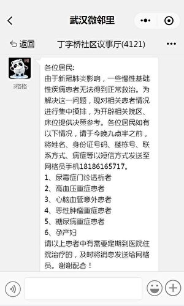

武汉一重症尿毒症患者跳楼自杀后，一社区开始在居民群里统计尿毒症门诊透析者等重症患者及孕产妇。（网路图片）

有武汉网友表示，“武汉封城23天了，尿毒症患者跳楼5天了，才第一次看到有工作人员在社区群里统计慢性病患者，还只有这一个社区，大部分社区连这个都做不到，这么多天，这么多严重慢性病患者彻底被遗忘了吗？防疫部门、疾控、医疗、那么多公务员在干嘛呢？”

<b>封城阻断归路 万人滞留武汉城</b>

封城阻断求医路，也阻断了归乡路。被困在这座城里的，除了求医问病的重症患者，还有很多过年期间往来武汉的滞留人士。

岳先生一家年前回妻子的湖南老家过年，原计划1月28日回安徽老家。当天途经武汉时，车子突然坏了。张先生想着赶紧找个地方修车，下高速的时候没有遇到任何人检查，等车子修好再上高速的时候就被截住了，不许出城。

岳先生无奈只好在武汉找个地方住下来，这一住都快20天了。期间他给武汉市交通局、公安局、市长热线打电话，都说没有办法。

张先生告诉记者，目前一家三口住在宾馆，一天的费用差不多200块。在宾馆很少出门，10天、8天出去买一次东西，买个电饭煲、买点米自己烧饭吃。在武汉人生地不熟的，现在租房子也租不到的，这个时间点很多东西都停滞了，小区都封起来了。

在宾馆“隔离”了二十多天后，张先生特别着急回家。他表示，“像我们这样明明没有生病的外地人，在这里没有固定的居所，这时候生活很难，能不能开个绿色通道，我们回自己家里去隔离也可以。”

张先生70岁的老母亲一个人在家，罹患肺癌。而且老家的公交车也停了，老人不方便拿药，家里没人去跑腿照顾。

张先生希望多一些人了解滞留人士的处境。“我们还算好一点的，还有一些住在地下车库的，可能身上没有太多钱，都住在那边。我在网上群里，发现像我这种情况有很多。估计在武汉滞留的最起码有几万人，整个湖北滞留的据说有30万人。”

<b>资深媒体人：封城不能根本解决治疗和隔离问题</b>

前凤凰卫视新闻总监庞忠在接受大纪元采访时表示，这种封城的做法不能从根本上解决治疗和隔离的问题，当局没有把真正有病的人隔离开来，只要有一例就会蔓延开来。

“真正得病的人不都在医院，还有一部分流散在社会。他为什么封城呢？就怕社会上这部分得病的，传到外省去，他宁可在武汉内部消化，互相人传人，不让它传到外面去，是一个区域性的措施。这对1100万武汉人来讲不公平。”他说。

庞忠认为，实际上武汉肺炎已经通过各种渠道传出去了。在城内的好多人，按道理来讲，应该把真正有病的放在一个区域，需要检查的去检查。确诊得肺炎的到病房去，没有得的就要疏散到安全地方。现在混在一起，没病的也得病了，有病的得不到治疗。

他强调，“好多需要到外地看病的，不让你出去，是不人道的。封城不是负责任的态度，没有好的措施真正来把疫情处理好。内部需要妥善措施，外部需要请国际上的专家会诊，共同解决发病的病源和治疗问题。”

<a target="_blank" href=#top><h6 align="right">回上方</h6></a>

<a name=152>
<h1 align="center"><b>【独家】湖北文件曝光 1600人监测舆论</b></h1>

大纪元获悉湖北省委宣传部内部文件。（大纪元）

 
 【大纪元2020年02月18日讯】（大纪元记者骆亚报导）湖北官场一批官员被习近平当局以处置疫情不力为由下台后，湖北省宣传部为新上任的省委书记应勇，准备了一份工作汇报，从中揭示中共组织1600人来监控、删帖、找人，用所谓正面宣传来对冲负面舆情。

大纪元从知情者处获得一份湖北省委宣传部的工作汇报的内部文件。文件表示，2020年2月10日，习近平在北京与湖北武汉抗击肺炎疫情前线进行视频联系，并发表“重要讲话”。

湖北省宣传部部长王艳玲随即召集宣传部疫情防控指挥部进行“深入学习”，明确要“进一步提高政治站位，加大宣传工作创新力度，做好疫情防控宣传教育和舆论引导工作”。

新华网报导，2020年2月10日，习近平视频连线武汉市一线医护人员。（网站截图）

 
 成立11个工作组应对战时宣传工作

文件说，湖北首先进行“完善战时宣传工作机制”，将省委宣传部和网信办联合设置指挥部，进行一体化运作，成立包括“舆论引导管控、舆情及时回应、意识形态管控等11个工作组”。

并要求全员24小时在岗，每天与省防控指挥部各工作组对接，还要每天与中央的指导宣传组开会等，来“确保宣传教育和舆论引导工作”。
调动超过1600人来监控网络言论

文件说，由于这次疫情居家的特殊情况，他们将“网络作为宣传的主阵地，让主力军上主战场，调动了超过1600人来管网络言论，并作为业绩汇报”。

他们声称统筹、调动、覆盖省市县三级，包括高校直报点、网络媒体平台等1600余人舆情监测队伍，采取人盯和技防的方式，24小时全网覆盖监测。监测到所谓敏感有害信息60.68万条。

他们还采用“线上及时辟谣”与“线下有力打击”的手法来对付网上真实的民意。

文件称，截止2月14日，湖北省宣传部报请中央网信办删除所谓的“谣言和有害信息5.4万余条”；另一方面，他们还组织网络大V撰写“网评文章近400篇”，并组织五毛入群，及时“跟评40万余条”，并称此举是“以主动发声对冲负面舆论”。

此前，武汉疫情吹哨人李文亮2月6日去世后，各种悼念支持的贴子，外界注意到，三天内基本在网络消失，应与上述中共网控相关；而网警还纷纷警告向外求救疫情受害人，并要求他们撤帖。

而网上关注度极高的公民记者陈实秋、方斌被失踪，湖北的宇飞因为关注当地物资短缺，跟全国甚至是海外人联系捐赠物资，被拘留一周才获释。
33家外媒60名记者，“劝退”47人，仅剩5家13名记者

湖北省宣传部制定得《关于外媒记者来鄂采访新型冠状病毒肺炎的应对方案》，出台了10条具体措施。

汇报中还可见，武汉疫情爆发后，共有33家境外媒体60名记者到武汉采访。在他们的“劝导”下，已有47名记者离开武汉。截至2月14日晚，还有五家媒体13名记者在当地，包括美国《纽约时报》《华尔街日报》、法国电视台、香港无线电视及香港凤凰卫视。

文件还称，在湖北权威发布的外文版块，推送了英、法等7个语种疫情相关信息近200条，来引导境外媒体客报道疫情信息。

湖北省并“劝导”外媒记者。1月15日，香港一些媒体记者在医院附近采访时被带到医院派出所调查，被要求删除在医院范围内拍摄的影片，传唤一个半小时后才获释。

当日，专门收治武汉肺炎患者的金银潭医院守卫森严，有保安到处巡视，医院外还有便衣戒备，所有病患被隔离在住院部南楼，大门锁上。

湖北宣传部还称，利用湖北省主要媒体，充分展示“一方有难、八方支援的大爱精神”，宣传他们官方举措的效果，还要“生动讲述一线人员的感人故事”。

文件还表示，已“加强正面宣传主题策划”，做到每日研判、每日策划，“集中火力开展集束式正面宣传，有效对冲负面舆情”。

大纪元评论文章曾经指出，每逢重大灾难，官媒都会使足了劲进行煽情宣传，千方百计把丧事办成喜事，但受害家属的悲痛、对真相的探寻和对灾难的反思与追责，却被有意淡化甚至掩盖了。

大纪元从知情者处获得一份湖北省委宣传部的工作汇报的内部文件。（大纪元）

<h3 align=center><a href="https://i.epochtimes.com/assets/uploads/2020/02/Hubei200215.pdf">文件链接(点击右键,另存新档）</a></h3>

<a target="_blank" href=#top><h6 align="right">回上方</h6></a>

<a name=151>
<h1 align="center"><b>【更新】武汉大量病患生死线挣扎 湖北缺粮</b></h1>

新型冠状肺炎发生以来，突然倒地的现象增多。(Feng Li/Getty Images)

 
【大纪元讯】中国武汉去年12月爆发不明肺炎，今年1月8日确定疫情的病原为新型冠状病毒，世界卫生组织1月13日将此病毒定名为“2019新型冠状病毒”（2019-nCoV）。

目前，武汉肺炎疫情已在中国失控蔓延。疫区中心的武汉因医疗资源极度匮乏，很多病患无法确诊和救治，只有等死；其它地区也日趋严重，中国已有八十多个城市实施封城等“封闭式管理”，包括北京上海等一线城市。专家及民间指有超十万的感染人数，远远大于官方统计。

2月10日，大陆多地复工，但外界担忧风险太大，尤其北京。

疫情也扩散29个国家和地区，迄今海外确诊逾1000例，死5例。美国、加拿大、日本、韩国、台湾、欧洲各国纷纷加紧撤侨，已有六十多个国家和地区对中国公民或自中国出境的人士采取暂时性限制措施，并停航或部分停航。

世界卫生组织（WHO）警告，新型冠状病毒所带来的全球威胁可能比恐怖主义还要严重。世卫已宣布新冠病毒肺炎（武汉肺炎）为“国际公共卫生紧急事件”。

在疫区或进入疫区的民众，应避免出入市场、医院等公共场所及人多的地方，也不要接触野生和禽畜类动物，禽肉及蛋类要熟食，同时做好个人防护措施：以肥皂勤洗手、戴口罩。

本文将持续更新每日重点事件。

2月18日：武汉大量病患在生死线上挣扎，湖北断粮？封城封区封声，习近平掀“人民战争”？中共终于让美国专家进入，但世卫考察组避去武汉 北京内心有鬼？

（北京时间2月19日8:00更新）

<b>●【直播回放】2.18新肺炎追踪：公安监督复工</b>

“移动式焚化炉”进武汉 网民：死多少人？武汉新冠肺炎疫情蔓延之际，近20台移动式“垃圾和动物尸体处置方舱”将进武汉。网民纷纷质疑：“到底死了多少人？”“不够烧，还要调派移动焚化炉……”

武汉疫情失控，大量病患得不到安置和医治，在生死线上挣扎。对于许多原本需要定期做透析才能延续生命的尿毒症患者，感染上新冠病毒，更是雪上加霜。大纪元采访多位患者及家属，呈现他们的现况。

武汉传出有病患在方舱医院里“穿墙逃出”？武汉病毒研究所被各界质疑是病毒外泄的源头，近日传出一封该所所长王延轶的内部信件，要求所内所有人员配合高层掩盖疫情，不得透露。

新冠肺炎“零号病人”成谜 7旬脑梗老人？新冠病毒肺炎疯狂蔓延，这场疫情究竟从何而起，至关重要的“首例病人”传染经过仍迷雾重重。而不断发表的研究成果，正把这场疫情的首发时间不断推前。

近日网上传言，北京西城区某部门出现一例新冠肺炎确诊病例，导致西城区政府工作停摆。西城区区长18日承认有一例新冠肺炎确诊病例，69人隔离，但否认工作停摆。

中共官方报告，至今累计确诊74,279（新增1,751）；重症11,977；疑似5248例；死亡2006例（新增136例）。外界一直质疑数据缩水，这里只作为参考。

<b>●封城封区封声 习近平掀“人民战争”？</b>

中国民间有句话，上头动动嘴，下面跑断腿。北京当局的一句“人民战争”，整个社会似乎又回到了红卫兵时代，人伦惨剧不断发生。北京当局防疫控疫掀起全国的“人民战争”，使全国立刻陷入了一片红色恐怖。

视频：大陆各地红卫兵式暴力防疫 引众怒：中共隐瞒疫情，致使武汉肺炎迅速在全国蔓延。疫情失控后，中共各地又用红卫兵式暴力防疫视频曝光：随便抓人、打人、游街示众等等，就是一家人在家中打牌，也会被抓、被打等，引发民众的愤怒。

<b>●湖北文件曝光 1600人监测舆论</b>

湖北官场一批官员被习近平当局以处置疫情不力为由下台后，湖北省宣传部为新上任的省委书记应勇，准备了一份工作汇报，从中揭示中共组织1600人来监控、删帖、找人，用所谓正面宣传来对冲负面舆情。

<b>●报告：新冠病特征同SARS MERS很类似</b>

首份新冠肺炎患者病理报告显示，新冠肺炎的病理特征与传染性非典型肺炎和中东呼吸综合征感染者的病理特征非常相似。

<b>●湖北断粮？敲响中国粮食危机警钟</b>

2月14日，媒体报导了黑龙江急调3000吨大米驰援湖北的新闻。难道短短不到10天的时间，湖北就吃完了半年的储量吗？如果不是，那些粮食到哪里去了，或者说，湖北到底还有多少储量？这是一个细思极恐的问题，整个中国，还有多少存量？

<b>●美国专家进入中国 世卫考察组避去武汉 北京内心有鬼？</b>

美国的顶级传染病专家作为世界卫生组织的专家组成员，在历时1个多月后终于被中共当局允许进入中国境内。美国国务卿迈克·蓬佩奥（Mike Pompeo）表示，中共让美方“花了太长时间才让医学专家进入”，他敦促北京在流行病肆虐的情况下提高开放度。

2月17日中共国家卫生健康委新闻发言人表示，中国-世界卫生组织（WHO）联合专家考察组将于当日赴北京市、广东省和四川省开展现场考察，专家考察组“对中国采取的综合防控措施和取得的成效给予赞赏”。

<b>●钻石公主号成海上小疫区 各国撤侨进度一览</b>

停泊在日本横滨港隔离检疫的钻石公主号邮轮病例频频暴增，截止目前为止，邮轮确诊感染人数达454人，俨然成为中国以外的小疫区。为此，多国将安排包机接回邮轮上的本国公民。（详情点阅）

钻石公主号游轮上今天（18日）又新增88个确诊感染新型冠状病毒肺炎的病例，其中65人没有症状。截至目前为止，该游轮上已累计有542例确诊。

<b>●美商会：近80%在华美企无法开工 1/3将迁出</b>

上海的美国商会日前的调查显示，在华企业中，有78%的受访者表示现在无法开工，还有1/3的企业称将把其业务迁出中国。

<b>●疫情蔓延29个国家和地区。累计海外确诊1015例，死亡5例</b>

在中国大陆以外，新型冠状病毒已经蔓延28个国家和地区。

海外新增确证病例120例：香港2例；日本97例；新加坡4例；韩国17例。

累计确诊病例1015例：香港62例；台湾22例；澳门10例；日本616例；新加坡81例；泰国35例；韩国46例；马来西亚22例；德国、越南各16例；澳大利亚、美国各15例；法国12例；英国、阿联酋各9例；加拿大8例；印度、菲律宾、意大利各3例；俄罗斯、西班牙各2例；芬兰、瑞典、尼泊尔、柬埔寨、斯里兰卡、埃及、比利时各1例。

累计死亡5例：菲律宾、香港、日本、法国、台湾各1例。

2月17日：武昌医院院长病逝，多地复工，无症状感染者成隐患；新冠病毒的神秘来源；习近平讲话官场或酿更大风暴

（北京时间2月18日8:00更新）

<b>●武昌医院院长死于新冠肺炎 大批医护感染</b>

2月17日周一晚，微博认证为湖北省卫健委宣教中心党委书记、主任的账号@全科健康发布信息称，武昌医院院长刘智明因感染新冠肺炎于2月17日去世，终年51岁。

【一线采访】被疑染疫遭隔离 脑溢血患者命危

湖北省襄阳市一位刘女士泣诉，医院“草菅人命”，将原本脑溢血术后恢复良好的母亲送往隔离医院，“医生的盲目决定，我的妈妈受尽折腾，受了那么多罪，病情越来糟，越恶化！”刘女士的母亲本身就有基础病，做了三四年的肾透析，一直维护得很好，2月5日凌晨突发脑溢血被送往襄阳市中心医院北区治疗。

【一线采访】武汉第一医院食堂向外求援

近日，网上传出武汉市第一医院食堂的求助信息，称该医院被整体征用，上千人进驻，医院食堂的蔬菜、大米已经不够，请求外界捐助。但医院很快“辟谣”。

<b>●北京杭州全面复工 多地无症状感染者成隐患</b>

中共不顾武汉肺炎疫情蔓延之势，要求地方复工。北京市已有43家市属国企全面复工；杭州的小超市、理发店等陆续开门。此外，至少16个省出现无征状感染者，恐成为隐形杀手。

疫情当前，大陆餐饮业者要想店面重新开张不易，大多数只能以经营外卖为主，无法实现真正盈利，已经有餐饮业老板做好了倒闭的准备，最坏的打算是“卖完最后一套房就解散”。

<b>●【病毒探源】调查报吿：新冠病毒的神秘来源</b>

本文从流行病学调查、病毒基因比对、跨物种感染研究以及关键的“中间宿主”等五大领域，对新冠病毒来源进行了全景式梳理与深度挖掘，为读者提供一个深刻而全新的视角。

<b>●中共掩盖疫情 美参议员再质疑武汉病毒所</b>

新型冠状病毒疫情在中国已经失控，因中共未能提供充分可信的疫情数据，周日（16日），美国参议员汤姆·科顿（Tom Cotton）表示，中共对冠状病毒爆发的严重性“仍在说谎”。

中共长时间隐瞒致武汉肺炎疫情延烧全国，二十多个省市“封闭”，死亡和感染人数成谜。然而中共国家卫健委官员在17日的工作会上仍声称武汉肺炎“可防可治”，消息一出立刻遭中国网友骂翻。

中共官方报告，至今累计确诊72,528（新增1,893）；重症11,741；疑似6242例；死亡1870例（新增98例）。外界一直质疑数据缩水，这里只作为参考。

<b>●武汉市长“失踪”官场酿更大风暴</b>

一幕幕揪心的场面，一声声刺耳的哭诉，无数的家庭支离破碎，有的甚至全家罹难……很多人把剑锋指向了罪魁祸首中共，认为这是中共一手制造的人祸。习近平前不久的讲话全文曝光，一场大风暴，可能正在慢慢逼近。

<a target="_blank" href=#top><h6 align="right">回上方</h6></a>

<a name=150>

2020年02月19日，神韵国际艺术团2月18日在佛州圣彼得堡进行了第五场演出。图为马哈菲剧院（Mahaffey Theater）。（新唐人电视台）

 <h1 align="center"><b>神韵复兴中华传统 佛州主流精英倾心赞佩</b></h1>
 
 【大纪元2020年02月19日讯】（大纪元记者林南宇、文烨美国圣彼得堡报导）2月18日下午，佛州圣彼得堡的马哈菲剧院（Ｍahaffey Theater） 举行了神韵国际艺术团在当地的第五场演出。神韵艺术家将中国古老的文明神奇再现，让观众感受到中国传统文化的历久弥新。谢幕时，很多观众起立鼓掌，全场气氛热烈。

神韵的节目精彩纷呈，从天国世界到中土大地，从辉煌的宫殿到庄严的佛寺，从远古历史到现代社会，一个个荡气回肠的传说与故事，带给人心灵的震撼与生命的洗涤，也将天人合一的境界与世事变化的天机完美演绎，令观众们回味无穷。

<b>获总统奖专家、研究所董事：神韵艺术水准非常高</b>

2020年2月18日下午，佛州住房研究所董事、获奖环保专家Charles Reith 先生（左）观赏了神韵国际艺术团在圣彼得堡马哈菲剧院的第五场演出。（林南宇／大纪元）

 
 “演出中第一幕那云蒸霞蔚的胜景给我留下了非常积极的印象。”佛州住房研究所董事Charles Reith赞叹道。他认为神韵演出的“音乐水准、艺术水准、乐团水准都非常高！”

他说：“我料到这场演出的音乐风格会非常多样，而演出绚丽夺目的色彩和音乐确实达到了我的预期。”

他认为，神韵的音乐表现了中国不同朝代及多个民族的音乐风格，因此当他了解到演出中所有的音乐都是由神韵艺术总监一人创作的时候，不禁赞叹起来。

“这太了不起了，演出中的音乐给我留下了很深的印象，而一个人能够表现出中华历史文化不同层面的风格，这需要怎样的才智啊！” Reith说。

他表示，演出激发了他对中国文化的兴趣，他非常渴望更多地了解中国文化的多样性。

Reith是位环境学专家，前大学环境管理学教授，也曾担任过公司高管。他曾因环保方面的成就而获得前美国总统老布什（George H.W. Bush）颁发的“西奥多罗斯福资源保护奖”（Theodore Roosevelt Conservation Award） 。

<b>神韵复兴传统文化 基金会前总裁：伟大使命</b>
 

拯救美国基金会（Save American Foundation）前总裁Fred Brownbill与妻子Fred Brownbill观赏了神韵演出。（文烨／大纪元）

 
 拯救美国基金会（Save American Foundation）前任总裁Fred Brownbill观赏演出后，为神韵展现的中国五千年文化精髓赞叹不已。拯救美国基金会是大型的国家和国际教育，政治保守派基金会。

Brownbill表示，神韵的故事虽有悲伤的情节，但他喜欢那些故事，所有的一切都精彩得令人叹服。“（中共）迫害的行径是错误的，这件事情到现在还在发生，实在令人感到悲痛。”

“我认为，（神韵复兴传统文化）是一项了不起的伟大使命，而且应该在世界舞台上彰显出来，让更多的人受益。”

<b>前美海军总军士长：盼神韵推动中国人精神信仰</b>
 

2020年2月18日下午，前美国海军总军士长、潜艇战专家Tim Tully与全家人在马哈菲剧院观看了神韵演出。（文烨／大纪元）

 
 前美国海军总军士长、潜艇战略专家Tim Tully称赞道，“这场演出的重点就是神性表现和精神信仰。”

对于神韵艺术家以恢复传统文化、正统信仰，找回失落的文化的宗旨，Tully表示，他对此感到由衷地钦佩。“我完全赞同他们的使命，他们将复兴中华传统文化的主旨，巧妙地运用了非常有特色的舞蹈和音乐。”“我很荣幸可以认识到中华文化的历史和她的内涵及传统的精随。”

Tully想对神韵艺术家说，“继续下去一定会成功，用艺术来推动中国人的信仰和文化价值，是一件非常有意义和有价值的事。”

他表示，神韵藉由舞蹈、歌唱和音乐，将有能力推动中国人提升道德、价值观和精神信仰，而使中国的未来更为进步。

<b>政府律师：男高音歌声充满力量</b>
 
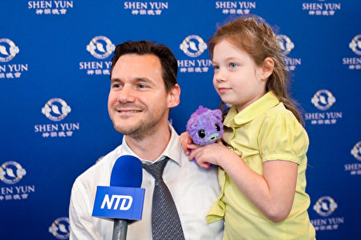

2020年2月18日下午，政府律师Justin Fahringer带着女儿Isabella Fahringer观赏了神韵演出，他称赞男高音的独唱演出非常优秀。（新唐人电视台）

 
圣彼得堡当地的一位政府律师Justin Fahringer带着女儿Isabella Fahringer观赏了演出之后表示，他非常喜爱演出的故事情节、色彩和舞蹈，特别是中西乐器合璧的交响乐团和演出中的神性题材。

Fahringer说：“演出中的乐团演奏给我留下了很深的印象，因为乐团中的很多乐器是我以前没有见识过的， 那些乐器的乐音太美了。”

他认为，演出中那位男高音的独唱也非常优秀，“我能够体会到，他的歌声充满了情感和力量。 ”

Fahringer认为，神韵艺术家复兴中华文化的努力非常成功，他说：“这场演出就是一个非常好的开始。 ”

Fahringer和女儿Isabella Fahringer还从演出中体会到了信仰的力量和神迹。

<a target="_blank" href=#top><h6 align="right">回上方</h6></a>

<a name=149>
<h1 align="center"><b>王友群：习近平不想背黑锅 只有一条路可</b></h1>

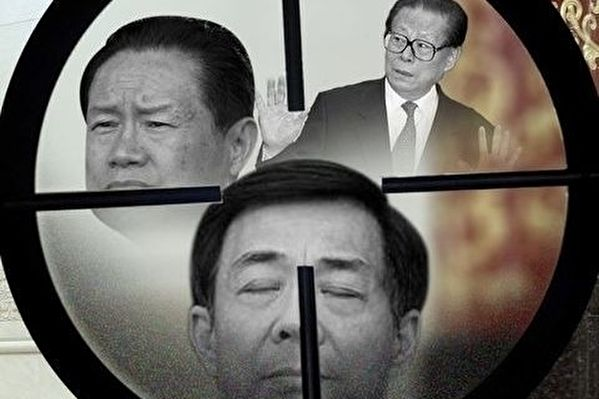

中共迫害法轮功血债累累（大纪元合成图）

【大纪元2020年02月19日讯】近日，武汉女作家方方在一篇“封城日记”中，记录了一个护士一家4口和她的一个中学同学病逝的消息。她写道：“一向为盛世而高歌的同学们，这次却说：不枪毙一批害人精不足以平民愤！”

<b>越来越多的人在绝望中死去</b>

进入2020年，一场武汉新冠肺炎，突如其来，将中共制造的“盛世”美景击得粉碎。在中共封城、封区、封楼、封户、封口、封网、封死讯的严密封锁下，一幕幕家破人亡的惨剧，在武汉，在湖北，在全国频繁上演。

其中，最让人肝肠寸断的是，越来越多的人在绝望、无助、悲泣中走向死亡。

方方在一则日记中写道：“这几天，死亡者似乎离自己越来越近。邻居的表妹死了。熟人的弟弟死了。朋友爹妈和老婆都死了，然后他自己也死了。人们哭都哭不过来……但这一次灾难，对于早期的感染者，不止是死亡，更多是绝望：是呼救无用，求医无门，寻药无着的绝望……他们死前的痛苦和绝望感，比深渊更深。今天跟朋友说，天天听到这样的信息，心情怎么可能不压抑不难过？‘人不传人，可控可防’这八个字，变成了一城血泪，无限辛酸。”

2020年1月1日，武汉警方“依法查处”了8名讲真话的医生之后，中共的媒体开始持续造谣说，“没发现人传人”，“没发现医护人员被传染”，“可防可控可治”。就在这一片谎言声中，人传人越来越厉害，医护人员被传染的越来越多，疫情从武汉传遍湖北全省，传到中国31个省、自治区、直辖市，甚至传播到海外几十个国家和地区。

死亡人数越来越多。殡仪馆的人手不够，拖尸体的车不够，火化炉不够，收尸袋不够，不得不从外省调集殡葬人员，增加车辆，紧急赶制100万个收尸袋。

武汉到底死了多少人？湖北到底死了多少人？中国到底死了多少人？没有人能知道确切数字，因为中共一直在造假。可以肯定的是，实际死亡人数远高于中共的统计数字。

<b>中共制造的又一场特大人祸</b>

武汉新冠肺炎大爆发，是中共迫害法轮功20年后，祸害武汉人、湖北人、中国人，乃至于世界各国人的又一场特大人祸。

1999年7月20日，中共独裁者江泽民发动对敬天信神，按“真、善、忍”做好人的法轮功学员的疯狂大迫害。这场迫害已持续20年，制造了21世纪全世界最大的人权灾难。湖北省、武汉市的一些“人权恶棍”，为升官发财，追随江泽民一伙政治流氓，把湖北省、武汉市变成了迫害法轮功的重灾区。

突出表现在：拍摄诬蔑、攻击、抹黑法轮功创始人李洪志先生的电视片，在全国无数遍地播放，直接责任人是时任武汉电视台台长赵致真；参与大规模活摘法轮功学员器官，主要责任单位有武汉同济医院等；为中共迫害法轮功制造理论根据，主要责任单位是武汉大学；广设洗脑班摧残法轮功学员，主要责任单位是湖北省610办公室、武汉市610办公室；将许多法轮功学员迫害致伤、致残、致疯、致死，主要责任单位是湖北省、武汉市的公、检、法、司。

此次武汉新冠肺炎大爆发，已经严重危及14亿中国人民的生命安全，对世界各国人民的健康也构成威胁。

从美国方面来说，从一开始，事实上，是把它当成一次生化武器泄露导致的灾难来对待的。1月29日，载有201名美国公民的撤侨包机，从武汉机场起飞。机上只有两名全副武装、身穿生化防护服的美国疾控中心检疫官员。美国总统川普已下令美国科学家查清病毒源头。白宫成立了应对新冠病毒特别小组，川普总统经常听取汇报。

武汉病毒研究所是中国最大的研究全球最危险病毒的中心。美国等一些国家的专家认为，这个研究所也是中共生物战、病毒战的研究中心和实验基地。美国《生物武器反恐法》起草人Francis Boyle认为，新冠病毒具有潜在的致命性、攻击性，具足生物武器的所有特征，它就是从武汉病毒研究所泄漏的。

现在，国内外越来越多学者认为，武汉新冠病毒是“人工合成”的。美国生物基因分析专家里昂斯维勒表示，新冠病毒有使用“P-Shuttle SN Vector”的人造技术，基因组序列被插入奇怪的元素，该元素不可能存在于任何地方的野生动物体内，它肯定来自实验室。2月3日，俄罗斯联邦卫生部长在官网发布的文件《预防 诊断 治疗新型冠状病毒》中认为，新冠病毒是一种合成病毒。在中国，在武汉，“人工合成”病毒并外泄的最大嫌疑者，就是武汉病毒研究所。

据《燕铭时评》2月7日播报，中科院上海生命科学研究院知情人士Q先生披露，武汉病毒研究所是江泽民之子江绵恒的亲信舒红兵实际掌控的。舒红兵是中国科学院院士、武汉大学教授、副校长、医学研究院院长。比他小14岁的妻子王延轶，是武汉病毒研究所所长。

今年1月底，习近平派军队首席生化专家陈薇少将接管了武汉病毒研究所。2月14日，习近平在中央深化改革委员会会议上讲话时，首次提到“生物安全”，并5次强调“生物安全”。

旅美经济学者何清涟在Twitter上表示，据习近平的讲话推测，有关武汉新型冠状病毒来源，北京应已有内部调查的初步结论，武汉病毒研究所恐怕“难逃其咎”。

<b>习近平不想背黑锅只有一条路可走</b>

2月16日，“求是网”发表习近平在中共政治局常委会会议研究应对新冠肺炎疫情工作时的讲话。习近平特别谈到：“武汉新型冠状病毒肺炎疫情发生后，1月7日，我主持召开中央政治局常委会会议时，就对新型冠状病毒肺炎疫情防控工作提出了要求。”

习近平之所以发表这个讲话，一个重要原因是，下面的人对他阳奉阴违。习近平1月7日关于防控肺炎疫情的要求，新华社当天的报道只字未提。谁干的这个事？只能是江泽民的亲信、主管宣传的中共政治局常委王沪宁。

习近平为了保党，在中共十九大前，与江泽民妥协，反腐打虎打到原中共政治局常委、中央政法委书记周永康止步，没有抓捕江泽民。擒贼不擒王，必然遭祸殃。中共十九大以后，江泽民安插在习近平身边的亲信王沪宁等，经常对习“高级黑”、“低级红”，把习捧上天，摔下地，同时，在内政外交上，不断给习制造麻烦。

中美贸易协议，王沪宁等一再想把它搅黄了，但是，没有成功。2020年1月15日，中美签署第一阶段贸易协议。香港问题上，江泽民亲信、中央政法委书记郭声琨一再激化矛盾，想迫使习出兵镇压，然后把习赶下台，这一招也没有成功。2020年，武汉肺炎疫情爆发，王沪宁等又开始使劲祸乱，目的是想将中共过去几十年作恶的黑锅，让习一个人背，最后一次跟习算总账。

但是，这次武汉新冠肺炎疫情大爆发，死的人太多了，习近平背不起这个黑锅。

立即抓捕江泽民，彻底解体中共，习近平可绝处逢生。

<a target="_blank" href=#top><h6 align="right">回上方</h6></a>

<a name=148>
<h1 align="center"><b>夏小强：湖北断粮 敲响中国粮食危机警钟</b></h1>

大陆的粮食危机已经突显，中储粮成为最大的贪腐基地无疑令粮食危机雪上加霜，三大主粮“净进口”、干旱等等因素，导致粮食危机一触及发。(网路图片)

 
 【大纪元2020年02月19日讯】武汉肺炎爆发扩散之后，粮食储备是否充分，成为中国民众特别是疫情最为严重的湖北民众，一个最为关切的问题。

2月1日，湖北日报报道说，湖北储存的粮食可以让湖北民众消费一年以上。

2月5日，中国青年报报道，中储粮称，中储粮湖北分公司库存的1000万吨粮食，可满足湖北6000千万人半年以上需求。

虽然中国青年报拦腰砍去一般湖北的粮食库存，但是，毕竟还有半年的粮食库存。

但是，2月14日，媒体报道了黑龙江急调3000吨大米驰援湖北的新闻。难道短短不到10天的时间，湖北就吃完了半年的储量吗？如果不是，那些粮食到哪里去了，或者说，湖北到底还有多少储量？这是一个细思极恐的问题，整个中国，还有多少存量？

因为，自古以来，瘟疫过后往往伴随着大饥荒。中国的粮食危机，在这场突如其来的瘟疫下，再次浮出水面。

这二十多年来，中国大陆天灾人祸不断，异常极端气候频现，或洪水泛滥，或严重干旱；而大陆各地方政府为GDP数据增长，大肆破坏环境，导致人均耕地减少、土地重金属污染、沙漠化，导致粮食危机迫在眉睫。中国从一个传统的粮食出产大国变为粮食进口国。

据中国农业部预测，2020年中国的粮食产量应为5.54亿吨，而实际需求量则是7亿吨，缺口近2亿吨。

目前中国的粮食自给率不足80%。国际上普遍认为，当一个国家的粮食自给率不足90%，社会可能不安；如不足70%，就可能引发动乱。

美国是世界粮食最大出口国，而中国则是世界最大的粮食进口国。据中国海关数据显示，2018年，进口粮食达到1085亿吨，为世界进口粮食的最大国，其进口粮食主要来自美国。

造成中国的粮食危机，并非来自天灾，或者是中共实行的错误的土地政策等原因，这些都可以通过纠错改正来解决。中国的粮食危机处于无解状态，主要是来自中共体制和政权造成的无法解决的问题。

那就是中共体制下产生的体制性腐败，那些贪官和粮食蛀虫所干下的邪恶之事：掏空粮库、以旧粮换新粮、放火烧粮仓等。

早在1998年5月，安徽南陵县为了应对时任中共国务院总理朱镕基的视察，从外地调运1,031吨粮食到该县粮站，“人造”出粮食满仓的景象。倪发科时任中共芜湖市委副书记，事发的前一天，他还领着一大帮人赶去验收粮仓。倪发科造假被揭穿后，朱镕基怒斥：“连我都敢骗，真是胆大包天！”

2013年以来，成立于2000年的中储粮腐败案件和事故频繁。2013年5月27日，中纪委第一巡视组开始对中储粮进行巡视。

5月31日，中储粮所属黑龙江林甸直属库78个储粮囤表面着火火，着火仓位共储存粮食5.14万吨。6月3日官媒称损失一亿多，震动全国，而次日改称损失300万，一天内缩水至不到原来的1/30。各界质疑中储粮为了掩盖亏空，人为纵火。

7月13日，中共官媒报导称：从河南省鹤壁市中级法院获悉，中储粮总公司河南公司原董事长李长轩受贿、巨额财产来源不明一案审结。李长轩被处无期徒刑。

8月17日，大陆媒体曝光了中储粮河南分公司系统110名“硕鼠”利用国家“托市粮”收购政策以空买空卖“转圈粮”28亿斤骗取粮食资金7亿多元，收受贿赂、贪污挪用粮食资金等系列案件。

中储粮东北粮仓曾曝出“以陈顶新”，16000吨粮食被查封。陈粮，就是过期的大米，人不能吃，只能喂猪。

2013年，“全国粮库大清查”之际，黑龙江省中储粮林甸直属库发生火灾，共78个储粮囤表面着火，损失近亿元。

巧合的是，在事故发生的4天前，中央第一巡视组进驻中储粮总公司开展巡视工作。而更巧合的是，粮仓内的5个摄像头在火灾前由于风力、电器等原因出现故障。

2018年，中央巡视组检查粮食储存，结果黑龙江林甸、河南焦作、江西贵溪……的粮仓都“意外”失火了。

7月29日吉林省大通粮库发生火灾，过火粮食约40吨。就在7月23日，国务院刚刚发布全国粮库大清查的通知。

粮食储备，对于拥有14亿人口的中国意义重大，在饥荒和战争状态中就是保命粮。

2013年11月底，习近平在山东农科院座谈会上谈到粮食问题时警告说，一旦发生大饥荒，有钱也没用。

如今，在中共贸易战和武汉肺炎疫情的冲击下，中国的粮食危机已经迫在眉睫。但是，我们清楚地看到，如果不能解决中共政权的问题，中国的粮食危机无解，中国社会的一切危机也都无解。

<a target="_blank" href=#top><h6 align="right">回上方</h6></a>

<a name=147>
<h1 align="center"><b>【疫情最前线】湖北导演病亡 武汉市长失踪</b></h1>

湖北导演一家四口染病去世，死前曾留遗书曝其哀伤无奈；武汉市长央视甩锅中央后被“失踪”；位于武汉的海军工程大学早在1月初就封校防疫；李文亮事件后更多吹哨人被打压。（大纪元合成图）

 
 【大纪元2020年02月18日讯】（大纪元香港记者站报导）网络曝中共军方文件，位于武汉的海军工程大学早在1月初秘密封校。武汉市长周先旺“甩锅中央”后被失踪。湖北导演常凯及父母、姐姐一家四口相继染疫去世。李文亮事件后，2500多位中国知名学者连署要求言论自由，令中共当局非常恐惧，多名联署人被约谈打压。
 
 【大陆疫情】
<b>湖北导演常凯及父母、姐姐染疫去世</b>

2月14日，湖北电影制片厂对外联络部主任、导演常凯，因武汉肺炎医治无效死亡。他的父母与姐姐也因武汉肺炎去世。

常凯在父母去世后，曾写下遗书表示自己并没有找到病床位。

在遗书中，常凯说，父亲大年初一感染武汉肺炎后送至多家医院就治，均被告知无床位接收，多方求助，仍一床难求。失望之下，常凯只能将父亲转回家中、“床前尽孝”，不久父亲便去世。多重打击下，母亲身心疲惫，也感染肺炎去世。

常凯亦说，由于在床前服侍双亲数日，自己和妻子亦被感染武汉肺炎。他们到每一家医院哀求，但因“位卑言轻，床位难觅”，病入膏肓、奄奄一息。

2月15日，网曝华中科技大学博导、中国工程院院士段正澄教授因感染新型冠状病毒肺炎去世，这是该校继红凌教授、林正斌教授之后第三位倒下的该校重量级学者。该校对三人讣告中都未提及病死原因，都是各媒体进一步挖掘证实，与新型肺炎有关。

<b>位于武汉的海军工程大学1月初就封校防疫</b>

武汉肺炎早在去年12月初就爆发，中共隐瞒疫情迟迟未向国人通报。网上曝军方内部文件显示，海军工程大学早在1月2日就开始封校预防。该校为中共军方第一所海军高等院校。

网路上曝光从该校流出的内部文件表示，武汉市卫生健康委员会经中部战区总医院证实“关于报送不明原因肺炎救治情况紧急通知”，并于1月2日就公布要求该校落实防疫措施，包含明确严控外来人员入校，进校门前需量体温，超过38度者禁止入校。

<h3 align=center><a href="https://twitter.com/leon_wu50/status/1228136379625955328?ref_src=twsrc%5Etfw%7Ctwcamp%5Etweetembed%7Ctwterm%5E1228136379625955328&ref_url=https%3A%2F%2Fwww.epochtimes.com%2Fgb%2F20%2F2%2F18%2Fn11876272.htm">注意！在武汉的解放军海军工程大学今年元月二日就知道了不明原因的肺炎，进行封校，令人猜疑。(点击右键,另存新档）</a></h3>

中国外交部发言人华春莹在2月3日表示自1月3日起向美国通报疫情逾30次。

外交部向美国通报疫情前一天，即2020年1月2日，直属中共国防部的海军工程大学就已封校，比武汉封城早21天，比官方承认疫情早18天。最早封闭的不是武汉或潜江，而是海军工程大学。

<b>武汉市长周先旺接受央视采访后杳无音讯</b>

武汉市长周先旺，在1月27日接受央视采访“甩锅中央”之后，最后一次出现在公众场合是在1月31日，从此杳无音讯。

周先旺在受访时公开表示，“作为地方政府，我获得资讯之后，授权之后才能披露，这一点在当时不被理解”。

周先旺的公开言论，引发国内外一片震动。显然，周先旺不愿意替中央背黑锅，在1月27日接受央视采访“甩锅中央”之后，最后一次出现在公众场合是在1月31日，从此杳无音讯。凡是应由武汉市政府出面的场合，均已经由常务副市长代劳。很大可能，周市长已经被内控，成为阶下之囚在交代后台老板的问题。

经本报记者多次搜索后，都未能找到任何关于武汉市长周先旺在1月27日以后的公开露面信息。

目前武汉官网“汉网”也上不去了。据大陆网站“品葱”披露，因“汉网”为武汉市长叫屈，也打不开了。

<b>逾2500人联署谴疫情是人祸 多人被约谈</b>

武汉肺炎“吹哨人”李文亮医师因染病去世后，大陆各界学者联署谴责中共扼杀言论自由，导致疫情迅速扩散，是又一次“人祸”。截至2月11日，已有2500多人参与联署，这令中共当局非常恐惧，多名联署人被约谈。

2月8日，中国海内外自由派学者、异议人士发起题为《惟有改变，才是对李文亮医生最好的纪念——致全国人大、国务院并全国同胞书》的联署活动。

联署提出六大诉求，包括将每年2月6日定为“言论自由日”；释放所有因思想、信仰、言论、政见而遭受刑罚的公民并予国家赔偿；开放媒体自由报导和网络自由言论，进而开放报禁，兑现出版自由；全面反思党政关系、官民关系、政商关系、两岸三地关系、中美关系等。

截至2020年2月11日下午五点半，共2573人参与联署。联署人员包括北京大学教授张千帆、清华大学教授郭于华、中山大学退休教授艾晓明、中国政法大学副教授萧瀚、中央党校退休教授蔡霞等，前《炎黄春秋》杂志总编辑吴思，还有其他记者等，涵盖律师、历史学家、作家、独立学者、维权人士、学生、工程师、工人等各行各业人员。

中共十分恐慌，大陆各地警方传唤或恐吓多位参与联署的公民。警方要求他们删除签名，并追查发起人和公布连署签名的义工。目前，二十几位首批连署人暂安全，连署签名还在继续。

【海外疫情】
<b>日本民众不满安倍对防疫处理</b>

日本全国出现多例感染，但源头还没有找到，包括医院里有两位医生被感染了也没找到感染源。日本现在处于危险期，如果控制不住就会变成社区爆发流行。

日本民众对首相安倍晋三和在野党都不满，尤其是对安倍在防疫方面的处理，认为日本只对疫情灾区如武汉封关，但仍然对中国其它地区开放。日本民众希望对整个中国封关。

彭博17日报导，安倍在3个最新民意调查的支持度均下跌。《读卖新闻》在2月14日到16日的调查显示，安倍及其内阁的民意支持度为47%，比上个月下跌了5%，当中52%的受访者不满政府对疫情爆发的处理。

<a target="_blank" href=#top><h6 align="right">回上方</h6></a>

<a name=146>
<h1 align="center"><b>美医院现口罩荒 医疗供应链依赖中国引警讯</b></h1>

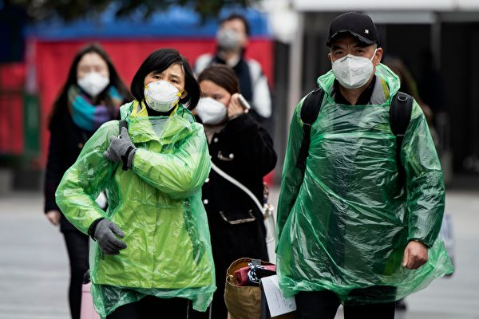

新冠病毒不仅扰乱了中国的口罩生产，还使中国自身对医疗用品的需求猛增，而其它依赖中国产口罩的国家也面临同样的口罩荒问题。图为戴口罩的民众。 (NOEL CELIS/AFP via Getty Images)

 
【大纪元2020年02月18日讯】（大纪元记者林燕综合报导）中国爆发的新冠病毒（COVID-19）疫情让美国人体会到“口罩荒”。因大部分口罩是在中国制造，此次“口罩荒”令美国正视过度依赖中国制造医疗用品的问题，制定应急程序。

新冠病毒不仅扰乱了中国的口罩生产，还使中国自身对医疗用品的需求猛增，而其它依赖中国产口罩的国家也面临同样的缺口罩问题。

截至周一（2月17日），世界卫生组织（WHO）通报的中国境外确诊新冠病毒病例为794个，分布在25个国家，已造成3人死亡。

美国迄今确诊了29例新冠病毒病例（包括14名钻石公主号上的病例），但美国大部分外科口罩、呼吸器和其它“个人防护设备”都是中国生产。现在正值数十年来最严重的流感季，因口罩库存不足，美国部分医院已开始对口罩进行限量使用。

纽约州西奈山医院的医护人员表示，他们收到医院发出的一封电子邮件通知，除其它措施外，仅在重症监护室、感染预防部门和急诊科等部门才可以使用口罩。

马里兰州的一名儿科医生也证实说，该医院无法收到更多的口罩。

该名医生说：“这是个问题，因为我每次进入病人房间时、我都需要戴口罩，而且我无法重复佩戴同一个口罩、从一个房间穿到另一个房间。今天，我至少已经使用了十个口罩。”

“我们今天稍早开玩笑说，他们要让医学院学生用手帮手术室里的外科医生摀嘴。（我不知道）还能有什么选项。”医生补充说。

<b>美国9成防护设备海外产 中国是最大供应源</b>

多年来，美国的口罩制造商一直在警告美国医疗供应链太依赖于中国、酝酿风险的问题。

德克萨斯州医疗用品供应商Prestige Ameritch的创始人麦克·博文（Mike Bowen）告诉《日经亚洲评论》：“我一直在讲美国口罩供应链将完全崩溃，结果（他们当）我像在讲希腊语一样。”

“我发送了数千封电子邮件、参加过数百次会议，我还与政客和医院行政人员、医院采购人员交谈过……他们不相信我说的，但现在他们看到了我是对的。”

根据美国卫生与公众服务部的数据，美国使用的个人防护设备中有90%以上是在海外制造的，其中中国是最大的供应来源。

自从新冠病毒爆发以来，中共政府已指示生产这些物品的工厂优先考虑国内需求。

一家跨国口罩制造商Medicom的首席执行官罗纳德·鲁本（Ronald Rueben）也证实：“目前，我们在中国生产的所有产品都将投放到本地市场。”Medicom在美国、欧洲和亚洲都设有工厂。

“这是强制性的。”鲁本说，“我们需确保一线医疗工作者可以获得尽可能多我们制造的产品。”

不过，这种强制性也就意味着“中国造”口罩现在变成“中国用”。

<b>西奈山医院：可能要等中国需求量下降 美国才有口罩</b>

对于西奈山的员工来说，是个坏消息。因为美国正迎来流感季节的高峰期。

“（可能要）等到中国的（口罩需求）数量下降，否则我们可能不会得到很多口罩。”西奈山预防传染病的医学主任伯纳德·卡明斯（Bernard Camins）说。

“还有一些别的国家在生产口罩，但由于现在这是一个全球性问题，我们遇到一些（供应）问题。”他补充说，“我们或许能够订购一些N95防毒面具……实际上，我们也不确定是否有足够的呼吸器（供应）。”

西奈山医院已经联系纽约州卫生部门、要求提供紧急口罩供应。根据卡明斯的说法，该集团的八家医院在流感季节每月使用的口罩数超过11万个。

其它医院也很关注口罩问题。

马萨诸塞州综合医院的媒体关系主管迈克尔·莫里森（Michael Morrison）表示：“我们已经看到口罩和N95口罩的缺货订单。我们的供应链和物资管理专家们一直在非常努力地确定，哪些产品来自中国，并试图寻找替代的供应链。”

他补充说：“到目前为止，我们还有足够的物资来支持临床运作，但我们正对未来供应保持谨慎态度，因为疫情可能会蔓延，如果物资进一步减少，我们将需要如何调整？”

<b>美国政府正跟供应商合作 解决物资短缺问题</b>

官员们也在密切关注当地的口罩供应。美国50个州卫生部门中，有32个机构回复了《日经》的询问，其中有17个州表示他们已经意识到可能存在的短缺问题，并已制定了应急程序，这些州包括加利福尼亚州、伊利诺伊州、密歇根州、纽约州和弗吉尼亚州。

华盛顿州卫生部新闻官员杰西卡·巴格特（Jessica Baggett）说：“从全美范围来看，我们的分配率是80%。这意味着，如果您通常订购100个口罩，您将得到80个。”

他表示，州政府正在与联邦疾病预防与控制中心联系，后者正通过与供应链供应商合作、协调资源解决物资短缺问题。

纽约卫生部表示，已经听说一些医院报告“包括N95口罩在内的个人防护设备短缺”。纽约州已根据需要向部分医院提供了紧急储备。

<b>美国民众通过各种渠道买口罩 寄往中国</b>

美国国内普通民众虽然对口罩防护新型冠状疾病的有效性存有疑问，但对这种致命病毒的恐惧已引发了人们大量购买医疗级和非医疗级口罩。

大部分人买口罩是想送给在中国的家庭或捐给在中国的朋友。美国Home Depot的口罩只提供限量店内售卖，不接受网上预定。

记者周日（16日）在加州以及纽约Home Depot见到，过去满满的口罩货架上仅剩下2～3个防毒面罩，口罩全部售卖一空，店内贴有“每位限购10个”的字样，且店员不清楚何时会有补货；其它几大药品连锁店也出现口罩断供。

在纽约法拉盛（Flushing）社区，一些商店老板在卖完最后一批存货后，用中文写上“口罩已卖完”等字样；甚至还有自称是“医生”的人当街售卖普通口罩、防水口罩和N95防毒面具。不过，自称医生的人不愿被人知道口罩的供应来源。

他告诉《日经新闻》：“只能说，手上有口罩、是想卖掉的人找到了我。”

除了美国境内售卖口罩的商店和药店出现口罩难求外，不少华人还转向在线、甚至直接找到口罩生产商。

德克萨斯州医疗用品供应商Prestige Ameritch表示，由于新冠病毒，它已开始首次面向消费者、出售美国产的外科口罩。

其CEO鲍恩说：“我们收到华裔美国人的电话、他们想寄产品回国……所以我们告诉他们上我们的网站（订购），结果我们很快就拿到数百笔订单。”

“我们做这个不是为了钱。每次有中国姓的顾客订购产品时，我都会受到鼓舞、这令人感动……”鲍恩的公司在短短10天内，就卖出了100万个口罩到中国。

<b>美国国内医疗用品公司有望填补口罩需求空白</b>

面对美国国内口罩供应吃紧、民众需求强烈，口罩制造商也被要求填补中国需求激增留下的口罩需求空白。

医疗用品巨头3M的通讯经理珍妮芙·埃尔利希（Jennifer Ehrlich）表示：“目前对治疗和防护用品（如呼吸器）的全球需求超过供应。”

“3M正在包括美国、亚洲和欧洲在内的全球制造工厂提高产量，越快越好。”

别的大型医疗用品公司，如Honeywell、Medline和Cardinal Health也表示，他们正在采取类似的步骤。

一位不愿透露姓名的政府消息人士说，美国食品与药品监督管理局正在加快发放制造口罩的公司许可证申请程序，将其“排在队伍的最前面”。由于疫情爆发，FDA也将重点更多地放在了欺诈性产品上。

因为需求量大，一批新公司有望陆续涌入口罩市场，但很可能有些产品会不达标。

除了产品质量要求，对一些小型制造商而言，扩大生产的风险仍很大。

Prestige Ameritch的鲍恩说，他的公司在10年前H1N1流感期间选择扩产，最终以失败告终。原本投入巨资扩张生产、期望能够保住一半的新医院客户，结果在疫情爆发后，只有5%的医院客户愿意留下，因为美国制造的口罩价格比中国更高，医院都转向中国产便宜口罩。

鲍恩表示，他为此裁员150人，公司几乎要倒闭。“除非有人来找我们说：‘嘿，我要签一份五年合同’，否则我们不会加紧备产。”

此外，成本激增问题也不容忽视。Medicom的鲁本也表示，现在的企业生产压力很大，因为不仅是口罩，大部分制造这些口罩的原料都来自中国。虽然他旗下的所有工厂都在增加产能，但成本攀升已成为企业的又一沉重负担。

鲁本告诉《日经》：“我们的成本已大幅上涨，翻了一番多。我们在劳工上花了两倍的钱，有时甚至是三倍，我们现在是周末轮班。”

为了弥补成本，Medicom已经提高了一些口罩的售价，但受长期合同的限制，它的提价幅度十分有限。
<a target="_blank" href=#top><h6 align="right">回上方</h6></a>

<a name=145>

2月16日下午，牧师Christoph Graaff在德国科隆圆顶音乐厅，观看了神韵巡回艺术团的演出。（黄芩／大纪元）

 <h1 align="center"><b>不要被表象所迷 牧师：创世主将重新显现</b></h1>
 
【大纪元2020年02月17日讯】（大纪元记者黄芩德国科隆报导）2月16日下午，美国神韵巡回艺术团在德国科隆圆顶音乐厅，上演本年度在当地的最后一场。德国主流精英们慕名而来，全场爆满，座无虚席。

“精彩极了，非常杰出。”牧师Christoph Graaff表示，“（大幕刚一拉开）我马上被舞台和天幕两个层面的画面给吸引住了，两个层面融合在一起，非常好，非常美。”

Christoph Graaff是圣安东尼医院（Sankt Antonius Hospital）的医院牧师，经常为病人、病人家属以及医护人员布道，他还参与一些临床研究和高级研讨会。

Graaff牧师表示，他最为欣赏的是神韵复兴传统文化的使命。他说，“我认为把文化和使命融合起来，做的很好、很正确。因为我觉得，（具有攸久历史的）中国能为世界带来更多，但不是当前的政治体制，而是这种古老而高雅的文化所带来的。”

他认为传统并不会过时，而是能不断的焕发新生。他说：“我相信，我们从传统中所收获的，总是可以不断重塑当今社会；从传统中，我们总能获得新的力量，找到新的启发。”

他表示很钦佩“（神韵）艺术家的舞动和对身体的控制能力”，还开玩笑说，这让他很受鼓舞，要坚持运动才好。他赞叹整场演出给他留下太深刻的印象，他很形象的描述道，“我相信，就算我闭上眼睛，在眼前依然能浮现出（神韵）演员的舞蹈。”

 神韵演出在世界各地引起正面回响，带来新的希望。Graaff对这点深信不疑，他说，“我相信一定是这样，毫无疑问。尤其是当某种事物在中国遭受如此压制，就像现在我们在中国发生的，那种宗教的、精神的、本质的东西，那么她将在另一个地方再次破茧而出。”

他认为神韵正代表这样的事物，他说，“她转移到了纽约，从那里复生，生机勃勃，以此向世界和中国证明：不要绝望，认真思考你生命存在的意义，那么生命的美好将再次得到显现。”

在神韵演出中，人们能看到最终创世主拯救了人类。Graaff坚信，人们在等待着创世主的到来。他表示，“创世主不在外边，他在我们心中，而（人们的）智慧在于，不被外在所看到的现象封闭住自己，这样创世主就不会和你隔开，而是重新复生显现。在（神韵演出的）一些画面中这点得到了清晰的展现。”

<a target="_blank" href=#top><h6 align="right">回上方</h6></a>

<a name=144>

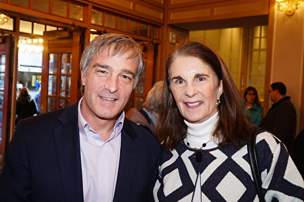

2020年2月17日下午，演员Jake Krapf(左)与母亲、美国第一大直销护肤药妆品牌 Rodan + Fields的V级执行顾问Caroline Wellford（右）一起，观看了神韵神韵环球艺术团在费城玛丽安剧院的第七场演出。（肖捷／大纪元） 

 <h1 align="center"><b>感悟创世主灵性信息 演员观神韵喜极而泣</b></h1>
 
【大纪元2020年02月18日讯】（大纪元记者肖捷美国费城报导）2月17日下午，神韵环球艺术团在费城玛丽安剧院（Merriam Theater）的第七场演出持续吸引当地主流社会精英慕名前来。“我太喜欢这个演出了，非常优秀。我喜欢她背后的所有信息。”演员Jake Krapf由衷地赞叹道。他与母亲、美国第一大直销护肤药妆品牌 Rodan + Fields的V级执行顾问Caroline Wellford一起观看了神韵演出。

神韵纯善纯美的艺术至高境界令Krapf内心深受触动，“我喜欢演出中有关创世主和灵性的内容。这对当今的人们很有意义，很多的内容，总有一天人们会认识到的。”

神韵展现创世主带领各界天国众生下世开创人类文明的情境仿佛打开Krapf尘封的灵性记忆，他激动地说，“我觉得更多的人应该知道这一切。这种感觉太好了。演出的一开始我就开始哭了。我感觉很好，我感到很开心。我想这是因为幸福而哭泣吧。”

Krapf对神韵的整体舞台艺术效果也推崇备至，盛赞神韵是他一段时间以来看过的最好的演出之一， “我真的很喜欢，演出真棒。演员们在一起配合得很好，服饰也很棒。音乐很美，很专业。”

神韵舞蹈演员高超的舞蹈技巧和刻画细腻入微的艺术表现力令Krapf感到钦佩，“他们很棒。 他们非常好，他们真的很好。真的是超凡出众。看来他们一定经过大量的训练。显然是这样。”

这是Krapf第一次观看神韵演出。神韵呈现的美好艺术和精神令他感到意犹未尽，“我绝对希望再看一次，或许每年我都会来看。”

Krapf非常想把自己的惊喜发现分享给所有人，“我认为每个人都应该来看。也许某些人正在人生旅途中忙于其它，但我认为无论对谁来说，这个演出都是非凡的出色。所以对每个人来说总会感到一些值得钦佩的地方。随着人生旅途的推进，她所带来的意义比你以前所知道的还要多。”Krapf深信，每个人观看神韵后都会有所收获。

<a target="_blank" href=#top><h6 align="right">回上方</h6></a>

<a name=143>
<h1 align="center"><b>【病毒探源】调查报吿：新冠病毒神秘来源</b></h1>
 <h3 align="center"><b>作者：新冠病毒探源调查组</b></h3>

武汉新冠病毒（COVID-19）显微图。(Creative Commons/Wikimedia)

 
【大纪元2020年02月17日讯】【摘要】随着武汉新冠肺炎对全球的威胁与日俱增，越来越多的各国专家也对新冠病毒（COVID-19或SARS-CoV-2）的来源投下更多关注的目光。本文从流行病学调查、病毒基因比对、跨物种感染研究以及关键的“中间宿主”等五大领域，对新冠病毒来源进行了全景式梳理与深度挖掘，为读者提供一个深刻而全新的视角。

一、华南海鲜市场：备受争议的“疫源地”

二、病毒学证据：武汉新冠病毒COVID-19的基因异样之处

三、石正丽：疑云笼罩的冠状病毒跨物种感染研究

四、穿山甲之谜：突如其来的“中间宿主”

五、武汉病毒所：舆论风暴中心的P4实验室

【正文】

自从武汉爆发新冠肺炎迄今，已经过去了两个月，但科学界对这个神秘的新冠状病毒“COVID-19”（也叫SARS-CoV-2，WHO旧称2019-nCoV，本文简称新冠病毒）的认识依然十分有限。此次疫情爆发的源头是华南海鲜市场吗？备受关注的武汉P4病毒研究所在其中究竟扮演了什么角色？中共官方坚称新冠病毒来自原始宿主蝙蝠，华南农业大学几位学者甚至声称他们找到了中间宿主穿山甲。但科学界对病毒基因序列的研究以及大量科学文献的比对查证，均显示这个病毒的来源并非如此简单。

<b>一、华南海鲜市场：备受争议的“疫源地”</b>

这场来势凶猛的大疫第一次闯入公众视野，是网络流传的一份武汉市卫健委内部通知，这份通知明确写道：“我市华南海鲜市场陆续出现不明原因肺炎病人”，并要求各医疗单位统计类似的不明原因肺炎病例上报卫健委医政医管处。

华南海鲜市场位于湖北武汉市江汉区，是一个包含了猪肉供应以及各种海鲜冻品、冰鲜、干货及调味品在内的大型综合市场，也包括贩卖一些野味。

当“不明肺炎”陡然出现在大众面前的时候，“野味”这个词无疑迅速成为最受关注的焦点。毕竟，十七年前的“萨斯”瘟疫大爆发，就一直被官方认定为是广东人吃野味“果子狸”而惹出的大祸。

2019年12月31日，武汉市卫健委首次公开发布通报称，近期部分医疗机构发现接诊的多例肺炎病例与华南海鲜市场有关联。2020年1月1日，华南海鲜市场贴出休市公告，随后进行了彻底的环境卫生整治——知名香港萨斯专家管轶后来痛斥，这个举措等于摧毁了“犯罪现场”。

此后，武汉方面多次强调，多数武汉肺炎病例有华南海鲜市场暴露史或接触史。中国疾控中心病毒病所也分别于1月1日、12日两次在该市场取样共585份，并转运至实验室进行检测。

1月22日，国家疾控中心主任高福在国务院新闻办公室发布会上表示，武汉新型冠状病毒的来源是武汉一个海鲜市场非法销售的野生动物。

1月26日，中国疾控中心病毒病所称，该所首次从华南海鲜市场的585份环境样本中，检测到33份样品含有新型冠状病毒核酸，并成功在阳性环境标本中分离病毒，提示该病毒来源于华南海鲜市场销售的野生动物。

至此，华南海鲜市场是疫源地的说法成为官方定论。

然而，令人始料未及的是，仅仅一天之后，《科学》杂志于27日在线发表的一篇报导就对中共官方这一结论提出重大挑战。

该报导引述了世界顶级医学杂志《柳叶刀》的一篇论文，质疑武汉新型冠状病毒肺炎的疫源地可能并非华南海鲜市场。

这篇论文题为“新型冠状病毒感染患者的临床特点”[1]，1月24日在《柳叶刀》上发表。论文第一作者是武汉市首家不明肺炎指定收治医院金银潭医院的副院长黄朝林，其余作者包括了该院其他临床医生以及多家研究机构的成员。

这篇论文透露出以下关键信息：

# 第一例病人发病时间是12月1日，与海鲜市场无关联；
# 第一例病人与后续病人未发现流行病关联；
# 12月10日，又有3例病例发病，其中2例与华南海鲜市场无关联；
# 12月15日开始，有海鲜市场暴露史的病例集中出现；
# 论文统计总共41例病人，有14例证实与海鲜市场无关联，比例超过1/3。
# 海鲜市场没有人卖蝙蝠，也未发现蝙蝠的踪迹。

《柳叶刀》论文对41例确诊病例与海鲜市场的关系的分析

不仅如此，1月29日《柳叶刀》再发论文分析了金银潭医院99例确诊病例，其中有50例无海鲜市场接触史；而《新英格兰医学杂志》也有论文显示：22日前确诊的全部425个病例中，1月1日前发病者有45%无海鲜市场接触史。

而对比官方的通报可以看到，二者有明显差异。官方通报的相应信息如下：

# 第一例病人发病时间是12月8日，与海鲜市场有关联；
# 官方认定华南海鲜市场就是疫源地，未提首例病人无海鲜市场接触史及上述1/3病例无海鲜市场暴露史的数据。
# 武汉病毒所石正丽等人于1月23日发表论文，指从云南马蹄蝠身上发现新冠状病毒，与武汉新冠病毒同源性达96.2%，病毒源自蝙蝠就此成为大众共识。

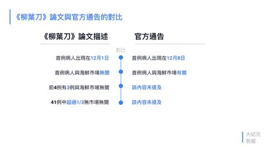

《柳叶刀》论文与中共官方通告内容对比图

美国乔治敦大学（University of Georgetown）传染病学家丹尼尔‧鲁西（Daniel Lucey）针对《柳叶刀》的论文表示，如果该论文的数据是准确的，那么第一个病例应该在2019年11月就已被病毒感染，因为在感染之后和与出现症状之前有一个潜伏期。此前有专家表示，新型冠状病毒的潜伏期在10天～14天左右。

很明显，这意味着在12月15日开始集中出现有华南海鲜市场暴露史的病例之前，病毒就已经在武汉的某些地方和某些人之间悄无声息地传播。鲁西坦率地指出：“中国肯定已经意识到这种流行病并非源自武汉华南海鲜市场。”

《柳叶刀》论文的通讯作者之一、北京首都医科大学教授曹彬回复美国科学新闻网站ScienceInsider时也表示：“目前比较明确的是，（华南）海鲜市场应该不是新型冠状病毒的唯一发源地。”；“但老实说，我们现在仍然不知道病毒究竟从哪里来。”（”Now It seems clear that [the] seafood market is not the only origin of the virus”, he wrote in an e-mail to ScienceInsider, “But to be honest, we still do not know where the virus came from now.”）

值得注意的是，《柳叶刀》的两篇论文和《新英格兰医学杂志》论文的作者都是中国大陆的医生和医学专家。而与此相左的则是，中共国家级专家组的做法显示，他们似乎有意无意在忽视这一极其重要的信息。

国家卫健委第一个专家组早在2019年12月31日就已到达武汉。据大陆财新网对武汉大学中南医院重症医学科主任彭志勇的采访[2]证实，这个专家组到武汉金银潭医院调查后即制定了一套诊断标准：要有华南海鲜市场接触史；要有发烧症状；全基因组测序。三条标准都达到才能确诊，缺一不可。

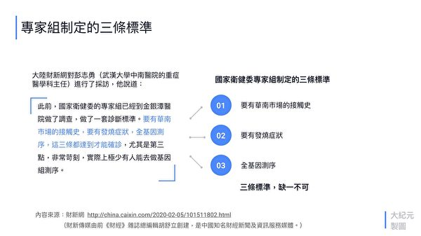

第一批国家级专家组制定的确诊三指标

彭志勇说，这个标准直到钟南山等第二批专家组18日到达武汉后才修改。

这就产生出一个难以解释的问题：第一批专家组对《柳叶刀》调查的这41例病例的详细情况，应该是了解的。因为武汉卫健委官方通报中，从1月10日到1月17日，确诊41例这个数字一直没有发生任何变化。

为什么专家组在明知至少1/3的病例与海鲜市场无关联的情况下，要硬性规定确诊标准中必须有“海鲜市场接触史”这一条？

稍有传染病医学常识的人都知道，查清真正的传染病源，是防控传染病的三大关键之一。既然有非常明确的流行病学证据和最早参与调查疫情的同行专家的判断都显示华南海鲜市场并非病毒疫源地，为何专家组要强行“规定”要有海鲜市场接触史？

</b>二、病毒学证据：武汉新冠病毒COVID-19的基因异样之处</b>
【E蛋白】

1月10日是一个重要的日子，在这一天，中国正式向全世界公开了武汉新冠病毒（以下简称武汉病毒）的全基因序列。全世界最顶尖的病毒学专家立即对这个神秘的病毒开展深入研究，并开始陆续发表各自对新冠病毒的研究报告。

在通过对武汉新冠病毒基因进行整体分析后，希腊一个专家团队于2020年1月27日发布报告[3]说，他们研究分析了武汉病毒的遗传关系，发现“新型冠状病毒的基因，大约五成与sarbecvirus亚属中的其它病毒没有密切的遗传关系”，并且该病毒具有其它任何冠状病毒都不具有的特殊中间区段，而这段基因恰好就是帮助病毒入侵宿主细胞的关键。

这些研究发现表明：武汉病毒是一种新型的冠状病毒，且推翻了作者原来认为的武汉病毒起源于不同冠状病毒之间的随机自然突变的假设。换言之，作者认为武汉病毒并非靠自然演变而来。

希腊专家的发现并非孤例。早在1月7日，中国疾控中心研究院张永振院士和复旦大学公共卫生学院就联名向《自然》杂志提交了论文[4]，并于2月3日发表。该论文明确提出，武汉病毒与中共军方的两种舟山蝙蝠病毒样本CoVZC45和CoVZXC21存在最为密切的亲缘关系。其中，武汉病毒与CoVZC45病毒的核苷酸序列同一性为89.1%，甚至在nsp7和包膜蛋白（E蛋白）方面表现出100%的氨基酸相似性。

张永振等人向《自然》杂志提交的论文显示，武汉新冠病毒和舟山蝙蝠CoVZC45病毒E蛋白相似度高达100%。（《自然》论文截图）

很快，有专家利用美国国立卫生研究院（NIH）生物科技信息中心（NCBI）的比对工具BLAST，对中共官方12日第三次提交的基因组序列进行基因比对，证实了张永振的发现。[5]

粉红高亮区的信息显示，武汉海鲜市场病毒样本与编号为“AVP78033.1”的病毒样本比对，其E蛋白相似度高达100%。(G-NEWS)

中国疾病中心专家陆柔剑的团队也于1月30日在《柳叶刀》上发表论文[6]指出，武汉新冠病毒和此前在中国浙江舟山蝙蝠身上发现的一种冠状病毒整体相似度非常高，达88%。

舟山蝙蝠身上携带的这种冠状病毒，其最早发现者是南京军区军事医学研究所的专家。该所于2018年发表英文论文[7]，宣布在舟山蝙蝠身上发现一种新型冠状病毒——舟山蝙蝠类SARS冠状病毒，为方便理解，本文简称其为“舟山病毒”。

绿色高亮区显示，编号为“AVP78033.1”的病毒样本来自南京军区军事医学研究所，即“舟山病毒”。(G-NEWS)

微生物学博士、美国前Walter Reed陆军研究所病毒系实验室主任肖恩‧林（Sean Lin）认为，武汉病毒和舟山病毒的E蛋白氨基酸序列达到100%一致，是一件极其不寻常的事情。因为E蛋白对于β型冠状病毒的病毒形态、组装、出芽以及病毒致病性都有不可或缺的作用。如果病毒更换了宿主，很多细胞因子都会变化，E蛋白也必然有相应的变化来调整病毒的合成和致病性。

他进一步指出：E蛋白的基因和S蛋白的基因位置邻近，在病毒RNA的复制过程中，这两个基因也都是要经过一个产生亚基因组RNA （subgenomic RNA）来完成复制的，也牵扯类似的细胞内因子和病毒RNA聚合酶，所以这个过程中产生基因复制的错误率也都是相近的。所以，没有理由在自然的病毒复制过程中，S蛋白有着各种突变，而E蛋白在整个宿主都变换掉的情况下保持完全相似。这基本上是不可能自然发生的。

北京大学传染病学博士、瑞士生物技术公司SunRegen Healthcare AG首席科学官董宇红女士指出，根据陆柔剑在《柳叶刀》上发表的论文，冠状病毒科内与武汉病毒最近的几种冠状病毒，在其它蛋白（S、M、N等）的氨基酸序列上都不可能达到像E蛋白这样的100%完全一致，一致度为73.2%～98.6%。那么，这个E蛋白为什么在武汉病毒中与所谓“祖先”的蝙蝠病毒保持如此大的一致性，值得深入探究（Lu et al 2020 Lancet）。

她表示，与S、M或N蛋白相比，虽然E蛋白是武汉病毒主要的结构蛋白质中的最小的一个蛋白，可是它的功能并不能小看。武汉病毒在人体复制周期中，E蛋白在受感染的人体细胞内大量表达，大部分E蛋白被定位在人体细胞内转运的关键位点，如内质网、高尔基器等，参与冠状病毒的组装和出芽。缺乏E蛋白的重组，冠状病毒展示病毒滴度显着降低，病毒成熟度降低或繁殖能力不强，表明E蛋白在与宿主细胞之间起到的重要相互作用，尤其是在病毒繁殖、成熟、传播能力方面的重要性，也应该是决定病毒在人种中的传播力的一个重要功能蛋白。

简而言之，武汉病毒和舟山病毒表现出来有关E蛋白的这种完美一致性，用“自然变异”难以解释。

【S蛋白】

更蹊跷的是，武汉病毒身上的费解之谜，还不止这一个。

2020年1月21日，中国科学院上海巴斯德研究所分子病毒与免疫重点实验室研究人员在《中国科学生命科学》（SCIENCE CHINA Life Sciences）上发表的一篇论文提到一个重要现象：武汉病毒的S蛋白一个关键部分的序列，和萨斯病毒具有高度同源性。

S蛋白是什么？就是已经广为人们熟悉的冠状病毒图片中，病毒表面那些一个一个的“小蘑菇”。这个S蛋白（也称刺突蛋白、棘突蛋白）是冠状病毒能够入侵人体细胞的最重要工具。

SARS病毒结构图(Joseph S Malik Peiris, Nature Medicine)

巴斯德研究所的专家们发现，萨斯病毒的S蛋白中第442、472、479、487和491位的残基位于受体复合物界面，并且被认为是萨斯病毒跨物种及人际传播至关重要的位点。[8]

令人惊讶的是，武汉病毒的S蛋白中有442、472、479和487位这4个位点的残基与萨斯病毒不同，但这种差异却并没影响到S蛋白的结构构像。就是说，武汉病毒的S蛋白依然保持着和萨斯病毒S蛋白一样的结构，依然可以像萨斯那样，在RBD结构域中共享几乎相同的3-D结构，并借此与人体细胞中的ACE2受体结合从而轻松入侵人体。

这是可以用精准来描述的基因变异，就像一把钥匙上有5个卡齿，其中4个齿的材质发生了改变，但钥匙的整体形状却完美保持，钥匙依然可以打开通往人体的阀门。

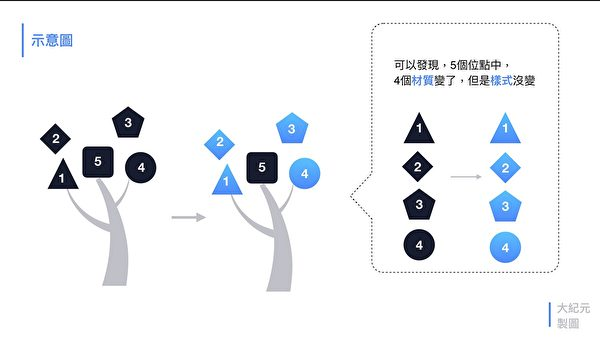

新冠病毒S蛋白4个位点残基的异常现象示意图

美国哈佛大学资深流行病专家费格丁（Eric Feigl-Ding）博士也注意到这个异常现象，他于1月28日在推特上发文，引述希腊学者研究的最新发现指出：该病毒不是由冠状病毒经过近期随机结合而产生的，有些部分与所有冠状病毒都“不协调”。其基因组的序列中段是以往冠状病毒中从未见过的，可“编码”侵入宿主细胞的刺突蛋白（S蛋白）。

【分子进化钟&最近共同祖先】

分子进化钟是一种通过基因突变速率来估算物种进化速率的技术，远的可以追溯长达千百万年的进化，短的可以追寻当前传染病病原体的来源。

中国疾控中心病毒预防所的陆柔剑（Roujian Lu）2020年1月30日在《柳叶刀》期刊上发表论文[9]，发现这次武汉肺炎来自不同患者的新冠病毒序列几乎相同，序列同源性（sequence identity）超过99.9%。这一发现表明，新冠病毒是在很短时间内自一个起源地产生，而且相对较快地被检测到。

世界著名的斯克里普斯研究所（The Scripps Research Institute）的分子生物学家克里斯蒂安‧安德森（Kristian Andersen）也发表题为“基于27个基因分析的生物钟和最近共同祖先时间”的文章[10]，分析了中国公开发表的27个武汉病毒完整基因，发现来自武汉、泰国、深圳等地的24个样本的基因组非常一致，“显示出非常有限的遗传变异”，“表明所有这些病毒株都具有相对较新的共同祖先。”

安德森认为，病毒是单一来源进入人类，然后是持续地人传人。这可以是单个动物或一小群最近被感染的动物感染给单一个人或一小群人。所有分析的案例都是人传人，没有动物传人的。

他根据分子进化钟算出来最先从人开始广传的时间，中间值是12月2日，最早可以是10月1日，这与后来中共官方公布第一个就诊病例的12月1日相当吻合。虽然这两篇论文都没有猜测病毒的起源，但显然排除了多个动物来源的可能性。

<b>三、石正丽：疑云笼罩的冠状病毒跨物种感染研究</b>

一个显着的事实是，蝙蝠携带的冠状病毒无法直接感染人体，更不是可以拥有人传人能力的病毒。但随着舆论对武汉病毒“被人工干预”的质疑声越来越大，武汉病毒所及该所的知名病毒专家石正丽开始步入大众视野。

2003年萨斯疫情爆发后，石正丽曾带领团队在全国各地采集蝙蝠样本做病毒检测，并于2013年将成果发表于《自然》杂志上。2017年，石正丽团队确定SARS病毒是经过几个蝙蝠SARS样冠状病毒重组而来，一度引发普遍关注。

由于长期从事对蝙蝠及SARS病毒的研究，石正丽无疑已经成为冠状病毒研究领域的权威，而且其本人更专注于冠状病毒跨物种感染领域。

耐人寻味的是，石正丽对冠状病毒S蛋白——这个跨物种感染人体的“通行证”——的研究，早在2010年就已经开始。石正丽团队对寻找冠状病毒如何跨越物种障碍发生传播，进行了长期、系统且深入的研究。

2010年，石正丽团队发表论文[11]，用活SARS病毒和HIV（艾滋）伪病毒检查不同种类蝙蝠ACE2对人类SARS-CoV刺突蛋白（S蛋白）的敏感性。实验中他们还改变蝙蝠ACE2的几个关键氨基酸，来测试其对S蛋白的结合性，并构建带有SARS病毒BJ01-S蛋白的HIV伪病毒HIV/BJ01-S。这显示石正丽团队已经意识到S蛋白与ACE2受体之间的特殊关系。

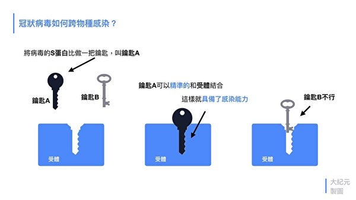

冠状病毒通过S蛋白感染人体细胞示意图

2013年10月30日，石正丽团队发布了冠状病毒研究的“新突破”。《自然》杂志刊发其题为“使用ACE2受体的蝙蝠SARS样冠状病毒的分离和鉴定”论文[12]，包括葛行义、石正丽、达萨克等专家在内的研究团队，发布了从云南菊头蝠（马蹄蝠）身上分离出的新型冠状病毒RsSHC014和Rs3367的全基因组序列。石正丽负责提供了SHC014冠状病毒S蛋白序列以及质粒，这是她一直以来最擅长的领域。

在这次的研究成果中，石正丽团队还从蝙蝠粪便样本中分离出了第三种新型蝙蝠冠状病毒的活体——SARS样冠状病毒WIV1，其与Rs3367病毒的序列同源性为99.9%。该病毒的S蛋白可以通过受体结合点（RBD）结合人类受体ACE2，并有效地将SARS病毒直接传染给人，不需要果子狸等中间宿主。

</b>这毫无疑问是一个重要的突破，这个突破显示石正丽等人已经初步掌握了冠状病毒突破物种障碍直接感染人体的“钥匙”。</b>

2015年11月9日，武汉病毒所石正丽团队在英国《自然医学》（Nature Medicine）杂志上发表论文[13]，主要内容是：他们成功制造出一种能自我复制的嵌合病毒，使具有前述RsSHC014冠状病毒“S蛋白”的野生小鼠SARS冠状病毒能结合人类ACE2，从而具有了跨物种的强大传染力。在实验结果中，感染了这种“合成”病毒的小白鼠两肺严重病变，无药可医。

论文所附图像局部。e为感染SARS冠状病毒（黑色）和新型嵌合病毒（绿色）的小鼠，随感染时间体重减轻的曲线。f显示了小鼠感染这两种病毒2天和4天后，病毒在肺部的复制情况。g和h 分别显示了小鼠从呼吸道感染SARS病毒和嵌合病毒后，肺部病变的影像。(Nature Medicine, CC)

令人惊心的是，在小白鼠身上的成功实验仅仅只是石正丽的“牛刀小试”，他们接下来还准备在灵长类动物身上进行进一步的实验。这个举动无疑是危险的，因为这非常容易让人联想到，石正丽团队是否在模拟如何使用这类嵌合病毒来感染人体。

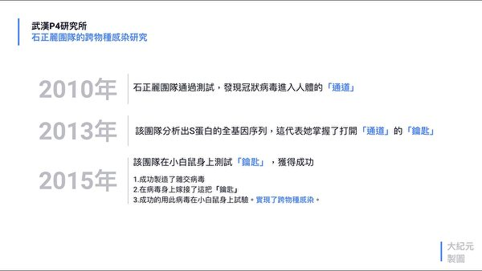

石正丽关于冠状病毒跨种感染研究的“三部曲”

石正丽这篇论文迅速引发了学术界的巨大争议。法国巴斯德研究所的病毒学家西蒙‧韦恩‧霍布森（Simon Wain-Hobson）深切表达了这种担忧，他告诉《自然》杂志：“如果（新）病毒逃逸了，谁也无法预测其途径。”

罗格斯大学分子生物学家兼生物防御专家理乍得‧埃布赖特（Richard Ebright）对《自然》说：“该研究的唯一影响是在实验室中创造了一种新的非自然风险。”

但石正丽的步伐显然并未停止。2018年11月14日，石正丽应上海交通大学生命科学技术学院邀请，在该院树华报告厅做了一次题为“蝙蝠冠状病毒及其跨种感染研究”的主题演讲。

在这次演讲中，石正丽介绍了她带领下的团队如何使用“重组分析”发现人SARS病毒的最近祖先，可能是由云南一个蝙蝠山洞中的三个病毒株（WIV1、Rs4231和Rs4081）重组而来的经过。

值得注意的是，出于不明原因，上海交大官方网站已经删除了这篇报导。

（网页截图）

2020年1月23日，时值新冠肺炎急速爆发、武汉宣布封城之际，石正丽团队在bioRxiv预印版平台上发表文章《一种新型冠状病毒的发现及其可能的蝙蝠起源》[14]，提出此次武汉新型冠状病毒或来源于蝙蝠。该论文随后于2月3日在《自然》杂志上刊登。

该文章提到，武汉新型冠状病毒使用与SARS冠状病毒相同的细胞进入受体（ACE2），也就是说，武汉新冠病毒使用和SARS相同的“钥匙”来打开通向人体的大门。

文章还称，他们发现新型冠状病毒与源自云南马蹄蝠、编号为RaTG13的冠状病毒的序列的一致性高达96.2%。

众所周知，中国国家疾控中心上传武汉病毒的全部基因组序列是在1月11日。武汉病毒所在短短12天时间内就从病毒库诸多的冠状病毒中，比对、锁定与之相似度最高的病毒，并且还做出分离、上传基因库，甚至写出了论文。

<b>相比上次找到SARS病毒天然来源花费了足足十年时间，这次石正丽团队的效率高得惊人。</b>

一个不易为人注意的细节是，石正丽1月27日提交RaTG13蝙蝠病毒的登记信息显示，该病毒早在2013年7月24日，就已从云南马蹄蝠（菊头蝠）的粪便中被分离出来，其采集时间比石正丽2013年10月发表论文的时间还要早三个月，但石正丽的论文中并没有提到这个特殊的病毒。

<b>换言之，这个被视为很可能是引发这次瘟疫的元凶、极其重要的“新马蹄蝠病毒RaTG13”在武汉P4实验室被雪藏了七年时间。</b>

病毒提交记录显示，“新马蹄蝠病毒RaTG13”采集时间是2013年7月24日。(G-NEWS)

“新马蹄蝠病毒”为何被雪藏七年？个中原因谁也不知道，但石正丽现在报告说自己“发现”了该病毒和武汉病毒的联系，无疑是想证明，这个病毒就是武汉病毒的天然来源。

但一个难以解释的现象是，病毒基因序列比对结果显示，新马蹄蝠病毒（RaTG13）与武汉病毒的包膜蛋白（E蛋白）和膜蛋白（M蛋白）基因片段ORF6，其氨基酸序列都达到100%相同，S蛋白则与武汉病毒达到97.7%相似。

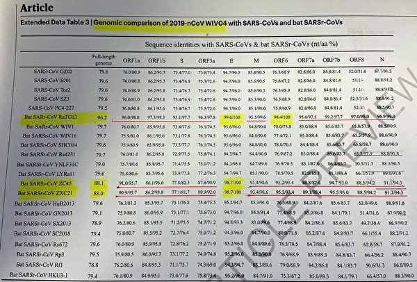

黄色高亮区显示，新马蹄蝠病毒和武汉病毒整体同源性达到96.2%，E蛋白达到100%一致。(G-NEWS)

病毒学专家、前Walter Reed陆军研究所病毒系实验室主任肖恩‧林（Sean Lin）指出，这是继舟山病毒之后，又一种冠状病毒和武汉病毒出现E蛋白100%相似，这是极其不寻常的现象。

他认为，目前的研究结果也发现E蛋白的基因序列可以有很高的弹性空间，换言之，这个E蛋白的很多位点可以有基因变化，但是却不会影响它协助病毒完成组装过程。也就是说，并没有超强的选择压力来迫使E蛋白维持整个蛋白基因序列的高保真度。

<b>四、穿山甲之谜：突如其来的“中间宿主”</b>

与上次SARS疫情不同，这次武汉肺炎疫情从爆发至今，官方一直声称蝙蝠很可能就是武汉新冠病毒的自然宿主，但即便国家级专家组对华南海鲜市场进行了全面调查后，官方仍然未能宣布是哪种野生动物引发了这场“国难”。中间宿主的缺失，也因此成为外界质疑病毒来源的一大疑点。

2月7日，远离武汉达一千多公里的广州传出消息，当地华南农业大学发布最新研究称，穿山甲或为新型冠状病毒的潜在中间宿主。

华南农业大学校长刘雅红在发布会上透露，华南农业大学、岭南现代农业科学与技术广东省实验室教授沈永义、肖立华等科研人员通过分析一千多份宏基因组样品，在穿山甲身上发现一种β冠状病毒与武汉新冠病毒或有密切联系。

该团队还在发布会上宣称，通过进一步对该病毒进行分离鉴定，电镜下观察到典型的冠状病毒颗粒结构；最后通过对病毒的基因组分析，发现分离的病毒株与目前感染人的武汉新冠病毒毒株序列的相似度高达99%。以上结果表明，穿山甲为新型冠状病毒的潜在中间宿主。

这是继石正丽团队1月23日宣称锁定武汉新冠病毒自然宿主仅仅半个月后，又一个有关武汉新冠病毒高效曝出的重量级消息。

如此重大的新闻自然引发大陆媒体迅速跟进。2月8日，《南方日报》独家采访了华南农业大学的有关专家，令外界了解到有关穿山甲冠状病毒一些不寻常的实情。

华农兽医学院研究院的沈永义在采访中表示，发现携带病毒的穿山甲样本并非来自广东，也不是来自某个特定种群。这批穿山甲是他们“从某些特定机构获取的”。

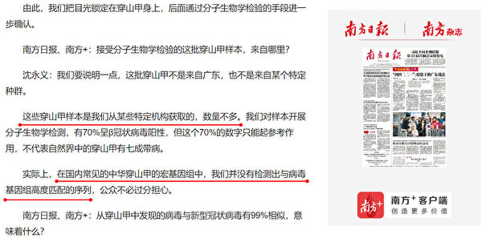

《南方日报》报导截图

该团队成员、华农兽医学院教授冯耀宇在接受另一家大陆传媒财新网的采访时，直言不讳地表示，这批穿山甲实际是“应某些单位之邀”，为“判断病因”而获得的某些样品，且样品量“并不是特别大”。

财新网报导截图

显然，这批穿山甲是一批具有特殊性的样本，因为沈永义坦承，他们自己搜集的国内常见的中华穿山甲样本中，并未发现这样的病毒。至于“某特定机构”为何主动找上门提供给他们这些特殊的样本，报导中没有提及。

在谈到“穿山甲冠状病毒如何感染人”这个最关键问题的时候，冯耀宇回答说：“这批穿山甲是一个特殊的群体，是有病症的。能否传染人，我们目前还不明确，需要相关部门的进一步研究验证。”

财新网的报导中更引述第三方专家的话指出，华农团队从穿山甲身上分离到的病毒基因序列中，还有大约4000个没有测序、尚不明确的核苷酸（新冠病毒约有29410个核苷酸），仍需进一步分析。报导并说，要确定穿山甲为新冠潜在的中间宿主，专家认为“需要更多证据”。

既然证据不足，穿山甲冠状病毒能否感染人的关键问题也不确定，甚至在蝙蝠如何感染了穿山甲的过程也不清楚的情况下，华农团队为何要贸然宣布穿山甲就是中间宿主、就是无数专家正千方百计寻找的从蝙蝠到人之间的那座“桥梁”呢？

华农专家在接受《南方日报》采访时承认，一般科学家会先发表学术论文，然后才宣布成果，这次论文还没写就先开新闻发布会宣布结果，是“为了响应国家的号召”，并且“对我们而言压力非常大”。

病毒专家董宇红女士对此质疑：如果这几只被认为是“中间宿主”的穿山甲并非来自广东，它们是如何进入云南蝙蝠山洞中，感染了三个病毒株，然后又如何历尽跋涉将病毒带回广东，最后又穿越千山万水回到湖北武汉引发疫情的呢？

<b>五、武汉病毒所：舆论风暴中心的P4实验室</b>

对石正丽团队研究成果的质疑，使外界追索病毒来源的目光逐渐聚焦在武汉病毒所。毕竟，这里拥有中国病毒研究领域最高等级的P4实验室。

从武汉整个疫情爆发伊始，武汉病毒研究所保持了一种反常的安静。这个病毒研究所从诞生那时起，就经历了一系列的波折，似乎在预示这个研究所注定会不平凡。

1月23日，武汉刚宣布封城，法国“挑战网”即刊登文章[15]，披露了中法合作于武汉设立P4实验室的诸多令人不安的细节。

文章指，由于法国是全球病毒研究领域的领先国家，早在2003年，中国科学院就向法国政府提出协助中国开设最高等级的病毒研究中心的要求。中方的要求曾引发法国政府及病毒专家们之间的分歧，因为尽管中国病毒中心可以打击突发传染病，但有法国专家担心中共会使用法国技术来研制生物武器，法情报部门当时向政府提出严正警告。

在时任总理拉法兰的支持下，中法双方于2004年在一片争议声中签署了合作建设P4病毒中心的协议。

法国对外安全总局警告，法国里昂的一家建筑设计所RTV原定负责该实验室的工程，但2005年中共官方选择武汉当地设计所IPPR（中元国际工程有限公司）负责该工程，而根据法国安全部门的调查，IPPR设计所与中共军队下属部门有密切关联，这些部门早已是美国中央情报部门的监督目标。

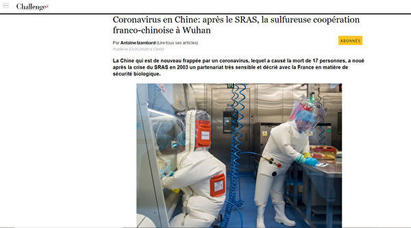

法国挑战网关于武汉P4实验室的报导截图

公开资料显示，IPPR（中元国际工程有限公司）创建于1953年，隶属于中共大型央企、世界500强企业——中国机械工业集团有限公司（国机集团）。国机集团是中共机械工业规模最大的大型央企集团，与中共军方关系密切，其下属12个部门中，设立有专门的“军工管理办公室（科技发展部）”。

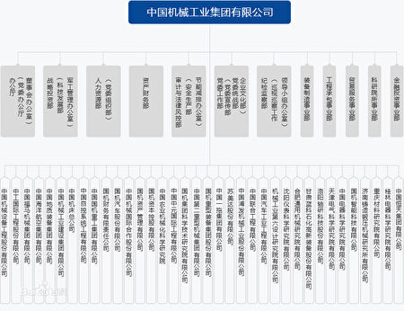

中国红十字会前项目高管李原接受自由亚洲电台的采访指出，中科院武汉病毒所从建设之初，透明度就严重不足。该P4实验室图纸由法国提供，原设计是层层负压，在病毒实验室中心形成一个“黑洞”，外界所有东西只向中心流动而不会反向流动泄露出来。

李原认为，中方不让法方施工，目的就是要新建不让法方知道的东西。

与此同时，有美国媒体认为，这些“不让法方知道的东西”与生物武器有关。

1月24日，《华盛顿时报》（Washington Times）刊发了一篇记者比尔‧戈茨（Bill Gertz）对前以色列军事情报官员丹尼‧肖汉姆（Dany Shoham）的采访报导[16]。肖汉姆在采访中明确表示，武汉病毒研究所与北京的秘密生物武器项目有关。

肖汉姆拥有医学微生物学博士学位，1970年到1991年期间，他在以色列军事情报部门担任高级分析师，领中校军衔，负责中东和世界的生物及化学战议题。作为生物战专家，肖汉姆毫不隐讳地指出，武汉肺炎这种致命传染病可能在全球范围内传播，而其来源就是与中共秘密生物武器计划有关的武汉实验室。

他表示，中共一贯否认拥有任何进攻性生物武器，但美国国务院在去年的一份报告中指出，怀疑中共政府从事秘密生物战研发计划。

肖汉姆进一步指出，武汉病毒研究所隶属于中国科学院，但该研究所中的某些实验室与中共军队或中共生物武器项目有关。而且该研究所并非唯一的存在，中共还有另外三个研究所在从事生物武器方面的开发。

很早以前，中共即已进行生物武器研发。1993年，中共公布了武汉第二个生物领域的机构——武汉生物制品研究所。这是中共于1985年加入的《生物武器公约》（BWC）涵盖的八个生物战研究机构之一。

肖汉姆还明确表示，SARS病毒总体上已被纳入中共生物武器项目，而武汉的P4实验室还储存着许多致命病毒，包括埃博拉（Ebola）、尼帕（Nipah）和克里米亚-刚果出血热（Crimean-Congo hemorrhagic fever）病毒。

尽管中共对有关武汉病毒所的不利传闻实施了全面的封杀，但国内同样不断传出质疑的声音。

2月3日，大陆名为“武小华”的人士在微博上实名发帖，质疑石正丽涉嫌人工干预病毒，并披露大陆医学实验室普遍管理混乱，实验动物有的成为宠物，有的被卖，甚至很多直接被吃掉。

2月4日中午，多益网络董事长徐波又在微博上发布长文，宣布实名举报中科院武汉病毒研究所涉嫌泄露病毒导致2019新冠状病毒疫情爆发。

2月7日，法广引述大陆消息指，有中共军方“首席生化武器专家”之称的军事医学科学院生物工程研究所所长陈薇，已经正式接管武汉病毒研究所P4实验室。

2月14日下午，习近平主持举行中共全面深化改革委员会第十二次会议。在这次会上，习近平第一次提出，把生物安全纳入国家安全体系，系统规划国家生物安全风险防控和治理体系建设，同时，还要尽快推动出台生物安全立法，加快构建国家生物安全法律法规体系、制度保障体系。

目前，武汉新冠肺炎的疫情仍然在全世界蔓延。这场从武汉爆发的世纪瘟疫已经被认为是自西班牙流感以来，对人类威胁最大的传染病。而更为严峻的情况是，处于疫情爆发中心的中国大陆，诸多重要信息依然不透明，其中包括至关重要的病毒来源问题。

2月5日，美国国会众议院首次就有关问题召开听证会。其间多位议员质疑北京当局隐瞒中国境内疫情状况，并指世界卫生组织（WHO）所扮演的角色正失去公信力。

2月13日，美国国家经济委员会主任库德洛在白宫接受记者采访时表示，美方对其专家未受邀前往中国应对疫情以及中方缺乏信息透明度，均感到“有点失望”。而美国总统川普（特朗普）同日亦公开提到，虽然他对北京有信心，但也了解中国官员不愿提供资讯，“我认为，他们想粉饰太平。”

稍早，美国广播公司ABC在2月6日报导说，鉴于有关武汉疫情的真假信息泛滥，要求美国科学家和医学研究人员调查武汉冠状病毒的来源。白宫科研政策办公室（OSTP）主任凯尔文‧德罗格迈尔（Kelvin Droegemeier）向美国国家科学院、工程院以及医学院发信，要求专家与科学家们尽快查出新冠病毒的源头，更好地了解冠状病毒在动物／人类间传播以及环境等各个方面的问题，以便为将来的疫情做准备。

国际社会的介入正在释放积极信号，或许新冠病毒（COVID-19）的来源之谜，会在不久的将来得到揭示，让人们能够有更充分的信心面对这场灾难。

（新冠病毒探源调查组由一批关心新冠病毒疫情的海外专家、学者组成。）

*****
[1]  “Clinical features of patients infected with 2019 novel coronavirus in Wuhan, China”, https://www.thelancet.com/journals/lancet/article/PIIS0140-6736(20)30183-5/fulltext

[2] http://china.caixin.com/2020-02-05/101511802.html

[3] “Biorxiv. Full-genome evolutionary analysis of the novel coronavirus (2019-nCoV) rejects
the hypothesis of emergence as a result of a recent recombination event. D. Paraskevis, et al. “, https://www.biorxiv.org/content/10.1101/2020.01.26.920249v1.full.pdf

[4] “A new coronavirus associated with human respiratory disease in China”,
https://www.nature.com/articles/s41586-020-2008-3. 【张永振论文全文编译：http://news.bioon.com/article/6749934.html】

[5] https://www.thelancet.com/journals/lancet/article/PIIS0140-6736(20)30251-8/fulltext
（Notably, 2019-nCoV was closely related (with 88% identity) to two bat-derived severe acute respiratory syndrome (SARS)-like coronaviruses, bat-SL-CoVZC45 and bat-SL-CoVZXC21, collected in 2018 in Zhoushan, eastern China, but were more distant from SARS-CoV (about 79%) and MERS-CoV (about 50%).）

[6] “Genomic characterisation and epidemiology of 2019 novel coronavirus: implications for virus origins and receptor binding”, https://www.thelancet.com/journals/lancet/article/PIIS0140-6736(20)30251-8/fulltext

[7]  “Genomic characterization and infectivity of a novel SARS-like coronavirus in Chinese bats”, https://www.ncbi.nlm.nih.gov/pmc/articles/PMC6135831/

[8] “Genomic characterisation and epidemiology of 2019 novel coronavirus: implications for virus origins andreceptor binding”, https://www.thelancet.com/journals/lancet/article/PIIS0140-6736(20)30251-8/fulltext#%20

[9]  “Genomic characterisation and epidemiology of 2019 novel coronavirus: implications for virus origins andreceptor binding”, https://www.thelancet.com/journals/lancet/article/PIIS0140-6736(20)30251-8/fulltext#%20

[10] “Clock and TMRCA based on 27 genomes”, http://virological.org/t/clock-and-tmrca-based-on-27-genomes/347

[11] “Angiotensin-converting enzyme 2 (ACE2) proteins of different bat species confer variable susceptibility to SARS-CoV entry”, https://link.springer.com/article/10.1007/s00705-010-0729-6

[12] “Isolation and characterization of a bat SARS-like coronavirus that uses the ACE2 receptor”, https://www.nature.com/articles/nature12711

[13] “A SARS-like cluster of circulating bat coronaviruses shows potential for human emergence”, https://www.nature.com/articles/nm.3985?fbclid=

[14] “A pneumonia outbreak associated with a new coronavirus of probable bat origin”, https://www.nature.com/articles/s41586-020-2012-7

[15] https://www.challenges.fr/entreprise/sante-et-pharmacie/coronavirus-en-chine-apres-le-sras-la-sulfureuse-cooperation-franco-chinoise-a-wuhan_695165.amp?__twitter_impression=true

[16] https://www.washingtontimes.com/news/2020/jan/24/virus-hit-wuhan-has-two-laboratories-linked-chines/

<a target="_blank" href=#top><h6 align="right">回上方</h6></a>

<a name=142>
<h1 align="center"><b>项云：关键时候中共国库从来不酷</b></h1>

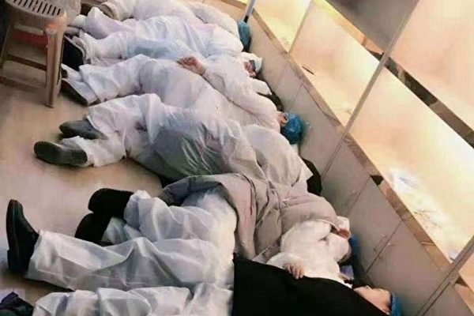

这就是社会主义的优越性？武汉一线医护人员躺在医院的地板上睡觉。（视频截图）

【大纪元2020年02月17日讯】国库当然是应急储备，战时用于军队和百姓之需，平时用于灾难救助，是明显两大用处。

中共国国库每到关键时候都不酷。人为“大饥荒”年代饿死数千万人不见国库开仓放粮，当时却见国库援助非洲粮食；南方“大雪灾”人们被困连空头食品这样基本救助也不见；一九九八年大洪水弄了个全国性捐款，从此中共把民间同情行为的自愿捐助，变成了官方无耻习惯性号召或示意；汶川地震全国大肆鼓动民间捐赠；后来每出现大小灾害，地方官宦就自动号召民众捐助，许多地区作为“政治任务”规定捐款数额，所谓政治任务就是强迫性捐赠，很是无耻。很多地方和很多单位规定既要捐款还要捐物，也不给捐赠人和捐赠单位任何凭证。是否有趁机发国难财的个人和单位呢？不然为什么大肆号召蔚然成风而不是自愿呢？官方也公开报道过官员贪污救灾款。改革开放所积累的庞大国库、雄厚财力，为什么号召捐赠呢？而且社会主义有个很大优越性之一据说是“能够随时集中调动财力物力办事，是万恶资本主义社会无法比拟的”，那调动各方财力轻而易举为什么非搞什么捐赠？

现在的武汉严重疫情同样不见国库发挥应有作用，“厉害国”可以对非洲一掷六百亿，对武汉仅投了十个亿。前方医护防护服和口罩都奇缺，生活物质贫乏，武汉红十字会竟然“明抢”中外的捐赠，让人深度怀疑其目的。广东省居然授权政府可以“征用个人财产”抗疫。广东省改革开放最早应该是最有钱的省份，库存哪去了？财政哪去了？武汉直到封城多时也不见官方集中财力物力支援的社会主义优越，倒是民间先行积极支援，还必须经红十字会盘剥后缓慢地才到医院或不到医院。

疫情尚未出现真正拐点，当局就要求陆续开工生产。一个号称第二大经济体的“厉害国”，怎么不敢向国人宣布“民众可以安心在家躲避疫情，我国半年不生产照样正常生活”。日常为占领国际市场的常态化“出口补贴”，补贴国内人民就不行了。人民纳税补贴出口赚了美国和西方人的钱，难道都补贴非洲和给官员共产了吗？

国库无用只能说明：要么被贪空，要么“宁给外鬼不喂家奴”。寻常百姓每每遇到困境休想指望“共了人民产”的政府，如此对待百姓如果发生了战争，老百姓会再继续甘当炮灰？百姓每每遇到困境中共维稳却能迅速跟上；媒体作秀摆拍忽悠人民舆情能迅速跟上；百姓困难的解决却不能迅速跟上。这就是中共的“为人民服务”和“社会主义的优越性”。如果中共“解放”了台湾，台湾与大陆就是一个命运，其国库也会照样掏空或不喂家奴。

<a target="_blank" href=#top><h6 align="right">回上方</h6></a>

<a name=141>
<h1 align="center"><b>法轮功学员传避灾的真相 遭警察诬陷迫害</b></h1>
 
 【大纪元2020年02月14日讯】2020年2月4日，中国吉林市永吉县法轮功学员孙志文，在外面贴“疫情凶猛 真言保命”的不干胶时，被监控摄像头拍到，遭永吉县“610”主任张博带警察绑架到城北派出所，并非法抄了家。

明慧网报导，孙志文家中的所有法轮功书籍被抄走。他在派出所不停地向警察们讲明法轮功真相，当晚回到了家。

之后，永吉县公安局、政法委、“610”（专门迫害法轮功的非法机构）人员，把拍摄孙志文贴“疫情凶猛 真言保命”真相不干胶的整个监控录像视频，发到许多民众的手机上。百姓在视频中清楚地看到“疫情凶猛 真言保命”的图片和文字（见下图）。

不干胶：“疫情凶猛 真言保命”（明慧网）

 
 在视频里，“610”人员诬陷孙志文是贴“反动标语”，还专门拍了警察非法抄家的画面，并诬陷法轮功和法轮功学员。

报导指出，“疫情凶猛 真言保命”不干胶黏贴（见上），就是在灾难面前，法轮功学员用祥和的图案善意地告诉人们疫情来时，诚念“法轮大法好 真善忍好”能保命、保平安，是给百姓传福音。

事实上，这也得到了证明。近日，明慧网报导了多则武汉肺炎患者诚念，诚念“法轮大法好”被治愈的实例。比如，一位男士过年前到武汉，封城后，设法往外冲。因周边的城市也被封堵，他不得不辗转到其它省，历经千辛回到家，但不敢与家人团聚，就自我隔离，希望14天后能回家。

不料，就在第14天时，他突然出现高烧、咳嗽、胸痛等“武汉肺炎”症状，人很快就倒下了。他打“120”电话向医院求救，但没人出诊。无奈，他打电话告诉儿子，自己快不行了。

他的儿子、妻子、岳母修炼法轮功。儿子告诉他念“法轮大法好”。他终于想起了法轮功，想起了在灾难面前，念“法轮大法好、真善忍好”这九字真言起到的救人的作用。

全家人都经历了难熬的一夜，第二天，他打电话告诉家人，自己的高烧已经退下来了，浑身大汗淋漓，让家人放心。他的家人个个激动不已。

明慧网评论说，自武汉瘟疫爆发后，中共一直千方百计地隐瞒疫情，欺骗老百姓，使疫情泛滥。永吉县公安局、政法委、“610”人员在疫情凶猛之际，不去安抚身处危难中的民众，而是向民众散布谎言，迫害帮助民众躲避灾难的法轮功修炼者，诬陷教人向善的法轮功。

<a target="_blank" href=#top><h6 align="right">回上方</h6></a>

<a name=140>
<h1 align="center"><b>【拍案惊奇】俄国政府文件：病毒非天然形成</b></h1>

目前俄罗斯的官方文件，也认为，这种新病毒不是天然形成，而是SARS冠状病毒与另外病毒的一种结合体。（新唐人合成）

【大纪元2020年02月17日讯】大家好，欢迎收看《新闻拍案惊奇》，我是大宇。
感染新病毒第一人被挖出？石正丽急否认

2月16日，大陆媒体《新京报》根据网上流传的一张截图报导说：武汉（新冠）病毒肺炎的零号病人是黄燕玲，为武汉病毒研究所科研人员，2012年考入武汉病毒研究所的硕士研究生。

“零号病人”就是指最早、第一个被新型冠状病毒感染的人。

在武汉病毒所2011年11月的一张研究生“拟录取名单”上，确实有来自西南交通大学的“黄燕玲”的名字。

根据《自由时报》等媒体引述YouTube网红的消息人士爆料，说黄燕玲此前，曾因实验室样本倾倒，病毒散入空气，她自己口罩经久未换从而失效，导致感染，并迅速在实验室内死亡，成为0号病人。而她的遗体被送往殡仪馆后，病毒又传染给了殡仪馆的工作人员，自此造成泄漏。

《新京报》向武汉病毒所研究员石正丽等人求证，但是他们的回答是，“不确定”病毒所里面是不是有叫黄燕玲的人。同时，黄燕玲的指导老师危宏平，说黄燕玲目前一切安好。

不过，截至发稿，武汉病毒所网页上黄燕玲的照片和简介都消失不见，但依据病毒所公告，可以确定黄燕玲是2012年由西南交大推荐进入这间病毒所工作的硕士。目前，还不知道为什么黄燕玲的内容会在病毒所网站消失。

而在接受采访时，石正丽又做了另一个保证，就是病毒所目前无一人感染新病毒。

在这之前，印度一名科学家发表了一期有争议的学术文章，说新病毒内有一部分是爱滋病毒的插入物，石正丽对此回应说“用生命担保”，病毒跟病毒所的实验室没关系。但实际上，相关的印度科学家并没有点名她和她的实验室。

现在石正丽已经做了双重保证，一，新病毒跟她的实验室没关系，二，病毒所截至她受访时，无一人感染。

<b>研究员被蝙蝠袭击 武汉疾控中心也涉病毒泄漏</b>

但在外界怀疑武汉病毒所泄漏病毒之外，目前又有一个新说法传出。就是武汉的新病毒，是来自当地另一个地方，距离华南海鲜市场仅280米的“武汉疾控中心”。而“华南海鲜市场”被认为是本次新病毒爆发的起源地之一。

这一消息是广州华南理工大学生物学教授肖波涛的论文揭示的，这篇论文2月6日发表在全球学术社交网站Research Gate。合作写论文的还有武汉科技大学附属天祐医院的肖雷。论文还得到政府基金会的赞助。

论文引述以前的官方资料，称武汉疾控中心的研究员，曾在湖北捉到155只蝙蝠，在浙江抓到450只蝙蝠。而且在2017和2019年，武汉疾控中心的相关研究员，还在蝙蝠身上发现活的虱子，自己先后两次自我隔离。一次是被蝙蝠袭击后，蝙蝠血滴在他的身上，还有一次是因为沾到了蝙蝠的尿液。

论文进一步透露，武汉疾控中心研究员抽取野生动物的细胞组织，进行脱氧核糖核酸（DNA）还有核糖核酸（RNA）的排序，这些组织样本还有因之污染的垃圾，都有可能成为病毒源头。同时，论文也没有排除，武汉病毒研究所也可能是病毒源头。

截至报导，肖波涛的这篇论文在Research Gate网站上已经找不到。那么这篇论文，最有价值的是，它揭示除了武汉病毒所外，举例华南海鲜市场更近的武汉疾控中心，也存在实验室活动，或者处理实验垃圾时发生意外，从而造成病毒泄漏。

目前这篇文章流出不知道是什么目的。有人说是提前放风，可能是帮武汉病毒所“转移视线”，也有其它说法。

<b>俄罗斯政府文件：病毒非天然形成</b>

无论如何，现在出现的消息，越来越接近“病毒泄漏说”。与此同时，还有一点也越来越明显，就是这个新病毒，并非天然形成，而是人工改造的。其实如果证明这一点，那也就能反过来说明，新病毒不是意外泄漏，那就是有意被放出，但目前看呢，意外泄漏的可能性更大。

有关新病毒非天然形成，我们有一个新的证据。在俄罗斯生活了25年，有医学背景的华裔企业家杨成，给我们节目，用录音解说的方式，介绍了俄罗斯联邦在网站上发布的一则文件，名字是《预防 诊断 治疗新型冠状病毒（2019-NCOV）》。第一版发表于1月29日。

2月3日还发表了第二版。以下杨成先生翻译和分析的内容，是根据第一版，但是相关内容在第二版中，并没有变化。下面我们来先听我对他的采访录音。

【非常非常细致，它一共是51页。这个文件是俄罗斯联邦官方网站上，双签名，一个是俄罗斯卫生部部长，一个是俄罗斯联邦消费者保护局的局长。

他们为什么要出这种文件呢，因为俄罗斯它是这样，它是一个从法律，从各种文件来讲，是非常严肃、非常严密的一个国家。俄罗斯它对医疗法和医生负责抓得非常严。医疗事故有专门的法庭，就是医疗事故法庭。像出现这种新型的传染病呢，会产生大规模的这种影响啊、治疗啊，产生以后的这种医疗事故，去怎么评判，所以他们急于必须出这么一个文件，是不出不行的。

它在一开始，就是序言当中，它所有文件当中使用的材料、数据，来自于世界卫生组织的专家，这个美国也好、中国也好、欧洲也好，就是分部中心吧，他们公布的官方数据。也就是所有他们这里面出现的数据啊、说法的基础。

它非常严谨地叙述了、描述了现在冠状病毒是一个什么样的东西。报告认为，新型冠状病毒，是一种由蝙蝠的冠状病毒和未知来源的冠状病毒，重新综合组成的病毒，并且，它的基因排列顺序，有70%跟SARS是相吻合的。也就是说它明确阐述，它不是天然来源，不是人类至今所知道的，天然来源的这种产物，它是一个综合体。

刚才才读到，我觉得这是一个非常严重的事情。至今为止，所有研究发现，人得到（感染）冠状病毒后产生的抗体，是极其不稳定的。而且，很容易，重新被感染。也就是说，你得了（感染）冠状病毒的话，自己用身体抗过去之后，并不代表你已经产生了冠状病毒的抗体，也不代表你不会再得病（被感染）了。

中共啊，让武汉这些，得了病的人（康复者）用血浆治（感染者），这很恐怖的一件事情。

第一，你取人的血液，这些人好了多长时间，是刚好的，还是好了一段时间的，这个差别都非常大。你比如说，人刚好，有可能，现在他还没有重新感染。如果他好了一段时间之后，你比如说，他好了两个星期三个星期之后了，再去（给别人）注射（血液），他这个东西（血液）有没有用。

第二，（给患者）注射进去（血液）之后，这些病人有好转，他在24小时之内、48小时之内有好转，那么两个星期、一个星期之内他好没好病？

这些东西是最关键的。所谓的好了，就是表现没了，症状没了。正常是因为什么呢，就是说他体内产生的抗体，足够抑制住他体内存在的新型冠状病毒。但这里它阐述的就是，他的抗体不稳定。你这个新产生的抗体，它一分解了，那你体内存在的冠状病毒，那它就可以重新（侵袭）你的身体，人又得病（感染）了。也就是人类所知道的冠状病毒，它的表象是这个样子。冠状病毒的来源，它（新型冠状病毒）属于这一科这一类，但除了这一类之外，它（新型冠状病毒）会不会有其它的，或者更强烈的，或者变异的其它东西呢，这个暂时我们是不知道的。如果从这个角度来看来讲呢，也就是说，很难做一个定义，就是说疫情过去了，疫情已经出现转折了，那你从科学角度来讲，就很难确定这件事情。

然后它（报告）还说一个什么呢，什么样的人容易得病。20%是糖尿病，15%是高血压，然后其它心血管疾病的是15%。

然后呢中国卫生组织注册的数据当中，（有）25%转重病例，这25%细分为：16%重病人，5%危病人，4%死亡病人。】

好了，刚才杨先生的录音，透露的最重要一点是，目前俄罗斯的官方文件，也认为，这种新病毒不是天然形成，而是SARS冠状病毒与另外病毒的一种结合体。

因此，这也就能解释，为什么这个新病毒像怪物一样，成了一种人类从未对付过的一种怪物。

<b>《柳叶刀》：携带病毒者可以是“健康人”</b>

权威医学杂志《柳叶刀》2月13日，又发表了北京301医院医师常德等人的论文，标题是“保护卫生保健工作者免受亚临床冠状病毒感染”。这里的亚临床指的是，感染新病毒但没有症状的患者。

比如，也是在2月13日，《自由亚洲》公布了一段武汉防疫部门的内部录音，当中有人说，看到中共国家卫健委的“保密函”才知道，这次疫情之所以难控制，是因为很多重症，到死都没有症状，连发烧都没有，所以防不胜防。

那回过头来看《柳叶刀》的新论文，它其中点出了至少新病毒的3个可怕之处：

第一，没有症状的人也可以高效传播新病毒；

第二，从急性疾病中恢复后仍会大量携带病毒并继续感染他人；

第三，传统的保护措施，例如口罩，已无法提供足够的保护，因应新病毒可能护目镜、隔离服都得上。

因为这种新病毒表现特异、可怕，因此有人还把它比作“生化武器”。当然有议论说它就是生化武器，但仍需要充分的证据来证明。

<b>防治瘟疫 大陆当局无能为力的“好办法”</b>

现在这个新病毒的真正来源，或者说起因吧，连美国白宫都很感兴趣，想要调查清楚。如果谁真的要担上这种人为责任，那是很严重的罪行。

2月15日，大陆党刊《求是》杂志，登出了习近平在2月3日中央常委会的讲话，提到自己在1月7日就对新病毒防控，提出了要求。《苹果日报》因此采访分析说，这不是习近平在撇清自己的责任，就是要向湖北当地官员兴师问罪。而我们在之前的节目里已经介绍了，现在湖北和武汉已经有官员陆续被撤换。

但是，真正的问题是向外推掉责任就可以彻底解决的吗？我采访了中国问题研究学者薛驰，他从另一个角度，分析了造成当前疫情大爆发，几乎不受控制的原因。巧的是，他自己就是一个武汉人。

【共产党，支部建在连上。它社会控制，进行网格化管理。它把一切公民的自发行为，都放到了它的对立面。它的社会控制极端化，它垄断一切资源的控制。国际社会的救援、全国各地的援助，都掌控在它手里，它要是给谁就给谁。那么这里面它怎么贪污受贿啊、它怎么滥用啊、应用不当啊，这都是属于它内部机密，谁泄露了还要把谁处理掉。那么，在任何一个正常社会里面，老百姓都会出现大批的自救组织，自救的活动，自救的行为，互助的行动。

在饥荒的时候，不准逃荒，跟现在武汉市的封城，不准逃命，你逃出去后，还进行全国性的追索。你传播传染病，还要判刑，最高可能判死刑，这是黑龙江已经发了个通知了嘛。这跟那个五六十年代，那个大饥荒逃命，针对的逃命措施是一模一样的。】

薛驰的分析指出了两个问题，一个是中共高度中央集权，造成的救灾措施僵化，不够灵活；另一个，就是与前一个观点相应，各国民间自发的这种救灾、互助活动，也是不可忽视的力量，但是在当前大陆的社会制度下，这个很难实现，什么都要靠政府。

<b>香港反送中 给武汉瘟疫防治的启示</b>

他的分析也让我想到，这种民众自发的力量，在民主的正常“公民社会”里，还体现在信息透明化上。

在报导这场新病毒瘟疫之前，我大量跟进了香港反送中运动。两相对比，我发现了一点很明显的差异。

在香港，它的社会，还是一个比较发达的公民社会，政府呢，目前还是一个半民主半极权的政府，在这样的情况，就催生出一个奇景。发达的公民社会，让参与香港反送中运动的年轻人，仍可以自由组织反对力量、甚至是政党，在区议会选举中，压倒性战胜建制派。在街头运动过程中，香港年轻人使用Telegram等通讯软件，非常成功有效的对街头抗议进行了组织。更重要的是，在开放的信息下，香港年轻人自由地把街头发生的一幕幕，通过聊天软件、脸书、推特等各种渠道，送到外界，让外面能了解到香港街头发生的实情。在这种公民社会下，拿着手机镜头的人，每一个都成了发达的自媒体。甚至是什么呢，这些年轻人，为了保证消息准确，还在通讯软件上自发组成了类似“反送中消息核实频道”这样的自发的、事实检验的群组，尽量让外界得到第一手的、准确的反送中资讯。

还不止于此，香港因为还保留言论的相对自由，除了公民作为个人积极主动向外界发送信息，香港也有很多正规的媒体，属于亲民主派，在发布与反送中年轻人立场相近的报导。此外，还有外国媒体，可以自由进入报导。

在香港媒体、公民、外国记者的众多人努力下，让反送中运动有了相对健康和持久的生命力，而且外界能够及时得到清晰、准确的资讯，让支持者运动的人可以根据情况进行声援。

但是我们反过来再看武汉，乃至大陆，公民基本上放弃了发声权，因为会被找去喝茶。仅有的例如方斌、陈秋实这样的公民记者，很快被打压。我们外界能得到的，只有官方统一口径的消息。由于资讯的不透明，连西方大媒体在报导时，都不得不时常引用所谓“网上消息”、“民众爆料”。

信息不透明也同时带来一个对称的问题，就是这些消息真假难辨，需要花时间核实。即使核实为真，为了保护爆料人安全，也不能公开姓名和来源，有时真的消息和画面，还要受到挑战，被中共水军拿来做文章。而且呢，也是因为信息的不透明，官方的辟谣，到底辟的是真相、还是谣言，外界也很难查证。它带来方方面面的影响。

然而，信息的透明，公民社会的发达，无论是有医学专业的社会组织自发组织营救，还是公民可以自发组成通讯群组，向外界发送求助信息，并且当地人自己之间，可以互动有无，这都会对疫情防治，有积极作用。

<b>避免方舱医院交叉感染 有简易可行之术</b>

其实，现在释放出来的有限消息，如果当局重视，已经就可以起到救人的作用。比如这段视频，新建好的雷神山医院，因为下雨变成了“水帘洞”，那官方看到了，如果它重视这个舆论压力，就应该立即去弥补。

我还得到了很多方舱医院的内部视频，经过几天，能发现里面的秩序，渐渐有了一点起色，但是还不够，特别是病人交叉感染的潜在危险，必须解决。现在看到大家还是睡大通铺，很多人仅仅戴着口罩防御，这都是不够的。

说到这，顺便说一下，一位我们的观众，应该是香港人，他提出了一个在方舱医院内消毒的好办法：紫光灯，Ultraviolet Light，方舱医院，很多病人聚在一起，很容易交叉感染。如果在天花板上安装很多紫光灯来杀菌（病毒）的话，就可以避免交叉感染。因为紫光灯不可以直接照射皮肤，你半个小时就躺在床上，用棉被把自己的头都盖住。用紫光灯照射几分钟，就可以把所有的细菌（病毒）都杀死啦。有比如说，不是厕所很污染吗。那么没人上厕所的时候，紫光灯就开着，有人上厕所的时候，紫光灯就关了，这样就可以杀死很多细菌（病毒）啊，就很安全哪。

大赦国际成员，加拿大阿尔伯塔大学的一名学生，给我们来信，抱怨说：有几千人被关在方舱医院隔离，但是他们并没有得到适当的医疗救助。没有人给他们药物或给他们打针，并且那里医生非常紧缺。其次，方舱医院里缺少完善的生活设施，比如厕所和取暖设施。有些病人声称他们要走两百米去上厕所，还有些病人声称，在晚上睡觉的时候非常的冷，并且由于电力系统经常短路的缘故，他们甚至无法使用自己的电热毯。我在此想呼吁政府为方舱医院中的患者提供合理的医疗援助和完善的生活设施体系。毕竟，轻症患者也是有人权的。

另外呢，这名学生还说：政府不应当通过警察和暴力手段，在光天化日之下，当街强行抓人。在中国有句古话叫做己所不欲，勿施于人。请问，假如生病的是你们，你们真的希望自己也被这样非人的对待吗？还有，当政府在一栋居民楼里发现感染者后，便强行焊死大门，阻止全楼的人出入。这是强行把健康的人和感染者拘禁在一起，妨碍了他们的出行自由，毕竟大家还要工作和生活。并且还会无谓的增加楼里健康的人被感染的风险。因此，我在此想呼吁政府尽早停止使用这些不人道的手段。

以上，都是一位阿尔伯塔大学学生的心声。

<b>Telegram信息安全的警示</b>

刚才我们举相关言论自由的例子时，还提到了Telegram，我们收到这样一个例子，一位大陆观众的朋友，在前几天被公安请去喝茶了，原因就是他在Telegram群组里发表了一些过激言论，而警方利用技术手段探测到了他的电话号码，他提醒各位用Telegram的朋友，请要注意隐私保护，Telegram也不一定十分安全。

新唐人《新闻拍案惊奇？制作组

<a target="_blank" href=#top><h6 align="right">回上方</h6></a>

<a name=139>
<h1 align="center"><b>新冠疫情失控 中共政府失能 民间发起自救</b></h1>

武汉封城后，交通工具停摆，社区不派车，很多病患无法到医院就医。图为封城后街上空荡荡的武汉。(Stringer/Getty Images)

 
 【大纪元2020年02月17日讯】（大纪元记者李新安采访报导）由于新冠状病毒肺炎（又称武汉肺炎）疫情武汉封城被指毫无准备，医药、民生等物资匮乏。大量病患得不到安置和医治，社区居委会、街道、疫情指挥部被指失灵，民间不得不发起自救行动。

一名武汉市爱家国际华城小区的居民在网上求助，她于2月12日确诊染新冠肺炎，双肺感染、呼吸急促、高烧39度不退。由爱家社区上报危重加急，但未能入院。疫情指挥部要求由社区上报和平街道，再由街道报告指挥部送医。然而社区上报和平街道后，街道称只能等待走程序。

大量病患都陷入了这种“死循环”。不少病患及家属都表示，社区冷漠、不派车，只会让他们等。有患者反复填写申请表，联系社区街道、打热线电话。110、120都不派人来，说要社区安排，互踢皮球。有的人最终病逝家中，还有的人跳楼自杀。

财新网报导引述两名社区书记的话说， 从1月23日封城至2月1日的10天内，社区对新冠病人的救助很有限，上级部门没有提供实质帮助，社区又没有医院资源。

网友表示，“这叫‘等死’。”“层层压，最后压到社区。可怜的社区，人、财、物都没有。咋解决？”“恐慌+医疗挤兑+封城+又恐慌+进一步医疗挤兑……….”“听说过‘无为而治’，见识了‘无能而治’……”

网友“joie0313”表示，“社区，只是他们抵挡染疫人潮的人盾。120最多的时候每天15,000个求助电话，医院门诊的座位都被挤没了，更别谈床位。殡仪馆加班24小时动转，外地的几千名支援医护，杯水车薪……一线医护人员的口罩都不能保障，何况是病人的性命呢？坐视湖北人捂着相互传染烂掉，就是电影《卡桑德拉大桥》的车厢。”

<b>义工团体发起自救</b>

2月13日晚间，大纪元记者以患者家属身份拨通了一名义工的电话。对方说，“我们是一个义工团队，负责收集资料，把资料发给专门与医院对接的人员（也是义工，不需要费用）。”“我们可以把您的资料上传到医院，然后他们就可以安排床位。”

据介绍，义工团队来自一家企业，该企业是专做消毒用品等业务的，他们跟医院接了很多单，（提供）大量的物资，所以和医院有一些直接的关系。虽然也要排队，但是有优先权，目前排队大概一两天的时间。

社区安排等待时间普遍很长，特别是硚口区、青山区等几个区的病人很多。而义工团队一般就近为患者安排医院，以重症者优先。

“一天大概安排60%的（求助患者），现在求助人的蛮多。武汉十几个区，每个区不一样，每个区到我们这里来求助的每天都有一二十例。”她说，“我们一个小组有七八个人，都在做这个事情。”

大量病患在网上求助，大纪元记者随机调查发现，确有不少患者经过义工的帮助，住上了医院；也有少数是通过找社区理论、排队。

社区除了有少许特权外，其效率远不如民间组织。有分析认为，社区住院程序要求病人先通过社区卫生服务中心（社区医院），由社区医院转诊到指定医院，且规定患者不能跨区就诊。而义工团队充分利用自己的资源优势，在全市范围内协调安排，从而能够提高效率。

此前还有消息说，社区被限定了名额指标，每天只能上报三个确诊病人。这就造成初期大量病患被要求居家隔离，造成每天的确诊病例只有几十、上百。

<b>社区机能被指失灵</b>

 2月9日起，武汉官方发起“清零”行动，即要求确诊病人100%全部收治入院，疑似病人集中收治。然而，网上的求助依然层出不穷，得不到收治的患者走投无路，有的焦虑地想自杀。

武汉飞越疯人院事件的主角徐武，他的父亲也感染了武汉肺炎，医院要求老人在家里隔离。

2月14日徐武发推表示，“我父亲几天吃不了食物了，只能喝些水，人不行了，找不到车子，用轮椅推到几个医院，医生说病情严重只有住院治疗，但医院没床位要找社区协调解决，社区答复没办法解决。”

2月15日，徐武冒雨把父亲送到武钢医院打吊针，医院打算把老人转院到青山一门诊。谈到社区所起的作用，徐武只说了一句，“拖延时间害人性命。”

早有网友提出，看病不需要社区安排，让不专业的人做专业的事。日前，有武汉网友向记者确认，他们那里去医院不用经过社区卫生服务中心了，“社区除了统计体温，没什么实质性帮助。”也有武汉市民告诉记者，现在有些医院可以（直接）收治肺炎病患了。

<b>医生：医院若不是向社会求援 早就撑不下去了</b>

1月23日晚间，武汉各大医院绕过卫健委，首次向社会公开募捐医护物资。此后，武汉医院及医生向外界求援的信息不断。多名医生表示，如果不是社会捐助，早就撑不下去了。

武汉某间医院工作人员芹芹（化名）告诉大纪元记者，“我们有一段时间都断粮了。因为各个炒菜、做饭的点，都关了，更不要说吃饭啦，我们现在吃的菜，都是靠捐赠的。”“这一段时间，所有的物资，如果没有社会的捐赠，医院早就封掉啦。”

除医护物资短缺外，食物等物资供应也成大问题。一名武汉网友发贴称，“超市土豆都没得卖，速冻肉全部被抢光，网购又不派送。餐饮软件上，白砂糖、咸菜老干妈都抢空了。超市每天只营业三小时，进去先排队半小时……社区配送也无法覆盖这么多人口，很多小区居委会和不存在一样。”

<b>官方与民间空床位数据不一</b>

武汉卫健委官网公布的数据显示，2月12~14日，空床位为654、776､880，而据民间志愿者的统计数据，12-14日的空床位分别是473､ 645和783张。

民间与官方统计武汉定点医院的空床数量有出入。（网页截图）

官方与民间的统计数据有出入，且空床位都比出院人数要多，这差数让人质疑真实的死亡人数。有一种可能，就是新增加了床位。中共国家卫健委副主任王贺胜2月15日表示，将继续腾出医院部分的病房，征用部分场馆，改造为定点医院和方舱医院。

但是这些临时收治确诊患者的场所，医疗条件却并不到位。

武汉汉阳区的新冠肺炎病患杨先生告诉记者，他刚刚被安排到秦康同济医院，该院于2月8日被确定为确诊病例治疗点。公开资料显示，秦康同济医院是按照三级甲等标准新建的综合医院，被称为高端医疗中心。

但杨先生说，“这里条件差一点，现在医疗物资都紧缺。他们有医务人员，但是医疗设备都是……药物有吃，CT（电脑断层摄影）什么都还没有。是刚开的定点医院。”而杨先生的母亲在酒店隔离点，没有用药，只是隔离。

<a target="_blank" href=#top><h6 align="right">回上方</h6></a>

<a name=138>
<h1 align="center"><b>武汉人怒吼：不想再沉默 要反抗邪恶政权</b></h1>

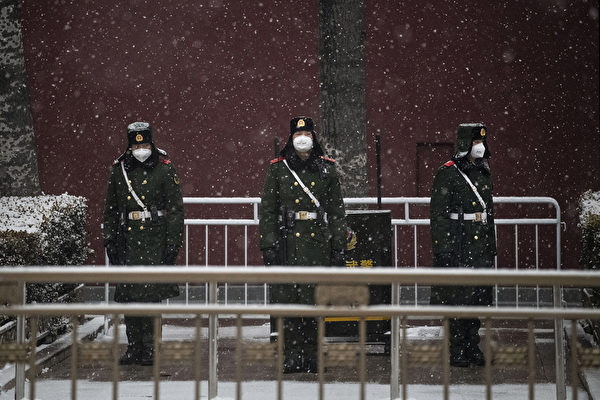

图为2月5日北京天安门广场附近站岗的警察戴着防毒面具。 （Getty Images）

【大纪元2020年02月16日讯】（大纪元记者李净报导）由于中共当局隐瞒疫情及防疫不力，致使武汉肺炎疫情失控，引发民怨沸腾。中共唯恐危及政权强力压制民间舆论，令民众反弹公开发声反抗暴政。

近日，一名武汉市民录制视频并强烈发声，她呼吁面对中共邪恶政权，不要再沉默了，一定要起来反抗。

这位女士表示：“武汉瘟疫，都是有计谋的发出来的瘟疫，因为（中共）政党里面都是你搞我、我搞你的事情（政治斗争），牺牲的是我们平民老百姓，我的家人、我的父母在家等死，没有人关心老百姓的性命。

“摆脱共产党的邪恶手爪，腐败的政权，邪恶的社会，没有一个人可以自由发声。只要有人发声，就会被拘留、判刑。他们说判刑多少年就判多少年，律师都没有用的，有正义的律师都被关起来。

  “我要告诉你们，革命肯定会有牺牲。我站出来，就是要为我的父母、我的家人、我的子孙后代能够自由地生活。我发声很危险，这我也知道，但是我已经受不了了。

“满院子的人在医院里面，没有病床，没有医药，CCTV（央视）讲的新闻全部都是假的。（医药里面）他们的吼声我看到了，我要发声，我要为自己发声，我要为武汉人民发声，我要为中国同胞发声。

“（中共）他们想要把养老金废掉，搞这些事情。这个邪恶的政权，我不想再沉默了！一定要反抗！同胞们，不能再让他们宰割、欺压了，为了下一代，真的要站起来呀！”

目前，大陆新型冠状病毒已扩散至全国。最早向社会公开疫情的不是中共卫健委等医疗机构，而是8名医生。但是，武汉警方以散布“谣言”为由将这8人查处，引发各方关注。迫于舆论压力，中共最高法院于1月28日发文，确认8名“传谣者”提前预警行为“有利无害”。

由于中共隐瞒疫情，网络成为民众获得真实资讯的重要渠道。但民间披露疫情、讨论疫情却遭到中共打压和封杀，甚至路人的手机讯息也遭到警方盘查。有评论指，国难当头，中共当局极力打压言论自由，令其公信力丧失殆尽。

一方面海内外的捐赠物资源源不断发往武汉，另外一方面，各大医院的防护用品仍然告急。被官方指定接收捐赠物资的中共红十字会成为众矢之的。近日，湖北省红十字会被曝私自截留“瓜分”援助物资，而当地的一线医生护士却苦求无果，令民怨沸腾。

中共当局在这次防疫行动中几乎处于混乱状态，官场人心涣散，各地频传基层官员为自保“临阵脱逃”的案例，引发大陆网民痛批。

瘟疫肆虐之下，大陆多地发生雨雪冰雹灾害。2月14日，武汉市急下暴雨，电闪雷鸣。有武汉市民表示，老百姓冤情太大了。

方斌被抓前最後一次演講錄影

他說，在邪惡的魔鬼政權下，沒有人是安全的，無論哪個階層，誰都沒有安全感。請大家一定要看到我們的力量，只要大家傳播真相，傳播方斌，明燈就在你們自己的手上，你們就會照亮整個中國。

請大家廣傳視頻。勇士不會孤單！中國才有希望！

“最大的问题不是眼前的瘟疫，而是被传播了几十年的精神瘟疫。

<a target="_blank" href=#top><h6 align="right">回上方</h6></a>

<a name=137>
<h1 align="center"><b>优秀校长 法轮功学员李桂荣被辽宁女监害死</b></h1>

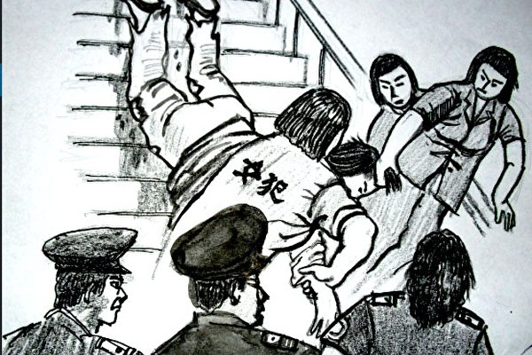

中共酷刑示意图：拖拽。（明慧网）

 
 【大纪元2020年02月16日讯】2020年1月中旬，原沈阳市大东区合作街小学优秀校长、法轮功学员李桂荣被辽宁省女子监狱迫害致死，终年78岁。

明慧网报导，李桂荣曾是辽宁省沈阳市大东区合作街小学校长，修炼法轮功后，遇事为他人着想，曾经把百分之五比例的涨工资机会让给其他同事。她把合作小学这个原来的乱摊子管理得井井有条，深受领导的器重和同事们的尊敬，曾被誉为“区十佳优秀校长”。

2006年10月17日，时年64岁的李桂荣在向人们讲述法轮功真相时，被沈阳市和平区“610”（中共为迫害法轮功专门成立的非法组织）人员绑架；2007年初，被沈阳市和平区法院枉判7年，被非法关押在辽宁省女子监狱三监区，遭受各种酷刑迫害。

狱警为了逼迫她“转化”（放弃修炼），指使狱霸和包夹（监管法轮功学员的刑事犯人）毒打她，对她拳脚相加、横踢乱踹，使她浑身被打得变成了青紫色；并用硬底鞋猛跺她的双手，她的手背立即肿起了青紫色的大包，。

有一次，恶人薅住她的头发满屋跑，大把大把的头发被薅了下来；还对她实施蹲刑迫害，让她蹲一天一宿半、蹲两天两宿半。在蹲的过程中，不让她吃饭、不让上厕所、不让睡觉。

包夹还把她的鞋脱掉，强迫她光着脚蹲在水泥地上，然后往其脚下泼凉水。两个包夹白天黑夜倒班看管她。她的双腿疼痛难忍，站也不行，坐也不行，瘫在地上，只能爬行。狱警队长又指使包夹把她打得满脸是血，然后塞到做服装的案板下面，让她长时间蹲着。
 
 

中共酷刑示意图：殴打、撞头。（明慧网）

 
 2013年10月17日，7年冤狱期满，李桂荣被迫害得身体虚弱、头发斑白、牙齿都掉光了。回到家后，她通过修炼法轮功，身体很快恢复了正常。沈阳市和平区“610”仍不断上门骚扰她，并强迫她抽血化验，被她严词拒绝。

2015年2月7日，73岁的李桂荣在市场上发法轮功真相资料时，被沈阳市浑南区公安分局五三派出所绑架、抄家。

同年6月24日上午，李桂荣被沈阳市浑南区法院非法庭审（已内定判李桂荣5年）；在法庭上，李桂荣为自己做无罪辩护，讲述自己修炼法轮功、做好人无罪。

在被枉判5年后，李桂荣被劫入辽宁省女子监狱老残队五小队迫害。她始终不放弃信仰。

2020年1月中旬，李桂荣在监狱医院被迫害致死，终年78岁。

据明慧网报导，截至2019年8月底，已知有53名60岁以上的老年法轮功学员被非法关押在辽宁省女子监狱遭受迫害。年龄在70岁以上的有15人，年龄最大者78岁；非法刑期最长达13年。

自1999年7月以来，辽宁省女子监狱使用阴毒的手段摧残迫害过数以千计的法轮功学员，其中至少45名学员已被迫害致死。2003年该监狱却被中共授予所谓的“国家部级监狱”称号。

<a target="_blank" href=#top><h6 align="right">回上方</h6></a>

<a name=136>
<h1 align="center"><b>中国各省揭竿而起？湖南又传《独立宣言》</b></h1>

由于中共隐瞒，导致武汉肺炎疫情失控，感染死亡人数超乎外界想像。（HECTOR RETAMAL/AFP via Getty Images）

 
 【新唐人北京时间2020年02月17日讯】中共隐瞒疫情导致武汉肺炎疫情恶化，引发民众愤怒，继有网民发布“武汉临时政府湖北独立宣言”后，目前网路又传《湖南独立宣言》，内容显示有志之士在长沙建立“湖南临时政府”，呼吁各省起义推翻共产党后，共建民选国会，再造联邦共和体制。

中国海外媒体《品葱网》、《良知传媒》与推特（Twitter），10日起疯传1份《湖南独立宣言》，内容炮轰中共实行的集权专制每当灾难发生，只能草菅人命维持暴政，一再堵民口耳，缚民手脚，让民众失去第一时间自我警示、自我救助的机会和能力。

该宣言指出，中共数据显示湖南感染人数超过800人，但确切人数应该高出许多，当前局势“湘江告急，岳麓危怠，我湘人唯有自救自立”，先前湖北省武汉市已有人号召各界揭竿而起，成立武汉临时政府，而湖南108年前，是首个响应民国武昌起义，光复长沙，宣告独立的地区。

<h3 align=center><a href="https://twitter.com/cc_pover/status/1227852212019355648?ref_src=twsrc%5Etfw%7Ctwcamp%5Etweetembed%7Ctwterm%5E1227852212019355648&ref_url=https%3A%2F%2Fwww.ntdtv.com%2Fgb%2F2020%2F02%2F17%2Fa102778953.html">#湖南独立宣言(点击右键,另存新档）</a></h3>

该宣言强调，现在应效仿民国先驱，“响应武汉临时政府20200202湖北独立宣言，庚子起义，成立湖南临时政府，宣告湘省独立，脱离中共暴政”。

该宣言表示：“我们恳切呼吁全国各省各地的仁人志士，借此良机，响应鄂湘，奋起自救，聚起洪流，毕功此役，推翻暴政。而后各省聚义，重行约法，共建民选国会，再造宪政民主自由之联邦共和！”

此前，2月2日，海外知名女作家盛雪在推特上发布“武汉临时政府湖北独立宣言”，宣言称：今日，2020年02月02日，我们一群血性武汉人，为夺回民权，再造共和，效仿辛亥革命武昌起义的先驱，在此郑重宣告成立武汉临时政府，宣布武汉独立、湖北独立！独立于中共暴政之外！

武汉临时政府命令，所有武汉市的官员、湖北省的官员，脱离中国共产党的指挥，通过公开或秘密渠道向本临时政府报到，看守现有岗位职责，服从本临时政府的指令，并静候改组。

<h3 align=center><a href="https://twitter.com/ShengXue_ca/status/1223849972501749760?ref_src=twsrc%5Etfw%7Ctwcamp%5Etweetembed%7Ctwterm%5E1223849972501749760&ref_url=https%3A%2F%2Fwww.ntdtv.com%2Fgb%2F2020%2F02%2F17%2Fa102778953.html">武汉临时政府命令，所有武汉市的官员、湖北省的官员，脱离中国共产党的指挥，通过公开或秘密渠道向本临时政府报到，看守现有岗位职责，服从本临时政府的指令，并静候改组。(点击右键,另存新档）</a></h3>
 
 网友纷纷响应武汉独立、湖北独立的呼声：

“天大的喜讯！”

“要宣布湖北才行，武汉是首都！我是湖北人，我加入，我支持！”

“新型的武昌起义，湖北人，自己救，互救。只要政府人员参与了武昌起义，这武昌起义必定成功。”

“不为刀俎，则为鱼肉，是反抗的时候了。”

“我坚信共匪会在三个月内垮台、灭亡，出台方案，成立临时政府，湖北独立，中华联邦制……这是顺应天意！”

“武汉加油，打倒共产党！”

<a target="_blank" href=#top><h6 align="right">回上方</h6></a>

<a name=135>
<h1 align="center"><b>防疫还是大屠杀？湖北孝感挨家钉死大门(视频)</b></h1>

近日，某地封户堵门上新台阶。几名男子挨家挨户把居民的大门钉死。（视频截图）

 
 【新唐人北京时间2020年02月17日讯】随着武汉肺炎疫情蔓延，中共地方当局各自为政。除封城外，更推出封门断网抓人等极端措施。近日，某地封户堵门上新台阶。几名男子挨家挨户把居民的大门钉死。网友质问，要搞大屠杀吗？

武汉疫情肆虐中国大地，疫区湖北及众多省市都采取了封闭管理，小区被封， 公寓楼被封，村落被封。尽管中共声称为，为市民组织生活物资配送，但不少网友反应，当局没有提供居民购物买菜的配套措施，不少人正在挨饿。

湖北省政府16日宣布，全省城乡所有村组、社区、屋苑及居民点实行24小时最严格封闭管理，所有非必须公共场所一律关闭，一切群众性聚集活动停止。

当天，有网友发视频并附文说，无限放大的权力和愚昧的管控方法，这病毒是靠堵门就能消除的吗？

<h3 align=center><a href="https://twitter.com/MgOqkzLBRPLCHyN/status/1229029667140620288?ref_src=twsrc%5Etfw%7Ctwcamp%5Etweetembed%7Ctwterm%5E1229029667140620288&ref_url=https%3A%2F%2Fwww.ntdtv.com%2Fgb%2F2020%2F02%2F17%2Fa102778964.html">無限放大的權力和愚昧的管控方法，這病毒是靠堵門就能消除的嗎？(点击右键,另存新档）</a></h3>

视频显示，几名疑似政府人员挨家挨户把每一家人的大门，用几根大铁棒和大木棍钉死。视频中传出嘭嘭嘭，钉门的巨响。许多大门口均停有私家车，应该算是中国的中产阶层。

有网友留言说，地点是湖北孝感，“钉门的说胯子走疼了，就是腿走疼了”。

有网友怒问，“想饿死人吗？杀人极权CCP可耻！”

“这是要把人饿死，然后搞大屠杀吗？”

“邪恶的体制向全世界展示他们邪恶的本性！”

“这些被封门的人都不会反抗吗？严重违法了！！即便是疫情期间，万一有火灾啥的，如何逃生？”

“一直不懂把门钉上的逻辑，万一里面的人真得病，甚或死了，难道放火把屋子给烧了？那些人到底是怎样想的？”

“越是未开化的乡村越恐怖，一，可以向上级多收保费用，二，可以趁机收拾平时不听话的人，三，被封的越多，他的权力越大！”

“现在，还没睡死的人应该看见，文革2.0版来到时，红卫兵造反派的专业水准却退步都0.01了，抬头发现也难怪，毕竟新一辈的毛伟人都是-1版。可笑又悲哀！”

“一场瘟疫撕裂了民间所有的凝聚力，封门堵路、相互举报、驱离湖北人，道德完全沦丧，自私自利！毫无怜悯之心，毫不同情别人！”

<h3 align=center><a href="https://twitter.com/liu_xiaoyuan/status/1222480689641033728?ref_src=twsrc%5Etfw%7Ctwcamp%5Etweetembed%7Ctwterm%5E1222480689641033728&ref_url=https%3A%2F%2Fwww.ntdtv.com%2Fgb%2F2020%2F02%2F17%2Fa102778964.html">明明说了要“全面依法治国”，为何遇上疫情就不讲法律，不讲法治了？(点击右键,另存新档）</a></h3>

在此之前，武汉人在家中被贴封条，被用木条、铁链封堵家门的图片和视频大量涌现。

有武汉工作的人回到家乡，被村民用木板钉死在屋内隔离。

有人的家门被乡亲用大木柱子钉死。

还有文革大字报重现小区。在河北某小区，悬挂着“小区1号楼2单元有武汉来人请勿接触”这样的的横幅。

视频中，有人用喇叭对着武汉住户高喊，“请自觉在家进行隔离，不要影响他人健康！出门腿打折！”

1月15日，有武汉网友发出的求助信息显示，武汉恐很快要出现人道危机，大规模饿死人都可能出现。有网友预计，当要出现饿死的情况时，中共就会实施武汉全境断网。

网友表示，因为封城3个多星期了，家里储备的一点点食物快要耗尽了。而小区都实施了封闭式管理，每一户要出门买东西都有限制，而且每个人出去的时候都提心吊胆的，生怕把病毒带回家。不出去呢，要饿死；出去呢，又怕得病死。没有活路了！

也有网友透露，即使到了商场，一次采购的东西也很有限。而有的小区实施派送，根本就不能到位。

经济学者财经冷眼发推文说：封路封村封城，蔬菜和水果运不出去倒掉；城里的蔬菜水果排长队难求！这样下去要出大问题。

一边武汉城内有人面临饿死买不到食物，一边是养殖城的食物运不出去卖不掉。

对比中国民间的冷血与中共的邪恶，也有网友晒出美国学校写给家长的信。

信中说，“每个人都会生病，不要因此孤立中国人和任何和中国有联系的人，更不要歧视生病的人，因为这样会让病人为自己生病而感到羞耻，从而隐瞒病情，不保护他人。我们防的是病毒，而不是中国人。越是危难之时，越需要冷静、理智、人性、团结。”

<a target="_blank" href=#top><h6 align="right">回上方</h6></a>

<a name=134>
<h1 align="center"><b>武汉肺炎未息 4000亿蝗虫逼近中国边境</b></h1>

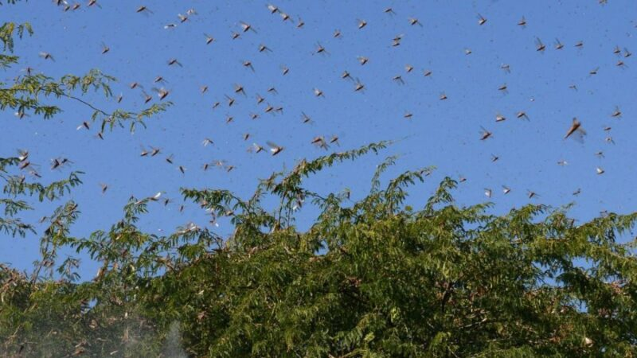

蝗虫灾害示意图。(SAM PANTHAKY/AFP via Getty Images)

【新唐人北京时间2020年02月17日讯】武汉肺炎疫情未解，非洲蝗灾已蔓延到巴基斯坦、印度直逼中国，联合国粮农组织更呼吁全球戒备，引起中国民众关注。虽有专家指蝗灾不至于侵袭中国，但饱受疫情影响的中国民众仍半信半疑。

隶属中国科学院的“中国科讯”日前披露这项讯息，并直指巴基斯坦和印度“作为中国邻邦，其境内的蝗灾对中国是否存在威胁，又如何防御和治理，是现在需要关注的一个问题”。

根据联合国粮农组织（FAO）资料，这波非洲蝗灾根源于2018年夏季在阿拉伯海形成的飓风。在飓风侵袭沿岸国家后导致环境改变，使蝗群于同年秋冬至2019年间逐渐在东非形成，且隔海蔓延到中东，并在2019年下半年逐渐入侵巴基斯坦及印度。

FAO在11日公开发布预警，呼吁全球高度戒备这场蝗灾，防止受灾国家出现粮食危机。

隶属中国科学院的“中国科讯”日前披露，巴基斯坦目前正遭到来自非洲及伊朗的蝗虫同时入侵，创下巴国27年来未见的蝗灾。官方已表示，蝗灾若再再发展下去，全国将会无粮可收。因此，巴基斯坦已宣布进入紧急状态。

至于印度，日前有4000亿只蝗虫侵袭印度拉吉斯坦（Rajasthan）省，导致大量农作物被毁，并有向其他地区蔓延之势。有印度学者预测，蝗灾将使印度粮食减产30%至50%，引发印度官方担忧。

接受中国科讯采访但未具名的专家表示，全球飞蝗有7个亚种，中国常见则是东亚飞蝗、亚洲飞蝗和西藏飞蝗，而肆虐印巴两国的蝗灾应属非洲沙漠蝗或地中海飞蝗。在中国历史上，非洲蝗虫曾在云南造成危害，但没有形成重大蝗灾。

专家说，目前非洲蝗虫从印度直接进入中国的可能性不大，因为其生存条件在中国并不完全具备，且中国拥有地理上的天然屏障，但不能掉以轻心，要密切关注印巴蝗虫的迁飞路径，以及是否有本地虫源的参与。如果蝗虫群继续朝东到达缅甸，就极有可能对中国及东南亚地区造成直接威胁。

另一名专家指出，中国历史上蝗灾频繁，危害极大。但中共建政后，中国科学家已基本解决了蝗灾的危害，几十年来没有发生过大的蝗灾。

这一消息被中国网路平台及媒体转载后，引起许多中国民众关切。其中不少人表达诸如“中国已经被新冠（武汉）肺炎折腾够了，不能再有蝗灾了”，“希望政府拿出办法事先防范，不要重蹈覆辙（指武汉肺炎疫情）了”的意见。

也有网友表示，中国官方这次（指蝗灾）“终于学乖了，晓得事先透风，先让百姓知道”；然而，部分网友则质疑非洲蝗灾不至于侵袭中国的看法，认为“武汉肺炎殷鉴不远”、“小心驶得万年船”、“不能再粉饰太平了”。

<a target="_blank" href=#top><h6 align="right">回上方</h6></a>

<a name=133>
<h1 align="center"><b>武汉病毒研究所所长密件曝光 国家卫健委元旦下令禁报疫情</b></h1>

图为武汉病毒研究所所长王延轶及其丈夫舒红兵。（网络合成图片）

【新唐人北京时间2020年02月17日讯】本周日，中国网络社群朋友圈中突然热传一张截图，显示中科院武汉病毒研究所所长王延轶曾于1月2日给研究所人员发电邮，要求严禁对外披露与武汉不明原因肺炎疫情的相关研究资讯，并强调这是“国家卫健委”提出的要求。之前有人以中科院“知情人士”身份向海外披露，指王延轶的丈夫舒红兵是江绵恒的重要马仔，通过其妻间接掌控武汉病毒研究所这一涉及军工生化武器的重要地盘。正当武汉疫情水深火热，湖北武汉省市两级政府一把手均被免职之际，上述消息被曝光十分耐人寻味。

网曝王延轶电邮揭开有人隐瞒武汉疫情黑幕的一角

当地时间2月16日，微信公众号“你房叔”发帖称，今天在朋友圈广为转发的一条消息，很是耐人寻味，消息的主体是武汉病毒研究所所长王延轶给该研究所全员发布的一封邮件的截图。

从截图上看，这封邮件的发送日期为2020年1月2日上午10点28分，题为“【重要提醒】关于严谨披露武汉不明原因肺炎相关信息的通知”，主要内容有3个要点：1.不明原因肺炎已经引发了社会恐慌；2.病毒研究所的相关研究工作正在开展；3.国家卫健委要求，严禁向媒体、自媒体、社交媒体及合作的技术公司等披露任何有关这次肺炎疫情的研究资讯。

帖文表示，如果这封邮件属实，说明国家卫健委在1月2日之前就对这次肺炎疫情作出内部指示，要求不得向外界公布，以免引发恐慌。

（网络截图）

这张据信为王延轶给武汉病毒研究所全员发布的邮件截图一经曝光，立即引起公众的极大关注。不少网友表示这张截图的“信息量很大”，背后的深意值得仔细分析揣摩，并表示等待王延轶出面对此消息作出解释。

武汉疫情黑幕重重 背后另有政治搏杀？

值得注意的是，在北京当局拿下湖北省和武汉市两级官场“一把手”及湖北省卫健委“一、二把手”之前，国外科学家对武汉新型冠状病毒研究后已经发现，该病毒有很大可能性是人工制造的病毒，而海内外舆论的矛头很快就指向了P4级别的武汉病毒研究所。

2月4日中午，多益网络董事长徐波在微博发布长文，高调宣布实名举报中科院武汉病毒研究所涉嫌泄漏病毒导致2019新冠状病毒疫情爆发。罕见的，他的这篇十分敏感的举报长文竟然在相当一段时间内没有被中共网管删除。

而在此之前，独立评论网站2月1日发表了帖文，爆料武汉病毒研究所所长王延轶的丈夫中科院院士舒红兵是中共前党魁江泽民的儿子江绵恒的重要马仔，指王某本人只不过是受其丈夫操纵的“花瓶”式人物。

资料显示：1967年出生的舒红兵工作后主要从事免疫相关细胞信号转导的研究，2011年当选为中国科学院院士,现任武汉大学教授、副校长、医学研究院院长。

2月7日，中科院上海生命科学研究院知情人士Q先生向《燕铭时评》证实，舒红兵确实是江绵恒马仔。该人士披露了江绵恒进入中科院系统后，通过建立由中科院、上海生科院、上海高校、上海医院、及军队医院、研究所联合组成的上海帮生工系统利益圈，操控生物领域重大研究项目的立项及巨额经费划拨，在医疗生物科技领域形成上海帮政商利益团体的内幕。

Q先生直言，舒红兵是上海帮生工系统利益圈中重要一员，被江绵恒安插到武汉大学，间接掌控中科院武汉病毒研究所这一涉及军工生化武器的重要地盘。

K先生表示，武汉病毒研究所所长王延轶只是前台木偶、小角色，她的任职是江绵恒通过中科院系统多个重要马仔操控所致，其背后除了其丈夫、江绵恒马仔舒红兵，还有江泽民家族及上海帮在上海和军队生工系统的重要代理人。

<a target="_blank" href=#top><h6 align="right">回上方</h6></a>

